# 第二十一章 一元二次方程

# 21.1 一元二次方程

# 知识点 1 一元二次方程的概念

【例 1】(教材 $P_{4}$ 练习 $T_{1}$ ) 将下列方程化成一元二次方程的一般形式, 并写出它的二次项系数、一次项系数和常数项:

(1) $5x^{2}-1=4x$ ;   
(2) $4x^{2}=81;$   
(3) $(3x - 2)(x + 1) = 8x - 3.$

【练 1】把下列方程化成一元二次方程的一般形式,并写出它的二次项系数、一次项系数和常数项:

(1) $3x^{2}=5x-1;$   
(2) $(x + 2)(x - 1) = 6$   
(3) $4-7x^{2}=0.$

# 知识点 2 一元二次方程的根

【例 2】(教材 $P_{4}$ 习题 $T_{7}$ ) 如果 2 是方程 $x^{2}-c=0$ 的一个根, 那么常数 c 是多少? 求出这个方程的另一根.

【练2】已知 $a$ 是方程 $2x^{2} - 3x - 1 = 0$ 的一个根，则代数式 $2a^{2} - 3a$ 的值为

# 知识点 3 依据实际问题列方程

【例 3】(教材 $P_{4}$ 练习 $T_{2}$ ) 根据下列问题, 列出关于 x 的方程, 并将所列方程化成一元二次方程的一般形式:

(1)一个矩形的长比宽多2,面积是100,求矩形的长x;  
(2)把长为1的木条分成两段,使较短一段的长与全长的积,等于较长一段的长的平方,求较短一段的长x.

【练 3】根据下列问题列方程,并将所列方程化成一元二次方程的一般形式:

(1)一个圆的面积是 $2\pi \mathrm{m}^2$ ，求半径 $r$   
(2)一个直角三角形的两条直角边相差 $3\mathrm{cm}$ , 面积是 $9\mathrm{cm}^2$ , 求较长的直角边的长 $x$ .

# 21.2 解一元二次方程

# 21.2.1 配方法

# 第1课时 直接开平方法

知识点 1 $x^{2} = p$ 型的方程

【例1】若 $x^{2} = 25$ ，根据平方根的意义，得 $x =$ \_\_\_\_, 即 $x_{1} =$ \_\_\_\_, $x_{2} =$ \_\_\_\_. 【练1】若 $(x - 1)^{2} = 25$ ，根据平方根的意义，得 $x - 1 =$ \_\_\_\_, 即 $x_{1} =$ \_\_\_\_, $x_{2} =$ \_\_\_\_.

知识点 2 可化为 $x^{2} = p$ 型的方程

【例 2】(教材 $P_{6}$ 练习) 解下列方程:
(1) $2x^{2}-8=0$ ;

(2) $9x^{2}-5=3$ .

【练 2】解下列方程:
(1) $49x^{2}-144=0$ ;

(2) $-7x^{2}+21=0$ .

知识点3 可化为 $(mx + n)^2 = p$ 型的方程

【例 3】(教材 P₆ 练习) 解下列方程:
(1) $(x+6)^{2}-9=0$ ;

(2) $x^{2}-4x+4=5$ .

【练 3】解下列方程:
(1) $(x-1)^{2}=2$ ;

(2) $2(x-2)^{2}-8=0$ .

# 第 2 课时 配方法

# 知识点① 配方

# 【例1】（教材 $\mathbf{P}_9$ 练习 $\mathbf{T}_1$ )填空：

(1) $x^{2}+10x+$ = $(x+$ ) $^{2}$ ;   
(2) $x^{2}-12x+$ = $(x-$ ) $^{2}$ ;   
(3) $x^{2}+5x+$ = $(x+$ ) $^{2}$ ;   
(4) $x^{2}-\frac{2}{3}x+$ \_\_\_\_= $(x-$ \_\_\_\_ ) $^{2}$ .

# 【练 1】填空：

(1) $x^{2}+6x+$ = $(x+)$ $)^{2}$ ;   
(2) $x^{2}-x+$ = $(x-$ ) $^{2}$ ;   
(3) $4x^{2}+4x+$ = $(2x+$ ) $^{2}$ ;   
(4) $x^{2}-\frac{2}{5}x+$ \_\_\_\_=(x-\_\_\_\_) $^{2}$ .

# 知识点2 用配方法解方程

# 【例 2】解下列方程：

(1) $x^{2}+10x+9=0;$

(2) $3x^{2}+6x-4=0.$

# 【练 2】解下列方程：

(1) $x^{2}-x-\frac{7}{4}=0;$

(2) $4x^{2}-6x-3=0$

# 21.2.2 公式法

# 第 1 课时 一元二次方程根的判别式

# 知识点① 判断根的情况

【例 1】(教材 $P_{17}$ 习题 $T_{4}$ ) 利用判别式判断下列方程的根的情况：

(1) $2x^{2}-3x-\frac{3}{2}=0;$

(2) $16x^{2}-24x+9=0.$

【练 1】不解方程,判断下列方程的根的情况:

(1) $5x^{2}=2x-\frac{1}{5}$ ;

(2) $3x^{2}+4x+6=0.$

# 知识点② 根的判别式的运用

【例 2】当 k 为何值时, 关于 x 的一元二次方程 $kx^{2}-2x+1=0$ 满足下列条件?

(1)有两个不相等的实数根；

(2)有两个相等的实数根；

(3)没有实数根.

【练2】（1）关于 $x$ 的一元二次方程 $2x^{2} + x - k = 0$ 有两个不相等的实数根，求 $k$ 的取值范围；

(2)关于 x 的一元二次方程 $mx^{2}-2x-1=0$ 有实数根, 求 m 的取值范围.

# 第2课时 公式法

# 知识点① 求根公式

【例 1】用公式法解一元二次方程 $3x^{2}=2x+3$ 时,首先要确定 a,b,c 的值,下列叙述正确的是()

A. $a = 3, b = 2, c = 3$   
B. $a = -3, b = 2, c = 3$   
C. a=3, b=2, c=-3   
D. $a = -3, b = -2, c = -3$

【练1】用公式法解一元二次方程, 得 $x = \frac{-5 \pm \sqrt{5^{2} - 4 \times 3 \times 1}}{2 \times 3}$ , 则该一元二次方程可能是()

A. $3x^{2} + 5x + 1 = 0$

B. $3x^{2} - 5x + 1 = 0$

C. $3x^{2} + 5x - 1 = 0$

D. $3x^{2} - 5x - 1 = 0$

# 知识点② 用公式法解方程

【例 2】(教材 $P_{12}$ 练习 $T_{1}$ )用公式法解下列方程:

(1) $x^{2}+x-6=0;$

(2) $\frac{1}{2} x^{2} - x + \frac{1}{2} = 0.$

【练2】用公式法解下列方程：

(1) $x^{2}+4x=2;$

(2) $x^{2}+2\sqrt{5}x+10=0.$

# 21.2.3 因式分解法

# 知识点① 因式分解

# 【例 1】把下列各式因式分解：

(1) 提公因式法: $am + bm + cm =$ \_\_\_\_ ;

(2) 平方差公式: $a^2 - b^2 = \_$ ; 完全平方公式: $a^2 \pm 2ab + b^2 = \_$ ;

(3)十字相乘法: $x^{2}+(m+n)x+mn=$ \_\_\_\_.

# 【练1】把下列各式因式分解：

(1) $x^{2}-4=$ \_\_\_\_ ;

(2) $x^{2}+xy=$ \_\_\_\_ ;

(3) $x^{3}+6x^{2}+9x=$ \_\_\_\_ ;

(4) $x^{2}-7x+12=$ \_\_\_\_.

# 知识点② 用因式分解法解方程

【例 2】(教材 $P_{14}$ 练习 $T_{1}$ ) 用因式分解法解方程 $x^{2} + x = 0$ .

【练 2】(教材 $P_{14}$ 练习 $T_{1}$ ) 用因式分解法解方程 $x^{2}-2\sqrt{3}x=0$ .

【例3】解方程 $3x^{2} - 6x = -3$

【练3】解方程 $(x - 4)^{2} = (5 - 2x)^{2}$

【例 4】解方程 $3x(2x+1)=4x+2$ .

【练4】解方程 $2x(x - 3) = 6 - 2x$

# 21.2.4 一元二次方程的根与系数的关系

# 知识点① 用根与系数的关系求值

<table><tr><td>【例1】(教材P16练习)不解方程,求下列方程两个根的和与积:(1) $x^{2}-3x=15$ ;(2) $3x^{2}+2=1-4x$ .</td><td>【练1】设一元二次方程 $x^{2}-2x-3=0$ 的两根为 $x_{1},x_{2}$ ,求下列代数式的值:(1) $x_{1}+x_{2}=$ ____, $x_{1}x_{2}=$ ____;(2) $x_{1}^{2}+x_{2}^{2}$ ;(3)( $x_{1}-2$ )( $x_{2}-2$ );(4) $\frac{1}{x_{1}}+\frac{1}{x_{2}}$ .</td></tr></table>

# 知识点 2 用根与系数的关系求待定系数的值

【例2】关于 $x$ 的一元二次方程 $x^{2} + 3x - m = 0$ 的两个根为 $x_{1}, x_{2}$ , 且 $x_{1} = 2x_{2}$ , 则 $m$ 的值为 \_\_\_\_.

【练2】若关于 $x$ 的一元二次方程 $2x^{2} - 3x - k = 0$ 的一个根为2，则 $k$ 的值为

# 知识点③ 根系关系与判别式相结合

【例3】若关于 $x$ 的方程 $x^{2} - 2(m + 1)x + m^{2} + 5 = 0$ 有两个实数根 $x_{1}, x_{2}$ , 且 $(x_{1} - 1)(x_{2} - 1) = 3m$ , 求实数 $m$ 的值.

【练3】若关于 $x$ 的方程 $2x^{2} + 4mx + m = 0$ 有两个不相等的实数根 $x_{1}, x_{2}$ , 且 $x_{1}^{2} + x_{2}^{2} = 3$ , 求实数 $m$ 的值.

# 21.3 实际问题与一元二次方程

# 第 1 课时 数字、循环、传播问题

# 知识点① 数字问题

【例 1】（教材 $P_{21}T_{2}$ ）两个相邻偶数的积是 168. 求这两个偶数.

【练1】一个两位数,个位数字比十位数字大3,个位数字的平方刚好等于这个两位数,则这个两位数是

# 知识点② 循环问题

【例 2】(教材 $P_{22}T_{6}$ ) 参加足球联赛的每两队之间都进行两场比赛, 共要比赛 90 场, 共有多少个队参加比赛?

【练 2】某次乒乓球比赛为单循环赛(每两队之间都赛一场), 计划分为 4 组, 每组安排 28 场比赛. 设每组邀请 x 个球队参加比赛, 则可列方程为()

A. $x(x + 1) = 28$

B. $x(x - 1) = 28$

C. $\frac{1}{2} x(x + 1) = 28$

D. $\frac{1}{2} x(x - 1) = 28$

# 知识点③ 传播问题

【例 3】(教材 P $_{19}$ 探究 1)有一个人患了流感, 经过两轮传染后共有 121 个人患了流感, 每轮传染中平均一个人传染了几个人?

【练3】(教材 $\mathbf{P}_{22}$ 习题 $\mathbf{T}_4$ )某种植物的主干长出若干数目的支干, 每个支干又长出同样数目的小分支, 主干、支干和小分支的总数是91, 每个支干长出多少小分支?

# 第 2 课时 平均增长率及利润问题

# 知识点① 平均增长率问题

【例 1】(教材 $P_{22}$ $T_{7}$ 变式)青山村种的水稻 2022 年平均每公顷产 7200 kg, 2024 年平均每公顷产 8450 kg, 求水稻每公顷产量的年平均增长率. 若设水稻每公顷产量的年平均增长率为 x, 则根据题意列出的方程为()

A. $7200(1+x)^{2}=8450$   
B. 7 200(1+2x)=8 450   
C. $7\ 200x + 720x^{2} = 8\ 450$   
D. $7200(1+x^{2})=8450$

【例 2】电影《哪吒 2》讲述了哪吒和敖丙并肩奋斗, 发出“逆天改命”最强音的故事. 某地第一天票房约 3 亿元, 前三天的票房收入达 10 亿元. 若把这三天的平均增长率记作 x, 则可列方程为 \_\_\_\_.

【练1】近年来,由于新能源汽车的崛起,燃油汽车的销量出现了不同程度的下滑,因此经销商开展降价促销活动.某款燃油汽车今年2月份售价为25万元,4月份售价为20.25万元.设该款汽车这两月售价的月平均降价率为x,则所列方程正确的是()

A. $25(1-x)^{2}=20.25$   
B. $20.25(1+x)^{2}=25$   
C. 20. $25(1 - x)^{2} = 25$   
D. $25(1-2x)^{2}=20.25$

【练 2】(教材 $P_{26}$ $T_{9}$ 变式)某商业银行为提高存款额,经过最近的两次提息,使一年期存款的年利率由1.96%提高至2.25%.设平均每次提息的百分率为x,可列方程为\_\_\_\_.

# 知识点2 利润问题

【例 3】商场将进价为 50 元/件的某种商品以 80 元/件出售时, 每天能卖出 30 件. 经调查发现, 每降价 1 元, 每天可多卖出 5 件, 每天盈利 1080 元.

(1)若设降价 x 元,则可列方程为 \_\_\_\_;  
(2)若设售价为 y 元/件,则可列方程为 \_\_\_\_.

【练3】某种服装,平均每天可销售20件,每件赢利44元.在每件降价幅度不超过10元的情况下,若每件降价1元,则每天可多售5件.如果每天要赢利1600元,每件应降价多少元?

# 第 3 课时 面积问题

# 知识点① 边框问题

【例1】（教材 $\mathbf{P}_{22}\mathbf{T}_8$ 变式）

如图,要为一幅长 29 cm,
宽 22 cm 的照片外部配一个相框,要求相框的四条

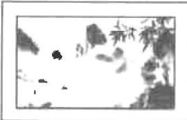

边宽度相等,且相框所占面积为照片面积的四分之一,相框边的宽度应是多少厘米?设相框边的宽度为 x cm,则可列方程为 \_\_\_\_.

【练 1】某中学有一块长 30 m, 宽 20 m 的矩形空地, 该中学计划在这块空地上划出三分之一的区域种

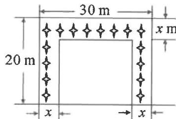

text_image

30 m
20 m
x
x
x m

花,设计方案如图所示,求花带的宽度.设花带的宽度为 x m,则可列方程为 \_\_\_\_.

# 知识点② 甬道问题

【例 2】(教材 $P_{22}T_{9}$ 变式)

如图,要设计一幅宽20 cm,
长30 cm的图案,其中有两
横两竖的彩条,横、竖彩条

的宽度比为 3:2. 如果要使彩条所占面积是图案面积的四分之一, 应如何设计彩条的宽度? 设竖彩条的宽度是 2x cm, 则可列方程为 \_\_\_\_.

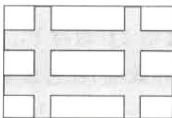

natural_image

Pure geometric pattern of interlocking rectangles and squares without any text or symbols

【练 2】如图,一块长和宽分别为 60 厘米和 40 厘米的长方形铁皮,要在它的四角截去四个相等的小正

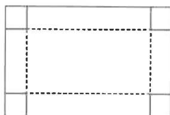

natural_image

Pure geometric diagram with dashed lines inside a rectangle (no text or symbols)

方形,折成一个无盖的长方体水槽,使它的底面积为800平方厘米,求截出的正方形的边长.设截去的正方形的边长为x厘米,则可列方程为

# 知识点③ 围墙问题

【例 3】(教材 $P_{26}T_{11}$ 变式)用一条长 40 cm 的绳子怎样围成一个面积为 $75 \, cm^{2}$ 的矩形(长大于宽)?

【练3】(教材 $\mathbf{P}_{25}\mathbf{T}_8$ )如图,利用一面墙(墙的长度不限),用 $20\mathrm{m}$ 长的篱笆,怎样围成一个面积为 $50~\mathrm{m}^2$ 的矩形场地?

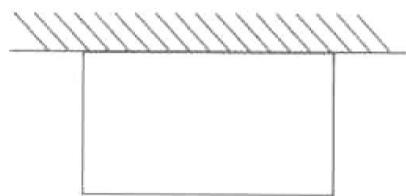

natural_image

Simple line drawing of a rectangular block with diagonal hatching above it (no text or symbols)

# 第二十二章 二次函数

# 22.1 二次函数的图象和性质

# 22.1.1 二次函数

# 知识点① 二次函数的概念

【例1】下列函数: ① $y = 2x^{2}$ ; ② $y = -x + 4$ ; ③ $y = -9x^{2} + 1$ ; ④ $y = 2x^{2} - 3x$ ; ⑤ $y = (x + 1)^{2} - x^{2}$ ; ⑥ $y = \frac{1}{x^{2}}$ . 其中是二次函数的是 \_\_\_\_. (填序号)

【练1】下列函数解析式中， $y$ 是 $x$ 的二次函数的是（ ）

A. $y = 2x$

B. $y = x^{2}$

C. $y = \pm \sqrt{x} (x > 0)$

D. $y = |x|$

# 知识点 2 二次函数解析式的一般形式

【例 2】指出下列二次函数解析式的二次项系数、一次项系数和常数项.

<table><tr><td>函数解析式</td><td>二次项 系数</td><td>一次项 系数</td><td>常数项</td></tr><tr><td>y=x2-2x-3</td><td></td><td></td><td></td></tr><tr><td>y=-0.5x2+2x</td><td></td><td></td><td></td></tr><tr><td>y=(x-2)(2x+1)</td><td></td><td></td><td></td></tr></table>

【练 2】写出下列二次函数解析式的二次项、一次项、常数项.

(1) $3y = 3(x - 1)^{2} + 1$   
(2) $y = -0.5(x - 1)(x + 4)$ ;   
(3) $s = -2t^2 + t + 3.$

# 知识点③ 列二次函数的关系式

【例 3】(教材 $P_{29}$ 练习 $T_{2}$ 变式) 如图, 矩形绿地的长、宽各增加 x m.

(1)写出扩充后的绿地的面积 $y$ 与 $x$ 的关系式；  
(2)y 是 x 的二次函数吗？如果是，写出二次项系数、一次项系数和常数项。

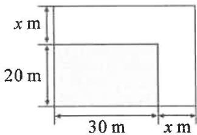

text_image

x m
20 m
30 m x m

【练3】如图,在靠墙(墙长为20m)的地方围建一个矩形的养鸡场,另三边用竹篱笆围成,如果竹篱笆总长为50m.设养鸡场垂直于墙的一边长为 $x(\mathrm{m})$ ,求鸡场的面积 $y(\mathrm{m}^2)$ 与 $x(\mathrm{m})$ 的函数关系式，并求自变量的取值范围.

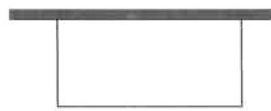

# 22.1.2 二次函数 $y = ax^2$ 的图象和性质

# 知识点1 画二次函数 $y = ax^2$ 的图象

【例 1】在平面直角坐标系中,画出函数 $y=\frac{1}{2}x^{2}$ 的图象.

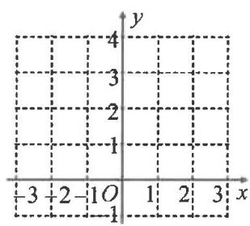

text_image

-3 +2 -1 O 1 2 3 x
-1
-2
-3
-4
1

【练1】在平面直角坐标系中,画出函数 $y = -\frac{1}{4}x^{2}$ 的图象.

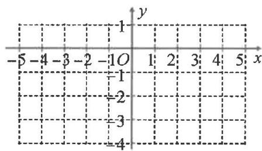

text_image

-5 -4 -3 -2 -1 O 1 2 3 4 5 x
-1
-2
-3
-4

# 知识点(2) 二次函数 $y = ax^2$ 的图象和性质

【例2】(教材 $\mathrm{P}_{32}$ 练习变式)函数 $y = 3x^{2}$ 的图象的开口 , 对称轴是 , 顶点坐标是 . 当 $x > 0$ 时, $y$ 随 $x$ 的增大而 ; 当 $x < 0$ 时, $y$ 随 $x$ 的增大而 ; 当 $x =$ 时, $y$ 有最 值.

【练2】函数 $y = -3x^{2}$ 的图象的开口 \_\_\_\_，对称轴是 \_\_\_\_，顶点坐标是 \_\_\_\_。当 $x > 0$ 时， $y$ 随 $x$ 的增大而 \_\_\_\_；当 $x < 0$ 时， $y$ 随 $x$ 的增大而 \_\_\_\_；当 $x =$ \_\_\_\_ 时， $y$ 有最 \_\_\_\_ 值。

【例 3】抛物线 $y=3x^{2}$ 与 $y=-3x^{2}$ 的形状 \_\_\_\_，且它们都关于 \_\_\_\_ 轴对称.

【练 3】下列抛物线中,开口最大的是()

A. $y = 2x^{2}$

B. $y = \frac{1}{2} x^2$

C. $y = -3x^{2}$

D. $y = -\frac{1}{3}x^{2}$

# 22.1.3 二次函数 $y = a(x - h)^2 + k$ 的图象和性质

第1课时 二次函数 $y = ax^{2} + k$ 的图象和性质

# 知识点① 二次函数 $y = ax^{2} + k$ 的图象和性质

【例 1】(教材 $P_{33}$ 练习变式)在同一平面直角坐标系中,画出下列二次函数的图象:

$$
y = \frac {1}{2} x ^ {2}, y = \frac {1}{2} x ^ {2} + 2, y = \frac {1}{2} x ^ {2} - 2.
$$

(1) 列表(略);  
(2) 描点并连线；

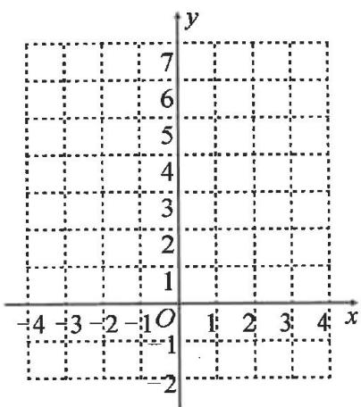

text_image

y
7
6
5
4
3
2
1
-4 -3 -2 -1 O 1 2 3 4 x
-1
-2

(3) 观察图象并填空.

<table><tr><td>抛物线</td><td>开口方向</td><td>对称轴</td><td>顶点坐标</td></tr><tr><td>y=1/2x2</td><td></td><td></td><td></td></tr><tr><td>y=1/2x2+2</td><td></td><td></td><td></td></tr><tr><td>y=1/2x2-2</td><td></td><td></td><td></td></tr></table>

【练1】在同一平面直角坐标系中画出二次函数 $y = \frac{1}{3} x^2 + 1$ 与二次函数 $y = -\frac{1}{3} x^2 - 1$ 的图象.

(1)从抛物线的开口方向、形状、对称轴、顶点等方面说出两个函数图象的相同点与不同点；  
(2)说出两个函数图象的性质的相同点与不同点.

# 知识点 2 抛物线 $y = ax^2$ 与 $y = ax^2 + k$ 之间的平移关系

【例 2】写出抛物线 $y=\frac{1}{2}x^{2}+k$ 的开口方向、对称轴和顶点，它与抛物线 $y=\frac{1}{2}x^{2}$ 有什么关系？

【练2】(1)将抛物线 $y=\frac{1}{2}x^{2}$ 向上平移2个单位长度,得到抛物线 \_\_\_\_;

(2)抛物线 $y=\frac{1}{2}x^{2}-2$ 可由抛物线 $y=\frac{1}{2}x^{2}$ 向 \_\_\_\_ 平移 \_\_\_\_ 个单位长度得到.

# 知识点① 二次函数 $y = a(x - h)^2$ 的图象和性质

【例 1】(教材 $P_{35}$ 练习变式)在同一平面直角坐标系中,画出下列二次函数的图象:

$$
y = \frac {1}{2} x ^ {2}, y = \frac {1}{2} (x + 2) ^ {2}, y = \frac {1}{2} (x - 2) ^ {2}.
$$

(1) 列表(略);

(2) 描点并连线；

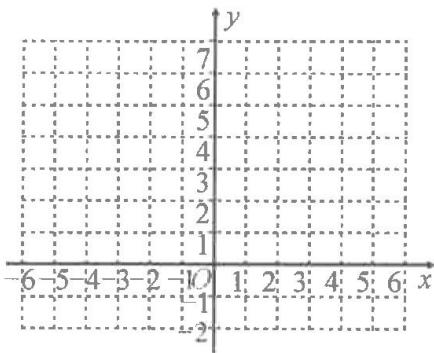

text_image

y
7
6
5
4
3
2
1
-6 -5 -4 -3 -2 -1 O 1: 2: 3: 4: 5: 6 x
-1
-2

(3) 观察图象并填空.

<table><tr><td>抛物线</td><td>开口</td><td>对称轴</td><td>顶点坐标</td></tr><tr><td> $y = \frac{1}{2}x^{2}$ </td><td></td><td></td><td></td></tr><tr><td> $y = \frac{1}{2}(x+2)^{2}$ </td><td></td><td></td><td></td></tr><tr><td> $y = \frac{1}{2}(x-2)^{2}$ </td><td></td><td></td><td></td></tr></table>

【练1】画出二次函数 $y = -(x + 2)^2$ 的图象，并指出它的开口方向、对称轴、顶点坐标.

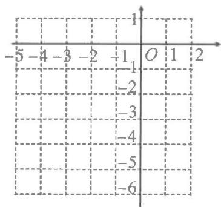

text_image

-5 -4 -3 -2 -1 O 1 2
-1
-2
-3
-4
-5
-6

# 知识点2 抛物线 $y = ax^2$ 与 $y = a(x - h)^2$ 之间的平移关系

【例 2】(1) 将抛物线 $y = \frac{1}{2} x^{2}$ 向 \_\_\_\_ 平移 \_\_\_\_ 个单位长度, 得到抛物线 $y = \frac{1}{2}(x + 2)^{2}$ ;

(2)抛物线 $y=\frac{1}{2}(x-2)^{2}$ 可由抛物线 $y=\frac{1}{2}x^{2}$ 向 \_\_\_\_ 平移 \_\_\_\_ 个单位长度得到.

【练 2】已知抛物线 $y = -3(x - 1)^{2}$ ，下列说法正确的有（）

①因为 a = -3 ，所以抛物线的开口方向向上；  
②顶点坐标为(1,0);  
③对称轴为直线 x=1;  
④把 $y = -3x^{2}$ 的图象向右平移 1 个单位长度得到 $y = -3(x-1)^{2}$ 的图象.

A. 0 个

B. 1 个

C. 2 个

D. 3 个

# 知识点① 二次函数 $y = a(x - h)^2 + k$ 的图象和性质

【例 1】(教材 $P_{41}T_{5}$ 变式)(1)在同一平面直角坐标系中,画出下列二次函数的图象:

$$
y = - \frac {1}{2} x ^ {2}, \quad y = - \frac {1}{2} (x - 2) ^ {2} - 2;
$$

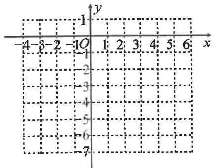

text_image

-4-3-2-10 1:2 3:4 5:6
y
x
-2
-3
-4
-5
-6
-7

(2)二次函数 $y=-\frac{1}{2}(x-2)^{2}-2$ 的图象开口 \_\_\_\_，对称轴是直线 \_\_\_\_，顶点坐标是 \_\_\_\_.  
(3) 当 $x = \_\_\_$ 时, 二次函数 $y = -\frac{1}{2}(x - 2)^2 - 2$ 有最 值, 其值为  
(4)二次函数 $y=-\frac{1}{2}(x-2)^{2}-2$ ，当 x>2
时，y 随 x 的增大而 \_\_\_\_；当 x<\_\_\_\_ 时，y 随 x 的增大而增大.

【练1】画出下列函数的图象,并写出它们的对称轴、顶点坐标.

$$
y = (x - 2) ^ {2} + 3, y = (x + 2) ^ {2} - 3.
$$

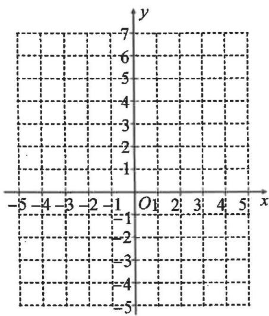

text_image

-5
-4
-3
-2
-1
0
1
2
3
4
5
x
y
-7
-6
-5
-4
-3
-2
-1
=1
=2
=3
=4
=5

# 知识点 2 抛物线的平移

【例2】将抛物线 $y = -\frac{1}{2} x^2$ 向 \_\_\_\_ 平移 \_\_\_\_ 个单位长度, 再向 \_\_\_\_ 平移 \_\_\_\_ 个单位长度, 可得到抛物线 $y = -\frac{1}{2} (x - 2)^2 - 2$ .

【练2】将抛物线 $y = x^{2}$ 向上平移2个单位长度,再向右平移1个单位长度,得到新抛物线的解析式是( )

A. $y = (x - 1)^{2} + 2$

B. $y = (x + 1)^{2} + 2$

C. $y = (x - 1)^{2} - 2$

D. $y = (x + 1)^{2} - 2$

# 22.1.4 二次函数 $y = ax^{2} + bx + c$ 的图象和性质

第 1 课时 二次函数 $y=ax^{2}+bx+c$ 的图象和性质

# 知识点① 二次函数 $y = ax^{2} + bx + c$ 的图象和性质

【例 1】(教材 $P_{41}T_{6}$ 变式) 已知二次函数 $y = -\frac{1}{2}x^{2} + 2x - 5$ .

(1)运用配方法将此函数配成 $y=a(x-h)^{2}+k$ 的形式是 \_\_\_\_；

(2)画出该二次函数的大致图象；

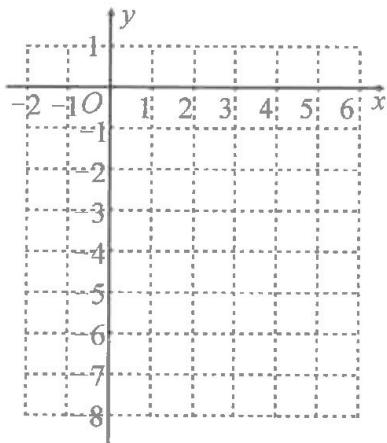

text_image

-2 -1 O 1: 2: 3: 4: 5: 6 x
-1
-2
-3
-4
-5
-6
-7
-8

(3)图象开口\_\_\_\_，对称轴是\_\_\_\_，顶点坐标是\_\_\_\_；

(4) 当 x = \_\_\_\_ 时, 函数有最 \_\_\_\_ 值是 \_\_\_\_;

(5)当 x > \_\_\_\_ 时, y 随 x 的增大而 \_\_\_\_;
当 x < \_\_\_\_ 时, y 随 x 的增大而 \_\_\_\_.

【练 1】(教材 $P_{39}$ 练习变式)确定下列抛物线的开口方向、对称轴和顶点坐标.

(1) $y = -x^{2} - 2x$ ;

(2) $y=\frac{1}{2}x^{2}-4x+3.$

# 知识点2 抛物线的平移

【例 2】将抛物线 $y=x^{2}+4x-1$ 先向右平移 3 个单位长度, 再向上平移 2 个单位长度后得到的抛物线的解析式是()

A. $y=(x-1)^{2}+3$

B. $y=(x-1)^{2}-3$

C. $y=(x+5)^{2}-7$

D. $y = (x + 5)^{2} - 3$

【练2】抛物线 $y = x^{2} + 2x - 3$ 是由抛物线 $y = x^{2}$ 经过怎样的平移得到的？

# 第 2 课时 用待定系数法求二次函数的解析式

# 知识点① 利用一般式求解析式

<table><tr><td>【例1】(教材P40练习变式)一个二次函数,当自变量x=0时,函数值y=-1;当x=-2与1/2时,y=0.求这个二次函数的解析式.</td><td>【练1】(教材P40练习变式)一个二次函数的图象经过(0,0),(-1,-1),(1,9)三点.求这个二次函数的解析式.</td></tr></table>

# 知识点 2 利用顶点式求解析式

<table><tr><td>【例2】已知二次函数的顶点坐标为(-2, 2),其图象经过(1,-1),求此二次函数的解析式.</td><td>【练2】已知二次函数  $y = ax^{2} + bx + c$  的图象经过点(1,5),对称轴为直线  $x=2$ ,最大值为6.求该二次函数的解析式.</td></tr></table>

# 知识点③ 利用平移求解析式

<table><tr><td>【例3】将抛物线 $y=3x^{2}+bx+c$ 向左平移2个单位长度,再向下平移3个单位长度,得到的抛物线的解析式为 $y=3(x+2)^{2}-1$ .求b,c的值.</td><td>【练3】将抛物线 $y=x^{2}-2x+2$ 沿x轴向左平移后经过点(3,10),求平移后抛物线的解析式.</td></tr></table>

# 22.2 二次函数与一元二次方程

# 知识点(1) 二次函数与一元二次方程

【例1】直线 $y = mx + n$ 与抛物线 $y = x^{2} + bx + c$ 交于 $A, B$ 两点，其中点 $A(2, -3)$ ，点 $B(5, 0)$ ，则关于 $x$ 的方程 $x^{2} + bx + c = mx + n$ 的解为 \_\_\_\_.

【练1】已知关于 $x$ 的一元二次方程 $ax^2 + bx + c = 5$ 的一个根为 $x = 2$ , 且抛物线 $y = ax^2 + bx + c$ 的对称轴是直线 $x = 1$ , 则方程 $ax^2 + bx + c = 5$ 的另一个根为

# 知识点 2 抛物线与 $x$ 轴公共点个数

【例 2】抛物线 $y = x^{2} + 3x - 1$ 与 x 轴交点的情况是（）

A. 有交点

B. 没有交点

C. 有一个交点

D. 有两个不同交点

【练2】二次函数 $y = x^{2} - \square x + 1$ 的图象与 $x$ 轴只有一个公共点，则“□”中的数可以为（）

A. 0

B. 1

C. ±2

D. 3

# 知识点 3 二次函数与不等式

【例 3】如图,二次函数 $y=ax^{2}+bx+c$ 的图象经过点 A(-2,0), B(4,0), C(0,-8). 则不等式 $ax^{2}+bx+c<0$ 的解集为 \_\_\_\_.

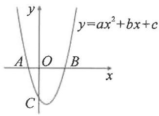

text_image

y
y=ax²+bx+c
A O B x
C

【练3】已知二次函数 $y = ax^{2} + 3ax + 4 (a \neq 0)$ 的部分图象如图，该图象过点 $A(-4,0)$ ， $B(1,0)$ ，则不等式 $ax^{2} + 3ax + 4 < 0$ 的解集为 \_\_\_\_.

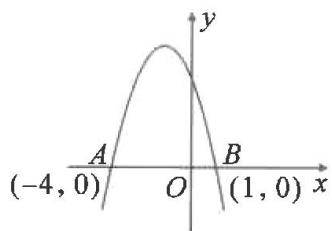

text_image

(-4, 0)
O
A
B
(1, 0)
x
y

# 22.3 实际问题与二次函数

# 第1课时 面积问题

# 知识点1 列函数关系式

【例 1】如图, 某建筑队在一边靠墙处, 计划用 15 米长的铁栅栏围成一个长方形仓库, 仓库总面积为 y 平方米, 在平行于墙的一边留下一个 1 米宽的缺口作小门, 若设 AB = x 米, 则 y 关于 x 的函数关系式为( )

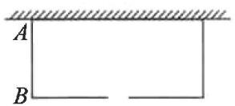

A. $y = x(15 - 2x)$   
B. $y = x(16 - 2x)$   
C. $y = x(14 - 2x)$   
D. $y = x(16 - x)$

【练1】如图, 正方形 $EFGH$ 的顶点在边长为 2 的正方形 $ABCD$ 的边上. 若设 $AE = x$ , 正方形 $EFGH$ 的面积为 $y$ , 求 $y$ 与 $x$ 的函数解析式.

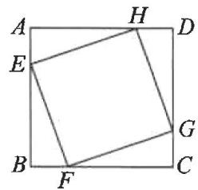

text_image

A
H
D
E
B
F
G
C

# 知识点② 面积最值问题

【例 2】(教材 $P_{57}T_{7}$ 变式) 如图, 用一段长为 30 m 的篱笆围成一个一边靠墙的矩形菜园, 墙长为 18 m. 设矩形菜园的边 AB 的长为 x m, 面积为 $S m^{2}$ .

(1) 写出 S 关于 x 的函数解析式, 并求出 x 的取值范围;  
(2)当该矩形菜园的面积为 $72 \, m^{2}$ 时, 求边 AB 的长.

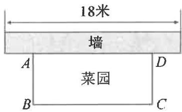

text_image

18米
墙
A
菜园
B
D
C

【练2】如图,在矩形ABCD中, $AB = 2$ , $AD = 3$ , 动点 $E$ 从点 $D$ 出发向终点 $A$ 运动, 连接 $BE$ , 以 $BE$ 为边在 $BE$ 上方作正方形BEFG, 在点 $E$ 运动的过程中, 求阴影部分的面积最小值.

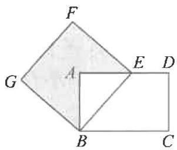

text_image

F
G
A
E
D
B
C

# 第2课时 利润问题

# 知识点 利润最值问题

【例 1】(教材 $P_{51}T_{2}$ ) 某种商品每件的进价为 30 元, 在某段时间内若以每件 x 元出售, 可卖出 $(100-x)$ 件, 应如何定价才能使利润最大?

【练1】河荫石榴果肉饱满，甘甜可口，享有中国国家地理标志产品的美誉。某商户购进一批石榴进行销售，进价为80元/箱，当销售价为120元/箱时，每天可售出20箱。经市场调查发现：每箱石榴每降价1元，平均每天可多售出2箱。

(1)每箱石榴降价\_\_\_\_元时,商家平均每天能盈利1200元;   
(2)每箱石榴降价多少元时,商家平均每天盈利最多?

<table><tr><td>【例2】(教材P52T8)某宾馆有50个房间供游客居住,当每个房间的定价为每天180元时,房间会全部住满.当每个房间每天的定价每增加10元时,就会有一个房间空闲.如果游客居住房间,宾馆需对每个房间每天支出20元的各种费用.房价定为多少时,宾馆利润最大?</td><td>【练2】某商品进价30元,销售期间发现,当销售单价定为40元时,每天可售出600个,由于销售火爆,商家决定提价销售.经市场调研发现,销售单价每上涨1元,每天销量减少10个.物价管理部门规定该商品的销售单价不低于40元,且不高于60元.将商品的销售单价定为多少元时,商家每天销售该商品获得的利润最大?最大利润是多少元?</td></tr></table>

# 第 3 课时 抛物线形问题

# 知识点 抛物线形问题

<table><tr><td>【例1】如图,一名男生将实心球从A处掷出,球所经过的路线是抛物线 $y = -\frac{1}{12}(x - 4)^{2} + 3$ 的一部分,则这个男生将球掷出的水平距离OB为____m.</td><td>【练1】如图是一个抛物线形拱桥,量得两个数据,若以抛物线的顶点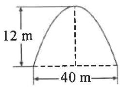为原点建立平面直角坐标系,其解析式为_.</td></tr><tr><td>【例2】如图,是一个抛物线形拱桥,以拱顶O为坐标原点建立平面直角坐标系,当拱顶O离水面BC的高OA=2m时,水面宽BC=4m.(1)求该抛物线的解析式;(2)当水面BC下降1m到达EF时,求水面宽度增加多少米?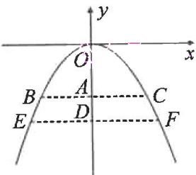</td><td>【练2】有一抛物线形拱桥,拱桥最大高度为6m,跨度为8m.如图1所示.(1)求这条抛物线的解析式;(2)如图2,当拱桥水位只有OC的一半时,求水面宽度DF的长.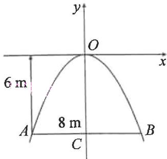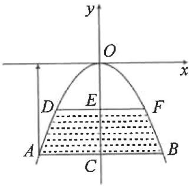图1 图2</td></tr></table>

# 第二十三章 旋转

# 23.1 图形的旋转

# 第1课时 旋转的概念与性质

# 知识点① 生活中的旋转

【例 1】下列现象中,属于旋转的是()

A. 地下水位下降

B. 传送带的移动

C. 汽车的直线行驶

D. 水龙头的转动

【练 1】下列运动不属于旋转的是( )

A. 大风车转

B. 火箭升空的运动

C. 关上教室门

D. 钟表的钟摆的摆动

# 知识点② 旋转的概念

【例 2】(教材 $P_{59}T_{2}$ 变式)时钟的时针在不停地旋转,从上午7时到上午10时,时针旋转的旋转角度数为\_\_\_\_,从上午8时到下午2时,时针旋转的旋转角度数为\_\_\_\_.

【例 3】(教材 $P_{59}$ 练习 $T_{3}$ 变式) 如图, 杠杆绕支点转动撬起重物, 杠杆的旋转中心是点 O, 旋转角是 \_\_\_\_ , 点 A 的对应点是点 \_\_\_\_.

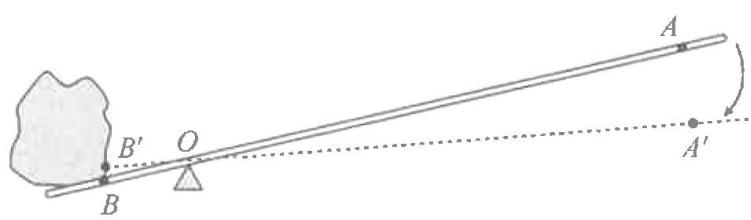

text_image

A
B'
O
B
A'

【练 2】一天中钟表时针从上午 6 时到上午 9 时旋转的度数为 \_\_\_\_。

【练3】如图,在 $\triangle ABC$ 中, $\angle ABC=\angle ACB=75^{\circ}$ ,将 $\triangle ABC$ 绕点 $C$ 旋转得到 $\triangle DEC$ ,若点 $A$ 的对应点 $D$ 恰好在 $BC$ 的延长线上,则旋转方向和旋转角可能为( )

A. 顺时针, $105^{\circ}$   
B. 逆时针, $105^{\circ}$   
C. 顺时针, $30^{\circ}$   
D. 逆时针, $75^{\circ}$

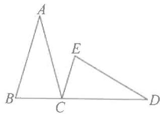

text_image

A
B
C
D
E

# 知识点③ 旋转的性质

【例 4】如图, 把 $\triangle ABC$ 绕点 C 顺时针旋转 $35^{\circ}$ 得到 $\triangle A'B'C$ , $A'B'$ 交 AC 于点 D, 若 $\angle A'CB = 105^{\circ}$ , 则 $\angle ACB'$ 的度数为 \_\_\_\_.

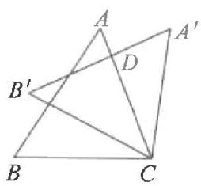

text_image

Geometric diagram showing triangle ABC with points D and B' on sides AB and AC, and point A' on side AC' connected by lines.

【练4】如图, 将 $\triangle ABC$ 绕点 $B$ 逆时针旋转一定的角度得到 $\triangle A'BC'$ , 当点 $C'$ 落在边 $AB$ 上, 且 $A'B = 12$ , $BC = 5$ 时, $AC'$ 的长为 \_\_\_\_.

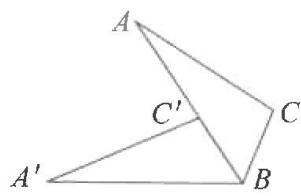

text_image

A
C'
C
A'
B

# 第2课时 画旋转图形

# 知识点① 旋转角

【例 1】(教材 $P_{63}T_{6}$ 变式) 把图中的五角星图案, 绕着它的中心旋转, 旋转角最小为 \_\_\_\_ 度时, 旋转后的五角星能与自身重合.

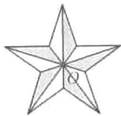

【练 1】(教材 $P_{61}T_{2}$ 变式) 如图, 用左面的三角形连续的旋转可以得到右面的图形, 每次旋转的角度是 \_\_\_\_ 度.

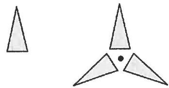

natural_image

Two abstract geometric shapes: a triangle and a three-pointed triangular structure with a central dot (no text or symbols)

# 知识点② 旋转中心

【例 2】如图,在正方形网格中,图中阴影部分的两个图形是一个经过旋转变换得到另一个的,其旋转中心可能是点\_\_\_\_(填“A”“B”“C”或“D”).

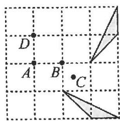

text_image

D
A B C

【练 2】如图, 在小正方形网格中, 将 $\triangle ABC$ 绕某一点旋转变换得到 $\triangle DEF$ , 点 A 的对应点为点 D, 则旋转中心为( )

A. 点 $M$

B. 点 $N$

C. 点 O

D. 点 $P$

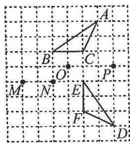

text_image

Geometric diagram with labeled points on a grid, showing triangles and perpendiculars at various intersections.

# 知识点③ 旋转作图

【例 3】(教材 $P_{62}$ 习题 $T_{4}$ 变式) 如图, 分别画出 $\triangle ABC$ 绕点 O 顺时针旋转 $90^{\circ}$ 和 $180^{\circ}$ 后的图形.

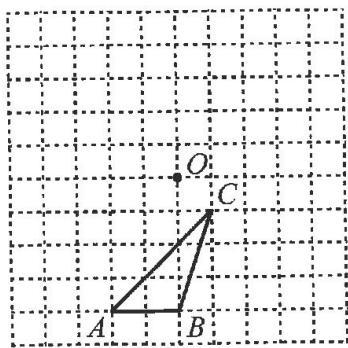

text_image

O
C
A B

【练 3】(教材 $P_{62}$ 习题 $T_{3}$ 变式) 如图, 在 $\triangle ABC$ 中, AB = AC, P 是 BC 边上任意一点, 以点 A 为旋转中心, 取旋转角等于 $\angle BAC$ , 把 $\triangle ABP$ 逆时针旋转.

(1)画出旋转后的 $\triangle ACQ$ ；  
(2)试说明 CA 平分 $\angle PCQ$ .

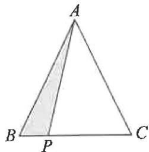

text_image

A
B P C

# 23.2 中心对称

# 23.2.1 中心对称

# 知识点 1 中心对称的性质

【例 1】(教材 $P_{64}$ 思考变式) 如图, O 是线段 $AA'$ , $BB'$ , $CC'$ 的中点. 下列结论不一定正确的是()

A. $\angle ABC = \angle A'C'B'$

B. $AC \parallel A^{\prime}C^{\prime}$

C. $BC = B^{\prime}C^{\prime}$

D. $\triangle ABC$ 与 $\triangle A'B'C'$ 关于点 $O$ 成中心对称

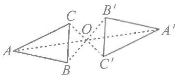

text_image

Geometric diagram showing two adjacent triangles with labeled vertices and internal points, likely illustrating a spatial or combinatorial geometry concept.

【练1】如图， $\triangle ABC$ 与 $\triangle A'B'C'$ 关于点 $O$ 成中心对称，则下列结论不成立的是（）

A. 点 A 与点 $A'$ 是对称点

B. $BO = B'O$

C. $AB = A'B'$

D. $\angle ACB = \angle C'A'B'$

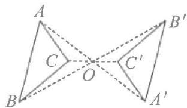

text_image

A
C
O
B
C'
B'
A'

# 知识点② 确定对称中心

【例 2】(教材 $P_{66}T_{2}$ 变式) 图中的两个四边形关于某点对称, 找出它们的对称中心.

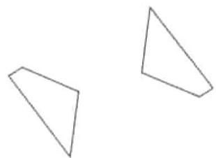

natural_image

Two simple geometric triangles drawn with thin lines on a white background (no text or symbols)

【练 2】如图,在正方形网格中,A,B,C,D,E,F,G,H,M,N 是网格线交点, $\triangle ABC$ 与 $\triangle DEF$ 关于某点对称,则其对称中心是()

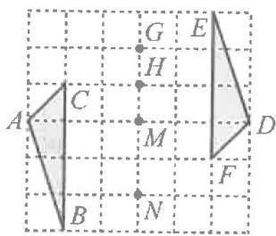

text_image

A
C
G
H
E
M
B
N
F
D

A. 点 G B. 点 H C. 点 M D. 点 N

# 知识点 ③ 画中心对称图形

【例 3】如图, $\triangle ABO$ 的顶点坐标分别为 O (0,0), A(3,2), B(3,0).

(1) 画出 $\triangle ABO$ 关于点 O 成中心对称的 $\triangle A_{1}B_{1}O$ ;

(2) 写出点 $A_{1}, B_{1}$ 的坐标.

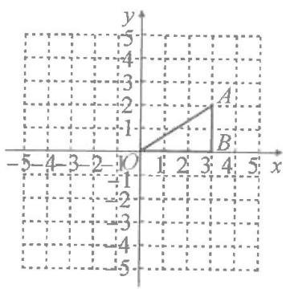

text_image

y
-5
-4
-3
-2
-1
A
B
-5 -4 -3 -2 -1 0 1 2 3 4 5 x
-1
-2
-3
-4
-5

【练 3】如图,在平面直角坐标系中, $\triangle ABC$ 的三个顶点坐标分别为 A(1,4),(4,2),C(3,5).

(1) 画出 $\triangle ABC$ 关于原点成中心对称的 $\triangle A_{1}B_{1}C_{1}$ ;

(2) 写出点 $A_{1}, B_{1}, C_{1}$ 的坐标.

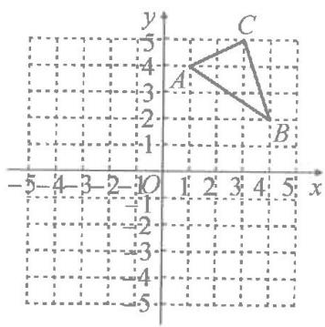

text_image

y
-5 5
-4
A
-3
-2
-1
B
-1
-2
-3
-4
-5
-5
-4
-3
-2
-1
0 1 2 3 4 5 x

# 23.2.2 中心对称图形

# 知识点① 中心对称图形

【例 1】下图分别是回收、绿色包装、节水、低碳四个环保标志,其中是中心对称图形的是( )

  
A

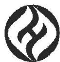  
B

  
C

  
D

【练 1】下列中国品牌新能源车的车标中, 是中心对称图形的是( )

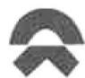  
A

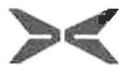  
B

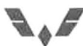  
C

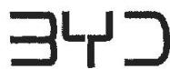  
D

# 知识点② 中心对称与轴对称图形

【例 2】下列图形是用数学家名字命名的,其中既是中心对称图形又是轴对称图形的是( )

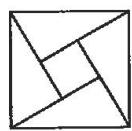  
A

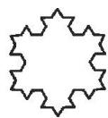  
B

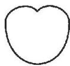  
C

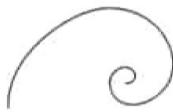  
D

【练 2】下列字母既是轴对称图形,又是中心对称图形的是( )

  
A

  
B

  
C

  
D

# 知识点③ 确定对称中心

【例 3】(教材 $P_{69}T_{2}$ ) 下列图形是中心对称图形吗？如果是中心对称图形，指出其对称中心.

  
禁止标志

  
风轮叶片

  
三叶风扇

  
正方形

  
正三角形

【练 3】(教材 $P_{70}T_{5}$ ) 如图, $O_{1}, O_{2}$ 分别是两个半圆的圆心, 这个图形是中心对称图形吗? 如果不是, 请说明理由; 如果是, 请指出对称中心.

text_image

O₁
O₂

# 23.2.3 关于原点对称的点的坐标

# 知识点① 关于原点对称的点的坐标

<table><tr><td>【例1】点A(0,-3)关于原点的对称点A′的坐标为____.</td><td>【练1】点M(2,-3)关于原点对称的点的坐标是____.</td></tr><tr><td>【例2】若点A(2,4)与点B(b,4a)关于原点对称,则a=____,b=____.</td><td>【练2】(教材P70T4变式)已知点A(a,1)与点A&#x27;(5,b)关于原点对称,则a+b的值为____.</td></tr><tr><td>【例3】在平面直角坐标系中,将点A(a-1,-3)绕坐标原点旋转180°得到点B(2,b+1),则a+b的值是____.</td><td>【练3】在平面直角坐标系中,将点A(m-2,3)绕坐标原点O旋转180°得到点A&#x27;(m+4,n-5),则(m+n)2025的值为____.</td></tr></table>

# 知识点 2 画对称图形

【例 4】如图, 在正方形网格中, $\triangle ABC$ 的三个顶点都在格点上, 点 A, B, C 的坐标分别为 $(-2, 4)$ , $(-2, 0)$ , $(-4, 1)$ .

(1)画出 $\triangle ABC$ 关于原点 $O$ 对称的 $\triangle A_{1}B_{1}C_{1}$ ;   
(2) 平移 $\triangle ABC$ , 使点 $A$ 移动到点 $A_{2}(0,2)$ , 画出平移后的 $\triangle A_{2}B_{2}C_{2}$ ;  
(3) $\triangle A_{1}B_{1}C_{1}$ 与 $\triangle A_{2}B_{2}C_{2}$ 成中心对称, 写出其对称中心的坐标.

text_image

y
A
C
B
O
x

【练4】如图， $\triangle ABC$ 的顶点坐标分别为 $A(-3,5), B(-4,1), C(-1,2)$ .

(1)画出 $\triangle ABC$ 关于原点O的中心对称图形 $\triangle A_{1}B_{1}C_{1}$ ;  
(2)画出 $\triangle A_{1}B_{1}C_{1}$ 绕原点 $O$ 顺时针旋转 $90^{\circ}$ 得到的图形 $\triangle A_{2}B_{2}C_{2}$ .

text_image

A
6
5
4
3
B
2
1
-6 -5 -4 -3 -2 -1 O 1: 2 3 4: 5: 6 x
-1
-2
-3
-4
-5
-6

# 23.3 课题学习 图案设计

# 知识点1 图案中的旋转角

【例 1】如图 1 是香港特别行政区的区徽平面示意图, 它可以看作是以图 2 作为“基本图案”通过旋转而设计的, 则“基本图案”绕点 O 依次旋转的角度分别为 \_\_\_\_.

  
图1

  
图2

【练1】如图,这个图案绕着它的中心旋转角 $\alpha(0^{\circ}<\alpha<360^{\circ})$ 后能够与它本身重合,则角 $\alpha$ 的度数可以为()

natural_image

Symmetrical decorative knot pattern with a dashed angle labeled α (no text or symbols beyond the angle marker)

A. ${40}^{ \circ  }$

B. ${50}^{ \circ  }$

C. ${60}^{ \circ  }$

D. ${70}^{ \circ  }$

# 知识点② 图案中的基本变换

【例 2】(教材 $P_{76}T_{2}$ ) 如图的图案是由什么基本图案经怎样的旋转得到的？

【例 3】(教材 $P_{70}T_{7}$ ) 如图, 能否通过平移、轴对称或旋转, 由 $\triangle ABC$ 得到 $\triangle DEC$ ?

text_image

A
E
B C D D B C
A
E

【练 2】下列图形,既可以由“基本图案”平移,也可以通过旋转得到的有()

  
①

  
②

  
③

  
④

  
⑤

A. 1 个

B. 2 个

C. 3 个

D. 4 个

【练3】如图， $\triangle A_{1}B_{1}C_{1}$ 可以由 $\triangle ABC$ 经过怎样的变换而得到？请简要说明变换过程.

text_image

B
B₁
A
A₁
C
C₁

# 第二十四章 圆

# 24.1 圆的有关性质

# 24.1.1 圆

# 知识点① 圆的有关概念

【例 1】如图,已知 $\odot O$ .

(1)线段\_\_\_\_是弦；  
(2)线段 是直径；  
(3)图中劣弧有\_\_\_\_，
优弧有\_\_\_\_。

text_image

A
O
B
C

【练1】如图所示,AB是⊙O的直径,CD是⊙O的弦,AB与CD相交于点E,则图中的弦共有\_\_\_\_条,分别是\_\_\_\_;共有劣弧\_\_\_\_

text_image

A
C     D
E
O
B

条;写出其中的两条优弧,如

# 知识点② 等半径的运用

【例 2】如图, $\odot O$ 的直径 AB 与弦 CD 的延长线交于点 E, 若 DE=OB, $\angle AOC=84^{\circ}$ , 求 $\angle E$ 的度数.

text_image

C
A
O
B
D
E

【练2】如图,AB是⊙O的直径,C是BA延长线上一点,点D在⊙O上,且CD=OA,CD的延长线交⊙O于点E.若∠C=20°,则∠BOE的度数为\_\_\_\_.

text_image

Geometric diagram showing a circle with points A, B, C, D, E and center O, including chords and tangent lines.

# 知识点③ 四点共圆

【例 3】(教材 $P_{80}$ 例 1) 如图, 矩形 ABCD 的对角线 AC, BD 相交于点 O. 求证: A, B, C, D 四个点在以点 O 为圆心的同一个圆上.

【练 3】如图,以 AC 为斜边作 Rt△ABC 和 Rt△ADC. 求证: A, B, C, D 四点在同一个圆上.

text_image

Geometric diagram of triangle ABC with perpendiculars from points D and B to line AC, labeled with points A, B, C, D, O.

# 24.1.2 垂直于弦的直径

# 知识点① 垂径定理的计算

【例 1】如图, $\odot O$ 的弦 AB = 6, 直径 CD ⊥ AB, 垂足为 M, OM = 1, 则 $\odot O$ 的半径为 \_\_\_\_.

text_image

C
O
A M B
D

【练1】（教材 $\mathbf{P}_{83}$ 练习 $\mathbf{T}_1$ ）如图，在 $\odot O$ 中，弦 $AB$ 的长为8，圆心 $O$ 到 $AB$ 的距离为3，则 $\odot O$ 的半径为

text_image

A
B
O

# 知识点 2 垂径定理的证明

【例 2】（教材 $P_{83}$ 练习 $T_{2}$ ）如图，在 $\odot O$ 中，AB, AC 为互相垂直且相等的两条弦， $OD \perp AB, OE \perp AC$ ，垂足分别为 D, E。求证：四边形 ADOE 为正方形。

text_image

C
E
O
A
D
B

【练2】如图, $OA = OB$ , $AB$ 交 $\odot O$ 于点 $C$ , $D$ , $OE$ 是半径, 且 $OE \perp AB$ 于点 $F$ . 求证: $AC = BD$ .

text_image

O
A C F D B
E

# 知识点③ 垂径定理的应用

【例 3】(教材 $P_{82}$ 例 2 变式)兴隆蔬菜基地建圆弧形蔬菜大棚的剖面如图所示, 已知 AB = 16 m, 半径为 10 m, 则高度 CD 为 \_\_\_\_ m.

【练 3】如图为某圆弧形石拱桥的截面图, 桥的跨度 AB = 18 m, 拱高 CD = 5 m, 则拱桥的半径为 \_\_\_\_ m.

text_image

C
A D B

# 24.1.3 弧、弦、弦心距

# 知识点(1) 弧、弦、圆心角的关系

【例 1】如图, 在 $\odot O$ 中, AB = CD, 则下列结论错误的是()

A. $\widehat{AB} = \widehat{CD}$

B. $\overset{⏜}{AC} = \overset{⏜}{BD}$

C. $AC = BD$

D. ${AD} = {BD}$

text_image

A
D
C
O
B

【练 1】如图, 在 $\odot O$ 中, M 为 $\widehat{AB}$ 的中点, 则下列结论正确的是()

A. ${AB} > {2AM}$

B. ${AB} = {2AM}$

C. ${AB} < {2AM}$

D. $AB$ 与 $2AM$ 的大小不能确定

text_image

O
A
B
M

# 知识点 2 用弧、弦、圆心角的关系求角度

【例 2】（教材 $P_{89}$ 习题 $T_{3}$ ）如图，在 $\odot O$ 中， $\widehat{AB} = \widehat{AC}, \angle C = 75^{\circ}$ ，则 $\angle A$ 的度数为 \_\_\_\_.

text_image

A
O
B
C

【练2】（教材 $\mathbf{P}_{85}$ 练习 $\mathbf{T}_2$ ）如图， $AB$ 是 $\odot O$ 的直径， $\widehat{BC} = \widehat{CD} = \widehat{DE}$ ， $\angle COD = 35^\circ$ 。求 $\angle AOE$ 的度数。

text_image

E
D
C
A
O
B

# 知识点 3 用弧、弦、圆心角的关系证明

【例 3】(教材 $P_{89}$ 习题 $T_{4}$ 变式) 如图, A, B, C, D 是 $\odot O$ 上的四个点, BD = AC. 求证: AB = CD.

text_image

A
D
B
O
C

【练3】如图, $AB, CD$ 是 $\odot O$ 的两条直径, $CE \parallel AB$ . 求证: $\widehat{BC} = \widehat{AE}$ .

text_image

D
B O A
C E

# 24.1.4 圆周角

# 第1课时 圆周角

# 知识点① 圆周角定理

【例 1】(教材 $P_{88}$ 练习 $T_{3}$ ) 如图, OA, OB, OC 都是 $\odot O$ 的半径, $\angle AOB = 2\angle BOC$ . 求证: $\angle ACB = 2\angle BAC$ .

text_image

Geometric diagram showing a circle with inscribed quadrilateral ABC and center O, labeled with points A, B, C, and O.

【练1】如图, $CD$ 是 $\odot O$ 的直径, 点 $A$ 在 $\odot O$ 上, $\widehat{AC} = \widehat{BC}$ , $\angle AOC = 36^{\circ}$ , 则 $\angle D$ 的度数为

text_image

D
O
A
C
B

# 知识点 2 圆周角定理的推论 1

【例 2】(教材 $P_{88}$ 练习 $T_{2}$ ) 如图, 圆内接四边形 ABCD 的对角线 AC, BD 把它的 4 个内角分成 8 个角, 则

$$
\angle 1 = \quad , \angle 2 = \quad ,
$$

$$
\angle 3 = \quad , \angle 5 = \quad .
$$

text_image

A
1
2
3
4
5
6
7
8
C
D

【练 2】如图, 在 $\odot O$ 中, 弦 AB, CD 相交于点 P, $\angle A = 40^{\circ}$ , $\angle B = 45^{\circ}$ , 则 $\angle APD$ 的度数为 \_\_\_\_.

text_image

B
C
P
O
A
D

# 知识点 3 圆周角定理的推论 2

【例 3】(教材 $P_{87}$ 例 4) 如图, $\odot O$ 的直径 AB 为 10, 弦 AC 长为 6, $\angle ACB$ 的平分线交 $\odot O$ 于点 D. 试求 BC, AD 的长.

text_image

C
A
O
B
D

【练3】如图, $\triangle ADC$ 的外接圆直径 $AB$ 交 $CD$ 于点 $E$ , 已知 $\angle C = 65^{\circ}, \angle DEB = 60^{\circ}$ , 求 $\angle D$ 的度数.

text_image

C
A	E	B
D

# 第 2 课时 圆内接四边形

# 知识点① 用性质求角度

【例 1】如图, 四边形 ABCD 为 $\odot O$ 的内接四边形, 已知 $\angle BOD = 100^{\circ}$ , 则 $\angle BCD$ 的度数为 \_\_\_\_.

text_image

A
O
100°
B
C
D

【练1】如图,四边形ABCD内接于 $\odot O$ ,AB是 $\odot O$ 的直径, $\angle ABD=20^{\circ}$ ,则 $\angle C$ 的度数为\_\_\_\_.

text_image

Geometric diagram of a circle with inscribed quadrilateral ABCD and center O, showing chords and triangles.

# 知识点② 用性质证明

【例 2】如图,在圆内接四边形 ADBC 中,DC=DB,M 为 CA 延长线上一点.求证:AD 平分 $\angle BAM$ .

text_image

D
O
B
C
A
M

【练2】如图,四边形ABCD内接于 $\odot O,D$ 是 $\widehat{AC}$ 的中点,延长BC到点E,使CE=AB,连接BD,ED.求证:BD=ED.

text_image

Geometric diagram showing a circle with inscribed quadrilateral ABCD and external point E, including chords and tangent lines.

# 知识点③ 用性质求长度

【例 3】如图, 四边形 ABCD 是 $\odot O$ 的内接四边形, BC = DC, $\angle BCD = 2\angle BAD$ , BD = 8, 求 BC 的长.

text_image

A
O
B
C
D

【练 3】如图, 四边形 ABCD 内接于 $\odot O$ , $AH \perp BC$ 交 CB 的延长线于点 H, 若 BA 平分 $\angle DBH, AD = 5, CH = 4$ , 则 AH 的长为 \_\_\_\_.

text_image

A
O
H
B
C
D

# 24.2 点和圆、直线和圆的位置关系

# 24.2.1 点和圆的位置关系

# 知识点1 点和圆的位置关系

【例 1】已知 $\odot O$ 的直径为 12, A, B, C 为射线 OP 上的三个点, OA = 7, OB = 6, OC = 5, 则()

A. 点 A 在 $\odot O$ 内

B. 点 B 在 $\odot O$ 上

C. 点 C 在 $\odot O$ 外

D. 点 C 在 $\odot O$ 上

【练1】已知点 $P$ 在半径为 $r$ 的 $\odot O$ 内，且 $OP = 4$ ，则 $r$ 的值可能为（ ）

A. 2

B. 3

C. 4

D. 5

# 知识点② 确定圆的条件

【例 2】某地出土一个明代残破圆形瓷盘,为复制该瓷盘需确定其圆心和半径,请在图中用直尺和圆规画出瓷盘的圆心(不要求写作法、证明,但要保留作图痕迹).

【练2】如图,在平面直角坐标系中一条圆弧经过网格点 $A, B, C$ , 其中 $B$ 点坐标为 (4, 4), 则该圆弧所在圆的圆心坐标为 \_\_\_\_.

text_image

y
A
B
C
O
x

# 知识点③ 三角形的外接圆

【例 3】如图, 在 $\triangle ABC$ 中, $AB=AC$ , $\angle ABC=70^{\circ}$ , 点 $O$ 是 $\triangle ABC$ 的外心, 求 $\angle BOC$ 的度数.

text_image

A
O
B
C

【练 3】(教材 $P_{102}$ 习题 $T_{8}$ ) 如图, 分别作出锐角三角形、直角三角形、钝角三角形的外接圆, 它们的外心位置有何特点?

natural_image

Three simple right triangles drawn with thin lines and a right angle marker (no text or labels)

# 24.2.2 直线和圆的位置关系

# 第1课时 直线和圆的位置关系

# 知识点1 直线和圆的位置关系的判定

【例 1】(教材 $P_{96}$ 练习) 圆的直径是 13 cm, 如果圆心与直线的距离分别是:

(1)4.5 cm; (2)6.5 cm; (3)8 cm.

那么直线和圆分别是什么位置关系？有几个公共点？

【练 1】如图, 在 $\triangle ABC$ 中, CA = CB, O 为 AB 的中点. 以点 O 为圆心, CO 长为半径作 $\odot O$ , 判断 $\odot O$ 与 AC 的位置关系, 并说明理由.

text_image

C
A O B

# 知识点 2 直线和圆的位置关系的运用

【例 2】如图, $\triangle ABC$ 中, $\angle C=90^{\circ},AC=4$ , BC=3, 以点 C 为圆心, 以 R 长为半径画圆, 若 $\odot C$ 与边 AB 有两个公共点, 求 R 的取值范围.

natural_image

Simple geometric diagram of a right triangle labeled A, B, C (no additional text or symbols)

【练2】如图， $\odot O$ 的半径 $OC = 5 \mathrm{~cm}$ ，直线 $l \perp OC$ ，垂足为 $H$ ，且 $l$ 交 $\odot O$ 于 $A, B$ 两点， $AB = 8 \mathrm{~cm}$ ，则 $l$ 沿 $OC$ 所在直线向下平移多少时，直线 $l$ 与 $\odot O$ 相切？

text_image

O
H
A
B
l
C

# 第 2 课时 切线的判定和性质

# 知识点 1 切线的判定

【例 1】（教材 $P_{101}$ 习题 $T_{4}$ ）如图，AB 经过 $\odot O$ 上的点 C，并且 OA = OB，CA = CB。求证：直线 AB 是 $\odot O$ 的切线。

text_image

O
A C B

【练1】如图， $\triangle ABC$ 为等腰三角形， $O$ 是底边 $BC$ 的中点，腰 $AC$ 与半圆 $O$ 相切于点 $D$ . 求证： $AB$ 与半圆 $O$ 相切.

text_image

A
D
B
O
C

# 知识点 2 切线的性质

【例 2】(教材 $P_{102}$ 习题 $T_{12}$ ) 如图, AB 为 $\odot O$ 的直径, C 为 $\odot O$ 上一点, AD 和过点 C 的切线垂直, 垂足为 D. 求证: AC 平分 $\angle DAB$ .

text_image

Geometric diagram showing a circle with points A, B, C, D and center O, including chords and a tangent line.

【练2】如图，AB为半圆O的直径，点F在半圆上，点P在AB的延长线上，PC与半圆相切于点C，与OF的延长线相交于点D，AC与OF相交于点E，DC=DE.

(1) 写出图中两个与 $\angle DEC$ 相等的角: \_\_\_\_
\_\_\_\_;

(2)求证: $OD \perp AB$ .

text_image

Geometric diagram showing a semicircle with points A, B, C, D, E, F, O and line segments forming triangles and chords.

# 第 3 课时 切线长定理

# 知识点① 切线长定理

<table><tr><td>【例1】如图,PA,PB是⊙O的两条切线,A,B是切点,若∠APB=60°,PO=2,则⊙O的半径等于____.</td><td>【练1】如图,一把直尺.60°的直角三角板和光盘如图摆放,AB=3,则光盘的直径是____.</td></tr><tr><td>【例2】如图,PA,PB分别切⊙O于点A,B,PA=10,C是 $\widehat{AB}$ 上的点(不与点A、B重合),过点C的切线分别交PA,PB于点E,F.求△PEF的周长.</td><td>【练2】如图,P是⊙O外一点,PA,PB分别和⊙O相切于A,B两点,C是 $\widehat{AB}$ 上任意一点,过点C作⊙O的切线分别交PA,PB于点D,E.若△PDE的周长为12,求PA的长.</td></tr></table>

# 知识点② 三角形的内切圆

<table><tr><td>【例3】如图,△ABC的内切圆⊙O与AB,BC,CA分别相切于点D,E,F,且AD=2,BC=5.求△ABC的周长.</td><td>【练3】(教材P100练习T2变式)如图,⊙O为△ABC的内切圆,D,E,F为切点.(1)若△ABC的周长为l,内切圆半径为r,则△ABC的面积为_; (2)若AB=6,AC=5,BC=7,求AE的长.</td></tr></table>

# 24.3 正多边形和圆

# 知识点 1 正多边形的有关概念

【例1】(教材 $\mathrm{P}_{106}$ 练习 $\mathrm{T}_{3}$ )(1)半径为 $R$ 的圆内接正三角形的边长为 $\underline{\quad}$ , 边心矩为 $\underline{\quad}$ , 面积为 $\underline{\quad}$ ;

(2)半径为 R 的圆内接正方形的边长为\_\_\_\_，边心矩为\_\_\_\_，面积为\_\_\_\_。

【练1】(1)正多边形的中心角为 $45^{\circ}$ , 则正多边形的边数是 \_\_\_\_；

(2)若正六边形外接圆的半径是3,则该正六边形的边长是\_\_\_\_;

(3)正六边形 $ABCDEF$ 内接于 $\odot O$ , 半径为 4, 则这个正六边形的边心距的长为

# 知识点 2 正多边形有关的计算

【例 2】如图, ABCDE 为圆内接正五边形, PA 与圆相切于点 A, 则 $\angle PAB$ 的度数为 \_\_\_\_.

text_image

C
D
O
B
E
A
P

【练 2】如图,要拧开一个边长 a=12 mm 的六角形螺帽,扳手张开的开口 b 至少要 \_\_\_\_ mm.

text_image

b
a

【例 3】如图,有一个亭子,它的地基是边长为4 m的正六边形,求地基的面积.

text_image

F
E
A
O
D
B
C

【练 3】如图, 正八边形的外接圆半径为 $2\sqrt{2}$ , 求正八边形的面积.

# 24.4 弧长和扇形面积

# 第 1 课时 弧长和扇形面积

# 知识点① 弧长公式

【例 1】(1)一个扇形的圆心角是 $150^{\circ}$ ，半径是 6，则扇形的弧长是 \_\_\_\_；

(2)已知扇形的弧长是 $2\pi$ ，圆心角为 $120^{\circ}$ ，则扇形所在圆的半径为 \_\_\_\_；

(3)一个扇形的半径为6,弧长为5π,则扇形的圆心角度数为\_\_\_\_.

【练1】如图,四边形ABCD是 $\odot O$ 的内接四边形, $\odot O$ 的半径为 $3,\angle B=140^{\circ}$ ,则 $\widehat{AC}$ 的长为\_\_\_\_.

text_image

A
B
C
O
D

# 知识点② 扇形面积公式

【例 2】(1) 若扇形的面积为 $2\pi$ ，半径为 3，则这个扇形圆心角的度数为 \_\_\_\_；

(2)已知半径为9的扇形的弧长为 $6\pi$ ，该扇形的面积为\_\_\_\_。

【练2】（教材 $\mathrm{P}_{115}$ 习题 $\mathrm{T}_{1}$ 变式）(1) $75^{\circ}$ 的圆心角所对的弧长是 $2.5\pi \mathrm{cm}$ ，则弧所在扇形的面积为 $\mathrm{cm}^{2}$ .

(2)一个扇形的弧长为 $20\pi \, cm$ ，面积为 $240\pi \, cm^{2}$ ，则扇形的圆心角是 \_\_\_\_。

【例 3】（教材 $P_{113}$ 练习 $T_{3}$ ）如图，正三角形 ABC 的边长为 a, D, E, F 分别为 BC, CA, AB 的中点，以 A, B, C 三点为圆心， $\frac{a}{2}$ 长为半径作圆。求图中阴影部分的面积。

text_image

A
F
E
B
D
C

【练3】如图,点A,B,C在 $\odot O$ 上,若 $\angle BAC=30^{\circ},OB=2$ ,求图中阴影部分的面积.

# 第 2 课时 圆锥的侧面积和全面积

# 知识点1 圆锥的侧面积和全面积

【例 1】(1)已知圆锥的底面半径是4,母线长是5,则圆锥的侧面积是\_\_\_\_;

(2)已知圆锥的底面半径为 $3 \, cm$ ，母线长为 $5 \, cm$ ，则圆锥的全面积是（）

A. $20 \pi \mathrm{~cm}^{2}$

B. $24 \pi \mathrm{~cm}^{2}$

C. $15 \pi \mathrm{~cm}^{2}$

D. $26 \pi \mathrm{~cm}^{2}$

【练1】(1)圆锥的底面直径为80,母线长为90,则该圆锥的侧面展开图的圆心角是\_\_\_\_;

(2)若圆锥的底面半径为 3 cm, 母线长为 4 cm, 则这个圆锥的侧面积为( )

A. ${12}{\mathrm{\;{cm}}}^{2}$

B. $24 \mathrm{~cm}^{2}$

C. $12 \pi \mathrm{~cm}^{2}$

D. $24 \pi \mathrm{~cm}^{2}$

# 知识点2 圆锥的侧面展开图

【例 2】如图,圆锥的底面半径为 5,高为 12,则该圆锥的侧面积为 \_\_\_\_.

【例 3】(教材 $P_{115}$ 习题 $T_{1}$ ) 用一个圆心角为 $120^{\circ}$ ，半径为 4 的扇形作一个圆锥的侧面，求这个圆锥的底面圆的半径.

【练2】如图,扇形AOB的半径为6cm,圆心角的度数为120°,若将此扇形围成一个圆锥的侧面,则围成的圆锥的底面积为\_\_\_\_cm².

text_image

A
6cm
120°
O
B

【练 3】(教材 $P_{114}$ 练习 $T_{1}$ ) 圆锥的底面直径为 80 cm, 母线长为 90 cm. 求它的侧面展开图的侧面积和圆锥的全面积.

# 第二十五章 概率初步

# 25.1 随机事件与概率

# 25.1.1 随机事件

# 知识点1 事件的分类

<table><tr><td>【例1】下列事件中,属于必然事件的是( )A.水中捞月 B.拔苗助长C.守株待兔 D.瓮中捉鳖</td><td>【练1】下列诗句所描述的事件中,是不可能事件的是( )A.手可摘星辰 B.春风吹又生C.举头望明月 D.鱼戏莲叶东</td></tr><tr><td>【例2】(教材P128练习)下列事件中:____是必然事件,____是不可能事件,____是随机事件(填序号).(1)通常加热到100°C时,水沸腾;(2)篮球队员在罚球线上投篮一次,未投中;(3)掷一次骰子,向上一面的点数是6;(4)任意画一个三角形,其内角和是360°;(5)经过有交通信号灯的路口,遇到红灯;(6)射击运动员射击一次,命中靶心.</td><td>【练2】下列事件中:____是必然事件,____是不可能事件,____是随机事件(填序号).(1)掷一枚质地均匀的骰子,掷出的点数是奇数;(2)经过一个有交通信号灯的路口,遇到绿灯;(3)对于实数a,b,有a2+b2&lt;0;(4)14人中至少有2人在同一个月过生日;(5)明天本市停电.</td></tr></table>

# 知识点② 可能性的大小

<table><tr><td>【例3】(教材P129练习T2)桌上倒扣着背面图案相同的5张扑克牌,其中3张黑桃、2张红桃.从中随机抽取1张.(1)能够事先确定抽取的扑克牌的花色吗?(2)你认为抽到哪种花色的可能性大?(3)能否通过改变某种花色的扑克牌的数量,使“抽到黑桃”和“抽到红桃”的可能性相等?</td><td>【练3】在一个不透明的袋子中装有1个白球、2个黄球和3个红球,这些球除颜色外都相同,从中任意摸出一个球观察它的颜色.下列事件:1摸出的球是红色;2摸出的球是白色;3摸出的球是黄色;4摸出的球不是白色.估计各事件发生的可能性大小,回答下列问题:(1)可能性最大和最小的事件分别是哪个?(用序号表示)(2)将这些事件的序号按发生的可能性从小到大的顺序排列.(用序号表示)</td></tr></table>

# 25.1.2 概率

# 知识点① 概率的意义

【例 1】(教材 $P_{134}$ 习题 $T_{3}$ )10 件外观相同的产品中有 1 件不合格,现从中随机抽取 1 件进行检测,抽到不合格产品的概率是()

A. $\frac{1}{10}$

B. $\frac{1}{5}$

C. $\frac{3}{10}$

D. $\frac{2}{5}$

【练1】在一个不透明的袋子里装有2个红球和5个白球，它们除颜色外都相同，从中任意摸出1个球，则摸出的球为红球的概率是（）

A. $\frac{2}{5}$

B. $\frac{3}{5}$

C. $\frac{2}{7}$

D. $\frac{5}{7}$

# 知识点 2 几何概率

【例 2】如图是一个可以自由转动的转盘, 转盘被等分成四个扇形, 转动转盘, 当转盘停止时, 指针落在红色区域的概率为 \_\_\_\_.

text_image

红
白
蓝
白

【例 3】(教材 $P_{152}$ 复习题 $T_{2}$ ) 如图, 两个相同的可以自由转动的转盘 A 和 B, A 盘被平均分为 12 份, 颜色顺次为红、绿、蓝; B 盘被平均分为红、绿和蓝 3 份, 分别转动 A 盘和 B 盘, A 盘停止时指针指向红色的概率与 B 盘停止时指针指向红色的概率哪个大? 为什么?

text_image

红
蓝
绿
红
蓝
绿
红
蓝
绿
蓝
红

A

text_image

红
蓝
绿

B

【练 2】如图是一个可以自由转动的转盘, 转动转盘, 当转盘停止时, 指针落在白色区域的概率是 \_\_\_\_.

text_image

120°

【练3】一个均匀的小球在如图所示的水平地板上自由滚动，并随机停在某块方砖上，若每一块方砖除颜色外完全相同，那么小球最终停留在阴影部分的概率是

【练4】如图,飞镖游戏板中的每一块小正方形都完全一样.假设飞镖击中任何一个位置都是等可能的,任意投掷飞镖1次,则飞镖击中白色区域的概率是

natural_image

Geometric diagram of a shaded parallelogram within a square grid (no text or symbols)

# 25.2 用列举法求概率

# 第 1 课时 用列举法求两步事件的概率

# 知识点 列举法求概率

<table><tr><td>【例1】(教材P140习题T3变式)一个不透明的口袋中有四个完全相同的小球,把它们分别标号为1,2,3,4.随机摸取一个小球后不放回,再随机摸出一个小球,两次取出的小球标号的和等于4的概率是_.</td><td>【练1】(教材P140习题T5变式)在一个不透明的盒子中,有2个白球,1个黄球,1个红球,这些球除颜色外无其他差别,则一次取出的2个球都是白球的概率为_.</td></tr><tr><td>【例2】(教材P138练习T1)不透明袋子中装有红、绿小球各一个,除颜色外无其他差别.随机摸出一个小球后,放回并摇匀,再随机摸出一个.求下列事件的概率:(1)第一次摸到红球,第二次摸到绿球;(2)两次都摸到相同颜色的小球;(3)两次摸到的球中有一个绿球,一个红球.</td><td>【练2】(教材P138练习T2)有6张看上去无差别的卡片,上面分别写着1,2,3,4,5,6.随机抽取1张后,放回并混在一起,再随机抽取1张,那么第二次取出的数字能够整除第一次取出的数字的概率是多少?</td></tr></table>

# 第 2 课时 用列举法求三步事件的概率

# 知识点 画树状图法求概率

<table><tr><td>【例1】(教材P153复习题T9)把三张形状、大小相同但画面不同的风景图片,都按同样的方式剪成相同三段,然后将上、中、下三段分别混合洗匀,从三堆图片中随机地各抽出一张,这三张图片恰好组成一张完整风景图片的概率为_.</td><td>【练1】同时抛掷三枚质地均匀的硬币,三枚硬币全部正面向上的概率是_.</td></tr><tr><td>【例2】(教材P139练习)经过某十字路口的汽车,可能直行,也可能向左转或向右转.如果这三种可能性大小相同,求三辆汽车经过这个十字路口时,下列事件的概率:(1)三辆车全部直行;(2)至少有两辆车向左转.</td><td>【练2】(教材P140习题T6)假定鸟卵孵化后,雏鸟为雄鸟与雌鸟的概率相同.如果3枚鸟卵全部成功孵化,求下列事件的概率:(1)3只雏鸟中恰有2只雄鸟;(2)3只雏鸟中恰有2只雌鸟.</td></tr></table>

# 25.3 用频率估计概率

# 知识点1 用频率估计概率

【例 1】(教材 $P_{144}$ 练习 $T_{1}$ ) 下表记录了一名球员在罚球线上投篮的结果.

<table><tr><td>投篮次数n</td><td>50</td><td>100</td><td>150</td><td>200</td><td>250</td><td>300</td><td>500</td></tr><tr><td>投中次数m</td><td>28</td><td>60</td><td>78</td><td>104</td><td>123</td><td>152</td><td>251</td></tr><tr><td>投中频率 $\frac{m}{n}$ </td><td></td><td></td><td></td><td></td><td></td><td></td><td></td></tr></table>

(1)计算投中频率(结果保留小数点后两位);   
(2)这名球员投篮一次,投中的概率约是多少
(结果保留小数点后一位)?

【练 1】现对一批衬衣进行抽检,统计合格衬衣的件数,得到合格衬衣的频数表如下:

<table><tr><td>抽取件数(件)</td><td>50</td><td>100</td><td>150</td><td>200</td><td>500</td><td>800</td><td>1 000</td></tr><tr><td>合格数(件)</td><td>42</td><td>88</td><td>141</td><td>176</td><td>445</td><td>721</td><td>900</td></tr><tr><td>合格率</td><td>0.84</td><td>a</td><td>0.94</td><td>0.88</td><td>b</td><td>0.90</td><td>0.90</td></tr></table>

(1) 填空: $a = \_\_\_\_ , b = \_\_\_\_ ;$   
(2)估计任抽一件衬衣是合格品的概率(结果精确到0.1).

# 知识点② 利用概率求值

【例 2】如图是一个面积为 $4 \, cm^{2}$ 的正方形微信二维码。小明利用所学概率知识估算二维码中黑色部分的面积，在正方形区域内随机掷点，经过大量重复试验，发现点落入黑色部分的频率稳定在 0.7 左右，据此可估计黑色部分的面积约为 \_\_\_\_ $cm^{2}$ 。

text_image

QR code image with a central logo, likely linking to a digital resource or website.

【练2】小勤同学在学习概率知识后做了一个随机事件的试验.他把100粒米随机撒到如图所示的一张画有正方形及其内切圆的白纸上,经计数,恰好落在圆内的米粒数为79粒,由此他估计圆周率 $\pi$ 的值约为

