# 微课堂

# 数学

# 八年级上

班级：\_\_\_\_

姓名：\_\_\_\_

# 目录

# 第十三章 三角形

微课小专题 导角基本模型(一) 8 字模型及应用 …… 1

微课小专题 导角基本模型(二)余补角模型及应用 …… 2

微课小专题 导角基本模型(三) 一线三等角模型及应用 …… 3

微课小专题 求角思想方法(一)转化思想求角度 …… 4

微课小专题 求角思想方法(二)整体思想求角度 …… 5

微课小专题 求角思想方法(三) 方程思想求角度 …… 6

微课小专题 求角思想方法(四) 分类讨论思想求角度 …… 7

微课小专题 双角平分线的夹角模型(一) 双内角平分线夹角 …… 8

微课小专题 双角平分线的夹角模型(二) 双外角平分线夹角 …… 9

微课小专题 双角平分线的夹角模型(三)一内一外角平分线夹角 …… 10

综合与实践(一) 三角形的折叠 …… 11

# 第十四章 全等三角形

微课小专题 构全等(一)两组等边连共边 …… 12

微课小专题 构全等(二)中点联想(1)知中点,倍长中线(SA→SAS) …… 13

微课小专题 构全等(三)中点联想(2)知中点,两端作垂(SA→AAS) …… 14

微课小专题 构全等(四)中点联想(3)证中点,两端作垂(SA→AAS,ASA) …… 15

微课小专题 构全等(五)线段和差联想 截长补短(SA→SAS)…… 16

微课小专题 构全等(六)角平分线联想(1)两边作垂(SA→AAS,HL) …… 17

微课小专题 构全等(七)角平分线联想(2)截长补短(SA→SAS)……18

微课小专题 构全等(八角平分线联想(3)延长垂线段(SA→ASA) …… 19

微课小专题 模型探究(一)对角互补模型 …… 20

微课小专题 模型探究(二)手拉手模型 …… 21

综合与实践(二) 利用全等测体育馆高度 …… 22

# 第十五章 轴对称

微课小专题 等腰三角形的性质(一) 方程思想求角度 …… 23

微课小专题 等腰三角形的性质(二)整体思想求角度 …… 24

微课小专题 等腰三角形的性质(三) 分类讨论思想求边角 …… 25

微课小专题 等腰三角形的性质(四)“三线合一”直接用 …… 26微课小专题 构造“三线合一”解题(一)作“三线”解决 $a = 2b$ 型问题 …… 27

微课小专题 构造“三线合一”解题(二)倍长中线构等腰证垂直 …… 28

微课小专题 构等腰技巧(一) 角平分线+垂线构等腰 …… 29

微课小专题 构等腰技巧(二)角平分线+平行线构等腰 …… 30

微课小专题 构等腰技巧(三)作腰的平行线构等腰 …… 31

微课小专题 构等腰技巧(四)倍长中线构等腰 …… 32

微课小专题 构等腰技巧(五)截长补短构等腰 …… 33

微课小专题 构等腰技巧(六)二倍角构等腰 …… 34

微课小专题 30°角的用法——构 30°的直角三角形 …… 35

微课小专题 $60^{\circ}$ 角的用法——构等边三角形 …… 36

微课小专题 45°角的用法——构等腰直角三角形 …… 37

综合与实践(三) 裁剪等腰三角形 …… 38

# 第十六章 整式的乘法

微课小专题 整式的乘法(一)幂的运算正反用 …… 39

微课小专题 整式的乘法(二)待定系数巧确定 40

微课小专题 乘法公式(一)巧用平方差公式…… 41

微课小专题 乘法公式(二)巧用完全平方公式 …… 42

微课小专题 乘法公式(三)巧用配方法…… 43

微课小专题 乘法公式(四) $a \pm b$ , $a^{2} \pm b^{2}$ 的互化技巧 …… 44

微课小专题 乘法公式(五) $x$ —型变形技巧 …… 45

综合与实践(四) 整式乘法与数形结合 …… 46

# 第十七章 因式分解

微课小专题 因式分解(一) 十字相乘法 …… 47

微课小专题 因式分解(二)换元法 …… 48

综合与实践(五) 奇妙的平方数 …… 49

# 第十八章 分式

微课小专题 分式求值的技巧(一)整体思想 …… 50

微课小专题 分式求值的技巧(二)等比设 k …… 51

微课小专题 分式方程的应用(一)行程问题 …… 52

微课小专题 分式方程的应用(二) 工程问题 …… 53

综合与实践(六) 作差比大小 …… 54

# 第十三章 三角形

# 微课小专题 导角基本模型(一) 8 字模型及应用

模型介绍:如图,将线段 AB,CD 的两个端点交叉相连(即连接 AD,BC),得到的图形称之为 “8 字形 ABCD”. 结论:

① $\angle A+\angle B=\angle C+\angle D;$   
②若 $\angle A=\angle C$ ,则 $\angle B=\angle D$ .

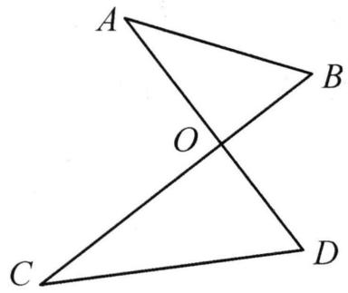

text_image

A
O
B
C
D

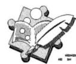

# 金例讲析

【例】如图, $\angle A + \angle C = 56^{\circ}, BE$ 平分 $\angle ABC, DE$ 平分 $\angle ADC$ , 求 $\angle E$ 的度数.

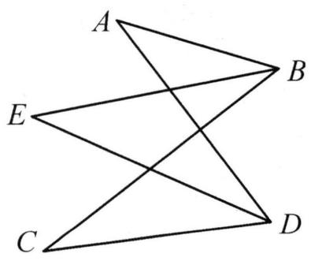

text_image

A
E
B
C
D

# 实战演练

如图, 在四边形 $ABCD$ 中, 点 $F$ 为 $CD$ 上一点, $\angle ABF = \angle ACD$ , $\angle BAC = 60^\circ$ , 求 $\angle BFD$ 的度数.

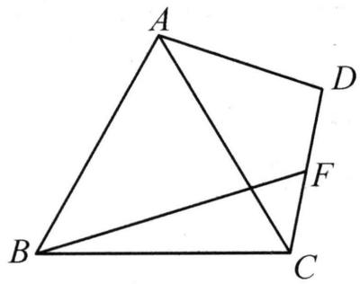

text_image

A
B
C
D
F

# 微课小专题 导角基本模型(二)余补角模型及应用

模型介绍：

互余模型:如图,在 Rt△ABC 中,∠ACB=90°.

(1)如图 1, $CD \perp AB$ 于点 $D$ , 则有: $\angle 1 = \angle B, \angle 2 = \angle A$ ;  
(2)如图 2, E 为 BC 延长线上一点, $ED \perp AB$ 于点 D, 交 AC 于点 F, 则有: $\angle1 = \angle2 = \angle B, \angle A = \angle E$ ;  
(3)如图 3, E 为 CB 延长线上一点, $\angle ABD = \angle BED = \angle C = 90^{\circ}$ , 则有: $\angle 1 = \angle D, \angle 2 = \angle A$ .

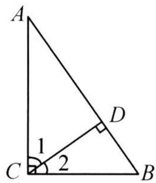  
图1

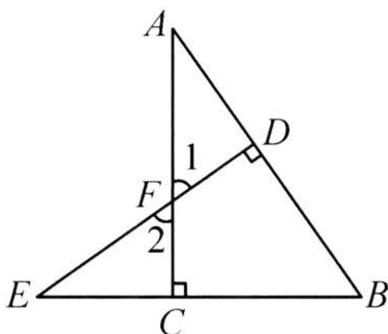

text_image

A
1
D
F
2
E
C
B

图2

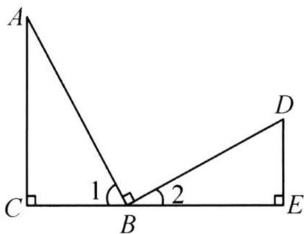

text_image

A
1
2
C
B
D
E

图3

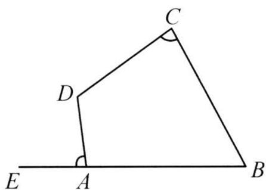

text_image

C
D
E A B

图4

互补模型:如图4,在四边形ABCD中,点E为BA延长线上一点,若 $\angle B+D=180^{\circ}$ ,则有 $\angle DAE=\angle C$ .

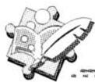

# 金例讲析

【例】在 $\triangle ABC$ 中,两条高 $BD,CE$ 交于点 $G,AM,GN$ 分别平分 $\angle BAC$ 和 $\angle BGC$ ,判断 $AM$ 与 $GN$ 的位置关系,并说明理由.

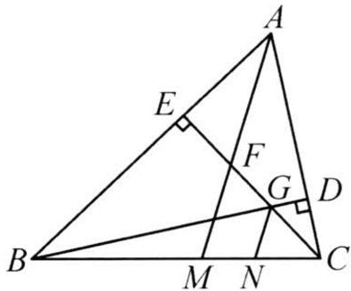

text_image

Geometric diagram of triangle ABC with perpendiculars and labeled points E, F, G, D, M, N

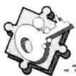

# 实战演练

如图, $AC \perp BE$ 于点 $C, ED \perp AB$ 于点 $D$ , 交 $AC$ 于点 $F$ , 交 $\angle DAF$ 的平分线于点 $M, EN$ 平分 $\angle DEB$ , 交 $AB$ 于点 $N$ . 求证: $AM \perp EN$ .

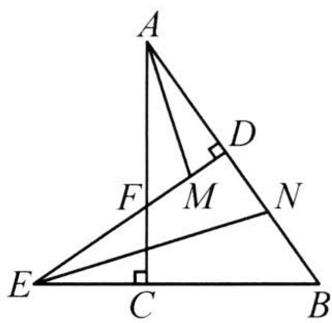

text_image

A
D
F
M
N
E
C
B

# 微课小专题 导角基本模型(三) 一线三等角模型及应用

模型介绍:顶点在同一条直线上的三个等角所构成的图形我们称之为“一线三等角”,如图1, 2, $\angle 1 = \angle 2 = \angle 3$ .

结论: $\angle D=\angle CBE,\angle ABD=\angle E.$

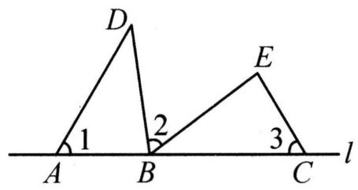

text_image

D
1
2
E
3
A B C l

同侧型一线三等角
图1

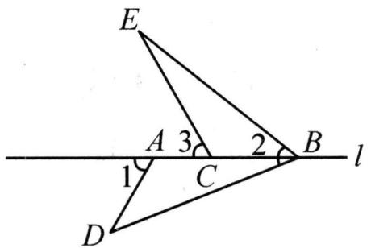

text_image

E
A 3 2 B
l
1 C
D

异侧型一线三等角图2

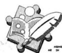

# 金例讲析

【例】如图, 在 $\triangle ABC$ 中, $\angle B = \angle C = 60^{\circ}$ , 将 $\triangle ABC$ 沿 $DE$ 折叠, 点 $A$ 的对应点 $F$ 落在 $BC$ 上. 求证: $\angle BDF = \angle CFE$ .

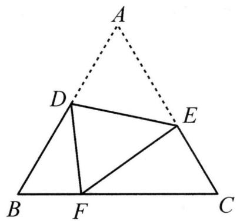

text_image

A
D
E
B
F
C

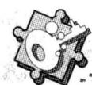

# 实战演练

如图, 在 $\triangle ABC$ 中, $D, E$ 分别为 $BC, AC$ 上的点, $\angle B = \angle C = \angle ADE$ , $\angle BAD = 21^{\circ}$ , $\angle AED = 91^{\circ}$ . 求 $\angle B$ 的度数.

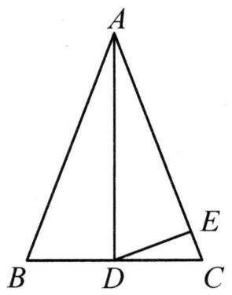

text_image

A
B D C
E

# 微课小专题 求角思想方法(一) 转化思想求角度

转化思想:人们在解决问题时,对未解决的问题作转化,使之逐步转化为已解决的问题,达到化繁为简,化难为易,变“正面强攻”为“侧翼进击”的思维方法,就是转化的策略思想.

# 金例讲析

【例】如图,求证: $\angle A+\angle B+\angle D=\angle BCD.$

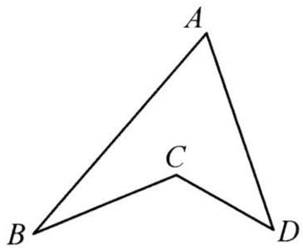

text_image

A
C
B
D

图1

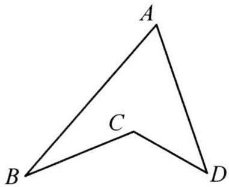

text_image

A
C
B
D

图2

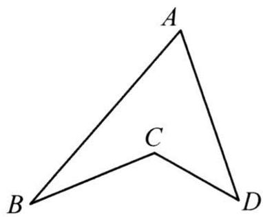

text_image

A
C
B
D

图3

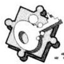

# 实战演练

1. 如图, 求 $\angle A + \angle B + \angle C + \angle D$ 的度数.

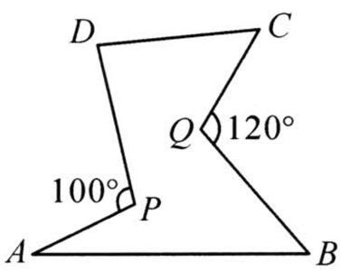

text_image

D
C
Q 120°
100°
P
A
B

2. 如图, 求 $\angle A + \angle B + \angle C + \angle D + \angle E + \angle F + \angle G$ 的度数.

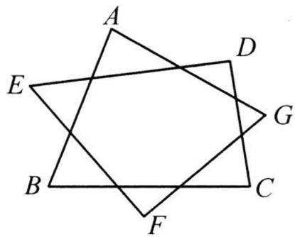

text_image

A
D
E
G
B
C
F

# 微课小专题 求角思想方法(二)整体思想求角度

整体思想:即是善于用“集成”的眼光,把某些式子或图形看成一个整体,有意识的整体运算,整体处理.

# 金例讲析

【例】如图, 在 $\triangle ABC$ 中, $\angle A = 60^{\circ}, D, E, F$ 分别为 $BC, AB, AC$ 上的点. $\angle BED = \angle B, \angle DFC = \angle C$ . 求 $\angle EDF$ 的度数.

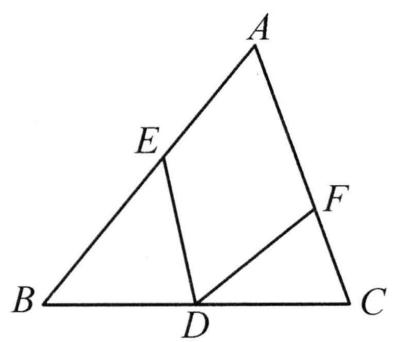

text_image

A
E
F
B
D
C

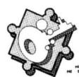

# 实战演练

1. 如图, 求 $\angle 1 + \angle 2 + \angle 3 + \angle 4$ 的度数.

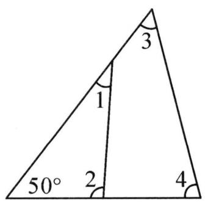

text_image

3
1
50° 2 4

2. 如图, 在 $\triangle ABC$ 中, $\angle B = 33^{\circ}$ , 将 $\triangle ABC$ 沿直线 $EF$ 翻折, 点 $B$ 落在点 $D$ 的位置, 求 $\angle 1 - \angle 2$ 的度数.

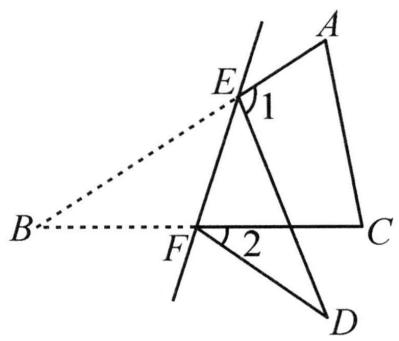

text_image

A
E
1
B
F
2
C
D

# 微课小专题 求角思想方法(三) 方程思想求角度

方程思想:通过设未知数建立方程解决问题的思想方法.

# 金例讲析

【例】如图, 在 $\triangle ABC$ 中, $\angle A = \angle B$ , 点 $D, E$ 分别在 $AB, BC$ 上, $\angle CDE = \angle CED$ , 若 $\angle ACD = 36^{\circ}$ , 求 $\angle BDE$ 的度数.

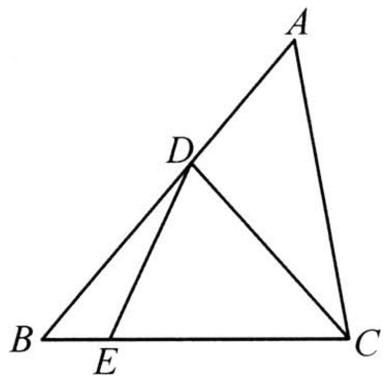

text_image

Geometric diagram of triangle ABC with internal points D and E, showing segments AD and BC

# 实战演练

1. 如图, $AD$ 是 $\triangle ABC$ 的角平分线, $\angle ADC = \angle C = 2\angle B$ . 求 $\angle BAC$ 的度数.

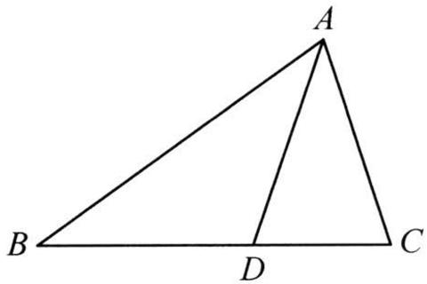

text_image

A
B
D
C

2. 在 $\triangle ABC$ 中, $AD$ 是 $\triangle ABC$ 的角平分线, $\angle C - \angle B = 20^{\circ}$ , $DE$ 平分 $\angle ADC$ , $\angle AED = 110^{\circ}$ , 求 $\angle BAC$ 的度数.

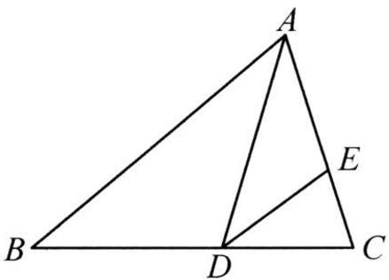

text_image

A
B
D
C
E

# 微课小专题 求角思想方法(四) 分类讨论思想求角度

分类讨论: 当问题情形指代不明确, 可能存在多种情况时, 按不同情况分类, 然后再逐一研究解决的数学思想, 称之为分类讨论思想.

# 金例讲析

【例】在 $\triangle ABC$ (不是直角三角形)中, $\angle A = 50^{\circ}$ , $\triangle ABC$ 的两条高 $BM, CN$ 所在直线相交于点 $O$ , 求 $\angle MON$ 的度数.

# 实战演练

在 $\triangle ABC$ 中, $AD$ 是 $BC$ 边上的高, $\angle B=40^{\circ}$ , $\angle CAD=20^{\circ}$ , 求 $\angle BAC$ 的度数.

# 微课小专题 双角平分线的夹角模型(一) 双内角平分线夹角

模型介绍:如图,在 $\triangle ABC$ 中,若 $BP$ 平分 $\angle ABC,CP$ 平分 $\angle ACB$ ,则 $\angle P=90^{\circ}+\frac{1}{2}\angle A$ .

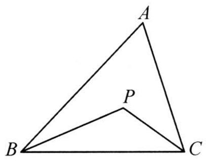

text_image

A
P
B
C

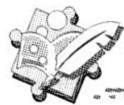

# 金例讲析

【例】如图,在 $\triangle ABC$ 中, $\angle A=72^{\circ},\angle ABC,\angle ACB$ 的三等分线交于点 $O_{1},O_{2}$ .

(1)求 $\angle BO_{1}C$ 的度数；

(2)连接 $O_{1}O_{2}$ , 则 $\angle BO_{2}O_{1}$ 的度数为

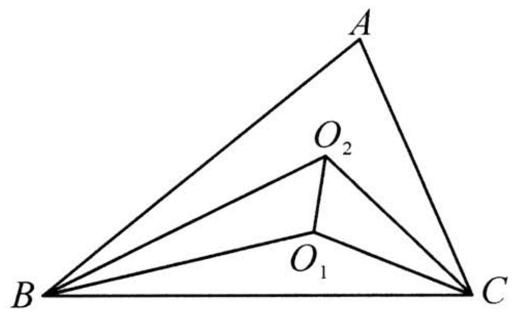

text_image

A
O₂
B
O₁
C

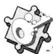

# 实战演练

在平面直角坐标系中, $\triangle AOB$ 的顶点 $A, B$ 分别在 $x$ 轴, $y$ 轴上, 点 $E$ 是 $\triangle ABO$ 的两条角平分线的交点, 求 $\angle AEB$ 的度数.

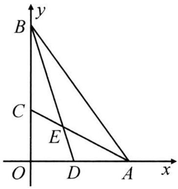

text_image

y
B
C
E
O D A x

# 微课小专题 双角平分线的夹角模型(二) 双外角平分线夹角

模型介绍:如图,BP 平分 $\angle DBC,CP$ 平分 $\angle ECB$ ,则 $\angle P=90^{\circ}-\frac{1}{2}\angle A$ .

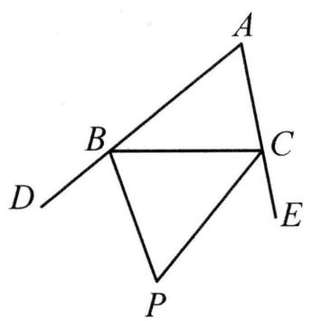

text_image

A
B
C
D
E
P

# 金例讲析

【例】在平面直角坐标系中, $\triangle AOB$ 的顶点A,B分别在x轴,y轴的正半轴上, $\angle ABy$ 与 $\angle BAx$ 的平分线相交于点C,求 $\angle C$ 的度数.

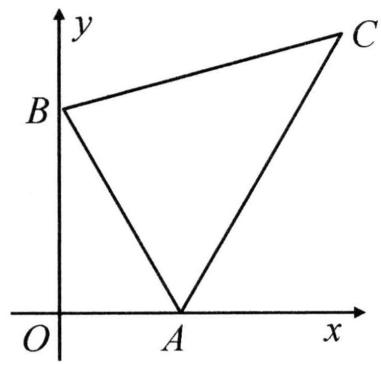

text_image

y
B
C
O
A
x

# 实战演练

如图, $\angle QBC = \frac{1}{3}\angle DBC$ , $\angle QCB = \frac{1}{3}\angle BCE$ , 探究 $\angle Q$ 与 $\angle A$ 的数量关系.

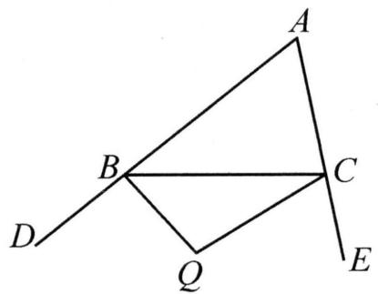

text_image

Geometric diagram with labeled points A, B, C, D, E, Q forming triangles and intersecting lines

# 微课小专题 双角平分线的夹角模型(三) 一内一外角平分线夹角

模型介绍:如图,BP 平分 $\angle ABC$ ，CP 平分 $\triangle ABC$ 的外角 $\angle ACD$ ，则 $\angle P=\frac{1}{2}\angle A$ 。

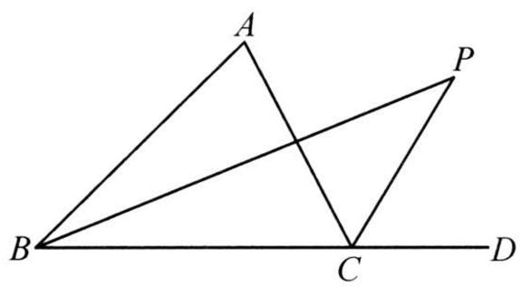

text_image

A
P
B
C
D

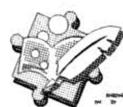

# 金例讲析

【例】在平面直角坐标系中, $\triangle AOB$ 的顶点 $A, B$ 分别在 $x$ 轴, $y$ 轴上, $\angle OAB$ 的平分线与 $\angle ABy$ 的平分线的反向延长线交于点 $D$ , 求 $\angle D$ 的度数.

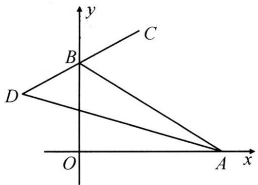

text_image

y
C
B
D
O
A x

# 实战演练

如图,在四边形 $MNCB$ 中, $BD$ 平分 $\angle MBC$ , 且与四边形 $MNCB$ 的外角 $\angle NCE$ 的角平分线交于点 $D$ , 若 $\angle BMN = 130^{\circ}, \angle CNM = 100^{\circ}$ , 求 $\angle D$ 的度数.

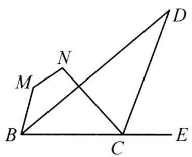

text_image

Geometric diagram with labeled points A, B, C, D, E, M, N forming intersecting triangles and a line

# 综合与实践(一) 三角形的折叠

综合与实践课上,老师让同学们以“三角形的折叠”为主题开展数学活动.

# (1) 操作判断：

操作一:折叠三角形纸片,使 BC 与 BA 边在一条直线上,得到折痕 BD;

操作二:折叠三角形纸片,得到折痕 AE,使 B,C,E 三点在一条直线上.

完成以上操作后把纸片展平, 如图 1, 判断 $\angle ABD$ 和 $\angle CBD$ 的大小关系是 \_\_\_\_, 直线 $BC, AE$ 的位置关系是 \_\_\_\_.

# (2) 深入探究：

操作三:折叠三角形纸片,使点 A 落在折痕 AE 上,得到折痕 DF,把纸片展平.

根据以上操作,如图 2, 判断 $\angle DBF$ 和 $\angle BDF$ 是否相等, 并说明理由.

# (3) 结论应用：

如图 1, 已知 $\angle ABC = 58^{\circ}$ , $\angle ACB = 48^{\circ}$ , 请求出 $\angle BDC$ 的度数.

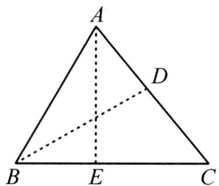

text_image

A
D
B E C

图1

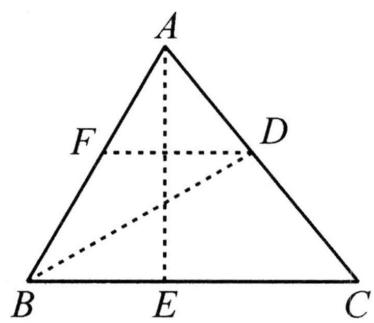

text_image

A
F
D
B
E
C

图2

# 第十四章 全等三角形

# 微课小专题 构全等(一)两组等边连共边

方法技巧: 当题中已知两组相等的边时, 常连接两点, 构造共边的两个三角形全等. 从思路上分析, 就是“SS $\xrightarrow{构}$ SSS”.

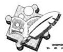

# 金例讲析

【例】如图,在四边形ABCD中, $AB=CD,AD=BC,E,F$ 分别为AD,BC上一点.求证: $\angle AEF=\angle CFE$ .

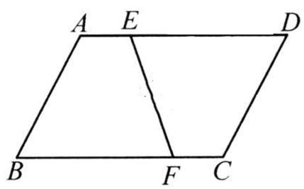

text_image

A E D
B F C

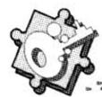

# 实战演练

1. 如图, ${AB} = {AC},{BD} = {CD},{DE} \bot  {AB}$ 于点 $E,{DF} \bot  {AC}$ 于点 $F$ . 求证: ${AE} = {AF}$ .

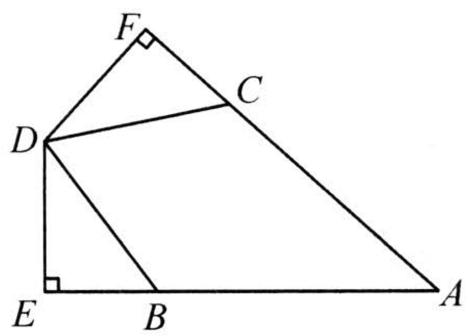

text_image

Geometric diagram of quadrilateral ABCD with perpendiculars from D to AB and BC, labeled points E, F, C, and right-angle symbols.

2. 如图, $\angle A = \angle D$ , $\angle ABC = \angle DEF$ , $AB = DE$ , $BF = CE$ . 求证: $BC \parallel EF$ .

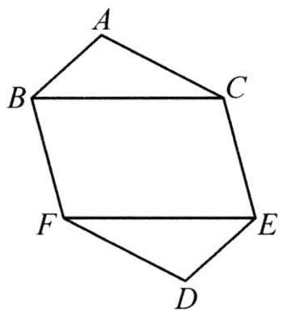

text_image

A
B
C
F
E
D

# 微课小专题 构全等(二)中点联想(1) 知中点,倍长中线(SA→SAS)

倍长中线: 当题目中已知某线段的中点时, 常联想到“SA $\xrightarrow{构}$ SAS”的思路, 通过倍长中点处的线段构造全等三角形, 从而将题中的已知和未知的条件集中到同一对全等三角形中.

基本模型:如图,若 M 是 BC 的中点,延长 AM 到点 D,使 AM = DM,则 $\triangle ACM \cong \triangle DBM$ (SAS).

text_image

A
B
M
C
D

# 金例讲析

【例】如图,在 $\triangle ABC$ 中, $BC>AC,CD$ 是 $\triangle ABC$ 的中线.求证: $BC-AC<2CD$ .

text_image

A
D
B
C

# 实战演练

如图, 过 $\triangle ABC$ 的顶点 $A$ 作 $AD \perp AB$ , $AE \perp AC$ , 且 $AD = AB$ , $AE = AC$ , 连接 $DE$ , 若 $AM$ 是 $\triangle ADE$ 的中线, 求证: $BC = 2AM$ .

text_image

A
B E M C
D

# 微课小专题 构全等(三) 中点联想(2)

# 知中点,两端作垂(SA→AAS)

方法技巧: 当题目中已知某线段的中点时, 常联想到“SA $\xrightarrow{构}$ AAS”的思路, 即过已知中点的线段两端向中点处的线段作垂线(或作一组平行线), 构造全等三角形.

基本模型:如图,若 M 是 BC 的中点,BD ⊥ AM,CA ⊥ AM(或 BD∥AC),A,M,D 三点共线,

则 $\triangle ACM \cong \triangle DBM$ (AAS).

text_image

A
B
M
C
D

# 金例讲析

【例】如图,在 $\triangle ABC$ 中, $D$ 为 $AB$ 延长线上一点, $E$ 为 $CB$ 延长线上一点, $B$ 为 $CE$ 中点, $\angle A+\angle ADE=180^{\circ}$ .求证: $AC=DE$ .

text_image

Geometric diagram with labeled points A, B, C, D, E forming triangles and intersecting lines

# 实战演练

如图, 在 $\triangle ABC$ 中, $D$ 为 $CB$ 延长线上一点, $BD = BC$ , $E$ 为 $AB$ 上一点, $\angle A = \angle BED$ . 求证: $AC = DE$ .

text_image

A
E
D
B
C

# 微课小专题 构全等(四) 中点联想(3)

# 证中点,两端作垂(SA→AAS,ASA)

方法技巧:要证线段的中点,常联想“SA $\xrightarrow{构}$ AAS,ASA”的思路,即过该线段的两端向要证的中点处的线段作垂线,或在该线段的两端构造一组平行线,从而构造出全等三角形,进而证明中点.

基本模型: 如图, $BC$ 与 $AD$ 交于点 $M$ , $AC = BD$ , $BD \perp AD$ , $AC \perp AD$ (或 $AC \parallel BD$ ), 则

$\triangle ACM \cong \triangle DBM$ (AAS 或 ASA), $\therefore BM = CM$ .

text_image

A
B
M
C
D

# 金例讲析

【例】如图, Rt△ABC 中, ∠ACB = 90°, D 是 AC 边上一点, CD = CB, 过点 B 作 BE ⊥ AB 且 BE = AB, 连接 DE 交 BC 的延长线于点 F, 求证: DF = EF.

text_image

Geometric diagram of triangle EAB with internal points D, F, C and right angle at C

# 实战演练

如图, 在四边形 $ABCD$ 中, $\angle ADC = 90^{\circ}, AD = BC, BE \perp BC$ 交 $CD$ 于点 $E$ , 交 $AC$ 于点 $F$ , $EA$ 平分 $\angle DEB$ . 求证: $F$ 为 $AC$ 的中点.

text_image

Geometric diagram of quadrilateral ABCD with diagonals and perpendiculars, labeled points A, B, C, D, E, F

# 微课小专题 构全等(五) 线段和差联想 截长补短(SA→SAS)

截长补短:在处理线段的和差问题时,常联想“SA $\xrightarrow{构}$ SAS”的思路,采取截长补短的方法.截长法就是在较长线段上截取一段等于某一短线段,再证剩下的部分等于另一短线段;补短法是将某短线段延长,使延长的部分等于另一短线段,或是使短线段延长至等于长线段.

# 金例讲析

【例】如图,在 $\triangle ABC$ 中, $AB=AC,D$ 是 $\triangle ABC$ 外一点, $\angle BDC=\angle BAC,AE\perp CD$ 于点 $E$ .求证: $CD-BD=2DE$ .

text_image

Geometric diagram of triangle ABC with points D and E, showing perpendicular line from A to BC at E

# 实战演练

如图,在四边形 $ABCD$ 中, $\angle ADC = 90^{\circ}, \angle BCD = 45^{\circ}$ , 对角线 $AC \perp BD$ , 外角 $\angle MAB = \angle DAC$ . 求证: $AC - BD = AB$ .

text_image

Geometric diagram with labeled points A, B, C, D, M and a right angle at M

# 微课小专题 构全等(六) 角平分线联想(1) 两边作垂(SA→AAS, HL)

方法技巧: 当题中出现角平分线的条件或结论时, 常向角的两边作垂线, 等同于 “SA $\xrightarrow{\text{构}}$ AAS, HL” 构全等的思路.

基本模型:如图, $PA \perp OA$ , $PB \perp OB$ . 若 $\angle1 = \angle2$ , 则 PA = PB;

若 PA = PB，则 $\angle1 = \angle2$ .

text_image

O
1
2
A
P
B

# 金例讲析

【例】如图,在 $\triangle ABC$ 中, $BC=8,AC=6,D$ 是 $AB$ 边上一点, $S_{\triangle ACD}:S_{\triangle BCD}=3:4$ .求证: $CD$ 平分 $\angle ACB$ .

text_image

A
D
B
C

# 实战演练

如图, 在四边形 $ABCD$ 中, 对角线 $CA$ 平分 $\angle BCD$ , $\angle BAC = \angle ADC = 90^\circ$ , 若 $BC = 7$ , $CD = 5$ . 求点 $B$ 到 $AD$ 的距离.

text_image

Geometric diagram of triangle ABC with right angles at D and A, showing perpendiculars from vertices to sides AB and BC.

# 微课小专题 构全等(七) 角平分线联想(2) 截长补短(SA→SAS)

方法技巧:利用角平分线的条件,在角的两边上进行截长补短,也就是联想“SA $\xrightarrow{构}$ SAS”的构全等思路,从而构造出全等三角形.

基本模型:如图,OP 平分 $\angle AOB$ ,OA=OB,则 $\triangle POA \cong \triangle POB$ (SAS).

text_image

O
A
P
B

# 金例讲析

【例】如图, $CD$ 是 $\triangle ABC$ 的角平分线, $\angle A = 100^{\circ}, \angle ACB = 40^{\circ}, E$ 为 $CD$ 延长线上一点, $DE = AD$ , 若 $BE = 3, AC = 5$ . 求 $BC$ 的长.

text_image

Geometric diagram showing triangle ABC with points D and E on sides AB and AC, respectively, and segment BD drawn.

# 实战演练

如图, 点 $D$ 是 $\triangle ABC$ 的外角 $\angle ACE$ 的角平分线上一点, 连接 $AD, BD$ , 求证: $AD + BD > AC + BC$ .

text_image

A
B
C
D
E

# 微课小专题 构全等(八) 角平分线联想(3)

# 延长垂线段(SA→ASA)

方法技巧: 当图中有垂直于角平分线的垂线段时, 常联想到“SA $\xrightarrow{构}$ ASA”的思路, 延长垂线段, 构造出全等三角形.

基本模型: 如图, OC 平分 $\angle AOB$ , AB $\perp OC$ 于点 C, 则 $\triangle AOC \cong \triangle BOC$ (ASA).

text_image

O
A
C
B

# 金例讲析

【例】如图, 在 Rt△ABC 中, ∠BAC=90°, AB=AC, BD 是△ABC 的角平分线, CE⊥BD 于点 E. 若 CE=3, 求△BCD 的面积.

text_image

A
E
D
B
C

# 实战演练

如图, 在 $\triangle ABC$ 中, $BC > AC$ , $CD$ 平分 $\angle ACB$ , $AD \perp CD$ 于点 $D$ , 连接 $BD$ . 求证: $S_{\triangle ABD} + S_{\triangle ACD} = S_{\triangle BCD}$ .

text_image

A
D
B
C

# 微课小专题 模型探究(一) 对角互补模型

基本模型:如图,在四边形 $ABCD$ 中, $\angle BAD + \angle BCD = 180^{\circ}, DE \perp BC$ 于点 $E$ .

下列结论: ① $BD$ 平分 $\angle ABC$ ; ② $AD = CD$ ; ③ $AB + BC = 2BE$ ; ④ $BC - AB = 2EC$ . 若已知其中一个结论, 可推出其余三个结论成立, 即 “知一推三”.

text_image

A
D
B
E
C

# 金例讲析

【例】如图, $\angle ABC = 90^{\circ}, AD \perp CD, AD = CD$ . 求证: $BD$ 平分 $\angle ABC$ .

text_image

A
B
C
D

# 实战演练

如图, 在四边形 $ABCD$ 中, $AB = AD$ , $CA$ 平分 $\angle BCD$ , $AE \perp BC$ 于点 $E$ . 求证: $BE + CD = CE$ .

text_image

Geometric diagram of quadrilateral ABCD with diagonal BD and perpendicular AE to base BC, labeled with points A, B, C, D, E and right angle at E.

# 微课小专题 模型探究(二) 手拉手模型

基本模型:如图,AB=AC,AD=AE, $\angle BAC=\angle DAE$ ,则 $\triangle BAD\cong\triangle CAE(SAS)$ .

text_image

Geometric diagram with labeled points A, B, C, D, E and marked angles and perpendicular lines

# 金例讲析

【例】如图, $AB = AC$ , $AD = AE$ , $\angle BAC = \angle DAE$ , 连接 $BD$ , $CE$ 交于点 $O$ . 求证: $OA$ 平分 $\angle BOE$ .

text_image

Geometric diagram with labeled points A, B, C, D, E, and O, showing intersecting lines forming triangles and quadrilaterals.

# 实战演练

如图, $\angle BAD = \angle CAE = 90^{\circ}, AB = AD, AE = AC, AF \perp CB$ , 垂足为点 $F$ .

(1) 求证: $\triangle ABC \cong \triangle ADE$ ;   
(2) 求证: $CD = 2BF + DE$ .

text_image

Geometric diagram with labeled points A, B, C, D, E, F and connecting lines forming triangles and a quadrilateral

# 综合与实践(二) 利用全等测体育馆高度

某数学兴趣小组开展了测量体育馆高度 $AB$ 的实践运动. 测量方案如表:

<table><tr><td>课题</td><td>测量体育馆的高度AB</td></tr><tr><td>测量工具</td><td>测角仪、皮尺等</td></tr><tr><td>测量方案示意图</td><td></td></tr><tr><td>测量步骤</td><td>1在体育馆外,选定一点C;2测量体育馆顶点A视线AC与地面的夹角∠ACB;3测量BC的长度;4放置一根与BC长度相同的标杆DE,DE垂直于地面;5测量标杆顶部E视线与地面夹角∠ECD.</td></tr><tr><td>测量数据</td><td>教辅资源,关注公众号★全科AA+∠ACB=72.2°,∠ECD=17.8°,BC=DE=2.5m,CD=8m.</td></tr></table>

请你根据兴趣小组测量方案及数据,计算体育馆高度 AB 的值.

# 第十五章 轴对称

# 微课小专题 等腰三角形的性质(一) 方程思想求角度

方程思想:等腰三角形中运用等边对等角定理,建立角之间的关系,一般来说设小角表示大角,运用三角形的内角和定理列方程.

# 金例讲析

【例】如图,在 $\triangle ABC$ 中, $AB=AC$ , $\angle BAC=100^{\circ}$ , $BD$ 平分 $\angle ABC$ ,且 $BD=AB$ ,连接 $AD,DC$ .

(1)求证: $\angle CAD=\angle DBC$ ;   
(2) 若 E 为 BC 上一点, BE = AD, 求 $\angle DEC$ 的度数.

text_image

A
D
B
E
C

# 实战演练

如图,在 $\triangle ABC$ 中, $AB=AC$ ,点 $D$ 在 $AC$ 边上, $BD=BC$ .若 $\angle ABD=45^{\circ}$ ,求 $\angle A$ 的度数.

text_image

A
B
C
D

# 微课小专题 等腰三角形的性质(二)整体思想求角度

整体思想: 多个未知量的题目里可以设几个参数, 运用整体思想以及常见模型 (燕尾型, 垂直平分线模型等), 求出角的和差.

# 金例讲析

【例】如图, 点 $A(0,2), B(0,-2), C$ 为 $x$ 轴正半轴上一点, 以 $AC$ 为直角边作等腰直角三角形, $AC=CD$ , $\angle ACD=90^{\circ}$ , 连接 $BD$ 交 $x$ 轴于点 $E$ , 求 $\angle DEC$ 的度数.

text_image

y
A
D
O C E x
B

# 实战演练

1. 如图, 在 $\triangle ABC$ 中, $AB, AC$ 的垂直平分线相交于点 $O$ , 若 $\angle BAC = 76^{\circ}$ , 求 $\angle OBC$ 的度数.

text_image

A
O
B
C

2. 如图, 在 $\triangle ABC$ 中, $\angle BAC = 130^{\circ}, AB, AC$ 的垂直平分线分别交 $BC$ 于点 $D, E$ , 求 $\angle DAE$ 的度数.

text_image

A
B D E C

# 微课小专题 等腰三角形的性质(三) 分类讨论思想求边角

分类思想:腰和底不明时往往需要分类讨论. 分类讨论求边长时,一定别忘记三角形的三边关系. 另外无图时可能多解.

# 金例讲析

【例】在 $\triangle ABC$ 中， $\angle B=50^{\circ}$ ， $\angle ACB=90^{\circ}$ ，在射线 $BA$ 上找一点 $D$ ，使得 $\triangle ACD$ 为等腰三角形，求 $\angle BCD$ 的度数.

# 实战演练

1. 已知等腰三角形的周长为 24, 其中两边之差为 6, 求这个等腰三角形的腰长.

2. 在 $\triangle ABC$ 中,与 $\angle A$ 相邻的外角是 $130^{\circ}$ ,要使 $\triangle ABC$ 为等腰三角形,求 $\angle B$ 的度数.

# 微课小专题 等腰三角形的性质(四)“三线合一”直接用

方法技巧:已知等腰三角形的三线之一,可以直接运用三线合一性质得出边角关系.

# 金例讲析

【例】如图,在 Rt△ABC 中,∠ABC=90°,AB=BC,∠C=45°,BO⊥AC 于点 O,点 P,D 分别在 AO 和 BC 上,PB=PD,DE⊥AC 于点 E. 求证:PO=EC.

text_image

A
P
O
B
D
C
E

# 实战演练

如图, 在 $\triangle ABC$ 中, $\angle BAC = 90^{\circ}$ , $E$ 为 $BC$ 上一点, 且 $AB = AE$ , $AD \perp BC$ 于点 $D$ , 过点 $E$ 作 $EF \perp AE$ , 过点 $A$ 作 $AF \parallel BC$ , 求 $\frac{AF - EC}{BD}$ 的值.

text_image

Geometric diagram with labeled points A, B, C, D, E, F and right-angle markers at D and E

# 微课小专题 构造“三线合一”解题(一)

# 作“三线”解决 $a = 2b$ 型问题

方法技巧:一类 a=2b 型问题,通过作三线运用等腰三角形三线合一来解决.

# 金例讲析

【例】如图, $AC \perp CD, AC = CD$ , 点 $B$ 在 $CD$ 上, $DE \perp AB$ 交 $AB$ 的延长线于点 $E$ , 若 $AB = 2DE$ , 求 $\angle BAC$ 的度数.

text_image

D
B
E
A
C

# 实战演练

如图, 在 $\triangle ABC$ 中, $AD$ 平分 $\angle BAC$ 交 $BC$ 于点 $D, E$ 是 $AD$ 上一点, 且 $EA = EC$ , $EB \perp AB$ . 求证: $AC = 2AB$ .

text_image

B
E
D
A
C

# 微课小专题 构造“三线合一”解题(二) 倍长中线构等腰证垂直

方法技巧:等腰+中点证垂直的问题,往往通过倍长中线构等腰,运用等腰三角形三线合一证垂直.

# 金例讲析

【例】如图, $AB = AC, DC = DF, \angle BAC = \angle CDF = 90^{\circ}, G$ 为 $BF$ 的中点. 求证: $AG \perp DG, AG = DG$ .

text_image

Geometric diagram with labeled points A, B, C, D, G, F forming triangles and quadrilaterals

# 实战演练

如图, $AB = AC$ , $ST = SB$ , $\angle TSB = \angle SBC = \angle BAC = 90^{\circ}$ , $M$ 为 $TC$ 的中点, 求证: $SM \perp AM$ .

text_image

Geometric diagram with labeled points A, B, C, T, M, S and right-angle markers at S and A

# 微课小专题 构等腰技巧(一) 角平分线十垂线构等腰

模型:如图,BD 平分∠ABC,E,F 分别为 BA,BC 上一点,EF⊥BD,垂足为 O,则 BE=BF,EO=OF.

text_image

Geometric diagram showing angles and points labeled A, B, C, D, E, F, O with right angle at O

# 金例讲析

【例】如图, 在 Rt△ABC 中, ∠ACB = 90°, BD 平分∠ABC, 点 E 在 AB 上, ∠EDB = 45°, EF ⊥ BD, 垂足为 F, 延长 EF 交 BC 于点 H.

(1) 求证: $BC = BE + HC$ ;   
(2) 求证: $\angle BCF = 45^{\circ}$ .

text_image

Geometric diagram of triangle ABC with internal points D, E, F, H and perpendicular lines from A to BC at D and C.

# 实战演练

如图, 在 $\triangle ABC$ 中, $\angle B = 2\angle C$ , $AE$ 平分 $\angle BAC$ 交 $BC$ 于点 $E$ , $EF \perp AE$ 交 $AC$ 于点 $F$ , 求证: $\angle C = 2\angle FEC$ .

text_image

A
B
E
F
C

# 微课小专题 构等腰技巧(二) 角平分线+平行线构等腰

# 模型一 作角平分线边的平行线构等腰

如图 1, OC 平分 $\angle AOB$ , CD // OB 交 OA 于点 D, 则 OD = CD.

text_image

A
D C
O B
图1

# 模型二 作角平分线的平行线构等腰

如图 2, 已知 AD 为 $\triangle ABC$ 的外角平分线, 则 $AD \parallel BC \Leftrightarrow AB = AC$ .

text_image

F
A
D
B
C
图2

# 金例讲析

【例】如图, $AB \parallel CF$ , $E$ 是 $BC$ 的中点, 点 $D$ 在线段 $AE$ 上, $\angle EDF = \angle BAE$ , 求证: $AB = DF + CF$ .

text_image

A
D
C
E
B
F

# 实战演练

1. 如图, 在 $\triangle ABC$ 中, $BI, CI$ 分别平分 $\angle ABC, \angle ACF$ , 直线 $DE$ 经过点 $I$ , 且 $DE \parallel BC$ , $BD = 8, CE = 5$ , 求 $DE$ 的长.

text_image

Geometric diagram with labeled points A, B, C, D, E, F, I forming intersecting lines and triangles

2. 如图, 在四边形 $ABCD$ 中, $AB \parallel CD$ , $E$ 为 $BC$ 的中点, $AE$ 平分 $\angle DAB$ , 若 $AB = 4$ , $CD = 1$ , 求 $AD$ 的长.

text_image

A
B
E
D
C

# 微课小专题 构等腰技巧(三) 作腰的平行线构等腰

模型: 点 D 为直线 AB 上一点, AB = AC, 过点 D 作 $DE \parallel AC$ 交直线 BC 于点 E. 则 DE = DB.

text_image

Geometric diagram showing two triangles with labeled vertices and dashed lines indicating angles or projections.

# 金例讲析

【例】如图, $AB = AC$ , $\angle A = 90^{\circ}$ , 点 $E$ 在 $AB$ 上, 点 $F$ 在 $AC$ 的延长线上, 且 $BE = CF$ , $EF$ 交直线 $BC$ 于点 $D$ , 过点 $E$ 作 $EM \perp BC$ , 垂足为 $M$ . 求证: $MD = BM + DC$ .

text_image

B
M
E
D
A
C
F

# 实战演练

如图, $AB = AC, CE \parallel AB, BD \parallel AC, BD = CE, DE$ 交 $BC$ 于点 $F$ . 求证: $DF = FE$ .

text_image

Geometric diagram with labeled points A, B, C, D, E, F forming triangles and intersecting lines

# 微课小专题 构等腰技巧(四) 倍长中线构等腰

模型:如图,D为BC的中点,E为AD上一点,则 $\angle BED=\angle DAC\Leftrightarrow BE=AC$ .

延长 ED 至点 H, 使得 DH = ED, 连接 CH,

易证 $\triangle BED \cong \triangle CHD, \therefore \angle BED = \angle H, BE = CH.$

故 $\angle BED=\angle DAC\Leftrightarrow\angle H=\angle DAC\Leftrightarrow BE=AC.$

text_image

A
E
B
D
C
H

# 金例讲析

【例】如图, $AD$ 为 $\triangle ABC$ 的角平分线, $E$ 为 $BC$ 的中点, $EF \parallel AD$ 交 $AC$ 于点 $F$ , 若 $AB = 3, AC = 7$ , 求 $AF$ 的长.

text_image

A
F
B D E C

# 实战演练

如图, $AD$ 是 $\triangle ABC$ 的中线, $E$ 是 $AD$ 上一点, 连接 $BE$ 并延长交 $AC$ 于点 $F$ . 若 $EF = AF$ , $BE = 7.5$ , $CF = 6$ , 求 $EF$ 的长.

text_image

A
E
F
B
D
C

# 微课小专题 构等腰技巧(五) 截长补短构等腰

模型:如图,D 为△ABC 的边 BC 上一点,若要得出 $AB = AC + CD$ , 可采用直接或间接截长补短法转化为等腰三角形来处理.

方法一:(直接截长法)在 AB 上取一点 E, 使得 BE=CD, 连接 CE, 转化为处理 AE=AC 问题;

方法二:(直接补短法)延长 AC 至点 F, 使得 CF = CD, 连接 BF, 转化为处理 AF = AB 问题;

text_image

Geometric diagram of triangle ABC with internal points D and E, and auxiliary lines forming triangles and dashed segments

方法三:(间接补短法)延长 AC 至点 F, 使得 AF = AB, 连接 DF, 转化为处理 CF = CD 问题.

# 金例讲析

【例】如图, 在 $\triangle ABE$ 中, $\angle A = 105^{\circ}$ , $AE$ 的垂直平分线 $MN$ 交 $BE$ 于点 $C$ , 且 $AB + BC = BE$ , 求 $\angle B$ 的度数.

text_image

A
M
B
C
E
N

# 实战演练

如图, 点 $B$ 是 $x$ 轴上一点, 点 $A$ 在第一象限, $OA = AB$ , $P$ 为 $y$ 轴上一点, $\angle POA = \angle PBA$ , $AD \perp x$ 轴于点 $D$ .

(1)求证: $\angle {PBA} = \angle {DAB}$ ;   
(2)若点 A 的纵坐标为 4, 求 $OP + PB$ 的值.

text_image

y
A
P
O
D
B
x

# 微课小专题 构等腰技巧(六) 二倍角构等腰

模型:如图,在 $\triangle ABC$ 中, $\angle ABC=2\angle ACB$ .

构等腰法一:延长 CB 至点 E,使 BE = AB,连接 EA,则 $\angle E = \frac{1}{2} \angle ABC = \angle ACB, \therefore AE = AC;$

text_image

A
F
E
B
M
C

构等腰法二:作 $\angle ABC$ 的平分线交 $AC$ 于点 $F$ ,则 $\angle FBC=\frac{1}{2}\angle ABC=\angle ACB,\therefore BF=FC;$

构等腰法三: 作 AC 的垂直平分线交 BC 于点 M, 连接 AM, 则 AM = MC, $\angle AMB = 2\angle ACB = \angle ABC, \therefore AB = AM.$

# 金例讲析

【例】在 $\triangle ABC$ 中, $\angle B=2\angle C,AD\perp BC$ ,垂足为 $D$ .若 $BD=1,AB=3$ ,求 $BC$ 的长.

text_image

A
B D C

# 实战演练

如图, 在 $\triangle ABC$ 中, $\angle ACB = 90^{\circ}$ , $D$ 为 $BC$ 上一点, $\angle DAB = 2\angle B = 45^{\circ}$ . 求证: $DB = 2AC$ .

text_image

A
C D B

# 微课小专题 $30^{\circ}$ 角的用法——构 $30^{\circ}$ 的直角三角形

方法技巧:1. 利用 $30^{\circ}$ 角作高构直角三角形;2. 利用 $15^{\circ}$ 角作高构直角三角形;3. 利用 $60^{\circ}$ 角作高构直角三角形.

# 金例讲析

【例】在 $\triangle ABC$ 中, $\angle ABC=60^{\circ}, BA=3, BC=5$ , 点 $E$ 在 $BA$ 的延长线上, 点 $D$ 在 $BC$ 边上, 且 $ED=EC$ , 若 $AE=4$ , 求 $BD$ 的长.

text_image

E
A
B
D
C

# 实战演练

1. 如图, 在 $\triangle ABC$ 中, $AB = AC = 6$ , $\angle A = 30^{\circ}$ , 求 $\triangle ABC$ 的面积.

text_image

A
B C

2. 在等腰 $\triangle ABC$ 中, $AB = AC = 4$ , $\angle B = 15^{\circ}$ , 求 $\triangle ABC$ 的面积.

natural_image

Simple geometric diagram of a parallelogram labeled A, B, C (no text or symbols beyond labels)

# 微课小专题 $60^{\circ}$ 角的用法——构等边三角形

方法技巧:利用已有 $60^{\circ}$ 角构等边三角形,实现边、角的位置转化,为三角形全等创造条件.

# 金例讲析

【例】如图,在 $\triangle ABC$ 中, $\angle B=60^{\circ},D,E$ 分别为 $AB,AC$ 上的点, $AE$ 与 $CD$ 交于点 $F$ ,若 $\angle FAC=\angle FCA=30^{\circ}$ .求证: $AD=CE$ .

text_image

B
D
F
E
A
C

# 实战演练

如图, $P$ 是等边 $\triangle ABC$ 的边 $AC$ 的中点, $E, F$ 分别在 $AB, BC$ 的延长线上, $\angle E = \angle F$ . 求证: $CF = PC + BE$ .

text_image

A
P
B
C
F
E

# 微课小专题 45°角的用法——构等腰直角三角形

方法技巧:1. 利用 $45^{\circ}$ 角的一边作为直角边构等腰直角三角形. 2. 利用 $45^{\circ}$ 角的一边作为斜边构等腰直角三角形.

# 金例讲析

【例】如图,在 $\triangle ABD$ 中, $\angle ADB=45^{\circ},AC\perp AB,DC\perp BD$ .求证:AB=AC.

text_image

A
D
B
C

# 实战演练

如图, 在 $\triangle ABC$ 中, $\angle C = 45^{\circ}, \angle B = 30^{\circ}, AC^{2} = 8$ , 求 $AB$ 的长.

natural_image

Simple geometric diagram of a triangle labeled A, B, C (no additional text or symbols)

# 综合与实践(三) 裁剪等腰三角形

问题背景:在等腰三角形纸片 ABC 中, $AB = AC$ , $\angle BAC = 36^{\circ}$ . 现要将其剪成三张小纸片,使每张小纸片都是等腰三角形(不能有剩余). 下面是小文借助尺规解决这一问题的过程,请阅读后完成相应的任务.

作法:如图 1.

①分别作 AB, AC 的垂直平分线, 交于点 P; ②连接 PA, PB, PC.

结论:沿线段 PA, PB, PC 剪开, 即可得到三个等腰三角形.

理由:∵点 P 在线段 AB 的垂直平分线上,∴ \_\_\_\_. (依据)

同理, 得 $PA = PC$ . $\therefore PA = PB = PC$ . $\therefore \triangle PAB, \triangle PBC, \triangle PAC$ 都是等腰三角形.

# 深入研究：

(1)上述过程中,横线上的结论为 ,括号中的依据为  
(2)受小文的启发,同学们想到另一种思路:如图 2,以点 B 为圆心,BC 长为半径作弧,交 AC 于点 D,交 AB 于点 E.在此基础上构造两条线段(以图中标有字母的点为端点)作为裁剪线,也可解决问题.请在图 2 中画出一种裁剪方案,并求出得到的三个等腰三角形及相应顶角的度数.

# 实践操作：

(3)如图 3, 在等腰三角形纸片 ABC 中, $AB = AC$ , $\angle BAC = 108^{\circ}$ , 请在图 3 中设计出一种裁剪方案, 将该三角形纸片分成三个等腰三角形. (要求: 尺规作图, 保留作图痕迹, 不写作法,说明裁剪线)

text_image

A
P
B
C

图1

text_image

A
B C

图2

natural_image

Simple geometric diagram of a triangle labeled A, B, C (no additional text or symbols)

图3

# 第十六章 整式的乘法

# 微课小专题 整式的乘法(一) 幂的运算正反用

方法技巧: $a^{m} \cdot a^{n} \Leftrightarrow a^{m+n}$ ; $(a^{m})^{n} \Leftrightarrow a^{mn}$ ; $(ab)^{m} \Leftrightarrow a^{m}b^{m}$ .

# 金例讲析

【例 1】已知 $m+4n-3=0$ ，求 $2^{m} \cdot 16^{n}$ 的值.

【例 2】已知 $2^{m}=a,32^{n}=b,m,n$ 为正整数，求 $2^{3m+10n}$ 的值（用含 a,b 的式子表示）.

# 实战演练

1. 计算: $(-1.5)^{2019} \times \left(\frac{2}{3}\right)^{2020}$ .  
2. 若 $2 \times 8^{n} \times 16^{n} = 256$ ，求 n 的值.

# 微课小专题 整式的乘法(二)待定系数巧确定

方法技巧: 若 $(x+p)(x+q)=x^{2}+mx+n$ ，则 $m=p+q, n=pq.$

# 金例讲析

【例 1】已知 $(3x-p)(5x+3)=15x^{2}-6x+q$ ，求 $p+q$ 的值.

【例 2】已知多项式 ax-b 与 $2x^{2}-x+2$ 的乘积展开式中不含 x 的一次项,且常数项为 4,试求 a,b 的值.

# 实战演练

1. 已知 $(x + 3)(x + a) = x^{2} - bx - 15$ ，求 $a^{b}$ .

2. 已知代数式 $(150-3m)x+(100+2m)(100-x)$ 的结果与x的取值无关,求m的值.

# 微课小专题 乘法公式(一) 巧用平方差公式

方法技巧:在公式 $(a+b)(a-b)=a^{2}-b^{2}$ 中,相同项为a,b前的符号相反.

# 金例讲析

【例 1】填空:(1) $(-2x+y)(-2x-y)=$ \_\_\_\_；

(2) $\left(\frac{1}{7}+\frac{1}{8}m\right)\left(-\frac{1}{7}+\frac{1}{8}m\right)=$ \_\_\_\_；  
(3) $(-3x^{2}+2y^{2})(\quad)=9x^{4}-4y^{4};$   
(4) $(a+b-1)(a-b+1)=(\quad)^{2}-(\quad)^{2}.$

【例 2】 计算: (1) $598 \times 602$ ; (2) $9 \times (10 + 1)(10^{2} + 1) + 1$ ; (3) $98^{2}$ .

# 实战演练

1. 计算: $(ab + 1)^{2} - (ab - 1)^{2}$ .  
2. 已知 $a^{2}-4b^{2}=12$ ，且 a-2b=-3，求 $a+b$ 的值.

# 微课小专题 乘法公式(二)巧用完全平方公式

方法技巧:1. 在使用公式 $(a \pm b)^{2}=a^{2} \pm 2ab+b^{2}$ 时, 切记不要漏掉 2ab; 2. 公式 $(a-b)^{2}$ 中 “-b”的“-”既可看作减号, 也可看作负号.

# 金例讲析

【例 1】 计算: (1) $(-2x-y)^{2}$ ;

(2) $(x - 2y + 3z)^{2}$ .

【例 2】已知 $(2-a)(3-a)=5$ ，试求 $(a-2)^{2}+(3-a)^{2}$ 的值.

# 实战演练

1. 计算: (1) ${103}^{2}$ ;

(2) $99.8^{2}$ ;

(3) $201^{2}-401$ .

2. 若 $x, y$ 满足 ${\left( x - y\right) }^{2} - {2x} + {2y} + 1 = 0,\left( {x + y}\right) ^{2} + {6x} + {6y} + 9 = 0$ ,求 $x,y$ 的值.

# 微课小专题 乘法公式(三)巧用配方法

方法技巧:1. 当式子中已含 $a^{2}, b^{2}$ , 可配 $\pm 2ab$ ; 2. 当式子中已含 $a^{2}, \pm 2ab$ , 可配 $b^{2}$ .

# 金例讲析

【例 1】如果在多项式 $4a^{2}+1$ 中添加一个单项式, 可使其成为一个完全平方式, 那么添加的单项式可以是 \_\_\_\_ (填一个即可).

【例 2】（1）当 x 取何值时，代数式 $x^{2}-6x+1$ 有最大值或最小值？

(2) 当 x 取何值时, 代数式 $-x^{2} + 3x + 8$ 有最大值或最小值?

# 实战演练

1. 若 $x^{2}-2(m-1)x+16$ 是一个完全平方式, 则 m 的值为 \_\_\_\_.

2. 已知实数 $a, b$ 满足条件: $a^2 + 4b^2 - a + 4b + \frac{5}{4} = 0$ , 求 $-ab$ 的平方根.

3. 若三角形的三边 $a, b, c$ 满足 $a^2 + b^2 + c^2 - ab - bc - ac = 0$ , 请判断三角形的形状, 并说明理由.

# 微课小专题 乘法公式(四) $a \pm b, ab, a^{2} \pm b^{2}$ 的互化技巧

方法技巧: $1. a^{2} + b^{2} = (a \pm b)^{2} \mp 2ab$ ; $2. (a \pm b)^{2} = (a \mp b)^{2} \pm 4ab$ .

# 金例讲析

【例 1】已知 $a + b = 3, ab = \frac{5}{4}$ ，求下列式子的值.

(1) $a^{2}+b^{2}$ ;

(2) $(a - b)^{2}$ ;

(3) $a^{2}-b^{2}$ ;

(4) $(1 - 2a)(1 - 2b)$ .

【例 2】已知 $x^{2}+y^{2}=25, x+y=7$ ，求下列各式的值.

(1) $xy$ ;

(2) $x - y$ ;

(3) $(x-3y)(3x-y)$ .

# 实战演练

1. 若 x, y 满足 $x + 2y = 2$ , xy = -1, 求下列各式的值.

(1) $x^{2}+4y^{2}$ ;

(2) $(x - 2y)^{2}$ ;

(3) $(x-2y)(x^{2}-4y^{2})$ .

2. 已知 $a - c - b = -10, (a - b)c = -12$ , 求 $(a - b)^{2} + c^{2}$ 的值.

# 微课小专题 乘法公式(五) $x \pm \frac{1}{x}$ 型变形技巧

方法技巧: $1.x^{2}+\frac{1}{x^{2}}=\left(x\pm\frac{1}{x}\right)^{2}\mp2$ ; $2.x^{4}+\frac{1}{x^{4}}=\left(x^{2}\pm\frac{1}{x^{2}}\right)^{2}\mp2$ ; $3.\left(x+\frac{1}{x}\right)^{2}-\left(x-\frac{1}{x}\right)^{2}=4.$

# 金例讲析

【例 1】已知 $x + \frac{1}{x} = 3$ ，试求下列各式的值：

(1) $x^{2}+\frac{1}{x^{2}};$

(2) $x^{4}+\frac{1}{x^{4}};$

(3) $x-\frac{1}{x}.$

【例 2】 若 $x^{2}-3x-1=0$ ，求式子 $x^{2}+\frac{1}{x^{2}}$ 的值.

# 实战演练

1. 已知 $a > 0, a - \frac{2}{a} = 1$ ，求 $a + \frac{2}{a}$ 的值：

2. 若 $x - 2 = \sqrt{3}$ ，求 $\left(x - \frac{1}{x}\right)^{2}$ 的值.

# 综合与实践(四) 整式乘法与数形结合

“数形结合”是数学上一种重要的数学思想,在整式乘法中,我们常用图形面积来解释一些公式.如图1,通过观察大长方形面积,可得 $(2a+b)(a+b)=2a^{2}+3ab+b^{2}$ .

(1)如图2,通过观察大正方形的面积,可以得到一个乘法公式,直接写出此公式;  
(2)现有若干张如图3的三种纸片，A是边长为a的正方形，B是边长为b的正方形，C是长为a，宽为b的长方形。若要无缝无重叠拼出一个宽为 $(2a+b)$ ，长为 $(3a+2b)$ 的长方形，设需要A型纸片x张，B型纸片y张，C型纸片z张，直接写出 $x+y+z$ 的值；  
(3)图 4 是由图 3 中的两张 A 型纸片和两张 B 型纸片拼成的一个正方形, 其中两张 A 型纸片有重叠 (图中阴影部分), 直接写出阴影部分的面积 (用含 a, b 的式子表示);  
(4)若图 2 也是由图 3 中的三种纸片拼成的,且图 2 中的阴影部分面积为 17 , 图 4 中的阴影部分面积为 8 , 求图 2 整个正方形的面积.

text_image

b ab ab b²
a a² a² ab
a a b

图1

  
图2

text_image

a
A
b
B
a
C
b

图3

  
图4

# 第十七章 因式分解

# 微课小专题 因式分解(一) 十字相乘法

方法技巧: $x^{2}+(p+q)x+pq=(x+p)(x+q)$ .

# 金例讲析

【例 1】分解因式:(1) $x^{2}+9x+8$ ;

(2) $x^{2}+2x-15;$

(3) $x^{2}-5xy+6y^{2}$ ;

(4) $x^{2}-6xy-27y^{2}$ .

【例 2】 分解因式:(1) $2x^{2}+7x+6$ ;

(2) $6x^{2}-7x-3;$

(3) $6x^{2}y^{2}-17xy-3.$

# 实战演练

1. 分解因式: $(x^{2} - 4x)^{2} - 2(x^{2} - 4x) - 15$ .

2. 分解因式: $x^{2} - (2a + 1)x + a^{2} + a$ .

# 微课小专题 因式分解(二)换元法

方法技巧:选择多项式中的相同的部分换成另一个未知数,然后分解,再回代,这种方法能化繁为简事半功倍.

# 金例讲析

【例 1】分解因式: (1) $a^{4}-18a^{2}+81$ ; (2) $(a+b)^{2}+2(a+b)+1$ .

【例 2】用换元法分解因式: $(x+1)(x+3)(x+5)(x+7)+15$ .

# 实战演练

1. (1) $(x^{2} + x)^{2} - 4(x^{2} + x) - 12$ ;

(2) $(x^{2}+8x+7)(x^{2}+8x+15)+16.$

2. 已知 $x > 0$ ，且 $x^{2} + \frac{1}{x^{2}} - 2(x + \frac{1}{x}) - 1 = 0$ ，求 $\left(x - \frac{1}{x}\right)^{2}$ 的值。

# 综合与实践(五) 奇妙的平方数

阅读下列材料：

<table><tr><td>材料一:两个连续奇数的积与1的和教辅资源,关注公众号 ★ 全科AA+</td><td>材料二:四个连续正整数的积与1的和</td></tr><tr><td>13-1=2,1×3+1=4=22;25-3=2,3×5+1=16=42;37-5=2,5×7+1=36=62;...</td><td>12×3-1×4=2,1×2×3×4+1=25=52,23×4-2×5=2,2×3×4×5+1=121=112;34×5-3×6=2,3×4×5×6+1=361=192;...</td></tr></table>

完成下列任务：

【任务一】(1)若 $2023 \times 2025 + 1 = m^{2}$ ，则正数 m 的值为 \_\_\_\_；

【任务二】(2)利用因式分解说明:四个连续正整数的积与1的和是某个正整数的平方;

【任务三】(3)利用以上规律计算: $50 \times 51 \times 52 \times 53 - 2649 \times 2651$ .

# 第十八章 分式

# 微课小专题 分式求值的技巧(一) 整体思想

整体思想: 将已知条件(或变形), 整体代入.

# 金例讲析

【例 1】已知 $\frac{1}{x}+\frac{1}{y}=5$ ，求 $\frac{2x-5xy+2y}{x+2xy+y}$ 的值.

【例 2】已知 $a^{2}-3b^{2}=2ab$ ，求 $\frac{a+2b}{a-b}$ 的值.

# 实战演练

1. 若 $x + y = -4, xy = -3$ ，求 $\frac{1}{x + 1} + \frac{1}{y + 1}$ 的值.

2. 若 $\frac{2x}{y} + \frac{3y}{x} = -5$ , 求 $\frac{4x^2 + 10xy + 6y^2}{2x^2 + 3y^2}$ 的值.

# 微课小专题 分式求值的技巧(二)等比设 k

方法技巧:遇到等比式子,通常设比值为 k, 即 $\frac{a}{b} = \frac{c}{d} = \frac{e}{f} = k$ .

# 金例讲析

【例 1】已知 $\frac{a}{2}=\frac{b}{3}=\frac{c}{4}$ ，求 $\frac{a-b-2c}{3a-2b+c}$ 的值.

【例 2】已知 $\frac{x}{a-b}=\frac{y}{b-c}=\frac{z}{c-a}(a,b,c$ 互不相等),求 $x+y+z$ 的值.

解: 设 $\frac{x}{a-b} = \frac{y}{b-c} = \frac{z}{c-a} = k$ ，则 $x = k(a - b)$ , $y = k(b - c)$ , $z = k(c - a)$ , $\therefore x + y + z = 0$ .

依照上述方法解答下列问题:

已知 $\frac{y + z}{x} = \frac{z + x}{y} = \frac{x + y}{z}$ , 其中 $x + y + z \neq 0$ , 求 $\frac{x + y - z}{x + y + z}$ 的值.

# 实战演练

1. 已知 $\frac{x}{y} = \frac{3}{2}$ , 求 $\frac{4x - 9y}{2x + 3y}$ 的值.

2. 若 $\frac{a}{b + c} = \frac{b}{c + a} = \frac{c}{a + b}$ , 求 $\frac{2a + 2b + c}{a + b - 3c}$ 的值.

# 微课小专题 分式方程的应用(一) 行程问题

行程问题: 路程、速度、时间三者关系中, 根据其一列方程.

# 金例讲析

【例】某校组织学生去 $9 \mathrm{~km}$ 外的郊区游玩, 一部分学生骑自行车先走, 半小时后, 其他学生乘公共汽车出发, 结果他们同时到达. 已知公共汽车的速度是自行车速度的 3 倍, 求自行车的速度和公共汽车的速度分别是多少?

# 实战演练

元旦假期两个小组攀登一座 h 米高的山, 第二组的攀登速度是第一组的 a 倍.

(1) 若 $h = 450, a = 1.2$ , 两个小组同时开始攀登, 结果第二组比第一组早 $15 \mathrm{~min}$ 到达顶峰, 求两个小组的攀登速度;

(2)若第二组比第一组晚出发 30min, 结果两组同时到达顶峰, 求第二组的平均攀登速度比第一组快多少 (用含 a, h 的代数式表示)?

# 微课小专题 分式方程的应用(二) 工程问题

工程问题:审清题意,找到等量关系.

# 金例讲析

【例】 在我市“青山绿水”行动中,某社区计划对面积为 $3600 \mathrm{~m}^{2}$ 的区域进行绿化,经投标由甲、乙两个工程队来完成.已知甲队每天能完成绿化的面积是乙队每天能完成绿化面积的 2 倍,如果两队各自独立完成面积为 $600 \mathrm{~m}^{2}$ 区域的绿化时,甲队比乙队少用 6 天.

(1)求甲、乙两工程队每天各能完成多少面积的绿化；  
(2)若甲队每天绿化费用是1.2万元,乙队每天绿化费用为0.5万元,社区要使这次绿化的总费用不超过40万元,则至少应安排乙工程队绿化多少天?

# 实战演练

武深高速公路有 200km 的路段需要维修,安排甲、乙两个工程队完成.已知甲队每天维修公路的长度是乙队每天维修公路长度的 2 倍,并且在独立完成长度为 48km 公路的维修时,甲队比乙队少用 6 天.

(1)求甲、乙两工程队每天维修公路的长度分别是多少?  
(2)若地方政府需付给甲队的工程费用为每天4万元,付给乙队每天1.2万元,要求不超过20天完成工程,可以安排两个工程队合做,怎么安排所需工程费用最低?最低工程费用是多少万元?

# 综合与实践(六) 作差比大小

生活观察:甲、乙两人买菜,甲习惯买一定质量的菜,乙习惯买一定金额的菜,两人每次买菜的单价相同.他们两次买菜的情况如下表:

第一次：

<table><tr><td></td><td>质量</td><td>金额</td></tr><tr><td>甲</td><td>1千克</td><td>3元</td></tr><tr><td>乙</td><td>1千克</td><td>3元</td></tr></table>

第二次：

<table><tr><td></td><td>质量</td><td>金额</td></tr><tr><td>甲</td><td>1千克</td><td>2元</td></tr><tr><td>乙</td><td>1.5千克</td><td>3元</td></tr></table>

(1)计算甲两次买菜的均价和乙两次买菜的均价；(均价=总金额÷总质量)

数学思考:(2)设甲每次买质量为 m 千克的菜,乙每次买金额为 n 元的菜,两次菜的单价分别是 a 元/千克、b 元/千克,用含有 m,n,a,b 的式子,分别表示出甲、乙两次买菜的均价 $\overline{x_{甲}},\overline{x_{乙}}$ , 比较 $\overline{x_{甲}},\overline{x_{乙}}$ 的大小,并说明理由;

知识迁移:(3)某河流上、下游甲、乙两码头间的距离为 S. 某船的静水速度为 v, 在静水中航程为 2S 时, 所需时间为 $t_{1}$ ; 如果水流速度为 $p(p < v)$ , 船在甲、乙两码头往返航行所需时间为 $t_{2}$ . 请根据上面的研究方法, 比较 $t_{1}, t_{2}$ 的大小, 并说明理由.