# 湖北专用

# 1 八上数学第十三章《三角形》测试卷

(范围:第十三章 时间:120 分钟 满分:120 分)

# 一、选择题（每小题3分，共30分）

1. 如图, 在 $\triangle ABC$ 中, $D, E$ 分别是 $AB, AC$ 边上的点, 图中以 $CD$ 为边的三角形的个数是( )

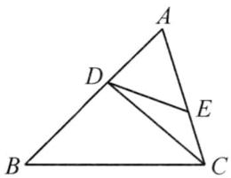

A.1

B. 2

C. 3

D. 4

2. 如图, 在 $\triangle ABC$ 中, $\angle ACB = 90^{\circ}$ , 点 $D$ 在 $AB$ 的延长线上, 则 $\triangle ACD$ 一定是( )

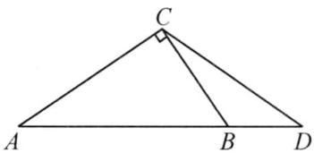

A. 锐角三角形

B. 直角三角形

C. 等腰三角形

D. 钝角三角形

3. 下列四个图形中, 线段 $BE$ 是 $\triangle ABC$ 的高的是 ( )

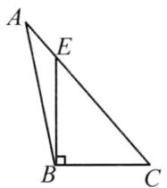  
A

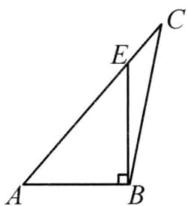  
B

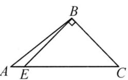  
C

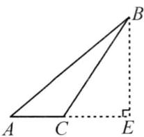  
D

4. 下列长度的三条线段能组成三角形的是( )

A. 1,2,3

B. 1,1,3

C. 3,4,8

D. 4,5,6

5. 如图, 在 $\triangle ABC$ 中, $\angle A = 50^{\circ}, \angle C = 70^{\circ}$ , 则外角 $\angle ABD$ 的度数是 ( )

A. $110^{\circ}$

B. $120^{\circ}$

C. $130^{\circ}$

D. ${140}^{ \circ  }$

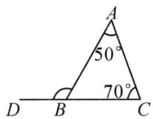  
第 5 题图

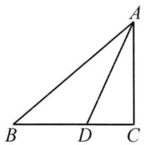  
第6题图

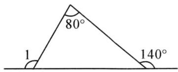  
第7题图

6. 如图, 在 $\triangle ABC$ 中, $\angle C = 90^{\circ}$ , $AD$ 是 $\triangle ABC$ 的角平分线, 若 $\angle ADC = 65^{\circ}$ , 则 $\angle ABC$ 的度数为 ( )

A. $35^{\circ}$

B. ${40}^{ \circ  }$

C. ${45}^{ \circ  }$

D. ${50}^{ \circ  }$

7. 如图, $\angle1$ 的度数为( )

A. $120^{\circ}$

B. $125^{\circ}$

C. $130^{\circ}$

D. ${140}^{ \circ  }$

8. 小谦画一个有两边长分别为 4 和 9 的等腰三角形, 则这个等腰三角形的周长是( )

A. 17

B. 22

C. 13

D. 17 或 22

9. 如图, B 处在 A 处的南偏西 $45^{\circ}$ 方向, C 处在 A 处的南偏东 $15^{\circ}$ 方向, C 处在 B 处的北偏东 $80^{\circ}$ 方向, 则 $\angle ACB$ 的度数为()

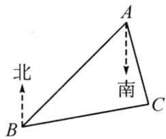

A. $60^{\circ}$

B. $70^{\circ}$

C. ${80}^{ \circ  }$

D. ${85}^{ \circ  }$

10. 如图, 小明将一根笔直的铁

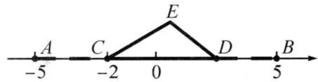

丝 AB 放置在数轴上, 点 A,

B 对应的数分别为 -5, 5, 从点 C, D 两处将铁丝弯曲两头对接, 围成若 $\triangle CDE$ , 若点 C 对应的数为 -2, 则点 D 在数轴上对应的数可能为( )

A.-0.2

B. 2.4

C. 3

D. 5

# 二、填空题（每小题3分，共15分）

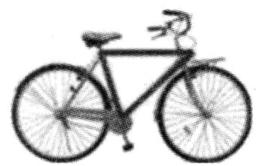

11. 如图,生活中都把自行车的几根梁做成三角形的支架,这是因为三角形具有\_\_\_\_性.  
12. 已知三角形的两边长为 4, 6, 则第三边的长度可以是 \_\_\_\_ (写出一个即可).  
13. 三角形的一个外角为直角, 则这个三角形是 \_\_\_\_ 三角形.  
14. 如图, $\angle CBD$ 、 $\angle ADE$ 为 $\triangle ABD$ 的两个外角, $\angle CBD = 70^{\circ}$ , $\angle ADE = 149^{\circ}$ , 则 $\angle A$ 的度数是 \_\_\_\_.

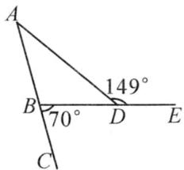  
第14题图

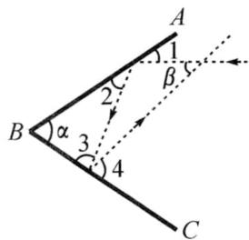  
第 15 题图

15. 如图, 两面镜子 $AB, BC$ 的夹角 $\angle \alpha = 68^{\circ}$ , 光线经过两次反射后, $\angle 1 = \angle 2, \angle 3 = \angle 4$ . 则 $\angle \beta$ 的度数是 \_\_\_\_.

# 三、解答题（共9题，共75分）

16.(6分)在 $\triangle ABC$ 中, $\angle C=\angle B=\frac{1}{2}\angle A$ ,求 $\angle C$ 的度数.

17.(6分)如图,在 $\triangle ABC$ 中, $BE\perp AC$ 于点 $E,BC=5cm,AC=8cm,BE=3cm.$

(1)求 $\triangle ABC$ 的面积；  
(2)画出 $\triangle ABC$ 中的 $BC$ 边上的高 $AD$ ,则 $AD=$ \_\_\_\_cm (请直接写出结果).

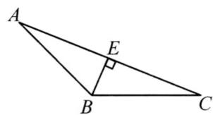

18.(6分)如图,已知 $AB \parallel CD$ , $\angle B = 50^{\circ}$ , $\angle D = 80^{\circ}$ , 求 $\angle BED$ 的度数.

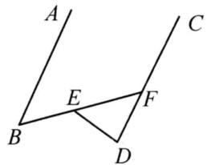

19.(8分)如图,CD是△ABC的高,∠A=∠BCD.

(1) 求证: $\angle B = \angle ACD$ ;   
(2) 判断 $\triangle ABC$ 的形状, 并说明理由.

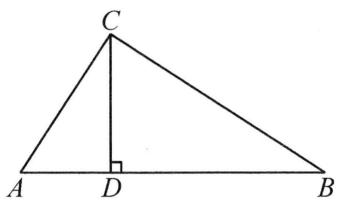

20.(8分)如图,AD是△ABC的外角∠CAE的平分线,∠B=30°,∠DAE=55°.

(1)求 $\angle D$ 的度数；  
(2)求 $\angle ACD$ 的度数.

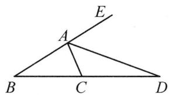

21.(8分)用一条长为 $18 \mathrm{~cm}$ 的细绳围成一个等腰三角形.

(1)如果腰长是底边的2倍,那么底边长是多少?  
(2)能围成有一边的长为 $4 \mathrm{~cm}$ 的等腰三角形吗？为什么？

22.(10分)如图, $\triangle ABC$ 的高BD,CE,交于点O.

(1) $\angle ABD$ 与 $\angle ACE$ 有怎样的大小关系？为什么？  
(2) $\angle A$ 与 $\angle {BOC}$ 有怎样的数量关系？请说明理由.

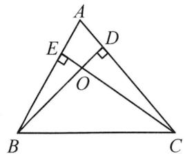

23.(11分)【问题呈现】(1)小明在学习中遇到这样一个问题:如图1,在 $\triangle ABC$ 中, $\angle C>\angle B$ ,AE平分 $\angle BAC$ ,AD⊥BC于点D,猜想 $\angle B$ , $\angle C$ , $\angle EAD$ 之间的数量关系,并证明你的结论;

【变式应用】(2)小明继续研究,在图2中, $\angle B=35^{\circ},\angle C=75^{\circ}$ ,其他条件不变,若把“AD⊥BC于点D“改为“F是线段AE上一点,FD⊥BC于点D”,求 $\angle DFE$ 的度数;

【能力提升】(3)在图3中,若点F在AE的延长线上, $FD\perp BC$ 于点D, $\angle B=x,\angle C=y$ ,其余条件不变,分别作出 $\angle CAE$ 和 $\angle EDF$ 的角平分线,交于点P,试用x,y表示 $\angle P=$ \_\_\_\_.

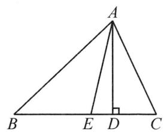  
图1

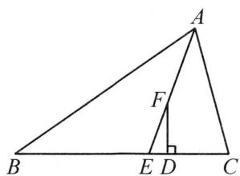  
图2

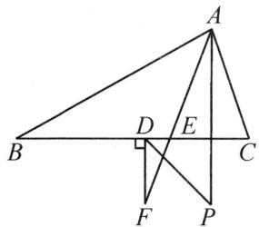  
图3

24.(12分)已知 P 为第四象限一动点, Q 为 x 轴负半轴上一动点, R 在 PQ 下方且为 y 轴负半轴上一动点.

(1)如图 1, 若 $RP \perp QP$ , 求证: $\angle OQP = \angle ORP$ ;  
(2)如图 2, 若 RM, QM 分别平分 $\angle PRO, \angle PQO, P, Q, R$ 在运动过程中, $\angle P, \angle M$ 是否存在确定的数量关系, 若存在, 请证明你的结论; 若不存在, 请说明理由;  
(3)如图3,若将R点改为y轴正半轴上一动点,且在P,Q及(2)中的条件不变的前提下, $\angle P,\angle M$ 又有何数量关系?

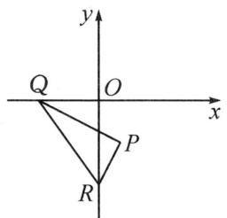  
图1

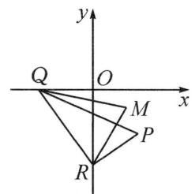  
图2

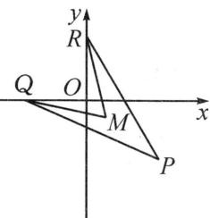  
图3

# 湖北专用

# 2 八上数学第十四章《全等三角形》测试卷

(范围:第十四章 时间:120 分钟 满分:120 分)

# 一、选择题（每小题3分，共30分）

1. 如图, $\triangle ABC \cong \triangle AEF$ , $AC$ 与 $AF$ 是对应边, 那么 $\angle EAF$ 等于 ( )

A. $\angle ACB$

B. $\angle CAF$

C. $\angle BAF$

D. $\angle BAC$

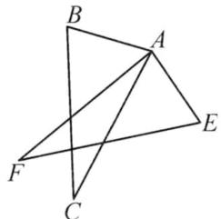  
第1题图

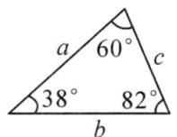

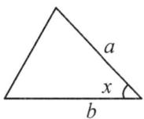  
第2题图

2. 已知图中的两个三角形全等, 则 $\angle x$ 的度数是( )

A. $38^{\circ}$

B. $82^{\circ}$

C. $60^{\circ}$

D. $62^{\circ}$

3. 下列说法正确的是( )

A. 两边对应相等的两个三角形全等  
B. 三边对应相等的两个三角形全等  
C. 面积相等的两个三角形全等  
D. 三个角对应相等的两个三角形全等

4. 如图, $AE \parallel DF$ , $AE = DF$ , 要使 $\triangle EAC \cong \triangle FDB$ , 需要添加下列选项中的 ( )

A. ${AB} = {CD}$

B. $EC = BF$

C. $\angle A = \angle D$

D. ${AB} = {BC}$

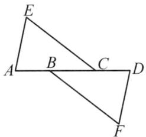  
第 4 题图

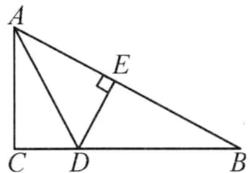  
第5题图

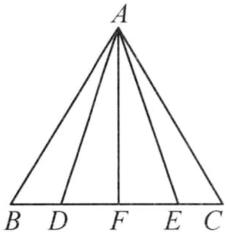  
第6题图

5. 如图, 在 Rt△ABC 中, ∠C=90°, 过 BC 边上的点 D 作 DE⊥AB 于点 E, DC=DE, DE 平分∠ADB, 则∠B 的度数为( )

A. $30^{\circ}$

B. $60^{\circ}$

C. ${45}^{ \circ  }$

D. ${20}^{ \circ  }$

6. 如图, AB = AC, BD = EC, AF ⊥ BC, 则图中全等三角形有 ( )

A. 2 对

B. 3 对

C. 4 对

D. 5 对

7. 如图, 有三条道路围成 Rt△ABC, 其中 BC = 1000 m, ∠C = 90°, 一个人从 B 处出发沿 BC 行走了 800 m, 到达 D 处, AD 恰为 ∠CAB 的平分线, 则此时这个人到 AB 的距离为 ( )

A. 1 000 m

B. $800 \mathrm{~m}$

C. $200 \mathrm{~m}$

D. $1800 \mathrm{~m}$

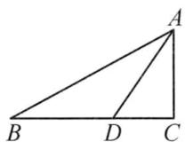  
第 7 题图

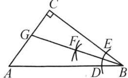  
第9题图

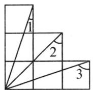  
第10题图

8. 已知 $\triangle ABC \cong \triangle DEF, BC = EF = 6, \triangle ABC$ 的面积为 8, 则边 $EF$ 上的高是( )

A. $\frac{8}{3}$

B. 2

C. 6

D. 12

9. 如图, 在 Rt△ABC 中, ∠C=90°, 利用尺规在 BC, BA 上分别截取 BE, BD, 使 BE=BD, 分别以 D, E 为圆心、以大于 $\frac{1}{2}DE$ 的长为半径作弧, 两弧在 ∠CBA 内交于点 F, 作射线 BF 交 AC 于点 G, 若 CG=1, AB=4, 则 △ABG 的面积是()

A. 0.5

B. 1

C. 2

D. 4

10. 如图为边长相等的 6 个正方形的组合图形, 则 $\angle 1 + \angle 2 + \angle 3$ 的度数是( )

A. $60^{\circ}$

B. $90^{\circ}$

C. ${100}^{ \circ  }$

D. $135^{\circ}$

# 二、填空题（每小题3分，共15分）

11. 如图, 点 $B, E, C, F$ 在一条直线上, $AB \parallel DE$ , $AB = DE$ , $BE = CF$ , $AC = 6$ , 则 $DF$ 的长为 \_\_\_\_.

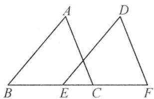  
第11题图

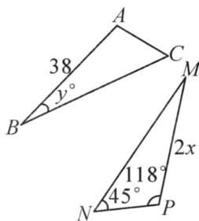  
第 12 题图

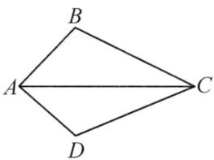  
第 13 题图

12. 如图, 已知 $\triangle ABC \cong \triangle PMN$ , 则 $x = \_$ , $y = \_$ 度.

13. 如图, 在 $\triangle ABC$ 与 $\triangle ADC$ 中, 已知 $AD = AB$ , 在不添加任何辅助线的前提下, 要使 $\triangle ABC \cong \triangle ADC$ , 只需再添加的一个条件可以是 \_\_\_\_.

14. 如图, 已知 $\angle DCE = \angle A = 90^{\circ}$ , $BE \perp AC$ 于点 $B$ , 且 $DC = EC$ , $BE = 8 \mathrm{~cm}$ , 则 $AD + AB =$ \_\_\_\_ cm.

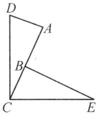  
第 14 题图

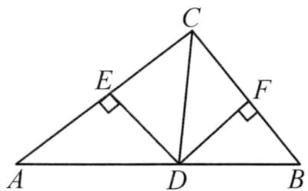  
第15题图

15. 如图, 在 $\triangle ABC$ 中, $CD$ 平分 $\angle ACB$ 交 $AB$ 于点 $D$ , $DE \perp AC$ 于点 $E$ , $DF \perp BC$ 于点 $F$ , 且 $BC = 4$ , $DE = 2$ , 则 $\triangle BCD$ 的面积是 \_\_\_\_.

# 三、解答题（共9题，共75分）

16.(6分)如图, $\angle1=\angle2,\angle3=\angle4$ ,求证:AC=AD.

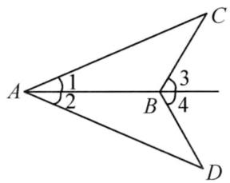

17.(6分)放风筝是中国民间的传统游戏之一,风筝又称风琴,纸鹞,鹞子,纸鸢.如图1,小华制作了一个风筝,示意图如图2所示,AB=AC,DB=DC,他发现AD不仅平分∠BAC,且平分∠BDC,你觉得他的发现正确吗?请说明理由.

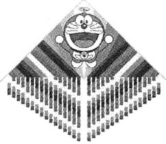  
图1

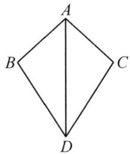  
图2

18.(6分)如图,点A,E,B,D在同一直线上,AC=DF,AC//DF,AE=DB.

(1) 求证: BC = EF;   
(2) 求证: $BC \parallel EF$ .

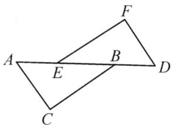

19.(8分)如图, $AB\perp CF$ , $DE\perp CF$ ,垂足分别为B,E,AC=DF,FB=CE.求证:AC//DF.

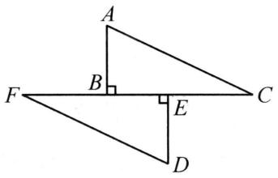

20.(8分)如图,在 Rt△ABC 中,∠C=90°.请用直尺和圆规作图,并完成下列解答:

(1)作 $\angle CAB$ 的平分线 $AP$ 交 $BC$ 于点 $P$ (保留作图痕迹,不写作法);

(2)在(1)的条件下,在线段 AC 上作点 M,使 $\angle PMC = \angle B$ ,请简要说明作法,并证明 $\angle PMC = \angle B$ .

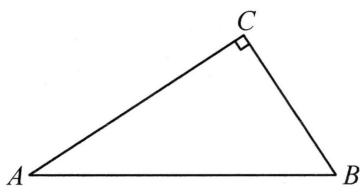

21.(8分)如图, $AC\perp BC$ , $DC\perp EC$ ,BC=DC,AC=EC.

(1) 求证: AB = DE;

(2) 设 AB 与 DE 相交于点 F, 连接 CF. 求证: FC 平分 $\angle BFE$ .

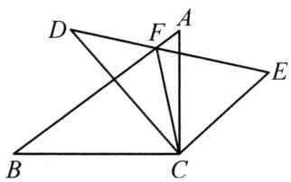

22. (10 分)

<table><tr><td>课题</td><td>测量墙上一点到地面的距离</td></tr><tr><td>测量工具</td><td>测角仪、皮尺、直杆等</td></tr><tr><td>测量方案示意图</td><td>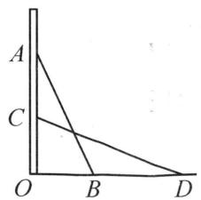 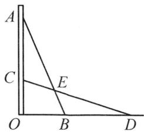图1 图2</td></tr><tr><td>测量方案及步骤</td><td>如图1,第一步:找一根长度大于OA的直杆,使直杆斜靠在墙上,且顶端与点A重合,记下直杆与地面的夹角∠ABO;第二步:使直杆顶端竖直缓慢下滑,直到∠_=∠ABO.标记此时直杆的底端点D;第三步:测量_的长度,即为点A的高度.</td></tr><tr><td>任务1</td><td>(1)补全上述方案中的空格;</td></tr><tr><td>任务2</td><td>(2)利用所学的全等三角形的知识说明这样设计的理由;</td></tr><tr><td>任务3</td><td>(3)如图2,设AB与CD交于点E,善于观察和思考的小明同学猜想线段AE=DE,你同意小明的观点吗?说明理由.</td></tr></table>

23.(11分)小明与爸爸妈妈在操场上荡秋千.小明坐在秋千上的起始位置A处,起始位置OA与地面垂直,两脚在地面上用力一蹬,妈妈在距地面1.2m高的B处接住他,妈妈用力一推,爸爸在C处接住他.若妈妈与爸爸到秋千起始位置OA的水平距离BF,CG分别为1.8m和2.2m, $\angle BOC=90^{\circ}$ .

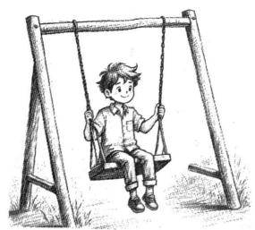

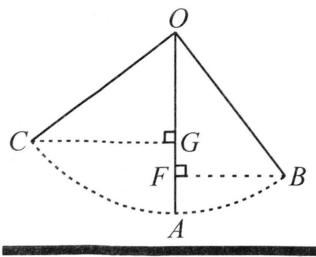

(1) $\triangle CGO$ 与 $\triangle OFB$ 全等吗？请说明理由；

(2)请求出爸爸在距离地面多高的地方接住小明.

24.(12分)如图1,直线AB交x轴于点A(a,0),交y轴于点B(0,b),且a,b满足 $(a+b)^{2}+(a-4)^{2}=0$ .

(1)如图1,若C的坐标为 $(-1,0)$ ,且AH⊥BC于点H,
AH 交 OB 于点 P,试求点 P 的坐标;

(2)如图2,在(1)的条件下,连接OH,求证: $\angle AHO=45^{\circ}$ ;

(3)如图3,若D为AB的中点,M为y轴正半轴上一动点,连接MD,过点D作DN⊥DM交x轴于点N,当点M在y轴正半轴上运动的过程中,式子 $S_{\triangle BDM}-S_{\triangle ADN}$ 的值是否发生改变?若发生改变,求出该式子的值的变化范围;若不改变,求该式子的值.

  
图1

  
图2

  
图3

# 湖北专用

# 3 八上数学第十五章《轴对称》测试卷

(范围:第十五章 时间:120 分钟 满分:120 分)

# 一、选择题（每小题3分，共30分）

1. 下列图中为轴对称图形的是( )

  
A

  
B

  
C

  
D

2. 诗人但丁(A. Dente)曾赞美道: 圆是最美的图形. 圆的线条明快、简练、均匀、对称, 无论是古人, 还是今人, 都对圆有着特殊的亲切情感. 你知道圆有多少条对称轴吗? ()

A. 1 条

B. 2 条

C. 4 条

D. 无数条

3. 点 $P(-3,2)$ 关于 x 轴对称的点的坐标是()

A. $(3,2)$

B. $(-3,2)$

C. $(3,-2)$

D. $(-3,-2)$

4. 等腰三角形中的顶角是 $100^{\circ}$ ，则另两个内角的度数分别为（）

A. $100^{\circ}, 20^{\circ}$

B. $40^{\circ}, 40^{\circ}$

C. ${50}^{ \circ  },{50}^{ \circ  }$

D. $40^{\circ}, 40^{\circ}$ 或 $100^{\circ}, 20^{\circ}$

5. 下列性质中, 等腰三角形具有而直角三角形不一定具有的是 ( )

A. 两边之和大于第三边  
B. 有一个角的平分线垂直于这个角的对边  
C. 有两个锐角的和等于 $90^{\circ}$   
D. 内角和等于 $180^{\circ}$

6. 某帐篷撑起后如图 1, 为更好地将帐篷固定, 需在 4 个角分别另加一根固定绳 (DE), 从正面看如图 2 所示, 测得 $\alpha = 125^{\circ}$ , $CD = CE$ , 则 $\angle DEC$ 的度数为 ( )

  
图1

text_image

A
D
α
E C B

图2

A. $37.5^{\circ}$

B. ${27.5}^{ \circ  }$

C. 22.5°

D. ${17.5}^{ \circ  }$

7. 如图, 在 $\triangle ABC$ 中, $\angle B = 32^{\circ}, \angle BCA = 78^{\circ}$ , 依据尺规作图的作图痕迹, $\angle \alpha$ 的度数为 ( )

A. $64^{\circ}$

B. ${71}^{ \circ  }$

C. ${81}^{ \circ  }$

D. ${86}^{ \circ  }$

  
第 7 题图

  
第8题图

  
第9题图

8. 如图, 在 $\triangle ABC$ 中, $AB = AC$ , 以 $AB, AC$ 为边在 $\triangle ABC$ 的外侧作两个等边三角形 $\triangle ABE$ 和 $\triangle ACD$ , 且 $\angle EDC = 40^\circ$ , 则 $\angle ABC$ 的度数为 ( )

A. $75^{\circ}$

B. ${80}^{ \circ  }$

C. ${70}^{ \circ  }$

D. ${85}^{ \circ  }$

9. 如图, 等边 $\triangle ABC$ 的边长为 $1 \mathrm{~cm}, D, E$ 分别是 $AB, AC$ 上的两点, 将 $\triangle ADE$ 沿直线 $DE$ 折叠, 点 $A$ 落在点 $A'$ 处, 且点 $A'$ 在 $\triangle ABC$ 外部, 则阴影部分图形的周长为 ( )

A. $1 \mathrm{~cm}$

B. $1.5 \mathrm{~cm}$

C. $2 \mathrm{~cm}$

D. $3 \mathrm{~cm}$

10. 如图，在 $\triangle ABC$ 中， $\angle BAC = 120^{\circ}$ ， $AD \perp BC$ 于点 $D$ ，且 $AB + BD = DC$ ，则 $\angle C$ 等于（）

A. ${20}^{ \circ  }$

B. $25^{\circ}$

C. ${30}^{ \circ  }$

D. ${40}^{ \circ  }$

# 二、填空题（每小题3分，共15分）

11. 已知点 A(2x-4,1) 关于 y 轴对称的点在第二象限, 则 x 的取值范围是 \_\_\_\_.

12. 如图所示的图案是一个轴对称图形, 过圆心的直线 $l$ 是它的一条对称轴, 如果最大

圆的半径为 2, 那么阴影部分面积之和是 \_\_\_\_.

13. 如图, $AB \parallel CD$ , $BE$ 平分 $\angle ABC$ , $\angle CDE = 150^{\circ}$ , 则 $\angle C$ 的度数是 \_\_\_\_.

  
第 13 题图

  
第15题图

14. 等腰三角形的周长为 14, 其一边长为 4, 那么它的底边为 \_\_\_\_.  
15. 如图, 在 $\triangle ABC$ 中, $\angle B = \angle C$ , 点 $D$ 在 $BC$ 上, $\angle BAD = 50^{\circ}, AE = AD$ , 则 $\angle EDC$ 的度数为 \_\_\_\_.

# 三、解答题（共9题，共75分）

16.(6分)如图,在 $\triangle ABC$ 中,AB=AC,点D,E在BC边上,且AD=AE.求证:BD=CE.

17.(6 分)由 16 个相同的小正方形拼成的正方形网格,现将其中的两个小正方形涂黑(如图),请你用两种不同的方法分别在下图中再将两个空白的小正方形涂黑,使它成为轴对称图形.

18.(6分)如图,AB=AC,BD=BC,若 $\angle A=40^{\circ}$ ,求 $\angle ABD$ 的度数.

19.(8分)已知直线 l 及其两侧两点 A, B, 如图.

(1)在直线 l 上求一点 P，使 PA = PB；  
(2)在直线 l 上求一点 Q，使直线 l 平分 $\angle AQB$ .

(以上两小题保留作图痕迹,标出必要的字母,不要求写作法)

20.(8分) $\triangle ABC$ 在平面直角坐标系中的位置如图所示.

(1)作出 $\triangle ABC$ 关于 $y$ 轴对称的 $\triangle AB_{1}C_{1}$ ,并写出 $C_{1}$ 的坐标;   
(2) 将 $\triangle ABC$ 向右平移 6 个单位长度, 作出平移后的 $\triangle A_{2}B_{2}C_{2}$ , 并写出 $C_{2}$ 的坐标;  
(3) 观察 $\triangle AB_{1}C_{1}$ 和 $\triangle A_{2}B_{2}C_{2}$ ，它们是否关于某直线对称？若是，请在图上画出这条对称轴。

text_image

y
A
B
1
C
0
x

21.(8分)如图,在 $\triangle ABC$ 中,AB的垂直平分线EF交BC于点E,交AB于点F,D为线段CE的中点,BE=AC.

(1) 求证: $AD \perp BC$ ;   
(2) 若 $\angle BAC = 75^{\circ}$ ，求 $\angle B$ 的度数.

22.(10分)【问题提出】某班级在探究“将军饮马问题”时抽象出数学模型:直线l同旁有两个定点A,B,在直线l上存在点P,使得 $PA+PB$ 的值最小.

解法:如图1,作点A关于直线l的对称点 $A'$ ,连接 $A'B$ ,则 $A'B$ 与直线l的交点即为P,且 $PA+PB$ 的最小值为 $A'B$ .

(1)如图2,在等边 $\triangle ABC$ 中,E是AB上的中点,AD是 $\angle BAC$ 的平分线,P是AD上的一动点,若AD=6,则 $PE+PB$ 的最小值为\_\_\_\_;

# 【拓展运用】

(2)如图3,草地边缘 $OM$ 与小河河岸 $ON$ 在点 $O$ 处形成 $30^{\circ}$ 的夹角,牧马人从 $A$ 地出发,先让马到草地边缘吃草,然后再去河边饮水,最后回到 $A$ 地.已知 $OA = 5 \mathrm{~km}$ ,请在图

中设计一条路线,使所走的路径最短,并求出整个过程所行的路程.

23.(11分)如图, $\triangle ABC$ 为等腰直角三角形, $\angle BAC=90^{\circ}$ .

(1)如图 1, P 为 $\triangle ABC$ 外一点, $AQ \perp AP$ 交 PC 延长线于点 Q, 且 AQ = AP, 求证: $\angle APB = 45^{\circ}$ ;  
(2)如图 2, $\angle {BPC} = {90}^{ \circ  }$ ,求 $\angle {APB}$ 的度数.

  
图1

  
图2

24.(12分)如图1,A,B两点的坐标分别为(a,0),(b,0),且a,b满足 $(a+2)^{2}+|b-8|=0$ ,点C的坐标为(3,c).

(1) 判断 $\triangle ABC$ 的形状；  
(2) 动点 P 从点 A 出发, 以 1 个单位长度/s 的速度在线段 AC 上运动, 另一动点 Q 从点 C 出发, 以 3 个单位长度/s 的速度在射线 CB 上运动, 运动时间为 ts.

①如图2,若AC=13,直线PQ交x轴于点H,当PH=QH时,求t的值;

②如图3,若c=5,当点Q运动到BC中点处时,M(3,m)为AQ上一点,连接CM,作CN⊥AQ交AB于点N,试探究AM和CN的数量关系,并给出证明.

  
图1

  
图2

  
图3

# 湖北专用

# 一、选择题（每小题3分，共30分）

1. 下列长度的三条线段能组成三角形的是( )

A. 1,2,3

B. 1,3,4

C. 3,4,8

D. 4,5,6

2. 若一个三角形三个内角度数的比为 1:2:3, 那么这个三角形是( )

A. 直角三角形

B. 锐角三角形

C. 钝角三角形

D. 等边三角形

3. 若等腰三角形的两边长分别为 2 和 5, 则它的周长为( )

A. 9

B. 7

C. 12

D. 9 或 12

4. 如图, $\triangle ACB \cong \triangle A'CB'$ , $\angle BCB' = 30^\circ$ , 则 $\angle ACA'$ 的度数为 ( )

A. ${20}^{ \circ  }$

B. $30^{\circ}$

C. $35^{\circ}$

D. ${40}^{ \circ  }$

  
第 4 题图

  
第 5 题图

  
第6题图

5. 如图, 已知 $\angle ABC = \angle DCB$ , 下列所给条件不能证明 $\triangle ABC \cong \triangle DCB$ 的是()

A. $\angle A = \angle D$

B. ${AB} = {DC}$

C. $\angle ACB = \angle DBC$

D. $AC = BD$

6. 如图, OC 是 $\angle AOB$ 的平分线, P 是 OC 上一点, $PD \perp OA$ 于点 D, PD = 6, 则点 P 到边 OB 的距离为()

A. 6

B. 5

C. 4

D. 3

7. 如图, 在 $\triangle ABC$ 中, $CD$ 是 $AB$ 边上的高线, $BE$ 平分 $\angle ABC$ , 交 $CD$ 于点 $E, BC = 5, DE = 2$ , 则 $\triangle BCE$ 的面积为 ( )

A. 10

B. 7

C. 5

D. 4

  
第 7 题图

  
第9题图

  
第10题图

8. 点 $P(-2,1)$ 关于 y 轴对称的点的坐标为()

A. $(2,1)$

B. $(-2,-1)$

C. $(2,-1)$

D. $(1,-2)$

9. 如图, 在 $\triangle ABC$ 中, $\angle A = 60^{\circ}, AB = 20 \mathrm{~cm}, AC = 12 \mathrm{~cm}$ , 点 $P$ 从点 $B$ 出发以每秒 $3 \mathrm{~cm}$ 的速度向点 $A$ 运动, 点 $Q$ 从点 $A$ 同时出发以每秒 $2 \mathrm{~cm}$ 的速度向点 $C$ 运动, 其中一个动点到达终点时, 另一个动点也随之停止运动, 当 $\triangle APQ$ 是等边三角形时, 运动的时间是 ( )

A. 2.5 秒

B. 3 秒

C. 3.5 秒

D. 4 秒

# 4 八上数学期中测试卷

(范围:第十三章\~第十五章 时间:120 分钟 满分:120 分)

10. 如图, 点 $C, E$ 和点 $B, D, F$ 分别在 $\angle GAH$ 的两边上, 且 $AB = BC = CD = DE = EF$ , 若 $\angle A = 18^{\circ}$ , 则 $\angle GEF$ 的度数是 ( )

A. ${108}^{ \circ  }$

B. ${100}^{ \circ  }$

C. ${90}^{ \circ  }$

D. ${80}^{ \circ  }$

# 二、填空题(每小题3分,共15分)

11. 已知三角形的两边长为 4, 8, 则第三边的长度可以是 \_\_\_\_ (写出一个即可).

12. 如图, $\triangle ABD \cong \triangle CBD$ , 若 $\angle A = 80^{\circ}$ , $\angle ABC = 70^{\circ}$ , 则 $\angle ADC$ 的度数为 \_\_\_\_.

13. 在 $\triangle ABC$ 中, $AB=4$ , $AC=3$ , $AD$ 是 $\triangle ABC$ 的角平分线, 则 $\triangle ABD$ 与 $\triangle ACD$ 的面积之比是\_\_\_\_.

14. 如图, 在 $\triangle ABC$ 中, $\angle B = 80^{\circ}$ , $DE$ 是 $AC$ 的垂直平分线, 且 $\angle BAD: \angle BAC = 1:3$ , 则 $\angle C$ 的度数为 \_\_\_\_ 度.

  
第12题图

  
第14题图

  
第15题图

15. 如图, 直线 $m \parallel n$ , 等边 $\triangle ABC$ 的顶点 $B, C$ 分别在直线 $m, n$ 上. 若 $\angle 1 = 70^{\circ}$ , 则 $\angle 2$ 的度数为 \_\_\_\_.

# 三、解答题（共9题，共75分）

16.(6分)如图,在 $\triangle ABC$ 中, $\angle ACB=90^{\circ}$ ,CD是高.

(1)图中有几个直角三角形？是哪几个？

(2) $\angle1$ 和 $\angle A$ 有什么关系？ $\angle2$ 和 $\angle A$ 呢？还有哪些锐角相等.

17.(6分)如图, $\angle B=\angle C,AE\parallel CD,AE$ 交BC于点E.求证: $\triangle ABE$ 是等腰三角形.

18.(6分)如图, $\triangle ABC$ 的顶点坐标分别为A(2,3),B(1,1),C(3,2).

(1) 将 $\triangle ABC$ 向下平移 4 个单位长度, 画出平移后的 $\triangle A_{1}B_{1}C_{1}$ ;

(2)画出 $\triangle ABC$ 关于 $y$ 轴对称的 $\triangle A_{2}B_{2}C_{2}$ ,并直接写出 $C_{2}$ 的坐标是\_\_\_\_.

text_image

y
A
C
B
O
x

19.(8分)如图,点B,E,C,F在同一条直线上, $\angle A=\angle D$ , $\angle B = \angle DEF, BE = CF.$ 求证: AC = DF.

20.(8分)如图,在 $\triangle ABC$ 中, $BA=BC,D$ 为 $BC$ 延长线上一点.

(1)利用尺规作图作出 $\angle ACD$ 的平分线CE(保留作图痕迹,不写作法);

(2)已知 $\angle B=80^{\circ}$ ,求 $\angle DCE$ 的度数.

21.(8分)如图,在 $\triangle ABC$ 中,BD为 $\angle ABC$ 的平分线,DE⊥AB于点E,且 $DE=2\ \text{cm},AB=9\ \text{cm},BC=6\ \text{cm}$ ,求 $\triangle ABC$ 的面积.

22.(10 分)【操作应用】(1)实践小组用四根木条钉成“筝形”仪器,如图 1 所示,其中 AB=AD,BC=DC,相邻两根木条的连接处是可以转动的.连接 AC,求证:AC 平分∠BAD;

# 【实践拓展】

(2)实践小组尝试使用“筝形”仪器检测教室门框是否水平. 如图 2, 在仪器上的点 A 处绑一条线绳, 线绳另一端挂一个铅锤, 仪器上的点 B, D 紧贴门框上方, 观察发现线绳恰好经过点 C, 即判断门框是水平的. 实践小组的判断对吗? 请说明理由;  
(3)如图3,在 $\triangle MNP$ 中, $\angle M=90^{\circ},\angle N=30^{\circ},E,F$ 分别是边 $MN,NP$ 上的动点.当四边形MEFP为“筝形”时, $\angle NFE$ 的度数为\_\_\_\_.

  
图1

  
图2

  
图3

23.(11分)(1)如图1, $\triangle ABC$ 是等边三角形,BD是AC边上的中线,延长BC至点E,使CE=CD,求证:DB=DE;

(2)如图 2, 若 $\triangle ABC$ 是等边三角形, 在 AC 上取一点 D, 延长 BC 至点 E, 使 CE = AD, 求证: DB = DE;  
(3)如图3,若D是AC延长线上的一点,(2)中的其它条件不变,BD与ED还相等吗?试说明理由.

  
图1

  
图2

  
图3

24.(12分)如图1,点A在y轴的正半轴,点B在x轴的负半轴上,过点A作CA⊥AB,且AB=AC.

(1) 若点 A(0,4), B(-1,0), 求点 C 的坐标;  
(2)如图 2, 点 D 在 x 轴的负半轴上且 OA = OD, 连接 DC 交 y 轴的正半轴于点 E, 求证: DB = 2OE.  
(3)如图3,点D在x轴的负半轴上,OA=OD,N为AB延长线上一点,连接ON,作OM⊥ON于点O且OM=ON,F为DM的中点,连接AN,OF,判断OF,AN之间的关系,并加以证明.

  
图1

  
图2

  
图3

# 湖北专用

# 5 八上数学第十六章《整式的乘法》测试卷

(范围:第十六章 时间:120 分钟 满分:120 分)

# 一、选择题（每小题3分，共30分）

1. 计算 $a^2 \cdot a^3$ 的结果是（ ）

A. $2a^{6}$

B. $2a^{5}$

C. $a^6$

D. $a^5$

2. 下列运算正确的是( )

A. $a^3 + a^3 = a^6$

B. $2(a+1)=2a+1$

C. $(-ab)^{2} = a^{2}b^{2}$

D. $a^6 \div a^3 = a^2$

3. 计算 $(-2a)(-3a^{2})$ 的结果是（ ）

A. $-6a^{3}$

B. $-5a^{3}$

C. $6a^{3}$

D. $5a^{3}$

4. 长方形的面积为 $12ab^{2}-9a^{2}b$ ，若它的一边长为 3ab，则另一边长为（）

A. 1

B. $4 b - 3 a$

C. $4 b - 3$

D. $4 - 3a$

5. 计算 $(x + 2)(2 - x)$ 的结果是（

A. $x^{2} - 4$

B. $x^{2} - 4x + 4$

C. $4 - x^{2}$

D. $x^{2} - 4x - 4$

6. 下列计算正确的是( )

A. $(x+2)(x-3)=x^{2}-6$

B. $(-4x)(2x^{2}+3x-1)=-8x^{2}-12x^{2}-4x$

C. $(x-2y)^{2}=x^{2}-2xy+y^{2}$

D. $(1-2a)(1+2a)=1-4a^{2}$

7. 如图所示,用观察图形来推导下列哪个式子成立()

A. $(a+b)^{2}=a^{2}+2ab+b^{2}$

B. $(a-b)^{2}=a^{2}-2ab+b^{2}$

C. $(a+b)(a-b)=a^{2}-b^{2}$

D. $(a+b)^{2}=a^{2}+ab+b^{2}$

8. 将一些半径相同的小圆按如图所示的规律摆放, 请仔细观察, 第 n 个图形的小圆的个数有( )

  
第1个图形

  
第2个图形

  
第3个图形

  
第4个图形

A. $n^2 + n + 4$

B. $n^2 + n$

C. $n^2 + 4$

D. $n^2 - n + 4$

9. 计算 $(a-b-c)^{2}$ 的结果是()

A. $a^2 - b^2 - c^2$

B. $a^{2}+b^{2}+c^{2}$

C. $a^{2}+b^{2}+c^{2}-2ab+2ac-2bc$

D. $a^{2}+b^{2}+c^{2}-2ab-2ac+2bc$

10. 使 $(x^{2} + px + 8)(x^{2} - 3x + q)$ 乘积中不含 $x^{2}$ 和 $x^{3}$ 项的 $p$ ， $q$ 的值分别是（）

A. 3,1

B.-3,-9

C. 0,0

D.-3,1

# 二、填空题（每小题3分，共15分）

11. 计算: $(-2x)^{3} =$ \_\_\_\_.

12. 若 $a^{m}=4, a^{n}=3$ ，则 $a^{2m+n}$ 的值为 \_\_\_\_.

13. 如果 $a^{2}-a=1$ ，那么 $a(a-2)+(a+2)(a-2)$ 的值为 \_\_\_\_.

14. 定义 $\begin{vmatrix} a & b \\ c & d \end{vmatrix}$ 为二阶行列式, 规定它的运算法则为 $\begin{vmatrix} a & b \\ c & d \end{vmatrix} = ad - bc$ , 计算 $\begin{vmatrix} x - 1 & 1 \\ 0 & x + 1 \end{vmatrix}$ 的结果是 \_\_\_\_.

15. 如图, 将边长为 $(m + 3)$ 的正方形纸片剪出一个边长为 $m$ 的正方形后, 剩余部分又剪拼成一个长方形 (不重叠无缝隙), 则拼成的长方形的周长是 \_\_\_\_.

text_image

①
②
m+3 →
m
① ②

# 三、解答题（共9题，共75分）

16.(6分)计算: $5a^{2}b\div(-\frac{1}{3}ab)\cdot(2ab^{2})^{2}$ .

17.(6分)计算: $\left(\frac{2}{3}a^{4}b^{7}-\frac{1}{9}a^{2}b^{6}\right)\div\left(-\frac{1}{3}ab^{3}\right)^{2}.$

18.(6分)计算:(m-2n+3)(m+2n-3).

19.(8分)先化简,再求值: $(a+b)(a-b)+(a+b)^{2}-2a^{2}$ ,其中 $a=3,b=-\frac{1}{3}$ .

20.(8分)某小区有一块长为 $(a+3b)$ m,宽为 $(a+2b)$ m的长方形空地,物业部门计划进行绿化(如图阴影部分),中间部分将修建一个仿古小景点(如图中间的正方形所示).

(1)求绿化面积是多少平方米(结果用含 $a, b$ 的式子表示); (2)求当 $a = 5, b = 2$ 时的绿化面积.

21.(8 分)解下列方程和不等式:

(1) $(x+2)(x-3)-(x-6)(x-1)=0;$   
(2) $(-x+3)(2x-2)\leqslant(x-4)(1-2x)$ .

22.(10分)已知 $(a+b)^{2}=20,(a-b)^{2}=8$ .求下列代数式的值:

(1) $ab$ ; (2) $a^2 + b^2$ ; (3) $a^4 + b^4$ .

23.(11分)【阅读理解】我们可以用作差法比较两个代数式的大小.例如:已知 $M=2x+3,N=2x+1$ ,比较M和N的大小.因为 $M-N=2x+3-(2x+1)=2>0$ ,所以M>N.

【尝试运用】(1)已知边长为 a 的两个正方形, 将其中一个正方形一边不变, 另一边增加 4, 得到一个新长方形, 记此长方形的面积为 $S_{1}$ ; 将另一个正方形的边长增加 2 得到一个的新正方形, 记此正方形的面积为 $S_{2}$ . 试用作差法比较 $S_{1}$ 与 $S_{2}$ 之间的大小;

(2) 将两个等腰直角三角形 ( $\triangle ACB$ 和 $\triangle BED$ ) 的边长分别为 a 和 b (a < b)，按如图所示的放置在一起，点 C, B, E 在同一条直线上，P 是线段 CE 的中点，连结 AD, AP, DP. 请比较 $\triangle APD$ 与 $\triangle ABD$ 的面积大小.

24.(12分)【问题提出】对于任意实数a,b,定义一种新运算: $a \oplus b = (a + 1)^{2} + (b + 1)^{2}$ ,例如: $2 \oplus 3 = (2 + 1)^{2} + (3 + 1)^{2} = 25$ .

【初步感知】(1)(-2)⊕3=\_\_\_\_；

【变式运用】(2)解不等式: $1 \oplus x - 2 \oplus (x + 1) > 6$ ;

【深度探究】(3)我们知道,实数的加法运算和乘法运算都满足交换律,试问实数 a,b 的这种新运算⊕是否也满足交换律?请说明理由;

【拓展运用】(4)若实数 a, b 满足 $10a + 10b - 2ab - 34 = 0$ ，求 $a \oplus b$ 的最小值.

# 湖北专用

# 6 八上数学第十七章《因式分解》测试卷

(范围:第十七章 时间:120 分钟 满分:120 分)

# 一、选择题（每小题3分，共30分）

1. 下列等式从左到右的变形, 属于因式分解的是()

A. $x^{2} - 1 = (x - 1)^{2}$

B. $(a + b)(a - b) = a^2 -b^2$

C. $x^{2} + 4x + 4 = (x + 2)^{2}$

D. $x^{2} + 1 = x\left(x + \frac{1}{x}\right)$

2. 下列因式分解正确的是( )

A. $2x^{2} - xy - x = 2x(x - y - 1)$

B. $x(x - y) - y(x - y) = (x - y)^{2}$

C. $-xy^{2} + 2xy - 3y = -y(xy - 2x - 3)$

D. $x^{2} - 2x + 1 = x(x - 2) + 1$

3. 将多项式 $x - x^{2}$ 因式分解正确的是( )

A. $x(1 - x)$

B. $x(x-1)$

C. $x(1 - x^{2})$

D. $x(x^{2} - 1)$

4. 利用因式分解简便计算: $69 \times 99 + 32 \times 99 - 99$ 正确的是()

A. $99 \times (69 + 32) = 99 \times 101 = 9\ 999$

B. $99 \times (69 + 32 - 1) = 99 \times 100 = 9\ 900$

C. $99 \times (69 + 32 + 1) = 99 \times 102 = 10\ 098$

D. $99 \times (69 + 32 - 99) = 99 \times 2 = 198$

5. 下列多项式在实数范围内不能用公式法因式分解的是( )

A. $x^{2} - 2x + 4$

B. $-x^{2}-2xy-y^{2}$

C. $-x^{2}+y^{2}$

D. $x^{2} - (y + z)^{2}$

6. 将下列多项式分解因式, 结果中不含因式 x-1 的是()

A. $x^{2} - 1$

B. $x(x - 2) + (2 - x)$

C. $x^{2}-2x+1$

D. $x^{2} + 2x + 1$

7. 对于任何整数 m，多项式 $(4m+5)^{2}-9$ 都能（）

A. 被 8 整除

B. 被 $m$ 整除

C. 被 $(m - 1)$ 整除

D. 被 $(2m - 1)$ 整除

8. 已知 $\triangle ABC$ 的三边 a, b, c 满足 $(b - a)(b^{2} + c^{2}) = ba^{2} - a^{3}$ ，则 $\triangle ABC$ 是（）

A. 等腰三角形

B. 等腰直角三角形

C. 等边三角形

D. 等腰三角形或直角三角形

9. 已知 $2x - y = 1, xy = 2$ ，则 $4x^{3}y - 4x^{2}y^{2} + xy^{3}$ 的值为（）

A.-2

B. 1

C.-1

D. 2

10. 如果一个正整数能表示为两个正整数的平方差, 那么称这个正整数为“智慧数”, 例如: $3 = 2^{2} - 1^{2}$ , 3 是智慧数; $5 = 3^{2} - 2^{2}$ , 5 是智慧数; $7 = 4^{2} - 3^{2}$ , 7 是智慧数, $\cdots$ ; 又如 $8 = 3^{2} - 1^{2}$ , 8 是智慧数; $12 = 4^{2} - 2^{2}$ , 12 是智慧数; $16 = 5^{2} - 3^{2}$ , 16 是智慧数; $\cdots$ , 下面 4 个数中不是“智慧数”的是( )

A. 2021

B. 2022

C. 2023

D. 2024

# 二、填空题（每小题3分，共15分）

11. 因式分解: $a^2 - 4b^2 =$   
12. 若 $a + b = 3$ ，则 $2a^{2} + 4ab + 2b^{2} - 6$ 的值为 \_\_\_\_.  
13. 若多项式 $x^{2}+ax+6$ 可分解为 $(x+2)(x+b)$ ，则 a-b 的值为 \_\_\_\_.  
14. 因式分解: $(x+2)(x+4)+1=$ \_\_\_\_.   
15. 若多项式 $4a^{2}-ka+9$ 是关于 a 的一个完全平方式，则 k 的值为 \_\_\_\_.

# 三、解答题（共9题，共75分）

16.(6分)把下列各式因式分解:

(1) $4xy-2x^{2}y;$

(2) $x^{2}-9y^{2}$ .

17.(6 分)将下列各式因式分解:

(1) $3x^{3}-12xy^{2}$ ;

(2) $2m^{4}n-12m^{3}n^{2}+18m^{2}n^{3}$ .

18.(6分)运用因式分解计算:

(1) $655^{2}-345^{2}$ ;

(2) $83^{2}+34\times83+17^{2}$ .

19.(8分)先化简,再求值: $(2x-3y)^{2}-(2x+3y)^{2}$ ,其中, $x=\frac{1}{3},y=\frac{1}{8}$ .

20.(8分)下面是一个正确的因式分解,但是其中部分一次式被墨水污染看不清了.

$$
2 x ^ {2} + 3 x - 6 + \boxed {} = (x - 2) (2 x + 5).
$$

(1)求被墨水污染的一次式；  
(2)若被墨水污染的一次式的值小于6但不小于2,求x的取值范围.

21.(8分)因式分解:

(1) $(x^{2}+2xy+y^{2})+(-2x-2y)+1;$   
(2) $(x^{2} + 4)^{2} - 16x^{2}$ .

22.(10 分)【发现】任意两个连续奇数的平方差都是 8 的整数倍.

【验证】 $15^{2} - 13^{2}$ 的结果是8的多少倍？

【探究】设“发现”中较大的奇数为 $2n + 1$ （其中 $n$ 取正整数），请论证“发现”中的结论；

【延伸】“两个连续偶数的平方差是8的倍数”，这个结论正确吗？若正确，请说明理由；若不正确，请举反例。

23.(11分)如图,把一个长方形纸板剪切成图示的9块,其中有2块边长为a的大正方形,2块边长为b的小正方形,还有5块长、宽分别是a和b的长方形,且a>b.

(1)通过观察图形,把多项式 $2a^{2}+5ab+2b^{2}$ 分解因式;  
(2)若4个正方形的面积和是58,每块长是a,宽是b的长方形的面积是10,求下面代数式的值:① $a+b$ ;② $a^{3}b+ab^{3}$ .

24.(12分)【活动素材】如图1,一张长方形硬纸板,长为4b,宽为 $a(a>b)$ ; 教辅资源,关注公众号★全科AA+

【实践操作】步骤 1: 将图 1 中的长方形硬纸板平均分成四块全等的小长方形；

步骤 2: 沿虚线用剪刀剪开;

步骤 3: 按如图 2 所示拼成一个大正方形.

【实践探索】(1)①图2中的阴影部分正方形的边长是\_\_\_\_（用含a,b的代数式表示）；

②观察图1,图2,请直接写出 $(a+b)^{2}$ ,ab与 $(a-b)^{2}$ 之间的等量关系是\_\_\_\_;

【实践应用】(2)如图3,C是线段AB上的一点,以AC,BC为边向上分别作等腰Rt△ACD和等腰Rt△BCE,点E在CD上,连接AE,若AB=11,S $_{\triangle ACE}$ =14,求DE的长.

  
图1

  
图2

  
图3

# 湖北专用

# 7 八上数学第十八章《分式》测试卷

(范围:第十八章 时间:120 分钟 满分:120 分)

# 一、选择题（每小题3分，共30分）

1. 在式子 $\frac{4}{y}, \frac{y}{4}, \frac{6}{x + y}, \frac{x + y}{2}$ 中, 是分式的有 ( )

A. 1 个

B. 2 个

C. 3 个

D. 4 个

2. 若分式 $\frac{2}{x-5}$ 有意义, 则 x 的取值范围是()

A. $x \neq 5$

B. $x \neq -5$

C. x > 5

D. $x > - 5$

3. 分式 $\frac{x^{2}-1}{x-1}$ 的值为0, 则x的值是()

A. 1

B.-1

C. $\pm 1$

D. 0

4. 下列计算错误的是( )

A. $\frac{0.2a + b}{0.7a - b} = \frac{2a + b}{7a - b}$

B. $\frac{x^{2}y}{xy^{2}}=\frac{x}{y}$

C. $\frac{a-b}{b-a}=-1$

D. $\frac{1}{c} + \frac{2}{c} = \frac{3}{c}$

5. 若 $x = 3$ 是关于 $x$ 的方程 $\frac{10}{x + k} - \frac{3}{x} = 1$ 的一个解, 则 $k$ 的值是( )

A. 2

B. 3

C. 0.5

D. 1

6. 把方程 $\frac{1}{3(x - 1)} - \frac{1}{x^2 - 1} = \frac{3}{x + 1}$ 化为整式方程时, 两边同时乘以的最简公分母是( )

A. $3(x-1)$

B. $(x-1)(1-x^{2})$

C. $3(x-1)(1-x^{2})$

D. $3(x-1)(x+1)$

7. 化简 $\frac{x^2}{x - 1} + \frac{x}{1 - x}$ 的结果是（ ）

A. $x+1$

B. $x - 1$

C.-x

D. $x$

8. 若关于 x 的分式方程 $\frac{x-3}{x-1}=\frac{m}{x-1}$ 无解，则 m 的值为（）

A.-2

B.-1

C. 1

D. 2

9. 四个数 $(- \frac{1}{2})^{-2}, (-2)^{-2}, (-\frac{1}{2})^{-1}, (-2)^{-1}$ 中, 最大的数是 ( )

A. $\left(-\frac{1}{2}\right)^{-2}$

B. $(-2)^{-2}$

C. $(- \frac{1}{2})^{-1}$

D. $(-2)^{-1}$

10. 对于两个不相等的实数 $a, b$ , 我们规定 $\max \{a, b\}$ 表示 $a, b$ 中的较大数, 如: $\max \{2, 4\} = 4$ , 按照这个规定 $\max \{-2, 3\} = \frac{2x + 1}{x}$ 的解是 ( )

A.-2

B. 2

C.-1

D. 1

# 二、填空题（每小题3分，共15分）

11. 一种微粒的半径是 0.00004 米, 数据 0.00004 用科学记数法表示为

12. 计算: $\frac{-1}{a+1} + \frac{a^{2}}{a+1} =$ \_\_\_\_ .

13. 分式方程 $\frac{2}{x - 3} + 1 = 0$ 的解是 \_\_\_\_.

14. 已知非零实数 $x, y$ 满足 $y = \frac{x}{3x + 1}$ , 则 $\frac{x - y + 3xy}{xy}$ 的值为 \_\_\_\_.

15. 如图所示, 某同学不小心将分式运算的作业纸撕坏了一角, 若已知该运算正确的情况下, 则撕坏的部分中“■”代

# 三、解答题（共9题，共75分）

16.(6分)计算: $\frac{4a+4b}{5ab}\cdot\frac{15a^{2}b}{a^{2}-b^{2}}.$

17.(6分)请从三个代数式 $4x^{2}-y^{2},2xy+y^{2},4x^{2}+4xy+y^{2}$ 中,任选两个构造一个分式,并化简该分式.

18.(6分)通分:(1) $\frac{x}{3y}$ 与 $\frac{4}{5xy^{2}}$ ; (2) $\frac{a}{3a-6}$ 与 $\frac{a}{2(2-a)^{2}}$ .

19.(8分)解方程: $\frac{1}{x-1}-\frac{3}{x^{2}-1}=0.$

20.(8分)计算: $a^{-2}b^{-2}\cdot(-3a^{-3}b^{3})\div(6a^{-4}b^{-5})$ .

21.(8分)先化简 $\frac{x^{2}-4x+4}{x^{2}-2x}\div(x-\frac{4}{x})$ ，然后从 $-\sqrt{5}<x<\sqrt{5}$ 的范围内选取一个合适的整数作为x的值代入求值.

22.(10 分)学校在某商场购买甲、乙两种不同类型的足球,相关信息如下表:

甲种足球
购买费用：2000元
单价：x元
数量：\_\_\_\_个

乙种足球
购买费用：1400元
单价：(x+20)元
数量：\_\_\_\_个

(1)用含 $x$ 的代数式分别表示上表中购买甲、乙两种足球的数量；

(2)若本次购买甲种足球的数量是购买乙种足球数量的 2 倍,求甲、乙两种足球在此商场的销售单价.

23.(11分)定义:若两个分式的和为 $n(n$ 为正整数),则称这两个分式互为“ $n$ 阶分式”.

例如，分式 $\frac{3}{x + 1}$ 与 $\frac{3x}{1 + x}$ 互为“3阶分式”.

(1)分式 $\frac{10x}{3+2x}$ 与\_\_\_\_互为“5阶分式”；  
(2)设正数 x, y 互为倒数, 求证: 分式 $\frac{2x}{x+y^{2}}$ 与 $\frac{2y}{y+x^{2}}$ 互为“2 阶分式”;  
(3)若分式 $\frac{a}{a+4b^{2}}$ 与 $\frac{2b}{a^{2}+2b}$ 互为“1阶分式”（其中a,b为正数），求ab的值.

24.(12分)【问题情境】国庆期间,小明和小李两家打算自驾去某地游玩.制定行走路线时,发现有两种方案供选择,详见下表.

<table><tr><td>日常情况</td><td>方案一:走国道</td><td>方案二:走高速公路</td></tr><tr><td>路程</td><td>全程63千米</td><td>全程108千米</td></tr><tr><td>优缺点分析</td><td>距离短,路上货车较多,影响速度,比方案二晚到10分钟.</td><td>距离长,速度快,平均速度是方案一平均速度的2倍.</td></tr></table>

【解决问题】(1)求日常情况下方案一需要的时间；

【数学思考】(2)国庆期间规定货车白天不能走国道,小明家预判没有货车的影响走国道会更快,于是决定走国道;小李家仍选择走高速.同时出发20分钟后,他们发现小李家比小明家多走了14千米,小明家在不违章的情况下,平均车速达到每小时60千米以上.请问以此速度,在不考虑其他因素影响的情况下,哪家能先到达目的地?请说明理由.

# 湖北专用

# 一、选择题（每小题3分，共30分）

1. 下列交通标志图案是轴对称图形的是( )

  
A

  
B

  
C

  
D

2. 使分式 $\frac{x}{x - 2}$ 有意义的 $x$ 的取值范围是（ ）

A. x = 2

B. x > 2

C. x < 2

D. $x \neq 2$

3. 若等腰三角形两边长分别是 2 和 6, 则它的周长是( )

A. 10

B. 14

C. 10 或 14

D. 8

4. 下列运算正确的是( )

A. $(\pi - 3)^{0} = 1$

B. $\sqrt{9}=\pm3$

C. $2^{-1} = -2$

D. $(-a^{2})^{3}=a^{6}$

5. 下列分式化简后为 $\frac{y}{2x}$ 的是()

A. $\frac{y^{2}}{2x^{2}}$

B. $\frac{2xy}{4x^{2}}$

C. $\frac{xy}{4x^{2}}$

D. $-\frac{-y}{-2x}$

6. 计算 $(2x - 1)(2x + 1)$ 的结果是（）

A. $4x^{2}-1$

B. $2x^{2}-1$

C. $4x^{2}+1$

D. $2x^{2}+1$

7. 计算 $(3x-1)^{2}$ 的结果是()

A. $6x^{2}-6x+1$

B. $9x^{2}-6x+1$

C. $9x^{2}-6x-1$

D. $9x^{2}+6x-1$

8. 下列因式分解正确的是( )

A. $4x^{2}-1=(4x+1)(4x-1)$

B. $x^{2} - 4x + 3 = (x - 3)(x - 1)$

C. $x^{2}-4x+4=(x+2)^{2}$

D. $x^{2} - 4x - 5 = x(x - 4) - 5$

9. 观察下列等式: 9-1=8, 16-4=12, 25-9=16, 36-16=20, ……, 这些等式反映正整数间的某种规律, 设 $n(n \geqslant 1)$ 表示自然数, 用关于 n 的等式表示这个规律为( )

A. $(n+1)^{2}-n^{2}=2n+1$

B. $(2n+1)^{2}-n^{2}=(3n+1)(n+1)$

C. $(n+2)^{2}-n^{2}=4(n+1)$

D. $(n+2)^{2}-n^{2}=2n+2$

10. 如图, 已知 $P$ 是 $\angle AOB$ 的角平分线上的一点, $\angle AOB = 60^{\circ}, PD \perp OA, DM = PM$ , 点 $C$ 是 $OB$ 上的一个动点, 若 $PC$ 的最小值为 $3 \mathrm{~cm}$ , 则 $MD$ 的长度为 ( )

A. $3 \mathrm{~cm}$

B. $3 \sqrt{3} \mathrm{~cm}$

C. 2 cm

D. $2 \sqrt{3} \mathrm{~cm}$

# 8 八上数学期末测试卷

(范围:第十三章\~第十八章 时间:120 分钟 满分:120 分)

# 二、填空题(每小题3分,共15分)

11. 计算: (1) $(a^3)^2 =$ \_\_\_\_;

(2) $a^{8}\div a^{2}=$ \_\_\_\_;

(3) $(ab+1)(ab-1)=$ \_\_\_\_.

12. 已知点 $P(a, -4)$ 与点 $M(5, b)$ 关于 x 轴对称，则 $a + b$ 的值为 \_\_\_\_.

13. 若 $x - y = 2xy (xy \neq 0)$ , 则 $\frac{1}{x} - \frac{1}{y}$ 的值为 \_\_\_\_.

14. 如图, 在 $\triangle ABC$ 中, $AB = AC$ , $AB$ 的垂直平分线 $MN$ 交 $AC$ 于点 $D$ , 交 $AB$ 于点 $E$ , 若 $\angle DBC = 30^{\circ}$ , 则 $\angle A$ 的度数为 \_\_\_\_.

  
第14题图

  
第 15 题图

15. 如图, 在 $\triangle ABC$ 中, $\angle C = 90^{\circ}, \angle B = 15^{\circ}, AB$ 的垂直平分线交 $BC$ 于点 $D$ , 垂足为 $E$ , 若 $BD + AC = 24$ , 则 $BD - AC$ 的值为 \_\_\_\_.

# 三、解答题（共9题，共75分）

16.(6分)计算:

(1) $3x \cdot x^{3} + (-2x^{2})^{3} \div 4x^{2}$ ;

(2) $(x+2)(x-3)-(x+1)(x-1)$ .

17.(6 分)因式分解:

(1) $2x^{3}-8x$ ;

(2) $3ax^{2}+6axy+3ay^{2}$ .

18.(6分)解分式方程: $\frac{5}{x^{2}+x}-\frac{1}{x^{2}-x}=0.$

19.(8分)如图,已知AB=AC,AD=AE,求证: $\angle B=\angle C$ .

20.(8分)先化简,再求值: $\frac{x+3}{x^{2}-4}\div\left(1+\frac{5}{x-2}\right)$ ,其中x=-4.

21.(8分)某公司计划从商店购买A,B两种签字笔,已知A种签字笔比B种签字笔每支单价多20元,若用400元购买A种签字笔,用160元购买B种签字笔,则购买A种签字笔的支数是购买B种签字笔支数的一半.

(1)求 A,B 两种签字笔的每支单价各是多少元?   
(2)经商谈,商店给予该公司“购买一支A种签字笔,赠送一支B种签字笔”的优惠,且该公司需要的B种签字笔的支数是A种签字笔的2倍还多8支,且该公司购买这两种笔的总费用不超过670元,那么该公司最多可购买多少支A种签字笔?

22.(10 分)利用折叠对称可以解决很多数学问题.

【感悟】(1)如图 1, AD 是 $\triangle ABC$ 的高线, $\angle C = 2\angle B$ , 若 CD = 2, AC = 5, 求 BC 的长.

小明同学的解法是: 将 $\triangle ABC$ 沿 AD 折叠, 则点 C 刚好落在 BC 边上的点 E 处. 请你画出图形并直接写出答案: BC = \_\_\_\_;

【探究】(2)如图 2, $\angle ACB = 2\angle B$ , AD 为 $\triangle ABC$ 的外角 $\angle CAF$ 的平分线, 交 BC 的延长线于点 D, 则线段 AB, AC, CD 有怎样的数量关系? 请写出你的猜想并证明;

【拓展】(3)如图3,在四边形ABCD中,AC平分∠BAD,AD=8,DC=BC=10.若∠D=2∠B,则AB的长为\_\_\_\_.

  
图1

  
图2

  
图3

23.(11分)

<table><tr><td>课题</td><td>栋梁桁架模型测量与验证</td></tr><tr><td>信息说明</td><td>某桥梁模型(如图1)的部分桁架结构平面图(如图2),其中AB,AC为主梁,AD,AE,BD,CE均为加固杆,横梁ED的延长线与支梁BC交于点F.</td></tr><tr><td>调研图示</td><td> 图1 图2教辅资源,关注公众号★全科AA+</td></tr><tr><td>测量数据</td><td>勤学组:主梁AB=AC=18cm,加固杆AD=AE=12cm;智慧组:∠BAC=∠DAE=40°;创新组:测量发现F是BC的中点.</td></tr><tr><td>任务1</td><td>(1)根据以上测量数据分析判断加固杆BD与CE相等吗?</td></tr><tr><td>任务2</td><td>(2)根据以上测量数据你能否判断加固杆AD与主梁BD是否垂直?并说明理由.</td></tr></table>

  
图1

  
图2

24.(12分)在平面直角坐标系中,点A,B分别在x,y轴的正半轴上, $AB=8,\angle BAO=60^{\circ},C$ 是AB边上的一点,连接OC,在OC的左侧作等边 $\triangle OCD$ .

(1)直接写出点 A 的坐标；  
(2)如图1,若BC=2,点 $E(-2,0)$ ,连接DE,则DE与AB有何关系?并说明理由;  
(3)如图2,当在C在AB边上运动时,连接BD,求证:BD=OC.   
(1)直接写出点 A 的坐标；  
(2)如图1,若BC=2,点 $E(-2,0)$ ,连接DE,则DE与AB有何关系?并说明理由;  
(3)如图2,当在C在AB边上运动时,连接BD,求证:BD=OC.

text_image

y
B
C
D
E O A x

图1

  
图2