# 2025秋《初中数学·勤学早同步课时导练》9上(湖北专版) 答案

# 点睛 -1

1. A

2. B

3. A

4.

$$
(2 x - 4) (3 x + 2) = x
$$

$$
6 x ^ {2} + 4 x - 1 2 x - 8 = x
$$

$$
6 x ^ {2} - 8 x - 8 = x
$$

$$
6 x ^ {2} - 9 x - 8 = 0
$$

∴一般形式为 $6x^{2}-9x-8=0$

二次项系数为6

一次项系数为-9

常数项为-8.

5.2

6. -4

7.

已知a是方程 $x^{2}-2x-1=0$ 的根，因此满足

$a^{2}=2a+1$ 。需要求 $2a^{2}-4a-1$ 的值。将 $a^{2}$

代入表达式:

$$
2 a ^ {2} - 4 a - 1 = 2 (2 a + 1) - 4 a - 1 = 4 a +
$$

或者通过原方程变形：由于 $x^{2}=2x+1$ ，两边乘

2得 $2x^{2}=4x+2$ ，代入得：

$$
2 a ^ {2} - 4 a - 1 = (4 a + 2) - 4 a - 1 = 1
$$

8.

. 解: (1) 依题意, 得 $x(20 - x) = 64$ , 化为一般形式, 得

$$
x ^ {2} - 2 0 x + 6 4 = 0;
$$

(2)依题意,得 $x^{2}+(x-2)^{2}=10^{2}$ ,化为一般形式,得

$$
2 x ^ {2} - 4 x - 9 6 = 0.
$$

# 第3页

9. -3   
10.2   
11. -1   
12.

(1) $x(x-1)=72$

$\frac{n(n-3)}{2}=14$ (2)

13.

由题意， $a$ 和 $b$ 是方程 $x^{2} - 2x - 1 = 0$ 的根，故有

$$
a ^ {2} = 2 a + 1, b ^ {2} = 2 b + 1 \circ
$$

展开目标表达式:

$$
\begin{array}{l} (a - 1) ^ {2} - 2 (b - 1) ^ {2} = (a ^ {2} - 2 a + 1) - 2 (b ^ {2} - 2 b + \\ = a ^ {2} - 2 a + 1 - 2 b ^ {2} + 4 b - 2. \\ \end{array}
$$

代入 $a^{2}=2a+1$ 和 $b^{2}=2b+1$ :

$$
\begin{array}{l} = (2 a + 1) - 2 a + 1 - 2 (2 b + 1) + 4 b - 2 \\ = 2 a + 1 - 2 a + 1 - 4 b - 2 + 4 b - 2 \\ = - 2. \\ \end{array}
$$

14.

解： $\because m$ 是 $x^{2} - x - 1 = 0$ 的一个根

$$
\therefore m ^ {2} - m - 1 = 0
$$

$$
\therefore m ^ {2} = m + 1
$$

原式= $\frac{m-1}{m(m+1)}\cdot\frac{(m+1)^{2}}{m(m-1)}$

$$
= \frac {m + 1}{m ^ {2}}
$$

$$
= \frac {m + 1}{m + 1}
$$

$$
= 1
$$

15.

解：(1) $a+b+c=0$ ;

(2)该方程的一个根为-3.理由如下

$$
\because 9 a + c = 3 b,
$$

$$
\therefore 9 a - 3 b + c = 0.
$$

将 x = -3 代入方程，

得左边=9a-3b+c=0=右边，

∴该方程的一个根为-3；

(3) 关于 x 的方程可整理为

$$
a (x - 2) ^ {2} + b (x - 2) + c = 0.
$$

设 $x - 2 = t$ ，则 $at^2 + bt + c = 0$

$\therefore t=1$ 或 t=-3，

即 x-2=1 或 x-2=-3.

∴ x = 3 或 x = -1.

3 或 -1

# 第4页

# 点睛 2

1. C   
2. D

3. X1=2 X2=-2   
4. a<0   
5. D   
6. B

7. $x_{1} = \frac{1}{3}, x_{2} = -1$

8.

. 解: (1) $x_{1}=4, x_{2}=-4$ ;

(2) $x^{2}=\frac{9}{4}$ ,

$$
\therefore x _ {1} = \frac {3}{2}, x _ {2} = - \frac {3}{2};
$$

(3) $2x^{2}=16$ ,

$$
x ^ {2} = 8,
$$

$$
\therefore x _ {1} = 2 \sqrt {2}, x _ {2} = - 2 \sqrt {2};
$$

(4)x-1=2 或 x-1=-2,

$$
\therefore x _ {1} = 3, x _ {2} = - 1;
$$

(5) $(x-2)^{2}=4$ ,

$x - 2 = 2$ 或 $x - 2 = -2$

$$
\therefore x _ {1} = 4, x _ {2} = 0;
$$

(6) $(x-2)^{2}=25$ ,

x-2=5 或 x-2=-5，

$$
\therefore x _ {1} = 7, x _ {2} = - 3.
$$

# 第5页

9. ±√5

10. X=-2

11. $-\frac{1}{2}$ 或 $\frac{7}{4}$

12.

解:(1) $x+1=\pm\sqrt{6}$ ,

$$
\therefore x _ {1} = - 1 + \sqrt {6}, x _ {2} = - 1 - \sqrt {6};
$$

(2) $(x-1)^{2}=9$ ,

$$
x - 1 = \pm 3,
$$

$$
\therefore x _ {1} = 4, x _ {2} = - 2;
$$

(3) $x^{2}-5=20,$

$$
x ^ {2} = 2 5,
$$

$$
x = \pm 5,
$$

$$
\therefore x _ {1} = 5, x _ {2} = - 5;
$$

(4) $(x-3)^{2}=(5-2x)^{2}$ ,

$$
x - 3 = \pm (5 - 2 x),
$$

$x - 3 = 5 - 2x$ 或 $x - 3 = -(5 - 2x)$

$$
\therefore x _ {1} = \frac {8}{3}, x _ {2} = 2.
$$

13.

方程 $x^{2}=p(p\geqslant0)$ 的两根互为相反数

由 $ax^2 = b$ 得 $x^{2} = \frac{b}{a}$

因为一元二次方程 $ax^{2}=b$ 的两个根分别是 $m+1$ 与

2m-4

所以 $m+1$ 与2m-4互为相反数

所以 $m+1+2m-4=0$

所以 $m = 1$

所以原方程有一个根为2，将2代入原方程得 $4a = b$

所以 $\frac{b}{a} = 4$

14.

解：(1) $\because-\sqrt{3}<-\sqrt{2},\therefore\min\{-\sqrt{2},-\sqrt{3}\}=-\sqrt{3};$

(2)①当 $(x-1)^{2}>x^{2}$ 时, $x^{2}=1$ ,解得 $x_{1}=1$ (舍), $x_{2}=-1$ ;

②当 $(x-1)^{2}<x^{2}$ 时， $(x-1)^{2}=1$ ，

解得 $x_{3}=2, x_{4}=0$ (舍).

∴x 的值为-1 或 2.

# 第6页

# 点睛 10 4

1. -4

2.

$(1)a^{2}+2ab+\underline{b^{2}}=(a+\underline{b})^{2};$

(2) $a^{2}-\underline{2ab}+b^{2}=(a-b)^{2}$ ;

(3) $x^{2}-4x+\underline{4}=(x-\underline{2})^{2}$ ;

(4) $x^{2}-6x+\underline{9}=(x-\underline{3})^{2};$

(5) $x^{2}+8x+\underline{16}=(x+\underline{4})^{2}$ ;

(6) $x^{2}-\frac{4}{3}x+\frac{4}{9}=(x-\frac{2}{3})^{2}.$

3. C

4. A

5. C

6. D

7.1

8.

解:(1)配方,得 $x^{2}-4x+4=5+4$ ,

$$
(x - 2) ^ {2} = 9,
$$

$$
\therefore x - 2 = \pm 3,
$$

$$
\therefore x _ {1} = 5, x _ {2} = - 1;
$$

(2)配方,得 $x^{2}+6x+9=-5+9$ ,

$$
(x + 3) ^ {2} = 4,
$$

$$
\therefore x + 3 = \pm 2,
$$

$$
\therefore x _ {1} = - 1, x _ {2} = - 5;
$$

(3)移项,得 $x^{2}-2x=5$ ,

配方，得 $x^{2}-2x+1=5+1$ ，

$$
(x - 1) ^ {2} = 6,
$$

$$
\therefore x - 1 = \pm \sqrt {6},
$$

$$
\therefore x _ {1} = 1 + \sqrt {6}, x _ {2} = 1 - \sqrt {6};
$$

(4)移项,得 $x^{2}+10x=-8$ ,

配方，得 $x^{2} + 10x + 25 = -8 + 25$

$$
(x + 5) ^ {2} = 1 7,
$$

$$
\therefore x + 5 = \pm \sqrt {1 7},
$$

$$
\therefore x _ {1} = - 5 + \sqrt {1 7}, x _ {2} = - 5 - \sqrt {1 7}.
$$

# 第7页

9. 20

10. 7/3

11. -1/2

12.

解:(1)移项,得 $x^{2}-x=\frac{3}{4}$ ,

配方，得 $x^{2} - x + \frac{1}{4} = 1$

$$
\begin{array}{l} \left(x - \frac {1}{2}\right) ^ {2} = 1, \\ \therefore x - \frac {1}{2} = \pm 1, \\ \therefore x _ {1} = \frac {3}{2}, x _ {2} = - \frac {1}{2}; \\ \end{array}
$$

(2)移项,得 $x^{2}-2\sqrt{3}x=-2$ ,

配方，得 $x^{2} - 2\sqrt{3} x + 3 = 1$

$$
\begin{array}{l} (x - \sqrt {3}) ^ {2} = 1, \\ \therefore x - \sqrt {3} = \pm 1, \\ \therefore x _ {1} = \sqrt {3} + 1, x _ {2} = \sqrt {3} - 1; \\ \end{array}
$$

(3)移项,得 $3x^{2}-6x=1$ ,

二次项系数化为1,得 $x^{2}-2x=-$

配方, 得 $x^{2}-2x+1=\frac{1}{3}+1$ ,

$$
(x - 1) ^ {2} = \frac {4}{3},
$$

$$
\therefore x - 1 = \pm \frac {2 \sqrt {3}}{3},
$$

$$
\therefore x _ {1} = 1 + \frac {2 \sqrt {3}}{3}, x _ {2} = 1 - \frac {2 \sqrt {3}}{3}.
$$

13.

$$
\begin{array}{l} x ^ {2} + y ^ {2} + 2 x - 4 y + 7 \\ = x ^ {2} + 2 x + 1 + y ^ {2} - 4 y + 4 + 2 \\ = (x + 1) ^ {2} + (y - 2) ^ {2} + 2 \\ \end{array}
$$

$$
\because (x + 1) ^ {2} \geq 0, (y - 2) ^ {2} \geq 0
$$

$$
\therefore (x + 1) ^ {2} + (y - 2) ^ {2} + 2 \geq 2
$$

$$
\therefore x ^ {2} + y ^ {2} + 2 x - 4 y + 7 \geq 2
$$

代数式 ${x}^{2} + {y}^{2} + {2x} - {4y} + 7$ 的值不小于2.

完全平方公式）

14.

(1) 原等式变形为 $(x^{2}-4x+4)+(y^{2}+6y+9)=0$ . $\therefore (x-2)^{2}+(y+3)^{2}=0.$

$$
\because (x - 2) ^ {2} \geqslant 0, (y + 3) ^ {2} \geqslant 0, \therefore \left\{ \begin{array}{l} x - 2 = 0, \\ y + 3 = 0, \end{array} \right. \therefore \left\{ \begin{array}{l} x = 2, \\ y = - 3; \end{array} \right.
$$

(2) $\because M-N=(2x^{2}-12x+17)-(x^{2}-8x+11)=x^{2}-4x+6=(x-2)^{2}+2>0.$

$\therefore M-N>0$ , 即 M>N;

(3)由题意,得 $m^{2}+2m+n-3=0$ .

$$
\therefore n = - m ^ {2} - 2 m + 3,
$$

$$
\therefore 4 m + n = 4 m - m ^ {2} - 2 m + 3 = - m ^ {2} + 2 m + 3 = - (m - 1) ^ {2} + 4 \leqslant 4,
$$

∴4m+n 的最大值为 4.

# 第8页

# 点睛

$k > -\frac{1}{4}$ 且 $k \neq 0$

1. A   
2. ±2   
3. B   
4. A   
5. C   
6.

(1) 方程 $x^{2} - 2x - 1 = 0$ 有两个不相等的实数根；  
(2) 方程 $x^{2}+2x=-1$ 有两个相等的实数根；  
(3) 方程 $3x^{2}+2=4x$ 没有实数根。

7.4

8. $c > 1$

9. $m \geq -3$

10.

(1)解： $\Delta=6^{2}-4k\times(-9)=36+36k.$

$$
\because \Delta > 0, \therefore 3 6 + 3 6 k > 0, \therefore k > - 1,
$$

$$
\therefore k > - 1 \text {   且   } k \neq 0;
$$

(2) $\because\Delta=0,$

$$
\therefore 3 6 + 3 6 k = 0,
$$

$$
\therefore k = - 1;
$$

(3) $\because\Delta<0,$

$$
\therefore 3 6 + 3 6 k <   0,
$$

$$
\therefore k <   - 1.
$$

# 第9页

11. A

12. m<0 目 $m \neq -1$

13. $a \leq 4$

14.

【解析】(1)根据题意得 $\Delta=(-2)^{2}-4(4-m)>0$ ，解得 m>3；

(2) $\because m>3,$

$$
\therefore m - 3 > 0,
$$

$$
\therefore \frac {1 - m ^ {2}}{| m - 3 |} \div \frac {m - 1}{2} \cdot \frac {m - 3}{m + 1}
$$

$$
= \frac {(1 + m) (1 - m)}{m - 3} \cdot \frac {2}{m - 1} \cdot \frac {m - 3}{m + 1}
$$

$$
= - 2.
$$

15.

需满足 $\Delta \geq 0$ 。计算判别式：

$$
\Delta = (2 k + 1) ^ {2} - 4 \cdot (k - 1) ^ {2} \cdot 1 = 1 2 k - 3.
$$

由 $\Delta \geq 0$ 得:

$$
1 2 k - 3 \geq 0 \quad \Rightarrow \quad k \geq \frac {1}{4}.
$$

综合两种情况，k的取值范围是 $k\geq\frac{1}{4}$ 。

16.

$$
\begin{array}{r l} & (1) [ - 4, 3 ] * [ 2, - 6 ] = - 4 \times 2 - \\ & 3 \times (- 6) = 1 0; \end{array}
$$

(2)根据题意得 $x(mx+1)-m(2x-1)=0$ ,
整理得 $mx^{2}+(1-2m)x+m=0$ ,

∵关于 x 的方程 $[x, 2x - 1] * [mx + 1m] = 0$ 有两个实数根，

$$
\therefore \Delta = (1 - 2 m) ^ {2} - 4 m \cdot m \geqslant 0 \text {且} m \neq 0,
$$

解得 $m \leqslant \frac{1}{4}$ 且 $m \neq 0$ .

点睛

解: $2x^{2} + 1 = 3x$

$$
2 x ^ {2} - 3 x + 1 = 0
$$

$$
x = \frac {3 \pm \sqrt {(- 3) ^ {2} - 4 \times 2 \times 1}}{2 \times 2}
$$

$$
x = \frac {3 \pm 1}{4}
$$

$$
x _ {1} = 1, x _ {2} = \frac {1}{2}
$$

1.5 -4 -1   
2. 2 -3 -1 17   
3. -4 1 4   
4. C

\-

5. $x_{1} = \frac{1 + \sqrt{5}}{2}, x_{2} = \frac{1 - \sqrt{5}}{2}$   
6. $\frac{-1-\sqrt{7}}{2}$   
7.

(1) $\frac{5 \pm \sqrt{13}}{2}$ ;   
(2) $\frac{-3\pm\sqrt{33}}{4}$ ;   
(3) $\frac{6\sqrt{5}}{5}$ ;   
(4) $\frac{1}{2}$ 和-2。

8. $\frac{1 \pm \sqrt{5}}{2}$

9.3

10. $-\sqrt{3}$

11.

解:(1) $4x^{2}=1$ ,

$$
x ^ {2} = \frac {1}{4},
$$

$$
\therefore x _ {1} = \frac {1}{2}, x _ {2} = - \frac {1}{2};
$$

(2)配方,得 $x^{2}+4x+4=-3+4$ ,

$$
(x + 2) ^ {2} = 1,
$$

$$
\therefore x + 2 = \pm 1,
$$

$$
\therefore x _ {1} = - 1, x _ {2} = - 3;
$$

(3) $\because a=5,b=2,c=-1,$

$$
\begin{array}{l} \therefore \Delta = b ^ {2} - 4 a c = 4 - 4 \times 5 \times (- 1) \\ = 2 4 > 0, \\ \end{array}
$$

$$
\therefore x = \frac {- 2 \pm \sqrt {2 4}}{2 \times 5} = \frac {- 2 \pm 2 \sqrt {6}}{1 0},
$$

$$
\therefore x _ {1} = \frac {- 1 + \sqrt {6}}{5}, x _ {2} = \frac {- 1 - \sqrt {6}}{5}.
$$

12.

(1) $\because a=1,b=-4m,c=3m^{2},$

$$
\begin{array}{l} \therefore b ^ {2} - 4 a c = (- 4 m) ^ {2} - 4 \times 1 \times 3 m ^ {2} \\ = 4 m ^ {2}. \\ \end{array}
$$

∵无论 m 取何值，总有 $4m^{2} \geq 0$ ，∴原方程总有两个实数根.

(2) $\because x^{2}-4mx+3m^{2}=0,$ 即(x-m)

$$
(x - 3 m) = 0,
$$

$$
\therefore x _ {1} = m, x _ {2} = 3 m.
$$

∵ m > 0, 且该方程的两个实数根的差为 2,

$$
\therefore 3 m - m = 2, \therefore m = 1.
$$

13.

. 解: (1) $\because a=1, b=-(m-1)$ ,

$$
c = m - 2,
$$

$$
\therefore \Delta = [ - (m - 1) ] ^ {2} - 4 (m - 2)
$$

$$
= m ^ {2} - 6 m + 9 = (m - 3) ^ {2} \geqslant 0,
$$

∴无论 m 取何值,该方程总有两个实数根;

(2) $\because\Delta\geqslant0,$

$$
\therefore x = \frac {(m - 1) \pm \sqrt {(m - 3) ^ {2}}}{2}
$$

$$
= \frac {(m - 1) \pm (m - 3)}{2},
$$

$$
\therefore x _ {1} = m - 2, x _ {2} = 1.
$$

∵该方程有一根大于2且小于5，且 $x_{2} = 1$

$$
\therefore \left\{ \begin{array}{l} m - 2 > 2, \\ m - 2 <   5, \end{array} \right. \therefore 4 <   m <   7.
$$

# 第12页

1.

(1) $x = 13$ 或 $x = -9$ ;   
(2) $x = \frac{-3 + 4\sqrt{3}}{3}$ 或 $x = \frac{-3 - 4\sqrt{3}}{3}$ 。

2. $k = 14$ 或 $k = -10$

3.

○ $x^{2}-8x$ 配方得： $(x-4)^{2}-16$   
○ $y^{2} + 10y$ 配方得： $(y + 5)^{2} - 25$

代入原方程整理得:

$$
(x - 4) ^ {2} - 1 6 + (y + 5) ^ {2} - 2 5 + 4 1 = 0
$$

化简常数项：

$$
(x - 4) ^ {2} + (y + 5) ^ {2} = 0
$$

由于平方非负，当且仅当 $x - 4 = 0$ 且

$y+5=0$ 时方程成立，解得x=4，y=-5

。

因此， $x + y = 4 + (-5) = -1$ ，故

$$
(x + y) ^ {2 0 2 5} = (- 1) ^ {2 0 2 5} = - 1 。
$$

4.

证明：∵ $a^{2}-6a+b^{2}-8b+25=0$ ,

$$
(a - 3) ^ {2} + (b - 4) ^ {2} = 0, \therefore a = 3, b = 4.
$$

$$
c = 5, \therefore a ^ {2} + b ^ {2} = c ^ {2},
$$

$\triangle ABC$ 是直角三角形.

5.

$$
P - Q = x ^ {2} - 3 x - (x - 5) = x ^ {2} - 4 x + 5.
$$

因二次项系数为正，判别式

$\Delta = (-4)^{2} - 4 \cdot 1 \cdot 5 = -4 < 0$ ，故

$x^{2}-4x+5>0$ 恒成立，即P>Q。

6.

(1) 2 -1   
(2) 7   
(3) 4

# 第13页

教材母题 解: 原方程可化为 $x^{2}-5x+6-p^{2}=0$ ， $\because\Delta=4p^{2}+1>0,\therefore$ 原方程总有两个不等的实数根.

# 教材变式 1

解:(1) $\because\Delta=1^{2}-4\times$

$$
1 \times 1 = - 3 <   0,
$$

∴方程没有实数根；

(2) $\because\Delta=(-1)^{2}-4\times2\times(-1)$

$$
= 9 > 0,
$$

∴方程有两个不相等的实数根.

# 教材变式 2

(1) 方程 $x^{2}-(m+2)x+(2m-1)=0$ 有两个不相等的实数根；  
(2) 方程 $\frac{1}{2} x^{2} + kx + k - \frac{1}{2} = 0$ 有两个实数根。

# 教材变式 3

有两个不相等的实数根

# 教材变式 4

$$
t > 2
$$

# 教材变式 5

$$
m \leq \frac {1}{4}
$$

# 教材变式 6

$$
m \neq 0 \text {且} m \neq {\frac {1}{2}}
$$

# 教材变式 7

(1) $m > \frac{3}{4}$ ;

(2) 当 $m = 1$ 时, 方程

$(m-1)x^{2}+2x-1=0$ 有一个实数根；当

$m > \frac{3}{4}$ 且 $m \neq 1$ 时，方程

$(m - 1)x^{2} + 2x - 1 = 0$ 有两个不等的实数根。

# 第14页

1.

(1) $x^{2}-2x=\underline{x(x-2)}$ ;(2) $x^{2}-4x+4=\underline{(x-2)^{2}}$ ;(3) $3x^{2}-27=3(x+3)(x-3)$ ;   
(4) $(x-2)^{2}-9=\underline{(x+1)(x-5)}$ ;(5) $(x-1)^{2}-5(x-1)=\underline{(x-1)(x-6)}$ ;(6) $x^{2}+x-12=\underline{(x-3)(x+4)}$ .

2. $(2a+3)(2a-3)=0$

3. x1=2 x2=-7

4. x1=2 x2=2

5. $x_{1} = -1, x_{2} = 3$

6.2 或 -1

7. 10

8.

(1) $x_{1} = 0, x_{2} = 3$ ;   
(2) $x_{1} = \frac{1}{3}, x_{2} = 1;$   
(3) $x_{1} = 1, x_{2} = 2$ 。

9.

$$
2 (x - 2) ^ {2} = 9 8
$$

解：

$$
2 (x - 2) ^ {2} = 9 8
$$

$$
2 (x - 2) ^ {2} - 9 8 = 0
$$

$$
2 (x ^ {2} - 4 x + 4) - 9 8 = 0
$$

$$
(2 x ^ {2} - 8 x + 8) - 9 8 = 0
$$

$$
2 x ^ {2} - 8 x - 9 0 = 0
$$

$$
\left\{ \begin{array}{l} a = 2 \\ b = - 8 \\ c = - 9 0 \end{array} \right.
$$

$$
(- 8) ^ {2} - 4 \times 2 (- 9 0)
$$

$$
x = 9. x = - 5
$$

$$
2 x ^ {2} - 6 x - 1 = 0
$$

解：

$$
2 x ^ {2} - 6 x - 1 = 0
$$

$$
\left\{ \begin{array}{l} a = 2 \\ b = - 6 \\ c = - 1 \end{array} \right.
$$

$$
(- 6) ^ {2} - 4 \times 2 (- 1)
$$

$$
x = \frac {1}{2} \sqrt {1 1} + \frac {3}{2}, x = - \frac {1}{2} \sqrt {1 1} + \frac {3}{2}
$$

$$
2 (x - 2) ^ {2} = 3 (2 - x)
$$

解：

$$
2 (x - 2) ^ {2} = 3 (2 - x)
$$

$$
2 (x - 2) ^ {2} - 3 (2 - x) = 0
$$

$$
(x - 2) (2 x - 4 + 3) = 0
$$

$$
(x - 2) (2 x - 1) = 0
$$

$$
x = \frac {1}{2}, x = 2
$$

# 第 15 页

10.0 或 7

11. 24

12. -1

13.

(1)

解: 因式分解, 得

$$
\begin{array}{l} [ (x - 3) + 2 (x - 2) ] [ (x - 3) - 2 (x - 2) ] = 0, \\ \therefore (x - 3) + 2 (x - 2) = 0 \text {或} (x - 3) - 2 (x - 2) = 0, \\ \therefore x _ {1} = \frac {7}{3}, x _ {2} = 1; \\ \end{array}
$$

(2)

解：因式分解，得

$$
\begin{array}{l} (2 x + 3) (2 x + 3 - 1) = 0, \\ \therefore 2 x + 3 = 0 \text {或} 2 x + 2 = 0, \\ \therefore x _ {1} = - \frac {3}{2}, x _ {2} = - 1. \\ \end{array}
$$

14.

1. 证明方程总有一个定值根

将方程 $x^{2} - (k + 2)x + 2k = 0$ 进行因式分解：

$$
x ^ {2} - (k + 2) x + 2 k = (x - 2) (x - k) = 0.
$$

由此可得根为 $x = 2$ 或 $x = k$ 。显然，无论 $k$ 取何值， $x = 2$ 始终是方程的根，故得证。

2. 求 $k$ 的值

设方程的两根为 $a$ 和 $b$ , 由韦达定理知:

$$
a + b = k + 2, \quad a b = 2 k.
$$

已知直角三角形的一边长为3，分两种情况讨论：

情况一：3为直角边

假设另一直角边为 $a$ ，斜边为 $b$ ，则满足勾股定理：

$$
a ^ {2} + 3 ^ {2} = b ^ {2}.
$$

结合韦达定理，利用恒等式

$a^2 + b^2 = (a + b)^2 - 2ab$ ，代入得：

$$
(k + 2) ^ {2} - 4 k = a ^ {2} + b ^ {2} = 9 + 2 a \sqrt {a ^ {2} + 9}.
$$

进一步化简得:

$$
(k - 2) ^ {2} = \left(\frac {9}{k + 2}\right) ^ {2}.
$$

解得 $k=\sqrt{13}$ （舍去负解）。

情况二：3为斜边

此时两直角边为 $a$ 和 $b$ , 满足:

$$
a ^ {2} + b ^ {2} = 9.
$$

代入韦达定理得：

$$
(k + 2) ^ {2} - 4 k = 9 \Rightarrow k ^ {2} - 4 k + 4 = 5 \Rightarrow k:
$$

因边长需为正，检验得 $k = \sqrt{5}$ 有效， $k = -\sqrt{5}$

无效。

综上， $k$ 的值为 $\sqrt{5}$ 和 $\sqrt{13}$ 。

15.

(1) X1=1 X2=2

(2) 3 或 -3

(3) -5

# 第 16 页

# 点睛 1

1. D   
2.3   
3. 1/2   
4.

解： $x_{1} + x_{2} = -5, x_{1}x_{2} = 1.$

(1) 原式 $= x_{1} + x_{2} + x_{1}x_{2}$

$$
\begin{array}{l} = - 5 + 1 \\ = - 4; \\ \end{array}
$$

(2) 原式 $= (x_{1} + x_{2})^{2} - 4x_{1}x_{2}$

$$
\begin{array}{l} = (- 5) ^ {2} - 4 \times 1 \\ = 2 1; \\ \end{array}
$$

(3) 原式 $= \frac{x_{2}^{2} + x_{1}^{2}}{x_{1}x_{2}}$

$$
= \frac {\left(x _ {1} + x _ {2}\right) ^ {2} - 2 x _ {1} x _ {2}}{x _ {1} x _ {2}}
$$

$$
= \frac {(- 5) ^ {2} - 2 \times 1}{1}
$$

$$
= 2 3.
$$

5.2 -6   
6.1 -6   
7. 2/3   
8.

(1)证明: $x^{2}-(m+2)x+m-1=0$ , 这里 $a=1, b=-(m+2), c=m-1, \Delta=b^{2}-4ac=[-(m+2)]^{2}-4 \times 1 \times (m-1)=m^{2}+4m+4-4m+4=m^{2}+8$ . $\because m^{2} \geqslant 0, \therefore \Delta > 0, \therefore$ 无论 $m$ 取何值, 方程都有两个不相等的实数根. (2)解: $\because$ 方程 $x^{2}-(m+2)x+m-1=0$ 的两个实数根为 $x_{1}, x_{2}$ , 所以 $x_{1}+x_{2}=m+2, x_{1}x_{2}=m-1$ . $\because x_{1}^{2}+x_{2}^{2}-x_{1}x_{2}=9$ , 即 $(x_{1}+x_{2})^{2}-3x_{1}x_{2}=9, \therefore (m+2)^{2}-3(m-1)=9$ . 整理, 得 $m^{2}+m-2=0, \therefore (m+2)(m-1)=0$ . 解得 $m_{1}=-2, m_{2}=1, \therefore m$ 的值为 -2 或 1.

# 第17页

9. D   
10. B   
11. 12   
12. -2   
13.6   
14.

解:(1)∵一元二次方程 $x^{2}-6x+2m-1=0$ 有 $x_{1}, x_{2}$ 两个实数根, ∴ $\Delta=36-4(2m-1)\geqslant0$ , 解得 $m\leqslant5$ ;

(2) $\because x_{1}+x_{2}=6,x_{1}x_{2}=2m-1,$

$$
(x _ {1} - 1) (x _ {2} - 1) = \frac {6}{m - 5},
$$

$$
\therefore x _ {1} x _ {2} - (x _ {1} + x _ {2}) + 1 = \frac {6}{m - 5},
$$

$\therefore 2m - 1 - 6 + 1 = \frac{6}{m - 5}$ , 解得 $m = 2$ 或 6, 经检验 $m = 2$ 或 6 都是方程的解, $\because m \leqslant 5, \therefore m = 2$ .

15.

(1) 因为 $a^{2}-7a+1=0$ , $b^{2}-7b+1=0$

所以，a，b是 $x^{2}-7x+1=0$ 的两个根

则 $a+b=-\frac{b}{a}=\frac{7}{1}=7$

ab= $\frac{c}{a}=\frac{1}{1}=1$

$$
\frac {1}{a} + \frac {1}{b} = \frac {a + b}{a b} = \frac {7}{1} = 7
$$

(2)因为 $\frac{1}{m^{2}}+\frac{1}{m}=7,n^{2}-n=7$

即 $\left(-\frac{1}{m}\right)^{2}-\left(-\frac{1}{m}\right)=7$

所以， $-\frac{1}{m}$ 和n是方程 $x^{2} - x - 7 = 0$ 的两个根

则 $-\frac{n}{m}=-7,\ n-\frac{1}{m}=1$

则 $\frac{mn - 1}{m} = n - \frac{1}{m} = 1$

# 第18页

(1)

解： $(x+1)^{2}=4$

$$
x + 1 = 2 \text {或} x + 1 = - 2,
$$

$$
\therefore x _ {1} = 1, x _ {2} = - 3;
$$

(2)

解： $x-2=\pm(2x+3)$ .

$$
x - 2 = 2 x + 3 \text {或} x - 2 = - (2 x + 3),
$$

$$
\therefore x _ {1} = - 5, x _ {2} = - \frac {1}{3}.
$$

(3)

解：因式分解，得 $(x-2)(x+1)=0$ 。

$$
\therefore x - 2 = 0 \text {或} x + 1 = 0.
$$

$$
\therefore x _ {1} = 2, x _ {2} = - 1;
$$

(4)

解: 因式分解, 得 $(x-3)(5x+2)=0$ ,

$$
\therefore x - 3 = 0 \text {或} 5 x + 2 = 0.
$$

$$
\therefore x _ {1} = 3, x _ {2} = - \frac {2}{5}.
$$

(5)

解：移项，得 $x^{2} - 6x = 4$

配方，得 $x^{2}-6x+9=4+9$ 。

$$
(x - 3) ^ {2} = 1 3,
$$

$$
\therefore x - 3 = \pm \sqrt {1 3}.
$$

$$
\therefore x _ {1} = 3 + \sqrt {1 3}, x _ {2} = 3 - \sqrt {1 3};
$$

(6)

解: 移项, 得 $3x^{2}-6x=-1$ , $(x-1)^{2}=\frac{2}{3}$ .

二次项系数化为1.得 $x^{2} - 2x = -\frac{1}{3}$ $\therefore x - 1 = \pm \frac{\sqrt{6}}{3}.$

配方，得 $x^{2} - 2x + 1 = -\frac{1}{3} + 1$ $\therefore x_{1} = 1 + \frac{\sqrt{6}}{3}, x_{2} = 1 - \frac{\sqrt{6}}{3}.$

(7)

解：∵a=1,b=-3,c=-1,

$$
\therefore \Delta = b ^ {2} - 4 a c = (- 3) ^ {2} - 4 \times 1 \times (- 1) = 1 3 > 0,
$$

$$
\therefore x = \frac {- b \pm \sqrt {b ^ {2} - 4 a c}}{2 a} = \frac {- (- 3) \pm \sqrt {1 3}}{2 \times 1} = \frac {3 \pm \sqrt {1 3}}{2}
$$

$$
\therefore x _ {1} = \frac {3 + \sqrt {1 3}}{2}, x _ {2} = \frac {3 - \sqrt {1 3}}{2};
$$

(8)

解： $\because a = 2,b = -1,c = -3$

$$
\therefore \Delta = b ^ {2} - 4 a c = (- 1) ^ {2} - 4 \times 2 \times (- 3) = 2 5 > 0.
$$

$$
\therefore x = \frac {- b \pm \sqrt {b ^ {2} - 4 a c}}{2 a} = \frac {- (- 1) \pm \sqrt {2 5}}{2 \times 2} = \frac {1 \pm 5}{4}.
$$

$$
\therefore x _ {1} = \frac {3}{2}, x _ {2} = - 1,
$$

(9)

(1) 移项, 得 $3(x-1)^{2}=27$ ,

两边同除以3,得 $(x-1)^{2}=9$ ,

两边开平方, 得 $x - 1 = \pm 3$ ,

所以 $x_{1}=4, x_{2}=-2.$

(10)

方程的解为x = 5和 $x = \frac{13}{3}$ 。

# 第 19 页

1.2   
2. 1/2   
3.

【解答】解：（1）根据题意得 $\Delta = (2m)^{2} - 4 (m^{2} + m) \geqslant 0$ ,
解得 $m \leqslant 0$ .

故 $m$ 的取值范围是 $m \leqslant 0$ ;

(2) 根据题意得 $x_{1}+x_{2}=-2m$ ， $x_{1}x_{2}=m^{2}+m$ ，

$$
\because x _ {1} ^ {2} + x _ {2} ^ {2} = (x _ {1} + x _ {2}) ^ {2} - 2 x _ {1} \cdot x _ {2} = 1 2,
$$

$\therefore (-2m)^{2}-2(m^{2}+m)=12$ ，即 $m^{2}-m-6=0$ ，

解得 $m_{1}=-2,\quad m_{2}=3$ （舍去）.

故 m 的值为 -2.

4. -2

5. -1

6.

已知方程 $x^{2}-x-17=0$ 的两根为 $x_{1}$ 和 $x_{2}$ 。

根据方程性质，每根满足 $x_{i}^{2} = x_{i} + 17$ （

$$
i = 1, 2) \circ
$$

1. 化简 $x_{1}^{3}$ :

$$
x _ {1} ^ {3} = x _ {1} \cdot x _ {1} ^ {2} = x _ {1} \cdot (x _ {1} + 1 7) = x _ {1} ^ {2} + 1 7 x _ {1}.
$$

再次代入 $x_{1}^{2} = x_{1} + 17$ 得：

$$
x _ {1} ^ {3} = (x _ {1} + 1 7) + 1 7 x _ {1} = 1 8 x _ {1} + 1 7.
$$

2. 化简 $x_{2}^{2}$ :

由方程性质直接得 $x_{2}^{2}=x_{2}+17$ 。

3. 代入原表达式:

$$
x _ {1} ^ {3} - 1 7 x _ {1} + x _ {2} ^ {2} = (1 8 x _ {1} + 1 7) - 1 7 x _ {1} + (x _ {2} + 1 7)
$$

合并同类项后:

$$
x _ {1} + x _ {2} + 3 4.
$$

4. 应用韦达定理：

方程两根之和 $x_{1} + x_{2} = -\frac{-1}{1} = 1$ ，故原式值

为：

$$
1 + 3 4 = 3 5.
$$

7.

【解】(1)∵四边形ABCD是平行四边形，

∴ 当 AB = AD 时, 平行四边形 ABCD 是菱形.

又∵AB, AD的长是关于x的方程 $x^{2}-mx+\frac{m}{2}-\frac{1}{4}=0$ 的两个实数根，∴ $\Delta=(-m)^{2}-4\times1\times\left(\frac{m}{2}-\frac{1}{4}\right)=0$ ,

即 $m^{2}-2m+1=0$ , 解得 $m_{1}=m_{2}=1$

∴ 当 m = 1 时, 四边形 ABCD 是菱形.

(2) $\because AB, AD$ 的长是关于 $x$ 的方程 $x^{2} - mx + \frac{m}{2} - \frac{1}{4} = 0$ 的两个实数根， $\therefore AB + AD = m, AB \cdot AD = \frac{m}{2} - \frac{1}{4}$ . $\because (AB - 3)(AD - 3) = \frac{25}{4} m^{2}, \therefore AB \cdot AD - 3(AB + AD) + 9 = \frac{25}{4} m^{2}$ ，即 $\frac{m}{2} - \frac{1}{4} - 3m + 9 = \frac{25}{4} m^{2}$ ，整理得 $5m^{2} + 2m - 7 = 0$ ，解得 $m_{1} = -\frac{7}{5}, m_{2} = 1$ .

∵ $AB+AD = m > 0, \therefore m = -\frac{7}{5}$ 不合题意, 舍去,

∴ m 的值为 1.

# 第20页

# 点睛

$$
n ^ {2} - 3 n - 1 0 8 = 0
$$

1. 10n+m   
2. 36 或 25  
3.5

4. 10

5.

设有 $x$ 个队参加比赛。每两队之间进行两场比赛，

则总比赛场数为所有可能的两队组合数的两倍。组

合数为 $C(x,2)=\frac{x(x-1)}{2}$ ，因此总场数为：

$$
2 \times \frac {x (x - 1)}{2} = x (x - 1).
$$

根据题意，总场数为90场，故方程为：

$$
x (x - 1) = 9 0.
$$

整理为标准二次方程形式:

$$
x ^ {2} - x - 9 0 = 0.
$$

利用求根公式求解：

$$
x = \frac {- b \pm \sqrt {b ^ {2} - 4 a c}}{2 a},
$$

其中 $a = 1, b = -1, c = -90$ 。代入得：

$$
x = \frac {1 \pm \sqrt {1 + 3 6 0}}{2} = \frac {1 \pm 1 9}{2}.
$$

解得：

$$
x _ {1} = \frac {1 + 1 9}{2} = 1 0, \quad x _ {2} = \frac {1 - 1 9}{2} = - 9.
$$

由于队伍数量不能为负数，故唯一合理解为

$$
x = 1 0 。
$$

6. D

7.3

8.

解:依题意,得 $1+n+n^{2}=111$

$$
\therefore n ^ {2} + n - 1 1 0 = 0,
$$

解得 $n_{1}=10, n_{2}=-11$ ,

又∵n>0,∴n=10.

9. 9   
10. 14   
11.

(1) 每轮传染中平均一个人传染了9个人；  
(2) 第三轮又将有2700人被传染。

12.

$$
x - 8 + x - 7 + x - 6 + x - 1 + x + 1 + x + 6 + x + 7 + x + 8 = 8 x = 8 \times 1 5 = 1 2 0.
$$

答: 这 8 个数字的和为 120.

(2) 不能.

理由:由(1)知,这8个数的和为8的倍数,而135不是8的倍数,所以不能.

13.

(1) 3; 15   
(2) 10   
(3) 不可能，因为方程无整数解。

# 第22页

# 点睛

$$
5 0 + 5 0 (1 + x) + 5 0 (1 + x) ^ {2} = 1 7 5
$$

1. C   
2. B   
3.

$$
\begin{array}{l} 1 0 0 0 (1 + x); 1 0 0 0 (1 + x) ^ {\wedge} 2; 1 0 0 0 (1 + x) + 1 0 0 0 (1 + \\ x) ^ {\wedge} 2 = 4 0 0 0 \end{array}
$$

4.

设第二、第三两个季度的平均增长率为 $r$ 。根据题意，第一季度运行架次为200，第三季度预计达到392，则增长过程可表示为：

第二季度架次为 $200(1 + r)$ ，第三季度架次为 $200(1 + r)^{2}$ 。

因此，列方程为：

$$
2 0 0 (1 + r) ^ {2} = 3 9 2
$$

解得：

$$
(1 + r) ^ {2} = \frac {3 9 2}{2 0 0} = 1. 9 6
$$

$$
1 + r = \sqrt {1 . 9 6} = 1. 4
$$

$r = 0.4$ ，即平均增长率为 $40\%$ 。

5. D

6. $(3+x)(4-0.5x)=15$

# 第23页

7. 50%

8.

解:(1)设该品牌头盔销售量月均增长率为 x.

依题意, 得 $150(1+x)^{2}=216$ .

解这个方程，

得 $x_{1}=0.2, x_{2}=-2.2$ (不合题意, 舍去).

答:该品牌头盔销售量的月均增长率为20%;

(2)设该品牌头盔的销售价为 y 元/个.

依题意, 得 $(y - 30)$ [600 - 10 $(y - 40)$ ] = 10 000.

解这个方程，

得 $y_{1}=50, y_{2}=80$ (不合题意, 舍去).

答:该品牌头盔的销售价应定为 50 元/个.

9.

(1) 设月平均增长率为 $r$ ，则3月份游客人数为

1.6(1 + r)，4月份为 $1.6(1 + r)^{2}$ 。根据题意，2月至4月的总人数为

$1.6 + 1.6(1 + r) + 1.6(1 + r)^{2} = 6.1$ 。化简得：

$$
1 + (1 + r) + (1 + r) ^ {2} = \frac {6 . 1}{1 . 6} = 3. 8 1 2 5
$$

令 $x=1+r$ ，方程变为：

$$
x ^ {2} + x - 2. 8 1 2 5 = 0
$$

解得x = 1.25，即r = 0.25，因此月平均增长率为25%。

(2) 4月份游客人数为 $1.6(1 + 0.25)^{2} = 2.5$ 万人。若5月份增长率不超过25%，则5月总人数最多为 $2.5 \times 1.25 = 3.125$ 万人。已知前21天已接待2.125万人，剩余3.125 - 2.125 = 1万人需在后10天完成，因此日均最多为：

$$
\frac {1}{1 0} = 0. 1 \quad /
$$

# 第24页

# 点睛

$$
x (5 0 - 2 x) = 3 0 0
$$

1. $(35-2x)(20-x)=558$

2.

(2)根据题意,得 $4a^{2}-200a+2400=60\times40\times\left(1-\frac{3}{8}\right)$ ,

解得 $a_{1}=5, a_{2}=45$ (不符合题意, 舍去).

答:此时通道的宽为 5 m.

3.20

4.

. 解: (1) 设矩形场地的竖宽为 $x \, m$ ，则横长为 $(20 - 2x) \, \text{m}$ ，根据题意，得 $x(20 - 2x) = 50$ ，

即 $x^{2}-10x+25=0, x_{1}=x_{2}=5.$

答: 长为 10 m, 宽为 5 m;

(2)由 $x(20-2x)=60$ ，得 $x^{2}-10x+30=0$ ，

$\therefore\Delta=-20<0$ , 此方程无实数解,

故不能围成一个面积为 $60 \, m^{2}$ 的矩形场地.

# 第25页

5. D

6. $12x^{2} - 130x + 75 = 0$

7.

[解](1)设矩形 ABCD 的边 AB = x m, 则边 BC =

$$
7 0 - 2 x + 2 = (7 2 - 2 x) \mathrm{m}.
$$

根据题意, 得 $x(72-2x)=640$ .

解这个方程, 得 $x_{1}=16, x_{2}=20$ .

当 x=16 时，72-2x=72-32=40；

当 x=20 时，72-2x=72-40=32.

答: 当羊圈的长为 $40 \, m$ , 宽为 $16 \, m$ 或长为 $32 \, m$ , 宽

为 $20 \, m$ 时, 能围成一个面积为 $640 \, m^{2}$ 的羊圈.

(2)不能.理由如下:

根据题意, 得 $x(72-2x)=650$ .

整理, 得 $x^{2}-36x+325=0$ .

$$
\because b ^ {2} - 4 a c = (- 3 6) ^ {2} - 4 \times 3 2 5 = - 4 <   0,
$$

∴一元二次方程没有实数根.

答:羊圈的面积不能达到 $650 \, m^{2}$ .

8.

(1)设与墙垂直的一面为 $x\mathrm{m}$ ，另一面为 $(26 - 2x + 2)\mathrm{m}$ 依题意，得 $x(26 - 2x + 2) = 80$ ，解得 $x_{1} = 4, x_{2} = 10$ $\because 2 <   28 - 2x\leqslant 12$ ，得 $8\leqslant x\leqslant 13,\therefore x = 10.$

答: 长为 10m, 宽为 8m.

(2)设小路的宽为 $a \, m, (8-2a)(10-a)=54$ ，解得 $a_{1}=1, a_{2}=13$ （舍去）.

答: 小路的宽为 1m.

# 第26页

# 教材母题

10

# 教材变式 1

5

# 教材变式 2

8

# 教材变式 3

$$
1 + n + n ^ {2} = 2 4 1
$$

整理方程:

$$
n ^ {2} + n - 2 4 0 = 0
$$

使用求根公式:

$$
n = \frac {- 1 \pm \sqrt {1 + 4 \times 2 4 0}}{2} = \frac {- 1 \pm \sqrt {9 6 1}}{2} =
$$

解得：

$n=\frac{30}{2}=15$ （舍去负根）

验证：当 $n = 15$ 时，总人数为

$1 + 15 + 15^{2} = 241$ ，符合题意。

# 教材母题

$$
1 / 2 (x - 1) = 2 8
$$

# 教材变式 4

9 11

# 教材母题

10%

# 教材变式 5

20%

# 教材变式 6

解:(1)设月平均增长率为 x, 根据题意, 得 $10(1+x)^{2}=12.1$ ,

解得 $x_{1}=0.1=10\%$ , $x_{2}=-2.1$ (不合题意, 舍去).

答: 这两个月参观人数的月平均增长率为 10%;

(2) 按照这个增长率, 预计 6 月份的参观人数为 $12.1(1+10\%) = 13.31$ (万人).

# 第27页

# 教材母题

设小路的宽为 $x(m)$ ，则根据题意可以列出方程

$$
1 1 4 0 = 4 0 \times 3 2 - 4 0 x - 3 2 x + x ^ {2}, \text {即}
$$

$x^{2} - 72x + 140 = 0$ ，解得 $x = 70$ 或 $x = 2$ ，因为由

题意可知 $x \leqslant 32$ ，所以 $x = 2$ ，即小路的宽为 $2m$ .

# 教材变式 1

解：设人行道宽为 $x$ 米。

$$
\begin{array}{l} 1 8 \times 6 \times (1 - \frac {5}{9}) \\ = 1 0 8 \times \frac {4}{9} \\ = 4 8 \text {(平方米)} \\ \end{array}
$$

$$
(6 - 2 x) \times 3 x + 2 \times 1 8 x = 4 8
$$

$$
1 8 x - 6 x ^ {2} + 3 6 x = 4 8
$$

$$
6 x ^ {2} - 5 4 x + 4 8 = 0
$$

解得： $x = 1$ 或 $x = 8$ （舍去）

答：人行道的宽度约为1米。

# 教材变式 2

依题意, 得 $2x \cdot x = 20 \times 10 \times (1 - \frac{9}{25})$ ,

解得 $x_{1}=8, x_{2}=-8$ (不符合题意, 舍去), $(20-16)\div2=2(\text{cm})$

答: 左、右边衬的宽为 2 cm.

# 教材变式 3

边长为 $x$ 米，

由题意, 得 $x(33-2x+2)=150$ ,

解得 $x_{1}=10, x_{2}=7.5$ ,

当 x=10 时， $33-2x+2=15<18$ ;

当 x=7.5 时， $33-2x+2=20>18$

(舍去)，

∴鸡场的长为15米,宽为10米;

(2)设垂直于墙的一边长为 x 米，

由题意, 得 $x(33-2x+2)=200$ ,

即 $2x^{2}-35x+200=0$ ，

$$
\begin{array}{l} \Delta = (- 3 5) ^ {2} - 4 \times 2 \times 2 0 0 \\ = 1 2 2 5 - 1 6 0 0 <   0, \\ \end{array}
$$

方程没有实数解，

∴鸡场面积不可能达到200平方米；

(3)由(1)知,当宽为7.5米,长为20

米或宽为 10 米, 长为 15 米时, 鸡场

的面积为 150 平方米，

∴ $m \geqslant 20$ ，即 m 的最小值为 20。

# 第28页

# 综合实践（一）

解:(1)由题意,得 $S=1+2+3+\cdots$

$$
+ n, ①
$$

由①倒序,得 $S=n+n-1+\cdots+2+1$ ,②

①+②, 得 $2S=(n+1)+(n-1+2)+\cdots+(n+1)=n(n+1)$ ,

所以 $S=\frac{n(n+1)}{2}$ ，即前 n 行的点数和为 $\frac{n(n+1)}{2}$ .

当 $\frac{n(n+1)}{2}=300$ 时,解得 $n_{1}=24$ , $n_{2}=-25$ （不合题意，舍去），
即 300 是前 24 行的总数和.

(2)这个三角点阵前 n 行的点数和不能是 600. 理由如下:

设 $S=1+3+5+\cdots+(2n-1)$ ，①
由①倒序，得 $S=(2n-1)+(2n-3)+(2n-5)+\cdots+3+1$ ，②

①+②, 得 $2S=2n+2n+\cdots+2n$ $=2n \cdot n$ ,

所以 $S = n^{2}$ ，即前 n 行的点数和为 $n^{2}$ .

当 $n^{2}=600$ 时，n 不是整数，

所以这个三角点阵前 n 行的点数和不能是 600.

# 第29页

# 综合实践（二）

(1) ③4，②9，③1；  
(2) $x = \boxed{2}$ ;   
(3) $mn = \boxed{5}$ 。

# 第 30 页

1. -3 -1   
2. -3   
3.

解:(1) $(x-2)^{2}=49$ ,

$$
x - 2 = \pm 7,
$$

$$
\therefore x _ {1} = 9, x _ {2} = - 5;
$$

(2) $x^{2}-2x+1=6$ ,

$(x-1)^{2}=6,$

$$
x - 1 = \pm \sqrt {6},
$$

$$
\therefore x _ {1} = 1 + \sqrt {6}, x _ {2} = 1 - \sqrt {6};
$$

(3) $\because a=2,b=-6,c=-1,$

$$
\therefore \Delta = b ^ {2} - 4 a c = (- 6) ^ {2} - 4 \times 2 \times
$$

$$
(- 1) = 4 4 > 0,
$$

$$
\therefore x = \frac {- b \pm \sqrt {\Delta}}{2 a} = \frac {- (- 6) \pm \sqrt {4 4}}{2 \times 2}
$$

$$
= \frac {6 \pm 2 \sqrt {1 1}}{4},
$$

$$
\therefore x _ {1} = \frac {3 + \sqrt {1 1}}{2}, x _ {2} = \frac {3 - \sqrt {1 1}}{2};
$$

$$
\begin{array}{l} (4) 2 (x - 2) ^ {2} - 3 (2 - x) = 0, \\ 2 (x - 2) ^ {2} + 3 (x - 2) = 0, \\ [ 2 (x - 2) + 3 ] (x - 2) = 0, \\ (2 x - 1) (x - 2) = 0, \\ \therefore x _ {1} = \frac {1}{2}, x _ {2} = 2. \\ \end{array}
$$

4. 方程总有两个实数根，

5. $k \leqslant 1$ 且 $k \neq 0$ .

6. -3

7. -3

8.

根据韦达定理，方程两根 $m$ 和 $n$ 满足：

$$
m + n = - k, m n = - 2 k - 1 。
$$

由 $m^2 + n^2 = 7$ ，结合完全平方公式，可得

$$
(m + n) ^ {2} - 2 m n = 7 。
$$

将韦达定理代入，得到 $k^{2} + 4k - 5 = 0$ ，解得

$k = 1$ 或 $k = -5$ 。

由于方程有两个实数根，判别式

$\Delta = k^{2} + 8k + 4 > 0$ ，因此 k = 1。

将 k = 1 代入原方程，得到 $x^{2} + x - 3 = 0$ 。

利用韦达定理和 $m^2 = 3 - m$ ，可得

$$
\frac {1}{2} m ^ {3} + 2 n = \frac {1}{2} (4 m - 3) + 2 (- 1 - m) = -
$$

。

答案

(1) k = 1;

(2) $-\frac{7}{2}$ 。

# 第31页

9. 13

10.4

11.

(1)

第七天营业额为：

$$
450 \times 12\% = 54 (\text{万元})
$$

七天总营业额为：

$$
4 5 0 + 5 4 = 5 0 4 \text {(万元)}
$$

答：该商城“五一黄金周”七天的总营业额为504万元。

(2) 设月平均增长率为 $r$ , 则:

$$
3 5 0 \times (1 + r) = 5 0 4
$$

解得：

$$
r = \frac {5 0 4}{3 5 0} - 1 = 0. 4 4 = 4 4 \%
$$

答：该商城三、四月份营业额的月平均增长率为44%。

12.

设降价了 $x$ 元, 则售价为 $37 - x$ 元, 每件利润为

(37 - x) - 25 = 12 - x元。销量为4 + 2x件/

天。根据题意，总利润为：

$$
(1 2 - x) (4 + 2 x) = 9 0
$$

展开并整理方程：

$$
- 2 x ^ {2} + 2 0 x + 4 8 = 9 0
$$

$$
- 2 x ^ {2} + 2 0 x - 4 2 = 0
$$

两边乘以-1并化简：

$$
x ^ {2} - 1 0 x + 2 1 = 0
$$

解得：

$$
x = 3 \quad x = 7
$$

对应的售价分别为37 - 3 = 34元和37 - 7 = 30

元。由于题目要求尽快减少库存，应选择销量更大的解，即 $x = 7$ ，此时售价为30元，销量为

$4 + 2 \times 7 = 18$ 件/天，满足利润90元。

13.

解:(1)设 x s 后, $\triangle PBQ$ 的面积等于 $4 \, cm^{2}$ . 根据题意, 得 $\frac{1}{2} \cdot 2x(5 - x) = 4$ .

解得 $x_{1}=1, x_{2}=4$ . ∵ 当 x=4 时, 2x=8>7 (不合题意, 舍去), ∴ x=1.

答:1 s 后, $\triangle PBQ$ 的面积等于 4 cm $^{2}$ ;

(2) 设 $a \mathrm{~s}$ 后, $\triangle PBQ$ 的面积等于 $7 \mathrm{~cm}^{2}$ . 根据题意, 得 $a(5 - a) = 7$ , $\because$ 此方程无实数根, $\therefore \triangle PBQ$ 的面积不能等于 $7 \mathrm{~cm}^{2}$ .

# 第 32 页

# 点睛 -1

1. A

2. C

3. D

4. 是二次函数，二次项系数 1，一次项系数 1，常数项-5

5.

解：由题意，得 $m^{2}-2=2,\therefore m=\pm2$

又∵m-2≠0，∴m≠2，∴m=-2.

6. $y = -x^{2} + 4x$

7. $y = \frac{1}{4}x^{2}$

8. $y = \frac{\sqrt{3}}{4} x^{2}$

9. $y=50(x+1)^{2}$

# 第 33 页

10. $m \neq 0$ 且 $m \neq -1$ ; $m = -1$ .   
11. 2025   
12.

解:(1)由题意,得 $y=(x-30)(100-x)=-x^{2}+130x-3000$ ;

(2)由题意,得 $-x^{2}+130x-3\ 000=1\ 000$ ,
解得 $x_{1}=80, x_{2}=50.$

答: 当利润为 1000 元时, x 的值是 80 或 50.

13.

. 解：(1) $y=(4-x)(4+2x)=-2x^{2}+4x+16$ ;

(2)根据题意,得 $-2x^{2}+4x+16=16$ ,

解得 $x_{1}=2, x_{2}=0$ (不合题意, 舍去), $\therefore BE=2.$

答:BE 的长为 2 m.

14.

解: 如答图①, 用描点法画函数图象. (1) $y = \frac{1}{4} x^2 + 1$ , $x$ 取全体实数; (2) 如答图②, 过点 $P$ 作 $PB \perp y$ 轴于点 $B$ , 连接 $PA$ . $\because l_1$ 是 $AM$ 的垂直平分线, $\therefore PA = PM$ . $\therefore PB = x$ , $PA = y$ , $AB = |y - 2|$ . 在 Rt $\triangle ABP$ 中, $AB^2 + BP^2 = AP^2$ , $\therefore (y - 2)^2 + x^2 = y^2$ , 即 $y = \frac{1}{4} x^2 + 1$ .

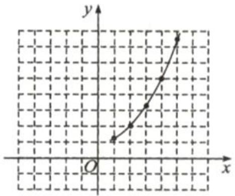

line

| Point | x | y |
|---|---|---|
| 1 | -3.5 | -2 |
| 2 | -3 | -1 |
| 3 | -2.5 | 0 |
| 4 | -2 | 1 |
| 5 | -1.5 | 2 |
| 6 | -1 | 3 |
| 7 | -0.5 | 4 |
| 8 | 0 | 5 |
| 9 | 0.5 | 6 |
| 10 | 1 | 7 |
| 11 | 1.5 | 8 |
| 12 | 2 | 9 |
| 13 | 2.5 | 10 |
| 14 | 3 | 11 |
| 15 | 3.5 | 12 |
| 16 | 4 | 13 |
| 17 | 4.5 | 14 |
| 18 | 5 | 15 |
| 19 | 5.5 | 16 |
| 20 | 6 | 17 |
| 21 | 6.5 | 18 |
| 22 | 7 | 19 |
| 23 | 7.5 | 20 |
| 24 | 8 | 21 |
| 25 | 8.5 | 22 |
| 26 | 9 | 23 |
| 27 | 9.5 | 24 |
| 28 | 10 | 25 |
| 29 | 10.5 | 26 |
| 30 | 11 | 27 |
| 31 | 11.5 | 28 |
| 32 | 12 | 29 |
| 33 | 12.5 | 30 |
| 34 | 13 | 31 |
| 35 | 13.5 | 32 |
| 36 | 14 | 33 |
| 37 | 14.5 | 34 |
| 38 | 15 | 35 |
| 39 | 15.5 | 36 |
| 40 | 16 | 37 |
| 41 | 16.5 | 38 |
| 42 | 17 | 39 |
| 43 | 17.5 | 40 |
| 44 | 18 | 41 |
| 45 | 18.5 | 42 |
| 46 | 19 | 43 |
| 47 | 19.5 | 44 |
| 48 | 20 | 45 |
| 49 | 20.5 | 46 |
| 50 | 21 | 47 |
| 51 | 21.5 | 48 |
| 52 | 22 | 49 |
| 53 | 22.5 | 50 |
| 54 | 23 | 51 |
| 55 | 23.5 | 52 |
| 56 | 24 | 53 |
| 57 | 24.5 | 54 |
| 58 | 25 | 55 |
| 59 | 25.5 | 56 |
| 60 | 26 | 57 |
| 61 | 26.5 | 58 |
| 62 | 27 | 59 |
| 63 | 27.5 | 60 |
| 64 | 28 | 61 |
| 65 | 28.5 | 62 |
| 66 | 29 | 63 |
| 67 | 29.5 | 64 |
| 68 | 30 | 65 |
| Note: The x-axis is labeled as 'x', the y-axis is labeled as 'y', and the labels are explicitly provided in the code above the chart.

答图①

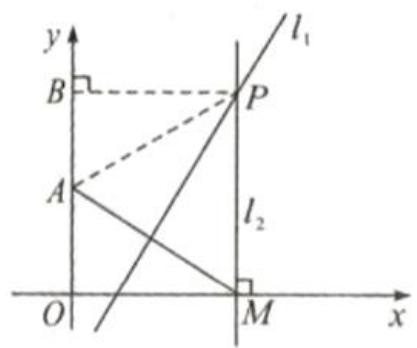

text_image

y
l₁
B
P
A
l₂
O
M
x

答图②

# 第34页

# 点睛 -4或1 -4 1

1. $a \geq -3$   
2. (0,0) 向上 Y 轴 20 低  
3. (0,0) 向下 Y 轴 <0 高  
4. B   
5. C   
6. A   
7. A   
8.

1. 解：(1) 由题意，得 $\left\{\begin{aligned}m^{2}+m=2,\\ m+1>0,\end{aligned}\right.$

$$
\therefore \left\{ \begin{array}{l l} m = 1 \text {或} - 2, \\ m > - 1, \end{array} \right.
$$

$$
\therefore m = 1;
$$

(2)由(1)知二次函数解析式为 y = $2x^{2}$ ，列表：

<table><tr><td>x</td><td>...</td><td>-2</td><td>-1.5</td><td>-1</td><td>-0.5</td><td>0</td></tr><tr><td>y</td><td>...</td><td>8</td><td>4.5</td><td>2</td><td>0.5</td><td>0</td></tr><tr><td>x</td><td>0.5</td><td>1</td><td>1.5</td><td>2</td><td>...</td><td></td></tr><tr><td>y</td><td>0.5</td><td>2</td><td>4.5</td><td>8</td><td>...</td><td></td></tr></table>

描点,连线,如图所示:

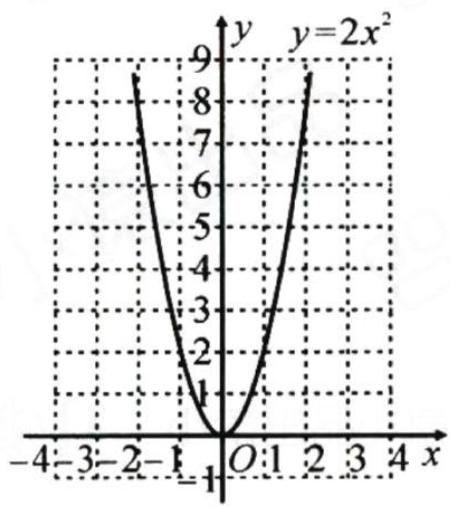

line

| x   | y     |
| --- | ----- |
| -4  | 9     |
| -3  | 7     |
| -2  | 5     |
| -1  | 3     |
| 0   | 1     |
| 1   | 3     |
| 2   | 5     |
| 3   | 7     |
| 4   | 9     |

(3) 当 $x = \sqrt{2}$ 时, $y = 2 \times (\sqrt{2})^{2} = 4$ ,
∴点 $(\sqrt{2},3)$ 不在该函数的图象上.

# 第35页

9.0   
10. A   
11. (1,2)

12. B   
13.

.解:(1)把(2,b)代入y=2x-3,得

b=1,再把点(2,1)代入 $y=ax^{2}$ ,得

$$
a = \frac {1}{4};
$$

(2) 当 x=0 时, y 取得最小值 0;

当 x=4 时，y 取得最大值 4.

14.

解:(1)∵抛物线 $y=ax^{2}$ 关于 y 轴对称,AB=20,

$$
\begin{array}{l} \therefore B E = 1 0, \\ \because E F = 3, D (5, m), \therefore B (1 0, m - 3); \\ \end{array}
$$

(2) $\because D(5,m),B(10,m-3)$ 在抛物线 $y=ax^{2}$ 上，

∴ $\left\{\begin{aligned}25a=m,\\ 100a=m-3,\end{aligned}\right.$ 解得 $a=-\frac{1}{25}.$

15.

解:(1)将 $A(-2,2)$ 代入 $y=ax^{2}$ ，得 4a=2，

$$
\therefore a = \frac {1}{2}, \therefore y = \frac {1}{2} x ^ {2}.
$$

∵B(3,b)在抛物线 $y=ax^{2}$ 的图象上，

$$
\therefore b = \frac {1}{2} \times 3 ^ {2} = \frac {9}{2}. \therefore a = \frac {1}{2}, b = \frac {9}{2};
$$

(2)由 $A(-2,2), B\left(3, \frac{9}{2}\right)$ , 设直线 $AB$ 的解析式为

$y = mx + n$ ，则 $\left\{ \begin{array}{l} -2m + n = 2,\\ 3m + n = \frac{9}{2}, \end{array} \right.$ 解得 $\left\{ \begin{array}{l}m = \frac{1}{2},\\ n = 3. \end{array} \right.$

∴直线 AB 的解析式为 $y=\frac{1}{2}x+3,\therefore C(0,3)$ ;

(3) 设 $P\left(t, \frac{1}{2} t^2\right)$ , 则 $Q\left(t, \frac{1}{2} t + 3\right)$ ,

$$
\because C (0, 3), \therefore P Q = O C = 3, \therefore P Q = \frac {1}{2} t ^ {2} - \frac {1}{2} t - 3 = 3
$$

解得 $t_{1}=-3, t_{2}=4.$

$$
\because t <   0, \therefore t = - 3, \therefore P \left(- 3, \frac {9}{2}\right).
$$

# 第 36 页

1. a<2 月 a≠0  
2. A   
3. B   
4. 下 Y 轴 0 大 3  
5. B   
6. C   
7. C   
8. A   
9. $y = \frac{1}{2} x^2 - 2$

10. -2 5

11. -2 2

12.

解:开口方向都向上,对称轴都是 y 轴,顶点坐标分别为 $(0,-3)$ 和 $(0,4)$ . 它们分别是由抛物线 $y=\frac{1}{2}x^{2}$ 向下平移 3 个单位长度和向上平移 4 个单位长度得到的.

# 第37页

13. <   
14. $y = -x^{2} + 1$   
15. D   
16.

解:(1) $A(-2,0)$ , $B(2,0)$ , $C(0,4)$ .(2)∵四边形ABCD是平行四边形, $AB=4$ , $C(0,4)$ ,∴ $CD=AB=4$ , $CD\parallel AB$ .∴ $D(-4,4)$ .设平移后的抛物线为 $y=-x^{2}+4+m$ ,则 $4=-(-4)^{2}+4+m$ ,解得m=16.∴平移后抛物线的解析式为 $y=-x^{2}+20$ .

17. m-n=1

18.

解：(1) 当 x=0 时，y=-4，∴C(0,-4)，∴AB=OC=4，

∵抛物线 $y=ax^{2}-4$ 关于 y 轴对称，∴OA=OB= $\frac{1}{2}$ AB=2，

$\therefore B(2,0)$ ，代入 $y=ax^{2}-4$ ，得 4a-4=0， $\therefore a=1,\therefore y=x^{2}-4;$

(2) 连接 OP. 设 $P(m, m^{2}-4)$ .

$$
\begin{array}{l} \therefore S _ {\triangle P A C} = S _ {\triangle A O C} + S _ {\triangle P O C} - S _ {\triangle P A O} = \frac {1}{2} \times 2 \times 4 + \frac {1}{2} \times 4 m - \frac {1}{2} \times 2 \times (4 - m ^ {2}) \\ = m ^ {2} + 2 m = 4, \\ \end{array}
$$

解得 $m_{1}=-1+\sqrt{5}, m_{2}=-1-\sqrt{5}$

$$
\because m > 0, \therefore m = - 1 + \sqrt {5}, \therefore P (- 1 + \sqrt {5}, - 2 \sqrt {5} + 2).
$$

# 第 38 页

点睛 x=-2 (-1,0)

1. A   
2. C   
3. D   
4. 减小 增大  
5. >   
6.

(1)对于二次函数 $y =  - \frac{1}{2}{\left( x - 1\right) }^{2}$

$$
x = - 3 \text {   时   }, y = - \frac {1}{2} (- 3 - 1) ^ {2} = - 8
$$

$$
x = - 1 \text {   时,   } y = - \frac {1}{2} (- 1 - 1) ^ {2} = - 2
$$

$$
x = 0 \text {   时,   } y = - \frac {1}{2} (- 1) ^ {2} = - \frac {1}{2}
$$

$$
x = 1 \text {   时,   } y = - \frac {1}{2} (1 - 1) ^ {2} = 0
$$

$$
x = 2 \text {   时,   } y = - \frac {1}{2} (2 - 1) ^ {2} = - \frac {1}{2}
$$

$$
x = 3 \text {   时,   } y = - \frac {1}{2} (3 - 1) ^ {2} = - 2
$$

$$
x = 5 \text {   时   }, y = - \frac {1}{2} (5 - 1) ^ {2} = - 8
$$

<table><tr><td>x</td><td>...</td><td>-3</td><td>-1</td><td>0</td><td>1</td><td>2</td><td>3</td><td>5</td><td>...</td></tr><tr><td>y</td><td>...</td><td>-8</td><td>-2</td><td> $-\frac{1}{2}$ </td><td>0</td><td> $-\frac{1}{2}$ </td><td>-2</td><td>-8</td><td>...</td></tr></table>

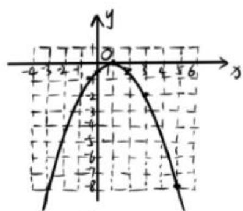

text_image

Handwritten mathematical graph showing a parabola intersecting the x-axis at y=0, with grid lines and coordinate axes labeled.

图1

函数图象如图1所示

(2)根据函数 $y=-\frac{1}{2}(x-1)^{2}$ 和其图象得：

抛物线顶点坐标为(1,0)，对称轴为x=1。（由(1)中的圆象易得）

(3) 根据抛物线 $y =  - \frac{1}{2}{\left( x - 1\right) }^{2}$ 和其图象得： $x = 1$ 时, $y$ 值最大

$\therefore$ 函数最大值为0,无最小值 (由图象也易得)

7. -3 2   
8. A   
9. A   
10. $y=(x+1)^{2}$

# 第 39 页

11. <   
12.5   
13. D   
14. B   
15.

解】(1)∵抛物线 $y=(x+1)^{2}$ 的顶点为A，∴点A的坐标为(-1,0)，∴AC=1，∵BC⊥x轴于点C，且BC=2AC，∴BC=2，∴点B的坐标为(-3,2);

(2)∵AE⊥AB，AB=AE，∴△ABE是等腰直角三角形，∴∠BAE=45°，∴直线BE的解析式为y=x+3，联立方程组得：y=x+3，解得：x1=-1，x2=1，∴点D的横坐标为1.【点睛】本题考查了二次函数的性质，等腰直角三角形的性质，一次函数与二次函数的综合，熟练掌握二次函数的性质是解题的关键.

【答案】(1)(-3,4); (2) $\frac{2}{3}$

16.

解：(1)由题意，得 $h = 1$ .把 $x = 2$ 代入 $y = -x + 4$ ，得 $y = 2$

∴ $B(2,2)$ ，代入 $y=a(x-1)^{2}$ ，得 a=2，

∴抛物线的解析式为 $y=2(x-1)^{2}$ ;

(2) 设 $A(t, 2(t-1)^{2})$ ，则 $C(t, 4-t)$ 。过点 B 作 $BM \perp AC$ 于点 M，∵ BA = BC， $AC \perp x$ 轴，

$$
\therefore B M \perp A C, A M = M C.
$$

$$
\because B (2, 2), \therefore C M = A M = 4 - t - 2 = 2 - t.
$$

又 $AM=y_{B}-y_{A}=2-2(t-1)^{2}=-2t^{2}+4t$

∴ $2 - t = -2t^{2} + 4t$ ，解得 $t = 2$ （舍）或 $t = \frac{1}{2}$ .

$\therefore 2(t-1)^{2}=\frac{1}{2},\therefore$ 点A的坐标为 $\left(\frac{1}{2},\frac{1}{2}\right)$ .

# 第40页

点睛 (-1, -4)

1. B   
2. C   
3. D   
4. C   
5.

(1) 抛物线开口向上, 对称轴为 x = 5,
顶点坐标为 $(5,-1)$ .

(2) 抛物线开口向下, 对称轴为 x = -2,
顶点坐标为 $(-2,1)$ .

6.

.解:(1)∵抛物线 $y=a(x-3)^{2}+2$ 经过点 $(1,-2)$ ,

$\therefore -2 = a(1-3)^{2} + 2,$ 解得 $a = -1.$

(2)∵抛物线 $y=-(x-3)^{2}+2$ 的对称轴为直线x=3,

∴ 点 $A(m, y_{1})$ , $B(n, y_{2})$ (m < n < 3) 在对称轴左侧.

又∵抛物线开口向下，

∴ 在对称轴左侧, y 随 x 的增大而增大, $\therefore y_{1} < y_{2}$ .

7. A

8. 2 1 -5

# 第41页

9. D

10.2或4

11. 3/2

12.

(1) $\because$ 顶点为 $C(1,9)$

∴设抛物线的解析式为 $y=a(x-1)^{2}+9(a\neq0)$

把 $B(4,0)$ 代入得 $9a+9=0$

解得 $a = -1$

$\therefore$ 抛物线的解析式为 $y = -(x - 1)^2 + 9$ 即

$$
y = - x ^ {2} + 2 x + 8
$$

(2) 把 $x = 0$ 代入 $y = -x^{2} + 2x + 8$ 得 $y = 8$

$$
\therefore D (0, 8)
$$

$$
\therefore O D = 8
$$

$$
\because B (4, 0)
$$

$$
\therefore O B = 4
$$

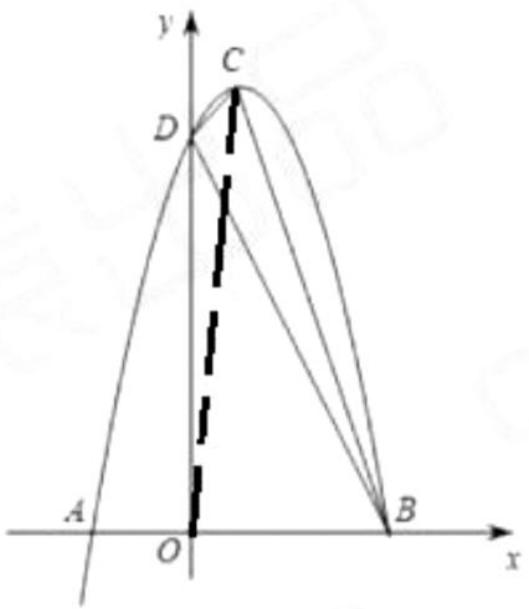

text_image

y
C
D
A
O
B
x

连接OC

$$
\begin{array}{l} \therefore S _ {\mathrm{四边形} D O B C} = S _ {\triangle C O D} + S _ {\triangle B O C} \\ = \frac {1}{2} O D \times 1 + \frac {1}{2} O B \times 9 \\ = \frac {1}{2} \times 8 \times 1 + \frac {1}{2} \times 4 \times 9 \\ = 4 + 1 8 \\ = 2 2 \\ \end{array}
$$

$$
\therefore S _ {\triangle B C D} = S _ {\text {四边形} D O B C} - S _ {\triangle D O B}
$$

$$
\begin{array}{l} \therefore S _ {\triangle B C D} = S _ {\text {四边形} D O B C} - S _ {\triangle D O B} \\ = 2 2 - \frac {1}{2} O B \cdot O D \\ = 2 2 - \frac {1}{2} \times 4 \times 8 \\ = 2 2 - 1 6 \\ = 6 \\ \end{array}
$$

13.

解：(1)将点 $B(0, -3)$ 代入 $y = a(x - 1)^2 - 4$ 得， $a(0 - 1)^2 - 4 = -3$

$\therefore a = 1, \therefore$ 抛物线的解析式为 $y = (x - 1)^2 - 4$ ，即 $y = x^2 - 2x - 3$ 。

令 y=0，得 $(x-1)^{2}-4=0$ ，

$$
\therefore x _ {1} = - 1, x _ {2} = 3 \therefore A (3, 0),
$$

$\because B(0,-3),\therefore$ 易求得直线AB的解析式为y=x-3;

(2) 设 $P(m, m^{2} - 2m - 3)$ ，则 $M(m, m - 3)$ . $H(m, 0)$ ,

$$
M H = 3 - m, P M = m - 3 - \left(m ^ {2} - 2 m - 3\right) = - m ^ {2} + 3 m,
$$

$$
\because P M = 2 M H, \therefore - m ^ {2} + 3 m = 2 (3 - m),
$$

解得 $m_{1}=2, m_{2}=3$ (舍)，∴ $P(2,-3)$ ;

(3)由(2)可知, $PM=-m^{2}+3m,\because OA=OB,OA\perp OB,$

∴△AOB 是等腰三角形, 易求得 $BM=\sqrt{2}m$ ,

又∵PM=BM，

$\therefore -m^{2}+3m=\sqrt{2}m$ ，解得 $m_{1}=0\cdot m_{2}=3-\sqrt{2}$

$\because 0<m<3,\therefore m=3-\sqrt{2},\therefore$ 点P的横坐标为 $3-\sqrt{2}$ .

# 第42页

点睛 $-5 \leq y \leq 4$

1. A   
2. D   
3. D   
4.4   
5.

解:(1)向上,直线 $x=3,(3,-12)$ ;

(2) 向下, 直线 $x=1,(1,0)$ ;  
(3) 向下, 直线 $x = -\frac{2}{3}, \left(-\frac{2}{3}, \frac{10}{3}\right)$ .

6.

解:(1)顶点坐标为 $(2,-4)$ ,对称轴为直线x=2,开口向上;

(2)如图所示.

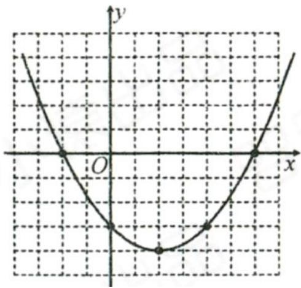

line

| Point | x | y |
|---|---|---|
| 1 | 0 | 0 |
| 2 | 0 | -1 |
| 3 | 0 | 0 |
| 4 | 0 | -1 |
| 5 | 0 | 0 |

7. D

8.

$$
\because y = \frac {1}{2} x ^ {2} - 6 x + 1 2 = \frac {1}{2} (x - 6) ^ {2} - 6,
$$

∴其顶点坐标为 $(6,-6)$ .

∴抛物线 $y=\frac{1}{2}x^{2}-6x+12$ 是由抛物线 $y=\frac{1}{2}x^{2}$ 先向右平移 6 个单位长度，再向下平移 6 个单位长度得到的.

# 第43页

9.4   
10. D   
11. B   
12. C   
13.

解:(1) $\because y=x^{2}+2ax+a=(x+a)^{2}-a^{2}+a,$

∴顶点坐标为 $(-a,-a^{2}+a)$ .

(2) 将 $y = x^{2} + 2ax + a$ 向上平移 2 个单位长度后，得 $y = (x + a)^{2} - a^{2} + a + 2$ ，

∴抛物线顶点的纵坐标 $n=-a^{2}+a+$ $2=-(a-\frac{1}{2})^{2}+\frac{9}{4}.$

$\because -1<0,\therefore$ 当 $a=\frac{1}{2}$ 时, $n_{最大}=\frac{9}{4}.$

14.

解：(1) 把 $B(0, -4), C(2, 0)$ 代入 $y = ax^2 + x + m$ ，得

$$
\left\{ \begin{array}{l l} m = - 4, \\ 4 a + 2 + m = 0, \end{array} \right. \text {解得} \left\{ \begin{array}{l l} m = - 4, \\ a = \frac {1}{2}, \end{array} \right.
$$

∴抛物线的解析式为 $y=\frac{1}{2}x^{2}+x-4$ ;

(2) 设 $D(t, \frac{1}{2}t^{2} + t - 4), -4 < t < 0$ ，连接 OD.

令 $y = 0$ ，则 $\frac{1}{2} x^2 +x - 4 = 0$ ，解得 $x_{1} = -4,x_{2} = 2$

$$
\therefore A (- 4, 0), C (2. 0),
$$

$$
\because B (0, - 4), \therefore O A = O B = 4,
$$

$$
\because S _ {\triangle A B D} = S _ {\triangle A O D} + S _ {\triangle O B D} - S _ {\triangle A O B} = \frac {1}{2} \times 4 \times
$$

$$
\left(- \frac {1}{2} t ^ {2} - t + 4\right) + \frac {1}{2} \times 4 \times (- i) - \frac {1}{2} \times 4 \times 4 = - t ^ {2} -
$$

$$
4 t = - (t + 2) ^ {2} + 4,
$$

$\because -1 < 0, \therefore$ 当 $t = -2$ 时， $\triangle ABD$ 的面积最大，最大值为4，此时 $D$ 的坐标为 $(-2, -4)$ .

# 第44页

点睛 $y = -x^{2} + 2x + 3$

1. $y = \frac{1}{2} x^2 - x - 4$   
2.

(1)由题意得,抛物线 $y=ax^{2}+bx-5$ , 则 c=-5, 故 OB=5,

$$
\begin{array}{l} \because 5 O A = O B = O C, \\ \therefore O C = 5, O A = 1, \\ \end{array}
$$

∴ 点 A、B、C 的坐标分别为 $(1,0)$ 、 $(0,-5)$ 、 $(-5,0)$ ，设 $y=a(x-1)(x+5)=a(x^{2}+4x-5)=ax^{2}+bx-5$ ，故 a=1，

∴ 此抛物线的解析式为 $y = x^{2} + 4x - 5$ ;

3. $y = -\frac{1}{3}(x - 2)^{2} - 4$   
4. $y = -x^{2} - 2x + 3$   
5. $y = -\frac{\sqrt{3}}{2} (x - 2)^{2} + 2\sqrt{3}$   
6. $y = -x^{2} + 2x + 1$   
7.

解:(1)顶点坐标为 $(1,-5)$ ;

(2)设解析式为 $y=a(x-1)^{2}-5,\because(-1,0)$ 在抛物线上，

$\therefore 0 = a(-1 - 1)^2 -5$ ，解得 $a = \frac{5}{4}$

∴抛物线的解析式为 $y=\frac{5}{4}(x-1)^{2}-5=\frac{5}{4}x^{2}-\frac{5}{2}x-\frac{15}{4}$ .

8.

解：(1) $y=-x^{2}+2x+8=-(x-1)^{2}+9$ ，顶点坐标为(1,9)；
(2) 将抛物线 $y = -x^{2} + 2x + 8$ 向左平移 2 个单位长度，向上平移 3 个单位长度.

得到原抛物线 $y=-(x-1+2)^{2}+9+3=-(x+1)^{2}+12=-x^{2}-2x+11,\therefore b=-2,c=11.$

# 第45页

$$
y = - \frac {2}{3} x ^ {2} + \frac {4}{3} x + 2
$$

9.

10. $y = x^{2} + 2x + 2$

11.

解: 设平移后抛物线的解析式为 $y = -x^{2} + bx + c$ ，则 $\left\{\begin{aligned}-2&=-1+b+c,\\-1&=-9+3b+c\end{aligned}\right.$ 解得 $b=\frac{9}{2},c=-\frac{11}{2}$ ,

$$
\therefore y = - x ^ {2} + \frac {9}{2} x - \frac {1 1}{2}.
$$

12.

解: 设抛物线的解析式为 $y = a(x - 3)^{2} - 2$ , ∵ 抛物线的对称轴是直线 x = 3, 与 x 轴两交点的距离为 4,

∴抛物线 $y=a(x-3)^{2}-2$ 过点(1,0)，

$\therefore(1-3)^{2}\cdot a-2=0$ , 解得 $a=\frac{1}{2}$ ,

∴抛物线的解析式为 $y=\frac{1}{2}(x-3)^{2}-2$ .

13.

(1) 二次函数的最小值为其顶点纵坐标，即

$\frac{4ac-b^{2}}{4a}$ 。根据题意，该最小值等于 $a+b+c$

，故有：

$$
\frac {4 a c - b ^ {2}}{4 a} = a + b + c
$$

两边同乘 $4a$ 并化简:

$$
4 a c - b ^ {2} = 4 a ^ {2} + 4 a b + 4 a c \Rightarrow - b ^ {2} = 4 a ^ {2} +
$$

配方得:

$$
(2 a + b) ^ {2} = 0 \Rightarrow 2 a + b = 0 \Rightarrow b = - 2 a
$$

(2) 根据题意, 抛物线经过 $A(-1, 5)$ 、 $B(2, 5)$ 、 $C(2, 2)$ 中的两个点。由于 $B$ 和 $C$ 的横坐标相同但纵坐标不同, 不可能同时经过, 故仅需考虑以下情况:

1. 经过 $A(-1,5)$ 和 $C(2,2)$

代入解析式 $y = ax^{2} + bx + c$ ，结合 b = -2a，得方程组：

$$
\left\{ \begin{array}{l} 5 = a (- 1) ^ {2} - 2 a (- 1) + c \Rightarrow 5 = 3 a + c \\ 2 = a (2) ^ {2} - 2 a (2) + c \Rightarrow 2 = c \end{array} \right.
$$

解得 c = 2，代入第一式得 $3a = 3 \Rightarrow a = 1$ ，则 b = -2。解析式为：

$$
y = x ^ {2} - 2 x + 2
$$

验证其最小值为 $a + b + c = 1 - 2 + 2 = 1$ ,

与顶点纵坐标 $\frac{4\cdot1\cdot2-(-2)^{2}}{4\cdot1}=1$ 一致，符合条件。

14.

(1) b = 2a;   
(2) 平移后的抛物线顶点纵坐标 $y'$ 的最大值为5。

# 第 46 页

# 点睛

0 或 -1 或 -9

1. -3 和 2 (-3,0) (2,0)  
2. -2 和 3  
3.4   
4. C   
5. m=9

$$
\cdot n > - \frac {1}{4}
$$

6.   
7. D   
8.

(1)

$$
x _ {1} = - 2, x _ {2} = 1
$$

(2)

$$
- 2 <   x <   1
$$

(3)

$$
- 1 <   x <   0
$$

9. C

# 第47页

10.

11.

$$
\begin{array}{l} x _ {1} = - 4, x _ {2} = 0 \\ \mathrm{x>3或x< -1} \\ \end{array}
$$

12. $k \geqslant 3$

13. D

14.

解:(1)联立 $\left\{\begin{aligned}y&=-x^{2}+5,\\ y&=2x+2,\end{aligned}\right.$ 解得 $\left\{\begin{aligned}x_{1}&=-3,\\ y_{1}&=-4,\end{aligned}\right.\left\{\begin{aligned}x_{2}&=1,\\ y_{2}&=4,\end{aligned}\right.$

$$
\therefore A (- 3, - 4), B (1, 4);
$$

(2) $-3<x<1.$

15.

解:(1)当x=2时,y=3,

$$
\therefore P (2, 3),
$$

设直线 l 的解析式为 $y=kx+b$ ，

则 $3 = 2k + b$

$$
\therefore b = - 2 k + 3,
$$

$$
\therefore y = k x - 2 k + 3.
$$

联立 $\left\{\begin{aligned}y&=-x^{2}+2x+3,\\ y&=kx-2k+3,\end{aligned}\right.$

得 $x^{2}+(k-2)x-2k=0$ ,

∵直线 l 与抛物线有唯一公共点 $P(2,t)$ ,

∴方程的两根都为2，

$\therefore 2+2=2-k$ , 解得 k=-2,

∴直线 l 的解析式为 $y = -2x + 7$ ;

(2)∵直线 AB//直线 l，

∴可设直线 AB 为 $y = -2x + m$ ,

联立 $\left\{ \begin{array}{l} y = -x^2 + 2x + 3, \\ y = -2x + m, \end{array} \right.$

得 $x^{2}-4x+m-3=0$ ,

$$
\therefore x _ {A} + x _ {B} = 4.
$$

∵点 H 为 AB 的中点，

$$
\therefore x _ {A} + x _ {B} = 2 x _ {H} = 4,
$$

$$
\therefore x _ {H} = 2,
$$

∴点 H 的坐标为 $(2,0)$ .

# 第48页

1. $y = x^{2} + x - 2$

2. $y = 4x^{2} + 5x$

3. $y = x^{2} + 4x + 3$

4.

解:由题意可知抛物线的顶点坐标为(3,5),

∴可设抛物线的解析式为 $y=a(x-3)^{2}+5$ ,
把 $(1,-1)$ 代入解析式,得 $-1=a(1-3)^{2}+5$

解得 $a=-\frac{3}{2}$ .

∴该抛物线的解析式为 $y=-\frac{3}{2}(x-3)^{2}+5.$

5.

抛物线的解析式为：

$$
y = \frac {1}{8} x ^ {2} - x + \frac {3}{2} \quad \text {或} \quad y = - \frac {1}{8} x ^ {2} + x - \frac {3}{2}.
$$

答: 抛物线的解析式为 $y = \frac{1}{8} x^{2} - x + \frac{3}{2}$ 或

$$
y = - \frac {1}{8} x ^ {2} + x - \frac {3}{2} 。
$$

6.

已知抛物线 $y = ax^{2} + bx + 3$ 与 $x$ 轴交于

$(x_{1},0)$ 和 $(x_{2},0)$ ，且 $x_{1},x_{2}$ 是方程

$x^{2}-2x-3=0$ 的根。

1. 解方程求根：

解方程 $x^{2} - 2x - 3 = 0$ ，因式分解得：

$$
(x - 3) (x + 1) = 0
$$

因此， $x_{1}=3,\ x_{2}=-1$ 。

2. 构造抛物线表达式:

抛物线与 x 轴交于 $(3,0)$ 和 $(-1,0)$ ，故其解析式

可写为:

$$
y = a (x - 3) (x + 1)
$$

展开后为:

$$
y = a \left(x ^ {2} - 2 x - 3\right)
$$

3. 确定系数 $a$ :

已知抛物线的常数项为 3，即当 x = 0 时，y = 3

。代入展开式:

$$
3 = a \left(0 ^ {2} - 2 \cdot 0 - 3\right) \Rightarrow 3 = - 3 a \Rightarrow a = -
$$

4. 求 b:

将 a = -1 代入展开式的一次项系数：

$$
y = - x ^ {2} + 2 x + 3
$$

可见 b = 2。

综上，抛物线的解析式为 $y = -x^{2} + 2x + 3$ 。

7. $y = -(x - 1)^{2} - 2$

8. $y = x^{2} - 6x + 8$

# 第 49 页

1. C

2. D

3. B

4. B

5. D

6. B

7. A

8. C

# 第 50 页

1.

(1)抛物线开口向上，a > 0；

(2)抛物线的对称轴在 y 轴右侧， $-\frac{b}{2a}$ > 0, $\therefore b < 0;$

(3)抛物线与 y 轴负半轴相交, 则 c < 0, ∴ abc > 0;

(4) 抛物线与 x 轴有 两 个交点, $\Delta = b^{2} - 4ac > 0.$

2.

(1) 方程 $ax^{2} + bx + c = -3$ 的解为 $x_{1} = 0, x_{2} = 2$ ;

(2) 方程 $ax^{2} + bx + c = -4$ 的解为 $x_{1} = x_{2} = 1$ ;

(3) 当 y > 0 时，x 的取值范围是 x < -1 或 x > 3；

(4) 当 y<-3 时, x 的取值范围是 0<x<2 ;

(5) 当 -3 < y < 0 时，x 的取值范围是 -1 < x < 0 或 2 < x < 3

3.

(1) $a < 0;$

(2)b > 0;

(3) $c > 0;$

(4) $a+b+c \geq 0;$

(5) $a-b+c=0;$

(6) $2a+b=0;$

(7)方程 $ax^{2}+bx+c=0$ 的根为 $x_{1}=3, x_{2}=-1$ ;

(8)当 y>0 时，x 的取值范围为 -1<x<3；

(9) 当 y<0 时, x 的取值范围为 x<-1 或 x>3.

4.

(1) $a \quad < \quad 0, b \quad < \quad 0, c \quad > \quad 0, abc \quad > \quad 0;$

(2) 当 x=1 时，y < 0, $\therefore a+b+c < 0;$

(3) 当 x = -2 时， $y > 0, \therefore 4a - 2b + c > 0;$

(4) 当 x=2 时， $y$ < 0，∴ $4a+2b+c$ < 0；

(5) 当 x = -3 时， $y < 0, \therefore 9a - 3b + c < 0;$

(6)对称轴为直线 $x=\underline{\hspace{2cm}}-1$ , $-\frac{b}{2a}=\underline{\hspace{2cm}}-1$ , $\therefore b=\underline{\hspace{2cm}}=2a$ ;

(7) $3a + c < 0,4b + c < 0.$

5.

(1)abc < 0;

(2) $b^{2}-4ac$ > 0;

(3) $4a-2b+c<0;$

(4) $8a + c < 0.$

# 第51页

1. C

2. ②③④

3. ②③④

# 第 52 页

# 类型一

: 过点 B 作 $BP_{1} \parallel AC$ ，交抛物线于点 $P_{1}$ ，

则 $S_{\triangle P_{1}AC}=S_{\triangle ABC}$ ，易知点 A(3,0)，B(1,0)，C(0,3)，

∴直线 AC: $y = -x + 3$ .

∴可设直线 $BP_{1}: y = -x + m$ ，将 $B(1,0)$ 代入，得 m = 1，

∴直线 $BP_{1}: y = -x + 1$ ，联立 $\left\{\begin{aligned}y &= -x + 1,\\ y &= x^{2} - 4x + 3,\end{aligned}\right.$ 可得 $P_{1}(2, -1)$ .

在 x 轴上点 A 的右边取点 E，使 AE=AB=2，过点 E 作 AC 的平行线，交抛物线于点 $P_{2}, P_{3}$ ，则 $S_{\triangle P_{2}AC}=S_{\triangle P_{3}AC}=S_{\triangle ABC}$ ，同理可得 $P_{2}\left(\frac{3-\sqrt{17}}{2},\frac{7+\sqrt{17}}{2}\right)$ ， $P_{3}\left(\frac{3+\sqrt{17}}{2},\frac{7-\sqrt{17}}{2}\right)$ .

综上所述，存在点 $P(2, -1)$ 或 $\left(\frac{3 - \sqrt{17}}{2},\frac{7 + \sqrt{17}}{2}\right)$ 或 $\left(\frac{3 + \sqrt{17}}{2},\frac{7 - \sqrt{17}}{2}\right)$ .

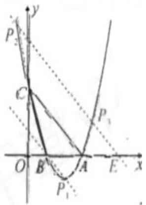

text_image

y
P
C
O B A E x
P₁

# 类型二

【例】解:(1) $y=-x^{2}+2x+8$ ;

(2) 过点 M 作 $MK \parallel y$ 轴, 交直线 AB 于点 K. 易知 A(-2,0), C(4,0), B(3,5),

$\therefore S_{\triangle ABC}=\frac{1}{2}\times6\times5=15.$ 设 $M(m,-m^{2}+2m+8)$ ，则 $K(m,m+2)$ ，

$$
\begin{array}{l} \therefore M K = \left| - m ^ {2} + 2 m + 8 - (m + 2) \right| \\ = \left| - m ^ {2} + m + 6 \right|, \\ \end{array}
$$

$$
\therefore S _ {\triangle A B M} = \frac {1}{2} M K \cdot | x _ {B} - x _ {A} |
$$

$$
= \frac {1}{2} | - m ^ {2} + m + 6 | \times 5
$$

$$
= \frac {1}{2} \times 1 5,
$$

$$
\therefore | - m ^ {2} + m + 6 | = 3,
$$

解得 $m=\frac{1\pm\sqrt{13}}{2}$ 或 $m=\frac{1\pm\sqrt{37}}{2}$ ,

∴ 点 M 的横坐标为 $\frac{1+\sqrt{13}}{2}$ 或 $\frac{1-\sqrt{13}}{2}$ 或 $\frac{1+\sqrt{37}}{2}$ 或 $\frac{1-\sqrt{37}}{2}$ .

# 类型三

解:由抛物线 $y=-x^{2}-2x+3$ ,可得

$A(-3,0), B(1,0), C(0,3)$ , 直线 $BC: y = -3x + 3$ ,

取AB的中点D,则 $D(-1,0)$ .过点D作DP//BC交抛

物线于点P,则 $S_{\triangle PBC}=S_{\triangle DBC}=\frac{1}{2}S_{\triangle ABC}$ ,设

$PD: y = -3x + b$ , 将 $D(-1, 0)$ 代入, 得 $b = -3, \therefore$

$PD: y = -3x - 3,$ 联立 $\left\{\begin{aligned}y &= -3x - 3,\\ y &= -x^{2} - 2x + 3,\end{aligned}\right.$ 可得点

P的坐标为 $(-2,3)$ 或 $(3,-12)$ .

# 第 53 页

# 类型一

解： $\because S_{\triangle PAD} = 4S_{\triangle PDB}$

$$
\therefore A D = 4 B D,
$$

易知 $A(-1,0)$ , $B(4,0)$ ,

$$
\therefore D (3, 0),
$$

又∵C(0,-2),

∴直线 CD:y= $\frac{2}{3}$ x-2,

$$
\therefore \frac {1}{2} x ^ {2} - \frac {3}{2} x - 2 = \frac {2}{3} x - 2
$$

得 $x_{P}=\frac{13}{3},\therefore P\left(\frac{13}{3},\frac{8}{9}\right)$ .

# 类型二

抛物线方程为 $y = x^{2} + x - 2$ 。

○ 令 $y = 0$ ，求得与 $\pmb{x}$ 轴交点：

$$
x ^ {2} + x - 2 = 0 \Rightarrow (x + 2) (x - 1) = 0,
$$

所以 x = -2 或 x = 1。因此， $A(-2,0)$ 和 $B(1,0)$ 。

○ 令 x = 0，求得与 y 轴交点：y = -2。因此， $C(0,-2)$ 。

设 $P(m, m^{2} + m - 2)$ ，其中 m < 0（因为 P 在第二象限）。

根据题意， $S_{\triangle PDB}=2S_{\triangle CDB}$

由于 $\triangle PDB$ 和 $\triangle CDB$ 共底 BD，它们的面积比等于高之比，即 $|y_{P}|:|y_{C}|=2:1$ 。

因此， $|m^{2}+m-2|=2\times|-2|=4$ 。

由于 m < 0, $m^{2} + m - 2 > 0$ ，故

$$
m ^ {2} + m - 2 = 4 。
$$

解方程 $m^2 + m - 6 = 0$ 得到

$(m+3)(m-2)=0$ ，所以 m=-3 或 m=2（舍去）。

因此，m = -3。

将 $m = -3$ 代入 $P(m, m^2 + m - 2)$ 得到

$$
P (- 3, (- 3) ^ {2} + (- 3) - 2) = P (- 3, 4) 。
$$

# 类型三

. 解: 过点 B 作 $BP_{1} \parallel AC$ , 交抛物线于点 $P_{1}$ ,

则 $S_{\triangle P_1AC} =$

$S_{\triangle ABC}$ ，易知点

$A(3,0), B(1,$

0), C(0,3),

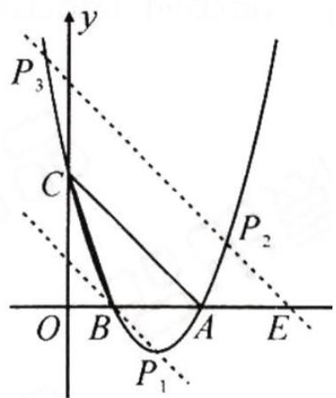

text_image

y
P₃
C
O B A E
P₂
P₁

∴直线 AC:y=-x+3,

∴可设直线 $BP_{1}: y = -x + m$ ,

将 $B(1,0)$ 代入, 得 m=1,

∴直线 $BP_{1}:y=-x+1$ ,

联立 $\left\{\begin{aligned}y&=-x+1,\\ y&=x^{2}-4x+3,\end{aligned}\right.$

可得 $P_{1}(2,-1)$ .

在 x 轴上点 A 的右边取点 E，使 AE=AB=2，过点 E 作 AC 的平行线，交抛物线于点 $P_{2}, P_{3}$ ，

则 $S_{\triangle P_2AC} = S_{\triangle P_3AC} = S_{\triangle ABC}$

同理可得 $P_{2}\left(\frac{3 - \sqrt{17}}{2},\frac{7 + \sqrt{17}}{2}\right)$

$$
, P _ {3} \left(\frac {3 + \sqrt {1 7}}{2}, \frac {7 - \sqrt {1 7}}{2}\right).
$$

综上所述,存在点 $P(2,-1)$ 或

$$
\left(\frac {3 - \sqrt {1 7}}{2}, \frac {7 + \sqrt {1 7}}{2}\right)
$$

或 $\left(\frac{3 + \sqrt{17}}{2},\frac{7 - \sqrt{17}}{2}\right)$

# 第 54 页

# 类型一

解：∵点P的横坐标为m，∴ $P(m,-m^{2}+4m)$ ，

$$
D (m, - m + 4),
$$

$$
\therefore P D = \left| - m ^ {2} + 4 m - (- m + 4) \right| = \left| m ^ {2} - 5 m + \right.
$$

$$
\because O C = 4, \therefore P D = \frac {1}{2} O C = 2,
$$

$\therefore |m^{2} - 5m + 4| = 2$ ，当 $m^2 -5m + 4 = 2$ 时，解得 $m=\frac{5\pm\sqrt{17}}{2}\cdot\because0<m<4,\therefore$ 此时

$m=\frac{5-\sqrt{17}}{2}$ ; 当 $m^{2}-5m+4=-2$ 时，解得

$m_{1}=2,\ m_{2}=3$ ．综上所述，m的值为2或3或

$$
\frac {5 - \sqrt {1 7}}{2}.
$$

# 类型二

解: 可求得抛物线为 $y=\frac{1}{4}x^{2}-\frac{1}{2}x-2$ ，直线 AB 为 $y=\frac{1}{2}x-$ 2. 设 $P\left(m, \frac{1}{4}m^{2}-\frac{1}{2}m-2\right) (0<m<4)$ ,

则 $K\left(\frac{1}{2}m^{2}-m,\frac{1}{4}m^{2}-\frac{1}{2}m-2\right)$ ,

$$
\begin{array}{l} \therefore \frac {1}{2} P K + P D = \frac {1}{2} \left(m - \frac {1}{2} m ^ {2} + m\right) + \left(- \frac {1}{4} m ^ {2} + \frac {1}{2} m + 2\right) = \\ - \frac {1}{2} \left(m - \frac {3}{2}\right) ^ {2} + \frac {2 5}{8}. \\ \end{array}
$$

$\because -\frac{1}{2} < 0, \therefore$ 当 $m = \frac{3}{2}$ 时, $\frac{1}{2} PK + PD$ 有最大值, 最大值为 $\frac{25}{8}$ , 此时 $P\left(\frac{3}{2}, -\frac{35}{16}\right)$ .

# 类型三

3. 解: 过点 M 作 $ME \perp x$ 轴于点 E, 与直线 AC 交于点 F.

可知 $A(-3,0)$ , $C(0,3)$ ,

$$
\therefore O A = O C, \therefore \angle O A C = 4 5 ^ {\circ},
$$

∴ 在Rt△AEF中, EF = AE.

$$
\because M (m, - m ^ {2} - 2 m + 3), E (m, 0),
$$

$$
\therefore E F = A E = m - (- 3) = m + 3,
$$

$$
\therefore F (m, m + 3),
$$

$$
\therefore F M = (- m ^ {2} - 2 m + 3) - (m + 3) = - m ^ {2} - 3 m,
$$

∴ 在Rt△FMN中， $\angle MFN=45^{\circ}$

$$
\therefore F M = \sqrt {2} M N = \sqrt {2} \times \sqrt {2} = 2,
$$

$\therefore -m^{2} - 3m = 2$ ，解得 $m_{1} = -2,m_{2} = -1$ （舍去）， $\therefore M(-2,3)$

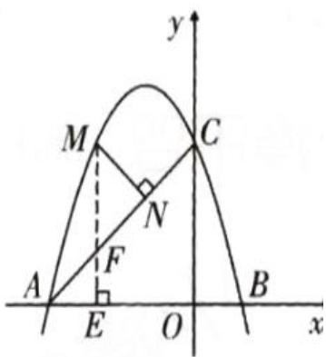

text_image

y
M
C
N
A
F
E
O
B
x

# 类型一

过点A作AM⊥AC，交直线PC于点M，

过点M作MN⊥x轴于点N。则

$$
\triangle A M N \cong \triangle C A O,
$$

由 $y=x^{2}-2x-3$ 可得 $A(-1,0)$ ,

$$
C (0, - 3), \therefore M (2, 1),
$$

∴直线PC: y = 2x - 3,

联立 $x^{2} - 2x - 3 = 2x - 3$ ，得 $x_{p} = 4$

$\therefore P(4,5)$ 。

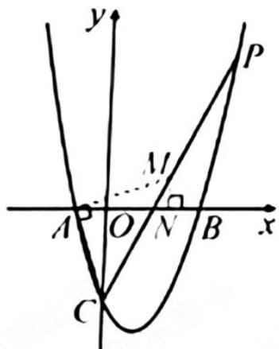

text_image

y
P
M
A O N B x
C

# 类型二

. 解: (1) 根据题意, 得

$$
\left\{ \begin{array}{l} - 1 - b + c = 0, \\ - 9 + 3 b + c = 0, \end{array} \right.
$$

解得 $\left\{\begin{aligned}b&=2,\\ c&=3.\end{aligned}\right.$

故抛物线的解析式为

$$
y = - x ^ {2} + 2 x + 3;
$$

(2)∵抛物线 $y=-x^{2}+2x+3$

的对称轴是直线 $x=1, C(0,3)$ ,

∴点 C 关于对称轴的对称点 $P_{1}(2,3)$ 符合要求；

∵BC的解析式为 $y=-x+3$ ,

设与 BC 平行的直线 $AP_{2}$ 的解析式为 $y = -x + m$ ，则 $1 + m = 0$ ，解得 m = -1。

∴与 BC 平行的直线 $AP_{2}$ 的解析式为 y = -x - 1，

与抛物线解析式联立，得 $\left\{\begin{aligned}y&=-x-1,\\ y&=-x^{2}+2x+3,\end{aligned}\right.$ 解得$\left\{\begin{aligned}x_{1}&=4,\\ y_{1}&=-5,\end{aligned}\right.\left\{\begin{aligned}x_{2}&=-1,\\ y_{2}&=0,\end{aligned}\right.$ （舍去），得 $P_{2}(4,-5)$ .

综上所述，P 点的坐标为 $(2,3)$ 或 $(4,-5)$ .

# 类型三

解:(1)抛物线的解析式为

$$
y = - x ^ {2} + 2 x + 3;
$$

(2) 设 BP 与 y 轴交于点 E，

由 $-m^{2}+2m+3=3$ ，

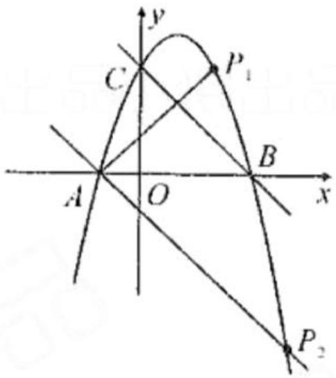

text_image

y
C
P₁
A
O
B
x
P₂

解得 $m_{1}=2, m_{2}=0, \therefore D(2,3)$ ,

又 $C(0,3)$ , $\therefore CD \parallel AB$ , CD = 2,

由 $-x^{2} + 2x + 3 = 0$

解得 $x_{1}=-1, x_{2}=3$ ,

$$
\therefore B (3, 0), \therefore O B = O C,
$$

$$
\therefore \angle O C B = \angle O B C = \angle D C B = 4 5 ^ {\circ},
$$

又∵∠PBC=∠DBC，

$$
\therefore \triangle D C B \cong \triangle E C B.
$$

$$
\therefore C E = C D = 2, \therefore O E = 1,
$$

$$
\therefore E (0, 1),
$$

可求得直线 $BE$ 的解析式为

$$
y = - \frac {1}{3} x + 1.
$$

联立 $\left\{\begin{aligned}y&=-x^{2}+2x+3,\\ y&=-\frac{1}{3}x+1,\end{aligned}\right.$

解得 $\left\{ \begin{array}{l} x_{1} = 3, \\ y_{1} = 0, \end{array} \right.$ $\left\{ \begin{array}{l} x_{2} = -\frac{2}{3}, \\ y_{2} = \frac{11}{9}, \end{array} \right.$

$$
\therefore P \left(- \frac {2}{3}, \frac {1 1}{9}\right).
$$

方法一：解: 过点 B 作 $BE \parallel PC$ ，交 y

轴于点 E，设 BC 交 y 轴于点 D，则

$$
\angle P C B = \angle E B D = 2 \angle C B O,
$$

$$
\therefore \angle E B O = \angle D B O,
$$

$\therefore OE=OD$ , 易得 $B(4,0)$ ,

$$
\because C \left(- 1, - \frac {5}{2}\right), \therefore B C: y = \frac {1}{2} x - 2,
$$

$$
\therefore D (0, - 2), \therefore E (0, 2),
$$

$$
\therefore B E: y = - \frac {1}{2} x + 2,
$$

∴可设 PC:y=- $\frac{1}{2}$ x+b,

将 $C\left(-1, - \frac{5}{2}\right)$ 代入，得 $b = -3$

$$
P C: y = - \frac {1}{2} x - 3,
$$

由 $\frac{1}{2} x^2 - x - 4 = -\frac{1}{2} x - 3$ ，得 $x_P = 2$

$$
\therefore P (2, - 4).
$$

方法二：解:延长 PC 交 x 轴于点 Q，

$$
\because \angle P C B = 2 \angle C B O,
$$

$$
\therefore \angle C B O = \angle C Q B,
$$

$$
\because C \left(- 1, - \frac {5}{2}\right), B (4, 0),
$$

$$
\therefore Q (- 6, 0),
$$

∴ 直线 QC: $y = -\frac{1}{2}x - 3$ ,

由 $\frac{1}{2}x^{2}-x-4=-\frac{1}{2}x-3$ ，得 $x_{P}=2$ ，

$$
\therefore P (2, - 4).
$$

方法三 解: 过点 B 作 y 轴的平行线交 CP 的延长线于点 D, 过点 C 作 CH ⊥ BD 于点 H,

则 $\angle BCH = \angle ABC$

$$
\because \angle P C B = 2 \angle C B O,
$$

$$
\therefore \angle D C H = \angle B C H = \angle A B C,
$$

$$
\therefore D B = 2 B H = 5,
$$

由 $y=\frac{1}{2}x^{2}-x-4$ , 得 $B(4,0)$

$$
\therefore D (4, - 5),
$$

$$
\because C \left(- 1, - \frac {5}{2}\right),
$$

∴直线 CD:y=- $\frac{1}{2}$ x-3,

由 $\frac{1}{2} x^2 - x - 4 = -\frac{1}{2} x - 3$

解得 $x_{p}=2,\therefore P(2,-4)$ .

类型一

练透 1 解: 由 $y = x^{2} - 2x - 3$ 可得

$$
B (3, 0), C (0, - 3), B C: y = x - 3.
$$

设 $P(m,m^{2}-2m-3)$ .

则 $E(m, m-3)$ ,

$$
\begin{array}{l} \therefore P E = (m - 3) - (m ^ {2} - 2 m - 3) \\ = - m ^ {2} + 3 m = - \left(m - \frac {3}{2}\right) ^ {2} + \frac {9}{4}, \\ \end{array}
$$

∴当 $m=\frac{3}{2}$ 时， $PE_{最大}=\frac{9}{4}$ .

练透 2 解: 过点 P 作 $PE \parallel y$ 轴交 BC
于点 E. 由 $y = x^{2} - 2x - 3$ 可得

$$
B (3, 0), C (0, - 3),
$$

$$
\therefore O B = O C = 3, B C: y = x - 3,
$$

$$
\angle P E M = \angle O C B = 4 5 ^ {\circ},
$$

$$
\therefore P M = \frac {\sqrt {2}}{2} P E.
$$

设 $P(m,m^2 - 2m - 3)$

同上得 $PE_{最大}=\frac{9}{4}$ ,

$$
\therefore P M _ {\text {   最大   }} = \frac {\sqrt {2}}{2} \times \frac {9}{4} = \frac {9 \sqrt {2}}{8}.
$$

透练 3

解: 过点P作PE//y轴交BC于点E.

由 $y=x^{2}-2x-3$ 可得:

$$
B (3, 0), C (0, - 3), B C: y = - x + 3.
$$

设 $P(m,m^{2}-2m-3)$ .

$$
\therefore E (m, m - 3),
$$

$$
\therefore P E = m - (m ^ {2} - 2 m) = - m ^ {2} + 3 m.
$$

$$
\because S _ {\triangle P B C} = \frac {1}{2} P E \cdot O B
$$

$$
= \frac {1}{2} \times 3 (- m ^ {2} + 3 m)
$$

$$
= - \frac {3}{2} (m - \frac {3}{2}) ^ {2} + \frac {2 7}{8},
$$

∴当 $m=\frac{3}{2}$ 时，

$S_{\triangle PBC}$ 最大= $\frac{27}{8}$ .

# 透练4

解: 连接 $BC$ 交抛物线的对称轴于点 $D$ , 连接 $BQ$ . 由对称性得 $AQ = BQ$ ,

$$
\therefore A Q + C Q = B Q + C Q \geq B C,
$$

当点Q与点D重合时，AQ + CQ最小为BC，

由 $y=x^{2}-2x-3$ 可得 $B(3,0),C(0,-3)$ ,

$$
\therefore B C = 3 \sqrt {2},
$$

∴AQ + CQ的最小值为 $3\sqrt{2}$ .

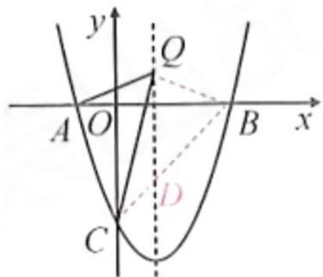

text_image

y
Q
A O B x
D
C

# 第58页

1.

解：(1) $A(-2,0)$ , $B(8,0)$ , $C(0,4)$ ,

直线 BC 的解析式为 $y = -\frac{1}{2}x + 4$ ;

(2) 过点 C 作 $CG \perp PD$ 于点 G.

设 $P\left(m, -\frac{1}{4} m^2 + \frac{3}{2} m + 4\right)$ , 则 $E\left(m, -\frac{1}{2} m + 4\right)$ ,

$$
\because P C = E C, \therefore P G = E G,
$$

$$
\therefore - \frac {1}{4} m ^ {2} + \frac {3}{2} m + 4 - 4 = 4 - \left(- \frac {1}{2} m + 4\right),
$$

解得 m=0（舍去）或 m=4，

$$
\therefore P (4, 6).
$$

2.

(1) $y=-x^{2}+2x+3$ ,对称轴为直线x=1;  
(2)过点P作 $PE \perp AB$ 于点E,过点D作 $DF \perp EP$ 交EP的延长线于点F,

$$
\therefore \angle P E A = \angle F = 9 0 ^ {\circ}.
$$

$$
\because P D \perp P A, P A = P D,
$$

$$
\therefore \angle P A E + \angle A P E = 9 0 ^ {\circ},
$$

$$
\angle D P F + \angle A P E = 9 0 ^ {\circ},
$$

$$
\therefore \angle P A E = \angle D P F,
$$

$$
\therefore \triangle P A E \cong \triangle D P F (A A S),
$$

$$
\therefore P E = D F.
$$

$$
\because P (m, - m ^ {2} + 2 m + 3), A (- 1, 0),
$$

$$
\therefore P E = D F = - m ^ {2} + 2 m + 3,
$$

∴点D的横坐标为

$$
m - (- m ^ {2} + 2 m + 3) = m ^ {2} - m - 3,
$$

∵直线l的解析式为x=1,点D在直线l上,

$\therefore m^{2} - m - 3 = 1$ ，解得 $m = \frac{1\pm\sqrt{17}}{2}$

∵点P在直线l的右侧,

$$
\therefore 1 <   m <   3,
$$

$$
\therefore m = \frac {1 + \sqrt {1 7}}{2} 。
$$

# 第 59 页

1.

解:(1) $A(-2,0)$ , $B(6,0)$ , $C(0,-6)$ ;

(2) 过点 F 作 $FH \perp x$ 轴于点 H.

∵以 A, C, E, F 为顶点的四边形是平行四边形，且 $FE \parallel AC$ ，

$$
\therefore F E = A C,
$$

$$
\therefore \triangle F H E \cong \triangle C O A,
$$

$$
\therefore F H = C O = 6.
$$

设 $F\left(t,\frac{1}{2}t^{2}-2t-6\right)$ ,

则 $\left|\frac{1}{2} t^2 - 2t - 6\right| = 6$

当 $\frac{1}{2} t^2 - 2t - 6 = 6$ 时，

解得 $t = 2 + 2\sqrt{7}$

此时 $F(2+2\sqrt{7},6)$ 或 $(2-2\sqrt{7},6)$ ;

当 $\frac{1}{2}t^{2}-2t-6=-6$ 时，

解得 t=0(舍去)或 4，

此时 $F(4,-6)$ ;

综上所述， $F(4,-6)$ 或 $(2+2\sqrt{7},6)$

2.

解：(1) $y=-x^{2}-2x+3$ ;

(2) 存在, 理由如下:

$$
\because y = - x ^ {2} - 2 x + 3 = - (x + 1) ^ {2} + 4,
$$

∴抛物线的对称轴为直线 x = -1，

设 $D(d,-d^{2}-2d+3)$ , $E(-1,e)$ ,

当 AC 是对角线时，

$$
x _ {A} + x _ {C} = x _ {D} + x _ {E}, y _ {A} + y _ {C} = y _ {D} + y _ {E},
$$

$$
\therefore - 3 + 0 = d + (- 1), 0 + 3 = - d ^ {2} - 2 d + 3 + e,
$$

解得 $d = -2, e = 0, \therefore E(-1, 0)$ ;

当 AD 是对角线时，

$$
x _ {A} + x _ {D} = x _ {C} + x _ {E}, y _ {A} + y _ {D} = y _ {C} + y _ {E},
$$

$$
\therefore - 3 + d = 0 + (- 1), 0 + \left(- d ^ {2} - 2 d + 3\right) = 3 + e,
$$

解得 $d=2, e=-8, \therefore E(-1,-8)$ ;

综上所述，点 E 的坐标为 $(-1,0)$ 或 $(-1,-8)$ .

# 点睛

$$
y = \left\{ \begin{array}{l} \frac {1}{2} x ^ {2} (0 <   x \leqslant 4) \\ - \frac {1}{2} x ^ {2} + 4 x (4 <   x \leqslant 8) \end{array} \right.
$$

1. C   
2. $-x^{2} + 10x$   
3. (12-2x) $(-2x^{2} + 12x)$ $4 \leq x < 6$   
4. 100   
5. 450   
6.

. 解: (1) 过点 A 作 $AE \perp BC$ 于点 E,

$$
\because \angle B = 3 0 ^ {\circ}, A B = x, \therefore A E = \frac {1}{2} x,
$$

又∵□ABCD的周长为8,∴BC=4-x,

$$
\therefore y = A E \cdot B C = \frac {1}{2} x (4 - x) = - \frac {1}{2} x ^ {2} + 2 x (0 <   x <   4);
$$

(2) $y=-\frac{1}{2}x^{2}+2x=-\frac{1}{2}(x-2)^{2}+2,$

$\because -\frac{1}{2}<0,\therefore$ 当x=2时,y有最大值,其最大值为2.

# 第61页

7.

(1) $\because \triangle AEH \cong \triangle BFE \cong \triangle CGF \cong \triangle DHG,$

$$
\therefore S _ {\triangle A E H} = S _ {\triangle B F E} = S _ {\triangle C G F} = S _ {\triangle D H G}, A H = B E = 4 - x,
$$

$$
\therefore S _ {\text {阴影}} = 4 \times \frac {1}{2} \times A E \times A H = 2 x (4 - x),
$$

$$
\therefore y = S _ {\text {正方形} A B C D} - S _ {\text {阴影}} = 4 \times 4 - 2 x (4 - x) = 2 x ^ {2} - 8 x + 1 6.
$$

(3 分)

(2) 令 $2x^{2}-8x+16=10$ ,

解得 $x_{1}=1, x_{2}=3$ ,

故当 AE=1 或 3 时, 四边形 EFGH 的面积为 10. (5 分)

(3) 存在最小值.
(6 分)

$$
\because y = 2 x ^ {2} - 8 x + 1 6 = 2 (x - 2) ^ {2} + 8, 2 > 0,
$$

∴ 当 x=2 时, y 取最小值, 最小值为 8,

∴ 四边形 EFGH 的面积的最小值为 8. (9 分)

8.

解:(1)设 AB=x m. 则 $AD=27-2x+1=(28-2x)\mathrm{m}$ ,

∴ $x(28-2x)=90$ , 解得 $x_{1}=5, x_{2}=9$ .

当 x=5 时，28-2x=18>13，不符合题意，舍去；

当 x=9 时,28-2x=10<13,符合题意.

答:AB 为 9 m 时, 猪舍的面积为 $90 \, m^{2}$ ;

(2) 设 AB = x m，所围矩形猪舍的面积为 $y \, m^{2}$ .

$$
y = x (2 8 - 2 x) = - 2 x ^ {2} + 2 8 x = - 2 (x - 7) ^ {2} + 9 8,
$$

$$
\because 0 <   2 8 - 2 x \leqslant 1 3, \therefore 7. 5 \leqslant x <   1 4.
$$

$\because y=-2(x-7)^{2}+98$ , 图象开口向下,

∴在对称轴 x=7 的右侧 y 随 x 增大而减小，

∵AB为整数,即当x=8时, $y_{最大值}=96$ .

答:AB为8m时,面积最大,最大面积是96m².

# 第62页

# 点睛 2

1. $P = -2x^{2} + 500x$   
2. $(60+x)$ $y=-5x^{2}-200x+6000$   
3. $y = -10x^{2} + 100x + 2000$

4.

利润y由每盒利润与销量的乘积决定。已知每盒进价50元，售价为x元时，每盒利润为 $(x-50)$ 元。当售价从52元提高至x元时，销量减少 $10(x-52)$ 盒，故销量为 $180-10(x-52)=700-10x$ 盒。因此，利润函数为：

$$
y = (x - 5 0) (7 0 0 - 1 0 x)
$$

展开后得:

$$
y = - 1 0 x ^ {2} + 1 2 0 0 x - 3 5 0 0 0
$$

此二次函数的开口向下，最大值出现在顶点处。顶点横坐标为：

$$
x = - \frac {b}{2 a} = - \frac {1 2 0 0}{2 \times (- 1 0)} = 6 0
$$

将 $x = 60$ 代入函数得最大利润：

$y = (60 - 50)(700 - 10 \times 60) = 10 \times 100 =$ 验证区间端点x = 52和x = 70的利润分别为360元和0元，均小于1000元。因此，y的最大值为

1000元。

5.

(1) 设 $y=kx+b(k\neq0)$ ,

把 x=20, y=360 和 x=30, y=60 代入，可得

$$
\left\{ \begin{array}{l l} 2 0 k + b = 3 6 0, \\ 3 0 k + b = 6 0, \end{array} \right. \text {解得} \left\{ \begin{array}{l l} k = - 3 0, \\ b = 9 6 0. \end{array} \right.
$$

则 $y=-30x+960(10\leqslant x\leqslant32)$ .

(2) 每月获得利润 $P=(-30x+960)(x-10)=$

$$
3 0 (- x + 3 2) (x - 1 0) = 3 0 \left(- x ^ {2} + 4 2 x - 3 2 0\right) =
$$

$$
- 3 0 (x - 2 1) ^ {2} + 3 6 3 0.
$$

$$
\because - 3 0 <   0.
$$

∴当x=21时，P有最大值，最大值为3630.

答：当价格为21元时，才能使每月获得最大利润，

最大利润为 3630 元.

# 第63页

6.

【例 1】解:(1)由题意,得 $y=(200-x)\left(60+\frac{x}{10}\times4\right)=-\frac{2}{5}x^{2}+20x+12000.$

∵每辆轮椅的利润不低于180元，

$$
\therefore 2 0 0 - x \geqslant 1 8 0,
$$

$$
\therefore x \leqslant 2 0.
$$

$$
\because y = - \frac {2}{5} x ^ {2} + 2 0 x + 1 2 0 0 0 = - \frac {2}{5} (x - 2 5) ^ {2} + 1 2 2 5 0, - \frac {2}{5} <   0,
$$

∴当x<25时，y随x的增大而增大，

∴当 x=20 时, 每天的销售利润最大, 为 $-\frac{2}{5} \times (20-25)^{2} + 12250 = 12240$ (元).

答: y 与 x 的函数关系式为 $y = -\frac{2}{5}x^{2} + 20x + 12000$ ; 每辆轮椅降价 20 元时, 每天的利润最大, 为 12240 元.

(2) 当 y=12 160 时， $-\frac{2}{5}x^{2}+20x+12\ 000=12\ 160$

解得 $x_{1}=10, x_{2}=40$ (不符合题意, 舍去),

$$
\therefore 6 0 + \frac {1 0}{1 0} \times 4 = 6 4 (\text {   辆   }).
$$

答: 这天售出了 64 辆轮椅.

7.

(1) $(-2x+52)$ (2分)

解法提示:设第 x 天的单价 m(元/盒)与 x 的函数关系式为 $m = kx + p$ ,

把 $(1,50)$ ， $(2,48)$ 分别代入，

得 $\left\{\begin{aligned}k+p=50,\\ 2k+p=48,\end{aligned}\right.$ 解得 $\left\{\begin{aligned}k&=-2,\\ p&=52,\end{aligned}\right.$

$$
\therefore m = - 2 x + 5 2.
$$

(2)根据题意,得 $y_{1}=(-2x+52)(10x+10)-745$ ,

整理, 得 $y_{1} = -20x^{2} + 500x - 225$ ,

∴ A 樱桃园第 x 天的利润 $y_{1}$ (元) 与 x 的函数关系式为 $y_{1} = -20x^{2} + 500x - 225$ . (4 分)

(3)① $y_{2}=-30x^{2}+500x+25$ (6分)

解法提示: 把(1,495), (2,905)分别代入 $y_{2}=ax^{2}+bx+25$ ,
得 $\left\{\begin{aligned}&a+b+25=495,\\ &4a+2b+25=905,\end{aligned}\right.$ 解得 $\left\{\begin{aligned}a&=-30,\\ b&=500,\end{aligned}\right.$

$$
\therefore y _ {2} = - 3 0 x ^ {2} + 5 0 0 x + 2 5.
$$

② $y_{1}+y_{2}=-20x^{2}+500x-225-30x^{2}+500x+25=-50x^{2}+$ 1 000x - 200 = -50(x - 10) $^{2}$ + 4 800,

$$
\because - 5 0 <   0,
$$

∴ 当 x=10 时, $y_{1}+y_{2}$ 取得最大值, 最大值为 4800.

答:第 10 天两处的樱桃园的利润之和最大, 最大是 4800 元.
(8 分)

# 点睛 600

1. 10   
2. 35/3   
3. 14/9   
4.

解:(1)由题意,得抛物线的顶点为 $P(5,9)$ .

∴可以设抛物线的函数解析式为 $y=a(x-5)^{2}+9$ .

把(0,0)代入,可得 $a=-\frac{9}{25}$ ,

$$
\therefore y = - \frac {9}{2 5} (x - 5) ^ {2} + 9 = - \frac {9}{2 5} x ^ {2} + \frac {1 8}{5} x.
$$

∴满足设计要求的抛物线的函数解析式为 $y=-\frac{9}{25}x^{2}+\frac{18}{5}x$ .

(2) 令 y=6，得 $-\frac{9}{25}x^{2}+\frac{18}{5}x=6$ .

解得 $x_{1}=5+\frac{5\sqrt{3}}{3},x_{2}=5-\frac{5\sqrt{3}}{3}.$

∴点 A, B 的坐标分别为 $A\left(5-\frac{5\sqrt{3}}{3},6\right)$ , $B\left(5+\frac{5\sqrt{3}}{3},6\right)$ .

# 第65页

5.

(1) 函数 $y = -\frac{1}{3}x^{2} + \frac{2}{3}x + 1$ 的对称轴为 x = 1，此时 $y = \frac{4}{3}$ ，

因此，A 喷头喷出的水流的最大高度为 $\frac{4}{3}$ m.

(2)令 $y=-\frac{1}{3}x^{2}+\frac{2}{3}x+2=0,$

解得 $x_{1}=\sqrt{7}+1$ , $x_{2}=-\sqrt{7}+1$ (不符合题意, 舍去).

因为 $\sqrt{7}+1<4$ ,

所以 B 喷头喷出的水流不会落在该游人所站的点 D 处.

6.

任务 1: 抛物线的函数表达式为 y

$$
= - \frac {1}{8} x ^ {2} + 2 x;
$$

任务 2: 为使车辆按素材 2 要求安全通过, 该隧道限高 3 米.

# 第66页

1.

解：(1)由题意，得 $2x + y = 80$ ，

$$
\therefore y = - 2 x + 8 0.
$$

∵墙长42m，

$$
\therefore 0 <   - 2 x + 8 0 \leqslant 4 2, \text {   且   } x > 0,
$$

$$
\therefore 1 9 \leqslant x <   4 0.
$$

由题意, 得 $S = AB \cdot BC = x (-2x + 80)$ ,

$$
\therefore S = - 2 x ^ {2} + 8 0 x (1 9 \leqslant x <   4 0).
$$

(2) 令 $S = -2x^{2} + 80x = 750$ ,

解得 $x_{1}=15$ (不符合题意, 舍去), $x_{2}=25$ .

答: 当 x=25 时, 围成的矩形花圃的面积为 $750 \, m^{2}$ .

(3)由(1)知， $S=-2x^{2}+80x=-2(x-20)^{2}+800.$

$$
\because - 2 <   0 \text {, 且} 1 9 \leqslant x <   4 0,
$$

∴当x=20时,S取最大值为800.

答: 围成的矩形花圃面积存在最大值, 最大值为 $800 \, m^{2}$ , 此时 x 的值为 20.

2.

教材母题 解:(1) $y=30-2x(6\leqslant x<15)$ ;

(2)设苗圃园的面积为 S，则 $S = x(30 - 2x) = -2x^{2} + 30x = -2(x - 7.5)^{2} + 112.5$ ,

∴当 x=7.5 时， $S_{最大}=112.5(m^{2})$ ;

(3) $6 \leqslant x \leqslant 11.$

(当 S=88 时， $-2x^{2}+30x=88$ ，

解得 $x_{1}=4, x_{2}=11$ ，由图象可知，

当 $S \geqslant 88$ 时， $4 \leqslant x \leqslant 11$ ，

又∵6≤x<15,∴当S≥88时,6≤x≤11.)

1.

解：(1) 设 $y = kx + b (k \neq 0)$ .

把 x=12, y=56 和 x=14, y=52 代入 $y=kx+b$ ,

得 $\left\{\begin{aligned}12k+b=56,\\ 14k+b=52,\end{aligned}\right.$ 解得 $\left\{\begin{aligned}k=-2,\\ b=80.\end{aligned}\right.$

$$
\therefore y = - 2 x + 8 0.
$$

(2) 设日销售利润为 w 元.

则 $w=(x-10)(-2x+80)=-2(x-25)^{2}+450.$

∵ -2<0，∴ 当 x=25 时，w 最大，最大值为 450.

答: 糖果销售单价定为25元时, 所获日销售利润最大, 最大利润是450元.

(3) 由题意得 $w=(x-10-m)(-2x+80)=-2x^{2}+(100+2m)x-800-80m$ .

∵最大利润为392元，

$$
\therefore \frac {4 \times (- 2) (- 8 0 0 - 8 0 m) - (1 0 0 + 2 m) ^ {2}}{4 \times (- 2)} = 3 9 2.
$$

整理得 $m^{2}-60m+116=0$ ，

解得 $m_{1}=2$ , $m_{2}=58$ .

∵ 58 > 10，∴ 舍去.

$$
\therefore m = 2.
$$

2.

解析 （1）设这段时间内 y 与 x 之间的函数解析式为 $y = kx + b (k \neq 0)$ ,

由题目中的函数图象可知, 函数经过(100,300),

(120,200)两点，∴ $\left\{\begin{aligned}&100k+b=300,\\ &120k+b=200,\end{aligned}\right.$ 解得 $\left\{\begin{aligned}k=-5,\\ b=800,\end{aligned}\right.$

∴ 这段时间内 y 与 x 之间的函数解析式为 $y = -5x + 800$ .

(2)∵销售单价不低于100元,且商场还要完成不少于220件的销售任务,∴ $x\geqslant100,y\geqslant220$ ,

即 $\left\{\begin{aligned}x&\geqslant100,\\ -5x+800&\geqslant220,\end{aligned}\right.$ 解得 $100\leqslant x\leqslant116,$

设商场销售这种商品时,获得的利润为 w,

由题意, 得 $w=(x-80)(-5x+800)=-5x^{2}+1$ 200x-64 000=-5 $(x-120)^{2}$ +8 000,

∵ -5<0,∴ 二次函数的图象开口向下,

当 $100 \leqslant x \leqslant 116$ 时, w 随 x 的增大而增大,

即当 x = 116 时，w 有最大值， $w_{最大} = -5 \times (116 - 120)^{2} + 8000 = 7920.$

答: 当销售单价为 116 元时, 商场获得的利润最大, 最大利润是 7920 元.

# 第68页

1.

解：(1) 设 y 与 x 之间的函数关系式是 $y = kx + b$ ,

由表格可得 $\left\{\begin{aligned}&40k+b=164,\\ &50k+b=124,\end{aligned}\right.$ 解得 $\left\{\begin{aligned}&k=-4,\\ &b=324.\end{aligned}\right.$

即 y 与 x 之间的函数关系式是 $y = -4x + 324 (30 \leqslant x \leqslant 80, \text{且 } x \text{ 是整数})$ .

(2)由题意可得, $w=x(-4x+324)-2000=-4x^{2}+324x-2000$ ,

即 w 与 x 之间的函数关系式是 $w = -4x^{2} + 324x - 2000 (30 \leqslant x \leqslant 80$ ，且 x 是整数).

(3) 由(2)知 $w = -4x^{2} + 324x - 2000 = -4\left(x - \frac{81}{2}\right)^{2} + 4561$ ,

$\because -4<0,30\leqslant x\leqslant80$ , 且 x 是整数,

∴ 当 x=40 或 41 时, w 取得最大值, 此时 w=4560 元.

答：该影院将电影票售价 x 定为 40 元/张或 41 元/张时，每天获利最大，最大利润是 4560 元.

2.

.解:(1)-1;30;

(2)由题意,得 $y=\begin{cases}-x+30(1\leqslant x\leqslant20)\\15(20<x\leqslant30)\end{cases}$ ,

当 $1 \leqslant x \leqslant 20$ 时，

$$
M = y z = (- x + 3 0) (x + 1 0) = - x ^ {2} + 2 0 x + 3 0 0,
$$

当 $20 < x \leqslant 30$ 时, M = yz = 15 (x + 10) = 15x + 150,

$$
\therefore M = \left\{ \begin{array}{l} - x ^ {2} + 2 0 x + 3 0 0 (1 \leqslant x \leqslant 2 0) \\ 1 5 x + 1 5 0 (2 0 <   x \leqslant 3 0) \end{array} ; \right.
$$

(3)由题意可知,当 $1 \leqslant x \leqslant 20$ 时,

$$
M = - x ^ {2} + 2 0 x + 3 0 0 = - (x - 1 0) ^ {2} + 4 0 0 \leqslant 4 0 0,
$$

∴ 此时销售额不超过 500 元；

当 $20 < x \leqslant 30$ 时, $15x + 150 > 500$ ,

解得 $x > 23 \frac{1}{3}$ ,∵ x 为正整数，

∴ 第 24 天至第 30 天, 销售额超过 500 元,

$30-24+1=7$ （天）.

答: 在试销售的 30 天中, 共有 7 天销售额超过 500 元.

# 第69页

1.

(1)①m = 3, n = 6;   
②解法一：把 $\left\{\begin{aligned}x&=1,\\ y&=\frac{7}{2}\end{aligned}\right.$ 和 $\left\{\begin{aligned}x&=-2,\\ y&=6\end{aligned}\right.$ 分别代入

$$
y = a x ^ {2} + b x, \text {得}
$$

$$
\left\{ \begin{array}{l} a + b = \frac {7}{2}, \\ 4 a + 2 b = 6 \end{array} \right.
$$

解得 $\left\{\begin{aligned}a&=-\frac{1}{2},\\ b&=6,\end{aligned}\right.$ ∴ $y=-\frac{1}{2}x^{2}+4x.$

将 $y=\frac{1}{4}x$ 代入 $y=-\frac{1}{2}x^{2}+4x$ ,得

$$
\frac {1}{4} x = - \frac {1}{2} x ^ {2} + 4 x.
$$

解得 $x_{1}=0$ (舍)， $x_{2}=\frac{15}{2}$ .

将 $x=\frac{15}{2}$ 代入 $y=\frac{1}{4}x$ ,得 $y=\frac{15}{8}$ .

∴点A的坐标是 $\left(\frac{15}{2},\frac{15}{8}\right)$ .

解法二：设 $y=a(x-4)^{2}+8$

将(2,6)代入，得 $a(2-4)^{2}+8=6$ ,

解得 $a=-\frac{1}{2}$ .

$$
\therefore y = - \frac {1}{2} (x - 4) ^ {2} + 8.
$$

即 $y=-\frac{1}{2}x^{2}+4x.$

将 $y=\frac{1}{4}x$ 代入 $y=-\frac{1}{2}x^{2}+4x,$

得 $\frac{1}{4}x=-\frac{1}{2}x^{2}+4x.$

解得 $x_{1}=0$ (舍)， $x_{2}=\frac{15}{2}$ .

将 $x=\frac{15}{2}$ 代入 $y=\frac{1}{4}x$ ,得 $y=\frac{15}{8}$ .

∴点A的坐标是 $\left(\frac{15}{2},\frac{15}{8}\right)$ .

(2)①8;

②解法一: $y = -5t^{2} + at = -5(t - \frac{v}{10})^{2} + \frac{v^{2}}{20}$ ,

$$
\therefore \frac {v ^ {2}}{2 0} = 8.
$$

$$
\because v _ {1} = 4
$$

$$
v _ {2} = - 4 \sqrt {1 0}.
$$

$\therefore -5t^{2} + at = -5(t - \frac{v}{10})^{2} + \frac{v^{2}}{20}$ 的对称轴为

$$
t = \frac {v}{1 0},
$$

$$
\therefore v > 0.
$$

$$
\therefore v = 4 \sqrt {1 0}.
$$

解法二:∵ $y=-5t^{2}+at$ 的顶点纵坐标为8,

$$
\therefore \frac {4 \times (- 5) \times 0 - v ^ {2}}{4 \times (- 5)} = 8.
$$

$$
\therefore v _ {1} = 4 \sqrt {1 0}, v _ {2} = - 4 \sqrt {1 0}.
$$

当 $v = -4\sqrt{10}$ 时， $y = -5t^2 + at = -5t^2 - 4\sqrt{10}t,$

$$
\because t \geq 0,
$$

$$
\therefore y \leq 0.
$$

$\therefore v = -4\sqrt{10}$ 不成立.

$$
\therefore v = 4 \sqrt {1 0}
$$

2.

解:(1) $\because AO=17\ m,$

$$
\therefore A (0, 1 7).
$$

$\because OC=100\ m,$ 缆索 $L_{1}$ 的最低点 P 到 $FF'$ 的距离 PD =2 m,

∴抛物线的顶点 P 的坐标为 $(50,2)$ .

设缆索 $L_{1}$ 所在抛物线的函数表达式为 $y = a(x - 50)^{2} + 2$ . 将 A(0,17) 代入, 得

$$
2 5 0 0 a + 2 = 1 7. \therefore a = \frac {3}{5 0 0}.
$$

∴ 缆索 $L_{1}$ 所在抛物线的函数表达式为 $y = \frac{3}{500}(x - 50)^{2} + 2$ .

(2)∵缆索 $L_{1}$ 所在抛物线与缆索 $L_{2}$ 所在抛物线关于y轴对称，缆索 $L_{1}$ 所在抛物线为 $y=\frac{3}{500}(x-50)^{2}+2$ ，

∴缆索 $L_{2}$ 所在抛物线为 $y=\frac{3}{500}(x+50)^{2}+2$ .

令 y=2.6，则 $2.6=\frac{3}{500}(x+50)^{2}+2$ ，

解得 x = -40 或 x = -60.

$$
\because F O <   O D, O D = 5 0 \mathrm{m},
$$

$$
\therefore x = - 4 0.
$$

∴FO 的长为 40 m.

# 第70页

. 解: (1) 描点连线绘制函数图象如答图:

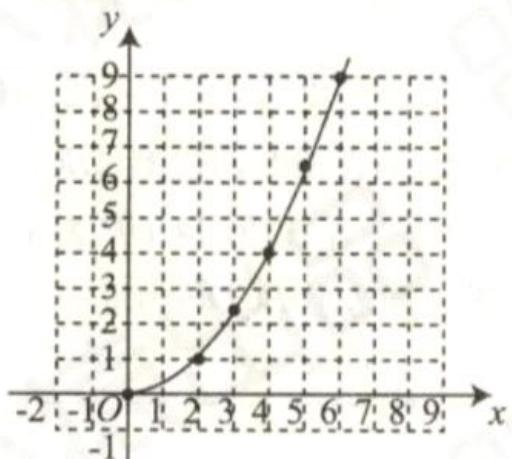

line

| x | y |
|---|---|
| 0 | 0 |
| 1 | 1 |
| 2 | 1 |
| 3 | 2 |
| 4 | 4 |
| 5 | 6 |
| 6 | 9 |

答图

由题意得点 $B(\frac{1}{2}m,n)$ ,

将点 B 的坐标代入函数表达式得 $n=(\frac{1}{2}m)^{2}=\frac{1}{4}m^{2}$ ,

故答案为: $n=\frac{1}{4}m^{2}$ ;

(2) 方法 1: 点 $B'(\frac{1}{2}m, n)$ ，将点 $B'$ 的坐标代入抛物线表达式得 $n = \frac{1}{4}a \times m^{2}$ ，故答案为： $(\frac{1}{2}m, n)$ ; $n = \frac{1}{4}am^{2}$ ;

方法 2: 点 $B(h + \frac{1}{2}m, k + n)$ ，将点 B 的坐标代入抛物线表达式得： $k + n = a(h + \frac{1}{2}m - h)^{2} + k$ ，

解得: $n=\frac{1}{4}am^{2}$ ，故答案为： $(h+\frac{1}{2}m,k+n)$ ; $n=\frac{1}{4}am^{2}$ ;

(3)设两个抛物线顶点的纵坐标分别加 $n_{1}, n_{2}$ 个单位长度与点 B 的纵坐标相同，①当 a > 0 时，此时抛物线开口方向向上，由(2)知 $a = \frac{4h_{1}}{m^{2}}, n = \frac{am^{2}}{4}$ ,

$$
\because y = 2 (x - h) ^ {2} + k, \therefore n _ {1} = \frac {2 \times 4 ^ {2}}{4} = 8,
$$

∵两个函数图象的顶点之间的距离为10,∴ $n_{2}=18$ ,

$$
\therefore a = \frac {4 \times 1 8}{4 ^ {2}} = \frac {9}{2};
$$

②当 a<0 时，同理可得 $n_{2}=2$ ，此时 $a=-\frac{1}{2}$ .

综上, $a=\frac{9}{2}$ 或 $-\frac{1}{2}$ .

2.

解：（1）描点，连线，如图所示：

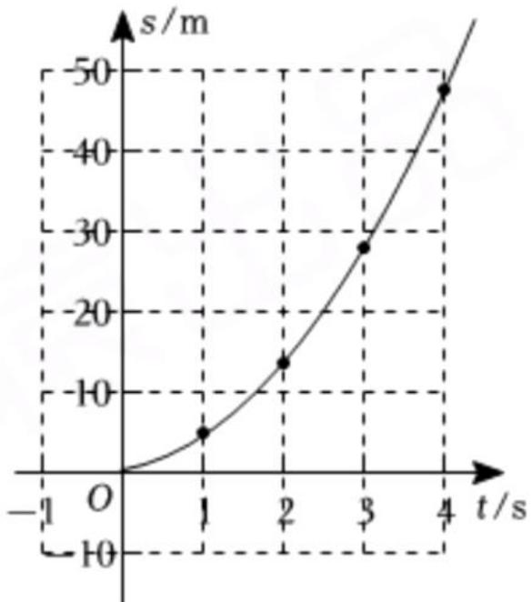

line

| t/s | s/m  |
|-----|------|
| 1   | -10  |
| 2   | -7   |
| 3   | -30  |
| 4   | -50  |

(2) 观察函数图象, $s$ 与 $t$ 的关系可近似看成二次函数; 推测滑行距离与滑行时间的关系为 $s = \frac{5}{2} t^{2} + 2 t$ ;

理由如下:

设s关于t的函数关系式为 $s=at^{2}+bt,$

将（1，4.5）（2，14）代入 $s=at^{2}+bt$ ，得：

$$
\left\{ \begin{array}{l} a + b = 4. 5 \\ 4 a + 2 b = 1 4 \end{array} , \right.
$$

解得： $\left\{\begin{aligned}a&=\frac{5}{2},\\ b&=2\end{aligned}\right.$

∴近似地表示s关于t的函数关系式为 $s=\frac{5}{2}t^{2}+2t$ ;

(3) 把 $s = 270$ 代入 $s = \frac{5}{2} t^{2} + 2t$ 得:

$$
\frac {5}{2} t ^ {2} + 2 t = 2 7 0,
$$

解得： $t_{1}=10,\quad t_{2}=-10.8$ （舍去），

∴他滑行的时间是10秒.

任务 1: 安排 x 名工人加工“雅”服装, y 名工人加工“风”服装,

∴ 加工“正”服装的有 $(70-x-y)$ 人.

∵“正”服装总件数和“风”服装总件数相等，

$$
\therefore 7 0 - x - y = 2 y,
$$

整理, 得 $y = -\frac{1}{3}x + \frac{70}{3}$ . (3 分)

任务 2: 根据题意, 得“雅”服装每天获利为 $x[100 - 2(x - 10)]$ ,

$$
\therefore w = 2 4 \times 2 y + 4 8 (7 0 - x - y) + x [ 1 0 0 - 2 (x - 1 0) ],
$$

即 $w = -2x^{2} + 72x + 3360.$ (6 分)

任务 3: 由任务 2, 得 $w = -2x^{2} + 72x + 3360 = -2(x - 18)^{2} + 4008$ ,

由题意得 $x \geqslant 10, 100 - 2(x - 10) \geqslant 0$ ,

∴ $10 \leqslant x \leqslant 60$ ，且 x 为整数.

$$
\because a = - 2 <   0,
$$

∴ 当 x=18 时, 获得最大利润.

又∵ $y = -\frac{1}{3} \times 18 + \frac{70}{3} = \frac{52}{3}$ ，不合题意，

$$
\therefore x \neq 1 8.
$$

∵ 当 x<18 时, w 随 x 的增大而增大,

∴ 当 x=17 时, $y=\frac{55}{3}$ , 不符合题意;

∵ 当 x > 18 时, w 随 x 的增大而减小,

∴ 当 x=19 时, $y=\frac{51}{3}=17$ , 符合题意.

$$
\therefore 7 0 - x - \gamma = 3 4.
$$

答:安排19名工人加工“雅”服装,17名工人加工“风”服装,34名工人加工“正”服装,即可获得最大利润. (10分)

1. C   
2.3   
3. 向下 y (0,0)   
4. 向上 y (0,2)   
5. 向下 x=-3 (-3,0)  
6. 向上 x=1 (1,2) x>1 x<1 x=1 2  
7. x=3   
8. A   
9. $y = -2(x + 2)^{2}$   
10. $y = -x^{2} + 2x + 3$   
11. $y = -(x - 1)^{2} + 2$   
12. > < < >   
13. D

# 第73页

14. (1) $x_{1} = 1, x_{2} = 3$ (2) $1 < x < 3$ (3) $k < 2$   
15.

解:(1)由题意可得,抛物线的对称轴是直线x

$$
= \frac {1 0 + 2 0}{2} = 1 5,
$$

∴ 抛物线的顶点为(15,9).

∴ 可设抛物线为 $y=a(x-15)^{2}+9$ .

又抛物线过(10,8)，

$$
\therefore 2 5 a = - 1 \therefore a = - \frac {1}{2 5}.
$$

∴ 抛物线的表达式为 $y=-\frac{1}{25}(x-15)^{2}+9$ .

(2)由题意,结合(1) $y=-\frac{1}{25}(x-15)^{2}+9$ ,

∴ 令 x=5，则 $y=-\frac{1}{25}(5-15)^{2}+9=5.$

∴ 水火箭距离地面的竖直高度为 5 m.

16.

解析:(1)设y与x之间的函数关系式为 $y=kx+b(k\neq0)$ .把(50,90)和(60,80)代入,得

$$
\left\{ \begin{array}{l l} 9 0 = 5 0 k + b, \\ 8 0 = 6 0 k + b. \end{array} \right. \text {解得} \left\{ \begin{array}{l l} k = - 1, \\ b = 1 4 0. \end{array} \right.
$$

$$
\therefore y = - x + 1 4 0.
$$

(2)∵规定销售单价不低于进价,且不高于进价的2倍,∴40≤x≤80.

设每月出售这种护眼灯所获的利润为w元.根据题意,得

$$
\begin{array}{r l} & w = (x - 4 0) y = (x - 4 0) (- x + 1 4 0) = - (x - 9 0) ^ {2} + \\ & 2 5 0 0. \end{array}
$$

∴当护眼灯销售单价定为80元时,商店每月出售这种护眼灯所获的利润最大,最大月利润为 $-(80-90)^{2}+2500=2400$ (元).

# 第74页

# 点睛 √

1. D   
2. B   
3. 30   
4. O 逆时针 $80^{\circ}$   
5. $120^{\circ}$   
6. $45^{\circ}$   
7. $70^{\circ}$

8. $2 \sqrt{2}$

# 第75页

9. 52

10.

(1) $\triangle ABD$ 为等边三角形.  
(2) 证明: 由(1), 知 AB = BD,  
又∵AC=BC,∴AE=DE,   
又∵BE=BE,∴△ABE≌△DBE.

$$
\therefore \angle A B E = \angle D B E.
$$

11.

(1) 证明: ∵ 四边形 ABCD 是正方形,

$$
\therefore C D = A D, \angle A D C = 9 0 ^ {\circ}.
$$

$$
\because D E \perp C E,
$$

$$
\therefore \angle C E D = \angle D E G = 9 0 ^ {\circ}.
$$

∵ $\triangle DEF$ 是等腰直角三角形, $\angle EDF = 90^{\circ}$ ,

$$
\therefore D E = D F,
$$

$$
\therefore \angle A D C - \angle A D E = \angle E D F - \angle A D E,
$$

$$
\therefore \angle C D E = \angle A D F.
$$

$$
\therefore \triangle C D E \cong \triangle A D F (\mathrm{SAS}),
$$

$$
\therefore \angle A F D = \angle C E D = 9 0 ^ {\circ},
$$

$$
\therefore \angle A F D = \angle E D F = \angle D E G = 9 0 ^ {\circ},
$$

∴ 四边形 DEGF 是矩形.

$$
\because D F = D E,
$$

∴ 四边形 DEGF 是正方形；

(2) $AE=\sqrt{10}.$

12.

解:(1)连接AP.

由旋转的性质知,AC=AE,

$$
\angle A E D = \angle C = \angle A E P = 9 0 ^ {\circ}.
$$

$$
\because A P = A P,
$$

$$
\therefore \mathrm{Rt} \triangle A P E \cong \mathrm{Rt} \triangle A P C (\mathrm{HL}),
$$

$$
\therefore P C = P E;
$$

(2) 连接 AP, 延长 AD 和 CF 交于点 H.

由(1)知 PE = PC，

$$
\therefore \angle P E C = \angle P C E.
$$

$$
\because A D \parallel B C,
$$

$$
\therefore \angle D H E = \angle P C E = \angle P E C =
$$

$$
\angle D E H,
$$

$$
\therefore D E = D H = B C.
$$

在 $\triangle DFH$ 和 $\triangle BFC$ 中，

$$
\left\{ \begin{array}{l} \angle D F H = \angle B F C, \\ \angle D H F = \angle B C F, \\ D H = B C, \end{array} \right.
$$

$$
\therefore \triangle D F H \cong \triangle B F C (\mathrm{AAS}),
$$

$$
\therefore D F = B F.
$$

# 第76页

# 点睛 D

1. D   
2. A   
3. C   
4. D   
5.

解：(1) $\triangle A_{1}B_{1}C_{1}$ 如图所示；(2) $\triangle A_{2}B_{2}C_{2}$ 如图所示.

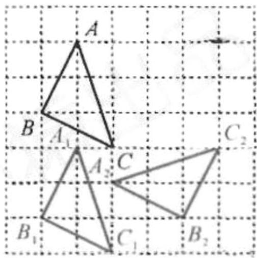

text_image

A
B A₁ C₂
A₂ C
B₁ C₁ B₂

# 第77页

6. $(4, 4 - \frac{4\sqrt{3}}{3})$   
7. (3,-1)或(2,2)   
8.

(1) 如图中的 $\triangle BCM$ ;  
(2)由(1)知 $\triangle AEB\cong\triangle CMB,\therefore\angle BCM=\angle A=90^{\circ},AE=CM.$

$\because \angle BCD=90^{\circ},\therefore \angle BCM+\angle BCD=180^{\circ},\therefore$ 点 D,C,M 共线.

$$
\because A E = C M, A E + C D = D E, \therefore D E = C D + C M = D M,
$$

又∵BE=BM,BD=BD,∴△EBD≌△MBD(SSS),

$\therefore \angle EDB = \angle MDB$ ，即 DB 平分 $\angle CDE$ 。

9.

(1) 图形如图所示:

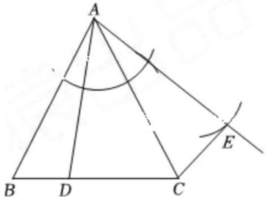

text_image

A
B D C
E

(2) $\because AB = AC, \angle BAC = 60^{\circ}$ ,

$\therefore \triangle ABC$ 是等边三角形，

$$
\therefore \angle B = \angle A C B = 6 0 ^ {\circ},
$$

$$
\because A B = A C, A D = A E, \angle B A C = \angle D A E,
$$

$$
\therefore \angle B A D = \angle C A E,
$$

$$
\therefore \triangle B A D \cong \triangle C A E (S A S),
$$

$$
\therefore \angle B = \angle A C E = 6 0 ^ {\circ},
$$

$$
\therefore \angle D C E = \angle A C B + \angle A C E = 1 2 0 ^ {\circ};
$$

(3) $\because AB = AC, AD = AE, \angle BAC = \angle DAE,$

$$
\therefore \angle B A D = \angle C A E,
$$

$$
\therefore \triangle B A D \cong \triangle C A E (S A S),
$$

$$
\therefore \angle B = \angle A C E,
$$

$$
\because \angle B + \angle A C B + \angle B A C = 1 8 0 ^ {\circ},
$$

$$
\therefore \angle A C E + \angle A C B + \alpha = 1 8 0 ^ {\circ},
$$

$$
\therefore \angle D C E + \alpha = 1 8 0 ^ {\circ}.
$$

# 第78页

1. C   
2. C   
3. A   
4.4

5.

.(1)

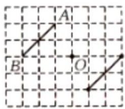

text_image

A
B
O

图1

(2)

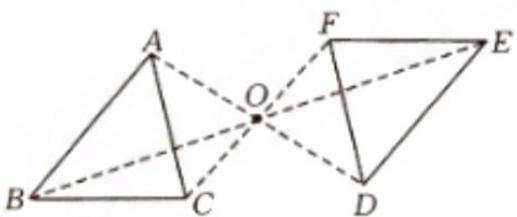

text_image

Geometric diagram showing two triangles ABC and DEF sharing vertex O, with dashed lines indicating diagonals and a solid circle at the intersection.

图2

(3)

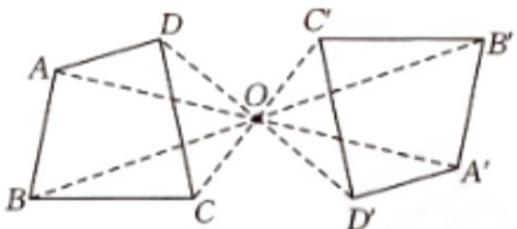

text_image

A
D
C'
B'
O
B
C
D'
A'

图3

# 第79页

6. (3, -1)

7.

(1) 解: 如图所示, 线段 BO 为 AC 边上的中线;

(4 分)

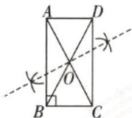

text_image

Geometric diagram of rectangle ABCD with diagonals intersecting at O, showing angle and rotation marks

(2) 证明: ∵ 点 O 是 AC 的中点, ∴ AO = CO,

(5 分)

∵ 将中线 BO 绕点 O 逆时针旋转 $180^{\circ}$ 得到 DO, ∴

BO=DO, (6分)

∴ 四边形 ABCD 是平行四边形， (7 分)

∵ $\angle ABC = 90^{\circ}$ , ∴ 四边形 ABCD 是矩形. (9 分)

8.

(1) 如图, $\triangle A_{1}B_{1}C$ 和 $\triangle A_{2}B_{2}C_{2}$ 为所作;

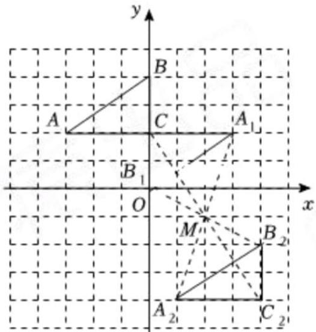

text_image

y
B
A	C	A₁
B₁
O	x
M	B₂
A₂	C₂

(2)如图， $\triangle A_{1}B_{1}C$ 绕点 $M$ 旋转 $180^{\circ}$ 得到 $\triangle A_{2}B_{2}C_{2}$ .

旋转中心M的坐标为 $(2,-1)$ .

故答案为(2.-1).

9.

. 解: (1) $\triangle FCP$ 如图所示;

(2) $\because \triangle ADP$ 与 $\triangle FCP$ 关于点 P 成中心对称，

$$
\therefore \triangle A D P \cong \triangle F C P,
$$

$$
\therefore C F = A D = A E, A P =
$$

$$
P F = \frac {1}{2} A F,
$$

$$
\because \angle D A P = \angle C F P,
$$

$$
\therefore C F \parallel A D,
$$

$$
\therefore \angle A C F + \angle D A C = 1 8 0 ^ {\circ},
$$

$$
\because \angle B A C = \angle D A E = 9 0 ^ {\circ},
$$

$$
\therefore \angle D A C + \angle B A E = 1 8 0 ^ {\circ},
$$

$$
\therefore \angle A C F = \angle B A E.
$$

$$
\because A B = A C,
$$

$$
\therefore \triangle A C F \cong \triangle B A E (\text { SAS }),
$$

$$
\therefore B E = A F = 2 A P,
$$

$$
\therefore \frac {A P}{B E} = \frac {1}{2}.
$$

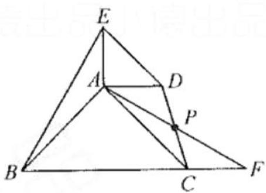

text_image

Geometric diagram with labeled points A, B, C, D, E, F, and P, showing triangles and intersecting lines.

# 第80页

# 点睛 正方形

1. B   
2. B   
3. C   
4. D   
5. D   
6. B

# 第81页

7.

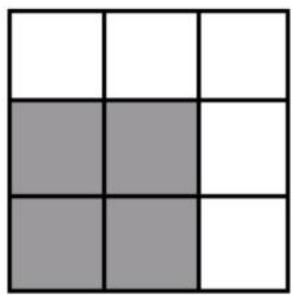

natural_image

3x3 grid with alternating white and gray squares (no text or symbols)

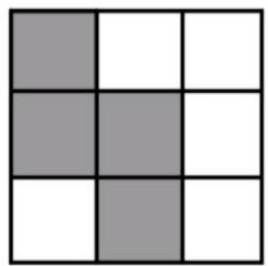

natural_image

3x3 grid with alternating shaded and white squares (no text or symbols)

8.

(1)①线段 AB 如图所示；②线段 CD 如图所示

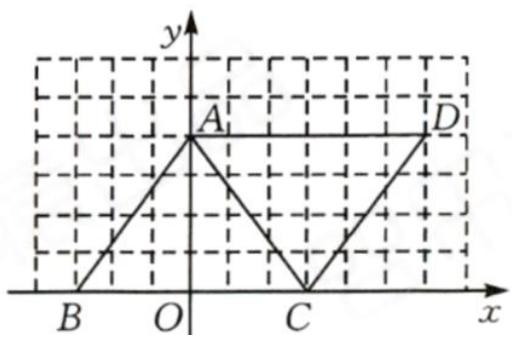

text_image

y
A
D
B
O
C
x

(2) 平行四边形

(1,2)

9.

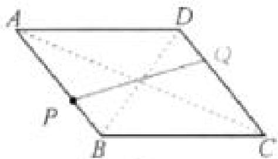

text_image

A
D
Q
P
B
C

图1

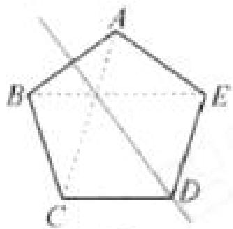

text_image

A
B
E
C
D

图2

10.

(1) 连接 AC, BD, 交于点 O, 连接 EO 并延长到点 F, 使 OF = OE, 连接 DF, CF;  
(2)方法一:过点 O 作 $OG \perp OE$ , 交 EB 的延长线于点 G, ∵ 四边形 ABCD 为正方形, ∴ OA = OB, ∠AOB = ∠EOG = 90°, ∴ ∠AOE = ∠BOG, 在四边形 AEBO 中, ∠AEB = ∠AOB = 90°, ∴ ∠EAO - ∠EBO = 180° = ∠EBO + ∠GBO, ∴ ∠GBO = ∠EAO, ∴ △EAO ≅ △GBO, ∴ AE = BG, OE = OG, ∴ △GEO 为等腰直角  
三角形， $\therefore OE = \frac{\sqrt{2}}{2} EG = \frac{\sqrt{2}}{2}(EB + BG) = \frac{\sqrt{2}}{2}(EB + AE) = \frac{17\sqrt{2}}{2},\therefore EF = 17\sqrt{2}.$

方法二: 提示: 延长 EA, FD 交于点 N, 连接 EF, 可证 $\triangle NEF$ 为等腰直角三角形, 可求得: $EF = 17\sqrt{2}$ .

# 第82页

点睛 (-2, 3)

1. A   
2. D   
3. (3, -2)   
4. 12   
5. x>1

6. 5+m

7. B

8. (2, -1)

9. $A_{1}(3, - 2),B_{1}(2,1),C_{1}(-2, - 3)$

# 第83页

10. B   
11. A   
12.

(1)画出 $\triangle ABC$ 关于原点对称的 $\triangle A_{1}B_{1}C_{1}(A,B,C$ 的对应点分别为 $A_{1},B_{1},C_{1}$ );  
(2)画出 $\triangle ABC$ 绕原点顺时针旋转 $90^{\circ}$ 后得到的 $\triangle A_{2}B_{2}C_{2}(A,B,C$ 的对应点分别为 $A_{2},B_{2},C_{2}$ );  
(3) $\triangle A_{1}B_{1}C_{1}$ 绕某点旋转得到 $\triangle A_{2}B_{2}C_{2}$ ，直接写出该点的坐标为 \_\_\_\_；

13.

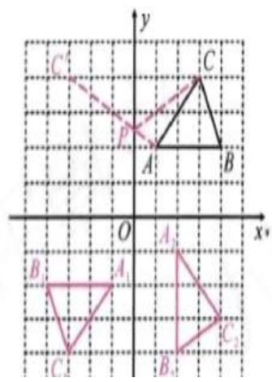

text_image

C
C
P
A
B
O
x*
A₁
B₁
A₁
C₁
B₁
C₂

解析(1)令 y = 0, 则 $x^{2} - 2x - 3 = 0$ , 解得 x = 3 或 -1, ∴ A(3,0), B(-1,0), C(0,-3). (2)由题意, 得 D(-a,-3), E(a,3), ∴ 点 E 在抛物线 $y = x^{2} - 2x - 3$ 上, ∴ $3 = a^{2} - 2a - 3$ , 解得 a = 3 或 -1 (舍去). ∴ a = 3. (3)由题意, 得 M(0,3), ∴ AM 的中点坐标为 $(\frac{3}{2}, 0)$ , ∴ 线段 AM 的中点关于原点的对称点的坐标为 $(- \frac{3}{2}, 0)$ , ∴ 线段 AM 绕原点旋转 $180^{\circ}$ 后得到的线段 A\`M\` 的中点坐标为 $(\frac{3}{2}, 0)$ , ∴ A\`(-3,0), M\`(0,-3), ∴ 点 A\`(-3,0), M\`(0,-3) 都在抛物线上.
答案(1)A(3,0),B(-1,0),C(0,-3)
(2)3(3)A\`(-3,0),M\`(0,-3)

# 第84页

1. C

2.

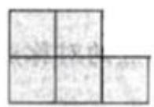

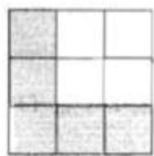  
(1)

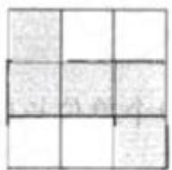  
(2)

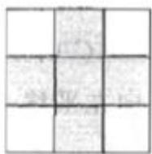  
(3)

3.

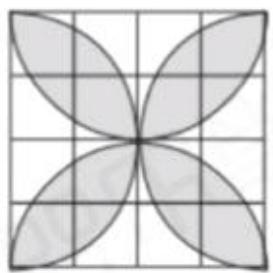

natural_image

Geometric pattern of four petal-like shapes arranged in a cross shape on a grid (no text or symbols)

图1

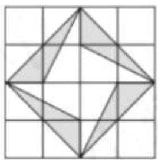

natural_image

Geometric diagram of a square with internal triangles and shaded regions on a grid (no text or symbols)

图2

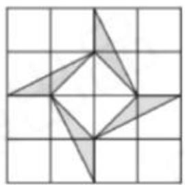

natural_image

Geometric diagram of a star-like polygon inscribed in a square grid (no text or symbols)

图3

1. B   
2. $85^{\circ}$   
3.75   
4. $20^{\circ}$   
5. $48^{\circ}$

6. $30^{\circ}$ 或 $150^{\circ}$

# 第86页

1、 $\sqrt{10}$ 或 $3\sqrt{10}$   
2、 $3\sqrt{2}$   
3、 $2\sqrt{10}$   
4. B   
5. 3/8

# 第87页

1.

. 证明：(1)由已知得 $\triangle ABC \cong \triangle DEC$

$$
\begin{array}{l} \therefore \angle A = \angle C D E, A C = D C, \therefore \angle A = \angle A D C. \\ \therefore \angle C D E = \angle A D C, \therefore D C \text {平分} \angle A D E; \\ \end{array}
$$

$$
(2) \because C A = C D, C B = C E,
$$

$$
\therefore \angle A = \angle C D A, \angle C B E = \angle C E B,
$$

$$
\text { 又 } \because \angle A C B = \angle D C E,
$$

$$
\therefore \angle A C D = \angle B C E, \therefore \angle A = \angle C B E.
$$

2.

(1) 解: 由题意得 $\triangle ABC \cong \triangle ADE, \therefore \angle B = \angle ADE = 70^{\circ}, AB = AD.$ $\therefore \angle ADB = \angle B = 70^{\circ}.$ $\therefore \angle CDE = 180^{\circ} - \angle ADB - \angle ADE = 40^{\circ}.$

(2)证明：∵将△ABC绕点A逆时针旋转得到△ADE，
∴AC=AE, ∠C=∠E, ∠BAC=∠DAE. ∴∠BAD=∠CAE. ∵∠C=30°, ∠ADB=∠B=70°, ∴∠BAC=80°,
∠BAD = 40° = ∠CAE. ∴∠DAC = 40° = ∠CAE.
∴△ADC≌△AOE(ASA). ∴OE=DC.

3.

解:(1)证明:∵将AD绕点A逆时针旋转 $42^{\circ}$ ，得到AE,∴AD=AE, $\angle DAE=42^{\circ}$ .∵ $\angle BAC=42^{\circ}$ ,∴ $\angle BAC=\angle DAE$ .∴ $\angle BAC-\angle DAC=\angle DAE-\angle DAC$ ，即 $\angle BAD=\angle CAE$ .在 $\triangle ABD$ 和 $\triangle ACE$ 中， $\left\{\begin{aligned}AB&=AC,\\ \angle BAD&=\angle CAE,\\ AD&=AE,\end{aligned}\right.$ $\therefore\triangle ABD\cong\triangle ACE(SAS)\therefore BD=CE;$ (2)由(1)知AD=AE, $\angle DAE=42^{\circ}$ .∵DE⊥AC,∴ $\angle CAE=\frac{1}{2}\angle DAE=21^{\circ}$ .∵ $\angle BAD=\angle CAE$ , $\therefore\angle BAD=21^{\circ}$ .

4.

解析 (1) $\because AB = AC, \angle BAC = 50^{\circ}$ ,

$$
\therefore \angle A B C = \angle A C B = 6 5 ^ {\circ},
$$

∵ 将 $\triangle ABC$ 绕着点 A 按顺时针方向旋转得到 $\triangle ADE$ ,

$$
\therefore \angle A C B = \angle A E D = 6 5 ^ {\circ},
$$

$$
\because \angle A E D + \angle A E F = 1 8 0 ^ {\circ},
$$

$$
\therefore \angle A C B + \angle A E F = 1 8 0 ^ {\circ},
$$

$$
\because \angle A C B + \angle A E F + \angle D F C + \angle E A C = 3 6 0 ^ {\circ},
$$

$$
\therefore \angle D F C + \angle E A C = 1 8 0 ^ {\circ}.
$$

(2)由题意得,AE=AC, $\angle DAE=\angle BAC=50^{\circ}$ ,

$$
\therefore \angle A E C = \angle A C E,
$$

$$
\because A D \parallel C E,
$$

$$
\therefore \angle D A E = \angle A E C = 5 0 ^ {\circ},
$$

$$
\therefore \angle A E C = \angle A C E = 5 0 ^ {\circ},
$$

$$
\therefore \angle E A C = 8 0 ^ {\circ},
$$

$$
\because \angle D F C + \angle E A C = 1 8 0 ^ {\circ},
$$

$$
\therefore \angle D F C = 1 0 0 ^ {\circ}.
$$

1.

解:(1) 连接 PC. 由旋转得 BC =

$$
C E, \angle E = \angle B = 9 0 ^ {\circ},
$$

∵四边形 ABCD 是正方形，

$$
\therefore B C = C D, \angle D = \angle B = 9 0 ^ {\circ},
$$

$$
\therefore \angle E = \angle D, C E = C D,
$$

$$
\therefore \mathrm{Rt} \triangle P C E \cong \mathrm{Rt} \triangle P C D,
$$

$$
\therefore P E = P D:
$$

(2) $\because\triangle PCE\cong\triangle PCD,$

$$
\therefore \angle P C E = \angle P C D,
$$

$$
\because \angle B C E = 3 0 ^ {\circ}, \therefore \angle P C D = 3 0 ^ {\circ}.
$$

在 Rt△PCD 中, 设 PD=a ,

则 $PC = 2a$ ，

$$
\therefore C D = \sqrt {P C ^ {2} - P D ^ {2}} = \sqrt {4 a ^ {2} - a ^ {2}}
$$

$$
= \sqrt {3} a = \sqrt {3},
$$

$$
\therefore a = 1, \therefore P D = 1,
$$

$$
\therefore P A = A D - P D = \sqrt {3} - 1.
$$

2.

证明：(1)∵△ADE 由△ABC 绕点 A 按逆时针方向旋转 $90^{\circ}$ 得到，

$$
\therefore A B = A D, \angle B A D = 9 0 ^ {\circ}, \triangle A B C \cong \triangle A D E,
$$

在 Rt△ABD 中，∠B = ∠ADB = 45°，

$$
\therefore \angle A D E = \angle B = 4 5 ^ {\circ}.
$$

$$
\therefore \angle B D E = \angle A D B + \angle A D E = 9 0 ^ {\circ} \text {, 即} E D \perp B D;
$$

(2)由旋转的性质可知, $AC=AE,\angle CAE=90^{\circ}$ ,

在 Rt△ACE 中，∠ACE = ∠AEC = 45°，

$$
\because \angle C D F = \angle C A D, \angle A C E = \angle A D B = 4 5 ^ {\circ},
$$

$$
\therefore \angle A D B + \angle C D F = \angle A C E + \angle C A D,
$$

即 $\angle FDP = \angle FPD, \therefore DF = PF.$

3.

证明:(1)连接AD.由旋转得AC=DC, $\angle ACD=60^{\circ}$ ,

∴△ACD为等边三角形，∵AF=CF，∴DF⊥AC；

(2) $\because F$ 是边AC中点, $\angle ABC=90^{\circ},\therefore BF=\frac{1}{2}AC.$

$$
\because \angle A C B = 3 0 ^ {\circ}, \therefore A B = \frac {1}{2} A C \therefore B F = A B,
$$

∵△ABC绕点C顺时针旋转60°得到△DEC，

$$
\therefore \angle B C E = \angle A C D = 6 0 ^ {\circ}, C B = C E, D E = A B,
$$

$\therefore DE=BF, \triangle ABF$ 和 $\triangle BCE$ 都为等边三角形，

$$
\therefore B E = C B, \because D F \perp A C,
$$

$$
\therefore \angle D F C = \angle A B C = 9 0 ^ {\circ}, \angle D C F = \angle C A B = 6 0 ^ {\circ}, C D = A C,
$$

$$
\therefore \triangle C F D \cong \triangle A B C, \therefore D F = B C, \therefore D F = B E,
$$

$\because BF=DE,\therefore$ 四边形 BEDF 是平行四边形.

1. B

2.

解:(1)如图, $\triangle AB_{1}C_{1}$ 即为所求.

(2)如图, $\triangle A_{2}B_{2}C_{2}$ 即为所求.

(3)(0,-1)

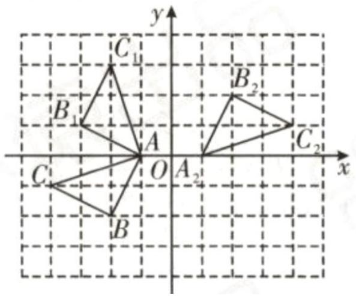

text_image

y
C₁
B₁
A
O
A₂
C₂
x
B₂
C

3.

(1) (2,2)

(2) $(0, -1)$

4. (3,-1)或(2,0)

5. (-2,2)或(1,-1)

# 第90页

1.

解:如图, $\triangle A^{\prime}B^{\prime}C^{\prime}$ 为所求.

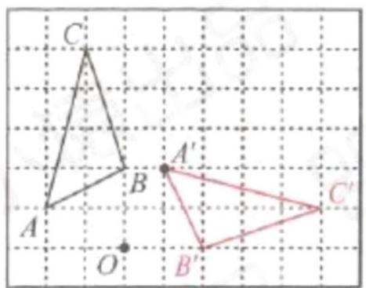

text_image

C
A'
B
O
B'
C'

2.

解: 如图, 旋转中心 P 和 $\triangle CDF$ 即为所求.

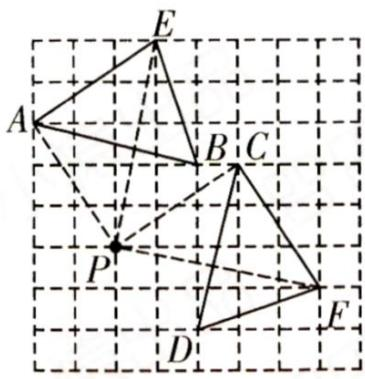

text_image

Geometric diagram showing triangle ABC with auxiliary points D, E, F and point P on grid background

3.

解:(1)如图;(2)如图;(3) $F(4,2)$ ,M(3,5),连接BM交AD于点N.易得 $\angle NBF=45^{\circ}$ .

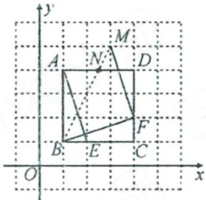

text_image

y
M
A N D
B E C
F
O x

4.

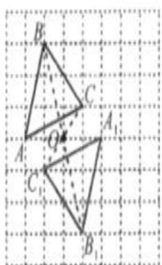

text_image

B
C
A₁
Q
C₁
B₁

图1

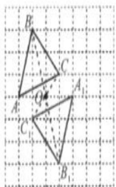

text_image

B
C
A₁₁
O
C
B₁

图1

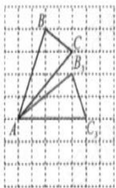

text_image

B
C
B₁
A
C₁

图3

5.

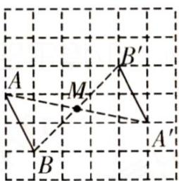

text_image

A
B
M
B'
A'

图1

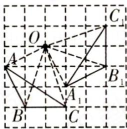

text_image

Geometric diagram showing triangle ABC with auxiliary points O and A, connected by dashed lines on a grid background

图2

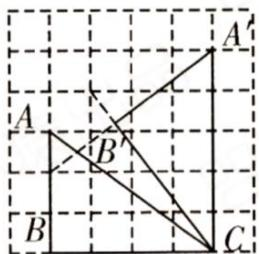

text_image

A'
A
B'
B
C

图3

# 第91页

1.

(1)

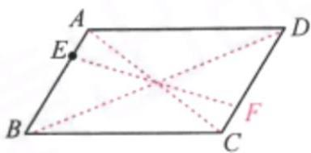

text_image

A
E
B
C
D
F

(2)

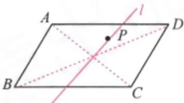

text_image

A
l
P
B
C
D

2.

解:(1)如图1中,点O即为所求.

(2)如图2,点F即为所求.

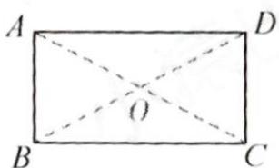

text_image

A
O
B
C
D

图 1

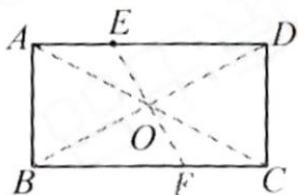

text_image

A
E
D
O
B
F
C

图 2

3.

(1)

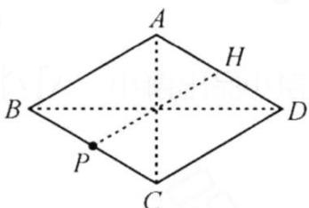

text_image

A
H
B
D
P
C

图1

(2)

text_image

A
B E F D
C

图2

4.

(1)

text_image

A
F
D
B
E
C

图1

(2)

text_image

A F D
B E C

图2

# 第92页

1.

. 解: (1) 如图, $\triangle DEC$ 为所作;

(2)∵将△ABC绕点C顺时针旋转 $\alpha$ 得到△DEC，

$$
\therefore \angle B C E = \alpha , C E = C B,
$$

$$
\therefore \angle B E C = \angle E B C,
$$

$$
\therefore \angle B E C = \frac {1}{2} (1 8 0 ^ {\circ} - \alpha),
$$

即 $\angle BEC = 90^{\circ} - \frac{1}{2}\alpha .$

text_image

A
C
D
B
E

2.

. 解: (1) 如图所示, $\triangle CDE$ 即为所求;

(2) $\because\triangle CBA$ 绕点 C 顺时针旋转得到 $\triangle CDE$ ，

$$
\therefore \triangle C B A \cong \triangle C D E. A C = E C.
$$

$$
\because A B = A C, \angle B A C = 4 0 ^ {\circ},
$$

$$
\therefore \angle B = \angle A C B = 7 0 ^ {\circ},
$$

$$
\therefore \angle D C E = \angle A C B = 7 0 ^ {\circ}, \angle D E C = \angle B A C = 4 0 ^ {\circ}.
$$

$$
\because A C = E C, \therefore \angle A E C = \angle C A E = (1 8 0 ^ {\circ} - \angle A C E) \div 2 =
$$

$$
(1 8 0 ^ {\circ} - 7 0 ^ {\circ}) \div 2 = 5 5 ^ {\circ},
$$

$$
\therefore \angle A E D = \angle A E C - \angle D E C = 5 5 ^ {\circ} - 4 0 ^ {\circ} = 1 5 ^ {\circ}.
$$

text_image

Geometric diagram of a quadrilateral ABCD with extended point E and intersecting lines, labeled with vertices A, B, C, D, E.

3.

解:(1)如图, $\triangle DEC$ 为所作;

(2)∵将△ABC绕点C顺时针旋转 $\alpha$ 得到△DEC，

$$
\therefore \angle B C E = \alpha , C E = C B,
$$

$$
\therefore \angle B E C = \angle E B C,
$$

$$
\therefore \angle B E C = \frac {1}{2} (1 8 0 ^ {\circ} - \alpha),
$$

即 $\angle BEC = 90^{\circ} - \frac{1}{2}\alpha.$

text_image

A
C
D
B
E

4.

解:(1)补全图形如图所示;

(2) 连接 $BB'$ ，延长 $BC'$ 交 $AB'$ 于点 D，∵ $AB = AB'$ ， $\angle BAB' = 60^{\circ}$ ，

$\therefore\triangle BAB'$ 为等边三角形，

$$
\therefore B B ^ {\prime} = B A, \because C ^ {\prime} A = C ^ {\prime} B ^ {\prime},
$$

$$
\therefore \triangle B A C ^ {\prime} \cong \triangle B B ^ {\prime} C ^ {\prime},
$$

$$
\therefore \angle A B C ^ {\prime} = \angle B ^ {\prime} B C ^ {\prime} = 3 0 ^ {\circ},
$$

$\therefore BD$ 垂直平分 $AB'$ .

text_image

Geometric diagram showing triangle ABC with point B' and C' on sides AB and BC, respectively, forming a quadrilateral with extended lines.

又∵ $AB=\sqrt{2}AC=2,\therefore AD=\frac{1}{2}AB=1,$

$$
\because \angle B ^ {\prime} A C ^ {\prime} = 4 5 ^ {\circ}, \therefore C ^ {\prime} D = A D = 1,
$$

$$
\because B D = \sqrt {A B ^ {2} - A D ^ {2}} = \sqrt {2 ^ {2} - 1 ^ {2}} = \sqrt {3}.
$$

$$
\therefore C ^ {\prime} B = B D - C ^ {\prime} D = \sqrt {3} - 1.
$$

# 第93页

1.

(1) 解: $\triangle CAE$ 如图所示

text_image

Geometric diagram with labeled points A, B, C, D, E and connecting lines forming triangles and a quadrilateral

(2) 如图，连接

ED. $\because \triangle ACE$ 是由 $\triangle ABD$ 绕点 A 逆时针旋转 $60^{\circ}$ 得到的， $\therefore AE = AD, BD = CE, \angle EAD = 60^{\circ}, \therefore \triangle AED$ 是等边三角形， $\therefore \angle ADE = 60^{\circ}, AD = ED, \because \angle ADC = 30^{\circ}, \therefore \angle EDC = \angle EDA + \angle ADC = 60^{\circ} + 30^{\circ} = 90^{\circ}, \therefore CE^{2} = CD^{2} + ED^{2}$ ，即 $BD^{2} = CD^{2} + AD^{2}$ .

2.

. 解: 如图, 将 $\triangle ABD$ 绕点 A 顺时针旋转 $60^{\circ}$ 得到 $\triangle AEC$ , 连接 BE.

text_image

Geometric diagram with labeled points A, B, C, D, E and connecting lines, likely from a math problem or proof.

由旋转的性质, 得 AB = AE, $\angle BAE = 60^{\circ}$ , $\therefore \triangle ABE$ 是等边三角形,

$$
\begin{array}{l} \therefore \angle E B C = 6 0 ^ {\circ} + 3 0 ^ {\circ} = 9 0 ^ {\circ}, B E = A B \\ = 6, \end{array}
$$

$$
\therefore B D = C E = \sqrt {B E ^ {2} + B C ^ {2}} = 1 0.
$$

3.

解:(1)将 $\triangle PAB$ 绕点B顺时针旋转 $60^{\circ}$ 得到 $\triangle DCB$ ,连接PD,

text_image

A
P
B
C
D

$$
\begin{array}{l} \therefore \angle P B D = 6 0 ^ {\circ}, P B = B D, \angle B D C \\ = \angle A P B = 1 5 0 ^ {\circ}, C D = P A, \\ \end{array}
$$

$\therefore \triangle PBD$ 是等边三角形，

$$
\therefore \angle P D B = \angle B P D = 6 0 ^ {\circ}, P D = P B,
$$

$$
\therefore \angle P D C = \angle B D C - \angle B D P = 9 0 ^ {\circ}.
$$

$$
\because \angle B P C = 9 0 ^ {\circ}, \angle B P D = 6 0 ^ {\circ},
$$

∴ $\angle DPC = \angle 30^{\circ}$ ，在 Rt△PCD 中，

$$
\therefore C D = \frac {1}{2} P C, P D = \sqrt {3} C D,
$$

$$
\therefore P A: P B: P C = 1: \sqrt {3}: 2;
$$

(2) $\because PA=1,$

由(1)得 $PB=\sqrt{3}$ , PC=2,

$$
\because \angle B P C = 9 0 ^ {\circ},
$$

$$
\begin{array}{l} \therefore B C = \sqrt {P B ^ {2} + P C ^ {2}} \\ = \sqrt {2 ^ {2} + (\sqrt {3}) ^ {2}} = \sqrt {7}, \\ \end{array}
$$

$$
\therefore S _ {\triangle A B C} = \frac {\sqrt {3}}{4} B C ^ {2} = \frac {\sqrt {3}}{4} \times 7 = \frac {7 \sqrt {3}}{4}.
$$

# 第94页

1.

解:(1)如图, $\triangle CBP'$ 即为所求.

text_image

A
P
B
C
P'

(2)如图,连接 $PP'$ .

$$
\begin{array}{l} \because \triangle P A B \cong \triangle P ^ {\prime} C B, \angle P B P ^ {\prime} = 9 0 ^ {\circ}, \\ \begin{array}{l} \therefore B P = B P ^ {\prime} = 4, \angle A P B = \angle C P ^ {\prime} B, C P ^ {\prime} \\ = A P = 2, \end{array} \\ \end{array}
$$

$$
\therefore P P ^ {\prime} = \sqrt {B P ^ {2} + B P ^ {\prime 2}} = 4 \sqrt {2},
$$

$$
\angle B P ^ {\prime} P = 4 5 ^ {\circ}.
$$

$$
\because P ^ {\prime} P ^ {2} + P ^ {\prime} C ^ {2} = 3 2 + 4 = 3 6 = P C ^ {2},
$$

$$
\therefore \angle C P ^ {\prime} P = 9 0 ^ {\circ},
$$

$$
\begin{array}{l} \therefore \angle C P ^ {\prime} B = \angle B P ^ {\prime} P + \angle C P ^ {\prime} P = 4 5 ^ {\circ} + \\ 9 0 ^ {\circ} = 1 3 5 ^ {\circ}, \end{array}
$$

$$
\therefore \angle A P B = 1 3 5 ^ {\circ}.
$$

2.

解:如图,将 $\triangle ABD$ 绕点A顺时针旋转 $90^{\circ}$ 得到 $\triangle ACE$ ,连接DE.由旋转的性质,得 $\angle EAD=$

text_image

E
A
B
D
C

$$
9 0 ^ {\circ}, A E = A D,
$$

$$
\therefore \angle A D E = \angle A E D = 4 5 ^ {\circ}.
$$

$$
\therefore E D = \sqrt {A E ^ {2} + A D ^ {2}} = 4 \sqrt {2}.
$$

$$
\because \angle A D C = 4 5 ^ {\circ}, \therefore \angle E D C = 9 0 ^ {\circ},
$$

$$
\begin{array}{l} \therefore C E ^ {2} = D E ^ {2} + C D ^ {2} = (4 \sqrt {2}) ^ {2} + 2 ^ {2} \\ = 3 6, \end{array}
$$

$$
\therefore C E = 6,
$$

$$
\because \triangle A B D \cong \triangle A C E,
$$

$$
\therefore B D = C E = 6.
$$

3.

. 解: 如图, 将 $\triangle ADC$ 绕点 D 顺时针旋转 $90^{\circ}$ 得到 $\triangle EDB$ , 设 BE 交 AC 于点 F, 连接 AE.

text_image

A
D
E
F
B
C

由旋转的性质,得 $\triangle ADC\cong\triangle EDB$ ,

$$
\therefore B E = A C = 2 1, \angle D B E = \angle D C A,
$$

$$
\therefore \angle B F C = \angle B D C = 9 0 ^ {\circ}.
$$

$$
\because A D = D E, \angle A D E = 9 0 ^ {\circ},
$$

$\therefore AE=\sqrt{AD^{2}+DE^{2}}=13$ , 设 BF=x, 则 EF=21-x.

$$
\because A B ^ {2} - B F ^ {2} = A E ^ {2} - E F ^ {2} = A F ^ {2},
$$

$$
\therefore 2 0 ^ {2} - x ^ {2} = 1 3 ^ {2} - (2 1 - x) ^ {2},
$$

∴x=16,即 BF=16,

$$
\therefore A F = \sqrt {A B ^ {2} - B F ^ {2}} = \sqrt {2 0 ^ {2} - 1 6 ^ {2}} = 1 2,
$$

$$
\therefore C F = 2 1 - 1 2 = 9,
$$

$$
\therefore B C = \sqrt {B F ^ {2} + C F ^ {2}} = \sqrt {3 3 7}.
$$

(1) $\triangle EAG$

(2)①1

②如图.

text_image

K
Q
L
A
E
B
P
2
1
J
H
3
O
F
C
D
G

由题意得 $E, F, G, H$ 是 $AB, BC, CD, DA$ 的中点，操作为将四边形 $EBFO$ 绕点 E 旋转 $180^{\circ}$ 得到四边形 EAQL，将四边形 OHDG 绕点 H 旋转 $180^{\circ}$ 得到四边形 JHAP，将四边形 OGCF 放在右上方，

则 AQ = BF = CF, AP = DG = CG $\angle BFO = \angle AQL,$

$$
\because \angle D A B + \angle B + \angle C + \angle D = 3 6 0 ^ {\circ}
$$

$$
\angle Q A E = \angle B, \angle P A H = \angle D, \angle D A B +
$$

$$
\angle Q A E + \angle P A H + \angle P A Q = 3 6 0 ^ {\circ},
$$

$$
\therefore \angle P A Q = \angle C,
$$

$$
\because \angle B F O + \angle C F O = 1 8 0 ^ {\circ},
$$

$$
\therefore \angle A Q L + \angle A Q K = 1 8 0 ^ {\circ},
$$

∴K，Q、L三点共线，

同理 K, P, J 三点共线，

由操作得 $\angle1=\angle L,\quad\angle3=\angle J$ ,

$$
\because \angle 1 + \angle 2 = 1 8 0 ^ {\circ}, \angle 2 + \angle 3 = 1 8 0 ^ {\circ},
$$

$$
\therefore \angle 2 + \angle L = 1 8 0 ^ {\circ}, \angle 2 + \angle J = 1 8 0 ^ {\circ},
$$

$$
\therefore O J \parallel K L, O L \parallel K J,
$$

∴四边形 OJKL 为平行四边形.

(3)如图，取 AB, BC, CD, DA 为中点为点 E, H, G, F，连接 FH，过点 E，点 G 分别作 $EM \perp FH$ , $GN \perp FH$ ，垂足为点 M, N，将四边形 EBHM 绕点 E 旋转 $180^{\circ}$ 至四边形 $EAH'M'$ ，将四边形 FDGN 绕点 F 旋转 $180^{\circ}$ 至四边形 $FAG'N'$ ，将四边形 NGCH 放置左上方，使得点 C 与点 A 重合，CG 与 $AG'$ 重合，CH 与 $AH'$ 重合，点 N 的对应点为点 $N''$ ，则四边形 $MM'N''N'$ 即为所求矩形.

text_image

N'' H' M'
3 4
G' A E B
M 1 H
N' F N 2 C
D G C

由题意得 $\angle EMF = \angle EMH = \angle M' = 90^\circ$

$$
\angle G N H = \angle G N F = \angle N ^ {\prime} = 9 0 ^ {\circ},
$$

$$
\therefore \angle N ^ {\prime} = \angle M ^ {\prime} M H = 9 0 ^ {\circ},
$$

$$
H ^ {\prime} M ^ {\prime} \mathbin {/ /} N ^ {\prime} M,
$$

$$
\therefore N ^ {\prime} G ^ {\prime} \parallel M M ^ {\prime},
$$

由操作得 $\angle 1 = \angle 4$ ， $\angle 2 = \angle 3$

$$
\because \angle 1 + \angle 2 = 1 8 0 ^ {\circ},
$$

$$
\therefore \angle 3 + \angle 4 = 1 8 0 ^ {\circ},
$$

$\therefore N^{\prime\prime}, H^{\prime}, M^{\prime}$ 三点共线，同理 $N^{\prime}, G^{\prime}, N^{\prime\prime}$ 三点共线，

$$
\because \angle N ^ {\prime} = \angle E M F = \angle M ^ {\prime} = 9 0 ^ {\circ},
$$

∴四边形 $MM'N''N'$ 为矩形，

如图，连接 AC, EF, FG, GH, EH,

text_image

A
E
B
M
F
H
N
C
D
G

∵点E，H为BA，BC中点，

$$
\therefore E H \parallel A C, E H = \frac {1}{2} A C,
$$

同理 $FG \parallel AC$ ， $FG = \frac{1}{2} AC$ ，

$$
\therefore F G \parallel E H, F G = E H,
$$

$$
\therefore \angle E H M = \angle G F N,
$$

$$
\because \angle E M F = \angle G N H = 9 0 ^ {\circ},
$$

$$
\therefore \triangle E H M \cong \triangle G F N (\text { A   A   S }),
$$

$$
\therefore E M = G N, M H = N F,
$$

$$
\therefore F M = N H,
$$

由操作得 $AH' = BH$ ,

而 BH=CH,

$$
\therefore A H ^ {\prime} = C H,
$$

同理 $AG' = CG.$

$$
\because \angle B A D + \angle D + \angle C + \angle B = 3 6 0 ^ {\circ},
$$

$$
\angle D = \angle G ^ {\prime} A F, \angle B = \angle H ^ {\prime} A E, \angle B A D +
$$

$$
\angle H ^ {\prime} A E + \angle G ^ {\prime} A F + \angle H ^ {\prime} A G ^ {\prime} = 3 6 0 ^ {\circ},
$$

$$
\therefore \angle H ^ {\prime} A G ^ {\prime} = \angle C,
$$

∵四边形 $MM'N''N'$ 为矩形，

$$
\therefore N ^ {\prime} N ^ {\prime \prime} = M M ^ {\prime}, N ^ {\prime \prime} M ^ {\prime} = N ^ {\prime \prime} M,
$$

$$
\therefore N ^ {\prime} F + F M = H ^ {\prime} M ^ {\prime} + H ^ {\prime} N ^ {\prime \prime},
$$

$$
\therefore M F + N F = M F + M H = M ^ {\prime} H ^ {\prime} + N ^ {\prime \prime} H ^ {\prime},
$$

$$
\therefore N H = N ^ {\prime \prime} H ^ {\prime},
$$

同理 $NG=N''G'$ ,

∴四边形 NGCH 能放置左上方，

∴按照以上操作可以拼成一个矩形.

# 第96页

1. D   
2. C   
3. $2\sqrt{6}$   
4. $40^{\circ}$   
5.

解:(1)如图1中 $\triangle PAB$ 和 $\triangle P'A'B'$ 即为所求(答案不唯一).

text_image

A
A'
P
P'
B
B'

图1

(2)如图2中 $\triangle A'B'C$ 即为所求.

text_image

B'
A
C
A'
B

图2

6.

(1) ∵ A与B对称，D与E对称

$\therefore {PA} = {PB}\;{PD} = {PE}$

∴点P在AB与DE垂直平分线的交点处

text_image

B
D
P
E
F

(划线段两端点距离相等的点在线段垂直平分线上)

如图所示

$$
\angle F B D = \angle B A E = 9 0 ^ {\circ} \quad F B = A B
$$

$\therefore {\Delta BFD}$ 如图所示

(2) 连接PA.PB.PF

则 $\angle {APB} = \angle {BPF} = \alpha \;{PA} = {PB} = {PF}$ (旋转)

在△ABP与△FBP中

$$
\left\{ \begin{array}{l l} {A B = F B} \\ {B P = B P} \\ {A P = F P} \end{array} \right.
$$

$\therefore {\Delta AQP} \cong  {\Delta FBP}\left( {SSS}\right)$

# 第97页

7. D   
8. C   
9. $(-3,-2)$   
10. (7,3)   
11. M4   
12. $15^{\circ}$ 或 $60^{\circ}$   
14.

13. $\sqrt{10}$ 或 $\sqrt{26}$

解:(1)如图所示, $\triangle ACF$ 即为所求.

text_image

Geometric diagram of triangle ABC with internal points D, E, F and connecting lines, including a dashed extension from E to C.

(2)如图,连接 EF.

依题意, 得 AD = AF, $\angle B = \angle ACB =$

$$
\angle A C F = 4 5 ^ {\circ}, B D = C F = 3, \angle C A F =
$$

$$
\angle B A D.
$$

$$
\therefore \angle E C F = 9 0 ^ {\circ}.
$$

$$
\because \angle D A E = 4 5 ^ {\circ},
$$

$$
\therefore \angle B A D + \angle C A E = 4 5 ^ {\circ}.
$$

$$
\therefore \angle C A F + \angle C A E = \angle E A F = 4 5 ^ {\circ}.
$$

$$
\therefore \angle E A F = \angle D A E.
$$

$$
\because \Lambda E = A E,
$$

$$
\therefore \triangle D A E \cong \triangle F A E.
$$

$$
\therefore D E = E F.
$$

$$
\because C E = 4, C F = 3, \angle E C F = 9 0 ^ {\circ},
$$

$$
\therefore E F = \sqrt {E C ^ {2} + F C ^ {2}} = 5.
$$

$$
\therefore D E = 5.
$$

# 第98页

1. D

2. D

3. 圆

4. ①③⑤

5. $70^{\circ}$

6. 70 140

7.4 $2\sqrt{3}$

8.

证明: 连接 OA, OB, 则 $\angle OAB = \angle OBA$ .

$$
\therefore \angle O A C = \angle O B D,
$$

$$
\because O A = O B, A C = B D,
$$

$$
\therefore \triangle O A C \cong \triangle O B D (\mathrm{SAS}). \therefore O C = O D.
$$

# 第99页

9. $28^{\circ}$

10. $30^{\circ}$

$\sqrt{3}$

11.

$\sqrt{2}$

12.

证明:取 AC 的中点 O, 连接 OB, OD,

$$
\because \angle A B C = \angle A D C = 9 0 ^ {\circ},
$$

$$
\therefore O A = O B = O C = O D = \frac {1}{2} A C,
$$

∴A,B,C,D四点在以O为圆心,OA为半径的同一个圆上.

13.

(1) 证明: 连接 OP, 则 OP = OB = OA.

$$
\because \angle A O B = 9 0 ^ {\circ}, \therefore \angle O A B = \angle O B A = 4 5 ^ {\circ}.
$$

$$
\because P C \perp O A, \therefore \angle C D A = \angle C A D = 4 5 ^ {\circ}, \therefore C D = C A;
$$

(2) 解: 设 OP = OA = r，则 OC = OA - CA = OA - CD = r - 2，在 Rt△POC 中， $r^{2} = 5^{2} + (r - 2)^{2}$ ，

$\therefore r=\frac{29}{4}$ ，即 $\odot O$ 的半径为 $\frac{29}{4}$ .

14.

(1) $40^{\circ}$

(2) $\because\angle C=60^{\circ},$

$$
\therefore \angle A + \angle B = 1 2 0 ^ {\circ}.
$$

$$
\because O A = O D = O E = O B,
$$

$$
\therefore \angle A = \angle O D A, \angle B = \angle O E B,
$$

$$
\therefore \angle A + \angle O D A + \angle B + \angle O E B =
$$

$$
2 4 0 ^ {\circ},
$$

# 第100页

# 点睛

# $2\sqrt{5}$ 或 $4\sqrt{5}$

1. ①③④   
2.   
$4\sqrt{2}$   
3.2   
4.2   
5.

(1) 证明: 过O作OE⊥AB于点E, 则CE=DE, AE=BE,

$$
\therefore \mathrm{BE-DE} = \mathrm{AE-CE}, \text {即AC} = \mathrm{BD};
$$

(2) 解: 由 (1) 可知, $OE \perp AB$ 且 $OE \perp CD$ , 连接 $OC$ , $OA$ ,

$$
\therefore O C = 5, \quad C E = \frac {1}{2} C D = 5,
$$

$$
\therefore O E = \sqrt {O C ^ {2} - C E ^ {2}} = \sqrt {5 ^ {2} - 4 ^ {2}} = 3,
$$

$$
\therefore A E = \sqrt {O A ^ {2} - O E ^ {2}} = \sqrt {(3 \sqrt {5}) 2 - 3 ^ {2}} = 6,
$$

$$
\therefore A B = 2 A E = 1 2.
$$

6. 16   
7. 28

# 第101页

8.4   
9. 25   
10.5   
11. $\sqrt{5}$   
12.

解:(1)连接 OB, OC, 易证 $\triangle AOB \cong \triangle AOC$ ,

$$
\therefore \angle B A O = \angle C A O, \because A B = A C, \therefore A O \perp B C;
$$

(2) 延长 AO 交 BC 于点 M, 易知 $AM \perp BC$ ,

$$
\because O B = 2 5, B M = C M = 2 4,
$$

$$
\therefore O M = \sqrt {O B ^ {2} - B M ^ {2}} = 7,
$$

$$
\therefore A M = O A + O M = 3 2,
$$

$$
\therefore A B = \sqrt {A M ^ {2} + B M ^ {2}} = 4 0;
$$

13.

(8 分) 1) 证明: $\because OD \parallel BC$ ,

$$
\therefore \angle O D B = \angle C B D,
$$

$$
\because O B = O D,
$$

$$
\therefore \angle O D B = \angle O B D,
$$

$$
\therefore \angle O B D = \angle C B D,
$$

$\therefore BD$ 平分 $\angle ABC;$

（2）解：过 O 点作 $OH \perp BC$ 于 H，如图，则 $BH = CH = \frac{1}{2} BC = \frac{3}{2}$ ,

$$
\because D E \perp A B, O H \perp B C,
$$

$$
\therefore \angle D E O = 9 0 ^ {\circ}, \angle O H B = 9 0 ^ {\circ},
$$

$$
\because O D \parallel B C,
$$

$$
\therefore \angle D O E = \angle O B H,
$$

在 $\triangle ODE$ 和 $\triangle BOH$ 中，

$$
\left\{ \begin{array}{l} \angle D E O = \angle O H B \\ \angle D O E = \angle O B H, \\ O D = B O \end{array} \right.
$$

$$
\therefore \triangle O D E \cong \triangle B O H (A A S),
$$

$$
\therefore D E = O H = 2, \quad \dots \tag {6}
$$

在 Rt△OBH 中， $OB=\sqrt{BH^{2}+OH^{2}}=\sqrt{\left(\frac{3}{2}\right)^{2}+2^{2}}=\frac{5}{2}$ ，8

即 $\odot O$ 的半径长为 $\frac{5}{2}$ .

# 第102页

1. 81/2   
2.1.3   
3.

解: 连接 OC, 交 AB 于点 D, 连接 OA. OB.

∵C为 $\widehat{AB}$ 的中点，

∴由圆的对称性可得 $OC \perp AB, \therefore AD = \frac{1}{2} AB = 4.$

$$
\because O A = 5, \therefore O D = \sqrt {5 ^ {2} - 4 ^ {2}} = 3,
$$

$$
\therefore C D = 2, \therefore A C = \sqrt {4 ^ {2} + 2 ^ {2}} = 2 \sqrt {5}.
$$

4.

解: 连接 OA, OD, OB,

∵D是AB的中点：∴OD⊥AB,AD=BD,

$$
\because A C = 6, B C = D C, \therefore C D = 2, \therefore A D = 4,
$$

$$
\therefore O D = \sqrt {O A ^ {2} - A D ^ {2}} = 3,
$$

$$
\therefore O C = \sqrt {O D ^ {2} + C D ^ {2}} = \sqrt {3 ^ {2} + 2 ^ {2}} = \sqrt {1 3}.
$$

5.

$CE \perp AD$ 于点 E，则 $AE = DE = \frac{1}{2} AD$ . Rt△ABC 中，AB = 10，∵

$$
A C \cdot B C = A B \cdot C E, \therefore C E = \frac {6 \times 8}{1 0} = \frac {2 4}{5}, \therefore A E = \sqrt {6 ^ {2} - (\frac {2 4}{5}) ^ {2}} =
$$

$$
\frac {1 8}{5}, \therefore A D = 2 A E = \frac {3 6}{5}, \therefore B D = A B - A D = \frac {1 4}{5}.
$$

# 第103页

1.

B 解: 过点 O 作 $OF \perp CD$ 于点 F.

设 CE=3x，则 DE=5x，∴OD=DE=5x，CD=8x，

$$
\because O F \perp C D, \therefore D F = \frac {1}{2} C D = 4 x,
$$

∴ EF = x，由勾股定理，得 $OF = \sqrt{OD^{2} - DF^{2}} = 3x$ ，

在 Rt△OEF 中，由勾股定理，得 $(3x)^{2}+x^{2}=5^{2}$ ，

$\therefore x = \frac{\sqrt{10}}{2}$ 或 $x = -\frac{\sqrt{10}}{2}$ （舍去）， $\therefore CD = 8x = 4\sqrt{10}$ .

2.   
3.

解：如图，作 $OF \perp AB$ 于 F，作 $OG \perp CD$ 于 G，连接 OC, OB.

$$
\because A B = A E + B E = 2 + 6 = 8,
$$

$$
\therefore B F = \frac {1}{2} A B = 4,
$$

易得四边形 GEFO 是矩形，

$$
\therefore E F = 2 = O G, O F = E G.
$$

设 $OF = EG = x$ ，则 $CG = 4 - x.$

$$
\because C G ^ {2} + O G ^ {2} = O C ^ {2} = O B ^ {2} = O F ^ {2} + B F ^ {2},
$$

$$
\therefore (4 - x) ^ {2} + 2 ^ {2} = x ^ {2} + 4 ^ {2},
$$

$$
\therefore x = \frac {1}{2},
$$

$\therefore OB=\frac{\sqrt{65}}{2}$ ，即 $\odot O$ 的半径为 $\frac{\sqrt{65}}{2}$ .

text_image

C
G
O
A
E
F
B
D

4. $10 \text{或} 2 \sqrt {165}$

# 第104页

1. B   
2. A   
3. $60^{\circ}$   
4. $70^{\circ}$   
5. $55^{\circ}$

6.

证明：法一：∵AB=CD，∴ $\overset{\cdot}{AB}=\overset{\cdot}{CD}$ ，
∴ $\widehat{AB}-\widehat{AC}=\widehat{CD}-\widehat{AC}$ ，即 $\widehat{BC}=\widehat{AD}$ ，∴AD=BC；

法二: 连接 OA, OB, OC, OD, $\because AB = CD$ ,

$$
\begin{array}{r l} & {\therefore \angle A O B = \angle C O D, \therefore \angle A O B - \angle A O C = \angle C O D -} \\ & {\angle A O C, \text {即} \angle A O D = \angle B O C, \therefore A D = B C.} \end{array}
$$

7.

证明: 连接 OC.

$$
\begin{array}{l} \because A C \parallel O D, \\ \therefore \angle C O D = \angle A C O, \angle B O D = \angle A. \\ \because O A = O C, \therefore \angle A = \angle A C O, \\ \therefore \angle C O D = \angle B O D, \therefore \widehat {C D} = \widehat {D B}. \\ \end{array}
$$

# 第 105 页

8.

证明: 连接 OC, $\because C$ 为 $\widehat{AB}$ 的中点,

$$
\begin{array}{l} \therefore \widehat {A C} = \widehat {B C}, \therefore \angle A O C = \angle B O C, \\ \because C D \perp O A, C E \perp O B, \therefore C D = C E, \\ \because O C = O C, \therefore R t \triangle O C D \cong R t \triangle O C E (H L), \\ \therefore O D = O E. \\ \end{array}
$$

9.

证明:连结 OC,OD,则 OC=OD.∵OA=OB,且 OM= $\frac{1}{2}$ OA,ON= $\frac{1}{2}$ OB,∴OM=ON,在 Rt△CMO 与 Rt△DNO 中,OM=ON,OC=OD,∴ Rt△CMO≌Rt△DNO,∴∠COM =∠DON,∴ $\widehat{AC}=\widehat{BD}$ .

10.

1. 解: (1) $\because D$ 是 $\widehat{BC}$ 的中点,

$$
\therefore \widehat {C D} = \widehat {B D}.
$$

∵ $DE \perp AB$ ，且 AB 为 $\odot O$ 的直径

$$
\therefore \widehat {B E} = \widehat {B D}, \therefore \widehat {B C} = \widehat {D E},
$$

$$
\therefore B C = D E.
$$

$$
\because D E \perp A B, \therefore D E = 2 D F,
$$

$$
\therefore B C = D E = 2 D F;
$$

(2) 连接 OD, 交 BC 于点 H.

$$
\because \widehat {C D} = \widehat {B D}, \therefore D O \perp B C,
$$

$$
\therefore \angle B H O = 9 0 ^ {\circ}, B H = C H,
$$

$$
\because D E \perp A B, \therefore \angle D F O = 9 0 ^ {\circ},
$$

$$
\therefore \angle B H O = \angle D F O.
$$

$$
\because \angle D O F = \angle B O H, O B = O D,
$$

$$
\therefore \triangle B O H \cong \triangle D O F,
$$

$$
\therefore O F = O H = \frac {1}{2} A C = 3,
$$

$$
\therefore O B = O F + F B = 5, \therefore O D = 5.
$$

在 Rt△ODF 中，

$$
D F = \sqrt {O D ^ {2} - O F ^ {2}} = 4,
$$

$$
\therefore B C = D E = 2 D F = 8.
$$

11.

(1)如图, $\triangle BOE$ 即为所求.(2) $\because\angle AOB+\angle COD=90^{\circ}$ ，由旋转知 $\angle BOE=\angle COD$ ,∴

$$
\angle A O E = \angle A O B + \angle B O E = 9 0 ^ {\circ}. \because O A = O B = O E, \therefore \angle O A B = \angle O B A, \angle O B E = \angle O E B.
$$

$$
\because \angle O A B + \angle O B A + \angle O B E + \angle O E B + \angle A O E = 3 6 0 ^ {\circ}, \therefore 2 \angle A B E + 9 0 ^ {\circ} = 3 6 0 ^ {\circ}. \therefore \angle A B E
$$

$$
= (3 6 0 ^ {\circ} - 9 0 ^ {\circ}) \div 2 = 1 3 5 ^ {\circ}. \text {(3)如图, 连接 } A E, \text {过点} E \text {作} E F \perp A B \text {于点} F, \therefore \angle E B F = 4 5 ^ {\circ}.
$$

$$
\because B E = C D = \sqrt {2}, \therefore E F = B F = 1. \therefore A F = A B + B F = 3. \therefore A E = \sqrt {3 ^ {2} + 1 ^ {2}} = \sqrt {1 0}. \text {   在   Rt   }
$$

$$
\triangle A O E \text {   中,   } O A ^ {2} + O E ^ {2} = A E ^ {2}, \therefore 2 O A ^ {2} = (\sqrt {1 0}) ^ {2}. \text {   解得   } O A = \sqrt {5}. \therefore \odot O \text {   的半径长为   } \sqrt {5}.
$$

# 第 106 页

点睛 $30^{\circ}$ 或 $150^{\circ}$

1. $90^{\circ}$

2. $110^{\circ}$   
3. $65^{\circ}$   
4. 55   
5. $20^{\circ}$   
6. $4 \sqrt{3}$   
7.

.解：∵BD是

$$
\begin{array}{l} \angle B = \angle D = 4 5 ^ {\circ}. \text {   又   } \because \angle D A C = \frac {1}{2} \angle C O D = \frac {1}{2} \times \\ 1 2 6 ^ {\circ} = 6 3 ^ {\circ}, \therefore \angle A G B = \angle D A C + \angle D = 6 3 ^ {\circ} + 4 5 ^ {\circ} \\ = 1 0 8 ^ {\circ} \\ \end{array}
$$

$\odot O$ 的直径， $\therefore \angle BAD = 90^{\circ}.$ 又 $\because \widehat{AB} = \widehat{AD},\therefore$

# 第 107 页

8.2   
9. $\sqrt{5}$   
10.2   
11.8   
12.

延长AO交圆于E点，连接BE，如图所示

text_image

A
O
B
D
C
E

∵AE是⊙O的直径,

$$
\therefore \angle A B E = 9 0 ^ {\circ}.
$$

$$
\therefore \angle B A E + \angle E = 9 0 ^ {\circ}.
$$

∵AD是△ABCBC边上的高,

$$
\therefore \angle A D C = 9 0 ^ {\circ}. \quad \angle E = \angle A C B
$$

$$
\therefore \angle C A D + \angle A C B = 9 0 ^ {\circ}.
$$

$$
\because \angle E = \angle A C B,
$$

$$
\therefore \angle B A E = \angle C A D.
$$

即 $\angle BAO=\angle CAD$

13.

解：(1) $90^{\circ}$ ; (2)(3)如图所示.

text_image

Geometric diagram showing a circle with points A, B, C, M, and center O, including chords and dashed lines on a grid background.

14.

(1)证明，如图，延长DE交 $\odot O$ 于点M，则

$\overline{AM}=\overline{AD}^{\circ}\because D$ 是 $\overline{AC}$ 的中点， $\therefore\overline{AD}=\overline{CD}$

$$
\therefore \overline {{M D}} = \overline {{A C}}, \therefore A C = M D = 2 D E _ {\circ}
$$

(2)证明: 如图, 连接AD。由(1)得 $\overrightarrow{AM} = \overrightarrow{CD}$ ,

$$
\therefore \angle A D F = \angle D A F, \therefore A F = D F 。
$$

(3)如图，连接OD交AC于点N，连接BC。∵AB为直径，

$\therefore \angle A C B = 90^{\circ}$ 。由勾股定理可得

$BC=\sqrt{AB^{2}-AC^{2}}=6$ 。∵D为 $\overline{AC}$ 的中点，

$$
\therefore O D \perp A C, \angle A N O = 9 0 ^ {\circ}, A N = C N,
$$

$$
\therefore O N = \frac {1}{2} B C = \frac {1}{2} \times 6 = 3 。
$$

$$
\because D E \perp A B, \therefore \angle D E O = 9 0 ^ {\circ},
$$

$$
\therefore \angle A N O = \angle D E O 。
$$

在 $\triangle AON$ 和 $\triangle DOE$ 中， $\left\{\begin{aligned}\angle ANO&=\angle DEO,\\ \angle AON&=\angle DOE,\\ OA&=OD,\end{aligned}\right.$

$$
\therefore \triangle A O N \cong \triangle D O E (A A S),
$$

$\therefore ON = OE = 3, \therefore AE = 2$ 。由(1)知

$DE=\frac{1}{2}AC=4$ 。设AF=DF=x，则

EF = 4 - x，在Rt△AEF中，由勾股定理可得

$x^{2} = (4 - x)^{2} + 2^{2}$ 。解得 $x = \frac{5}{2},\therefore AF = \frac{5}{2}$

$$
\mathrm{OF} / \mathrm{BH} = 1 / 2
$$

# 第108页

# 点睛 $30^{\circ}$ 或 $150^{\circ}$

1. $150^{\circ}$   
2. $64^{\circ}$   
3. $110^{\circ}$   
4. $25^{\circ}$

5. $60^{\circ}$   
6. $105^{\circ}$   
7. 120   
8. ①   
9.

证明：∵ $\angle DAC$ 与 $\angle DBC$ 是同弧所对的圆周角，
∴ $\angle DAC = \angle DBC.$ ∵ AD 平分 $\angle CAE, \therefore \angle EAD = \angle DAC.$ ∴ $\angle EAD = \angle DBC.$ ∵ 四边形 ABCD 内接于 $\odot O, \therefore \angle EAD = \angle BCD.$ ∴ $\angle DBC = \angle DCB.$ ∴ DB = DC.

# 第 109 页

10. B

11.

作直径 BE, 连接 CE,
则 $\angle BCE=90^{\circ}, \angle E=180^{\circ}-\angle BAC=60^{\circ},$ $\therefore \angle CBE = 30^{\circ}.$

$$
\because B E = 2 \sqrt {2}, \therefore C E = \frac {1}{2} B E = \sqrt {2}.
$$

$$
\therefore B C = \sqrt {B E ^ {2} - C E ^ {2}} = \sqrt {6}.
$$

12.

解:(1) AD-BD=CD 提示: 因为 CA=CB, $\angle ACB=60^{\circ}$ , 所以 $\triangle ABC$ 为等边三角形, 所以 $\angle BAC=60^{\circ}$ . 因为 AD 为 $\odot O$ 的直径, 所以 $\angle ABD=\angle ACD=90^{\circ}$ , $\angle BAD=\angle CAD=\frac{1}{2}\angle BAC=30^{\circ}$ , 所以 $CD=BD=\frac{1}{2}AD$ , 所以 AD-BD=CD.

(2) AD-BD 与 CD 的数量关系为 AD-BD=CD. 理由如下:

如图,延长 BD 至点 E 使 DE=CD,连接 CE. 因为 CA=CB, $\angle ACB=60^{\circ}$ , 所以 $\triangle ABC$ 为等边三角形, 所以 $\angle BAC=\angle ABC=60^{\circ}$ , 所以 $\angle CDE=180^{\circ}-\angle BDC=\angle BAC=60^{\circ}$ . 因为 DE=CD, 所以 $\triangle CDE$ 为等边三角形, 所以 CE=CD, $\angle DCE=\angle E=60^{\circ}$ , 所以 $\angle ACD=\angle ACB+\angle BCD=60^{\circ}+\angle BCD=\angle BCE$ . 因为 $\angle ADC=\angle ABC=60^{\circ}$ , 所以 $\angle ADC=\angle E=60^{\circ}$ . 在 $\triangle ACD$ 和 $\triangle BCE$

中， $\left\{\begin{aligned}\angle ACD&=\angle BCE,\\ CD&=CE,\quad所以\triangle ACD\cong\triangle BCE,\\ \angle ADC&=\angle E,\end{aligned}\right.$

所以 AD=BE，因为 $BE=BD+DE=BD+CD$ ，所以 $AD=BD+CD$ ，所以 $AD-BD=CD$ 。

13.

(1) 连接 AC, BC, $\because AB$ 为直径, C 为半圆的中点, $\therefore CB = CA, \angle ACB = 90^{\circ}$ ,

$$
\therefore \angle C A B = \angle C B A = 4 5 ^ {\circ}, \because \angle C P B + \angle C A B = 1 8 0 ^ {\circ}, \therefore \angle C P B = 1 3 5 ^ {\circ};
$$

(2) 过点 C 作 $CQ \perp BP$ ，交 BP 的延长线于点 Q。∴ $\angle CPQ = \angle PCQ = 45^{\circ}$

$\therefore PQ = CQ$ ，设 $PQ = CQ = x$ ，则 $BQ = x + 1$ ，在 Rt△BCQ 中， $BQ^2 + CQ^2 = BC^2$ $\therefore (x + 1)^2 + x^2 = 5^2$ ，解得 $x = 3$ （负值已舍）， $\therefore PQ = 3, \therefore PC = \sqrt{2} PQ = 3\sqrt{2}$ .

# 第110页

1. B   
2. B   
3. B

4. C   
5. $90^{\circ}$   
6. C

# 第111页

1.

解:(1)连接 DC,

则 $\angle BDC = \angle BAC = 45^{\circ}$

$$
\begin{array}{l} \because B D \perp B C, \\ \therefore \angle B C D = 9 0 ^ {\circ} - \angle B D C = 4 5 ^ {\circ}, \\ \therefore \angle B C D = \angle B D C, \therefore B D = B C; \\ \end{array}
$$

(2) $\because\angle DBC=90^{\circ},$

∴CD为⊙O的直径，

$$
\therefore C D = 2 r = 6,
$$

$$
\therefore B C = \frac {\sqrt {2}}{2} C D = 6 \times \frac {\sqrt {2}}{2} = 3 \sqrt {2},
$$

$$
\begin{array}{l} \therefore E C = \sqrt {B E ^ {2} + B C ^ {2}} \\ = \sqrt {6 ^ {2} + (3 \sqrt {2}) ^ {2}} = 3 \sqrt {6}. \\ \end{array}
$$

2.

$$
\because \angle D A C = 3 0 ^ {\circ}, \angle B A C = 6 0 ^ {\circ},
$$

$$
\therefore \angle B A D = 9 0 ^ {\circ},
$$

∴BD是⊙O的直径，即BD过点O，

$$
\therefore \angle B C D = 9 0 ^ {\circ}.
$$

$\because \angle DAC = 30^{\circ}$ ， $\angle CAD$ 和 $\angle CBD$ 都是 $\widehat{CD}$ 所对的

圆周角，

$$
\therefore \angle C B D = 3 0 ^ {\circ}.
$$

$$
\because \angle B A D = 9 0 ^ {\circ}, A D = 6, A B = 4,
$$

$$
\therefore \mathrm{BD} = 2 \sqrt {1 3}.
$$

$$
\because \angle C B D = 3 0 ^ {\circ}, \angle B C D = 9 0 ^ {\circ}, B D = 2 \sqrt {1 3},
$$

$$
\therefore C D = \frac {1}{2} B D = \sqrt {1 3}.
$$

综上所述，故答案为： $\sqrt{13}$

3.

解:(1)连接 AD. $\because \widehat{DE} = \widehat{CD}, \therefore \angle BAD = \angle CAD,$

∵AC为⊙O的直径，∴AD⊥BC，∴AB=AC；

(2) 连接 CE. $\because AC$ 为 $\odot O$ 的直径, $\therefore CE \perp AB$ ,

∵⊙O的半径为5,BD=6,∴AB=AC=10,CD=BD=6,

设 AE = x，则 BE = 10 - x，

$$
\because C E ^ {2} = A C ^ {2} - A E ^ {2} = B C ^ {2} - B E ^ {2},
$$

$$
\therefore 1 0 ^ {2} - x ^ {2} = 1 2 ^ {2} - (1 0 - x) ^ {2},
$$

解得 $x=\frac{14}{5}$ . ∴ AE 的长为 $\frac{14}{5}$ .

4.

根据正弦定理，三角形外接圆半径等于一边长除以其对角的正弦值的2倍。在三角形ABC中，已知 $BC=4\sqrt{2}$ ， $\angle BAC=135^{\circ}$ ，代入正弦定理，可得外接圆半径 $R=BC/(2\sin\angle BAC)=4\sqrt{2}/(2\sin135^{\circ})=4$ 。因此，三角形ABC的外接圆半径为4。

1.

证明: 连接 BD, 证 $\angle EFC = \angle BDC, \because \widehat{BC} = \widehat{BD}, \therefore \angle BFD = \angle BDC, \therefore \angle EFC = \angle BFD.$

2.

解:(1)连接 AC, OB, OC, $\because \widehat{AB} = \widehat{AC}, \therefore AB = AC,$

$$
\because A O = A O, O B = O C,
$$

$$
\therefore \triangle A O B \cong \triangle A O C, \therefore \angle B A O = \angle C A O,
$$

$$
\therefore \angle B D C = \angle B A C = 2 \angle B A O;
$$

(2) 连接 BC, $\because \angle ADE + \angle ADB = 180^{\circ}, \angle ACB + \angle ADB$

$$
= 1 8 0 ^ {\circ}, \therefore \angle A D E = \angle A C B.
$$

$$
\because A B = A C, \angle B A O = \angle C A O, \therefore A O \perp B C,
$$

$$
\therefore \angle A D E = \angle A C B = \angle A B C = 9 0 ^ {\circ} - \angle B A O,
$$

$$
\therefore \angle A D E + \angle B A O = 9 0 ^ {\circ}
$$

3. $60^{\circ}$ $120^{\circ}$

4. $40^{\circ}$ 或 $140^{\circ}$

5.

解: 连接 DO 并延长, 交 $\odot O$ 于点 F, 连接 EF.

∵DF是直径，

$$
\therefore \angle D E F = 9 0 ^ {\circ} = \angle C,
$$

在 Rt△ABC 中，∠C=90°，BC=6，

$$
A C = 8,
$$

$$
\therefore A B = \sqrt {A C ^ {2} + B C ^ {2}} = 1 0 = D F,
$$

∵四边形 BDFE 是圆内接四边形，

$$
\therefore \angle F + \angle D B E = 1 8 0 ^ {\circ}.
$$

又∵∠ABC+∠DBE=180°,

$$
\therefore \angle A B C = \angle F,
$$

又∵∠C=∠DEF,AB=DF,

$$
\therefore \triangle A B C \cong \triangle D F E,
$$

$$
\therefore D E = A C = 8.
$$

1.

(1) $\because\angle ACB=\frac{1}{2}\angle AOB,$

$$
\angle B A C = \frac {1}{2} \angle B O C,
$$

$$
\angle A C B = 2 \angle B A C,
$$

$$
\therefore \angle A O B = 2 \angle B O C.
$$

text_image

Geometric diagram showing a circle with inscribed quadrilateral ABCD and auxiliary points O, E, B, C, D, including chords and dashed lines.

(2)如图,过点 O 作半径 $OD \perp AB$ 于点 E, 连接 DB,

$$
\therefore A E = B E, \angle D O B = \frac {1}{2} \angle A O B.
$$

$$
\because \angle A O B = 2 \angle B O C,
$$

$$
\therefore \angle D O B = \angle B O C, \therefore B D = B C.
$$

$$
\because A B = 4, B C = \sqrt {5}, \therefore B E = 2, D B = \sqrt {5},
$$

在 Rt△BDE 中，∠DEB=90°，

$$
\therefore D E = \sqrt {B D ^ {2} - B E ^ {2}} = 1.
$$

在 Rt△BOE 中，∠OEB=90°，

$$
O B ^ {2} = (O B - 1) ^ {2} + 2 ^ {2},
$$

解得 $OB=\frac{5}{2}$ ，即 $\odot O$ 的半径是 $\frac{5}{2}$ .

2.

(1)证明：∵D为 $\widehat{BC}$ 的中点，∴ $\widehat{CD}=\widehat{BD}$ ，

$$
\therefore \angle C A D = \angle B A D.
$$

$$
\because C E \perp A D,
$$

$$
\therefore \angle C A D + \angle A C E = \angle B A D + \angle A E C = 9 0 ^ {\circ},
$$

$$
\therefore \angle A C E = \angle A E C,
$$

$$
\therefore A C = A E.
$$

(2) 解: 如答图, 连接 OD 交 BC 于点 F, 连接 BD.

∵AB为⊙O的直径，

$$
\therefore \angle A D B = 9 0 ^ {\circ}.
$$

$$
\because A B = 5, A D = 4,
$$

text_image

Geometric diagram of a circle with inscribed triangle and labeled points A, B, C, D, E, F, O

第20题答图

$$
\therefore B D = \sqrt {A B ^ {2} - A D ^ {2}} = \sqrt {5 ^ {2} - 4 ^ {2}} = 3.
$$

$$
\because \widehat {C D} = \widehat {B D},
$$

∴OD垂直平分BC，

$$
\therefore C F = B F.
$$

又∵OA=OB= $\frac{1}{2}$ AB=2.5,

∴AE=AC=2OF.设OF=x，则AC=AE=2x.

∵在Rt△BOF中， $BF^{2}=2.5^{2}-x^{2}$ ，

在 Rt△BDF 中， $BF^{2}=3^{2}-(2.5-x)^{2}$ ，

∴2. $5^{2}-x^{2}=3^{2}-(2.5-x)^{2}$ ，解得 $x=\frac{7}{10}$

$$
\therefore A E = \frac {7}{5}.
$$

3.

解:(1)∵AB是⊙O的直径,

$$
\therefore \angle A C B = 9 0 ^ {\circ}, \therefore \angle A = 9 0 ^ {\circ} - \angle A B C.
$$

$$
\because C E \perp A B, \therefore \angle C E B = 9 0 ^ {\circ},
$$

$$
\therefore \angle E C B = 9 0 ^ {\circ} - \angle A B C, \therefore \angle E C B = \angle A.
$$

又∵CD=CB,∴ $\widehat{CD}=\widehat{CB}$ ,

$$
\therefore \angle D B C = \angle A, \therefore \angle E C B = \angle D B C, \therefore C F = B F;
$$

(2) 连接 OC, 交 BD 于点 G.

$$
\because B C = C D, \therefore O C \perp B D, B D = 2 B G,
$$

$$
\because \angle A C B = 9 0 ^ {\circ}, B C = C D = 4 \sqrt {5}, A C = 8 \sqrt {5},
$$

$$
\therefore A B = \sqrt {A C ^ {2} + B C ^ {2}} = \sqrt {(8 \sqrt {5}) ^ {2} + (4 \sqrt {5}) ^ {2}} = 2 0,
$$

∴⊙O 的半径为 10，设 OG = x，则 CG = 10 - x，

由勾股定理，得 $BG^{2}=OB^{2}-OG^{2}=BC^{2}-CG^{2}$

即 $10^{2} - x^{2} = (4\sqrt{5})^{2} - (10 - x)^{2}$ ，解得 $x = 6$

$$
\therefore B G = \sqrt {1 0 ^ {2} - 6 ^ {2}} = 8, \therefore B D = 1 6.
$$

# 第114页

1.

证明：(1) 连接 AC, DC.

$$
\begin{array}{l} \because \widehat {A C} = \widehat {D C}, \\ \therefore \angle C A D = \angle C D A = \angle C B A, \\ \because \angle C A D + \angle C B D = \angle C B D + \angle C B D \\ = 1 8 0 ^ {\circ}. \\ \end{array}
$$

$$
\therefore \angle C B E = \angle C A D = \angle C B A,
$$

∴BC 平分∠ABE；

(2) 过点 C 作 $CF \perp AB$ 于点 F.

∵C 是优弧 ABD 的中点.

$$
\therefore \widehat {A C} = \widehat {D C}.
$$

$$
\therefore A C = D C.
$$

$$
\because C E \perp B D, C F \perp A B,
$$

$$
\therefore \angle A F C = \angle E = 9 0 ^ {\circ},
$$

又∵∠CAB=∠CDB.

$$
\therefore \triangle A C F \cong \triangle D C E.
$$

$$
\therefore A F = D E.
$$

$$
\because \angle C B F = \angle C B E  ,
$$

$$
\angle C F B = \angle E = 9 0 ^ {\circ}, C B = C B,
$$

$$
\therefore \triangle C B E \cong \triangle C B F,
$$

$$
\therefore B F = B E,
$$

$$
\therefore A B - D E = A B - A F = B F = B E.
$$

2.

解:(1)过点 C 作 $CF \perp BP$ , 垂足为点 F,

连接 CA, CB, AB, CP,

证 $\angle CPA = \angle CBA = \angle CAB = \angle CPF$

$$
\therefore \triangle P C E \cong \triangle P C F, \triangle C A E \cong \triangle C B F,
$$

$$
\therefore P F = P E, B F = A E,
$$

$$
\therefore A E = B F = B P + P F = P E + P B = 5;
$$

(2) 过点 C 作 $CF \perp PB$ ，垂足为点 F，连接 CA, CB, CP，

$$
\therefore \triangle P C E \cong \triangle P C F, \triangle C A E \cong \triangle C B F, \therefore A E = B F,
$$

$$
P E = P F, \therefore A E = B F = P F - P B = P E - P B = 5 - 3 = 2.
$$

text_image

Geometric diagram of a circle with labeled points, chords, and perpendiculars for mathematical analysis

图1

text_image

D
A	E	P
O
B
C	F

图2

3.

解: 连接 BC, OP, PB, OC, 设 BC 交 OP 于点 E,

∵P为 $\widehat{BC}$ 的中点，∴ $\angle POC=\angle POB.$

$$
\because O C = O B, \therefore C E = B E, O P \perp B C.
$$

$$
\because O A = O B, \therefore O E = \frac {1}{2} A C = \frac {5}{2}, \therefore P E = \frac {1 3}{2} - \frac {5}{2} = 4,
$$

∵AB 是⊙O 的直径，∴∠ACB=90°，

$$
\therefore B C = \sqrt {A B ^ {2} - A C ^ {2}} = 1 2,
$$

$$
\therefore B E = C E = 6, \therefore P B ^ {2} = P E ^ {2} + B E ^ {2} = 5 2,
$$

$$
\therefore P A ^ {2} = A B ^ {2} - P B ^ {2} = 1 1 7, \therefore P A = 3 \sqrt {1 3}.
$$

1.

(1) 证明: 如图, 连接 OB, OC.

$$
\begin{array}{l} \because O A = O A, O B = \\ O C, A B = A C, \end{array}
$$

$$
\therefore \triangle O A B \cong \triangle O A C,
$$

$$
\therefore \angle O A B = \angle O A C,
$$

$$
\therefore A O \text {   平分   } \angle B A C.
$$

(2) 解: 如图, 延长 AO 交 BC 于点 F.

text_image

A
O
F
B
C

$\because AB=AC, AO$ 平分 $\angle BAC,$

$$
\therefore A F \perp B C, B F = F C = 1,
$$

∴在 Rt△ABF 中， $AF=\sqrt{AB^{2}-BF^{2}}=3$ ，设 OA=OB=r，则 OF=3-r，

∴在 Rt△BOF 中， $r^{2}=1^{2}+(3-r)^{2}$ ，

$\therefore r=\frac{5}{3}$ ，即 OA 的长为 $\frac{5}{3}$ .

2.

解：(1)连接 $BD$ ，OC， $\because \widehat{BD} = \widehat{CD}$ ， $\therefore BD = CD,$

$$
\because O B = O C, O D = O D, \therefore \triangle B O D \cong \triangle C O D,
$$

$$
\therefore \angle B D O = \angle C D O, \therefore O D \perp B C;
$$

(2)连接 AC，∵ AB 是直径，∴ $\angle BCA = 90^{\circ}$

$$
\therefore \angle T + \angle T A C = \angle B A C + \angle T A C = 9 0 ^ {\circ},
$$

$$
\therefore \angle T = \angle B A C = \angle B D C,
$$

$$
\because \angle B D O = \angle C D O, \therefore \angle T = 2 \angle C D O.
$$

3.

(1) 证明: 如图, 连接 OE, OA, OB, OC.

$$
\because A E \parallel B C,
$$

$$
\therefore \angle E A C = \angle A C B,
$$

$$
\therefore \angle E O C = 2 \angle E A C
$$

$$
= 2 \angle A C B = \angle A O B,
$$

$$
\therefore \widehat {C E} = \widehat {A B},
$$

$$
\therefore \widehat {A C} = \widehat {B E},
$$

$$
\therefore A C = B E.
$$

text_image

C
E
O
A
F
B

(2) 解: 如图, 延长 CO 交 AB 于点 F.

$$
\because A C = B C, O A = O B,
$$

∴CF垂直平分AB，

$$
\therefore A F = F B = \frac {1}{2} A B = 2.
$$

由(1)，知 AC=BE=6，

$\therefore CF=\sqrt{AC^{2}-AF^{2}}=4\sqrt{2}.$ 设 OA=

$OC = r$ ，则 $OF = 4\sqrt{2} -r$

在 Rt△AOF 中， $r^{2}=(4\sqrt{2}-r)^{2}+2^{2}$

$\therefore r=\frac{9\sqrt{2}}{4}$ ，即 $\odot O$ 的半径为 $\frac{9\sqrt{2}}{4}$ .

# 第116页

1.

解：(1) $\because ED=EC,\therefore\angle EDC=\angle C,$

$$
\because \angle E D C + \angle A D E = 1 8 0 ^ {\circ}, \angle A B E + \angle A D E = 1 8 0 ^ {\circ},
$$

$$
\therefore \angle E D C = \angle A B E, \therefore \angle A B E = \angle C, \therefore A B = A C;
$$

(2) 连接 AE, BD. $\because \frac{AD}{DC} = \frac{3}{2}$ , $\therefore$ 设 AD = 3a, 则 DC = 2a, AB = AC = 5a,

∵AB为⊙O的直径，∴∠AEB=∠ADB=∠BDC=90°.

在 Rt△ABD 中， $BD=\sqrt{AB^{2}-AD^{2}}=4a$ ，在 Rt△CBD 中， $BC=\sqrt{BD^{2}+CD^{2}}=2\sqrt{5}a$ 。

又 $\because AB = AC, \therefore BE = CE = \frac{1}{2} BC = \sqrt{5} a, \therefore ED = EC = \sqrt{5} a, \therefore \frac{AB}{ED} = \sqrt{5}$ .

2.

(1)证明：连接AD

则, $\angle {ADB} = {90}^{ \circ  }$

(直径所对的圆周角是直角)

$$
\therefore A D \bot B C
$$

$$
\because A B = A C
$$

$$
\therefore B D = C D \text {(三线合一)}
$$

(2)解: 连接BE

$$
\mathrm{则} \angle B E A = 9 0 ^ {\circ} \quad \mathrm{设} A E = X
$$

$$
\because A B = A C = 5
$$

$$
\therefore \text {   在   } R E \triangle A B E \text {   中,   } B E ^ {2} = A B ^ {2} - A E ^ {2} = 5 ^ {2} - x ^ {2}
$$

$$
\text {   在   } R t \triangle B C E \text {   中,   } E D = B D = C D = 4 \quad \therefore B C = 8
$$

(直角三角形斜边上的中线等于斜边的一半)

$$
\text {   在   } R t \triangle B C E \text {   中,   } B E ^ {2} = B C ^ {2} - C E ^ {2} = 8 ^ {2} - (x + 5) ^ {2}
$$

$$
\mathrm{故，} 5 ^ {2} - x ^ {2} = 8 ^ {2} - (x + 5) ^ {2} \quad x = 1. 4
$$

即 ${AE}$ 的长为1.4

text_image

Geometric diagram showing a circle with points A, B, C, D, E and center O, including chords and triangles.

3.

解:(1)连接 BD, 则 $\angle ADB = 90^{\circ}$ , $\because AB = BC$ ,

$$
\therefore A D = C D;
$$

(2) 连接 $AE$ ，设 $CE = x, BE = 4x$ ，则 $BC = 5x = AB$ ，

$$
\because \angle A E B = 9 0 ^ {\circ}, \therefore A E = 3 x, \text {   在   } \triangle A C E \text {   中   }, (3 x) ^ {2} + x ^ {2} =
$$

$$
(2 \sqrt {1 0}) ^ {2}, \therefore x = 2, \therefore B C = 1 0, A E = 6, \therefore S _ {\triangle A B C} =
$$

$$
\frac {1}{2} \cdot B C \cdot A E = 3 0.
$$

1.

【解析】如图,连接 $BD, CD$ . $\because BC$ 是 $\odot O$ 的直径, $\therefore \angle BAC = \angle BDC = 90^\circ$ (依据: 圆周角定理的推论). $\because AD$ 平分 $\angle BAC$ , $\therefore \angle BAD = \angle CAD$ , $\therefore \widehat{BD} = \widehat{DC}$ , $\therefore BD = CD$ . 将 $\triangle ADC$ 绕点 $D$ 逆时针旋转 $90^\circ$ , 得到 $\triangle A'DB$ , $\angle A'BD + \angle ABD = \angle ABD + \angle ACD = 180^\circ$ , 故 $A, B, A'$ 三点共线, $\therefore AB + AC = AB + A'B = AA'$ (点拨: 截长补短法). $\because$ 由旋转可知 $\angle A'DB = \angle ADC$ , $A'D = AD$ , $\therefore \angle A'DA = \angle A'DB + \angle BDA = \angle ADC + \angle BDA = \angle BDC = 90^\circ$ , $\therefore$ 在等腰直角三角形 $A'DA$ 中, $\frac{AA'}{AD} = \sqrt{2}$ , $\therefore \frac{AB + AC}{AD} = \sqrt{2}$ .

巧作辅助线：遇线段和差关系，考虑截长或补短

text_image

助线：通
差关系，
长或补短
A
B
O
C
A′
D

2.

解: 方法一: 过点 A 作 $AE \perp CD$ 于点 E, 则 $AE = CE = \frac{\sqrt{2}}{2} AC = 3\sqrt{2}$ , 连接 AD, BD,

则 $AD = \frac{\sqrt{2}}{2} AB = 5\sqrt{2},\therefore DE = \sqrt{AD^2 - AE^2} = 4\sqrt{2},\therefore CD = 7\sqrt{2};$

方法二（补短法）：延长 CB 至点 M，使 BM = AC = 6，连接 DM，证 $\triangle DMB \cong \triangle DCA$ ，

$$
\angle C D M = 9 0 ^ {\circ}, D M = D C, B C = 8, \therefore C A + C B = C M = \sqrt {2} C D = 1 4, \therefore C D = 7 \sqrt {2};
$$

方法三(作垂线): 过点 D 作 DG⊥AC 于点 G, 作 DF⊥BC 于点 F, 证 $\triangle DAG \cong \triangle DBF$ , $\therefore AG = BF$ , 四边

形 CGDF 为正方形，∴CG=CF，∴6+AG=8-BF，AG=1，∴CG=7，CD= $\sqrt{2}$ CG=7 $\sqrt{2}$ .

3.

教材变式 3 证明:(1)∵△ABC 是等边三角形,

$$
\therefore \angle A B C = \angle B A C = \angle A C B = 6 0 ^ {\circ},
$$

$$
\because \angle A D C = \angle A B C = 6 0 ^ {\circ}, \angle B D C = \angle B A C = 6 0 ^ {\circ},
$$

$\therefore\angle ADC=\angle BDC,\therefore DC$ 是 $\angle ADB$ 的平分线；

(2) 将 $\triangle ADC$ 绕点 C 逆时针旋转 $60^{\circ}$ ，得到 $\triangle BHC$ ，

$$
\therefore C D = C H, \angle D A C = \angle H B C,
$$

$$
\because \angle D A C + \angle D B C = 1 8 0 ^ {\circ}, \therefore \angle D B C + \angle H B C = 1 8 0 ^ {\circ},
$$

∴点D,B,H三点共线，

$\because DC=CH,\angle CDH=60^{\circ},\therefore\triangle DCH$ 是等边三角形，

$$
\therefore S _ {\text {四边形} A D B C} = S _ {\triangle A D C} + S _ {\triangle B D C} = S _ {\triangle C D H} = \frac {\sqrt {3}}{4} C D ^ {2}.
$$

# 第118页

# 点睛 45°或135°

1. B   
2. C   
3.

(1) 外 内 上

(2) 2.5 2.4

4. D   
5. C   
6. D   
7. A   
8. 13/2

# 第119页

9. 3<r<5   
10. C

11. 55 或 125

12.

(1) $(2,-1)$

$2\sqrt{5}$

(2) 点 M 在 OP 内

13.

解:(1)如图所示,点 O 为 $\triangle ABC$ 的外接圆圆心;

text_image

A
B
H
C

(2) 在 Rt△OBH 中, $OH = \frac{1}{2}$ , BH

$= \frac{5}{2}$ ，由勾股定理，得 $OB = \frac{\sqrt{26}}{2}$

即 $\triangle ABC$ 的外接圆的半径为 $\frac{\sqrt{26}}{2}$ .

14. $2 - \sqrt{3}$ 或 $2 + \sqrt{3}$

# 第120页

# 点睛 相切或相交

1. B

2. C

3. A

4.

(1)如图(1)，直线 $l_{1}$ 或 $l_{2}$ 即为所求(画出一条即可).

text_image

l₁
D	C
A	B
l₂

text_image

O
E
l₃

5.

解: 过点 C 作 $CD \perp AB$ 于点 D.

$$
\because \angle C = 9 0 ^ {\circ},
$$

$$
\therefore A B = \sqrt {A C ^ {2} + B C ^ {2}} = 1 0,
$$

$$
\because A B \cdot C D = B C \cdot A C,
$$

$$
\therefore C D = 4. 8.
$$

(1) 当 r=4 时，∵4.8>4，

∴直线 AB 与 $\odot C$ 相离；

(2) 当 r=4.8 时, 直线 AB 与 $\odot C$ 相切;

(3) 当 r=6 时，∵4.8<6，

∴直线 AB 与 $\odot C$ 相交.

6. A

7.2或6

# 第121页

8. 相切

9. 相交

10. (2,4) 或 (-2, -4) (1,2) 或 (-1, -2)

11. A

12.

解:由已知,得 BC=2AC=6,

$$
\therefore O C = B C - O B = 4.
$$

当 $\odot O$ 与AB相切时，

过点 O 作 $OD \perp AB$ 于点 D，

$$
\therefore O D = \frac {1}{2} O B = 1;
$$

当 $\odot O$ 与AC相切时，

过点 O 作 $OE \perp AC$ 于点 E，

13.

证: 过点 E 作 $EF \perp CD$ 于点 F, 易证 EA = EF = EB, ∴ 以 AB 为直径的 $\odot E$ 与 CD 相切.

14.

1) 过点 $D$ 作 $DF \perp OB$ 于点 $F$ , 证 $DE = DF$ 即可;  
(2) 过点 $E$ 作 $EM \perp OD$ 于点 $M, OD = \sqrt{OE^2 + DE^2} = 5$ .

$$
\because O D \cdot E M = O E \cdot D E, \therefore E M = \frac {1 2}{5}, \therefore D M = \sqrt {D E ^ {2} - E M ^ {2}} = \frac {9}{5}.
$$

$$
\therefore C M = D M + C D = \frac {2 4}{5} \therefore C E = \sqrt {E M ^ {2} + C M ^ {2}} = \frac {1 2 \sqrt {5}}{5}.
$$

# 第122页

# 点睛

(1) ×   
(2) ×

1. 50   
2. 相切  
3. C   
4.

$$
\begin{array}{l} \therefore \angle A O C = \angle B + \angle B C O = 2 \angle B. \because A B \perp C D, \therefore \angle C E O = \\ 9 0 ^ {\circ}. \therefore \angle C O E + \angle O C E = 9 0 ^ {\circ}. \because \angle F C D = 2 \angle B, \\ \therefore \angle F C D = \angle C O E. \therefore \angle F C D + \angle O C E = 9 0 ^ {\circ}. \\ \end{array}
$$

(1) 连接 OC. $\because OC = OB, \therefore \angle B = \angle BCO.$

∴ $\angle OCF = 90^{\circ}$ ，即 $OC \perp CF$ 。∵ OC 是 $\odot O$ 的半径，

∴ CF 是 $\odot O$ 的切线

5. $18^{\circ}$   
6. $40^{\circ}$   
7. $\sqrt{2}$

# 第123页

8.

解析:(1)证明:∵ OC 是 $\odot O$ 的半径, C 为 $\widehat{AB}$ 的中点,

∴ OC ⊥ AB, …… (1 分)

∵ CD∥AB, ∴ CD⊥OC, …… (2分)

∵ OC 是 $\odot O$ 的半径, ∴ CD 是 $\odot O$ 的切线. …… (3 分)

(2)∵ OA=OC=OB=3,BD=2,∴ OD=OB+BD=3+2=5,
……（4分）

$\because \angle OCD = 90^{\circ}, \therefore CD = \sqrt{OD^{2} - OC^{2}} = \sqrt{5^{2} - 3^{2}} = 4,$ ……（5分）

$\therefore S_{\triangle OCD}=\frac{1}{2}CD\cdot OC=\frac{1}{2}\times4\times3=6,\therefore\triangle OCD$ 的面积是6.
……(6分)

9.

解: 连接 OC, 则 $\angle OCP = 90^{\circ}$ .

$$
\because O A = O C, \therefore \angle O C A = \angle A, \therefore \angle P O C = 2 \angle A.
$$

$$
\because A C = P C, \therefore \angle P = \angle A,
$$

$$
\therefore \angle P + \angle P O C = 3 \angle A = 9 0 ^ {\circ}, \therefore \angle P = 3 0 ^ {\circ},
$$

$\therefore OC=\frac{1}{2}OP.$ 在 Rt△OPC 中， $PC^{2}+OC^{2}=OP^{2}$

$$
\therefore (3 \sqrt {3}) ^ {2} + \left(\frac {1}{2} O P\right) ^ {2} = O P ^ {2}, \therefore O P = 6,
$$

$$
\therefore O B = O C = 3, \therefore P B = O P - O B = 3.
$$

10.

变式 2 解:(1)证明:如图,连接 OD.

∵直线 l 与 $\odot O$ 相切于点 D，

$\therefore OD \perp$ 直线 l.

∵AE⊥直线l，

$$
\therefore O D \parallel A E,
$$

$$
\therefore \angle D A E = \angle A D O.
$$

$$
\because O A = O D,
$$

$$
\therefore \angle D A O = \angle A D O,
$$

$\therefore\angle DAO=\angle DAE,$ 即 AD 平分 $\angle CAE;$

text_image

Geometric diagram showing a circle with tangent and secant lines, labeled points A, B, C, D, E, and center O, with perpendicular from O to line l at point E.

变式 2 图

(2) 设 $\odot O$ 的半径为 r，则 $OC = OB + BC = r + 1, OD = r.$

在 Rt△OCD 中， $OD^{2}+CD^{2}=OC^{2}$ ，

$$
\therefore r ^ {2} + 3 ^ {2} = (r + 1) ^ {2},
$$

解得 r=4，

∴⊙O的半径为4.

11.

解:(1)DE与⊙O相切.连接OD,AD,证 $\angle DAC=\angle DAB=\angle ODA,OD\parallel AE$ 即可;
(2)作 $OG \perp AC$ 于点 G, ∴ AG = CG, 由(1)得 $\angle BAD = \angle EAD$ ,

$$
\therefore D F = D E = O G, \therefore \triangle D O F \cong \triangle O A G, \therefore A G = O F, \therefore \frac {O F}{A C} = \frac {1}{2}.
$$

# 第124页

# 点睛 115°

1. D   
2. $2\sqrt{3}$   
3.5 16   
4.

解:(1) $\because\angle ACB=90^{\circ},\therefore AC$ 与 $\odot O$ 相切, $\because AD$ 切 $\odot O$ 于点D, $\therefore AD=AC=6$ , $\therefore BD=AB-AD=10-6=4;$

(2) 连接 OD，则 $OD \perp AB$ ，设 OD = OC = r，则 OB = 8 - r，在 Rt△BOD 中， $4^{2} + r^{2} = (8 - r)^{2}$ ，∴ r = 3，∴ BE = BC - EC = 8 - 6 = 2.

5.5   
6. $110^{\circ}$

# 第125页

7. $124^{\circ}$   
8.3   
9.1   
10. 55°   
11.3   
12.

.解：(1)证 $\angle ABC = 90^{\circ}$ . $OP\bot AB$ 即可；

(2) $2\sqrt{3}$ .证△PAB是等边三角形即可；  
(3) 连接 BE, AE, OB,

$$
\because \angle A B E + \angle O E B = 9 0 ^ {\circ}, \angle P B E + \angle O B E = 9 0 ^ {\circ},
$$

又∵∠OBE=∠OEB.

$\therefore\angle ABE=\angle PBE$ , 同理得 $\angle BAE=\angle PAE$ ,

$\because \angle APO = \angle BPO, \therefore E$ 是 $\triangle ABP$ 的内心.

13.

解：(1)证 $\angle ACB=\angle PAD,\angle ABC=\angle PDA=90^{\circ}$

又∵AC=AP，∴△ABC≌△PDA；

(2) 连接 AE, BE, 由 (1) 知 BC = AD, 证 AE = CE, ∵ ∠DAE = ∠BCE,

$$
\therefore \triangle E A D \cong \triangle E C B, \therefore D E = B E, \angle A E D = \angle C E B,
$$

$$
\because \angle A E C = 9 0 ^ {\circ}, \therefore \angle D E B = 9 0 ^ {\circ}, \therefore \frac {B D}{D E} = \sqrt {2}.
$$

# 第 126 页

1.

$$
\therefore 2 \angle A C B + 2 \angle D A C = 1 8 0 ^ {\circ}
$$

$$
\therefore \angle A C B + \angle O A C = 9 0 ^ {\circ}
$$

$$
\therefore \angle O A C + \angle C A D = 9 0 ^ {\circ}
$$

$$
\therefore \angle O A D = 9 0 ^ {\circ}
$$

$$
\therefore O A \bot A D
$$

$\therefore {AD}$ 与 ${OO}$ 相切

2.

直线 AB 与 $\odot O$ 相切 理由: 如图, 连接 OD. 由题意,

得 $\angle DOB = 2\angle BCD, \therefore \angle BCD = \frac{1}{2}\angle BOD.\because \angle BCD =$

$$
\frac {1}{2} \angle A, \therefore \angle B O D = \angle A. \because \angle A C B = 9 0 ^ {\circ}, \therefore \angle A + \angle B =
$$

$90^{\circ} \therefore \angle BOD + \angle B = 90^{\circ} \therefore \angle BDO = 90^{\circ}$ , 即 $OD \perp AB$ .

∵ OD 是 $\odot O$ 的半径, ∴ 直线 AB 与 $\odot O$ 相切.

3.

证明: 如图, 连结 OD、OA, 作 $OH \perp AB$ 于点 H.

$\because \triangle ABC$ 为等腰三角形，O 是底边 BC 的中点，

text_image

A
H
D
B
E
O
F
C

$\therefore AO \perp BC, AO$ 平分 $\angle BAC.$

∵腰 AC 与半圆 O 相切于点 D，

$\therefore OD \perp AC.$ 又 $\because OH \perp AB,$

∴OH=OD，即 OH 是半圆 O 的半径. ∴AB 与半圆 O 相切.

4.

证明:作 $OH \perp FA$ , 垂足为 H, 连接 OE.

$\because \angle ACB=90^{\circ}, D$ 是 AB 的中点，

$$
\therefore C D = A D = \frac {1}{2} A B,
$$

$$
\therefore \angle C A D = \angle A C D,
$$

$$
\therefore \angle B D C = \angle C A D + \angle A C D = 2 \angle C A D.
$$

又∵∠FAC= $\frac{1}{2}$ ∠BDC,

$$
\therefore \angle F A C = \angle C A B,
$$

即 AC 是 $\angle FAB$ 的平分线.

∵点 O 在 AC 上，⊙O 与 AB 相切于点 $E$ ，

$\therefore OE \perp AB$ , 且 OE 是 $\odot O$ 的半径,

$\therefore OH=OE,OH$ 是 $\odot O$ 的半径，

∴AF 是 $\odot O$ 的切线.

# 第 127 页

1. $65^{\circ}$

2. $70^{\circ}$

3. $50^{\circ}$

4. $35^{\circ}$

5. $48^{\circ}$ 或 $132^{\circ}$

6. $115^{\circ}$ 或 $65^{\circ}$

7. $50^{\circ}$

8. $30^{\circ}$

9. $102^{\circ}$

# 第128页

1.

(1)如图(1)，连结OD.∵以AB为直径的⊙O交BC于点D，DE是⊙O的切线，∴OD⊥DE.∵DE⊥AC，∴OD∥AC

text_image

F
A E
O
B D C

(第 15 题(1))

$$
\therefore \angle C = \angle O D B. \text {   又   } O B = O D,
$$

$$
\therefore \angle B = \angle O D B, \therefore \angle C = \angle B, \therefore A B = A C.
$$

(2)如图(2)，连结 $BF, AD$ ，则 $AD \perp BC, BD = CD$ ， $\therefore \angle ADC = \angle ADB = \angle AED = 90^\circ, \therefore \angle DAE + \angle ADE = \angle DAC + \angle C, \therefore \angle ADE = \angle C.$

在 Rt△ADE 中，AE=3, DE=6, ∴ tan∠ADE= $\frac{AE}{ED}=\frac{1}{2}=\tan C=\frac{DE}{EC},\therefore EC=2DE=12.$ 又 AB 是
直径, $\therefore\angle BFC=90^{\circ},\therefore BF\perp CF,\therefore DE\parallel BF,\therefore\frac{EC}{EF}=$

$\frac{CD}{DB}$ . 由(1)知 AB=AC，且 $\angle ADB = 90^{\circ}, \therefore BD = DC, \therefore EF = EC = 12, \therefore AF = EF - AE = 12 - 3 = 9.$

text_image

F
A E
O
B D
C
(第15题(2))

2.

(1) 证明: 如图, 连接 BO 并延长, 交 AD 于点 H, 连接 OD.

因为 AB=BD,OA=OD,

所以 BO 垂直平分 AD.

所以 $BH \perp AD, AH = DH.$

因为 BE 为 $\odot O$ 的切线, 所以 $HB \perp BE$ .

因为 AC 为 $\odot O$ 的直径, 所以 $\angle ADC = 90^{\circ}$ .

所以四边形 BHDE 为矩形, 所以 DE⊥BE.

text_image

Geometric diagram of a circle with inscribed quadrilateral ABCD and auxiliary points E, H, O, showing chords and intersections.

(2) 解: 由(1)知四边形 BHDE 为矩形, $BH \perp AD$ , AH = DH,

所以 AH=DH=BE=5.

所以 $BH=\sqrt{AB^{2}-AH^{2}}=5\sqrt{5}.$

设 $\odot O$ 的半径为r，则OA=OB=r,OH=BH-OB

$$
= 5 \sqrt {5} - r,
$$

在 Rt△AOH 中, 由勾股定理, 得 $r^{2}=5^{2}+(5\sqrt{5}-r)^{2}$ ,

解得 $r=3\sqrt{5}$ ，即 $\odot O$ 的半径为 $3\sqrt{5}$ .

3.

解:(1)连接 OD, 证 $OD \parallel AC$ , $\therefore \angle C = \angle ODB = \angle B$ , $\therefore AB = AC$ ;

(2) 过点 O 作 OF⊥AC 于点 F，则四边形 ODEF 是矩形，

$$
\therefore O F = D E, O D = E F,
$$

设 $\odot O$ 的半径为r，则CD=OB=r,AO=10-r,AF=9-r,

在 Rt△OAF 中， $OF^{2}=(10-r)^{2}-(9-r)^{2}$

在 Rt△DCE 中， $DE^{2}=r^{2}-1^{2}$

$\therefore(10-r)^{2}-(9-r)^{2}=r^{2}-1^{2},\therefore r=\sqrt{21}-1$ （负值已舍）.

∴⊙O的半径为 $\sqrt{21}-1$ .

# 第 129 页

1.

(1)

解：连接 $OD, AE$ 交于点 $F, \because AB$ 是直径， $\therefore \angle AEB = \angle AEC = 90^\circ, \because \widehat{AD} = \widehat{DE}$ ，由圆的对称性得 $OD \perp AE, AF = EF$ ，又 $\because BE \perp CD, \therefore$ 四边形 $CDFE$ 为矩形， $\therefore DF = CE = 1, CD = EF = 2$ ，设 $OF = x$ ，则 $OA = OD = x + 1$ ，在 Rt $\triangle AOF$ 中， $(x + 1)^2 = 2^2 + x^2$ ，解得 $x = \frac{3}{2}, \therefore OA = \frac{5}{2}, AB = 2OA = 5$ ；

(2)

解：连接 $OD$ ，过点 $O$ 作 $OH \perp BC$ 于点 $H$ ， $\because BE = 6, \therefore EH = BH = 3,$

由(1)知 $OD \perp CD$ ，又∵BE⊥CD，∴四边形 OHCD 为矩形，

$\therefore OD=CH=7$ ，在 Rt△OBH 中， $OH^{2}=OB^{2}-BH^{2}=7^{2}-3^{2}=40$

在 Rt△OCH 中， $OC^{2}=OH^{2}+CH^{2}=40+49=89,\therefore OC=\sqrt{89}$

(3)

解：连接 OD，过点 O 作 $OH \perp BE$ 于点 H，∵ BE = 6，∴ EH = BH = 3，

由(1)知 $OD \perp CD$ ，又∵BE⊥CD，∴四边形 OHCD 为矩形，

$$
\therefore O H = C D = 4 \text {, 在 Rt } \triangle B O H \text {中,} O B = \sqrt {O H ^ {2} + B H ^ {2}} = \sqrt {4 ^ {2} + 3 ^ {2}} = 5
$$

$$
\therefore C H = O D = O B = 5, \therefore B C = 8,
$$

在 Rt△BCD 中， $BD=\sqrt{CD^{2}+BC^{2}}=\sqrt{4^{2}+8^{2}}=4\sqrt{5}$

(4)

解: 连接 OD, AE 交于点 F, 由(1)知四边形 CDFE 为矩形, AF = EF,

$$
\therefore A E = 2 E F = 2 C D = 8,
$$

$$
\because A B = 1 0, \therefore B E = \sqrt {A B ^ {2} - A E ^ {2}} = 6,
$$

$$
\because A F = E F, A O = B O, \therefore O F = \frac {1}{2} B E = 3.
$$

$$
\because O D = \frac {1}{2} A B = 5, \therefore D F = C E = 5 - 3 = 2.
$$

在 Rt△AEC 中， $AC=\sqrt{AE^{2}+CE^{2}}=\sqrt{64+4}=2\sqrt{17}$

# 第 130 页

1.

(1)证明:如图,连接 OC 交 AD 于点 M,得 $OC \perp AD$ ,

text_image

C
D
M
A
O
B

$$
\therefore \angle B A D = \angle A C O = \frac {1}{2} \angle A C D,
$$

$$
\therefore \angle A C D = 2 \angle B A D.
$$

(2) 解: $\because AC=8, AO=\frac{1}{2}AB=6,$

$$
\therefore O C = \sqrt {A C ^ {2} + A O ^ {2}} = 1 0.
$$

$$
\because 2 S _ {\triangle A O C} = A C \cdot A O = O C \cdot A M,
$$

$$
\therefore A M = \frac {8 \times 6}{1 0} = \frac {2 4}{5},
$$

$$
\therefore A D = 2 A M = \frac {4 8}{5}.
$$

2.

(1) 直线 BE 与 $\odot O$ 相切. 理由: 连接 OD, $\because CD$ 与 $\odot O$ 相切于点 D, $\therefore \angle ODE = 90^{\circ}$ . $\because AD \parallel OE$ , $\therefore \angle ADO = \angle DOE$ .

$$
\begin{array}{l} \angle D A O = \angle E O B. \because O D = O A, \therefore \angle A D O = \angle D A O, \therefore \angle D O E = \\ \angle E O B. \because O D = O B, O E = O E, \therefore \triangle D O E \cong \triangle B O E (\text { SAS }), \end{array}
$$

$\therefore \angle OBE = \angle ODE = 90^{\circ}$ . ∵ OB 是 ⊙O 的半径, ∴ 直线 BE 与 ⊙O 相切.

(2) 设 $\odot O$ 的半径为 r，在 Rt $\triangle ODC$ 中， $OD^{2} + DC^{2} = OC^{2}$

$$
\therefore r ^ {2} + 4 ^ {2} = (r + 2) ^ {2}, \therefore r = 3, \therefore A B = 2 r = 6, \therefore B C = A C + A B = 2 +
$$

6=8.由(1)得 $\triangle DOE\cong\triangle BOE,\therefore DE=BE.$ 在Rt $\triangle BCE$ 中，

$$
\begin{array}{l} B C ^ {2} + B E ^ {2} = C E ^ {2}, \therefore 8 ^ {2} + B E ^ {2} = (4 + D E) ^ {2}, \therefore 6 4 + D E ^ {2} = (4 + \\ D E) ^ {2}, \therefore D E = 6. \end{array}
$$

设 $\odot O$ 的半径为 $r$ ，在 Rt $\triangle ODC$ 中， $OD^{2} + DC^{2} = OC^{2}$ ， $\therefore r^{2} +$

$$
4 ^ {2} = (r + 2) ^ {2}, \therefore r = 3, \therefore O A = 3. \because A D / / O E, \therefore \frac {C A}{A O} = \frac {C D}{D E},
$$

$\therefore \frac{2}{3}=\frac{4}{DE},\therefore DE=6,\therefore DE$ 的长为 6.

3.

(1) 证明: 如图, 连接 OD.

∵AB为⊙O的切线，

$$
\therefore O D \perp A B,
$$

$$
\therefore \angle O D A = \angle O D B = 9 0 ^ {\circ}.
$$

$$
\because \angle A C B = 9 0 ^ {\circ},
$$

$$
\therefore \angle A B C + \angle C O D = 3 6 0 ^ {\circ} - \angle A C B - \angle O D B = 1 8 0 ^ {\circ}.
$$

$$
\because \angle A O D + \angle C O D = 1 8 0 ^ {\circ}, \therefore \angle A B C = \angle A O D.
$$

$$
\because \angle A O D = 2 \angle A C D, \therefore \angle A B C = 2 \angle A C D.
$$

text_image

Geometric diagram showing a circle inscribed in a triangle with points A, B, C, D, and center O, including chords and a dashed auxiliary line.

(2) 解: 在 Rt△ABC 中, ∵∠ACB=90°, AC=8, BC=6,

$$
\therefore A B = \sqrt {B C ^ {2} + A C ^ {2}} = \sqrt {6 ^ {2} + 8 ^ {2}} = 1 0.
$$

$$
\because \sin A = \frac {B C}{A B} = \frac {O D}{O A}, O C = O D,
$$

$\therefore\frac{6}{10}=\frac{OD}{8-OD},\therefore OD=3,$ 即 $\odot O$ 的半径为3.

# 第131页

# 教材母题

(1) 证明: 如图, 连接 OE, OF, OG. 则 OE⊥AB, OF⊥BC, OG⊥CD,

text_image

A E B
O F
D G C

$$
\because A B \parallel C D,
$$

$$
\therefore \angle A B C + \angle B C D = 1 8 0 ^ {\circ}.
$$

∵BO平分∠ABC,CO平分∠BCD,

$$
\therefore \angle O B C + \angle O C B = 9 0 ^ {\circ},
$$

$$
\therefore \angle B O C = 9 0 ^ {\circ}, \therefore O B \perp O C.
$$

(2) 解: $BC = \sqrt{OB^{2} + OC^{2}} = \sqrt{6^{2} + 8^{2}} = 10.$

$$
\because 2 S _ {\triangle O B C} = O B \cdot O C = B C \cdot O F.
$$

$$
\therefore O F = \frac {6 \times 8}{1 0} = 4. 8,
$$

∴⊙O的半径为4.8.

# 教材变式 1

【教材变式1】解：(1) $\because AM = AG, BM = BN, DG = DF, CN = CF, \therefore AB + CD = AD + BC$

(2) 过点 D 作 $DH \perp BC$ 于点 H，则四边形 ABHD 为矩形，

$$
\therefore A B = D H.
$$

text_image

A
G D
F
M
O
B N H C

连接 OM, ON, OG, 易知四边形 OMAG 和四边形 OMBN 均为正方形，

可得 G, O, N 三点共线，设 $\odot O$ 的半径为 r，则 DH = 2r，由
(1)知 $CD = AD + BC - AB = 9 - 2r$ ,

在 Rt△CDH 中， $(9-2r)^{2}=(2r)^{2}+3^{2}$ . 解得 r=2,

∴⊙O的半径为2.

【教材变式 2】解:(1)连接 DB,

∵AD 是⊙D 的半径, $AD \perp AB$ ,

∴AB 是 $\odot D$ 的切线.

$\because\odot D$ 与 BC 相切于点 E，

$$
\therefore \angle C B D = \angle A B D,
$$

$$
\because A B \parallel C D, \therefore \angle A B D = \angle C D B,
$$

$$
\therefore \angle C B D = \angle C D B, \therefore C B = C D;
$$

(2) 连接 DE, 设 AB = m,

$$
\because \frac {A B}{C D} = \frac {1}{3}, \therefore C B = C D = 3 m.
$$

∵AB,BE是⊙D的切线，

$$
\therefore E B = A B = m,
$$

$$
\therefore C E = C B - E B = 3 m - m = 2 m,
$$

$$
\because \angle C E D = 9 0 ^ {\circ},
$$

$$
\therefore A D = D E = \sqrt {C D ^ {2} - C E ^ {2}} =
$$

$$
\sqrt {(3 m) ^ {2} - (2 m) ^ {2}} = \sqrt {5} m,
$$

$$
\therefore \frac {A D}{B C} = \frac {\sqrt {5} m}{3 m} = \frac {\sqrt {5}}{3}.
$$

# 变式 1

解:(1)连接AI,∵AB为直径,∴∠ACB=90°,

$$
\because I \text {为} \triangle A B C \text {的内心,} \therefore \angle B A I = \angle C A I, \angle A C D = \angle B C D = \angle B A D = 4 5 ^ {\circ},
$$

$$
\because \angle D A I = \angle B A D + \angle B A I, \angle D I A = \angle A C D + \angle C A I,
$$

$$
\therefore \angle D A I = \angle D I A, \therefore D A = D I;
$$

(2) 连接 BD, ∵ AB 是直径, ∴ $\angle ACB = \angle ADB = 90^{\circ}$ , $AB = \sqrt{AC^{2} + BC^{2}} = 10$ .

$$
\because \angle A B D = \angle A C D = \angle B C D = \angle B A D,
$$

$\therefore AD=BD, \therefore \triangle ABD$ 是等腰直角三角形， $\therefore ID=AD=\frac{\sqrt{2}}{2}AB=5\sqrt{2}$

# 变式 2

【教材变式 2】解:(1)连接 AC,

则 $\angle C = \angle B = 60^{\circ}$

又∵∠ADC=45°,

$$
\angle D A E = \angle B A E = 1 5 ^ {\circ},
$$

$$
\therefore \angle A E C = \angle D A E + \angle A D C = 6 0 ^ {\circ},
$$

∴△AEC 是等边三角形，

$$
\therefore A E = C E;
$$

(2) 连接 OC, BC.

$$
\because A B = 2 B D = 8,
$$

$$
\therefore B C = A C = \frac {\sqrt {2}}{2} A B = 4 \sqrt {2}.
$$

延长 EO, 交 AC 于点 F.

$$
\because E A = E C, O A = O C,
$$

∴EF 垂直平分 AC，

$$
\therefore A F = C F = O F = 2 \sqrt {2}.
$$

又∵ $EF=\sqrt{3}AF=2\sqrt{6}$ ,

$$
\therefore O E = E F - O F = 2 \sqrt {6} - 2 \sqrt {2}.
$$

教材变式 3 解: (1) 连接 DB, DC,

易证 $BC=\sqrt{2}BD, BD=DM, \therefore BC=\sqrt{2}DM;$

(2) $\because BC=\sqrt{2}DM=10$

∴AC=6.过点M作ME⊥AB于点E，

$$
\therefore M E = A E = \frac {A B + A C - B C}{2} = 2, \therefore A M = \sqrt {2} M E = 2 \sqrt {2}.
$$

$$
\because B E = A B - A E = 8 - 2 = 6,
$$

$$
\therefore B M = \sqrt {B E ^ {2} + E M ^ {2}} = \sqrt {6 ^ {2} + 2 ^ {2}} = 2 \sqrt {1 0}.
$$

# 第133页

1.

如图，点 $G, D, H$ 即为所求.

text_image

E
G
C
B
D
O
A
H

2.

(1) 方法不唯一, 如图所示.

text_image

Geometric diagram with circle, triangle, and labeled points A, B, C, D, E, F, O, showing construction lines and intersections

(2) 证明: $\because AB = AC$ ,

$$
\therefore \angle A B C = \angle A C B.
$$

$$
\because A B \parallel C E,
$$

$$
\therefore \angle A B C = \angle B C F,
$$

$$
\therefore \angle B C F = \angle A C B.
$$

∵ 点 D 在以 AB 为直径的圆上，

$$
\therefore \angle A D B = 9 0 ^ {\circ},
$$

【依据】直径所对的圆周角是直角

$$
\therefore \angle B D C = 9 0 ^ {\circ}.
$$

∵ BF 为 $\odot O$ 的切线，

$$
\therefore \angle A B F = 9 0 ^ {\circ}.
$$

$$
\because A B \parallel C E,
$$

$$
\therefore \angle B F C + \angle A B F = 1 8 0 ^ {\circ},
$$

$$
\therefore \angle B F C = 9 0 ^ {\circ},
$$

$$
\therefore \angle B D C = \angle B F C.
$$

在 $\triangle BCD$ 和 $\triangle BCF$ 中，

$$
\left\{ \begin{array}{l} \angle B C D = \angle B C F, \\ \angle B D C = \angle B F C, \\ B C = B C, \end{array} \right.
$$

$$
\therefore \triangle B C D \cong \triangle B C F (\text { A   A   S }),
$$

$$
\therefore B D = B F.
$$

3.

解:(1)如图,射线 AE 即为所求.

(2) 如图, 连接 OE 交 BC 于点 F, 连接 OC, CE.

∵AE平分∠BAC,

$$
\therefore \widehat {B E} = \widehat {C E},
$$

$$
\therefore O E \perp B C,
$$

$$
\therefore E F = 3,
$$

$$
\therefore O F = 5 - 3 = 2,
$$

在 Rt△OFC 中, 由勾股定理, 得 FC = $\sqrt{OC^{2}-OF^{2}} = \sqrt{21}$ ,

在 Rt△EFC 中, 由勾股定理, 得 CE= $\sqrt{EF^{2}+FC^{2}}=\sqrt{30}$ .

text_image

A
O
F
B
C
E

# 第134页

# 点睛

连接OA，OB，过O作OE⊥AB，

∵四边形ABCD是正方形，

$$
\therefore A O = B O, \angle A O B = 9 0 ^ {\circ},
$$

$$
\because O E \perp A B,
$$

$$
\therefore A E = B E = \frac {1}{2} A B = \frac {1}{2} a,
$$

在 $Rt\triangle AOE$ 中， $OE^2 + AE^2 = OA^2$

$$
\therefore O E = \frac {1}{2} O A,
$$

$$
\therefore \left(\frac {1}{2} O A\right) ^ {2} + \frac {a ^ {2}}{4} = O A ^ {2},
$$

$$
\therefore O A = \frac {\sqrt {2}}{2} a,
$$

即正方形ABCD的半径长为 $\frac{\sqrt{2}}{2}a^{\circ}$

1. B   
2. B   
3. D   
4. D   
5. $\sqrt{3}$   
6. $2 + \sqrt{2}$ .   
7. C   
8.

<table><tr><td></td><td>边长</td><td>边心距</td><td>周长</td><td>面积</td></tr><tr><td>圆内接正三角形</td><td> $\sqrt{3}R$ </td><td> $\frac{1}{2}R$ </td><td> $3\sqrt{3}R$ </td><td> $\frac{3\sqrt{3}}{4}R^{2}$ </td></tr><tr><td>圆内接正方形</td><td> $\sqrt{2}R$ </td><td> $\frac{\sqrt{2}}{2}R$ </td><td> $4\sqrt{2}R$ </td><td> $2R^{2}$ </td></tr><tr><td>圆内接正六边形</td><td> $R$ </td><td> $\frac{\sqrt{3}}{2}R$ </td><td> $6R$ </td><td> $\frac{3\sqrt{3}}{2}R^{2}$ </td></tr></table>

# 第135页

9. 81

10. $4\sqrt{7}$

11. 10

12.

(1) 如图, 连接 ${OE}$

text_image

Geometric diagram showing a circle with inscribed polygon and external point G, labeled with points A–H and center O.

∵ 六边形 ABCDEF 是 $\odot O$ 内接正六边形

$$
\therefore \angle E O F = \frac {1}{6} \times 3 6 0 ^ {\circ} = 6 0 ^ {\circ}
$$

又∵OE=OF

$\therefore  \bigtriangleup  {EOF}$ 是等边三角形

$$
\therefore O F = E F, \angle O F E = 6 0 ^ {\circ}
$$

∵ 四边形EFGH是正方形

$$
\therefore G F = E F, \angle E F G = 9 0 ^ {\circ}
$$

$$
\therefore O F = G F, \angle O F G = \angle O F E + \angle E F G = 1 5 0 ^ {\circ}
$$

$$
\therefore \angle O G F = \angle G O F
$$

$$
\because \angle O G F + \angle G O F + \angle O F G = 1 8 0 ^ {\circ}
$$

$$
\therefore \angle O G F = 1 5 ^ {\circ}
$$

(2) $\because \triangle EOF$ 是等边三角形

$$
\therefore S _ {\triangle E O F} = \frac {\sqrt {3}}{4} E F ^ {2}
$$

∵ 六边形 $A B C D E F$ 是正六边形

$$
\begin{array}{l} \therefore S _ {\text {正六边形} A B C D E F} = 6 S _ {\triangle E O F} \\ = \frac {3 \sqrt {3}}{2} E F ^ {2} \\ \end{array}
$$

∵ 四边形EFGH是正方形

$$
\therefore S _ {\text {正方形} E F G H} = E F ^ {2}
$$

$$
\therefore \frac {S _ {\text {正六边形} A B C D E F}}{S _ {\text {正方形} E F G H}} = \frac {\frac {3 \sqrt {3}}{2} E F ^ {2}}{E F ^ {2}} = \frac {3 \sqrt {3}}{2}
$$

13.

解:(1)∵五边形 ABCDE 是正五边形,

$$
\therefore \angle A B C = \frac {(5 - 2) \times 1 8 0 ^ {\circ}}{5} = 1 0 8 ^ {\circ}.
$$

(2) $\triangle AMN$ 是正三角形. 理由如下:

连接 ON, NF, 如图,

由题意可得, $FN=ON=OF,\therefore\triangle FON$ 是等边三角形,

$$
\therefore \angle N F A = 6 0 ^ {\circ}, \therefore \angle N M A = 6 0 ^ {\circ},
$$

同理可得， $\angle ANM=60^{\circ},\therefore\angle MAN=60^{\circ}.$

∴ $\triangle AMN$ 是正三角形.

(3)如图,连接OD.

$$
\because \angle A M N = 6 0 ^ {\circ}, \therefore \angle A O N = 1 2 0 ^ {\circ}.
$$

$$
\because \angle A O D = \frac {3 6 0 ^ {\circ}}{5} \times 2 = 1 4 4 ^ {\circ},
$$

$$
\therefore \angle N O D = \angle A O D - \angle A O N = 1 4 4 ^ {\circ} - 1 2 0 ^ {\circ} = 2 4 ^ {\circ}.
$$

$\because 360^{\circ} \div 24^{\circ} = 15, \therefore n$ 的值是 15.

text_image

Geometric diagram with labeled points and lines, including a circle, inscribed polygon, and auxiliary constructions.

# 第136页

# 点睛 $3\pi$

1. 4π   
2.6   
3. $3\pi/4$   
4. $60^{\circ}$   
5. 11π   
6. $4\pi$   
7. 16π/3   
8. $5 \sqrt{3} - 2 \pi$

# 第137页

9. $(\frac{2}{3}\pi - \sqrt{3})cm^2$   
10. 2π-4   
11. 8π   
12. $\sqrt{3} + \frac{2}{3}\pi$   
13.

(1)如图,连接OC.

∵ CD 为 $\odot O$ 的切线, 点 C 在 $\odot O$ 上,

$$
\therefore \quad \angle O C D = 9 0 ^ {\circ}.
$$

$$
\therefore \quad \angle D C A + \angle O C A = 9 0 ^ {\circ}.
$$

∵ AB 为直径，

$$
\therefore \angle A C B = 9 0 ^ {\circ}.
$$

$$
\therefore \angle A B C + \angle O A C = 9 0 ^ {\circ}.
$$

$$
\because \quad O C = O A,
$$

$$
\therefore \quad \angle O A C = \angle O C A.
$$

$$
\therefore \quad \angle A B C = \angle D C A.
$$

$$
\because \quad \widehat {A C} = \widehat {C E},
$$

$$
\therefore \quad \angle A B C = \angle C A E.
$$

$$
\therefore \quad \angle C A E = \angle D C A.
$$

$$
\therefore \quad C D / / A E.
$$

text_image

Geometric diagram showing a circle with inscribed triangle ABC and auxiliary points D, E, F, O, including chords and dashed lines.

(2)如图,连接OE,BE.

∵ EF 垂直平分 OB,

$$
\therefore O E = B E.
$$

又 $OE = OB$

∴ $\triangle OEB$ 为等边三角形.

$$
\therefore \quad \angle B O E = 6 0 ^ {\circ}.
$$

$$
\therefore \angle A O E = 1 8 0 ^ {\circ} - 6 0 ^ {\circ} = 1 2 0 ^ {\circ}.
$$

$$
\because \quad O A = O E,
$$

$$
\therefore \angle O A E = \angle O E A = 3 0 ^ {\circ}.
$$

$$
\because \quad D C / / A E,
$$

$$
\therefore \quad \angle D = \angle O A E = 3 0 ^ {\circ}.
$$

$$
\because \angle O C D = 9 0 ^ {\circ},
$$

$$
\therefore O D = 2 O C = O A + A D.
$$

$$
\because \quad O A = O C,
$$

$$
\therefore O C = D A = 3.
$$

$$
\therefore O A = O E = O C = 3.
$$

$$
\because \quad E F \perp A B,
$$

$$
\therefore \angle A F E = 9 0 ^ {\circ}.
$$

在 Rt△OEF 中，∠FOE=60°，

$$
\therefore F E = \frac {\sqrt {3}}{2} O E = \frac {3 \sqrt {3}}{2}.
$$

$$
\because \quad \frac {1}{2} O A \cdot F E = \frac {1}{2} \times 3 \times \frac {3 \sqrt {3}}{2} = \frac {9 \sqrt {3}}{4},
$$

∴ $\triangle OAE$ 的面积为 $\frac{9\sqrt{3}}{4}$ .

$$
\because \quad \frac {1 2 0 \pi \times 3 ^ {2}}{3 6 0} = 3 \pi ,
$$

∴ 扇形 OAE 的面积为 $3\pi$ .

∴ 阴影的面积为 $3\pi - \frac{9\sqrt{3}}{4}$ .

# 第138页

# 点睛 10

1. 60π   
2.12   
3. C   
4. C   
5. B

6. B   
7.5   
8. $4\sqrt{2}$   
9.

解:(1)设扇形的圆心角的度数为 $n^{\circ}$ ，则 $\frac{n\pi\times30^{2}}{360}=300\pi$ ，解得 n=120.

答:扇形圆心角的度数为 $120^{\circ}$ ;

(2)∵侧面积为 $300\pi cm^{2}$ ，母线长为30cm，

$$
\therefore \pi r \cdot 3 0 = 3 0 0 \pi , \therefore r = 1 0.
$$

答:圆锥的底面半径为 10 cm.

# 第 139 页

10. 6π   
11. $\sqrt{3}$   
12.4   
13.

解析:不认同.

理由: 设含 $30^{\circ}$ 角的直角三角尺中,

$$
B C = a (a > 0) \text {, 则} A C = \sqrt {3} a, A B = 2 a,
$$

则甲圆锥的侧面积 $S_{甲} = \pi \cdot BC \cdot$

$$
A B = \pi \cdot a \cdot 2 a = 2 \pi a ^ {2},
$$

乙圆锥的侧面积 $S_{乙}=\pi\cdot AC\cdot AB=\pi$

$$
\cdot \sqrt {3} a \cdot 2 a = 2 \sqrt {3} \pi a ^ {2},
$$

$$
\therefore S _ {\text { 甲 }} \neq S _ {\text { 乙 }},
$$

∴ 小亮的说法不正确.

14.

解：(1) $\because l_{\widehat{BB'}} = 6\pi = \frac{n\pi\times 9}{180},$

$$
\therefore n = 1 2 0,
$$

即所求圆心角的度数为 $120^{\circ}$ ，
侧面展开图如图所示；

text_image

P
C
A
B
B'
A'

(2)如图,连接 $BB'$ , 则蚂蚁爬行的最短路程即为线段 $BB'$ 的长.

$$
\because \angle B P B ^ {\prime} = 1 2 0 ^ {\circ},
$$

$$
\therefore B B ^ {\prime} = \sqrt {3} P B = 9 \sqrt {3} \mathrm{cm};
$$

(3)由展开图知 $A'$ 是 $\widehat{BB'}$ 的中点，
连接 $A^{\prime}P, A^{\prime}B, A^{\prime}C,$ 易证 $\triangle A^{\prime}BP$ 是等边三角形.

$$
\therefore A ^ {\prime} C \perp P B,
$$

$$
\therefore A ^ {\prime} C = \frac {\sqrt {3}}{2} P A ^ {\prime} = \frac {9 \sqrt {3}}{2},
$$

∴蚂蚁爬行的最短路程为 $\frac{9\sqrt{3}}{2}$ cm.

# 第140页

1.9

2. $\pi / 2$

3. $\frac{4 \pi}{3} - \sqrt{3}$

4. $3\pi - \frac{9\sqrt{3}}{2}$

5. $\frac{25\pi}{8}$

6. $\frac{2}{3}\pi$

7. $72\pi$

# 第141页

1.

解:(1)如图,连接 OP,以 OP 为直径作 $\odot O'$ ,交 $\odot O$ 于点 A, $A'$ ,则 PA, $PA'$ 即为所求.

text_image

A
O
O'
P
A'

(2)如图,连接OA, $OA'$ .

∵OP为⊙O′的直径，

$$
\therefore \angle O A P = \angle O A ^ {\prime} P = 9 0 ^ {\circ},
$$

即 $OA \perp AP, OA' \perp A'P.$

又∵OA, $OA'$ 是 $\odot O$ 的半径，

$\therefore PA, PA'$ 是 $\odot O$ 的切线.

2.

解:(1)如图1,射线CD, $\odot O$ 即为所求.

text_image

Geometric diagram of a circle with inscribed triangle ABC, center O, and marked angles and intersections

图1

text_image

C
O
A
E
D
B

图2

(2)如图2,连接OA,设射线CD交AB于E.

$\because CA=CB,CD$ 平分 $\angle ACB,\therefore CD\perp AB,AE=EB=4,$

$$
\therefore O E = \sqrt {O A ^ {2} - A E ^ {2}} = \sqrt {5 ^ {2} - 4 ^ {2}} = 3,
$$

$$
\therefore C E = O C + O E = 5 + 3 = 8,
$$

$$
\therefore A C = B C = \sqrt {A E ^ {2} + E C ^ {2}} = \sqrt {4 ^ {2} + 8 ^ {2}} = 4 \sqrt {5}.
$$

3.

解:(1)如图,作 AC 的垂直平分线交 AD 于点 O,以点 O 为圆心,OA 的长为半径作 $\odot O$ ,则 $\odot O$ 即为所求.

text_image

A
O
D
B
C

(2)如图,连接 OB.

$$
\because A D \perp B C, \therefore B D = \frac {1}{2} B C = 3.
$$

$$
\because A B = 3 \sqrt {1 0},
$$

$$
\therefore A D = \sqrt {A B ^ {2} - B D ^ {2}} = 9.
$$

设 OA=OB=r，则 OD=9-r.

在 Rt△OBD 中， $OB^{2}=OD^{2}+BD^{2}$ ，

$\therefore r^{2}=(9-r)^{2}+3^{2}$ ，解得r=5，

∴⊙O的半径为5.

解:任务一:

①设计成圆弧形,设 $\widehat{AB}$ 所在圆的圆心为 $O,C$ 为 $\widehat{AB}$ 的中点, $CD\perp AB$ 于点 $D$ ,延长 $CD$ 经过点 $O$ ,设 $\odot O$ 的半径为 $R$ ,在Rt $\triangle OBD$ 中, $OB^{2}=OD^{2}+DB^{2},\because BD=\frac{1}{2}AB=16$ 米, $CD=8$ 米, $\therefore R^{2}=(R-8)^{2}+16^{2}$ ,解得 $R=20,\therefore$ 圆弧所在圆的半径为20米;

②设计成抛物线形,以 AB 所在直线为 x 轴,AB 的垂直平分线为 y 轴建立坐标系,设桥拱的函数解析式为 $y=ax^{2}+c$ ,又∵抛物线经过点 C(0,8) 和点 B(16,0),∴ $0=256a+8$ ,解得 $a=-\frac{1}{32}$ ,∴ 桥拱的函数解析式为 $y=-\frac{1}{32}x^{2}+8(-16\leqslant x\leqslant16)$ .

任务二：

①在圆弧形拱桥中,假设货船能顺利通过拱桥,且货船的顶端正好接触到拱桥,如图所示:连接OE,则OE=R=20,OM=OD+DM

text_image

Geometric diagram with labeled points and lines, including a semicircle and triangle construction

$=12+6.1=18.1$ ，在Rt△OEM中， $EM^{2}=OE^{2}-OM^{2}$ ，∴ $EM^{2}=20^{2}-18.1^{2}=72.39>64$ ，∴ 货船能顺利通过圆弧形拱桥；

②在抛物线形拱桥中, 当 x=8 时, $y=-\frac{1}{32}\times64+8=6<6.1$ ,
∴ 货船不能顺利通过抛物线形拱桥.

# 第143页

1.

13.(1)如图,点A,B,C即为所求作的 $\odot O$ 的圆周三等分点.

text_image

A
C O M
B

(2) $6\sqrt{3}$

2.

【解】(1)∵∠A=∠C=∠E,∠B=∠D=∠F,

$$
\angle A + \angle C + \angle E + \angle B + \angle D + \angle F = (6 - 2) \times 1 8 0 ^ {\circ} = 7 2 0 ^ {\circ},
$$

$$
\therefore \angle A + \angle B = 2 4 0 ^ {\circ},
$$

∴ 等边半正六边形相邻两个内角的和为 $240^{\circ}$ .

故答案为 240.

(2 分)

(2) $\angle BAD = \angle FAD.$ (3 分)

理由如下:如图,连接 BD, FD. (4 分)

∵ 六边形 ABCDEF 是等边半正六边形，

$$
\therefore A B = B C = C D = D E = E F = F A, \angle C = \angle E,
$$

(5 分)

text_image

A
B
C
D
E
F

$$
\therefore \triangle B C D \cong \triangle F E D, \therefore B D = F D.
$$

(6 分)

又∵ AB = AF, AD = AD,

$$
\therefore \triangle B A D \cong \triangle F A D,
$$

$$
\therefore \angle B A D = \angle F A D.
$$

(7 分)

(3) 如图所示.

text_image

A
B
F
O
C
D
E

(9 分)

# 第144页

1. ④   
2. $2 \sqrt{3}$   
3. 13   
4. $4 \sqrt{3}$   
5. $45^{\circ}$ 或 $135^{\circ}$   
6. 16π

7. 相离

8. 相切

9. $120^{\circ}$ 或 $60^{\circ}$

10. 45°

# 第145页

11.

(1) 证明: 如图, 连接 OD, 在

$\triangle OBD$ 和 $\triangle OBC$ 中， $\left\{\begin{aligned} BD=BC,\\ OD=OC,\\ OB=OB,\end{aligned}\right.$

$$
\therefore \triangle O B D \cong \triangle O B C (\text { S   S   S }),
$$

$$
\therefore \angle O D B = \angle O C B = 9 0 ^ {\circ}, \therefore O D \perp A B,
$$

∵ OD 是 $\odot O$ 的半径, ∴ AB 是 $\odot O$ 的切线.

text_image

Geometric diagram showing triangle ABC with inscribed circle and auxiliary lines, labeled points A, B, C, D, E, F, O

(2) 设 $\odot O$ 的半径为 r，在 Rt $\triangle OAD$ 中， $AD = \sqrt{3}$ ，AE = 1，AO

$$
= A E + O E = 1 + r, O D = r, A D ^ {2} + O D ^ {2} = A O ^ {2}, \therefore (\sqrt {3}) ^ {2} + r ^ {2} = (1 +
$$

$r)^{2}$ , 解得 $r=1, \therefore OD=OE=1$ . 如图, 连接 DE, ∵ 在 Rt△OAD中， $OD = \frac{1}{2} AO,\therefore \angle AOD = 60^{\circ},\therefore \angle COD = 120^{\circ}$ ，由（1）知

$$
\triangle O B D \cong \triangle O B C, \therefore \angle B O D = \angle B O C = \frac {1}{2} \angle C O D = 6 0 ^ {\circ}, \therefore \widehat {C F}
$$

的长= $\frac{60\pi\times1}{180}=\frac{\pi}{3}.$

12.

. 解: (1) 连接 OE, OF, OH, 证得正方形 OEAH 和正方形 OEBF, $\therefore AE = BE$ ;

(2)作 $CM \perp AD$ 于点 M，可证 H, O, F 三点共线，

∴四边形 CMHF 为矩形.

$$
D H = A D - A H = 5 - 2 = 3 = D G, A B = C M = 4,
$$

设 HM=CF=CG=x，则 DM=3-x，在△DCM 中，

$$
(3 - x) ^ {2} + 4 ^ {2} = (3 + x) ^ {2},
$$

$$
\therefore x = \frac {4}{3}, \therefore C D = 3 + \frac {4}{3} = \frac {1 3}{3}.
$$

13. $\frac{\sqrt{2}}{8}$

14. $\sqrt{13}$

15. $\left(\frac{\pi}{4} -\frac{1}{8}\right)$

16.2

# 第 146 页

1. A   
2. D   
3. B   
4. D   
5. D   
6. B

# 第147页

7. D   
8. A

9. C   
10. C   
11.

解:(1)和(3)转出黄色和绿色的可能性相等:

(2)和(4)转出黄色和绿色的可能性不等,其中(2)转出黄色的可能性大,(4)转出绿色的可能性大.

12.

解:(1)当n为1时,男生小强参加是必然事件;(2)当n为4时,男生小强参加是不可能事件;

(3) 当 n 为 2 或 3 时, 男生小强参加是随机事件.

# 第148页

# 点睛 D

1. D   
2. C   
3. A   
4. D   
5. B   
6.

解: 掷一个骰子, 向上一面的点数可能为 1, 2, 3, 4, 5, 6, 共 6 种结果. 这些点数出现的可能性相等.

(1) 点数为偶数有 3 种可能, 即点数为 2, 4, 6.

∴P(点数为偶数) $=\frac{3}{6}=\frac{1}{2}$ ;

(2) 点数大于 2 且小于 5 有 2 种可能, 即点数为 3.4.

∴P(点数大于2且小于5)= $\frac{2}{6}=\frac{1}{3}$ .

7.9   
8. 1/4   
9. 2/5   
10.

(1) 第二批次共有1名男生和2名女生，总人数为3人。抽中女生的概率为女生人数除以总人数，即

$$
\begin{array}{c} \frac {2}{3} \end{array}
$$

(2) 设第一批次确定的人员中男生人数为 $x$ 。整个项目组总人数为第一批次7人加上第二批次3人，共10

人。根据题意，抽中男生的概率为 $\frac{3}{5}$ ，因此男生总

人数为：

$$
1 0 \times \frac {3}{5} = 6
$$

第二批次已有1名男生，故第一批次男生人数为：

$$
6 - 1 = 5
$$

11.

(1) 1/3

(2) 2/3

(3)设计九张奖牌中有4张写着“太阳伞”,其他的5张奖牌中“纸巾”“牙刷”各1张,“谢谢参与”3张.(合理即可)

# 第 150 页

# 点睛 1/2

1. B   
2. D   
3. 1/3   
4. 1/6   
5.

解:(1) $\frac{2}{3}$ ;

(2)根据题意可列表如下：

<table><tr><td>二\一</td><td>2</td><td>3</td><td>3</td></tr><tr><td>2</td><td></td><td>3,2</td><td>3,2</td></tr><tr><td>3</td><td>2,3</td><td></td><td>3,3</td></tr><tr><td>3</td><td>2,3</td><td>3,3</td><td></td></tr></table>

由列表知共有6种等可能结果,其中2张扑克牌的数字不同的结果有4种, $\therefore P(\text{抽得2张扑克牌的数字不同})=\frac{4}{6}=\frac{2}{3}.$

# 第151页

6.

袋中有1个红球和2个白球，每次摸球后放回，两次摸到白球的概率为独立事件：

第一次摸到白球的概率为 $\frac{2}{3}$ , 第二次也为 $\frac{2}{3}$ , 故概率为

$$
\left(\frac {2}{3}\right) \times \left(\frac {2}{3}\right) = \frac {4}{9}.
$$

7.

3套服装的上衣和裤子颜色各不相同且与自身配套。

任取一件上衣和一条裤子，共有 $3 \times 3 = 9$ 种组

合，其中颜色相同的组合有3种（每套各一种），故概率为

$$
\frac {3}{9} = \frac {1}{3}.
$$

8.

(1) 4个盲盒中包含2个多接口优盘（单价40元）。抽到两个优盘的组合数为 $\binom{2}{2} = 1$ ，总组合数为 $\binom{4}{2} = 6$ ，故概率为

$$
\frac {1}{6}.
$$

(2) 所有两两组合的总价值如下:

○ 60元（耳机）+40元（优盘）=100元  
- 60元（耳机）+40元（优盘）=100元  
- 60元（耳机）+30元（音箱）=90元  
○ 40元（优盘）+40元（优盘）=80元  
○ 40元（优盘）+30元（音箱）=70元  
○ 40元（优盘）+30元（音箱）=70元

符合条件的组合有4种（总价值≥80元），故概

率为

$$
\frac {4}{6} = \frac {2}{3}.
$$

9.

【解】(1)画树状图如图所示.

flowchart

由树状图可知,一共有12种等可能的结果,其中两球上的数字之和为奇数的结果有8种,

∴甲获胜的概率为 $\frac{8}{12}=\frac{2}{3}$ .

(2) 这个游戏规则对甲、乙双方不公平, 理由如下:

由(1)中的树状图可知,两球上的数字之和为偶数的结果有4种,

∴乙获胜的概率为 $\frac{4}{12}=\frac{1}{3}$ .

$$
\because \frac {1}{3} <   \frac {2}{3},
$$

∴甲获胜的概率大于乙获胜的概率.

∴这个游戏规则对甲、乙双方不公平.

# 第 152 页

# 点睛 1/9

1. 1/2   
2. 3/8   
3. 1/4   
4. 1/6   
5. 2/9   
6. 1/9   
7.

解:(1) $\frac{1}{2}$ ;

(2)画树状图如下：

甲

乙

丙

flowchart

flowchart

由树状图知,共有8种可能的结果.甲、乙、丙3人选择同1部电影的概率= $\frac{2}{8}=\frac{1}{4}$ .

# 第153页

8. 1/6

9.

(1) 1/2

(2)画树状图如图：

flowchart

由树状图知,共有8种等可能的结果,甲,乙,丙三名学生中至少有两人在B处检测视力的结果有4种,所以甲,乙,丙三名学生中至少有两人在B处检测视力的概率= $\frac{4}{8}=\frac{1}{2}$ .

10.

. 解: 画树状图如图:

flowchart

(1)两次传球后的所有结果有4种,每种结果发生的可能性相等,球恰在乙手中(记为事件A)的结果有1种,

$$
\therefore P (A) = \frac {1}{4};
$$

(2)三次传球后的所有结果有8种,每种结果发生的可能性相等,其中球恰在甲手中(记为事件B)的结果有2种,

$$
\therefore P (B) = \frac {2}{8} = \frac {1}{4}.
$$

11.

解:(1)甲队最终获胜的概率是 $\frac{1}{2}$ ;

(2)画树状图为：

第三局获胜

第四局获胜

第五局获胜

flowchart

flowchart

由树状图可知,剩下的三局比赛共有8种等可能的结果,其中甲至少胜一局的结果有7种.

∴甲队最终获胜的概率是 $\frac{7}{8}$ .

# 第154页

# 点睛 不会

1. B   
2. A   
3.0.53   
4.5   
5.1   
6. 68

# 第 155 页

7. 300   
8. ③   
9.

解：∵大量重复试验后发现，抽到合格品的频率稳定在0.95，∴抽到合格品的概率等于0.95，∴ $\frac{x+3}{x+4}=0.95$ ，解得x=16。

10.

解:(1)0.2;

(2)①袋子中白球有4个，∴袋子中共有球 $\frac{4}{0.2}=20$ (个)，∴袋中黑色球有16个；

②放进 m 个相同的白球后摸到白球的概率为 $\frac{m+4}{m+20}$ ,
∵摸出白球的频率稳定在0.5，

$\therefore\frac{m+4}{m+20}=0.5$ . 解得 m=12.

经检验 m=12 是原方程的解, 且符合题意.

# 第 156 页

1. B   
2. C   
3. 2/3   
4. 1/2   
5. 2/3   
6. 1/2   
7.

. 解: 画树状图如下:

flowchart

共有 16 种等可能的结果.

(1) 落在二次函数 $y = x^{2}$ 的图象上的点有 $(-2, 4)$ ， $(-1, 1)$ ， $(1, 1)$ ，

∴点 $(a,b)$ 落在二次函数 $y=x^{2}$ 的图象上的概率 $=\frac{3}{16}$ ;

(2) 满足直线 $y = ax + b$ 经过一、二、三象限的点 $(a, b)$ 有 $(1, 1)$ ， $(1, 4)$ ， $(4, 1)$ ， $(4, 4)$ ，

∴满足直线 $y=ax+b$ 经过一、二、三象限的概率 $=\frac{4}{16}=\frac{1}{4}$ .

# 第157页

1.

解:(1)①32;

②72°;

(2) 根据题意, 得 $960 \times \frac{20}{80} = 240$ (亩).

答:估计其中 B 型挖掘机改造建设了 240 亩;

(3)画树状图如解图:

flowchart

第 19 题解图

∵ 共有 12 种等可能的结果, 同时抽到 A, B 两种型号挖掘机的有 2 种情况,

∴ 同时抽到 A, B 两种型号挖掘机的概率为 $\frac{2}{12} = \frac{1}{6}$ .

2.

解：(1) $\because40<x\leqslant60$ 组的人数为25，占比为25%， $\therefore25\div25\%=100$ $\because20<x\leqslant40$ 组占比30%， $30\%\times100=30$ （名） $\therefore a=30;$

一共有12种等可能的情况，其中恰好抽到《朝花夕拾》（即A）和《西游记》（即D）有2种可能的情况。

$$
\therefore P = \frac {2}{1 2} = \frac {1}{6}.
$$

# 第158页

# 教材母体

(1) 1/4

(2) 3/16

变式 1

1/3

变式 2

1/6

变式 3

1/3

变式 4

<table><tr><td>甲乙</td><td>石头</td><td>剪子</td><td>布</td></tr><tr><td>石头</td><td></td><td>(石头,剪子)</td><td>(石头,布)</td></tr><tr><td>剪子</td><td>(剪子,石头)</td><td></td><td>(剪子,布)</td></tr><tr><td>布</td><td>(布,石头)</td><td>(布,剪子)</td><td></td></tr></table>

由上表可得, 共有 6 种等可能的结果, 其中甲取胜的结果有: (石头, 剪子), (剪子, 布), (布, 石头), 共 3 种,

∴甲取胜的概率为 $\frac{3}{6}=\frac{1}{2}$ .

# 第 159 页

母题

1/3

变式 1

1/6

变式 2

1/3

变式 3

C

# 变式 4

1/2

# 变式 5

1/3

# 变式 6

解:根据题意画树状图如下:

第一个路口

第二个路口

第三个路口

flowchart

flowchart

共有 8 种等可能的结果, 其中遇到两次红灯, 一次绿灯的结果有 3 种, 所以遇到两次红灯, 一次绿灯的概率是 $\frac{3}{8}$ .

# 第 160 页

(1)顾客首次摸球的所有可能结果为红、黄①、黄②、黄③,共4种等可能的结果,

记“首次摸得红球”为事件 A，则事件 A 发生的结果只有 1 种，

$\therefore P(A)=\frac{1}{4},\therefore$ 顾客首次摸球中奖的概率为 $\frac{1}{4}.$

(2)他应往袋中加入黄球.理由如下:

记往袋中加入的球为“新”，摸得的两球所有可能的结果列表如下：

<table><tr><td></td><td>红</td><td>黄1</td><td>黄2</td><td>黄3</td><td>新</td></tr><tr><td>红</td><td></td><td>红,黄1</td><td>红,黄2</td><td>红,黄3</td><td>红,新</td></tr><tr><td>黄1</td><td>黄1,红</td><td></td><td>黄1,黄2</td><td>黄1,黄3</td><td>黄1,新</td></tr><tr><td>黄2</td><td>黄2,红</td><td>黄2,黄1</td><td></td><td>黄2,黄3</td><td>黄2,新</td></tr><tr><td>黄3</td><td>黄3,红</td><td>黄3,黄1</td><td>黄3,黄2</td><td></td><td>黄3,新</td></tr><tr><td>新</td><td>新,红</td><td>新,黄1</td><td>新,黄2</td><td>新,黄3</td><td></td></tr></table>

共有 20 种等可能结果，

①若往袋中加入的是红球,两球颜色相同的结果共有8种,此时该顾客获得精美礼品的概率 $P_{1}=\frac{8}{20}=\frac{2}{5}$ ;

②若往袋中加入的是黄球,两球颜色相同的结果共有12种,此时该顾客获得精美礼品的概率 $P_{2}=\frac{12}{20}=\frac{3}{5}$ . $\because\frac{2}{5}<\frac{3}{5},\therefore P_{1}<P_{2},\therefore$ 他应往袋中加入黄球.

# 第161页

1. B   
2. D   
3. A   
4. 1/2   
5. 3/10   
6. 1/3

7.

抽中C卡片的概率：共有4张卡片，抽中C卡片的概率为 $1 / 4$ 。

抽取两张卡片内容均匀变化的概率：共有6种内容均匀变化的卡片组合，总共有12种可能的抽取情况。因此，抽取两张卡片内容均匀变化的概率为 $6/12 = 1/2$ 。

8.

甲选择出入口的方式是随机的，且四个出入口被选中的概率相等。因此，甲选择2号出入口的概率为总出入口数的倒数，即 $\frac{1}{4}$ 。

# 第163页

9. 0.9

10.

[解](1) $\frac{1}{3}$

(2) 游戏公平. 理由如下:

根据题意列表如下：

<table><tr><td rowspan="2">小明</td><td colspan="3">小红</td></tr><tr><td>1</td><td>2</td><td>3</td></tr><tr><td>1</td><td>2</td><td>3</td><td>4</td></tr><tr><td>2</td><td>3</td><td>4</td><td>5</td></tr><tr><td>3</td><td>4</td><td>5</td><td>6</td></tr></table>

由表可知共有 9 种等可能的结果, 其中两次摸到的数字之和大于 4 的有 3 种, 两次摸到的数字之和小于 4 的有 3 种,

∴小明获胜的概率为 $\frac{3}{9}=\frac{1}{3}$ ，小红获胜的概率为

$$
\frac {3}{9} = \frac {1}{3},
$$

∴两人获胜的概率相等，

∴游戏公平.

# 第1页

例

【例】解：∵m 是方程 $x^{2}-x-3=0$ 的一个实数根，

$$
\begin{array}{l} \therefore m ^ {2} - m - 3 = 0, \therefore m ^ {2} - m = 3. m ^ {2} - 3 = m, \\ \therefore (m ^ {2} - m) \left(m - \frac {3}{m} + 1\right) = 3 \times \left(\frac {m ^ {2} - 3}{m} + 1\right) = 3 \times (1 + \\ 1) = 6. \\ \end{array}
$$

1.

解:由题意可知: $2m^{2}-3m-1=0$ ,

$$
\therefore 2 m ^ {2} - 3 m = 1,
$$

∴原式=3(2m²-3m)+2020

$$
= 2 0 2 3.
$$

2.

解： $b*b - a*a = b(1 - b) - a(1 - a) = b - b^2 -a + a^2$

$\because a,b$ 为方程 $x^{2}-x+\frac{1}{4}m=0$ 的两根，

$\therefore a^{2}-a+\frac{1}{4}m=0$ ，即 $a^{2}-a=-\frac{1}{4}m$ ，

同理 $b^{2}-b=-\frac{1}{4}m$ ,

代入上式得原式 $= -(b^{2} - b) + a^{2} - a$

$$
= - \left(- \frac {1}{4} m\right) + \left(- \frac {1}{4} m\right) = 0.
$$

# 第2页

例

解: 因式分解, 得 $(ax-1)(x+a)=0$ ,

解得 x = -a 或 $x = \frac{1}{a}$ .

当 m = -a 时，-3 < a < -2；

当 $m=\frac{1}{a}$ 时， $\frac{1}{3}<a<\frac{1}{2}$ .

综上所述：-3<a<-2 或 $\frac{1}{3}<a<\frac{1}{2}$ .

1.

解:(1)因式分解,得 $(x+6)(x-2)=0$ ,

$$
\therefore x + 6 = 0 \text {或} x - 2 = 0, \therefore x _ {1} = - 6, x _ {2} = 2;
$$

(2) 因式分解, 得 $(y+4)(3y-2)=0$ ,

$$
\therefore y + 4 = 0 \text {或} 3 y - 2 = 0, \therefore y _ {1} = - 4, y _ {2} = \frac {2}{3}.
$$

2.

解: 将 $x^{2}-5xy-6y^{2}=0$ 整理, 得

$$
(x - 6 y) (x + y) = 0,
$$

$$
\therefore x - 6 y = 0 \text {或} x + y = 0,
$$

$$
\therefore \frac {x}{y} = 6 \text {或} \frac {x}{y} = - 1.
$$

# 第3页

例

答案： $x_{1}=\frac{-1+\sqrt{5}}{2}$ ， $x_{2}=\frac{-1-\sqrt{5}}{2}$ ， $x_{3}=\frac{-1+\sqrt{17}}{2}$ ， $x_{4}$

$$
= \frac {- 1 - \sqrt {1 7}}{2}.
$$

设 $y=x^{2}+x$ ，则 $y^{2}-5y+4=0$ ，

整理，得 $(y - 1)(y - 4) = 0$

解得， $y_{1}=1,\quad y_{2}=4$ ，

当y=1时， $x^{2}+x-1=0$ ，解得 $x=\frac{-1\pm\sqrt{5}}{2}$ ，

当y=4时， $x^{2}+x-4=0$ ，解得 $x=\frac{-1\pm\sqrt{17}}{2}$ ，

综上所述，原方程的解为 $x_{1}=\frac{-1+\sqrt{5}}{2}$ ， $x_{2}=\frac{-1-\sqrt{5}}{2}$ ，x

$$
_ 3 = \frac {- 1 + \sqrt {1 7}}{2}, x _ {4} = \frac {- 1 - \sqrt {1 7}}{2}.
$$

1.

解：设 $m=x^{2}+y^{2}$ ，则原方程变为

$$
(m + 3) (m - 4) = 8,
$$

整理，得 $m^2 - m - 20 = 0$ ，因式分解，得

$(m+4)(m-5)=0$ ，解得 $m_{1}=-4$ ， $m_{2}=5$ ，又

$$
m = x ^ {2} + y ^ {2} > 0,
$$

$\therefore m=5$ ，即 $x^{2}+y^{2}=5$ 。

2.

解：令 $y=x^{2}-x$ ，则原方程变为 $y^{2}-4y-12=0$ ，分解因式得 $(y-6)(y+2)=0$ ，解得 $y_{1}=6, y_{2}=-2$ ，则有 $x^{2}-x=6$ 或 $x^{2}-x=-2$ ，

在方程 $x^{2}-x+2=0$ 中， $\Delta=(-1)^{2}-4\times1\times2=-7<0$ ，方程无实数解，

$$
\therefore x ^ {2} - x = 6, \therefore x ^ {2} - x + 1 = 7.
$$

# 第4页

例

【解析】 $\because \Delta = a^2 -4(a - 2) = a^2 -4a + 8 = (a - 2)^2$ $+4 > 0,\therefore$ 不论 $a$ 取何实数，该方程都有两个不相等的实数根.

1.

解：(1) $\because \Delta = b^{2} - 4ac = (2k + 1)^{2} - 4\times 1\times (k - 1) = 4k^{2}+$ $5 > 0$ ，∴方程有两个不相等的实数根.

(2) $\because\Delta=b^{2}-4ac=4k^{2}-4(2k-1)=4k^{2}-8k+4=4(k-1)^{2}\geqslant0,\therefore$ 方程有两个不相等的实数根或相等的实数根.

2.

当 $m = 0$ 时，方程 $-4x + 5 = 0$ 有实根

当 $m \neq 0$ 时，方程 $mx^{2} - 2(m + 2)x + m + 5 = 0$

没有实数根

则 $\Delta_1 = [-2(m + 2)]^2 -4m(m + 5) <   0$

解得:m > 4;

$\because (m - 5)x^{2} - 2(m + 2)x + m = 0$ 是一元二次方

程

$$
\therefore m - 5 \neq 0
$$

$$
\therefore m \neq 5
$$

当m>4且 $m\neq5$ 时,方程

$(m-5)x^{2}-2(m+2)x+m=0$ 的判别式：

$$
\Delta_ {2} = \left[ - 2 (m + 2) \right] ^ {2} - 4 m (m - 5)
$$

$$
= 4 m ^ {2} + 1 6 m + 1 6 - 4 m ^ {2} + 2 0 m
$$

$$
= 3 0 m + 1 6 > 0
$$

此时方程 $(m - 5)x^{2} - 2(m + 2)x + m = 0$ 有两个

不相等的实数根

# 第5页

例

当 $m^2 - 1 = 0$ ，即 $m = \pm 1$ 时，原方程为 $2(m + 1)x + 1 = 0$

∵方程 $2(m+1)x+1=0$ 有实根

$$
\therefore m + 1 \neq 0, m \neq - 1
$$

故此时 $m = 1$

当 $m^{2}-1\neq0$ 时，原方程是一元二次方程

∴此时方程有实根

$$
\begin{array}{l} \therefore \Delta = [ 2 (m + 1) ] ^ {2} - 4 (m ^ {2} - 1) \times 1 \\ = 8 m + 8 \geqslant 0 \\ \end{array}
$$

解得 $m \geqslant -1$

综上， $m$ 的取值范围为 $m > - 1$

1.

解：∵关于 x 的方程 $x^{2}+(2m-1)x+4=0$ 有两个相等的实数根，∴ $\Delta=(2m-1)^{2}-4\times1\times4=0$ ，即 $2m-1=\pm4$ .

∴ $m = \frac{5}{2}$ 或 $m = -\frac{3}{2}$ .

2.

解：∵原方程有两个不相等的实数根，∴ $\Delta>0$ ，

即 $(-2)^{2}-4k\cdot(-1)>0$ ,

解得 k > -1. $\because k \neq 0, \therefore k$ 的最小整数值为 1.

例

解：∵a,b 是方程 $x^{2}+x-2020=0$ 的两个实数根，

$$
\therefore a + b = - 1, a b = - 2 0 2 0,
$$

$$
\begin{array}{l} \therefore (a - 1) (b - 1) = a b - (a + b) + 1 = - 2 0 2 0 + 1 + 1 \\ = - 2 0 1 8. \\ \end{array}
$$

1.

解： $\because \alpha, \beta$ 是一元二次方程 $3x^{2} + 2x - 9 = 0$ 的两根，

$$
\therefore \alpha + \beta = - \frac {2}{3}, \alpha \beta = - 3,
$$

(1) $\frac{\beta}{\alpha} + \frac{\alpha}{\beta} = \frac{\beta^2 + \alpha^2}{\alpha\beta} = \frac{(\alpha + \beta)^2 - 2\alpha\beta}{\alpha\beta}$

$$
= \frac {\left(- \frac {2}{3}\right) ^ {2} - 2 \times (- 3)}{- 3} = - \frac {5 8}{2 7};
$$

(2) $\alpha^2 + \beta^2 = (\alpha + \beta)^2 - 2\alpha \beta = \left(-\frac{2}{3}\right)^2 - 2 \times (-3) = \frac{58}{9}$ ;   
(3) $(\alpha - \beta)^2 = (\alpha + \beta)^2 - 4\alpha \beta = \left(-\frac{2}{3}\right)^2 - 4 \times (-3) = \frac{112}{9}$ ,

$$
\therefore \alpha - \beta = \pm \sqrt {\frac {1 1 2}{9}} = \pm \frac {4}{3} \sqrt {7}.
$$

2.

.解：∵a,b是方程 $x^{2}-x-2020=0$

的两个实数根，

$$
\begin{array}{l} \therefore a ^ {2} = a + 2 0 2 0, a + b = 1, \\ \therefore a ^ {3} + 2 0 2 1 b - 2 0 2 0 \\ = a (a + 2 0 2 0) + 2 0 2 1 b - 2 0 2 0 \\ = a ^ {2} + 2 0 2 0 a + 2 0 2 1 b - 2 0 2 0 \\ = a + 2 0 2 0 + 2 0 2 0 a + 2 0 2 1 b - 2 0 2 0 \\ = 2 0 2 1 (a + b) \\ = 2 0 2 1. \\ \end{array}
$$

例

$$
\Delta = (2 a) ^ {2} - 4 \times a (a - 6) = 2 4 a \geqslant 0.
$$

解得 $a \geqslant 0$ .

又∵ $a-6\neq0,\therefore a\neq6.$

由根与系数的关系得：

$$
x _ {1} + x _ {2} = - \frac {2 a}{a - 6}, x _ {1} x _ {2} = \frac {a}{a - 6},
$$

(1) $\because\frac{a}{a-6}-2=-\frac{2a}{a-6},$

$$
\therefore \frac {3 a}{a - 6} = 2,
$$

$$
\therefore 3 a = 2 a - 1 2,
$$

$$
\therefore a = - 1 2, \text {   又   } a \geqslant 0,
$$

∴不存在实数a，

使 $x_{1}x_{2} - 2 = x_{1} + x_{2}$ 成立；

(2) $(x_{1} + 1)(x_{2} + 1) = x_{1} + x_{2}+$

$$
x _ {1} x _ {2} + 1 = - \frac {2 a}{a - 6} + \frac {a}{a - 6} + 1 =
$$

$\frac{6}{6-a}$ 为负整数，且a为整数，

则 6-a 为 -1 或 -2, -3, -6,

解得 a=7 或 8,9,12.

1.

(1) 解得关于 x 的一元二次方程 $x^{2}-mx+5(m-5)=0$ 的两个解分别为 5, m-5. 当 $x_{1}=5$ 时, $x_{2}=-3$ (不合题意, 舍去); 当 $x_{2}=5$ 时, $x_{1}=1$ , 即 m-5=1, $\therefore m=6$

2.

解:根据题意得 $\Delta=(-6)^{2}-4(2m+1)\geqslant0$ ,

解得 $m \leqslant 4$ . $\because x_{1} + x_{2} = 6, x_{1}x_{2} = 2m + 1$ ,

又 $2x_{1}x_{2} + x_{1} + x_{2}\geqslant 20,\therefore 2(2m + 1) + 6\geqslant 20,$

解得 $m \geqslant 3$ ，而 $m \leqslant 4, \therefore m$ 的范围为 $3 \leqslant m \leqslant 4$ .

# 第8页

# 例

解：设有 $x$ 家公司出席了这次交易会，根据题意，得

$x(x - 1) = 156$ .解得 $x_{1} = 13$ ， $x_{2} = -12$ （舍去）.

答：有13家公司出席了这次交易会.

1.

解:设个位上的数字为 x, 则十位上的数字为 $x+7$ .

依题意, 得 $(x+7+x)^{2}=10(x+7)+x$ ,

整理, 得 $4x^{2}+17x-21=0$ ,

解得 $x_{1}=1, x_{2}=-\frac{21}{4}$ （舍去），

所以 $x=1, x+7=8.$

答: 这个两位数是 81.

2.

解:由题意,得 $\frac{1}{2}n(n-1)=45.$

解得 $n_{1}=10, n_{2}=-9$ (舍去).

答:n 的值为 10.

# 第9页

# 例

设每人传染x人，

则 $1 + x + x(1 + x) = 144$

解得: $x_{1}=11,x_{2}=-13$ (舍去)

则3人患上流感，第一轮传播后患者有：

$$
(1 + 1 1) \times 3 = 3 6 (\text {人})
$$

答:第一轮传染后，有36人患流感.

1.

解:依题意,得 $1+n+n^{2}=111$ ,

$\therefore n^{2} + n - 110 = 0$ ，解得 $n_1 = 10, n_2 = -11$

又∵n>0,∴n=10.

2.

解: 设这种植物主根长出 x 个支根,

由题意，得小支根数目为 $\frac{1}{3} x \cdot x + \frac{2}{3} x \cdot \frac{1}{2} x = \frac{2}{3} x^2$

$$
\therefore \frac {2}{3} x ^ {2} + x + 1 = 1 0 9, 2 x ^ {2} + 3 x - 3 2 4 = 0.
$$

$$
(2 x + 2 7) (x - 1 2) = 0,
$$

解得 x=12 或 $x=-\frac{27}{2}$ (不符合题意, 舍去).

答:这种植物主根长出12个支根.

# 第10页

例

解:(1)设每个月生产成本的下降率为x.

根据题意,得 $400(1-x)^{2}=361$ ,

解得 $x_{1}=0.05=5\%$ , $x_{2}=1.95$ (不合题意, 舍去).

答:每个月生产成本的下降率为5%.

(2) $361 \times (1 - 5\%) = 342.95$ (万元).

答:预测4月份该公司的生产成本为342.95万元.

1. D

2.

(1) $1.5 \times 4 = 6$ (万座).

答: 计划到 2020 年底, 全省 5G 基站的数量是 6 万座.

(2)设全省5G基站数量的年平均增长率为x,

由题意可知， $6(1+x)^{2}=17.34$ ，

解得 $x_{1}=0.7=70\%$ , $x_{2}=-2.7$ (不合题意, 舍去).

答:按照计划,2020年底到2022年底,全省5G基站数量的年平均增长率为70%.

# 第11页

# 例

(1) 26

(2) 10

1.

. 解: (1) 由题意, 得 $y = 250 - 10(x - 35) = -10x + 600$ ,

即 $y$ 与 $x$ 之间的函数关系式为：

$$
y = - 1 0 x + 6 0 0 (3 0 \leqslant x \leqslant 3 8);
$$

(2)根据题意,得 $(-10x+600)(x-20)=3840$ ,

解得 $x_{1}=36, x_{2}=44$ .

$$
\because 3 0 \leqslant x \leqslant 3 8, \therefore x = 3 6.
$$

答: 当销售单价是 36 元时, 网店每天获利 3840 元.

# 第12页

# 例

解:设道路的宽为 x 米,根据题意,得

$$
(3 3 - x) (2 0 - x) = 5 1 0.
$$

整理得 $x^{2}-53x+150=0$ ，

解得 x=50(舍去)或 x=3.

答:道路宽为3米.

1.

解:由题意,得种植草坪部分的长为 $(32-2x)$ m,
宽为 $(20-x)\mathrm{m},\therefore(20-x)(32-2x)=570.$

$\therefore x^{2}-36x+35=0$ , 解得 $x_{1}=1, x_{2}=35$ (舍去).

$$
\therefore x = 1.
$$

2.

解:设人行通道宽为 x m,依题意,得

$$
(2 0 - 3 x) (8 - 2 x) = 5 6,
$$

解得: $x_{1}=2,x_{2}=\frac{26}{3}$ (舍去).

答:人行通道的宽度为 2 m.

# 第13页

例

【解析】（1）设垂直于墙的边长为 x 米，由题意，得 $x(33-2x+2)=150$ ，解得 $x_{1}=10, x_{2}=7.5$ ，当 x=10 时， $33-2x+2=15<18$ ；当 x=7.5 时， $33-2x+2=20>18$ （舍），∴鸡场的长为 15 米，宽为 10 米；

(2)设垂直于墙的一边长为 x 米,由题意,得 $x(33-2x+2)=200$ , 即 $2x^{2}-35x+200=0$ , $\triangle=(-35)^{2}-4\times2\times200=1225-1600<0$ , 方程没有实数解,所以鸡场面积不可能达到 200 平方米;

(3) 当 0 < a < 15 时, 不能围成一个长方形鸡场; 当 $15 \leqslant a < 20$ 时, 可以围成一个长方形鸡场; 当 $a \geqslant 20$ 时, 可以围成两种长宽不同的长方形鸡场.

1.

【解】设 AB = x 米, 根据题意得

$$
x (1 0 0 - 4 x) = 4 0 0,
$$

整理得 $x^{2}-25x+100=0$

解得 $x_{1}=20, x_{2}=5.$

当 AB = 20 米时, BC = 20 米; 当 AB = 5 米时, BC = 80 米 > 25 米, 故舍去.

答:羊圈的边长AB,BC都为20米.

# 例

把 $A(4,0)$ 代入 $y = ax^{2} + bx$

$$
1 6 a + 4 b = 0
$$

则b=-4a

则顶点横坐标为: $-\frac{b}{2a}=-\frac{-4a}{2\times a}=2$

把 $x = 2$ 代入 $y = -2x + 8$ ，得出 $y = 2 \times (-2) + 8 = 4$

则顶点坐标为(2,4)

则有 $\left\{\begin{aligned}b&=-4a\\ 4a+2b&=4\end{aligned}\right.$

解得: $\left\{\begin{aligned}a&=-1\\ b&=4\end{aligned}\right.$

则抛物线的解析式为： $y = -x^{2} + 4x$

1.

解:依题意可知,顶点为 $(-2,4)$ ,可设该二次函数的解析式为 $y=a(x+2)^{2}+4$ ,

把点 $(-3,0)$ 代入，得 $a(-3+2)^{2}+4=0$ ，

$$
\therefore a = - 4,
$$

∴该二次函数的解析式为 $y = -4(x + 2)^{2} + 4 = -4x^{2} - 16x - 12$ .

2.

解:依题意可知,该函数图象的顶点为 $(-4,\sqrt{3})$ ,

∴对称轴为 x = -4.

∵抛物线在 x 轴上截得的线段 AB 的长为 6，

$$
\therefore A (- 1, 0), B (- 7, 0).
$$

设所求二次函数解析式为 $y=a(x+4)^{2}+\sqrt{3}$ ,

$$
\therefore 0 = a (- 1 + 4) ^ {2} + \sqrt {3}, \therefore a = - \frac {\sqrt {3}}{9}.
$$

∴所求二次函数的解析式为 $y=-\frac{\sqrt{3}}{9}(x+4)^{2}+\sqrt{3}$ .

$$
\therefore 0 = a (- 1 + 4) ^ {2} + \sqrt {3}, \therefore a = - \frac {\sqrt {3}}{9}.
$$

∴所求二次函数的解析式为 $y=-\frac{\sqrt{3}}{9}(x+4)^{2}+\sqrt{3}$ .

# 第15页

例

【例】解：该图象的对称轴为 $x=\frac{4a}{2a}=2$ ，又 A(1,0)，

$$
\therefore B (3, 0), \therefore S _ {\triangle A B C} = \frac {1}{2} A B \cdot O C = \frac {1}{2} \times 2 \cdot O C = 1,
$$

$$
\therefore O C = 1, \therefore C (0, 1),
$$

$$
\therefore \left\{ \begin{array}{l l} b = 1 \\ a - 4 a + b = 0 \end{array} \right., \text {解得} \left\{ \begin{array}{l l} a = \frac {1}{3}. \\ b = 1, \end{array} \right.
$$

∴所求解析式为 $y=\frac{1}{3}x^{2}-\frac{4}{3}x+1$ .

1.

$\because y=ax^{2}+5ax+4$ 与y轴交于点C,

∴当x=0时，y=4， $C(0,4)$ ，

又∵对称轴 $x=-\frac{b}{2a}=-\frac{5a}{2a}=-\frac{5}{2}$ ,

$\because CB//x$ 轴，交抛物线于点B，

∴点B和点C关于对称轴对称，

$$
\therefore B (- 5, 4), B C = 5,
$$

又∵AC=BC,

$$
\therefore A C = 5,
$$

$$
\because C O = 4,
$$

$$
\therefore O A = \sqrt {A C ^ {2} - O C ^ {2}} = 3, A (3, 0),
$$

将 $A(3,0)$ ， $B(-5,4)$ 代入 $y=ax^{2}+5ax+4$ ，

则 $\left\{\begin{aligned}9a+15a+4&=0\\ 25a-25a+4&=4\end{aligned}\right.$

解得 $a=-\frac{1}{6}$ ,

$$
\therefore y = - \frac {1}{6} x ^ {2} - \frac {5}{6} x + 4
$$

2.

解:抛物线的对称轴为 $x=\frac{4a}{2a}=2,\because CD \parallel x$ 轴,

$$
\therefore C D = 4, \therefore x _ {D} = 4, \therefore y _ {D} = x _ {D} - 1 = 3 = y _ {C},
$$

$\therefore C(0,3)$ ，又可知 $A(1,0)$ ，

$\therefore\left\{\begin{aligned}b&=3,\\ a-4a+b&=0,\end{aligned}\right.$ 解得 $\left\{\begin{aligned}a&=1,\\ b&=3.\end{aligned}\right.$

∴抛物线的解析式为 $y=x^{2}-4x+3$ .

# 第 16 页

例1

将抛物线 $y = x^{2} - 2x - 1$ 向左平移1个单位，再向上平移2个单位，得到

$y=(x+1)^{2}-2(x+1)-1+2=x^{2}$ 。比较

$y = x^{2}$ 和 $y = x^{2} + bx + c$ ，可得 b = 0，

$$
c = 0 _ {\circ}
$$

例 2

$$
y = - \frac {1}{2} x ^ {2} + 4 x - 4
$$

1. $y = -\frac{1}{2}(x - 1)^{2}$

2. $y=(x-2)^{2}-4$

# 第17页

例

$$
m \geqslant 5
$$

1. 0 < m ≤ 3   
2. $-1 < a \leq 1$

# 第18页

例

$$
y _ {2} <   y _ {3} <   y _ {1}
$$

1. A   
2. C

# 第19页

例 D

1. A   
2. B

# 第20页

例

$$
x _ {1} = - 6, x _ {2} = 0
$$

1. a<m<n<b   
2. B

# 第21页

例

解：(1) $y=-2x^{2}+40x(5\leqslant x<20)$ ;

(2)①费用为 35y=4900, ∴y=140, ∴-2x²+40x=140, 解得 x₁=10+√30, x₂=10-√30 (舍);

② $m = 35y = -70x^{2} + 1400x = -70(x - 10)^{2} + 7000$ 当 $x = 10$ 时，花费最多为7000元；  
③ $m=35y=-70(x-10)^{2}+7\ 000$ ，由图象可知，一个m对应两个不同的 $x,\therefore5\leqslant x\leqslant15$ ，

$$
\therefore 5 2 5 0 \leqslant m <   7 0 0 0.
$$

1.

解:(1)∵AB=x 米,∴BC=(24-4x)米,

$$
\therefore S = A B \cdot B C = x (2 4 - 4 x) = - 4 x ^ {2} + 2 4 x (0 <   x <   6);
$$

(2) $S=-4x^{2}+24x=-4(x-3)^{2}+36,$

$\because 0 < x < 6, \therefore$ 当 $x = 3$ 时，S有最大值为36平方米；

(3) $\because\left\{\begin{aligned}&24-4x\leqslant8\\ &24-4x>0\end{aligned}\right.,\therefore4\leqslant x<6,$

∵当x>3时,S随x的增大而减小,

∴当 x=4 时，花圃的最大面积为 32 平方米.

# 第22页

例

解:(1) $y=-10x+900(40\leqslant x\leqslant61)$ ;

(2)设每天扣除捐赠后可获得利润为W，则

$$
\begin{array}{l} W = (- 1 0 x + 9 0 0) (x - 3 0 - a) \\ = - 1 0 \left(x - \frac {1 2 0 + a}{2}\right) ^ {2} + \frac {5}{2} (a - 6 0) ^ {2}, \\ \end{array}
$$

由 $2 < a \leqslant 7$ 可得 $61 < \frac{1}{2} a + 60 \leqslant 63\frac{1}{2}$ ,

$$
\because - 1 0 <   0, 4 0 \leqslant x \leqslant 6 1 <   \frac {1}{2} a + 6 0,
$$

∴W随x的增大而增大，

∴当 x=61 时，W 取得最大值.

由 $(61-30-a)(900-10\times61)=8120$ ，解得a=3.

1.

解：（1）由题意可得，

当 $1 \leq t \leq 20$ 且t为整数时，W= $(0.25t+25-20)$

$$
(- 2 t + 9 6) = - 0. 5 t ^ {2} + 1 4 t + 4 8 0,
$$

当 $21\leq t\leq40$ 且t为整数时，W= $(-0.5t+40-20)$

$$
(- 2 t + 9 6) = t ^ {2} - 8 8 t + 1 9 2 0,
$$

即日销售利润W（元）与时间第t（天）的函数关系

式是： $W=\begin{cases}-0.5t^{2}+14t+480&1\leq t\leq20 且 t 是整数 \\t^{2}-88t+1920&21\leq t\leq40 且 t 是整数\end{cases}$ ;

(2) 当 $1 \leq t \leq 20$ 且t为整数时，

$$
\mathrm{W} = - 0. 5 \mathrm{t} ^ {2} + 1 4 \mathrm{t} + 4 8 0 = - 0. 5 (\mathrm{t} - 1 4) ^ {2} + 5 7 8,
$$

∴t=14时，W取得最大值，此时W=578，

当 $21\leq t\leq40$ 且t为整数时， $W=t^{2}-88t+1920=(t-$ 44) $^{2}$ -16,

∴t=21时，取得最大值，此时W=513，

由上可得，第14天的日销售利润最大，最大日销售利润是578元，

故答案为：14，578；

(3) 由题意可得，

$$
\begin{array}{l} \mathrm{W} = (0. 2 5 \mathrm{t} + 2 5 - 2 0 - \mathrm{a}) (- 2 \mathrm{t} + 9 6) = - 0. 5 (\mathrm{t} - 1 4 - 2 \mathrm{a}) \\ ^ 2 + 2 \text {(a - 17)} ^ {2}, \\ \end{array}
$$

对称轴为 $t=14+2a$ ，

∵前20天中，每天扣除捐赠后的日销售利润随时间第t（天）的增大而增大，

$$
\therefore 1 4 + 2 \mathrm{a} \geq 2 0,
$$

解得， $a \geq 3$ ，

又∵a<5,

$$
\therefore 3 \leq a <   5,
$$

即a的取值范围是 $3 \leq a < 5$ .

令y=0，则 $y-x^{2}+3x+4=0$ 解得 $x_{1}=-1$ ， $x_{2}=4$ $\therefore A(-1,0)B(4,0)$

令 $x = 0$ ,则 $y = 4\;\therefore C\left( {0,4}\right) \;\therefore {OC} = {OB} = 4,{OA} = 1$

$\therefore \angle {OCB} = \angle {OBC} = {45}^{ \circ  }$ ,在 ${Rt\Delta OBC}$ 中, ${BC} = \sqrt{O{C}^{2} + O{B}^{2}} = 4\sqrt{2}$

$\therefore t$ 的取值范围为 $0 < t < 4$

$\because {PE}\bot x$ 轴 $\therefore \angle {PEB} = {90}^{ \circ  }$

$\therefore \angle {BPE} = {180}^{ \circ  } - \angle {PEB} - \angle {PBE} = {45}^{ \circ  } = \angle {PBE}$

$\therefore {PE} = {EB},\angle {MPD} = \angle {BPE} = {45}^{ \circ  }$

$\because {BP} = \sqrt{2}t\;\therefore {PE} = {BE} = {BP}\sin \angle {BPE} = t$

$\because {\Delta PDM}$ 为等腰三角形

① MD=MD. 则∠MDP=∠MPD=45° ∴∠DMP=90°

∴DM//x轴.与题意矛盾

② MD=PD, ③y∠DMPD=∠MPD=45°

$\because \angle {AEM} = {90}^{ \circ  }\therefore \angle {MAE} = {180}^{ \circ  } - \angle {AEM} - \angle {DMP} = {45}^{ \circ  } = \angle {DMP}$

$\therefore {AE} = {ME}$

$\because {OE} = {OB} - {BE} = 4 - t$ ,将 ${OE} = 4 - t$ 代入 $y =  - {x}^{2} + {3x} + 4$ 得

vt 17

$$
y = - (4 - t) ^ {2} + 3 (4 - t) + 4 = - t ^ {2} + 5 t = M E
$$

$$
\therefore A E = O E + O A = 5 - t
$$

$$
\therefore 5 - t = - t ^ {2} + 5 - t \quad \mathrm{解得} t _ {1} = 1, t _ {2} = 5 (\mathrm{舍去})
$$

③ ${MP} = {PD}$ ,则 $\angle {PMD} = \angle {PDM}$ ,记 ${AM}$ 与 $y$ 轴交点为 $F$ ,过点 ${D作}{DG}\bot y$ 轴

$$
\because \angle M E B = \angle C O B = 9 0 ^ {\circ} \quad \therefore C F / / M E
$$

$$
\therefore \angle C F D = \angle P M D = \angle P D M = \angle C D F \quad \therefore C F = C D
$$

设AM: $y = ax + m$ (a≠0) 将A(-1,0), M(4-t,-t^2+5t)代入

$$
S - a + m = 0
$$

$$
a (4 - t) + m = - t ^ {2} + 5 t
$$

$$
\mathrm{解得} S a = t
$$

$$
l m = t
$$

$$
\therefore F (0, t) \quad \therefore C F = O C - O F = 4 - t
$$

$$
\because t x + t = - x + 4 \quad \therefore x = \frac {4 - t}{t + 1}
$$

$$
\therefore D G = x _ {D} = \frac {4 - t}{t + 1}
$$

$$
\because \angle C G D = 9 0 ^ {\circ}, \angle D C G = 4 5 ^ {\circ} \quad \therefore C D = \sqrt {2} D G = \frac {\sqrt {2} (4 - t)}{t + 1}
$$

$$
\therefore 4 - t = \frac {\sqrt {2} (4 - t)}{t + 1} \quad \therefore t = \sqrt {2} - 1
$$

综上，t的值为1或 $\sqrt{2}-1$

# 第24页

# 例

解:(1) $y=-x^{2}+4x+5.$

(2)①如答图10-4①，以点 $P$ 为直角顶点，易证 $RQ \perp x$ 轴，设 $R(m, -m^2 + 4m + 5)$ ，则 $Q(m, -m + 5), RQ = 4, \therefore RQ = (-m^2 + 4m + 5) - (-m + 5) = 4.$ 解得 $m_1 = 4, m_2 = 1$ （舍去） $\therefore R(4, 5)$ .

②如答图10-4②，以点 $R$ 为直角顶点，易证 $RQ \perp x$ 轴. 设 $R(m, -m^2 + 4m + 5)$ ，则 $Q(m, -m + 5)$ .

由 $PQ=2\sqrt{2}$ 得 RQ=2，

$\therefore RQ = (-m^2 + 4m + 5) - (-m + 5) = 2$ ，解得 $m_1 = \frac{5 + \sqrt{17}}{2}$ ， $m_2 = \frac{5 - \sqrt{17}}{2}$ （舍去）。 $\therefore R\left(\frac{5 + \sqrt{17}}{2}, \frac{9 - \sqrt{17}}{2}\right)$ .

③如答图 10-4③，以点 Q 为直角顶点，易证 $PR \perp y$ 轴. 设 $R(m, -m^{2} + 4m + 5)$ ，则 $P(m - 4, -m^{2} + 4m + 5)$ ，

将点 $P$ 的坐标代入 $y = -x + 5$ ，得 $-(m - 4) + 5 = -m^2 +4m + 5$ 解得 $m_{1} = 4,m_{2} = 1$ ，此时点 $P$ 的位置不符合题意，故此时点 $R$ 不存在.

text_image

y
C
R
P
O
Q
A
B
x

①

text_image

y
C
P
R
O
A
Q
B
x

②

text_image

y
P
C
R
Q
O
A
B
x

③   
答图10-4

综上， $R$ 点的坐标为(4,5)或 $\left(\frac{5 + \sqrt{17}}{2},\frac{9 - \sqrt{17}}{2}\right)$

1.

设A点坐标为 $(x_{a},y_{a})$ ,B点坐标为 $(x_{b},y_{b})$ ,

∵直线 $y=kx+2$ 和抛物线 $y=\frac{1}{4}x^{2}$ 相交于点A和B,

$\therefore \frac{1}{4} x^{2} = kx + 2$ 即 $x^{2} - 4kx - 8 = 0$ ，根据一元二次方程的求根公式

$x = \frac{-b\pm\sqrt{b^{2} - 4ac}}{2a}$ 得：

$$
x _ {a} = \frac {- (- 4 k) - \sqrt {(4 k) ^ {2} - 4 \times 1 \times (- 8)}}{2 \times 1}
$$

$$
= 2 k - 2 \sqrt {k ^ {2} + 2}
$$

$$
\begin{array}{l} x _ {b} = \frac {- (- 4 k) + \sqrt {(4 k) ^ {2} - 4 \times 1 \times (- 8)}}{2 \times 1} \\ = 2 k + 2 \sqrt {k ^ {2} + 2} \\ \end{array}
$$

又∵M点坐标为(3,0)，

$$
\therefore A M = \sqrt {\left(3 - x _ {a}\right) ^ {2} + y _ {a} ^ {2}},
$$

$$
B M = \sqrt {\left(3 - x _ {b}\right) ^ {2} + y _ {b} ^ {2}}
$$

$$
A B = \sqrt {\left(x _ {a} - x _ {b}\right) ^ {2} + \left(y _ {a} - y _ {b}\right) ^ {2}}
$$

$$
\because \angle A M B = 9 0 ^ {\circ},
$$

$\therefore \triangle AMB$ 为直角三角形；

$$
\therefore A M ^ {2} + B M ^ {2} = A B ^ {2},
$$

即

$$
\left(3 - x _ {a}\right) ^ {2} + y _ {a} ^ {2} + \left(3 - x _ {b}\right) ^ {2} + y _ {b} ^ {2}
$$

$$
= \left(x _ {a} - x _ {b}\right) ^ {2} + \left(y _ {a} - y _ {b}\right) ^ {2}
$$

化简得 $x_{a}x_{b} + y_{a}y_{b} - 3x_{a} - 3x_{b} + 9 = 0,$

即 $x_{a}x_{b} + \frac{1}{16} x_{a}^{2}x_{b}^{2} - 3x_{a} - 3x_{b} + 9 = 0,$

将 $x_{a} = 2k - 2\sqrt{k^{2} + 2}$ 和

$x_{b} = 2k + 2\sqrt{k^{2} + 2}$ 代入上式

得： $\left(2k - 2\sqrt{k^2 + 2}\right)2k - 2\sqrt{k^2 + 2}\times$

$$
\left(2 k + 2 \sqrt {k ^ {2} + 2}\right) + \frac {1}{1 6} \left(2 k - 2 \sqrt {k ^ {2} + 2}\right) ^ {2}
$$

$$
\times \left(2 k + 2 \sqrt {k ^ {2} + 2}\right) ^ {2}
$$

$$
- 3 \left(2 k - 2 \sqrt {k ^ {2} + 2} + 2 k + 2 \sqrt {k ^ {2} + 2}\right)
$$

$$
+ 9 = 0
$$

用平方差公式化简得：

$$
\begin{array}{l} (2 k) ^ {2} - \left(2 \sqrt {k ^ {2} + 2}\right) ^ {2} \\ + \frac {1}{1 6} \left[ (2 k) ^ {2} - \left(2 \sqrt {k ^ {2} + 2}\right) ^ {2} \right] ^ {2} - 3 \times 4 k \\ + 9 = 0 \\ \end{array}
$$

，

再化简得：

$$
k = \frac {7}{6},
$$

∴直线AB的解析式为：

$$
y = \frac {7}{6} x + 2.
$$

# 第25页

例

①当AM为平行四边形的一条边时 AM ≌ PA

A向左平移2个单位长度,向下平移4个单位长度得到M,

P向方迁移2个单位长度，向下迁移4个单位长度得到Q

$8$ 向右半移2个单位长度，向下半移4个单位长度得到 $P$

设点 $(4,5)$ $P(m,-\frac{1}{2}m^{2}+4m-5)$

$$
\therefore \left\{\begin{array}{l}{m - 2 = 4}\\{- \frac {1}{2} m + 4 m - 5 = 5}\end{array}\right.\rightarrow \left\{\begin{array}{l}{m = 6}\\{s = - 3}\end{array}\right. \text { 或 } \left\{\begin{array}{l}{m = 2}\\{s = 5}\end{array}\right.
$$

∴P(a分别为(6,1),14,-3)或(2,1),(4,5)

② 当 ${AM}$ 是平行四边形的对角线时,由中点性质得

$$
\left\{\begin{array}{l}{4 + 2 = m + 4}\\{3 - 1 = - \frac {1}{2} m ^ {2} + 4 m - 5 + s}\end{array}\right.\rightarrow \left\{\begin{array}{l}{m = 2}\\{s = 1}\end{array}\right.
$$

$$
\therefore P _ {1} \text {   及   分制为   } (2, 1), (4, 1)
$$

$$
\therefore P _ {1} \text {   及坐标为   } (6, 1), (4, - 3) \text {   或   } (2, 1), (4, 5) \text {   或   } (2, 1), (4, 1)
$$

# 第26页

例

解：令 $x = 0$ ，解得： $y = 1$

$\therefore A$ 的坐标为 $(0,1)$ ;

∵一次函数可化为： $y=kx-k+4=k(x-1)+4,$

∴当x=1时，y=4，即该直线所过定点E坐标为

(1,4).

由抛物线的解析式得

$$
y = - x ^ {2} + 2 x + 1 = - (x - 1) ^ {2} + 2,
$$

∴点 $B(1,2)$ ,

$$
\therefore B E = 4 - 2 = 2.
$$

$$
\because S _ {\Delta B M N} = 1,
$$

$$
\therefore S _ {\triangle B N E} - S _ {\triangle B M E} = \frac {1}{2} B E \cdot x _ {N} - \frac {1}{2} B E \cdot x _ {M} = 1,
$$

$$
\therefore x _ {N} - x _ {M} = 1,
$$

由 $\left\{\begin{aligned}y&=kx-k+4\\ y&=-x^{2}-2x+1\end{aligned}\right.$ 得:

$$
x ^ {2} + (k - 2) x - k + 3 = 0,
$$

解得:

$$
x = \frac {2 - k \pm \sqrt {(k - 2) ^ {2} - 4 (3 - k)}}{2} = \frac {2 - k \pm \sqrt {k ^ {2} - 8}}{2}
$$

则 $x_{N} = \frac{2 - k + \sqrt{k^{2} - 8}}{2}, x_{M} = \frac{2 - k - \sqrt{k^{2} - 8}}{2}$

$$
\because x _ {N} - x _ {M} = 1,
$$

$\therefore\sqrt{k^{2}-8}=1$ ，解得： $k=\pm3$ .

$$
\because k <   0,
$$

$$
\therefore k = - 3.
$$

故答案为：-3.

2.

图(2)

【参考答案】（1）当 $y = 0$ 时， $ax^2 - 4ax - 5a = 0$

解得 $x_{1}=5, x_{2}=-1$ ,

$$
\therefore A (- 1, 0), B (5, 0).
$$

抛物线的对称轴为直线 $x = -\frac{-4a}{2a} = 2$ .

\-

(2) 过点 D 作 $DM \perp y$ 轴于点 M, 如图.

当 x=0 时， $y=ax^{2}-4ax-5a=-5a$

$$
\therefore C (0, - 5 a).
$$

∵抛物线开口向下,∴a<0,

$$
\therefore O C = - 5 a.
$$

当 x=2 时， $y=ax^{2}-4ax-5a=-9a$ ，

$$
\therefore D (2, - 9 a),
$$

$$
\therefore D M = 2, C M = - 9 a - (- 5 a) = - 4 a.
$$

$$
\because D C \perp B C,
$$

$$
\therefore \angle D C M + \angle O C B = 9 0 ^ {\circ}.
$$

又 $\angle OCB + \angle OBC = 90^{\circ}$

$$
\therefore \angle D C M = \angle O B C,
$$

$$
\therefore \tan \angle D C M = \tan \angle O B C,
$$

$$
\therefore \frac {D M}{C M} = \frac {O C}{O B}.
$$

由(1)知 $B(5,0)$ , ∴ OB = 5,

$$
\therefore \frac {2}{- 4 a} = \frac {- 5 a}{5},
$$

$\therefore a = -\frac{\sqrt{2}}{2}$ （正值已舍去），

# 第27页

例

过点 A 作直线 $AC \parallel OP$ ，过点 B 作 $BC \perp AB$ 交直线 AC 于点 C，过点 C 作 $CD \perp y$ 轴于点 D，∵ OP 与 AB 的夹角为 $45^{\circ}$ ，∴ $\angle CAB = 45^{\circ}$ ，∴ 易证 $\triangle CDB \cong \triangle BOA$ ，∴ CD = OE = 3，BD = OA = 1，∴ C(3,4)，∴ AC 的解析式为 y = 2x - 2，∴ OP 的解析式为 y = 2x，联立 $\left\{\begin{aligned}y &= 2x,\\ y &= -x^{2} + 2x + 3,\end{aligned}\right.$

$\therefore \left\{ \begin{array}{l} x = \sqrt{3}, \\ y = 2\sqrt{3} \end{array} \right.$ 或 $\left\{ \begin{array}{l} x = -\sqrt{3}, \\ y = -2\sqrt{3} \end{array} \right.$ （舍）. $\therefore P(\sqrt{3}, 2\sqrt{3})$

1.

对于 $y=-\frac{1}{2}x^{2}+x+\frac{3}{2}$ 来说，令x=0，得 $y=\frac{3}{2}$

，则 $C\left(0,\frac{3}{2}\right)$ ， $OC=\frac{3}{2}$ ；令y=0，即

$-\frac{1}{2}x^{2}+x+\frac{3}{2}=0$ ，解得： $x_{1}=3,\quad x_{2}=-1$

∵点B在x轴的正半轴上，

$$
\therefore B (3, 0),
$$

$$
\therefore O B = 3,
$$

过点C作CD//PB交OB于D，如图：

$$
\because C D \parallel P B,
$$

$$
\therefore \angle D C B = \angle P B C,
$$

又∵∠PBC=∠OBC,

$$
\therefore \angle D C B = \angle C B D,
$$

$$
\therefore D C = D B,
$$

设DC=DB=n(n>0)，则

$$
D O = O B - D B = 3 - n,
$$

在 $Rt\triangle OCD$ 中， $OC^{2}+OD^{2}=CD^{2}$ ，即 $\left(\frac{3}{2}\right)^{2}+(3-n)^{2}=n^{2}$ ，解得 $n=\frac{15}{8}$ ，

$$
\therefore O D = 3 - n = 3 - \frac {1 5}{8} = \frac {9}{8},
$$

$$
\therefore D \left(\frac {9}{8}, 0\right),
$$

设直线CD的解析式为 $y=kx+b(k\neq0)$ ,

$$
\therefore \left\{ \begin{array}{l} \frac {9}{8} k + b = 0 \\ b = \frac {3}{2} \end{array} , \right.
$$

解得 $\left\{\begin{aligned}k&=-\frac{4}{3}\\ b&=\frac{3}{2}\end{aligned}\right.$ ,

∴直线CD的解析式为 $y=-\frac{4}{3}x+\frac{3}{2}$ ,

$$
\because P B \parallel C D,
$$

∴设直线PB的解析式为 $y=-\frac{4}{3}x+b_{1}$ ,

$$
\because B (3, 0),
$$

$$
\therefore 0 = - \frac {4}{3} \times 3 + b _ {1},
$$

$$
\therefore b _ {1} = 4,
$$

∴直线PB的解析式为 $y=-\frac{4}{3}x+4$ ,

将抛物线 $y=-\frac{1}{2}x^{2}+x+\frac{3}{2}$ 的解析式与直线PB的

解析式联立，组成方程组 $\left\{\begin{aligned}y&=-\frac{1}{2}x^{2}+x+\frac{3}{2}\\ y&=-\frac{4}{3}x+4\end{aligned}\right.$

解得 $\left\{\begin{aligned}x_{1}&=3\\ y_{1}&=0\end{aligned}\right.$ ， $\left\{\begin{aligned}x_{2}&=\frac{5}{3}\\ y_{2}&=\frac{16}{9}\end{aligned}\right.$

∴点P的坐标为 $\left(\frac{5}{3},\frac{16}{9}\right)$ .

例

连接BC，∵△ABD≌△ACE,∴∠ABD=∠ACE.

$$
\therefore A B C P \text {四点共圆，} \therefore \angle A B C + \angle A P C = 1 8 0 ^ {\circ}, \angle B A C = B P C = \alpha
$$

由题已知 $\angle BAC=\alpha^{\circ},AB=AC,\therefore\triangle ABC$ 是等腰三角形。

$$
\begin{array}{l} \angle A B C = \frac {1 8 0 ^ {\circ} - \alpha}{2}, \therefore \angle A P C = 1 8 0 ^ {\circ} - \angle A B C = 9 0 ^ {\circ} + \frac {\alpha}{2}, \\ \therefore \angle A P B = \angle A P C - \angle B P C = 9 0 ^ {\circ} + \frac {\alpha}{2}. \\ - \alpha = 9 0 ^ {\circ} - \frac {\alpha}{2} \\ \end{array}
$$

1.

(1) $\because\angle CAF=\angle BAE,$

$$
\therefore \angle B A C = \angle E A F.
$$

∵将线段 AC 绕点 A 旋转到 AF 的位置，

$$
\therefore A C = A F.
$$

在 $\triangle ABC$ 与 $\triangle AEF$ 中， $\left\{\begin{aligned}AB&=AE,\\ \angle BAC&=\angle EAF,\\ AC&=AF,\end{aligned}\right.$

$$
\therefore \triangle A B C \cong \triangle A E F.
$$

$$
\therefore E F = B C.
$$

(2) $\because AB=AE,\angle ABC=65^{\circ}.$

$$
\therefore \angle B A E = 1 8 0 ^ {\circ} - 6 5 ^ {\circ} \times 2 = 5 0 ^ {\circ}.
$$

$$
\therefore \angle F A G = \angle B A E = 5 0 ^ {\circ}.
$$

$$
\because \triangle A B C \cong \triangle A E F.
$$

$$
\therefore \angle F = \angle C = 2 8 ^ {\circ}.
$$

$$
\therefore \angle F G C = \angle F A G + \angle F = 5 0 ^ {\circ} + 2 8 ^ {\circ} = 7 8 ^ {\circ}.
$$

2.

解:延长 DC 交 BE 的延长线于点 F, 交 AB 于点 P,

易证 $\triangle AEC$ 是等边三角形，又 $\triangle ACD\cong\triangle AEB$ ，

$$
\angle A D C = \angle A B E, \text {   又   } \angle A P D = \angle F P B,
$$

$$
\therefore \angle F = \angle B A D = 6 0 ^ {\circ}.
$$

即 BE 与 CD 所夹的锐角为 $60^{\circ}$ .

# 例

(1) 当 GB = GC 时，点 G 在 BC 的垂直平分线上，分两种情况讨论：

如图，当点G在AD右侧时，取BC的中点H，连接GH交AD于N，

text_image

Geometric diagram showing two overlapping squares with labeled vertices and dashed lines indicating projections or transformations.

$$
\because G C = G B,
$$

$$
\therefore G H \perp B C,
$$

∴四边形ABHN是矩形，

$$
\therefore A N = B H = \frac {1}{2} A D = \frac {1}{2} A G,
$$

则 $GN$ 垂直平分 $AD$ ，

$$
\therefore G D = G A = D A,
$$

则 $\triangle ADG$ 是等边三角形，

$$
\therefore \angle D A G = 6 0 ^ {\circ},
$$

则旋转角 $\alpha=60^{\circ}$ ；

如图，

text_image

Geometric diagram showing two overlapping squares with labeled vertices and auxiliary lines, likely illustrating a spatial or mathematical concept.

当点 $G$ 在 $AD$ 左侧时，同理可得 $\triangle ADG$ 是等边三角形，

$$
\therefore \angle D A G = 6 0 ^ {\circ},
$$

旋转角 $\alpha=360^{\circ}-60^{\circ}=300^{\circ}$ ，

综上所述，旋转角 $\alpha=60^{\circ}$ 或 $300^{\circ}$ .

1.

在线段AB取一点 $B'$ ,使 $BD = B'D$ ,在线段AC取一

点 $B''$ ,使 $BD = B''D$

共有两种情况

①旋转角 $m=\angle BDB'$

$$
= 1 8 0 ^ {\circ} - \angle D B ^ {\prime} B - \angle B
$$

$$
= 1 8 0 ^ {\circ} - 2 \angle B
$$

$$
= 8 0 ^ {\circ}
$$

②旋转角 $m=\angle BDB''$

在 $Rt\triangle B''CD$ 中，

$$
\because D B ^ {\prime \prime} = D B = 2 C D
$$

$\therefore \angle C B ^ { \prime \prime } D = 3 0 ^ { \circ } ( 3 0 ^ { \circ } \text { 所对的直角边等于斜边的一 }$

半)

$$
\therefore \angle C D B ^ {\prime \prime} = 6 0 ^ {\circ}
$$

$$
\therefore m = \angle B D B ^ {\prime \prime} = 1 8 0 ^ {\circ} - \angle C D B ^ {\prime \prime} = 1 2 0 ^ {\circ}
$$

【答案】

$80^{\circ}$ 或 $120^{\circ}$

2.

解:旋转过程中有两种情况:

如图(1)，∵ AB=AD, BE=DF, AE=AF,

$$
\therefore \triangle A B E \cong \triangle A D F,
$$

$$
\therefore \angle B A E = \angle D A F = \frac {1}{2} (\angle B A D - \angle E A F) = \frac {1}{2} \times (9 0 ^ {\circ} - 6 0 ^ {\circ})
$$

$$
= 1 5 ^ {\circ}.
$$

text_image

B
E
A
F
C
D

(1)

natural_image

Geometric diagram showing a square ABCD with internal points A, B, C, D, E, F and connecting lines forming triangles (no text or labels)

(2)

如图(2)，∵ AB=AD, AE=AF, BE=DF,

$$
\therefore \triangle A B E \cong \triangle A D F.
$$

$$
\therefore \angle B A E = \angle D A F,
$$

$$
\therefore \angle B A F = \angle D A E = \frac {1}{2} (3 6 0 ^ {\circ} - \angle B A D - \angle E A F) = \frac {1}{2} \times (3 6 0 ^ {\circ} - 9 0 ^ {\circ}
$$

$$
- 6 0 ^ {\circ}) = 1 0 5 ^ {\circ},
$$

$$
\therefore \angle B A E = \angle B A F + \angle E A F = 1 0 5 ^ {\circ} + 6 0 ^ {\circ} = 1 6 5 ^ {\circ}.
$$

∴ 综上， $\angle BAE$ 为 $15^{\circ}$ 或 $165^{\circ}$ .

例

在 $Rt\triangle ABC$ 中， $AB = \frac{BC}{\cos 60^\circ} = 4.$ 根据旋转的性

质，可得 $\triangle ABC \cong \triangle A'B'C'$ .

$$
\therefore A ^ {\prime} B ^ {\prime} = A B = 4, B C = B ^ {\prime} C ^ {\prime} = 2, \angle B A C = \angle B ^ {\prime}.
$$

根据旋转的性质，

$$
\angle A ^ {\prime} = \angle C A B = 3 0 ^ {\circ}, \angle A ^ {\prime} C B ^ {\prime} = \angle A C B = 9 0 ^ {\circ}.
$$

又

$$
\because A ^ {\prime} C = A C, \therefore \angle C A A ^ {\prime} = \angle A ^ {\prime} = 3 0 ^ {\circ}. \angle A C A ^ {\prime} = 1
$$

$$
\therefore \angle A C B ^ {\prime} = \angle B ^ {\prime} A C = 3 0 ^ {\circ},
$$

$$
\therefore A B ^ {\prime} = B ^ {\prime} C = 2. \text {则} A A ^ {\prime} = A ^ {\prime} B ^ {\prime} + A B ^ {\prime} = 6
$$

故答案为：6

1.

∵△ABF旋转后得到△EHF,

$$
\therefore \triangle A B F \cong \triangle E H F,
$$

$$
\therefore A F = E F,
$$

∵ F 为 BC 的中点，

$$
\therefore B F = C F,
$$

$$
\because A B \parallel C D, \angle A B C = 9 0 ^ {\circ},
$$

$$
\therefore \angle E C F = 1 8 0 ^ {\circ} - \angle A B C = 1 8 0 ^ {\circ} - 9 0 ^ {\circ} = 9 0 ^ {\circ},
$$

$$
\therefore \angle E C F = \angle A B C = 9 0 ^ {\circ},
$$

又∵AF=EF,BF=CF

$$
\therefore R t \triangle C F E \cong R t \triangle B F A (H L),
$$

$$
\therefore C E = B A,
$$

又 $AB \parallel CE$

∴四边形ABCE为平行四边形，

$$
\because \angle A B C = 9 0 ^ {\circ},
$$

∴平行四边形ABCE为矩形，

$$
\because \angle A B C = 9 0 ^ {\circ},
$$

∴平行四边形ABCE为矩形，

$$
\therefore \angle A E C = 9 0 ^ {\circ}, A E = B C = 4,
$$

$$
\therefore \angle A E D = 9 0 ^ {\circ},
$$

$$
\therefore A D ^ {2} = A E ^ {2} + D E ^ {2} = 4 ^ {2} + 3 ^ {2} = 2 5,
$$

$$
\therefore A D = 5.
$$

2.

. 解: ∵ 四边形 ABCD 是正方形,

$$
\therefore \angle A B C = 9 0 ^ {\circ}.
$$

∵ 把边 BC 绕点 B 逆时针旋转 $30^{\circ}$ 得到线段 BP,

$$
\therefore P B = B C = A B, \angle P B C = 3 0 ^ {\circ}.
$$

$$
\therefore \angle A B P = 6 0 ^ {\circ}.
$$

∴ $\triangle ABP$ 是等边三角形.

$$
\therefore \angle B A P = 6 0 ^ {\circ}, A P = A B = A D = 2 \sqrt {3}.
$$

∵ 在 Rt△ADE 中, $\angle EAD = 90^{\circ} - \angle BAP = 30^{\circ}, AD = 2\sqrt{3}$ ,

$$
\therefore A E = 4, D E = 2.
$$

$$
\therefore C E = 2 \sqrt {3} - 2, P E = 4 - 2 \sqrt {3}.
$$

如图, 过 P 作 $PF \perp CD$ 于 F.

在 Rt△PEF 中, $\angle FPE = \angle EAD = 30^{\circ}$ ,

$$
\therefore E F = \frac {1}{2} P E = 2 - \sqrt {3}.
$$

$$
\therefore P F = \sqrt {P E ^ {2} - E F ^ {2}} = 2 \sqrt {3} - 3.
$$

$$
\therefore S _ {\triangle P C E} = \frac {1}{2} C E \cdot P F = \frac {1}{2} \times (2 \sqrt {3} -
$$

$$
2) \times (2 \sqrt {3} - 3) = 9 - 5 \sqrt {3}.
$$

例

(1) 直角三角形.  
(2)作图如下.

text_image

y
C
C₁
B
A
B
O
E
D
x

$D(9,0),C_{1}(7,6),E(6,-1).$

1.

解:(1)如图,点O为所作;

(2)如图, $\triangle EFG$ 为所作.

text_image

A
D
B
C
F
E
O
G

第 32 页

例

解:(1)画图,如图1;

(2)如图2,作 $\angle EAE'$ 的平分线交BC于点F,

则 $\triangle CFE$ 的周长等于正方形ABCD的周长的一半，可证 $\triangle AEF\cong\triangle AE^{\prime}F$ ，

则 $EF = E'F = BF + DE$ ,

$$
\therefore E F + E C + F C = B C + C D.
$$

text_image

A
D
E
E'
B
C

图1

text_image

A
D
E
E'
B
F
C

图2

1.

解: 连接 $AC$ 交 $BD$ 于点 $O$ , 连接 $EO$ 并延长, 在 $EO$ 延长线上截取 $OF = EO$ , 连接 $FC$ , $FD$ ; $90^{\circ}$ 连 $AF$ 交 $BD$ 于点 $P$ .

text_image

Geometric diagram of a polyhedron with labeled vertices and internal points, showing solid and dashed edges.

第33页

【例】解:如图:旋转中心 P 为(6,6)或(3,3).

text_image

A
P
B
C
D

text_image

A
B
C
P
D

1.

连接 $AD$ 、BE，分别作 $AD$ 、BE的垂直平分线，两条垂直平分线的交点即为所求作的点P，如图：

text_image

y
B
A
L
F
C
O
x
P
D

理由是：旋转中心到对应点的连线相等，而线段垂直平分线上的点与线段两端的距离相等，故两组对应点连线的垂直平分线的交点就是旋转中心，即为所求作的点P.

旋转中心P的坐标为 $(1.-1)$ .

2.

解:(1)如图;

(2) 连 CF，

由 $\triangle ABE\cong\triangle BFD$ ，

$$
\therefore \angle B F D = \angle D B E,
$$

又 $\angle DBE + \angle EBF = 90^{\circ}$

$$
\therefore \angle B F D + \angle E B F = 9 0 ^ {\circ},
$$

即得 $DF \perp BE$ ，又 $EC \parallel BF$ ，

$$
E C = A B = B F,
$$

可得四边形 BFCE 为平行四边形，∴ CF = BE = DF，

且 $CF \perp DF, \therefore \triangle DCF$ 为等腰直角三角形.

$$
\therefore \angle C D F = 4 5 ^ {\circ}.
$$

text_image

Geometric diagram of a tetrahedron with labeled vertices and internal points, including dashed lines indicating hidden edges.

# 第34页

【例】解: 将 $\triangle ACE$ 绕点 C 逆时针旋转 $60^{\circ}$ 得到 $\triangle A^{\prime}CD$ ,

连接 $AA'$ ，DE，易证 $\triangle CDE$ ， $\triangle CAA'$ 均为等边三角形。设 $A'C$ 与 AB 交于点 G，

$$
\because \angle C A G = \angle A ^ {\prime} A G = 3 0 ^ {\circ},
$$

$$
\therefore A ^ {\prime} C \perp A B,
$$

易求 $A^{\prime}C=AC=\sqrt{3}BC=4\sqrt{3}$

$$
B G = \frac {1}{2} B C = 2, A ^ {\prime} G = C G = \frac {1}{2} A C = 2 \sqrt {3},
$$

$A^{\prime}D=AE=\sqrt{13}$ ，在 Rt△A^{\prime}DG 中，

$$
D G = \sqrt {(\sqrt {1 3}) ^ {2} - (2 \sqrt {3}) ^ {2}} = 1,
$$

$$
\therefore B D = B G + G D = 3.
$$

text_image

Geometric diagram of a tetrahedron with labeled vertices and internal points, showing solid and dashed edges.

1.

解: 将 $\triangle ADB$ 绕点 A 顺时针旋转 $60^{\circ}$ ，得到 $\triangle ACE$ ，连接 BE，证 $\triangle ABE$ 是等边三角形，∴ $\angle ABE = 60^{\circ}$ ，由 BE = 3, BC = 4, EC = 5, ∴ $BE^{2} + BC^{2} = EC^{2}$ ,

$$
\therefore \angle E B C = 9 0 ^ {\circ}, \therefore \angle A B C = 9 0 ^ {\circ} - 6 0 ^ {\circ} = 3 0 ^ {\circ}.
$$

2.

解: 将 $\triangle BFC$ 绕点 B 逆时针旋转 $60^{\circ}$ 后得 $\triangle AP'B$ ，连接 $PP'$ ，根据旋转的性质可知，

$AP^{\prime} = PC = 10,\triangle BPP^{\prime}$ 为等边三角形，

$\therefore BP^{\prime}=BP=8=PP^{\prime}$ . 由勾股定理的逆定理得， $\angle APP^{\prime}=90^{\circ}$

$$
\begin{array}{l} \therefore S _ {\triangle A B P} + S _ {\triangle B P C} = S _ {\text {四边形} A P ^ {\prime} B P} = S _ {\triangle B P ^ {\prime} P} + S _ {\triangle A F ^ {\prime} P} \\ = \frac {\sqrt {3}}{4} B P ^ {2} + \frac {1}{2} \times P P ^ {\prime} \times A P \\ = 2 4 + 1 6 \sqrt {3}. \\ \end{array}
$$

# 第 35 页

【例】解: 将 $\triangle ADC$ 绕点 A 顺时针旋转 $90^{\circ}$ 得 $\triangle ABE$ ，连接 DE，

∴△ADE 为等腰直角三角形，

$$
\begin{array}{l} {\therefore D E = 4 \sqrt {2}, \text {   又   } \angle E D B = 9 0 ^ {\circ}, B D =} \\ {3,} \end{array}
$$

text_image

Geometric diagram of a tetrahedron with labeled vertices A, B, C, D and point E on the edge

$\therefore BE = \sqrt{(4\sqrt{2})^2 + 3^2} = \sqrt{41}$ , 即 $CD = BE = \sqrt{41}$ .

1.

如图，将 $\triangle BPC$ 绕点 $B$ 按逆时针方向旋转 $90^{\circ}$ ，得 $\triangle BP'A$ ，连结 $PP'$ ，则 $\triangle BPC \cong \triangle BP'A$ .

text_image

A
P'
B
P
C
D

所以 $AP' = PC = 1, BP = BP' = \sqrt{2}.$

在Rt△BP'P中，

$$
\because B P = B P ^ {\prime} = \sqrt {2}, \angle P B P ^ {\prime} = 9 0 ^ {\circ},
$$

$$
\therefore P P ^ {\prime} = 2, \angle B P ^ {\prime} P = 4 5 ^ {\circ}.
$$

在 $\triangle AP^{\prime}P$ 中， $AP^{\prime}=1, PP^{\prime}=2$ ，

$$
A P = \sqrt {5}.
$$

$$
\because 1 ^ {2} + 2 ^ {2} = (\sqrt {5}) ^ {2},
$$

即 $(AP')^{2}+(PP')^{2}=AP^{2}$ ,

$\therefore \triangle AP^{\prime}P$ 是直角三角形，

即 $\angle AP'P = 90^{\circ}$

$$
\therefore \angle A P ^ {\prime} B = 1 3 5 ^ {\circ},
$$

$$
\therefore \angle B P C = \angle A P ^ {\prime} B = 1 3 5 ^ {\circ}.
$$

2.

将 $\triangle ABE$ 绕点 $A$ 逆时针旋转 $90^{\circ}$ 得 $\triangle ACF$ , 连接 $DF$ , 则 $\angle ACF = \angle ABE = 45^{\circ}, \therefore FC \perp CD$ , 再证 $\triangle DAF \cong \triangle DAE, \therefore DF = DE$ , 设 $BD = 1, BC = CE = x$ , 则 $CF = BE = 2x, DF = DE = 2x + 1$ , 在 Rt $\triangle DCF$ 中, $DF^{2} = DC^{2} + CF^{2}, \therefore (2x + 1)^{2} = (x + 1)^{2} + (2x)^{2}, \therefore x = 2$ ,

$$
\therefore C E = 2, C D = 3, \therefore \frac {C E}{C D} = \frac {2}{3}.
$$

# 第36页

例

$$
\begin{array}{l} \because A B = A C = 2 \sqrt {3}, \angle B A C = 1 2 0 ^ {\circ}, \\ \therefore \angle A B C = \angle C = \frac {1 8 0 ^ {\circ} - \angle B A C}{2} = 3 0 ^ {\circ}, \\ \end{array}
$$

作 $\wedge ABC$ 的高 $AM$ ，如图：

则 $\angle AMB = \angle AMC = 90^{\circ}$ ， $BM = CM = \frac{1}{2} BC$

在 $Rt\triangle ABM$ 中，

$$
B M = A B \cdot \cos \angle A B C = 2 \sqrt {3} \times \frac {\sqrt {3}}{2} = 3,
$$

$\therefore BC = 2BM = 6$ ，即有 $BD + DE + CE = 6$

将 $\triangle ACE$ 顺时针旋转 $120^{\circ}$ , 得到 $\triangle ABF$ , 连接 $DF$ ，如上图，则

$$
A F = A E, B F = C E, \angle A B F = \angle C = 3 0 ^ {\circ},
$$

$$
\angle B A F = \angle C A E,
$$

$$
\therefore \angle D B F = \angle A B C + \angle A B F = 6 0 ^ {\circ},
$$

$$
\because \angle D A E = 6 0 ^ {\circ},
$$

$$
\therefore \angle D A B + \angle C A E = \angle B A C - \angle D A E = 6 0 ^ {\circ},
$$

$\therefore \angle DAB + \angle BAF = \angle DAB + \angle CAE = 60^{\circ}$ ，即

$$
\angle D A F = 6 0 ^ {\circ},
$$

$$
\therefore \angle D A F = \angle D A E = 6 0 ^ {\circ},
$$

$$
\because \angle D A E = 6 0 ^ {\circ},
$$

$$
\therefore \angle D A B + \angle C A E = \angle B A C - \angle D A E = 6 0 ^ {\circ},
$$

$\therefore \angle DAB + \angle BAF = \angle DAB + \angle CAE = 60^{\circ}$ ，即

$$
\angle D A F = 6 0 ^ {\circ},
$$

$$
\therefore \angle D A F = \angle D A E = 6 0 ^ {\circ},
$$

$$
\because A D = A D,
$$

$$
\therefore \triangle D A F \cong \triangle D A E (S A S),
$$

$$
\therefore D F = D E,
$$

$$
\because B D = 2 C E,
$$

$$
\therefore B D = 2 B F,
$$

过点D作DG⊥BF于点G，如上图，则

$$
\angle B G D = 9 0 ^ {\circ},
$$

$\therefore BG = BD \cdot \cos \angle DBF = \frac{1}{2} BD, \text{即} BD = 2BG$

，

∴点G与点F重合，即有 $\angle BFD=90^{\circ}$

在 $Rt\triangle BDF$ 中， $DF=BD\cdot\sin\angle DBF=\frac{\sqrt{3}}{2}BD$

，

$$
\therefore D E = D F = \frac {\sqrt {3}}{2} B D = \sqrt {3} C E,
$$

由 $BD+DE+CE=6$ ，得

$$
2 C E + \sqrt {3} C E + C E = 6,
$$

$$
\therefore C E = \frac {6}{3 + \sqrt {3}} = \frac {6 \times (3 - \sqrt {3})}{3 ^ {2} - (\sqrt {3}) ^ {2}} = 3 - \sqrt {3},
$$

$$
\therefore D E = \sqrt {3} C E = 3 \sqrt {3} - 3,
$$

即 ${DE}$ 的长为 $3\sqrt{3} - 3$ .

1.

$$
\because A B = A C, \angle A C B = 3 0 ^ {\circ}, \therefore \angle B A C = 1 2 0 ^ {\circ},
$$

将 $\triangle ABP$ 绕点A逆时针旋转 $120^{\circ}$ ，得 $\triangle ACQ$ ，

连接PQ，∴ PA = QA = 2，PB = QC = $\sqrt{21}$ ，

又∵∠PAQ=120°，∴PQ=2√3，

$$
\therefore P Q ^ {2} + P C ^ {2} = Q C ^ {2},
$$

$\therefore \angle QPC = 90^{\circ}$ ，又 $\because \angle APQ = 30^{\circ}$ ，

$$
\therefore \angle A P C = 1 2 0 ^ {\circ}.
$$

2.

将 $AB$ 绕点 $A$ 顺时针旋转 $120^{\circ}$ 得 $AE$ , 连 $EB, EC$ , 易求 $\angle EBA = 30^{\circ}, \therefore \angle EBC = 90^{\circ}$ , 在 $\triangle AEB$ 中可求 $EB = \sqrt{3}$ , 又 $BC = 4, \therefore EC = \sqrt{(\sqrt{3})^{2} - 4^{2}} = \sqrt{19}$ , 由 $\triangle EAC \cong \triangle BAD$ 可得 $BD = EC = \sqrt{19}$ .

# 第37页

例

解: 连接 OB, OC, OF, 则 OB = OC = OF,

$$
\because A B = C D, \angle O A B = \angle O D C = 9 0 ^ {\circ},
$$

$$
\therefore \mathrm{Rt} \triangle A O B \cong \mathrm{Rt} \triangle D O C, \therefore O A = O D = \frac {1}{2} A D,
$$

设 OA = OD = a, DE = EF = b，则 CD = 2a，

$OE = a + b$ ，在 Rt△OCD 中， $OC^2 = OD^2 + CD^2 = 5a^2$ ，在 Rt△OEF 中，

$$
O F ^ {2} = O E ^ {2} + E F ^ {2} = (a + b) ^ {2} + b ^ {2} = a ^ {2} + 2 a b + 2 b ^ {2},
$$

$$
\because O C = O F, \therefore O C ^ {2} = O F ^ {2},
$$

$\therefore 5a^{2}=a^{2}+2ab+2b^{2}$ ，即 $2a^{2}-ab-b^{2}=0$ ，

$\therefore a_{1}=b,a_{2}=-\frac{1}{2}b$ （舍去）.

∴正方形 ABCD 的边长为 2a，正方形 DEFG 的边长为 a，
∴正方形 ABCD 的边长是正方形 DEFG 的边长的 2 倍.

1.

连接OD

$\because {AB}$ 是 $\odot  O$ 的直径

$$
\therefore A B = 2 O D
$$

$$
\because A B = 2 D E
$$

$$
\therefore O D = D E
$$

$$
\therefore \angle D O E = \angle E = 1 3 ^ {\circ}
$$

$$
\because \angle C D O = \angle E + \angle D O E
$$

$$
\therefore \angle C D O = 2 6 ^ {\circ}
$$

$$
\because O C = O D
$$

$$
\therefore \angle C = \angle C D O = 2 6 ^ {\circ}
$$

$$
\because \angle A O C = \angle E + \angle C
$$

$$
\therefore \angle A O C = 1 3 ^ {\circ} + 2 6 ^ {\circ} = 3 9 ^ {\circ}
$$

2.

$$
\because O A = O C, \angle A = 4 5 ^ {\circ}
$$

$$
\therefore \angle O C A = \angle A = 4 5 ^ {\circ}
$$

$$
\therefore \angle A O C = 1 8 0 ^ {\circ} - \angle O C A - \angle A
$$

$$
= 1 8 0 ^ {\circ} - 4 5 ^ {\circ} - 4 5 ^ {\circ}
$$

$$
= 9 0 ^ {\circ}
$$

$\therefore  \bigtriangleup  {AOC}$ 是等腰直角三角形

在 $Rt\triangle AOC$ 中， $\angle AOC = 90^{\circ}$

$$
\therefore A C = \sqrt {O A ^ {2} + O C ^ {2}}
$$

$$
= \sqrt {O C ^ {2} + O C ^ {2}}
$$

$$
= \sqrt {2 O C ^ {2}}
$$

$$
= \sqrt {2} O C
$$

$$
\because 2 \angle B = 4 5 ^ {\circ}
$$

$$
\therefore \angle B = 2 2. 5 ^ {\circ}
$$

$\because \angle {OCA}$ 是 $\bigtriangleup  {BOC}$ 的一个外角

$$
\therefore \angle O C A = \angle B + \angle C O B
$$

$$
\therefore \angle C O B = \angle O C A - \angle B
$$

$$
= 4 5 ^ {\circ} - 2 2. 5 ^ {\circ}
$$

$$
= 2 2. 5 ^ {\circ}
$$

$$
\therefore \angle B = \angle C O B
$$

$$
\therefore B C = O C
$$

$$
\therefore \frac {A C}{B C} = \frac {\sqrt {2} O C}{O C} = \sqrt {2}
$$

# 第 38 页

【例】解：(1) 正方形；

(2) 连接 OA 交 ED 于点 H,

∵四边形 ADOE 是正方形，

$$
\therefore O H \perp M N, O A = E D = 6, O H = \frac {1}{2} O A = 3
$$

$\therefore MN=2NH$ ，连接 ON，则 ON=OA=6，

在 Rt△NOH 中， $NH=\sqrt{ON^{2}-OH^{2}}=3\sqrt{3}$

$$
\therefore M N = 2 N H = 6 \sqrt {3}.
$$

1.

解：(1) 作 $OH \perp CD$ 于点、H.

∴四边形AOFLD是菱形.

$$
\therefore D H = O A
$$

$$
O G = \frac {1}{2} G B = 4
$$

$$
\therefore O A = A G + O B = 5
$$

$$
\therefore D H = 5
$$

又 ${DE} = 2$

$$
\therefore E H = D H - D E = 5 - 2 = 3
$$

又OH⊥EF.∴H是E的中点(垂径负理)

$$
\therefore E F = 2 E H = 2 \times 3 = 6
$$

(2) 连接 OE. OE = OG = 4.

在Rt△OEH中，OH= $\sqrt{OT^{2}-EH^{2}}=\sqrt{7}$

$$
\therefore A D = O H = \sqrt {7}.
$$

$$
\therefore S _ {\mathrm{4B形} A O C D} = A D \times A B = A D \times (A G + G B)
$$

$$
= \sqrt {7} \times (1 + 8) = 9 \sqrt {7}
$$

2.5

# 第 39 页

【例】解:(1)连接 OB, ∵ 直径 AC⊥BD,

$$
\therefore B E = E D = \frac {1}{2} B D = 4,
$$

设 OB=OC=r，则 OE=8-r，

∴在 Rt△BOE 中， $r^{2}=4^{2}+(8-r)^{2}$

$$
\therefore r = 5, \therefore A C = 2 r = 1 0,
$$

$$
\therefore A E = A C - C E = 2;
$$

(2) 连接 AB. 则在 Rt△ABE 中,

$$
A B = \sqrt {B E ^ {2} + A E ^ {2}} = 2 \sqrt {5},
$$

$$
\because O F \perp B C, \therefore B F = C F, \therefore O F = \frac {1}{2} A B = \sqrt {5}.
$$

(另解: $BC = \sqrt{BE^2 + CE^2} = 4\sqrt{5}, CF = 2\sqrt{5}$ ,

$$
O F = \sqrt {O C ^ {2} - C F ^ {2}} = \sqrt {5}.
$$

text_image

D E H F C
A G O B

1.

解:由轴对称性知 AB 垂直平分 ED,

设 CD 与 AB 交于点 H，

则 AH = HB, EH = HD = $\frac{1}{2}$ ED = 2,

$\therefore OH=OD-HD=1$ , 连接 OB,

在 Rt△BOH 中，

$$
B H = \sqrt {O B ^ {2} - O H ^ {2}} = \sqrt {3 ^ {2} - 1 ^ {2}} = 2 \sqrt {2},
$$

$$
\therefore A B = 2 B H = 4 \sqrt {2}.
$$

2. B

# 第40页

【例】思路简析:由弦长,半径联想“垂径图”,勾股定理求解.

解: 连接 OD, OE, OB, 过点 O 分别作 $OM \perp CD$ 于点 M.

ON⊥AB 于点 N，则 CM=MD= $\frac{CE+DE}{2}=3$ ，

$$
A N = N B, \therefore M E = C M - C E = 2,
$$

在 Rt△MOD 中， $OM = \sqrt{OD^{2} - DM^{2}} = 2 = ME$ ，

$$
\therefore \angle O E M = 4 5 ^ {\circ}, O E = \sqrt {2} O M = 2 \sqrt {2},
$$

$$
\therefore \angle O E N = \angle B E D - \angle O E M = 7 5 ^ {\circ} - 4 5 ^ {\circ} = 3 0 ^ {\circ},
$$

$$
\therefore O N = \frac {1}{2} O E = \sqrt {2}, E N = \sqrt {O E ^ {2} - O N ^ {2}} = \sqrt {6},
$$

在 Rt△OBN 中， $BN=\sqrt{OB^{2}-ON^{2}}=\sqrt{11}=AN$ ，

$$
\therefore A E = A N - E N = \sqrt {1 1} - \sqrt {6}.
$$

1.

过点 O 作 $OE \perp AB, OF \perp CD$ ，垂足分别为点 E, F，连接 OA, OD，则 AE = BE, CF = DF，易得 $AB^{2} = 4AE^{2} = 4(OA^{2})$

$$
- O E ^ {2}), C D ^ {2} = 4 D F ^ {2} = 4 \left(O D ^ {2} - O F ^ {2}\right), \therefore A B ^ {2} + C D ^ {2} = 4
$$

$$
(O A ^ {2} + O D ^ {2}) - 4 (O E ^ {2} + O F ^ {2}), \because O E ^ {2} + O F ^ {2} = P F ^ {2} + O F ^ {2}
$$

$$
= O P ^ {2}, \therefore A B ^ {2} + C D ^ {2} = 4 (2 ^ {2} + 2 ^ {2}) - 4 \times 1 = 2 8.
$$

# 第41页

【例】解:作直径 AF, 连接 AC, DF,

则 $\angle ADF = 90^{\circ},\angle ACE = \angle F$

$$
\because A B \perp C D, \therefore \angle A C E + \angle B A C = 9 0 ^ {\circ},
$$

$$
\because \angle F + \angle F A D = 9 0 ^ {\circ}, \therefore \angle B A C = \angle F A D,
$$

$$
\therefore \angle B O C = \angle D O F, \therefore D F = B C = 5,
$$

∴在 Rt△ADF 中，

$$
A D = \sqrt {A F ^ {2} - D F ^ {2}} = \sqrt {8 ^ {2} - 5 ^ {2}} = \sqrt {3 9}.
$$

1. D

2.

解:延长 AO 交 $\odot O$ 于点 D, 连接 CD, 则 $\angle ACD = 90^{\circ}$ ,

∴在 Rt△ACD 中， $CD=\sqrt{AD^{2}-AC^{2}}=2\sqrt{7}$

∵AC平分∠OAB,∴∠DAC=∠CAB,

$$
\therefore \angle D O C = \angle C O B, \therefore B C = C D = 2 \sqrt {7}.
$$

# 第42页

# 例

延长 $PO_{1}$ 交 $\odot O_{1}$ 于点 $E$ , 交 $CD$ 于点 $F$ , 连接 $AB$ , $EB$ , 证 $\angle D = \angle PAB = \angle PEB$ , $\because PE$ 是直径,

$$
\therefore \angle P E B + \angle F P D = 9 0 ^ {\circ}, \therefore \angle D + \angle F P D = 9 0 ^ {\circ},
$$

$$
\therefore P O _ {1} \perp C D.
$$

1.

在 $\triangle AOF$ 和 $\triangle AOC$ 中

$$
\left\{ \begin{array}{l} A C = A F \\ O A = O A \\ O C = O F \end{array} \right.
$$

$$
\therefore \triangle A O C \cong \triangle A O F (S S S)
$$

$$
\therefore \angle B A O = \angle C A O
$$

$$
\therefore \angle A O C = \angle B A O + \angle B = \angle B A O + 2 7 ^ {\circ}
$$

$$
\because O A = O C
$$

$$
\therefore \angle O A C = \angle C
$$

$$
\because \angle O A C + \angle C + \angle A O C = 1 8 0 ^ {\circ}
$$

$$
\therefore \angle O A C + \angle O A C + 2 7 ^ {\circ} + \angle O A C = 1 8 0 ^ {\circ}
$$

$$
\therefore \angle O A C = 5 1 ^ {\circ}
$$

$$
\therefore \angle B A C = 2 \angle C A O = 1 0 2 ^ {\circ}
$$

2.

解:(1)过点 B 作 $BH \perp AE$ , 交 AE

的延长线于点 $H$

连接 AC，则 $\angle BEH = \angle ACB = 45^{\circ}$ ，

$$
\therefore E H = B H = \frac {\sqrt {2}}{2} B E = 3,
$$

$$
\therefore A H = 4,
$$

$$
\therefore A B = \sqrt {A H ^ {2} + B H ^ {2}} = 5;
$$

(2)由(1)知 $AC=\sqrt{2}AB=5\sqrt{2}$ ,

连接 CF，

$$
\because \angle A F C + \angle A B C = 1 8 0 ^ {\circ},
$$

$$
\therefore \angle A F C = 9 0 ^ {\circ},
$$

$$
\because \widehat {C F} = \widehat {A E}, \therefore C F = A E = 1,
$$

∴在 Rt△ACF 中，

$$
A F = \sqrt {A C ^ {2} - C F ^ {2}} = 7.
$$

# 第43页

【例】解: 连接 AC, OC, BO, 延长 BO 交 AC 于点 E,

$$
\begin{array}{l} \because \widehat {A B} = \widehat {B C}, \therefore \angle A O B = \angle C O B, \\ \therefore \angle A O E = \angle C O E, \therefore B E \perp A C, \\ \end{array}
$$

$\therefore OE=\frac{1}{2}CD=6$ , 设 OA=OB=R, 则 $BE=R+6$ ,

∴在 Rt△ABE 和 Rt△AOE 中 $(8\sqrt{5})^{2}-(R+6)^{2}=R^{2}-6^{2}=AE^{2}$ ,

∴R=10(负值已舍)，∴AD=2R=20.

1.

:连接 DA, DB, CA,

则 $\angle ADB = 90^{\circ}, DA = DB = 5\sqrt{2}$

$$
\angle A B D = \angle A C D = 4 5 ^ {\circ},
$$

$$
\because A M \perp C D, B N \perp C D,
$$

$$
\therefore \mathrm{Rt} \triangle D A M \cong \mathrm{Rt} \triangle B D N,
$$

$$
\therefore B N = D M, D N = A M = C M,
$$

设 $DN = AM = CM = x$ ，则 $DM = BN = 7\sqrt{2} -x$

∴在 Rt△ADM 中， $x^{2}+(7\sqrt{2}-x)^{2}=(5\sqrt{2})^{2}$

$$
\therefore x _ {1} = 3 \sqrt {2}, x _ {2} = 4 \sqrt {2},
$$

$$
\because A M <   B N, \therefore A M = 3 \sqrt {2}, B N = 4 \sqrt {2},
$$

$$
\therefore M N = D M - D N = \sqrt {2}.
$$

2.

(1) $60^{\circ}$ ;

(2)连接DB、DC，过点D作 $DE \perp AC$ 于E

， $DF\bot BA$ 交BA的延长线于F，如图：

text_image

Geometric diagram of a circle with inscribed triangle ABC, points D, E, F, G, and center O, showing chords and auxiliary lines.

根据圆周角的性质可得:

$$
\angle B D C = \frac {1}{2} \angle B O C = \frac {1}{2} \times 1 2 0 ^ {\circ} = 6 0 ^ {\circ}
$$

∵ D 是优弧 $\widehat{BC}$ 的中点，

$$
\therefore \widehat {D B} = \widehat {D C},
$$

$$
\therefore D B = D C,
$$

又∵∠BDC=60°,

∴ $\triangle DBC$ 是等边三角形，

$$
\therefore \angle D B C = 6 0 ^ {\circ},
$$

根据圆周角的性质可得:

$$
\angle D A C = \angle D B C = 6 0 ^ {\circ},
$$

又∵∠BAC=60°,

$$
\begin{array}{l} \therefore \angle D A F = 1 8 0 ^ {\circ} - \angle B A C - \angle D A C \\ = 6 0 ^ {\circ} \\ \end{array}
$$

$$
\therefore \angle D A E = \angle D A F,
$$

又∵ $DE \perp AC$ 于E， $DF \perp BA$ 交BA的延长

线于F，

$$
\therefore D E = D F,
$$

在 $Rt\triangle ADE$ 和 $Rt\triangle ADF$ 中，

$$
\left\{ \begin{array}{l} D E = D F \\ A D = A D \end{array} \right.,
$$

$$
\therefore R t \triangle A D E \cong R t \triangle A D F (H L),
$$

$$
\therefore A E = A F,
$$

在 $Rt\triangle CDE$ 和 $Rt\triangle BDF$ 中，

$$
\left\{ \begin{array}{l} D E = D F \\ C D = B D \end{array} \right.,
$$

$$
\therefore R t \triangle C D E \cong R t \triangle B D F (H L),
$$

$$
\begin{array}{l} \therefore C E = B F, \\ \therefore A C - A E = A B + A F, \\ \therefore A C - A B = 2 A E, \\ \therefore A E = A D \cdot \cos \angle D A E = A D \cdot \cos \\ 6 0 ^ {\circ} = \frac {1}{2} A D \\ \therefore A C - A B = 2 A E = 2 \times \frac {1}{2} A D \\ = A D \\ \therefore \frac {A C - A B}{A D} = \frac {A D}{A D} = 1. \\ \end{array}
$$

在 $Rt\triangle ADE$ 中， $\cos\angle DAE=\frac{AE}{AD}$

# 第44页

【例】证明: 连接 AB, 则 AB 是 $\odot O$

的直径,设 CD=a,

则 AD=2a, BD=4a, $\therefore BC=5a$ .

$$
\therefore A C ^ {2} = A D ^ {2} + C D ^ {2} = 5 a ^ {2},
$$

$$
A B ^ {2} = A D ^ {2} + B D ^ {2} = 2 0 a ^ {2},
$$

$$
\therefore A C ^ {2} + A B ^ {2} = 2 5 a ^ {2} = (5 a) ^ {2} = B C ^ {2},
$$

$$
\therefore \angle B A C = 9 0 ^ {\circ},
$$

∴AC 是⊙O 的切线.

1.

. 证明: 连接 OB, ∵ OB = OP,

$$
\therefore \angle O B P = \angle O P B = \angle A P C,
$$

$$
\because O A \perp l, \therefore \angle A P C + \angle A C P = 9 0 ^ {\circ}, \because A B = A C,
$$

$$
\therefore \angle A C P = \angle A B C,
$$

$$
\therefore \angle O B P + \angle A B C = \angle A P C + \angle A C P = 9 0 ^ {\circ},
$$

$\therefore\angle ABO=90^{\circ},\therefore AB$ 与 $\odot O$ 相切.

2.

. 证明: 连接 DB, DF, ∵ AD 是直径,

$$
\therefore \angle D F A = \angle D F B = 9 0 ^ {\circ},
$$

∵四边形 ABCD 是菱形，∴ $\angle DBF = \angle DBE$

$$
\because B E = B F, \therefore \triangle B D F \cong \triangle B D E,
$$

$$
\therefore \angle D E B = \angle D F B = 9 0 ^ {\circ},
$$

$$
\because A D \parallel B C, \therefore \angle A D E = 1 8 0 ^ {\circ} - \angle D E B = 9 0 ^ {\circ},
$$

∴ DE 是 $\odot O$ 的切线.

# 第45页

证明:作 $OM \perp BC$ 于点 M, 作 $ON \perp AE$ 于点 N,

则 AN=EN，四边形 BMON 是矩形，

$$
\therefore O M = B N,
$$

$$
\because E F = A B + E B,
$$

$$
\therefore E F = (A N + B N) + (B N - E N) = 2 B N = 2 O M,
$$

$\because \angle A=90^{\circ},\therefore EF$ 是 $\odot O$ 的直径，

$$
\because O M = \frac {1}{2} E F,
$$

∴△AEF 的外接圆⊙O 与 BC 相切.

1.

证明: 过点 $O$ 作 $O H \perp A B$ 于点 $H$ , 连接 $O A$ ,

$$
\therefore A H = H B = \frac {1}{2} A B = \sqrt {7},
$$

∴在Rt△AOH中， $OH=\sqrt{OA^{2}-AH^{2}}=\sqrt{2}$

∴ OH 等于小 $\odot O$ 的半径，∴ AB 与小 $\odot O$ 相切.

2.

解: 过点 O 作 $OM \perp BC$ 于点 M, 取 CD 的中点 N, 连接FN, 则 $FN \parallel \frac{1}{2} AD, \therefore OM = FN = \frac{1}{2} AD, \because EF = \frac{1}{2} BC$

$=AD,\therefore OM = \frac{1}{2} EF,\therefore BC$ 与 $\odot O$ 相切.

# 第 46 页

(1)如图，作 $\odot O$ 的直径 $A N$ ，连接 $B N$

text_image

Geometric diagram showing a circle with points A, B, C, M, N, O, P and connecting lines forming triangles and chords.

∵PA与⊙O相切于点A，AN是⊙O的直径，

$$
\therefore P A \perp A N, \angle A B N = 9 0 ^ {\circ},
$$

$$
\therefore \angle P A N = 9 0 ^ {\circ},
$$

又∵∠PAB=105°，

$$
\therefore \angle B A N = \angle P A B - \angle P A N = 1 0 5 ^ {\circ} - 9 0 ^ {\circ} = 1 5 ^ {\circ}
$$

$$
\therefore \angle A N B = 9 0 ^ {\circ} - \angle B A N = 9 0 ^ {\circ} - 1 5 ^ {\circ} = 7 5 ^ {\circ},
$$

$$
\therefore \angle A C B = \angle A N B = 7 5 ^ {\circ}.
$$

答: $\angle ACB$ 的度数为 $75^{\circ}$ ;

(2)由(1)得， $\angle ABN = \angle PAN = 90^{\circ}$ ，

$$
\therefore \angle A B P + \angle C B N = 9 0 ^ {\circ},
$$

$$
\angle P A C + \angle C A N = 9 0 ^ {\circ},
$$

又: $\angle CBN = \angle CAN$ (同弧所对的圆周角相等),

$\therefore\angle ABP=\angle PAC(等角的余角相等),$

$\because\angle APB$ 的平分线交AB于点M，

$$
\therefore \angle A P B = 2 \angle B P M,
$$

$$
\because \angle A B P + \angle B A C + \angle P A C + \angle A P B = 1 8 0 ^ {\circ},
$$

$$
\angle B A C = 7 0 ^ {\circ},
$$

$$
\therefore \angle A B P + 7 0 ^ {\circ} + \angle A B P + 2 \angle B P M = 1 8 0 ^ {\circ},
$$

即 $2\angle ABP + 2\angle BPM = 110^{\circ}$ ,

$$
\therefore \angle A B P + \angle B P M = 5 5 ^ {\circ},
$$

又∵∠ABP+∠BPM+∠PMB=180°,

$$
\therefore \angle P M B = 1 2 5 ^ {\circ}.
$$

答: $\angle PMB$ 的度数为 $125^{\circ}$ .

1.

解: 连接 OA, OD, 则 $\angle OAC = 90^{\circ}$ ,

$$
\because O B = O D,
$$

$$
\therefore \angle O B C = \angle O D B,
$$

$$
\therefore \angle B O D = 1 8 0 ^ {\circ} - 2 \angle O B C = 6 8 ^ {\circ},
$$

$$
\because O A \parallel B C, \therefore \angle A O B = 1 8 0 ^ {\circ} - \angle O B C = 1 2 4 ^ {\circ},
$$

$$
\therefore \angle A O D = 1 2 4 ^ {\circ} - 6 8 ^ {\circ} = 5 6 ^ {\circ},
$$

$$
\therefore \angle O A D = \angle O D A = 6 2 ^ {\circ},
$$

$$
\therefore \angle C A D = 9 0 ^ {\circ} - \angle O A D = 2 8 ^ {\circ}.
$$

(另解: $\because OA \parallel CD, \therefore \angle OAD = \angle ADC = \angle ODA,$

$$
\because \angle O D C = \angle O B C + \angle B O D = 1 2 4 ^ {\circ},
$$

$$
\therefore \angle A D C = \frac {1}{2} \angle O D C = 6 2 ^ {\circ},
$$

$$
\therefore \angle C A D = 9 0 ^ {\circ} - \angle A D C = 2 8 ^ {\circ})
$$

2.

连接 ${BF}$ .

∵EF是⊙O的直径.

$$
\therefore \angle E B F = 9 0 ^ {\circ}
$$

∵B是 $\widehat{$ 的中点

$$
\therefore \widehat {B E} = \widehat {B F}
$$

$$
\therefore B E = B F
$$

∴△BEF是等腰直角三角形.

$$
\therefore \angle E = 4 5 ^ {\circ}
$$

$$
\because \angle A M E = \angle B + \angle E
$$

$$
\angle A M E = \angle B A C + \angle C = 1 0 7 ^ {\circ}
$$

$$
\therefore \angle E + \angle A B E = 1 0 7 ^ {\circ}
$$

$$
\therefore \angle A B E = 1 0 7 ^ {\circ} - 4 5 ^ {\circ} = 6 2 ^ {\circ}.
$$

# 例

解: 由 $\angle ACB=90^{\circ}, \angle ABC=60^{\circ}$

设BC=x.(设未知量).

知 ${AC} = \sqrt{3}x,{AB} = {2x}$ (含60°的Rt△

$$
\angle C A B = 9 0 ^ {\circ} - \angle A B C = 3 0 ^ {\circ}
$$

而 AB 与 OO 相切

知 $\angle OAB = 90^{\circ}$ (相切的性质).

$$
\mathrm{故} \angle O A C = 9 0 ^ {\circ} - \angle C A B = 6 0 ^ {\circ}
$$

又OA=OC

知△OAC为等边三角形.

则 ${OA} = {AC} = \sqrt{3}x$

在 $Rt\triangle OAB$ 中. $OB^{2}=OA^{2}+AB^{2}$ (勾用定理)

知 ${UB} = \sqrt{7}x = 2\sqrt{7}$ 得 $x = 2$ .

则 ${AC} = \sqrt{3}x = 2\sqrt{3}$

1. CE=1

2.

解: 连接 OD, 则 $OD \perp BC$ , 作 $OF \perp AE$ 于点 F, 则 AF = FE, 四边形 CDOF 是矩形,

$\therefore CD=OF=3$ , 设 OA=OD=r,

则 $CF = r, AF = 9 - r$

∴在 Rt△AOF 中， $(9-r)^{2}+3^{2}=r^{2}$

$$
\therefore r = 5, \therefore A F = F E = 4, \therefore C E = C F - F E = 1.
$$

# 例

解:(1)连接 OA, OB, OP, 则 $\angle OAP = \angle OBP = 90^{\circ}$ ,

$$
\because \angle A P O = \angle B P O,
$$

$$
\therefore \angle A O P = \angle B O P = \frac {1}{2} \angle A O B = \angle A M B = 6 0 ^ {\circ},
$$

$$
\therefore P A = P B = \sqrt {3} \cdot O B = 3,
$$

$$
\because E C = E A, F C = F B,
$$

$$
\begin{array}{l} \therefore P E + E F + P F = P E + E C + F C + P F \\ = (P E + E A) + (F B + P F) \\ = P A + P B \\ = 6, \\ \end{array}
$$

∴ $\triangle PEF$ 的周长为6;

(2) 连接 OC，则 $OC \perp EF$ ，

$$
\because E F \perp P B,
$$

∴四边形 OBFC 是边长为 $\sqrt{3}$ 的正方形，

$$
\therefore P F = P B - F B = 3 - \sqrt {3},
$$

$$
\because \angle E P F = 1 8 0 ^ {\circ} - \angle A O B = 6 0 ^ {\circ},
$$

$$
\therefore P E = 2 P F = 6 - 2 \sqrt {3},
$$

$$
\therefore A E = P A - P E = 2 \sqrt {3} - 3.
$$

1.

解：连接OC、BC；BC，OP交于点F. 如图所示

$\because {PB}$ 、 ${PC}$ 为 ${OO}$ 的两条切线

$$
\therefore P B = P C O P \mathrm{平分} \angle B P C
$$

$$
\angle O B P = 9 0 ^ {\circ} (\text {   切线长定理   }) \text {   匀   }
$$

∴PF 垂直平分线段BC

$$
\therefore \angle O F B = 9 0 ^ {\circ} B F = C F = \frac {1}{2} B C
$$

$\because {AB}$ 为 ${OO}$ 直径

$\therefore \angle {ACB} = {90}^{ \circ  }$ (直径所对的圆周角为直角)

$$
\therefore \angle O F B = \angle A C B
$$

$$
\therefore O F / / A C
$$

$$
\therefore S _ {\Delta A C E} = S _ {\Delta A O C}
$$

$$
\because A O = B O
$$

$$
\therefore S _ {\Delta A O C} = \frac {1}{2} S _ {\Delta A B C}
$$

$$
\therefore S _ {\Delta A C E} = \frac {1}{2} S _ {\Delta A B C}
$$

$$
\because A O = B O B F = C E
$$

∴ OF 是 $\triangle ABC$ 的中位线

$\therefore {OF} = \frac{1}{2}{AC} = \frac{1}{2} \times  2 = 1$ (中位线定理)

$$
\because \angle O F B = \angle O B P = 9 0 ^ {\circ} \quad \angle F O B = \angle B O P
$$

$$
\therefore \Delta O F B \sim \Delta O B P (A A A)
$$

$\therefore \frac{OF}{OB} = \frac{OB}{OP}$ (相似三角形性质)

$$
\therefore O B ^ {2} = O F \cdot O P = 1 \times 9 = 9
$$

$$
\therefore O B = 3
$$

在 ${Rt\Delta OBF}$ 中： ${BF} = \sqrt{O{B}^{2} - D{F}^{2}} = \sqrt{{3}^{2} - 1} = 2\sqrt{2}$

$$
\therefore B C = 2 B F = 2 \times 2 \sqrt {2} = 4 \sqrt {2}
$$

$$
\therefore S _ {\Delta A B C} = \frac {1}{2} A C \cdot B C = \frac {1}{2} \times 2 \times 4 \sqrt {2} = 4 \sqrt {2}
$$

$$
\therefore S _ {\Delta A C E} = \frac {1}{2} S _ {\Delta A B C} = 2 \sqrt {2}
$$

text_image

A
E
O
C
F
B
P

# 例

解：(1)∵圆O分别与三边相切于点D，E，F，

$$
\therefore B E = B D, C E = C F, A D = A F
$$

$$
\therefore B E - E C = B D - C F = (A B - A D) - (A C - A F) = A B - A C = 8 - 5 = 3
$$

(2)∵圆O分别与三边相切于点D，E，F，

$$
\therefore B E = B D, \quad C E = C F,
$$

$$
\because A D + A F = (A B - B D) + (A C - C F) = A B + A C - (B D + C F) = A B + A C - B C
$$

$$
\therefore A D + A F = 8 + 5 - 7 = 6
$$

∵ MN与圆O相切时点P

$$
\therefore M P = M D, N P = N F,
$$

$$
\therefore C _ {\triangle A M N} = A M + M N + A N = (A M + M D) + (A N + N F) = A D + A F = 6
$$

# 1.

(1) 如图, 连接 $OA 、 OE 、 OF 、 OG 、 OH$

text_image

B
F
C
E
G
O
D
H
A

∵ ⊙O与四边形ABCD的各边分别相切于点E、F、G、H，

∴ $\angle OEA$ 、 $\angle OFB$ 、 $\angle OGD$ 、 $\angle OHD$ 均为 $90^{\circ}$ ,

设 $\odot O$ 半径为r

$$
\therefore O H = O E = r
$$

在 $Rt\triangle AOH$ 和 $Rt\triangle AOE$ 中，

$$
\left\{ \begin{array}{l} O H = O E \\ A O = A O \end{array} \right.
$$

$$
\therefore R t \triangle A O H \cong R t \triangle A O E (H L)
$$

$$
\therefore \angle O A H = \angle O A E, A H = A E
$$

$$
\because \angle B A D = 6 0 ^ {\circ}
$$

$$
\therefore \angle O A H = \angle O A E = \frac {1}{2} \times 6 0 ^ {\circ} = 3 0 ^ {\circ}
$$

$$
\therefore \tan \angle O A H = \frac {O E}{A H} = \frac {r}{A H} = \frac {\sqrt {3}}{3}
$$

$$
\therefore A H = A E = \sqrt {3} r
$$

$$
\because \angle O F B = \angle O E B = \angle B = 9 0 ^ {\circ}
$$

∴四边形OFBE为矩形

$$
\because O E = O F = r
$$

∴四边形OFBE为正方形

$$
\therefore B E = B F = O F = r
$$

$$
\because A B = \sqrt {3}
$$

$$
\therefore A E + B E = \sqrt {3}
$$

$$
\therefore \sqrt {3} r + r = \sqrt {3}
$$

$$
\therefore r = \frac {3 - \sqrt {3}}{2}
$$

即 $\odot O$ 半径长为 $\frac{3 - \sqrt{3}}{2}$

(2) 如图, 连接线段 $O A 、 O B 、 O C 、 O D$ 、 $O E 、 O F 、 O G 、 O H$ ,

∵ ⊙O与四边形ABCD的各边分别相切于点E、F、G、H，

$\therefore \angle OEA, \angle OFB, \angle OGD, \angle OHD$ 均为 $90^{\circ}$ ,

设 $\odot O$ 半径为R

由(1)知， $Rt\triangle AOH \cong Rt\triangle AOE,$ BF = BE

$$
\therefore A H = A E
$$

同理(1)可得 $Rt\triangle OFC \cong Rt\triangle OGC$ , $Rt\triangle OGD \cong Rt\triangle OHD$

$$
\therefore C G = C F, G D = D H
$$

$$
\begin{array}{l} \therefore B C + A D = B F + C F + A H \\ + D H = B E + C G + A E + G D = A B \\ + C D \\ \end{array}
$$

∵ AB、CD 的长是 $x^{2}-3x+m^{2}=0$ （ $m\neq0$ ）的两个实数根

$$
\therefore A B + C D = - \frac {b}{a} = - \frac {- 3}{1} = 3
$$

∵四边形ABCD面积为 $\sqrt{3}$

$$
\begin{array}{l} \therefore \frac {1}{2} A B \cdot R + \frac {1}{2} C D \cdot R + \frac {1}{2} B C \cdot R \\ + \frac {1}{2} A D \cdot R = \sqrt {3} \\ \end{array}
$$

$$
\therefore \frac {1}{2} \times 2 \times (A B + C D) \times R = \sqrt {3}
$$

$$
\therefore 3 R = \sqrt {3}
$$

解得 $R=\frac{\sqrt{3}}{3}$ .

# 第 50 页

例

解: 作 $IE \perp BC$ 于点 E, 则 IE = r, 连接 BI, BD, AD, ∵ I 是 $\triangle ABC$ 的内心.

$$
\therefore \angle A C D = \angle B C D = \angle A B D = \angle B A D = \frac {1}{2} \angle A C B = 4 5 ^ {\circ}.
$$

$\therefore r = IE = \frac{\sqrt{2}}{2} CI$ 易证 $DI = DA = DB = \frac{\sqrt{2}}{2} AB = \frac{\sqrt{2}}{2}\cdot 2R = \sqrt{2} R$

即 $R = \frac{\sqrt{2}}{2} ID\therefore r + R = \frac{\sqrt{2}}{2} (CI + ID) = \frac{\sqrt{2}}{2} CD\therefore \frac{r + R}{CD} = \frac{\sqrt{2}}{2}.$

1. $148^{\circ}$

2.

连接 $CI, CD, BD$ , 易证 $\angle DIC = \angle DCI$

，

$$
\therefore I D = C D = B D,
$$

过点D作DH⊥BC于点H，则

$$
B H = C H = \frac {1}{2} B C,
$$

$$
\because \angle B A C = 6 0 ^ {\circ},
$$

$$
\therefore \angle B C D = \angle D B C = 3 0 ^ {\circ},
$$

$\therefore$ 在 $\mathrm{Rt}\triangle CDH$ 中， $\frac{CH}{CD} = \frac{\sqrt{3}}{2}$ ，即

$$
\frac {\frac {1}{2} B C}{C D} = \frac {\sqrt {3}}{2},
$$

$\therefore \frac{CD}{BC} = \frac{1}{\sqrt{3}} = \frac{\sqrt{3}}{3}$ , 即 $\frac{DI}{BC} = \frac{\sqrt{3}}{3}$ .

# 第51页

(1) 若从中只录用一人, 恰好录用的是思政专业毕业生的概率是 $\frac{2}{4} = \frac{1}{2}$ ,

故答案为: $\frac{1}{2}$ ;

(2)设思政专业的研究生为 $A$ ，思政专业的本科生为 $A'$ ，历史专业的研究生为 $B$ ，历史专业的本科生为 $B'$ ，

画树状图如图：

flowchart

由树状图可知，共有12种等可能的结果，其中恰好录用的是思政专业研究生和历史专业本科生的结果有2种，

$$
\begin{array}{l} \therefore P _ {(\text { 恰好录用的是思政专业研究生和历史专业本科生 })} = \frac {2}{1 2} \\ = \frac {1}{6} \\ \end{array}
$$

1.

(1)∵在标有数字1、2、3的3个转盘中，奇数的有1、3这2个，

∴指针所指扇形中的数字是奇数的概率为 $\frac{2}{3}$ ，

故答案为: $\frac{2}{3}$ ;

(2)列表如下:

<table><tr><td></td><td>1</td><td>2</td><td>3</td></tr><tr><td>1</td><td>(1,1)</td><td>(2,1)</td><td>(3,1)</td></tr><tr><td>2</td><td>(1,2)</td><td>(2,2)</td><td>(3,2)</td></tr><tr><td>3</td><td>(1,3)</td><td>(2,3)</td><td>(3,3)</td></tr></table>

由表可知，所有等可能的情况数为9种，其中这两个数字之和是3的倍数的有3种，

所以这两个数字之和是3的倍数的概率为

$$
\frac {3}{9} = \frac {1}{3}.
$$

# 第 52 页

例

把三张风景图片用甲、乙、丙来表示，根据题意画如下的树形图：

flowchart

从树形图可以看出，所有可能出现的结果共有27种，这些结果出现的可能性相等.

其中恰好组成一张完整风景图片的有3种，

所以所抽取图片恰好组成一张完整风景图片的

概率为 $\frac{3}{27}=\frac{1}{9}$ .

1.

解:画树状图得,一共有8种等可能的情况.

(1)∵2个女孩和1个男孩的情况有3种，∴这个家庭有2个女孩和1个男孩的概率为 $\frac{3}{8}$ ;
(2)∵这个家庭至少有一个男孩有7种情况.∴这个家庭至少有一个男孩的概率为 $\frac{7}{8}$ .

flowchart

2.

(1) 画出树状图来说明评委给出 $A$ 选手的所有

可能结果:

flowchart

(2) ∵由上可知评委给出A选手所有可能的结果有8种.并且它们是等可能的，对于A选手，晋级的可能有4种情况，

∴对于A选手，晋级的概率是： $\frac{1}{2}$ .

# 试卷

# 第1页

1. B   
2. D   
3. A

4. C

5. A

6. C

7. C

8. C

9. D

10. A

11. $x^{2} + 2x - 1 = 0$

12. $x_{1}=2,\quad x_{2}=-7.$

13.0

14.6

15.2 或 -1

16.

解：配方，得 $x^{2} + 6x + 9 = 1 + 9,(x + 3)^{2} = 10,\therefore x + 3 = \pm \sqrt{10},\therefore x_{1} = -3+$ $\sqrt{10},x_2 = -3 - \sqrt{10}.$

17.

$\because x = -2$ 是一元二次方程 $x^{2} + 2x + m = 0$

的一个根，

$\therefore (-2)^{2}+2\times(-2)+m=0,$ 即m=0,

∴一元二次方程 $x^{2}+2x+m=0$ 为

$x^{2} + 2x = 0$ ，即 $x(x + 2) = 0$

解得x=0或x=-2,

$\therefore$ 方程的另一个根是 $x = 0, m$ 的值为0.

18.

$$
\because a = 1, b = - 2, c = m,
$$

$$
\begin{array}{l} \therefore \Delta = b ^ {2} - 4 a c = (- 2) ^ {2} - 4 \times 1 \times m = 4 \\ - 4 m > 0 \end{array}
$$

，

解得: $m < 1$ .

故答案为 $m < 1$ .

19.

设人行道路的宽为 $x$ 米，根据题意得：

$$
(3 6 - 2 x) (2 0 - x) = 9 6 \times 6,
$$

解得： $x_{1}=2,\quad x_{2}=36$ （舍去）。

故人行道的宽为2米.

20.

(1) $x_{1}$ , $x_{2}$ 是关于 $x$ 的一元二次方程

$x^{2} + (2m + 1)x + (m^{2} + 1) = 0$ 的两个实数根，

$$
\therefore \Delta = (2 m + 1) ^ {2} - 4 \times 1 \times (m ^ {2} + 1) \geqslant 0.
$$

解得: $m \geq \frac{3}{4}$ ;

(2) $\because x_{1}x_{2}=5$ ，则 $m^{2}+1=5$ ，

即 $m^{2}=4,$

解得: $m = \pm 2$ .

又因为由（1）知 $m \geq \frac{3}{4}$ ，

所以m = -2舍去，

故m=2.

21.

设这两年绿化投资的年平均增长率为 $x$ ，

根据题意，得 $20 \times (1 + x)^{2} = 24.2$ ，

解得 $x_{1} = 0.1 = 10\%$

$x_{2}=-2.1$ (不合题意，舍去)，

答：这两年绿化投资的年平均增长率为 $10\%$ .

22.

(Ⅰ)设每次下降的百分率为a，

根据题意得： $50(1-a)^{2}=32$ ，

解得： $a_{1}=0.2,\quad a_{2}=1.8$ （不合题意舍去），

答: 平均下降的百分率为 $20 \%$ ;

(Ⅱ)设每千克应涨价x元，由题意，得

$$
(1 0 + x) (5 0 0 - 2 0 x) = 6 0 0 0,
$$

整理，得 $x^{2}-15x+50=0$ ，

解得：x = 5 或 x = 10，

:超市规定每千克涨价不能超过8元，

$$
\therefore x = 5,
$$

答：该超要保证每天盈利6000元，那么每千克

应涨价5元；

23.

(1) 最小的两位“快乐数”是 $10 \mathrm{,}$

故答案为：10;

(2) $\because 19 \rightarrow 1^2 + 9^2 = 82 \rightarrow 8^2 + 2^2 = 68$

$$
\rightarrow 6 ^ {2} + 8 ^ {2} = 1 0 0 \rightarrow 1 ^ {2} + 0 ^ {2} + 0 ^ {2} = 1
$$

，

∴ 19是快乐数；

(3)设三位“快乐数”为abc，由题意，经过两次运算后结果为1，所以第一次运算后结果一定是10或者100，所以 $a^{2}+b^{2}+c^{2}=10$ 或100，

∵ a, b, c 为整数，且 $a \neq 0$ ,

$\therefore a^{2}+b^{2}+c^{2}=10$ 时，

$$
\therefore 1 ^ {2} + 3 ^ {2} + 0 ^ {2} = 1 0,
$$

当a=1时，b=3或0，c=0或3，三位“快乐数”为130，103，

当a=3时，b=1或0，c=0或1，三位“快乐数”为310，301，

同理当 $a^{2}+b^{2}+c^{2}=10$ 时，因为

$6^{2}+8^{2}+0^{2}=100$ ，所以三位“快乐数”有680，608，806，860，

综上一共有130, 103, 310, 301, 680, 608, 806, 860八个. 这个三位数的百位数比个位数字小2, 所以只有103和608满足已知条件.

# 第4页

24.

(1)BC的长度为 $28 - x$ 。  
(2)将 $192 m^{2}$ 代入 $x (28 - x) = 192$ ，解得 $x = 12$ 或 $x = 16$ 。但由于树P与墙CD,AD的距离分别是 $15 \mathrm{~m}$ 和 $6 \mathrm{~m}$ ，因此 $x$ 的取值范围为 $6 \leqslant x \leqslant 13$ ，所以 $x = 12$ 是符合条件的解，花园的面积可以为 $192 m^{2}$ 。

(3)面积S与x的函数解析式为 $S = -x^{2} + 28x$ ，x的取值范围为 $6 \leqslant x \leqslant 13$ 。当x = 13时，花园面积S最大，最大值为 $195m^{2}$ 。

# 第5页

1. A   
2. D   
3. C   
4. C   
5. A   
6. B   
7. D   
8. C   
9. B   
10. C   
13.4   
14. 1

11. (3.0), (-2, 0)

12.3 大 2

15. ②③④

16.

(1) -3   
(2) 6   
(3) 0

17.

(1) 设函数解析式为 $y = a(x - h)$ $2 + k$ , 把顶点和点 (1, -3) 代入解析式, 得: $a = -54$ , 所以抛物线的解析式为: $y = -54(x + 1)2 + 2$ ; (2) 由 (1) 的函数解析式可得: 抛物线的开口向下, 对称轴 $x = -1$ .

18.

(1)将 $(2, - 1)$ 和(4,3)两点代入抛物线解析式得：

$$
\left\{ \begin{array}{l} - 1 = 4 + 2 b + c \\ 3 = 1 6 + 4 b + c \end{array} , \right.
$$

解得： $\left\{\begin{array}{l}b=-4\\c=3\end{array}\right.$

∴这个抛物线的解析式为： $y = x^{2} - 4x + 3$ ;

(2) $\because y = x^{2} - 4x + 3 = (x - 2)^{2} - 1$

∴ 将该抛物线向右平移 1 个单位，再向下平移
3 个单位，得到的新抛物线解析式为：

$$
y = (x - 3) ^ {2} - 4.
$$

故答案为： $y=(x-3)^{2}-4.$

# 第6页

19.

解(1)∵抛物线 $y=-x^{2}+(m-1)x+m$ 图象上一点(1,4)，

$$
\therefore 4 = - 1 ^ {2} + (m - 1) \times 0 + m,
$$

解得 $m = 3$

∴抛物线的解析式为 $y=-x^{2}+2x+3$ ;

(2)当 $y = 0$ 时，即 $-x^{2} + 2x + 3 = 0,$

解得： $x_{1} = 3$ ， $x_{2} = -1$

∴抛物线与x轴的交点坐标是 $(-1,0)$ ， $(3,0)$ ;

(3) $\because y = -x^{2} + 2x + 3 = -(x - 1)^{2} + 4$

，

∴抛物线的顶点坐标为(1,4)，对称轴方程为

$$
x = 1,
$$

令x=0，则y=3，

∴抛物线与y轴的交点为(0,3)，

∵对称轴方程为x=1，

∴与(0,3)对称的点为(2,3)，

如图所示:

line

| x    | y    |
| ---- | ---- |
| 0.0  | -0.5 |
| 0.25 | 0.0  |
| 0.5  | 1.0  |
| 0.75 | 0.5  |
| 1.0  | -0.5 |

由图象可知，①当-1<x<3时，y>0；

②当x>1时，y的值随x的增大而减小.

20.

解：(1)证明：当 $y = 0$ 时， $x^{2} - (2m - 1)x + m^{2} - m = 0$ ， $\because \Delta = [-(2m - 1)]^{2} - 4(m^{2} - m) = 1 > 0$ ， $\therefore$ 方程有两个不相等的实数根， $\therefore$ 此抛物线与 $x$ 轴必有两个不同的交点.

# 第7页

21.

(1) 设x秒后△PBQ的面积等于8cm2. 则

$$
A P = x, Q B = 2 x.
$$

$$
\therefore P B = 6 - x. \quad \therefore x (6 - x) 2 x = 8,
$$

解得x1=2，x2=4，

答: 2秒或4秒后 $\triangle$ PBQ的面积等于 $8 \mathrm{~cm} 2$ ;

(2) 第t秒钟时, $AP = tcm$ , 故 $PB = (6 - t)$ cm, $BQ = 2tcm$ ,

故S△PBQ=

12·(6-t)·2t=-t2+6t

$\because S$ 矩形ABCD=6×12=72.

$\therefore S=72-S\triangle PBQ=t2-6t+72(0<t<6)$ ;

$\because S=t2-6t+72=(t-3)2+63,$

∴当t=3秒时，S有最小值63cm2.

22.

(1) 由题意可得，

$$
y = 6 0 0 - 5 x,
$$

即平均每棵树结的橙子个数 $y$ (个) 与x之间的关系为： $y = 600 - 5x$ ( $0 \leqslant x < 120$ );

(2) 设果园多种 $x$ 棵橙子树时, 可使橙子的总产量为 $W$ , 则

$$
\begin{array}{l} W = (6 0 0 - 5 x) (1 0 0 + x) = - 5 x ^ {2} + 1 0 0 x \\ + 6 0 0 0 0 = - 5 (x - 1 0) ^ {2} + 6 0 5 0 0 \\ \end{array}
$$

，

∴当x=10时， $W_{最大}=60500$ ，

即果园多种10棵橙子树时，可使橙子的总产量最大，最大为60500个.

23.

解:任务1:由题意,顶点为原点,∴可设抛物线为 $y=ax^{2}$ .又由题意,点D(10,-3), $\therefore-3=100a,\therefore a=-\frac{3}{100},\therefore$ 顶棚部分抛物线的解析式为 $y=-\frac{3}{100}x^{2}$ ;任务2:由题意,点A(0,-2.55),∴抛物线AD为 $y=-0.05x^{2}+bx-2.55$ ,将点D的坐标代入上式得 $-3=-0.05\times100+10b-2.55$ ,解得b=0.455,∴抛物线的解析式为 $y=-0.05x^{2}+0.455x-2.55,\therefore$ 对称轴为直线x=4.55,即MA处喷出的水流在距离A点水平距离为4.55米时达到最高;任务3:调整喷水口的高度(形状不变),使水流喷灌时恰好落在边缘F处,则相当于将抛物线向下平移DF的长度,即将点A向下平移1米.

# 第8页

24.

(1) 直线AB的解析式为 y = -x - 3，抛物线的解析式为 $y = x^{2} - 2x - 3$ 。  
(2) 当线段PM最长时, $\Delta A B M$ 的面积为 $\frac{27}{2}$ 。  
(3) 存在这样的点P, 使得以点P、M、B、O为顶点的四边形为平行四边形, 点P的横坐标为 $t = 1$ 或 $t = -3$ 。

# 第9页

1. B   
2. C   
3. B   
4. C   
5. D   
6. A

7. B   
8. C   
9. A   
10. D   
11. $120^{\circ}$   
12. 38   
13. (2,1)   
14. $(- \sqrt{2}, 0)$   
15.2   
16.

解：由旋转得 $\triangle ABC \cong \triangle ADE, \therefore AB = AD, \angle B = \angle ADE = 40^{\circ}, \therefore \angle B = \angle ADB = 40^{\circ}, \therefore \angle BDE = \angle ADB + \angle ADE = 40^{\circ} + 40^{\circ} = 80^{\circ}$ .

17.

解: x=5, y=-3.

18.

(1) $C$ ; (2)逆时针, $90^{\circ}$ ; (3) $3 \sqrt{2}$ ; (4) $60^{\circ}$

# 第11页

19.

所以在图①中可画出中心对称图形为：

natural_image

Two 2x2 grids of white and gray squares, no text or symbols present

(2) 根据轴对称图形的定义: 是指在平面内沿一条直线折叠, 直线两旁的部分能够完全重合的图形, 这条直线就叫做对称轴. 所以在图②中可画出轴对称图形为:

natural_image

Two 2x2 grids of shaded squares, no text or symbols present

20.

(1) $C(4,-2),D(1,2)$ 。  
(2) 绕点 O 旋转了 $180^{\circ}$ 。  
(3)A 到 y 轴距离为 4, D 到 y 轴距离为 1, A 到 x 轴距离为 2, B 到 x 轴距离为 2, ∴ □ABCD 的面积可以转化为边长为 5 和 4 的长方形的面积,

$$
\therefore S _ {\square A B C D} = 5 \times 4 = 2 0 。
$$

21.

(1) $B(0,2)C(2,3)$   
(2)取格点 $P(3,1)$ , 则四边形 $A B C P$ 是正方  
形，∴ BP 平分 $\angle CBA$ .

$\therefore$ 直线 ${BP}$ 的函数解析式为

$$
y = - \frac {1}{3} x + 2.
$$

text_image

y
C
B
O A x

22.

1. 解：(1) 如图所示；

(2) $\because\angle BAC=35^{\circ},\angle ACB=90^{\circ},\therefore\angle ABC=55^{\circ}.$ $\because CB=CF,\therefore\angle CFB=\angle CBF=55^{\circ},\therefore\alpha=\angle BCF=180^{\circ}-55^{\circ}-55^{\circ}=70^{\circ};$

(3) 连接 AE. $\because \angle BCF = \angle ACE = \alpha, CF = CB, CE = CA, \therefore \angle CBF = \angle CFB = \angle CAE = \angle CEA, \therefore \angle CEA + \angle CFA = \angle CFB + \angle CFA = 180^{\circ},$

text_image

Geometric diagram of a tetrahedron with labeled vertices A, B, C, E and internal points F, showing solid and dashed edges.

$$
\begin{array}{l} \therefore \angle E A F + \angle E C F = 1 8 0 ^ {\circ}, \because \angle E C F = 9 0 ^ {\circ}, \therefore \angle E A F = 9 0 ^ {\circ}, \therefore B E ^ {2} = A B ^ {2} + \\ A E ^ {2}, E F ^ {2} = A F ^ {2} + A E ^ {2}, \therefore B E ^ {2} - E F ^ {2} = A B ^ {2} - A F ^ {2} = 4 ^ {2} - 1 ^ {2} = 1 5. \end{array}
$$

23.

解：(1)(-1,3); (2,2); (-1,2);

(2) 点 C 关于点 $(4,2)$ 的对称点 $P(6,1)$ ， $\triangle PAB$ 的面积 $=\frac{1}{2}(1+a)\times6-\frac{1}{2}a^{2}-\frac{1}{2}\times1\times(6-a)=5$ ，整理，得 $a^{2}-7a+10=0$ ，解得 $a_{1}=2,a_{2}=5$ 。所以 a 的值为 2 或 5。

24.

(1) $\because \angle B = 30^{\circ}$

$$
\therefore \angle A = 6 0 ^ {\circ}
$$

在图2中，△AOC为等边三角形

$$
\therefore \angle A C O = 6 0 ^ {\circ}
$$

$$
\therefore \angle O C D = 9 0 ^ {\circ} - 6 0 ^ {\circ} = 3 0 ^ {\circ}
$$

$$
\because \angle C B ^ {\prime} D = \angle A B C = 3 0 ^ {\circ}
$$

$\therefore \triangle CDB'$ 为等腰三角形

$\because O$ 为 ${B}^{\prime }C$ 的中点

$$
\therefore O D \perp B ^ {\prime} C
$$

(2)设OA = OB = AC = a

$$
\because O B = O B ^ {\prime}
$$

$$
\therefore O E = O B ^ {\prime} \cdot \tan B ^ {\prime} = O B \cdot \tan 3 0 ^ {\circ} =
$$

$$
\frac {\sqrt {3}}{3} a
$$

$$
\therefore B E = O B - O E = a - \frac {\sqrt {3}}{3} a
$$

$$
\therefore D E = B E \cdot \sin B = B E \cdot \sin 3 0 ^ {\circ} = \frac {a}{2} -
$$

$$
\frac {\sqrt {3}}{6} a
$$

$$
\because O F = O B \cdot \tan B = O B \cdot \tan 3 0 ^ {\circ} = \frac {\sqrt {3}}{3}
$$

$$
\begin{array}{l} \because O F = O B \cdot \tan B = O B \cdot \tan 3 0 ^ {\circ} = \frac {\sqrt {3}}{3} \\ a \end{array}
$$

$$
\because O F \parallel A ^ {\prime} C ^ {\prime}
$$

$$
\therefore \triangle B ^ {\prime} F O \sim \triangle B ^ {\prime} A ^ {\prime} C ^ {\prime}
$$

$$
\therefore \frac {O F}{A C} = \frac {B ^ {\prime} F}{A ^ {\prime} B ^ {\prime}} = \frac {O B ^ {\prime} + O F}{A ^ {\prime} B ^ {\prime}} =
$$

$$
\frac {a + \frac {\sqrt {3}}{3} a}{2 a} = \frac {1 + \frac {\sqrt {3}}{3}}{2}
$$

$$
\therefore D F = A C \cdot \left(\frac {1}{2} + \frac {\sqrt {3}}{6}\right) = \frac {a}{2} + \frac {\sqrt {3}}{6} a
$$

$$
\begin{array}{l} \therefore D F + D E = \frac {a}{2} - \frac {\sqrt {3}}{6} a + \frac {a}{2} + \frac {\sqrt {3}}{6} a = \\ a = A C \end{array}
$$

故 $AC = DF + DE$

(3)过O作OH⊥CB于H

text_image

A
O
B'
E
C
F H
D
B
A'
C'

$$
\therefore O H = O B \cdot \sin B = O B \cdot \sin 3 0 ^ {\circ} = \frac {1}{2} a
$$

$$
\because B D = B E \cdot \cos B = \frac {\sqrt {3}}{2} \left(a - \frac {\sqrt {3}}{3} a\right)
$$

$$
B H = O B \cdot \cos B = \frac {\sqrt {3}}{2} a
$$

$$
\therefore D H = B H - B D = \frac {\sqrt {3}}{2} a - \frac {\sqrt {3}}{2}
$$

$$
\left(a - \frac {\sqrt {3}}{3} a\right) = \frac {1}{2} a
$$

在 $Rt\triangle ODH$ 中

$$
O D = \sqrt {O H ^ {2} + D H ^ {2}} =
$$

$$
\sqrt {\left(\frac {1}{2} a\right) ^ {2} + \left(\frac {1}{2} a\right) ^ {2}} = \frac {\sqrt {2}}{2} a
$$

由(2)可知:

$$
D F + D E = a = \sqrt {2} \times \frac {\sqrt {2}}{2} a = \sqrt {2} O D
$$

$$
\therefore D F + D E = \sqrt {2} O D
$$

# 第13页

1. B   
2. A   
3. B   
4. B   
5. C   
6. D   
7. A   
8. A   
9. C

10. C

11. (3, -2)

12. $y = x^{2} + 6x + 8.$

13. $560(1 + x)^{2} = 830.$

14. $a \leqslant 4$ 且 $a \neq 3$

15. -1

16.

解： $\because x^{2}-3x+2=0$ ，

$$
\therefore (x - 1) (x - 2) = 0,
$$

∴ x - 1 = 0 或 x - 2 = 0，

$$
\therefore x _ {1} = 1, x _ {2} = 2.
$$

17.

∵二次函数图象的顶点坐标为(2,-1),

∴设二次函数顶点式 $y=a(x-2)^{2}-1$ ,

∵图象过点(0,3),

$\therefore 3 = 4a - 1$ ，解得a = 1，

∴该二次函数的解析式是

$$
y = (x - 2) ^ {2} - 1 = x ^ {2} - 4 x + 3,
$$

# 第14页

18.

(1) 作图略。  
(2) $\angle EFC = 85^{\circ}$ 。

19.

解：（1）由题意可知： $\Delta=9-4(m+1)=5-4m$

$$
> 0,
$$

$$
\therefore m <   \frac {5}{4}.
$$

(2) 由 (1) 可知: $m = 1$ ,

$$
\therefore x ^ {2} + 3 x + 2 = 0,
$$

$$
\therefore (x + 1) \quad (x + 2) = 0,
$$

$$
\therefore x = - 1 \text {   或   } x = - 2.
$$

20.

. 解: (1) ∵ 二次函数的图象与 x 轴有两个交点,

$\therefore \Delta = 2^{2} + 4m > 0.$ 解得 $m > -1$ .

(2)∵二次函数的图象过点A(3,0)，

∴ $-9 + 6 + m = 0$ . 解得 m = 3.

∴二次函数的表达式为 $y = -x^{2} + 2x + 3$ .

令 x=0，则 $y=3.\therefore B(0,3)$ .

设直线 AB 的表达式为 $y = kx + b$ .

∴ $\left\{\begin{aligned}3k+b=0,\\ b=3.\end{aligned}\right.$ 解得 $\left\{\begin{aligned}k&=-1,\\ b&=3.\end{aligned}\right.$

∴ 直线 AB 的表达式为 $y = -x + 3$ .

易得抛物线 $y = -x^{2} + 2x + 3$ 的对称轴为 x = 1，

将 x=1 代入 $y=-x+3$ ，得 y=2。

$$
\therefore P (1, 2).
$$

21.

解析:由题意可知, $\angle ACB=90^{\circ}$ ,所以

$AC \perp BC,$ 又因为 AC = BC, 所以

$\angle A = 45^{\circ}$ . 因为将线段AC绕C点顺时针旋转

$90^{\circ}$ 至CD,所以 $AC \perp CD$ ,即 $\angle DCA = 90^{\circ}$ ,所

以 $\angle BCD = 90^{\circ} - \angle A = 45^{\circ}$ . 在 $\Delta BCD$

中, $BC = 2\sqrt{5}, CD = AC = 5,$

$\angle BCD = 45^{\circ}$ ，由余弦定理得

$$
\begin{array}{l} B D ^ {2} = B C ^ {2} + C D ^ {2} - 2 B C \cdot C D \cos \angle B C \\ D \end{array}
$$

，即

$$
B D ^ {2} = (2 \sqrt {5}) ^ {2} + 5 ^ {2} - 2 \times 2 \sqrt {5} \times 5 \times \frac {\sqrt {2}}{2},
$$

解得 $BD = 3\sqrt{2}$ .

22.

解：（1）由题意可知出手时实心球的竖直高度即为x=0时y的值，

通过图表可得当x=0时，y=2，

得在明明投掷过程中，出手时实心球的竖直高度是2米，

由当x=2时，y=3.2；当x=6时，y=3.2，可得对称轴为直线x=4，

则当x=4时，实心球在空中取得最大高度，通过图表可得当x=4时，y=3.6，

得实心球在空中的最大高度是3.6米，故答案为：2，3.6；

(2) 设抛物线的解析式为 $y = a(x - h)^{2} + k$ ，

由（1）得抛物线的顶点坐标为（4，3.6），

则h=4，k=3.6，

得抛物线的解析式为 $y = a(x - 4)^{2} + 3.6$ ，

把（0，2）代入，

得a（0-4） $^{2}$ +3.6=2，

解得 $a = -0.1$ ，

∴抛物线的解析式为y=-0.1（x-4） $^{2}$ +3.6；

(3) 明明在此次考试中能得到满分, 理由如

下:

把y=0代入y=-0.1（x-4） $^{2}$ +3.6，

得-0.1（x-4） $^{2}$ +3.6=0，

解得 $x_{1}=10$ 或 $x_{2}=-2$ （不符合题意，舍去），

$\because 10 > 9.7,$

∴明明在此次考试中能得到满分.

23.

(1) $\mathrm{{BC}} = \mathrm{{BD}} + \mathrm{{CD}} = \mathrm{{CE}} + \mathrm{{CD}}$   
(2) $AD = BD + CD$   
(3) ${AD} = 1$

# 第 16 页

24.

解：(1) $y=-(x-2)^{2}+1$ ；(2)过点M,N分别作y轴的垂线，垂足分别为G,H，则 $\triangle OMG\cong\triangle NOH,\therefore MG=OH,NH=OG,\because$ 直线BC的解析式为y=x-3,∴可设 $M(m,m-3),\therefore N(3-m,m),\therefore -(3-m-2)^{2}+1=m,\therefore m=1(m=0$ 舍去)，∴ $N(2,1)$ ；(3)由中心对称的性质知： $EF\parallel CD$ ，设 $E(t,-t^{2}+4t-3)$ ，则 $F(t+1,-t^{2}+4t-6)$ ，∵点F在抛物线上，∴ $-(t+1)^{2}+4(t+1)-3=-t^{2}+4t-6,\therefore t=3,\therefore E(3,0),F(4,-3)$ .

# 第17页

1. C   
2. C   
3. D   
4. B   
5. C   
6. C   
7. B   
8. C   
9. B   
10. C   
11. 25°   
12. 3π   
13. $300\pi$   
14. 204   
15.   
16.

证明：过点O作OE⊥AB，

text_image

E
O
A C D B

$\because {OA} = {OB},$

$\therefore {AE} = {BE},$

又∵在⊙O中，

$\therefore \mathrm{CE}=\mathrm{DE},$

$\therefore {AC} = {BD}$

# 第18页

17.

连接OC，

$$
\because O B = O A = 1,
$$

$$
B D = \sqrt {2} - 1,
$$

text_image

Geometric diagram showing a circle with points A, B, C, D and center O, including chords and a dashed line segment.

$$
\therefore O D = O B + B D = \sqrt {2},
$$

$\because {CD}$ 是圆 $O$ 的切线,

$\therefore OC \perp CD, \text{即} \angle OCD = 90^{\circ},$

$$
\therefore C D = \sqrt {O D ^ {2} - O C ^ {2}} = 1,
$$

$$
\therefore O C = C D,
$$

$$
\therefore \angle C O D = \angle C D O = 4 5 ^ {\circ},
$$

由圆周角定理得： $\angle A = \frac{1}{2}\angle COD = 22.5^{\circ}$

$$
\therefore \angle A C D = 1 8 0 ^ {\circ} - 4 5 ^ {\circ} - 2 2. 5 ^ {\circ} = 1 1 2. 5 ^ {\circ},
$$

18.

如图，连接BE.

∵ BC为⊙O的直径，

$$
\therefore \angle C E B = \angle A E B = 9 0 ^ {\circ},
$$

$$
\because \angle A = 6 5 ^ {\circ},
$$

$$
\therefore \angle A B E = 2 5 ^ {\circ},
$$

$\therefore \angle DOE = 2\angle ABE = 50^{\circ}$ , （圆周角定理）

故答案为： $50^{\circ}$ .

text_image

Geometric diagram showing a circle with inscribed triangle ABC and auxiliary points D, E, O, including chords and dashed lines.

19.

步骤 1: 作图

使用直尺和圆规，首先找到BD的中点，然后以该中点为圆心，以BD为直径画圆，该圆即为所求的圆O，且圆O经过B和D两点。

步骤 2：证明AC是圆O的切线

首先，连接OD，因为BD是圆O的直径，所以$\angle B O D = 90^{\circ}$ 。由于BD平分 $\angle A B C$ ，所以$\angle ABD = \angle DBC$ 。又因为 $\angle C = 90^{\circ}$ ，所以$\angle ABC + \angle CAB = 90^{\circ}$ 。因此，

$\angle ABD + \angle CAB = 90^{\circ}$ 。由于 $\angle ABD = \angle DBC$ ，所以 $\angle DBC+\angle CAB=90^{\circ}$ 。因此， $\angle ODC=90^{\circ}$ ，即OD⊥AC。因为OD是圆O的半径，所以AC是圆O的切线。

# 第 19 页

20.

(1) 扇形AOB的面积为

$$
S = \frac {1}{2} \times 6 ^ {2} \times \frac {2}{3} \pi = 1 2 \pi c m ^ {2} 。
$$

(2) 纸帽的高OH为 $4\sqrt{2}cm$ 。

21.

步骤 1：证明FC与 $\odot O$ 相切

由于CA平分∠FCE，且CD⊥AB于E，所以

$\angle F C A = \angle E C A$ 。因为AB为直径，所以

$\angle ACB = 90^{\circ}$ 。因此， $\angle FCA + \angle ECA = 90^{\circ}$ ，即

$\angle F C A = \angle E C A = 45^{\circ}$ 。由于 $\angle F C A = \angle E C A$ ，所

以FC与⊙O相切于点C。

步骤 2: 连接OD, 求 $\frac{AF}{AB}$ 的值

由于OD⊥AC，所以∠ODA=90°。因为AB为直径，所以∠ACB=90°。因此，

$\angle ODA = \angle ACB = 90^{\circ}$ 。由于 $\angle ODA = \angle ACB$ ，所以OD // AC。因为OD // AC，所以

$\triangle ODF \sim \triangle ACF$ 。因此， $\frac{AF}{AB} = \frac{OF}{OB}$ 。由于

OD // AC，所以 $\frac{OF}{OB} = \frac{OD}{AC}$ 。因为 OD = OB，

所以 $\frac{AF}{AB}=\frac{OD}{AC}=\frac{OB}{AC}=\frac{1}{2}$ 。

22.

(1)连接 $FB, \because FA, FP$ 都是 $\odot B$ 的切线，

$$
\therefore \angle A F B = \angle B F Q,
$$

$$
\because A D \parallel B C,
$$

$$
\therefore \angle A F B = \angle F B Q = \angle B F Q,
$$

$$
\therefore B Q = F Q;
$$

(2)连接 $BP$ , 则 $BP \perp FQ$ ,

$\because E$ 是CD的中点，

$\therefore CE = DE$ ，证 $\triangle CEQ \cong \triangle DEF$ ，得

$$
D F = C Q,
$$

由题意，得 $FA = FP$ ， $PE = CE$ ，设

$$
C E = P E = x,
$$

则 $AD = BC = 2x$ ， $DF = CQ = 2x - 1$

，

$$
\therefore B Q = B C + C Q = 4 x - 1,
$$

$$
\because E F = E Q, \therefore F Q = 2 (1 + x) = 2 x + 2
$$

，

$\because B Q = F Q, \therefore 4 x - 1 = 2 x + 2$ ，解得

$$
x = \frac {3}{2},
$$

$$
\therefore A B = 2 x = 3.
$$

23.

(1) ∵纸板的两个顶点A，B分别靠在杯口上，硬纸板的边沿与杯口的另两个交点分别为 $C_{0}$ ，

$$
D _ {0}, \angle B _ {0} A _ {0} D _ {0} = 9 0 ^ {\circ},
$$

$\therefore B_{0}D_{0}$ 为杯口的直径，

即小明认为，他所测量的 $B_{0}D_{0}$ 的长就是杯口的直径，他用到的几何知识是 $90^{\circ}$ 的圆周角所对的弦是直径.

故答案为： $90^{\circ}$ 的圆周角所对的弦是直径；

(2)如图, 连接 $OA$ 交 $BC$ 于点 $M$ , 设点 $O$ 为圆心, 连接 $OC$ .

text_image

O
B       C
M
E       A       F

∵ EF为⊙O的切线，

$$
\therefore O A \perp E F.
$$

又∵BC∥EF，

$$
\therefore O A \perp B C,
$$

$$
\therefore C M = \frac {1}{2} B C = \frac {1}{2} l c m.
$$

设 $\odot O$ 的半径为 $xcm$ ，则 $OC = xcm$ ，

$$
O M = (x - 2) c m,
$$

$$
\because O M ^ {2} + M C ^ {2} = O C ^ {2},
$$

$$
\therefore (x - 2) ^ {2} + \left(\frac {1}{2} l\right) ^ {2} = x ^ {2},
$$

$$
\therefore x = \frac {1}{1 6} l ^ {2} + 1,
$$

∴杯口的直径为 $\left(\frac{1}{8}l^{2}+2\right)cm.$

1. C   
2. D   
3. D   
4. B   
5. A   
6. B   
7. A   
8. C   
9. C   
10. D   
11. 随机  
12. 2/7   
13. 2/5   
14. 1/4   
15. 12

# 第22页

16.

(1)点数为偶数有3种可能，即点数为2，4，6，

$\therefore P(\text{点数为偶数}) = \frac{3}{6} = \frac{1}{2}; (3\text{分})$

(2)点数大于2且小于5有2种可能，即点数为3，4，

$\therefore P(\text{点数大于2且小于5}) = \frac{2}{6} = \frac{1}{3}. (6\text{分})$

17.

解:(1)当n=7或8或9时,这个事件必然发生;  
(2) 当 n=1 或 2 时, 这个事件不可能发生;  
(3) 当 n=3 或 4 或 5 或 6 时, 这个事件可能发生.

18.

解:(1) $\frac{2}{5}$ ;(2)设取出x个红球,由题意,得 $\frac{8}{20-x}=\frac{1}{2}$ ,解得x=4.
经检验 x=4 是方程的解，且符合题意.
答:从袋中取出红球个数为 4.

# 第23页

19.

(1) 设去天津的车票数为 $x$ 张, 根据题意得:

bar

| 城市 | 数量/张 |
| :--- | :--- |
| 北京 | 20 |
| 上海 | 40 |
| 天津 | 30 |
| 重庆 | 10 |

$$
\frac {x}{70 + x} = 30 \%,
$$

解得: $x = 30$ ,

经检验x = 30是原方程的解，

则前往天津的车票数是30张，

补全统计图如图所示:

20.

(1) $a = 59 \div 100 = 0.59,$

故答案为：0.59；

(2)从袋中随机摸出一个球, 是红球的概率大约为0.6;

故答案为：0.6；

(3)根据题意得: $30 \times 0.6 = 18$ (个),

答: 估计袋中红球的个数有18个.

21.

画树状图如图：

flowchart

共有6个等可能的结果，m，n使得二次函数 $y = mx^{2} + n$ 的图象同时经过四个象限的结果有2个，

∴ m, n 使得二次函数 $y = mx^{2} + n$ 的图象同时经过四个象限的概率为 $\frac{2}{6} = \frac{1}{3}$ ,

故答案为: $\frac{1}{3}$ .

22.

(本小题满分10分)

(1) 由题意得:

小晗任意按下一个开关，正好楼梯灯亮的概率是: $P = \frac{1}{3} . (3 \text {分})$

flowchart

(2)画树状图得：(7分)

共有6种等可能的结果，

正好客厅灯和走廊灯同时亮的有2种情况，

:正好客厅灯和走廊灯同时亮的概率是:

$$
P = \frac {2}{6} = \frac {1}{3}. (1 0 \text {分})
$$

23.

. 解: (1) ∵ 口袋里有 1 个红球, 取出红球的概率为 $\frac{1}{5}$ ,

∴总共有5个球，白球有5-1-2=2(个).

答:口袋中白球有2个;

(2)根据题意,可画树状图如下:

flowchart

由树状图知共有20种等可能结果,其中取出1个黑球1个白球的结果有8种, $\therefore P(1\text{ 黑 }1\text{ 白 })=\frac{8}{20}=\frac{2}{5};$

(3)设再放进 x 个红球, 则 $\frac{1+x}{5+x}=\frac{1}{3}$ , 解得 x=1, 经检验 x=1 是方程的解, 且符合题意.

∴再在原来的口袋中放进1个红球,能使取出红球的概率达到 $\frac{1}{3}$ .

24.

解：（1）由条形图知，C组共有15名，占25%，

所以本次共随机采访了 $15 \div 25\% = 60$ （名）， $m = 100 - 10 - 20 - 25 - 30 - 10 = 5$ ，

故答案为：60，5；

(2) A组人数为 $60 \times 10\% = 6$ （人），B组人数为 $60 \times 20\% = 12$ （人），

E组人数为 $60 \times 10\% = 6$ （人），D组教师有： $60 \times 30\% = 18$ （名）

F组教师有： $60 \times 5\% = 3$ （名），

补全图形如下:

bar

| 组别 | 数 |
|---|---|
| A | 6 |
| B | 12 |
| C | 15 |
| D | 18 |
| E | 6 |
| F | 3 |

中位数是第30、31个数据的平均数，而第30、31个数据均落在C组，
所以中位数落在C组，

(3) E组共有6名教师, 4男2女, F组有三名教师, 1男2女,

flowchart

共有18种可能，

$$
\therefore P _ {\mathrm{一男一女}} = \frac {1 0}{1 8} = \frac {5}{9},
$$

答：所选派的两名教师恰好是1男1女的概率为

$$
\frac {5}{9}.
$$

# 第25页

1. C   
2. C   
3. D   
4. C   
5. D   
6. B   
7. A   
8. B   
9. A   
10. A

11. (4, -3)   
12. $k > -\frac{1}{3}$ .   
13.2   
14. $(x-1)=72$   
15. ①③④⑤   
16.

解：(1) $x = \frac{-(-2)\pm\sqrt{(-2)^{2} - 4\times 1\times(-1)}}{2},$

$$
\therefore x = \frac {2 \pm 2 \sqrt {2}}{2}, \therefore x _ {1} = 1 + \sqrt {2}, x _ {2} = 1 - \sqrt {2}.
$$

# 第26页

17.

解： $\because x = 1$ 是 $3x^{2} - mx + 6 = 0$ 的一个根， $\therefore 3 \times 1^{2} - m + 6 = 0, \therefore m = 9.$ $\because x_{1} \cdot x_{2} = \frac{6}{3} = 2, x_{1} = 1, \therefore x_{2} = 2.$ 综上， $m = 9$ ，另一根为 $x = 2$ .

18.

flowchart

所有情况共有9种情况，其中甲、乙两名同学恰好选择同一种沟通方式的共有3种情况，

故甲、乙两名同学恰好选中同一种沟通方式的概率为 $\frac{3}{9} = \frac{1}{3}$ .

19.

(1) 根据题意得: $20 + 2 \times 4$

$$
\begin{array}{l} = 2 0 + 8 \\ = 2 8 (\text { 件 }), \\ \end{array}
$$

∴若每件商品降价4元，平均每天的销售量为28

件.

故答案为：28；

(2)设每件商品降价x元，则每件商品的销售利

润为 $(40 - x)$ 元，平均每天的销售量为

$(20 + 2x)$ 件，

根据题意得: $(40 - x)(20 + 2x) = 1200$ ,

整理得： $x^{2}-30x+200=0,$

解得： $x_{1}=10,\quad x_{2}=20,$

当x=10时，40-x=40-10=30>25

，符合题意；

当x=20时，40-x=40-20=20<25

，不符合题意，舍去。

答：当每件商品降价10元时，该商店每天销售

利润为1200元;

# 第27页

20.

解:(1)连 BE, OC 交于点 H, 易证四边形 DCHE 为矩形, ∴∠CHE=90°, 即 OC ⊥ BE, ∴ $\widehat{BC}=\widehat{CE}$ ; (2)CH=DE=2, $OH=\frac{1}{2}AE=4$ , OC=6, AB=12, 易证四边形 AEBF 为矩形, ∴BF=AE=8, $AF=\sqrt{AB^{2}-BF^{2}}=4\sqrt{5}$ .

21.

(1) 直线 $A C$ 是 $\odot O$ 的切线,

理由：过O作OD⊥AC于D，如图1所示：

text_image

Geometric diagram showing a circle with tangent lines and labeled points A, B, C, D, and center O

图1

text_image

图2

$\because \angle ABC = 90^{\circ}$ ，AO平分 $\angle BAC$ 交BC于点O，以OB为半径作 $\odot O$ ，

$$
\therefore O D = O B,
$$

$\therefore$ 直线AC是 $\odot O$ 的切线；

(2)如图2所示： $\odot O$ 即为所求.

22.

(1) $\because y = -\frac{1}{6} (x - 4)^2 + 5 (x \geq 0)$ ,

∴当x=0时， $y=\frac{7}{3}$ ，

即喷水管OA的高度为 $\frac{7}{3}m$ ;

(2)设喷水管OA要降低的高度为hm，则降低高度后的右侧抛物线的解析式为

$$
y = - \frac {1}{6} (x - 4) ^ {2} + 5 - b,
$$

将 $y = 0$ 代入 $y = -\frac{1}{6} (x - 4)^2 + 5 - b$ ，可得

$$
0 = - \frac {1}{6} (x - 4) ^ {2} + 5 - b,
$$

∵现重新改建喷泉，降低喷水管，使落水点与喷水管的水平距离为9m，

$\therefore x = 9$ 是方程 $0 = -\frac{1}{6} (x - 4)^2 + 5 - b$ 的

$$
\therefore 0 = - \frac {1}{6} \times (9 - 4) ^ {2} + 5 - b,
$$

解得 $b=\frac{5}{6}$ ,

答: 喷水管 $OA$ 要降低的高度为 $\frac{5}{6} m$ .

23.

(1) $CE = AC$   
(2)

①如图(2)，连接P，E

$\because \triangle ACE, \triangle ADP$ 均为等边三角形

$$
\therefore A C = A E, A D = A P,
$$

$$
\angle C A E = \angle P A D = 6 0 ^ {\circ}
$$

故 $\angle CAD=60^{\circ}-\angle DAB=\angle PAE$

在 $\triangle CAD$ 和 $\triangle EAP$ 中

$$
\left\{ \begin{array}{l} C A = E A \\ \angle C A D = \angle E A P \\ A D = A P \end{array} \right.
$$

$$
\therefore \triangle C A D \cong \triangle E A P (\mathrm{SAS})
$$

$$
\therefore \angle P E A = \angle D C A = 9 0 ^ {\circ}
$$

$\therefore {PE}$ 是 $\bigtriangleup  {PAB}$ 的中垂线

$$
\therefore P A = P B
$$

又∵等边△PAD中PA=PD

$$
\therefore B P = D P
$$

text_image

(2)
A
P
E
C
D
B

24.

(1) $\because B$ 点的坐标为 $(6,0)$ , 抛物线

$y = ax^{2} + bx + 3$ 的对称轴为直线 $x = 2$ ,

$$
\therefore \left\{ \begin{array}{l} 3 6 a + 6 b + 3 = 0 \\ - \frac {b}{2 a} = 2 \end{array} , \right.
$$

解得： $\left\{\begin{aligned}a&=-\frac{1}{4},\\ b&=1\end{aligned}\right.$

所以抛物线的解析式为 $y = -\frac{1}{4} x^2 + x + 3$ ;

(2)连接OD，过点D作 $DE \perp OB$ 于点E，如图，

text_image

y
D
C
A
O
E
B
x

设 $D(x, -\frac{1}{4}x^{2} + x + 3)$ ,

∵点D是BC上方抛物线上的一个动点，

$$
\therefore 0 <   x <   6.
$$

$$
\therefore D E = - \frac {1}{4} x ^ {2} + x + 3, O E = x,
$$

令x=0，则u=3，

$$
\therefore C (0, 3),
$$

$$
\therefore O C = 3.
$$

$$
\because B (6, 0),
$$

$$
\therefore O B = 6.
$$

$$
\because S _ {\triangle B C D} = S _ {\triangle D C O} + S _ {\triangle D O B} - S _ {\triangle O B C},
$$

$\triangle BCD$ 的面积为 $\frac{15}{4}$ ,

$$
\therefore \frac {1}{2} \times O C \cdot O E + \frac {1}{2} \times O B \cdot D E - \frac {1}{2} \times
$$

$$
O B \cdot O C = \frac {1 5}{4}
$$

，

$$
\therefore \frac {1}{2} \times 3 \times x + \frac {1}{2} \times 6 \times \left(- \frac {1}{4} x ^ {2} + x + 3\right)
$$

$$
- \frac {1}{2} \times 6 \times 3 = \frac {1 5}{4}
$$

整理得: $x^{2} - 6 x + 5 = 0$ .

解得：x = 1 或 x = 5，

$\therefore D(1, \frac{15}{4})$ 或 $(5, \frac{7}{4})$ ;

(3)存在点D，使得 $\angle DCB=2\angle ABC$ ，理由：

过D作 $DQ \parallel y$ 轴交BC于Q，交OB于点G，过C作 $CF \perp DQ$ 于F，点D作 $DE \perp BC$ ，垂足为点E，如图，

text_image

y
C
D
F
E
Q
A
O
G
B
x

当 $\angle DCB=2\angle ABC$ 时，

$\because CF \parallel x$ 轴，

$$
\therefore \angle F C B = \angle A B C,
$$

$$
\therefore \angle D C B = 2 \angle F C B,
$$

$$
\therefore \angle D C F = \angle B C F,
$$

在 $\triangle DCF$ 和 $\triangle QCF$ 中，

$$
\left\{ \begin{array}{l} \angle D C F = \angle Q C F \\ C F = C F \\ \angle C F D = \angle C F Q = 9 0 ^ {\circ} \end{array} , \right.
$$

$$
\therefore \triangle D C F \cong \triangle Q C F (A S A).
$$

$$
\therefore C D = C Q, D F = F Q,
$$

设BC的解析式为： $y = mx + n$ ，

$$
\therefore \left\{ \begin{array}{l} 6 m + n = 0 \\ n = 3 \end{array} , \right.
$$

解得： $\left\{ \begin{array}{l}m = -\frac{1}{2},\\ n = 3 \end{array} \right.$

∴直线BC的解析式 $y=-\frac{1}{2}x+3$

设 $D(x, -\frac{1}{4}x^{2} + x + 3)$ ,

∵点D是BC上方抛物线上的一个动点，

$$
\therefore 0 <   x <   6.
$$

$$
\therefore D G = - \frac {1}{4} x ^ {2} + x + 3, O G = x,
$$

则 $Q(x, -\frac{1}{2}x + 3), F(x, 3)$ ,

$$
\therefore F G = 3, Q G = - \frac {1}{2} x + 3.
$$

$$
\therefore D F = D G - F G = \left(- \frac {1}{4} x ^ {2} + x + 3\right) -
$$

$$
3 = - \frac {1}{4} x ^ {2} + x
$$

$$
F Q = F G - Q G = 3 - \left(- \frac {1}{2} x + 3\right) = \frac {1}{2} x
$$

，

$$
\therefore - \frac {1}{4} x ^ {2} + x = \frac {1}{2} x,
$$

解得: $x_{1} = 2, x_{2} = 0$ (不符合题意, 舍去),

$$
\therefore x = 2.
$$

$$
\therefore D (2, 4).
$$