# 第二十一章 一元二次方程

# 微课小专题 运用根的定义求代数式的值

方法技巧:用“整体代入”思想求代数式的值.

# 金例讲析

【例】已知 m 是方程 $x^{2}-x-3=0$ 的一个实数根，求 $(m^{2}-m)\left(m-\frac{3}{m}+1\right)$ 的值.

# 实战演练

1. 若 $m$ 是方程 $2x^{2} - 3x - 1 = 0$ 的一个根, 求 $6m^{2} - 9m + 2020$ 的值.

2. 定义新运算: $a * b = a(1 - b)$ , 若 $a, b$ 是关于 $x$ 的方程 $x^2 - x + \frac{1}{4} m = 0$ 的两实数根, 求 $b * b - a * a$ 的值.

# 微课小专题 解方程(一) 十字相乘法

方法技巧:要注意观察,尝试,当二次项系数不为1时,往往需要多次试验.

# 金例讲析

【例】已知关于 $x$ 的一元二次方程 $ax^2 + (a^2 - 1)x - a = 0$ 的一个根为 $m$ . 若 $2 < m < 3$ , 求 $a$ 的取值范围.

# 实战演练

# 一、解数字系数的一元二次方程

1. 用十字相乘法解下列方程：

(1) $x^{2}+4x-12=0;$

(2) $3y^{2}+10y-8=0.$

# 二、解含字母系数的一元二次方程

2. 已知 $x^{2}-5xy-6y^{2}=0(xy\neq0)$ ，求 $\frac{x}{y}$ 的值.

# 微课小专题 解方程(二)换元法

方法技巧:利用换元法降次,整体求解.

# 金例讲析

【例】解方程： $(x^{2} + x)^{2} - 5(x^{2} + x) + 4 = 0.$

# 实战演练

1. 已知 $(x^{2} + y^{2} + 3)(x^{2} + y^{2} - 4) = 8$ ，求 $x^{2} + y^{2}$ 的值.

2. 已知实数 $x$ 满足 $(x^{2} - x)^{2} - 4(x^{2} - x) - 12 = 0$ , 求代数式 $x^{2} - x + 1$ 的值.

# 微课小专题 判别式(一) 判断方程的根的情况

方法技巧:先求 $\Delta$ ,再根据条件或配方确定 $\Delta$ 的符号.

# 金例讲析

【例】已知关于 x 的方程 $x^{2} + ax + a - 2 = 0$ .

求证:不论 a 取何实数,该方程都有两个不相等的实数根.

# 实战演练

1. 不解方程, 判别下列关于 x 的方程的根的情况.

(1) $x^{2}+(2k+1)x+k-1=0;$

(2) $x^{2}-2kx+(2k-1)=0.$

2. 如果关于 $x$ 的方程 $mx^2 - 2(m + 2)x + m + 5 = 0$ 没有实数根, 试判断关于 $x$ 的一元二次方程 $(m - 5)x^2 - 2(m + 2)x + m = 0$ 的根的情况.

# 微课小专题 判别式(二)求待定系数的值或取值范围

方法技巧: 当二次项系数为字母时, 应考虑二次项系数是否为 0 的情况.

# 金例讲析

【例】已知关于 x 的方程 $(m^{2}-1)x^{2}+2(m+1)x+1=0$ 有实数根，求实数 m 的取值范围.

# 实战演练

# 一、二次项系数为常数

1. 已知关于 $x$ 的方程 $x^{2} + (2m - 1)x + 4 = 0$ 有两个相等的实数根, 求 $m$ 的值.

# 二、二次项系数为字母

2. 若关于 $x$ 的一元二次方程 $kx^{2} - 2x - 1 = 0$ 有两个不相等的实数根, 求 $k$ 的最小整数值.

# 微课小专题 根系关系(一) 求对称式的值

方法技巧: 将所求代数式转化为两根和与积的形式, 再整体代入.

# 金例讲析

【例】设 a, b 是方程 $x^{2} + x - 2020 = 0$ 的两个实数根，求 $(a - 1)(b - 1)$ 的值.

# 实战演练

1. 若 $\alpha, \beta$ 是方程 $3x^{2} + 2x - 9 = 0$ 的两实数根，求下列各式的值.

(1) $\frac{\beta}{\alpha}+\frac{\alpha}{\beta};$

(2) $\alpha^{2}+\beta^{2}$ ;

(3) $\alpha-\beta.$

2. 已知 $a, b$ 是方程 $x^{2} - x - 2020 = 0$ 的两个实数根，求 $a^{3} + 2021b - 2020$ 的值.

# 微课小专题 根系关系(二) 求待定系数的值或取值范围

方法技巧:利用根系关系求字母系数的值或取值范围,一定要考虑 $\Delta\geqslant0$ .

# 金例讲析

【例】已知 $x_{1}, x_{2}$ 是一元二次方程 $(a - 6)x^{2} + 2ax + a = 0$ 的两个实数根.

(1)是否存在实数 a，使 $x_{1}x_{2}-2=x_{1}+x_{2}$ 成立？  
(2)求使式子 $(x_{1} + 1)(x_{2} + 1)$ 的值为负整数的实数 $a$ 的整数值.

# 实战演练

1. 关于 $x$ 的一元二次方程 $x^{2} - mx + 5(m - 5) = 0$ 的两个正实数根分别为 $x_{1}, x_{2}$ , 且 $2x_{1} + x_{2} = 7$ , 求 $m$ 的值.

2. 已知关于 $x$ 的一元二次方程 $x^{2} - 6x + (2m + 1) = 0$ 有两个实数根 $x_{1}, x_{2}$ , 且 $2x_{1}x_{2} + x_{1} + x_{2} \geqslant 20$ , 求 $m$ 的取值范围.

# 微课小专题 一元二次方程的应用(一) 数字问题、循环问题

方法技巧:数字问题通常间接设元,循环问题注意记数是否重复.

# 金例讲析

【例】 在一次商品交易会上,参加交易会的每两家公司互相之间都要签订合同(一式两份),会议结束后统计共签订了156份合同,问有多少家公司出席了这次交易会?

# 实战演练

# 一、数字问题

1. 一个两位数, 十位上的数字比个位上的数字大 7, 且十位上的数字与个位上的数字和的平方等于这个两位数, 求这个两位数.

# 二、循环问题

2. 一条直线上有 $n$ 个点, 共形成了 45 条线段, 求 $n$ 的值.

# 微课小专题 一元二次方程的应用(二)传播问题

方法技巧: 注意传播基数与传播方式的变化.

# 金例讲析

【例】经研究发现,若一人患上甲型流感,经过两轮传染后,共有144人被传染患上流感.按这样的传染速度,若3人患上流感,则第一轮传染后患流感的人数共有多少人?

# 实战演练

1. 为了宣传环保, 张明写了一篇倡议书, 决定用微博转发的方式传播. 他设计了如下的传播规则: 将倡议书发表在自己的微博上, 再邀请 $n$ 个好友转发倡议书, 每个好友转发倡议书之后, 又邀请 $n$ 个互不相同的好友转发倡议书, 依此类推. 已知经过两轮传播后, 共有 111 人参加了传播活动, 求 $n$ 的值.

2. 某种植物的根特别发达, 它的主根长出若干数目的支根, 支根中有 $\frac{1}{3}$ 的又生长同样多的小支根, 而其余生长出一半数目的小支根, 主根、支根、小支根的总数是 109 个, 求这种植物主根长出多少个支根?

# 微课小专题 一元二次方程的应用(三)增长率问题

方法技巧:若起点基数为 a, 平均增长率(或降低率)为 x, 则两轮后的结果为 $a(1 \pm x)^{2}$ .

# 金例讲析

【例】某公司今年1月份的生产成本是400万元,由于改进技术,生产成本逐月下降,3月份的生产成本是361万元.假设该公司2,3,4月每个月生产成本的下降率都相同.

(1)求每个月生产成本的下降率;   
(2)请你预测4月份该公司的生产成本.

# 实战演练

1. 某公司今年 4 月的营业额为 2500 万元, 按计划第二季度的总营业额要达到 9100 万元, 设该公司 5,6 两月的营业额的月平均增长率为 $x$ , 根据题意列方程, 则下列方程正确的是 ( )

A. $2500(1+x)^{2}=9100$   
B. 2500(1+x%)²=9100   
C. $2500(1+x)+2500(1+x)^{2}=9100$   
D. $2500 + 2500(1 + x) + 2500(1 + x)^{2} = 9100$

2. 随着粤港澳大湾区建设的加速推进, 广东省正加速布局以 5G 等为代表的战略性新兴产业, 据统计, 目前广东 5G 基站的数量约 1.5 万座, 计划到 2020 年底, 全省 5G 基站数是目前的 4 倍, 到 2022 年底, 全省 5G 基站数量将达到 17.34 万座.

(1)计划到2020年底,全省5G基站的数量是多少万座?  
(2) 按照计划, 求 2020 年底到 2022 年底, 全省 5G 基站数量的年平均增长率.

# 微课小专题 一元二次方程的应用(四) 利润问题

方法技巧:根据销售利润=单件利润×销售量列方程.

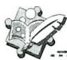

# 金例讲析

【例】一商店销售某种商品,平均每天可售出20件,每件盈利40元.为了扩大销售,增加盈利,该店采取了降价措施,在每件盈利不少于25元的前提下,经过一段时间销售,发现销售单价每降低1元,平均每天可多售出2件.

(1)若降价3元,则平均每天销售数量为\_\_\_\_件;  
(2)当每件商品降价多少元时,该商店每天销售利润为1200元?

# 实战演练

1. 某网店销售一种儿童玩具, 每件进价 20 元, 规定单件销售利润不低于 10 元, 且不高于 18 元. 试销售期间发现, 当销售单价定为 35 元时, 每天可售出 250 件, 销售单价每上涨 1 元, 每天销售量减少 10 件, 该网店决定提价销售. 设每天销售量为 $y$ 件, 销售单价为 $x$ 元.

(1)请直接写出 y 与 x 之间的函数关系式和自变量 x 的取值范围；  
(2) 当销售单价是多少元时, 网店每天获利 3840 元?

# 微课小专题 一元二次方程的应用(五)通道设计

方法技巧:运用平移法将不规则图形变为规则图形.

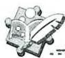

# 金例讲析

【例】如图,在长为33米、宽为20米的矩形空地上修建同样宽的道路(阴影部分),余下的部分为草坪,要使草坪的面积为510平方米,求道路的宽为多少?

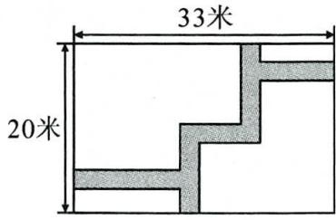

text_image

33米
20米

# 实战演练

1. 如图, 某小区计划在一块长为 $32 \mathrm{~m}$ , 宽为 $20 \mathrm{~m}$ 的矩形空地上修建三条同样宽的道路, 剩余的空地上种植草坪, 使草坪的面积为 $570 \mathrm{~m}^{2}$ . 若设道路的宽为 $x \mathrm{~m}$ , 求 $x$ 的值.

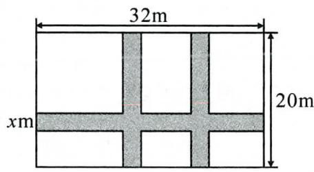

text_image

32m
20m
xm

2. 某小区在绿化工程中有一块长为 $20 \, m$ ，宽为 $8 \, m$ 的矩形空地，计划在其中修建两块面积相同的矩形绿地，使他们面积之和为 $56 \, m^{2}$ ，两块绿地之间及周边留有宽度相等的人行通道，求人行通道的宽度。

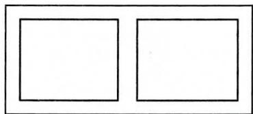

natural_image

Two empty square outlines inside a rectangular frame (no text or symbols)

# 微课小专题 一元二次方程的应用(六)靠墙围栏

方法技巧: 注意隔栏, 门宽以及墙长对面积的影响.

# 金例讲析

【例】如图,若要建一个长方形鸡场,鸡场的一边靠墙,墙对面有一个2米宽的门,另三边用竹篱笆围成,篱笆总长33米.围成的长方形的鸡场除门之外四周不能有空隙.

(1)若墙长为18米,要围成的鸡场的面积为150平方米,则鸡场的长和宽各为多少米?   
(2)围成的鸡场的面积可能达到200平方米吗?  
(3)若墙长为 a 米,对建 150 平方米面积的鸡场有何影响?

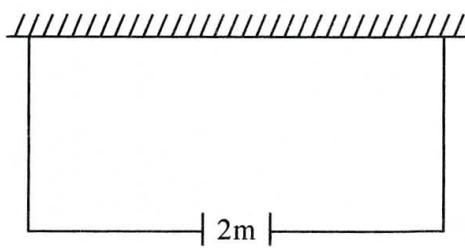

text_image

2m

# 实战演练

1. 如图, 要利用一面墙 (墙长为 25 米) 建羊圈, 用 100 米的围栏围成总面积为 400 平方米的三个大小相同的矩形羊圈, 求羊圈的边长 $AB, BC$ 各为多少米?

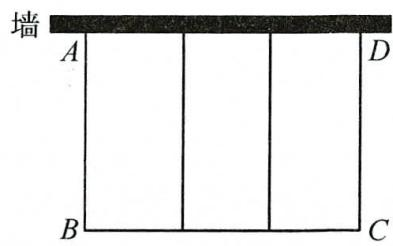

text_image

墙
A
D
B
C

# 第二十二章 二次函数

# 微课小专题 求二次函数的解析式(一) 运用顶点

方法技巧:由题意分析得到抛物线的顶点坐标,运用顶点式求二次函数的解析式.

# 金例讲析

【例】抛物线 $y=ax^{2}+bx$ 经过点 A(4,0)，顶点 M 在直线 $y=-2x+8$ 上，求抛物线的解析式.

# 实战演练

1. 已知当 $x = -2$ 时, 二次函数 $y = ax^2 + bx + c$ 取得最大值为 4 , 且图象经过点 $(-3,0)$ , 求该二次函数的解析式.

2. 当 $x = -4$ 时, 某二次函数取得最大值为 $\sqrt{3}$ , 其图象在 $x$ 轴上截得的线段 $AB$ (点 $A$ 在点 $B$ 的右边) 的长为 6, 求二次函数的解析式.

# 微课小专题 求二次函数的解析式(二)隐含对称轴

方法技巧:利用题中隐含的对称轴求出相应点的坐标,然后代入解析式中,解方程(组)求出待定系数.

# 金例讲析

【例】已知二次函数 $y = ax^{2} - 4ax + b$ 的图象经过点 $A(1,0), B(x_{2},0)$ ，与 $y$ 轴正半轴交于点 $C$ ，且 $S_{\triangle ABC} = 1$ ，求二次函数的解析式.

# 实战演练

1. 如图, 抛物线 $y = ax^2 + 5ax + 4 (a < 0)$ 与 $y$ 轴交于点 $C$ , 与 $x$ 轴正半轴交于点 $A$ , $CB // x$ 轴交抛物线于另一点 $B$ , 且 $AC = BC$ . 求抛物线的解析式.

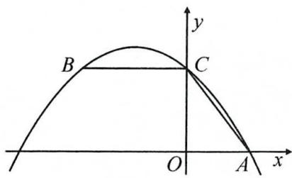

text_image

B
C
O
A
x
y

2. 如图, 直线 $y = x - 1$ 与抛物线 $y = ax^2 - 4ax + b$ 交于 $x$ 轴上的一点 $A$ 和另一点 $D$ , 抛物线交 $y$ 轴于点 $C$ , 且 $CD \parallel x$ 轴, 求抛物线的解析式.

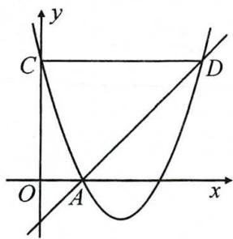

text_image

y
C
D
O
A
x

# 微课小专题 求二次函数的解析式(三) 图象变换

方法技巧:先求出原抛物线的顶点变换后的坐标,再通过顶点式得到变换后的抛物线的解析式.

# 金例讲析

# 一、平移后求解析式

【例1】将抛物线 $y = x^{2} + bx + c$ 先向左平移1个单位，再向上平移2个单位，得到抛物线 $y = x^{2} - 2x - 1$ ，求 $b, c$ 的值.

# 二、翻折后求解析式

【例 2】将抛物线 $C_{1}: y = \frac{1}{2}x^{2} - 4x$ 沿直线 y = m 翻折，若得到的新抛物线 $C_{2}$ 经过点 (2, 2)，则抛物线 $C_{2}$ 的解析式为 \_\_\_\_.

# 实战演练

1. 将抛物线 $y = -\frac{1}{2}(x + 1)^{2} - 2$ 沿直线 y = x 向右上平移 $2\sqrt{2}$ 个单位长度，则得到的抛物线的解析式为 \_\_\_\_.

2. 将抛物线 $y = (x - 1)^2 - 4$ 沿直线 $x = \frac{3}{2}$ 翻折, 则翻折后的抛物线的解析式为 \_\_\_\_.

# 微课小专题 二次函数性质之区间增减性

方法技巧:二次函数的增减性与其图象的开口方向,对称轴以及区间直接相关,注意结合图象分析对称轴与区间的位置关系.

# 金例讲析

【例】已知二次函数 $y=-\frac{1}{2}x^{2}+(30+2m)x+2000-200m(x \leqslant 40$ ，且 x 为整数），若 y 随 x 的增大而增大，则 m 的取值范围是 \_\_\_\_.

# 实战演练

1. 已知二次函数 $y = mx^2 - 2x + 1$ ，当 $x < \frac{1}{3}$ 时， $y$ 随 $x$ 的增大而减小，则 $m$ 的取值范围是 \_\_\_\_.

2. 已知二次函数 $y = -x^{2} + 2x$ ，当 -1 < x < a 时，y 随 x 的增大而增大，则实数 a 的取值范围是 \_\_\_\_.

# 微课小专题 数形结合(一)二次函数 $y$ 值大小比较

方法技巧:通常结合抛物线的开口方向,利用点到对称轴的距离大小来得到函数值的大小关系.

# 金例讲析

【例】已知抛物线 $y = x^{2} - 2mx + 2016$ (m 为常数) 上有三点: $A(x_{1}, y_{1}), B(x_{2}, y_{2})$ , $C(x_{3}, y_{3})$ , 其中 $x_{1} = -\sqrt{2} + m, x_{2} = \frac{2}{3} + m, x_{3} = m - 1$ , 则 $y_{1}, y_{2}, y_{3}$ 的大小关系是 \_\_\_\_.

# 实战演练

1. 已知点 $A(x_{1}, y_{1}), B(x_{2}, y_{2})$ 在抛物线 $y = -(x - 1)^{2} + m$ (m 是常数) 上, 若 $x_{1} < 1 < x_{2}, x_{1} + x_{2} > 2$ , 则 $m, y_{1}, y_{2}$ 的大小关系是 ( )

A. $m > y_{1} > y_{2}$

B. $m > y_{2} > y_{1}$

C. $y_{1} > y_{2} > m$

D. $y_{2} > y_{1} > m$

2. 已知抛物线 $y = ax^2 - 4ax + m$ 经过点 $A(x_1, y_1), B(x_2, y_2)$ ，若 $|x_1 - 2| > |x_2 - 2|$ . 则下列关系式正确的是（）

A. $y_{1} - y_{2} > 0$

B. $y_{1} + y_{2} > 0$

C. $a(y_{1} - y_{2}) > 0$

D. $a(y_{1} + y_{2}) > 0$

# 微课小专题 数形结合(二) 分析系数 $a, b, c$

方法技巧:①a 看开口方向;②ab 看对称轴;③c 看与 y 轴交点;④ $a\pm b+c$ 看 $x=\pm1$ ;⑤ $4a\pm2b+c$ 看 $x=\pm2$ ;⑥ $b^{2}-4ac$ 看与 x 轴交点个数;⑦经过点得方程;⑧没过点得不等式.

# 金例讲析

【例】如图,二次函数 $y=ax^{2}+bx+c(a\neq0)$ 的图象经过点(1,2),且与 x 轴交点的横坐标分别为 $x_{1},x_{2}$ , 其中 $-1<x_{1}<0,1<x_{2}<2$ . 有下列结论: $4a+2b+c<0,2a+b<0,b^{2}+8a>4ac,a<-1$ . 其中结论正确的有()

A. 1 个

B. 2 个

C. 3 个

D. 4 个

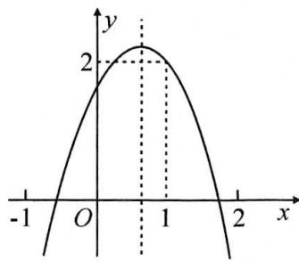

line

| x | y |
|---|---|
| -1 | -1 |
| 0 | 2 |
| 1 | 2 |
| 2 | -1 |

# 实战演练

1. 已知二次函数 $y = ax^2 + bx + c$ 的图象如图所示, 则下列 6 个代数式中: $ab, ac, a + b + c, a - b + c, 2a + b, b^2 - 4ac$ 中. 其值为正的式子有 ( )

A. 3 个

B. 4 个

C. 5 个

D. 6 个

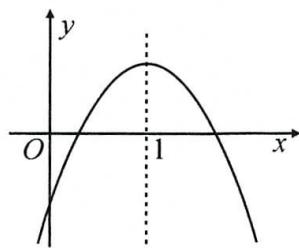

text_image

y
O
1
x

2. 如图, 二次函数 $y = ax^2 + bx + c (a \neq 0)$ 的图象与 $x$ 轴交于 $A, B$ 两点, 与 $y$ 轴交于点 $C$ , 且 $OA = OC$ . 则下列结论: ① $abc < 0$ ; ② $\frac{b^2 - 4ac}{4a} > 0$ ; ③ $ac - b + 1 = 0$ ; ④ $OA \cdot OB = -\frac{c}{a}$ . 其中结论正确的有( )

A. 4 个

B. 3 个

C. 2 个

D. 1 个

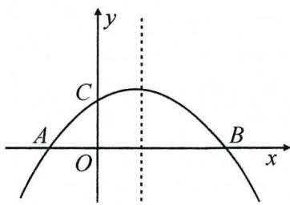

text_image

y
C
A O B x

# 微课小专题 数形结合(三)分析一元二次方程的根

方法技巧:抛物线与 x 轴(或直线)交点的横坐标为对应一元二次方程的两根,要善于利用二次函数的图象解决对应一元二次方程的根的问题.

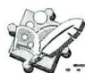

# 金例讲析

【例】已知抛物线 $y=a(x-h)^{2}+k$ 经过点 $(-3,m),(1,m),(2,-4)$ 三点，则关于 x 的方程 $a(x-h+2)^{2}+k+4=0$ 的解为 \_\_\_\_.

# 实战演练

1. 若方程 $(x-m)(x-n)=3(m,n$ 为常数，且m<n)的两个实数根分别为a,b(a<b)，则m,n,a,b的大小关系为\_\_\_\_。

2. 已知抛物线 $y=ax^{2}+bx+c(a<0)$ 的对称轴为 x=-1，与 x 轴的一个交点为 $(2,0)$ . 若关于 x 的一元一次方程 $ax^{2}+bx+c=p(p>0)$ 有整数根，则 p 的值有（）

A. 2 个

B. 3 个

C. 4 个

D. 5 个

# 微课小专题 二次函数的建模(一)图形面积

方法技巧:审清题意,正确得到相关面积的二次函数解析式,运用二次函数性质解决最值等问题时,特别注意自变量的取值范围.

# 金例讲析

【例】如图,用长为 $40 \, m$ 的篱笆围成一个一边靠墙的矩形养鸡场 ABCD,已知墙长 $30 \, m$ ,设 $AD = x(\mathrm{~m})$ ,矩形 ABCD 的面积为 $y(\mathrm{~m}^{2})$ .

(1)写出 y 与 x 之间的函数关系式,并求自变量 x 的范围;

(2)如果将养鸡场的地面矩形 ABCD 涂上一层涂料,已知每平方米花费 35 元,

①如果花费 4 900 元, 求 x 的值;

②求最多花费；

③如果花费 m 元时,对应的 x 有两个不同的值,直接写出 m 的范围.

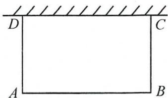

natural_image

Simple geometric diagram of a rectangle with labeled vertices A, B, C, D and hatched fill (no text or symbols beyond labels)

# 实战演练

1. 如图, 在一面靠墙的空地上用长为 24 米的篱笆, 围成中间隔有二道篱笆的长方形花圃, 设垂直于墙的一边 $AB$ 为 $x$ 米, 面积为 $S$ 平方米.

(1) 求 S 与 x 的函数关系式及自变量的取值范围；

(2) 当 $x$ 取何值时所围成的花圃面积最大？最大值是多少？

(3)若墙的最大可用长度为8米,求围成花圃的最大面积.

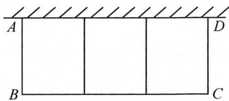

text_image

A
B
C
D

# 微课小专题 二次函数的建模(二) 营销利润

方法技巧:审清题意,正确得到利润的二次函数解析式,运用二次函数性质解决利润最值等问题时,特别注意自变量的取值范围(尤其是自变量为整数时的情况).

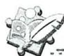

# 金例讲析

【例】某网店销售一种儿童玩具,每件进价30元,规定单件销售利润不低于10元,且不高于31元,试销售期间发现;当销售单价定为40元时,每天可售出500件,销售单价每上涨1元,每天销售量减少10件.该网店决定提价销售,设销售单价为x元,每天销售量为y件.

(1)请直接写出 y 与 x 之间的函数关系式及自变量 x 的取值范围；

(2)网店决定每销售1件玩具,就捐赠a元 $(2<a\leq7)$ 给希望工程,每天扣除捐赠后可获得最大利润为8120元,求a的值.

# 实战演练

1. 一公司生产某商品每件成本为 20 元, 经调研发现, 该商品在未来 40 天内的当天销售量 $m$ (件)与时间第 $t$ (天)满足关系式 $m = -2t + 96$ ; 未来 40 天内, 前 20 天当天的价格 $y_1$ (元/件)与时间第 $t$ (天)的函数式为 $y_1 = 0.25t + 25 (1 \leqslant t \leqslant 20$ 且 $t$ 为整数), 后 20 天当天的价格 $y_2$ (元/件)与时间第 $t$ (天)的函数式为 $y_2 = -0.5t + 40 (21 \leqslant t \leqslant 40$ 且 $t$ 为整数).

(1)求日销售利润 W(元)与时间第 t(天)的函数关系式,并写出自变量的取值范围;

(2)请预测未来40天中第几天的日销售利润最大？最大日销售利润是多少元？

(3)在实际销售的前20天中,该公司决定每销售一件商品就捐赠a元利润 $(a<5)$ 给希望工程,公司通过销售记录发现,前20天中,每天扣除捐赠后的日销售利润随时间第t(天)的增大而增大,求a的取值范围.

# 微课小专题 二次函数与等腰三角形

方法技巧:1. 根据坐标直接表示线段长,再建立方程(组)求解;2. 要注意分类讨论,有时需要对等线段进行适当的分析转化后再求解.

# 金例讲析

【例】如图,抛物线 $y = -x^{2} + 3x + 4$ 与 x 轴交于 A, B 两点, 与 y 轴交于点 C, 点 P 以每秒 $\sqrt{2}$ 个单位长度的速度在线段 BC 上由点 B 向点 C 运动 (点 P 不与点 B 和点 C 重合), 设运动时间为 t 秒, 过点 P 作 $PE \perp x$ 轴于点 E, 交抛物线于点 M, 连接 AM, 交 BC 于点 D, 当 $\triangle PDM$ 是等腰三角形时, 求 t 的值.

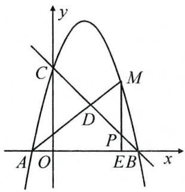

text_image

y
C
M
D
P
A O E B x

# 微课小专题 二次函数与直角三角形

方法技巧:1. 由垂直得到线段或角度的关系求解;2. 利用勾股定理求解.

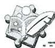

# 金例讲析

【例】如图,抛物线 $y=-x^{2}+4x+5$ 交 x 轴于 A, B 两点, 交 y 轴于点 C. P, Q 为线段 BC 上两点(点 P 在点 Q 的左边,且都不与 B, C 重合), $PQ=2\sqrt{2}$ , 在第一象限内的抛物线上存在一点 R, 使 $\triangle PQR$ 为等腰直角三角形, 求出点 R 的坐标.

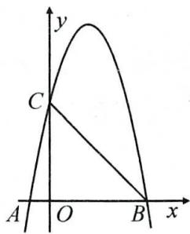

text_image

y
C
A O B x

# 实战演练

1. 如图, 直线 $y = kx + 2$ 交抛物线 $y = \frac{1}{4} x^2$ 于 $A, B$ 两点, $M(3,0)$ 为 $x$ 轴正半轴上的一点, 连接 $AM, BM$ , 当 $\angle AMB = 90^\circ$ 时, 求直线 $AB$ 的解析式.

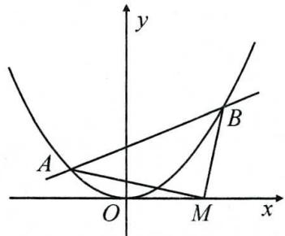

text_image

y
A
O
M
x
B

# 微课小专题 二次函数与平行四边形

方法技巧: 直角坐标系中, 根据平行四边形的对角线互相平分, 可得到 □ABCD 的四个顶点的坐标有以下关系: $x_{A} + x_{C} = x_{B} + x_{D}, y_{A} + y_{C} = y_{B} + y_{D}$ , 利用这两个关系可解决平行四边形的存在问题.

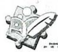

# 金例讲析

【例】如图,抛物线 $y=-\frac{1}{2}x^{2}+4x-5$ 的顶点为 A,与 y 轴交于点 B,点 M 为 AB 的中点,点 Q 在对称轴 l 上,点 P 在抛物线上,且以 A、P、Q、M 为顶点的四边形是平行四边形,求出符合条件的点 P,Q 的坐标.

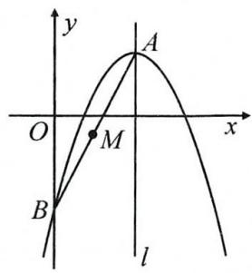

text_image

y
O
M
A
x
B
l

# 微课小专题 二次函数综合(一) 面积处理

方法技巧: 直角坐标系中, 图形的面积通常需要对图形进行分割、补形或转化, 然后再通过坐标来进行计算.

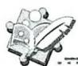

# 金例讲析

【例】如图, 抛物线 $y = -x^{2} + 2x + 1$ 与直线 $y = kx - k + 4 (k < 0)$ 交于点 M, N, B 为抛物线的顶点. 若 $\triangle BMN$ 的面积等于 1, 求 k 的值.

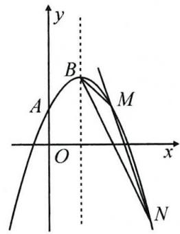

text_image

y
B
A
M
O
x
N

# 实战演练

1. 如图, 抛物线 $y = ax^{2} - 4ax - 5a (a < 0)$ 与 $x$ 轴交于 $A, B$ 两点, 与 $y$ 轴交于点 $C, D$ 为抛物线的顶点, 且 $S_{\triangle DBC} = 15$ , 求 $a$ 的值.

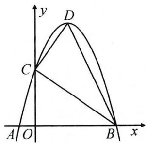

text_image

y
D
C
A O B x

# 微课小专题 二次函数综合(二)角度处理

方法技巧:问题中的角度关系最终要转化为线段关系,进一步得到相关点的坐标,建立方程求解;角度关系可利用构造全等,平移等手段得到线段关系.

# 金例讲析

【例】已知抛物线 $y = -x^{2} + 2x + 3$ 与 y 轴交于点 B，点 A(1,0)，点 P 是第一象限内抛物线上的一点，使得线段 OP 与直线 AB 的夹角为 $45^{\circ}$ ，求点 P 的坐标.

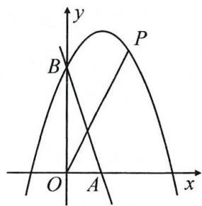

text_image

y
P
B
O A x

# 实战演练

1. 如图, 抛物线 $y = -\frac{1}{2} x^2 + x + \frac{3}{2}$ 交 $x$ 轴正半轴于点 $B$ , 交 $y$ 轴正半轴于点 $C, P$ 为第一象限内抛物线上的一点, 若 $\angle PBC = \angle OBC$ , 求点 $P$ 的坐标.

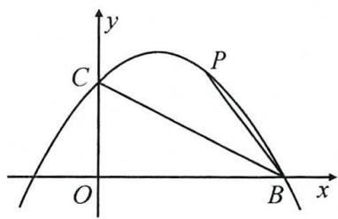

text_image

y
C
P
O
B
x

# 第二十三章 旋转

# 微课小专题 旋转计算(一) 运用旋转性质求角度

方法技巧:利用旋转前后图形全等,旋转角相等转换角度关系.

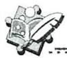

# 金例讲析

【例】如图, 将 $\triangle ABD$ 绕点 $A$ 逆时针旋转 $\alpha (0^{\circ} < \alpha < 180^{\circ})$ 得到 $\triangle ACE, BD$ 与 $CE$ 交于点 $P$ , 连接 $AP$ , 求 $\angle APB$ 的度数 (用含 $\alpha$ 的代数式表示).

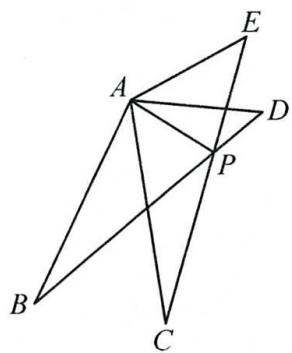

text_image

Geometric diagram with labeled points A, B, C, D, E, and P, showing intersecting lines forming triangles and quadrilaterals.

# 实战演练

1. 如图, 在 $\triangle ABC$ 中, 点 $E$ 在 $BC$ 边上, $AE = AB$ , 将线段 $AC$ 绕点 $A$ 旋转到 $AF$ 的位置, 使得 $\angle CAF = \angle BAE$ , 连接 $EF, EF$ 与 $AC$ 交于点 $G$ . 若 $\angle ABC = 65^{\circ}, \angle ACB = 28^{\circ}$ , 求 $\angle FGC$ 的度数.

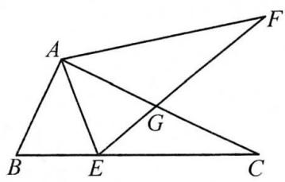

text_image

Geometric diagram with labeled points A, B, C, E, F, and G forming triangles and intersecting lines

2. 如图, 已知 $\triangle ABD$ 是等边三角形, $C$ 是 $\triangle ABD$ 内一点, 将 $\triangle ACD$ 绕点 $A$ 顺时针旋转 $60^{\circ}$ 得 $\triangle AEB$ . 求 $BE$ 与 $CD$ 所夹的锐角度数.

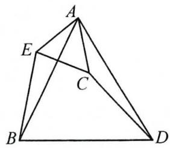

text_image

Geometric diagram of a tetrahedron with labeled vertices A, B, C, D, and E, showing internal diagonals and segments.

# 微课小专题 旋转计算(二) 分类讨论求角度

方法技巧:根据旋转过程中,满足条件的图形的不同位置分类求解.

# 金例讲析

【例】将矩形 ABCD 绕点 A 顺时针旋转 $\alpha(0^{\circ}<\alpha<360^{\circ})$ ，得到矩形 AEFG。当 $\alpha$ 为何值时，GC=GB？画出图形，并说明理由。

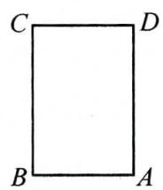

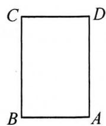  
备用图

# 实战演练

1. 如图, 在 Rt△ABC 中, ∠C=90°, ∠B=50°, 点 D 在边 BC 上, BD=2CD, 将 △ABC 绕着点 D 逆时针旋转 m (0°<m<180°) 后, 如果旋转后点 B 恰好落在初始 Rt△ABC 的边上, 求 m 的值.

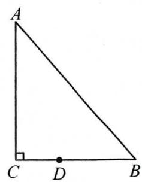

text_image

A
C D B

2. 如图, 正方形 $ABCD$ 与正 $\triangle AEF$ 的顶点 $A$ 重合, 将 $\triangle AEF$ 绕其顶点 $A$ 旋转, 在旋转过程中, 当 $BE = DF$ 时, 求 $\angle BAE$ 的度数.

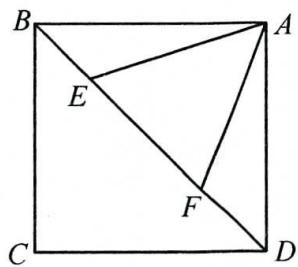

text_image

B
E
A
F
C
D

# 微课小专题 旋转计算(三) 运用旋转性质求长度

方法技巧:利用旋转全等,对应点到旋转中心距离相等,以及特殊角,勾股定理等求线段长.

# 金例讲析

【例】如图, 在 Rt△ABC 中, ∠ACB = 90°, ∠B = 60°, BC = 2, △A′B′C 是由 △ABC 绕点 C 顺时针旋转得到, 其中点 A′与点 A 是对应点, 点 B′与点 B 是对应点, 连接 AB′, 且点 A, B′, A′在同一条直线上. 求 AA′的长.

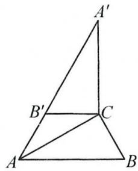

text_image

Geometric diagram of triangle ABC with points A', B', C' and line segments, likely for a geometry problem or proof.

# 实战演练

# 一、隐藏直角，连线构直角三角形

1. 如图, 在四边形 $ABCD$ 中, $AB \parallel CD$ , $\angle ABC = 90^\circ$ , $F$ 为 $BC$ 中点, 将 $\triangle ABF$ 绕点 $F$ 顺时针旋转某个角度, 得到 $\triangle EHF$ , 使得点 $A$ 的对应点落在 $CD$ 边上的点 $E$ 处, 若 $BF = FC = 2, DE = 3$ , 求 $AD$ 的长.

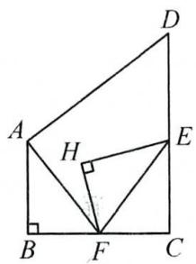

text_image

Geometric diagram of quadrilateral ABCD with internal points E, F, H and right-angle markings at B and C

# 二、作垂线，构直角三角形

2. 如图, 在正方形 $ABCD$ 中, $AD = 2\sqrt{3}$ , 把边 $BC$ 绕点 $B$ 逆时针旋转 $30^{\circ}$ 得到线段 $BP$ , 连接 $AP$ 并延长交 $CD$ 于点 $E$ , 连接 $PC$ , 求 $\triangle PCE$ 的面积.

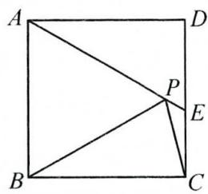

text_image

Geometric diagram of a square with labeled vertices and internal points, showing diagonals and segments.

# 微课小专题 旋转作图(一)无刻度直尺网格作图

方法技巧:利用网格结构,作全等的直角三角形.

# 金例讲析

【例】如图,在下列 $10 \times 10$ 的网格中,横、纵坐标均为整数的点叫做格点,例如 $A(2,1)$ , $B(5,4), C(1,8)$ 都是格点.

(1)直接写出 $\triangle ABC$ 的形状;

(2)要求在下图中仅用无刻度的直尺作图:将 $\triangle ABC$ 绕点A顺时针旋转角度 $\alpha$ 得到 $\triangle AB_{1}C_{1}$ ， $\alpha=\angle BAC$ ，其中B,C的对应点分别为 $B_{1},C_{1}$ ，操作如下：

第一步:找一个格点 D, 连接 AD, 使 $\angle DAB = \angle CAB$ ;

第二步:找两个格点 $C_{1}, E$ , 连接 $C_{1}E$ 交 AD 于点 $B_{1}$ ;

第三步: 连接 $AC_{1}$ ，则 $\triangle AB_{1}C_{1}$ 即为作出的图形.

请你按步骤完成作图,并直接写出 $D, C_{1}, E$ 三点的坐标.

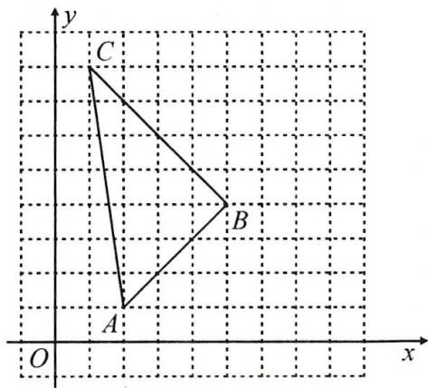

text_image

y
C
B
A
O
x

# 实战演练

1. 如图, 在 $\triangle ABC$ 中, $\angle B = 90^{\circ}$ , 点 $D$ 为边 $AC$ 的中点, 请按下列要求用无刻度的直尺作图, 并解决问题:

(1)作点 $D$ 关于 $BC$ 的对称点 $O$ ;

(2)在(1)的条件下,将 $\triangle ABC$ 绕点 $O$ 顺时针旋转 $90^{\circ}$ ,画出旋转后的 $\triangle EFG$ (其中 $A,B,C$ 三点旋转后的对应点分别是点 $E,F,G$ ).

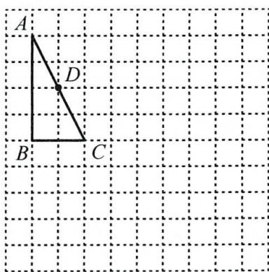

text_image

A
D
B C

# 微课小专题 旋转作图(二)非网格作旋转图形

方法技巧:利用直尺、圆规画满足条件的全等三角形.

# 金例讲析

【例】如图，E 是正方形 ABCD 中 CD 边上任意一点.

(1)以点 A 为中心, 把 $\triangle ADE$ 顺时针旋转 $90^{\circ}$ , 画出旋转后的图形;
(2)在 BC 边上画一点 F, 使 $\triangle CEF$ 的周长等于正方形 ABCD 的周长的一半. 请简要说明你取该点的理由.

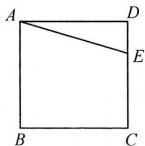

text_image

A
D
E
B
C

图1

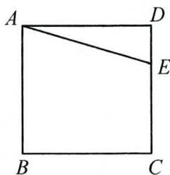

text_image

A
D
E
B
C

图2

# 实战演练

1. 如图, 菱形 $ABCD$ 和 Rt $\triangle ABE$ , $\angle AEB = 90^\circ$ , 将 $\triangle ABE$ 绕点 O 旋转 $180^\circ$ 得到 $\triangle CDF$ .

(1)用无刻度的直尺和圆规在图中画出点 O 和 $\triangle CDF$ ，并简要说明作图过程；

(2) $\angle AEF + \angle DFE$ 的度数为；

(3)用无刻度的直尺在 $BD$ 上取一点 $P$ , 使得 $\angle CPB = \angle FPD$ , 保留作图痕迹.

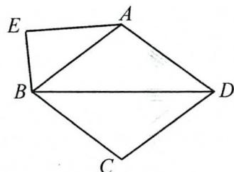

text_image

E
A
B
D
C

# 微课小专题 旋转作图(三) 找旋转中心

方法技巧:根据旋转前后对应点所连线段的中垂线的交点即为旋转中心画图.

# 金例讲析

【例】如图,在边长为1的正方形网格中,A(1,7),B(5,5),C(7,5)、D(5,1),线段AB与线段CD存在一种特殊关系,即其中一条线段绕着某点P旋转一个角度可以得到另一条线段,在图中画出这个旋转中心P并写出其坐标(保留画图痕迹).

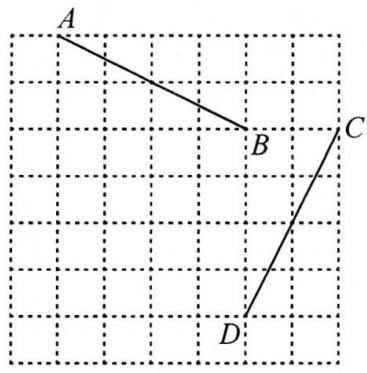

text_image

A
B
C
D

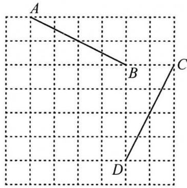

text_image

A
B
C
D

# 实战演练

1. 如图, 在平面直角坐标系 $xOy$ 中, $\triangle ABC$ 的顶点的横、纵坐标都是整数. 若将 $\triangle ABC$ 以某点 $P$ 为旋转中心, 顺时针旋转 $90^{\circ}$ 得到 $\triangle DEF$ , 在图中画出点 $P$ , 并写出旋转中心 $P$ 的坐标.

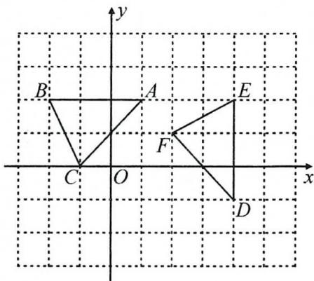

text_image

y
B
A
E
F
C
O
x
D

2. 如图, $\angle A = 90^{\circ}, BD = AE, AB = CE$ , 将 $\triangle ABE$ 绕点 $P$ 逆时针旋转 $\alpha$ 得到 $\triangle BFD$ , 点 $A, B, E$ 的对应点分别是点 $B, F, D$ .

(1)请在图中画出点 P 及 $\triangle BFD$ ;

(2)求 $\angle CDF$ 的度数.

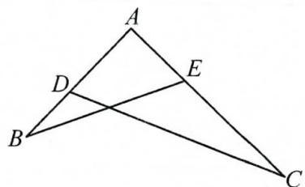

text_image

Geometric diagram of triangle ABC with internal points D and E, showing intersecting lines and segments

# 微课小专题 旋转技巧(一) 遇等边三角形旋转 $60^{\circ}$

方法技巧: 绕等边三角形顶点旋转 $60^{\circ}$ , 可构成手拉手全等, 将分散的条件聚在一个直角三角形中.

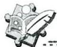

# 金例讲析

【例】如图, $\triangle ABC$ 中, $\angle ACB = 90^{\circ}$ , $\angle BAC = 30^{\circ}$ , $BC = 4$ , $D$ 是边 $AB$ 上的一点, 将点 $D$ 绕点 $C$ 顺时针旋转 $60^{\circ}$ 得到点 $E$ , 且点 $E$ 在 $\triangle ABC$ 外, 连接 $AE$ . 若 $AE = \sqrt{13}$ , 求 $BD$ 的长.

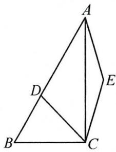

text_image

Geometric diagram of a quadrilateral ABCD with diagonals and extended lines, labeled with points A, B, C, D, E.

# 实战演练

1. 如图, 在 $\triangle ABC$ 中, $AB = 3$ , $BC = 4$ , 以 $AC$ 为边作等边 $\triangle ACD$ , 连接 $BD$ , 若 $BD = 5$ , 求 $\angle ABC$ 的度数.

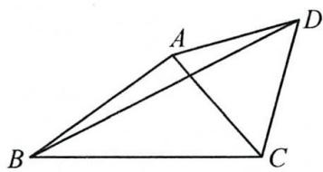

text_image

Geometric diagram of quadrilateral ABCD with diagonal AC and point A on side AD

2. 如图, 等边 $\triangle ABC$ 内有一点 $P$ , 分别连接 $AP, BP, CP$ , 若 $AP = 6, BP = 8, CP = 10$ . 求 $S_{\triangle ABP} + S_{\triangle BPC}$ 的值.

text_image

A
P
B
C

# 微课小专题 旋转技巧(二) 遇等腰直角三角形或正方形旋转 $90^{\circ}$

方法技巧: 绕等腰直角三角形直角顶点旋转 $90^{\circ}$ ，可构成手拉手全等，将分散的条件聚在一个直角三角形中.

# 金例讲析

【例】如图,在等腰直角 $\triangle ABC$ 中, $AB=AC$ , $\angle BAC=90^{\circ}$ ,点 $D$ 在 $\triangle ABC$ 外,且 $\angle ADB=45^{\circ}$ , $BD=3$ , $AD=4$ ,求线段 $DC$ 的长.

natural_image

Geometric diagram of a parallelogram ABCD with diagonals intersecting at point B (no labels or measurements)

# 实战演练

1. 如图, 在正方形 $ABCD$ 内有一点 $P$ , 且 $PA = \sqrt{5}, PB = \sqrt{2}, PC = 1$ , 求 $\angle BPC$ 的度数.

text_image

A
D
P
B
C

2. 如图, 在 $\triangle ABC$ 中, $\angle BAC = 90^{\circ}$ , $AB = AC$ , 点 $D, E$ 在直线 $BC$ 上, 若 $\angle DAE = 135^{\circ}$ , $BC = CE$ , 求 $\frac{CE}{CD}$ 的值.

text_image

A
D B C E

# 微课小专题 旋转技巧(三) 遇顶角 $120^{\circ}$ 的等腰三角形旋转 $120^{\circ}$

方法技巧:绕顶角 $120^{\circ}$ 的等腰三角形的顶点旋转 $120^{\circ}$ ，可构成手拉手全等，将分散的条件聚在一个直角三角形中。顶角为 $120^{\circ}$ 的等腰三角形的三边之比为 $1:1:\sqrt{3}$ 。

# 金例讲析

【例】如图,在 $\triangle ABC$ 中, $AB=AC=2\sqrt{3}$ , $\angle BAC=120^{\circ}$ ,点 $D,E$ 都在边 $BC$ 上, $\angle DAE=60^{\circ}$ ,若 $BD=2CE$ ,求 $DE$ 的长.

text_image

A
B D E C

# 实战演练

1. 如图, 在 $\triangle ABC$ 中, $AB = AC$ , $\angle ACB = 30^{\circ}$ , 点 $P$ 是 $\triangle ABC$ 内一点, 且 $PA = 2$ , $PB = \sqrt{21}$ , $PC = 3$ , 求 $\angle APC$ 的度数.

text_image

A
B
P
C

2. 如图, 在 $\triangle ABC$ 中, $BC = 4$ , $\angle ABC = 60^{\circ}$ , $AB = 1$ , 将边 $AC$ 绕着点 $A$ 逆时针旋转 $120^{\circ}$ , 得到 $AD$ , 连接 $BD$ , 求 $BD$ 的长.

text_image

D
A
B
C

# 第二十四章 圆

# 微课小专题 半径相等的运用

方法技巧:在同圆(或等圆中),半径相等是构造等腰三角形或全等三角形的重要条件,也是建立方程的重要依据.

# 金例讲析

# 一、等半径构全等，半径相等建方程

【例】如图, $MN$ 是半圆 $O$ 的直径, 正方形 $ABCD$ 和正方形 $DEFG$ 彼此相邻 (点 $A, D, E$ 在直径 $MN$ 上, 点 $B, C, F$ 在半圆上, 点 $G$ 在 $CD$ 上). 求证: 正方形 $ABCD$ 的边长是正方形 $DEFG$ 的边长的 2 倍.

text_image

B
C
G
F
M
A
O
D
E
N

# 实战演练

# 二、等半径构等腰

1. 如图, $\odot O$ 的弦 $CD$ 与直径 $AB$ 的延长线相交于点 $E$ , 且 $AB = 2DE$ , 若 $\angle E = 13^{\circ}$ , 求 $\angle AOC$ 的度数.

text_image

Geometric diagram showing a circle with points A, B, C, D, E and center O, including chords and tangent lines.

2. 如图, 在 $\triangle AOB$ 中, $\angle A = 2\angle B = 45^{\circ}$ , 以点 $O$ 为圆心, $OA$ 为半径作 $\odot O$ , 交 $AB$ 于点 $C$ , 求 $\frac{AC}{BC}$ 的值.

text_image

Geometric diagram showing a circle with points A, B, C, and center O, including chords and radii.

# 微课小专题 垂径定理(一)“作单弦心距”

方法技巧: 在圆中处理与半径, 弦长有关的问题时, 常过圆心作弦的垂线段 (弦心距), 构造直角三角形. 如图:

# 金例讲析

【例】如图,在 $\odot O$ 中, $AB,AC$ 是互相垂直且相等的两条弦, $OD \perp AB$ 于点 $D,OE \perp AC$ 于点 $E$ .

(1)直接写出四边形 ADOE 的形状是\_\_\_\_；

(2) 直线 ED 交 $\odot O$ 于点 M, N, 若 ED = 6, 求弦 MN 的长.

text_image

C
N
E
O
A
D
B
M

# 实战演练

1. 如图, 矩形 $ABCD$ 与圆心在 $AB$ 上的 $\odot O$ 交于点 $G, B, E, F, GB = 8, AG = 1, DE = 2$ .

(1) 求 EF 的长;

(2)求矩形 ABCD 的面积.

text_image

D E F C
A G O B

2. 如图, $AB$ 是半径为 5 的 $\odot O$ 的弦, 且 $AB = 8$ , 点 $P$ 是弦 $AB$ 上的一动点, 若 $OP$ 的长为整数, 则点 $P$ 的个数为 \_\_\_\_.

text_image

O
A P B

# 微课小专题 垂径定理(二)“知二推三”

方法技巧：

text_image

基本模型：

已知 $CO \perp AB$ 于点 $D$ .

设 $OA = OC = r, AB = a, OD = d, CD = h, AC = b$

则 $\left\{\begin{aligned}r^{2}&=\left(\frac{a}{2}\right)^{2}+d^{2},\\ h&=r+d\text{(或}r=h-d\text{)},\\ b^{2}&=\left(\frac{a}{2}\right)^{2}+h^{2}. \end{aligned}\right.$

# 金例讲析

【例】如图, $AC$ 是 $\odot O$ 的直径, 弦 $BD \perp AC$ 于点 $E$ , $BD = CE = 8$ .

(1) 求 $AE$ 的长;

(2) 连接 BC, $OF \perp BC$ 于点 F, 求 OF 的长.

text_image

A
B
E
D
O
F
C

# 实战演练

1. 如图, $\odot O$ 的直径 $CD \perp$ 弦 $AB$ , 将弓形 $ABD$ 沿 $AB$ 对折, 点 $D$ 落在点 $E$ 处, 若 $CD = 6, CE = 2$ , 求弦 $AB$ 的长.

text_image

C
E
O
A
B
D

2. 如图, $\odot O$ 的直径 $AB$ 长为 10 , 弦 $MN \perp AB$ , 将 $\odot O$ 沿 $MN$ 翻折, 点 $B$ 的对应点为 $B'$ , 若 $AB' = 2$ , 则 $MB'$ 的长为 ( )

A. $2\sqrt{10}$

B. $2 \sqrt{10}$ 或 $2 \sqrt{15}$

C. $2\sqrt{13}$

D. $2 \sqrt{10}$ 或 $2 \sqrt{13}$

text_image

A
O
B

# 微课小专题 垂径定理(三)“作双弦心距”

方法技巧:在解决两条非直径的弦的夹角问题中,常需分别作出两条弦的弦心距,构造“双垂径图”,结合勾股定理求解.

# 金例讲析

【例】如图,在半径为 $\sqrt{13}$ 的 $\odot O$ 中,弦AB与CD相交于点E,且 $\angle BED=75^{\circ}$ .若CE=1,DE=5,求AE的长.

text_image

D
O
E
A
C
B

# 实战演练

1. 如图, 在半径为 2 的 $\odot O$ 中, 弦 $AB$ 与弦 $CD$ 垂直相交于点 $P$ , 连接 $OP$ . 若 $OP = 1$ , 求 $AB^{2} + CD^{2}$ 的值.

text_image

A
O
C
P
D
B

# 微课小专题 方法技巧(一) 巧构直径与直角

方法技巧:“遇直径,连直角;寻直角,找直径”.圆上的点与直径的端点相连或半径延长变直径是圆中构造直角三角形常见的辅助线.

# 金例讲析

# 一、巧作直径构直角

【例】如图,在半径为4的 $\odot O$ 中,弦 $AB$ 与 $CD$ 垂直相交于点 $E$ ,连接 $AD,BC$ .若 $BC=5$ ,求 $AD$ 的长.

text_image

A
C
E
O
B
D

# 实战演练

# 二、半径延长“变”直径

1. 如图, $\triangle ABC$ 是 $\odot O$ 的内接三角形, 若 $\angle OBC = 70^{\circ}$ , 则 $\angle A$ 的度数是 ( )

A. ${40}^{ \circ  }$

B. ${35}^{ \circ  }$

C. ${30}^{ \circ  }$

D. ${20}^{ \circ  }$

text_image

A
B
C
O

2. 如图, $\triangle ABC$ 是半径为 5 的 $\odot O$ 的内接三角形, $AC = 6\sqrt{2}$ , 且 $AC$ 平分 $\angle OAB$ , 求 $BC$ 的长.

text_image

Geometric diagram of a circle with points A, B, C, and center O, showing chords and radii

# 微课小专题 方法技巧(二)巧构圆内接四边形

方法技巧:构造圆内接四边形,利用“对角互补”的性质导角,是转化与圆有关的角的常见手段之一,也是运用方程思想求角度的依据之一.

# 金例讲析

【例】如图, $\odot O_{1}$ 与 $\odot O_{2}$ 都经过 $A, B$ 两点, 点 $P$ 是 $\odot O_{1}$ 上的一点, 直线 $PA, PB$ 分别与 $\odot O_{2}$ 交于 $C, D$ 两点, 连接 $CD, PO_{1}$ . 求证: $PO_{1} \perp CD$ .

text_image

P
O₁
A
C
B
O₂
D

# 实战演练

1. 如图, 点 $B$ 在 $\odot O$ 的直径 $CD$ 的延长线上, $AC$ 为弦, 连接 $AB$ 交 $\odot O$ 于点 $F$ . 若 $\angle B = 27^{\circ}, AF = AC$ , 求 $\angle A$ 的度数.

text_image

Geometric diagram showing a circle with inscribed quadrilateral ABCD and external point F, labeled with points A, B, C, D, F, and center O.

2. 如图, 正方形 $ABCD$ 的四个顶点都在 $\odot O$ 上, 点 $E$ 是 $\widehat{AB}$ 上的一点, $EA = 1$ , $EB = 3\sqrt{2}$ , 点 $F$ 是 $\widehat{CD}$ 上的一点, 且 $\widehat{CF} = \widehat{AE}$ .

(1)求正方形 ABCD 的边长；

(2) 求 AF 的长.

text_image

A
E
O
B
C
D
F

# 微课小专题 辅助线技巧(一)巧用弧的中点

方法技巧:弧的中点与弧的端点相连构造等腰三角形;弧的中点与圆心的连线垂直平分该弧所对的弦;弧的中点与圆上的点(异于弧的端点)相连构造内(外)角平分线.

# 金例讲析

# 一、弧的中点构垂直关系

【例】如图, $AD$ 是 $\odot O$ 的直径, $CD$ 为弦, 点 $B$ 是 $\widehat{ADC}$ 的中点, 若 $AB = 8\sqrt{5}, CD = 12$ , 求 $AD$ 的长.

text_image

A
O
B
D
C

# 实战演练

# 二、弧的中点构等腰三角形

1. 如图, $AB$ 是 $\odot O$ 的直径, $CD$ 是 $\odot O$ 的弦, 且 $D$ 是 $\widehat{AB}$ 的中点, $AM \perp CD$ 于点 $M$ , $BN \perp CD$ 于点 $N (AM < BN)$ . 若 $AB = 10, CD = 7\sqrt{2}$ , 求 $MN$ 的长.

text_image

C
M
O
A
N
B
D

# 三、弧的中点构内(外)角平分线

2. 如图, 在半径为 $r$ 的 $\odot O$ 中, 弦 $BC = \sqrt{3} r$ , 点 $D$ 是优弧 $\widehat{BC}$ 的中点, 点 $A$ 是 $\widehat{BD}$ 上的一点 (不与 $B, D$ 重合), 连接 $AB, AC, AD$ .

(1) $\angle BAC$ 的度数为\_\_\_\_（直接写出结果）；

(2)求 $\frac{AC-AB}{AD}$ 的值.

text_image

A
D
O
B
C

# 微课小专题 辅助线技巧(二) 切线的判定(1)

方法技巧: 当待证切线与圆有明确公共点时, 连过公共点的半径, 证垂直. 即“有点连半径, 证垂直”.

# 金例讲析

# 一、利用勾股定理的逆定理证垂直

【例】如图, $AD, BD$ 是 $\odot O$ 的弦, 且 $\angle ADB = 90^{\circ}$ , 点 $C$ 是 $BD$ 的延长线上的一点, 且满足 $BD = 2AD = 4CD$ , 连接 $CA$ . 求证: $AC$ 是 $\odot O$ 的切线.

text_image

A
O
C
D
B

# 实战演练

# 二、利用导角证垂直

1. 如图, 直线 $l$ 与 $\odot O$ 相离, $OA \perp l$ 于点 $A$ , 交 $\odot O$ 于点 $P$ , 点 $B$ 是 $\odot O$ 上的一点, $BP$ 的延长线交直线 $l$ 于点 $C$ , 若 $AB = AC$ , 求证: $AB$ 与 $\odot O$ 相切.

text_image

B
A
P
O
C
l

# 三、利用全等证垂直

2. 如图, 四边形 $ABCD$ 是菱形, 以 $AD$ 为直径的 $\odot O$ 交 $AB$ 于点 $F$ , 点 $E$ 是 $BC$ 边上的一点, 且 $BE = BF$ , 连接 $DE$ . 求证: $DE$ 是 $\odot O$ 的切线.

text_image

Geometric diagram showing a circle with tangent line and inscribed parallelogram, labeled with points A, B, C, D, E, F, and center O.

# 微课小专题 辅助线技巧(三) 切线的判定(2)

方法技巧:当待证切线与圆的公共点不明确时,过圆心作待证切线的垂线段,证“d=r”.即“无点作垂线,证半径”.

# 金例讲析

【例】如图, 在矩形 $ABCD$ 中, $E$ 为 $AB$ 上的一点, $F$ 为 $AD$ 上的一点, 且 $EF = AB + EB$ . 求证: $\triangle AEF$ 的外接圆 $\odot O$ 与 $BC$ 相切.

text_image

A
F
D
O
E
B
C

# 实战演练

1. 如图, 在半径分别为 3 和 $\sqrt{2}$ 的两个同心圆 $\odot O$ 中, 大 $\odot O$ 的弦 $AB = 2\sqrt{7}$ . 求证: $AB$ 与小 $\odot O$ 相切.

text_image

O
A B

2. 如图, $AD$ 是 $\triangle ABC$ 的高, 且 $AD = \frac{1}{2} BC$ , 点 $E, F$ 分别为 $AB, AC$ 的中点, 以 $EF$ 为直径作 $\odot O$ , 试判断 $BC$ 与 $\odot O$ 的位置关系, 并说明理由.

text_image

Geometric diagram showing a circle with tangent and secant lines, labeled points A, B, C, D, E, F, and center O.

# 微课小专题 切线的性质(一) 求角度

方法技巧:“遇切线,连半径”. 连过切点的半径,构建垂直关系(直角),再与相关几何性质结合转化角度关系或运用方程思想求解.

# 金例讲析

【例】如图, $\triangle ABC$ 是 $\odot O$ 的内接三角形,过点A的切线交BC的延长线于点P.

(1) 若 $\angle PAB = 105^{\circ}$ ，求 $\angle ACB$ 的度数；  
(2) $\angle APB$ 的平分线交AB于点M,若 $\angle BAC=70^{\circ}$ ,求 $\angle PMB$ 的度数.

text_image

Geometric diagram showing a circle with points A, B, C, M, O, P and connecting lines forming triangles and chords.

# 实战演练

1. 如图, 直线 $l$ 与 $\odot O$ 相切于点 $A$ , 点 $B$ 是 $\odot O$ 上的一点, $BC \perp l$ 于点 $C$ , 交 $\odot O$ 于点 $D$ , 连接 $OB, AD$ . 若 $\angle OBC = 56^{\circ}$ , 求 $\angle CAD$ 的度数.

text_image

B
O
D
C
A
l

2. 如图, $AB$ 是 $\odot O$ 的弦, $AC$ 是 $\odot O$ 的切线, 直径 $EF$ 的延长线交 $AC$ 于点 $C$ , 交 $AB$ 于点 $M$ . 若点 $B$ 是 $\widehat{EF}$ 的中点, 且 $\angle BAC + \angle C = 107^\circ$ , 求 $\angle ABE$ 的度数.

text_image

Geometric diagram showing a circle with points A, B, E, F, M, O and tangent line, labeled with letters.

# 微课小专题 切线的性质(二) 求线段长

方法技巧:“遇切线,连半径”. 连过切点的半径,构造直角三角形,运用勾股定理计算是求线段长的常见方法.

# 金例讲析

【例】如图, 在 Rt△ABC 中, ∠ACB=90°, ∠ABC=60°, 经过 A, C 两点的 ⊙O 与 AB 相切, 连接 OB. 若 OB=2√7, 求 AC 的长.

text_image

Geometric diagram showing a circle with points A, B, C, and center O, including chords and tangent lines.

# 实战演练

1. 如图, 已知 $AB$ 为 $\odot O$ 的直径, 点 $C, D$ 在 $\odot O$ 上, $CD = BD$ , $E$ , $F$ 是线段 $AC$ , $AB$ 的延长线上的点, 并且 $EF$ 与 $\odot O$ 相切于点 $D$ . 若 $AC = 3$ , $AB = 5$ , 求 $CE$ 的长.

text_image

Geometric diagram showing a circle with inscribed triangle and labeled points A, B, C, D, E, F, and center O

2. 如图, 在 Rt△ABC 中, ∠C=90°, 点 O 是 AB 上的一点, 以 OA 为半径的 ⊙O 与 BC 相切于点 D, 交 AC 于点 E, 若 AC=3CD=9, 求 CE 的长.

text_image

Geometric diagram showing a circle with points A, B, C, D, E and center O, including chords and tangent lines.

# 微课小专题 图形研究(一) 双切图

方法技巧:构造切线长定理的基本图形是解决与双(多)切线有关的计算(证明)问题的常用辅助线.

切线长定理的基本图形：

text_image

A
O
M
P
N
B

# 金例讲析

【例】如图, $PA, PB$ 分别与 $\odot O$ 相切于点 $A, B$ , 点 $C, M$ 在 $\odot O$ 上, $\angle AMB = 60^{\circ}$ , 过点 $C$ 的切线 $EF$ 分别交 $PA, PB$ 于点 $E, F, \odot O$ 的半径为 $\sqrt{3}$ .

(1)求 $\triangle PEF$ 的周长；  
(2) 若 $EF \perp PB$ ，求 AE 的长.

text_image

Geometric diagram showing a circle with inscribed quadrilateral and tangent line, labeled with points A, B, C, E, F, M, O, P.

# 实战演练

1. 如图, 点 $C$ 在以 $AB$ 为直径的 $\odot O$ 上, 过 $B, C$ 分别作 $\odot O$ 的切线相交于点 $P, PO$ 的延长线交 $\odot O$ 于点 $E$ . 若 $AC = 2, OP = 9$ , 连接 $EA, EC$ , 求 $S_{\triangle ACE}$ 的值.

text_image

Geometric diagram showing a circle with points A, B, C, E, O, P and connecting lines forming triangles and chords.

# 微课小专题 图形研究(二) 多切图

方法技巧:积累基本结论,紧扣核心知识点(切线长定理)和核心方法(面积法)是解决多切图问题的关键.

基本图形和结论:①AD=AF= $\frac{AB+AC-BC}{2}$ , BD=BE=

$$
\frac {B A + B C - A C}{2}, C E = C F = \frac {C A + C B - A B}{2};
$$

②设 $\triangle ABC$ 的面积为 $S$ ,周长为 $C$ , $\odot O$ 的半径为 r，则 $r=\frac{2S}{C}$ .

text_image

Geometric diagram of a triangle with an inscribed circle and labeled points A, B, C, D, E, F, and center O.

# 金例讲析

【例】如图, $\triangle ABC$ 的各边分别与 $\odot O$ 相切于点D,E,F,AB=8,AC=5.

(1) 求 BE - EC 的值;

(2) 点 P 是 $\widehat{DF}$ 上的一点, 过点 P 的切线 MN 分别与 AD, AF 相交于点 M, N. 若 BC = 7, 求 $\triangle AMN$ 的周长.

text_image

A
M
P
D
N
F
B
E
C

# 实战演练

1. 如图, $\odot O$ 与四边形 $ABCD$ 的各边分别相切于点 $E, F, G, H$ .

(1) 若 $AB = AD = \sqrt{3}$ ， $\angle B = \angle D = 90^{\circ}$ ， $\angle BAD = 60^{\circ}$ ，求 $\odot O$ 的半径长；

(2) 若 AB, CD 的长是关于 x 的方程 $x^{2}-3x+m^{2}=0(m\neq0)$ 的两个实数根，且四边形 ABCD 的面积为 $\sqrt{3}$ ，求 $\odot O$ 的半径长.

text_image

Geometric diagram showing a circle inscribed in a quadrilateral with labeled points and a center point.

# 微课小专题 图形研究(三)三角形的内心与外心

方法技巧:围绕内心,外心的定义和基本图形及基本结论进行探究.

基本图形及基本结论: O 是 $\triangle ABC$ 的外心, I 是 $\triangle ABC$ 的内心.

$$
\begin{array}{r l} & ① \angle A I B = 9 0 ^ {\circ} + \frac {1}{2} \angle A C B, \angle A I C = 9 0 ^ {\circ} + \\ & \frac {1}{2} \angle A B C, \angle B I C = 9 0 ^ {\circ} + \frac {1}{2} \angle B A C; \end{array}
$$

text_image

C
I
A
O
B
D

text_image

Geometric diagram of a circle with inscribed quadrilateral ABCD and auxiliary points E, F, G, I, O, showing chords and intersections.

②D 是△ABI 的外心(DA=DB=DI);

③当 $\angle ACB=90^{\circ}$ 时,设 $\triangle ABC$ 的内切圆半径为 $r$ ,外接圆半径为 $R$ ,则 $DI=DA=DB=\sqrt{2}R,r=\frac{AC+BC-AB}{2}$ .

# 金例讲析

【例】如图, $AB$ 是 $\odot O$ 的直径, $C$ 为半圆上的一点 (不与 $A, B$ 重合), 点 $I$ 是 $\triangle ABC$ 的内心, 直线 $CI$ 交 $\odot O$ 于点 $D$ . 设 $\triangle ABC$ 的内切圆的半径为 $r$ , 外接圆的半径为 $R$ , 求 $\frac{r + R}{CD}$ 的值.

text_image

C
I
A
O
B
D

# 实战演练

1. 已知 $O$ 是 $\triangle ABC$ 的外心, $I$ 是 $\triangle ABC$ 的内心. 若 $\angle BOC = 128^{\circ}$ , 则 $\angle BIC$ 的度数为 \_\_\_\_.

2. 如图, $\triangle ABC$ 内接于 $\odot O$ , 点 $I$ 是 $\triangle ABC$ 的内心, 直线 $AI$ 交 $\odot O$ 于点 $D$ . 若 $\angle BAC = 60^\circ$ , 求 $\frac{DI}{BC}$ 的值.

text_image

A
O
I
B
C
D

# 第二十五章 概率初步

# 微课小专题 识别“放回”与“不放回”事件

方法技巧:“放回”可重复,“不放回”不可重复,审题时明确属于哪种情形很重要,尤其是隐形的“放回”与“不放回”.

# 金例讲析

【例】为落实立德树人的根本任务,加强思政、历史学科教师的专业化队伍建设.某校计划从前来应聘的思政专业(一名研究生,一名本科生),历史专业(一名研究生,一名本科生)的高校毕业生中选聘教师,在政治思想审核合格的条件下,假设每位毕业生被录用的机会相等.

(1)若从中只录用一人,恰好选到思政专业毕业生的概率是\_\_\_\_;   
(2)若从中录用两人,请用列表或画树状图的方法,求恰好选到的是一名思政研究生和一名历史本科生的概率.

# 实战演练

1. 如图, 在一个可以自由转动的转盘中, 指针位置固定, 三个扇形的面积都相等, 且分别标有数字 1, 2, 3.

(1)小明转动转盘一次,当转盘停止转动时,指针所指扇形中的数字是奇数的概率为\_\_\_\_;  
(2) 小明先转动转盘一次, 当转盘停止转动时, 记录下指针所指扇形中的数字; 接着再转动转盘一次, 当转盘停止转动时, 再次记录下指针所指扇形中的数字, 求这两个数字之和是 3 的倍数的概率 (用画树状图或列表等方法求解).

pie

| Segment | Value |
|---|---|
| 1 | 1 |
| 2 | 2 |
| 3 | 3 |

# 微课小专题 “树状图”直击三步概率

方法技巧:很多时候求概率既可画树状图,也可列表,但涉及三步概率的问题画树状图便优势尽显.

# 金例讲析

【例】三张形状、大小完全相同但画面不同的风景图片,都按同样的方式剪成相同的三段,然后将上、中、下三段分别装入三个盒子中,从三个盒子中各抽取一张,求所抽取图片恰好组成一张完整的风景图片的概率.

# 实战演练

1. 一个家庭有 3 个孩子。(1) 求这个家庭有 2 个女孩和 1 个男孩的概率；(2) 求这个家庭至少有一个男孩的概率。

2. 在某电视台的一档选秀节目中,有三位评委,每位评委在选手完成才艺表演后,出示“通过”(用√表示)或“淘汰”(用×表示)的评定结果,节目组规定:每位选手至少获得两位评委的“通过”才能晋级.

(1)请用树状图列举出选手 A 获得三位评委评定的各种可能的结果;  
(2)求选手 A 晋级的概率.

全科AA+初中教辅资源导航  

text_image

QR code with a blue cube logo in the center, likely linking to a digital resource or website.

教辅资源更新，关注公众号★全科AA+

text_image

QR code with a central logo featuring a triangle and plus sign, likely linking to a digital resource or website.

