# 勤学早

# 学八斗系列

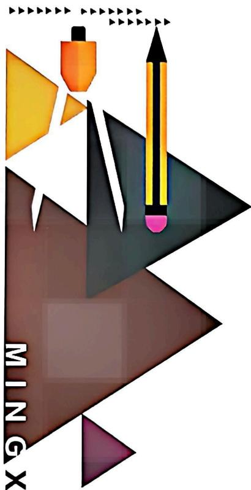

natural_image

Abstract geometric design with colored shapes and arrows, no text or symbols present

尖子生必刷

按最新教材修订

引领2026

# 名校 压轴题

主编 ● 刘春林

数学

八年级上 RJ

免费视频讲解

YAZHOUTI

延边大学出版社

# 数学

# 八年级上

班级：\_\_\_\_

姓名：\_\_\_\_

# 目录

# CONTENTS

# 第一部分 重难点突破

# 第十三章 三角形

重难点突破1 三边关系(一) 直接用三边关系 …… 1

重难点突破 2 三边关系(二) 构不等式(组) …… 2

重难点突破3 求面积 3

重难点突破 4 面积法 …… 4

重难点突破5 三角形的内角和 …… 5

重难点突破6 三角形的外角(一) 直接求角度 …… 6

重难点突破 7 三角形的外角(二) 角度关系 …… 7

重难点突破8 三角尺问题 8

重难点突破 9 三角形的折叠 …… 9

重难点突破10 生活情境 10

重难点突破11 方程思想 …… 11

重难点突破 12 参数思想 …… 12

重难点突破 13 从特殊到一般 …… 13

重难点突破 14 分类讨论 …… 14

重难点突破 15 基本图形(一) 斜边上的高 …… 15

重难点突破 16 基本图形(二)一线三等角 …… 16

重难点突破 17 基本图形(三)8 字形 …… 17

重难点突破 18 基本图形(四)燕尾形 …… 18

重难点突破 19 基本图形(五) 双内角平分线 …… 19

重难点突破 20 基本图形(六) 内、外角平分线 …… 20

重难点突破 21 基本图形(七)高与角平分线 …… 21

# 第十四章 全等三角形

重难点突破1 知全等(一)求角度 …… 22

重难点突破 2 知全等(二) 求长度 …… 23

重难点突破3 找全等(一) SAS 24重难点突破 4 找全等(二) ASA、AAS …… 25

重难点突破 5 找全等(三) SSS 26

重难点突破6 找全等(四) HL 27

重难点突破 7 找全等(五) 等线段代换证和差 …… 28

重难点突破8 找全等(六) 全等计数 …… 29

重难点突破 9 找全等(七) 动点问题 …… 31

重难点突破10 构全等(一)知中点 33

重难点突破11 构全等(二)证中点 36

重难点突破 12 构全等(三)截长补短 …… 38

重难点突破 13 构全等(四) 面积巧转化 …… 40

重难点突破 14 角平分线(一) 性质与判定 …… 42

重难点突破 15 角平分线(二) 对称型全等 …… 44

重难点突破 16 角平分线(三)角分垂 …… 45

重难点突破 17 角平分线(四) 隐角平分线 …… 46

重难点突破 18 角平分线(五) 面积法 …… 47

重难点突破 19 全等模型(一)三垂直 …… 49

重难点突破20 全等模型(二)坐标系中的三垂直 51

重难点突破 21 全等模型(三)一线三等角 …… 53

重难点突破 22 全等模型(四) 手拉手 …… 55

重难点突破 23 全等模型(五)夹半角 …… 57

重难点突破 24 全等模型(六) 对角互补 …… 59

重难点突破 25 全等模型(七) 同旁张等角 …… 61

重难点突破 26 全等模型(八) 婆罗摩笈多 …… 63

重难点突破 27 无刻度直尺画图(一) 取中点 …… 65

重难点突破 28 无刻度直尺画图(二)画垂直 …… 66

重难点突破 29 无刻度直尺画图(三)作平行 …… 67

重难点突破30 无刻度直尺画图(四)画全等 68

重难点突破 31 无刻度直尺画图(五) 综合训练 …… 69

# 第十五章 轴对称

重难点突破 1 轴对称(一) 定义与性质 …… 70

重难点突破 2 轴对称(二)中垂线与长度计算 …… 71

重难点突破 3 轴对称(三)中垂线与角度计算 …… 72

重难点突破4 轴对称(四)中垂线与角平分线 73

重难点突破 5 等腰三角形的判定 …… 74

重难点突破6 知等腰(一)等边对等角 75

重难点突破 7 知等腰(二) 直接用“三线合一” …… 76

重难点突破8 知等腰(三)连接用“三线合一” 77

重难点突破 9 知等腰(四)构造用“三线合一” 78

重难点突破10 知等腰(五)方程思想求角 79

重难点突破11 知等腰(六)整体思想求角 80

重难点突破 12 知等腰(七) 分类讨论求角 81

重难点突破 13 知等腰(八)巧算面积 82

重难点突破 14 构等腰(一)“两圆一线”画等腰 84

重难点突破 15 构等腰(二)角平分线十平行线 85

重难点突破 16 构等腰(三) 角平分线十垂线 86

重难点突破 17 构等腰(四)作平行线 87

重难点突破 18 构等腰(五) 倍长中线 88

重难点突破19 构等腰(六)二倍角 89

重难点突破 20 构等腰(七)截长补短 90

重难点突破21 知等边(一)角度计算 91

重难点突破22 知等边(二)长度计算 92

重难点突破 23 知等边(三)线段和差 …… 93

重难点突破24 构等边(一)作平行 94

重难点突破25 构等边(二)作等边三角形 95

重难点突破 26 30°角用法(一) 直接用 …… 96

重难点突破 27 30°角用法(二) 构造用 …… 97

重难点突破 28 60°角用法(一) 构等边 …… 99

重难点突破 29 60°角用法(二) 构“369” …… 100

重难点突破 30 60°角用法(三) 构模型 …… 101

重难点突破 31 45°角用法(一) 构等腰直角 …… 103

重难点突破32 $45^{\circ}$ 角用法（二）构模型 104

重难点突破33 $45^{\circ}$ 角用法（三）巧用 $45^{\circ}$ 105

重难点突破34 等腰模型(一) 手拉手 …… 106

重难点突破35 等腰模型(二)对角互补 107

重难点突破36 等腰模型(三) 一线三等角 …… 108

重难点突破37 等腰模型(四)夹半角 109

重难点突破38 等腰模型(五)胖瘦三角形 110

重难点突破 39 等腰模型(六) 镜面角 …… 111

重难点突破 40 最值(一)两点之间,线段最短 …… 112

重难点突破 41 最值(二) 斜大于垂 …… 113

重难点突破 42 最值(三)化折为直 …… 114

重难点突破 43 最值(四) 将军饮马 …… 115

重难点突破 44 最值(五) 拼接最值 …… 116

重难点突破 45 最值(六) 胡不归 …… 117

重难点突破 46 最值(七) 费马点 …… 118

重难点突破 47 无刻度直尺画图(一) $45^{\circ}$ 角与垂直平分线 …… 119

重难点突破 48 无刻度直尺画图(二) 画对称 …… 120

重难点突破 49 无刻度直尺画图(三)用对称 …… 121

重难点突破 50 无刻度直尺画图(四) 轴对称与最值 …… 123

重难点突破 51 无刻度直尺画图(五)“5”出等腰 …… 124

重难点突破52 无刻度直尺画图(六) 综合训练 …… 125

# 第十六章 整式的乘法

重难点突破1 幂的运算(一)正用法则与逆用法则 …… 127

重难点突破 2 幂的运算(二) 化成同“底”与化成同“指”……128

重难点突破3 整式的乘法(一) 求值 …… 129

重难点突破 4 整式的乘法(二) 求参 …… 130

重难点突破 5 整式的乘法与面积(一)列式求面积 …… 131

重难点突破6 整式的乘法与面积(二)用面积解释算式 …… 133

重难点突破 7 整式的乘法与面积(三)图形拼接 …… 134

重难点突破8 乘法公式(一) 平方差公式 …… 135

重难点突破 9 乘法公式(二) 完全平方公式 …… 136

重难点突破 10 乘法公式(三) 小综合 …… 137

重难点突破 11 乘法公式(四) 公式变形 …… 138

重难点突破 12 乘法公式(五)配方法 …… 140

重难点突破 13 乘法公式(六) 公式拓展 …… 142

重难点突破 14 乘法公式与面积(一)求面积 …… 143

重难点突破 15 乘法公式与面积(二)知面积 …… 145

# 第十七章 因式分解

重难点突破 1 分解因式(一) 基本方法 …… 146

重难点突破 2 分解因式(二) 拓展方法 …… 148

重难点突破3 因式分解的应用(一) 简算 …… 150

重难点突破4 因式分解的应用(二)求值 151

重难点突破5 因式分解的应用(三)配方法 152

重难点突破6 因式分解的应用(四) 判断形状与解密 154

重难点突破 7 因式分解的应用(五) 综合应用 …… 155

# 第十八章 分式

重难点突破1 分式的值 156

重难点突破 2 分式的性质 …… 157

重难点突破 3 分式的运算(一) …… 158

重难点突破 4 分式的运算(二) …… 159

重难点突破5 化简求值 160

重难点突破6 条件分式的求值 …… 161

重难点突破 7 分式的实际应用 …… 162

重难点突破8 分式规律探究 …… 163

重难点突破 9 分式方程 …… 164

重难点突破 10 含参分式方程 …… 165

重难点突破11 分式方程的应用(一)行程问题 167

重难点突破 12 分式方程的应用(二) 工程问题 …… 168

重难点突破 13 分式方程的应用(三) 销售问题 …… 169

重难点突破 14 分式方程的应用(四) 方案问题 …… 170

重难点突破 15 含参问题 …… 171

重难点突破 16 综合与实践 …… 172

# ◆ 第二部分 大综合

# I 几何大综合

大综合1 双角平分线,分类求角度 173

大综合 2 手拉手模型,作垂证中点 …… 174

大综合3 同旁张等角,构造手拉手 175

大综合 4 构造三垂直,截补证和差 …… 176

大综合 5 一线三等角,特殊到一般 …… 177

大综合 6 夹半角模型,构旋转全等 …… 178

大综合 7 列方程求角,补形构等边 …… 179

大综合 8 等边十字架,全等得等边 …… 180

大综合9 共顶双等边,倍长构全等 181

大综合 10 构对称全等,对称求最值 …… 182

大综合11 特殊到一般,证角度关系 183

# Ⅱ 代几大综合

大综合 12 一线三垂直,作垂构全等 …… 184

大综合 13 共顶双等边,构造手拉手 …… 185

大综合 14 对角互补图,构造手拉手 …… 186

大综合 15 知特殊角,作垂构全等 …… 187

大综合 16 知中点,倍长构全等 …… 188

大综合 17 镜面角翻折,面积求坐标 …… 189

大综合 18 二倍角折半,设参求坐标 …… 190

大综合 19 知 45 度作垂, 得旋转全等 …… 191

大综合 20 构造三垂直,截补证和差 …… 192

大综合 21 角分线作垂,证周长定值 …… 193

大综合 22 45°角作垂直,设参证定值 …… 194

# 第一部分 重难点突破

# 第十三章 三角形

# 重难点突破 1 三边关系(一) 直接用三边关系

# 类型一 两短边之和大于最长边

1. (2025 武昌区期末) 长为 $10 \mathrm{~cm}, 7 \mathrm{~cm}, 5 \mathrm{~cm}, 3 \mathrm{~cm}$ 的四根木条, 从中选取三根组成三角形, 不同的选法有 ( )

A. 1 种

B. 2 种

C. 3 种

D. 4 种

2. (2025 青山区) 小颖用四根长度分别为 $2 \mathrm{~cm}, 3 \mathrm{~cm}, 4 \mathrm{~cm}, 5 \mathrm{~cm}$ 的小棒摆三角形, 那么所摆成的三角形的周长不可能是 ( )

A. $9 \mathrm{~cm}$

B. ${10}\mathrm{\;{cm}}$

C. ${11}\mathrm{\;{cm}}$

D. $12 \mathrm{~cm}$

3.(2025 广州期末)小明用 12 根相同长度的木棒摆成一个三角形,则这个三角形最长的边最多由 ( )木棒组成

A. 3 根

B. 4 根

C. 5 根

D. 6 根

# 类型二 两腰之和大于底

4. (2024 七一华源)已知等腰三角形的周长为 18, 一边长为 4 , 则它的底边长是(   )

A. 4

B. 10

C. 4 或 7

D. 4 或 10

5.(2025江岸区)已知等腰△ABC中,AB=8,BC=x+2,AC=2x,求△ABC的周长.

# 重难点突破 2 三边关系(二) 构不等式(组)

# 类型一 化简绝对值

1.(2024 重庆期末)若 a, b, c 分别是三角形的三边, 化简 $\left|a - b - c\right| + \left|b - c - a\right| + \left|c - a + b\right|$ 的结果为 \_\_\_\_.

# 类型二 求取值范围

2. (2024 黄陂期中)已知一个三角形的三条边的长分别为 $3, 2a - 1, 9$ , 那么 $a$ 的取值范围是 \_\_\_\_.

3. (2024 华宜寄)一个三角形的两边长分别是 2 和 3, 若它的第三边长为奇数, 则这个三角形的周长为 \_\_\_\_.

4.(2024黑龙江)已知a,b,c分别为△ABC的三边,且满足 $a+b=3c-2$ ,a-b=2c-6,若a>b,则c的取值范围是\_\_\_\_.

5.(2025 洪山区)已知△ABC 的三边长分别为 a, b, c. 若 $a = x + 8$ , $b = 3x - 2$ , $c = x + 2$ , 则 x 的取值范围是 \_\_\_\_.

# 类型三 最值问题

6.(2024二中广雅)如图,在 $\triangle ABC$ 中, $AB=10,AC=8,D$ 为 $BC$ 上一动点,将 $\triangle ACD$ 沿 $AD$ 翻折得到 $\triangle AED$ ,连接 $BE$ ,则 $BE$ 的最小值是\_\_\_\_.

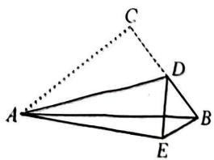

text_image

Geometric diagram of a tetrahedron with labeled vertices A, B, C, D, E and solid/dotted edges

# 重难点突破3 求面积

# 类型一 中线与面积

1.(2024江岸期中)如图,BD是△ABC的中线,AE是△ABD的中线,BF是△ABE的中线,若△ABC的面积是32,则阴影部分的面积为()

A. 8

B. 9

C. 10

D. 12

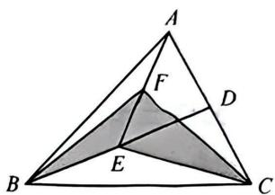

text_image

A
F
D
B
E
C

2. (2025 硇口区) 如图, $\triangle ABC$ 的三条中线 $AD, BE, CF$ 交于点 $O, S_{\text{阴影部分}} = 6$ , 则 $S_{\triangle ABC}$ 为 ( )

A. 16

B. 18

C. 24

D. 不能确定

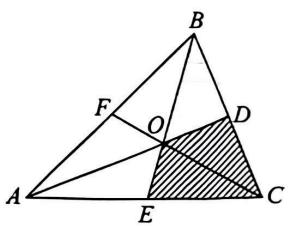

text_image

Geometric diagram of triangle ABC with internal points D, E, F and shaded region, labeled with vertices and intersection points.

# 类型二 线段比与面积比

3.(2024六中上智)如图,在 $\triangle ABC$ 中,点 $D,E,F$ 分别在边 $BC,AC,AB$ 上, $E$ 是 $AC$ 的中点, $BD=2DC,AD,BE,CF$ 交于点 $G$ ,若 $S_{\triangle GEC}=3,S_{\triangle GDC}=4$ ,则 $\triangle ABC$ 的面积是\_\_\_\_.

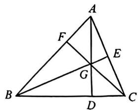

text_image

Geometric diagram of triangle ABC with internal points D, E, F, G and intersecting lines forming smaller triangles.

4.(2024宁波期末)如图,在 $\triangle ABC$ 中,E为边AC的中点,点D在边BC上,BD:CD=5:8,AD,
BE交于点F,若 $\triangle ABC$ 的面积为26,则 $S_{\triangle AEF}-S_{\triangle BDF}$ 的值为\_\_\_\_.

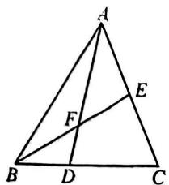

text_image

Geometric diagram of triangle ABC with internal points D, E, F and line segments AD, BE, EF labeled

# 重难点突破4 面积法

# 类型一 双高图

1. (2024 东西湖联考) 如图, 在 $\triangle ABC$ 中, $AB = 2$ , $BC = 4$ , 则 $\triangle ABC$ 的高 $AD$ 与 $CE$ 的比是 \_\_\_\_.

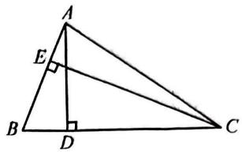

text_image

A
E
B
D
C

2. (2025 二中广雅) 在 Rt△ABC 中, ∠ACB = 90°, AC = 8, BC = 6, AB = 10, 则 AB 边上的高 CD 的长是 \_\_\_\_.

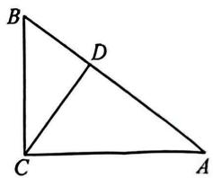

text_image

B
D
C
A

# 类型二 线段比与面积比

3. (2025 武珞路中学) 如图, 在 $\triangle ABC$ 中, $AD$ 是中线, $DE \perp AB$ 于点 $E$ , $DF \perp AC$ 于点 $F$ , 若 $AB = 6 \mathrm{~cm}, AC = 4 \mathrm{~cm}$ , 则 $\frac{DE}{DF}$ 的值为 \_\_\_\_.

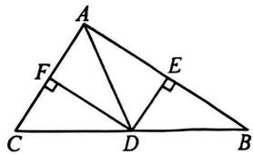

text_image

Geometric diagram of triangle ABC with perpendiculars from points D and E to sides, labeled with vertices A, B, C, D, E, F.

# 类型三 面积割补

4. (2025 东湖高新) 如图, 在 $\triangle ABC$ 中, $AB = AC$ , $O$ 是边 $BC$ 上任意一点, 过点 $O$ 作 $OE \perp AB$ 于点 $E$ , 作 $OF \perp AC$ 于点 $F$ , 若 $OE + OF = 3$ , $\triangle ABC$ 的面积为 12, 则 $AB$ 的长为 \_\_\_\_.

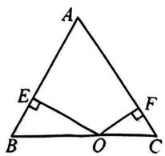

text_image

A
E
F
B
O
C

# 类型四 最值问题

5. (2024 七一华源) 如图, 在 $\triangle ABC$ 中, $BC = 9, D, E$ 分别是 $CB, AB$ 上的点, $CD = 2BD, AE = 3BE$ , 连接 $AD, CE$ 交于点 $F$ . 当四边形 $BEFD$ 的面积为 $\frac{17}{4}$ 时, $AB$ 长度的最小值为 \_\_\_\_.

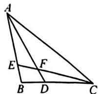

# 重难点突破5 三角形的内角和

# 类型一 内角和与方程(组)

1.(2025青山区)具备下列条件的△ABC,不是直角三角形的是()

A. $\angle A + \angle B = \angle C$

B. $\angle A = \frac{1}{2}\angle B = \frac{1}{3}\angle C$

C. $\angle A = 2\angle B = 3\angle C$

D. $\angle A: \angle B: \angle C = 1:2:3$

2.(2024 洪山区期中)在 $\triangle ABC$ 中, $\angle B=\angle A-10^{\circ},\angle C=\angle B+20^{\circ}$ ,求 $\triangle ABC$ 的各内角的度数.

# 类型二 内角和与角平分线

3. (2025 汉阳区)如图, 在 $\triangle ABC$ 和 $\triangle ACD$ 中, $BD$ 平分 $\angle ABC$ , $\angle ABC = \angle ACD = 56^{\circ}$ , $\angle ACB = 68^{\circ}$ , 则 $\angle BDC$ 的度数为 ( )

A. ${56}^{ \circ  }$

B. ${58}^{ \circ  }$

C. ${22}^{ \circ  }$

D. ${28}^{ \circ  }$

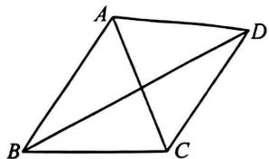

natural_image

Geometric diagram of a parallelogram ABCD with diagonals AC and BD intersecting (no labels or measurements)

# 类型三 直角三角形两锐角互余

4. (2024 武昌区期中) 如图, 在 $\triangle ABC$ 中, $CD \perp AB$ 于点 $D$ , $BE \perp AC$ 于点 $E$ , $BE$ , $CD$ 相交于点 $F$ , 若 $\angle A = 58^{\circ}$ , 求 $\angle BFC$ 的度数.

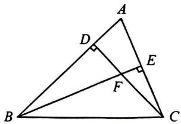

text_image

Geometric diagram of triangle ABC with points D, E, F and right-angle markings at D and E

# 类型四 内角和与平行线

5.(2024 黄石)如图,在 $\triangle ABC$ 中,E,G分别是 $AB,AC$ 上的点,F,D是 $BC$ 上的点,连接 $EF$ , $AD, DG, AB \parallel DG, \angle 1 + \angle 2 = 180^\circ$ .

(1) 求证: $AD \parallel EF$ ;

(2) 若 AD 是 $\angle BAC$ 的平分线, DG 是 $\angle ADC$ 的平分线, $\angle 2 = 140^{\circ}$ , 求 $\angle C$ 的度数.

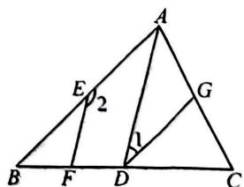

text_image

A
E
2
G
B
F
D
C
1

# 重难点突破6 三角形的外角（一）直接求角度

# 类型一 外角与内角和

1. (2024 七一华源) 如图, 在 $\triangle ABC$ 中, $\angle B = 45^{\circ}, \angle C = 38^{\circ}, E$ 是 $BC$ 边上一点, $ED$ 交 $CA$ 的延长线于点 $D$ , 交 $AB$ 于点 $F$ , $\angle D = 32^{\circ}$ . 求 $\angle BFE$ 的度数.

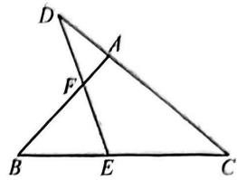

text_image

Geometric diagram of triangle ABC with internal points D, E, F and intersecting lines

# 类型二 连续利用外角

2. (2025 东莞)如图, 已知 $\angle A = 75^{\circ}, \angle B = 25^{\circ}, \angle C = 35^{\circ}$ , 求 $\angle BDC$ 和 $\angle 1$ 的度数.

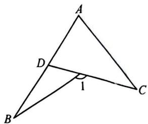

text_image

A
D
1
B
C

3. (2024 江汉区) 如图, 在 $\triangle ABC$ 中, $\angle B = 25^{\circ}, \angle BAC = 31^{\circ}$ , 过点 $A$ 作 $BC$ 边上的高, 交 $BC$ 的延长线于点 $D, CE$ 平分 $\angle ACD$ , 交 $AD$ 于点 $E$ .

(1)求 $\angle ACD$ 的度数；

(2)求∠AEC的度数.

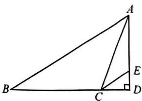

text_image

Geometric diagram of triangle ABC with perpendiculars from A and D to base BC, labeled points A, B, C, D, E

4. (2024 贵池区期末)如图, $CE$ 平分 $\triangle ABC$ 的外角 $\angle ACD$ , 且 $CE$ 交 $BA$ 的延长线于点 $E$ .

(1)若 $\angle B=32^{\circ},\angle E=36^{\circ}$ ,求 $\angle BAC$ 的度数;

(2)试猜想/BAC, /B, /E 三个角之间存在的等量关系,并证明你的猜想.

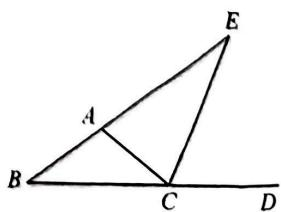

text_image

Geometric diagram of triangle EBD with points A, C, D on sides and line segments labeled

# 重难点突破 7 三角形的外角(二) 角度关系

# 类型一 代换与消元

1. (2024 湖北模拟)如图,在 $\triangle ABC$ 中, $AD$ 平分 $\angle BAC$ ,则 $\angle 1, \angle 2, \angle 3$ 的数量关系为( )

A. $\angle 3 = \angle 2 + \angle 1$

B. $\angle 3 = \angle 2 + 2\angle 1$

C. $\angle 3 + \angle 2 + \angle 1 = 180^{\circ}$

D. $\angle 1 + \angle 3 = 2\angle 2$

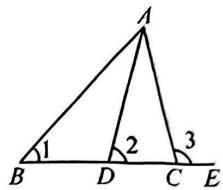

text_image

A
1
2
3
B D C E

2. (2025 汉江区)如图, 在 $\triangle ABC$ 中, $E$ 和 $F$ 分别是 $AC$ , $BC$ 上一点, $EF \parallel AB$ , $\angle BCA$ 的平分线交 $AB$ 于点 $D$ , $\angle MAC$ 是 $\triangle ABC$ 的外角, 若 $\angle MAC = \alpha$ , $\angle EFC = \beta$ , $\angle ADC = \gamma$ , 则 $\alpha, \beta, \gamma$ 三者间的数量关系是 ( )

A. $\beta = \alpha +\gamma$

B. $\beta = 2\gamma - \alpha$

C. $\beta = \alpha + 2\gamma$

D. $\beta = 2\alpha - 2\gamma$

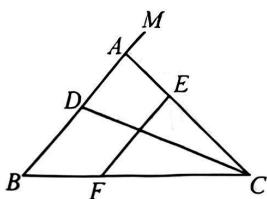

text_image

Geometric diagram of triangle ABC with internal points D, E, F and line segments AD, BE, EF, ME labeled

# 类型二 转化与集中

3.(2025青山区)如图,已知 $\angle A=60^{\circ}$ ,则 $\angle D+\angle E+\angle F+\angle G$ 的度数为()

A. ${180}^{ \circ  }$

B. ${240}^{ \circ  }$

C. ${300}^{ \circ  }$

D. ${360}^{ \circ  }$

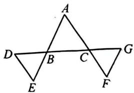

text_image

A
D B C G
E F

# 类型三 参数与整体

4. (2025 砾口区) 如图, 在 $\triangle ABC$ 中, $\angle BAC = \angle ACB$ , $M, N$ 为 $BC$ 上两点, 且 $\angle BAM = \angle CAN$ , $\angle MAN = \angle AMN$ , 求 $\angle MAC$ 的度数.

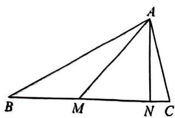

text_image

Geometric diagram of triangle ABC with points M and N on base BC, and line segments AM and AN drawn

# 重难点突破8 三角尺问题

# 类型一 直接求角度

1. (2025 合肥模拟) 将一副三角板按如图所示的位置摆放在直尺上, 则 $\angle 1$ 的度数是 ( )

A. $60^{\circ}$

B. ${65}^{ \circ  }$

C. ${70}^{ \circ  }$

D. ${75}^{ \circ  }$

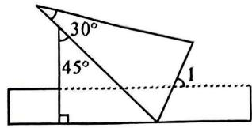

text_image

30°
45°
1

2.(2025 襄阳)如图,这是由一副三角板拼凑得到的,图中的∠ABC 的度数为()

A. ${50}^{ \circ  }$

B. ${60}^{ \circ  }$

C. ${75}^{ \circ  }$

D. ${80}^{ \circ  }$

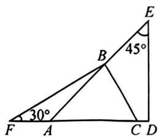

text_image

E
45°
B
30°
F A C D

3.(2025 江汉区)一副三角板按如图所示放置,点 $A$ 在 $DE$ 上,点 $F$ 在 $BC$ 上,若 $\angle EAB = 35^{\circ}$ ,则 $\angle DFC$ 的度数为 $\underline{\hspace{2cm}}$ .

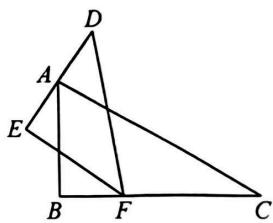

text_image

Geometric diagram with labeled points A, B, C, D, E, F and intersecting lines forming triangles and quadrilaterals

# 类型二 整体求角度

4. (2025 南通期末) 一副三角板如图摆放, $\angle E = \angle C = 90^{\circ}, \angle D = 45^{\circ}, \angle B = 60^{\circ}$ , 则 $\angle CAE - \angle BAD =$ \_\_\_\_°.

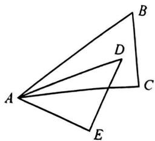

text_image

Geometric diagram with labeled points A, B, C, D, E forming nested triangles

5.(2025 淮南)如图,将一个直角三角板 DEF 放置在锐角三角形 ABC 上,使得该三角板的两条直角边 DE,DF 恰好分别经过点 B,C,若 $\angle A=50^{\circ}$ ,则 $\angle ABD+\angle ACD$ 的度数为 \_\_\_\_.

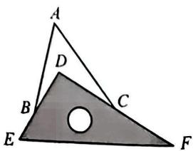

text_image

A
D
B
C
E
F

# 重难点突破9 三角形的折叠

# 类型一 对应点在边上

1. (2025 济宁期末) 如图, 在 Rt△ABC 中, ∠ACB = 90°, ∠B = 42°, 将其折叠使点 A 落在 BC 边上的 A' 处, 折痕为 CD, 则 ∠A'DB 的度数为 \_\_\_\_。

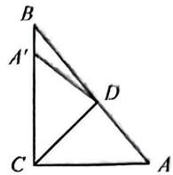

# 类型二 对应点在形内

2. (2025 荆州) 如图, 将三角形纸片 $ABC$ 沿 $DE$ 折叠, 点 $A$ 落在点 $F$ 处, 已知 $\angle 1 + \angle 2 = 100^{\circ}$ , 则 $\angle A$ 的度数为 \_\_\_\_.

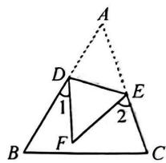

text_image

A
D
1
E
2
B
F
C

# 类型三 对应点在形外

3.(2025青山区)如图,在 $\triangle ABC$ 中, $\angle C=47^{\circ}$ ,将 $\triangle ABC$ 沿着直线 $l$ 折叠,点 $C$ 落在点 $D$ 的位置,则 $\angle1-\angle2$ 的度数是\_\_\_\_.

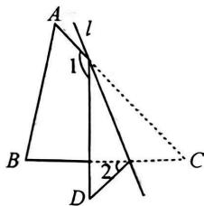

text_image

A
l
1
B
D
2
C

# 类型四 两次折叠

4. (2024 武珞路中学期中)已知一张三角形纸片 ABC(如图甲), 其中 $\angle ABC = \angle C$ . 将纸片沿过点 B 的直线折叠, 使点 C 落到 AB 边上的 E 点处, 折痕为 BD(如图乙). 再将纸片沿过点 E 的直线折叠, 点 A 恰好与点 D 重合, 折痕为 EF(如图丙). 原三角形纸片 ABC 中, $\angle ABC$ 的度数为 \_\_\_\_.

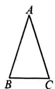  
甲

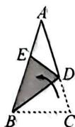  
乙

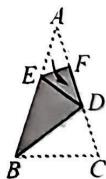  
丙

5.(2025 石家庄)如图,将 $\triangle ABC$ 沿 $DE,EF$ 翻折,顶点 $A,B$ 均落在点 $O$ 处,且 $EA$ 与 $EB$ 重合于线段 $EO$ ,若 $\angle CDO+\angle CFO=104^{\circ}$ ,则 $\angle C$ 的度数为\_\_\_\_.

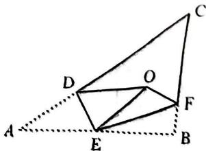

text_image

Geometric diagram with labeled points A, B, C, D, E, F, O and dashed lines forming triangles and quadrilaterals

# 重难点突破10 生活情境

# 类型一 绳之以墨

1.(2025 重庆)墨斗被认为是“百作手艺祖师爷”鲁班的发明,是木匠用来弹、放各种线记的重要工具,以其“绳之以墨”的功能成为了文人墨客心中正直的化身.如图1,在木板上画出两个点,从墨斗中拉出墨线一端固定在一个点,另一端固定在另一个点,绷紧并提起墨线中段,此时,如图2,则∠1的度数为\_\_\_\_.

  
图1

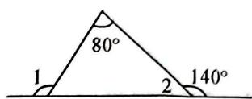  
图2

# 类型二 模型计算

2.(2025烟台中考)如图是一款儿童小推车的示意图,若 $AB \parallel CD, \angle 1 = 30^\circ, \angle 2 = 70^\circ$ , 则 $\angle 3$ 的度数为( )

A. ${40}^{ \circ  }$

B. ${35}^{ \circ  }$

C. ${30}^{ \circ  }$

D. ${20}^{ \circ  }$

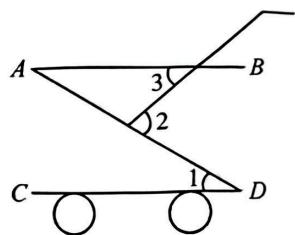

text_image

A
B
3
2
C
1
D

# 类型三 零件检测

3. (2025 保定)某工人加工一个机器零件(数据如图), 经过测量这个零件不符合标准. 标准要求是: $\angle EFD = 120^{\circ}$ , 且 $\angle A, \angle B, \angle E$ 保持不变. 为了达到标准, 工人在保持 $\angle E$ 不变情况下, 应将图中 $\angle D$ \_\_\_\_ (填“增大”或“减小”) \_\_\_\_ 度.

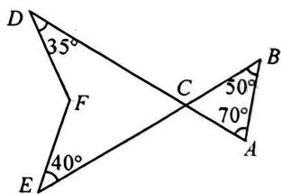

text_image

D
35°
F
C
50°
70°
B
E
40°
A

# 类型四 学科融合

4.(2025 深圳期末)在探究“进入光线和离开光线夹角与两块镜子夹角的关系”为主题的项目式学习中,创新小组将两块平面镜 $AB, BC$ 竖直放置在桌面上,并使它们镜面间夹角的度数为 $\alpha (0^{\circ} < \alpha < 90^{\circ})$ ,在同一平面内,用一束激光射到平面镜 $AB$ 上,分别经过平面镜 $AB, BC$ 两次反射后,入射光线 $m$ 与反射光线 $n$ 形成的夹角为 $\beta$ ,如图所示,根据光的反射原理可知 $\angle 1 = \angle 2, \angle 3 = \angle 4$ ,则 $\beta$ 与 $\alpha$ 的数量关系为 \_\_\_\_.

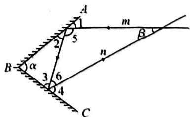

text_image

A
1
m
2
5
B
α
3
6
4
C
n
β

# 重难点突破11 方程思想

# 类型一 设一元,列方程

1.(2024 襄阳期中)如图, $AD$ 是 $\triangle ABC$ 的角平分线, $E$ 是 $BC$ 延长线上的一点, $\angle EAD = \angle EDA$ , 若 $\angle B = 60^{\circ}, \angle CAD : \angle E = 1:4$ , 求 $\angle E$ 的度数.

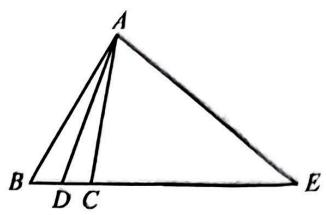

text_image

A
B D C E

# 类型二 设两元,列方程组

2. (2024 二中广雅) 如图, 在 $\triangle ABC$ 中, $BD$ 平分 $\angle ABC, CE$ 平分 $\angle ACB$ 的邻补角 $\angle ACM$ , 交 $BA$ 的延长线于点 $E$ , 若 $\angle BDC = 127^{\circ}, \angle E = 44^{\circ}$ , 则 $\angle BAC$ 的度数为 \_\_\_\_.

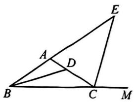

text_image

Geometric diagram with labeled points A, B, C, D, E, M and intersecting lines forming triangles and a line segment

# 类型三 设两元, 消一元

3.(2025 蔡甸区)如图,在 $\triangle ABC$ 中, $AE$ 平分 $\angle BAC$ , $AD\perp BC$ 于点 $D$ , $\angle ABD$ 的平分线 $BF$ 所在直线与射线 $AE$ 相交于点 $G$ ,若 $\angle ABC=3\angle C$ ,且 $\angle G=18^{\circ}$ ,则 $\angle DFB$ 的度数为\_\_\_\_.

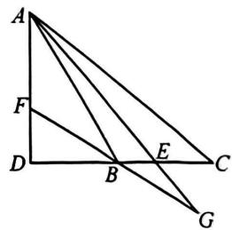

text_image

Geometric diagram with labeled points A, B, C, D, E, F, G and connecting lines forming triangles and quadrilaterals

# 类型四 设三元,列方程组

4. (2025 经开区) 如图, 在 $\triangle ABC$ 中, $\angle BAC$ , $\angle ABC$ , $\angle ACB$ 的三等分线相交于点 $D, E, F$ (其中 $\angle CAD = 2\angle BAD$ , $\angle ABE = 2\angle CBE$ , $\angle BCF = 2\angle ACF$ ), 且 $\triangle DFE$ 的三个内角分别为 $\angle DFE = 54^\circ$ , $\angle FDE = 60^\circ$ , $\angle FED = 66^\circ$ , 则 $\angle BAC$ 的度数为 \_\_\_\_.

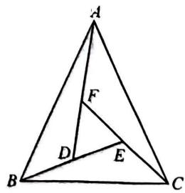

text_image

A
F
D
E
B
C

# 重难点突破12 参数思想

# 类型一 设参后整体求

1. (2024 武昌区) 如图, 在 $\triangle ABC$ 中, $\angle BAC = 30^{\circ}, D, E$ 分别是边 $AC, AB$ 上的两点, 若 $\angle ACE = 2\angle BCE, \angle ABD = 2\angle CBD$ , 则 $\angle CDB + \angle CEB$ 的度数是 \_\_\_\_.

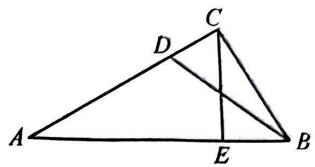

text_image

Geometric diagram of triangle ABC with points D and E on sides, and line segments CD and DE drawn

# 类型二 设单参后消参

2. (2025 十堰)如图, 在 $\triangle ABC$ 中, 点 $D, E$ 分别在边 $BC, AC$ 上, $\angle DCE = \angle DEC$ , 点 $F$ 在 $AC$ 上, 点 $G$ 在 $DE$ 的延长线上, $\angle DFG = \angle DGF$ . 若 $\angle EFG = 37^\circ$ , 则 $\angle CDF$ 的度数为 \_\_\_\_.

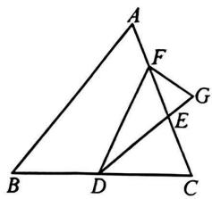

text_image

Geometric diagram of triangle ABC with internal points D, E, F, G and connecting line segments

3.(2025 江岸区)如图, $AB, CD$ 相交于点 $O, \angle A = 48^{\circ}, \angle D = 46^{\circ}$ . 若直线 $BM$ 平分 $\angle ABD$ 交 $CD$ 于点 $F, CM$ 平分 $\angle DCH$ 交直线 $BF$ 于点 $M$ , 求 $\angle BMC$ 的度数.

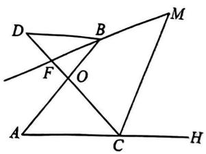

text_image

Geometric diagram with labeled points and intersecting lines, likely from a math problem or proof

# 类型三 设双参后整体消参

4.(2025二中广雅)如图,C,A,G三点共线,C,B,H三点共线, $2\angle CAD=\angle BAD$ , $2\angle CBD=\angle ABD$ , $\angle GAE=2\angle BAE$ , $\angle EBH=2\angle EBA$ ,则 $\angle D$ 和 $\angle E$ 的关系为()

A. $2 \angle E + \angle D = 320^{\circ}$

B. $2 \angle E + \angle D = 340^{\circ}$

C. $2 \angle E + \angle D = 300^{\circ}$

D. $2 \angle E + \angle D = 360^{\circ}$

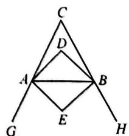

text_image

C
D
A
B
G
E
H

# 重难点突破13 从特殊到一般

# 类型一 角度定值

1.(2024 光谷实验)如图,在锐角 $\triangle ABC$ 中, $\angle ABC=\angle C,BD\perp AC$ 于点 $D,BM$ 平分 $\angle ABD$ 交 $AC$ 于点 $M,MN\perp BC$ 于点 $N$ .

(1)如图1,若 $\angle C=60^{\circ}$ ,求 $\angle BMN$ 的度数;  
(2)如图2,若 $\angle C=\alpha$ ,求 $\angle BMN$ 的度数.

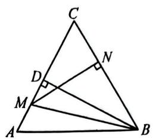

text_image

Geometric diagram of triangle ABC with points D, M, N and right-angle markings at D and M

图1

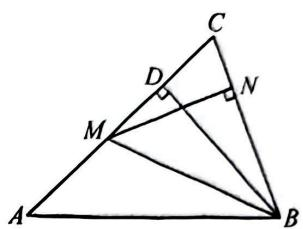

text_image

Geometric diagram of triangle ABC with perpendiculars from points D and M to sides, labeled with right-angle symbols.

图2

# 类型二 角度关系

2.(2024 哈尔滨期中)如图,已知△ABC 中,∠A>∠C,BD 平分∠ABC,DE⊥AC 于点E.

(1)若 $\angle A=80^{\circ},\angle C=40^{\circ}$ ,求 $\angle D$ 的度数;   
(2) 求证: $\angle D = \frac{1}{2} (\angle A - \angle C)$ .

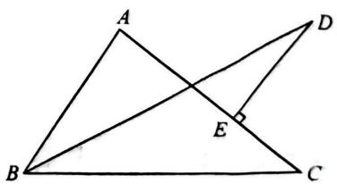

text_image

Geometric diagram of triangle ABC with points D and E, showing intersecting lines and a right angle at E.

# 重难点突破14 分类讨论

# 类型一 单高位置不确定

1. (2024 卓刀泉中学) 在 $\triangle ABC$ 中, $\angle CAB = \angle CBA$ , $AD$ 是 $\triangle ABC$ 的高, 若 $\angle DAC = 42^\circ$ , 则 $\angle CBA$ 的度数为 \_\_\_\_.

s
1

# 类型二 双高位置不确定

2. (2024 七一华源) 在 $\triangle ABC$ 中, $\angle A = 55^{\circ}$ , $BD$ , $CE$ 是它的两条高, 直线 $BD$ , $CE$ 交于点 $F$ , 则 $\angle DFE$ 的度数为 \_\_\_\_.

# 类型三 角平分线与高的夹角

3.(2025 洪山区)AE 是△ABC 的角平分线,AD 是 BC 边上的高,且∠B=40°,∠ACD=70°,则 ∠DAE 的度数为 \_\_\_\_.

# 重难点突破 15 基本图形(一) 斜边上的高

# 类型一 斜边上的高

1. (2025 宝鸡) 如图, 在 Rt△ABC 中, ∠ACB = 90°, D 是 AB 上一点, 且 ∠ACD = ∠B, 求证: CD ⊥ AB.

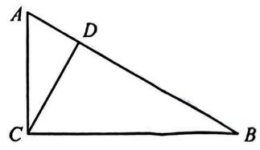

text_image

A
D
C
B

# 类型二 高与角平分线

2.(2025 开封)如图,在 $\triangle ACB$ 中, $\angle ACB=90^{\circ},CD\perp AB$ 于点D.

(1)求证: $\angle ACD=\angle B$ ;   
(2) 若 $AF$ 平分 $\angle CAB$ 分别交 $CD, BC$ 于点 $E, F$ , 求证: $\angle CEF = \angle CFE$ .

text_image

Geometric diagram of triangle ABC with internal points D, E, F and line segments AD, BE, EF labeled

# 类型三 直角三角形两锐角互余

3. (2025 广州) 如图, 在 $\triangle ABC$ 中, $\angle BAC = 90^{\circ}$ , 在 $CA$ 的延长线上取一点 $E$ , 过点 $E$ 作 $EG \perp BC$ 于点 $G$ , $EG$ 交 $AB$ 于点 $F$ , $\angle ABC$ , $\angle CEG$ 的角平分线相交于点 $H$ .

(1) 求证: $\angle C + \angle BFE = 180^{\circ}$ ;   
(2)延长 EH 交 BC 于点 M，随着 $\angle C$ 的变化， $\angle BHE$ 的大小会发生变化吗？如果有变化，求出 $\angle BHE$ 与 $\angle C$ 的数量关系；如果没有变化，求出 $\angle BHE$ 的度数.

text_image

Geometric diagram of triangle ABC with internal points and segments labeled A, B, C, E, F, G, H, M

# 重难点突破 16 基本图形(二) 一线三等角

# 类型一 一线三垂直

1. (2024 重庆期末) 如图, 点 $C$ 在 $BD$ 上, $\angle B = \angle D = \angle ACE = 90^\circ$ . 若 $\angle A = 50^\circ$ , 求 $\angle DCE$ 和 $\angle E$ 的度数.

text_image

A
B
C
D
E

# 类型二 同侧一线三等角

2. (2024 南京期中) 如图, $P$ 是 $\angle BAC$ 内一点, $\angle B = 40^{\circ}, \angle C = 30^{\circ}$ , 过点 $P$ 作直线 $EF$ , 分别交 $AB, AC$ 于点 $E, F$ . 若 $\angle BEP = \angle BPC = \angle PFC$ , 求 $\angle A$ 的度数.

text_image

A
E
P
F
B
C

3. (2024 武汉外校) 如图, $\angle ABC$ 的平分线 $BE$ 交 $AD$ 于点 $E$ , 连接 $CE$ , 若 $\angle A = \angle D = \angle BEC$ , 且 $\angle BCD = 70^\circ$ , 求 $\angle BCE$ 的度数.

text_image

A
E
D
B
C

# 类型三 异侧一线三等角

4.(2024长郡中学)如图,点E,F在BC的延长线上, $\angle DEF=\angle ACF=\angle ABD,\angle A=20^{\circ}$ , $\angle D=50^{\circ}$ ,求 $\angle ABD$ 的度数.

text_image

Geometric diagram with labeled points A, B, C, D, E, F forming triangles and intersecting lines

# 重难点突破 17 基本图形(三) 8 字形

# 类型一 8字形

1. (2024 南京) 如图, $AC, BD$ 交于点 $E$ , $\angle ACD$ 的平分线交 $BA$ 的延长线于点 $F$ , 若 $\angle B = \angle ACD$ , 求证: $\angle D - \angle F = \frac{1}{2} \angle B$ .

text_image

Geometric diagram with labeled points A, B, C, D, E, F forming intersecting triangles and lines

# 类型二 8字形十角分线

2.(2025 洪山区)如图, 直线 AP 平分 $\angle BAD$ , CP 平分 $\angle BCD$ 的邻补角 $\angle BCE$ , 则 $\angle P$ 与 $\angle B$ , $\angle D$ 的数量关系是()

A. $2 \angle P - \angle B + \angle D = 180^{\circ}$

B. $2 \angle P - \angle B - \angle D = 180^{\circ}$

C. $2 \angle P + \angle B - \angle D = 180^{\circ}$

D. $2 \angle P + \angle B + \angle D = 360^{\circ}$

text_image

Geometric diagram with labeled points A, B, C, D, E, O, P and intersecting lines forming triangles and quadrilaterals

3.(2024江汉四校联考)AB,CD相交于点O, $\angle A=48^{\circ},\angle D=46^{\circ}$

(1)如图1,若BE平分∠ABD交CD于点F,CE平分∠ACD交AB于点G,求∠BEC的度数;   
(2)如图2,若直线BM平分∠ABD交CD于点F,CM平分∠DCH交直线BF于点M,求∠BMC的度数.

text_image

Geometric diagram with labeled points A, B, C, D, E, F, G, O and intersecting lines forming triangles and quadrilaterals

图1

text_image

Geometric diagram with labeled points and intersecting lines, likely from a math problem or proof

图2

# 重难点突破 18 基本图形(四) 燕尾形

# 类型一 单燕尾形

1.(2025 汉阳区)形如燕尾的几何图形我们通常称之为“燕尾形”. 如图, 是一个燕尾形, 已知 $\angle ADC = 105^{\circ}, \angle ABC = 63^{\circ}, \angle A = 22^{\circ}$ , 则 $\angle C$ 的度数为 \_\_\_\_.

text_image

B
D
A
C

# 类型二 燕尾形与内角和

2. (2024 二中广雅) 如图, $AE$ 与 $BD$ 的交点为 $C$ , $\angle CAB = 50^\circ$ , $\angle CBA = 60^\circ$ , $\angle D = 20^\circ$ , $\angle E = 30^\circ$ , 则 $\angle DFE$ 的度数为 \_\_\_\_.

text_image

Geometric diagram with labeled points A, B, C, D, E, F forming intersecting lines and triangles

# 类型三 燕尾形与角平分线

3.(2024宜昌)如图, $\angle ABD$ 和 $\angle ACD$ 的平分线交于点 E, $\angle A + \angle D = 220^{\circ}$ , 求 $\angle BEC$ 的度数.

text_image

A
E
D
B
C

4.(2024 武汉三寄)如图,D 为 $\angle BAC$ 内一点,连接 BD,CD, $\angle B > \angle C,0^{\circ} < \angle BDC \leqslant 180^{\circ}$ , $\angle BAC,\angle BDC$ 的平分线交于点 E.

(1) 若 $\angle B = 50^{\circ}, \angle C = 20^{\circ}$ ，求 $\angle E$ 的度数；  
(2)直接写出 $\angle B, \angle C, \angle E$ 之间的数量关系是\_\_\_\_。

text_image

Geometric diagram with labeled points A, B, C, D, E and connecting lines forming triangles and a quadrilateral

# 重难点突破 19 基本图形(五) 双内角平分线

# 类型一 双内角平分线的夹角

1.(2024武昌联考)如图,在 $\triangle ABC$ 中, $\angle ABC$ , $\angle ACB$ 的平分线相交于点 $D$ ,若 $\angle A=118^{\circ}$ ,则 $\angle BDC$ 的度数为( )

A. ${149}^{ \circ  }$

B. ${140}^{ \circ  }$

C. ${124}^{ \circ  }$

D. ${150}^{ \circ  }$

text_image

A
B
D
C

# 类型二 双内角平分线与折叠

2. (2025 江汉区期末) 在 $\triangle ABC$ 中, $\angle ABC$ , $\angle ACB$ 的平分线交于点 $F$ , 将 $\triangle ABC$ 沿 $MN$ 折叠,使得点 $A$ 与点 $F$ 重合, 若 $\angle 1 + \angle 2 = 160^{\circ}$ , 求 $\angle BFC$ 的度数.

text_image

A
M
1
N
2
F
B
C

# 类型三 三条内角平分线

3.(2025六安)如图, $\triangle ABC$ 的三条角平分线交于点F,D,E为AB,AC上点, $DE\perp AF$ 垂足为F,下列结论正确的是()

A. $\angle DFB = \angle DAF$

B. $\angle DFB = \angle BCF$

C. $\angle DFB = \angle DBF$

D. $\angle DFB = \angle CFE$

text_image

Geometric diagram of triangle ABC with internal points D, E, F and perpendicular line from A to BC at F

# 重难点突破 20 基本图形(六) 内、外角平分线

# 类型一 双外角平分线

1. (2024一初慧泉)如图, 在 $\triangle ABC$ 中, $BO, CO$ 分别是 $\angle ABC$ 和 $\angle ACB$ 的外角平分线, $\angle A + \angle O = 130^{\circ}$ , 则 $\angle A$ 的度数为\_\_\_\_.

text_image

A
B
1
2
3
4
C
O

2. (2025东西湖区)如图, 在 $\triangle ABC$ 中, $BD, CD$ 分别平分 $\angle ABC, \angle ACB, BG, CG$ 分别平分三角形的两个外角 $\angle EBC, \angle FCB$ , 则 $\angle D$ 和 $\angle G$ 的数量关系为 \_\_\_\_.

text_image

Geometric diagram with labeled points A, B, C, D, E, F, G and connecting lines forming triangles and quadrilaterals

# 类型二 一条外角平分线与一条内角平分线

3. (2025 二中广雅)如图, $BP$ 是 $\triangle ABC$ 的角平分线, $CP$ 是 $\triangle ABC$ 的外角 $\angle ACM$ 的平分线, 若 $\angle ABP = 20^{\circ}, \angle ACP = 50^{\circ}$ , 则 $\angle A + \angle P$ 的度数为 \_\_\_\_.

text_image

A
20°
B
C
50°
P
M

# 类型三 规律与计算

4.(2024 达州中考)如图,在 $\triangle ABC$ 中, $AE_{1},BE_{1}$ 分别是内角 $\angle CAB$ ,外角 $\angle CBD$ 的三等分线,且 $\angle E_{1}AD=\frac{1}{3}\angle CAB$ , $\angle E_{1}BD=\frac{1}{3}\angle CBD$ ,在 $\triangle ABE_{1}$ 中, $AE_{2},BE_{2}$ 分别是内角 $\angle E_{1}AB$ ,外角 $\angle E_{1}BD$ 的三等分线,且 $\angle E_{2}AD=\frac{1}{3}\angle E_{1}AD$ , $\angle E_{2}BD=\frac{1}{3}\angle E_{1}BD$ , $\cdots$ 以此规律下去,若 $\angle C=m$ ,则 $\angle E_{n}$ 的度数为\_\_\_\_.

text_image

C
E₁
A
B
D
E₂

# 重难点突破 21 基本图形(七) 高与角平分线

# 类型一 不共顶点的高与角平分线

1.(2024 江汉区期中)如图,在 $\triangle ABC$ 中, $AD$ 是 $BC$ 边上的高, $CE$ 平分 $\angle ACB$ ,若 $\angle CAD=20^{\circ}$ , $\angle B=50^{\circ}$ ,求 $\angle AEC$ 的度数.

text_image

A
E
B
D
C

# 类型二 共顶点的高与角平分线

2.(2024 蔡甸区)如图,AD,AE 分别是△ABC 的高和角平分线, $\angle B=20^{\circ},\angle C=80^{\circ}$ ,求 $\angle EAD$ 的度数.

text_image

A
B
E
D
C

# 类型三 与角平分线垂直的直线

3.(2025六中上智)如图,AE是△ABC的角平分线,CD⊥AE,垂足为F,与AB交于点D.

(1)如图1,若 $\angle BAC=80^{\circ},\angle B=30^{\circ}$ ,求 $\angle BCD$ 的度数;  
(2)如图2,点G在线段BC上,且 $\angle BDG=\angle BAC$ .求证: $\angle GDC$ 与 $\angle CAE$ 互余.

text_image

Geometric diagram of triangle ABC with internal points D, E, F and line segments AD, BE, EF labeled

图1

text_image

Geometric diagram of triangle ABC with internal points D, E, F and perpendicular line from A to BC at F

图2

# 第十四章 全等三角形

# 重难点突破1 知全等(一) 求角度

# 类型一 对应角结合8字型

1. (2025 七一中学) 如图, $\triangle ABC \cong \triangle DEC$ , 点 $E$ 在 $AB$ 上, $AC$ 与 $DE$ 相交于点 $F$ , $\angle BCE = 30^\circ$ . 则 $\angle AED$ 的度数为 ( )

A. $30^{\circ}$

B. ${40}^{ \circ  }$

C. ${60}^{ \circ  }$

D. ${75}^{ \circ  }$

text_image

Geometric diagram with labeled points A, B, C, D, E, F forming intersecting triangles and lines

2. (2024 宜兴期末改)如图, $\triangle ABE \cong \triangle ADC \cong \triangle ABC$ , 若 $\angle 1 = 130^{\circ}$ , 则 $\angle \alpha$ 的度数为 \_\_\_\_.

text_image

E
D α F
A 1
B C

# 类型二 对应角结合垂线

3. (2024 海淀区) 如图, $\triangle AOB \cong \triangle ADC$ , $\angle AOB = 90^{\circ}$ , 且 $OB \perp BC$ , 若 $\angle OAD = 80^{\circ}$ , 则 $\angle BCD$ 的度数为 \_\_\_\_.

text_image

Geometric diagram of quadrilateral ABCD with right angle at O, showing diagonals and extended lines

# 类型三 对应角结合平行线

4. (2025 济南) 如图, $\triangle ABC \cong \triangle A'BC'$ , $A'C' // BC$ , $\angle C = 20^\circ$ , 则 $\angle ABA'$ 的度数是( )

A. ${15}^{ \circ  }$

B. ${20}^{ \circ  }$

C. ${25}^{ \circ  }$

D. ${30}^{ \circ  }$

5.(2024 沈阳期末改)如图,在锐角 $\triangle ABC$ 中,D,E分别是AB,AC边上的点, $\triangle ADC \cong \triangle ADC'$ , $\triangle AEB \cong \triangle AEB'$ ,且 $C'D//EB'//BC,BE,CD$ 交于点F.若 $\angle BAC = 35^\circ$ ,则 $\angle BFC$ 的度数是为\_\_\_\_.

text_image

Geometric diagram with labeled points A, B, C, D, E, F, B', C' and intersecting lines forming triangles and quadrilaterals

# 重难点突破2 知全等(二) 求长度

# 类型一 全等找准对应边

1.(2025 武汉一初)图中的两个三角形全等,则边 AB 的长为()

A. $a$

B. b

C. c

D. 无法确定

# 类型二 对应边代换求长度

2. (2024 蚌埠期末改) 如图, 在 $\triangle ABC$ 中, $BC = 6$ , $AC = 8$ , $\triangle DEF \cong \triangle ABC$ , 且 $FE$ 和 $AC$ 在同一直线上, 若 $FC = 3$ .

(1) 求 AE 的长；

(2) 若 AB 与 DE 相交于点 O，连接 OC, $S_{\triangle ABC} = 24$ , OA = 2OB，直接写出 $S_{\triangle OAE}$ 的值为 \_\_\_\_.

text_image

Geometric diagram with labeled points A, B, C, D, E, F, O and intersecting triangles

# 类型三 对应边代换算周长

3. (2024 青山期中)如图, 在三角形纸片 $ABC$ 中, $AB = 8 \mathrm{~cm}, BC = 6 \mathrm{~cm}, AC = 5 \mathrm{~cm}$ . 沿过点 $B$ 的直线折叠这个三角形, 使得点 $C$ 落在 $AB$ 边上的点 $E$ 处, 折痕为 $BD$ , 则 $\triangle AED$ 的周长为 \_\_\_\_.

text_image

Geometric diagram of triangle ABC with internal points D, E and dashed lines forming a quadrilateral DEBC

4.(2025西安)如图,在 $\triangle ABC$ 中, $AD$ 是高,点 $E$ 在线段 $AD$ 上.若 $\triangle ABD \cong \triangle CED$ , $AB=10$ , $BC=14$ ,则 $\triangle CED$ 的周长为( )

A. 10

B. 20

C. 24

D. 28

text_image

A
E
B
D
C

# 类型四 对应边不确定

5.(2024武昌区期末)已知△ABC的三边长分别为3,5,7,△DEF的三边长分别为3,3x-2,2y-1,若这两个三角形全等,则x-y的值为\_\_\_\_,

# 重难点突破 3 找全等(一) SAS

# 类型一 隐边

1.(2024长沙期末改)如图, $AD+BC=AB$ ,BE=CA, $\angle DBE=\angle C=62^{\circ}$ , $\angle BDE=75^{\circ}$ ,则 $\angle AFD$ 的度数为()

A. $30^{\circ}$

B. ${32}^{ \circ  }$

C. ${33}^{ \circ  }$

D. ${35}^{ \circ  }$

text_image

Geometric diagram of triangle ABC with points D, E, F and intersecting lines

2. 如图, $D, E$ 在 $\triangle ABC$ 的边 $AB$ 上, 且 $\angle ADC = \angle ACB$ . 若 $\angle BAC$ 的平分线 $AF$ 交 $CD$ 于点 $F$ , $BE + AC = AB$ , 求证: $EF \parallel BC$ .

text_image

Geometric diagram of triangle ABC with internal points D, E, F and connecting segments

# 类型二 隐角

3. (2025 凉山州中考) 如图, $AB = AC$ , $AE = AD$ , 点 $E$ 在 $BD$ 上, $\angle EAD = \angle BAC$ , $\angle BDC = 56^{\circ}$ , 则 $\angle ABC$ 的度数为 ( )

A. ${56}^{ \circ  }$

B. ${60}^{ \circ  }$

C. ${62}^{ \circ  }$

D. ${64}^{ \circ  }$

text_image

Geometric diagram with labeled points A, B, C, D and intersection point E, showing triangles and line segments.

4.(2025光谷未来)如图,AB=AC,AD=AE,点B,D,E在一条直线上, $\angle BAC=\angle DAE$ , $\angle1=35^{\circ},\angle3=25^{\circ}$ ,则 $\angle2$ 的度数为()

A. ${60}^{ \circ  }$

B. ${50}^{ \circ  }$

C. ${35}^{ \circ  }$

D. ${25}^{ \circ  }$

text_image

A
1
2
D
3
B
C
E

5.(2025 南充中考)如图,在五边形 $ABCDE$ 中, $AB=AE$ , $AC=AD$ , $\angle BAD=\angle EAC$ .

(1) 求证: $\triangle ABC \cong \triangle AED$ ;   
(2) 求证: $\angle BCD = \angle EDC$ .

natural_image

Geometric diagram of a pentagon with vertices labeled A, B, C, D, E (no text or symbols beyond labels)

# 重难点突破4 找全等(二)ASA、AAS

# 类型一 知一边一角,找一角

1. (2024 洪山区) 如图, 在等腰 Rt△ABC 中, ∠BAC=90°, D 是 AC 的中点, EC⊥BD 于点 E, 交 BA 的延长线于点 F, 若 BF=12, 则△FBC 的面积为( )

A. 40

B. 46

C. 48

D. 50

text_image

Geometric diagram of triangle ABC with internal points D, E, F and labeled segments A, B, C, D, E

2.(2025苏州中考)如图,C是线段AB的中点, $\angle A=\angle ECB,CD\parallel BE.$

(1)求证: $\triangle DAC\cong\triangle ECB$ ;   
(2) 连接 DE, 若 AB = 16, 求 DE 的长.

text_image

D
E
A
C
B

# 类型二 知两角,找一边

3.(2024武珞路中学)如图,D,A,B三点在同一条直线上, $\angle EDA=\angle ABC=\angle EAC=90^{\circ}$ , EA=AC,AF⊥AB,AF=AB.求证:BC=2AO.

text_image

Geometric diagram with labeled points and right angles, showing triangle relationships and perpendiculars

# 类型三 三垂直,互余导角

4.(2024华宜寄)如图, $\angle ACB=90^{\circ},AC=BC,BE\perp CE$ 于点E,AD⊥CE于点D,若AD=8,DE=5,则 $\triangle BCD$ 的面积为\_\_\_\_.

text_image

Geometric diagram with labeled points A, B, C, D, E forming triangles and quadrilaterals

# 重难点突破5 找全等(三) SSS

# 类型一 知三边,先证全等

1.(2024恩施期中)如图，B,C,E三点在同一直线上，且AB=AD,AC=AE,BC=DE，若 $\angle ABC+\angle DAE=76^{\circ}$ ，则 $\angle ACB$ 的度数为()

A. ${74}^{ \circ  }$

B. ${89}^{ \circ  }$

C. $94^{\circ}$

D. ${104}^{ \circ  }$

text_image

A
B
C
D
E

2. (2025 武昌区) 如图, 在 $\triangle ABC$ 中, 点 $D, F$ 分别在边 $BC, AC$ 上, 若 $BC = ED, AC = CD, AB = CE$ , 且 $\angle ACE = 180^{\circ} - \angle ABC - 2m$ , 则下列角中, 大小为 $m$ 的是 ( )

A. $\angle {CDF}$

B. $\angle {ABC}$

C. $\angle {CFD}$

D. $\angle {CFE}$

text_image

Geometric diagram of triangle ABC with points D, E, F and intersecting lines

3. (2025 汉阳区)如图, 在 $\triangle ABC$ 和 $\triangle BDE$ 中, 点 $C$ 在边 $BD$ 上, 边 $AC$ 交边 $BE$ 于点 $F$ . 若 $AC = BD$ , $AB = ED$ , $BC = BE$ , 则 $\angle ACB$ 等于 ( )

A. $\angle EDB$

B. $\angle {BED}$

C. $2 \angle A B F$

D. $\frac{1}{2}\angle AFB$

text_image

A
E
F
B
C
D

# 类型二 知两边,找第三边

4.(2024江岸区)如图,A,B,C三点共线,BF与CE交于点D,AB=2,BC=AE=6,CE=CF,BF=8.

(1) 求证: $\triangle AEC \cong \triangle BCF$ ;   
(2) 连接 EF，求证： $S_{四边形ABFE}=S_{\triangle ECF}$

text_image

Geometric diagram of triangle ABC with internal points D and E, showing intersecting lines and segments

# 重难点突破 6 找全等(四) HL

# 类型一 双垂直,知两边,联想 HL

1. (2024 江岸期中改) 如图, 在 $\triangle ABC$ 中, $AB = AC$ , 点 $D$ 为 $\triangle ABC$ 外一点, 连接 $BD, CD$ , 过点 $A$ 作 $AF \perp CD$ 于点 $F, AE \perp BD$ 交 $BD$ 的延长线于点 $E$ , 且 $CF = BE$ .

(1) 求证: AE = AF;   
(2) 求证: DC - DB = 2DE.

text_image

Geometric diagram with labeled points A, B, C, D, E, F and right-angle markers at E and F

2. (2025 黄石) 如图, $AD$ 是 $\triangle ABC$ 的中线, $BE \perp AD$ , 垂足为 $E, CF \perp AD$ 交 $AD$ 的延长线于点 $F, G$ 是 $DA$ 延长线上一点, 连接 $BG$ .

(1) 求证: BE = CF;   
(2) 若 BG = CA，求证: GA = 2DE.

text_image

Geometric diagram of triangle ABC with internal points D, E, F and perpendiculars from A to BC and BC, labeled with vertices G, A, B, C, D, E, F.

# 类型二 SSA, 先作垂, 再证全等

3.(2025 黄冈)△ABC 和△DEF 中,AB=DE,AC=DF,∠C=50°,AM,DN 分别为 BC,EF 边上的高,且 AM=DN,求∠DFE 的度数.

4.(2025 汉铁初中)如图,在 $\triangle ABC$ 中, $AH$ 是高, $AE//BC,AB=AE$ ,在 $AB$ 边上取点 $D$ ,连接 $DE$ ,使得 $DE=AC$ ,若 $S_{\triangle ABC}=6S_{\triangle ADE},BH=2$ ,求 $CH$ 的长.

text_image

Geometric diagram of trapezoid ABCD with extended lines and perpendicular from A to BC at H, labeled with points A, B, C, D, E, H.

# 重难点突破 7 找全等(五) 等线段代换证和差

# 类型一 代换一条线段

1.(2025二中广雅)如图,D为BC上一点,AB=AC,AD=AE, $\angle BAC=\angle DAE$ .求证:BC=CD+CE.

text_image

Geometric diagram with labeled points A, B, C, D, E forming triangles and quadrilaterals

# 类型二 代换两条线段

2. (2025 十堰) 如图, 在 $\triangle ABC$ 中, $\angle BAC = 90^{\circ}, AB = AC$ , 直线 $DE$ 经过点 $A, BD \perp DE$ , 垂足为 $D$ , $CE \perp DE$ , 垂足为 $E$ .

(1)如图1,求证: $DE=CE+BD$ ;   
(2)如图2,求证: $DE=CE-BD$ .

text_image

Geometric diagram of quadrilateral ABCD with right angles at A and E, showing perpendiculars from A to BC.

图1

text_image

Geometric diagram of triangle ABC with perpendiculars from points D and E to base BC, labeled with right angles at D and E.

图2

3.(2024 金华)如图, $AB \perp CD$ , 且 $AB=CD, E, F$ 是 $AD$ 上两点, $CE \perp AD, BF \perp AD$ . 若 $CE=12, BF=9, EF=6$ , 则 $AD$ 的长为 \_\_\_\_.

text_image

Geometric diagram showing triangle ABC with perpendiculars from points E and F to base AD, labeled with right angles at B and D.

# 类型三 代换多条线段

4. (2025 黄冈) 如图, 在 Rt△ABC 中, ∠C=90°, ∠ABC 和 ∠BAC 的平分线相交于点 O, OD⊥OA 交 AC 于点 D, OE⊥OB 交 BC 于点 E, 若 BC=4, AC=3, AB=5, 求 △CDE 的周长.

text_image

Geometric diagram of triangle ABC with internal points D, E, O and connecting segments

# 重难点突破8 找全等(六) 全等计数

# 类型一 非网格图

1.(2025华宜寄)如图,AB//CD,AC//DB,AD与BC交于点O,AE⊥BC于点E,DF⊥BC于点F,图中全等的三角形共有()

A. 5 对

B. 6 对

C. 7 对

D. 8 对

text_image

A
O
F
B
C
E
D

2.(2024 南阳期末)如图 1, 已知 AB = AC, D 为 $\angle BAC$ 的角平分线上一点, 连接 BD, CD; 如图 2, 已知 AB = AC, D, E 为 $\angle BAC$ 的角平分线上两点, 连接 BD, CD, BE, CE; 如图 3, 已知 AB = AC, D, E, F 为 $\angle BAC$ 的角平分线上三点, 连接 BD, CD, BE, CE, BF, CF; …, 依次规律, 第 n 个图形中全等三角形的对数是()

A. $n$

B. $2n - 1$

C. $\frac{n(n+1)}{2}$

D. $3(n + 1)$

  
图1

  
图2

text_image

A
B
D
E
F
C

图3

# 类型二 网格图,知全等,两定点

3.(2025孝感)在正方形方格纸中,每个小正方形的顶点叫做格点,以格点的连线为边的三角形叫做格点三角形.如图是 $5\times5$ 的正方形方格纸,以点D,E为两个顶点作格点三角形,使所作的格点三角形与 $\triangle ABC$ 全等,这样的格点三角形最多可以画出()

A. 2 个

B. 4 个

C. 6 个

D. 8 个

text_image

A
C
B
D
E

# 类型三 网格图,知全等,共一边

4.(2025 武钢实验)在如图所示的 $6 \times 6$ 网格中, $\triangle ABC$ 是格点三角形(即顶点恰好是网格线的交点), 则与 $\triangle ABC$ 有一条公共边且与 $\triangle ABC$ 全等(不含 $\triangle ABC$ ) 的所有格点三角形的个数是 ( )

A. 3 个

B. 4 个

C. 6 个

D. 7 个

text_image

B
A C

5.(2025 江岸区)在如图所示 $3 \times 3$ 的正方形网格中, $\triangle ABC$ 的顶点都在小正方形的顶点上, 像 $\triangle ABC$ 这样顶点均在格点上的三角形叫格点三角形, 在图中画与 $\triangle ABC$ 有一条公共边且全等的格点三角形, 这样的格点三角形最多可以画 ( )

A. 1 个

B. 2 个

C. 3 个

D. 4 个

text_image

C
A B

# 类型四 网格图,知全等,两点变

6.(2025 江汉区)如图所示,在 $5 \times 4$ 的长方形网格中,格线的交点称为格点,以格点为顶点的三角形称为格点三角形.图中的 $\triangle ABC$ 为格点三角形,以 $C$ 为顶点画格点三角形与 $\triangle ABC$ 全等(不包括 $\triangle ABC$ ),则画出的三角形的个数为( )

A. 8 个

B. 9 个

C. 10 个

D. 11 个

# 类型五 网格图,知全等,三点变

7. (2024 卓刀泉中学)在如图所示 $3 \times 3$ 的小正方形组成的网格中, $\triangle ABC$ 的三个顶点分别在小正方形的顶点(格点)上, 这样的三角形叫做格点三角形, 图中能画出与 $\triangle ABC$ 全等的格点三角形的个数是( )

A. 3 个

B. 4 个

C. 7 个

D. 8 个

text_image

A
B
C

8.(2025东西湖区)如图,在一个4×4的正方形网格中,△ABC为格点三角形(三角形的三个顶点都在网格格点上的三角形),在所给的网格中,与△ABC全等的格点三角形(△ABC除外)共有()

A. 35 个

B. 31 个

C. 27 个

D. 15 个

text_image

A
B
C

9.(2025 咸宁)如图,在 $4 \times 4$ 的正方形网格中, $\triangle ABC$ 的顶点都在小正方形的格点上,这样的三角形称为格点三角形,在图中与 $\triangle ABC$ 全等(不含 $\triangle ABC$ )的格点三角形一共有 \_\_\_\_ 个.

# 重难点突破 9 找全等(七) 动点问题

# 类型一 单动点,知速度,用全等求时间

1. (2024 潍坊期末) 如图, 在 Rt△ABC 中, ∠ACB=90°, BC=7 cm, AC=24 cm, CD 为 AB 边上的高, 直线 CD 上一点 F 满足 CF=AB, 点 E 从点 B 出发在直线 BC 上以 3 cm/s 的速度移动. 设运动时间为 t 秒, 当 t= \_\_\_\_ 秒时, 能使 △ABC≌△CFE.

text_image

A
C
B
D

# 类型二 知速度,用全等,分类讨论求时间

2. (2024 六中上智) 如图, 在长方形 $ABCD$ 中, $AB = 4$ , $AD = 6$ . 延长 $BC$ 到点 $E$ , 使 $CE = 2$ , 连接 $DE$ , 动点 $P$ 从点 $B$ 出发, 以每秒 2 个单位的速度沿 $BC - CD - DA$ 向终点 $A$ 运动. 设点 $P$ 的运动时间为 $t$ 秒, 当 $t$ 的值为 \_\_\_\_ 秒时, $\triangle ABP$ 和 $\triangle DCE$ 全等.

text_image

A
D
B P C E

3.(2025 武汉外校)如图,已知线段 $AB = 20 \mathrm{~m}, MA \perp AB$ 于点 $A, MA = 6 \mathrm{~m}$ , 射线 $BD \perp AB$ 于点 $B$ , 点 $P$ 从点 $B$ 向 $A$ 运动, 每秒走 $1 \mathrm{~m}$ , 点 $Q$ 从点 $B$ 向 $D$ 运动, 每秒走 $3 \mathrm{~m}, P, Q$ 同时从 $B$ 出发, 则出发 $x$ 秒后, 在线段 $MA$ 上有一点 $C$ , 使 $\triangle CAP$ 与 $\triangle PBQ$ 全等, 则 $x$ 的值为 ( )

A. 5

B. 5 或 10

C. 10

D. 6 或 10

text_image

M
A
P
B
Q
D

# 类型三 隐时间,用全等,分类讨论求速度

4.(2025南湖中学)在 $\triangle ABC$ 中, $AB=AC=12cm,BC=9cm$ ,点 $D$ 为 $AB$ 的中点.如果点 $P$ 在线段 $BC$ 上以 $v\ cm/s$ 的速度由 $B$ 点向 $C$ 点运动,同时,点 $Q$ 在线段 $CA$ 上由 $C$ 点向 $A$ 点运动.若点 $Q$ 的运动速度为 $3cm/s$ ,则当 $\triangle BPD$ 与 $\triangle CQP$ 全等时, $v$ 的值为()

A. 2.5

B. 3

C. 2.25 或 3

D. 1 或 5

text_image

A
D
Q
B
P
C

5. 如图, 在四边形 $ABCD$ 中, $AB = 15 \mathrm{~cm}$ , $BC = 9 \mathrm{~cm}$ , $CD = 10 \mathrm{~cm}$ , $\angle B = \angle C$ , 点 $E$ 是线段 $BA$ 的三等分点 (靠近 $B$ 处). 如果点 $P$ 在线段 $BC$ 上以 $3 \mathrm{~cm} / \mathrm{s}$ 的速度由点 $B$ 向点 $C$ 运动, 同时, 点 $Q$ 在线段 $CD$ 上由点 $C$ 向点 $D$ 运动. 若要使得 $\triangle BPE$ 与 $\triangle CQP$ 全等, 则点 $Q$ 的运动速度为 ( )

A. $3 \mathrm{~cm} / \mathrm{s}$

B. 3 cm/s 或 $\frac{10}{3}$ cm/s

C. $\frac{20}{3} \mathrm{~cm/s}$

D. 3 cm/s 或 $\frac{20}{3}$ cm/s

text_image

A
D
E
Q
B
P
C

# 类型四 知速度比,用全等,求长度

6.(2024 光谷未来)如图,平面直角坐标系中,直线 $EA \perp x$ 轴于点 A(100,0), B, C 分别为线段 OA 和射线 AE 上的一点,若点 B 从点 A 出发向点 O 运动,同时点 C 从点 A 出发沿射线 AE 方向运动,点 B 和点 C 速度之比为 2:3,运动到某时刻 t 秒同时停止,且点 D 在 y 轴正半轴上,若 $\triangle OBD$ 与 $\triangle ABC$ 全等,则点 D 的坐标为()

A.(0,20)或(0,40)

B.(0,20)或(0,75)

C.(0,40)或(0,75)

D. $(0,25)$ 或 $(0,40)$

text_image

y
D
O
B
A
x
E
C

# 重难点突破10 构全等(一) 知中点

# 类型一 作垂线构全等

1. (2025 武汉一初) 如图, $C$ 为 $BD$ 的中点, $E$ 在 $AC$ 上, $\angle A = \angle CED$ . 求证: $AB = DE$ .

text_image

A
E
B
C
D

# 类型二 倍长中线构全等

2.(2025江汉区期末)如图,在 $\triangle ABC$ 中, $AD$ 为 $BC$ 边上的中线, $M$ 为 $AD$ 上一点,连接 $BM$ 并延长交 $AC$ 于点 $N$ , $\angle AMN=\angle MAN$ ,若 $BM=6$ , $AN=3.7$ ,求 $CN$ 的长.

text_image

A
M
N
B
D
C

# 类型三 倍长中线证二倍关系

3. 如图, 在 $\triangle ABC$ 中, $BD$ 是中线.

(1)如图1,延长BD至点E,使得DE=BD,连接AE.

①求证: $\triangle ADE \cong \triangle CDB$ ;

②若 AB=6, BC=4, 直接写出 BD 的取值范围;

(2)如图2,延长CA到点F,使AF=BC,若 $\angle ABC=\angle BAC$ ,求证:BF=2BD.

text_image

A
B
C
D
E

图1

text_image

B
F A D C

图2

4. (2025 洪山区) 如图, $AD$ 是 $\triangle ABC$ 的中线, $AB = 2AD$ , $CF \perp AD$ 于点 $F$ . 求证: $\angle BAD = 2\angle ACF$ .

text_image

A
F
B
D
C

5. (2025 经开区) 如图, 点 $A(-2,0), B(-5,0), P$ 是 $y$ 轴正半轴上一动点, $C$ 是 $AP$ 的中点, $D$ 是 $x$ 轴正半轴上一点, 且 $\angle PDO = \angle CBA$ .

(1) 求证: PD = 2BC;

(2)求点 D 的坐标.

text_image

y
P
C
B A O D x

# 类型四 知平行,间接倍长中线

6.(2025宜昌)【问题探究】(1)如图1,在四边形ABCD中, $AB\parallel CD,E$ 是BC的中点,若AE是 $\angle BAD$ 的平分线,试判断AB,AD,DC之间的数量关系;

【迁移运用】(2)如图2,在四边形ABCD中, $AB\parallel CD$ ,AF与DC的延长线交于点F,E是BC的中点,若AE是 $\angle BAF$ 的平分线,试探究AB,AF,CF之间的数量关系,并证明你的结论.

  
图1

text_image

Geometric diagram with labeled points A, B, C, D, E, F forming triangles and quadrilaterals

图2

7.(2025华宜寄)在五边形 $ABCDE$ 中, $\angle AED=90^{\circ}, BC=DE, AB=AD, AC\perp BC.$

(1)如图1,求证:AC=AE;   
(2)如图2,若 $\angle ABC=\angle CAD$ ,AF为BE边上的中线,求证: $AF\perp CD$ .

text_image

A
B
C
D
E

图1

text_image

A
B
F
C
D
E

图2

# 类型五 倍长中线求角度

8.(2024 砡口区期中)在等腰 $\triangle ACD$ 和等腰 $\triangle BCE$ 中, $AD=CD,CE=BE,\angle ADC=\angle CEB=90^{\circ}P$ 是 $AB$ 的中点,连接 $DE,PE$ ,求 $\angle DEP$ 的度数.

text_image

Geometric diagram with labeled points A, B, C, D, E, and P, showing triangles and intersecting lines.

9. (2024 洪山区) 如图, 在 $\triangle ABC, BA=BC$ , $\angle BAC=\angle BCA=\alpha$ , 在 $\triangle CDE$ 中, $DC=DE$ , $\angle DCE=\angle DEC=\beta$ , $F$ 是 $AE$ 的中点, 连接 $BF, DF$ . 若 $BF \perp DF$ , 且 $\alpha+2\beta=130^{\circ}$ , 则 $\angle ABC$ 的度数为 \_\_\_\_.

text_image

Geometric diagram of a quadrilateral ABCD with diagonals and extended lines, labeled with points A, B, C, D, E, F.

# 重难点突破11 构全等(二)证中点

# 类型一 作平行,证中点

1. (2025 武昌区) 如图, 在 $\triangle ABC$ 中, $\angle ABC = 90^{\circ}$ , 将 $\triangle ABC$ 绕点 $A$ 旋转得到 $\triangle ADE$ , 连接 $BD$ 并延长交 $CE$ 于点 $F$ .

(1) 求证: $\angle CBF = \angle EDF$ ;

(2) 求证: $F$ 为 $CE$ 的中点.

text_image

Geometric diagram of a quadrilateral with labeled vertices and diagonals, including a right angle at B.

2. (2025 汉阳区) 如图, 在 $\triangle ABC$ 中, $AB = AC$ , $D$ 为 $BA$ 延长线上一点, $E$ 为 $BC$ 上一点, $DC = DE$ .

(1)求证: $\angle {BDE} = \angle {ACD}$ ;

(2) 若 $DE$ 是 $\triangle DBC$ 的中线, 交 $AC$ 于点 $F$ , 求证: $DF = EF$ .

text_image

Geometric diagram of triangle ABC with internal points D, E, F and intersecting lines

3. (2024 七一华源) 如图, 在 $\triangle ABC$ 中, $AB = BC$ , $\angle ABC = 90^\circ$ , $D$ 是 $AC$ 上一点, $AE \perp AC$ , $BD \perp CE$ , $CE$ 交 $AB$ 于点 $F$ . 若 $AE = AD$ , 求证: $F$ 是 $AB$ 的中点.

text_image

Geometric diagram of triangle ABC with points D, E, F and perpendicular line from A to BC

# 类型二 作垂线,证中点

4. (2025 黄石) 如图, 在四边形 $ABCD$ 中, $\angle A = \angle ABC = 90^\circ$ , $DB$ 平分 $ADC$ , $CE \perp CD$ , 且 $CE = AB$ , 连接 $BE$ 交 $CD$ 于点 $M$ . 求证: $M$ 为 $BE$ 的中点.

text_image

Geometric diagram with labeled points A, B, C, D, E, and M, showing triangles and line segments

5. 如图, 在 $\triangle ABC$ 中, $AB = AC$ , $\angle BAC = 90^\circ$ , $D$ 为 $AC$ 上一动点, $BD \perp BE$ , 且 $BD = BE$ , $EC$ 交 $AB$ 于点 $F$ . 求证: $F$ 为 $EC$ 的中点.

text_image

Geometric diagram with labeled points A, B, C, D, E, F forming triangles and intersecting lines

6.(2025青山区)如图,D是△ABC的边BC的延长线上一点,点E在边AC上,AB=DE, $\angle BAC = \angle DEC$ . 求证: CD = BC.

text_image

A
E
D
C
B

# 重难点突破 12 构全等(三) 截长补短

# 类型一 直接截长

1.(2024江汉四校联考)在 $\triangle ABC$ 中, $BD$ 平分 $\angle ABC,CE$ 平分 $\angle ACB,BD$ 与 $CE$ 交于点 $O$ .

(1)如图1,若 $\angle A=80^{\circ}$ ,直接写出 $\angle BOC$ 的度数为

(2)如图2.若 $\angle A = 60^{\circ}$ ，求证： $BC = BE + CD$

text_image

A
E
O
D
B
C

图1

text_image

A
E
O
D
B
C

图2

2. (2025 洪山期末)如图, 在 $\triangle ABC$ 中, $\angle BAC = 90^{\circ}, \angle ACB = 45^{\circ}, E$ 为线段 $AB$ 上一动点 (不与点 $B$ 重合), $CE \perp CF$ 且 $CE = CF$ . 作 $FP \perp CF$ 交 $CA$ 的延长线于点 $P, EQ \perp EC$ 交 $BC$ 于点 $Q$ , 连接 $PQ$ , 求证: $PQ = PF - EQ$ .

text_image

Geometric diagram with labeled points and right angles, likely from a math problem or proof

# 类型二 直接补短

3. (2025 江岸) 如图, $AB = AE = CD = BC + DE = 2$ , $\angle ABC = \angle AED = 90^\circ$ , 求 $S_{\text{五边形} ABCDE}$ .

text_image

B
C
D
A
E

4. (2024 黄陂区) 如图, 在 Rt△ABC 中, ∠ABC = 90°, 以 AC 为边作△ACD, 满足 AD = AC, E 为 BC 上一点, 且 ∠BAE = $\frac{1}{2}$ ∠CAD, 连接 DE. 求证: DE = CE + 2BE.

text_image

Geometric diagram of triangle ABC with internal points D, E and perpendicular lines from A to BC

# 类型三 间接截长(补短)

5.(2025江夏区)如图,在四边形ABDC中, $\angle D=\angle B=90^{\circ}$ ,O为BD上的一点,且AO平分 $\angle BAC$ ,CO平分 $\angle ACD$ .求证: $AB+CD=AC$ .

text_image

Geometric diagram of quadrilateral ABCD with right angles at B and D, and diagonals intersecting at O.

6.(2024华宜寄)如图,已知 $BF$ 平分 $\triangle ABC$ 的外角 $\angle ABE$ , $D$ 为 $BF$ 上一点, $\angle ABC = \angle ADC$ , 过点 $D$ 作 $DH \perp AB$ 于点 $H$ , 若 $AH = 7$ , $BH = 1$ , 求线段 $CB$ 的长.

text_image

Geometric diagram with labeled points and right angles, likely from a math problem or proof

7. (2025 硚口区)如图, $BN$ 为 $\angle MBC$ 的平分线, $P$ 为 $BN$ 上一点, 且 $PD \perp BC$ 于点 $D$ , $\angle APC + \angle ABC = 180^{\circ}$ .

(1) 求证: PA = PC;   
(2) 求证: BC - AB = 2CD.

text_image

Geometric diagram with labeled points and lines, including triangle ABC and intersecting segments

# 重难点突破 13 构全等(四) 面积巧转化

# 类型一 全等割补

1.(2025 洪山区)如图,在四边形 $ABCD$ 中, $AD \parallel BC$ , $E$ 是 $CD$ 的中点, $EF \perp AB$ 于点 $F$ , $AB = 10$ , $EF = 4$ , 则四边形 $ABCD$ 的面积为 \_\_\_\_.

text_image

A
D
F
E
B
C

2. (2025 江岸区) 如图, 在四边形 $ABCD$ 中, $AC$ 是对角线, $AB=CD=10$ , $\angle DAC+\angle BCA=180^{\circ}$ , $\angle BAC+\angle ACD=90^{\circ}$ . 则四边形 $ABCD$ 的面积是( )

A. 25

B. 40

C. 50

D. 100

text_image

Geometric diagram of quadrilateral ABCD with diagonal AC and point A on side AD

# 类型二 全等拼接

3. (2025 青山区)如图, 在 Rt△ABC 中, ∠ABC = 90°, BD 是△ABC 的角平分线, DE ⊥ AB 于点 E, DF ⊥ BC 于点 F, AD = 6, CD = 10, 则 S△ADE + S△CDF 的值为 \_\_\_\_.

text_image

Geometric diagram of triangle ABC with points D, E, F and internal lines forming triangles and segments

# 类型三 作高计算

4.(2025外校月考)如图,在 $\triangle ABC$ 中, $\angle BAC=90^{\circ},AB=AC,BD$ 是 $\triangle ABC$ 的角平分线,若 $BD=8$ ,求 $\triangle BDC$ 的面积.

text_image

A
D
B
C

# 类型四 三垂直,用和差

5.(2025二中广雅)如图,在 $\triangle ABC$ 中, $AB=AC$ , $\angle BAC=90^{\circ}$ ,M是 $\triangle ABC$ 外一点, $AM\perp CM$ ,N是BM上一点, $AN\perp CN$ ,若 $AM=10$ , $AN=7$ ,则 $\triangle AMN$ 的面积为\_\_\_\_.

text_image

Geometric diagram of triangle ABC with internal points M, N and intersecting lines

# 类型五 手拉手,构巧图

6.(2025 七一华源)如图,D 为△ABC 内一点,CD⊥BD,CD=BD,∠BAD=45°,AB=12.
求 $S_{\triangle ABC}$ .

text_image

A
D
B
C

# 类型六 平行出,等积现

7. (2025 六中上智)如图,在长方形 $ABCD$ 中, $E, F$ 分别是边 $AD, AB$ 上的点, $BE, DF$ 交于点 $O$ , $BE = DF$ , 连接 $OC$ . 求证: $OC$ 平分 $\angle BOD$ .

text_image

Geometric diagram of square ABCD with diagonals and internal points E, F, O labeled

# 类型七 构双高,求长度

8. (2025 武汉三寄) 如图, 在正方形 $ABCD$ 中, $E$ 是正方形内一点, $AE \perp BE$ , 连接 $DE, CF \perp DE$ 于点 $F, EF = 2, DF = 5$ .

(1)求 $\triangle AED$ 的面积；  
(2) 求 AE 的长.

text_image

Geometric diagram of a square with labeled points A, B, C, D, E, F and internal lines forming triangles and diagonals.

# 重难点突破 14 角平分线(一) 性质与判定

# 类型一 知角平分线,求最值

1. (2025 七一华源) 如图, 在 Rt△ABC 中, ∠C=90°, 以顶点 A 为圆心, 适当长为半径画弧, 分别交 AC, AB 于点 M, N, 再分别以点 M, N 为圆心, 大于 $\frac{1}{2}MN$ 的长为半径画弧, 两弧交于点 P, 作射线 AP 交边 BC 于点 D, 点 E 在 AB 上. CD=3, 则 DE 的最小值是( )

A. 1

B. 2

C. 3

D. 6

text_image

Geometric diagram of triangle ABC with points M, N, E, D, P and perpendicular lines, labeled for mathematical analysis.

# 类型二 知角平分线,求线段长

2. (2024 二中广雅) 如图, 在 Rt△ABC 中, ∠BAC = 90°, ∠ABC 的角平分线交 AC 于点 D, DE ⊥ BC 于点 E, 若 △ABC 与 △CDE 的周长分别为 24 和 12, 则 AB 的长为( )

A. 10

B. 16

C. 8

D. 6

text_image

A
D
B
E
C

# 类型三 知角平分线,求面积

3. (2024 滕州期末)如图, 在 Rt△ABC 中, ∠C=90°, AD 平分∠BAC 交 BC 于点 D, E 为 AB 的中点, 连接 DE. 若 AB=24, CD=6, 则△DBE 的面积为 \_\_\_\_.

text_image

Geometric diagram of triangle ABC with internal points D, E and perpendicular line from A to BC

4.(2025 洪山区)如图,在 $\triangle ABC$ 中, $AD$ 是角平分线, $BE$ 是 $\triangle ABD$ 的中线.若 $\triangle ABE$ 的面积是 2.5, $AB=5$ , $AC=3$ ,则 $\triangle ABC$ 的面积是()

A. 5

B. 6.8

C. 7.5

D. 8

text_image

Geometric diagram of triangle ABC with internal points D and E, showing segments AD and AE

5.(2025青山区)如图,在 $\triangle ABC$ 中, $AB=2AC$ , $AD$ 平分 $\angle BAC$ ,延长 $AD$ 至点 $E$ ,使 $DE=AD$ ,连接 $BE$ .若 $S_{\triangle BDE}=12$ ,则 $\triangle ABC$ 的面积为( )

A. 12

B. 16

C. 18

D. 20

text_image

Geometric diagram of triangle ABC with points D and E on sides AC and AB respectively, and diagonals CD and BD drawn

# 类型四 知线段关系,证角平分线

6.(2025 七一华源)如图, $\angle {ABC} = \angle {DBE} = {90}^{ \circ  },{BE} = {BC},{AC} = {ED},{DE},{AC}$ 交于点 $F$ .

(1) 求证: AB = DB;   
(2)求证:BF 平分∠DFC.

text_image

Geometric diagram with labeled points A, B, C, D, E, F and intersecting lines, likely from a math problem or proof.

# 类型五 知角平分线,证角平分线

7. (2025 武昌区期末) 如图, $\triangle ABC$ 的外角 $\angle DAC$ 和 $\angle ACE$ 的平分线相交于点 $P$ , 连接 $BP$ .

(1)求证:BP 平分∠ABC;  
(2) 若 AC = 5, $\triangle APC$ 的面积是 10, $\triangle ABC$ 的面积是 15, 求 $\triangle ABC$ 的周长.

text_image

Geometric diagram with labeled points A, B, C, D, E, and P, showing intersecting lines and triangles.

# 重难点突破 15 角平分线(二) 对称型全等

# 类型一 作垂构对称全等

1.(2025 随州)在四边形 $ABCD$ 中, $AC$ 平分 $\angle DAB$ , $CE \perp AB$ 于点 $E$ , $BC = CD$ . 求证: $AB + AD = 2AE$ .

text_image

Geometric diagram of quadrilateral ABCD with diagonal AC and point E on AB, labeled with vertices A, B, C, D, E

# 类型二 截长补短构对称全等

2. (2025 黄陂区期末) 如图, 在四边形 $ABCD$ 中, $\angle A = \angle B = 90^\circ$ , $\angle BCD$ 的平分线交 $AB$ 于点 $E, BE = AD$ , 连接 $DE$ . 若 $BC - CD = 1$ , 求 $AE$ 的长.

text_image

A
E
D
B
C

3.(2024二中广雅)如图, $AD$ 是 $\triangle ABC$ 的角平分线, $E$ 是 $AD$ 上一点, $\angle BAD + \angle EBC + \angle ACE = 90^{\circ}$ . 在 $AB$ 边上取点 $F$ , 使 $AF = AC$ .

(1) 求证: $\angle FEC + 2\angle EBC = 180^{\circ}$ ;

(2)求证:BE 平分∠ABC.

text_image

Geometric diagram of triangle ABC with internal points D, E, F and connecting lines forming smaller triangles

# 类型三 隐角平分线构对称全等

4.(2024 泉州期末)如图,在 $\triangle ABC$ 中, $AD$ 平分 $\angle BAC$ ,过点 $A$ 作 $MN\perp AD,E$ 是直线 $MN$ 上异于点 $A$ 的一点,连接 $BE,CE$ ,求证; $AB+AC<EB+EC$ .

text_image

Geometric diagram with labeled points and lines, showing triangle ABC and intersecting segments

# 重难点突破 16 角平分线(三) 角分垂

1. (2024 江岸区) 如图, 在 $\triangle ABC$ 中, $\angle A = 90^\circ$ , $AB = AC$ , $BD$ 平分 $\angle ABC$ , $CE \perp BD$ 于点 $E$ , 若 $BD = 8$ , 则 $CE$ 的长为 \_\_\_\_.

text_image

Geometric diagram of triangle ABC with points D and E, showing right angles at A and E respectively.

2.(2024 淮南期末改)如图,AD,BE 是△ABC 的角平分线,EF⊥AD,垂足为 F,当 AD⊥BC 时,求证:CE=2EF.

text_image

Geometric diagram of triangle ABC with altitudes and perpendiculars labeled, showing points D, E, F and right-angle symbols.

3. (2024 洪山区期中) 如图, 在 Rt△ABC 中, ∠BAC=90°, CD 是△ABC 的角平分线, AE⊥CD 于点 E, 连接 BE, AB=6, AC=8, BC=10, 则△ABE 的面积是 \_\_\_\_.

text_image

A
D
E
B
C

4.(2025 汉阳区)如图,在 $\triangle ABC$ 中, $AD$ 平分 $\angle BAC,BD\perp AD$ ,连接 $CD$ ,若 $S_{\triangle ACD}=7$ ,则 $S_{\triangle ABC}$ 的值为\_\_\_\_.

text_image

Geometric diagram of a tetrahedron with labeled vertices A, B, C, and D

# 重难点突破 17 角平分线(四) 隐角平分线

# 类型一 知两条, 隐一条

1. (2024 外校期中) 如图, 在 $\triangle ABC$ 中, $\angle ABC$ , 外角 $\angle EAC$ 的平分线 $BP$ , $AP$ 交于点 $P$ , 过点 $P$ 作 $PM \perp BE$ 于点 $M$ , $PN \perp BF$ 于点 $N$ , 则下列结论: ① $CP$ 平分 $\angle ACF$ ; ② $AP = CP$ ; ③ $\angle ACB = 2\angle APB$ ; ④ $AC = AM + CN$ . 其中正确的个数是 ( )

A. 1 个

B. 2 个

C. 3 个

D. 4 个

text_image

Geometric diagram with labeled points and right angles, showing triangle relationships and perpendiculars

# 类型二 知一条,隐两条

2. (2024 七一华源) 如图, 在四边形 $ABCD$ 中, $\angle ACB = 54^{\circ}$ , $\angle BAC = 64^{\circ}$ , 对角线 $BD$ 平分 $\angle ABC$ , $\angle BCD + \angle DCA = 180^{\circ}$ , 则 $\angle ADC$ 的度数为 \_\_\_\_.

text_image

A
B
C
D

3.(2024六中上智)如图,在四边形ABCD中,对角线BD平分∠ABC,若 $\angle CAB=100^{\circ},\angle CAD=40^{\circ}$ ,则 $\angle CDB$ 的度数为\_\_\_\_.

text_image

D
A
C
B

4.(2025 武昌区)如图,点 A,B 在坐标轴上, $\angle ABO$ 的平分线经过点 D(2,-2),且与 x 轴交于点 C.

(1)求证:AD 平分 $\triangle OAB$ 的外角;

(2) 求证: $OA - OB + AB = 4$ .

text_image

y
B
O C A x
D

# 重难点突破 18 角平分线(五) 面积法

# 类型一 求线段长

1. (2025 汉阳区) 如图, 在 $\triangle ABC$ 中, $\angle ABC = 90^{\circ}$ , 点 $I$ 为 $\triangle ABC$ 各内角平分线的交点, 过点 $I$ 作 $AC$ 的垂线, 垂足为 $H$ , 若 $BC = 3, AB = 4, AC = 5$ , 则 $IH$ 的长为 ( )

A. 1

B. $\frac{3}{2}$

C. 2

D. $\frac{5}{2}$

text_image

A
H
I
B
C

2. 如图, $AD$ 为 $\triangle ABC$ 的角平分线, 且 $AB:AC=3:2, BC=10$ , 则 $BD$ 的长为 ( )

A. 7.5

B. 5

C. 7.2

D. 6

text_image

A
B D C

3. (2024 江汉四校联考) 如图, 在 $\triangle ABC$ 中, $AD$ 为 $BC$ 边上的中线, $P$ 为 $AD$ 边上一点, $BP$ 平分 $\angle ABC$ , 连接 $CP$ , 下列结论: ① $S_{\triangle BDP} = S_{\triangle CDP}$ ; ② $S_{\triangle ABP} = S_{\triangle BPD}$ ; ③ $CP$ 平分 $\angle ACB$ ; ④ $\frac{AP}{PD} = \frac{AB}{BD}$ . 其中正确的是 ( )

A. ②③

B. ①④

C. ①③

D. ①②④

text_image

A
P
B
D
C

4.(2024光谷未来期中)如图,在 $\triangle ABC$ 中,E为 $AC$ 的中点, $AD$ 平分 $\angle BAC$ , $BA:CA=2:3$ , $AD$ 与 $BE$ 相交于点 $O$ ,若 $\triangle OAE$ 的面积比 $\triangle BOD$ 的面积大1,则 $\triangle ABC$ 的面积是\_\_\_\_.

text_image

A
O
E
B
D
C

# 类型二 求线段比

5. (2025 洪山区) 如图, 在 $\triangle ABC$ 中, $S_{\triangle ABC} = 21$ , $\angle BAC$ 的平分线 $AD$ 交 $BC$ 于点 $D$ , $E$ 为 $AD$ 的中点. 连接 $BE, F$ 为 $BE$ 上一点, 且 $BF = 2EF$ . 若 $S_{\triangle DEF} = 2$ , 则 $\frac{AB}{AC}$ 的值为 \_\_\_\_.

text_image

Geometric diagram of triangle ABC with internal points D, E, F and connecting line segments

6.(2025华宜寄)如图,在四边形ABCD中, $\angle DAB+\angle ABC=90^{\circ}$ ,对角线AC,BD相交于点O,且分别平分 $\angle DAB$ 和 $\angle ABC$ ,若BO=4OD,则 $\frac{AO}{CO}$ 的值为()

A. $\frac{9}{5}$

B. $\frac{5}{3}$

C. $\frac{3}{2}$

D. $\frac{4}{3}$

text_image

Geometric diagram of quadrilateral ABCD with diagonals intersecting at point O, labeled with vertices A, B, C, D and intersection point O.

# 重难点突破 19 全等模型(一)三垂直

# 类型一 构同侧三垂直

1. (2025 成都期末) 如图, 在 $\triangle ABC$ 中, $AB = AC$ , $EC \perp AC$ , 且 $AC = CE$ , 垂足为 $C$ , 连接 $BE$ . 若 $BC = 6$ , 则 $\triangle BCE$ 的面积为 ( )

A. $\frac{9}{2}$

B. 9

C. 18

D. 36

text_image

Geometric diagram showing triangle ABC with extended line to point E, and angle at C marked as ∠

2.(2025 南宁)(1)如图 1, 在 Rt△ABC 中, ∠ABC = 90°, BC = 4, 过点 C 作 CD ⊥ AC, 且 CD = AC, 求 △BCD 的面积;

(2)如图2,在四边形ABCD中, $\angle ABC=\angle CAB=\angle ADC=45^{\circ},AC=BC,S_{\triangle ACD}=12,CD=6,S_{\triangle BCD}$ 的值为\_\_\_\_.

text_image

Geometric diagram showing triangle ABC with right angles at B and C, and extended lines from A to D

图1

text_image

Geometric diagram of a parallelogram ABCD with diagonals AC and BD intersecting at point C, labeled with vertices A, B, C, D.

图2

# 类型二 异侧三垂直

3.(2025 碇口区)如图,在 $\triangle ABC$ 中, $\angle ACB=90^{\circ},AC=CB,D$ 为 $CB$ 延长线上一点, $AE=AD$ ,且 $AE\perp AD,BE$ 与 $AC$ 的延长线交于点 $F$ ,若 $AC=4FC$ ,则 $\frac{DB}{BC}$ 的值为\_\_\_\_.

text_image

Geometric diagram of triangle ADE with internal points B, C, F and connecting segments

4.(2024武昌区期中)如图,在 $\triangle AOB$ 中, $OA=12$ , $\angle AOB=90^{\circ}$ , $N$ , $D$ 分别 $OA$ , $AB$ 上的点, $ON=AD$ , $MN\perp OD$ 于点 $T$ ,交 $AB$ 于点 $M$ ,交 $OB$ 延长线于点 $H$ , $BM=BH$ , $DM=5$ ,则 $BM$ 的长度为\_\_\_\_.

text_image

O
N
T
A
D
M
B
H

5. (2024 经开区) 如图, 在 $\triangle ABC$ 中, $\angle ABC = 90^{\circ}, AB = BC$ , 点 $D$ 在边 $AC$ 上, $AE \perp BD$ 交 $BD$ 延长线于点 $E$ .

(1)如图 1, $CF \perp BD$ 于点 F, 求证: $CF - AE = EF$ ;  
(2)如图 2, BM ⊥ BE, 且 BM = BE, 连接 CM 交 BE 于点 N, AE = 2, EN = 4, 请直接写出 △BCM 的面积为 \_\_\_\_.

text_image

Geometric diagram of triangle ABC with internal points D, E, F and connecting segments

图1

text_image

Geometric diagram with labeled points A, B, C, D, E, M, N and line segments forming triangles and quadrilaterals

图2

# 类型三 三垂直与分类讨论

6. (2024 七一中学) 在 $\triangle ABC$ 中, $AC = BC$ , $\angle ACB = 90^\circ$ , 分别过 $A, B$ 两点作直线 $CD$ 的垂线, $AF \perp CD$ 于点 $F$ , $BE \perp CD$ 于点 $E$ , 连接 $AE$ . 若 $AF = 5$ , $BE = 2$ , 则 $\triangle AEF$ 的面积为 \_\_\_\_.

7. (2024 华宜寄) 如图, 在 Rt△ABC 中, ∠BAC=90°, AB=AC, D 是 BC 的中点, E 是 BC 边上的动点 (不与点 B, C, D 重合), 连接 AE, 在 AE 右侧作 EF⊥AE, 且 EF=AE, 连接 CF, 则 ∠ECF 的度数为 \_\_\_\_.

# 重难点突破 20 全等模型(二)坐标系中的三垂直

# 类型一 两点在轴上，“一点垂”

1.(2024汉阳区期末)如图,在 $\triangle PMN$ 中,点 $P,M$ 在坐标轴上,点 $P(0,2),N(2,-2),PM=PN$ ,且 $PM\perp PN$ ,则点 $M$ 的坐标是\_\_\_\_.

text_image

y
P
M O x
N

2. (2024 华宜寄期中) 如图, 在平面直角坐标系中, 点 $A(5,0), M(-1,0), B$ 为 $y$ 轴负半轴上一动点, 连接 $AB$ , 过点 $A$ 作 $AC \perp AB$ , 且 $AC = AB$ . 连接 $CM$ , 当 $CM$ 取得最小值时, 点 $C$ 的坐标为 \_\_\_\_.

text_image

y
C
M O A x
B

3.(2025 洪山区)如图,在平面直角坐标系中,点 A(2,2),B(0,-1),C 为 x 轴正半轴上一点, AB⊥AC,且 AB=AC.求点 C 的坐标.

text_image

y
A
O
B
C
x

# 类型二 一点在轴上，“两点垂”

4.(2025 武昌区)如图,在 Rt△ABC 中,AC=BC,∠ACB=90°,点 A(-1,0),C(1,3),求点 B 的坐标.

text_image

y
C
B
A O x

# 类型三 无点在轴上，“一平两垂”

5.(2025 砾口区)如图,在 Rt△ABC 中,AC=AB,∠BAC=90°,点 B(2,2),C(4,-2).求点 A 的坐标.

text_image

y
B
O
A
x
C

# 类型四 分类讨论,求坐标

6.(2024 研口期中)在平面直角坐标系中,已知 $A(1,0),B(0,3)$ ,以 $AB$ 为直角边作等腰 Rt $\triangle ABC$ ,若点 $C$ 在第一象限内,则点 $C$ 的坐标是 \_\_\_\_.

# 类型五 运用全等,求定值

7. (2025 江汉区) 如图, 在平面直角坐标系中, 点 $A(0, m)$ 在 $y$ 轴的正半轴上, 点 $D(-m, 0), B$ 为线段 $OD$ 上一动点 (不与 $O, D$ 两点重合), 将线段 $AB$ 绕点 $A$ 逆时针方向旋转 $90^\circ$ 得到线段

AC, 连接 CD 交 OA 于点 E, 求 $\frac{BD}{OE}$ 的值.

text_image

y
A
C
E
D B O x

# 类型六 线段和差,求参数

8.(2024 砺口区)如图,点 $A(-2,a)$ ,点 $B$ 在 $y$ 轴的正半轴上, $BC \perp AO$ 交 $AO$ 的延长线于点 $C$ ,且 $AC=BC$ . 若 $C(1,c), B(0,b)$ ,求 $b-c$ 的值.

text_image

y
B
C
A
O
x

9. (2025 黄陂区期末改) 如图, 在平面直角坐标系中, 点 $A(0,4)$ , 点 $D(6,0)$ . 在坐标系中第二、四象限夹角平分线上一点 $P(n,-n)$ , 以 $AP$ 为斜边作等腰 Rt△APQ ( $A,P,Q$ 按逆时针排列).

连接 DQ, 当 DQ 的值最小时, 直接写出 n 的值为 \_\_\_\_.

text_image

y
A
Q
P
O
D
x

# 重难点突破 21 全等模型(三) 一线三等角

# 类型一 同侧一线三等角

1.(2025青山区)如图,在 $\triangle ABC$ 中, $\angle B=\angle C.\triangle PMN$ 的顶点 $P,M,N$ 分别在 $AB,BC,AC$ 上运动,且 $\angle PMN=\angle B,PM=MN$ .求证: $BM=CN$ .

text_image

Geometric diagram of triangle ABC with internal points P, M, N and connecting line segments

2. (2024 信阳期中) 如图, 在 $\triangle ABC$ 中, $AB = AC$ , $D$ , $A$ , $E$ 三点都在直线 $m$ 上, 且 $\angle BDA = \angle AEC = \angle BAC = \alpha$ , 其中 $\alpha$ 为钝角. 求证: $DE = BD + CE$ .

text_image

B
C
D A E m

3. (2025 洪山区) 如图, $AC, DF$ 相交于点 $G$ , 且 $AC = DF, D, C$ 是 $BE$ 上两点, $\angle B = \angle E = \angle 1$ . 若 $BE = 1, AB = m, EF = n$ , 则 $CD$ 的长为 ( )

A. $1 - m$

B. $1 - n$

C. $m + n - 1$

D. $m-n+1$

text_image

A
1
G
B D C E
F

4.(2025 黄石)如图,在 $\triangle ABC$ 中, $\angle ABC=\angle ACB,D,E,F$ 分别是 $AB,BC,AC$ 边上的点, $BE=CF$ .

(1) 若 $\angle DEF = \angle ABC$ ，求证：DE = EF；  
(2)若 $\angle A+2\angle DEF=180^{\circ},BC=9,EC=2BE$ ,求BD的长.

text_image

A
D
F
B
E
C

# 类型二 异侧一线三等角

5.(2025 江汉区)(1)如图 1, 点 B, C 分别在 $\angle MAN$ 的边 AM, AN 上, 点 E, F 都在 $\angle MAN$ 内部的射线 AD 上, $\angle 1, \angle 2$ 分别是 $\triangle ABE, \triangle CAF$ 的外角. 已知 AB = AC, 且 $\angle 1 = \angle 2 = \angle BAC$ . 求证: $\triangle ABE \cong \triangle CAF$ ;

(2)如图2,在 $\triangle ABC$ 中, $AB=AC,AB>BC$ .点 $D$ 在边 $BC$ 上, $CD=2BD$ ,点 $E,F$ 在线段 $AD$ 上, $\angle1=\angle2=\angle BAC$ .若 $\triangle ABC$ 的面积为15,求 $\triangle ACF$ 与 $\triangle BDE$ 的面积之和.

text_image

M
B
1
E
F
2
D
A
C
N

图1

text_image

A
F
2
E
1
B
D
C

图2

# 类型三 构造一线三等角

6.(2024七一中学改)如图,AC=BC,D是BC上一点, $\angle ADE=\angle C$ .

(1)如图1,若 $\angle C=90^{\circ},\angle DBE=135^{\circ}$ .求证:① $\angle EDB=\angle A$ ;② $DA=DE$ ;   
(2)如图2,当∠DBE与∠C之间满足什么数量关系时,总有DA=DE成立?

text_image

Geometric diagram showing triangle ABC with perpendiculars from A and D to point E, labeled with points A, B, C, D, E.

图1

text_image

Geometric diagram with labeled points A, B, C, D, E forming triangles and quadrilaterals

图2

# 重难点突破 22 全等模型(四) 手拉手

# 类型一 手拉手模型与角平分线

1.(2025 黄陂区)如图,CA=CD,CB=CE,∠ACD=∠BCE,AB与DE交于点M.

(1) 求证: AB = DE;   
(2) 连接 MC, 求证: MC 平分 $\angle BMD$ .

text_image

Geometric diagram with labeled points A, B, C, D, E, M and connecting lines forming triangles and quadrilaterals

# 类型二 手拉手模型与八字导角

2. (2024 二中广雅)如图, $\triangle ABC$ 和 $\triangle DBE$ 均为等腰直角三角形, 连接 $AD, CE$ . 求证: $AD \perp CE$ .

text_image

Geometric diagram of a tetrahedron with labeled vertices A, B, C, D, E and internal points forming triangles and segments.

# 类型三 手拉手模型与面积转化

3. (2024 重庆期末)如图, 已知 $AB = AC$ , $AD = AE$ , $\angle BAC = \angle DAE$ , $AB$ 和 $CD$ 交于点 $F$ . 若点 $C, E, F, D$ 共线, $S_{\triangle ACF} = 9$ , $S_{\triangle BDF} = 4$ , 则 $S_{\triangle ADE}$ 的值为 \_\_\_\_.

text_image

Geometric diagram of a quadrilateral ABCD with internal points E, F and connecting lines forming triangles and diagonals.

# 类型四 手拉手模型与角的和差

4.(2025 硷口区)如图,在 $\triangle ABC$ 中, $BA=BC$ ,点 $F$ 在 $AB$ 边上,延长 $CF$ 交 $AD$ 于点 $E,BD=BE,\angle ABC=\angle DBE$ .

(1) 求证: AD = CE;   
(2) 若 $\angle ABC = 30^{\circ}, \angle AFC = 45^{\circ}$ , 求 $\angle EAC$ 的度数.

text_image

Geometric diagram with labeled points A, B, C, D, E, F forming triangles and quadrilaterals

5.(2025江汉区)如图,已知AB=AC,AD=AE,且 $\angle EAD=\angle BAC=80^{\circ}$ ,若 $\angle BDC=160^{\circ}$ ,求 $\angle DCE$ 的度数.

natural_image

Geometric diagram of a pentagon with vertices labeled A, B, C, D, E (no text or symbols present)

# 类型五 手拉手模型与二倍角

6.(2025孝感期末)如图,点C在线段AB上(不与点A,B重合),在AB的上方分别作△ACD和△BCE,且AC=DC,BC=EC,∠ACD=∠BCE=α,连接AE,BD交于点P.求证:∠APB=2∠ADC.

text_image

Geometric diagram with labeled points A, B, C, D, E, and P, showing intersecting line segments forming triangles and quadrilaterals.

# 类型六 手拉手模型与线段和差

7. (2024 三河期末)如图, $\angle BAD = \angle CAE = 90^{\circ}, AB = AD, AE = AC, AF \perp CB$ , 垂足为 $F$ .

(1) 求证: $\triangle ABC \cong \triangle ADE$ ;   
(2) 求 $\angle FAE$ 的度数；  
(3) 求证: $CD = 2BF + DE$ .

text_image

Geometric diagram with labeled points A, B, C, D, E, F forming triangles and quadrilaterals

# 重难点突破 23 全等模型(五) 夹半角

# 类型一 $90^{\circ}$ 夹 $45^{\circ}$

1.(2024 深圳期末)如图,把两块大小相同的含 $45^{\circ}$ 的三角板 $ACF$ 和三角板 $CFB$ 如图所示摆放,点 $D$ 在边 $AC$ 上,点 $E$ 在边 $BC$ 上,且 $\angle CFE = 13^{\circ}, \angle CFD = 32^{\circ}$ ,则 $\angle DEC$ 的度数是( )

A. $58^{\circ}$

B. ${45}^{ \circ  }$

C. ${77}^{ \circ  }$

D. $64^{\circ}$

text_image

Geometric diagram of triangle ABC with internal points D, E, F and connecting line segments

# 类型二 $120^{\circ}$ 夹 $60^{\circ}$

2. (2024 淮安) 如图, 在四边形 $ABCD$ 中, $\angle A = \angle BCD = 90^\circ$ , $AB = BC$ , 点 $E, F$ 分别在 $AD, DC$ 的延长线上, 且 $\angle EBF = \angle ADC$ .

(1)探究 $\angle EBF$ 与 $\angle ABC$ 间的数量关系,并说明理由;   
(2) 若 $\angle EBF = 60^{\circ}$ , 探究线段 $AE, EF, CF$ 之间的数量关系并证明.

text_image

Geometric diagram with labeled points A, B, C, D, E, F and right-angle markers at A and B

3.(2025 黄冈)在 $\angle QAP$ 内有一点 $B$ ,过点 $B$ 分别作 $BC\perp AP,BD\perp AQ$ ,垂足分别为 $C,D$ ,且 $BC=BD$ ,点 $E,F$ 分别在边 $AQ$ 和 $AP$ 上.

(1)如图1,若 $\angle AEB+\angle AFB=180^{\circ}$ ,求证: $BE=BF$ ;   
(2)如图2,若 $\angle PAQ=\angle EBF=60^{\circ}$ ,求证: $EF=DE+CF$ .

text_image

Geometric diagram with labeled points and lines, showing triangle and intersecting segments

图1

text_image

Geometric diagram with labeled points and lines, including triangle ABC and intersecting lines

图2

类型三 $2a^{\circ}$ 夹 $a^{\circ}$

4. (2024 武珞路中学) 如图, 在 $\triangle ABC$ 中, $AB = AC$ , $\angle EAF = \frac{1}{2} \angle BAC$ , $BF \perp AE$ 于点 $E$ , 交 $AF$ 于点 $F$ , 连接 $CF$ .

(1)如图1,当 $\angle EAF$ 在 $\angle BAC$ 内部时,求证:EF=BE+CF.  
(2)如图2,当 $\angle EAF$ 的边AE,AF分别在 $\angle BAC$ 外部,内部时,求证: $CF=BF+2BE$ .

text_image

A
B E C
F

图1

text_image

A
E
B
G
F
C

图2

# 类型四 夹半角的应用

5.(2025 黄石)在某次军事演习中,舰艇甲在指挥中心(O 处)北偏西 $30^{\circ}$ 的 A 处,舰艇乙在指挥中心南偏东 $70^{\circ}$ 的 B 处,并且 OA=OB.接到指令后,舰艇甲向正东方向迅速前进,同时舰艇乙沿北偏东 $50^{\circ}$ 的方向迅速前进.指挥中心观测到 3 小时后甲、乙两舰艇分别到达 E,F 处, $\angle EOF=70^{\circ},EF=180$ 海里,且甲与乙的速度比为 2:3,求甲舰艇的速度.

text_image

北
A N E
O F
B

# 重难点突破 24 全等模型(六) 对角互补

# 类型一 对角互补十邻边相等

1. (2024 光谷未来) 如图, 在四边形 $ABCD$ 中, $AB = AD$ , $AC = 6$ , $\angle DAB = \angle DCB = 90^\circ$ , 则四边形 $ABCD$ 的面积为 ( )

A. 12

B. 14

C. 16

D. 18

text_image

Geometric diagram of triangle ABC with right angles at C and D, showing right angles at A and B.

2. (2024 信阳期末)如图, $D$ 是 $\angle MAN$ 内部一点, $DE \perp AM$ 于点 $E$ , $DF \perp AN$ 于点 $F$ , 且 $DE = DF$ , 点 $B$ 是射线 $AM$ 上一点, $AB = 6$ , $BE = 2$ , 在射线 $AN$ 上取一点 $C$ , 使得 $DC = DB$ , 则 $AC$ 的长为 \_\_\_\_.

text_image

N
F
D
M E B A

# 类型二 对角互补十角平分线

3.(2024六中上智)如图,已知四边形ABCD的对角互补,且 $\angle BAC=\angle DAC,AB=15,AD=$ 12.过顶点C作CE⊥AB于点E,则 $\frac{AE}{BE}$ 的值为( )

A. 9

B. $\sqrt{73}$

C. 7.2

D. 6

text_image

A
D
E
B
C

# 类型三 角平分线十邻边相等

4.(2025 英格中学)如图,在 $\angle EAF$ 的平分线上取点B作 $BC\perp AF$ 于点C,在直线AC上取一动点P.在射线AE上取点Q使得BQ=BP.

(1)如图1,当点P在线段AC上,且AQ>AP时, $\angle BQA+\angle BPA=$   
(2)如图 2, 当点 P 在 CA 延长线上时, 探究 AQ, AP, AC 三条线段之间的数量关系, 说明理由.

text_image

E
Q
B
A P C F

图1

text_image

Geometric diagram with labeled points and right angles, likely from a math problem or proof

图2

# 类型四 坐标系中的对角互补

5. (2025 孝感) 如图, $AC = BC$ , $\angle C = 90^{\circ}$ , 点 $A$ 的坐标为 $(0,4)$ , 点 $B$ 的坐标为 $(10,0)$ , 则点 $C$ 的坐标为 \_\_\_\_.

text_image

y
C
A
O
B
x

# 类型五 隐对角互补

6.(2024 江岸区)如图,在 $\triangle ABC$ 中, $\angle ABC=\angle ACB$ ,点 $D,E$ 分别是 $BC,AC$ 上的点, $AD,BE$ 相交于点 $P$ ,连接 $DE,\angle EBC=\angle BAD$ .

(1) 求证: $\angle DPE + \angle C = 180^{\circ}$ ;   
(2) 若 $PE = CE$ , 求证: $DE$ 平分 $\angle ADC$ .

text_image

A
P
B
D
C
E

# 重难点突破 25 全等模型(七) 同旁张等角

# 类型一 同侧直角+等腰直角

1. (2025 七一华源) 如图, 在 $\triangle ABC$ 中, $\angle ABC = 45^{\circ}$ , 过点 $C$ 作 $CD \perp AB$ 于点 $D$ , 过点 $B$ 作 $BM \perp AC$ 于点 $M$ , 连接 $MD$ , 过点 $D$ 作 $DN \perp MD$ , 交 $BM$ 于点 $N$ . $CD$ 与 $BM$ 相交于点 $E$ , 且 $E$ 是 $CD$ 的中点.

(1) 求证: $\angle AMD = 45^{\circ}$ ;   
(2) 求证: NE - EM = MC.

text_image

Geometric diagram of triangle ABC with internal points D, E, M, N and connecting line segments

# 类型二 同侧等角十等腰

2. (2025 二中广雅) 如图, 在 $\triangle ABC$ 中, $AB = AC$ , 过点 $B$ 的射线与过点 $C$ 的射线 $CF$ 交于点 $D$ , 且 $\angle ABD = \angle ACF$ , 过点 $A$ 作 $AM \perp BD$ 于点 $M$ . 求证: $BM = DM + DC$ .

text_image

Geometric diagram of triangle ABC with perpendicular lines and labeled points A, B, C, D, F, M

# 类型三 同侧等角十外角平分线

3. 如图, $BF$ 平分 $\triangle ABC$ 的外角 $\angle ABE$ , $D$ 为 $BF$ 上一点, $\angle ABC = \angle ADC$ , 过点 $D$ 作 $DH \perp AB$ 于点 $H$ , 若 $AH = 7, BH = 1$ , 则 $CB$ 的长为 ( )

A. 6

B. 5

C. 4

D. 5.5

text_image

Geometric diagram with labeled points and right angle at H, showing triangle ABC with perpendicular from D to AB and extended lines

4. (2025 光谷实验) 如图, $D$ 是 $\triangle ABC$ 的外角平分线上一点, 过点 $D$ 作 $DE \perp AC$ 于点 $E$ , $DF \perp AB$ 交 $BA$ 的延长线于点 $F$ , 且满足 $CE = AB + AE$ .

(1) 求证: BD = CD;   
(2) 求证: $\angle BDC = \angle BAC$ .

text_image

Geometric diagram with labeled points A, B, C, D, E, F and intersecting lines forming triangles and a quadrilateral

# 类型四 同侧等角+隐角平分线

5. (2024 咸宁期中改)如图, 线段 $AB$ 与 $CD$ 相交于点 $E$ , $AB \perp BD$ , 垂足为 $B$ , $AC \perp CD$ , 垂足为 $C$ . 若 $AB = BD$ , $\angle BDE = 22.5^\circ$ , 试探究线段 $DE$ 与 $AC$ 的数量关系, 并证明你的结论.

text_image

Geometric diagram with labeled points A, B, C, D, and E forming triangles and quadrilaterals

# 类型五 手拉手转化为同旁张等角

6.(2025 广州模拟)如图,在 $\triangle ABC$ 和 $\triangle ADE$ 中, $AB=AC,AD=AE,\angle BAC=\angle DAE,CE$ 的延长线交 $BD$ 于点 $F$ .

(1)求证: $\triangle ACE\cong\triangle ABD$ ;   
(2) 过点 A 作 $AH \perp BD$ 于点 H，求证： $EF + DH = HF$ .

text_image

Geometric diagram with labeled points A, B, C, D, E, F, H and intersecting lines forming triangles and quadrilaterals

# 类型六 构造同旁张等角

7.(2025 洪山区)如图,在 $\triangle ABC$ 中,D为AB中点, $DE \perp AB$ , $\angle ACE + \angle BCE = 180^{\circ}$ , $EF \perp BC$ 于点F, $AC = 8$ , $BC = 12$ ,求BF的长.

text_image

Geometric diagram with labeled points A, B, C, D, E, F and right angle at D

# 重难点突破 26 全等模型(八) 婆罗摩笈多

# 类型一 证中点

1. (2025 六中位育) 如图, $BE \perp CD$ , $AB = AD$ , $AC = AE$ , 过点 $A$ 作 $AG \perp DE$ 于点 $G$ , 延长 $GA$ 交 $BC$ 于点 $F$ , 求证: $F$ 为 $BC$ 中点.

text_image

Geometric diagram with labeled points A, B, C, D, E, F, G forming intersecting triangles and quadrilaterals

# 类型二 证二倍

2. (2024 汉铁初中) 如图, 在 $\triangle ABO$ 和 $\triangle CDO$ 中, $OA = OB$ , $OC = OD$ , $\angle AOB$ 与 $\angle COD$ 互补, 连接 $AC, BD, E$ 是 $BD$ 的中点. 求证: $AC = 2OE$ .

text_image

Geometric diagram of a tetrahedron with labeled vertices A, B, C, D and intersection point O

3. (2025 洪山区) 若 $\triangle ABC$ 和 $\triangle ADE$ 均为等腰三角形, 且 $AB = AC = AD = AE$ , 当 $\angle ABC$ 和 $\angle ADE$ 互余时, 称 $\triangle ABC$ 与 $\triangle ADE$ 互为“底余等腰三角形”, $\triangle ABC$ 的边 $BC$ 上的高 $AH$ 叫做 $\triangle ADE$ 的“余高”. 如图, $\triangle ABC$ 与 $\triangle ADE$ 互为“底余等腰三角形”.

(1)若连接 $BD, CE$ , 判断 $\triangle ABD$ 与 $\triangle ACE$ 是否互为“底余等腰三角形”: \_\_\_\_ (填“是”或“否”);

(2) 当 $\angle BAC = 90^{\circ}$ 时, 若 $\triangle ADE$ 的“余高” AH = 3, 则 DE = ;

(3) 当 $0 < \angle BAC < 180^{\circ}$ 时, 判断 DE 与 AH 之间的数量关系, 并说明理由.

text_image

Geometric diagram with labeled points A, B, C, D, E, H and intersecting lines forming triangles and a right angle at H.

# 类型三 证垂直

4.(2024南湖中学)如图, $AD$ 是 $\triangle ABC$ 的中线, $E$ 是 $AD$ 的延长线上一点, $AB = AE$ , $AC = AF$ , $\angle BAE = \angle FAC = 90^\circ$ , 试探究线段 $AD$ 与 $EF$ 之间的数量和位置关系, 并加以证明.

text_image

Geometric diagram with labeled points A, B, C, D, E, F forming intersecting triangles and quadrilaterals

# 类型四 求面积

5. (2025 汉阳区)如图, 在 Rt△ABC 中, ∠ABC = 90°, AB = 6, BC = 3, 分别以 AC, BC 为一直角边作等腰 Rt△ACE 和等腰 Rt△BCD, 连接 DE 交 BC 的延长线于点 F, 则 △CEF 的面积为 \_\_\_\_.

text_image

Geometric diagram with labeled points A, B, C, D, E, F and shaded triangular region

# 类型五 证面积相等

6.(2024 武昌区)如图, $AB = AD$ , $AC = AE$ , $F$ 为 $BC$ 的中点, $DE = 2AF$ . 求证: $S_{\triangle ABC} = S_{\triangle ADE}$ .

text_image

Geometric diagram with labeled points A, B, C, D, E, F forming intersecting triangles and lines

# 重难点突破 27 无刻度直尺画图(一) 取中点

# 类型一 全等画中点

1. (2025 江汉区) 如图, $\triangle ABC$ 的三个顶点都是格点, 仅用无刻度的直尺画 $\triangle ABC$ 的中线 $BD, CE$ .

text_image

A
B C

第1题图

text_image

A
E
D
B
F
C

第2题图

# 类型二 等距画中点

2.(2025江岸区)如图,四边形ABCD的顶点都是格点,E,F分别是AD,BC边上的点,仅用无刻度的直尺画EF的中点P.

# 类型三 重心画中点

3.(2024武珞路中学期中)如图是由小正方形组成的8×6网格,每个小正方形的顶点叫做格点,△ABC的三个顶点都是格点.D是BC上一点,仅用无刻度的直尺画BD中点P.在给定网格中完成画图,画图过程用虚线表示.

text_image

A
B
D
C

第3题图

text_image

A
B
C

第4题图

# 类型四 等分周长

4. (2025 青山区) 如图, $\triangle ABC$ 的三个顶点都是格点, 仅用无刻度的直尺画一条直线 $l$ , 使直线 $l$ 平分 $\triangle ABC$ 的周长.

# 类型五 等分面积

5.(2025东西湖区)如图是由小正方形组成的 $5\times6$ 网格,每个小正方形的顶点叫做格点. $\triangle ABC$ 的三个顶点均是格点,在BC上画点F,连接AF,使AF平分 $\triangle ABC$ 的面积,仅用无刻度的直尺在给定网格中完成画图.

text_image

A
B
C

第5题图

text_image

A
B
N
C

第6题图

6.(2025 武汉三寄)如图, $\triangle ABC$ 的三个顶点都是格点,N 是 BC 与网格线的交点,仅用无刻度的直尺在线段 AB 上画点 D,使得线段 DN 平分 $\triangle ABC$ 的面积.

# 重难点突破 28 无刻度直尺画图(二)画垂直

# 类型一 三线合一画垂线

1.(2025 七一华源)如图,正方形 ABCD 的四个顶点都是格点,E 是格点,且在 BC 边上.仅用无刻度直尺在给定网格中完成画图.

(1) 找格点 F，并连接 AF，使 AF = AE，且 $AF \perp AE$ ;  
(2) 连接 EF, 过点 A 作 $AG \perp EF$ 于点 G.

text_image

A
B
E
D
C

第1题图

text_image

A
B
C

第2题图

# 类型二 画高线

2.(2024东西湖期中)如图是由边长为1的小正方形组成的6×6网格,已知点A,B,C均为格点,仅用无刻度的直尺在给定网格中画出△ABC的高CD.

# 类型三 垂心画高线

3.(2025 粮道街中学)请用无刻度的直尺作出△ABO 的高线 AQ(画图过程用虚线表示,画图结果用实线表示).

text_image

A
B
O

第3题图

text_image

Geometric diagram of triangle ABC on a grid background with labeled vertices

第4题图

4.(2025 汉阳区)如图,仅用无刻度的直尺画 AB 边上的高 CH.

# 类型四 垂直构全等

5.(2025 江汉区)如图,A,B,C,D都是格点,BD的延长线交AC于点E.仅用无刻度的直尺在给定的网格中完成下列画图.

(1)在图1中,画出 $\triangle ABE$ 的中线EF和角平分线AG;  
(2)在图2中,直接写出△ABD的形状为\_\_\_\_；在线段AD上画点P,使BP=AE.

text_image

A
B
C
D
E

图1

text_image

A
E
D
C
B

图2

# 重难点突破 29 无刻度直尺画图(三)作平行

# 类型一 平移法

1. (2025 青山区) 如图, $A, B, D$ 都是格点, 仅用无刻度的直尺在 $AC$ 上画点 $N$ , 使 $ND \parallel AB$ .

text_image

A
B
D
C

第1题图

text_image

A
B
C

第2题图

# 类型二 倍长法

2. (2025 江汉区) 如图, $A, B$ 是格点, $C$ 是网格线上的点. 仅用无刻度的直尺先画出 $BC$ 的中点 $O$ , 再将 $AB$ 平移到 $CD$ , 使点 $A$ 的对应点为点 $C$ .

# 类型三 整体法

3.(武汉中考)如图是由小正方形组成的 $6 \times 6$ 网格, 每个小正方形的顶点叫做格点. $A, B, C, D$ 都是格点, $E$ 是 $CD$ 与网格线的交点, 仅用无刻度的直尺画 $EM \parallel AB$ , 且 $EM = AB$ .

text_image

A D
E
B C

第3题图

text_image

A
B
D
C

第4题图

# 类型四 平行转换法

4. (2025 新洲区) 如图, $A, B, C, D$ 都是格点. 仅用无刻度的直尺先画 $\triangle ABC$ 的高 $BE$ , 再在 $AB$ 上画点 $F$ , 使 $DF \perp BE$ .

5.(2024 武昌区)如图,四边形 ABCD 的顶点都是格点,在 AB 上画点 E,使 AE=CE.

text_image

A
D
C
B

第5题图

text_image

C
A
B

第6题图

# 类型五 等积分割

6.(2025卓刀泉中学)利用无刻度直尺在图中的 $\triangle ABC$ 内画一点 $P$ ,使 $\triangle ABP, \triangle BCP, \triangle ACP$ 的面积都相等.

# 重难点突破 30 无刻度直尺画图(四) 画全等

# 类型一 SSS 画全等

1. (2024 南湖中学) 如图, 每个小正方形的边长均为 1, 每个小方格的顶点叫格点. 在 $AC$ 的右侧找格点 $M$ , 使得 $\triangle MAC$ 与 $\triangle BAC$ 全等.

text_image

A
B
C

第1题图

text_image

y
A
O
x
B
C

第2题图

2. (2024 江汉区期中改) 在平面直角坐标系中有 $8 \times 8$ 的正方形网格, 仅用无刻度的直尺画图, 其中点 $A(0,3), B(3,-1), C(6,0)$ , 画格点 $P$ , 使 $\triangle ACP$ 与 $\triangle ABC$ 全等 (画出所有满足条件的点 $P$ ).

# 类型二 SAS画全等

3.(2024 黄陂区)如图, $\triangle ABC$ 的顶点都在格点上.

(1)在图1中,画格点D,使 $\triangle BCD$ 与 $\triangle ABC$ 全等(点D与点A不重合);  
(2)在图2中,先画 $\triangle ABC$ 的高 $BE$ ,再在边 $BC$ 上画点 $F$ ,使 $S_{\triangle ABC}=3S_{\triangle ACF}$ .

text_image

A
B
C

图1

text_image

A
B
C

图2

# 类型三 AAS画全等

4.(2024 江汉区期末)如图, $\triangle ABC$ 的三个顶点均在格点上.

(1)在图1中,先画 $\triangle ABC$ 的中线 $CD$ ,再在边 $AC$ 上画点 $P$ ,使 $\angle APD=\angle BPC$ ;   
(2)在图 2 中,先画△ABC 的高 CE,再在边 AB 上画点 Q,使 AQ=CE.

text_image

A
B
C

图1

text_image

A
B
C

图2

# 重难点突破 31 无刻度直尺画图(五) 综合训练

# 类型一 规律与计数

1.(2024江汉区期中)如图是由小正方形组成的6×6网格,每个小正方形的顶点叫做格点.A,
B,C,D都是格点,仅用无刻度的直尺在所给定的网格中画一个△DEF,使△DEF与△ABC
全等;在所给定的网格中,与△ABC全等的格点三角形(顶点都在格点上,不含△ABC)共可画出\_\_\_\_个.

text_image

Geometric diagram of triangle ABC on a grid with labeled points D and A, showing directional vectors.

2. (2024 江岸区)如图是由小正方形组成的网格, $\triangle ABC$ 的顶点都在格点上, $P$ 是格点. 仅用无刻度的直尺在给定的网格中完成画图.

(1)在图1中,先过点P画PD⊥AB,垂足为D,再在AC下方画格点E,使∠CAE=∠BAC;   
(2)在图 2 中,与 $\triangle ABC$ 全等且只有一条公共边的所有格点三角形共有 \_\_\_\_ 个,画出所有符合条件的三角形.

text_image

B
C
A
P

图1

text_image

C
A
B

图2

# 类型二 面积分割

3.(2024 江夏区)如图是由小正方形组成的网格, $\triangle ABC$ 的顶点都是格点.仅用无刻度的直尺在给定网格中完成画图.

(1)在图 1 中,画出△ABC 的中线 AM 和高 BN;  
(2)在图2中，D,P是边AC上的格点.先在边AB上画一点E，使线段DE平分△ABC的面积，再画 $PQ//BC$ 交AB于点Q.

text_image

A
B
C

图1

text_image

A
P
D
C
B

图2

# 第十五章 轴对称

# 重难点突破1 轴对称(一) 定义与性质

# 类型一 对称求角度

1. (2024 武昌区) 如图, 在 $\triangle ABC$ 中, 点 $D$ 在 $BC$ 边上, 将点 $D$ 分别以 $AB, AC$ 为对称轴, 画出对称点 $E, F$ , 连接 $AE, AF$ . 根据图中标示的角度, 可得 $\angle EAF$ 的度数为 ( )

A. $108^{\circ}$

B. ${115}^{ \circ  }$

C. $122^{\circ}$

D. ${130}^{ \circ  }$

text_image

A
E
B 61°
D 54°
C
F

2. (2025 江汉区期末)如图, 在四边形 $ABCD$ 中, $AB = AD$ , 点 $B$ 关于 $AC$ 的对称点 $B'$ 恰好落在

CD 上, 若 $\angle BAD = 100^{\circ}$ , 则 $\angle ACB$ 的度数为 \_\_\_\_.

text_image

D
B'
A
C
B

3.(2024宜昌期中)如图,点P在∠AOB内部,点P关于OA,OB对称的点分别为C,D,连接PC交OA于点R,连接PD交OB于点T,连接CD,交OA于点M,交OB于点N,连接PM,PN.若∠C=15°,∠D=17°,则∠MPN的度数为\_\_\_\_.

text_image

Geometric diagram with labeled points and intersecting lines, likely from a math problem or proof

# 类型二 对称求长度

4.(2025青山区)如图,在 $\triangle ABC$ 中, $AB=8cm,BC=6cm,AC=5cm$ ,沿着过 $\triangle ABC$ 的顶点 $B$ 的直线折叠这个三角形,使点 $C$ 落在 $AB$ 边上的点 $E$ 处,折痕为 $BD$ ,则 $\triangle AED$ 周长为\_\_\_\_cm.

text_image

Geometric diagram of triangle ABC with internal points D and E, showing segments AD and DE

5. (2025 洪山区) 如图, 在 $\triangle ABC$ 中, $AC = 7\mathrm{cm}$ , $BC = 4\mathrm{cm}$ , 将 $\triangle ABC$ 沿直线 $l$ 折叠后, 点 $C$ 恰好落在 $AB$ 上的点 $C'$ 处, 且满足 $AC' = BC'$ , $l$ 与 $AC, BC$ 分别交于 $E, F$ 两点, 则 $\triangle AEC'$ 与 $\triangle BFC'$ 的周长之差为 \_\_\_\_ cm.

text_image

Geometric diagram of triangle ABC with internal points and line l, labeled vertices A, B, C, C', F, E

# 重难点突破2 轴对称（二）中垂线与长度计算

# 类型一 整体法

1. (2024 青山区) 如图, 在 $\triangle ABC$ 中, 分别以点 $A$ 和点 $B$ 为圆心, 大于 $\frac{1}{2} AB$ 的长为半径画弧, 两弧相交于点 $M, N$ , 作直线 $MN$ , 交 $BC$ 于点 $D$ , 交 $AB$ 于点 $E$ , 连接 $AD$ . 若 $\triangle ADC$ 的周长为 $12, AE = 4$ , 则 $\triangle ABC$ 的周长为 ( )

A. 16

B. 18

C. 20

D. 28

text_image

C
N
D
A
E
B
M

2. (2025 江岸区期末) 如图, 在 $\triangle ABC$ 中, $AB$ 的垂直平分线交 $AB$ 于点 $E$ , 交 $BC$ 于点 $F$ , 连接 $AF$ , 若 $\triangle FAC$ 的周长为 16, $\triangle ABC$ 的周长为 22, 则 $AE$ 的长为 \_\_\_\_.

text_image

Geometric diagram of triangle ABC with points E and F on sides AB and AC, showing perpendicular from E to AB at F.

3.(2024经开区)如图,在 $\triangle ABC$ 中, $AD \perp BC$ ,垂足为 $D,EF$ 垂直平分 $AC$ ,交 $AC$ 于点 $F$ ,交 $BC$ 于点 $E,BD=DE$ ,若 $\triangle ABC$ 的周长为 $26cm,AF=5cm$ ,则 $DC$ 的长为()

A. $8 \mathrm{~cm}$

B. $7 \mathrm{~cm}$

C. ${10}\mathrm{\;{cm}}$

D. $9 \mathrm{~cm}$

text_image

A
B D E C
F

# 类型二 连端点

4. (2025 武汉三寄) 如图, 在 $\triangle ABC$ 中, $\angle ACB = 90^{\circ}, BC = 6, AC = 8, D$ 为 $AB$ 上一点, $E$ 为 $AC$ 上一点, $BE$ 垂直平分 $CD$ , 若 $AD = 4$ , 则 $EC$ 的长为 \_\_\_\_.

text_image

Geometric diagram of triangle ABC with internal points D and E, showing segments AD and CE

# 类型三 求最值

5.(2024青山区期中)如图,在 $\triangle ABC$ 中, $AB=AC$ , $BC=6$ , $S_{\triangle ABC}=27$ , 直线 $EF$ 垂直平分线段 $AB$ , 若点 $D$ 为边 $BC$ 的中点, 点 $G$ 为直线 $EF$ 上一动点, 则 $\triangle BDG$ 周长的最小值为()

A. 12

B. 13

C. 10

D. 14

text_image

A
E
G
F
B
D
C

# 重难点突破3 轴对称（三）中垂线与角度计算

# 类型一 等边对等角

1. (2024东西湖区期中)如图, 在 $\triangle ABC$ 中, 边 $AB$ 的垂直平分线 $EF$ 分别交边 $BC$ , $AB$ 于点 $E$ , $F$ , 过点 $A$ 作 $AD \perp BC$ 于点 $D$ , 且 $D$ 为线段 $CE$ 的中点.

(1) 求证: BE = AC;

(2) 若 $\angle B = 35^{\circ}$ ，求 $\angle BAC$ 的度数.

text_image

Geometric diagram of triangle ABC with perpendiculars from A and B to sides BC and AC, labeled points A, B, C, D, E, F, and right-angle symbols.

# 类型二 整体求角

2.(2024武珞路中学期中)如图,在 $\triangle ABC$ 中, $AB,AC$ 的垂直平分线分别交 $BC$ 于点 $E,F$ ,若 $\angle BAC=100^{\circ}$ ,则 $\angle EAF$ 的度数为()

A. ${15}^{ \circ  }$

B. ${20}^{ \circ  }$

C. ${25}^{ \circ  }$

D. ${30}^{ \circ  }$

text_image

A
B E F C

3. (2024 二中广雅)如图, 在 $\triangle ABC$ 中, $AC$ 的垂直平分线 $PD$ 与 $BC$ 的垂直平分线 $PE$ 交于点 $P$ , 垂足分别为 $D, E$ , 连接 $PA$ , 若 $\angle PAD = 45^{\circ}$ , 则 $\angle ABC$ 的度数为 \_\_\_\_.

text_image

Geometric diagram of triangle ABC with points D, E, P and intersecting lines, labeled for mathematical analysis.

4.(2025 汉阳区)如图,已知△ABC 三内角的角平分线交于点 D,三边的垂直平分线交于形内一点 E,若 $\angle BEC = 132^{\circ}$ ,则 $\angle BDC$ 的度数为 \_\_\_\_.

text_image

A
D E
B C

# 重难点突破 4 轴对称(四) 中垂线与角平分线

# 类型一 中垂线+内角平分线

1.(2024钢城49初)如图,在 $\triangle ABC$ 中, $AB$ 的垂直平分线 $DE$ 与 $\angle ACB$ 的平分线交于点 $D,E$ 为垂足, $DM\perp BC$ 于点 $M,DN\perp CA$ 交 $CA$ 的延长线于点 $N,AB=2DN$ .

(1) 求证: DE = BM;   
(2) 若 $AD \parallel BC$ , 求证: $AD = 2DE$ .

text_image

Geometric diagram with labeled points A, B, C, D, E, M, N and intersecting lines forming triangles and quadrilaterals

# 类型二 中垂线+外角平分线

2. (2024 洪山区期末改) 如图, 在 $\triangle ABC$ 中, $\angle ACB = 90^{\circ}$ , 点 $M$ 在 $AB$ 的垂直平分线上, $\angle BCM = 45^{\circ}, MH \perp BC$ 于点 $H$ . 若 $BC - AC = 5$ , 求 $CH$ 的长.

text_image

Geometric diagram of triangle ABC with internal points M, H and line segments, labeled for mathematical analysis

3.(2024 蔡甸区月考)如图,BE 平分△ABC 的外角∠ABD,F 是 AC 的中点,过 F 点作 AC 的垂线交 BE 的反向延长线于点 G,连接 CG. 若 $\angle ABC=80^{\circ}$ , 求 $\angle ACG$ 的度数.

text_image

Geometric diagram with labeled points A, B, C, D, E, F, G and right angle at F

# 重难点突破 5 等腰三角形的判定

# 类型一 证等腰

1.(2025 武汉中考)如图,四边形 ABCD 为正方形,F 为 BC 的延长线上一点,H 为 DF 上一点,连接 AH 分别交 DB,DC 于点 G,E.若 CF=DE,求证:HG=HD.

text_image

Geometric diagram of a square with labeled points and intersecting lines, likely for a math problem or proof.

2. (2025 青山区) 如图, 在四边形 $ABCD$ 中, $\angle B = 90^{\circ}$ , $DE \parallel AB$ 交 $BC$ 于点 $E$ , 交 $AC$ 于点 $F$ , $\angle CDE = \angle ACB = 30^{\circ}$ .

(1)求证: $\triangle FCD$ 是等腰三角形;  
(2)若 BC=DE，则 $\angle CAD$ 的度数为 \_\_\_\_.

text_image

Geometric diagram of quadrilateral ABCD with diagonal BD and perpendicular BE, labeled points A, B, C, D, E, F

# 类型二 隐等腰

3.(2025二中广雅)如图,在 $\triangle ABC$ 中, $AD$ 是高, $AE,BF$ 是角平分线, $AE$ 交 $BF$ 于点 $O$ , $\angle BAC=80^{\circ},\angle C=70^{\circ}$ .

(1)求 $\angle BOE$ 的大小；  
(2) 求证: $DE = DC$ .

text_image

Geometric diagram of triangle ABC with points D, E, F, O and perpendicular lines, labeled for mathematical analysis.

# 重难点突破6 知等腰(一)等边对等角

# 类型一 知等腰求角度

1. (2024 光谷实验) 如图, 以点 $A$ 为圆心画弧, 交直线 $l$ 于 $B, C$ 两点, 再分别以 $A, B$ 为圆心大于 $\frac{1}{2} AB$ 长为半径画弧交于 $M, N$ 两点, 直线 $MN$ 交直线 $l$ 于点 $D$ , 若 $\angle BAC = 40^\circ$ , 则 $\angle CAD$ 的度数为 ( )

A. ${20}^{ \circ  }$

B. ${25}^{ \circ  }$

C. ${30}^{ \circ  }$

D. ${40}^{ \circ  }$

text_image

M
A
N
l B C D

2.(2024 武珞路中学期中)如图所示,AOB 是一钢架,且 $\angle AOB=10^{\circ}$ ,为了使钢架更加坚固,需在其内部添加一些钢管 $CD,DE,EF\cdots$ ,添加的钢管长度都与 $OC$ 相等,最多能添加这样的钢管( )根.

A. 7

B. 8

C. 9

D. 无数

text_image

Geometric diagram with labeled points and lines, showing triangle relationships and intersections

# 类型二 隐等腰求角度

3.(2025 襄阳)如图,在 $\triangle ABC$ 中, $\angle A=36^{\circ},AB=AC,BF$ 平分 $\angle ABC$ 交 $AC$ 于点 $F,E$ 是 $AF$ 的中点, $DE\perp AC$ 交 $AB$ 于点 $D$ ,连接 $DC$ 交 $BF$ 于点 $P$ ,则 $\angle DPB$ 的度数是()

A. ${36}^{ \circ  }$

B. ${54}^{ \circ  }$

C. ${72}^{ \circ  }$

D. ${90}^{ \circ  }$

text_image

Geometric diagram of triangle ABC with internal points D, E, F, P and intersecting lines

# 类型三 知等腰证全等

4.(2024东湖高新区期末)如图,在 $\triangle ABC$ 中, $AC=BC,D$ 是 $BC$ 的中点, $E$ 是 $AC$ 的中点,连接 $AD,BE$ .

(1) 求证: $\angle BAD = \angle ABE$ ;

(2) 连接 DE, 求证: AB = 2DE.

text_image

A
B
D
E
C

# 重难点突破 7 知等腰(二) 直接用“三线合一”

# 类型一 等腰十角平分线

1. (2024 江汉区期末改) 如图, $P$ 是 $\triangle ABC$ 内部一点, 且 $AC = BC$ , $CP$ 平分 $\angle ACB$ , 若 $AB = 3CP = 3$ , 求 $\triangle APC$ 的面积.

text_image

C
P
A
B

# 类型二 等腰十中线

2. (2025 武汉外校期中改)如图, 在 $\triangle ABC$ 中, $AB = AC$ , $D$ 为 $BC$ 的中点, $E$ 为 $AD$ 上一点, $F$ 为 $BA$ 的延长线上一点, $EF = EC$ . 求证: $\angle CAF = \angle CEF$ .

text_image

Geometric diagram of triangle ABC with internal points D, E, F and connecting lines forming smaller triangles

# 类型三 等腰十高

3.(2025 原创题)如图,在 $\triangle ABC$ 中, $AB=AC$ , $AD \perp BC$ 于点 $D$ . $G$ 为 $BC$ 的延长线上一点,过点 $G$ 作 $AB$ 的垂线,垂足为 $E$ ,交 $AD$ 于点 $F$ .若 $AF=FD$ , $BC=2AE$ ,求证: $GF-AD=EF$ .

text_image

Geometric diagram of triangle ABC with perpendiculars from A and B to sides, labeled points D, E, F, G, and right-angle symbols.

# 重难点突破 8 知等腰(三) 连接用“三线合一”

# 类型一 连中线得垂直

1. (2025 新洲区期末) 如图, 在 $\triangle ABC$ 中, $CA = CB$ , $D$ 是 $AB$ 的中点, $\angle CED = \angle CFD = 90^\circ$ , $CE = CF$ , 求证: $\angle ADF = \angle BDE$ .

text_image

C
F
E
A
D
B

2.(2025原创题)如图,在等腰△ABC中,AB=AC,D为BC的中点,E为BD上一点, $CF\perp AE$ 于点F.若EF=ED,求 $\frac{AF-EF}{BE}$ 的值.

text_image

A
F
B E D C

# 类型二 连中线得角平分线

3.(2025 原创题)如图,在 $\triangle ABC$ 中, $AB=AC,D$ 为 $BC$ 的中点, $E,F$ 分别为 $AB,AC$ 上一点, $\angle EDF=2\angle B$ .求证: $DE=DF$ .

text_image

A
E
B D C
F

# 重难点突破 9 知等腰(四)构造用“三线合一”

# 类型一 知等腰 $\rightarrow$ 常作高

1. (2024 青山区期中) 如图, 在 $\triangle ABC$ 中, $AB = AC$ , 点 $D$ 在线段 $BC$ 上, 点 $F$ 在线段 $AD$ 的延长线上, 连接 $CF$ , $\angle CFA = \angle BAC = 90^\circ$ . 连接 $BF$ , 当 $BF = BA$ , $DF = 1$ , $CF = 3$ , 求 $AD$ 的长.

text_image

A
B
D
C
F

2. (2024 七一华源) 如图, 在 $\triangle ABC$ 中, $AB = CB$ , $\angle ABC = 90^{\circ}$ , 点 $D$ 是 $AC$ 上一点, $AD = AB$ , 点 $E$ 是 $AB$ 上一点, $AE = CD$ .

(1)求证: $\triangle BDE$ 是等腰三角形.

(2) 过点 E 作 $EF \perp AC$ 于点 F, 求证: ED 平分 $\angle FEB$ .

text_image

Geometric diagram of triangle ABC with internal points D, E, F and connecting line segments

3. (2025 江汉区)如图, 在 $\triangle ABC$ 中, $CE \perp AC$ 交 $AB$ 于点 $E, D$ 为 $CE$ 的延长线上一点, 点 $B$ 在 $CD$ 的垂直平分线上. 若 $BE = AE$ , $EC = 1$ , 则 $DE$ 的长为 \_\_\_\_.

text_image

Geometric diagram with labeled points A, B, C, D and intersection point E

# 类型二 构等腰→用“三线”

4.(2024 荆州期末)如图,在 $\triangle ABC$ 中, $AB=AC,D$ 为 $\triangle ABC$ 外一点, $AE\perp BD$ 于点 $E,\angle BDC=\angle BAC,DE=3,CD=2$ ,则 $BE$ 的长为\_\_\_\_.

text_image

Geometric diagram of triangle ABC with points D and E, showing perpendicular lines and right angle at E

# 重难点突破10 知等腰(五) 方程思想求角

# 类型一 多等腰

1. (2024 广水期中) 如图, 在 $\triangle ABC$ 中, $AB = AC$ , $AB$ 的垂直平分线 $DE$ 交 $AC$ 于点 $E$ , $CE$ 的垂直平分线正好经过点 $B$ , 与 $AC$ 相交于点 $F$ , 则 $\angle A$ 的度数是 ( )

A. $36^{\circ}$

B. $28^{\circ}$

C. $35^{\circ}$

D. $45^{\circ}$

text_image

A
D
E
B
C
F

2. (2024 七一华源)如图, 在 $\triangle ABC$ 中, $AB = AC$ , $AD \perp BC$ 于点 $D$ , 且 $AC$ 的垂直平分线分别交 $AD, AC$ 于点 $O, M$ , 连接 $CO$ 并延长交 $AB$ 于点 $E$ . 若 $CE = BC$ , 求 $\angle BAC$ 的度数.

text_image

A
E
O
M
B
D
C

# 类型二 等腰十全等

3.(2025 洪山区)如图,在 $\triangle ABC$ 中,点 $D,E$ 分别在 $BC$ 和 $AB$ 上.若 $AD=BD=AE,BE=DE=DC$ ,则 $\angle CAD$ 的度数是\_\_\_\_.

text_image

Geometric diagram of triangle ABC with internal points D and E, showing segments AD and DE

4.(2025青山区)如图,在 $\triangle ABC$ 中, $AD$ 平分 $\triangle ABC$ 的外角 $\angle MAC$ ,过点 $C$ 作 $CE//AB$ 交 $AD$ 于点 $E$ ,点 $F$ 在边 $AC$ 上,且 $CF=AB$ .

(1) 求证: EF = BC;

(2) 若 $\angle BCE = 65^{\circ}, \angle AEF = 2\angle CEF$ ，求 $\angle BAC$ 的度数.

text_image

Geometric diagram with labeled points A, B, C, D, E, F and line segments, likely from a math problem or proof.

# 重难点突破 11 知等腰(六) 整体思想求角

# 类型一 共顶点三等腰

1. (2025 汉阳区) 如图, 在四边形 $ABCD$ 中, $AB = AC = AD$ , $\angle BAC = 40^\circ$ , 则 $\angle BDC$ 的度数为 \_\_\_\_.

natural_image

Geometric diagram of a tetrahedron with vertices labeled A, B, C, D (no text or symbols beyond labels)

2. (2025 碇口区) 如图, 点 $D$ 在 $\triangle ABC$ 内部, $DB = DC$ , 点 $E$ 在 $AB$ 上, $DE$ 垂直平分 $AB$ . 若 $\angle ACB = 75^\circ$ , 则 $\angle BDE$ 的度数为 \_\_\_\_.

text_image

A
E
D
B
C

# 类型二 共底双等腰

3. (2025 江汉区)如图, 在 $\triangle ABC$ 中, $AB = AC$ , $D$ 是 $\triangle ABC$ 内部一点, $DB = DC$ , $E$ 是边 $AB$ 上一点. 若 $CD$ 平分 $\angle ACE$ , $\angle AEC = 100^{\circ}$ , 则 $\angle BDC$ 的度数为 \_\_\_\_.

text_image

A
D
E
B
C

# 类型三 共顶点双等腰

4.(2024华一光谷)如图,线段AB,DE的垂直平分线交于点C,且 $\angle ABC=\angle CDE=78^{\circ}$ , $\angle AEB=98^{\circ}$ ,则 $\angle EBD$ 的度数为()

A. ${162}^{ \circ  }$

B. ${152}^{ \circ  }$

C. $122^{\circ}$

D. ${112}^{ \circ  }$

text_image

A
E
B
D
C

# 重难点突破 12 知等腰(七) 分类讨论求角

# 类型一 形状不明

1.(2025青山区期末)在等腰△ABC中,AB=AC,两腰的垂直平分线交于点P,已知∠BPC=100°,则等腰三角形的顶角度数为\_\_\_\_.

2. (2025 汉阳区) 在 $\triangle OPQ$ 中, $OP = OQ$ , $OP$ 的垂直平分线交 $OP$ 于点 $D$ , 交直线 $OQ$ 于点 $E$ . 若 $\angle OEP = 50^{\circ}$ , 则 $\angle POQ$ 的度数为 \_\_\_\_.

# 类型二 腰不明

3.(2025东湖开发区期末)在等腰△ABC中,AB=AC,D是BC边上一点,连接AD,若△ACD和△ABD都是等腰三角形,则∠C的度数是\_\_\_\_.

# 重难点突破 13 知等腰(八) 巧算面积

# 类型一 三角形面积 $\rightarrow$ 高底关联

1.(2024二中广雅)如图, $AC\perp BC$ ,AC=BC,BE⊥CD于点E,AD⊥CE于点D.

(1) 求证: DE = BE - AD;   
(2) $O$ 为 $AB$ 的中点, 连接 $OD, OE$ , 若 $AD = 4, ED = 7$ , 求 $\triangle OEB$ 的面积.

text_image

Geometric diagram with labeled points A, B, C, D, E, and O, showing triangles and intersecting lines.

2. (2025 一初慧泉) 如图, 在四边形 $ABCD$ 中, $\angle ABC = \angle CAB = \angle ADC = 45^\circ$ , $\triangle ACD$ 面积为 12 , 且 $CD$ 的长为 6 . 求 $\triangle BCD$ 的面积.

text_image

Geometric diagram of a quadrilateral with labeled vertices A, B, C, D and right angle at C

# 类型二 四边形面积 $\rightarrow$ 割补计算

3.(2024 武珞路中学期中)如图,在四边形 ABCD 中,AB=AC=AD,AB⊥AC.若 BD=5,求四边形 ABCD 的面积.

natural_image

Geometric diagram of a quadrilateral ABCD with diagonals AC and BD intersecting (no labels or text)

# 类型三 五边形面积 $\rightarrow$ 全等转化

4. 如图, 在五边形 $ABCDE$ 中, $\angle AED = 90^\circ$ , $BC = DE$ , 连接 $AC, AD$ , 且 $AB = AD$ , $AC \perp BC$ , $\angle ABC = \angle CAD$ , $F$ 为 $BE$ 的中点.

(1) 求证: $AF \perp CD$ ;   
(2) 若 $AE = 6, DE = 4$ , 则五边形 $ABCDE$ 的面积为

text_image

Geometric diagram of a polyhedron with labeled vertices A, B, C, D, E and internal point F, showing edges and diagonals.

5.(2024江岸区)如图,在四边形ABCD中, $\angle B+\angle CEF+\angle EFA=360^{\circ}$ ,点E在CD上,点F在AD上,AB=AF,CB=CE,M为EF的中点.

(1)求证:CM⊥AM;   
(2) 若 CM=4, AM=6, 求五边形 ABCEF 的面积.

text_image

Geometric diagram of quadrilateral ABCD with internal points E, F, M and connecting segments

6.(2024 矾口区期末)如图,在五边形 $ABCDE$ 中, $\angle EAB = \angle EDC = 90^\circ$ , $AB = AE$ , $DC = DE$ , $AE < ED$ . 若 $AD = 3$ , 则五边形 $ABCDE$ 的面积是 \_\_\_\_,

text_image

E
A
D
B
C

# 重难点突破 14 构等腰(一)“两圆一线”画等腰

# 类型一 无重合点或共线点

1.(2025青山区)如图,网格中的每个小正方形的顶点称作格点.图中点A,B在格点上,则图中满足 $\triangle ABC$ 为等腰三角形的格点C的个数为()

A. 7

B. 8

C. 9

D. 10

text_image

A
B

2. (2024 襄阳期中) 在平面直角坐标系中, 已知 $A(0,6), B(6,0)$ , 若在坐标轴上取点 $C$ , 使 $\triangle ABC$ 为等腰三角形, 则满足条件的点 $C$ 的个数是 ( )

A. 5

B. 6

C. 7

D. 8

# 类型二 有重合点或共线点

3.(2025 江汉区)在平面直角坐标系中,已知点 A(-1,0),B(1,1),若在坐标轴上取点 C,使 $\triangle ABC$ 为等腰三角形,则满足条件的点 C 的个数是()

A. 5

B. 6

C. 7

D. 8

4.(2025 黄陂区)已知平面直角坐标系中有 A(2,2), B(4,0)两点. 若在坐标轴上取点 C, 使 $\triangle ABC$ 为等腰三角形, 则满足条件的点 C 的个数是()

A. 5 个

B. 6 个

C. 7 个

D. 8 个

text_image

y
A
O
B
x

# 重难点突破 15 构等腰(二) 角平分线+平行线

# 类型一 知平行线

1. (2024 原创题) 如图, $BD$ 为 $\triangle ABC$ 的角平分线, $AE \perp BD$ 于点 $E$ , $AF \parallel BC$ , $\angle AFB = 90^\circ$ . 若 $AB = 5$ , $BF = 4$ , 求 $\triangle ABE$ 的面积.

text_image

Geometric diagram of triangle ABC with perpendiculars from points A and D to sides, labeled with right angles at F and E.

# 类型二 作平行线

2.(2024 武汉外校)如图,P 为△ABC三条角平分线的交点,∠ACB=2∠ABC.求证:AB-PC=AC.

text_image

Geometric diagram of triangle ABC with internal point P connected to vertices B and C

# 类型三 隐角平分线

3. 如图, $\triangle ABC$ 的两外角平分线交于点 $P$ , 过点 $P$ 作 $AB$ 的平行线分别交 $AC, BC$ 于点 $M, N$ .

(1)求证:点 P 在 $\angle CAB$ 的平分线上;

(2) 若 $MN = 1$ , 求 $AM - BN$ 的值.

text_image

Geometric diagram with labeled points A, B, C, M, N, P and intersecting lines

# 重难点突破 16 构等腰(三) 角平分线+垂线

# 类型一 延长构

1. (2024 荆州期中) 如图, $\triangle ABC$ 的面积为 $14 \mathrm{~cm}^{2}$ , $BP$ 平分 $\angle ABC$ , 过点 $\Lambda$ 作 $AP \perp BP$ 于点 $P$ , 则 $\triangle PBC$ 的面积为 \_\_\_\_ $\mathrm{cm}^{2}$ .

text_image

A
P
B
C

# 类型二 作平行构

2. (2024 江夏区期中) 如图, $AD$ 是 $\triangle BAC$ 的平分线, 且 $AD = AB$ , 过点 $C$ 作 $AD$ 的垂线, 交 $AD$ 的延长线于点 $H$ . 用等式表示线段 $AH, AB, AC$ 之间的数量关系, 并证明.

text_image

A
B
D
C
H

# 类型三 延长十平行构

3.(2024 七一华源)如图,在四边形 $AEBD$ 中, $BA$ 平分 $\angle EBD$ , $M$ 为 $BD$ 上一点, $BM=BE+MD$ , $MF \perp AB$ 于点 $F$ , $MF$ 交 $ED$ 于点 $N$ . 求证: $EN=DN$ .

text_image

Geometric diagram of a trapezoid with labeled vertices and internal points, showing diagonals and segments.

# 重难点突破 17 构等腰(四)作平行线

# 类型一 作底的平行线

1.(2024宜昌期中)在 $\triangle ABC$ 中, $AB=AC,P$ 为 $BC$ 中点,连接 $AP$ ,过点 $B$ 的直线分别交 $AP$ , $AC$ 于 $E,F$ 两点,若 $AE=AF$ ,求证: $CF=2PE$ .

text_image

A
E
F
B
P
C

2.(2025 江汉区)如图,在 $\triangle ABC$ 中, $AB=AC,D$ 为 $BA$ 的延长线上一点, $E$ 为 $BC$ 上一点, $DC=DE,DE$ 交 $AC$ 于点 $F$ .

(1)求证: $\angle {BDE} = \angle {ACD}$ .   
(2) 若 $BE = EC$ , 求证: $DF = EF$ .

text_image

Geometric diagram of triangle ABC with internal points D, E, F and intersecting lines

# 类型二 作腰的平行线

3.(2025青山区)如图,在 $\triangle ABC$ 中, $AB=AC,BD$ 平分 $\angle ABC,DE\perp BD$ ,交 $BC$ 于点 $E$ .求证: $BE=2CD$ .

text_image

A
B
D
E
C

# 重难点突破 18 构等腰(五) 倍长中线

# 类型一 倍长中线

1.(2025 江汉区期末)如图,在 $\triangle ABC$ 中, $AD$ 为 $BC$ 边上的中线, $M$ 为 $AD$ 上一点,连接 $BM$ 并延长交 $AC$ 于点 $N$ , $\angle AMN=\angle MAN$ ,若 $BM=6$ , $AN=3.7$ ,则 $CN$ 的长是\_\_\_\_.

text_image

A
M
N
B
D
C

# 类型二 倍长类中线

2. (2024 硕口区期中) 如图, $AD$ 为 $\triangle ABC$ 的角平分线, $E$ 是 $BC$ 的中点, $EF \parallel AD$ 交 $BA$ 的延长线于点 $F$ , 交 $AC$ 于点 $G$ .

(1) 求证: BF = CG;   
(2) 求证: $AB + AC = 2CG$ .

text_image

Geometric diagram of triangle ABC with internal points D, E, F, G and line segments AD, EG, labeled for mathematical analysis.

# 类型三 证中点

3.(2025 洪山区)如图,在 $\triangle ABC$ 和 $\triangle DEC$ 中, $\angle ACB=\angle DCE,AC=BC,CD=CE,\angle ADC=90^{\circ}$ ,延长 $ED$ 交 $AB$ 于点 $F$ .求证: $F$ 为 $AB$ 的中点.

text_image

Geometric diagram with labeled points A, B, C, D, E, F forming triangles and intersecting lines

# 重难点突破 19 构等腰(六)二倍角

# 类型一 加倍

1. (2024 江汉区期中) 如图, 在 $\triangle ABC$ 中, $\angle B = 2\angle C$ , $AD \perp BC$ , 垂足为 $D$ . 若 $BD = 1$ , $AB = 3$ , 则 $BC$ 的长为 ( )

A. 2

B. 3

C. 4

D. 5

text_image

A
B
D
C

2. (2024 武汉三寄) 如图, 在 $\triangle ABC$ 中, $AD$ 平分 $\angle BAC$ , $\angle B = 2\angle ADB$ , $AB = 4$ , $CD = 7$ , 则 $AC$ 的长为 ( )

A. 10

B. 11

C. 12

D. 15

text_image

Geometric diagram of triangle ABC with point D on side BC and line segment BD drawn

# 类型二 减半

3. (2025 江岸区)如图, 在 Rt△ABC 中, ∠BAC=90°, D, E 分别在 BC, BA 的延长线上, ∠ADE=2∠CAD. 求证: DA=DE.

text_image

Geometric diagram of triangle ECD with internal points A, B, C and connecting line segments

4.(2024武珞路中学期中)如图,在 $\triangle ABC$ 中, $AB>AC$ , $AD$ 是中线.若 $\angle BAD=\frac{1}{2}\angle DAC$ , $CF\perp AD$ 于点 $F$ .求证: $AC=2DF$ .

text_image

Geometric diagram of triangle ABC with internal points D, F and connecting line segments

# 重难点突破 20 构等腰(七) 截长补短

# 类型一 截长

1. (2025 江岸区期末) 如图, 在 $\triangle ABC$ 中, $AD \perp BC$ 于点 $D$ , 若 $AB + BD = CD$ , $\angle B = 56^\circ$ , 则 $\angle BAC$ 的度数为 \_\_\_\_.

text_image

A
B D C

# 类型二 补短

2. (2024 武汉三寄) 如图, 在 $\triangle ABC$ 中, $\angle ACB = 80^{\circ}$ , 点 $D$ 在 $BC$ 上, $\angle ADC = 70^{\circ}$ , 若 $AB = AC + CD$ , 则 $\angle BAD$ 的度数为 ( )

A. ${35}^{ \circ  }$

B. ${40}^{ \circ  }$

C. ${30}^{ \circ  }$

D. ${36}^{ \circ  }$

text_image

A
B D C

3. (2025 武昌区期末) 在 $\triangle ABC$ 中, $\angle ABC = 50^{\circ}$ , $AD$ 平分 $\angle BAC$ 交 $BC$ 于点 $D$ , 作 $EA \perp AD$ 交直线 $BC$ 于点 $E$ . 若 $AB + AC = BE$ , 则 $\angle BAC$ 的度数为 \_\_\_\_.

# 重难点突破 21 知等边(一) 角度计算

# 类型一 直接求

1. (2025 重庆中考) 在 $\triangle ABC$ 中, $AB = AC$ , 点 $D$ 是 $BC$ 边上一点 (不与端点重合), 连接 $AD$ . 将线段 $AD$ 绕点 $A$ 逆时针旋转 $\alpha$ 得到线段 $AE$ , 连接 $DE$ . 若 $\alpha = \angle BAC = 60^\circ$ , $\angle CAE = 20^\circ$ , 求 $\angle ADB$ 的度数.

text_image

A
B D C E

# 类型二 整体求

2. (2024一初慧泉)如图,已知等边 $\triangle ABC, D, E$ 分别是 $AC, AB$ 的中点, $AG=2GC, CF=2FB$ ,则 $\angle1+\angle2$ 的度数是\_\_\_\_°.

text_image

A
E
1
D
G
B
2
F
C

3. (2024 松滋期中)如图, $\triangle ABC$ 和 $\triangle CDE$ 都是等边三角形, 且 $\angle EBD = 90^{\circ}$ .

(1)求证: $\triangle ACE\cong\triangle BCD$ ;

(2)求 $\angle CEB+\angle BDC$ 的度数；

(3)求∠AEB的度数.

text_image

A
E
B
C
D

# 类型三 模型求

4. (2024 江汉区) 如图, 在等边 $\triangle ABC$ 中, 点 $D, E'$ 分别在边 $AB, AC$ 上, $AD=CE$ , 连接 $CD, BE$ , 交于点 $M, \angle ADC, \angle ABE$ 的平分线 $DN$ 与 $BN$ 交于点 $N$ , 则 $\angle N$ 的度数为 \_\_\_\_.

text_image

Geometric diagram of triangle ABC with internal points D, E, M, N and connecting lines forming smaller triangles and intersections.

# 重难点突破22 知等边（二）长度计算

# 类型一 构X型全等

1. (2024 宜昌) 如图, $AB \parallel CD$ , $\angle BCD = 60^\circ$ , $E$ 为 $AD$ 的中点, 若 $AB = 2$ , $BC = 6$ , $CD = 8$ , 则 $BE$ 的长为 \_\_\_\_.

text_image

A
B
E
C
D

2、(2025 新洲区)如图, 在 Rt△ABC 中, ∠ACB = 90°, ∠BAC = 30°, P 为 AC 的中点, D 为 AB 边上一点, 且 AD = PD, 延长 DP 交 BC 的延长线于点 E, 若 AB = 2, 则 PE 的长为 \_\_\_\_.

text_image

Geometric diagram of triangle ABC with points D, E, P and perpendicular line from A to BC at C

# 类型二 构对称全等

3. (2024 沙市期末) 如图, 在四边形 $ABCD$ 中, $AB = AD = 12$ , $BC = DC$ , $\angle A = 60^\circ$ , 点 $E$ 在 $AD$ 上, 连接 $BD, CE$ 相交于点 $F$ , 若 $CE \parallel AB$ , $CE = 9$ , 则 $CF$ 的长为 ( )

A. 4

B. 5

C. 6

D. 7

text_image

A
B
C
D
E
F

# 类型三 构手拉手全等

4. (2025 江汉区) 如图, $\triangle ABC$ 为等边三角形, 点 $D$ 在边 $AB$ 上, 点 $E$ 是边 $AC$ 上的一个动点 (不与点 $A$ , 点 $C$ 重合), 以 $DE$ 为边作等边 $\triangle DEF$ , 连接 $CF$ . 若 $\triangle ABC$ 的边长为 $5, EF = FC$ . 则 $AD$ 的长为 \_\_\_\_.

text_image

Geometric diagram of triangle ABC with internal points D, E, F and connecting line segments

# 重难点突破 23 知等边(三)线段和差

# 类型一 补短证全等

1. (2025 青山区期末) 如图, 在等边 $\triangle ABC$ 中, $D$ 为 $BC$ 上一点, 作点 $B$ 关于直线 $AD$ 的对称点 $E$ , 连接 $CE$ , 直线 $AD$ 与 $CE$ 交于点 $F$ .

(1)直接写出 $\angle F$ 的度数为\_\_\_\_；

(2) 求证: $AF = CF + EF$ .

text_image

Geometric diagram of a tetrahedron with labeled vertices A, B, C, D, E, F and internal points connected by lines.

# 类型二 截长证全等

2.(2025 汉阳区)如图,已知 D 是等边△ABC 中 AB 边上一点,将 CB 沿直线 CD 翻折得到 CE,连接 EA 并延长交直线 CD 于点 F.

(1)若 $\angle BCD=40^{\circ}$ ,直接写出 $\angle CFE$ 的度数;

(2) 若 CF=10, AF=4, 求 AE 的长;

(3)连接 $BF$ , 当点 $D$ 在运动过程中, 探究 $AF, BF, CF$ 之间的数量关系, 并证明.

text_image

Geometric diagram with labeled points A, B, C, D, E, F forming triangles and intersecting lines

# 重难点突破 24 构等边(一)作平行

# 类型一 构 X 型全等

1.(2025 洪山区)如图,在等边△ABC 中,D 是 AB 上一点,E 是 BC 延长线上一点,且 AD=CE,连接 DE 交 AC 于点 F.

(1) 求证: $DF = EF$ ;   
(2) 过点 $D$ 作 $DH \perp AC$ 于点 $H$ , 求 $\frac{HF}{AC}$ 的值.

text_image

Geometric diagram of triangle ABC with points D, E, F, H and perpendicular line from D to AB at H

# 类型二 构对称全等

2.(2024武昌区期中)如图,已知△ABC为等边三角形,点D在AC上,点E在射线CB上,连接AE,DE,AE=DE.求证:BE=CD.

text_image

Geometric diagram of triangle ABC with points D and E on sides AC and BC respectively, and segment BD drawn

# 类型三 构错位全等

3.(2024华一美联)如图1,在等边△ABC中,M为AB上一点,N为CB的延长线上一点, $\angle MNB=\angle MCB.$

(1) 求证: AM = BN;   
(2)如图 2, E 为 MC 的中点, 连接 AE. 求证: AN = 2AE.

text_image

A
M
N B C

图1

text_image

A
M
N
B
E
C

图2

# 重难点突破 25 构等边(二)作等边三角形

# 类型一 遇等边构等边

1. (2024 光谷实验) 如图, 在等边 $\triangle ABC$ 中, $D$ 为 $AB$ 的中点, $E$ 为 $BC$ 上一点, $\triangle DEF$ 为等边三角形, 求证: $FE = FC$ .

text_image

Geometric diagram of triangle ABC with internal points D, E, F and connecting line segments

# 类型二 遇 $60^{\circ}$ 角构等边

2.(2024 原创题)如图,在 $\triangle ABC$ 中, $D,E$ 分别为 $AB,BC$ 上的点, $\angle CDE=\angle ACB=60^{\circ},BD=CD,DE=5,AD=3$ ,则 $CD$ 的长为\_\_\_\_.

text_image

Geometric diagram of triangle ABC with internal points D, E and line segments AD, BE, EC labeled

3.(2024 七一华源)如图,在四边形 $ABCD$ 中, $AB=AD=CD$ , $AC$ , $BD$ 交于点 $O$ , $\angle AOB=60^{\circ}$ . 求证: $OB=OC$ .

text_image

A
D
O
B
C

# 重难点突破 26 30°角用法(一) 直接用

# 类型一 整体求

1. (2024 黄石) 如图, 在等腰 $\triangle ABC$ 中, $AB = AC$ , $\angle A = 120^\circ$ , $D$ 为线段 $BC$ 上一点, $DE \perp AB$ 于点 $E$ , $DF \perp AC$ 于点 $F$ . 若 $BC = 8$ , 则 $DE + DF$ 的值为 \_\_\_\_.

text_image

Geometric diagram of triangle ABC with perpendiculars from points D and E to sides, labeled with right angles at A and F.

# 类型二 连接求

2.(2025安徽中考改)如图,在 $\triangle ABC$ 中, $\angle A=120^{\circ},AB=AC,D$ 为 $AC$ 的中点, $ED\perp AC$ 交 $BC$ 于点 $E$ .若 $DE=\sqrt{3}$ ,则 $BC$ 的长为\_\_\_\_.

text_image

A
D
B
E
C

# 类型三 设参求

3.(2024二中广雅月考)如图,在等边△ABC中,P为AB上一点,作PD⊥AB交边AC于点F,
交BC的延长线于点D,若PA=CF,则 $\frac{BD}{CD}$ 的值为\_\_\_\_.

text_image

A
P
F
B
C
D

# 类型四方程求

4.(2025 武汉三寄)如图,在等边△ABC 的三边上分别取点 D,E,F. 若 $ED \perp AB$ 于点 D, $DF \perp AC$ 于点 F, $FE \perp BC$ 于点 E, 且 AB = 15, 求 CE 的长.

text_image

Geometric diagram of triangle ABC with internal points D, E, F and connecting line segments

# 重难点突破 27 30°角用法(二) 构造用

# 类型一 作垂构“369”

1. (2024 七一华源) 如图, 在四边形 $ABCD$ 中, 对角线 $AC$ 与 $BD$ 交于点 $E$ , 且 $E$ 为 $DB$ 的中点, $\angle ACB = 120^\circ$ , $\angle DAC = 30^\circ$ . 若 $EC = 1, BC = 3$ , 求 $AC$ 的长.

text_image

Geometric diagram of triangle ABC with internal points D, E, and C, showing line segments AD, BE, and CE.

2.(2025 仙桃)如图,在 $\triangle ABC$ 中, $AC=BC$ , $\angle ACB=90^{\circ}$ , $D$ 为 $BC$ 上一点, $E$ 为 $AD$ 上一点, $\angle CED=45^{\circ}$ , $\angle BED=30^{\circ}$ , $AE=2$ .求 $EB$ 的长.

text_image

A
E
C
D
B

3.(2025十堰)如图,在 Rt△ABC 中,∠BAC=90°,AB=AC,D 是△ABC 内一点,AB=BD, ∠ABD=30°.求证:AD=CD.

natural_image

Geometric diagram of a triangle with vertices labeled A, B, C, and D (no text or symbols beyond labels)

4.(2025 襄阳)已知点 A(0,6), B(-6,0) 分别为平面直角坐标系中 y 轴、x 轴上一点, 将线段 OA 绕 O 点顺时针旋转至 OC, 连接 AC, BC. 过点 A 作 AE⊥AC 交 BC 于点 E, 若 $\angle AOC = 30^{\circ}$ , 求 BE 的长.

text_image

y
A
C
E
B
O
x

# 类型二 延长构“369”

5.(2025青山区)如图,在四边形ABCD中, $\angle ABC=\angle BCD=90^{\circ},E$ 为BC的中点,DE平分 $\angle ADC,\angle DAB=60^{\circ}$ ,则 $\frac{AB}{CD}$ 的值为\_\_\_\_.

text_image

Geometric diagram of quadrilateral ABCD with internal points E and D, showing connected segments and triangles.

6. 如图, 在 Rt△ABC 中, ∠ACB = 90°, CA = CB, ∠BAD = ∠ADE = 60°, DE = 3, AB = 10, CE 平分 ∠ACB, DE 与 CE 相交于点 E, 则 AD 的长为 ( )

A. 4

B. 13

C. 6.5

D. 7

text_image

Geometric diagram of triangle ABC with internal points D, E, and C, showing line segments AC and BD intersecting at C.

7. 如图, 在四边形 $ABCD$ 中, $\angle B = \angle ADC = 90^{\circ}, \angle A = 30^{\circ}, BC = 1, AB = 5\sqrt{3}, AD = 8$ . 求 $CD$ 的长.

text_image

Geometric diagram of a right triangle with labeled vertices A, B, C, D and right-angle markers at D and C.

# 类型三 借 ${15}^{ \circ  }$ 构 ${30}^{ \circ  }$

8. 如图, 在等腰 $\triangle ABC$ 中, $\angle ACB = 90^{\circ}, AC = BC, D$ 为 $AB$ 上一点. $BC$ 的垂直平分线交 $CD$ 于点 $E, \angle BCD = 15^{\circ}$ . 求证: $AE = AC$ .

text_image

Geometric diagram of triangle ABC with internal points D and E, showing segments AD and CE

# 重难点突破 28 60°角用法(一) 构等边

# 类型一 构旋转全等

1.(2025江岸区期末)如图,已知等边△ABC及△ABC外一点D,连接DA,DB,DC.若 $\angle ADB=60^{\circ}$ ,试判断AD,CD,BD之间满足的数量关系,并予以证明.

text_image

A
B
C
D

2. (2025 洪山区期末)如图, 在 $\triangle ABC$ 中, $AB = AC$ , 点 $E$ 为 $\triangle ABC$ 外一点, 且 $\angle EAB = 3\angle EAC = 60^\circ$ , $\angle EBC = 30^\circ$ , 求 $\angle AEC$ 的度数.

natural_image

Geometric diagram of a tetrahedron with vertices labeled A, B, C, and E (no text or symbols beyond labels)

# 类型二 构对称全等

3.(2025 汉阳区)如图,在四边形 $ABCD$ 中, $\angle A = 60^{\circ}, AD + BC = AB = CD$ , 则 $\angle C$ 的度数为 \_\_\_\_.

natural_image

Simple geometric diagram of a quadrilateral labeled with vertices A, B, C, D (no additional text or symbols)

4.(2025新洲区)如图,在 $\triangle ABC$ 中, $\angle A=60^{\circ},\angle ABC=40^{\circ},\angle ABC$ 和 $\angle ACB$ 的平分线交于点D.求证: $BD=AC$ .

text_image

A
D
B
C

# 重难点突破 29 60°角用法(二) 构“369”

# 类型一 构“369”，用性质

1. 如图, 在 $\triangle ABC$ 中, $\angle B = 60^\circ$ , $AB = 10$ , $P$ 是 $BC$ 上一点, $AP = AC$ , $PC = 6$ , 则 $PB$ 的长为 \_\_\_\_.

text_image

A
B P C

2. 如图, 在 $\triangle ABC$ 中, $P$ 是 $BC$ 上一点, $PB = 2PC$ , $\angle ACB = 45^{\circ}$ , $\angle APB = 60^{\circ}$ . 求 $\angle ABC$ 的度数.

text_image

A
B P C

# 类型二 构“369”，用全等

3. 如图, 在四边形 $ABCD$ 中, 连接 $AC, BD, AB = AC = 10$ , $\angle ACD = 60^\circ$ , $BD = 4CD$ , $\angle BDC + 2\angle ADB = 180^\circ$ . 求 $CD$ 的长.

natural_image

Geometric diagram of a tetrahedron with vertices labeled A, B, C, D (no text or symbols beyond labels)

# 重难点突破 30 60°角用法(三) 构模型

# 类型一 对角互补

1.(2025青山区)如图,在 $\triangle ABC$ 中, $AB=AC$ , $\angle BAC=120^{\circ}$ , $D$ 为 $BC$ 的中点, $E,F$ 分别为边 $AC,AB$ 上的一点,且满足 $\angle EDF=60^{\circ}$ ,试探究 $AE,AF,AB$ 之间满足的数量关系,并说明理由.

text_image

Geometric diagram of triangle ABC with internal points D, E, F and connecting lines forming smaller triangles and extended segments

2. 如图, $D$ 为 $\triangle ABC$ 内一点, $\angle ABC = 60^\circ$ , $\angle ADC = 120^\circ$ , $AD = CD$ . 求证: $BD = CD$ .

text_image

A
D
B
C

# 类型二 一线三等角

3.(2024 经开外校)如图,在等边△ABC 中,D,E 分别为 AB,BC 上一点,F 为△ABC 内一点, $DE=EF,\angle DEF=60^{\circ}$ . 若 $\angle FCB=30^{\circ}$ , 求证: AD=2BE.

text_image

A
D
B
E
F
C

# 类型三 夹半角

4. (2024 成都期末) 如图, 在四边形 $ABCD$ 中, $\angle ABC = 90^\circ$ , $\triangle C$ 平分 $\angle DAB$ , 点 $E$ 在 $AB$ 上, 连接 $DE, CE$ , 且 $\angle DAB = \angle DCE = 60^\circ$ , 若 $DE = a, \triangle D = b, \triangle E = c$ , 则 $BE$ 的长为 \_\_\_\_. (用含 $a, b, c$ 的式子表示)

text_image

Geometric diagram of a quadrilateral ABCD with diagonals and internal segments labeled A, B, C, D, E

# 类型四 手拉手(隐 $60^{\circ}$ )

5. 如图, 在等边 $\triangle ABC$ 中, $D, E$ 分别为 $BC, AC$ 上的点, $BD=CE, AD, BE$ 交于点 $F$ . 若 $CF \perp AD$ , 求证: $AF=2BF$ .

text_image

Geometric diagram of triangle ABC with internal points D, E, F and connecting line segments

# 类型五 十字架(隐 60°)

6.(2025东西湖期末)如图,在等边 $\triangle ABC$ 中, $\angle DAE=120^{\circ}$ ,且 $AD=AE,BE$ 交 $AC$ 于点 $M$ .试确定 $CD$ 与 $AM$ 的数量关系,并证明你的结论.

text_image

Geometric diagram with labeled points A, B, C, D, E, and M, showing triangles and intersecting lines.

# 重难点突破 31 45°角用法(一) 构等腰直角

1. 如图, 在凹四边形 $ABCD$ 中, $\angle BAC = 45^{\circ}, \angle ACB - \angle DAC = 90^{\circ}, \angle B = \angle D$ , 求证: $AD = BC$ .

natural_image

Geometric diagram of a tetrahedron with vertices labeled A, B, C, D (no text or symbols beyond labels)

2.(2024 原创题)如图,在 $\triangle ABC$ 中, $CD$ 是中线, $E$ 是 $CD$ 上的一点, $\angle BED=\angle ACD=45^{\circ}$ . 求证: $BE=AC$ 且 $BE\perp AC$ .

text_image

C
E
A
D
B

3. (2024 江夏区期中) 如图, 在 Rt△ABC 中, ∠ACB = 90°, D, E 分别为 AC, BC 上的点, ∠BDE = 45°, ∠DEC = ∠A, AB = 8, DE = 2, 则△BDE 的面积为 \_\_\_\_.

# 重难点突破 32 45°角用法(二) 构模型

# 类型一 三垂直

1.(2024原创题)如图,在Rt△ABC中,∠ABC=45°,D是BC下方一点,AD=AB=AC,连接BD,CD,AE⊥BD于点E,若AE=8,BD=10,则△BDC的面积为\_\_\_\_.

text_image

A
B
E
D
C

# 类型二 夹半角

2. 如图, 在 $\triangle ABC$ 中, $AC = BC$ , $\angle ACB = 90^\circ$ , $AD \perp AB$ 于点 $A$ , 点 $E$ 在 $AB$ 上, 且 $\angle DCE = 45^\circ$ , 求证: $AD + BE = DE$ .

text_image

Geometric diagram with labeled points A, B, C, D, E and intersecting lines forming triangles

# 类型三 手拉手

3. 如图, $D$ 是 $\triangle ABC$ 内一点, $BD = CD$ , $BD \perp CD$ , $\angle BAD = 45^{\circ}$ , 若 $AB = 8$ , 求 $\triangle ABC$ 的面积.

text_image

A
D
B
C

# 重难点突破 33 45°角用法(三) 巧用 45°

# 类型一 转移 $45^{\circ}$

1. 如图, 在 Rt△ABC 中, ∠ACB = 90°, AC = 7, BC = 5, D, E 分别是边 AC, BC 上的点, BE = CD, AE, BD 交于点 F, ∠AFD = 45°, 连接 DE, 则△CDE 的面积为 \_\_\_\_.

text_image

Geometric diagram of triangle ABC with internal points D, E, F and connecting lines

# 类型二 绝配角

2. 如图, 在 Rt△ABC 中, ∠ABC = 90°, D, E 分别是边 BC, AB 上的点, ∠ADE = 45°, ∠ACB = 2∠BDE.

(1)求证:AD 平分∠BAC;  
(2)探究 $AE, DC$ 和 $AC$ 之间的数量关系.

text_image

Geometric diagram of triangle ABC with internal points D and E, showing segments AD and AE

3. 如图, 在 Rt△ABC 中, ∠ACB=90°, E 是边 BC 的中点, D 是边 AB 上的一点, ∠CDE=45°, ∠ABC=2∠ACD.

(1) 求证: BC = BD;   
(2) 求证: AB = 2AC - AD.

text_image

Geometric diagram of triangle ABC with internal points D and E, showing segments AD and DE

# 重难点突破 34 等腰模型(一) 手拉手

# 类型一 等腰直角三角形构手拉手

1. (2025 东湖开发区期末)如图, 在 $\triangle ABC$ 中, $AB = AC$ , $\angle BAC = 90^\circ$ , 将 $AC$ 绕点 $A$ 逆时针旋转 $30^\circ$ 到 $AD$ , 连接 $BD, CD$ , 过点 $C$ 作 $CF \perp CD$ 交 $BD$ 于点 $F$ . 求证: $BF = AB$ .

text_image

Geometric diagram of a quadrilateral ABCD with diagonals and an extended line segment, labeled with points A, B, C, D, and F.

2.(2025青山区)如图,D为等边△ABC外一点, $\angle ADB=60^{\circ},BE\perp AD$ 于点E,连接CD.

(1) 求证: $AD + CD = BD$ ;   
(2) 求证: $DE = AE + CD$ .

text_image

Geometric diagram of a tetrahedron with labeled vertices A, B, C, D, and E

# 类型二 一般等腰三角形构手拉手

3. (2025 洪山区) 如图, 在 $\triangle ABC$ 中, $AB = AC$ , $\angle BAC = 2\alpha$ , $P$ 为 $\triangle ABC$ 内一点, $\angle APB = 150^\circ - \alpha$ , $\angle ABP + \angle ACP = 60^\circ$ . 求证: $PB = PC$ .

text_image

A
P
B
C

# 重难点突破 35 等腰模型(二) 对角互补

# 类型一 $90^{\circ}$ 对 $90^{\circ}$

1.(2024原创题)如图,在四边形ABCD中, $\angle BAD=\angle BCD=90^{\circ},AB=AD,E$ 为BD上一点, $\angle BAE = \angle DBC = 22.5^{\circ}$ . 求证: BC = AE + CD.

text_image

A
B
E
C
D

# 类型二 $60^{\circ}$ 对 $120^{\circ}$

2.(2025 汉阳区)如图,在等边 $\triangle ABC$ 中,D是 $BC$ 边的中点,E为 $AB$ 的延长线上一点,F为 $AC$ 上一点, $\angle EDF=120^{\circ}$ ,延长 $DF$ ,交 $BA$ 的延长线于点 $M$ .

(1) 求证: ED = DF;   
(2) 若 BD=2AF，求证: AM=2BE.

text_image

Geometric diagram with labeled points A, B, C, D, E, F, M and intersecting lines forming triangles and quadrilaterals

3.(2025 砾口区期末)如图, $\triangle ABC$ 是等边三角形,点 T 在 $\triangle ABC$ 的外部,CT=BC,连接 AT,BT,CM 平分 $\angle BCT$ 交AT于点M,交BT于点N.

(1)直接写出 $\angle ATB$ 的度数为\_\_\_\_；  
(2) 探究线段 AM, CN, MT 之间的数量关系, 并说明理由.

text_image

A
M
B
C
N
T

# 重难点突破 36 等腰模型(三) 一线三等角

# 类型一 等腰直角三角形背景

1. (2025 洪山区) 如图, $\triangle ABC$ 为等腰直角三角形, $\angle ABC = 90^\circ$ , $\triangle ABD$ 为等腰三角形, $AD = AB = BC$ , $E$ 为 $DB$ 延长线上一点, $\angle BAD = 2\angle CAE$ . 若 $AE = a$ , $BE = b$ , $CE = c$ , 则 $\triangle ABC$ 的面积为 \_\_\_\_. (用含 $a, b, c$ 的式子表示)

text_image

Geometric diagram of a tetrahedron with labeled vertices A, B, C, D, E and connecting edges

# 类型二 等腰三角形背景

2.(2025青山区)如图, $\triangle ABC$ 为等边三角形,直线l经过点C,在l上位于点C右侧的点D满足 $\angle BDC=60^{\circ}$ ,点F,G在直线l上,连接AF,在l上方作 $\angle AFH=120^{\circ}$ ,且AF=HF, $\angle HGF=120^{\circ}$ ,求证: $HG+BD=CF$ .

text_image

H
G
F
A
B
C
D
l

3. 如图, 在 $\triangle ABC$ 中, $\angle B = 60^{\circ}$ , $\triangle ACE$ 为等边三角形, $D$ 为 $BC$ 延长线上一点, 连接 $DE$ , 若 $DE \parallel AB$ , 且 $\frac{DE}{AB} = \frac{2}{3}$ , 求 $\frac{BC}{CD}$ 的值.

text_image

A
B C D E

# 重难点突破 37 等腰模型(四) 夹半角

类型一 $60^{\circ}$ 夹 $30^{\circ}$

1.(2025随州期末)如图,在等边△ABC中,在AC边上取点M,N,使∠MBN=30°,若AM=m,MN=x,CN=n,则以x,m,n为边长的三角形的形状为()

A. 锐角三角形

B. 直角三角形

C. 钝角三角形

D. 随 $x, m, n$ 的值而定

text_image

A
m
M
x
B
N
C

# 类型二 $120^{\circ}$ 夹 $60^{\circ}$

2. (2024 武昌区期中) 如图, 在 $\triangle ABC$ 中, $AB = AC$ , $\angle BAC = 120^{\circ}$ . 点 $M$ 在边 $BC$ 上, 点 $N$ 在 $BC$ 的上方, 且 $\angle MBN = \angle MAN = 60^{\circ}$ , 求证: $MC = BN + MN$ .

text_image

Geometric diagram of triangle ABC with internal points M and N, showing intersecting lines and segments

# 类型三 $90^{\circ}$ 夹 $45^{\circ}$

3.(2025经开区)如图,在 $\triangle ABC$ 中, $AB=AC$ , $\angle BAC=90^{\circ}$ .M,N为BC上两点, $\angle AMN=75^{\circ}$ , $\angle MAN=45^{\circ}$ ,探究MN与CN之间的数量关系.

text_image

A
B M N C

4.(2024鄂州)如图,在 $\triangle ABC$ 中, $AC=BC$ , $\angle ACB=90^{\circ}$ , $D$ 为 $AB$ 上一点, $E$ 为 $AB$ 的延长线上一点, $\angle DCE=45^{\circ}$ , $\angle CED=30^{\circ}$ ,求证; $BD=BE$ .

text_image

C
A D B E

# 重难点突破 38 等腰模型(五) 胖瘦三角形

1. (2025 蔡甸区) 如图, 在 $\triangle ABC$ 中, $AB = AC$ , $BC = 12$ , 点 $M$ 从点 $B$ 出发沿射线 $BA$ 移动 (运动到 $A$ 点停止), 同时点 $N$ 从点 $C$ 出发在线段 $AC$ 的延长线上移动, 点 $M, N$ 移动的速度相同 (且同时停止), $MN$ 与 $BC$ 相交于点 $D$ . 过点 $M$ 作 $MF \perp BC$ 于点 $F$ , 线段 $BF + CD = (\quad)$

A. 6

B. 8

C. 7

D. 5

text_image

Geometric diagram of triangle ABC with points M, D, F, N and perpendicular line from M to AB at F

2.(2025二中广雅)如图,在平面直角坐标系中,A(0,4),B(4,0),点M,N分别在y轴和x轴上,点N在点B右侧,且AM=BN.连接MN交AB的延长线于点C.求证:MC=CN.

text_image

y
A
O
B
N
x
M
C

3. (2025 黄石) 如图, 在 $\triangle ABC$ 中, $\angle ABC = 2\angle ACB$ , $BD$ 为 $\triangle ABC$ 的角平分线. 若 $E$ 为线段 $BD$ 上一点, $\angle DEC = \angle A$ , 求证: $AB = EC$ .

text_image

A
D
E
B
C

# 重难点突破 39 等腰模型(六) 镜面角

# 类型一 反向延长构角平分线

1. (2025 青山区) 如图, $C$ 是等腰 Rt $\triangle OAB(OB=OA)$ 中直角边 BO 延长线上的一点, 过点 B 作 BD ⊥ AC 于点 D. 若 $\angle OAC = \angle BAD$ , 则 $\frac{AC}{BD}$ 的值为 ( )

A. $\frac{3}{2}$

B. 2

C. $\frac{7}{4}$

D. $\frac{5}{2}$

text_image

Geometric diagram of triangle ABC with points O and D on sides BC and AD respectively, and a right angle at O.

2.(2025鄂州)如图,在 $\triangle ABD$ 中,E为BA的延长线上一点,DA=DE,点F在BD上,且 $\angle AFB=\angle EFD$ ,求证: $\angle FAD=\angle FED$ .

text_image

Geometric diagram of triangle ECD with internal points A, B, F and connecting lines forming smaller triangles

# 类型二 作腰的平行线构双等腰

3. (2025 十堰) 如图, 在 $\triangle ACE$ 中, $AC = AE$ , 延长 $EC$ 至点 $B$ , $BD \perp AE$ 交 $EA$ 的延长线于点 $D$ , 若 $\angle BAD = \angle CAE$ , $AB = 6$ , $AE = 2$ , 则 $AD$ 的长为 \_\_\_\_.

text_image

Geometric diagram of triangle BDE with perpendicular from D to AB at A, and extended lines AC and BD intersecting at C.

# 重难点突破 40 最值(一)两点之间,线段最短

# 类型一 两定一变 $\rightarrow$ 基本型

1. (2024 卓刀泉中学) 如图, 在 Rt△ABC 中, ∠ACB=90°, AC=8, BC=6, D 为 AB 上的一动点, 将 △BCD 沿 CD 翻折得到 △PCD, 连接 AP, 当 AP 取最小值时, △ACD 的面积是 \_\_\_\_.

text_image

Geometric diagram with labeled points A, B, C, D, and P, showing triangles and dashed auxiliary lines.

# 类型二 等线段代换,定基本型

2. (2025 青山区) 如图, 在 $\triangle ADC$ 中, $AD = 2$ , $CD = 4$ , $\triangle ABC$ 与 $\triangle ADE$ 均为等边三角形, 连接 $BD$ . 求 $BD$ 的最大值.

text_image

Geometric diagram with labeled points A, B, C, D, E forming triangles and quadrilaterals

# 类型三 构手拉手,定基本型

3.(2025孝感)如图,在 $\triangle ABC$ 中, $AB=3,BC=5,\triangle ACD$ 是等边三角形,连接 $BD$ ,当 $BD$ 取最大值时, $\angle ABC$ 的度数为\_\_\_\_.

text_image

Geometric diagram of quadrilateral ABCD with diagonals AC and BD intersecting at point A

4.(2025黄冈)如图,在四边形ABCD中, $AB=AD,\angle BAD=60^{\circ},BC=4,O$ 为BC的中点,OD=2,则当AC取得最大值时, $\angle DCB$ 的度数为\_\_\_\_.

# 重难点突破 41 最值(二) 斜大于垂

# 类型一 垂线段最短

1. (2025 青山区) 如图, 在等腰 Rt△ABC 中, ∠A=90°, AB=AC=6, DB=DC, 点 M, N 分别在 AB, AC 边上运动 (点 M 不与点 A, B 重合), 且 ∠MDN=90°, 连接 MN, 则 △AMN 的面积的最大值为 \_\_\_\_.

text_image

Geometric diagram of triangle ABC with internal points D, M, N and connecting line segments

2. (2025 汉阳区) 如图, 在 $\triangle ABC$ 中, $BC = 10$ , $AC - AB = 4$ , $AD$ 是 $\angle BAC$ 的角平分线, $CD \perp AD$ , 则 $S_{\triangle BDC}$ 的最大值为 ( )

A. 40

B. 20

C. 10

D. 15

text_image

A
B
C
D

# 类型二 定角定线

3. (2025 襄阳)如图, 在长方形 $ABCD$ 中, $AB=4$ , $BC=3$ , $E$ 为边 $AB$ 上的点, 且 $AE=1$ . $F$ 为 $AD$ 边上的动点, 以 $EF$ 为边在其右侧作等腰直角三角形 $GEF$ , $EF=EG$ . 设 $CD$ 的中点为 $M$ , 则 $MG$ 的最小值为 \_\_\_\_.

text_image

D M C
F G
A E B

4. (2025 二中广雅)如图, $\angle MON = 120^{\circ}$ , $A$ 为 $ON$ 上一点, 且 $OA = \sqrt{3}$ , $B$ 为直线 $OM$ 上的一动点, 以 $AB$ 为边作等边 $\triangle ABC$ , 连接 $OC$ . 当 $BC$ 最小时, 此时 $OC$ 的长为

text_image

Geometric diagram with labeled points and lines, including triangle ABC and intersecting lines MN and OA

# 重难点突破 42 最值(三) 化折为直

# 类型一 翻折后共线

1. (2024 武昌区) 如图, $\triangle ABC$ 为等边三角形, $D, E$ 分别是边 $AC$ 和 $BC$ 的中点, $F$ 是 $BD$ 上的一个动点, 当 $CF + EF$ 取最小值时, $\angle FCB$ 的度数是( )

A. 22. $5^{\circ}$

B. ${25}^{ \circ  }$

C. ${30}^{ \circ  }$

D. $45^{\circ}$

text_image

Geometric diagram of triangle ABC with internal points D, E, F and line segments AD, BE, EF labeled

2. (2024 江夏区期中) 如图, 在四边形 $ABCD$ 中, $AB = 4$ , $BC = 12$ , $CD = 9$ , $E$ 是 $BC$ 的中点, $\angle AED = 120^\circ$ , 则 $AD$ 的最大值为 ( )

A. 25

B. 19

C. 20

D. 21

natural_image

Geometric diagram of a quadrilateral ABCD with internal points E and connecting lines (no text or labels)

# 类型二 翻折后垂直

3.(2025东湖开发区期末)如图,点E在等边△ABC的边BC上,BE=3,射线CD⊥BC,垂足为C,P是射线CD上一动点,F是线段AB上一动点,当EP+FP的值最小时,BF=5,则AB的长为()

A. 6.5

B.7

C. 8

D. 9

text_image

Geometric diagram with labeled points and lines, including triangle ABC and intersecting segments

4. 如图, 在 $\triangle ABC$ 中, $\angle ABC = 70^{\circ}$ , $BD$ 平分 $\angle ABC$ , $P$ 为线段 $BD$ 上一动点, $Q$ 为边 $AB$ 上一动点, 当 $AP + PQ$ 的值最小时, $\angle APB$ 的度数是( )

A. ${120}^{ \circ  }$

B. $125^{\circ}$

C. ${130}^{ \circ  }$

D. ${135}^{ \circ  }$

text_image

Geometric diagram of triangle ABC with internal points D, P, Q and connecting line segments

# 重难点突破 43 最值(四) 将军饮马

# 类型一 动点定直线

1.(2025 洪山区)如图,等腰△ABC 的底边 AB 的长为 4,面积为 12,BC 的垂直平分线 MN 分别交 BC,AC 于点 M,N.若 D 为 AB 的中点,P 为线段 MN 上一动点,则△PBD 的周长的最小值为 \_\_\_\_.

text_image

Geometric diagram of triangle ABC with internal points D, M, N, P and intersecting lines

2. (2025 汉阳区) 如图, 在 $\triangle ABC$ 中, $\angle ACB = 90^{\circ}, D$ 为 $AB$ 上一点, 且 $3AD = 2BD$ , $P$ 为 $AC$ 上一动点, 当 $PD + PB$ 取最小值时, $S_{\triangle APB}: S_{\triangle BPC}$ 的值为 \_\_\_\_.

text_image

C
P
A
D
B

# 类型二 动点隐定直线

3. (2024 武珞路中学期中) 如图, 已知等边 $\triangle ABC$ 的边长为 $a$ , 中线 $BD = b$ , 点 $E$ 在 $BD$ 上, 连接 $AE$ , 在 $AE$ 的右侧作等边 $\triangle AEF$ , 连接 $DF$ , 则 $\triangle ADF$ 周长的最小值是 ( )

A. $\frac{1}{2} a + b$

B. $a + b$

C. $a + \frac{1}{2}b$

D. $\frac{1}{2} a + \frac{1}{2} b$

text_image

Geometric diagram of triangle ABC with internal points D, E, F and connecting line segments

# 类型三 周长最值

4.(2024青山区期末)如图,在四边形ABCD中, $\angle C=70^{\circ},\angle B=\angle D=90^{\circ},E,F$ 分别是BC,DC上的点,当 $\triangle AEF$ 的周长最小时, $\angle EAF$ 的度数为()

A, $30^{\circ}$

B. ${40}^{ \circ  }$

C. ${50}^{ \circ  }$

D. ${70}^{ \circ  }$

text_image

Geometric diagram with labeled points A, B, C, D, E, F forming triangles and quadrilaterals

# 重难点突破44 最值(五) 拼接最值

# 类型一 构错位全等拼接

1. (2025 洪山区期末) 如图, 在 $\triangle ABC$ 中, $\angle A = 60^\circ$ , $AC = 6$ , $D$ 为 $AB$ 中点, $AD = DE = 4$ , $F$ 为 $DE$ 中点, 则 $BF + CE$ 的最小值是 \_\_\_\_.

text_image

Geometric diagram of triangle ABC with internal points D, E, F and connecting line segments

2. (2025 江汉区期末) 如图, 在 Rt△ABC 中, ∠BAC = 90°, AB = AC, E, F 是 △ABC 内两点, ∠ABE = ∠BCF, BE = CF, 当 AE + AF 的值最小时, ∠EAF 的度数是 \_\_\_\_.

text_image

A
E
F
B
C

# 类型二 构旋转全等拼接

3. (2024 武昌区期末)如图, 在等边 $\triangle ABC$ 中, $M, N$ 分别为 $AB, BC$ 上的一动点, 且 $BM = BN$ , $D$ 为 $AC$ 上一定点, $\angle DBC = \alpha$ . 当 $DM + DN$ 最小时, 直接写出 $\angle DMB$ 的度数为 \_\_\_\_. (用含 $a$ 的式子表示)

text_image

A
M
D
B
N
C

4. (2024 武汉三调改) 如图, $AC = BC$ , $\angle ACB = 90^{\circ}$ . $D, E, F$ 分别是边 $AB, AC, BC$ 上的点, 且 $CE = CF, AD = 2BD$ . 当 $DE + DF$ 取最小值时, $\frac{DE}{DF}$ 的值为 \_\_\_\_.

text_image

Geometric diagram of triangle ABC with internal points D, E, F and connecting line segments

# 重难点突破 45 最值(六) 胡不归

类型一 $a + \frac{1}{2} b$ 型

1.(2025 武昌区)如图,在 $\triangle ABC$ 中, $\angle A=30^{\circ},M$ 为边 $AB$ 上一定点, $P$ 为线段 $AC$ 上一动点.当点 $P$ 在运动的过程中,使得 $PM+\frac{1}{2}AP$ 的值最小时, $\angle APM$ 的度数为()

A. $60^{\circ}$

B. ${90}^{ \circ  }$

C. ${120}^{ \circ  }$

D. ${135}^{ \circ  }$

text_image

A
M
B
P
C

2.(2024 黄陂区)如图,在 $\triangle ABC$ 中, $\angle ACB=90^{\circ},\angle ABC=30^{\circ},D$ 为 $BC$ 上一动点,连接 $AD$ .若 $AC=1,\triangle ABC$ 的面积为 $\frac{\sqrt{3}}{2}$ ,则 $AD+\frac{1}{2}BD$ 的最小值为( )

A. $\frac{\sqrt{3}}{2}$

B. $\sqrt{3}$

C. 2

D. $\frac{3}{2}\sqrt{3}$

text_image

Geometric diagram of triangle ABC with point D on side BC and line segment AD drawn

# 类型二 $2a + b$ 型

3.(2025江岸区)如图,在 $\triangle ABC$ 中, $\angle ACB=45^{\circ}$ ,M为边BC上的动点.当 $2AM+CM$ 最小时, $\angle CAM$ 的度数为( )

A. ${60}^{ \circ  }$

B. ${45}^{ \circ  }$

C. ${30}^{ \circ  }$

D. ${15}^{ \circ  }$

text_image

A
B M C

4. (2025 砾口区) 如图, 在长方形 $ABCD$ 中, $BD = 4$ , $\angle ABD = 60^{\circ}$ . 将长方形 $ABCD$ 沿 $BD$ 折叠得到 $\triangle BED, M$ 是线段 $BD$ 上一动点. 当 $BM + EM + CM$ 的值最小时, $DM$ 的长为( )

A. 1

B. $\sqrt{3}$

C. 2

D. 3

text_image

Geometric diagram with labeled points A, B, C, D, E, M and connecting lines forming triangles and quadrilaterals

# 重难点突破 46 最值(七) 费马点

# 类型一 构单手拉手

1. (2025 襄阳)如图, 在 $\triangle ABC$ 中, $AB=BC$ , $\angle ABC=70^{\circ}$ , $P$ 是 $\triangle ABC$ 内一点, 当 $PA+PB+PC$ 的值最小时, $\angle PCA$ 的度数为 \_\_\_\_.

text_image

A
B P C

2.(2025 孝感)【阅读理解】已知等腰直角三角形的斜边长是直角边长的 $\sqrt{2}$ 倍；

【变式运用】如图,在 $\triangle ABC$ 中, $AB=BC=3$ , $\angle ABC=30^{\circ}$ , $P$ 为 $\triangle ABC$ 内一点,连接 $PA$ , $PB$ , $PC$ ,则 $PA+PB+PC$ 的最小值为\_\_\_\_.

text_image

A
B
P
C

# 类型二 构双手拉手

3.(2024华一光谷)如图,在等边 $\triangle ABC$ 中,D为直线AC右侧一点,连接AD,BD,CD.O为 $\triangle ACD$ 内任意一点,BD=6,求 $OA+OC+OD$ 的最小值,并求取得这个最小值时 $\angle AOC$ 的度数.

text_image

Geometric diagram of a quadrilateral with labeled vertices A, B, C, D and internal point O, showing diagonals and segments.

# 重难点突破 47 无刻度直尺画图(一) ${45}^{ \circ  }$ 角与垂直平分线

# 类型一 画 $45^{\circ}$ 角

1. (2025 汉阳区) 如图, $\triangle ABC$ 的顶点都是格点. 仅用无刻度的直尺在 $AC$ 边上画点 $P$ , 使得 $\angle CBP = 45^{\circ}$ .

text_image

A
B
C

第1题图

text_image

C
B
A

第2题图

2.(2024 武汉六初)如图,A,B,C为格点,在AC的延长线上画点G,使 $\angle AGB=45^{\circ}$ .

# 类型二 隐 $45^{\circ}$ 角

3. (2025 洪山区)如图是由小正方形组成的 $8 \times 6$ 网格, 每个小正方形的顶点叫做格点. $\triangle ABC$ 的顶点都是格点. 仅用无刻度的直尺在 $AC$ 边上画点 $G$ , 使 $\angle AGB = \angle ABC$ .

text_image

A
B
C

第3题图

text_image

A
B
C

第4题图

4.(2024 硚口区)如图是由小正方形组成的网格, $\triangle ABC$ 的顶点都在格点上. 先画 $\triangle ABC$ 的高 $AD$ , 再在 $BC$ 上画点 $E$ , 使 $\angle CAE = \angle BAD$ .

# 类型三 画垂直平分线

5.(2025青山区)如图,A,B都是格点,画直线l,使点A和点B关于l对称.

text_image

A
B

第5题图

text_image

A
B
C

第6题图

6.(2025东西湖区期末)如图,A,B,C为格点,先取格点D,连接CD,使 $CD\perp AC$ ,再在AB的延长线上取点P,使PA=PD.

# 重难点突破 48 无刻度直尺画图(二) 画对称

# 类型一 交叉对称

1.(2024 汉阳区期末)如图, $\triangle ABC$ 的顶点都是格点. P 是 AB 上的一点.

(1)在图1中,画△BCD,使△BCD与△ABC全等(画出所有符合条件的△BCD);  
(2)在图2中,先在线段BC上画点E,使 $\angle CAE=\angle ABC$ ,再画点Q,使点P,Q关于直线BC对称.

text_image

C
A
B

图1

text_image

C
p
A
B

图2

# 类型二 整体对称

2.(2025 黄陂区期末)在如图所示 $7 \times 7$ 的小正方形网格中,每个小正方形的顶点叫格点,请仅用无刻度直尺在给定网格中画出下列图形,并保留作图痕迹.

(1)如图1,先画格点D,使AD//BC,再在直线AD上找点P,使 $\angle CBP=45^{\circ}$ ;   
(2)如图2,先画 $\triangle ABC$ 的高 $AE$ ,再画点 $E$ 关于 $AB$ 的对称点 $G$ .

text_image

A
B
C

图1

text_image

A
B
C

图2

# 类型三 垂直十等距

3.(2024 洪山区)如图, $\triangle ABC$ 的三个顶点都是格点.

(1)在图1中,先画格点D,使BD//AC,并画△ABC的高AE,再将AE平移到FC(点F与点A对应);   
(2)在图2中,画点B关于AC的对称点 $B'$ .

text_image

A
B
C

图1

text_image

A
B
C

图2

# 重难点突破 49 无刻度直尺画图(三) 用对称

# 类型一 对称构等角

1.(2024 武汉外校期中)如图是由小正方形组成的 $7 \times 6$ 网格,每个小正方形的顶点叫做格点. $\triangle ABC$ 的三个顶点都是格点.仅用无刻度的直尺在给定的网格中完成画图,画图过程用虚线表示.

(1) 在图 1 中, 先画格点 $F$ , 使得 $BF \parallel AC$ , 画出线段 $BF$ , 再在线段 $AF$ 上画点 $Q$ , 使得 $CQ = AB$ ;  
(2)在图2中,点D是边AC与网格线的交点,先画线段AC关于AB的对称线段AE,再在AB上画点P,使 $\angle APD=\angle BPC$ .

text_image

A
B C

图1

text_image

A
D
B
C

图2

# 类型二 对称构反射

2.(2024 硕口区期末)如图是由相同的小正方形组成的网格,矩形台球桌 ABCD 的顶点都是格点,台球桌上有两个小球,分别位于格点 P,Q 处.

(1)在图1中,先在BC上画点E,使EQ⊥PQ,再在AD上画点F,使∠FPQ=135°;  
(2)在图2中,先在 $CD$ 上画点 $G$ ,使 $\angle PGD = \angle QGC$ ,再画一条路径,使球 $P$ 两次撞击台球桌边(矩形ABCD的边),撞击点分别为点 $M,N$ ,经过两次反弹后,正好撞到球 $Q$ ,画出球 $P$ 的路径 $P - M - N - Q$ .

text_image

D
P
C
A
Q
B

图1

text_image

D
P
C
Q
A
B

图2

# 类型三 对称构等腰

3.(2025 黄陂区)如图是由小正方形组成的网格, $\triangle ABC$ 的三个顶点都是格点.仅用无刻度直尺在给定的网格中完成画图,画图的过程用虚线表示.

(1)在图1中,先画△ABC的中线CD和高AE,再在AC上画点F,使∠ABF=45°;   
(2)在图2中， $M$ 是 $AB$ 上一点，先画 $\triangle ABC$ 的角平分线 $BG$ ，再在 $BC$ 上画点 $N$ ，使 $BN = BM.$

text_image

A
B
C

图1

text_image

A
M
C
R

图2

# 类型四 对称构平行

4.(2024江夏区)如图是由边长为1个单位长度的小正方形组成的网格,△ABC的三个顶点都是格点,其中AB=5.

(1)在图1中,先画AB边上的中线CD,再画△ABC的角平分线BE;  
(2)在图2中， $M$ 是 $AB$ 上的一点，先在 $BC$ 上画点 $G$ ，使 $\angle AGC = \angle MGB$ ，再过点 $M$ 画 $AC$ 的平行线.

text_image

A
B
C

图1

text_image

B
M
A
C

图2

5.(2025东湖开发区期末)如图是小正方形组成的网格,A,B,C均为格点.

(1)如图1,先画出△ABC关于直线AC对称的△ADC,再在△ABC的内部画点E,使AE=BE=CE;   
(2)如图 2, M 是 AB 上任意一点, 先画格点 F, 使 $\angle ABF = 90^{\circ}$ , 再在 BF 上画点 G, 使 $MG \parallel AF$ .

text_image

C
A
B

图1

text_image

Geometric diagram of triangle ABC with point M on side AB and line segment MN drawn on grid paper

图2

# 类型五 对称构等线段

6.(2025二中广雅)如图是由小正方形组成的网格, $\triangle ABC$ 的三个顶点都是格点.仅用无刻度的直尺在给定的网格中完成画图.

(1)在图1中,先画 $AD \perp AB$ ,且 $AD = AB$ ,再在边 $BC$ 上画点 $E$ ,使 $\angle AEB = \angle ABC$ ;  
(2)在图2中,先画射线 $AF \parallel BC$ ,再在射线AF上画点P,使BP=AC.

text_image

A
B
C

图1

text_image

A
C

图2

# 重难点突破 50 无刻度直尺画图(四) 轴对称与最值

# 类型一 “将军饮马”型

1. (2025 经开区期末) 如图是由小正方形组成的 $9 \times 6$ 网格, 每个小正方形的顶点叫做格点. $\triangle ABC$ 的三个顶点都是格点. 仅用无刻度的直尺在给定网格中完成画图, 画图过程用虚线表示.

(1)画线段 AD, 使得 $AD \parallel BC$ 且 AD = BC;   
(2)画△ABC 的高 AE；  
(3) 若 $\angle ACB = \alpha$ ，画 $\angle ACF = 2\alpha$ ；  
(4) 若 $P, Q$ 是 $AC$ 边上任意两点, 在 $BC$ 边上找一点 $G$ , 使 $PG + QG$ 的值最小.

text_image

C
Q
P
A
B

第1题图

text_image

y
A
M
O
x
B
C

第2题图

2.(2024东西湖区期末)如图是由小正方形组成的平面直角坐标系网格, $\triangle ABC$ 的顶点都在格点上,M是AB上的一点.仅用无刻度直尺在给定的网格中完成画图.

(1)画 $\triangle ABC$ 关于 $y$ 轴对称的 $\triangle A_{1}B_{1}C_{1}$ ;   
(2)画 $\triangle ABC$ 的高 $BE$ ;   
(3) 在 $x$ 轴上画点 $P$ , 使 $AP + PB$ 最小;  
(4)画点 M 关于 y 轴的对称点 N.

# 类型二 “造桥选址”型

3.(2025 武昌区)如图是由小正方形组成的 $6 \times 5$ 网格,每个小正方形的顶点叫做格点. A, H 是格点,直线 a 和直线 b 在网格线上,请仅用无刻度的直尺在直线 a 上作一点 M, 直线 b 上作一点 N,使 $MN \perp$ 直线 a,且 $AM + MN + NH$ 的值最小.

text_image

A
a
b
H

第3题图

text_image

l
A
B

第4题图

4.(2025 汉阳区)如图是由边长为 1 个单位长度的小正方形组成的 $4 \times 4$ 网格, 每个小正方形的顶点叫做格点, $A, B$ 是格点, 仅用无刻度的直尺在直线 $l$ 上画出一条 1 个单位长度的线段 $MN$ (点 $M$ 在点 $N$ 上方), 使 $AM + NB$ 的值最小.

# 重难点突破 51 无刻度直尺画图(五)“5”出等腰

# 类型一 巧用“345”

1.(2025青山区)如图是由边长为1个单位长度的小正方形组成的网格,每个小正方形的顶点叫做格点.A、B,C都是格点,AB=5,仅用无刻度的直尺画△ABC的角平分线BP.

text_image

A
B C

第1题图

text_image

A
C
B

第2题图

2.(2025东西湖区)如图是由边长为1个单位长度的小正方形组成的 $6\times5$ 网格,每个小正方形的顶点叫做格点.A,B,C都是格点,BC=5,仅用无刻度的直尺在 $\triangle ABC$ 内部画一个点P,使 $\angle BPC=135^{\circ}$ .

# 类型二 活用“三线合一”

3.(2024 洪山区期末)如图是由边长为 1 个单位长度的小正方形组成的网格, $\triangle ABC$ 的顶点均为格点,且 AB=5.

(1)在图 1 中,先画 $BC$ 的中点 $O$ ,再在线段 $AB$ 上画点 $P$ ,使 $\angle BOP = \angle AOC$ ;  
(2)在图 2 中, 先在线段 BC 上画点 Q, 使 $\angle BAQ = 45^{\circ}$ , 再在 AB 上画点 M, 使 $\angle ABC = 2\angle ACM$ .

text_image

A
B
C

图1

text_image

A
B
C

图2

# 类型三 借“5”构等腰

4. (2025 江岸区期末) 如图, 在下列网格中, $\triangle ABC$ 的顶点都在边长为 1 的小正方形的顶点上. 请仅用无刻度的直尺完成下列作图, 不要求写作法, 保留作图痕迹.

(1)如图 1, 已知 AB=5, 先在 BC 画一点 E, 使 BE=AB, 画出点 E; 再在 AC 画点 F, 使 BF 平分 $\angle ABC$ , 画出 BF;  
(2)如图 2, D 是边 AB 上一点, 先画线段 AM, 使得 AM = AB, 且 $AM \perp AB$ ; 再在 AM 画一点 N, 使 $\angle ADN = 45^{\circ}$ .

text_image

A
B
C

图1

text_image

A
D
B
C

图2

# 重难点突破 52 无刻度直尺画图(六) 综合训练

1.(2024江岸区)如图是由边长为1个单位长度的小正方形组成的网格, $\triangle ABC$ 的顶点都在格点上,AB=5.仅用无刻度的直尺在给定网格中完成画图.

(1)在图1中,先画△ABC的中线BP,再画△ABC的高CQ;  
(2)在图2中,先画△ABC的平分线BM,再在AB上画点H,使∠ACH=45°.

text_image

A
B C

图1

text_image

A
B
C

图2

2.(2025 硚口区期末)如图,小正方形的边长为 1,A,B,C 为格点.

(1)如图1,先画 $\triangle ABC$ 的中线 $CD$ ,再在边 $BC$ 上画点 $E$ ,连接 $AE$ ,使 $\angle BAE=\angle ABE$ ;   
(2)如图2,先画△ABC的高CF,再在射线CF上画点G,连接AG,使AG=AC.

text_image

A
C
B

图1

text_image

A
C
B

图2

3.(2025青山区期末)如图,是由边长为1的小正方形组成的6×6的网格,每个小正方形的顶点叫做格点, $\triangle ABC$ 的三个顶点都是格点,且AC=5,仅用无刻度直尺在给定的网格中完成画图,画图的过程用虚线表示.

(1)在图1中,先画出△ABC的中线BD,再在线段AB上画点E,使得 $DE \parallel BC$ ;  
(2)在图2中,先画出△ABC的高AF,再在线段AC上画点G,使得BG=BC.

text_image

A
C
B

图1

text_image

A
B
C

图2

4.(2025江汉区期末)在平面直角坐标系中有 $6\times8$ 的正方形网格,小正方形的顶点称为格点.仅用无刻度的直尺在指定网格中画图,并回答问题.其中,格点A(1,2),B(4,3),直线AB与网格线交于M,N两点.

(1)在图1中,画线段MN关于x轴对称的线段 $M^{\prime}N^{\prime}$ ,其中M与 $M^{\prime}$ 对应,N与 $N^{\prime}$ 对应;  
(2)在图1中,在x轴上画出点D,使DM+DN最小;   
(3)在图2中,点B关于x轴的对称点为 $B'$ ,画出线段 $AB'$ 的垂直平分线l;  
(4)若格点 C 使得 $\angle CAB = 135^{\circ}$ ，直接写出所有满足条件的点 C 的坐标为 \_\_\_\_.

text_image

y
A
B
N
M
O
x

图1

text_image

y
B
N
M
O
x

图2

5.(2024武昌区期末)如图是由小正方形组成的网格, $\triangle ABC$ 的顶点都是格点.P是AB边上的一点,M是格点.仅用无刻度直尺在给定网格中完成下列画图.

(1)在图1中,先画△ABC的中线AQ,再在AC上画点D,使∠ABD=45°;   
(2)在图2中,先在AC上画点E,使PE+ME最小,再在BC上画点F,使PF//AC.

text_image

A
B
C

图1

text_image

A
P
B'
M
C

图2

6.(2024青山区期末)如图是由小正方形组成的网格, $\triangle ABC$ 的三个顶点都是格点.仅用无刻度的直尺在给定网格中完成画图.

(1)在图1中,画△ABC的高CH和中线AG;   
(2)在图2中, $AD$ 是 $\triangle ABC$ 的角平分线, 先画 $\triangle ABC$ 的角平分线 $BE$ , 再在射线 $BE$ 上画点 $F$ , 使 $BE = 2AF$ .

text_image

A
B
C

图1

text_image

A
B D C

图2

# 第十六章 整式的乘法

# 重难点突破 1 幂的运算(一) 正用法则与逆用法则

# 类型一 同底数幂的乘法

1.(2024长春)若 $a+b+c=1$ ，则 $(-2)^{a-1}\cdot(-2)^{2b+2}\cdot(-2)^{a+2c}$ 的值为\_\_\_\_。  
2. (2025 武珞路中学) 若 $2^{m} = 5, 2^{2n} = 3$ , 则 $2^{m + 2n}$ 的值为 \_\_\_\_.

# 类型二 幂的乘方

3.(2025东西湖区)已知 $2m+3n=5$ ，则 $4^{m}\cdot8^{n}$ 的值为()

A. 16

B. 25

C. 32

D. 64

4.(2025二中广雅)若 $2^{m}=a,32^{n}=b,m,n$ 为正整数，则 $2^{3m+10n}=$ \_\_\_\_.

# 类型三 积的乘方

5.(2025 洪山区)若 $a^{n}=3, b^{n}=4$ ，则 $(ab)^{2n}=$ \_\_\_\_；若 $a^{m}=3, b^{m}=5$ ，则 $(a^{2}b)^{m}=$ \_\_\_\_.  
6.(2025 黄陂区)计算: $(-3)^{2025}\times\left(\frac{1}{3}\right)^{2025}=$ \_\_\_\_.

# 类型四 同底数幂的除法

7.(2024江岸区期末)若 $a^{m}=4,a^{n}=3$ ，则 $a^{m-2n}$ 的值为\_\_\_\_。  
8.(2025 七一中学)已知 $3^{m} = a, 3^{5n} = b, m, n$ 为正整数, 则 $3^{3m - 10n}$ 的值为

# 类型五 幂的运算综合

9.(2025 苏州中考)下列运算正确的是()

A. $a \cdot a^3 = a^3$

B. $a^6 \div a^2 = a^3$

C. $(ab)^{2} = a^{2}b^{2}$

D. $(a^3)^2 = a^5$

10.(2024 武汉三寄)化简: $(a^{5})^{3}\cdot(a^{2})^{4}\div a^{12}\div(a^{2})^{5}$

11.(2025武昌区)(1)已知 $3a+2b=4$ ,求 $27^{a}\cdot9^{b}$ 的值;

(2)已知 $2^{m} = 3,8^{n} = 6$ ，求 $2^{2m - 3n + 1}$ 的值.

12.(2025 汉阳区)已知 $3^{2m+1} + 3^{2m} = 324$ ，求 m 的值.

# 重难点突破 2 幂的运算(二) 化成同“底”与化成同“指”

# 类型一 化成同“底”，进行幂的运算

1.(2025 黄陂区)若 $x+2y-5=0$ ，则 $9^{y}\cdot3^{y-2}$ 的值等于 \_\_\_\_.  
2.(2025 砡口区)若 n 为正整数,且 $x^{2n}=4$ , 求 $(3x^{3n})^{2}-4(x^{2})^{2n}$ 的值.

# 类型二 化成同“底”, 求字母的值

3.(2025武昌区)已知正整数a,b,c满足 $2^{a}\times3^{b}\times4^{c}=384$ ，则 $a+b+c$ 的取值不可能是()

A. 5

B. 6

C. 7

D. 8

4.(2025 江汉区)若 $3 \times 27^{m} \div 9^{m} = 3^{16}$ ，求 m 的值.

# 类型三 化成同“底”,整体求值

5.(2024随县期末)已知 $27^{a}\cdot9^{b}=81$ ，则 $6a+4b$ 的值为()

A. 6

B. 8

C. 10

D. 12

# 类型四 化成同“指”，比较大小

6.(2024 大庆)比较大小(用“<”连接 a, b, c, d);

(1)已知 $a = 3^{65}, b = 4^{52}, c = 6^{39}$ , 则 $a, b, c$ 的大小关系是 \_\_\_\_;  
(2)已知 $a = 2^{55}, b = 3^{44}, c = 5^{33}, d = 6^{22}$ , 则 $a, b, c, d$ 的大小关系是

# 类型五 化成同“指”，整体求值

7.(2025二中广雅)已知 $4^{m}\div2^{n}=8,(2^{m})^{2}\cdot2^{n}=32.$

(1) 求 $2m + n$ 和 $2m - n$ 的值；  
(2) 计算 $(-8)^{2m+n} \times 0.125^{2m-n}$ 的结果,

# 重难点突破3 整式的乘法(一) 求值

# 类型一 整体求值

1.(2024江汉区期末)已知 $a^{2}+a=1$ ，则 $(3+a)(2-a)$ 的值为\_\_\_\_。

2. (2025 六中上智) 若 $x^{2}-3x-3=0$ ，则 $x(x-1)(x-2)(x-3)$ 的值为 \_\_\_\_.

3. 已知 $x^{2}-8x-3=0$ ，则 $(x-1)(x-3)(x-5)(x-7)$ 的值为 \_\_\_\_.

4.(2024青山区)已知 $x^{2}+y^{2}=22,xy=7$ ,那么 $(2x-y)(x-2y)$ 的值为

5.(2024江汉四校联考)计算:(1-2-3-⋯-2 022)×(2+3+⋯+2 023)-(1-2-3-⋯-2 023)×(2+3+⋯+2 022)的值为()

A. 2021

B. 2 022

C. 2023

D. 2 024

# 类型二 降次求值

6.(2024 南通)已知 $x^{2}-3x-1=0$ ，则 $x^{3}-x^{2}-7x+5$ 的值是 \_\_\_\_.

7.(2025 汉阳区)已知 $x^{2}-2x-1=0$ ，则 $3x^{3}-10x^{2}+5x+2027$ 的值为 \_\_\_\_.

8.(2024黄石期末)若 $x^{2} + x = 1$ ，则 $3x^{4} + 3x^{3} + 3x + 1$ 的值为

# 重难点突破 4 整式的乘法(二) 求参

# 类型一 缺项求参

1.(2025 江岸区)若 $(2x+m)(x-3)$ 的展开式中不含x的一次项,则实数m的值为()

A.-6

B. 0

C. 3

D. 6

2.(2024新洲区期末)若 $(x+2)(x^{2}-mx+5)$ 的展开式中不含x的二次项,则m的值为()

A. 0

B. 2

C. 2.5

D. ±2

3.(2025 汉阳区)若 $(x+m)(x^{2}+nx+1)$ 的展开式中常数项为-2,且不含 $x^{2}$ 项,则展开式中的一次项系数为()

A.-2

B. 2

C. 3

D.-3

# 类型二 恒等求参

4.(2025武昌区)若 $(x-5)(x+n)=x^{2}-mx-10$ ，则 $m+n$ 的值为\_\_\_\_.

# 类型三 将错就错

5.(2024 仙桃一中)小刚同学计算一道整式乘法: $(3x+a)(2x+3)$ ，由于他抄错了多项式中 a 前面的符号，把“+”写成“-”，得到的结果为 $6x^{2}+bx-6$ .

(1) 求 a, b 的值;  
(2)计算这道整式乘法的正确结果.

# 类型四 特值求参

6.(2025青山区)若多项式 $x^{4}+3x^{3}+8x^{2}-kx+12$ 能被 $x+3$ 整除,则当 $x+3=0$ 时,多项式的值为0,我们把x=-3代入,多项式值为0,可得方程,求出k的值为-28;若多项式 $x^{4}+3x^{3}+8x^{2}-kx+12$ 除以 $x+3$ 时,余数为6,说明当 $x+3=0$ 时,多项式的值为6,我们可以把x=-3代入,多项式的值为6,可得方程,求出k的值为-26.结合上述知识,解决下列问题:

(1) 若 $ax^{3}+2x^{2}-4x+16$ 能被 x-2 整除，则 a 的值为 \_\_\_\_；  
(2) 若 $ax^{3}-2x^{2}-4x+16$ 除以 $x+2$ 时，余数为 4，则 a 的值为 \_\_\_\_；  
(3) 若 $ax^3 + bx^2 - 4x + 6$ 同时能被 $x - 2$ 与 $x + 3$ 整除, 则 $a + b$ 的值为

# 重难点突破 5 整式的乘法与面积(一) 列式求面积

# 类型一 先列式表示面积,再进行化简求值

1.(2025武珞路中学)为了提升居民的幸福指数,某居民小区规划将一长为 $(9a+1)$ 米、宽为 $(3b-4)$ 米的长方形场地打造成居民健身场所,如图所示,具体规划为:在这个场地中分割出一块长为 $(3a+1)$ 米、宽为b米的长方形场地建篮球场,其余的地方安装各种健身器材.

(1) 求安装健身器材的区域面积；  
(2) 当 a=9, b=15 时, 求安装健身器材的区域面积.

text_image

9a + 1
3b - 4
3a + 1

2.(2025 汉阳区)如图,某中学校园内有一块长为 $(3a+2b)$ ,宽为 $(2a+b)$ 的大长方形地块,学校计划在中间留一块长为 $(2a+b)$ ,宽为2b的小长方形地块修建一座雕像,然后将阴影部分进行绿化.

(1)求大长方形地块的面积;(用含a,b的代数式表示)  
(2)求小长方形地块的面积;(用含a,b的代数式表示)  
(3) 当 a=3, b=2 时, 求绿化部分的面积.

text_image

3a+2b
2a+b
2b
2a+b

# 类型二 先列式表示面积,再列方程求边长

3.(2025东西湖区)将两个正方形按图1,图2的方式摆放.若图1中阴影部分的面积是20,图2

中阴影部分的面积是14,则大正方形的边长是

  
图1

  
图2

4.(2025武昌区)如图,圆圆同学画了三个面积相等的大正方形和三个面积相等小正方形(两个大小不同的正方形不重合无间隙且一个顶点重合),她在三个图上分别画出了三块阴影面积.若图1,图2,图3的阴影面积分别记为 $S_{1},S_{2},S_{3}$ .且 $S_{1}=2.5,S_{2}=2$ ,则 $S_{3}$ 的值为

  
图1

  
图2

  
图3

# 类型三 先列式表示面积,再作差比较大小

5.(2025 七一中学)如图1,长方形的两边长分别为 $m+3,m+13$ ;如图2的长方形的两边长分别为 $m+5,m+7$ (其中m为正整数).

(1)写出两个长方形的面积 $S_{1}, S_{2}$ ，并比较 $S_{1}, S_{2}$ 的大小；  
(2) 现有一个正方形的周长与图 1 中的长方形的周长相等. 求该正方形的面积与图 1 中长方形的面积之差.

  
图1

  
图2

6.(2025 洪山区)现有甲、乙、丙三种长方形卡片各若干张,卡片的边长如图 1 所示 $(a>1)$ .某同学分别用 6 张卡片拼出了两个长方形(不重叠无缝隙),如图 2 和图 3,其面积分别为 $S_{1},S_{2}$ .

  
图1

  
图2

  
图3

(1)请用含 a 的式子分别表示 $S_{1}, S_{2}$ ，当 a=2 时，求 $S_{1}+S_{2}$ 的值；  
(2) 比较 $S_{1}$ 与 $S_{2}$ 的大小, 并说明理由.

# 类型四 先列式表示面积,再用除法求边长

7.(2025青山区期末)有两块总面积相等的场地,左边场地为正方形,由四部分构成,各部分的面积数据如图所示,右边场地为长方形,长为 $2(a+b)$ ,则宽为()

$2(a+b)$   

A. $\frac{1}{2} (a - b)$

B. $a - b$

C. $\frac{1}{2} (a + b)$

D. $a + b$

8.(2025六中上智)如图1,在边长为 $3a+2b$ 的大正方形纸片中,剪掉边长 $2a+b$ 的小正方形,得到图2,把图2阴影部分剪下,按照图3拼成一个长方形纸片.

(1)求出拼成的长方形纸片的长和宽；  
(2)把这个拼成的长方形纸片的面积加上 $b(10a + 6b)$ 后, 就和另一个长方形的面积相等. 已知另一长方形的长为 $5a + 3b$ , 求它的宽.

  
图1

  
图2

  
图3

# 重难点突破6 整式的乘法与面积（二）用面积解释算式

1.(2024 达州)在我们所学的课本中,多项式与多项式相乘可以用几何图形的面积来表示,例如: $(2a+b)(a+b)=2a^{2}+3ab+b^{2}$ 就可以用下面图中的图1来表示.请你根据此方法写出图2中图形的面积所表示的代数恒等式:\_\_\_\_.

  
图1

text_image

b b² ab ab b²
a a² ab ab ab
a a² b² b²
b ab b² b
a a b b

图2

2.(2025 洪山区)某些等式可以根据几何图形的面积关系进行解释,例如:等式 $(2a+b)(a+b)=2a^{2}+3ab+b^{2}$ 就可以用图1的面积关系来解释:

图 1 的面积为 $(2a+b)(a+b)$ ，各部分的面积之和为 $2a^{2}+3ab+b^{2}$ ，故 $(2a+b)(a+b)=2a^{2}+3ab+b^{2}$ .

(1)根据图2的面积关系可以解释的一个等式为  
(2)已知等式 $(x + p)(x + q) = x^{2} + (p + q)x + pq$ ，请你画出一个相应的几何图形加以解释.

  
图1

  
图2

3.(2025 武汉三寄)我们已经知道,公式 $(a+b)^{2}=a^{2}+2ab+b^{2}$ 可以用平面图形面积来表示.为了进一步探究平面图形面积与一些代数恒等式的关系,小明设计了一种由边长分别为a,b的正方形和长为a、宽为b的长方形组合如图3所示的网格.他发现图1中阴影部分的面积可以用来表示代数恒等式 $(3a+b)(a+2b)=3a^{2}+7ab+2b^{2}$ .

text_image

a
ab ab a²
a
ab ab a²
a
ab ab a²
b
b² b² ab
b
b b a a

图1

text_image

a
a
a
b
b
b b b a a

图2

text_image

a
a
a
b
b
b b b a a

图3

text_image

p
x
24
x
q

图4

(1)请写出图2中阴影部分所表示的代数恒等式：\_\_\_\_；  
(2)仿照图2,请在图3中用2B铅笔画出阴影图形,用它的面积表示 $(a+b)(a+3b)=a^{2}+4ab+3b^{2}$ ;  
(3)图4的矩形面积能表示： $(x + p)(x + q) = x^{2} + mx + 24,(p,q$ 均为正整数）直接写出 $m$ 的值：

# 重难点突破 7 整式的乘法与面积(三) 图形拼接

1. (2025 洪山区) 在矩形 $ABCD$ 内, 将两张边长分别为 $a$ 和 $b$ 的正方形纸片按图 1、图 2 两种方式放置 (图 1、图 2 中两张正方形纸片均有部分重叠), 矩形中未被这两张正方形纸片覆盖的部分用阴影表示, 设图 1 中阴影部分的面积为 $S_{1}$ , 图 2 中阴影部分的面积为 $S_{2}$ . 当 $AD$ 比 $AB$ 大 3 时, $S_{2} - S_{1}$ 的值为 ( )

A. 3a

B. 3b

C. 3a - b

D. 3b - a

  
图1

  
图2

2. (2024 东莞期末) 学习整式乘法时, 老师拿出三种型号的卡片, 如图 1: A 型卡片是边长为 $a$ 的正方形, $B$ 型卡片是边长为 $b$ 的正方形, $C$ 型卡片是长和宽分别为 $a, b$ 的长方形.

(1)选取1张A型卡片,2张C型卡片,1张B型卡片,在纸上按照图2的方式拼成一个长为 $(a+b)$ 的大正方形,通过不同方式表示大正方形的面积,可得到乘法公式\_\_\_\_;

(2)请用这3种卡片拼出一个面积为 $a^{2}+4ab+3b^{2}$ 的长方形(数量不限),在图3的虚线框中画出示意图,并在示意图上按照图2的方式标注好长方形的长与宽;

(3)选取1张A型卡片,4张C型卡片按图4的方式不重叠地放在长方形DEFG框架内,图中两阴影部分(长方形)为没有放置卡片的部分.已知GF的长度固定不变,DG的长度可以变化,图中两阴影部分(长方形)的面积分别表示为 $S_{1},S_{2}$ .若 $S=S_{2}-S_{1}$ ,则当a与b满足时,S为定值,且定值为\_\_\_\_.(用含b的代数式表示)

  
图1

  
图2

natural_image

Empty dashed square frame with no text, numbers, or symbols

图3

text_image

D
A	C	C	S₁
S₂	C
E	F
C
C

图4

# 重难点突破8 乘法公式(一) 平方差公式

# 类型一 理解公式

1. 观察下面图形,从图 1 到图 2 可用式子表示为( )

A. $(a + b)(a - b) = a^2 - b^2$

B. $a^2 - b^2 = (a + b)(a - b)$

C. $(a + b)^{2} = a^{2} + 2ab + b^{2}$

D. $a^{2}+2ab+b^{2}=(a+b)^{2}$

  
图1

  
图2

# 类型二 运用公式

2. (2025 光谷未来) 若实数 $x, y$ 满足 $(3x^{2} + 2y^{2} + 2025)(3x^{2} + 2y^{2} - 2025) = 1 - 2025^{2}$ , 则 $3x^{2} + 2y^{2}$ 的值为 \_\_\_\_.

3. (2025 武昌区期末) 已知 $a > 0, b > 0$ , $(5a + 10b + 7)(5a + 10b - 7) = 176$ , 则 $a^2 + 2ab + 6b$ 的值是 \_\_\_\_.

# 类型三 构造公式

4. 计算：

(1)(2024 七一华源) $(2 + 1)(2^{2} + 1)(2^{4} + 1)(2^{8} + 1) + 1$ ；(2) $(3 + 1)(3^{2} + 1)(3^{4} + 1)(3^{8} + 1)$ .

5.(2025一初慧泉)计算: $1\ 001^{2}-1\ 006\times994=$ \_\_\_\_.

6. 阅读下列材料: 已知实数 $m, n$ 满足 $(2m^{2} + n^{2})(2m^{2} + n^{2} + 2) = 80$ , 试求 $2m^{2} + n^{2}$ 的值. 解: 设 $2m^{2} + n^{2} + 1 = t$ , 则原方程变为 $(t - 1)(t + 1) = 80$ , 整理, 得 $t^{2} - 1 = 80$ , 即 $t^{2} = 81$ ,

$\therefore t = \pm 9, \therefore 2m^{2} + n^{2} + 1 = \pm 9, \therefore 2m^{2} + n^{2} = 8$ 或 $2m^{2} + n^{2} = -10$ （舍去）.

上面这种方法称为“换元法”，换元法是数学学习中最常用的一种思想方法。

根据以上阅读材料内容,解决下列问题,并写出解答过程.

(1) 已知 x, y 满足 $(2x^{2} + y^{2} + 3)(2x^{2} + y^{2} - 3) = 27$ ，求 $6x^{2} + 3y^{2}$ 的值；

(2) 已知 $a, b$ 满足 $(a^2 - b^2)(a^2 - b^2 - 2) = 63$ , 求 $(a + b)(a - b)$ 的值.

# 重难点突破9 乘法公式(二) 完全平方公式

# 类型一 理解公式

1. (2025 洪山区) 把长和宽分别为 $a$ 和 $b$ 的四个相同的小长方形按不同的方式拼成如图 1 的正方形和如图 2 的大长方形, 由两图形中阴影部分面积之间的关系正好可以验证下面等式的正确

性的是( )

A. $a^2 - b^2 = (a + b)(a - b)$   
B. $(a - b)^{2} = a^{2} - 2ab + b^{2}$   
C. $(a + b)^2 = a^2 + 2ab + b^2$   
D. $(a+b)^{2}-(a-b)^{2}=4ab$

  
图1

  
图2

2.(2025 内江中考)下列计算正确的是()

A. $x^{2} \cdot x^{4} = x^{8}$   
C. $x + 2x^{2} = 3x^{2}$

B. $(x-y)^{2}=x^{2}-y^{2}$

D. $(x+2)(x-2)=x^{2}-4$

3.(2024 洪山期末)若代数式 $(2x+n)^{2}=4x^{2}-(m+1)x+9$ ，则 m 的值为 \_\_\_\_.

# 类型二 运用公式

4. (2025 七一华源) $(x - 3)^{2} + (x - 5)^{2} = 20$ , 则代数式 $(x - 4)^{2}$ 的值为 \_\_\_\_.

5.(2024江汉区期末)计算: $\frac{2023^{2}}{2022^{2}+2024^{2}-2}=$ \_\_\_\_.

6. 计算: (1) $(a - b - 3c)^2$ ;

(2) $(2x + y - z)^{2}$ .

7.(2025 蔡甸区)若 $(2\ 022-a)(2\ 021-a)=2\ 020$ ，则 $(2\ 022-a)^{2}+(2\ 021-a)^{2}$ 的值为 \_\_\_\_.

# 类型三 构造公式

8.(2024 广州)已知 $a=\sqrt{5}-2$ ，求 $2a^{2}+8a+1$ 的值.

# 重难点突破 10 乘法公式(三) 小综合

1. 计算：

(1) $(x+2y-3)(x-2y+3)$ ;

(2) $(a + b - c)(-a + b + c)$ ;

(3) $(x-3y+2)(x+3y+2)$ ;

(4) $(2a-4b-6c)(a-2b+3c)$ .

2. (2024 阳新) 已知 $T = (2a + 3)^{2} - (2a + 3)(2a - 3) - 2(a - 3)^{2}$ .

(1)化简 T;

(2) 若 $(a-6)^{2}=10$ ，求 T 的值.

3.(2024一初慧泉)已知 $a + b = -3, a^2 - 2a = -\frac{7}{2}b, b^2 - 2b = -\frac{7}{2}a$ ，求 $a^2 + b^2, ab$ 的值.

# 重难点突破 11 乘法公式(四) 公式变形

类型一 在 $a + b, a - b, ab, a^2 + b^2, a^2 - b^2$ 中，“知二求三”

公式变形技巧：(1) $a^{2}+b^{2}=(a+b)^{2}-2ab$ ;(2) $a^{2}+b^{2}=(a-b)^{2}+2ab$ ;

(3) $(a - b)^2 = (a + b)^2 - 4ab$ ; (4) $(a + b)^2 = (a - b)^2 + 4ab$ ;   
(5) $|a-b|=\sqrt{(a-b)^{2}}=\sqrt{(a+b)^{2}-4ab}$ ; (6) $\frac{a}{b}+\frac{b}{a}=\frac{a^{2}+b^{2}}{ab}=\frac{(a+b)^{2}-2ab}{ab}=\frac{(a-b)^{2}+2ab}{ab}$

1.(2025华宜寄)若实数a,b满足 $a^{2}+b^{2}=40$ ,ab=12,则a-b的值为\_\_\_\_.

2.(2025 碌口区期末)已知 $x + y = 5, x^{2} + y^{2} = 17$ ，则 $(x - y)^{2}$ 的值是 \_\_\_\_.

3. (2025 光谷实验期末) 若 $(a^{2}+b^{2}+3)(a^{2}+b^{2}-3)=40, ab=3$ ，则 $(a+b)^{2}$ 的值为 \_\_\_\_.

4.(2024长沙五校联考)已知 $(a+b)^{2}=36,(a-b)^{2}=4$ ，则 $a^{2}+b^{2}$ 的值为\_\_\_\_.

5.(2024随县期末)若实数x,y满足 $x^{2}+y^{2}=8$ ,xy=2,则 $x^{4}+y^{4}$ 的值为\_\_\_\_.

6.(2024一初慧泉)已知 $a+b=-3$ .

(1) 若 $ab = -18$ ，求 $a^2 + b^2$ 的值；  
(2) 若 $a^{2}-2a=-3.5b, b^{2}-2b=-3.5a$ .

①求 $a^{2}+b^{2}$ 的值；②求 a-b 的值.

类型二 “ $x \pm \frac{1}{x}$ ”型求值

7. 例: 已知 $x - \frac{1}{x} = 3$ , 求 $x^2 + \frac{1}{x^2}$ 的值.

解： $\because x - \frac{1}{x} = 3, \therefore \left(x - \frac{1}{x}\right)^2 = 9, \therefore x^2 - 2 + \frac{1}{x^2} = 9, \therefore x^2 + \frac{1}{x^2} = 11.$

观察以上解答,解答以下问题:已知 $x+\frac{1}{x}=3$ .

(1)求下列各式的值:① $x-\frac{1}{x}$ ;② $x^{4}+\frac{1}{x^{4}}$ ;

(2) 直接写出 $x^{3}-2x^{2}-2x+3$ 的值.

# 类型三 先变倒数和差,再整体求值

8.(2024 南充)已知 $m^{2}-3m-1=0$ ，则 $m^{4}+\frac{1}{m^{4}}$ 的值为 \_\_\_\_.

9.(2024 黄陂区)阅读理解:已知 $x^{2}-3x+1=0$ , 求 $x^{2}+\frac{1}{x^{2}}$ 的值.

解： $\because x^{2} - 3x + 1 = 0,\therefore x^{2} + 1 = 3x.$ 又 $\because x\neq 0,\therefore x + \frac{1}{x} = 3,$

$$
\therefore \left(x + \frac {1}{x}\right) ^ {2} = 3 ^ {2}, \text {即} x ^ {2} + 2 + \frac {1}{x ^ {2}} = 9, \therefore x ^ {2} + \frac {1}{x ^ {2}} = 7.
$$

请运用以上解题方法,解答下列问题:已知 $m^{2}-\sqrt{11}m+1=0$ , 求下列各式的值:

(1) $m^{2}+\frac{1}{m^{2}}$ ; (2) $m-\frac{1}{m}$ .

# 重难点突破 12 乘法公式(五) 配方法

# 类型一 配方法求值

1.(2024惠州)已知 $m^{2}+2mn+2n^{2}-8n+16=0$ ，则m=\_\_\_\_,n=\_\_\_\_.  
2.(2024南通)已知 $a^{2}+2b^{2}+c^{2}-2ab+4b-6c+13=0$ ，则 $a+b+c$ 的值为 \_\_\_\_.  
3. 若 $a = x + 20, b = x + 19, c = x + 21$ ，则 $a^{2} + b^{2} + c^{2} - ab - bc - ac =$ \_\_\_\_.  
4. 已知 $a - b = 8, ab + c^2 - 16c + 80 = 0$ ，求 $a, b, c$ 的值.

5.(2025 黄冈期末)已知 $(3x-m)(x^{2}+x+1)$ 的展开式中不含 x 的二次项,且 $a^{2}+5b^{2}+4(ab+b+1)=0$ ,求:

(1)m 的值；  
(2) $(a-b)^{m}$ 的值.

# 类型二 配方比大小

6.(2024仙桃二中期末)设 $M=2x^{2}-7x+6,N=x^{2}-3x+2$ ，则M,N的大小关系是()

A. $M < N$

B. $M \geq  N$

C. $M = N$

D. $M \leq  N$

7. 已知 $a, b$ 满足 $x = a^2 + b^2 + 21, y = 4(2b - a)$ , 则 $x, y$ 的大小关系是 ( )

A. $x \leqslant y$

B. $x \geqslant y$

C. x > y

D. $x <   y$

# 类型三 配方求最值

8.(2024武汉外校)关于x的二次三项式 $x^{2}+12x+a$ 有最小值-10,则常数a的值为\_\_\_\_.

9.(2025 硷口区)设实数 x, y, z 满足 $x + y + z = 2$ ，则代数式 $3xy + 2yz + xz$ 的最大值为 \_\_\_\_.

10.(2024长沙)若一个多项式的值恒为非负数,则称这个多项式为“和美多项式”.例如多项式 $x^{2}+2x+3$ 可做如下变形: $x^{2}+2x+3=x^{2}+2x+1+2=(x+1)^{2}+2$ . $\because(x+1)^{2}\geqslant0$ , $\therefore(x+1)^{2}+2\geqslant2$ ,即 $x^{2}+2x+3$ 的值恒为非负数,且当x=-1时,多项式 $x^{2}+2x+3$ 有最小值,最小值是2.

根据以上阅读材料,完成下列问题:

(1)下列多项式是“和美多项式”的是\_\_\_\_；

$$
① m ^ {2} + 1; ② m ^ {2} - 9; ③ m ^ {2} - 4 m + 5.
$$

(2)证明多项式 $2m^{2} - 8m + n^{2} - 6n + 25$ 是“和美多项式”，并求出它的最小值.

11. 观察下列式子：

$$
x ^ {2} + 4 x + 2 = x ^ {2} + 4 x + 4 - 2 = (x + 2) ^ {2} - 2 \geqslant - 2;
$$

$$
- x ^ {2} + 2 x - 3 = - (x ^ {2} - 2 x + 3) = - (x ^ {2} - 2 x + 1 + 2) = - [ (x - 1) ^ {2} + 2 ] = - (x - 1) ^ {2} - 2 \leqslant - 2;
$$

$$
- 2 x ^ {2} - 4 x + 6 = - 2 (x ^ {2} + 2 x + 1) + 2 + 6 = - 2 (x + 1) ^ {2} + 8 \leqslant 8. \text { 解答下列问题: }
$$

(1) $x^{2}+6x+12=(x+a)^{2}+b\geqslant b$ ，则a=\_\_\_\_；b=\_\_\_\_；

$$
- x ^ {2} - 4 x + 1 = - (x + m) ^ {2} + n \leqslant n, \text {则} m = \underline {{\quad}}; n = \underline {{\quad}};
$$

(2)解决实际问题:在紧靠围墙的空地上,利用围墙及一段长为60米的木栅栏围成一个长方形花圃,如图,为了设计一个面积尽可能大的花圃,设长方形垂直于墙的一边长度为x米,完成下列任务:

①用含 x 的式子表示花圃的面积为 \_\_\_\_ 平方米；  
②请说明当 x 取何值时,花圃的面积最大,最大面积是多少平方米?

text_image

围墙(大于60米)
x
木栅栏

# 重难点突破 13 乘法公式(六) 公式拓展

# 类型一 项数增多

1.(2025 成都期末)若 $a-b=b-c=\frac{3}{5}$ , $a^{2}+b^{2}+c^{2}=1$ , 则 $ab+bc+ca$ 的值为 \_\_\_\_.

2. 当我们利用两种不同的方法计算同一图形的面积时, 可以得到一个等式. 例如, 由图 1, 可得等式: $(a + 2b)(a + b) = a^2 + 3ab + 2b^2$ .

(1)由图2,可得等式: $(a+b+c)^{2}=$ \_\_\_\_.   
(2)利用(1)中所得到的结论,解决下面的问题:已知 $a+b+c=11, ab+bc+ac=38$ , 求 $a^{2}+b^{2}+c^{2}$ 的值.

  
图1

  
图2

# 类型二 次数升高

3.(2024 黄陂区)观察下列几个算式:① $(a-1)(a+1)=a^{2}-1$ ;② $(a-1)(a^{2}+a+1)=a^{3}-1$ ; ③ $(a-1)(a^{3}+a^{2}+a+1)=a^{4}-1$ ;④ $(a-1)(a^{4}+a^{3}+a^{2}+a+1)=a^{5}-1$ ,……结合你观察到的规律判断 $2^{200}+2^{199}+\cdots+2^{2}+2+1$ 的计算结果的末位数字为()

A. 1

B. 3

C. 5

D. 7

4.(2024长沙)杨辉三角是中国古代数学的杰出研究成果之一,它把 $(a+b)^{n}$ (其中n为自然数)展开式中各项的系数直观地体现了出来,其中 $(a+b)^{n}$ 展开式中各项的系数依次对应杨辉三角第 $(n+1)$ 行的每一项,如图所示:

杨辉三角

<table><tr><td>(a+b)0=1</td><td>1</td></tr><tr><td>(a+b)1=a+b</td><td>1 1</td></tr><tr><td>(a+b)2=a2+2ab+b2</td><td>1 2 1</td></tr><tr><td>(a+b)3=a3+3a2b+3ab2+b3</td><td>1 3 3 1</td></tr><tr><td>(a+b)4=a4+4a3b+6a2b2+4ab3+b4</td><td>1 4 6 4 1</td></tr><tr><td>...</td><td>...</td></tr></table>

根据上述材料,将 $(2x+1)^{6}$ 展开后 $x^{3}$ 项的系数为\_\_\_\_,所有项的系数和为\_\_\_\_.

# 重难点突破 14 乘法公式与面积(一) 求面积

# 类型一 求阴影面积

1. (2025 江夏区)如图,长方形 $ABCD$ 的周长是 10 ,以 $AB,AD$ 为边向外作正方形 $ABEF$ 和正方形 $ADGH$ ,若正方形 $ABEF$ 和 $ADGH$ 的面积之和为 17 ,那么长方形 $ABCD$ 的面积是 ( )

A. 3

B. 4

C. 5

D. 6

text_image

F
H G
A D
E B C

2. (2025 七一华源) 小冬以长方形 $ABCD$ 的四条边为边向外作四个正方形, 设计出“中”字图案, 如图所示. 若四个正方形的周长之和为 40 , 面积之和为 26 , 则长方形 $ABCD$ 的面积为 ( )

A. 6

B. 8

C. 10

D. 12

text_image

A
B
D
C

3.(2025二中广雅)如图,两个正方形的边长分别为a和b,其中B,C,G三点在同一直线上,若 $a+b=20$ ,ab=80,那么阴影部分的面积是()

A. 100

B. 110

C. 120

D. 130

text_image

A
a
D
F
b
B
C
G

4.(2025一初慧泉)如图,C是线段BG上的一点,以BC,CG为边向两边作正方形,面积分别是 $S_{1}$ 和 $S_{2}$ ,两正方形的面积和 $S_{1}+S_{2}=40$ ,已知BG=8,则图中阴影部分面积为()

A. 6

B. 8

C. 10

D. 12

text_image

A
D
S₁
B
C
G
S₂
E
F

5.(2025 武昌区)如图,大正方形与小正方形的面积之差是48,则阴影部分的面积是()

A. 12

B. 18

C. 24

D. 30

text_image

Geometric diagram showing a square ABCD with internal triangle ABE and shaded triangular region, labeled with vertices A, B, C, D, E.

6.(2025 光谷实验)如图,现有甲、乙两个正方形纸片,将甲、乙并列放置后得到图 1,已知甲、乙两个正方形边长之和为 8,H 为 AE 的中点,连接 DH,FH,将乙纸片放到甲的内部得到图 2,图 2 的阴影部分面积为 6,则图 1 的阴影部分面积为( )

A. 18

B. 19

C. 21

D. 28

text_image

D
C
甲
F
乙
A
H B
E

图1

  
图2

# 类型二 求面积和差

7. (2025东西湖区期末)若正方形ABCD的边长为a, 正方形CEFG的边长为b, a+b=6, ab=7, 则△AEG与△ADG的面积之和为\_\_\_\_。

text_image

A
D
G
F
B
C
E

8.(2025 碎口区)如图,小正方形 ABCD 和大正方形 CEFG 相邻,B,C,G 三点在同一条直线上, C,D,E 三点在同一条直线上,连接 AE,DG,EG. 若阴影部分的面积为 8 ,则大正方形的面积与小正方形的面积之差为 \_\_\_\_.

text_image

Geometric diagram with labeled points A, B, C, D, E, F, G and shaded triangle EFG

9.(2025 汉阳区期末)长方形纸片两邻边的长分别为 $a, b (a < b)$ , 连接它的一条对角线. 用四张这样的长方形纸片按如图所示的方式拼成正方形 $ABCD$ , 其边长为 $a + b$ . 图中正方形 $ABCD$ , 正方形 $EFGH$ 和正方形 $MNPQ$ 的面积之和为 ( )

A. $2a^{2} + 2b^{2}$

B. $2a^{2} + 3b^{2}$

C. $3a^{2} + 3b^{2}$

D. $4a^{2} + 4b^{2}$

text_image

A b H a D
a
E M Q b
b
N P G
B a F b C a

# 重难点突破 15 乘法公式与面积(二) 知面积

# 类型一 知阴影面积求周长

1. (2025 黄石期末)如图,分别以长方形 $ABCD$ 的 $BC, CD$ 为边向外作正方形 $BEFC$ 和正方形 $DCGH$ ,延长 $EF, HG$ 交于点 $I$ ,若正方形 $BEFC$ 和正方形 $DCGH$ 的面积和为 29 ,长方形 $ABCD$ 的面积为 10 ,则正方形 $AEIH$ 的周长为 \_\_\_\_.

text_image

A D H
B C G
E F I

2.(2025六中上智)如图,E,F分别是正方形ABCD的边AD与AB上的点,以AE,AF为边在正方形内部作面积为10的长方形AFGE,再分别以AE,EG为边作正方形AEPH和正方形GRQE.若图中阴影部分的面积为61,则长方形AFGE的周长为

text_image

A E Q D
F G R
H P
B C

# 类型二 知阴影面积整体求值

3.(2025二中广雅)两个边长为a的大正方形与两个边长为b的小正方形按如图所示放置,如果a-b=4,阴影部分的面积是60,那么ab的值为\_\_\_\_.

text_image

2a
b
a
b
b

4. (2025东西湖区)有若干个大小形状完全相同的小长方形,现将其中4个小长方形如图1摆放,构造出一个正方形,阴影部分面积为40;将其中5个小长方形如图2摆放,构造出一个长方形,阴影部分面积为100(各个小长方形之间不重叠不留空),则每个小长方形的面积为

  
图1

  
图2

# 第十七章 因式分解

# 重难点突破 1 分解因式(一) 基本方法

# 类型一 提公因式

1. 分解因式：

(1) $12a^{2}b^{4}c^{2}-18a^{2}b^{5}$ ;

(2) $-8a^{3}b^{2}+6ab^{3}c;$

(3)(2025 重庆期末) $3x(a-5)+y(5-a)$ ;

(4)(2024 美加外校) $15x(x-y)-12(y-x)^{2}$ .

# 类型二 运用公式

2. 分解因式:

(1) $4a^{2}+25b^{2}+20ab$ ;

(2)(2025 南充期末)16-8(x+y)+(x+y) $^{4}$ .

# 类型三 先提公因式再用公式

3. 分解因式:

(1)(2025 淄博中考) $2x^{2}-18$ ;

(2)(2025 蔡甸区) $-4x^{3}+16x^{2}-16x$ ;

(3)(2025孝感月考) $4x^{2}(a-b)+(b-a)$ ;

(4) $a^{2}(a-2)-a+2;$

(5) $a^{2}(x-y)-4ab(y-x)+4b^{2}(x-y)$ ;

(6)(2025 新洲区) $x^{2}(x-y)+(2x-1)(y-x)$ .

# 类型四 连续用公式

4. 分解因式：

(1) $16x^{d}-81y^{d}$ ;

(2) $(a^2 + 3a)^2 - (a - 1)^2$ ;

(3)(2025 怀化月考) $(x^{2}+4)^{2}-16x^{2}$ ;

(4) $(x^{2}-1)^{2}-6(x^{2}-1)+9;$

(5)(2025 永州期中) $x^{4}y^{4}-8x^{2}y^{2}+16$ ;

(6) $a^{2}+2ab+b^{2}-6(a+b)+9.$

# 类型五 先整理再用公式

5. 分解因式：

(1) $(x-1)(x-5)+4;$

(2)(2025经开区) $(p-4)(p+1)+3p$ ;

(3) $(x-1)^{2}+2(x-5)$ ;

(4) $(2a - b)^{2} + 8ab$

(5) $4a^{2}-3b(4a-3b)$ ;

(6)(2025 黄陂区) $x^{3}(x-2y)+y^{3}(2x-y)$ .

# 重难点突破 2 分解因式(二) 拓展方法

# 类型一 分组分解法

1.(2024 同济附中)阅读与思考：

分组分解法指通过分组的方式来分解用提公因式法和公式法无法直接分解的多项式,比如:四项的多项式一般按照“两两”分组或“三一”分组进行分解.

【例1】分解因式 $ax + ay + bx + by$

解：(两两分组)原式 $=(ax+ay)+(bx+by)=a(x+y)+b(x+y)=(x+y)(a+b)$ .

【例2】分解因式 $2xy + x^{2} - 1 + y^{2}$

解:(三一分组)原式= $(x^{2}+2xy+y^{2})-1=(x+y)^{2}-1^{2}=(x+y+1)(x+y-1)$ .

请同学们在阅读材料的启发下,解答下列问题:

(1)①填空: $x^{2} - xy + 5x - 5y = (x^{2} - xy) + (5x - 5y) = x(\quad) + 5(\quad) =$

②因式分解: $x^{2}-14x+49-y^{2}$ ;

(2)已知 $a^2 (b + c) = b^2 (a + c) = 2024$ ，且 $a\neq b$ ，求abc的值.

# 类型二 换元法

2.(2025 十堰期末)阅读下列材料：

因式分解: $(x+y)^{2}+2(x+y)+1$ .

解: 将“ $x+y$ ”看成整体, 令 $x+y=A$ , 则原式 $=A^{2}+2A+1=(A+1)^{2}$ , 再将“A”还原, 得原式 $=(x+y+1)^{2}$ .

上述解题用到的是“换元法”，“换元法”是数学解题中常用的一种思想方法，请你解答下列问题：

(1)因式分解: $(x-y)^{2}-2(x-y)+1=$ \_\_\_\_；

(2) 因式分解: $(a^2 - 4a + 2)(a^2 - 4a + 6) + 4$ ;

(3)求证:无论 n 为何值,式子 $(n^{2}-2n-3)(n^{2}-2n+5)+17$ 的值一定是一个不小于 1 的数.

# 类型三 十字相乘法

3.(2025汕头期末)阅读用“十字相乘法”分解因式 $2x^{2}-x-3$ 的步骤：

第1步：二次项系数 $2 = 1 \times 2$

第2步：常数项： $-3 = -1\times 3 = 1\times (-3)$

第3步:寻找交叉相乘之和等于一次项系数的分解, $1\times(-3)+2\times1=-1$ .

  
①

  
②

  
③

  
④

第4步：写分解结果： $2x^{2} - x - 3 = (x + 1)(2x - 3)$

像这样,通过十字交叉线帮助,把二次三项式分解因式的方法,叫做十字相乘法.仿照以上方法,分解因式:

(1) $x^{2}+8x+15;$

(2) $x^{2}-9x-22;$

(3) $x^{2}-5xy-36y^{2}$ ;

(4) $x^{4}-13x^{2}+36;$

(5) $3x^{2}-5x-12;$

(6) $10x^{2}-29x+10;$

# 类型四 待定系数法

4.(2025阳新期末)对于多项式 $x^{3}-5x^{2}+x+10$ ，我们把x=2代入此多项式，发现x=2能使多项式 $x^{3}-5x^{2}+x+10$ 的值为0，由此可以断定多项式 $x^{3}-5x^{2}+x+10$ 中有因式 $(x-2)$ ，(注：把x=a代入多项式，能使多项式的值为0，则多项式一定含有因式 $(x-a)$ )，于是我们可以把多项式写成： $x^{3}-5x^{2}+x+10=(x-2)(x^{2}+mx+n)$ ，分别求出m,n后再代入 $x^{3}-5x^{2}+x+10=(x-2)(x^{2}+mx+n)$ ，就可以把多项式 $x^{3}-5x^{2}+x+10$ 因式分解。

(1)求式子中 m, n 的值；  
(2)以上这种因式分解的方法叫“待定系数法”，用“待定系数法”分解多项式 $x^{3}+5x^{2}+8x+4$ .

# 重难点突破 3 因式分解的应用(一) 简算

# 1. 利用因式分解简便计算：

(1)(2025 黄石期末) $505^{2}\times7-495^{2}\times7$ ;

(2)(2025 黄陂区) $1.22^{2}\times9-0.67^{2}\times4$ ;

(3) $10.1^{2}-2\times10.1\times0.1+0.01;$

(4)(2025 江汉区) $202^{2}+202\times196+98^{2}$ ;

(5) $\frac{1\ 000}{252^{2}-248^{2}}$ ;

(6) $621^{2}-148^{2}-769\times373;$

(7) $999^{2}+999+685^{2}-315^{2}$ ;

(8) $\frac{2024^{3}-2\times2024^{2}-2022}{2024^{3}+2024^{2}-2025}.$

# 2. 利用因式分解计算：

(1)(2025 荆州期末)计算: $1^{2} - 2^{2} + 3^{2} - 4^{2} + 5^{2} - 6^{2} + \cdots + 99^{2} - 100^{2}$ ;

(2)(2025青山区)计算： $\left(1 - \frac{1}{2^2}\right)\left(1 - \frac{1}{3^2}\right)\left(1 - \frac{1}{4^2}\right)\dots \left(1 - \frac{1}{19^2}\right)\left(1 - \frac{1}{20^2}\right).$

# 重难点突破 4 因式分解的应用(二) 求值

# 类型一 先化简后求值

1. 先分解因式后求值： $(4a + b)^{3} - 9b^{2}$ ，其中 $a + b = 2, b - 2a = 3$ 。

2. (2025 襄阳期末) 已知 $x = y - 1, xy = 2$ , 求 $-x^{4}y^{2} + 2x^{3}y^{3} - x^{2}y^{4}$ 的值.

# 类型二 整体代入求值

3. 已知 $x^{2}-4y^{2}=12, x+2y=4$ ，则 x-2y 的值为 \_\_\_\_.

4.(2025内江中考)已知实数a,b满足 $a+b=2$ ,则 $a^{2}-b^{2}+4b=$ \_\_\_\_.

# 类型三 先变形后求值

5.(2025 荆州期末)已知 a-b=3, b-c=-4，则 $a^{2}-ac-b(a-c)$ 的值为()

A.-12

B.-4

C.-3

D. 3

6.(2025乐山期末)若a,b,c是正整数,a>b+1, $a^{2}-ab-ac+bc=11$ ,则b-c的值为()

A.-10

B. 1

C. 10

D. 11

7.(2025恩施期末)已知a,b,c满足 $a^{2}+b^{2}+c^{2}-2a+6b-2c=-11$ ,则 $a-b+c$ 的值为()

A.-1

B. 5

C, 6

D.-7

8.(2025广元期末)已知 $a = k + 3, b = 2k + 2, c = 3k - 1$ , 求 $a^2 + b^2 + c^2 + 2ab - 2bc - 2ac$ 的值.

# 重难点突破 5 因式分解的应用(三) 配方法

# 类型一 完全平方式

1. 若 $x^{2}-12x+k$ 是一个完全平方式，则常数 k 的值为 \_\_\_\_.  
2.(2024华科附中)若 $x^{2} - mx + 25$ 是一个完全平方式,则常数 $m$ 的值为  
3.(2024南湖中学)若代数式 $25x^{2}-(k-2)xy+9y^{2}$ 是一个完全平方式,则常数k的值为\_\_\_\_.  
4. (2024 华美实验) 若二次三项式 $x^{2} + (2k + 3)x + (k - 1)^{2}$ 是完全平方式, 则常数 $k$ 的值是 \_\_\_\_.  
5.(2025 成都中考)多项式 $4x^{2}+1$ 加上一个单项式后, 能成为一个多项式的平方, 那么加上的单项式可以是 \_\_\_\_ (填一个即可).

# 类型二 配方法求最值

6.(2024 湖南师大附中)配方法是一种重要的数学方法,利用配方法可以解决一些与非负数有关的问题,比如求代数式的最大值、最小值等.

例如:求代数式 $2x^{2}+4x-6$ 的最小值;

解： $2x^{2} + 4x - 6 = 2(x^{2} + 2x + 1) - 2 - 6 = 2(x + 1)^{2} - 8,$

∴当 $x+1=0$ 即 x=-1 时， $2x^{2}+4x-6$ 有最小值 -8.

根据以上材料解决下列问题：

(1)求 $a^{2}+4a+5$ 的最小值；  
(2)求 $-a^{2}+8a+1$ 的最大值；  
(3)求代数式 $4a^{2} + b^{2} + 4ab - 8a - 4b + 10$ 的最大值或最小值.

7. 已知关于 $x$ 的多项式 $3x^{2} - 6x + 3n - 4$ 的最小值为 $-1$ , 求 $n$ 的值.

8.(2025 光谷未来)已知关于 x 的多项式 $-x^{2}+mx+4$ 的最大值为 5, 求 m 的值.

# 类型三 配方法比大小

9.(2025 襄阳期末)若 a, b 为实数, 且 $x = a^{2} + b^{2} + 21$ , $y = 4(2b - a)$ , 则 x, y 的大小关系是 ( )

A. $x <   y$

B. $x > y$

C. $x \leqslant y$

D. x = y

10.(2025 七一华源)已知 $P = m^2 + 4n + 13, Q = -m^2 - n^2 + 8m - 1$ , 比较 $P$ 与 $Q$ 的大小.

11. (2025 卓刀泉月考) 如图 1 所示的长方形边长分别是 $2a + 5, 3a + 2$ , 面积为 $S_{1}$ , 如图 2 所示的长方形边长分别是 $5a, a + 5$ , 面积为 $S_{2}$ , 试比较 $S_{1}$ 与 $S_{2}$ 的大小, 并说明理由.

text_image

2a+5
S₁
3a+2

图1

text_image

5a
a+5 S₂

图2

# 类型四 配方法说理

12.(2025 荆州期末)不论 a, b 为何实数, $a^{2} + b^{2} - 2a - 4b + 7$ 的值()

A. 总是正数

B. 总是负数

C. 可以是零

D. 可以是正数也可以是负数

13.(2024 武钢实验)利用因式分解说明对于任意实数 $a$ , 代数式 $(a^2 + 3a)(a^2 + 3a + 2) + 1$ 的值一定不是负数,

# 重难点突破 6 因式分解的应用(四) 判断形状与解密

# 类型一 判断三角形的形状

1.(2025七一华源期末)已知 a, b, c 是 $\triangle ABC$ 的三边长，且满足 $a^{2}-b^{2}=ac-bc$ ，则 $\triangle ABC$ 的形状为（）

A. 等腰三角形

B. 直角三角形

C. 等边三角形

D. 等腰直角三角形

2. (2025天门)已知 $a, b, c$ 是 $\triangle ABC$ 的三边长, 若 $ac - bc = a^2 - 2ab + b^2$ , 则 $\triangle ABC$ 是 \_\_\_\_.

3.(2025广安期末)已知a,b,c是△ABC的三条边的长,且 $2a^{2}+b^{2}+c^{2}-2a(b+c)=0$ ,请判断△ABC的形状,并说明理由.

# 类型二 解密与设密

4.(2025 荆州期末)小强是一位密码编译爱好者,在他的密码手册中,有这样一条信息: $a+b$ , $a-b$ , $a$ , $x+y$ ,x-y,分别对应下列五个字:荆,州,我,爱,游,现将 $a^{3}x-ab^{2}x+a^{3}y-ab^{2}y$ 因式分解,结果呈现的密码信息可能是()

A. 游荆州

B. 我爱游

C. 我爱荆州

D. 我游荆州

5. (2025 洪山区) 在现今“互联网+”的时代, 密码与我们的生活已经密不可分, 而诸如 “000000” “666666” “生日” 等简单密码又容易被破解, 因此利用简单方法产生一组容易记忆的密码就很有必要了, 有一种用 “因式分解” 法产生的密码, 方便记忆, 其原理是将一个多项式分解因式, 如 $x(x^{2} - y^{2}) - 2y(x^{2} - y^{2})$ 分解因式的结果为 $(x - y)(x + y)(x - 2y)$ , 当 $x = 16, y = 2$ 时, $x - y = 14, x + y = 18, x - 2y = 12$ , 此时可以得到 6 个 6 位数的数字密码 141812, 141218, 181412, 181214, 121418, 121814.

(1)根据上述方法,当 x=25,y=2 时,对于多项式 $x^{3}-9xy^{2}$ 分解因式后可以形成哪些数字密码? (写出三个)

(2)小敏同学设计的多项式 $a^4 - 8a^2b^2 + 16b^4$ ，根据上述方法，当 $a = 14, b = 2$ 时，写出多项式 $a^4 - 8a^2b^2 + 16b^4$ 分解因式后形成八位数的数字密码（写出一个）.

# 重难点突破 7 因式分解的应用(五) 综合应用

1. (2025 汉阳区期末) 关于 $x$ 的二次三项式 $x^2 + mx + n (m, n \text{ 是常实数})$ ，现有以下结论：

①若 $m+n=-1$ ，则二次三项式 $x^{2}+mx+n$ 一定含有因式 x-1；  
②若 n=9，且 $x^{2}+mx+n=(x+p)^{2}$ ，则 m=6；  
③若 $x^{2} + mx + n = (x - 2)(x + q)$ ，则 $2m + n = -4$ ；  
④若 $m^{2}-4n<0$ ，则无论 x 取何实数， $x^{2}+mx+n$ 总是正数。其中正确结论的序号有 \_\_\_\_.

2.(2024重庆月考)下列说法:①已知a,b,c满足 $a^{2}+6a+b^{2}-4b+c^{2}-2c+14=0$ ,则 $a+b+c=0$ ;②已知a,b,c是正整数,a>b,且 $a^{2}-(b-c)^{2}=5$ ,则a=3,b=2,c=4;③实数x,y,m满足 $2x+y+m=5,3x+2y+m=8$ ,则代数式3xy-1的值可以是6,其中说法正确的是\_\_\_\_(填序号).

3.(2025 黄石期末)一个整数能表示成 $a^{2}+b^{2}(a,b$ 是整数)的形式,则称这个数为“完美数”.例如,因为 $5=2^{2}+1^{2}$ ,所以5是“完美数”.

# 【解决问题】

(1)已知29是“完美数”，请将它写成 $a^{2}+b^{2}(a,b$ 是整数)的形式\_\_\_\_；  
(2) 若 $x^{2}-4x+5$ 可配方成 $(x-m)^{2}+n(m,n$ 是常数)，则 mn 的值为 \_\_\_\_；

# 【探究问题】

(3)已知 $S = x^{2} + 4y^{2} + 4x - 12y + k(x, y$ 是整数， $k$ 是常数），要使 $S$ 为“完美数”，试求出符合条件的一个 $k$ 值，并说明理由.

# 第十八章 分式

# 重难点突破1 分式的值

# 类型一 分式有意义的条件

1. 分式 $\frac{3x}{|x| - 3}$ 有意义, 则 $x$ 的取值范围是 \_\_\_\_.  
2. 分式 $\frac{x - 1}{x^2 - 1}$ 有意义, 则 $x$ 的取值范围是 \_\_\_\_.

# 类型二 分式的值为0

3.(2025七一华源)要使分式 $\frac{|x|-3}{x^{2}-6x+9}$ 的值为0,则x的值为()

A. $x = \pm 3$

B. $x = 3$

C. $x = -3$

D. 以上答案都不对

4.(2024 洪山期末)当 x= \_\_\_\_ 时,分式 $\frac{x^{2}-9}{x-3}$ 的值为零.  
5.(2025 黄陂、新洲、蔡甸、江夏四区期末)已知当 x = -4 时, 分式 $\frac{x - b}{2x + a}$ 无意义; 当 x = 2 时, 此分式的值为 0, 则 $a + b$ 的值为 \_\_\_\_.

# 类型三 分式的值为正,负

6. 若分式 $\frac{2x + 1}{x^2}$ 的值为正数, 则 $x$ 的取值范围是 ( )

A. $x > - \frac{1}{2}$

B. $x \geqslant -\frac{1}{2}$

C. $x > -\frac{1}{2}$ 且 $x \neq 0$

D. $x < -\frac{1}{2}$

7.(2024杭州期末)若分式 $\frac{x-4}{x+1}$ 的值为负数,则x的取值范围是()

A. $x > 4$

B. $x < -1$

C. $x < -1$ 或 $x > 4$

D. $-1 < x < 4$

# 类型四 分式的值为整数

8. 若分式 $\frac{7}{x - 2}$ 的值为整数, 则整数 $x$ 的值为 \_\_\_\_.  
9. 求满足分式 $\frac{3}{2x - 1}$ 的值为整数的所有整数 $x$ 的和.

# 重难点突破2 分式的性质

# 类型一 分式的基本性质

1.(2025 南充中考)已知 $\frac{a}{bc} = \frac{b}{ac} = \frac{c}{ab} = 2$ ，则 $\frac{a^2 + b^2 + c^2}{abc}$ 的值是（ ）

A. 2

B. 3

C. 4

D. 6

2.(2025青山区期末)如果把分式 $\frac{x}{3x-y}$ 中的x,y都扩大2倍,那么分式的值()

A. 不变

B. 扩大 2 倍

C. 缩小到原来的二分之一

D. 扩大 4 倍

3. 下列分式中, 把 $x, y$ 的值同时扩大 2 倍后, 值不变的是 ( )

A. $\frac{x + 1}{y + 1}$

B. $\frac{x+y}{xy}$

C. $\frac{3x - 2y}{2x + 3y}$

D. $\frac{x^{2}+y^{2}}{x+y}$

# 类型二 化系数为正数或整数

4.(2025 江汉区期末)下列各式中,正确的是()

A. $\frac{-a}{c} = \frac{a}{-c}$

B. $\frac{-a}{c}=-\frac{a}{-c}$

C. $-\frac{-a}{c}=\frac{a}{-c}$

D. $\frac{-a}{-c}=-\frac{a}{c}$

5. 不改变分式的值, 使分母的首项系数为正数, 下列式子正确的是( )

A. $\frac{-a+b}{-a-b}=\frac{a+b}{a-b}$

B. $\frac{-x+1}{-x-1}=\frac{x-1}{x+1}$

C. $\frac{1}{-x+y}=\frac{1}{x+y}$

D. $\frac{-b-a}{-a-b}=\frac{a+b}{a-b}$

6.(2024 淄博期末)不改变分式的值,将分式 $\frac{-0.2x-1}{-0.3x+0.5}$ 中的分子与分母的各项系数化为整数,正确的是()

A. $\frac{2x+1}{3x-5}$

B. $\frac{2x-10}{3x+5}$

C. $\frac{2x+10}{3x+5}$

D. $\frac{2x+10}{3x-5}$

# 类型三 约分与通分

7. 化简：

(1)(2024 泉州) $\frac{x^{2}-6x+9}{x^{2}-9}=$ \_\_\_\_；

(2)(2024 汉阳期末) $\frac{2x^{2}-4x}{x^{2}-5x+6}=$ \_\_\_\_.

8. 通分：

(1)(2024 七一华源) $\frac{1}{2x+2},\frac{3}{x^{2}-1},\frac{x}{x^{2}+2x+1};$

(2)(2024 武珞路中学期末) $\frac{3}{m+1}, m-\frac{1}{2}.$

# 重难点突破 3 分式的运算(一)

# 类型一 乘除运算

1. 计算：

(1)(2024 上饶期末) $\frac{3b^{2}}{16a}\div\frac{bc}{2a^{2}}\cdot\left(-\frac{2a}{b}\right)$ ;

(2)(2024 南湖中学) $\left(\frac{a^{2}+ab}{-c}\right)^{3}\div\left(\frac{a^{2}-b^{2}}{-ac}\right)^{2}$

# 类型二 加减运算

2. 计算：

(1) $\frac{x^{2}}{x-3}-\frac{6x-9}{x-3}=$ \_\_\_\_.

(2) $\frac{m^{2}}{m-1}+\frac{1}{1-m}=$ \_\_\_\_.

(3) $\frac{x-6}{x^{2}-4}-\frac{1}{2-x}=$ \_\_\_\_；

(4) $\frac{2a^2 + 2a}{a^2 - 1} - \frac{a^2 - a}{a^2 - 2a + 1} =$

3. 计算：

(1) $\frac{a}{a^2 - b^2} - \frac{1}{a - b} + \frac{2}{a + b}$ ;

(2)(2024 无锡) $\frac{4}{x^2 - 4} + \frac{2}{x + 2} + \frac{1}{2 - x}$ .

# 类型三 混合运算

4. 计算：

(1) $\left(\frac{x}{2y}\right)^{2}\cdot\frac{y}{2x}-\frac{x}{y^{2}}\div\frac{2y^{2}}{x};$

(2) $\frac{-2}{a - 1} + \frac{a^2 - 4a + 4}{a^2 - 1} \cdot \frac{a + 1}{a - 2}$ ;

(3) $\frac{a - 2b}{a - b} - \frac{a + b}{a + 2b} \div \frac{a^2 - b^2}{a^2 + 4ab + 4b^2}$ .

(4) $\frac{2x}{x+2}-\frac{2x+6}{x^{2}-4}\div\frac{x+3}{x^{2}-4x+4}.$

# 重难点突破 4 分式的运算(二)

# 类型一 不含整式项

1. 计算：

(1)(2024 砾口区期末) $\left(\frac{x+2}{x^{2}-2x}-\frac{x-1}{x^{2}-4x+4}\right)\times\frac{x}{x-4}$ ;

(2) $\left(\frac{x}{x+y}+\frac{2y}{x+y}\right)\cdot\frac{xy}{x+2y}\div\left(\frac{1}{x}+\frac{1}{y}\right).$

# 类型二 含整式项

2. 计算：

(1)(2025 黄陂区期末) $\frac{9 - x^2}{2x - 4} \div (1 - \frac{1}{x - 2})$ ;

(2)(2024 荆州期末) $\left(1-\frac{2}{x+2}\right)\times\frac{x^{2}-4x+4}{x^{2}-2x}$ ;

(3)(2024 重庆期中) $\frac{x^2 + 4x + 4}{x^2 + 2x} \div \left(2x - \frac{4 + x^2}{x}\right)$ ;

(4)(2024 江汉区期末) $\left(m+2-\frac{5}{m-2}\right)\times\frac{2m-4}{m-3}$ ;

(5)(2024 十堰模拟) $\frac{m^3 - 2m^2}{m^2 - 4m + 4} \div \left(\frac{9}{m - 3} + m + 3\right)$ .

# 重难点突破5 化简求值

# 类型一 先约分

1. (2025 汉阳区) 先化简, 再求值: $\frac{x^2 - 1}{x^2 - 2x + 1} \div \frac{x + 1}{x - 1} \cdot \frac{1 - x}{1 + x}$ , 其中 $x = \frac{1}{2}$ .

2.(2025武昌区期末)先化简,再求值: $\left(\frac{x^{2}-x}{x^{2}-2x+1}-\frac{2}{x-1}\right)\div\frac{x-2}{x^{2}-1}$ ,其中x=3.

# 类型二 先通分

3. 先化简, 再求值: $\frac{x - 3}{x^2 - 1} \cdot \frac{x^2 + 2x + 1}{x - 3} - \left(\frac{1}{x - 1} + 1\right)$ , 其中 $x = \frac{2}{3}$ .

4. (2025 烟台中考) 先化简, 再求值: $\left(2 + m + \frac{4}{m - 2}\right) \div \frac{m}{3m - 6}$ , 其中 $m = (-1)^{2025}$ .

# 类型三 运用分配律

5. 先化简, 再求值: $\left(\frac{3x}{x-2}-\frac{x}{x+2}\right) \div \frac{x}{x^2-4}$ , 在 $-2,0,1,2$ 四个数中选一个合适的代入求值.

# 重难点突破6 条件分式的求值

# 类型一 对称式求值

1. 已知 $a + b = 6, ab = 7$ ，则 $\frac{b}{a} + \frac{a}{b}$ 的值为 \_\_\_\_.

2.(2024 洪山区期末)若 $2xy - x + y = 0$ 且 $xy \neq 0$ ，则分式 $\frac{1}{x} - \frac{1}{y}$ 的值是()

A.-2

B. 2

C. xy

D. $\frac{1}{xy}$

3. 已知 $\frac{1}{a} + \frac{1}{b} = 5$ ，则代数式 $\frac{a - 2ab + b}{4a + 4b + ab}$ 的值是（）

A. 3

B. $\frac{5}{21}$

C. $\frac{1}{7}$

D. 5

4. 已知 $a^2 + b^2 = 5ab$ ，则 $\left(\frac{1}{a^2} + \frac{1}{b^2}\right) \div \left(\frac{1}{a} - \frac{1}{b}\right)^2$ 的值是 \_\_\_\_.

5.(2024 福建模拟)已知非零实数 a, b 满足 $a = \frac{b}{4b + 1}$ ，则 $\frac{a - 2ab - b}{3ab}$ 的值是 \_\_\_\_.

# 类型二 倒数法求值

6.(2025青山区)已知 $x+\frac{1}{x}=4$ ,则 $\frac{x^{2}}{x^{4}+x^{2}+1}$ 的值为()

A. 10

B. 15

C. $\frac{1}{10}$

D. $\frac{1}{15}$

7. 阅读下列解题过程: 已知 $\frac{x}{x^2 + 1} = \frac{1}{2}$ , 求 $\frac{x^2}{x^4 + 1}$ 的值.

解:由 $\frac{x}{x^{2}+1}=\frac{1}{2}$ ,知 $x\neq0$ ,所以 $\frac{x^{2}+1}{x}=2$ ,即 $x+\frac{1}{x}=2$ , $\therefore\frac{x^{4}+1}{x^{2}}=x^{2}+\frac{1}{x^{2}}=(x+\frac{1}{x})^{2}-2$ $2^{2}-2=2$ , $\therefore\frac{x^{2}}{x^{4}+1}=\frac{1}{2}$ .我们把这种解法叫做“倒数法”,请你利用“倒数法”解决下面问题:

(1)已知 $\frac{x}{x^2 + 1} = \frac{1}{3}$ , 求 $\frac{x^2}{x^4 + 1}$ 的值; (2)已知 $\frac{x}{x^2 - x + 1} = \frac{1}{4}$ , 求 $\frac{x^2}{x^4 - 2x^2 + 1}$ 的值.

# 重难点突破7 分式的实际应用

1.(2025 七一华源期末)“飘香 1 号”茉莉花实验种植基地是边长为 a 米(a>1)的正方形去掉一块边长为 1 米的正方形蓄水池后余下的部分,“飘香 2 号”茉莉花实验种植基地是边长为(a-1)米的正方形,两块实验种植基地的茉莉花都收获了 300 千克.请说明哪种茉莉花的单位面积产量更高?

2.(2025福清期末)甲、乙两位采购员两次去同一家粮油公司购买大米,甲每次购买x千克(x>0),乙每次用去y元(y>0),且两次购买的大米单价分别为m元/千克和n元/千克(m,n是正数,且m≠n).

(1)甲两次所购大米的平均单价是\_\_\_\_元/千克；  
(2)求出乙两次所购大米的总量为多少千克?   
(3) 比较甲, 乙所购大米的平均单价, 哪一个较低?

3.(2025 黄陂、蔡甸、江夏区期末)两个小组同时开始攀登一座高为 h m 的山峰,第一组准备一半路程以 $v_{1}$ m/min 的速度攀登,另一半路程以 $v_{2}$ m/min 的速度攀登( $v_{1} \neq v_{2}$ );第二组准备全程以 $\frac{v_{1} + v_{2}}{2}$ m/min 的速度攀登,请判断哪一组先到达顶峰,并说明理由.

# 重难点突破8 分式规律探究

1.(2025 洪山区期末)杨辉三角形又称贾宪三角形,它的排列规律如图所示:在第一行中间写下数字 1;在第二行写下两个 1,和第一行的 1 形成三角形;随后的每一行,第一个位置和最后一个位置的数都是 1,其他的每个位置的数都是它左上方和右上方的数之和.若从杨辉三角形的第三行起,每行第 3 个位置的数依次组成一列新的数,依次记作 $a_{1}, a_{2}, a_{3}, \cdots, a_{n}$ ,由图可知 $a_{1} = 1, a_{2} = 3, a_{3} = 6, \cdots$ ,若 $\frac{1}{a_{1}} + \frac{1}{a_{2}} + \cdots + \frac{1}{a_{n}} = \frac{21}{11}$ ,则 $n$ 的值为( )

A. 21

B. 20

C. 11

D. 10

text_image

杨辉三角
1
1 1
1 2 1
1 3 3 1
1 4 6 4 1
......

2. (2025 江岸区期末) 观察规律: $\left(1 - \frac{1}{2^2}\right) = \left(1 - \frac{1}{2}\right)\left(1 + \frac{1}{2}\right) = \frac{1}{2} \times \frac{3}{2} = \frac{3}{4}, \left(1 - \frac{1}{2^2}\right)\left(1 - \frac{1}{3^2}\right) = \left(1 - \frac{1}{2}\right)\left(1 + \frac{1}{2}\right)\left(1 - \frac{1}{3}\right)\left(1 + \frac{1}{3}\right) = \frac{1}{2} \times \frac{3}{2} \times \frac{2}{3} \times \frac{4}{3} = \frac{2}{3}$ , 若 $\left(1 - \frac{1}{2^2}\right)\left(1 - \frac{1}{3^2}\right)\left(1 - \frac{1}{4^2}\right) \cdots\left(1 - \frac{1}{n^2}\right) = \frac{2025}{4048}(n$ 为正整数), 则 $n$ 的值为 ( )

A. 2012

B. 2013

C. 2024

D. 2025

3. 规定 $y = \frac{x^{2}}{x^{2} + 1} = f(x)$ ，例如： $f(1)$ 表示当 x = 1 时 y 的值，即 $f(1) = \frac{1^{2}}{1^{2} + 1} = \frac{1}{2}$ ; … 那么 $f(2025)+f(2024)+f(2023)+\cdots+f(3)+f(2)+f(1)+f\left(\frac{1}{2}\right)+f\left(\frac{1}{3}\right)+\cdots+f\left(\frac{1}{2023}\right)+$ $f\left(\frac{1}{2024}\right)+f\left(\frac{1}{2025}\right)=$ \_\_\_\_.

# 重难点突破9 分式方程

# 类型一 解分式方程

1. 解下列方程：

(1)(2025 江汉区期末) $\frac{1}{2x}=\frac{2}{x+3}$ ;

(2)(2025 武昌区期末) $\frac{x}{x+1}=\frac{2x}{3x+3}+1.$

(3)(2025青山区) $\frac{3}{x^{2}-9}-\frac{x}{3-x}=1;$

(4)(2025三区联考) $\frac{3x + 2}{x + 1} = \frac{x - 2}{3x + 3} -\frac{2}{3}.$

(5)(2025 硚口区期末) $\frac{4}{x^2 - 2x} + \frac{x}{2 - x} = -1$ .

(6)(2025东西湖区) $\frac{x-2}{x+3}=1+\frac{25}{x^{2}+x-6}.$

# 类型二 解含参分式方程

2. 解下列方程：

(1) $\frac{1}{x - 1} + a = 1 (a \neq 1)$ ;

(2) $\frac{m}{x} - \frac{n}{x + 1} = 0 (m \neq n, mn \neq 0)$ .

# 重难点突破10 含参分式方程

# 类型一 增根

1.(2024济南二模)若关于x的分式方程 $\frac{x}{x+4}-\frac{1}{x+4}=\frac{m}{x+4}$ 有增根,则m的值为()

A. 1

B. -4

C.-5

D.-3

2. 已知关于 $x$ 的方程 $\frac{1}{x^2 - x} + \frac{k}{x^2 + x} = \frac{k - 1}{x^2 - x}$ 有增根，求 $k$ 的值；

# 类型二 无解

3.(2025江汉区期末)若关于x的方程 $1+\frac{x}{2-x}=\frac{2m}{x^{2}-4}$ 无解,则m的值是\_\_\_\_.

4. (2025 硚口区期末)若关于 $x$ 的方程 $\frac{1}{x - 4} + \frac{m}{x + 4} = \frac{m + 3}{{x}^{2} - {16}}$ 无解,则 $m$ 的值为

5.(2025江岸区期末)若关于x的方程 $\frac{2}{x}=\frac{m}{2x+1}$ 无解,则m的值为\_\_\_\_.

# 类型三 解为正或负

6. (2025 汉阳区期末)已知关于 $x$ 的分式方程 $\frac{2x + b}{x - 3} = -1$ . 若分式方程的解是非负数, 则 $b$ 的取值范围是 \_\_\_\_.

7.(2024 洪山区期末)已知关于 x 的分式方程 $\frac{x}{x-3}-2=\frac{k}{x-3}$ 的解是正数, 则 k 的取值范围为 \_\_\_\_.

8.(2024 泰州期中)若关于 x 的分式方程 $\frac{3x-2}{x+1}=\frac{m}{x+1}+1$ 的解为负数，则 m 的值可能是()

A. -2

B.-3

C. -4

D. -5

9. 若关于 $x$ 的方程 $\frac{a}{x + 1} + 1 = \frac{x + a}{x - 1}$ 的解为负数，则 $a$ 的取值范围是 \_\_\_\_.

# 类型四 整数解

10. 若关于 $x$ 的方程 $\frac{mx - 1}{x - 2} + \frac{1}{2 - x} = 2$ 有整数解，求整数 $m$ 的值.

11.(2024 遂宁一模)若 m 是整数,且关于 x 的方程 $\frac{3m+1}{x^{2}-1}+\frac{m}{x+1}=\frac{2}{x-1}$ 有整数根,则 m 的值是 ( )

A. 3 或 5

B.-3或5

C.-1或3

D.-3或-5

# 类型五 解的范围

12.(2025青山区)若关于x的方程 $\frac{x}{x-4}-3=\frac{a}{x-4}$ 的解不小于2,求a的取值范围.

13.(2024鄂州期末)已知关于x的分式方程 $\frac{10x-3}{3-x}=\frac{k-27}{x-3}-3$ 的解满足2<x<4,求k的取值范围.

# 重难点突破 11 分式方程的应用(一) 行程问题

1.(2025 江岸区期末)《九章算术》中有一道关于古代驿站送信的题目,其白话译文为:一份文件,若用慢马送到 900 里远的城市,所需时间比规定时间多 1 天;若改为快马派送,则所需时间比规定时间少 3 天,已知快马的速度是慢马的 2 倍,求规定时间.设规定时间为 $x$ 天,则可列出正确的方程为( )

A. $\frac{900}{x + 3} = 2 \times \frac{900}{x - 1}$

B. $\frac{900}{x-3}=2\times\frac{900}{x+1}$

C. $\frac{900}{x - 1} = 2 \times \frac{900}{x + 3}$

D. $\frac{900}{x + 1} = 2 \times \frac{900}{x - 3}$

2. (2025 洪山区期末改) 小明用滴滴打车去火车站, 他可以选择两条不同路线: 路线 $A$ 的全程是 15 千米, 但交通拥堵; 路线 $B$ 的全程比路线 $A$ 的全程多 6 千米, 但平均车速是走路线 $A$ 时速度的 1.5 倍, 走路线 $B$ 的全程比走路线 $A$ 少用 15 分钟. 设走路线 $A$ 时的平均速度为 $x$ 千米/小时, 根据题意, 可列分式方程 \_\_\_\_.  
3.(2025江汉区期末)列方程解应用题:甲、乙两人分别从距目的地6 km和10 km的两地同时出发,甲、乙的速度比是3:4,结果甲比乙提前20 min到达目的地.求甲、乙的速度.

4.(2024 硚口区期末)一辆汽车开往距离出发地 360 km 的目的地, 出发的第一小时按原计划的速度匀速行驶, 一小时后以原来速度的 1.2 倍匀速行驶, 比原计划提前 50 min 到达目的地.

(1)求原计划的行驶速度；  
(2)汽车按原路返回,若司机准备一半路程以 a km/h 的速度行驶,另一半路程以 b km/h 的速度行驶 $(a \neq b)$ ,共用时 $t_{1}$ 小时;若司机准备用一半时间以 a km/h 的速度行驶,另一半时间以 b km/h 的速度行驶,共用时 $t_{2}$ 小时.

①直接写出用含 a, b 的式子分别表示 $t_{1}$ 和 $t_{2}$ ;  
②试比较 $t_{1},t_{2}$ 的大小,并说明理由.

# 重难点突破 12 分式方程的应用(二) 工程问题

1. (2025 咸宁期末)赤壁青砖茶拥有 300 多年的历史, 其制作工艺复杂, 色泽青褐, 内质香气纯正, 滋味醇和, 汤色橙红明亮, 口感风味独特. 茶厂计划制作 3000 个“青砖茶”摆件进行网上销售, 为了尽快完成任务, 实际平均每天完成的数量是原计划的 1.5 倍, 结果提前 5 天完成任务, 问原计划平均每天制作多少个“青砖茶”摆件? 若设原计划平均每天制作 $x$ 个“青砖茶”摆件, 根据题意, 可列方程为 \_\_\_\_.

2. (2025 云南中考)某化工厂采用机器人 A, 机器人 B 搬运化工原料, 机器人 A 比机器人 B 每小时少搬运 20 千克, 机器人 A 搬运 800 千克所用时间与机器人 B 搬运 1000 千克所用时间相等. 求机器人 A, 机器人 B 每小时各搬运多少千克化工原料?

3. (2025东西湖区期末)武汉某快递仓库使用机器人分拣货物,已知一台机器人每小时的工作效率相当于一名工人每小时工作效率的20倍,若用一台机器人分拣6000件货物,比原来30名工人分拣这些货物只多用 $\frac{1}{2}$ 小时.

(1)求一台机器人每小时可分拣多少件货物?

(2)此仓库“双十二”前夕收到货物68万件,为了在6小时内分拣完所有货物,公司调配了20台机器人和20名工人,工作3小时后,又调配了15台机器人进行增援,该公司能否在规定的时间内完成任务?请说明理由.

(3)公司技术部为了提速,对机器人的程序进行优化.若该仓库有a万件货物待分拣,用相同的时间分拣,提速后的机器人可比提速前多分拣1万件,则每台机器人平均提速\_\_\_\_件/小时(用含a的式子表示).

# 重难点突破 13 分式方程的应用(三) 销售问题

1.(2025 江汉区期末)《四元玉鉴》是中国古代著名的数学专著,书里记载一道这样的题:“今有绫、罗共三丈,各值钱八百九十六文.只云绫、罗各一尺共值钱一百二十文,问绫、罗尺价各几何?”题目译文是:现在有绫布和罗布,布长共3丈(1丈=10尺),已知绫布和罗布分别全部出售后均能收入896文;绫布和罗布各出售1尺共收入120文.问两种布每尺各多少钱?若设绫布有x尺,根据题意可列方程是()

A. $\frac{896}{30 - x} - 120 = \frac{896}{x}$

B. $\frac{896}{30 - x} + \frac{896}{x} = 120$

C. $120 + \frac{896}{x} = \frac{896}{30 + x}$

D. $\frac{896}{x} = \frac{896}{30 - x} + 120$

2.(2025武昌区期末)某学校篮球社团准备了720元经费去商店采购x个篮球.甲、乙两个商店销售同种品牌篮球,标价都为每个y元,但有不同的促销活动.甲商店:购买篮球,消费满688元,送两个篮球;乙商店:篮球打七折销售.小明通过计算发现,如果去甲商店购买,经费正好用完;如果去乙商店购买,还能剩余48元.下面四个方程:① $\frac{720}{x-2}\times0.7=\frac{720-48}{x}$ ;② $\frac{720}{x-2}=\frac{720-48}{x}\times0.7$ ;③ $\frac{720+2y}{y}=\frac{720-48}{0.7y}$ ;④ $\frac{720-2y}{0.7y}=\frac{720-48}{y}$ .正确的是()

A. ①③.

B. ②③

C. ①④

D. ②④

3.(2025 福建期末)某商场欲购进 A 和 B 两种家电,已知 B 种家电的进价比 A 种家电的进价每件多 100 元,经计算,用 1 万元购进 A 种家电的件数与用 1.2 万元购进 B 种家电的件数相同.则 B 种家电每件的进价为 \_\_\_\_ 元.

4. (2024 江岸区期末) 2024 年元旦江汉路人山人海, 数以万计的人们在江汉路跨年. 甲、乙两人当天共同销售一批氢气球, 已知甲每小时售卖的数量是乙每小时售卖数量的 1.4 倍; 若两人各卖 700 个这种氢气球, 甲比乙少用 4 小时.

(1)求甲、乙两人每小时各卖出多少个这种氢气球?

(2)已知甲、乙两人售卖这种氢气球每小时的工资分别是120元和100元,现有1800个这种氢气球的销售任务,甲单独销售一段时间后另有安排,剩余任务由乙单独完成.如果甲、乙两人总工资不超过3400元,那么甲至少要售卖多少小时?

# 重难点突破 14 分式方程的应用(四) 方案问题

1.(2025江岸区)为了加快旧城改造项目进度,政府公开招标.现有甲、乙两家工程公司中标,已知甲公司工程队每队比乙公司工程队每队每个月多改造2个小区,且甲公司工程队每队改造20个小区的时间与乙公司工程队每队改造12个小区的时间相同.

(1)甲、乙两家工程公司每队每月分别可以改造多少个旧小区？  
(2)如果政府计划安排甲、乙两家公司共10支工程队同时开始施工,一个月内至少完成40个旧小区的改造项目,且工程总费用不超过185万元,已知甲公司工程队每队每月费用报价20万元,乙公司工程队每队每月费用报价15万元,那么甲、乙两家公司的工程队应各安排多少支?

2. (2025 洪山区期末) 2024 年初, 洪山区某老旧小区, 积极推动实施小区“瓶改管”燃气改造项目. 甲、乙两个工程队参与该项目施工. 该工程若由甲队单独施工会超过规定工期 40 天; 若由乙队单独施工则会超过规定工期 80 天. 施工方案如下: 甲、乙两队先合做 64 天, 剩余的由乙队单独完成, 恰好如期完成.

(1)求这项工程的规定工期是多少天?  
(2)在甲、乙两队工作效率不变的前提下,为让居民更快用上天然气,工程指挥部决定缩短工期,总工期不超过100天,并修改原有施工方案:甲、乙两队先合做a天,剩余的由乙队单独施工,恰好按缩短后的总工期完成.请给出所有可行具体施工方案.(合做天数a和总工期均为正整数)

# 重难点突破15 含参问题

1.(2025 武昌区)服装店经销甲种品牌的服装,受市场影响,现在每件降价 50 元销售.如果卖出相同件数的服装,原价的销售额为 9 000 元,现价销售额为 8 000 元.

(1)销售甲种品牌服装现价每件为多少元?
(2)服装店决定增加经销乙种品牌的服装,已知甲种品牌服装每件进价为350元,乙种品牌服装每件进价为300元,服装店用不多于6600元且不少于6400元的资金购进这两种品牌的服装共20件.

①问有几种进货方案?
②乙种品牌的服装每件售价为 370 元, 服装店决定每售出 1 件乙种品牌服装, 返还顾客 a 元, 要使①中所有方案获利相同, 求 a 的值.

2. (2025 汉阳区期末)某商场首次购进件数相同的甲、乙两种商品, 甲种商品共用了 2000 元, 乙种商品共用了 2400 元. 已知乙种商品每件进价比甲种商品每件进价多 8 元.

(1)求该商场购进的甲、乙两种商品进价每件各是多少元？  
(2)该商场将购进的甲、乙两种商品销售完毕后,准备再次购入一定数量的甲、乙两种商品,由于市场行情波动,再次购入时,甲种商品单价上调了 $3m(m>0)$ 元/件,同时乙种商品单价下调了 $2m(m>0)$ 元/件.   
①若再次购入与首次购进数量相同的甲、乙两种商品，且两种商品共花费4500元，求m的值；  
②若再次购入甲、乙两种商品共100件(甲, 乙件数不能为0), 最后发现两种商品的总费用与实际购买甲种商品的件数无关, 都是定值, 请直接写出总费用的值.

# 重难点突破 16 综合与实践

(2025 硒口区期末)【知识背景】(1) 比较两个数或代数式的大小时, 解决策略一般是利用“作差法”. 例如: 比较代数式 $A, B$ 的大小, 若 $A - B > 0$ , 则 $A > B$ ; 若 $A - B = 0$ , 则 $A = B$ ; 若 $A - B < 0$ , 则 $A < B$ .

【知识探究】(2)已知 $M=\frac{2}{x^{2}-1}$ , $N=\frac{x-1}{x^{2}-2x+1}$ ，当 x<-1 时，比较 M 与 N 的大小，并说明理由.

【综合实践】(3)司机甲每次给自己私家车加300元的油(油箱未加满),而司机乙每次都把私家车油箱直接加满.现实生活中油价经常变动,假设两人第一次加油时的油价为x元/升,第二次加油时的油价为y元/升,其中 $x\neq y$ .

①司机甲两次加油的平均单价为\_\_\_\_元/升,司机乙两次加油的平均单价为\_\_\_\_元/升;(用含x,y的代数式表示,结果需化简)

②请通过计算判断,司机甲和司机乙的两种不同的加油方式中,谁的平均单价更低?

# 第二部分 大综合

# I 几何大综合

# 大综合 1 双角平分线, 分类求角度

1.(2024盐城期中)阅读下列材料并解答问题:

【定义】如果两个角的差为 $36^{\circ}$ , 就称这两个角互为“黄金角”, 其中一个角叫做另一个角的“黄金角”。例如: $\alpha = 76^{\circ}, \beta = 40^{\circ}, \alpha - \beta = 36^{\circ}$ , 则 $\alpha$ 和 $\beta$ 互为“黄金角”, 即 $\alpha$ 是 $\beta$ 的“黄金角”, $\beta$ 也是 $\alpha$ 的“黄金角”。

(1)已知∠1和∠2互为“黄金角”，且∠1＞∠2，若∠1和∠2互余，则∠1的度数为\_\_\_\_；   
(2)如图1,在 $\triangle ABC$ 中, $\angle ACB=90^{\circ}$ ,过点C作AB的平行线CM, $\angle ABC$ 的平分线BD分别交AC,CM于D,E两点.

①若 $\angle A>\angle BEC$ ,且 $\angle A$ 和 $\angle BEC$ 互为“黄金角”,则 $\angle A$ 的度数为\_\_\_\_;   
②如图2,过点C作AB的垂线,垂足为F,BD,CF相交于点N.若 $\angle DCN$ 与 $\angle CDN$ 互为“黄金角”,求 $\angle A$ 的度数;  
③如图 3, $\angle {ACM}$ 的平分线 ${CH}$ 交 ${BE}$ 于点 $H$ ,当 $\angle A$ 和 $\angle {BHC}$ 互为“黄金角”时,则 $\angle A$ 的度数为\_\_\_\_\_.

text_image

Geometric diagram with labeled points M, A, B, C, D, E forming triangles and quadrilaterals

图1

text_image

Geometric diagram with labeled points and lines, including triangle ABC and intersecting segments

图2

text_image

Geometric diagram with labeled points and lines, including triangle ABC and auxiliary points D, E, H

图3

# 大综合 2 手拉手模型,作垂证中点

2.(2024 砾口区期末)【问题提出】如图 1, 在锐角等腰 $\triangle ABC$ 中, $AB = AC$ , $\angle BAC = \alpha$ , $K$ 是动点, 且满足 $BK \perp AK$ , 将线段 $AK$ 绕点 $A$ 逆时针旋转 $\alpha$ 至 $AD$ , 连接 $DK$ 并延长, 交 $BC$ 于点 $M$ , 探究点 $M$ 的位置.

【特例探究】(1)如图2,当点K在BC上时,连接CD,求证: $CD=\frac{1}{2}BC$ ;

(2)如图3,当点K在AC上时,求证:M是BC的中点;

【问题解决】(3)再探究一般情形,如图1,求证:M 是 BC 的中点.

text_image

Geometric diagram with labeled points A, B, C, D, M, and K forming triangles and intersecting lines

图1

text_image

A
B
K
C
D

图2

text_image

Geometric diagram with labeled points A, B, C, D, M, and K forming intersecting triangles and lines

图3

# 大综合 3 同旁张等角,构造手拉手

3.(2025江岸区期末)【问题背景】(1)如图1,在 $\triangle ABC$ 中, $AB=AC,P$ 为 $\triangle ABC$ 外一点, $M$ 为 $BP$ 延长线上一点, $N$ 为线段 $PC$ 上一点, $AM\perp BP$ 于点 $M,AN\perp CP$ 于点 $N$ ,且 $\angle ACP=\angle ABP$ .直接写出图中与 $\triangle ANC$ 全等的三角形是\_\_\_\_,直接写出线段 $PC,PM,BM$ 之间满足的数量关系是\_\_\_\_.

【类比探究】(2)如图2,已知等边△ABC及△ABC外一点D,连接DA,DB,DC.若∠ADB=60°,试判断AD,CD,BD之间满足的数量关系,并证明.

【拓展应用】（3）如图3，在 $\triangle ABC$ 中， $AB = AC$ ， $E$ 为 $\triangle ABC$ 外一点，且 $\angle EAB = 3\angle EAC = 60^{\circ},\angle EBC = 30^{\circ}$ ，求∠AEC的度数.

text_image

Geometric diagram of a quadrilateral with labeled points and intersecting lines, likely for a math problem or proof.

图1

text_image

A
D
B
C

图2

natural_image

Geometric diagram of a tetrahedron with vertices labeled A, B, C, and E (no text or symbols beyond labels)

图3

# 大综合 4 构造三垂直,截补证和差

4. (2024 江夏区、黄陂区、蔡甸区期末) 如图, 在 $\triangle ABC$ 中, $\angle A = 90^\circ$ , $AB = AC$ , $E$ 为线段 $AB$ 上一动点 (不与点 $B$ 重合), $CE \perp CF$ 且 $CE = CF$ .

(1) 连接 BF 交 AC 于点 M，设 $\frac{BE}{AB}=m$ .

①当 m=1 时，如图 1，则 $\frac{BM}{MF}$ 的值为 \_\_\_\_；

②当 $m=\frac{4}{9}$ 时，如图 2，若 AB=18，求 MC 的长；

(2)如图3,作 $FP \perp CF$ 交CA的延长线于点P, $EQ \perp EC$ 交BC于点Q,连接PQ,求证:PQ=PF-EQ.

text_image

A(E)
M
C
B
F

图1

text_image

Geometric diagram with labeled points A, B, C, E, F, M and connecting lines forming triangles and quadrilaterals

图2

text_image

Geometric diagram with labeled points P, A, B, C, E, F, Q and connecting lines forming triangles and quadrilaterals

图3

# 大综合5 一线三等角，特殊到一般

5.(2024 江岸区期中)在直线 m 上依次取互不重合的三个点 D, A, E，在直线 m 上方有 AB = AC，且满足 $\angle BAC = \angle AEC = \alpha$ .

【积累经验】(1)如图1,当 $\angle BDA=\alpha=90^{\circ}$ 时,判断线段DE,BD,CE之间的数量关系是\_\_\_\_;

【类比迁移】(2)如图2,当 $\angle BAC$ 是钝角,且CE=DE时,探究 $\angle BDA$ 与 $\angle AEC$ 之间的数量关系,并说明理由;

【拓展应用】(3)如图3,在 $\triangle ABC$ 中, $\angle BAC$ 是钝角, $AB=AC$ , $\angle BAD<\angle CAE$ , $\angle BDA=\angle AEC=\angle BAC$ ,直线 $m$ 与 $CB$ 的延长线交于点 $F$ ,若 $CE=s\cdot DF$ , $CF=t\cdot BC$ ,直接写出 $\frac{S_{\triangle ABC}}{S_{\triangle BDF}}$ 的值\_\_\_\_.(用含 $s,t$ 的代数式表示)

text_image

B
C
D
A
E
m

图1

text_image

B
D A E m
C

图2

text_image

Geometric diagram with labeled points and line segments, including triangle ABC and perpendiculars

图3

# 大综合 6 夹半角模型, 构旋转全等

6.(2024东湖高新区期中)如图,在Rt△ABC中,∠ABC=90°,将Rt△ABC沿着斜边AC翻折得到Rt△ADC,E,F分别是射线CB、射线DC上的点,且∠EAF= $\frac{1}{2}\angle DAB$ .

【初步探索】(1)如图1,点F在线段DC上,试探究线段BE,DF,EF之间的数量关系. 小华同学探究此问题的思路是:延长CD至点M,使得DM=BE,连接AM,先证明△ADM≌△ABE,再证明△MAF≌△EAF,则可得BE,DF,EF之间的数量关系是\_\_\_\_;

【探索延伸】(2)如图2,点F在线段DC的延长线上,上述结论还成立吗?若成立给予证明,若不成立请探究线段BE,DF,EF之间的数量关系;

【灵活运用】(3)在 Rt△ABC 中, 若 AB=6, BC=8, AC=10, DC=3CF, 则△CEF 的周长为 \_\_\_\_.

text_image

Geometric diagram of a quadrilateral with labeled vertices and internal points, including dashed lines for auxiliary construction.

图1

text_image

Geometric diagram with labeled points A, B, C, D, E, F, G forming triangles and quadrilaterals

图2

# 大综合 7 列方程求角, 补形构等边

7.(2025 武昌区期末)(1)如图 1, 在 $\triangle ABC$ 中, $AB = AC$ , 点 $D$ 在 $AC$ 上, $AD = BD = BC$ , 则 $\angle A =$ \_\_\_\_;

(2)如图2,在 $\triangle ABC$ 中, $\angle B=30^{\circ}$ ,点D在BC上, $\angle BAD=45^{\circ},AB=CD$ ,求 $\angle C$ 的度数;   
(3)如图3,在四边形ABDC中, $\angle ABC=40^{\circ},\angle BAC=\angle ACD=80^{\circ},AC=CD$ ,求 $\angle ADB$ 的度数.

text_image

A
B
C
D

图1

text_image

A
B
D
C

图2

natural_image

Geometric diagram of a tetrahedron with vertices labeled A, B, C, D (no text or symbols beyond labels)

图3

# 大综合 8 等边十字架, 全等得等边

8. (2025东西湖区期末)已知△ABC为等边三角形,其边长为4.P是AB边上一动点,连接CP.

(1)如图1,点E在AC边上,且AE=BP,连接BE交CP于点F.

①求证：BE=CP；②填空： $\angle BFC=$ \_\_\_\_°；

(2)如图2,将CP绕点C顺时针旋转 $120^{\circ}$ 至CQ,即 $CP = CQ, \angle PCQ = 120^{\circ}$ ,连接BQ交AC于点D,试确定BP与CD满足的数量关系,并证明你的猜想;

(3)如图3,在(2)的条件下,延长BC至点E,使CE=BP,连接QE,DE.在点P运动过程中,当 $S_{\triangle APC}=5S_{\triangle QCE}$ 时,则 $S_{\triangle QDE}:S_{\triangle BPC}=$ \_\_\_\_.

text_image

A
E
P
B
F
C

图1

text_image

Geometric diagram with labeled points A, B, C, D, P, Q and intersecting lines forming triangles and quadrilaterals

图2

text_image

Geometric diagram with labeled points A, B, C, D, E, P, Q and connecting lines forming triangles and quadrilaterals

图3

# 大综合 9 共顶双等边,倍长构全等

9.(2024 洪山区期中)(1)已知△ABC,△CDE 均为等边三角形.

①如图1,求证: $\triangle BCD\cong\triangle ACE$ ;   
②如图2,连接AE并延长至点N,使得AN=2AE,连接BD并延长至点M,使得BM=2BD,连接CM,CN,MN.猜想△CMN的形状,并证明;   
(2)如图3,在等腰 $\triangle ABC$ 中, $\angle A=120^{\circ},BD,CE$ 为 $\triangle ABC$ 的中线.延长 $BD$ 至点 $M$ ,使得 $BM=2BD$ ,延长 $EC$ 至点 $N$ ,使得 $EN=2EC$ ,连接 $CM,MN$ .证明: $CM\perp MN$ .

text_image

Geometric diagram of a tetrahedron with labeled vertices A, B, C, D, E and internal diagonals

图1

text_image

Geometric diagram with labeled points A, B, C, D, E, M, N forming intersecting triangles and lines

图2

text_image

Geometric diagram with labeled points A, B, C, D, E, M, N forming triangles and intersecting lines

图3

# 大综合 10 构对称全等, 对称求最值

10.(2024 江汉区期末)(1)问题背景:如图 1,在△ABC 中,AD 是△ABC 的角平分线.

求证: $S_{\triangle ABD}:S_{\triangle ACD}=AB:AC=DB:DC;$

(2)在 $\triangle ABC$ 中, $CA=CB$ , $\angle ACB=\alpha$ , $AD$ 是角平分线, $BD=m$ , $CD=n$ .

①应用探究:如图2,若 $\alpha=108^{\circ}$ ,求证: $m^{2}-n^{2}=mn$ ;   
②迁移拓展:如图3,P为线段AD上一点,CP绕点C逆时针旋转得到CQ,使 $\angle PCQ=\alpha$ ,连接DQ,当QC+QD最小时,直接写出 $\frac{QC}{QD}$ 的值(用含m,n的式子表示).

text_image

A
B D C

图1

text_image

Geometric diagram of triangle ABC with point D on base BC, labeled vertices A, B, C, and D

图2

text_image

Geometric diagram of a tetrahedron with labeled vertices A, B, C, D and internal points P, Q, showing edges and diagonals.

图3

# 大综合 11 特殊到一般,证角度关系

11.(2024 江岸期末)以线段 AC, CB 为底在同一平面内分别构造等腰△ACD 与等腰△CBE,
DA = DC, EC = EB, ∠ADC = α, ∠CEB = β, 且 α + β = 180°.

(1)如图1,当A,B,C三点共线时,求证:DC⊥CE;   
(2)如图2,当A,B,C三点不共线时,连接AB,F为AB的中点,连接DF,EF,求证: $DF\perp EF$ ;  
(3)如图3,当点B在线段AD上运动时(点B与点A,D不重合),请直接写出∠AEC与∠DBC的数量关系:\_\_\_\_.(直接填写答案)

text_image

Geometric diagram of triangle ABC with points D, E, and C labeled on sides and segments

图1

text_image

Geometric diagram with labeled points A, B, C, D, E, F and connecting lines, likely from a math problem or proof.

图2

text_image

Geometric diagram of a tetrahedron with labeled vertices A, B, C, D and internal point E

图3

# Ⅱ 代几大综合

# 大综合 12 一线三垂直,作垂构全等

12.(2025东湖开发区期末)在平面直角坐标系中, $\triangle ABC$ 是等腰直角三角形,点A的坐标为(0,2),直角顶点B在x轴上.

(1)如图1,若点B的坐标为(1,0),直接写出点C的坐标;   
(2)如图2,点B在x轴的负半轴上,D为AC的中点,连接OD,求 $\angle AOD$ 的度数;  
(3)如图3,点B在x轴的负半轴上,点F在y轴负半轴上,连接FB并延长,交AC于点E,若EF=AF,求点E的横坐标.

text_image

y
A
O
x
B
C

图1

text_image

y
A
D
C
B
O
x

图2

text_image

C
E
A
y
O
x
B
F

图3

# 大综合 13 共顶双等边,构造手拉手

13.(2025 洪山区期末)在平面直角坐标系中,已知 $\triangle ABC$ 的顶点 $A(a,0),B(b,0)$ ,且满足 $|a+2|+(b-2)^{2}=0$ ,点 $C$ 在 $y$ 轴上.

(1) 填空: A, B 两点的坐标为 A \_\_\_\_ , B \_\_\_\_ ;

(2)如图1,当 $\triangle ABC$ 为等边三角形时, $OC=2\sqrt{3}$ , $P$ 为线段 $OC$ 上的一个动点,以 $BP$ 为边作等边 $\triangle BPQ$ ,在点 $P$ 从点 $C$ 到点 $O$ 的运动过程中,求点 $Q$ 所经过的路径长;

(3)如图2、D为△ABC内一点，连接DA,DC,DB，当 $\angle ACB=80^{\circ},\angle DAB=10^{\circ},\angle DBC=20^{\circ}$ 时，求∠ADC的度数.

text_image

y
C
P
Q
A O B x

图1

text_image

y
C
A O B x
D

图2

# 大综合 14 对角互补图,构造手拉手

14. 在平面直角坐标系中，已知点 $A(0, a), B(b, 0)$ ，其中 $a, b$ 满足 $(x + b)(x + 2) = x^2 + ax + 6(a, b$ 为常数).

(1) 求点 A, B 的坐标；  
(2)如图1, D为x轴负半轴上一点, C为第三象限内一点, 且 $\angle ABC = \angle ADC = 90^{\circ}, AO = DO$ , 过点C作 $CE \perp DB$ 于点E, 求证: DE = OB;  
(3)如图2,P为y轴正半轴上一动点,连接BP,过点B在x轴下方作 $BQ\perp BP$ ,且BQ=BP,连接PC,PQ,QC.在(2)的条件下,设 $P(0,p)$ ,求 $\triangle PCQ$ 的面积(用含p的式子表示).

text_image

y
A
E
D O B x
C

图1

text_image

y
P
A
O
B
x
Q
C

图2

# 大综合 15 知特殊角,作垂构全等

15.(2025江岸区期末)在平面直角坐标系中,点O为坐标原点,点A(0,a),点B(b,0),连接AB.

(1) 若 $a, b$ 满足 $a^2 + 2ab + b^2 = 0$ , 且 $\triangle ABO$ 的面积为 8. 直接写出 $A, B$ 两点的坐标为 $A$ \_\_\_\_, $B$ \_\_\_\_;  
(2)如图1,在(1)的条件下,D为AB上一点,连接OD,点E在OD上,若AE=OA, $\angle BED=30^{\circ}$ ,求证:BE=OE.   
(3)如图2,点G,H分别在线段OB,OA上,且 $\angle AGH=45^{\circ},\angle ABO=\angle OHG$ .若GH=m,AB=n(n>m),求 $\triangle AGH$ 的面积(用含m,n的式子表示).

text_image

y
A
E
D
B
O
x

图1

text_image

y
A
H
O G B x

图2

# 大综合 16 知中点,倍长构全等

16.(2024江岸区期中)已知点 $A(0,a),B(b,0)$ ，其中 $a,b$ 均为正数，且满足 $(a - n)^{2} + \sqrt{b - n} = 0.$

(1)如图1,当 $n = 2$ 时,直接写出 $\triangle AOB$ 的面积是

(2)如图2,C是第一象限内一点,P是y轴正半轴上一动点, $BC\perp PC$ ,点D在线段PC上,且CB=CD,连接AD,E为线段AD的中点,连接OE,CE,求证: $OE\perp CE$ ;

(3)如图 3, P 是 y 轴负半轴上一动点, 以 BP 为斜边作等腰直角 $\triangle BCP$ , 点 C 在直线 BP 的上方, 连接 OC, 若 M 为线段 OC 中点, N 为线段 AP 中点, 连接 MN, 求证: $\triangle MON$ 始终是等腰直角三角形.

text_image

y
A
O
B x

图1

text_image

y
A
E
D
C
P
O
B
x

图2

text_image

A
y
N
M
C
O
H
P
B x

图3

# 大综合 17 镜面角翻折,面积求坐标

17.(2025青山区期末)在平面直角坐标系中,点A(a,0),点B(0,b),且a,b满足 $a^{2}-8a+16+\sqrt{b-4}=0$ .

(1) 填空: $a = \_\_\_\_ , b = \_\_\_\_ ;$

(2)如图1,若点 $C\left(0,\frac{5}{2}\right),OE \perp AC$ 于点 $F$ ,交 $AB$ 于点 $E,H$ 是线段 $OB$ 上一点,且 $\angle AEO = \angle BEH$ ,求 $CH$ 的长;

(3)如图2,点 $P(1,0)$ ,点Q在y轴上,且 $\angle OBP+\angle OAQ=45^{\circ}$ ,求点Q的坐标.

text_image

y
B
C
E
H
F
O
A
x

图1

text_image

y
B
Q
O P A x

图2

# 大综合 18 二倍角折半, 设参求坐标

18.(2024武昌区期末)如图,在 $\triangle ABC$ 中, $AB=AC$ , $\angle BAC=90^{\circ}$ ,点 $A(m,m+1)$ 在第一象限,点 $B$ 在 $x$ 轴的负半轴上, $AB$ 交 $y$ 轴于点 $D$ , $AC$ 交 $x$ 轴于点 $E$ , $\angle ODE=2\angle AED$ ,点 $F$ 在 $y$ 轴上,且在点 $D$ 的上方.

(1)如图1,求证:DA平分∠EDF;

(2)如图2,连接OA.求证:AO=AE;

(3)直接写出点 C 的坐标 (用含 m 的式子表示).

text_image

y
F
A
D
B
O
E
x
C

图1

text_image

F
y
A
D
B
O
E
x
C

图2

text_image

F
y
A
D
B
O
E
x
C

备用图

# 大综合 19 知 45 度作垂, 得旋转全等

19.(2024 江汉期末)已知实数 m, n, t 满足 $m^{2} + n^{2} - 12m - 16n + 100 + |t - 2| = 0$ .

(1) 求 m, n, t 的值；  
(2)如图,在平面直角坐标系中,A,B都是y轴正半轴上的点,C,D都是x轴正半轴上的点(点D在点C右边), $\angle CBD=45^{\circ},\angle BCD+\angle DAO=180^{\circ}$ .

①如图 1, 若点 A 与点 B 重合, CD = m, 求点 B 的坐标;  
②如图2,若点A与点B不重合,AD=n,BC=t,直接写出△CBD的面积.

text_image

A(B)
O C D x
y

图1

text_image

y
A
B
O C D x

图2

# 大综合 20 构造三垂直,截补证和差

20.(2024江夏、黄陂、蔡甸期末)如图,在平面直角坐标系中,点A(a,0)是x轴正半轴上一点,点B(0,b)是y轴正半轴上一点,且a=(-2)×(-2) $^{4}$ ×(-2) $^{3}$ ÷64,b是多项式 $(6m^{3}+12m^{2}-7m)\div3m$ 中一次项的系数.

(1)直接写出 A, B 两点的坐标: A(\_\_\_\_, \_\_\_\_, B(\_\_\_\_, \_\_\_\_);  
(2)如图1,C为线段OA上一点(点C不与点O,A重合),且满足BC=CE,连接AE,D为x轴上一点(点D在点A的右边),若 $\angle DAE=45^{\circ}$ ,求证: $BC\perp CE$ ;   
(3)如图2,过点O作OF⊥AB于点F,以OB为边在y轴左侧作等边△OBQ,连接AQ交OF于点P,请探究线段PQ,OP,AP三者之间的数量关系,并证明你的结论.

text_image

y
B
O C A D x
E

图1

text_image

y
B
Q
F
P
O
A
x

图2

# 大综合 21 角分线作垂,证周长定值

21.(2024 汉阳区期末)如图 1, 在平面直角坐标系中, 点 A(-4,0), B(0,3) 在坐标轴上, P(-1,1) 为 $\triangle AOB$ 内一点, AB=5, 连接 PA, PB, PO.

(1) 求点 P 到 AB 的距离；  
(2)如图2,射线BP交OA的垂直平分线于点C,试判断△PAC的形状,并说明理由;   
(3)如图 3, $Q(m,0)$ 为 x 轴正半轴上一点，将 AQ 沿 PQ 所在直线翻折，与 y 轴，线段 AB 分别交于点 F, G，试探究 $\triangle BFG$ 的周长是否会发生变化，若变化，求变化范围；若不变，求 $\triangle BFG$ 的周长.

text_image

y
B
P
A
O x

图1

text_image

y
B
P
A
O
x
C

图2

text_image

y
G
B
F
P
A
O
Q
x

图3

# 大综合 22 45°角作垂直,设参证定值

22.(2024七一中学月考)在平面直角坐标系中， $A(0,a)$ ， $B(b,0)$ ， $C(c,0)(a,b,c)$ 均为正数，b>3）， $|a-3|+(c-3)^{2}=0$ .

(1) 判断 $\triangle AOC$ 的形状并证明；  
(2)如图1,作 $OD \perp AB$ 于点 $D$ ,交 $AC$ 于点 $F$ ,点 $E$ 在 $AB$ 上且 $AE=OF$ ,求证: $EF \perp OA$ ;  
(3)如图2,点M在y轴的负半轴上, $\angle ABM=45^{\circ}$ ,过点O作 $ON\perp MB$ 于点N,过点N作 $NH\perp AB$ 于点H,NH交x轴于点K.探究:当点B在运动时,KB-OK是否为定值.若是,求出其值;若不是,请说明理由.

text_image

y
A
D
E
F
O
C
B x

图1

text_image

y
A
H
O
K
B
x
M
N

图2

图书在版编目(CIP)数据

学八斗. 名校压轴题 八年级数学上 RJ / 刘春林主编.
—延吉：延边大学出版社，2022.4(2025.6 重印)

ISBN 978-7-230-03076-2

I. ①学… II. ①刘… III. ①中学数学课—初中—教学参考资料 IV. ①G634

中国版本图书馆 CIP 数据核字(2022)第 058233 号

# 学八斗. 名校压轴题 八年级数学上 RJ

主 编:刘春林

责任编辑:段军伟

封面设计:谭影

出版发行:延边大学出版社

社址:吉林省延吉市公园路977号

邮编:133002

网址:http://www.ydcbs.com

E-mail: ydcbs@ydcbs.com

电话:0433-2732435

印刷:随州报业印务有限责任公司

开 本:880×1230 毫米 1/16

印 张:16.5

字 数:330 千字

版次:2022年4月第1版

印次:2025年6月第4次印刷

书号:ISBN 978-7-230-03076-2

定 价:64.80元

# 刷名校压轴题

# 上重点高中