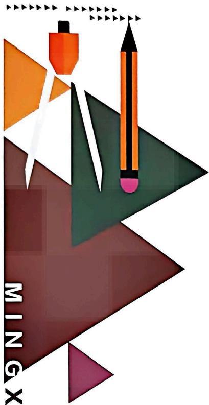

natural_image

Abstract geometric design with colored triangles and a pencil, no text or symbols present

# 名校 压轴题

主编 ● 刘春林

YAZHOUTI

数学

九年级 RJ

免费视频讲解

# 数学

# 九年级

班级：\_\_\_\_

姓名：\_\_\_\_

# 目录

# CONTENTS

# 第一部分 重难点突破

# 第二十一章 一元二次方程

突破 1 一元二次方程根的定义 …… 1

突破 2 解一元二次方程 …… 2

突破 3 配方法的运用 …… 3

突破 4 根的判别式 …… 4

突破 5 根系关系(一) 求对称式的值 …… 5

突破 6 根系关系(二) 求非对称式的值 …… 6

突破 7 根系关系(三) 求参数的值 …… 7

突破 8 根系关系(四) 去绝对值技巧 …… 8

突破 9 根系关系(五) 构一元二次方程 …… 9

突破 10 根系关系(六) 几何运用(数形结合) …… 10

突破 11 一元二次方程多结论 …… 11

突破 12 一元二次方程的应用(一) 循环问题 …… 12

突破 13 一元二次方程的应用(二)传播问题 …… 13

突破 14 一元二次方程的应用(三)变化率问题 …… 14

突破 15 一元二次方程的应用(四) 利润问题 …… 15

突破 16 一元二次方程的应用(五) 面积问题 …… 16

突破 17 一元二次方程的应用(六) 动点问题 …… 18

突破 18 一元二次方程的应用(七) 数学文化 …… 19

突破 19 一元二次方程与几何综合 …… 20

# 第二十二章 二次函数

突破 1 图象与性质(一) 对称性 …… 21

突破 2 图象与性质(二) 增减性 …… 22突破 3 图象与性质(三) 抛物线的平移 …… 23

突破 4 二次函数与方程(一) 根与交点 …… 24

突破 5 二次函数与方程(二)根的判别式 …… 25

突破 6 二次函数与方程(三) 根系关系 …… 27

突破 7 二次函数与方程(四) 根与不等式 …… 29

突破8 二次函数与方程(五)根的分布 …… 30

突破 9 二次函数与方程(六)公共点问题 …… 31

突破 10 二次函数与方程(七)参变分离 …… 32

突破11 二次函数与区间最值(一)定轴定区间 …… 33

突破 12 二次函数与区间最值(二) 动轴定区间 …… 34

突破 13 二次函数与区间最值(三) 动区间求参 …… 35

突破14 二次函数多结论(一) 图象信息 …… 36

突破 15 二次函数多结论(二) 文字信息 …… 37

突破 16 二次函数多结论(三) 表格信息 …… 38

突破17 二次函数多结论(四) 绝对值型 …… 39

突破18 二次函数与线段(一) 线段长 …… 40

突破19 二次函数与线段(二) 线段关系 …… 41

突破20 二次函数与线段（三）平行线 42

突破 21 二次函数与面积(一) 割补法 …… 43

突破 22 二次函数与面积(二)铅垂法 …… 44

突破 23 二次函数与面积(三) 平行转化 …… 45

突破24 二次函数与面积（四）面积转化 46

突破 25 二次函数与角度(一) $45^{\circ}$ 角 …… 48

突破 26 二次函数与角度(二) 等角 …… 49

突破 27 二次函数与角度(三)二倍角 …… 50

突破 28 二次函数与角度(四)角的和差 …… 51

突破 29 二次函数与特殊图形(一)等腰三角形 …… 52

突破 30 二次函数与特殊图形(二) 平行四边形 …… 53

突破 31 二次函数与特殊图形(三)菱形、正方形 …… 55

突破 32 二次函数与最值(一)极值模型 …… 56

突破 33 二次函数与最值(二)线段最值 …… 57

突破34 二次函数与最值（三）面积最值 58

突破35 二次函数与定值（一）和差定值 59

突破 36 二次函数与定值(二) 积商定值 …… 61

突破 37 二次函数与定值(三) 长度定值 …… 62

突破38 二次函数与定直线(一)平行类 63

突破 39 二次函数与定直线(二) 切割类 …… 64

突破 40 二次函数与定点(一) …… 65

突破 41 二次函数与定点(二) …… 66

突破 42 二次函数与参数(一)坐标关系 …… 67

突破 43 二次函数与参数(二) 系数关系 …… 68

突破 44 利润问题(一)顶点最值 …… 69

突破 45 利润问题(二) 区间最值 …… 70

突破 46 利润问题(三) 整点最值 …… 71

突破 47 利润问题(四) 最值定区间 …… 72

突破 48 利润问题(五) 求参 …… 73

突破 49 利润问题(六) 关联变量最值 …… 74

突破 50 面积问题(一) 面积最值 …… 75

突破 51 面积问题(二) 加权面积最值 …… 76

突破 52 抛物线形问题(一) 路径高度 …… 77

突破 53 抛物线形问题(二) 路径落点 …… 78

突破 54 抛物线形问题(三) 实物距离 …… 79

突破 55 抛物线形问题(四) 实物空间 …… 80

突破 56 抛物线形问题(五) 运动中的函数 …… 81

突破 57 分段函数(一) 图象信息 …… 82

突破 58 分段函数(二) 文字信息 …… 84

# 第二十三章 旋转

突破 1 知旋转(一) 求角度 …… 85

突破 2 知旋转(二)用勾股求长度 …… 87

突破 3 知旋转(三)得等腰求长度 …… 89

突破 4 知旋转(四)作图、证明、计算 …… 90

突破 5 知旋转(五) 分类讨论 …… 91

突破 6 知旋转(六)旋转 $60^{\circ}$ 92

突破 7 知旋转(七)旋转 $90^{\circ}$ 93

突破8 知旋转(八)旋转 $120^{\circ}$ 94

突破 9 知旋转(九)旋转 $\alpha^{\circ}$ 95

突破 10 知旋转(十)旋转共线 …… 96

突破 11 构旋转(一)遇 $60^{\circ}$ 旋转 $60^{\circ}$ 97

突破 12 构旋转(二)遇 $90^{\circ}$ 旋转 $90^{\circ}$ 98

突破 13 构旋转(三) 遇 $120^{\circ}$ 旋转 $120^{\circ}$ 99

突破 14 构旋转(四)遇中点旋转 $180^{\circ}$ …… 100

突破 15 构旋转(五)夹半角模型 …… 101

突破 16 构旋转(六) 对角互补模型 …… 102

突破 17 构旋转(七)坐标系中的旋转 …… 103

突破 18 构旋转(八) 解析法 …… 104

突破 19 构旋转(九)抛物线中的旋转 …… 105

突破 20 旋转中的最值(一)两点之间线段最短 …… 106

突破 21 旋转中的最值(二)垂线段最短 …… 107

突破 22 旋转中的最值(三) 函数建模 …… 108

突破 23 旋转中的最值(四) 动点与函数图象 …… 109

突破 24 旋转中的最值(五) 运动路径 …… 110

突破 25 旋转作图(一) 旋转 $90^{\circ}$ …… 111

突破 26 旋转作图(二) 旋转 $180^{\circ}$ …… 112

突破 27 旋转作图(三) 定旋转中心 …… 113

突破 28 旋转作图(四)画旋转图形 …… 114

突破 29 旋转作图(五) 中心对称 …… 115

突破30 旋转作图(六)无网格画图 …… 116

突破 31 旋转作图(七) 综合训练 …… 117

# 第二十四章 圆

突破 1 圆的性质(一) 半径的运用 …… 119

突破 2 圆的性质(二)共圆及最值 …… 120

突破 3 圆的性质(三) 垂径定理——作单弦心距 …… 121  
突破 4 圆的性质(四)垂径定理——作双弦心距 …… 122  
突破 5 圆的性质(五) 直径的运用 …… 123  
突破 6 圆的性质(六)弧中点的运用 …… 124  
突破 7 圆的性质(七) 构圆内接四边形 …… 125  
突破 8 圆的性质(八) 圆与旋转 …… 126   
突破 9 切线的性质(一) 单切 …… 128  
突破 10 切线的性质(二) 双切 …… 130  
突破 11 切线的性质(三) 多切 …… 132  
突破 12 切线的性质(四)三角形的内外心 …… 134  
突破 13 圆的有关计算(一) 圆与正多边形 …… 136  
突破 14 圆的有关计算(二) 阴影部分的面积 …… 137  
突破 15 圆的有关计算(三) 圆锥的侧面展开图 …… 138  
突破 16 圆的有关计算(四) 圆与抛物线 …… 139  
突破17 实践操作(一)覆盖圆 141  
突破 18 实践操作(二) 圆的翻折 …… 142  
突破 19 圆的证明与计算(一) 垂径图 …… 143  
突破 20 圆的证明与计算(二) 折弦图 …… 145  
突破 21 圆的证明与计算(三) 垂弦图 …… 147  
突破 22 圆的证明与计算(四)角分图 …… 148  
突破 23 圆的证明与计算(五)等腰图 …… 150  
突破 24 圆的证明与计算(六) 切割图 …… 151  
突破 25 圆的证明与计算(七) 径切图 …… 152  
突破 26 圆的证明与计算(八) 双切图 …… 153  
突破 27 圆的证明与计算(九) 多切图 …… 155  
突破 28 圆中的最值(一) 经过定点的弦 …… 157  
突破 29 圆中的最值(二) 知圆求最值 …… 158  
突破 30 圆中的最值(三) 显性“定点定长”型隐圆 …… 159  
突破 31 圆中的最值(四) 隐性“定点定长”型隐圆 …… 160  
突破 32 圆中的最值(五) 显性“定弦定角”型隐圆 …… 162  
突破 33 圆中的最值(六) 隐性“定弦定角”型隐圆 …… 163

突破 34 圆中的最值(七) 隐圆隐切线 …… 164

突破 35 圆中的最值(八)“定角定高”类最值 …… 166

突破36 圆中的最值（九）动点、隐圆与函数图象 167

突破 37 圆中的最值(十) 圆中的路径长 …… 168

突破38 与圆有关的无刻度直尺画图(一) 圆的对称性 …… 169

突破 39 与圆有关的无刻度直尺画图(二) 圆周角 …… 170

突破 40 与圆有关的无刻度直尺画图(三)画等弦 …… 172

突破 41 与圆有关的无刻度直尺画图(四)画切线 …… 173

突破 42 与圆有关的无刻度直尺画图(五) 圆与旋转 $90^{\circ}$ …… 174

突破 43 与圆有关的无刻度直尺画图(六) 无网格画图 …… 175

突破 44 与圆有关的无刻度直尺画图(七) 真题演练 …… 176

# 第二十六章 反比例函数

突破1 反比例函数的增减性(一) 比较 $x, y$ 的大小 …… 178

突破 2 反比例函数的增减性(二) 推断 x, y 的关系 …… 179

突破 3 反比例函数的增减性(三) 确定 x, y 的范围 …… 180

突破 4 反比例函数的增减性(四) 探求参数范围 …… 181

突破 5 反比例函数与几何(一) k 的几何意义 …… 182

突破 6 反比例函数与几何(二)点参法 …… 183

突破 7 反比例函数与代数问题(一) 方程、不等式 …… 184

突破8 反比例函数与代数问题(二)整体求值 185

突破 9 反比例函数与代数问题(三) 多结论 …… 186

突破 10 反比例函数与代数问题(四) 结合一次函数 …… 187

突破 11 反比例函数与代数问题(五) 数形结合 …… 189

# 第二十七章 相似

突破 1 平行线分线段成比例 …… 190

突破 2 相似三角形的判定 …… 191

突破3 相似三角形的性质(一)证比例式或等积式 192

突破 4 相似三角形的性质(二) 相似比 …… 193

突破 5 相似三角形的性质(三) 求线段比 …… 194

突破 6 相似三角形的性质(四) 求线段长 …… 196

突破 7 相似模型(一) A 型与 X 型 …… 197

突破 8 相似模型(二)仿 A、X 型 …… 198

突破 9 相似模型(三) 子母相似 …… 199

突破 10 相似模型(四) 射影定理 …… 200

突破 11 相似模型(五) 一线三等角 …… 201

突破 12 相似模型(六) 十字架 …… 202

突破 13 相似模型(七) 旋转相似 …… 203

突破 14 相似与圆(一)无切线 …… 204

突破 15 相似与圆(二)有切线 …… 205

突破 16 相似与抛物线(一) 线段比 …… 206

突破 17 相似与抛物线(二) 角度 …… 207

突破 18 与相似有关的无刻度直尺画图 …… 208

# 第二十八章 锐角三角函数

突破1 求三角函数值 …… 210

突破2 知三角函数值 212

突破3 相似变换与三角函数 213

突破4 图形拼接 214

突破 5 “ $a + kb (k \neq 1)$ ”型——“胡不归”最值问题 …… 215

突破6 与锐角三角函数有关的无刻度直尺画图 …… 216

突破 7 圆与三角函数(一)作垂径构直角 …… 217

突破8 圆与三角函数(二)直径构直角 218

突破 9 圆与三角函数(三) 切线构直角 …… 219

突破10 圆与三角函数(四)等角转换 220

突破11 三角函数与抛物线小综合 221

# ◆ 第二部分 九上大综合

# I 几何大综合

综合1 特殊到一般(一)位置从特殊到一般 225

综合 2 特殊到一般(二) 角度从特殊到一般 …… 226

综合 3 特殊到一般(三) 条件从特殊到一般 …… 227

综合 4 旋转模型(一) 给模用模 …… 228

综合 5 旋转模型(二) 构双等边三角形 …… 230

综合 6 旋转模型(三) 构双等腰直角三角形 …… 231

综合 7 旋转模型(四) 构 $120^{\circ}$ 的双等腰 …… 232

综合8 旋转模型(五) 同型构造 …… 233

综合 9 旋转模型(六) 中点模型 …… 234

综合 10 旋转模型(七)夹半角模型 …… 235

综合 11 类比探究(一)截长补短 …… 236

综合 12 类比探究(二) 隐圆求范围 …… 237

综合 13 类比探究(三)三边关系求范围 …… 238

综合 14 类比探究(四) 路径问题 …… 239

# Ⅱ 二次函数大综合

综合1 动线证角等 240

综合2 定线段长求坐标 241

综合3 定直角求参数 242

综合4 动线定线段长 243

综合 5 动线定线段比 …… 244

综合 6 动线定倒数差 …… 245

综合 7 动线定线段积 …… 246

综合8 双切线定坐标 247

综合9 双切线定面积 248

综合10 双切线定最值 249

综合11 三动线得定点 250

综合 12 线段积得定点 …… 251

综合 13 平行线得定点 …… 252

综合 14 平行线得参数比 …… 253

综合 15 动圆定线段长 …… 254

# 第一部分 重难点突破

# 第二十一章 一元二次方程

# 突破1 一元二次方程根的定义

# 类型一 定义求值

1. (2024 二中广雅) 如果正数 $a$ 是一元二次方程 $x^{2} - 3x + m = 0$ 的一个根, $-a$ 是一元二次方程 $x^{2} + 3x - m = 0$ 的一个根, 那么 $a$ 的值是 \_\_\_\_.

2.(2025 光谷外校)若关于 x 的方程 $x^{2}-bx-2=0$ 与方程 $x^{2}-2x-b^{2}+b=0$ 有且只有一个相同的根, 则 b 的值为 \_\_\_\_.

# 类型二 逆定义求根

3. 已知 $4a + c = 2b$ ，则一元二次方程 $ax^2 + bx + c = 0$ 必有一根是 \_\_\_\_.

4.(2025二中广雅)已知 $a + \frac{1}{3} b + \frac{1}{9} c = 0$ , 则方程 $ax^2 + bx + c = 0$ 一定有一个根为 \_\_\_\_.

# 类型三 整体求值

5.(2024福州)设m是方程 $x^{2}-2024x+1=0$ 的一个根,则 $m^{2}-2023m+\frac{2024}{m^{2}+1}$ 的值为\_\_\_\_.

# 类型四 降次求值

6.(2024华一光谷)若m是方程 $x^{2}-5x-1=0$ 的一个根,则代数式 $\left(m+\frac{1}{m}\right)^{2}$ 的值为 \_\_\_\_.

# 类型五 换元法求根

7.(2025江汉)若关于x的方程 $ax^{2}+bx+c=0(a\neq0)$ 的两个根为1和-2,则关于x的方程 $a(x-1)^{2}+b(x-1)=-c$ 的解为\_\_\_\_.

# 突破2 解一元二次方程

# 类型一 换元法

# (一)换整式

1. (2024 泉州) 解方程: $(x^{2} + 2x)^{2} - (x^{2} + 2x) - 12 = 0$ .

# (二)换根式

2.(2024 南京)解方程: $x^{2}+2x+4\sqrt{x^{2}+2x}-5=0$ .

# (三)换分式

3.(2025七一华源)已知实数x满足 $x^{2}+\frac{1}{x^{2}}-3\left(x+\frac{1}{x}\right)+4=0$ ，则 $x+\frac{1}{x}$ 的值为\_\_\_\_.

# 类型二 消元法

4.(2025武汉外校)已知实数x,y满足 $x-y^{2}=0$ ,且 $x^{2}-3y^{2}+x-3=0$ ,则x的值为\_\_\_\_.

# 类型三 含参方程

5. 解下列关于 $x$ 的一元二次方程：

(1)(2025 武汉一初) $x^{2}-(2k+2)x+k^{2}+2k=0$ ;

(2) $ax^{2}-2ax-3a-4x+12=0.$

# 类型四 绝对值方程

6.(2025 武钢实验)解方程: $2x^{2}+|x|-3=0$ .

# 突破3 配方法的运用

# 类型一 判定代数式的符号

1. (2025 武汉三初) 判定代数式 $-2a^{2} + 8a - 9$ 的符号.

2.(2024 福建中考)已知实数 a, b, c, m, n 满足 $3m + n = \frac{b}{a}$ , $mn = \frac{c}{a}$ . 求证: $b^{2} - 12ac$ 为非负数.

# 类型二 配方求值

3.(2025二中广雅)若 $\triangle ABC$ 的三边分别为 $a,b,c$ ,其中 $c=3$ ,且 $a,b$ 满足 $a^{2}-8a+b^{2}-10b+41=0$ ,求 $\triangle ABC$ 的面积 $S$ .

# 类型三 配方求最值

4.(2024 武汉外校)求代数式 $-3x^{2}+6x-4$ 的最大值.

5.(2024江汉)已知实数m,n满足 $(m^{2}+4m+5)(n^{2}-2n+6)=5$ ,则 $2m+3n$ 的值为\_\_\_\_.

# 类型四 配方比较大小(求差法)

6.(2025七一华源)已知 $M=x+2,N=x^{2}-x+5,Q=x^{2}+5x-19$ ，其中x>2.

(1) 求证: M < N;   
(2) 比较 M 和 Q 的大小.

# 突破4 根的判别式

# 类型一 判定方程根的情况

1.(2024雅礼)判定方程 $\frac{1}{2}x^{2}+2mx+2m-1=0$ 根的情况.

2.(2024大连)已知关于 $x$ 的方程 $x^{2} + 2(m - 2)x + m^{2} + 4 = 0$ 有两个实数根,试判断方程 $(m - 1)x^{2} + 2mx + (m - 2) = 0$ 根的情况.

3.(2025 遂宁)已知关于 $x$ 的方程 $(k+2)x^{2}-2(k+1)x+k=0$ 只有一个实数根, 试判断关于 $x$ 的方程 $(k+1)x^{2}-2kx+k-2=0$ 的根的情况.

4. (2024 二中广雅) 若 $a + b + 3c = 0$ , 请说明关于 $x$ 的一元二次方程 $ax^2 + bx + c = 0$ 一定有两个不相等的实数根.

# 类型二 知根的情况求参数范围(值)

5.(2025 七一华源)已知关于 x 的方程 $(m-2)^{2}x^{2}+(2m+1)x+1=0$ 有两个实数根, 则 m 的取值范围是 \_\_\_\_.

6.(2025 武汉一初)若关于 x 的方程 $(m-1)x^{2}+2x+1=0$ 有实数解,则 m 的取值范围为 \_\_\_\_.

# 类型三 判别式法求最值

7. 若 $w=5x^{2}-4xy+y^{2}-2y+8x+3(x,y$ 为实数)，则 w 的最小值为 \_\_\_\_.

# 突破 5 根系关系(一) 求对称式的值

# 类型一 直接求值

1. (2025 碎口) 已知 $x_{1}, x_{2}$ 是方程 $x^{2} - 3x + 1 = 0$ 的两个实数根, 求下列各式的值:

(1) $(x_{1}-1)(x_{2}-1)$ ;

(2) $x_{1}^{2}+x_{2}^{2}$ ;

(3) $(x_{1}-x_{2})^{2}$ ;

(4) $x_{1}-x_{2}.$

# 类型二 结合根的定义求值

2. (2024 武珞路中学) 已知 $\alpha, \beta$ 是方程 $x^{2} + 2020x + 1 = 0$ 的两个根, 则 $(\alpha^{2} + 2022\alpha + 1)(\beta^{2} + 2022\beta + 1)$ 的值为 ( )

A. 2020

B. 2022

C. 2

D. 4

3.(2024 武昌)已知 a, b 是方程 $x^{2}-3x+1=0$ 的两根，则代数式 $\frac{1}{a^{2}+1}+\frac{1}{b^{2}+1}$ 的值为 \_\_\_\_.

# 类型三 判定根的符号再求值

4.(2025华一光谷)已知a,b是方程 $x^{2}+5x+3=0$ 的两根,则 $a\sqrt{\frac{b}{a}}+b\sqrt{\frac{a}{b}}$ 的结果是()

A. $2\sqrt{3}$

B. $- 2\sqrt{3}$

C. $3\sqrt{2}$

D. $-3\sqrt{2}$

5.(2024 洪山)已知 a, b 是方程 $x^{2} + 2024x + 1 = 0$ 的两个实数根，则 $\sqrt{\frac{b}{a}} + \sqrt{\frac{a}{b}}$ 的值为 \_\_\_\_.

# 突破6 根系关系(二) 求非对称式的值

# 类型一 代换一根整体求值

1.(2025 七一华源)若 a, b 是关于 x 的一元二次方程 $x^{2} + 2x - 2022 = 0$ 的两个不相等的实数根，则 $2a^{2} + 5a + b + 1$ 的值为 \_\_\_\_.

2. (2024 武汉六中) 若 $\alpha, \beta$ 是方程 $x^{2} - 3x - 2017 = 0$ 的两个实数根, 则代数式 $\alpha^{2} - 2\beta - 5\alpha$ 的值为 ( )

A. -2011

B. -2 013

C. 2011

D. 2023

# 类型二 代换两根降次求值

3.(2025东湖高新)已知m,n是方程 $x^{2}-3x-1=0$ 的两根,则 $2m^{2}+n^{2}-3m$ 的值为\_\_\_\_.

4. (2025 武汉三初)已知 a, b 是方程 $x^{2}-x-1=0$ 的两根，则 $2a^{3}+3b^{3}+5a+3b+1$ 的值为()

A. 14

B. 15

C. 19

D. 20

# 类型三 倒数代换整体求值

5.(2024 光谷实验)若 m, n 是方程 $x^{2}-2x-1=0$ 的两根，则 $-n^{3}+2n^{2}+2m^{2}+\frac{5}{n}-5$ 的值为 \_\_\_\_.

# 类型四 转化对称整体求值

6.(2025 武钢实验)若 $\alpha, \beta$ 是方程 $x^{2}-7x-1=0$ 的两根 $(\alpha>\beta)$ ，则 $\alpha^{2}+\beta$ 的值为 \_\_\_\_.

# 突破 7 根系关系(三) 求参数的值

# 类型一 先 $\Delta$ 定范围, 再取舍

1. (2024 武钢实验) 已知关于 $x$ 的一元二次方程 ${x}^{2} - \left( {{2k} - 1}\right) x + {k}^{2} - 3 = 0$ 有两个实数根.

(1) 求 k 的取值范围；  
(2)设方程两实数根分别为 $x_{1}, x_{2}$ , 且满足 $x_{1}^{2} + x_{2}^{2} = 23$ , 求 $k$ 的值.

2.(2025光谷外校)设 $x_{1},x_{2}$ 是关于x的方程 $2x^{2}-4kx+2k^{2}+3k-2=0$ 的两个实数根.

(1) 求 $k$ 的取值范围；  
(2) 当 k 为何值时, $x_{1}^{2} + x_{2}^{2}$ 取得最小值?

# 类型二 先求值,再用 $\Delta$ 检验

3. 已知关于 $x$ 的一元二次方程 $x^{2} - (m - 1)x + (m^{2} + m - 5) = 0$ 的两个根互为倒数, 求 $m$ 的值;

# 类型三 先求根,再求参

4.(2025 武钢实验)已知关于 x 的方程 $2x^{2}-5x-t=0$ 的两根 $\alpha,\beta$ 满足 $3\alpha=2\beta$ ，求 t 的值.

5.(2024 武昌)已知关于 x 的方程 $x^{2}-(m-2)x-\frac{m^{2}}{4}=0$ . 若这个方程的两个实根满足 $x_{1}=x_{2}+2$ , 求 m 的值及相应的两根.

# 突破 8 根系关系(四) 去绝对值技巧

# 类型一 平方法去绝对值

1.(2025 武昌)如果关于 x 的一元二次方程 $ax^{2}+bx+c=0(a\neq0)$ 有两个实数根,且其中一根比另一根大 1,那么称这样的方程为“邻根方程”.已知关于 x 的方程 $x^{2}-(m-1)x-m=0$ .

(1) 求证: 无论 m 为何实数, 方程总有实数根;  
(2)若该方程是“邻根方程”，求 m 的值.

# 类型二 隐含条件去绝对值

2.(2024鄂州期末)已知关于x的方程 $x^{2}+(2k+1)x+k^{2}+2=0$ 有两个实数根 $x_{1},x_{2}$ .

(1)求实数 k 的取值范围；  
(2) 若 $x_{1}, x_{2}$ 满足 $|x_{1}| + |x_{2}| = |x_{1}x_{2}| - 1$ ，求 $k$ 的值.

# 类型三 分类讨论去绝对值

3.(2024二中广雅)已知关于x的一元二次方程 $x^{2}-(m-1)x-m^{2}=0$ .

(1)求证:方程总有两个不相等的实数根;   
(2)设方程的两实数根分别为 $x_{1}, x_{2}$ , 且 $|x_{1}| = |x_{2}| - 3$ , 求 $m$ 的值及方程的根.

# 突破 9 根系关系(五) 构一元二次方程

# 类型一 定义逆用构方程

1.(2025 江岸)已知两个不等的实数 m, n 满足等式 $m^{2}-2m=n^{2}-2n=2025$ , 求 $m^{2}+2n$ 的值.

2.(2025 襄阳)已知四个不同的实数 $a, b, m, n$ 分别满足等式 $(a + m)(a + n) = 7, (b + m)(b + n) = 7$ , 求 $(a + n)(b + n)$ 的值.

# 类型二 转化等式构方程

3.(2024 武钢实验)已知实数 a, b 满足 $a^{2}=2a+3$ , $(3b)^{2}=6b+3$ , 且 $a\neq3b$ , 求 ab 的值.

4.(2025 武汉外校)已知 $a, b (ab \neq 1)$ 满足等式 $5a^{2} - 2021a + 9 = 0, 9b^{2} - 2021b + 5 = 0$ , 求 $\frac{a}{b}$ 的值.

# 类型三 根系关系构方程

5.(2025青山)已知实数a,b,c满足 $a+b+c=0$ ,abc=54.若c>0,求c的最小值.

6.(2024 达州)已知实数 m, n 满足 $m + mn + n = \frac{a^{2}}{4} - 6$ , $m - mn + n = -\frac{a^{2}}{4} + 2a$ , 求实数 a 的最大整数值.

# 突破 10 根系关系(六) 几何运用(数形结合)

1.(2024 广西)已知关于 x 的一元二次方程 $x^{2}-2(m+1)x+m^{2}+5=0$ 有两个实数根.

(1) 求 m 的取值范围；

(2)若 Rt△ABC 的两条直角边 AC, BC 的长恰好是此方程的两个实数根, 斜边 AB = 6, 求 △ABC 的周长.

2.(2024 七一华源)已知关于 x 的一元二次方程 $x^{2}-mx+m+3=0$ 的两个根为 a, b.

(1) 若 a, b 分别为菱形的两条对角线的长, 且菱形的面积为 5 , 求 m 的值;

(2) 若 $a, b$ 分别为菱形的两条对角线的长, 且菱形的边长为 $\frac{3\sqrt{2}}{2}$ , 求 $m$ 的值.

3.(2025 华宜寄)已知矩形甲的长、宽、周长 $C_{甲}$ 和面积 $S_{甲}$ 分别如图所示.

(1)设矩形乙的长为 $x$ ，宽为 $y(x \geqslant y)$ ，它的周长 $C_{\text{乙}}$ 和面积 $S_{\text{乙}}$ 满足等式 $\frac{C_{\text{乙}}}{C_{\text{甲}}} = \frac{S_{\text{乙}}}{S_{\text{甲}}} = \frac{1}{2}$ ，求 $x$ ， $y$ 的值；

(2)在(1)的条件下,是否存在矩形丙,使它的周长 $C_{丙}$ 和面积 $S_{丙}$ 满足等式 $\frac{C_{丙}}{C_{乙}}=\frac{S_{丙}}{S_{乙}}=\frac{1}{2}$ ? 若存在,请求矩形丙的长和宽;若不存在,请说明理由.

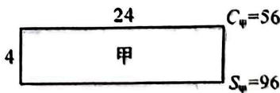

text_image

24
Cψ=56
4 甲
Sψ=96

# 突破11 一元二次方程多结论

# 类型一 根的判别式与根的定义

1. (2025 江汉) 对于一元二次方程 $ax^2 + bx + c = 0 (a \neq 0)$ , 下列说法: ① 若 $a + b + c = 0$ , 则方程必有一根为 $x = 1$ ; ② 若方程 $ax^2 + c = 0$ 有实数根, 则方程 $cx^2 + bx + a = 0$ 必有两个实数根; ③ 若方程 $ax^2 + bx + c = 0$ 的两根为 $m, n (mn \neq 0)$ , 则方程 $cx^2 + bx + a = 0$ 的两根为 $\frac{1}{m}, \frac{1}{n}$ ; ④ 若 $x_0$ 是方程 $ax^2 + bx + c = 0$ 的一个根, 则 $b^2 - 4ac = (2ax_0 + b)^2$ . 其中正确的是 \_\_\_\_. (填写序号)

2. (2024 光谷实验) 下列说法: ① 若一元二次方程 $x^{2} + bx + a = 0$ 有一个根是 $a (a \neq 0)$ , 则代数式 $a + b$ 的值是 -1; ② 若 $b^{2} > 6ac$ , 则关于 $x$ 的一元二次方程 $ax^{2} + bx + c = 0$ 一定有两个不相等的实数根; ③ 若 $b = a + 2c$ , 则关于 $x$ 的一元二次方程 $ax^{2} + bx + c = 0$ 一定有两个不相等的实数根; ④ 已知两实数 $m, n$ 满足 $m^{2} + 3m - 9 = 0, n^{2} + 3n - 9 = 0$ , 且 $m \neq n$ , 则 $\frac{m}{n} + \frac{n}{m}$ 的值为 -3. 其中正确的有 \_\_\_\_ (填序号).

# 类型二 根的判别式与根系关系

3.(2025武昌)对于一元二次方程 $ax^{2}+bx+c=0(a\neq0)$ .下列结论:①若 $b>a+c$ ,则一元二次方程 $ax^{2}+bx+c=0$ 有两个不相等的实数根;②若 $a+b+c>0,a-b+c<0$ ,则方程 $ax^{2}+bx+c=0$ 一定有两个不相等的实数根;③若 $b^{2}+4ac<0$ ,则方程 $ax^{2}+bx+c=0$ 一定有两个不相等的实数根;④若ac<0,且b=0,则方程两个实数根一定互为相反数.以上结论正确的有()

A. 4 个

B. 3 个

C. 2 个

D. 1 个

# 突破 12 一元二次方程的应用(一) 循环问题

# 类型一 单循环

1.(2025二中广雅)在一次聚会上,规定每两个人见面必须握手,且握手1次.

(1)若参加聚会的人数为3,则共握手\_\_\_\_次;若参加聚会的人数为5,则共握手\_\_\_\_次;若参加聚会的人数为n(n为正整数),则共握手\_\_\_\_次;

(2)若参加聚会的人共握手28次,请求出参加聚会的人数;

(3)嘉嘉由握手问题想到了一个数学问题:若线段AB上共有m个点(不含端点A,B),线段总数为多少呢?请直接写出结论;

(4) 小明想到另一个数学问题: 若 $n$ 边形的边数增加 1, 对角线总数增加 9, 求边数 $n$ 的值.

# 类型二 双循环

2.(2025东西湖)圣诞节时,某班一个小组有x人,他们每两人之间互送贺卡一张,已知全组共送贺卡110张,则该小组一共有多少位组员?

3.(2025 武汉十一初)A,B 两地之间有若干个站点,高铁从 A 地到 B 地,共设计了 30 种往返车票.问 A,B 两地之间共有多少个站点?

# 突破 13 一元二次方程的应用(二)传播问题

# 类型一 传染问题

1.(2024 七一华源)有一个人患了流感,经过两轮传染后,共有121人患了流感.

(1)每轮传染中平均一个人传染几个人？  
(2)如果按照这样的传染速度,经过三轮传染后共有 个人患流感.

# 类型二 分支问题

2. (2025 武昌联考)某种植物的主干长出若干数目的支干, 每个支干又长出同样数目的小分支, 主干、支干和小分支的总数是 91. 若每个支干长出 $x$ 个小分支, 则 $x$ 的值为 \_\_\_\_.

3.(2025 黄冈)为了宣传垃圾分类,小王写了一封倡议书,用微博转发的方式传播,他设计了如下的转发规则:将倡议书发表在自己的微博上,然后邀请 x 个好友转发,每个好友转发之后,又邀请 x 个互不相同的好友转发,已知经过两轮转发后,共有 111 个人参与了本次活动.

(1) $x$ 的值是多少?  
(2)再经过几轮转发后,参与人数会超过10 000人?

# 类型三 细胞分裂问题

4.(2025六中上智)某种细胞分裂,一个细胞经过两轮分裂后,共有a个细胞,设每轮分裂中平均一个细胞分裂成x个细胞,那么可列方程为()

A. $x^{2} = a$

B. $(1+x)^{2}=a$

C. $1 + x + x^{2} = a$

D. $x + x^{2} = a$

# 突破 14 一元二次方程的应用(三) 变化率问题

# 类型一 增长率问题

1.(2024 武汉三寄)为了让学生养成热爱图书的习惯,某学校抽出一部分资金用于购买书籍.已知 2020 年该学校用于购买图书的费用为 5000 元,2022 年用于购买图书的费用是 7200 元,则 2020\~2022 年买书资金的平均增长率是 \_\_\_\_.

2. (2025 汉阳)读书已经成为很多人的一种生活方式,城市书院是读书的重要场所之一. 据统计,某书院对外开放的第一个月进书院 600 人次,进书院人数逐月增加,到第三个月末累计进书院 2850 人次. 若进书院人次的月平均增长率为 $x$ ,则可列方程为

3.(2025四区联考)现代互联网技术的广泛应用催生了快递行业的高速发展.据调查,某家小型“大学生自主创业”的快递公司,今年3月份与5月份完成投递的快递总件数分别为10万件和12.1万件.现假定该公司每月的投递总件数的增长率相同.

(1)求该快递公司投递快递总件数的月平均增长率；  
(2)如果平均每人每月最多可投递快递0.6万件,那么该公司现有的16名快递投递业务员能否完成今年6月份的快递投递任务?如果不能,请问至少需要增加几名业务员?

# 类型二 下降率问题

4. (2024 武汉元调)《九章算术》第三章“衰分”介绍了比例分配问题,“衰分”是按比例递减分配的意思,通常称递减的比例为“衰分比”.例如:已知 A,B,C 三人分配奖金的衰分比为 $10\%$ ,若 A 分得奖金 1000 元,则 B,C 所分得奖金分别为 900 元和 810 元.某科研所三位技术人员甲、乙、丙攻关成功,共获得奖金 175 万元,甲、乙、丙按照一定的“衰分比”分配奖金,若甲分得奖金 100 万元,则“衰分比”是 \_\_\_\_.

5.(2025 东湖高新)在国家政策的调控下,某市的商品房成交均价由今年6月份的16 000元/平方米下降到8月份的12 960元/平方米.

(1) 求 6 月到 8 月平均每月降价的百分率；  
(2)如果房价继续回落,按此降价的百分率,请你预测到9月份该市的商品房成交均价是否会跌破每平方米11500元?请说明理由,

# 突破 15 一元二次方程的应用(四) 利润问题

# 类型一 价格不变

1.(2024青山)某商店以每件20元的价格购进一批商品,若每件商品售价a元,则每天可卖出(800-10a)件.如果商店计划每天恰好盈利8000元,并且使每天的销售量尽可能大,求每件商品的售价是多少元?

# 类型二 二次销售

2.(2025光谷外校)党的二十大报告提出:“加快建设高质量教育体系,发展素质教育”.某校为进一步落实五育并举工作,有效开展“阳光体育”活动,计划从某体育用品商城购买跳绳用于“大课间”活动.已知一根跳绳的进价为20元,商城确定其售价为40元.

(1)商城准备进行降价促销,从原价每根40元进行两次调价后的售价为32.4元,若两次调价的降价率相同,求降价率;   
(2)经调查,每根跳绳每降价0.2元,即可多销售10根.已知售价为40元时,每月可销售500根.若商城期望销售跳绳每月盈利10800元,且尽量减少库存,求每根跳绳的定价.

# 突破 16 一元二次方程的应用(五) 面积问题

# 类型一 边框设计

1.(2025 碎口)如图,某小区的平面图是一个占地 $400 \times 300$ 平方米的矩形,正中央的建筑区是与整个小区长宽比例相同的矩形.如果要使四周的空地所占面积是小区面积的 36%,且南北空地等宽,东西空地等宽.求该小区四周空地的宽度.

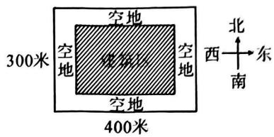

text_image

空地
空地
300米
空地
空地
空地
400米
北
西→东
南

# 类型二 甬道问题

2. (2025 光谷外校)如图, 某旅游景点要在长、宽分别为 12 米、10 米的矩形水池内部建一个与矩形的边互相平行的正方形观赏亭, 观赏亭的四边连接四条与矩形的边互相平行且宽度相等的道路, 已知道路的宽为正方形边长的 $\frac{1}{5}$ (每条道路的一侧均与正方形观赏亭的一边在同一直线上), 若道路与观赏亭的面积之和是矩形水池面积的 $\frac{13}{15}$ , 求道路的宽.

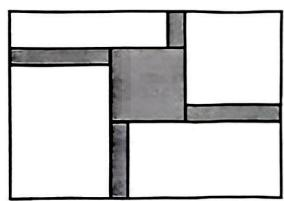

natural_image

Abstract geometric pattern composed of overlapping rectangles and squares (no text or symbols)

# 类型三 折叠纸盒

3.(2025 咸宁)有两张长 12 cm, 宽 10 cm 的矩形纸板, 分别按照图 1 与图 2 两种方式裁去若干小正方形和小矩形, 剩余部分 (阴影部分) 恰好做成无盖和有盖的长方体纸盒各一个.

(1)做成有盖长方体纸盒的裁剪方式是\_\_\_\_（填“图1”或“图2”）；  
(2)已知图1中裁去的小正方形边长为 $1.5 \mathrm{~cm}$ , 求做成的纸盒的底面积;  
(3)已知按图2裁剪方式做成纸盒的底面积为 $24 \mathrm{~cm}^{2}$ , 求剪去的小正方形的边长.

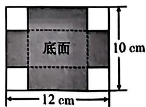

text_image

底面
10 cm
12 cm

图1

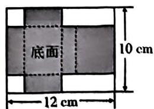

text_image

底面
10 cm
12 cm

图2

# 类型四 围栏开口

4. (2024 武昌) 某体育场准备利用一堵呈“L”形的围墙(粗线 A-B-C 表示墙, 墙足够高) 改建室外篮球场, 如图所示, 已知 $AB \perp BC$ , AB = 8 米, BC = 70 米, 现计划用总长为 136 米的围网围建呈“日”字形的两个篮球场, 并在每个篮球场开一个宽 3 米的门(细线表示围网, 两个篮球场之间用围网 GH 隔开), 为了充分利用墙体, 点 F 必须在线段 BC 上, 设 EF 的长为 x 米.

(1) $DE=$ 米；(用含 x 的代数式表示)  
(2)若围成的篮球场 BDEF 的面积为 1200 平方米,求 EF 的长;(围网及墙体所占面积忽略不计)  
(3)篮球场 BDEF 的面积是否能达到 1900 平方米？请说明理由.

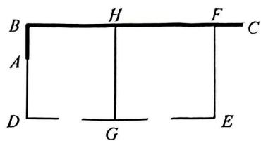

text_image

B
H
F
C
A
D
G
E

# 类型五 围栏分块

5.(2024二中广雅)某家禽养殖场,用总长为 $280 \mathrm{~m}$ 的围栏靠墙(墙长为 $70 \mathrm{~m}$ ) 围成如图所示的三块矩形区域,矩形 AEHG 与矩形 CDEF 的面积都等于矩形 BFHG 面积的 $\frac{1}{3}$ ,设 AD 长为 $x \mathrm{~m}$ .

(1)请直接写出： $\frac{S_{矩形CDEF}}{S_{矩形ABCD}}=$ \_\_\_\_；  
(2)当矩形 ABCD 的面积为 $3360 \, m^{2}$ 时, 求 AD 的长是多少?

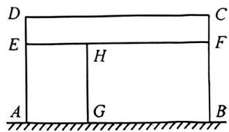

text_image

D
E
H
G
A
B
C
F

# 突破 17 一元二次方程的应用(六) 动点问题

# 类型一 三角形背景

1. (2024 江门) 如图, 在 $\triangle ABC$ 中, $\angle B = 90^{\circ}, AB = 5 \mathrm{~cm}, BC = 8 \mathrm{~cm}$ . 点 $P$ 从点 $A$ 开始沿 $AB$ 边向点 $B$ 以 $1 \mathrm{~cm} / \mathrm{s}$ 的速度移动, 同时点 $Q$ 从点 $B$ 开始沿 $BC$ 边向点 $C$ 以 $2 \mathrm{~cm} / \mathrm{s}$ 的速度移动, 当其中一点到达终点时, 另外一点也随之停止运动.

(1) $\triangle PQB$ 的面积能否等于 $9\ cm^{2}$ ? 请说明理由.  
(2)几秒时,四边形 APQC 的面积等于 $16 \, cm^{2}$ ? 请写出过程.

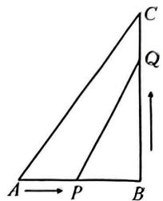

text_image

C
Q
A → P B

# 类型二 四边形背景

2. (2025 洪山) 如图, 在矩形 $ABCD$ 中, $AB = 3 \mathrm{~cm}, BC = 6 \mathrm{~cm}$ , 点 $P$ 从点 $D$ 出发沿 $DA$ 向点 $A$ 运动, 运动到点 $A$ 立即停止, 同时, 点 $Q$ 从点 $B$ 出发沿 $BC$ 向点 $C$ 运动, 运动到点 $C$ 立即停止, 点 $P, Q$ 的速度都为 $1 \mathrm{~cm} / \mathrm{s}$ , 连接 $PQ, AQ, AC, CP$ . 设点 $P$ 运动的时间为 $t \mathrm{~s}$ .

(1)当 $t$ 为何值时, $AC \perp PQ$ ?  
(2)是否存在某一时刻 $t$ , 使得 $PQ \perp PC$ ? 若存在, 请求出 $t$ 的值; 若不存在, 请说明理由.

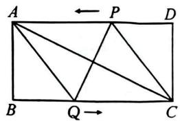

text_image

A ← P D
B Q C

# 类型三 圆周形背景

3.(2025 武汉外校)小勤设计了点做圆周运动的一个动画游戏,如图所示,甲、乙两点从直径的两端点 A,B 分别以顺时针、逆时针的方向同时沿圆周运动,甲运动的路程 $l(\mathrm{cm})$ 与时间 $t(\mathrm{s})$ 满足关系: $l=\frac{1}{2}t^{2}+\frac{3}{2}t(t\geqslant0)$ , 乙以 4 cm/s 的速度匀速运动, 半圆的长度为 21 cm.

(1)问:当甲运动的路程为5cm时,乙与甲相遇了吗?请说明理由;   
(2)甲、乙从开始运动到第三次相遇时,甲运动的路程为多少cm?

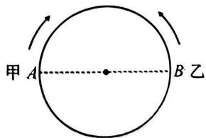

text_image

甲 A
B 乙

# 突破 18 一元二次方程的应用(七) 数学文化

1. (武汉元调) 欧几里得是古希腊数学家, 所著的《几何原本》闻名于世. 在《几何原本》中, 形如 $x^{2} + ax = b^{2}$ 的方程的图解法是: 如图, 以 $\frac{a}{2}$ 和 $b$ 为直角边作 Rt $\triangle ABC$ , 再在斜边上截取 $BD = \frac{a}{2}$ , 则图中线段 ( ) 的长是方程 $x^{2} + ax = b^{2}$ 的一个解.

A. AC

B. ${AD}$

C. ${AB}$

D. BC

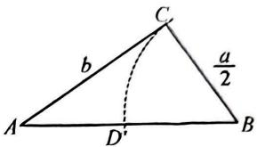

text_image

C
b
a/2
A
D'
B

2. (2025 武汉三初)《代数学》中记载, 形如 $x^{2}+8x=33$ 的方程, 求正数解的几何方法是: “如图 1, 先构造一个面积为 $x^{2}$ 的正方形, 再以正方形的边长为一边向外构造四个面积为 $2x$ 的矩形, 得到大正方形的面积为 $33+16=49$ , 则该方程的正数解为 $7-4=3$ .”小聪按此方法解关于 $x$ 的方程 $x^{2}+10x+m=0$ 时, 构造出如图 2 所示的图形, 已知阴影部分的面积为 50 , 则该方程的正数解为 \_\_\_\_.

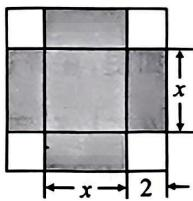  
图1

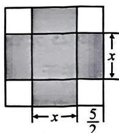

text_image

x
x→5/2

图2

3.(2025东湖高新)在古希腊时期,有一天毕达哥拉斯在经过铁匠铺时听到铁匠打铁的声音非常好听,且节奏很有规律,后来这个声音的比例被毕达哥拉斯用数学的方式表达出来,人们将他提出的 $\frac{\sqrt{5}-1}{2}$ 这个数称为黄金分割数.设m,n是方程 $x^{2}-\sqrt{5}x+1=0$ 的两个根,记 $S_{1}=\frac{1}{1+m}+\frac{1}{1+n}$ , $S_{2}=\frac{1}{1+m^{2}}+\frac{1}{1+n^{2}}$ , $S_{3}=\frac{1}{1+m^{3}}+\frac{1}{1+n^{3}}$ , $\cdots$ , $S_{t}=\frac{1}{1+m^{t}}+\frac{1}{1+n^{t}}(t$ 为正整数).若 $S_{1}+S_{2}+S_{3}+\cdots+S_{t}=t^{2}-56$ ,则t的值为\_\_\_\_.

# 突破19 一元二次方程与几何综合

1.(2025 汉阳)如图,在矩形 ABCD 中,AB=a,AD=b(a>b).

(1) 若 $a, b$ 是关于 $x$ 的方程 $x^2 - kx + k + 4 = 0$ 的两根，且满足 $a^2 + b^2 = 40$ ，求 $k$ 的值.  
(2)在(1)的条件下，P 为 CD 上一点（异于 C, D 两点），当点 P 在什么位置时， $\triangle APB$ 为直角三角形？  
(3) $P$ 为 $CD$ 上一点(异于 $C, D$ 两点), 当 $a, b$ 满足什么条件时, 使 $\triangle APB$ 为直角三角形的点 $P$ 有且只有一个?

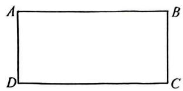

natural_image

Simple geometric rectangle with labeled vertices A, B, C, D (no additional text or symbols)

2. (2025 光谷实验) 如图, 在等边 $\triangle ABC$ 中, $P$ 是 $BC$ 下方一动点, 且 $\angle BPC = 120^{\circ}$ , $PB$ , $PC$ 的长是关于 $x$ 的方程 $(a - 1)x^{2} - 4(a - 1)x + a = 3$ 的两个实数根.

(1)求证:PA 平分∠BPC;  
(2)当 $a$ 的值发生变化时, 小丁认为: $\triangle ABC$ 的面积是定值; 小吴认为: 四边形 $ABPC$ 的面积为定值. 请判断谁的结论是正确的? 并说明理由.

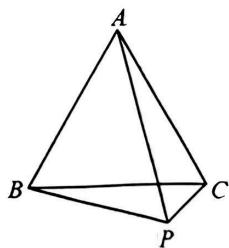

natural_image

Geometric diagram of a tetrahedron with vertices labeled A, B, C, and P (no additional text or symbols)

# 第二十二章 二次函数

# 突破1 图象与性质（一）对称性

# 类型一 知对称轴

1.(2024信阳)若二次函数 $y=ax^{2}+b$ 的图象经过点 $P(-2,4)$ ，则该图象必经过点 \_\_\_\_.  
2. (2025 北京十四中) 抛物线 $y = ax^2 + bx + c (a \neq 0)$ 的对称轴为直线 $x = 2$ ，且经过点 $P(3, -3)$ ，则 $a + b + c$ 的值为 \_\_\_\_.  
3. (2024 汉阳期中) 如图, 抛物线 $y = \frac{1}{2} x^2 - 4x + 6$ 与 $y$ 轴交于点 $A$ , 与 $x$ 轴交于点 $B$ , 线段 $CD$ 在抛物线的对称轴上移动 (点 $C$ 在点 $D$ 下方), 且 $CD = 3$ . 当四边形 $ABCD$ 的周长最小时, 点 $D$ 的坐标为 ( )

A. $(4,3)$

B. $(4,4)$

C. $(4,5)$

D. $(4,6)$

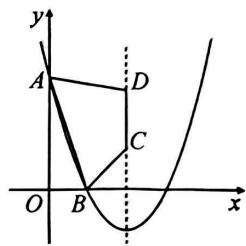

text_image

y
A
D
C
O
B
x

# 类型二 隐对称轴

4. (2025 七一华源) 在平面直角坐标系中, 点 $A(1 - m, n), B(5 + m, n)$ 均在抛物线 $y = x^{2} + bx + c$ 上, 则 $b$ 的值为 \_\_\_\_.  
5.(2024宁波模拟)已知 $A(m,2024),B(m+n,2024)$ 是抛物线 $y = -(x-h)^{2}+2040$ 上的两点,则正数 $n=$ \_\_\_\_.  
6.(2024越秀)已知 $A(x_{1},2024),B(x_{2},2024)$ 是二次函数 $y=ax^{2}+bx+3(a\neq0)$ 图象上的两点,则当 $x=x_{1}+x_{2}$ 时,二次函数的值是 \_\_\_\_.  
7.(2024 洪山)若抛物线 $M: y = x^{2} - (3m - 3)x - 3$ 与抛物线 $M': y = x^{2} + 10x + 2n + 5$ 关于直线 $x = -1$ 对称, 则 $m, n$ 的值为( )

A. $m = 1, n = 1$

B. $m = 1, n = -1$

C. $m = 3, n = 4$

D. $m = 3, n = -4$

# 突破 2 图象与性质(二) 增减性

# 类型一 知对称轴比大小

1.(2024 江汉期中)已知抛物线 $y=x^{2}-x+c$ 上有三个点 $A(x_{1},y_{1}), B(x_{2},y_{2}), C(x_{3},y_{3})$ ，若 $-2<x_{1}<-1,0<x_{2}<1,1<x_{3}<2$ ，则 $y_{1}, y_{2}, y_{3}$ 的大小关系是()

A. $y_{1} <   y_{2} <   y_{3}$

B. $y_{2} <   y_{1} <   y_{3}$

C. $y_{3}<y_{2}<y_{1}$

D. $y_{2}<y_{3}<y_{1}$

2.(2025 江汉)已知抛物线 $y=a(x-3)^{2}+2(a>0)$ 经过点 $A(1,y_{1}), B(m,y_{2}), C(n,y_{3})$ ，且 $|m-3|<|n-3|<2$ ，则 $y_{1}, y_{2}, y_{3}$ 的大小关系是()

A. $y_{1} <   y_{2} <   y_{3}$

B. $y_{2} <   y_{3} <   y_{1}$

C. $y_{3} <   y_{2} <   y_{1}$

D. $y_{3}<y_{1}<y_{2}$

# 类型二 隐对称轴比大小

3.(2024六中上智)已知二次函数 $y=ax^{2}+bx+c$ (a为常数,且a>0)的图象上有四点 $A(-1,y_{1})$ , $B(3,y_{1}),C(2,y_{2}),D(-2,y_{3})$ , 则 $y_{1},y_{2},y_{3}$ 的大小关系是()

A. $y_{1} <   y_{2} <   y_{3}$

B. $y_{2} <   y_{1} <   y_{3}$

C. $y_{2}<y_{3}<y_{1}$

D. $y_{3} <   y_{1} <   y_{2}$

4. (2024 蔡甸、黄陂、江夏三区期中)已知点 $A(-2, y_1), B(2, y_2), C(3, y_3)$ 在二次函数 $y = ax^2 - 2ax + 3a$ 的图象上, 二次函数图象与 $y$ 轴的交点在负半轴, 则 $y_1, y_2, y_3$ 的大小关系为 ( )

A. $y_{1} <   y_{2} <   y_{3}$

B. $y_{1} <   y_{3} <   y_{2}$

C. $y_{2}<y_{1}<y_{3}$

D. $y_{2} <   y_{3} <   y_{1}$

5.(2025德州)已知一元二次方程 $x^{2}+bx=0$ 的解为 $x_{1}=0,x_{2}=-2$ , 若抛物线 $y=x^{2}+bx$ 上有两点 $A(1,y_{1}),B(-5,y_{2})$ , 则()

A. $y_{1} = y_{2}$

B. $y_{1} > y_{2}$

C. $y_{1}<y_{2}$

D. 无法确定

# 类型三 利用增减性求参数范围

6.(2024二中广雅)已知二次函数 $y = -3x^{2} + (100 - 3a)x + 25$ ( $a$ 为整数)，当 $x \leqslant 15$ ( $x$ 为整数)时， $y$ 随 $x$ 的增大而增大，则 $a$ 的最大值是（）

A. 3

B. 4

C. 5

D. 6

7.(2025厦门外校)已知二次函数 $y=ax^{2}+bx+c$ ，当x=2时，该函数取最大值12.设该函数图象与x轴的一个交点的横坐标为 $x_{1}$ ，若 $x_{1}<0$ ，则a的取值范围是\_\_\_\_。

# 突破 3 图象与性质(三) 抛物线的平移

# 类型一 知平移方式求解析式

1. (2024 咸阳) 抛物线 $y = x^{2} + 2kx - k^{2}$ 的对称轴在 $y$ 轴左侧, 将该抛物线先向右平移 2 个单位长度, 再向上平移 1 个单位长度后, 得到的抛物线正好经过坐标原点, 则 $k$ 的值是 \_\_\_\_.

2.(2024 榆林)如图,抛物线 $y = -x^{2} + bx + c$ 的顶点 P 在直线 $y = x + 2$ 上移动,连接 OP,当 OP 长度最小时,则 b,c 的值分别为()

A.-2,0

B. 2,1

C. 2,0

D.-2,1

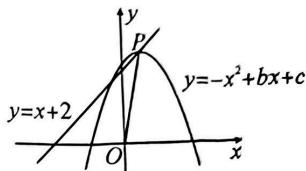

text_image

y
P
y=x+2
O
x
y=-x²+bx+c

# 类型二 知解析式求平移方式

3.(2024二中广雅)平面直角坐标系中,抛物线 $y=x^{2}+2x$ 经平移变换得到抛物线 $y=x^{2}-2x$ ,则这个变换是()

A. 向左平移 2 个单位长度

B. 向右平移 2 个单位长度

C. 向左平移 4 个单位长度

D. 向右平移 4 个单位长度

4. (2025 西安期末) 将抛物线 $y = x^{2} - 6x$ 向上平移 $b (b > 0)$ 个单位长度后, 所得新抛物线对应的二次函数的最小值为 1 , 则 $b$ 的值为 \_\_\_\_.

5. (2025 保定期末) 如图, 曲线 $L$ 是抛物线 $y = -x^{2} + 2x + 3$ 的一部分, 其与 $x$ 轴正半轴、 $y$ 轴分别交于 $A, B$ 两点, 直线 $l \parallel x$ 轴且过点 $C(0,5)$ . 将曲线 $L$ 向上平移 $m$ 个单位长度, 若曲线 $L$ 与直线 $l$ 有两个交点, 则 $m$ 的取值范围为 ( )

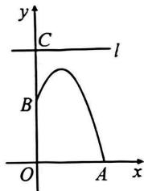

text_image

y
C
l
B
O
A
x

A. $m > 1$

B. $1 < m \leq  2$

C. $1 < m < 2$

D. $1 \leq m \leq 2$

# 类型三 含参计算

6.(2024 淄博二模)已知二次函数 $y=-\frac{1}{3}(x-m)(x-m-9)$ 的图象 $l_{1}$ ，现将 $l_{1}$ 向下平移 k 个单位长度得到图象 $l_{2}$ 。若 $l_{1}, l_{2}$ 都与 x 轴有两个交点，且这四个交点中每相邻两点间的距离都相等，则 k 的值为 \_\_\_\_.

7. (2024 东湖高新期末)已知抛物线 $y = x^{2} + ax + b$ 与 $x$ 轴两个交点间的距离为 2, 将此抛物线向右平移 2 个单位长度, 再向下平移 3 个单位长度, 得到一条新抛物线, 则新抛物线与 $x$ 轴两个交点间的距离是 \_\_\_\_.

# 突破 4 二次函数与方程(一) 根与交点

# 类型一 交点得根

1.(2025 汉阳)已知二次函数 $y=x^{2}+x+c$ 的图象与 x 轴的一个交点为(1,0)，则关于 x 的方程 $x^{2}+x+c=0$ 的两实数根分别是()

A. 1 和 -1

B. 1 和 -2

C. 1 和 2

D. 1 和 3

2.(2025 砥口)已知抛物线 $y=x^{2}-(4a+1)x+3a^{2}+3a$ (a 为常数)与 x 轴交于 A, B 两点, 若 AB=2, 则 a 的值是()

A. $\frac{3}{2}$

B. $-\frac{1}{2}$

C. $-\frac{3}{2}$ 或 $\frac{3}{2}$

D. $-\frac{1}{2}$ 或 $\frac{3}{2}$

3.(2025 江汉)抛物线 $y=ax^{2}+bx+c$ 经过 A(-3,0), B(4,0)两点，则关于 x 的一元二次方程 $a(x-1)^{2}+c=b-bx$ 的解是 \_\_\_\_.  
4.(2025 武昌)已知抛物线 $y=a(x-h)^{2}+k$ 与 x 轴交于点 $(-2,0)$ ， $(3,0)$ ，则关于 x 的一元二次方程 $a(x+h+6)^{2}+k=0$ 的解为 \_\_\_\_.

# 类型二 根得交点

5.(2025七一华源)若抛物线 $y=x^{2}-2x-3$ 与直线 y=2 交于 A, B 两点，则 AB 的长为 \_\_\_\_.  
6.(2024 蔡甸、黄陂、江夏三区期中)若抛物线 $y=x^{2}+kx+4k$ 在直线 y=16 下方的图象上恰好有五个横坐标为整数的点，则 k 的值不可能是()

A. 2

B. $\sqrt{5}$

C. 13

D. $4\pi+1$

# 类型三 整体求值

7. 已知抛物线 $y = x^{2} - 2022x + 1$ 与 $x$ 轴交于点 $A(a,0)$ 和 $B(b,0)$ ，则 $a^2 - \frac{2022}{b}$ 的值为 ( )

A. 1

B. -1

C. 2022

D. -2 022

8.(2024七一华源期中)定义:由a,b构造的二次函数 $y=ax^{2}+(a+b)x+b$ 叫做一次函数y=ax+b的“滋生函数”.若一次函数 $y=ax+b$ 的“滋生函数”是 $y=ax^{2}-3x+a+1,t$ 是关于x的方程 $x^{2}+bx+a-b=0$ 的根,且t>0,则 $t^{3}-2t^{2}+1$ 的值为()

A. 0

B. 1

C. $\sqrt{5} + 1$

D. $3 - \sqrt{5}$

# 突破5 二次函数与方程(二)根的判别式

# 类型一 抛物线与 $x$ 轴的公共点

1.(2025 江汉)若抛物线 $y=(m-1)x^{2}+3mx+2m+1$ 与坐标轴只有两个公共点，则 m 的值是 \_\_\_\_.

2.(2024第三寄宿)已知二次函数 $y=x^{2}+bx+c$ 的图象与 x 轴只有一个公共点,且当 x=a 和 $x=a+n$ 时函数值都为 m,则 m,n 的关系式为()

A. $m = n^{2}$

B. $m = 4n^{2}$

C. $m = \frac{n^{2}}{2}$

D. $m = \frac{n^{2}}{4}$

3.(2024 宿迁模拟)对于任意实数 m, 抛物线 $y = x^{2} + mx + 2m - n$ 与 x 轴都有公共点, 则 n 的取值范围是 \_\_\_\_.

# 类型二 抛物线与直线的公共点

4.(武昌联考)经过点 $P(0,2)$ 的直线 $l$ 与抛物线 $y = -x^{2} + 1$ 有唯一公共点, 则直线 $l$ 的解析式为 \_\_\_\_.

5.(2025六中上智)已知二次函数 $y=ax^{2}+bx+c$ ，一次函数 $y=k(x+k+2)$ ，若它们的图象对于任意的实数 k 都只有一个公共点，则 $a-b+c$ 的值为()

A. $\frac{1}{4}$

B. $\frac{1}{2}$

C. $-\frac{1}{4}$

D. $-\frac{1}{2}$

6.(2024 桂林一模)对于一个函数:当自变量 x 取 a 时,其函数值 y 也等于 a,我们称 a 为这个函数的不动点.若二次函数 $y = x^{2} + 2x + c$ (c 为常数)有两个不相等的不动点,则 c 的取值范围是()

A. $c < \frac{1}{4}$

B. $c < -2$

C. $c > - 2$

D. $c > - \frac{1}{4}$

7.(2024岳阳一模)若要在抛物线 $y=(k+3)x^{2}+kx-2$ (k 为常数, $k\neq-3$ ) 上找点 $M(m,m+1)$ ，则能找到点 M 的个数是()

A. 3 个

B. 2 个

C. 1 个

D. 0 个

# 类型三 利用“ $\Delta$ ”解决存在性问题

8.(2025江岸)如图,抛物线 $y = x^{2} + (k - 1)x - k (k > 0)$ 与直线 $y = kx + 1$ 交于 $A, B$ 两点,抛物线与 $x$ 轴交于 $C, D$ 两点(点 $C$ 在点 $D$ 的左侧).若直线 $AB$ 上存在唯一的一点 $Q$ ,使得 $\angle OQC = 90^{\circ}$ ,求出此时 $k$ 的值.

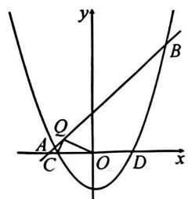

text_image

y
B
Q
A
C
O
D
x

9.(武汉中考)如图,P 是直线 l:y=-2x-2 上的一点,过点 P 的另一条直线 m 交抛物线 $y=x^{2}$ 于 A,B 两点.求证:对于直线 l 上给定任意一点 P,在抛物线上都能找到点 A,使 PA=AB 成立.

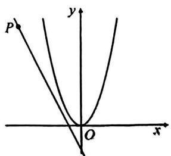

text_image

P
y
O
x

# 突破6 二次函数与方程(三) 根系关系

# 类型一 根系关系求代数式的值

1.(2024江岸期中)已知二次函数 $y = x^{2} - 2x - 2024$ 的图象上有两点 $A(a,1)$ 和 $B(b,1)$ ，则 $a^2 + 2b$ 的值为（）

A. 2023

B. 2024

C. 2028

D. 2029

2.(2024东西湖期中)已知二次函数 $y=x^{2}-2024x+2$ 的图象经过 A(m,1) 和 B(n,1) 两点，则 $m^{2}-\frac{2024}{n}+2024$ 的值是()

A. 0

B. 2023

C. 2024

D. 2025

# 类型二 根系关系求参数

3.(2025 江汉)若抛物线 $y=x^{2}+x+m$ (m 为常数)与直线 y=-2x 有两个交点 $A(x_{1},y_{1})$ ， $B(x_{2},y_{2})$ ，且 $(2x_{1}+1)(2x_{2}+1)<0$ ，则 m 的取值范围是()

A. $m < \frac{5}{4}$

B. $m > \frac{5}{4}$

C. $-\frac{9}{4}<m<-\frac{5}{4}$

D. $\frac{5}{4}<m<\frac{9}{4}$

4.(2024 碎口)已知抛物线 $y=ax^{2}+bx+3$ 交 x 轴于 $A(x_{1},0)$ , $B(x_{2},0)$ 两点, 交 y 轴于点 C, 若 $x_{1}+x_{2}=4$ , 且 $\triangle ABC$ 的面积为 3, 则 $a+b$ 的值为()

A. 3

B. - 5

C. -3

D. 5

# 类型三 根系关系求坐标

5.(2025外校)如图,已知抛物线 $C:y = x^{2} - 2x - 3$ 与直线 $l:y = kx + b$ 相交于 $A,B$ 两点(点 $A$ 在点 $B$ 的左边).若 $AB = 3\sqrt{10}$ ,且 $A(1, -4)$ ,求直线 $l$ 的解析式及点 $B$ 的坐标.

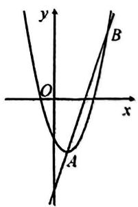

text_image

y
O
x
A
B

6.(2025 武昌实验)如图,已知抛物线 $y=x^{2}$ , 过点 Q(0,3)作直线 l 交抛物线于点 E, F (点 E 在点 F 的左侧), 点 Q 关于原点的对称点为 P. 当 $S_{\triangle PEF}=12$ 时, 求点 E, F 的坐标.

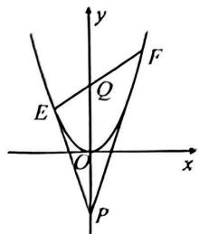

text_image

y
F
Q
E
O
x
P

# 类型四 根系关系求定值

7.(2025三寄)如图,直线 $y = x + 1$ 与抛物线 $y = x^{2} - 2mx + m^{2} + m$ 交于 $A, B$ 两点(点 $A$ 在点 $B$ 的左边).求证:无论 $m$ 为何值, $AB$ 的长总为定值.

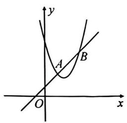

text_image

y
A
B
O
x

8.(2025 黄陂实验)如图, 直线 $l: y = kx + 5k (k \neq 0)$ 与 $x$ 轴交于点 $A$ , 与抛物线 $y = \frac{1}{4} x^2 + 1$ 交于 $B, C$ 两点, 过点 $B, C$ 分别作 $x$ 轴的垂线, 垂足分别为 $M, N$ , 求 $AM \cdot AN$ 的值.

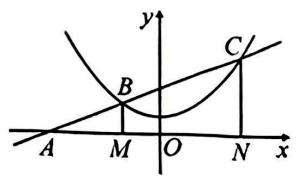

text_image

y
C/
A M O N x

# 突破 7 二次函数与方程(四) 根与不等式

# 类型一 根据 $x$ (或 $y$ ) 求 $y$ (或 $x$ ) 的取值范围

1. (2025 武汉十一初) 已知二次函数 $y = -x^2 + 4x - 3$ .

(1) 若 $-3 \leqslant x \leqslant 3$ ，则 y 的取值范围为 \_\_\_\_；  
(2) 若 $-8 \leqslant y \leqslant -3$ ，则 x 的取值范围为 \_\_\_\_。

2.(2024 沧州)已知二次函数 $y=x^{2}+bx+c$ 的图象经过点 $(1,-1)$ 和 $(0,-4)$ ，则当 $y\leqslant-1$ 时，x 的取值范围是()

A. $0 < x \leq 1$

B. $-1 \leqslant x \leqslant 1$

C. $-2 \leqslant x \leqslant 1$

D. $-3 \leqslant x \leqslant 1$

# 类型二 利用与 $x$ 轴的交点判断取值范围

3. 二次函数 $y = ax^2 + bx + c$ 的部分图象如图所示, 则当 $y < 0$ 时, $x$ 的取值范围是 \_\_\_\_ ; 当 $y > 0$ 时, $x$ 的取值范围是 \_\_\_\_ ; 当 $y > 2$ 时, $x$ 的取值范围是 \_\_\_\_.

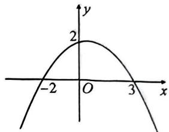

text_image

y
2
-2 O 3 x

4.(2025武昌)如图,抛物线 $y=-x^{2}+bx+c$ 交 y 轴于点(0,5),对称轴为直线 x=-2. 若 y>0,则 x 的取值范围是()

A. -4 < x < 1

B. -5 < x < 1

C. $x < -5$ 或 $x > 1$

D. $x < -4$ 或 $x > 1$

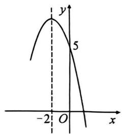

line

| x | y |
|---|---|
| -2 | 5 |
| 0 | 5 |

5.(2025江汉)已知关于x的二次函数 $y=ax^{2}+(a^{2}-1)x-a$ 的图象与x轴的一个交点的坐标为(m,0).若2<m<3,则a的取值范围是\_\_\_\_.

# 类型三 利用与直线交点判断取值范围

6. 如图, 二次函数 $y_1 = ax^2 + bx + c$ 和一次函数 $y_2 = mx + n$ 的图象, 观察图象写出 $y_2 \leqslant y_1$ 时, $x$ 的取值范围是 \_\_\_\_.

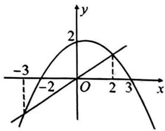

line

| Point | x | y |
|---|---|---|
| -3 | -3 | -2 |
| 2 | 2 | 2 |
| 3 | 3 | -2 |

# 类型四 作差法比较函数值的大小

7.(2024 福建中考)已知二次函数 $y=x^{2}-2ax+a(a\neq0)$ 的图象经过 $A\left(\frac{a}{2},y_{1}\right),B(3a,y_{2})$ 两点,则下列判断正确的是()

A. 可以找到一个实数 $a$ ，使得 $y_{1} > a$

B. 无论实数 a 取什么值, 都有 $y_{1} > a$

C. 可以找到一个实数 $a$ ，使得 $y_{2} < 0$

D. 无论实数 $a$ 取什么值, 都有 $y_{2} < 0$

# 突破8 二次函数与方程(五)根的分布

# 类型一 比较根的大小

1. (2024 武昌期中) 已知抛物线 $y = (x - x_1)(x - x_2) - 3(x_1 < x_2)$ 与 $x$ 轴交于 $(m,0), (n,0)$ 两点 $(m < n)$ , 则 $m, n, x_1, x_2$ 的大小关系是 ( )

A. $x_{1} < m < n < x_{2}$

B. $m <   x_{1} <   x_{2} <   n$

C. $m <   x_{1} <   n <   x_{2}$

D. $x_{1} < m < x_{2} < n$

# 类型二 分析方程整根

2. (2025 江岸)已知抛物线 $y = ax^2 + bx + c (a < 0)$ 的对称轴为 $x = -1$ , 与 $x$ 轴的一个交点为(2, 0). 若关于 $x$ 的一元二次方程 $ax^2 + bx + c = p (p > 0)$ 有整数根, 则 $p$ 的值有()

A. 2 个

B. 3 个

C. 4 个

D. 5 个

3.(2025东西湖)已知抛物线 $y=ax^{2}+bx+c$ 经过 $(-4,0)$ 与 $(2,0)$ 两点，关于 x 的方程 $ax^{2}+bx+c+m=0(m>0)$ 有两个实数根，其中一个根是 4. 若关于 x 的方程 $ax^{2}+bx+c+n=0(0<n<m)$ 也有两个整数根，则这两个整数根是（）

A.-2或0

B.-4或2

C.-5或3

D. -6 或 4

# 类型三 根的分布求参

4. (2024 沈阳期中)已知抛物线 $y = -x^{2} + mx$ 的对称轴为直线 $x = 2$ , 若关于 $x$ 的一元二次方程 $-x^{2} + mx - t = 0$ ( $t$ 为实数)在 $1 < x < 5$ 的范围内有解, 则 $t$ 的取值范围是()

A. $t > - 5$

B. $-5 < t < 3$

C. $3 < t \leqslant 4$

D. $-5 < t \leqslant 4$

5.(2024江岸)对于一个函数,自变量x取t时,函数值y为t,则称t为这个函数的不动点.如果二次函数 $y=-x^{2}+2x+c$ (c为常数)有两个相异的不动点 $x_{1},x_{2}$ ,且 $x_{1}<2<x_{2}$ ,则c的取值范围是\_\_\_\_.

# 突破9 二次函数与方程(六)公共点问题

1. (2025 中考模拟) 已知函数 $y = \begin{cases} (x - 1)^2 - 1 (x < 3), \\ (x - 5)^2 - 1 (x \geqslant 3), \end{cases}$ 点 $P(a, ka)$ 在该函数的图象上，若这样的点 $P$ 恰好有 3 个，求 $k$ 的值.

2. (2025 江汉) 如图, 将抛物线 $y = (x - 1)^2$ 的图象位于直线 $y = 4$ 上方的部分向下翻折, 得到新的图象 (实线部分), 若直线 $y = -x + m$ 与新图象有四个交点, 则 $m$ 的取值范围是 ( )

A. $\frac{3}{4} < m < 3$

B. $\frac{3}{4} < m < 7$

C. $\frac{4}{3} < m < 7$

D. $\frac{4}{3} < m < 3$

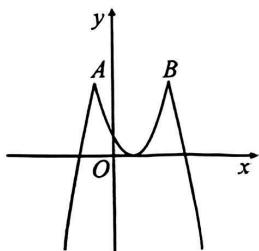

text_image

y
A
B
O
x

3. 已知二次函数 $y = -x^{2} + 4x + 5$ 及一次函数 $y = -x + b$ ，将该二次函数在 x 轴上方的图象沿 x 轴翻折到 x 轴下方，图象的其余部分不变，得到一个新函数 $y = -| -x^{2} + 4x + 5|$ 的图象（如图所示），当直线 $y = -x + b$ 与新图象有 4 个交点时，则 b 的取值范围是 \_\_\_\_.

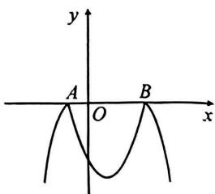

text_image

y
A O B x

4.(2025中考模拟)如图,将抛物线 $C: y = x^{2} - 6x + 5$ 在 $x$ 轴下方的图象沿 $x$ 轴翻折,翻折后得到的图象与抛物线 $C$ 在 $x$ 轴上方的图象记为 $G$ ,已知直线 $y = x + m$ 与图象 $G$ 有两个公共点.求 $m$ 的取值范围.

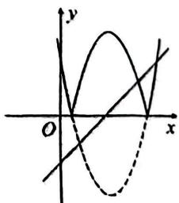

text_image

Mathematical graph showing a solid curve and a dashed line intersecting in a Cartesian coordinate system with labeled x and y axes.

# 突破 10 二次函数与方程(七) 参变分离

# 类型一 参变分离解决一元二次方程区间范围内根的问题

1.(2025 七一华源)若关于 x 的一元二次方程 $x^{2}-2x-t=0$ (t 为实数)，在 $-1 \leqslant x \leqslant 4$ 的范围内有两个不相等的实数根，则 t 的取值范围是()

A. $3 \leq t < 8$

B. $-1 \leqslant t < 3$

C. $-1 \leqslant t \leqslant 8$

D. $-1<t\leqslant3$

# 类型二 参变分离解决抛物线与直线(线段)公共点问题

2.(2024华宜寄宿期中)若函数 $y=ax^{2}-2x-2$ 的图象在-1<x<1的范围内与x轴没有公共点,则a的取值范围是()

A. 0 < a < 4

B. $0 < a \leqslant 4$

C. $a \leqslant 0$

D. $-\frac{1}{2} \leqslant a \leqslant 0$

3.(2024 青山期中)定义:若二次函数 $y=ax^{2}+bx+c$ 的图象上有一点的横坐标与纵坐标相等,则称这个点是这个函数的不动点.比如,函数 $y=x^{2}$ 图象上的点(1,1),(0,0)都是 $y=x^{2}$ 的不动点,若函数 $y=-x^{2}+mx-m$ 在 $-2\leqslant x\leqslant2$ 的范围内总有两个不同的不动点,则 m 的取值范围是()

A. $-\frac{2}{3}<m<3-2\sqrt{2}$

B. $-\frac{2}{3}\leq m<6$

C. $m > 6$ 或 $m < -\frac{2}{3}$

D. $-\frac{2}{3}\leq m<3-2\sqrt{2}$

# 类型三 参变分离解决恒成立问题

4.(2024 汉阳)已知抛物线 $y=x^{2}-2mx+4m$ (m 为常数), 若对满足 $x\geqslant1$ 的任意实数 x, 都使得 $y\geqslant0$ 成立, 则实数 m 的取值范围是 \_\_\_\_.

# 突破 11 二次函数与区间最值(一) 定轴定区间

# 类型一 显性区间最值

1.(2024 淄博期中)若二次函数 $y = -x^{2} - 2x + c^{2} - 2c$ 在 $-3 \leqslant x \leqslant 2$ 的范围内有最小值为 -5，则 c 的值为（）

A. 3 或 -1

B. -1

C.-3或1

D. 3

2.(2024一初慧泉)已知抛物线 $y=x^{2}+2x+4$ 上有一点 $P(a,b)$ ，当 $-2\leqslant a<3$ 时，则 P 点纵坐标 b 的取值范围为()

A. $3 \leqslant b < 4$

B. $-1 \leqslant b \leqslant 4$

C. $3 \leqslant b < 19$

D. $4 < b \leq 19$

# 类型二 隐对称轴最值

3. (2024 宜昌期中)已知关于 $x$ 的二次函数 $y = ax^2 - 4ax + 3a^2 - 6$ , 当 $x < 0$ 时, $y$ 随 $x$ 的增大而减小, 且当 $-1 \leqslant x \leqslant 4$ 时, $y$ 有最大值 2 , 则 $a$ 的值为 ( )

A. $\frac{8}{3}$

B. 1

C.-1

D. $-\frac{8}{3}$

4. (2024渭南)已知二次函数 $y = ax^2 + 2ax + a^2 + a - 2$ (a为常数)在 $-2 \leqslant x \leqslant 1$ 时, $y$ 的最大值为 10 , 则 $a$ 的值是 ( )

A.-6

B. $2\sqrt{3}$

C.-6或 $2\sqrt{3}$

D. 2 或 $-2\sqrt{3}$

# 类型三 隐区间最值

5.(2024 湖北联考)若 m, n 是非负数, 且 $2m + n = 2, 2m^{2} - 4n$ 的最大值为 a, 最小值为 b, 则 a - b 的值是()

A.-10

B. 10

C.-14

D.-12

# 突破 12 二次函数与区间最值(二) 动轴定区间

1. 已知 $y = -x(x + 3 - a) + 1$ 是关于 $x$ 的二次函数， $x$ 的取值范围是 $1 \leqslant x \leqslant 5$ .

(1) 若 $y$ 在 $x = 1$ 时取得最大值, 则 $a$ 的取值范围是 \_\_\_\_;  
(2) 若 $y$ 在 $x = 1$ 时取得最小值, 则 $a$ 的取值范围是 \_\_\_\_.

2.(2024西安二模)已知二次函数 $y=-(x-n)^{2}-1$ (n为常数)，当 $1 \leqslant x \leqslant 4$ 时，其对应的函数值最大为 -10，则 n 的值为（）

A. 4

B.-2或7

C. 1 或 7

D.-2或4

3. 已知关于 $x$ 的二次函数 $y = x^2 - 2ax + 3$ , 当 $1 \leqslant x \leqslant 3$ 时, 函数有最小值 $2a$ , 则 $a$ 的值为 \_\_\_\_.

4. (2024济南二模)已知二次函数 $y = -x^{2} + 2cx + c$ 的图象经过点 $A(a, c), B(b, c)$ ，且满足 $0 < a + b < 2$ . 当 $-1 \leqslant x \leqslant 1$ 时，该函数的最大值 $m$ 和最小值 $n$ 之间满足的关系式是（）

A. $n = -3m - 4$

B. $m = -3n - 4$

C. $n = m^{2} + m$

D. $m = n^{2} + n$

5.(2025二中广雅)二次函数 $y = x^{2} - 2hx + h$ ，当自变量 $x$ 在 $-1 \leqslant x \leqslant 1$ 的范围内有最小值 $n$ ，则 $n$ 的最大值为 \_\_\_\_.

# 突破13 二次函数与区间最值(三)动区间求参

# 类型一 区间一边含参

1. (2024 合肥期中) 已知二次函数 $y = x^2 - 2x (-1 \leqslant x \leqslant t)$ ，当 $x = -1$ 时，函数取得最大值；当 $x = 1$ 时，函数取得最小值，则 $t$ 的取值范围是 \_\_\_\_.

2. (2024 泸州中考改) 已知二次函数 $y = -x^2 + 2x + 3$ ，当 $-1 \leqslant x \leqslant t$ 时， $y$ 的取值范围是 $0 \leqslant y \leqslant 2t - 1$ ，求 $t$ 的值.

# 类型二 区间双边含参

3. (2024 辽宁期中)已知二次函数 $y = -x^{2} + 2mx - m^{2} + 3$ 在 $m - 1 \leqslant x \leqslant m + 2$ 的范围内有最小值, 则这个最小值是 \_\_\_\_.

4. (2024 邢台) 点 $A(a, b_1), B(a + 2, b_2)$ 在函数 $y = -x^2 + 2x + 3$ 的图象上, 当 $a \leqslant x \leqslant a + 2$ 时, 函数的最大值为 4 , 最小值为 $b_1$ , 则 $a$ 的取值范围是 ( )

A. $0 \leqslant a \leqslant 2$

B. $-1 \leqslant a \leqslant 2$

C. $-1 \leqslant a \leqslant 1$

D. $- 1 \leq  a \leq  0$

5.(2024 浙江期中)已知关于 x 的二次函数 $y = -x^{2} + 2mx + n$ (m, n 为常数). 若 $m - 1 \leqslant x \leqslant m + k$ (k > 0) 时, 函数的最大值为 p, 最小值为 q, 且 p - q = 3k, 则 k 的值为 \_\_\_\_.

# 突破14 二次函数多结论(一) 图象信息

1. (2024 江汉四校) 如图, 抛物线 $y = ax^2 + bx + c$ 与 $x$ 轴交于点 $A(-1,0)$ , 顶点坐标 $(1,n)$ , 与 $y$ 轴的交点在 $(0,2)$ , $(0,3)$ 之间 (包含端点). 下列结论: ① $3a + b < 0$ ; ② $-1 \leqslant a \leqslant -\frac{2}{3}$ ; ③ 对于任意实数 $m, a(m^2 - 1) + b(m - 1) \leqslant 0$ 总成立; ④ 关于 $x$ 的方程 $ax^2 + bx + c = 1 - 4a$ 无实数根. 其中结论正确的个数为 ( )

A. 1 个

B. 2 个

C. 3 个

D. 4 个

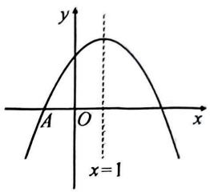

text_image

y
x
A O x
x=1

2. (2024 武昌三校期中) 如图, 函数 $G$ 图象是由 $y = x^{2} + 2x + 2 (x \leqslant 0)$ 的图象 $C_{1}$ 和它关于 $(0,2)$ 成中心对称的图象 $C_{2}$ 组成. 下列说法: ① 函数 $G$ 图象关于 $y$ 轴对称; ② 当 $-1 \leqslant x \leqslant 1$ 时, 函数 $G$ 随 $x$ 的增大而增大; ③ 若直线 $y = k$ 与 $G$ 图象有三个交点, 则 $1 < k < 3$ ; ④ 已知不重合的两点 $A(a, y_{a}), B(b, y_{b})$ 在函数 $G$ 的图象上, 且 $a < 0 < b, a + b = 0$ , 若当 $a \leqslant x \leqslant b$ 时, 函数 $G$ 的最大值和最小值为均为定值, 则 $a$ 的取值范围是 $-1 - \sqrt{2} \leqslant a \leqslant -1$ . 其中正确的说法有 \_\_\_\_(填序号).

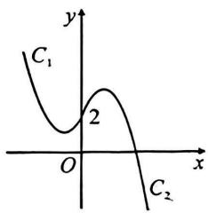

text_image

C₁
2
O
x
y
C₂

3.(2025 宿迁期末)如图,抛物线 $y = ax^{2} + bx + c (a \neq 0)$ 的对称轴为直线 $x = 1$ ,与 $x$ 轴的一个交点坐标为(-1,0),其部分图象如图所示.下列结论:① $4ac < b^{2}$ ; ② $b + 2a = 0$ ; ③当 $y < 0$ 时, $x$ 的取值范围是-1 < x < 3; ④当 $x < 0$ 时, $y$ 随 $x$ 增大而增大; ⑤方程 $ax^{2} + bx + c = 2$ 有两个不等的实数根.其中结论正确的个数是()

A. 2

B. 3

C. 4

D. 5

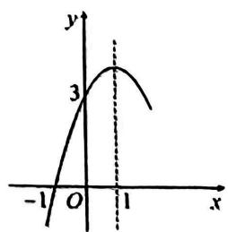

line

| x | y |
|---|---|
| -1 | 0 |
| 0 | 3 |
| 1 | 2 |

# 突破 15 二次函数多结论(二) 文字信息

1.(2024 硚口)已知开口向下的抛物线 $y=ax^{2}+bx+c$ 与 x 轴交于点 $(-1,0)$ ，对称轴为直线 x=1，则下列结论：①abc>0；② $2a+b=0$ ；③函数 $y=ax^{2}+bx+c$ 的最大值为 -4a；④若关于 x 的方程 $ax^{2}+bx+c=a+1$ 无实数根，则 $-\frac{1}{5}<a<0$ 。正确的有（）个。

A. 1

B. 2

C. 3

D. 4

2. (2024 洪山期中) 抛物线 $y = ax^2 + bx + c (a < 0)$ 与 $x$ 轴交于 $A(-3,0), B$ 两点，与 $y$ 轴交于点 $C$ ，点 $(m-6, n)$ 与点 $(4-m, n)$ 也在该抛物线上。下列结论：①点 $B$ 的坐标为 $(1,0)$ ；②方程 $ax^2 + bx + c + 2 = 0$ 有两个不相等的实数根；③ $\frac{3}{4} a + c < 0$ ；④当 $x = -t^2 - 2 (t \text{为常数})$ 时， $y < c$ 。其中正确的是 \_\_\_\_。（填序号）

3.(2024武珞路中学期中)抛物线 $y=ax^{2}+bx+c$ (a,b,c是常数)的顶点在第四象限,且 $a-b+c=0$ . 下列四个结论:①b>0,②a-b-c<0,③方程 $ax^{2}+bx+c=cx+c$ 的解为 $x_{1}=-1$ , $x_{2}=0$ ,④若 c<-3a,则当 $x_{1}<x_{2}<1$ 时, $y_{1}>y_{2}$ . 其中正确的结论是 \_\_\_\_ (填写序号).

# 突破 16 二次函数多结论(三) 表格信息

1.(2024蔡甸、黄陂、江夏三区期中)已知抛物线 $y=ax^{2}+bx+c$ 的y与x的部分对应值如表：

<table><tr><td>x</td><td>-4</td><td>-3</td><td>-1</td><td>1</td><td>4</td></tr><tr><td>y</td><td>0</td><td>5</td><td>9</td><td>5</td><td>-16</td></tr></table>

下列结论:①对称轴为直线 x=-1;②方程 $ax^{2}-bx+c-9=0$ 有两个不相等的实数根;③若点 $(m,y_{1}),(-m-2,y_{2})$ 均在二次函数图象上,则 $y_{1}=y_{2}$ ;④满足 $ax^{2}+(b-1)x+c<4$ 的 x 的取值范围是 x<-4 或 x>1. 其中正确结论的序号为 \_\_\_\_.

2. (2024 烟台中考)已知二次函数 $y = ax^2 + bx + c$ 的 $y$ 与 $x$ 的部分对应值如表:

<table><tr><td>x</td><td>-4</td><td>-3</td><td>-1</td><td>1</td><td>5</td></tr><tr><td>y</td><td>0</td><td>5</td><td>9</td><td>5</td><td>-27</td></tr></table>

下列结论:①abc>0;②关于x的一元二次方程 $ax^{2}+bx+c=9$ 有两个相等的实数根;③当-4<x<1时,y的取值范围为0<y<5;④若点 $(m,y_{1})$ , $(-m-2,y_{2})$ 均在二次函数的图象上,则 $y_{1}=y_{2}$ ;⑤满足 $ax^{2}+(b+1)x+c<2$ 的x的取值范围是x<-2或x>3.其中正确结论的序号为 \_\_\_\_.

3.(2025外校)二次函数 $y = ax^{2} + bx + c$ ( $a, b, c$ 为常数, $a \neq 0$ ) 的 $x$ 与 $y$ 的部分对应值如下表:

<table><tr><td>x</td><td>0</td><td>2</td><td>-4</td></tr><tr><td>y</td><td>n</td><td>1</td><td>1</td></tr></table>

当 $n > 1$ 时，下列结论中一定正确是 \_\_\_\_（填序号）.

①bc<0; ②抛物线 $y=ax^{2}+bx+c-1$ 与 x 轴的交点坐标是(2,0)和(-4,0); ③对于任意实数 t，总有 $at^{2}+bt\leqslant a-b$ ; ④若关于 x 的方程 $ax^{2}+bx+c=p(0<p<1)$ 的两根是 $\alpha,\beta(\alpha<\beta)$ ，则 $-4<\alpha<\beta<2$ .

# 突破 17 二次函数多结论(四) 绝对值型

# 类型一 绝对值不含参

1.(2025江汉模拟)某数学兴趣小组画出了函数 $y = |x^2 - x - 6|$ 的图象(如图所示),并写出了下列结论:①点(1,6)在该函数图象上;②图象与坐标轴的交点为 $A(-2,0), B(3,0), C(0,6)$ ; ③当 $x = \frac{1}{2}$ 时,函数取得最大值;④若 $(x_0, y_0)$ 在函数图象上,则 $(1 - x_0, y_0)$ 也在函数图象上; ⑤当直线 $y = -x + m$ 与函数的图象有4个交点时,则 $m$ 的取值范围是 $3 < m < 7$ . 其中正确的结论有\_\_\_\_(填序号).

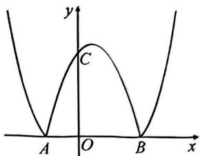

text_image

y
C
A O B x

2. (2025 中考模拟) 函数 $y = x^{2} - 3 \mid x \mid +2$ 有下列结论: ①当 $x > 2$ 时, $y$ 随 $x$ 增大而增大; ②此函数图象有两条对称轴; ③函数图象中两个最低点之间的距离为 3; ④当 $x^{2} - 3|x| + 2 < 0$ 时, $x$ 的取值范围是 $-2 < x < -1$ 或 $1 < x < 2$ . 其中正确的结论是 \_\_\_\_ (填序号).

# 类型二 绝对值含参

3.(武汉四调)函数 $y=x^{2}+b|x|-4$ (b 为常数)有下列结论：

①无论 b 为何值,该函数图象过定点 $(0,-4)$ ; ②若 b=-2,则当 x<1 时,y 随 x 增大而减小;
③该函数图象关于 y 轴对称;④当 b>0 时,该函数的最小值是 -4.

其中正确的结论是\_\_\_\_（填序号）.

# 突破18 二次函数与线段(一) 线段长

# 类型一 竖线段→纵标差

1.(2024凉山州中考)如图,抛物线 $y=-x^{2}+bx+c$ 与直线 $y=x+2$ 相交于A(-2,0),B(3,m)两点,与x轴相交于另一点C.

(1)求抛物线的解析式；  
(2) $P$ 是直线 $AB$ 上方抛物线上的一个动点 (不与 $A, B$ 重合), 过点 $P$ 作直线 $PD \perp x$ 轴于点 $D$ , 交直线 $AB$ 于点 $E$ , 当 $PE = 2ED$ 时, 求点 $P$ 坐标.

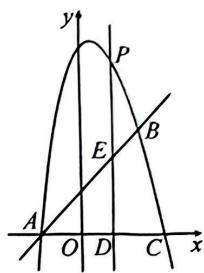

text_image

y
P
E
B
A
O
D
C
x

# 类型二 横线段 $\rightarrow$ 横标差

2.(2025邯郸期末改)如图,抛物线 $y=-\frac{1}{2}x^{2}+bx+c$ 经过 $B(4,0)$ , $C(0,2)$ 两点,且与 x 轴交于另一点 A.

(1)直接写出直线 $BC$ 和抛物线的解析式；  
(2) $P$ 是线段 $BC$ 上一点, $E$ 是 $AP$ 上方抛物线上一点, 且 $\angle APE = \angle ABC$ , 当 $PE$ 平分 $\angle APC$ 时, 求 $PE$ 的长.

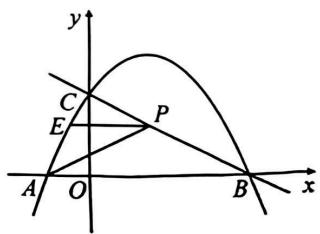

text_image

y
C
E
P
A O B x

# 类型三 斜线段 $\rightarrow$ 勾股计算

3.(2024 汉阳期中)如图,抛物线 $y=-x^{2}+2x+3$ 交 x 轴于点 A,B(点 A 在点 B 的左侧),直线 $y=2x+b$ 交抛物线于 C,D 两点.

(1)求点 A, B 的坐标;  
(2) 若 DC=5，求 b 的值.

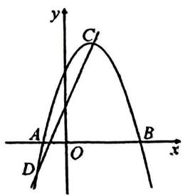

text_image

y
C
A
O
B
x
D

# 突破19 二次函数与线段（二）线段关系

# 类型一 等线段 $\rightarrow$ 勾股定理

1.(2025七一华源)抛物线 $C_{1}y = x^{2} + bx + c$ 交 $x$ 轴于点 $\Lambda(1,0), B(-3,0)$ .

(1) 求抛物线的解析式；  
(2)如图、直线 l 过点 B, C(0,4)，点 H 为抛物线第四象限上的一点，过点 H 作 $PH \parallel y$ 轴，交直线 l 于点 P. 若 BP = PH，求点 H 的坐标.

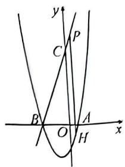

text_image

y
C
P
B
O
H
A
x

# 类型二 斜线等 $\rightarrow$ 竖线等

2. (2024 武汉中考) 如图, 抛物线 $y = \frac{1}{2} x^2 + 2x - \frac{5}{2}$ 交 $x$ 轴于 $A, B$ 两点 (点 $A$ 在点 $B$ 的右侧), 交 $y$ 轴于点 $C$ .

(1)直接写出 A, B, C 三点的坐标；  
(2)连接 AC, BC, 若在抛物线上有一点 P, 作 PQ//AC 交 y 轴于点 Q, 若 BC 平分线段 PQ, 求点 P 的坐标.

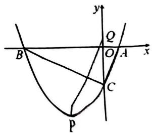

text_image

y
Q
B
O
A
x
C
P

# 突破 20 二次函数与线段(三) 平行线

# 类型一 利用平行得 $k$ 相等

1.(2025青山)如图,抛物线 $y=x^{2}+bx+c$ 与 x 轴交于点 A(-4,0) 和点 B,与 y 轴的负半轴交于点 C(0,-4).

(1) 求抛物线的解析式；  
(2)将直线 $AC$ 向下平移与抛物线交于 $M, N$ 两点, 直线 $AM, CN$ 交于 $Q$ 点, 请问点 $Q$ 是否在一条定直线上, 并说明理由.

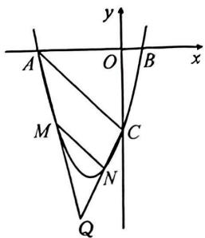

text_image

A
O
B
x
y
M
C
N
Q

# 类型二 利用 $k$ 相等证平行

2.(2025新洲)如图,抛物线 $y = -x^{2} + 2x + 3$ 与 $x$ 轴交于 $A,B$ 两点,与 $y$ 轴交于点 $C,E,F$ 为线段 $OC$ 上两点, $AE,AF$ 分别交抛物线于另一点 $M,N$ .若 $OE + OF = OC$ ,求证: $MN//BC$ .

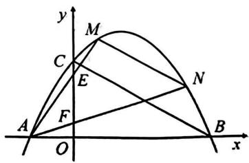

text_image

y
M
C
E
N
A
F
O
B
x

# 突破21 二次函数与面积（一）割补法

1. 如图, 抛物线的顶点 $D$ 在 $x$ 轴上, 且经过 $(0, -3)$ 和 $(4, -3)$ 两点, 抛物线与直线 $l$ 交于 $A, B$ 两点.

(1) 直接写出抛物线解析式和点 D 的坐标；  
(2) 若 $A(0, -3)$ , 且 $S_{\triangle ABD} = \frac{9}{4}$ , 求点 $B$ 的坐标.

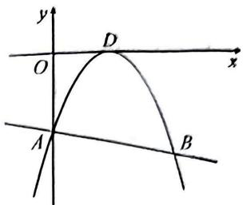

text_image

y
O
D
x
A
B

2.(2024二中广雅)如图,抛物线 $y=ax^{2}+bx-3$ 与 x 轴于 A(-3,0), B(1,0) 两点,交 y 轴于点 C.

(1)求抛物线的解析式；  
(2) $M$ 为第二象限抛物线上一点, 若 $2S_{\triangle MAC} = S_{\triangle MBC}$ , 求点 $M$ 的横坐标.

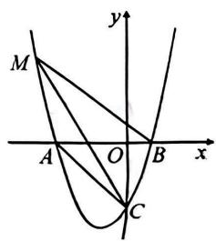

text_image

M
y
A O B x
C

# 突破 22 二次函数与面积(二) 铅垂法

# 类型一 巧用铅垂高

1. (2025 江汉期末) 已知二次函数 $y = ax^2 + 6$ 的图象经过点 $P(4,2)$ ，直线 $AB$ 与抛物线相交于 $A, B$ 两点.

(1) 求二次函数的解析式；  
(2)若直线 $AB$ 的解析式为 $y = kx - 4k - 3$ ，且 $\triangle PAB$ 的面积为 35，求 $k$ 的值.

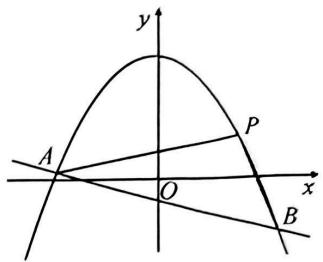

text_image

y
A
O
x
P
B

# 类型二 巧用水平宽

2.(2025 福州)如图,抛物线的顶点在原点,且点 C(2,1)在此抛物线上.

(1)求抛物线的解析式；  
(2) 直线 $y = mx - m^2 + 1$ 与抛物线的交于 $A, B$ 两点 (点 $C$ 在直线 $AB$ 下方, 点 $B$ 在点 $A$ 右侧), 若 $S_{\triangle ABC} = \frac{3}{2}$ , 求 $m$ 的值.

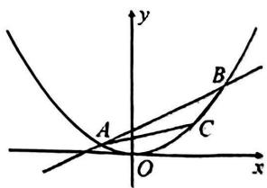

text_image

y
A
O
C
B
x

# 突破 23 二次函数与面积(三) 平行转化

# 类型一 取特殊点作平行转化面积

1. 如图, 抛物线 $y = bx + c$ 与 $x$ 轴交于 $A, B$ 两点, 与 $y$ 轴交于点 $C$ , 直线 $BC$ 解析式为 $y = x - 3$ .

(1) 求抛物线的解析式；

(2) $P$ 为直线 $BC$ 上方抛物线上一点, 若 $S_{\triangle PBC} = \frac{1}{2} S_{\triangle ABC}$ , 求点 $P$ 的坐标.

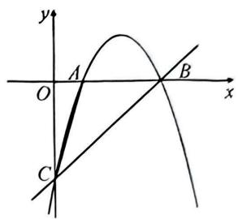

text_image

y
A
O
x
B
C

# 类型二 作平行将一般点转化到坐标轴上

2. (2024 华宜寄) 如图, 抛物线 $y = \frac{1}{2} x^2 - 18$ 与 $x$ 轴交于 $A, B$ 两点 (点 $A$ 在点 $B$ 的左侧), 与 $y$ 轴交于点 $C$ , 过点 $B$ 的直线交 $y$ 轴于点 $D$ , 且 $DB = DC$ .

(1)求点 D 的坐标;

(2) $P$ 是直线 $BD$ 下方抛物线上一点, 若 $\triangle BDP$ 面积为 $\frac{44}{3}$ , 求点 $P$ 的横坐标.

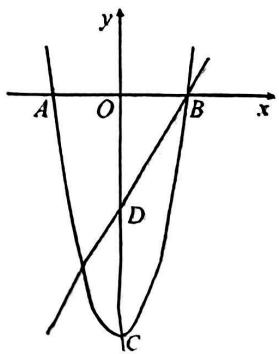

text_image

y
A O B x
D
C

# 突破24 二次函数与面积(四) 面积转化

# 类型一 面积相等 $\rightarrow$ 平行或平分

1. (2024 砥口期末改) 如图, 直线 $y = kx - 4 (k > 0)$ 与抛物线 $y = -x^2$ 相交于 $A, B$ 两点 (点 $A$ 在点 $B$ 的右侧), 连接 $OA, OB$ , 作 $AC \perp y$ 轴交抛物线于点 $C$ , 连接 $BC$ . 若 $\triangle ABO$ 与 $\triangle ABC$ 的面积相等, 求 $k$ 的值.

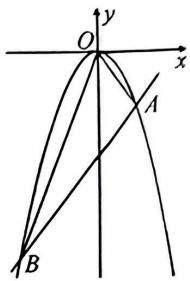

text_image

y
O
x
A
B

# 类型二 面积比 $\rightarrow$ 高的比

2. (武汉元调)如图, 经过定点 $A$ 的直线 $y = k(x - 2) + 1 (k < 0)$ 交抛物线 $y = -x^{2} + 4x$ 于 $B, C$ 两点 (点 $C$ 在点 $B$ 的右侧), $D$ 为抛物线的顶点.

(1)直接写出点 A 的坐标；  
(2) 若 $S_{\triangle ACD}=2S_{\triangle ABD}$ ，求 k 的值.

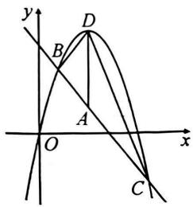

text_image

y
D
B
A
O
x
C

# 类型三 面积比→铅垂高的比

3. (江岸、东西湖期中) 如图, 抛物线 $y = x^{2} - 2x - 3$ 与 $x$ 轴交于 $A, B$ 两点 (点 $A$ 在点 $B$ 的左边), 与 $y$ 轴交于点 $C$ . 在线段 $BC$ 下方的抛物线上存在一点 $D$ , 使 $\frac{S_{\triangle ABD}}{S_{\triangle ADC}} = 2$ , 线段 $AD, BC$ 交于点 $E$ , 求点 $E$ 的坐标.

text_image

y
A O B x
E
C D

# 类型四 面积比→底的比

4. (2025 七一华源) 如图, 抛物线 $y = ax^2 + bx (a \neq 0)$ 经过点 $A(-4,0)$ 及原点, 且经过点 $B(4,8)$ .

(1)求该抛物线的解析式；  
(2) 连接 OB, P 为 x 轴下方抛物线上一动点, 过点 P 作 OB 的平行线, 交直线 AB 于点 Q, 连接 OQ, 当 $S_{\triangle POQ}: S_{\triangle BOQ} = 1: 2$ 时, 求点 P 的坐标.

text_image

y
Q
B
A
P
O
x

# 类型五 四边形 $\rightarrow$ 三角形

5.(武汉二调)如图,抛物线 $y=x^{2}-2x-6$ 与 x 轴交于 A, B 两点(点 A 在点 B 的左侧), C 是 AB 的中点, □CDEF 的顶点 D, E 均在抛物线上. 若点 D 的横坐标是 -2, 点 E 在第三象限, □CDEF 的面积是 13, 求点 F 的坐标.

text_image

y
D
C
A O B x
E
F

# 突破 25 二次函数与角度(一) $45^{\circ}$ 角

# 类型一 隐 $45^{\circ}$

1.(2024 汉阳期末改)如图,抛物线 $y=x^{2}-2x-3$ 交 x 轴于 A,C 两点,交 y 轴于点 B.抛物线上有点 D(2,m),在第三象限的抛物线上存在点 M,且 $\angle ACM=\angle BCD$ ,求点 M 的坐标.

text_image

y
A O C x
M
B D

# 类型二 知 $45^{\circ}$

2. (2025 新洲) 如图, 抛物线 $y = ax^2 + bx + 3 (a < 0)$ 与 $x$ 轴交于 $A(-1,0), B$ 两点, 与 $y$ 轴交于点 $C$ , 对称轴为直线 $x = 1$ .

(1)直接写出抛物线的解析式；  
(2) $P$ 是抛物线上一动点 (不与点 $C$ 重合), 直线 $CP$ 交对称轴于点 $N$ , 连接 $AN$ , 当 $\angle ANC = 45^{\circ}$ 时, 求直线 $PC$ 的解析式.

text_image

y
C
P
N
A O B x

3. (2025 武昌) 抛物线 $y = x^{2} - 2ax + 1 (a > 1)$ 与 $x$ 轴交于 $A, B$ 两点 (点 $A$ 在点 $B$ 的左侧), 与 $y$ 轴交于点 $C$ . 若 $\angle ACB = 45^{\circ}$ , 求 $a$ 的值.

text_image

y
C
O A B x

# 突破 26 二次函数与角度(二)等角

# 类型一 等角构平行

1.(2025东湖高新)如图,二次函数 $y=-x^{2}+bx+c$ 的图象经过点A(-1,0),B(3,0),与y轴交于点C、抛物线上是否存在点P,使 $\angle PAB=\angle ABC?$ 若存在,请求点P的坐标;若不存在,请说明理由.

text_image

y
C
A O B x

# 类型二 等角构全等

2.(2024 洪山期中)如图,抛物线 $y=x^{2}+bx+c$ 与 x 轴交于 A(-2,0), B(1,0) 两点,与 y 轴交于点 C.

(1)求抛物线的解析式；  
(2) 直线 $y = 3x - 6$ 与 $x$ 轴和 $y$ 轴分别交于点 $D$ 和 $E$ , 直线 $AC$ 交直线 $DE$ 于点 $F, P$ 为第一象限抛物线上一点, 若 $\angle PAF = \angle DFA$ , 求点 $P$ 的坐标.

text_image

y
P
A O B D x
C
F
E

# 类型三 等角构等腰

3. (2025 武昌) 如图, 抛物线 $y = -x^{2} + 2mx - m^{2} + 2m (m > 0)$ 交 $x$ 轴于 $A, B$ 两点 (点 $A$ 在点 $B$ 的左边), $C$ 是抛物线的顶点, $D$ 是对称轴右侧抛物线上一点, 且 $\angle COB = \angle OCD$ , 求线段 $CD$ 的长.

text_image

y
C
D
A O B x

# 突破 27 二次函数与角度(三)二倍角

# 类型一 二倍角 $\rightarrow$ 加倍

1.(2025三寄)如图,抛物线 $y = -x^2 + (a + 1)x - a (a > 1)$ 交 $x$ 轴于 $A, B$ 两点(点 $A$ 在点 $B$ 的左边),交 $y$ 轴于点 $C$ ,且 $S_{\triangle ABC} = 3$ .

(1) 直接写出抛物线的解析式；  
(2)若对称轴右侧的抛物线上有一点 P，射线 PA 与 y 轴交于点 Q，且 $\angle PQC = 2\angle ACO$ ，求点 P 的坐标.

text_image

y
Q
A
B
O
x
C
P

# 类型二 二倍角→减半

2.(2024东西湖)如图,抛物线 $y=x^{2}-2x-3$ 交 x 轴于 A,B 两点(点 A 在点 B 的左侧),交 y 轴负半轴于点 C,点 M,N 均在抛物线上,设点 M 的横坐标为 m,点 N 的横坐标为 $n(0<n<m<3)$ ,连接 MN,连接 AM,AN 分别与 y 轴交于点 S,T,且 $\angle AMN=2\angle BAM$ ,求 $3OS+ST$ 的值.

text_image

y
O
A
S
B
x
T
M
C
N

# 突破 28 二次函数与角度(四)角的和差

# 类型一 角的和差 $\rightarrow$ 得等角构全等

1.(2024江汉)如图,抛物线 $y=x^{2}+bx+c$ 与x轴交于点A,B(点A在点B的左侧),与y轴交于点C(0,-3),其对称轴为直线x=1.

(1) 求抛物线的解析式；  
(2)已知 D 为第二象限抛物线上一点, 连接 AC. 若 $\angle ABD + \angle BAC = 90^{\circ}$ , 求点 D 的坐标.

text_image

y
D
A O B x
C

# 类型二 角的和差→构特殊角

2.(2025 洪山)如图,抛物线 $y=-x^{2}+2x+3$ 与 x 轴交于 A,B 两点(点 A 在点 B 的左侧),与 y 轴交于点 C,P 为第一象限内抛物线上一点.若点 E 的坐标为 $(1,0)$ ,且 $\angle POC + \angle OCE = 45^{\circ}$ ,求点 P 的坐标.

text_image

y
C
P
O
A
E
B
x

# 突破 29 二次函数与特殊图形(一)等腰三角形

# 类型一 等腰三角形 $\rightarrow$ 勾股定理

1. (2025 江岸期末) 如图, 抛物线 $y = \frac{1}{4} x^2 + bx + 3$ 与 $x$ 轴交于点 $A, B$ (点 $B$ 在点 $A$ 的左侧), 与 $y$ 轴交于点 $C$ , 且 $OC = OB$ .

(1) 求 b 的值；  
(2) 点 D 在第一象限的抛物线上, 且在点 A 的右侧. 若 CD = AD, 求点 D 的横坐标.

text_image

y
C
O
B A x

# 类型二 等腰直角三角形 $\rightarrow$ 构三垂直全等

2.(2025 新洲联考)已知抛物线与 x 轴负半轴和正半轴分别交于 A, B 两点, 与 y 轴正半轴交于点 C, 且 OA = 2, OB = 4, OC = 8.

(1)直接写出抛物线的解析式；  
(2)如图, $Q$ 是第一象限抛物线上一点, 点 $R$ 在 $x$ 轴上. 若 $\triangle CQR$ 是以点 $Q$ 为直角顶点的等腰直角三角形, 求点 $Q$ 的横坐标.

text_image

y
C
Q
A
R
O
B
x

# 突破 30 二次函数与特殊图形(二) 平行四边形

# 类型一 平行边明确——与竖直线平行

1. (2025 洪山) 如图, 直线 $y = -2x + 8$ 分别交 $x$ 轴, $y$ 轴于点 $B, C$ , 抛物线 $y = -x^2 + bx + c$ 过 $B, C$ 两点, 其顶点为 $M$ , 对称轴 $MN$ 与直线 $BC$ 交于点 $N$ .

(1) 直接写出抛物线的解析式；  
(2)点 $P$ 是线段 $BC$ 上一动点, 过点 $P$ 作 $PD \perp x$ 轴于点 $D$ , 交抛物线于点 $Q$ . 是否存在点 $P$ , 使四边形 $MNPQ$ 为平行四边形? 请说明理由.

text_image

y
M
C
N
Q
P
O
D
B
x

# 类型二 平行边明确——与斜线平行

2.(2025东西湖)已知抛物线 $y = x^{2} + (3 + a)x + 3a$ 的顶点 $D$ 的横坐标为-1.

(1)求抛物线的解析式；  
(2)如图, 直线 $y = -x - 5$ 分别与 $x$ 轴, $y$ 轴交于 $E, F$ 两点, 将直线 $EF$ 沿 $y$ 轴正方向平移 $t$ ( $t > 0$ ) 个单位长度得直线 $l$ , 直线 $l$ 和抛物线相交于点 $P, Q$ . 若四边形 $EFQP$ 为平行四边形, 请求出 $t$ 的值.

text_image

P
y
E
O
Q
x
D
F

3.(2025江岸)如图,抛物线 $y = \frac{1}{2} x^2 - \frac{3}{2} x - 2$ 与 $x$ 轴交于 $A, B$ 两点(点 $A$ 在点 $B$ 的左边),与 $y$ 轴交于点 $C$ ,点 $P$ 在抛物线上,点 $Q$ 在抛物线的对称轴上.若以 $BC$ 为边,以点 $B, C, P, Q$ 为顶点的四边形是平行四边形,求点 $P$ 的坐标.

text_image

y
A O B x
C

# 类型三 平行边不明确——可为边可为对角线

4. 如图, 抛物线 $y = x^{2} + bx + c$ 与 $x$ 轴相交于点 $A(-1,0), B(3,0)$ , 与 $y$ 轴相交于点 $C$ .

(1)直接写出抛物线的解析式和对称轴；  
(2)将直线 $BC$ 向上平移, 得到过原点 $O$ 的直线 $MN, D$ 是直线 $MN$ 上的一点. 在抛物线的对称轴 $l$ 上是否存在点 $F$ , 使得以 $B, C, D, F$ 为顶点的四边形是平行四边形? 若存在, 求点 $F$ 与点 $D$ 的坐标; 若不存在, 请说明理由.

text_image

y
l
D
A O B x
M
C
N

# 突破 31 二次函数与特殊图形(三)菱形、正方形

# 类型一 二次函数与菱形

1.(2025烟台)如图,直线 $y=\frac{4}{3}x+4$ 与 x 轴交于点 A,与 y 轴交于点 C,抛物线 $y=ax^{2}+bx+c$ 经过 A,C 两点,对称轴为直线 x=-1.

(1)求抛物线的解析式；  
(2)若点 P 在抛物线对称轴上, Q 是坐标平面内一点, 是否存在点 P, Q, 使以点 A, C, P, Q 为顶点的四边形是以 AC 为对角线的菱形? 若存在, 请求出 P, Q 两点的坐标; 若不存在, 请说明理由.

text_image

y
C
A
O
x

# 类型二 二次函数与正方形

2.(2025 扬州)在平面直角坐标系中,已知点 A 在 y 轴正半轴上.

(1)如图 1, 已知菱形 ABCD 的顶点 B, C, D 在二次函数 $y = x^{2}$ 的图象上, 且 $AD \perp y$ 轴, 求菱形的边长;  
(2)如图 2, 已知正方形 ABCD 的顶点 B, D 在二次函数 $y = x^{2}$ 的图象上, 点 B, D 在 y 轴的同侧, 且点 B 在点 D 的左侧, 设点 B, D 的横坐标分别为 m, n, 探究 n - m 是否为定值?

text_image

y
A
D
B
C
O
x

图1

text_image

y
A
D
B
C
O
x

图2

# 突破 32 二次函数与最值(一) 极值模型

# 类型一 代数型最值 $\rightarrow$ 运用二次函数极值模型

1. 若二次函数 $y=ax^{2}+2$ 的图象经过 $P(1,3)$ , $Q(m,n)$ 两点，则代数式 $n^{2}-4m^{2}-4n+9$ 的最小值为 \_\_\_\_.

2、(2025 粮道街中学)“整体思想”在数学计算中有着很广泛的应用,用这一思想方法可求得函数 $y = -(x^{2} - 2x)^{2} - 4(x^{2} - 2x) + 2$ 的最大值是 \_\_\_\_.

# 类型二 几何型最值 $\rightarrow$ 转化为二次函数极值模型

3.(2025 安徽期末)如图 1, E 是等边△ABC 的边 BC 上一点(不与点 B, C 重合), 连接 AE, 以 AE 为边向右作等边△AEF, 连接 CF. 已知△ECF 的面积(S)与 BE 的长(x)之间的函数关系如图 2 所示(P 为抛物线的顶点).

(1)当 $\triangle ECF$ 的面积最大时, $\angle FEC$ 的大小为\_\_\_\_；

(2)等边△ABC 的边长为 \_\_\_\_.

text_image

A
B E C F

图1

text_image

S
2√3
P
O
x

图2

4. (2025 河北期末) 如图, 在矩形 $ABCD$ 中, $AB = 2 \mathrm{~cm}, AD = 7 \mathrm{~cm}$ , 动点 $P$ 从点 $A$ 出发, 以 $1 \mathrm{~cm} / \mathrm{s}$ 的速度沿 $AD$ 向终点 $D$ 移动, 设移动时间为 $t(\mathrm{s})$ . 连接 $PC$ , 以 $PC$ 为一边作正方形 $PCEF$ , 连接 $DE, DF$ , 则 $\triangle DEF$ 的面积最小值为 $\mathrm{cm}^{2}$ .

text_image

Geometric diagram with labeled points A, B, C, D, E, F, P forming triangles and quadrilaterals

# 突破33 二次函数与最值（二）线段最值

# 类型一 单线段最值

1. (2025 江岸) 如图, 抛物线 $y = ax^2 + bx + c$ 与 $x$ 轴交于点 $A(-1,0)$ , 点 $B(-3,0)$ , 与 $y$ 轴交于点 $C$ , 且 $OB = OC, M, N$ 为抛物线上两点, 点 $M$ 的横坐标为 $m$ , 点 $N$ 的横坐标为 $m + 4$ , 点 $D$ 是抛物线上 $M, N$ 之间的一动点, 过点 $D$ 作 $y$ 轴的平行线, 交 $MN$ 于点 $E$ . 求 $DE$ 的最大值.

text_image

D
B
A
O
x
y
N
C
E
M

# 类型二 线段和最值

2.(2024广安中考改)如图,抛物线 $y=-\frac{2}{3}x^{2}+bx+c$ 与 x 轴交于 A,B 两点,与 y 轴交于点 C,点 A 坐标为 $(-1,0)$ ,点 B 坐标为 $(3,0)$ .

(1)求此抛物线的函数解析式；  
(2) $P$ 是直线 $BC$ 上方抛物线上一动点, 过点 $P$ 作 $x$ 轴的垂线交直线 $BC$ 于点 $D$ , 过点 $P$ 作 $y$ 轴的垂线, 垂足为 $E$ , 求 $2PD + PE$ 的最大值及此时点 $P$ 的坐标.

text_image

y
E
P
C
D
A
O
B
x

# 类型三 加权线段和最值

3.(2024重庆)如图,抛物线 $y=ax^{2}+bx-3$ 与 x 轴交于 A(-1,0), B 两点, 交 y 轴于点 C, 抛物线的对称轴是直线 $x=\frac{5}{2}$ , P 是直线 BC 下方对称轴右侧抛物线上一动点, 过点 P 作 $PD \parallel x$ 轴, 交抛物线于点 D, 作 $PE \perp BC$ 于点 E. 求 $PD + \frac{\sqrt{5}}{2}PE$ 的最大值及此时点 P 的坐标.

text_image

y
A O E B x
C
D P

# 突破 34 二次函数与最值(三) 面积最值

# 类型一 三角形面积最值

1.(2024东湖高新期中)如图,抛物线 $y=-x^{2}+bx+c$ 与x轴交于A,B两点(A在B的右侧),与y轴交于点C,且过点(2,6),对称轴为直线 $x=\frac{3}{2}$ .

(1)求抛物线的解析式；  
(2) 连接 BC, AC, E 是线段 AB 上的一动点, 过点 E 作 $EF \parallel BC$ 交 AC 于点 F, 连接 CE. 求 $\triangle CEF$ 面积的最大值.

text_image

y
C
F
B O E A x

# 类型二 面积差最值

2. (2025 厦门模拟) 如图, 抛物线 $y = ax^2 + bx + 3 (a \neq 0)$ 与 $x$ 轴交于点 $A(-3,0)$ 和点 $B(1,0)$ , 与 $y$ 轴交于点 $C, P$ 是第二象限内抛物线上的一动点.

(1)求抛物线的解析式；  
(2) 连接 $AC, BP$ , 直线 $BP$ 交线段 $AC$ 于点 $E$ , 交 $y$ 轴于点 $F$ , 求 $S_{\triangle APE} - S_{\triangle CEF}$ 的最大值.

text_image

y
P
E
C
F
A
O
B
x

# 突破35 二次函数与定值（一）和差定值

# 类型一 和为定值

1. (2025 二中广雅) 如图, 抛物线 $y = -x^2 + 1$ 与 $x$ 轴交于 $A, B$ 两点 (点 $A$ 在点 $B$ 的左边), 直线 $y = \frac{1}{2} x + b$ 交抛物线于 $P, Q$ 两点, 直线 $BP, BQ$ 分别交 $y$ 轴于 $C, D$ 两点. 求 $OC + OD$ 的值.

text_image

y
D
Q
P
C
A
O
B
x

2.(2024华宜寄)将抛物线 $C_1: y = 2x^2$ 向右平移 1 个单位长度, 再绕点 (2,1) 旋转 $180^\circ$ 得到抛物线 $C_2$ .

(1)直接写出抛物线 $C_2$ 的解析式；  
(2)如图,过点 $D\left(\frac{7}{2},t\right)$ 分别作直线 $EF:y = k_{1}x + b_{1}(k_{1}\neq 0)$ 交抛物线 $C_2$ 于点 $E,F$ , 直线 $GH:y = k_{2}x + b_{2}(k_{2}\neq 0)$ 交抛物线 $C_2$ 于点 $G,H,M,N$ 分别为 $EF,GH$ 的中点, 若直线 $MN$ 与直线 $y = -8x$ 平行, 求证: $k_{1} + k_{2}$ 为定值, 并求出该定值.

text_image

y
G
O E x
M
D
N F
H

# 类型二 差为定值

3.(2025 碎口)如图,抛物线 $y=-\frac{1}{4}x^{2}+4$ 交 x 轴于 A,B 两点 (A 左 B 右),E 在第四象限的抛物线上运动,点 F 与点 E 关于 y 轴对称,直线 x=1 分别交直线 BE,BF,x 轴于 P,Q,G 三点,求 PG-QG 的值.

text_image

y
P
A
G
B
O
x
Q
F
E

4. (2025 武珞路中学) 如图, 抛物线 $y = x^{2} - 2x - 3$ 与 $x$ 轴负半轴交于点 $A$ , 与 $y$ 轴交于点 $C, T$ 是抛物线上一点, 且点 $T$ 与点 $C$ 关于抛物线的对称轴对称, 过点 $T$ 的直线 $TS$ 与抛物线有唯一的公共点, 直线 $MN // TS$ 交抛物线于 $M, N$ 两点, 连接 $AM$ 交 $y$ 轴正半轴于点 $G$ , 连接 $AN$ 交 $y$ 轴负半轴于点 $H$ , 求 $OH - OG$ 的值.

text_image

y
G
A
O
H
C
N
T
M
S
x

# 突破36 二次函数与定值（二）积商定值

# 类型一 商为定值

1.(2025原创题)如图,抛物线 $y=ax^{2}-bx-3a$ 交x轴于A(-3,0),B两点,交y轴于点C(0,3).

(1) 求此抛物线的解析式；  
(2) $P$ 为第四象限抛物线上一动点, 直线 $PA, PB$ 分别交 $y$ 轴于 $E, F$ 两点, 求 $\frac{CE}{CF}$ 的值.

text_image

y
F
C
A
O
B
x
E
P

# 类型二 积为定值

2. (2024 武汉六初) 如图, 点 $E(-3, n)$ 在抛物线 $y = \frac{1}{2} x^2 + \frac{3}{2} x - 2$ 上. 若直线 $y = mx - \frac{4}{3} m + \frac{20}{9}$ 交抛物线于点 $M, N(x_N < 0 < x_M)$ . 且直线 $EM, EN$ 分别交 $y$ 轴于 $P, Q$ 两点, 求 $OP \cdot OQ$ 的值.

text_image

y
M
P
O
x
E
N
Q

# 突破37 二次函数与定值(三)长度定值

1. 如图, 抛物线 $y = x^{2} - 2x - 3$ 与 $x$ 轴交于 $A, B$ 两点 (点 $A$ 在点 $B$ 的左侧), 与 $y$ 轴交于点 $C, P$ 为抛物线上一动点. 当点 $P$ 运动到第四象限时, 连接 $AP, BP$ , 直线 $BP$ 交 $y$ 轴于点 $R$ , 过点 $B$ 作直线 $l // AP$ , 交 $y$ 轴于点 $Q$ , 求证: 线段 $QR$ 的长度为定值.

text_image

I
y
Q
A
O
B
x
C
P
R

2. (2025 江夏) 如图, 抛物线 $y = -x^{2} - x + 2$ 与 $x$ 轴交于 $A, C$ 两点 (点 $A$ 在点 $C$ 的左边), 对称轴与 $x$ 轴交于点 $M, P$ 为抛物线上对称轴左侧一点, 直线 ${PM}$ 交抛物线于另一点 $Q$ , 点 $P$ 关于抛物线对称轴的对称点为 $H$ , 直线 ${HQ}$ 交抛物线对称轴于点 $G$ . 在点 $P$ 运动过程中, ${GM}$ 的长是否为一定值? 若为定值, 请求出其值; 若不为定值, 请求出其变化范围.

text_image

G
y
Q
A M C
x
P H

# 突破 38 二次函数与定直线(一) 平行类

# 类型一 与坐标轴平行

1. (2024 洪山) 如图, 抛物线 $y = ax^2 + c$ 与 $x$ 轴交于 $A(-2,0)$ , $B$ 两点, 与 $y$ 轴交于点 $C$ , 且 $S_{\triangle ABC} = 8$ .

(1) 求抛物线的解析式；  
(2) 过原点的两条直线 $MN, ST$ 交抛物线于 $M, N, S, T$ 四点，直线 $SM$ 交 $NT$ 于点 $P$ ，求证： $P$ 点在一条定直线上运动。

text_image

y
P
C
T
A
N
M
O
B
x
S

# 类型二 与已知直线平行

2. (2024 江岸期末改) 如图, 过点 (3, 2) 作直线交抛物线 $y = \frac{1}{4} x^2$ 于点 $M, N$ , 点 $G$ 的坐标为 (2, 0), 直线 $NG$ 与 $MG$ 分别交抛物线于点 $K, H$ . 若直线 $KH$ 与直线 $y = kx$ 平行, 求 $k$ 的值.

text_image

y
N
H
K
M
O
G
x

# 突破39 二次函数与定直线（二）切割类

1. (2025 东西湖期末) 如图, 抛物线 $y = ax^2 + bx + c$ 交 $x$ 轴于 $A(-1,0), B(3,0)$ 两点, 交 $y$ 轴于点 (0,3).

(1)直接写出此抛物线的解析式为

(2) $E, F, G$ 为抛物线上的点，且 $AF, EG$ 交 $y$ 轴于点 $H(0,1)$ ，点 $P$ 是直线 $EF$ 和直线 $AG$ 的交点，当点 $E$ 在抛物线上运动（不与 $A, F$ 重合）时，点 $P$ 是否在定直线上运动？若是，求出此直线解析式；若不是，请说明理由.

text_image

y
F
E
P
H
A O B x
G

2. 如图, 抛物线的解析式为 $y = \frac{1}{4} x^2 + x$ . 若经过点(-2,0)的直线与抛物线交于 $E, F$ 两点, 点 $E$ 在点 $F$ 右边, 经过点 $K$ 的两直线 $KE, KF$ 与抛物线均有唯一公共点, 且 $KE, KF$ 与 $y$ 轴不平行, 试说明点 $K$ 在某条定直线上运动.

text_image

y
F
O
x
E
K

# 突破 40 二次函数与定点(一)

# 类型一 内接三角形类

1.(2025 洪山)如图,抛物线 $y=-x^{2}+2x+3$ 与 x 轴交于 A,B 两点,与 y 轴交于点 C.

(1)直接写出点A、B、C的坐标；  
(2) 过点 A 作两条直线在第一象限分别交抛物线于 P, Q 两点，交 y 轴于点 M, N，若 OM·ON = 2，则直线 PQ 必定经过某一定点，求出该定点坐标.

text_image

y
P
C
M
Q
A
N
O
B
x

# 类型二 双切线类

2. 如图, 已知抛物线 $y = \frac{1}{2} x^2 - \frac{1}{2}, P$ 为直线 $y = x - 2$ 上一点, 过点 $P$ 的直线 $PE, PF$ 分别与抛物线只有一个公共点 $E$ 和 $F$ , 且不与 $y$ 轴平行, 求证: 直线 $EF$ 过定点.

text_image

y
E
O
F
x
P

# 突破 41 二次函数与定点(二)

# 类型一 线束类

1. (2024 青山期末改) 如图, 已知抛物线 $y = x^{2} - 2x - 3$ , 过点 $D(1, a)$ 分别作直线 $EF: y = k_{1}x + b_{1}(k_{1} \neq 0)$ 交抛物线于点 $E, F$ , 直线 $GH: y = k_{2}x + b_{2}(k_{2} \neq 0, \text{且 } k_{2} \neq k_{1})$ 交抛物线于点 $G, H$ , $M, N$ 分别为线段 $EF, GH$ 的中点, $k_{1}k_{2} = 2a$ , 求证: 直线 $MN$ 必经过一定点, 并求该定点的坐标.

text_image

y
F
G
O
M
x
N
D
E
H

# 类型二 平行四边形类

2.(武汉二调)如图,抛物线 $y=x^{2}-2x-6$ 与 x 轴分别相交于 A, B 两点(点 A 在点 B 的左侧), C 是 AB 的中点,平行四边形 CDEF 的顶点 D, E 均在抛物线上. 若点 F 在抛物线上,连接 DF, 求证: 直线 DF 过一定点.

text_image

y
D
C
A
O
B
x
E
F

# 突破42 二次函数与参数（一）坐标关系

# 类型一 探求参数之间的关系

1. (2025 江夏、蔡甸、黄陂、新洲四区期末改) 如图, 过点 $K(2,0)$ 的直线交抛物线 $y = \frac{1}{2} x^2$ 于 $E, F$ 两点, $T(0,t)$ 是 $y$ 轴正半轴上一点, 直线 $ET$ 交抛物线于另一点 $G$ , 直线 $FT$ 交抛物线于另一点 $H$ , 设直线 $HG$ 的解析式为 $y = px + q$ , 试求 $\frac{t}{p}$ 的值.

text_image

H
y
T
E
F
G
O
K
x

# 类型二 探求坐标之间的关系

2. (2025 武汉三寄) 如图, $P$ 是第三象限抛物线 $y = -x^{2} + 1$ 上的一动点, 分别连接 $PA, PB$ , 并延长交直线 $y = 2$ 于 $M, N$ 两点. 若 $M, N$ 两点的横坐标分别为 $m, n$ , 试探究 $m, n$ 之间的数量关系.

text_image

y
M N
A O B x
P

# 突破 43 二次函数与参数(二) 系数关系

# 类型一 探求两直线系数 $k_{1}, k_{2}$ 的关系

1.(2024 汉阳期中)如图,抛物线 $y=-x^{2}+2x+3$ 交 x 轴于点 A,B(点 A 在点 B 的左侧),不经过点 B 的直线 $y=2x+b$ 交抛物线于 C,D 两点.

(1) 求点 A, B 的坐标；  
(2) 若直线 $BC$ 记为 $y = k_{1}x + b_{1}$ , 直线 $BD$ 记为 $y = k_{2}x + b_{2}$ , 求 $k_{1}$ 与 $k_{2}$ 满足的数量关系.

text_image

y
C
A
O
B
x
D

# 类型二 探求直线系数 $k, b$ 的关系

2. (2025 经开一中) 如图, 抛物线 $y = ax^2 + bx + c$ 与 $x$ 轴负半轴交于点 $C$ , 与 $y$ 轴交于点 $G$ , 点 $P$ 在点 $C$ 左侧抛物线上, 点 $Q$ 在 $y$ 轴右侧抛物线上, 直线 $CQ$ 交 $y$ 轴于点 $F$ , 直线 $PC$ 交 $y$ 轴于点 $H$ , 设直线 $PQ$ 解析式为 $y = kx + t$ , 若 $S_{\triangle HCQ} = 2S_{\triangle GCQ}$ , 试证明 $\frac{b}{k}$ 为一个定值.

text_image

y
P
O
C
r
G
Q
H
x

# 突破 44 利润问题(一) 顶点最值

# 类型一 定顶点

1.(2025 碎口)某商品每件进价为 20 元,当每件售价为 30 元时,每天可卖出 100 件.市场调查反映:如调整价格,每涨价 1 元,每天要少卖 5 件.设每件涨价 x 元,每天获利为 w 元.

(1) 直接写出 w 与 x 之间的函数关系式；  
(2)每天获利是否可达到1230元？给出你的结论，并说明理由；  
(3)某天购进120件该商品,若先涨价销售部分商品,然后剩余的商品按每件26元可当天售完,求当天获利的最大值.

# 类型二 动顶点

2. (2024 华宜寄)某超市销售一种成本为 20 元/件的商品, 若某个月的第 $x$ 天 ( $x$ 为整数) 的售价与销量的相关信息如下表所示:

<table><tr><td>第x天</td><td>售价(元/件)</td><td>日销售量(件)</td></tr><tr><td>1≤x≤30</td><td>80-x</td><td>40+4x</td></tr></table>

设销售该商品的日销售利润为 y 元.

(1) 直接写出 y 与 x 的函数关系式；  
(2)问销售该商品第几天时,日销售利润最大? 最大日销售利润为多少元?  
(3)如果超市每销售一件商品,就捐赠 m 元给希望工程,若仅在第 15 天销售利润额达到最大值,求 m 的取值范围.

# 突破 45 利润问题(二) 区间最值

# 类型一 定区间

1.(2025苏州模拟)某网络经销商购进了一批以马拉松为主题的文创用品进行销售,该文创用品的进价为每件28元,每销售一件需缴纳网络平台管理费2元,销售一段时间后发现,每天的销售量y(件)与销售单价x(元/件)之间满足一次函数关系,部分图象如图.

(1)每件文创用品的利润为\_\_\_\_元,每天的销售量y为\_\_\_\_件;   
(2)设经销商每天的利润为 W 元,求销售单价为多少元时,每天获利最大? 最大利润是多少?  
(3)营销部结合上述情况,提出了A,B两种营销方案:方案A:该文创用品的销售单价高于成本且不超过45元;方案B:每天销售量不少于10件,且每件文创用品的利润至少为37元.请比较哪种方案的最大利润更高?并说明理由.

line

| x(元/件) | y(件) |
| -------- | ----- |
| 0        | 0     |
| 30       | 100   |
| 50       | 60    |

# 类型二 动区间

2. (武汉中考)在“乡村振兴”行动中, 某村办企业以 A, B 两种农作物为原料开发了一种有机产品。A 原料的单价是 B 原料单价的 1.5 倍, 若用 900 元收购 A 原料会比用 900 元收购 B 原料少 100 kg。生产该产品每盒需要 A 原料 2 kg 和 B 原料 4 kg, 每盒还需其他成本 9 元。市场调查发现: 该产品每盒的售价是 60 元时, 每天可以销售 500 盒; 每涨价 1 元, 每天少销售 10 盒。

(1)求每盒产品的成本(成本=原料费+其他成本);   
(2)设每盒产品的售价是 $x$ 元 $(x$ 是整数), 每天的利润是 $w$ 元, 求 $w$ 关于 $x$ 的函数解析式 (不需要写出自变量的取值范围);  
(3)若每盒产品的售价不超过 $a$ 元（ $a$ 是大于60的常数，且是整数），直接写出每天的最大利润.

# 突破 46 利润问题(三) 整点最值

# 类型一 近顶点取整

1. 在“童博会”上, 某影楼为了积聚人气, 增加销量, 将“喜洋洋”套系进行降价促销, 已知这种套系的成本为 400 元/套. 促销方案如下: 若团购 3 套, 则可享受团购价 680 元/套; 若团购每增加一套, 则每套再降价 50 元. 设某团团购的数量增加了 $x$ 套.

(1)填空:该团的团购数量为\_\_\_\_套;每套的利润为\_\_\_\_元;(用含x的代数式表示)

(2)若影楼从该团获得了780元的利润,求这个团的团购数量;

(3)规定一个团的团购数量不超过8套,当团购数量为多少套时,影楼获得利润最大?最大利润为多少?

# 类型二 近端点取整

2. (2025 蔡甸)某商场购进 A, B 两种型号的空气净化器, 销售 5 台 A 型和 10 台 B 型空气净化器的销售总价为 20 000 元; 销售 10 台 A 型和 5 台 B 型空气净化器的销售总价为 17 500 元.

(1)求 A 型空气净化器和 B 型空气净化器的销售单价；

(2)该商场计划一次购进两种型号的空气净化器共100台,其中B型空气净化器的进货量不超过A型空气净化器的2倍,设购进A型空气净化器m台,若A型空气净化器每台的进价为800元,B型空气净化器每台的进价z(元)满足 $z=-10m+700$ ,则销售完这批空气净化器能获取的最大利润是多少元?

# 突破47 利润问题（四）最值定区间

# 类型一 最值定区间

1.(2024 武昌)某商店销售一种成本为 40 元/件的商品,销售一段时间后发现,每天的销量 y(件)与当天的销售单价 x(元/件)满足一次函数关系,并且当 x=20 时,y=1 000,当 x=25 时,y=950.

(1) 求 y 与 x 的函数关系式；

(2)求商店销售该商品每天获得的最大利润；

(3)如果该商店要使每天的销售利润不低于13 750元,且每天的总成本不超过20 000元,那么销售单价应控制在什么范围内?

# 类型二 最值定整点

2. (武汉元调)某公司经过市场调查,整理出某种商品在某个月的第 $x$ 天的售价与销量的相关信息如下表:

<table><tr><td>第x天</td><td>售价(元/件)</td><td>日销售量(件)</td></tr><tr><td>1≤x≤30</td><td>x+40</td><td>100-2x</td></tr></table>

已知该商品的进价为 20 元/件, 设销售该商品的日销售利润为 y 元.

(1) 求 y 与 x 的函数关系式；

(2)问销售该商品第几天时,日销售利润为 2 250 元?

(3)问在当月有多少天的日销售利润不低于2400元？请直接写出结果、

# 突破 48 利润问题(五) 求参

# 类型一 最值求参

1.(2024 江汉)2022 年北京冬季奥运会的吉祥物冰墩墩在冬奥会期间火遍全国.某网店也借机售卖一款冰墩墩,进价为 30 元/个,规定单个销售利润不低于 10 元,且不高于 31 元,试销售期间发现:当销售单价定为 40 元时,每天可以售出 500 个,销售单价每上涨 1 元,每天销售量减少 10 个,该网店决定提价销售,设销售单价为 $x$ 元,每天销售量为 $y$ 个.

(1)直接写出 y 与 x 的函数关系式及自变量 x 的取值范围；  
(2)当销售单价为多少元时,每日销售利润为8960元?   
(3)网店为响应“助力奥运,回馈社会”活动,决定每销售1个冰墩墩就捐赠m元(2≤m≤7)给希望工程,若每天扣除捐赠后可获得最大利润为8120元,则m的值是多少?

# 类型二 增减性求参

2. (2025 宿迁期末) 沐阳绿皮鸡蛋在市场上很受青睐. 某专卖店根据以往销售数据发现: 此绿皮鸡蛋每天的销售数量 $y$ (盒) 与销售单价 $x$ (元/盒) 的关系满足一次函数 $y = -x + 100$ , 每盒绿皮鸡蛋各项成本合计为 40 元/盒.

(1)若该专卖店某天获利800元,求销售单价x(元/盒)的值;   
(2)当销售单价 $x$ 定为多少时,该专卖店每天获利最大? 最大利润为多少?  
(3)临近年关,若该专卖店决定每盒降价 $m(m \leqslant 15)$ 元,当每天的销售量不低于25盒时,为了确保该店降价后的利润随着销售量的减小而增大,则 $m$ 的取值范围为

# 突破 49 利润问题(六) 关联变量最值

# 类型一 显性关联变量

1.(武汉四调)某公司以3万元/吨的价格收购20吨某种农产品后,分成A,B两类(A类直接销售,B类深加工后再销售),并全部售出.

A类农产品的销售价格 $y$ (单位: 万元/吨)与销售数量 $x$ (单位: 吨)之间的函数关系是 $y = -x + 13$ . B类农产品深加工总费用 $s$ (单位: 万元)与加工数量 $t$ (单位: 吨)之间的函数关系是 $s = 12 + 3t$ , 销售价格为9万元/吨. 注: 总利润 = 总售价 - 总成本

(1)设其中 A 类农产品有 x 吨,用含 x 的代数式表示下列各量.

①B类农产品有 \_\_\_\_ 吨；  
②A 类农产品所获得总利润为 \_\_\_\_ 万元；  
③B类农产品所获得总利润为 \_\_\_\_ 万元.

(2)若两类农产品获得总利润和为30万元,问A,B两类农产品各有多少吨?   
(3)直接写出两类农产品获得总利润和的最大值.

# 类型二 隐性关联变量

2. (2024 江岸)已知甲、乙两种玩具每件的进价分别为 10 元和 15 元. 经市场调查发现, 甲种玩具每天的销量 $y_{1}$ (单位: 件)与每件售价 $x$ (单位: 元)的函数关系为 $y_{1} = -2x + 100$ , 乙种玩具每天的销量 $y_{2}$ (单位: 件)与每件售价 $z$ (单位: 元)之间是一次函数关系, 其部分数据如下表:

<table><tr><td>每件售价z(单位:元)</td><td>...</td><td>20</td><td>25</td><td>30</td><td>...</td></tr><tr><td>销量y2(单位:件)</td><td>...</td><td>100</td><td>80</td><td>60</td><td>...</td></tr></table>

其中 $x, z$ 均为非负整数. 商店按照每件甲种玩具利润是每件乙种玩具利润的 2 倍来确定甲、乙两种玩具的销售单价, 且销售单价高于进价.

(1)直接写出乙种玩具每天的销量 $y_{2}$ 与每件售价 z 的关系式是 \_\_\_\_，甲种玩具每件售价 x 与乙种玩具每件售价 z 的关系式是 \_\_\_\_；  
(2)当甲种玩具的总利润为800元时,求乙种玩具的总利润是多少元?   
(3) 当这两种玩具每天销售的总利润之和最大时, 直接写出甲种玩具每件的销售价格.

# 突破50 面积问题（一）面积最值

# 类型一 求面积最值计算

1. (2025 武汉三寄)如图, 某校准备利用现成的一堵“L”字形的墙面(粗线 $ABC$ 表示墙面, 已知 $AB \perp BC$ , $AB = 3$ 米, $BC = 1$ 米)和总长为 11 米的篱笆围建一个“日”字形的小型农场 $DBEF$ (细线表示篱笆, 小型农场中间 $GH$ 也是用篱笆隔开), 点 $D$ 可能在线段 $AB$ 上 (如图 1), 也可能在线段 $BA$ 的延长线上 (如图 2), 点 $E$ 在线段 $BC$ 的延长线上.

(1) 当点 D 在线段 AB 上时.

①设 DF 的长为 x 米, 请用含 x 的代数式表示 EF 的长;  
②若要求所围成的小型农场 DBEF 的面积为 9 平方米, 求 DF 的长;

(2) $DF$ 的长为多少米时, 小型农场 $DBEF$ 的面积最大? 最大面积为多少平方米?

  
图1

  
图2

# 类型二 面积最值求参

2.(2025华宜寄)如图,用长30米的竹篱笆围成一个矩形菜园,其中一面靠墙,墙长10米,墙的对面有一个2米宽的门,设垂直于墙的一边长为x米,菜园的面积为S平方米.

(1)直接写出 S 与 x 的函数关系式；  
(2)若菜园的面积为96平方米,求x的值;  
(3)若在墙的对面再开一个宽为 $a (0 < a < 3)$ 米的门, 且面积 $S$ 的最大值为 124 平方米, 直接写出 $a$ 的值.

text_image

10 m
2m
10 m
2m

# 突破51 面积问题（二）加权面积最值

# 类型一 加权面积最小值

1. (2025 二中广雅)工人师傅用一块长为 $10 \mathrm{dm}$ , 宽为 $6 \mathrm{dm}$ 的矩形铁皮制作一个无盖长方体容器, 需要将四角各裁掉一个正方形(厚度不计).

(1)请在图中画出裁剪示意图,用实线表示裁剪线,虚线表示折痕;

(2)当长方体底面面积为 $12 \mathrm{dm}^{2}$ 时, 求裁掉的正方形边长是多少?

(3)若要求制作的长方体的底面长不大于底面宽的5倍,并将容器的内表面进行防锈处理,侧面每平方分米的费用为0.5元,底面每平方分米的费用为2元,求裁掉的正方形边长为多少时,总费用最低,最低费用为多少元?

flowchart

# 类型二 加权面积最大值

2. (2024 荆州期中)应我市创建文明城市要求,某小区业主委员会决定把一块长 $80 \mathrm{~m}$ , 宽 $60 \mathrm{~m}$ 的矩形空地建成花园小广场, 设计方案如图所示, 阴影区域为绿化区 (四块绿化区为全等的直角三角形), 空白区域为活动区, 且四周出口 (如 $BC, EF$ ) 宽度一样, 其宽度不小于 $36 \mathrm{~m}$ , 不大于 $44 \mathrm{~m}$ , 预计活动区造价 $60 \mathrm{元} / \mathrm{m}^{2}$ , 绿化区造价 $50 \mathrm{元} / \mathrm{m}^{2}$ , 设绿化区较长直角边为 $x \mathrm{~m}$ .

(1)用含 x 的代数式表示出口的宽度为 m;

(2)求工程总造价 y(元)与 x(m)的函数关系式,并求出 x 的取值范围;

(3)如果业主委员会最多投资28.4万元,能否完成全部工程?若能,请写出x为整数的所有工程方案;若不能,请说明理由.

text_image

A
x m
B
60 m
C
E F
D
80 m

# 突破 52 抛物线形问题(一) 路径高度

# 类型一 路径高度

1. (2025 沧州期末)从地面向上抛出一小球, 小球的高度 $h$ (单位: $\mathrm{m}$ ) 与小球的运动时间 $t$ (单位: s)之间是二次函数关系, 其图象为一段抛物线, 如图所示, 小球抛出后 $6 \mathrm{~s}$ 落回地面, 运动过程中小球的最大高度为 $45 \mathrm{~m}$ .

(1)抛物线的顶点坐标为 \_\_\_\_；

(2)求满足条件的抛物线的解析式；(无需写出 t 的取值范围)

(3)嘉嘉说:当小球的高度为 $40 \, m$ 时,运动时间为 $2 \, s$ 或 $4 \, s$ ; 淇淇说:从第 $3 \, s$ 到第 $5 \, s$ 小球下降的高度为 $20 \, m$ . 请选择其中一人的说法进行说理.

line

| t/s | h/m |
|---|---|
| 0 | 0 |
| 3.5 | 45 |
| 6 | 0 |

# 类型二 路径高度求参

2.(2024江西中考)如图,一小球从斜坡O点以一定的方向弹出,球的飞行路线可以用二次函数 $y=ax^{2}+bx(a<0)$ 刻画,斜坡可以用一次函数 $y=\frac{1}{4}x$ 刻画,小球飞行的水平距离x(米)与小球飞行的高度y(米)的变化规律如表:

<table><tr><td>x</td><td>0</td><td>1</td><td>2</td><td>m</td><td>4</td><td>5</td><td>6</td><td>7</td><td>...</td></tr><tr><td>y</td><td>0</td><td> $\frac{7}{2}$ </td><td>6</td><td> $\frac{15}{2}$ </td><td>8</td><td> $\frac{15}{2}$ </td><td>n</td><td> $\frac{7}{2}$ </td><td>...</td></tr></table>

(1)①m=\_\_\_\_,n=\_\_\_\_;

②小球的落点是 A, 求点 A 的坐标;

(2) 小球飞行高度 $y$ (米) 与飞行时间 $t$ (秒) 满足关系: $y = -5t^2 + vt$ .

①小球飞行的最大高度为 \_\_\_\_ 米；

②求 v 的值.

text_image

y/米
小球 斜坡
O
A
x/米

# 突破 53 抛物线形问题(二) 路径落点

# 类型一 路径落点判断

1. (2024 硚口期中)图 1 展示的发石车是古代一种攻城器械, 据《三国志》记载: 曹操创制发石车, 攻破袁绍军壁楼. 如图 2, 发石车位于点 $O$ 处, 其前方有一堵壁楼, 其防御墙的竖直截面为矩形 $ABCD$ , 墙宽 $BC$ 为 2 米, 点 $B$ 与点 $O$ 的水平距离为 23 米, 垂直距离为 6 米. 以点 $O$ 为原点, 水平方向为 $x$ 轴方向, 建立平面直角坐标系, 将发射出去的石块当作一个点看, 其飞行路线可以近似看作抛物线 $y = a(x - 15)^{2} + k$ 的一部分.

(1)若发射的石块在空中飞行的最大高度为9米.

①求抛物线的解析式(不用写出 x 的取值范围);

②石块能否飞越防御墙；

(2)若要使石块恰好落在防御墙顶部 BC 上(不包括端点 B, C), 直接写出 a 的取值范围.

  
图1

text_image

y
O
A D x
B C

图2

# 类型二 路径落点求参

2. (2024 洪山期中)如图,某跳水运动员进行 3 米跳板跳水训练,身体(看成一点)在空中运动的路线是如图所示的一条抛物线,已知跳板 $AB$ 长为 2 米,跳板距离水面 $CD$ 的高 $BC$ 为 3 米,跳水曲线在离起跳点 $A$ 水平距离 1 米时达到距水面最大高度 $k$ 米,现以 $CD$ 所在直线为 $x$ 轴, $CB$ 所在直线为 $y$ 轴建立平面直角坐标系.

(1) 当 $k=\frac{9}{2}$ 时, 求这条抛物线的解析式;

(2)在(1)的条件下,求运动员落水点与点C的距离;

(3)图中 $CE=\frac{11}{2}$ 米, CF=6 米, 若该跳水运动员在区域 EF 内 (含点 E, F) 入水时才能达到训练要求, 求 k 的取值范围.

text_image

y
B A
C E F D x

# 突破 54 抛物线形问题(三) 实物距离

# 类型一 实物长度计算

1.(2024 汉阳期中)如图为抛物线形拱桥平面示意图,拱顶离水面 2 m,水面宽 4 m.以现有水平面的水平直线为 x 轴,与抛物线形拱桥左边交点为原点建立平面直角坐标系.

(1)求此抛物线的解析式；  
(2)若水面下降1 m,水面宽度增加多少m?

(3)为保证行船安全,在汛期来临之前,管理部门需要用一定长度的钢板搭建一个可调节大小的矩形“安全架”,露出水平面部分为 $AD - DC - CB$ ,使点 $C, D$ 在抛物线上,点 $A, B$ 为露出水面的端点,若确保点 $A, B$ 的间距不少于 $3 \mathrm{~m}$ ,求 $AD - DC - CB$ 的最大长度.

text_image

y
D C
O A B
x
4 m

# 类型二 实物高度计算

2. (2024 七一华源)某种电缆在空中架设时,两端挂起的电缆下垂都可以近似的看成抛物线的形状. 如图,若在一个斜坡 $CD$ 上按水平距离间隔 90 米架设两个塔柱 $AC, BD$ ,每个塔柱固定电缆的位置离地面高度为 20 米,如果按如图建立平面直角坐标系 ( $x$ 轴在水平方向上),那么下垂的电缆可以看成抛物线 $y = \frac{1}{240} x^{2} + \frac{1}{4} x$ .

(1)求出点 A 及点 B 的坐标；  
(2)求斜坡坡面 CD 所在直线的解析式；  
(3)假设这种电缆下垂的安全高度是12米,即电缆距离坡面铅直高度的最小值大于或等于12米时,符合安全要求,否则不符合安全要求.探索:上述这种电缆的架设是否符合安全要求?

text_image

A
O
E
B
C
D
x
y

# 突破 55 抛物线形问题(四) 实物空间

# 类型一 拱桥过船判断

1. (2024 十堰期中) 如图, 隧道的截面由抛物线 AED 和矩形 ABCD 构成, 矩形的长 BC 为 8 m, 宽 AB 为 2 m, 以 BC 所在的直线为 x 轴, 线段 BC 的中垂线为 y 轴, 建立平面直角坐标系 (如图 1), y 轴是抛物线的对称轴, 顶点 E 到坐标原点 O 的距离为 6 m.

(1) 求抛物线的解析式；  
(2)现有一辆货运卡车,高4.4m,宽2.4m,它能通过该隧道吗?  
(3)如果该隧道内设双向道(如图2),为了安全起见,在隧道正中间设有0.4 m的隔离带,则(2)中的该辆货运卡车还能通过隧道吗?

text_image

y
E
A
D
B O C x

图1

text_image

y
E
A
D
B O C x

图2

# 类型二 建筑空间分析

2.(2025 江岸)如图展示的是一个横截面为抛物线的大棚,有关尺寸如图所示.如图 1,已知大棚横截面最高点到地面的距离为 2 米,两端触地点 A,B 相距 5 米.

(1)以点 A 为坐标原点,水平向右为 x 轴正方向,竖直向上为 y 轴正方向建立平面直角坐标系,求此抛物线的解析式(不需要求自变量的取值范围);  
(2)一位身高1.60米的菜农,若要在大棚内站直行走,求该菜农在横截面内横向的活动范围为多少米?   
(3)如图2,为了使大棚更牢固,在此横截面内从A点起,沿地面每隔1米竖立一根钢杆连接到大棚外边缘上,则在此横截面内所有钢杆的长度和为\_\_\_\_米(直接写出答案即可).

natural_image

Large arched agricultural structure with curved roof-like spans, set against a hilly landscape (no visible text or symbols)

  
图1

  
图2

# 突破56 抛物线形问题(五) 运动中的函数

# 类型一 隐最大值

1.(武汉中考)飞机着陆后滑行的距离 y(单位:m)关于滑行时间 t(单位:s)的函数解析式是 y=60t- $\frac{3}{2}$ t^{2}.在飞机着陆滑行中,最后 4s 滑行的距离是 \_\_\_\_ m.

# 类型二 距离最小值

2.(2025 七一华源)测试某种型号的无人机着陆后的滑行情况,收集相关数据如下表:

<table><tr><td>滑行时间t(s)</td><td>0</td><td>1</td><td>2</td><td>3</td><td>4</td></tr><tr><td>滑行速度v(m/s)</td><td>60</td><td>57</td><td>54</td><td>51</td><td>48</td></tr><tr><td>滑行距离y(m)</td><td>0</td><td>58.5</td><td>114</td><td>166.5</td><td>216</td></tr></table>

已知滑行速度 v 与滑行时间 t 成一次函数关系, 滑行距离 y 与滑行时间 t 成二次函数关系.

(1)直接写出 v 关于 t 的函数解析式和 y 关于 t 的函数解析式(不写自变量取值范围);

$$
v = \quad , y = \quad ;
$$

(2)按规定,无人机在障碍物附近的滑行速度必须低于6 m/s,那么无人机在滑行过程中,最多可以在障碍物附近滑行多远?

(3)若无人机着陆的同时打开减速伞(开伞时间忽略不计),减速伞的制动效果为开伞后每秒减少滑行距离 $p \mathrm{~m}$ , 无人机必须在 $150 \mathrm{~m}$ 内滑停, 直接写出 $p$ 的最小值为 \_\_\_\_.

# 类型三 最值求参

3.(2025二中广雅)为保障无人机设备能安全投产,现针对某种型号的无人机的降落情况进行测试,该型号无人机在跑道起点处着陆后滑行的距离y(单位:m)与滑行时间x(单位:s)之间满足二次函数关系,其部分函数图象如图所示.

(1) 求 $y$ 关于 $x$ 的函数关系式；  
(2)若跑道长度为 900 m, 是否够此无人机安全着陆? 请说明理由;  
(3)现对该无人机使用减速伞进行短距离着陆实验,要求无人机触地同时打开减速伞(开伞时间忽略不计),若减速伞的制动效果为开伞后每秒钟减少滑行距离20a(单位:m),无人机必须在200m的短距跑道降落,请直接写出a的取值范围为\_\_\_\_.

line

| x | y |
|---|---|
| 0 | 0 |
| 1015 | 600 |
| 750 | 750 |

# 突破 57 分段函数(一) 图象信息

# 类型一 求分段函数最值

1.(2025江岸)某商家在购进一款产品时,由于运输成本及产品成本的提高,该产品第x天的成本y(元/件)与x(天)之间的关系如图所示,并连续50天均以80元/件的价格出售,第x天该产品的销售量z(件)与x(天)满足关系式 $z=x+10$ .

(1)第5天,该商家获得的利润是\_\_\_\_元;第40天,该商家获得的利润是\_\_\_\_元;

(2)设第 x 天该商家出售该产品的利润为 w 元.

①求 w 与 x 之间的函数关系式,并指出第几天的利润最大,最大利润是多少?

②在出售该产品的过程中,当天利润不低于1125元的共有\_\_\_\_天?(直接填写结果)

text_image

y
70
A
50
B
C
O
30
50
x

# 类型二 求分段函数区间

2.(2025江夏、蔡甸、黄陂、新洲四区期末)小明同学很喜欢玩纸飞机,他发现纸飞机的飞行一般会经历上抛、下降、滑行三个阶段,上抛和下降的飞行路径可看作是一段抛物线,滑行的飞行路径可看作是一条线段.如图所示,以地平线为x轴,起抛点所在铅垂线为y轴建立平面直角坐标系,分别得到抛物线 $y=-\frac{1}{10}x^{2}+x+c$ 和直线 $y=-\frac{1}{2}x+n$ .其中,当纸飞机飞行的水平距离为8m时,自动进入滑行阶段.

(1) 若纸飞机进入滑行阶段时的高度为 3.4 m.

①直接写出 c, n 的值；

②小明的前方有一堵 2.7 m 高的围栏, 小明最多距离围栏多少米时, 纸飞机可以顺利飞过围栏?

(2)要使纸飞机落地点与起抛点的水平距离不超过16 m,直接写出c的最大值为

text_image

y/m
起抛点
0
8
落地点 x/m

# 突破 58 分段函数(二) 文字信息

# 类型一 分段函数求区间

1.(2025随州)为了振兴乡村经济,增加村民收入,某村委会干部带领村民在网上直播推销农产品,在试销售的30天中,第 $x(1\leqslant x\leqslant30$ ,且x为整数)天的售价p(元/千克)与x的函数关系式为 $p=\begin{cases}mx+n(1\leqslant x<20),\\30(20\leqslant x\leqslant30)\end{cases}$ ,销量q(千克)与x的函数关系式为 $q=x+10$ .已知第5天的售价为50元/千克,第10天的售价为40元/千克,设第x天的销售额为W元.

(1) $m=$ \_\_\_\_ , $n=$ \_\_\_\_ ;

(2)求第 x 天的销售额 W 与 x 之间的函数关系式；

(3)在试销售的30天中,销售额超过1000元的共有多少天?

# 类型二 分段函数求最值

2.(2025 黄石)某工厂计划从现在开始,在每个生产周期内生产并销售完某型号设备,该设备的生产成本为 10 万元/件.设第 x 个生产周期设备的售价为 z 万元/件,售价 z 与 x 之间的函数

解析式是 $z=\begin{cases}15(0<x\leqslant12),\\mx+n(12<x\leqslant20)\end{cases}$ 其中 x 是正整数.当 x=16 时,z=14;当 x=20 时,z=13.

(1) 求 $m, n$ 的值；

(2)设第 $x$ 个生产周期生产并销售完设备的数量为 $y$ 件, 且 $y$ 与 $x$ 满足关系式 $y = 5x + 20$ .

①当 $12 < x \leqslant 20$ 时，工厂第几个生产周期获得的利润最大？最大的利润是多少万元？

②当 $0 < x \leqslant 20$ 时, 若有且只有 3 个生产周期的利润不小于 a 万元, 求实数 a 的取值范围.

# 第二十三章 旋转

# 突破 1 知旋转(一) 求角度

# 类型一 旋转得等角

1. (2025 武昌) 如图, 在 $\triangle ABC$ 中, $AB = AC$ , $\angle BAC = 100^{\circ}$ , 在同一平面内, 将 $\triangle ABC$ 绕点 $A$ 顺时针旋转到 $\triangle AB_{1}C_{1}$ 的位置, 连接 $BB_{1}$ . 若 $BB_{1} // AC_{1}$ , 则 $\angle CAC_{1}$ 的度数是 ( )

A. ${10}^{ \circ  }$

B. $20^{\circ}$

C. ${30}^{ \circ  }$

D. $40^{\circ}$

text_image

B
C₁
C
A
B₁

# 类型二 旋转得等腰

2. (2025 洪山期末) 如图, 在 $\triangle ABC$ 中, $\angle CAB = 70^{\circ}$ , 将 $\triangle ABC$ 绕点 $A$ 旋转到 $\triangle AB'C'$ , 使得 $CC' \parallel AB$ , 则 $\angle CAC'$ 的度数为 \_\_\_\_.

text_image

Geometric diagram with labeled points A, B, C, C', B' forming triangles and quadrilaterals

# 类型三 旋转得全等

3. (2024 江汉) 如图, 在 $\triangle ABC$ 中, $AB = AC$ , $\angle BAC = 45^{\circ}$ , $\triangle AEF$ 是由 $\triangle ABC$ 绕点 $A$ 逆时针旋转得到的, 连接 $BE, CF$ 相交于点 $D, AC$ 与 $BE$ 相交于点 $O$ , 则 $\angle BDC$ 的度数为 \_\_\_\_.

text_image

Geometric diagram with labeled points A, B, C, D, E, F, and O, showing interconnected line segments forming a quadrilateral-like structure.

4.(武汉调考改)如图,在 Rt△ABC 中,∠ACB=90°,AC=BC,将△ABC 绕点 A 逆时针旋转 60° 得到△ADE,连接 BE,则∠BED 的度数为 \_\_\_\_.

# 类型四 设旋转角列方程

5.(2024武昌联考)如图,将 $\triangle ABC$ 绕点 $A$ 逆时针旋转得到 $\triangle ADE$ ,点 $B$ 的对应点 $D$ 恰好落在 $BC$ 边上,且点 $A,B,E$ 在同一条直线上. $AC$ 交 $DE$ 于点 $O$ ,若 $\angle AOE=95^{\circ}$ ,则旋转角的度数为()

A. $50^{\circ}$

B. $60^{\circ}$

C. $70^{\circ}$

D. $80^{\circ}$

text_image

Geometric diagram with labeled points A, B, C, D, E, and O, showing intersecting lines and triangles.

# 类型五 设底角列方程

6.(2025 江汉)如图,在 $\triangle ABC$ 中, $\angle BAC=102^{\circ}$ ,将 $\triangle ABC$ 绕点 $A$ 逆时针旋转一个角度得到 $\triangle AB'C'$ .若点 $B'$ 恰好落在 $BC$ 边上,且 $AB'=CB'$ ,则 $\angle C'$ 的大小是( )

A. $22^{\circ}$

B. ${24}^{ \circ  }$

C. $26^{\circ}$

D. ${28}^{ \circ  }$

text_image

Geometric diagram showing triangle ABC with points A, B, C and their transformed version A'B'C'

# 类型六 整体求角度

7. (武汉五调)如图, 将 $\triangle ABC$ 绕点 $A$ 逆时针旋转 $60^{\circ}$ 得到 $\triangle ADE$ , 连接 $CD$ . 若 $\angle CDE = 78^{\circ}$ , 则 $\angle BCD$ 的度数为 \_\_\_\_.

text_image

Geometric diagram with labeled points A, B, C, D, E forming a quadrilateral and extended lines

8.(2024 汉阳期末)如图,在 $\triangle ABC$ 中, $\angle ACB=90^{\circ}$ ,以斜边 $AB$ 为边向三角形外作等边三角形 $ABD$ ,将线段 $DC$ 绕点 $D$ 逆时针旋转 $60^{\circ}$ 得到 $DE$ ,连接 $BE$ ,则 $\angle CBE$ 的度数为\_\_\_\_.

natural_image

Geometric diagram of a tetrahedron with labeled vertices A, B, C, D, E (no text or symbols)

# 突破 2 知旋转(二)用勾股求长度

# 类型一 找直角

1. (2025 汉阳期末) 如图, 在 Rt△ABC 中, ∠ACB = 90°, AC = 6, BC = 8, 将 △ABC 绕点 A 顺时针旋转得到 △ADE, 若点 E 恰好在 AB 边上, 则 BD 的长为 ( )

A. 4

B. $4\sqrt{5}$

C. 7

D. $6\sqrt{5}$

text_image

Geometric diagram of quadrilateral ABCD with diagonal BD and perpendicular CE to AC at point C

2.(2025 水果湖一中)如图, $\triangle ACB$ 绕点 A 按顺时针方向旋转 $60^{\circ}$ 后得到 $\triangle ADE$ , 且点 D 恰好是 BC 边的中点, DE 交 AB 于点 F, 则 $\frac{EF}{BF}$ 的值为()

A. $\frac{5}{2}$

B. $\frac{7}{3}$

C. $\sqrt{3}$

D. 2

text_image

Geometric diagram with labeled points A, B, C, D, E, F and intersecting lines forming triangles and quadrilaterals

# 类型二 构直角

3. (2024 华宜寄) 如图, 在 $\triangle ABC$ 中, $\angle BAC = 90^{\circ}$ , $AB = AC = 2$ , 将 $AC$ 绕着点 $A$ 逆时针旋转 $60^{\circ}$ 得到 $AD$ , 连接 $BD, CD$ , 则 $BD$ 的长为 \_\_\_\_.

natural_image

Geometric diagram of a tetrahedron with vertices labeled A, B, C, D (no text or symbols beyond labels)

4.(2025武珞路中学)如图,CD是△ABC的边AB上的中线,将线段AD绕点D顺时针旋转90°后,点A的对应点E恰好落在AC边上,若 $AD=\sqrt{2}$ , $BC=\sqrt{5}$ ,则AC的长为()

A. $\sqrt{7}$

B. 3

C. $2\sqrt{3}$

D. 4

text_image

A
D
E
B
C

# 类型三 用全等

5. (2025 武珞路中学) 如图, 将矩形 $ABCD$ 绕着点 $C$ 顺时针旋转得到矩形 $FECG$ , 点 $B$ 与点 $E$ 对应, 且点 $E$ 恰好落在 $AD$ 边上, 作 $BH \perp CE$ 于点 $H$ . 若 $AB = 5, BC = 13$ , 则 $BG$ 的长为 \_\_\_\_.

text_image

Geometric diagram with labeled points and intersecting lines, likely from a math problem or proof

6.(2025原创题)如图,在 $\triangle ABC$ 中,将 $\triangle ABC$ 绕点 $C$ 逆时针旋转 $90^{\circ}$ 得到 $\triangle CDE$ ,且点 $A$ 的对应点 $D$ 恰好落在 $AB$ 边上,连接 $AE,BE$ .若 $BE=\sqrt{10},AB=3$ ,则 $AE$ 的长为\_\_\_\_.

text_image

Geometric diagram of a triangle with internal points and segments labeled A, B, C, D, E

# 类型四 求面积

7. 如图, 在 $\triangle ABC$ 中, $\angle ACB = 90^{\circ}, AC = 4, BC = 3$ . 将 $\triangle ABC$ 绕点 $A$ 逆时针旋转, 使点 $C$ 落在线段 $AB$ 上的点 $E$ 处, 点 $B$ 落在点 $D$ 处, 连接 $CE$ , 则 $\triangle CBE$ 的面积为 \_\_\_\_.

text_image

Geometric diagram of triangle ABC with perpendicular line from A to BC at E, and point D on AB

8.(2024新洲期末)如图,D是等边三角形ABC外一点,连接AD,BD,CD,将△ACD绕点A顺时针旋转60°得到△ABE,连接DE.若 $BD=2\sqrt{19}$ , $CD=2\sqrt{3}$ ,AD=8,则四边形ABED的面积为\_\_\_\_.

text_image

A
B
C
D
E

# 突破 3 知旋转(三) 得等腰求长度

# 类型一 旋转得等边三角形

1.(2025 砾口)如图,在等边三角形 $ABC$ 中,点 $D$ 在 $AC$ 边上,将 $BD$ 绕点 $B$ 顺时针旋转 $60^{\circ}$ 得到

BE, 连接 DE, CE. 若 BC = 6, BD = 5.5, 则 $\triangle DCE$ 的周长为 \_\_\_\_.

text_image

Geometric diagram of a quadrilateral with labeled vertices A, B, C, D, E and internal diagonals

2. (2025 二中广雅) 如图, 在 Rt△ABC 中, ∠ABC = 90°, AB = BC = 2, 将 △ABC 绕点 C 逆时针旋转 60° 得到 △MNC, 连接 BM, 则 BM 的长是( )

A. $\sqrt{6}-\sqrt{2}$

B. $\sqrt{6} - \sqrt{3}$

C. $2 \sqrt{6} - \sqrt{2}$

D. $\sqrt{6} + \sqrt{2}$

text_image

Geometric diagram of quadrilateral ABCM with diagonals and perpendiculars labeled, including right angles at B and C.

# 类型二 旋转得 $120^{\circ}$ 的等腰三角形

3.(2025 武昌)如图, $\angle A=120^{\circ},AB=AC=4$ ,点D在线段AB上, $DE\parallel BC$ 交AC于点E,将 $\triangle ADE$ 绕点D顺时针旋转 $30^{\circ}$ 得到 $\triangle GDH$ .当点H在BC上时,AD的长为()

A. $2\sqrt{3}-2$

B. 2

C. $\frac{8}{3}$

D. $2\sqrt{3}$

text_image

Geometric diagram with labeled points and lines, including triangle ABC and internal segments AD, EG, H.

# 类型三 旋转得一般等腰三角形

4.(2025 洪山)如图, 在 Rt△ABC 中, ∠ACB=90°, D 是斜边 AB 的中点, 将 △ACB 绕点 A 顺时针旋转得到 △AEF, 点 E 在 CD 的延长线上. 若 AC=6, BC=8, 则 DE 的长为 \_\_\_\_.

text_image

Geometric diagram with labeled points A, B, C, D, E, F forming triangles and intersecting lines

# 突破 4 知旋转(四)作图、证明、计算

# 类型一 知旋转中心画旋转图形

1.(2025 江岸期末)如图,在等边△ABC 中,点 D 在边 BC 上,将 AD 绕点 A 逆时针旋转 $60^{\circ}$ 得到 AE,连接 DE,CE.

(1) 在图中画出线段 AE, CE, DE;  
(2) 求证: $CE + CD = BC$ .

text_image

A
B D C

# 类型二 知对应点画旋转图形

2. (2025 外校) 如图, 在五边形 $ABCDE$ 中, $\angle ABC = \angle AED = 90^\circ$ , $\angle BAE = 120^\circ$ , $\angle CAD = 60^\circ$ , $AB = AE$ .

(1) 将 $\triangle AED$ 绕点 A 顺时针旋转得到 $\triangle ABF$ ，使 AE 与 AB 重合，请画出图形；  
(2) 求证: $CD = BC + DE$ .

text_image

A
B
C
D
E

3.(2025 洪山)如图,已知正方形 ABCD 和 Rt△ABE,∠AEB=90°,将△ABE 绕点 O 旋转 180° 得到△CDF.

(1)在图中画出点 O 和 $\triangle CDF$ ，并简要说明作图过程；  
(2) 若 $AE = 12, AB = 13$ , 求 $EF$ 的长.

text_image

A
D
B
E
C

# 突破 5 知旋转(五) 分类讨论

# 类型一 角度问题

1.(2025原创题)如图,在正方形ABCD中,将线段AD绕点A逆时针旋转 $\alpha(0^{\circ}<\alpha<180^{\circ})$ 得到线段AP,连接BP,CP.若 $\triangle PBC$ 是等腰三角形,则 $\alpha=$ \_\_\_\_.

text_image

Geometric diagram of a square with labeled vertices A, B, C, D and internal point P, showing diagonals and segments.

# 类型二 线段问题

2. (2024 盐城中考) 如图, 在 $\triangle ABC$ 中, $\angle ACB = 90^{\circ}, AC = BC = 2\sqrt{2}, D$ 是 $AC$ 的中点, 连接 $BD$ , 将 $\triangle BCD$ 绕点 $B$ 旋转得到 $\triangle BEF$ , 连接 $CF$ . 当 $CF \parallel AB$ 时, $CF$ 的长为 \_\_\_\_.

text_image

C
D
A
B

# 突破 6 知旋转(六) 旋转 $60^{\circ}$

# 类型一 三角形旋转

1.(2024 武昌)如图, $\triangle ABC$ 是等边三角形,D 是 BC 边上一点(不与点 B,C 重合),将 $\triangle ABD$ 绕点 A 逆时针旋转 $60^{\circ}$ 得到 $\triangle ACE$ ,连接 DE.

(1) 求证: $\angle DAC = \angle DEC$ ;

(2)过点D作DG⊥AB，垂足为G.求证： $DG=\sqrt{3}(AG-CD)$

text_image

Geometric diagram of quadrilateral ABCD with diagonals and perpendicular lines, labeled points A, B, C, D, E, G

# 类型二 线段旋转

2. (2024 光谷外校) 如图, 在 $\triangle ABC$ 中, $\angle BAC = 60^{\circ}$ , 在 $AC$ 上截取 $AF = AB$ , 连接 $BF, D$ 为 $BC$ 上一点, 将 $BD$ 绕点 $B$ 逆时针旋转 $60^{\circ}$ 得到 $BE$ , 连接 $AE$ 并延长交线段 $BF$ 于点 $M$ , 且 $BM = CF$ .

求证:(1) $\triangle ABE\cong\triangle FBD$ ;

(2) $D$ 为线段 $BC$ 的中点.

text_image

Geometric diagram of triangle ABC with internal points D, E, F and intersection point M, labeled for mathematical analysis.

# 突破 7 知旋转(七) 旋转 90°

# 类型一 三角形旋转

1.(2024黄冈)如图,在 $\triangle ABC$ 中, $\angle ACB=90^{\circ},BC=AC$ ,点 $E$ 在 $\triangle ABC$ 内部,将 $\triangle BCE$ 绕点 $C$ 顺时针旋转 $90^{\circ}$ 得到 $\triangle ACD,BE$ 的延长线交 $AD$ 于点 $F$ ,连接 $CF$ .求 $\frac{CF}{BF-AF}$ 的值.

text_image

Geometric diagram of a tetrahedron with labeled vertices A, B, C, D, E, F and internal diagonals

# 类型二 线段旋转

2. (2024 洪山期末)在 Rt△ABC 中, ∠BAC=90°, AB=AC, D 为 BC 上一点.

(1)如图,将线段 AD 绕点 A 顺时针旋转 $90^{\circ}$ 至 AE, 连接 BE, 直接写出 BE 和 BC 的位置关系 \_\_\_\_;

(2)在(1)的条件下,连接ED交AB于点G,过点C作AC的垂线,交ED延长线于点F,试判断线段FG与AD的数量关系,并证明.

text_image

Geometric diagram with labeled points A, B, C, D, E, F, G forming triangles and quadrilaterals

# 突破 8 知旋转(八) 旋转 $120^{\circ}$

# 类型一 线段旋转

1. (2025 七一华源) 如图, 已知等边 $\triangle ABC$ , $D$ 为 $BC$ 上一点, 连接 $AD$ . 将 $AD$ 绕点 $A$ 逆时针旋转 $120^{\circ}$ 得到 $AF$ , 连接 $BF$ 交 $AC$ 于点 $Q$ , 探究线段 $AQ$ 和 $CD$ 的数量关系, 并说明理由.

text_image

Geometric diagram with labeled points A, B, C, D, F, and Q, showing intersecting lines and triangles.

# 类型二 三角形旋转

2. (2024 二中广雅) 如图, $\triangle ABC$ 中, $AB = AC$ , $\angle BAC = 120^{\circ}$ , 点 $D$ 在边 $BC$ 上, 将 $\triangle ABD$ 绕点 $A$ 顺时针旋转 $120^{\circ}$ 得到 $\triangle ACE$ , 连接 $DE$ 交 $AC$ 于点 $N$ , 过点 $B$ 作 $BM \parallel AC$ 交 $ED$ 延长线于点 $M$ .

(1) 求证: EN = DM;   
(2) 若 ${AB} = 6$ ,点 $D$ 在边 ${BC}$ 上运动过程中,当 ${AE}$ 最小时,请直接写出 ${MD}$ 的长.

text_image

Geometric diagram with labeled points A, B, C, D, E, M, N forming triangles and quadrilaterals

# 突破 9 知旋转(儿) 旋转 $\alpha^{\circ}$

# 类型一 线段旋转

1.(武汉二调)(1)【操作与思考】如图1,在 $\triangle ABC$ 中, $AB=AC$ , $\angle BAC=\alpha$ , $D$ 是异于 $A$ , $B$ 的一点,且 $\angle ADB=90^{\circ}$ .将线段 $AD$ 绕点 $A$ 逆时针旋转 $\alpha$ ,画出对应线段 $AE$ ,连接 $DE$ 交 $BC$ 于点 $F$ ,猜想 $BF$ 与 $CF$ 的数量关系,并证明你的猜想;

(2)【迁移与运用】如图2、在△ABC和△CDE中，AC=BC, CD=CE, ∠ACB=∠DCE=90°, AC=√10, CD=√2, ED的延长线交AB于点F，且∠BDC=90°，直接写出EF的长.

text_image

A
B
D
C

图1

text_image

Geometric diagram with labeled points A, B, C, D, E, F forming triangles and intersecting lines

图2

# 类型二 三角形旋转

2. (2024 武昌联考) 如图 1, E 为等边 $\triangle ABC$ 内一点, $CE$ 平分 $\angle ACB$ , $D$ 为 $BC$ 边上一点, 且 $DE = CD$ , 连接 $BE$ , 取 $BE$ 的中点 $P$ , 连接 $AP$ , $PD$ , $AD$ .

(1)直接写出 $AP$ 与 $PD$ 的位置关系和数量关系;  
(2)如图2,把图1中的 $\triangle CDE$ 绕点C顺时针旋转 $\alpha(60^{\circ}<\alpha<90^{\circ})$ ,其它条件不变,连接BE,P为BE的中点,连接AP,PD,AD,试问(1)中的结论还成立吗?若成立,请证明;若不成立,请说明理由.

text_image

A
B
P
E
D
C

图1

text_image

Geometric diagram of a tetrahedron with labeled vertices A, B, C, D, E and internal point P, showing edges and diagonals.

图2

# 突破 10 知旋转(十) 旋转共线

# 类型一 旋转特殊角

1.(2024 砝口期中改) $P$ 是等边 $\triangle ABC$ 内一点, 连接 $PA$ , 将 $AP$ 绕点 $P$ 顺时针旋转 $120^{\circ}$ 得到 $DP$ , 且点 $D$ 恰好落在射线 $BC$ 上, 连接 $PB$ .

(1)如图1,当点D在BC的延长线上时,求证:PB=PA;
(2)如图2,当点D在BC边上,(1)中的结论是否仍成立?若成立,请证明;若不成立,请说明理由.

text_image

A
P
B C D

图1

text_image

A
P
B
D
C

图2

# 类型二 旋转一般角

2. (2024 光谷外校) 在 $\triangle ABC$ 中, $AB = AC$ , $M$ 为 $AC$ 的中点, $D$ 为平面内一点.

(1)如图1,点D在边BC上,连接AD,MD,若 $\angle ADM=\angle B$ ,AD=DM,求 $\frac{AB}{BC}$ 的值;

(2)如图 2, 点 D 在 BC 下方, 连接 AD, 将线段 AD 绕点 A 逆时针旋转得到 AE, 且 $\angle DAE = \angle BAC$ , 连接 DE 恰好过点 M, 若 $\angle ABD + 2\angle AMD = 180^{\circ}$ , 求证: DM = 2EM.

text_image

A
M
B D C

图1

text_image

Geometric diagram with labeled points A, B, C, D, E, and M, showing connected line segments forming triangles and quadrilaterals.

图2

# 突破 11 构旋转(一) 遇 $60^{\circ}$ 旋转 $60^{\circ}$

# 类型一 点在等边三角形内 $\rightarrow$ 构双等边

1. (2025 十一初) 如图, $P$ 为等边 $\triangle ABC$ 内一点, $PA = PB = m (m > 0)$ , $PC = \sqrt{2} m$ , 则 $\angle APC$ 的度数为 \_\_\_\_.

text_image

A
P
B
C

# 类型二 点在等边三角形外 $\rightarrow$ 构双等边

2. (2025 光谷实验) 如图, 在四边形 $ABCD$ 中, $AB = BC$ , $\angle ABC = 60^\circ$ , $\angle ADC = 75^\circ$ , $AD = 2\sqrt{2}$ , $DC = 3$ , 则 $BD$ 的长度为 ( )

A. 5

B. $\sqrt{29}$

C. $\sqrt{21}$

D. $2\sqrt{15}$

3.(2024二中广雅)如图,在 $\triangle ABC$ 中, $AB=AC$ , $\angle BAC=120^{\circ}$ , $D$ 是 $BC$ 的中点,点 $E$ 在线段 $BD$ 上运动,在 $BC$ 的下方作等边 $\triangle DEF$ ,点 $H$ 在 $CB$ 延长线上, $CE=EH$ ,连接 $AF,FH$ .求证: $AF\perp FH$ .

text_image

Geometric diagram with labeled points and lines, showing triangle ABC with internal points D, E, F and intersecting segments

# 突破 12 构旋转(二) 遇 $90^{\circ}$ 旋转 $90^{\circ}$

# 类型一 点在等腰直角形外——构双等腰直角

1.(2024光谷实验)如图,在 $\triangle ABC$ 中, $AC=BC$ , $\angle ACB=90^{\circ}$ , $D$ 是 $\triangle ABC$ 外一点, $\angle BDC=45^{\circ}$ , $AE\parallel BD$ ,过点 $C$ 作 $CE\perp CD$ 交 $AE$ 于点 $E$ .求证: $AE=BD$ .

text_image

Geometric diagram of quadrilateral ABCD with right angle at C and diagonal BD, labeled with points A, B, C, D, E.

2. (武汉二调改)如图, $D$ 是 $\triangle ABC$ 内一点, $\angle BDC = 90^\circ$ , $BD = CD$ , 连接 $AD$ . 若 $AB = 20$ , $AC = 21$ , $AD = \frac{13\sqrt{2}}{2}$ , 求 $BC$ 的长.

text_image

A
D
B
C

# 类型二 点在等腰直角形内——构双等腰直角

3. (2024 武昌) 如图, 在 $\triangle ABC$ 中, $AB = AC$ , $\angle BAC = 90^\circ$ , $D$ 为 $BC$ 的中点. $E$ 为 $\triangle ABC$ 内一点, $\angle CED = 90^\circ$ , 连接 $AE$ , 且 $\angle AED = 135^\circ$ . 探究 $AE$ 与 $CE$ 的数量关系, 并证明.

text_image

A
E
B
D
C

# 突破 13 构旋转(三) 遇 $120^{\circ}$ 旋转 $120^{\circ}$

# 类型一 点在等腰三角形内——构双等腰

1. (2024 宜昌) 如图, 在 $\triangle ABC$ 中, $AB = AC$ , $D$ 为 $\triangle ABC$ 内一点, 且 $\angle BAC = \angle BDA = 120^\circ$ . 若 $DC = 10, AD = 2\sqrt{3}$ , 求 $BD$ 的长.

text_image

A
B
D
C

# 类型二 点在等腰三角形外——构双等腰

2. (2025 六中上智) 如图, 在 $\triangle ABC$ 中, $AB = AC$ , $\angle BAC = 120^\circ$ , $D$ 为 $\triangle ABC$ 外一点, 且 $\angle ADB = 50^\circ$ , $\frac{AD}{BD} = \frac{\sqrt{3}}{3}$ , 则 $\angle ADC$ 的度数为 \_\_\_\_.

natural_image

Geometric diagram of a tetrahedron with vertices labeled A, B, C, and D (no text or symbols beyond labels)

3. (2024 武珞路中学) 如图, 在四边形 $ABCD$ 中, $AD \parallel BC$ , 点 $E$ 在四边形 $ABCD$ 的内部, 且 $DE = EC$ , $\angle DEC = \angle AEB = 120^\circ$ . 若 $AD = 4$ , $BC = 6$ , 则 $AB$ 的长为 \_\_\_\_.

text_image

A
D
E
B
C

# 突破 14 构旋转(四) 遇中点旋转 $180^{\circ}$

# 类型一 旋转 $180^{\circ}$ 构X型全等

1. (2024 青山期末) 如图, 以 $\triangle ABC$ 的边 $AB, AC$ 为边向外作等腰 Rt $\triangle BAD$ 和 Rt $\triangle EAC$ , 其中 $\angle BAD = \angle EAC = 90^\circ, AB = AD, AE = AC, F, G$ 分别为 $DE, BC$ 的中点, 连接 $AF, AG, FG$ . 已知 $AC = 6, AB = 8, DE = 7$ .

(1)求△AFG的面积；

(2) 求 BC 的长.

text_image

Geometric diagram with labeled points A, B, C, D, E, F, G forming intersecting triangles and quadrilaterals

# 类型二 旋转 $180^{\circ}$ 构三角形中位线

2. (2025 原创题)(1)如图 1, 在 $\triangle ABC$ 中, $AC = BC$ , $\angle ACB = 90^{\circ}$ , 点 $D$ 在 $\triangle ABC$ 外部, 连接 $CD$ , 将 $CD$ 绕点 $C$ 顺时针旋转 $90^{\circ}$ 得到 $CE$ , 连接 $AD, BE, DE$ . 请直接写出 $AD$ 和 $BE$ 的关系 \_\_\_\_;

(2)如图2,在 $\triangle ABC$ 中, $AC=BC$ , $\angle ACB=90^{\circ}$ ,点D在 $\triangle ABC$ 外部,将AD绕点A顺时针旋转 $90^{\circ}$ 得到AE,连接DE,BD,BE,取BD的中点M,连接CM.求证: $BE=2CM$ .

text_image

Geometric diagram of a tetrahedron with labeled vertices A, B, C, D and internal points E, showing edges and diagonals.

图1

text_image

Geometric diagram with labeled points A, B, C, D, E, and M, showing interconnected triangles and lines.

图2

# 突破 15 构旋转(五) 夹半角模型

# 类型一 $90^{\circ}$ 夹 $45^{\circ}$

1. (2024 七一华源) 如图, 在 $\triangle ABC$ 中, $\angle BAC = 90^{\circ}$ , $AB = AC$ , $D$ 为 $BC$ 边上一动点, 以 $AD$ 为斜边在 $AD$ 右侧构造等腰 Rt $\triangle ADO$ , 连接 $CO$ . 求证: $BD^{2} + CD^{2} = 4CO^{2}$ .

text_image

Geometric diagram of a tetrahedron with labeled vertices A, B, C, D and center O

# 类型二 $60^{\circ}$ 夹 $30^{\circ}$

2. (2024 新洲期末) 如图, $D$ 是等边 $\triangle ABC$ 中 $BC$ 边上的一点, 连接 $AD$ , 在 $AD$ 的右侧作 $\triangle ADE$ , 使 $\angle ADE = 60^{\circ}, \angle AED = 90^{\circ}$ , 连接 $CE$ . 若 $CE$ 平分 $\angle ACB$ , 求 $\frac{BD}{CD}$ 的值.

text_image

A
B D C
E

# 类型三 $120^{\circ}$ 夹 $60^{\circ}$

3. (2025 武珞路中学) 如图, 在 $\triangle ABC$ 中, $AB = AC = 2\sqrt{3}$ , $\angle BAC = 120^{\circ}$ , 点 $D, E$ 都在边 $BC$ 上, $\angle DAE = 60^{\circ}$ , 若 $BD = 2CE$ , 求 $DE$ 的长.

# 突破16 构旋转(六) 对角互补模型

# 类型一 $90^{\circ}$ 对 $90^{\circ}$

1.(2024华宜寄)如图,在 $\triangle ABC$ 中, $AC=BC$ , $\angle ACB=90^{\circ}$ , $O$ 为 $AB$ 的中点, $OG\perp OH$ 分别交 $AC,BC$ 于点 $G,H$ ,过点 $O$ 作 $OD\perp AH$ 于点 $D$ ,交 $AC$ 于点 $E$ .求证: $CE=GE$ .

text_image

Geometric diagram of triangle ABC with internal points and intersecting lines labeled A, B, C, D, E, G, H, O

# 类型二 $60^{\circ}$ 对 $120^{\circ}$

2. 如图, 在四边形 $ABCD$ 中, $\angle ABC = 120^{\circ}, \angle ADC = 60^{\circ}, AB = BC$ , 过点 $C$ 作 $CE \perp BD$ 于点 $H$ , 交 $AD$ 于点 $E$ . 若 $AE = 2CE$ , 求 $\frac{AB}{BD}$ 的值.

# 类型三 $\alpha +\beta = 180^{\circ}$

3.(2024外校)如图,在 $\triangle CDE$ 中, $CD=CE,A$ 是 $\triangle CDE$ 内一点,B是边 $CE$ 上一点,且 $AB=AD$ ,连接 $BD$ .若 $\angle BAD+\angle C=180^{\circ}$ ,试判断 $\angle DAE$ 与 $\angle DBC$ 的数量关系,并证明.

text_image

Geometric diagram of triangle ABCDE with internal points A and B, showing connected segments forming smaller triangles.

# 突破 17 构旋转(七) 坐标系中的旋转

# 类型一 旋转 $120^{\circ}$

1.(武汉四调)在平面直角坐标系中,点A(0,4),B(2,0),将线段AB绕点A逆时针旋转 $120^{\circ}$ ,则点B的对应点C的横坐标是\_\_\_\_.

# 类型二 旋转 $135^{\circ}$

2. (2024 原创题) 在平面直角坐标系中, 点 $A(0,2), B(3,0)$ , 将线段 $AB$ 绕点 $B$ 顺时针旋转 $135^{\circ}$ , 则点 $A$ 的对应点 $C$ 的横坐标是 \_\_\_\_.

# 类型三 旋转 $60^{\circ}$

3.(2024 原创题)如图,在平面直角坐标系中,点 A(-1,0),B(0,-3),将线段 AB 绕点 A 顺时针旋转 $60^{\circ}$ 得到线段 AC,则点 C 的坐标为 \_\_\_\_.

text_image

A
O
x
y
C
B

# 突破 18 构旋转(八) 解析法

# 类型一 线段的旋转

1. 如图, $P$ 是正方形 $ABCD$ 内一点, $AB = 5$ , $PB = 3$ , $PA \perp PB$ . 将线段 $PB$ 绕点 $B$ 顺时针旋转 $90^\circ$ , 点 $P$ 的对应点为 $Q$ , 射线 $QP$ 交边 $AD$ 于点 $E$ , 则线段 $PE$ 的长为 \_\_\_\_.

# 类型二 三角形的旋转

2. (2025 武钢实验) 如图, 在 $\triangle ABC$ 中, $\angle ABC = 90^{\circ}$ , 将 $\triangle ABC$ 绕点 $P$ 逆时针旋转 $90^{\circ}$ 得到 $\triangle BDE, AC$ 与 $BE$ 相交于点 $F$ . 若 $C$ 是 $BD$ 的中点, $PF = \frac{3\sqrt{10}}{5}$ , 则 $AB$ 的长是 \_\_\_\_.

# 类型三 四边形的旋转

3. (2024 华宜寄)如图, 在 $\triangle OAB$ 中, $OA = AB = \frac{\sqrt{89}}{2}$ , $OB = 5$ , 边长为 $\sqrt{5}$ 的正方形 $ODEF$ 绕点 $O$ 旋转, 连接 $AD$ . 当点 $E$ 在线段 $BF$ 上时, $AD$ 的长为 \_\_\_\_.

text_image

Geometric diagram of a polyhedron with labeled vertices A, B, O, D, E, F

# 突破 19 构旋转(九) 抛物线中的旋转

# 类型一 线段旋转

1.(2025青山)如图,二次函数 $y=ax^{2}+bx+c$ 的图象与y轴交于点C(0,2),且顶点P的坐标为(-1,3).

(1) 求二次函数的解析式；  
(2)设 $Q$ 是抛物线对称轴上的一点, 连接 $QC$ , 将线段 $QC$ 绕点 $Q$ 逆时针旋转 $90^{\circ}$ , 点 $C$ 的对应点为 $F$ (不与点 $P$ 重合), 直线 $PF$ 交抛物线于另一点 $E$ , 求点 $E$ 的坐标.

text_image

y
P
E
C
F
Q
O
x

# 类型二 三角形的旋转

2.(江夏期中)如图,抛物线关于y轴对称,与x轴交于A,B两点,与y轴交于点C,且OC=2OB=4.

(1)求抛物线的解析式；  
(2)已知 $D(0,1)$ , 连接 $AD$ , 将 $\triangle ADO$ 绕平面内某一点顺时针旋转 $90^{\circ}$ 得到 $\triangle A'D'O'$ , 点 $A$ , $D,O'$ 的对应点分别为点 $A', D', O'$ . 若 $A', D'$ 两点恰好落在抛物线上, 求点 $D'$ 的坐标.

text_image

y
C
D
A O B x

# 突破 20 旋转中的最值(一)两点之间线段最短

# 类型一 三边关系

1. (2024 七一华源) 如图, 在 $\triangle ABC$ 中, $AB = AC$ , $\angle BAC = 120^{\circ}$ , 点 $E, F$ 分别在边 $AB, AC$ 上, 且 $AE = AF$ , 点 $D$ 在边 $BC$ 上, $BD = 8, CD = 5$ , 则 $DE + DF$ 的最小值为 \_\_\_\_.

text_image

Geometric diagram of triangle ABC with internal points D, E, F and connecting segments

2. (2024 宜宾中考) 如图, 在 $\triangle ABC$ 中, $AB = 3\sqrt{2}$ , $AC = 2$ , 以 $BC$ 为边作 Rt $\triangle BCD$ , $BC = BD$ , 点 $D$ 与点 $A$ 在 $BC$ 的两侧, 则 $AD$ 的最大值为 ( )

A. $2+3$

B. $6+2$

C. 5

D. 8

natural_image

Geometric diagram of a quadrilateral with labeled vertices A, B, C, D and internal diagonals (no text or symbols)

# 类型二 斜边中线

3. (2025 七一中学) 如图, 在 Rt△ABC 中, ∠ACB = 90°, AB = 2, 将线段 AC 绕点 A 顺时针旋转 90° 得到线段 AP, 连接 PB, 则 PB 的最大值为 \_\_\_\_.

natural_image

Geometric diagram of a quadrilateral with vertices labeled A, B, C, and P (no text or symbols beyond labels)

# 类型三 “将军饮马”

4. (2025 矾口期末) 如图, 在 Rt△ABC 中, ∠BAC=90°, AB=AC=4, D 为 BC 边 (端点除外) 上的动点, 将 DA 绕点 D 逆时针旋转 90° 得到 DE, 连接 AE, CE, 则 △ACE 周长的最小值是 \_\_\_\_.

text_image

Geometric diagram of triangle ABC with internal points D and E, showing segments AD and DE

# 突破 21 旋转中的最值(二) 垂线段最短

# 类型一 斜大于直

1. (2024 武昌联考) 如图, 在 $\triangle ABC$ 中, $\angle ACB = 90^{\circ}$ . $\angle A = 30^{\circ}, BC = 4, D$ 为 $AC$ 边上一动点, 将线段 $BD$ 绕点 $B$ 顺时针旋转 $60^{\circ}$ 得到线段 $BE$ , 连接 $CE$ , 则 $CE$ 的最小值为 \_\_\_\_.

text_image

Geometric diagram with labeled points A, B, C, D, E forming triangles and lines

# 类型二 定角定线

2. (2024 武昌期中) 如图, 在 $\triangle ABC$ 中, $\angle BAC = 120^{\circ}$ , $AB = AC$ , $D$ 是 $AB$ 上一点, $AD = 2$ , $BD = 4$ , $E$ 是边 $BC$ 上的动点, 若点 $E$ 绕点 $D$ 逆时针旋转 $30^{\circ}$ 的对应点是 $F$ , 连接 $CF$ , 则 $CF$ 的最小值是 \_\_\_\_.

text_image

Geometric diagram of triangle ABC with internal points D, E, F and connecting line segments

3. (2024 外校)如图, 正方形 $ABCD$ 的边长为 4, $E$ 是边 $BC$ 上一点, 且 $BE = 1$ , $F$ 为边 $AB$ 上一动点, 点 $E$ 绕点 $F$ 逆时针旋转 $60^\circ$ 至点 $G$ , 则线段 $AG$ 的最小值为 \_\_\_\_.

text_image

A
D
F
G
B
E
C

# 类型三 解析定线

4.(2024 原创题)如图,点 $B(0,6),A$ 为 $x$ 轴上一动点,将线段 $AB$ 绕点 $A$ 顺时针旋转 $90^{\circ}$ 得到线段 $AC$ ,连接 $OC$ ,则 $OC$ 的最小值为 \_\_\_\_.

text_image

y
B
C
O
A
x

# 突破 22 旋转中的最值(三) 函数建模

# 类型一 求面积

1. (2024 无锡) 如图, 在 $\triangle ABC$ 中, $\angle BAC = 90^{\circ}$ , $AB = AC = 6$ , $D$ 为边 $AB$ 上一动点, 连接 $CD$ , 将 $CD$ 绕点 $D$ 逆时针旋转 $90^{\circ}$ 得到 $DE$ , 连接 $BE$ , 则 $\triangle BDE$ 面积的最大值为 \_\_\_\_.

text_image

Geometric diagram with labeled points A, B, C, D, E forming triangles and intersecting lines

# 类型二 求长度

2. (2024 武汉六初) 如图, 在 $\triangle ABC$ 中, $AB = AC$ , $\angle BAC = 90^\circ$ , $P$ 为 $\triangle ABC$ 内一点, $\angle APB = 135^\circ$ . 若 $AP + BP = 6$ , 且 $AP \geqslant 4$ , 则 $PC$ 的最小值为 ( )

A. 6

B. $2\sqrt{6}$

C. $4\sqrt{2}$

D. $3\sqrt{3}$

text_image

A
P
B
C

# 类型三 求线段和

3.(2024 江汉)如图,在 $\triangle ABC$ 中, $\angle BAC=120^{\circ},AB+AC=n(n>0)$ ,将线段 $BC$ 绕点 $B$ 顺时针旋转 $120^{\circ}$ 得到线段 $BD$ .当 $AD$ 的最小值为 $2\sqrt{3}$ 时, $n$ 的值为\_\_\_\_.

text_image

Geometric diagram of quadrilateral ABCD with labeled vertices and internal points

# 突破 23 旋转中的最值(四) 动点与函数图象

1. (2024 江夏、黄陂、蔡甸期末) 如图 1, 在 $\triangle ABC$ 中, $\angle ACB = 90^\circ$ , $D$ 为 $\angle ACB$ 平分线上一点, 连接 $AD$ , 将线段 $AD$ 绕点 $A$ 逆时针旋转 $90^\circ$ 得到 $AE$ , 连接 $CE, DE$ . 设 $CD = x, DE^2 = y, y$ 与 $x$ 的函数关系如图 2 所示, 当 $x = 2$ 时, 函数 $y$ 有最小值. 当 $x = 2.5$ 时, 则 $m$ 的值为 \_\_\_\_.

text_image

Geometric diagram of a quadrilateral ABCD with diagonals and an extended base, labeled with points A, B, C, D, E.

图1

text_image

y
m
O 2 2.5 x

图2

2. (2025 新洲) 如图 1, 在 $\triangle ABC$ 中, $AB = BC$ , $\angle ABC = 90^{\circ}$ , 动点 $E$ 从点 $B$ 出发, 沿 $B \to C \to A$ 的方向运动, 当点 $E$ 到达点 $A$ 时停止运动, 将线段 $BE$ 绕点 $B$ 逆时针旋转 $90^{\circ}$ 得到 $BF$ , 连接 $CF, EF$ . 设点 $E$ 的运动路程为 $x$ , $\triangle CEF$ 的面积为 $y$ , 图 2 表示的是 $y$ 关于 $x$ 的函数图象, 则函数图象中 $m$ 的值为 \_\_\_\_.

text_image

A
F
B E C

图1

text_image

y
m
6
O
x

图2

3.(2024 武钢实验)如图 1, 将矩形 ABCD 绕点 D 逆时针旋转 $90^{\circ}$ 得到矩形 EFGD, 点 P 从点 C 出发沿 $C \rightarrow D \rightarrow E$ 向点 E 运动, 同时, 点 M 以相同速度从点 E 出发沿 $E \rightarrow F \rightarrow G$ 向点 G 运动, 连接 MP, MB, PB. 设 PC = x, $\triangle PBM$ 的面积为 y, y 与 x 的函数关系如图 2 所示, 其中图象最低点 N 的纵坐标为 $\frac{11}{2}$ , 则 $a + b$ 的值为 \_\_\_\_.

text_image

Geometric diagram with labeled points and lines, likely from a math problem or proof

图1

  
图2

# 突破 24 旋转中的最值(五) 运动路径

# 类型一 求路径长

1. (2024 原创题) 如图, 在 $\triangle ABC$ 中, $\angle ACB = 90^{\circ}, AC = BC = 3, P$ 是 $AB$ 边上一点, 将 $CP$ 绕点 $P$ 逆时针旋转 $90^{\circ}$ 得到 $PD$ , 连接 $CD$ . 当点 $P$ 从点 $A$ 运动到点 $B$ 时, 点 $D$ 的运动路径长为 \_\_\_\_.

text_image

Geometric diagram with labeled points A, B, C, D, and P, showing intersecting lines forming triangles and quadrilaterals.

2. (2025 武汉三初) 如图, 在矩形 $ABCD$ 中, $AB = 2\sqrt{3}$ , $\angle DCA = 30^\circ$ , 点 $F$ 在对角线 $AC$ 上从点 $A$ 运动到点 $C$ , 连接 $DF$ , 作 Rt $\triangle DEF$ , 使 $\angle DEF = 90^\circ$ , $\angle DFE = 30^\circ$ , 且点 $E$ 和点 $A$ 位于 $DF$ 两侧, 则点 $E$ 运动的路径长是 \_\_\_\_.

3. (2025 原创题) 如图, 在 $\triangle ABC$ 中, $\angle BAC = 90^{\circ}$ , $\angle ACB = 30^{\circ}$ , $AB = 1$ , 点 $D$ 在边 $BC$ 上, 将 $AD$ 绕点 $A$ 逆时针旋转 $60^{\circ}$ 得到 $AE$ , 连接 $DE$ . 当点 $D$ 从点 $B$ 运动到点 $C$ 时, 点 $E$ 运动的路径长是 \_\_\_\_.

text_image

Geometric diagram with labeled points A, B, C, D, E forming triangles and intersecting lines

# 类型二 求扫过的面积

4. (2024 新洲期末) 如图, $D$ 是等边 $\triangle ABC$ 边 $BC$ 上一点, 连接 $AD$ , 在 $AD$ 的右侧作 $\triangle ADE$ , 使 $\angle ADE = 60^{\circ}, \angle AED = 90^{\circ}$ , 连接 $CE$ . 若 $AB = 1$ , 当点 $D$ 从点 $B$ 运动到点 $C$ 时, 则 $CE$ 扫过的面积为 \_\_\_\_.

text_image

A
B D E C

# 突破 25 旋转作图(一) 旋转 $90^{\circ}$

# 类型一 旋转 $90^{\circ}$

1.(2024 洪山)如图,由小正方形组成的 $5 \times 8$ 网格,每个小正方形的顶点叫做格点. $\triangle ABC$ 的三个顶点均是格点,仅用无刻度的直尺在给定网格中完成画图.

(1)画点B关于AC的对称点D；

(2)连接AD,将AD绕点D逆时针旋转90°得到DE,画出线段DE.

text_image

Geometric diagram showing triangle ABC on a grid with labeled vertices A, B, and C

# 类型二 旋转 $90^{\circ}$ 画 $45^{\circ}$

2.(2024 武汉外校)如图,在网格中,每个小正方形的顶点叫做格点.点 $A,B,C$ 都在格点上,小正方形的边长为 1 个单位长度,仅用无刻度的直尺在给定网格中完成画图(画图过程用虚线表示,画图结果用实线表示).

(1)画一条直线 $MN$ 平分 $\triangle ABC$ 的周长；

(2)在(1)的基础上,在直线MN上且在AC的上方画点D,使 $\angle ACD=45^{\circ}$ .

text_image

A
B
C

# 类型三 构造模型画 $45^{\circ}$

3.(2024外校)如图,在下列6×6的坐标系网格中,横、纵坐标均为整数的点叫做格点.例如A(0,3),B(5,3),C(1,5)都是格点,仅用无刻度的直尺作图并保留作图痕迹.

(1)画出以 $AB$ 为斜边的等腰 Rt $\triangle ABD$ (点 $D$ 在 $AB$ 下方);

(2) 连接 CD 交 AB 于点 E, 则 $\angle ACE$ 的度数为 ;

(3)在直线 AB 下方和 x 轴上方之间找一个格点 F，连接 CF，使 $\angle ACF = \angle AEC$ ，则点 F 的坐标为 \_\_\_\_。

text_image

y
C
A
B
O
x

# 突破 26 旋转作图(二) 旋转 $180^{\circ}$

# 类型一 绕格点旋转 $180^{\circ}$

1.(2024 光谷外校)如图,在 $8 \times 8$ 的正方形网格中,每个小正方形的边长都为 $1, A, B, C$ 三点都在格点上,仅用无刻度的直尺在给定网格中按要求画图(画图过程用虚线表示,画图结果用实线表示).

(1)先将线段 $CA$ 绕点 $C$ 逆时针旋转 $90^{\circ}$ 得到线段 $CD$ ; (2)再画线段 $EF$ , 使线段 $EF$ 与线段 $AD$ 关于点 $B$ 成中心对称(其中点 $E$ 对应点 $A$ , 点 $F$ 对应点 $D$ ).

text_image

A
C
B

第1题图

text_image

C
A B

第2题图

# 类型二 绕边上的点旋转 $180^{\circ}$

2.(2024 武汉中考)如图是由小正方形组成的 $3 \times 6$ 网格,每个小正方形的顶点叫做格点. $\triangle ABC$ 的三个顶点都是格点.请仅用无刻度的直尺在给定网格中完成画图,画图过程用虚线表示,画图结果用实线表示.(每个任务限3条线)

(1)找一个点 P，使点 A 绕点 P 顺时针旋转 $90^{\circ}$ 得到点 C，连接 PA 交 BC 于点 H；

(2)作线段 $AB$ 绕点 $H$ 旋转 $180^{\circ}$ 得到线段 $MN$ (点 $A$ 的对应点 $M$ , 点 $B$ 的对应点 $N$ ).

# 类型三 旋转 $180^{\circ}$ 构平行

3.(2024中考模拟)如图是由边长为1的小正方形构成的网格,每个小正方形的顶点叫做格点, $\triangle ABC$ 的顶点在格点上.E是边AC与网格线的交点,仅用无刻度的直尺在网格中过点E画线段EF,使 $EF\parallel AB$ ,且EF=AB.

text_image

A
E
B
C

第3题图

text_image

A
G
C

第4题图

4.(2024 光谷实验)如图是由小正方形组成的 $9 \times 7$ 网格,每个小正方形的顶点叫做格点.图中 A, C 都是格点,点 G 为格线上的非格点,仅用无刻度的直尺在给定网格中完成画图.先画线段 AC 的中点 O,再画线段 AP,使 $AP \parallel CG$ ,且 AP = CG.

# 突破 27 旋转作图(三) 定旋转中心

# 类型一 中垂线定中心

1.（江夏、蔡甸、黄陂期中）如图，在平面直角坐标系中，已知 $A(2,0), B(1,1), C(4,2)$ . 将 $\triangle ABC$ 绕某点逆时针旋转 $90^{\circ}$ 后，其对应点分别为 $A_{2}(-1,1), B_{2}(-2,0), C_{2}(-3,3)$ ，画出 $\triangle A_{1}B_{2}C_{2}$ 和旋转中心 $P$ ，并直接写出旋转中心 $P$ 的坐标为 \_\_\_\_.

text_image

y
C
B
O
A
x

第1题图

text_image

C
B
A
P

第2题图

# 类型二 分旋转方向定中心

2. (2025 武昌) 如图是由小正方形组成的 $8 \times 6$ 网格, 每个小正方形的顶点叫格点. 点 $A, B, C, P$ 都在格点上, 仅用无刻度的直尺在给定网格中画 $PN \perp AC$ , 且 $PN = AC$ , 画出线段 $PN$ ; 若线段 $AC$ 绕某一点旋转得到线段 $PN$ (点 $P$ 与点 $C$ 对应), 画出旋转中心 $O$ .

# 类型三 分对应点定中心

3.(2024 原创题)在下列方格图中,A,B,C,D都是格点,线段AB绕点O旋转一个角度得到线段CD.请用无刻度直尺画出旋转中心O,画图过程用虚线,画图结果用实线.

text_image

A
B
C
D

第3题图

text_image

y
B
A
G
H
O
x

text_image

y
B
A
G
H
O
x

备用图  
第4题图

4.(2024 武汉一初)如图是 $6 \times 6$ 的坐标系网格, $A(-3,2)$ , $B(0,3)$ , $G(0,2)$ , $H(3,1)$ , 线段 GH 是由线段 AB 绕点 P 顺时针旋转得到的, 画出点 P, 并直接写出点 P 的坐标.

# 突破 28 旋转作图(四)画旋转图形

# 类型一 对应点都在格点上

1. 如图是由小正方形组成的 $7 \times 5$ 网格, 每个小正方形的顶点叫做格点, 点 $A, B, C$ 都在格点上. 仅用无刻度的直尺在给定网格中将 $\triangle ABC$ 绕点 $A$ 旋转一定角度, 使得旋转后的三角形的顶点也在格点上, 画出旋转后的三角形.

text_image

A
B
C

第1题图

text_image

B
C
A

第2题图

# 类型二 利用等腰画旋转

2. 如图是由小正方形组成的 $9 \times 6$ 网格, 每个小正方形的顶点叫做格点, 点 $A, B, C$ 都在格点上, 仅用无刻度的直尺在给定网格中先将线段 $AC$ 绕点 $A$ 顺时针旋转 $\alpha$ 得到线段 $AD$ , 其中 $\alpha = \angle ACB$ , 画出线段 $AD$ , 再将 $\triangle ABC$ 绕点 $A$ 顺时针旋转 $\alpha$ , 画出旋转后的 $\triangle AED$ .

# 类型三 利用组合全等画旋转

3.(2025 洪山)如图是由小正方形组成的 $7 \times 6$ 网格,每个小正方形的顶点称为格点,A,B,C 均为格点.仅用无刻度的直尺在给定的网格中将 $\triangle ABC$ 绕点 C 顺时针旋转至 $\triangle A^{\prime}CB^{\prime}$ ,旋转角度等于 $\angle BAC$ ,画出旋转后的三角形.

text_image

B
A
C

第3题图

text_image

A
P
B
C

第4题图

# 类型四 对称构二倍角

4.(武汉中考)如图是由小正方形组成的9×6网格,每个小正方形的顶点叫做格点,点A,B,C都在格点上,P是AB上任意一点,仅用无刻度的直尺在给定网格中先将线段AB绕点A逆时针旋转α,其中α=2∠BAC,画出旋转后的线段AD,再将点P绕点A逆时针旋转α得到点Q,画出点Q.

# 突破 29 旋转作图(五) 中心对称

# 类型一 等分周长与面积

1. (2025 江汉)如图是由边长为 1 个单位长度的小正方形组成的 $7 \times 8$ 网格, 每个小正方形的顶点叫做格点. 图中 $A, B, C$ 都是格点, 点 $D$ 在网格线上, 仅用无刻度直尺在给定的网格中先作矩形 $ABCP$ , 再过点 $D$ 作直线 $l$ , 使直线 $l$ 平分矩形 $ABCP$ 的面积.

text_image

A
B
C
D

第1题图

text_image

A
B D C

第2题图

# 类型二 中心对称构平行

2.(2024 砡口期中)如图是由小正方形组成的 $9 \times 6$ 网格,每个小正方形的顶点叫做格点. $\triangle ABC$ 的三个顶点都是格点,点 D 在线段 BC 上,仅用无刻度的直尺在给定网格中完成画图.先画 $\square ABCE$ ,再在 AB 上画点 F,使 $DF \parallel AC$ .

# 类型三 双平四构垂直

3.(2025 新洲)如图是由小正方形组成的 $8 \times 5$ 网格, 每个小正方形的顶点叫做格点, 点 A, B, C, D 都在格点上. 仅用无刻度的直尺在给定网格中先在 AC 上画点 E, 使 CE = CD, 再过点 E 画 $EF \perp AB$ , 垂足为点 F.

text_image

A
B D C

第3题图

text_image

A
D
B
C

第4题图

# 类型四 巧用正方形

4.(2024武汉一初)如图是由小正方形组成的 $10\times10$ 网格,每个小正方形的顶点叫做格点.A,B,C三点是格点.仅用无刻度直尺在给定网格中完成画图.先过点B画AC的平行线BG,再在BG上画一点M,使 $\angle MAB=\angle CAB$ .

# 突破 30 旋转作图(六) 无网格画图

# 类型一 中心对称图形的性质

1.(2025 青山)如图,在 $\square ABCD$ 中, $E$ 是边 $AD$ 上的一点,且 $DE=CD$ .仅用无刻度的直尺画出 $\angle A$ 的角平分线 $AF$ .

text_image

A
E
D
B
C

第1题图

natural_image

Simple geometric diagram of a rectangle with labeled vertices A, B, C, D and point E on side AD (no text or symbols beyond labels)

第2题图

text_image

A
D
E
B
C

第3题图

# 类型二 中心对称图形构等距线

2.(2025 七一华源)如图,E 是矩形 ABCD 的边 AD 的中点.仅用无刻度的直尺画出矩形 ABCD 的两条对称轴.

# 类型三 奇妙的正方形

3.(2025 蔡甸)如图,在正方形 ABCD 中,E 是 AB 的中点,连接 DE.仅用无刻度的直尺在 BC 上画点 G,使得 $AG \perp DE$ .

4. (2024 洪山)已知正方形 $ABCD, E, F$ 分别为 $BC, CD$ 的中点, 仅用无刻度的直尺完成下列作图, 作图过程用虚线表示, 作图结果用实线表示.

(1)如图1,在AD上取一点H,使CH=AE;   
(2)如图 2, 将 $\triangle ADF$ 绕点 D 逆时针旋转 $90^{\circ}$ 得到 $\triangle DCN$ , 画出 $\triangle DCN$ ;  
(3)如图 3,画出 DE 关于 CD 对称的线段 DM.

text_image

A
B
E
C
D
F

图1

text_image

A
D
F
B
C
E

图2

text_image

A
D
B
E
C
F

图3

# 类型四 局部构整体

5.(2025 蔡甸)如图,在 $\triangle ABC$ 中, $AB=AC$ , $\angle BAC=\alpha$ ,把 $\triangle ACB$ 绕点 $C$ 逆时针旋转 $\alpha$ 度得到 $\triangle A^{\prime}CB^{\prime}$ ,请用无刻度的直尺,画 $\triangle ABC$ 的中线 $BD$ ,画 $\triangle A^{\prime}CB^{\prime}$ 的中线 $B^{\prime}D^{\prime}$ .

text_image

C
A'
B
A
B'

# 突破 31 旋转作图(七) 综合训练

# 类型一 分步拆分

1.(武汉四调)如图,在下列 $10\times10$ 的网格中,横、纵坐标均为整数的点叫做格点,例如A(2,1),B(5,4),C(1,8)都是格点.

(1)直接写出△ABC的形状；

(2)要求在下图中仅用无刻度的直尺作图:将 $\triangle ABC$ 绕点A顺时针旋转角度 $\alpha$ 得到 $\triangle AB_{1}C_{1}$ ， $\alpha=\angle BAC$ ，其中B,C的对应点分别为 $B_{1},C_{1}$ ，操作如下：

第一步: 找一个格点 D, 连接 AD, 使 $\angle DAB = \angle CAB$ ;

第二步:找两个格点 $C_{1},E$ ,连接 $C_{1}E$ 交AD于 $B_{1}$ ;

第三步: 连接 $AC_{1}$ ，则 $\triangle AB_{1}C_{1}$ 即为所作出的图形.

请你按步骤完成作图,并直接写出 $D, C_{1}, E$ 三点的坐标.

text_image

y
C
B
A
O
x

# 类型二 对称与平移

2.(2025 武汉调考改)如图是由小正方形组成的 $6 \times 6$ 网格,每个小正方形的顶点叫做格点,A,B 是格点,C 是网格线上一点.仅用无刻度的直尺在给定网格中完成如下两个问题,每问的画线不得超过四条.

(1)在图1中,先在AC上画点D,使 $\angle ADB=\angle A$ ;再在BC上画点E,使 $\angle CDE=\angle A$ ;  
(2)在图 2 中先画 AB 绕点 B 顺时针旋转 $90^{\circ}$ 的线段 BF; 再画 $\triangle ABC$ 的高 CG.

text_image

C
A
B

图1

text_image

C
A
B

图2

# 类型三 旋转中的轴对称

3.(2024 武汉中考)如图是由小正方形组成的 $3 \times 6$ 网格,每个小正方形的顶点叫做格点. $\triangle ABC$ 的三个顶点都是格点.请仅用无刻度的直尺在给定网格中完成画图,画图过程用虚线表示,画图结果用实线表示.(每个任务限3条线)

(1)作射线 AE 交 BC 于点 E, 使 AE 平分 $\triangle ABC$ 的面积;  
(2)再在射线AE上找一点G,使 $\angle BCG=\angle BCA$ .

text_image

C
A B

# 类型四 活用“345”

4.(2024外校)如图是由小正方形组成的6×6网格,每个小正方形的顶点叫做格点.△ABC的三个顶点都是格点.仅用无刻度的直尺在给定网格中完成画图,画图过程用虚线表示.

(1)在图1中,将 $\triangle ABC$ 绕点 $C$ 顺时针旋转 $\alpha$ ,其中旋转角 $\alpha=\angle BAC$ ,画出旋转后的 $\triangle A_{1}B_{1}C$ ;

(2)在图2中，E为BC边上一点，在AC上画点P，使 $PB+PE$ 的值最小.

text_image

A
B C

图1

text_image

A
B
E
C

图2

5. (2024 武珞璐期中改)如图是由小正方形组成的 $6 \times 6$ 网格, 每个小正方形的顶点叫做格点. $A$ , $B, C, F$ 四个点都是格点. 仅用无刻度的直尺在给定网格中完成画图, 画图过程用虚线表示.

(1)在图 1 中画△ABC 的角平分线 BD；  
(2)连接 $BF, CF$ , 在图 2 中, 在 $CF$ 上画点 $M$ , 使 $AM$ 平分四边形 $ABFC$ 的面积.

text_image

A
B
C

图1

text_image

A
B
C
F

图2

# 类型五 对称与全等

6.(2024 硚口期末)如图是由小正方形组成的 $7 \times 6$ 网格,每个小正方形的顶点叫做格点. $\triangle ABC$ 的三个顶点都是格点,仅用无刻度的直尺在给定网格中完成画图,画图过程用虚线表示.

(1)在图1中,先画 $\triangle ABC$ 的角平分线 $BD$ ,再画点 $C$ 关于直线 $BD$ 轴对称的点 $E$ ;   
(2)在图2中,先在AC上画点F,使 $\angle ABF=45^{\circ}$ ,再画 $\square ABFG$ .

text_image

A
B
C

图1

text_image

A
B
C

图2

# 第二十四章 圆

# 突破 1 圆的性质(一) 半径的运用

# 类型一 连半径构等腰求角度

1. (2025 武昌期中) 如图, $\odot O$ 的直径 $AB$ 与弦 $CD$ 的延长线交于点 $E$ . 若 $DE = OB$ , $\angle AOC = 87^\circ$ , 则 $\angle E$ 的度数为 \_\_\_\_.

text_image

C
D
A
O
B
E

# 类型二 连半径构等腰求长度

2. (2025 福州)如图, 在 $\triangle ABC$ 中, $\angle C = 90^{\circ}, AB = 10$ . 若以点 $C$ 为圆心, $CA$ 的长为半径的圆恰好经过 $AB$ 的中点 $D$ , 则 $AC$ 的长为 ( )

A. $5\sqrt{3}$

B. 8

C. 6

D. 5

text_image

A
D
C
B

3.(2024 武汉一初)如图, $AB$ 是 $\odot O$ 的弦, $C$ 是 $AB$ 上的一点, 且 $OC \perp OA$ , $OC = BC$ . 若 $\odot O$ 的半径为 6 , 求弦 $AB$ 的长.

text_image

B
C
O
A

# 类型三 连半径构等腰求比值

4. (2024 原创题) 如图, $AB$ 是 $\odot O$ 的直径, $CD$ 是 $\odot O$ 的弦, $CD$ , $AB$ 的延长线交于点 $M$ . 若 $\angle AOC = 3\angle M = 45^{\circ}$ , 求 $\frac{CD}{DM}$ 的值.

text_image

Geometric diagram showing a circle with points A, B, C, D, M, and center O, including chords and tangent lines.

# 类型四 连半径构全等

5.(2024 七一华源)如图, $\odot O$ 的弦AB,CD的延长线交于点P,连接OP,且OP平分 $\angle APC$ .求证:PA=PC.

text_image

P
B
A
O
D
C

# 突破 2 圆的性质(二) 共圆及最值

# 类型一 证四点共圆

1. 如图, 在四边形 $ABCD$ 中, $\angle A = 90^{\circ}, AB = 5\sqrt{3}, BC = 8, CD = 6, AD = 5$ . 求证: $A, B, C, D$ 四点在同一个圆上.

natural_image

Simple geometric diagram of a quadrilateral labeled ABCD with vertices marked (no additional text or symbols)

# 类型二 四点共圆,直径是圆中最长的弦

2. 如图, 在四边形 $ABCD$ 中, $\angle ABC = \angle ADC = 90^\circ$ , $AC = 8$ , 则 $BD$ 的最大值为 \_\_\_\_.

natural_image

Geometric diagram of a tetrahedron with vertices labeled A, B, C, D (no text or symbols)

3. (2025 七一华源)如图, 等边 $\triangle ABC$ 的边长为 $3, F$ 为 $BC$ 上的动点, $DF \perp AB$ 于点 $D, EF \perp AC$ 于点 $E$ , 连接 $DE$ , 则 $DE$ 的长的最小值为 \_\_\_\_.

text_image

Geometric diagram of triangle ABC with internal points D, E, F and connecting lines forming smaller triangles and segments

# 类型三 直角隐圆穿心求最值

4. (2024 武昌) 如图, 在 Rt△ABC 中, ∠ABC = 90°, AB = 8, BC = 4, P 是 △ABC 外一点, 且 ∠APB = 90°, 则线段 PC 的最大值为 \_\_\_\_.

natural_image

Geometric diagram of a tetrahedron with vertices labeled A, B, C, and P (no text or symbols beyond labels)

5. (2025 二中广雅) 如图, 在 Rt△ABC 中, AB⊥BC, AB=6, BC=4, P 是△ABC 内部的一个动点, 且满足∠PAB=∠PBC, 则线段 CP 长的最小值为 \_\_\_\_.

# 突破 3 圆的性质(三) 垂径定理——作单弦心距

# 类型一 弦与直径平行

1. (2025 武昌期中) 如图, $\odot O$ 的直径 $AB = 10, C, D$ 是圆上的两点, 且 $AB \parallel CD$ . 若 $\angle ACD = 30^\circ$ , 则 $AC$ 的长为 \_\_\_\_.

text_image

A
D
O
C
B

# 类型二 弦与直径斜交

2. (2025 汉阳期中) 如图, $AB$ 是 $\odot O$ 的直径, 弦 $CD$ 交 $AB$ 于点 $P$ , 且 $PA = 2, PB = 10, \angle DPB = 30^\circ$ , 则 $CD$ 的长为 \_\_\_\_.

text_image

A
C
P
O
B
D

# 类型三 同心圆共(线)弦

3.(2025西陵区)如图,在以点O为圆心的两个同心圆中,大圆的弦AB交小圆于C,D两点,连接OA,OC.若OA=6,OC=4, $\angle OCD=60^{\circ}$ ,则AC的长为\_\_\_\_.

text_image

O
A C D B

# 类型四 弧的中点得垂径

4. (2025 华科大附中) 如图, 在半径为 3 的 $\odot O$ 中, $A B$ 是直径, $A C$ 是弦, $D$ 是 $\widehat {A C}$ 的中点, $A C$ 与 $B D$ 交于点 $E$ . 若 $E$ 是 $B D$ 的中点, 则 $A C$ 的长是 \_\_\_\_.

text_image

D
E
C
A
O
B

# 类型五 弦的中点得垂径

5.(2025 武珞路中学)如图,AB 为半圆 O 的直径,E 为弦 BC 的中点,F 为 AC 的中点,连接 AE, EF. 若 AE=BC, $AB=2\sqrt{7}$ , 则 EF 的长为 \_\_\_\_,

text_image

Geometric diagram of a semicircle with labeled points and chords, including triangle ABC and intersection point E

# 突破 4 圆的性质(四) 垂径定理——作双弦心距

# 类型一 两弦垂直

1. (2024 七一华源) 如图, $\odot O$ 的半径是 6 , 弦 $AB = 10$ , 弦 $CD = 8$ , 且 $AB \perp CD$ 于点 $P$ , 则 $OP$ 的长是 \_\_\_\_.

text_image

Geometric diagram of a circle with labeled points and chords, including center O and intersection point P

# 类型二 两弦平行

2. (2024 武汉模拟) 如图, 在直径为 $10 \mathrm{~cm}$ 的 $\odot O$ 中, 两条弦 $A B, C D$ 分别位于圆心的异侧,

$AB \parallel CD$ ，且 $\widehat{CD} = 2\widehat{AC}$ ，若 AB = 8 cm，则 CD 的长为 \_\_\_\_ cm.

text_image

C
A
O
D
B

3.(2025 武汉模拟)一次综合实践主题为:只用一张矩形纸条和刻度尺,测量一次性纸杯杯口的直径.小明同学所在的学习小组设计了如下方法:如图,将纸条拉直并紧贴杯口,纸条的上下边沿分别与杯口相交于A,B,C,D四点,然后利用刻度尺量得该纸条的宽为7cm,AB=8cm,CD=6cm.请你根据上述数据计算纸杯的直径是()

A. $5 \mathrm{~cm}$

B. 8 cm

C. 10 cm

D. 10.2 cm

natural_image

Two white plastic cups on a dark surface, one lying flat and the other tilted upward (no text or symbols visible)

text_image

C D
A B

# 类型三 两弦斜交

4. 如图, 在半径为 $\sqrt{13}$ 的 $\odot O$ 中, 弦 $AB$ 与 $CD$ 相交于点 $E$ , $\angle DEB = 75^{\circ}$ , $AB = 6$ , $AE = 1$ , 求 $CD$ 的长.

text_image

D
O
E
A
C
B

# 突破 5 圆的性质(五) 直径的运用

# 类型一 见直径构直角

1. (2025 东西湖期末)如图, 在 Rt△ABC 中, ∠ACB = 90°, 点 D 在以 AB 为直径的 ⊙O 上, 连接 AD, CD, 过点 B 作 BE∥AD 交 AC 的延长线于点 E, 交 ⊙O 于点 T. 若 BC = 2CE, ∠E = ∠BCD, AC = 3, 则 AD 的长为( )

A. $\sqrt{3}$

B. $2\sqrt{3}$

C. $\sqrt{5}$

D. $2\sqrt{2}$

text_image

Geometric diagram showing a circle with inscribed triangle and intersecting lines, labeled with points A, B, C, D, E, T, and center O.

2. (2025 鼓楼区) 如图, $\triangle ABC$ 内接于 $\odot O$ , $AB$ 为 $\odot O$ 的直径, $AI$ , $BI$ 分别平分 $\angle CAB$ 和 $\angle CBA$ , 连接 $OI$ . 若 $OI \perp BI$ , $OI = 2$ , 则 $AB$ 的长为 \_\_\_\_.

text_image

C
I
A
O
B

# 类型二 遇直角连直径

3. (2024 黄州) 如图, $AB, AC, AD$ 为 $\odot O$ 的弦, $\angle BAC = 2\angle DAC = 60^{\circ}, AB = 4, AD = 6$ , 则 $CD$ 的长为 \_\_\_\_.

text_image

A
B
C
D
O

# 类型三 作直径构直角

4. (2025 武汉模拟) 如图, $AC, BD$ 是 $\odot O$ 的两条弦, 且 $AC \perp BD$ 于点 $E$ . 若 $\odot O$ 的半径为 2 , 则

$AB^{2}+CD^{2}$ 的值为 \_\_\_\_.

text_image

B
O
A
E
C
D

# 突破 6 圆的性质(六) 弧中点的运用

# 类型一 连圆心构垂径

1.(2025 洪山期末)如图是分别以 AB, AC 为直径的两个半圆, 其中 AC 是半圆 O 的一条弦, E 是 $\widehat{AC}$ 的中点, D 是半圆 $\widehat{ADC}$ 的中点. 若 AB = 6, DE = 1, 且 AC > 3, 则 AC 的长为()

A. $3 + \sqrt{3}$

B. $4 + \sqrt{3}$

C. $3 + \sqrt{2}$

D. $4+\sqrt{2}$

text_image

Geometric diagram showing a semicircle with points A, B, C, D, E, and O, including chords and tangent lines.

# 类型二 连端点构等弦

2. (2024 外校) 如图, $AB$ 是 $\odot O$ 的直径, $AD$ 是弦, $C$ 是 $\widehat{ABD}$ 的中点, $CE \perp BD$ 于点 $E$ . 求证: $AB - BD = 2BE$ .

text_image

A
O
B
C
D
E

# 类型三 连另一点,构内(外)角平分线

3.(2024 汉阳)已知 PA, PB 是 $\odot O$ 的弦, 且 PA > PB, 弦 CD ⊥ PA 于点 E.

(1)如图1,若点C是劣弧 $\widehat{AB}$ 的中点,PE=2.4,PB=2.6,求AE的长;  
(2)如图2,若点C是优弧 $\widehat{AB}$ 的中点,PE=5,BP=3,求AE的长.

text_image

A
C
E
P
O
B
D

图1

text_image

D
A	E	P
O
B
C

图2

# 突破 7 圆的性质(七) 构圆内接四边形

# 类型一 取点构

1.(2025 江岸期末)如图, $\triangle ABC$ 是 $\odot O$ 的内接三角形, 若 $\angle OAB = 15^{\circ}$ , 则它的一个外角 $\angle ACD$ 的度数为 \_\_\_\_.

text_image

Geometric diagram showing a circle with points O, A, B, C, D and connecting line segments forming triangles and chords.

# 类型二 连线构

2. (2025 新洲期末)如图, $AB$ 是半圆 $O$ 的直径, $C$ 是 $OB$ 的中点, $CD \perp AB$ , 交半圆 $O$ 于点 $D$ , $E$ 是 $\widehat{AD}$ 上的一点, $F$ 是弦 $AE$ 延长线上一点, 则 $\angle DEF$ 的度数为( )

A. ${45}^{ \circ  }$

B. ${60}^{ \circ  }$

C. ${72}^{ \circ  }$

D. ${75}^{ \circ  }$

text_image

Geometric diagram of a semicircle with labeled points and lines, including a perpendicular from F to the arc.

3.(2025 青山期末)如图,以 $AB$ 为直径作半圆 $O, C$ 是半圆的中点, $P$ 是 $\widehat{BC}$ 上一点. 若 $AB = 5\sqrt{2}, PB = 1$ , 则 $PC$ 的长是( )

A. $\frac{9}{2}$

B. $2\sqrt{2}$

C. $\frac{5}{2}\sqrt{2}$

D. $3\sqrt{2}$

text_image

C
P
B
O
A

# 类型三 作直径构

4.(2024二中广雅)如图,直线l与⊙O交于A,B两点,E是⊙O上的一点,EG⊥l于点G,交⊙O于另一点F,连接AF,BF,OF.求证:∠AFG=∠OFB.

text_image

E
O
F
G A B l

# 突破8 圆的性质(八)圆与旋转

# 类型一 旋转拼接

1.(2024武昌)如图,四边形ABCD为⊙O的内接四边形, $\angle AOD+\angle BOC=180^{\circ}$ .若AD=4,BC=12,则 $\triangle BOC$ 的面积为\_\_\_\_.

text_image

Geometric diagram of a circle with inscribed quadrilateral ABCD and center O, showing chords and triangles.

2. (2024 孝感) 如图, 点 $A, B, C, D$ 都在 $\odot O$ 上, 且 $\angle AOB + \angle COD = 120^\circ$ , $AB = 4$ , $CD = 6$ , 则 $\odot O$ 的半径为 \_\_\_\_.

text_image

A
B
C
O
D

# 类型二 知旋转,构旋转

3.(2024 武汉元调)如图是某游乐场一个直径为 50 m 的圆形摩天轮,最高点距离地面 55 m,旋转一周需要 12 分钟.圆周上座舱 P 距离地面 50 m 处,逆时针旋转 5 分钟后,距离地面的高度是 \_\_\_\_m(结果根据“四舍五入”法精确到 0.1).(参考数据: $\sqrt{3} \approx 1.732$ )

natural_image

Black and white photo of a Ferris wheel with visible blades and wheels, set against a cloudy sky (no text or symbols)

# 类型三 旋转构等腰直角三角形

4. (2024 武汉中考) 如图, 四边形 $ABCD$ 内接于 $\odot O$ , $\angle ABC = 60^{\circ}$ , $\angle DAC = \angle BAC = 45^{\circ}$ , $AB + AD = 2$ , 求 $\odot O$ 的半径.

text_image

C
D
O
A
B

# 类型四 旋转构等边三角形

5. 如图, $\odot O$ 为等边 $\triangle ABC$ 的外接圆, 点 $D$ 在劣弧 $\widehat{AB}$ 上运动 (不与点 $A, B$ 重合), 连接 $DA$ , $DB, DC$ .

(1) 求证: DC 是 $\angle ADB$ 的平分线;  
(2)四边形 ADBC 的面积 S 是线段 DC 的长 x 的函数吗？如果是，求出函数解析式；如果不是，请说明理由.

text_image

A
D
O
B
C

# 类型五 旋转构一般等腰三角形

6. (2025 中考模拟)如图, $\triangle ABC$ 内接于 $\odot O$ , $AB = AC$ , $D$ 是 $\widehat{AB}$ 上一点, 且 $\angle ABD = \angle ABC - \angle BAC$ .

(1)求证:BD=BC;   
(2) 若 $BD = \sqrt{10}$ , AD = 3, 求 AC 的长.

text_image

A
D
O
B
C

# 突破 9 切线的性质(一) 单切

# 类型一 连圆心与切点 $\rightarrow$ 求角度

1. (2025 武汉模拟) 如图, 在 $\square OABC$ 中, 以 $O$ 为圆心, $OC$ 为半径的 $\odot O$ 切 $AB$ 于点 $B$ , $F$ 是圆上一动点, 作直线 $AF$ 交 $\odot O$ 于另一点 $E$ , 当 $EF = BC$ 时, $\angle OAF$ 的度数是 ( )

A. $15^{\circ}$

B. ${30}^{ \circ  }$

C. $45^{\circ}$

D. $60^{\circ}$

text_image

Geometric diagram showing a circle with points A, B, C, and center O, including chords and tangent lines.

2. (2024 华一光谷) 如图, $\triangle ABC$ 内接于 $\odot O$ , $AB = AC$ , $\angle BAC = 42^\circ$ , $D$ 是 $\odot O$ 上一点, 若 $CD \parallel BA$ , 连接 $AD$ , 过点 $D$ 作 $\odot O$ 的切线, 与 $OC$ 的延长线交于点 $E$ , 求 $\angle E$ 的度数.

text_image

Geometric diagram showing a circle with inscribed triangle ABC and external point E connected to D, with center O and points labeled.

# 类型二 连圆心与切点 $\rightarrow$ 求长度

3.(2025 湖北模拟)如图,AB 是 $\odot O$ 的直径,CD 是 $\odot O$ 的切线,C 为切点,AB 的延长线交直线 CD 于点 E,连接 AC,BC. 若 $\angle ACD = 60^{\circ}, AC = 3$ ,则 BE 的长是()

A. $\sqrt{3}$

B. $\frac{3}{2}$

C. $2 \sqrt{3} - 2$

D. $\frac{3\sqrt{3}}{4}$

text_image

Geometric diagram showing a circle with points A, B, C, D, E and center O, including chords and tangent lines.

4.(2024六中)如图,AB为⊙O的直径,C为⊙O上一点,AD⊥CD,AD交⊙O于点E, $\widehat{BC}=\widehat{EC}$ ,F为⊙O上一点,AF//CD.

(1) 求证: CD 是 $\odot O$ 的切线;  
(2) 若 AC=5, AF=6, 求 $\odot O$ 的半径.

text_image

Geometric diagram of a circle with labeled points and chords, showing triangle relationships and intersection point O.

# 类型三 连圆心与切点 $\rightarrow$ 求线段关系

5. (2025 二中广雅) 如图, 点 $C$ 在以 $AB$ 为直径的 $\odot O$ 上, $BD$ 平分 $\angle ABC$ 交 $\odot O$ 于点 $D$ , 过点 $D$ 作 $BC$ 的垂线, 垂足为 $E$ .

(1)求证:DE 与⊙O 相切;  
(2)请探究线段 AB, BE, CE 之间的数量关系,并说明理由.

text_image

Geometric diagram showing a circle with inscribed triangle ABC and points D, E, O labeled

6. (2025 七一中学) 如图, $\triangle ABC$ 为 $\odot O$ 的内接三角形, $AB = AC$ , $BF$ 为 $\odot O$ 的直径, $AE$ 为 $\odot O$ 的切线, $EF \parallel AB$ , $EF$ 的延长线交 $BC$ 于点 $D$ .

(1)求证:四边形 ABDE 为平行四边形;   
(2) 设 DE 与 AC 交于点 M, 求证: $AM = EF + DM$ .

text_image

Geometric diagram of a circle with inscribed triangle ABC and intersecting chords, labeled with points A, B, C, D, E, F, M, and center O.

# 突破10 切线的性质（二）双切

# 类型一 连圆心与切点

1.(2025 汉阳)如图, $PM, PN$ 分别与 $\odot O$ 相切于 $A, B$ 两点, $C$ 为 $\odot O$ 上异于 $A, B$ 的一点, 连接 $AC, BC$ . 若 $\angle P = 60^{\circ}$ , 则 $\angle ACB$ 的大小是 \_\_\_\_.

text_image

P
A
M
O
B
N

2. (2025 武汉模拟) 如图, $PM, PN$ 分别与 $\odot O$ 相切于 $A, B$ 两点, $C$ 为 $\odot O$ 上一点, 连接 $AC$ , $BC, AB$ . 若 $\angle P = 30^{\circ}, \angle MAC = 60^{\circ}, \odot O$ 的半径为 $\sqrt{2}$ , 则 $AB$ 的长是 ( )

A. 2

B. $\sqrt{3} + 1$

C. $\sqrt{3} + \sqrt{2}$

D. $\frac{4 \sqrt{3}}{3}$

text_image

P
A
M
O
B
C
N

3. (2025 汉阳期末)如图, $O$ 是菱形 $ABCD$ 的对角线 $AC$ 上一点, 以点 $O$ 为圆心, $OA$ 长为半径的 $\odot O$ 与 $BC$ 相切于点 $M$ .

(1)求证:CD与⊙O相切;

(2)若 $\angle B=60^{\circ},\odot O$ 的半径为3,求菱形的边长.

text_image

A
O
B
M
C
D

# 类型二 连双切点

4.(2024二中广雅)如图,CA,CB分别与⊙O相切于点A,B,AD是⊙O的直径,连接OC,BD.

(1) 求证: $OC \parallel BD$ ;   
(2) 若 AC=4, AD=6, 求 BD 的长.

text_image

Geometric diagram showing a circle with points A, B, C, D and center O, including chords and triangles

5. (2024 武钢实验) 如图, 点 $C$ 在以 $AB$ 为直径的 $\odot O$ 上, 分别过点 $B, C$ 作 $\odot O$ 的切线相交于点 $P$ , 连接 $AC, OP$ .

(1) 求证: $\angle A + \angle OPC = 90^{\circ}$ ;   
(2) 若 $\frac{AC}{OP} = \frac{2}{9}$ ，求 $\frac{PC}{AC}$ 的值.

text_image

A
C
O
B
P

# 类型三 连圆外一点

6.(2024光谷未来学校)如图,AB是⊙O的直径,PB,PC分别与⊙O相切于点B,C,连接PA,与BC交于点Q,且Q是PA的中点.

(1)求 $\frac{CQ}{BQ}$ 的值；  
(2) 若 $AB = 4\sqrt{3}$ , 求 $PC$ 的长.

text_image

Geometric diagram showing a circle with inscribed triangle ABC and external point P, labeled with points A, B, C, O, P, Q.

# 突破 11 切线的性质(三) 多切

# 类型一 切线长 $\rightarrow$ 整体求值

1. (2024 青山期末) 如图, 在 $\triangle ABC$ 中, $AB = AC$ , $D$ 为 $AC$ 边上一点, $\odot I$ 为 $\triangle ABD$ 的内切圆, $G, E, F$ 为切点.

(1) 求证: BE = CF;   
(2) 若 $BD = 10, CD = 4$ , 求 $BE$ 的长.

text_image

A
G
F
I
D
B
E
C

2. (2024 东西湖期末) 如图, 在 Rt△ABC 中, ∠C = 90°, BC, AC, AB 的长分别为 a, b, c, ⊙H 与 ⊙I 分别与直线 AC, BC, AB 相切 (⊙H 与 ⊙I 分别在直线 AB 的异侧). 若 ⊙H 的半径为 R₁, ⊙I 的半径为 R₂, 则 R₁ - R₂ 为 ( )

A. $a$

B. $b$

C. $c$

D. $\frac{a+b+c}{2}$

text_image

A
C
B
H
J

# 类型二 切线长 $\rightarrow$ 勾股

3. (2025 江汉期末)如图, 点 $P$ 在矩形 $AOBC$ 的内部, $\odot P$ 与 $AO, OB$ 都相切, 且经过点 $C$ , 与 $BC$ 相交于点 $D$ . 若 $\odot P$ 的半径为 $5, AO = 8$ , 则 $OB$ 的长是 ( )

A. 9

B. 10

C. 7

D. 8

text_image

A
P
C
D
O
B

4.(2024 原创题)如图,在 $\triangle ABC$ 中, $\angle C=90^{\circ},AC=4,AB=5,\odot O$ 分别与 $AB,BC$ 相切于点 $D,E$ ,交 $AC$ 于点 $G,H$ .若 $GH=2$ ,则 $\odot O$ 的半径为\_\_\_\_.

text_image

Geometric diagram of a right triangle with an inscribed circle, labeled with points A, B, C, D, E, G, H, and center O.

# 类型三 切线长 $\rightarrow$ 面积法

5. 木匠黄师傅用长 AB = 3 m，宽 BC = 2 m 的矩形木板做一个尽可能大的圆形桌面，他设计了两种方案：方案一：用矩形木板直接锯一个半径最大的圆；方案二：沿对角线 AC 将矩形锯成两个三角形，适当平移三角形并锯一个最大的圆，则方案二比方案一的圆的半径大（）

A. $\frac{1}{2} \mathrm{~m}$

B. $\frac{1}{3} \mathrm{~m}$

C. $\frac{1}{4} \mathrm{~m}$

D. $\frac{1}{5}$ m

  
方案一

  
方案二

6.(2024 梁溪)如图,在 Rt△ABC 中,∠C=90°,AB=5,AC=3,点 E 在中线 AD 上,以 E 为圆心的 ⊙E 分别与 AB,BC 相切,则 ⊙E 的半径为 \_\_\_\_.

text_image

Geometric diagram of a right triangle with an inscribed circle and labeled points A, B, C, D, E

7. (武汉中考)如图, 在 $\triangle ABC$ 中, $AB = 7$ , $BC = 5$ , $AC = 8$ , 则 $\triangle ABC$ 的内切圆的半径为 ( )

A. $\frac{\sqrt{3}}{2}$

B. $\frac{3}{2}$

C. $\sqrt{3}$

D. $2\sqrt{3}$

text_image

A
O
B
C

8. 如图, 在四边形材料 $ABCD$ 中, $AD \parallel BC$ , $\angle A = 90^\circ$ , $AD = 9 \text{ cm}$ , $AB = 20 \text{ cm}$ , $BC = 24 \text{ cm}$ . 现用此材料截出一个面积最大的圆形模板, 则此圆的半径是 ( )

A. $\frac{110}{13}$ cm

B. $8 \mathrm{~cm}$

C. $6\sqrt{2}$ cm

D. 10 cm

natural_image

Simple geometric diagram of a quadrilateral ABCD with diagonal BD (no labels or measurements)

# 突破 12 切线的性质(四)三角形的内外心

# 类型一 运用内外心性质求角度

1.(2025 洪山期末)如图,O 为△ABC 的外心,I 为△ABC 的内心. 若 $\angle BOC = 140^{\circ}$ , 则 $\angle BIC$ 的度数为()

A. ${110}^{ \circ  }$

B. $125^{\circ}$

C. ${130}^{ \circ  }$

D. ${140}^{ \circ  }$

text_image

Geometric diagram showing triangle ABC with inscribed circle and labeled points O, I, B

# 类型二 运用内外心性质求角度关系

2. (武汉元调)如图, 点 $I$ 和 $O$ 分别是 $\bigtriangleup  {ABC}$ 的内心和外心,则 $\angle {AIB}$ 和 $\angle {AOB}$ 的关系为(   )

A. $\angle AIB = \angle AOB$

B. $\angle AIB \neq \angle AOB$

C. $2 \angle A I B - \frac{1}{2} \angle A O B = 180^{\circ}$

D. $2 \angle A O B - \frac{1}{2} \angle A I B = 180^{\circ}$

text_image

C
I O
A B

# 类型三 运用内外心性质求线段长

3.(2025 砾口期末)如图,AB 是 $\odot O$ 的直径,点 C 在 $\odot O$ 上,I 为 $\triangle ABC$ 的内心.若 $\angle BIO = 2\angle AIO, IO = 1$ ,则 AO 的长是()

A. $\sqrt{2} + 1$

B. $\sqrt{3} + 1$

C. $2\sqrt{2}$

D. $\sqrt{5}$

text_image

C
l
A
O
B

4.(2024 碎口期末)如图,AB 是⊙O 的直径,AC,BC 是⊙O 的弦,I 是△ABC 的内心,连接 OI,若 $OI=\sqrt{2}$ , $\angle BOI=45^{\circ}$ , 则 BC 的长是()

A. $\frac{\sqrt{2}}{2} +\sqrt{3}$

B. $\sqrt{2} + \frac{\sqrt{3}}{2}$

C. $1 + \sqrt{2}$

D. $1+\sqrt{3}$

text_image

A
O
B
C
I

# 类型四 运用内外心性质证明与计算

5.(2025 武汉模拟)如图,AB 是半圆 O 的直径,C 是半圆上不同于 A,B 的一点,I 是△ABC 的内心,AI 的延长线交半圆 O 于点 D,连接 BI,BD,IO.

(1) 求证: DI = DB;   
(2) 若 BD=2, $IO \perp BI$ , 求 AI 的长.

text_image

Geometric diagram of a semicircle with points A, B, C, D, O and labeled angles and perpendicular lines

6.(2024 武昌期末)如图,I 是△ABC 的内心,AI 的延长线和△ABC 的外接圆⊙O 相交于点 D, $OI \perp AD$ .

(1) 求证: AD = 2BD;   
(2) 若 ${IM} \bot  {AB}$ 于点 $M$ . 求证: ${BC} = {2AM}$ .

text_image

Geometric diagram of a circle with inscribed triangle ABC and auxiliary points D, M, I, O, showing chords and intersections.

# 突破13 圆的有关计算(一)圆与正多边形

# 类型一 边心距

1.(2025 杨春湖中学)一个正多边形的边长为 6, 它的内角和是外角和的 2 倍, 则它的边心距是 \_\_\_\_.

# 类型二 中心角

2.(2025外校)线段AB是圆内接正十二边形的一条边,则AB边所对的圆周角是

# 类型三 半径

3.(2025 武汉模拟)如图,正六边形的半径为 1 ,点 M 在边 ED 上运动,连接 AM,则 AM 的长度可以是\_\_\_\_(只写出一个满足条件的值即可).

text_image

A
B
F
C
E
M
D

# 类型四 面积

4. (2024 砺口期末)我国古代数学家刘徽在《九章算术注》中提到了著名的“割圆术”, 即利用圆的内接正多边形逼近圆的方法来近似估算, 指出“割之弥细, 所失弥少. 割之又割, 以至于不可割, 则与圆周合体, 而无所失矣”. 如图, $\odot O$ 的半径是 2 , 运用“割圆术”, 以圆内接正十二边形面积近似估计 $\odot O$ 的面积, 可得 $\pi$ 的估计值是( )

text_image

A
B
O

A. 3.1

B. 3

C. $1 + \sqrt{3}$

D. $2\sqrt{2}$

5.(2025 武汉模拟)如图,正八边形 ABCDEFGH 内接于 $\odot O$ , 连接 AE, HE. 若 $S_{\triangle AEH} = 4\sqrt{2}$ , 则 $\odot O$ 的半径为()

A.2

B. $2\sqrt{2}$

C. $2\sqrt{3}$

D, 4

text_image

G
H
F
A
O
E
B
C
D

# 突破 14 圆的有关计算(二) 阴影部分的面积

# 类型一 和差法求面积

1. (2025 砾口期末)如图, $AB$ 是 $\odot O$ 的直径, 将弦 $AC$ 绕点 $A$ 逆时针旋转 $40^{\circ}$ 得到 $AD$ , 点 $C$ 的对应点 $D$ 落在 $AB$ 上, 延长 $CD$ 交 $\odot O$ 于点 $E$ . 若 $CE = 2\sqrt{3}$ , 则 $\angle ACE$ 的度数是 \_\_\_\_, 图中阴影部分的面积是 \_\_\_\_.

text_image

A
O
C
D
B
E

2.(2024 江岸期末)如图,一个扇形纸片的圆心角为 $90^{\circ}$ , 半径为 6. 将这张扇形纸片折叠,使点 A 与点 O 恰好重合,折痕为 CD,则阴影部分的面积为()

A. $9\sqrt{3} - 3\pi$

B. $6\pi - 9\sqrt{3}$

C. $3\pi - 9\sqrt{3}$

D. $9\sqrt{3} - 6\pi$

# 类型二 割补法求面积

3.(2024 七一华源)如图,在半径为 2 ,圆心角为 ${90}^{ \circ  }$ 的扇形 ${CAB}$ 内,以 ${BC}$ 为直径作半圆交 ${AB}$ 于点 $D$ ,连接 ${CD}$ ,则阴影部分的面积是

text_image

Geometric diagram showing a square ABCD with an inscribed semicircle and diagonal BD, labeled with points A, B, C, D.

# 类型三 等积转换求面积

4.(2024 洪山)如图,以 ${AD}$ 为直径的半圆 $O$ 经过 $\mathrm{{Rt}}\bigtriangleup  {ABC}$ 斜边 ${AB}$ 的两个端点,交直角边 ${AC}$

于点 E, B, E 是半圆弧的三等分点, $\widehat{BE}$ 的长为 $\frac{2\pi}{3}$ , 则图中阴影部分的面积为 \_\_\_\_.

text_image

Geometric diagram showing a semicircle with points A, B, C, D, E, O and shaded triangle ABC

# 突破 15 圆的有关计算(三) 圆锥的侧面展开图

# 类型一 圆锥的底面半径

1.(2025 江岸)如图,从一块直径是 2 的圆形铁片上剪出一个圆心角为 $90^{\circ}$ 的扇形,将剪下来的扇

形围成一个圆锥,那么这个圆锥的底面圆的半径是\_\_\_\_.

text_image

A
B
O
C

# 类型二 圆锥的侧面积

2. (2025 青山) 在 Rt△ABC 中, ∠C=90°, AC=8 cm, AB=10 cm, 以一条直角边所在的直线为轴, 将△ABC 旋转一周, 则所得的几何体的侧面积是 \_\_\_\_ cm $^{2}$ (结果保留 π).

# 类型三 圆锥的底面积

3.(2025 江岸)如图,将扇形 OAB 纸片沿着半径剪成两个扇形, $\angle AOB=164^{\circ}$ ,其中较小的扇形的圆心角为 $\alpha$ ,围成一个圆锥甲(纸片不重合),记它的底面积为 $S_{甲}$ ;较大的扇形的圆心角为 $\beta$ ,围成一个圆锥乙(纸片不重合),记它的底面积为 $S_{乙}$ .若 $S_{乙}=9S_{甲}$ ,则 $\alpha$ 的度数为()

text_image

A
O
B

A. ${41}^{ \circ  }$

B. ${45}^{ \circ  }$

C. ${36}^{ \circ  }$

D. ${40}^{ \circ  }$

# 类型四 展开图的圆心角

4. 如图, 圆锥的侧面展开图是一个扇形, 若圆锥的底面圆的半径 $r = 2 \mathrm{~cm}$ , 圆锥的母线长为 $6 \mathrm{~cm}$ , 则侧面展开图的圆心角 $\theta$ 的度数为 \_\_\_\_.

text_image

l
θ
r

# 类型五 最短路径

5. 某班学生表演课本剧, 要制作一顶圆锥形的小丑帽. 如图, 这个圆锥的底面圆周长为 $20 \pi \mathrm{~cm}$ , 母线 $A B$ 长为 $30 \mathrm{~cm}$ . 为了使帽子更美观, 要粘贴彩带进行装饰, 其中需要粘贴一条从点 $A$ 处开始, 绕侧面一周又回到点 $A$ 的彩带 (彩带宽度忽略不计), 这条彩带的最短长度是 \_\_\_\_ cm.

# 突破 16 圆的有关计算(四) 圆与抛物线

# 类型一 圆与定值

1.(2024外校)如图,点P的坐标为(0,2),Q是抛物线 $y=\frac{1}{2}x^{2}$ 上的一动点,以PQ为直径作
⊙M,交直线y=t于E,F两点,设Q(a,b).

(1) 求 $MP^{2}$ 的值(用含 b 的代数式表示);  
(2) 是否存在实数 $t$ , 使弦 $EF$ 的长为定值? 若存在, 求 $t$ 的值; 若不存在, 请说明理由.

text_image

y
M
Q
P
E
F
O
x

# 类型二 圆与定直线

2. 如图, 抛物线 $y = -x^{2} + 2x + 3$ 交 $y$ 轴于点 $C, D(a, 3)$ 是抛物线上的一点, $Q$ 为第四象限抛物线上的一点, 经过 $C, D, Q$ 三点作 $\odot M, \odot M$ 的弦 $QF \parallel y$ 轴. 求证: 点 $F$ 在定直线上.

text_image

y
C D
F
M
O Q x

# 类型三 圆与切线

3.(2024华宜寄)如图,二次函数 $y=x^{2}-6x+8$ 的图象与x轴分别交于点A,B(点A在点B的左侧),直线l是对称轴.点P在函数图象上,其横坐标大于4,连接PA,PB,过点P作PM⊥l,垂足为M,以点M为圆心,作半径为r的圆,PT与⊙M相切,切点为T.

(1) 求点 A、B 的坐标：  
(2) 若以 $\odot M$ 的切线长 $PT$ 为边长的正方形的面积与 $\triangle PAB$ 的面积相等, 求 $\odot M$ 的半径 $r$ .

text_image

y
l
T
M
P
O
A
B
x

4. (2024 武昌) 如图, 抛物线 $y = -x^{2} + bx + c$ 交 $x$ 轴于 $A(-1,0)$ 和 $B$ 两点, 交 $y$ 轴于点 $C(0,3)$ .

(1)请直接写出抛物线的解析式；  
(2) 直线 $y = x + m$ 与抛物线交于 $M, N$ 两点, 若在 $x$ 轴上存在唯一的一点 $P$ , 使 $\angle MPN = 90^\circ$ , 求 $m$ 的值.

text_image

y
C
N
M
A O P B x

# 突破 17 实践操作(一) 覆盖圆

# 类型一 过三个已知点的覆盖圆

1. 如图是一个含有 3 个正方形的相框, 其中 $\angle BCD = \angle DEF = 90^{\circ}, AB = 2, CD = 3, EF = 5$ , 将它镶嵌在一个圆形的金属框上, 使 $A, G, H$ 三点刚好在金属框上, 则该金属框的半径是 ( )

A. $\frac{5}{2}\sqrt{10}$

B. $\frac{7}{2}\sqrt{5}$

C. $5\sqrt{2}$

D. $\frac{11}{2}\sqrt{2}$

text_image

J
A
I
C
B
H
E
D
G
F

# 类型二 轴对称图形的覆盖圆

2. 如图是由三个大小相同的正方形组成的“品”字型轴对称图案, 测得顶点 $A, B$ 之间的距离为 5. 现用一个半径为 $r$ 的圆形纸片将其完全覆盖, 则 $r$ 的最小值是 ( )

A. $\frac{1}{2}\sqrt{17}$

B. $\frac{5}{8}\sqrt{17}$

C. $\frac{2}{3}\sqrt{17}$

D. $\frac{3}{4} \sqrt{17}$

text_image

A
B

# 类型三 非对称图形的覆盖圆

3.(2024 武昌)小明发现墙上有四边形涂鸦,如图, $AB = 20 \mathrm{~cm}, BC = 15 \mathrm{~cm}, CD = 12 \sqrt{2} \mathrm{~cm}$ , $DA = 13 \mathrm{~cm}, BD = 21 \mathrm{~cm}$ , 现在小明想用一个最小的圆形纸板对其完全遮盖, 则此圆形纸板的直径为( )

A. $21 \mathrm{~cm}$

B. ${15}\sqrt{2}\mathrm{\;{cm}}$

C. $\frac{65}{3}$ cm

D. 25 cm

natural_image

Geometric diagram of a quadrilateral ABCD with diagonal BD, no text or symbols present

# 突破18 实践操作（二）圆的翻折

# 类型一 等弦求角度

1.(2025 硇口)如图,AB 为⊙O 的一条弦,C 为⊙O 上一点,OC//AB.将劣弧 $\widehat{AB}$ 沿弦 AB 翻折,翻折后的 $\widehat{AB}$ 交 AC 于点 D.若 D 为翻折后 $\widehat{AB}$ 的中点,则 $\angle ABC$ 的度数为 \_\_\_\_.

text_image

Geometric diagram of a circle with points O, A, B, C and center D, showing chords and arcs

# 类型二 等弦求长度

2. (2024 洪山) 如图, 将 $\widehat{AB}$ 沿弦 $AB$ 翻折过圆心 $O$ , 交弦 $AC$ 于点 $D$ , $AD = 1$ , $CD = 2$ , 则 $AB$ 长为 \_\_\_\_.

text_image

Geometric diagram of a circle with points A, B, C, D, and center O, showing chords and secants.

3.(2025 武汉模拟)如图, $\triangle ABC$ 是 $\odot O$ 的内接三角形,将劣弧 $\overset{\frown}{AC}$ 沿 $AC$ 折叠后刚好经过弦 $BC$ 的中点 $D$ . 若 $AC=6,\angle C=60^{\circ}$ ,则 $\odot O$ 的半径为( )

A. $\frac{1}{3}\sqrt{7}$

B. $\frac{2}{3}\sqrt{7}$

C. $\frac{1}{3}\sqrt{21}$

D. $\frac{2}{3}\sqrt{21}$

text_image

Geometric diagram showing a circle with inscribed triangle ABC and additional points D, O, and arcs, likely from a math problem or proof.

# 类型三 折弧相切

4.(2025江汉期末)如图,在 $\odot O$ 中,弦 $AB=CD=24$ ,将 $\widehat{AB}$ 沿 $AB$ 翻折,恰好与弦 $CD$ 相切于点 $N$ ,若 $\odot O$ 的半径是13,则切线长 $CN$ 的值是()

A. 13.5

B. 15

C. 16,5

D. 18

text_image

C
N
O
D
A
B

# 突破 19 圆的证明与计算(一) 垂径图

# 类型一 知垂径

1.(2025 江岸期末)如图,A,C 在以 AB 为直径的 $\odot O$ 上,D 为 $\widehat{AC}$ 的中点,连接 BD 与 AC 交于点 E,连接 OD 交 AC 于点 F.

(1) 求证: $OF \perp AC$ ;   
(2) 若 $AE = 3CE = 6$ ，求 $\odot O$ 的半径.

text_image

Geometric diagram of a circle with inscribed triangle ABC and point D on the circumference, labeled with points O, A, B, C, D, E, F.

# 类型二 构垂径

2.(2025 硒口期末)如图,AD,BC 是⊙O 的弦,且 AD=BC,连接 AB,CD.

(1) 求证: AB = CD;   
(2) 连接 $BD$ , 若 $\widehat{BD} = \widehat{AB} + \widehat{CD}$ , $BD = 24$ , $AB = 4\sqrt{13}$ , 求 $\odot O$ 的半径.

text_image

A
C
O
B
D

# 类型三 单切十垂径

3. (2025 东西湖期末)如图, 在 $\triangle ABC$ 中, 以 $AB$ 为直径的 $\odot O$ 交 $AC$ 于点 $M$ , 弦 $MN // BC$ 交 $AB$ 于点 $E$ , 且 $ME = 3, AE = 4, AM = 5$ .

(1)求证:BC 是 $\odot O$ 的切线;

(2)求 $\odot O$ 的直径AB.

text_image

A
O
N
E
M
B
C

# 类型四 双切十垂径

4. (2025 硷口)如图, $AB$ 为 $\odot O$ 的一条弦, $PB$ 切 $\odot O$ 于点 $B$ , $PA = PB$ , 直线 $PO$ 交 $AB$ 于点 $E$ , 交 $\odot O$ 于点 $C$ .

(1)求证:PA 是 $\odot O$ 的切线;

(2) 若 $CD \parallel PA, CD$ 交直线 $AB$ 于点 $D$ , 交 $\odot O$ 于另一点 $F$ .

①求证:AD=CD;

②若 AB=8, BD=2, 求 $\odot O$ 的半径.

text_image

Geometric diagram showing a circle with points P, A, B, C, D, E, F and intersecting lines forming triangles and chords.

# 突破20 圆的证明与计算(二)折弦图

# 类型一 截等线段

1.(2025 砾口)如图,等边 $\triangle ABC$ 内接于 $\odot O$ , $BC=4$ ,点 $D$ 在 $\widehat{AB}$ 上, $\angle ABD=45^{\circ}$ , $AE\perp CD$ 于点 $E$ ,则 $BD+DE$ 的值是( )

A. $\sqrt{3} + 2$

B. $\sqrt{2}+2$

C. $2\sqrt{3}$

D. $2\sqrt{2}$

text_image

Geometric diagram of a circle with inscribed triangle ABC and perpendicular from A to chord BC at point E, labeled with points A, B, C, D, E.

2. (2024 汉阳期末)古代数学家阿基米德曾经提出一个定理: 一个圆中一条由两条长度不同的弦组成的折弦所对的两段弧的中点在较长弦上的射影, 就是折弦的中点. 如图 1, 弦 $AB$ , $BC$ 是 $\odot O$ 的一条折弦 $(BC > AB)$ , $D$ 是 $\widehat{AC}$ 的中点, 过点 $D$ 作 $DE \perp BC$ 于点 $E$ , 则 $CE = AB + BE$ . 根据这个定理解决问题:

如图2,边长为 $4\sqrt{2}$ 的等边 $\triangle MNQ$ 内接于 $\odot R$ , $P$ 为优弧 $MQN$ 上的一点. $\angle PMN = 15^{\circ}$ , 则 $\triangle PMN$ 的周长是 \_\_\_\_.

text_image

D
B       E       C
A           O

图1

text_image

Q
R
M
N
P

图2

# 类型二 连弧的中点与圆心

3.(2024 江岸)如图, $AB$ 是 $\odot O$ 的直径, $D$ 为 $AB$ 下方 $\odot O$ 上一点, $C$ 为 $\widehat{ABD}$ 的中点, 连接 $AC$ , $CD$ , $BD$ .

(1) $\angle ACD$ 与 $\angle BDC$ 的数量关系为\_\_\_\_，请证明你的结论；  
(2) $CE \perp AB$ 于点E,若BE=3,BD=4,求 $\odot O$ 的半径.

text_image

Geometric diagram of a circle with inscribed triangle and labeled points A, B, C, D, E, O

4. (2025 七一华源)如图, 已知 $AB$ 是 $\odot O$ 的直径, 点 $C, E$ 在 $\odot O$ 上, 且 $C$ 是优弧 $\widehat{ABE}$ 的中点, 过点 $C$ 作 $CD \perp AB$ 于点 $D$ .

(1) 求证: AE = 2CD;   
(2) 连接 BE, 若 $AC = 8\sqrt{5}$ , BE = 12, 求 BD 的长.

text_image

A
O
C
D
B
E

# 类型三 连弧的中点与折点

5. (2024 外校)如图, $\odot O$ 是 $\triangle ABC$ 的外接圆, $E$ 是 $\widehat{BAC}$ 的中点, 连接 $AE, BE, EF \perp CA$ 交 $CA$ 的延长线于点 $F$ .

(1)求证:AE 平分∠BAF;  
(2)若 $\angle BAC=60^{\circ},AB=13,AF=5$ ,求 $\odot O$ 的半径.

text_image

E
O
F
A
B
C

# 突破 21 圆的证明与计算(三) 垂弦图

# 类型一 构直径

1. 如图, $\odot O$ 的两条弦 $AC$ 与 $BD$ 互相垂直, $OE \perp BC$ 于点 $E$ .

(1) 求证: $OE = \frac{1}{2} AD$ ;

(2)设 $\odot O$ 的半径为R，求证： $BC^{2}+AD^{2}=4R^{2}$ .

text_image

Geometric diagram of a circle with inscribed triangle ABC and diameter AD, showing points E and O on the chord BC.

# 类型二 构垂径

2. (2024 青山) 在同一个圆中两条互相垂直且相等的弦定义为“等垂弦”.

(1)如图 1, AB 是 $\odot O$ 的弦, 作 $OC \perp OA, OD \perp OB$ , 分别交 $\odot O$ 于点 C, D, 连接 CD 交 AB 于点 E. 求证: AB, CD 是 $\odot O$ 的等垂弦;

(2)如图 2, $\odot O$ 的半径为 5, AB, CD 是 $\odot O$ 的等垂弦, AB 与 CD 交于点 E, $\frac{BE}{AE} = \frac{1}{3}$ , 求 AB 的长.

text_image

A
O
D
E
B
C

图1

text_image

A
O
D
B
C
E

图2

# 突破 22 圆的证明与计算(四) 角分图

# 类型一 平分直角

1. (2024 汉阳期末) 如图, $\triangle ABC$ 是 $\odot O$ 的内接三角形, 点 $E$ 在弦 $AD$ 上, $BE$ 平分 $\angle ABC$ , 且 $BD = ED$ .

(1) 求证: AD 平分 $\angle BAC$ ;  
(2) 若 BC 为直径, 且 BC = 10, AB = 8, 求 AD 的长.

text_image

Geometric diagram of a circle with inscribed points and chords, labeled with letters A, B, C, D, E, and center O.

2. (2025 武汉模拟) 如图, $AB$ 是 $\odot O$ 的直径, $EF$ 与 $\odot O$ 相切于点 $D$ , $EF \parallel AB$ , 点 $C$ 在 $\odot O$ 上, 且 $C, D$ 两点位于 $AB$ 异侧, $AC < BC$ , 连接 $CD$ .

(1)求证:CD 平分∠ACB;  
(2) 若 $AC = 6, CD = 7\sqrt{2}$ , 作 $AM \perp CD$ 于点 $M$ , 连接 $OM$ , 求线段 $OM$ 的长.

text_image

Geometric diagram of a circle with inscribed triangle ABC and intersecting chords, labeled with points A, B, C, D, E, F, M, O.

# 类型二 平分 $120^{\circ}$

3.(2024 洪山)如图,等边 $\triangle ABC$ 内接于 $\odot O,D$ 为圆周上一点.

(1) 求证: BD 平分 $\angle ADC$ ;  
(2) 若 $CD = 1, AD = 2$ , 求 $BD$ 的长.

text_image

A
O
B
C
D

# 类型三 平分锐角

4. 如图, 以 $AB$ 为直径的 $\odot O$ 经过 $\triangle ABC$ 的顶点 $C, AE, BE$ 分别平分 $\angle BAC$ 和 $\angle ABC, AE$ 的延长线交 $\odot O$ 于点 $D$ , 连接 $BD$ .

(1)判断 $\triangle BDE$ 的形状,并证明你的结论;   
(2) 若 AB=10, $BE=2\sqrt{10}$ , 求 BC 的长.

text_image

Geometric diagram of a circle with inscribed points and chords, labeled with vertices A, B, C, D, E, and center O.

# 突破 23 圆的证明与计算(五)等腰图

# 类型一 圆心在腰上

1. (2025 碎口) 如图, 在等腰 $\triangle ABC$ 中, $AB = AC$ , 以 $AB$ 为直径的 $\odot O$ 与 $BC, CA$ 的延长线分别交于点 $E, D, EF \perp DC$ 于点 $F$ .

(1) 求证: EF 为 $\odot O$ 的切线;  
(2) 若 AF=2, EF=4, 求 AD 的长.

text_image

Geometric diagram showing a circle with points A, B, C, D, E, F, and center O, including chords and tangent lines.

# 类型二 圆心在对称轴上

2. (2025 福建模拟)如图, $\triangle ABC$ 内接于 $\odot O$ , $AB = AC$ , $AD$ 是 $\odot O$ 的直径, $BC$ 交 $AD$ 于点 $E$ .

(1)求证: $\widehat{BD}=\widehat{CD}$ ;   
(2) 若 $BC = 8, AC = 4\sqrt{5}$ , 求 $\odot O$ 的半径.

text_image

A
O
B E C
D

# 突破 24 圆的证明与计算(六) 切割图

# 类型一 割线不过圆心

1.(2024 武钢实验)如图,点 C 在以 AB 为直径的 $\odot O$ 上. AD 与过点 C 的切线垂直,垂足为 D, AD 交 $\odot O$ 于点 E, 过点 B 作 $BF \parallel AE$ 交 $\odot O$ 于点 F, 连接 CF.

(1) 求证: $\angle B = 2\angle F$ ;   
(2) 已知 $AE = 6, DE = 2$ , 求 $CD$ 和 $CF$ 的长.

text_image

Geometric diagram of a circle with inscribed quadrilateral ABCD and intersecting chords, labeled with points A, B, C, D, E, F, and center O.

# 类型二 割线经过圆心

2.(2025江汉期末)如图,在 $\triangle ABC$ 中, $AB=AC$ ,以 $AB$ 为直径的 $\odot O$ 交 $BC$ 于点 $D$ ,过点 $D$ 作 $DE\perp AC$ ,垂足为 $E,ED$ 的延长线交 $AB$ 的延长线于点 $F$ .

(1)求证:直线 EF 是 $\odot O$ 的切线;  
(2) 若 AC=13, BC=10, 求 DE 长.

text_image

Geometric diagram showing a circle with points A, B, C, D, E, F and center O, including chords and tangent lines.

# 突破 25 圆的证明与计算(七) 径切图

# 类型一 直径十单切

1. (2025 江夏期末) 如图, $AB$ 是 $\odot O$ 的直径, $AT$ 是 $\odot O$ 的切线, $BT$ 交 $\odot O$ 于另一点 $D$ , 且 $TD = BD$ .

(1) 求证: $\angle ABT = 45^{\circ}$ ;   
(2) 若 $E$ 为 $\widehat{AD}$ 的中点, $AB = 2$ , 连接 $BE$ , 求 $\widehat{DE}$ 的长及阴影部分的面积.

text_image

Geometric diagram showing a circle with points A, B, D, E, T and shaded triangle, likely illustrating a theorem or construction.

# 类型二 直径十双切

2. (2024 湖北模拟) 如图, 在 Rt△ABC 中, ∠ABC = 90°, 以 AB 为直径作 ⊙O, D 为 ⊙O 上一点,且 CD = CB, 连接 DO 并延长交 CB 的延长线于点 E.

(1)求证:直线 CD 与 $\odot O$ 相切;  
(2) 若 $BE = 4, DE = 8$ , 求 $AC$ 的长.

text_image

Geometric diagram showing a circle with tangent and secant lines, labeled points A, B, C, D, E, and center O.

# 突破 26 圆的证明与计算(八) 双切图

# 类型一 双切十垂径

1. (2025 洪山期末)如图, $AB$ 为 $\odot O$ 的直径, $C$ 为圆上一点, $E$ 为弦 $BC$ 的中点, 过点 $C$ 作 $\odot O$ 的切线 $CP$ 交 $OE$ 延长线于点 $P$ , $OP$ 交 $\odot O$ 于点 $D$ . 连接 $PB$ .

(1) 求证: PB 为 $\odot O$ 的切线;  
(2) 过点 D 作 $DH \perp AB$ 于点 H, DH 交 CB 于点 F, 若 DF = 4, CF = 8, 求 $\odot O$ 的半径.

text_image

Geometric diagram with circle, triangle, and labeled points including A, B, C, D, E, F, H, O, P

# 类型二 双切十直径

2.(2024 汉阳三初)如图,AB 是 $\odot O$ 的直径, $\angle ABT=45^{\circ},AT=AB$ .

(1)求证:AT 是 $\odot O$ 的切线;  
(2) $TC$ 与 $\odot O$ 相切于点 $C, TB$ 交 $\odot O$ 于点 $D$ , 连接 $CD$ . 若 $AB = 2\sqrt{5}$ , 求 $CD$ 的长.

text_image

Geometric diagram showing a circle with tangent and secant lines, labeled points A, B, C, D, O, T

# 类型三 双切十平行

3.(2025 碎口)如图 1, BD 是 $\odot O$ 的直径, AB, AC 是 $\odot O$ 的切线, B, C 是切点, 连接 OA, CD.

(1) 求证: $AO \parallel CD$ ;   
(2)如图2,过点D作DF//CA,分别交AO,AB于E,F两点,若AF=1,AC=4,求 $\odot O$ 的半径.

text_image

Geometric diagram showing a circle with points A, B, C, D and center O, including chords and tangent lines.

图1

text_image

Geometric diagram showing a circle with points A, B, C, D, E, F and intersecting lines forming triangles and chords.

图2

# 类型四 双切+垂切

4.(2025 碎口)如图,点 O 在 $\angle APB$ 的平分线上, $\odot O$ 与 PA 相切于点 C.

(1)求证: $PB$ 是 $\odot O$ 的切线:  
(2) $OP$ 与 $\odot O$ 相交于点 $D$ , 直线 $CD$ 交 $PB$ 于点 $E$ , 若 $CE \perp PB, CE = 4$ , 求 $\odot O$ 的半径.

text_image

A
C
O
D
P
E
B

# 突破 27 圆的证明与计算(九) 多切图

# 类型一 等边三角形的内切圆

1. (2025 武汉模拟)等边△ABC 的边长为 12, 其内切圆分别与边 AC, AB, BC 相切于点 D, E, F. 则图中阴影部分的面积为 \_\_\_\_.

text_image

A
E
D
B
F
C

# 类型二 直角三角形的内切圆

2. (2025 湖北模拟) 如图, 在 Rt△ABC 中, ∠C = 90°, AC = 8, BC = 6, ⊙O 为△ABC 的内切圆, 与三边分别相切于 D, E, F.

(1) 求 $\odot O$ 的半径；  
(2) 若 G 为 AB 的中点, 求线段 OG 的长.

text_image

A
G
F
D
O
C E B

# 类型三 等腰三角形的内切圆

3. 如图, 在等腰 $\triangle BEF$ 中, $BE = BF$ , BA 平分 $\angle EBF$ 交 $EF$ 于点 $A, O$ 为线段 $AB$ 上一点, 以 $AO$ 为半径的 $\odot O$ 与 $BE$ 相切于点 $C$ .

(1)求证:BF 与⊙O 相切;  
(2) 若 $\odot O$ 交 $AB$ 于点 $D, BC = \frac{20}{3}, BD = \frac{10}{3}$ , 求 $AC$ 的长.

text_image

Geometric diagram showing a circle inscribed in a triangle with labeled points and lines

# 类型四 补形得三角形内切圆

4. 在四边形 $ABCD$ 中, $\angle BCD = 90^{\circ}$ , $\odot O$ 分别与 $AB, BC, CD$ 相切于点 $A, E, D$ .

(1)如图1,若 $\angle ABC=60^{\circ}$ ,求证; $BE=\sqrt{3}CE$ ;   
(2)如图2,若 $\odot O$ 的半径为2,AB=6,求AD的长.

  
图1

text_image

A
O°
B
E
C
D

图2

# 类型五 四边形内切圆

5. 如图, $\odot O$ 与四边形 $ABCD$ 的各边都相切. 已知四边形的面积为 $S$ , $AB = a$ , $BC = b$ , $CD = c$ , $AD = d$ , $\odot O$ 的半径为 $r$ .

(1)求 r 的值(用相关的字母表示);  
(2) 若 $a = 13, c = 7, r = 4$ , 则 $S =$ \_\_\_\_ (直接写出结果).

text_image

D
C
O
A
B

# 类型六 梯形的内切圆

6.(2024江岸)如图, $\odot O$ 为四边形ABCD的内切圆, $\angle A=\angle B=90^{\circ},AD=4,BC=6$ ,求 $\odot O$ 的半径.

text_image

A
D
O
B
C

# 突破28 圆中的最值（一）经过定点的弦

# 类型一 知定点

1. (2024 七一华源) 如图, $B$ 是 $\odot O$ 内的一定点, 且点 $B$ 到圆上最近一点的距离为 2 , 到圆上最远一点的距离为 8 , 则经过点 $B$ 的弦 $MN$ 的长度取值范围是 ( )

A. $4 \leqslant MN \leqslant 8$

B. $6 \leq MN \leq 10$

C. $4 \leqslant MN \leqslant 6$

D. $8 \leq MN \leq 10$

text_image

M
O
B
N

2. 如图, $OD$ 是 $\triangle ABC$ 的外接圆 $\odot O$ 的半径, 点 $P$ 在 $OD$ 上, $OP = 2PD$ , $EF$ 是过点 $P$ 的 $\odot O$ 的弦, 若 $\angle A = 30^{\circ}, BC = 6$ , 则 $EF$ 的取值范围是 ( )

A. $EF \leqslant 12$

B. 6 < EF < 8

C. $4\sqrt{5} \leqslant EF \leqslant 12$

D. $8 \leqslant EF \leqslant 12$

text_image

E
D
P
O
F
A
C
B

# 类型二 隐定点

3.(2024 黄州)如图,在平面直角坐标系中, $\odot O$ 经过点(0,10),直线 $y=kx+3k-4$ 与 $\odot O$ 交于B,C两点,则弦BC的最小值是()

A. ${10}\sqrt{2}$

B. ${10}\sqrt{3}$

C. $8\sqrt{5}$

D. $8\sqrt{3}$

text_image

y
B
O
x
C

4.(2024武珞路中学)如图,在平面直角坐标系中,以原点O为圆心的圆经过点P(-2,0),直线 $y=kx-k+\sqrt{2}$ 与 $\odot O$ 相交于A,B两点,则图中阴影部分( $\widehat{AB}$ 与弦AB所围图形)周长的最小值为()

A. $\frac{2}{3}\pi+2$

B. $\frac{4}{3}\pi+2$

C. $\pi +\sqrt{2}$

D. $\frac{2}{3}\pi +\sqrt{2}$

text_image

y
A
B
P
O
x

# 突破29 圆中的最值（二）知圆求最值

# 类型一 定圆求最值

1. (2025 武汉模拟) 如图, 在 $\odot O$ 中, 弦 $AB$ 的长为 2 , 点 $C$ 在 $AB$ 上移动, 连接 $OC$ , 过点 $C$ 作 $CD \perp OC$ 交 $\odot O$ 于点 $D$ , 则 $CD$ 的最大值为 ( )

A. 1

B. 2

C. $\sqrt{2}$

D. 4

text_image

Geometric diagram of a circle with labeled points A, B, C, D, and center O, showing chords and radii.

2. (2025 广东模拟) 如图, $A$ 是半径为 2 的 $\odot O$ 上一点, $OB = 2\sqrt{3}$ , 以 $AB$ 为边作等边 $\triangle ABC$ , 则 $OC$ 的最大值为 ( )

A. 3

B. $2 + \sqrt{3}$

C. 4

D. $2 + 2\sqrt{3}$

text_image

Geometric diagram showing a circle with points A, B, C and center O, including chords and triangles

# 类型二 动圆求最值

3. (2024 洪山期末) 如图, 在 Rt△ABC 中, ∠BAC = 90°, ∠ACB = 30°, 过 A, C 两点的 ⊙O 交线段 AB 于点 D, AE∥BC 交 ⊙O 于点 E, DE 交 AC 于点 F, 则 $\frac{AF}{FC}$ 的最大值为 \_\_\_\_.

text_image

A
D
F
B
O
C
E

4. (2024 青山期末)如图, 点 $D$ 为等边 $\triangle ABC$ 的边 $BC$ 上的一动点, $BC = 6$ , 过点 $D$ 作 $DE \perp AC$ 于点 $E$ , $DF \perp BC$ 交边 $AB$ 于点 $F$ , 则当过 $D, E, F$ 三点的圆面积最小时, $CE$ 的长为 \_\_\_\_.

text_image

Geometric diagram showing a triangle with an inscribed circle and labeled points A, B, C, D, E, F

# 突破 30 圆中的最值(三) 显性“定点定长”型隐圆

# 类型一 已知定点定长类隐圆

1. 如图, $P$ 是等腰 $\triangle ABC$ 所在平面内的一点, 且 $AP = AB = AC =$ 定长, 连接 $PB, PC$ . 当 $PC$ 的

长最大时，∠PBC 的度数为 \_\_\_\_。

text_image

A
B
C
P

2. (洪山期中)如图, 在 Rt△ABC 中, ∠ACB = 90°, AC = 8, BC = 6, 点 D 是平面内的一动点, 且 AD = 3, M 为 BD 的中点, 在点 D 运动的过程中, 线段 CM 长度的取值范围是( )

A. $\frac{3}{2} < CM \leqslant \frac{7}{2}$

B. $\frac{7}{2}\leqslant CM\leqslant\frac{13}{2}$

C. $6 \leqslant CM \leqslant 8$

D. $\frac{3}{2} \leqslant CM < \frac{5}{2}$

text_image

A
D
M
C
B

# 类型二 折叠类定点定长隐圆

3. (2025 武钢实验) 如图, 在矩形 $ABCD$ 中, $AB = 3$ , $BC = 2$ , $M$ 是边 $AD$ 的中点, $N$ 是 $AB$ 边上的一动点 (不与点 $A$ 重合), 将 $\triangle AMN$ 沿 $MN$ 所在直线折叠得到 $\triangle A'MN$ , 连接 $A'C$ , 则 $A'C$ 的最小值是 \_\_\_\_.

text_image

Geometric diagram with labeled points A, B, C, D, M, N, and A', showing triangles and a dashed rectangle.

4. 如图, 菱形 $ABCD$ 的边长为 $8$ , $\angle B = 60^\circ$ , $P$ 是 $AB$ 上的一点, $BP = 3$ , $Q$ 是边 $CD$ 上的一动点, 将四边形 $APQD$ 沿直线 $PQ$ 折叠, 点 $A$ 的对应点为点 $A'$ , 连接 $CA'$ , 则当 $CA'$ 的长度最小时, $CQ$ 的长为 \_\_\_\_.

text_image

D Q C
A' A P B

# 突破 31 圆中的最值(四) 隐性“定点定长”型隐圆

# 类型一 “斜边中线”找定长

1. (2024 洪山) 如图, $AB$ 是 $\odot O$ 的直径, 点 $E$ 在 $\odot O$ 上, $EC \perp AB$ , 垂足为 $C$ , $AC = 4$ , $CE = 4\sqrt{2}$ , 点 $G$ 在 $\odot O$ 上运动 (不与点 $E$ 重合), $F$ 为 $GE$ 的中点, 则 $CF$ 的最大值为 ( )

A. $4 \sqrt{2}$

B. 6

C. $4\sqrt{3}$

D. 8

text_image

E
F
G
A
C
O
B

# 类型二 “中位线”找定长

2. (2024 青山) 如图, 抛物线 $y = \frac{1}{4} x^{2} - 4$ 与 $x$ 轴交于 $A, B$ 两点, $D$ 是以 $C(0,3)$ 为圆心, $2$ 为半径的 $\odot C$ 上一动点, $E$ 为 $AD$ 的中点, 则线段 $OE$ 的最大值为 \_\_\_\_.

text_image

y
D
C
E
A
O
B
x

3. 如图, 在等腰 Rt△ABC 中, 斜边 AB 的长为 8 , 点 P 在以 AC 为直径的半圆上, M 为 PB 的中点. 当点 P 沿半圆从点 A 运动至点 C 时, 点 M 运动的路径长为 \_\_\_\_ ; 连接 CM, 则 CM 的最小值为 \_\_\_\_.

text_image

Geometric diagram showing triangle ABC with point M on side AB and arc PC, labeled with points A, B, C, P, and M.

# 类型三 计算求“隐定长”

4. (2025 七一华源)如图, 矩形 $ABCD$ 的顶点 $A, C$ 在半径为 5 的 $\odot O$ 上. 已知点 $D(2,1)$ , 当点 $A$ 在 $\odot O$ 上运动时, 点 $C$ 也随之运动, 则矩形 $ABCD$ 的对角线 $AC$ 的最小值为 \_\_\_\_.

text_image

A
O
B
C
D
x
y

# 类型四 “平移”找定点、定长

5. (武珞路中学期中)如图, $\triangle ABC$ 为等腰直角三角形, $\angle BAC = 90^{\circ}, AB = AC = 2, D$ 为 $\triangle ABC$ 所在平面内一点, $\angle BDC = 90^{\circ}$ , 以 $AC, CD$ 为边作平行四边形 $ACDE$ , 则 $CE$ 的最小值为 \_\_\_\_.

natural_image

Geometric diagram of a tetrahedron with labeled vertices A, B, C, D and internal points E (no text or symbols)

# 类型五 “旋转”找定点、定长

6.(2025 成都模拟)如图,M 是正方形 ABCD 中边 CD 的中点,P 是正方形内一点,连接 BP,MP,线段 BP 以点 B 为中心逆时针旋转 $90^{\circ}$ 得到线段 BQ,连接 MQ. 若 AB=4,MP=1,则 MQ 的最小值为 \_\_\_\_.

text_image

Geometric diagram with labeled points A, B, C, D, M, P, Q forming triangles and quadrilaterals

7.(2024 江汉)如图, $\odot O$ 的半径为 1, B 为半径 OA 的中点, C 为 $\odot O$ 上一动点, 将 CB 绕点 B 顺时针旋转 $90^{\circ}$ 到 BD, M 为 AD 的中点, 则 OM 的最大值为 \_\_\_\_.

text_image

D
M
O
B
A
C

# 突破 32 圆中的最值(五) 显性“定弦定角”型隐圆

# 类型一 直角对定边

1.(2025 惠阳区一模)如图,正方形 ABCD 的边长为 A,E,F 分别是 BC,CD 上的一动点,且 BE=CF,连接 AE,BF 交于点 P,连接 CP,则 CP 的最小值是()

A. $2 \sqrt{5} - 2$

B. $3 \sqrt{2} - 2$

C. $2\sqrt{2}$

D. $\sqrt{2} + 2$

text_image

Geometric diagram of a square with labeled vertices and internal points, showing diagonals and segments.

2. (2025 光谷实验) 如图, $AB$ 是半圆 $O$ 的直径, 点 $D$ 在半圆 $O$ 上, $AB = 4\sqrt{61}$ , $AD = 20$ , $C$ 是 $\widehat{BD}$ 上的一动点, 连接 $AC$ , 过点 $D$ 作 $DH \perp AC$ 于点 $H$ , 连接 $BH$ . 在点 $C$ 移动的过程中, $BH$ 的最小值是 \_\_\_\_.

text_image

Geometric diagram of a semicircle with inscribed triangle ABC and point D on the arc, labeled with points A, B, C, D, H, O.

# 类型二 非直角(特殊角)对定边

3. 如图, 在锐角 $\triangle ABC$ 中, $AB = 2$ , $AC = \sqrt{6}$ , $\angle ACB = 45^{\circ}$ , $D$ 是平面内一点, 且 $\angle ADB = 30^{\circ}$ , 则线段 $CD$ 的最小值为 \_\_\_\_.

text_image

C
D
A
B

4.(2024 梅州一模)如图,已知以 $BC$ 为直径的半 $\odot O$ , $A$ 为 $\widehat{BC}$ 的中点, $P$ 为 $\widehat{AC}$ 上任意一点, $AD \perp AP$ 交 $BP$ 于点 $D$ , 连接 $CD$ . 若 $BC = 8$ , 则 $CD$ 的最小值为 \_\_\_\_.

text_image

Geometric diagram of a semicircle with inscribed points and lines, labeled with vertices A, B, C, D, O, P.

# 突破 33 圆中的最值(六) 隐性“定弦定角”型隐圆

# 类型一 隐定直角

1.(2024中考模拟)如图,BC是⊙O的直径,弦AB=6,∠ABC=60°,D是下半圆 $\widehat{BC}$ 上的一动点,E为AD的中点,连接BE,则BE的最小值为\_\_\_\_.

text_image

A
B
E
O
C
D

# 类型二 隐定特殊角(非直角)

2. (2024 中考模拟) 如图, 等边 $\triangle ABC$ 边长为 $6, E, F$ 分别是边 $BC, CA$ 上的一个动点, 且 $BE = CF$ , 连接 $AE, BF$ , 交于点 $P$ , 则 $CP$ 的最小值为 \_\_\_\_.

text_image

A
P
F
B
E
C

# 类型三 隐定边

3. 如图, $\odot O$ 的半径为 2, $\triangle ABC$ 的顶点 $A, B$ 在 $\odot O$ 上, $\angle ABC = 90^{\circ}, \angle A = 30^{\circ}$ , 点 $C$ 在 $\odot O$ 内, 当 $A, B$ 两点在 $\odot O$ 上运动时, $OC$ 的最小值是 \_\_\_\_.

text_image

O
A
C
B

# 类型四 “定弦定角”求面积最值

4.(2025 新洲期末)如图, $\odot O$ 的半径为 4, 弦 AB 的长为 $4\sqrt{3}$ , P 为优弧 AB 上一动点, $AC \perp AP$ 交直线 PB 于点 C, 则 $\triangle ABC$ 的面积的最大值是()

A. $12 \sqrt{3} + 12$

B. $6 \sqrt{3} + 12$

C. $12 \sqrt{3} + 24$

D. $6 \sqrt{3} + 24$

text_image

Geometric diagram showing a triangle ABC with an inscribed circle and point P on the circumference, labeled with center O.

# 突破 34 圆中的最值(七) 隐圆隐切线

# 类型一 与定直线的最大夹角

1. (2024 武汉外校) 如图, $\odot O$ 的直径 $AB$ 为 $4, C$ 是 $\odot O$ 上的一动点, $D$ 是 $BC$ 的中点, $AD$ 的延长线交 $\odot O$ 于点 $E$ , 则当 $BE$ 取最大值时, $AD$ 的长为 \_\_\_\_.

text_image

C
D
E
A
O
B

2.(2025 武珞路中学)如图,E 是边长为 $2\sqrt{2}$ 的等边 $\triangle ABC$ 所在平面内的一点,且 CE=2,M 是 BE 的中点,直线 CM 交 AB 于点 N,则 AN 的最小值为 \_\_\_\_.

text_image

Geometric diagram with labeled points A, B, C, E, M, N forming triangles and intersecting lines

3.(武汉元调)如图,正方形ABCD的边长为4,E是CD上的一点,连接AE,过点B作BG⊥AE于点G,连接CG并延长交AD于点F,则AF的最大值为\_\_\_\_.

text_image

A
F
D
G
E
B
C

4. (2025 广州模拟) 如图, 在菱形 $ABCD$ 中, $\angle BAD = 60^{\circ}, AB = 2\sqrt{3}, E, F$ 分别是边 $AD, BD$ 上的两个动点, 满足 $AE = DF, AF$ 与 $BE$ 交于点 $P$ . 当 $\angle PCB$ 最大时, 线段 $CP$ 的长是 \_\_\_\_.

text_image

Geometric diagram of a parallelogram ABCD with internal points E, F, P and connecting lines forming triangles and diagonals.

# 类型二 与定直线夹定角

5.(2025东西湖期末)如图,以AB为直径的⊙O中,AB=6,C为AB上一点,且BC=2,CD⊥AD,射线BD交⊙O于点E,则AE的最大值为()

A. $\sqrt{3}$

B. 2

C. $\sqrt{5}$

D. 3

text_image

E
D
A
O
C
B

6. (2025 武钢实验) 如图, 在扇形 $OAB$ 中, $\angle AOB = 90^{\circ}, OA = OB = 6, P$ 是 $\widehat{AB}$ 上的一动点, $PQ \parallel OA$ 交 $OB$ 于点 $Q$ , 则 $PQ - BQ$ 的最大值为 \_\_\_\_.

text_image

A
P
O
Q
B

# 类型三 定线段的最大张角

7. (2025 中考模拟) 如图, $A, B$ 表示足球门边框 (不考虑球门的高度) 的两个端点, 点 $C$ 表示射门点, 连接 $AC, BC$ , 则 $\angle ACB$ 就是射门角. 在不考虑其它因素的情况下, 一般射门角越大, 射门进球的可能性就越大. 球员甲带球线路 $ED$ 与球门线 $AB$ 垂直, $D$ 为垂足, 点 $C$ 在 $ED$ 上, 当 $\angle ACB$ 最大时就是带球线路 $ED$ 上的最佳射门角. 若 $AB = 8, BD = 2$ , 则球员甲在此次带球中获得最佳射门角时, $DC$ 的长度为 ( )

A. 4

B. 6

C. $2\sqrt{5}$

D. $2\sqrt{15}$

text_image

A
B
D C E

8. 如图, 在平面直角坐标系中, 点 $P(0, -3), Q(m, 1)$ , 连接 $OQ, PQ$ . 当 $\angle OQP$ 最大时, $m$ 的值为 \_\_\_\_.

text_image

y
Q
O
x
P

# 突破 35 圆中的最值(八)“定角定高”类最值

1. (2024 中山期末) 如图, 在 $\triangle ABC$ 中, $\angle BAC = 45^{\circ}, \angle ACB = 75^{\circ}, D$ 是 $BC$ 边上的一动点, 以 $AD$ 为直径作 $\odot O$ , 分别交 $AB, AC$ 于点 $E, F$ . 若 $AB = 4\sqrt{3}$ , 则 $EF$ 的最小值为 \_\_\_\_.

text_image

Geometric diagram showing a circle with inscribed triangle ABC and points D, E, F, O labeled

2. (2025 光谷实验)如图, 在 $\triangle ABC$ 中, $\angle BAC = 60^{\circ}$ , 点 $A$ 到 $BC$ 所在直线的距离为 3 , 则 $\triangle ABC$ 面积的最小值为 \_\_\_\_.

text_image

A
B
C

3.(2024宜宾)如图,正方形ABCD的边长为1,M,N分别是边BC,CD上的动点.若 $\angle MAN=45^{\circ}$ ,则MN的最小值为\_\_\_\_.

text_image

D N C
A M
B

# 突破 36 圆中的最值(九) 动点、隐圆与函数图象

1.(2025二中广雅)如图1,AB是半圆E的直径,D为半圆上一定点,C为 $\widehat{BD}$ 上一动点,过点D作 $DH\perp AC$ 于点H,若AD=10,CH=x,BH=y,当点C从点D出发,沿圆弧向点B运动,y关于x的函数图象如图2所示,图象经过点(0,12),则图象的最低点的纵坐标为\_\_\_\_.

text_image

Geometric diagram of a semicircle with inscribed triangle ABC and perpendicular from D to chord BC at H, labeled with points A, B, C, D, E, H.

图1

line

| x | y |
|---|---|
| 0 | 12 |
| ∞ | 12 |

图2

2. (2025 七一华源) 如图 1, 在菱形 $ABCD$ 中, 动点 $E, F$ 分别从点 $A, C$ 同时出发, 以相同的速度沿 $AB, CD$ 向终点 $B, D$ 运动, 当点 $E$ 到达点 $B$ 时, 停止运动. 过点 $B$ 作直线 $EF$ 的垂线 $BG$ , 垂足为 $G$ , 连接 $AG$ . 设点 $E$ 运动的路程为 $x, EF^{2} = y, y$ 与 $x$ 之间的函数关系如图 2 所示, 则在点 $E, F$ 的运动过程中, $AG$ 长的最小值为 \_\_\_\_.

text_image

A
G
E
B
C
D
F

图1

line

| x | y |
|---|---|
| 0 | 16 |
| 12 | 12 |
| >12 | >16 |

图2

3. (2025 外校) 如图 1, 在 Rt△ABC 中, ∠ACB = 90°, BC = 2AC, 定长线段 EF 的端点 E, F 分别是边 AC, BC 上的动点, O 是 EF 的中点, 连接 OB. 设 AE = x, CF² = y, y 与 x 之间的函数关系的部分图象如图 2 所示 (最高点为 (b,4)), 若当 x = a 时, ∠OBC 最大, 则 a 的值为 \_\_\_\_.

text_image

Geometric diagram with labeled points A, B, C, E, F, and O, showing triangles and line segments

图1

line

| x | y |
|---|---|
| a | 0 |
| 1 | 3 |
| b | 4 |

图2

# 突破 37 圆中的最值(十) 圆中的路径长

# 类型一 隐圆弧型路径

1. (2024 武汉三调) 如图, $AB$ 是 $\odot O$ 的直径, $AB = 4$ , $C$ 是上半圆 $\widehat{AB}$ 的中点, $D$ 是下半圆上的一动点, 过点 $A$ 作 $CD$ 的垂线, 垂足为 $E$ , 则点 $D$ 从点 $A$ 运动到点 $B$ 的过程中, 点 $E$ 运动的路径长是( )

A. $\pi$

B. $\sqrt{2}\pi$

C. $2 \pi$

D. $2\sqrt{2}\pi$

text_image

C
A	E	O	B
D

2. (2024 中考模拟) 如图, $\triangle ABC$ 内接于 $\odot O$ , $\angle BAC = 60^{\circ}$ , $\odot O$ 的半径为 $6$ , $Q$ 是 $\widehat{BC}$ 上的一动点, $P$ 是弦 $AQ$ 的中点, 则点 $Q$ 从点 $B$ 运动到点 $C$ 时, 点 $P$ 所经过的路径长为 ( )

A. $\frac{4\pi}{3}$

B. $2 \pi$

C. $\frac{8\pi}{3}$

D. $3 \pi$

text_image

A
P
O
B
Q
C

3. (2024 扬州期末)如图, 在 $\triangle ABC$ 中, $\angle ACB = 90^{\circ}, AC = BC = 4$ , 点 $M$ 在以斜边 $AB$ 为直径的半圆 $O$ 上, $N$ 为 $MC$ 的中点, 则当点 $M$ 沿半圆从点 $A$ 运动至点 $B$ 时, 点 $N$ 运动的路径长是 ( )

A. $2\sqrt{2}$

B. $\pi$

C. $\sqrt{2}\pi$

D. 2

text_image

Geometric diagram showing a semicircle with points A, B, C, M, N, O and intersecting lines forming triangles and chords.

# 类型二 滚动型路径

4. (2024 新洲期末)如图, 边长为 1 的正方形 $ABCD$ 的顶点 $A, B$ 在半径为 1 的圆上, 顶点 $C, D$ 在圆内, 将正方形 $ABCD$ 沿圆的内壁按逆时针方向作无滑动的滚动, 当点 $B$ 再一次落在圆上时, 点 $B$ 运动的路径长为 \_\_\_\_.

text_image

Geometric diagram showing a circle with inscribed square ABCD and triangle ABD, including dashed lines indicating projections or construction.

# 突破 38 与圆有关的无刻度直尺画图(一) 圆的对称性

# 类型一 构垂径图得对称

1. (2025 武昌) 如图, $O$ 是格点, 经过格点 $A, B$ 的 $\odot O$ 交网格线于点 $C$ . 请仅用无刻度直尺完成下列作图, 每问的画线不得超过四条.

(1)在图1中,先过点A画 $\odot O$ 的切线,再在优弧 $\widehat{BC}$ 上画点D,使 $\angle DBC=\angle ABC$ ;

(2)在图2中,先画 $\widehat{AB}$ 的中点E,再在优弧 $\widehat{BC}$ 上画点F,使BF=AC.

text_image

A
B
C
O

图1

text_image

A
B
C
O

图2

# 类型二 借平行弦得对称

2.(2025东西湖期末)如图,点A,B,C均在圆上,且A,B为格点,C为圆与横格线的交点.请仅用无刻度直尺完成下列作图.每问的画线不得超过四条.

(1)在图 1 中,先作出圆心 O,再作出 $\widehat{AC}$ 的中点 E;

(2)在图2中,先作点C关于AB的对称点F,再在 $\widehat{AB}$ 上取一点G,使得 $\widehat{AG}=\widehat{AC}$ .

text_image

C
A
B

图1

text_image

C
A
B

图2

# 类型三 借角平分线构对称

3.(2025 七一华源)如图,以 AB 为直径的半圆 O 经过格点 A,与网格线交于点 B,C 是格点.请仅用无刻度直尺完成下列作图,每问的画线不得超过四条.

(1)在图1中,先画△ABC的高AD,再在BC上画点E,使 $OE=\frac{1}{2}AC$ ;

(2)在图2中,先在半圆上画点F,使AF平分∠CAB,再在AB上画点H,使AH=AC.

text_image

Geometric diagram showing a semicircle with points A, B, C, and O on its sides, plotted on a grid background.

图1

text_image

Geometric diagram showing a semicircle with points A, B, C, and O on its circumference, plotted on a grid background.

图2

# 突破 39 与圆有关的无刻度直尺画图(二) 圆周角

# 类型一 对称构等弦

1.(2025 江汉期末)如图, $\odot P$ 经过 A,B 两个格点.仅用无刻度直尺完成下列作图,每问的画线不得超过四条.

(1)在图1中, $\odot P$ 经过格点C,画圆心P,并画弦BD,使BD平分 $\angle ABC$ ;  
(2) 在图 2 中, F 是 $\odot P$ 与网格线的交点, 画直径 BQ, 并画弦 FG, 使 FG = FA.

text_image

A
C
B

图1

text_image

A
F
B

图2

# 类型二 对称构等弧

2. (2025 二中) 如图, 已知经过格点 $A, B, C$ 的圆. 仅用无刻度直尺完成下列作图, 每问的画线不得超过四条.

(1)在图1中,先画 $\widehat{AC}$ 的中点D,再画 $\triangle ABC$ 的高CH;  
(2)在图2中,先在 $\widehat{BC}$ 上画点 $E$ ,使 $CE//AB$ ,再在 $\widehat{AB}$ 上画点 $F$ ,使 $\widehat{AF}=\widehat{AC}$ .

text_image

A
B
C

图1

text_image

A
B
C

图2

# 类型三 对称构等角

3.(2025 新洲)如图,在每个小正方形边长为 1 的网格中, $\triangle ABC$ 的顶点 A,C 均落在格点上,点 B 在网格线上,以 AB 为直径作半圆 O.仅用无刻度直尺完成下列作图,每问的画线不得超过三条.

(1)画 AC 的中点 F, 连接 OF;  
(2)画弦 BD, 使 BD 平分 $\angle CBA$ ;  
(3) 在线段 $AB$ 上有一点 $E$ , 使得 $BE = BC$ , 画出点 $E$ .

text_image

Geometric diagram showing a semicircle with points A, B, C, and O on its sides, plotted on grid paper.

# 类型四 圆心角折半法

4.(2024 江汉)如图, $\triangle ABC$ 的三个顶点都是格点,且 AB 为半圆的直径.

(1)在图1中,先过点A画CB的平行线交半圆于点D,再画 $\widehat{AD}$ 的中点E;  
(2)在图2中,先在半圆上画点F,使 $\angle AFC=22.5^{\circ}$ ,再在AB上画点H,使 $AC=\sqrt{2}AH$ .

text_image

A
B
C

图1

text_image

A
B
C

图2

# 类型五 巧用 $120^{\circ}$ 角

5.(2024 汉阳元调)如图,格点 A,B,C 都在圆上.

(1)在图1中,先画 $\triangle ABC$ 的角平分线 $BD$ ,再在 $\widehat{BC}$ 上画点 $E$ ,使 $BE=AC$ ;   
(2)在图2中, $\widehat{AB}$ 所对的圆心角是 $120^{\circ}$ ，先画等边 $\triangle ABF$ ，再过点A画圆的切线.

text_image

C
A
B

图1

text_image

A
B

图2

# 类型六 巧用直径画角

6.(2024 蔡甸)如图,在每个小正方形的边长为 1 的网格中, $\triangle ABC$ 的顶点 A,B 均在格点上,顶点 C 在网格线上,圆周角 $\angle BAC=24^{\circ}$ .仅用无刻度直尺完成下列作图,每问的画线不得超过三条.

(1)在优弧 $\widehat{AC}$ 上画点 D，使 $BD \perp AB$ ;  
(2)作出 $\triangle ABC$ 的三个顶点 $A,B,C$ 所在圆的圆心 $O$ ;  
(3)在 $\odot O$ 上画出点 $P$ ,使 $\angle PCB=66^{\circ}$ .

text_image

A
B
C

# 突破 40 与圆有关的无刻度直尺画图(三)画等弦

# 类型一 垂径构等弦

1.(2024 新洲)如图, $\odot O$ 经过格点 A,B,C,D.

(1) 在图 1 中, 先画圆心 O, 再画 BAD 的中点 E;  
(2)在图 2 中, 先画 $\odot O$ 的切线 CP, 再在 $\widehat{AD}$ 上画点 F, 使 DF = AB.

text_image

A
D
B
C

图1

text_image

A
B
C
D

图2

# 类型二 轴对称构等弦

2. (2024 东西湖元调) 如图, $\odot O$ 经过格点 $A, B, C$ . 仅用无刻度直尺完成下列作图, 每问的画线不得超过四条.

(1)在图1中,先画出圆心O,再画 $\widehat{AB}$ 的中点P;  
(2)在图2中,先在 $\widehat{AB}$ 上画点D,使AD=AC,再在弦BC上画点E,使BE=BD.

text_image

B
A
C

图1

text_image

B
A
C

图2

# 类型三 中心对称构等弦

3.(2025江岸期末)如图, $\odot O$ 经过格点A,B,C.仅用无刻度直尺完成下列作图,每问的画线不得超过四条.

(1)在图1中,先作圆心O,再在 $\odot O$ 上作点D,使 $\angle ABD=45^{\circ}$ ;  
(2)在图2中,先作 $\widehat{AD}=\widehat{AB}$ ,E为 $\odot O$ 上一点,再 $\widehat{CD}$ 上画点F,使EF=BD.

text_image

A
B
C

图1

text_image

A
B
O
C
E

图2

# 突破 41 与圆有关的无刻度直尺画图(四)画切线

# 类型一 利用中心对称构切线

1.(2025 汉阳期末)如图,过 A,B 两格点的 $\odot O$ 交网格线于点 C.

(1)如图1,先画圆心O,再将线段AC绕点O旋转 $180^{\circ}$ ,使点A的对应点为D(点D在 $\odot O$ 上),画出旋转后的线段;  
(2)如图2,先在圆上画点E,使AE平分∠CAB,再经过点E画圆的对称轴交直线AC于点F,然后过点C画圆的切线CG.

text_image

C
D
A
B

图1

text_image

C
A
B

图2

# 类型二 利用切线的性质构切线

2.(2025 江岸期末)如图,A,B,C 三个格点都在圆上.

(1)画出该圆的圆心 O, 并画出劣弧 $\widehat{AB}$ 的中点 D;  
(2)画出格点 E，使 EA 为 $\odot O$ 的一条切线，并画出过点 E 的另一条切线 EF，切点为 F.

text_image

C
B
A

# 类型三 数形结合构切线

3.(2024 七一华源)如图,经过格点 A,B,C 的圆与网格线交于点 P.

(1)在图1中,先画 $\widehat{BC}$ 的中点D,再将弦CD平移,得到弦EF;  
(2)在图 2 中, H 是格点, 先画圆的切线 HM 和 HN, M, N 为切点, 再画弦 PQ//MN.

text_image

A
B
C

图1

text_image

H
A
P
C
B

图2

# 突破 42 与圆有关的无刻度直尺画图(五) 圆与旋转 $90^{\circ}$

# 类型一 借直径构旋转

1.(2024 洪山元调)如图,B,C 为格点,以 BC 为直径的 $\odot O$ 交网格线于点 A.

(1) 在图 1 中, 先画圆心 O, 再画 $\angle BAC$ 的平分线 AD 交 $\odot O$ 于点 D;  
(2)在图2中，P是半圆弧的中点，先将点A绕P点顺时针旋转90°得到点 $A'$ ，再在 $\widehat{AC}$ 上画点M，使AM=AB.

text_image

A
B
C

图1

text_image

A
B
C
P

图2

# 类型二 借模型构旋转

2. (2024 洪山)如图, $\odot  O$ 经过 $A,B,C$ 三个格点.

(1)在图1中,先画 $\widehat{BC}$ 的中点D,再在 $\odot O$ 上画点E,使 $\angle ABE=45^{\circ}$ ;  
(2)在图2中， $F$ 是格点， $P$ 是 $CF$ 上的一点.先在 $\odot O$ 上画点 $H$ ，使得 $BH\bot BP$ ，再将PB绕点 $B$ 顺时针旋转 $90^{\circ}$ 得到 $BQ$ ，画出线段 $BQ$

text_image

C
O
A
B

图1

text_image

Geometric diagram showing a circle with inscribed triangle ABC and external point F, labeled with points O, A, B, P on coordinate axes.

图2

# 类型三 连续旋转

3.(2025 江汉)如图,A,B,C 三点均为格点, $\odot O$ 经过点 C.

(1)在图1中，O是格点，先画弦 $CD \parallel AB$ ，再画 $\widehat{CD}$ 的中点E；  
(2)在图2中,点O不在网格线上,先将线段AB绕点C顺时针旋转90°得到线段MN(点M与点A对应),MN与⊙O交于点P,再在AB上画点Q,使BQ=NP.

text_image

A
B
C
O

图1

text_image

A
B
C
O

图2

# 突破 43 与圆有关的无刻度直尺画图(六) 无网格画图

# 类型一 活用对称性

1.(2025 江汉期末)如图,矩形 ABCD 内接于 $\odot O$ . 请仅用无刻度的直尺完成画图,每问的画线不得超过三条.

(1)如图1,画出圆心O:   
(2)如图 2、E 为 $\odot O$ 上一点，且 AE = AB，画出 $\widehat{DE}$ 的中点 P；  
(3)如图 3, E 为 $\odot O$ 上一点, 四边形 ABFE 是菱形, EF 与 AD 相交于点 G, 在 DC 上画点 M, 使 DM = EG.

text_image

D
A
C
B

图1

text_image

D
E
A
O
C
B

图2

text_image

D
G
E
F
O
A
C
B

图3

# 类型二 巧用直径

2.(2024 黄陂)请用无刻度的直尺完成下列画图.

(1)在图1中, $\odot O$ 是 $\triangle ABC$ 的外接圆,T是 $\widehat{BC}$ 的中点,先画 $\triangle ABC$ 的中线AD,再画 $\odot O$ 的内接矩形ABEF;  
(2)在图 2 中, $MN$ 是直径, $P$ 是圆内一点, 先画 $\triangle MNP$ 的高 $NG$ , 再画 $PH \perp MN$ 于点 $H$ .

text_image

A
O
B
C
T

图1

text_image

P
M
N

图2

# 类型三 正多边形和圆

3.(2024 江夏一中)仅用无刻度的直尺完成下列画图.

(1)在图1中, $\triangle ABC$ 的三个顶点都在 $\odot O$ 上, $AB = AC$ , $\angle CAB = 36^{\circ}$ , $E$ 是 $AB$ 的中点. 先分别画出 $BC, AC$ 的中点 $F, G$ , 再画 $\odot O$ 的内接正五边形;  
(2)在图 2 中, 过 $\odot O$ 的内接正五边形的顶点 A 画 $\odot O$ 的切线.

text_image

A
E
O
B
C

图1

text_image

A
O

图2

# 突破 44 与圆有关的无刻度直尺画图(七) 真题演练

1. (2025 洪山) 如图, $\odot O$ 过格点 $A, B, C$ . 仅用无刻度的直尺在给定网格中画图. 每问的画线不得超过四条.

(1)在图1中,画圆心O,并过点B作 $\odot O$ 的切线BE;  
(2)在图2中,作∠BCA的角平分线CD,与⊙O交于点D,再作弦DF,使DF⊥BC.

text_image

A
B
C

图1

text_image

A
B
C

图2

2. (2025 新洲期末)如图, 在边长为 1 的 $6 \times 6$ 的网格中, $A, C, O$ 是格点, 以点 $O$ 为圆心, $OA$ 为半径作 $\odot O, B$ 是 $\odot O$ 与网格线的交点. 用无刻度的直尺在给定的网格中按要求依次完成画图.

(1)在图1中,作弦CD,使CD=AB;   
(2)在图2中,画弦CM,使弦CM平分∠ACB;再在 $\widehat{BC}$ 上找一点G,使BG=AB.

text_image

A
O
C
B

图1

text_image

A
O
C
B

图2

3.(2025 洪山期末)如图,在 $12 \times 9$ 的正方形网格中,每个小正方形的顶点称为格点. $B, C$ 为格点,以线段 $BC$ 为直径的 $\odot O$ 交纵向格线于点 $A$ ,连接 $AB, AC$ .仅用无刻度的直尺在给定网格中按要求作图,画图过程用虚线表示,画图结果用实线表示.

(1)在图 1 中作出圆心 O;  
(2)在图1中作 $AD$ 平分 $\angle BAC$ 交 $\odot O$ 于点 $D$ ;  
(3)在图1中作AB绕点D顺时针旋转90°后的线段；  
(4)在图2的 $\odot O$ 中作弦 $AM = AB$ .

text_image

A
B
C

图1

text_image

A
B
C

图2

4. (2024 武珞路中学) 如图是由小正方形组成的网格, $O$ 是格点, $\odot O$ 与网格线交于 $A, B$ 两点. 仅用无刻度的直尺完成画图. 每问的画线不得超过四条.

(1)在图1中， $C$ 是 $\odot O$ 上的一点，先在 $\widehat{ABC}$ 上画点 $E$ ，使 $\angle CAE = 90^{\circ}$ ，再画 $CF$ 平分 $\angle ACB$ 交 $\odot O$ 于点 $F$

(2) 在图 2 中, D 为格点, 先画直径 $GH \parallel AD$ , 再在 AD 上画点 M, 使 AM = AB.

text_image

Geometric diagram showing a circle with points A, B, C and center O on a grid background

图1

text_image

A
O
B
D

图2

5.(2024青山元调)如图是由小正方形组成的网格. ⊙O 经过格点 A, B, C, 与网格线交于点 D. 仅用无刻度的直尺完成画图.

(1)在图1中,先画圆心O,再过点B画 $\odot O$ 的切线BE;  
(2)在图 2 中,先画弦 $AF \parallel BD$ , 再在 $\widehat{AD}$ 上画点 G, 使 $\angle GBF = 45^{\circ}$ .

text_image

A
B
C

图1

text_image

A
D
B
C

图2

6.(2025 江夏)如图, $\triangle ABC$ 的顶点A,B,C均落在格点上,以AB为直径的半圆的圆心为O.仅用无刻度的直尺在给定网格中完成画图,每问的画线不得超过三条.

(1)在图1中,先作出 $\triangle ABC$ 的高 $BD$ ;再作出 $\angle ABC$ 的角平分线 $BM$ 交 $\odot O$ 于点 $M$ ;  
(2) 在图 2 中作出 $\odot O$ 的切线 AF;  
(3)在图3中的半圆上找点E，连接EC并延长交AB于点M，使 $\angle CMA=45^{\circ}$

text_image

Geometric diagram showing a semicircle with points A, B, C, and O, and labeled angles at vertices.

图1

text_image

C
B
O
A

图2

text_image

C
B
O
A

图3

# 第二十六章 反比例函数

# 突破1 反比例函数的增减性(一) 比较 $x, y$ 的大小

# 类型一 知 $x$ 比较 $y$ 的大小

1. (2025 七一华源)已知 $A(x_{1}, y_{1}), B(x_{2}, y_{2}), C(x_{3}, y_{3})$ 是反比例函数 $y = \frac{3}{x}$ 的图象上的三点, 若 $x_{1} < x_{2} < 0 < x_{3}$ , 则下列关系式正确的是 ( )

A. $y_{1} <   y_{2} <   y_{3}$

B. $y_{2} <   y_{1} <   y_{3}$

C. $y_{3} <   y_{2} <   y_{1}$

D. $y_{3} <   y_{1} <   y_{2}$

2. (2025 光谷实验) 若点 $A(x_{1}, y_{1}), B(x_{2}, y_{2}), C(x_{3}, y_{3})$ 都在反比例函数 $y = -\frac{6}{x}$ 的图象上, 且 $x_{1} < 0 < x_{2} < x_{3}$ , 则 $y_{1}, y_{2}, y_{3}$ 的大小关系是 ( )

A. $y_{1} <   y_{2} <   y_{3}$

B. $y_{2} <   y_{3} <   y_{1}$

C. $y_{1}<y_{3}<y_{2}$

D. $y_{3} <   y_{2} <   y_{1}$

# 类型二 知 $y$ 比较 $x$ 的大小

3.(2025七一华源)已知点 $A(x_{1},y_{1}),B(x_{2},y_{2}),C(x_{3},y_{3})$ 都在反比例函数 $y = \frac{a^2 + 1}{x} (a$ 是常数)的图象上，且 $y_{1} < y_{2} < 0 < y_{3}$ ，则 $x_{1}, x_{2}, x_{3}$ 的大小关系为（）

A. $x_{2} > x_{1} > x_{3}$

B. $x_{1} > x_{2} > x_{3}$

C. $x_{3} > x_{2} > x_{1}$

D. $x_{3} > x_{1} > x_{2}$

4.(2024 汉阳)若点 $A(x_{1},-1)$ , $B(x_{2},2)$ , $C(x_{3},3)$ 在反比例函数 $y=\frac{-k^{2}-\sqrt{3}}{x}$ (k 为常数) 的图象上, 则 $x_{1}, x_{2}, x_{3}$ 的大小关系是()

A. $x_{1} > x_{2} > x_{3}$

B. $x_{2} > x_{1} > x_{3}$

C. $x_{3} > x_{2} > x_{1}$

D. $x_{1} > x_{3} > x_{2}$

# 类型三 先确定 $k$ ，再比较 $\pmb{x}$ 或 $\pmb{y}$ 的大小

5.(2025随州)若点 $A(x_{1}, - 3),B(x_{2},2),C(x_{3},1),D(1,6)$ 在反比例函数 $y = \frac{k}{x}$ 的图象上，则 $x_{1},x_{2},x_{3}$ 的大小关系是（

A. $x_{3} <   x_{1} <   x_{2}$

B. $x_{1} <   x_{2} <   x_{3}$

C. $x_{2} <   x_{1} <   x_{3}$

D. $x_{3} <   x_{2} <   x_{1}$

# 突破 2 反比例函数的增减性(二) 推断 x, y 的关系

# 类型一 由 $x$ 推断 $y$ 的关系

1.(2024中考模拟)已知点 $A(x_{1},y_{1}),B(x_{2},y_{2})$ 在反比例函数 $y = \frac{4}{x}$ 的图象上，且 $x_{1} < 0 < x_{2}$ ，则下列结论一定正确的是（ ）

A. $y_{1} + y_{2} < 0$

B. $y_{1} + y_{2} > 0$

C. $y_{1} - y_{2} < 0$

D. $y_{1} - y_{2} > 0$

2.(2025温州一模)已知点 $A(x_{1},y_{1}),B(x_{2},y_{2})$ 在反比例函数 $y = \frac{k}{x} (k < 0)$ 的图象上,下列说法正确的是()

A. 若 $x_{1} + x_{2} < 0$ ，则 $y_{1} \cdot y_{2} < 0$

B. 若 $x_{1} + x_{2} > 0$ ，则 $y_{1} \cdot y_{2} > 0$

C. 若 $x_{1} \cdot x_{2} < 0$ , 则 $y_{1} \cdot y_{2} < 0$

D. 若 $x_{1} \cdot x_{2} < 0$ , 则 $y_{1} \cdot y_{2} > 0$

# 类型二 由 $y$ 推断 $x$ 的关系

3.(2024中考模拟)已知 $A(x_{1},y_{1}),B(x_{2},y_{2}),C(x_{3},y_{3})$ 是反比例函数 $y = \frac{3}{x}$ 的图象上的三点，若 $x_{1} < x_{2} < x_{3},y_{2} < y_{1} < y_{3}$ ，则下列关系式不正确的是（ ）

A. $x_{1} \cdot x_{2} < 0$

B. $x_{1} \cdot x_{3} < 0$

C. $x_{2} \cdot x_{3} < 0$

D. $x_{1} + x_{2} < 0$

4. 若点 $A(x_{1}, t - 1), B(x_{2}, t + 1)$ 都在反比例函数 $y = \frac{k}{x} (k < 0)$ 的图象上, 则下列判断正确的是 ( )

A. 若 $t = 0$ ，则 $x_{1} < x_{2}$

B. 若 $t < 1$ , 则 $x_{1} > x_{2}$

C. 若 $t < -1$ ，则 $x_{1} < x_{2}$

D. 若 $t > 1$ ，则 $x_{1} > x_{2}$

# 突破 3 反比例函数的增减性(三) 确定 x, y 的范围

# 类型一 由 $x$ 的范围, 确定 $y$ 的范围

1. 反比例函数 $y = \frac{k}{x}$ 的图象经过点 $A(-1, -2)$ ，则当 $x > 1$ 时，函数值 $y$ 的取值范围是（）

A. y > 1

B. $0 < y < 1$

C. y > 2

D. 0<y<2

2.(2025平顶山期末)已知反比例函数 $y=-\frac{6}{x}$ ，当-3<x<-2时，y的取值范围是()

A. 0<y<1

B. 1<y<2

C. 2<y<3

D. -3 < y < -2

3. 已知反比例函数 $y=\frac{8}{x}$ ，当 $|x|>2$ 时，则 y 的取值范围是 \_\_\_\_.

# 类型二 由 $y$ 的范围, 确定 $x$ 的范围

4. (2025 温州) 对于反比例函数 $y = \frac{2}{x}$ , 当 $- 1 < y \leq  2$ , 且 $y \neq  0$ 时, 自变量 $x$ 的取值范围是(   )

A. $x \geqslant 1$ 或 $x < -2$

B. $x \geqslant 1$ 或 $x \leqslant -2$

C. $0 < x \leqslant 1$ 或 $x < -2$

D. -2 < x < 0 或 $x \geqslant 1$

5.(2025六中上智)已知反比例函数 $y=\frac{12}{x}$ .

(1) 若 $y < 4$ , 则 $x$ 的取值范围是 \_\_\_\_;

(2) 若 $y \geqslant 2$ , 则 $x$ 的取值范围是 \_\_\_\_;

(3) 若 $-2 < y \leqslant 2$ ，且 $y \neq 0$ ，则 x 的取值范围是 \_\_\_\_.

# 突破 4 反比例函数的增减性(四) 探求参数范围

# 类型一 由增减性求 $k$ 中的参数范围

1.(2025二中广雅)在反比例函数 $y = \frac{3m + 1}{x}$ 的图象上有两点 $A(x_1, y_1), B(x_2, y_2), y_1 < 0 < y_2, x_1 > x_2$ ，则有（）

A. $m \leqslant -\frac{1}{3}$

B. $m > - \frac{1}{3}$

C. $m \geqslant -\frac{1}{3}$

D. $m < -\frac{1}{3}$

2. (2025 武汉华宜寄)已知反比例函数 $y = \frac{k - 1}{x}$ 的图象在每一个象限内, $y$ 都随 $x$ 的增大而减小, 则 $k$ 的取值范围是 \_\_\_\_.

# 类型二 由增减性求坐标中的参数范围

3.(2025中考模拟)已知点 $A(a,y_1),B(a + 1,y_2)$ 在反比例函数 $y = -\frac{n^2 + 1}{x} (n$ 是常数)的图象上,且 $y_{1} > y_{2}$ ,则 $a$ 的取值范围是 \_\_\_\_.

4.(2024江汉)若点 $(m-1,y_{1})$ 和 $(m+1,y_{2})$ 在反比例函数 $y=\frac{k}{x}(k>0)$ 的图象上,若 $y_{1}>y_{2}$ ,则m的取值范围是\_\_\_\_.

# 类型三 由增减性求定义域中的参数范围

5.(2025 七一华源)对于反比例函数 $y = -\frac{2}{x}$ , 当 $0 < x \leqslant a$ 时, $y \leqslant -1$ 恒成立, 则 $a$ 的取值范围为 \_\_\_\_.

# 突破5 反比例函数与几何(一) $k$ 的几何意义

# 类型一 三角形

1.(2025七一华源)如图,点A在反比例函数 $y=\frac{k}{x}(x>0)$ 的图象上,点B在x轴上,AO=AB,若△OAB的面积为3,则k的值为\_\_\_\_.

text_image

y
A
O
B
x

2.(2025 梅州一模)如图,已知反比例函数 $y_1 = \frac{k}{x} (x < 0)$ 和 $y_2 = -\frac{1}{x} (x < 0)$ 的图象分别为 $C_1$ , $C_2$ , A 是 $C_1$ 上一点,过点 A 作 $AB \perp x$ 轴,垂足为 B,AB 与 $C_2$ 交于点 D. 若 $\triangle AOD$ 的面积为 2 ,则 k 的值为 \_\_\_\_.

text_image

C₁
A
C₂
D
B
O
x
y

# 类型二 矩形

3. 如图, 点 $A, B$ 在反比例函数 $y = \frac{k}{x} (x > 0)$ 的图象上, $AC \perp y$ 轴, 垂足为 $D, BC \perp AC$ , 垂足为 C. 若四边形 AOBC 的面积为 6, 且 $\frac{AD}{AC} = \frac{1}{2}$ , 则 $k$ 的值为 \_\_\_\_.

text_image

y
D
A
C
B
O
x

4.(2024株洲一模)如图,矩形ABCD的顶点A和中心E在反比例函数 $y=\frac{k}{x}(x>0)$ 的图象上,若矩形ABCD的面积为10,则k的值为()

A. 10

B. $4\sqrt{3}$

C. $3\sqrt{2}$

D. 5

text_image

y
y=k/x
A
D
E
O
B
C
x

# 突破6 反比例函数与几何（二）点参法

# 类型一 引参求面积

1. (2024 南充模拟)如图, 点 $A, C$ 在双曲线 $y = \frac{6}{x}$ 上, 点 $B, D$ 在双曲线 $y = \frac{2}{x}$ 上, $AB \parallel y$ 轴, 且四边形 $ABCD$ 是平行四边形, 则 $\square ABCD$ 的面积为 \_\_\_\_.

text_image

y
A
B
O
x
D
C

# 类型二 设参列方程

2. (2025 仙桃、天门、潜江、江汉油田模拟)如图,一次函数 $y_1 = ax + b (a \neq 0)$ 与反比例函数 $y_2 = \frac{k}{x} (k \neq 0)$ 的图象交于 $A(1, m), B(-3, -2)$ 两点. 直线 $AB$ 与 $y$ 轴交于点 $C$ , 点 $D, E$ 分别在一次函数和反比例函数的图象上, 当四边形 $OCDE$ 是平行四边形时, 则点 $D$ 的坐标为 \_\_\_\_.

text_image

y
A
C
O
x
B

# 类型三 设参求整体

3.(2024中考模拟)如图,直线 $y = x + b$ 分别交 $x$ 轴, $y$ 轴于 $A,B$ 两点, $M$ 是反比例函数 $y = \frac{k}{x} (x > 0)$ 的图象上位于直线 $AB$ 上方的一点, $MC // x$ 轴交 $AB$ 于 $C,MD \perp MC$ 交 $AB$ 于点 $D$ ,若 $AC \cdot BD = 8$ ,则 $k$ 的值为 \_\_\_\_.

text_image

y
O
A
x
M
C
D
B

4.(2024 拱墅)如图,矩形 ABCD 的顶点 D 在反比例函数 $y=\frac{k}{x}(x<0)$ 的图象上,顶点 B,C 在 x 轴上,对角线 AC 的延长线交 y 轴于点 E,连接 BE,若 $\triangle BCE$ 的面积是 2,则 k 的值为 \_\_\_\_.

text_image

A
D
y
C
B
O
x
E

# 突破 7 反比例函数与代数问题(一) 方程、不等式

# 类型一 反比例函数与方程

1. (2024 日照)公元前三世纪,我国汉代数学家赵爽在注解《周髀算经》时,给出“赵爽弦图”,如图,数学课上数学老师把该图放置在平面直角坐标系 $xOy$ 中,此时正方形 $ABCD$ 的顶点 $A$ 的坐标为 $(-1,0)$ ,顶点 $B$ 的横坐标为 3 ,若反比例函数 $y = \frac{k}{x} (x > 0,k > 0)$ 的图象经过 $B,C$ 两点,则 $k$ 的值为( )

A. 12

B. 15

C. 18

D. 21

text_image

y
B
A
O
C
x
D

2. 直线 $y = kx + 3 (k < 0)$ 与双曲线 $y = \frac{2}{x}$ 交于 $A, B$ 两点， $A, B$ 的纵坐标分别为 $a, b$ ，则 $a + b$ 的值为（）

A.-3

B. 1

C. 3

D. 6

# 类型二 反比例函数与不等式

3.(2025宣城期末)如图,已知一次函数 $y_{1} = kx + b$ 与反比例函数 $y_{2} = \frac{m}{x}$ 的图象在第一、三象限分别交于 $A(6,1),B(a,-3)$ 两点.

(1)求一次函数和反比例函数的解析式；

(2) 直接写出 $y_{1} \geqslant y_{2}$ 时 x 的取值范围.

text_image

y
O
x
A
B

4.(2025 湖北模拟)如图,在平面直角坐标系 $xOy$ 中,点 $A,B$ 在 $y$ 轴正半轴上,矩形 $ABCD$ 的面积为 8 ,且点 $D(2,5),E$ 为 $CD$ 的中点. 反比例函数 $y = \frac{k}{x} (k \neq 0)$ 的图象经过点 $E$ .

(1) 求 $k$ 的值；

(2) 观察图象, 当 $\frac{k}{x} > x + 1 > 0$ 时, 直接写出 x 的取值范围.

text_image

y
A
D
E
B
C
O
x

# 突破 8 反比例函数与代数问题(二) 整体求值

# 类型一 利用点在函数图象上,代入整体求值

1.(2024广州一模)在平面直角坐标系中,P是双曲线 $y = \frac{\sqrt{3}}{x} (x < 0)$ 上的一点,点P绕着原点O顺时针旋转90°的对应点 $P_{1}(m,n)$ 落在直线 $y = -2x + 1$ 上,则代数式 $\frac{2}{m} +\frac{4}{n}$ 的值是()

A. $-\frac{2\sqrt{3}}{3}$

B. $6\sqrt{3}$

C. -8

D. $-\frac{\sqrt{3}}{2}$

2.(2024西安)在平面直角坐标系中,直线 $y = x + 1$ 与双曲线 $y = \frac{k}{x} (k \neq 0)$ 交于点 $A(x_1, y_1)$ , $B(x_2, y_2)$ . 若 $x_1 x_2 = -4$ , 则 $k$ 的值为 \_\_\_\_.

# 类型二 利用字母间的特殊关系整体求值

3. 已知一次函数 $y = x - 3$ 与反比例函数 $y = \frac{5}{x}$ 的图象交于 $(a, b), (c, d)$ 两点，则代数式 $a^3 + 15c + ab - d$ 的值是（）

A. 65

B. -46

C. 35

D. -36

4.(2025二中广雅)在平面直角坐标系中,反比例函数 $y = \frac{\sqrt{3}}{x}$ 的图象经过 $(a, m + 3\sqrt{3})$ , $(b, m)$ 两点,则代数式 $\frac{2ab}{2a - 2b + 7ab}$ 的值是()

A. $\frac{2}{3}$

B. $-\frac{2}{3}$

C. 2

D. -2

# 突破 9 反比例函数与代数问题(三) 多结论

# 类型一 $k$ 的几何意义、增减性、对称性

1. (2025 洪山) 已知反比例函数 $y = \frac{m^2 + 1}{x}$ 的图象经过 $A(x_1, y_1), B(x_2, y_2)$ 两点，下列结论：① 若 $x_1 < x_2$ 则 $y_1 > y_2$ ; ② 若 $x_1 + x_2 = 0$ ，则 $y_1 + y_2 = 0$ ; ③ 过点 $A$ 作 $AM \perp x$ 轴，垂足为 $M$ ，作 $AN \perp y$ 轴，垂足为 $N$ ，若 $m = 4$ ，则四边形 $AMON$ 的面积为 17。其中正确的结论是 \_\_\_\_.

# 类型二 反比例函数与几何图形、面积

2. (2024 长沙模拟) 如图, 四边形 $OABC$ 是平行四边形, 对角线 $OB$ 在 $y$ 轴正半轴上, 位于第一象限的点 $A$ 和第二象限的点 $C$ 分别在双曲线 $y = \frac{k_1}{x}$ 和 $y = \frac{k_2}{x}$ 的一个分支上, 分别过点 $A, C$ 作 $x$ 轴的垂线段, 垂足分别为 $M$ 和 $N$ , 下列结论: ① $\frac{AM}{CN} = \left|\frac{k_1}{k_2}\right|$ ; ② 阴影部分的面积是 $\frac{1}{2}(k_1 + k_2)$ ; ③ 当 $\angle AOC = 90^\circ$ 时, $|k_1| = |k_2|$ ; ④ 若 $OABC$ 是菱形, 则 $k_1 + k_2 = 0$ . 其中正确的结论是 \_\_\_\_.

text_image

y
B
C
A
N O M x

# 类型三 反比例函数与方程、不等式

3. 关于反比例函数 $y = -\frac{4}{x}$ 的下列说法: ①该函数的图象在第二、四象限; ②若 $A(x_1, y_1)$ , $B(x_2, y_2)$ 两点在该函数图象上, 且 $x_1 < x_2$ , 则 $y_1 < y_2$ ; ③当 $x > 2$ 时, $-2 < y < 0$ ; ④若反比例函数 $y = -\frac{4}{x}$ 与一次函数 $y = x + b$ 的图象无交点, 则 $b$ 的范围是 $-4 < b < 4$ . 其中正确的是 (填序号).

# 突破 10 反比例函数与代数问题(四) 结合一次函数

# 类型一 坐标、面积

1.(2025 潜江)如图,一次函数 $y=ax+b$ 的图象和反比例函数 $y=\frac{k}{x}$ 的图象交于 A(3,1), B(-1,n)两点.

(1)求反比例函数和一次函数的解析式；  
(2) 过点 B 作 $BC \parallel y$ 轴，且 BC = AB，连接 AC，求 $\triangle ABC$ 的面积.

text_image

y
C
A
O
x
B

2.(2024 自贡)如图,在平面直角坐标系中,一次函数 $y=kx+b$ 的图象与反比例函数 $y=\frac{m}{x}$ 的图象交于 A(-6,1), B(1,n) 两点.

(1)求反比例函数和一次函数的解析式；  
(2) $P$ 是直线 $x = -2$ 上的一个动点, $\triangle PAB$ 的面积为 21 , 求点 $P$ 坐标;  
(3) 点 Q 在反比例函数 $y = \frac{m}{x}$ 位于第四象限的图象上, $\triangle QAB$ 的面积为 21, 请直接写出 Q 点坐标.

text_image

y
A
-2 O x
B

# 类型二 面积、不等式

3.(2025楚天名校一模)如图,已知一次函数 $y_{1}=kx+b$ 与反比例函数 $y_{2}=\frac{m}{x}$ 的图象在第二,四象限分别交于A(-6,1),B(a,-3)两点,连接OA,OB.

(1)求一次函数和反比例函数的解析式；  
(2)求 $\triangle AOB$ 的面积；  
(3) 直接写出 $y_{1} \geqslant y_{2}$ 时 x 的取值范围.

text_image

y
A
O
x
B

# 类型三 方程、增减性

4.(2025杭州)设函数 $y_{1}=\frac{k_{1}}{x}$ ，函数 $y_{2}=k_{2}x+b(k_{1},k_{2},b$ 是常数， $k_{1}\neq0,k_{2}\neq0$ .

(1)如图,函数 $y_{1}$ 和函数 $y_{2}$ 的图象交于点 $A(1,m)$ ,点 $B(3,1)$ .

①求函数 $y_{1}, y_{2}$ 的解析式；  
②当 2<x<3 时, 比较 $y_{1}$ 与 $y_{2}$ 的大小(直接写出结果);

(2)若点 $C(2,n)$ 在函数 $y_{1}$ 的图象上, 点 C 先向下平移 2 个单位长度, 再向左平移 4 个单位长度, 得到点 D, 若点 D 恰好落在函数 $y_{1}$ 的图象上, 求 n 的值.

text_image

y
y₂
A
B
y₁
O
x

# 突破11 反比例函数与代数问题(五) 数形结合

# 类型一 探究参数的范围

1.(2024自贡)一次函数 $y = x - 2n + 4$ ，二次函数 $y = x^2 + (n - 1)x - 3$ ，反比例函数 $y = \frac{n + 1}{x}$ 在

同一直角坐标系中图象如图所示,则 n 的取值范围是()

A. $n > - 1$

B. $n > 2$

C. -1 < n < 1

D. 1 < n < 2

text_image

Mathematical graph showing a parabola and a line intersecting in a Cartesian coordinate system with labeled axes and origin.

# 类型二 探究交点的个数

2. (2024 二中广雅) 函数 $y = \frac{1}{|x|}$ 的图象与直线 $y = -x + 2$ 的交点个数是(   )

A. 0 个

B. 1 个

C. 2 个

D. 3 个

# 类型三 探究根的情况

3. (2025 江岸)关于 $x$ 的方程 $m{x}^{2} + x - {4m} = \frac{3}{x}\left( {m \neq  0}\right)$ 的根的情况,下列结论中正确的是(   )

A. 一个根

B. 两个根

C. 三个根

D. 两个或三个根

# 类型四 探究根的范围

4.(2024 洪山)方程 $x^{3}-x-2=0$ 的实数根就是方程 $x^{2}-1=\frac{2}{x}$ 的实数根,用“数形结合”思想对方程 $x^{3}-x-2=0$ 实数根 $x_{0}$ 的判断,正确的是()

A. $0 < x_{0} < 1$

B. $1 < x_{0} < 2$

C. $2 < x_{0} < 3$

D. $3 < x_{0} < 4$

# 第二十七章 相似

# 突破1 平行线分线段成比例

# 类型一 构平行线 $\rightarrow$ 用平行线等分线段

1.(2024荆门)如图,在边长为6的正方形ABCD的外侧,作△ADE,使EA=ED=5.若F为BE的中点,连接AF并延长,与CD相交于点G,则AG的长为\_\_\_\_.

text_image

Geometric diagram with labeled points A, B, C, D, E, F, G forming a 3D-like shape with internal lines and triangles.

2. (2025烟台)如图, 点 $D, E, F$ 分别在 $\triangle ABC$ 的边上, $\frac{AD}{BD} = \frac{1}{3}, DE \parallel BC, EF \parallel AB, M$ 是 $EF$ 的中点, 连接 $BM$ 并延长交 $AC$ 于点 $N$ , 求 $\frac{EN}{AC}$ 的值.

text_image

Geometric diagram of triangle ABC with internal points D, E, F, M, N and line segments forming sub-triangles and intersections.

# 类型二 构平行线 $\rightarrow$ 用平行线分线段成比例

3.(2025 原创题)如图,在四边形 $ABCD$ 中, $\angle B = \angle D = 90^{\circ}, AB = AD, EF \perp BC$ , 垂足为 $F$ . 若 $CF = 2BF, AE = 2, DE = 6$ , 求四边形 $ABCD$ 的面积.

text_image

D
C
E
F
A
B

# 突破2 相似三角形的判定

# 类型一 首选“AA”

1.(2025扬州)如图,在菱形ABCD中,过点D作 $DE\perp BC$ ,交BC的延长线于点E,过点E作 $EF\perp AB$ ,交AB于点F.

(1) 求证: $\triangle DEC \sim \triangle EFB$ ;   
(2) 若 $BC = 6, CE = 2$ , 求 $AF$ 的长.

text_image

Geometric diagram of a parallelogram ABCD with perpendiculars from points F and E on sides AB and BC, respectively.

2.(2024武汉外校)如图,在 $\triangle ABC$ 中,点 $D,E$ 分别在边 $AB,AC$ 上, $\angle AED=\angle B,AG$ 平分 $\angle BAC$ ,线段 $AG$ 分别交线段 $DE,BC$ 于点 $F,G$ .

(1)写出图中所有相似的三角形；  
(2)从(1)中选出一对相似三角形加以证明.

text_image

A
D
F
E
B
G
C

# 类型二 相似转相似

3.(2024 枣阳)如图,BD,CE 是△ABC 的两条高.求证:△ADE∽△ABC.

text_image

Geometric diagram of triangle ABC with internal points D and E, showing connected segments forming smaller triangles.

4.(2025经开区)如图,点E,F分别在正方形ABCD的边AB,BC上,且 $\angle EDF=45^{\circ}$ .连接AC分别交DE,DF于点M,N,求 $\frac{EF}{MN}$ 的值.

text_image

A
M
D
E
N
B
F
C

# 突破 3 相似三角形的性质(一)证比例式或等积式

# 类型一 中间比转化

1.(2025 淮安一模)如图,在四边形 ABCD 中,对角线 BD 与 AC 交于点 F, $\angle {ADB} = \angle {ACB}$ .

(1) 求证: $\angle ABD = \angle ACD$ ;   
(2) 过点 A 作 $AE \parallel DC$ ，交 BD 于点 E，求证： $EF \cdot BC = AD \cdot AF$ .

text_image

A
D
F
E
B
C

# 类型二 代换线段

2. (2024 中考模拟) 如图, 在正方形 $ABCD$ 中, $E$ 是对角线 $CA$ 延长线上一点, 线段 $BE$ 绕点 $B$ 顺时针旋转 $90^{\circ}$ 至 $BG$ , 连接 $CG$ .

(1) 求证: AE = CG;   
(2)连接 $EG$ 交 $AD$ 于点 $F$ . 若 $FD = CG$ , 求证: $FD^2 = AD \cdot AF$ .

text_image

Geometric diagram with labeled points A, B, C, D, E, F, G and connecting lines forming a 3D-like structure

# 类型三 倍分线段

3.(2025 汉阳)如图,在 Rt△ABC 与 Rt△ADE 中,∠BAC=∠DAE,连接 DB,CE,取 BD 的中点 M,连接 CM,求证: $\frac{AB}{2AC}=\frac{CM}{CE}$ .

text_image

A
E
D
M
C
B

# 突破 4 相似三角形的性质(二) 相似比

# 类型一 周长比

1.(2024二中广雅)如图, $\angle A=\angle C,\angle1$ 与 $\angle2$ 互补.

(1) 求证: $AB \parallel EC$ ;

(2) 若 $S_{\triangle ABF}=4, S_{\triangle CEB}=25$ ，直接写出 $\triangle ABF$ 与 $\triangle CEB$ 的周长之比为 \_\_\_\_.

text_image

A
B
2
F
1
E
D
C

# 类型二 面积比

2. (2025 江夏)如图是我国汉代数学家赵爽在注解《周髀算经》时给出的“赵爽弦图”, 它是由四个全等的直角三角形和中间的小正方形 $MNPQ$ 拼成的一个大正方形 $ABCD$ . 直线 $MP$ 交正方形 $ABCD$ 的两边于点 $E, F$ , 记正方形 $ABCD$ 的面积为 $S_{1}$ , 正方形 $MNPQ$ 的面积为 $S_{2}$ . 若 $BE = kAE (k > 1)$ , 用含 $k$ 的式子表示 $\frac{S_{1}}{S_{2}}$ 的值.

text_image

A
Q
D
E
M
P
F
N
B
C

3. (2025 江汉) 如图, 在 $\triangle ABC$ 中, $\angle BAC = 90^{\circ}$ , 点 $D$ 在 $AC$ 上, 点 $E$ 在 $BD$ 上, $\angle AED = \angle EAD = \angle ABC$ . 求证: $\frac{S_{\triangle BCD}}{S_{\triangle EAD}} = \left(\frac{CD}{AD}\right)^{2}$ .

text_image

Geometric diagram of triangle ABC with internal points D and E, showing segments AD and BE

# 突破 5 相似三角形的性质(三) 求线段比

# 类型一 平行线求比值

1.(2024襄阳一模)如图,AD是△ABC的中线,E是AD上一点,过点C作CG//AB,交BE的延长线于点G,交AC于点F.若FG=3EF,求 $\frac{AF}{FC}$ 的值.

text_image

Geometric diagram with labeled points A, B, C, D, E, F, G and intersecting lines forming triangles and quadrilaterals

# 类型二 相似求比值

2. (2025 光谷实验) 如图, 点 $M$ 在正方形 $ABCD$ 的边 $AD$ 上, 过点 $A$ 作 $AE$ 垂直于射线 $CM$ 于点 $E$ , 连接 $BE$ . 点 $F$ 在射线 $CM$ 上, $AF \parallel BE$ , 求 $\frac{CF}{BE}$ 的值.

text_image

Geometric diagram with labeled points A, B, C, D, E, F, M and connecting lines forming a square and triangle

# 类型三 等线段代换求比值

3. (2024 江汉一模) 如图, 在 $\triangle ABC$ 中, $AB = BC$ , $\angle ABC = 90^{\circ}$ , $E$ 为 $AB$ 的中点, $BF \perp CE$ 于点 $G$ , 交 $AC$ 于点 $F$ . 求 $\frac{FG}{BG}$ 的值.

text_image

Geometric diagram of triangle ABC with perpendiculars and labeled points E, F, G

4.(2024中考模拟)如图,在Rt△ABC中,∠ACB=90°,AC=BC,点E在AC上,CP⊥BE于点P,连接AP并延长交BC于点D.求证: $\frac{AP}{PD}=\frac{CE}{CD}$ .

text_image

Geometric diagram of triangle ABC with internal points D, E, P and perpendicular line from P to AB

# 类型四 设参解形求比值

5. (2024 武汉一模) 如图, $D$ 是等边 $\triangle ABC$ 的 $BC$ 边上一点, 直线 $EF$ 分别与 $AB$ , $AC$ 交于点 $E$ , $F$ , 交 $AD$ 于点 $P$ , 且 $\angle APE = \angle BAC$ , $PE = PF$ .

(1)求 $\frac{AP}{PE}$ 的值；

(2)求 $\frac{BD}{CD}$ 的值.

text_image

A
E
P
F
B
D
C

6.(2025广雅二中)如图,在正方形ABCD中,F是BC的中点,E是AB边上一点, $EM\perp AF$ 于点P,交边CD于点M,连接EF,AM.若 $\angle MAF=45^{\circ}$ ,求 $\frac{AE}{BE}$ 的值.

text_image

Geometric diagram of square ABCD with internal points E, F, M, P and connecting lines forming triangles and intersections.

# 突破 6 相似三角形的性质(四) 求线段长

# 类型一 利用相似比求边长

1.(2024襄阳模拟)如图,正方形ABCD的边长为10,P是边AB上一点,以DP为对角线作正方形DEPQ,连接AQ.当正方形DEPQ的面积为68时,求AQ的长.

text_image

Geometric diagram of a square with internal points and connecting lines, labeled with letters A through Q.

# 类型二 结合勾股求边长

2. (2025 武汉模拟) 如图, 在 Rt△ABC 中, ∠B=90°, ∠ACB=60°, E 为 AC 上一点, D 为 AB 的中点, EB 与 DC 交于点 F. 若 DB=2√3, ∠ADE=30°, 求 BF 的长.

text_image

Geometric diagram with labeled points A, B, C, D, E, F forming triangles and intersecting lines

# 突破 7 相似模型(一) A 型与 X 型

# 类型一 作平行线构 X 型

1.(2025 杭州一横)如图, $\triangle ABC$ 是边长为6的等边三角形,D为AB延长线上一点,AB:AD=3:5,过点D作CB所在直线的垂线,垂足为E,连接CD,F为DC的中点,求线段EF的长.

text_image

Geometric diagram with labeled points A, B, C, D, E, F forming triangles and intersecting lines

# 类型二 作平行线构 A 型

2. (2025 雁塔区三模) 如图, 在四边形 $ABCD$ 中, $AB = AC$ , $\angle BCD = 90^\circ$ , $\angle ADB = 2\angle DBC$ . 若 $AD = 2$ , 求 $BD$ 的长.

text_image

A
B
C
D

# 类型三 用X型相似

3.(2025 深圳模拟)如图,在正方形 ABCD 中,点 E,F 分别在边 BC,AB 上(点 E 不与点 B,C 重合),且 AF=BE. 连接 AC,DF 交于点 G,连接 AE,BG 交于点 H. 若 DF=4GH,求 $\frac{AF}{BF}$ 的值.

text_image

Geometric diagram of a square with labeled points and intersecting lines, likely for a math problem or proof.

# 突破 8 相似模型(二) 仿 A、X 型

# 类型一 用仿 X 形

1. 如图, 在 $\triangle ABC$ 中, $AC = BC = 16$ , 点 $D$ 在 $AB$ 上, 点 $E$ 在 $BC$ 上, 点 $B$ 关于直线 $DE$ 的对称点为点 $B'$ , 连接 $DB', EB'$ , 分别与 $AC$ 相交于点 $F, G$ . 若 $AF = 8, DF = 7, B'F = 4$ , 则 $CG$ 的长为 \_\_\_\_.

text_image

Geometric diagram of triangle ABC with internal points D, E, F, G and connecting line segments

# 类型二 构仿 X 形

2. (2025 原创题) 如图, 在 Rt△ABC 中, E 为斜边 AC 上一点, 且 BE = BC, 过点 A 作直线 BE 的垂线, 垂足为 D. 若 DE = 3, AE · CE = 30, 求 AB 的长.

text_image

Geometric diagram showing two triangles ABC and DAB with labeled points A, B, C, D, E and a right angle at D.

# 类型三 用(构)仿 A 型

3. (2025 江夏)如图, 在等边 $\triangle ABC$ 中, $D, E, F$ 分别为三边上的动点, 连接 $AD, EF$ 交于点 $P$ . 若 $\angle APE = 60^{\circ}$ , 记 $\frac{BD}{CD} = m, \frac{PE}{PF} = n$ , 探究 $m, n$ 之间的等量关系.

text_image

A
E
P
F
B
D
C

# 突破 9 相似模型(三) 子母相似

# 类型一 用子母相似

1. (2025 七一华源) 如图, 在 $\triangle ABC$ 中, $\angle ACB = 90^{\circ}, CD \perp AB$ , 垂足为 $D, F$ 为线段 $CD$ 延长线上一点, 连接 $AF$ 并延长至点 $E$ , 连接 $CE, BE$ . 当 $\angle ACE = \angle AFC$ 时, 请判断 $\triangle AEB$ 的形状, 并说明理由.

text_image

Geometric diagram of a triangular pyramid with labeled vertices and a right angle at vertex D

# 类型二 构子母相似

2. (2024 中考模拟)如图, $E$ 为菱形 $ABCD$ 的边 $AB$ 上一点, 点 $F$ 在 $CE$ 上, 且 $\angle BFC + \angle A = 180^\circ$ .

(1) 求证: $BC^{2} = CF \cdot CE$ ;   
(2)作 $FH \perp CD$ 于点 $H, FH = 3, HD = 4, \frac{CF}{CB} = \frac{3}{4}$ , 求 $DE$ 的长.

text_image

Geometric diagram of a parallelogram with labeled vertices and internal lines, used for mathematical problem solving.

# 突破 10 相似模型(四) 射影定理

# 类型一 设参求比值

1. (2025 杭州) 如图, 在 $\square ABCD$ 中, 对角线 $AC$ 与 $BD$ 相交于点 $O$ , $\angle CAB = \angle ACB$ , 过点 $B$ 作 $BE \perp AB$ 交 $AC$ 于点 $E$ .

(1) 求证: $\triangle AEB \sim \triangle BEO$ ;   
(2) 若 $BE = \sqrt{6} CE$ ，求 $\frac{OA}{OE}$ 的值.

text_image

Geometric diagram of a parallelogram with diagonals and perpendicular lines, labeled with points A, B, C, D, E, and O.

# 类型二 给参求比值

2. (2025 武昌一模) 在 $\triangle ABC$ 中, $\angle ACB = 90^{\circ}, AC = nBC$ , $D$ 是 $AC$ 的中点, 连接 $BD$ , 过点 $C$ 作 $CE \perp BD$ 交 $BD$ 于点 $E$ , 交 $AB$ 于点 $F$ .

(1)如图1,当n=1时,直接写出 $\frac{BF}{AF}$ 的值为\_\_\_\_;  
(2)如图2,求 $\frac{BF}{AF}$ 的值(用含n的式子表示).

text_image

Geometric diagram of triangle ABC with internal points D, E, F and line segments BD, CE, CF labeled

图1

text_image

Geometric diagram of triangle ABC with internal points D, E, F and intersecting lines

图2

# 突破11 相似模型(五) 一线三等角

# 类型一 用一线三等角

1.(2024中考模拟)如图,在矩形ABCD中,E为AB的中点,EF⊥DE交BC于点F,连接DF.

(1) 求证: $\triangle ADE \sim \triangle BEF$ ;   
(2) $G$ 为 $AD$ 上一点, 若 $CF = 2AG$ , 求 $\frac{DG}{DF}$ 的值.

text_image

A
G
D
E
B
F
C

# 类型二 构一线三等角

2. (2025 二中广雅) 如图, $E$ 为等腰 Rt $\triangle ABC$ 的边 $CB$ 延长线上一点 ( $\angle ACB = 90^{\circ}$ ), 且 $BE = 6\sqrt{5}, D$ 是 $EA$ 延长线上一点, 且 $\angle D = 45^{\circ}, CD = 4\sqrt{2}$ , 则 $AE$ 的长为 \_\_\_\_.

text_image

Geometric diagram of triangle EBC with perpendicular from A to BC at C, and point D on AD

# 突破 12 相似模型(六) 十字架

# 类型一 构斜三角形相似

1. (2024 中考模拟) 如图, 在 Rt△ACB 中, ∠ACB = 90°, 点 E 在 BC 上, 点 F 在 AC 上, 且 $\frac{AC}{BC} = \frac{CE}{AF} = n$ , CD ⊥ EF 交 AB 于点 D. 求 $\frac{CD}{EF}$ 的值.

text_image

Geometric diagram of triangle ABC with points D, E, F and perpendicular line from C to AB at D

# 类型二 构直角三角形相似

2.(2024二中广雅)如图,在Rt△ABC中,∠BAC=90°,AC=2AB.N为AC上一点,AM⊥BN交BC于点M.若 $\frac{AM}{BN}=\frac{3}{5}$ ,求 $\frac{AN}{NC}$ 的值.

text_image

A
B
M
N
C

# 突破 13 相似模型(七) 旋转相似

# 类型一 构旋转相似

1. (2025 碇口) 如图, $BD$ 是四边形 $ABCD$ 的对角线, $\angle ABC = \angle ADC = 90^\circ$ , $\angle ABD = 60^\circ$ . 求证: $AB + \sqrt{3} BC = 2BD$ .

natural_image

Geometric diagram of a quadrilateral ABCD with diagonal BD, no text or symbols present

# 类型二 分类讨论

2. (2025 洪山)(1)如图, 在 $\triangle OAB$ 和 $\triangle OCD$ 中, $\angle AOB = \angle COD = 90^\circ$ , $\angle OAB = \angle OCD = 30^\circ$ , 连接 $AC$ 交 $BD$ 的延长线于点 $M$ . 求 $\frac{AC}{BD}$ 的值及 $\angle AMB$ 的度数;

(2)在(1)的条件下,将 $\triangle OCD$ 绕点 $O$ 在平面内旋转, $AC,BD$ 所在直线交于点 $M$ ,若 $OD=1$ , $OB=\sqrt{7}$ ,请直接写出当点 $C$ 与点 $M$ 重合时 $AC$ 的长.

text_image

Geometric diagram of triangle ABC with internal points D, M, and O, showing intersecting lines and segments.

  
备用图

# 突破 14 相似与圆(一)无切线

# 类型一 X型相似

1. 如图, $BC$ 为 $\odot O$ 的直径, $AB$ 为 $\odot O$ 的弦, $D$ 为 $\widehat{BC}$ 的中点, $AD$ 交 $BC$ 于点 $F$ . 若 $BC = 2\sqrt{5}$ ,AB=4，则 $\frac{AF}{DF}$ 的值为\_\_\_\_.

text_image

Geometric diagram of a circle with inscribed triangle ABC and point D on the circumference, labeled with center O and intersection point F.

# 类型二 母子相似

2.(2025江汉)如图,弦AB,CD交于点E,且D是 $\widehat{AB}$ 的中点,连接BD.

(1) 求证: $DB^{2}=DE \cdot DC$ ;   
(2) 若 BC 是 $\odot O$ 的直径, 且 CD = 16, BE = 15, 求 AB 的长.

text_image

D
A	E	B
C	O

# 类型三 射影相似

3.(2025杭州)如图,CD是⊙O的直径,AB是⊙O的弦,AB⊥CD,垂足为M,E为 $\widehat{AD}$ 上一点,且 $\widehat{AE}=\widehat{AC}$ ,连接EC交AB于点F,连接AC.

(1) 求证: $\angle BAC = \angle ECA$ ;   
(2) 若 MC=2, AF= $\frac{5}{2}$ , 求 OC 的长.

text_image

Geometric diagram of a circle with labeled points and chords, including center O, intersection point M, and auxiliary lines.

# 突破 15 相似与圆(二)有切线

# 类型一 构 A 型相似

1. (2025 北京模拟) 如图, 在 Rt△ABC 中, ∠C=90°, 以 AC 为直径的 ⊙O 交 AB 于点 D, E 为 CA 延长线上一点, 延长 ED 交 BC 于点 F, 连接 OD, 且 ∠ADE= $\frac{1}{2}$ ∠DOE.

(1) 求证: FD 是 $\odot O$ 的切线;  
(2) 若 AE = AC, AD = 6, 求 BF 的长.

text_image

Geometric diagram with circle, tangent lines, and labeled points A, B, C, D, E, F, O

# 类型二 母子型相似

2. (2025 江汉) 如图, 四边形 $ABCD$ 内接于 $\odot O$ , 过点 $A$ 作 $AE \parallel CB$ , 交 $CD$ 的延长线于点 $E$ , 且 $AD = DE$ .

(1) 求证: $\angle BAD = \angle EAD$ ;   
(2) 连接 $AC$ , 若 $D$ 是优弧 $\widehat{ACB}$ 的中点, $CE = 4CD = 4$ , 直接写出 $AC$ 的长.

text_image

Geometric diagram showing a circle with inscribed triangle ABC and external point E, labeled with points O and D.

# 突破 16 相似与抛物线(一) 线段比

# 类型一 构 $\mathbf{X}$ 型相似

1.(2025江夏)如图,在平面直角坐标系中,已知抛物线 $y=-2x^{2}-2x+4$ 与x轴交于A,B两点,与y轴交于点C,D为第二象限的抛物线上一点,连接BD交AC于点F.若BF=4FD,求点D的坐标.

text_image

y
D
C
F
A
O
B
x

# 类型二 构平行相似

2.(2024 七一中学)已知抛物线 $y = \frac{1}{2} x^2 - x - 4$ 交 $x$ 轴于 $A, B$ 两点(点 $A$ 在点 $B$ 的左侧), 交 $y$ 轴于点 $C$ .

(1)直接写出 $A, B$ 两点的坐标；  
(2)过点 $H(0,1)$ 作直线 $l$ 交抛物线于 $K, G$ 两点 (点 $K$ 在点 $G$ 的左侧), 分别过点 $A, C$ 作 $AM \perp l, CN \perp l$ , 垂足分别为 $M, N$ . 若 $CN = 3AM$ , 求点 $G$ 的横坐标.

text_image

y
K M H N B x
A O I G
C

# 突破 17 相似与抛物线(二) 角度

# 类型一 等角

1.(2025武汉四调)如图,抛物线 $y = \frac{1}{4}x^2 - x = 3$ 交 $x$ 轴于 $A, B$ 两点(点 $A$ 在点 $B$ 的左边),交 $y$ 轴于点 $C$ .

(1) 直接写出 A, B, C 三点的坐标；  
(2) $D$ 是第四象限的抛物线上一点, 连接 $AD$ 分别交 $BC, OC$ 于 $E, F$ 两点. 若 $\angle FEC = \angle FCE$ , 求直线 $AD$ 的解析式.

text_image

y
A O F B x
C E D

# 类型二 直角

2. (2024 武汉中考) 如图, 抛物线 $y = \frac{1}{2} x^2 + 2x - \frac{5}{2}$ 交 $y$ 轴于点 $C$ , 点 $D$ 与点 $O$ 关于点 $C$ 对称, 过原点的直线交抛物线于 $E, F$ 两点 (点 $E$ 在第三象限), 直线 $DE$ 交抛物线于另一点 $G$ , 若 $DE \perp FG$ , 求直线 $DE$ 的解析式.

text_image

Mathematical diagram showing a parabola intersecting with labeled points and coordinate axes

# 突破18 与相似有关的无刻度直尺画图

# 类型一 相似放缩法

1.(武汉中考改)如图是由小正方形组成的网格,矩形ABCD的顶点都是格点.先画 $\triangle ABD$ 的高AE;再过点C画BD的平行线.

text_image

A
B₁
C
D

# 类型二 相似取分点

2.(2025 东湖高新)如图是由小正方形组成的网格,A,B,C,G都是格点,E是BC上一点.先在AC上画点H,使得GH//BC;再在BC上画点M,使得 $BM=\frac{1}{2}BE$ .

text_image

Geometric diagram with labeled points A, B, C, E, G on a grid background

# 类型三 等角构相似

3. (2024 武珞路中学) 如图是由小正方形组成的网格, $\triangle ABC$ 的顶点都是格点. 先在 $AB$ 上画点 $D$ , 使 $BD = 3AD$ ; 再在 $AB$ 上画点 $E$ , 使 $\triangle ACE \sim \triangle ABC$ .

text_image

Geometric diagram showing triangle ABC on a grid with labeled vertices and internal lines

# 类型四 先算后画

4.(2025 碎口)如图是由小正方形组成的网格, $\triangle ABC$ 的三个顶点都是格点.先画 $\square ABCD$ ;再在AB上画点E,使DE=AC.

text_image

A
B
C

# 类型五 相似破对称

5.(2024 硚口)如图是由小正方形组成的网格,A,B,C,D都是格点,在BC上画点P,使得 $AP+PD$ 的值最小.

text_image

A
B
C
D

# 类型六 线段分点比的计算与平行

6.(武汉五调)如图是由边长为1的小正方形构成的网格,每个小正方形的顶点叫做格点. $\triangle ABC$ 的顶点在格点上,仅用无刻度尺的直尺在给定网格中画图,画图过程用虚线表示,画图结果用实线表示,按步骤完成下列问题:

(1) 将边 BC 绕点 C 顺时针旋转 $90^{\circ}$ 得到线段 DC；

(2)画边 AC 的中点 E;

(3) 连接 DE 并延长交 BC 于点 F，直接写出 $\frac{CF}{BF}$ 的值；

(4) 在 AB 上画点 G，连接 FG，使 $FG \parallel CD$ .

text_image

C
A
B

# 类型七 作分点得面积比

7. (2025 江岸) 如图, 在由边长为 1 的小正方形组成的 $6 \times 6$ 网格中, 每个小正方形的顶点叫格点, $A, B, C$ 都是格点. 仅用无刻度的直尺在所给网格中完成作图.

(1)在图 1 中, 将线段 AB 绕点 B 顺时针旋转 $90^{\circ}$ 得到线段 BE; 再在 BE 上找一点 G, 使得 $\frac{AG}{BG} = \frac{5}{3}$ ;

(2)在图 2 中, D 为 AB 与横格线的交点, 先在 AC 上取点 M, 使得 DM // BC; 再在 BC 上取点 N, 使得 $S_{\triangle BDN} = \frac{1}{4} S_{\triangle ABC}$ .

text_image

A
B
C

图1

text_image

A
D
C
B

图2

# 类型八 作平行得面积比

8.(2025华宜寄宿)如图是由小正方形组成的 $6\times8$ 网格,每个小正方形的顶点叫做格点. $\triangle ABC$ 三个顶点都是格点,E是AB与网格线的交点.仅用无刻度的直尺在给定网格中完成四个画图任务.

(1)在图1中,先将线段AB平移至CD,使点B与点C重合;再在线段AC上找一点M,使 $S_{\triangle AEM}=\frac{4}{5}S_{四边形BCME}$ ;

(2)在图2中,在线段AB上找一点H,使 $CH\perp AB$ ,垂足为H;再在线段AB上找一点F,使CF=3.

text_image

A
E
B
C

图1

text_image

A
B
C

图2

# 第二十八章 锐角三角函数

# 突破1 求三角函数值

# 类型一 等角代换

1. (2024 武汉三初) 如图, $PA, PB$ 分别与 $\odot O$ 相切于点 $A, B$ , 直线 $PO$ 与 $\odot O$ 交于点 $C, D$ , 连接 $DA, DB$ . 若 $CD = 3CP$ , 则 $\sin \angle ADB$ 的值为 \_\_\_\_.

text_image

Geometric diagram showing a circle with inscribed triangle ABC and point P on the circumference, labeled with center O and points A, B, C, D.

2. (2025济南模拟)将一副学生常用的三角板按如图所示方式摆放在一起,组成一个四边形ABCD $(\angle ABD=\angle BCD=90^{\circ})$ ,连接AC,则 $\tan\angle ACD$ 的值为\_\_\_\_.

natural_image

Geometric diagram of a tetrahedron with vertices labeled A, B, C, D (no text or symbols)

3.(2025 光谷外校)如图, $\triangle ABC$ 是边长为 6 的等边三角形, 点 D, E 在边 BC 上. 若 BD = 3 - $\sqrt{3}$ , 且 $\angle DAE = 30^{\circ}$ , 则 $\cos\angle CAE$ 的值为 \_\_\_\_.

text_image

A
B D E C

4.(2025 武汉模拟)如图,M 是正方形 ABCD 的边 AD 的中点,将四边形 ABCM 沿 CM 翻折得到四边形 EFCM,连接 DF,则 $\tan\angle EFD$ 的值为 \_\_\_\_.

text_image

Geometric diagram with labeled points A, B, C, D, E, F, M forming triangles and quadrilaterals

# 类型二 直接作垂线

5.(2024外校)在△ABC中,AH是BC边上的高,CD是AB边上的中线,AB=10,AH=6.若 $CH=\frac{1}{2}AB$ ,则 $\tan\angle DCH$ 的值为\_\_\_\_.

6. (2025 武钢实验) 如图, 在 $\triangle ABC$ 中, $AB < BC$ , $BD$ 平分 $\angle ABC$ , 且 $AD \perp BD$ 于点 $D$ , 连接 $CD$ . 若 $\triangle BCD$ 的面积为 $\frac{3\sqrt{5}}{2}$ , $AB \cdot AC = 15$ , 则 $\angle BAC$ 的正弦值为 \_\_\_\_.

text_image

A
D
B
C

# 类型三 间接作垂线

7. (2024 七一中学改)如图, 在 $\triangle ABC$ 中, $\angle ACB = 90^{\circ} (AC > BC)$ , 三角形的角平分线 $AD$ , $BE$ 相交于点 $F$ . 若 $\frac{AF}{AC} = \frac{\sqrt{10}}{4}$ , 则 $\tan \angle CAD$ 的值为 \_\_\_\_.

text_image

A
E
F
C
D
B

# 类型四 平移构等角

8. (2025 江岸) 如图, 在 $\triangle ABC$ 中, $\angle C = 90^{\circ}$ , 点 $D, E$ 分别在边 $BC, AC$ 上, $AD$ 与 $BE$ 交于点 $F$ . 若 $BD = 2AC, AE = 2CD$ , 则 $\cos \angle EFA$ 的值为 \_\_\_\_.

text_image

A
E
F
C
D
B

# 突破2 知三角函数值

# 类型一 作垂解形

1. (2024 武钢实验) 如图, 在正方形 $ABCD$ 中, $E$ 是 $AD$ 的中点, $F$ 是边 $AB$ 上的一点, 连接 $CE$ , $CF$ . 若 $\tan \angle FCE = \frac{2}{3}, AF = 6$ , 则正方形 $ABCD$ 的边长为

# 类型二 等角代换

2. (2025 武汉三初) 如图, 在 $\triangle ABC$ 中, $AB = AC = 4$ , $\angle BAC = 120^{\circ}$ , 点 $D, E$ 在边 $BC$ 上, 且 $\angle DAE = 60^{\circ}$ . 若 $\tan \angle CAE = \frac{3}{4}$ , 则 $BD$ 的长为 \_\_\_\_.

text_image

A
B D E C

# 类型三 垂构相似

3. (2024 二中广雅改) 如图, 在四边形 $ABCD$ 中, $\angle ABD = \angle ACD = 90^\circ$ , $\tan \angle BAD = \sqrt{2}$ . 若 $BC = \sqrt{5}$ , 则 $\sqrt{2}AC - CD$ 的值为 \_\_\_\_.

text_image

Geometric diagram of a quadrilateral with labeled vertices A, B, C, D and right-angle markers at B and C

4. 如图, 在 Rt△ABC 中, ∠A = 90°, D, E 分别在 AB, AC 上, 连接 BE, CD 交于点 F. 若 $\sin\angle CFE=\frac{3}{5}, CE \cdot AE=BD \cdot BA$ , 则 $\frac{CE}{AB}$ 的值是 \_\_\_\_.

text_image

Geometric diagram of triangle ABC with internal points D, E, F and line segments BD, CE, EF labeled

# 突破3 相似变换与三角函数

# 类型一 “一线三等角”模型

1.(武汉中考)如图,在 $\triangle ABC$ 中, $\angle B=90^{\circ},P$ 是边 $BC$ 上一点,且 $\angle PAB=\angle C$ .若 $\tan\angle PAC=\frac{2\sqrt{5}}{5}$ ,则 $\tan C$ 的值为\_\_\_\_.

text_image

A
B P C

# 类型二 “仿射影”模型

2. (2025 武汉外校) 如图, 在 $\triangle ABC$ 中, $\angle ACB = 90^{\circ}, AC = 3, BC = 4, D$ 是 $BC$ 上一点, $F$ 是 $AC$ 的中点, $BF$ 交 $AD$ 于点 $E$ . 若 $\tan \angle AEF = \frac{1}{2}$ , 则 $BD$ 的长为 \_\_\_\_.

text_image

A
F
E
C
D
B

# 类型三 “旋转(手拉手)”模型

3. (2025 江岸)如图, 在四边形 $ABCD$ 中, $\angle CDB = 90^{\circ}, \angle CBD = 30^{\circ}, AB = 4, AD = 2$ . 当对角线 $AC$ 最大时, $\tan \angle DBA$ 的值为 \_\_\_\_.

text_image

Geometric diagram of a quadrilateral ABCD with right angles at A and D, labeled vertices and right-angle markers.

# 突破 4 图形拼接

# 类型一 面积关系十方程

1. 如图, 用 8 个全等的 Rt△ABC (AC > BC) 分别拼成如图 1 和图 2 中的两个正方形, 中间的两个小正方形的面积分别记为 $S_{1}$ 和 $S_{2}$ , 且 $S_{2} = 3S_{1}$ , 则 $\tan A$ 的值为 \_\_\_\_.

  
图1

# 类型二 面积关系+相似

2. 如图是由五个边长相等的小正方形拼接而成的, 直线 $AB$ 过点 $P$ , 并把图形分成上下面积相等的两部分, 则 $\sin \angle BAC$ 的值是 \_\_\_\_.

text_image

A
C
P
B

# 类型三 特殊图形十分类讨论

3. 如图,有一张面积为 10 的 $\triangle ABC$ 纸片, $AB=AC$ , 把它剪两刀拼成一个矩形 (如图虚线所示, 无缝隙、无重叠), 且矩形的一边与 $AB$ 平行, 所拼得矩形的周长为 13 , 则 $\sin A$ 的值为 \_\_\_\_.

text_image

E
C
F
N
M
A
Q
T
B

# 类型四 位置关系+相似

4. (2025 黄冈模拟) 正方形 $ABCD$ 、正方形 $BEFG$ 和正方形 $CPQE$ 按如图所示的方式摆放, 其中 $A, B, E$ 三点在同一直线上, $PQ$ 交 $AB$ 于点 $M$ , 连接 $CM$ , 设 $\angle APM = \alpha$ , $\angle BCM = \beta$ . 若 $Q, B, F$ 三点共线, $\tan \alpha = n \tan \beta$ , 则 $n$ 的值为 \_\_\_\_.

text_image

Geometric diagram with labeled points and lines, likely from a math problem or proof

# 突破 5 “ $a + kb (k \neq 1)$ ”型——“胡不归”最值问题

类型一 “ $a+kb(k<1)$ ”型

1.(2025外校)如图,在 $\triangle ABC$ 中, $AB=AC=10$ , $\tan A=3$ , $CD\perp AB$ 于点 $D,E$ 是线段 $CD$ 的一个动点,则 $BE+\frac{\sqrt{10}}{10}CE$ 的最小值是\_\_\_\_.

text_image

Geometric diagram of triangle ABC with point D on side AB and perpendicular from D to AC, labeled with points A, B, C, D, E.

2. (2024 德阳改)如图, 在 $\triangle ABC$ 中, $AB = AC$ , $AD \perp BC$ 于点 $D$ , $P$ 是 $AD$ 上一动点, 连接 $BP$ . 若 $AD = BC = 3$ , 则 $PB + \frac{\sqrt{5}}{5} PA$ 的最小值是 \_\_\_\_.

text_image

A
P
B D C

# 类型二 “ $a+kb(k>1)$ ”型

3. (2025 二中广雅) 如图, 在 $\triangle ABC$ 中, $AB = AC = 10$ , $\tan A = 2$ , $BE \perp AC$ 于点 $E, D$ 是线段 $BE$ 上的一个动点, 则 $\sqrt{5}CD + BD$ 的最小值是 \_\_\_\_.

text_image

A
E
D
B
C

4.(2024武珞路中学)如图,在 $\triangle ABC$ 中, $\angle BAC=90^{\circ},\tan B=\sqrt{3},AB=1.D$ 为 $BC$ 边上的一动点,连接 $AD$ ,则 $CD+2AD$ 的最小值为\_\_\_\_.

text_image

A
B
D
C

# 突破 6 与锐角三角函数有关的无刻度直尺画图

# 类型一 分点构比值

1. (2024 外校五调) 如图是由小正方形组成的网格, $\triangle ABC$ 的顶点都是格点. 先将线段 $AC$ 绕点 $A$ 顺时针旋转 $90^{\circ}$ 得到线段 $AD$ , 再在 $AB$ 边上画点 $P$ , 使得 $\tan \angle ACP = \frac{1}{2}$ .

text_image

A
B
C

2.(2024 江汉)如图是由小正方形组成的网格, $\triangle ABC$ 的顶点都是格点. 先将线段 CA 绕点 C 逆时针旋转 $90^{\circ}$ 得到线段 CD, 再在 BC 上画点 E, 使得 $\tan\angle CAE=\frac{2}{3}$ .

text_image

A
B
C

# 类型二 等距构比值

3.(2025 武汉一初)如图是由小正方形组成的网格, $\triangle ABC$ 的顶点都是格点.先将线段AB绕点B顺时针旋转90°得到线段BD,再在BC上画点E,使得 $\tan\angle BAE=\frac{4}{3}$ .

text_image

A
B
C

# 类型三 正弦转正切

4.(2025武昌)如图是由小正方形组成的网格, $\triangle ABC$ 的顶点都是格点.先将线段AB绕点A逆时针旋转90°得到线段AD,再在AC上画点E,使得 $\sin\angle ABE=\frac{\sqrt{26}}{26}$ .

text_image

A
B
C

# 类型四 等角隐正切

5.(2025 武汉模拟)如图是由小正方形组成的网格,A,B,C都是格点.E是AB与网格线的交点,在AC上画点F,使得 $\triangle AEF\sim\triangle ACB$ .

text_image

A
E
B
C

# 突破7 圆与三角函数（一）作垂径构直角

# 类型一 直接作垂径

1.(2025 武汉外校)如图, $AB$ 与 $\odot O$ 相切于点 $A, AC$ 是 $\odot O$ 的弦, 连接 $BC$ 交 $OA$ 于点 $D$ , 且 $\angle ODC + \angle ACB = 90^\circ$ .

(1) 求证: AB = AC;   
(2) 若 $OD = 3, \sin \angle CAO = \frac{4}{5}$ , 求 $\odot O$ 的半径.

text_image

Geometric diagram showing a circle with points O, A, B, C, D and connecting lines forming triangles and chords.

# 类型二 连弧的中点与圆心

2. (2025 洪山)如图, $AB$ 是 $\odot O$ 的直径, $AC$ 交 $\odot O$ 于点 $D$ , $E$ 是 $\widehat{AD}$ 的中点, $BE$ 交 $AC$ 于点 $F$ , $BC = FC$ .

(1)求证:BC 是 $\odot O$ 的切线;  
(2) 若 BF = 3EF，求 $\tan \angle ACE$ 的值.

text_image

Geometric diagram with labeled points and a circle, showing triangle ABC inscribed in a circle with internal lines and intersection points.

# 突破 8 圆与三角函数(二) 直径构直角

# 类型一 见直径连直角

1.(2025 武汉二中)如图,在 $\triangle ABC$ 中,以 $AC$ 为直径的 $\odot O$ 交 $BC$ 于点 $D$ ,交 $BA$ 的延长线于点 $E$ .过点 $D$ 的切线交 $AB$ 于点 $F$ ,且 $DF \perp AB$ .

(1) 求证: AB = AC;   
(2) 若 $\tan B = \frac{1}{2}, AE = 6$ ，求 $\odot O$ 的直径.

text_image

Geometric diagram showing a circle with points A, B, C, D, E, F and center O, including chords and tangent lines.

# 类型二 作直径构直角

2. (2024 苏州中考) 如图, $\triangle ABC$ 中, $AB = 4\sqrt{2}$ , $D$ 为 $AB$ 的中点, $\angle BAC = \angle BCD$ , $\cos \angle ADC = \frac{\sqrt{2}}{4}$ , $\odot O$ 是 $\triangle ACD$ 的外接圆.

(1)求 $BC$ 的长；  
(2)求 $\odot O$ 的半径.

text_image

Geometric diagram showing a circle with inscribed triangle ABC and point D on the circumference, labeled with center O.

# 突破 9 圆与三角函数(三) 切线构直角

# 类型一 单切线 $\rightarrow$ 连圆心与切点

1.(2025 武汉六中)如图,AB 为⊙O 的直径,C 为⊙O 上一点,D 是 ABC 的中点,过点 D 作⊙O 的切线,交 AB 的延长线于点 E,连接 AD,CD,CB,CD 与 AB 交于点 F.

(1) 求证: $\angle ABC = 2\angle DCB$ ;   
(2) 若 $\sin E = \frac{1}{3}$ ，求 $\frac{AF}{EF}$ 的值.

text_image

Geometric diagram showing a circle with points A, B, C, D, E, F, and center O, including chords and tangent lines.

2. (2024 广安改)如图, 点 $C$ 在以 $AB$ 为直径的 $\odot O$ 上, 过点 $C$ 的切线交 $BA$ 的延长线于点 $D, G$ 是 $OB$ 上一点, 过点 $G$ 作 $OB$ 的垂线交 $BC$ 于点 $F$ , 交直线 $DC$ 于点 $E$ .

(1) 求证: EC = EF;   
(2) 若 $\cos E = \frac{4}{5}, AD = FG = 2$ ，求 $CE$ 的长.

text_image

Geometric diagram showing a circle with points A, B, C, D, E, F, G and center O, including chords and tangent lines.

# 类型二 双切线 $\rightarrow$ 连圆心与切线交点

3. (2025 华宜寄宿)如图, 在 $\triangle ABC$ 中, $AB = AC$ , $\angle BAC = 90^\circ$ , 点 $D$ 在以 $AB$ 为直径的 $\odot O$ 上,且 $CD$ 为 $\odot O$ 的切线, $AD$ , $BC$ 交于点 $E$ , 求 $\tan \angle AEC$ 的值.

text_image

Geometric diagram showing a circle with points A, B, C, D, E and external point O, including chords and tangent lines.

# 突破 10 圆与三角函数(四) 等角转换

# 类型一 作垂径 $\rightarrow$ 圆周角转圆心角

1.(2025中考模拟)如图, $\triangle ABC$ 内接于 $\odot O,CD\perp AB$ 于点D,已知AD=4,BD=8, $\tan\angle ACB=2$ ,求CD的长.

text_image

C
O
A D B

# 类型二 半径(或等弧)→圆周角转圆周角

2. (2024 宜宾改) 如图, $\triangle ABC$ 内接于 $\odot O$ , $AB = AC$ , 过点 $A$ 作 $\odot O$ 的切线 $AE$ 交直径 $BD$ 的延长线于点 $E$ .

(1) 求证: $AE \parallel BC$ ;   
(2) 若 $\tan \angle ABE = \frac{1}{2}$ , 求 $\frac{ED}{BD}$ 的值.

text_image

A
O
B
C
D
E

# 类型三 同角(等角)的补角→圆外角转圆心角

3. (2024 武汉模拟) 如图, $\odot O$ 的弦 $AB, CD$ 的延长线交于点 $P$ , 且 $AB = CD$ .

(1) 求证: PB = PD;   
(2) 连接 AD，若 $\tan P = \frac{3}{4}$ ，AD = 3，求 $\odot O$ 的半径.

text_image

P
B
D
O
A
C

# 突破 11 三角函数与抛物线小综合

# 类型一 知线段关系求三角函数值

1.(2025中考模拟)如图,抛物线 $y=ax^{2}-\frac{7}{2}x+c(a>0)$ 与 x 轴正半轴交于点 A,B,与 y 轴交于点 C.

(1)若抛物线的对称轴为直线 x=2，求 a 的值；  
(2) 若 OB = 2OC，求 $\sin\angle ACB$ 的值.

text_image

y
C
O A B x

# 类型二 知坐标关系求三角函数值

2.(2024 七一中学改)如图,已知抛物线 $y = \frac{1}{4} x^2 - \frac{3}{2} x - 4$ , $P(m, n)$ 是第四象限抛物线上的一动点,过点 $P$ 作 $y$ 轴的垂线,交抛物线于另一点 $Q$ .

(1) 直接写出点 Q 的坐标(用含 m 的式子表示);  
(2) $M$ 是抛物线上的一点, 其横坐标为 $m + \sqrt{3}$ , 连接 $MQ$ . 当 $m > 3$ 时, $\angle MQP$ 的大小是否发生变化? 若不变, 请求出 $\tan \angle MQP$ 的值; 若变化, 请说明理由.

text_image

y
O
x
M
Q
P

# 类型三 知三角函数求参数值

3.(2025中考模拟)如图,抛物线 $y=ax^{2}+bx+c(a<0)$ 经过 A(-1,0), B(3,-4)两点,与 y 轴交于点 C.

(1)求抛物线的解析式(用含a的式子表示);  
(2) 连接 $AB, BC$ , 若 $\tan \angle ABC = \frac{1}{3}$ , 求 $a$ 的值.

text_image

y
C
A
O
x
B

# 类型四 知三角函数求坐标

4.(2025七一中学)如图,抛物线 $y=x^{2}-2x-3$ 与x轴交于A,B两点(A在B的左侧),与y轴交于点C.

(1) 连接 AC, BC, 求 $\triangle ABC$ 的面积;  
(2) $P(-7,0)$ 为 $x$ 轴上一点，在第四象限的抛物线上有一点 $G$ ，连接 $PG$ 交线段 $AC$ 于点 $D$ ，当 $\tan \angle PDA = \frac{4}{3}$ 时，求点 $G$ 的坐标.

text_image

P
A
O
B
x
y
D
C
G

图书在版编目(CIP)数据

学八斗. 名校压轴题 九年级数学 上 RJ / 刘春林主编. —延吉: 延边大学出版社, 2022.4(2025.6 重印)

ISBN 978-7-230-03077-9

I. ①学… II. ①刘… III. ①中学数学课—初中—教学参考资料 IV. ①G634

中国版本图书馆 CIP 数据核字(2022)第 058235 号

# 学八斗。名校压轴题 九年级数学上 RJ

主 编:刘春林

责任编辑:段军伟

封面设计:谭影

出版发行:延边大学出版社

社 址:吉林省延吉市公园路977号

邮编:133002

网址:http://www.ydcbs.com

E-mail: ydcbs@ydcbs.com

电话:0433-2732435

印刷:随州报业印务有限责任公司

开 本:880mm×1230mm 1/16

印 张:22

字 数:440 千字

版次:2022年4月第1版

印 次:2025年6月第4次印刷

书号:ISBN 978-7-230-03077-9

定 价:69.80元

# 刷名校压轴题

# 上重点高中