# 突破 2 相似三角形的判定

# 类型一 首选“AA”

1. (2025 扬州) 如图, 在菱形 $ABCD$ 中, 过点 $D$ 作 $DE \perp BC$ , 交 $BC$ 的延长线于点 $E$ , 过点 $E$ 作 $EF \perp AB$ , 交 $AB$ 于点 $F$ .

(1) 求证: $\triangle DEC \sim \triangle EFB$ ;   
(2) 若 $BC = 6, CE = 2$ , 求 $AF$ 的长.

解:(1)∵四边形ABCD是菱形,∴CD∥AB,

$$
\therefore \angle D C E = \angle E B F, \because D E \perp B C, E F \perp A B,
$$

$$
\therefore \angle D E C = \angle E F B = 9 0 ^ {\circ}, \therefore \triangle D E C \sim \triangle E F B;
$$

(2) $\because BC = 6, CE = 2, \therefore AB = CD = BC = 6, BE = BC + CE = 6 + 2 = 8,$

$$
\because \triangle D E C \sim \triangle E F B, \therefore \frac {C E}{B F} = \frac {C D}{B E}, \therefore B F = \frac {B E \cdot C E}{C D} = \frac {8 \times 2}{6} = \frac {8}{3},
$$

$$
\therefore A F = A B - B F = 6 - \frac {8}{3} = \frac {1 0}{3}.
$$

2.(2024 武汉外校)如图,在 $\triangle ABC$ 中,点 $D,E$ 分别在边 $AB,AC$ 上, $\angle AED=\angle B,AG$ 平分 $\angle BAC$ ,线段 $AG$ 分别交线段 $DE,BC$ 于点 $F,G$ .

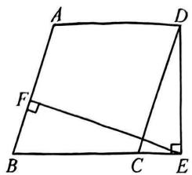

text_image

A
D
F
B
C
E

(1)写出图中所有相似的三角形；  
(2)从(1)中选出一对相似三角形加以证明.

解:(1)①△ADE∽△ACB,②△ADF∽△ACG,③△AEF∽△ABG;

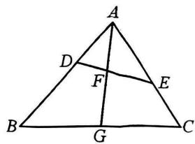

text_image

A
D
F
E
B
G
C

(2)①∵∠BAC=∠EAD,∠AED=∠B,∴△ADE∽△ACB;

②∵△ADE∽△ACB,AG平分∠BAC,∴∠ADF=∠C,∠DAF=∠CAG,∴△ADF∽△ACG;   
③∵AG平分∠BAC,∴∠EAF=∠BAG,又∵∠AEF=∠B,∴△AEF∽△ABG.

# 类型二 相似转相似

3.(2024 枣阳)如图,BD,CE 是△ABC 的两条高.求证:△ADE∽△ABC.

证明：∵∠A=∠A，∠ADB=∠AEC=90°，

$$
\therefore \triangle A B D \sim \triangle A C E. \therefore \frac {A D}{A B} = \frac {A E}{A C},
$$

$$
\because \angle A = \angle A, \therefore \triangle A D E \sim \triangle A B C.
$$

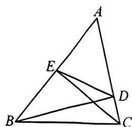

text_image

Geometric diagram of triangle ABC with internal points D and E, showing connected segments forming smaller triangles.

4.(2025经开区)如图,点E,F分别在正方形ABCD的边AB,BC上,且 $\angle EDF=45^{\circ}$ .连接AC分别交DE,DF于点M,N,求 $\frac{EF}{MN}$ 的值.

解: 连接 BD,

$$
\because \angle A D E + \angle B D E = \angle B D F + \angle B D E = 4 5 ^ {\circ}, \therefore \angle A D E = \angle B D F,
$$

$$
\because \angle D A M = \angle D B C = 4 5 ^ {\circ}, \therefore \triangle A D M \sim \triangle B D F, \therefore \frac {D M}{D F} = \frac {A D}{B D} = \frac {\sqrt {2}}{2},
$$

同理 $\frac{DN}{DE} = \frac{CD}{BD} = \frac{\sqrt{2}}{2},\therefore \frac{DM}{DF} = \frac{DN}{DE}.$

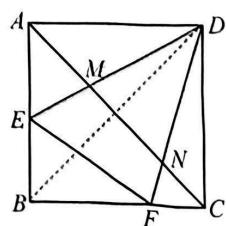

text_image

Geometric diagram of a square with labeled points and intersecting diagonals

$$
\because \angle M D N = \angle F D E, \therefore \triangle M D N \sim \triangle F D E, \therefore \frac {E F}{M N} = \frac {D E}{D N} = \sqrt {2}.
$$

# 突破 3 相似三角形的性质(一)证比例式或等积式

# 类型一 中间比转化

1.(2025 淮安一模)如图,在四边形 $ABCD$ 中,对角线 $BD$ 与 $AC$ 交于点 $F$ , $\angle ADB = \angle ACB$ .

(1) 求证: $\angle ABD = \angle ACD$ ;

(2) 过点 A 作 $AE \parallel DC$ ，交 BD 于点 E，求证： $EF \cdot BC = AD \cdot AF$ .

证明：(1) $\because \angle ADB = \angle ACB, \angle AFD = \angle BFC,$

$$
\therefore \triangle A D F \sim \triangle B C F, \therefore \frac {A F}{B F} = \frac {D F}{C F}, \therefore \frac {A F}{D F} = \frac {B F}{C F},
$$

$$
\because \angle A F B = \angle D F C, \therefore \triangle A F B \sim \triangle D F C,
$$

$$
\therefore \angle A B F = \angle D C F, \text { 即 } \angle A B D = \angle A C D;
$$

(2) $\because AE\parallel DC,\therefore\angle AEF=\angle CDF,\because\angle AFE=\angle CFD,$

$$
\therefore \triangle A F E \sim \triangle C F D, \therefore \frac {E F}{D F} = \frac {A F}{C F}, \therefore \frac {E F}{A F} = \frac {D F}{C F},
$$

由(1)知 $\triangle ADF\sim \triangle BCF$ ， $\therefore \frac{AD}{BC} = \frac{DF}{CF},\therefore \frac{EF}{AF} = \frac{AD}{BC},\therefore EF\cdot BC = AD\cdot AF.$

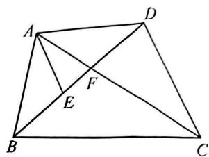

text_image

A
D
F
E
B
C

# 类型二 代换线段

2.(2024中考模拟)如图,在正方形ABCD中,E是对角线CA延长线上一点,线段BE绕点B顺时针旋转90°至BG,连接CG.

(1) 求证: AE = CG;

(2)连接 $EG$ 交 $AD$ 于点 $F$ . 若 $FD = CG$ , 求证: $FD^{2} = AD \cdot AF$ .

证明:(1)∵四边形ABCD为正方形,∴AB=BC,∠ABC=90°,

$$
\because \angle E B G = 9 0 ^ {\circ}, \therefore \angle E B A + \angle A B G = 9 0 ^ {\circ}, \angle A B G + \angle G B C = 9 0 ^ {\circ},
$$

$$
\therefore \angle E B A = \angle G B C. \because E B = B G, \therefore \triangle E B A \cong \triangle G B C, \therefore A E = C G;
$$

(2) $\because BE=BG,\angle EBG=90^{\circ},\therefore\angle BEG=\angle BGE=45^{\circ},$

$$
\therefore \angle B E A + \angle F E A = 4 5 ^ {\circ}. \text {   在正方形   } A B C D \text {   中,   } \angle B A C = \angle C A D = 4 5 ^ {\circ},
$$

$$
\therefore \angle E A B = \angle E A F = 1 3 5 ^ {\circ}, \angle B A C = \angle E B A + \angle B E A = 4 5 ^ {\circ},
$$

$$
\therefore \angle E B A = \angle A E F, \therefore \triangle E A B \sim \triangle F A E,
$$

$$
\therefore \frac {A E}{A F} = \frac {A B}{A E}, \therefore A E ^ {2} = A F \cdot A B.
$$

$$
\because A E = C G = F D, A B = A D, \therefore F D ^ {2} = A F \cdot A D.
$$

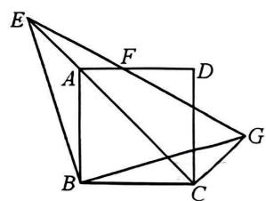

text_image

Geometric diagram with labeled points A, B, C, D, E, F, G and connecting lines forming a 3D-like structure

# 类型三 倍分线段

3.(2025 汉阳)如图,在 Rt△ABC 与 Rt△ADE 中,∠BAC=∠DAE,连接 DB,CE,取 BD 的中点 M,连接 CM,求证: $\frac{AB}{2AC}=\frac{CM}{CE}$ .

证明:延长 CM 到点 F, 使得 FM = CM, 连接 DF, EF.

∵M为BD的中点，∴DM=BM，∴△BMC≌△DMF(SAS)，

$$
\therefore D F = B C, \angle M D F = \angle M B C. \because \triangle A E D \sim \triangle A C B,
$$

$$
\therefore \angle D A E = \angle B A C, \angle A D E = \angle A B C, \frac {A E}{A C} = \frac {D E}{B C},
$$

$$
\therefore \frac {A E}{A C} = \frac {D E}{D F}, \text {   即   } \frac {A E}{D E} = \frac {A C}{D F}, \because \angle E D F = \angle C A E, \therefore \triangle C A E \sim \triangle F D E,
$$

$$
\therefore \frac {C E}{E F} = \frac {A C}{D F}, \therefore \angle C E F = \angle A C B = 9 0 ^ {\circ}, \frac {C E}{A C} = \frac {E F}{B C}, \therefore \triangle A B C \sim \triangle C F E,
$$

$$
\therefore \frac {A B}{C F} = \frac {A C}{C E}, \text { 即 } \frac {A B}{A C} = \frac {C F}{C E} = \frac {2 C M}{C E}, \therefore \frac {A B}{2 A C} = \frac {C M}{C E}.
$$

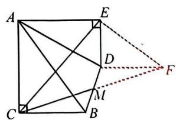

text_image

Geometric diagram of a square with labeled vertices and internal points, including diagonals and auxiliary lines.

# 突破 4 相似三角形的性质(二) 相似比

# 类型一 周长比

1.(2024二中广雅)如图, $\angle A=\angle C,\angle1$ 与 $\angle2$ 互补.

(1) 求证: $AB \parallel EC$ ;   
(2) 若 $S_{\triangle ABF} = 4, S_{\triangle CEB} = 25$ ，直接写出 $\triangle ABF$ 与 $\triangle CEB$ 的周长之比为 $\frac{2}{5}$ .

解:(1) $\because\angle1$ 与 $\angle2$ 互补, $\therefore\angle1+\angle2=180^{\circ}$ ,

$$
\therefore A D \parallel B C, \therefore \angle A D E = \angle C. \text {   又   } \angle A = \angle C.
$$

$$
\therefore \angle A D E = \angle A. \therefore A B / / E C;
$$

(2) $\frac{2}{5}$ .

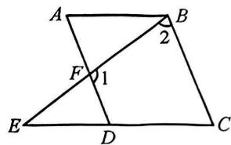

text_image

A
B
2
F
1
E
D
C

# 类型二 面积比

2.(2025 江夏)如图是我国汉代数学家赵爽在注解《周髀算经》时给出的“赵爽弦图”, 它是由四个全等的直角三角形和中间的小正方形 MNPQ 拼成的一个大正方形 ABCD. 直线 MP 交正方形 ABCD 的两边于点 E, F, 记正方形 ABCD 的面积为 $S_{1}$ , 正方形 MNPQ 的面积为 $S_{2}$ . 若 $BE = kAE (k > 1)$ , 用含 $k$ 的式子表示 $\frac{S_{1}}{S_{2}}$ 的值.

解: 过点 A 作 AG // BP, 交 FE 延长线于点 G.

$$
\because A G \parallel B P, \therefore \angle G A E = \angle P B E, \angle A G E = \angle B P E,
$$

$$
\therefore \triangle A G E \sim \triangle B P E, \therefore \frac {A G}{B P} = \frac {A E}{B E} = \frac {1}{k},
$$

设 AG=1，则 BP=k，

$$
\because \angle N M P = 4 5 ^ {\circ}, \therefore \angle A M G = 4 5 ^ {\circ}, A M = A G = 1,
$$

$$
\because A N = B P = k, \therefore M N = k - 1,
$$

$$
\because S _ {1} = A D ^ {2} = A M ^ {2} + M D ^ {2} = k ^ {2} + 1, S _ {2} = M N ^ {2} = (k - 1) ^ {2}, \therefore \frac {S _ {1}}{S _ {2}} = \frac {k ^ {2} + 1}{(k - 1) ^ {2}}.
$$

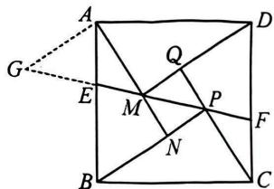

text_image

A
G
E
M
Q
P
F
N
B
C
D

3.(2025 江汉)如图,在 $\triangle ABC$ 中, $\angle BAC=90^{\circ}$ ,点 $D$ 在 $AC$ 上,点 $E$ 在 $BD$ 上, $\angle AED=\angle EAD=\angle ABC$ .求证: $\frac{S_{\triangle BCD}}{S_{\triangle EAD}}=\left(\frac{CD}{AD}\right)^{2}$ .

证明: 过点 D 分别作 $DM \perp BC$ 于点 M, $DN \perp AE$ 于点 N.

$$
\begin{array}{l} \because \angle A E D = \angle D A E, \therefore D E = D A, \\ \because D N \perp A E, \therefore E N = A N, \angle A D N = \angle E D N, \\ \because \angle A B C = \angle D A E, \angle A B C + \angle C = 9 0 ^ {\circ}, \angle D A E + \angle E A B = 9 0 ^ {\circ}, \\ \therefore \angle C = \angle E A B = \angle D B C, \therefore D C = D B, \\ \because D M \perp B C, \therefore C M = M B, \\ \because \angle C + \angle C D M = 9 0 ^ {\circ}, \angle D A N + \angle B A E = 9 0 ^ {\circ}, \therefore \angle C = \angle A D N, \\ \because \angle C M D = \angle A N D = 9 0 ^ {\circ}, \therefore \triangle C M D \sim \triangle D N A, \therefore \frac {S _ {\triangle C M D}}{S _ {\triangle D N A}} = \left(\frac {C D}{A D}\right) ^ {2}, \\ \therefore \frac {S _ {\triangle B C D}}{S _ {\triangle E A D}} = \frac {2 S _ {\triangle C M D}}{2 S _ {\triangle D N A}} = \left(\frac {C D}{A D}\right) ^ {2}. \\ \end{array}
$$

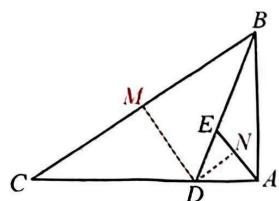

text_image

Geometric diagram of triangle ABC with internal points D, E, M, N and auxiliary lines, labeled for mathematical analysis.

# 突破5 相似三角形的性质(三) 求线段比

# 类型一 平行线求比值

1. (2024 襄阳一模)如图, $AD$ 是 $\triangle ABC$ 的中线, $E$ 是 $AD$ 上一点, 过点 $C$ 作 $CG \parallel AB$ , 交 $BE$ 的延长线于点 $G$ , 交 $AC$ 于点 $F$ . 若 $FG = 3EF$ , 求 $\frac{AF}{FC}$ 的值.

解: 延长 GC 交 AD 的延长线于点 M, 连接 BM.

∵AD为△ABC的中线，∴BD=CD，

$$
\because C M \parallel A B, \therefore \angle B A D = \angle C M D, \angle M C D = \angle A B D,
$$

$$
\therefore \triangle A B D \cong \triangle M C D, \therefore A D = D M. \because B D = C D,
$$

∴四边形 ABMC 为平行四边形，∴BM//AC，∴ $\frac{EF}{BE}=\frac{AE}{EM}$ .

$$
\because A B \parallel G M, \therefore \frac {A E}{E M} = \frac {B E}{E G}, \therefore \frac {B E}{E G} = \frac {E F}{B E},
$$

$\therefore BE^{2} = EG \cdot EF.$ 设 $EF = x$ ，则 $FG = 3x, \therefore EG = 4x$

$$
\therefore B E ^ {2} = 4 x ^ {2}, \therefore B E = 2 x, \therefore B F = F G = 3 x. \because A B / / C G, \therefore \frac {A F}{F C} = \frac {B F}{F G} = 1.
$$

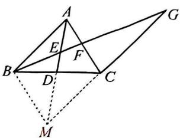

text_image

Geometric diagram with labeled points and lines, including triangle ABC and auxiliary constructions

# 类型二 相似求比值

2. (2025 光谷实验) 如图, 点 $M$ 在正方形 $ABCD$ 的边 $AD$ 上, 过点 $A$ 作 $AE$ 垂直于射线 $CM$ 于点 $E$ , 连接 $BE$ . 点 $F$ 在射线 $CM$ 上, $AF \parallel BE$ , 求 $\frac{CF}{BE}$ 的值.

解: 连接 AC, 取 AC 中点 O, 连接 OB, OE.

∵四边形 ABCD 是正方形，∴ $\angle ABC = 90^{\circ}$ ， $\angle ACB = \frac{1}{2} \angle BCD = 45^{\circ}$ .

$$
\because A E \perp C F, \therefore \angle A B C = \angle A E C = 9 0 ^ {\circ},
$$

∵O为AC中点，∴OA=OB=OC=OE，

∴点 A, B, C, E 在以点 O 为圆心, OA 为半径的圆上,

$$
\therefore \angle 1 = \angle 2, \angle A E B = \angle A C B = 4 5 ^ {\circ},
$$

$$
\because A F \parallel B E, \therefore \angle F A E = \angle A E B = 4 5 ^ {\circ},
$$

∵AE⊥CF，∴△FAE为等腰直角三角形，∠FAE=45°=∠BAC，

$$
\therefore \angle E A B = \angle F A C, \frac {A F}{A E} = \frac {A C}{A B} = \sqrt {2}, \therefore \triangle B A E \sim \triangle C A F, \therefore \frac {C F}{B E} = \frac {A F}{A E} = \sqrt {2}.
$$

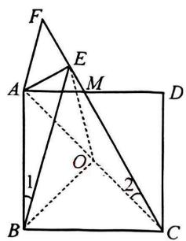

text_image

Geometric diagram with labeled points and angles, showing a square and triangles with auxiliary lines and angle markers.

# 类型三 等线段代换求比值

3.(2024 江汉一模)如图,在 $\triangle ABC$ 中, $AB=BC$ , $\angle ABC=90^{\circ}$ , $E$ 为 $AB$ 的中点, $BF\perp CE$ 于点 $G$ ,交 $AC$ 于点 $F$ .求 $\frac{FG}{BG}$ 的值.

解: 过点 A 作 $AQ \perp AB$ ，交 BF 的延长线于点 Q。过点 F 作 $FN \parallel AB$ ，交 CE 于点 N， $\therefore\frac{FG}{BG}=\frac{FN}{BE}$ . $\because E$ 为 AB 的中点， $\therefore AE=BE, \therefore \frac{FG}{BG}=\frac{FN}{BE}=\frac{FN}{AE}$ .

$$
\because F N \parallel A E, \therefore \frac {F N}{A E} = \frac {F C}{A C}, \because A Q \perp A B, C E \perp B F,
$$

$$
\therefore \angle A B Q + \angle A Q B = \angle A B Q + \angle B E C = 9 0 ^ {\circ},
$$

$$
\therefore \angle A Q B = \angle B E C, \because \angle B A Q = \angle E B C = 9 0 ^ {\circ}, A B = B C,
$$

$$
\therefore \triangle A B Q \cong \triangle B C E, \therefore A Q = B E = \frac {1}{2} A B = \frac {1}{2} B C.
$$

$$
\because \angle B A Q + \angle A B C = 1 8 0 ^ {\circ}, \therefore A Q / / B C,
$$

$$
\therefore \frac {A F}{F C} = \frac {A Q}{B C} = \frac {1}{2}, \therefore \frac {F C}{A C} = \frac {2}{3}, \therefore \frac {F G}{B G} = \frac {F N}{A E} = \frac {F C}{A C} = \frac {2}{3}.
$$

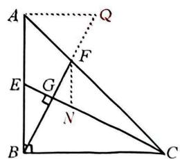

text_image

Geometric diagram of triangle ABC with auxiliary lines, points, and perpendiculars labeled A, B, C, D, E, F, G, Q, N

4. (2024 中考模拟) 如图, 在 Rt△ABC 中, ∠ACB=90°, AC=BC, 点 E 在 AC 上, CP⊥BE 于点 P, 连接 AP 并延长交 BC 于点 D. 求证: $\frac{AP}{PD}=\frac{CE}{CD}$ .

解: 过点 A 作 $AM \perp AC$ , 交 CP 的延长线于点 M.

$$
\begin{array}{l} \therefore A M \parallel B C, \therefore \frac {A P}{P D} = \frac {A M}{C D}. \\ \because C P \perp B E, \therefore \angle E B C + \angle B C P = 9 0 ^ {\circ}. \\ \because A C \perp B C, \therefore \angle A C M + \angle B C P = 9 0 ^ {\circ}, \therefore \angle A C M = \angle E B C. \\ \because \angle C A M = \angle E C B = 9 0 ^ {\circ}, A C = B C, \\ \therefore \triangle A C M \cong \triangle C B E, \therefore A M = C E, \therefore \frac {A P}{P D} = \frac {A M}{C D} = \frac {C E}{C D}. \\ \end{array}
$$

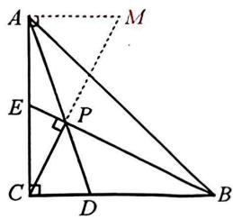

text_image

Geometric diagram of triangle ABC with auxiliary lines and labeled points A, B, C, D, E, M, P

# 类型四 设参解形求比值

5.(2024 武汉一模)如图,D 是等边△ABC 的 BC 边上一点,直线 EF 分别与 AB,AC 交于点 E, F,交 AD 于点 P,且 $\angle APE = \angle BAC, PE = PF$ .

(1)求 $\frac{AP}{PE}$ 的值；  
(2)求 $\frac{BD}{CD}$ 的值.

解:(1) $\because\angle APE=\angle BAC=60^{\circ},\angle AEP=\angle AEF,\therefore\triangle AEP\sim\triangle FEA,$

$$
\therefore \frac {A E}{E F} = \frac {P E}{A E}, \therefore A E ^ {2} = P E \cdot E F. \text {设} P E = k, \text {则} P F = k, E F = 2 k,
$$

$$
\therefore A E ^ {2} = 2 k ^ {2}, \therefore A E = \sqrt {2} k. \text {   过点   } E \text {   作   } E N \perp A P \text {   于点   } N, \therefore P N = \frac {k}{2}, E N = \frac {\sqrt {3} k}{2},
$$

$$
\therefore A N = \sqrt {A E ^ {2} - E N ^ {2}} = \frac {\sqrt {5} k}{2}, \therefore A P = \frac {(\sqrt {5} + 1) k}{2}, \therefore \frac {A P}{P E} = \frac {\sqrt {5} + 1}{2};
$$

(2) $\because \angle APE = \angle BAC = \angle B, \angle PAE = \angle BAD, \therefore \triangle PAE \sim \triangle BAD, \therefore \frac{AB}{BD} = \frac{AP}{PE} = \frac{\sqrt{5} + 1}{2}$ .

$$
\because A B = B C, \therefore \frac {B C}{B D} = \frac {\sqrt {5} + 1}{2}, \therefore \frac {C D}{B D} = \frac {\sqrt {5} - 1}{2}, \therefore \frac {B D}{C D} = \frac {2}{\sqrt {5} - 1} = \frac {\sqrt {5} + 1}{2}.
$$

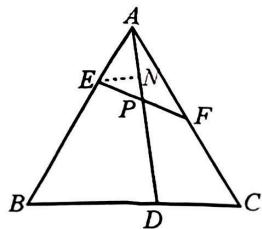

text_image

A
E
N
P
F
B
D
C

6.(2025广雅二中)如图,在正方形ABCD中,F是BC的中点,E是AB边上一点, $EM\perp AF$ 于点P,交边CD于点M,连接EF,AM.若 $\angle MAF=45^{\circ}$ ,求 $\frac{AE}{BE}$ 的值.

解: 过点 D 作 DN // EM, 交 AB 于点 N, ∴ 四边形 DMEN 为平行四边形, ∴ EM = DN.

可证 $\triangle ABF\cong\triangle DAN,\therefore DN=AF=EM.\because\triangle APM$ 是等腰直角三角形，

$\therefore AP=PM,\therefore PE=PF,\therefore\triangle EFP$ 为等腰直角三角形，

设 $EP = y$ ， $\because \angle EAP = \angle FAB, \angle APE = \angle ABF,$

$$
\therefore \triangle A E P \sim \triangle A F B, \therefore \frac {A P}{E P} = \frac {A B}{B F}, \therefore A P = 2 y,
$$

设 $BF = x$ ，则 $AB = 2x$ ， $\therefore AF = \sqrt{5} x,\therefore PF = \sqrt{5} x - 2y$

$$
\therefore \sqrt {5} x - 2 y = y, \text {解得} y = \frac {\sqrt {5}}{3} x, \therefore A E = \sqrt {E P ^ {2} + A P ^ {2}} = \frac {5}{3} x, \therefore \frac {A E}{E B} = \frac {\frac {5}{3} x}{2 x - \frac {5}{3} x} = 5.
$$

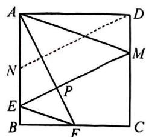

text_image

A
D
N
M
E
P
B
F
C

# 突破 6 相似三角形的性质(四) 求线段长

# 类型一 利用相似比求边长

1.(2024襄阳模拟)如图,正方形ABCD的边长为10,P是边AB上一点,以DP为对角线作正方形DEPQ,连接AQ.当正方形DEPQ的面积为68时,求AQ的长.

解: 连接 BD. 根据题意可得, $\triangle BAD$ 和 $\triangle PQD$ 都是等腰直角三角形,

$$
\therefore \frac {Q D}{D P} = \frac {A D}{B D} = \frac {\sqrt {2}}{2}, \angle B D A = \angle P D Q = 4 5 ^ {\circ},
$$

$$
\therefore \angle B D P + \angle P D A = \angle P D A + \angle A D Q = 4 5 ^ {\circ},
$$

$$
\therefore \angle B D P = \angle A D Q, \therefore \triangle B P D \sim \triangle A Q D,
$$

$$
\therefore \frac {Q D}{D P} = \frac {A D}{B D} = \frac {A Q}{B P} = \frac {\sqrt {2}}{2}.
$$

∵正方形 DEPQ 的面积为 $\frac{1}{2}DP^{2}=68,\therefore DP^{2}=136.$

$\because AP^{2}+AD^{2}=DP^{2},AD=10,\therefore AP=6$ （负值舍去），

$$
\therefore B P = A B - A P = 4, \therefore A Q = \frac {\sqrt {2}}{2} B P = \frac {\sqrt {2}}{2} \times 4 = 2 \sqrt {2}.
$$

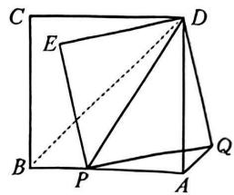

text_image

Geometric diagram of a square with internal points and lines, labeled with letters A through Q

# 类型二 结合勾股求边长

2.(2025 武汉模拟)如图,在 Rt△ABC 中,∠B=90°,∠ACB=60°,E 为 AC 上一点,D 为 AB 的中点,EB 与 DC 交于点 F.若 DB=2√3,∠ADE=30°,求 BF 的长.

解: 在 Rt△ABC 中, $\angle B = 90^{\circ}$ , $\angle ACB = 60^{\circ}$ , $\therefore \angle A = 30^{\circ}$ .

$$
\because \angle A = \angle A D E = 3 0 ^ {\circ}, \therefore A E = D E.
$$

∵D是AB的中点, $BD=2\sqrt{3}$ ,

$$
\therefore A D = B D = 2 \sqrt {3}, A B = 2 B D = 4 \sqrt {3},
$$

$$
\therefore B C = \frac {\sqrt {3}}{3} A B = \frac {\sqrt {3}}{3} \times 4 \sqrt {3} = 4, \therefore A C = 2 B C = 8.
$$

过点 E 作 $EG \perp AD$ 于点 G，作 $EH \parallel AD$ ，交 CD 于点 H，

$$
\therefore A G = D G = \frac {1}{2} A D = \frac {1}{2} \times 2 \sqrt {3} = \sqrt {3}, \therefore E G = \frac {\sqrt {3}}{3} A G = \frac {\sqrt {3}}{3} \times \sqrt {3} = 1,
$$

$$
\therefore A E = 2 E G = 2 = D E, \therefore C E = A C - A E = 6.
$$

$$
\because \triangle C E H \sim \triangle C A D, \therefore \frac {C E}{C A} = \frac {E H}{A D},
$$

∵ $EH \parallel AD, \therefore \triangle EFH \sim \triangle BFD, \therefore \frac{EH}{BD} = \frac{EF}{BF}$ ，即 $\frac{EF}{BF} = \frac{CE}{AC} = \frac{3}{4}$ ,

设 $EF = 3x, BF = 4x, \therefore BE = EF + BF = 3x + 4x = 7x$

在 Rt△BEG 中，EG=1, BG=BD+DG=2 $\sqrt{3}$ + $\sqrt{3}$ =3 $\sqrt{3}$ ,

由勾股定理，得 $BE = \sqrt{EG^2 + BG^2} = \sqrt{1^2 + (3\sqrt{3})^2} = 2\sqrt{7}$

∴ $7x = 2\sqrt{7}$ ，解得 $x = \frac{2\sqrt{7}}{7}$ ，∴ BF = 4x = 4 × $\frac{2\sqrt{7}}{7} = \frac{8\sqrt{7}}{7}$ .

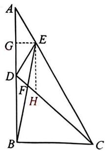

text_image

Geometric diagram with labeled points and lines, likely from a math problem or proof

# 突破 7 相似模型(一) A 型与 X 型

# 类型一 作平行线构 X 型

1.(2025杭州一模)如图, $\triangle ABC$ 是边长为6的等边三角形,D为AB延长线上一点, $AB:AD=3:5$ ,过点D作CB所在直线的垂线,垂足为E,连接CD,F为DC的中点,求线段EF的长.

解: 过点 A 作 AH // DE, 交 BC 于点 H.

∵△ABC 是等边三角形,且边长为 6,

$$
\therefore A B = B C = A C = 6, \because D E \perp C B, \therefore A H \perp B C,
$$

$$
\therefore B H = C H = \frac {1}{2} B C = 3, A H = \sqrt {A B ^ {2} - B H ^ {2}} = \sqrt {6 ^ {2} - 3 ^ {2}} = 3 \sqrt {3}.
$$

$$
\because A B: A D = 3: 5, \therefore B D = 4, \because D E / / A H, \therefore \triangle D E B \sim \triangle A H B,
$$

$$
\therefore \frac {B E}{B H} = \frac {D E}{A H} = \frac {B D}{A B}, \therefore \frac {B E}{3} = \frac {D E}{3 \sqrt {3}} = \frac {4}{6}, \therefore B E = 2, D E = 2 \sqrt {3},
$$

$$
\therefore C E = B C + B E = 8, C D = \sqrt {C E ^ {2} + D E ^ {2}} = \sqrt {8 ^ {2} + (2 \sqrt {3}) ^ {2}} = 2 \sqrt {1 9}.
$$

∵F为DC的中点，∴ $EF=\frac{1}{2}CD=\sqrt{19}$ .

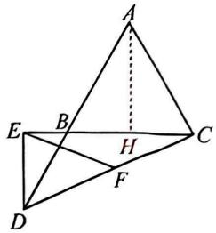

text_image

Geometric diagram with labeled points A, B, C, D, E, F, H and connecting lines, likely from a math problem or proof.

# 类型二 作平行线构 A 型

2. (2025 雁塔区三模) 如图, 在四边形 $ABCD$ 中, $AB = AC$ , $\angle BCD = 90^\circ$ , $\angle ADB = 2\angle DBC$ . 若 $AD = 2$ , 求 $BD$ 的长.

解:延长AD,BC交于点E,过点A作AH⊥BC于点H.

$$
\because \angle A D B = 2 \angle D B C, \angle A D B = \angle E + \angle D B C,
$$

$$
\therefore \angle E = \angle D B C, \because \angle B C D = 9 0 ^ {\circ}, \therefore B C = E C.
$$

$$
\because A B = A C, A H \perp B C, \therefore B H = C H, \therefore C E = 2 C H.
$$

$$
\because \angle A H B = \angle B C D = 9 0 ^ {\circ}, \therefore C D / / A H, \therefore \frac {D E}{A D} = \frac {C E}{C H} = 2,
$$

$\therefore DE=2AD=2\times2=4.$ 即 BD 的长是 4.

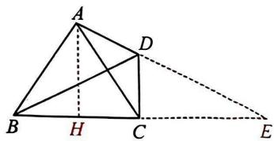

text_image

Geometric diagram with labeled points A, B, C, D, E, H and solid/dashed lines forming triangles and a quadrilateral

# 类型三 用X型相似

3.(2025深圳模拟)如图,在正方形ABCD中,点E,F分别在边BC,AB上(点E不与点B,C重合),且AF=BE.连接AC,DF交于点G,连接AE,BG交于点H.若DF=4GH,求 $\frac{AF}{BF}$ 的值.

解：∵四边形 ABCD 是正方形，

$$
\begin{array}{l} \therefore A B \parallel C D, D A = A B, \angle D A F = \angle A B E = \angle A D C = 9 0 ^ {\circ}. \\ \because A F = B E, \therefore \triangle D A F \cong \triangle A B E (\text { SAS }), \therefore \angle A D F = \angle B A E, D F = A E. \\ \end{array}
$$

连接 BD，则 AC 垂直平分 BD，∴ BG = DG.

$$
\because \angle A D B = \angle A B D, \angle G D B = \angle G B D,
$$

$$
\therefore \angle A D B - \angle G D B = \angle A B D - \angle G B D,
$$

$$
\therefore \angle A D F = \angle A B G, \therefore \angle B A E = \angle A B G,
$$

$$
\therefore \angle H E B = 9 0 ^ {\circ} - \angle B A E = 9 0 ^ {\circ} - \angle A B G = \angle H B E,
$$

$$
\therefore A H = B H = H E, \therefore D F = A E = 2 A H = 2 B H. \because D F = 4 G H,
$$

$$
\therefore 2 B H = 4 G H, \therefore B H = 2 G H, \therefore B G = D G = 2 G H + G H = 3 G H, \therefore F G = 4 G H - 3 G H = G H.
$$

$$
\because A F \parallel C D, \therefore \triangle A F G \sim \triangle C D G, \therefore \frac {A F}{C D} = \frac {F G}{D G} = \frac {G H}{3 G H} = \frac {1}{3}, \therefore \frac {A F}{B F} = \frac {1}{2}.
$$

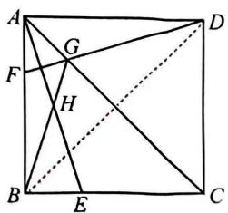

text_image

Geometric diagram of a square with labeled points and intersecting lines, including dashed auxiliary lines.

# 突破 8 相似模型(二) 仿 A、X 型

# 类型一 用仿X形

1. 如图, 在 $\triangle ABC$ 中, $AC = BC = 16$ , 点 $D$ 在 $AB$ 上, 点 $E$ 在 $BC$ 上, 点 $B$ 关于直线 $DE$ 的对称点为点 $B'$ , 连接 $DB', EB'$ , 分别与 $AC$ 相交于点 $F, G$ . 若 $AF = 8, DF = 7, B'F = 4$ , 则 $CG$ 的长为

$$
\frac {9}{2}.
$$

解： $\because \triangle BDE$ 与 $\triangle B^{\prime}DE$ 关于 $DE$ 对称， $\therefore \angle B = \angle B^{\prime}$

$$
\because A C = B C, \therefore \angle B = \angle A, \therefore \angle A = \angle B ^ {\prime},
$$

又∵ $\angle AFD=\angle B^{\prime}FG,\therefore\triangle ADF\sim\triangle B^{\prime}GF,$

$$
\therefore \frac {A F}{B ^ {\prime} F} = \frac {D F}{G F} = \frac {8}{4} = 2, \therefore G F = \frac {1}{2} D F = \frac {7}{2}, \therefore C G = A C - A F - G F = \frac {9}{2}.
$$

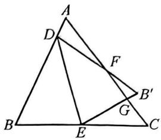

text_image

Geometric diagram of triangle ABC with internal points D, E, F, G and connecting line segments

# 类型二 构仿X形

2.(2025 原创题)如图,在 Rt△ABC 中,E 为斜边 AC 上一点,且 BE=BC,过点 A 作直线 BE 的垂线,垂足为 D.若 DE=3,AE·CE=30,求 AB 的长.

解: 过点 B 作 $BH \perp AC$ 于点 H. $\because BE = BC, \therefore EH = CH = \frac{1}{2} CE.$

$$
\because A D \perp B E, B H \perp A C, \therefore \angle D = \angle B H E, \because \angle A E D = \angle B E H,
$$

$$
\therefore \triangle A E D \sim \triangle B E H, \therefore \frac {D E}{H E} = \frac {A E}{B E}, \therefore A E \cdot E H = D E \cdot B E,
$$

$$
\therefore A E \cdot C E = 2 D E \cdot B E. \because D E = 3, A E \cdot C E = 3 0, \therefore B E = 5.
$$

$$
\because \angle B E C = \angle C, \angle A E D + \angle D A E = \angle C + \angle B A C = 9 0 ^ {\circ},
$$

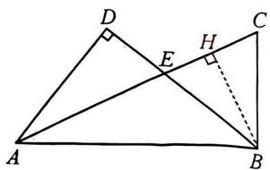

text_image

Geometric diagram of triangle ABC with perpendiculars from D and E to AB, labeled points A, B, C, D, E, H, and a dashed line BH.

$$
\therefore \angle D A E = \angle B A C = \angle E B H, \therefore \triangle B H E \sim \triangle A H B, \therefore B H ^ {2} = E H \cdot A H, \text { 设 } E H = x, \text { 则 } A E = \frac {1 5}{x}
$$

$\therefore 5^{2} - x^{2} = x\left(x + \frac{15}{x}\right)$ 解得 $x = \sqrt{5}$ （负值已舍）， $\therefore BH = 2\sqrt{5},AH = 4\sqrt{5},\therefore AB = 10.$

# 类型三 用(构)仿 A 型

3.(2025 江夏)如图,在等边 $\triangle ABC$ 中, $D,E,F$ 分别为三边上的动点,连接 $AD,EF$ 交于点 $P$ . 若 $\angle APE=60^{\circ}$ ,记 $\frac{BD}{CD}=m,\frac{PE}{PF}=n$ ,探究 $m,n$ 之间的等量关系.

解: 过点 D 作 DG // AB, 交 AC 于点 G.

$$
\because \frac {B D}{C D} = m, \text { 设 } C D = a, B D = m a, \therefore B C = B D + C D = m a + a.
$$

$\because \triangle ABC$ 是等边三角形, $\therefore \angle B = \angle C = 60^{\circ}, AB = AC = BC = ma + a.$

$$
\because \angle A P E = 6 0 ^ {\circ}, \therefore \angle A P E = \angle B,
$$

$$
\because \angle P A E = \angle B A D, \therefore \triangle A P E \sim \triangle A B D, \therefore \frac {P E}{B D} = \frac {A P}{A B}.
$$

∵DG∥AB，∴∠CDG=∠B=60°=∠C，∴△CDG是等边三角形，

$$
\therefore \angle C G D = 6 0 ^ {\circ}, C G = D G = C D = a, A G = m a, \therefore \angle A G D = \angle A P F = 1 2 0 ^ {\circ},
$$

$$
\because \angle D A G = \angle F A P, \therefore \triangle A D G \sim \triangle A F P, \therefore \frac {P F}{D G} = \frac {A P}{A G}, \therefore \frac {P E}{m a} = \frac {A P}{m a + a}, \frac {P F}{a} = \frac {A P}{m a},
$$

$$
\therefore P E = \frac {m}{m + 1} A P, P F = \frac {1}{m} A P, \therefore \frac {P E}{P F} = \frac {m ^ {2}}{m + 1}, \text {   又   } \because \frac {P E}{P F} = n, \therefore n = \frac {m ^ {2}}{m + 1}.
$$

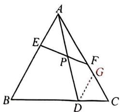

text_image

Geometric diagram of triangle ABC with internal points D, E, F, G, P and a dashed line from D to G

# 突破 9 相似模型(三) 子母相似

# 类型一 用子母相似

1. (2025 七一华源) 如图, 在 $\triangle ABC$ 中, $\angle ACB = 90^{\circ}, CD \perp AB$ , 垂足为 $D, F$ 为线段 $CD$ 延长线上一点, 连接 $AF$ 并延长至点 $E$ , 连接 $CE, BE$ . 当 $\angle ACE = \angle AFC$ 时, 请判断 $\triangle AEB$ 的形状, 并说明理由.

解: $\triangle AEB$ 是直角三角形. 理由如下:

$$
\because \angle A C E = \angle A F C, \angle C A F = \angle E A C,
$$

$$
\therefore \triangle A F C \sim \triangle A C E,
$$

$$
\therefore \frac {A C}{A E} = \frac {A F}{A C} \therefore A C ^ {2} = A E \cdot A F.
$$

$$
\because \angle A C B = 9 0 ^ {\circ}, C D \perp A B, \therefore \triangle A C D \sim \triangle A B C,
$$

$$
\therefore A C ^ {2} = A D \cdot A B, \therefore A E \cdot A F = A D \cdot A B, \therefore \frac {A E}{A D} = \frac {A B}{A F},
$$

$$
\because \angle F A D = \angle B A E, \therefore \triangle F A D \sim \triangle B A E, \therefore \angle A D F = \angle A E B.
$$

$$
\because C F \perp A B, \therefore \angle A D F = 9 0 ^ {\circ},
$$

$$
\therefore \angle A E B = 9 0 ^ {\circ}, \therefore \triangle A E B \text {   是直角三角形.   }
$$

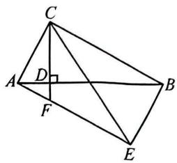

text_image

Geometric diagram with labeled points A, B, C, D, E, F and right angle at D

# 类型二 构子母相似

2. (2024 中考模拟)如图, $E$ 为菱形 $ABCD$ 的边 $AB$ 上一点, 点 $F$ 在 $CE$ 上, 且 $\angle BFC + \angle A = 180^\circ$ .

(1) 求证: $BC^{2}=CF\cdot CE$ ;   
(2)作 $FH \perp CD$ 于点 $H, FH = 3, HD = 4, \frac{CF}{CB} = \frac{3}{4}$ , 求 $DE$ 的长.

解:(1)∵四边形ABCD为菱形,∴BC//AD,

$$
\therefore \angle A + \angle C B E = 1 8 0 ^ {\circ}.
$$

$$
\because \angle B F C + \angle A = 1 8 0 ^ {\circ},
$$

$$
\therefore \angle B F C = \angle C B E.
$$

$$
\because \angle B C F = \angle B C E,
$$

$$
\therefore \triangle B C F \sim \triangle E C B,
$$

$$
\therefore \frac {B C}{C E} = \frac {C F}{B C}, \therefore B C ^ {2} = C F \cdot C E;
$$

(2) 连接 $FD$ . $\because FH \perp CD, \therefore FD = \sqrt{FH^2 + HD^2} = 5$ .

$$
\because C B = C D, \frac {B C}{C E} = \frac {C F}{B C} = \frac {3}{4}, \therefore \frac {C D}{C E} = \frac {C F}{C D} = \frac {3}{4}.
$$

$$
\because \angle F C D = \angle E C D, \therefore \triangle F C D \sim \triangle D C E,
$$

$$
\therefore \frac {F D}{E D} = \frac {3}{4}, \therefore E D = \frac {4}{3} F D = \frac {2 0}{3}.
$$

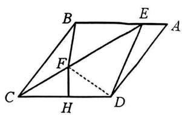

text_image

Geometric diagram of a parallelogram with labeled vertices and internal points, including dashed lines indicating hidden segments.

# 突破 10 相似模型(四) 射影定理

# 类型一 设参求比值

1.(2025杭州)如图,在□ABCD中,对角线AC与BD相交于点O, $\angle CAB=\angle ACB$ ,过点B作BE⊥AB交AC于点E.

(1) 求证: $\triangle AEB \sim \triangle BEO$ ;   
(2) 若 $BE = \sqrt{6} CE$ ，求 $\frac{OA}{OE}$ 的值.

解:(1) $\because\angle CAB=\angle ACB,\therefore AB=CB,$

$\therefore \square ABCD$ 是菱形, $\therefore AC \perp BD$ ,

$$
\therefore \angle B O E = 9 0 ^ {\circ}. \because B E \perp A B,
$$

$$
\therefore \angle A B E = 9 0 ^ {\circ}, \therefore \angle B O E = \angle A B E,
$$

又∵∠BEO=∠AEB,∴△AEB∽△BEO;

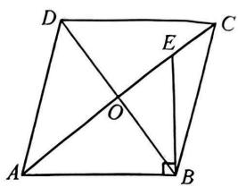

text_image

Geometric diagram of a quadrilateral with diagonals and perpendicular lines, labeled with points A, B, C, D, E, and O.

(2) $\because \triangle AEB \sim \triangle BEO, \therefore \frac{AE}{BE} = \frac{BE}{OE}, \therefore BE^2 = AE \cdot OE.$

$\because BE = \sqrt{6} CE$ ，设 $CE = a, BE = \sqrt{6} a, OE = x$

则 $OA = OE + CE = a + x, AE = OA + OE = a + 2x$

$\therefore (\sqrt{6} a)^{2} = x(a + 2x), \therefore 2x^{2} + ax - 6a^{2} = 0$ ，解得 $x = 1.5a$ 或 $x = -2a$ （舍），

$$
\therefore O A = 2. 5 a, O E = 1. 5 a, \therefore \frac {O A}{O E} = \frac {2 . 5 a}{1 . 5 a} = \frac {5}{3}.
$$

# 类型二 给参求比值

2.(2025 武昌一模)在 $\triangle ABC$ 中, $\angle ACB=90^{\circ},AC=nBC,D$ 是 $AC$ 的中点,连接 $BD$ ,过点 $C$ 作 $CE\perp BD$ 交 $BD$ 于点 $E$ ,交 $AB$ 于点 $F$ .

(1)如图1,当n=1时,直接写出 $\frac{BF}{AF}$ 的值为2;  
(2)如图2,求 $\frac{BF}{AF}$ 的值(用含n的式子表示).

解:(1)过点A作AH⊥CF于点H.

由 AC=BC, $\angle ACB=90^{\circ}$ , CE⊥BD,

可证得 $\triangle BCE\cong\triangle CAH,\therefore AH=CE.$

$$
\because \angle A F H = \angle B F E, \angle H = \angle B E F,
$$

$$
\therefore \triangle A H F \sim \triangle B E F, \therefore \frac {B F}{A F} = \frac {B E}{A H} = \frac {B E}{C E}.
$$

由 $\angle BEC = \angle BCD = 90^{\circ}$

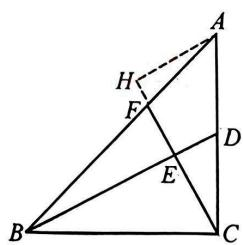

text_image

Geometric diagram of triangle ABC with internal points D, E, F, H and dashed auxiliary lines

图1

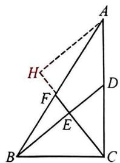

text_image

Geometric diagram of triangle ABC with internal points D, E, F, H and dashed/solid lines indicating construction or proof relationships

图2

可证得 $\triangle BEC\sim \triangle BCD$ ， $\therefore \frac{BE}{CE} = \frac{BC}{CD} = 2,\therefore \frac{BF}{AF} = \frac{BE}{CE} = 2;$

(2) 过点 A 作 $AH \perp CF$ 于点 H. 由 $\angle ACB = 90^{\circ}$ , $CE \perp BD$ , 可证得 $\triangle BCE \sim \triangle CAH$ ,

$\therefore \frac{BE}{CH} = \frac{BC}{AC} = \frac{BC}{nBC} = \frac{1}{n} = \frac{CE}{AH}, \therefore AH = nCE$ ，由(1)得 $\triangle BEC \sim \triangle BCD, \therefore \frac{BE}{BC} = \frac{BC}{BD} = \frac{CE}{DC}$ ,

$\therefore BE = \frac{BC \cdot CE}{CD} = \frac{BC \cdot CE}{\frac{n}{2} BC} = \frac{2}{n} CE, \therefore$ 由 $\triangle AHF \sim \triangle BEF$ , 得 $\frac{BF}{AF} = \frac{BE}{AH} = \frac{\frac{2}{n} CE}{nCE} = \frac{2}{n^2}$ .

# 突破 11 相似模型(五) 一线三等角

# 类型一 用一线三等角

1.(2024中考模拟)如图,在矩形ABCD中,E为AB的中点,EF⊥DE交BC于点F,连接DF.

(1) 求证: $\triangle ADE \sim \triangle BEF$ ;   
(2) $G$ 为 $AD$ 上一点, 若 $CF = 2AG$ , 求 $\frac{DG}{DF}$ 的值.

解:(1)∵四边形ABCD为矩形,∴ $\angle A=\angle B=90^{\circ}$ ,

$$
\begin{array}{l} \therefore \angle A D E + \angle A E D = 9 0 ^ {\circ}. \\ \because D E \perp E F, \therefore \angle D E F = 9 0 ^ {\circ}, \\ \therefore \angle B E F + \angle A E D = 9 0 ^ {\circ}, \\ \therefore \angle B E F = \angle A D E, \\ \therefore \triangle A D E \sim \triangle B E F; \\ \end{array}
$$

$$
\begin{array}{l} \therefore \frac {A E}{C D} = \frac {A G}{C F} = \frac {1}{2}. \\ \because \angle A = \angle C = 9 0 ^ {\circ}, \therefore \triangle A G E \sim \triangle C F D, \\ \therefore \frac {E G}{D F} = \frac {A G}{C F} = \frac {1}{2}, \angle A G E = \angle D F C. \\ \because \angle A D F = \angle D F C, \therefore \angle A G E = \angle A D F, \\ \therefore E G \parallel D F, \therefore \angle G E D = \angle E D F. \\ \because \triangle A D E \sim \triangle B E F, \therefore \frac {E F}{D E} = \frac {E B}{A D} = \frac {A E}{A D}. \\ \because \angle F E D = \angle A = 9 0 ^ {\circ}, \therefore \triangle D E F \sim \triangle D A E, \\ \therefore \angle A D E = \angle E D F, \therefore \angle A D E = \angle G E D, \\ \therefore G E = G D, \therefore \frac {D G}{D F} = \frac {E G}{D F} = \frac {A G}{C F} = \frac {1}{2}. \\ \end{array}
$$

(2) $\because CD=2AE,CF=2AG,$

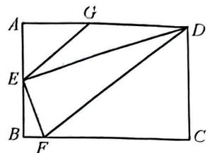

text_image

Geometric diagram of a square with labeled vertices and internal points, showing diagonals and triangles.

# 类型二 构一线三等角

2. (2025 二中广雅) 如图, $E$ 为等腰 Rt $\triangle ABC$ 的边 $CB$ 延长线上一点 ( $\angle ACB = 90^{\circ}$ ), 且 $BE = 6\sqrt{5}$ , $D$ 是 $EA$ 延长线上一点, 且 $\angle D = 45^{\circ}$ , $CD = 4\sqrt{2}$ , 则 $AE$ 的长为 18 .

解: 在 AE 上取点 F, 使 $\angle AFB = 45^{\circ}$ .

∵△ABC为等腰直角三角形，∠ACB=90°，

$$
\therefore \angle A B C = \angle B A C = 4 5 ^ {\circ},
$$

$$
\because \angle D = 4 5 ^ {\circ}, \therefore \triangle A C D \sim \triangle B A F,
$$

$$
\therefore \frac {C D}{A F} = \frac {A C}{B A} = \frac {\sqrt {2}}{2}.
$$

$$
\because C D = 4 \sqrt {2}, \therefore A F = 8.
$$

$$
\because \angle B F E = \angle A B E = 1 3 5 ^ {\circ},
$$

$$
\therefore \triangle A B E \sim \triangle B F E,
$$

$$
\therefore B E ^ {2} = E F \cdot E A,
$$

$\therefore (6\sqrt{5})^2 = EF(EF + 8)$ , 解得 $EF = 10$ 或 $EF = -18$ (舍).

$$
\therefore A E = E F + A F = 1 8.
$$

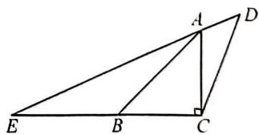

text_image

Geometric diagram of triangle EBC with perpendicular from A to BC at C, and point D on AD

# 突破 12 相似模型(六) 十字架

# 类型一 构斜三角形相似

1. (2024 中考模拟) 如图, 在 Rt△ACB 中, ∠ACB = 90°, 点 E 在 BC 上, 点 F 在 AC 上, 且 $\frac{AC}{BC} = \frac{CE}{AF} = n$ , CD ⊥ EF 交 AB 于点 D. 求 $\frac{CD}{EF}$ 的值.

解:延长 FC 至点 M, 使 CM = AF, 连接 ME, ∴ FM = AC,

$$
\therefore \frac {A C}{B C} = \frac {C E}{A F} = \frac {C E}{C M} = n.
$$

$$
\because \angle A C B = \angle M C E = 9 0 ^ {\circ},
$$

$$
\therefore \triangle A C B \sim \triangle E C M, \therefore \angle B = \angle M.
$$

$$
\because E F \perp C D, \therefore \angle M F E + \angle F C D = 9 0 ^ {\circ}.
$$

$$
\because \angle A C B = \angle B C D + \angle F C D = 9 0 ^ {\circ},
$$

$$
\therefore \angle M F E = \angle B C D,
$$

$$
\therefore \triangle M F E \sim \triangle B C D,
$$

$$
\therefore \frac {C D}{E F} = \frac {C B}{M F} = \frac {B C}{A C} = \frac {1}{n}.
$$

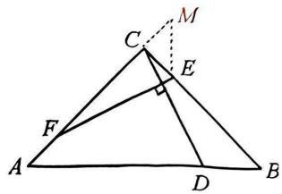

text_image

Geometric diagram of triangle ABC with points D, E, F, M and perpendicular line from C to AB at E

# 类型二 构直角三角形相似

2.(2024二中广雅)如图,在Rt△ABC中,∠BAC=90°,AC=2AB.N为AC上一点,AM⊥BN交BC于点M.若 $\frac{AM}{BN}=\frac{3}{5}$ ,求 $\frac{AN}{NC}$ 的值.

解: 过点 M 作 $MH \perp AC$ 于点 H, $\therefore \angle MHA = \angle MHC = 90^{\circ}$ .

$$
\because \angle B A C = 9 0 ^ {\circ}, \therefore \angle M H C = \angle B A C.
$$

$$
\because \angle C = \angle C, \therefore \triangle M H C \sim \triangle B A C,
$$

$$
\therefore \frac {M H}{A B} = \frac {H C}{A C}. \because A C = 2 A B,
$$

∴HC=2MH. 设 MH=3x，则 HC=6x.

$$
\because A M \perp B N, \therefore \angle M A H + \angle A N B = 9 0 ^ {\circ}.
$$

$$
\because \angle B A C = 9 0 ^ {\circ}, \therefore \angle A B N + \angle A N B = 9 0 ^ {\circ},
$$

$$
\therefore \angle M A H = \angle A B N. \because \angle B A N = \angle M H A = 9 0 ^ {\circ},
$$

$$
\therefore \triangle A B N \sim \triangle H A M,
$$

$$
\therefore \frac {M H}{A N} = \frac {A H}{A B} = \frac {A M}{B N} = \frac {3}{5}, \therefore A N = \frac {5}{3} M H = 5 x.
$$

设 $AH = 3y$ ，则 $AB = 5y, AC = 2AB = 10y$

$$
\therefore H C = A C - A H = 7 y.
$$

$$
\because H C = 6 x, \therefore 6 x = 7 y, \therefore x = \frac {7}{6} y,
$$

$$
\therefore A N = 5 x = \frac {3 5}{6} y, \therefore N C = 1 0 y - \frac {3 5}{6} y = \frac {2 5}{6} y, \therefore \frac {A N}{N C} = \frac {\frac {3 5}{6} y}{\frac {2 5}{6} y} = \frac {7}{5}.
$$

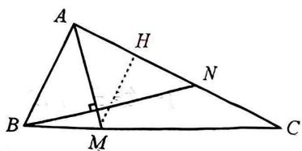

text_image

A
H
N
B
M
C

# 突破 13 相似模型(七) 旋转相似

# 类型一 构旋转相似

1. (2025 碇口) 如图, $BD$ 是四边形 $ABCD$ 的对角线, $\angle ABC = \angle ADC = 90^\circ$ , $\angle ABD = 60^\circ$ . 求证: $AB + \sqrt{3} BC = 2BD$ .

证明: 过点 D 作 $DE \perp BD$ , 交 BC 的延长线于点 E.

$$
\because \angle A B C = \angle A D C = 9 0 ^ {\circ}, \therefore \angle A = \angle D C E.
$$

$$
\because D E \perp B D, \therefore \angle B D C + \angle C D E = 9 0 ^ {\circ},
$$

$$
\because \angle A D B + \angle B D C = 9 0 ^ {\circ}, \therefore \angle A D B = \angle C D E,
$$

$$
\therefore \triangle A D B \sim \triangle C D E, \therefore \frac {A B}{C E} = \frac {D B}{D E}, \angle E = \angle A B D = 6 0 ^ {\circ}.
$$

$$
\because D E \perp B D, \therefore \angle B D E = 9 0 ^ {\circ}, \therefore \angle D B E = 3 0 ^ {\circ},
$$

$$
\therefore B E = 2 D E, \therefore B D = \sqrt {B E ^ {2} - D E ^ {2}} = \sqrt {3} D E, \therefore D E = \frac {\sqrt {3}}{3} B D, B D = \frac {\sqrt {3}}{2} B E,
$$

$\therefore CE = \frac{\sqrt{3}}{3} AB, BE = \frac{2}{\sqrt{3}} BD, BE = BC + CE = \frac{2}{\sqrt{3}} BD$ ，即 $BC + \frac{\sqrt{3}}{3} AB = \frac{2}{\sqrt{3}} BD$

$$
\therefore A B + \sqrt {3} B C = 2 B D.
$$

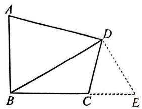

text_image

Geometric diagram with labeled points A, B, C, D, E and line segments forming triangles and a dashed extension

# 类型二 分类讨论

2. (2025 洪山)(1)如图, 在 $\triangle OAB$ 和 $\triangle OCD$ 中, $\angle AOB = \angle COD = 90^\circ$ , $\angle OAB = \angle OCD = 30^\circ$ , 连接 $AC$ 交 $BD$ 的延长线于点 $M$ . 求 $\frac{AC}{BD}$ 的值及 $\angle AMB$ 的度数;

(2)在(1)的条件下,将 $\triangle OCD$ 绕点 $O$ 在平面内旋转, $AC,BD$ 所在直线交于点 $M$ ,若 $OD=1$ , $OB=\sqrt{7}$ ,请直接写出当点 $C$ 与点 $M$ 重合时 $AC$ 的长.

解:(1)由已知,可得 $\frac{OD}{OC}=\frac{OB}{OA}=\frac{\sqrt{3}}{3}$ ,

$$
\text { 又 } \because \angle A O C = \angle B O D,
$$

$$
\therefore \triangle A O C \sim \triangle B O D,
$$

$$
\therefore \frac {A C}{B D} = \frac {O C}{O D} = \sqrt {3}, \angle C A O = \angle D B O,
$$

$$
\therefore \angle A M B = \angle A O B = 9 0 ^ {\circ};
$$

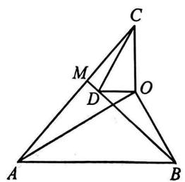

text_image

Geometric diagram of triangle ABC with internal points D, M, and O, showing intersecting lines and segments.

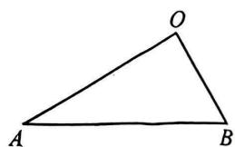

text_image

O
A
B

备用图

(2)当点 C 与点 M 在线段 BD 上重合时,如图 1,可得 $\triangle AOC \sim \triangle BOD$ , $\therefore \angle AMB = 90^{\circ}$ , $\frac{AC}{BD} = \sqrt{3}$ .

设 $BD = x$ ，则 $AC = \sqrt{3} x,\because OD = 1,OB = \sqrt{7}$

$$
\therefore C D = 2, B C = x - 2, A B = 2 O B = 2 \sqrt {7},
$$

在 Rt△AMB 中， $AC^{2}+BC^{2}=AB^{2}$ ，

$$
\therefore (\sqrt {3} x) ^ {2} + (x - 2) ^ {2} = (2 \sqrt {7}) ^ {2},
$$

解得 $x_{1} = 3, x_{2} = -2, \therefore AC = 3\sqrt{3}$ ;

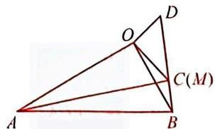

text_image

Geometric diagram of triangle ABD with internal points O, C(M), and line segments AD, OB, OC

图1

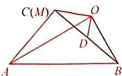

text_image

C(M)
O
D
A
B

图2

当点 C 与点 M 在线段 BD 的延长线上重合时, 如图 2, 同理可得 $\angle AMB = 90^{\circ}$ , $\frac{AC}{BD} = \sqrt{3}$ , 设 BD = x, 则 $AC = \sqrt{3}x$ ,

在 Rt△AMB 中， $AC^{2}+BC^{2}=AB^{2}$ ， $(\sqrt{3}x)^{2}+(x+2)^{2}=(2\sqrt{7})^{2}$ ，解得 $x_{1}=-3, x_{2}=2, \therefore AC=2\sqrt{3}$ ；综上所述，AC 的长为 $3\sqrt{3}$ 或 $2\sqrt{3}$ 。

# 突破 14 相似与圆(一)无切线

# 类型一 X型相似

1. 如图, $BC$ 为 $\odot O$ 的直径, $AB$ 为 $\odot O$ 的弦, $D$ 为 $\widehat{BC}$ 的中点, $AD$ 交 $BC$ 于点 $F$ . 若 $BC = 2\sqrt{5}$ ,

$AB = 4$ ，则 $\frac{AF}{DF}$ 的值为 $\frac{4}{5}$

解: 连接 OD, 过点 A 作 $AE \perp BC$ 于点 E.

$$
\because \widehat {B D} = \widehat {C D}, \therefore \angle B O D = \angle C O D = 9 0 ^ {\circ}, \therefore O D \perp B C.
$$

$$
\because A E \perp B C, \therefore A E / / O D, \therefore \triangle A E F \sim \triangle D O F, \therefore \frac {A F}{D F} = \frac {A E}{O D}.
$$

∵BC为⊙O的直径，∴∠BAC=90°，

$\because BC = 2\sqrt{5}, AB = 4, \therefore AC = 2$ ，由面积法得 $AE = \frac{4\sqrt{5}}{5}, \therefore \frac{AF}{DF} = \frac{4\sqrt{5}}{5} \div \sqrt{5} = \frac{4}{5}$ .

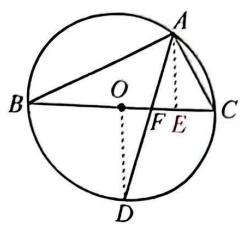

text_image

A
B
O
F
E
C
D

# 类型二 母子相似

2.(2025江汉)如图,弦AB,CD交于点E,且D是 $\widehat{AB}$ 的中点,连接BD.

(1) 求证: $DB^{2}=DE \cdot DC$ ;   
(2) 若 BC 是 $\odot O$ 的直径, 且 CD = 16, BE = 15, 求 AB 的长.

解:(1)∵D是 $\widehat{AB}$ 的中点,∴ $\angle C=\angle DBE$ ,

$$
\therefore \triangle D B C \sim \triangle D E B, \therefore \frac {D B}{D E} = \frac {D C}{D B},
$$

$$
\therefore D B ^ {2} = D E \cdot D C;
$$

(2) 设 $DE = x, \therefore DB^2 = BE^2 - DE^2 = DE \cdot DC$ ,

$\therefore 15^{2}-x^{2}=16x$ ，解得 x=9（负值已舍）， $\therefore BD=12$ ，

$\therefore BC = 20, \therefore r = 10$ ，连接 $OD$ 交 $AB$ 于点 $H$ ，则 $DO \perp AB, \therefore DH = \frac{9 \times 12}{15} = \frac{36}{5}$ ，

$$
\therefore O H = r - D H = \frac {1 4}{5}, \therefore B H = \frac {4 8}{5}, \therefore A B = 2 B H = \frac {9 6}{5}.
$$

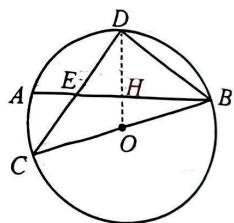

text_image

D
A	E	H	B
C	O

# 类型三 射影相似

3.(2025杭州)如图,CD是⊙O的直径,AB是⊙O的弦,AB⊥CD,垂足为M,E为 $\widehat{AD}$ 上一点,且 $\widehat{AE}=\widehat{AC}$ ,连接EC交AB于点F,连接AC.

(1) 求证: $\angle BAC = \angle ECA$ ;   
(2) 若 $MC = 2, AF = \frac{5}{2}$ , 求 $OC$ 的长.

解:(1)∵CD是⊙O的直径,AB⊥CD,∴ $\widehat{AC}=\widehat{BC}$ .

$$
\because \widehat {A E} = \widehat {A C}, \therefore \widehat {B C} = \widehat {A E}, \therefore \angle B A C = \angle E C A;
$$

(2) 连接 DA，由(1) 可知 $\angle BAC = \angle ECA$ ，

$$
\therefore F C = A F = \frac {5}{2}. \because A B \perp C D, M C = 2,
$$

$$
\therefore M F = \sqrt {F C ^ {2} - M C ^ {2}} = \frac {3}{2}, \therefore A M = A F + M F = 4.
$$

∵CD为直径，∴∠CAD=90°，∴△ADM∽△CAM，

$$
\therefore A M ^ {2} = D M \cdot C M, \therefore D M = 8, \therefore C D = C M + D M = 1 0, \therefore O C = \frac {1}{2} C D = 5.
$$

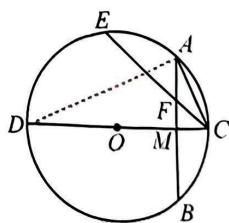

text_image

E
A
D
O
M
C
B

# 突破 15 相似与圆(二)有切线

# 类型一 构 A 型相似

1. (2025 北京模拟) 如图, 在 Rt△ABC 中, ∠C=90°, 以 AC 为直径的 ⊙O 交 AB 于点 D, E 为 CA 延长线上一点, 延长 ED 交 BC 于点 F, 连接 OD, 且 ∠ADE= $\frac{1}{2}$ ∠DOE.

(1)求证:FD 是⊙O 的切线;  
(2) 若 $AE = AC, AD = 6$ , 求 $BF$ 的长.

解:(1)连接 DC. $\because \angle DCA = \frac{1}{2} \angle DOA, \angle ADE = \frac{1}{2} \angle DOE, \therefore \angle DCA = \angle ADE,$

$$
\begin{array}{l} \because \angle A D C = 9 0 ^ {\circ}, \\ \therefore \angle D C A + \angle D A C = 9 0 ^ {\circ}, \therefore \angle A D E + \angle D A C = 9 0 ^ {\circ}, \\ \because O A = O D, \therefore \angle A D O = \angle D A C, \\ \therefore \angle A D E + \angle A D O = 9 0 ^ {\circ}, \therefore O D \perp D E. \\ \end{array}
$$

∵OD 为⊙O 的半径, ∴DF 是⊙O 的切线;

(2) 连接 OF. $\because \angle C = 90^{\circ}$ , OC 为半径, $\therefore FC$ 是 $\odot O$ 的切线,

$$
\begin{array}{l} \therefore F D = F C, \angle D F O = \angle C F O, \therefore O F \perp C D, \\ \therefore O F \parallel A D, \therefore \triangle E A D \sim \triangle E O F, \therefore \frac {E A}{E O} = \frac {A D}{O F} = \frac {2}{3}, \\ \because A D = 6, \therefore O F = 9, \\ \because C D \perp A B, \angle C = 9 0 ^ {\circ}, \therefore B C ^ {2} = B D \cdot A B = 2 1 6, \\ \therefore B C = 6 \sqrt {6}, \therefore B F = 3 \sqrt {6}. \\ \end{array}
$$

$\because OF$ 是 $\triangle ACB$ 的中位线， $\therefore AB = 18, BD = AB - AD = 12,$

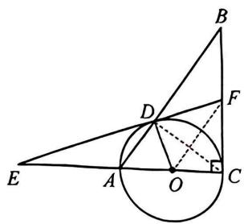

text_image

Geometric diagram with labeled points and lines, including a circle, triangle, and auxiliary constructions

# 类型二 母子型相似

2.(2025 江汉)如图,四边形 ABCD 内接于 $\odot O$ , 过点 A 作 $AE \parallel CB$ , 交 CD 的延长线于点 E, 且 AD = DE.

(1) 求证: $\angle BAD = \angle EAD$ ;   
(2)连接 AC, 若 D 是优弧 $\widehat{ACB}$ 的中点, CE = 4CD = 4, 直接写出 AC 的长.

解:(1)∵四边形ABCD内接于⊙O,

$$
\begin{array}{l} \therefore \angle B A D + \angle B C D = 1 8 0 ^ {\circ}, \\ \because A E \parallel C B, \therefore \angle E + \angle B C D = 1 8 0 ^ {\circ}, \therefore \angle B A D = \angle E. \\ \because A D = D E, \therefore \angle E A D = \angle E, \therefore \angle B A D = \angle E A D; \\ \end{array}
$$

(2) 连接 BD. ∵ D 是优弧 ACB 的中点，

$$
\therefore \widehat {A D} = \widehat {B D}, \therefore \angle A C D = \angle B A D,
$$

由(1)知 $\angle BAD=\angle EAD,\therefore\angle ACD=\angle EAD.$

又∵∠E为公共角，∴△EAD∽△ECA，

$$
\begin{array}{l} \therefore \frac {A E}{C E} = \frac {D E}{A E}, \therefore A E ^ {2} = C E \cdot D E. \\ \because C E = 4 C D = 4, \therefore C D = 1, D E = 3, \\ \therefore A E = 2 \sqrt {3}, \\ \end{array}
$$

由(1)知 $\angle EAD=\angle E,\therefore\angle ACD=\angle E,\therefore AC=AE=2\sqrt{3}$ .

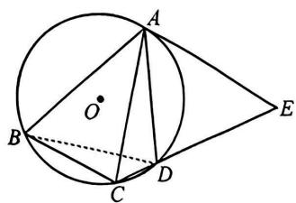

text_image

Geometric diagram showing a circle with inscribed triangle ABC and auxiliary points D, E, O, including chords and dashed lines.

# 突破 16 相似与抛物线(一) 线段比

# 类型一 构 X 型相似

1.(2025江夏)如图,在平面直角坐标系中,已知抛物线 $y = -2x^{2} - 2x + 4$ 与 $x$ 轴交于 $A, B$ 两点,与 $y$ 轴交于点 $C, D$ 为第二象限的抛物线上一点,连接 $BD$ 交 $AC$ 于点 $F$ .若 $BF = 4FD$ ,求点 $D$ 的坐标.

解:由点 A, C 的坐标, 得直线 AC 的解析式为 $y = 2x + 4$ ,

过点 D 作 $DH \parallel y$ 轴，交 AC 于点 H，作 $BN \parallel y$ 轴，交直线 AC 于点 N，

则点 $N(1,6)$ ，则 $BN = 6$ ，设点 $D(t, -2t^2 - 2t + 4)$ ，

则点 $H(t, 2t + 4)$ , 则 $DH = -2t^2 - 4t$ ,

∵DH//y轴//BN，则△DHF∽△BNF，则 $\frac{DH}{BN}=\frac{DF}{BF}=\frac{1}{4}$

即 $\frac{-2t^2 - 4t}{6} = \frac{1}{4}$ 解得 $t = -\frac{1}{2}$ 或 $-\frac{3}{2}$

则点 $D\left(-\frac{1}{2}, \frac{9}{2}\right)$ 或 $\left(-\frac{3}{2}, \frac{5}{2}\right)$ .

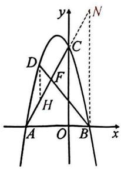

text_image

y
N
C
D
F
H
A O B x

# 类型二 构平行相似

2. (2024 七一中学)已知抛物线 $y = \frac{1}{2} x^2 - x - 4$ 交 $x$ 轴于 $A, B$ 两点(点 $A$ 在点 $B$ 的左侧), 交 $y$ 轴于点 $C$ .

(1)直接写出 A, B 两点的坐标;

(2)过点 $H(0,1)$ 作直线 $l$ 交抛物线于 $K, G$ 两点 (点 $K$ 在点 $G$ 的左侧), 分别过点 $A, C$ 作 $AM \perp l, CN \perp l$ , 垂足分别为 $M, N$ . 若 $CN = 3AM$ , 求点 $G$ 的横坐标.

解:(1) $A(-2,0)$ , $B(4,0)$ ;

(2) 过点 A 作 $AE \parallel y$ 轴, 交直线 l 于点 E,

$$
\begin{array}{l} \therefore \angle A E M = \angle C H N. \\ \because A M \perp l, C N \perp l, \therefore \angle A M E = \angle C N H = 9 0 ^ {\circ}, \\ \therefore \triangle A M E \sim \triangle C N H, \therefore \frac {A E}{C H} = \frac {A M}{C N} = \frac {1}{3}, \therefore A E = \frac {1}{3} C H = \frac {5}{3}, \\ \end{array}
$$

$\therefore E\left(-2, \frac{5}{3}\right), \because H(0,1), \therefore$ 直线 $EH$ 的解析式为 $y = -\frac{1}{3} x + 1$ .

联立 $y = -\frac{1}{3} x + 1$ 与 $y = \frac{1}{2} x^2 - x - 4$ ，消 $y$ 得 $3x^{2} - 4x - 30 = 0$ ，

$\therefore x = \frac{2 \pm \sqrt{94}}{3}$ (舍负), $\therefore$ 点 $G$ 的横坐标为 $\frac{2 + \sqrt{94}}{3}$ .

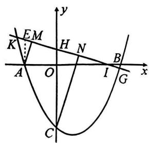

text_image

y
EM
K
H
N
A
O
I
B
G
x
C

# 突破 17 相似与抛物线(二) 角度

# 类型一 等角

1. (2025 武汉四调) 如图, 抛物线 $y = \frac{1}{4} x^2 - x - 3$ 交 $x$ 轴于 $A, B$ 两点 (点 $A$ 在点 $B$ 的左边), 交 $y$ 轴于点 $C$ .

(1) 直接写出 A, B, C 三点的坐标；

(2) $D$ 是第四象限的抛物线上一点, 连接 $AD$ 分别交 $BC, OC$ 于 $E, F$ 两点. 若 $\angle FEC = \angle FCE$ , 求直线 $AD$ 的解析式.

解:(1) $A(-2,0)$ , $B(6,0)$ , $C(0,-3)$ ;

(2) 过点 B 作 AD 的平行线交 y 轴于点 P. 则 $\angle PBC = \angle AEC$ .

$$
\because \angle A E C = \angle O C E, \therefore \angle P B C = \angle P C B, \therefore P B = P C.
$$

设 OP=m，则 PB=PC=m+3。

在 Rt△POB 中， $m^{2}+36=(m+3)^{2}$ ，解得 $m=\frac{9}{2}$ ，∴ $P\left(0,\frac{9}{2}\right)$ .

$\because B(6,0),\therefore$ 直线 PB 的解析式为 $y=-\frac{3}{4}x+\frac{9}{2}.$

∴设直线 AD 的解析式为 $y=-\frac{3}{4}x+b$ ,

$\because A(-2,0), \therefore b = -\frac{3}{2}, \therefore$ 直线 $AD$ 的解析式为 $y = -\frac{3}{4} x - \frac{3}{2}$ .

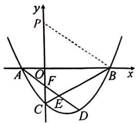

text_image

y
P
A O F B x
C E D

# 类型二 直角

2.(2024 武汉中考)如图,抛物线 $y=\frac{1}{2}x^{2}+2x-\frac{5}{2}$ 交 y 轴于点 C, 点 D 与点 O 关于点 C 对称, 过原点的直线交抛物线于 E, F 两点(点 E 在第三象限), 直线 DE 交抛物线于另一点 G, 若 $DE \perp FG$ , 求直线 DE 的解析式.

解:设点 $E\left(e,\frac{1}{2}e^{2}+2e-\frac{5}{2}\right)$ , $F\left(f,\frac{1}{2}f^{2}+2f-\frac{5}{2}\right)$ , $G\left(g,\frac{1}{2}g^{2}+2g-\frac{5}{2}\right)$ ,

则可求得直线 $EF:y = \left[\frac{1}{2} (e + f) + 2\right]x - \frac{1}{2} ef - \frac{5}{2},EG:y = \left[\frac{1}{2} (e + g) + 2\right]x-$ $\frac{1}{2} eg - \frac{5}{2},\because$ 直线 $EF$ 过原点， $\therefore -\frac{1}{2} ef - \frac{5}{2} = 0,\therefore ef = -5,\because$ 点 $D$ 与点 $O$ 关于点 $C$ 对称， $\therefore D(0, - 5),\therefore -\frac{1}{2} eg - \frac{5}{2} = -5,\therefore eg = 5,\therefore ef + eg = 0,\therefore f + g = 0,$

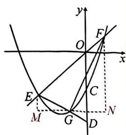

text_image

Mathematical diagram showing a parabola intersecting with coordinate axes and labeled points in a Cartesian plane

过点 G 作 $MN \perp y$ 轴, $EM \perp MN$ 于点 M, $FN \perp MN$ 于点 N,

$$
\because D E \perp F G, \therefore \triangle E M G \sim \triangle G N F, \therefore E M \cdot F N = G M \cdot G N,
$$

$$
\therefore \left(\frac {1}{2} e ^ {2} + 2 e - \frac {5}{2} - \frac {1}{2} g ^ {2} - 2 g + \frac {5}{2}\right) \left(\frac {1}{2} f ^ {2} + 2 f - \frac {5}{2} - \frac {1}{2} g ^ {2} - 2 g + \frac {5}{2}\right) = (g - e) (f - g),
$$

$$
\therefore \frac {1}{2} (e + g + 4) (e - g) \cdot \frac {1}{2} (f + g + 4) (f - g) = (g - e) (f - g), \therefore (e + g + 4) (f + g + 4) = - 4,
$$

$\therefore e + g = -5, \therefore$ 直线 $DE$ 的解析式为 $y = -\frac{1}{2} x - 5$ .

# 突破 18 与相似有关的无刻度直尺画图

# 类型一 相似放缩法

1.(武汉中考改)如图是由小正方形组成的网格,矩形ABCD的顶点都是格点.先画△ABD的高AE;再过点C画BD的平行线.

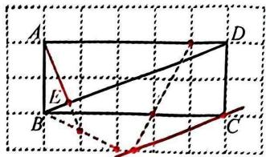

text_image

A
E
B
C
D

# 类型二 相似取分点

2.(2025东湖高新)如图是由小正方形组成的网格,A,B,C,G都是格点,E是BC上一点.先在AC上画点H,使得GH//BC;再在BC上画点M,使得 $BM=\frac{1}{2}BE$ .

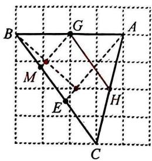

text_image

B
G
A
M
E
H
C

# 类型三 等角构相似

3.(2024武珞路中学)如图是由小正方形组成的网格, $\triangle ABC$ 的顶点都是格点.先在AB上画点D,使BD=3AD;再在AB上画点E,使 $\triangle ACE\sim\triangle ABC$ .

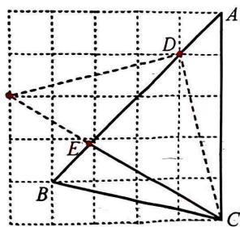

text_image

Geometric diagram with labeled points A, B, C, D, E on a grid, showing connected line segments and triangles.

# 类型四 先算后画

4.(2025 碎口)如图是由小正方形组成的网格, $\triangle ABC$ 的三个顶点都是格点. 先画 $\square ABCD$ ; 再在 AB 上画点 E, 使 DE = AC.

解:如图所示.设 AH=x,EH=2x,在 Rt△DEH 中, $(x+3)^{2}+(2x)^{2}=17$ ,解得

$$
A H = \frac {4}{5}, \therefore \frac {A E}{B E} = \frac {2}{3}.
$$

text_image

Geometric diagram with labeled points A, B, C, D, E, H and connecting lines on a grid background

# 类型五 相似破对称

5.(2024 硚口)如图是由小正方形组成的网格,A,B,C,D都是格点,在BC上画点P,使得AP+PD的值最小.

text_image

Geometric diagram showing a square ABCD with points A, B, C, D, and P, including solid and dashed lines forming triangles and diagonals.

# 类型六 线段分点比的计算与平行

6.(武汉五调)如图是由边长为1的小正方形构成的网格,每个小正方形的顶点叫做格点. $\triangle ABC$ 的顶点在格点上,仅用无刻度尺的直尺在给定网格中画图,画图过程用虚线表示,画图结果用实线表示,按步骤完成下列问题:

(1) 将边 BC 绕点 C 顺时针旋转 $90^{\circ}$ 得到线段 DC；  
(2)画边 AC 的中点 E;  
(3) 连接 $DE$ 并延长交 $BC$ 于点 $F$ , 直接写出 $\frac{CF}{BF}$ 的值;  
(4) 在 AB 上画点 G，连接 FG，使 $FG \parallel CD$ .

解:(1)(2)(4)如图所示;(3)3.

text_image

Geometric diagram with labeled points A, B, C, D, E, F, G, P on a grid, showing triangles and dashed/solid lines for construction.

# 类型七 作分点得面积比

7. (2025 江岸)如图, 在由边长为 1 的小正方形组成的 $6 \times 6$ 网格中, 每个小正方形的顶点叫格点, $A, B, C$ 都是格点. 仅用无刻度的直尺在所给网格中完成作图.

(1)在图1中,将线段AB绕点B顺时针旋转90°得到线段BE;再在BE上找一点G,使得 $\frac{AG}{BG}=\frac{5}{3}$ ;

(2)在图2中， $D$ 为 $AB$ 与横格线的交点，先在 $AC$ 上取点 $M$ ，使得 $DM / / BC$ ；再在 $BC$ 上取点 $N$ ，使得 $S_{\triangle BDN} = \frac{1}{4} S_{\triangle ABC}$

text_image

A
B
C
G
E

图1

text_image

Geometric diagram with labeled points A, B, C, D, M, N and connecting lines on a grid

图2

# 类型八 作平行得面积比

8.(2025华宜寄宿)如图是由小正方形组成的 $6\times8$ 网格,每个小正方形的顶点叫做格点. $\triangle ABC$ 三个顶点都是格点,E是AB与网格线的交点.仅用无刻度的直尺在给定网格中完成四个画图任务.

(1)在图1中,先将线段AB平移至CD,使点B与点C重合;再在线段AC上找一点M,使 $S_{\triangle AEM}=\frac{4}{5}S_{四边形BCME}$ ;

(2)在图2中,在线段AB上找一点H,使 $CH\perp AB$ ,垂足为H;再在线段AB上找一点F,使CF=3.

text_image

Geometric diagram showing two right triangles ABC and ACD with point E on BC, and a line segment EM drawn on the triangle.

图1

text_image

Geometric diagram with labeled triangle ABC and auxiliary lines, including points H and F on a grid background

图2

# 第二十八章 锐角三角函数

# 突破1 求三角函数值

# 类型一 等角代换

1.(2024 武汉三初)如图, $PA, PB$ 分别与 $\odot O$ 相切于点 $A, B$ , 直线 $PO$ 与 $\odot O$ 交于点 $C, D$ , 连接 $DA, DB$ . 若 $CD = 3CP$ , 则 $\sin \angle ADB$ 的值为 $\frac{4}{5}$ .

解: 连接 OA, OB. ∵ PA, PB 分别与 ⊙O 相切,

$$
\therefore \angle O A P = \angle O B P = 9 0 ^ {\circ}, \angle O P A = \angle O P B, \therefore \angle A O P = \angle B O P,
$$

$\therefore \angle ADB = \frac{1}{2}\angle AOB = \angle AOP.$ 设 $CP = 2a$ ，则 $CD = 3CP = 6a$

$$
\therefore O A = O C = \frac {1}{2} C D = 3 a, O P = 5 a, \therefore A P = \sqrt {O P ^ {2} - O A ^ {2}} = 4 a,
$$

$$
\therefore \sin \angle A D B = \sin \angle A O P = \frac {A P}{O P} = \frac {4}{5}.
$$

text_image

Geometric diagram showing a circle with inscribed quadrilateral ABCD and external point P, including center O and dashed lines forming triangles.

2. (2025济南模拟)将一副学生常用的三角板按如图所示方式摆放在一起,组成一个四边形ABCD

$(\angle ABD = \angle BCD = 90^{\circ})$ ，连接 $AC$ ，则 $\tan \angle ACD$ 的值为 $\sqrt{3} +1$

解: 过点 A 作 $AH \perp BC$ 于点 H. $\because \angle ABD = 90^{\circ}, \angle DBC = 45^{\circ}$ ,

$\therefore \angle ABH = 45^{\circ}, \therefore AH = BH.$ 设 $AH = BH = a$

则 $AB=\sqrt{2}a,\therefore BD=\sqrt{3}AB=\sqrt{6}a,$

$$
\therefore B C = \frac {\sqrt {2}}{2} B D = \sqrt {3} a, \therefore C H = B H + B C = (\sqrt {3} + 1) a.
$$

$$
\because \angle A C D + \angle A C H = \angle A C H + \angle C A H = 9 0 ^ {\circ}, \therefore \angle A C D = \angle C A H,
$$

∴在 Rt△ACH 中， $\tan\angle ACD=\tan\angle CAH=\frac{CH}{AH}=\sqrt{3}+1.$

text_image

Geometric diagram of a tetrahedron with labeled vertices A, B, C, D and auxiliary point H, showing solid and dashed edges.

3.(2025 光谷外校)如图, $\triangle ABC$ 是边长为6的等边三角形,点D,E在边BC上.若BD=3-

$\sqrt{3}$ , 且 $\angle DAE = 30^{\circ}$ , 则 $\cos \angle CAE$ 的值为 $\frac{3\sqrt{10}}{10}$ .

解: 过点 A 作 $AG \perp BC$ 于点 G. ∵ $\triangle ABC$ 是边长为 6 的等边三角形,

$$
\therefore \angle B A G = \angle C A G = 3 0 ^ {\circ}, B G = C G = 3, A G = 3 \sqrt {3}, \therefore D G = B G - B D = \sqrt {3},
$$

$$
\therefore A D = \sqrt {A G ^ {2} + D G ^ {2}} = \sqrt {3 0}. \because \angle D A E = 3 0 ^ {\circ} = \angle C A G, \therefore \angle C A E = \angle D A G,
$$

∴在 Rt△ADG 中， $\cos\angle CAE=\cos\angle DAG=\frac{AG}{AD}=\frac{3\sqrt{3}}{\sqrt{30}}=\frac{3\sqrt{10}}{10}.$

text_image

A
B D G E C

4.(2025 武汉模拟)如图,M 是正方形 ABCD 的边 AD 的中点,将四边形 ABCM 沿 CM 翻折得到四边形 EFCM,连接 DF,则 $\tan\angle EFD$ 的值为 $\frac{1}{3}$ .

解:延长 AD 交 EF 于点 N, 连接 CN. ∵ 四边形 ABCD 是正方形,

∴由翻折知 CB=CD=CF， $\angle A=\angle B=\angle E=\angle CFE=\angle CDN=90^{\circ}$

$\therefore \angle CDF = \angle CFD, \therefore \angle NDF = \angle NFD, \therefore ND = NF, \therefore CN$ 垂直平分 $DF$ ,

$\therefore\angle EFD=\angle NCF.$ 设 ND=NF=x，正方形的边长为 2，

$\therefore ME = AM = MD = 1, EF = CF = 2, \therefore MN = x + 1, EN = 2 - x,$

∴在 Rt△MEN 中， $1^{2}+(2-x)^{2}=(x+1)^{2}$ ，∴ $x=\frac{2}{3}$ ，即 NF= $\frac{2}{3}$ ，

$$
\therefore \tan \angle E F D = \tan \angle N C F = \frac {N F}{C F} = \frac {1}{3}.
$$

text_image

Geometric diagram with labeled points A, B, C, D, E, F, M, N and connecting lines, likely from a math problem or proof.

# 类型二 直接作垂线

5. (2024 外校) 在 $\triangle ABC$ 中, $AH$ 是 $BC$ 边上的高, $CD$ 是 $AB$ 边上的中线, $AB = 10$ , $AH = 6$ . 若 $CH = \frac{1}{2} AB$ , 则 $\tan \angle DCH$ 的值为 $\frac{1}{3}$ 或 3 .

解: 过点 D 作 $DE \perp BH$ 于点 E, 则 $DE \parallel AH$ .

∵CD 是 AB 边上的中线，

$$
\therefore D E = \frac {1}{2} A H = 3, B E = E H = \frac {1}{2} B H = 4.
$$

①当点 H 在 BC 上时(如图 1), $CE = CH + EH = 9$ , $\therefore \tan \angle DCH = \frac{DE}{CE} = \frac{3}{9} = \frac{1}{3}$ ;

②当点 H 在 BC 的延长线上时(如图2),CE=CH-EH=1,∴ $\tan\angle DCH=\frac{DE}{CE}=3.$

text_image

Geometric diagram of triangle ABC with altitude AH and point D on AB, showing right angle at H.

图1

text_image

Geometric diagram of triangle ABC with auxiliary points D, E, H and dashed lines indicating construction or proof.

图2

6.(2025 武钢实验)如图,在 $\triangle ABC$ 中, $AB<BC,BD$ 平分 $\angle ABC$ ,且 $AD\perp BD$ 于点 $D$ ,连接 $CD$ .若 $\triangle BCD$ 的面积为 $\frac{3\sqrt{5}}{2},AB\cdot AC=15$ ,则 $\angle BAC$ 的正弦值为 $\frac{2\sqrt{5}}{5}$ .

解:延长AD交BC于点E,过点C作CH⊥AB于点H.∵∠ABD=∠EBD,∠ADB=∠EDB=90°,BD=BD,∴△ABD≌△EBD,∴AD=ED,∴S△BDE= $\frac{1}{2}S_{\triangle ABE},S_{\triangle CDE}=\frac{1}{2}S_{\triangle ACE},\therefore S_{\triangle ABC}=2S_{\triangle BCD}=3\sqrt{5}.$ ∵ $S_{\triangle ABC}=\frac{1}{2}AB\cdot CH=$ $\frac{1}{2}AB\cdot AC\cdot\sin\angle BAC=\frac{15}{2}\sin\angle BAC,\therefore\sin\angle BAC=\frac{2S_{\triangle ABC}}{15}=\frac{6\sqrt{5}}{15}=\frac{2\sqrt{5}}{5}.$

text_image

A
H
D
B
E
C

# 类型三 间接作垂线

7.(2024 七一中学改)如图,在 $\triangle ABC$ 中, $\angle ACB=90^{\circ}(AC>BC)$ ,三角形的角平分线AD,BE相交于点F.若 $\frac{AF}{AC}=\frac{\sqrt{10}}{4}$ ,则 $\tan\angle CAD$ 的值为 $\frac{1}{3}$ .

解: 过点 E 作 $EH \perp AF$ 于点 H, 连接 CF. 由点 F 是两条角平分线的交点可证得 $\angle AFE = \angle ACF = 45^{\circ}$ , $\therefore \triangle AEF \sim \triangle AFC$ , $\therefore AF^{2} = AE \cdot AC$ . 设 $AF = \sqrt{10}$ , 则 AC = 4, $\therefore AE = \frac{5}{2}$ . 设 EH = HF = a, 则 $AH = \sqrt{10} - a$ , $\therefore$ 在 Rt $\triangle AEH$ 中, $a^{2} + (\sqrt{10} - a)^{2} = \left(\frac{5}{2}\right)^{2}$ , $\therefore a = \frac{\sqrt{10}}{4} \left( a = \frac{3\sqrt{10}}{4} \text{舍去} \right)$ , $\therefore EH = \frac{\sqrt{10}}{4}$ , $AH = \frac{3\sqrt{10}}{4}$ , $\therefore \tan \angle CAD = \frac{EH}{AH} = \frac{1}{3}$ .

text_image

A
E
H
F
C
D
B

# 类型四 平移构等角

8.(2025江岸)如图,在 $\triangle ABC$ 中, $\angle C=90^{\circ}$ ,点 $D,E$ 分别在边 $BC,AC$ 上, $AD$ 与 $BE$ 交于点 $F$ .若 $BD=2AC,AE=2CD$ ,则 $\cos\angle EFA$ 的值为 $\frac{\sqrt{5}}{5}$ .

解: 过点 D 作 $DM \perp AD$ ，过点 B 作 $BM \perp BC$ ，交 DM 于点 M，连接 AM，则 $\angle ACB = \angle ADM = \angle DBM = 90^{\circ}$ ，∴ 可证 $\triangle ACD \sim \triangle DBM$ ，∴ $\frac{AC}{BD} = \frac{CD}{BM} = \frac{1}{2}$ ，∴ $BM = 2CD = AE$ 。∵ $BM \parallel AE$ ，∴ 四边形 AEBM 是平行四边形，∴ $AM \parallel BE$ ，∴ $\angle MAD = \angle EFA$ 。在 Rt $\triangle ADM$ 中，∵ $\frac{DM}{AD} =$

text_image

Geometric diagram with labeled points A, B, C, D, E, F, M and right-angle markers at C and D

$\frac{BD}{AC} = 2, \therefore$ 可设 $DM = 2a$ ，则 $AD = a, \therefore AM = \sqrt{5}a, \therefore \cos \angle EFA = \cos \angle MAD = \frac{AD}{AM} = \frac{a}{\sqrt{5}a} = \frac{\sqrt{5}}{5}$ .

# 突破2 知三角函数值

# 类型一 作垂解形

1.(2024 武钢实验)如图,在正方形 $ABCD$ 中, $E$ 是 $AD$ 的中点, $F$ 是边 $AB$ 上的一点,连接 $CE$ ,CF. 若 $\tan\angle FCE=\frac{2}{3}, AF=6$ ，则正方形 ABCD 的边长为 \_\_\_\_。

text_image

M
A	E	D
F	N
B	C

解:延长 CE 交 BA 的延长线于点 M, 过点 F 作 $FN \perp CM$ 于点 N.

易证 $\triangle MAE\cong\triangle CDE,\therefore ME=CE,\angle M=\angle ECD,$

$$
\therefore \tan M = \tan \angle E C D = \frac {1}{2}. \because \tan \angle F C E = \frac {F N}{C N} = \frac {2}{3},
$$

∴可设 FN=2a, CN=3a，则 MN=2FN=4a，∴CM=CN+MN=7a, MF=

$$
\sqrt {M N ^ {2} + F N ^ {2}} = 2 \sqrt {5} a, \therefore M E = \frac {1}{2} C M = \frac {7 a}{2}, \because \tan M = \frac {A E}{A M} = \frac {1}{2}, \therefore A M = \frac {2 \sqrt {5}}{5} M E =
$$

$$
\frac {7 \sqrt {5}}{5} a, \therefore A F = M F - A M = 2 \sqrt {5} a - \frac {7 \sqrt {5}}{5} a = 6, \therefore \frac {\sqrt {5}}{5} a = 2, \therefore A M = C D = 7 \times \frac {\sqrt {5}}{5} a = 7 \times 2 = 1 4.
$$

# 类型二 等角代换

2.(2025武汉三初)如图,在 $\triangle ABC$ 中, $AB=AC=4$ , $\angle BAC=120^{\circ}$ ,点 $D,E$ 在边 $BC$ 上,且 $\angle DAE=60^{\circ}$ .若 $\tan\angle CAE=\frac{3}{4}$ ,则 $BD$ 的长为 $\underline{2\sqrt{3}-\frac{3}{2}}$ .

解: 过点 A 作 $AG \perp BC$ 于点 G. $\because AB = AC = 4, \angle BAC = 120^{\circ}$ ,

$$
\therefore A G = \frac {1}{2} A B = 2, B G = \frac {\sqrt {3}}{2} A B = 2 \sqrt {3}, \angle C A G = \frac {1}{2} \angle B A C = 6 0 ^ {\circ} = \angle D A E,
$$

$$
\therefore \angle D A G = \angle C A E, \therefore \tan \angle D A G = \tan \angle C A E = \frac {3}{4},
$$

$$
\therefore \frac {D G}{A G} = \frac {3}{4}, \therefore D G = \frac {3}{4} A G = \frac {3}{2}, \therefore B D = B G - D G = 2 \sqrt {3} - \frac {3}{2}.
$$

text_image

A
B D G E C

# 类型三 垂构相似

3.(2024二中广雅改)如图,在四边形ABCD中, $\angle ABD=\angle ACD=90^{\circ},\tan\angle BAD=\sqrt{2}$ .若 $BC=\sqrt{5}$ ,则 $\sqrt{2}AC-CD$ 的值为 $\sqrt{15}$ .

解:作 $\angle CAE=\angle BAD,AE$ 交 $CD$ 的延长线于点 $E$ . $\because \angle ABD=\angle ACD=$

$$
9 0 ^ {\circ}, \therefore \triangle A B D \sim \triangle A C E, \therefore \frac {A B}{A C} = \frac {A D}{A E}. \because \angle B A C = \angle D A E, \therefore \triangle A B C \sim
$$

$$
\triangle A D E, \therefore \frac {D E}{B C} = \frac {A D}{A B}. \because \tan \angle B A D = \frac {B D}{A B} = \sqrt {2}, \therefore \frac {A D}{A B} = \sqrt {3}, \therefore D E = \sqrt {3} B C
$$

$$
= \sqrt {1 5}, \therefore \sqrt {2} A C - C D = C E - C D = D E = \sqrt {1 5}.
$$

text_image

Geometric diagram with labeled points A, B, C, D, E and right-angle markers, likely from a math problem or proof.

4. 如图, 在 Rt△ABC 中, ∠A = 90°, D, E 分别在 AB, AC 上, 连接 BE, CD 交于点 F. 若$\sin \angle CFE = \frac{3}{5}, CE \cdot AE = BD \cdot BA$ ，则 $\frac{CE}{AB}$ 的值是 $\frac{3}{4}$ .

解: 过点 C 向上作 $CG \parallel BD$ ，使得 CG = BD，连接 EG, BG, $\because CG \parallel BD, CG = BD$ ，

$$
\begin{array}{r l} & {\therefore \text {四边形} B D C G \text {为平行四边形}, \therefore B G / / C D, \because C E \cdot A E = B D \cdot B A, \therefore \frac {C E}{A B} =} \\ & {\frac {B D}{A E} = \frac {C G}{A E}, \because \angle A = 9 0 ^ {\circ}, C G / / B D, \therefore \angle A = \angle A C G, \therefore \triangle A B E \sim \triangle C E G,} \end{array}
$$

$$
\therefore \angle B E G = 9 0 ^ {\circ}, \frac {C E}{A B} = \frac {E G}{B E}, \because B G / / C D, \therefore \angle C F E = \angle G B E, \therefore \sin \angle G B E = \frac {3}{5},
$$

设 $EG = 3x, BG = 5x$ ，则 $BE = \sqrt{BG^2 - EG^2} = 4x, \therefore \tan \angle GBE = \frac{EG}{BE} = \frac{3}{4}, \therefore \frac{CE}{AB} = \frac{EG}{BE} = \frac{3}{4}$ .

text_image

Geometric diagram with labeled points A, B, C, D, E, F, G and solid/dashed lines forming triangles and quadrilaterals

# 突破3 相似变换与三角函数

# 类型一 “一线三等角”模型

1. (武汉中考) 如图, 在 $\triangle ABC$ 中, $\angle B = 90^\circ$ , $P$ 是边 $BC$ 上一点, 且 $\angle PAB = \angle C$ . 若 $\tan \angle PAC = \frac{2\sqrt{5}}{5}$ , 则 $\tan C$ 的值为 $\frac{\sqrt{5}}{5}$ .

解: 过点 P 作 $PN \perp AP$ , 交 AC 于点 N, 过点 N 作 $NM \perp PC$ 于点 M.

可证 $\triangle BAP\sim \triangle MPN,\therefore \frac{MN}{BP} = \frac{MP}{BA} = \frac{PN}{AP} = \tan \angle PAC = \frac{2\sqrt{5}}{5},$

∴可设 MN=2a, MP=2b，则 $BP=\sqrt{5}a$ , $AB=\sqrt{5}b$ .

$$
\because \angle P A B = \angle C = \angle N P C, \therefore N P = N C, \therefore P C = 2 P M = 4 b, B C = 4 b + \sqrt {5} a.
$$

$$
\because \tan \angle B A P = \tan C, \therefore \frac {P B}{A B} = \frac {A B}{B C}, \therefore (\sqrt {5} b) ^ {2} = \sqrt {5} a \cdot (4 b + \sqrt {5} a),
$$

$$
\therefore a = \frac {\sqrt {5}}{5} b, \therefore \tan C = \tan \angle B A P = \frac {P B}{A B} = \frac {\sqrt {5} a}{\sqrt {5} b} = \frac {\sqrt {5}}{5}.
$$

text_image

A
B P M C
N

# 类型二 “仿射影”模型

2.(2025 武汉外校)如图,在 $\triangle ABC$ 中, $\angle ACB=90^{\circ},AC=3,BC=4,D$ 是 $BC$ 上一点, $F$ 是 $AC$ 的中点, $BF$ 交 $AD$ 于点 $E$ .若 $\tan\angle AEF=\frac{1}{2}$ ,则 $BD$ 的长为 $\frac{17}{14}$ .

解:延长 BC 至点 H, 使 CH = CA = 3, 取 CD 的中点 G, 连接 HF, GF.

∵F 是 AC 的中点，∴ $FG \parallel AD$ ，∴ 可证 $\angle BFG = \angle AEF = \angle H$ ，

$\therefore \triangle BFG \sim \triangle BHF, \therefore BF^{2} = BG \cdot BH.$ 设 $BD = x$ ，则 $CD = 4 - x$

$$
\therefore D G = \frac {1}{2} C D = \frac {1}{2} (4 - x), \therefore B G = \frac {x + 4}{2}, B H = 7.
$$

$$
\because B F ^ {2} = B C ^ {2} + C F ^ {2} = \frac {7 3}{4}, \therefore \frac {7 3}{4} = \frac {x + 4}{2} \times 7, \therefore x = \frac {1 7}{1 4}, \text { 即 } B D = \frac {1 7}{1 4}.
$$

text_image

Geometric diagram with labeled points and lines, including triangle ABC and auxiliary constructions

# 类型三 “旋转(手拉手)”模型

3.(2025 江岸)如图,在四边形 $ABCD$ 中, $\angle CDB = 90^{\circ}, \angle CBD = 30^{\circ}, AB = 4, AD = 2$ . 当对角线

AC 最大时, $\tan\angle DBA$ 的值为 $\frac{\sqrt{3}}{5}$ .

解: 在 AB 的上方作 $\angle EBA = \angle CBD = 30^{\circ}$ ，且使 $\angle EAB = 90^{\circ}$ ，连接 CE，

$\therefore AE = \frac{4}{3}\sqrt{3}$ . 可证 $\triangle BCE \sim \triangle BDA$ , $\therefore \frac{CE}{AD} = \frac{BC}{BD} = \frac{1}{\cos 30^\circ}, \angle BEC = \angle BAD$ ,

$\therefore CE = \frac{4}{3}\sqrt{3}.\because AC\leqslant AE + CE,\therefore$ 当 $A,E,C$ 三点共线时，AC取得最大值.

$\because \angle AEB = 60^{\circ}, \therefore$ 当 $AC$ 最大时, $\angle BAD = \angle BEC = 120^{\circ}$ .

过点 D 作 $DG \perp AB$ 于点 G. 此时, AG = 1, $DG = \sqrt{3}$ , BG = 5,

$$
\therefore \tan \angle D B A = \frac {D G}{B G} = \frac {\sqrt {3}}{5}.
$$

text_image

Geometric diagram of a tetrahedron with labeled vertices A, B, C, D and internal points E, showing edges and dashed lines for hidden geometry.

text_image

Geometric diagram of triangle BCD with perpendiculars from A and G to hypotenuse AB, labeled with points A, B, D, G.

# 突破4 图形拼接

# 类型一 面积关系十方程

1. 如图, 用 8 个全等的 Rt△ABC (AC > BC) 分别拼成如图 1 和图 2 中的两个正方形, 中间的两个小正方形的面积分别记为 $S_{1}$ 和 $S_{2}$ , 且 $S_{2} = 3S_{1}$ , 则 $\tan A$ 的值为 $\frac{3 - \sqrt{5}}{2}$ .

解：设 $BC = a, AC = b$ ，则 $S_{1} = (b - a)^{2} = a^{2} - 2ab + b^{2}, S_{2} =$

$$
a ^ {2} + b ^ {2}. \because S _ {2} = 3 S _ {1}, \therefore a ^ {2} + b ^ {2} = 3 a ^ {2} - 6 a b + 3 b ^ {2}, \therefore a ^ {2} -
$$

$$
3 a b + b ^ {2} = 0, \therefore a = \frac {3 \pm \sqrt {5}}{2} b, \because a <   b, \therefore a = \frac {3 - \sqrt {5}}{2} b,
$$

$$
\therefore \tan A = \frac {a}{b} = \frac {3 - \sqrt {5}}{2}.
$$

  
图1

  
图2

# 类型二 面积关系+相似

2. 如图是由五个边长相等的小正方形拼接而成的, 直线 $AB$ 过点 $P$ , 并把图形分成上下面积相等的两部分, 则 $\sin \angle BAC$ 的值是 $\frac{\sqrt{15} - \sqrt{3}}{6}$ .

解:设每个小正方形的边长为1,则 $S_{阴影}=\frac{5}{2}$ ,设BC=x,则 $AC=\frac{5}{x}$ ,标记点M,N

text_image

A
M
C
P
N
B

（如图），则由 $\triangle AMP\sim \triangle PNB$ ，得 $\frac{AM}{PN} = \frac{MP}{NB}$ 即 $\frac{\frac{5}{x} - 1}{1} = \frac{1}{x - 1}$ 解得 $x_{1} = \frac{5 - \sqrt{5}}{2},$

$x_{2} = \frac{5 + \sqrt{5}}{2} > 2$ （舍）， $\therefore BC = \frac{5 - \sqrt{5}}{2}, AC = \frac{5 + \sqrt{5}}{2}, AB = \sqrt{15}, \therefore \sin \angle BAC = \frac{BC}{AB} = \frac{\sqrt{15} - \sqrt{3}}{6}$ .

# 类型三 特殊图形十分类讨论

3. 如图,有一张面积为 10 的 $\triangle ABC$ 纸片, $AB = AC$ , 把它剪两刀拼成一个矩形 (如图虚线所示, 无缝隙、无重叠), 且矩形的一边与 $AB$ 平行, 所拼得矩形的周长为 13 , 则 $\sin A$ 的值为 $\frac{4}{5}$ 或 $\frac{5}{16}$ .

解:由题意及观察拼图可知,矩形的边 EQ=CD, 边 $EF=\frac{1}{2}AB$ , ∴设 AB=a, CD=b, 则 $\frac{1}{2}ab=10, a+2b=13$ , 解得 a=5, b=4 或 $a=8, b=\frac{5}{2}$ , ∴ $\sin A=\frac{4}{5}$ 或 $\frac{5}{16}$ .

text_image

E
C
F
N
M
A
Q
D
T
B

# 类型四 位置关系+相似

4.(2025黄冈模拟)正方形ABCD、正方形BEFG和正方形CPQE按如图所示的方式摆放,其中A,B,E三点在同一直线上,PQ交AB于点M,连接CM,设 $\angle APM=\alpha,\angle BCM=\beta.$ 若Q,B,F三点共线, $\tan\alpha=n\tan\beta$ ,则n的值为 $\frac{2}{3}$ .

解: 过点 Q 作 $QH \perp ME$ 于点 H, 连接 BQ, BF. 由正方形的性质可证 $\angle QEM = \angle BCE = \angle APM = \alpha$ , $\triangle QEH \cong \triangle ECB$ , $\therefore BE = QH$ . $\because Q, B, F$ 三点共线, $\therefore \angle QBH = \angle EBF = 45^{\circ}$ , $\therefore QH = BH = BE$ . 设 $QH = BH = BE = t$ , 则 $\tan \angle MQH = \tan \angle QEH = \frac{1}{2}$ , $\therefore \frac{MH}{QH} = \frac{1}{2}$ , $\therefore MH = \frac{1}{2}t$ , $MB = \frac{3}{2}t$ . $\because \tan \alpha = \tan \angle BCE = \frac{BE}{BC}$ , $\tan \beta = \frac{MB}{BC}$ ,

$$
\therefore n = \frac {B E}{M B} = \frac {t}{\frac {3}{2} t} = \frac {2}{3}.
$$

text_image

Geometric diagram with labeled points and lines, likely from a math problem or proof

# 突破 5 “ $a + kb (k \neq 1)$ ”型——“胡不归”最值问题

# 类型一 “ $a+kb(k<1)$ ”型

1.(2025外校)如图,在 $\triangle ABC$ 中, $AB=AC=10$ , $\tan A=3$ , $CD\perp AB$ 于点 $D,E$ 是线段 $CD$ 的一

个动点，则 $BE + \frac{\sqrt{10}}{10} CE$ 的最小值是 $\underline{3\sqrt{10}}$

解: 过点 E 作 $EF \perp AC$ 于点 F, $\because CD \perp AB, \therefore \angle ADC = 90^{\circ}, \because \tan A = \frac{CD}{AD} = 3$ ,

$$
\therefore \sin \angle A C D = \frac {A D}{A C} = \frac {\sqrt {1 0}}{1 0}, \therefore E F = C E \cdot \sin \angle E C F = \frac {\sqrt {1 0}}{1 0} C E, \therefore B E + \frac {\sqrt {1 0}}{1 0} C E
$$

text_image

Geometric diagram of triangle ABC with perpendiculars from D and E to sides AB and AC, labeled points A, B, C, D, E, F

$= BE + EF, \therefore$ 当 $B, E, F$ 三点共线时， $BE + \frac{\sqrt{10}}{10} CE = BE + EF = BF$ 的值最小，此时 $BF \perp AC$

$$
\therefore B F = A B \cdot \sin \angle A = 1 0 \cdot \frac {C D}{A C} = 1 0 \times \frac {3 \sqrt {1 0}}{1 0} = 3 \sqrt {1 0}.
$$

2. (2024 德阳改) 如图, 在 $\triangle ABC$ 中, $AB = AC$ , $AD \perp BC$ 于点 $D$ , $P$ 是 $AD$ 上一动点, 连接 $BP$ .

若 AD=BC=3，则 $PB+\frac{\sqrt{5}}{5}PA$ 的最小值是 $\frac{6\sqrt{5}}{5}$ .

解: 过点 P 作 $PG \perp AC$ 于点 G. $\because AB = AC, AD \perp BC, \therefore CD = BD = \frac{1}{2} BC = \frac{1}{2} AD,$

$$
\therefore \tan \angle P A G = \tan \angle C A D = \frac {1}{2}, \therefore \sin \angle P A G = \frac {P G}{P A} = \frac {\sqrt {5}}{5}, \therefore P G = \frac {\sqrt {5}}{5} P A, \therefore P B +
$$

$\frac{\sqrt{5}}{5} PA = PB + PG, \therefore$ 当 $B, P, G$ 三点共线时， $PB + \frac{\sqrt{5}}{5} PA = PB + PG = BG$ 的值最

text_image

A
P
G
G
P
B
D
C

小, 此时 $BG \perp AC$ . $\because \tan C = \frac{AD}{CD} = 2, \therefore \sin C = \frac{AD}{AC} = \frac{2}{\sqrt{5}} = \frac{2\sqrt{5}}{5}$ , $\therefore$ 当 $BG \perp AC$ 时, $BG = BC \cdot \sin C = 3 \times \frac{2\sqrt{5}}{5} = \frac{6\sqrt{5}}{5}, \therefore PB + \frac{\sqrt{5}}{5}PA$ 的最小值为 $\frac{6\sqrt{5}}{5}$ .

# 类型二 “ $a+kb(k>1)$ ”型

3.(2025二中广雅)如图,在 $\triangle ABC$ 中, $AB=AC=10$ , $\tan A=2$ , $BE\perp AC$ 于点 $E$ , $D$ 是线段 $BE$ 上的一个动点,则 $\sqrt{5}CD+BD$ 的最小值是\_20\_.

解: 过点 D, C 分别作 $DH \perp AB$ 于点 H, $CM \perp AB$ 于点 M. $\because BE \perp AC$ ,

$$
\therefore \angle A E B = 9 0 ^ {\circ}, \because \tan A = \frac {B E}{A E} = 2, \therefore \sin \angle D B H = \frac {D H}{B D} = \frac {A E}{A B} = \frac {\sqrt {5}}{5}, \therefore D H =
$$

$$
\frac {\sqrt {5}}{5} B D, \therefore C D + \frac {\sqrt {5}}{5} B D = C D + D H, \because C D + D H \geqslant C M = A C \cdot \sin A = 4 \sqrt {5},
$$

$\therefore CD + \frac{\sqrt{5}}{5} BD \geqslant 4\sqrt{5}, \therefore \sqrt{5} CD + BD = \sqrt{5}\left(CD + \frac{\sqrt{5}}{5} BD\right)$ 的最小值为20.

text_image

A
M
H
E
D
B
C

4.(2024 武珞路中学)如图,在 $\triangle ABC$ 中, $\angle BAC=90^{\circ},\tan B=\sqrt{3},AB=1,D$ 为 $BC$ 边上的一动点,连接 $AD$ ,则 $CD+2AD$ 的最小值为\_3 $_{A}$ .

解: 在 BC 的下方作 $\angle BCM = 30^{\circ}$ ，作 $DE \perp CM$ 于点 E，作 $AF \perp CM$ 于点 F，交 BC 于点 $D'$ ，则 $DE = CD \cdot \sin \angle BCM = \frac{1}{2} CD, \therefore AD + \frac{1}{2} CD = AD + DE \geqslant AF$ ，

∴当点 D 在点 $D'$ 处时， $AD + \frac{1}{2}CD$ 取得最小值为 AF 的长。∵ $\tan B = \sqrt{3}$ ，

$$
\therefore \angle B = 6 0 ^ {\circ}, \angle A C B = 3 0 ^ {\circ}, \therefore \angle A C F = 6 0 ^ {\circ}, A C = \sqrt {3} A B = \sqrt {3}, \therefore A F = A C.
$$

$\sin\angle ACF=\frac{3}{2},\therefore CD+2AD=2\left(AD+\frac{1}{2}CD\right)$ 的最小值为3.

text_image

A
B
D
D'
C
E
F
M

# 突破6 与锐角三角函数有关的无刻度直尺画图

# 类型一 分点构比值

1.(2024外校五调)如图是由小正方形组成的网格, $\triangle ABC$ 的顶点都是格点.先将线段AC绕点A顺时针旋转90°得到线段AD,再在AB边上画点P,使得 $\tan\angle ACP=\frac{1}{2}$ .

text_image

Geometric diagram with labeled points A, B, C, D, and P on a grid background

2.(2024江汉)如图是由小正方形组成的网格, $\triangle ABC$ 的顶点都是格点.先将线段CA绕点C逆时针旋转90°得到线段CD,再在BC上画点E,使得 $\tan\angle CAE=\frac{2}{3}$ .

text_image

Geometric diagram of triangle ABC with points D and E, showing auxiliary lines and dashed grid lines

# 类型二 等距构比值

3.(2025 武汉一初)如图是由小正方形组成的网格, $\triangle ABC$ 的顶点都是格点.先将线段AB绕点B顺时针旋转90°得到线段BD,再在BC上画点E,使得 $\tan\angle BAE=\frac{4}{3}$ .

text_image

Geometric diagram with labeled points A, B, C, D, E and connecting lines on a grid background

# 类型三 正弦转正切

4.(2025武昌)如图是由小正方形组成的网格, $\triangle ABC$ 的顶点都是格点.先将线段AB绕点A逆时针旋转90°得到线段AD,再在AC上画点E,使得 $\sin\angle ABE=\frac{\sqrt{26}}{26}$ .

text_image

Geometric diagram with labeled points A, B, C, D, E and right-angle markers on a grid background

# 类型四 等角隐正切

5.(2025 武汉模拟)如图是由小正方形组成的网格,A,B,C都是格点.E是AB与网格线的交点,在AC上画点F,使得 $\triangle AEF\sim\triangle ACB$ .

text_image

A
E
F
B
C

# 突破 7 圆与三角函数(一)作垂径构直角

# 类型一 直接作垂径

1. (2025 武汉外校) 如图, $AB$ 与 $\odot O$ 相切于点 $A$ , $AC$ 是 $\odot O$ 的弦, 连接 $BC$ 交 $OA$ 于点 $D$ , 且 $\angle ODC + \angle ACB = 90^\circ$ .

(1) 求证: AB = AC;   
(2) 若 $OD = 3, \sin \angle CAO = \frac{4}{5}$ , 求 $\odot O$ 的半径.

解:(1)∵AB与⊙O相切于点A,∴∠OAB=90°,

$$
\begin{array}{l} \therefore \angle A D B + \angle B = 9 0 ^ {\circ}. \\ \because \angle O D C + \angle A C B = 9 0 ^ {\circ}, \angle O D C = \angle A D B, \\ \therefore \angle A D B + \angle A C B = 9 0 ^ {\circ}, \\ \therefore \angle A C B = \angle B, \therefore A B = A C; \\ \end{array}
$$

(2) 过点 O 作 $OG \perp AC$ 于点 G，交 CD 于点 E，则 $CG = AG, \angle ACB + \angle CEG = 90^{\circ}$ .

$$
\begin{array}{l} \because \angle C E G = \angle O E D, \therefore \angle A C B + \angle O E D = 9 0 ^ {\circ} = \angle A C B + \angle O D C, \\ \therefore \angle O E D = \angle O D C, \therefore O E = O D = 3. \\ \end{array}
$$

$\because \sin \angle CAO = \frac{OG}{OA} = \frac{4}{5}, \therefore$ 可设 $OG = 4a$ ，则 $OA = 5a$ ，

$$
\therefore A G = C G = 3 a, E G = 4 a - 3, A D = 5 a - 3, A B = A C = 6 a.
$$

$$
\because \angle A C B = \angle B, \therefore \tan \angle A C B = \tan B, \text {即} \frac {E G}{C G} = \frac {A D}{A B},
$$

$\therefore \frac{4a - 3}{3a} = \frac{5a - 3}{6a}, \therefore a = 1, \therefore OA = 5a = 5$ ，即 $\odot O$ 的半径为 5.

text_image

Geometric diagram showing a circle with points O, A, B, C, D, E, G and perpendicular lines, likely from a math problem or proof.

# 类型二 连弧的中点与圆心

2.(2025 洪山)如图,AB 是⊙O 的直径,AC 交⊙O 于点 D,E 是 $\widehat{AD}$ 的中点,BE 交 AC 于点 F, BC=FC.

(1)求证:BC 是 $\odot O$ 的切线;  
(2) 若 $BF = 3EF$ , 求 $\tan \angle ACE$ 的值.

解:(1)连接 OE 交 AD 于点 G, ∵ E 是 $\widehat{AD}$ 的中点, ∴ $OE \perp AD$ ,

即 $\angle EGF = \angle EFG + \angle GEF = \angle CFB + \angle GEF = 90^{\circ}$

$$
\because B C = C F, \therefore \angle C F B = \angle C B F,
$$

又∵∠GEF=∠OBE,∴∠CBF+∠EBO=90°,

又∵AB是⊙O直径，∴BC是⊙O的切线；

text_image

Geometric diagram showing a circle with inscribed triangle and labeled points A, B, C, D, E, F, G, O

(2) 连接 $BD, \because OE \parallel BD, \therefore \frac{EF}{BF} = \frac{EG}{BD} = \frac{1}{3}, \therefore$ 可设 $EG = 2, BD = 6$ , 则 $OG = 3$ ,

$\therefore OE=5,AB=10$ , 在 Rt△ABD 中, 由勾股定理, 可得 AD=8,

$\therefore AG = GD = 4$ ，由 $\triangle ADB\sim \triangle ABC$ ，可求得 $AC = \frac{25}{2}$

$$
\therefore G C = A C - A G = \frac {1 7}{2}, \therefore \tan \angle A C E = \frac {E G}{G C} = \frac {4}{1 7}.
$$

# 突破 8 圆与三角函数(二) 直径构直角

# 类型一 见直径连直角

1. (2025 武汉二中) 如图, 在 $\triangle ABC$ 中, 以 $AC$ 为直径的 $\odot O$ 交 $BC$ 于点 $D$ , 交 $BA$ 的延长线于点 $E$ . 过点 $D$ 的切线交 $AB$ 于点 $F$ , 且 $DF \perp AB$ .

(1) 求证: AB = AC;   
(2) 若 $\tan B = \frac{1}{2}, AE = 6$ , 求 $\odot O$ 的直径.

解:(1)连接 OD.

$$
\begin{array}{l} \because D F \text { 与 } \odot O \text { 相切于点 } D, \therefore \angle O D F = 9 0 ^ {\circ}, \\ \therefore \angle O D C + \angle B D F = 9 0 ^ {\circ}. \\ \because D F \perp A B, \therefore \angle B + \angle B D F = 9 0 ^ {\circ}, \\ \therefore \angle O D C = \angle B. \\ \because O D = O C, \therefore \angle O D C = \angle A C B, \\ \therefore \angle B = \angle A C B, \therefore A B = A C; \\ \end{array}
$$

(2) 连接 CE.

∵AC是直径,∴∠E=90°,

∴在 Rt△BCE 中， $\tan B=\frac{CE}{BE}=\frac{1}{2}$

∴可设 CE=a，则 BE=2a，∴AC=AB=2a-6.

∵在 Rt△ACE 中， $AE^{2}+CE^{2}=AC^{2}$

$\therefore 6^{2}+a^{2}=(2a-6)^{2},\therefore a=8(a=0\text{舍去}),$

$\therefore AC=2a-6=10$ , 即 $\odot O$ 的直径为 10.

text_image

Geometric diagram showing a circle with inscribed quadrilateral ABCD and external point E, labeled with points A, B, C, D, E, F, and center O.

# 类型二 作直径构直角

2.(2024苏州中考)如图, $\triangle ABC$ 中, $AB=4\sqrt{2}$ ,D为AB的中点, $\angle BAC=\angle BCD,\cos\angle ADC=\frac{\sqrt{2}}{4}$ , $\odot O$ 是 $\triangle ACD$ 的外接圆.

(1)求 $BC$ 的长；  
(2) 求 $\odot O$ 的半径.

解:(1) $\because\angle BAC=\angle BCD,\angle B=\angle B,$

$$
\therefore \triangle B A C \sim \triangle B C D, \therefore \frac {B C}{B D} = \frac {B A}{B C},
$$

$\because AB = 4\sqrt{2}, D$ 为 $AB$ 的中点， $\therefore BD = AD = 2\sqrt{2}$ ，

$$
\therefore B C ^ {2} = B D \cdot B A = 2 \sqrt {2} \times 4 \sqrt {2} = 1 6, \therefore B C = 4;
$$

text_image

Geometric diagram showing a circle with inscribed triangle ABC and auxiliary points D, E, F, O, including dashed lines and right-angle markers.

(2) 过点 A 作 $AE \perp CD$ 于点 E，连接 CO，并延长交 $\odot O$ 于点 F，连接 AF.

∵ 在 Rt△AED 中，cos∠CDA = $\frac{DE}{AD} = \frac{\sqrt{2}}{4}$ ，AD = 2√2，∴ DE = 1，∴ AE = $\sqrt{AD^{2} - DE^{2}} = \sqrt{7}$ ，

$\because \triangle BAC \sim \triangle BCD, \therefore \frac{AC}{CD} = \frac{AB}{BC} = \sqrt{2}$ , 设 $CD = x$ , 则 $AC = \sqrt{2}x, CE = x - 1$ ,

∵ 在 Rt△ACE 中， $AC^{2}=CE^{2}+AE^{2}$ ，∴ $(\sqrt{2}x)^{2}=(x-1)^{2}+(\sqrt{7})^{2}$ ，解得 x=2, x=-4（舍去），

$\therefore CD=2,AC=2\sqrt{2},\because\angle AFC=\angle ADC,CF$ 为 $\odot O$ 的直径，

$\therefore \sin \angle AFC = \frac{AC}{CF} = \sin \angle CDA = \frac{AE}{AD} = \frac{\sqrt{14}}{4}, \therefore CF = \frac{8\sqrt{7}}{7}$ , 即 $\odot O$ 的半径为 $\frac{4\sqrt{7}}{7}$ .

# 突破 9 圆与三角函数(三) 切线构直角

# 类型一 单切线 $\rightarrow$ 连圆心与切点

1.(2025 武汉六中)如图,AB 为⊙O 的直径,C 为⊙O 上一点,D 是 ABC 的中点,过点 D 作⊙O 的切线,交 AB 的延长线于点 E,连接 AD,CD,CB,CD 与 AB 交于点 F.

(1) 求证: $\angle ABC = 2\angle DCB$ ;   
(2) 若 $\sin E = \frac{1}{3}$ , 求 $\frac{AF}{EF}$ 的值.

解:(1)连接 AC、OD,延长 DO 交 AC 于点 G.∵D 是 ABC 的中点,

$\therefore \widehat{AD} = \widehat{CD}, \therefore AD = CD, \therefore$ 点 $D$ 在 $AC$ 的垂直平分线上.

$\because {OA} = {OC},\therefore$ 点 $O$ 在 ${AC}$ 的的垂直平分线上, $\therefore {DG}\bot {AC}$ .

∵AB是直径，∴∠ACB=90°，∴BC∥DG，∴∠ABC=∠DOB=2∠DCB；

text_image

Geometric diagram showing a circle with inscribed triangle and tangent line, labeled with points A, B, C, D, E, F, G, O.

(2) $\because DE$ 与 $\odot O$ 相切于点 $D, \therefore DG \perp DE$ . $\because DG \perp AC, \therefore AC \parallel DE, \therefore \angle E = \angle OAG, \therefore \sin \angle OAG = \frac{OG}{OA} = \sin E = \frac{1}{3}, \therefore$ 可设 $OG = m$ , 则 $OA = OD = 3m, \therefore AG = 2\sqrt{2}m, \therefore AC = 2AG = 4\sqrt{2}m$ . 在 Rt $\triangle DOE$ 中,

$$
\because \sin E = \frac {O D}{O E} = \frac {1}{3}, \therefore O E = 3 O D = 9 m, \therefore D E = \sqrt {O E ^ {2} - O D ^ {2}} = 6 \sqrt {2} m. \because A C / / D E, \therefore \triangle A C F \sim \triangle E D F,
$$

$$
\therefore \frac {A F}{E F} = \frac {A C}{E D} = \frac {4 \sqrt {2} m}{6 \sqrt {2} m} = \frac {2}{3}.
$$

2.(2024广安改)如图,点C在以AB为直径的 $\odot O$ 上,过点C的切线交BA的延长线于点D.G是OB上一点,过点G作OB的垂线交BC于点F,交直线DC于点E.

(1) 求证: EC = EF;   
(2) 若 $\cos E = \frac{4}{5}, AD = FG = 2$ ，求 $CE$ 的长.

解:(1)连接 OC.∵DC 与⊙O 相切,∴∠OCD=∠OCE=90°.∵EG⊥OB,

$$
\therefore \angle B + \angle B F G = \angle O C B + \angle E C F = 9 0 ^ {\circ}. \because O B = O C, \therefore \angle B = \angle O C B,
$$

$$
\therefore \angle B F G = \angle E C F. \because \angle B F G = \angle E F C, \therefore \angle E C F = \angle E F C, \therefore E C = E F;
$$

(2) $\because \angle E + \angle D = \angle D + \angle COD = 90^{\circ}, \therefore \angle COD = \angle E, \therefore \cos \angle COD = \frac{OC}{OD} =$

text_image

Geometric diagram showing a circle with points A, B, C, D, E, F, G and center O, including chords and tangent lines.

$\cos E = \frac{4}{5}$ . 设 $OC = OA = r$ , 则 $OD = r + 2$ , $\therefore \frac{r}{r + 2} = \frac{4}{5}$ , $\therefore r = 8$ , $\therefore CD = \sqrt{OD^2 - OC^2} = 6$ . 设 $EC =$ $EF = x$ , 则 $EG = x + 2, ED = x + 6, \therefore$ 在 Rt△EDG 中, $\cos E = \frac{EG}{ED} = \frac{x + 2}{x + 6} = \frac{4}{5}, \therefore x = 14$ . 即 $CE = 14$ .

# 类型二 双切线 $\rightarrow$ 连圆心与切线交点

3.(2025华宜寄宿)如图,在 $\triangle ABC$ 中, $AB=AC$ , $\angle BAC=90^{\circ}$ ,点 $D$ 在以 $AB$ 为直径的 $\odot O$ 上,且 $CD$ 为 $\odot O$ 的切线, $AD$ , $BC$ 交于点 $E$ ,求 $\tan\angle AEC$ 的值.

解: 连接 BD, DO, CO, CO 与 AD 相交于点 F，由切线长定理，得 $\angle DCO =$

$$
\angle A C O, \angle C A D = \angle C D A, \therefore \triangle C D F \cong \triangle C A F, \therefore \angle C F D = \angle C F A = 9 0 ^ {\circ},
$$

$$
\therefore \angle C F A = \angle A D B = 9 0 ^ {\circ}, \text {   易得   } \triangle A C F \cong \triangle B A D, \therefore B D = A F = D F = \frac {1}{2} A D =
$$

$$
\frac {1}{2} \mathbf {C F}, \because \angle C F D = \angle A D B, \angle C E F = \angle B E D, \therefore \triangle C E F \sim \triangle B E D, \therefore \frac {C F}{B D} =
$$

$$
\frac {E F}{D E}, \therefore E F = 2 D E, \therefore E F = \frac {2}{3} D F = \frac {1}{3} C F, \therefore \tan \angle A E C = \frac {C F}{E F} = 3.
$$

text_image

Geometric diagram showing a circle with inscribed triangle ABC and auxiliary points D, E, F, O, including chords and dashed lines.

# 突破 10 圆与三角函数(四) 等角转换

# 类型一 作垂径 $\rightarrow$ 圆周角转圆心角

1. (2025 中考模拟) 如图, $\triangle ABC$ 内接于 $\odot O, CD \perp AB$ 于点 $D$ , 已知 $AD = 4, BD = 8, \tan \angle ACB = 2$ , 求 $CD$ 的长.

解: 连接 OA、OC、过点 O 作 OM⊥AB 于点 M、ON⊥CD 于点 N，

可证四边形 OMDN 为矩形，∴ OM = DN, DM = ON,

$\because \tan \angle AOM = \tan \angle ACB = 2$ ，在 Rt△AOM 中，∴AM = 2OM，

又∵AD=4,BD=8,∴AM=MB=6,OM=3,DM=ON=2,

$\therefore OA^{2} = AM^{2} + OM^{2} = OC^{2} = ON^{2} + CN^{2}, \therefore 3^{2} + 6^{2} = 2^{2} + CN^{2}$

解得 $CN=\sqrt{41}$ ，则 $CD=3+\sqrt{41}$ .

text_image

C
N
O
A
D
M
B

# 类型二 半径(或等弧)→圆周角转圆周角

2. (2024 宜宾改) 如图, $\triangle ABC$ 内接于 $\odot O$ , $AB = AC$ , 过点 $A$ 作 $\odot O$ 的切线 $AE$ 交直径 $BD$ 的延长线于点 $E$ .

(1) 求证: $AE \parallel BC$ ;   
(2) 若 $\tan\angle ABE=\frac{1}{2}$ ，求 $\frac{ED}{BD}$ 的值.

解:(1)连接 AO 并延长交 BC 于点 F, 连接 OC.

$\because AB=AC,OB=OC,\therefore$ 点A,O都在BC的垂直平分线上，

∴AF⊥BC.∵AE与⊙O相切，∴AF⊥AE，∴AE∥BC；

text_image

Geometric diagram showing a circle with inscribed triangle ABC and external point E, labeled with points A, B, C, D, E, F, and center O.

(2) $\because OA=OB,\therefore\angle ABE=\angle BAF,\therefore\tan\angle BAF=\frac{BF}{AF}=\tan\angle ABE=\frac{1}{2},$

∴可设 BF=a，则 AF=2a，设 OA=OB=r，则 OF=2a-r，

∴在 Rt△BOF 中， $a^{2}+(2a-r)^{2}=r^{2}$ ，∴ $r=\frac{5}{4}a$ ，即 $OA=OB=\frac{5}{4}a$ ， $BD=\frac{5}{2}a$ ，OF=2a-r= $\frac{3}{4}a$ ，

$$
\therefore \cos \angle A O E = \cos \angle B O F = \frac {O F}{O B} = \frac {3}{5}, \therefore O E = \frac {O A}{\cos \angle A O E} = \frac {2 5}{1 2} a,
$$

$$
\therefore E D = O E - O D = \frac {5}{6} a, \therefore \frac {E D}{B D} = \frac {\frac {5}{6} a}{\frac {5}{2} a} = \frac {1}{3}.
$$

# 类型三 同角(等角)的补角→圆外角转圆心角

3.(2024 武汉模拟)如图, $\odot O$ 的弦AB,CD的延长线交于点P,且AB=CD.

(1) 求证: PB = PD;   
(2) 连接 AD，若 $\tan P = \frac{3}{4}$ ，AD = 3，求 $\odot O$ 的半径.

解:(1)连接 BD. $\because AB=CD, \therefore \widehat{AB}=\widehat{CD}, \therefore \widehat{AB}+\widehat{AC}=\widehat{CD}+\widehat{AC}$

即 $\hat{B}AC=\hat{A}CD,\therefore\angle ABD=\angle CDB,\because\angle PBD+\angle ABD=\angle PDB+\angle CDB=180^{\circ}$

$$
\therefore \angle P B D = \angle P D B, \therefore P B = P D;
$$

text_image

P
B
D
O
A
H
C

(2) 连接 OA, OD, AC, 过点 A 作 $AH \perp OD$ 于点 H. $\because PB = PD, AB = CD, \therefore PA = PC$ .

$\therefore \angle PAC = \angle PCA, \therefore 2\angle PCA + \angle P = 180^{\circ}, \because \angle AOD = 2\angle PCA, \angle AOD + \angle AOH = 180^{\circ}$

$\therefore \angle AOH = \angle P, \therefore \tan \angle AOH = \frac{AH}{OH} = \tan P = \frac{3}{4}, \therefore$ 可设 $AH = 3a$ ，则 $OH = 4a$

$\therefore OA = OD = 5a, DH = 9a, \therefore$ 在 Rt $\triangle ADH$ 中， $(3a)^{2} + (9a)^{2} = 3^{2}, \therefore a = \frac{\sqrt{10}}{10}$ （负值已舍），

$\therefore OA=5a=\frac{\sqrt{10}}{2}$ ，即 $\odot O$ 的半径为 $\frac{\sqrt{10}}{2}$ .

# 突破11 三角函数与抛物线小综合

# 类型一 知线段关系求三角函数值

1. (2025 中考模拟) 如图, 抛物线 $y = ax^2 - \frac{7}{2}x + c (a > 0)$ 与 $x$ 轴正半轴交于点 $A, B$ , 与 $y$ 轴交于点 $C$ .

(1)若抛物线的对称轴为直线 x=2，求 a 的值；  
(2) 若 OB = 2OC，求 $\sin\angle ACB$ 的值.

解:(1) $a=\frac{7}{8}$ ;

(2) $\because OB=2OC,$

$$
\begin{array}{l} \therefore B (2 c, 0), \\ \therefore a (2 c) ^ {2} - \frac {7}{2} \cdot 2 c + c = 0, \\ \therefore \frac {1}{2 a} = \frac {c}{3}, \\ \end{array}
$$

由 $x_{A}x_{B} = 2c\cdot x_{A} = \frac{c}{a},$

$$
\therefore x _ {A} = \frac {c}{3}, A C = \frac {\sqrt {1 0}}{3} c,
$$

作 $BH \perp AC$ 于点 H，

由 $\triangle AHB\sim \triangle AOC$ ，得 $\frac{BH}{OC} = \frac{AB}{AC} = \frac{2c - \frac{1}{3}c}{\frac{\sqrt{10}}{3}c} = \frac{\sqrt{10}}{2},$

$$
\therefore B H = \frac {\sqrt {1 0}}{2} c,
$$

$$
\therefore \sin \angle A C B = \frac {B H}{B C} = \frac {\frac {\sqrt {1 0}}{2} c}{\sqrt {5} c} = \frac {\sqrt {2}}{2}.
$$

text_image

y
C
O A B x
H

# 类型二 知坐标关系求三角函数值

2.(2024 七一中学改)如图,已知抛物线 $y = \frac{1}{4} x^2 - \frac{3}{2} x - 4$ , $P(m, n)$ 是第四象限抛物线上的一动点,过点 $P$ 作 $y$ 轴的垂线,交抛物线于另一点 $Q$ .

(1)直接写出点Q的坐标(用含m的式子表示);

(2) $M$ 是抛物线上的一点, 其横坐标为 $m + \sqrt{3}$ , 连接 $MQ$ . 当 $m > 3$ 时, $\angle MQP$ 的大小是否发生变化? 若不变, 请求出 $\tan \angle MQP$ 的值; 若变化, 请说明理由.

解:(1)抛物线的对称轴为 x=3.

∵PQ⊥y轴,点P,Q在抛物线上,

∴点P、Q关于直线x=3对称.

∵当x=m时, $n=\frac{1}{4}m^{2}-\frac{3}{2}m-4$ ,

$$
\therefore P \left(m, \frac {1}{4} m ^ {2} - \frac {3}{2} m - 4\right),
$$

∴点 Q 的坐标为 $\left(6-m,\frac{1}{4}m^{2}-\frac{3}{2}m-4\right)$ ;

(2) $\angle MQP$ 的大小不变, $\tan\angle MQP=\frac{\sqrt{3}}{4}$ .

理由如下: 过点 M 作 $MG \perp QP$ ，交 QP 的延长线于点 G，则 $MG \parallel y$ 轴，

$$
\therefore G \left(m + \sqrt {3}, \frac {1}{4} m ^ {2} - \frac {3}{2} m - 4\right).
$$

$$
\because m > 3,
$$

$$
\therefore Q G = (m + \sqrt {3}) - (6 - m) = 2 m + \sqrt {3} - 6.
$$

∵点M在抛物线上，

$$
\therefore y _ {M} = \frac {1}{4} (m + \sqrt {3}) ^ {2} - \frac {3}{2} (m + \sqrt {3}) - 4,
$$

$$
\therefore M G = y _ {M} - y _ {G} = \frac {1}{4} (m + \sqrt {3}) ^ {2} - \frac {3}{2} (m + \sqrt {3}) - 4 - \left(\frac {1}{4} m ^ {2} - \frac {3}{2} m - 4\right) = \frac {\sqrt {3}}{4} (2 m + \sqrt {3} - 6),
$$

$$
\therefore \tan \angle M Q P = \frac {M G}{Q G} = \frac {\sqrt {3}}{4}.
$$

text_image

y
O
x
M
Q
P
G

# 类型三 知三角函数求参数值

3.(2025中考模拟)如图,抛物线 $y=ax^{2}+bx+c(a<0)$ 经过 A(-1,0), B(3,-4)两点,与 y 轴交于点 C.

(1)求抛物线的解析式(用含 a 的式子表示);  
(2) 连接 $AB, BC$ , 若 $\tan \angle ABC = \frac{1}{3}$ , 求 $a$ 的值.

解:(1)依题意,可得 $\left\{\begin{aligned}a-b+c=0,\\9a+3b+c=-4,\end{aligned}\right.$

解得 $\left\{ \begin{array}{l} b = -2a - 1, \\ c = -3a - 1, \end{array} \right.$

$$
\therefore y = a x ^ {2} - (2 a + 1) x - 3 a - 1;
$$

text_image

y
C
A
O
B

(2) 过点 B 作 $BH \perp x$ 轴于点 H，设 BC 交 x 轴于点 D，过点 D 作 $DE \perp AB$ 于点 E，则 AH = BH = 4，

$$
\begin{array}{l} \therefore \angle B A H = 4 5 ^ {\circ}, \\ \therefore D E = A E, \\ \end{array}
$$

设 $DE = AE = t$

$$
\because \tan \angle A B C = \frac {D E}{B E} = \frac {1}{3},
$$

$$
\therefore B E = 3 t,
$$

$$
\therefore A B = A E + B E = 4 t = 4 \sqrt {2},
$$

$$
\therefore t = \sqrt {2},
$$

$$
\therefore A D = \sqrt {2} t = 2,
$$

$$
\therefore D (1, 0),
$$

又∵B(3,-4),

$\therefore BD$ 的解析式为 $y = -2x + 2$ ,

又∵点 $C(0,-3a-1)$ 在直线 BD 上，

$\therefore 2 = -3a - 1$ , 解得 a = -1.

# 类型四 知三角函数求坐标

4.(2025 七一中学)如图,抛物线 $y = x^2 - 2x - 3$ 与 $x$ 轴交于 $A, B$ 两点 ( $A$ 在 $B$ 的左侧),与 $y$ 轴交于点 $C$ .

(1) 连接 AC, BC, 求 $\triangle ABC$ 的面积;

(2) $P(-7,0)$ 为x轴上一点，在第四象限的抛物线上有一点G，连接PG交线段AC于点D，当 $\tan\angle PDA=\frac{4}{3}$ 时，求点G的坐标.

解：(1) $S_{\triangle ABC}=6;$

(2) 过点 C 作 CM // PD，交 x 轴于点 M，
过点 A 作 AN ⊥ AC 交 CM 于点 N，
过点 N 作 NH ⊥ x 轴于点 H.

$$
\because \angle A H N = \angle C A N = \angle A O C = 9 0 ^ {\circ},
$$

$$
\therefore \triangle A N H \sim \triangle C A O,
$$

$$
\therefore \frac {A H}{C O} = \frac {N H}{A O} = \frac {A N}{C A} = \tan \angle A C N.
$$

$$
\because \mathbf {C M} / / \mathbf {P D},
$$

$$
\therefore \angle A C N = \angle A D P,
$$

$$
\therefore \tan \angle A C N = \tan \angle A D P = \frac {4}{3} = \frac {A H}{C O} = \frac {N H}{A O},
$$

$$
\therefore A H = \frac {4}{3} C O = 4, N H = \frac {4}{3} A O = \frac {4}{3},
$$

$$
\therefore N \left(- 5, - \frac {4}{3}\right),
$$

∴直线 CM 的解析式为 $y=-\frac{1}{3}x-3$ .

$$
\because P (- 7, 0), P D \parallel C M,
$$

∴直线 PD 的解析式为 $y=-\frac{1}{3}x-\frac{7}{3}$ .

联立 $\left\{\begin{aligned}y&=x^{2}-2x-3,\\ y&=-\frac{1}{3}x-\frac{7}{3},\end{aligned}\right.$

∴可得点 G 的坐标为 $(2, -3)$ .

text_image

Geometric diagram with labeled points and lines, including a parabola, triangle, and auxiliary constructions.

