# 名校压轴题 大综合

数学

九年级

教师用书

# 目录

# ◆ 第二部分 九上大综合

# I 几何大综合

综合 1 特殊到一般(一)位置从特殊到一般 …… 225

综合 2 特殊到一般(二) 角度从特殊到一般 …… 226

综合 3 特殊到一般(三) 条件从特殊到一般 …… 227

综合 4 旋转模型(一) 给模用模 …… 228

类型一 求长度 228

类型二 分类讨论求比值 …… 229

综合 5 旋转模型(二) 构双等边三角形 …… 230

综合6 旋转模型(三) 构双等腰直角三角形 …… 231

综合 7 旋转模型(四) 构 $120^{\circ}$ 的双等腰 …… 232

综合8 旋转模型(五) 同型构造 …… 233

综合 9 旋转模型(六) 中点模型 …… 234

综合 10 旋转模型(七)夹半角模型 …… 235

综合 11 类比探究(一)截长补短 …… 236

综合 12 类比探究(二) 隐圆求范围 …… 237

综合 13 类比探究(三)三边关系求范围 …… 238

综合 14 类比探究(四) 路径问题 …… 239

# Ⅱ 二次函数大综合

综合1 动线证角等 240  
综合 2 定线段长求坐标 …… 241  
综合3 定直角求参数 242  
综合4 动线定线段长 243  
综合 5 动线定线段比 …… 244  
综合6 动线定倒数差 245  
综合 7 动线定线段积 …… 246  
综合8 双切线定坐标 247  
综合9 双切线定面积 248  
综合10 双切线定最值 249  
综合11 三动线得定点 250  
综合12 线段积得定点 251  
综合13 平行线得定点 252  
综合 14 平行线得参数比 …… 253  
综合 15 动圆定线段长 …… 254

# 第二部分 九上大综合

# I 几何大综合

# 综合1 特殊到一般(一)位置从特殊到一般

1. (2024 江夏期中改) 在 $\triangle ABC$ 和 $\triangle ADE$ 中, $AD < AB$ , $AB = AC$ , $\angle DAE = \frac{1}{2} \angle BAC = 30^\circ$ , $\angle AED = 90^\circ$ , $F$ 是线段 $DC$ 的中点, 连接 $EF$ .

(1)如图1、当D为BC的中点时,直接写出线段EF与BD的数量关系;

(2)如图2,当点D不为BC的中点时,试探究线段EF与BD的数量关系;

(3)如图3,点D不在BC上, $\angle DBC=15^{\circ},EF=\frac{\sqrt{2}}{2},AE=\frac{3}{2}$ ,求 $\triangle ABC$ 的面积.

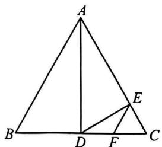

text_image

A
B
D
E
F
C

图1

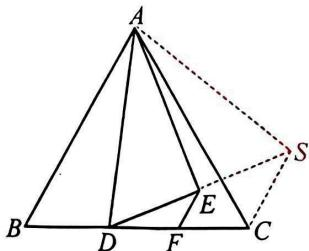

text_image

Geometric diagram of a triangular pyramid with labeled vertices and internal points, including dashed lines indicating hidden edges.

图2

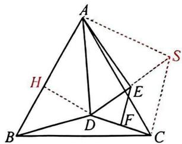

text_image

Geometric diagram of a tetrahedron with labeled vertices and internal points, including dashed lines indicating hidden edges.

图3

解:(1) $\because \angle {DAE} = \frac{1}{2}\angle {BAC} = {30}^{ \circ  },\therefore \angle {BAC} = {60}^{ \circ  },\because {AB} = {AC},\therefore \bigtriangleup  {ABC}$ 是等边三角形.

$\because BD=CD,\therefore AD\perp BC,\angle DAC=\angle DAE=30^{\circ},\therefore$ 点E在AC上.

$$
\because \angle A E D = 9 0 ^ {\circ}, C F = D F, \therefore E F = \frac {1}{2} C D = \frac {1}{2} B D;
$$

(2)延长 DE 到点 S, 使 ES=DE, 连接 AS, CS.

∵F是DC的中点,ED=ES,∴EF是△DCS的中位线,∴EF= $\frac{1}{2}$ CS.

$\because \angle AED=90^{\circ},\therefore AE$ 垂直平分 DS, $\therefore AD=AS$ ,

$$
\therefore \angle D A E = \angle E A S = 3 0 ^ {\circ}, \therefore \angle D A S = \angle B A C = 6 0 ^ {\circ}.
$$

$$
\because A B = A C, \therefore \triangle A B D \cong \triangle A C S, \therefore C S = B D, \therefore E F = \frac {1}{2} C S = \frac {1}{2} B D;
$$

(3)延长 DE 到点 S, 使 ES = DE, 连接 AS, CS, 过点 D 作 $DH \perp AB$ 于点 H,

由(2)同理得 $\triangle ABD \cong \triangle ACS$ ， $\therefore BD = CS$ 。

∵EF是△CDS的中位线，∴CS=2EF= $\sqrt{2}$ ，∴BD=CS= $\sqrt{2}$ 。

在 Rt△ADE 中，∠DAE=30°，AE= $\frac{3}{2}$ ，∴AD=2DE= $\sqrt{3}$ .

∵△ABC是等边三角形，∴∠ABC=60°，∵∠DBC=15°，∴∠ABD=45°.

$$
\because D H \perp A B, \therefore B H = D H = \frac {\sqrt {2}}{2} B D = 1, \therefore A H = \sqrt {A D ^ {2} - D H ^ {2}} = \sqrt {2},
$$

$$
\therefore A B = B H + A H = 1 + \sqrt {2}, \therefore S _ {\triangle A B C} = \frac {\sqrt {3}}{4} A B ^ {2} = \frac {3 \sqrt {3} + 2 \sqrt {6}}{4}.
$$

# 综合 2 特殊到一般(二) 角度从特殊到一般

2.(2025四区联考)在 $\triangle ABC$ 中, $\angle BAC=90^{\circ},AB=AC$ ,线段 $AB$ 绕点 $A$ 逆时针旋转至 $AD$ ( $AD$ 不与 $AC$ 重合),旋转角记为 $\alpha$ , $\angle DAC$ 的平分线 $AE$ 与射线 $BD$ 相交于点 $E$ ,连接 $EC$ .

(1)如图1,当 $\alpha=20^{\circ}$ 时, $\angle AEB$ 的度数是 $45^{\circ}$ ;  
(2)如图2,当 $0^{\circ}<\alpha<90^{\circ}$ 时,求证: $BD+2CE=\sqrt{2}AE$ ;  
(3) 当 $0^{\circ}<\alpha<180^{\circ}, AE=2CE$ 时，请直接写出 $\frac{BD}{ED}$ 的值.

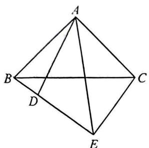

text_image

A
B
C
D
E

图1

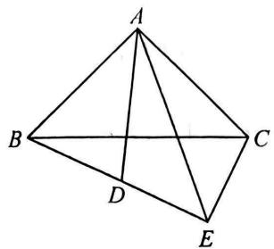

text_image

Geometric diagram of a tetrahedron with labeled vertices A, B, C, D, E and internal diagonals

图2

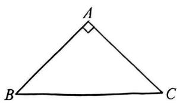

text_image

A
B
C

备用图

解:(1) $45^{\circ}$ ;

(2)延长 $DB$ 到 $F$ , 使 $BF = CE$ , 连接 $AF$ , $\because AB = AC, AD = AB, \therefore AD = AC$ ,

∵AE 平分∠DAC, ∴∠DAE=∠CAE,

又∵AE=AE,∴△ADE≌△ACE,∴∠DEA=∠CEA,∠ADE=∠ACE,DE=CE,

$$
\because A B = A D, \therefore \angle A B D = \angle A D B,
$$

$$
\because \angle A D E + \angle A D B = 1 8 0 ^ {\circ}, \therefore \angle A C E + \angle A B D = 1 8 0 ^ {\circ},
$$

$$
\because \angle B A C = 9 0 ^ {\circ}, \therefore \angle B E C = 3 6 0 ^ {\circ} - (\angle A C E + \angle A B D) - \angle B A C = 9 0 ^ {\circ},
$$

$$
\because \angle D E A = \angle C E A, \therefore \angle D E A = \angle C E A = \frac {1}{2} \times 9 0 ^ {\circ} = 4 5 ^ {\circ},
$$

$$
\because \angle A B F + \angle A B D = 1 8 0 ^ {\circ}, \angle A C E + \angle A B D = 1 8 0 ^ {\circ}, \therefore \angle A B F = \angle A C E,
$$

$$
\because A B = A C, B F = C E, \therefore \triangle A B F \cong \triangle A C E, \therefore A F = A E, \angle A F B = \angle A E C = 4 5 ^ {\circ}, \therefore E F = \sqrt {2} A E,
$$

$$
\because E F = B F + B D + D E = C E + B D + C E = B D + 2 C E, \therefore B D + 2 C E = \sqrt {2} A E;
$$

(3) 当 $0^{\circ} < \alpha < 90^{\circ}$ 时, 由 (2) 可知 $BD + 2CE = \sqrt{2}AE, CE = DE$ ,

$$
\because A E = 2 C E, \therefore B D + 2 D E = 2 \sqrt {2} D E, \therefore \frac {B D}{D E} = 2 \sqrt {2} - 2;
$$

当 $90^{\circ} < \alpha < 180^{\circ}$ 时，在 $BD$ 上截取 $BF = DE$ ，连接 $AF$ ，方法同(2)可证 $\triangle ADE \cong \triangle ACE(SAS)$ ，

$$
\therefore D E = C E, \because A B = A C = A D, \therefore \angle A B F = \angle A D E,
$$

$$
\therefore \triangle A B F \cong \triangle A D E, \therefore A F = A E, \angle B A F = \angle D A E,
$$

又∵∠DAE=∠CAE,∴∠BAF=∠CAE,

$$
\therefore \angle E A F = \angle F A C + \angle C A E = \angle F A C + \angle B A F = \angle B A C = 9 0 ^ {\circ},
$$

$$
\therefore E F = \sqrt {2} A E, \therefore B D = B F + D E + E F = 2 D E + \sqrt {2} A E,
$$

$$
\because A E = 2 C E = 2 D E, \therefore B D = 2 D E + 2 \sqrt {2} D E, \therefore \frac {B D}{D E} = 2 \sqrt {2} + 2.
$$

综上所述， $\frac{BD}{DE}$ 的值为 $2\sqrt{2} + 2$ 或 $2\sqrt{2} - 2$ .

# 综合 3 特殊到一般(三) 条件从特殊到一般

3.(2024武珞璐期中改)(1)如图1,△ABC和△ADE为等边三角形,D为BC边上一点,求证:AB//CE;

(2)如图2,在 $\triangle ABC$ 和 $\triangle ADE$ 中, $AB=AC,AD=DE,\angle BAC=\angle ADE,D$ 为 $BC$ 边上一点,求证: $AB//CE$ ;

(3)如图3,在 $\triangle ABC$ 中, $\angle BAC=120^{\circ},AB=AC,D$ 为 $\triangle ABC$ 内一点,过点D作 $DE\perp AD$ ,交BC边于点E(点D在直线AE左侧),连接BD并延长交AC于点F.若 $\angle DAE=30^{\circ}$ ,直接写出AF,AB,BE之间的数量关系.

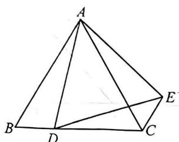

text_image

A
B
D
C
E

图1

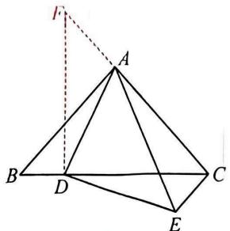

text_image

Geometric diagram of a tetrahedron with labeled vertices A, B, C, D, E and an external point F connected by dashed lines.

图2

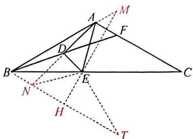

text_image

Geometric diagram with labeled points and lines, likely from a math problem or proof

图3

解:(1)∵△ABC 和△ADE 为等边三角形,

$$
\therefore A B = A C, A D = A E, \angle A B C = \angle A C B = 6 0 ^ {\circ}, \angle B A C = \angle D A E = 6 0 ^ {\circ},
$$

$$
\therefore \angle B A D = \angle C A E, \therefore \triangle A B D \cong \triangle A C E, \therefore \angle A B D = \angle A C E = 6 0 ^ {\circ},
$$

$$
\therefore \angle B C E = 1 2 0 ^ {\circ}, \therefore \angle A B C + \angle B C E = 6 0 ^ {\circ} + 1 2 0 ^ {\circ} = 1 8 0 ^ {\circ}, \therefore A B / / C E;
$$

(2)在直线 $AC$ 上取一点 $\pmb{F}$ , 使 $DF = DC$ , 连接 $DF$ .

$$
\because A B = A C, \therefore \angle B = \angle C.
$$

设 $\angle B=\angle C=x$ ，则 $\angle BAC=180^{\circ}-2x$ ， $\therefore\angle ADE=\angle BAC=180^{\circ}-2x$ 。

$$
\because D F \doteq D C, \therefore \angle F = \angle D C F = x, \therefore \angle F D C = 1 8 0 ^ {\circ} - 2 x,
$$

$$
\therefore \angle F D C = \angle A D E, \therefore \angle A D F = \angle E D C.
$$

$$
\because A D = E D, \therefore \triangle A D F \cong \triangle E D C, \therefore \angle D C E = \angle F = x,
$$

$$
\therefore \angle D C E = \angle B, \therefore A B / / C E;
$$

(3)延长AD到点N,使DN=AD,连接EN,BN,延长BA到点M,连接EM,使EM=BE,延长BN到点T,使TN=AB,连接ET,过点E作EH⊥BT于点H.

$$
\because A D = D N, D E \perp A N, \angle D A E = 3 0 ^ {\circ}, \therefore A E = E N, \angle A E N = 1 2 0 ^ {\circ}.
$$

$$
\because A B = A C, \angle B A C = 1 2 0 ^ {\circ}, \therefore \angle A B C = 3 0 ^ {\circ}.
$$

$$
\because E M = B E, \therefore \angle A B C = \angle M = 3 0 ^ {\circ}, \therefore \angle B E M = \angle N E A = 1 2 0 ^ {\circ}, \therefore \angle B E N = \angle A E M,
$$

$$
\therefore \triangle B E N \cong \triangle M E A, \therefore \angle E B N = \angle M = \angle A C B = 3 0 ^ {\circ}, \therefore B N / / A C,
$$

$$
\therefore \angle D A F = \angle D N B, \angle A F D = \angle N B D, \therefore \triangle A D F \cong \triangle N D B, \therefore A F = B N.
$$

$$
\because \angle N E A + \angle A B N = 1 8 0 ^ {\circ}, \therefore \angle E N T = \angle B A E.
$$

$$
\because A B = N T, A E = N E, \therefore \triangle A B E \cong \triangle N T E, \therefore E T = B E, \angle T = \angle A B E = \angle E B N = 3 0 ^ {\circ}.
$$

$$
\because E H \perp B T, \therefore B N + N T = A F + A B = \sqrt {3} B E.
$$

# 综合4 旋转模型(一) 给模用模

# 类型一 求长度

4. (2024 砾口区期末) 如图 1, 在 Rt△ABC 中, ∠ACB = 90°, ∠ABC = 60°, 点 D 在 AC 边 (端点除外) 上, 连接 BD, 将 BD 绕点 B 顺时针旋转 120° 得到 BE, 过点 E 作 EF⊥AB, 交 AB 的延长线于点 F.

(1) 求证: CD = EF;

(2)如图2,连接 $DE, CF$ 交于点 $G$ .

①求证: $CD+CG=GF$ ;

②连接 CE, 若 CE = BD, AD = 2, 直接写出 BF 的长.

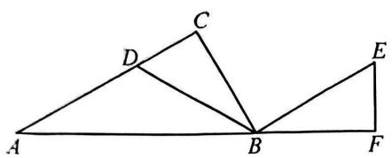

text_image

Geometric diagram with labeled points A, B, C, D, E, F forming triangles and line segments

图1

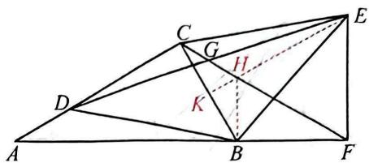

text_image

Geometric diagram with labeled points and lines, including triangle ABC and auxiliary constructions

图2

解:(1) $\because\angle ACB=90^{\circ},\angle ABC=60^{\circ},\therefore\angle A=30^{\circ},\angle CBF=120^{\circ},$

由旋转得 BD=BE， $\angle DBE=\angle CBF=120^{\circ}$ ， $\therefore\angle DBC=\angle EBF$ 。

$$
\because E F \perp A B, \therefore \angle F = \angle C = 9 0 ^ {\circ}, \therefore \triangle D B C \cong \triangle E B F, \therefore C D = E F;
$$

(2)①在 CF 上截取 HF=EF，连接 EH.

由(1)得 $\angle DCB=\angle BFE=90^{\circ},\angle ABC=60^{\circ},\triangle DBC\cong\triangle EBF,$

$$
\therefore C B = B F, \therefore \angle B C F = \angle B F C = 3 0 ^ {\circ}, \therefore \angle E F H = 6 0 ^ {\circ}, \angle D C G = 1 2 0 ^ {\circ}.
$$

$\because {HF} = {EF},\therefore \bigtriangleup {HEF}$ 是等边三角形,

$$
\therefore E H = E F = H F = D C, \angle E H F = 6 0 ^ {\circ}, \therefore \angle G H E = \angle D C G = 1 2 0 ^ {\circ},
$$

$$
\because \angle C G D = \angle H G E, \therefore \triangle C D G \cong \triangle H E G, \therefore C G = G H,
$$

$$
\therefore G F = G H + H F = C G + C D;
$$

②延长 EH 交 BC 于点 K, 连接 BH.

$$
\because \triangle C D G \cong \triangle H E G, \therefore \angle C D G = \angle H E G, \therefore H E / / A C, \therefore \angle C K E = \angle A C B = 9 0 ^ {\circ}.
$$

$\because CE=BD=BE,\therefore EK$ 垂直平分 BC, $\therefore CH=BH,\therefore \angle CBH=\angle BCH=30^{\circ}$

设 $CH = BH = x$ ， $\because \angle CBF = 120^{\circ},\angle CBH = 30^{\circ},\therefore \angle HBF = 90^{\circ},$

$$
\because \angle B F C = 3 0 ^ {\circ}, \therefore H F = E F = C D = 2 B H = 2 x, \therefore B F = B C = \sqrt {3} x.
$$

$$
\because A D = 2, \angle A = 3 0 ^ {\circ}, \therefore A C = \sqrt {3} B C = 3 x, \therefore 2 + 2 x = 3 x, \therefore x = 2, \therefore B F = 2 \sqrt {3}.
$$

# 类型二 分类讨论求比值

5.(2024 七一华源)【问题背景】(1)如图1,已知△ABC,△ADE均为等边三角形,且点D在线段BC上.求证:△ABD≌△ACE;

【尝试应用】(2)如图2,在 $\triangle ABC$ 中, $AB=AC$ , $\angle BAC=120^{\circ}$ , $P$ 为线段 $BC$ 上一点,以 $BP$ 为边作等边 $\triangle BPQ$ ,连接 $CQ,M$ 为 $CQ$ 的中点,连接 $AM,AP$ .求证: $AP=2AM$ ;

【拓展创新】(3)在 $\triangle ABC$ 中, $AB=AC$ , $\angle BAC=120^{\circ}$ , $G$ 为平面内一点,若 $\angle AGB=90^{\circ}$ , $\angle BGC=150^{\circ}$ ,请直接写出 $\frac{AG}{BG}$ 的值.

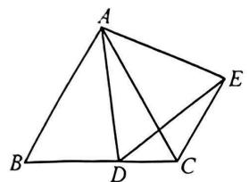

text_image

Geometric diagram of a quadrilateral ABCD with diagonals and extended lines, labeled with points A, B, C, D, E.

图1

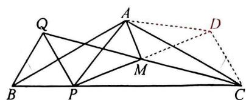

text_image

Geometric diagram with labeled points A, B, C, D, M, P, Q and connecting lines forming triangles and quadrilaterals

图2

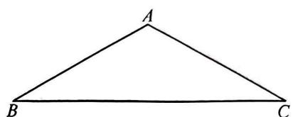

natural_image

Simple geometric diagram of a triangle labeled A, B, C (no additional text or symbols)

备用图

解:(1) $\because \triangle ABC, \triangle ADE$ 均为等边三角形, $\therefore \angle BAC = \angle DAE = 60^{\circ}, AB = AC$ ,

$$
A D = A E, \therefore \angle B A D = \angle C A E, \therefore \triangle A B D \cong \triangle A C E;
$$

(2)延长 ${PM}$ 至点 $D$ ,使 ${MD} = {PM}$ ,连接 ${CD},{AD}$ .

$$
\because M Q = C M, P M = M D, \angle P M Q = \angle D M C, \therefore \triangle C D M \cong \triangle Q P M,
$$

$$
\therefore C D = P Q, \angle C D M = \angle Q P D, \therefore C D / / P Q, \therefore \angle D C B = \angle Q P B.
$$

$\because \triangle BPQ$ 为等边三角形, $\therefore PQ=PB,\angle BPQ=\angle DCB=60^{\circ}$

$$
\because A B = A C, \angle B A C = 1 2 0 ^ {\circ}, \therefore \angle A B C = \angle A C B = 3 0 ^ {\circ}, \therefore \angle A C D = \angle A B P = 3 0 ^ {\circ}.
$$

$$
\because C D = P Q = P B, \therefore \triangle A B P \cong \triangle A C D, \therefore A D = A P, \angle B A P = \angle C A D,
$$

$$
\therefore \angle P A D = \angle B A C = 1 2 0 ^ {\circ}, \therefore A M \perp P D, \therefore A P = 2 A M;
$$

(3)当点 G 在三角形内部时, 如图 3, 将 $\triangle AGC$ 绕点 A 顺时针旋转 $120^{\circ}$ 得到 $\triangle ASB$ ,

$$
\therefore A S = A G, \angle G A S = 1 2 0 ^ {\circ},
$$

$$
\therefore \angle A S G = \angle A G S = 3 0 ^ {\circ},
$$

$$
\angle A S B = \angle A G C = 3 6 0 ^ {\circ} - \angle A G B - \angle B G C = 1 2 0 ^ {\circ},
$$

$$
\therefore \angle G S B = \angle A S B - \angle A S G = 9 0 ^ {\circ},
$$

$$
\therefore \angle S G B = \angle A G B - \angle A G S = 9 0 ^ {\circ} - 3 0 ^ {\circ} = 6 0 ^ {\circ},
$$

$$
\therefore \angle S B G = 3 0 ^ {\circ}.
$$

过点 A 作 $AT \perp SG$ 于点 T. 设 AG = a，则 AS = AG = a，

$$
\therefore A T = \frac {1}{2} S A, \therefore S T = T G = \frac {\sqrt {3}}{2} a, \therefore S G = \sqrt {3} a.
$$

$$
\because \angle S B G = 3 0 ^ {\circ}, \therefore B G = 2 S G = 2 \sqrt {3} a, \therefore \frac {A G}{B G} = \frac {a}{2 \sqrt {3} a} = \frac {\sqrt {3}}{6};
$$

当点 G 在三角形外部时, 如图 4, 将 $\triangle AGC$ 绕点 A 顺时针旋转 $120^{\circ}$ 得到 $\triangle ASB$ , 同理可求 $\frac{AG}{BG} = \frac{2\sqrt{3}}{3}$ .

综上所述， $\frac{AG}{BG}$ 的值为 $\frac{\sqrt{3}}{6}$ 或 $\frac{2\sqrt{3}}{3}$ .

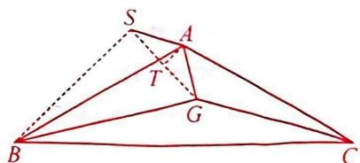

text_image

Geometric diagram with labeled points A, B, C, S, G, T and solid/dashed lines forming triangles and quadrilaterals

图3

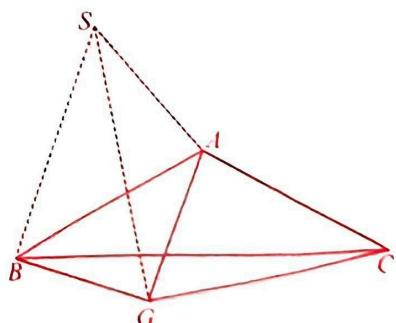

text_image

Geometric diagram of a pyramid with labeled vertices and internal points, including dashed lines for hidden edges.

图4

# 综合 5 旋转模型(二) 构双等边三角形

6.(2024东西湖期末)【操作与思考】(1)如图1,△ABC为等边三角形,E为△ABC外一点,连接BE,并以BE为边作等边△BEF,连接AE,CF.求证:△CBF≌△ABE;

【迁移与运用】(2)如图2,点E在等边△ABC内,且 $\angle BEC=120^{\circ}$ ,D为BC的中点,连接AE、DE.

①求证：AE=2DE；

②若 $AE \perp EC, ED = 1$ ，则 $\triangle ABC$ 的边长为 $\frac{2\sqrt{21}}{3}$ 。（直接写出结果）

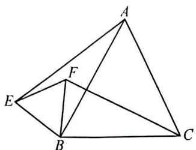

text_image

Geometric diagram with labeled points A, B, C, E, F forming triangles and a smaller internal segment

图1

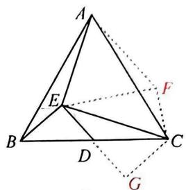

text_image

Geometric diagram of a tetrahedron with labeled vertices and internal points, including dashed lines indicating hidden edges.

图2

解:(1)∵△ABC 和△BEF 都是等边三角形,∴CB=AB.FB=EB,∠ABC=∠EBF=60°.

$$
\therefore \angle C B F = \angle A B E = 6 0 ^ {\circ} + \angle A B F, \therefore \triangle C B F \cong \triangle A B E;
$$

(2)①将 $\triangle ABE$ 绕点A逆时针旋转 $60^{\circ}$ 得到 $\triangle ACF$ ,连接 $EF$ .

$\because \triangle ABC$ 是等边三角形, $\therefore AB=AC,\angle BAC=\angle ABC=\angle ACB=60^{\circ}$

$$
\because \angle B E C = 1 2 0 ^ {\circ}, \therefore \angle E B C + \angle E C B = 6 0 ^ {\circ}, \therefore \angle A B E + \angle A C E = 6 0 ^ {\circ}.
$$

由旋转得 $AE = AF, \angle EAF = 60^{\circ}, \therefore \triangle AEF$ 是等边三角形， $\therefore AE = EF$

$$
\because \angle A C F = \angle A B E, \therefore \angle E C F = \angle A C F + \angle A C E = \angle A B E + \angle A C E = 6 0 ^ {\circ}.
$$

延长 ED 至点 G，使 DG = DE，连接 CG。

∵D为BC的中点，∴DC=DB，

$$
\because D G = D E, \angle C D G = \angle B D E, \therefore \triangle C D G \cong \triangle B D E,
$$

$$
\therefore C G = B E, \angle G = \angle B E D, \therefore C G / / B E, C G = C F,
$$

$$
\therefore \angle E C G = 1 8 0 ^ {\circ} - \angle B E C = 1 8 0 ^ {\circ} - 1 2 0 ^ {\circ} = 6 0 ^ {\circ}, \therefore \angle E C G = \angle E C F,
$$

$$
\because C E = C E, \therefore \triangle E C G \cong \triangle E C F, \therefore E G = E F, \therefore A E = 2 D E;
$$

②∵AE⊥EC，∴∠AEC=90°，∴∠AFC=∠AEB=360°-120°-90°=150°.

$$
\because \angle A F E = 6 0 ^ {\circ}, \therefore \angle E F C = \angle A F C - \angle A F E = 1 5 0 ^ {\circ} - 6 0 ^ {\circ} = 9 0 ^ {\circ},
$$

$$
\because \angle E C F = 6 0 ^ {\circ}, \therefore \angle C E F = 3 0 ^ {\circ}, \therefore C F = \frac {1}{2} C E.
$$

$$
\because E D = 1, \therefore E F = A E = 2 E D = 2, \therefore C E = \frac {4 \sqrt {3}}{3},
$$

$$
\therefore A C = \sqrt {A E ^ {2} + C E ^ {2}} = \frac {2 \sqrt {2 1}}{3}.
$$

# 综合6 旋转模型(三) 构双等腰直角三角形

7.(2024武昌期末)(1)如图1,P是等边△ABC内一点,PA=3,PB=4,PC=5,你能求出∠APB的度数吗?

【基本思路】可以将 $\triangle CPB$ 绕点 $B$ 逆时针旋转 $60^{\circ}$ 得到 $\triangle AP_{1}B$ ,连接 $P_{1}P$ ,于是可求出 $\angle APB$ 的度数为 $_{150^{\circ}}$ ;

(2)如图 2, P 是正方形 ABCD 内一点, PA = 1, PB = 2, PC = 3, 求 $\angle APB$ 的大小;

(3) $P$ 是正方形 $ABCD$ 外一点, $PA = 3$ , $PB = 1$ , $\angle APB = 45^{\circ}$ , 直接写出 $PC$ 的长.

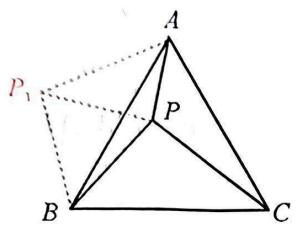

text_image

A
P₁
P
B
C

图1

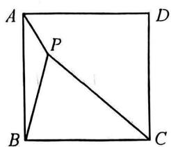

text_image

A
P
B
C
D

图2

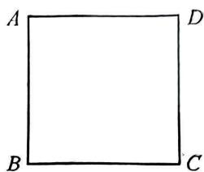

natural_image

Simple geometric diagram of a square labeled with vertices A, B, C, D (no additional text or symbols)

备用图

解:(1)由旋转得 $\triangle P_{1}AB\cong\triangle PCB,\therefore\angle CBP=\angle ABP_{1},AP_{1}=CP=5,BP=BP_{1}=4.$

$\therefore \angle PBP_{1} = \angle ABC = 60^{\circ}, \therefore \triangle P_{1}BP$ 是等边三角形， $\therefore BP = PP_{1} = 4, \angle BPP_{1} = 60^{\circ}$ .

$\because 3^{2}+4^{2}=5^{2},\therefore P_{1}P^{2}+PA^{2}=P_{1}A^{2},\therefore \triangle P_{1}PA$ 是直角三角形， $\therefore \angle P_{1}PA=90^{\circ}$

$$
\therefore \angle A P B = \angle P _ {1} P B + \angle A P P _ {1} = 1 5 0 ^ {\circ};
$$

(2) 将 $\triangle PAB$ 绕点 $B$ 顺时针旋转 $90^{\circ}$ 得到 $\triangle P'CB$ , 连接 $PP'$ ,

$$
\begin{array}{l} \therefore P ^ {\prime} B = P B = 2, P ^ {\prime} C = A P = 1, \angle P ^ {\prime} B P = 9 0 ^ {\circ}, \angle A P B = \angle B P ^ {\prime} C, \\ \therefore \angle B P ^ {\prime} P = 4 5 ^ {\circ}, P ^ {\prime} P = \sqrt {P B ^ {2} + P ^ {\prime} B ^ {2}} = 2 \sqrt {2}. \because P C = 3, P ^ {\prime} C = 1, \therefore P ^ {\prime} C ^ {2} + P P ^ {\prime 2} = P C ^ {2}, \\ \therefore \angle P P ^ {\prime} C = 9 0 ^ {\circ}, \therefore \angle B P ^ {\prime} C = \angle B P ^ {\prime} P + \angle P P ^ {\prime} C = 4 5 ^ {\circ} + 9 0 ^ {\circ} = 1 3 5 ^ {\circ}, \\ \therefore \angle A P B = \angle B P ^ {\prime} C = 1 3 5 ^ {\circ}; \\ \end{array}
$$

(3)当点 P 在 AB 的左侧, 如图 3, 将 $\triangle BPC$ 绕点 B 逆时针旋转 $90^{\circ}$ 得到 $\triangle BP'A$ , 连接 $PP'$ .

$$
\begin{array}{l} \therefore \triangle A B P ^ {\prime} \cong \triangle C B P, \therefore \angle P B P ^ {\prime} = 9 0 ^ {\circ}, B P ^ {\prime} = B P = 1, P C = P ^ {\prime} A. \because B P = B P ^ {\prime} = 1. \\ \therefore \angle B P P ^ {\prime} = 4 5 ^ {\circ}, P P ^ {\prime} = \sqrt {2} B P = \sqrt {2}, \because \angle A P B = 4 5 ^ {\circ}, \therefore \angle A P P ^ {\prime} = 9 0 ^ {\circ}, \because A P = 3, \\ \therefore A P ^ {\prime} = \sqrt {P A ^ {2} + P ^ {\prime} P ^ {2}} = \sqrt {1 1}, \therefore P C = \sqrt {1 1}; \\ \end{array}
$$

当点 P 在 AB 的右侧, 如图 4, 将 $\triangle ABP$ 绕点 B 顺时针旋转 $90^{\circ}$ 得到 $\triangle CBG$ , 连接 CP, GP.

$$
\begin{array}{l} \therefore \triangle A B P \cong \triangle C B G, \therefore \angle P B G = 9 0 ^ {\circ}, B G = B P = 1, P A = C G, \\ \therefore \angle B P G = 4 5 ^ {\circ}, P G = \sqrt {2} B P = \sqrt {2}, \because \angle A P B = 4 5 ^ {\circ}, \therefore \angle A P G = 9 0 ^ {\circ}, \\ \because \angle A H B = \angle P H C, \angle B A P = \angle B C G, \therefore \angle A B C = \angle A P C = 9 0 ^ {\circ}, \therefore \angle A P G + \angle A P C = 1 8 0 ^ {\circ}. \\ \therefore G, P, C \text {   三点共线   }, \because A P = 3, \therefore C G = 3, \therefore P C = C G - G P = 3 - \sqrt {2}. \\ \end{array}
$$

综上所述,CP 的长为 $\sqrt{11}$ 或 $3-\sqrt{2}$ .

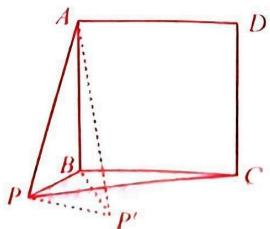

text_image

Geometric diagram of a square with labeled vertices and internal points, including dashed lines indicating hidden edges.

图3

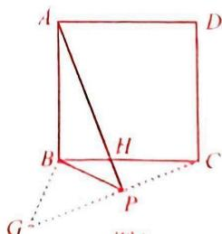

text_image

A
B
H
P
G
C
D

14

# 综合 7 旋转模型(四) 构 $120^{\circ}$ 的双等腰

8.(2025新洲)如图,在 $\triangle ABC$ 中, $\angle BAC=120^{\circ},D$ 为 $\triangle ABC$ 外且在 $BC$ 上方的一点,连接 $AD,BD,CD$ .

(1) 若 $AB = AC, \angle ADC = 60^\circ$ .

①如图1、当点D在BA的延长线上时，求证： $BD^{2}-CD^{2}=3AD^{2}$ ;

②当点 D 不在 BA 的延长线上时,请判断①中的结论是否一定成立:\_\_\_\_(填“是”或“否”);

(2) 当点 D 在如图 2 所示位置时, 若 AB = AC, $\angle ADC = 60^{\circ}$ , BD = 10, CD = 8, 求 AD 的长;

(3)如图 3, 若 $AB + AC = 4$ , $\angle BCD = 120^{\circ}$ , $BC = CD$ , 请直接写出 $AD$ 长的取值范围为 \_\_\_\_.

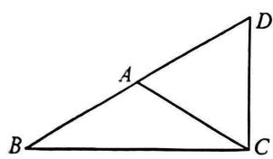

text_image

Geometric diagram of triangle ABC with point D on side AD and line segment AC drawn

图1

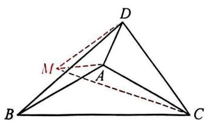

text_image

D
M
A
B
C

图2

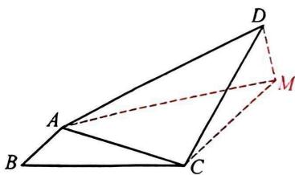

text_image

Geometric diagram of a tetrahedron with labeled vertices A, B, C, D and point M, including solid and dashed edges.

图3

解:(1)①∵∠BAC=120°,∴∠DAC=60°=∠ADC,∴△ADC为等边三角形,∴∠BCD=90°.

$$
\therefore B D = 2 C D = 2 A D, B C = \sqrt {3} A D, \therefore B D ^ {2} - C D ^ {2} = B C ^ {2} = 3 A D ^ {2};
$$

②是；

(2) 在 $AD$ 的左侧作 $\angle MAD = 120^{\circ}$ , 且使 $AM = AD$ , 连接 $MD, MC$ .

$$
\begin{array}{l} \because A D = A M, A B = A C, \angle M A C = \angle B A D, \\ \therefore \triangle M A C \cong \triangle D A B (S A S), \therefore B D = C M = 1 0. \\ \because \angle A D M = 3 0 ^ {\circ}, \angle A D C = 6 0 ^ {\circ}, \\ \therefore \angle M D C = 3 0 ^ {\circ} + 6 0 ^ {\circ} = 9 0 ^ {\circ}, \therefore M C ^ {2} - C D ^ {2} = M D ^ {2} = 3 A D ^ {2}, \\ \therefore 3 A D ^ {2} = 1 0 ^ {2} - 8 ^ {2} = 3 6, \therefore A D = 2 \sqrt {3}; \\ \end{array}
$$

(3) $2\sqrt{3}\leqslant AD<4\sqrt{3}$

在 AC 的上方作 $\angle ACM = 120^{\circ}$ ，且使 CM = CA，连接 AM, DM.

设 AB = x，则 AC = 4 - x = CM，∴ $AM = \sqrt{3}AC = \sqrt{3}(4 - x)$ .

可证 $\triangle BAC \cong \triangle DMC, \therefore DM = BA = x, \angle CMD = \angle BAC = 120^{\circ}, \therefore \angle AMD = 90^{\circ}$ ,

$$
\therefore A D ^ {2} = A M ^ {2} + D M ^ {2} = 3 (4 - x) ^ {2} + x ^ {2} = 4 (x - 3) ^ {2} + 1 2,
$$

$$
\because 0 <   x <   4, \therefore 1 2 \leqslant A D ^ {2} <   4 8, \therefore 2 \sqrt {3} \leqslant A D <   4 \sqrt {3}.
$$

# 综合8 旋转模型(五) 同型构造

9.(2024外校月考)【问题背景】(1)如图1, $AB = AC$ , $AD = AE$ , $\angle BAC = \angle DAE$ . 求证: $BD = CE$ ;

【尝试应用】(2)如图 2, $AB \parallel CD$ , $\angle BED = \angle AEC = 120^\circ$ . 若 $BE = DE$ , $AB = m$ , $CD = n$ , 求 $AC$ 的长;

【拓展创新】(3)如图3,在Rt△ABD中, $AD=2,\angle ADB=90^{\circ}$ ,将AB绕点A逆时针旋转135°得到AC,过点C作CE⊥AD,交DA的延长线于点E,若EC=3,直接写出AE的长.

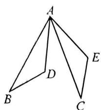

text_image

A
B
D
C
E

图1

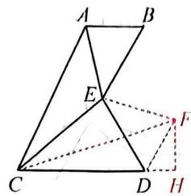

text_image

Geometric diagram with labeled points A, B, C, D, E, F, H and connecting lines, likely from a math problem or proof.

图2

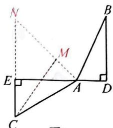

text_image

Geometric diagram with labeled points and perpendicular lines, likely from a math problem or proof

图3

解:(1) $\because\angle BAC=\angle DAE,\therefore\angle BAC-\angle DAC=\angle DAE-\angle DAC,\therefore\angle BAD=\angle CAE.$

$$
\because A B = A C, A D = A E, \therefore \triangle B A D \cong \triangle C A E, \therefore B D = C E;
$$

(2) 将 AE 绕点 E 顺时针旋转 $120^{\circ}$ 得到 EF，连接 DF, CF，过点 F 作 $FH \perp CD$ ，交 CD 的延长线于点 H，

$$
\therefore E A = E F, \angle A E F = \angle B E D = 1 2 0 ^ {\circ}, \therefore \angle A E B = \angle F E D.
$$

$$
\because B E = E D, \therefore \triangle E A B \cong \triangle E F D, \therefore \angle A B E = \angle F D E, D F = A B = m.
$$

$$
\because A B \parallel C D, \therefore \angle B A C + \angle A C D = 1 8 0 ^ {\circ}.
$$

$$
\because \angle C A E + \angle A C E + \angle A E C = 1 8 0 ^ {\circ}, \therefore \angle B A E + \angle E C D = \angle C E A = 1 2 0 ^ {\circ}.
$$

$$
\because \angle A E B + \angle C E D = 1 2 0 ^ {\circ}, \therefore \angle A B E + \angle B A E + \angle E C D + \angle E D C = 2 4 0 ^ {\circ},
$$

$$
\therefore \angle A B E + \angle E D C = \angle E D F + \angle E D C = \angle C D F = 1 2 0 ^ {\circ}, \therefore \angle F D H = 6 0 ^ {\circ}.
$$

$$
\because F H \perp C H, \therefore \angle D F H = 3 0 ^ {\circ}, \therefore D H = \frac {1}{2} D F = \frac {1}{2} m,
$$

$$
\therefore F H = \sqrt {3} D H = \frac {\sqrt {3}}{2} m, \therefore C H = C D + D H = n + \frac {1}{2} m, \therefore C F = \sqrt {F H ^ {2} + C H ^ {2}} = \sqrt {m ^ {2} + m n + n ^ {2}}.
$$

$$
\because \angle A E C = \angle F E C = \angle A E F = 1 2 0 ^ {\circ},
$$

$$
\therefore \triangle A C E \cong \triangle F C E, \therefore A C = C F = \sqrt {m ^ {2} + m n + n ^ {2}};
$$

(3) 将 AD 绕点 A 逆时针旋转 $135^{\circ}$ 得到 AM，延长 AM 与 CE 的延长线交于点 N，连接 CM.

由旋转得 $\angle BAC=\angle DAM=135^{\circ},AB=AC,AD=AM,$

$$
\therefore \angle D A B = \angle M A C, \therefore \triangle A M C \cong \triangle A D B, \therefore \angle C M A = \angle B D A = 9 0 ^ {\circ}.
$$

$$
\because \angle N A E = 4 5 ^ {\circ}, A E \perp C N, \therefore \angle A N E = \angle E A N = 4 5 ^ {\circ}, \therefore E N = A E.
$$

设 $AE = x$ ，则 $NE = x$ ， $\because CE = 3,\therefore NC = x + 3.$

$\because \triangle CMN$ 为等腰直角三角形， $\therefore MN=\frac{\sqrt{2}}{2}NC=\frac{\sqrt{2}}{2}(x+3)$

$$
\because A M = A D = 2, \therefore A N = A M + M N = 2 + \frac {\sqrt {2}}{2} (x + 3),
$$

$$
\because A N = \sqrt {2} A E, \therefore 2 + \frac {\sqrt {2}}{2} (x + 3) = \sqrt {2} x, \therefore x = 2 \sqrt {2} + 3, \therefore A E = 2 \sqrt {2} + 3.
$$

# 综合 9 旋转模型(六) 中点模型

10.(2024青山区期中)【问题背景】(1)如图1,△ABC和△ADE都是等边三角形.求证:BD=CE;

【尝试运用】(2)如图2,在 $\triangle ABC$ 中, $AB=AC$ , $\angle BAC=150^{\circ}$ ,将 $AC$ 绕点 $C$ 逆时针旋转 $90^{\circ}$ 得到 $DC,E$ 为边 $BC$ 上不与点 $C$ 重合的一点,且 $DE=DC,M$ 为 $BE$ 的中点,连接 $AM,AD,DM$ .求 $\angle DAM$ 的度数;

【拓展创新】(3)如图3,在 $\triangle ABC$ 和 $\triangle ADE$ 中, $\angle ABC=\angle ADE=90^{\circ},BA=BC=a$ , $DA=DE=b$ ,连接 $BD,CE,F,G$ 分别为 $CE,BD$ 的中点.若 $\angle BAE=15^{\circ}$ ,请直接写出线段 $FG$ 的长(用含 $a$ 和 $b$ 的式子表示).

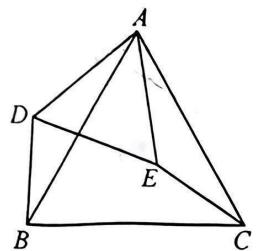

text_image

A
D
E
B
C

图1

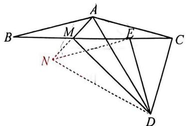

text_image

Geometric diagram with labeled points A, B, C, D, E, M, N and solid/dashed lines forming triangles and quadrilaterals

图2

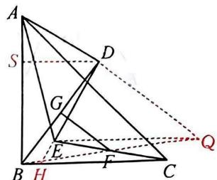

text_image

Geometric diagram with labeled points and lines, likely from a math problem or proof

图3

解:(1)∵△ABC与△ADE都是等边三角形,∴AB=AC,AD=AE,∠BAC=∠DAE=60°,

$$
\therefore \angle B A D = \angle C A E, \therefore \triangle A B D \cong \triangle A C E, \therefore B D = C E;
$$

(2)延长 AM 至点 N, 使得 NM=AM, 连接 NE, DN.

$$
\because A B = A C, \angle B A C = 1 5 0 ^ {\circ}, \therefore \angle A B C = \angle A C B = 1 5 ^ {\circ}.
$$

由旋转得 AC=CD， $\angle ACD=90^{\circ}$

$$
\because C D = D E, \therefore \angle D C E = \angle D E C = 7 5 ^ {\circ}, \angle E D C = 3 0 ^ {\circ}.
$$

$$
\because E M = B M, A M = M N, \angle N M E = \angle A M B, \therefore \triangle N M E \cong \triangle A M B,
$$

$$
\therefore E N = A B = A C, \angle N E M = \angle A B C = 1 5 ^ {\circ},
$$

$\therefore\angle NED=180^{\circ}-\angle NEM-\angle DEC=\angle ACD=90^{\circ},\therefore\triangle DNE$ 为等腰直角三角形，

$$
\therefore \angle E D N = \angle A D C = 4 5 ^ {\circ}, D N = D A = \sqrt {2} C D, \therefore \angle A D N = \angle C D E = 3 0 ^ {\circ},
$$

$$
\therefore \angle D A M = \angle D N M = 7 5 ^ {\circ};
$$

(3) 连接 BF 并延长至点 Q，使 QF = BF，连接 EQ, DQ，延长 DE 交 BC 于点 H，作 $DS \perp AB$ 于点 S.

$$
\because E F = C F, B F = F Q, \angle B F C = \angle E F Q, \therefore \triangle B F C \cong \triangle Q F E, \therefore B C = E Q, \angle B C F = \angle Q E F,
$$

$$
\therefore E Q \parallel B C, \therefore \angle D E Q = \angle D H C.
$$

$$
\because \angle A D E = \angle A B C = 9 0 ^ {\circ}, \therefore \angle D H C = \angle B A D = \angle D E Q.
$$

$$
\because A D = D E, A B = B C = E Q, \therefore \triangle A B D \cong \triangle E Q D, \therefore B D = D Q.
$$

$$
\because D S \perp A B, \angle B A E = 1 5 ^ {\circ}, \therefore \angle B A D = \angle D A E + \angle B A E = 6 0 ^ {\circ},
$$

$$
\therefore A S = \frac {1}{2} A D = \frac {1}{2} b, D S = \frac {\sqrt {3}}{2} b, B S = a - \frac {1}{2} b, \therefore B D = \sqrt {a ^ {2} - a b + b ^ {2}}.
$$

$$
\because B G = D G, B F = F Q, \therefore F G = \frac {1}{2} D Q = \frac {1}{2} B D = \frac {\sqrt {a ^ {2} - a b + b ^ {2}}}{2}.
$$

# 综合 10 旋转模型(七) 夹半角模型

11.(1)【问题背景】如图 1, 在 $\triangle ABC$ 中, $AB = AC$ , $\angle BAC = 2\alpha$ , $D$ , $E$ 均为 $BC$ 边上的点, 且 $\angle DAE = \alpha$ , $\triangle ACE$ 绕点 $A$ 顺时针旋转 $2\alpha$ 得到 $\triangle ABF$ , 连接 $DF$ , 直接写出 $DF$ 与 $DE$ 的数量关系为 $DF = DF$ ;

(2)【类比探究】如图 2, 在 $\triangle ABC$ 中, $\angle CAB = 60^{\circ}$ , $AB = AC$ , $D$ , $E$ 均为 $BC$ 边上的点, 且 $\angle DAE = 30^{\circ}$ , $BD = 2$ , $CE = \frac{3}{2}$ , 求 $DE$ 的长;

(3)【拓展应用】如图 3, E 是正方形 ABCD 内一点, $\angle AEB = 90^{\circ}$ , F 是 BC 边上一点, 且 $\angle EDF = 45^{\circ}$ . 若 AB = 2, 请直接写出当 DE 取最小值时, CF 的长为 $\frac{2}{3}$ .

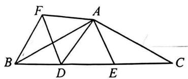

text_image

Geometric diagram with labeled points A, B, C, D, E, F forming triangles and quadrilaterals

图1

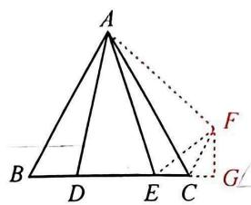

text_image

A
B D E C G
F

图2

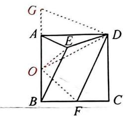

text_image

Geometric diagram of a square with labeled vertices and internal points, including dashed lines indicating hidden edges.

图3

解:(1)DE=DF. 理由如下:

$\because \angle BAC=2\alpha$ , 把 $\triangle ACE$ 绕点A顺时针旋转 $2\alpha$ 得到 $\triangle ABF$ ,

$$
\therefore A E = A F, \angle E A F = 2 \alpha .
$$

$$
\because \angle D A E = \alpha , \therefore \angle D A E = \angle D A F,
$$

$$
\because A D = A D, \therefore \triangle A D E \cong \triangle A D F, \therefore D E = D F;
$$

(2) 将 $\triangle ABD$ 绕点 A 逆时针旋转 $60^{\circ}$ 得到 $\triangle ACF$ ,

连接 EF, 过点 F 作 $FG \perp BC$ , 交 BC 的延长线于点 G.

由(1)可证 $\triangle EAF\cong\triangle EAD,\therefore EF=DE.$

$$
\because \angle E C F = \angle A C E + \angle A C F = 6 0 ^ {\circ} + 6 0 ^ {\circ} = 1 2 0 ^ {\circ},
$$

$$
\therefore \angle F C G = 6 0 ^ {\circ}, \therefore \angle C F G = 3 0 ^ {\circ}, \therefore C G = \frac {1}{2} F C = \frac {1}{2} \times 2 = 1,
$$

$$
\therefore E G = E C + C G = \frac {3}{2} + 1 = \frac {5}{2}, F G = \sqrt {C F ^ {2} - C G ^ {2}} = \sqrt {3},
$$

$$
\therefore E F = \sqrt {E G ^ {2} + F G ^ {2}} = \frac {\sqrt {3 7}}{2}, \therefore D E = \frac {\sqrt {3 7}}{2};
$$

(3) 将 $\triangle CDF$ 绕点 D 顺时针旋转 $90^{\circ}$ 得到 $\triangle ADG$ ，取 AB 的中点 O，连接 OD，OE，OF.

则 $OA = OB = OE = \frac{1}{2} AB = 1$ . $\because DE \geqslant OD - OE$

∴ DE 取最小值时, 点 E 在 OD 上, 此时由(1)同理得 $\triangle ODF \cong \triangle ODG$ ,

$\therefore OF=OG.$ 设 $CF=x$ , 则 $OF=OG=OA+AG=1+x, BF=BC-CF=AB-CF=2-x$ .

在 Rt△OBF 中，由勾股定理得 $(2-x)^{2}+1^{2}=(x+1)^{2},\therefore x=\frac{2}{3}$

∴当 DE 取最小值时,CF 的长为 $\frac{2}{3}$ .

# 综合 11 类比探究(一) 截长补短

12.(2024武昌区期中改)在 $\triangle ABC$ 中, $\angle ACB=90^{\circ},\angle A=30^{\circ},E$ 是AB的中点.

(1)如图1,连接EC.求证:△CBE是等边三角形;

(2)如图 2, BD 是△ABC 的角平分线, N 是线段 CD 上的一点, 以 BN 为边在 BN 的下方作 $\angle BNG = 60^{\circ}$ , NG 交 DE 延长线于点 G. 试探究 ND, DG 与 AD 之间的数量关系, 并说明理由;

(3)如图 3, AB = 4, N 为直线 AC 上的一动点, 连接 BN, 在 BN 下方作等边 $\triangle BGN$ , 则 CG 的最小值为 1.

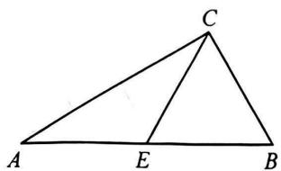

text_image

C
A E B

图1

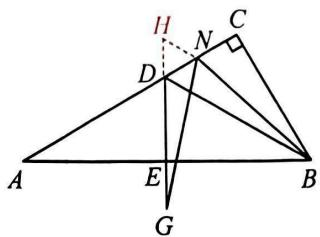

text_image

Geometric diagram with labeled points and perpendicular lines, likely from a math problem or proof

图2

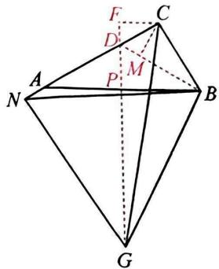

text_image

Geometric diagram of a polyhedron with labeled vertices and internal points, used for spatial geometry problems.

图3

解:(1)在 Rt△ABC 中,∠ACB=90°,∠A=30°,∴∠B=60°,BC= $\frac{1}{2}$ AB.

∵E是AB的中点，∴BE= $\frac{1}{2}$ AB，∴BE=BC，∴△CBE是等边三角形；

(2) $AD = DG + DN$ . 理由如下: 延长 $ED$ 至点 $H$ , 使得 $DH = DN$ , 连接 $NH$ .

∵ BD 是△ABC 的角平分线，∴ $\angle ABD = \angle CBD = \frac{1}{2} \angle ABC = 30^{\circ}$ ,

$$
\therefore \angle A = \angle A B D = 3 0 ^ {\circ}, \therefore A D = B D.
$$

$$
\because A E = B E, \therefore D E \perp A B, \therefore \angle A D E = \angle B D E = \angle H D N = 6 0 ^ {\circ}.
$$

∵DN=DH, ∴△HDN 是等边三角形, ∴NH=DN, ∠H=∠DNH=∠BDN=60°.

$$
\because \angle B N G = \angle B D G = 6 0 ^ {\circ}, \therefore \angle G = \angle D B N.
$$

$$
\because H N = D N, \therefore \triangle H G N \cong \triangle D B N,
$$

$$
\therefore B D = H G = D G + D H, \therefore A D = D G + D N;
$$

(3) 过点 G 作 $GP \perp AB$ 于点 P, AC 与 GP 交于点 D, 连接 BD, 过点 C 分别作 $CF \perp PG$ 于点 F, $CM \perp BD$ 于点 M.

$$
\because \angle A C B = 9 0 ^ {\circ}, \angle B A C = 3 0 ^ {\circ}, A B = 4, \therefore B C = \frac {1}{2} A B = 2.
$$

∵△BNG是等边三角形，∴BN=BG，∠NBG=∠ABC=60°，∴∠PBG=∠NBC.

$\because \angle BPG = \angle NCB = 90^{\circ}, BN = BG, \therefore \triangle NCB \cong \triangle GPB, \therefore BP = BC = 2, \therefore P$ 是 $AB$ 的中点.

∵PG⊥AB，∴PG是AB的垂直平分线，即点G在直线PG上，∴CG的最小值就是CF的长.

$$
\because A D = B D, \therefore \angle D B A = \angle C A B = 3 0 ^ {\circ}, \therefore \angle A D P = \angle C D F = \angle B D C = 6 0 ^ {\circ}.
$$

$$
\because C M \perp B D, \therefore C M = C F.
$$

在 Rt△CMB 中，CM= $\frac{1}{2}$ BC=1，∴CF=CM=1，即 CG 的最小值为 1.

# 综合 12 类比探究(二) 隐圆求范围

13.(2024 江岸)如图,正方形 ABCD 和正方形 DEFG 有公共顶点 D.

(1)如图1,连接AG和CE,直接写出AG和CE的关系是 $AG=CE$ 且 $AG\perp CE$ ;   
(2)如图2,连接AE,M为AE的中点,连接DM,CG,探究DM,CG的关系,并说明理由;  
(3)如图 3, 若 AB = 4, DE = 2, 直线 AG 与直线 CE 交于点 P, 请直接写出 AP 的取值范围: $2\sqrt{3} - 2 \leqslant AP \leqslant 2\sqrt{3} + 2$ .

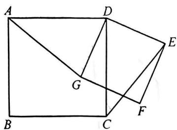

text_image

Geometric diagram with labeled points A, B, C, D, E, F, G forming connected triangles and quadrilaterals

图1

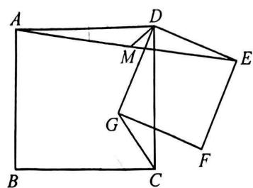

text_image

Geometric diagram with labeled points A, B, C, D, E, F, G, M forming interconnected triangles and quadrilaterals

图2

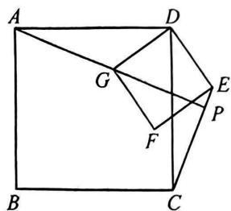

text_image

Geometric diagram of a square ABCD with internal points E, F, G, P and connecting lines forming triangles and quadrilaterals.

图3

解:(1)AG=CE 且 AG⊥CE;

(2) $DM, CG$ 的关系是: $DM = \frac{1}{2} CG$ , 且 $DM \perp CG$ . 理由如下:

延长 AD 至点 H，使 DH = AD，连接 EH。

$$
\because \angle G D E = \angle C D H = 9 0 ^ {\circ}, \therefore \angle G D E - \angle C D E = \angle C D H - \angle C D E, \text {即} \angle C D G = \angle H D E.
$$

$$
\because C D = D H, G D = D E, \therefore \triangle D G C \cong \triangle D E H (\text { SAS }), \therefore C G = E H.
$$

∵M 是 AE 的中点,AD=DH,∴DM 是△AEH 的中位线,

$$
\therefore D M \parallel E H, D M = \frac {1}{2} E H, \therefore D M = \frac {1}{2} C G. \because \angle G D E = \angle C D H = 9 0 ^ {\circ},
$$

$\therefore \triangle DGC$ 绕点 $D$ 逆时针旋转 ${90}^{ \circ  }$ 到 $\bigtriangleup {DEH},\therefore {CG}\bot {EH},\therefore {DM}\bot {CG}$ ；

(3)由(1)可知:直线 $AG \perp$ 直线 CE, $\therefore \angle APC = 90^{\circ}$ , $\therefore$ 点 P 在以 AC 为直径的圆上运动, 如图 4, 当 P 与 F 重合时, AP 最小, 此时 A, P, F, G 共线,

$$
\mathrm{Rt} \triangle A G D \text {中,} D G = 2, A D = 4, \therefore A G = \sqrt {4 ^ {2} - 2 ^ {2}} = 2 \sqrt {3}, \therefore A P = 2 \sqrt {3} - 2;
$$

如图 5, 当 P 与 F 重合时, AP 最大, 同理得: $AP = 2\sqrt{3} + 2$ ,

∴AP的取值范围是 $2\sqrt{3}-2\leqslant AP\leqslant2\sqrt{3}+2$ .

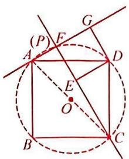

text_image

(P) F
A D
E
O
B C

图4

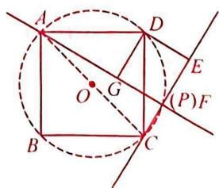

text_image

Geometric diagram with labeled points, lines, and a circle, showing intersections and segments

图5

# 综合 13 类比探究(三) 三边关系求范围

14.(2024东湖高新期中)在Rt△ABC中,∠C=90°,∠ABC=60°,BC=1,将△ABC绕点A逆时针旋转得到△AED.

(1)如图1,将 $\triangle ABC$ 绕点A逆时针旋转 $30^{\circ}$ 得到 $\triangle AED$ ,求 $\angle BED$ 的大小;  
(2)如图2,直线CD交BE于点F.求证:F是BE的中点;   
(3)如图3,在(2)的条件下,线段DF的最大值为2.

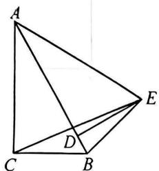

text_image

Geometric diagram of a tetrahedron with labeled vertices A, B, C, D, E and connecting edges

图1

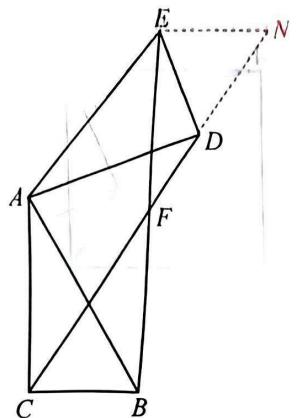

text_image

Geometric diagram with labeled points A, B, C, D, E, F, N and connecting lines, likely from a math problem or proof.

图2

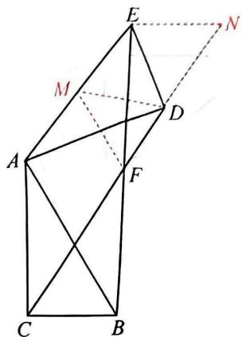

text_image

Geometric diagram with labeled points A, B, C, D, E, F, M, N and connecting lines, likely from a math problem or proof.

图3

解:(1) $\because\angle C=90^{\circ},\angle ABC=60^{\circ},\therefore\angle CAB=30^{\circ}.$

由旋转得 $AE = AB, \angle DAE = \angle CAB = 30^{\circ}, \angle AED = \angle ABC = 60^{\circ}$ ,

$$
\therefore \angle A E B = \angle A B E = 7 5 ^ {\circ}, \therefore \angle B E D = \angle A E B - \angle A E D = 7 5 ^ {\circ} - 6 0 ^ {\circ} = 1 5 ^ {\circ};
$$

(2) 过点 E 作 EN // BC，交 CD 的延长线于点 N，∴ $\angle N = \angle FCB, \angle FEN = \angle FBC.$

$$
\because \angle A D E = \angle A C B = 9 0 ^ {\circ}, \therefore \angle A D C + \angle E D N = 9 0 ^ {\circ}, \angle A C D + \angle D C B = 9 0 ^ {\circ}.
$$

由旋转得 AD = AC，∴ $\angle ADC = \angle ACD$ ，∴ $\angle EDN = \angle DCB$ ，

$$
\therefore \angle N = \angle E D N, \therefore E D = E N = B C, \therefore \triangle F N E \cong \triangle F C B,
$$

$\therefore EF=BF, \therefore F$ 是 BE 的中点；

(3) 取 AE 的中点 M, 连接 FM, DM.

在 Rt△ABC 中，BC=1，∠CAB=30°，

$$
\therefore A B = 2 B C = 2, \therefore A E = A B = 2.
$$

$$
\because \angle A D E = 9 0 ^ {\circ}, A M = M E, \therefore D M = \frac {1}{2} A E = 1.
$$

∵ F 为 BE 的中点，∴ MF 是 $\triangle ABE$ 的中位线，∴ $MF = \frac{1}{2} AB = 1$ .

∵ $DF \leq MF + DM$ , ∴ 当点 D, M, F 共线时, DF 最大, 其值为 $MF + DM = 2$ ,

∴线段 DF 的最大值为 2.

# 综合 14 类比探究(四) 路径问题

15.(2024东湖开发区期末)【问题背景】(1)如图1,将 $\triangle ADB$ 绕点A逆时针旋转 $\alpha$ 得到 $\triangle AEC$ ,此时B,E,C三点在同一直线上.求证:BA平分 $\angle DBC$ ;

【尝试运用】(2)如图2,在(1)的条件下, $\alpha=120^{\circ}$ ,连接DE,F为BC的中点,G为DE的中点,连接FG.求证: $FG\perp AB$ ;

【拓展创新】(3)如图3,在 $\triangle ABC$ 中, $\angle ABC=90^{\circ},AB=BC=2,D$ 为线段 $BC$ 上一动点,在 $AD$ 左侧作 Rt $\triangle AED$ , $\angle AED=90^{\circ}$ , $\angle ADE=30^{\circ}$ ,当点 $D$ 从点 $B$ 运动至点 $C$ 的过程中,点 $E$ 的运动路径长为\_1\_.

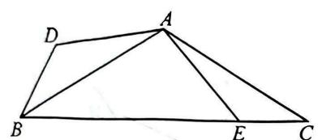

text_image

Geometric diagram of quadrilateral ABCD with internal points E and B, showing connected segments forming triangles.

图1

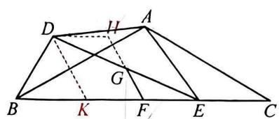

text_image

Geometric diagram of a trapezoid with labeled vertices and internal points, including dashed lines and red annotations.

图2

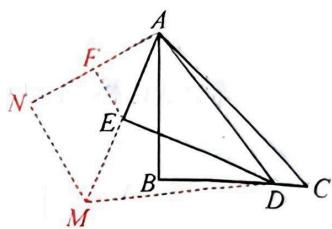

text_image

Geometric diagram with labeled points and lines, likely from a math problem or proof

图3

解:(1)由旋转得 $\triangle ABD\cong\triangle ACE,\therefore\angle C=\angle ABD,AB=AC,\therefore\angle ABC=\angle C,$

$\therefore\angle ABD=\angle ABC,\therefore BA$ 平分 $\angle DBC;$

(2)延长 FG 至点 H, 使 GH = FG, 连接 DH, 过点 D 作 DK // FH, 交 BC 于点 K.

由旋转得 $AB = AC, BD = CE, \angle BAC = 120^{\circ}, \therefore \angle C = \angle ABC = \angle ABD = 30^{\circ}$ .

$$
\because D G = E G, H G = F G, \angle D G H = \angle E G F, \therefore \triangle D G H \cong \triangle E G F,
$$

$$
\therefore D H = E F, \angle H D G = \angle F E G, \therefore D H / / E F.
$$

∵DK∥FH, ∴四边形 DHFK 为平行四边形, ∴DH=FK=EF.

$$
\because B F = C F, \therefore B K = C E = B D, \therefore A B \perp D K, \therefore F G \perp A B;
$$

(3)延长 AE 至点 M，使 EM=AE，将 AB 绕点 A 顺时针旋转 $60^{\circ}$ 得到 AN，连接 MN，取 AN 的中点 F，连接 EF.

$$
\because \angle A E D = 9 0 ^ {\circ}, \angle A D E = 3 0 ^ {\circ}, A E = E M,
$$

$\therefore AD=DM,\angle ADE=\angle MDE=30^{\circ},\therefore\triangle ADM$ 为等边三角形，

$$
\therefore \angle D A M = 6 0 ^ {\circ}, D A = A M.
$$

由旋转得 AB = AN， $\angle BAN = \angle DAM = 60^{\circ}$ ， $\therefore \angle MAN = \angle DAB$ ，

$$
\therefore \triangle M A N \cong \triangle D A B, \therefore \angle M N A = \angle A B D = 9 0 ^ {\circ}, M N = B D,
$$

∴点 M 在与定直线 AN 垂直的直线 MN 上运动.

∵点D的运动路径长为BC=2，∴点M的运动路径长2.

$$
\because A E = E M, A F = F N, \therefore E F = \frac {1}{2} M N = 1,
$$

∴点 E 的运动路径长为 1.

# Ⅱ 二次函数大综合

# 综合1 动线证角等

1.(2025青山)已知直线 $l:y = kx + b (k > 0)$ 与抛物线 $C:y = ax^{2}(a > 0)$ 有唯一公共点 $P$ , 直线 $l$ 分别交 $x$ 轴, $y$ 轴于 $A, B$ 两点.

(1)如图1,当a=1,k=1时,求b的值;   
(2)如图2,当 $a=\frac{1}{2}$ 时,过点A作直线l的垂线交y轴于点T,求点T的坐标;   
(3)如图3,当k=1时,平移直线l,使平移后的直线与抛物线C交于M,N两点,点P关于y轴的对称点为Q.求证: $\angle MQP=\angle NQP$ .

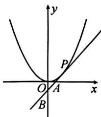

text_image

y
P
O A x
B

图1

text_image

y
T
P
O
A
x
B

图2

text_image

y
Q
M
P
N
O
x

图3

解:(1)由题意,得 $x^{2}=x+b,\therefore x^{2}-x-b=0,\therefore\Delta=1^{2}-4\times1\times(-b)=0,\therefore b=-\frac{1}{4}$ ;

(2)由题意,得 $\frac{1}{2}x^{2}=kx+b,\therefore\frac{1}{2}x^{2}-kx-b=0$ ,由 $\Delta=0$ ,得 $k^{2}+2b=0,\therefore b=-\frac{1}{2}k^{2}$ ,

由 $kx + b = 0$ ，得 $x = -\frac{b}{k} = \frac{1}{2} k,\therefore A\left(\frac{1}{2} k,0\right),B\left(0, - \frac{1}{2} k^2\right),$

设点 $T(0, t)$ ，则 $BT = t + \frac{1}{2} k^2, AT^2 = t^2 + \frac{1}{4} k^2$ ，在 Rt $\triangle ABT$ 中， $AT^2 + AB^2 = BT^2$ 。

$$
\therefore \left(t ^ {2} + \frac {1}{4} k ^ {2}\right) + \left(\frac {1}{4} k ^ {2} + \frac {1}{4} k ^ {4}\right) = \left(t + \frac {1}{2} k ^ {2}\right) ^ {2}, \text {解得} t = \frac {1}{2}, \therefore T \left(0, \frac {1}{2}\right);
$$

(3) 由 $ax^2 = x + b$ 得 $ax^2 - x - b = 0, \therefore x_1 = x_2 = \frac{1}{2a}, \therefore P\left(\frac{1}{2a}, \frac{1}{4a}\right), \therefore Q\left(-\frac{1}{2a}, \frac{1}{4a}\right)$ .

设点 $M(m, am^{2})$ , $N(n, an^{2})$ ，则可求得 MN: $y = a(m + n)x - amn$ .

同理 $QM:y = a\left(m - \frac{1}{2a}\right)x + \frac{1}{2} m,\because MN / /$ 直线 $l,\therefore a(m + n) = 1$

过点 N 作 y 轴的平行线, 分别交 OM, PO 于 G, H 两点,

当 $x = n$ 时， $y_{G} = a\left(m - \frac{1}{2a}\right)n + \frac{1}{2} m = amn + \frac{1}{2} m - \frac{1}{2} n,$

$$
\therefore y _ {G} + y _ {N} = a m n + \frac {1}{2} m - \frac {1}{2} n + a n ^ {2} = a (m + n) n + \frac {1}{2} m - \frac {1}{2} n = \frac {1}{2} (m + n) = \frac {1}{2 a} = 2 y _ {H},
$$

$$
\therefore y _ {G} - y _ {H} = y _ {H} - y _ {N}, \therefore G H = N H, \text {又} \because Q H \perp G N, \therefore \angle M O P = \angle N O P.
$$

# 综合2 定线段长求坐标

2.(2024 汉阳模拟)在平面直角坐标系中,抛物线 $L: y = ax^{2} - 3ax + c$ 交 x 轴于 A, B(-1,0) 两点,交 y 轴于点 C(0,-4).

(1) 求抛物线解析式；  
(2)如图1、D为第四象限的抛物线L上一点，过点D作y轴平行线，交直线AC于点E，交x轴于点F.若DE=AE，求DE的长；  
(3)如图2,将抛物线 $L$ 平移到顶点为坐标原点的抛物线为 $L_{1}$ , 过点 $Q(1,2)$ 的直线与抛物线 $L_{1}$ 交于 $M, N$ 两点 (点 $M$ 始终在点 $N$ 左侧), 分别过点 $M, N$ 与抛物线 $L_{1}$ 均只存在唯一公共点的直线 $m, n$ 与 $x$ 轴分别交于点 $G, H$ . 若 $GH = \sqrt{2}$ , 求直线 $m, n$ 的交点 $P$ 的坐标.

text_image

y
B O F A x
C E
D

图1

text_image

y
Q
N
M
G
O
H
x
P

图2

解:(1) $\because B(-1,0),C(0,-4)$ 在抛物线上, $\therefore\left\{\begin{aligned}0&=a+3a-4,\\ -4&=c,\end{aligned}\right.\therefore\left\{\begin{aligned}a&=1,\\ c&=-4,\end{aligned}\right.$

∴抛物线解析式为 $y=x^{2}-3x-4$ ;

(2)由(1)知抛物线解析式为 $y=x^{2}-3x-4$ ,

$\therefore A(4,0),C(0,-4),\therefore OA=OC=4,\therefore$ 直线AC解析式为y=x-4, $\therefore\angle ACO=\angle OAC=45^{\circ}$

∵ $DE \perp OA$ 于点F，交AC于点E，∴ $AE = \sqrt{2} AF = \sqrt{2} EF$ ，

设点 $E(t, t - 4)$ ，则 $D(t, t^2 - 3t - 4), \therefore DE = t - 4 - (t^2 - 3t - 4) = -t^2 + 4t, AE = \sqrt{2}(4 - t)$ .

$\because DE = AE, \therefore -t^2 + 4t = \sqrt{2}(4 - t)$ , 解得 $t = 4$ 或 $t = \sqrt{2}$ ,

∵点 D 在第四象限，∴t=4 舍去，∴ $t=\sqrt{2}$ ，∴ $DE=4\sqrt{2}-2$ .

(3)由平移得抛物线 $L_{1}$ 的解析式为 $y = x^{2}$ , 设点 $M(m, m^{2}), N(n, n^{2})$ ,

∵直线 MN 为 $y=kx-k+2$ ,

联立 $\left\{ \begin{array}{l} m^2 = km - k + 2, \\ n^2 = kn - k + 2, \end{array} \right.\therefore k = m + n,\therefore$ 直线 $MN$ 为 $y = (m + n)x - m - n + 2$

由 $\left\{\begin{aligned}y&=x^{2},\\ y&=(m+n)x-m-n+2,\end{aligned}\right.$ 得 $x^{2}-(m+n)x+m+n-2=0$

∴mn=m+n-2,∴m+n=mn+2,①

设直线 MP 为 $y=k_{1}x+b_{1}$ ，直线 NP 为 $y=k_{2}x+b_{2}$ ，

∵MP 与抛物线 $L_{1}$ 有唯一公共点M，

$\therefore k_{1} = 2m, b_{1} = -m^{2}, \therefore$ 直线 $MP$ 为 $y = 2mx - m^{2}, \therefore G\left(\frac{m}{2}, 0\right)$ ,

∵ NP 与抛物线 $L_{1}$ 有唯一公共点 N，

$\therefore k_{2} = 2n, b_{2} = -n^{2}, \therefore$ 直线 $NP$ 为 $y = 2nx - n^{2}, \therefore H\left(\frac{n}{2}, 0\right)$ ,

$$
\therefore G H = \sqrt {2} = \frac {1}{2} (n - m), \therefore (n - m) ^ {2} = 8, \therefore (m + n) ^ {2} - 4 m n = 8. \tag {②}
$$

由①,②,可求得 $\left\{\begin{aligned}m+n=0,\\ mn=-2,\end{aligned}\right.$ 或 $\left\{\begin{aligned}m+n=4,\\ mn=2,\end{aligned}\right.$

联立 $\left\{\begin{aligned}y=2mx-m^{2}\\ y=2nx-n^{2}\end{aligned}\right.$ ，得 $P\left(\frac{m+n}{2},mn\right)$ .

∴符合条件的点 P 坐标为 $(0, -2)$ 或 $(2, 2)$ .

# 综合3 定直角求参数

3.（2024 七一华源）如图，已知抛物线 $C_{1}: y = ax^{2} + bx + c$ 过点 $A(-6,0), B(2,0), C(0,-3)$ .

(1)求此抛物线的解析式；  
(2)在抛物线上存在一点 T，使得 $\angle ACT = 45^{\circ}$ ，求点 T 的横坐标；  
(3) 直线 $y = x + m$ 与抛物线 $C_1$ 交于 $M, N$ 两点，若在 $x$ 轴上存在唯一的一点 $P$ ，使得 $\angle MPN = 90^\circ$ ，求 $m$ 的值.

解:(1) $y=\frac{1}{4}x^{2}+x-3;$

(2)过点 A 作 $AD \perp AC$ ，且使得 AD = AC，过点 D 作 $DE \perp x$ 轴于点 E，则可证得 $\angle ACD = 45^{\circ}, \triangle AED \cong \triangle COA, \therefore AE = CO = 3, DE = AO = 6$ ，当点 D 在 x 轴下方时，点 D (-9, -6)，此时可求得 $CD: y = \frac{1}{3}x - 3$ ，

联立 $\left\{\begin{aligned}y&=\frac{1}{3}x-3,\\ y&=\frac{1}{4}x^{2}+x-3,\end{aligned}\right.$ 解得 $\left\{\begin{aligned}x&=0,\\ y&=-3\end{aligned}\right.$ 或 $\left\{\begin{aligned}x&=-\frac{8}{3},\\ y&=-\frac{35}{9},\end{aligned}\right.$

当点 D 在 x 轴上方时, 点 $D(-3,6)$ , 此时可求得 CD: y = -3x - 3,

联立 $\left\{\begin{aligned}y&=-3x-3,\\ y&=\frac{1}{4}x^{2}+x-3,\end{aligned}\right.$ 解得 $\left\{\begin{aligned}x&=0,\\ y&=-3\end{aligned}\right.$ 或 $\left\{\begin{aligned}x&=-16,\\ y&=45,\end{aligned}\right.$

∴点 T 的横坐标为 -16 或 $-\frac{8}{3}$ ;

(3)设点 $M(x_{1},x_{1}+m),N(x_{2},x_{2}+m),P(t,0)$ ,

则 $x_{1}, x_{2}$ 是方程 $\frac{1}{4} x^{2} + x - 3 = x + m$ ，即 $\frac{1}{4} x^{2} - 3 - m = 0$ 的两个根，

$$
\begin{array}{l} \therefore x _ {1} + x _ {2} = 0, x _ {1} x _ {2} = - 1 2 - 4 m, \\ \because \angle M P N = 9 0 ^ {\circ}, \therefore M N ^ {2} = P M ^ {2} + P N ^ {2}, \\ \text { 又 } \because M N ^ {2} = 2 (x _ {1} - x _ {2}) ^ {2}, P M ^ {2} = (x _ {1} - t) ^ {2} + (x _ {1} + m) ^ {2}, P N ^ {2} = (x _ {2} - t) ^ {2} + (x _ {2} + m) ^ {2}, \\ \therefore 2 \left(x _ {1} - x _ {2}\right) ^ {2} = \left(x _ {1} - t\right) ^ {2} + \left(x _ {1} + m\right) ^ {2} + \left(x _ {2} - t\right) ^ {2} + \left(x _ {2} + m\right) ^ {2}, \\ \therefore - 4 x _ {1} x _ {2} = 2 t ^ {2} + 2 m ^ {2} + 2 (m - t) \left(x _ {1} + x _ {2}\right), \\ \therefore - 4 (- 1 2 - 4 m) = 2 t ^ {2} + 2 m ^ {2}, \\ \end{array}
$$

由题意可知关于 t 的一元二次方程有两个相等的实根，

$$
\therefore t _ {1} = t _ {2} = 0, \therefore m ^ {2} = - 2 (- 1 2 - 4 m),
$$

解得 $m=4-2\sqrt{10}$ 或 $m=4+2\sqrt{10}$ .

text_image

y
D
E
A
O
B
x
C
D

# 综合4 动线定线段长

4.(2025 洪山)如图 1, 已知抛物线 $C_{1}: y = -x^{2} + 3x + 4$ 与 $x$ 轴交于 $A, B$ 两点 ( $A$ 在 $B$ 的右侧), 交 $y$ 轴于点 $C$ .

(1)直接写出 AC 的中点 D 的坐标；

(2) 直线 $y = kx + b (k, b$ 为常数) 经过 AC 的中点, 与抛物线 $C_{1}$ 交于 E, F 两点 (E 在 F 的右侧), 若点 E, A 的水平距离与点 F, B 的水平距离相等, 求 k 的值;

(3)如图2,将抛物线 $C_{1}$ 向右平移得到过原点的抛物线 $C_{2}$ , 抛物线 $C_{2}$ 的对称轴为直线l, 直线 $y = mx + n (m, n \text{ 为常数, 且 } m \neq 0)$ 与抛物线 $C_{2}$ 有唯一公共点P, 且与直线l交于点M, 点M关于x轴的对称点为N, $PQ \perp l$ 于点Q, 求线段NQ的长.

text_image

y
C
B O A x

图1

text_image

y
M
Q
P
O
x
N
l

图2

解:(1)令 x=0, 则 $y=4, \therefore C(0,4)$ , 令 y=0, 则 $-x^{2}+3x+4=0$ ,

解得 x=4 或 $x=-1,\therefore A(4,0),B(-1,0),\therefore AC$ 的中点 $D(2,2)$ ;

(2) ∵ 直线 y = kx + b 经过 AC 的中点，∴ $2k + b = 2$ ，∴ b = 2 - 2k，∴ $y = kx + 2 - 2k$ ，

$\because -x^{2}+3x+4=kx+2-2k$ ，整理，得 $x^{2}+(k-3)x-2-2k=0$ ，

$$
\therefore x _ {F} + x _ {F} = 3 - k, x _ {F} \cdot x _ {F} = - 2 - 2 k,
$$

∵点E,A的水平距离与点F,B的水平距离相等,∴ $|x_{F}-4|=|x_{F}+1|$ ,

$\therefore x_{E}-4=x_{E}+1$ 或 $x_{E}-4=- (x_{E}+1), \therefore x_{E}+x_{E}=3-k=3$ 时， $k=0$

$x_{k}-x_{k}=5$ 时， $(3-k)^{2}-4(-2-2k)=25$ ，解得 $k=2$ 或 $k=-4$ 。

综上所述，k 的值为 0 或 2 或 -4；

(3)∵抛物线 $C_{1}$ 向右平移得到过原点的抛物线 $C_{2}$ ，

设向右平移 h 个单位长度， $\therefore C_{2}: y = -\left(x - \frac{3}{2} - h\right)^{2} + \frac{25}{4}$ ,

∵抛物线 $C_{2}$ 经过原点，∴ $\left(-\frac{3}{2}-h\right)^{2}+\frac{25}{4}=0$

解得 $h = 1$ 或 $h = -4$ （舍去）， $\therefore y = -\left(x - \frac{5}{2}\right)^2 + \frac{25}{4}$ ，

∴抛物线 $C_{2}$ 的对称轴为直线 $x=\frac{5}{2},\therefore M\left(\frac{5}{2},\frac{5}{2}m+n\right)$ ,

∵点 M 关于 x 轴的对称点为 N，∴ $N\left(\frac{5}{2}, -\frac{5}{2}m-n\right)$ ,

$\because {mx} + n =  - {x}^{2} + {5x}$ 有两个相等的实数根,

$$
\therefore x = \frac {5 - m}{2}, \Delta = (m - 5) ^ {2} - 4 n = 0, \therefore P \left(\frac {5 - m}{2}, \frac {2 5 - m ^ {2}}{4}\right),
$$

$$
\because P Q \perp l, \therefore Q \left(\frac {5}{2}, \frac {2 5 - m ^ {2}}{4}\right), \therefore N Q = \frac {2 5 - m ^ {2}}{4} + \frac {5}{2} m + n = \frac {2 5 - m ^ {2}}{4} + \frac {5}{2} m + \frac {(m - 5) ^ {2}}{4} = \frac {2 5}{2}.
$$

# 综合5 动线定线段比

5.(2025二中广雅)已知抛物线 $y=-x^{2}+bx+c(bc\neq0)$ 的顶点为 D，与 x 轴交于 A，B 两点（点 A 在点 B 左边）.

(1)若该抛物线的顶点 D 的坐标为 $(1,4)$ ，求其解析式；

(2)如图1,已知抛物线的顶点D在直线 $l:y=-x+3$ 上运动,且与直线l交于另一点E,若 $\triangle ADE$ 的面积为 $\frac{15}{8}$ ,求点A的坐标;

(3)如图2,在(1)的条件下,P,Q为y轴上的两个关于原点对称的动点,射线BP,BQ分别与抛物线交于M,N两点,求MN与PQ的数量关系.

text_image

y
D
E
A O B x

图1

text_image

y
M P
A O B x
N Q

图2

解:(1)∵顶点D的坐标为(1,4)，∴ $y=-(x-1)^{2}+4=-x^{2}+2x+3$ ;

(2)设点 D, E 的坐标分别为 $(x_{1}, y_{1})$ , $(x_{2}, y_{2})$ ，则 $x_{1} = \frac{b}{2}$ ，联立抛物线与直线 l 的解析式，

整理, 得 $x^{2}-(b+1)x+(3-c)=0$ , 则 $x_{1}+x_{2}=b+1$ , $\therefore x_{2}=\frac{b}{2}+1$ ,

$$
\therefore y _ {2} - y _ {1} = (- x _ {2} + 3) - (- x _ {1} + 3) = x _ {1} - x _ {2} = \frac {b}{2} - \left(\frac {b}{2} + 1\right) = - 1,
$$

设直线 l 与 x 轴的交点为 F，则点 $F(3,0)$ ，

$$
S _ {\triangle A D E} = S _ {\triangle A D F} - S _ {\triangle A E F} = \frac {1}{2} A F (y _ {1} - y _ {2}) = \frac {1}{2} \times A F \times 1 = \frac {1 5}{8}, \therefore A F = \frac {1 5}{4}, \therefore \text {点} A (- \frac {3}{4}, 0);
$$

(3) 设 $P(0, m)$ , 其中 $m$ 为正数, $\because$ 点 $P, Q$ 关于原点对称, $\therefore Q(0, -m), \therefore PQ = 2m$ ,

由(1)知 $y = -x^{2} + 2x + 3$ ，令 y = 0，则 $-x^{2} + 2x + 3 = 0$ ，解得 $x_{1} = 3, x_{2} = -1, \therefore B(3, 0)$ ，

设直线 $BP$ 的解析式为 $y = kx + d$ ，则 $\left\{ \begin{array}{l} 3k + d = 0, \\ d = m, \end{array} \right.$ 解得 $\left\{ \begin{array}{l} k = -\frac{m}{3}, \\ d = m, \end{array} \right.$

∴直线 BP 的解析式为 $y=-\frac{m}{3}x+m$ ，

联立得 $\left\{ \begin{array}{l} y = -\frac{m}{3} x + m, \\ y = -x^2 + 2x + 3, \end{array} \right.$ 解得 $\left\{ \begin{array}{l} x_1 = 3, \\ y_1 = 0 \end{array} \right.$ （舍去）， $\left\{ \begin{array}{l} x_2 = \frac{m}{3} - 1, \\ y_2 = -\frac{m^2}{9} + \frac{4m}{3}, \end{array} \right.$

$\therefore M\left(\frac{m}{3} - 1, -\frac{m^2}{9} + \frac{4m}{3}\right)$ , 同理可得 $N\left(-\frac{m}{3} - 1, -\frac{m^2}{9} - \frac{4m}{3}\right)$ ,

$$
\therefore M N = \sqrt {\left[ \left(\frac {m}{3} - 1\right) - \left(- \frac {m}{3} - 1\right) \right] ^ {2} + \left[ \left(- \frac {m ^ {2}}{9} + \frac {4}{3} m\right) - \left(- \frac {m ^ {2}}{9} - \frac {4}{3} m\right) \right] ^ {2}} = \frac {2 \sqrt {1 7}}{3} m,
$$

$$
\therefore \frac {M N}{P Q} = \frac {\frac {2 \sqrt {1 7}}{3} m}{2 m} = \frac {\sqrt {1 7}}{3}.
$$

# 综合6 动线定倒数差

6.(2025 武昌)在平面直角坐标系中,点 $P(-3,9)$ 在抛物线 $y=ax^{2}$ 上,直线 $y=kx+2k(k>0)$ 交抛物线于 $A,B$ 两点,交 $x$ 轴于点 $C$ .

(1) 若 k=1，求 a 的值及点 C 的坐标；  
(2)如图1,连接PA,PC.当 $\angle CPA=45^{\circ}$ 时,求k的值;

(3)如图2,直线 $PA$ 交 $\pmb{x}$ 轴正半轴于点 $D$ , 直线 $PB$ 交 $\pmb{x}$ 轴负半轴于点 $E$ , 求 $\frac{1}{OD} - \frac{1}{OE}$ 的值.

text_image

y
P
A
B
C O x

图1

text_image

P
y
A
B
C E O D x

图2

解:(1)当 k=1 时, 直线为 $y=x+2$ , ∵ 点 $P(-3,9)$ 在抛物线 $y=ax^{2}$ 上, ∴ 9a=9, 解得 a=1.

∵直线 $y=x+2$ 交 x 轴于点 C, ∴ $x+2=0$ , 解得 x=-2, ∴ $C(-2,0)$ ;

(2) 过点 P 作 x 轴的垂线, 垂足为 D, 过点 C 作 CP 的垂线交 PA 的延长线于点 E, 过点 E 作 x 轴的垂线, 垂足为 F. ∵ 直线 $y = kx + 2k$ 交 x 轴于点 C, 取 y = 0, 可得 x = -2, ∴ $C(-2, 0)$ .

$\because \angle CPA=45^{\circ},\therefore\triangle PCE$ 为等腰直角三角形, $\therefore PC=EC,\angle PCE=90^{\circ}$

$$
\therefore \angle P C D + \angle E C F = 9 0 ^ {\circ}, \angle E C F + \angle C E F = 9 0 ^ {\circ}, \therefore \angle P C D = \angle C E F,
$$

$$
\because \angle P D C = \angle C F E = 9 0 ^ {\circ}, \therefore \triangle P D C \cong \triangle C F E (\mathrm{AAS}),
$$

$$
\therefore P D = 9 = C F, C D = E F = 1, \therefore E (7, 1).
$$

设直线 $PE$ 为 $y = k_{1}x + b_{1}$ ，则有 $\left\{ \begin{array}{l} -3k_{1} + b_{1} = 9,\\ 7k_{1} + b_{1} = 1, \end{array} \right.$ 解得 $\left\{ \begin{array}{l}k_{1} = -\frac{4}{5},\\ b_{1} = \frac{33}{5}, \end{array} \right.$

∴ 直线 PE 为 $y = -\frac{4}{5}x + \frac{33}{5}$ ，则 $x^{2} = -\frac{4}{5}x + \frac{33}{5}$ ，解得 x = -3 或 $\frac{11}{5}$ ，

∴点 A 坐标为 $\left(\frac{11}{5}, \frac{121}{25}\right)$ ，∵点 A 在直线 $y = kx + 2k$ 上，∴ $\frac{121}{25} = \frac{11}{5}k + 2k$ ，解得 $k = \frac{121}{105}$ ;

(3)设点 A, B 的坐标分别为 $(n, n^{2})$ , $(m, m^{2})$ ,

联立 $y = x^2$ 和 $y = kx + 2k$ 并整理，得 $x^2 - kx - 2k = 0$ ，则 $m + n = k, mn = -2k$ ，

由点 A, P 的坐标得, 直线 AP 的解析式为 $y = (n - 3)(x + 3) + 9$ ,

令 $y = (n - 3)(x + 3) + 9 = 0$ ，则 $x_{D} = \frac{3n}{3 - n}$ ，

同理可得, 直线 BP 的解析式为 $y=(m-3)(x+3)+9$ ,

令 $y = (m - 3)(x + 3) + 9 = 0$ ，则 $x_{E} = \frac{3m}{3 - m}$ ，

则 $\frac{1}{OD} -\frac{1}{OE} = \frac{3 - n}{3n} +\frac{3 - m}{3m} = \frac{m + n}{mn} -\frac{2}{3} = \frac{k}{-2k} -\frac{2}{3} = -\frac{7}{6}.$

# 综合7 动线定线段积

7.(2025东西湖)如图1,抛物线 $C_{1}$ : $y = -x^{2} + bx + c$ 与x轴交于A(-3,0),B(1,0)两点,交y轴于点C,连接AC,D为AC上方抛物线上的一个动点,过点D作DE⊥AC于点E.

(1)求抛物线的解析式；  
(2)求线段 $DE$ 的最大值, 并求出此时点 $D$ 的坐标;  
(3)如图2,将抛物线 $C_1$ 沿 $y$ 轴翻折得到抛物线 $C_2$ , 抛物线 $C_2$ 的顶点为 $F$ , 对称轴与 $x$ 轴交于点 $G$ , 过点 $H(1,2)$ 的直线 (直线 $FH$ 除外) 与抛物线交于 $J, I$ 两点, 直线 $FJ, FI$ 分别交 $x$ 轴于点 $M, N$ . 试探究 $GM \cdot GN$ 是否为定值? 若是, 求出该定值; 若不是, 说明理由.

text_image

y
D
C
E
A
O
B
x

图1

text_image

y
F
J
H
I
M
O
G
N
x

图2

解. (1) 抛物线的解析式为 $y = -x^{2} - 2x + 3$ ;

(2) 连接 DA, DC, DO, 设点 $D(t, -t^{2} - 2t + 3)(-3 < t < 0)$ ,

当 x=0 时， $y=3,\therefore$ 点 $C(0,3),\therefore AC=3\sqrt{2}$

$$
\because S _ {\triangle D A C} = S _ {\triangle D A O} + S _ {\triangle D C O} - S _ {\triangle A O C},
$$

$$
\therefore \frac {1}{2} D E \times 3 \sqrt {2} = \frac {1}{2} \times 3 (- t ^ {2} - 2 t + 3) + \frac {1}{2} \times 3 \times (- t) - \frac {1}{2} \times 3 \times 3,
$$

整理, 得 $\sqrt{2}DE = -t^{2} - 3t = -(t + \frac{3}{2})^{2} + \frac{9}{4}$ ,

∴当 $t=-\frac{3}{2}$ 时， $\sqrt{2}DE$ 取得最大值为 $\frac{9}{4}$ ，

∴线段 DE 的最大值为 $\frac{\sqrt{2}}{2} \times \frac{9}{4} = \frac{9\sqrt{2}}{8}$ ，∴此时点 D 的坐标为 $(- \frac{3}{2}, \frac{15}{4})$ ;

(3) $GM \cdot GN$ 是定值,理由:

由题意可求得抛物线 $C_2$ 的解析式为 $y = -x^2 + 2x + 3, F(1,4)$ ,

设点 $J(m,-m^{2}+2m+3)$ , $I(n,-n^{2}+2n+3)$ , 直线 $J_{1}:y=kx+b$ ,

联立 $\left\{ \begin{array}{l} y = kx + b, \\ y = -x^2 + 2x + 3, \end{array} \right.$ 得 $x^2 + (k - 2)x + b - 3 = 0, \therefore m + n = 2 - k, mn = b - 3,$

∴ $k = -m - n + 2, b = 3 + mn, \therefore$ 直线 $JI: y = (-m - n + 2)x + 3 + mn.$

同理, 直线 $FJ: y = (-m + 1)x + 3 + m$ , 直线 $FJ: y = (-n + 1)x + 3 + n$ .

∵直线JI过点H(1,2)，∴ $(-m-n+2)+3+mn=2$ ，∴mn-m-n=-3。

由 $(-m+1)x+3+m=0$ ，得 $x_{M}=\frac{m+3}{m-1}$ ，同理有 $x_{N}=\frac{n+3}{n-1}$

$$
\therefore G M \cdot G N = (1 - \frac {m + 3}{m - 1}) (\frac {n + 3}{n - 1} - 1) = - \frac {1 6}{(m - 1) (n - 1)} = - \frac {1 6}{m n - m - n + 1} = - \frac {1 6}{- 3 + 1} = 8.
$$

# 综合8 双切线定坐标

8.(2024 蔡甸、黄陂、江夏期中)已知抛物线 $y=a(x+2)^{2}-1$ 与 x 轴交于 M, P(-1,0) 两点.

(1) 求抛物线的解析式；

(2)如图 1, $C\left(-\frac{1}{2},m\right)$ 是抛物线上一点，N 为抛物线第二象限一点，若 $\angle PMC=\frac{1}{2}\angle MCN$ ，求点 N 的坐标；

(3)如图2,E为直线x=-1上一点,过点E的直线EA,EB与抛物线均只有唯一公共点,连接AB交直线x=-1于点D,若点D(-1,2),求点E的坐标.

text_image

N
y
C
M
PH
O
F
x

图1

text_image

y
B
D
O
x
A
P
E

图2

解:(1)将 $(-1,0)$ 代入 $y=a(x+2)^{2}-1$ ,得 $0=a(-1+2)^{2}-1$ ,解得a=1,

∴抛物线的解析式为 $y=(x+2)^{2}-1=x^{2}+4x+3$ ;

(2)由 $x^{2} + 4x + 3 = 0$ ，解得 $x = -3$ 或 $-1,\therefore M(-3,0)$

当 $x = -\frac{1}{2}$ 时， $y = x^2 + 4x + 3 = \frac{5}{4}$ ，∴点 $C\left(-\frac{1}{2}, \frac{5}{4}\right)$ ，

延长 NC 交 x 轴于点 F，过点 C 作 $CH \perp x$ 轴于点 H，则 $MH = \frac{5}{2}$ ，

$$
\because \angle P M C = \frac {1}{2} \angle M C N, \therefore \angle M C N = 2 \angle P M C = \angle P M C + \angle C F M,
$$

$$
\therefore \angle P M C = \angle C F M, \therefore C M = C F, \therefore F H = M H = \frac {5}{2}, \therefore F (2, 0).
$$

又∵ $C\left(-\frac{1}{2},\frac{5}{4}\right)$ ,

∴ 直线 NC: $y = -\frac{1}{2}x + 1$ ，由 $x^{2} + 4x + 3 = -\frac{1}{2}x + 1$ ，解得 $x = -\frac{1}{2}$ （舍去）或 -4，

∴点 N 的坐标为 $(-4,3)$ ;

(3)∵直线AB经过点D(-1,2)，∴可设直线AB:y=k(x+1)+2，

由 $x^{2} + 4x + 3 = kx + k + 2$ ，得 $x^{2} + (4 - k)x - k + 1 = 0,\therefore x_{A} + x_{B} = k - 4,$

设直线 $AE:y = mx + n$ ，由 $x^{2} + 4x + 3 = mx + n$ ，得 $x^{2} + (4 - m)x - n + 3 = 0$

$$
\therefore 2 x _ {A} = m - 4, x _ {A} ^ {2} = 3 - n, \therefore m = 2 x _ {A} + 4, n = 3 - x _ {A} ^ {2},
$$

∴ 直线 $AE: y = (2x_{A} + 4)x + 3 - x_{A}^{2}$ ，同理可得直线 $BE: y = (2x_{B} + 4)x + 3 - x_{B}^{2}$

∴当 x=-1 时， $y_{E}=-(2x_{A}+4)+3-x_{A}^{2}=-(2x_{B}+4)+3-x_{B}^{2}$

$$
\therefore \left(x _ {A} - x _ {B}\right) \left(2 + x _ {A} + x _ {B}\right) = 0, \because x _ {A} \neq x _ {B}, \therefore 2 + x _ {A} + x _ {B} = 0,
$$

$$
\therefore 2 + k - 4 = 0, \therefore k = 2, \therefore x _ {A} ^ {2} + (4 - 2) x _ {A} - 2 + 1 = 0, \therefore x _ {A} ^ {2} + 2 x _ {A} = 1,
$$

∴当 x = -1 时， $y = -(2x_{A} + 4) + 3 - x_{A}^{2} = -2$

∴点 E 的坐标为 $(-1,-2)$ .

# 综合9 双切线定面积

9.(2024二中广雅)如图1,抛物线 $y=ax^{2}+bx-3$ 与x轴交于A(-1,0),B(3,0)两点,D为抛物线的顶点.

(1)求抛物线的解析式；  
(2)如图2,经过定点G的直线y=kx-k-2(k>0)交抛物线于E,F两点(点E在点F的左侧),若△DFG的面积是△DEG面积的三倍,求k的值;   
(3)如图 3, 直线 PM 与抛物线有唯一公共点 M, 直线 PN 与抛物线有唯一公共点 N, 且直线 MN 过定点 $(1, -2)$ , 则 $\triangle ABP$ 的面积为定值, 求出这个定值.

text_image

y
A O B x
D

图1

text_image

y
A
O
G
E
D
F
B
x

图2

text_image

y
A
O
B
x
N
M
P

图3

解:(1) $y=x^{2}-2x-3$ ;

(2)∵对于直线 y=kx-k-2，当 x=1 时，y=-2，∴定点 G(1,-2)，

$\because y=x^{2}-2x-3=(x-1)^{2}-4,\therefore$ 顶点 $D(1,-4),\therefore DG\parallel y$ 轴，

设点 E, F 的横坐标分别为 $x_{1}, x_{2}$ ,

由 $x^{2}-2x-3=kx-k-2$ , 得 $x^{2}-(k+2)x+k-1=0$

$$
\therefore x _ {1} + x _ {2} = k + 2, \textcircled {1} \quad x _ {1} x _ {2} = k - 1, \textcircled {2}
$$

设 $\triangle DFG$ 以 $DG$ 为底的高为 $h_{1}$ , $\triangle DEG$ 以 $DG$ 为底的高为 $h_{2}$

$$
\because S _ {\triangle D F G} = 3 S _ {\triangle D E G}, \therefore h _ {1} = 3 h _ {2}, \therefore x _ {2} - 1 = 3 (1 - x _ {1}), \tag {③}
$$

联立①③, 可求得 $x_{1}=1-\frac{1}{2}k, x_{2}=1+\frac{3}{2}k$ ,

$\therefore\left(1-\frac{1}{2}k\right)\left(1+\frac{3}{2}k\right)=k-1$ , 解得 $k=\frac{2}{3}\sqrt{6}$ (舍负);

(3)设点 M, N 的横坐标分别为 m, n, 同(2)可得 $m + n = k + 2$ , mn = k - 1,

设直线 PM 的解析式为 $y = k_{1}x + b_{1}$ ,

由 $x^{2}-2x-3=k_{1}x+b_{1}$ ，得 $x^{2}-(k_{1}+2)x-b_{1}-3=0$ ，

$$
\therefore 2 m = k _ {1} + 2, m ^ {2} = - b _ {1} - 3, \therefore k _ {1} = 2 m - 2, b _ {1} = - m ^ {2} - 3,
$$

∴直线PM:y=(2m-2)x-m²-3.

同理直线 $PN: y = (2n - 2)x - n^2 - 3$ .

由 $(2m-2)x-m^{2}-3=(2n-2)x-n^{2}-3$ ，可求得 $x=\frac{m+n}{2}$

$$
\therefore y _ {P} = (2 n - 2) \times \frac {m + n}{2} - n ^ {2} - 3 = m n - (m + n) - 3 = k - 1 - (k + 2) - 3 = - 6,
$$

又∵AB=x\_{n}-x\_{A}=4,

$$
\therefore S _ {\triangle A B P} = \frac {1}{2} A B \times | y _ {P} | = \frac {1}{2} \times 4 \times 6 = 1 2,
$$

∴△ABP 面积为定值 12.

# 综合10 双切线定最值

10.(2024武珞路中学)如图,抛物线 $y=-x^{2}+bx+c$ 与x轴交于A,B两点,与y轴交于点C,且 $B(1,0),C(0,3)$ .

(1) 求抛物线的解析式；  
(2)如图1,Q是直线AC上方的抛物线上一点,若 $S_{\triangle ABC}=2S_{\triangle ACQ}$ ,求点Q的坐标;  
(3)如图2,过点 $D(0,1)$ 的直线交抛物线于 $E,F$ 两点,过点 $E$ 的直线与过点 $F$ 的直线交于点 $P$ .若直线 $PE$ 和 $PF$ 与抛物线均只有一个公共点,求 $PC$ 的最小值.

text_image

y
Q
C
A
O
B
x

图1

text_image

P
y
E
C
D
F
A
O
B
x

图2

解:(1)抛物线的解析式为 $y = -x^{2} - 2x + 3$ ;

(2)由 $-x^{2}-2x+3=0$ ，得x=-3或1，

∴点 A(-3,0)，∴ $S_{\triangle ABC}=\frac{1}{2}\times4\times3=6.$

连接 ${QO}$ . 设点 $Q\left( {t, - {t}^{2} - {2t} + 3}\right) \left( {-3 < t < 0}\right)$ ,

$$
\because S _ {\triangle A C Q} = S _ {\triangle Q A O} + S _ {\triangle Q C O} - S _ {\triangle A O C},
$$

$\therefore 3 = \frac{1}{2} \times 3(-t^2 - 2t + 3) + \frac{1}{2} \times 3(-t) - \frac{1}{2} \times 3 \times 3$ ，解得 $t = -1$ 或 $-2$

∴点 Q 的坐标为 $(-1,4)$ 或 $(-2,3)$ ;

(3)设点 E, F 的横坐标分别为 $x_{1}, x_{2}$ ，直线 EF: $y = kx + 1$ ，

联立 $\left\{ \begin{array}{l} y = -x^2 - 2x + 3, \\ y = kx + 1, \end{array} \right.$ 得 $x^2 + (2 + k)x - 2 = 0, \therefore x_1 + x_2 = -2 - k, x_1x_2 = -2.$

设直线 EP: y = mx + n，

联立 $\left\{ \begin{array}{l} y = -x^2 - 2x + 3, \\ y = mx + n, \end{array} \right.$ 得 $x^2 + (2 + m)x + n - 3 = 0$

∵直线 PE 与抛物线只有一个公共点，

$$
\therefore 2 x _ {1} = - 2 - m, x _ {1} ^ {2} = n - 3, \therefore m = - 2 - 2 x _ {1}, n = x _ {1} ^ {2} + 3,
$$

∴ 直线 $EP: y = (-2 - 2x_{1})x + x_{1}^{2} + 3$ ; 同理直线 $FP: y = (-2 - 2x_{2})x + x_{2}^{2} + 3$ ,

联立 $\left\{ \begin{array}{l} y = (-2 - 2x_{1})x + x_{1}^{2} + 3, \\ y = (-2 - 2x_{2})x + x_{2}^{2} + 3, \end{array} \right.$ 解得 $x = \frac{x_1 + x_2}{2} = -\frac{k + 2}{2}$ ,

$$
\therefore y = (- 2 - 2 x _ {2}) \frac {x _ {1} + x _ {2}}{2} + x _ {2} ^ {2} + 3 = - (x _ {1} + x _ {2}) - x _ {1} x _ {2} + 3 = 2 + k + 2 + 3 = k + 7,
$$

∴点 $P\left(\frac{-2-k}{2}, k+7\right)$ ，又点 $C(0,3)$ ，

$$
\therefore P C ^ {2} = \left(\frac {- 2 - k}{2}\right) ^ {2} + (k + 7 - 3) ^ {2} = \frac {5}{4} \left(k + \frac {1 8}{5}\right) ^ {2} + \frac {4}{5},
$$

∴ $PC^{2}$ 有最小值为 $\frac{4}{5}$ ，故 PC 的最小值为 $\frac{2}{5}\sqrt{5}$ .

# 综合11 三动线得定点

11.(2024东湖开发区期末)如图,抛物线 $y=x^{2}+2x-3$ 与x轴相交于点A,B(点A在点B的左侧),与y轴相交于点C,抛物线的顶点为点D.

(1) 直接写出点 A, B, C 的坐标；  
(2)如图1,连接AD,BD,P为抛物线上一点,使 $\angle PAO=\frac{1}{2}\angle ADB$ ,求点P的坐标;  
(3)如图2,过定点 $H(-2, - 1)$ 的直线与抛物线相交于 $M,N$ 两点（点 $M$ 在 $\pmb{y}$ 轴左侧，点 $N$ 在 $\pmb{y}$ 轴右侧），过点 $M$ 的直线 $y = -2x + b$ 与抛物线交于点 $Q$ ，求证：直线QN必过定点.

text_image

y
F
P
E
A
O
B
x
C
D

图1

text_image

y
A
N
O
B
x
M
H
Q
C

图2

解:(1) $A(-3,0)$ , $B(1,0)$ , $C(0,-3)$ ;

(2) 过点 D 作 $DE \parallel y$ 轴, 交 x 轴于点 E, 过点 B 作 $BF \parallel y$ 轴, 交 AP 于点 F,

$\because y=x^{2}+2x-3=(x+1)^{2}-4,\therefore$ 顶点 $D(-1,-4),\therefore AB=DE=4,$

又 $\because \angle PAO = \frac{1}{2}\angle ADB = \angle ADE, \therefore \triangle FAB \cong \triangle ADE, \therefore AE = BF = 2,$

若点 P 在 x 轴上方，则 $F(1,2)$ ，又∵ $A(-3,0)$ ，∴ 可求得直线 $AF: y = \frac{1}{2}x + \frac{3}{2}$ ，

由 $x^{2} + 2x - 3 = \frac{1}{2} x + \frac{3}{2}$ 解得 $x_{1} = -3$ （舍去）， $x_{2} = \frac{3}{2}$ ，此时 $P\left(\frac{3}{2}, \frac{9}{4}\right)$ .

若点 P 在 x 轴下方, 同理可求得 $P\left(\frac{1}{2}, -\frac{7}{4}\right)$ .

∴综上，点 P 的坐标为 $\left(\frac{1}{2}, -\frac{7}{4}\right)$ 或 $\left(\frac{3}{2}, \frac{9}{4}\right)$ ;

(3) 设 $M(m, m^2 + 2m - 3), N(n, n^2 + 2n - 3), Q(t, t^2 + 2t - 3)$ ,

则可求得直线 MN: $y=(m+n+2)x-mn-3$ ,

直线 $MQ:y = (m + t + 2)x - mt - 3$ ，直线 $QN:y = (t + n + 2)x - tn - 3,$

∵直线 MN 过定点 $(-2,-1)$ ,

$$
\therefore - 2 (m + n + 2) - m n - 3 = - 1, \therefore m n = - 2 m - 2 n - 6,
$$

∵ 直线 MQ 为 $y = -2x + b, \therefore m + t + 2 = -2, \therefore t = -m - 4,$

∴直线 QN: $y = (-m - 4 + n + 2)x - (-m - 4)n - 3$

$$
\begin{array}{l} = (- m + n - 2) x + m n + 4 n - 3 \\ = (- m + n - 2) x - 2 m - 2 n - 6 + 4 n - 3 \\ = (- m + n - 2) x - 2 m + 2 n - 9, \\ \end{array}
$$

当 $x = -2$ 时， $y = -2(-m + n - 2) - 2m + 2n - 9 = -5$

∴直线QN必过定点 $(-2,-5)$ .

# 综合12 线段积得定点

12.(2025 汉阳)如图 1, 抛物线 $y = ax^2 + ax - 2a (a < 0)$ 与 $x$ 轴交于 $A, B$ 两点(点 $A$ 在点 $B$ 左边), 与 $y$ 轴交于点 $C$ , 点 $P(2, h)$ 在抛物线上, $\triangle ABC$ 的面积为 $\frac{3}{2}$ .

(1)直接写出 A, B 两点的坐标以及抛物线的解析式；  
(2) 点 D 在第三象限内的抛物线上, $\angle APD = 2\angle BAP$ , 求点 D 的坐标;  
(3)如图2,直线 $EF:y = mx + n(m > 0)$ 交抛物线于 $E,F$ 两点,直线 $PF,PE$ 分别与 $y$ 轴的正、负半轴交于 $M,N$ 两点， $\mathbf{OM}\cdot \mathbf{ON} = 4.$ 求证：直线 $EF$ 必过定点，并求出这个定点的坐标.

text_image

y
C
A
B
x
O
P
D

图1

text_image

y
M
F
x
E
O
N
P

图2

解:(1) $A(-2,0)$ , $B(1,0)$ , $y=-\frac{1}{2}x^{2}-\frac{1}{2}x+1$ ;

(2) 将 $P(2, h)$ 代入抛物线的解析式得 $h = -2$ ,

即 $P(2,-2)$ ，延长 DP 交 x 轴于点 G.

$$
\because \angle A P D = 2 \angle B A P, \therefore \angle P A G = \angle P G A.
$$

$$
\therefore P A = P G. \text {   又   } \because A (- 2, 0), P (2, - 2),
$$

∴G(6,0)，则直线PG的解析式为 $y=\frac{1}{2}x-3$ .

联立 $\left\{\begin{aligned}y&=\frac{1}{2}x-3,\\ y&=-\frac{1}{2}x^{2}-\frac{1}{2}x+1,\end{aligned}\right.$ 可求得D(-4,-5);

(3)设直线 $PE:y = kx + b$ ，把 $P(2, - 2)$ 代入得 $b = -2 - 2k,\therefore y = kx - 2 - 2k$

$\therefore N(0,-2-2k)$ ，同理设 PF: $y=tx+b'$ ，则 $y=tx-2-2t$ ，可得 $M(0,-2-2t)$ .

将抛物线和直线 PE 联立得到方程 $x^{2}+(2k+1)x-6-4k=0$ ,

$$
\therefore x _ {E} + x _ {P} = - (2 k + 1), \therefore x _ {E} = - 2 k - 1 - 2 = - 2 k - 3 ①, \text {同理} x _ {\mathrm{F}} = - 2 t - 3 ②,
$$

联立直线 FE 和抛物线得到方程 $x^{2}+(2m+1)x-2+2n=0$ ,

$$
\therefore x _ {E} + x _ {F} = - (2 m + 1) \textcircled {3}, x _ {E} \cdot x _ {F} = - 2 + 2 n \textcircled {4}.
$$

将①,②代入③,④可得

$$
\therefore k + t = m - \frac {5}{2}, k t = \frac {- 3 m + n + 2}{2},
$$

$$
\because O M \cdot O N = (2 + 2 k) (- 2 - 2 t) = 4, \therefore - 4 k t - 4 (k + t) - 4 = 4,
$$

$$
\therefore - 2 (- 3 m + n + 2) - 4 \left(m - \frac {5}{2}\right) - 4 = 4, \therefore n = m - 1.
$$

代入直线 EF 可得 $y=m(x+1)-1$ ,

∴直线 EF 过定点 $(-1,-1)$ .

# 综合13 平行线得定点

13.(2025 江汉)在平面直角坐标系中,将抛物线 $C_{1}: y = -x^{2}$ 向右平移 1 个单位长度,再向上平移 4 个单位长度得到抛物线 $C_{2}$ .

(1)直接写出抛物线 $C_{2}$ 的解析式；

(2)如图1,直线 $y = kx - 4 (k > 0)$ 与抛物线 $C_1$ 相交于 $A, B$ 两点(点 $A$ 在点 $B$ 的右侧),连接 $OA, OB$ .

①若 $\triangle ABO$ 的面积是10,求k的值;

②作 $AC \perp y$ 轴, 交抛物线 $C_{1}$ 于点 C, 连接 BC. 若 $\triangle ABO$ 与 $\triangle ABC$ 的面积相等, 直接写出 k 的值;

(3)如图2,抛物线 $C_2$ 与 $x$ 轴的正半轴交于点 $E$ ,与 $y$ 轴交于点 $F$ ,过点 $P(m,-2)$ 的直线 $PE,PF$ 与抛物线 $C_2$ 分别相交于 $M,N$ 两点.若 $MN//EF$ ,求 $m$ 的值.

text_image

y
O
x
A
B
图1

图1

text_image

y
F
O
E
x
P
M
N

图2

解:(1)抛物线 $C_{2}$ 的解析式为 $y=-x^{2}+2x+3$ ;

(2)①当 $kx - 4 = -x^2$ 时，解得 $x = \frac{-k\pm\sqrt{k^2 + 16}}{2},\therefore |x_1 - x_2| = \sqrt{k^2 + 16}$

$\therefore S_{\triangle ABO} = \frac{1}{2}\times 4\times \sqrt{k^2 + 16} = 10$ ，解得 $k = \pm 3,\because k > 0,\therefore k = 3;$

②∵△ABO与△ABC的面积相等，∴CO∥AB，∴直线OC的解析式为y=kx，
由 $kx=-x^{2}$ ，解得x=0或 $x=-k,\therefore C(-k,-k^{2}),A(k,-k^{2})$ 。

∵点 A 在直线 y=kx-4 上，∴ $A(k,k^{2}-4)$ ，∴ $-k^{2}=k^{2}-4$ ，解得 $k=\pm\sqrt{2}$

$$
\because k > 0, \therefore k = \sqrt {2};
$$

(3)由 $-x^{2}+2x+3=0$ ，解得x=3或 $x=-1,\therefore E(3,0)$ .

当 x=0 时， $y=3,\therefore F(0,3),\therefore$ 可求得直线 EF 的解析式为 $y=-x+3$ .

设点 $M(a, -a^{2} + 2a + 3)$ , $N(b, -b^{2} + 2b + 3)$ , 直线 MN: $y = kx + t$ ,

联立 $\left\{ \begin{array}{l} y = kx + t, \\ y = -x^2 + 2x + 3, \end{array} \right.$ 得 $x^2 + (k - 2)x + t - 3 = 0, \therefore a + b = 2 - k, ab = t - 3,$

∴ $k = -a - b + 2, t = 3 + ab$ , ∴ 直线 MN: $y = (-a - b + 2)x + 3 + ab$ ,

同理， $EM: y = -(a + 1)x + 3(a + 1)$ ，FN: $y = -(b - 2)x + 3$

$$
\because E F \parallel M N, \therefore - a - b + 2 = - 1, \therefore b = 3 - a.
$$

∵ 直线 EM, FN 都经过点 $P(m, -2)$ , ∴ -2 = -(a + 1)m + 3(a + 1), -2 = -(b - 2)m + 3.

$\therefore m = \frac{3a + 5}{a + 1} = \frac{5}{b - 2}, \therefore \frac{3a + 5}{a + 1} = \frac{5}{1 - a}$ , 解得 $a = -\frac{7}{3}$ 或 $a = 0$ (舍), $\therefore m = \frac{3}{2}$ .

# 综合14 平行线得参数比

14.(2025 洪山)如图 1, 已知抛物线 $y = ax^2 + c$ 交 $x$ 轴于 $A, B$ 两点 (点 $A$ 在点 $B$ 的左边), 交 $y$ 轴于点 $C$ , 且 $AB = OC = 4$ .

(1)求抛物线的解析式；

(2) P 为第四象限内抛物线上一点, 连接 PA, PC.

①如图2,若AP交y轴于点D,且 $S_{\triangle AOD}=S_{\triangle CDP}+1$ ,求点P的坐标;   
②如图3, 连接 $PB$ , 过点 $C$ 作 $CM \parallel AP, CN \parallel PB$ , 分别交抛物线于 $M$ 和 $N$ 两点, 连接 $MN$ , 设直线 $PC$ 的解析式为 $y = k_{1}x + c$ , 直线 $MN$ 的解析式为 $y = k_{2}x + m$ , 求 $\frac{k_{1}}{k_{2}}$ 的值.

text_image

y
A O B x
C

图1

text_image

y
A O B x
D
P
C

图2

text_image

y
N
A O B x
M P
C

图3

解:(1) $\because AB=4=OC,\therefore B(2,0),C(0,-4),\therefore c=-4,4a-4=0,\therefore a=1,\therefore y=x^{2}-4;$

(2)①连接 OP. $\because S_{\triangle AOD}=S_{\triangle CDP}+1,\therefore S_{\triangle AOP}-S_{\triangle COP}=S_{\triangle AOD}-S_{\triangle CDP}=1,$

设点 $P(t, t^2 - 4)$ ，则 $\frac{1}{2} \times 2 \times (4 - t^2) - \frac{1}{2} \times 4 \times t = 1$ ，解得 $t_1 = 1, t_2 = -3$ （舍），

∴点 $P(1,-3)$ ;

②令 $k_{1}x-4=x^{2}-4,\therefore x_{P}=k_{1},y_{P}=k_{1}^{2}-4$ ，直线 AP 的解析式为 $y=(k_{1}-2)(x+2)$ .

$\because MC\parallel AP,\therefore k_{MC}=k_{AP}=k_{1}-2,$ 同理 $k_{CN}=k_{PB}=k_{1}+2,$

$\therefore y_{CM}=(k_{1}-2)x-4,$ 令 $(k_{1}-2)x-4=x^{2}-4,$

$\therefore x_{M} = k_{1} - 2, y_{M} = k_{1}^{2} - 4k_{1}$ , 同理 $x_{N} = k_{1} + 2, y_{N} = k_{1}^{2} + 4k_{1}$ ,

$$
\therefore k _ {2} = k _ {M N} = \frac {(k _ {1} ^ {2} + 4 k _ {1}) - (k _ {1} ^ {2} - 4 k _ {1})}{(k _ {1} + 2) - (k _ {1} - 2)} = 2 k _ {1}, \therefore \frac {k _ {1}}{k _ {2}} = \frac {1}{2}.
$$

# 综合15 动圆定线段长

15.(2025青山)如图1,在平面直角坐标系中,已知抛物线 $y=ax^{2}+bx-4(a\neq0)$ 经过点A(-2,0)和点B(4,0).

(1)求抛物线的解析式：

(2) $P$ 是第一象限内的抛物线上一点, 若 $S_{\triangle ABC} = 2S_{\triangle PBC}$ , 求点 $P$ 的坐标;

(3)如图2, $D$ 是第二象限内的抛物线上一动点, 过点 $D$ 作 $DF \perp x$ 轴于点 $F$ , $\triangle ABD$ 的外接圆与 $DF$ 相交于点 $E$ . 试问: 线段 $EF$ 的长是否为定值? 如果是, 请求出这个定值; 如果不是, 请说明理由.

text_image

y
P
M
A O B x
C

图1

text_image

y
D
H
G
E
O
F A
B
x
C

图2

解:(1)∵抛物线经过A(-2,0),B(4,0),∴ $\left\{\begin{aligned}0&=4a-2b-4,\\ 0&=16a+4b-4,\end{aligned}\right.$ 解得 $\left\{\begin{aligned}a&=\frac{1}{2},\\ b&=-1,\end{aligned}\right.$

∴抛物线的解析式为 $y=\frac{1}{2}x^{2}-x-4$ ;

(2) $\because C(0, -4), \therefore S_{\triangle ABC} = \frac{1}{2} AB \cdot OC = \frac{1}{2} \times 6 \times 4 = 12,$

$\because S_{\triangle ABC} = 2S_{\triangle PBC}, \therefore S_{\triangle PBC} = 6$ ，取 $AB$ 的中点 $M(1,0), \therefore S_{\triangle MBC} = S_{\triangle PBC} = 6$

∴PM//BC, ∴ $k_{PM}=k_{BC}=1$ . ∴PM 的解析式为 y=x-1,

联立 $\left\{\begin{aligned}y&=x-1,\\ y&=\frac{1}{2}x^{2}-x-4,\end{aligned}\right.$ 得 $\frac{1}{2}x^{2}-2x-3=0,\therefore x^{2}-4x=6,\therefore x_{1}&=2+\sqrt{10},x_{2}=2-\sqrt{10}.$

∵点P在第一象限，∴ $x=2+\sqrt{10}$ ，∴点 $P(2+\sqrt{10},1+\sqrt{10})$ ；

(3)设点 $D(m,n)$ , $\because$ 点 $A,B$ 关于 $x=1$ 对称, $\therefore\triangle ABD$ 的外接圆圆心 $G$ 在 $x=1$ 上.

设 $G(1, t)$ , 过点 $G$ 作 $GH \perp DE$ 于点 $H$ , 则 $GH$ 平分 $DE$ ,

$$
\therefore D H = H E = n - t, \therefore E F = D F - D E = n - 2 (n - t) = 2 t - n,
$$

$$
\because G D = G A, A (- 2, 0), \therefore (m - 1) ^ {2} + (n - t) ^ {2} = (- 2 - 1) ^ {2} + (0 - t) ^ {2},
$$

$$
\because n = \frac {1}{2} (m - 1) ^ {2} - \frac {9}{2}, \therefore (m - 1) ^ {2} = 2 n + 9,
$$

$$
\therefore 2 n + 9 + n ^ {2} - 2 n t + t ^ {2} = 9 + t ^ {2}, \therefore 2 n + n ^ {2} - 2 n t = 0, \therefore n (2 + n - 2 t) = 0.
$$

∵点D在第二象限，∴ $n\neq0$ ，∴ $2+n-2t=0$ ，∴ $2t-n=2$ ，∴EF=2.