# 黑发不知勤学早 白首方悔读书迟

严禁在网上销售

盗版必究，举报热线

027-85897936

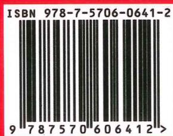  
定价：62.80元

# 勤学早练系列 大培优

# 数学七上

主编◎李志刚

长江出版传媒
湖北科学技术出版社

勤学早练

2025

# 大培优

DA PEI YOU ....

主编◎李志刚

natural_image

Abstract geometric illustration with overlapping colored triangles and a compass (no text or symbols)

数学

七年级上

长江出版传媒

湖北科学技术出版社

勤学早图书

微信公众号

# 大培优

# 数学

# 七上

主 编: 李志刚

编 委:陈一文 陈 浩 胡 芳 桂一鸣 袁 风

严丽丽 徐浩东 黄双艳 闵光敏 汪路

# 本书亮点

一、立足中考，助力学生上名校。  
二、旨在讲方法，讲思想，讲思维，培养能力。  
三、与课时同步,不同于其他培优类图书,更方便使用。  
四、经典题、改编题、原创题，层出不穷，题题精彩。  
五、拆分突破难点，及时追踪热点。  
六、例题图形简洁，题目清新，体系分明，难度合理。  
七、众多名师打造，懂中考，懂培优，更懂你！

一书在手,名高不愁!

# 目录

# CONTENTS

# 第一章 有理数

# 第 1 讲 有理数五大概念 …… 1

板块一 五大概念(1) 正数与负数 …… 1

板块二 五大概念(2)有理数 …… 2

板块三 五大概念(3) 数轴 …… 3

板块四 五大概念(4) 相反数 …… 4

板块五 五大概念(5) 绝对值 …… 5

# 第二章 有理数的运算

# 第2讲 有理数的四则运算 …… 7

板块一 有理数的加减(1) 加减运算 …… 7

板块二 有理数的加减(2) 分类讨论 …… 8

板块三 有理数与实际问题(1) 距离与路程 …… 9

板块四 有理数与实际问题(2) 盈余与不足 …… 10

板块五 有理数的乘除(1) 乘除运算 …… 11

板块六 有理数的乘除(2) 混合运算 …… 12

板块七 数形结合的应用(1) 符号推断 13

板块八 数形结合的应用(2) 多结论判断 …… 14

# 第 3 讲 有理数的乘方 …… 15

板块一 有理数的乘方(1) 乘方运算 …… 15

板块二 有理数的乘方(2) 乘方规律 …… 16

板块三 有理数的计算技巧(1) 对消与凑整 …… 18

板块四 有理数的计算技巧(2) 归类与组合 …… 19

板块五 有理数的计算技巧(3) 活用运算律 …… 20

板块六 有理数的计算技巧(4) 裂项与换元 …… 21

板块七 有理数的计算技巧(5) 错位相减 …… 22

板块八 相反数、绝对值、倒数与整体求值 23

板块九 与有理数有关的阅读理解与新定义 …… 24

# 第 4 讲 趣味非凡的绝对值 25

板块一 绝对值的意义(1) 代数视角 …… 25

板块二 绝对值的意义(2) 几何视角 26

板块三 绝对值的非负性 27

板块四 多绝对值处理(1) 分类讨论 28

板块五 多绝对值处理(2) 零点分段 29

板块六 多绝对值处理(3) 数形结合 31

# 第 5 讲 形形色色的最值 …… 32

板块一 多绝对值型最值(1) 32

板块二 多绝对值型最值(2) 33

# 第6讲 非同一般的数轴 34

板块一 数轴、距离与方程(1) 两点距离 …… 34  
板块二 数轴、距离与方程(2) 两点中点 …… 35  
板块三 数轴、距离与方程(3) 距离和差倍分 …… 36  
板块四 数轴、距离与方程(4) 方程思想 …… 38

# 第 7 讲 异彩纷呈的动点 39

板块一 数轴与动点(1) 点的平移 …… 39  
板块二 数轴与动点(2) 点的运动 40  
板块三 数轴与动点(3)行程问题 42  
板块四 数轴与动点(4) 和差倍分 44  
板块五 数轴与动点(5) 动点定值 45  
板块六 数轴与动点(6) 动线段 47  
板块七 数轴与动点(7) 挡板与往返 48

# 第三章 代数式

# 第 8 讲 列代数式 49

板块一 列代数式(1) 数量关系 49  
板块二 列代数式(2) 反比例关系 …… 51

# 第9讲 求代数式的值 53

# 第 10 讲 创新题型 …… 55

板块一 新情境 55  
板块二 综合与实践 56

# 第四章 整式的加减

# 第 11 讲 整式的加减 …… 57

板块一 合并同类项 57  
板块二 化简求值(1) 去单层括号 58  
板块三 化简求值(2) 去多层括号 59  
板块四 化简求值(3) 连环化简 60  
板块五 化简求值(4) 先求再化 61  
板块六 化简求值(5) 整体求值 62   
板块七 化简求值(6) 缺项无关 63   
板块八 化简绝对值(1) 64  
板块九 化简绝对值(2) 65

# 第 12 讲 整式加减的应用 …… 66

板块一 应用(1) 出入相补求面积 66  
板块二 应用(2) 精彩镶嵌影相随 67  
板块三 应用(3) 分段方案巧计费 68  
板块四 应用(4) 抽丝剥茧规律现 69   
板块五 应用(5)返璞归真话整除 71  
板块六 应用(6) 月历数阵探规律 …… 72  
板块七 应用(7) 纷繁变幻九宫格 73

# 第五章 一元一次方程

# 第 13 讲 从算式到方程 …… 74

板块一 深悟定义精解题 74  
板块二 理解性质巧运用 75

# 第 14 讲 一元一次方程的解法 …… 76

板块一 不偏不倚去括号 76

板块二 不遗不漏去分母 77

板块三 含参(绝对值)方程 78

# 第 15 讲 方程的解 …… 79

板块一 千变万化关联解 79

板块二 无解、定解、无数解 80

板块三 运算程序新定义 81

# 第 16 讲 实际问题与一元一次方程(一) 83

板块一 总分问题 83

板块二 年龄问题 84

板块三 盈亏问题 85

板块四 效率问题 86

板块五 数字问题 87

板块六 增长率问题 88

板块七 图形问题 89

# 第 17 讲 实际问题与一元一次方程(二) 90

板块一 行程问题 90

板块二 工程问题(1) 总工作量为 1 92

板块三 工程问题(2) 总工作量不为 1 93

板块四 配套问题 94

板块五 调配问题 95

板块六 利润问题 96

板块七 利润率问题 97

# 第 18 讲 实际问题与一元一次方程(三) 99

板块一 积分问题(1) 球赛积分 99

板块二 积分问题(2)答题积分 100

板块三 分段计费(1) 无需讨论 …… 101

板块四 分段计费(2)分段讨论 102

板块五 分段计费(3)促销优惠 104

板块六 分段计费(4) 乘车计费 …… 106

板块七 方案选择(1) 购物方案 …… 107

板块八 方案选择(2)会员消费 108

板块九 方案选择(3) 生产方案 …… 109

板块十 方案选择(4) 话费选择 …… 110

# 第六章 几何图形初步

# 第 19 讲 几何图形 …… 111

板块一 从不同方向看立体图形 …… 111

板块二 立体图形的展开图 113

板块三 点、线、面、体 115

# 第 20 讲 直线、射线、线段 116

板块一 直线、射线、线段的概念 116

板块二 线段的计算(1) 线段的和、差 118

板块三 线段的计算(2)线段的倍、分 119

板块四 线段的计算(3) 方程思想 …… 120

板块五 线段的计算(4) 整体思想 …… 121

板块六 线段的计算(5) 分类讨论 …… 122

板块七 线段的计算(6) 求线段比 …… 124

板块八 线段的计算(7) 多结论问题 …… 125

第 21 讲 线段常用模型 …… 126

板块一 单中点模型 …… 126

板块二 双中点模型(1) 相邻 …… 127

板块三 双中点模型(2) 相间 …… 129

第 22 讲 线段动点问题 …… 130

板块一 线段上的动点问题(1) 比值为定值 …… 130

板块二 线段上的动点问题(2) 和差为定值 …… 131

板块三 线段上的动点问题(3) 建立数轴 …… 132

板块四 数轴上线段动点问题(1) 求值 …… 133

板块五 数轴上线段动点问题(2) 定值 …… 134

第 23 讲 角的基本概念与运算 …… 135

板块一 角的有关概念及其表示法 …… 135

板块二 角的和、差 137

板块三 余角与补角 …… 139

板块四 角的多结论问题 …… 141

第 24 讲 角中常用数学思想 …… 142

板块一 方程思想 …… 142

板块二 整体思想 …… 144

板块三 分类讨论(1) 角的内外部 …… 145

板块四 分类讨论(2)角的外部 …… 146

板块五 分类讨论(3) $n$ 等分角 147

板块六 分类讨论(4)二次讨论 …… 148

第 25 讲 角中常用模型 …… 149

板块一 半角模型 …… 149

板块二 角叠角模型 …… 150

板块三 角夹角模型 151

板块四 单角平分线模型(1) 152

板块五 单角平分线模型(2) 153

板块六 双角平分线模型(1) 154

板块七 双角平分线模型(2) 155

第 26 讲 角的旋转 …… 156

板块一 角度关系 156

板块二 存在性问题 …… 157

板块三 行程问题 158

板块四 相遇问题 159

板块五 追及问题 160

板块六 平角突变 161

# 第一章 有理数

# 第1讲 有理数五大概念

# 板块一 五大概念(1) 正数与负数

# 典例精讲

# 题型一 认识正负数

【例 1】在 $0, -\frac{1}{7}, 0.3, 2\pi, -23\%$ , -2023 这六个数中，负数有（）

A. 2 个

B. 3 个

C. 4 个

D. 0 个

# 题型二 用正负数表示相反意义的量

【例 2】根据正负数的意义填空：

(1)若规定向东走为正,即向东走8m记为+8m,那么-6m表示\_\_\_\_;
(2)某公交车原坐有20人,经过3个站点时上下车情况如下(上车为正,下车为负):(−3,6),(5,-7),(-4,2),则车上还有\_\_\_\_人.

# 题型三 比较正负数及0的大小

【例 3】在 -2023, +5, 0, 0.01, $\frac{1}{2024}$ 中, 最小的数是 \_\_\_\_.

# 实战演练

1. 下列各数: 0.6, -3, +2, 10%, 0, -8, -1.2, + $\frac{3}{2}$ , π, - $\frac{1}{3}$ , 0.3.

(1)正数有\_\_\_\_； (2)负数有\_\_\_\_。

2. 某种食品保存的温度是 $(-10\pm2)$ ℃, 以下几个温度中, 不适合储存这种食品的是()

A. $-6^{\circ} \mathrm{C}$

B. $-8^{\circ} \mathrm{C}$

C. $-10^{\circ}\mathrm{C}$

D. $-12^{\circ} \mathrm{C}$

3. 大于 -1 且小于 3 的所有整数有( )

A. 1 个

B. 2 个

C. 3 个

D. 4 个

4. 想一想: 如果字母 a 表示一个有理数, 那么“-a”是正数还是负数呢?

# 板块二 五大概念(2) 有理数

# 典例精讲

# 题型一 有理数的概念及分类

【例 1】将下列各数按一定标准分类,再把它们填写在相应集合圈内:

$$
0.618, + 3.14,2024,10\%, 0, - 8, - 1.2, + 5, - \pi , - \frac{2}{3}.
$$

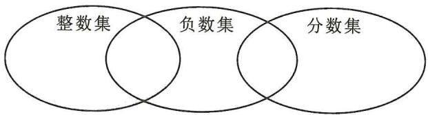

text_image

整数集
负数集
分数集

# 题型二 有理数与规律探究

【例 2】观察下列数后,找出规律,并填空:

1,-2,-3,4,5,-6,-7,8,\_\_\_\_,\_\_\_\_,…,\_\_\_\_(第2024个数).

【例 3】观察下面一列数: -1,2,-3,4,-5,6,-7,…,将这列数排成下图形式:

(1)按照上述规律排下去,第9行最右边的数是\_\_\_\_;   
(2)第10行从左向右数第10个数是\_\_\_\_；  
(3)2024 这个数是第 \_\_\_\_ 行从左往右数的第 \_\_\_\_ 个数.  
-1   
2 -3 4   
-5 6 -7 8 -9   
10 -11 12 -13 14 -15 16
...

# 实战演练

1. 请将下列各数: 0.6, -3, +2, 10%, 0, -8, -1.2, + $\frac{3}{2}$ , π, - $\frac{1}{3}$ , 0.3 填入相应的括号内.

(1)自然数{ }；(2)负整数{ }；  
(3)非负数{ }；(4)正分数{ }；  
(5)负分数{ }；(6)有理数{ }。

2. 观察下列数后, 找出规律, 并填空:

$-1, \frac{1}{2}, -\frac{1}{3}, \frac{1}{4}, -\frac{1}{5}, \frac{1}{6}, \_\_\_\_\_, \_\_\_\_\_, \cdots, \_\_\_\_\_\_(第 100 个数).$

3. 将一串正负数按如下规律排列, 回答下列问题.

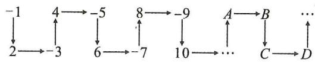

flowchart

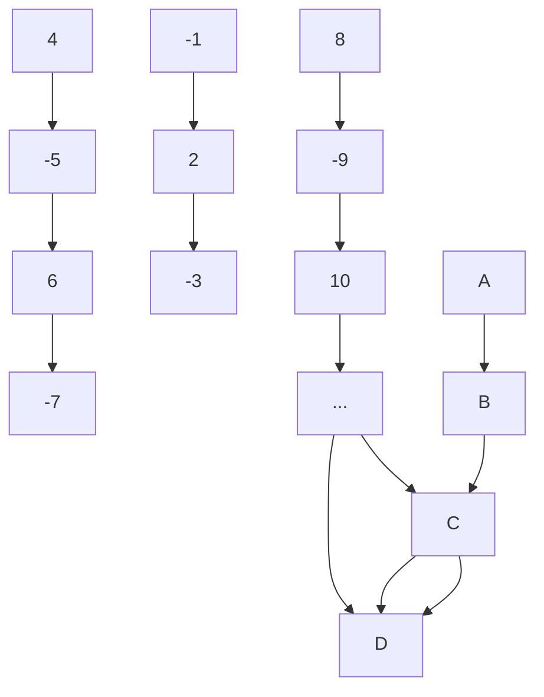

(1) 在 A 位置的数是正数还是负数?  
(2) $A, B, C, D$ 中哪些位置的数是负数？  
(3)第2046个数是正数还是负数？排在A,B,C,D中哪个位置？

# 板块三 五大概念(3) 数轴

# 典例精讲

# 题型一 数轴的理解与运用

【例 1】(1)在数轴上标出表示-3.5和1.5的点；

(2)在-3.5和1.5之间的整数有\_\_\_\_个；

(3) 观察数轴计算: 1.5 - (-3.5) = \_\_\_\_.

(4)数轴上点 A 表示的数是 -1, 点 B 与点 A 相距 3 个单位, 则点 B 表示的数是 \_\_\_\_.

(5)一个点在数轴上移动,先向左移5个单位长度,再向右移动3个单位长度,终点表示的数是-1,则起点表示的数是\_\_\_\_.

# 题型二 数轴与整数点问题

【例 2】一滴墨水洒在一个数轴上,根据图中标出的数值,判断墨迹盖住的整数点有\_\_\_\_个.

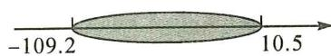

# 题型三 数轴与刻度尺问题

【例 3】如图,某同学用直尺画数轴,数轴上点 A,B 分别在直尺的 1 cm,9 cm 处,若点 A 对应 -4 , 直尺的 0 刻度位置对应 -6 , 则点 B 对应的数为 \_\_\_\_.

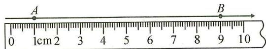

text_image

A
B
0 1cm 2 3 4 5 6 7 8 9 10

# 实战演练

1.(1)数轴上点 A 表示的数是 -2.5, 点 B 与点 A 相距 3.5 个单位长度, 则点 B 表示的数是 \_\_\_\_;

(2)若-a是正数,且数轴上表示数a的点到原点的距离是5个单位长度,则a=\_\_\_\_.

2. 下面的数轴被墨迹盖住一部分, 被盖住的整数有( )

A. 9 个

B. 10 个

C. 11 个

D. 12 个

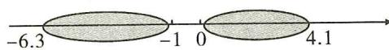

3. 将一个破损的刻度尺如图所示放在数轴上, 刻度尺上的“0 cm”和“3 cm”分别对应数轴上的一8和10, 则数轴上的数40对应刻度尺上的\_\_\_\_cm.

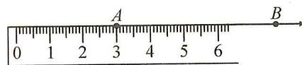

text_image

A
B
0 1 2 3 4 5 6

# 板块四 五大概念(4) 相反数

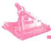

# 典例精讲

# 题型一 根据相反数的定义求相反数

【例 1】(1)2024 的相反数是 \_\_\_\_， $-\frac{1}{2}$ 的相反数是 \_\_\_\_，a 的相反数是 \_\_\_\_；

(2)一个数的相反数是它的本身,则这个数是\_\_\_\_.

# 题型二 根据相反数的定义化简多重符号

【例 2】化简：(1) $-(+8)=$ \_\_\_\_；(2) $-\{(-8)\}=$ \_\_\_\_.

# 题型三 根据相反数的定义求未知数的值

【例 3】若 7-2x 与 5-x 表示的数互为相反数, 求 x 的值.

# 题型四 根据相反数的几何意义比较大小

【例 4】数 a, b 在数轴上的对应点如图所示，则 a, b, -a, -b 的大小关系是( )

a 0 b

A. $-b < a < b < -a$

B. $a < -b < -a < b$

C. $a < -b < b < -a$

D. $-a < b < -b < a$

# 实战演练

1. 下面每组中的两个数互为相反数的是( )

A. $-\frac{1}{5}$ 和 5

B. $-(-2)$ 和 $-[-(+2)]$

C. $-(-8)$ 和 8

D. $-\left(-\frac{1}{3}\right)$ 和 $-0.\dot{3}$

2. -7 的相反数是\_\_\_\_，化简： $-\{-[-(+(-7))]$ = \_\_\_\_.

3. 若 x-1 与 2-y 互为相反数，则 y-x 的值为 \_\_\_\_.

4. 有理数 a 在数轴上对应的点如图所示, 则 a, -a, -1 的大小关系是( )

A. $-a < -1 < a$

B. $-a < a < -1$

a 0 1

C. $a < -1 < -a$

D. $-1 < a < -a$

5. 已知 $4a - 1$ 与 $-(a + 14)$ 互为相反数, 求 $a$ 的值.

6. 有理数 $a, b, c$ 在数轴上的位置如图所示, 请在数轴上标出 $-a, -b, -c$ , 试把 $a, b, c, -a, -b, -c$ 按从小到大的顺序排列起来.

c a 0 b

# 板块五 五大概念(5) 绝对值

<table><tr><td>1.绝对值的代数意义</td><td>2.绝对值的几何意义</td><td>3.去绝对值法则</td><td>4.绝对值的性质</td></tr><tr><td>正数的绝对值是它本身;负数的绝对值是它的相反数;0的绝对值是0.</td><td>数轴上表示数a的点与原点的距离,记作|a|.</td><td> $|a| = \begin{cases} a (a > 0), \\ 0 (a = 0), \\ -a (a < 0). \end{cases}$ </td><td>1 $|a| \geqslant 0$ ;2若 $|a| = -|a|$ ,则a=0;3若 $|a| + |b| = 0$ ,则a=0且b=0.</td></tr></table>

# 典例精讲

# 题型一 根据绝对值的代数意义求值

【例 1】(1)3 的绝对值是\_\_\_\_，-3 的绝对值是\_\_\_\_，0 的绝对值是\_\_\_\_；

(2)绝对值等于本身的数是\_\_\_\_；  
(3) $|-5|=$ \_\_\_\_; $-|-5|=$ \_\_\_\_.

# 题型二 根据绝对值的几何意义求值

【例 2】(1) $|x|=5$ ，则 x=\_\_\_\_； $|x-3|=1$ ，则 x=\_\_\_\_；

(2)已知 $|x|=2,|y-1|=3,x<y$ ，求x,y的值.

# 题型三 根据绝对值的几何意义比较大小

【例 3】比较大小：

(1)-6 3;

(2) $-\frac{1}{2}$ \_\_\_\_ $-\frac{2}{3}$ ;

(3) $|-2\ 023|$ \_\_\_\_ $|-2\ 024|$ ;

(4)-2023\_\_\_\_-2024.

# 题型四 根据去绝对值法则化简绝对值

【例 4】有理数 a, b, c 在数轴上的位置如图所示， $|a| = |b|$ ，化简： $|a| + |b| - |c| + 2a$ .

a c 0 b

# 题型五 根据绝对值的非负性求值

【例 5】已知 $\left|a+b\right|+2\left|b-3\right|=0$ ，求 $\left|a-b\right|$ 的值.

# 实战演练

1. 填空: (1) $|-3| =$ \_\_\_\_; (2) $|3 - \pi| =$ \_\_\_\_; (3) $|a - 5| (a > 5) =$ \_\_\_\_.

2. 若 $1 < |a| \leqslant 3$ 且 a 为整数，则 a 的值为 \_\_\_\_.

3. 下列各组数中, 互为相反数的一组是( )

A. $-|-3|$ 和 $-|+3|$

B. $-(-3)$ 和 $-|-3|$

C. $-(+3)$ 和 $-|+3|$

D. +(-3) 和 -(+3)

4. 如图, 有理数 $a, b$ 在数轴上的位置如图所示, 则下列结论正确的是 ( )

A. $|a| > |b|$

B. $\left| a\right|  >  - b$

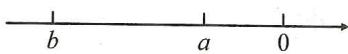

C. $b > a$

D. $|b| > - a$

5. 如图, 有理数 $a, b$ 在数轴上的位置如图所示, 下列判断一定成立的是 ( )

A. $|a| > |b|$

B. $|a| <   |b|$

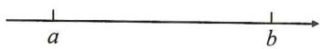

C. $-a > -b$

D. $-a < -b$

6. 已知 $a < 0, b > 0$ ，且 $|a| > |b|$ ，则 $a, b, -a, -b$ 的大小关系是（）

A. $b > - a > a > - b$

B. $-b>a>-a>b$

C. $a > - b > - a > b$

D. $-a > b > -b > a$

7. 下列结论: ① 若 $m = n$ , 则 $|m| = |n|$ ; ② 若 $m + n = 0$ , 则 $|m| = |n|$ ; ③ 若 $|m| = |n|$ , 则 $m = n$ ; ④ 若 $|m| = |n|$ , 则 $m = n$ 或 $m + n = 0$ . 其中一定正确的是 ( )

A. ①②③④

B. ①④

C. ②③

D. ①②④

8.(1)已知 $|1-x|=5$ ,则x=\_\_\_\_;

(2)已知 $|a+1|=2,|b-1|=5,a>b$ ，求 $|a|+|b|$ 的值.

9. 已知 $\left|a-2\right|+\left|b-3\right|+\left|c-5\right|=0$ ，求 $3a+2b-c$ 的值.

10. 已知 $\left|x+2\right|$ 与 $\left|y-5\right|$ 互为相反数，求 $2\left|x-y\right|$ 的值.

# 第二章 有理数的运算

# 第2讲 有理数的四则运算

# 板块一 有理数的加减(1) 加减运算

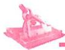

# 典例精讲

# 题型一 基本计算

【例 1】填空：

(1) $(+5) + (+3) =$   
(3) $5+(-3)=$ \_\_\_\_;   
(5) $5-(+3)=$ \_\_\_\_;   
(7) $5-(-3)=$ \_\_\_\_;   
(9) $0+(-3)=$ \_\_\_\_;

(2) $(-5)+(-3)=$ \_\_\_\_;   
(4) $(-5)+3=$ \_\_\_\_;   
(6)-5-(-3)=\_\_\_\_;   
(8)-5-3=\_\_\_\_;   
(10) $0-(-3)=$ \_\_\_\_.

有理数加减法法则口诀：
先定符号，再计算，
同号相加不变号；
异号相加“大”减“小”，
符号跟着“大数”跑；
减负加正不混淆.

【例 2】计算：

(1) $23+(-17)+6+(-22)$ ;

(2) $\left(-4\frac{7}{8}\right)-\left(-5\frac{1}{2}\right)+\left(-4\frac{1}{4}\right)-\left(+3\frac{1}{8}\right).$

# 题型二 简便计算

【例 3】计算：

(1) $-2.4+(-3.7)+(-4.6)+5.7;$

(2) $3\frac{1}{4}+\left(-2\frac{3}{5}\right)+5\frac{3}{4}+\left(-8\frac{2}{5}\right).$

# 实战演练

1. 计算：

(1) $(-2.6)-(+4.7)-(-9.8)+(-3.2)$ ;

(2) $-\left(-\frac{1}{2}\right)-5+\left(-\frac{1}{3}\right)-\left(+\frac{1}{4}\right).$

2. 计算：

(1) $16+(-25)+24+(-35)$ ;

(2) $(-2)+3+1+(-3)+2+(-4).$

3. 计算：

(1) $9\frac{7}{8}+\left(-2\frac{3}{5}\right)+5\frac{3}{5}+\left(-9\frac{7}{8}\right)+(-3)$ ;

(2) $\frac{1}{1 \times 3} + \frac{1}{3 \times 5} + \frac{1}{5 \times 7} + \cdots + \frac{1}{99 \times 101}$ .

# 板块二 有理数的加减(2) 分类讨论

# 典例精讲

# 题型 加减运算与分类讨论

【例 1】(1) 已知 $\left|x\right|=8, y=6, x+y<0$ ，求 $x+y$ 的值；

(2)已知 $x = 8,|y| = 6,x + y > 0$ ，求 $x + y$ 的值：  
(3)已知 $|x|=8,|y|=6,x+y<0$ ,求 $x+y$ 的值.

【例 2】(1) 已知 $\left|x\right|=2, \left|y\right|=3$ ，且 x<0, y>0，则 $x+y$ 的值为 \_\_\_\_；

(2)已知 $|x|=3,|y|=6$ ，且x>y，则 $x+y$ 的值为  
(3)已知 $|a|=2,|b|=5$ ，且a<b，则a-b的值为  
(4)已知 $|x|=8,|y|=3$ ，且 $|x+y|=x+y$ ，则 $x+y$ 的值为  
(5)已知 $|a|=2,|b|=3$ ，且 $|a-b|=b-a$ ，则 $a+b$ 的值为

# 实战演练

1.(1)已知 $|a|=5,|b|=7$ ，且 $|a+b|=a+b$ ，则a-b的值为  
(2)已知 $|a|=9,|b|=10$ ，且 $|a+b|\neq a+b$ ，则a-b的值为\_\_\_\_。  
(3)已知 $|a|=1,|b|=2,|c|=3$ ，且a>b>c，则 $a+b-c$ 的值为

2. 已知 $|a| = 4, |b| = 2$ ，且 $|a + b| = |a| + |b|$ ，求 $a - b$ 的值。

3. 已知 $\left|a\right|=2,\left|b\right|=3,\left|c\right|=5$ ，且 $\left|a+b\right|=a+b,\left|a+c\right|=-\left(a+c\right)$ ，求 $a+(-b)+(-c)$ 的值.

# 板块三 有理数与实际问题(1) 距离与路程

# 典例精讲

【例】一名足球守门员练习折返跑,从球门线出发,向前记作正数,返回记作负数,他的记录如下:(单位:米)+5,-3,+10,-8,-6,+12,-10.

(1)守门员最后是否回到了球门线的位置?  
(2)在练习过程中,守门员离开球门线最远距离是多少米?   
(3)守门员全部练习结束后,他共跑了多少米?

# 实战演练

1. 在抗洪抢险中, 解放军战士的冲锋舟加满油沿东西方向的河流抢救灾民, 早晨从 $A$ 地出发, 晚上到达 $B$ 地, 约定向东为正方向, 当天的航行路程记录如下 (单位: 千米): +14, -9, +8, -7, +13, -6, +12, -5.

(1)请你帮忙确定 B 地相对于 A 地的方位?  
(2) 救灾过程中, 冲锋舟离出发点 A 最远处有多远?  
(3)若冲锋舟每千米耗油0.5升,油箱容量为28升,求冲锋舟当天至少还需补充多少升油?

2. 出租车司机小李某日下午 2 点驾车离开车库开始营运, 其营运全是在东西走向的人民大街上进行的. 如果规定向东为正, 向西为负, 他这天下午的行车里程 (单位: km) 如下:

+15,-2,+5,-1,-10,+3,-2,+12.下午4点30分小李因其他事情提前结束营运返回车库.

(1)若汽车耗油量为0.1 L/km,这天下午小李营运后返回车库一共耗油多少?   
(2)出租车按物价部门规定,起步价(不超过3 km)10元,超过3 km每千米加价2元,油价为7元/升,这天下午小李的盈利是多少元?

# 板块四 有理数与实际问题(2) 盈余与不足

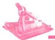

# 典例精讲

【例】甲、乙两商场上半年经营情况如下(“+”表示盈利,“-”表示亏本,以百万为单位)

<table><tr><td>月份</td><td>一</td><td>二</td><td>三</td><td>四</td><td>五</td><td>六</td></tr><tr><td>甲商场</td><td>+0.8</td><td>+0.6</td><td>-0.4</td><td>-0.1</td><td>+0.1</td><td>+0.2</td></tr><tr><td>乙商场</td><td>+1.3</td><td>+1.5</td><td>-0.6</td><td>-0.1</td><td>+0.4</td><td>-0.1</td></tr></table>

(1)三月份乙商场比甲商场多亏损多少元?

(2)六月份甲商场比乙商场多盈利多少元?

(3)甲、乙两商场上半年平均每月分别盈利或亏损多少元?

# 实战演练

某粮库原有大米 132 吨,一周内该粮库大米的进出情况如表:(运进大米记作“+”,运出大米记作“-”).

<table><tr><td>星期一</td><td>星期二</td><td>星期三</td><td>星期四</td><td>星期五</td><td>星期六</td><td>星期日</td></tr><tr><td>-32</td><td>+26</td><td>-23</td><td>-16</td><td>m</td><td>+42</td><td>-21</td></tr></table>

(1)若经过这一周,该粮库存有大米88吨,求m的值,并说明星期五该粮库是运进还是运出大米,运进或运出大米多少吨?

(2)若大米进出库的装卸费用为每吨25元,求这一周该粮库需要支付的装卸总费用.

# 板块五 有理数的乘除(1) 乘除运算

# 典例精讲

# 题型一 基本计算

【例 1】填空：

(1) $(-3)\times(-4)=$ \_\_\_\_;

(2) $3 \times (-8) =$ \_\_\_\_;

(3) $\left(-\frac{1}{3}\right)\times\left(-\frac{1}{5}\right)=$ \_\_\_\_；

(4) $0 \times \left(-\frac{6}{7}\right)=$ \_\_\_\_；

(5)0.25÷ $\left(-\frac{3}{8}\right)=$ \_\_\_\_；

(6) $-1\frac{3}{4}\div\left(-1\frac{1}{6}\right)=$ \_\_\_\_.

有理数乘除法法则：

同号得\_\_\_\_，异号得\_\_\_\_，

再把绝对值相乘（除）；

先定符号，再定积；

带化假来，除化乘.

(带化假：带分数化假分数)

【例 2】计算：

(1) $\left(-4\frac{2}{3}\right)\times\left(-2\frac{1}{3}\right)\times\left(-1\frac{2}{7}\right);$

(2) $-5\div\left(-1\frac{2}{7}\right)\times\frac{4}{5}\times\left(-2\frac{1}{4}\right)\div7.$

# 题型二 简便计算

【例 3】运算律的运用：

(1) $0.25 \times (-1.25) \times (-4) \times 8;$

(2) $(-24)\times\left(\frac{1}{3}-\frac{1}{4}-\frac{1}{6}\right)$ ;

(3) $(-125)\div\left(-\frac{3}{7}\right)+62\div\frac{3}{7}+187\div\left(-\frac{3}{7}\right);$

(4) $\left(-125\frac{5}{7}\right)\div(-5).$

# 实战演练

1. 计算：

(1) $-2\times3\times(-4)$ ;

(2) $-6\times(-5)\times(-7)$ ;

(3) $(-7)\times (-56)\times 0\div (-13)$ .

2. 计算：

(1) $(-3)\div3\times\left(-\frac{1}{3}\right);$

(2) $-9\times(-11)\div3\div(-3)$ ;

(3) $\left(-\frac{3}{4}\right)\times\left(-1\frac{1}{2}\right)\div\left(-2\frac{1}{4}\right).$

3. 计算：

(1) $-22\times(-0.25)\div2\frac{3}{4};$

(2) $\left(-36\frac{9}{11}\right)\div9;$

(3) $\left(-1\frac{5}{6}+3\frac{1}{8}\right)\div\left(-\frac{1}{24}\right).$

# 板块六 有理数的乘除(2) 混合运算

# 典例精讲

【例 1】计算：

(1) $(-5)\times3-(+7)\times[-2]-(-8)$ ;

(2) $-(-8)\div(-2)+[3\times(-8)-(-2)\times7]\div(-5)$ ;

(3) $-5-\left[-6-(-3)\times(-7)\right]$ ;

(4) $1\div\left(1\frac{1}{6}-8\frac{3}{4}\times\frac{2}{7}\right)+\frac{7}{18}\div\frac{14}{27}.$

【例 2】计算：

(1) $-8-\left[-7+\left(1-\frac{2}{3}\times0.6\right)\div(-3)\right]$ ;

(2) $\left(-24\frac{6}{7}\right)\div(-6)-3.5\div\frac{7}{8}\times\left(-\frac{3}{4}\right).$

# 实战演练

1. 计算：

(1) $23 \times (-5) - (-3) \div \frac{3}{128}$ ;

(2) $-13\times\frac{2}{3}-0.34\times\frac{2}{7}+(-13)\times\frac{1}{3}-\frac{5}{7}\times0.34.$

2. 计算：

(1) $\left(1\frac{1}{2}+1\frac{1}{6}-1\frac{1}{12}\right)\div\left(-\frac{1}{12}\right);$

(2) $99 \times \left(-99 \frac{98}{99}\right)$ .

# 板块七 数形结合的应用(1) 符号推断

<table><tr><td>a,b</td><td>a+b</td><td>a-b</td><td>ab与 $\frac{a}{b}$ </td></tr><tr><td>观察点在数轴上的位置</td><td>正+正为正,负+负为负,异号相加取绝对值较大数的符号</td><td>大减小为正;小减大为负</td><td>同号得正,异号得负</td></tr></table>

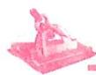

# 典例精讲

# 题型一 利用数轴判断符号

【例 1】有理数 a, b 在数轴上的位置如图所示, 下列各式正确的是()

A. ${ab} > 0$

B. $a + b > 0$

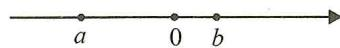

C. $a - b > 0$

D. $b - a > 0$

【例 2】点 M, N, P 和原点 O 在数轴上的位置如图所示, 有理数 a, b, c 各自对应着 M, N, P 三个点中的某一点, 且 ab < 0, a + b > 0, a > b, 那么表示数 b 的点为( )

A. 点 M

B. 点 $N$

C. 点 $P$

D. 无法确定

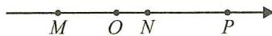

# 题型二 先判断符号,再求值

【例 3】(1) 已知 $\left|x\right|=8,\left|y\right|=6$ ，且 xy>0，则 x-y 的值为 \_\_\_\_；

(2)已知 $|a+1|=2,|b-2|=3$ ，且ab<0，则 $\frac{a}{b}$ 的值是\_\_\_\_。

# 实战演练

1. 已知 $a + b > 0$ ，且 $a(b - 1) < 0$ ，则下列说法一定错误的是（）

A. $a > 0, b > 1$

B. $a < -1, b > 1$

C. -1 < a < 0, b > 1

D. a<0, b>0

2. 如图, 数轴上 A, B, C 三点所表示的数分别为 a, b, c, 满足 $a + b - c = 0$ , 且 AB = BC. 那么下列结论正确的是()

A. $a + c < 0$

B. ${ac} > 0$

C. ${bc} < 0$

D. ${ab} < 0$

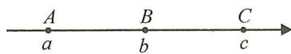

3. 有理数 a, b 在数轴上对应的点的位置如图所示, 则下列结论错误的是()

A. $|a| < |b|$

B. $-a < b$

C. $a - b <   0$

D. $(a+1)(b-1)<0$

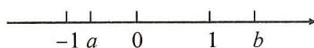

4.(1)已知 $|x|=3,|y|=5$ ,且xy<0,则x-y的值是\_\_\_\_.

(2)已知 $|x|=4,|y|=\frac{1}{2}$ ，且 $x+y>0$ ，则 $\frac{x}{y}$ 的值是\_\_\_\_.

# 板块八 数形结合的应用(2) 多结论判断

# 典例精讲

# 题型一 利用数轴判断

【例 1】有理数 a, b 在数轴上的对应点如图所示, 下列式子: ① a < 0 < b; ② $|a| < |b|$ ; ③ ab > 0; ④ $\frac{b}{a} > 0$ ; ⑤ $b - a > a + b$ ; ⑥ $|a - b| + a = b$ . 其中结论正确的有()

A. 2 个

B. 3 个

C. 4 个

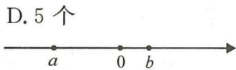

# 题型二 利用绝对值的性质判断

【例 2】已知 a, b 为有理数, 下列说法: ① 若 a, b 互为相反数, 则 $\frac{a}{b} = -1$ ; ② 若 $|a - 4| > 1$ , 则 a > 5; ③ 若 $|a - b| + a - b = 0$ , 则 b > a; ④ 若 $|a| > |b|$ , 则 b < |a|. 其中正确的结论有()

A. 1 个

B. 2 个

C. 3 个

D. 4 个

# 实战演练

1. 如图, 数轴上点 $A, B, C$ 分别表示数 $a, b, c, |a| < |b|$ . 有下列结论: ① $a + b > 0$ ; ② $abc < 0$ ; ③ $a - c < 0$ ; ④ $-1 < \frac{a}{b} < 0$ . 则其中正确结论的序号是 ( )

A. ①②

B. ②③

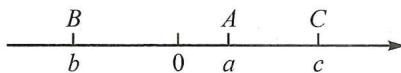

C. ②③④

D. ①③④

2. 如图, 数轴上 $A, B$ 两点所表示的数分别为 $a, b$ . 下列各式: ① $(a - 1)(b - 1) > 0$ ; ② $(a - 1)(b + 1) > 0$ ; ③ $(a + 1)(b + 1) > 0$ . 其中正确式子的序号是 \_\_\_\_.

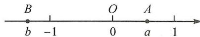

# 第3讲 有理数的乘方

# 板块一 有理数的乘方(1) 乘方运算

# 典例精讲

# 题型一 基本计算

【例 1】填空：

(1) $2^{4}=$ \_\_\_\_;

(2) $(-2)^{4}=$ \_\_\_\_;

(3) $-2^{4}=$ \_\_\_\_;

(4) $(-1)^{2022}=$ \_\_\_\_;

(5) $-1^{2022}=$ \_\_\_\_;

(6) $-(-1)^{2022}=$ \_\_\_\_.

【例 2】下列各式正确的个数是( )

① $(-2)^{2}=-2^{2}$ ;

② $(-2)^{2}=2^{2}$ ;

③ $-2^{2}=2^{2}$ ;

④ $(-2)^{3}=2^{3}$ ;

⑤ $(-2)^{3}=-2^{3}.$

A. 1 个

B. 2 个

C. 3 个

D. 4 个

# 题型二 混合运算

【例 3】计算：

(1) $-2^{2}+(-2)^{3}\times5-\left(-\frac{3}{4}\right)\div\frac{1}{4};$

(2) $(-3)^{2} + \left(-2 - \frac{1}{2}\right)^{2} \times \left(-\frac{4}{25}\right) + | - 2^{2}|$ ;

(3) $-2^{2}+(-2)^{2}-2^{3}+|(-2)^{3}-2|$ ;

(4) $-1^{4}-(1-0.5)\times\frac{1}{3}\times[2-(-3)^{2}]$ .

# 实战演练

1. 对任意有理数 a，下列式子不成立的是（）

A. $a^2 = (-a)^2$

B. $(-a)^{3}=-a^{3}$

C. $\left| -a \right|^3 = a^3$

D. $\left| -a^{2} \right| = a^{2}$

2. 填空: (1) $(-3)^{2}=$ \_\_\_\_; (2) $(-3)^{3}=$ \_\_\_\_; (3) $-(-3)^{2}=$ \_\_\_\_.

3. 计算：

(1) $(-2)^{2}\times5-(-2)^{3}\div4;$

(2) $3 \times (-2)^{3} - 4 \times (-3)^{2} + 8;$

(3) $-3^{2}+\left(-2\frac{1}{2}\right)^{2}\times\left(-\frac{4}{25}\right)+|-2|^{2};$

(4) $(-1)^{3}-\frac{1}{5}\times[4-(-3)^{2}]$ .

# 板块二 有理数的乘方(2) 乘方规律

# 典例精讲

【例 1】观察下面的三个数列：

$$
\begin{array}{l} 2, \quad - 4, \quad 8, \quad - 1 6, \quad 3 2, \quad - 6 4, \quad \dots ; \quad ① \\ 4, \quad - 2, \quad 1 0, \quad - 1 4, \quad 3 4, \quad - 6 2, \quad \dots ; (②) \\ 1, \quad - 2, \quad 4, \quad - 8, \quad 1 6, \quad - 3 2, \quad \dots . (③) \\ \end{array}
$$

(1)第①行第8个数为\_\_\_\_；第②行第8个数为\_\_\_\_；第③行第8个数为\_\_\_\_；

(2)第③行中是否存在连续的三个数,使其和为-768?若存在,求出这三个数;若不存在,请说明理由;

(3)是否存在这样的一列数,使其中三个数的和为-2558?若存在,求出这三个数;若不存在,请说明理由.

【例 2】观察下面三行数：

$$
\begin{array}{l} ① 2, \quad - 4, \quad 8, \quad - 1 6, \quad 3 2, \quad - 6 4, \quad \dots ; \\ ② 3, \quad - 3, \quad 9, \quad - 1 5, \quad 3 3, \quad - 6 3, \quad \dots ; \\ ③ - 1, \quad 2, \quad - 4, \quad 8, \quad - 1 6, \quad 3 2, \quad \dots . \\ \end{array}
$$

取每一行的第 n 个数, 依次记为 x, y, z. 如上图中, 当 n=2 时, x=-4, y=-3, z=2.

(1) 当 n=7 时, 请直接写出 x, y, z 的值, 并求这三个数中最大的数与最小的数的差;  
(2)已知 n 为偶数,且 x,y,z 这三个数中最大的数与最小的数的差为 384,求 n 的值;  
(3) 若 $m = x + y + z$ ，则 x, y, z 这三个数中最大的数与最小的数的差为 \_\_\_\_（用含 m 的式子表示）.

# 实战演练

1. 观察下面三行数：

$$
\begin{array}{l} - 3, \quad 9, \quad - 2 7, \quad 8 1, \quad \dots ; ① \\ 1, \quad - 3, \quad 9, \quad - 2 7, \quad \dots ; ② \\ - 2, \quad 1 0, \quad - 2 6, \quad 8 2, \quad \dots . \tag {③} \\ \end{array}
$$

(1)第①行数按什么规律排列?  
(2)第②③行数与第①行数分别有什么关系?  
(3)设 x, y, z 分别为第①②③行的第 2024 个数，求 $x + 6y + z$ 的值.

2. 观察下面三行数：

$$
\begin{array}{l} 2, \quad - 4, \quad 8, \quad - 1 6, \quad 3 2, \quad - 6 4, \quad \dots ; ① \\ 4, \quad - 2, \quad 1 0, \quad - 1 4, \quad 3 4, \quad - 6 2, \quad \dots ; ② \\ 1, \quad - 2, \quad 4, \quad - 8, \quad 1 6, \quad - 3 2, \quad \dots . \tag {③} \\ \end{array}
$$

如图,在上面的数据中,用一个长方形圈出同一列的三个数,这列的第一个数表示为a,其余各数分别用b,c表示.

(1)若这三个数分别在这三行数的第 n 列,请用含 n 的式子分别表示 a, b, c 的值.

$$
a = \quad , b = \quad , c = \quad ;
$$

(2) 若 a 记为 x，求 a, b, c 这三个数的和（结果用含 x 的式子表示并化简）.

<table><tr><td>a</td></tr><tr><td>b</td></tr><tr><td>c</td></tr></table>

# 板块三 有理数的计算技巧(1) 对消与凑整

方法技巧: 将相加得零的数结合计算, 将和为整数的数结合计算

# 典例精讲

【例 1】计算：

(1) $8+(-4)+6+4+12+(-8)+(-2)$ ;

(2)36.54+22.57+63.46+(-10.57).

【例 2】计算：

(1) $1\frac{1}{2}-1\frac{1}{4}+3\frac{3}{4}-0.25-3.75-4.5;$

(2) $12\frac{1}{4}-(+1.75)-\left(-5\frac{1}{2}\right)+(-7.25)-\left(-2\frac{3}{4}\right)-2.5.$

# 实战演练

计算：

(1) $\frac{5}{17}-(+9)-12-\left(-\frac{12}{17}\right)$ ;

(2) $4.25 + (-2.18) - (-2.75) + 5.18;$

(3) $\frac{5}{6} + \left(-\frac{3}{4}\right) - |-0.25| - \left(-\frac{1}{6}\right)$ ;

(4) $|-16.2|+|-2\frac{1}{3}|+\left[-(-3\frac{2}{3})\right]-|10.7|$ .

# 板块四 有理数的计算技巧(2) 归类与组合

# 典例精讲

将同类数(如正数或负数)归类计算,将相反数、分母相同或易于通分的数结合计算

【例】计算：

$$
(1) 1 6 + (- 2 5) + 2 4 + (- 3 5);
$$

$$
(2) \left(+ 2 \frac {1}{6}\right) - \left(+ 2 \frac {2}{9}\right) - \left(+ 5 \frac {1}{6}\right) - \left(+ 4 \frac {7}{9}\right);
$$

$$
- 5 \frac {5}{2 4} + 6 \frac {7}{1 5} + \left(- 1 0 \frac {7}{2 4}\right) - 2 \frac {2}{1 5} + \left(- \frac {1}{3}\right);
$$

$$
1. 7 5 + \left(- 6 \frac {1}{2}\right) + 3 \frac {3}{8} + \left(- 1 \frac {3}{4}\right) + 2 \frac {5}{8}. \tag {4}
$$

# 实战演练

计算：

$$
(1) (- 5) + (- 2) + (+ 9) - (- 8);
$$

$$
(2) 0. 8 5 + (+ 0. 7 5) - \left(+ 2 \frac {3}{4}\right) + (- 1. 8 5) + (+ 3);
$$

$$
\left(- 1 \frac {1}{2}\right) + \left(+ 1 \frac {1}{4}\right) + \left(- 2 \frac {1}{2}\right) - \left(- 3 \frac {1}{4}\right) - \left(+ 1 \frac {1}{4}\right); \tag {3}
$$

$$
(4) (- 3. 5) + \left(- \frac {4}{3}\right) + \left(- \frac {3}{4}\right) + \left(+ \frac {7}{2}\right) + 0. 7 5 + \left(- \frac {7}{3}\right).
$$

# 板块五 有理数的计算技巧(3) 活用运算律

# 典例精讲

运用运算律改变运算顺序,正难则反,利用运算律改变次序,将复杂的数拆开来算

【例】(1) $\left(1\frac{3}{5}-\frac{8}{9}-\frac{8}{15}\right)\times\left(-1\frac{7}{8}\right)$ ;

(2) $\left(-133\frac{7}{9}\right)\div(-7)$ ;

(3) $(-128)\div\left(-\frac{3}{7}\right)+62\div\frac{3}{7}+187\div\left(-\frac{3}{7}\right);$

(4) $-7 \times \frac{6}{5} + (-8) \times \frac{6}{5} - (-5) \times \left(-\frac{6}{5}\right)$ .

# 实战演练

计算：

(1) $\frac{3}{7}\times\left(-\frac{4}{5}\right)\times\frac{7}{12}\times\frac{5}{8};$

(2)99 $\frac{71}{72} \times (-36)$ ;

(3) $0.7 \times 1 \frac{4}{9} - 15 \times 2 \frac{3}{4} + \frac{5}{9} \times 0.7 - \frac{1}{4} \times 15$ ;

(4) $\left(-\frac{1}{42}\right)\div\left(\frac{1}{6}-\frac{3}{14}+\frac{2}{3}-\frac{2}{7}\right).$

# 板块六 有理数的计算技巧(4) 裂项与换元

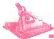

# 典例精讲

# 题型一 裂项相消

常见的裂项一般是将一项拆分成两项或多项的和或差,使拆分后的项可前后抵消或凑整,其中分数的裂项是重点.

【例 1】计算： $\frac{1}{2\times4}+\frac{1}{4\times6}+\frac{1}{6\times8}+\cdots+\frac{1}{2022\times2024}$

# 题型二 换元法

【例 2】计算: $\left(\frac{1}{2}+\frac{1}{3}+\cdots+\frac{1}{2024}\right)\left(1+\frac{1}{2}+\frac{1}{3}+\cdots+\frac{1}{2023}\right)-\left(1+\frac{1}{2}+\frac{1}{3}+\cdots+\frac{1}{2024}\right)$ $\left(\frac{1}{2}+\frac{1}{3}+\cdots+\frac{1}{2023}\right)$ .

# 实战演练

1. 计算: $1 + \frac{1}{1 + 2} + \frac{1}{1 + 2 + 3} + \cdots + \frac{1}{1 + 2 + \cdots + 100}$ .

2. 计算: $\left(1 - \frac{1}{2} - \frac{1}{3} - \frac{1}{4} - \frac{1}{5}\right)\left(\frac{1}{2} + \frac{1}{3} + \frac{1}{4} + \frac{1}{5} + \frac{1}{6}\right) - \left(1 - \frac{1}{2} - \frac{1}{3} - \frac{1}{4} - \frac{1}{5} - \frac{1}{6}\right)\left(\frac{1}{2} + \frac{1}{3} + \frac{1}{4} + \frac{1}{5}\right)$ .

# 板块七 有理数的计算技巧(5) 错位相减

# 典例精讲

【例】(1)①观察一列数 1,2,3,4,5,…,发现从第二项开始,每一项与前一项之差是 1;根据此规律,如果 $a_{n}$ (n 为正整数) 表示这个数列的第 n 项,那么 $a_{18}=$ \_\_\_\_ , $a_{n}=$ \_\_\_\_ ;

②如果欲求 $1+2+3+4+\cdots+n$ 的值, 可令 $S=1+2+3+4+\cdots+n$ ①

将①式右边顺序倒置,得 $S=n+\cdots+4+3+2+1$ ②

由②加上①式, 得 2S=\_\_\_\_, ∴S=\_\_\_\_,

由结论求 $1+2+3+4+\cdots+55=$ \_\_\_\_；

(2)为了求 $1 + 3 + 3^{2} + 3^{3} + \dots +3^{100}$ 的值，可令 $M = 1 + 3 + 3^{2} + 3^{3} + \dots +3^{100}$ ，则 $3M = 3+$ $3^{2} + 3^{3} + \dots +3^{101}$ ，因此 $3M - M = 3^{101} - 1$ ，所以 $M = \frac{3^{101} - 1}{2}$ 即 $1 + 3 + 3^{2} + 3^{3} + \dots +3^{100} =$ $\frac{3^{101} - 1}{2}$ .仿照以上推理，计算： $1 + 5 + 5^{2} + 5^{3} + \dots +5^{51}$

# 实战演练

我们把从 1 开始到 n 的 n 个连续自然数的立方和记作 $S_{n}$ ，那么有：

$$
S _ {1} = 1 ^ {3} = 1 ^ {2} = \left[ \frac {1 \times (1 + 1)}{2} \right] ^ {2}, S _ {2} = 1 ^ {3} + 2 ^ {3} = (1 + 2) ^ {2} = \left[ \frac {2 \times (1 + 2)}{2} \right] ^ {2},
$$

$$
S _ {3} = 1 ^ {3} + 2 ^ {3} + 3 ^ {3} = (1 + 2 + 3) ^ {2} = \left[ \frac {3 \times (1 + 3)}{2} \right] ^ {2}, \dots
$$

观察上面式子的规律,完成下面各题:

(1)猜想: $S_{n}=$ \_\_\_\_ (用 n 表示);

(2)依规律,直接写出 $1^{3}+2^{3}+3^{3}+\cdots+10^{3}=$ \_\_\_\_；

(3)依规律,求 $11^{3}+12^{3}+13^{3}+\cdots+40^{3}$ 的值.

# 板块八 相反数、绝对值、倒数与整体求值

# 典例精讲

【例 1】若 a, b 互为相反数, c, d 互为倒数, m 的绝对值为 2. 求 $m + cd + \frac{a + b}{m}$ 的值.

【例 2】已知 a, b 互为相反数，且 $a \neq 0, c, d$ 互为倒数，m 的绝对值等于 3，求 $\frac{2023(a+b)^{2}}{2024}-m^{2}+\frac{4a}{b}-3cd$ 的值.

# 实战演练

1. 已知 $a, b$ 互为相反数, $c, d$ 互为倒数, $|x - 1| = 2$ , 求 $\frac{cd}{x} + (a + b)x - |x|$ 的值.

2. 已知 $a, b$ 互为相反数, $c, d$ 互为倒数, $m$ 是绝对值最小的数, 且 $(x - 1)^2 + |y - 2| = 0$ . 求 $5a + 2b + 3cdb + xy + \frac{m}{4cd}$ 的值.

# 板块九 与有理数有关的阅读理解与新定义

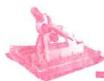

# 典例精讲

# 题型一 阅读理解

【例】我们常用的数是十进制数,如 $4657 = 4 \times 10^{3} + 6 \times 10^{2} + 5 \times 10^{1} + 7 \times 10^{0}$ , 数要用 10 个数码(又叫数字): 0, 1, 2, 3, 4, 5, 6, 7, 8, 9; 在电子计算机中用的是二进制, 只要两个数码: 0 和 1, 如二进制中 $110 = 1 \times 2^{2} + 1 \times 2^{1} + 0 \times 2^{0} = 6$ , 即等于十进制的数 6, $110101 = 1 \times 2^{5} + 1 \times 2^{4} + 0 \times 2^{3} + 1 \times 2^{2} + 0 \times 2^{1} + 1 \times 2^{0} = 53$ , 即等于十进制的数 53. 计算二进制中的数 101011 等于十进制中的哪个数?

# 实战演练

# 题型二 定义新运算

1. 我们已经学习过“乘方”和“开方”运算, 下面给同学们介绍一种新的运算, 即对数运算.
定义: 如果 $a^{b}=N (a>0, a \neq 1, N>0)$ ，则 b 叫做以 a 为底 N 的对数，记作 $\log_{a}N=b$ .
例如：因为 $5^{3}=125$ ，所以 $\log_{5}125=3$ ；因为 $11^{2}=121$ ，所以 $\log_{11}121=2$ 。

(1) 填空: $\log_{6}6=$ \_\_\_\_ , $\log_{3}81=$ \_\_\_\_ ;

(2) 如果 $\log_{2}(m-2)=3$ ，求 m 的值.

2. 定义: 在数轴上, 若 M, N 两点到原点的距离之和等于点 P 到原点的距离, 则称点 P 为 M, N 两点的“和距点”. 例如, 数轴上, 表示 5 的点是表示 2, 3 的点的“和距点”; 表示 $-\frac{5}{6}$ 的点是表示 $-\frac{1}{3}, \frac{1}{2}$ 的点的“和距点”.

已知数轴上 A, B, C 三点表示的数分别是 a, b, -6，点 C 为 A, B 两点的“和距点”.

(1)如果 a = -3，点 B 在原点右侧，则 b = \_\_\_\_；  
(2)若点 A 也是 B, C 两点的“和距点”, 请确定 b 的值, 并说明理由.

# 第4讲 趣味非凡的绝对值

# 板块一 绝对值的意义(1) 代数视角

<table><tr><td>绝对值的代数意义:(去绝对值法则): $|a| = \begin{cases} a (a > 0), \\ 0 (a = 0), \\ -a (a < 0). \end{cases}$ </td><td> $|\text{非负}| = \text{本身};$  $|\text{非正}| = \text{相反数}.$ </td><td>变式结论:1若 $|a| = a$ ,则 $a \geqslant 0$ ;2若 $|a| = -a$ ,则 $a \leqslant 0$ ;3 $|a| \geqslant a$ .</td></tr></table>

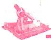

# 典例精讲

# 题型一 求范围

【例 1】(1) 若 $\left|x\right|=x$ ，则 x 的取值范围是 \_\_\_\_；

(2) 若 $\left|x\right| = -x$ ，则 x 的取值范围是 \_\_\_\_；  
(3)若 $|x+1|=x+1$ ，则x的取值范围是\_\_\_\_；  
(4) 若 $\left|x-2\right|=-\left(x-2\right)$ ，则 x 的取值范围是 \_\_\_\_.

# 题型二 去绝对值

【例 2】(1) $|\pi-3|=$ \_\_\_\_；(2)若 a<0, b>0，化简 $|a|+|3b|-|a-2b|=$ \_\_\_\_。

【例 3】已知有理数 a, b, c 在数轴上的位置如图所示，

化简： $|a|-|a+b|+|c-a|+|b-c|+|a+c|$ .

b a 0 c

# 实战演练

1.(1)若 $|a-3|=a-3$ ，则a的取值范围是\_\_\_\_；

(2) $|a|=5,|b|=3,ab>0$ ,则 $|a+b|=$ \_\_\_\_;   
(3)已知 $|a|=5,|b|=3$ ，且 $|a-b|=b-a$ ，那么 $a+b$ 的值为\_\_\_\_。

2. 已知 $|x| = 3, |y - 1| = 5, x > y$ ，求 $x - y$ 的值.

3. 有理数 $a, b, c$ 在数轴上的位置如图，化简： $|c - a| - |a + b| + |b - c|$ .

b c 0 a

# 板块二 绝对值的意义(2) 几何视角

绝对值 $\Leftrightarrow$ 距离，数 $\Leftrightarrow$ 形

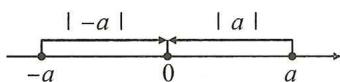

$|a|$ 的几何意义: 数轴上表示 a 的点到原点的距离.

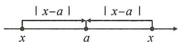

$|x-a|$ 的几何意义: 数轴上表示 x 的点与表示 a 的点之间的距离.

# 典例精讲

# 题型 根据绝对值的几何意义将绝对值转化为距离

【例 1】已知 $\left|m-2\right|=10$ ，求 $\left|m+1\right|$ 的值.

【例 2】已知 $\left|m+12\right|=3\left|m-8\right|$ ，求 m 的值.

# 实战演练

1.(1)若 $|3a-6|=18$ ，则a的值为\_\_\_\_；  
(2) 若 $\left|a-6\right|=2a$ ，则 a 的值为  
2. 数轴上点 A 表示的数为 -4，点 B 表示的数为 x，若 A, B 两点之间的距离为 11，求 x 的值.  
3. 若 $\left|m-4\right|=\left|m-16\right|$ ，求 m 的值.  
4. 若 $|t + 4| + |t - 1| + |t - 8| = 12$ ，请结合数轴确定 $t$ 的取值。

# 板块三 绝对值的非负性

<table><tr><td>1.  $|a| \geqslant 0$  绝对值无负数;</td><td>2. 若  $|a| + |b| = 0$ ,则  $a = 0$  且  $b = 0$ ;</td><td>3. 若  $|a| + b^{2} = 0$ ,则  $a = 0$  且  $b = 0$ .</td></tr></table>

# 典例精讲

【例 1】若 $(a+2)^{2}+|b-3|=0$ ，求 a, b 的值.

【例 2】已知 $\left|x-2\right|+\left|x+y-5\right|+\left|y-1\right|=y-1$ . 求 y 的值.

# 实战演练

1. 已知 $|a - 1|$ 与 $|b - 2|$ 互为相反数，求 $a - 3b$ 的值.

2. 已知 $|a - 2| + |b - 5| + |c - 4| = c - 4$ ，求 $a + b$ 的值.

# 板块四 多绝对值处理(1) 分类讨论

<table><tr><td> $\frac{|a|}{a}$ 或 $\frac{a}{|a|}$  $a>0 \Rightarrow$ 值为1; $a<0 \Rightarrow$ 值为-1.</td><td> $\frac{|a|}{a}+\frac{|b|}{b}=\pm 2$ 或0. $1a,b$ 同正,值为 $1+1=2$ ; $2a,b$ 同负,值为 $-1-1=-2$ ; $3a,b$ 异号,值为 $1-1=0$ .注:无需讨论具体数的符号.</td></tr></table>

# 典例精讲

【例 1】已知 a, b, c 为有理数，且 $abc \neq 0$ ，求 $\frac{|a|}{a} + \frac{|b|}{b} + \frac{|c|}{c}$ .

【例 2】已知 a, b, c, d 为有理数, abcd > 0, $a + b + c + d < 0$ , 求 $\frac{|a|}{a} + \frac{|b|}{b} + \frac{|c|}{c} + \frac{|d|}{d} + \frac{|abcd|}{abcd}$ 的值.

# 实战演练

1. 若 $a + b + c = 0, abc \neq 0$ ，求 $\frac{b + c}{|a|} + \frac{c + a}{|b|} + \frac{a + b}{|c|}$ 的值.

2. 已知 $a, b, c$ 为有理数，且 $abc \neq 0$ ，求式子 $\frac{|a|}{a} + \frac{|b|}{b} + \frac{|c|}{c} + \frac{|abc|}{abc}$ 的值.

# 板块五 多绝对值处理(2) 零点分段

<table><tr><td rowspan="3">零点:使绝对值为0的未知数的值即为零点.方法:1寻找所有零点,并在数轴上表示;2依据零点将数轴进行分段;3分别根据每段未知数的范围去绝对值.易错点:分类不明确,不会去绝对值.</td><td>化简: $|x-a|+|x-b|(a</td></tr><tr><td>令\( x-a=0,x-b=0$ ,解得 $x=a,x=b$ ,故零点为 $a,b$ ,分三种情况讨论:1 $x</td></tr><tr><td>2\( a\leqslant x\leqslant b$ ;3 $x>b$ .</td></tr></table>

# 典例精讲

# 题型一 零点分段法去多绝对值化简

【例 1】化简： $|x-3|+|x+4|$ .

# 题型二 零点分段法解多绝对值方程

【例 2】已知 $\left|x+4\right|+\left|x-2\right|=10$ ，求 x 的值.

# 题型三 零点分段法求多绝对值型最值

【例 3】已知 $x \leqslant 2$ ，求 $\left|x - 3\right| - \left|x + 2\right|$ 的最大值与最小值.

# 实战演练

1. 化简： $|x+5|+|2x-3|$ .  
2. 化简： $|x-4|-|x+2|$ .  
3. 解方程 $\left|x-2\right|+\left|x+6\right|=12$ .  
4. 若 $\left|x-12\right|=2\left|x+1\right|+4$ ，求 x 的值.  
5. 已知 $P = |x + 2| + |x - 3|$ , 求 $P$ 的最小值及此时 $x$ 的范围.

# 板块六 多绝对值处理(3) 数形结合

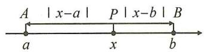

$PA = |x - a|, |x - a|$ 表示 $P, A$ 两点之间的距离；

$PB=|x-b|$ , $|x-b|$ 表示 P, B 两点之间的距离;

$PA + PB = |x - a| + |x - b|$ ,

$|x-a|+|x-b|$ 表示点 P 到 A, B 两点的距离之和.

# 典例精讲

# 题型一 利用绝对值的几何意义解多绝对值方程

【例 1】若 $\left|x+2\right|+\left|x-6\right|=10$ ，求 x 的值.

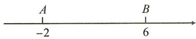

# 题型二 利用绝对值的几何意义求多绝对值型最值

【例 2】求 $\left|x-2\right|+\left|x+4\right|$ 的最小值.

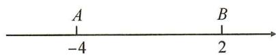

# 实战演练

1. 求未知数 $x$ 的值: $|x + 2| + |x - 8| = 24$ .

2. 求 $|x + 2| + |x - 2| + |x - 4|$ 的最小值.

# 第5讲 形形色色的最值

# 板块一 多绝对值型最值(1)

# 典例精讲

# 题型一 两个绝对值之和求最小值

【例 1】求 $\left|x+6\right|+\left|x-3\right|$ 的最小值.

【归纳总结1】若 $a < b$ ，则当 $a \leqslant x \leqslant b$ 时， $|x - a| + |x - b|$ 有最小值为 $b - a$

# 题型二 三个绝对值之和求最小值

【例 2】求 $\left|x+1\right|+\left|x-3\right|+\left|x-5\right|$ 的最小值.

【归纳总结2】若 $a < b < c$ ，则当 $x = b$ 时， $|x - a| + |x - b|| + |x - c|$ 有最小值为 $c - a$ 。

# 题型三 三个以上绝对值之和求最小值

【例 3】(1) $|x-1|+|x-2|+|x-3|+|x-4|$ 的最小值为\_\_\_\_，此时 x 的取值是\_\_\_\_；

(2) $|x-1|+|x-2|+|x-3|+|x-4|+|x-5|$ 的最小值为\_\_\_\_，此时x的取值是\_\_\_\_；  
(3) $|x-1|+|x-2|+|x-3|+|x-4|+\cdots+|x-2023|+|x-2024|$ 的最小值为\_\_\_\_，此时x满足的条件是\_\_\_\_。

【归纳总结3】 $n$ 个绝对值之和求最小值：

一般地，设 $a_1 < a_2 < a_3 < \cdots < a_n, P = |x - a_1| + |x - a_2| + |x - a_3| + \cdots + |x - a_n|$ .

①若 n 为奇数，则当 $x=a_{\frac{n+1}{2}}$ 时，P 有最小值；②若 n 为偶数，则当 $a_{\frac{n}{2}}\leqslant x\leqslant a_{\frac{n}{2}+1}$ 时，P 有最小值。口诀：按序排列，奇取中值，偶取中段。

# 板块二 多绝对值型最值(2)

# 典例精讲

# 题型一 系数不为 1 型绝对值之和求最小值

【例 1】 $|x-1|+2|x+3|$ 的最小值为 \_\_\_\_.

【归纳总结1】系数不为1型绝对值之和求最小值,可化为系数为1型问题解决.

# 题型二 绝对值之差求最大值

【例 2】当 x 在何范围时， $|x-1|-|x-2|$ 有最大值？并求出最大值.

【归纳总结2】若 $a < b$ ，则当 $x \geqslant b$ 时， $|x - a| - |x - b|$ 的最大值为 $b - a$

# 题型三 绝对值和差混搭求最大值

【例 3】求 $\left|x-1\right|-\left|x-2\right|+\left|x-3\right|-\left|x-4\right|$ 的最大值，并写出此时 x 的范围.

【归纳总结3】绝对值和差混搭求最大值:数形结合,分析表示数x的点的位置.

# 题型四 利用隐最值求最值

【例 4】已知 $\left|x-3\right|+\left|x+4\right|+\left|y-2\right|+\left|y+1\right|=10$ ，则 $x+y$ 的最小值为 \_\_\_\_.

【归纳总结4】注意挖掘几个绝对值之和有最小值,及取得最小值时字母的范围这个隐藏的条件.

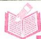

# 实战演练

1. $|x - 3| + |x - 5|$ 有最 \_\_\_\_ 值是 \_\_\_\_, 此时 $x$ 的取值范围是 \_\_\_\_.

2. $|x + 1| + |x + 3| + |x - 10|$ 的最小值为

3. 已知 $(|x+1|+|x-2|)(|y-3|+|y+2|)=15$ ，则 x-2y 的最大值为 \_\_\_\_，最小值为 \_\_\_\_。

# 第6讲 非同一般的数轴

# 板块一 数轴、距离与方程(1) 两点距离

<table><tr><td colspan="2">两点之间的距离的表示方法(A,B两点之间的距离记为AB)</td></tr><tr><td>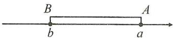位置明确(右减左):AB=a-b.</td><td>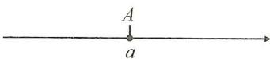位置不明确(加绝对值):AB=|a-b|.</td></tr></table>

# 典例精讲

【例】已知数轴上点 A 表示的数为 -1，数轴上 A, B 两点之间的距离用“AB”表示.

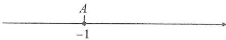

(1)若点 B 表示的数为 1, 则 AB = \_\_\_\_; 若点 B 表示的数为 10, 则 AB = \_\_\_\_;  
(2)若点 B 表示的数为 -2, 则 AB = \_\_\_\_; 若点 B 表示的数为 -10, 则 AB = \_\_\_\_;  
(3)若点 B 表示的数为 x，且点 B 在点 A 的右侧，则 AB = \_\_\_\_（用含 x 的式子表示）；  
(4) 若点 B 表示的数为 x，则 AB = \_\_\_\_（用含 x 的式子表示）；  
(5)若点 A, B 之间的距离为 5, 求点 B 表示的数.

# 实战演练

1. 数轴上, 点 $A$ 表示的数为 $-3$ , 点 $B$ 在点 $A$ 的左侧, 且距离为 2 个单位长度, 点 $C$ 在点 $B$ 的右侧, 且与点 $B$ 的距离为 7 个单位长度. 求点 $B$ 和点 $C$ 表示的数.

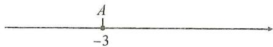

2. 数轴上, 点 $A$ 表示的数为 $-2$ , 点 $B$ 表示的数为 $6, C$ 为数轴上一点, 且 $A, C$ 两点之间的距离 $AC = 5$ , 求 $B, C$ 两点之间的距离 (即 $BC$ 的长).

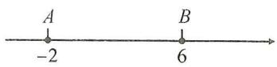

# 板块二 数轴、距离与方程(2) 两点中点

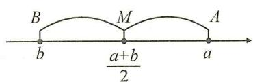

text_image

B
M
A
b
a+b
—2

中点定义:线段上的一点把线段分成相等的两部分,
这个点叫做这条线段的中点;

中点公式: 若 A:a, B:b, 则 AB 的中点 M: $\frac{a+b}{2}$ .

# 典例精讲

【例】已知数轴上点 A 表示的数为 -1, B 为数轴上一点, M 为 AB 的中点.

(1) 若点 B 表示的数为 -10，则点 M 表示的数为 \_\_\_\_；  
(2) 若点 B 表示的数为 x，则点 M 表示的数为 \_\_\_\_（用含 x 的式子表示）；  
(3) 若 A, B 之间的距离为 5, 求点 M 表示的数;  
(4)若点 B 表示的数为 x，点 M 表示的数为 5。求点 B 表示的数。

A
-1

# 实战演练

1. 数轴上, 点 $A, B$ 分别表示 $-2$ 和 5 , 则 $A, B$ 两点间的距离 $AB =$ \_\_\_\_, 线段 $AB$ 的中点表示的数是 \_\_\_\_.  
2. 如图, 数轴上点 $A$ 表示的数为 $-2$ , 点 $B$ 表示的数为 $10, C$ 为数轴上一点, 且 $BC = 4, M$ 为 $AC$ 的中点. 求点 $M$ 表示的数.

A B
-2 10

3. 在数轴上, 点 $A, B, C$ 表示的数分别为 $-6, 8$ 和 $x$ , 若这三点中其中一个点是另两个点对应线段的中点, 求 $x$ 的值.

4. 在数轴上, 点 $A, B, C$ 表示的数分别为 $-6, 8$ 和 $x$ , 若 $P$ 为 $AC$ 的中点, $Q$ 为 $BC$ 的中点, 求 $PQ$ 的长.

# 板块三 数轴、距离与方程(3) 距离和差倍分

<table><tr><td>一、点P在A,B之间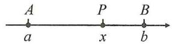</td><td>二、点P在点B右侧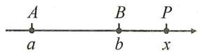</td><td>三、点P的位置不确定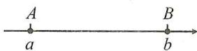</td></tr><tr><td>PA=x-a;PB=b-x;PA+PB=b-a.</td><td>PA=x-a;PB=x-b;PA+PB=2x-a-b.</td><td>PA=|x-a|;PB=|x-b|;PA+PB=|x-a|+|x-b|.</td></tr></table>

# 典例精讲

【例】如图，A, B 两点在数轴上表示的数分别为 -10 和 14.

(1)求 A, B 两点间的距离 AB 的长;

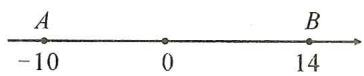

(2)若点 C 在数轴上 A, B 两点之间，且 AC = BC. 求点 C 表示的数；

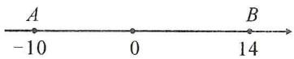

(3) P 为数轴上一点, 且 $PA + PB = 30$ , 求点 P 对应的数;

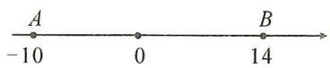

(4) 点 D 在数轴上, 且 BD = 3AD, 求点 D 对应的数.

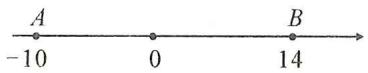

# 实战演练

1. 已知数轴上点 A 在原点的左边, 到原点的距离为 8, 点 B 在原点的右边, 点 A 移动到点 B, 要经过 32 个单位长度.

(1) 求 A, B 两点所对应的数；

(2)若点 C 也是数轴上的点,且点 C 到点 B 的距离是点 C 到原点的距离的 3 倍,求点 C 所对应的数.

A O B

2. 在一条不完整的数轴上从左到右有点 $A, B, C$ , 其中 $AB = 2, BC = 1$ , 如图所示, 设点 $A, B, C$ 所对应数的和是 $p$ .

(1)若以点 B 为原点,写出点 A,C 所对应的数,并计算 p 的值;若以点 C 为原点,p 又是多少?
(2) 若原点 O 在图中数轴上点 C 的右边,且 CO=38,求 p 的值.

A B C

3. 如图, 数轴上点 $A, B$ 表示的数分别为 $-10$ 和 $10, C$ 为数轴上一点.

(1) 若 $AC + BC = 28$ ，求点 C 表示的数；

(2) 若 2AC = 3BC，求点 C 表示的数.

A B

# 板块四 数轴、距离与方程(4) 方程思想

# 典例精讲

【例】(1)如图,在数轴上有若干个点,每相邻两个点之间的距离是一个单位长度,有理数 a, b, c, d 所表示的点是这些点中的 4 个,且在数轴上的位置如图所示.已知 3a = 4b - 3,求 $c + 2d$ 的值;

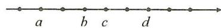

(2)如图,在数轴上标有若干个点,每相邻两点的间距相等,点A,B,C,D对应的数分别是a,b,c,d,且 $b+3c=10,b+3d=16$ ,试求d-b的值.

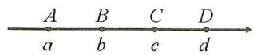

# 实战演练

1. 如图, 数轴上标出若干个点, 每相邻的两点相距 1 个单位长度, 点 $A, B, C, D$ 对应的数分别为整数 $a, b, c, d$ , 且 $d - 2a = 4$ . 试问: 数轴上的原点在哪一点上?

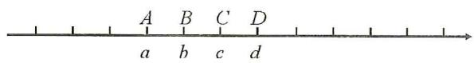

text_image

A B C D
a b c d

2. 如图, 数轴上标出若干个点, 每相邻的两点相距 1 个单位长度, 其中点 $A, B, C, D$ 对应的数分别是整数 $a, b, c, d$ . 若 $a + b + c + d = -2$ , 那么数轴上与原点最接近的点是哪个点?

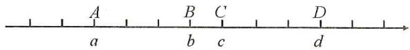

text_image

A
B C
D
a b c d

3. 如图, 数轴上标出若干个点, 每相邻的两点距离相等, 点 $A, B, C, D$ 对应的数分别是数 $a, b, c$ , $d, a + b + c + d = 2, a - b + c - d = -3$ . 求 $a$ 的值.

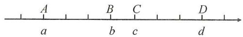

text_image

A
B
C
D
a
b
c
d

# 第7讲 异彩纷呈的动点

# 板块一 数轴与动点(1) 点的平移

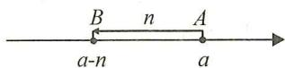

点 A 表示的数为 a，将点 A 向左平移 n 个单位长度得到点 B，则点 B 表示的数为 a-n.

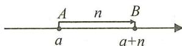

点 A 表示的数为 a，将点 A 向右平移 n 个单位长度得到点 B，则点 B 表示的数为 $a + n$ 。

# 典例精讲

【例】(教材第14页第3题)在数轴上,点A表示-3,从点A出发,沿数轴移动4个单位长度到达点B,则点B表示的数是多少?

# 实战演练

1. 如图, 数轴上点 A 表示的数为 -1.

(1)将点 A 向右平移 1 个单位长度得到的点表示的数为 \_\_\_\_，向右平移 10 个单位长度得到的点表示的数为 \_\_\_\_，向右平移 n 个单位长度得到的点表示的数为 \_\_\_\_；

(2) 将点 A 向左平移 1 个单位长度得到的点表示的数为 \_\_\_\_，向左平移 10 个单位长度得到的点表示的数为 \_\_\_\_，向左平移 n 个单位长度得到的点表示的数为 \_\_\_\_。

A
-1

2. 如图, 数轴上点 $A$ 表示的数为 2, 将点 $A$ 先向左平移 5 个单位长度得到点 $B$ , 再将点 $B$ 平移 8 个单位长度得到点 $C$ , 求点 $B$ 和点 $C$ 表示的数.

A
2

3. 如图, $A, B$ 为数轴上两点, 点 $A$ 在数轴上表示的数为 $-2$ , 点 $B$ 在点 $A$ 的右侧, 点 $P$ 从点 $A$ 出发向左移动 5 个单位长度, 点 $Q$ 从点 $B$ 出发, 向右移动 7 个单位长度.

(1)数轴上点 P 表示的数为 \_\_\_\_，若设点 B 表示的数为 x，则点 Q 表示的数为 \_\_\_\_；

(2) 若 P, Q 两点之间的距离为 20, 求点 B 表示的数.

A B
-2

# 板块二 数轴与动点(2) 点的运动

<table><tr><td colspan="2">运动时间为t,运动速度为v,点A表示的数为a.</td></tr><tr><td></td><td></td></tr><tr><td colspan="2">两动点之间的距离表示</td></tr><tr><td>位置明确(右减左):AB=a-b.</td><td>位置不明确(加绝对值):AB=|a-b|.</td></tr></table>

# 典例精讲

【例】如图, 动点 P 从数轴上表示数 -2 的点出发, 以每秒 2 个单位长度的速度向左运动, 动点 Q 从数轴上表示数 1 的点出发, 以每秒 5 个单位长度的速度向右运动 (设运动时间为 t s, P, Q 两点之间的距离记为 PQ).

(1)用含 t 的式子表示出 t s 后点 P 和点 Q 所表示的数；  
(2)用含 t 的式子表示出 t s 后 OP 和 OQ 的长；  
(3)用含 t 的式子表示出 t s 后点 P 和点 Q 之间的距离；  
(4) 若 OQ=2OP 求 t 的值；  
(5) 若 PQ=31，求 t 的值.

# 【分析】

①读:本题中动点有两个,分别是点\_\_\_\_和点\_\_\_\_;

点 P 的起点是 \_\_\_\_（填数），运动方向 \_\_\_\_，速度为 \_\_\_\_ 个单位长度/秒；

点 Q 的起点是\_\_\_\_（填数），运动方向\_\_\_\_，速度为\_\_\_\_个单位长度/秒；

②设:设运动时间为 t s【本题已经设好了,无需再设】

③算:算运动距离

点 P 的运动路程 = 点 P 的速度 × 时间 = \_\_\_\_；

点 Q 的运动路程 = 点 Q 的速度 × 时间 = \_\_\_\_；

④表:表示 t 秒后,P,Q 在数轴上所对应点表示的数

点 P 所表示的数为 \_\_\_\_，点 Q 所表示的数为 \_\_\_\_；

表示 OP 和 OQ 的长【距离问题】OP = \_\_\_\_ , OQ = \_\_\_\_ ;

表示点 P 和点 Q 之间的距离【距离问题】PQ= \_\_\_\_；

⑤列:列出方程

由 $OQ = 2OP$ ，可列出方程\_\_\_\_；由 $PQ = 31$ ，可列出方程\_\_\_\_。

# 实战演练

1. 如图, 数轴上 $A, B$ 两点对应的数分别为 4 和 10, 点 $P$ 和 $Q$ 分别从 $A, B$ 两点同时出发, 且分别以每秒 4 个单位长度、每秒 2 个单位长度沿着数轴正方向运动, 设运动时间为 $t$ 秒.

(1) 分别表示出 t 秒后 P, Q 两点所对应的数;  
(2) 求 P, Q 两点相遇时 t 的值;  
(3)t 为何值时,P,Q两点之间的距离为2个单位长度?

2. 如图, $A, B$ 分别为数轴上的两点, 点 $A$ 对应的数为 $-10$ , 点 $B$ 对应的数为 90. 现有一电子蚂蚁 $P$ 从点 $A$ 出发, 以 3 个单位长度/秒的速度向右运动, 同时另一只电子蚂蚁 $Q$ 恰好从 $B$ 点出发, 以 5 个单位长度/秒的速度向左运动. 求经过多长时间两只电子蚂蚁在数轴上相距 20 个单位长度?

3. 如图, $A, B, C$ 三点在数轴上, 点 $C$ 在 $A$ 与 $B$ 之间, 且 $AC: BC = 1: 5$ .

(1) 求点 A 到点 B 的距离及点 C 对应的数；  
(2)甲、乙分别从 A, B 两点同时相向运动, 甲比乙慢 3 个单位长度/s, 在距原点 2 个单位长度处相遇, 求甲、乙的速度;  
(3)在(2)的条件下,若甲、乙同时向左运动,求相遇点D对应的数.

# 板块三 数轴与动点(3) 行程问题

<table><tr><td colspan="2">运动时间为t,运动速度为v,A:a,B:b</td></tr><tr><td>相遇→A,B重合→数相同→a-vAt=b+vBT</td><td>追及→A,B重合→数相同→a+vAt=b+vBT</td></tr></table>

# 典例精讲

【例 1】甲、乙两只电子蚂蚁分别在数轴上的原点 O 和表示 8 的点 A 处, 它们分别以 1 个单位长度/秒, 1.5 个单位长度/秒的速度同时运动, 它们运动的时间为 t 秒.

(1)若相向而行,则它们第一次相遇在数轴上何处?

O A
0 8

(2)若它们都沿数轴的负方向而行,乙在数轴上何处追上甲?

O A
0 8

【例 2】如图, 已知数轴上点 A 表示的有理数为 6, 点 B 是数轴上位于点 A 左侧的一点, A, B 两点之间的距离为 10. 动点 P 从点 A 出发, 以每秒 6 个单位长度的速度沿数轴向左匀速运动, 设运动的时间为 t 秒 (t > 0).

(1)数轴上点 B 表示的数是 \_\_\_\_；点 P 表示的数是 \_\_\_\_（用含 t 的代数式表示）；

B O P ← A
0 6

(2) 动点 Q 从点 B 出发, 以每秒 4 个单位长度的速度沿数轴向左匀速运动, 点 P, Q 同时出发.

①当 t 为何值时, 点 P 与点 Q 相遇?

Q←B O P←A
0 6

②当 t 为何值时, 点 P 与点 Q 之间的距离为 8 个单位长度?

Q←B O P←A
0 6

# 实战演练

1. 如图, 已知数轴上点 $A$ 表示的数为 6, $B$ 是数轴上在 $A$ 左侧的一点, 且 $A, B$ 两点间的距离为 11, 动点 $P$ 从点 $A$ 出发, 以每秒 3 个单位长度的速度沿数轴向左匀速运动, 设运动时间为 $t (t > 0)$ 秒.

(1)动点 Q 从点 B 出发,以每秒 2 个单位长度的速度沿数轴向右匀速运动,若 P,Q 两点同时出发,求点 P 与 Q 运动多少秒时重合?

(2) 动点 Q 从点 B 出发, 以每秒 2 个单位长度的速度沿数轴向左匀速运动, 若 P, Q 两点同时出发, 当点 P 运动多少秒时, 点 P 追上点 Q?

2. 已知数轴上有 $A, B$ 两点, 分别代表数为 $-40, 20$ , 两只电子蚂蚁甲, 乙分别从 $A, B$ 两点同时出发, 甲沿线段 $AB$ 以 1 个单位长度/秒的速度向右运动, 甲到达点 $B$ 处时运动停止, 乙沿线段 $BA$ 方向以 4 个单位长度/秒的速度向左运动.

(1)甲,乙在数轴上的哪个点相遇?

(2)多少秒时,甲、乙相距10个单位长度?

(3)若乙到达 A 点后立刻掉头并保持速度不变,则甲到达 B 点前,甲,乙还能在数轴上相遇吗?若能,求出相遇点所对应的数;若不能,请说明理由.

# 板块四 数轴与动点(4) 和差倍分

# 典例精讲

# 题型一 和差问题

【例 1】如图, 在数轴上点 A 表示数为 -3, 点 B 表示数为 9, AB 表示 A, B 两点之间的距离. 点 P 从点 A 以 3 个单位长度每秒向右运动, 点 Q 同时从点 B 以 2 个单位长度每秒向左运动, 若 $AP + BQ = 2PQ$ , 求此时运动的时间 t.

# 题型二 倍分问题

【例 2】有理数 -8,4,0 在数轴上对应的点分别为 A, B, C.

(1) 点 P 从点 C 出发, 以每秒 1 个单位长度的速度向左运动, 同时点 Q 从点 B 出发, 以每秒 2 个单位长度的速度向左运动, 当点 Q 到达点 A 时, 两点停止运动. 求点 P, Q 在运动过程中, 当 t 为何值时 AP = 3CQ?

(2) $D$ 是直线 $AB$ 上一点, 若 $\vert AD - BD\vert = 2CD$ , 则 $AB:BD$ 的值为 \_\_\_\_.

text_image

备用图
备用图

# 实战演练

如图, 在数轴上, 点 $A$ 表示的数为 $-10$ , 点 $B$ 表示的数为 11 , 点 $C$ 表示的数为 18 . 动点 $P$ 从点 $A$ 出发, 沿数轴正方向以每秒 2 个单位长度的速度匀速运动; 同时, 动点 $Q$ 从点 $C$ 出发, 沿数轴负方向以每秒 1 个单位长度的速度匀速运动. 设运动时间为 $t$ 秒.

(1)在点 Q 出发后到达点 B 之前, 当 t 为何值时, 点 P 到点 O 的距离与点 Q 到点 B 的距离相等;  
(2) 在点 P 向右运动的过程中, N 为数轴上一动点, 且到 A, P 两点的距离相等. 在点 P 到达点 C 之前, 求 2CN - PC 的值.

text_image

A → P O B Q C
-10 0 11 18

# 板块五 数轴与动点(5) 动点定值

<table><tr><td>一、动点距离为定值</td><td>二、动点距离差为定值</td></tr><tr><td> $PQ = \frac{x + a}{2} - \frac{x + b}{2} = \frac{1}{2}(a - b) = \frac{1}{2}AB.$ </td><td> $AC = 4a + 5t - (a + 2t) = 3a + 3t,$  $AB = a + 2t - (-a - t) = 2a + 3t,$  $AC - AB = (3a + 3t) - (2a + 3t) = a.$ </td></tr></table>

# 典例精讲

# 题型一 距离定值

【例 1】如图, 点 A 在数轴上表示的数为 -10. C, D 为数轴上两个动点, 点 D 在点 C 的右边, 且 CD = 16, M 为 AD 的中点, N 为 AC 的中点. 当点 C, D 运动时, M, N 两点的距离即 MN 的长度是否变化? 若不变, 求出其值; 若变化, 说明理由.

A N C M D
-10

# 题型二 和差定值

【例 2】如图, 数轴上 A, B, C 三点表示的数分别为 -10, 10 和 50. A, B, C 三点同时运动, 点 A 以 1 个单位长度/秒的速度向左运动, 点 B, C 分别以 2 个单位长度/秒和 5 个单位长度/秒的速度向右运动. 请问: BC - AB 的值是否随时间 t 的变化而变化? 若不变, 请求其值; 若变化, 请说明理由.

A B C

# 实战演练

1. 如图, 已知数轴上有 A, B, C 三个点, 它们表示的数分别是 18, 8, -10.

(1) 填空: AB = \_\_\_\_ , BC = \_\_\_\_ ;

(2)若点 A 以每秒 1 个单位长度的速度向右运动,同时点 B 和点 C 分别以每秒 2 个单位长度和 5 个单位长度的速度向左运动.试探究 BC-AB 的值是否随着时间 t 的变化而改变?

# 题型三 比为定值

2. 如图, 数轴上 $A, B$ 两点所表示的数分别为 $-8, 4$ . $A, B$ 两点分别以 2 个单位长度/秒和 1 个单位长度/秒的速度同时向数轴负方向运动. 与此同时, 点 $C$ 从原点出发也向数轴负方向运动, 且点 $C$ 总在 $A, B$ 两点之间, 并在运动过程中始终有 $\frac{BC}{AC} = \frac{1}{2}$ . 设运动 $t$ 秒钟后, 点 $A, B, C$ 运动后的对应点分别为 $A_{1}, B_{1}, C_{1}$ . 求 $\frac{CC_{1}}{AA_{1}}$ 的值.

# 题型四 定值求参

3. 如图, 动点 $A, B, C$ 分别从数轴表示数 $-30, 10, 18$ 的位置沿数轴正方向运动, 速度分别为 2 个单位长度/秒, 4 个单位长度/秒, 8 个单位长度/秒, 线段 $OA$ 的中点为 $P$ , 线段 $OB$ 的中点为 $M$ , 线段 $OC$ 的中点为 $N$ , 若 $k \cdot PM - MN$ 为常数, 则 $k$ 的值为 \_\_\_\_.

# 板块六 数轴与动点(6) 动线段

# 典例精讲

【例 1】如图, 数轴上 A, B 两点之间的距离 AB = 16, 有一根木棒 PQ 沿数轴向左水平移动, 当点 Q 移动到点 B 时, 点 P 所对应的数为 6, 当点 Q 移动到线段 AB 的中点时, 求点 P 所对应的数.

【例 2】如图, 数轴上有 A, B, C 三点, 点 A, B 表示的数分别为 -8, 2, 点 C 在点 B 的右侧, AC - AB = 2. 线段 EF = a (点 E 在点 F 的左侧, a > 0), 线段 EF 从点 A 出发, 以 1 个单位长度每秒的速度向 B 点运动 (点 F 不与 B 点重合), M 是 EC 的中点, N 是 BF 的中点, 在 EF 运动过程中, MN 的长度始终为 1, 求 a 的值.

# 实战演练

如图, 线段 AB 和线段 CD 都在数轴上, AB = 2, CD = 4, 开始时, 点 A 在数轴上表示的数是 -8, 点 C 在数轴上表示的数是 16. 线段 AB 以 6 个单位长度/秒的速度向右匀速运动, 同时线段 CD 以 2 个单位长度/秒的速度向左匀速运动, 运动时间为 t 秒.

(1)运动后,点 A 表示的数是\_\_\_\_;点 C 表示的数是\_\_\_\_(用含 t 的代数式表示);若 AC=8,求 t 的值;

(2) 若 Q 是 BC 的中点, P 是 AD 的中点, 求运动过程中线段 PQ 的长.

# 板块七 数轴与动点(7) 挡板与往返

# 方法技巧

一个较高速度的动点不断在两低速动点间往返运动,两低速动点相遇时,高速度动点随之停止.在这个运动过程中,虽然不能清晰的分析出这里的运动状态,但是我们可以通过两低速动点相遇时所花费的时间来得到高速动点的运动时间,结合其速度求出它的运动路程.

# 典例精讲

【例】如图, 点 A, B 在数轴上表示的数分别是 -4, 12 (A, B 两点间的距离用 AB 表示). 点 P 从点 A 出发以 1 个单位长度/秒的速度在数轴向右运动, 点 Q 从点 B 同时出发, 以 2 个单位长度/秒在数轴上向左运动.

(1) 求点 P, Q 相遇时点 P 对应的数;

(2) 点 P, Q 运动的同时, 点 M 以 3 个单位长度/秒的速度从点 O 向左运动. 当遇到点 P 时, 点 M 立即以同样的速度 (3 个单位长度/秒) 向右运动, 并不停地往返于点 P 与点 Q 之间. 求当点 P 与点 Q 相遇时, 点 M 所经过的总路程是多少?

# 实战演练

如图, 在数轴上的点 $M$ 和点 $N$ 处各竖立一个挡板 (点 $M$ 在原点左侧, 点 $N$ 在原点右侧, 且 $OM > ON$ ), 数轴上甲、乙两个弹珠同时从原点出发, 甲弹珠以 2 个单位长度/秒的速度沿数轴向右运动, 乙弹珠以 5 个单位长度/秒的速度沿数轴向左运动. 当弹珠遇到挡板后立即以原速度向反方向运动, 若甲、乙两个弹珠首次相遇的位置恰好到点 $M$ 和点 $N$ 的距离相等, 试探究点 $M$ 对应的数 $m$ 与点 $N$ 对应的数 $n$ 是否满足某种数量关系, 请写出它们的关系式, 并说明理由.

text_image

M
O
N

# 第三章 代数式

# 第8讲 列代数式

# 板块一 列代数式(1) 数量关系

# 典例精讲

# 题型一 列代数式

【例 1】用代数式表示：

(1)商店将原价为 a 元的某件商品进行降价促销,先打八折,再减 8 元,则该商品现在的售价为 \_\_\_\_ 元;  
(2)等腰三角形的周长为20,腰长为x,则底边长为\_\_\_\_;   
(3) A, B 两地相距 200 km, 一辆汽车以 60 km/h 从 A 地驶往 B 地, 行驶 t 小时后, 提速至 v km/h, 则这辆汽车到达 B 地还需要 \_\_\_\_ h;  
(4)某公司 2024 年盈利 a 万元, 比 2023 年增长 20%, 则该公司 2023 盈利 \_\_\_\_ 万元.

【例 2】如图,在一张长方形纸片上剪掉两个两个完全相同的长方形(阴影部分),求图中剩余长方形的周长和面积.(用含 a 的代数式表示)

text_image

6
a 6 a

# 题型二 用代数式表示公式和规律

【例 3】填空：

(1)圆的半径为 r，周长为 C，面积为 S，则圆的周长公式为 \_\_\_\_，面积公式为 \_\_\_\_；  
(2) 观察: ① $3^{2} - 4 = 1 \times 5$ ; ② $5^{2} - 4 = 3 \times 7$ ; ③ $7^{2} - 4 = 5 \times 9$ ; ④ $9^{2} - 4 = 7 \times 11$ ; …, 根据上面式子的规律, 写出第 5 个的式子为: \_\_\_\_; 第 $n$ 个式子可表示为 \_\_\_\_.

# 题型三 代数式的意义

【例 4】由于大量降水,第一天水库水位连续上升了 a h,每小时平均上升 0.5 cm,第二天开闸泄洪,水位连续下降了 a h,每小时平均下降 2 cm.则下列对代数式-1.5a 的意义解释正确的是()

A. 这两天水位共下降 $1.5 \mathrm{~a} \mathrm{~cm}$

B. 这两天水位共上升 $1.5 \mathrm{~a} \mathrm{~cm}$

C. 第二天的水位高度为 1.5a cm

D. 第二天的水位高度为 -1.5a cm

# 实战演练

1. 用 500 元钱去购买体育用品, 已知一个足球 $a$ 元, 一个篮球 $b$ 元, 则代数式 $500 - 3a - 2b$ 表示的意义为 \_\_\_\_.

2. 小明买了一张 50 元的乘车月票卡, 用此卡每次乘车的费用为 0.8 元. 如果小明用此卡乘车 n 次, 则卡里的余额为 \_\_\_\_ 元.

3. 三个连续奇数, 如果最小的数是 $n + 7$ , 那么最大的数是

4. 填空：

(1)用代数式表示数 $m + n$ 的相反数为

(2)小明比小强小2岁,小强比小华大4岁.如果小华m岁.则小明的年龄是 岁;

(3)某种苹果的售价是每千克 $m(m<10)$ 元,用面值 50 元的人民币购买了 4 千克这种水果,应找回元;

(4)某班有男生 x 人, 占全班学生的 40%, 则该班学生总数可表示为 \_\_\_\_, 该班女生人数可表示为 \_\_\_\_ .

5. 观察: ① $2^{2} - 1^{2} = 3$ ; ② $3^{2} - 2^{2} = 5$ ; ③ $4^{2} - 3^{2} = 7$ ; ④ $5^{2} - 4^{2} = 9$ ; …, 根据上面式子的规律, 写出第 ⑤个的式子为: \_\_\_\_; 第 $n$ 个式子可表示为

6. 某工厂计划生产 n 个零件, 原计划每天生产 a 个零件, 实际每天比原计划多生产 b 个零件, 则实际生产所用的天数比原计划少 天.

7. 张老师参加某次学术交流会,与会的每两个人之间握一次手,若共有 m 人参加,则张老师需握手\_\_\_\_次,所有人握手的总次数为\_\_\_\_次.

8. 在一条笔直的公路两旁, 每间隔 5 m 植一棵树, 若共植树 n 棵, 则公路的长为 \_\_\_\_ m; 若公路长为 m m, 则共需植树 \_\_\_\_ 棵.

9. 用代数式表示：

(1)m,n 的立方和；

(2)m,n 的差与 t 的商;

(3)m,n的平均数；

(4) 被 4 除余 3 的数 (商用自然数 n 表示).

10. 如图是由两个正方形和一个半径为 a 的半圆组合而成的, 已知两个正方形的边长分别为 a, b (a > b), 则图中阴影部分面积为

text_image

a
b

# 板块二 列代数式(2) 反比例关系

# 典例精讲

# 题型一 反比例关系

【例 1】已知三个变量 a, b, c 的部分对应值如下表：

<table><tr><td>a</td><td>-3</td><td>-2.5</td><td>2</td><td>4</td><td>8</td></tr><tr><td>b</td><td>4</td><td>4.8</td><td>-6</td><td>-3</td><td>-1.5</td></tr><tr><td>c</td><td>-6</td><td>-5</td><td>4</td><td>8</td><td>16</td></tr></table>

(1)分别判断变量 a 和 b, a 和 c, b 和 c 是否成反比例关系？并说明理由；

(2)分别用式子表示 a 和 b, a 和 c, b 和 c 之间的关系, 并求当 $a = -1 \frac{3}{5}$ 时, b 和 c 的值.

# 题型二 成反比例关系的量

【例 2】判断下面问题中的两个变量是否成反比例关系？并说明理由：

(1)三角形的面积 S 一定,底边 a 与高 h;

(2)行驶的路程 s 一定,汽车行驶的速度 v km/h 与行驶的时间 t h;

(3)圆锥的体积 V 一定, 圆锥的底面半径 r 与高 h;

(4)每只玩具熊猫的成本为20元,每月的产量x只与每月的总成本y元;

(5)加工 300 个零件,原计划每名工人每天加工零件 x 个,实际每天多加工 5 个,原计划每天加工的零件 x 个与实际所需天数 y 天.

# 实战演练

1. 考查两个变量 $x$ 和 $y$ : ①一个人的体重 $y$ 与他的年龄 $x$ ; ②将泳池中的水匀速放出, 直至放完, 放水速度 $y$ 与放水时间 $x$ ; ③计划从 $A$ 地到 $B$ 地铺设一段铁轨, 每天铺设长度 $y$ 与铺设天数 $x$ ; ④圆柱的体积一定, 它的底面积 $x$ 与高 $y$ . 其中, 变量 $y$ 与变量 $x$ 成反比例关系的是 \_\_\_\_. (填序号)

2. 某工厂现有原材料 300 t, 平均每天用去 x t, 这批原材料能用 y 天, 则用式子表示 y 与 x 之间的关系为 \_\_\_\_.

3. 观察表格：

(1) 若 a 和 b 成正比例关系, 则 x 的值为 \_\_\_\_;

(2) 若 a 和 b 成反比例关系, 则 x 的值为 \_\_\_\_.

<table><tr><td>a</td><td>x</td><td>0.6</td></tr><tr><td>b</td><td>9</td><td>18</td></tr></table>

4. 已知三个变量 x, y, z.

(1) 若 x 与 y 成正比例关系, y 与 z 成反比例关系, 则 x 与 z 成比例关系;

(2) 若 $x$ 与 $y$ 成反比例关系, $y$ 与 $z$ 成反比例关系, 则 $x$ 与 $z$ 成比例关系.

5. 如图, 手工课上, 小勤在一张长为 $10 \mathrm{~cm}$ , 宽为 $6 \mathrm{~cm}$ 的长方形硬纸片的边 $C D$ 上任取一点 $P$ , 分别沿 $A P, B P$ 剪掉三角形 $A D P$ 和三角形 $B C P$ , 得到三角形 $A B P$ , 记 $A P$ 边的长为 $x, A P$ 边上的高为 $y$ .

(1)用式子表示 y 与 x 的关系, y 与 x 成什么比例关系?

(2) 若 $x: y = 5: 3$ ，求 AP 的长.

text_image

A
x
y
B
D
P
C

6. 如图所示, 小华设计了一个探究杠杆平衡条件的实验: 在一根匀质的木杆中点 O 处左侧固定位置 B 处悬挂重物 A, 在中点 O 处右侧用一个弹簧秤向下拉, 改变弹簧秤与点 O 的距离 $x(\mathrm{cm})$ , 观察弹簧秤的示数 $y(\mathrm{N})$ 的变化情况. 他把 4 组实验数据记录如下:

<table><tr><td></td><td>第1组</td><td>第2组</td><td>第3组</td><td>第4组</td><td>第5组</td></tr><tr><td>x(cm)</td><td>10</td><td>15</td><td>20</td><td>25</td><td>30</td></tr><tr><td>y(N)</td><td>30</td><td>20</td><td>15</td><td>14</td><td>10</td></tr></table>

小华与小组成员讨论后发现,他有一组数据记录时出现了错误.

(1)请指出小华哪一组数据的记录出现了错误？并说明理由；

(2)猜测 y 与 x 之间的关系,并用式子表示出来;

(3)若弹簧秤的示数为 $8 \, N$ ，求此时弹簧秤与点 O 的距离.

text_image

B
O
x
A

# 第9讲 求代数式的值

# 典例精讲

# 题型一 程序与规律

【例 1】有一个数值转换器,原理如图所示,若开始输入 x 的值是 3 ,可发现第 1 次输出的结果是 10 ,第 2 次输出的结果是 5 ,第 3 次输出的结果是 \_\_\_\_,依次继续下去…,第 2 025 次输出的结果是 \_\_\_\_.

flowchart

# 题型二 列式后求值

【例 2】某校组织学生外出研学,旅行社报价每人收费 120 元,当研学人数超过 100 时,旅行社给出两种优惠方案:

方案一:研学团队先交1 000元后,每人收费100元.

方案二:每人收费打九折(九折即原价的90%).

(1)当参加外出研学的总人数是 $x(x > 100)$ 时，用含 $x$ 的式子表示：

用方案一需花费 \_\_\_\_ 元, 用方案二需花费 \_\_\_\_ 元;

(2)当参加外出研学的总人数是200时,采用哪种方案省钱?说说你的理由.

# 题型三 表面积与体积

【例 3】如图,劳动课上,小明将一张长方形纸片的四个角处分别剪掉两个相同的正方形和两个相同的长方形(图中阴影部分),将剩余部分沿虚线折叠成一个底面为正方形的长方体纸盒.已知底面正方形的边长为 x cm,剪掉的正方形的边长为 y cm.

(1)用含 x, y 的式子表示原长方形的长；  
(2)用含 x, y 的式子表示长方体纸盒的表面积；  
(3) 当 $x=2y=8\ cm$ 时, 求长方体纸盒的表面积和体积.

text_image

y
x
底面
y

# 实战演练

1. 先计算,再填表:

<table><tr><td>x</td><td>-3</td><td>-1</td><td>1</td></tr><tr><td>-2(x-3)</td><td></td><td></td><td></td></tr><tr><td> $-\frac{1}{2}(x+1)^{2}-1$ </td><td></td><td></td><td></td></tr></table>

<table><tr><td colspan="2">x=-2,y=-3</td></tr><tr><td>xy-y/x+1</td><td></td></tr><tr><td>-y2+x3</td><td></td></tr></table>

2. 按如图所示的运算程序, 当输入的 $x$ 的值为 4 时, 输出的值为 \_\_\_\_; 当输入的 $x$ 的值为 -3 时, 输出的值为 \_\_\_\_; 若输出的结果为 9 , 则输入的 $x$ 的值为 \_\_\_\_.

flowchart

3. 根据表格中的数值, 判断代数式 M 可能是( )

<table><tr><td>x</td><td>-1</td><td>0</td><td>1</td><td>3</td></tr><tr><td>代数式M的值</td><td>0</td><td>2</td><td>0</td><td>8</td></tr></table>

A. $2x^{3} + 2$

B. $x^{2} - 3x + 2$

C. $x^{2} - x - 2$

D. $x^{3} - 2x^{2} - x + 2$

4. 小勤在做“当 x = -1 时, 求代数式 $6x^{5} + 5x^{4} + 4x^{3} + 3x^{2} + 2x + 1$ 的值”时, 由于将某一个数前的“+”号错看成了“-”号, 误求得代数式的值为 5, 则小勤同学看错符号的数是()

A. 5

B. 4

C. 3

D. 2

5. 如图, 两摞规格完全相同的课本整齐叠放在讲台上. 请根据图中所给出的数据信息, 回答下列问题:

(1)若有一摞上述规格的课本 x 本,整齐叠放在讲台上,请用含 x 的代数式表示出这一摞课本的顶部距离地面的高度 y;

(2)利用(1)中的结论,若从讲台上整齐叠放的56本课本中取走14本,求余下的课本的顶部距离地面的高度.

text_image

88 cm
86.5 cm
3本
6本

# 第10讲 创新题型

# 板块一 新情境

# 典例精讲

# 题型一 科普知识情境

【例 1】物理学家多贝尔发现蟋蟀的叫声频率和温度之间的计算公式: $TC = 10 + \frac{N - 40}{7}$ , 这个公式也称为多贝尔定律, 其中 $TC$ 表示摄氏温度, $N$ 表示蟋蟀每分钟鸣叫的次数. 小勤统计后发现, 蟬蟀平均每分钟鸣叫 75 次, 则此时的温度为 \_\_\_\_ ℃.

# 题型二 跨学科情境

【例 2】单位体积的某种物质的质量叫作物质的密度.通常情况下,水的密度为 $1.0 \times 10^{3} \, kg/m^{3}$ , 冰的密度为 $0.9 \times 10^{3} \, kg/m^{3}$ . 某制冰厂将 a t 水制成冰块后, 求冰块的体积比水的体积大多少立方米? (用含 a 的代数式表示)

# 实战演练

# 题型三 数学文化

1. 在 1905 年清朝学堂的课本中,用式子“ $\frac{\text{五}}{\text{甲}^{=}} \mp \frac{\text{三}}{\text{丙}} \pm \frac{\text{四}}{\text{甲乙}^{=}}$ ”来表示代数式 $\frac{a^{2}}{5} - \frac{c}{3} + \frac{ab^{2}}{4}$ ,则式子 “ $\frac{\text{三}}{\text{甲乙} \mp \text{二甲}^{=}} \mp \text{六}^{\text{三}}$ ”表示的代数式为 \_\_\_\_.

# 题型四 新考法

2. 某物体由静止竖直向上运动, 物体的高度 h (单位: m) 与运动时间 t (单位: s) 之间的关系可以用公式 $h = -5t^{2} + 150t + 10$ 表示.

(1)求运动时间分别为 $4 \, s, 10 \, s, 20 \, s$ 时该物体的高度；  
(2)估计运动时间为多少秒时,物体达到最高处?最大高度是多少?

# 板块二 综合与实践

# 典例精讲

【例】问题背景:吴老师让同学们给教室的窗户设计新的帘头,已知窗户的尺寸如下图所示.

计算说理: 小明设计了两种方案, 如图 1, 图 2 所示 (每种方案中的扇形半径相等). 计算两种方案中窗户能射进阳光的部分的面积, 并比较其大小.

text_image

b
a

图1

text_image

b
a

图2

# 实战演练

【问题背景】下表是东东家收到的9月水费缴费通知单,有两处的数据模糊不清.结合表中的信息回答下列问题:

<table><tr><td>上期抄表数</td><td>本期抄表数</td><td>本期用水量</td></tr><tr><td>587</td><td>632</td><td>45</td></tr><tr><td colspan="3">自来水费(含污水处理费)</td></tr><tr><td>用水量(吨)</td><td>单价(元/吨)</td><td>金额(元)</td></tr><tr><td>第一级:20</td><td>2.5</td><td>50</td></tr><tr><td>第二级:20</td><td>a</td><td>b</td></tr><tr><td>第三级:5</td><td>6.3</td><td>31.5</td></tr><tr><td colspan="3">本期实付金额(大写):壹佰伍拾元伍角整 小写金额:150.5元</td></tr></table>

【数据分析】(1)求表中 a, b 的值；

【理解应用】(2)若用水量为 x 吨. 用含 x 的代数式表示:

当 20 < x < 40 时，茜茜家应缴水费 \_\_\_\_ 元；

当 x > 40 时，茜茜家应缴水费 \_\_\_\_ 元；

【计算说理】(3)茜茜家8月用水15吨,9月用水35吨,如果她一次性缴费(水费按月单独计费,其中8月份需缴纳滞纳金1元),那么她家的缴费会超过东东家9月的水费吗?

# 第四章 整式的加减

# 第11讲 整式的加减

# 板块一 合并同类项

# 典例精讲

# 题型一 同类项

【例 1】(1) 若单项式 $2x^{m+1}y^{4}$ 与 $-5x^{3}y^{1-n}$ 是同类项，求 $n^{m}$ 的值；

(2) 若 $2a^{3}b^{x + 1}$ 与 $-3a^{y - 2}b^{2}$ 的和是单项式, 求 $2x + y$ 的值.

# 题型二 合并同类项

# 类型(一) 直接合并

【例 2】 计算：(1) $3x^{2}-14x-5x^{2}+4x^{2}$ ;

(2) $ab^{3}+a^{3}b-2ab^{3}-5+5a^{3}b+8.$

# 类型(二) 先去括号,再合并

【例 3】 计算: (1) $3(2x^{2}y - 3xy) - (xy + 6x^{2}y)$ ;

(2) $(4x^{2}-3x+1)-2(x^{2}+2x-1)$ .

# 实战演练

# 1. 计算：

(1) $3a^{2}-1-2a-5+3a-a^{2}$ ;

(2) $\frac{1}{2}m^{2}-3mn^{2}+4n^{2}+\frac{1}{2}m^{2}+5mn^{2}-4n^{2};$

(3) $6(2a^{2}b-ab^{2})-3(-ab^{2}+4a^{2}b)$ ;

(4) $-xy+4(x^{2}-xy+6)-3(2x^{2}+xy).$

2. 若多项式 $(m + 2)x^{3} + \frac{2}{3} x^{|n - 1|} - (n + 1)x - 8$ 是关于 $x$ 的二次三项式，求 $m^n$ 的值.

# 板块二 化简求值(1) 去单层括号

# 典例精讲

【例】先化简,再求值: $2(x^{2}y-xy^{2}-1)-(3x^{2}y-3xy^{2}-3)$ ,其中x=1,y=-2.

# 实战演练

1. 先化简, 再求值: $3(a^{2}-ab+b^{2})-(3a^{2}+ab+b^{2})$ , 其中 a=-3, b=1.  
2. 先化简, 再求值: $(2x^{2}+3xy+2y)-2(x^{2}+x+yx+1)$ , 其中 x=1, y=2.  
3. 先化简, 再求值: $2(x^{3} - 2y^{2}) - (x - 2y) - (x - 5y^{2} + 2x^{3})$ , 其中 $x = -2, y = -3$ .  
4. 先化简, 再求值: $2(2x^{2}y - xy^{2} + xy) - 3(xy^{2} - xy + x^{2}y) + 5(xy^{2} - xy)$ , 其中 x = -3, y = -2.  
5. 先化简, 再求值: $x - 2\left(\frac{1}{2}x - 1\right) + \frac{1}{4}\left(-4x^{2} + 2x - 8\right)$ , 其中 $x = -\frac{1}{2}$ .  
6. 先化简, 再求值: $\frac{1}{2} x - \left(4x + 5xy - \frac{1}{3} y^2\right) + 2\left(\frac{3}{4} x - \frac{5}{2} xy - \frac{2}{3} y^2\right)$ , 其中 $x = 2, y = \frac{1}{2}$ .

# 板块三 化简求值(2) 去多层括号

# 典例精讲

【例】先化简,再求值: $4x^{2}y-\left[6xy-3(4xy-2)-x^{2}y-1\right]$ ,其中x=2,y=- $\frac{1}{2}$ .

# 实战演练

1. 先化简, 再求值: $-3x^{2}y + [4xy - 2(3xy - 2x^{2}y) + xy]$ , 其中 x = -1, y = 2.

2. 先化简, 再求值: $2(4a^{2} + a) - 2[3a - (a - 6) + 2a^{2}] - 2(2a^{2} - 2a - 5)$ , 其中 $a = -\frac{1}{2}$ .

3. 先化简, 再求值: $3x^{2}y - \left[2xy^{2} - 2\left(xy - \frac{3}{2}x^{2}y\right) + xy\right] + 3xy^{2}$ , 其中 $x = 3, y = -1$ .

4. 先化简, 再求值: $4x - \left[2x^{2} - 2(5x - x^{2})\right]$ , 其中 $2x^{2} - 7x + 1 = 0$ .

5. 先化简, 再求值: $13a^{2}b - \left[4a^{2}b - 2(ab^{2} - 3a^{2}b) - ab^{2}\right] - 3ab^{2}$ , 其中 $\left|a + 1\right| + (b - 2)^{2} = 0$ .

# 板块四 化简求值(3) 连环化简

# 典例精讲

【例】已知 $8x^{2a}y$ 与 $-3x^4 y^{2 + b}$ 是同类项，且 $A = a^2 +ab - 2b^2,B = 3a^2 -ab - 6b^2$ ，求 $2B-$ $3(B - A)$ 的值.

# 实战演练

1. 若 $M = -x^{2} + 3x - 2, N = 2x^{2} - 3x - 5$ ，计算：

(1) $6M + 3N$

(2)5M-2(3M-N).

2. 已知 $A = 4b^{2} - 2a^{2} - ab, B = 2ab + 3b^{2} - a^{2}$ .

(1) 化简: $5(A-B)-2\left(A-\frac{1}{2}B\right)$ ;   
(2) 当 a=2, b=-1 时, 求(1)中代数式的值.

3. 若 $M = x^{2} + 5x - 2, N = -2x^{2} - \frac{5}{2} x + 4.$

(1)化简:7M-2[M-(N-3M)];   
(2) 当 $x^{2}+2x-1=0$ 时, 求 (1) 中代数式的值.

# 板块五 化简求值(4) 先求再化

# 典例精讲

【例】已知多项式 $A=x^{2}+2y^{2}, B=-4x^{2}+3y^{2}$ ，且 $A+B+C=0$ .

(1) 求 C;   
(2) 当 x=2, y=-1 时, 求 C 的值.

# 实战演练

1. 已知 $A - 2B = 7a^2 - 7ab$ ，且 $B = -4a^2 + 6ab + 7$ .

(1) 求 A;   
(2) 若 $\left|a+1\right|+\left(b-2\right)^{2}=0$ ，求 A 的值.

2. 亮亮在计算多项式 A 减多项式 $2b^{2}-3b-5$ 时, 因一时疏忽忘了将两个多项式用括号括起来, 计算成了 $A-2b^{2}-3b-5$ , 得到的结果是 $b^{2}+3b-1$ .

(1)求这个多项式 $A$ ;  
(2)求这两个多项式相减的正确结果,并求 b = -1 时正确结果的值.

3. 某同学做一道题: 已知两个多项式 $A, B$ , 求 $A - 2B$ 的值. 他误将“ $A - 2B$ ”看成“ $A + 2B$ ”, 经过正确计算得到的结果是 $x^{2} + 14x - 6$ . 已知 $A = -2x^{2} + 5x - 1$ .

(1)请你帮助这位同学求出正确的结果;   
(2) 若 $x$ 是最大的负整数, 求 $A - 2B$ 的值.

# 板块六 化简求值(5) 整体求值

# 典例精讲

# 题型一 整体代入

【例 1】当 x = -2 时， $mx^{3} + 2x^{2} + nx + 4 = 18$ ，当 x = 2 时，求该多项式的值.

# 题型二 整体加减

【例 2】已知 $x^{2}-xy=-3,2xy-y^{2}=-8$ ，求多项式 $2x^{2}+4xy-3y^{2}$ 的值.

# 题型三 降次求值

【例 3】已知 $m^{2}-m-1=0$ ，求 $m^{3}-2m^{2}+2023$ 的值.

# 实战演练

1. 已知 $2x^{2}+3x+7=10$ ，求 $6x^{2}+9x-7$ 的值.  
2. 已知 $m^{2} + mn = -2, 3mn + n^{2} = -9$ ，求 $2m^{2} - 7mn - 3n^{2}$ 的值.  
3. 当 x=2023 时，代数式 $ax^{3}+bx-2$ 的值是 2；求当 x=-2023 时，代数式 $ax^{3}+bx+5$ 的值.  
4. 已知 $x^{2}+2x-3=0$ ，求 $x^{4}+7x^{3}+8x^{2}-13x+15$ 的值.  
5. 已知 $2m^{2} + 2mn - n^{2} = 3a - 6, mn + 2n^{2} = a + 2$ ，求 $2m^{2} - mn - 7n^{2}$ 的值.

# 板块七 化简求值(6) 缺项无关

# 典例精讲

# 题型一 缺项问题

【例1】已知关于 $x, y$ 的多项式 $-ax^2 - 2bxy + x^2 - x - 2xy + y$ 不含二次项，求 $5a - 8b$ 的值.

# 题型二 无关问题

【例 2】已知多项式 $(2x^{2}+ax-y+6)-(2bx^{2}-3x+5y-1)$ 的值与字母 x 的取值无关，求 a, b 的值.

# 题型三 定值问题

【例 3】已知: $A=2x^{2}+ax-5y+b$ , $B=bx^{2}-\frac{3}{2}x-\frac{5}{2}y-5$ , 且 x 取任意数值时, A-2B 的值是一个定值, 求出这个定值.

# 实战演练

1. 已知关于 $x, y$ 的多项式 $mx^2 + nxy + 2x + 2xy - x^2 + y + 4$ 不含二次项，求 $m, n$ 的值.

2. 若多项式 $2x^{3}-8x^{2}+x-1$ 与多项式 $x^{3}+(3m+1)x^{2}-5x+7$ 的差不含二次项，求 m 的值.

3. 已知 $A=2a^{2}+4ab-2a-3, B=-a^{2}+ab+2$ . 若 $3A+6B$ 化简的结果与 a 的取值无关, 请你求出字母 b 的值.

# 板块八 化简绝对值(1)

# 典例精讲

# 题型 根据数在数轴上的位置,去绝对值

【例 1】a, b, c 在数轴上的大致位置如图所示：

(1) 比较大小: $a + 2b$ \_\_\_\_ 0, b - c \_\_\_\_ 0, $a + c$ \_\_\_\_ 0;

(2)化简: $2|a+2b|-3|b-c|+|a+c|$ .

c b a -3 -2 -1 -0.5 1 1.5 2 3 4 x

【例 2】已知 a, b, c 在数轴上的位置如图所示，化简： $|a + b| - |b - 1| - |a - c| - |1 - c|$ .

b a -1 0 c 1

# 实战演练

1. 如图, 数轴上的三点 $A, B, C$ 分别表示有理数 $a, b, c$ .

(1) 填空: $a - b$ \_\_\_\_ 0, $a - c$ \_\_\_\_ 0, $b - c$ \_\_\_\_ 0; (用 < 或 > 或 = 号填空)

(2)化简： $|a-b|-4|a-c|+3|b-c|$ .

A B O C

2. 在数轴上有理数 $a, b, c$ 所对应的点位置如图，化简： $|a + b| - |2a - c| + 2|b + c|$ .

a b 0 c

3. a, b, c 在数轴上的位置如图所示，且 $|b| > |a|$ ，化简： $|2b + 3c| + |a - 2c| - 3|b + c - a|$ .

c b 0 a

4. a, b, c 在数轴上的位置如图所示, 化简: $\left|a+1\right|-\left|c-b\right|-\left|b-1\right|+\left|c-2a\right|$ .

c -1 0 b 1 a

# 板块九 化简绝对值(2)

# 典例精讲

# 题型一 先确定点的位置,再化简绝对值

【例 1】已知 $ab < 0, \frac{c}{a} > 0$ ，且 $|c| > |b| > |a|$ ，数轴上 a, b, c 对应的点是 A, B, C.

(1) 若 $\left|a\right| = -a$ ，请在数轴上标出 A, B, C 的大致位置；  
(2)在(1)的条件下,化简: $|a-b|-|b+c|+|c+a|$ .

0

# 题型二 分析隐含数量关系,去绝对值

【例 2】有理数 a, b, c 满足 $\left|a + b + c\right| = a - b + c$ ，且 $b \neq 0$ ，求 $\left|a - b + c + 5\right| - \left|b - 2\right|$ 的值.

# 实战演练

1. 有理数 $a, b, c$ 满足 $c < 0 < a < b, |b| < |c|$ .

化简： $|b+c|+5|a-b|-2|c+a-b|$ .

2. 已知 $abc \neq 0$ ，且满足 $|a| = -a, |ac| = -ac, a + b > 0, |a| > |c|$ .

(1)请将 a, b, c 填入下列括号内：

(2)去绝对值符号: $|b+c|=$ , $|a+c|=$ , $|a-b|=$ ;  
(3) 若 $x = |a + c| + |b + c| - |a - b| + 2$ ，试求 $3x^{2} - 4x + 2$ 的值.

# 第 12 讲 整式加减的应用

# 板块一 应用(1) 出入相补求面积

# 典例精讲

【例】如图,四边形ABCD和ECGF都是正方形,且它们的边长分别为a,b,请用含a、b的代数式表示阴影部分的面积S.

text_image

E
F
A
D
B
C
G
a
b

# 实战演练

1. 如图, 两个正方形的边长分别为 $a$ 和 $b$ , 求阴影部分的面积.

text_image

a
b

2. 如图, 两个形状、大小相同的长方形 $ABCD$ 和长方形 $AEFG$ , 点 $E$ 在 $AB$ 边上, $AB = a$ , $BC = b$ , 且 $a > b > 0$ . 分别连接 $BD, DF, BF$ , 求图中阴影部分的面积.

text_image

G
F
D
H
C
A
E
b
a
B

3. 如图, 正方形 $ABCD$ 和正方形 $CEFG$ 的边长分别为 $a$ 和 $b (a > b)$ . 求图中阴影部分的面积 $S$ .

text_image

A
D
G
F
B
C
E

4. 如图, 四边形 $ABCD, DEFG, HFJI$ 均为正方形, 点 $G$ 在线段 $BI$ 上. 若 $DG = a$ , 则 $\triangle BEI$ 的面积为 \_\_\_\_ (用含 $a$ 的式子表示).

text_image

Geometric diagram with labeled points and shaded triangular region, likely from a math problem or proof.

# 板块二 应用(2) 精彩镶嵌影相随

# 典例精讲

【例 1】把 4 张形状和大小完全相同的小长方形卡片(如图 1)不重叠地放在底面为长方形(长为 m cm, 宽为 n cm)的盒子底部(如图 2), 盒子底面未被卡片覆盖的部分用阴影表示, 则图 2 中两块阴影部分的周长和是()

A. $4 m \mathrm{~cm}$

B. $4 n \mathrm{~cm}$

C. $2 (m + n) \mathrm{cm}$

D. $4(m - n)\mathrm{cm}$

  
图1

text_image

m
n

图2

【例 2】将两张边长分别为 6 和 5 的正方形纸片按图 1 和图 2 的两种方式放置在长方形 ABCD 内, 长方形 ABCD 内未被这两张正方形纸片覆盖的部分用阴影表示. 设图 1 中的阴影面积为 $S_{1}$ , 图 2 中的阴影面积为 $S_{2}$ , 当 AD - AB = 3 时, $S_{2} - S_{1}$ 的值是 \_\_\_\_.

  
图1

  
图2

# 实战演练

1. 将 8 张一样大小的小长方形纸片(如图 1 所示)按图 2 所示的方式不重叠地放在长方形 ABCD 内, 未被覆盖的部分恰好分割为两个长方形, 周长分别是 $C_{1}$ 和 $C_{2}$ . 已知小长方形纸片的长为 a, 宽为 b, 且 a > b. 当 AB 长度不变而 BC 变长时, 若阴影部分的周长分别为 $C_{1}$ 和 $C_{2}$ , 且 $C_{1}$ 和 $C_{2}$ 的值始终相等, 求 a, b 满足的关系式.

(1)为解决上述问题,设 EF = x , 则可以用含 x, a, b 的代数式表示出 $C_{1} =$ \_\_\_\_ , $C_{2} =$ \_\_\_\_ ;

(2) 求 a, b 满足的关系式, 写出推导过程.

  
图1

text_image

A
C₁
E
C₂ F
B
C
D

图2

2. 将七张相同的小长方形纸片(如图 1), 按图 2 的方法不重叠地放在长方形 ABCD 内, 未被覆盖的部分恰好被分割为两个长方形, 面积分别为 $S_{1}$ 和 $S_{2}$ . 已知小长方形纸片的长为 a, 宽为 b, 且 a > b.

(1)当 $AD = 30$ 时,请用含 $a, b$ 的式子表示 $S_{1} - S_{2}$ 的值; (2)若 $a, b$ 的值不变, $AD$ 变长,将7张相同的小长方形纸片还按照同样的方式放在长方形ABCD内,而 $S_{1} - S_{2}$ 的值总保持不变,则 $a, b$ 满足的关系是

text_image

A
S₁
D
b
a
B
S₂
C

图1  
图2

# 板块三 应用(3) 分段方案巧计费

# 典例精讲

# 题型一 分段计费

【例】某市居民使用自来水按如下标准收费(水费按月缴纳):

(1) 当 a=2 时, 某用户一个月用了 $28 \, m^{3}$ 水, 求该用户这个月应缴纳的水费;

(2)设某用户月用水量为 n 立方米, 当 n>20 时, 则该用户应缴纳的水费 \_\_\_\_ 元(用含 a, n 的整式表示);

<table><tr><td>户月用水量</td><td>单价</td></tr><tr><td>不超过12m3的部分</td><td>a元/m3</td></tr><tr><td>超过12m3但不超过20m3的部分</td><td>1.5a元/m3</td></tr><tr><td>超过20m3的部分</td><td>2a元/m3</td></tr></table>

(3) 当 a=2 时, 甲、乙两用户一个月共用水 $40 \, m^{3}$ , 已知甲用户缴纳的水费超过了 24 元, 设甲用户这个月用水 $x \, m^{3}$ , 试求甲、乙两用户一个月共缴纳的水费 (用含 x 的整式表示).

# 实战演练

# 题型二 方案选择

某药店对消毒液和口罩开展优惠活动. 消毒液每瓶定价 10 元, 口罩每包定价 5 元, 优惠方案有以下两种: ①以定价购买时, 买一瓶消毒液送一包口罩; ②消毒液和口罩都按定价的 80% 付款. 现某客户要到该药店购买消毒液 30 瓶, 口罩 x 包 (x > 30).

(1)若该客户按方案①购买需付款\_\_\_\_元(用含 x 的式子表示);若该客户按方案②购买需付款\_\_\_\_元(用含 x 的式子表示);

(2) 若 x=50 时, 通过计算说明按方案①、方案②哪种方案购买较为省钱?

(3)试求当 x 取何值时,方案①和方案②的购买费用一样.

# 板块四 应用(4) 抽丝剥茧规律现

# 典例精讲

# 题型一 数形规律

【例 1】用圆圈按如图所示的规律拼图案,其中第①个图案中有2个圆圈,第②个图案中有5个圆圈,第③个图案中有8个圆圈,第④个图案中有11个圆圈,…,按此规律排列下去,则第n个图案中圆圈的个数为\_\_\_\_.

text_image

①
②
③
④
...

【例 2】依照图形变化的规律,则第 2022 个图形中黑色正方形的个数是( )

flowchart

# 题型二 数式规律

【例 3】观察下面的等式: $3^{2} - 1^{2} = 8 \times 1, 5^{2} - 3^{2} = 8 \times 2, 7^{2} - 5^{2} = 8 \times 3, 9^{2} - 7^{2} = 8 \times 4, \cdots$ , 按上面的规律归纳出一个一般的结论是

【例 4】按一定规律排列的单项式: $a, 3a^{2}, 5a^{3}, 7a^{4}, 9a^{5}, \cdots$ , 按照上述规律, 第 $n$ 个单项式为 \_\_\_\_.

# 实战演练

1. 按一定规律排列的多项式: $x - y, x^{2} + 2y, x^{3} - 3y, x^{4} + 4y, x^{5} - 5y, x^{6} + 6y, \cdots$ , 则第 n 个多项式是()

A. $x^{n} + (-1)^{n}ny$

B. $(-1)^{n}x^{n} + ny$

C. $x^{n} + (-1)^{n + 1}ny$

D. $(-1)^{n}x^{n} + (-1)^{n}ny$

2. 观察下列式子: $1 \times 3 + 1 = 2^{2}; 2 \times 4 + 1 = 3^{2}; 3 \times 5 + 1 = 4^{2}; \cdots$ 按照上述规律, 则有 \_\_\_\_.

3. 观察下列式子: $1^{2} - 1 = 1 \times 0$ ; $2^{2} - 2 = 2 \times 1$ ; $3^{2} - 3 = 3 \times 2$ ; $4^{2} - 4 = 4 \times 3$ ; $5^{2} - 5 = 5 \times 4$ , $\cdots$ , 依此规律, 则第 $n$ ( $n$ 为正整数)个等式是 \_\_\_\_.

4. 按一定规律排列的单项式: $3x, -5x^{2}, 7x^{3}, -9x^{4}, \cdots$ , 则第8个单项式为 \_\_\_\_.

5. 如图, 第 1 个图案中有 4 个白色圆片, 第 2 个图案中有 6 个白色圆片, 第 3 个图案中有 8 个白色圆片, 第 4 个图案中有 10 个白色圆片, …, 依此规律, 第 $n$ 个图案中有 \_\_\_\_ 个白色圆片 (用含 $n$ 的代数式表示).

  
第1个

  
第2个

  
第3个

  
第4个

[Non-Text]

6. 用火柴棍拼成下列图案, 其中第①个图案由 4 个小等边三角形围成 1 个小菱形, 第②个图案由 6 个小等边三角形围成 2 个小菱形, …, 若按此规律拼下去, 则第 $n$ 个图案需要火柴棍的根数为 \_\_\_\_. (用含 $n$ 的式子表示)

  
①

  
②

  
③

7. 图1有1个三角形,记作 $a_{1}=1$ ;分别连接这个三角形三边中点得到图2,有5个三角形,记作 $a_{2}=5$ ;再分别连接图2中间的小三角形三边中点得到图3,有9个三角形,记作 $a_{3}=9$ ;按此方法继续下去,则第n个图形中小三角形有 $a_{n}=$ \_\_\_\_. (结果用含n的代数式表示)

  
图1

  
图2

  
图3

8. 下面各图形是由大小相同的三角形摆放而成的, 图①中有 1 个三角形, 图②中有 5 个三角形, 图③中有 11 个三角形, 图④中有 19 个三角形, …, 依此规律, 则第 $n$ 个图形中三角形个数是 \_\_\_\_.

text_image

第n个图形
① ② ③ ④

9. 将一些半径相同的小圆按如图所示的规律摆放, 请仔细观察, 第 n 个图形有 \_\_\_\_ 个小圆.

第1个图形  
  
第2个图形

  
第3个图形

  
第4个图形

10. 观察如图的点阵图和相应的等式, 探究其中的规律:

(1)在④和⑤后面的横线上分别写出相应的等式；

text_image

①1=1²
②1+3=2²
③1+3+5=3²
④____________________________
⑤____________________________...

(2)通过猜想写出与第 n 个点阵相对应的等式 \_\_\_\_.

11. 下列图形都是由同样大小的五角星按一定的规律组成, 其中第①个图形一共有 2 个五角星, 第②个图形一共有 8 个五角星, 第③个图形一共有 18 个五角星, …, 则第⑥个图形中五角星的个数是 \_\_\_\_.

text_image

Image showing a grid of stars arranged in two rows, with one row containing three stars and the other four rows containing three stars.

图①  
图②  
图③

# 板块五 应用(5) 返璞归真话整除

# 典例精讲

【例】我们用 $\overline{xyz}$ 表示一个三位数, 其中 x 表示百位上的数, y 表示十位上的数, z 表示个位上的数, 即 $\overline{xyz}=100x+10y+z$ .

(1)说明 $\overline{abc} + \overline{bca} + \overline{cab}$ 一定是 111 的倍数；

(2) 若 $\overline{abc} + \overline{bca} + \overline{cab}$ 能被 7 整除，则 a, b, c 三个数必须满足的数量关系是 \_\_\_\_.

# 实战演练

定义:对于三位自然数 n, 各位数字都不为 0, 且百位数字与十位数字之和恰好能被个位数字整除, 则称这个自然数 n 为“好数”. 求出百位数字比十位数字大 5 的所有“好数”的个数, 并说明理由.

# 板块六 应用(6) 月历数阵探规律

# 典例精讲

# 题型

# 月历

【例】(1)如图1,在某年6月的月历中任意画一圈圈出一竖列上相邻的三个数,设中间的一个数为a,用含a的代数式表示这三个数(从小到大)分别是\_\_\_\_;

(2)图 2 中要使一个长方形框出的 9 个数之和为 2004,2007,是否有可能?若有可能,求出这 9 个数;若无可能,说明理由.

text_image

日 一 二 三 四 五 六
6 7 8 9 10 11 12
13 14 15 16 17 18 19
20 21 22 23 24 25 26
27 28 29 30

图1

text_image

1	2	3	4	5	6	7
8	9	10	11	12	13	14
15	16	17	18	19	20	21
22	23	24	25	26	27	28
29	30	31	32	33	34	35
36	37	38	39	40	41	42
.....
1996	1997	1998	1999	2000	2001	2002
2003	2004	2005	2006	2007

图2

# 实战演练

把正整数 1,2,3,4,…,2019 排列成如图所示的一个表.

用一正方形框在表中随意框住 4 个数, 把其中最小的数记为 x.

text_image

1 2 3 4 5 6 7
8 9 10 11 12 13 14
15 16 17 18 19 20 21
22 23 ... ... ... ... ...

(1)将另三个数用含 x 的式子表示出来,从小到大依次是\_\_\_\_,\_\_\_\_,\_\_\_\_;

(2)当被框住的4个数之和等于416时， $x$ 的值是多少？

(3) 被框住的 4 个数之和能否等于 2018? 如果能, 请求出此时 $x$ 的值; 如果不能, 请说明理由.

# 板块七 应用(7) 纷繁变幻九宫格

【方法技巧】如图，将 $x_{1}, x_{2}, \cdots, x_{9}$ 九个数填入九宫格中，使横、竖、斜三个数的和相等。设这九个数的和为 S，则：(1) 每横、竖、斜三个数的和为 $\frac{1}{3}S$ ; (2) 中间数 $x_{5} = \frac{1}{9}S$ [说明： $\because x_{1} + x_{5} + x_{9} = x_{2} + x_{5} + x_{8} = x_{3} + x_{5} + x_{7} = \frac{1}{3}s, \therefore (x_{1} + x_{2} + x_{3}) + (x_{7} + x_{8} + x_{9}) + 3x_{5} = S,$ $\therefore 3x_{5} = \frac{1}{3}S, \therefore x_{5} = \frac{1}{9}S$ ]; (3) $x_{1} + x_{9} = x_{3} + x_{7} = x_{4} + x_{6} = x_{2} + x_{8} = 2x_{5}$ .

<table><tr><td> $x_{1}$ </td><td> $x_{2}$ </td><td> $x_{3}$ </td></tr><tr><td> $x_{4}$ </td><td> $x_{5}$ </td><td> $x_{6}$ </td></tr><tr><td> $x_{7}$ </td><td> $x_{8}$ </td><td> $x_{9}$ </td></tr></table>

# 典例精讲

# 题型一 知中间数填幻方

【例】如图所示幻方中,三行、三列、两对角线上的三个数之和都相等.

(1)如图1,求m-3n=\_\_\_\_;   
(2)如图2,求m=\_\_\_\_;   
(3)如图3,求x-y=\_\_\_\_;   
(4)如图 4, 求 m= \_\_\_\_.

  
图1

  
图2

  
图3

  
图4

# 实战演练

# 题型二 设中间数填幻方

1. 如图所示幻方中, 三行、三列、两对角线上的三个数之和都相等.

(1)如图1,求x=\_\_\_\_;   
(2)如图2,求 $x+y=$ \_\_\_\_;   
(3)如图3,求m-n=\_\_\_\_;   
(4)如图4,求x-2y=\_\_\_\_.

  
图1

  
图2

  
图3

  
图4

2. 如图所示九宫格, 处于同一横向、同一竖列、同斜对角线上的三个数的和都相等.

(1)图 1 中 x= \_\_\_\_；  
(2)图 2 中九个数的和为 \_\_\_\_ (用 a 的式子表示);  
(3) 完成图 3 的九宫格.

  
图1

  
图2

  
图3

# 第五章 一元一次方程

# 第13讲 从算式到方程

# 板块一 深悟定义精解题

# 典例精讲

# 题型一 依“次”定参,按“系”筛选

【例 1】方程 $(a-3)x^{|a-2|-4=0}$ 是关于 x 的一元一次方程，则 a 的值为 \_\_\_\_.

# 题型二 将“解”代入,按“系”取舍

【例 2】若关于 x 的一元一次方程 $(a-1)x+a^{2}-1=0$ 的解为 x=0，则 a 的值为 \_\_\_\_.

# 题型三 依“解”定解,整体切换

【例 3】若关于 x 的一元一次方程 $\frac{2022}{2023}x + 3 = 2x + m$ 的解为 x = -2，则关于 y 的一元一次方程 $\frac{2022}{2023}(y + 1) + 3 = 2(y + 1) + m$ 的解为 \_\_\_\_.

# 实战演练

1. 下列方程: ①4x-7=1, ②3x+y=5, ③x=1, ④ $x-x^{2}=7$ , ⑤4xy=3, ⑥ $\frac{3}{x}=1$ , ⑦ $x^{2}+x=x^{2}-2$ , ⑧ $2(x+2)=2x+4$ . 其中是一元一次方程的有 \_\_\_\_.

2. 若关于 x 的方程 $(a^{2}-4)x^{2}+ax-2x=0$ 是一元一次方程，则 a 的值为 \_\_\_\_.

3. 已知关于 x 的一元一次方程 $2023x + m = x - 2023$ 的解为 x = 6，则关于 y 的一元一次方程 $2023(5 - y) - m = 2028 - y$ 的解为 \_\_\_\_.

4. 已知方程 $(2b - 2)y^{2} - y^{\frac{1}{3} a - \frac{1}{3}} = 3$ 是关于 $y$ 的一元一次方程，求 $a, b$ 的值.

5. 若 x=1-a 是方程 $2x+3a=3(x+a)$ 的解，求 a 的值.

6. 已知关于 $x$ 的方程 $3a + 6 = 3x + 2bx$ 的解是 $x = 2$ , 且 $ab \neq 0$ , 求 $\frac{a}{b} - \frac{b}{a}$ 的值.

# 板块二 理解性质巧运用

# 典例精讲

# 题型一 恒等变形

【例 1】下列等式变形:①若 x=y, 则 ax=ay; ②若 x=y, 则 $\frac{x}{a}=\frac{y}{a}$ ; ③若 ax=ay, 则 x=y;
④若 $\frac{x}{a}=\frac{y}{a}$ ，则x=y.其中正确的是()

A. ③④

B. ①②

C. ①④

D. ②③

【例 2】以下等式变形:①若 $\frac{x}{y}=1$ ,则 $\frac{y}{x}=1$ ;②若 $ax+b=ay+b$ ,则x=y;③若 $\frac{x}{a}+1=\frac{y}{a}+1$ ,则x=y;④若x=y,则 $\frac{x}{a^{2}+1}=\frac{y}{a^{2}+1}$ .其中正确的是()

A. 1 个

B. 2 个

C. 3 个

D. 4 个

# 题型二 整体求值

【例 3】已知 $3x^{2}-4x-5=7$ .

(1) 求 $x^{2}-\frac{4}{3}x$ 的值；

(2) 求 $8x - 6x^{2}$ 的值.

# 实战演练

1. 下列结论错误的是( )

A. 若 $a = b$ ，则 $\frac{a}{m^2 + 2} = \frac{b}{m^2 + 2}$

B. 若 $\frac{a}{m} = \frac{b}{m}$ , 则 $a = b$

C. 若 x=3，则 $x^{2}=3x$

D. 若 $x^{2}=3x$ ，则 x=3

2. 下列等式的变形中, 正确的是( )

A. 若 $\frac{2 - m}{3} = \frac{n - 2}{3}$ , 则 $m = n$

B. 若 m=n，则 $\frac{m}{a^{2}}=\frac{n}{a^{2}}$

C. 若 a=b，则 am=bm

D. 若 $m = n$ ，则 $\frac{1}{m} = \frac{1}{n}$

3. 将等式 $5(x+1)=3(x+1)$ 的两边同时除以 $(x+1)$ ，得到一个错误的结论 5=3，错误的原因是 \_\_\_\_.

4. 已知 $2a=\frac{3}{b}, a-3=4-b$ .

(1)利用等式的性质求 $ab$ 和 $a + b$ 的值；

(2) 计算 $2ab - 3a - 3b$ 的值.

# 第 14 讲 一元一次方程的解法

# 板块一 不偏不倚去括号

# 实战演练

# 题型一 循规蹈矩解方程

# 1. 解下列方程：

(1) $3(x-1)=5x+1;$

(2) $6-3\left(x+\frac{2}{3}\right)=25;$

(3) $2(x-1)=3+5(x+2)$ ;

(4) $3(x+6)=2-5(1-2x)$ ;

(5) $x+3(x-3)=4-2(x-2)$ ;

(6) $4x - 3(19 - x) = 6x - 7(9 - x)$ ;

(7) $1-8\left(\frac{1}{4}+0.5x\right)=3(1-2x)$ ;

(8) $50\% (y - 1) = 30\% (y + 1) + 0.1.$

# 题型二 打破常规解方程

# 2. 解下列方程：

(1) $\frac{1}{3}(x-5)=3-\frac{2}{3}(x-5)$ ;

(1) $\frac{3}{2}\left[\frac{2}{3}\left(\frac{x}{4} - 1\right) - 2\right] - x = 2.$

# 板块二 不遗不漏去分母

# 实战演练

解下列方程：

(1) $\frac{x + 5}{2} = \frac{3x + 2}{3}$ ;

(2) $\frac{x+1}{2}-\frac{2x-3}{3}=1;$

(3) $\frac{2x-1}{4}=1-\frac{x+2}{3};$

(4) $\frac{2x+1}{4}-1=x-\frac{10x+7}{12}$ ;

(5) $\frac{2x}{3}-\frac{4-3x}{6}=\frac{5x+8}{3};$

(6) $\frac{5y + 4}{3} + \frac{y - 1}{4} = 2 - \frac{5y - 2}{12}$ ;

(7) $\frac{x+3}{2}-\frac{x-8}{6}=\frac{2x+1}{3}-1;$

(8) $\frac{1.1-0.5x}{0.3}+\frac{2}{3}x=\frac{0.3x}{0.02}+1.$

# 板块三 含参(绝对值)方程

# 典例精讲

# 题型一 系数无参

【例1】解关于 $x$ 的方程： $\frac{2a + x}{2} + 1 = \frac{2x + 1}{3}$

# 题型二 系数含参

【例 2】解关于 x 的方程: $ax + 3a = 2x + 6$ .

# 题型三 单绝对值

【例 3】解方程： $|x-2|=5$ .

# 题型四 多绝对值

【例 4】 $|x-6|+|x-2|=10.$

# 实战演练

# 1. 解方程：

(1) 解关于 x 的方程: $ax - 3b = 2x + 6 (a \neq 2)$ ;

(2)解关于 $x$ 的方程： $\frac{x - 1}{a} -\frac{1 - x}{b} = \frac{a + b}{ab}$

# 2. 解方程：

(1) $2|3x - 1| - 6 = 0;$

(2) $|2x-6|=|x+3|$ ;

(3) $|2-2t|+|t-3|=t+4.$

# 第 15 讲 方程的解

# 板块一 千变万化关联解

# 典例精讲

# 题型一 解相同

【例 1】若关于 x 的方程 $\frac{8x-1}{2}=x+\frac{9}{2}+2|m|$ 与 $\frac{5x-1}{6}=\frac{7}{3}$ 的解相同，求 m 的值.

# 题型二 解相反

【例 2】若关于 x 的一元一次方程 4x - 2a = 9 与方程 2x - a = 5 的解互为相反数，求 a 的值.

# 实战演练

# 题型三 解互倒

1. 方程 $2-3(x+1)=0$ 的解与关于 x 的方程 $\frac{k+x}{2}-3k-2=2x$ 的解互为倒数，求 k 的值.

# 题型四 解成倍

2. 若关于 $x$ 的方程 $\frac{2x}{3} - \frac{x - 3}{6} = 1$ 的解是关于 $x$ 的方程 $x + \frac{3a}{2} = 7$ 的解的 2 倍, 求关于 $x$ 的方程 $-\frac{1}{2} ax + 4 = 3$ 的解.

# 题型五 解相差

3. 已知方程 $6-3(x+1)=0$ 的解比关于 x 的方程 $\frac{k+x}{2}-3k-2=2x$ 的解大 2，求 k 的值.

# 板块二 无解、定解、无数解

# 典例精讲

# 题型一 无解、无数解

【例 1】已知关于 x 的方程 $(a-1)x=b-2$ .

(1)若该方程有唯一解,则a,b应满足的条件是\_\_\_\_;   
(2)若该方程无解,则 a,b 应满足的条件是 \_\_\_\_;   
(3)若该方程有无数个解,则a,b满足的条件是

【例 2】关于 x 的方程 $x - \frac{x - 6}{2} = \frac{a}{5}x$ 无解，求 a 的值.

# 题型二 定解

【例 3】已知 a, b 为常数, 关于 x 的方程 $\frac{kx - a}{2} - 1 = \frac{2x - bk}{4}$ , 不论 k 取何值, 方程的解总为 x = -1, 求 a, b 的值.

# 实战演练

1. 若关于 $x$ 的方程 $ax - 3 = 2x + b$ 有无数解, 求 $a, b$ 的值.  
2. 若关于 $x$ 的方程 $\frac{ax - 4}{2} = \frac{1}{3} - bx$ 无解，求 $a$ 和 $b$ 的关系.  
3. 无论 $k$ 为何值时, 关于 $x$ 的方程 $\frac{2kx + a}{3} = 2 + \frac{x - bk}{6}$ 的解总是 1, 求 $a, b$ 的值.

# 板块三 运算程序新定义

# 典例精讲

# 题型一 定义运算

【例 1】规定一种新的运算: $a \star b \star c = a + b - ac$ . 例如 $3 \star 2 \star 1 = 3 + 2 - 3 \times 1 = 2$ .

(1)按照这个规定,计算1☆2☆3的结果为\_\_\_\_;  
(2) 按照这个规定, 当 $2 \star x \star 3 = 4 \star 1 \star x$ 时, 求 $x$ 的值;  
(3) 按照这个规定, 若 $\frac{1}{2}\star(4-x)\star(3-x)=2$ , 求 x 的值.

# 题型二 定义方程

【例 2】定义: 如果两个一元一次方程的解之和为 1, 就称这两个方程为“美好方程”. 例如: 方程 2x - 1 = 3 和 $x + 1 = 0$ 为“美好方程”.

(1)请判断方程 $4x-(x+5)=1$ 与方程 -2y-y=3 是否为“美好方程”；  
(2)若关于 x 的方程 $\frac{x}{2} + m = 0$ 与方程 $3x - 2 = x + 4$ 是“美好方程”，求 m 的值；  
(3)若关于 x 方程 $\frac{1}{2022}x - 1 = 0$ 与 $\frac{1}{2022}x + 1 = 3x + k$ 是“美好方程”，求关于 y 的方程 $\frac{1}{2022}(y + 2) + 1 = 3y + k + 6$ 的解.

# 实战演练

1. 按下面的程序计算：

flowchart

如果输入 x 的值是正整数, 输出结果是 100, 那么满足件的 x 的值为多少?

2. 定义一种新运算: $m * n = mn + n$ , 如 $4 * 3 = 4 \times 3 + 3 = 15$ . 请解决下列问题:

(1)直接写出结果: $2 \times (-3) =$ \_\_\_\_;

(2) 若 $2 \times (x - 1) = x \times 5$ ，则 x 的值为 \_\_\_\_.

3. 规定: 关于 x 的一元一次方程 ax=b 的解为 b-a，则称该方程是“和谐方程”，例如: 3x=4.5 的解为 4.5-3=1.5，则该方程 3x=4.5 就是“和谐方程”。

(1)若关于 x 的一元一次方程 2x=m 是“和谐方程”，求 m 的值；

(2)若关于 x 的一元一次方程 $2x = ab + a$ 是“和谐方程”，它的解为 a，求 a, b 的值；

(3)若关于 x 的一元一次方程 $2x = mn + m$ 和 $-2x = mn + n$ 都是“和谐方程”，求代数式 $(mn + m)^{2} - 9(mn + n)^{2} - 3(m - n)$ 的值.

# 第 16 讲 实际问题与一元一次方程(一)

# 板块一 总分问题

相等关系: 分量 1+分量 2+分量 3+……=总量

# 典例精讲

# 题型一 单个总分关系

【例】有人问一位老师,他教的班级有多少学生,老师说:“一半的学生在学数学,四分之一的学生在学音乐,七分之一的学生在念外语,还有6位学生正在操场踢足球.”求这个班一共有学生多少人.

# 实战演练

1. 支持亚太地区国家基础设施建设,由中国倡议设立亚投行,截止2022年4月15日,亚投行意向创始成员国确定为57个,其中意向创始成员国数亚洲是欧洲的2倍少2个,其余洲共5个.求亚洲和欧洲的意向创始成员国各有多少个?

# 题型二 两个总分关系

2. 猕猴嬉戏是王屋山景区的一大特色, 猕猴玩偶非常畅销. 小李在某网店中选中 A, B 两款猕猴玩偶, 决定从该网店进货并销售. 两款玩偶的进货价和销售价如下表:

(1)第一次小李用 1200 元购进了 A, B 两款玩偶共 35 个, 求两款玩偶各购进多少个?

(2)小李第二次进货时,决定购进两款玩偶共80个.当他这两次购进的玩偶全部售完后,获得的利润为1580元,则他第二次进货时A款玩偶购进了多少个?

<table><tr><td></td><td></td><td></td></tr><tr><td>A款玩偶</td><td>B款玩偶</td><td></td></tr><tr><td>进货价/(元/个)</td><td>40</td><td>30</td></tr><tr><td>销售价/(元/个)</td><td>56</td><td>42</td></tr></table>

# 板块二 年龄问题

相等关系:年龄差=年龄差

# 典例精讲

# 题型一 利用年龄关系列方程

【例 1】今年父亲的年龄与兄妹两人年龄之和相等,且哥哥比妹妹大 4 岁.已知 24 年前,父亲的年龄是兄妹年龄之和的 5 倍.那么今年父亲、兄妹各多少岁?

# 题型二 利用年龄差相等列方程

【例 2】父亲和女儿现在的年龄之和是 91, 当父亲的年龄是女儿现在年龄的 2 倍的时候, 女儿的年龄是父亲现在年龄的 $\frac{1}{3}$ . 求父亲和女儿现在的年龄.

# 实战演练

1. 父子二人, 已知 10 年前父亲的年龄是儿子年龄的 4 倍, 10 年后父亲的年龄是儿子年龄的 2 倍. 那么儿子出生时, 父亲的年龄是多少岁?

2. 父亲和女儿的年龄之和是 96, 当父亲的年龄是女儿现在年龄的 2 倍时, 女儿的年龄比父亲现在年龄的 $\frac{1}{3}$ 多 2. 求父亲现在的年龄.

# 板块三 盈亏问题

相等关系: 表示同一个量的两个式子相等

# 典例精讲

【例】几个人共同种一批树苗,如果每人种10棵,则剩下6棵树苗未种;如果每人种12棵,则缺6棵树苗.求参与种树的人数.

# 实战演练

1. 把一批图书分给某班学生阅读, 若每人分 3 本, 则剩下 20 本; 若每人分 4 本, 则还差 25 本. 这个班有多少人?

2. 武汉市对城区主干道进行绿化, 计划把某一段公路的一侧全部栽上桂花树, 要求路的两端各栽一棵, 并且每两棵树的间隔相等. 如果每隔 5 米栽 1 棵, 则树苗缺 21 棵; 如果每隔 6 米栽 1 棵, 则树苗正好用完. 求原有树苗多少棵?

3. 某人从家里骑自行车到学校, 若每小时行 15 千米, 可比预定的时间早到 15 分钟; 若每小时行 9 千米, 则比规定时间晚到 15 分钟. 求从家到学校的路有多少千米?

# 板块四 效率问题

相等关系:1. 甲的生产效率=倍数×乙的生产效率+常数;

2. 甲的生产效率 $=$ 乙的生产效率.

# 典例精讲

【例】有一些相同的房间需要粉刷墙面.3名一级技工一天粉刷8个房间,结果还有50平方米没有刷完;同样时间5名二级技工粉刷完10个房间外,还多刷了另外的40平方米.已知每名一级技工比二级技工一天多刷10平方米,求每个房间需要粉刷的墙面面积.

# 实战演练

1. 用 A 型和 B 型机器生产同样的产品, 已知 5 台 A 型机器一天的产品装满 8 箱后还剩 4 个, 7 台 B 型机器一天的产品装满 11 箱后还剩 1 个, 每台 A 型机器比 B 型机器一天多生产 1 个产品, 求每箱装多少个产品.

2. 某校组织爱心捐书活动, 准备将一批捐赠的书打包寄往贫困地区, 其中每包书的数目相等. 第一次他们领来这批书的 $\frac{2}{3}$ , 结果打了 16 个包还多 40 本; 第二次他们把剩下的书全部领来, 连同第一次打包剩下的书一起, 刚好又打了 9 个包. 那么这批书共有多少本?

3. 某学校刚完成一批结构相同的学生宿舍的修建, 这些宿舍地板要铺瓷砖, 一天 4 名一级技工去铺 4 个宿舍, 结果还剩 $12 \mathrm{~m}^{2}$ 地面未铺瓷砖; 同样时间内 6 名二级技工铺 4 个宿舍刚好如期完成, 已知每名一级技工比每名二级技工一天多铺了 $3 \mathrm{~m}^{2}$ 瓷砖.

(1)求每个宿舍需要铺瓷砖的地板面积；

(2)学校现有26个宿舍的地板和 $80\ m^{2}$ 的走廊需要铺瓷砖,工程队一开始有4名一级技工来铺瓷砖,施工3天后,学校根据实际情况要求还要2天必须完成剩余的任务,决定加入6名二级技工一起工作并提高所有技工的工作效率.若每名一级技工每天多铺瓷砖面积与每名二级技工每天多铺瓷砖面积的比为2:3,求每名二级技工每天需要铺多少平方米瓷砖才能按时完成任务?

# 板块五 数字问题

方法技巧:两位数=10×十位上的数+个位上的数;

三位数=100×百位上的数+10×十位上的数+个位上的数；……

# 典例精讲

【例】一个三位数,百位上的数字比十位上的数字大1,个位上的数字比十位上数字的3倍少2.若交换百位与个位上的数字,所得的三位数与原三位数的和是1171.求这个三位数.

# 实战演练

1. 一个两位数, 十位上的数字比个位上的数字小 3, 十位上的数字与个位上的数字之和等于这个两位数的 $\frac{1}{4}$ . 求这个两位数.

2. 一个两位数,个位上的数字是十位上的数字的 3 倍,若把这个数十位上的数字与个位上的数字对调,那么所得到的两位数比原数大 54. 求原来的两位数.

3. 首位数字是 2 的六位数, 若把首位数字 2 移到末位, 所得到的新的六位数恰好是原数的 3 倍. 试求原来的六位数.

# 板块六 增长率问题

方法技巧:1. 增长前的量×(1+增长率)=增长后的量;

2. 降低前的量×(1-降低率)=降低后的量.

# 典例精讲

【例】某商品按下列两种方案调整价格,方案一:先涨价 10%,再降价 10%;方案二:先涨价 20%,再降价 20%.下列关于调整后的售价的说法正确的是()

A. 方案一的售价高

B. 方案二的售价高

C. 两种售价相同

D. 与原售价有关

# 实战演练

1. 现对某商品降价 20% 促销,为了使销售总金额不变,销售量要比按原价销售时增加( )

A. 20%

B. $25\%$

C. $30\%$

D. $35\%$

2. 某超市将一种商品的进价提高 20% 进行定价, 后来由于该商品的进价增加了 30%, 销售后每件该商品的利润率为 44%, 则定价还应提高( )

A. $54\%$

B. 56%

C. 60%

D. $65\%$

3. 某家电商场销售 A, B 两种品牌的冰箱, 5 月份 A 品牌冰箱的销售量为 80 台, B 品牌的销售量为 120 台, 6 月份 A 品牌冰箱的销售量减少了 5%, 但总销售量增长了 16%. 问 B 品牌冰箱 6 月份的销售量比 5 月份增长了百分之几?

# 板块七 图形问题

相等关系:1. 长=长, 宽=宽; 2. 体积=体积.

# 典例精讲

# 题型一 长=长,宽=宽

【例】在一个大长方形中,放入六个形状、大小相同的小长方形,所标尺寸如图所示,试求图中阴影部分的面积.

text_image

6 cm
14 cm

# 实战演练

1. 在数学活动课上, 小聪把一张白纸卡画出如图 1 所示的八个一样大小的长方形, 再把这八个长方形纸片剪开, 无重叠的拼成如图 2 的正方形 ABCD, 若中间小正方形的边长为 2, 求正方形 ABCD 的周长.

  
图1

  
图2

# 题型二 体积=体积

2. 如图所示,有甲、乙两个圆柱形容器,甲容器盛满水,乙容器里没有水,现将甲容器中的水全部倒入乙容器,问:乙容器中的水会不会溢出? 如果不会溢出,请你求出倒入水后乙容器中的水深;如果水会溢出,请你说明理由(容器壁厚度忽略不计,图中数据的单位:cm).

  
甲

  
乙

# 题型三 整体代换,设而不求

3. 如图, 长方形 $ABCD$ 被分割成 5 个不同大小的小正方形和一个小长方形 $CEFG$ . 若小长方形

CEFG 的两边 $\frac{EC}{EF} = \frac{3}{4}$ , 求大长方形的两边 $\frac{AB}{BC}$ 的值.

text_image

A
D
F
E
B
G
C

# 第 17 讲 实际问题与一元一次方程(二)

# 板块一 行程问题

方法技巧:1. 知速度, 设时间, 路程关系列方程;

2. 知速度, 设路程, 时间关系列方程;

3. 知时间, 设路程, 速度不变列方程;

4. 知时间, 设路程, 速度和不变列方程.

# 典例精讲

# 题型一 路程关系列方程

【例 1】A, B 两地相距 480 km, 一列慢车从 A 地出发, 每小时行 50 km, 一列快车从 B 地出发, 每小时行 70 km.

(1)两车同时出发,相向而行,出发后多少小时相遇?   
(2)若两车同时出发,同向而行,慢车在快车前面.经过多少小时两车相距200 km?

# 题型二 时间关系列方程

【例2】某船从A地顺流而下到达B地,然后逆流返回,到达A,B两地之间的C地,一共航行了7小时,已知此船在静水中的速度为8千米/时,水流速度为2千米/时.A,C两地之间的路程为10千米,求A,B两地之间的距离.

# 题型三 速度不变列方程

【例 3】一列匀速前进的火车,从它开始进入 320 米长的隧道到完全通过隧道共用了 18 秒,隧道顶部一盏固定的小灯的灯光在火车上照了 10 秒钟,求这列火车的长为多少米?

# 题型四 速度和不变列方程

【例 4】小李骑自行车从 A 地到 B 地, 小明骑自行车从 B 地到 A 地, 两人都匀速前进. 已知两人在上午 8 时同时出发, 到上午 10 时, 两人还相距 36 千米, 到中午 12 时, 两人第二次相距 36 千米. 求 A, B 两地间的距离.

text_image

A地
B地

# 实战演练

1. 甲、乙两人分别从相距600米的A，B两地步行出发，相向而行，各人速度保持不变。若两人同时出发，则他们10分钟之后相遇；若乙比甲先出发3分钟，则甲出发9分钟之后，甲、乙两人相遇，求甲、乙两人的速度分别为多少？

2. 甲、乙两人在一环形场地上锻炼, 甲骑自行车, 乙跑步, 甲比乙每分钟快 $200 \mathrm{~m}$ , 两人同时从起点同向出发, 经过 $3 \mathrm{~min}$ 两人首次相遇, 此时乙还需跑 $150 \mathrm{~m}$ 才能跑完第一圈.

(1)求甲、乙两人的速度分别是每分钟多少米?

(2)若两人相遇后,甲立即以每分钟 300 m 的速度掉头向反方向骑车,乙仍按原方向继续跑.若要想不超过 1.2 min 两人再次相遇,则乙的速度每分钟至少要提高多少米?

3. 轮船从甲地顺流开往乙地, 所用时间比乙地逆流回到甲地少 1.5 小时, 已知轮船在静水中速度为每小时 20 千米, 水流速度为每小时 2 千米, 求甲、乙两地间的距离.

4. 一列火车匀速行驶, 经过一条长 800 米的隧道, 从车头开始进入隧道到车尾离开隧道共需要 50 秒的时间, 在隧道中央的顶部有一盏灯, 垂直向下发光照到火车上的时间是 18 秒, 求这列火车行驶的速度.

# 板块二 工程问题(1) 总工作量为 1

相等关系:1. 甲的工作量+乙的工作量+……=1;

2. 前段时间工作量 + 后段时间工作量 = 1.

# 典例精讲

# 题型一 不同工效

【例 1】检修一处住宅区的自来水管道,甲单独完成需 14 天,乙单独完成需 18 天,丙单独完成需 12 天;前 7 天由甲、乙合做,但乙中途离开了一段时间,后 2 天由乙、丙合做完成,问乙中途离开了几天?

# 题型二 多人同工效

【例 2】整理一批图书,如果由一人单独做要用 28 h,现先安排一部分人整理 1 h,随后又增加 5 人和他们一起又做了 2 h,恰好完成整理工作.假设每个人的工作效率相同,那么先安排整理的人员有多少?

# 实战演练

1. 某中学开展校外植树活动, 让七年级学生单独种植, 需要 7.5 小时完成; 让八年级学生单独种植, 需要 5 小时完成. 现在让七年级和八年级学生先一起种植 1 小时, 再由八年级学生单独完成剩余部分, 共需要多少小时完成?

2. 加工一批零件, 由一人做需 100 小时, 现在计划先由若干人做 2 小时, 再增加 5 人做 9 小时, 恰好完成任务, 先安排多少人做 2 小时?

# 板块三 工程问题(2) 总工作量不为 1

相等关系:1. 甲的工作量+乙的工作量+……=总工作量; 2. 甲的工效=乙的工效+常数; 3. 甲的工时=乙的工时+常数.

# 典例精讲

# 题型一 利用工作量的关系列方程

【例 1】某地为了打造风光带, 将一段长为 360 m 的河道整治任务分配给甲、乙两个工程队先后接力完成, 共用时 20 天, 已知甲工程队每天整治 24 m, 乙工程队每天整治 16 m. 求甲、乙两个工程队分别整治了多长的河道?

# 题型二 利用工作时间的关系列方程

【例 2】某中学库存若干套桌椅,准备修理后支援贫困山区学校.现有甲、乙两木工组,甲组每天修理桌椅16套,乙组每天修桌椅比甲组多8套,甲组单独修完这些桌椅比乙组单独修完多用20天,学校每天付甲组80元修理费,付乙组120元修理费.

(1)该中学库存多少套桌椅?

(2)在修理过程中,学校要派一名工人进行质量监督,学校负担他每天10元生活补助费,现有三种修理方案:①由甲单独修理;②由乙单独修理;③甲、乙合作同时修理.你认为哪种方案省时又省钱?为什么?

# 实战演练

# 题型三 利用工作效率的关系列方程

甲组的 4 名工人 3 月份完成的总工作量比此月人均定额的 4 倍多 20 件, 乙组的 5 名工人 3 月份完成的总工作量比此月人均定额的 6 倍少 20 件.

(1)如果两组工人实际完成的此月人均工作量相等,那么此月人均定额是多少件?  
(2)如果甲组工人实际完成的此月人均工作量比乙组的多2件,那么此月人均定额是多少件?  
(3)如果甲组工人实际完成的此月人均工作量比乙组的少2件,那么此月人均定额是多少件?

# 板块四 配套问题

避坑诀窍:先将比化成积,再列方程.

例如：A 部件数量：B 部件数量 = 2 : 3 → 3 × A 部件数量 = 2 × B 部件数量.

# 典例精讲

【例】某车间有技术工人85人,平均每天每人可加工甲种部件16个或乙种部件10个.两个甲种部件和三个乙种部件配成一套,问加工甲、乙部件各安排多少人才能使每天加工的甲、乙两种部件刚好配套?

# 实战演练

1. 一套仪器由 1 个 A 部件和 3 个 B 部件构成. 用 $1 \mathrm{~m}^{3}$ 钢材可做 40 个 A 部件或 240 个 B 部件, 现要用 $6 \mathrm{~m}^{3}$ 钢材制作这种仪器, 应用多少钢材做 A 部件, 多少钢材做 B 部件, 恰好配成成套的这种仪器? 配成这种仪器共有多少套?

2. 某工厂计划生产一种新型豆浆机, 每台豆浆机需 3 个甲种零件和 5 个乙种零件. 已知车间每天能生产甲种零件 450 个或乙种零件 300 个, 现要在 21 天中使所生产的零件全部配套, 那么应该安排多少天生产甲种零件, 安排多少天生产乙种零件?

3. 用正方形硬纸板做三棱柱盒子, 每个盒子由 3 个长方形侧面和 2 个等边三角形底面组成, 硬纸板以如图两种方法裁剪(裁剪后边角料不再利用). A 方法: 剪 6 个侧面; B 方法: 剪 4 个侧面和 5 个底面. 现有 19 张硬纸板, 裁剪时若 $x$ 张用 A 方法, 其余用 B 方法.

(1)用含 x 的代数式分别表示裁剪出的侧面和底面的个数；

(2)若裁剪出的侧面和底面恰好全部用完,问能做多少个盒子?

  
A方法

  
B方法

# 板块五 调配问题

方法技巧:1. 若内部调整人数,甲增加,则乙必减少;

2. 若额外增加人数, 注意按题目要求的比例分配.

# 典例精讲

# 题型一 内部调整

【例 1】某工厂有两个车间,第二车间比第一车间人数的 $\frac{4}{5}$ 少30人,如果从第二车间调出10人到第一车间,那么调动后,第一车间的人数比第二车间多80人.问原来第一车间有多少人?

# 题型二 外部支援

【例 2】学校组织植树活动,已知在甲处植树的有 14 人,在乙处植树的有 6 人,现调 70 人去支援.

(1)若要使在甲处植树的人数与在乙处植树的人数相等,应调往甲处人;

(2)若要使在甲处植树的人数是在乙处植树人数的2倍,问应调往甲、乙两处各多少人?

# 实战演练

1. 为了准备“迎新”汇演,七(1)班学生分成甲、乙两队进行几天排练.其中甲队队长对乙队队长说:你们调5人来我们队,则我们的人数和你们的人数相同;乙队队长跟甲队队长说:你们调5人来我们队,则我们的人数是你们的人数的2倍.求七(1)班的学生人数.

2. 学校组织植树活动, 已知在甲处植树的有 6 人, 在乙处植树的有 10 人, 在丙处植树的有 8 人, 现调来若干人去支援, 使在甲、乙、丙三处植树的总人数之比为 $2:3:4$ . 设支援后在甲处植树的总人数有 $2x$ 人.

(1) 根据信息填表:

(2)已知支援丙处的人数是支援乙处的人数的2倍,求支援甲、乙、丙三处各有多少人?

<table><tr><td></td><td>甲处</td><td>乙处</td><td>丙处</td></tr><tr><td>支援后的总人数</td><td>2x</td><td>_</td><td>_</td></tr><tr><td>支援的人数</td><td>2x-6</td><td>_</td><td>_</td></tr></table>

# 板块六 利润问题

方法技巧:1. 售价—进价=利润;

2. 利用双利润之间的关系列方程；

3. 利用“进价=进价”列方程；

4. 利润×销售量=总利润.

# 典例精讲

# 题型一 单利润

【例 1】某商场家电类商品均按进价提高 20% 后标价. 元旦假期, 该商场举办促销活动, 所有家电类商品都以标价的 9 折销售. 该商场某种冰箱参加促销活动后, 每台仍获利 300 元, 这种冰箱每台的进价是多少?

# 题型二 双利润

【例 2】某种衬衫因换季打折出售,如果按原价的七折出售,那么每件赔本 10 元;如果按原价的九折出售,那么每件盈利 20 元,则这种衬衫的成本价是多少元?

# 题型三 总利润

【例 3】学校准备添置课桌椅,原计划订购 60 套,每套 100 元,店方表示:如果多购,可以优惠.若校方实际订购了 72 套,每套减价 3 元,但商店获得了同样多的利润.

(1)求每套课桌椅的成本；  
(2)求商店获得的利润.

# 实战演练

阳光集团新进了20台电视机和30台电饭煲,计划将这50台电器调配给下属的甲、乙两个商店销售,其中40台给甲商店,10台给乙商店.两个商店销售这两种电器每台的利润(元)如下表:

如果阳光集团调配给甲商店 x 台电视机且卖出这 50 台电器获得的总利润为 3650 元, 请求出 x 的值.

<table><tr><td></td><td>电视机</td><td>电饭煲</td></tr><tr><td>甲商店/元</td><td>100</td><td>60</td></tr><tr><td>乙商店/元</td><td>80</td><td>50</td></tr></table>

# 板块七 利润率问题

方法技巧:1. 进价×利润率=利润; 2. 售价=进价×(1+利润率); 3. 单件利润×销售量=总利润.

# 典例精讲

# 题型一 单利润率

【例 1】亚贸广场某件衣服的标价为 240 元, 若这件衣服的利润率为 20%, 则该衣服的进价为 \_\_\_\_ 元.

# 题型二 双利润率(盈与亏)

【例 2】已知某商店有两件进价不同的衣服都卖了 210 元, 其中一件盈利 50%, 另一件亏损 30%, 在这两件衣服的买卖中, 这家商店盈亏情况是( )

A. 盈利 10 元

B. 亏损 10 元

C. 盈利 20 元

D. 亏损 20 元

# 题型三 销售量与平均利润率

【例 3】某商场从厂家购进甲、乙两种文具,甲种文具的每件进价比乙种文具的每件进价少20元.若购进甲种文具7件,乙种文具2件,则需要760元.

(1)求甲、乙两种文具的每件进价分别是多少元?

(2)该商场从厂家购进甲、乙两种文具共50件,所用资金恰好为4400元.在销售时,每件甲种文具的售价为100元,要使得这50件文具销售利润率为30%,每件乙种文具的售价为多少元?

# 实战演练

1. 某种商品每件的进价为 120 元, 标价为 180 元. 为了拓展销路, 商店准备打折销售. 若使利润率为 $20\%$ , 则商店应打 \_\_\_\_ 折.

2. 一商店在某一时间以每件 $a$ 元的价格卖出两件衣服, 其中一件盈利 $25\%$ , 另一件亏损 $25\%$ , 若卖出这两件衣服商店共亏损 10 元, 则 $a$ 的值为 \_\_\_\_.

3. 某商场以每件 80 元的价格购进了某品牌衬衫 500 件, 并以每件 120 元的价格销售了 400 件后, 将剩下的衬衫降价销售. 请你帮商场计算一下, 每件衬衫降价多少元时, 销售完这批衬衫正好达到盈利 40% 的预期目标?

4. 某公司生产一种产品, 每件产品成本价是 400 元, 销售价为 510 元, 第一季度销售了 5000 件.

(1)求该产品第一季度的销售总利润是多少元(销售利润=销售价-成本价)?

(2)为进一步扩大市场,公司决定降低生产成本,经过市场调研,在降低生产成本后,第二季度这种产品每件销售价降低了4%,销售量比第一季度提高了10%,销售总利润比第一季度提高了20%.该产品每件的成本价降低了多少元?

# 第 18 讲 实际问题与一元一次方程(三)

# 板块一 积分问题(1) 球赛积分

避坑诀窍:1. 胜、负、平场数均为非负整数; 2. 胜、负、平场数≤总场数.

# 典例精讲

# 题型一 知规则

【例】某次足球积分赛,每队均比赛14场,胜一场记3分,平一场记1分,负一场记0分.某中学足球队的胜场数是负场数的3倍,这个足球队在这次积分赛中积分可能为( )

A. 12

B. 18

C. 24

D. 34

# 实战演练

# 题型二 推规则

下表为中国足球超级联赛第 27 轮部分积分榜：

<table><tr><td></td><td>场数</td><td>胜</td><td>负</td><td>平</td><td>积分</td></tr><tr><td>申花</td><td>27</td><td>15</td><td>2</td><td>10</td><td>55</td></tr><tr><td>亚泰</td><td>27</td><td>13</td><td>1</td><td>13</td><td>52</td></tr><tr><td>大连</td><td>27</td><td>12</td><td>0</td><td>15</td><td>51</td></tr><tr><td>辽宁</td><td>27</td><td>6</td><td>10</td><td>11</td><td>29</td></tr><tr><td>武汉</td><td>27</td><td>5</td><td>22</td><td>0</td><td>15</td></tr></table>

(1)求胜一场、平一场、负一场各几分,并说明理由;   
(2)若第27轮后,某队积分54分,胜场是负场的整数倍,问该队胜几场?

# 板块二 积分问题(2) 答题积分

避坑诀窍：1.答对、错、不答题数均为非负整数； 2.答对、错、不答题数 $\leqslant$ 总题数

# 典例精讲

# 题型一 知规则

【例】为了大力弘扬航天精神,科学普及航天知识,某校特意举行了“扬帆起航,逐梦九天”的知识竞赛.假设共16道题,评分标准如下:答对1题加3分,答错1题扣1分,不答记0分.已知小明不答的题比答错的题多2道,他的总分为28分.求小明答对了多少道题.

# 实战演练

# 题型二 推规则

某电视台组织知识竞赛,共设20道选择题,各题分值相同,每题必答.下表记录了5个参赛者的得分情况:

<table><tr><td>参赛者</td><td>答对题数</td><td>答错题数</td><td>得分</td></tr><tr><td>A</td><td>20</td><td>0</td><td>100</td></tr><tr><td>B</td><td>19</td><td>1</td><td>94</td></tr><tr><td>C</td><td>18</td><td>2</td><td>88</td></tr><tr><td>D</td><td>14</td><td>6</td><td>64</td></tr><tr><td>E</td><td>10</td><td>10</td><td>40</td></tr></table>

(1) 参赛者 F 得 76 分, 他答对了几道题?  
(2) 参赛者 G 说他得 80 分, 你认为可能吗? 为什么?

# 板块三 分段计费(1) 无需讨论

方法技巧:1. 先判断范围,再分段计算或列方程;

2. 分段计算时, 超过标准的部分, 要用总量减去前面的部分.

# 典例精讲

【例】为了倡导和鼓励居民节约用水,某市水务部门对城市居民生活用水采取分段收费,规定每月每户居民生活用水标准量为 $22 \, m^{3}$ , 每月生活用水的收费标准(单位: 元/ $m^{3}$ ) 及单价说明如下表所示:

<table><tr><td>用水量x/m3</td><td>单价/元</td><td>单价说明</td></tr><tr><td>x≤22</td><td>a</td><td>免收污水处理费</td></tr><tr><td>超出22m3的部分</td><td>a+1.1</td><td>超出22m3的部分加收取污水处理费1.1元/m3</td></tr></table>

某居民用户某月用水 $10 \, m^{3}$ ，共缴纳水费 23 元。

(1) 求 a 的值；

(2)该居民用户10月份缴纳水费71元,求该用户10月份的用水量.

# 实战演练

某动物园的门票价格规定如表：

<table><tr><td>购票张数</td><td>1~50张</td><td>51~100张</td><td>100张以上</td></tr><tr><td>每张票的价格</td><td>13元</td><td>11元</td><td>9元</td></tr></table>

某校七年级(1)，(2)两个班共104人去动物园参观，其中(1)班有40多人，不足50人.经估算，如果两个班都以班为单位购票，则一共应付1240元.问：

(1)七年级(1)，(2)两个班各有多少名学生？

(2)如果两个班联合起来,作为一个团体购票,可节省多少元?

(3)如果七年级(1)班单独组织去游园参观,如何购票才最省钱?

# 板块四 分段计费(2) 分段讨论

方法技巧:1. 若不能直接判断范围,则需要分段讨论;

2. 分段讨论时, 往往既要考虑第一个变量的范围, 还要考虑第二个变量的范围.

# 典例精讲

【例】某市居民用电电费目前实行梯度价格表.

<table><tr><td>月用电(单位:千瓦时 统计为整数)</td><td>单价(单位:元)</td></tr><tr><td>180及以内</td><td>0.5</td></tr><tr><td>大于等于181且小于等于400的部分</td><td>0.6</td></tr><tr><td>401及以上的部分</td><td>0.8</td></tr></table>

(1)若月用电 150 千瓦时,应交电费 \_\_\_\_ 元,若月用电 250 千瓦时,应交电费 \_\_\_\_ 元;  
(2)若居民王大爷家12月应交电费150元,请计算他们家12月的用电量;  
(3)若居民李大爷家11,12月份共用电480千瓦时(其中11月份用电量少于12月份),共交电费262.6元.请直接写出李大爷家这两个月的用电量.

# 实战演练

为了增强市民的节约用水意识,自来水公司实行阶梯收费,具体情况如表:

<table><tr><td>每月用水量</td><td>收费</td></tr><tr><td>不超过10吨的部分</td><td>水费1.6元/吨</td></tr><tr><td>10吨以上至20吨的部分</td><td>水费2元/吨</td></tr><tr><td>20吨以上的部分</td><td>水费2.4元/吨</td></tr></table>

(1)若小刚家6月份用水18吨,则小刚家6月份应缴水费多少元?

(2)若小刚家7月份的平均水费为1.75元/吨,则小刚家7月份的用水量为多少吨?

(3)若小刚家8月、9月共用水40吨,9月底共缴水费78.8元,其中含2元滞纳金(水费为每月底缴纳,因8月份的水费未按时缴,所以收取了滞纳金),已知9月份用水比8月份少,求小刚家8,9月各用多少吨水?

# 板块五 分段计费(3) 促销优惠

# 典例精讲

【例】平价商场经销甲、乙两种商品，甲种商品每件售价60元，利润率为50%；乙种商品每件进价50元，售价80元.

(1)甲种商品每件进价为\_\_\_\_元,每件乙种商品利润率为\_\_\_\_;   
(2)若该商场同时购进甲、乙两种商品共50件,恰好总进价为2100元,求购进甲种商品多少件?   
(3)在“元旦”期间,该商场对甲乙两种商品进行如下的优惠促销活动:

<table><tr><td>打折前一次性购物总金额</td><td>优惠措施</td></tr><tr><td>不超过380元</td><td>不优惠</td></tr><tr><td>超过380元,但不超过500元</td><td>售价打九折</td></tr><tr><td>超过500元</td><td>售价打八折</td></tr></table>

按上述优惠条件,若小聪第一天只购买乙种商品,实际付款360元;第二天只购买甲种商品,实际付款432元,求小聪这两天在该商场购买甲、乙两种商品一共多少件?

# 实战演练

某商场在元旦期间开展优惠促销活动,规定如下:

<table><tr><td>购物金额</td><td colspan="2">优惠方案</td></tr><tr><td>一次性购物小于200元时</td><td colspan="2">不予优惠</td></tr><tr><td rowspan="2">一次性购物不小于200元且不大于500元时</td><td>200元的部分</td><td>9折优惠</td></tr><tr><td>超过200元的部分</td><td>8折优惠</td></tr><tr><td>一次性购物大于500元时</td><td colspan="2">一律a折优惠</td></tr></table>

(1) 张老师购买 400 元的文具, 他实际付款 \_\_\_\_ 元; 他的学生一次性购买 180 元的物品, 该生实际付款 \_\_\_\_ 元.

(2)在(1)的条件下,如果师生合作付款,则比两人分开付款的总和少114元,求a值;

(3)在(2)的条件下,若张老师元旦购物实际付款364元,求他本次购物若没有享受优惠应付款多少元?

# 板块六 分段计费(4) 乘车计费

# 典例精讲

【例】下表是某网约车公司的专车计价规则.

注:车费由起租价、里程费、时长费、远途费四部分构成,其中起租价15元含10分钟时长费和5公里里程费.远途费的收取方式为:行车里程10公里以内(含10公里)不收远途费,超过10公里的,超出部分每公里收1元.

<table><tr><td>计费项目</td><td>起租价</td><td>里程费</td><td>时长费</td><td>远途费</td></tr><tr><td>单价</td><td>15元</td><td>2.5元/公里</td><td>1.5元/分</td><td>1元/公里</td></tr></table>

(1)若小李乘坐专车,行车里程为20公里,行车时间为30分钟,则需付车费\_\_\_\_元;  
(2)小李与小王各自乘坐专车,行车车费之和为76元,里程之和为15公里(其中小王的行车里程不超过5公里),如果行驶时间均为20分钟,那么这两辆专车此次的行驶路程各为多少公里?

# 实战演练

在某市乘坐 A 快车的收费标准是: 路程不超过 3 千米时, 按起步价 10 元计费; 路程超过 3 千米但不超过 10 千米时, 超出 3 千米的部分按每千米 1.5 元计费; 路程超过 10 千米时, 超出 10 千米的部分按每千米 1 元计费, 3 千米到 10 千米的部分按每千米 1.5 元计费. 乘坐 B 快车的收费标准是: 基本费用 4 元加每千米 1.2 元.

(1)李老师从家到学校的距离是15千米,如果乘坐A快车,费用是\_\_\_\_元;如果乘坐B快车,费用是\_\_\_\_元;  
(2)周末外出李老师乘坐 A 快车和 B 快车各一次,且每次乘车路程大于 3 千米.如果李老师两次乘车路程共计 50 千米,付费 71.3 元,那么他乘坐 A 快车和 B 快车的路程各是多少千米?

# 板块七 方案选择(1) 购物方案

# 典例精讲

# 题型一 打折与赠送

【例】为发展校园足球运动,某城区四校决定联合购买一批足球运动装备,市场调查发现:甲、乙两商场以同样的价格出售同种品牌的足球队服和足球,已知每套队服比每个足球多50元,两套队服与三个足球的费用相等.经洽谈,甲商场优惠方案是:每购买十套队服,送一个足球;乙商场优惠方案是:若购买队服超过80套,则购买足球打八折.

(1)求每套队服和每个足球的价格是多少?

(2)若城区四校联合购买100套队服和 $a(a>10)$ 个足球,请用含a的式子分别表示出到甲商场和乙商场购买装备所花的费用;

(3)在(2)的条件下,假如你是本次购买任务的负责人,你认为到哪家商场购买比较合算?

# 实战演练

# 题型二 分开购买

学校准备购买 40 个足球和 $x(x>40)$ 根跳绳, 经市场调查后发现, 足球每个定价 150 元, 跳绳每根定价 30 元. 现有 A, B 两家商店提出了各自的优惠方案.

A 商店: 买一个足球送一根跳绳; B 商店: 足球和跳绳都按定价的 90% 付款.

(1)直接用含 x 的式子表示: 若在 A 商店购买, 则需付款 \_\_\_\_ 元; 若在 B 商店购买, 则需付款 \_\_\_\_ 元;

(2)学校购买跳绳多少根时,在 A 商店购买和在 B 商店购买付一样的钱?

(3) 若 $x = 100$ , 请直接写出一种购买方案, 使学校所付的钱最少.

# 板块八 方案选择(2) 会员消费

# 典例精讲

【例】某游泳馆每年夏季推出两种游泳付费方式.

方式一:不购买会员证,每次游泳付费9元;

方式二:先购买会员证,每张会员证100元,只限本人当年使用,凭证游泳每次再付费5元.

小明计划今年夏季游泳的次数为 x 次。

(1)通过计算说明,当 x=23 和 x=27 时,应选择哪种付费方式较合算?

(2) 小明通过计算发现, 两种付费方式一样, 求 x 的值;

(3)小明计划今年夏季游泳的费用为270元,问应选择哪种付费方式,使得游泳次数较多?

# 实战演练

商场出售一种优惠购物卡,花300元买这种卡后,凭卡可在这家商场按标价的8折购物.

(1)顾客购买多少元的商品时,买卡与不买卡花钱相等?在什么情况下购物合算?

(2)小张要买一台标价为 3500 元的冰箱,如何购买合算? 小张能节省多少元钱?

# 板块九 方案选择(3) 生产方案

# 典例精讲

【例】一牛奶制品厂现有鲜奶9吨,若将这批鲜奶制成酸奶销售,则加工1吨鲜奶可获利1200元;若制成奶粉销售,则加工1吨鲜奶可获利2000元.该厂的生产能力是:若专门生产酸奶,则每天可用去鲜奶3吨;若专门生产奶粉,则每天可用去鲜奶1吨.由于受人员和设备的限制,酸奶和奶粉两种产品不可能同时生产,为保证产品的质量,这批鲜奶必须在不超过4天的时间内全部加工完毕.假如你是厂长,你将如何设计生产方案,才能使工厂获利最大?最大利润是多少?

# 实战演练

某公司以每吨 600 元的价格收购了 100 吨某种药材, 若直接在市场上销售, 每吨的售价为 1000 元. 该公司决定加工后再出售, 相关信息如下表所示:

<table><tr><td>工艺</td><td>每天可加工药材的吨数</td><td>出品率</td><td>售价(元/吨)</td></tr><tr><td>粗加工</td><td>14</td><td>80%</td><td>6 000</td></tr><tr><td>精加工</td><td>6</td><td>60%</td><td>11 000</td></tr></table>

(注:①出品率指加工后所得产品的质量与原材质量的比值;②加工后的废品不产生效益)受市场影响,该公司必须在10天内将这批药材加工完毕.

(1)若全部粗加工,可获利多少元?  
(2)若尽可能多的精加工,剩余的直接在市场上销售,可获利多少元?  
(3)若部分粗加工,部分精加工,恰好10天完成,可获利多少元?

# 板块十 方案选择(4) 话费选择

# 典例精讲

【例】下表中有两种移动电话计费方式：

<table><tr><td></td><td>月使用费/元</td><td>主叫限定时间/min</td><td>主叫超时费/(元/min)</td><td>被叫</td></tr><tr><td>方式一</td><td>58</td><td>200</td><td>a</td><td>免费</td></tr><tr><td>方式二</td><td>88</td><td>400</td><td>0.25</td><td>免费</td></tr></table>

其中，月使用费固定收费，主叫不超过限定时间不再收费，主叫超过部分加收超时费。

(1)如果某月主叫时间 500 min, 按方式二计费应交费 \_\_\_\_ 元;

(2)如果某月的主叫时间为 $350 \, min$ 时,两种方式收费相同,求 a 的值;

(3)在(2)的条件下,如果每月主叫时间超过400 min,选择哪种方式更省钱?

# 实战演练

根据如下 5G 资费套餐表, 回答下列问题:

<table><tr><td></td><td>月租/元</td><td>主叫限时/min</td><td>主叫超时费/元/min</td><td>被叫</td></tr><tr><td>方案A</td><td>99</td><td>200</td><td>0.1</td><td>免费</td></tr><tr><td>方案B</td><td>66</td><td>100</td><td>0.2</td><td>免费</td></tr></table>

(1)设小钊一个月内用电话主叫的时间为 $t \min(t$ 是正整数 $)$ ，根据上表，列表说明，当 t 在不同时间范围内取值时，按方案 A 和方案 B 分别如何计费？

(2)当主叫时间为多少时,两种计费方式收费相同?

(3)小东换手机了,打算把原来的3G套餐升级为5G套餐,现在他在方案A和方案B之间纠结,你能给他一些建议吗?

# 第六章 几何图形初步

# 第19讲 几何图形

# 板块一 从不同方向看立体图形

# 典例精讲

# 题型一 实物定三视图

【例 1】从不同方向观察如图所示的几何体, 可能看到的是()

  
A

  
B

  
C

  
D

# 题型二 视图之间切换

【例 2】如图是由几个小立方块所搭成的几何体从上往下看得到的平面图形, 小正方形中的数字表示在该位置上小立方块的个数, 则从左看这个几何体得到的平面图形为( )

  
A

  
B

  
C

  
D

# 题型三 由视图定几何体个数

【例 3】如图所示,是由若干个相同的小正方体组成的几何体从三个不同方向看得到的平面图形,求组成这个几何体的小正方体有多少个?

  
从正面看

  
从左面看

  
从上面看

# 题型四 由视图定几何体表面积

【例 4】如图, 把一个棱长为 3 的正方体的每个面等分成 9 个小正方形, 然后沿每个面正中心的一个正方形向里挖空(相当于挖去 7 个小正方体), 求所得的几何体的表面积.

# 实战演练

1. 已知一个几何体如图所示, 则从左边看该几何体, 得到几何体的形状为( )

  
A

  
B

  
C

  
D

2. 如图是由几个小立方块所搭成的几何体从上往下看得到的平面图形, 小正方形中的数字表示在该位置小立方块的个数, 则从正面看这个几何体的形状为( )

  
A

  
B

  
C

  
D

3. 一个小立方块六个面分别标有字母 A, B, C, D, E, F，从三个不同方向看到的情形如下图所示，则 C, D, F 对面的字母分别是（）

A. $A, B, E$

B. $A, E, B$

C. $E, B, A$

D. $F, E, B$

4. 如图所示的几何体是由 16 个棱长为 $1 \mathrm{~cm}$ 的小正方体堆积而成的, 问这个几何体的表面积是多少 $\mathrm{cm}^{2}$ ?

natural_image

Isometric view of stacked 3D cubes forming a stepped structure (no text or symbols)

5. 如图是由大小相同的小正方体组成的简单几何体从左面看和从正面看得到的形状图.

(1)那么组成这个几何体的小正方体的个数最少为\_\_\_\_个；

(2)请画出小正方体的个数最少情况的从上面看得到的形状.

  
从正面看

  
从左面看

# 板块二 立体图形的展开图

# 典例精讲

# 题型一 识别展开图

【例 1】下列图形中,可以是正方体表面展开图的是()

  
A

  
B

  
C

  
D

【例 2】小亮为今年参加中考的好友小杰制作了一个正方体礼品盒(如图),六个面上各有一个字,连起来就是“预祝中考成功”,其中“预”的对面是“中”,“成”的对面是“功”,则它的平面展开图可能是()

# 题型二 展开图的计算

【例 3】一个无盖的长方体盒子的展开图如图所示.

(1)该盒子的底面的长为 \_\_\_\_ (用含 a 的式子表示);  
(2)若①,②,③,④四个面上分别标有整式 $2(x+1)$ , x,-2,4,且该盒子的相对两个面上的整式的和相等,求x的值;  
(3)请在图中补充一个长方形,使该展开图折叠成长方体盒子后有盖.

text_image

①
② 底面
3a
a ③ ④
5a

# 题型三 识别图中图

【例 4】如图所示的正方体,如果把它展开,可以是下列图形中的( )

  
A

  
B

  
C

  
D

# 实战演练

1. 一个正方体的每个面上都写有一个汉字, 其平面展开图如图所示, 那么在该正方体中和“发”相对的字是( )

A. 文  
B. 明  
C. 和  
D. 谐

<table><tr><td>文</td><td>明</td><td></td><td></td></tr><tr><td></td><td>和</td><td>谐</td><td></td></tr><tr><td></td><td></td><td>发</td><td>展</td></tr></table>

2. 有一个正方体纸盒, 在它的两个侧面分别画有圆和三角形, 将其展开的平面图可能是( )

  
A

  
B

  
C

  
D

3. 若图 1 所示的正方体表面展开图是图 2, 则正方体上面的几何图形是( )

text_image

上面
→

图1

  
A

  
B

  
C

  
D

4. 如图, 哪一个图形是左面正方体的展开图( )

  
A

  
B

  
C

  
D

5. 如图, 在正方体上固定的位置标有数 -1, 2, 3. 直接写出下列展开图中其他各面上的数, 使得相对的面上两数的和等于 9.

text_image

3
7 -1 2

text_image

-1

6. 如图是一个面标有 $A$ 的正方体及它的展开图, 已知 $A$ 面的对面是一个三次单项式, $A$ 面的左面与右面标注的单项式是同类项, 求代数式 $a^b + m$ 的值.

text_image

x^{2m+1}y^2
3x^{2a}y^m x^ay^{2b-1} -x^2y^b
A 2x^5y^3

# 板块三 点、线、面、体

# 典例精讲

# 题型一 立体图形的形成

【例 1】如图, 左面的平面图形绕轴旋转一周, 可以得到的立体图形是( )

  
A

  
B

  
C

  
D

# 题型二 计算几何体的表面积与体积

【例 2】如图所示,已知直角三角形纸板 ABC, 直角边 AB = 4 cm, BC = 8 cm.

(1)将直角三角形纸板绕三角形的边所在的直线旋转一周,能得到\_\_\_\_种大小不同的几何体;
(2)分别计算绕三角形直角边所在的直线旋转一周,得到的几何体的体积(圆锥的体积= $\frac{1}{3}\pi r^{2}h$ ,其中 $\pi$ 取3).

natural_image

Simple geometric diagram of a right triangle labeled A, B, and C (no additional text or symbols)

# 实战演练

观察下列多面体,并把下表补充完整.

<table><tr><td>名称</td><td>三棱柱</td><td>四棱柱</td><td>五棱柱</td><td>六棱柱</td></tr><tr><td>图形</td><td></td><td></td><td></td><td></td></tr><tr><td>顶点数a</td><td>6</td><td></td><td>10</td><td>12</td></tr><tr><td>棱数b</td><td>9</td><td>12</td><td></td><td></td></tr><tr><td>面数c</td><td>5</td><td></td><td></td><td>8</td></tr></table>

观察上表中的结果,你能发现 a, b, c 之间有什么关系吗? 请写出关系式.

# 第20讲 直线、射线、线段

# 板块一 直线、射线、线段的概念

# 典例精讲

# 题型一 基本图

<table><tr><td>直线AB</td><td>射线AB</td><td>线段AB的延长线</td><td>线段AB的反向延长线</td></tr></table>

【例 1】如图, 已知 A, B, C, D 四点中任意三点不在一条直线上.

(1) 过 $A, B$ 两点可以画几条直线, 为什么? 并画出直线 $AB$ ; (2) 画线段 $AD$ , 射线 $BC$ , 点 $E$ 在线段 $AD$ 上, $F$ 是线段 $CD$ 的延长线上一点, 画出图形并比较 $BE + CE$ 与 $BC$ 的大小, 说明理由.

$A^{\bullet}$ $D$

$B^{\bullet}$ $\overset{\bullet}{C}$

# 题型二 计数问题

条件: 点 $A_{2}, A_{3}, A_{4}, \cdots$ , 在线段 $A_{1}A_{n}$ 上.

结论:图中所有线段总数为 $1+2+\cdots+(n-1)=\frac{n(n-1)}{2}$ .

【例 2】往返于 A, B 两地的客车, 中途停靠三个站(任意两站之间的距离都不相等).

(1)问有多少种不同的票价?  
(2)要准备多少种车票?

【例 3】平面内 n 条直线, 每两条直线都相交, 问最多有几个交点?

# 实战演练

1. 平面上 5 条直线两两相交, 交点最多有 $a$ 个, 最少有 $b$ 个, 则 $a + b$ 的值为 ( )

A. 8

B. 9

C. 10

D. 11

2. 如图, 在线段 $AD$ 上有两点 $B, C$ , 则图中共有 \_\_\_\_ 条线段, 若在车站 $A, D$ 之间的线路中再设两个站点 $B, C$ , 则应该共印刷 \_\_\_\_ 种车票.

3. 如图, 观察图形, 下列说法中: ①射线 $AC$ 和射线 $AD$ 是同一条射线, ② $AB < AC + BC$ , ③三条直线两两相交时一定有三个交点, ④图中可以用两个字母表示的不同射线有 11 条, 正确的有 \_\_\_\_ 个.

text_image

A
B
C
D

4. 如图, 平面内有公共端点的六条射线 OA, OB, OC, OD, OE, OF, 从射线 OA 开始按逆时针方向依次在射线上写出数字 1, 2, 3, 4, 5, 6, 7, ….

text_image

B
8
A
7
9 3 2 1
C —— O 6 12 F
4 5
10 11
D E

(1)“18”在射线\_\_\_\_上；  
(2)“2024”在射线\_\_\_\_上。

5. 如图, 平面上有四个点 $A, B, C, D$ , 根据下列语句画图:

(1)作射线 $BC$ ；  
(2)取一点 P, 使点 P 既在直线 AB 上又在直线 CD 上;  
(3)若 A, C 两点之间距离为 4, B, D 两点之间距离为 3，点 M 到 A, B, C, D 四点距离之和最小，画出点 M 的位置，并写出该最小距离和为 \_\_\_\_.

A
B

$\overset{\bullet}{D}$ $C^{\bullet}$

6.(1)【操作】结合图形,完成以下填空:

  
图1

  
图2

  
图3

  
图4

①点 $C_{1}$ 在线段 AB 上, 如图 1, 图中有 \_\_\_\_ 条线段;  
②点 $C_{1}, C_{2}$ 在线段 AB 上, 如图 2, 图中有 \_\_\_\_ 条线段;  
③点 $C_{1}, C_{2}, C_{3}$ 在线段 AB 上，如图 3，图中有 \_\_\_\_ 条线段；

(2)【猜想】点 $C_{1}, C_{2}, C_{3}, \cdots, C_{n}$ 在线段 AB 上, 如图 4, 图中有 \_\_\_\_ 条线段 (用含 n 的代数式表示);  
(3)【应用】春节期间,10位同学之间互通电话(每两位同学之间只通一次电话)祝福,求10位同学之间通电话的次数.

# 板块二 线段的计算(1) 线段的和、差

条件: A, B, C 三点共线.

结论:AC=AB+BC,

$$
A B = A C - B C.
$$

条件: $A, B, C, D$ 四点

共线,AB=CD.

结论:AC=BD.

text_image

Geometric diagram showing a horizontal line with points A, B, C, D and arcs, including dashed lines indicating segments or projections.

# 典例精讲

【例】如图, 点 C, D 为线段 AB 上两点, AC = BD.

(1) 若 AB=8, AD=5, 求 CD 的长.

(2) 若 $AD + BC = 14, CD = 3$ , 求 AB 的长.

# 实战演练

1. 如图, 已知 $C, D$ 是线段 $AB$ 上的两点, $D$ 是线段 $AC$ 的中点, 若 $AB = 5, BC = 2$ , 求图中所有线段的和.

2. 如图, 点 $B, C, D$ 在线段 $AE$ 上, $DE = 3$ , $AC = 4$ , $AB = CD$ . 求 $BE$ 的长.

# 板块三 线段的计算(2) 线段的倍、分

<table><tr><td>条件:C为AB上一点,CB=nAC. 结论:AC=1/nBC=1/n+1AB.</td><td>条件:C为BA的延长线上一点,AB=nAC. 结论:AC=1/nAB=1/n+1BC.</td></tr></table>

# 典例精讲

【例 1】如图,AB=1,延长 AB 至点 C,使 AC=2AB,反向延长 AB 至点 E,使 $AE=\frac{1}{3}CE$ .

(1)线段 AC 是线段 CE 的几分之几?

(2)求线段 $CE$ 的长.

【例 2】如图, M 是线段 AB 的中点, $AB = \frac{2}{3} BC$ , N 是线段 BD 的中点, 且 BC = 2CD. 若 AB = 2, 求 AD, AN, MN 的长.

# 实战演练

1. 如图, 点 $B, E, C$ 在线段 $AD$ 上, $AE = 18$ , $AB = 6$ , $EC = 2$ , $CD = \frac{1}{4} BE$ . 求 $ED$ 的长.

2. 如图, $B, C$ 为线段 $AD$ 上两点, $M$ 为 $AD$ 的中点, $AB = \frac{2}{3} CD$ , $BC = \frac{4}{3} CD$ , $AB = 4$ , 求 $MC$ 的长.

# 板块四 线段的计算(3) 方程思想

条件:BC-AC=a.

结论: 设 AC = x,

则 $BC = a + x, AB = 2x + a$ .

条件:AC:CD:DB=a:b:c.

结论:设 AC=ax，

则 $CD = bx, DB = cx$ .

# 典例精讲

# 题型一 设关键线段

【例 1】(原创题)如图, C, D, E 在线段 AB 上, AD = 6, CE = 5, AC = EB, AB = 15. 求 CD 的长.

# 题型一 设比例份数

【例 2】如图, B, C 两点把线段 AD 分成 2:5:3 三部分(即 AB:BC:CD=2:5:3), M 为 AD 的中点.

(1) 判断线段 AB 与 CM 的大小关系, 说明理由;

(2) 若 CM=6，求 AD 的长.

# 实战演练

1. 如图, 点 $C, D, E$ 在线段 $AB$ 上, $AB = 10$ , $CD - DE = 2$ , $AE + BC = 16$ . 求 $DE$ 的长.

2. 如图, 点 $C, D$ 在线段 $AB$ 上, $P$ 是 $BD$ 的中点, $AB = 27$ , $CP = 15$ , 且 $AD: BC = 5: 7$ . 求线段 $CD$ 的长.

# 板块五 线段的计算(4) 整体思想

# 典例精讲

条件: 点 C, D 在线段 AB 上,

$$
A C = x, C D = a,
$$

$$
D B = b - x.
$$

结论:AB=x+a+b-x=a+b.

条件:C 为 AB 上一点,

$$
A C = a - x,
$$

$$
C B = b + x.
$$

结论:AB=a-x+b+x=a+b.

【例 1】如图, B, C, D 为线段 AE 上一点, AC = 10, BD = 8, DE = 2BC, EF = AB. 求 AF 的长.

条件: C, D 为 AB 上的两动点, AB = a, CD = b.

结论:所有线段的和为 $AC+AD+AB+CD+CB+DB=3AB+CD=3a+b$ .

【例 2】如图, C, D 为 AB 上两动点, AB = 10, 图中所有线段的和为 31. 求 CD 的长.

# 实战演练

1. 如图, 在线段 $AB$ 上有 $C, D, E$ 三点, $CD = 2, DE = 4$ , 以 $A, B, C, D, E$ 为端点的所有线段长度和为 72. 求 $AB$ 的长.

2. 如图, $C, D$ 为线段 $AB$ 上两动点, $AB = 10, CD = 2, E$ 为 $AD$ 的靠近点 $A$ 的三等分点, $F$ 为线段 $BC$ 靠近点 $B$ 的三等分点. 求 $EF$ 的长.

# 板块六 线段的计算(5) 分类讨论

条件:C 为直线 AB 上一点.

结论: 当 C 在线段 AB 上时,

$$
A C _ {1} = A B - B C _ {1},
$$

当 $C$ 在线段 $AB$ 的延长线上时， $AC_{2} = AB + BC_{2}$

条件: C 为 AB 的 n 等分点.

结论: $AC_{1}=\frac{1}{n}AB$ ,

$$
A C _ {2} = \frac {n - 1}{n} A B.
$$

# 典例精讲

# 题型一 分点位置的差异

【例 1】如图, C 为线段 AB 上一点, AB = 12, AC = 8, P 为 AB 的四等分点. 求 CP 的长.

# 题型二 点在线段上与直线上的差异

【例 2】已知线段 AB=10 cm，直线 AB 上有一点 C，且 BC=4 cm，M 是 AC 的中点。求 AM 的长。

text_image

A
B
A
B

备用图

# 题型三 二次讨论

【例 3】已知点 A, B, C, D 在直线 l 上, AB = 9, CD = 6, BC = 2. 求 AD 的长.

text_image

A
B
A
B

备用图

# 实战演练

1. 如图, 线段 AB=18, 点 C, D, N 在线段 AB 上, 且 AC:CD:DB=1:2:3, DN= $\frac{1}{3}$ BC. 求线段 AN 的长.

2. 线段 AB, AC 均在直线 l 上, 若 AB = 12, AC = 4, M, N 分别是 AB, AC 的中点, 求 MN 的长.

3. 已知线段 AB=10, C, D 为直线 AB 上的两点，且 AC=6, BD=8. 求 CD 的长.

# 板块七 线段的计算(6) 求线段比

# 典例精讲

【例】如图, 点 $C$ 为线段 $AB$ 上一点, $D$ 在线段 $BC$ 上, $BD = 2CD$ , $E$ 为 $AB$ 的中点. 若 $AC = 2BC$ , 求 $\frac{EC}{BD}$ 的值.

A E C D B

# 实战演练

1. 如图, 一条直线上顺次有 $A, B, C, D$ 四点, $C$ 为 $AD$ 的中点, $BC - AB = \frac{1}{4} AD$ . 求 $\frac{BC}{AB}$ 的值.

A B C D

2. 已知 A, B, C, D 四点在同一条直线上, C 是线段 AB 的中点, 点 D 在线段 AB 上, 点 E 是直线 AB 上一点, 且 AE = 2BE. 当 AD : BD = 2 : 3 时, 线段 CD 与 CE 具有怎样的数量关系? 请说明理由.

# 板块八 线段的计算(7) 多结论问题

# 典例精讲

【例 1】如图, 已知 D 是线段 AB 中点, 延长线段 AB 至点 C, 使 BC = AB, 则下列结论: ① AB = 2AD; ② AC = 2BC; ③ AD = BD = $\frac{1}{3}$ AC; ④ BC = $\frac{1}{3}$ AC; ⑤ BD = $\frac{1}{2}$ BC; ⑥ AC = 4BD, 其中结论正确的序号有( )

A. ①③④⑥

B. ①②⑤⑥

C. ①②③④

D. ②③⑤⑥

A D B C

【例2】如图， $B$ 是线段 $AD$ 的中点， $C$ 是 $BD$ 上一点，则下列结论：① $BC = AB - CD$ ；② $BC = \frac{1}{2} AD - CD$ ；③ $BC = \frac{1}{2}(AD - CD)$ ；④ $BC = AC - BD$ . 其中结论正确的个数有（）

A. 4 个

B. 3 个

C. 2 个

D. 1 个

A B C D

# 实战演练

1. 点 $E$ 在线段 $CD$ 上, 下面的等式: ① $CE = DE$ ; ② $DE = \frac{1}{2} CD$ ; ③ $CD = 2CE$ ; ④ $CD = \frac{1}{2} DE$ . 其中能表示 $E$ 是 $CD$ 中点的等式有 \_\_\_\_ 个.

2. 如图, $C$ 是线段 $AB$ 上一点, $G$ 是 $AB$ 的中点, $M$ 是 $AC$ 的中点, $N$ 是 $BC$ 的中点, 下列结论: ① $MN = GB$ ; ② $CN = \frac{1}{2}(AG - GC)$ ; ③ $GN = \frac{1}{2}(BG + GC)$ ; ④ $MN = \frac{1}{2}(AC + GC)$ . 其中正确的结论有 (填序号).

A M G C N B

# 第21讲 线段常用模型

# 板块一 单中点模型

<table><tr><td>条件:C为AB的中点.结论:AC=BC=1/2AB,AB=2AC=2BC.</td><td></td><td>条件:C为AB上一点,D为BC的中点.结论:AD=1/2(AC+AB),AB+AC=2AD.</td></tr></table>

# 典例精讲

【例】如图, 点 $F, E, C$ 在线段 $AB$ 上, $E$ 为 $AB$ 的中点, $AF = 2EC$ , $AC = 12$ , $EF = 6$ . 求 $AB$ 的长.

# 实战演练

1. 如图, $C$ 为线段 $AB$ 上一点 $(AC > BC)$ , 点 $D$ 在线段 $BC$ 上, $BD = 2CD$ , $E$ 为 $AB$ 的中点. 若 $AD = 10$ , 设 $CD$ 的长为 $x$ .

(1)直接写出 AE 的长为 \_\_\_\_ (用含 x 的式子表示);  
(2) 当 $EC = 3CD$ 时, 求 $x$ 的值.

2. 如图, E, F 为线段 MN 上的两点, E 为 MF 的中点. 若 MN = 25, 图中所有线段的和为 80 (不重复计), 求 NF 的长.

# 板块二 双中点模型(1) 相邻

<table><tr><td>条件:C为AB上一点,E,F分别为AC,BC的中点.结论: $EF=\frac{1}{2}AB$ .</td><td></td><td>条件:C为AB上一点,E,F分别为AB,BC的中点.结论: $EF=\frac{1}{2}AC$ .</td><td></td></tr></table>

# 典例精讲

# 题型一 “中线段”并排型

【例 1】如图, 点 C, D 在线段 AB 上, 且 AC:CD:DB=2:3:4, M 是线段 CD 的中点, N 是线段 DB 的中点, MN=14. 求 AB 的长.

# 题型二 “中线段”叠套型

【例 2】如图, C 为 AB 上一点, M, N 分别为 BC, AB 的中点, D 为 AC 上一点, 若 NM = 5, AD = 2.

(1) 求 AC 的长;  
(2) 求 $CD$ 的长.

# 实战演练

1.(1)如图,已知点 C 在线段 AB 上,且 AC=5,BC=3,点 M,N 分别是 AC,BC 的中点.求 MN 的长;

(2)若点 C 是线段 AB 上的任意一点, 且 AC = a, BC = b, 点 M, N 分别是 AC, BC 的中点, 请直接写出 MN 的长 (用含 a, b 的代数式表示).

2. 如图, $AB = 8, C$ 是线段 $AB$ 上的一点, $AC = 3.2, M$ 是 $AB$ 的中点, $N$ 是 $AC$ 的中点.

(1) 求 CM 的长；

(2) 求 MN 的长.

3.(原创题)如图,点 E,C,D,B 在线段 AF 上,C 为 AB 的中点,E 为 AD 的中点,EC=2,BF=1. 求 DF 的长.

# 板块三 双中点模型(2) 相间

<table><tr><td>条件:E,F分别为AC,DB的中点.结论:EF=1/2(AB+CD)=1/2(a+b).</td><td></td><td></td></tr></table>

# 典例精讲

【例】如图，B,C 是线段 AD 上的任意两点，M 是 AB 的中点，N 是 CD 的中点，若 BC=a，MN=b，求 AD 的长（结果用含 a,b 的式子表示）.

# 实战演练

1. 如图, 已知线段 $AB = 12 \mathrm{~cm}, CD = 2 \mathrm{~cm}$ , 线段 $CD$ 在线段 $AB$ 上, $E, F$ 分别是 $AC, BD$ 的中点. 若 $AC = 4 \mathrm{~cm}$ , 求 $EF$ 的长.

2.(1)如图,线段 CD 在线段 AB 上,若 AB=a,CD=b,M 为 AD 的中点,N 为 CB 的中点,求 MN 的长;

(2)探究:若线段 CD 在直线 AB 上向右运动,在运动的过程中,MN 的长度是否发生变化?

text_image

A
M
C
D
N
B

# 第22讲 线段动点问题

# 板块一 线段上的动点问题(1) 比值为定值

# 典例精讲

【例】(原创题)如图, 点 D, C, E, B 在线段 AF 上, AC = 2, BC = 1, AB = 2DE, BF = $\frac{1}{2}$ , 当点 E 在线段 BC 上运动时, 求 $\frac{CD}{EF}$ 的值.

# 实战演练

1. 如图, $P$ 为线段 $AB$ 上一点, $PB = 2AP$ , 点 $C, D$ 分别同时从 $P, B$ 出发向左运动, $N$ 为 $PD$ 的中点, 若点 $C, D$ 的运动速度分别为 1 个单位长度/秒和 2 个单位长度/秒, 求 $\frac{CN}{AB}$ 的值.

2. 如图, 在直线 $AB$ 上, 动点 $P$ 从点 $A$ 出发, 以每秒 2 个单位长度的速度从 $A$ 出发先到 $B$ 后立即返回沿射线 $BA$ 运动, 当点 $P$ 在线段 $AB$ 的反向延长线上时, $M$ 为 $AP$ 的中点, $N$ 为 $BP$ 的中点, 设点 $P$ 的运动时间为 $t$ 秒, 求 $\frac{PN - PM}{AB}$ 的值.

# 板块二 线段上的动点问题(2) 和差为定值

# 典例精讲

【例】如图，C 为线段 AB 上的一点，且 AC=2BC, AC 的 $\frac{1}{4}$ 比 BC 小 5.

(1) 求 $AC, BC$ 的长:  
(2)若点 P 从点 A 出发,以 1 个单位长度/秒的速度在线段 AB 上向点 B 运动,同时点 Q 从点 B 出发,以 $\frac{5}{6}$ 个单位长度/秒的速度在 AB 的延长线上与点 P 同向运动,D 为 PB 的中点,F 为 DQ 的中点,E 在 PB 上且 $PE=\frac{1}{3}PB$ ,在 P,Q 两点的运动过程中,求 $DE+DF$ 的长.

# 实战演练

点 B, C 在线段 AD 上运动, AB = 6, BC = CD = 4, 动点 P 从点 A 出发以每秒 3 个单位长度的速度向右运动, 点 Q 从点 D 出发以每秒 2 个单位长度的速度向左运动, 当 P 与 Q 重合时停止运动, 求 2BP - 3CQ 的值.

text_image

A B C D
A B C D

备用图

# 板块三 线段上的动点问题(3) 建立数轴

# 典例精讲

【例】如图, 射线 $OM$ 上有 $A, B, C$ 三点, 满足 $OA = 40 \mathrm{~cm}, AB = 30 \mathrm{~cm}$ , 点 $P$ 从点 $O$ 出发, 沿 $OM$ 方向以 $2 \mathrm{~cm}$ /秒的速度匀速运动, 当点 $P$ 运动到线段 $AB$ 上时, 分别取 $OP$ 和 $AB$ 的中点 $E, F$ , 求 $\frac{OB - AP}{EF}$ 的值.

# 实战演练

1. 如图, 直线 $l$ 上有 $A, B$ 两点, $AB = 12, O$ 是线段 $AB$ 上一点, $OA = 2OB$ . 若动点 $P, Q$ 分别从 $A, B$ 同时出发, 向右运动, 点 $P$ 的速度为 $2 \mathrm{~cm} / \mathrm{s}$ , 点 $Q$ 的速度为 $1 \mathrm{~cm} / \mathrm{s}$ . 设运动时间为 $t(s)$ , 当 $P, Q$ 重合时两点停止运动. 求 $t$ 为何值时, $2OP - OQ = 4(\mathrm{cm})$ .

2. 如图, 直线 $l$ 上线段 $AB = 6$ , 线段 $CD = 2$ (点 $A$ 在点 $B$ 的左侧, 点 $C$ 在点 $D$ 的左侧). 若线段 $CD$ 从点 $B$ 开始以 1 个单位/秒的速度向右运动, 同时, 点 $M$ 从点 $A$ 开始以 2 个单位/秒的速度向右运动, $N$ 是线段 $BD$ 的中点, 若 $MN = 2DN$ , 求线段 $CD$ 运动的时间 $t$ .

# 板块四 数轴上线段动点问题(1) 求值

# 典例精讲

【例】已知数轴上,点 O 为原点,点 A 对应的数为 13,点 B 对应的数为 b,点 C 在点 B 的右侧,长度为 5 个单位的线段 BC 在数轴上移动.

(1)如图1,当线段BC在O,A两点之间移动,且恰好满足AC=OB时,求b的值;

(2)线段 BC 在数轴上沿射线 AO 方向移动的过程中, 是否存在 $AC - OB = \frac{1}{2} AB$ ? 若存在, 求此时满足条件的 b 的值; 若不存在, 请说明理由.

text_image

O
B
C
A
图1
O
A
备用图

# 实战演练

如图, 已知数轴上有三点 $A, B, C$ , 且 $B$ 为 $AC$ 的中点, 点 $C$ 对应的数是 $10, BC = 20$ . 动点 $P, Q$ 分别从 $A, C$ 出发, 点 $P$ 的运动速度为 8 个单位长度/秒, 点 $Q$ 的运动速度为 4 个单位长度/秒. 设动点 $P, Q$ 的运动时间是 $t$ 秒, 且同时出发向左运动, 此时动点 $R$ 从点 $B$ 出发向右运动, 点 $R$ 的运动速度为 2 个单位长度/秒, $M$ 为线段 $PR$ 的中点, $N$ 为线段 $RQ$ 的中点, 当 $t$ 为何值时恰好满足 $MR = 2RN$ ?

text_image

P
AM
B R Q
C
N

# 板块五 数轴上线段动点问题(2) 定值

# 典例精讲

【例】点 A 在数轴上对应的数为 a，点 B 对应的数为 b，且 a, b 满足 $\left|a-8\right|+(b+6)^{2}=0$ .

(1)求线段 $AB$ 的长；

(3) 动点 $P$ 从点 $A$ 出发, 以每秒 6 个单位长度的速度沿数轴向左匀速运动, 同时动点 $Q$ 从点 $B$ 出发, 以每秒 4 个单位长度的速度沿数轴向左匀速移动; 动点 $M$ 从点 $A$ 出发, 以每秒 3 个单位长度的速度沿数轴向左匀速运动. 设运动时间为 $t$ 秒, 当 $t < 7$ 时, $\frac{QP + QA}{QM}$ 的值是否发生变化? 若不变, 求出其值; 若变化, 写出取值范围.

text_image

B
O
A

# 实战演练

1. 如图, 数轴上点 $A$ 表示的数为 $-2$ , 点 $B$ 表示的数为 8. 点 $P$ 从点 $A$ 出发, 以每秒 3 个单位长度的速度沿数轴向右匀速运动, 设运动时间为 $t$ 秒 $(t > 0)$ . 当点 $P$ 运动到点 $B$ 的右侧时, 线段 $PA$ 的中点为 $M, N$ 为线段 $PB$ 的三等分点且靠近 $P$ 点, 求 $PM - \frac{3}{4} BN$ 的值.

2. 如图, 数轴上点 $B$ 表示的数为 $-4$ , 点 $A$ 表示的数为 10. 动点 $P, Q$ 分别以每秒 8 个单位长度和每秒 4 个单位长度的速度从点 $A, B$ 同时出发沿数轴向负方向做匀速运动, 若数轴上的点 $M$ 到点 $P$ 和点 $Q$ 的距离相等, 求 $\frac{2}{3}AM - OQ$ 的值.

# 第23讲 角的基本概念与运算

# 板块一 角的有关概念及其表示法

# 典例精讲

# 题型一 角的表示法

【例 1】如图,下列关于角的说法中,错误的是()

A. $\angle 1$ 与 $\angle AOB$ 表示同一个角  
B. $\angle AOC$ 也可以用 $\angle O$ 来表示  
C. $\angle \beta$ 表示的是 $\angle BOC$   
D. 图中共有三个角: $\angle AOB, \angle AOC, \angle BOC$

# 题型二 角的计数

【例 2】如图所示,在已知角内画射线,画 1 条射线,图中共有多少个角?画 2 条射线,图中共有多少个角?画 3 条射线,图中共有多少个角?画 n 条射线,图中共有多少个角?

natural_image

Three diagrams showing different angles formed by intersecting lines (no text or labels)

# 题型三 角的计算

【例 3】下列运算正确的是( )

A. $63.5^{\circ}=63^{\circ}50'$   
B. $18^{\circ}18'18'' = 18.33^{\circ}$   
C. $36.15^{\circ}=36^{\circ}1'20''$   
D. $21^{\circ}14'24''=21.24^{\circ}$

【例 4】计算：

(1) $56^{\circ}18' + 72^{\circ}48' =$ \_\_\_\_；  
(2) $131^{\circ}28'-51^{\circ}32'15''=$ \_\_\_\_；  
(3) $12^{\circ}30'38''\times2=$ \_\_\_\_；  
(4) $12^{\circ}31'21''\div3=$ \_\_\_\_.

【例 5】(1)用度、分、秒表示:14.51°;

(2)用度表示: $25^{\circ}19'12''$ .

# 题型四 钟面角

【例 6】钟表上, 当时针在 2 时和 3 时之间(包括 2 时, 3 时)时, 分针和时针有多少次夹角恰好为 $90^{\circ}$ ? 求此时对应的时间.

# 实战演练

1. 如图所示, 下列说法错误的是( )

A. $\angle DAO$ 就是 $\angle DAC$

B. $\angle COB$ 就是 $\angle O$

C. $\angle 2$ 就是 $\angle OBC$

D. $\angle CDB$ 就是 $\angle 1$

2. 下列式子中错误的是( )

A. $38.78^{\circ}=38^{\circ}46'48''$

B. $50^{\circ} 42' = 50.7^{\circ}$

C. $98^{\circ}45' + 2^{\circ}35' = 101^{\circ}20'$

D. $108^{\circ}18' - 57^{\circ}23' = 51^{\circ}55'$

3. 钟表在 4 点 10 分时, 它的时针和分针所形成的锐角度数是( )

A. $65^{\circ}$

B. ${75}^{ \circ  }$

C. ${85}^{ \circ  }$

D. ${90}^{ \circ  }$

4. 如图, $\angle 1$ 还可以用什么方法表示? 若 $\angle 1 = 62^{\circ}9'36''$ , 那么 $62^{\circ}9'36''$ 等于多少度?

5. 计算：

(1) $48^{\circ}39' + 67^{\circ}31' - 21^{\circ}17'$ ;

(2) $23^{\circ}53'\times3-107^{\circ}43'\div5.$

6. 在 6 点与 7 点之间的什么时刻, 时针与分针的夹角为 $120^{\circ}$ ?

7. 某人下午 6 点到 7 点之间外出购物, 出发和回来时发现表上的时针和分针的夹角都为 $110^{\circ}$ , 此人外出购物共用了多少分钟?

# 板块二 角的和、差

# 典例精讲

# 题型一 一般角的和、差

条件: 射线 BC, BD 在 $\angle ABE$ 的内部.

结论： $\angle ABD = \angle ABC + \angle CBD = \angle ABE - \angle DBE$

$$
\angle C B D = \angle A B D - \angle A B C = \angle C B E - \angle D B E.
$$

text_image

A
C
D
B
E

【例 1】如图, 射线 OC, OD 是 $\angle AOB$ 内的两条射线.

(1) 比较大小: $\angle AOB$ \_\_\_\_ $\angle AOC$ ;   
(2) 若 $\angle AOC = \angle BOD$ ，求证： $\angle BOC = \angle AOD$ .

text_image

B
C
D
O
A

【例 2】如图, OE 为 $\angle AOD$ 的平分线, $\angle COD = \frac{1}{3} \angle EOC$ , $\angle COD = 20^{\circ}$ .

(1) 求 $\angle EOC$ 的度数；  
(2)求 $\angle AOD$ 的度数.

text_image

C
D
E
O
A

# 题型二 平角、周角的和、差

条件: A, B, C 三点在同一直线上.

结论: $\angle ABD + \angle DBC = 180^{\circ}$ .

条件:已知射线 OA, OB, OC.

结论：

$$
\begin{array}{l} \angle A O B + \angle B O C + \angle A O C \\ = 3 6 0 ^ {\circ}. \\ \end{array}
$$

text_image

A
O
C
B

【例 3】如图, $\angle AOB = \angle BOC, \angle AOD = 80^{\circ}, \angle COD = 60^{\circ}$ , 求 $\angle AOB$ 的度数.

text_image

A
D
O
B
C

# 实战演练

1. 如图, $\angle AOB = 57^{\circ}, \angle BOC = 20^{\circ}18'$ , $\angle AOD = 50^{\circ}$ , 求 $\angle AOC, \angle COD$ 的度数.

text_image

D
A
C
O
B

2. 如图, $O$ 为 $AB$ 上一点, $\angle AOD = 150^{\circ}, \angle BOC = 130^{\circ}$ , 求 $\angle COD$ 的度数.

3. 如图, $\angle AOB = 140^{\circ}, \angle AOC = 120^{\circ}, \angle BOD = 130^{\circ}$ , 求 $\angle COD$ 的度数.

text_image

A
O
B
D
C

4. 如图, $\angle AOC$ , $\angle BOD$ 都是直角, $\angle AOB: \angle AOD = 5: 17$ , 求 $\angle AOB$ 与 $\angle COD$ 的度数.

text_image

D
C
B
O
A

# 板块三 余角与补角

# 典例精讲

# 题型一 找补角

条件: O 为直线 AB 上一点.

结论:(1) $\angle AOC$ 与 $\angle BOC$ 互为补角;

(2) $\angle BOC = 180^{\circ} - \angle AOC.$

【例 1】如图, 点 A, O, B 在同一条直线上, OD, OE 分别平分 $\angle AOC$ 和 $\angle BOC$ , 其中互补的角共有()

A. 3 对

B. 4 对

C. 5 对

D. 6 对

text_image

D
C
E
A
O
B

# 题型二 找余角

条件: $\angle AOB=90^{\circ}$ .

结论:(1) $\angle AOC$ 与 $\angle BOC$ 互为余角;

(2) $\angle BOC=90^{\circ}-\angle AOC.$

【例2】 $\angle \alpha$ 和 $\angle \beta$ 互补, $\angle \alpha > \angle \beta$ . 下列式子: ① $90^{\circ} - \angle \beta$ ; ② $\angle \alpha - 90^{\circ}$ ; ③ $\frac{1}{2} (\angle \alpha + \angle \beta)$ ; ④ $\frac{1}{2} (\angle \alpha - \angle \beta)$ . 其中可以表示 $\angle \beta$ 余角的有 \_\_\_\_. (填序号)

# 题型三 余角与补角

条件:一个锐角的余角与补角分别为 $\alpha, \beta$ .

结论: $\beta-\alpha=90^{\circ}$ .

text_image

C
α
β
A
O
D

【例 3】如果一个角的补角比它的余角度数的 3 倍少 $10^{\circ}$ ，求这个角的度数.

# 实战演练

1. 若一个角的余角是它的补角的 $\frac{1}{4}$ , 则这个角的度数为 ( )

A. ${30}^{ \circ  }$

B. ${45}^{ \circ  }$

C. ${60}^{ \circ  }$

D. ${90}^{ \circ  }$

2. 如图, $O$ 是直线 $AB$ 上一点, $\angle AOE = \angle FOD = 90^{\circ}$ , $OD$ 平分 $\angle EOC$ .

(1)图中与 $\angle DOE$ 相等的角有\_\_\_\_；

(2)图中与 $\angle DOE$ 互余的角有\_\_\_\_；

(3)图中与 $\angle DOE$ 互补的角有

text_image

F
E
D
A
O
B
C

3. 一个锐角的一半与这个锐角的余角及这个锐角的补角的和等于平角, 求这个锐角的度数.

4. 如图, $OD$ 平分 $\angle BOC, OE$ 平分 $\angle AOC$ . 若 $\angle BOC = 70^{\circ}, \angle AOC = 50^{\circ}$ .

(1)求出 $\angle AOB$ 及其补角的度数；

(2)请求出 $\angle DOC$ 和 $\angle AOE$ 的度数,并判断 $\angle DOE$ 与 $\angle AOB$ 是否互补,并说明理由.

text_image

B
D
C
E
O
A

5. 如图, 直线 $AB$ 与 $CD$ 相交于点 $O$ , 射线 $OF, OD$ 分别是 $\angle AOE, \angle BOE$ 的角平分线.

(1)请写出 $\angle EOF$ 的所有余角\_\_\_\_；

(2)请写出 $\angle DOE$ 的所有补角\_\_\_\_；

(3)若 $\angle AOC=\frac{1}{6}\angle FOB$ ，求 $\angle COE$ 的度数.

text_image

A
O
B
C
D
E
F

# 板块四 角的多结论问题

# 典例精讲

【例】如图，O 为直线 AB 上一点， $\angle DOC$ 为直角，OE 平分 $\angle BOC, OF$ 平分 $\angle AOD, OG$ 平分 $\angle AOC.$ 下列结论：① $\angle BOE$ 与 $\angle DOF$ 互为余角；② $2\angle AOE - \angle BOD = 90^{\circ}$ ; ③ $\angle EOD$ 与 $\angle COG$ 互为补角；④ $\angle BOE - \angle DOF = 45^{\circ}.$ 其中结论正确的序号是（）

A. ①②④

B. ③④

C. ②③

D. ②③④

text_image

C
G
A
O
B
F
D
E

# 实战演练

1. 下列结论: ① 平面内 3 条直线两两相交, 共有 3 个交点; ② 在平面内, 若 $\angle AOB = 40^{\circ}, \angle AOC = \angle BOC$ , 则 $\angle AOC$ 的度数为 $20^{\circ}$ ; ③ 若线段 $AB = 3, BC = 2$ , 则线段 $AC$ 的长为 1 或 5; ④ 若 $\angle \alpha + \angle \beta = 180^{\circ}$ , 且 $\angle \alpha < \angle \beta$ , 则 $\angle \alpha$ 的余角为 $\frac{1}{2} (\angle \beta - \angle \alpha)$ . 其中结论正确的个数有 ( )

A. 1 个

B. 2 个

C. 3 个

D. 4 个

2. 如图, 在同一平面内, $\angle AOB = \angle COD = 90^{\circ}, \angle AOF = \angle DOF$ , 点 $E$ 为 $OF$ 反向延长线上一点 (图中所有角均指小于 $180^{\circ}$ 的角). 下列结论: ① $\angle COE = \angle BOE$ ; ② $\angle AOD + \angle BOC = 180^{\circ}$ ; ③ $\angle BOC - \angle AOD = 90^{\circ}$ ; ④ $\angle COE + \angle BOF = 180^{\circ}$ . 其中正确结论的个数有 ( )

A. 1 个

B. 2 个

C. 3 个

D. 4 个

text_image

B
D
F
O
A
C
E

3. 如图, 已知 $\angle AOB = 120^{\circ}, \angle COD$ 在 $\angle AOB$ 内部且 $\angle COD = 60^{\circ}$ . 下列说法: ① 如果 $\angle AOC = \angle BOD$ , 则图中有两对互补的角; ② 如果作 $OE$ 平分 $\angle BOC$ , 则 $\angle AOC = 2\angle DOE$ ; ③ 如果作 $OM$ 平分 $\angle AOC$ , 且 $\angle MON = 90^{\circ}$ , 则 $ON$ 平分 $\angle BOD$ ; ④ 如果在 $\angle AOB$ 外部分别作 $\angle AOC$ , $\angle BOD$ 的余角 $\angle AOP, \angle BOQ$ , 则 $\frac{\angle AOP + \angle BOQ}{\angle COD} = 2$ . 其中结论正确的个数有 ( )

A. 1 个

B. 2 个

C. 3 个

D. 4 个

text_image

A
C
D
O
B

# 第24讲 角中常用数学思想

# 板块一 方程思想

# 典例精讲

# 题型一 用角的和差列方程

结论: $\angle ABE=\angle ABC+\angle CBD+\angle DBE.$

【例 1】如图, $\angle {AOC}$ 与 $\angle {BOC}$ 互余, ${OD}$ 平分 $\angle {BOC},\angle {EOC} = 2\angle {AOE}$ .

(1) 若 $\angle AOD = 75^{\circ}$ , 求 $\angle AOE$ 的度数;  
(2) 若 $\angle DOE = 54^{\circ}$ ，求 $\angle EOC$ 的度数.

text_image

A
E
C
D
O
B

# 题型二 用平角、周角列方程

<table><tr><td>条件:A,B,C三点共线.结论: $\angle ABD + \angle DBC = 180^{\circ}$ .</td><td></td><td>条件:已知射线OA,OB,OC.结论: $\angle AOB + \angle BOC + \angle AOC = 360^{\circ}$ .</td><td></td></tr></table>

【例 2】如图, E, O, B 三点在同一条直线上, $\angle BOC = 110^{\circ}$ , $\angle AOD = 100^{\circ}$ , $\angle AOB$ 比 $\angle COD$ 的 2 倍多 $60^{\circ}$ , 求 $\angle AOE$ 的度数.

text_image

A
E O B
D
C

# 实战演练

1. 如图, $AB, CD$ 交于点 $O, \angle AOE = 4\angle DOE, \angle AOE$ 的余角比 $\angle DOE$ 小 $10^{\circ}$ .

(1)求 $\angle AOE$ 的度数；  
(2)请写出 $\angle AOC$ 在右图中的所有补角

text_image

A
C —— O —— D
B
E

2. 如图, $\angle AOB: \angle BOC: \angle COD = 4:5:3$ , $OM$ 平分 $\angle AOD$ , $\angle BOM = 20^{\circ}$ . 求 $\angle AOD$ 和 $\angle MOC$ 的度数.

text_image

A
B
M
C
O
D

3. 如图, $\angle AOB = \angle COD = 90^{\circ}, \angle BOE = \angle COF, \angle BOD = 2\angle BOE, \angle EOF = 120^{\circ}$ . 求 $\angle AOF$ 的度数.

text_image

A
E
O
B
D
C
F

# 板块二 整体思想

# 典例精讲

# 题型一 设单角参数求角度

【例 1】如图, $\angle AOB=90^{\circ},\angle AOC=40^{\circ},\angle COD=2\angle AOE,OF$ 平分 $\angle BOD$ . 求 $\angle EOF$ 的度数.

text_image

E
A
C
D
F
B
O

# 题型二 设双角参数求角度

【例 2】如图,从点 O 引出 6 条射线 OA, OB, OC, OD, OE, OF, 且 $\angle AOB = 85^{\circ}$ , $\angle EOF = 155^{\circ}$ . 若 OE, OF 分别是 $\angle AOD$ , $\angle BOC$ 的平分线, 求 $\angle COD$ 的度数.

text_image

A
B
O
F
C
E
D

# 实战演练

1. 如图, $\angle AOB = 120^{\circ}$ , $\angle COD = 60^{\circ}$ , $\angle DOF = \frac{1}{3} \angle AOD$ , $\angle BOE = \frac{1}{3} \angle BOC$ . 求 $\angle AOF + \angle COE$ 的值.

text_image

C
D
E
F
O
B
A

2. 如图, $\angle AOB = 90^{\circ}, \angle COD = 50^{\circ}, OE$ 平分 $\angle AOC, OF$ 平分 $\angle BOD$ , 求 $\angle EOF$ 的大小.

text_image

C
F
D
O
B
E
A

# 板块三 分类讨论(1) 角的内外部

# 典例精讲

# 题型 按角的内外部分类

条件:已知 $\angle AOB$ ,射线OC, $\angle AOB>\angle AOC$ .

结论: 当 OC 在 $\angle AOB$ 内部时, $\angle BOC_{1} = \angle AOB - \angle AOC_{1}$ ;

当 OC 在 $\angle AOB$ 外部时， $\angle BOC_{2} = \angle AOB + \angle AOC_{2}$ .

【例】如图, 已知 $\angle AOB = 90^{\circ}$ , 以 $O$ 为顶点, $OB$ 为一边画 $\angle BOC$ . 若 $\angle BOC = \alpha (0^{\circ} < \alpha < 90^{\circ})$ , $\angle AOC$ 与 $\angle BOC$ 的平分线分别为 $OM, ON$ , 求 $\angle MON$ 的度数.

natural_image

Simple 2D coordinate axes labeled A, B, and O (no numerical values or data points)

natural_image

Simple 2D coordinate axes labeled A, B, and O (no numerical values or data points)

备用图

# 实战演练

1. 已知 $\angle AOB = 70^{\circ}, \angle BOC = 40^{\circ}$ . 若 $OM$ 平分 $\angle AOC$ , 求 $\angle AOM$ 的度数.

2. 已知 $\angle AOB = 70^{\circ}, \angle BOC = 120^{\circ}$ . 若 $OM$ 平分 $\angle AOC$ , 求 $\angle BOM$ 的度数.

3. 已知 $\angle AOB = 90^{\circ}$ . 若 $\angle AOC = \frac{4}{5} \angle BOC$ , 求 $\angle AOC$ 的度数.

# 板块四 分类讨论(2) 角的外部

# 典例精讲

# 题型

# 按顺逆时针分类

条件: 已知 $\angle AOB$ , 射线 OC, $\angle AOB < \angle AOC$ .

结论：(1) $\angle BOC_{1}=\angle AOC_{1}-\angle AOB$ ;(2) $\angle BOC_{2}=\angle AOB+\angle AOC_{2}$ ;

(3) $\angle AOC_{3} + \angle BOC_{3} + \angle AOB = 360^{\circ}$ .

text_image

C₂
A
O
B
C₁
C₃

【例】如图, $\angle AOB=60^{\circ},\angle BOC=80^{\circ},\angle AOD=80^{\circ}$ .求 $\angle BOD$ 和 $\angle COD$ 的度数.

text_image

A
O
B
C

# 实战演练

1. 如图, $\angle AOB = 100^{\circ}$ , $OC$ 平分 $\angle AOB$ , $\angle AOD = 120^{\circ}$ . 求 $\angle COD$ 的度数.

2. 如图, $O$ 为 $AB$ 上一点, $\angle BOC = 40^{\circ}$ , 作射线 $OD$ , 使 $\angle COD$ 比其补角少 $40^{\circ}$ . 求 $\angle AOD$ 的度数.

# 板块五 分类讨论(3) $n$ 等分角

# 典例精讲

<table><tr><td>条件:∠AOC=∠BOC.结论:∠AOC=1/2∠AOB或∠AOC=180°-1/2∠AOB.</td><td>条件:∠AOC=1/n∠BOC.结论:∠AOC=1/n+1∠AOB或∠AOC=1/n-1∠AOB.</td></tr></table>

【例】已知 $\angle AOB$ 是直角.若射线 $OC$ 从 $OB$ 开始绕点 $O$ 以 $4^{\circ}$ 每秒的速度顺时针旋转一周,

(1)多少秒时, $\angle AOC=\angle BOC?$   
(2)多少秒时, $\angle AOC=\frac{2}{3}\angle BOC?$

text_image

A
O
B

natural_image

Simple right angle diagram with labeled points A, B, and O (no additional text or symbols)

备用图

# 实战演练

如图, $\angle AOB = 120^{\circ}, \angle BOC = 90^{\circ}$ , 作射线 $OD$ , 使 $\angle BOD = 2\angle AOD$ . 求 $\angle COD$ 的度数.

text_image

A
O
B
C

# 板块六 分类讨论(4) 二次讨论

# 典例精讲

<table><tr><td>已知∠AOB,∠AOC,∠COD,求∠BOD的度数.</td><td></td><td></td></tr></table>

【例】在同一平面内,若 $\angle AOB=50^{\circ},\angle AOC=40^{\circ},\angle BOD=30^{\circ}$ ,求 $\angle DOC$ 的度数.

# 实战演练

如图, $\angle AOB = 120^{\circ}$ , $OC$ 为 $\angle AOB$ 的三等分线, $\angle COD = 50^{\circ}$ . 求 $\angle BOD$ 的度数.

natural_image

Two simple geometric line segments labeled A and B, sharing a common vertex O (no text or symbols beyond labels)

备用图

# 第25讲 角中常用模型

# 板块一 半角模型

# 典例精讲

条件: $\angle AOC=\alpha,\angle BOC=\beta(\alpha>\beta),\angle EOF=\frac{\alpha+\beta}{2}.$

结论： $\angle AOE + \angle BOF = \frac{\alpha + \beta}{2},\angle AOE - \angle COF = \frac{\alpha - \beta}{2}.$

【例】如图, $OC$ 为 $\angle AOB$ 内一条射线, $\angle BOC = 30^{\circ}, \angle AOC = 90^{\circ}, \angle EOF = 60^{\circ}$ . 当 $OE$ 在 $\angle AOC$ 内, $OF$ 在 $\angle BOC$ 内时, 求 $\angle AOE - \angle COF$ 的度数.

# 实战演练

1. 如图, $OC$ 为 $\angle AOB$ 内一条射线, $\angle BOC = 30^{\circ}, \angle AOC = 100^{\circ}, \angle EOF = 70^{\circ}, OE$ 在 $\angle AOC$ 内部, $OF$ 在 $\angle AOB$ 外部.

(1) 求 $\angle AOE - \angle COF$ 的度数；  
(2) 求 $\angle AOE - \angle BOF$ 的度数.

text_image

A
O
E
C
B
F

2. 如图, $OC$ 为 $\angle AOB$ 内一条射线, $\angle BOC = 20^{\circ}$ , $\angle AOB = 100^{\circ}$ , $OE$ 在 $\angle BOC$ 内部, $OF$ 在 $\angle AOB$ 外部, $\angle EOF = 50^{\circ}$ . 求 $\angle AOE - \angle COF$ 的度数.

# 板块二 角叠角模型

# 典例精讲

<table><tr><td>条件: $\angle AOC = \alpha$ , $\angle BOD = \beta$ .结论: $\angle AOB + \angle COD = \alpha + \beta$ .</td><td></td><td></td><td></td></tr></table>

【例】已知 $\angle ABC=\angle DBE$ ，射线 $BD$ 在 $\angle ABC$ 的内部.

(1)尝试探究:如图1,已知 $\angle ABC=90^{\circ}$ ,当BD是 $\angle ABC$ 的平分线时, $\angle ABE+\angle DBC$ 的度数为\_\_\_\_;  
(2) 初步应用: 如图 2, 已知 $\angle ABC = 90^{\circ}$ , 若 $BD$ 不是 $\angle ABC$ 的平分线, 求 $\angle ABE + \angle DBC$ 的度数;  
(3)拓展提升:如图3,若 $\angle ABC=45^{\circ}$ ,试判断 $\angle ABE$ 与 $\angle DBC$ 之间的数量关系,并说明理由.

text_image

A
D
B
C
E

图1

text_image

A
B
C
D
E

图2

text_image

A
B
D
C
E

图3

# 实战演练

如图, $\angle AOD + \angle BOC = 190^{\circ}, \angle AOE = 120^{\circ}, \angle COD = 40^{\circ}$ . 求 $\angle BOE$ 的度数.

text_image

A
O
C
D
B
E

# 板块三 角夹角模型

# 典例精讲

条件: $\angle AOC=n\angle EOC,\angle BOD=n\angle DOF.$

结论: $\angle EOF=\frac{1}{n}\left[\angle AOB+(n-1)\angle COD\right]$ .

【例】如图, $\angle AOC = 100^{\circ}, \angle BOD = 40^{\circ}$ , 射线 $OM$ 在 $\angle AOB$ 内部, 射线 $ON$ 在 $\angle COD$ 内部, $\angle AOB = 4\angle AOM, \angle COD = 4\angle CON$ . 求 $\angle MON$ 的度数.

text_image

M
A
O
C
N
B
D

# 实战演练

已知 $\angle AOB = \angle COD = 90^{\circ}, OM$ 平分 $\angle AOC, ON$ 平分 $\angle BOD$ .

(1)如图1,若 $\angle BOC=20^{\circ}$ ,求 $\angle MON$ 的度数;   
(2)如图1,若 $\angle BOC=\alpha$ ,求 $\angle MON$ 的度数;  
(3)如图2,若 $\angle BOC=\alpha$ ,且 $\angle AOC$ 为钝角,求 $\angle MON$ 的度数.

text_image

A
M
C
B
N
O
D

图1

text_image

A
M
B
C
N
O
D

图2

# 板块四 单角平分线模型(1)

条件:OM 平分∠AOB.

结论: $\angle AOM=\angle BOM=\frac{1}{2}\angle AOB.$

# 典例精讲

【例】如图, $BD$ 平分 $\angle ABC, BE$ 将 $\angle ABC$ 分成两部分, 且 $\angle ABE: \angle CBE = 3:5, \angle DBE = 15^{\circ}$ . 求 $\angle ABC$ 的度数.

text_image

C
D
E
B
A

# 实战演练

1. 如图, $\angle AOB = 120^{\circ}, OC, OE, OF$ 是 $\angle AOB$ 内的三条射线, 且 $\angle COE = 60^{\circ}, OF$ 平分 $\angle AOE$ , $\angle COF = 20^{\circ}$ . 求 $\angle BOE$ 的度数.

text_image

A
C
F
E
O
B

2. 已知 $\angle AOB = 120^{\circ}$ , $\angle COD$ 在 $\angle AOB$ 内部, 且 $\angle COD = 60^{\circ}$ .

(1)如图1,若OE平分∠BOC,试说明:∠AOC=2∠DOE;   
(2)如图2,若在 $\angle AOB$ 的外部分别作 $\angle AOC,\angle BOD$ 的余角 $\angle AOP,\angle BOQ$ ,试说明:

$$
\frac {\angle A O P + \angle B O Q}{\angle C O D} = 2.
$$

text_image

A
C
E
D
O
B

图1

text_image

A
C
P
O
D
B

图2

# 板块五 单角平分线模型(2)

条件: 射线 OC 在 $\angle AOB$ 内, OM 平分 $\angle BOC$ .

结论: $\angle AOB + \angle AOC = 2\angle AOM.$

# 典例精讲

【例】如图， $\angle AOB = m^{\circ}, \angle AOC = n^{\circ}, OD$ 平分 $\angle BOC$ .

(1) 若 $m = 140, n = 80$ , 求 $\angle AOD$ 的度数;

(2) 若 $m+n=220$ ，求 $\angle AOD$ 的度数.

text_image

A
C
D
O
B

# 实战演练

1. 如图, 射线 OC 在 $\angle AOB$ 内, $\angle AOB$ 比其余角的 3 倍多 $10^{\circ}$ .

(1)求 $\angle AOB$ 的度数;

(2)若 $\angle BOD=\angle BOC$ ，求 $\angle AOC+\angle AOD$ 的度数.

text_image

A
O
C
B
D

2. 如图, 射线 $OB$ 在 $\angle AOE$ 内. 若 $\angle AOB = 90^{\circ}$ , 且 $\angle AOC = \angle AOE$ . 求 $\angle BOE + \angle BOC$ 的度数.

text_image

A
O
C
B
E

# 板块六 双角平分线模型(1)

条件: 射线 OC 在 $\angle AOB$ 内, OM, ON 分别平分 $\angle BOC$ 和 $\angle AOC$ .

结论: $\angle MON=\frac{1}{2}\angle AOB.$

# 典例精讲

【例】如图, $\angle AOB = \alpha, \angle BOC = \beta$ , 射线 $OM$ 是 $\angle AOC$ 的平分线, 射线 $ON$ 是 $\angle BOC$ 的平分线. 试说明: $\angle MON = \frac{1}{2} \angle AOB$ .

text_image

A
O
M
B
N
C

# 实战演练

已知∠AOB 内部有三条射线 OC, OE, OF, 其中 OE 平分∠BOC, OF 平分∠AOC.

(1)如图1,若 $\angle AOB=90^{\circ},\angle AOC=30^{\circ}$ ,求 $\angle EOF$ 的度数;   
(2)如图1,若 $\angle AOB=\alpha$ ,求 $\angle EOF$ 的度数(用含 $\alpha$ 的式子表示);  
(3)如图2,若将其中的“平分”的条件改为“ $\angle EOB = \frac{1}{3}\angle COB, \angle COF = \frac{2}{3}\angle COA$ ”,且 $\angle AOB = \alpha$ ,用含 $\alpha$ 的式子表示 $\angle EOF$ 的度数为\_\_\_\_.

text_image

B
E
C
F
O
A

图1

text_image

B
E
C
F
O
A

图2

# 板块七 双角平分线模型(2)

条件: 射线 OC 在 $\angle AOB$ 外, OM, ON 分别平分 $\angle BOC$ 和 $\angle AOC$ .

结论: $\angle MON=\frac{1}{2}\angle AOB.$

# 典例精讲

【例】如图,OB 是 $\angle AOC$ 的平分线,OD 是 $\angle COE$ 的平分线.

(1)若 $\angle AOE=160^{\circ}$ ,求 $\angle BOD$ 的度数;

(2) 若 ${OM}$ 平分 $\angle {AOE},\angle {COD} : \angle {BOC} = 2 : 3, \angle {COM} = {15}^{ \circ  }$ ,求 $\angle {BOD}$ 的度数.

text_image

E
D
C
M
B
O
A

# 实战演练

如图, 已知 $\angle AOB = 100^{\circ}$ , 以 $O$ 为顶点, $OB$ 为边作 $\angle BOC$ , 若 $\angle BOC = \alpha (0^{\circ} < \alpha < 100^{\circ})$ , $\angle AOC$ 与 $\angle BOC$ 的平分线分别为 $OM, ON$ , 求 $\angle MON$ 的度数.

natural_image

Two identical right angles labeled A and B formed by intersecting lines (no additional text or symbols)

备用图

# 第26讲 角的旋转

# 板块一 角度关系

# 典例精讲

# 题型一 角的倍分关系

【例】已知 $\angle AOB=160^{\circ},\angle COE=80^{\circ},OF$ 平分 $\angle AOE$ .

(1)如图1,若 $\angle COF=14^{\circ}$ ,求 $\angle BOE$ 的度数;

(2) 当射线 OE 绕点 O 逆时针旋转到如图 2 的位置时, 探究 $\angle BOE$ 与 $\angle COF$ 的数量关系, 并说明理由.

text_image

A
C
F
O
E
B

图1

text_image

F
E
A
C
O
B

图2

# 实战演练

# 题型二 角的和差关系

(1)如图 1, $\angle AOB = 120^{\circ}, \angle COD = 60^{\circ}$ . 试探究 $\angle AOD$ 与 $\angle BOC$ 的数量关系, 并说明理由;  
(2)如图2,当 $\angle COD$ 在 $\angle AOB$ 的外部时,分别在 $\angle AOC$ 内部和 $\angle BOD$ 内部画射线 $OE$ , $OF$ ,使 $\angle EOC=\frac{1}{3}\angle AOC$ , $\angle DOF=\frac{1}{3}\angle BOD$ ,若 $\angle EOF=80^{\circ}$ ,求证: $\angle AOB+2\angle COD=240^{\circ}$ .

text_image

A
O
C
B
D

图1

text_image

E
B
C
A
O
F
D
图2

图2

# 板块二 存在性问题

# 典例精讲

【例】已知 $\angle AOB=160^{\circ},\angle COE=80^{\circ},OF$ 平分 $\angle AOE,OD$ 是 $\angle BOE$ 内部的一条射线,且 $\angle BOD=90^{\circ}$ .在射线 $OE$ 旋转过程中,是否存在射线 $OE$ ,使 $\angle DOF=3\angle DOE?$ 若存在,请求出 $\angle COF$ 的度数;若不存在,请说明理由.

text_image

F
E D
A
C O B

# 实战演练

1. 如图, $O$ 为直线 $AB$ 上一点, $\angle COE = 90^{\circ}, \angle COF = 65^{\circ}$ , 且 $OF$ 平分 $\angle AOE$ . 在 $\angle BOE$ 的内部是否存在一条射线 $OD$ , 使得 $2\angle BOD$ 与 $\angle AOF$ 的和等于 $\angle BOE$ 与 $\angle BOD$ 的差的一半? 请说明理由.

text_image

E
F
D
A
O
B
C

2. 如图, $\angle AOB = 120^{\circ}, \angle COE = 60^{\circ}, OF$ 平分 $\angle AOE$ , 在 $\angle BOE$ 的内部是否存在射线 $OD$ , 使 $\angle BOD = 70^{\circ}$ , 且 $\angle DOF = 3\angle DOE$ ? 若存在, 求 $\angle COF$ 的度数; 若不存在, 请说明理由.

text_image

A
O
F
C
B
E
D

# 板块三 行程问题

# 典例精讲

【例】如图，O 为直线 AB 上一点，射线 OC 位于直线 AB 的下方，且 $\angle BOC = 120^{\circ}$ ，点 M 在射线 OA 上，把射线 OM 绕点 O 从 OA 开始以 $5^{\circ}/秒$ 的速度逆时针旋转至 OB 停止，在旋转过程中，设旋转时间为 t 秒，射线 ON 是 $\angle MOC$ 的四等分线，且 $3\angle CON = \angle MON$ ，求 $4\angle AON + \angle BOM$ 的值.

text_image

A—O—B
C
A—O—B
C

备用图

# 实战演练

如图, $O$ 为直线 $AB$ 上一点, 作射线 $OC$ , 使 $\angle BOC = 110^{\circ}$ . 将一直角三角板的直角顶点放在点 $O$ 处, 一边 $OM$ 在射线 $OB$ 上, 另一边 $ON$ 在直线 $AB$ 的下方. 将图中的三角板绕点 $O$ 以 $5^{\circ}/$ 秒的速度逆时针旋转一周. 设旋转时间为 $t$ 秒.

(1) 若 $\angle NOC = 10^{\circ}$ ，求 t 的值；  
(2) 当 $40 < t < 54$ 时, 在旋转的过程中, 若 $\angle CON$ 与 $\angle AOM$ 始终满足关系 $m\angle CON + \angle AOM = n^{\circ}$ ( $m, n$ 为常数), 求 $m + n$ 的值.

text_image

C
O
M
A
N
B

# 板块四 相遇问题

# 典例精讲

【例】如图, $\angle AOB = 180^{\circ}$ , 射线 $OC$ 与射线 $OA$ 重合, 并绕点 $O$ 以每秒 $2^{\circ}$ 的速度逆时针旋转, 射线 $OD$ 与射线 $OB$ 重合, 并绕点 $O$ 以每秒 $3^{\circ}$ 的速度顺时针旋转, 当射线 $OD$ 与射线 $OA$ 重合时, 运动停止. 试问是否存在某个时刻 $t$ (秒), 使得 $\angle COD$ 的度数是 $40^{\circ}$ ? 若存在, 求出 $t$ 的值; 若不存在, 请说明理由.

# 实战演练

1. 如图, $O$ 是直线 $MN$ 上一点. 将射线 $OM$ 绕点 $O$ 逆时针旋转, 转速为每秒 $5^{\circ}$ , 得到射线 $OA$ ; 同时, 将射线 $ON$ 绕点 $O$ 顺时针旋转, 转速为 $OM$ 转速的 3 倍, 得到射线 $OB$ . 设旋转时间为 $t$ 秒 $(0 \leqslant t \leqslant 12)$ . 是否存在 $t$ 值, 使 $\angle AOM = 2\angle AOB$ ? 如果存在, 请求出 $t$ 的值; 如果不存在, 请说明理由.

2. 如图, $\angle BOC = 90^{\circ}$ . 若射线 $OB$ 绕点 $O$ 以每秒 $20^{\circ}$ 的速度顺时针旋转, 同时射线 $OC$ 以每秒 $15^{\circ}$ 的速度逆时针旋转. 设旋转的时间为 $t$ 秒 ( $0 < t < 6$ ), 试求当 $\angle BOC = 20^{\circ}$ 时的 $t$ 值.

# 板块五 追及问题

# 典例精讲

【例】如图,已知 $\angle AOC=\angle BOD=120^{\circ},\angle BOC=\frac{3}{5}\angle AOD.$

(1) 求 $\angle AOD$ 的度数；

(2) 若 $\angle AOB$ 绕点 O 以每秒 $5^{\circ}$ 的速度逆时针旋转, 同时 $\angle COD$ 绕点 O 以每秒 $10^{\circ}$ 的速度逆时针旋转, 设旋转的时间为 t 秒 (0 < t < 18), OM 平分 $\angle AOC$ , ON 平分 $\angle BOD$ . 在旋转的过程中, $\angle MON$ 的度数是否发生改变? 若不变, 求出其值; 若改变, 请说明理由.

text_image

A
B
O
C
D

# 实战演练

如图, $\angle AOB = 60^{\circ}$ , 射线 $OP$ 从 $OA$ 开始绕点 $O$ 以每秒 $10^{\circ}$ 的速度逆时针旋转, 同时射线 $OQ$ 从 $OB$ 开始绕点 $O$ 以每秒 $6^{\circ}$ 的速度逆时针旋转. 设运动时间为 $t$ 秒 ( $0 \leqslant t \leqslant 36$ ).

(1)t 为何值时,OP 与 OQ 重合?

(2)t 为何值时, $\angle POQ=40^{\circ}$ ?

(3)如图, $\angle AOC=50^{\circ},OM$ 平分 $\angle AOP$ ,若 $\angle COM=20^{\circ}$ ,直接写出t的值.

text_image

A
B
O
C

# 板块六 平角突变

# 典例精讲

【例】已知 $\angle AOB$ ，射线 $OC$ 在 $\angle AOB$ 内部， $\angle AOB$ 与 $\angle BOC$ 互补，且 $\angle AOB=5\angle BOC$ .

(1)求 $\angle BOC,\angle AOB$ 的度数；

(2)如图1,射线OP绕点O从OA开始以 $15^{\circ}$ /秒的速度顺时针旋转至OC停止转动,射线OQ绕点O从OB开始以 $3^{\circ}$ /秒的速度逆时针旋转至OC停止转动.设旋转时间为t秒,当 $\angle POC=2\angle QOC$ 时,求t的值;

(3)如图2,射线OC绕点O以每秒 $12^{\circ}$ 的速度逆时针旋转,OM平分 $\angle AOC$ ,同时,射线OE从OA的位置出发往返于 $\angle AOB$ 内,速度为每秒 $15^{\circ}$ ,设旋转时间为t秒,且 $0<t\leqslant25$ ,当 $\angle EOM=50^{\circ}$ 时,t的值为\_\_\_\_.

text_image

A(P)
O
B(Q)
C

图1

text_image

A(E)
O
B
C

图2

# 图书在版编目(CIP)数据

勤学早练系列. 大培优. 数学七. 上/李志刚
主编—武汉: 湖北科学技术出版社, 2019.5

ISBN 978-7-5706-0641-2

I. ①勤… II. ①李… III. ①中学数学课—初中—教学参考资料 IV. ①G634

中国版本图书馆 CIP 数据核字(2019)第 053922 号

勤学早练系列. 大培优. 数学七. 上
QIN XUE ZAO LIAN XI LIE DA PEI YOU SHU XUE QI SHANG

责任编辑:彭永东

封面设计:李惠

出版发行:湖北科学技术出版社

地址:武汉市雄楚大街268号

经销:新华书店

印刷: 汉川市诚信印务有限责任公司

开 本:880×1230 1/16

版 次:2019年5月第1版

电话:027-87679468

邮编:430070

邮编:432300

印 次:2025年3月第3次印刷
定 价:62.80元