# 勤学早练系列大培优数学七上参考答案

# 第一章 有理数

# 第 1 讲 有理数五大概念

# 板块一 五大概念(1) 正数与负数

# 【典例精讲】

例 1 B

例 2 (1) 向西走 6 m
(2)19

例 3 —2023 解: 负数小于一切正数和 0, 故其中最小的数是 -2023.

# 【实战演练】

1.(1)0.6,+2,10%,+ $\frac{3}{2}$ , $\pi$ ,0.3

(2)-3,-8,-1.2, $-\frac{1}{3}$

2.A 3.C

4.【分析】因为字母 a 表示的数正负不确定,本身可能是正数、负数或 0,所以应该分类讨论.

解: 分三种情况讨论: ① 若 a 表示的数是正数, 则“-a”表示的数是负数; ② 若 a 表示的数是负数, 则“-a”表示的数是正数; ③ 若 a 表示的数是 0 , 则“-a”表示的数是 0 .

# 板块二 五大概念(2) 有理数

# 【典例精讲】

例1

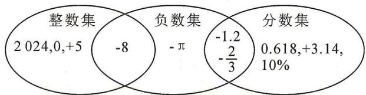

other

| Category | Value |
| -------- | ----- |
| 整数集 only | 2024,0,+5 |
| 负数集 only | -8 |
| 分数集 only | 0.618,+3.14, 10% |
| 负数集 ∩ 分数集 | -π |
| 整数集 ∩ 负数集 | -1.2 |
| 整数集 ∩ 分数集 | -2/3 |

例2 9 -10 2024

例 3 解: (1) -81; (2) -91; (3) 45, 88.

# 【实战演练】

1. (1) + 2, 0

(2)-3,-8

(3)0.6,+2,10%,0,+ $\frac{3}{2}$ ,π,0.3

(4)0.6,10%,+ $\frac{3}{2}$ ,0.3

(5)-1.2,- $\frac{1}{3}$

(6)0.6,-3,+2,10%,0,-8,-1.2,+ $\frac{3}{2}$ , $-\frac{1}{3}$ ,0.3

2. $-\frac{1}{7}$ $\frac{1}{8}$ $\frac{1}{100}$

3. 解: (1) 在 A 位置的数是正数; (2) 在 B 和 D 位置的数是负数; (3) 第 2046 个数是正数, 排在对应于 C 的位置.

# 板块三 五大概念(3) 数轴

# 【典例精讲】

例 1 (1)

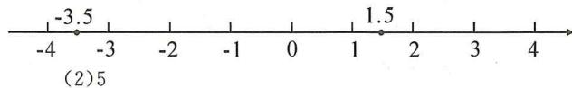

text_image

-3.5
-4 -3 -2 -1 0 1 1.5 2 3 4
(2)5

(3)5

(4)-4或2

(5)1

例 2 120 解: 因为墨迹最左端的有理数是 -109.2, 最右端的有理数是 10.5. 根据有理数在数轴上的排列特点, 可得墨迹遮盖部分最左侧的整数是 -109, 最右侧的整数是 10. 所以遮盖住的整数共有 120 个. 故答案是 120.

例 3 12 解: ∵ 点 A 对应 -4, 直尺的 0 刻度位置对应 -6, ∴ 直尺中 1 cm 是数轴上 2 个单位长度.

$$
\therefore 9 \times 2 = 1 8, - 6 + 1 8 = 1 2.
$$

∴点 B 对应的数为 12.

# 【实战演练】

1.(1)1或-6 (2)-5

2. A 解: 根据数轴的特点, -6.3 到 -1 之间的整数有 -6, -5, -4, -3, -2 共 5 个,

0 到 4.1 之间的整数有 1,2,3,4 共 4 个，

所以被墨迹盖住的整数有 $5+4=9$ 个. 故选 A.

3.8 解:由题可知刻度尺上 1 cm 表示数轴上 6 个单位长度,从 -8 到 40 有 48 个单位长度, $48 \div 6 = 8$ (cm),所以数 40 对应刻度尺上的 8 cm.

# 板块四 五大概念(4) 相反数

# 【典例精讲】

例1 (1) -2024 $\frac{1}{2} -a$ (2)0

例 2 (1)-8 (2)-8

例 3 【分析】两数互为相反数, 则它们的和为 0.
解:依题意,得 $7-2x+5-x=0$ ,解得x=4.

例4 C

# 【实战演练】

1. D 2. 7 -7 3. 1 4. C

5. 解: 由题意, 得 $4a - 1 - (a + 14) = 0$ ,

$$
4 a - 1 - a - 1 4 = 0,
$$

解得 a=5.

6. 解: 画图略; c < -b < a < -a < b < -c.

# 板块五 五大概念(5) 绝对值

# 【典例精讲】

例1 (1)3 3 0

(2)非负数 (3)5 -5

例 2 解: (1) ±5, 4 或 2;

$$
\begin{array}{l} (2) \because | x | = 2, \therefore x = \pm 2, \\ \because | y - 1 | = 3, \therefore y - 1 = 3 \text {或} y - 1 = - 3, \\ \therefore y = 4 \text {或} y = - 2, \\ \end{array}
$$

$$
\text { 又 } \because x <   y, \therefore x = 2, y = 4 \text {   或   } x = - 2, y = 4.
$$

例 3 (1) < (2) > (3) < (4) >

例 4 解: 由数轴可知 a<0, b>0, c<0,

$$
\therefore | a | = - a, | b | = b, | c | = - c,
$$

$$
\text { 又 } \because | a | = | b |, \therefore b = - a,
$$

$$
\therefore \text {   原式   } = - a - a + c + 2 a = c.
$$

例 5 解: $\because |a+b|\geqslant0,2|b-3|\geqslant0,$

$$
\text { 又 } \because | a + b | + 2 | b - 3 | = 0,
$$

$$
\therefore | a + b | = 0 \text {且} 2 | b - 3 | = 0, \text {即} a + b = 0 \text {且} b - 3 = 0,
$$

$\therefore a=-3,b=3.\left|a-b\right|$ 即是数轴上表示 a,b 两数的

两个点之间的距离,其距离为 6, $\therefore|a-b|=6.$

# 【实战演练】

1.(1)3 (2) $\pi-3$ (3)a-5

2. ±2 或 ±3 3. B 4. D 5. C 6. D 7. D

8. 解: (1)6 或 -4;

(2) $\because|a+1|=2,\therefore a=1$ 或 -3.

$\because |b-1|=5,\therefore b=6$ 或 -4.

$\because a>b,\therefore a=1$ 或 -3,b=-4.

当 $a = 1, b = -4$ 时，

$$
\vert a \vert + \vert b \vert = \vert 1 \vert + \vert - 4 \vert = 1 + 4 = 5;
$$

当 $a = -3, b = -4$ 时，

$$
\vert a \vert + \vert b \vert = \vert - 3 \vert + \vert - 4 \vert = 3 + 4 = 7.
$$

$\therefore |a|+|b|=5$ 或 7.

9. 解：∵ $\left|a-2\right|\geqslant0,\left|b-3\right|\geqslant0,\left|c-5\right|\geqslant0,$

且 $|a-2|+|b-3|+|c-5|=0$ ,

$$
\therefore | a - 2 | = 0, | b - 3 | = 0, | c - 5 | = 0,
$$

$$
\therefore a = 2, b = 3, c = 5,
$$

$$
\therefore 3 a + 2 b - c = 3 \times 2 + 2 \times 3 - 5 = 7.
$$

10. 解: 依题意, 得 $\left|x+2\right|+\left|y-5\right|=0$ ,

$$
\because | x + 2 | \geqslant 0, | y - 5 | \geqslant 0,
$$

且 $|x+2|+|y-5|=0$ ,

$$
\therefore x + 2 = 0, y - 5 = 0, \therefore x = - 2, y = 5,
$$

$$
\therefore 2 \vert x - y \vert = 2 \vert - 2 - 5 \vert = 2 \times 7 = 1 4.
$$

# 第二章 有理数的运算

# 第2讲 有理数的四则运算

# 板块一 有理数的加减(1) 加减运算

# 【典例精讲】

例 1 (1)8 (2)-8 (3)2 (4)-2 (5)2 (6)-2

(7)8 (8)-8 (9)-3 (10)3

例 2 解: (1) 原式 = 29 - 39 = -10;

(2) 原式 $= -8 + 1 \frac{1}{4} = -6 \frac{3}{4}$ .

例 3 解: (1) 原式 = -7 + 2 = -5;

(2) 原式 = -11 + 9 = -2.

# 【实战演练】

1. 解: (1) 原式 = -2.6 - 4.7 - 3.2 + 9.8 = -10.5 + 9.8 = -0.7;

(2) 原式 $= \frac{1}{2} - 5 - \frac{1}{3} - \frac{1}{4} = \frac{1}{2} - 5\frac{7}{12} = -5\frac{1}{12}$ .

2. 解: (1) 原式 = 16 + 24 - 25 - 35 = 40 - 60 = -20;

(2) 原式 = -2 + 2 + 3 - 3 + 1 - 4 = 0 + 0 - 3 = -3.

3. 解: (1) 原式 = 9 $\frac{7}{8}$ - 9 $\frac{7}{8}$ - 2 $\frac{3}{5}$ + 5 $\frac{3}{5}$ - 3 = 0 + 3 - 3 = 0;

(2) 原式 $= \frac{1}{2}\left(1 - \frac{1}{3} + \frac{1}{3} - \frac{1}{5} + \frac{1}{5} - \frac{1}{7} + \cdots + \frac{1}{99} - \right.$

$$
\left. \frac {1}{1 0 1}\right) = \frac {1}{2} \left(1 - \frac {1}{1 0 1}\right) = \frac {5 0}{1 0 1}.
$$

# 板块二 有理数的加减(2) 分类讨论

# 【典例精讲】

例 1 解: (1)x = -8, y = 6, $x + y = -2$ ;

(2) $x = 8, y = \pm 6, x + y = 14$ 或 2;

(3) $x = -8, y = \pm 6, x + y = -14$ 或-2.

例2 (1)1

(2)-9或-3

(3)-3或-7

(4)5 或 11

(5)1或5

# 【实战演练】

1.(1)-2或-12

(2)19 或 1

(3)0或2

2. 解：∵ $|a|=4$ , $|b|=2$ , ∴ $a=\pm4$ , $b=\pm2$ ,

$\because |a+b|=|a|+|b|,\therefore a,b$ 同号，

$\therefore a = 4, b = 2$ 或 $a = -4, b = -2$ .

当 a=4, b=2 时, a-b=2;

当 $a = -4, b = -2$ 时， $a - b = -2$ .

3. 解：∵ $\left|a\right|=2,\left|b\right|=3,\left|c\right|=5,\therefore a=\pm2,b=\pm3,c=\pm5,$

$$
\because | a + b | = a + b, | a + c | = - (a + c),
$$

$$
\therefore a + b \geqslant 0, a + c \leqslant 0, \therefore a = \pm 2, b = 3, c = - 5.
$$

当 a=2 时， $a+(-b)+(-c)=2+(-3)+5=4$ ;

当 a = -2 时， $a + (-b) + (-c) = -2 + (-3) + 5 = 0$ .

# 板块三 有理数与实际问题(1) 距离与路程

# 【典例精讲】

例 解：(1)(+5)+(-3)+(+10)+(-8)+(-6)+(+12)+

$$
(- 1 0) = (5 + 1 0 + 1 2) - (3 + 8 + 6 + 1 0) = 2 7 - 2 7 = 0.
$$

答:守门员最后回到了球门线的位置;

(2)由观察可知 $5-3+10=12$ 米.

答: 在练习过程中, 守门员离开球门线最远距离是 12 米;

$$
\vert + 5 \vert + \vert - 3 \vert + \vert + 1 0 \vert + \vert - 8 \vert + \vert - 6 \vert + \vert + 1 2 \vert +
$$

$$
\vert - 1 0 \vert = 5 + 3 + 1 0 + 8 + 6 + 1 2 + 1 0 = 5 4 (\text { 米 }).
$$

答:守门员全部练习结束后,他共跑了54米.

# 【实战演练】

1. 解: (1) $\because 14 - 9 + 8 - 7 + 13 - 6 + 12 - 5 = 20$ ,

∴B地在A地的东边20千米；

$$
(2) \because 1 4 - 9 = 5; 5 + 8 = 1 3; 1 3 - 7 = 6; 6 + 1 3 = 1 9; 1 9 - 6 =
$$

$$
1 3; 1 3 + 1 2 = 2 5; 2 5 - 5 = 2 0;
$$

∴最远处离出发点25千米；

(3)这一天走的总路程为 $14+|-9|+8+|-7|+13+|-6|+12+|-5|=74$ (千米),

应耗油 $74 \times 0.5 = 37$ (升)，故还需补充的油量为 37 - 28 = 9 (升).

2. 解: (1) $\left|+15\right|+\left|-2\right|+\left|+5\right|+\left|-1\right|+\left|-10\right|+\left|+3\right|$

$$
+ \vert - 2 \vert + \vert + 1 2 \vert = 5 0 \mathrm{km}, \text {   返回车库需要走   } 2 0 \mathrm{km},
$$

$$
\therefore (5 0 + 2 0) \times 0. 1 = 7 (\mathrm{L}).
$$

答: 小李营运后返回车库一共耗油 7 L;

(2) 总收入: $8 \times 10 + (15 - 3) \times 2 + (5 - 3) \times 2 + (10 - 3) \times$

$$
2 + (1 2 - 3) \times 2 = 1 4 0 (\text {   元  )   };
$$

总支出(油价): $7 \times 7 = 49$ (元), ∴ 盈利: 140 - 49 = 91 (元).

答:一共盈利91元.

# 板块四 有理数与实际问题(2) 盈余与不足

# 【典例精讲】

例 解:(1)根据题意,得 $-0.6-(-0.4)=-0.6+0.4=-0.2$ (百万元),

则三月份乙商场比甲商场多亏损 0.2 百万元；

(2)根据题意,得 $0.2-(-0.1)=0.2+0.1=0.3$ (百万元),则六月份甲商场比乙商场多盈利0.3百万元;

(3)根据题意,得 $\frac{1}{6}\times(0.8+0.6-0.4-0.1+0.1+$

0.2)=0.2(百万元);

$$
\frac {1}{6} \times (1. 3 + 1. 5 - 0. 6 - 0. 1 + 0. 4 - 0. 1) = 0. 4 (\text { 百万元 }).
$$

答: 甲、乙两商场上半年平均每月分别盈利 0.2 百万元，0.4 百万元.

# 【实战演练】

解:(1) $132-32+26-23-16+m+42-21=88$ ,

解得 m = -20.

答:星期五该粮仓是运出大米,运出大米20吨;

(2) $|-32|+26+|-23|+|-16|+|-20|+42+|-21|=$ 180, $180 \times 25 = 4500$ (元).

答:这一周该粮仓需要支付的装卸总费用为4500元.

# 板块五 有理数的乘除(1) 乘除运算

# 【典例精讲】

例1 (1)12 (2)-24 (3) $\frac{1}{15}$ (4)0 (5)- $\frac{2}{3}$ (6) $\frac{3}{2}$

有理数乘除法法则：
同号得正，异号得负，
再把绝对值相乘（除）；
先定符号，再定积；
带化假来，除化乘.

(带化假: 带分数化假分数)

例 2 解: (1) 原式 $= -\frac{14}{3} \times \frac{7}{3} \times \frac{9}{7} = -14$ ;

(2) 原式 $= -5 \times \frac{7}{9} \times \frac{4}{5} \times \frac{9}{4} \times \frac{1}{7} = -1$ .

例 3 解: (1) 原式= $\frac{1}{4}\times4\times\frac{5}{4}\times8=10$ ;

(2) 原式 = -8 + 6 + 4 = 2;

(3) 原式 $= (-125 - 62 + 187) \div \left(-\frac{3}{7}\right) = 0$

(4) 原式= $\left(125+\frac{5}{7}\right)\times\frac{1}{5}=25\frac{1}{7}$ .

# 【实战演练】

1. 解: (1) 原式 = 2 × 3 × 4 = 24;

(2) 原式 = -6 × 5 × 7 = -210;

(3) 原式 = 0.

2. 解: (1) 原式 $=3 \times \frac{1}{3} \times \frac{1}{3} = \frac{1}{3}$ ;

(2) 原式 $= -9 \times 11 \times \frac{1}{3} \times \frac{1}{3} = -11$ ;

(3) 原式 $= -\frac{3}{4} \times \frac{3}{2} \times \frac{4}{9} = -\frac{1}{2}$ .

3. 解: (1) 原式 $=22 \times \frac{1}{4} \times \frac{4}{11} = 2$ ;

(2) 原式 $= -\left(36 + \frac{9}{11}\right) \times \frac{1}{9} = -4\frac{1}{11}$ ;

(3) 原式= $\frac{11}{6}\times24-\frac{25}{8}\times24=-31.$

# 板块六 有理数的乘除(2) 混合运算

# 【典例精讲】

例 1 解: (1) 原式 = -15 - 7 × 6 = -15 - 42 = -57;

(2) 原式 = -4 + (-24 + 14) ÷ (-5) = -4 + 2 = -2;

(3) 原式 = -5 - (-6 - 21)

$$
= - 5 + 2 7 = 2 2;
$$

(4) 原式 $= 1 \div \left(1 \frac{1}{6} - \frac{5}{2}\right) + \frac{3}{4}$

$$
= - \frac {3}{4} + \frac {3}{4}
$$

$$
= 0.
$$

例 2 解: (1) 原式 = -8 - $\left[-7 + \frac{3}{5} \times \left(-\frac{1}{3}\right)\right]$

$$
= - \frac {4}{5};
$$

(2) 原式 $= 4 \frac{1}{7} + \frac{7}{2} \times \frac{8}{7} \times \frac{3}{4}$

$$
= 4 \frac {1}{7} + 3
$$

$$
= 7 \frac {1}{7}.
$$

# 【实战演练】

1. 解: (1) 原式 = -115 + 128

$$
= 1 3;
$$

(2) 原式 $= -13 \times \left(\frac{2}{3} + \frac{1}{3}\right) - 0.34 \times \left(\frac{2}{7} + \frac{5}{7}\right)$

$$
= - 1 3 - 0. 3 4
$$

$$
= - 1 3. 3 4.
$$

2. 解: (1) 原式 = -18 - 14 + 13 = -19;

(2) 原式 $=99 \times \left(-100 + \frac{1}{99}\right) = -9899.$

# 板块七 数形结合的应用(1) 符号推断

# 【典例精讲】

例 1 D

例 2 A 解: $\because ab < 0, a + b > 0,$

∴a,b异号,且正数的绝对值大于负数的绝对值.

$\therefore a,b$ 对应着点 M 与点 P，

$$
\because a > b,
$$

∴数 b 对应的点为 M. 故选 A.

例 3 (1) ±2

(2)-1 或 $-\frac{3}{5}$

# 【实战演练】

1. A

2. B 解：∵ AB = BC，∴ b - a = c - b，∴ $a + c = 2b$ ，

$\because a+b-c=0$ , 即 $c=a+b$ ,

$$
\therefore a + (a + b) = 2 b, \therefore b = 2 a, \therefore c = a + b = 3 a,
$$

$\because a<b<c,\therefore a>0,b>0,c>0,\therefore a+c>0,$ 则 A 选项错误；ac>0，则 B 选项正确；bc>0，则 C 错误；ab>0，则 D 错误。故选 B.

3. D 解: 根据题意, 得 a<0<1<b, 且 $|a|<|b|$ , ∴ A 正确, -a<1<b, 故 B 正确, a-b<0, 故 C 正确,

$\because a+1>0,b-1>0,\therefore(a+1)(b-1)>0,D$ 错误.

故选D.

4.(1)8或-8

(2)8 或 -8

# 板块八 数形结合的应用(2) 多结论判断

# 【典例精讲】

例 1 B 解: 由数轴可得 a<0<b，且 $\left|a\right|>\left|b\right|$

故①正确；②不正确；

③由 a, b 异号, 可知 ab < 0, 故③不正确;

④由 a, b 异号, 可知 $\frac{b}{a} < 0$ , 故④不正确;

⑤∵b-a>0,b+a<0,∴b-a>b+a,故⑤正确;

⑥ $|a-b|+a=b-a+a=b$ ，故⑥正确.

综上所述,有①⑤⑥正确.故选B.

例2 A

# 【实战演练】

1. C 解: ① $\because b<0<a,|a|<|b|,\therefore a+b<0,\therefore$ ①错误;

②∵b<0<a<c,∴abc<0,∴②正确；  
③∵b<0<a<c,∴a-c<0,∴③正确；  
④∵b<0<a,|a|<|b|,∴-1< $\frac{a}{b}$ <0,∴④正确.

∴正确的有②③④.故选C.

2. ①② 解：∵a<1，∴a-1<0.

$$
\because b <   1, \therefore b - 1 <   0, \therefore (a - 1) (b - 1) > 0.
$$

∴①正确；

$\because b<-1,\therefore b-(-1)<0,$ 即 $b+1<0,$

$\therefore (a-1)(b+1)>0.$ ∴②正确；

$$
\because a > 0, \therefore a + 1 > 0 \text {, 又} \because b <   - 1, \therefore b + 1 <   0,
$$

$\therefore (a+1)(b+1)<0.$ ∴③错误.

故答案为①②.

# 第 3 讲 有理数的乘方

# 板块一 有理数的乘方(1) 乘方运算

# 【典例精讲】

例 1 (1)16 (2)16 (3)-16 (4)1 (5)-1 (6)-1

例2 B

例 3 解: (1) 原式 = -4 - 40 + 3 = -41;

(2) 原式 = 9 - 1 + 4 = 12;  
(3) 原式 = -4 + 4 - 8 + 10 = 2;  
(4) 原式 $= -1 - \frac{1}{6} \times (-7) = -1 + \frac{7}{6} = \frac{1}{6}$ .

# 【实战演练】

1.C

2.(1)9 (2)-27 (3)-9   
3. 解: (1) 原式 = 4 × 5 + 8 ÷ 4

$$
\begin{array}{l} = 2 0 + 2 \\ = 2 2; \\ \end{array}
$$

(2) 原式 = 3 × (-8) - 4 × 9 + 8

$$
\begin{array}{l} = - 2 4 - 3 6 + 8 \\ = - 5 2; \\ \end{array}
$$

(3) 原式 $= -9 + \frac{25}{4} \times \left(-\frac{4}{25}\right) + 4$

$$
= - 9 - 1 + 4
$$

$$
= - 6;
$$

(4) 原式 $= -1 - \frac{1}{5} \times (-5)$

$$
= - 1 + 1
$$

$$
= 0.
$$

# 板块二 有理数的乘方(2) 乘方规律

# 【典例精讲】

例 1 解: (1) -256; -254; -128;

(2)不存在.理由如下:设第③行中连续的三个数分别为a,-2a,4a,则 $a+(-2a)+4a=-768$ ,

解得 a = -256. ∵ 第③行中第 9 个数为 256，

∴不存在和为-768的三个连续的数；

(3)存在.理由如下:设这一列的第一行的数为x,

则 $x + (x + 2) + \frac{1}{2} x = -2558$ ，解得 $x = -1024$

$\because -1\ 024 = -2^{10}, \therefore$ 存在这样的一列数, 这三个数分别为 -1 024, -1 022, -512.

例 2 解: (1)n=7 时, x=128, y=129, z=-64,

$$
y - z = 1 2 9 - (- 6 4) = 1 9 3;
$$

(2) 当 n 为偶数时, z 最大, x 最小,

$z - x = -\frac{1}{2} x - x = 384$ ，解得 $x = -256, \therefore n = 8$

(3) $y = x + 1, z = -\frac{x}{2},$

$$
\therefore m = x + x + 1 - \frac {x}{2} = \frac {3}{2} x + 1;
$$

①当 n 为奇数时，y 最大，z 最小，

$$
y - z = x + 1 - \left(- \frac {x}{2}\right) = \frac {3}{2} x + 1 = m;
$$

②当 n 为偶数时，z 最大，x 最小，

$$
z - x = - \frac {x}{2} - x = - \frac {3}{2} x = 1 - m.
$$

# 【实战演练】

1. 解：(1) $\because -3,9,-27,81,-243,729,\cdots$

∴第①行数是 $(-3)^{1},(-3)^{2},(-3)^{3},(-3)^{4},\cdots,(-3)^{n}$ ;

(2)第②行数是第①行数相应的数乘 $-\frac{1}{3}$ ,

即 $-\frac{1}{3}\times(-3)^{n}$ ,

第③行的数是第①行相应的数加1，即 $(-3)^{n}+1$ ；

(3) $\because x=3^{2024},y=-\frac{1}{3}\times3^{2024},z=3^{2024}+1,$

$$
\begin{array}{l} \therefore x + 6 y + z = 3 ^ {2 0 2 4} + 6 \times \left(- \frac {1}{3} \times 3 ^ {2 0 2 4}\right) + 3 ^ {2 0 2 4} + 1 \\ = 2 \times 3 ^ {2 0 2 4} - 2 \times 3 ^ {2 0 2 4} + 1 \\ = 1. \\ \end{array}
$$

2. 解: (1) 由数列知 $a = -(-2)^{n}$ , $b = -(-2)^{n} + 2$ ,

$$
c = \frac {- (- 2) ^ {n}}{2};
$$

(2) 若 $a = x$ ，则 $b = x + 2, c = \frac{1}{2} x$ ，根据题意，得

$$
\begin{array}{l} a + b + c = x + x + 2 + \frac {1}{2} x \\ = \frac {5}{2} x + 2. \\ \end{array}
$$

# 板块三 有理数的计算技巧(1) 对消与凑整典例精讲】

例 1 解: (1) 原式 = [8 + (-8)] + [(-4) + 4] + 6 + 12 - 2

$$
\begin{array}{l} = 6 + 1 0 \\ = 1 6; \\ \end{array}
$$

(2) 原式 $= (36.54 + 63.46) + [22.57 + (-10.57)]$

$$
\begin{array}{l} = 1 0 0 + 1 2 \\ = 1 1 2. \\ \end{array}
$$

例 2 解: (1) 原式= $\frac{3}{2}-\frac{5}{4}+\frac{15}{4}-\frac{1}{4}-\frac{15}{4}-\frac{9}{2}$

$$
\begin{array}{l} = \frac {3}{2} - \frac {5}{4} - \frac {1}{4} - \frac {9}{2} \\ = - \frac {9}{2}; \\ \end{array}
$$

(2) 原式 = 12 $\frac{1}{4} - 1 \frac{3}{4} + 5 \frac{1}{2} - 7 \frac{1}{4} + 2 \frac{3}{4} - \frac{5}{2} =$

$$
\left(\frac {4 9}{4} - \frac {7}{4} - \frac {2 9}{4} + \frac {1 1}{4}\right) + \left(\frac {1 1}{2} - \frac {5}{2}\right) = 6 + 3 = 9.
$$

# 【实战演练】

解:(1)原式= $\frac{5}{17}-\left(-\frac{12}{17}\right)-9-12$

$$
= 1 - 2 1
$$

$$
= - 2 0;
$$

(2) 原式 = 4.25 - 2.18 + 2.75 + 5.18

$$
= (4. 2 5 + 2. 7 5) + (5. 1 8 - 2. 1 8)
$$

$$
= 7 + 3
$$

$$
= 1 0;
$$

(3) 原式 $= \frac{5}{6} + \left(-\frac{3}{4}\right) - \frac{1}{4} + \frac{1}{6}$

$$
= \left(\frac {5}{6} + \frac {1}{6}\right) + \left[ \left(- \frac {3}{4}\right) + \left(- \frac {1}{4}\right) \right]
$$

$$
= 1 + (- 1)
$$

$$
= 0;
$$

(4) 原式=16.2+2 $\frac{1}{3}$ +3 $\frac{2}{3}$ -10.7

$$
= 1 1. 5.
$$

# 板块四 有理数的计算技巧(2) 归类与组合

# 【典例精讲】

例 解:(1)原式= $(16+24)+(-25-35)$ ;

$$
= 4 0 - 6 0
$$

$$
= - 2 0;
$$

(2) 原式 $= \left(2\frac{1}{6} - 5\frac{1}{6}\right) + \left(-2\frac{2}{9} - 4\frac{7}{9}\right)$

$$
= - 3 - 7
$$

$$
= - 1 0;
$$

(3) 原式 $= -\left(5 \frac{5}{24} + 10 \frac{7}{24}\right) + \left(6 \frac{7}{15} - 2 \frac{2}{15}\right) - \frac{1}{3}$

$$
= - 1 5 \frac {1}{2} + 4 \frac {1}{3} - \frac {1}{3}
$$

$$
= - 1 5 \frac {1}{2} + 4
$$

$$
= - 1 1 \frac {1}{2};
$$

(4) 原式 $= \left(1.75 - 1\frac{3}{4}\right) + \left(-6\frac{1}{2}\right) + \left(3\frac{3}{8} + 2\frac{5}{8}\right)$

$$
= 0 - 6 \frac {1}{2} + 6
$$

$$
= - \frac {1}{2}.
$$

# 【实战演练】

解:(1)原式=-5-2+9+8

$$
= - 7 + 1 7
$$

$$
= 1 0;
$$

(2) 原式 $= (0.85 - 1.85) + \left(0.75 - 2\frac{3}{4}\right) + 3$

$$
= 0;
$$

(3) 原式 $= -1\frac{1}{2} - 2\frac{1}{2} + 1\frac{1}{4} + 3\frac{1}{4} - 1\frac{1}{4}$

$$
= - \frac {3}{4};
$$

(4) 原式 $= \left(-3.5 + \frac{7}{2}\right) + \left(-\frac{4}{3} - \frac{7}{3}\right) + \left(-\frac{3}{4} + 0.75\right)$

$$
= 0 - 3 \frac {2}{3} + 0
$$

$$
= - 3 \frac {2}{3}.
$$

# 板块五 有理数的计算技巧(3) 活用运算律

# 【典例精讲】

例 解:(1)原式= $-\left(\frac{8}{5}-\frac{8}{9}-\frac{8}{15}\right)\times\frac{15}{8}$

$$
= \frac {8}{5} \times \left(- \frac {1 5}{8}\right) - \frac {8}{9} \times \left(- \frac {1 5}{8}\right) - \frac {8}{1 5} \times
$$

$$
\left(- \frac {1 5}{8}\right)
$$

$$
= - 3 + \frac {5}{3} + 1
$$

$$
= - \frac {1}{3};
$$

(2) 原式 $= 133 \frac{7}{9} \times \frac{1}{7}$

$$
= \left(1 3 3 + \frac {7}{9}\right) \times \frac {1}{7}
$$

$$
= 1 3 3 \times \frac {1}{7} + \frac {7}{9} \times \frac {1}{7}
$$

$$
= 1 9 + \frac {1}{9}
$$

$$
= 1 9 \frac {1}{9};
$$

(3) 原式= $128 \times \frac{7}{3} + 62 \times \frac{7}{3} - 187 \times \frac{7}{3}$

$$
= (1 2 8 + 6 2 - 1 8 7) \times \frac {7}{3}
$$

$$
= 3 \times \frac {7}{3} = 7;
$$

(4) 原式 $= -7 \times \frac{6}{5} - 8 \times \frac{6}{5} - 5 \times \frac{6}{5}$

$$
= (- 7 - 8 - 5) \times \frac {6}{5}
$$

$$
= - 2 0 \times \frac {6}{5} = - 2 4.
$$

# 【实战演练】

解:(1)原式= $\left(\frac{3}{7}\times\frac{7}{12}\right)\times\left(-\frac{4}{5}\times\frac{5}{8}\right)$

$$
= \frac {1}{4} \times \left(- \frac {1}{2}\right)
$$

$$
= - \frac {1}{8};
$$

(2) 原式= $\left(100-\frac{1}{72}\right)\times(-36)$

$$
= 1 0 0 \times (- 3 6) - \frac {1}{7 2} \times (- 3 6)
$$

$$
= - 3 6 0 0 + \frac {1}{2} = - 3 5 9 9 \frac {1}{2};
$$

(3) 原式 $= 0.7 \times \left(1 \frac{4}{9} + \frac{5}{9}\right) - 15 \times \left(2 \frac{3}{4} + \frac{1}{4}\right)$

$$
= 0. 7 \times 2 - 1 5 \times 3
$$

$$
= 1. 4 - 4 5
$$

$$
= - 4 3. 6;
$$

(4) 原式的倒数为 $\left(\frac{1}{6}-\frac{3}{14}+\frac{2}{3}-\frac{2}{7}\right)\div\left(-\frac{1}{42}\right)$

$$
= \left(\frac {1}{6} - \frac {3}{1 4} + \frac {2}{3} - \frac {2}{7}\right) \times (- 4 2)
$$

$$
= - 7 + 9 - 2 8 + 1 2 = - 1 4.
$$

故原式 $= -\frac{1}{14}$

# 板块六 有理数的计算技巧(4) 裂项与换元

# 【典例精讲】

例 1 解: 原式= $\frac{1}{2}\left[\left(\frac{1}{2}-\frac{1}{4}\right)+\left(\frac{1}{4}-\frac{1}{6}\right)+\left(\frac{1}{6}-\frac{1}{8}\right)+\right.$

$$
\left. \dots + \left(\frac {1}{2 0 2 2} - \frac {1}{2 0 2 4}\right) \right]
$$

$$
= \frac {1}{2} \left(\frac {1}{2} - \frac {1}{2 0 2 4}\right)
$$

$$
= \frac {1}{2} \times \frac {1 0 1 1}{2 0 2 4}
$$

$$
= \frac {1 0 1 1}{4 0 4 8}.
$$

例 2 【分析】本题显然不能用常规方法直接计算, 观察式子的 4 个小部分, 我们发现各部分的相同项很多, 如果把相同部分用一个字母来代替, 则可使运算大大简化.

解: 设 $1 + \frac{1}{2} + \frac{1}{3} + \cdots + \frac{1}{2023} = a, \frac{1}{2} + \frac{1}{3} + \cdots +$

$\frac{1}{2023}=b$ ，则 a-b=1，

∴原式= $\left(b+\frac{1}{2024}\right)a-\left(a+\frac{1}{2024}\right)b$

$$
= \frac {a}{2 0 2 4} - \frac {b}{2 0 2 4}
$$

$$
= \frac {a - b}{2 0 2 4}
$$

$$
= \frac {1}{2 0 2 4}.
$$

# 【实战演练】

1. 解: 原式=2 $\left(\frac{1}{1\times2}+\frac{1}{2\times3}+\cdots+\frac{1}{100\times101}\right)$

$$
= 2 \left(1 - \frac {1}{2} + \frac {1}{2} - \frac {1}{3} + \dots + \frac {1}{1 0 0} - \frac {1}{1 0 1}\right)
$$

$$
= 2 \left(1 - \frac {1}{1 0 1}\right) = \frac {2 0 0}{1 0 1}.
$$

2. 解: 令 $\frac{1}{2} + \frac{1}{3} + \frac{1}{4} + \frac{1}{5} = a, 1 - \frac{1}{2} - \frac{1}{3} - \frac{1}{4} - \frac{1}{5} = b$ , 则 $a + b = 1$ .

∴ 原式 $= b \left( a + \frac{1}{6} \right) - \left( b - \frac{1}{6} \right) a = ab + \frac{1}{6} b - ab + \frac{1}{6} a = \frac{1}{6} (a + b) = \frac{1}{6}.$

# 板块七 有理数的计算技巧(5) 错位相减

# 【典例精讲】

例 解:(1)①数列 1,2,3,4,5,…中,每一项与前一项之差是一个常数,这个常数是 1,如果 $a_{n}$ (n 为正整数) 表示这个数列的第 n 项,那么 $a_{18}=18, a_{n}=n$ ;

②令 $S=1+2+3+4+\cdots+n$ ①，

将①式右边顺序倒置, 得 $S=n+\cdots+4+3+2+1$ ②,

由②加上①式，得 $2S = n(n + 1),\therefore S = \frac{n(n + 1)}{2},$

由结论求 $1+2+3+4+\cdots+55=\frac{55\times56}{2}=1\ 540$ ;

(2) 令 $M=1+5+5^{2}+5^{3}+\cdots+5^{51}$ ,

则 $5M=5+5^{2}+5^{3}+\cdots+5^{52},\therefore5M-M=5^{52}-1,$

∴ $4M = 5^{52} - 1$ , ∴ $M = \frac{5^{52} - 1}{4}$ , 即 $1 + 5 + 5^{2} + 5^{3} + \cdots +$

$$
5 ^ {5 1} = \frac {5 ^ {5 2} - 1}{4}.
$$

# 【实战演练】

解：(1) $S_{n}=1^{3}+2^{3}+3^{3}+\cdots+n^{3}=(1+2+3+\cdots+n)^{2}=$

$$
\left[ \frac {n (n + 1)}{2} \right] ^ {2};
$$

(2) $S_{10} = 1^{3} + 2^{3} + 3^{3} + \dots +10^{3} = (1 + 2 + 3 + \dots +10)^{2} =$

$$
\left[ \frac {1 0 (1 + 1 0)}{2} \right] ^ {2} = 3 0 2 5;
$$

(3) $11^{3}+12^{3}+13^{3}+\cdots+40^{3}=(1^{3}+2^{3}+3^{3}+\cdots+40^{3})-$

$$
(1 ^ {3} + 2 ^ {3} + 3 ^ {3} + \dots + 1 0 ^ {3}) = \left[ \frac {4 0 (1 + 4 0)}{2} \right] ^ {2} - \left[ \frac {1 0 (1 + 1 0)}{2} \right] ^ {2}
$$

=672 400-3 025=669 375.

# 板块八 相反数、绝对值、倒数与整体求值

# 【典例精讲】

例 1 解：∵a,b互为相反数,c,d互为倒数,m的绝对值为2,

$$
\therefore a + b = 0, c d = 1, m = \pm 2.
$$

当 m=2 时， $m+cd+\frac{a+b}{m}=2+1+0=3$ ;

当 $m = -2$ 时， $m + cd + \frac{a + b}{m} = -2 + 1 + 0 = -1.$

例 2 解: $\because a, b$ 互为相反数, 且 $a \neq 0$ ,

$$
\therefore a + b = 0, \frac {a}{b} = - 1,
$$

$\because c$ 和 d 互为倒数，

$$
\therefore c d = 1,
$$

$\because m$ 的绝对值等于 3，

$\therefore m=\pm3$ , 即 $m^{2}=9$ ,

∴原式= $\frac{2023\times0^{2}}{2024}-9+4\times(-1)-3\times1$

$$
= 0 - 9 - 4 - 3 = - 1 6,
$$

∴ $\frac{2023(a+b)^{2}}{2024}-m^{2}+\frac{4a}{b}-3cd$ 的值为-16.

# 【实战演练】

1. 解：∵a,b 互为相反数，∴ $a+b=0$ .

$\because c,d$ 互为倒数， $\therefore cd=1.$

$$
\because | x - 1 | = 2,
$$

∴x-1=2或x-1=-2，

∴x=3或-1.

当 x=3 时，原式 $=\frac{1}{3}-3=-\frac{8}{3}$ ;

当 $x = -1$ 时，原式 $= -1 - 1 = -2.$

2. 解: 由题意, 可知 $a + b = 0$ , cd = 1, m = 0,

$$
\because (x - 1) ^ {2} \geqslant 0, | y - 2 | \geqslant 0,
$$

且 $(x-1)^{2}+|y-2|=0$ ，

∴原式=5a+2b+3b+2+0

$$
\begin{array}{l} \therefore (x - 1) ^ {2} = 0, | y - 2 | = 0, \\ \therefore x - 1 = 0, y - 2 = 0, \therefore x = 1, y = 2. \\ = 5 a + 5 b + 2 \\ = 5 (a + b) + 2 \\ = 2. \\ \end{array}
$$

# 板块九 与有理数有关的阅读理解与新定义

# 【典例精讲】

例 解: $101011 = 1 \times 2^{5} + 0 \times 2^{4} + 1 \times 2^{3} + 0 \times 2^{2} + 1 \times 2^{1} +$

$$
1 \times 2 ^ {0} = 4 3,
$$

∴二进制中的数101011等于十进制中的43.

# 【实战演练】

1. 解：(1) 根据新定义，由 $6^{1}=6,3^{4}=81$ 可得 $\log_{6}6=1$ ,

$$
\log_ {3} 8 1 = 4;
$$

(2)根据定义知 $m-2=2^{3}$ ，解得 m=10。

2. 解: (1) 由题意, 得 $6 = |-3| + |b|$ , 解得 $b = \pm 3$ ,

$$
\because a = - 3, \therefore b = 3;
$$

(2)由题意,得 $|a|+|b|=6$ ,且 $|b|+6=|a|$ ,解得b=0.

# 第4讲 趣味非凡的绝对值

# 板块一 绝对值的意义(1) 代数视角

# 【典例精讲】

例1 (1) $x \geqslant 0$

$$
(2) x \leqslant 0
$$

$$
(3) x \geqslant - 1
$$

$$
(4) x \leqslant 2
$$

例 2 (1) $\pi-3$

$$
(2) b
$$

例 3 解: 由数轴可知 $a<0, a+b<0, c-a>0, b-c<0, a+c>0.$

$$
\therefore \text {原式} = - a + (a + b) + (c - a) - (b - c) + (a + c) = 3 c.
$$

# 【实战演练】

1.(1) $a \geqslant 3$

(2)8

(3)-2或-8

2. 解：∵ $|x|=3$ ， $|y-1|=5$ ，

$$
\therefore x = \pm 3, y = 6 \text {或} - 4.
$$

$$
\because x > y, \therefore x = \pm 3, y = - 4.
$$

$$
\therefore x - y = 7 \text {   或   } 1.
$$

3. 解: 由数轴可知 c-a<0, a+b<0, b-c<0.

$$
\therefore \text {   原式   } = - (c - a) + (a + b) - (b - c)
$$

$$
= - c + a + a + b - b + c
$$

$$
= 2 a.
$$

# 板块二 绝对值的意义(2) 几何视角

# 【典例精讲】

例 1 解: $\left|m-2\right|$ 的几何意义是数轴上表示数 m 和 2 两点之间的距离.

当 m 在 2 的左侧即 m<2 时， $|m-2|=2-m=10$ ，m=-8，此时 $|m+1|=-8+1|=7$ ；

当 m 在 2 的右侧即 m > 2 时， $|m - 2| = m - 2 = 10$ ，m = 12，此时 $|m + 1| = |12 + 1| = 13$ ;

综上所述， $|m+1|$ 的值为7或13.

例 2 解: 如图, 设 A, B, P 表示的数分别为 -12, 8, m, 则 $\left|m+12\right|=3\left|m-8\right|$ 的几何意义是 PA=3PB.

①如图 1, 当点 P 在点 A 的左侧时,

$PA<PB,PA=3PB$ 不成立；

②如图 2, 当点 P 在 A, B 两点之间, 即 $-12 \leqslant m \leqslant 8$

时， $|m+12|=PA=m+12,|m-8|=PB=8-m$

$\therefore m+12=3(8-m)$ ，解得 m=3；

③如图3，当点 $P$ 在点 $B$ 的右侧，即 $m > 8$ 时，

$$
\vert m + 1 2 \vert = P A = m + 1 2, \vert m - 8 \vert = P B = m - 8,
$$

$\therefore m+12=3(m-8)$ , 解得 m=18.

综上所述，m 的值为 3 或 18.

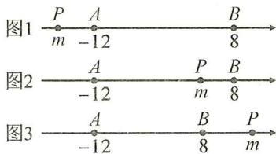

text_image

图1
P A B
m -12 8
图2
A P B
-12 m 8
图3
A B P
-12 8 m

# 【实战演练】

1.(1)8或-4

(2)2

2. 解: 依题意, 得 $\left|x+4\right|=11$ , $\therefore x+4=11$ 或 -11,

$$
\therefore x = 7 \text {或} - 1 5.
$$

3. 解: $\left|m-4\right|=\left|m-16\right|$ 的几何意义是, 数轴上表示数 m 的点到表示数 4 和 16 这两个点的距离相等, 所以 m 必定在 4 和 16 之间, $\therefore\left|m-4\right|=m-4,\left|m-16\right|=16-m$ ,

$$
\therefore m - 4 = 1 6 - m, \text {解得} m = 1 0.
$$

4. 解: $\left|t+4\right|+\left|t-1\right|+\left|t-8\right|=12$ 的几何意义是, 数轴上表示数 t 的点到表示数 -4, 1, 8 这三个点的距离之和为 12, 即图中 $PA + PB + PC = 12$ , 由图可知, $PA + PB + PC \geqslant AC = 12$ , 只有当点 P 与点 B 重合时, $PA + PB + PC = AC = 12$ , $\therefore t = 1$ .

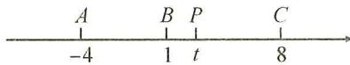

# 板块三 绝对值的非负性

# 【典例精讲】

例 1 【分析】几个非负数的和为 0，则每个非负数分别为 0.
解： $\because(a+2)^{2}\geqslant0,\left|b-3\right|\geqslant0$ ，且 $(a+2)^{2}+|b-3|=0$

$$
\therefore (a + 2) ^ {2} = 0, | b - 3 | = 0,
$$

$$
\therefore a = - 2, b = 3.
$$

例 2 解: $\because |x-2|+|x+y-5|+|y-1|=y-1$ ,

$$
\therefore y - 1 \geqslant 0, \therefore | y - 1 | = y - 1,
$$

$$
\therefore | x - 2 | + | x + y - 5 | + y - 1 = y - 1,
$$

$$
\therefore | x - 2 | + | x + y - 5 | = 0,
$$

$$
\text { 又 } \because | x - 2 | \geqslant 0, | x + y - 5 | \geqslant 0,
$$

$$
\therefore x - 2 = 0, x + y - 5 = 0,
$$

$$
\therefore x = 2, x + y = 5, \therefore y = 3.
$$

# 【实战演练】

1. 解: 由已知, 得 $\left|a-1\right|+\left|b-2\right|=0$ ,

$$
\text { 又 } \because | a - 1 | \geqslant 0, | b - 2 | \geqslant 0,
$$

$$
\therefore a - 1 = 0 \text {且} b - 2 = 0, \therefore a = 1, b = 2.
$$

$$
\therefore a - 3 b = 1 - 6 = - 5.
$$

2. 解：∵ $\left|a-2\right|+\left|b-5\right|+\left|c-4\right|=c-4$

$$
\therefore c - 4 \geqslant 0, \therefore | c - 4 | = c - 4,
$$

$$
\therefore | a - 2 | + | b - 5 | = 0,
$$

$$
\therefore a - 2 = 0 \text {, 且} b - 5 = 0
$$

$$
\therefore a = 2, b = 5,
$$

$$
\therefore a + b = 2 + 5 = 7.
$$

# 板块四 多绝对值处理(1) 分类讨论

# 【典例精讲】

例 1 解: 分四种情况讨论:

①a,b,c 全正,原式=1+1+1=3;

②两正一负,原式=1+1-1=1;

③一正两负,原式=1-1-1=-1;

④a,b,c 全负,原式=-1-1-1=-3.

综上所述，原式的值为 $\pm1,\pm3.$

例 2 解： $\because a+b+c+d<0,abcd>0,$

$\therefore a,b,c,d$ 四个数中负数有 2 个或 4 个.

①a,b,c,d 四个数中有 2 个负数时，

原式 $= -1 - 1 + 1 + 1 + 1 = 1$

②a,b,c,d 四个数全部为负数时，

原式 $= -1 - 1 - 1 - 1 + 1 = -3.$

综上所述,原式的值为1或-3.

# 【实战演练】

1. 解: 由已知可得 a, b, c 中有两正一负或一正两负.

①若两正一负，则原式 $= \frac{-a}{|a|} +\frac{-b}{|b|} +\frac{-c}{|c|} = -1 - 1 + 1 =$ -1；

②若一正两负,则原式 $=-1+1+1=1$ .

∴原式的值为±1.

2. 解：∵ 原式的值由 a, b, c 三个数中负数的个数决定，

∴分四种情况讨论：

①三个数全部为正数时,原式= $1+1+1+1=4$ ;   
②三个数中一负两正时,原式 $=-1+1+1-1=0$ ;  
③三个数中两负一正时,原式=-1-1+1+1=0;   
④三个数全部为负数时,原式=-1-1-1-1=-4.

综上所述,原式的值为 $\pm4$ 或0.

# 板块五 多绝对值处理(2) 零点分段

# 【典例精讲】

例 1 解: 令 x-3=0, $x+4=0$ , 分别解得 x=3, x=-4,

∴零点为3和-4,分以下三种情况讨论：

①当 x<-4 时，原式=3-x-4-x=-2x-1；  
②当 $-4\leqslant x<3$ 时，原式 $=3-x+x+4=7$ ;  
③当 $x \geqslant 3$ 时，原式 $= x - 3 + x + 4 = 2x + 1$ .

综上所述，

$$
| x - 3 | + | x + 4 | = \left\{ \begin{array}{l l} - 2 x - 1 & (x <   - 4), \\ 7 & (- 4 \leqslant x <   3), \\ 2 x + 1 & (x \geqslant 3). \end{array} \right.
$$

例 2 解: 先找零点, 令 $x+4=0$ , x-2=0,

分别解得 x = -4, x = 2.

①当 x<-4 时， $-(x+4)-(x-2)=10,-2x=12$ ，
x=-6;  
②当 $-4 \leqslant x \leqslant 2$ 时， $x + 4 - x + 2 = 10$ ，无解；  
③当 x>2 时， $x+4+x-2=10$ ，x=4。

综上所述，x=-6 或 4.

例 3 解: 找到零点 3, -2, 结合 $x \leqslant 2$ 可以分为以下两段进行分析:

当 $-2 \leqslant x \leqslant 2$ 时， $|x - 3| - |x + 2| = 3 - x - x - 2 = 1 - 2x$ ，有最小值-3和最大值5；

当 x<-2 时， $|x-3|-|x+2|=3-x+x+2=5.$

综上可得最小值为-3,最大值为5.

# 【实战演练】

1. 解: 先找零点. $x + 5 = 0, x = -5; 2x - 3 = 0, x = \frac{3}{2}$ ,

零点可以将数轴分成三段.

①当 $x \geqslant \frac{3}{2}$ 时，

$$
x + 5 > 0, 2 x - 3 \geqslant 0, | x + 5 | + | 2 x - 3 | = 3 x + 2;
$$

②当 $-5\leqslant x<\frac{3}{2}$ 时，

$$
x + 5 \geqslant 0, 2 x - 3 <   0, | x + 5 | + | 2 x - 3 | = 8 - x;
$$

③当 x<-5 时，

$$
x + 5 <   0, 2 x - 3 <   0, | x + 5 | + | 2 x - 3 | = - 3 x - 2.
$$

2. 解: (1) 令 x-4=0, 则 x=4, 令 $x+2=0$ , 则 x=-2,

∴零点为-2和4,分以下三种情况讨论:

①当 x<-2 时，原式= $-(x-4)+(x+2)=6$ ;  
②当 $-2\leqslant x<4$ 时，原式 $=-(x-4)-(x+2)=-2x+2;$   
③当 $x \geqslant 4$ 时，原式 = x - 4 - (x + 2) = -6.

综上所述， $|x - 4| - |x + 2| = \begin{cases} 6(x < -2), \\ -2x + 2(-2 \leqslant x < 4), \\ -6(x \geqslant 4). \end{cases}$

3. 解: 当 x-2=0 时, x=2; 当 $x+6=0$ 时, x=-6, 即零点为 -6 和 2.

①当 x<-6 时， $-(x-2)-(x+6)=12,x=-8$ ;  
②当 $-6\leqslant x<2$ 时， $-(x-2)+(x+6)=12$ ，

此情况不成立；

③ $x\geqslant2$ 时， $(x-2)+(x+6)=12,x=4.$

综上所述，x=-8 或 4.

4. 解: 零点为 12 和 -1, 分三种情况讨论:

①当 x<-1 时， $-(x-12)=-2(x+1)+4$ ，

解得 x = -10;

②当 $-1 \leqslant x < 12$ 时， $-(x-12)=2(x+1)+4$ ，

解得 x=2;

③ $x\geqslant12$ 时， $x-12=2(x+1)+4$ ，

解得 x = -18 < 12 不成立.

综上所述，x=-10 或 2.

5. 解: 零点为 3 和 -2, 分三种情况讨论:

①当 $x \leqslant -2$ 时， $P = -(x + 2) - (x - 3) = -2x + 1$ ，

当 x = -2 时， $P_{最小} = 5$ ;

②当-2<x<3时， $P=(x+2)-(x-3)=5$ ;

③ $x\geqslant3$ 时， $P=(x+2)+(x-3)=2x-1$

当 x=3 时， $P_{最小}=5$ .

综上所述，P 的最小值为 5，此时 x 的取值范围是 $-2 \leqslant x \leqslant 3$ .

# 板块六 多绝对值处理(3) 数形结合

# 【典例精讲】

例 1 解: 设数轴上表示数 -2, 6, x 的点分别为 A, B, P.

①如图1,当点P在点A的左边即x<-2时, $(-2-x)+(6-x)=10$ , 解得 x=-3;  
②如图 2, 当点 P 在 A, B 之间即 $-2 \leqslant x \leqslant 6$ 时, $(x+2)+(6-x)=10$ , 无解;  
③当点 P 在点 B 右边即 x > 6 时，

$$
(x + 2) + (x - 6) = 1 0,
$$

解得 x=7.

综上所述 x 的值为 -3 或 7.

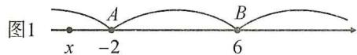

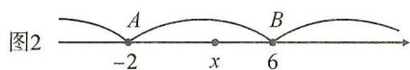

text_image

图2
A
B
-2
x
6

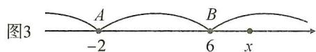

例 2 解: $\left|x-2\right|+\left|x+4\right|$ 的几何意义是数轴上表示数 x 的点到表示数 2 和 -4 的点的距离之和, 如图, 设点 A, B, P 表示的数分别为 2, -4, x,

则 $|x-2|+|x+4|=PA+PB$ ，

如图 1, 当点 P 在 A, B 之间时,

$PA + PB = AB = 6$ , 即 $\left|x - 2\right| + \left|x + 4\right| = 6$ ;

如图 2,3 当点 P 在点 A 左侧或在点 B 右侧时，

$PA+PB>AB$ ，即 $|x-2|+|x+4|>6$ ;

$$
\therefore | x - 2 | + | x + 4 | \geqslant 6,
$$

∴ $\left|x-2\right|+\left|x+4\right|$ 的最小值为 6，此时 $-4 \leqslant x \leqslant 6$ .

图1
A P B
-4 x 2

图2 $\frac{P}{x}$ $\frac{A}{-4}$ $\frac{B}{2}$

图3
A B P
-4 2 x

# 【实战演练】

1. 解: 分三种情况讨论:

①当 x<-2 时， $(-2-x)+(8-x)=24$ ，解得 x=-9；  
②当 $-2 \leqslant x \leqslant 8$ 时， $(x+2)+(8-x)=24$ ，无解；  
③当 x>8 时， $(x+2)+(x-8)=24$ ，解得 x=15。

综上所述 x 的值为 -9 或 15.

2. 解: 设点 A 表示的数为 -2, 点 B 表示的数为 2, 点 C 表示的数为 4, 点 P 表示的数为 x, 则 $\left|x+2\right|+\left|x-2\right|+\left|x-4\right|=PA+PB+PC$ , 如图所示, $PA+PB+PC \geqslant AC = 6$ , 当且仅当点 P 与点 B 重合时取得最小值为 6, $\therefore \left|x+2\right|+\left|x-2\right|+\left|x-4\right|$ 的最小值为 6, 此时 x = 2.

A (P)B C
-2 2 4

# 第 5 讲 形形色色的最值

# 板块一 多绝对值型最值(1)

# 【典例精讲】

例 1 解: 设点 A, B, P 表示的数分别为 -6, 3, x,

则 $|x-3|+|x+6|=PA+PB$ ，如图1，

当点 P 在 A, B 之间即 $-6 \leqslant x \leqslant 3$ 时，

$$
P A + P B = A B = 9;
$$

如图 2,3 当点 P 在点 A 左侧或在点 B 右侧即 x<-6 或 x>3 时， $PA+PB>AB$ ，

$$
\therefore | x + 6 | + | x - 3 | \geqslant 9,
$$

∴ $\left|x+6\right|+\left|x-3\right|$ 的最小值为 9，此时 $-6 \leqslant x \leqslant 3$ .

图1
A P B
-6 x 3

图2 $\frac{P}{x}$ $-6$ $B$ 3

图3
A B P
-6 2 x

例 2 解: 设点 A, B, C, P 表示的数分别为 -1, 3, 5, x,

则 $|x+1|+|x-3|+|x-5|=PA+PB+PC$ ,

如图可知， $PA+PB+PC\geqslant AC=6$ ，

即 $|x+1|+|x-3|+|x-5|\geqslant6$ ,

当且仅当点 P 与点 B 重合时取最小值，

∴当 x=3 时， $|x+1|+|x-3|+|x-5|$ 有最小值为 6.

A (P)B C
-1 3 5

例 3 解: (1)4 个绝对值的零点值分别为 1,2,3,4,

共有偶数个数,按序排列位于最中间的数是2和3,

∴当 $2 \leqslant x \leqslant 3$ 时，原式取最小值，

可将 x=2 或 3 代入计算, 得 $1+0+1+2=4$ ;

(2)5个绝对值的零点值分别为1,2,3,4,5共有奇数个数,按序排列位于最中间的数是3,∴当x=3时,原式取最小值为 $2+1+0+1+2=6$ ;

(3)2024个绝对值的零点值分别为1,2,3,…,2024共有偶数个数,按序排列位于最中间的数是1012和

1 013, ∴ 当 $1012 \leqslant x \leqslant 1013$ 时, 取得最小值, 可将 x = 1012 或 1013 代入, 得 $1011 + 1010 + \cdots + 0 + 1 + \cdots + 1012 = 1012 \times 1012 = 1024144$ .

# 板块二 多绝对值型最值(2)

# 【典例精讲】

例 1 4 解: 原式可化为 $\left|x-1\right|+\left|x+3\right|+\left|x+3\right|$ ，3 个绝对值的零点值分别为 1, -3, -3，按序排列位于最中间的数是 -3，∴ 当 x=-3 时，取得最小值为 $4+0=4$ .

例 2 解: $\because |x-1| - |x-2|$ 表示 x 到 1 的距离与 x 到 2 的距离的差, $\therefore x \geqslant 2$ 时有最大值 2 - 1 = 1.

例3解： $\because |x - 1| - |x - 2| + |x - 3| - |x - 4|$ 表示 $x$ 到1的距离与 $x$ 到2的距离的差与 $x$ 到3的距离与 $x$ 到4的距离的差的和， $\therefore x\geqslant 4$ 时有最大值 $1 + 1 = 2$

例 4 -5 解: $\because |x-3|+|x+4|$ 的最小值为 7, 且 $-4 \leqslant x \leqslant 3, |y-2|+|y+1|$ 的最小值为 3, 且 $-1 \leqslant y < 2$ , $\therefore$ 当 $|x-3|+|x+4|+|y-2|+|y+1|=10$ 时, $-4 \leqslant x < 3, -1 \leqslant y < 2, \therefore$ 此时 $x+y$ 的最小值为 $-4+(-1)=-5$ , 故答案为 -5.

# 【实战演练】

1. 小 2 $3 \leqslant x \leqslant 5$ 解: 由绝对值的几何意义可知, $|x - 3| + |x - 5|$ 是数轴上表示数 x 的点到表示 3 和 5 的点的距离之和, 当 $3 \leqslant x \leqslant 5$ 时, $|x - 3| + |x - 5|$ 有最小值为 5 - 3 = 2.

2.13 解: 3个绝对值的零点值分别为-1, -3, 10, 由小到大依次排列为-3, -1, 10, 位于最中间的数是-1, ∴ x = -1 时, 其值最小为 $10 - (-3) = 13$ .

3.6 -7 解： $\because |x + 1| + |x - 2|$ 的最小值为 3，

此时 x 的取值是 $-1 \leqslant x \leqslant 2$ ;

$|y-3|+|y+2|$ 的最小值为5，此时 $-2\leqslant y\leqslant3$ ，

$$
\because (| x + 1 | + | x - 2 |) (| y - 3 | + | y + 2 |) = 1 5,
$$

$$
\therefore - 1 \leqslant x \leqslant 2, - 2 \leqslant y \leqslant 3,
$$

∴x-2y的最大值为 $2-2\times(-2)=6$ ，

最小值为 $-1-2\times3=-7$ .

故 x-2y 的最大值 6, 最小值 -7.

# 第6讲 非同一般的数轴

# 板块一 数轴、距离与方程(1) 两点距离

# 【典例精讲】

例 解：(1)2,11；(2)1,9；(3) $x+1$ ；(4) $|x+1|$ ;

(5)设点 B 表示的数为 x，依题意，得 $\left|x+1\right|=5$ ，

解得 x=4 或 -6. 故点 B 表示的数 4 或 -6.

# 【实战演练】

1. 解: 点 B 表示的数为 -3-2=-5;

点 C 表示的数为 $-5+7=2$ .

∴点 B 和点 C 表示的数为 -5 和 2.

2. 解: 设点 C 表示的数为 x, 则 $AC = |x - (-2)| = |x + 2|$ ,
∵AC=5, ∴|x+2|=5, 解得 x=3 或 -7.

∴点 C 表示的数为 3 或 -7.

$\therefore BC=6-3=3$ , 或 $BC=6-(-7)=13$ .

∴BC的长为3或13.

# 板块二 数轴、距离与方程(2) 两点中点

# 【典例精讲】

例 解:(1)-5.5;(2) $\frac{x-1}{2}$ ;

$$
(3) \because A B = 5,
$$

∴点 B 表示的数为 $-1+5=4$ 或 $-1-5=-6$ ,

∴点 M 表示的数为 $\frac{-1+4}{2}=1.5$ 或 $\frac{-1-6}{2}=-3.5$ ;

(4)依题意,得 $\frac{x-1}{2}=5$ ,解得x=11.

∴点 B 表示的数为 11.

# 【实战演练】

1.7 1.5

2. 解: ∵ 点 B 表示的数为 10, BC = 4,

∴点 C 表示的数为 6 或 14, ∵M 为 AC 的中点,

∴点 M 表示的数为 $\frac{-2+6}{2}=2$ 或 $\frac{-2+14}{2}=6$ .

3. 解: ① 当 A 为 BC 中点时, $\frac{x+8}{2}=-6$ , $\therefore x=-20$ ; ② 当 B 为 AC 中点时, $\frac{x-6}{2}=8$ , $\therefore x=22$ ; ③ 当 C 为 AB 中点时, $\frac{-6+8}{2}=x$ , $\therefore x=1$ . 综上所述, x 的值为 -20 或 22 或 1.

4. 解: 依题意, 得 $P: \frac{x-6}{2}$ , $Q: \frac{x+8}{2}$ ,

$$
\therefore P Q = \left| \frac {x - 6}{2} - \frac {x + 8}{2} \right| = 7.
$$

# 板块三 数轴、距离与方程(3) 距离和差倍分

# 【典例精讲】

例 解:(1)AB=14-(-10)=24;

(2)设点 C 表示的数为 x，

则 $AC = x - (-10) = x + 10, BC = 14 - x,$

$$
\because A C = B C, \therefore x + 1 0 = 1 4 - x,
$$

解得 $x=2,\therefore$ 点 C 表示的数为 2;

(3)设点 P 对应的数为 x.

①当点 P 在点 A 的左侧时，

$PA = -10 - x, PB = 14 - x$ , 由 $PA + PB = 30$ ,

得 $-10-x+14-x=30$ ，解得x=-13；

②当点 P 在 A, B 两点之间时，

$PA + PB = 14 + 10 = 24 < 30$ 不成立；

③当点 P 在点 B 右侧时, $PA = x - (-10) = x + 10$ ,

$PB = x - 14, \therefore x + 10 + x - 14 = 30$ , 解得 $x = 17$ .

综上所述，点 P 对应的数为 -13 或 17；

(4)设点 D 对应的数为 x.

$\because BD=3AD,\therefore$ 点 D 离点 A 较近，

∴点 D 可能位于点 A 左侧或 A, B 两点之间, 因此分两种情况讨论:

①当点 D 在点 A 左侧时， $14 - x = 3(-10 - x)$ ，

解得 x = -22;

②当点 D 在 A, B 两点之间时， $14 - x = 3(x + 10)$ ,

解得 x = -4.

综上所述，点 D 对应的数为 -22 或 -4.

# 【实战演练】

1. 解: (1) A, B 两点对应的数分别为 -8 和 24;

(2)设点 C 所对应的数为 x，则 $BC = |24 - x|$ , $OC = |x|$ ,

$$
\because B C = 3 O C, \therefore | 2 4 - x | = 3 | x |,
$$

∴24-x=3x 或 24-x=-3x，

解得 x=6 或 x=-12，

∴点 C 所对应的数为 6 或 -12.

2. 解: (1) $\because AB = 2, BC = 1, \therefore$ 点 A, C 所对应的数分别为 -2, 1; 又 $\because p = -2 + 0 + 1,$

∴ p = -1; 当以 C 为原点时, A 表示 -3, B 表示 -1, C 表

示 0, 此时 $p = -3 + (-1) + 0 = -4$ ;

(2)∵原点O在图中数轴上点C的右边,CO=38,

∴ C 所对应数为 -38，

又∵AB=2,BC=1,点A,B在点C的左边,

∴点 A, B 所对应数分别为 -41, -39,

又∵ $p=-41+(-39)+(-38)$ ,∴p=-118.

3. 解: (1) 设点 C 表示的数为 x, 分三种情况讨论: (也可用绝对值表示距离的方法)

①当点 C 在点 A 左侧时，AC = -10 - x, BC = 10 - x,

$$
\because A C + B C = 2 8, \therefore - 1 0 - x + 1 0 - x = 2 8, \therefore x = - 1 4;
$$

②当点 C 在点 A, B 之间时, $AC + BC = AB = 20 < 28$ ,

这种情况不成立；

③当点 C 在点 B 右侧时，

$$
A C = x - (- 1 0) = x + 1 0, B C = x - 1 0,
$$

$$
\because A C + B C = 2 8, \therefore x + 1 0 + x - 1 0 = 2 8, \therefore x = 1 4;
$$

综上所述，点 C 表示的数为 $\pm14$ ;

(2)设点 C 表示的数为 x，

则 $AC = |x - (-10)| = |x + 10|$ , $BC = |x - 10|$ ,

$$
\because 2 A C = 3 B C, \therefore 2 | x + 1 0 | = 3 | x - 1 0 |,
$$

∴ $2(x+10)=3(x-10)$ 或 $2(x+10)=-3(x-10)$ ,

解得 x=50 或 2, ∴ 点 C 表示的数为 50 或 2.

# 板块四 数轴、距离与方程(4) 方程思想

# 【典例精讲】

例 解：(1) $\because3a=4b-3,b=a+2,\therefore3a=4(a+2)-3,$

解得 a = -5，

$$
\therefore b = - 3, c = - 2, d = 0, \therefore c + 2 d = - 2 + 0 = - 2;
$$

(2) $\because b+3c=10,b+3d=16,\therefore3d-3c=16-10=6,$

$$
\therefore d - c = 2,
$$

∵每相邻两点间的距离相等，∴d-b=2(d-c)=4.

# 【实战演练】

1. 解： $\because d=a+3,\therefore d-2a=3-a=4,$

$\therefore a=-1,b=-1+1=0,\therefore$ 点 B 为原点.

2. 解： $\because b=a+3, c=a+4, d=a+7,$

$$
\therefore a + b + c + d = 4 a + 1 4 = - 2. \therefore 4 a = - 1 6,
$$

$$
\therefore a = - 4, b = a + 3 = - 1, c = a + 4 = 0, d = - 4 + 7 = 3.
$$

答:数轴上与原点最接近的点是点 C.

3. 解: 设每个相邻的间距为 x,

则 $b=a+3x, c=a+4x, d=a+7x$ ,

$$
\because a + b + c + d = 2, a - b + c - d = - 3,
$$

∴ $4a + 14x = 2, -6x = -3$ , 解得 x = 0.5, a = -1.25.

# 第 7 讲 异彩纷呈的动点

# 板块一 数轴与动点(1) 点的平移

# 【典例精讲】

例 解:①当点 A 沿数轴向右移动 4 个单位长度到达点 B 时, 点 B 表示的数为 $-3+4=1$ ;

②当点 A 沿数轴向左移动 4 个单位长度到达点 B 时，点 B 表示的数为 -3-4=-7.

综上所述,点 B 表示的数是 1 或 -7.

# 【实战演练】

1. 解：(1)0,9,n-1;

(2)-2,-11,-1-n.

2. 解: 点 B 表示的数为 2-5=-3;

①若将点 B 向右平移 8 个单位长度得到点 C，则点 C 表示的数为 $-3+8=5$ ;

②若将点 B 向左平移 8 个单位长度得到点 C，则点 C 表示

的数为-3-8=-11.

∴点 B 表示的数为 -3，点 C 表示的数为 5 或 -11.

3. 解: (1) 点 P 表示的数为 -2-5=-7, 点 Q 表示的数为 $x+7$ . 故答案为 -7, $x+7$ ;

(2)依题意,得 $x+7-(-7)=20$ , 解得 x=6.

∴点 B 表示的数为 6.

# 板块二 数轴与动点(2) 点的运动

# 【典例精讲】

例 解:(1)P:-2-2t,Q:1+5t;

(2) $OP=2+2t, OQ=1+5t;$   
(3) $PQ = 1 + 5t + 2 + 2t = 3 + 7t$

(4)由 OQ=2OP，得 $1+5t=2(2+2t)$ ，解得 t=3；

(5)由 PQ=31, 得 $7t+3=31$ , 解得 t=4.

【分析】①P Q -2 向左 2 1 向右 5

③2t 5t

④-2-2t 1+5t 2+2t 1+5t

$1 + 5t - (-2 - 2t) = 7t + 3$

⑤1+5t=2(2+2t) 7t+3=31

# 【实战演练】

1. 解：(1) $P: 4 + 4t, Q: 10 + 2t;$

(2)依题意,得 $4+4t=10+2t$ , 解得 t=3.

所以 P, Q 两点相遇时 t 的值为 3;

(3)依题意,得 $|10+2t-(4+4t)|=2$ ,

解得 t=2 或 4.

所以 t=2 或 4 时, P, Q 两点之间的距离为 2 个单位长度.

2. 解: 设运动时间为 t 秒, P, Q 两点表示的数分别为 P:

-10+3t,Q:90-5t,

$\therefore PQ = |(90 - 5t) - (-10 + 3t)| = |100 - 8t|$

$\because PQ=20,$

$\therefore |100-8t|=20,\therefore t=10$ 或 15.

答: 经过 10 秒或 15 秒两只电子蚂蚁相距 20 个单位长度.

3. 解：(1)24，-6；

(2)设甲的速度为 x 个单位长度/s，则乙的速度为 $(x+3)$ 个单位长度/s，相遇时， $S_{甲}:S_{乙}=8:16=v_{甲}:v_{乙}$

$\therefore x+3=2x$ , 解得 x=3,

$\therefore v_{甲}=3$ 个单位长度/s, $v_{乙}=6$ 个单位长度/s;

(3) $24\div(6-3)=8,8\times3+10=34$ ,

所以点 D 对应的数为 -34.

# 板块三 数轴与动点(3) 行程问题

# 【典例精讲】

例 1 解:(1)根据题意,得 t=8-1.5t,解得 t=3.2,

∴相遇点在数轴上表示3.2的点处；

(2)根据题意,得-t=8-1.5t,解得t=16,

∴乙在数轴上表示-16的点处追上甲.

例 2 解: (1) -4; 6 -6t;

(2)①依题意,得6-6t=-4-4t,解得t=5.

∴当 t=5 时，点 P 与点 Q 相遇；

②当点 P 在点 Q 右侧时， $6-6t=-4-4t+8$ ，

解得 t=1;

当点 P 在点 Q 左侧时， $6-6t+8=-4-4t$ ，解得 t=9。

∴当 t=1 或 9 时，点 P 与点 Q 之间的距离为 8 个单位长度.

# 【实战演练】

1. 解: (1) 可求点 B 对应的数为 -5.

点 P 对应的数为 6-3t，点 Q 对应的数为 $-5+2t$ ，

∴6-3t=-5+2t，解得t=2.2，

∴点 P 与 Q 运动 2.2 秒时重合；

(2) 运动 t 秒时, 点 P 对应的数为 6-3t, 点 Q 对应的数为 -5-2t, ∵ 点 P 追上点 Q,

∴6-3t=-5-2t，解得t=11，

∴当点 P 运动 11 秒时, 点 P 追上点 Q.

2. 解: (1) 设甲, 乙经过 t 秒相遇, 根据题意, 得 $t + 4t = 60$ , 解得 t = 12, $-40 + t = -28$ .

答:甲,乙在数轴上表示数为-28的点相遇;

(2)两种情况:相遇前,设 t 秒时,甲、乙相距 10 个单位长度,

根据题意, 得 $t+4t=60-10$ , 解得 t=10;

相遇后, 设 t 秒时, 甲、乙相距 10 个单位长度, 根据题意, 得 $t + 4t - 60 = 10$ , 解得 t = 14.

答:10秒或14秒时,甲、乙相距10个单位长度;

(3)乙到达 A 点需要 15 秒. 设经过 t 秒, 甲、乙相遇, 则 $-40 + 4(t - 15) = -40 + t$ ,

∴t=20,此时相遇点表示的数是 $-40+20=-20$ .

故甲,乙能在数轴上相遇,相遇点表示的数是-20.

# 板块四 数轴与动点(4) 和差倍分

# 【典例精讲】

例 1 解: $\because AB = 9 + 3 = 12$ , 点 $P$ 从点 $A$ 以 3 个单位长度每秒向右运动, 点 $Q$ 同时从点 $B$ 以 2 个单位长度每秒向左运动, $\therefore AP = 3t, BQ = 2t, PQ = |12 - 5t|$ . $\because AP + BQ = 2PQ, \therefore 3t + 2t = 24 - 10t$ 或 $5t = -24 + 10t$ , 解得 $t = \frac{8}{5}$ 或 $t = \frac{24}{5}$ . 综上所述, $t = \frac{8}{5}$ 或 $\frac{24}{5}$ .

例 2 解: (1) 设点 P 表示的数是 -t, 点 Q 表示的数是 4 - 2t, 且 $0 \leqslant t \leqslant 6$ , ∵ AP = 3CQ,

$\therefore -t - (-8) = 3|4 - 2t|$ ，解得 $t = \frac{4}{5}$ 或 $t = \frac{20}{7}$ ，

∴当 t 为 $\frac{4}{5}$ 或 $\frac{20}{7}$ 时, AP = 3CQ;

(2)设 D 表示的数是 x，

①当 $x \leqslant -8$ 时， $\because |AD - BD| = 2CD$

$\therefore(4-x)-(-8-x)=2(-x)$ ,

解得 x = -6 (不符合题意, 舍去);

②当 $-8<x\leqslant4$ 时，∵ $|AD-BD|=2CD$ ，

∴ $\left|x-(-8)-(4-x)\right|=2\left|x\right|$ ,

解得 $x = -1, \therefore AB = 12, BD = 5,$

∴AB:BD=12:5;③当x>4时，

$\because |AD - BD| = 2CD, \therefore |x + 8 - (x - 4)| = 2x.$

$\therefore 2x = 12, \therefore x = 6, \therefore AB = 12, BD = 2,$

∴AB:BD=6.综上所述，AB:BD的值为 $\frac{12}{5}$ 或6.

# 【实战演练】

解:(1)由题意,得0<t<7, $OP=|2t-10|$ ,BQ=7-t,

∴ $\left|2t-10\right|=7-t$ ，解得 t=3 或 $t=\frac{17}{3}$ .

综上所述，t 的值为 3 或 $\frac{17}{3}$ 时，点 P 到点 O 的距离与点 Q 到点 B 的距离相等；

(2) $\because AN=PN=\frac{1}{2}AP=t,$

$\therefore CN = AC - AN = 28 - t, PC = 28 - AP = 28 - 2t,$

∴2CN-PC=2(28-t)-(28-2t)=28.

# 板块五 数轴与动点(5) 动点定值

# 【典例精讲】

例 1 【分析】设点 C 表示的数为 x，用 x 分别表示出点 D，M, N 对应的数，从而可得 MN 的长.

解:设点 C 表示的数为 x,

则点 D 表示的数为 $x+16$ ，

点 M 表示的数为 $\frac{1}{2}x + 3$ ,

点 N 表示的数为 $\frac{1}{2}x - 5$ ,

$$
\therefore M N = \frac {1}{2} x + 3 - \left(\frac {1}{2} x - 5\right) = 8.
$$

例 2 解: 运动 t 秒后, A, B, C 三点表示的数分别为 -10-t, $10+2t, 50+5t$ .

则 $BC = 50 + 5t - (10 + 2t) = 40 + 3t$

$$
A B = 1 0 + 2 t - (- 1 0 - t) = 2 0 + 3 t,
$$

$$
\therefore B C - A B = 4 0 + 3 t - (2 0 + 3 t) = 2 0.
$$

∴BC-AB的值不变，且BC-AB=20.

# 【实战演练】

1. 解：(1)10,18;

(2)设运动时间为 t 秒，

则 A, B, C 三点表示的数分别为 $18 + t, 8 - 2t, -10 - 5t$ ,

$$
B C = 8 - 2 t - (- 1 0 - 5 t) = 1 8 + 3 t,
$$

$$
A B = 1 8 + t - (8 - 2 t) = 1 0 + 3 t,
$$

$$
B C - A B = 1 8 + 3 t - (1 0 + 3 t) = 8.
$$

所以 BC-AB 的值是定值, 不随时间 t 的变化而改变.

2. 解: 由已知得 $AA_{1}=2t, BB_{1}=t$ ，点 $A_{1}$ 表示的数为 -8-2t，点 $B_{1}$ 表示的数为 4-t，

$$
\therefore A _ {1} B _ {1} = 4 - t + 8 + 2 t = t + 1 2,
$$

$$
\therefore B _ {1} C _ {1} = \frac {1}{3} A _ {1} B _ {1} = \frac {1}{3} (t + 1 2) = \frac {1}{3} t + 4,
$$

∴ $C_{1}$ 表示的数为 $4-t-\left(\frac{1}{3}t+4\right)=-\frac{4}{3}t$ ,

$$
\therefore C C _ {1} = \frac {4}{3} t, \therefore \frac {C C _ {1}}{A A _ {1}} = \frac {\frac {4}{3} t}{2 t} = \frac {2}{3}.
$$

3.2 解:依题意,点 P 在数轴上表示的数为 $-15+t$ ,

点 M 在数轴上表示的数为 $5+2t$ ，

点 N 在数轴上表示的数为 $9+4t$ ，

则 $PM=20+t, MN=2t+4,$

则 $kPM - MN = k(20 + t) - (2t + 4) = (k - 2)t + 20k - 4,$

$\because k\cdot PM-MN$ 为常数， $\therefore k-2=0$

解得 k=2. 故答案为 2.

# 板块六 数轴与动点(6) 动线段

# 【典例精讲】

例 1 解: 设 AB 的中点为 C, 则 AC = BC = 8,

∵当点 Q 移动到点 B 时, 点 P 所对应的数为 6,

当点 Q 移动到线段 AB 的中点 C 时, BQ = AQ = 8,

∴点 P 所对应的数为 6-8=-2.

例 2 解: 设 EF 运动的时间为 t 秒, 则点 E 对应的数为 t - 8, 点 F 对应的数为 $t - 8 + a$ ,

∵M 是 EC 的中点,N 是 BF 的中点,

∴点 M 对应的数为 $\frac{t-8+4}{2}=\frac{t-4}{2}$ ，点 N 对应的数为

$$
\frac {t - 8 + a + 2}{2} = \frac {t - 6 + a}{2},
$$

$\because MN = 1, \therefore |\frac{t - 4}{2} - \frac{t - 6 + a}{2}| = 1.$ 解得 $a = 0$ 或 $a = 4$

$$
\because a > 0, \therefore a = 4.
$$

# 【实战演练】

解:(1)A,C两点表示的数分别为 $-8+6t,16-2t$ .

$$
\therefore A C = | (1 6 - 2 t) - (- 8 + 6 t) | = | 2 4 - 8 t |,
$$

$$
\because A C = 8, \therefore | 2 4 - 8 t | = 8, \therefore 2 4 - 8 t = 8 \text {或} 2 4 - 8 t = - 8,
$$

$\therefore t=2$ 或 4;

(2) $\because A:-8+6t,B:-10+6t,C:16-2t,D:20-2t,Q$ 是BC的中点,P是AD的中点,

$$
\therefore Q: 3 + 2 t, P: 6 + 2 t. \therefore P Q = | (6 + 2 t) - (3 + 2 t) | = 3.
$$

# 板块七 数轴与动点(7) 挡板与往返

# 【典例精讲】

例 解:(1)设运动 t 秒,则点 P 表示的数为 $-4+t$ , 点 Q 表示的数为 12-2t,

由题意, 得 $-4 + t = 12 - 2t$ , 解得 $t = \frac{16}{3}$ ,

则相遇时点 P 对应的数为 $-4+\frac{16}{3}=\frac{4}{3}$ ;

(2)∵由(1)知点P,Q从出发到相遇用时 $\frac{16}{3}$ 秒,

∴点 M 的运动时间为 $\frac{16}{3}$ 秒，

则点 M 所经过的总路程是 $3 \times \frac{16}{3} = 16$ 个单位长度.

# 【实战演练】

解: 数 m 与数 n 满足的数量关系是 $m+13n=0$ . 理由如下:
点 M 对应的数为 m, 点 N 对应的数为 n, 则 MN 的中点对应的数为 $\frac{m+n}{2}$ , ∵ 点 M 在原点左侧, 点 N 在原点右侧, OM > ON,
∴MN 的中点在原点左侧, 即 $\frac{m+n}{2}<0$ ,

∴甲弹珠所走路程为 $n+\left(n-\frac{m+n}{2}\right)$ ，乙弹珠所走路程为 $(0-m)+\left(\frac{m+n}{2}-m\right)$ ，而甲、乙弹珠用时相等，

$$
\therefore \left[ n + \left(n - \frac {m + n}{2}\right) \right] \div 2 = \left[ (0 - m) + \left(\frac {m + n}{2} - m\right) \right] \div 5,
$$

整理化简, 得 $m+13n=0$ .

# 第三章 代数式

# 第8讲 列代数式

# 板块一 列代数式(1) 数量关系

# 典例精讲

例1 (1) $(0.8a - 8)$ (2) $20 - 2x$

(3) $\frac{200-60t}{v}$ (4) $\frac{5}{6}a$

例 2 解: 图中剩余长方形的长为 6, 宽为 6 - a,

所以图中剩余长方形的周长为 $12+2(6-a)=24-2a$ . 剩余长方形的面积为 $6(6-a)=36-6a$ .

例 3 解: (1) $C = 2\pi r, S = \pi r^{2}$ ;

(2)等式左边为一个数的平方与4的差,被减数的底数依次为3,5,7,9…,故第n个为 $2n+1$ ,即等式左边的代数式为 $(2n+1)^{2}-4$ ;等式的右边为两个奇数的积,且较小的奇数比左边的底数小2,较大的奇数比左边的底数大2,故等式右边的代数式为 $(2n+1-2)$

$$
(2 n + 1 + 2) = (2 n - 1) (2 n + 3);
$$

当 $n = 5$ 时， $2n + 1 = 11, 2n - 1 = 9, 2n + 3 = 13$ ，故第

⑤个式子为 $11^{2}-4=9\times13$ ;

第 n 个式子为 $(2n+1)^{2}-4=(2n-1)(2n+3)$ .

例 4 A

# 实战演练

1.买了3个足球，2个篮球后，剩余的钱数

2. $(50-0.8n)$ 3. $n+11$

4. (1) $-(m+n)$ (2) $(m+2)$ (3) $(50-4m)$

$$
(4) 2. 5 x \quad 1. 5 x
$$

5. $6^{2} - 5^{2} = 11$ $(n + 1)^{2} - n^{2} = 2n + 1$

6. $\left(\frac{n}{a}-\frac{n}{a+b}\right)$ 7. $(m-1)\quad\frac{m(m-1)}{2}$

8. $5\left(\frac{n}{2}-1\right)$ $2\left(\frac{m}{5}+1\right)$

9. 解：(1) $m^{3}+n^{3}$ ; (2) $\frac{m-n}{t}$ ; (3) $\frac{m+n}{2}$ ;

(4) $4n+3(n$ 为整数).

10. $a^2 - b^2$ 解： $S_{\text{阴影}} = a^2 - \frac{1}{4}\pi a^2 + \frac{1}{4}\pi a^2 - b^2 = a^2 - b^2$ .

# 板块二 列代数式(2) 反比例关系

# 典例精讲

例 1 解: (1) 因为 $-3 \times 4 = -2.5 \times 4.8 = 2 \times (-6) = 4 \times (-3) = 8 \times (-1.5) = -12$ ;

即变量 a, b 的积为定值 -12,

所以变量 a 和 b 成反比例关系；

因为 $(-3) \div (-6) = (-2.5) \div (-5) = 2 \div 4 = 4 \div$

$$
8 = 8 \div 1 6 = 0. 5,
$$

即变量 a, c 的商为定值 0.5,

所以变量 $a$ 和 $c$ 成正比例关系；

因为 $4 \times (-6) = 4.8 \times (-5) = (-6) \times 4 = (-3) \times$

$$
8 = (- 1. 5) \times 1 6 = - 2 4,
$$

即变量 b, c 的积为定值 -24,

所以变量 $b$ 和 $c$ 成反比例关系；

(2)由(1)，得 $ab = -12, c = 2a, bc = -24$ ；

当 $a = -1 \frac{3}{5}$ 时, $b = -12 \div \left(-1 \frac{3}{5}\right) = 7.5$ ,

$$
c = 2 \times \left(- 1 \frac {3}{5}\right) = - 3. 2.
$$

例 2 解: (1) 由 $S=\frac{1}{2}ah$ ，得 ah=2S，

因为 S 为定值，

所以 ah 为定值，故它们成反比例关系；

(2) 因为 s = vt，且 s 为定值，所以 vt 为定值，

故它们成反比例关系；

(3)由 $V=\frac{1}{3}\pi r^{2}h$ ，得 $rh=\frac{3V}{\pi r}$ ，因为 V 为定值，

所以 rh 不是定值，故它们不成反比例关系；

(4) 因为 $\frac{y}{x} = 20$ ，所以 $y$ 与 $x$ 成正比例关系，

故它们不成反比例关系；

(5) 因为 $y=\frac{300}{x+5}$ ，所以 xy 不是定值，

故它们不成反比例关系.

# 实战演练

1. ②③④ 2. $y=\frac{300}{x}$

3.(1)0.3 (2)1.2 4.(1)反 (2)正

5. 解: (1) 因为三角形 ABP 的面积为 $\frac{1}{2}AB \cdot AD = \frac{1}{2} \times 10 \times 6 = 30$ , 所以 $\frac{1}{2}xy = 30$ , 即 xy = 60 或 $y = \frac{60}{x}$ , y 与 x 成反比例关系;

(2) 因为 $x: y = 5:3$ , 所以 $y = \frac{3}{5} x$ , 所以 $\frac{3}{5} x \cdot x = \frac{3}{5} x^2 = 60, x^2 = 100$ , 所以 $x = 10$ . 即 $AP$ 的长为 $10 \mathrm{~cm}$ .

6. 解: (1) 第 4 组; 因为 $10 \times 30 = 15 \times 20 = 20 \times 15 = 30 \times 10 = 300, 25 \times 14 = 350 \neq 300$ ;

(2)猜测：y 与 x 成反比例关系，xy=300 或 $y=\frac{300}{x}$ ;

(3) 当 y=8 时, 8x=300, x=37.5. 所以此时弹簧秤与点 O 的距离为 37.5 cm.

# 第9讲 求代数式的值

# 典例精讲

例 1 解: 第 1 次输出的结果是 10; 第 2 次输出的结果是 5; 第 3 次输出的结果是 16; 依次计算可知, 从第 5 次开始, 每 3 次输出的结果为一个循环组 4, 2, 1, 依次循环, 因为 $(2025-4) \div 3 = 673 \cdots 2$ , 所以, 第 2025 次输出的结果是 2.

例 2 解:(1)方案一需花费 $(100x+1\ 000)$ 元;方案二需花费 $90\%\times120x=108x$ (元);

(2)方案一省钱. 理由如下: 当 x=200 时, 方案一需花费 $100 \times 200 + 1\ 000 = 21\ 000$ (元),

方案二需花费 $108 \times 200 = 21600$ （元），

因为 21 600 > 21 000，所以方案一更省钱。

例 3 解: (1) 由题意, 得剪掉的长方形的长为 $(x + y)$ cm, 所以原长方形的长为 $(2y + 2x)$ cm;

(2)长方体的表面积为 $2xy + 2x^{2} + 2xy = (4xy + 2x^{2}) \, cm^{2}$ ;

(3)长方体的体积为 $x^{2}y$ .

当 x=2y=8 时，所以 x=8,y=4，

所以长方体的表面积为 $4 \times 8 \times 4 + 2 \times 8^{2} = 256 \mathrm{~cm}^{2}$ ;

长方体的体积为 $8^{2} \times 4 = 256 \, cm^{3}$ .

# 实战演练

1.

<table><tr><td>x</td><td>-3</td><td>-1</td><td>1</td></tr><tr><td>-2(x-3)</td><td>12</td><td>8</td><td>4</td></tr><tr><td> $-\frac{1}{2}(x+1)^{2}-1$ </td><td>-3</td><td>-1</td><td>-3</td></tr></table>

<table><tr><td colspan="2"> $x = -2,y = -3$ </td></tr><tr><td> $xy-\frac{y}{x+1}$ </td><td>3</td></tr><tr><td> $-y^{2} + x^{3}$ </td><td>-17</td></tr></table>

2.9 5 4或-5 解: 当 x=4 时,

输出的结果为 $x^{2} - 7 = 4^{2} - 7 = 9$

当 x = -3 时，输出的结果为 $2|x|-1=2\times|-3|-1=5$ ;

当 x>2 时， $x^{2}-7=9$ ，所以 $x^{2}=16$ ，所以 x=4；

当 $x \leqslant 2$ 时， $2|x|-1=9$ ，所以 $|x|=5$ ，所以 x=-5；

所以当输出的结果为9时，输入的x的值为4或-5.

3. D 解: 当 x=0 时, M=2, 故选项 C 不符合题意;

当 x = -1 时， $2x^{3} + 2 = 0$ ; $x^{2} - 3x + 2 = 6 \neq 0$ ;

$x^{3}-2x^{2}-x+2=0$ ;故选项 B 不符合题意;

当 $x = 1$ 时， $2x^{3} + 2 = 4 \neq 0; x^{3} - 2x^{2} - x + 2 = 0$ ;

故选项 A 不符合题意；

当 x=3 时， $x^{3}-2x^{2}-x+2=8$ 。选项 D 符合题意，故选 D。

4. B 解: 当 x = -1 时, $6x^{5} + 5x^{4} + 4x^{3} + 3x^{2} + 2x + 1 = -3$ , 小勤计算的结果比正确值大 $5 - (-3) = 8$ .

因为 $8 \div 2 = 4$ ，所以，看错符号的数为 4。小勤同学看错符号的数是 4。故选 B.

5. 解: (1) 每本书的厚度为 $(88 - 86.5) \div 3 = 0.5 \, (\text{cm})$ ,

讲台的高度为 $86.5 - 0.5 \times 3 = 85 \, (\text{cm})$ ,

所以 $y=85+0.5x$ ;

(2) $y=85+(56-14)\times0.5=106.$

所以余下的课本的顶部距离地面的高度为 106 cm.

# 第10讲 创新题型

# 板块一 新情境

# 典例精讲

例1 15

例 2 解: a t = 1000a kg, 由水的密度为 $1.0 \times 10^{3}$ kg/m $^{3}$ , 可知 a t 水的体积为 $1000a \div (1.0 \times 10^{3}) = a \, (\text{m}^{3})$ , 制成冰后, 冰的质量不变, 为 1000a kg,

所以冰的体积为 $1\ 000a \div (0.9 \times 10^{3}) = \frac{10}{9}a \, (\text{m}^{3})$ ,

$$
\frac {1 0}{9} a - a = \frac {1}{9} a.
$$

所以冰块的体积比水的体积大 $\frac{1}{9}a\ m^{3}$ .

# 实战演练

1. $\frac{ab - 2a^3c^2 + 6}{3}$

2. 解: (1) 当 t=4 时,

$$
h = - 5 t ^ {2} + 1 5 0 t + 1 0 = - 5 \times 4 ^ {2} + 1 5 0 \times 4 + 1 0 = 5 3 0;
$$

当 $t = 10$ 时，

$$
h = - 5 t ^ {2} + 1 5 0 t + 1 0 = - 5 \times 1 0 ^ {2} + 1 5 0 \times 1 0 + 1 0 = 1 0 1 0;
$$

当 $t = 20$ 时，

$$
h = - 5 t ^ {2} + 1 5 0 t + 1 0 = - 5 \times 2 0 ^ {2} + 1 5 0 \times 2 0 + 1 0 = 1 0 1 0;
$$

(2) 计算, 得当 t=11 时, h=1055;

当 t=12 时, h=1090; 当 t=13 时, h=1115;

当 t=14 时, h=1 130;

当 t=15 时, h=1 135; 当 t=16 时, h=1 130; …,

所以当 t<15 时，h 随 t 的增大而增大，

当 t>15 时, h 随 t 的增大而减小, 所以估计运动时间为 15

s 时, 物体达到最高处, 最大高度为 1135 m.

# 板块二 综合与实践

# 典例精讲

例 解: 在图 1 中, 窗户能射进阳光的部分的面积为

$$
a b - 2 \times \frac {1}{4} \pi \times \left(\frac {b}{2}\right) ^ {2} = a b - \frac {1}{8} \pi b ^ {2};
$$

在图 2 中, 窗户能射进阳光的部分的面积为

$$
a b - 2 \times \frac {1}{4} \times \pi \left(\frac {b}{4}\right) ^ {2} - \frac {1}{2} \pi \left(\frac {b}{4}\right) ^ {2} = a b - \frac {1}{1 6} \pi b ^ {2};
$$

因为 $\left(ab-\frac{1}{16}\pi b^{2}\right)-\left(ab-\frac{1}{8}\pi b^{2}\right)=ab-\frac{1}{16}\pi b^{2}-ab+\frac{1}{8}\pi b^{2}=\frac{1}{16}\pi b^{2}>0$ ，所以，图2中窗户能射进阳光的部分的面积比图1中的更大，大 $\frac{1}{16}\pi b^{2}$ .

# 实战演练

解：(1) $b=(150.5-50-31.5)=69$ ;

$$
a = 6 9 \div 2 0 = 3. 4 5;
$$

(2) 当 20 < x < 40 时, 应缴水费为 $20 \times 2.5 + 3.45(x - 20) = (3.45x - 19)$ 元;

当 x>40 时，应缴水费为 $20 \times 2.5 + 20 \times 3.45 + 6.3(x - 40) = (6.3x - 133)$ 元；

(3)茜茜家8月的水费为 $15\times2.5=37.5$ 元,9月的水费为 $3.45\times35-19=101.75$ 元;

因为 $37.5 + 101.75 + 1 = 140.25 < 150.5$ ，所以她家的缴费不会超过东东家9月的水费。

# 第四章 整式的加减

# 第11讲 整式的加减

# 板块一 合并同类项

# 【典例精讲】

例 1 解: (1)依题意, 得 $m+1=3,1-n=4$ ,

$$
\begin{array}{l} \therefore m = 2, n = - 3, \\ \therefore n ^ {m} = (- 3) ^ {2} = 9; \\ \end{array}
$$

(2)依题意,得 $x+1=2$ , y-2=3,

$$
\begin{array}{l} \therefore x = 1, y = 5, \\ \therefore 2 x + y = 2 + 5 = 7. \\ \end{array}
$$

例 2 解: (1) 原式= $3x^{2}-5x^{2}+4x^{2}-14x$

$$
= 2 x ^ {2} - 1 4 x;
$$

(2) 原式 $= ab^{3} - 2ab^{3} + a^{3}b + 5a^{3}b + 8 - 5$

$$
= - a b ^ {3} + 6 a ^ {3} b + 3.
$$

例3 解：(1) 原式 $= 6x^{2}y - 9xy - xy - 6x^{2}y$

$$
= - 1 0 x y;
$$

(2) 原式 $= 4x^{2} - 3x + 1 - 2x^{2} - 4x + 2$

$$
= 2 x ^ {2} - 7 x + 3.
$$

# 【实战演练】

1. 解：(1) 原式 $= 2a^{2} + a - 6$ ；

(2) 原式 $= m^{2} + 2mn^{2}$ ;

(3) 原式 $= 12a^{2}b - 6ab^{2} + 3ab^{2} - 12a^{2}b$

$$
= (1 2 a ^ {2} b - 1 2 a ^ {2} b) + (- 6 a b ^ {2} + 3 a b ^ {2})
$$

$$
= - 3 a b ^ {2};
$$

(4) 原式 $= -xy + 4x^{2} - 4xy + 24 - 6x^{2} - 3xy$

$$
= - 2 x ^ {2} - 8 x y + 2 4.
$$

2. 解: 由题意, 知 $m+2=0$ , $|n-1|=2$ , $n+1\neq0$ ,

$$
\therefore m = - 2, n = 3, \therefore m ^ {n} = - 8.
$$

# 板块二 化简求值(1) 去单层括号

# 【典例精讲】

例 解: 原式 $=2x^{2}y-2xy^{2}-2-3x^{2}y+3xy^{2}+3$

$$
= - x ^ {2} y + x y ^ {2} + 1,
$$

当 $x = 1, y = -2$ 时，原式 $= 2 + 4 + 1 = 7$ .

# 【实战演练】

1. 解: 原式 $=3a^{2}-3ab+3b^{2}-3a^{2}-ab-b^{2}$

$$
= - 4 a b + 2 b ^ {2}.
$$

当 $a = -3, b = 1$ 时，

原式 $= -4 \times (-3) \times 1 + 2 \times 1^{2} = 12 + 2 = 14.$

2. 解: 原式 $=2x^{2}+3xy+2y-2x^{2}-2x-2yx-2$

$$
= x y - 2 x + 2 y - 2.
$$

当 $x = 1, y = 2$ 时，原式 $= 2 - 2 + 4 - 2 = 2$ .

3. 解: 原式 $=2x^{3}-4y^{2}-x+2y-x+5y^{2}-2x^{3}=(2-2)x^{3}$

$$
+ (5 - 4) y ^ {2} - (1 + 1) x + 2 y = y ^ {2} - 2 x + 2 y.
$$

当 $x = -2, y = -3$ 时，原式 $= (-3)^{2} - 2 \times (-2) + 2 \times$

$$
(- 3) = 9 - (- 4) + (- 6) = 7.
$$

4. 解: 原式 = $4x^{2}y - 2xy^{2} + 2xy - 3xy^{2} + 3xy - 3x^{2}y +$

$$
5 x y ^ {2} - 5 x y = x ^ {2} y.
$$

当 $x = -3, y = -2$ 时，原式 $= (-3)^{2} \times (-2) = -18$ .

5. 解: 原式 $= x - x + 2 - x^{2} + \frac{1}{2}x - 2 = -x^{2} + \frac{1}{2}x$ ,

当 $x = -\frac{1}{2}$ 时，原式 $= -\left(-\frac{1}{2}\right)^2 - \frac{1}{4} = -\frac{1}{2}$ .

6. 解: 原式 $=\frac{1}{2}x - 4x - 5xy + \frac{1}{3}y^{2} + \frac{3}{2}x - 5xy - \frac{4}{3}y^{2}$

$$
= - 2 x - 1 0 x y - y ^ {2},
$$

当 $x = 2, y = \frac{1}{2}$ 时，

原式 $= -2 \times 2 - 10 \times 2 \times \frac{1}{2} - \left(\frac{1}{2}\right)^2 = -4 - 10 - \frac{1}{4}$

$$
= - 1 4 \frac {1}{4}.
$$

# 板块三 化简求值(2) 去多层括号

# 【典例精讲】

例 解: 原式 $=4x^{2}y-(6xy-12xy+6-x^{2}y-1)$

$$
\begin{array}{l} = 4 x ^ {2} y - (- 6 x y - x ^ {2} y + 5) \\ = 4 x ^ {2} y + 6 x y + x ^ {2} y - 5 \\ = 5 x ^ {2} y + 6 x y - 5, \\ \end{array}
$$

当 $x = 2, y = -\frac{1}{2}$ 时，

原式 $= 5 \times 4 \times \left(-\frac{1}{2}\right) + 6 \times 2 \times \left(-\frac{1}{2}\right) - 5$

$$
= - 1 0 - 6 - 5 = - 2 1.
$$

# 【实战演练】

1. 解: 原式 $= -3x^{2}y + (4xy - 6xy + 4x^{2}y + xy)$

$$
= - 3 x ^ {2} y + 4 x y - 6 x y + 4 x ^ {2} y + x y
$$

$$
= x ^ {2} y - x y.
$$

当 $x = -1, y = 2$ 时，

原式 $= (-1)^{2} \times 2 - (-1) \times 2 = 2 + 2 = 4.$

2. 解: 原式 $=8a^{2}+2a-2(3a-a+6+2a^{2})-4a^{2}+4a+10$

$$
= 2 a - 2.
$$

当 $a = -\frac{1}{2}$ 时，原式 $= 2 \times \left(-\frac{1}{2}\right) - 2 = -3.$

3. 解: 原式 $=3x^{2}y - 2xy^{2} + 2xy - 3x^{2}y - xy + 3xy^{2}$

$$
= x y + x y ^ {2}.
$$

当 x=3, y=-1 时，原式 = -3+3=0.

4. 解: 原式 $=4x-(2x^{2}-10x+2x^{2})=4x-4x^{2}+10x$

$$
= - 4 x ^ {2} + 1 4 x.
$$

当 $2x^{2} - 7x + 1 = 0$ 时， $2x^{2} - 7x = -1$

∴原式 $=-4x^{2}+14x=-2(2x^{2}-7x)=2.$

5. 解: 原式 $=13a^{2}b-(4a^{2}b-2ab^{2}+6a^{2}b-ab^{2})-3ab^{2}$

$$
= 1 3 a ^ {2} b - 1 0 a ^ {2} b + 3 a b ^ {2} - 3 a b ^ {2}
$$

$$
= 3 a ^ {2} b.
$$

$$
\because | a + 1 | + (b - 2) ^ {2} = 0, | a + 1 | \geqslant 0, (b - 2) ^ {2} \geqslant 0,
$$

$$
\therefore a + 1 = 0, b - 2 = 0, \therefore a = - 1, b = 2.
$$

∴原式= $3\times(-1)^{2}\times2=6$ .

# 板块四 化简求值(3) 连环化简

# 【典例精讲】

例 解：∵ $8x^{2a}y$ 与 $-3x^{4}y^{2+b}$ 是同类项，∴ $\left\{\begin{aligned}&2a=4,\\ &1=2+b,\end{aligned}\right.$

解得 $\left\{\begin{aligned}a=2,\\ b=-1.\end{aligned}\right.$

$$
\because A = a ^ {2} + a b - 2 b ^ {2}, B = 3 a ^ {2} - a b - 6 b ^ {2},
$$

$$
\therefore 2 B - 3 (B - A) = 3 A - B = 3 \left(a ^ {2} + a b - 2 b ^ {2}\right) - \left(3 a ^ {2} - \right.
$$

$$
\left. a b - 6 b ^ {2}\right) = 4 a b,
$$

当 a=2, b=-1 时，原式 $=4\times2\times(-1)=-8$ .

# 【实战演练】

1. 解：(1) 原式 $= 6(-x^{2} + 3x - 2) + 3(2x^{2} - 3x - 5)$

$$
= - 6 x ^ {2} + 1 8 x - 1 2 + 6 x ^ {2} - 9 x - 1 5
$$

$$
= 9 x - 2 7;
$$

(2) 原式 = 5M - 6M + 2N = -M + 2N

$$
= - \left(- x ^ {2} + 3 x - 2\right) + 2 \left(2 x ^ {2} - 3 x - 5\right)
$$

$$
= x ^ {2} - 3 x + 2 + 4 x ^ {2} - 6 x - 1 0
$$

$$
= 5 x ^ {2} - 9 x - 8.
$$

2. 解: (1) $5(A-B)-2\left(A-\frac{1}{2}B\right)=3A-4B$ ;

(2) $3A - 4B = 3(4b^{2} - 2a^{2} - ab) - 4(2ab + 3b^{2} - a^{2})$

$$
= 1 2 b ^ {2} - 6 a ^ {2} - 3 a b - 8 a b - 1 2 b ^ {2} + 4 a ^ {2}
$$

$$
= - 2 a ^ {2} - 1 1 a b.
$$

当 $a = 2, b = -1$ 时，原式 $= -2 \times 4 - 11 \times 2 \times (-1) = 14$ .

3. 解: (1) 原式 = 7M - 2(M - N + 3M) = 7M - 2M + 2N - 6M = -M + 2N;

(2) $-M + 2N = -(x^{2} + 5x - 2) + 2(-2x^{2} - \frac{5}{2} x + 4)$

$$
= - x ^ {2} - 5 x + 2 - 4 x ^ {2} - 5 x + 8
$$

$$
= - 5 x ^ {2} - 1 0 x + 1 0.
$$

当 $x^{2} + 2x - 1 = 0$ 时， $\therefore x^2 +2x = 1$

$$
\therefore - M + 2 N = - 5 \left(x ^ {2} + 2 x\right) + 1 0 = 5.
$$

# 板块五 化简求值(4) 先求再化

# 【典例精讲】

例 解：(1) $\because A=x^{2}+2y^{2},B=-4x^{2}+3y^{2},A+B+C=0,$

$$
\therefore C = - A - B = - \left(x ^ {2} + 2 y ^ {2}\right) - \left(- 4 x ^ {2} + 3 y ^ {2}\right) = - x ^ {2}
$$

$$
- 2 y ^ {2} + 4 x ^ {2} - 3 y ^ {2} = 3 x ^ {2} - 5 y ^ {2};
$$

(2) 当 x=2, y=-1 时, $C=3\times4-5\times1=7$ .

# 【实战演练】

1. 解: (1) 由题意, 得

$$
A = 2 \left(- 4 a ^ {2} + 6 a b + 7\right) + \left(7 a ^ {2} - 7 a b\right)
$$

$$
= - 8 a ^ {2} + 1 2 a b + 1 4 + 7 a ^ {2} - 7 a b
$$

$$
= - a ^ {2} + 5 a b + 1 4;
$$

(2) $\because|a+1|+(b-2)^{2}=0,\therefore a=-1,b=2,$

∴原式=-1-10+14=3.

2. 解: (1) $A = (b^{2} + 3b - 1) + (2b^{2} + 3b + 5) = b^{2} + 3b - 1 + 2b^{2} + 3b + 5 = 3b^{2} + 6b + 4$ ;

(2) $(3b^{2}+6b+4)-(2b^{2}-3b-5)=3b^{2}+6b+4-2b^{2}+3b+5=b^{2}+9b+9.$

当 b = -1 时，原式 $= (-1)^{2} + 9 \times (-1) + 9 = 1 - 9 + 9 = 1$ .

3. 解: (1) 由题意得: $2B = x^{2} + 14x - 6 - (-2x^{2} + 5x - 1) = x^{2} + 14x - 6 + 2x^{2} - 5x + 1 = 3x^{2} + 9x - 5$ ,

所以， $A-2B=-2x^{2}+5x-1-(3x^{2}+9x-5)=-2x^{2}+5x-1-3x^{2}-9x+5=-5x^{2}-4x+4;$

(2)由 x 是最大的负整数, 可知 x = -1,

所以 $A-2B=-5\times(-1)^{2}-4\times(-1)+4=-5+4+4=3.$

# 板块六 化简求值(5) 整体求值

# 【典例精讲】

例 1 解: 因为 x = -2 时, $-8m + 8 - 2n + 4 = 18$ ,

所以 $8m + 2n = -6$ ，

所以当 $x = 2$ 时，

原式 $=8m+8+2n+4=-6+8+4=6.$

例2 解：原式 $= 2(x^{2} - xy) + 3(2xy - y^{2})$

$$
\begin{array}{l} = 2 \times (- 3) + 3 \times (- 8) \\ = - 3 0. \\ \end{array}
$$

例 3 解: $\because m^{2}-m-1=0, \therefore m^{2}-m=1,$

∴原式= $m(m^{2}-m)-m^{2}+2023=-(m^{2}-m)+$

$$
2 0 2 3 = - 1 + 2 0 2 3 = 2 0 2 2.
$$

# 【实战演练】

1. 解： $\because 2x^{2}+3x+7=10, \therefore 2x^{2}+3x=3,$

原式 $= 3(2x^{2} + 3x) - 7 = 3 \times 3 - 7 = 2.$

2. 解: 原式 $=2(m^{2}+mn)-3(3mn+n^{2})$

$$
= 2 \times (- 2) - 3 \times (- 9) = 2 3.
$$

3. 解: 依题意, 得 $2023^{3}a + 2023b - 2 = 2$ ,

$$
\therefore 2 0 2 3 ^ {3} a + 2 0 2 3 b = 4,
$$

当 $x = -2023$ 时， $ax^3 + bx + 5 = -2023^3a - 2023b + 5 = -4 + 5 = 1.$

4. 解: 因为 $x^{2}+2x-3=0$ , 所以 $x^{2}+2x=3$ ,

原式 $= x^{2}(x^{2} + 2x) + 5x(x^{2} + 2x) - 2(x^{2} + 2x) - 9x + 15$

$$
= 3 x ^ {2} + 1 5 x - 6 - 9 x + 1 5 = 3 x ^ {2} + 6 x + 9
$$

$$
= 3 \left(x ^ {2} + 2 x\right) + 9 = 3 \times 3 + 9 = 1 8.
$$

5. 解： $\because 2m^{2}+2mn-n^{2}-3(mn+2n^{2})=(3a-6)-3(a+2)$

$$
= - 1 2,
$$

$$
\therefore 2 m ^ {2} - m n - 7 n ^ {2} = - 1 2.
$$

# 板块七 化简求值(6) 缺项无关

# 【典例精讲】

例 1 解: $-ax^{2}-2bxy+x^{2}-x-2xy+y=(-a+1)x^{2}+(-2b-2)xy-x+y$ ,

$\because$ 多项式不含二次项， $\therefore -a+1=0,-2b-2=0,$

解得 a=1, b=-1.

$$
\therefore 5 a - 8 b = 5 \times 1 - 8 \times (- 1) = 5 + 8 = 1 3.
$$

例2 解： $\because (2x^{2} + ax - y + 6) - (2bx^{2} - 3x + 5y - 1) = 2x^{2}$

$$
+ a x - y + 6 - 2 b x ^ {2} + 3 x - 5 y + 1 = (2 - 2 b) x ^ {2} + (a +
$$

$$
3) x + (- 6 y + 7),
$$

$$
\therefore 2 - 2 b = 0, a + 3 = 0, \therefore a = - 3, b = 1.
$$

例3 解： $A - 2B = 2x^{2} + ax - 5y + b - 2(bx^{2} - \frac{3}{2} x - \frac{5}{2} y - 5)$

$$
= 2 x ^ {2} + a x - 5 y + b - 2 b x ^ {2} + 3 x + 5 y + 1 0
$$

$$
= (2 - 2 b) x ^ {2} + (a + 3) x + b + 1 0,
$$

依题意, 得 2-2b=0, $a+3=0$ ,

所以 b=1, a=-3,

所以这个定值为 11.

# 【实战演练】

1. 解: $\because mx^{2} + nxy + 2x + 2xy - x^{2} + y + 4 = (m - 1)x^{2} + (n + 2)xy + 2x + y + 4$ ,

∴m-1=0,n+2=0,解得m=1,n=-2.

2. 解： $\because (2x^{3}-8x^{2}+x-1)-[x^{3}+(3m+1)x^{2}-5x+7]=$

$$
x ^ {3} - (3 m + 9) x ^ {2} + 6 x - 8,
$$

$$
\therefore 3 m + 9 = 0,
$$

$$
\therefore m = - 3.
$$

3. 解: $3A + 6B = 3(2a^{2} + 4ab - 2a - 3) + 6(-a^{2} + ab + 2) =$

$$
6 a ^ {2} + 1 2 a b - 6 a - 9 - 6 a ^ {2} + 6 a b + 1 2 = 1 8 a b - 6 a + 3;
$$

$\because 18ab-6a+3=(18b-6)a+3$ 与 a 的取值无关，

∴18b-6=0, 解得 $b=\frac{1}{3}$ .

# 板块八 化简绝对值(1)

# 【典例精讲】

例 1 解: (1) >, >, <;

(2) 原式 $= 2(a + 2b) - 3(b - c) - (a + c)$

$$
\begin{array}{l} = 2 a + 4 b - 3 b + 3 c - a - c \\ = a + b + 2 c. \\ \end{array}
$$

例 2 解: 原式= $(-a-b)-(-b+1)-(-a+c)-(1-c)$

$$
\begin{array}{l} = - a - b + b - 1 + a - c - 1 + c \\ = - 2. \\ \end{array}
$$

# 【实战演练】

1. 解: (1) <, <, <;

(2) 原式 = b - a + 4a - 4c - 3b + 3c = 3a - 2b - c.

2. 解: 由数轴可得: a < b < 0 < c, |b| < |c| < |a|,

$$
\therefore a + b <   0, 2 a - c <   0, b + c > 0,
$$

∴原式 $=-a-b+2a-c+2b+2c=a+b+c.$

3. 解: 原式= $(-2b-3c)+(a-2c)-3(-b-c+a)$

$$
\begin{array}{l} = - 2 b - 3 c + a - 2 c + 3 b + 3 c - 3 a \\ = - 2 a + b - 2 c. \\ \end{array}
$$

4. 解: 由各个数在数轴上的位置可知:

$$
\begin{array}{l} a + 1 > 0, c - b <   0, b - 1 <   0, c - 2 a <   0, \\ \therefore | a + 1 | - | c - b | - | b - 1 | + | c - 2 a | = a + 1 - b + c - \\ 1 + b - c + 2 a = 3 a. \\ \end{array}
$$

# 板块九 化简绝对值(2)

# 【典例精讲】

例 1 解:(1)如图;

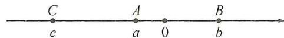

(2) 原式 $= (-a + b) - (-b - c) + (-c - a)$

$$
\begin{array}{l} = - a + b + b + c - c - a \\ = 2 b - 2 a. \\ \end{array}
$$

例 2 解: 若 $a + b + c \geqslant 0$ ，则 $\left|a + b + c\right| = a + b + c$ ，

于是 $a + b + c = a - b + c$

∴2b=0，即 b=0，与已知条件相矛盾，

∴ $a + b + c < 0$ ，于是可得 $\left|a + b + c\right| = -a - b - c$ ，

$$
\therefore - a - b - c = a - b + c,
$$

∴ $2(a+c)=0$ ，即 $a+c=0$ ，而 $a+b+c<0$ ，即 b<0，

$$
\therefore a - b + c > 0, | a - b + c + 5 | = - b + 5,
$$

$$
\vert b - 2 \vert = - b + 2,
$$

则 $|a - b + c + 5| - |b - 2| = (-b + 5) - (-b + 2) =$

3. 故原式的值为 3.

# 【实战演练】

1. 解：∵ $b + c < 0, a - b < 0, c + a - b < 0,$

∴原式=-b-c-5a+5b+2c+2a-2b=-3a+2b+c.

2. 解: (1) $\because |a| = -a, |abc \neq 0, \therefore a < 0,$

$$
\because | a c | = - a c, \therefore c > 0, \because a + b > 0, \therefore b > 0.
$$

如图：

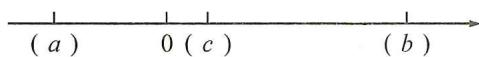

(2) $\because b>0,c>0,\therefore b+c>0,\therefore|b+c|=b+c;$

$$
\because a <   0, c > 0, | a | > | c |, \therefore a + c <   0, \therefore | a + c | = - a - c;
$$

$$
\because a <   0, b > 0, \therefore a - b <   0, | a - b | = b - a;
$$

故答案为 $b + c, -a - c, b - a$ ;

(3) $x = -(a + c) + (b + c) + (a - b) + 2$

$$
= - a - c + b + c + a - b + 2 = 2,
$$

则 $3x^{2} - 4x + 2 = 3 \times 2^{2} - 4 \times 2 + 2 = 12 - 8 + 2 = 6.$

# 第12讲 整式加减的应用

# 板块一 应用(1) 出入相补求面积

# 【典例精讲】

例 解: $S = a^{2} + b^{2} - \frac{1}{2} a^{2} - \frac{1}{2} b(b + a)$

$$
= \frac {1}{2} a ^ {2} + \frac {1}{2} b ^ {2} - \frac {1}{2} a b.
$$

# 【实战演练】

1. 解: 由题意, 可得阴影部分面积 $=\frac{1}{2}(a-b)\cdot a+\frac{1}{2}b^{2}=\frac{1}{2}(a^{2}+b^{2})-\frac{1}{2}ab.$

2. 解: 阴影部分的面积为 $\frac{1}{2}a(a+b)-\frac{1}{2}ab-\frac{1}{2}b(a-b)=\frac{1}{2}(a^{2}+b^{2}-ab)$ .

3. 解: $S = a^{2} + b^{2} - \frac{1}{2}a^{2} - \frac{1}{2}b (a + b)$

$$
= \frac {1}{2} a ^ {2} + \frac {1}{2} b ^ {2} - \frac {1}{2} a b.
$$

4. $a^{2}$ 解: 设 HI = x, AD = y,

则 $S_{\triangle BEI} = x^2 + a^2 + ay - \frac{1}{2}(x - a)x - \frac{1}{2}(a + y)y - \frac{1}{2}(a + x)x - \frac{1}{2}(a - y)y = a^2.$

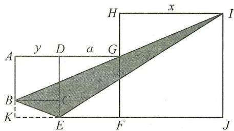

text_image

A
y D a G
B
C
K
E F J
H x I

# 板块二 应用(2) 精彩镶嵌影相随

# 【典例精讲】

例1 B 解: 设小长方形卡片的长为 $x \mathrm{~cm}$ , 宽为 $y \mathrm{~cm}$ , 可得 $m - x = 2y$ , 即 $x + 2y = m$ , 根据题意, 得阴影部分的周长为 $2[(m - x) + (n - x)] + 2[(n - 2y) + (m - 2y)] = 2(2m + 2n - 2x - 4y) = 4[m + n - (x + 2y)] = 4(m + n - m) = 4n(\mathrm{cm})$ . 故选 B.

例 2 15 解: 设 AB = x, AD = x + 3,

$$
\therefore S _ {1} = x (x + 3) - 3 6 - 2 5 + [ 5 + 6 - (x + 3) ] \times 5,
$$

$$
S _ {2} = x (x + 3) - 3 6 - 2 5 + (5 + 6 - x) \times 5,
$$

$$
\therefore S _ {2} - S _ {1} = 5 (1 1 - x) - 5 (8 - x) = 1 5.
$$

# 【实战演练】

1. 解: (1) $C_{1}=2x+4a$ , $C_{2}=2x+16b$ ;

(2) $\because C_{1}$ 和 $C_{2}$ 的值始终相等，

$$
\therefore 2 x + 4 a = 2 x + 1 6 b \text {, 即} a = 4 b.
$$

2. 解: (1) $S_{1}-S_{2}=3b(30-a)-a(30-4b)=90b-3ab-30a+4ab=90b+ab-30a$ ;

(2) $\because S_{1} - S_{2} = 3b(AD - a) - a(AD - 4b) = (3b - a)AD + ab$ ，若 $a, b$ 的值不变， $AD$ 变长，而 $S_{1} - S_{2}$ 的值总保持不变， $\therefore 3b - a = 0$ ，解得 $a = 3b$ 。即 $a, b$ 满足的关系是 $a = 3b$ 。

# 板块三 应用(3) 分段方案巧计费

# 【典例精讲】

例 解: $(1)2\times12+2\times1.5\times(20-12)+2\times2\times(28-20)=80$ （元）;

(2) $(2an-16a)$ ;

(3)∵甲用户缴纳的水费超过了24元，∴x>12.

①12<x≤20，甲： $2\times12+3(x-12)=3x-12$ ;

$$
: 2 0 \leqslant 4 0 - x <   2 8, 1 2 \times 2 + 8 \times 3 + 4 (4 0 - x - 2 0) = 1 2 8
$$

$$
- 4 x \text {, 共计:} 3 x - 1 2 + 1 2 8 - 4 x = 1 1 6 - x;
$$

②20<x≤28，甲： $2\times12+3\times8+4(x-20)=4x-32$ ;

$$
\text { 乙 }: 1 2 \leqslant 4 0 - x <   2 0, 2 \times 1 2 + 3 (4 0 - x - 1 2) = 1 0 8 - 3 x,
$$

共计:4x-32+108-3x=x+76;

③28<x≤40，甲： $2\times12+3\times8+4(x-20)=4x-32$ ;

$$
\text { 乙 }: 0 \leqslant 4 0 - x <   1 2, 2 (4 0 - x) = 8 0 - 2 x,
$$

共计： $4x-32+80-2x=2x+48.$

答:甲、乙两用户共缴纳的水费为 \( \left\{\begin{aligned}(116-x)元,(12<x\leqslant20),\\(x+76)元,(20<x\leqslant28),\\(2x+48)元,(28<x\leqslant40).\end{aligned}\right. \)

# 【实战演练】

解:(1)方案①需付费为: $30\times10+5(x-30)=(5x+150)$ 元;
方案②需付费为： $(30\times10+5x)\times0.8=(4x+240)$ 元. 故答案为 $(5x+150)$ ， $(4x+240)$ ;

(2) 当 x=50 时, 方案①需付款为: $5x+150=5\times50+150=400$ (元),

方案②需付款为： $4x+240=4\times50+240=440$ （元），

∵400<440,∴选择方案①购买较为合算；

(3)由题意,得 $5x+150=4x+240$ , 解得 x=90,

答: 当 x=90 时, 方案①和方案②的购买费用一样.

# 板块四 应用(4) 抽丝剥茧规律现

# 【典例精讲】

例 1 3n-1 解: 第①个图案中有 2 个圆圈, 第②个图案中有 $2+3\times1=5$ 个圆圈, 第③个图案中有 $2+3\times2=8$ 个圆圈, 第④个图案中有 $2+3\times3=11$ 个圆圈, …, 则第 n 个图案中圆圈的个数为 $2+3(n-1)=3n-1$ .

例 2 D 解: 图①黑色正方形的个数为 $1+1$ ; 图②黑色正方形的个数为 $2+1$ ; 图③黑色正方形的个数为 $3+2$ ; 图④黑色正方形的个数为 $4+2$ ; …; 则第 2022 个图形中黑色正方形的个数为 $2022 + \frac{2022}{2} = 3033$ . 选 D.

例 3 $(2n+1)^{2}-(2n-1)^{2}=8n$

例4 $(2n - 1)a^{n}$

# 【实战演练】

1. A 2. $(n - 1)(n + 1) + 1 = n^2$

3. $n^2 - n = n(n - 1)$ 4. $-17x^{8}$

5. $(2+2n)$

6. $6n + 6$

7.4n-3 解：∵图1有1个三角形， $a_{1}=1$ ;

图 2 有 5 个三角形, $a_{2}=5=1+4=1+4\times1$ ;

图 3 有 9 个三角形, $a_{3}=9=1+4+4=1+4\times2;\cdots$

∴图 n 中三角形的个数为 $a_{n}=1+4(n-1)=4n-3$ .

8. $n^{2}+n-1$

9. $(n^{2}+n+4)$

10. 解：(1) ④ $1 + 3 + 5 + 7 = 4^{2}$ ; ⑤ $1 + 3 + 5 + 7 + 9 = 5^{2}$ ;

$$
(2) 1 + 3 + 5 + 7 + \dots + (2 n - 1) = n ^ {2}.
$$

11.72 解: 各图中的五角星的个数依次为 $2 \times 1^{2}$ , $2 \times 2^{2}$ , $2 \times 3^{2}$ , $\cdots$ , $2n^{2}$ , 第⑥个图形中五角星的个数为 $2 \times 6^{2} = 72$ .

# 板块五 应用(5) 返璞归真话整除

# 【典例精讲】

例 解:(1) $\overline{abc}+\overline{bca}+\overline{cab}$

$$
\begin{array}{l} = 1 0 0 a + 1 0 b + c + 1 0 0 b + 1 0 c + a + 1 0 0 c + 1 0 a + b \\ = 1 1 1 a + 1 1 1 b + 1 1 1 c \\ = 1 1 1 (a + b + c), \\ \end{array}
$$

故 $\overline{abc}+\overline{bca}+\overline{cab}$ 一定是 111 的倍数；

(2) $\because abc+bca+cab=111(a+b+c)$ ,

又∵ $\overline{abc}+\overline{bca}+\overline{cab}$ 能被7整除，

∵111不能被7整除，

∴ $a + b + c$ 能被 7 整除，即 $a + b + c$ 是 7 的倍数，

$$
\because 0 <   a + b + c <   9 + 9 + 9 = 2 7,
$$

∴ a, b, c 三个数必须满足的数量关系是 $a + b + c = 7$ 或 14 或 21.

故答案为 $a+b+c=7$ 或 14 或 21.

# 【实战演练】

解:611,617,721,723,729,831,941共7个,理由:

设十位数数字为 a，则百位数字为 $a+5(0<a\leqslant4$ 的整数），

$$
\therefore a + a + 5 = 2 a + 5,
$$

当 a=1 时， $2a+5=7$ ，∴7 能被 1,7 整除，

∴满足条件的三位数有611,617;

当 a=2 时， $2a+5=9,\therefore9$ 能被 1,3,9 整除，

∴满足条件的三位数有721,723,729;

当 a=3 时， $2a+5=11,\therefore11$ 能被 1 整除，

∴满足条件的三位数有831；

当 a=4 时， $2a+5=13$ ，∴13 能被 1 整除，

∴满足条件的三位数有941.

即满足条件的三位自然数为 611,617,721,723,729,831,941 共 7 个.

# 板块六 应用(6) 月历数阵探规律

# 【典例精讲】

例 解:(1)a-7,a,a+7;

(2)设长方形框出的9个数中的最小数为a,则这9个数的和为 $9a+72$ .

若 $9a+72=2\ 004$ ，则 $a=214\frac{2}{3}$ ，∵a为整数，

∴不成立，故不可能框出9个数的和为2004；

若 $9a+72=2007$ ，则 a=215，且 $215\div7=30$ 余 5，

∴a为第31行第5列(最小数小于等于第5列)，

∴成立,故能框出9个数的和为2007.

# 【实战演练】

【分析】先用含 x 的式子表示正方形框中的四个数, 再列一元一次方程.

解:(1) $x+1,x+7,x+8;$

(2) $x+(x+1)+(x+7)+(x+8)=416$ , 解得 x=100;

(3) 不可能为 2018,

$$
\because x + (x + 1) + (x + 7) + (x + 8) = 2 0 1 8,
$$

∴x=500.5.又∵x为正整数,故不能.

# 板块七 应用(7) 纷繁变幻九宫格

# 【典例精讲】

例 解:(1)由表格知,m-2=n+2n,

得 m-3n=2;

(2)由表格知,第二行第三列的数为7,第三行第三列的数为6,由 $2+5=m+6$ ,得m=1;

(3)由表格知， $y+2=1+6$ ，得y=5；

由 $x+6=2\times5$ , 得 x=4, $\therefore x-y=-1$ ;

(4)由表格知,5+p=11,得p=6;

由 $11+m=6\times3=18$ ，得 m=7。

# 【实战演练】

1. 解: (1) 可求中间数为 8,

∴11+8=x-1, 解得 x=20;

(2)最左下角的数为 $6+20-22=4$ ,

∴最中间的数为 $\frac{x+26}{3}$ ,

∴ $\frac{x+26}{3}+24=x+26$ , 解得 x=10,

∴最中间的数为12.由 $22+12+y=3\times12$ ，解得y=2，

$$
\therefore x + y = 1 2;
$$

(3)可求右上角的数为-10,中间数为-3,

由 $n+21=-3\times2,\therefore n=-27,$

由 $4+7+m=-3\times3$ ，解得 m=-20，

$$
\therefore m - n = - 2 0 - (- 2 7) = 7;
$$

(4)设中间数为 t，则 $15+t=y+23$ ，解得 y=t-8；

由 $x+23=2t$ ，得 x=2t-23，∴x-2y=-7。

2. 解: (1) 由题意, 得 $x + x - 1 = a + 3 + a - 2$ ,

解得 $x=a+1$ ;

(2)设左上格的数为 x，则右下为 x-2，

正中间为 2a-3-x，左中为 2x-4-a，左下为 3a-1-x，

∴3a-1-x+2a-3-x+a-5=x+2a-5,解得x=a-1,

∴“九格幻方”中的9个数的和是9a-18；

(3)如图所示.

<table><tr><td>m+3n</td><td>m-4n</td><td>m+n</td></tr><tr><td>m-2n</td><td>m</td><td>m+2n</td></tr><tr><td>m-n</td><td>m+4n</td><td>m-3n</td></tr></table>

# 第五章 一元一次方程

# 第13讲 从算式到方程

# 板块一 深悟定义精解题

# 【典例精讲】

例 1 1 解:由定义知 $\left|a-2\right|=1$ 且 $a-3\neq0,\therefore a=1$ .

例 2 -1

例 3 y = -3

# 【实战演练】

1. ①③⑦

2.-2

3. y=11

4. 解： $\because (2b - 2)y^2 - y^{\frac{1}{3}a - \frac{1}{3}} = 3$ 是关于 $y$ 的一元一次方程， $\therefore 2b - 2 = 0, \frac{1}{3}a - \frac{1}{3} = 1, \therefore a = 4, b = 1.$

5. 解: $\because x=1-a$ 是方程 $2x+3a=3(x+a)$ 的解,

$$
\therefore 2 (1 - a) + 3 a = 3 (1 - a + a),
$$

$$
\therefore 2 - 2 a + 3 a = 3, \therefore a = 1.
$$

6. 解: 将 x=2 代入原方程, 得 $3a+6=6+4b$ , $\therefore 3a=4b$ ,

$$
\therefore \frac {a}{b} = \frac {4}{3}, \frac {b}{a} = \frac {3}{4}, \therefore \frac {a}{b} - \frac {b}{a} = \frac {4}{3} - \frac {3}{4} = \frac {7}{1 2}.
$$

# 板块二 理解性质巧运用

# 【典例精讲】

例 1 C

例 2 C

例 3 解: (1) $\because 3x^{2}-4x-5=7,\therefore 3x^{2}-4x=12,$

$$
\therefore x ^ {2} - \frac {4}{3} x = 4;
$$

(2) $\because3x^{2}-4x=12,\therefore8x-6x^{2}=-24.$

# 【实战演练】

1. D 2. C

3. $x + 1 = 0$

4. 解: (1) 由 $2a = \frac{3}{b}$ ，得 $ab = \frac{3}{2}$ ，

由 $a - 3 = 4 - b$ ，得 $a + b = 7$

(2) 原式 = 2ab - 3(a + b) = 2 × $\frac{3}{2}$ - 3 × 7 = -18.

# 第14讲 一元一次方程的解法板块一 不偏不倚去括号

# 【实战演练】

1. 解: (1) 3x - 3 = 5x + 1,

$$
3 x - 5 x = 1 + 3,
$$

$$
- 2 x = 4,
$$

$$
x = - 2;
$$

(2)6-3x-2=25,

$$
- 3 x = 2 5 - 6 + 2,
$$

$$
- 3 x = 2 1,
$$

$$
x = - 7;
$$

(3)2x-2=3+5x+10,

$$
2 x - 5 x = 3 + 1 0 + 2,
$$

$$
- 3 x = 1 5,
$$

$$
x = - 5;
$$

(4) $3x + 18 = 2 - 5 + 10x$

$$
3 x - 1 0 x = 2 - 5 - 1 8,
$$

$$
- 7 x = - 2 1,
$$

$$
x = 3;
$$

(5) $x+3x-9=4-2x+4,$

$$
x + 3 x + 2 x = 4 + 4 + 9,
$$

$$
6 x = 1 7,
$$

$$
x = \frac {1 7}{6};
$$

(6) $4x - 57 + 3x = 6x - 63 + 7x$

$$
4 x + 3 x - 6 x - 7 x = - 6 3 + 5 7,
$$

$$
- 6 x = - 6,
$$

$$
x = 1;
$$

(7)1-2-4x=3-6x,

$$
- 4 x + 6 x = 3 - 1 + 2,
$$

$$
2 x = 4,
$$

$$
x = 2;
$$

(8)0.5y-0.5=0.3y+0.3+0.1,

$$
0. 5 y - 0. 3 y = 0. 3 + 0. 1 + 0. 5,
$$

$$
0. 2 y = 0. 9,
$$

$$
y = 4. 5.
$$

2. 解: (1) 移项, 得 $\frac{1}{3}(x-5)+\frac{2}{3}(x-5)=3$ ,

合并同类项, 得 x-5=3,

解得 x=8;

(2) 去中括号, 得 $\frac{x}{4}-1-3-x=2$ .

移项、合并同类项，得 $-\frac{3}{4}x=6$ .

系数化为 1, 得 x = -8.

# 板块二 不遗不漏去分母

# 【实战演练】

解：(1) $3(x+5)=2(3x+2)$ ,

$$
3 x + 1 5 = 6 x + 4,
$$

$$
3 x - 6 x = 4 - 1 5,
$$

$$
- 3 x = - 1 1,
$$

$$
x = \frac {1 1}{3};
$$

(2) $3(x+1)-2(2x-3)=6$ ,

$$
3 x + 3 - 4 x + 6 = 6,
$$

$$
3 x - 4 x = 6 - 6 - 3,
$$

$$
- x = - 3,
$$

$$
x = 3;
$$

(3) $3(2x-1)=12-4(x+2)$ ,

$$
6 x - 3 = 1 2 - 4 x - 8,
$$

$$
6 x + 4 x = 1 2 - 8 + 3,
$$

$$
1 0 x = 7,
$$

$$
x = \frac {7}{1 0};
$$

(4)3(2x+1)-12=12x-(10x+7),

$$
6 x + 3 - 1 2 = 1 2 x - 1 0 x - 7,
$$

$$
6 x - 1 2 x + 1 0 x = - 7 - 3 + 1 2,
$$

$$
4 x = 2,
$$

$$
x = \frac {1}{2};
$$

(5)4x-(4-3x)=2(5x+8),

$$
4 x - 4 + 3 x = 1 0 x + 1 6,
$$

$$
4 x + 3 x - 1 0 x = 1 6 + 4,
$$

$$
- 3 x = 2 0,
$$

$$
x = - \frac {2 0}{3};
$$

(6) $4(5y+4)+3(y-1)=24-(5y-2)$ ,

$$
2 0 y + 1 6 + 3 y - 3 = 2 4 - 5 y + 2,
$$

$$
2 0 y + 3 y + 5 y = 2 4 + 2 - 1 6 + 3,
$$

$$
2 8 y = 1 3,
$$

$$
y = \frac {1 3}{2 8};
$$

(7) $3(x+3)-(x-8)=2(2x+1)-6,$

$$
2 x + 1 7 = 4 x - 4,
$$

$$
- 2 x = - 2 1,
$$

$$
\therefore x = \frac {2 1}{2};
$$

(8) $\frac{11-5x}{3}+\frac{2}{3}x=15x+1,$

$$
1 1 - 5 x + 2 x = 4 5 x + 3,
$$

$$
- 5 x + 2 x - 4 5 x = 3 - 1 1,
$$

$$
- 4 8 x = - 8,
$$

$$
x = \frac {1}{6}.
$$

# 板块三 含参(绝对值)方程

# 【典例精讲】

例 1 解: $3(2a+x)+6=2(2x+1)$ ,

$$
6 a + 3 x + 6 = 4 x + 2,
$$

$$
x = 6 a + 4.
$$

例 2 解: 原方程变形为 $(a-2)x=-3(a-2)$ ,
当 $a-2\neq0$ 时，则 x=-3；

当 a-2=0 时，x 为任意有理数.

例 3 解：∵ $|x-2|=5$ ，∴ x-2=5 或 x-2=-5，

解得 x=7 或 x=-3;

例 4 解: 当 x<2 时, $-x+6-x+2=10$ , 解得 x=-1;

当 $2 \leqslant x \leqslant 6$ 时， $-x + 6 + x - 2 = 10$ ，此时无解；

当 x>6 时， $x-6+x-2=10$ ，

解得 x=9;

∴原方程的解为 x = -1 或 x = 9.

# 【实战演练】

1. 解: (1) 移项, 得 $(a-2)x=6+3b$ ,

$\because a\neq2,\therefore$ 系数化为1,得 $x=\frac{3b+6}{a-2};$

(2)根据题意,得 $ab \neq 0$ ,去分母,得

$$
b (x - 1) - a (1 - x) = a + b,
$$

去括号, 得 bx-b-a+ax=a+b,

移项,得 $(a+b)x=2a+2b.$

当 $a + b \neq 0$ 时， $x = \frac{2a + 2b}{a + b} = 2$ ;

当 $a+b=0$ 时，x 为任意有理数.

2. 解: (1) $\because 2|3x-1|-6=0$ ,

$$
\therefore 2 \vert 3 x - 1 \vert = 6, \therefore \vert 3 x - 1 \vert = 3,
$$

∴3x-1=3或3x-1=-3，

解得 $x=\frac{4}{3}$ 或 $x=-\frac{2}{3}$ ;

(2) $\because\left|2x-6\right|=\left|x+3\right|$ ,

∴2x-6=x+3或2x-6=-x-3，

解得 x=9 或 x=1;

(3) 当 t<1 时, $2-2t-t+3=t+4$ , 解得 $t=\frac{1}{4}$ ;

当 $1 \leqslant t \leqslant 3$ 时， $-2 + 2t - t + 3 = t + 4$ ，此时无解；

当 $t > 3$ 时， $-2 + 2t + t - 3 = t + 4$ ，解得 $t = \frac{9}{2}$

∴原方程的解为 $t=\frac{1}{4}$ 或 $t=\frac{9}{2}$ .

# 第15讲 方程的解   板块一 千变万化关联解

# 【典例精讲】

例1 解: 由 $\frac{5x - 1}{6} = \frac{7}{3}$ , 得 $x = 3$ , 将 $x = 3$ 代入方程 $\frac{8x - 1}{2} = x + \frac{9}{2} + 2|m$ , 得 $\frac{23}{2} = 3 + \frac{9}{2} + 2|m$ , 解得 $m = \pm 2$ .

例2 解:由 4x-2a=9, 得 $x=\frac{2a+9}{4}$ , 由 2x-a=5, 得 $x=\frac{a+5}{2}$ . ∵ 关于 x 的一元一次方程 4x-2a=9 与方程 2x-a=5 的解互为相反数, ∴ $\frac{2a+9}{4}+\frac{a+5}{2}=0$ , 解得 $a=-\frac{19}{4}$ .

# 【实战演练】

1. 解: 由 $2-3(x+1)=0$ , 得 $x=-\frac{1}{3}$ ,

根据题意知另一个方程的解为 x = -3，

$\therefore \frac{k - 3}{2} - 3k - 2 = 2 \times (-3)$ , 解得 $k = 1$ .

2. 解: 由方程 $\frac{2x}{3}-\frac{x-3}{6}=1$ , 得 x=1,

将 x=0.5 代入 $x+\frac{3a}{2}=7$ 中，得 $a=\frac{13}{3}$ ,

将 $a = \frac{13}{3}$ 代入 $-\frac{1}{2} ax + 4 = 3$ 中，解得 $x = \frac{6}{13}$ .

3. 解: 由 $6-3(x+1)=0$ , 得 x=1. 由题意, 得 x=-1 是关于 x 的方程 $\frac{k+x}{2}-3k-2=2x$ 的解.

$$
\therefore \frac {k - 1}{2} - 3 k - 2 = - 2, \therefore k = - \frac {1}{5}.
$$

# 板块二 无解、定解、无数解

# 【典例精讲】

例 1 解: $(1)a \neq 1, b$ 为任意有理数.

当 $a - 1 \neq 0$ ，即 $a \neq 1$ 时，方程有唯一解；

(2) $a = 1$ 且 $b \neq 2$ .

当 $a - 1 = 0$ 且 $b - 2 \neq 0$ 时，即 $a = 1$ 且 $b \neq 2$ 时，

方程无解；

(3) $a = 1$ 且 $b = 2$ .

当 $a - 1 = b - 2 = 0$ 时，即 $a = 1$ 且 $b = 2$ 时，

方程有无数个解.

例2 解：由 $x - \frac{x - 6}{2} = \frac{a}{5} x$ ，得 $(2a - 5)x = 30$

∵方程无解，∴2a-5=0，解得 $a=\frac{5}{2}$ .

例3 解: 将 $x = -1$ 代入, 得 $\frac{-k - a}{2} - 1 = \frac{-2 - bk}{4}$ ,

整理，得 $(b-2)k=2a+2$ ，

∵方程的解与k的取值无关，

$\therefore b-2=0$ 且 $2a+2=0$ ，解得 a=-1, b=2.

# 【实战演练】

1. 解: 由 $ax - 3 = 2x + b$ ，得 $(a - 2)x = b + 3$ ，

∵方程有无数解，

$\therefore a-2=0$ 且 $b+3=0,\therefore a=2,b=-3.$

2. 解: 由 $\frac{ax-4}{2}=\frac{1}{3}-bx$ ，得 $(3a+6b)x=14$ ，

∵方程无解，∴3a+6b=0，∴a+2b=0.

3. 解: 原方程可化为 $(4x + b)k = 12 + x - 2a$ ,

$$
\because x = 1, \therefore (4 + b) k = 1 3 - 2 a,
$$

∵与k无关，

$$
\therefore 4 + b = 0, 1 3 - 2 a = 0,
$$

$$
\therefore a = 6. 5, b = - 4.
$$

# 板块三 运算程序新定义

# 【典例精讲】

例 1 解: (1) 根据新定义, 得 $1 \star 2 \star 3 = 1 + 2 - 1 \times 3 = 0$ ;

(2)根据新定义,得 $2 \star x \star 3 = 2 + x - 2 \times 3 = x - 4$ ,

$4\star 1\star x = 4 + 1 - 4x = 5 - 4x$

∵2☆x☆3=4☆1☆x，∴x-4=5-4x，

解得 $x=\frac{9}{5}$ ;

(3)根据新定义,得 $\frac{1}{2}+4-x-\frac{3-x}{2}=2$ ,解得x=2.

例 2 解: (1) 方程 $4x - (x + 5) = 1$ 与方程 -2y - y = 3 是 “美好方程”, 理由:

解方程 $4x-(x+5)=1$ ，得 x=2，

解方程-2y-y=3, 得 y=-1.

$\because x+y=2-1=1,\therefore$ 方程 $4x-(x+5)=1$ 与方程 $-2y-y=3$ 是“美好方程”；

(2)关于 x 的方程 $\frac{x}{2} + m = 0$ 的解为 x = -2m，

方程 $3x-2=x+4$ 的解为 x=3，

由题意,得 $-2m+3=1,\therefore m=1;$

(3)方程 $\frac{1}{2022}x-1=0$ 的解为x=2022,

由题意,得方程 $\frac{1}{2022}x+1=3x+k$ 的解为x=-2021,

∵关于 y 的方程 $\frac{1}{2022}(y+2)+1=3y+k+6$ 就是

$$
\frac {1}{2 0 2 2} (y + 2) + 1 = 3 (y + 2) + k,
$$

$$
\therefore y + 2 = - 2 0 2 1, \therefore y = - 2 0 2 3.
$$

# 【实战演练】

1. 解: 当 3x - 2 = 100 时, x = 34;

当 3x-2=34 时，x=12；

当 3x-2=12 时，x 不是正整数，不合题意。

即当 x=12 或 34 时，输出的结果都是 100.

2. 解:(1)根据题中的新定义,得原式= $2\times(-3)-3=-9$ ;

(2)根据题中的新定义,得 $2(x-1)+(x-1)=5x+5$ ,去括号,得 $2x-2+x-1=5x+5$ ,

移项合并,得-2x=8,

系数化为 1, 得 x = -4.

3. 解: (1) ∵ 方程 2x = m 是“和谐方程”,

$\therefore\frac{m}{2}=m-2$ , 解得 m=4.

∴m的值为4;

(2)∵方程 $2x=ab+a$ 是“和谐方程”，它的解为 a，

$$
\therefore \left\{ \begin{array}{l} \frac {a b}{2} + \frac {a}{2} = a, \\ a b + a - 2 = a, \end{array} \right. \therefore \left\{ \begin{array}{l} a = 2, \\ b = 1. \end{array} \right.
$$

∴a的值为2,b的值为1;

(3)∵方程 $2x=mn+m$ 和 $-2x=mn+n$ 都是“和谐方程”，

$$
\therefore \left\{ \begin{array}{l} \frac {m n}{2} + \frac {m}{2} = m n + m - 2, \\ - \frac {m n}{2} - \frac {n}{2} = m n + n - (- 2), \end{array} \right.
$$

$$
\therefore m n + m = 4, m n + n = - \frac {4}{3},
$$

$$
\therefore m - n = 4 - \left(- \frac {4}{3}\right) = \frac {1 6}{3},
$$

$$
\therefore (m n + m) ^ {2} - 9 (m n + n) ^ {2} - 3 (m - n) = 4 ^ {2} - 9 \times \left(- \frac {4}{3}\right) ^ {2}
$$

$$
- 3 \times \frac {1 6}{3} = - 1 6.
$$

# 第 16 讲 实际问题与一元一次方程(一) 板块一 总分问题

# 【典例精讲】

例 解:设这个班一共有学生 x 人,

依题意, 得 $\frac{1}{4}x + \frac{1}{2}x + \frac{1}{7}x + 6 = x$ ,

解得 x=56.

答: 这个班一共有学生 56 人.

# 【实战演练】

1. 解: 设欧州的意向创始成员国为 x 个, 则亚洲为 $(2x-2)$ 个, $x+(2x-2)+5=57$ , 解得 x=18, $\therefore 2x-2=34$ .

答:亚洲、欧洲的意向创始国分别为34个,18个.

2. 解: (1) 设 A 款玩偶购进 x 个, 则购进 B 款玩偶 $(35 - x)$ 个, 根据题意, 得 $40x + 30(35 - x) = 1200$ ,

解得 $x=15,\therefore35-15=20.$

答:A 款玩偶购进了 15 个,B 款玩偶购进了 20 个;

(2)设第二次进货时购进 A 款玩偶 a 个,则购进 B 款玩偶 $(80-a)$ 个.

由题意, 得 $(15+a)\times(56-40)+(20+80-a)\times(42-30)=1\ 580$ , 解得 a=35.

答:第二次进货时购进 A 款玩偶 35 个.

# 板块二 年龄问题

# 【典例精讲】

例 解:设妹妹今年 x 岁,则哥哥今年 $(x+4)$ 岁,父亲今年 $(2x+4)$ 岁.

则 $2x+4-24=5(x+x+4-48)$ ，解得 x=25，

$$
\therefore x + 4 = 2 9, 2 x + 4 = 5 4.
$$

答:父亲今年54岁,兄妹今年分别为29岁,25岁.

例 2 【分析】列表分析如下：

<table><tr><td></td><td>父亲</td><td>女儿</td><td>年龄差</td></tr><tr><td>现在</td><td>x</td><td>91-x</td><td>x-(91-x)</td></tr><tr><td>原来</td><td>2(91-x)</td><td> $\frac{1}{3}x$ </td><td>2(91-x)- $\frac{1}{3}x$ </td></tr></table>

解:设父亲现在的年龄为 x 岁,

由题意, 得 $2(91-x)-\frac{1}{3}x=x-(91-x)$ ,

解得 x=63.

答:父亲现在的年龄是63岁,女儿现在的年龄为28岁.

# 【实战演练】

1. 解: 设 10 年前儿子的年龄是 x 岁, 则父亲的年龄是 4x 岁, 根据题意, 得 $4x + 20 = 2(x + 20)$ ,

解得 x=10，则父亲 10 年前的年龄是 40 岁，所以，父子两人相差 30 岁。

答:儿子出生时,父亲的年龄是30岁.

2.【分析】列表分析如下：

<table><tr><td></td><td>父亲</td><td>女儿</td><td>年龄差</td></tr><tr><td>现在</td><td>x</td><td>96-x</td><td>x-(96-x)</td></tr><tr><td>原来</td><td>2(96-x)</td><td>1/3x+2</td><td>2(96-x)-(1/3x+2)</td></tr></table>

解:设父亲现在的年龄是 x 岁,则女儿现在的年龄是(96-x)岁,由题意,

得 $2(96 - x) - (\frac{1}{3} x + 2) = x - (96 - x)$ ，

解得 x=66.

答:父亲现在的年龄是66岁.

# 板块三 盈亏问题

# 【典例精讲】

例 解:设参与种树的人数为 x 人,

依题意,得 $10x+6=12x-6$ ,

解得 x=6.

答:参与种树的人数为6人.

# 【实战演练】

1. 解: 设这个班有 x 人, 依题意, 得 $3x + 20 = 4x - 25$ ,

解得 x=45.

答: 这个班有 45 人.

2. 解: 设原有树苗 x 棵,

由题意, 得 $5(x+21-1)=6(x-1)$ ,

解得 x=106.

答: 原有树苗 106 棵.

3. 解: 设预定时间为 x 小时,

根据题意, 得 $15\left(x-\frac{1}{4}\right)=9\left(x+\frac{1}{4}\right)$ ,

解得 $x=1,15\times\left(1-\frac{1}{4}\right)=\frac{45}{4}$ (千米).

答:从家到学校的路有 $\frac{45}{4}$ 千米.

# 板块四 效率问题

# 【典例精讲】

例 解: 设每个房间要粉刷的面积为 x 平方米,

依题意, 得 $\frac{8x-50}{3}-\frac{10x+40}{5}=10$ , 解得 x=52.

答:每个房间需要粉刷的墙面面积为52平方米.

# 【实战演练】

1. 解: 设每箱装 x 个产品,

依题意, 得 $\frac{8x+4}{5}-1=\frac{11x+1}{7}$ ,

解得 x=12.

答:每箱装12个产品.

2. 解: 设这批书共有 3x 本,

根据题意, 得 $\frac{2x-40}{16}=\frac{x+40}{9}$ ,

解得 x=500，则 3x=1500.

答:这批书共有1500本.

3. 解: (1) 设每个宿舍需要铺瓷砖的地板面积为 $x \, m^{2}$ ,

则 $\frac{4x-12}{4}-\frac{4x}{6}=3$ ，解得x=18。答：每个宿舍铺18m $^{2}$ ；

(2)设每名一级技工每天多铺瓷砖 $2a \, m^{2}$ ,

二级技工每天多铺 $3a \, m^{2}$ ,

则 $4 \times 15 \times 3 + 4 \times 2(15 + 2a) + 6 \times 2 \times (12 + 3a) = 26 \times 18$

+80, 解得 a=2.

∴12+3a=18.答:每名二级技工每天需要铺18m²瓷砖.

# 板块五 数字问题

# 【典例精讲】

例 解:设原三位数的十位上的数字为 x, 则百位上的数字为 $x+1$ , 个位上的数字为 3x-2,

根据题意, 得 $101(x+1)+20x+101(3x-2)=1171$ ,

解得 $x=3, x+1=4, 3x-2=7.$

答: 这个三位数为 437.

# 【实战演练】

1. 解: 设十位上的数字为 x, 则个位上的数字为 $x + 3$ .

由题意, 得 $x + (x + 3) = \frac{1}{4}[10x + (x + 3)]$ .

解得 x=3，所以 $10x+(x+3)=36$ .

答: 这个两位数为 36.

2. 解: 设原十位数字为 x, 则个位数字为 3x, 由题意, 得

$$
(3 x \times 1 0 + x) - (1 0 x + 3 x) = 5 4,
$$

解得 x=3，所以原数为 $3 \times 10 + 9 = 39$ .

答:原来的两位数是39.

3. 解: 设原来的六位数为 $(2 \times 10^{5} + x)$ ，新数为 $(10x + 2)$ ，

根据题意, 得 $3(2 \times 10^{5} + x) = 10x + 2$ , 解得 x = 85714.

答: 原数为 285 714.

# 板块六 增长率问题

# 【典例精讲】

例 A 解: 设该商品的原售价为单位 1.

方案一的售价为 $(1 + 10\%)(1 - 10\%) = 0.99$

方案二的售价为 $(1 + 20\%)(1 - 20\%) = 0.96$

∵0.99＞0.96，∴方案一的售价高.

故选 A.

# 【实战演练】

1. B 解: 设原价为单位 1, 原销售量为 a 件, 销售量比按原价销售时增加的百分率为 x,

根据题意,得 $(1-20\%)(1+x)a=a$ ,解得 $x=25\%$ .

故选 B.

2. B 解: 设定价应提高的百分率为 x, 该商品的原进价为单位 1, 根据题意, 得

$$
(1 + 20\%) (1 + x) - (1 + 30\%) = 44\% \times (1 + 30\%),
$$

解得 $x=56\%$ ,

故选B.

3. 解: 设 B 品牌冰箱 6 月份的销售量比 5 月份增长的百分率为 x,

则 $80(1-5\%)+120(1+x)=200(1+16\%)$ ,

解得 x=0.3.

答:销售量增长了30%.

# 板块七 图形问题

# 【典例精讲】

例 解: 设小长方形的长为 $x \, cm$ , 则宽为 $(x - 6) \, \text{cm}$ ,

由图，得 $x+3(x-6)=14$ ，

解得 x=8，故小长方形的长为 8 cm，宽为 2 cm.

$\therefore$ 阴影部分的面积为 $140 - 8 \times 2 \times 6 = 44(\mathrm{cm}^2)$ .

# 【实战演练】

1. 解: 设小长方形的长为 x, 则宽为 $\frac{3}{5}x$ ,

由题意, 得 $2 \times \frac{3}{5}x - x = 2$ , 解得 x = 10, 则 $\frac{3}{5}x = 6$ ,

所以正方形 ABCD 的周长是 $4\left(x+2\times\frac{3}{5}x\right)=4\times(10+12)=88.$

2. 解: 乙容器中的水不会溢出. 设甲容器中的水全部倒入乙容器后, 乙容器中的水深 x cm. 由题意, 得 $\pi \times 10^{2} \times 20 = \pi \times 20^{2} \times x$ . 解得 x = 5. 因为 5 cm < 10 cm, 所以水不会溢出, 倒入水后乙容器中的水深 5 cm.

答:略.

3. 解: 设 CE = 3x, EF = 4x, 小正方形的边长为 a,

则 $AB=3a+6x, BC=10x+a, AD=6x+5a$ ,

$$
\therefore 1 0 x + a = 6 x + 5 a,
$$

$$
\therefore x = a, \therefore \frac {A B}{B C} = \frac {9 x}{1 1 x} = \frac {9}{1 1}.
$$

# 第 17 讲 实际问题与一元一次方程(二) 板块一 行程问题

# 【典例精讲】

例 1 解:(1)设出发后 x h 相遇,则 $50x+70x=480$ ,

解得 x=4.

答: 出发后 4 小时相遇;

(2) 设 y h 两车相距 200 km,

相遇前:70y-50y=480-200,解得 y=14;

相遇后:70y-50y=480+200,解得 y=34.

答: 经过 14 h 或 34 h, 两车相距 200 km.

例 2 解: 设 A, B 两地的距离为 x 千米,

由题意, 得 $\frac{x}{8+2}+\frac{x-10}{8-2}=7$ , 解得 x=32.5.

答:略.

例 3 【分析】相等关系抓住火车的速度不变,用不同的式子表示火车的速度即可列方程.

解:设火车长为 x 米,由题意,得 $\frac{320+x}{18}=\frac{x}{10}$ ,

解得 x=400.

答: 这列火车长 400 米.

例 4 【分析】相等关系抓住小李和小明的速度和不变,用不同的式子表示两人的速度和即可列方程.

解: 设 A, B 两地间的距离为 x 千米,

由题意, 得 $\frac{x-36}{10-8}=\frac{x+36}{12-8}$ , 解得 x=108.

答:A,B两地间的距离为108千米.

# 【实战演练】

1. 解: 根据题意, 可知甲、乙两人的速度之和为 $600 \div 10 = 60$ (米/分),

设甲的速度为 x 米/分，则乙的速度为 $(60 - x)$ 米/分，
根据题意，得 $9x+(3+9)\times(60-x)=600$ ，

解得 x=40,60-x=20.

答:甲、乙两人的速度分别为40米/分钟,20米/分钟.

2. 解: (1) 设乙的速度是每分钟 x 米, 根据题意, 得 $3x + 150 = 200 \times 3$ , 解得 $x = 150, x + 200 = 150 + 200 = 350$ .

答:甲的速度是每分钟350米,乙的速度是每分钟150米;

$$
(2) (2 0 0 \times 3 - 3 0 0 \times 1. 2) \div 1. 2 = (6 0 0 - 3 6 0) \div 1. 2 = 2 4 0 \div
$$

$$
1. 2 = 2 0 0 (\text { 米 }), 2 0 0 - 1 5 0 = 5 0 (\text { 米 }).
$$

答:乙的速度每分钟至少要提高50米.

3. 解: 设甲、乙两地间的距离为 x 千米,

根据题意, 得 $\frac{x}{20-2}-\frac{x}{20+2}=1.5$ .

解得 x=148.5.

答:甲、乙两地间的距离为 148.5 千米.

4. 解: 法一: 设这列火车行驶的速度是 x 米/秒, 根据题意, 得 $800 + 18x = 50x$ , 解得 x = 25,

∴这列火车行驶的速度是25米/秒.

法二:设火车长为 x 米,根据题意,得 $\frac{x+800}{50}=\frac{x}{18}$ ,

解得 $x=450,\frac{x}{18}=\frac{450}{18}=25,$

∴这列火车行驶的速度是25米/秒.

# 板块二 工程问题(1) 总工作量为 1

# 【典例精讲】

例 1 解: 设乙中途离开 x 天, 则 $\frac{1}{14} \times 7 + \frac{1}{18} \times (7 - x + 2) +$

$$
\frac {1}{1 2} \times 2 = 1,
$$

解得 x=3.

答:乙中途离开了3天.

例 2 解: 设先安排了 x 个人, 由题意, 得

$\frac{x}{28}+\frac{2(x+5)}{28}=1$ , 解得 x=6.

答:先安排整理的人员有6人.

# 【实战演练】

1. 解: 设共需 x 小时, 由题意, 得 $\left(\frac{1}{7.5} + \frac{1}{5}\right) \times 1 + \frac{1}{5}(x - 1) =$

1, 解得 $x = 4 \frac{1}{3}$ .

答:共需要 $4 \frac{1}{3}$ 小时完成.

2. 解: 设先安排 x 人. 由题意, 得

$\frac{x}{100}\times2+(x+5)\times\frac{1}{100}\times9=1$ , 解得 x=5.

答:先安排 5 人做 2 小时.

# 板块三 工程问题(2) 总工作量不为 1

# 【典例精讲】

例 1 解: 设甲队整治了 x 天, 则乙队整治了 $(20 - x)$ 天, $24x + 16(20 - x) = 360$ ,

解得 x=5, ∴乙队整治了 15 天.

$$
\therefore 2 4 x = 1 2 0, 1 6 (2 0 - x) = 2 4 0.
$$

答:甲、乙两个工程队分别整治了120 m,240 m.

例 2 解: (1) 设该中学库存 x 套桌椅,

依题意, 得 $\frac{x}{16}-20=\frac{x}{16+8}$ , 解得 x=960.

答:该中学库存 960 套桌椅;

(2)设①②③三种修理方案的费用分别为 $y_{1}, y_{2}, y_{3}$

元，则 $y_{1}=(80+10)\times\frac{960}{16}=5400$ （元）；

$$
y _ {2} = (1 2 0 + 1 0) \times \frac {9 6 0}{1 6 + 8} = 5 2 0 0 (\text {元});
$$

$$
y _ {3} = (8 0 + 1 2 0 + 1 0) \times \frac {9 6 0}{1 6 + 1 6 + 8} = 5 0 4 0 (\mathrm{元}).
$$

综上可知,选择方案③更省时省钱.

# 【实战演练】

解:设此月人均定额为 x 件,则甲组的总工作量为 $(4x+20)$ 件,人均为 $\frac{4x+20}{4}$ 件;乙组的 5 名工人 3 月份完成的总工作量比此月人均定额的 6 倍少 20 件,乙组的总工作量为 $(6x-20)$ 件,乙组人均为 $\frac{6x-20}{5}$ 件.

(1)∵两组人均工作量相等，∴ $\frac{4x+20}{4}=\frac{6x-20}{5}$ ,

解得 x=45. 所以此月人均定额是 45 件；

(2)∵甲组的人均工作量比乙组多2件，

∴ $\frac{4x+20}{4}-2=\frac{6x-20}{5}$ ，解得x=35，

所以此月人均定额是35件；

(3)∵甲组的人均工作量比乙组少2件，

∴ $\frac{4x+20}{4}=\frac{6x-20}{5}-2$ , 解得 x=55,

所以此月人均定额是 55 件.

# 板块四 配套问题

# 【典例精讲】

例 解:设生产甲种部件的人数为 x 人,

依题意, 得 $3 \times 16x = 2 \times 10 \times (85 - x)$ ,

解得 x=25,85-x=60.

答: 生产甲种部件的人数为 25 人, 生产乙种部件的人数为 60 人.

# 【实战演练】

1. 解: 设 $x \, m^{3}$ 钢材做 A 部件, 则 $(6 - x) \, \text{m}^{3}$ 钢材做 B 部件, 依题意, 得 $240(6 - x) = 3 \times 40x$ , 解得 x = 4,

$$
\therefore 6 - 4 = 2 (\mathrm{m} ^ {3}), 4 \times 4 0 = 1 6 0 (\text {套}).
$$

答:用 $4 \, m^{3}$ 钢材做 A 部件,用 $2 \, m^{3}$ 钢材做 B 部件,恰好配成这种仪器共 160 套.

2. 解: 设应该安排 x 天生产甲种零件, 则安排 $(21 - x)$ 天生产乙种零件,

根据题意, 得 $\frac{450x}{3}=\frac{300(21-x)}{5}$ ,

解得 x=6，则 21-6=15（天）.

答:应该安排6天生产甲种零件,安排15天生产乙种零件.

3. 解: (1) ∵ 用 A 方法裁剪 x 张, 用 B 方法裁剪时用 $(19 - x)$ 张,

∴侧面的个数为 $6x+4(19-x)=(2x+76)$ 个，

底面的个数为 $5(19-x)=(95-5x)$ 个；

(2)由题意,得 $2(2x+76)=3(95-5x)$ ,

解得 $x=7,\frac{2\times7+76}{3}=30$ (个).

答:能做 30 个盒子.

# 板块五 调配问题

# 【典例精讲】

例1 解：设第一车间原有 $x$ 人，所以第二车间有

$$
\left(\frac {4}{5} x - 3 0\right) \text {人},
$$

依题意,得 $(x+10)-\left(\frac{4}{5}x-30-10\right)=80$ ,

解得 x=150.

答:第一车间原有150人.

例 2 解: (1) $(70+14+6)\div2-14=31$ ;

(2)设调往甲处 x 人, $14 + x = 2(6 + 70 - x)$ ,

解得 $x=46,\therefore70-x=24.$

答:应调往甲处46人,乙处24人.

# 【实战演练】

1. 解: 设甲队有 m 人, 则乙队有 $(m+10)$ 人,

根据题意, 得 $2(m-5)=m+10+5$ , 解得 m=25,

$$
\therefore 2 5 + (2 5 + 1 0) = 6 0 (\text {人}).
$$

答:七(1)班的学生人数为60人.

2. 解: (1) 依题意, 得乙处支援后的总人数 3x, 支援人数为 3x - 10;

丙处支援后的总人数为 4x，支援人数为 4x-8；

(2)依题意,得 4x-8=2(3x-10),解得 x=6,

所以 2x-6=6,3x-10=8,4x-8=16.

答:支援甲、乙、丙处各有6人,8人,16人.

# 板块六 利润问题

# 【典例精讲】

例 1 解: 设这种冰箱每台的进价是 x 元,

根据题意,得 $(1+20\%)x\times90\%-x=300$ ,

解得 x=3 750.

答:这种冰箱每台的进价是3750元.

例 2 解: 设这种衬衫的原价是 x 元,

由题意, 得 $0.7x + 10 = 0.9x - 20$ ,

解得 x=150，则成本价是 $150 \times 0.7 + 10 = 115$ （元）.

答:这种衬衫的成本价是115元.

例 3 解: (1) 设每套课桌椅的成本为 x 元, 根据题意, 得 $60 \times 100 - 60x = 72 \times (100 - 3) - 72x$ , 解得 x = 82.

答:每套课桌椅的成本为82元;

(2) $60\times(100-82)=1080$ 元.

答:商店获利 1 080 元.

# 【实战演练】

解:根据题意,得

$$
1 0 0 x + 6 0 (4 0 - x) + 8 0 (2 0 - x) + 5 0 (x - 1 0) = 3 6 5 0,
$$

解得 x=15.

答:x 的值为 15.

# 板块七 利润率问题

# 【典例精讲】

例 1 200 解: 设该衣服的进价是 x 元,

依题意，得 $(1 + 20\%)x = 240$ ，解得 $x = 200$

故答案为 200.

例 2 D 解: 设盈利 50% 的衣服的进价为 x 元, 亏损 30% 的衣服的进价为 y 元,

根据题意, 得 210 - x = 50% x, 210 - y = -30% y,

解得 x=140, y=300;

$$
\because 2 1 0 \times 2 - (1 4 0 + 3 0 0) = - 2 0 (\text {   元   }),
$$

∴亏损了20元.故选D.

例 3 解: (1) 设甲种文具每件进价为 x 元, 则乙种文具每件进价为 $(x+20)$ 元,

根据题意，得 $7x + 2(x + 20) = 760$ ，解得 $x = 80$

$$
\therefore x + 2 0 = 8 0 + 2 0 = 1 0 0.
$$

答:甲、乙两种文具每件的进价分别是80元,100元;

(2)设商场从厂家购进甲种文具 y 件,则购进乙种文具 $(50-y)$ 件,

根据题意，得 $80y + 100(50 - y) = 4400$ ，解得 $y = 30$

$$
\therefore 5 0 - y = 5 0 - 3 0 = 2 0,
$$

∴商场从厂家购进甲种文具30件,购进乙种文具20件;

设每件乙种文具的售价为 $m$ 元，

根据题意, 得 $30 \times (100 - 80) + 20(m - 100) = 4400 \times 30\%$ , 解得 m = 136.

答:每件乙种文具的售价为136元.

# 【实战演练】

1. 八 解: 设商店应打 x 折,

依题意, 得 $180 \times \frac{x}{10} - 120 = 120 \times 20\%$ , 解得 x = 8.

故答案为八.

2.75 解: 设盈利的一件的进价为 x 元, 亏损的一件的进价为 y 元, 根据题意, 得

$$
(1 + 25\%)x = a,(1 - 25\%)y = a,\therefore x = \frac{4}{5} a,y = \frac{4}{3} a,
$$

∴ $2a - \left(\frac{4}{5}a + \frac{4}{3}a\right) = -10$ , 解得 a = 75. 故答案为 75.

3. 解: 设每件衬衫降价 x 元, 根据题意, 得

$$
\begin{array}{r l} & 1 2 0 \times 4 0 0 + (1 2 0 - x) \times (5 0 0 - 4 0 0) - 8 0 \times 5 0 0 = 8 0 \times 5 0 0 \\ & \times 4 0 \% \text {, 解得} x = 4 0. \end{array}
$$

答: 每件衬衫降价 40 元时, 销售完这批衬衫正好达到盈利 40% 的预期目标.

4. 解: (1) $5000 \times (510 - 400) = 550000$ (元).

答:该产品第一季度的销售总利润是550 000元;

(2)设该产品每件的成本价降低了x元，

根据题意,得 $\left[510\times(1-4\%)-(400-x)\right]\times5000\times(1+$

10%)=550 000×(1+20%),

解得 x=30.4(元).

答:该产品每件的成本价降低了30.4元.

# 第 18 讲 实际问题与一元一次方程(三) 板块一 积分问题(1) 球赛积分

# 【典例精讲】

例 C 解: 设所负场数为 x 场, 则胜 3x 场, 平 $(14-4x)$ 场,

依题意,得积分为 $0 \times x + 3 \times 3x + 14 - 4x = 14 + 5x$ ,

当 $14+5x=12$ 时，x=-0.4，不符合题意；

当 $14+5x=18$ 时，x=0.8，不符合题意；

当 $14+5x=24$ 时，x=2，符合题意；

当 $14+5x=34$ 时，x=4,3x=12, $12+4>14$ ，不符合题意.

故选C.

# 【实战演练】

解:(1)由武汉队胜5场,负22场得15分,负22场总积分要是5的倍数,故负1场只能积0分,

从而胜一场积分为 $15 \div 5 = 3$ (分)，平一场积分为 $(29 - 6 \times 3) \div 11 = 1$ (分).

答: 胜 1 场 3 分, 平 1 场 1 分, 负 1 场 0 分;

(2)设该队负了 $x$ 场，胜了 $nx$ 场，平了 $(27 - x - nx)$ 场，

依题意, 得 $3nx + (27 - x - nx) = 54$ , 解得 $x = \frac{27}{2n - 1}$ ,

①n=2,x=9;②n=5,x=3.

答:该队胜了18场或15场.

# 板块二 积分问题(2) 答题积分

# 【典例精讲】

例 解: 设答错的题数为 x 道, 不答的题数为 $(x+2)$ 道,

依题意, 得 $3 \times [16 - x - (x + 2)] - x + (x + 2) \times 0 = 28$ ,

解得 x=2，

则不答的题数为 $x+2=4$ ，答对的题数为 16-2-4=10（道）.

答: 小明答对了 10 道题.

# 【实战演练】

解:(1)由题意可得答对一题得5分,答错一题得-1分,设参赛者F答对了x道题,答错了 $(20-x)$ 道题,

由题意, 得 $5x-(20-x)=76$ . 解得 x=16,

答: 参赛者 F 得 76 分, 他答对了 16 道题;

(2)假设他得80分,设答对了y道题,答错了 $(20-y)$ 道题,由题意,得 $5y-(20-y)=80$ .解得 $y=\frac{50}{3}$ ,

$\because y$ 必须为整数，∴参赛者说他得 80 分，是不可能的.

# 板块三 分段计费(1) 无需讨论

# 【典例精讲】

例 解:(1)由题意,得 10a=23,解得 a=2.3;

(2) $\because2.3\times22=50.6<71,$

∴该居民用户10月份的用水量超过22 m³，

设该居民用户10月份的用水量为 $x\ m^{3}$ ，由题意，得

$2.3 \times 22 + (2.3 + 1.1) \times (x - 22) = 71$ , 解得 x = 28.

答:该用户10月份用水28 m $^{3}$ .

# 【实战演练】

解:(1)设七年级(1)班有 x 人,根据题意,得

$13x+11(104-x)=1\ 240.$ 解得 x=48, 104-48=56.

答:七年级(1)班有48人,七年级(2)班有56人;

(2)两个班都以班为单位购票一共付了1240元.

两个班联合起来,作为一个团体购票需付 $104 \times 9 = 936$ (元), 1240 - 936 = 304 (元),

答:两个班联合起来,作为一个团体购票,可节省304元;

(3) $\because48\times13=624,51\times11=561,561<624,$

∴按照 51 张票购买才最省钱.

# 板块四 分段计费(2) 分段讨论

# 【典例精讲】

例 解:(1)75,132;

(2)设12月用电量为x千瓦时，

由题意,当用电量为 400 千瓦时时,电费 222 元;

当用电量为 180 千瓦时时,电费 90 元;

∴181≤x≤400,180×0.5+(x-180)×0.6=150,

解得 x=280，即用电 280 千瓦时；

(3)设12月用电y千瓦时,则11月用电 $(480-y)$ 千瓦时,由题意,知y>240,

①当 y>400 时，11 月用电在 180 千瓦时内，

$(480-y)\times0.5+180\times0.5+(400-180)\times0.6+(y-400)\times0.8=262.6,$

解得 x=402，则11月用电78千瓦时，12月用电402千瓦时；

②当 $300 \leqslant y \leqslant 400$ 时，11月用电在 180 千瓦时内，12月用电在 181 - 400 千瓦时，

(480-y)×0.5+180×0.5+(y-180)×0.6=262.6,

解得 y=406>400，舍去；

③当 240<y<300 时,两个月用电量都在 181-400 千瓦时,

则 $180 \times 0.5 + (y - 180) \times 0.6 + 180 \times 0.5 + (480 - y - 180) \times 0.6 = 262.6$ ，方程无解。

综上，11月用电78千瓦时，12月用电402千瓦时.

# 【实战演练】

解:(1) $1.6\times10+2\times(18-10)=1.6\times10+2\times8=16+16=32$ （元）.

答: 小刚家 6 月份应缴水费 32 元;

(2) $\because\frac{1.6\times10+2\times(20-10)}{20}=\frac{1.6\times10+2\times10}{20}=\frac{16+20}{20}=$

$\frac{36}{20}=1.8$ （元/吨），

又∵1.6<1.75<1.8，

∴小刚家7月份的用水量超过10吨,不足20吨.

设小刚家7月份的用水量为 $x$ 吨，

依题意, 得 $1.6 \times 10 + 2(x - 10) = 1.75x$ ,

解得 x=16.

答: 小刚家 7 月份的用水量为 16 吨;

(3)设小刚家9月份用水量为m吨,则8月份的用水量为 $(40-m)$ 吨.

当 $0 < m \leqslant 10$ 时， $1.6 \times 10 + 2 \times (20 - 10) + 2.4(40 - m - 20) + 2 + 1.6m = 78.8$ ，

解得 $m=9,\therefore40-m=31;$

当 10<m<20 时， $1.6\times10+2\times(20-10)+2.4(40-m-$

$$
2 0) + 2 + 1. 6 \times 1 0 + 2 (m - 1 0) = 7 8. 8,
$$

解得 m=8(不合题意,舍去).

答: 小明家 8 月份用水量为 31 吨, 9 月份的用水量为 9 吨.

# 板块五 分段计费(3) 促销优惠

# 【典例精讲】

例 解:(1)甲种商品每件进价为 $60 \div 1.5 = 40$ (元),

每件乙种商品利润率为 $(80-50)\div50=60\%$ ;

(2)设购进甲种商品 x 件，

依题意, 得 $40x + 50(50 - x) = 2100$ ,

解得 x=40.

答:购进甲种商品 40 件;

(3)第一天只购乙种商品,则 $360 \div 80 = 4.5$ 件(不合题意,舍去)或 $360 \div (80 \times 0.9) = 5$ 件,

设第二天只购甲种商品 x 件，

依题意, 得 $0.9 \times 60x = 432$ 或 $0.8 \times 60x = 432$ ,

解得 x=8 或 $x=9,\therefore x+5=13$ 或 14.

答: 小聪这两天在该商场购买甲、乙两种商品一共 13 件或 14 件.

# 【实战演练】

解:(1)由题意可知,张老师购买400元的文具,

$$
\because 2 0 0 <   4 0 0 <   5 0 0,
$$

∴他实际付款 $200 \times 0.9 + (400 - 200) \times 0.8 = 340$ （元）；

他的学生一次性购买 180 元的物品，

$$
\because 1 8 0 <   2 0 0,
$$

∴该生实际付款180元；

(2)师生合作付款,∵400+180=580>500,一律a折优惠,

∴此时实际付款 $580 \times \frac{a}{10}$ 元.

根据题意, 得 $580 \times \frac{a}{10} = 340 + 180 - 114$ ,

解得 a=7;

(3)设他本次购物若没有享受优惠应付款 x 元, 则 x > 200.

①如果 200 < x < 500，

根据题意, 得 $200 \times 0.9 + (x - 200) \times 0.8 = 364$ ,

解得 x=430;

②如果 x > 500，

根据题意, 得 0.7x=364, 解得 x=520.

答:他本次购物若没有享受优惠应付款430元或520元.

# 板块六 分段计费(4) 乘车计费

# 【典例精讲】

例 解:(1) $15+(20-5)\times2.5+(30-10)\times1.5+(20-10)\times1=92.5$ ,所以需付车费92.5元;

(2)设小王的行车里程为 y 公里,则小李的行车里程为 $(15-y)$ 公里.

∵小王的行车里程不超过5公里,且小王,小李行车里程之和为15公里,

$$
\therefore 0 <   y \leqslant 5, 1 0 \leqslant 1 5 - y <   1 5,
$$

依题意有: $15 + 1.5 \times (20 - 10) + 15 + 2.5(15 - y - 5) + 1.5 \times (20 - 10) + 1 \times (15 - y - 10) = 76$ ,

解得 y=4，且符合题意。∴ 小王的行车里程为 4 公里，小李的行车里程为 15-4=11 公里。

# 【实战演练】

解:(1)乘坐 A 快车所需费用为 $10+1.5\times(10-3)+1\times(15-10)=25.5$ (元);

乘坐 B 快车所需费用为 $4+1.2 \times 15 = 4 + 18 = 22$ (元).

故答案为 25.5,22;

(2)设乘坐 A 快车的路程是 x 千米, 则乘坐 B 快车的路程是 $(50-x)$ 千米.

当 $3 < x \leqslant 10$ 时， $10 + 1.5(x - 3) + 4 + 1.2(50 - x) = 71.3$

解得 $x=6,\therefore50-x=50-6=44;$

当 x>10 时， $10+1.5\times(10-3)+(x-10)+4+1.2(50-x)=71.3$ ，

解得 $x = 16, \therefore 50 - x = 50 - 16 = 34.$

答: 李老师乘坐 A 快车和 B 快车的路程分别是 6 千米, 44 千米或 16 千米, 34 千米.

# 板块七 方案选择(1) 购物方案

# 【典例精讲】

例 解:(1)设每个足球的定价是 x 元,依题意得 $2(x+50)=3x$ , 解得 $x=100, x+50=150$ .

答: 每套队服 150 元, 每个足球 100 元;

(2)到甲商场购买所花的费用为 $150 \times 100 + 100 (a - \frac{100}{10}) = 100a + 14000$ (元);

到乙商场购买所花的费用为 $150 \times 100 + 0.8 \times 100a = 80a + 15\ 000$ (元);

(3)当在两家商场购买一样合算时, $100a+14\ 000=80a+15\ 000$ ,解得a=50.所以购买的足球数等于50个时,则在两家商场购买一样合算;购买的足球数多于50个时,则到乙商场购买合算;购买的足球数少于50个时,则到甲商场购买合算.

# 【实战演练】

解:(1)若在 A 商店购买,则需付款 $150 \times 40 + 30 (x - 40) = (4800 + 30x)$ 元,

若在 B 商店购买,则需付款 $150 \times 90\% \times 40 + 30 \times 90\% x = (5400 + 27x)$ 元;

(2)根据题意,得 $4800 + 30x = 5400 + 27x$ , 解得 x = 200.

答: 学校购买跳绳 200 根时, 在 A 商店购买和在 B 商店购买付一样的钱;

(3)方案一:全部在 A 商店购买需付款 $4\ 800 + 30 \times 100 = 7\ 800$ (元);

方案二: 全部在 B 商店购买需付款 $5400 + 27 \times 100 = 8100$ (元);

方案三: 若在 A 商店购买 40 个足球, 送 40 根跳绳, 在 B 商店购买 60 根跳绳需付款 $150 \times 40 + 30 \times 90\% \times 60 = 7620$ (元), 7620 < 7800 < 8100,

答: 在 A 商店购买 40 个足球, 送 40 根跳绳, 在 B 商店购买 60 根跳绳, 学校付的钱最少.

# 板块八 方案选择(2) 会员消费

# 【典例精讲】

例 解:(1)当 x=23 时,方式一付费为 $23 \times 9 = 207$ ,
方式二付费为 $100 + 23 \times 5 = 215$ ,

∵207<215,∴当x=23时,应选择方式一较合算;

当 x=27 时, 方式一付费为 $27 \times 9 = 243$ ,

方式二付费为 $100+27\times5=235$ ，

∵235<243,∴当x=27时,应选择方式二较合算;

(2)根据题意,得 $9x=100+5x$ , 解得 x=25,

∴x 的值为 25;

(3)若小明选择方式一,则 9x=270,解得 x=30,

若小明选择方式二，则 $100+5x=270$ ，解得 x=34，

$$
\because 3 4 > 3 0,
$$

∴小明应选择方式二,才能使得游泳次数比较多.

# 【实战演练】

解:(1)设顾客购买 x 元金额的商品时,买卡与不买卡花钱相等,根据题意,得

$300+0.8x=x$ , 解得 x=1500.

答: 当顾客消费少于 1500 元时不买卡合算; 当顾客消费等于 1500 元时买卡与不买卡花钱相等; 当顾客消费大于 1500 元时买卡合算;

(2)买卡时付款为 $300 + 3500 \times 0.8 = 3100, 3500 - 3100 = 400.$

答: 小张买卡后购买合算, 能节省 400 元钱.

# 板块九 方案选择(3) 生产方案

# 【典例精讲】

例 解:①全部制成酸奶,获利为 $1200 \times 9 = 10800$ (元);

②4 天都生产奶粉,则有 5 吨鲜奶浪费,利润为 $4 \times 2000 = 8000$ (元);

③设 x 天生产酸奶，则 $3x + (4 - x) = 9$ ，解得 x = 2.5，

∴4-x=1.5,∴2.5天生产酸奶,1.5天生产奶粉,利润为 $2.5\times3\times1\ 200+1.5\times2\ 000=12\ 000$ (元).

答:2.5 天生产酸奶,1.5 天生产奶粉利润最大是 12 000 元.

# 【实战演练】

解：(1) $100 \times 80\% \times 6000 - 600 \times 100 = 420000$ （元）；

(2) $10 \times 6 \times 60\% \times 11000 + (100 - 10 \times 6) \times 1000 - 600 \times 100 = 376000$ （元）；

(3)设粗加工 x 天,则精加工 $(10-x)$ 天,

依题意, 得 $14x + 6(10 - x) = 100$ , 解得 x = 5.

$14 \times 5 \times 80\% \times 6\ 000 + 6 \times 5 \times 60\% \times 11\ 000 - 600 \times 100 = 474\ 000$ (元).

答:略.

# 板块十 方案选择(4) 话费选择

# 【典例精讲】

例 解:(1)按方式二计费应交费 $88+0.25(500-400)=113$ (元). 故答案为 113;

(2)由题意,得 $58+(350-200)a=88$ , 解得 a=0.2,

∴a 的值为 0.2;

(3)设每月主叫时间为 x 分钟.

当 x>400 时，按方式二计费应交费 $88+0.25(x-400)=(0.25x-12)$ （元）.

按方式一计费应交费 $58 + 0.2(x - 200) = (0.2x + 18)$ (元).

根据题意, 得 $0.2x + 18 = 0.25x - 12$ , 解得 x = 600.

∴当400<x<600时,选择计费方式二省钱;

当 x=600 时,两种计费方式收费相同;

当 x>600 时,选择计费方式一省钱.

# 【实战演练】

解:(1)列表如下:

<table><tr><td></td><td>0100t&gt;200</td><td>100t&gt;200</td><td>t&gt;200</td></tr><tr><td>方案A</td><td>99</td><td>99</td><td>0.1t+79</td></tr><tr><td>方案B</td><td>66</td><td>0.2t+46</td><td>0.2t+46</td></tr></table>

(2) 当 $100 < t \leqslant 200$ 时，令 $0.2t + 46 = 99$ ，

解得 t=265(舍);

当 t>200 时，令 $0.1t+79=0.2t+46$ ，

解得 t=330.

所以当主叫时间为 330 min 时,两种计费收费相同.

(3) 每月通话时间小于 330 分钟, 选择 B 方案;

每月通话时间大于330分钟,选择A方案.

# 第六章 几何图形初步

# 第19讲 几何图形

# 板块一 从不同方向看立体图形

# 【典例精讲】

例 1 B 【分析】从左边看圆柱体得到的平面图形是矩形，注意空心圆柱体看不到，故矩形内部有两条竖虚线. 解: 选 B.

例 2 B 解: 从左看, 底层是三个小正方形, 中层靠右是两个小正方形, 上层中间是一个小正方形. 故选 B.

例 3 解: 将从正面看的图中小正方体个数填在从上面看的图中小方格里如图(1), 接着再将从左面看的图中数据填在(1)中所标数据旁边, 如图(2), 同一小方格中两个数据取最小的作为该方格中数据, 如图(3), 故组成这个几何体的小正方体有 $1 + 3 + 1 + 3 + 1 + 1 = 10$ (个).

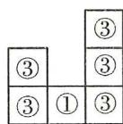  
(1)

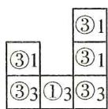  
(2)

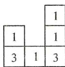  
(3)

例 4 解: 外表面是 6 个相同的面, 各有 8 个面积为 1 的小正方形, 内表面是周边的六个挖空的正方体每个所增加的 4 个面积为 1 的的小正方形, 故所得几何体的表面积为 $6 \times 1 \times 8 + 6 \times 1 \times 4 = 48 + 24 = 72$ .

# 【实战演练】

1. A 解: 从左面看是一个长方形, 长方形的中间有一条横向的虚线, 虚线与上沿之间有一个由虚线组成的圆.

2. B

3. A

4. 解: 从上面和下面看到的面积为 $2 \times 9 \times (1 \times 1) = 18(\text{cm}^{2})$ ,
从正面和后面看面积为 $2 \times 7 \times (1 \times 1) = 14 (\text{cm}^{2})$ ,

从两个侧面看面积为 $2 \times 9 \times (1 \times 1) = 18 \, (\text{cm}^{2})$ ,

$$
1 8 + 1 4 + 1 8 = 5 0 \left(\mathrm{cm} ^ {2}\right).
$$

答: 这个几何体的表面积是 $50 \, cm^{2}$ .

5. 解: (1) 构造 $2 \times 3$ 方格的俯视图, 将有关数据填入表格内, 最少个数为 $2 + 1 + 1 = 4$ (个);

(2)最少个数的形状图如图(1),(2),(3).

<table><tr><td>21</td><td>11</td></tr><tr><td>21</td><td>11</td></tr><tr><td>22</td><td>12</td></tr></table>

从上面看

<table><tr><td>0</td><td>1</td></tr><tr><td>0</td><td>1</td></tr><tr><td>2</td><td>0</td></tr></table>

最少的个数：

<table><tr><td></td><td>1</td></tr><tr><td></td><td>1</td></tr><tr><td>2</td><td></td></tr></table>

(1)

<table><tr><td></td><td>1</td></tr><tr><td>1</td><td></td></tr><tr><td>2</td><td></td></tr></table>

(2)

<table><tr><td>1</td></tr><tr><td>1</td></tr><tr><td>2</td></tr></table>

(3)

# 板块二 立体图形的展开图

# 【典例精讲】

例 1 D

例 2 C 【分析】正方体展开图口诀:一四一,二三一,二二二阶梯状,三三.正方体展开图中相对的面之间一定相隔一个正方形.

例 3 解: (1) 由题可得, 无盖的长方体盒子的高为 a, 底面的宽为 3a - a = 2a,

∴底面的长为 5a-2a=3a；

(2) $2(x+1)+(-2)=x+4$ , 解得 x=4;

(3)答案不唯一.如在图形标号②左侧中画一个和②中右侧一样大的长方形.

例 4 B 解: 由图可知 A, D 不符合题意, 而 C 折叠后, 圆形在前面, 正方形在上面, 则三角形的面在右面, 与原图不符, 只有 B 符合, 故选 B.

# 【实战演练】

1. B

2. C

3. A

4.C

5.

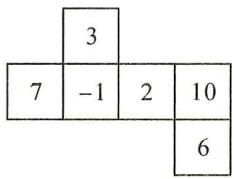

text_image

3
7 -1 2 10
6

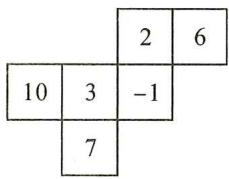

text_image

2 6
10 3 -1
7

6. 解: 由题意, 得

$$
2 m + 1 = 1, a = 5, 2 b - 1 = 3,
$$

$$
\therefore m = 0, b = 2, \therefore a ^ {b} + m = 5 ^ {2} + 0 = 2 5.
$$

# 板块三 点、线、面、体

# 【典例精讲】

例 1 C 解: 梯形绕下底边旋转一周得到圆锥加圆柱, 故 C 正确.

例 2 解: (1) 将直角三角形纸板 ABC 绕三角形的三条边所在的直线旋转一周, 能得到 3 种大小不同的几何体;

(2)以 AB 为轴: $\frac{1}{3} \times 3 \times 8^{2} \times 4 = \frac{1}{3} \times 3 \times 64 \times 4 = 256(\text{cm}^{3})$ ;

以 BC 为轴: $\frac{1}{3} \times 3 \times 4^{2} \times 8 = \frac{1}{3} \times 3 \times 16 \times 8 = 128 \, (\text{cm}^{3})$ .

# 【实战演练】

解：四棱柱：8,6；五棱柱：15,7；六棱柱：18； $a+c-b=2$ .

# 第20讲 直线、射线、线段 板块一 直线、射线、线段的概念

# 【典例精讲】

例 1 解: (1) 过 A, B 两点只能画一条直线, 理由是两点确定一条直线;

(2)如图, $BE+EC>BC$ ,理由是两点之间线段最短.

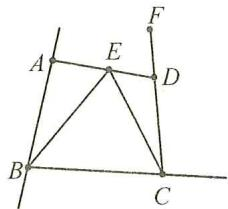

text_image

Geometric diagram with labeled points A, B, C, D, E, F and connecting lines, likely from a math problem or proof.

例 2 解: (1) 图中线段有 $4 + 3 + 2 + 1 = 10$ (条), 且任意两站间的距离都不相等, 因此有 10 种票价;

(2)同一段路,往返时起点和终点正好相反,所以应准备 $10\times2=20$ (种)车票.

答:有10种不同的票价,要准备20种车票.

例 3 解: 因为两条直线相交, 只有一个交点, 当每条直线与其他的 $(n-1)$ 条直线都有 1 个交点, 且这些交点都不重合时, 交点数最多, 为 $\frac{n(n-1)}{2}$ 个.

# 【实战演练】

1. D  2. 6  12  3. 2

4. (1) OF

(2) $OB$

5.(1)(2)如图所示.

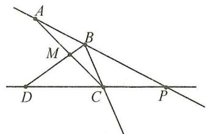

text_image

Geometric diagram showing intersecting lines and labeled points A, B, C, D, M, P

(3)7

6. 解：(1)①3；②6；③10；(2) $\frac{(n+1)(n+2)}{2}$ ;

(3) $n = 8$ 时， $\frac{(n + 1)(n + 2)}{2} = \frac{(8 + 1)(8 + 2)}{2} = 45.$

# 板块二 线段的计算(1) 线段的和、差

# 【典例精讲】

例 解:(1)∵AB=8,CD=5,∴BD=AB-AD=8-5=3.

$$
\because A C = B D, \therefore A C = 3. \therefore C D = A D - A C = 5 - 3 = 2;
$$

(2) 法一: $\because AC = BD, \therefore AC + CD = BD + CD,$

即 AD = BC.

$$
\because A D + B C = 1 4, \therefore 2 A D = 1 4, \therefore A D = 7.
$$

$$
\because C D = 3, \therefore A C = A D - C D = 7 - 3 = 4,
$$

$$
\because A C = B D, \therefore B D = 4,
$$

$$
\therefore A B = A C + C D + B D = 4 + 3 + 4 = 1 1.
$$

$$
\text {法二}: A B = A D + B D = A D + B C - C D = 1 4 - 3 = 1 1.
$$

# 【实战演练】

1. 解：∵ AB = 5, BC = 2,

$$
\therefore A C = 5 - 2 = 3,
$$

∵D是线段AC的中点，

$$
\therefore A D = C D = 3 \times \frac {1}{2} = 1. 5,
$$

$$
\therefore B D = B C + C D = 3. 5.
$$

∴图中所有线段的和是 $AD + AC + AB + DC + DB + CB$

$$
= 1. 5 + 3 + 5 + 1. 5 + 3. 5 + 2 = 1 6. 5.
$$

2. 解：∵ AB = CD，

$$
\therefore C D + B C = A B + B C,
$$

即 $BD = AC = 4$

$$
\therefore B E = B D + D E = 4 + 3 = 7.
$$

# 板块三 线段的计算(2) 线段的倍、分

# 【典例精讲】

例1 解：(1) $\because AE = \frac{1}{3} CE, \therefore AC = \frac{2}{3} CE;$

$$
(2) \because A C = \frac {2}{3} C E, A C = 2, \therefore \frac {2}{3} C E = 2, \therefore C E = 3.
$$

例 2 解: $\because AB = \frac{2}{3} BC, AB = 2, \therefore BC = 3, \because BC = 2CD,$

$$
\therefore C D = \frac {1}{2} B C = \frac {3}{2}, \therefore A D = A B + B C + C D = 2 + 3 +
$$

$$
\frac {3}{2} = \frac {1 3}{2}, B D = B C + C D = 3 + \frac {3}{2} = \frac {9}{2},
$$

$\because N$ 是线段 $BD$ 的中点， $\therefore BN = ND = \frac{1}{2} BD = \frac{9}{4}$

$$
\therefore A N = A D - N D = \frac {1 3}{2} - \frac {9}{4} = \frac {1 7}{4},
$$

$\because M$ 是线段 $AB$ 的中点， $\therefore AM = MB = \frac{1}{2} AB = 1$ ，

$$
\therefore M N = A N - A M = \frac {1 7}{4} - 1 = \frac {1 3}{4}.
$$

# 【实战演练】

1. 解：∵AE=18, AB=6, ∴BE=AE-AB=12.

$$
\because C D = \frac {1}{4} B E, \therefore C D = 3.
$$

$$
\therefore E D = E C + C D = 2 + 3 = 5.
$$

2. 解：∵ AB = 4, AB = $\frac{2}{3}CD$ , ∴ CD = 6.

$$
\because B C = \frac {4}{3} C D, \therefore B C = 8.
$$

$$
\therefore A D = A B + B C + C D = 4 + 8 + 6 = 1 8.
$$

∵M为AD的中点，∴ $MD=\frac{1}{2}AD=9$ ，

$$
\therefore M C = M D - C D = 9 - 6 = 3.
$$

# 板块四 线段的计算(3) 方程思想

# 【典例精讲】

例 1 解: 设 CD = x, ∵ AD = 6, CE = 5,

$$
\therefore A C = A D - C D = 6 - x, D E = C E - C D = 5 - x.
$$

$$
\because A C = E B, \therefore E B = 6 - x.
$$

$$
\because A B = A D + D E + E B, A B = 1 5,
$$

∴6+5-x+6-x=15, 解得 x=1, ∴CD=1.

例 2 解: (1) AB = CM. 理由:

设 $AB = 2x, BC = 5x, CD = 3x$ ，则 $AD = 10x$

$\because M$ 为 AD 的中点， $\therefore AM=DM=\frac{1}{2}AD=5x$

∴AM=BC，即 $AB+BM=BM+CM,\therefore AB=CM;$

(2) $\because CM=6$ , 即 DM-CD=6, $\therefore 5x-3x=6$ ,

解得 $x = 3, \therefore AD = 10x = 30.$

# 【实战演练】

1. 解: 设 DE = x，则 $CD = DE + 2 = x + 2$ .

$$
\begin{array}{l} \because A E + B C = A C + C E + B C = A B + C E = A B + C D + D E \\ = 1 6, \end{array}
$$

∴ $10 + x + 2 + x = 16$ ，解得 x = 2，∴ DE = 2。

2. 解: 设 AD = 5x, ∵ AD : BC = 5 : 7, ∴ BC = 7x.

$$
\therefore P B = B C - C P = 7 x - 1 5.
$$

∵P为DB的中点，∴DP=PB=7x-15，

$$
\because A B = A D + D P + P B = 2 7,
$$

$$
\therefore 5 x + 7 x - 1 5 + 7 x - 1 5 = 2 7,
$$

$$
\therefore 1 9 x = 5 7, \therefore x = 3, \therefore D P = 7 x - 1 5 = 6,
$$

$$
\therefore C D = C P - D P = 1 5 - 6 = 9.
$$

# 板块五 线段的计算(4) 整体思想

# 【典例精讲】

例 1 解: 设 BC = x, ∴ DE = 2BC = 2x,

$$
\therefore E F = A B = A C - B C = 1 0 - x, C D = B D - B C = 8 - x,
$$

$$
\therefore A F = A C + C D + D E + E F = 1 0 + 8 - x + 2 x + 1 0 -
$$

$$
x = 2 8.
$$

例 2 解: 图中所有线段的和为 $AC + AD + AB + CD + CB$

$$
+ D B = (A C + C B) + (A D + D B) + A B + C D = A B +
$$

$$
A B + A B + C D = 3 A B + C D = 3 1.
$$

$$
\because A B = 1 0, \therefore 3 0 + C D = 3 1, \therefore C D = 1.
$$

# 【实战演练】

1. 解: 所有线段的和为 $AC + AD + AE + AB + CD + CE +$

$$
C B + D E + D B + E B = (A C + C B) + (A D + D B) + (A E +
$$

$$
E B) + C D + D E + C E + A B = A B + A B + A B + C D + D E
$$

$$
+ C D + D E + A B = 4 A B + 2 + 6 + 4 = 4 A B + 1 2 = 7 2,
$$

$$
\therefore A B = 1 5.
$$

2. 解: 设 AC = x，则 DB = 10 - 2 - x = 8 - x，

$$
A D = A C + C D = x + 2, C B = A B - A C = 1 0 - x.
$$

$$
\because A E = \frac {1}{3} A D, B F = \frac {1}{3} C B,
$$

$$
\therefore A E = \frac {1}{3} (x + 2), B F = \frac {1}{3} (1 0 - x),
$$

$$
\therefore A E + B F = \frac {1}{3} (x + 2) + \frac {1}{3} (1 0 - x) = 4.
$$

$$
\therefore E F = A B - (A E + B F) = 1 0 - 4 = 6.
$$

# 板块六 线段的计算(5) 分类讨论

# 【典例精讲】

例1 解: 当点 $P$ 在 $AC$ 上时,

$$
A P = \frac {1}{4} A B = 3, C P = A C - A P = 8 - 3 = 5;
$$

当点 $P$ 在 $BC$ 上时，

$$
A P = \frac {3}{4} A B = 9, C P = A P - A C = 9 - 8 = 1.
$$

故 CP 的长为 5 或 1.

$$
\begin{array}{c c c c} \hline & & & \\ A & P _ {1} & C P _ {2} & B \end{array}
$$

例 2 解: ① 当点 C 在线段 AB 上时, AC = AB - BC = 6 cm,

∵M为AC的中点，∴ $AM=\frac{1}{2}AC=3\ cm$ .

②当点 C 在 AB 的延长线上时，

$$
A C = A B + B C = 1 4 \mathrm{cm},
$$

∵M为AC的中点，∴ $AM=\frac{1}{2}AC=7\ cm$ .

$$
\therefore A M = 3 \mathrm{cm} \text {   或   } 7 \mathrm{cm}.
$$

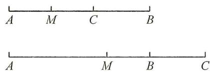

text_image

A M C B
A M B C

备用图

例 3 解:①当点 C 在 AB 的延长线上时,

$$
A C = A B + B C = 1 1,
$$

若点 $D_{1}$ 在 BC 的延长线上时， $AD_{1}=AC+CD_{1}=17$ ;

当点 $D_{2}$ 在 $BC$ 的反向延长线上时，

$$
A D _ {2} = A C - C D _ {2} = 1 1 - 6 = 5;
$$

②当点 C 在线段 AB 上时, AC = AB - BC = 7,

若点 $D_{3}$ 在 $BC$ 的反向延长线上时，

$$
A D _ {3} = A C + C D _ {3} = 1 3;
$$

当点 $D_{4}$ 在 BC 的延长线上时，

$$
A D _ {4} = A C - C D _ {4} = 7 - 6 = 1.
$$

综上所述，AD 的长为 17,5,13 或 1.

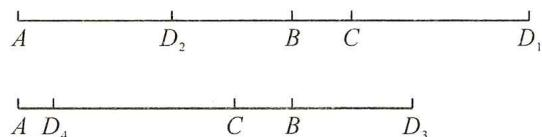

text_image

A D₂ B C D₁
A D₄ C B D₃

备用图

# 【实战演练】

1. 解: 设 AC = x, ∵ AC : CD : DB = 1 : 2 : 3,

$$
\therefore C D = 2 x, D B = 3 x.
$$

$$
\therefore A B = A C + C D + D B = x + 2 x + 3 x = 6 x = 1 8, \therefore x = 3,
$$

$$
\therefore A C = 3, C D = 6, D B = 9,
$$

$$
\therefore B C = C D + B D = 1 5, A D = 9.
$$

$$
\therefore D N = \frac {1}{3} B C = 5.
$$

①当点 N 位于点 D 的左侧(记为 $N_{1}$ )时，

$$
\therefore A N _ {1} = A D - D N _ {1} = 9 - 5 = 4;
$$

②当点 N 位于点 D 的右侧(记为 $N_{2}$ )时，

$$
\therefore A N _ {2} = A D + D N _ {2} = 9 + 5 = 1 4.
$$

∴AN=4或14.

$$
A \quad C N _ {1} \quad D \quad N _ {2} \quad B
$$

2. 解: 存在两种情况: ① 当点 C 在线段 AB 上时,

∵M是线段AB的中点,N是线段AC的中点,

$$
\therefore A M = \frac {1}{2} A B = 6, A N = \frac {1}{2} A C = 2,
$$

$$
M N = A M - A N = 6 - 2 = 4;
$$

②当点 C 在线段 BA 的延长线上时，

∵M是线段AB的中点,N是线段AC的中点,

$$
A M = \frac {1}{2} A B = 6, A N = \frac {1}{2} A C = 2,
$$

$$
M N = A M + A N = 6 + 2 = 8.
$$

综上所述，即 MN=4 或 8.

3. 解: 分四种情况讨论:

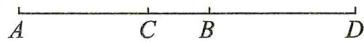  
图1

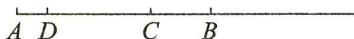  
图2

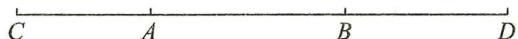

图3   
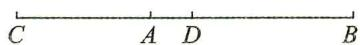  
图4

①图 1 中， $CD=CB+BD=(AB-AC)+BD=4+8=12$ ;

②图 2 中，CD = AB - AD - BC

$$
\begin{array}{l} = A B - (A B - B D) - (A B - A C) \\ = 1 0 - 2 - 4 \\ = 4; \\ \end{array}
$$

③图 3 中， $CD = CA + AB + BD = 24$ ;

④图 4 中， $CD = CA + AD = CA + (AB - BD) = 6 + 2 = 8.$

综上所述，线段 CD 的长为 12 或 4 或 24 或 8.

# 板块七 线段的计算(6) 求线段比

# 【典例精讲】

例 解: 设 CD = x,

则 BD=2CD=2x，

$$
\therefore B C = C D + B D = 3 x, A C = 2 B C = 6 x,
$$

$$
\therefore A B = 3 x + 6 x = 9 x,
$$

∵E为AB的中点，

$$
\therefore E B = \frac {1}{2} A B = 4. 5 x,
$$

$$
\therefore E C = E B - B C = 1. 5 x,
$$

$$
\therefore \frac {E C}{B D} = \frac {1 . 5 x}{2 x} = \frac {3}{4}.
$$

# 【实战演练】

1. 解: 设 AD = 4x, ∵ C 为 AD 的中点, ∴ AC = CD = 2x,

$$
\because B C - A B = \frac {1}{4} A D = x, B C + A B = A C = 2 x,
$$

$$
\therefore B C = \frac {3}{2} x, A B = \frac {1}{2} x,
$$

$$
\therefore \frac {B C}{A B} = 3.
$$

2. 解: 如图 1, 当点 E 在线段 AB 上时,

设 AD=2x，则 BD=3x，∴ $AB=AD+BD=5x$ .

∵C是线段AB的中点，∴ $AC=\frac{1}{2}AB=\frac{5}{2}x$ ，

$$
\therefore C D = A C - A D = \frac {1}{2} x. \because A E = 2 B E,
$$

$$
\therefore A E = \frac {2}{3} A B = \frac {1 0}{3} x, C E = A E - A C = \frac {5}{6} x,
$$

∴ CD : CE = $\frac{1}{2}x$ : $\frac{5}{6}x = 3$ : 5, 即 CD = $\frac{3}{5}CE$ ;

当点 E 在线段 AB 的延长线上时，

同理可得 $CD:CE = \frac{1}{2} x:\frac{15}{2} x = 1:15,\therefore CD = \frac{1}{15} CE,$

故 $CD = \frac{3}{5} CE$ 或 $CD = \frac{1}{15} CE$ .

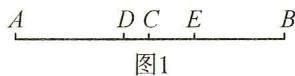

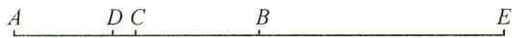  
图2

# 板块八 线段的计算(7) 多结论问题

# 【典例精讲】

例 1 B 解: $\because D$ 是线段 AB 中点, $\therefore AB = 2AD$ ,

故①正确；

$\because BC=AB,\therefore AC=2BC,$ 故②正确；

$\therefore AD=BD=\frac{1}{4}AC,BC=\frac{1}{2}AC,$ 故③④错误；

$BD=\frac{1}{2}AB=\frac{1}{2}BC$ ，故⑤正确； $\because AC=2AB, AB=2BD, \therefore AC=4BD$ ，故⑥正确。故选B.

例 2 B 解: ① BC = BD - CD = AB - CD. 所以 ① 正确;

② $BC=BD-CD=\frac{1}{2}AD-CD.$ 所以②正确；③AD-CD=AC，点B不是AC的中点，所以 $BC\neq\frac{1}{2}AC$ ，∴ $BC\neq\frac{1}{2}(AD-CD).$ 所以③不正确；④ $BC=AC-AB=AC-BD.$ 故④正确.正确的结论有①②④.故选B.

# 【实战演练】

1.3 解:由定义知①正确;当 $DE=\frac{1}{2}CD$ 时,

则 $CE = DE = \frac{1}{2} CD$ ，故②正确；当 $CD = 2CE$ 时，

则 $DE = 2CE - CE = CE$ ，故③正确；④不正确；综上所述，①，②，③正确，只有④是错误的.

2. ①②③ 解: $MN = MC + NC = \frac{1}{2} AC + \frac{1}{2} BC = \frac{1}{2}(AC + BC) = \frac{1}{2} AB = GB$ , 故①正确; $NC = \frac{1}{2} BC = \frac{1}{2}(BG - GC) = \frac{1}{2}(AG - GC)$ , 故②正确; $\frac{1}{2}(BG + GC) = \frac{1}{2}(AG + GC) = \frac{1}{2} AC, GN = GB - NB = \frac{1}{2} AB - \frac{1}{2} BC = \frac{1}{2}(AB - BC) = \frac{1}{2} AC, \therefore GN = \frac{1}{2}(BG + GC)$ , 故③正确; $MN = \frac{1}{2} AB = \frac{1}{2}(AC + BC) \neq \frac{1}{2}(AC + GC)$ , 故④错. 综上所述, 正确的结论有①②③.

# 第 21 讲 线段常用模型

# 板块一 单中点模型

# 【典例精讲】

例 解: 设 $EC = x, \therefore AF = 2EC = 2x.$

$$
\because A C = A F + E F + E C, \therefore 2 x + 6 + x = 1 2, \text {   解得   } x = 2,
$$

$$
\therefore E C = 2, A E = A F + E F = 4 + 6 = 1 0.
$$

$$
\because E \text {为} A B \text {的中点,} \therefore A B = 2 A E = 2 0.
$$

# 【实战演练】

1. 解: (1) $\because CD = x, BD = 2CD,$

$$
\therefore B D = 2 x,
$$

$$
\because A D = 1 0, \therefore A B = 1 0 + 2 x,
$$

∵点E为AB的中点，

$$
\therefore A E = \frac {1}{2} A B = 5 + x;
$$

(2)由①,得 BE=AE=5+x,

$$
\therefore E C = E B - C B = 5 + x - 3 x = 5 - 2 x,
$$

$$
\therefore 5 - 2 x = 3 x,
$$

解得 x=1.

2. 解: $ME + MF + MN + EF + EN + FN = 80$ ,

$$
\therefore (M E + E F + F N) + M N + M F + E N = 8 0,
$$

$$
\therefore M N + M N + M F + F N + E F = 8 0,
$$

$$
\therefore 3 M N + E F = 8 0,
$$

$$
\because M N = 2 5, \therefore E F = 5,
$$

∵E为MF的中点，

$$
\therefore M F = 2 E F = 1 0,
$$

$$
\therefore N F = M N - M F = 1 5.
$$

# 板块二 双中点模型(1) 相邻

# 【典例精讲】

例 1 解: 设 AB = x,

$$
\because A C: C D: D B = 2: 3: 4,
$$

$$
\therefore C D = \frac {1}{3} x, D B = \frac {4}{9} x,
$$

∵M为CD的中点，

$$
\therefore D M = \frac {1}{2} C D = \frac {1}{6} x,
$$

∵N为BD的中点，

$$
\therefore D N = \frac {1}{2} D B = \frac {2}{9} x,
$$

$$
\because M N = 1 4,
$$

$$
\therefore D M + D N = 1 4, \text {即} \frac {1}{6} x + \frac {2}{9} x = 1 4,
$$

解得 $x = 36, \therefore AB = 36$ .

例 2 解: (1) ∵ N 是线段 AB 的中点,

$$
\therefore N B = A N = \frac {1}{2} A B,
$$

∵M 是线段 BC 的中点，

$$
\therefore M B = \frac {1}{2} C B.
$$

$$
\because M N = N B - M B = 5,
$$

$$
\therefore \frac {1}{2} A B - \frac {1}{2} B C = 5,
$$

$\therefore AB-BC=10$ , 即 AC=10;

$$
(2) C D = A C - A D = 1 0 - 2 = 8.
$$

# 【实战演练】

1. 解: (1) ∵ 点 M, N 分别是 AC, BC 的中点,

$$
\begin{array}{l} \therefore M C = \frac {1}{2} A C = 2. 5, N C = \frac {1}{2} B C = 1. 5. \\ \therefore M N = M C + N C = 2. 5 + 1. 5 = 4; \\ \end{array}
$$

(2)∵点M,N分别是AC,BC的中点,

$$
\begin{array}{l} \therefore M C = \frac {1}{2} A C = \frac {1}{2} a, N C = \frac {1}{2} B C = \frac {1}{2} b, \\ \therefore M N = M C + N C = \frac {1}{2} a + \frac {1}{2} b. \\ \end{array}
$$

2. 解: (1) $\because AB=8$ , 点 M 是 AB 的中点,

$$
\therefore A M = \frac {1}{2} A B = 4,
$$

又∵AC=3.2,∴CM=AM-AC=4-3.2=0.8,

∴线段 CM 的长为 0.8;

(2) $\because N$ 是AC的中点, $\therefore NC=1.6$ ,

$$
\therefore M N = N C + C M = 1. 6 + 0. 8 = 2. 4,
$$

∴线段 MN 的长为 2.4.

3. 解: $\because C$ 为 AB 的中点, E 为 AD 的中点,

$$
\begin{array}{l} \therefore A C = \frac {1}{2} A B, A E = \frac {1}{2} A D, \\ \therefore E C = A C - A E = \frac {1}{2} A B - \frac {1}{2} A D = \frac {1}{2} (A B - A D) = \frac {1}{2} B D, \\ \because E C = 2, \therefore \frac {1}{2} B D = 2, \therefore B D = 4, \\ \therefore D F = B D + B F = 4 + 1 = 5. \\ \end{array}
$$

# 板块三 双中点模型(2) 相间

# 【典例精讲】

例 解: 设 AM = x, ND = y,

∵M 是 AB 的中点, N 是 CD 的中点,

$$
\begin{array}{l} \therefore A M = M B = x, A B = 2 x, C N = N D = y, C D = 2 y, \\ M N = M B + B C + C N = x + a + y = b, \\ \therefore x + y = b - a, \\ \therefore A D = A M + M N + N D = x + b + y = (x + y) + b = 2 b - a. \\ \end{array}
$$

# 【实战演练】

1. 解: BD = AB - CD - AC = 6 cm,

∵E,F分别是AC,BD的中点,

$$
\therefore C E = \frac {1}{2} A C = 2 \mathrm{cm}, D F = \frac {1}{2} B D = 3 \mathrm{cm},
$$

$$
\therefore E F = C E + C D + D F = 7 \mathrm{cm}.
$$

2. 解: (1) 设 MC = x, DN = y,

∵M为AD的中点,N为CB的中点,

$$
\therefore A M = b + x, N B = b + y,
$$

$$
\because A M + M C + C D + D N + B N = A B, \therefore 2 x + 2 y = a - 3 b,
$$

$$
\therefore x + y = \frac {1}{2} a - \frac {3}{2} b,
$$

$$
\therefore M N = M C + C D + D N = \frac {1}{2} (a - b);
$$

(2) 不变. 如图, 设 $MC = x$ , $CN = y$ ,

∵M为AD的中点,N为CB的中点,

则 $AM = x + b = DM, CN = BN = y$

$$
\therefore A B = 2 A M - B D = 2 (b + x) - (2 y + b) = a,
$$

$$
\therefore 2 (x - y) = a - b, \therefore M N = x - y = \frac {1}{2} (a - b).
$$

$$
A \begin{array}{c c c c c} & M & N \\ & B & C \end{array} D
$$

# 第22讲 线段动点问题

# 板块一 线段上的动点问题(1) 比值为定值

# 【典例精讲】

例 解: $AB = AC + BC = 3$ , $DE = \frac{1}{2} AB = \frac{3}{2}$ ,

设 $CE = x$ ，则 $CD = \frac{3}{2} -x,BE = BC - CE = 1 - x,$

$$
\because B F = \frac {1}{2}, \therefore E F = E B + B F = \frac {3}{2} - x,
$$

$$
\therefore \frac {C D}{E F} = \frac {\frac {3}{2} - x}{\frac {3}{2} - x} = 1.
$$

# 【实战演练】

1. 解: 设 AP = a, ∴ PB = 2a, ∴ AB = 3a,

设运动时间为 t s，则 PC = t, DB = 2t.

$$
\therefore P D = 2 a - 2 t, C D = t + 2 a - 2 t = 2 a - t,
$$

∵ N 为 PD 的中点，∴ $ND = \frac{1}{2}PD = a - t$ ,

$$
\therefore C N = C D - N D = 2 a - t - (a - t) = a,
$$

$$
\therefore \frac {C N}{A B} = \frac {a}{3 a} = \frac {1}{3}.
$$

2. 解: 设 AB = 2a，则 PA = 2t - 4a，PB = 2t - 2a，

∵M为PA的中点,N为PB的中点,

$$
\therefore P M = \frac {1}{2} P A = t - 2 a, P N = t - a,
$$

$$
\therefore P N - P M = (t - a) - (t - 2 a) = a,
$$

$$
\therefore \frac {P N - P M}{A B} = \frac {a}{2 a} = \frac {1}{2}.
$$

$$
\begin{array}{c c c c c} \hline & & & & \\ P & M & A N & & B \end{array}
$$

# 板块二 线段上的动点问题(2) 和差为定值

# 【典例精讲】

例 解:(1)设 BC=x, 则 AC=2BC=2x,

∴ $\frac{1}{4}\times2x=x-5$ , 解得 x=10,

$$
\therefore B C = 1 0, A C = 2 x = 2 0;
$$

(2)设运动时间为 t 秒, 则 AP=t, PB=30-t, $BQ=\frac{5}{6}t$ ,

$$
\because P E = \frac {1}{3} P B, P D = \frac {1}{2} P B, \therefore D E = \frac {1}{6} P B = \frac {3 0 - t}{6},
$$

又∵F为DQ的中点，

$$
\therefore D F = \frac {1}{2} D Q = \frac {1}{2} (D B + B Q) = \frac {1}{2} \left(\frac {3 0 - t}{2} + \frac {5}{6} t\right) =
$$

$$
\frac {4 5 + t}{6}, \therefore D E + D F = \frac {3 0 - t}{6} + \frac {4 5 + t}{6} = \frac {2 5}{2}.
$$

# 【实战演练】

解:设点 P 运动时间为 t 秒,

①当 $0 \leqslant t \leqslant 2$ 时，点 P 在 AB 上运动，点 Q 在 CD 上运动，

$$
A P = 3 t, D Q = 2 t, B P = 6 - 3 t, C Q = 4 - 2 t,
$$

$$
\therefore 2 B P - 3 C Q = 2 (6 - 3 t) - 3 (4 - 2 t) = 0;
$$

②当 $2 < t \leqslant \frac{14}{5}$ 时， $BP = 3t - 6, CQ = 2t - 4$

$$
\therefore 2 B P - 3 C Q = 2 (3 t - 6) - 3 (2 t - 4) = 0;
$$

故 2BP-3CQ=0.

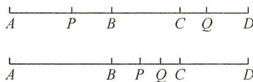

text_image

A P B C Q D
A B P Q C D

备用图

# 板块三 线段上的动点问题(3) 建立数轴

# 【典例精讲】

例 解: 设经过 t s 时, 点 P 在 AB 之间, 点 O 对应数轴上的 0, 点 A 对应数轴上的 40, 点 B 对应数轴上的 70,

∴点 P 对应数轴上的 2t, OP 和 AB 的中点 E, F,

∴点 E 对应数轴上的 t，点 F 对应数轴上的 55，

$$
\therefore E F = 5 5 - t, A P = 2 t - 4 0, O B = 7 0,
$$

原式= $\frac{70-(2t-40)}{55-t}=2.$

# 【实战演练】

1. 解: AB = 12, OA = 2OB, ∴ AB = 3OB = 12,

$$
\therefore O B = 4, \therefore O A = 8,
$$

以点 O 为原点，A: -8, B: 4, P: -8 + 2t, Q: 4 + t.

$$
\therefore O P = \left| - 8 + 2 t \right|, O Q = 4 + t,
$$

$$
\because 2 O P - O Q = 4,
$$

$$
\therefore 2 \vert - 8 + 2 t \vert - (4 + t) = 4, \therefore \vert 4 t - 1 6 \vert = 8 + t,
$$

∴4t-16=8+t或4t-16=-8-t，

解得 t=8 或 $\frac{8}{5}$ .

2. 解: 以点 A 为原点,

$$
B: 6, C: 6 + t, D: 8 + t, M: 2 t, N: \frac {8 + t + 6}{2},
$$

$$
M N = \left| \frac {8 + t + 6}{2} - 2 t \right| = \left| 7 - \frac {3}{2} t \right|, B D = t + 2 = 2 D N,
$$

$$
\because M N = 2 D N, \therefore | 7 - \frac {3}{2} t | = t + 2,
$$

∴ $7 - \frac{3}{2}t = t + 2$ 或 $\frac{3}{2}t - 7 = t + 2$ ，解得 t = 2 或 t = 18.

故线段 CD 运动的时间为 2 s 或 18 s.

# 板块四 数轴上线段动点问题(1) 求值

# 【典例精讲】

例 解:(1)A:13,B:b,C:b+5,

$$
\therefore A C = 1 3 - (b + 5), O B = b.
$$

$\because AC=OB,\therefore13-(b+5)=b$ , 解得 b=4;

(2)①当点 B 在线段 AO 上时，

$$
A C = 1 3 - (b + 5), O B = b, A B = 1 3 - b,
$$

$$
\because A C - O B = \frac {1}{2} A B, \therefore 1 3 - (b + 5) - b = \frac {1}{2} (1 3 - b),
$$

解得 b=1;

②当点 B 在线段 AO 的延长线上时，

$$
A C = 1 3 - (b + 5), O B = - b, A B = 1 3 - b,
$$

$$
\because A C - O B = \frac {1}{2} A B, \therefore 1 3 - (b + 5) + b = \frac {1}{2} (1 3 - b),
$$

解得 b = -3.

答: 存在 $AC - OB = \frac{1}{2} AB$ ，满足条件的 b 值是 1 或 -3.

# 【实战演练】

解: P 对应的数为: -30-8t, Q 对应的数为: 10-4t,

R 对应的数为: $-10+2t$ .

∵M为线段PR的中点,N为线段RQ的中点,

∴M对应的数为： $\frac{-30-8t+(-10+2t)}{2}=-20-3t$

N 对应的数为: $\frac{-10+2t+10-4t}{2}=-t$ ,

$$
\therefore M R = - 1 0 + 2 t - (- 2 0 - 3 t) = 1 0 + 5 t, R N = | - 1 0 + 3 t |.
$$

$$
\because M R = 2 R N, \therefore 1 0 + 5 t = 2 | - 1 0 + 3 t |,
$$

即 $10 + 5t = |-20 + 6t|$

$$
\therefore 1 0 + 5 t = - 2 0 + 6 t \text {或} 1 0 + 5 t = 2 0 - 6 t,
$$

解得: t=30 或 $t=\frac{10}{11}$ .

# 板块五 数轴上线段动点问题(2) 定值

# 【典例精讲】

例 解:(1)a=8,b=-6,线段AB的长为14;

(2)t<7 时, 点 P 在点 Q 的右侧,

点 Q, P, M 三点在数轴上的位置依次从左向右，

则 $PQ=8-6t-(-6-4t)=14-2t$

$$
Q A = 8 - (- 6 - 4 t) = 1 4 + 4 t,
$$

$$
Q M = 8 - 3 t - (- 6 - 4 t) = 1 4 + t,
$$

∴ $\frac{QP+QA}{QM}=\frac{14-2t+14+4t}{14+t}=2$ ，为定值.

# 【实战演练】

1. 解: $P: -2 + 3t, PA = 3t, PB = 3t - 10,$

∵ PA 的中点为 M, ∴ $PM = \frac{1}{2} AP = \frac{3t}{2}$ ,

∵ N 为 PB 的三等分点且靠近点 P，

$$
\therefore B N = \frac {2}{3} B P = \frac {2}{3} (3 t - 1 0) = 2 t - \frac {2 0}{3},
$$

$$
\therefore P M - \frac {3}{4} B N = \frac {3 t}{2} - \frac {3}{4} \left(2 t - \frac {2 0}{3}\right) = 5.
$$

2. 解: 设运动时间为 t 秒.

点 P 所表示的数为 10-8t，点 Q 所表示的数为 -4-4t；

∵点 M 到点 P 和点 Q 的距离相等，

∴点 M 所表示的数为 $\frac{10-8t-4-4t}{2}=-6t+3$ ,

$$
\therefore \frac {2}{3} A M - O Q = \frac {2}{3} (1 0 - 3 + 6 t) - (4 + 4 t) = \frac {2}{3}.
$$

# 第 23 讲 角的基本概念与运算 板块一 角的有关概念及其表示法

# 【典例精讲】

例1 B

例 2 解: ∵ 在已知角内画射线, 画 1 条射线, 图中共有 3 个

角, $3=\frac{2\times3}{2}$ ;画2条射线,图中共有6个角,

$6=\frac{3\times4}{2}$ ;画3条射线,图中共有10个角, $10=\frac{4\times5}{2},\cdots$ ∴画n条射线,图中共有 $\frac{(n+1)(n+2)}{2}$ 个角.

例3 D

例 4 (1) $129^{\circ}6'$ (2) $79^{\circ}55'45''$ (3) $25^{\circ}1'16''$ (4) $4^{\circ}10'27''$

例 5 解: (1) $14.51^{\circ}=14^{\circ}30'36''$ ;

$$
(2) 2 5 ^ {\circ} 1 9 ^ {\prime} 1 2 ^ {\prime \prime} = 2 5. 3 2 ^ {\circ}.
$$

例 6 解: 设分针运动 x 分钟, 时针和分针的夹角为直角, 由题意得 6x - 0.5x = 150, 或 6x - 0.5x = 330,

解得 $x=27\frac{3}{11}$ 或 x=60. 故在 2 时 $27\frac{3}{11}$ 分或 3 时, 时针和分针的夹角恰好为 $90^{\circ}$ .

# 【实战演练】

1. B

2. D

3. A

4. 解: $\angle1$ 还可以用 $\angle BCE$ 表示, $62^{\circ}9'36'' = 62.16^{\circ}$ .

5. 解: (1) 原式 $=116^{\circ}10' - 21^{\circ}17'$

$$
= 9 4 ^ {\circ} 5 3 ^ {\prime};
$$

(2) 原式 = $71^{\circ}39' - 21^{\circ}32'36''$

$$
= 5 0 ^ {\circ} 6 ^ {\prime} 2 4 ^ {\prime \prime}.
$$

6. 解: 设 6 点后分针运动 x 分钟时针与分针的夹角为 $120^{\circ}$ .

①分针与时针相遇前:0.5x+180-6x=120,

解得 $x=10\frac{10}{11}$ ;

②分针与时针相遇后:6x-180-0.5x=120,

解得 $x=54\frac{6}{11}$ ;

∴6点 $10\frac{10}{11}$ 分或6点 $54\frac{6}{11}$ 分时，时针与分针的夹角为 $120^{\circ}$ .

7. 解: 设此人外出购物共用了 x 分钟, 则

$$
(6 - 0. 5) x = 1 1 0 + 1 1 0
$$

$$
5. 5 x = 2 2 0
$$

$$
x = 4 0.
$$

答: 此人外出购物共用了 40 分钟.

# 板块二 角的和、差

# 【典例精讲】

例 1 解: (1) $\angle AOB > \angle AOC$ ;

$$
(2) \because \angle A O C = \angle B O D,
$$

$$
\therefore \angle A O C - \angle C O D = \angle B O D - \angle C O D,
$$

$$
\text { 即 } \angle B O C = \angle A O D.
$$

例 2 解: (1) ∵ $\angle COD = \frac{1}{3} \angle EOC, \angle COD = 20^{\circ}$ ,

$$
\therefore \angle E O C = 3 \angle C O D = 6 0 ^ {\circ};
$$

$$
\because \angle E O C = 6 0 ^ {\circ}, \angle C O D = 2 0 ^ {\circ}, \therefore \angle D O E = 4 0 ^ {\circ}, \tag {2}
$$

$$
\because O E \text {平分} \angle A O D, \therefore \angle A O D = 2 \angle D O E = 8 0 ^ {\circ}.
$$

例 3 解: $\because \angle AOB + \angle BOC + \angle AOD + \angle COD = 360^{\circ}$ ,

$$
\therefore \angle A O B + \angle B O C + 8 0 ^ {\circ} + 6 0 ^ {\circ} = 3 6 0 ^ {\circ},
$$

$$
\therefore \angle A O B + \angle B O C = 2 2 0 ^ {\circ}.
$$

$$
\because \angle A O B = \angle B O C,
$$

$$
\therefore \angle A O B = \angle B O C = 1 1 0 ^ {\circ}.
$$

# 【实战演练】

1. 解: $\angle AOC = \angle AOB - \angle BOC$

$$
= 5 7 ^ {\circ} - 2 0 ^ {\circ} 1 8 ^ {\prime}
$$

$$
= 3 6 ^ {\circ} 4 2 ^ {\prime}.
$$

$$
\angle C O D = \angle A O D + \angle A O C
$$

$$
= 5 0 ^ {\circ} + 3 6 ^ {\circ} 4 2 ^ {\prime}
$$

$$
= 8 6 ^ {\circ} 4 2 ^ {\prime}.
$$

2. 解: $\because \angle DOB = 180^{\circ} - \angle AOD$

$$
= 3 0 ^ {\circ},
$$

$$
\therefore \angle C O D = \angle B O C - \angle D O B
$$

$$
= 1 3 0 ^ {\circ} - 3 0 ^ {\circ}
$$

$$
= 1 0 0 ^ {\circ}.
$$

3. 解：∵ $\angle AOB + \angle AOC + \angle BOC = 360^{\circ}$ ,

$$
\begin{array}{l} \therefore \angle B O C = 3 6 0 ^ {\circ} - \angle A O B - \angle A O C \\ = 3 6 0 ^ {\circ} - 1 4 0 ^ {\circ} - 1 2 0 ^ {\circ} \\ = 1 0 0 ^ {\circ}, \\ \end{array}
$$

$$
\therefore \angle C O D = \angle B O D - \angle B O C
$$

$$
= 1 3 0 ^ {\circ} - 1 0 0 ^ {\circ}
$$

$$
= 3 0 ^ {\circ}.
$$

4. 解：∵∠AOC，∠BOD都是直角，

$$
\therefore \angle A O C = \angle B O D = 9 0 ^ {\circ}.
$$

设 $\angle AOB = 5x$ ，则 $\angle AOD = 17x$

$$
\because \angle A O D - \angle A O B = \angle B O D = 9 0 ^ {\circ},
$$

∴17x-5x=90°, 解得 x=7.5°,

$$
\therefore \angle A O B = 5 x = 3 7. 5 ^ {\circ},
$$

$$
\because \angle A O B + \angle B O C = \angle B O C + \angle C O D = 9 0 ^ {\circ},
$$

$$
\therefore \angle C O D = \angle A O B = 3 7. 5 ^ {\circ},
$$

即 $\angle AOB$ 与 $\angle COD$ 的度数都是 $37.5^{\circ}$ .

# 板块三 余角与补角

# 【典例精讲】

例 1 C 解: $\angle AOD = \angle COD, \angle COE = \angle BOE,$

互补的角有∠AOD与∠DOB，

∠COD 与 ∠DOB，∠AOC 与 ∠BOC，

$\angle AOE$ 与 $\angle EOB, \angle AOE$ 与 $\angle COE$ 共 5 对，选 C.

例 2 ①②④ 解: ①对; ∵∠α 和∠β互补, ∴∠α=180°—

$$
\angle \beta , \angle \alpha - 9 0 ^ {\circ} = 1 8 0 ^ {\circ} - \angle \beta - 9 0 ^ {\circ} = 9 0 ^ {\circ} - \angle \beta , \textcircled {2} \text { 对 };
$$

$$
\frac {1}{2} (\angle \alpha + \angle \beta) = \frac {1}{2} \times 1 8 0 ^ {\circ} = 9 0 ^ {\circ}, \textcircled {3} \text {错}; \frac {1}{2} (\angle \alpha - \angle \beta)
$$

$$
= \frac {1}{2} (1 8 0 ^ {\circ} - \angle \beta - \angle \beta) = 9 0 ^ {\circ} - \angle \beta , ④ \text { 对 };
$$

故可以表示 $\angle\beta$ 余角的有①②④.

例 3 解: 设这个角的度数为 x, 由题意,

得 $180^{\circ} - x = 3(90^{\circ} - x) - 10^{\circ}$ ，解得 $x = 40^{\circ}$

# 【实战演练】

1. C

2.(1)∠AOF,∠COD

(2)∠EOF,∠DOB

(3)∠BOF

3. 解: 设这个锐角为 $\alpha$ , 它的一半为 $\frac{\alpha}{2}$ , 这个锐角的余角为 $90^{\circ}-\alpha$ , 这个锐角的补角为 $180^{\circ}-\alpha$ ,

依题意，得 $\frac{\alpha}{2} + (90^{\circ} - \alpha) + (180^{\circ} - \alpha) = 180^{\circ}$ ，解得 $\alpha = 60^{\circ}$ .

4. 解：(1) $\angle AOB = \angle BOC + \angle AOC = 70^{\circ} + 50^{\circ} = 120^{\circ}$

其补角为 $180^{\circ} - \angle AOB = 180^{\circ} - 120^{\circ} = 60^{\circ}$

(2) $\angle DOC = \frac{1}{2}\angle BOC = \frac{1}{2}\times 70^{\circ} = 35^{\circ},$

$$
\angle A O E = \frac {1}{2} \angle A O C = \frac {1}{2} \times 5 0 ^ {\circ} = 2 5 ^ {\circ}.
$$

$\angle DOE$ 与 $\angle AOB$ 互补，

理由：∵∠DOE=∠DOC+∠COE=35°+25°=60°，

$$
\therefore \angle D O E + \angle A O B = 6 0 ^ {\circ} + 1 2 0 ^ {\circ} = 1 8 0 ^ {\circ},
$$

故 $\angle DOE$ 与 $\angle AOB$ 互补.

5. 解: (1) $\angle EOF$ 的所有余角: $\angle EOD, \angle BOD, \angle AOC$ ;

(2)∠DOE的所有补角:∠COE,∠AOD,∠BOC;

(3)设 $\angle AOC=x^{\circ}$ ,则 $\angle FOB=6x^{\circ}$ ,

$$
\because \angle B O D = \angle A O C = x ^ {\circ},
$$

又∵∠BOF-∠BOD=∠FOD=90°,

$$
\therefore 6 x - x = 9 0, \therefore x = 1 8,
$$

$$
\therefore \angle B O F = 6 x ^ {\circ} = 1 0 8 ^ {\circ}, \therefore \angle A O F = 1 8 0 ^ {\circ} - 1 0 8 ^ {\circ} = 7 2 ^ {\circ}.
$$

$$
\therefore \angle C O E = 2 \angle A O F + \angle A O C = 2 \times 7 2 ^ {\circ} + 1 8 ^ {\circ} = 1 6 2 ^ {\circ}.
$$

# 板块四 角的多结论问题

# 【典例精讲】

例 D 解: $\because OE$ 平分 $\angle BOC, OG$ 平分 $\angle AOC,$

$$
\therefore \angle B O E + \angle A O G = 9 0 ^ {\circ}.
$$

∵∠AOG与∠DOF不一定相等，∴①错误；

$$
\because \angle D O C = \angle G O E = 9 0 ^ {\circ},
$$

$$
\therefore \angle A O E = 1 3 5 ^ {\circ} - \frac {1}{2} \angle A O D,
$$

$$
\therefore 2 \angle A O E = 2 7 0 ^ {\circ} - \angle A O D,
$$

$\therefore 2 \angle AOE - \angle BOD = 90^{\circ}, \therefore ②正确；$

$$
\because \angle D O C = \angle G O E = 9 0 ^ {\circ}, \therefore \angle E O D + \angle C O G = 1 8 0 ^ {\circ},
$$

∴③正确；

∵OE 平分∠BOC,OF 平分∠AOD,

$$
\therefore \angle D O F + \angle C O G = 4 5 ^ {\circ}.
$$

∵OE 平分∠BOC,OG 平分∠AOC,

$$
\therefore \angle B O E + \angle C O G = 9 0 ^ {\circ}, \therefore \angle B O E - \angle D O F = 4 5 ^ {\circ}.
$$

∴④正确.故选D.

# 【实战演练】

1. A 解: A. 结论④正确.

2. C 解: ①②④正确. 故选 C.

3. C 解: C. 其中结论①②④正确.

# 第24讲 角中常用数学思想板块一方程思想

# 【典例精讲】

例 1 解: 设 $\angle AOE = x, \because \angle EOC = 2\angle AOE,$

$$
\therefore \angle E O C = 2 x, \therefore \angle A O C = \angle A O E + \angle C O E = 3 x,
$$

∵∠AOC与∠BOC互余，∴∠BOC=90°-3x，

∵OD 平分∠BOC，

$$
\therefore \angle C O D = \frac {1}{2} \angle B O C = 4 5 ^ {\circ} - \frac {3}{2} x.
$$

(1) $\because\angle AOD=75^{\circ}$ ，则 $\angle AOD=\angle AOC+\angle COD=$

$75^{\circ}$ ，即 $3x + 45^{\circ} - \frac{3}{2} x = 75^{\circ}$

解得 $x=20^{\circ}$ ，即 $\angle AOE$ 的度数为 $20^{\circ}$ ;

(2) $\because \angle DOE = 54^{\circ}$ , 则 $\angle DOE = \angle EOC + \angle COD =$

$54^{\circ}$ ，即 $2x + 45^{\circ} - \frac{3}{2} x = 54^{\circ},$

解得 $x=18^{\circ},2x=36^{\circ}$ ，即 $\angle EOC$ 的度数是 $36^{\circ}$ .

例 2 解: 设 $\angle COD = x$ , 则 $\angle AOB = 2x + 60^{\circ}$ .

$$
\because \angle A O B + \angle A O D + \angle C O D + \angle B O C = 3 6 0 ^ {\circ},
$$

$$
\therefore 2 x + 6 0 ^ {\circ} + 1 0 0 ^ {\circ} + x + 1 1 0 ^ {\circ} = 3 6 0 ^ {\circ}, \text {解得} x = 3 0 ^ {\circ},
$$

$$
\therefore \angle A O B = 2 x + 6 0 ^ {\circ} = 1 2 0 ^ {\circ},
$$

$$
\therefore \angle A O E = 1 8 0 ^ {\circ} - \angle A O B = 6 0 ^ {\circ}.
$$

# 【实战演练】

1. 解: (1) 设 $\angle DOE = x$ , 则 $\angle AOE = 4x$ ,

$\because \angle AOE$ 的余角比 $\angle DOE$ 小 $10^{\circ}$ .

$$
\therefore 9 0 ^ {\circ} - 4 x = x - 1 0 ^ {\circ}, x = 2 0 ^ {\circ}, \therefore \angle A O E = 8 0 ^ {\circ};
$$

(2) $\angle AOD = \angle AOE + \angle DOE = 100^{\circ}$ ,

$$
\angle A O C = 1 8 0 ^ {\circ} - \angle A O D = 8 0 ^ {\circ},
$$

$$
\angle B O C = 1 8 0 ^ {\circ} - \angle A O C = 1 0 0 ^ {\circ},
$$

$$
\angle B O D = 1 8 0 ^ {\circ} - \angle C O B = 8 0 ^ {\circ},
$$

$$
\angle B O E = 1 8 0 ^ {\circ} - \angle A O E = 1 0 0 ^ {\circ},
$$

$$
\angle C O E = 1 8 0 ^ {\circ} - \angle D O E = 1 6 0 ^ {\circ},
$$

$\because \angle AOC=80^{\circ},\therefore \angle AOC$ 的补角为 $100^{\circ}$ ,

∴∠AOC 在右图中的所有补角有∠BOC，∠AOD，∠BOE.

2. 解: 设 $\angle AOB = 4x$ ,

则 $\angle BOC = 5x, \angle COD = 3x, \therefore \angle AOD = 12x,$

∵OM 平分∠AOD, ∴∠AOM= $\frac{1}{2}$ ∠AOD=6x,

由题意, 得 $6x - 4x = 20^{\circ}$ , 解得 $x = 10^{\circ}$ ,

$$
\therefore \angle A O D = 1 2 x = 1 2 0 ^ {\circ}, \angle B O C = 5 x = 5 0 ^ {\circ},
$$

$$
\therefore \angle M O C = \angle B O C - \angle B O M = 3 0 ^ {\circ}.
$$

3. 解: 设 $\angle BOE = x$ , 则 $\angle COF = x, \angle BOD = 2x$ .

$$
\because \angle E O F + \angle B O E + \angle B O D + \angle C O D + \angle C O F = 3 6 0 ^ {\circ},
$$

∴ $120^{\circ} + x + 2x + 90^{\circ} + x = 360^{\circ}$ ，解得 $x = 37.5^{\circ}$ ，

$$
\therefore \angle B O E = 3 7. 5 ^ {\circ},
$$

$$
\therefore \angle A O E = \angle A O B - \angle B O E = 5 2. 5 ^ {\circ},
$$

$$
\therefore \angle A O F = \angle E O F - \angle A O E = 1 2 0 ^ {\circ} - 5 2. 5 ^ {\circ} = 6 7. 5 ^ {\circ}.
$$

# 板块二 整体思想

# 【典例精讲】

例 1 解: 设 $\angle AOE = x$ ,

$$
\therefore \angle E O C = \angle A O C - \angle A O E = 4 0 ^ {\circ} - x,
$$

$$
\angle C O D = 2 \angle A O E = 2 x.
$$

$$
\because \angle B O D = \angle A O B - \angle C O D - \angle A O C = 5 0 ^ {\circ} - 2 x,
$$

OF 平分∠DOB，

$$
\therefore \angle D O F = \frac {1}{2} \angle B O D = 2 5 ^ {\circ} - x,
$$

$$
\therefore \angle E O F = \angle E O C + \angle C O D + \angle D O F = 4 0 ^ {\circ} - x + 2 x
$$

$$
+ 2 5 ^ {\circ} - x = 6 5 ^ {\circ}.
$$

例 2 解: 设 $\angle AOE = x, \angle BOF = y.$

∵OE 平分∠AOD,OF 平分∠BOC,

$$
\therefore \angle D O E = \angle A O E = x, \angle F O C = \angle B O F = y.
$$

$$
\because \angle A O B + \angle A O E + \angle B O F + \angle E O F = 3 6 0 ^ {\circ},
$$

$$
\therefore 8 5 ^ {\circ} + x + y + 1 5 5 ^ {\circ} = 3 6 0 ^ {\circ}, \therefore x + y = 1 2 0 ^ {\circ},
$$

$$
\begin{array}{l} \therefore \angle C O D = \angle E O F - \angle D O E - \angle C O F = 1 5 5 ^ {\circ} - (x + \\ y) = 3 5 ^ {\circ}. \end{array}
$$

# 【实战演练】

1. 解: 设 $\angle AOD = 3x$ , 则 $\angle DOF = \frac{1}{3} \angle AOD = x, \angle AOF = 2x$ .

$$
\because \angle B O C = 3 6 0 ^ {\circ} - \angle A O B - \angle C O D - \angle A O D = 1 8 0 ^ {\circ} - 3 x,
$$

$$
\therefore \angle B O E = \frac {1}{3} \angle B O C = 6 0 ^ {\circ} - x,
$$

$$
\therefore \angle C O E = \angle B O C - \angle B O E = 1 8 0 ^ {\circ} - 3 x - (6 0 ^ {\circ} - x) =
$$

$$
1 2 0 ^ {\circ} - 2 x,
$$

$$
\therefore \angle A O F + \angle C O E = 2 x + 1 2 0 ^ {\circ} - 2 x = 1 2 0 ^ {\circ}.
$$

2. 解: 设 $\angle DOE = x, \angle COF = y.$

∵OE 平分∠AOC,OF 平分∠BOD,

$$
\therefore \angle A O C = 2 \angle C O E = 2 (x + 5 0 ^ {\circ}) = 2 x + 1 0 0 ^ {\circ},
$$

$$
\angle B O F = \angle D O F = y + 5 0 ^ {\circ},
$$

$$
\therefore 2 x + 1 0 0 ^ {\circ} + y + y + 5 0 ^ {\circ} + 9 0 ^ {\circ} = 3 6 0 ^ {\circ}, \therefore x + y = 6 0 ^ {\circ},
$$

$$
\therefore \angle E O F = 5 0 ^ {\circ} + x + y = 1 1 0 ^ {\circ}.
$$

# 板块三 分类讨论(1) 角的内外部

# 【典例精讲】

例 解:(1)若射线 OC 在 $\angle AOB$ 的内部,

$\because OM$ 平分 $\angle AOC$ ,

ON 平分∠BOC，

$$
\therefore \angle M O C = \frac {1}{2} \angle A O C, \angle N O C = \frac {1}{2} \angle B O C,
$$

$$
\therefore \angle M O N = \angle M O C + \angle N O C = \frac {1}{2} \angle A O C + \frac {1}{2} \angle B O C
$$

$$
= \frac {1}{2} \angle A O B, \because \angle A O B = 9 0 ^ {\circ}, \therefore \angle M O N = 4 5 ^ {\circ};
$$

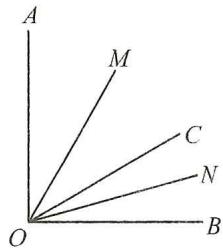

text_image

A
M
C
N
O
B

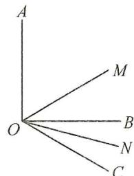

text_image

A
M
O
B
N
C

(2)若射线 OC 在 $\angle AOB$ 的外部，

$\because OM$ 平分 $\angle AOC, ON$ 平分 $\angle BOC,$

$$
\therefore \angle M O C = \frac {1}{2} \angle A O C, \angle N O C = \frac {1}{2} \angle B O C,
$$

$$
\therefore \angle M O N = \angle M O C - \angle N O C = \frac {1}{2} \angle A O C - \frac {1}{2} \angle B O C
$$

$$
= \frac {1}{2} \angle A O B, \because \angle A O B = 9 0 ^ {\circ}, \therefore \angle M O N = 4 5 ^ {\circ}.
$$

综上所述， $\angle MON$ 的度数为 $45^{\circ}$ .

# 【实战演练】

1. 解: ① 当射线 OC 在 $\angle AOB$ 的内部时,

$$
\angle A O M = \frac {1}{2} \times (7 0 ^ {\circ} - 4 0 ^ {\circ}) = 1 5 ^ {\circ};
$$

②当射线 OC 在 $\angle AOB$ 的外部时，

$$
\angle A O M = \frac {1}{2} \times (7 0 ^ {\circ} + 4 0 ^ {\circ}) = 5 5 ^ {\circ}.
$$

所以 $\angle AOM$ 为 $15^{\circ}$ 或 $55^{\circ}$ .

2. 解: ① 当射线 OA 在 $\angle BOC$ 的内部时,

$$
\angle B O M = 7 0 ^ {\circ} + \frac {1}{2} \times (1 2 0 ^ {\circ} - 7 0 ^ {\circ}) = 9 5 ^ {\circ};
$$

②当射线 OA 在 $\angle BOC$ 的外部时，

$$
\angle B O M = 7 0 ^ {\circ} + \frac {1}{2} (3 6 0 ^ {\circ} - 1 2 0 ^ {\circ} - 7 0 ^ {\circ}) = 1 5 5 ^ {\circ}.
$$

所以 $\angle BOM$ 为 $95^{\circ}$ 或 $155^{\circ}$ .

3. 解: ① 当射线 OC 在 $\angle AOB$ 的内部时, $\angle AOC = \frac{4}{9} \times 90^{\circ} = 40^{\circ}$ ; ② 当射线 OC 在 $\angle AOB$ 的外部时,

$$
\angle A O C = \frac {4}{9} \times (3 6 0 ^ {\circ} - 9 0 ^ {\circ}) = 1 2 0 ^ {\circ}.
$$

综上所述， $\angle AOC$ 的度数为 $40^{\circ}$ 或 $120^{\circ}$ .

# 板块四 分类讨论(2) 角的外部

# 【典例精讲】

例 解: 当 OD 在 OA 的左侧时,

$$
\angle B O D = \angle A O B + \angle A O D = 1 4 0 ^ {\circ}.
$$

$$
\angle C O D = 3 6 0 ^ {\circ} - \angle B O D - \angle B O C = 3 6 0 ^ {\circ} - 1 4 0 ^ {\circ} - 8 0 ^ {\circ} = 1 4 0 ^ {\circ};
$$

当 $OD$ 在 $OA$ 的右侧时，

$$
\angle B O D = \angle A O D - \angle A O B = 2 0 ^ {\circ}.
$$

$$
\angle C O D = \angle B O C - \angle B O D = 8 0 ^ {\circ} - 2 0 ^ {\circ} = 6 0 ^ {\circ}.
$$

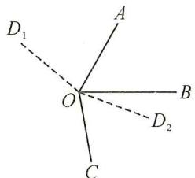

text_image

D₁
O
A
B
D₂
C

# 【实战演练】

1. 解: ∵ OC 平分 ∠AOB,

$$
\therefore \angle A O C = \angle B O C = \frac {1}{2} \angle A O B = 5 0 ^ {\circ}.
$$

当 $OD$ 在 $OA$ 的左侧时，

$$
\angle C O D = \angle A O C + \angle A O D = 5 0 ^ {\circ} + 1 2 0 ^ {\circ} = 1 7 0 ^ {\circ};
$$

当 OD 在 OA 的右侧时，

$$
\angle C O D = \angle A O D - \angle A O C = 1 2 0 ^ {\circ} - 5 0 ^ {\circ} = 7 0 ^ {\circ}.
$$

故 $\angle COD$ 的度数为 $170^{\circ}$ 或 $70^{\circ}$ .

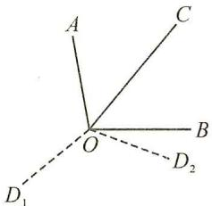

text_image

A
C
O
B
D₂
D₁

2. 解: 设 $\angle COD = x$ , 则 $x = 180^{\circ} - x - 40^{\circ}$ ,

解得 $x=70^{\circ}$ .

(1) 当 OD 在 OC 的左侧时，

$$
\angle A O D = 1 8 0 ^ {\circ} - \angle B O C - \angle C O D = 7 0 ^ {\circ};
$$

(2) 当 $OD$ 在 $OC$ 的右侧时，

$$
\angle B O D = \angle C O D - \angle B O C = 3 0 ^ {\circ},
$$

$$
\therefore \angle A O D = 1 8 0 ^ {\circ} - \angle B O D = 1 5 0 ^ {\circ}.
$$

故 $\angle AOD$ 的度数为 $70^{\circ}$ 或 $150^{\circ}$ .

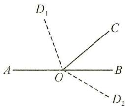

text_image

D₁
A O B
C
D₂

# 板块五 分类讨论(3) $n$ 等分角

# 【典例精讲】

例 解:(1)若 $\angle AOC=\angle BOC$ ,则有如图1,2两种情形,

图 1 时, 时间为 $\frac{135}{4}$ 秒; 图 2 时, 时间为 $\frac{315}{4}$ 秒;

所以时间为 $\frac{135}{4}$ 秒或 $\frac{315}{4}$ 秒.

(2)如图3，设 $\angle BOC = x$ ， $\angle AOC = \frac{2}{3} x$

$x+\frac{2}{3}x=270^{\circ},x=162^{\circ}$ ，此时时间为40.5秒；

如图 4, 设 $\angle BOC = x, \angle AOC = \frac{2}{3}x, x + \frac{2}{3}x = 90^{\circ}$ ,

$x=54^{\circ}$ ，旋转 $306^{\circ}$ ，此时时间为76.5秒.

所以时间为 40.5 秒或 76.5 秒.

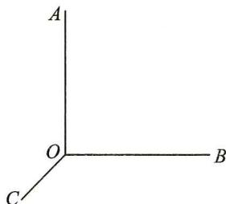

natural_image

Simple 3D coordinate system with labeled axes A, B, C and origin O (no numerical values or text annotations)

图1

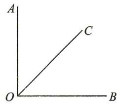

text_image

A
C
O
B

图2

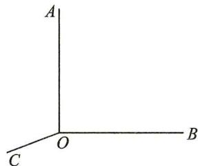

text_image

A
O
B
C

图3

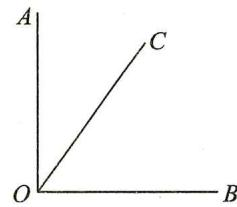

text_image

A
C
O
B

图4

# 【实战演练】

解: 当 OD 在 $\angle AOB$ 的内部时, $\because \angle BOD = 2\angle AOD$ ,

$$
\therefore \angle B O D = \frac {2}{3} \angle A O B = 8 0 ^ {\circ}.
$$

$$
\therefore \angle C O D = \angle B O D + \angle B O C = 1 7 0 ^ {\circ};
$$

当 OD 在 $\angle AOB$ 的外部时，∵ $\angle BOD = 2\angle AOD$ ，

$$
\therefore \angle B O D = \frac {2}{3} (3 6 0 ^ {\circ} - \angle A O B) = 1 6 0 ^ {\circ}.
$$

$$
\therefore \angle C O D = \angle B O D - \angle B O C = 7 0 ^ {\circ}.
$$

$\therefore \angle COD$ 的度数为 $170^{\circ}$ 或 $70^{\circ}$ .

# 板块六 分类讨论(4) 二次讨论

# 【典例精讲】

例 解:如图 1, $\angle {DOC} = \angle {AOB} - \angle {AOC} + \angle {BOD} = {40}^{ \circ  }$ ,

备用图 1, $\angle DOC = \angle BOD - (\angle AOB - \angle AOC) = 20^{\circ}$ ,

备用图 2, $\angle DOC = \angle AOB + \angle AOC + \angle BOD = 120^{\circ}$ ,

备用图 3, $\angle DOC = \angle AOB + \angle AOC - \angle BOD = 60^{\circ}$ .

故 $\angle DOC$ 的度数是 $40^{\circ}$ 或 $20^{\circ}$ 或 $120^{\circ}$ 或 $60^{\circ}$ .

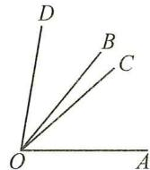  
图1

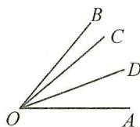  
备用图1

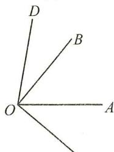

text_image

D
B
O
A

备用图2 C

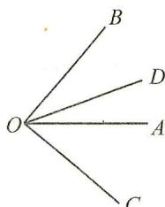

text_image

B
O
D
A
C

备用图3

# 【实战演练】

解：∵OC为∠AOB的三等分线，

$\therefore \angle AOC = \frac{1}{3}\angle AOB = 40^{\circ}$ 或 $\angle AOC = \frac{2}{3}\angle AOB = 80^{\circ}.$

(1) 当 $\angle AOC = 40^{\circ}$ 时，

若 $OD$ 在 $OC$ 的左侧，则 $\angle BOC = \angle AOB - \angle AOC = 80^{\circ}$

$$
\therefore \angle B O D = \angle B O C + \angle C O D = 8 0 ^ {\circ} + 5 0 ^ {\circ} = 1 3 0 ^ {\circ};
$$

若 OD 在 OC 的右侧，

则 $\angle BOD = \angle AOB - \angle AOC - \angle COD = 30^{\circ}$

(2) 当 $\angle AOC = 80^{\circ}$ 时，

若 OD 在 OC 的左侧，则 $\angle BOC = \angle AOB - \angle AOC = 40^{\circ}$ .

$$
\therefore \angle B O D = \angle B O C + \angle C O D = 4 0 ^ {\circ} + 5 0 ^ {\circ} = 9 0 ^ {\circ};
$$

若 OD 在 OC 的右侧，则 $\angle BOD = \angle COD - \angle BOC = 10^{\circ}$ ;

综上所述: $\angle BOD$ 的度数为 $130^{\circ},30^{\circ},90^{\circ}$ 或 $10^{\circ}$ .

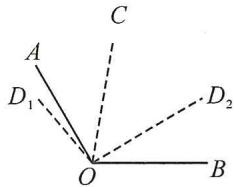

text_image

A
C
D₁
O
B
D₂

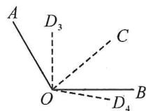  
备用图

# 第25讲 角中常用模型

# 板块一 半角模型

# 【典例精讲】

例 解: 设 $\angle COF = x$ , 则 $\angle EOC = \angle EOF - \angle COF = 60^{\circ} - x$ .

$$
\therefore \angle A O E = \angle A O C - \angle E O C = 9 0 ^ {\circ} - (6 0 ^ {\circ} - x) = 3 0 ^ {\circ} + x.
$$

$$
\therefore \angle A O E - \angle C O F = 3 0 ^ {\circ} + x - x = 3 0 ^ {\circ}.
$$

# 【实战演练】

1. 解: 设 $\angle BOF = x$ .

则 $\angle EOC = \angle EOF - \angle BOF - \angle BOC = 70^{\circ} - x - 30^{\circ} = 40^{\circ} - x.$

$$
\therefore \angle A O E = \angle A O C - \angle E O C = 1 0 0 ^ {\circ} - (4 0 ^ {\circ} - x) = 6 0 ^ {\circ} + x.
$$

(1) $\because \angle COF = \angle BOC + \angle BOF = 30^{\circ} + x.$

$$
\therefore \angle A O E - \angle C O F = (6 0 ^ {\circ} + x) - (3 0 ^ {\circ} + x) = 3 0 ^ {\circ};
$$

(2) $\angle AOE - \angle BOF = 60^{\circ} + x - x = 60^{\circ}$ .

2. 解: 设 $\angle COF = x$ .

$$
\because \angle E O C = \angle C O F - \angle E O F = x - 5 0 ^ {\circ},
$$

$$
\angle A O C = \angle A O B - \angle B O C = 1 0 0 ^ {\circ} - 2 0 ^ {\circ} = 8 0 ^ {\circ}.
$$

$$
\therefore \angle A O E = \angle A O C + \angle E O C = 8 0 ^ {\circ} + x - 5 0 ^ {\circ} = 3 0 ^ {\circ} + x;
$$

$$
\therefore \angle A O E - \angle C O F = 3 0 ^ {\circ} + x - x = 3 0 ^ {\circ}.
$$

# 板块二 角叠角模型

# 【典例精讲】

例 解:(1) $180^{\circ}$ .∵ $\angle ABC=\angle DBE=90^{\circ}$ ,

BD 平分∠ABC，

$$
\therefore \angle D B C = \frac {1}{2} \angle A B C = 4 5 ^ {\circ},
$$

$$
\therefore \angle C B E = 9 0 ^ {\circ} - 4 5 ^ {\circ} = 4 5 ^ {\circ},
$$

$$
\therefore \angle A B E = \angle A B C + \angle C B E = 9 0 ^ {\circ} + 4 5 ^ {\circ} = 1 3 5 ^ {\circ},
$$

$$
\therefore \angle A B E + \angle D B C = 1 3 5 ^ {\circ} + 4 5 ^ {\circ} = 1 8 0 ^ {\circ};
$$

(2)设 $\angle ABD=x^{\circ}$ ,则 $\angle CBD=90^{\circ}-x^{\circ}$ ,

$$
\angle C B E = x ^ {\circ},
$$

$$
\therefore \angle A B E + \angle D B C = 9 0 ^ {\circ} + x ^ {\circ} + 9 0 ^ {\circ} - x ^ {\circ} = 1 8 0 ^ {\circ};
$$

(3)设 $\angle ABD=x^{\circ}$ ,则 $\angle CBD=45^{\circ}-x^{\circ},\angle CBE=x^{\circ}$ ,

$$
\therefore \angle A B E + \angle D B C = 4 5 ^ {\circ} + x ^ {\circ} + 4 5 ^ {\circ} - x ^ {\circ} = 9 0 ^ {\circ}.
$$

# 【实战演练】

解: 设 $\angle AOC = x$ .

$$
\therefore \angle A O D = \angle A O C + \angle C O D = x + 4 0 ^ {\circ},
$$

$$
\because \angle A O D + \angle B O C = 1 9 0 ^ {\circ},
$$

$$
\therefore \angle B O C = 1 9 0 ^ {\circ} - \angle A O D = 1 9 0 ^ {\circ} - (x + 4 0 ^ {\circ}) = 1 5 0 ^ {\circ} - x,
$$

$$
\therefore \angle B O D = \angle B O C - \angle C O D = 1 5 0 ^ {\circ} - x - 4 0 ^ {\circ} = 1 1 0 ^ {\circ} - x,
$$

$$
\therefore \angle A O B = \angle A O D + \angle B O D = x + 4 0 ^ {\circ} + 1 1 0 ^ {\circ} - x = 1 5 0 ^ {\circ}.
$$

$$
\because \angle A O B + \angle A O E + \angle B O E = 3 6 0 ^ {\circ},
$$

$$
\therefore 1 5 0 ^ {\circ} + 1 2 0 ^ {\circ} + \angle B O E = 3 6 0 ^ {\circ}. \therefore \angle B O E = 9 0 ^ {\circ}.
$$

# 板块三 角夹角模型

# 【典例精讲】

例 解: 设 $\angle COB = x$ , 则 $\angle AOB = 100^{\circ} + x$ , $\angle COD = 40^{\circ} + x$ ,

$$
\because \angle A O B = 4 \angle A O M, \angle C O D = 4 \angle C O N,
$$

$$
\therefore \angle A O M = \frac {1}{4} \angle A O B = \frac {1}{4} (1 0 0 ^ {\circ} + x),
$$

$$
\angle C O N = \frac {1}{4} \angle C O D = \frac {1}{4} (4 0 ^ {\circ} + x),
$$

$$
\therefore \angle M O C = \angle A O C - \angle A O M = 7 5 ^ {\circ} - \frac {1}{4} x,
$$

$$
\therefore \angle M O N = \angle M O C + \angle C O N = 7 5 ^ {\circ} - \frac {1}{4} x + 1 0 ^ {\circ} + \frac {1}{4} x
$$

$$
= 8 5 ^ {\circ}.
$$

# 【实战演练】

解：(1) $\angle MON=35^{\circ}+20^{\circ}+35^{\circ}=90^{\circ};$

(2) $\because\angle AOB=\angle COD=90^{\circ},\angle BOC=\alpha,$

$$
\therefore \angle A O C = \angle B O D = 9 0 ^ {\circ} - \alpha .
$$

∵OM平分∠AOC,ON平分∠BOD,

$$
\therefore \angle M O C = \angle B O N = 4 5 ^ {\circ} - \frac {1}{2} \alpha ,
$$

$$
\therefore \angle M O N = \angle M O C + \angle C O B + \angle B O N = 4 5 ^ {\circ} - \frac {1}{2} \alpha + \alpha +
$$

$$
4 5 ^ {\circ} - \frac {1}{2} \alpha = 9 0 ^ {\circ};
$$

(3) $\because \angle AOB = \angle COD = 90^{\circ},\angle BOC = \alpha ,$

$$
\therefore \angle A O C = \angle B O D = 9 0 ^ {\circ} + \alpha .
$$

∵OM 平分∠AOC, ON 平分∠BOD,

$$
\therefore \angle M O C = \angle B O N = 4 5 ^ {\circ} + \frac {1}{2} \alpha ,
$$

$$
\therefore \angle M O N = \angle M O C - \angle B O C + \angle B O N = 4 5 ^ {\circ} + \frac {1}{2} \alpha - \alpha +
$$

$$
4 5 ^ {\circ} + \frac {1}{2} \alpha = 9 0 ^ {\circ}.
$$

# 板块四 单角平分线模型(1)

# 【典例精讲】

例 解：∵∠ABE:∠CBE=3:5,

∴可设 $\angle ABE=3x,\angle CBE=5x$ ,

$\therefore\angle ABC=8x,\because BD$ 平分 $\angle ABC,$

$$
\therefore \angle A B D = \frac {1}{2} \angle A B C = 4 x,
$$

$$
\because \angle D B E = \angle A B D - \angle A B E, \therefore 4 x - 3 x = 1 5 ^ {\circ},
$$

即得 $x=15^{\circ},\therefore\angle ABC=8x=120^{\circ}.$

# 【实战演练】

1. 解: 由题知, $\angle EOF = \angle COE - \angle COF = 60^{\circ} - 20^{\circ} = 40^{\circ}$ .

∵OF 平分∠AOE，

$$
\therefore \angle A O E = 2 \angle E O F = 8 0 ^ {\circ},
$$

$$
\therefore \angle B O E = \angle A O B - \angle A O E = 1 2 0 ^ {\circ} - 8 0 ^ {\circ} = 4 0 ^ {\circ}.
$$

2. 解: (1) 设 $\angle AOC = x$ . $\because \angle AOB = 120^{\circ}$ ,

$$
\therefore \angle B O C = 1 2 0 ^ {\circ} - x, \because \angle C O D = 6 0 ^ {\circ},
$$

$$
\therefore \angle B O D = \angle B O C - \angle C O D = 6 0 ^ {\circ} - x.
$$

$\because OE$ 平分 $\angle BOC, \therefore \angle BOE = \frac{1}{2} \angle BOC = 60^{\circ} - \frac{1}{2} x,$

$$
\begin{array}{l} \therefore \angle D O E = \angle B O E - \angle B O D = \left(6 0 ^ {\circ} - \frac {1}{2} x\right) - (6 0 ^ {\circ} - x) \\ = \frac {1}{2} x, \therefore \angle A O C = 2 \angle D O E; \\ \end{array}
$$

(2) 设 $\angle AOC = x$ ，则 $\angle BOD = 60^{\circ} - x, \angle AOP = 90^{\circ} - x$

$$
\angle B O Q = 9 0 ^ {\circ} - (6 0 ^ {\circ} - x) = 3 0 ^ {\circ} + x,
$$

$$
\therefore \angle A O P + \angle B O Q = 9 0 ^ {\circ} - x + 3 0 ^ {\circ} + x = 1 2 0 ^ {\circ}.
$$

$$
\because \angle C O D = 6 0 ^ {\circ}, \therefore \frac {\angle A O P + \angle B O Q}{\angle C O D} = 2.
$$

# 板块五 单角平分线模型(2)

# 【典例精讲】

例 解:(1)由题知, $\angle BOC=\angle AOB-\angle AOC=140^{\circ}-80^{\circ}=60^{\circ}$ .

$\because OD$ 平分 $\angle BOC, \therefore \angle COD = \frac{1}{2} \angle BOC = 30^{\circ}.$

$$
\therefore \angle A O D = \angle A O C + \angle C O D = 8 0 ^ {\circ} + 3 0 ^ {\circ} = 1 1 0 ^ {\circ};
$$

(2) $\angle BOC = \angle AOB - \angle AOC = (m - n)^{\circ}$ .

∵OD 平分∠BOC，

$$
\therefore \angle C O D = \frac {1}{2} \angle B O C = \frac {1}{2} (m - n) ^ {\circ},
$$

$$
\therefore \angle A O D = \angle A O C + \angle C O D = n ^ {\circ} + \frac {1}{2} (m - n) ^ {\circ} =
$$

$$
\frac {1}{2} (m + n) ^ {\circ} = 1 1 0 ^ {\circ}.
$$

# 【实战演练】

1. 解: (1) 设 $\angle AOB = x$ , 则 $x = 3(90^{\circ} - x) + 10^{\circ}$ ,
解得 $x=70^{\circ},\therefore\angle AOB$ 的度数为 $70^{\circ}$ ;

(2)设 $\angle BOC = \angle BOD = y$

$$
\therefore \angle A O C = \angle A O B - \angle B O C = 7 0 ^ {\circ} - y,
$$

$$
\angle A O D = \angle A O B + \angle B O D = 7 0 ^ {\circ} + y.
$$

$$
\therefore \angle A O C + \angle A O D = 7 0 ^ {\circ} - y + 7 0 ^ {\circ} + y = 1 4 0 ^ {\circ}.
$$

2. 解: 设 $\angle BOE = x$ , 则 $\angle AOC = \angle AOE = 90^{\circ} + x$ .

$$
\therefore \angle B O C = 3 6 0 ^ {\circ} - (\angle A O C + \angle A O B)
$$

$$
= 1 8 0 ^ {\circ} - x,
$$

$$
\therefore \angle B O E + \angle B O C = 1 8 0 ^ {\circ} - x + x
$$

$$
= 1 8 0 ^ {\circ}.
$$

# 板块六 双角平分线模型(1)

# 【典例精讲】

例 解：∵ $\angle AOB = \alpha, \angle BOC = \beta, \therefore \angle AOC = \alpha + \beta.$ ∵ OM 是 $\angle AOC$ 的平分线，ON 是 $\angle BOC$ 的平分线，

$$
\therefore \angle M O C = \frac {1}{2} \angle A O C = \frac {1}{2} (\alpha + \beta),
$$

$$
\angle N O C = \frac {1}{2} \angle B O C = \frac {1}{2} \beta ,
$$

$$
\therefore \angle M O N = \angle M O C - \angle N O C = \frac {1}{2} (\alpha + \beta) - \frac {1}{2} \beta = \frac {1}{2} \alpha ,
$$

即 $\angle MON = \frac{1}{2}\alpha = \frac{1}{2}\angle AOB.$

# 【实战演练】

解:(1) $\because\angle AOB=90^{\circ},\angle AOC=30^{\circ},$

$$
\therefore \angle B O C = 9 0 ^ {\circ} - 3 0 ^ {\circ} = 6 0 ^ {\circ}.
$$

∵OE 平分∠BOC,OF 平分∠AOC,

$$
\therefore \angle C O E = \frac {1}{2} \angle B O C = \frac {1}{2} \times 6 0 ^ {\circ} = 3 0 ^ {\circ},
$$

$$
\angle C O F = \frac {1}{2} \angle A O C = \frac {1}{2} \times 3 0 ^ {\circ} = 1 5 ^ {\circ},
$$

$$
\therefore \angle E O F = \angle C O E + \angle C O F = 3 0 ^ {\circ} + 1 5 ^ {\circ} = 4 5 ^ {\circ};
$$

(2)∵OE 平分∠BOC,OF 平分∠AOC,

$$
\therefore \angle C O E = \frac {1}{2} \angle B O C, \angle C O F = \frac {1}{2} \angle A O C,
$$

$$
\therefore \angle E O F = \angle C O E + \angle C O F = \frac {1}{2} (\angle B O C + \angle A O C) =
$$

$$
\frac {1}{2} \angle A O B = \frac {1}{2} \alpha ;
$$

(3) $\because \angle EOB = \frac{1}{3}\angle COB, \therefore \angle COE = \frac{2}{3}\angle COB,$

$$
\therefore \angle E O F = \angle C O E + \angle C O F = \frac {2}{3} \angle C O B + \frac {2}{3} \angle C O A =
$$

$$
\frac {2}{3} (\angle C O B + \angle C O A) = \frac {2}{3} \angle A O B = \frac {2}{3} \alpha .
$$

# 板块七 双角平分线模型(2)

# 【典例精讲】

例 解:(1)∵OB 平分∠AOC,OD 平分∠COE,

$$
\begin{array}{l} \therefore \angle C O D = \frac {1}{2} \angle C O E, \\ \angle B O C = \frac {1}{2} \angle A O C, \\ \therefore \angle B O D = \angle C O D + \angle B O C \\ = \frac {1}{2} \angle C O E + \frac {1}{2} \angle A O C \\ = \frac {1}{2} (\angle C O E + \angle A O C) \\ = \frac {1}{2} \angle A O E \\ = 8 0 ^ {\circ}; \\ \end{array}
$$

(2)设 $\angle COD=2x$ ，则 $\angle BOC=3x$ ，

∵OB 平分∠AOC,OD 平分∠COE,

$$
\therefore \angle C O E = 2 \angle C O D = 4 x,
$$

$$
\angle A O C = 2 \angle B O C = 6 x,
$$

$$
\therefore \angle A O E = \angle C O E + \angle A O C = 1 0 x.
$$

∵OM平分∠AOE，

$$
\therefore \angle E O M = \frac {1}{2} \angle A O E = 5 x,
$$

$$
\because \angle E O M - \angle C O E = \angle C O M = 1 5 ^ {\circ},
$$

$$
\therefore 5 x - 4 x = 1 5 ^ {\circ},
$$

$$
\therefore x = 1 5 ^ {\circ},
$$

$$
\therefore \angle B O D = \angle C O D + \angle B O C = 2 x + 3 x = 7 5 ^ {\circ}.
$$

# 【实战演练】

解:(1)若射线 OC 在 $\angle AOB$ 的内部.

∵OM 平分∠AOC,ON 平分∠BOC,

$$
\therefore \angle M O C = \frac {1}{2} \angle A O C, \angle N O C = \frac {1}{2} \angle B O C,
$$

$$
\therefore \angle M O N = \angle M O C + \angle N O C = \frac {1}{2} \angle A O C + \frac {1}{2} \angle B O C =
$$

$$
\frac {1}{2} \angle A O B,
$$

$$
\because \angle A O B = 1 0 0 ^ {\circ},
$$

$$
\therefore \angle M O N = 5 0 ^ {\circ};
$$

(2) 若射线 OC 在 $\angle AOB$ 的外部.

∵OM 平分∠AOC,ON 平分∠BOC,

$$
\therefore \angle M O C = \frac {1}{2} \angle A O C, \angle N O C = \frac {1}{2} \angle B O C,
$$

$$
\therefore \angle M O N = \angle M O C - \angle N O C = \frac {1}{2} \angle A O C - \frac {1}{2} \angle B O C =
$$

$$
\frac {1}{2} \angle A O B.
$$

$$
\because \angle A O B = 1 0 0 ^ {\circ}, \therefore \angle M O N = 5 0 ^ {\circ}.
$$

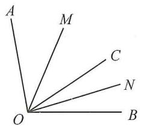

text_image

A
M
C
N
O
B

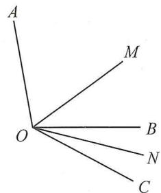

text_image

A
M
O
B
N
C

# 第26讲 角的旋转

# 板块一 角度关系

# 【典例精讲】

例 解:(1) $\angle BOE=28^{\circ}$ ;

(2) 设 $\angle AOF = \angle EOF = \alpha$ ,

则 $\angle BOE = 160^{\circ} - 2\alpha$

$$
\angle C O F = 8 0 ^ {\circ} - \alpha ,
$$

$$
\therefore \angle B O E = 2 \angle C O F.
$$

# 【实战演练】

解:(1) $\angle AOD$ 与 $\angle BOC$ 互补.理由:

$$
\because \angle A O B + \angle C O D = 1 2 0 ^ {\circ} + 6 0 ^ {\circ} = 1 8 0 ^ {\circ},
$$

$$
\angle A O B = \angle A O C + \angle B O C,
$$

$$
\angle C O D = \angle B O C + \angle B O D,
$$

$$
\therefore \angle A O B + \angle C O D = \angle A O C + \angle B O C + \angle B O C + \angle B O D
$$

$$
= \angle A O D + \angle B O C = 1 8 0 ^ {\circ}, \therefore \angle A O D \text {   与   } \angle B O C \text {   互补;   }
$$

(2) 设 $\angle BOC = n, \angle AOB = x, \angle COD = y,$

则 $\angle AOC = \angle AOB + \angle BOC = x + n$

$$
\angle B O D = \angle C O D + \angle B O C = y + n,
$$

$$
\therefore \angle E O C = \frac {1}{3} \angle A O C = \frac {1}{3} x + \frac {1}{3} n,
$$

$$
\angle D O F = \frac {1}{3} \angle B O D = \frac {1}{3} y + \frac {1}{3} n,
$$

$$
\therefore \angle C O F = \angle C O D - \angle D O F = y - \left(\frac {1}{3} y + \frac {1}{3} n\right) = \frac {2}{3} y -
$$

$$
\frac {1}{3} n,
$$

$$
\therefore \angle E O F = \angle E O C + \angle C O F = \frac {1}{3} x + \frac {1}{3} n + \frac {2}{3} y - \frac {1}{3} n = =
$$

$$
\frac {1}{3} x + \frac {2}{3} y = 8 0 ^ {\circ},
$$

$$
\therefore x + 2 y = 2 4 0 ^ {\circ}, \therefore \angle A O B + 2 \angle C O D = 2 4 0 ^ {\circ}.
$$

# 板块二 存在性问题

# 【典例精讲】

例 解: 存在. 理由:

设 $\angle AOE=2x$ . $\because OF$ 平分 $\angle AOE$ ,

$$
\therefore \angle A O F = \angle E O F = \frac {1}{2} \angle A O E = x,
$$

$$
\therefore \angle D O E = \angle A O B - \angle A O E - \angle B O D = 1 6 0 ^ {\circ} - 2 x -
$$

$$
9 0 ^ {\circ} = 7 0 ^ {\circ} - 2 x,
$$

$$
\therefore \angle D O F = \angle D O E + \angle E O F = 7 0 ^ {\circ} - 2 x + x = 7 0 ^ {\circ} - x.
$$

$$
\because \angle D O F = 3 \angle D O E,
$$

∴ $70^{\circ}-x=3(70^{\circ}-2x)$ ，解得 $x=28^{\circ}$

$$
\therefore \angle C O F = \angle C O E - \angle E O F = 8 0 ^ {\circ} - 2 8 ^ {\circ} = 5 2 ^ {\circ}.
$$

# 【实战演练】

1. 解: 存在. 理由:

设 $\angle BOD = x$

$$
\because \angle E O F = \angle C O E - \angle C O F = 9 0 ^ {\circ} - 6 5 ^ {\circ} = 2 5 ^ {\circ},
$$

OF 平分 $\angle AOE, \therefore \angle AOF = \angle EOF = 25^{\circ}$ ,

$$
\therefore \angle B O E = 1 8 0 ^ {\circ} - \angle A O E = 1 8 0 ^ {\circ} - 2 \angle E O F = 1 3 0 ^ {\circ}.
$$

$$
\because 2 \angle B O D + \angle A O F = \frac {1}{2} (\angle B O E - \angle B O D),
$$

$\therefore 2x + 25^{\circ} = \frac{1}{2} (130^{\circ} - x)$ ，解得 $x = 16^{\circ}$

$$
\therefore \angle B O D = 1 6 ^ {\circ}.
$$

2. 解: 存在. 理由: 设 $\angle DOE = x$ ,

则 $\angle DOF = 3\angle DOE = 3x$

$$
\therefore \angle E O F = \angle D O F - \angle D O E = 2 x.
$$

∵OF 平分∠AOE, ∴∠AOF=∠EOF=2x.

$$
\because \angle A O F + \angle E O F + \angle D O E + \angle B O D + \angle A O B = 3 6 0 ^ {\circ},
$$

∴ $2x + 2x + x + 70^{\circ} + 120^{\circ} = 360^{\circ}$ ，解得 $x = 34^{\circ}$ ，

$$
\therefore \angle E O F = 2 x = 6 8 ^ {\circ},
$$

$$
\therefore \angle C O F = \angle E O F - \angle E O C = 6 8 ^ {\circ} - 6 0 ^ {\circ} = 8 ^ {\circ}.
$$

# 板块三 行程问题

# 【典例精讲】

例 解: ① 当 $0 \leqslant t \leqslant 12$ 时, 设 $\angle AOM = x$ , 则 $\angle COM = \angle AOC - \angle AOM = 60^{\circ} - x$ , $\because 3\angle CON = \angle MON$ ,

$$
\therefore \angle C O N = \frac {1}{4} \angle C O M = \frac {1}{4} \times (6 0 ^ {\circ} - x) = 1 5 ^ {\circ} - \frac {1}{4} x,
$$

$$
\therefore \angle M O N = 3 \times \left(1 5 ^ {\circ} - \frac {1}{4} x\right) = 4 5 ^ {\circ} - \frac {3}{4} x, \therefore \angle A O N =
$$

$$
\angle A O M + \angle M O N = x + 4 5 ^ {\circ} - \frac {3}{4} x = \frac {1}{4} x + 4 5 ^ {\circ},
$$

$$
\therefore \angle B O M = 1 8 0 ^ {\circ} - \angle A O M = 1 8 0 ^ {\circ} - x, \therefore 4 \angle A O N +
$$

$$
\angle B O M = 4 \times \left(\frac {1}{4} x + 4 5 ^ {\circ}\right) + 1 8 0 ^ {\circ} - x = x + 1 8 0 ^ {\circ} + 1 8 0 ^ {\circ}
$$

$$
- x = 3 6 0 ^ {\circ};
$$

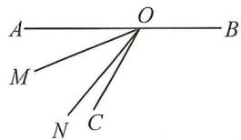

text_image

A
O
B
M
N C

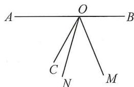

text_image

A
O
B
C
N
M

备用图

②当 $12 < t \leqslant 36$ 时，设 $\angle BOM = y$ ，则 $\angle COM = \angle BOC - \angle BOM = 120^{\circ} - y$ ，∵ 射线 ON 是 $\angle MOC$ 的四等分

线，且 $3\angle CON = \angle MON, \therefore \angle CON = \frac{1}{4}\angle COM = \frac{1}{4}$

$$
\times (1 2 0 ^ {\circ} - y) = 3 0 ^ {\circ} - \frac {1}{4} y, \therefore \angle A O N = \angle A O C +
$$

$$
\angle C O N = 6 0 ^ {\circ} + 3 0 ^ {\circ} - \frac {1}{4} y = 9 0 ^ {\circ} - \frac {1}{4} y, \therefore 4 \angle A O N +
$$

$$
\angle B O M = 4 \times \left(9 0 ^ {\circ} - \frac {1}{4} y\right) + y = 3 6 0 ^ {\circ} - y + y = 3 6 0 ^ {\circ}.
$$

综上所述， $4\angle AON + \angle BOM$ 的值为 $360^{\circ}$ .

# 【实战演练】

解:(1)根据题意,得 $5^{\circ}t=90^{\circ}+110^{\circ}+10^{\circ}$ 或 $5^{\circ}t=90^{\circ}+110^{\circ}-10^{\circ}$ ,

解得 t=42 或 t=38，

∴ t 的值为 42 或 38;

(2) 当 t=40 时, ON 与 OC 重合,
当 t=54 时, ON 与 OA 重合,
当 40<t<54 时, 如图,

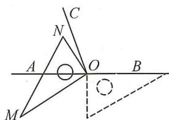

text_image

Geometric diagram with labeled points and lines, including triangle ABC and auxiliary constructions

由已知可得： $\angle CON = 5^{\circ}t - 200^{\circ},\angle AOM = 5^{\circ}t - 180^{\circ},$

$$
\because m \angle C O N + \angle A O M = n ^ {\circ},
$$

$$
\therefore m (5 ^ {\circ} t - 2 0 0 ^ {\circ}) + 5 ^ {\circ} t - 1 8 0 ^ {\circ} = n ^ {\circ},
$$

$$
\therefore (5 ^ {\circ} m + 5 ^ {\circ}) t - 2 0 0 ^ {\circ} m - 1 8 0 ^ {\circ} = n ^ {\circ},
$$

∵ 在旋转的过程中, $\angle CON$ 与 $\angle AOM$ 始终满足关系 $m\angle CON + \angle AOM = n^{\circ}$ ,

$\therefore 5^{\circ}m + 5^{\circ} = 0$ ，解得 $m = -1$

$\therefore -200^{\circ}m - 180^{\circ} = n^{\circ}$ ，解得 $n = 20$

$\therefore m + n = -1 + 20 = 19.\therefore m + n$ 的值是19.

# 板块四 相遇问题

# 【典例精讲】

例 解: 射线 OD 与射线 OA 重合时, $t = 180 \div 3 = 60$ (秒), 存在某个时刻 t (秒), 使得 $\angle COD$ 的度数是 $40^{\circ}$ .

有两种情况：

在 OC, OD 相遇前, $180^{\circ}-3t^{\circ}-2t^{\circ}=40^{\circ}, \therefore t=28$ ;

在 OC, OD 相遇后, $3t^{\circ} + 2t^{\circ} - 180^{\circ} = 40^{\circ}, \therefore t = 44$ .

综上所述, 当 t 为 28 秒或 44 秒时, $\angle COD$ 的度数是 $40^{\circ}$ .

# 【实战演练】

1. 解: (1) 当 OA, OB 相遇前,

$$
\angle A O M = 5 ^ {\circ} t, \angle B O N = 1 5 t ^ {\circ}, \angle A O B = 1 8 0 ^ {\circ} - 2 0 t ^ {\circ}.
$$

$$
\because \angle A O M = 2 \angle A O B,
$$

∴5t=2(180-20t)，解得 t=8；

(2) 当 OA, OB 相遇后, $\angle AOM = 5^{\circ} t$ ,

$$
\angle B O N = 1 5 ^ {\circ} t, \angle A O N = 1 8 0 ^ {\circ} - 5 ^ {\circ} t,
$$

$$
\begin{array}{l} \therefore \angle A O B = \angle B O N - \angle A O N = 1 5 ^ {\circ} t - (1 8 0 ^ {\circ} - 5 ^ {\circ} t) = 2 0 t ^ {\circ} \\ - 1 8 0 ^ {\circ}, \end{array}
$$

$$
\because \angle A O M = 2 \angle A O B,
$$

∴ 5t = 2(20t - 180)，解得 $t = \frac{72}{7}$ ,

$\therefore t = 8$ 或 $\frac{72}{7}$ .

2. 解: ①若射线 OB, OC 重合前相差 $20^{\circ}$ , 则有:

$20t+15t+20=90$ , 解得 t=2;

②若射线 OB, OC 重合后相差 $20^{\circ}$ , 则有:

$20t+15t-90=20$ , 解得 $t=\frac{22}{7}$ .

又∵0<t<6，

∴ t=2 或 $t=\frac{22}{7}$ .

# 板块五 追及问题

# 【典例精讲】

例 解:(1) $\angle AOD=150^{\circ}$ ;

(2) $\angle MON$ 的度数不会发生改变, $\angle MON=30^{\circ}$ .

理由如下：

旋转 t 秒后， $\angle AOD=150^{\circ}-5t^{\circ}$

$$
\angle A O C = 1 2 0 ^ {\circ} - 5 t ^ {\circ}, \angle B O D = 1 2 0 ^ {\circ} - 5 t ^ {\circ}.
$$

∵OM,ON 分别平分∠AOC,∠BOD,

$$
\therefore \angle A O M = \frac {1}{2} \angle A O C = \frac {1}{2} (1 2 0 ^ {\circ} - 5 t ^ {\circ}),
$$

$$
\angle D O N = \frac {1}{2} \angle B O D = \frac {1}{2} (1 2 0 ^ {\circ} - 5 t ^ {\circ}),
$$

$$
\therefore \angle M O N = \angle A O D - \angle A O M - \angle D O N = 1 5 0 ^ {\circ} - 5 t ^ {\circ} -
$$

$$
\frac {1}{2} (1 2 0 ^ {\circ} - 5 t ^ {\circ}) - \frac {1}{2} (1 2 0 ^ {\circ} - 5 t ^ {\circ}) = 3 0 ^ {\circ}.
$$

# 【实战演练】

解:(1) $\angle AOP=10^{\circ}t,\angle BOQ=6^{\circ}t,$

OP 与 OQ 重合时， $\angle AOP - \angle BOQ = \angle AOB$ ，

∴10t-6t=60, 解得 t=15;

(2)相遇前: $\angle AOP - \angle AOB + \angle POQ = \angle BOQ$ ,

∴10t-60+40=6t，解得 t=5；

相遇后: $\angle AOP - \angle AOB = \angle POQ + \angle BOQ$ ,

$10t - 60 = 40 + 6t$ ，解得 $t = 25$

(3)t=22 或 30.

当 $0 \leqslant t \leqslant 18$ 时, 无解;

当 $18 < t \leqslant 36$ 时， $\angle AOP = 360^{\circ} - 10^{\circ}t$ ，

$$
\angle A O M = \frac {1}{2} \angle A O P = 1 8 0 ^ {\circ} - 5 ^ {\circ} t,
$$

$$
\angle C O M = | \angle A O M - \angle A O C | = | 1 8 0 ^ {\circ} - 5 ^ {\circ} t - 5 0 ^ {\circ} | = 2 0 ^ {\circ},
$$

解得 t=22 或 t=30.

# 板块六 平角突变

# 【典例精讲】

例 解：(1) $\angle BOC = 30^{\circ}, \angle AOB = 150^{\circ}$ ;

(2) $\because \angle AOB = 150^{\circ}, \angle BOC = 30^{\circ}$ ,

$$
\therefore \angle A O C = 1 5 0 ^ {\circ} - 3 0 ^ {\circ} = 1 2 0 ^ {\circ},
$$

$$
\therefore \angle P O C = \angle A O C - 1 5 ^ {\circ} t = 1 2 0 ^ {\circ} - 1 5 ^ {\circ} t,
$$

$$
\angle Q O C = \angle B O C - 3 ^ {\circ} t = 3 0 ^ {\circ} - 3 ^ {\circ} t,
$$

∴120-15t=2(30-3t)，解得 $t=\frac{20}{3}$ ，∴t 的值是 $\frac{20}{3}$ ;

(3) 当 $0 < t \leqslant 10$ 时，如图 3，此时 $\angle AOC = 120^{\circ} - 12^{\circ}t$ ， $\angle AOE = 15^{\circ}t$ ， $\because OM$ 平分 $\angle AOC$ ，

$\therefore \angle AOM = 60^{\circ} - 6^{\circ}t, \therefore 60 - 6t - 15t = 50$ 或 $15t - (60$

$-6t) = 50$ ，解得 $t = \frac{10}{21}$ 或 $t = \frac{110}{21}$

当 $10 < t \leqslant 20$ 时，如图4，此时 $\angle AOE = 150^{\circ} - 15^{\circ}(t - 10) = 300^{\circ} - 15^{\circ}t, \angle AOC = 12^{\circ}(t - 10)$ ，

$$
\angle A O M = 6 ^ {\circ} (t - 1 0), \therefore 3 0 0 - 1 5 t + 6 (t - 1 0) = 5 0,
$$

解得 $t=\frac{190}{9}$ (大于 20, 舍去);

当 $20 < t \leqslant 25$ 时，如图5， $\angle AOE = 15^{\circ}(t - 20)$ ，

$\angle AOC = 12^{\circ}(t - 10), \angle AOM = 6^{\circ}(t - 10)$

∴ $15(t-20)+6(t-10)=50$ ，解得 $t=\frac{410}{21}$ ,

$$
\because 1 5 t - 3 0 0 = 1 5 \times \frac {4 1 0}{2 1} - 3 0 0 = \left(- \frac {5 0}{7}\right),
$$

$\therefore t = \frac{410}{21}$ 不符合题意，舍去， $\therefore t$ 的值为 $\frac{10}{21}$ 或 $\frac{110}{21}$ .

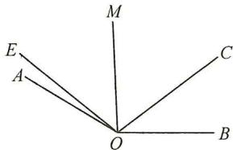

text_image

E
A
M
C
O
B

图3

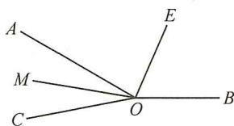

text_image

A
M
C
O
E
B

图4

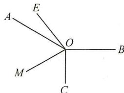

text_image

A
E
O
B
M
C

图5