# 黑发不知勤学早 白首方悔读书迟

严禁在网上销售

盗版必究，举报热线

027-85897936

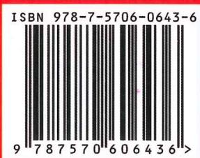  
定价：62.80元

勤学早练系列 大培优

数学八上

主编◎李志刚

长江出版传媒
湖北科学技术出版社

勤学早练

2025

# 大培优

DA PEI YOU

主编◎李志刚

natural_image

Abstract geometric illustration with red, orange, and purple triangular shapes and a stylized pencil (no text or symbols)

数学

八年级上

长江出版传媒

湖北科学技术出版社

# 大培优

# 数学

# 八上

主 编: 李志刚

编 委:陈一文 陈 浩 胡 芳 桂一鸣 袁 风

严丽丽 徐浩东 黄双艳 闵光敏 汪路

# 图书在版编目(CIP)数据

勤学早练系列. 大培优. 数学八. 上/李志刚主编—武汉: 湖北科学技术出版社, 2019.5

ISBN 978-7-5706-0643-6

I. ①勤… II. ①李… III. ①中学数学课—初中—教学参考资料 IV. ①G634

中国版本图书馆 CIP 数据核字(2019)第 053924 号

勤学早练系列. 大培优. 数学八. 上

QIN XUE ZAO LIAN XI LIE DA PEI YOU SHU XUE BA SHANG

责任编辑:彭永东

封面设计:李惠

出版发行:湖北科学技术出版社

电话:027-87679468

地址:武汉市雄楚大街268号

邮编:430070

经销:新华书店

印刷: 汉川市诚信印务有限责任公司

邮编:432300

开 本:880×1230 1/16

印 张:14 字 数:280 千字

版 次:2019年5月第1版

印 次:2025年3月第4次印刷

定 价:62.80元

# 目录

# CONTENTS

# 第十三章 三角形

# 第1讲 与三角形有关的线段 …… 1

板块一 与三角形有关的线段(一)三边关系 …… 1

板块二 与三角形有关的线段(二)三角形的中线 …… 3

板块三 与三角形有关的线段(三)三角形的高 …… 5

板块四 与三角形有关的线段(四) 面积转化与面积法 …… 6

# 第2讲 与三角形有关的角 …… 7

板块一 三角形的内角和 …… 7

板块二 三角形的外角 8

板块三 综合与实践——折叠求角 9

# 第 3 讲 常用导角模型 …… 10

板块一 七个基本导角模型 …… 10

板块二 五大双角平分线夹角模型(一) 识模 …… 12

板块三 五大双角平分线夹角模型(二)用模 …… 14

板块四 高与角平分线夹角模型 16

# 第 4 讲 求角思想方法 …… 17

板块一 思想方法(一) 方程思想 …… 17

板块二 思想方法(二) 参数思想 …… 18

板块三 思想方法(三) 整体思想 …… 19

板块四 思想方法(四) 特殊到一般 20

板块五 思想方法(五) 分类讨论 …… 21

# 第 5 讲 情境创新题 22

板块一 数学活动(课本变式) 22

板块二 阅读理解与新定义 23

板块三 综合与实践 24

# 第十四章 全等三角形

# 第6讲 全等三角形的性质与判定 25

板块一 初识全等(一) 全等发现 …… 25

板块二 初识全等(二)常规辅助线 27

# 第 7 讲 中点的处理方法 …… 29

板块一 中点处理(一)知中点 29

板块二 中点处理(二)证中点 31

# 第8讲 线段和差的处理方法 33

板块一 等线段代换 33

板块二 截长补短 34

# 第9讲 角平分线的处理方法 35

板块一 角平分线(一) 性质 35

板块二 角平分线(二) 判定 …… 36

板块三 角平分线(三) 面积法 …… 37

板块四 角平分线(四)作垂构对称型全等 …… 39

板块五 角平分线(五)截长补短构对称型全等 40

板块六 角平分线(六)角分垂,延长构对称型全等 41

板块七 角平分线(七) 对角互补模型 …… 42

板块八 角平分线(八) 同旁张等角模型 44

第 10 讲 一线三等角模型 …… 45

板块一 三垂直 45

板块二 坐标系中的三垂直 47

板块三 一线三等角 49

第 11 讲 手拉手模型 …… 50

板块一 初识手拉手模型(一) 双等边三角形 …… 50

板块二 初识手拉手模型(二) 双等腰直角三角形 …… 51

板块三 初识手拉手模型(三) 双等腰三角形 …… 52

板块四 构造手拉手模型 53

第 12 讲 夹半角模型 …… 55

板块一 90°角夹45°角 55

板块二 120°角夹60°角 …… 57

板块三 $2\alpha^{\circ}$ 角夹 $\alpha^{\circ}$ 角 58

第 13 讲 婆罗摩笈多模型 …… 59

板块一 向外作双等腰直角三角形 59

板块二 向内作双等腰三角形 60

第 14 讲 实践操作与全等三角形 …… 61

板块一 无刻度直尺作图(一)格点画图 …… 61

板块二 无刻度直尺作图(二)非格点画图 …… 62

板块三 尺规作图(一) 作全等 …… 63

板块四 尺规作图(二)作角的平分线 …… 64

第 15 讲 情境创新题 …… 65

板块一 阅读理解与新定义 65

板块二 综合与实践 66

# 第十五章 轴对称

第 16 讲 轴对称 …… 67

板块一 轴对称与轴对称图形 67

板块二 线段的垂直平分线 69

第 17 讲 等腰三角形的性质 …… 71

板块一 方程思想求角 71

板块二 整体思想求角 73

板块三 分类讨论求角 74

板块四 分类讨论计数 75

板块五 三线合一(一)连底边上的中线 …… 76

板块六 三线合一(二)作底边上的高 …… 77

第 18 讲 构造等腰三角形的技巧 …… 79

板块一 构等腰(一)作腰(底)的平行线 79

板块二 构等腰(二)角平分线遇平行线 81

板块三 构等腰(三)截长补短法 82

板块四 构等腰(四)二倍角处理 83

板块五 构等腰(五) 特殊角翻折 85

板块六 构等腰(六)倍长中线或作平行线 86

第 19 讲 等腰三角形中构全等技巧 …… 88

板块一 构全等(一)一边一角(SA)构全等 88

板块二 构全等(二)一等边、一互补构全等 89

板块三 构全等(三)镜面角构全等 90

板块四 构全等(四)“十字架”构全等 91

第 20 讲 玩转 45° 角 92

板块一 45°角的用法(一) 再探手拉手——作垂直 92

板块二 45°角的用法(二)再探手拉手——夹半角模型 94

板块三 45°角的用法(三)再探手拉手——共顶点的三等腰模型 95

板块四 45°角的用法(四) 再探手拉手——破解手拉脚、脚拉脚 …… 96

第 21 讲 等边三角形的性质与判定 …… 97

板块一 等边三角形的性质与判定 97

板块二 构等边(一)作平行线 99

板块三 构等边(二)作等边三角形 101

第 22 讲 玩转 30°与 60°角 …… 102

板块一 30°角的用法 …… 102

板块二 60°角的用法(一) 构等边 …… 104

板块三 60°角的用法(二) 等边互补模型 …… 105

板块四 60°角的用法(三) 等边同旁张等角模型 …… 107

板块五 60°角的用法(四) 120°夹 60°模型 …… 108

第 23 讲 综合与实践——最短路径问题 …… 109

板块一 垂线段最短(一) 定点定线 109

板块二 垂线段最短(二) K 型全等稳定线 110

板块三 垂线段最短(三) 发现手拉手 111

板块四 垂线段最短(四) 构手拉手 112

板块五 垂线段最短(五) 胡不归 113

板块六 两点之间线段最短(一) 将军饮马 …… 114

板块七 两点之间线段最短(二) 多折线和最值 …… 115

板块八 两点之间线段最短(三)“造桥选址”问题 116

板块九 两点之间线段最短(四) 拼接最值 …… 117

第 24 讲 实践操作与轴对称 …… 118

板块一 无刻度直尺作图(一) $45^{\circ}$ 角与垂直平分线 …… 118

板块二 无刻度直尺作图(二)画对称 …… 119

板块三 无刻度直尺作图(三)用对称 …… 120

板块四 无刻度直尺作图(四) 对称与最值 …… 121

板块五 尺规作图(一) 作线段的垂直平分线 …… 122

板块六 尺规作图(二) 作垂线 …… 123

板块七 尺规作图(三) 作轴对称图形 …… 124

第 25 讲 情境创新题 …… 125

板块一 阅读理解与新定义 …… 125

板块二 综合与实践 …… 126

# 第十六章 整式的乘法

第 26 讲 整式的乘法 …… 127

板块一 幂的运算 …… 127

板块二 整式的乘法(一) 129

板块三 整式的乘法(二) 131

板块四 整式的除法 …… 133

第 27 讲 乘法公式 …… 134

板块一 平方差公式 134

板块二 完全平方公式 …… 135

板块三 完全平方公式的应用 …… 136

板块四 配方法 138

板块五 整式乘法与几何图形结合 …… 140

第 28 讲 情境创新题 142

板块一 数学活动(课本变式) 142

板块二 综合与实践 …… 143

# 第十七章 因式分解

第 29 讲 因式分解 …… 144

板块一 提公因式法 …… 144

板块二 平方差公式 …… 145

板块三 完全平方公式 …… 146

板块四 分组分解法 …… 147

板块五 十字相乘法 148

板块六 换元法 149

板块七 因式分解的应用 …… 150

第 30 讲 情境创新题 …… 151

板块一 数学活动(课本变式) 151

板块二 综合与实践 152

# 第十八章 分式

第 31 讲 分式的概念及性质 …… 153

板块一 分式有意义的条件 …… 153

板块二 分式的基本性质 …… 155

第 32 讲 分式的运算 …… 157

板块一 分式的乘除与乘方 157

板块二 分式的加减 158

板块三 分式的混合运算 …… 159

板块四 分式的化简求值 …… 160

板块五 实际问题与分式 …… 162

第 33 讲 分式方程及实际应用 …… 164

板块一 解分式方程 164

板块二 含参方程的解的讨论 …… 165

板块三 解为 0, 正数、负数 …… 166

板块四 实际问题与分式方程(一)行程问题 167

板块五 实际问题与分式方程(二) 工程问题 168

第 34 讲 情境创新题 …… 169

板块一 数学活动(课本变式) 169

板块二 阅读理解与新定义 …… 170

# 参考答案

(单独成册)

# 第十三章 三角形

# 第1讲 与三角形有关的线段

# 板块一 与三角形有关的线段(一)三边关系

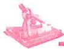

# 典例精讲

# 题型 1 利用三边关系判断能否组成三角形

【例 1】用 4 根长度分别为 5 cm, 7 cm, 9 cm, 13 cm 的木棒, 可以摆出 \_\_\_\_ 种不同的三角形.

# 题型 2 利用三边关系求参数范围

【例 2】已知等腰三角形的周长为 12.

(1)若腰长为 x，求 x 的取值范围；

(2)若底边长为 $y$ ，求 $y$ 的取值范围.

# 题型③ 利用三边关系化简

【例 3】已知 a, b, c 为三角形三边的长，化简： $|a - b - c| + |b - c - a| + |c - a - b|$ .

# 题型 4 利用三边关系取舍值

【例 4】一个等腰三角形的三边分别为 4,3a-2,6a-6,求这个三角形的周长.

# 题型 5 利用三边关系求边的取值范围

【例 5】如图, 在 $\triangle ABC$ 中, $AB=6, AC=8, BC=10, D$ 为 $AB$ 边上一点(不与 $A, B$ 两点重合), 将 $\triangle ACD$ 沿 $CD$ 折叠, 点 $A$ 的对应点 $E$ 落在 $BC$ 的下方, 求 $BE$ 的取值范围.

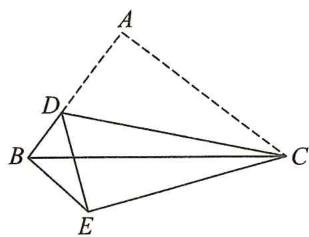

text_image

Geometric diagram of a tetrahedron with labeled vertices A, B, C, D, E and dashed lines indicating hidden edges.

# 实战演练

1. 已知三角形的三边长分别为 2, a - 1, 5, 则 a 的取值范围为

2. 已知三角形的三边长分别为 2, a-1, 4, 化简 $\left|a-3\right| + \left|a-7\right|$ 的结果为

3. 若等腰三角形的腰长为 6, 则它的底边长 a 的取值范围是\_\_\_\_; 若等腰三角形的底边长为 4, 则它的腰长 b 的取值范围是\_\_\_\_.

4. 若三条线段中 a=3, b=5, c 为奇数，那么由 a, b, c 为边组成的三角形共有（）

A. 1 个

B. 3 个

C. 4 个

D. 5 个

5. 已知三角形的三条边长均为整数, 其中有一条边长为 4, 但不是最短边, 这样的三角形共有一个.

6. 一个等腰三角形的一边长为 $4 \mathrm{~cm}$ , 周长为 $20 \mathrm{~cm}$ , 求这个三角形的腰长。

7. 用一条长为 41 的细绳围成一个三角形, 已知该三角形的第一条边的长为 $x$ , 第二条边长比第一条边长的 3 倍少 4 , 若该三角形恰好是一个等腰三角形, 求这个三角形的三边长.

8. 如图, $AB = 10 \mathrm{~cm}, BC = 18 \mathrm{~cm}$ , 将线段 $AB$ 绕着点 $B$ 旋转, 连接 $AC$ , 在旋转过程中, 线段 $AC$ 的最大值是 , 最小值是 , $AC$ 的取值范围是 .

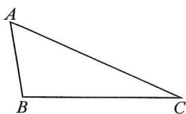

natural_image

Simple geometric diagram of a triangle labeled A, B, C (no additional text or symbols)

9. 如图, 在 $\triangle ABC$ 中, $AB = 3$ , $BC = 4$ , $AC = 5$ , $D$ 为 $BC$ 边上一动点, 将 $\triangle ABD$ 沿 $AD$ 翻折, 得到 $\triangle APD$ , 点 $B$ 的对应点为点 $P$ , 连接 $CP$ , 则 $CP$ 的最小值为

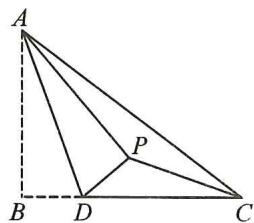

text_image

A
P
B D C

# 板块二 与三角形有关的线段(二)三角形的中线

<table><tr><td></td><td>中线</td><td>重心</td></tr><tr><td>图形</td><td>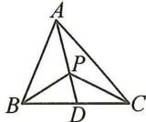 AD 为中线</td><td>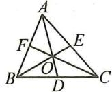 O 为重心</td></tr><tr><td>结论</td><td>1 $BD=CD$ ;2 $C_{\triangle ACD}-C_{\triangle ABD}=AC-AB(C 表示周长)$ ;3 $S_{\triangle ABD}=S_{\triangle ACD}=\frac{1}{2}S_{\triangle ABC}$ ;4 $S_{\triangle BPD}=S_{\triangle CPD},S_{\triangle APB}=S_{\triangle APC}.$ </td><td>1 $S_{\triangle AOB}=S_{\triangle AOC}=S_{\triangle BOC}$ ;2 $S_{\triangle AOF}=S_{\triangle BOF}=S_{\triangle BOD}=S_{\triangle COD}=S_{\triangle COE}=S_{\triangle AOE}=\frac{1}{6}S_{\triangle ABC}$ ;3 $OA=2OD,OB=2OE,OC=2OF.$ </td></tr></table>

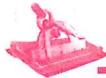

# 典例精讲

# 题型① 中线的性质与应用

【例 1】如图, $\triangle ABC$ 中,AD为BC边上的中线.

(1)若 $\triangle ABD$ 的周长比 $\triangle ACD$ 的周长大4.

①若 AB=10，则 AC=\_\_\_\_；②若 $AB+AC=14$ ，则 AC=\_\_\_\_；

(2) 若 $\triangle ABC$ 的周长为 27, AB = 9, BC 边上中线 AD = 6, $\triangle ACD$ 周长为 19, 求 AC 的长;

(3) 若 BC=6, AD=4, 则 $\triangle ABC$ 的面积的最大值为 \_\_\_\_.

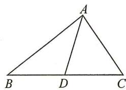

text_image

A
B D C

【例 2】如图, 在 $\triangle ABC$ 中, D, E, F 分别为 BC, AD, CE 的中点, $S_{\triangle ABC} = 4$ , 求 $S_{\triangle BEF}$ .

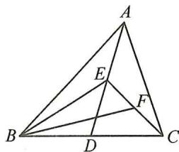

text_image

Geometric diagram of triangle ABC with internal points D, E, F and connecting lines forming smaller triangles

# 题型② 重心的性质与应用

【例 3】如图, $O$ 为 $\triangle ABC$ 的重心, $AO, BO, CO$ 的延长线分别与 $BC, AC, AB$ 交于点 $E, F, D$ .

(1)图中与 $\triangle AOD$ 面积相等的三角形共有\_\_\_\_个( $\triangle AOD$ 除外);

(2)试说明:AO=2OE.

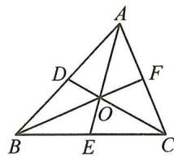

text_image

Geometric diagram of triangle ABC with internal points D, E, F and intersection point O, labeled for mathematical analysis.

# 实战演练

1. 如图, 在 $\triangle ABC$ 中, $D, E$ 分别是 $BC, AC$ 的中点, 则 $\frac{S_{\triangle BDE}}{S_{\triangle ABC}} =$ \_\_\_\_.

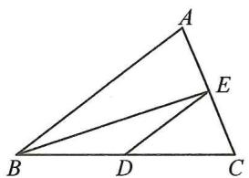

text_image

Geometric diagram of triangle ABC with internal points D and E, showing segments AD and DE

第1题图

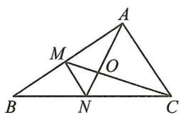

text_image

Geometric diagram of triangle ABC with internal points M, N, O and connecting line segments

第2题图

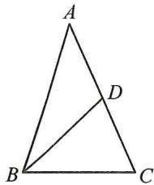

text_image

A
D
B
C

第3题图

2. 如图, $O$ 是 $\triangle ABC$ 的重心, $AN, CM$ 相交于点 $O, \triangle MON$ 的面积是 1 , 则 $\triangle ABC$ 的面积为 \_\_\_\_.  
3. 如图, $BD$ 是 $\triangle ABC$ 的中线, $AB = 7$ , $BC = 3$ , 且 $\triangle ABD$ 的周长为 15 , 则 $\triangle BCD$ 的周长为  
4. 已知等腰三角形一腰上的中线将这个三角形的周长分为 $9 \, cm$ 和 $15 \, cm$ 的两个部分, 求这个三角形的底边的长.

5. 如图, 在 $4 \times 3$ 的正方形网中, 每个小正方形的顶点叫做格点, $\triangle ABC$ 的顶点 $B, C$ 为格点, $CD$ 为 $\triangle ABC$ 的中线. 请用无刻度的直尺在图中画出 $\triangle ABC$ 的重心 $G$ , 并画出 $\triangle ABC$ 的中线 $BF$ .

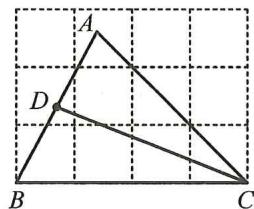

text_image

Geometric diagram showing triangle ABC with point D on side BC, overlaid on a grid with dashed lines

6. 如图, 在 $\triangle ABC$ 中, $AB = 10 \mathrm{~cm}, AC = 6 \mathrm{~cm}, D$ 是 $BC$ 的中点, 点 $E$ 在边 $AB$ 上, $\triangle BDE$ 与四边形 $ACDE$ 的周长相等.

(1)求线段 $AE$ 的长；  
(2)若图中所有线段长度的和是 $53 \, cm$ ，直接写出 $BC + \frac{1}{2} DE$ 的值.

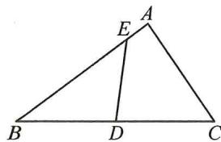

text_image

Geometric diagram of triangle ABC with points D and E on sides BC and AD respectively, and segment AE drawn

# 板块三 与三角形有关的线段(三)三角形的高

<table><tr><td></td><td>直角三角形</td><td>锐角三角形</td><td>钝角三角形</td></tr><tr><td>图形</td><td>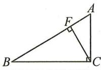</td><td>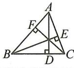</td><td>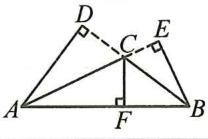</td></tr><tr><td rowspan="2">结论</td><td>AB·CF=AC·BC=2S△ABC</td><td colspan="2">AB·CF=AC·BE=BC·AD=2S△ABC</td></tr><tr><td colspan="3">三条高所在的直线交于一点,这个点称为垂心.</td></tr></table>

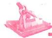

# 典例精讲

# 题型① 依据三角形的形状确定高的位置

【例 1】如图, 已知 $\triangle ABC$ , 画出 $\triangle ABC$ 的高 AM, CN.

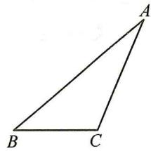

natural_image

Simple geometric diagram of a triangle labeled ABC (no additional text or symbols)

# 题型 2 面积法证明线段关系

【例 2】如图, 在 $\triangle ABC$ 中, $AB=2, BC=4, CH \perp AB$ 于点 $H, AG \perp BC$ 于点 $G$ . 求证: $CH=2AG$ .

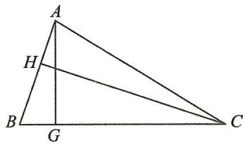

text_image

A
H
B
G
C

# 实战演练

# 题型 ③ 面积法,整体求值

1. 如图, 在 $\triangle ABC$ 中, $AB = AC$ , $CH$ 是 $\triangle ABC$ 的高, 且 $CH = 8$ , $D$ 为 $BC$ 上一点, $DE \perp AB$ 于点 $E$ , $DF \perp AC$ 于点 $F$ , 求 $DE + DF$ 的值.

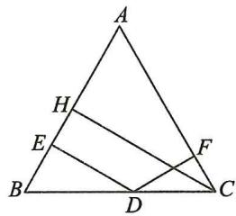

text_image

A
H
E
F
B
D
C

# 题型 4 依据高的位置,分类讨论求角度

2. 已知 $AD$ 是 $\triangle ABC$ 的高, $\angle BAD = 70^{\circ}, \angle CAD = 20^{\circ}$ , 求 $\angle BAC$ 的度数.

# 板块四 与三角形有关的线段(四) 面积转化与面积法

<table><tr><td>图形</td><td>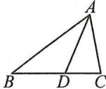 D为BC上一点</td><td>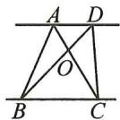 AD//BC</td></tr><tr><td>结论</td><td> $\frac{S_{\triangle ABD}}{S_{\triangle ACD}} = \frac{BD}{CD}$ </td><td>1 $S_{\triangle ABC} = S_{\triangle DBC}, S_{\triangle ABD} = S_{\triangle ACD}; 2S_{\triangle ABO} = S_{\triangle DCO}; 3\frac{S_{\triangle ABD}}{S_{\triangle BCD}} = \frac{AD}{BC}; 4\frac{AO}{OC} = \frac{S_{\triangle ABO}}{S_{\triangle CBO}} = \frac{S_{\triangle DCO}}{S_{\triangle CBO}} = \frac{DO}{OB}.$ </td></tr></table>

# 典例精讲

# 题型① 面积法求值

【例 1】如图, 在四边形 ABCD 中, AD // BC, AC, BD 交于点 O, $S_{\triangle BOC} = 2S_{\triangle AOB}$ , BD = 12, 则 OD 的长为 \_\_\_\_.

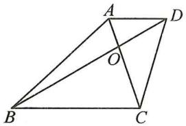

text_image

Geometric diagram of quadrilateral ABCD with diagonals intersecting at point O, labeled with vertices A, B, C, D and intersection point O.

# 题型 2 转化思想求面积

【例 2】如图, 在 $\triangle ABC$ 中, $D$ 是 $BC$ 上一点, $CD=2BD$ , $E$ 是 $AC$ 的中点, $AD$ , $BE$ 交于点 $F$ . 若 $S_{\triangle ABC}=18$ . 则 $S_{四边形CDFE}-S_{\triangle ABF}$ 的值为\_\_\_\_.

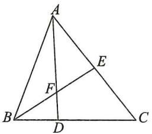

text_image

A
E
F
B
D
C

# 实战演练

如图， $\angle ABC = \angle BCD = 90^{\circ}, AB = 6, BC = 5, AD$ 与 $BC$ 交于点 $E, S_{\triangle BDE} = 6$ .

(1)求 $CE$ 的长；  
(2)求 $\triangle CDE$ 的面积.

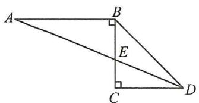

text_image

A
B
E
C
D

# 第2讲 与三角形有关的角

# 板块一 三角形的内角和

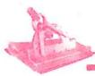

# 典例精讲

# 题型① 利用三角形的内角和求角

【例 1】如图, 在 $\triangle ABC$ 中, $\angle ABC = \angle C$ , $BD$ 是 $\angle ABC$ 的平分线, 且 $\angle BDE = \angle BED$ , $\angle A = 100^{\circ}$ , 求 $\angle DEC$ 的度数.

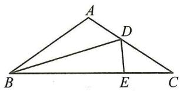

text_image

A
D
B
E
C

# 题型 2 利用直角三角形的两锐角互余求角

【例 2】如图, 在 $\triangle ABC$ 中, $BD$ 是高, $\angle ABC = \angle C$ .

(1)若 $\angle A=50^{\circ}$ ,求 $\angle CBD$ 的度数;

(2)若 $\angle A=\alpha$ ,求 $\angle CBD$ 的度数(用含 $\alpha$ 的式子表示).

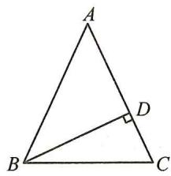

text_image

A
B
C
D

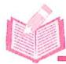

# 实战演练

1. 如图, 在 $\triangle ABC$ 中, $\angle 1 = \angle 2$ , $\angle BAC = 65^\circ$ , 求 $\angle APB$ 的度数.

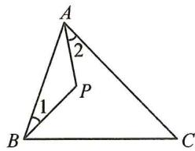

text_image

A
2
P
1
B
C

2. 如图, 在 $\triangle ABC$ 中, $\angle ACB = 90^{\circ}, \angle B = 45^{\circ}, D, E$ 分别是 $BC$ 和 $BC$ 延长上线上的点, $EF \perp AD$ 于点 $F, \angle BAD = 2\angle CAD$ . 求 $\angle E$ 的度数.

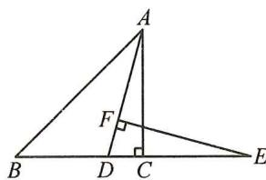

text_image

Geometric diagram of triangle ABC with perpendiculars from A to BC and BC, labeled points A, B, C, D, E, F, and right angle at F.

# 板块二 三角形的外角

# 典例精讲

【例 1】如图, 点 E 在 BC 上, 点 D 在 AE 上, $\angle A = 20^{\circ}, \angle B = 40^{\circ}, \angle C = 50^{\circ}$ . 求 $\angle ADB$ 的度数.

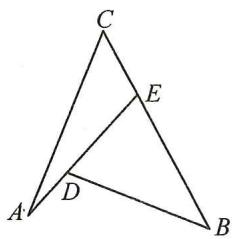

text_image

Geometric diagram of triangle ABC with internal points D and E, showing segments AD and DE

【例 2】如图, 已知 $\angle A = 20^{\circ}, \angle B = 27^{\circ}, AC \perp DE$ , 垂足为 P, 分别求 $\angle 1, \angle D$ 的度数.

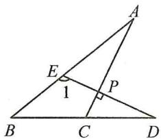

text_image

A
E
1
P
B
C
D

# 实战演练

1. 如图, 在 $\triangle ABC$ 中, $\angle BAC$ 的平分线交 $BC$ 于点 $D$ . 若 $\angle B = 68^{\circ}, \angle C = 32^{\circ}, AE \perp BC$ 于点 $E$ , 则 $\angle EAD$ 的度数为 \_\_\_\_.

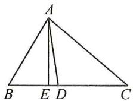

text_image

A
B E D C

2. 如图, $\triangle ABC$ 为直角三角形, $\angle C = 90^{\circ}$ , 若沿图中虚线剪去 $\angle C$ . 求 $\angle 1 + \angle 2$ 的度数.

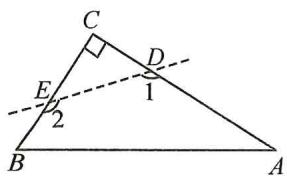

text_image

C
E
2
D
1
B
A

3. 如图, 已知 $AD$ 是 $\triangle ABC$ 的角平分线, $CE$ 是 $\triangle ABC$ 的高, $\angle BAC = 60^\circ$ , $\angle BCE = 45^\circ$ , 求 $\angle ADC$ 的度数.

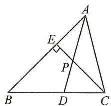

text_image

Geometric diagram of triangle ABC with perpendicular line from E to AC at point P, and point D on BC.

# 板块三 综合与实践——折叠求角

<table><tr><td>模型</td><td>应用</td></tr><tr><td>类型1:不压边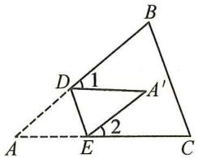条件:折叠△ADE得△A&#x27;DE.结论:∠A=1/2(∠1+∠2).</td><td>1.如图,在△ABC中,∠B=80°,∠C=70°,将△ABC沿EF折叠,点A落在三角形内的点A&#x27;处,求∠1+∠2的度数.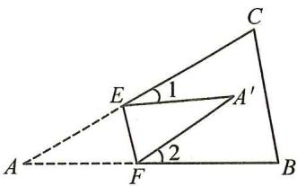</td></tr><tr><td>类型2:压一边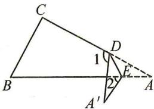条件:折叠△ADE得△A&#x27;DE.结论:∠A=1/2(∠1-∠2).</td><td>2.如图,将△ABC纸片沿DE折叠,使点A落在四边形BCED外部点A&#x27;的位置,求∠A与∠1,∠2之间的数量关系.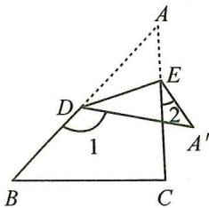</td></tr><tr><td>类型3:压两边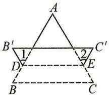条件:BC沿虚线DE折叠得B&#x27;C&#x27;,∠B对应∠B&#x27;,∠C对应∠C&#x27;.结论:∠A=1/2(∠1+∠2).</td><td>3.如图,将△ABC沿直线MN向上翻折,点B,C的对应点分别为点B&#x27;,C&#x27;,MN分别与AB,AC交于点E,F,若∠1+∠2=90°,求∠A的度数.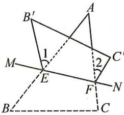</td></tr></table>

# 第3讲 常用导角模型

# 板块一 七个基本导角模型

<table><tr><td>模型</td><td>应用</td></tr><tr><td>模型1:8字形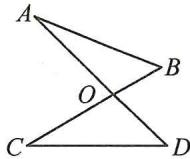结论:1∠A+∠B=∠C+∠D;2∠A=∠C⇔∠B=∠D.</td><td>1.如图,求∠C+∠D+∠E-∠A-∠B的度数.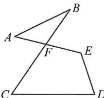</td></tr><tr><td>模型2:A字形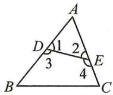结论:1∠1+∠2=∠B+∠C;2∠3+∠4=180°+∠A.</td><td>2.如图,在△ABC中,∠A=65°,直线DE交AB于点D,交AC于点E,求∠BDE+∠CED的度数.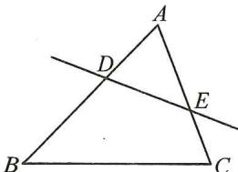</td></tr><tr><td>模型3:风筝形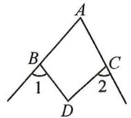结论:∠1+∠2=∠A+∠D.</td><td>3.如图,∠A=70°,将∠A沿EF翻折得到∠EDF,则图中∠1+∠2的度数为_.</td></tr><tr><td>模型4:燕尾形结论:∠A+∠B+∠C=∠D.</td><td>4.如图,CE平分∠ACD交AB于点E,∠D-∠A=60°,∠B=20°,则∠D-∠BEC的度数为_.</td></tr><tr><td>模型5:余角模型结论: 1∠1=∠B,2∠2=∠A.结论: 1∠B=∠E,2∠1=∠2=∠A.</td><td>5.如图,∠F=∠D=90°,AF//BC.求证:∠DEF=∠BCD.</td></tr><tr><td>模型6:补角模型条件:∠A+∠C=180°.结论:∠1=∠B.</td><td>6.如图,在四边形ABCD中,∠B=∠D=90°,AE平分∠DAB交CD于点E,交BC的延长线于点G.(1)求证:∠ECG=2∠DAE;(2)求证:∠CEG=∠G. </td></tr><tr><td>模型7:一线三等角模型类型一 一线三垂直类型二 同侧一线三等角类型三 异侧一线三等角条件:∠1=∠2=∠3.结论:1∠CBE=∠D,2∠ABD=∠E.</td><td>7.如图,P是∠BAC内一点,∠B=37°,∠C=25°,过点P作直线EF,分别交AB,AC于点E,F.若∠BEP=∠BPC=∠PFC,求∠A的度数.8.如图,∠ABC的平分线BE交AD于点E,连接CE,若∠A=∠D=∠BEC,求证:CE平分∠BCD.</td></tr></table>

板块二 五大双角平分线夹角模型(一) 识模

<table><tr><td>模型</td><td>证明</td></tr><tr><td>模型1:三角形双内角平分线夹角模型条件: $BP$  平分 $\angle ABC,CP$  平分 $\angle ACB.$ 结论: $\angle P=90^{\circ}+\frac{1}{2}\angle A.$ </td><td>证明:</td></tr><tr><td>模型2:三角形双外角平分线夹角模型条件: $BP$  平分 $\angle DBC,CP$  平分 $\angle ECB.$ 结论: $\angle P=90^{\circ}-\frac{1}{2}\angle A.$ </td><td>证明:</td></tr><tr><td>模型3:三角形一内一外角平分线夹角模型条件: $BP$  平分 $\angle ABC,CP$  平分 $\angle ACD.$ 结论: $\angle P=\frac{1}{2}\angle A.$ </td><td>证明:</td></tr><tr><td>模型4:8字形双角平分线夹角模型条件:AP平分∠BAD,CP平分∠BCD.结论:∠P=1/2(∠B+∠D).</td><td>证明:</td></tr><tr><td rowspan="2">模型5:燕尾形双角平分线夹角模型1条件:BP平分∠ABD,CP平分∠ACD.结论:∠P=1/2(∠A+∠D).燕尾形双角平分线夹角模型2条件:AP平分∠BAC,DP平分∠BDC(∠C&gt;∠B).结论:∠P=1/2(∠C-∠B).</td><td>证明:</td></tr><tr><td>证明:</td></tr></table>

# 板块三 五大双角平分线夹角模型(二)用模

# 题型 1 双内角平分线夹角问题

【例 1】(1)如图 1, 在 $\triangle ABC$ 中, $\angle A=60^{\circ}$ , $\angle ABC$ , $\angle ACB$ 的三等分线交于点 $O_{1}, O_{2}$ , 则 $\angle BO_{1}C$ 的度数为\_\_\_\_; $\angle BO_{2}C$ 的度数为\_\_\_\_;

(2)如图2,在 $\triangle ABC$ 中, $\angle ABC$ 的三等分线分别与 $\angle ACB$ 的平分线交于点 $O_{1},O_{2}$ ,若 $\angle BO_{1}C=125^{\circ},\angle O_{2}=110^{\circ}$ ,求 $\angle A$ 的度数.

text_image

A
O₂
O₁
B
C

图1

text_image

A
O₂
O₁
B
C

图2

# 题型 2 内、外角平分线夹角问题

【例 2】如图, 在平面直角坐标系中, 点 A 为 x 轴上的一点, 点 B 为 y 轴上的一点, AD 平分 $\angle BAX$ , BP 平分 $\angle OBA$ , BP 与 DA 的延长线交于点 P, 求 $\angle P$ 的度数.

text_image

y
B
D
O
A
x
P

# 题型③ 8字形双角平分线夹角问题

【例 3】如图,AB 和 CD 相交于点 O, $\angle C=\angle COA$ , $\angle BDC=\angle BOD$ ,AP,DP 分别平分 $\angle CAO$ 和 $\angle BDC$ . 若 $\angle C+\angle P+\angle B=165^{\circ}$ , 则 $\angle C$ 的度数是 \_\_\_\_.

text_image

Geometric diagram with labeled points A, B, C, D, O, and P, showing intersecting lines forming triangles and quadrilaterals.

# 题型 4 燕尾形双角平分线夹角问题

【例 4】如图, BM 平分 $\angle ABC$ 交 CD 于点 E, DN 平分 $\angle ADC$ . 若 $\angle A = \angle C$ , 求证: BM // DN.

text_image

A
N
M
D
E
C
B

# 题型 5 双外角平分线夹角模型

【例 5】如图, 在平面直角坐标系中, 点 A 为 x 轴上的一点, 点 B 为 y 轴上的一点, AC 平分 $\angle BAx$ , BC 平分 $\angle ABy$ , 求 $\angle C$ 的度数.

text_image

y
B
C
O
A
x

# 实战演练

1. 如图, $\angle BAC = \angle BDC = 90^{\circ}$ , $PB$ 平分 $\angle ABD$ , $PC$ 平分 $\angle ACD$ , 求 $\angle P$ 的度数.

text_image

Geometric diagram showing two triangles ABC and PCD with perpendiculars from A and D to point E on BC, forming a quadrilateral intersection.

2. 如图, 在 $\triangle ABC$ 中, $\angle ABC$ 和 $\angle ACB$ 的平分线交于点 $P$ , 过点 $P$ 作直线 $MN$ , 分别与 $AB, AC$ 交于点 $M, N$ . 若 $\angle AMN = \angle ANM$ , 求证: $\angle BPC = \angle BMN = \angle CNM$ .

text_image

A
M
P
N
B
C

3. 如图, $E$ 为 $BC$ 延长线上一点, $\angle ABC$ 和 $\angle DCE$ 的平分线交于点 $F$ . 若 $\angle A = 60^{\circ}, \angle ADC = 150^{\circ}$ , 求 $\angle F$ 的度数.

text_image

Geometric diagram with labeled points A, B, C, D, E, F forming triangles and intersecting lines

板块四 高与角平分线夹角模型

<table><tr><td>模型</td><td>证明</td></tr><tr><td>类型1:高与角分线共顶点条件:AD是角平分线,AE是高,∠C&gt;∠B.结论:∠DAE=1/2(∠C-∠B).</td><td>证明:</td></tr><tr><td>类型2:类型1变式1条件:AD是角平分线,点P在AD延长线上,PE⊥BC于点E,∠C&gt;∠B.结论:∠P=1/2(∠C-∠B).</td><td>证明:</td></tr><tr><td>类型3:类型1变式2条件:AD是角平分线,点P在BC延长线上,PE⊥AD于点E,∠C&gt;∠B.结论:∠P=1/2(∠C-∠B).</td><td>证明:</td></tr><tr><td>类型4:高与角分线不共顶点条件:∠ACB=90°,角平分线AD与高CE交于点F.结论:∠CDF=∠CFD.</td><td>证明:</td></tr></table>

# 第4讲 求角思想方法

# 板块一 思想方法(一) 方程思想

# 方法技巧

当问题中角度关系较为复杂时,可通过设元,寻找已知与未知间的等量关系,构造方程实现未知向已知的转化.

# 典例精讲

【例 1】如图, 在 $\triangle ABC$ 中, $BD$ 平分 $\angle ABC$ , $\angle 1 = \angle A$ , $\angle 2 = \angle C$ , 求 $\angle A$ 的度数.

text_image

A
1
B
2
C
D

【例 2】如图, $\angle B=\angle C,\angle ADE=\angle AED,\angle1=40^{\circ}$ . 求 $\angle EDC$ 的度数.

text_image

A
1
B D C
E

# 实战演练

1. 如图, $BD$ 是 $\triangle ABC$ 的角平分线, $AE \perp BD$ 交 $BD$ 的延长线于点 $E$ , $\angle ABC = 72^{\circ}$ , $\angle C: \angle ADB = 2:3$ , 求 $\angle BAC$ 和 $\angle DAE$ 的度数.

text_image

Geometric diagram of triangle ABC with points D and E, showing right angle at E

2. 如图, 在 $\triangle ABC$ 中, $D, E$ 分别为 $BC, AC$ 上的点, $\angle B = \angle C = \angle ADE$ , $\angle AED - 3\angle BAD = \angle DAC = 20^\circ$ . 求 $\angle B$ 的度数.

text_image

A
B
D
C
E

# 板块二 思想方法(二) 参数思想

# 方法技巧

当图形中涉及到的角较多,关系复杂,但某些角之间存在确定数量关系时,为方便起见,可用参数表示相关联的角,设而不求,使运算和表达变得简单明了.

# 典例精讲

# 题型 1 运用参数思想探求角的度数

【例 1】如图, 在 $\triangle ABC$ 中, $\angle BAC = \angle B$ , $AD \perp BC$ 于点 $D$ , $AE$ 平分 $\angle DAC$ 交 $CD$ 于点 $E$ , $EF \perp AB$ 于点 $F$ , 求 $\angle AEF$ 的度数.

text_image

Geometric diagram of triangle ABC with perpendiculars from points D and E to base BC, labeled with points A, B, C, D, E, F and right-angle symbols.

# 题型 2 运用参数思想探求角度关系

【例 2】如图, 在 $\triangle ABC$ 中, $\angle B=\angle C=45^{\circ}$ , 点 $D$ 在 $BC$ 边上, 点 $E$ 在 $AC$ 边上, 且 $\angle ADE=\angle AED$ , 试写出 $\angle BAD$ 与 $\angle CDE$ 的数量关系, 并说明理由.

text_image

A
B
D
C
E

# 实战演练

如图, $\angle ABD$ 的平分线与 $\angle ACD$ 的邻补角 $\angle ACE$ 的平分线所在的直线交于点 $I$ .

(1)如图1,写出∠I与∠A,∠D之间的数量关系式并证明;   
(2)如图2,直接写出∠I与∠A,∠D之间的数量关系式为

text_image

Geometric diagram with labeled points A, B, C, D, E, I forming triangles and intersecting lines

图1

text_image

Geometric diagram with labeled points A, B, C, D, E, and I forming intersecting triangles and lines

图2

# 板块三 思想方法(三) 整体思想

# 方法技巧

当题目中的条件或结论是以某几个元素的整体呈现时,则可以将其视为一个整体,运用整体思想求值.

# 典例精讲

【例】(1)如图1,求 $\angle A+\angle B+\angle C+\angle D+\angle E$ 的度数;

(2)如图 2, $\angle A + \angle B + \angle C + \angle D + \angle E + \angle F =$ \_\_\_\_.

text_image

A
B
E
C
D

图1

text_image

A
F
B
C
D
E
1
2
3

图2

# 实战演练

1. 如图, $\angle ABD$ 的邻补角 $\angle DBE$ 的平分线与 $\angle ACD$ 的邻补角 $\angle DCF$ 的平分线交于点 $I$ , $\angle A + \angle D = 160^{\circ}$ . 求 $\angle I$ 的度数.

text_image

Geometric diagram showing triangle ABC with an inscribed quadrilateral EICD, labeled with points A, B, C, D, E, F, I.

2. 如图, 在四边形 $ABCD$ 中, $AE$ 平分 $\angle BAD$ , $DE$ 平分 $\angle ADC$ .

(1)若 $\angle B+\angle C=120^{\circ}$ ,则 $\angle BAD+\angle CDA$ 的度数为 $\_\_\_\_$ , $\angle AED$ 的度数为 $\_\_\_\_$ (直接写出结果);

(2)根据(1)的启发,猜想 $\angle B+\angle C$ 与 $\angle AED$ 之间的数量关系,并说明理由.

text_image

A
B
E
C
D

# 板块四 思想方法(四) 特殊到一般

# 典例精讲

# 题型 1 图形从特殊到一般

【例】探究一:三角形的一个内角与另两个内角的平分线所夹的钝角之间有何种关系.

如图 1, 在 $\triangle ADC$ 中, DP, CP 分别平分 $\angle ADC$ 和 $\angle ACD$ , 试探究 $\angle P$ 与 $\angle A$ 的数量关系, 并说明理由;

探究二:若将 $\triangle ADC$ 改为任意四边形 $ABCD$ 呢?

如图 2, 在四边形 ABCD 中, DP, CP 分别平分 $\angle ADC$ 和 $\angle BCD$ .

(1)直接写出 $\angle A+\angle B+\angle BCD+\angle ADC$ 的度数为\_\_\_\_；

(2)请你利用上述结论探究 $\angle P$ 与 $\angle A+\angle B$ 的数量关系,并说明理由.

  
图1

text_image

A
B
P
D
C

图2

# 实战演练

# 题型 2 角度从特殊到一般

如图, $\triangle ABC$ 的角平分线BD,CE交于点F, $FH\perp BC$ 于点H.

(1) 若 $\angle ABC = 40^{\circ}, \angle ACB = 60^{\circ}$ ，求 $\angle 1 - \angle 2$ 的度数；

(2)若 $\angle A=60^{\circ}$ ,求 $\angle1-\angle2$ 的度数;

(3)若 $\angle A=\alpha$ ，求 $\angle1-\angle2$ 的度数（用含 $\alpha$ 的式子表示）.

text_image

A
E
F
D
B
2
1
H
C

text_image

A
E
F
D
B
2
1
H
C

备用图

# 板块五 思想方法(五) 分类讨论

# 方法技巧

当图形的形状或位置不明确,可能出现不同情况时,则需要根据可能出现的情况分类讨论求解.

# 典例精讲

# 题型① 高的位置不明确,需分类讨论

【例】在 $\triangle ABC$ 中, $\angle A=50^{\circ},BD,CE$ 是它的两条高,直线 $BD,CE$ 交于点 $F$ .求 $\angle DFE$ 的度数.

# 实战演练

1. 在 $\triangle ABC$ 中， $\angle ABC = \angle ACB, BD$ 是高， $\angle ABD = 20^{\circ}$ ，求 $\angle ACB$ 的度数。

# 题型 2 点的位置不明确,需分类讨论

2. 如图, 点 $P$ 为 $\triangle ABC$ 外一点, 且在直线 $BC$ 上方 (点 $P$ 不在直线 $AB, BC, AC$ 上), 连接 $PB$ , $PC$ . 若 $\angle PBA = \alpha, \angle PCA = \beta, \angle BAC = \gamma$ , 对于① $\alpha + \gamma - \beta$ ; ② $\gamma - \alpha - \beta$ ; ③ $\beta - \alpha - \gamma$ ; ④ $360^\circ - \alpha - \beta - \gamma$ , 则 $\angle BPC$ 的度数可能是 ( )

A. ①②

B. ①③

C. ②③

D. ①②④

natural_image

Simple geometric triangle diagram labeled A, B, C (no additional text or symbols)

# 第5讲 情境创新题

# 板块一 数学活动(课本变式)

# 变式一 搭多边形

1. 用 3 根等长的线段可以组成 1 个等边三角形(如图所示).

(1)用 6 根等长线段最多能组成\_\_\_\_个等边三角形；  
(2)用9根等长线段最多能组成\_\_\_\_个等边三角形.

(以上搭图可以考虑立体图形)

2. 用一些等长的线段组成正方形, 动手完成下列问题 (可以考虑立体图形):

(1)用 4 根等长线段可以组成 \_\_\_\_ 个正方形；  
(2)用7根等长线段最多可以组成\_\_\_\_个正方形；  
(3)用 9 根等长线段最多可以组成 \_\_\_\_ 个正方形；  
(4)用12根等长线段最多可以组成\_\_\_\_个正方形.

# 变式二 多边形的三角剖分

3. 把一个多边形用连接它的不相邻顶点的线段(这些线段在多边形内部不相交)划分为若干个三角形, 叫作多边形的三角剖分, 其中三角形的个数记为 $F$ , 剖分完成后线段总数记为 $E$ , 多边形的所有顶点数记为 $V$ . 如图 1 为一种四边形的三角剖分, 则 $V = 4, E = 5, F = 2$ .

(1)如图2为一种五边形的三角剖分， $V =$ \_\_\_\_， $E =$ \_\_\_\_， $F =$ \_\_\_\_；  
(2)如图3为一种六边形的三角剖分， $V =$ \_\_\_\_， $E =$ \_\_\_\_， $F =$ \_\_\_\_；  
(3)对于 n 边形 $(n\geqslant3)$ 的三角剖分,请写出 V,E,F 的数量关系(用 V,E,F 表示),并证明你的结论.

  
图1

  
图2

  
图3

4. 把一个多边形用连接它的不相邻顶点的线段(这些线段在多边形内部不相交)划分为若干个三角形, 叫作多边形的三角剖分. 用 $D_{n}$ 表示 $n$ 边形的不同三角剖分方法数. 发现 $n \geqslant 3$ 时, $\frac{D_{n+1}}{D_n} = \frac{4n - 6}{n}$ .

(1)直接写出: $D_{3}=$ \_\_\_\_ , $D_{4}=$ \_\_\_\_ ;   
(2)用已知式子求 $D_{5}$ 的值,并画图验证 $D_{5}$ 的正确性.

# 板块二 阅读理解与新定义

【定义】如果两个角的差为 $30^{\circ}$ , 就称这两个角互为“伙伴角”, 其中一个角叫做另一个角的“伙伴角”. 例如: $\alpha = 50^{\circ}, \beta = 20^{\circ}, \alpha - \beta = 30^{\circ}$ , 则 $\alpha$ 和 $\beta$ 互为“伙伴角”, 即 $\alpha$ 是 $\beta$ 的“伙伴角”, $\beta$ 也是 $\alpha$ 的“伙伴角”.

(1)【理解】已知∠1和∠2互为“伙伴角”，且∠1+∠2=90°，则∠1的度数为\_\_\_\_；

(2)【运用】如图1,在 $\triangle ABC$ 中, $\angle ACB=90^{\circ}$ ,过点C作AB的平行线CM, $\angle ABC$ 的平分线BD分别交AC,CM于D,E两点.

①若 $\angle A>\angle BEC$ ,且 $\angle A$ 和 $\angle BEC$ 互为“伙伴角”,求 $\angle A$ 的度数;

②如图 2 所示, $\angle ACM$ 的平分线 CF 交 BE 于点 F, 当 $\angle A$ 和 $\angle BFC$ 互为“伙伴角”时, 直接写出 $\angle A$ 的度数.

text_image

Geometric diagram showing triangle ABC with perpendicular line from A to BC at point D, and extended lines to points M and E.

图1

text_image

Geometric diagram with labeled points A, B, C, D, E, F, M and right angle at C

图2

# 板块三 综合与实践

(1)阅读理解:如图1,在 $\triangle ABC$ 中,延长 $AB$ 到点 $M,BP$ 平分 $\angle MBC$ ,延长 $AC$ 到点 $N,CP$ 平分 $\angle NCB,PB$ 交 $PC$ 于点 $P$ ,则 $\angle ABC+\angle ACB=2\angle BPC$ ;理由如下:(将过程补充完整)

解：∵BP 平分∠MBC, CP 平分∠BCN,

$$
\therefore \angle C B P = \frac {1}{2} \angle M B C = \frac {1}{2} \angle A + \frac {1}{2} \angle A C B, \angle B C P = \frac {1}{2} \angle B C N = \frac {1}{2} \angle A + \frac {1}{2} \angle A B C,
$$

● ● ● ● ● ●

(2)变式运用:如图2,在 $\triangle ABC$ 中,E是AB边上一点,F是AC边上一点,延长AB到点M,BP平分 $\angle MBC,FP$ 平分 $\angle EFC,BP$ 交FP于点P,若 $\angle AEF=\alpha,\angle ACB=\beta,\angle BPF=\theta$ ,求证: $\theta=\frac{\alpha+\beta}{2}$ ;

(3)拓展加深:如图3,在 $\triangle ABC$ 中,E是AB边上一点,F是AC边上一点,延长EF到G,BP平分 $\angle ABC,FP$ 平分 $\angle AFG,BP$ 交PF于点P,若 $\angle AEF=\alpha,\angle ACB=\beta,\angle BPF=\theta$ ,探究并直接写出 $\alpha,\beta,\theta$ 之间的等量关系.

text_image

Geometric diagram with labeled points A, B, C, M, N, P and line segments forming triangles and quadrilaterals

图1

text_image

Geometric diagram with labeled points and lines, including triangle ABC and intersecting segments

图2

text_image

Geometric diagram with labeled points and intersecting lines, likely from a math problem or proof

图3

# 第十四章 全等三角形

# 第6讲 全等三角形的性质与判定

# 板块一 初识全等(一) 全等发现

<table><tr><td>类型</td><td>平移型</td><td>旋转型</td><td>对称型</td><td>平移+对称型</td><td>平移+旋转型</td></tr><tr><td>图形</td><td></td><td></td><td></td><td></td><td></td></tr></table>

# 典例精讲

# 题型① 一次全等

【例 1】如图, $CA = CB$ , $CD = CE$ , $\angle BCA = \angle DCE$ . 求证: $BE = AD$ .

text_image

Geometric diagram of quadrilateral ABCD with diagonals and internal points E and D, labeled for mathematical analysis.

【例 2】如图, 在 $\triangle ABC$ 与 $\triangle ADE$ 中, 点 E 在 BC 边上, AD = AB, AE = AC, DE = BC, DE 交 AB 于点 O. 若 $\angle1 = 25^{\circ}$ , 求 $\angle2$ 的度数.

text_image

D
O
B
2
E
C
A
1

# 题型② 二次全等

【例 3】如图, $BE \perp AC$ , $CD \perp AB$ , 垂足分别为 $E, D, BE, CD$ 交于点 $O, AD = AE$ . 求证: $OB = OC$ .

text_image

A
D
E
O
B
C

【例 4】如图, 点 B, C, E, F 在同一条直线上, $\angle B = \angle E$ , $AC \parallel DF$ , AB = DE. 若 AM, DN 分别是 $\triangle ABC$ 和 $\triangle DEF$ 的角平分线, 求证: AM = DN.

text_image

A
B
F
M
C
N
E
D

# 实战演练

1. 如图, $B, E, C, F$ 四点在同一直线上, $BE = CF$ , $AB = DE$ , 且 $AB \parallel DE$ , 判断线段 $AC, DF$ 的数量与位置关系并证明.

text_image

Geometric diagram showing two triangles ABC and DEF with labeled vertices and internal lines

2. 如图, ${AD}$ 是 $\bigtriangleup  {ABC}$ 的中线, ${DE}\bot {AB},{DF}\bot {AC}$ ,垂足分别为 $E,F,{BE} = {CF}$ . 求证: ${AE} = {AF}$ .

text_image

A
E
F
B
D
C

3. 如图, 在 $\triangle ABC$ 中, $AB = AC$ , $\angle BAC = 90^{\circ}$ , $D$ 是 $BC$ 的中点, $M$ 是 $BD$ 上一点, 过点 $B$ 作 $BN \perp AM$ 于点 $N$ , 交 $AD$ 的延长线于点 $E$ . 求证: $CM = AE$ .

text_image

A
B
M
D
C
N
E

4. 如图, $BE, CF$ 是 $\triangle ABC$ 的高, $M$ 为 $BE$ 上一点, 且 $BM = AC$ , $N$ 为 $CF$ 延长线上一点, 且 $CN = AB$ .

(1) 求证: $\triangle ABM \cong \triangle NCA$ ;

(2) 求证: $AM \perp AN$ .

text_image

Geometric diagram with labeled points A, B, C, E, F, M, N and intersecting lines forming triangles and quadrilaterals

# 板块二 初识全等(二) 常规辅助线

<table><tr><td>类型</td><td>连接共边</td><td>延长补形</td><td colspan="2">截长补短</td><td>作垂</td></tr><tr><td>图形</td><td></td><td></td><td></td><td></td><td></td></tr></table>

# 典例精讲

# 题型① 连接法

【例 1】如图, 在四边形 ABCD 中, $\angle B = \angle D = 90^{\circ}$ , 点 E, F 分别在 AB, AD 上, AE = AF, CE = CF, 求证: CB = CD.

text_image

Geometric diagram of a quadrilateral with labeled vertices and right angles, used for mathematical problem solving.

# 题型② 延长法

【例 2】如图, $AC = BD$ , $\angle BAC = \angle BDC = 90^{\circ}$ , 求证: $AB = CD$ .

text_image

A
B
D
C

# 题型③ 作垂线法

【例 3】如图, 在 $\triangle ADE$ 中, $\angle DAE=90^{\circ}$ , $AF\perp DE$ , 且 $AF=DE$ . 若 $AD=4$ , 求 $S_{\triangle ADF}$ .

text_image

Geometric diagram with labeled points A, D, E, F and right-angle symbols at A and D

# 题型④ 截长补短法

【例 4】如图, 在 $\triangle ABC$ 中, $AB>AC$ , $AD$ 平分 $\angle BAC$ , $P$ 是 $AD$ 上一点, 求证: $PB-PC<AB-AC$ .

text_image

Geometric diagram of triangle ABC with internal point P and segment AD, labeled with vertices A, B, C, D, and P.

# 实战演练

1. 如图, $AB, CD$ 交于点 $O, AB = CD, AC = BD$ . 求证: $\angle A = \angle D$ .

text_image

A
O
D
C
B

2. 在五边形 $ABCDE$ 中, $F$ 为 $CD$ 上一点, 连接 $AF$ .

(1)如图1,若 $AB = AE, \angle B = \angle E, BC = ED, AF \perp CD$ . 求证: $F$ 为 $CD$ 的中点;  
(2)如图2,若 $AB = AE, \angle B = \angle E, AF$ 平分 $\angle BAE, AF \perp CD$ 于点 $F$ . 求证: $F$ 为 $CD$ 的中点.

text_image

A
B
E
C
F
D

图1

text_image

A
B
E
C
F
D

图2

3. 如图, 在四边形 $ABCD$ 中, $\angle BAC = 90^{\circ}$ , 过点 $D$ 作 $DE \perp AC$ 交 $BC$ 于点 $E$ . 若 $DE = BC$ , $AC = 4$ , $S_{\triangle CDE} = 6$ , 求 $CE$ 的长.

text_image

Geometric diagram of triangle ABC with perpendiculars from points A and E to base BC, labeled with vertices D, B, C, and E.

4. 如图, 在 $\triangle ABC$ 中, $\angle A = 100^{\circ}, \angle ABC = 40^{\circ}, BD$ 是 $\angle ABC$ 的平分线, 延长 $BD$ 至点 $E$ , 使 $DE = AD$ , 连接 $EC$ . 求证: $BC = AB + CE$ .

text_image

Geometric diagram with labeled points A, B, C, D, E forming triangles and intersecting lines

# 第7讲 中点的处理方法

# 板块一 中点处理(一) 知中点

<table><tr><td>类型</td><td>倍长中线</td><td>倍长类中线</td><td>作垂直</td></tr><tr><td>图形</td><td></td><td></td><td></td></tr><tr><td>条件</td><td>BD=CD</td><td>BD=CD</td><td>BD=CD</td></tr><tr><td>方法</td><td>延长AD至点E,DE=AD</td><td>延长ED至点F,DF=ED</td><td>作CE⊥AD,BF⊥AD于点E,F</td></tr><tr><td>结论</td><td>1△ADC≌△EDB;2BE=AC,BE//AC.</td><td>1△EDC≌△FDB;2BF=EC,BF//EC.</td><td>1△EDC≌△FDB;2BF=EC,DF=ED.</td></tr></table>

# 典例精讲

# 题型① 倍长中线(或作平行线)

【例 1】如图,AD 是△ABC 的中线.

(1) 求证: $AB + AC > 2AD$ ;

(2) 若 AB=6, AD=4, 求 AC 的取值范围.

text_image

A
B D C

# 题型 2 倍长类中线(或作平行线)

【例 2】如图, 在 $\triangle ABC$ 中, D 为 BC 上一点, E 是 BC 中点, $EF \parallel AD$ 交 CA 的延长线于点 F, 交 AB 于点 G, BG = CF, 求证: AD 为 $\triangle ABC$ 的角平分线.

text_image

Geometric diagram of triangle ABC with internal points D, E, F, G and line segments AD, AE, AF labeled

# 题型③ 作垂直

【例 3】如图, 在 $\triangle ABC$ 中, $AD$ 平分 $\angle BAC$ , 点 $E,F$ 分别在 $BD,AD$ 上, 且 $DE=CD,EF//AB$ . 求证: $EF=AC$ .

text_image

Geometric diagram of triangle ABC with points D, E, F and line segments AD, BE, EF labeled

# 实战演练

1. 如图, 在四边形 $BEFC$ 中, $D$ 为 $BC$ 的中点, $\angle EDF = 90^{\circ}, BE = 4, CF = 1$ . 若 $EF$ 的长为整数, 求 $EF$ 的长.

text_image

Geometric diagram of triangle ABC with points D, E, F and a right angle at D, showing perpendicular from E to BC.

2. 如图, 在四边形 $ABFG$ 中, $\angle A = \angle B = 90^{\circ}, E$ 为 $AB$ 的中点, 且 $EG \perp EF$ . 若 $AG = 2, BF = 3$ , 求 $GF$ 的长.

text_image

Geometric diagram of a right triangle with labeled vertices and perpendiculars, used for mathematical problem solving.

3. 如图, ${AD}$ 是 $\bigtriangleup  {ABC}$ 的中线,且 ${CD} = {AB},{AE}$ 是 $\bigtriangleup  {ABD}$ 的中线. 求证: ${AC} = {2AE}$ .

text_image

A
B E D C

4. 如图, $AB = AD$ , $AC = AE$ , $\angle BAD = \angle CAE = 90^{\circ}$ , $F$ 为 $DE$ 中点, 连接 $AF$ . 求证: $BC = 2AF$ .

text_image

Geometric diagram with labeled points A, B, C, D, E, F forming intersecting triangles and lines

# 板块二 中点处理(二) 证中点

<table><tr><td>类型</td><td>作平行</td><td>作垂直</td><td>作延长</td></tr><tr><td>图形</td><td></td><td></td><td></td></tr><tr><td>方法</td><td>过点B作BE//AC,再证△BDE≌△CDA.</td><td>作BE⊥AD,CF⊥AD,再证△BDE≌△CDF.</td><td>知BF//AC,延长AD,FB交于点E,证△ACD≌△EBD.</td></tr><tr><td>结论</td><td>BD=CD</td><td>BD=CD</td><td>BD=CD</td></tr></table>

# 典例精讲

# 题型① 作平行

【例 1】如图,AB,CD 交于点 E,AD=BC, $\angle C+\angle D=180^{\circ}$ . 求证:AE=BE.

text_image

Geometric diagram showing two triangles ABC and DAB with point E on AB, labeled with vertices A, B, C, D, and E.

# 题型② 作垂直

【例 2】如图, D 为 BC 上一点, F 为 AD 上一点, BF = AC, $\angle BFD = \angle CAD$ . 求证: BD = CD.

text_image

Geometric diagram of triangle ABC with points D and F on sides BC and AD respectively, and segment AF drawn

# 题型③ 作延长

【例 3】如图, 在四边形 ABCD 中, $AD \parallel BC$ , 点 E 为 AB 上一点, CE 平分 $\angle BCD$ , 且 DE 平分 $\angle ADC$ . 求证: E 为 AB 的中点.

text_image

Geometric diagram of quadrilateral ABCD with internal points E and connecting lines forming triangles

# 实战演练

1. 如图, $AB = AC$ , $D$ 为 $AB$ 上一点, $CD = CE$ , $\angle BAC = \angle DCE = 90^{\circ}$ , $BE$ 交 $AC$ 于点 $F$ . 求证: $F$ 为 $BE$ 的中点.

text_image

Geometric diagram with labeled points A, B, C, D, E, F forming intersecting triangles and lines

2. 如图, 在 $\triangle ABC$ 中, $AB = AC$ , $CD \perp AB$ 于点 $D$ , $AE \perp AC$ , 且 $AE = CD$ , 连接 $BE$ 交 $AC$ 于点 $F$ , 求证: $BF = EF$ .

text_image

Geometric diagram with labeled points A, B, C, D, E, F and right-angle markers at D and A

3. 如图, 在四边形 $ABCD$ 中, $E, F$ 分别是 $AD, BD$ 上的一点, $AB = BF$ , $BC = 2BE$ , 且 $\angle DFC = \angle ABD = \angle CBE$ , 求证: $E$ 是 $AD$ 的中点.

text_image

Geometric diagram with labeled points A, B, C, D, E, F forming triangles and quadrilaterals

4. 如图, $AB = AC$ , $\angle BAC = 90^{\circ}$ , $\angle ADC = 135^{\circ}$ , $F$ 为 $BD$ 上一点, 且 $\angle DAF = 45^{\circ}$ , 求证: $BF = DF$ .

text_image

A
B F D C

# 第8讲 线段和差的处理方法

# 板块一 等线段代换

# 方法技巧

通过用图中相等的一条线段来代换另一条线段,将线段的和差问题转化为证两线段相等的问题,通过全等得到线段等,直接代换,将分散的线段转化到同一直线上解决问题.

# 典例精讲

# 题型① 代换一条线段

【例 1】如图, D 为 BC 上一点, AB = AC, AD = AE, $\angle BAC = \angle DAE$ . 求证: BC = CD + CE.

text_image

Geometric diagram with labeled points A, B, C, D, E forming triangles and line segments

# 题型② 代换两条线段

【例 2】如图, $\angle BAC=90^{\circ},AB=AC$ , 直线 DE 过点 A, $BD\perp DE$ , 垂足为 D, $CE\perp DE$ , 垂足为 E.

(1)如图1,求证: $DE=CE+BD$ ;

(2)如图2,求证:DE=CE-BD.

text_image

Geometric diagram showing two right triangles sharing a common vertex, with right angles marked at A and B.

图1

text_image

Geometric diagram showing triangle ABC with perpendiculars from A and E to base BC, labeled points A, B, C, D, E.

图2

# 实战演练

如图, 在 $\triangle ABC$ 中, $AB = BC$ , $D$ 为 $AB$ 中点, $\angle ABC = \angle BAE = 90^\circ$ , $BE \perp CD$ 交 $AC$ 于点 $F$ . 求证: $CD = BF + DF$ .

text_image

Geometric diagram of a right triangle with labeled points and perpendicular lines, likely for a geometry problem or proof.

# 板块二 截长补短

# 方法技巧

截长:在长线段上截取一段等于另两条中的一条,然后证明剩下部分等于另一条.

补短: 将一条短线段延长, 延长部分等于另一条短线段, 然后证明新线段等于长线段; 或者将短线段直接延长至等于长线段.

# 典例精讲

【例】如图,在等腰 Rt△ABC 中,AC=BC,∠ACB=90°,D,E 分别是 CA 的延长线和 AC 的延长线上一点,AD=CE,F 为 BA 延长线上的一点,且∠CFA=∠DFA.求证:DF+BE=CF.

证法一(截长法):

text_image

Geometric diagram with labeled points A, B, C, D, E, F forming triangles and quadrilaterals

证法二(补短法):

text_image

Geometric diagram with labeled points A, B, C, D, E, F forming triangles and intersecting lines

# 实战演练

1. 如图, 在 $\triangle ABC$ 中, $\angle ABC = \angle ACB$ , 点 $F$ 在 $AB$ 上, 满足 $\angle CFA = \angle A$ , 过点 $B$ 作 $BE \perp AC$ 于点 $E$ , 延长 $BE$ 至点 $D$ , 使 $DE = BE$ , 连接 $CD$ .

(1) 求证: $\angle ACD = \angle ABC$ ;   
(2) 求证: $AE + BF = CE$ .

text_image

Geometric diagram with labeled points A, B, C, D, E, F and intersecting lines forming triangles and quadrilaterals

2. 如图, 在五边形 ${ABCDE}$ 中, ${AB} = {AE},{BC} + {DE} = {CD},\angle {ABC} + \angle {AED} = {180}^{ \circ  }$ .

(1)求证:DA 平分∠CDE;  
(2) 求证: $\angle BAE = 2\angle CAD$ .

text_image

A
B
C
D
E

# 第9讲 角平分线的处理方法

# 板块一 角平分线(一) 性质

条件: OC 平分 $\angle AOB$ . $PD \perp OA$ 于点 D, $PE \perp OB$ 于点 E.

结论:PD=PE.

# 典例精讲

# 题型① 作一垂

【例 1】如图, 在四边形 ABCD 中, $\angle B = \angle C = 90^{\circ}$ , E 为 BC 上一点, 且 AE 平分 $\angle BAD$ , DE 平分 $\angle ADC$ . 求证: BE = CE.

text_image

Geometric diagram of quadrilateral ABCD with diagonal BD and perpendicular BE, labeled vertices A, B, C, D, E

# 题型② 作两垂

【例 2】如图, 在四边形 ABCD 中, $\angle ABC = 90^{\circ}$ , BD 平分 $\angle ABC$ , AD = CD. 求证: $AD \perp CD$ .

text_image

A
B
C
D

# 实战演练

如图,在四边形 $ABCD$ 中, $\angle BAC = \angle BDC = 36^{\circ}, \angle ADB = 72^{\circ}$ . 求证: $AB = AC$ .

natural_image

Geometric diagram of a tetrahedron with vertices labeled A, B, C, D (no text or symbols beyond labels)

# 板块二 角平分线(二) 判定

<table><tr><td>类型</td><td>判定</td><td>旁心图</td><td>隐角平分线</td></tr><tr><td>图形</td><td></td><td></td><td></td></tr><tr><td>条件</td><td>PD⊥OA,PE⊥OB,PD=PE.</td><td>OP 平分∠AOB,AP 平分∠BAD,PD⊥OA,PE⊥OB,PF⊥AB.</td><td>OP 平分∠AOB,∠OAP+∠BAP=180°.</td></tr><tr><td>结论</td><td>OC 平分∠AOB.</td><td>PB 平分∠ABE.</td><td>1PA 平分∠BAD;2PB 平分∠ABE.</td></tr></table>

# 典例精讲

# 题型① 直接用判定

【例 1】如图, 在 $\triangle ABC$ 中, $AC=BC$ , $E$ 为 $\triangle ABC$ 外一点, 且 $\angle CAE=\angle CBE$ . 求证: $CE$ 平分 $\triangle ABE$ 的外角.

natural_image

Geometric diagram of a tetrahedron with vertices labeled A, B, C, and E (no text or symbols present)

# 题型② 旁心

【例 2】如图, 在 $\triangle ABC$ 中, $AP$ 平分 $\angle BAC$ , $BP$ 平分 $\angle CBD$ .

(1)求证:CP 平分∠BCE;

(2) 设 $\angle BAC = \alpha$ ，则 $\angle BPC =$ \_\_\_\_（用含 $\alpha$ 的式子表示）.

text_image

Geometric diagram with labeled points A, B, C, D, E, and P, showing intersecting lines and triangles.

# 实战演练

# 题型③ 隐角平分线

如图, 在四边形 AEDC 中, $\angle EAC + \angle EAD = 180^{\circ}$ , 且 CE 平分 $\angle ACD$ . 若 $\angle EAD = \alpha$ , 求 $\angle DEC$ 的度数.

natural_image

Geometric diagram of a tetrahedron with vertices labeled A, E, D, C (no text or symbols present)

# 板块三 角平分线(三) 面积法

<table><tr><td>类型1 内心向三边作垂</td><td>类型2 面积比与边长比</td></tr><tr><td>条件:I是△ABC三条角平分线的交点.方法:过点I分别向三边作垂线段.结论:1ID=IE=IF;2 $S_{\triangle IBC} + S_{\triangle IAC} + S_{\triangle IAB} = S_{\triangle ABC}$ ;3ID=2 $S_{\triangle ABC} \div (AB+BC+AC)$ .</td><td>条件:AD是△ABC的角平分线.方法:过点D分别作DE⊥AB,DF⊥AC.结论:1DE=DF;2 $S_{\triangle ABD} : S_{\triangle ACD} = AB : AC = BD : CD$ .</td></tr></table>

# 典例精讲

# 题型① 面积法求线段长

【例 1】如图, 在 $\triangle ABC$ 中, $\angle C=90^{\circ}, O$ 是 $\angle CAB$ , $\angle ABC$ 平分线的交点, 且 $BC=8cm$ , $AC=6cm$ , $AB=10cm$ , 求 $S_{\triangle AOB}$ .

text_image

Geometric diagram of triangle ABC with point O on side AB and line segment AO drawn

# 题型 2 面积法证线段比

【例 2】如图, AD 是△ABC 的角平分线. 求证: $\frac{BD}{CD} = \frac{AB}{AC}$ .

text_image

A
B D C

# 题型 ③ 构全等转化面积

【例 3】如图, $\triangle ABC$ 的角平分线 BD, CE 交于点 P, $\angle A=60^{\circ}$ , $\triangle ABC$ 的面积为 16, 四边形 AEPD 的面积为 5, 求 $\triangle BPC$ 的面积.

text_image

Geometric diagram of triangle ABC with internal points D, E, P and intersecting lines

# 实战演练

1. 如图, 在 $\triangle ABC$ 中, $\angle ABC = 90^{\circ}$ , $I$ 为 $\triangle ABC$ 各内角平分线的交点, 过点 $I$ 作 $AC$ 的垂线, 垂足为 $H$ . 若 $BC = 3, AB = 4, AC = 5$ , 求 $IH$ 的长.

text_image

A
I
H
B
C

2. 如图, 在 $\triangle ABC$ 中, $S_{\triangle ABC} = 21$ , $\angle BAC$ 的角平分线 $AD$ 交 $BC$ 于点 $D$ , $E$ 为 $AD$ 的中点. 连接 $BE, F$ 为 $BE$ 上一点, 且 $BF = 2EF$ . 若 $S_{\triangle DEF} = 2$ , 求 $\frac{AB}{AC}$ 的值.

text_image

Geometric diagram of triangle ABC with internal points D, E, F and connecting segments

3. 如图, 在 $\triangle ABC$ 中, $AB = 3$ , $AC = 4$ , $BC = 5$ , $\angle BAC = 90^\circ$ , $AD$ 平分 $\angle BAC$ . 求 $DC$ 的长.

text_image

A
B D C

4. 如图, 在 $\triangle ABC$ 中, $\angle BAC = 90^{\circ}, AB = AC$ , $BD$ 是 $\triangle ABC$ 的角平分线, 若 $BD = 8$ , 求 $\triangle BDC$ 的面积.

text_image

A
D
B
C

# 板块四 角平分线(四) 作垂构对称型全等

<table><tr><td>类型</td><td colspan="2">梯形图</td><td>互补图</td><td>内心图</td></tr><tr><td>图形</td><td></td><td></td><td></td><td></td></tr></table>

# 典例精讲

# 题型① 对角互补遇角平分线

【例 1】如图, 在四边形 ABCD 中, $\angle ABC + \angle D = 180^{\circ}$ , AC 平分 $\angle BAD$ , 求证: CB = CD.

# 题型② 内心作垂构对称型全等

【例 2】如图, 在 $\triangle ABC$ 中, $AB > AC$ , $AK$ , $BK$ , $CK$ 分别平分 $\angle BAC$ , $\angle ABC$ , $\angle ACB$ , $KD \perp BC$ 于点 $D$ . 求证: $AB - AC = BD - CD$ .

text_image

A
B
K
D
C

# 实战演练

# 题型③ 直角梯形遇角平分线

如图, 在四边形 $ABCD$ 中, $\angle A = \angle B = 90^{\circ}$ , $E$ 为 $AB$ 上一点, $ED$ 平分 $\angle ADC$ , $EC$ 平分 $\angle BCD$ .

(1) 求证: $DE \perp CE$ ;   
(2) 求证: AE = BE;   
(3) 求证: $AD + BC = CD$ ;   
(4) 若 AB=12, CD=13, 求 $S_{\triangle CDF}$ .

text_image

A
D
E
B
C

# 板块五 角平分线(五) 截长补短构对称型全等

<table><tr><td rowspan="2">典型图形</td><td colspan="2">梯形双角平分</td><td>60°的三角形双角平分</td></tr><tr><td></td><td></td><td></td></tr><tr><td>条件</td><td colspan="2">AB//CD,BE 平分∠ABC,CE 平分∠BCD</td><td>O 是两角平分线交点</td></tr><tr><td>方法</td><td>截取 BF=AB</td><td>延长 BA,CE 交于点 G</td><td>截取 BF=BE</td></tr><tr><td>结论</td><td>△BAE≌△BFE,△CDE≌△CFE</td><td>△BEC≌△BEG,△DEC≌△AEG</td><td>△BOE≌△BOF,△COD≌△COF</td></tr></table>

# 典例精讲

# 题型① 单角平分

【例】如图,四边形ABCD中,AC平分∠DAB,BC=CD.求证: $\angle ADC+\angle B=180^{\circ}$ .

text_image

Geometric diagram of quadrilateral ABCD with diagonal AC and marked points A, B, C, D

  
备用图

# 实战演练

# 题型 2 梯形双角平分

1. 如图, 在四边形 $ABDC$ 中, $AB \parallel CD$ , $AB + CD = AC$ , $E$ 是 $BD$ 上一点, 且 $BE = DE$ . 求证: $CE$ 平分 $\angle ACD$ .

text_image

Geometric diagram with labeled points A, B, C, D, and E forming triangles and quadrilaterals

# 题型 ③ $60^{\circ}$ 的三角形双角平分

2. 如图, 在 $\triangle ABC$ 中, $\angle A = 60^{\circ}$ , $\triangle ABC$ 的角平分线 $BD$ , $CE$ 相交于点 $O$ .

(1)求 $\angle BOE$ 的度数；  
(2) 若 $BC = 7, BE = 4$ , 求 $CD$ 的长.

text_image

Geometric diagram of triangle ABC with internal points D, E, and intersection O labeled

# 板块六 角平分线(六) 角分垂,延长构对称型全等

<table><tr><td rowspan="2">典型图形</td><td>延长得对称全等</td><td colspan="2">延长得双全等</td></tr><tr><td></td><td></td><td></td></tr><tr><td>条件</td><td>BD平分∠ABC,BD⊥CD.</td><td>∠ACB=∠ADB=90°,AC=BC,BD平分∠ABC.</td><td>∠ADC=∠BCD=90°,BE平分∠ABC,BE⊥AE.</td></tr><tr><td>方法</td><td>延长CD交AB于点E</td><td>延长AD,BC交于点E</td><td>延长AE,BC交于点F</td></tr><tr><td>结论</td><td>△BDC≌△BDE,S△ADC=S△ADE</td><td>△ADB≌△EDB,BF=2AD,S△BAF=AD2</td><td>△BEA≌△BEF,S△BAE=1/4AB·CD</td></tr></table>

# 典例精讲

# 题型① 延长构对称全等

【例 1】如图, 在 $\triangle ABC$ 中, $AB<BC$ , $BP$ 平分 $\angle ABC$ , $AP\perp BP$ 于点 $P$ .

(1)若 $\angle ACB=48^{\circ},\angle PAC=22^{\circ}$ ,求 $\angle BAP$ 的度数:   
(2)连接 $PC$ , 若 $\triangle ABC$ 的面积为 4, 求 $\triangle BPC$ 的面积.

text_image

A
P
B
C

# 题型 2 延长构对称型、旋转型全等

【例 2】如图, 在 Rt△ABC 中, ∠ACB = 90°, ∠ABC = 45°, D 为边 AB 上一点, DE ⊥ AE 于点 E, AC 与 DE 交于点 F, ∠ADE = 22.5°, 求证: $S_{\triangle ADF} = \frac{1}{4} DF^{2}$ .

text_image

Geometric diagram of triangle ABC with perpendiculars from points D and E to base BC, labeled with right angles at C and D.

# 实战演练

如图, $AB \parallel CD$ ,CM 平分 $\angle BCD$ ,M 在 AD 上, $BM \perp CM$ .

(1) 求证: AM = DM;   
(2)试探究 $BC, CD, AB$ 之间的数量关系.

text_image

A
B
M
C
D

# 板块七 角平分线(七) 对角互补模型

<table><tr><td>模型</td><td>模型1作垂 </td><td>模型2截长 </td><td>模型3补短 </td></tr><tr><td>条件</td><td>∠1=∠2,∠BAD+∠BCD=180°</td><td>∠1=∠2,DA=DC</td><td>∠BAD+∠BCD=180°,DA=DC</td></tr><tr><td>方法</td><td>作DE⊥BC,DF⊥AB</td><td>截取BE=AB</td><td>延长BC至E,使CE=AB</td></tr><tr><td>结论</td><td>△DAF≌△DCE△DBF≌△DBE</td><td>△BDA≌△BDE∠BAD+∠BCD=180°</td><td>△BAD≌△ECDBD平分∠ABC</td></tr></table>

# 典例精讲

# 题型① 对角“90°+90°”型

【例 1】如图,在四边形 ABCD 中, $\angle {ABC} = \angle {ADC} = {90}^{ \circ  }$ , ${BD}$ 平分 $\angle {ABC}$ .

(1) 求证: AD = CD;   
(2) 求证: $S_{四边形ABCD} = \frac{1}{2} BD^{2}$ .

text_image

Geometric diagram of triangle ABC with right angle at D and perpendicular from D to AB

# 题型 2 对角“ $\alpha^{\circ} + (180^{\circ} - \alpha^{\circ})$ ”型

【例 2】如图,在四边形 ABCD 中,AC 平分 $\angle BAD, CB = CD, CF \perp AD$ 于点 F.

(1)求证: $\angle ABC+\angle ADC=180^{\circ}$ ;

text_image

Geometric diagram of quadrilateral ABCD with diagonal AC and perpendicular from C to AD at F, labeled with points A, B, C, D, and F.

(2) 求证: $\angle ACF = \frac{1}{2} \angle BCD$ ;

(3) 若 ${AF} = 6$ ,求 ${AB} + {AD}$ 的长；

(4) 若 DF=2，求 AD-AB 的长；

(5) 若 AF-AB=2，求 DF 的长；

(6) 若 $S_{四边形ABCD}=20$ ，求 $AF \cdot CF$ 的值；

(7) 若 $S_{\triangle ACD} - S_{\triangle ABC} = 4$ ，求 $S_{\triangle CFD}$ .

# 实战演练

1. 如图, $\angle BAC = 90^{\circ}, BD = CD, \angle BDC = 90^{\circ}$ .

(1) 求证: AD 平分 $\angle BAC$ ;

(2) 若 AB=5, AC=9, 求 $S_{\triangle ABD}$ 的值.

text_image

A
B
C
D

2. 如图, 在 $\triangle ABC$ 中, $AD$ 平分 $\angle BAC$ , $DG \perp BC$ 于点 $G$ , 且 $BG = CG$ , $DE \perp AB$ 于点 $E$ .

(1) 求证: AB - AC = 2BE;

(2) 若 AE=8，求 $AB+AC$ 的值。

text_image

Geometric diagram of triangle ABC with perpendiculars from points D, E, G to base BC, forming right angles at B and C.

# 板块八 角平分线(八) 同旁张等角模型

<table><tr><td>模型</td><td>作垂</td><td>截长</td><td>补短</td></tr><tr><td>图形</td><td></td><td></td><td></td></tr><tr><td>条件</td><td>∠BAC=∠BDC,AD平分∠GAC</td><td>∠BAC=∠BDC,BD=CD</td><td>∠BAC=∠BDC,BD=CD</td></tr><tr><td>方法</td><td>作DE⊥AB,DF⊥AC</td><td>截取CF=BA</td><td>延长BA使BF=CA</td></tr><tr><td>结论</td><td>△BDE≌△CDF,△ADE≌△ADF</td><td>△BDA≌△CDF,AD平分∠EAC</td><td>△BDF≌△CDA,AD平分∠FAC</td></tr></table>

# 典例精讲

# 题型① 同旁张双直角

【例 1】如图, 在 $\triangle ABC$ 中, $AB=AC$ , $\angle BAC=90^{\circ}$ , $CD\perp BD$ 于点 $D$ , $AF\perp BD$ 于点 $F$ , 连接 $AD$ .

(1) 求证: $\angle ADB = 45^{\circ}$ ;   
(2) 求证: BF - DF = CD;   
(3) 求证: BD - CD = 2AF.

text_image

Geometric diagram of triangle ABC with perpendiculars from A and D to base BC, labeled points A, B, C, D, F, and right-angle symbols.

# 题型② 同旁张双等角

【例 2】如图,AP 是△ABC 的外角平分线, $PM \perp BA$ ,交 BA 的延长线于点 M,且 $\angle BPC = \angle BAC$ .

(1) 求证: PB = PC;   
(2) 求证: AC - AB = 2AM;   
(3) 若 BM=3，求 $AB+AC$ 的值.

text_image

Geometric diagram of quadrilateral ABCD with points M, A, P and intersecting lines forming triangles and a right angle at M.

# 实战演练

如图, $\angle ABC=\angle ADC=90^{\circ},\angle DBC=45^{\circ}.$

(1) 求证: AD = CD;   
(2) 求证: $S_{\triangle BDC} - S_{\triangle ABD} = \frac{1}{2} BD^{2}$ .

text_image

Geometric diagram of triangle ABC with right angles at D and A, showing perpendiculars from D to AB and AC.

# 第10讲 一线三等角模型

# 板块一 三垂直

<table><tr><td>模型</td><td>模型1 同侧一线三垂直</td><td>模型2 异侧一线三垂直</td><td>模型3 三垂直</td></tr><tr><td>图形</td><td></td><td></td><td></td></tr></table>

# 典例精讲

# 题型① 构造同侧一线三垂直

【例 1】如图, $AB \perp BC$ ,且 $AC \perp CE$ ,AC=CE,连接 BE. 若 BC=6,求 $\triangle BCE$ 的面积.

text_image

Geometric diagram with labeled points A, B, C, and E forming triangles and a quadrilateral

# 题型② 构造异侧一线三垂直

【例 2】如图, $\angle {ACB} = {90}^{ \circ  },{AC} = {BC},\angle {ADC} = {90}^{ \circ  }$ . 若 $\bigtriangleup {BCD}$ 的面积为 8 ,求 ${CD}$ 的长.

natural_image

Geometric diagram of a tetrahedron with vertices labeled A, B, C, and D (no text or symbols beyond labels)

# 题型③ 构造三垂直

【例 3】如图, 在 $\triangle ABC$ 中, $AB=AC$ , $\angle BAC=90^{\circ}$ , $D$ 为 $AC$ 的中点, $AF\perp BD$ 于点 $F$ , 交 $BC$ 于点 $E$ , 连接 $DE$ . 求证: $\angle ADB=\angle CDE$ .

text_image

Geometric diagram of triangle ABC with internal points D, E, F and connecting lines forming smaller triangles

# 实战演练

1. 如图, $AE \perp AB$ , 且 $AE = AB$ , $BC \perp CD$ , 且 $BC = CD$ , $EF \perp AC$ 于点 $F$ , $BG \perp AC$ 于点 $G$ , $DH \perp AC$ 于点 $H$ . 请按照图中所标注的数据, 计算图中实线所围成的图形的面积 $S$ 是 \_\_\_\_.

text_image

E
6
F A G C H
B
3
D
4

2. 如图, 在四边形 $ABCD$ 中, $\angle ADC = \angle C = 90^{\circ}, BC = 7, AD = 4$ , 过点 $A$ 作 $AE \perp AB$ , 且 $AE = AB$ , 连接 $DE$ . 求 $\triangle ADE$ 的面积.

text_image

Geometric diagram with labeled points A, B, C, D, E forming a quadrilateral and an extended line segment

3. 在 $\triangle ABC$ 中, $AC=BC$ , $\angle ACB=90^{\circ}$ ,分别过 $A,B$ 两点作 $AF\perp CD$ 于点 $F$ , $BE\perp CD$ 于点 $E$ . 若 $AF=5$ , $BE=2$ ,则 $EF$ 的长为\_\_\_\_.

4. 如图, 在 Rt△ABC 中, ∠ACB=90°, AC=BC, E 为 BC 上一点, 连接 AE, 作 AF⊥AE, 且 AF=AE, BF 交 AC 于点 D.

(1)求证:D 为 BF 的中点;

(2) 求证: BE = 2CD.

text_image

Geometric diagram with labeled points A, B, C, D, E, F forming intersecting triangles and quadrilaterals

# 板块二 坐标系中的三垂直

# 典例精讲

# 题型 1 两点在轴上，“一点垂”

【例 1】如图, 在 Rt△ABC 中, AC = BC, ∠ACB = 90°, 点 A(4,0), C(0,-2). 求点 B 的坐标.

text_image

y
B
D
O
A
x
C

# 题型 2 一点在轴上，“两点垂”

【例 2】如图, 在 $\triangle ACB$ 中, $\angle ACB = 90^{\circ}, AC = BC$ , 点 C 的坐标为 $(-2, 0)$ , 点 A 的坐标为 $(-6, 3)$ . 求点 B 的坐标.

text_image

A
B
C O
x
y

# 题型③ 无点在轴上，“一平两垂”

【例 3】如图, 在 Rt△ABC 中, AC = AB, ∠BAC = 90°, 点 B(2, 2), C(4, -2). 求点 A 的坐标.

text_image

y
B
O
x
A
C

# 题型④ 顶点不确定,分类讨论

【例 4】如图, 已知点 A(0,3), B(4,1), 以 AB 为斜边作等腰 Rt△ABC, 则直角顶点 C 的坐标为 \_\_\_\_.

text_image

y
A
O
x
B

# 实战演练

1. 如图, 在 $\triangle ABC$ 中, $\angle BAC = 90^{\circ}, AB = AC$ . 若点 $A(-2, -2), B(0, m), C(n, 0)$ . 求 $m, n$ 之间的数量关系.

text_image

y
O
C
x
A
B

2. 如图, 在平面直角坐标系中, $\triangle ABC$ 的顶点 $A, C$ 分别在 $x$ 轴和 $y$ 轴上, $AC = BC$ , $\angle ACB = 90^\circ$ , $BC$ 交 $x$ 轴于点 $D$ , 且 $AD$ 恰好平分 $\angle BAC$ . 若 $A(-4,0), D(m,0)$ , 点 $B$ 的纵坐标为 $n$ , 求 $2n+m$ 的值.

text_image

y
C
A
O
D
x
B

3. 如图, 在 Rt△ABC 中, AC = BC, ∠ACB = 90°, 点 A(-1,0), C(1,3). 求点 B 的坐标.

text_image

y
C
B
A O x

4. 如图, 点 $B$ 在 $y$ 轴的正半轴上, $AC \perp BC$ , $AC = BC$ . 若 $A(-2, a), B(0, b), C(1, c)$ , 求 $b - c$ 的值.

text_image

y
B
C
A
O
x

# 板块三 一线三等角

<table><tr><td>条件: $\angle 1 = \angle 2 = \angle 3$ , $PC = PD$ 结论: $\triangle ACP \cong \triangle BPD$ </td><td>模型1 点P在线段AB上</td><td>模型2 点P在线段AB的延长线上</td></tr></table>

# 典例精讲

# 题型① 同侧一线三等角

【例 1】如图, 在 $\triangle ABC$ 中, $D,E,F$ 分别是 $BC,AB,AC$ 上的点. 若 $\angle EDF=\angle B=\angle C,BD=CF$ , 求证: $DE=DF$ .

text_image

A
E
B D C
F

# 题型② 异侧一线三等角

【例 2】如图, $AB = AC$ , $\angle BAC = 60^{\circ}$ , $D$ 为 $\triangle ABC$ 内一点, 点 $E$ 在 $AD$ 上, $\angle ADB = \angle AEC = 120^{\circ}$ . 探究 $BD, CE$ 与 $DE$ 之间的数量关系.

text_image

A
E
B
D
C

# 实战演练

1. 如图, 在等腰 Rt△ABC 中, ∠ACB = 90°, D, E 分别为 AB, BC 上的点, 且 CD = DE, ∠CDE = 45°. 求证: BD = BC.

text_image

Geometric diagram of triangle ABC with points D, E and internal lines forming triangles and a quadrilateral

2. 如图, 在 $\triangle ABC$ 中, $AB = AC > BC$ , 点 $D$ 在 $BC$ 上, $CD = 2BD$ , 点 $E, F$ 在线段 $AD$ 上, $\angle 1 = \angle 2 = \angle BAC$ . 若 $\triangle ABC$ 的面积为 12, 求 $\triangle ABE$ 与 $\triangle CDF$ 的面积之和.

text_image

A
F
2
E
1
B
D
C

# 第 11 讲 手拉手模型

# 板块一 初识手拉手模型(一) 双等边三角形

<table><tr><td>条件:AB=AC,AD=AE, $\angle BAC = \angle DAE = 60^{\circ}$ 结论: $\triangle ABD \cong \triangle ACE$ , $\angle BFC = \angle BAC = 60^{\circ}$ </td><td>模型1 异侧双等边</td><td>模型2 同侧双等边</td></tr></table>

# 典例精讲

【例】如图, $AB = AD$ , $AC = AE$ , $\angle BAD = \angle CAE = 60^{\circ}$ , $BE$ , $CD$ 交于点 $P$ , 连接 $AP$ .

(1) 求证: BE = CD;   
(2)求 $\angle BPD$ 的度数；  
(3)求证:PA 平分∠DPE.

text_image

Geometric diagram with labeled points A, B, C, D, E, and P, showing intersecting lines and triangles.

# 实战演练

如图, $AB = AD$ , $AE = AC$ , $\angle BAD = \angle CAE = 60^{\circ}$ , 直线 $BE, CD$ 交于点 $P$ , 连接 $AP$ .

(1) 求证: BE = CD;   
(2)求 $\angle BPA$ 的度数.

text_image

Geometric diagram with labeled points A, B, C, D, E, P and intersecting lines forming triangles and quadrilaterals

# 板块二 初识手拉手模型(二) 双等腰直角三角形

<table><tr><td>条件:AB=AC,AD=AE, $\angle BAC = \angle DAE = 90^{\circ}$ 结论: $\triangle ABD \cong \triangle ACE$ , $BD \perp CE$ </td><td>模型1 异侧双等腰直角三角形</td><td>模型2 同侧双等腰直角三角形</td></tr></table>

# 典例精讲

【例】如图, $AB = AC$ , $AD = AE$ , $\angle BAC = \angle DAE = 90^{\circ}$ , 连接 $BD$ , $CE$ 交于点 $P$ .

(1) 求证: $\triangle ABD \cong \triangle ACE$ ;   
(2) 判断 BD, CE 的关系并证明;  
(3) 连接 PA, 求 $\angle APB$ 的度数.

text_image

Geometric diagram with labeled points A, B, C, D, E, and P, showing intersecting lines and a right angle at A.

# 实战演练

如图, $\angle BAD=\angle CAE=90^{\circ},AB=AD,AE=AC$ ,点D在CE上, $AF\perp CB$ ,垂足为F.

(1) 求证: $BC \perp CE$ ;   
(2) 若 BF=2，求 CD-DE 的长。

text_image

Geometric diagram with labeled points A, B, C, D, E, F forming triangles and quadrilaterals

# 板块三 初识手拉手模型(三) 双等腰三角形

<table><tr><td>条件:AB=AC,AD=AE, $\angle BAC=\angle DAE$ 结论: $\triangle ABD\cong\triangle ACE$ , $\angle BAC=\angle BFC$ </td><td>模型1 异侧双等腰三角形</td><td>模型2 同侧双等腰三角形</td></tr></table>

# 典例精讲

【例】如图 1, AB = AC, AD = AE, $\angle BAC = \angle DAE = \alpha$ , 直线 BD, CE 交于点 P, 连接 AP.

(1) 求证: BD = CE;   
(2)求 $\angle APB$ 的度数(用 $\alpha$ 表示);  
(3)将图形旋转至如图2所示的位置,其余条件不变,直接写出 $\angle APB=$ \_\_\_\_（用 $\alpha$ 表示）.

text_image

Geometric diagram with labeled points A, B, C, D, E, and P, showing intersecting lines and triangles.

图1

text_image

Geometric diagram with labeled points A, B, C, D, E, P and connecting lines forming triangles and quadrilaterals

图2

# 实战演练

如图, $AD = AB$ , $AC = AE$ , $\angle DAB = \angle EAC$ , $G$ , $F$ 分别为 $DC$ , $BE$ 的中点. 若 $\angle DAB = \alpha$ , 探究 $\angle AGF$ 与 $\alpha$ 的数量关系.

text_image

Geometric diagram with labeled points A, B, C, D, E, F, G and intersecting lines forming triangles and quadrilaterals

# 板块四 构造手拉手模型

<table><tr><td>模型</td><td colspan="3">模型1 构双等边三角形</td><td colspan="2">模型2 构双等腰直角三角形</td></tr><tr><td>图形</td><td></td><td></td><td></td><td></td><td></td></tr><tr><td>条件</td><td colspan="3">等边△ABC</td><td colspan="2">等腰直角△ABC,∠BAC=90°</td></tr><tr><td>方法</td><td colspan="3">作等边△ADE</td><td colspan="2">作等腰直角△ADE,∠DAE=90°</td></tr><tr><td>结论</td><td colspan="5">△ABD≌△ACE</td></tr></table>

# 典例精讲

# 题型① 构双等边三角形

【例 1】如图, 在 $\triangle ABC$ 中, $AB=AC$ , $\angle ADB=\angle BAC=60^{\circ}$ . 求 $\angle ADC$ 的度数.

text_image

A
B 60° C
D

# 题型② 构双等腰直角三角形

【例 2】如图, 在 $\triangle ABC$ 中, $AB=AC$ , $\angle BAC=90^{\circ}$ , $\angle ADB=45^{\circ}$ . 求 $\angle ADC$ 的度数.

text_image

A
B
C
45°
D

# 题型③ 构双等腰三角形

【例 3】如图, 在 $\triangle ABC$ 中, $AB=AC$ , $\angle BAC=120^{\circ}$ , $\angle ADB=30^{\circ}$ . 求 $\angle ADC$ 的度数.

text_image

A
B
C
30°
D

# 实战演练

1. 已知, 在 $\triangle ABC$ 中, $AB = AC$ , $D$ 为 $BC$ 上一点, $AD = DE$ , $\angle ADE = \angle BAC = \alpha$ .

(1)如图1,若 $\alpha = 90^{\circ}$ , 求 $\angle DCE$ 的度数.

text_image

Geometric diagram of a tetrahedron with labeled vertices A, B, C, D, E and internal diagonals

图1

(2)如图 2, 若 $\alpha=120^{\circ}$ , 求 $\angle DCE$ 的度数.

text_image

Geometric diagram with labeled points A, B, C, D, E forming triangles and quadrilaterals

图2

2. 如图, 在 $\triangle ABC$ 中, $AB = AC$ , $\angle ADB = \angle ABC$ . 求证: $DA$ 平分 $\angle BDC$ .

natural_image

Geometric diagram of a quadrilateral ABCD with diagonal AC, no text or labels present

3. 如图, $P$ 为等边 $\triangle ABC$ 外一点, $PA = 5$ , $PB = 2$ , 求 $PC$ 的取值范围.

text_image

C
A
B
P

# 第 12 讲 夹半角模型

# 板块一 $90^{\circ}$ 角夹 $45^{\circ}$ 角

<table><tr><td>模型1:45°角在90°角内部</td><td>模型2:45°角部分在90°角内部</td></tr><tr><td>条件:正方形ABCD,∠EAF=45°方法:延长EB至点G,使BG=DF 结论:△ADF≌△ABG,△AEF≌△AEG.</td><td>条件:正方形ABCD,∠EAF=45°方法:在BC上截取BG=DF 结论:△ADF≌△ABG,△AEF≌△AEG.</td></tr></table>

# 典例精讲

# 题型① 45°角在90°角内部

【例 1】如图, 在正方形 ABCD 中, E, F 分别是 BC, CD 上的点, $\angle EAF = 45^{\circ}$ .

(1) 求证: $EF = BE + DF$ ;   
(2) 求证: EA 平分 $\angle BEF$ , FA 平分 $\angle DFE$ .

text_image

A
D
F
B
E
C

# 题型② $45^{\circ}$ 角部分在 $90^{\circ}$ 角内部

【例 2】如图, 在 $\triangle ABC$ 中, $AC=BC$ , $\angle ACB=90^{\circ}$ , 点 $D$ 在 $\triangle ABC$ 外部, 点 $E$ 在 $AB$ 边上, $\angle DCE=\angle DAC=45^{\circ}$ . 求证: $AD+DE=BE$ .

text_image

Geometric diagram with labeled points A, B, C, D, E and connecting lines forming triangles and quadrilaterals

# 实战演练

1. 在例 1 的条件下, 若点 $E$ 在 $BC$ 的延长线上, 点 $F$ 在 $CD$ 的延长线上, 其余条件不变.

(1) 探究 EF 和 BE, DF 三条线段之间的数量关系并证明;

(2)探究 $\angle AFD$ 与 $\angle AFE$ 之间的数量关系并证明.

text_image

Geometric diagram with labeled points A, B, C, D, E, F and line segments forming triangles and quadrilaterals

2. 如图, 在四边形 $ABCD$ 中, $AB=AD$ , $\angle BAD=\angle C=90^{\circ}$ , $E,F$ 分别为 $BC,CD$ 上的点, $\angle EAF=45^{\circ}$ . 探究 $EF,BE,DF$ 之间的数量并证明.

text_image

Geometric diagram of a tetrahedron with labeled vertices A, B, C, D, E, F and internal diagonals

3. 如图, 在 $\triangle ABC$ 中, $AC = BC$ , $\angle ACB = 90^{\circ}$ , $AD \perp AB$ 于点 $A$ , 点 $E$ 在 $AB$ 上, 且 $\angle DCE = 45^{\circ}$ , 求证: $AD + BE = DE$ .

text_image

Geometric diagram with labeled points A, B, C, D, E and intersecting lines forming triangles and quadrilaterals

# 板块二 $120^{\circ}$ 角夹 $60^{\circ}$ 角

<table><tr><td>模型1:60°角在120°角内部</td><td>模型2:60°角部分在120°角内部</td></tr><tr><td>条件: $\angle BDC=120^{\circ},BD=CD,$  $\angle EDF=60^{\circ}$ ,等边 $\triangle ABC.$ 方法:延长EB至点G,BG=CF 结论: $\triangle CDF\cong\triangle BDG,$  $\triangle DEF\cong\triangle DEG.$ </td><td>条件: $\angle BDC=120^{\circ},BD=CD,$  $\angle EDF=60^{\circ}$ ,等边 $\triangle ABC.$ 方法:在BA上截取BG=CF 结论: $\triangle CDF\cong\triangle BDG,$  $\triangle DEF\cong\triangle DEG.$ </td></tr></table>

# 典例精讲

# 题型 1 $60^{\circ}$ 角在 $120^{\circ}$ 角内部

【例】如图,在四边形 $ABCD$ 中, $BC=CD$ , $\angle BCD=120^{\circ}$ , $E$ , $F$ 分别为 $AB$ , $AD$ 上的点, $\angle ECF=\angle A=60^{\circ}$ .

(1) 求证: $EF = BE + DF$ ;   
(2)求证:点 C 在 $\angle BAD$ 的平分线上.

text_image

Geometric diagram with labeled points A, B, C, D, E, F forming triangles and quadrilaterals

# 实战演练

# 题型 2 $60^{\circ}$ 角部分在 $120^{\circ}$ 角内部

如图, 在 $\triangle ABC$ 中, $AC = BC$ , $\angle ACB = 120^{\circ}$ , $E$ 为 $AB$ 上一点, $\angle DCE = \angle DAE = 60^{\circ}$ . 求证: $AD + DE = BE$ .

text_image

Geometric diagram with labeled points A, B, C, D, E and connecting line segments forming triangles and quadrilaterals

# 板块三 $2 \alpha^{\circ}$ 角夹 $\alpha^{\circ}$ 角

<table><tr><td>模型1: $\alpha^{\circ}$ 角在2 $\alpha^{\circ}$ 角内部</td><td>模型2: $\alpha^{\circ}$ 角部分在2 $\alpha^{\circ}$ 角内部</td></tr><tr><td>条件: $\angle BAD=2\alpha^{\circ},AB=AD,$  $\angle EAF=\alpha^{\circ},\angle C+\angle BAD=180^{\circ}$ 方法:延长FD至点G,使DG=BE结论: $\triangle ADG\cong\triangle ABE,$  $\triangle AEF\cong\triangle AGF.$ </td><td>条件: $\angle BAD=2\alpha^{\circ},AB=AD,$  $\angle EAF=\alpha^{\circ},\angle BCD+\angle BAD=180^{\circ}$ 方法:截取DG=BE结论: $\triangle ADG\cong\triangle ABE,$  $\triangle AEF\cong\triangle AGF.$ </td></tr></table>

# 典例精讲

# 题型① $\alpha^{\circ}$ 角在 $2\alpha^{\circ}$ 角内部

【例】如图,在四边形 $ABCD$ 中, $E$ 为 $AB$ 上一点, $F$ 为 $AD$ 上一点, $CB=CD$ , $\angle BCD = 2\angle ECF$ , $\angle B + \angle D = 180^\circ$ .

(1) 求证: $EF = BE + DF$ ;   
(2)求证:EC 平分∠BEF,FC 平分∠DFE.

text_image

Geometric diagram with labeled points A, B, C, D, E, F forming interconnected triangles and quadrilaterals

# 实战演练

# 题型 2 $\alpha^{\circ}$ 角部分在 $2\alpha^{\circ}$ 角内部

如图,在四边形 $ABCD$ 中, $AB=AD$ , $\angle B+\angle ADC=180^{\circ}$ , 点 $E,F$ 分别在 $BC,CD$ 的延长线上, $\angle BAD=2\angle EAF$ . 求证: $EF=BE-DF$ .

text_image

Geometric diagram with labeled points A, B, C, D, E, F forming triangles and a quadrilateral

# 第 13 讲 婆罗摩笈多模型

# 板块一 向外作双等腰直角三角形

<table><tr><td>模型1:知中点,证垂直</td><td>模型2:知垂直,证中点</td></tr><tr><td>条件: $AB \perp AD$ , $AC \perp AE$ , $AB=AD$ , $AC=AE$ , $F$ 是 $BC$ 的中点方法:倍长中线 $AF$ 结论: $AF \perp DE$ , $DE=2AF$ </td><td>条件: $AB \perp AD$ , $AC \perp AE$ , $AB=AD$ , $AC=AE$ , $AF \perp BC$ 方法:作 $DM \perp AF$ , $EN \perp AF$ 结论: $G$ 是 $DE$ 的中点, $BC=2AG$ </td></tr></table>

# 典例精讲

# 题型① 证中点

【例 1】如图, 在 $\triangle ABC$ 中, $\angle ACB=90^{\circ}, BD \perp AB, EB \perp BC, AB=DB, BC=BE$ ,延长 $CB$ 交 $DE$ 于点 $F$ .求证: $F$ 是 $DE$ 的中点.

text_image

Geometric diagram with labeled points A, B, C, D, E, F forming triangles and quadrilaterals

# 题型② 证线段二倍

【例 2】如图, 在 $\triangle ABC$ 中, 分别以 $AB$ 和 $AC$ 为边作 $\triangle ABE$ 和 $\triangle ACD$ , $AB=AE$ , $AC=AD$ , 连接 $DE$ , 延长 $CA$ 交 $DE$ 于 $F$ . 若 $\angle ACB=\angle BAE=\angle CAD=90^{\circ}$ , 求 $\frac{AF}{BC}$ 的值.

text_image

Geometric diagram with labeled points A, B, C, D, E, F forming triangles and quadrilaterals

# 实战演练

# 题型 3 求面积

如图, 在 Rt△ABC 中, ∠ABC = 90°, AB = 6, BC = 3, 分别以 AC, BC 为一直角边作等腰 Rt△ACE 和等腰 Rt△BCD, 连接 DE 交 BC 的延长线于点 F. 求 △CEF 的面积.

text_image

Geometric diagram with labeled points A, B, C, D, E, F and shaded triangular region

# 板块二 向内作双等腰三角形

<table><tr><td>模型1:知中点,证垂直</td><td>模型2:知垂直,证中点</td></tr><tr><td>条件: $AB \perp AD$ ,  $AC \perp AE$ ,  $AB = AD$ , $AC = AE$ ,  $F$ 是 $BC$ 的中点方法:倍长中线 $AF$ 结论: $AF \perp DE$ ,  $DE = 2AF$ </td><td>条件: $AB \perp AD$ ,  $AC \perp AE$ ,  $AB =$  $AD$ ,  $AC = AE$ ,  $AF \perp BC$ 方法:作 $DM \perp AF$ ,  $EN \perp AF$ 结论: $G$ 是 $DE$ 的中点, $BC = 2AG$ </td></tr></table>

# 典例精讲

【例】如图, $AC = AE$ , $AD = AB$ , $\angle ACB = \angle DAB = 90^{\circ}$ , $AE \parallel CB$ , $AC$ , $DE$ 交于点 $F$ .

(1) 求证: $\angle DAC = \angle B$ ;   
(2)猜想线段 AF, BC 的数量关系并证明.

text_image

Geometric diagram with labeled points A, B, C, D, E, F and right-angle symbols at C and D

# 实战演练

1. 如图, $AD$ 为 $\triangle ABC$ 的中线, $AE = AB$ , $AF = AC$ , 连接 $EF$ , $EF = 2AD$ . 求证: $\angle EAF + \angle BAC = 180^\circ$ .

text_image

Geometric diagram of a polyhedron with labeled vertices A, B, C, D, E, F and internal diagonals

2. 如图, 在 $\triangle ABC$ 中, 分别以 $AB$ 和 $AC$ 为边作 $\triangle ABE$ 和 $\triangle ACD$ , $AB = AE$ , $AC = AD$ , 且 $\angle BAE + \angle CAD = 180^\circ$ . $AB$ 与 $DE$ 交于点 $F$ , $F$ 为 $DE$ 的中点. 求证: $BC = 2AF$ .

text_image

Geometric diagram with labeled points A, B, C, D, E, F forming interconnected triangles and quadrilaterals

# 第 14 讲 实践操作与全等三角形

# 板块一 无刻度直尺作图(一) 格点画图

仅用无刻度直尺在所给的网格中按下列要求画图.

# 典例精讲

# 题型① 平移与平行

【例 1】如图, 将 $\triangle ABC$ 平移, 使点 A 与点 D 重合.

text_image

D
A
B
C

# 题型② 全等取中点

【例 2】如图,画 $\triangle ABC$ 的三条中线.

text_image

A
B
C

# 题型③ 全等构垂直

【例 3】如图, 先画 $AF \perp AB$ , 且 AF = AB, 再过点 D 画 $DG \perp AB$ 于点 G.

text_image

A
D
B

# 实战演练

1. 如图 1, 分别在边 $AB, BC$ 上画点 $M, N$ , 使得 $MN$ 经过点 $O$ , 且 $MN \parallel AC$ .

2. 如图 2, 在 BC 边上画点 H, 使得 $S_{\triangle ACH}=2S_{\triangle ABH}$ .

text_image

A
O
B
C

图1

text_image

A
B
C

图2

3. 如图 3, 先画 $\triangle ABC$ 的中线 $BD$ , 再画 $BD$ 的中点 $E$ .

4. 如图 4, 画一条直线 l, 使得直线 l 平分 $\triangle ABC$ 的周长.

text_image

A
B
C

图3

text_image

A
B
C

图4

5. 如图 5, 分别过点 C, E 画 AB 的垂线, 垂足分别为 H, P.

6. 如图 6, 画 $\triangle ABC$ 的三条高 $AG, BH, CM$ .

text_image

A
B
C
E

图5

text_image

B
C
A

图6

# 板块二 无刻度直尺作图(二) 非格点画图

仅用无刻度直尺在所给的网格中按下列要求画图.

# 典例精讲

# 题型① 等距截中点

【例 1】如图, A, B, C, D 都是网格线上的点, 分别画 AB, CD 的中点 E, F.

text_image

A
B
C
D

# 题型② 倍长构平行

【例 2】如图, A, B, C 都是网格线上的点, BC 经过格点 O, 画 CD // AB, 且 CD = AB.

text_image

A
B
O
C

# 题型③ 转化构图法

【例 3】如图, 在 BC 上画点 D, 使得 $\angle CAD = \angle ABC$ .

text_image

C
A
B

# 实战演练

1. 如图 1, E, F 分别是 AB, CD 上的点, 画 EF 的中点 O.

2. 如图 2, C 是网格内的点, 画 AC 的中点 P.

text_image

A
E
B
C
F
D

图1

text_image

C
A
B

图2

3. 如图 3, C 是网格线上的点, 先画 CE // AB, 再画 AC 的中点 P.

4. 如图 4, C 是网格线上的点, 先画 $CD \parallel AB$ , 且 CD = AB, 再画 CD 的中点 O.

text_image

A
B
C

图3

text_image

A
B
C

图4

5. 如图 5, 过点 P 画 $PE \perp AB$ , 垂足为 E.

6. 如图 6, 在 $\triangle ABC$ 内画点 $P$ , 使得 $S_{\triangle ACP}: S_{\triangle BCP}: S_{\triangle ABP} = 1:2:3$ .

text_image

A
B
P

图5

text_image

A
B
C

图6

# 板块三 尺规作图(一) 作全等

# 典例精讲

# 题型① SSS 作全等

【例】如图,在四边形 ABCD 中,AD=BC=AB,AC=BD.

(1)尺规作图:在 AD 左侧作 $\triangle ADE$ , 使得 $\triangle ADE \cong \triangle ABC$ ; (保留作图痕迹, 不写作法)
(2) 在 (1) 的条件下, 求证: E, D, C 三点共线.

text_image

A
B
D
C

# 实战演练

# 题型② 作等角得全等

如图, 在 $\triangle ABC$ 中, $\angle ACB = 90^{\circ}, AC = 10$ .

(1)尺规作图:在 AC 上方作 $\angle ACD = \angle ABC$ ，且 CD = AB，连接 AD；(保留作图痕迹)
(2) 若 $AD \perp AB$ ，求四边形 ABCD 的面积.

text_image

A
B
C

# 板块四 尺规作图(二)作角的平分线

【例】如图,已知 $\triangle ABC$ .

(1)尺规作图:作△ABC的角平分线AD;(保留作图痕迹,不写作法)

(2)在(1)的条件下, $DE \perp AB$ 于点E,F是边AC上一点,DF=DB,若AE=4,AF=3,求AB的长.

natural_image

Simple geometric triangle labeled with vertices A, B, and C (no additional text or symbols)

# 实战演练

如图, 在 Rt△ABC 中, ∠ACB=90°, E, F 分别是边 BC, AC 上的点.

(1)尺规作图:作 $\angle ACB$ 的角平分线CD交AB于点D;(保留作图痕迹,不写作法)

(2)在(1)的条件下,连接ED,DF,若 $DE\perp DF$ ,AD=4,BD=6.

①求证: DE = DF; ②求△ADF与△BDE的面积的和.

text_image

Geometric diagram of a right triangle ABC with points E and F on sides BC and AC, respectively, and line segment AE drawn.

# 第 15 讲 情境创新题

# 板块一 阅读理解与新定义

(1)理解定义:我们把两个面积相等但不全等的三角形叫做偏等积三角形.

如图 1, 在 $\triangle ABC$ 中, AB = 10, AC = 6, BC = 9.

①若 P 为 AC 上一点, 当 AP 的长为时, $\triangle ABP$ 与 $\triangle CBP$ 是偏等积三角形;

②若 Q 是 AB 上一点, AQ=5 , 则 $\triangle CAQ$ 与 $\triangle CBQ$ 偏等积三角形(填“是”或“不是”);

(2)运用定义:如图 2,D 为 BC 上一点, $\triangle ABD$ 与 $\triangle ACD$ 是偏等积三角形,AB=4,AC=12,且线段 AD 的长为偶数,则 AD 的长为 \_\_\_\_;

(3) 拓展加深: ① 如图 3, CA = CB, CD = CE, $\angle ACB = \angle DCE = 90^{\circ} (0^{\circ} < \angle BCE < 90^{\circ})$ . 求证: $\triangle ACD$ 与 $\triangle BCE$ 是偏等积三角形;

②如图 4, $\triangle ABC$ 与 $\triangle ADE$ 是偏等积三角形, $AB=AE,AC=AD$ ,求证: $\angle BAC+\angle DAE=180^{\circ}$ .

text_image

C
P
A Q B

图1

text_image

A
B
D
C

图2

text_image

Geometric diagram with labeled points A, B, C, D, E forming intersecting triangles and a right angle at C.

图3

text_image

Geometric diagram with labeled points A, B, C, D, E and connecting lines forming triangles and a quadrilateral

图4

# 板块二 综合与实践

【问题情景】如图,小池塘的两端有 A, B 两点, 现需要测量该小池塘的两端 A, B 之间的距离, 需要如何进行呢?

【解决方案】同学们想出了如下的两种方案：

方案①:如图1,先在平地上取一个可直接到达A,B的点C,再连接AC,BC,并分别延长AC至点D,BC至点E,使DC=AC,EC=BC,最后量出DE的长就是A,B两点的距离;

方案②: 如图 2, 过点 B 作 AB 的垂线 BF, 在 BF 上取 C, D 两点, 使 BC = CD. 接着过点 D 作 BD 的垂线 DE, 在垂线上选一点 E, 使 A, C, E 三点在一条直线上, 则测出 DE 的长即是 A, B 两点的距离.

问:(1)方案①是否可行?请说明理由;

(2)方案②是否可行？请说明理由；

(3)小明同学提出,在方案②中,并不一定需要 $BF \perp AB$ , $DE \perp BF$ , 只需要\_\_\_\_就可以了,请把小明所说的条件补上.

(4)【拓展加深】如图3,在方案②的条件下,在 $DE$ 下方有更大池塘,大池塘一端 $M$ 在直线 $AC$ 上,大池塘两端 $M,N$ 所在直线垂直于 $BC$ ,垂足为 $H,HN$ 的长度可测量.请设计一种测量 $MN$ 长度的方案,并说明你的方案是可行的.

text_image

A
B
C
E
D

图1

text_image

A
B
C
D
E
F

图2

text_image

A
B
C
D
E
H
N
M
F

图3

# 第十五章 轴对称

# 第 16 讲 轴对称

# 板块一 轴对称与轴对称图形

# 典例精讲

# 题型① 轴对称的性质

【例 1】如图, 直线 l, m 相交于点 O. P 为这两直线外一点, 且 OP = 3.6. 若点 P 关于直线 l, m 的对称点分别是点 $P_{1}, P_{2}$ , 则 $P_{1}, P_{2}$ 之间的距离不可能是( )

A. 8

B. 7

C. 6

D. 5

text_image

m
l
O
P₁
P
P₂

# 题型 2 生活中的轴对称

【例 2】墙上有一面镜子,镜子对面的墙上有一个数字式电子钟.如果在镜子里看到该电子钟的时间显示如图所示,那么实际时间是( )

A. $21: 05$

B. $15:02$

C. $15: 20$

D. 21:20

# 题型 ③ 坐标系中的轴对称

【例 3】如图,在平面直角坐标系中,A(-2,3),B(-3,5),C(-5,1).

(1) 分别画出 $\triangle ABC$ 关于直线 x = -1 对称的 $\triangle A_{1}B_{1}C_{1}$ 和关于直线 y = 1 对称的 $\triangle A_{2}B_{2}C$ ;

(2) $\triangle ABC$ 内一点 $P(x,y)$ 关于直线 x=-1 对称后的对应点 $P_{1}$ 的坐标为 \_\_\_\_；

(3) $\triangle ABC$ 内一点 $P(x,y)$ 关于直线 y=1 对称后的对应点 $P_{2}$ 的坐标为 \_\_\_\_.

text_image

B
A
C
y=1
O
x
x=-1

# 题型④ 网格中的轴对称

【例 4】如图, 在 $3 \times 3$ 的正方形网格中, 请用无刻度的直尺画出五个与 $\triangle ABC$ 关于某条直线对称的格点三角形(三个顶点都在网格线的交点的三角形), 并画出对称轴.

# 实战演练

1. 如图, 在 $\triangle ABC$ 中, $AB = 8 \mathrm{~cm}, BC = 6 \mathrm{~cm}, AC = 5 \mathrm{~cm}$ , 沿着过 $\triangle ABC$ 的顶点 $B$ 的直线折叠这个三角形, 使点 $C$ 落在 $AB$ 边上的点 $E$ 处, 折痕为 $BD$ , 则 $\triangle AED$ 周长为 \_\_\_\_ cm.

text_image

Geometric diagram of triangle ABC with internal points D and E, showing segments AD and DE

2. 如图, 在 Rt△ABC 中, ∠BAC=90°, AD⊥BC, 垂足为 D, △ADB 与 △ADB′ 关于直线 AD 对称, 点 B 的对称点是点 B′. 若 ∠B′AC=14°, 则 ∠B 的度数为( )

A. ${38}^{ \circ  }$

B. ${48}^{ \circ  }$

C. ${50}^{ \circ  }$

D. ${52}^{ \circ  }$

text_image

A
B D B' C

3. 如图, 是一辆汽车车牌在水中的倒影, 则该车的牌照号码是( )

A. M9017102

B. M2017109

W50J\J0d

C. W5017109

D. M2017106

4. 如图, 在 $4 \times 4$ 的网格中画出 $\triangle ABC$ 关于某直线对称的格点三角形, 并画出相应的对称轴.

text_image

A
C
B

text_image

Geometric diagram showing triangle ABC on a grid with labeled vertices A, B, and C

text_image

A
C
B

text_image

A
C
B

text_image

A
C
B

text_image

A
C
B

5. 如图, 在五边形 $ABDEC$ 中, $AB=AC$ , $BD=DE$ , $M$ 为 $CE$ 的中点, $DB \parallel AM$ , $DM \perp AM$ .

(1)作出 $\triangle DMA$ 关于直线DM对称的 $\triangle DMN$ ;

(2) 求证: $\angle DAM = \frac{1}{2} \angle BAC$ .

text_image

Geometric diagram of a quadrilateral with labeled vertices and right angles at M and D

# 板块二 线段的垂直平分线

# 典例精讲

# 题型 1 线段的垂直平分线的性质

【例 1】如图, 在四边形 ABCD 中, AG, AH 分别垂直平分 DC, CB, 垂足分别为 G, H, $\angle GAH = 75^{\circ}, \angle DBC = 25^{\circ}$ , 求 $\angle ADC$ 的度数.

text_image

Geometric diagram of a quadrilateral with labeled vertices and right-angle markers at G and H

# 题型 2 线段的垂直平分线的判定

【例 2】如图, 在 $\triangle ABC$ 中, BC 的垂直平分线 DE 交 AC 于点 D, 交 BC 于点 F, AE 平分 $\angle BAC, \angle C = \angle E$ . 求证: AE 垂直平分 BD.

text_image

Geometric diagram with labeled points A, B, C, D, E, F and intersecting lines forming triangles and a quadrilateral

# 题型 ③ 角平分线与线段的垂直平分线

【例 3】如图, 在 $\triangle ABC$ 中, $\angle BAC = 120^{\circ}$ , AB, AC 的垂直平分线交于点 P, 两垂直平分线交 $\triangle ABC$ 的边于点 G, D, E, H, 连接 AD, AE, AP.

(1)求 $\angle DAE$ 的度数；  
(2)求证:AP 平分∠DAE.

text_image

Geometric diagram with labeled points and right-angle markers, likely from a math problem or proof

# 实战演练

1. 如图, 在 $\triangle ABC$ 中, $\angle ACB = 90^{\circ}, BC = 6, AC = 8, D$ 为 $AB$ 上一点, $E$ 为 $AC$ 上一点, $BE$ 垂直平分 $CD$ . 若 $AD = 4$ , 则 $EC$ 的长为 \_\_\_\_.

text_image

Geometric diagram of triangle ABC with internal points D, E and intersecting lines

2. 如图, 在四边形 $ABCD$ 中, $E$ 为 $AB$ 边上的一点, $CE$ 垂直平分 $DB$ , $DE$ 垂直平分 $AC$ .

(1)求 $\angle CED$ 的度数；

(2)AC 与 BD 交于点 F, 若 AF = AE, 求证: BE = CF.

text_image

Geometric diagram with labeled points A, B, C, D, E, F forming intersecting triangles and quadrilaterals

3. 如图, 在 $\triangle ABC$ 中, $AB = 10$ , $AC = 6$ , 点 $O$ 在边 $BC$ 上, $OD$ 垂直平分 $BC$ , $AD$ 平分 $\angle BAC$ , 过点 $D$ 作 $DM \perp AB$ 于点 $M$ , $BC = 2DM$ . 求 $OD$ 的长.

text_image

Geometric diagram of triangle ABC with perpendiculars from point D to AB at M, and right angle at O.

# 第 17 讲 等腰三角形的性质

# 板块一 方程思想求角

# 典例精讲

# 题型① 直接列方程

【例 1】如图, 在 $\triangle ABC$ 中, 若 $AB=AC, AD=BD, \angle CAD=24^{\circ}$ , 则 $\angle C$ 的度数为 .

text_image

A
B D C

【例 2】如图, 在 $\triangle ABC$ 中, $AB=AC$ , 点 $D$ 在 $AC$ 上, 点 $E$ 在 $AB$ 上, $BD=BC=BE$ , $AE=ED$ , 求 $\angle C$ 的度数.

text_image

A
E
D
B
C

# 题型② 先算后证

【例 3】如图, AB = AC, D 为 BC 上一点, BD = AB, E 为 AD 延长线上一点, DC = CE, AE = AC.

(1)求 $\angle ABC$ 的度数；  
(2) 求证: AB = DE + EC.

text_image

A
B
D
C
E

# 题型③ 先证后算

【例 4】如图, 在 $\triangle ABC$ 中, $\angle BAC = 30^{\circ}$ , AD 是 $\triangle ABC$ 的角平分线, 且 $AB = AC + BD$ . 求 $\angle C$ 的度数.

text_image

Geometric diagram of triangle ABC with point D on side BC and line segment AD drawn

# 实战演练

1. 如图, 在 $\triangle ABC$ 中, $\angle ABC = 63^{\circ}$ , 点 $D, E$ 分别在边 $BC, AC$ 上, 且 $AB = AD = DE = EC$ . 求 $\angle C$ 的度数.

text_image

A
B
D
E
C

2. 如图, 在 $\triangle ABC$ 中, $AB = AC$ , $\angle BAD = 30^{\circ}$ , $AD = AE$ , 求 $\angle EDC$ 的度数.

text_image

A
B D C
E

3. 如图, $AB = AC = AD$ , $\angle CBD = 2\angle BDC$ , $\angle BAC = 40^{\circ}$ , 求 $\angle CAD$ 的度数.

natural_image

Geometric diagram of a quadrilateral ABCD with diagonal BD, no text or symbols present

4. 如图, 在 $\triangle ABC$ 中, $\angle BAC = 36^{\circ}$ , $AD$ 平分 $\angle BAC$ , $AE \perp AD$ 交 $BC$ 的延长线于点 $E$ . 若 $CE = BA + AC$ , 求 $\angle B$ 的度数.

text_image

A
B D C E

# 板块二 整体思想求角

# 典例精讲

# 题型① 多等腰导角

【例 1】如图, 点 D 在△ABC 内部, DB = DC, 点 E 在 AB 上, DE 垂直平分 AB. 若 $\angle ACB = 75^{\circ}$ , 则 $\angle BDE$ 的度数为 \_\_\_\_.

text_image

A
E
D
B
C

# 题型② 全等拼接导角

【例 2】如图,AB=AC,AD=AE, $\angle BAC=\angle DAE=40^{\circ}$ ,若 $\angle DCE=130^{\circ}$ .

(1) 求证: BD = CE;

(2)求 $\angle BDC$ 的度数.

natural_image

Geometric diagram of a tetrahedron with vertices labeled A, B, C, D, E (no text or symbols present)

# 实战演练

1. 如图, 在 $\triangle ABC$ 中, $AB = AC$ , $D$ 是 $\triangle ABC$ 内部一点, $DB = DC$ , $E$ 是边 $AB$ 上一点. 若 $CD$ 平分 $\angle ACE, \angle AEC = 100^\circ$ , 则 $\angle BDC$ 的度数为 \_\_\_\_.

text_image

A
D
E
B
C

2. 如图, 线段 $AB, DE$ 的垂直平分线交于点 $C$ , 且 $\angle ABC = \angle EDC = 72^\circ$ , $\angle AEB = 92^\circ$ .

(1) 求证: $\triangle ACE \cong \triangle BCD$ ;

(2)求 $\angle EBD$ 的度数.

natural_image

Geometric diagram of a tetrahedron with labeled vertices A, B, C, D, E (no text or symbols present)

# 板块三 分类讨论求角

# 典例精讲

# 题型① 腰与底不明时,需分类讨论

【例 1】已知 $\triangle ABC$ 中, AB = AC, $\angle BAC = 40^{\circ}$ , D 为直线 BC 上异于 B, C 的一点. 若 $\triangle ABD$ 是等腰三角形, 则 $\angle ADB$ 的度数为 \_\_\_\_.

# 题型 2 高在形内或形外,需分类讨论

【例 2】若等腰三角形的两条高所在的直线形成的角中有一个为 $40^{\circ}$ ，则其顶角度数为 \_\_\_\_.

# 实战演练

1. 在等腰 $\triangle ABC$ 中，AB = AC， $\angle BAC = 120^{\circ}$ ，P 为直线 BC 上一点，BP = AB，则 $\angle APB$ 的度数为 \_\_\_\_.

2. 如图, $E$ 是等边 $\triangle ABC$ 内一点, $\angle AEB = 100^{\circ}$ , $\angle BEC = \alpha$ , 以 $EC$ 为边作等边 $\triangle CEF$ , 连接 $AF$ .

(1) 填空: $\angle AFC =$ \_\_\_\_ (用含 $\alpha$ 的式子表示);

(2) 当 $\triangle AEF$ 为等腰三角形时, 求 $\alpha$ 的度数.

text_image

A
B
E
C
F

# 板块四 分类讨论计数

# 典例精讲

# 题型① 网格中的等腰三角形计数

【例 1】如图, 在正方形网格中, A, B 都是格点, 在网格中找格点 C, 使得 $\triangle ABC$ 为等腰三角形, 则这样的格点 C 共有 \_\_\_\_ 个.

text_image

A
B

# 题型 2 坐标系中的等腰三角形计数

【例 2】已知平面直角坐标系中有 A(2,2), B(4,0) 两点. 若在坐标轴上取点 C, 使 $\triangle ABC$ 为等腰三角形, 则满足条件的点 C 的个数是()

A. 5 个

B. 6 个

C. 7 个

D. 8 个

text_image

y
A
O
B
x

# 实战演练

1. 如图, 直线 $a, b$ 相交于点 $O, \angle 1 = 50^{\circ}$ , 点 $A$ 在直线 $a$ 上, 直线 $b$ 上存在点 $B$ , 使以点 $O, A, B$ 为顶点的三角形是等腰三角形, 这样的点 $B$ 有 \_\_\_\_ 个.

text_image

b
1
O A a

2. 如图, 在 $4 \times 5$ 的点阵图中, 每两个横向和纵向相邻阵点的距离均为 1 , 该点阵图中已有两个阵点分别标为 $A, B$ , 请在此点阵图中找一个阵点 $C$ , 使得以点 $A, B, C$ 为顶点的三角形是等腰三角形, 则符合条件的点 $C$ 有 ( )

A. 4 个

B. 5 个

C. 6 个

D. 7 个

text_image

A
B

# 板块五 三线合一(一) 连底边上的中线

# 典例精讲

# 题型① 连中线构对称全等

【例 1】如图, 在 $\triangle ABC$ 中, $AB=AC$ , $D$ 为 $BC$ 的中点, $E$ 为 $\triangle ABC$ 内一点, $AE=BD$ , $\angle AEB=90^{\circ}$ . 求证: $DE \parallel AB$ .

text_image

Geometric diagram of triangle ABC with perpendicular from A to base BC, and point D on BC, forming right angle at E.

# 题型 2 连中线构旋转全等

【例 2】如图, 在 Rt△ABC 中, AB = AC, AF ⊥ BF 于点 F, O 是 BC 边的中点, 求 ∠BFO 的度数.

text_image

A
F
B
O
C

# 实战演练

如图, 在 $\triangle ABC$ 中, $\angle ACB = 90^{\circ}, AC = BC, D$ 为 $AB$ 的中点, $M$ 为 $BC$ 上一点, $F$ 为 $AC$ 延长线一点, $\angle FDM = 45^{\circ}$ . 求证: $FM = BM + CF$ .

text_image

Geometric diagram with labeled points A, B, C, D, F, M and intersecting lines forming triangles and quadrilaterals

# 板块六 三线合一(二)作底边上的高

# 题型① 作高得半线段

【例 1】如图, 在 $\triangle ABC$ 中, AB = AC, E 为 $\triangle ABC$ 外一点, $\angle E = 90^{\circ}$ , $\angle EAB = \angle C$ . 求证: BC = 2AE.

text_image

A
E
B
C

【例 2】如图, 在四边形 ABCD 中, AB = AD = CD, $\angle BAD = \angle ACB = 90^{\circ}$ .

(1) 求证: AC = 2BC;   
(2) 若 BC=2，求四边形 ABCD 的面积。

text_image

A
B
C
D

# 题型② 作高得半角

【例 3】如图, 在四边形 ABCD 中, AC = BC = BD, AC ⊥ BD 于点 E.

(1) 求证: $\angle ACB = 2\angle ABD$ ;   
(2)AB=6,求 $\triangle ABD$ 的面积.

text_image

Geometric diagram of quadrilateral ABCD with diagonals and point E on side AB, labeled with vertices A, B, C, D, and E.

# 实战演练

1. 如图, 在 $\triangle ABC$ 中, $AB = AC$ , $E$ 为 $AC$ 上一点, $D$ 为 $BA$ 的延长线上一点, $AD = AE$ , 延长 $DE$ 交 $BC$ 于点 $F$ .

(1) 求证: $DF \perp BC$ ;   
(2) 若 $DE = 2EF$ ，求 $\frac{AB}{AD}$ 的值.

text_image

Geometric diagram of triangle ABC with points D, E, F and line segments AD, BE, EF labeled

2. 如图, 在 Rt△ABC 中, ∠ACB=90°, 点 D, E 分别在 BC, AB 上, AD=DB, DA 平分∠CDE, 过点 E 作 EM⊥AC, 垂足为 M, EM 交 AD 于点 N. 求 $\frac{DN}{MN}$ 的值.

text_image

A
M
N
E
C
D
B

3. 如图, 在 $\triangle ABC$ 中, $AC = BC$ , $\angle ACB = 90^{\circ}$ , $D$ 为 $AB$ 上一点, 且 $\angle BCD = 22.5^{\circ}$ , 求证: $S_{\triangle BCD} = \frac{1}{4} CD^{2}$ .

text_image

C
A
D
B

# 第 18 讲 构造等腰三角形的技巧

# 板块一 构等腰(一) 作腰(底)的平行线

类型:作腰的平行线

条件:AB=AC,

$$
D E \parallel A C.
$$

结论:DB=DE.

类型:作底边的平行线

条件:AB=AC,

$$
D E \parallel B C.
$$

结论:AD=AE.

# 典例精讲

# 题型① 内作底的平行线

【例 1】如图, 在 $\triangle ABC$ 中, AB = AC, D 为 AB 上一点, E 为 BC 的延长线上一点, DE 与 AC 交于点 F. 若 F 为 DE 的中点, 求证: $AF = AD + CF$ .

text_image

A
D
F
B
C
E

# 题型② 外作腰的平行线

【例 2】如图, 在 $\triangle ABC$ 中, $AB=AC$ , 过点 $C$ 作 $BC$ 的垂线, 交 $BA$ 的延长线于点 $D$ , 延长 $AC$ 至点 $E$ , 使 $CE=DB$ , 连接 $DE$ 交 $BC$ 的延长线于点 $F$ . 求 $\frac{BC}{CF}$ 的值.

text_image

Geometric diagram with labeled points A, B, C, D, E, F and right angle at C

# 实战演练

# 题型③ 内作腰的平行线

1. 如图, 在 $\triangle ABC$ 中, $AB = AC$ , 点 $E$ 在 $AB$ 上, 点 $F$ 在 $AC$ 的延长线上, 且 $BE = CF$ , $EF$ 交 $BC$ 于点 $N$ , $EM \perp BC$ 于点 $M$ , 求 $\frac{MN}{BC}$ 的值.

text_image

Geometric diagram of triangle ABC with points E, F, M, N and perpendicular line EM

# 题型 4 外作底的平行线

2. 如图, 在 $\triangle ABC$ 中, $AB = AC$ , $D$ 为 $AB$ 的延长线上一点, $DE \perp AC$ 交 $AC$ 的延长线于点 $E$ , 若 $\angle DCE = \angle ACB$ , 求证: $BD = 2CE$ .

text_image

Geometric diagram of triangle ADE with internal points B, C, E and perpendicular line from D to AE

3. 如图, 在 $\triangle ABC$ 中, $AB = AC$ , $D$ 为 $BA$ 的延长线上一点, $E$ 为 $BC$ 上一点, $DC = DE$ .

(1) 求证: $\angle 1 = \angle 2$ ;   
(2) 若 DE 交 AC 于点 F, DF = EF, 求证: BE = CE.

text_image

D
1
A
F
2
B
E
C

# 板块二 构等腰(二) 角平分线遇平行线

<table><tr><td>类型1:内角平分线+平行线方法: $BD$ 平分 $\angle ABC,AD//BC$ 结论: $AB=AD$ </td><td>类型2:外角平分线+平行线方法: $\angle DAC$ 为 $\triangle ABC$ 的外角, $AE//BC,AE$ 平分 $\angle DAC$ 结论: $AB=AC$ </td></tr></table>

# 典例精讲

# 题型 1 内角平分线遇平行线

【例 1】如图, $AB \parallel CD, BD$ 与 $AC$ 交于点 $E, O$ 为 $AC$ 的中点, 连接 $OD, \angle 1 = \angle 2$ , 试探究线段 $CD, AB, BD$ 之间的数量关系.

text_image

A
B
E
O
1
2
D
C

# 题型 2 外角平分线遇平行线

【例2】如图,在 $\triangle ABC$ 中, $AB=8$ ,点 $M$ 是 $BC$ 的中点, $AD$ 是 $\angle BAC$ 的平分线,作 $MF//AD$ 交 $AC$ 于点 $F$ .若 $CF=10$ ,求 $AC$ 的长.

text_image

A
F
B
D
M
C

# 实战演练

如图, 在 $\triangle ABC$ 中, $\angle ABC = 2\angle ACB$ , $AO$ , $BO$ 分别平分 $\angle BAC$ , $\angle ABC$ , 连接 $OC$ .

(1)求证:CO 平分∠ACB;  
(2) 若 AB=6, AC=10, 求 OB 的长.

text_image

A
O
B
C

# 板块三 构等腰(三) 截长补短法

# 典例精讲

【例】如图,在等腰 Rt△ABC 中,AB = AC,过点 C 作 BC 的垂线 CD,E 为 BC 上一点,且 $\angle1=\angle2$ . 求证: $BE+CD=DE$ .

方法一:(补短法)延长 EB 至点 N, 使 BN=CD.

text_image

D
2
1
C
E
A
B

方法二:(截长法)在 DE 上取点 M, 使 DM=CD.

text_image

D
2 1
C
E
A
B

# 实战演练

1. 如图, 在 $\triangle ABC$ 中, $\angle ACB = 2\angle ABC$ , $AD$ 是 $\triangle ABC$ 的角平分线, $AB = AD + CD$ . 求 $\angle B$ 的度数.

text_image

A
B
D
C

2. 如图, $A, E, B$ 在同一条直线上, $\angle A = \angle DEF = 2\angle FBE, EF = ED$ . 求证: $BE - AD = AE$ .

text_image

Geometric diagram with labeled points A, B, D, E, F forming triangles and a quadrilateral

# 板块四 构等腰(四) 二倍角处理

text_image

A
D
B
C

条件: $\angle {ABC} = 2\angle C$

方法:作 BD 平分 $\angle ABC$

结论: $BD = CD$

text_image

A
B E C

条件: $\angle B=2\angle C$

方法:截取 AE=AB

结论:AE=EC=AB

text_image

A
D B C

条件: $\angle {ABC} = 2\angle C$

方法:延长 CB 至 D,使 DB = AB

结论:AD=AC

# 典例精讲

【例 1】如图, 在 $\triangle ABC$ 中, $\angle BAC = 120^{\circ}$ , $AD \perp BC$ 于点 D, 且 $AB + BD = DC$ , 求 $\angle C$ 的度数. (用两种方法)

方法一:(截长法)在 CD 上取点 E, 使 DE = BD.

text_image

A
B D C

方法二:(补短法)延长 DB 至 F,使 BF=AB.

text_image

A
B D C

【例 2】如图, 在 $\triangle ABC$ 中, $AD$ 平分 $\angle BAC$ , $\angle B=2\angle ADB$ , 求证: $AC=AB+CD$ .

text_image

Geometric diagram of triangle ABC with point D on side BC and line segment AD drawn

【例 3】如图, 在四边形 ABCD 中, AC, BD 相交于点 E, E 为 BD 的中点, $\angle BAC = 2\angle ACD$ , AE = 2, CE = 8, 求 AB 的长.

text_image

Geometric diagram of quadrilateral ABCD with diagonals and point E on side BC, labeled with vertices A, B, C, D, and E.

# 实战演练

1. 如图, ${CO}$ 平分 $\angle {ACB},\angle A = 2\angle B$ ,求证: ${BC} = {AC} + {AO}$ .

text_image

A
O
B
C

2. 如图, $AC$ 与 $BD$ 交于点 $E$ , $BE=DE$ , $\angle BAC=2\angle DCE$ . 求证: $CE=AE+AB$ .

text_image

Geometric diagram of triangle ABC with points D and E, showing intersecting lines and segments

3. 如图, 在 $\triangle ABC$ 中, $\angle ACB = 90^{\circ}$ , $E$ 是 $AC$ 上一点, $\angle ADE = 45^{\circ}$ , $\angle ABC = 2\angle EDC$ .

(1)求证:AD 平分∠CAB;

(2) 求证: AB = AE + DB.

text_image

A
E
C D B

4. 如图, $\triangle ABC$ 为等边三角形, $D, E$ 分别为 $CB, AC$ 的延长线上一点, $\angle D = 2\angle E$ . 求证: $CE = AD + BD$ .

text_image

Geometric diagram with labeled points A, B, C, D, E and connecting lines forming triangles and quadrilaterals

# 板块五 构等腰(五) 特殊角翻折

<table><tr><td>条件</td><td colspan="3">AB=AC,BD平分∠ABC</td></tr><tr><td>图形</td><td></td><td></td><td></td></tr><tr><td>方法</td><td>截取BE=AB.</td><td>截取BF=BD,BE=BA.</td><td>截取BE=BC.</td></tr><tr><td>结论</td><td>△CDE为等腰三角形.</td><td>△CDF,△DEF都是等腰三角形.</td><td>△BCE,△CDE为等腰三角形.</td></tr></table>

# 典例精讲

【例】如图,在 $\triangle ABC$ 中, $AB=AC,BD$ 平分 $\angle ABC$ 交 $AC$ 于点 $D$ .若 $\angle BAC=108^{\circ}$ .求证: $BC=AB+CD$ .

证法一(截长法):

text_image

A
D
B
C

证法二(补短法):

text_image

A
D
B
C

# 实战演练

如图, 在 $\triangle ABC$ 中, $AB = AC$ , $BD$ 平分 $\angle ABC$ 交 $AC$ 于点 $D$ . 若 $\angle BAC = 100^{\circ}$ , 求证: $BC = BD + AD$ .

text_image

A
D
B
C

# 板块六 构等腰(六) 倍长中线或作平行线

类型 1: 中点、等角模型

条件:AC=BC, $\angle D=\angle BEC$ .

结论:BE=AD.

方法:延长 DC 至点 F，
使 CF=DC，连接 BF.

text_image

Geometric diagram with labeled points A, B, C, D, E, F and solid/dashed lines forming triangles and a dashed segment

类型 2: 中点、八字模型导角

条件： $AC = BE$ ， $BC = DE$

$$
\angle A C B = \angle B E D = 9 0 ^ {\circ},
$$

P 为 AD 的中点.

结论: $PC \perp PE$ .

方法:延长 CP 至点 H,使 PH=PC.

text_image

Geometric diagram with labeled points A, B, C, D, E, F, G, H, P and solid/dashed lines indicating spatial relationships

# 典例精讲

# 题型① 中线倍长构八字型导角

【例 1】如图, AC = BE, BC = DE, $\angle ACB = \angle BED = 90^{\circ}$ , P 为 AD 的中点, 求证: $PC \perp PE$ .

text_image

A
P
C
B
E
D

# 题型 2 中线倍长构对角互补模型导角

【例 2】如图, 在五边形 ABCDE 中, AB = CD, BC = DE, $\angle ABC = \angle CDE = 90^{\circ}$ , M 为 AE 的中点. 求证: $BM \perp MD$ .

text_image

Geometric diagram of a pentagon with labeled vertices A, B, C, D, E, and M, showing internal diagonals and segments.

# 实战演练

1. 如图, ${AB} = {AC},{AD} = {AE},\angle {BAC} = \angle {DAE},{ED}$ 的延长线交 ${BC}$ 于点 $F$ .

(1) 求证: BD = CE;   
(2) 若 CF = BF，求证: $AD \perp BD$ .

text_image

Geometric diagram of a quadrilateral with labeled vertices and internal diagonals

2. 如图, $\angle BDE = \angle ACB = 90^{\circ}, BD = DE, BC = AC, F$ 是 $AE$ 的中点, 写出线段 $FD$ 与线段 $FC$ 的关系并说明理由.

text_image

Geometric diagram with labeled points A, B, C, D, E, F and right-angle markers at D and C

3. 如图, $AB = BE$ , $AD = DF$ , $\angle ABE + \angle ADF = 180^\circ$ , $M$ 为 $EF$ 的中点. 求证: $DM \perp BM$ .

text_image

Geometric diagram of a quadrilateral with labeled vertices A, B, D, E, F, and M

# 第 19 讲 等腰三角形中构全等技巧

# 板块一 构全等(一) 一边一角(SA)构全等

# 典例精讲

# 题型① 知等边知等角

【例】如图,在等腰 $\triangle ABC$ 中, $AC=BC,D,E$ 分别为 $AB,BC$ 上一点, $\angle CDE=\angle A,CD=BD$ ,过点 $C$ 作 $CH\perp DE$ ,垂足为 $H$ ,求证: $CE-BE=2EH$ .

text_image

Geometric diagram of triangle ABC with altitudes and perpendicular from C to AB at H, labeled with points A, B, C, D, E, H.

# 实战演练

# 题型② 知等边隐等角

1. 如图, $AD \perp BC$ 交 $BC$ 于点 $F$ , $AD = BC$ , $DE \perp AB$ 于点 $E$ , $\angle BAC + \angle DAC = 180^{\circ}$ . 求证: $DE = AB + AF$ .

text_image

Geometric diagram with labeled points A, B, C, D, E, F and right-angle markers at F and E

# 题型③ 知等角隐等边

2. 如图, 在 $\triangle ABC$ 中, $AB = AC$ , $AD \perp BC$ 于点 $D$ . $P$ 为 $AD$ 上一点, $E$ 为 $BA$ 的延长线上一点, $\angle PCA = \angle E$ , $PE$ , $AC$ 交于点 $F$ , $\angle DAC + 2\angle CFP = 180^{\circ}$ . 求证: $FC = AP + AE$ .

text_image

Geometric diagram of triangle ABC with internal points D, E, F, P and connecting line segments

# 板块二 构全等(二)一等边、一互补构全等

类型 1:两旁互补

条件:AB=CD,

$$
\angle B + \angle D C E = 1 8 0 ^ {\circ}.
$$

方法:作 AF=AB.

结论: $\triangle AEF\cong\triangle DEC,AE=DE.$

类型 2: 同旁互补

条件:AB=AC,

$$
\angle D + \angle E = 1 8 0 ^ {\circ}.
$$

方法:作 AF=AD.

结论: $\triangle ABD\cong\triangle ACF,BD=CE.$

# 典例精讲

【例 1】如图, 在 $\triangle ABC$ 中, $D,E$ 分别为 $BC,AC$ 上一点, $AE=AB+EC$ , $\angle DEC=\angle A+\angle AED$ . 求证: $BD=CD$ .

text_image

A
B
D
E
C

【例 2】如图, 在 $\triangle ABC$ 中, $D,E$ 分别为 $AB,BC$ 上的点, 且 $AE,CD$ 交于点 $F$ , 若 $AB>BC$ , $\angle B=\angle EFC$ .

(1)探究 $\angle ADF$ 与 $\angle AEC$ 的数量关系,并说明理由;   
(2) 若 $\angle B = 2\angle FAC$ ，求证: AD = EC.

text_image

Geometric diagram of triangle ABC with internal points D, E, F and line segments AD, BE, CF labeled

# 实战演练

如图, 在 $\triangle ABC$ 中, $D, E$ 分别为 $AC, AB$ 上一点, $DE = BC$ , $\angle AED + \angle C = 180^\circ$ . 求证: $AD = AB$ .

text_image

A
E
B
D
C

# 板块三 构全等(三) 镜面角构全等

<table><tr><td>类型1:直角镜面条件: $AC \perp BC$ , $\angle ABC = \angle DBE$ .方法1:延长DB,AC交于点F.方法2:作点B关于AC的对称点M.</td><td></td><td>类型2:非直角镜面条件: $\angle ABC = \angle DBE$ 方法:沿CE翻折 $\triangle DBE$ 至 $\triangle FBE$ .</td><td></td></tr></table>

# 典例精讲

【例 1】如图, 在 $\triangle ABC$ 中, $AC=BC$ , $\angle ACB=90^{\circ}$ , $D$ 为 $BC$ 的延长线上一点, $BE\perp DA$ 交 $DA$ 的延长线于点 $E$ , $\angle CAD=\angle BAE$ . 求证: $AD=2BE$ .

text_image

Geometric diagram of triangle ABD with perpendiculars from A and B to base BD, labeled points A, B, C, D, E, and right angle at E.

【例 2】在 $\triangle ABD$ 中， $E$ 为 $BA$ 的延长线上一点，点 $F$ 在 $BD$ 上， $\angle DEF=\angle DAF, \angle AFB=\angle EFD$ ，求证： $DA=DE$ .

text_image

Geometric diagram of triangle DEF with internal points A, B, D, E and connecting line segments

# 实战演练

如图, 在 $\triangle ABC$ 中, $AC = BC$ , $\angle C = 90^{\circ}$ , $D$ , $E$ 分别是 $AC, AB$ 上一点, $\angle ADE = \angle BDC$ , 过点 $E$ 作 $EF \perp DB$ 交 $BC$ 于点 $F$ .

(1) 求证: $\angle AED = \angle FEB$ ;   
(2) 求证: $BD = DE + EF$ .

text_image

Geometric diagram of triangle ABC with internal points D, E, F and connecting line segments

# 板块四 构全等(四)“十字架”构全等

<table><tr><td>类型</td><td>类型1 作垂线构内K全等</td><td>类型2 作垂线构双全等</td><td>类型3 补短构全等</td></tr><tr><td>图形</td><td></td><td></td><td></td></tr><tr><td>条件</td><td>∠ACB=90°,AC=BC,CD⊥AE,垂足为H.</td><td>∠ACB=90°,E为BC的中点,AC=BC,CD⊥AE</td><td>∠ACB=90°,AC=BC,BE=CF.</td></tr><tr><td>方法</td><td>作BN⊥CD于点N.</td><td>作BM⊥BC交CD的延长线于点M.</td><td>延长EC至点M,使CM=BE,</td></tr><tr><td>结论</td><td>△ACH≌△CBN.</td><td>△ACE≌△CBM,△BDE≌△BDM.</td><td>EF⊥CD⇔CD=EF.</td></tr></table>

# 典例精讲

【例】如图, 在 $\triangle ABC$ 中, $AC = BC$ , $\angle CAB = \angle CBA = 45^{\circ}$ , 点 $M$ 为线段 $BC$ 上一点, 过点 $C$ 作 $CD \perp AM$ 交 $AB$ 于点 $D$ , 在 $BC$ 上取一点 $N$ 使 $CN = BM$ , 连接 $DN$ . 求证: $\angle AMC = \angle DNB$ .

text_image

Geometric diagram of triangle ABC with internal points D, M, N and connecting line segments

# 实战演练

1. 如图, 在 $\triangle ABC$ 中, $AC = BC$ , $\angle ACB = 90^{\circ}$ , $D$ 为 $AC$ 上一点, $DE \perp AB$ 于点 $E$ , 过点 $D$ 作 $DF \perp EC$ 交 $BC$ 于点 $F$ , 若 $DF = CE$ , 求证: $AD = 2FB$ .

text_image

Geometric diagram of triangle ABC with internal points D, E, F and connecting lines forming smaller triangles

2. 如图, $\angle CAB = \angle CBA = 45^{\circ}, M, N$ 分别是 $CB, BC$ 的延长线上一点, 过点 $C$ 作 $AM$ 的垂线分别交 $AM, AB$ 于点 $O, D, \angle M = \angle N$ . 求证: $CN = BM$ .

text_image

Geometric diagram with labeled points A, B, C, D, M, N, O and intersecting lines forming triangles and quadrilaterals

# 第20讲 玩转 $45^{\circ}$ 角

# 板块一 45°角的用法(一) 再探手拉手——作垂直

text_image

A
45°
B
C
P
D

条件:AB=AC, $\angle BAC=90^{\circ}$ , $\angle APC=45^{\circ}.$

方法:作等腰 Rt△ADP.

结论: $\triangle ABD\cong\triangle ACP,BD\perp PC.$

条件:AB=AC, $\angle BAC=90^{\circ}$ , $\angle APB=45^{\circ}.$

方法:作等腰 Rt△ADP.

结论: $\triangle ABD\cong\triangle ACP,BP\perp PC.$

条件:AB=AC, $\angle BAC=90^{\circ}$ , $\angle APC=135^{\circ}.$

方法:作等腰 Rt△ADP.

结论: $\triangle ABP\cong\triangle ACD,BP\perp PC.$

# 典例精讲

# 题型 1 遇 ${45}^{ \circ  }$ 作垂线得等腰直角三角形

【例 1】如图, 在 Rt△ABC 中, ∠BAC = 90°, AB = AC, D 是△ABC 外一点, ∠ADC = 45°, CD = 4, 连接 BD. 求△BCD 的面积.

text_image

A
B
C
D

【例 2】如图, 在等腰 Rt△ABC 中, AB = AC, P 是中线 BD 的延长线上一点, ∠APB = 45°, BP = 12. 求 CP 的长.

text_image

Geometric diagram of triangle ABC with points D and P, showing perpendicular lines from A to BC and AB, and segment PD drawn.

# 题型 2 隐 45°角

【例 3】如图, 在等腰 Rt△ABC 中, AB = AC, D 是△ABC 外一点, ∠ADC = 135°. 求证: BD ⊥ CD.

text_image

Geometric diagram of triangle ABC with internal points D and line segments BD and AC

# 实战演练

1. 如图, $D$ 为 Rt $\triangle ACB$ 外一点, $\angle ACB=90^{\circ}, AC=BC, \angle ADC=45^{\circ}$ . 求证: $\angle CDB=45^{\circ}$ .

natural_image

Geometric diagram of a quadrilateral ABCD with diagonals AC and BD intersecting (no labels or measurements)

2. 如图, $D$ 是 $\triangle ABC$ 内一点, $BD = CD$ , $BD \perp CD$ , $\angle BAD = 45^{\circ}$ , 若 $AB = 8$ , 求 $\triangle ABC$ 的面积.

natural_image

Geometric diagram of a tetrahedron with vertices labeled A, B, C, and D (no text or symbols beyond labels)

3. 如图, 在等腰 Rt△ABC 中, AB = AC, O 是△ABC 内一点, ∠BOC = ∠AOC = 135°. 求证: BO = 2AO.

text_image

Geometric diagram of triangle ABC with internal point O connected to vertices B and C

# 板块二 $45^{\circ}$ 角的用法（二）再探手拉手——夹半角模型

text_image

A
45°
B D E C
F

条件:AB=AC, $\angle BAC=90^{\circ}$ , $\angle DAE=45^{\circ}.$

方法:作 $AF \perp AD$ , 且 AF = AD.

结论: $\triangle ABD\cong\triangle ACF,$ $\triangle ADE \cong \triangle AFE.$

text_image

Geometric diagram with labeled points A, B, C, D, E, F and solid/dashed lines forming triangles and a quadrilateral

条件:AB=AC, $\angle BAC=90^{\circ}$ , $\angle DAE=45^{\circ}.$

方法:作 $AF \perp AD$ , 且 AF = AD.

结论: $\triangle ABD\cong\triangle ACF,$ $\triangle ADE \cong \triangle AFE.$

text_image

Geometric diagram of triangle ABC with internal points D, E, F, O and dashed lines indicating auxiliary constructions

条件:AB=AC, $\angle BAC=90^{\circ}$ ,
O 是 BC 的中点, $\angle DOE=45^{\circ}$ .

方法: 连接 OA, 作 $OF \perp OD$ .

结论: $\triangle OAD\cong\triangle OCF,\triangle OBD\cong\triangle OAF,$ $\triangle ODE \cong \triangle OFE.$

# 典例精讲

# 题型① 内夹型

【例 1】如图, 在 $\triangle ABC$ 中, $AC=BC$ , $\angle ACB=90^{\circ}$ , $D$ , $E$ 为边 $AB$ 上的两点, $\angle DCE=45^{\circ}$ , $\angle CDE=60^{\circ}$ . 求证: $DE=2AD$ .

text_image

C
A D E B

# 题型② 错位型

【例 2】如图, 在 $\triangle ABC$ 中, $AB=AC$ , $\angle BAC=90^{\circ}$ , $D$ 为 $BC$ 上一点, $E$ 为 $BC$ 延长线上一点, $\angle DAE=45^{\circ}$ , $\angle AEB=15^{\circ}$ . 若 $BD=5$ , 求 $BE$ 的长.

text_image

A
B
D C
E

# 实战演练

如图, 在 $\triangle ABC$ 中, $AC = BC$ , $\angle ACB = 90^{\circ}$ , $E$ , $F$ 分别为 $AC$ , $BC$ 上的点, $D$ 为 $AB$ 的中点, $\angle EDF = 45^{\circ}$ . 求证: $BF = EF + CE$ .

text_image

Geometric diagram of triangle ABC with internal points D, E, F and connecting segments

# 板块三 $45^{\circ}$ 角的用法(三)再探手拉手——共顶点的三等腰模型

条件:AB=AC, $\angle BAC=90^{\circ},\angle BDC=45^{\circ}.$

方法:作 $BP \perp DC, AE \perp AP$ 交直线 BP 于点 E.

结论: $\triangle ABE\cong\triangle ACP,\triangle PAB\cong\triangle PAD.$

text_image

Geometric diagram of a tetrahedron with labeled vertices A, B, C, D and auxiliary points E, P, showing solid and dashed edges.

条件:AB=AC, $\angle BAC=90^{\circ},\angle BDC=135^{\circ}.$

方法:作 $CP \perp BD, AE \perp AP$ 交直线 BD 于点 E.

结论: $\triangle ABE\cong ACP,\triangle PAD\cong\triangle PAC.$

# 典例精讲

【例】如图, 在等腰 Rt△ABC 中, AB = AC, D 是△ABC 外一点, ∠BDC = 45°. 求证: AD = AB.

text_image

D
A
B
C

# 实战演练

如图,在四边形 ABCD 中, $AB=AD,AB\perp AD,\angle BCD=135^{\circ}$ .

(1) 求证: AC = AB;   
(2) 求证: $\angle CAD = 2\angle DBC$ .

natural_image

Geometric diagram of a tetrahedron with vertices labeled A, B, C, D (no text or symbols)

# 板块四 45°角的用法(四) 再探手拉手——破解手拉脚、脚拉脚

类型 1 手拉脚→手拉手  
  
翻折一次构手拉手或作等腰Rt△APE

text_image

Geometric diagram with labeled points and shaded triangle, likely from a math problem or proof

类型 2 脚拉脚→手拉手  
  
翻折两次构手拉手
或作等腰Rt△CPE
和等腰Rt△BCF

text_image

Geometric diagram with labeled points and shaded region, likely from a math problem or proof

# 典例精讲

# 题型① 手拉脚→手拉手

【例】如图, 在 $\triangle ADE$ 和 $\triangle ABC$ 中, $AD=AE$ , $AB=BC$ , $\angle DAE=\angle ABC=90^{\circ}$ , 延长 $DB$ 到点 $F$ , 使 $BF=DB$ , 连接 $CF, CE$ . 求证: $CF=CE, CF\perp CE$ .

natural_image

Geometric diagram of a polyhedron with labeled vertices A, B, C, D, E, F (no text or symbols)

# 实战演练

# 题型② 脚拉脚→手拉手

如图, $\triangle ABC$ 和 $\triangle DCE$ 都是等腰直角三角形, $\angle BAC = \angle CDE = 90^{\circ}$ , 且点 $D$ 在 $BA$ 的延长线上, 连接 $BE$ . 求证: $BE \perp BC$ .

text_image

Geometric diagram of a quadrilateral with labeled vertices A, B, C, D, E and internal diagonals

# 第 21 讲 等边三角形的性质与判定

# 板块一 等边三角形的性质与判定

# 典例精讲

# 题型① 等边三角形的性质

【例 1】如图, $\triangle ABC$ 和 $\triangle BDE$ 都是等边三角形,连接AD,CD,CE,若 $\angle DCE=66^{\circ}$ ,求 $\angle ADC$ 的度数.

text_image

A
D
B
C
E

# 题型② 等边三角形的判定

【例 2】如图, 在四边形 ABCD 中, $\angle D = 60^{\circ}, AD = BC = AB + CD$ , 求 $\angle B$ 的度数.

text_image

D
A
C
B

# 题型③ 等边三角形的性质与判定的综合

【例 3】如图, 在 $\triangle ABC$ 中, $\angle ACB=90^{\circ}$ , $AC=BC$ , $CD$ 平分 $\angle ACB$ , $\angle CDB=120^{\circ}$ . 延长 $BD$ 至点 $E$ , 使 $CE=AC$ .

(1)求证: $\triangle ACE$ 为等边三角形;

(2) 求证: $DE = BD + CD$ .

text_image

Geometric diagram of a tetrahedron with labeled vertices A, B, C, D, E and internal point D, showing edges and diagonals.

# 实战演练

1. 如图, 点 $D$ 是等边 $\triangle ABC$ 的边 $AB$ 上一点, 连接 $CD$ , 并以 $CD$ 为边作等边 $\triangle CDE$ , 过点 $D$ 作 $DF \perp BC$ , 垂足为 $F$ , 若 $AF \parallel DE, BC = 6$ , 求 $CF$ 的长.

text_image

Geometric diagram of triangle ABC with internal points D, E, F and connecting lines forming smaller triangles and intersecting segments.

2. 如图, 在 Rt△ABC 中, ∠ACB = 90°, CA = CB, ∠BAD = ∠ADE = 60°, DE = 3, AB = 10, CE 平分∠ACB, DE 与 CE 相交于点 E, 求 AD 的长.

text_image

Geometric diagram with labeled points A, B, C, D, E and intersecting lines forming triangles

3. 如图, $\triangle ABC$ 为等边三角形, $D, E, N$ 分别为 $BC, AB, AC$ 上一点. $\angle ADE = \angle ADN = 60^{\circ}$ .

(1) 求证: BE = CN;   
(2) 若 DN=2DE，求 $\frac{AD}{DE}$ 的值.

text_image

A
E
B
D
N
C

# 板块二 构等边(一)作平行线

模型 1: 形内构等边三角形
条件: 等边 $\triangle ABC, DE \parallel BC$ .
结论: 等边 $\triangle ADE$ .

text_image

A
D
E
B
C

模型2:形外构等边三角形
条件:等边 $\triangle ABC,DE\parallel BC,D'E'\parallel BC.$ 结论:等边 $\triangle ADE$ ,等边 $\triangle AD'E'$ .

# 典例精讲

# 题型 1 过边上一点作平行线构等边

【例 1】 $\triangle ABC$ 为等边三角形, $D$ 为 $AC$ 上一点, $E, F$ 分别为 $BC$ 及其延长线上一点, $AD = BE + CF$ . 求证: $DE = DF$ .

text_image

A
D
B E C F

# 题型 ② 过边的延长线上一点作平行线构等边

【例 2】如图, $\triangle ABC$ 是等边三角形,D 是 AB 的延长线上一点,延长 BC 至点 E,使 CE=AD,DE 交 AC 的延长线于点 F.求 $\frac{CF}{BD}$ 的值.

text_image

A
B
C
D
F
E

# 题型③ 综合运用

【例 3】如图,在等边△ABC 中,D 是 AC 边上一点,E 是 BA 延长线上一点,BD=DE.

(1) 求证: AE = CD;   
(2) 若 $F$ 是 $BD$ 的中点, 求证: $CE = 2CF$ .

text_image

Geometric diagram of triangle ABC with internal points D, E, F and connecting line segments

# 实战演练

1. 如图, $\triangle ABC$ 为等边三角形, $E$ 为边 $AC$ 上一点, $D$ 为 $AB$ 的延长线上一点, $CE = BD$ , $AE = 2CE$ . 求 $\angle D$ 的度数.

text_image

A
B
E
C
D

2. 如图, 在等边 $\triangle ABC$ 中, $P$ 为 $AC$ 的中点, 点 $E$ 在 $AB$ 的延长线上, 点 $F$ 在 $BC$ 的延长线上, 且满足 $\angle AEP = \angle PFC$ , 求 $\frac{BF - BE}{BC}$ 的值.

text_image

Geometric diagram with labeled points A, B, C, E, F, and P forming triangles and intersecting lines

3. 如图, $\triangle ABC$ 为等边三角形, $E$ 是边 $AC$ 上一点, 以 $BE$ 为边作等边 $\triangle BEF$ , $G$ 在 $BA$ 的延长线上, 且 $EB = EG$ , 连接 $CF$ . 求证: $AB = AG + CF$ .

text_image

Geometric diagram with labeled points A, B, C, E, F, G forming triangles and quadrilaterals

# 板块三 构等边(二) 作等边三角形

条件:等边 $\triangle ABC$

方法:以 AD 为边作等边 $\triangle ADE$

结论:① $\triangle BAD\cong\triangle CAE$ ;② $\angle BFC=\angle BAC=60^{\circ}$ .

# 典例精讲

# 题型① 利用 $60^{\circ}$ 构等边三角形得全等

【例 1】如图, $BE \parallel CF$ , 点 $A$ 在 $EF$ 上, $\triangle ABC$ 为等边三角形, 且 $\angle CAF = \angle ABE$ . 求证: $BE = AF + CF$ .

text_image

Geometric diagram with labeled points A, B, C, E, F forming triangles and quadrilaterals

# 题型② 利用 $60^{\circ}$ 构等边三角形得手拉手全等

【例 2】如图, E 为等边 $\triangle ABC$ 内一点, $\angle BEA = 90^{\circ}$ , $\angle AEC = 150^{\circ}$ . 求证: BE = 2EC.

text_image

A
B
E
C

# 实战演练

如图, 在 $\triangle BCD$ 中, $\angle DBC = 60^{\circ}$ , 以 $CD$ 为边在 $CD$ 上方作等边三角形 $CDE$ .

(1) 求证: $BD = BC + BE$ ;
(2) F 是 DE 的中点, 连接 BF 并延长, 交 CD 的延长线于点 G. 若 $\angle G = \angle BCE$ , 求证: $GF = BF + BE$ .

text_image

Geometric diagram with labeled points and intersecting lines, likely from a math problem or proof

# 第 22 讲 玩转 $30^{\circ}$ 与 $60^{\circ}$ 角

# 板块一 $30^{\circ}$ 角的用法

<table><tr><td>模型1结论: $BD=\frac{1}{2}BC=\frac{1}{4}AB$ </td><td>模型2结论:AD=CD=2BD</td><td>模型3结论:AD=DB=2BC.</td></tr></table>

# 典例精讲

# 题型 1 $60^{\circ}$ 角 $\rightarrow$ 构 $30^{\circ}$ 的直角三角形

【例 1】如图, 在 $\triangle ABC$ 中, $\angle B=60^{\circ},BC=18$ , 点 $D$ 在边 $AB$ 上, $CA=CD,BD=7$ , 求 $AD$ 的长.

text_image

A
D
B
C

# 题型 2 补形→构 $30^{\circ}$ 的直角三角形

【例 2】如图, $\angle B=\angle C=60^{\circ},BC=2BD,DE\perp CE$ 于点E,若CE=2,求BC的长.

text_image

E
D
B
C

# 题型③ 作垂线→构 $30^{\circ}$ 的直角三角形

【例 3】如图, 在 Rt△ABC 中, AB = AC, D 是△ABC 内一点, AD = CD, ∠ABD = 30°. 求证: AB = BD.

text_image

A
B
D
C

# 题型 4 $15^{\circ}$ 角 $\rightarrow$ 构 $30^{\circ}$ 的直角三角形

【例 4】如图, 在 $\triangle ABC$ 中, $\angle ACB=90^{\circ}$ , $\angle B=30^{\circ}$ , $AD$ 平分 $\angle CAB$ , $E$ 为 $AD$ 的延长线上一点, $\angle E=15^{\circ}$ . 求证: $DE=AC+\frac{1}{2}DB$ .

text_image

Geometric diagram with labeled points A, B, C, D, E forming triangles and intersecting lines

# 实战演练

1. 如图, $AC = BD$ , $DH \perp AB$ 于点 $H$ , $\angle ABC = 60^\circ$ , $\angle BAC = 50^\circ$ , $\angle DBA = 20^\circ$ , $DH \perp AB$ 于点 $H$ . 求 $\frac{BC - DH}{AB}$ 的值.

text_image

D
A
H
B
C

2. 如图, 在四边形 $ABCD$ 中, $\angle B = \angle ADC = 90^{\circ}, \angle A = 30^{\circ}, BC = 1, AB = 5\sqrt{3}, AD = 8$ , 求 $CD$ 的长.

text_image

Geometric diagram of a right triangle with labeled vertices A, B, C, D and right-angle markers at D and C.

3. 如图, 在 Rt△ABC 中, ∠ACB = 90°, AC = BC, D 为 BC 上任意一点, E 为 AD 上一点, 且 AE = $\frac{1}{2}BE$ , ∠BED = 30°. 求证: ∠CED = 45°.

text_image

Geometric diagram of triangle ABC with internal points D and E, showing segments AD and BE

4. 如图, 在等腰 $\triangle ABC$ 中, $\angle ACB = 90^{\circ}, AC = BC, D$ 为 $AB$ 上一点. $BC$ 的垂直平分线交 $CD$ 于点 $E, \angle BCD = 15^{\circ}$ , 求证: $AE = AC$ .

text_image

Geometric diagram of triangle ABC with internal points D and E, showing segments AD and CE

# 板块二 $60^{\circ}$ 角的用法（一）构等边

# 典例精讲

# 题型 1 运用 $60^{\circ}$ 作等边三角形构错位全等

【例 1】如图, $D$ 是 $BC$ 的中点, $\angle ADC = 60^{\circ}, E$ 是 $AC$ 上一点, $BE$ 交 $AD$ 于点 $F, AE = EF$ . 求证: $AF = \frac{1}{2} BC$ .

text_image

Geometric diagram of triangle ABC with points D, E, F and line segments AD, BE, EF labeled

# 题型 2 运用 $60^{\circ}$ 作等边三角形构手拉手全等

【例 2】如图, 在 $\triangle ACD$ 中, $\angle CAD=60^{\circ}$ , 以 $AC$ 为底边向外作等腰 $\triangle ABC$ , $\angle BAC+\angle ADC=60^{\circ}$ , 在 $CD$ 上截取 $DE=AB$ , 连接 $BE$ . 若 $\angle BEC=30^{\circ}$ , 求证: $AD=AC+BC$ .

text_image

Geometric diagram with labeled points A, B, C, D, E and connecting line segments forming triangles

# 实战演练

如图, 在等边 $\triangle ABC$ 中, $P$ 为 $AB$ 边上的一点, 线段 $BC$ 与 $DC$ 关于直线 $CP$ 对称, 连接 $DA$ , 并延长交直线 $CP$ 于点 $E$ .

(1)求 $\angle E$ 的度数；  
(2)求 $\frac{CE-AD}{AE}$ 的值.

text_image

Geometric diagram of a tetrahedron with labeled vertices A, B, C, D, E, and P, showing edges and internal points.

# 板块三 $60^{\circ}$ 角的用法 (二) 等边互补模型

类型 1: 证角平分线

条件: $\triangle ABD$ 为等边三角形, $\angle BCD=120^{\circ}$

结论:① $\angle BAC=\angle BDC,\angle ACD=$

$$
\angle A C B = 6 0 ^ {\circ}; \textcircled {2} A C = B C + C D.
$$

方法:作等边 $\triangle BCE$ .

类型 2: 证等边三角形

条件: $\angle BAD=\angle BCA=$

$$
\angle A C D = 6 0 ^ {\circ}.
$$

结论: $\triangle ABD$ 为等边三角形.

方法:作等边 $\triangle ACE$ .

# 典例精讲

【例 1】如图, 在四边形 ABCD 中, $\angle BCD = 120^{\circ}$ , $\triangle ABD$ 为等边三角形.

(1)求证:CA 平分 $\angle BCD$ ;

(2) 求证: $AC = BC + CD$ .

text_image

A
B
C
D

【例 2】如图, 在四边形 ABCD 中, $\angle BAC = \angle DAC = \angle DCB = 60^{\circ}$ .

(1)求证: $\triangle BCD$ 为等边三角形;

(2) 若 AC=4, AB=1, 求 AD 的长.

natural_image

Geometric diagram of a tetrahedron with vertices labeled A, B, C, D (no text or symbols)

【例 3】如图, 在等边 $\triangle ABC$ 中, D 为边 AC 的中点, 点 M 在边 AB 上, 点 N 在边 BC 的延长线上, 且 $\angle MDN = 120^{\circ}$ , 求证: DM = DN.

text_image

A
M
D
B
C
N

# 实战演练

1. 在四边形 $ABCD$ 中, $\angle ABC = 120^{\circ}, \angle ADC = 60^{\circ}, E$ 为 $BD$ 上一点, $\triangle ABE$ 为等边三角形, 求证: $BC = DE$ .

text_image

A
B
C
E
D

2. 如图, 在 $\triangle ABC$ 中, $AB = AC$ , $\angle BAC = 120^{\circ}$ , $D$ 为 $BC$ 的中点, $E, F$ 分别为 $AB, AC$ 上一点, $\angle EDF = 60^{\circ}$ .

(1)求证: $DE = DF$ ;

(2) 求 AB, AE, AF 的数量关系.

text_image

Geometric diagram of triangle ABC with internal points D, E, F and connecting segments

3. 如图, 在四边形 $BMDN$ 中, $C$ 为 $BN$ 上一点, $\angle B = \angle BCD = 60^{\circ}, \angle MDN = 120^{\circ}, BC = 2CD = 6$ . 求 $BM + BN$ 的长.

text_image

M
B
D
C N

# 板块四 $60^{\circ}$ 角的用法(三)等边同旁张等角模型

条件: $\triangle ABC$ 为等边三角形, $\angle ACE=\angle ADE=60^{\circ}$ .

方法:作等边 $\triangle DCF$ .

结论:AD=DE;BD=CE.

# 典例精讲

【例】如图，D 为等边 $\triangle ABC$ 的边 BC 的延长线上一点， $\angle ADE = \angle ACE = 60^{\circ}$ . 求证：AD = DE（用两种不同方法证明）.

证法一：

text_image

Geometric diagram with labeled points A, B, C, D, E and intersecting lines forming triangles and quadrilaterals

证法二：

text_image

Geometric diagram with labeled points A, B, C, D, E forming triangles and a right angle at E

备用图

# 实战演练

如图, $C$ 为 $BN$ 上一点, $BC = 2CD = 6$ , $\angle MBN = \angle MDN = \angle DCN = 120^{\circ}$ , 求 $CN - BM$ 的值.

text_image

Geometric diagram with labeled points M, B, C, D, N and line segments forming triangles and quadrilaterals

# 板块五 $60^{\circ}$ 角的用法(四) $120^{\circ}$ 夹 $60^{\circ}$ 模型

条件:CA=CB, $\angle ACB=120^{\circ},\angle DCE=60^{\circ}$ .

方法:顺时针方向作 $\angle FCE=120^{\circ},CF=CE.$

结论: $\triangle CAF\cong\triangle CBE,\triangle CFD\cong\triangle CED.$

text_image

Geometric diagram with labeled points A, B, C, D, E, F and solid/dashed lines forming triangles and a quadrilateral

# 典例精讲

【例】如图,在 $\triangle ABC$ 中, $CA=CB$ , $\angle ACB=120^{\circ}$ ,点 $D,E$ 在 $AB$ 上, $\angle DCE=60^{\circ}$ , $\angle CDE=75^{\circ}$ .求证: $AD=2BE$ .

text_image

C
A D E B

# 实战演练

1. 如图, 在 $\triangle ABC$ 中, $CA = CB$ , $\angle ACB = 120^{\circ}$ , 点 $D, E$ 在射线 $AB$ 上, $\angle DCE = 60^{\circ}$ , $AD = BE$ . 求 $\angle E$ 的度数.

text_image

C
A D B E

2. 如图, 在 $\triangle ABC$ 中, $CA = CB$ , $\angle ACB = 120^{\circ}$ , 点 $D, E$ 在线段 $AB$ 上, $\angle DCE = 60^{\circ}$ , 点 $P$ 在 $CE$ 的延长线上, $\angle ABP = 120^{\circ}$ , 求证: $PD = AD + BP$ .

text_image

Geometric diagram with labeled points A, B, C, D, E, P and connecting lines forming triangles and quadrilaterals

# 第23讲 综合与实践——最短路径问题

# 板块一 垂线段最短(一) 定点定线

类型 1 定点定线

条件: P 为定点, l 为定直线. 求 PM 的最小值.

方法: $PA \perp l$ 于点A.

结论: PM 的最小值为 PA.

类型 2 作对称点

条件: CD 为 $\triangle ABC$ 的角平分线, P, E 为动点. 求 $PE + PA$ 的最小值.

方法:作点 E 关于 CD 的对称点 F, 作 $AH \perp BC$ 于点 H.

结论: $PE + PA$ 的最小值为 $AH$ .

text_image

Geometric diagram of triangle ABC with internal points D, E, F, H, P and connecting lines, labeled for mathematical analysis.

# 典例精讲

# 题型① 作垂

【例 1】如图,AP 为△ABC 的角平分线, $\angle C=90^{\circ},\frac{AB}{AC}=\frac{5}{3},BC=8,D$ 为 AB 上一动点,则 PD 的最小值为 \_\_\_\_.

text_image

Geometric diagram of triangle ABC with points D and P on sides AB and BC, respectively, and right angle at C.

# 题型② 作对称点

【例 2】如图, 在 $\triangle ABC$ 中, $AB=12$ , $AM$ 平分 $\angle BAC$ , $\angle BAM=15^{\circ}$ , $D$ , $E$ 分别为线段 $AM$ , $AB$ 上的动点, 则 $BD+DE$ 的最小值是\_\_\_\_.

text_image

Geometric diagram of triangle ABC with internal points D, E, M and connecting segments

# 实战演练

如图, 在 $\triangle ABC$ 中, $\angle C = 90^{\circ}, \angle A = 30^{\circ}, M, N$ 分别是斜边 $AB$ 和直角边 $AC$ 上的两个动点, 当线段 $MN$ 与 $BN$ 的和最小时, $\frac{BC}{BM}$ 的值为 \_\_\_\_.

text_image

Geometric diagram of triangle ABC with points M and N on sides AB and AC, respectively, and line segments MN and BN drawn.

# 板块二 垂线段最短(二) K 型全等稳定线

模型 1 内 K 全等

条件:AC=BC, $\angle ACB=90^{\circ}$ ,

$AO \perp OC, OC$ 为定长

方法:作 $BE \perp OC$ 于点 E.

结论:①△AOC≌△CEB,

${BE} = {OC}$ . ② 当点 $A$ 在定直线

OA 上运动时, 动点 B 在定直线 l 上运动.

模型 2 外 K 全等

条件:AC=BC, $\angle ACB=90^{\circ}$ , $AO \perp OC, OC$ 为定长.

方法:作 $BE \perp OC$ 于点 E.

结论:①△AOC≌△CEB,

BE=OC.②当点A在定直线OA上运动时,动点B在定直线l上运动.

text_image

A
O
C
B
l
E

# 典例精讲

【例】如图,在平面直角坐标系中,A(4,0),M(-1,0),P为y轴上一动点,以AP为边作等腰直角三角形APB,PA=AB, $\angle PAB=90^{\circ}$ ,MB的最小值为\_\_\_\_.

text_image

y
B
M O A x
P

# 实战演练

1. 如图, 在 Rt△ABC 中, ∠C=90°, AC=8, BC=6, D 为 AC 的中点, E 为 BC 上一动点, 将线段 DE 绕点 D 顺时针旋转 90°, 得到线段 DF, 则 AF 的最小值为 \_\_\_\_.

text_image

Geometric diagram with labeled points A, B, C, D, E, F and right-angle markers at C and D

2. 如图, 在平面直角坐标系中, $C(0,3), A$ 为直线 $y = -2$ 上一动点, $\triangle ABC$ 为等腰直角三角形, $CA = CB$ , 当点 $A$ 运动时, $OB$ 的最小值为 \_\_\_\_.

text_image

y
C
B
O
x
y=-2
A

# 板块三 垂线段最短(三) 发现手拉手

<table><tr><td>模型</td><td>模型1 等边三角形手拉手</td><td>模型2 等腰直角三角形手拉手</td><td>模型3 等腰直角三角形脚拉脚</td></tr><tr><td>图形</td><td></td><td>动点D $E$ (动点)B</td><td></td></tr><tr><td>条件</td><td>△ABC和△EBF均为等边三角形,CD⊥AB</td><td>△ABC和△DEC均为等腰直角三角形</td><td>△ABC和△EBF均为等腰直角三角形</td></tr><tr><td>结论</td><td>1△BAF≌△BCE,∠BAF=∠BCE=30°;2点E在直线CD上运动,则点F在过点A且与AB成30°的直线上运动.</td><td>1△CAD≌△CBE,∠CBE=∠A=45°;2点D在直线AB上运动,则点E在过点B且与AB垂直的直线上运动.</td><td>1△EDM≌△EBN,∠BCE=45°;2点E在△ABC的外角平分线上运动.</td></tr></table>

# 典例精讲

【例】如图, $AD$ 是等边 $\triangle ABC$ 的高, $E$ 是射线 $AD$ 上一动点, 连接 $CE$ , 将 $CE$ 绕点 $C$ 逆时针旋转 $60^{\circ}$ 得到线段 $CF$ , 连接 $EF, DF$ , 若 $AB = 6$ , 求 $DF$ 的最小值.

text_image

Geometric diagram of a tetrahedron with labeled vertices A, B, C, D, E, F and internal points connected by lines

# 实战演练

1. 如图, $\triangle ACB$ 与 $\triangle DCE$ 均为等腰直角三角形, $AC = BC = 4$ , $DC = EC$ . $O$ 为 $BC$ 的中点, $D$ 为 $AB$ 上一动点, 当点 $D$ 在 $AB$ 上运动时, 当 $OE$ 的最小值时, $S_{\triangle ECO} =$ \_\_\_\_.

text_image

Geometric diagram with labeled points A, B, C, D, E, and O, showing triangles and intersecting lines.

2. 如图, 在 $\triangle ABC$ 中, $AC = BC = 12$ , $\angle ACB = 90^{\circ}$ , $O$ 为 $AC$ 的中点, $E$ 为 $BC$ 上一动点, $DA = DE$ , $\angle ADE = 90^{\circ}$ , $OD$ 取最小值时, 四边形 $ABCD$ 的面积为 \_\_\_\_.

text_image

Geometric diagram of a quadrilateral with labeled points A, B, C, D, E, and O, showing intersecting diagonals and segments.

# 板块四 垂线段最短(四) 构手拉手

模型 1 构定等边三角形造手拉手

条件: Rt△BCD 和等边△EBF, $\angle CBD=60^{\circ},E$ 为 CD 上一动点.

方法: 构等边 $\triangle ABC$

结论:① $\triangle BAF\cong\triangle BCE$ ,

$$
\angle B A F = \angle B C E = 3 0 ^ {\circ};
$$

②点 F 在过点 A 且与 AB 成 $30^{\circ}$ 的定直线上运动.

模型 2 构定等腰直角三角形造手拉手

条件: $\angle CAB=45^{\circ}$ ,等腰Rt△CDE

方法: 构等 Rt△ACF

结论:① $\triangle ACD\cong\triangle FCE$ ,

$$
\angle C F E = 4 5 ^ {\circ};
$$

②点 E 在过点 F 垂直于 AB 的直线上运动.

# 典例精讲

# 题型① $60^{\circ}$ →构等边三角形→证手拉手全等→定动点运动路径

【例 1】如图, 在 $\triangle ABC$ 中, $AB=4$ , $BC=6$ , $\angle B=60^{\circ}$ . $D$ 为直线 $BC$ 上一动点, $\triangle ADE$ 为等边三角形, 则当 $CE$ 取最小值时, $BD$ 的长为 \_\_\_\_.

text_image

Geometric diagram of quadrilateral ABCD with diagonals and extended lines, labeled with points A, B, C, D, E.

# 题型 2 $45^{\circ} \rightarrow$ 构等腰直角三角形 $\rightarrow$ 证手拉手全等 $\rightarrow$ 定动点运动路径

【例 2】如图, $A(-2,0), B(0,-2), C(6,0), D$ 为 $x$ 轴上一动点, $\triangle BDE$ 为等腰直角三角形, $\angle DBE = 90^\circ$ . 当 $CE$ 取最小值时, 点 $E$ 的坐标为 \_\_\_\_.

text_image

y
E
D A O C x
B

# 实战演练

# 题型 3 构等腰直角三角形→证脚拉脚全等→定动点运动路径

如图, 在 Rt△ABC 中, AC = BC = 2, ∠ACB = 90°, D 为 AB 上一动点, 逆时针作等腰直角三角形 DEC, DE = EC, 则 BE 的最小值为 \_\_\_\_.

text_image

Geometric diagram of triangle ABC with internal points D, E and connecting segments forming smaller triangles

# 板块五 垂线段最短(五) 胡不归

模型 1 作平行线转化 $30^{\circ}$

问题: $\angle A=30^{\circ}$ ,求 $\frac{1}{2}BP+PM$ 的最小值.

方法: 过 B 作 BN // AC, $PE \perp BN$ 于点 E,
交 AC 于点 F.

结论: $\frac{1}{2}PB+PM$ 的最小值为EF的长.

text_image

N
E
B
P
30°
A
F
M
C

模型 2 构 $30^{\circ}$ 角

问题: $\angle A=30^{\circ},M$ 是定点.

求 $\frac{1}{2}AM+PM$ 的最小值.

方法: 在 AC 下方作 $\angle CAN = 30^{\circ}$ ，作 $MF \perp AN$ 于点 F.
作 $PE \perp AN$ 于点 E.

结论: $\frac{1}{2}AM+PM$ 的最小值为PE的长.

text_image

30°
A
P
B
M
C
E
F
N

# 典例精讲

题型① 构 $30^{\circ}$ 角, 求 $a + \frac{1}{2} b$ 最值

【例 1】如图, 在 $\triangle ABC$ 中, $\angle C=90^{\circ}, \angle B=30^{\circ}, AC=2, D, P$ 分别为 $AB, BC$ 上的动点, 则 $\frac{1}{2}AD+DP$ 的最小值为\_\_\_\_.

text_image

A
D
C
P
B

题型2 先变 $2a + b = 2(a + \frac{1}{2} b)$ 后求最值

【例 2】如图, 在 $\triangle ABC$ 中, $\angle BAC=90^{\circ}, \angle B=60^{\circ}, AB=4$ , 若 $D$ 是 $BC$ 边上的动点, 则 $2AD+DC$ 的最小值是\_\_\_\_.

text_image

A
B
D
C

# 实战演练

如图,在 $\triangle ABC$ 中, $AB=4,D$ 为 $AB$ 的中点, $\triangle BCD$ 为等边三角形, $P$ 为 $CD$ 上一动点,则 $AP+\frac{1}{2}PC$ 的最小值为\_\_\_\_.

text_image

Geometric diagram of triangle ABC with internal points D and P, showing segments AD and BC

# 板块六 两点之间线段最短(一) 将军饮马

模型 将军饮马

问题: A, B 为两定点, P 为定直线 a 上一动点. 求 $PA + PB$ 的最小值.

方法 1: 作点 A 关于直线 a 的对称点 $A'$ ，连接 $A'B$ .

方法 2: 作点 B 关于直线 a 的对称点 $B'$ ，连接 $AB'$ .

# 典例精讲

# 题型① 知对称用将军饮马

【例 1】如图, 在等腰△ABC 中, 底边 BC 的长为 6 cm, 面积是 $24 \, cm^{2}$ , 腰 AB 的垂直平分线分别交 AB, AC 于点 E, F, 若 D 为边 BC 的中点, M 为线段 EF 上一动点, 则 $BM + DM$ 的最小值为 \_\_\_\_ cm.

text_image

Geometric diagram of triangle ABC with points D, E, F, M and intersecting lines

# 题型② 构对称用将军饮马

【例 2】如图, 在 $\triangle ABC$ 中, $\angle ACB=90^{\circ}, AC=BC, D$ 为 $AC$ 的中点, $P$ 为 $AB$ 上一动点, 若 $BD=3$ , 则 $PD+PC$ 的最小值为 \_\_\_\_.

text_image

Geometric diagram with labeled points A, B, C, D, and P forming triangles and intersecting lines

# 实战演练

如图, 在 $\triangle ABC$ 中, $\angle ACB = 90^{\circ}$ , $AC = BC$ , $D$ 为 $AB$ 的中点, $P$ 为 $AC$ 上一动点, 当 $PD + PB$ 取最小值时, $S_{\triangle APB}: S_{\triangle BPC}$ 的值为 \_\_\_\_.

text_image

Geometric diagram of triangle ABC with internal points D and P, showing segments AD and DP

# 板块七 两点之间线段最短(二) 多折线和最值

<table><tr><td>模型</td><td>模型1 三角形周长最值</td><td>模型2 四边形周长最值</td><td>模型3 多折线和最值</td></tr><tr><td>图形</td><td></td><td></td><td></td></tr><tr><td>问题</td><td>定点P和定角∠O.M,N为动点.求△PMN周长的最小值.</td><td>定点P,Q和定角∠O.M,N为动点.求四边形PMNQ周长的最小值.</td><td>定点P,Q和定角∠O.M,N为动点.求PN+MN+MQ的最小值.</td></tr><tr><td>方法</td><td>分别作点P关于OA,OB的对称点.</td><td>作点P关于OA的对称点P1,点Q关于OB的对称点Q1.</td><td>作点P关于OB的对称点P1,点Q关于OA的对称点Q1.</td></tr></table>

# 典例精讲

# 题型① 三角形周长的最值

【例 1】如图, $\angle AOB=60^{\circ},P$ 为 $\angle AOB$ 内一点,点M,N分别在OA,OB上,当 $\triangle PMN$ 的周长最小时, $\angle MPN$ 的度数是\_\_\_\_.

text_image

Geometric diagram showing intersecting lines and labeled points O, A, B, M, N, P

# 题型 ② 四边形周长的最值

【例 2】已知 $\angle AOB = 90^{\circ}$ ，等边三角形 POQ 在 $\angle AOB$ 内，M, N 分别为 OA, OB 边上的动点，点 O 到 PQ 的距离为 $\sqrt{3}$ , PQ = 2，则四边形 PMNQ 的周长最小值为 \_\_\_\_.

text_image

A
P
M
O
Q
N
B

# 实战演练

# 题型③ 多折线和最值

如图, $\angle AOB = 20^{\circ}, M, N$ 分别为 $OA, OB$ 上的点, $OM = ON = 4, P, Q$ 分别为 $OA, OB$ 上的动点, 则 $MQ + PQ + PN$ 的最小值为 \_\_\_\_.

text_image

Geometric diagram with labeled points O, P, Q, M, N, A, B and intersecting lines forming triangles and a quadrilateral

# 板块八 两点之间线段最短(三)“造桥选址”问题

<table><tr><td>AM+MN+BN≥AM&#x27;+M&#x27;N&#x27;+BN&#x27;</td><td>AM+MN+BN≥AM&#x27;+M&#x27;N&#x27;+BN&#x27;</td><td>B&#x27;(定点)AM+MN+BN≥AM&#x27;+M&#x27;N&#x27;+BN&#x27;</td></tr></table>

# 典例精讲

【例】已知 A(1,2), B(7,4), M, N 是 x 轴上两动点 (M 在 N 左边), MN = 3, 当 AM + MN + NB 最小时, 直接写出点 M 的坐标为 \_\_\_\_.

text_image

y
A
O M N x
B

# 实战演练

1. 在如图所示的正方形网格中, $A, B, C, D, M, N$ 都是格点, 将线段 $MN$ 在 $BD$ 上移动, 保持其长度不变, 用无刻度的直尺画出当 $AM + MN + CN$ 最小时 $M, N$ 的位置.

text_image

A
D
N
B
M
C

2. 如图, $P$ 是 $\angle AOB$ 的边 $OB$ 上一点, $OP = 6, M, N$ 是 $OA$ 上的点 (按 $O, M, N, A$ 的顺序), $MN = 2$ , 当 $PM + PN$ 最小时, 试画出点 $N$ 的位置.

text_image

Geometric diagram showing triangle OAB with points M, N, P and line segments MN, NP labeled

# 板块九 两点之间线段最短(四) 拼接最值

模型1

$$
A B = A C, A E = C F,
$$

构造 $\triangle CFH\cong\triangle AEB$ ，

$$
B E + B F = H F + B F \geqslant B H.
$$

模型 2

长方形 ABCD, BF = CE,

构造 $\triangle CHE \cong \triangle BAF$

$$
A E + A F = A E + E H \geqslant A H.
$$

text_image

Geometric diagram with labeled points and lines, showing a rectangle ABCD with auxiliary lines and right angles at B and C.

# 典例精讲

【例】如图, 在 $\triangle ABC$ 中, $AC = BC$ , $\angle ACB = 90^{\circ}$ , $E$ 为 $AC$ 上一动点, $D$ 为 $AB$ 上一点, $AD = CE$ , 当 $CD + BE$ 取最小值时, $\angle CEB$ 的度数为 \_\_\_\_.

text_image

Geometric diagram of triangle ABC with internal points D and E, showing segments AD and BE

# 实战演练

1. 如图, 在长方形 $ABCD$ 中, $AB = 4$ , $AD = 6$ , $F$ 为 $CD$ 上一动点, $E$ 为 $BC$ 上一动点, 且 $BE = CF$ , 当 $AE + AF$ 取最小值时, $S_{\triangle ABE} + S_{\triangle ACF} =$ \_\_\_\_.

text_image

A
B
E
C
D
F

2. 如图, 在 $\triangle ABC$ 中, $\angle ACB = 90^{\circ}, AC = BC, E, F$ 为 $AC, BC$ 上的动点, 且 $CF = AE$ , 连接 $BE$ , $AF$ , 当 $BE + AF$ 取最小值时, $AE : BF$ 的值为 ( )

A. 0.5

B. 1

C. $\sqrt{2}$

D. 2

text_image

C
E
F
A
B

# 第24讲 实践操作与轴对称

# 板块一 无刻度直尺作图(一) $45^{\circ}$ 角与垂直平分线

# 典例精讲

# 题型① 画 $45^{\circ}$ 角

【例 1】如图,画格点 C,使得 $\angle BAC = 45^{\circ}$ .

text_image

A
B

# 题型② 画垂直平分线

【例 2】如图,画 AB 的垂直平分线.

text_image

B
A

# 题型③ 画等线段

【例 3】如图, 在 AC 上画点 P, 使得 AP = BP.

text_image

A
B
C

# 实战演练

1. 如图 1, 画格点 $C$ , 使得 $\angle {ABC} = {45}^{ \circ  }$ .

2. 如图 2, 在 $AD$ 上画点 $E$ , 使得 $\angle AEB = \angle ABD$ .

text_image

A
B

图1

text_image

A
B
D

图2

3. 如图 3, 画 $AB$ 的垂直平分线.

4. 如图 4, D 是网格线上的点, 画 AD 的垂直平分线.

text_image

A
B

图3

text_image

A
D

图4

5. 如图 5, 在 AC 上画点 E, 使得 AE = CD.

6. 如图 6, O 是格点, 分别在 AB, AC 上画点 M, N, 使得 MN 经过点 O, 且 OM = ON.

text_image

C
A
D
B

图5

text_image

A
O
B
C

图6

# 板块二 无刻度直尺作图(二) 画对称

仅用无刻度直尺按下列要求画图。

# 典例精讲

# 题型① 直接画对称

【例 1】如图,画 $\triangle DEF$ 与 $\triangle ABC$ 关于直线 l 对称(点 D 与点 A 对应),画出直线 l 和 $\triangle DEF$ .

text_image

C
B
A
D

# 题型 2 间接画对称

【例 2】如图, C 是网格线上的点, 画 $\triangle ABC$ 关于直线 AB 对称的 $\triangle ABD$ .

text_image

A
C
B

# 题型③ 平行与对称

【例 3】如图,画点 B 关于 CD 的对称点 E.

text_image

A
C
B
D

# 实战演练

1. 在图 1 中, O 是 AB 与网格线的交点, 画点 O 关于 AC 的对称点 P.

2. 在图 2 中, AB, CD 交于点 G, 画点 G 关于直线 l 的对称点 H.

text_image

A
O
B
C

图1

text_image

A
l
G
C
B
D

图2

3. 在图 3 中, $P$ 是 $AB$ 上的点, 画点 $P$ 关于 $AC$ 的对称点 $Q$ .

4. 在图 4 中, 画点 C 关于 AB 的对称点 D.

text_image

A
P
B
C

图3

text_image

C
A
B

图4

5. 在图 5 中, 先画 $DE \parallel BC$ 交 $AC$ 于点 $E$ , 再画点 $A$ 关于 $DE$ 的对称点 $M$ .

6. 在图 6 中, 画点 $A$ 关于 $DE$ 的对称点 $O$ .

text_image

A
D
B
C

图5

text_image

A
E
C
D
B

图6

# 板块三 无刻度直尺作图(三) 用对称

仅用无刻度直尺按下列要求画图.

# 典例精讲

# 题型① 对称构等角

【例 1】如图, 在 CD 上画点 P, 使得 $\angle APC = \angle BPD$ .

text_image

A
B
C
D

# 题型 2 对称构垂直(平行)

【例 2】如图, D 是 AB 上的点, 画 $DE \perp AC$ 于点 E.

text_image

A
D
B
C

# 题型③ 对称与全等

【例 3】如图, 在 BC 的延长线上画点 E, 使得 $\triangle ABD \cong \triangle DEA$ .

text_image

A
D
B
C

# 实战演练

1. 如图 1, E 是 AC 上任意一点, 在 AD 上画点 P, 使得 $\angle APB = \angle APE$ .

2. 如图 2, 画等边 $\triangle ABC$ 的角平分线 $BD$ .

text_image

A
B D C
E

图1

text_image

A
B
C

图2

3. 如图 3, C 是网格内任意一点, 在 AB 上画点 D, 使得 $\angle ADC = 45^{\circ}$ .

4. 如图 4, P 是网格内任意一点, 过点 P 画 AB 的平行线.

text_image

A
C
B

图3

text_image

A
B
P

图4

5. 如图 5, 在 $CD$ 上画点 $E$ , 使得 $\triangle ABC \cong \triangle BAE$ .

6. 如图 6, D 是 BC 上的点, 画 $BE \perp AD$ , 且 BE = AD.

text_image

A
B
C
D

图5

text_image

A
B D C

图6

# 板块四 无刻度直尺作图(四) 对称与最值

仅用无刻度直尺按下列要求画图.

# 典例精讲

# 题型① 将军饮马型

【例 1】如图, 在 AB 上画点 P, 使得 $DP + CP$ 最小.

text_image

A
D
B
C

# 题型 ② 周长最小型

【例 2】如图, 分别在 AB, AC 边上画点 E, F, 使得 $\triangle DEF$ 的周长最小.

text_image

A
B
D
C

# 题型③ 造桥选址型

【例 3】如图, 分别在直线 m, n 上画点 M, N, 使得 $MN \perp m$ , 且 $AN + MN + BM$ 最小.

text_image

A
n
m
B

# 实战演练

1. 如图 1, D 是 AB 上一定点, 在 AC 上画点 E, 使得 $DE + BE$ 最小.

2. 如图 2, 分别在 $AC, AB$ 上画点 $M, N$ , 使得 $BM + MN$ 最小.

text_image

Geometric diagram of triangle ABC with point D on side AB, showing vertices and a right angle at D.

图1

text_image

A
B
C

图2

3. 如图 3, 分别在 $AB, AC$ 上画点 $M, N$ , 使得四边形 $DMNE$ 的周长最小.

4. 如图 4, 分别在 $AB, BC, CD$ 上画点 $F, G, H$ , 使得四边形 $EFGH$ 的周长最小.

text_image

C
E
D
B
A

图3

text_image

A E D
B C

图4

5. 如图 5, 在直线 $l$ 上画点 $M, N$ , 使得 $MN$ 的长与小正方形的边长相等, 且 $AM + BN$ 最小.

6. 如图 6, 在直线 $l$ 上画点 $M, N$ , 使得 $MN$ 的长与小正方形的边长相等, 且 $AM + MN + BN$ 最小.

text_image

A
l
B

图5

text_image

A
B
l

图6

# 板块五 尺规作图(一) 作线段的垂直平分线

# 典例精讲

【例】如图,在 $\triangle ABC$ 中,E是BA延长线上的一点.

(1)尺规作图:作 $BC$ 的垂直平分线 $DH$ ; (保留作图痕迹,不写作法)

(2)在(1)的条件下，D是BC上方的点，若 $\angle BAC=\angle BDC$ ，求证：AD平分 $\angle CAE$ .

text_image

E
A
B
C

# 实战演练

如图, 在 $\triangle ABC$ 中, $\angle ABC = 40^{\circ}$ .

(1)尺规作图:分别作边AB,AC的垂直平分线交于点O;(保留作图痕迹,不写作法)

(2)在(1)的条件下,连接 BO, CO, 求 $\angle BOC$ 的度数.

natural_image

Simple geometric diagram of a triangle labeled ABC (no additional text or symbols)

# 板块六 尺规作图(二) 作垂线

# 典例精讲

【例】如图,在 $\triangle ABC$ 中, $\angle BAC$ 为钝角, $\angle ABC=45^{\circ}$ .

(1)尺规作图:作△ABC的高AD,CE,延长DA,CE交于点O;(保留作图痕迹)

(2)在(1)的条件下,连接 BO,求证: $BO \perp AC$ .

natural_image

Simple geometric triangle labeled A, B, C (no additional text or symbols)

# 实战演练

如图, 在 $\triangle ABC$ 中, $\angle ABC = 45^{\circ}$ , $D$ 是 $BC$ 边上的点, $\angle ADC = 60^{\circ}$ .

(1)尺规作图:过点C作CE⊥AD于点E;(保留作图痕迹,不写作法)

(2) 若 $CD = 2BD$ , 求 $\angle ACB$ 的度数.

text_image

A
B D C

# 板块七 尺规作图(三) 作轴对称图形

# 典例精讲

# 题型① 作对称点

【例】如图,在等边 $\triangle ABC$ 中,射线AD交边BC于点D.

(1)尺规作图;作点 B 关于 AD 的对称点 E,延长 EC 交 AD 于点 F;(保留作图痕迹)
(2)在(1)的条件下,直接写出∠AFE的度数为\_\_\_\_,并证明 AF=EF+CF.

text_image

A
B D C

# 实战演练

# 题型② 作轴对称图形

如图,在正方形 ABCD 中,E 是 CD 边上一点,连接 AE.

(1)尺规作图:作 $\triangle ADE$ 关于AE对称的 $\triangle AFE$ ,延长AF交边BC于点H;(保留作图痕迹)
(2)在(1)的条件下,求证: $BH=CE+FH$ .

text_image

A
D
E
B
C

# 第25讲 情境创新题

# 板块一 阅读理解与新定义

【定义呈现】我们把两组邻边分别相等的四边形叫做“筝形”.

【理解定义】(1)下列各组图形中,一定能拼接成一个“筝形”的是\_\_\_\_;(填序号)

①两个全等三角形；

②两个等边三角形；

③两个等腰三角形.

【性质探究】(2)如图1,四边形ABDC是“筝形”,AB=AC,BD=CD.则四边形ABDC一定是轴对称图形,画出该四边形的对称轴;若P是AB的中点,请仅用无刻度的直尺画出AC的中点Q;(画图过程用虚线表示,不写画法)

【操作应用】(3)如图2,在Rt△ABC中,AC=BC,∠BCA=90°,AB=10.用无刻度的直尺和圆规分别在边BC和AC上作点D,E,连接DE,使四边形ACDE为“筝形”,并求△BDE的周长;

【拓展创新】(4)如图3是由相同的小正方形组成的网格,小正方形的顶点叫格点.A,B,C,D,E都是格点,请完成下列解答:

①仅用无刻度的直尺画点 F，使得四边形 ADEF 为“筝形”；

②延长 AF 交 BC 于点 H, 求证: $BH = CH + CE$ .

text_image

A
P
B
C
D

图1

natural_image

Simple geometric diagram of a right triangle labeled ABC (no additional text or symbols)

图2

text_image

A
B
C
D
E

图3

# 板块二 综合与实践

【问题情景】学习了“最短路径问题”后,张老师结合七年级学习的坐标系的知识,将课本上的 “饮马问题”放置在坐标系中,设计了下面的问题:如图1,在平面直角坐标系中,A(0,2),B(4,3),在 x 轴上找一点 C,使得 AC+BC 的值最小.你能求出点 C 的坐标吗?

【方法探究】(1)小明按照课堂上学习的方法先画出点 A 关于 x 轴的对称点 $A'$ ，连接 $A'B$ 交 x 轴于点 C，则此时 $AC + BC$ 的值最小；然后连接 OB，利用 $S_{\triangle A'OB} = S_{\triangle A'OC} + S_{\triangle BOC}$ 列方程可求出点 C 的坐标。请按小明的方法完成画图，并求出点 C 的坐标；

【类比推广】(2)小强受到启发,他将课本上的“造桥选址”问题放在坐标系中,设计了如下问题:如图2,在平面直角坐标系中,A(0,2),B(5,-3),直线l经过点D(0,-1),且与x轴平行,分别在x轴和直线l上找点M,N,使得MN⊥x轴,且AM+BN的值最小.请在图2中画出点M和点N的位置,并求出点M,N的坐标;

【拓展创新】(3)如图3,在平面直角坐标系中,A(0,6),B(6,0),C是OA的中点,OD⊥BC交AB于点D,求点D的坐标.

text_image

y
A
O
x
B

图1

text_image

y
A
O
x
D
l
B

图2

text_image

y
A
D
C
O
B
x

图3

# 第十六章 整式的乘法

# 第 26 讲 整式的乘法

# 板块一 幂的运算

# 典例精讲

# 题型① 同底数幂相乘

【例 1】计算: (1) $a^{3} \cdot a^{2}=$ \_\_\_\_ ;

(2) $x \cdot x^{2} \cdot x^{3}=$ \_\_\_\_;

(3) $(-x)^{2}\cdot(-x)^{3}=$ \_\_\_\_ ;

(4) $(x-y)^{2}(y-x)^{3}=$ \_\_\_\_.

【例 2】若 x, y 均为正整数，且 $2^{2x+1} \times 2^{2y} = 128$ ，求 $x + y$ 的值.

# 题型② 幂的乘方

【例 3】计算： $(1)(x^{3})^{2}=$ \_\_\_\_；

(2) $(x^{2})^{3}=$ \_\_\_\_;

(3) $(x^{3})^{n}=$ \_\_\_\_.

【例 4】(1)已知 $2 \times 8^{x} \times 16^{x} = 2^{22}$ ，求 x 的值；

(2)已知 $y^{a} = 4, y^{b} = 3$ ，求 $y^{2a + 2b}$ 的值.

# 题型 ③ 积的乘方

【例 5】计算: $(1)(2a^{4})^{3}=$ \_\_\_\_ ;

(2) $(-3x^{2})^{3}=$ \_\_\_\_.

【例 6】计算: (1) $(-0.125)^{101} \times (-8)^{101}$ ;

(2) $\left(\frac{2}{3}\right)^{201}\times\left(\frac{9}{4}\right)^{100}$ .

# 题型④ 幂的综合计算

【例 7】计算： $(1)(\frac{2}{3})^{2022}\times(1.5)^{2023}\times(-1)^{2023}$ ;

(2) $-1^{2024}+(-\frac{3}{4})^{100}\times(\frac{4}{3})^{101}+6;$

(3) $(a^{2})^{9}+(a^{4}\cdot a^{2})^{3}+a^{15}\cdot a^{3};$

(4) $(2t)^{3} - (-2t)^{2} \cdot t$ .

# 实战演练

1. 计算: (1) $a \cdot a^{3} \cdot a^{2} + a^{2} \cdot a^{4}$ ;

(2) $(-3x^{2})^{3}+4x^{5}\cdot x;$

(3) $a^{3}\cdot a^{3}+(2a^{3})^{2}+(-a^{2})^{3};$

(4) $a \cdot a^{2} \cdot a^{3} + (a^{3})^{2} - (-2a^{2})^{3}$ ;

(5) $x^{3}\cdot x^{5}+(2x^{4})^{2}-6x^{8};$

(6) $(-3a^{2})^{2}\cdot a^{4}-(-5a^{4})^{2}$

2. 计算: (1) $0.125^{6} \times 2^{6} \times 4^{6}$ ;

(2) $\left(\frac{1}{5}\right)^{5993}\times25^{2996}.$

3.(1)若 $(a^{n}b^{m}b)^{3}=a^{9}b^{15}$ ，求m,n的值；(2)已知 $2^{a}=5,8^{b}=4$ ，求 $(2^{a+2b})^{3}$ 的值.

4.(1)已知 $x^{n}=2, y^{n}=3$ . 求 $(x^{3})^{n} \cdot (y^{2})^{n}$ 的值；(2)已知 $x^{2n}=3$ , 求 $(x^{3n})^{2}-4(x^{2})^{2n}$ 的值.

5.(1)已知 $a+3b-2=0$ ，求 $3^{a}\cdot27^{b}$ 的值；(2)已知 $2^{x+1}\cdot3^{x+1}=36^{2x-1}$ ，求 x 的值.

# 板块二 整式的乘法(一)

# 典例精讲

# 题型① 整式的乘法

【例 1】计算：

(1) $4x^{5}y^{3}\cdot(-5x^{2}y^{3})$ ;

(2) $\left(-\frac{1}{4}x^{2}y\right)^{2}\cdot(-4xy^{3})^{3};$

(3) $(-2x)^{2}\cdot(x^{2}-3x-6)$ ;

(4) $-4a^{2}b^{2}(ab-6a-7)$ ;

(5) $(2a+3b)(2a-b)$ ;

(6) $(3a+2b)(2a-3b)$ .

# 题型 2 先展开,再合并

【例 2】计算：

(1) $3x(2x-3)-x(5x-1)$ ;

(2) $3b(-2b+9)-4b(5b-1)+4;$

(3) $(2x+8)(3x-3)+(x-5)(2x+7)$ ;

(4) $(5x + 6)(4x - 3) - (5x + 2)(3x - 4)$ .

# 题型③ 求参数的值

【例 3】若关于 x 的多项式 $(2x - m)$ 与 $(3x + 5)$ 的乘积中，一次项系数为 25，求 m 的值.

# 实战演练

1. 计算：

(1) $(- \frac{1}{2} a^{2} b)^{3} \cdot (-4ab^{2})^{2}=$ \_\_\_\_；  
(2) $-\frac{1}{3}m^{2}n(mn^{2}-3mn-6)=$ \_\_\_\_.

2. 计算：

(1) $5y^{2}-y(3y+1)-2y(y-5)$ ;

(2) $ab(2ab^2 - a^2b) - (2ab)^2 \cdot b + a^3b^2$ ;

(3) $(x+9)(x-5)-(x-8)(x+6)$ ;

(4) $(x + 5)(x - 6) - (x - 3)(x - 7)$ ;

(5) $(2x-7)(6x+2)-(4x+8)(3x-5)$ ;

(6) $(3x + 2)(4x - 9) - (2x - 6)(6x + 3)$ .

3. 求值：

(1)已知 $(x-7)(x+6)=x^{2}+mx-42$ ，则m的值为\_\_\_\_；  
(2)已知 $(x + 12)(x - 5) = x^{2} + mx - 60$ ，则 $m$ 的值为  
(3)已知 $(x-2)(x-11)=x^{2}+mx+22$ ，则m的值为\_\_\_\_；  
(4)已知 $(x+p)(x+q)=x^{2}+mx+15$ ，且p,q为整数，则m的值为\_\_\_\_；

4. 若 $(x + a)(bx + c) = 5x^{2} + 17x - 12$ ，其中 $a, b, c$ 均为整数，求 $a, c$ 的值.

# 板块三 整式的乘法(二)

# 典例精讲

# 题型① 化简求值

【例1】先化简，再求值： $(-5a)^{2} \cdot \frac{1}{5} a - 4a(a^{2} - 2a - 3) - (a - 1)(a^{2} - 2)$ ，其中 $a = -1$ .

# 题型 ② 解方程与不等式

【例 2】解下列方程与不等式：

(1) $2(x-2)+x^{2}=(x+1)(x-1)+x;$

(2) $(x-3)(x-4)-x^{2}<2(x-1).$

# 题型③ 降次与整体思想

【例 3】已知 $x^{2}-3x-1=0$ ，求 $2x^{3}-3x^{2}-11x+1$ 的值.

# 题型 4 不含某项

【例 4】若 $(x^{2}+ax+8)(x^{2}-3x+b)$ 的乘积中不含 $x^{2}$ 和 $x^{3}$ 的项，求a,b的值.

# 实战演练

1. 求证: 对于任意正整数 $n$ , 代数式 $n(n+7)-(n+3)(n-2)$ 的值必是 6 的倍数.

2. 先化简, 再求值: $(2x - y)(6x + 3y) - 6x(x + y) - (3x - 2y)(2x + 4y)$ , 其中 $x = -3, y = -2$ .

3. 已知 $2a^{2} + 3a - 6 = 0$ ，求 $3a(2a + 1) - (2a + 1)(2a - 1)$ 的值.

4. 已知 $x^{2} - 2x - 1 = 0$ ，则 $2x^{3} - 6x^{2} + 2x + 1$ 的值.

5.(1)若 $(1+x)(2x^{2}+ax+1)$ 的结果中 $x^{2}$ 项的系数为-2,求a的值.

(2)若多项式 $x^{2}+ax+2$ 和 $x^{2}+2x-b$ 的积中没有 $x^{2}$ 和 $x^{3}$ 两项, 求 a, b 的值.

# 板块四 整式的除法

# 典例精讲

# 题型① 同底数幂相除

【例 1】计算： $(1)(a^{2})^{3} \cdot (a^{2})^{4} \div (a^{2})^{5}=$

(2) $(x-y)^{5}\div(x-y)^{4}\cdot(y-x)^{3}=$

【例 2】若 $2x + 3y - 4z - 3 = 0$ ，则 $9^{x} \cdot 27^{y} \div 81^{z}$ 的值是 \_\_\_\_.

# 题型 2 整式的除法

【例 3】计算：(1) $\left(\frac{2}{3}a^{4}b^{7}-\frac{1}{9}a^{2}b^{8}\right)\div\left(-\frac{1}{2}ab^{3}\right)^{2}$ ; (2) $\left(\frac{3}{5}a^{3}b^{2}-\frac{6}{5}a^{3}b^{4}-1.8a^{2}b^{3}\right)\div0.6ab^{2}$ .

# 题型③ 整式的乘除

【例 4】计算：(1) $\left[(-5a^{6})^{2}+(-3a^{3})^{3}\cdot(-a^{3})\right]\div4a^{4}$ ;

(2) $[x(x^{2}y^{2} - xy) - y(x^{2} - x^{3}y)]\div 3x^{2}y.$

# 实战演练

1. 若 $a^m = 3, a^n = 2$ . (1) $a^{m+n} = \underline{\hspace{2cm}}$ ; (2) $a^{m-n} = \underline{\hspace{2cm}}$ ; (3) $a^{2m-3n} = \underline{\hspace{2cm}}$ .

2. 计算: $(x + 2y)(3x - 5y) - (6x^{6}y^{2} - 2x^{2}y^{2}) \div (2x^{2}y^{2})$ .

3. 先化简, 再求值: $\left[(3a+4b)(3a+2b)-2b(3a+4b)\right]\div(-6a)$ , 其中 a=-1, b=-2.

# 第27讲 乘法公式

# 板块一 平方差公式

# 典例精讲

# 题型 1 平方差公式

【例 1】计算：(1) $(3x-4)(3x+4)-(2x+3)(2x-3)$ ; (2) $(a-b)(a+b)(a^{2}+b^{2})(a^{4}+b^{4})$ .

# 题型 2 平方差公式的运用

【例 2】计算:(1) $50\frac{2}{3}\times49\frac{1}{3}$ ;

(2) $2\ 000^{2}-1\ 999\times2\ 001.$

# 题型③ 构平方差公式

【例 3】已知实数 m, n 满足 $(2m^{2}+n^{2})(2m^{2}+n^{2}+2)=80$ ，求 $2m^{2}+n^{2}$ 的值.

# 实战演练

1. 计算：

(1) $(m + 3)(3m + 1) - (2m - 4)(-2m - 4)$ ; (2) $(3a + 1)(3a - 1) - (2a + 1)(3a - 1)$ .

2. 已知 $5x^{2}-x-1=0$ ，求 $(3x+2)(3x-2)+x(x-2)$ 的值.

3. 已知实数 $x, y$ 满足 $(2x^{2} + 2y^{2} + 3)(2x^{2} + 2y^{2} - 3) = 27$ ，求 $x^{2} + y^{2}$ 的值.

# 板块二 完全平方公式

# 典例精讲

# 题型① 完全平方公式

【例 1】若 $x^{2}+2(m-3)x+16(m$ 是常数)是完全平方式,则 m 的值是 \_\_\_\_.

# 题型 2 完全平方公式的拓展

【例 2】计算: (1) $(a+b+c)^{2}$ ;

(2) $(2x + y - 3)^{2}$ ;

# 题型 3 平方差公式与完全平方公式

【例 3】计算: (1) $(x+y+z)(x-y-z)$ ;

(2) $(x+2y-3)(x-2y+3)$ .

# 题型 4 化简求值

【例 4】先化简,再求值: $(2x+1)(2x-1)-(2x-3)^{2}$ ,其中 x=-1.

# 实战演练

1. 已知多项式 $x^{2} + 4x + k^{2}$ 是一个完全平方式, 则 $k$ 的值为

2. 如果 $4x^{2} + mx + 25$ 是一个完全平方式, 那么 $m$ 的值是

3. 计算: (1) $1.2345^{2} + 0.7655^{2} + 2.469 \times 0.7655$ ; (2) $99^{2} - 103 \times 97$ ; (3) $\frac{102^{2}}{125^{2} - 123 \times 127}$ .

4. 计算: (1) $(a+2b-3c)^{2}$ ; (2) $(x+2)^{2}(x-2)^{2}$ ;

(3) $(x+5y-9)(x-5y+9)$ ;

(4) $(2a - b + 3c)(2a + b - 3c)$ .

# 板块三 完全平方公式的应用

公式变形：(1) $a^{2}+b^{2}=(a+b)^{2}-2ab$ ;

(2) $a^{2}+b^{2}=(a-b)^{2}+2ab;$

(3) $(a - b)^2 = (a + b)^2 - 4ab$ ;

(4) $(a + b)^2 = (a - b)^2 + 4ab$ ;

(5) $\frac{a}{b} + \frac{b}{a} = \frac{a^2 + b^2}{ab} = \frac{(a + b)^2 - 2ab}{ab}$ .

# 典例精讲

题型 1 在 $a + b, a - b, ab, a^2 + b^2, a^2 - b^2$ 中，知“二”求“三”

类型 1 知 $a + b, a - b$ 求值

【例 1】已知 $(a+b)^{2}=7,(a-b)^{2}=3$ ，求 $a^{2}+b^{2}$ 和ab的值.

类型 2 知 ab, a + b 求值

【例 2】已知 ab=2, a+b=3，求 $a^{2}+b^{2}$ 和 a-b 的值.

类型 3 知 $a + b$ 或 $a - b, a^{2} + b^{2}$ 求值

【例 3】已知 $a + b = 7, a^{2} + b^{2} = 25$ ，求 a - b 的值.

类型 4 知 $ab, a^{2} + b^{2}$ 求值

【例 4】已知 $a^{2}+b^{2}=25,ab=12$ ，求下列各式的值：① $\frac{b}{a}+\frac{a}{b}$ ;② $a+b$ ;③a-b.

题型2 求 $x + \frac{1}{x}, x - \frac{1}{x}, x^2 + \frac{1}{x^2}$ 的值

【例 5】已知 $x + \frac{1}{x} = 3$ . 求下列各式的值: ① $x - \frac{1}{x}$ ; ② $x^{2} + \frac{1}{x^{2}}$ ; ③ $x^{4} + \frac{1}{x^{4}}$ .

# 题型③ 换元法

【例 6】若 x 满足 $(2022-x)(x-2010)=22$ ，求 $(2022-x)^{2}+(x-2010)^{2}$ 的值.

# 实战演练

1. 解答下列各题：

(1)已知 $x + y = 5, xy = 3$ ，求 $x^{2} + y^{2}$ 的值；

(2)已知 $x^{2} + y^{2} = 5,xy = 2$ ，求 $x + y$ 与 $x - y$ 的值；

(3)已知 $(x + y)^2 = 25, (x - y)^2 = 9$ ，求 $x^2 + y^2$ 与 $xy$ 的值.

2. 已知 $x^{2} - 4x + 2 = 0$ . 求下列各式的值: ① $x^{2} + \frac{4}{x^{2}}$ ; ② $(x - \frac{2}{x})^{2}$ ; ③ $x^{4} + \frac{16}{x^{4}}$ .

3. 若 $(2022-x)^{2}+(x-2002)^{2}=2020$ ，求 $(2022-x)(x-2002)$ 的值.

# 板块四 配方法

# 典例精讲

# 题型 1 配方后利用非负性求值

【例 1】已知 $4x^{2} + y^{2} + 4x - 6y + 10 = 0$ ，求 x, y 的值.

# 题型② 裂项配方

【例 2】已知 $2a^{2}-2ab+b^{2}+6a+9=0$ ，求 a, b 的值.

# 题型 3 作差后配方比较大小

【例 3】已知 M=2a-2, $N=9a^{2}-4a$ , 求证: M<N.

# 题型④ 求最值

【例 4】求代数式 $-x^{2}-6x+10$ 的最大值.

【例 5】求代数式 $5a^{2}+b^{2}-4ab-2a+10$ 的最小值.

# 实战演练

1. 已知 $x^{2} + y^{2} + 6x - 4y + 13 = 0$ ，求 $(x + y)^{2023}$ 的值。

2. 已知 $a^2 + 2b^2 + 2c^2 - 2ab - 2bc - 6c + 9 = 0$ ，求 $ab^c$ 的值.

3. 已知 $a^2 b^2 + a^2 + b^2 + 1 = 4ab$ ，求 $a^2 + b^2$ 的值。

4. 当 x, y 为何值时, 多项式 $2x^{2}-4xy+5y^{2}-12y+13$ 有最小值? 并求出这个最小值.

5. 求代数式 $-a^{2}+12a-8$ 的最大值.

6. 若 $M=5x^{2}-7x+17$ , $N=4x^{2}-x+6$ , 其中 x 为任意实数, 试比较 M 和 N 的大小, 并说明理由.

# 板块五 整式乘法与几何图形结合

# 典例精讲

【例 1】如图,长方形 ABCD 的周长为 16,四个正方形的面积和为 68,求长方形 ABCD 的面积.

text_image

A
D
B
C

【例 2】如图,两个正方形的边长分别为 a, b, 且 $a + b = 7$ , ab = 7, 求阴影部分的面积.

text_image

b
a
a
b

图1

text_image

A
D
E
F
B
a
C
b
G

图2

【例 3】如图, C 是线段 AB 上的一点, 以 AC, BC 为边向两边分别作正方形, 设 AB = 6, 两正方形的面积和 $S_{1} + S_{2} = 18$ , 求图中阴影部分的面积.

text_image

E
D
S₁
A
C
B
S₂
F
G

【例 4】如图, 正方形 ABCD 的边长为 x, AE = 1, CG = 2, 长方形 EFGD 的面积是 5, 四边形 NGDH 和四边形 MEDQ 都是正方形, 四边形 PQDH 是长方形, 求图中阴影部分的面积.

text_image

M
Q
P
E
D
H
F
G
N
B
C

# 实战演练

1. 如图, 在长方形 $ABFD$ 中, 点 $C, E$ 分别在 $AB, BF$ 上, $AD = AC$ , $BE = BC$ , 连接 $CD, CE$ , 若 $AC \cdot BC = 10$ , 求图中阴影部分的面积.

text_image

D
F
E
A
C
B

2. 如图, 四边形 $ABCD$ 与四边形 $DEFG$ 都是正方形, 设 $AB = a$ , $DE = b (a > b)$ . 如果正方形 $ABCD$ 的边长比正方形 $DEFG$ 的边长多 16, 它们的面积相差 960. 求 $a, b$ 的值.

text_image

A
G
F
D
E
C
B

3. 四张长为 $a$ , 宽为 $b (a > b)$ 的长方形纸片, 按如图的方式拼成一个边长为 $(a + b)$ 的正方形, 图中空白部分的面积为 $S_{1}$ , 阴影部分的面积为 $S_{2}$ . 若 $S_{1} = S_{2}$ , 求 $a : b$ 的值.

text_image

b
a
a
b
a
a
b
a
b

4. 如图, 将大小不同的两个正方形按图 1、图 2 的方式摆放. 若图 1 中阴影部分的面积是 24, 图 2 中阴影部分的面积是 30, 求大正方形的边长.

  
图1

  
图2

# 第28讲 情境创新题

# 板块一 数学活动(课本变式)

【变式1】如图1是某年某月的月历,用如图2所示的“凹”字型框在月历中任意圈出5个数,设“凹”字型框中的五个数分别为 $a_{1}, a_{2}, a, a_{3}, a_{4}$ . 求证: $a_{2}a_{4}-a_{1}a_{3}$ 为定值.

text_image

日 一 二 三 四 五 六
1 2 3 4 5
6 7 8 9 10 11 12
13 14 15 16 17 18 19
20 21 22 23 24 25 26
27 28 29 30 31

图1

  
图2

【变式 2】在数表中标出一个“十字星”,通过计算它的十字差(将十字星左右两数,上下两数分别相乘再将所得的积作差)可发现相应的规律.

(1)如图是2025年某月的月历,表中该“十字星”的十字差为\_\_\_\_;  
(2)将正整数依次填入一个5列的长方形数表中,十字差也是一个定值,求这个定值.

<table><tr><td>日</td><td>一</td><td>二</td><td>三</td><td>四</td><td>五</td><td>六</td></tr><tr><td colspan="5"></td><td>1</td><td>2</td></tr><tr><td>3</td><td>4</td><td>5</td><td>6</td><td>7</td><td>8</td><td>9</td></tr><tr><td>10</td><td>11</td><td>12</td><td>13</td><td>14</td><td>15</td><td>16</td></tr><tr><td>17</td><td>18</td><td>19</td><td>20</td><td>21</td><td>22</td><td>23</td></tr><tr><td>24</td><td>25</td><td>26</td><td>27</td><td>28</td><td>29</td><td>30</td></tr><tr><td>31</td><td colspan="6"></td></tr></table>

【变式3】小聪同学通过计算下列两位数的乘积: $53 \times 57 = 3021, 38 \times 32 = 1216, 84 \times 86 = 7224, 71 \times 79 = 5609, \cdots$ , 发现结果存在某种规律. 若设其中一个两位数十位上的数字为 $a$ , 个位上的数字为 $b$ (其中 $a, b$ 为小于10的正整数), 请用你所学整式的乘除运算说明结论的正确性.

# 板块二 综合与实践

<table><tr><td colspan="2">活动主题:探究图形面积与代数式之间的关系</td></tr><tr><td>活动资源</td><td>提供长度不同的两种木棒各4根(如图).[IMAGE]</td></tr><tr><td>活动素材</td><td>运用以上8根木棒(不折断)摆成长方形或正方形,且木棒全部用完.选取同学们的甲、乙、丙、丁四种不同的摆法(如图)进行研究.甲 乙 丙 丁</td></tr><tr><td colspan="2">问题探究过程</td></tr><tr><td>发现问题</td><td>请观察以上所有图形,并研究不同(2种或2种以上)摆法的图形面积之间关系,你发现哪些结论?小明发现:甲摆法的面积是乙摆法总面积的2倍.小张发现:丁摆法的总面积大于乙摆法的总面积.聪明的你,能提出不同于小明和小张的更创新更有意义问题吗?你的发现是_____(请用简洁的语言描述).</td></tr><tr><td>提出问题</td><td>请用代数式表示你的发现(设两种木棒的长度分别为a,b,其中a&gt;b),四种图形面积分别为S甲,S乙,S丙,S丁.例如:小明的结论是S甲=2S乙=4ab.小张的结论是ST&gt;S乙,你的结论是_____.</td></tr><tr><td>分析问题</td><td>请用所学的数学知识证明你的结论.例如:小明的证明方法如下.证明:∵S甲=2a×2b=4ab,S乙=ab+ab=2ab,∴S甲=2S乙,你的证明:</td></tr><tr><td>拓展创新</td><td>把甲摆法围成大长方形纸片沿虚线剪成四个全等的小长方形,请用四个小长方形拼摆出边长为(a-b)的正方形,画出示意图,并用等式表达示意图中的各图形面积之间的关系.[IMAGE]示意图中的各图形面积之间的关系:_____.</td></tr><tr><td>迁移运用</td><td>根据以上的研究结论,请解决问题:若x+y=√31,xy=7,求x-y的值.</td></tr></table>

# 第十七章 因式分解

# 第29讲 因式分解

# 板块一 提公因式法

# 典例精讲

# 题型① 分解因式

【例 1】分解因式:(1) $12a^{2}x^{3}+6abx^{2}y-15acx^{2}=$ \_\_\_\_；

(2) $-4a^{3}b^{3}+6a^{2}b^{2}-2ab^{2}=$   
(3) $(2x-3y)(3x-2y)+(2y-3x)(2x+3y)=$ \_\_\_\_.

【例 2】分解因式：

(1) $a(1-b+b^{2})-1+b-b^{2}$ ; (2) $x^{2}(a-1)+x(1-a)$ ; (3) $4a(m-n)^{2}-2a(n-m)$ .

# 题型② 综合运用

【例 3】已知 x-y=3, xy=2，求 $x^{2}y-xy^{2}$ 的值.

【例 4】已知 x-y=-3, a-b=2，求 $(y-x)(a-b-c)+(x-y)(b-a-c)$ 的值.

# 实战演练

1. 分解因式：

(1) $-6abc-14a^{2}b^{3}+12a^{3}b;$

(2) $4x(a^{2}+x^{2})-a^{2}-x^{2}$ ;

(3) $-6a^{3}+15a^{2}-12a^{4};$

(4) $6(a-b)^{2}-3b(b-a)$ .

2. 化简: (1) $\frac{5^{2024} - 5^{2023}}{5^{2022} - 5^{2021}}$ ;

(2) $\frac{2\ 024^{2}-2\ 024-2\ 023}{2\ 024^{2}+2\ 024-2\ 025}.$

# 板块二 平方差公式

# 典例精讲

# 题型① 分解因式

【例 1】分解因式:

(1) $9(m-n)^{2}-4(m+n)^{2}$ ;

(2) $(a + b + c + d)^{2} - (a - b + c - d)^{2}$ ;

(3) $(3m-2n)^{2}-(5m-6n)^{2}$ ;

(4) $16a^{4}-1$ .

# 题型② 综合运用

【例 2】分解因式：

(1) $xy^{3}-4xy;$

(2) $a^{2}(x-y)+b^{2}(y-x)$ ;

(3) $8a^{2}b^{2}-2a^{2}$

# 题型③ 求值

【例 3】已知 a-b=2，求 $a^{2}-b^{2}-4b$ 的值。

# 实战演练

1. 分解因式: (1) $4y^{2}-(2z-x)^{2}$ ;

(2) $y^{4}-81;$

(3) $-2x^{2}+\frac{1}{2}y^{2};$

(4) $(3x - 2y)^{2} - 16y^{2}$ .

2. 分解因式：

(1) $a^{3}-9a$ ;

(2) $3m(2x-y)^{2}-3mn^{2}$ ;

(3) $(a - b)b^{2} - 4(a - b)$ .

# 板块三 完全平方公式

# 典例精讲

# 题型① 分解因式

【例 1】分解因式：

(1) $9x^{2}-24xy+16y^{2}$ ;

(2) $(x^{2} + 4)^{2} + 8x(x^{2} + 4) + 16x^{2}$ .

# 题型② 综合运用

【例 2】分解因式：

(1) $3ax^{2} + 6axy + 3ay^{2}$ ;

(2) $(x^{2} + x)^{2} - (x + 1)^{2}$ ;

(3) $a^{2}(a-b)+2ab(b-a)+b^{2}(a-b)$ ; (4) $(m+2n)^{2}+2(m+2n)(2m+n)+(2m+n)^{2}$ .

# 题型③ 求值

【例 3】已知 $a + b = 3, ab = 2$ ，求 $a^{3}b + 2a^{2}b^{2} + ab^{3}$ 的值.

# 实战演练

1. 分解因式：

(1) $(x+y)^{2}-4(x+y)+4;$

(2) $4 - 12(x - y) + 9(x - y)^{2}$ .

2. 分解因式: (1) $(c^2 - a^2 - b^2)^2 - 4a^2b^2$ ;

(2) $(x^{2}+4)^{2}-16x^{2}$

3. 简便计算：

(1) $202^{2}+202\times196+98^{2}$ ;

(2) $184.5^{2}+184.5\times31+15.5^{2}$

# 板块四 分组分解法

# 典例精讲

# 题型① 分组后可提公因式

【例 1】[问题]分解因式: $x^{2} - 4y^{2} - 2x + 4y$ .

[解决] $x^{2}-4y^{2}-2x+4y=(x+2y)(x-2y)-2(x-2y)=(x-2y)(x+2y-2)$ .

这种分解因式的方法叫分组分解法. 利用这种方法解决下列问题:

[应用]分解因式:(1) $x^{2}+6y-3x-2xy$ ; (2) $x^{3}+3x^{2}y-4x-12y$ .

# 题型② 分组后利用公式

【例 2】分解因式: (1) $a^{2}-2ab+b^{2}-c^{2}$ ; (2) $x^{2}-y^{2}-4x+4$ ;

(3) $1 - x^{2} - y^{2} - 2xy$ ;

(4) $9a^{2}-b^{2}-4c^{2}+4bc$ .

# 实战演练

1. 分解因式:

(1) $x^{2}-4y^{2}-10x+20y;$

(2) $x^{2}-2xy+y^{2}-5x+5y.$

2. 分解因式：

(1) $x^{2}-y^{2}-z^{2}+2yz;$

(2) $x^{2}-4y^{2}-10x+25.$

3. $\triangle ABC$ 的三边分别为 $a, b, c$ , 当 $b^{2} - c^{2} + 2ab - 2ac = 0$ 时, 试判断 $\triangle ABC$ 的形状.

# 板块五 十字相乘法

# 典例精讲

# 题型① 二次项系数为1

【例 1】分解因式：

(1) $x^{2}+5x+6;$

(2) $x^{2}-6x+8;$

(3) $(x + y)^{2} - 4(x + y) - 12.$

# 题型2 二次项系数不为1

【例 2】分解因式：

(1) $3a^{2}-7a-6;$

(2) $5x^{2}+12x-9;$

(3) $6x^{2}-5xy-6y^{2}$ .

# 题型3 含参数型

【例 3】分解因式：

(1) $x^{2}-(b+1)x+b;$

(2) $kx^{2}+(2k-3)x+k-3;$

(3) $(m+1)x^{2}-x-m.$

# 实战演练

1. 分解因式:

(1) $y^{2}-y-12=$ \_\_\_\_;

(2) $y^{2}+8y+15=$ \_\_\_\_ ;

(3) $y^{2}+6y-16=$ \_\_\_\_ ;

(4) $x^{4}-5x^{2}+4=$ \_\_\_\_.

2. 分解因式:

(1) $3x^{2}-8x-3;$

(2) $-12x^{2}+11x+15;$

(3) $6x^{2}-5xy-4y^{2}$ ;

(4) $12x^{2}-25xy+12y^{2}$ .

3. 分解因式:

(1) $ax^{2}-(a^{2}-1)x-a;$

(2) $x^{4}-x^{2}(a^{2}+1)+a^{2}$

# 板块六 换元法

# 典例精讲

【例】(1)因式分解: $(a+b)(a+b-4)+4$ ;

(2)求证:若 n 为正整数,则代数式 $(n+1)(n+2)(n^{2}+3n)+1$ 的值一定是某一个整数的平方.

# 实战演练

1. 分解因式：

(1) $x(x+1)(x+2)(x+3)+1;$

(2) $(x-5)(x-1)(x-2)(x+2)+36.$

2. 分解因式：

(1) $(x^{2}+x)^{2}-8(x^{2}+x)+12;$

(2) $(x^{2}+3x-9)(x^{2}+3x+1)+25.$

3. 分解因式：

(1) $(2a + 3b)^{2} - 4(2a + 3b) - 12$ ;

(2) $(x^{2}-x)(x^{2}-x-14)+24.$

# 板块七 因式分解的应用

# 典例精讲

# 题型① 求值

【例 1】已知 ab = -3, $a + b = 2$ ，求 $a^{3}b + ab^{3}$ 的值.

# 题型 2 整除问题

【例 2】求证: 当 n 为整数时, 多项式 $(2n+1)^{2}-(2n-1)^{2}$ 一定能被 8 整除.

# 题型③ 判定符号

【例 3】已知 a, b, c 是 $\triangle ABC$ 的三边，求证： $(a - c)^{2} - b^{2}$ 是负数.

# 实战演练

1. 已知 $4x + y = 20, 2x - 3y = 5$ ，求 $(x + 2y)^{2} - (3x - y)^{2}$ 的值.

2. 已知 $a, b, c$ 是 $\triangle ABC$ 的三边，且满足 $a^2 + b^2 + 2c^2 = 2c(a + b)$ ，判定 $\triangle ABC$ 的形状。

3. 若 $a^2 \neq b^2$ ，求证： $(a^2 + b^2)^2 - 4a^2b^2$ 为正数。

# 第30讲 情境创新题

# 板块一 数学活动(课本变式)

【变式1】数学小组在研究式子 $M^2 - N^2$ 时，发现当 $M, N$ 是具有某种关联关系的两位数时，具有一定的运算规律： $11^2 - 11^2 = 0, 21^2 - 12^2 = 1 \times 3 \times 99, 32^2 - 23^2 = 1 \times 5 \times 99, 42^2 - 24^2 = 2 \times 6 \times 99$ ，根据上述规律解决下列问题：

(1) 填空: $52^{2}-25^{2}=$ ×7×99;   
(2)若两位数 M, 十位上的数字为 a, 个位上的数字为 b, 写出你发现的规律, 并加以证明;  
(3)小勤发现某一式子 $M^2 - N^2 (M \neq N)$ 的结果恰好是一个整数的平方, 直接写出 $M$ 的值.

【变式2】在互联网时代,智能手机几乎人手必备,锁屏密码为保护我们的个人隐私起到了不可或缺的作用,而诸如“1234”,生日等简单密码又容易被破解,因此利用简单方法产生一组容易记忆的密码就很有必要了.有一种用“因式分解”法产生的密码,方便记忆,其原理是:将一个多项式分解因式,如多项式: $x^{2}-1$ 因式分解的结果为 $(x-1)(x+1)$ ,当x=13时, $x-1=12,x+1=14$ ,此时可以得到数字密码1214或1412.

(1)根据上述方法,若多项式为 $x^{2}-16$ , 当 x=15 时, 求出锁屏密码:  
(2)小敏同学设计的多项式为 $x^{3}-9xy^{2}$ ，根据上述方法，当 x=25, y=2 时，写出由多项式生成的六位数的锁屏密码：  
(3)若多项式 $x^{3}+(m-3n)x^{2}-nx-21$ 因式分解后, 利用上述方法, 当 x=27 时可以得到其中一个六位数的数字密码为 242834, 求 m, n 的值.

# 板块二 综合与实践

# 典例精讲

【例】通过计算几何图形的面积可以表示一些代数恒等式.例如:图1可以得到 $(a+b)^{2}=a^{2}+2ab+b^{2}$ ，基于此,请解答下列问题:

【类比应用】(1)①若 xy=8, $x+y=6$ , 则 $x^{2}+y^{2}$ 的值为 \_\_\_\_;

②若 $(x-1)(5-x)=3$ ，则 $(x-1)^{2}+(5-x)^{2}$ 的值是\_\_\_\_；

【迁移应用】(2)两块完全相同的直角三角板( $\angle AOB = \angle COD = 90^{\circ}$ )如图2所示放置,其中A,O,D在一直线上,连接AC,BD,若AD=14, $S_{\triangle AOC} + S_{\triangle BOD} = 54$ ,求一块三角板的面积.

text_image

b a
a
b

图1

text_image

A
C
O
B
D

图2

# 实战演练

【阅读材料】若 $x^{2}+y^{2}=34, x-y=2$ ，求 xy 的值.

解： $\because x^{2}+y^{2}=34, x-y=2, \therefore (x-y)^{2}=x^{2}+y^{2}-2xy=4, \therefore xy=15.$

【拓展应用】(1)已知 $(x-2\ 024)^{2}+(x-2\ 025)^{2}=2\ 026$ ，求 $(x-2\ 024)(x-2\ 025)$ 的值；

【知识迁移】(2)如图,在线段 CE 上取一点 D,分别以 CD,DE 为边作正方形 ABCD,DEFG,连接 BG,CG,EG.若阴影部分的面积和为 11, $\triangle$ CDG 的面积为 7,求 CE 的长.

text_image

Geometric diagram with labeled points A, B, C, D, E, F, G and shaded regions forming triangles and quadrilaterals

# 第十八章 分式

# 第 31 讲 分式的概念及性质

# 板块一 分式有意义的条件

<table><tr><td>分式 $\frac{A}{B}$ </td><td>有意义</td><td>无意义</td><td>值为0</td><td>值为正</td><td>值为负</td></tr><tr><td>满足条件</td><td>B≠0</td><td>B=0</td><td>A=0且B≠0</td><td> $\left\{\begin{array}{l} A>0,\\ B>0,\end{array}\right.$ 或 $\left\{\begin{array}{l} A<0\\ B<0\end{array}\right.$ </td><td> $\left\{\begin{array}{l} A>0,\\ B<0,\end{array}\right.$ 或 $\left\{\begin{array}{l} A<0\\ B>0\end{array}\right.$ </td></tr></table>

# 典例精讲

# 题型 1 分式有意义的条件

【例 1】当 x 取何值时, 下列式子有意义?

(1) $\frac{1}{x^2 - 1}$ ;

(2) $\frac{2x+3}{x^{2}+1};$

(3) $\frac{x^{2}-1}{x^{2}-6x+9}.$

# 题型 2 分式的值为 0

【例 2】分式 $\frac{|a|-2}{a^{2}+a-6}$ 的值为零,则 a 的值是()

A. 2

B. ±2

C.-2

D. 以上都不是

# 题型 ③ 分式的值为正数或负数

【例 3】由除法法则知道：“两数相除，同号得正，异号得负”。请运用这些知识解决问题：

(1)分式 $\frac{1}{x+1}$ 的值是负数,则x的取值范围是\_\_\_\_;

(2)分式 $\frac{x-5}{x^{2}+1}$ 的值为负数,则x的取值范围是\_\_\_\_;

(3)分式 $\frac{x}{x+1}$ 的值为正数,求x的取值范围;

(4) 分式 $\frac{x-1}{x-2}$ 的值为负数, 求 x 的取值范围.

# 实战演练

1. 当\_\_\_\_时,分式 $\frac{4x-3}{x(x-2)}$ 有意义;当\_\_\_\_时,分式 $\frac{3x-5}{|x|-2}$ 没有意义.

2. 当\_\_\_\_时, 分式 $\frac{-2}{2x+1}$ 的值为正; \_\_\_\_时, 分式 $\frac{x-1}{x^2}$ 的值为负数; 当\_\_\_\_时, 分式 $\frac{x-5}{x+2}$ 的值为非负数.

3. 对于分式 $\frac{x - b}{x + a}$ , 当 $x = -2$ 时, 分式无意义, 当 $x = 4$ 时, 分式值为 0 , 求 $a + b$ 的值.

4. 当 x 取何值时, 下列分式的值为 0?

(1) $\frac{x^{2}-1}{x+1}$ ;

(2) $\frac{|x|-2}{x+2}$ ;

(3) $\frac{|x|-5}{x^{2}-4x-5}.$

5.(1)分式 $\frac{1}{x+1}$ 有意义,则x的取值范围是\_\_\_\_;

(2)分式 $\frac{1}{x^{2}}$ 有意义,则x的取值范围是\_\_\_\_;

(3)分式 $\frac{1}{x^{2}+1}$ 有意义,则x的取值范围是\_\_\_\_;

(4)分式 $\frac{1}{x^{2}-2x+1}$ 有意义,求x取值范围;

(5)求证:无论 x 为何值,分式 $\frac{1}{x^{2}-6x+10}$ 总有意义;

(6)若无论 $x$ 取何值，分式 $\frac{8}{x^2 + 4x + m}$ 总有意义，求 $m$ 的取值范围.

# 板块二 分式的基本性质

<table><tr><td>分式的基本性质:(1) $\frac{A}{B}=\frac{A\cdot C}{B\cdot C}$ ;(2) $\frac{A}{B}=\frac{A\div C}{B\div C}$ (C≠0).</td><td>化简符号:- $\frac{-A}{-B}=-\frac{A}{B}=\frac{A}{-B}=\frac{-A}{B}$ .</td></tr></table>

# 典例精讲

# 题型 1 分式的基本性质

【例 1】把分式 $\frac{3a-b}{a+b}$ 中的a,b都变为原来的2倍,则分式的值()

A. 变为原来的 6 倍

B. 变为原来的 $\frac{1}{2}$ 倍

C. 变为原来的 2 倍

D. 不变

【例 2】不改变分式的值,使分式的分子和分母不含“一”号,变形正确的是()

A. $\frac{-5y}{-x^2} = \frac{5y}{x^2}$

B. $\frac{-a}{2b} = \frac{a}{b}$

C. $\frac{-4m}{-3n} = -\frac{4m}{3n}$

D. $-\frac{-x}{2y} = -\frac{x}{2y}$

# 题型② 约分

【例 3】约分:(1) $-\frac{24ab^{3}}{4ab^{2}}$ ;

(2) $\frac{(a - 2b)^2}{a^2 - 4b^2}$ ;

(3) $\frac{x-2y}{x^{2}-4xy+4y^{2}}.$

# 题型③ 通分

【例 4】 $\frac{2}{3x^{2}(x-y)},\frac{1}{2x-2y},\frac{3}{4xy}$ 的最简公分母是\_\_\_\_.

【例 5】通分: (1) $\frac{4a}{5b^{2}c}, \frac{3c}{10a^{2}b}, \frac{5b}{-ac^{2}}$ ; (2) $\frac{1}{2x+2}, \frac{3}{x^{2}-1}, \frac{x}{x^{2}+2x+1}$ .

# 题型④ 运用

【例6】 $\frac{a}{b} = \frac{1}{2},\frac{b}{c} = \frac{3}{2}$ 求 $\frac{ac + bc}{a^2 + b^2}$ 的值.

# 实战演练

1. 不改变分式的值, 将下列各式中分子, 分母的各项系数化为整数.

(1) $\frac{\frac{1}{2}a+\frac{2}{3}b}{\frac{1}{2}a-\frac{2}{3}b}=$ \_\_\_\_;

(2) $\frac{0.5x - 0.7y}{0.3x + 0.02y} =$

2. 如果把 $\frac{2xy}{2x-3y}$ 中的 x 和 y 的值都扩大 5 倍, 那么分式的值()

A. 扩大 5 倍

B. 不变

C. 缩小 5 倍

D. 扩大 10 倍

3. 分式 $\frac{2}{a + b}, \frac{1}{a^2 - b^2}, \frac{a}{a - b}$ 的最简公分母是

4. 约分: (1) $\frac{4ab^2x^2y^3}{6axy^2}$ ;

(2) $\frac{x^{2}-2x}{2y-xy}$ ;

(3) $\frac{4b^{2}-a^{2}}{4b^{2}-4ab+a^{2}};$

(4) $\frac{3x-3y}{6x^{2}-12xy+6y^{2}}.$

5. 通分: (1) $\frac{b}{3a^2c^2}, \frac{c}{-2ab}, \frac{a}{5cb^3}$ ;

(2) $\frac{1}{x^{2}-x},\frac{1}{x^{2}-2x+1}.$

6.(1)已知 $\frac{x}{2}=\frac{y}{3}=\frac{z}{4}\neq0$ ,求 $\frac{x-y}{3x+z}$ 的值;

(2)已知 $x + y = 3xy$ ，求 $\frac{2x + 5xy + 2y}{-x + 4xy - y}$ 的值；

(3)已知 $\frac{x + y}{z} = \frac{z + y}{x} = \frac{x + z}{y}$ , 且 $x + y + z \neq 0$ , 求 $\frac{(x + y)(x + z)(y + z)}{xyz}$ 的值.

# 第32讲 分式的运算

# 板块一 分式的乘除与乘方

# 典例精讲

# 题型① 分子、分母均为单项式

【例 1】计算: (1) $\frac{6y^{2}}{x}\div\frac{2y}{3x^{2}}\cdot\frac{-x^{3}}{6y^{3}}$ ;

(2) $(- \frac{m}{n})^2 \cdot (-\frac{n}{m})^3 \div (-mn^4)$ .

# 题型② 先分解因式,再乘除

【例 2】计算: (1) $\frac{x-2}{x+3}\div(3-x)\cdot\frac{x^{2}-9}{x^{2}-4x+4}$ ;

(2) $\frac{x^2 - 1}{x^2 - 2x + 1} \div \frac{x^2 + x}{x - 1} \div \frac{1}{x^2 + 3x + 2}$ .

# 实战演练

计算:(1) $\frac{b^{2}}{-27a^{3}}\div\frac{2b}{9a}\cdot\frac{3ab}{b^{4}}$ ;

(2) $(ab - b^2) \div \frac{a - b}{ab}$ ;

(3) $(x^{2}-9)\div\frac{3-x}{x}\cdot\frac{1}{x^{2}+3x};$

(4) $\frac{a-1}{a+2}\cdot\frac{a^{2}-4}{a^{2}-2a+1}\div\frac{1}{a^{2}-1};$

(5) $\frac{16-a^{2}}{a^{2}+8a+16}\div\frac{a-4}{2a+8}\cdot\frac{a-2}{a+2};$

(6) $(\frac{a + b}{a - b})^2 \cdot \frac{7a - 7b}{6a + 6b} \div \frac{ab}{a^2 - b^2}$ .

# 板块二 分式的加减

# 典例精讲

# 题型 1 同分母分式加减

【例 1】计算:(1) $\frac{1}{a-1}+\frac{2a}{a-1}+\frac{3a}{1-a}$ ;

(2) $\frac{n + 3}{m^2 - n^2} + \frac{m + 3}{n^2 - m^2}$ .

# 题型 2 异分母分式加减

【例2】计算：(1) $\frac{3}{2x + 6} -\frac{1}{6 - 2x} +\frac{3}{9 - x^2};$

(2) $\frac{2xy}{x^2 - y^2} + \frac{x}{x + y} - \frac{y}{y - x}$ .

# 题型 3 分式与整式相加减

【例 3】计算: (1) $\frac{x^{2}}{x+1}-x+1$ ;

(2) $x+2-\frac{x^{2}+4}{x+2}.$

# 实战演练

计算:(1) $a+2-\frac{4}{2-a}$ ;

(2) $\frac{a^{2}+b^{2}}{a-b}-a-b;$

(3) $\frac{m}{m + n} + \frac{n}{m - n} - \frac{m^2}{m^2 - n^2}$ ;

(4) $\frac{2}{x + 3} + \frac{2}{3 - x} + \frac{2x + 18}{x^2 - 9}$ .

# 板块三 分式的混合运算

# 典例精讲

# 题型 1 整数指数幂的运算

【例 1】计算：

(1) $-1^{2023}+(3.14-\pi)^{0}+\left(-\frac{1}{3}\right)^{-2};$

(2) $(2m^{2}n^{-3})^{2}\cdot (-mn^{2})^{-2}\div (-2m^{-1}n^{-2})^{3}$ .

# 题型 2 分式的混合运算

【例 2】计算: $\left(\frac{4m+5}{m+1}+m-1\right)\div\frac{m+2}{m+1}.$

# 实战演练

1. 计算: $(1)-1^{2024}+(3-\pi)^{0}-\frac{1}{8}\times\left(-\frac{1}{2}\right)^{-2}$ ;

(2) $(4a^{2}bc^{-1})^{2}\cdot (2ab^{2}c)^{-3}\div (bc^{3})^{-2}$ .

2. 计算: (1) $\left(\frac{3a}{a^{2}-1}+\frac{1}{1-a}\right)\div\frac{2a-1}{a+1}$ ;

(2) $\left(a-\frac{4}{a+3}\right)\cdot\frac{2a+6}{a^{2}-2a+1};$

(3) $\frac{a - 3}{2a - 4} \div \left(\frac{5}{a - 2} - a - 2\right)$ ;

(4) $\frac{6 - 2m}{m^2 - 6m + 9} \div \left(\frac{1}{m - 3} - \frac{1}{m + 3}\right)$ .

# 板块四 分式的化简求值

# 典例精讲

# 题型① 先化简,再求值

【例 1】(2023 永州)先化简,再求值: $\left(1-\frac{1}{x+1}\right)\div\frac{x}{x^{2}+2x+1}$ ,其中 x=2.

# 题型② 整体代入求值

【例2】已知 $a + b = 3, ab = 1$ ，求 $(a^4 - b^4) \div \frac{a^2 + b^2}{ab} \div (a - b)$ 的值.

【例 3】(2023 武汉)已知 $x^{2}-x-1=0$ ，求 $\left(\frac{2}{x+1}-\frac{1}{x}\right)\div\frac{x^{2}-x}{x^{2}+2x+1}$ 的值.

# 题型③ 选择代入求值

【例 4】(2023 烟台)先化简, 再求值: $\frac{a^{2}-6a+9}{a-2} \div \left(a+2+\frac{5}{2-a}\right)$ , 其中 a 是使不等式 $\frac{a-1}{2} \leqslant 1$ 成立的正整数.

# 实战演练

1. 先化简, 再求值: $\frac{1}{x+1}-\frac{3-x}{x^2-6x+9} \div \frac{x^2+x}{x-3}$ , 其中 $x=-\frac{3}{2}$ .

2.(2023 怀化)先化简 $\left(1+\frac{3}{a-1}\right)\div\frac{a^{2}-4}{a-1}$ ，再从-1,0,1,2中选择一个适当的数作为a的值代入求值.

3.(2023广元)先化简,再求值: $\left(\frac{3x+y}{x^{2}-y^{2}}+\frac{2x}{y^{2}-x^{2}}\right)\div\frac{2}{x^{2}y-xy^{2}}$ ,其中x=-2,y=1.

4. 已知 $x^{2}-2x-1=0$ ，求代数式 $\frac{x^{2}-x}{2x-1}\cdot\left(\frac{1}{x-1}-\frac{1}{x}\right)\div\frac{x^{2}}{4x^{2}-1}$ 的值.

5. 先化简, 再求值: $\left[\frac{xy}{(x-y)^2}\right]^2 \cdot \left(\frac{x-y}{xy^2}\right)^2 \div \left(\frac{1}{xy-y^2}\right)^3$ , 其中 $x = -2, y = 4$ .

# 板块五 实际问题与分式

# 典例精讲

# 题型① 作商比大小

【例 1】如图 1,“丰收 1 号”小麦试验田是边长为 $a \mathrm{~m} (a > 1)$ 的正方形去掉一个边长为 $1 \mathrm{~m}$ 的正方形蓄水池后余下的部分. 如图 2,“丰收 2 号”小麦试验田是边长为 $(a - 1) \mathrm{~m}$ 的正方形,两块试验田的小麦都收获了 $500 \mathrm{~kg}$ . 求高的单位面积产量是低的单位面积产量的多少倍?

text_image

a
1
1
a

图1

  
图2

# 题型② 作差比大小

【例 2】小明从甲地到乙地,准备了两种方案.

方案一:他用一半的时间以 m km/h 的速度行驶,另一半时间以 n km/h 的速度行驶;

方案二:他前一半的路程以 m km/h 的速度行驶,后一半的路程以 n km/h 的速度行驶. 你觉得哪种方案更快? 请说明理由.

# 实战演练

1. 如图, 设 $k = \frac{\text{甲图中阴影部分面积}}{\text{乙图中阴影部分面积}} (a > b > 0)$ , 求证: $1 < k < 2$ .

  
甲

  
乙

2. 有甲、乙两筐水果, 甲筐水果重 $(x - 2)^{2}$ 千克, 乙筐水果重 $(x^{2} - 4)$ 千克 (其中 $x > 2$ ), 售完后, 两筐水果都卖了 50 元.

(1)哪筐水果的单价卖得低?   
(2)高的单价是低的单价的多少倍?

3. 在甲、乙两块边长都为 $a \mathrm{~m}$ 的正方形荒地上进行开垦。如图甲, 甲地上修两条相互垂直且宽为 $1 \mathrm{~m}$ 的道路; 如图乙, 乙地中间修边长为 $1 \mathrm{~m}$ 的正方形蓄水池。均在剩余部分种上小麦, 一年后分别收获 $100 \mathrm{~kg}$ 。

(1)哪块地的单产量较高?   
(2)高的单产量比低的单产量多多少?

text_image

a
1
甲

text_image

a
1□
乙

4. 甲、乙两人两次同时在一家粮店购买大米,两次大米的价格分别为每千克 $a$ 元和 $b$ 元 $(a \neq b)$ . 甲每次买100千克大米,乙每次买100元大米.

(1)用含 a, b 的代数式表示: 甲两次购买大米共需付款 \_\_\_\_ 元, 乙两次共购买 \_\_\_\_ 千克大米; 若甲两次购买大米的平均单价为每千克 $Q_{1}$ 元, 乙两次购买大米的平均单价为每千克 $Q_{2}$ 元, 则 $Q_{1}=$ \_\_\_\_ , $Q_{2}=$ \_\_\_\_ ;

(2)若规定谁两次购粮的平均价格低,谁购粮的方式就更合理,请你判断甲、乙两人的购粮方式,哪一个更合理?并说明你的理由.

# 第 33 讲 分式方程及实际应用

# 板块一 解分式方程

# 典例精讲

# 题型① 常规方程

【例 1】解下列分式方程：

(1) $\frac{4}{2x + 1} - 1 = \frac{x}{2x + 1}$ ;

(2) $\frac{2}{x^2 - x} + \frac{3}{x^2 + x} = \frac{4}{x^2 - 1}$ .

# 题型 2 含参方程

【例 2】解下列关于 x 的分式方程：

(1) $\frac{1}{x-1}+a=2(a\neq2)$ ;

(2) $\frac{m}{x^{2}-1}=\frac{1}{x+1}(m\neq0\text{且}m\neq-2).$

# 实战演练

解下列关于 $x$ 的分式方程：

(1) $\frac{x + 1}{4x^2 - 1} = \frac{3}{2x + 1} - \frac{4}{4x - 2}$ ;

(2) $\frac{mx}{x-2}=\frac{4}{x-2}+1(m\neq1,$ 且 $m\neq2)$ .

# 板块二 含参方程的解的讨论

# 典例精讲

# 题型① 方程有解

【例1】分式方程 $\frac{3}{x} +\frac{6}{x - 1} = \frac{x + m}{x(x - 1)}$ 有解，求 $m$ 的取值范围.

# 题型② 方程有增根

【例 2】若分式方程 $\frac{3}{x-2}=\frac{a}{x}+\frac{4}{x(x-2)}$ 有增根，则 a 的值为 \_\_\_\_.

# 题型③ 方程无解

【例 3】已知关于 x 的分式方程 $\frac{2}{x-1} + \frac{mx}{(x-1)(x+2)} = \frac{1}{x+2}$ 无解，求 m 的值.

# 实战演练

1. 关于 $x$ 的分式方程 $\frac{3x - 2}{x + 1} - 2 = \frac{m}{x + 1}$ 无解，求 $m$ 的值.

2. 关于 $x$ 的分式方程 $\frac{m}{x - 2} + \frac{8}{2x - x^2} = \frac{2}{x}$ 有解. 求 $m$ 的取值范围.

# 板块三 解为 0, 正数、负数

# 典例精讲

# 题型① 解为0

【例 1】关于 x 的方程 $\frac{x+1}{x-2}=\frac{2a-3}{a+5}$ 的解为 0，求 a 的值.

# 题型 2 解为正数

【例 2】关于 x 的方程 $\frac{2x + a}{x - 2} = -1$ 的解为正数, 求 a 的取值范围.

# 题型 3 解为负数

【例 3】k 为何值时,关于 x 的方程 $\frac{x+1}{x-2}-\frac{x}{x+3}=\frac{x+k}{(x-2)(x+3)}$ 的解为负数?

# 实战演练

1. 关于 $x$ 的分式方程 $\frac{k - 1}{x + 1} = 2$ 的解为负数, 则 $k$ 的取值范围为 \_\_\_\_.

2. 关于 $x$ 的分式方程 $\frac{2x - m}{x + 1} = 3$ 的解为正数, 求 $m$ 的取值范围.

3. 已知关于 $x$ 的分式方程 $\frac{3}{x(x - 1)} - \frac{1}{x} = \frac{a}{2(x - 1)}$ 有正数解, 求 $a$ 的取值范围.

# 板块四 实际问题与分式方程(一) 行程问题

# 典例精讲

【例】一辆汽车开往距离出发地 $180 \, km$ 的目的地, 出发后第 1 小时内按原计划的速度匀速行驶, 1 小时后按原来速度的 1.5 倍匀速行驶, 结果比原计划提前 $40 \, min$ 到达目的地. 求前 1 小时行驶的速度.

# 实战演练

1. A, B 两地距离是 80 千米, 一辆公共汽车从 A 地驶出 3 小时后, 一辆小汽车也从 A 地出发, 它的速度是公共汽车的 3 倍, 已知小汽车比公共汽车迟 20 分钟到达 B 地, 求两车的速度.

2. 某次列车平均提速 v km/h.

(1)若提速前列车的平均速度为 $x \mathrm{~km} / \mathrm{h}$ , 行驶 $1200 \mathrm{~km}$ 的路程, 提速后比提速前少用 \_\_\_\_ h;  
(2) 若 v=50，行驶 1200 km 的路程，提速后所用时间是提速前的 $\frac{4}{5}$ ，求提速前列车的平均速度；  
(3)用相同的时间,列车提速前行驶 s km,提速后比提速前多行驶 30 km,则提速前的平均速度为多少?

# 板块五 实际问题与分式方程(二) 工程问题

# 典例精讲

【例】一项工程,甲单独做正好如期完成,乙单独做逾期3天完成,现在甲、乙合做2天,余下的由乙单独做,刚好按期完成,求甲、乙单独完成工程的天数.

# 实战演练

# 题型① 由时间关系列方程

1. 某公司计划购买 A, B 两种型号的机器人搬运材料, 已知 A 型机器人比 B 型机器人每小时多搬运 30 kg 材料, 且 A 型机器人搬运 100 kg 材料所用的时间与 B 型机器人搬运 80 kg 材料所用的时间相同, 求 A, B 两种型号的机器人每小时分别搬运多少材料?

# 题型 2 由工作量关系列方程

2. 两个工程队共同参加一项工程, 甲队单独施工 1 个月完成总工程的 $\frac{1}{6}$ , 这时增加乙队, 两队共同工作 2 个月完成整个工程, 求乙队单独施工需多少个月完成?

3. 小明用 $a$ 小时清点完一批图书的一半, 小强加入清点另一半图书的工作, 两人合作 $\frac{6}{5}$ 小时清点完另一半图书. 设小强单独清点完这批图书需要 $x$ 小时.

(1) 若 a=3，求小强单独清点完这批图书需要的时间；  
(2)请用含 $a$ 的代数式表示 $x$ , 并说明 $a$ 满足什么条件时 $x$ 的值符合实际意义.

# 第34讲 情境创新题

# 板块一 数学活动(课本变式)

【变式1】已知 $\frac{a}{b} = \frac{c}{d}$ 求证： $\frac{a + b}{b} = \frac{c + d}{d}$

【变式2】已知 $\frac{a}{b} = \frac{c}{d} (b \neq 3a)$ , 求证: $\frac{a}{b - 3a} = \frac{c}{d - 3c}$ .

【变式3】已知 $\frac{a}{b} = \frac{c}{d} = \frac{e}{f} = \dots = \frac{m}{n} (b + d + f + \dots + n \neq 0)$ ，求证： $\frac{a + c + e + \cdots + m}{b + d + f + \cdots + n} = \frac{a}{b}$ .

【变式4】已知 $mn = -1$ ，求证： $m^2 +\frac{1}{m^2} = n^2 +\frac{1}{n^2}.$

【变式 5】已知 $m^{2}+\frac{1}{m^{2}}=n^{2}+\frac{1}{n^{2}}(m\neq n)$ ，试探究 m,n 之间的数量关系.

# 板块二 阅读理解与新定义

# 典例精讲

【例】【定义】如果两个分式 M 与 N 的和为常数 k，且 k 正整数，则称 M 与 N 互为“和整分式”，常数 k 称为“和整值”。如分式 $M=\frac{x}{x+1}$ ， $N=\frac{1}{x+1}$ ， $M+N=1$ ，则 M 与 N 互为“和整分式”，“和整值”k=1。

【理解定义】(1)已知分式 $A=\frac{x-1}{x-4}$ , $B=\frac{x-7}{x-4}$ ，判断 A 与 B 是否互为“和整分式”，若不是，请说明理由；若是，请求出“和整值”k；

【拓展创新】(2)已知分式 $C=\frac{3x-4}{x-2}$ , $D=\frac{G}{x^{2}-4}$ , C 与 D 互为“和整分式”, 且“和整值”k=3.

①求 G 所表示的代数式；  
②若 x 为正整数, 分式 D 的值为正整数, 求 x 的值.

# 实战演练

【阅读理解】若分式 A 和分式 B 满足 A-B=n(n 为正整数), 则称 A 是 B 的“n 差分式”。
例如: $\frac{3x}{x-1}-\frac{3}{x-1}=3$ , 我们称 $\frac{3x}{x-1}$ 是 $\frac{3}{x-1}$ 的“3差分式”。解答下列问题：

【尝试运用】(1)分式 $A = \frac{C}{9 - x^2}$ 是分式 $B = \frac{2x}{3 - x}$ 的“2差分式”，用含 $x$ 的代数式表示 $C$ ;

【拓展创新】(2)已知 $xy = 2$ ，分式 $\frac{x - 3y}{y}$ 是 $-\frac{x + y}{x}$ 的“4差分式”（其中 $x, y$ 为正数），求 $x - y$ 的值.