$\frac{80}{x}$ ，解得 x=120，经检验 x=120 是原方程的解.

答: A, B 两种型号的机器人每小时分别搬运 150 kg, 120 kg 材料.

2. 解: 设乙队单独施工 x 个月完成. 则 $\frac{1}{6} + 2\left(\frac{1}{6} + \frac{1}{x}\right) = 1$ ,
解得 x=4，检验：当 x=4 时， $6x\neq0,\therefore x=4$ 是原方程的解.
答: 乙队单独施工需 4 个月完成.

3. 解: (1) 依题意, 得 $\left(\frac{1}{6} + \frac{1}{x}\right) \times \frac{6}{5} = \frac{1}{2}$ , 解得 x = 4, 经检验 x = 4 是原分式方程的解;

(2)依题意,得 $\left(\frac{1}{2a}+\frac{1}{x}\right)\times\frac{6}{5}=\frac{1}{2}$ ,解得 $x=\frac{12a}{5a-6}$ ,
当 $a>\frac{6}{5}$ 时，x 的值符合实际意义.

# 第 34 讲 情境创新题

# 板块一 数学活动(课本变式)

【变式1】证明：设 $\frac{a}{b} = \frac{c}{d} = k$ ，则 $a = bk, c = dk$

$$
\therefore \frac {a + b}{b} = \frac {b k + b}{b} = \frac {b (k + 1)}{b} = k + 1,
$$

$$
\frac {c + d}{d} = \frac {d k + d}{d} = \frac {d (k + 1)}{d} = k + 1,
$$

$$
\therefore \frac {a + b}{b} = \frac {c + d}{d}.
$$

【变式2】证明：设 $\frac{a}{b} = \frac{c}{d} = k$ ，则 $a = bk, c = dk$

$$
\therefore \frac {a}{b - 3 a} = \frac {b k}{b - 3 b k} = \frac {b k}{b (1 - 3 k)} = \frac {k}{1 - 3 k},
$$

$$
\frac {c}{d - 3 c} = \frac {d k}{d - 3 d k} = \frac {d k}{d (1 - 3 k)} = \frac {k}{1 - 3 k},
$$

$$
\therefore \frac {a}{b - 3 a} = \frac {c}{d - 3 c}.
$$

【变式 3】证明: 设 $\frac{a}{b} = \frac{c}{d} = \frac{e}{f} = \cdots = \frac{m}{n} = k$ ,

$$
\text { 则 } a = b k, c = d k, e = f k, \dots , m = n k,
$$

$$
\therefore \frac {a + c + e + \cdots + m}{b + d + f + \cdots + n} = \frac {b k + d k + f k + \cdots + n k}{b + d + f + \cdots + n} =
$$

$$
\frac {(b + d + f + \cdots + n) k}{b + d + f + \cdots + n} = k,
$$

$$
\therefore \frac {a + c + e + \cdots + m}{b + d + f + \cdots + n} = \frac {a}{b}
$$

【变式4】证明： $\because mn = -1,\therefore m = -\frac{1}{n},$

$$
\therefore m ^ {2} + \frac {1}{m ^ {2}} = \left(- \frac {1}{n}\right) ^ {2} + (- n) ^ {2} = n ^ {2} + \frac {1}{n ^ {2}}.
$$

【变式5】解： $\because m^2 +\frac{1}{m^2} = n^2 +\frac{1}{n^2},\therefore m^2 -n^2 = \frac{1}{n^2} -\frac{1}{m^2},$

$$
\therefore (m + n) (m - n) = \frac {m ^ {2} - n ^ {2}}{m ^ {2} n ^ {2}} = \frac {(m + n) (m - n)}{m ^ {2} n ^ {2}}.
$$

$$
\because m \neq n, \therefore m + n = \frac {m + n}{m ^ {2} n ^ {2}}.
$$

当 $m + n = 0$ 时，等式成立，

当 $m + n \neq 0$ 时， $m^2 n^2 = 1, \therefore mn = 1$ 或 $mn = -1$ .

综上所述: $m+n=0$ 或 mn=1 或 mn=-1.

# 板块二 阅读理解与新定义

# 典例精讲

【例】解:(1) $\because A+B=\frac{x-1}{x-4}+\frac{x-7}{x-4}=2$ ,

∴A 与 B 是互为“和整分式”，“和整值”k=2；

(2)①∵C与D互为“和整分式”，且“和整值”k=3，

$$
\therefore C + D = \frac {3 x - 4}{x - 2} + \frac {G}{x ^ {2} - 4} = 3,
$$

$$
\therefore 3 x ^ {2} + 2 x - 8 + G = 3 (x - 2) (x + 2) = 3 x ^ {2} - 1 2,
$$

$$
\therefore G = 3 x ^ {2} - 1 2 - 3 x ^ {2} - 2 x + 8 = - 2 x - 4;
$$

②∵ $D=\frac{G}{x^{2}-4}=\frac{-2(x+2)}{(x+2)(x-2)}=-\frac{2}{x-2},x$ 为正整

数,且分式 D 的值为正整数.

$$
\therefore x - 2 = - 1 \text {或} x - 2 = - 2,
$$

$$
\therefore x = 1 \text {或} x = 0.
$$

$\because x$ 为正整数，

$$
\therefore x = 1.
$$

# 实战演练

解:(1)依题意,得 A-B=2, 即 $\frac{C}{9-x^{2}}-\frac{2x}{3-x}=2$ ,

$$
\therefore C = 1 8 + 6 x;
$$

(2)依题意,得 $\frac{x-3y}{y}-\left(-\frac{x+y}{x}\right)=4,\therefore\frac{(x-y)^{2}}{xy}=4.$

$$
\because x y = 2, \therefore (x - y) ^ {2} = 8, \therefore x - y = \pm 2 \sqrt {2}.
$$

# 2025 勤学早练系列大培优数学八上参考答案

# 第十三章 三角形

# 第1讲 与三角形有关的线段

# 板块一 与三角形有关的线段(一)三边关系

# 典例精讲

【例 1】3 解: 能构成三角形的有 5,7,9;5,9,13;7,9,13,共 3 种不同的选择方法,

∴可以摆出3个不同的三角形.

【例 2】解:(1)∵等腰三角形的周长为12,腰长为x,

∴底边长为12-2x，根据三角形三边关系，

$$
\text {   得   } \left\{ \begin{array}{l l} 1 2 - 2 x > 0, \\ 2 x > 1 2 - 2 x, \end{array} \right. \text {   解得   } 3 <   x <   6,
$$

∴x 的取值范围是 3<x<6;

(2)依题意,得 $\left\{\begin{aligned}y&>0,\\ 12-y&>y,\end{aligned}\right.$ 解得0<y<6,

$\therefore y$ 的取值范围是 0<y<6.

【例 3】解：∵a,b,c为三角形三边的长，

$$
\begin{array}{l} \therefore a + b > c, a + c > b, b + c > a, \\ \therefore \text {原式} = | a - (b + c) | + | b - (c + a) | + | c - (a + b) | \\ = b + c - a + a + c - b + a + b - c \\ = a + b + c. \\ \end{array}
$$

【例 4】解:①当 3a-2=4 时,a=2,三边长分别为 4,4,6,能组成三角形,其周长为 $4+4+6=14$ ;

②当 6a-6=4 时， $a=\frac{5}{3}$ ，三边长分别为 4,4,3，能组成三角形，其周长为 $4+4+3=11$ ；

③当 3a-2=6a-6 时， $a=\frac{4}{3}$ ，三边长分别为 4,2，

$2, \because 4 = 2 + 2, \therefore$ 不能组成三角形，此情况不成立.

综上所述,这个三角形的周长为11或14.

【例 5】解:由折叠可知 AD=DE, AC=EC,

$$
\therefore B D + D E = B D + A D = A B = 6.
$$

∵点 E 落在 BC 的下方，

$$
\therefore \text {   在   } \triangle B C E \text {   中,   } B E > B C - C E = 1 0 - 8 = 2,
$$

又∵在 $\triangle BDE$ 中，BE<BD+DE=6，

$$
\therefore 2 <   B E <   6.
$$

# 实战演练

1. 4 < a < 8

2.4

3. 0 < a < 12 b > 2

4. B

5.8

6. 解: ① 若 4 cm 是底边长, 则腰长为 $(20-4) \div 2 = 8 \, (\text{cm})$ , 能组成三角形, ∴ 腰长为 8 cm;

②若 4 cm 为腰长, 则底边长为 20-4-4=12(cm),

∵4+4<12,∴不能组成三角形,故舍去.

综上所述，腰长为 8 cm.

7. 解: 依题意, 得第二条边长为 3x-4, 第三条边长为 41-x - (3x-4) = 45 - 4x.

①若 x=3x-4，解得 x=2，则三边长为 2,2,37，

∵2+2<37,不符合三边关系,∴舍去;

②若 x=45-4x，解得 x=9，则三边长为 9,9,23，

$\because 9+9<23$ , 不符合三边关系, $\therefore$ 舍去;

③若 3x-4=45-4x，解得 x=7，则三边长为 7,17,17，符合三边关系.

综上所述,这个三角形的三边长分别为7,17,17.

8. 解：∵18-10≤AC≤18+10，

$$
\therefore 8 \mathrm{cm} \leqslant A C \leqslant 2 8 \mathrm{cm},
$$

∴答案为 28 cm, 8 cm, 8 cm ≤ AC ≤ 28 cm.

9.2 解:由折叠可知,AP=AB=3,

在 $\triangle APC$ 中，由三角形三边关系可得 CP > AC - AP，

当点 P 落在 AC 边上时, CP = AC - AP,

∴当点 D 在 BC 边上运动时, 总有 $CP \geqslant AC - AP$ ,

$$
\therefore C P _ {\text { 最小 }} = A C - A P = 5 - 3 = 2.
$$

# 板块二 与三角形有关的线段(二)三角形的中线

# 典例精讲

【例 1】解:(1)①AC=6;②AB=9,AC=5;

(2) 设 $AC = x, CD = y$ , $\because AD$ 是 $BC$ 边的中线,

$$
\therefore B C = 2 C D = 2 y,
$$

由题意得 $x + 9 + 2y = 27, x + 6 + y = 19$

解得 $x = 8, y = 5, \therefore AC = 8$ ;

(3) 过点 A 作 $AH \perp BC$ 于点 H，则 $AH \leqslant AD = 4$ ，

当 $AD \perp BC$ 时， $AH_{最大} = AD = 4$ ，

此时 $S_{\triangle ABC}$ 的最大值为 $\frac{1}{2} \times 6 \times 4 = 12$ .

【例 2】解: 易证 $S_{\triangle ABD}=S_{\triangle ADC}=2$ ,

$$
S _ {\triangle A E C} = S _ {\triangle D E C} = S _ {\triangle B D E} = 1,
$$

$$
\therefore S _ {\triangle B E C} = 2, \therefore S _ {\triangle B E F} = S _ {\triangle B C F} = 1.
$$

【例 3】解:(1)∵O为△ABC的重心,

$\therefore AE, BF, CD$ 都为 $\triangle ABC$ 的中线，

即 $D, E, F$ 分别为 $AB, BC, AC$ 的中点，在 $\triangle ABE$ 和 $\triangle ACE$ 中，

∵BE=CE,且高相同,

$\therefore S_{\triangle ABE}=S_{\triangle ACE}$ ，同理可得 $S_{\triangle BOE}=S_{\triangle COE}$ ，

$$
\therefore S _ {\triangle A B E} - S _ {\triangle B O E} = S _ {\triangle A C E} - S _ {\triangle C O E},
$$

即 $S_{\triangle ABO}=S_{\triangle ACO}$ ,

$$
\text { 又 } \because S _ {\triangle A O D} = S _ {\triangle B O D}, S _ {\triangle A O F} = S _ {\triangle C O F},
$$

$$
\therefore S _ {\triangle A O D} = S _ {\triangle B O D} = S _ {\triangle A O F} = S _ {\triangle C O F} = S _ {\triangle B O E} = S _ {\triangle C O E},
$$

∴与△AOD面积相等的三角形有5个；

(2)由(1)，得 $S_{\triangle AOD}=S_{\triangle BOD}=S_{\triangle BOE}$

$\therefore S_{\triangle AOB}=2S_{\triangle BOE}$ . $\because$ 高相同, $\therefore AO=2OE$ .

# 实战演练

1. $\frac{1}{4}$

2.12

3.11

4. 解: 设三角形的腰长为 x cm. 如图, $\triangle ABC$ 是等腰三角形,AB=AC,BD 是 AC 边上的中线,则有 $AB+AD=9$ 或 $AB+AD=15$ ,分下面两种情况讨论:

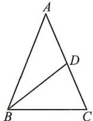

(1) $x+\frac{1}{2}x=9,\therefore x=6.$

∵三角形的周长为 $9+15=24$ (cm)，

∴三边长分别为 $6 \, cm, 6 \, cm, 12 \, cm.$

$\because 6+6=12$ , 不符合三角形的三边关系, $\therefore$ 舍去;

(2) $x+\frac{1}{2}x=15,\therefore x=10.$ ∵三角形的周长为24cm,

∴三边长分别为 $10 \, cm, 10 \, cm, 4 \, cm.$

综上所述,这个等腰三角形的底边长为4cm.

5. 解: 如图, 点 G, 线段 BF 即为所求.

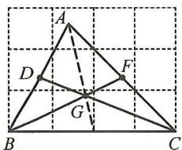

6. 解: (1) ∵ △BDE 与四边形 ACDE 的周长相等,

$\therefore BD+DE+BE=AC+AE+CD+DE.$

$\because BD=DC,\therefore BE=AE+AC.$

设 $AE = x$ cm，则 $BE = (10 - x)$ cm.

由题意, 得 $10 - x = x + 6$ , 解得 x = 2, $\therefore AE = 2 \, cm$ ;

(2)图中共有8条线段,它们的和为 $AE+EB+AB+AC+$

$DE + BD + CD + BC = 2AB + AC + 2BC + DE,$

$\therefore 2AB + AC + 2BC + DE = 53.$

$\because AB=10\ cm, AC=6\ cm,$

$\therefore 2BC + DE = 53 - (2AB + AC) = 53 - (2 \times 10 + 6) = 27(\text{cm})$

$\therefore BC + \frac{1}{2} DE = 13.5(\text{cm})$

# 板块三 与三角形有关的线段(三)三角形的高

# 典例精讲

【例 1】解: 如图, AM, CN 即为所求作的高.

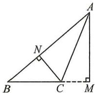

【例 2】证明：∵ $S_{\triangle ABC}=\frac{1}{2}AB\cdot CH=\frac{1}{2}BC\cdot AG$

$AB = 2, BC = 4$

$$
\therefore \frac {1}{2} \times 2 C H = \frac {1}{2} \times 4 A G,
$$

$$
\therefore C H = 2 A G.
$$

# 实战演练

1. 解: 连接 AD. $\because S_{\triangle ABD} + S_{\triangle ACD} = S_{\triangle ABC}$ ,

$\therefore \frac{1}{2} AB \cdot DE + \frac{1}{2} AC \cdot DF = \frac{1}{2} AB \cdot CH.$

$\because AB = AC, \therefore \frac{1}{2} AB (DE + DF) = \frac{1}{2} AB \cdot CH,$

$\therefore DE+DF=CH=8.$

2. 解: ①如图 1, 当高 AD 在 $\triangle ABC$ 的内部时,

$$
\angle B A C = \angle B A D + \angle C A D = 7 0 ^ {\circ} + 2 0 ^ {\circ} = 9 0 ^ {\circ};
$$

②如图2，当高AD在△ABC的外部时，

$$
\angle B A C = \angle B A D - \angle C A D = 7 0 ^ {\circ} - 2 0 ^ {\circ} = 5 0 ^ {\circ}.
$$

综上所述， $\angle BAC$ 的度数为 $90^{\circ}$ 或 $50^{\circ}$ .

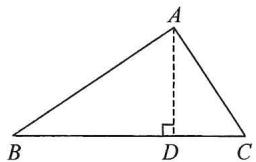  
图1

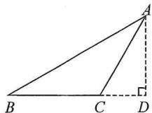  
图2

# 板块四 与三角形有关的线段(四)

# 面积转化与面积法

# 典例精讲

【例 1】4 解：∵AD∥BC，∴ $S_{\triangle ABC}=S_{\triangle DBC}$ ，

$$
\therefore S _ {\triangle A B C} - S _ {\triangle O B C} = S _ {\triangle D B C} - S _ {\triangle O B C},
$$

即 $S_{\triangle ABO} = S_{\triangle DCO}, \therefore S_{\triangle BOC} = 2S_{\triangle AOB} = 2S_{\triangle COD}$

$$
\therefore O B = 2 O D, \therefore O D = \frac {1}{3} B D = 4.
$$

【例2】3 解： $S_{\text{四边形} CDFE} - S_{\triangle ABF} = S_{\triangle BCE} - S_{\triangle ABD} =$

$$
\frac {1}{2} S _ {\triangle A B C} - \frac {1}{3} S _ {\triangle A B C} = 9 - 6 = 3.
$$

# 实战演练

解:(1)连接 AC, ∵ $\angle ABC = \angle BCD = 90^{\circ}$ ,

$$
\therefore A B \parallel C D, \therefore S _ {\triangle A C B} = S _ {\triangle A D B},
$$

$$
\therefore S _ {\triangle A C E} = S _ {\triangle B D E} = 6,
$$

$$
\therefore S _ {\triangle A C E} = \frac {1}{2} C E \times 6 = 6, \therefore C E = 2;
$$

(2) $\because BC=5,CE=2,\therefore BE=5-2=3,$

$$
\therefore S _ {\triangle B D E} = \frac {1}{2} B E \cdot C D = \frac {1}{2} \times 3 C D = 6,
$$

$$
\therefore C D = 4, \therefore S _ {\triangle C D E} = \frac {1}{2} C E \cdot C D = \frac {1}{2} \times 2 \times 4 = 4.
$$

# 第2讲 与三角形有关的角

# 板块一 三角形的内角和

# 典例精讲

【例 1】解：∵∠ABC=∠C，

$$
\therefore \angle A B C = \frac {1}{2} (1 8 0 ^ {\circ} - \angle A) = \frac {1}{2} \times (1 8 0 ^ {\circ} - 1 0 0 ^ {\circ}) = 4 0 ^ {\circ}.
$$

∵BD 是∠ABC 的平分线，

$$
\therefore \angle D B E = \frac {1}{2} \angle A B C = \frac {1}{2} \times 4 0 ^ {\circ} = 2 0 ^ {\circ}.
$$

$$
\because \angle B D E = \angle B E D,
$$

$$
\therefore \angle B E D = \frac {1}{2} (1 8 0 ^ {\circ} - \angle D B E) = \frac {1}{2} \times (1 8 0 ^ {\circ} - 2 0 ^ {\circ}) =
$$

$$
8 0 ^ {\circ},
$$

$$
\therefore \angle D E C = 1 8 0 ^ {\circ} - \angle B E D = 1 8 0 ^ {\circ} - 8 0 ^ {\circ} = 1 0 0 ^ {\circ}.
$$

【例 2】解:(1) $\because\angle A+\angle ABC+\angle ACB=180^{\circ},\angle A=50^{\circ},$

$$
\angle A B C = \angle C,
$$

$$
\therefore 5 0 ^ {\circ} + 2 \angle C = 1 8 0 ^ {\circ}, \therefore \angle C = 6 5 ^ {\circ}.
$$

∵ BD 是高, ∴ $\angle BDC = 90^{\circ}$ ,

$$
\therefore \angle C B D = 9 0 ^ {\circ} - \angle C = 2 5 ^ {\circ};
$$

(2)由(1)，得 $\alpha+2\angle C=180^{\circ},\therefore\angle C=90^{\circ}-\frac{1}{2}\alpha,$

所以，原分式方程的解为 $x = \frac{a - 3}{a - 2}$

(2)方程两边同乘 $(x+1)(x-1)$ ，得

$$
m = x - 1. \text { 解得 } x = m + 1.
$$

检验: 当 $x=m+1$ 时, $(x+1)(x-1)=(m+2)m$ .

$$
\because m \neq 0, \text {且} m \neq - 2, \therefore (m + 2) m \neq 0,
$$

所以,原分式方程的解为 $x=m+1$ .

# 实战演练

解:(1)方程两边同乘 $2(2x+1)(2x-1)$ , 得

$$
2 (x + 1) = 6 (2 x - 1) - 4 (2 x + 1). \text { 解得 } x = 6.
$$

检验: 当 x=6 时, $2(2x+1)(2x-1) \neq 0$ .

所以,原分式方程的解为 x=6;

(2)方程两边同乘 $(x-2)$ ，得 $mx=4+x-2$ ，

$$
\text { 整理 }, \text { 得 } (m - 1) x = 2, \because m \neq 1, \therefore x = \frac {2}{m - 1},
$$

检验: 当 $x=\frac{2}{m-1}$ 时, $x-2=\frac{2}{m-1}-2\neq0$ ,

所以,原分式方程的解为 $x=\frac{2}{m-1}$ .

# 板块二 含参方程的解的讨论

# 典例精讲

【例1】解：去分母，得 $3(x - 1) + 6x = x + m$ ，解得 $x =$

$$
\frac {m + 3}{8}, \because \text { 分式方程有解 }, \therefore \frac {m + 3}{8} \neq 0 \text {   且   } \frac {m + 3}{8} \neq 1,
$$

$$
\therefore m \neq - 3 \text {   且   } m \neq 5.
$$

【例 2】2 解: 去分母, 整理, 得 $(a-3)x=2a-4$ ,

∵原分式方程有增根，

$$
\therefore x = 0 \text {或} x = 2 \text {且} a \neq 3, \text {当} x = 0 \text {时}, a = 2;
$$

当 x=2 时, a 不存在; $\therefore a$ 的值为 2.

【例 3】解: 去分母, 得 $2(x+2)+mx=x-1$ , 整理, 得 $(m+$

$$
1) x = - 5, \because \text { 方程无解 }, \therefore \text { 当 } x = 1 \text { 时 }, m + 1 = - 5,
$$

$$
\therefore m = - 6; \text {   当   } x = - 2 \text {   时,   } - 2 (m + 1) = - 5, \therefore m =
$$

$$
\frac {3}{2}; \text {当} m + 1 = 0 \text {时}, m = - 1, \therefore \text {满足条件的} m \text {的值}
$$

$$
\text {   为   } \frac {3}{2} \text {   或   } - 6 \text {   或   } - 1.
$$

# 实战演练

1. 解: 去分母, 得 $3x - 2 - 2(x + 1) = m$ , 解得 $x = m + 4$ ,

∵分式方程无解，∴ $m+4=-1$ ，∴m=-5.

2. 解: 去分母, 得 $mx - 8 = 2(x - 2)$ ,

整理，得 $(m - 2)x = 4$

∵分式方程有解，∴ $m\neq2$ .∴ $x=\frac{4}{m-2}$ 且 $x\neq0$ ，且 $x\neq2$ ，

即 $\frac{4}{m - 2} \neq 0$ 且 $\frac{4}{m - 2} \neq 2, \therefore m \neq 4$ 且 $m \neq 2$ .

# 板块三 解为 0, 正数、负数

# 典例精讲

【例 1】解: 去分母, 得 $(x+1)(a+5)=(x-2)(2a-3)$ , 整

理,得 $(a-8)x=5a-1$ ,

∵方程的解为 $x=0,\therefore5a-1=0,\therefore a=\frac{1}{5}.$

【例 2】解: 去分母, 整理, 得 $x=\frac{2-a}{3}$ , ∵ 原方程的解为正数,

$$
\therefore \left\{ \begin{array}{l l} x > 0, \\ x \neq 2, \end{array} \right. \text {解得} a <   2 \text {且} a \neq - 4.
$$

【例 3】解: 去分母, 得 5x = k - 3, 解得 $x = \frac{k - 3}{5}$ , ∵ 原方程的

解为负数，∴ $\left\{\begin{aligned}x&<0,\\ x&+3\neq0,\end{aligned}\right.$ 即 $\left\{\begin{aligned}\frac{k-3}{5}&<0,\\ \frac{k-3}{5}&+3\neq0,\end{aligned}\right.$

$$
\therefore k <   3 \text {   且   } k \neq - 1 2.
$$

# 实战演练

1. $k < 3$ 且 $k \neq 1$ 解：去分母，整理，得 $x = \frac{k - 3}{2}$ ， $\because$ 原方程的

解为负数，∴ $\left\{\begin{aligned}x&<0,\\ x&\neq-1,\end{aligned}\right.$ 解得 k<3 且 $k\neq1$ .

2. 解: 去分母, 得 $2x - m = 3x + 3$ , 解得 x = -m - 3,

∵方程的解为正数，∴-m-3>0. 解得 m<-3.

3. 解: 去分母, 得 $6 - 2x + 2 = ax$ , $\therefore (a + 2)x = 8$ , 当 $a + 2 \neq 0$

时，解得 $x = \frac{8}{a + 2}$ ，∵分式方程有正数解，∴ $a + 2 > 0$

$\frac{8}{a+2}\neq0$ 且 $\frac{8}{a+2}\neq1.\therefore a>-2$ 且 $a\neq6.$

# 板块四 实际问题与分式方程(一) 行程问题

# 典例精讲

【例】解:设前1小时行驶的速度为x km/h,依题意,得

$$
\frac {1 8 0 - x}{x} - \frac {1 8 0 - x}{1 . 5 x} = \frac {2}{3},
$$

解得 x=60，经检验，x=60 是原方程的解，

答:前 1 小时行驶的速度为 60 km/h.

# 实战演练

1. 解: 设公共汽车的速度是 x km/h, 由题意, 得 $\frac{80}{x} - 3 +$

$\frac{1}{3}=\frac{80}{3x}$ ，解得 x=20，经检验 x=20 是原方程的解，且符合题意.

答:公共汽车的速度是 20 km/h, 小汽车的速度是 60 km/h.

2. 解: (1) $\frac{1200}{x}-\frac{1200}{x+v}=\frac{1200v}{x(x+v)}$

(2)设提速前列车平均速度为 x km/h, 依题意, 得 $\frac{1200}{x+50} = \frac{4}{5} \times \frac{1200}{x}$ , 解得 x = 200,

经检验，x=200 是原方程的解，且符合题意；

(3)设提速前列车平均速度为 x km/h, 依题意, 得 $\frac{s}{x}=$

$\frac{s+30}{x+v}$ ，解得 $x=\frac{sv}{30}$ ，经检验， $x=\frac{sv}{30}$ 是原方程的解，且符合题意.

# 板块五 实际问题与分式方程(二) 工程问题

# 典例精讲

【例】解:设甲单独完成工程需 x 天,则乙单独完成工程需

$(x + 3)$ 天，根据题意，得 $\left(\frac{1}{x} +\frac{1}{x + 3}\right)\times 2 + \frac{1}{x + 3}$

$(x-2)=1$ , 解得 x=6. 经检验, x=6 是原方程的解.

答:甲单独完成工程需6天,乙单独完成工程需9天.

# 实战演练

1. 解: 设 B 型机器人每小时搬 x kg 材料, 由题意, 得 $\frac{100}{x+30}=$

$$
\therefore a = 1, \therefore \text {   原式   } = \frac {1 - 3}{1 + 3} = - \frac {1}{2}.
$$

# 实战演练

1. 解: 原式 $=\frac{1}{x+1}+\frac{x-3}{(x-3)^{2}}\cdot\frac{x-3}{x(x+1)}=\frac{1}{x+1}+\frac{1}{x(x+1)}$

$$
= \frac {x + 1}{x (x + 1)} = \frac {1}{x}.
$$

$$
\text {   当   } x = - \frac {3}{2} \text {   时,   原式   } = \frac {1}{- \frac {3}{2}} = - \frac {2}{3}.
$$

2. 解: 原式= $\frac{a-1+3}{a-1}\cdot\frac{a-1}{(a-2)(a+2)}$

$$
= \frac {a + 2}{a - 1} \cdot \frac {a - 1}{(a - 2) (a + 2)} = \frac {1}{a - 2}.
$$

当 $a = 1$ 或2时，分式无意义，故当 $a = -1$ 时，

$$
\text {   原式   } = - \frac {1}{3}, \text {   当   } a = 0 \text {   时,   原式   } = - \frac {1}{2}.
$$

3. 解：原式 $= \left(\frac{3x + y}{x^2 - y^2} -\frac{2x}{x^2 - y^2}\right)\div \frac{2}{x^2y - xy^2} =$

$$
\frac {3 x + y - 2 x}{(x - y) (x + y)} \cdot \frac {x y (x - y)}{2} = \frac {x + y}{(x - y) (x + y)}.
$$

$$
\frac {x y (x - y)}{2} = \frac {x y}{2}.
$$

∵当 x=-2,y=1 时，∴原式=-1.

4. 解: 原式 = $\frac{x(x-1)}{2x-1} \cdot \frac{1}{x(x-1)} \cdot \frac{(2x+1)(2x-1)}{x^{2}} =$

$$
\frac {2 x + 1}{x ^ {2}}. \because x ^ {2} - 2 x - 1 = 0, \therefore 2 x + 1 = x ^ {2}, \therefore \text {原式} = \frac {x ^ {2}}{x ^ {2}} = 1.
$$

5. 解: 原式= $\frac{x^{2}y^{2}}{(x-y)^{4}}\cdot\frac{(x-y)^{2}}{x^{2}y^{4}}\cdot(x-y)^{3}y^{3}$

$$
= y (x - y) = x y - y ^ {2}.
$$

当 $x = -2, y = 4$ 时，原式 $= -2 \times 4 - 4^2 = -24$ .

# 板块五 实际问题与分式

# 典例精讲

【例1】解：“丰收1号”小麦试验田的单位面积产量 $= \frac{500}{(a + 1)(a - 1)}$ ，“丰收2号”小麦试验田的单位面积

$$
\mathrm{产量} = \frac {5 0 0}{(a - 1) ^ {2}}, \because a + 1 > a - 1, \therefore \frac {5 0 0}{(a + 1) (a - 1)} <
$$

$$
\frac {5 0 0}{(a - 1) ^ {2}}, \because “ \mathrm{丰收} 2 \mathrm{号} ” \mathrm{小麦试验田的单位面积产量}
$$

$$
\text { 高. } \because \frac {5 0 0}{(a - 1) ^ {2}} \div \frac {5 0 0}{(a + 1) (a - 1)} = \frac {a + 1}{a - 1},
$$

∴高的单位面积产量是低的单位面积产量的 $\frac{a+1}{a-1}$ 倍.

【例 2】解: 设方案一所用时间为 t h, 则总路程为 $\frac{t}{2}(m+n)$ ,

$$
\text { 则方案二所用时间为 } T = \frac {t}{4 m} (m + n) + \frac {t}{4 n} (m + n),
$$

$$
\text { 则 } T - t = \frac {t}{4 m} (m + n) + \frac {t}{4 n} (m + n) - t = (\frac {m + n}{4 m} +
$$

$$
\frac {m + n}{4 n} - 1) t = \frac {(m - n) ^ {2}}{4 m n} t.
$$

当 m=n 时, T=t, 即同时到达;

当 $m \neq n$ 时，∴ T > t，∴ 方案一更快.

# 实战演练

1. 证明: 甲图中阴影部分面积是 $a^{2}-b^{2}$ ，乙图中阴影部分的

面积是 $a^2 - ab$

$$
\therefore k = \frac {a ^ {2} - b ^ {2}}{a ^ {2} - a b} = \frac {(a + b) (a - b)}{a (a - b)} = \frac {a + b}{a} = 1 + \frac {b}{a}.
$$

$$
\because a > b > 0, \therefore 0 <   \frac {b}{a} <   1. \therefore 1 <   1 + \frac {b}{a} <   2, \text {   即   } 1 <   k <   2.
$$

2. 解: (1) 甲筐水果的单价为 $\frac{50}{(x-2)^{2}}$ ，乙筐水果的单价为

$$
\frac {5 0}{x ^ {2} - 4}. \because 0 <   (x - 2) ^ {2} <   (x + 2) (x - 2), \therefore \frac {5 0}{x ^ {2} - 4} <
$$

$\frac{50}{(x-2)^{2}}.$ 答:乙筐水果的单价低;

(2) $\frac{50}{(x-2)^{2}}\div\frac{50}{x^{2}-4}=\frac{50}{(x-2)^{2}}\cdot\frac{(x+2)(x-2)}{50}=\frac{x+2}{x-2}.$

答:高的单价是低的单价的 $\frac{x+2}{x-2}$ 倍.

3. 解: (1) 甲地单产量为 $\frac{100}{(a-1)^{2}}$ kg/m $^{2}$ ，乙地单产量为 $\frac{100}{a^{2}-1}$

$$
\mathrm {kg/ m^ {2}}; \because \frac {1 0 0}{(a - 1) ^ {2}} \div \frac {1 0 0}{a ^ {2} - 1} = \frac {(a + 1) (a - 1)}{(a - 1) ^ {2}} = \frac {a + 1}{a - 1} > 1,
$$

∴甲地单产量高；

(2) $\frac{100}{(a - 1)^2} - \frac{100}{a^2 - 1} = \frac{100(a + 1) - 100(a - 1)}{(a - 1)^2(a + 1)} =$

$$
\frac {2 0 0}{(a - 1) ^ {2} (a + 1)} \mathrm{kg} / \mathrm{m} ^ {2},
$$

∴高的单产量比低的单产量多 $\frac{200}{(a-1)^{2}(a+1)}\mathrm{kg/m^{2}}$ .

4. 解: (1) ∵ 两次大米的价格分别为每千克 a 元和 b 元 ( $a \neq b$ ). 甲每次买 100 千克大米, 乙每次买 100 元大米, ∴ 甲两

次购买大米共需付款 $100(a+b)$ 元，乙两次共购买 $\left(\frac{100}{a}+\right.$

$\frac{100}{b}$ )千克大米；∵甲两次购买大米的平均单价为每千克

$Q_{1}$ 元, 乙两次购买大米的平均单价为每千克 $Q_{2}$ 元,

$$
\therefore Q _ {1} = \frac {a + b}{2}, Q _ {2} = 2 0 0 \div (\frac {1 0 0}{a} + \frac {1 0 0}{b}) = \frac {2 a b}{a + b};
$$

(2) $\because Q_{1}-Q_{2}=\frac{a+b}{2}-\frac{2ab}{a+b}=\frac{(a-b)^{2}}{2(a+b)}>0,$

$\therefore Q_{1}>Q_{2}$ ，即乙更合理.

# 第 33 讲 分式方程及实际应用

# 板块一 解分式方程

# 典例精讲

【例 1】解:(1)方程两边同乘 $(2x+1)$ ,得

$4-(2x+1)=x.$ 解得 x=1.

检验: 当 x=1 时, $2x+1 \neq 0$ .

所以,原分式方程的解为 x=1;

(2) 解: 方程两边同乘 $x(x+1)(x-1)$ , 得

$2(x+1)+3(x-1)=4x$ . 解得 x=1.

检验: 当 x=1 时, $x(x+1)(x-1)=0$ .

所以，原分式方程无解.

【例 2】解:(1)方程两边同乘(x-1),得

$1 + a(x - 1) = 2x - 2.$

整理得 $(a - 2)x = a - 3.$

$$
\because a \neq 2, \therefore a - 2 \neq 0, \therefore x = \frac {a - 3}{a - 2}
$$

检验: 当 $x=\frac{a-3}{a-2}$ 时, $x-1\neq0$ .

$$
\therefore \angle C B D = 9 0 ^ {\circ} - \angle C = \frac {1}{2} \alpha .
$$

# 实战演练

1. 解： $\because \angle 1 = \angle 2, \angle BAC = \angle BAP + \angle 2 = 65^{\circ}$ ，

$$
\therefore \angle B A P + \angle 1 = 6 5 ^ {\circ}.
$$

$$
\because \angle 1 + \angle B A P + \angle P = 1 8 0 ^ {\circ},
$$

$$
\therefore 6 5 ^ {\circ} + \angle P = 1 8 0 ^ {\circ}, \therefore \angle A P B = 1 1 5 ^ {\circ}.
$$

2. 解： $\because \angle ACB = 90^{\circ}, \angle B = 45^{\circ}$ ，

$$
\therefore \angle B A C = 9 0 ^ {\circ} - \angle B = 4 5 ^ {\circ},
$$

$$
\because \angle B A D = 2 \angle C A D, \therefore \angle C A D = \frac {1}{3} \angle B A C = 1 5 ^ {\circ}.
$$

$$
\because E F \perp A D,
$$

$$
\therefore \angle D F E = \angle A C D = 9 0 ^ {\circ},
$$

$$
\therefore \angle E + \angle A D C = \angle C A D + \angle A D C,
$$

$$
\therefore \angle E = \angle C A D = 1 5 ^ {\circ}.
$$

# 板块二 三角形的外角

# 典例精讲

【例 1】解：∵ $\angle A = 20^{\circ}, \angle C = 50^{\circ}$ ,

$$
\therefore \angle A E B = \angle A + \angle C = 7 0 ^ {\circ}.
$$

$$
\because \angle B = 4 0 ^ {\circ},
$$

$$
\therefore \angle A D B = \angle A E B + \angle B = 7 0 ^ {\circ} + 4 0 ^ {\circ} = 1 1 0 ^ {\circ}.
$$

【例 2】解：∵ AC ⊥ DE，∴ ∠APE = 90°.

$$
\because \angle 1 \text {   是   } \triangle A E P \text {   的外角,   } \therefore \angle 1 = \angle A + \angle A P E.
$$

$$
\because \angle A = 2 0 ^ {\circ}, \therefore \angle 1 = 2 0 ^ {\circ} + 9 0 ^ {\circ} = 1 1 0 ^ {\circ}.
$$

$$
\mathrm{在} \triangle B D E \mathrm{中}, \angle 1 + \angle D + \angle B = 1 8 0 ^ {\circ},
$$

$$
\because \angle B = 2 7 ^ {\circ},
$$

$$
\therefore \angle D = 1 8 0 ^ {\circ} - 1 1 0 ^ {\circ} - 2 7 ^ {\circ} = 4 3 ^ {\circ}.
$$

# 实战演练

1. ${18}^{ \circ  }$

2. 解: $\angle1+\angle2=90^{\circ}+\angle CED+90^{\circ}+\angle CDE$

$$
= 1 8 0 ^ {\circ} + (\angle C E D + \angle C D E)
$$

$$
= 1 8 0 ^ {\circ} + 9 0 ^ {\circ}
$$

$$
= 2 7 0 ^ {\circ}.
$$

3. 解: $\because AD$ 是 $\triangle ABC$ 的角平分线, $\angle BAC = 60^\circ$ ,

$$
\therefore \angle B A D = 3 0 ^ {\circ},
$$

又∵CE是△ABC的高，∠BCE=45°，

$$
\therefore \angle B = 4 5 ^ {\circ},
$$

$$
\therefore \angle A D C = \angle B A D + \angle B = 3 0 ^ {\circ} + 4 5 ^ {\circ} = 7 5 ^ {\circ}.
$$

# 板块三 综合与实践——折叠求角

1. 解: 设 $\angle AEF = \angle A'EF = x$ ,

$$
\angle A F E = \angle A ^ {\prime} F E = y,
$$

$$
\therefore \angle 1 + \angle 2 = (1 8 0 ^ {\circ} - 2 x) + (1 8 0 ^ {\circ} - 2 y) = 3 6 0 ^ {\circ} - 2 x - 2 y.
$$

$$
\because \angle B = 8 0 ^ {\circ}, \angle C = 7 0 ^ {\circ},
$$

$$
\therefore \angle A = 3 0 ^ {\circ},
$$

$$
\therefore x + y = 1 5 0 ^ {\circ},
$$

$$
\therefore \angle 1 + \angle 2 = 3 6 0 ^ {\circ} - 2 \times 1 5 0 ^ {\circ} = 6 0 ^ {\circ}.
$$

2. 解: 根据翻折的性质, $\angle ADE = \frac{1}{2}(180^{\circ} - \angle 1)$ ,

$$
\angle A E D = \frac {1}{2} (1 8 0 ^ {\circ} + \angle 2),
$$

$$
\because \angle A + \angle A D E + \angle A E D = 1 8 0 ^ {\circ},
$$

$$
\therefore \angle A + \frac {1}{2} (1 8 0 ^ {\circ} - \angle 1) + \frac {1}{2} (1 8 0 ^ {\circ} + \angle 2) = 1 8 0 ^ {\circ},
$$

整理, 得 $2 \angle A = \angle 1 - \angle 2$ .

3. 解: 设 $\angle MEB = \angle MEB' = x$ ,

$$
\angle N F C = \angle N F C ^ {\prime} = y,
$$

$$
\therefore 2 x + \angle 1 = 1 8 0 ^ {\circ}, 2 y + \angle 2 = 1 8 0 ^ {\circ},
$$

$$
\therefore 2 x + 2 y + \angle 1 + \angle 2 = 3 6 0 ^ {\circ},
$$

$$
\because \angle 1 + \angle 2 = 9 0 ^ {\circ},
$$

$$
\therefore 2 x + 2 y = 3 6 0 ^ {\circ} - 9 0 ^ {\circ} = 2 7 0 ^ {\circ},
$$

$$
\therefore x + y = 1 3 5 ^ {\circ},
$$

$$
\because \angle A E F = \angle M E B = x, \angle A F E = \angle N F C = y,
$$

$$
\therefore \angle A E F + \angle A F E = x + y = 1 3 5 ^ {\circ},
$$

$$
\because \angle A + \angle A E F + \angle A F E = 1 8 0 ^ {\circ},
$$

$$
\therefore \angle A = 1 8 0 ^ {\circ} - 1 3 5 ^ {\circ} = 4 5 ^ {\circ}.
$$

# 第 3 讲 常用导角模型

# 板块一 七个基本导角模型

1. 解: 连接 CE.

则可得 $\angle FCE + \angle FEC = \angle A + \angle B$

$$
\therefore \angle F C D + \angle D + \angle D E F - \angle A - \angle B =
$$

$$
\angle D C E + \angle D + \angle D E C = 1 8 0 ^ {\circ}.
$$

2. 解: $\because \angle BDE = \angle AED + \angle A$ ,

$$
\angle C E D = \angle A D E + \angle A,
$$

$$
\therefore \angle B D E + \angle C E D = \angle A D E + \angle A E D + 2 \angle A = 1 8 0 ^ {\circ} +
$$

$$
\angle A = 1 8 0 ^ {\circ} + 6 5 ^ {\circ} = 2 4 5 ^ {\circ}.
$$

3. $140^{\circ}$ 解: 由风筝模型知 $\angle1 + \angle2 = \angle A + \angle D = 70^{\circ} + 70^{\circ} = 140^{\circ}$ .

4. $40^{\circ}$ 解: 由模型知 $\angle A + \angle B + \angle ACD = \angle D$

$$
\therefore \angle A C D = \angle D - \angle A - \angle B = 6 0 ^ {\circ} - 2 0 ^ {\circ} = 4 0 ^ {\circ},
$$

$$
\because C E \text {   平分   } \angle A C D,
$$

$$
\therefore \angle E C D = \frac {1}{2} \angle A C D = 2 0 ^ {\circ},
$$

$$
\text { 又 } \because \angle B E C + \angle B + \angle E C D = \angle D,
$$

$$
\therefore \angle D - \angle B E C = \angle B + \angle E C D = 2 0 ^ {\circ} + 2 0 ^ {\circ} = 4 0 ^ {\circ}.
$$

5. 证明: 延长 FE, BC 交于点 G.

$$
\because \angle F = \angle D = 9 0 ^ {\circ}, A F \parallel B C,
$$

$$
\therefore \angle G = \angle D = 9 0 ^ {\circ},
$$

$$
\therefore \angle D E G = \angle D C G,
$$

$$
\therefore \angle D E F = \angle B C D.
$$

6. 证明：(1) 连接 BD. ∵∠B = ∠D = 90°,

$$
\therefore \angle D A B + \angle B C D = 1 8 0 ^ {\circ},
$$

$$
\therefore \angle D C G = \angle D A B,
$$

$$
\because A E \text {   平分   } \angle D A B, \therefore \angle D A B = 2 \angle D A E,
$$

$$
\therefore \angle E C G = 2 \angle D A E;
$$

$$
(2) \because \angle B = \angle D = 9 0 ^ {\circ},
$$

$$
\therefore \angle D A E + \angle A E D = \angle E A B + \angle G = 9 0 ^ {\circ},
$$

$$
\because A E \text {   平分   } \angle D A B, \therefore \angle D A E = \angle E A B,
$$

$$
\therefore \angle A E D = \angle G, \text {又} \because \angle A E D = \angle C E G, \therefore \angle C E G = \angle G.
$$

7. 解: $\because \angle BPF = \angle BPC + \angle CPF = \angle B + \angle BEP$ ,

$$
\angle B E P = \angle B P C,
$$

$$
\therefore \angle C P F = \angle B = 3 7 ^ {\circ},
$$

同理可得 $\angle BPE = \angle C = 25^{\circ}$

$$
\therefore \angle B P C = 1 8 0 ^ {\circ} - \angle B P C - \angle C P F = 1 8 0 ^ {\circ} - 2 5 ^ {\circ} - 3 7 ^ {\circ} =
$$

$$
1 1 8 ^ {\circ}, \text {易知} \angle B P C = \angle A + \angle B + \angle C,
$$

$$
\therefore \angle A = 1 1 8 ^ {\circ} - 2 5 ^ {\circ} - 3 7 ^ {\circ} = 5 6 ^ {\circ}.
$$

8. 证明: 由 $\angle A = \angle BEC$ 可得 $\angle CED = \angle ABE$ ,

∵ BE 平分∠ABC，

$$
\therefore \angle A B E = \angle C B E,
$$

$$
\therefore \angle C E D = \angle C B E,
$$

$$
\text { 又 } \because \angle D = \angle B E C,
$$

$$
\angle C B E + \angle B E C + \angle B C E = \angle C E D + \angle D + \angle D C E = 1 8 0 ^ {\circ},
$$

$$
\therefore \angle B C E = \angle D C E, \therefore C E \text {   平分   } \angle B C D.
$$

# 板块二 五大双角平分线夹角模型(一) 识模

模型 1

证明：∵BP 平分∠ABC, CP 平分∠ACB,

$$
\therefore \angle P B C = \frac {1}{2} \angle A B C, \angle P C B = \frac {1}{2} \angle A C B,
$$

$$
\angle P = 1 8 0 ^ {\circ} - (\angle P B C + \angle P C B)
$$

$$
= 1 8 0 ^ {\circ} - \frac {1}{2} (\angle A B C + \angle A C B)
$$

$$
= 1 8 0 ^ {\circ} - \frac {1}{2} (1 8 0 ^ {\circ} - \angle A)
$$

$$
= 9 0 ^ {\circ} + \frac {1}{2} \angle A.
$$

模型 2

证明：∵BP 平分∠DBC, CP 平分∠ECB,

$$
\therefore \angle P B C = \frac {1}{2} \angle D B C = \frac {1}{2} (\angle A + \angle A C B),
$$

$$
\angle P C B = \frac {1}{2} \angle B C E = \frac {1}{2} (\angle A + \angle A B C),
$$

$$
\therefore \angle P B C + \angle P C B = \frac {1}{2} (\angle A + \angle A C B + \angle A B C) +
$$

$$
\frac {1}{2} \angle A = \frac {1}{2} \times 1 8 0 ^ {\circ} + \frac {1}{2} \angle A = 9 0 ^ {\circ} + \frac {1}{2} \angle A,
$$

$$
\angle P = 1 8 0 ^ {\circ} - (\angle P B C + \angle P C B)
$$

$$
= 1 8 0 ^ {\circ} - \left(9 0 ^ {\circ} + \frac {1}{2} \angle A\right)
$$

$$
= 9 0 ^ {\circ} - \frac {1}{2} \angle A.
$$

模型 3

证明：∵PB 平分∠ABC,PC 平分∠ACD,

$$
\therefore \angle P B C = \frac {1}{2} \angle A B C, \angle P C D = \frac {1}{2} \angle A C D,
$$

$$
\therefore \angle P = \angle P C D - \angle P B C
$$

$$
= \frac {1}{2} (\angle A C D - \angle A B C)
$$

$$
= \frac {1}{2} \angle A.
$$

模型 4

证明：∵AP 平分∠BAD, CP 平分∠BCD,

$$
\therefore \text {   可设   } \angle P A B = \angle P A D = x, \angle P C B = \angle P C D = y,
$$

设 PC 与 AD 交于点 E，

$$
\text { 则 } \angle P + \angle P A D = \angle D + \angle P C D = \angle P E D,
$$

即 $\angle P + x = \angle D + y$ ①，

同理可得 $\angle P + y = \angle B + x$ ②，

$$
\text {   由   } ① + ②, \text {   得   } 2 \angle P + x + y = \angle B + \angle D + x + y,
$$

$$
\therefore \angle P = \frac {1}{2} (\angle B + \angle D).
$$

模型 5

证明：∵BP 平分∠ABD, CP 平分∠ACD,

$$
\therefore \text {   可设   } \angle P B A = \angle P B D = x, \angle P C A = \angle P C D = y.
$$

延长 BP 交 AC 于点 E，

$$
\text { 则 } \angle B P C = \angle P E C + \angle P C A = \angle A + \angle P B A +
$$

∠PCA，

$$
\therefore \angle B P C = \angle A + x + y ①,
$$

同理可得 $\angle D = \angle PBD + \angle PCD + \angle BPC$

$$
\text { 即 } \angle D = \angle B P C + x + y ②,
$$

$$
\text {   由   } \textcircled {1} - \textcircled {2}, \text {   得   } \angle B P C - \angle D = \angle A - \angle B P C,
$$

$$
\therefore \angle B P C = \frac {1}{2} (\angle A + \angle D).
$$

证明：∵AP 平分∠BAC, DP 平分∠BDC,

$$
\therefore \text {   可设   } \angle P A B = \angle P A C = x, \angle P D B = \angle P D C = y.
$$

设 $PA$ 与 $CD$ 交于点 $E$ ,

$$
\text { 则 } \angle P E C = \angle P + \angle P D C = \angle C + \angle P A C,
$$

$$
\text { 即 } \angle P + y = \angle C + x ①,
$$

延长 PD 交 AB 于点 F，

$$
\mathrm{可得} \angle P D B = \angle B + \angle P F B = \angle B + \angle P + \angle P A B,
$$

$$
\text { 即 } \angle B + \angle P + x = y ②,
$$

$$
\text {   由   } ① + ②, \text {   得   } 2 \angle P + \angle B + x + y = \angle C + x + y,
$$

$$
\therefore \angle P = \frac {1}{2} (\angle C - \angle B).
$$

# 板块三 五大双角平分线夹角模型(二)用模

# 典例精讲

【例 1】解：(1) $\angle BO_{1}C=180^{\circ}-\frac{1}{3}(\angle ABC+\angle ACB)=$

$$
1 8 0 ^ {\circ} - \frac {1}{3} (1 8 0 ^ {\circ} - \angle A) = 1 2 0 ^ {\circ} + \frac {1}{3} \angle A = 1 4 0 ^ {\circ};
$$

同理可得 $\angle BO_{2}C = 180^{\circ} - \frac{2}{3}(180^{\circ} - \angle A) = 60^{\circ} +$

$$
\frac {2}{3} \angle A = 1 0 0 ^ {\circ};
$$

(2) $\because \angle O_{1}BO_{2} = \angle BO_{1}C - \angle O_{2} = 125^{\circ} - 110^{\circ} =$

$15^{\circ}, BO_{1}, BO_{2}$ 是 $\angle ABC$ 的三等分线，

$$
\therefore \angle C B O _ {1} = \angle O _ {1} B O _ {2} = 1 5 ^ {\circ}, \angle A B C = 3 \angle O _ {1} B O _ {2} =
$$

$$
4 5 ^ {\circ}, \therefore \angle B C O _ {1} = 1 8 0 ^ {\circ} - 1 5 ^ {\circ} - 1 2 5 ^ {\circ} = 4 0 ^ {\circ},
$$

$$
\because C O _ {1} \text {   平分   } \angle A C B, \therefore \angle A C B = 2 \angle B C O _ {1} = 8 0 ^ {\circ},
$$

$$
\therefore \angle A = 1 8 0 ^ {\circ} - 4 5 ^ {\circ} - 8 0 ^ {\circ} = 5 5 ^ {\circ}.
$$

【例 2】解: BP 平分 $\angle OBA$ , AD 平分 $\angle BAx$ ,

$$
\therefore \angle P B A = \frac {1}{2} \angle O B A, \angle B A D = \frac {1}{2} \angle B A x,
$$

$$
\therefore \angle P = \angle B A D - \angle P B A = \frac {1}{2} (\angle B A x - \angle O B A) =
$$

$$
\frac {1}{2} \angle B O A = \frac {1}{2} \times 9 0 ^ {\circ} = 4 5 ^ {\circ}.
$$

【例 3】 $70^{\circ}$ 解：∵ $\angle C = \angle COA, \angle BDC = \angle BOD,$

$$
\angle A O C = \angle B O D,
$$

$$
\therefore \angle C = \angle A O C = \angle B O D = \angle B D O,
$$

$$
\therefore \angle B = \angle C A O,
$$

$$
\mathrm{设} \angle C = \angle A O C = \angle B O D = \angle B D O = x  ,
$$

$$
\angle C A P = \angle P A B = y, \angle P = z, \text {则} \angle B = 2 y,
$$

$$
\text {则有} \left\{ \begin{array}{l l} 2 x + 2 y = 1 8 0 ^ {\circ}, \\ x + y = z + \frac {1}{2} x, \\ x + z + 2 y = 1 6 5 ^ {\circ}, \end{array} \right. \text {解得} \left\{ \begin{array}{l l} x = 7 0 ^ {\circ}, \\ y = 2 0 ^ {\circ}, \\ z = 5 5 ^ {\circ}, \end{array} \right.
$$

$$
\therefore \angle C = 7 0 ^ {\circ}. \text {   故答案为   } 7 0 ^ {\circ}.
$$

【例 4】证明：∵BM 平分∠ABC, DN 平分∠ADC,

$$
\therefore \angle A B M = \angle C B M, \angle A D N = \angle C D N,
$$

$$
\text { 设 } \angle A B M = \angle C B M = x, \angle A = \angle C = y.
$$

# 实战演练

解:(1)原式= $\frac{b^{2}}{-27a^{3}}\cdot\frac{9a}{2b}\cdot\frac{3ab}{b^{4}}=-\frac{1}{2ab^{2}}$ ;

(2) 原式 $= (a - b)b \cdot \frac{ab}{a - b} = ab^2$ ;

(3): 原式 $= (x + 3)(x - 3) \cdot \frac{x}{3 - x} \cdot \frac{1}{x(x + 3)} = -1$ ;

(4) 原式 $= \frac{a - 1}{a + 2} \cdot \frac{(a + 2)(a - 2)}{(a - 1)^2} \cdot (a + 1)(a - 1)$

$$
= (a - 2) (a + 1) = a ^ {2} - a - 2;
$$

(5) 原式 $= \frac{(4 + a)(4 - a)}{(4 + a)^2} \cdot \frac{2(4 + a)}{a - 4} \cdot \frac{a - 2}{a + 2}$

$$
= \frac {2 (2 - a)}{a + 2} = \frac {4 - 2 a}{a + 2};
$$

(6) 原式 $= \frac{(a + b)^2}{(a - b)^2} \cdot \frac{7(a - b)}{6(a + b)} \cdot \frac{(a + b)(a - b)}{ab}$

$$
= \frac {7 (a + b) ^ {2}}{6 a b} = \frac {7 a ^ {2} + 1 4 a b + 7 b ^ {2}}{6 a b}.
$$

# 板块二 分式的加减

# 典例精讲

【例 1】解:(1)原式= $\frac{1}{a-1}+\frac{2a}{a-1}-\frac{3a}{a-1}$

$$
= \frac {1 + 2 a - 3 a}{a - 1} = \frac {1 - a}{a - 1} = - 1;
$$

(2) 原式 $= \frac{n + 3}{m^2 - n^2} - \frac{m + 3}{m^2 - n^2}$

$$
= \frac {n - m}{m ^ {2} - n ^ {2}} = - \frac {1}{m + n}.
$$

【例 2】解:(1) 原式= $\frac{3(x-3)+(x+3)-6}{2(x+3)(x-3)}$

$$
= \frac {4 x - 1 2}{2 (x + 3) (x - 3)} = \frac {2}{x + 3};
$$

(2) 原式 $= \frac{2xy + x(x - y) + y(x + y)}{(x + y)(x - y)}$

$$
= \frac {2 x y + x ^ {2} - x y + y x + y ^ {2}}{(x + y) (x - y)}
$$

$$
= \frac {(x + y) ^ {2}}{(x + y) (x - y)} = \frac {x + y}{x - y}.
$$

【例 3】解:(1) 原式= $\frac{x^{2}}{x+1}+\frac{(-x+1)(x+1)}{x+1}$

$$
= \frac {x ^ {2} + 1 - x ^ {2}}{x + 1} = \frac {1}{x + 1};
$$

(2) 原式 $= \frac{(x + 2)^2}{x + 2} - \frac{x^2 + 4}{x + 2} = \frac{4x}{x + 2}$ .

# 实战演练

解:(1)原式= $a+2+\frac{4}{a-2}=\frac{a^{2}-4+4}{a-2}=\frac{a^{2}}{a-2}$ ;

(2) 原式 $= \frac{a^2 + b^2}{a - b} - \frac{(a + b)(a - b)}{a - b}$

$$
= \frac {a ^ {2} + b ^ {2} - a ^ {2} + b ^ {2}}{a - b} = \frac {2 b ^ {2}}{a - b};
$$

(3) 原式 $= \frac{m^2 - mn + mn + n^2 - m^2}{(m + n)(m - n)} = \frac{n^2}{(m + n)(m - n)};$

(4) 原式= $\frac{2(x-3)-2(x+3)+2x+18}{(x+3)(x-3)}$

$$
= \frac {2 x + 6}{(x + 3) (x - 3)} = \frac {2}{x - 3}.
$$

# 板块三 分式的混合运算

# 典例精讲

【例 1】解:(1)原式= $-1+1+9=9$ ;

$$
(2) \text {   原式   } = 4 m ^ {4} n ^ {- 6} \cdot (- 1) ^ {- 2} m ^ {- 2} n ^ {- 4} \div (- 2) ^ {3} m ^ {- 3} n ^ {- 6}
$$

$$
= 4 \times 1 \times (- \frac {1}{8}) m ^ {5} n ^ {- 4} = - \frac {m ^ {5}}{2 n ^ {4}}.
$$

【例 2】解: 原式 = $\left[\frac{4m+5}{m+1}+\frac{(m-1)(m+1)}{m+1}\right]\cdot\frac{m+1}{m+2}=$

$$
\frac {m ^ {2} + 4 m + 4}{m + 1} \cdot \frac {m + 1}{m + 2} = \frac {(m + 2) ^ {2}}{m + 1} \cdot \frac {m + 1}{m + 2} = m + 2.
$$

# 实战演练

1. 解: (1) 原式 $= -1 + 1 - \frac{1}{8} \times 4 = -1 + 1 - \frac{1}{2} = -\frac{1}{2}$ ;

(2) 原式 $= 16a^{4}b^{2}c^{-2} \cdot \frac{1}{8} a^{-3}b^{-6}c^{-3} \div b^{-2}c^{-6} = \frac{2ac}{b^{2}}.$

2. 解: (1) 原式= $\left(\frac{3a}{a^{2}-1}-\frac{1}{a-1}\right)\div\frac{2a-1}{a+1}$

$$
= \frac {3 a - (a + 1)}{(a + 1) (a - 1)} \cdot \frac {a + 1}{2 a - 1}
$$

$$
= \frac {2 a - 1}{a - 1} \cdot \frac {1}{2 a - 1}
$$

$$
= \frac {1}{a - 1};
$$

(2) 原式 $= \frac{a^2 + 3a - 4}{a + 3} \cdot \frac{2(a + 3)}{(a - 1)^2}$

$$
= \frac {(a + 4) (a - 1)}{a + 3} \cdot \frac {2 (a + 3)}{(a - 1) ^ {2}} = \frac {2 a + 8}{a - 1};
$$

(3) 原式 $= \frac{a - 3}{2(a - 2)} \div \frac{5 - a^2 + 4}{a - 2}$

$$
= \frac {a - 3}{2 (a - 2)} \cdot \frac {a - 2}{(3 - a) (3 + a)} = - \frac {1}{2 a + 6};
$$

(4) 原式= $\frac{2(3-m)}{(m-3)^{2}}\div\frac{m+3-m+3}{(m+3)(m-3)}$

$$
= \frac {2 (3 - m)}{(m - 3) ^ {2}} \cdot \frac {(m + 3) (m - 3)}{6} = - \frac {m + 3}{3}.
$$

# 板块四 分式的化简求值

# 典例精讲

【例1】解：原式 $= \frac{x + 1 - 1}{x + 1}\cdot \frac{(x + 1)^2}{x} = \frac{x}{x + 1}\cdot \frac{(x + 1)^2}{x} = x + 1.$

$$
\text { 当 } x = 2 \text { 时 }, \text { 原式 } = 2 + 1 = 3.
$$

【例 2】解: 原式= $(a+b)(a-b)(a^{2}+b^{2})\cdot\frac{ab}{a^{2}+b^{2}}\cdot\frac{1}{a-b}=$

$$
a b (a + b). \text {   当   } a + b = 3, a b = 1 \text {   时,   原式   } = 1 \times 3 = 3.
$$

【例 3】解: 原式= $\left[\frac{2x}{(x+1)x}-\frac{x+1}{(x+1)x}\right]\cdot\frac{(x+1)^{2}}{x(x-1)}$

$$
= \frac {x - 1}{(x + 1) x} \cdot \frac {(x + 1) ^ {2}}{x (x - 1)} = \frac {x + 1}{x ^ {2}}.
$$

$$
\because x ^ {2} - x - 1 = 0, \therefore x + 1 = x ^ {2}, \therefore \text {   原式   } = \frac {x ^ {2}}{x ^ {2}} = 1.
$$

【例 4】解：原式 $=\frac{(a-3)^{2}}{a-2}\div\frac{4-a^{2}+5}{2-a}=\frac{(a-3)^{2}}{a-2}$

$$
\frac {2 - a}{(3 - a) (3 + a)} = \frac {(a - 3) ^ {2}}{a - 2} \cdot \frac {a - 2}{(a - 3) (a + 3)} =
$$

$$
\frac {a - 3}{a + 3}. \because \frac {a - 1}{2} \leqslant 1, \text { 解得 } a \leqslant 3, \because a \text { 是使不等式 } \frac {a - 1}{2} \leqslant
$$

$$
1 \text { 成立的正整数,且 } a - 2 \neq 0, a - 3 \neq 0,
$$

$$
\because S _ {\triangle C D G} = \frac {1}{2} C D \cdot D G = \frac {1}{2} a b = 7, \therefore a b = 1 4,
$$

$$
\begin{array}{l} \therefore (a + b) ^ {2} = a ^ {2} + 2 a b + b ^ {2} = a ^ {2} - a b + b ^ {2} + 3 a b = 2 2 + 3 \times \\ 1 4 = 6 4, \end{array}
$$

$$
\therefore a + b = 8 \text {或} - 8 (\text {舍去}), \therefore C E = 8.
$$

# 第十八章 分式

# 第 31 讲 分式的概念及性质

# 板块一 分式有意义的条件

# 典例精讲

【例 1】解:(1) $x\neq\pm1$ ;(2)x为全体实数;(3) $x\neq3$ .

【例 2】C 解：∵ 分式 $\frac{|a|-2}{a^{2}+a-6}$ 的值为零，

$$
\therefore \left\{ \begin{array}{l l} | a | - 2 = 0, \\ a ^ {2} + a - 6 \neq 0, \end{array} \right. \text {解得} a = - 2, \text {故选C.}
$$

【例 3】解:(1)∵1>0,∴由除法法则,得 $x+1<0,\therefore x<-1$ ;

$$
(2) \because x ^ {2} + 1 > 0, \therefore x - 5 <   0, \therefore x <   5;
$$

(3) $\because$ 分式 $\frac{x}{x + 1}$ 的值为正数, 由除法法则, 得 $\left\{ \begin{array}{l} x > 0, \\ x + 1 > 0 \end{array} \right.$ 或 $\left\{ \begin{array}{l} x < 0, \\ x + 1 < 0, \end{array} \right.$ 解得 $x > 0$ 或 $x < -1$ ,

$$
\therefore x \text {   的取值范围是   } x > 0 \text {   或   } x <   - 1;
$$

(4)由题意,得 $\left\{\begin{aligned}x-1&>0,\\ x&-2<0\end{aligned}\right.$ 或 $\left\{\begin{aligned}x&-1<0,\\ x&-2&>0,\end{aligned}\right.$ 解得1<x<

2, $\therefore x$ 的取值范围是 1 < x < 2.

# 实战演练

1. $x \neq 0$ 且 $x \neq 2$ $x = \pm 2$

2. $x < -\frac{1}{2}$ 当 $x < 1$ 且 $x \neq 0$ $x \geqslant 5$ 或 $x < -2$

3. 解：∵ x = -2 时，分式无意义，∴ $-2 + a = 0$ ，∴ a = 2，

$\because x=4$ 时, 分式值为 0,

$$
\therefore 4 - b = 0, \therefore b = 4, \therefore a + b = 2 + 4 = 6.
$$

4. 解: (1) 由题意, 得 $\left\{\begin{aligned} x^{2}-1&=0, \\ x+1&\neq0,\end{aligned}\right.$ $\therefore x=1;$

(2)由题意,得 $\left\{\begin{aligned}|x|-2&=0,\\ x+2&\neq0,\end{aligned}\right.$ $\therefore x=2;$

(3)由题意,得 $|x|-5=0$ 且 $x^{2}-4x-5\neq0$ ,

$$
\therefore \left\{ \begin{array}{l} | x | - 5 = 0, \\ (x - 5) (x + 1) \neq 0, \end{array} \right. \therefore x = - 5.
$$

5. 解: (1) $x \neq -1$ ; (2) $x \neq 0$ ; (3) 全体实数;

$$
x ^ {2} - 2 x + 1 = (x - 1) ^ {2} \neq 0, \therefore x \neq 1. \tag {4}
$$

$$
\because x ^ {2} - 6 x + 1 0 = x ^ {2} - 6 x + 9 + 1 = (x - 3) ^ {2} + 1 > 0 \neq 0, \tag {5}
$$

∴无论 x 为何值, 分母 $x^{2}-6x+10$ 不为 0, 该分式总有意义;

$$
\because x ^ {2} + 4 x + 4 + m - 4 = (x + 2) ^ {2} + (m - 4), \tag {6}
$$

∴当 m-4>0 即 m>4 时， $x^{2}+4x+m>0$ . 原分式总有意义.

# 板块二 分式的基本性质

# 典例精讲

【例1】D 【例2】A

【例 3】解:(1) 原式= $-\frac{4ab^{2}\cdot6b}{4ab^{2}}=-6b$ ;

(2) 原式= $\frac{a-2b}{a+2b}$ ;

(3) 原式= $\frac{1}{x-2y}$ .

【例 4】 $12(x-y)x^{2}y$

【例 5】解：(1) $\frac{8a^{3}c}{10a^{2}b^{2}c^{2}},\frac{3bc^{3}}{10a^{2}b^{2}c^{2}},-\frac{50ab^{3}}{10a^{2}b^{2}c^{2}};$

$$
\frac {(x + 1) (x - 1)}{2 (x + 1) ^ {2} (x - 1)}, \frac {6 (x + 1)}{2 (x + 1) ^ {2} (x - 1)}, \tag {2}
$$

$$
\frac {2 x (x - 1)}{2 (x + 1) ^ {2} (x - 1)}.
$$

【例6】解： $\because \frac{a}{b} = \frac{1}{2},\frac{b}{c} = \frac{3}{2},$

$$
\therefore a: b: c = 3: 6: 4, \text {设} a = 3 k, b = 6 k, c = 4 k,
$$

$$
\therefore \text {   原式   } = \frac {(a + b) c}{a ^ {2} + b ^ {2}} = \frac {9 k \cdot 4 k}{9 k ^ {2} + 3 6 k ^ {2}} = \frac {3 6 k ^ {2}}{4 5 k ^ {2}} = \frac {4}{5}.
$$

# 实战演练

1. (1) $\frac{3a + 4b}{3a - 4b}$ ; (2) $\frac{25x - 35y}{15x + y}$ .

2. A 3. $(a + b)(a - b)$

4. 解: (1) 原式= $\frac{2b^{2}xy}{3}$ ; (2) 原式=- $\frac{x}{y}$ ;

(3) 原式= $\frac{2b+a}{2b-a}$ ; (4) 原式= $\frac{1}{2(x-y)}$ .

5. 解: (1) 它们的最简公分母是 $30a^{2}b^{3}c^{2}$ ,

$$
\therefore \frac {b}{3 a ^ {2} c ^ {2}} = \frac {1 0 b ^ {4}}{3 0 a ^ {2} b ^ {3} c ^ {2}}, \frac {c}{- 2 a b} = - \frac {1 5 a b ^ {2} c ^ {3}}{3 0 a ^ {2} b ^ {3} c ^ {2}},
$$

$$
\frac {a}{5 c b ^ {3}} = \frac {6 a ^ {3} c}{3 0 a ^ {2} b ^ {3} c ^ {2}};
$$

(2)它们的最简公分母是 $x(x - 1)^2$

$$
\therefore \frac {1}{x ^ {2} - x} = \frac {x - 1}{x (x - 1) ^ {2}}, \frac {1}{x ^ {2} - 2 x + 1} = \frac {x}{x (x - 1) ^ {2}}.
$$

6. 解: (1) 设 $x = 2k, y = 3k, z = 4k$ , 原式 $= \frac{2k - 3k}{6k + 4k} = -\frac{1}{10}$ .

(2) 原式= $\frac{11xy}{xy}=11.$

(3)设 $\frac{x+y}{z}=\frac{z+y}{x}=\frac{x+z}{y}=k$ ,

$$
\therefore x + y = k z, y + z = x k, x + z = y k,
$$

$$
\therefore 2 (x + y + z) = k (x + y + z),
$$

$$
\because x + y + z \neq 0,
$$

$$
\therefore k = 2,
$$

∴原式= $k^{3}=8$ .

# 第 32 讲 分式的运算

# 板块一 分式的乘除与乘方

# 典例精讲

【例1】解：(1)原式 $= \frac{6y^2}{x}\cdot \frac{3x^2}{2y}\cdot \frac{-x^3}{6y^3} = -\frac{3x^4}{2y^2};$

(2) 原式= $\frac{1}{m^{2}n^{3}}$ .

【例 2】解:(1)原式= $\frac{x-2}{x+3}\cdot\frac{1}{3-x}\cdot\frac{(x-3)(x+3)}{(x-2)^{2}}$

$$
= \frac {1}{2 - x};
$$

(2) 原式 $= \frac{(x + 1)(x - 1)}{(x - 1)^2} \cdot \frac{x - 1}{x(x + 1)} \cdot \frac{(x + 1)(x + 2)}{1}$

$$
= \frac {(x + 1) (x + 2)}{x} = \frac {x ^ {2} + 3 x + 2}{x}.
$$

易知 $\angle ADC = \angle A + \angle C + \angle ABC = 2x + 2y$

$$
\therefore \angle C D N = \frac {1}{2} \angle A D C = x + y,
$$

$$
\because \angle C E M = \angle C B M + \angle C = x + y,
$$

$$
\therefore \angle C D N = \angle C E M, \therefore B M / / D N.
$$

【例 5】解： $\angle C=90^{\circ}-\frac{1}{2}\angle AOB=90^{\circ}-\frac{1}{2}\times90^{\circ}=45^{\circ}$

# 实战演练

1. 解: 设 $\angle ABP = \angle DBP = x, \angle ACP = \angle DCP = y,$

易证 $\angle A + \angle ABP = \angle ACP + \angle P$

$$
\therefore x + 9 0 ^ {\circ} = y + \angle P \quad ①, \text {同理} y + 9 0 ^ {\circ} = \angle P + x \quad ②,
$$

$$
① + ② \text {   得   } x + y + 1 8 0 ^ {\circ} = 2 \angle P + x + y, \therefore \angle P = 9 0 ^ {\circ}.
$$

2. 证明：∵ BP 平分 ∠ABC, CP 平分 ∠ACB,

则可得 $\angle BPC = 90^{\circ} + \frac{1}{2}\angle A$

$$
\because \angle A M N = \angle A N M,
$$

$$
\therefore \angle A M N = \angle A N M = \frac {1}{2} (1 8 0 ^ {\circ} - \angle A) = 9 0 ^ {\circ} - \frac {1}{2} \angle A,
$$

$$
\therefore \angle B M N = \angle C N M = 1 8 0 ^ {\circ} - (9 0 ^ {\circ} - \frac {1}{2} \angle A) = 9 0 ^ {\circ} +
$$

$$
\frac {1}{2} \angle A,
$$

$$
\therefore \angle B P C = \angle B M N = \angle C N M.
$$

3. 解: $\because BF$ 平分 $\angle ABC, CF$ 平分 $\angle DCE$ ,

$$
\therefore \angle A B F = \angle C B F, \angle D C F = \angle E C F,
$$

设 $\angle ABF = \angle CBF = x$

$$
\mathrm{易知} \angle A D C = \angle A + \angle A B C + \angle B C D,
$$

$$
\therefore 6 0 ^ {\circ} + \angle A B C + \angle B C D = 1 5 0 ^ {\circ}, \therefore \angle B C D = 9 0 ^ {\circ} - 2 x,
$$

$$
\therefore \angle D C E = 1 8 0 ^ {\circ} - \angle B C D = 9 0 ^ {\circ} + 2 x,
$$

$$
\therefore \angle F C E = \frac {1}{2} \angle D C E = 4 5 ^ {\circ} + x,
$$

$$
\therefore \angle F = \angle F C E - \angle C B F = 4 5 ^ {\circ} + x - x = 4 5 ^ {\circ}.
$$

# 板块四 高与角平分线夹角模型

类型 1

证明：∵AD平分∠BAC，

$$
\therefore \angle B A D = \frac {1}{2} \angle B A C = \frac {1}{2} (1 8 0 ^ {\circ} - \angle B - \angle C) = 9 0 ^ {\circ}
$$

$$
- \frac {1}{2} (\angle B + \angle C),
$$

$$
\therefore \angle A D C = \angle B + \angle B A D = 9 0 ^ {\circ} + \frac {1}{2} (\angle B - \angle C).
$$

$$
\because A E \perp B C,
$$

$$
\therefore \angle D A E = 9 0 ^ {\circ} - \angle A D C
$$

$$
= 9 0 ^ {\circ} - \left[ 9 0 ^ {\circ} + \frac {1}{2} (\angle B - \angle C) \right]
$$

$$
= \frac {1}{2} (\angle C - \angle B).
$$

类型2

证明: 同上可得 $\angle PDE = \angle ADC = 90^{\circ} + \frac{1}{2} (\angle B - \angle C)$ ,

$$
\therefore \angle P = 9 0 ^ {\circ} - \angle P D E = 9 0 ^ {\circ} - \left[ 9 0 ^ {\circ} + \frac {1}{2} (\angle B - \angle C) \right]
$$

$$
= \frac {1}{2} (\angle C - \angle B).
$$

类型 3

证明: 同上可得 $\angle P = 90^{\circ} - \angle ADC$

$$
= 9 0 ^ {\circ} - \left[ 9 0 ^ {\circ} + \frac {1}{2} (\angle B - \angle C) \right]
$$

$$
= \frac {1}{2} (\angle C - \angle B).
$$

类型 4

证明：∵AD平分∠BAC，∴∠BAD=∠CAD，

$$
\because C E \text {   为高,   } \therefore \angle A E C = \angle A C B = 9 0 ^ {\circ},
$$

$$
\therefore \angle A F E + \angle B A D = \angle C A D + \angle A D C = 9 0 ^ {\circ},
$$

$$
\therefore \angle A F E = \angle C D F,
$$

$$
\because \angle C F D = \angle A F E,
$$

$$
\therefore \angle C D F = \angle C F D.
$$

# 第4讲 求角思想方法

# 板块一 思想方法(一) 方程思想

# 典例精讲

【例 1】解：∵BD 平分∠ABC，∴∠1=∠DBC，

$$
\text { 设 } \angle A = x, \text { 则 } \angle A B C = 2 x, \angle 2 = \angle C = 2 x,
$$

$$
\text {   在   } \triangle A B C \text {   中   }, x + 2 x + 2 x = 1 8 0 ^ {\circ}, x = 3 6 ^ {\circ},
$$

$$
\therefore \angle A = 3 6 ^ {\circ}.
$$

【例 2】解: 设 $\angle EDC = x, \angle B = \angle C = y$ ,

$$
\text { 则 } \angle A D E = \angle A E D = x + y,
$$

$$
\because \angle A D C = \angle 1 + \angle B,
$$

$$
\therefore x + y + x = 4 0 ^ {\circ} + y,
$$

$$
\therefore x = 2 0 ^ {\circ}.
$$

# 实战演练

1. 解: 设 $\angle C = 2x$ , 则 $\angle ADB = 3x$ ,

$$
\because B D \text {   平分   } \angle A B C, \angle A B C = 7 2 ^ {\circ},
$$

$$
\therefore \angle A B D = \angle C B D = 3 6 ^ {\circ},
$$

$$
\because \angle A D B = \angle D B C + \angle C, \therefore 3 x = 3 6 ^ {\circ} + 2 x,
$$

$$
\therefore x = 3 6 ^ {\circ}, \therefore \angle C = 7 2 ^ {\circ}, \angle A D B = 1 0 8 ^ {\circ},
$$

$$
\therefore \angle B A C = 1 8 0 ^ {\circ} - 7 2 ^ {\circ} - 7 2 ^ {\circ} = 3 6 ^ {\circ},
$$

$$
\because A E \perp B E, \therefore \angle E = 9 0 ^ {\circ},
$$

$$
\because \angle A D B = \angle E + \angle D A E, \therefore \angle D A E = 1 0 8 ^ {\circ} - 9 0 ^ {\circ} = 1 8 ^ {\circ}.
$$

2. 解: 设 $\angle B = \angle C = \angle ADE = x$ .

$$
\because \angle A D C = \angle A D E + \angle C D E = \angle B + \angle B A D,
$$

$$
\therefore \angle C D E = \angle B A D.
$$

$$
\text {设} \angle C D E = \angle B A D = y, \therefore \angle A E D = x + y,
$$

$$
\therefore \text {   在   } \triangle A D E \text {   中,   } 2 x + y + 2 0 ^ {\circ} = 1 8 0 ^ {\circ} \textcircled {1};
$$

$$
\text { 又 } \because \angle A E D - 3 \angle B A D = 2 0 ^ {\circ}, \therefore x + y - 3 y = 2 0 ^ {\circ} ②,
$$

$$
\text { 由①②可得 } x = 6 8 ^ {\circ}. \therefore \angle B = 6 8 ^ {\circ}.
$$

# 板块二 思想方法(二) 参数思想

# 典例精讲

【例 1】解：∵AE 平分∠DAC，

$$
\therefore \text { 设 } \angle D A E = \angle E A C = x, \because A D \perp B C,
$$

$$
\therefore \angle C = 9 0 ^ {\circ} - 2 x, \because \angle B A C = \angle B,
$$

$$
\therefore \angle B A C = \frac {1}{2} (1 8 0 ^ {\circ} - 9 0 ^ {\circ} + 2 x) = 4 5 ^ {\circ} + x,
$$

$$
\therefore \angle F A E = \angle B A C - \angle E A C = 4 5 ^ {\circ} + x - x = 4 5 ^ {\circ}.
$$

$$
\because E F \perp A B, \therefore \angle A E F = 9 0 ^ {\circ} - 4 5 ^ {\circ} = 4 5 ^ {\circ}.
$$

【例 2】解: $\angle CDE=\frac{1}{2}\angle BAD$ . 理由如下:

$$
\text { 设 } \angle B A D = x, \because \angle A D C \text {   是   } \triangle A B D \text {   的外角，   }
$$

$$
\therefore \angle A D C = \angle B + \angle B A D = 4 5 ^ {\circ} + x.
$$

$$
\because \angle A E D \text {   是   } \triangle C D E \text {   的外角，   }
$$

$$
\therefore \angle A E D = \angle C + \angle C D E.
$$

$$
\because \angle B = \angle C, \angle A D E = \angle A E D,
$$

$$
\therefore \angle A D C - \angle C D E = \angle C + \angle C D E,
$$

$$
\text { 即 } 4 5 ^ {\circ} + x - \angle C D E = 4 5 ^ {\circ} + \angle C D E,
$$

$$
\therefore \angle C D E = \frac {1}{2} x, \text { 即 } \angle C D E = \frac {1}{2} \angle B A D.
$$

# 实战演练

$$
\mathrm{解:(1)} \angle I = \frac {1}{2} (\angle A + \angle D) - 9 0 ^ {\circ},
$$

$$
\text { 设 } \angle A B I = \angle D B I = x, \angle A C I = \angle E C I = y,
$$

$$
\text { 则 } x + \angle A = y + \angle I ①,
$$

$$
\angle D = 2 x + 1 8 0 ^ {\circ} - 2 y + \angle A ②,
$$

$$
\text { 由①得 } x - y = \angle I - \angle A,
$$

$$
\text { 代入②中得 } \angle D = 2 \angle I - \angle A + 1 8 0 ^ {\circ},
$$

$$
\therefore \angle I = \frac {1}{2} (\angle A + \angle D) - 9 0 ^ {\circ};
$$

$$
(2) \angle I = 9 0 ^ {\circ} + \frac {1}{2} (\angle A - \angle D).
$$

$$
\text { 设 } \angle A B I = \angle D B I = x, \angle A C I = \angle E C I = y,
$$

$$
\text { 可得 } \angle A + x = \angle I + y, \text { 即 } x - y = \angle I - \angle A \quad ①;
$$

$$
\text { 连接 } A D, \text { 易得 } \angle A + 2 x + \angle B D C + 1 8 0 ^ {\circ} - 2 y = 3 6 0 ^ {\circ},
$$

$$
\text { 即 } x - y = 9 0 ^ {\circ} - \frac {1}{2} (\angle A + \angle D) \quad ②.
$$

$$
\text { 由①②,得 } \angle I = 9 0 ^ {\circ} + \frac {1}{2} (\angle A - \angle D).
$$

# 板块三 思想方法(三) 整体思想

# 典例精讲

【例】解:(1)连接AB,

$$
\begin{array}{l} \angle A + \angle B + \angle C + \angle D + \angle E = \angle E A B + \angle E B A + \\ \angle E = 1 8 0 ^ {\circ}; \end{array}
$$

$$
(2) 3 6 0 ^ {\circ}.
$$

$$
\text { 提示: } \angle A + \angle B + \angle C + \angle D + \angle E + \angle F = 2 (\angle 1 + \angle 2 + \angle 3) = 3 6 0 ^ {\circ}.
$$

# 实战演练

1. 解: ∵ BI 平分∠DBE, CI 平分∠DCF,

$$
\therefore \text {   可设   } \angle I B D = \angle I B E = x, \angle I C D = \angle I C F = y,
$$

$$
\text { 易得 } x + y = \angle I + \angle A ①, \angle D = 1 8 0 ^ {\circ} - 2 x + 1 8 0 ^ {\circ} - 2 y + \angle A ②,
$$

$$
\mathrm{将} \textcircled {1} \mathrm{代入} \textcircled {2} \mathrm{得} \angle D = 3 6 0 ^ {\circ} - 2 \angle A - 2 \angle I + \angle A,
$$

$$
\therefore \angle I = 1 8 0 ^ {\circ} - \frac {1}{2} (\angle A + \angle D) = 1 8 0 ^ {\circ} - \frac {1}{2} \times 1 6 0 ^ {\circ} = 1 0 0 ^ {\circ}.
$$

2. 解: (1) $240^{\circ}, 60^{\circ}$ ;

$$
(2) \angle A E D = \frac {1}{2} (\angle B + \angle C). \text { 理由如下: }
$$

在四边形 ABCD 中，

$$
\because \angle B A D + \angle C D A + \angle B + \angle C = 3 6 0 ^ {\circ},
$$

$$
\therefore \angle B A D + \angle C D A = 3 6 0 ^ {\circ} - (\angle B + \angle C),
$$

$$
\text { 又 } \because A E \text { 平分 } \angle B A D, D E \text { 平分 } \angle A D C,
$$

$$
\therefore \angle E A D = \frac {1}{2} \angle B A D, \angle E D A = \frac {1}{2} \angle A D C,
$$

$$
\begin{array}{l} \therefore \angle E A D + \angle E D A = \frac {1}{2} \angle B A D + \frac {1}{2} \angle A D C = \frac {1}{2} [ 3 6 0 ^ {\circ} - \\ (\angle B + \angle C) ], \end{array}
$$

$$
\text {   在   } \triangle A E D \text {   中,   } \angle A E D = 1 8 0 ^ {\circ} - (\angle E A D + \angle E D A) = 1 8 0 ^ {\circ} - \frac {1}{2} [ 3 6 0 ^ {\circ} - (\angle B + \angle C) ] = \frac {1}{2} (\angle B + \angle C).
$$

# 板块四 思想方法(四) 特殊到一般

# 典例精讲

【例】解:探究一:∵DP,CP分别平分∠ADC和∠ACD,

$$
\therefore \angle P D C = \frac {1}{2} \angle A D C, \angle P C D = \frac {1}{2} \angle A C D,
$$

$$
\therefore \angle P = 1 8 0 ^ {\circ} - \angle P D C - \angle P C D = 1 8 0 ^ {\circ} - \frac {1}{2} (\angle A D C +
$$

$$
\angle A C D) = 1 8 0 ^ {\circ} - \frac {1}{2} (1 8 0 ^ {\circ} - \angle A) = 9 0 ^ {\circ} + \frac {1}{2} \angle A;
$$

探究二:(1) $360^{\circ}$ ;

$$
(2) \angle P = 1 8 0 ^ {\circ} - \angle P D C - \angle P C D = 1 8 0 ^ {\circ} - \frac {1}{2} (\angle A D C
$$

$$
+ \angle B C D) = 1 8 0 ^ {\circ} - \frac {1}{2} (3 6 0 ^ {\circ} - \angle A - \angle B) = \frac {1}{2} (\angle A + \angle B).
$$

# 实战演练

解:(1)∵BD,CE是△ABC的角平分线,

$$
\therefore \angle 2 = \frac {1}{2} \angle A B C = \frac {1}{2} \times 4 0 ^ {\circ} = 2 0 ^ {\circ},
$$

$$
\therefore \angle F C B = \frac {1}{2} \angle A C B = \frac {1}{2} \times 6 0 ^ {\circ} = 3 0 ^ {\circ},
$$

$$
\because F H \perp B C, \therefore \angle 1 = 9 0 ^ {\circ} - 3 0 ^ {\circ} = 6 0 ^ {\circ},
$$

$$
\therefore \angle 1 - \angle 2 = 6 0 ^ {\circ} - 2 0 ^ {\circ} = 4 0 ^ {\circ};
$$

(2)∵BD,CE是△ABC的角平分线，

$$
\therefore \text { 设 } \angle 2 = \angle A B D = x, \angle B C E = \angle A C E = y,
$$

则 $\angle ABC = 2x, \angle ACB = 2y,$

$$
\because \angle A = 6 0 ^ {\circ}, \therefore 2 x + 2 y = 1 2 0 ^ {\circ}, \therefore x + y = 6 0 ^ {\circ},
$$

$$
\because F H \perp B C, \therefore \angle 1 = 9 0 ^ {\circ} - y,
$$

$$
\therefore \angle 1 - \angle 2 = 9 0 ^ {\circ} - y - x = 9 0 ^ {\circ} - 6 0 ^ {\circ} = 3 0 ^ {\circ};
$$

(3) 同(2) 设 $\angle2 = \angle ABD = x, \angle BCE = \angle ACE = y,$

则 $\angle ABC=2x,\angle ACB=2y$ ，

$$
\because \angle A = \alpha , \therefore 2 x + 2 y = 1 8 0 ^ {\circ} - \alpha ,
$$

$$
\therefore x + y = 9 0 ^ {\circ} - \frac {1}{2} \alpha ,
$$

$$
\because F H \perp B C, \therefore \angle 1 = 9 0 ^ {\circ} - y,
$$

$$
\therefore \angle 1 - \angle 2 = 9 0 ^ {\circ} - y - x = 9 0 ^ {\circ} - \left(9 0 ^ {\circ} - \frac {1}{2} \alpha\right) = \frac {1}{2} \alpha .
$$

# 板块五 思想方法(五) 分类讨论

# 典例精讲

【例】解:如图1,当 $\triangle ABC$ 为锐角三角形时,

$$
\angle D F E + \angle A = 1 8 0 ^ {\circ}, \because \angle A = 5 0 ^ {\circ}, \therefore \angle D F E = 1 3 0 ^ {\circ};
$$

如图 2, 图 3, 当 $\triangle ABC$ 为钝角三角形时,

$$
\angle D F E = \angle A = 5 0 ^ {\circ}.
$$

综上所述， $\angle DFE = 50^{\circ}$ 或 $130^{\circ}$ .

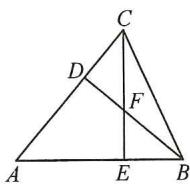  
图1

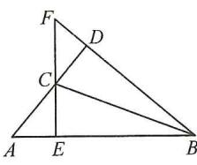  
图2

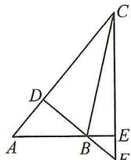  
图3

# 实战演练

1. 解: (1) 如图 1, 当 $\angle BAC$ 为锐角时, BD 在 $\triangle ABC$ 的内部, 此时, $\angle BAC = 90^{\circ} - \angle ABD = 90^{\circ} - 20^{\circ} = 70^{\circ}$ .

$$
\therefore \angle A C B = \angle A B C = \frac {1}{2} (1 8 0 ^ {\circ} - \angle B A C) = \frac {1}{2} (1 8 0 ^ {\circ} - 7 0 ^ {\circ}) =
$$

$$
(3) \text {   原式   } = (2 x + y) (3 x - 4 y);
$$

$$
(4) \text {   原式   } = (3 x - 4 y) (4 x - 3 y).
$$

3. 解: (1) 原式 = $(ax + 1)(x - a)$ ;

$$
(2) \text {原式} = (x ^ {2} - a ^ {2}) (x ^ {2} - 1)
$$

$$
= (x + a) (x - a) (x + 1) (x - 1).
$$

# 板块六 换元法

# 典例精讲

解:(1)令 $A=a+b$ ，则原式变为 $A(A-4)+4=A^{2}-4A+4=(A-2)^{2}$ ，故 $(a+b)(a+b-4)+4=(a+b-2)^{2}$ ;

$$
\begin{array}{l} (2) (n + 1) (n + 2) \left(n ^ {2} + 3 n\right) + 1 = \left(n ^ {2} + 3 n\right) [ (n + 1) (n + \\ \begin{array}{l} {2) ] + 1 = (n ^ {2} + 3 n) (n ^ {2} + 3 n + 2) + 1 = (n ^ {2} + 3 n) ^ {2} +} \\ {2 (n ^ {2} + 3 n) + 1 = (n ^ {2} + 3 n + 1) ^ {2},} \end{array} \\ \end{array}
$$

$\because n$ 为正整数， $\therefore n^{2}+3n+1$ 也为正整数，

∴代数式 $(n+1)(n+2)(n^{2}+3n)+1$ 的值一定是某一个整数的平方.

# 实战演练

1. 解: (1) 原式 = $(x^{2} + 3x)(x^{2} + 3x + 2) + 1$ , 设 $x^{2} + 3x = t$ ,

$$
\begin{array}{l} \text { 则原式 } = t (t + 2) + 1 = t ^ {2} + 2 t + 1 = (t + 1) ^ {2} \\ = (x ^ {2} + 3 x + 1) ^ {2}; \\ \end{array}
$$

(2) 原式= $(x^{2}-3x-10)(x^{2}-3x+2)+36$ , 设 $x^{2}-3x-4=t$ ,

$$
\text { 则原式 } = (t + 6) (t - 6) + 3 6 = t ^ {2} = (x ^ {2} - 3 x - 4) ^ {2}
$$

$$
= (x + 1) ^ {2} (x - 4) ^ {2}.
$$

2. 解: (1) 原式 = $(x-1)(x-2)(x+2)(x+3)$ ;

(2) 原式= $(x-1)^{2}(x+4)^{2}$ .

3. 解: (1) 原式 = $(2a + 3b - 6)(2a + 3b + 2)$ ;

(2) 原式 $= (x + 1)(x - 2)(x + 3)(x - 4)$ .

# 板块七 因式分解的应用

# 典例精讲

【例 1】解: $a^{3}b+ab^{3}=ab(a^{2}+b^{2})=ab[(a+b)^{2}-2ab]=-30.$

【例 2】解： $\because(2n+1)^{2}-(2n-1)^{2}=(2n+1+2n-1)(2n+$

$$
1 - 2 n + 1) = 4 n \times 2 = 8 n.
$$

∴多项式 $(2n+1)^{2}-(2n-1)^{2}$ 一定能被8整除.

【例 3】解： $\because(a-c)^{2}-b^{2}=(a-c+b)(a-c-b)$ .

$$
\because a, b, c \text {   是   } \triangle A B C \text {   的三边，   } \therefore a + b > c, b + c > a,
$$

$$
\therefore a + b - c > 0, a - c - b <   0.
$$

$$
\therefore (a - c + b) (a - c - b) <   0.
$$

$\therefore (a-c)^{2}-b^{2}$ 是负数.

# 实战演练

1. 解: $(x+2y)^{2}-(3x-y)^{2}=(4x+y)(-2x+3y)=-(4x+y)(2x-3y)=-100.$

2. 解： $\because a^{2}+b^{2}+2c^{2}=2ac+2bc$

$$
\therefore a ^ {2} + b ^ {2} + 2 c ^ {2} - 2 a c - 2 b c = 0. \therefore (a - c) ^ {2} + (b - c) ^ {2} = 0.
$$

$\therefore a=b=c.\therefore\triangle ABC$ 是等边三角形.

3. 证明： $\because (a^2 + b^2)^2 - 4a^2b^2 = (a^2 + b^2 + 2ab)(a^2 + b^2 - 2ab) = (a + b)^2(a - b)^2.$

$$
\text { 又 } \because a ^ {2} \neq b ^ {2}, \therefore a \neq b \text { 且 } a \neq - b, \therefore (a + b) ^ {2} (a - b) ^ {2} > 0.
$$

$\therefore (a^{2}+b^{2})^{2}-4a^{2}b^{2}$ 为正数.

# 第 30 讲 情境创新题

# 板块一 数学活动(课本变式)

【变式 1】解:(1)3;

(2)由题意,得 $M=10a+b$ , $N=10b+a$ ,

$$
\therefore M ^ {2} - N ^ {2} = (1 0 a + b) ^ {2} - (1 0 b + a) ^ {2}
$$

$$
= 1 0 0 a ^ {2} + 2 0 a b + b ^ {2} - 1 0 0 b ^ {2} - 2 0 a b - a ^ {2}
$$

$$
= 9 9 \left(a ^ {2} - b ^ {2}\right)
$$

$$
= (a - b) (a + b) \times 9 9;
$$

(3) $\because M^{2}-N^{2}$ 的结果恰好是一个整数的平方，

$\therefore (a-b)(a+b)\times99$ 是一个整数的平方.

$$
\because (a - b) (a + b) \times 9 9 = (a - b) (a + b) \times 1 1 \times 9,
$$

且 a, b 均为小于 10 的正整数，

$$
\therefore a - b = 1, a + b = 1 1 \text {, 解 得} a = 6, b = 5,
$$

$$
\therefore M = 6 5.
$$

【变式 2】解:(1) $\because x^{2}-16=(x+4)(x-4)$ ,

$$
\therefore \text {   当   } x = 1 5 \text {   时   }, x + 4 = 1 9, x - 4 = 1 1,
$$

∴锁屏密码为 1119 或 1911;

$$
(2) \because x ^ {3} - 9 x y ^ {2} = x (x ^ {2} - 9 y ^ {2}) = x (x + 3 y) (x - 3 y),
$$

$$
\therefore \text {   当   } x = 2 5, y = 2 \text {   时   }, x + 3 y = 3 1, x - 3 y = 1 9,
$$

∴ 锁屏密码为 192531 或 193125 或 253119 或 251931 或 312519 或 311925；

(3)由题意,得 $x^{3}+(m-3n)x^{2}-nx-21=(x-3)(x+1)(x+7)$ ,

$$
\therefore x ^ {3} + (m - 3 n) x ^ {2} - n x - 2 1 = x ^ {3} + 5 x ^ {2} - 1 7 x - 2 1,
$$

$$
\therefore \left\{ \begin{array}{l l} m - 3 n = 5, \\ n = 1 7, \end{array} \right. \text {解得} \left\{ \begin{array}{l l} m = 5 6, \\ n = 1 7. \end{array} \right.
$$

# 板块二 综合与实践

# 典例精讲

【例】解:(1)①由题意,得 $(x+y)^{2}=x^{2}+y^{2}+2xy$

$$
, \therefore x ^ {2} + y ^ {2} = (x + y) ^ {2} - 2 x y
$$

$$
= 6 ^ {2} - 2 \times 8
$$

$$
Ⓠ \Delta ,
$$

$$
\therefore (x - 1) ^ {2} + (5 - x) ^ {2} = a ^ {2} + b ^ {2} = (a + b) ^ {2} - 2 a b = 4 ^ {2} -
$$

$$
2 \times 3 = 1 0;
$$

(2)设三角板的两条直角边 AO=m, BO=n,

则一块三角板的面积为 $\frac{1}{2} mn$

$$
\therefore m + n = 1 4, \frac {1}{2} (m ^ {2} + n ^ {2}) = 5 4, \text {即} m ^ {2} + n ^ {2} = 1 0 8.
$$

$$
\because 2 m n = (m + n) ^ {2} - \left(m ^ {2} + n ^ {2}\right) = 1 4 ^ {2} - 1 0 8 = 8 8,
$$

$$
\therefore m n = 4 4,
$$

$\therefore\frac{1}{2}mn=\frac{1}{2}\times44=22,\therefore$ 一块三角板的面积是22.

# 实战演练

解:(1)设 x-2024=m, x-2025=n,

$$
\text { 则 } m - n = 1, m ^ {2} + n ^ {2} = 2 0 2 6,
$$

$$
(x - 2 0 2 4) (x - 2 0 2 5) = m n,
$$

$$
\therefore (m - n) ^ {2} = m ^ {2} - 2 m n + n ^ {2} = 1, \text {即} 2 0 2 6 - 2 m n = 1,
$$

$$
\therefore m n = \frac {2 0 2 5}{2}, \therefore (x - 2 0 2 4) (x - 2 0 2 5) = \frac {2 0 2 5}{2};
$$

(2)设正方形 ABCD 的边长为 a，正方形 DEFG 的边长为 b，则 $CE = a + b$ .

$$
\because S _ {\triangle A B G} = \frac {1}{2} A G \cdot A B = \frac {1}{2} (a - b) a,
$$

$$
S _ {\triangle E F G} = \frac {1}{2} E F \cdot F G = \frac {1}{2} b ^ {2},
$$

$$
\therefore S _ {\mathrm{阴影}} = S _ {\triangle A B G} + S _ {\triangle E F G} = \frac {1}{2} (a - b) a + \frac {1}{2} b ^ {2} = 1 1,
$$

整理, 得 $a^{2}-ab+b^{2}=22$ .

$$
\therefore (\sqrt {3 1}) ^ {2} - (x - y) ^ {2} = 4 \times 7,
$$

$$
\therefore (x - y) ^ {2} = 3, \therefore x - y = \pm \sqrt {3}.
$$

# 第十七章 因式分解

# 第29讲 因式分解

# 板块一 提公因式法

# 典例精讲

【例 1】(1) $3ax^{2}(4ax+2by-5c)$ ;

(2) $-2ab^{2}(2a^{2}b-3a+1)$

(3) $(3x - 2y)[2x - 3y - (2x + 3y)] = -6y(3x - 2y)$ .

【例 2】解:(1)原式= $(a-1)(1-b+b^{2})$ ;

(2) 原式 = $x(a-1)(x-1)$ ;

(3) 原式 = 2a(m-n)(2m-2n+1).

【例 3】解: $x^{2}y - xy^{2} = xy(x - y) = 6$ .

【例 4】解: 原式= $(x-y)(b-a+c)+(x-y)(b-a-c)=$

$$
(x - y) (b - a + c + b - a - c) = - 2 (x - y) (a - b)
$$

$$
\text { 当 } x - y = - 3, a - b = 2 \text {   时,   原式   } = 1 2.
$$

# 实战演练

1. 解: (1) 原式 = -2ab(3c + 7ab² - 6a²);

(2) 原式 $= (a^{2} + x^{2})(4x - 1)$ ;

(3) 原式 $= -3a^{2}(4a^{2} + 2a - 5)$ ;

(4) 原式 $= 3(a - b)(2a - b)$ .

2. 解: (1) 原式 = 25; (2) 原式 = $\frac{2023}{2025}$

# 板块二 平方差公式

# 典例精讲

【例 1】解:(1)原式= $(5m-n)(m-5n)$ ;

(2) 原式=4(a+c)(b+d);

(3) 原式 $= (3m - 2n + 5m - 6n)(3m - 2n - 5m + 6n)$

$$
= - 1 6 (m - n) (m - 2 n);
$$

(4) 原式= $(4a^{2}+1)(4a^{2}-1)$

$$
= (4 a ^ {2} + 1) (2 a + 1) (2 a - 1).
$$

【例 2】解:(1)原式= $xy(y^{2}-4)=xy(y+2)(y-2)$ ;

(2) 原式 $= (x - y)(a^2 - b^2)$

$$
= (x - y) (a + b) (a - b);
$$

(3) 原式 $= 2a^{2}(4b^{2} - 1)$

$$
= 2 a ^ {2} (2 b + 1) (2 b - 1).
$$

【例 3】解: $a^{2}-b^{2}-4b=(a+b)(a-b)-4b=2(a-b)=4.$

# 实战演练

1. 解: (1) 原式 = $(2y + 2z - x)(2y - 2z + x)$ ;

(2) 原式 $= (y + 3)(y - 3)(y^2 + 9)$ ;

(3) 原式 $= -\frac{1}{2} (4x^{2} - y^{2})$

$$
= - \frac {1}{2} (2 x + y) (2 x - y);
$$

(4) 原式= $(3x-2y+4y)(3x-2y-4y)$

$$
= 3 (x - 2 y) (3 x + 2 y).
$$

2. 解: (1) 原式 = $a(a + 3)(a - 3)$ ;

(2) 原式=3m(2x-y+n)(2x-y-n);

(3) 原式 $= (a - b)(b + 2)(b - 2)$ .

# 板块三 完全平方公式

# 典例精讲

【例 1】解:(1) 原式= $(3x-4y)^{2}$ ;

(2) 原式 $= (x^{2} + 4x + 4)^{2} = (x + 2)^{4}$ .

【例 2】解:(1)原式= $3a(x^{2}+2xy+y^{2})=3a(x+y)^{2}$ ;

$$
(2) \text {原式} = (x ^ {2} + x + x + 1) (x ^ {2} + x - x - 1)
$$

$$
= (x + 1) ^ {3} (x - 1);
$$

(3) 原式 $= (a - b)^{3}$ ;

(4) 原式 $= 9(m + n)^{2}$ .

【例 3】解： $a^{3}b+2a^{2}b^{2}+ab^{3}=ab(a^{2}+2ab+b^{2})=ab(a+b)^{2}=18.$

# 实战演练

1. 解: (1) 原式 $=(x+y-2)^{2}$ ; (2) 原式 $=(2-3x+3y)^{2}$ .

2. 解：(1) 原式 $= (c^{2} - a^{2} - b^{2} + 2ab)(c^{2} - a^{2} - b^{2} - 2ab)$

$$
= \left[ c ^ {2} - (a - b) ^ {2} \right] \left[ c ^ {2} - (a + b) ^ {2} \right]
$$

$$
= (c + a - b) (c - a + b) (c + a + b) (c - a - b);
$$

(2) 原式 $= (x^{2} + 4 - 4x)(x^{2} + 4 + 4x) = (x - 2)^{2}(x + 2)^{2}$ .

3. 解: (1) 原式 = $(202 + 98)^{2} = 300^{2} = 90\ 000$ ;

(2) 原式= $(184.5+15.5)^{2}=200^{2}=40\ 000.$

# 板块四 分组分解法

# 典例精讲

【例 1】解:(1)原式= $(x-3)(x-2y)$ ;

(2) 原式 $= (x + 3y)(x + 2)(x - 2)$ .

【例 2】解:(1) 原式 $=(a-b)^{2}-c^{2}=(a-b-c)(a-b+c)$ ;

(2) 原式 $= x^{2} - 4x + 4 - y^{2} = (x - 2)^{2} - y^{2}$

$$
= (x - 2 - y) (x - 2 + y);
$$

(3) 原式 $= 1^{2} - (x^{2} + y^{2} + 2xy)$

$$
= 1 ^ {2} - (x + y) ^ {2}
$$

$$
= (1 - x - y) (1 + x + y);
$$

(4) 原式 $= (3a + b - 2c)(3a - b + 2c)$ .

# 实战演练

1. 解: (1) 原式 = $(x - 2y)(x + 2y - 10)$ ;

(2) 原式 $= (x - y)(x - y - 5)$ .

2. 解:(1) 原式= $(x+y-z)(x-y+z)$ ;

(2) 原式 $= (x - 5 + 2y)(x - 5 - 2y)$ .

3. 解: $\triangle ABC$ 为等腰三角形. $\because b^{2}-c^{2}+2ab-2ac=0$ ,

$$
\therefore (b + c) (b - c) + 2 a (b - c) = 0, (b - c) (b + c + 2 a) = 0,
$$

$$
\because b + c + 2 a > 0,
$$

$$
\therefore b - c = 0, b = c,
$$

∴△ABC为等腰三角形.

# 板块五 十字相乘法

# 典例精讲

【例 1】解:(1)原式= $(x+2)(x+3)$ ;

(2) 原式 $= (x - 2)(x - 4)$ ;

(3) 原式 $= (x + y - 6)(x + y + 2)$ .

【例 2】解：(1) 原式 = (3a + 2)(a - 3);

(2) 原式 $= (5x - 3)(x + 3)$ ;

(3) 原式 $= (2x - 3y)(3x + 2y)$ .

【例 3】解： $(1)x^{2}-(b+1)x+b=(x-1)(x-b)$ ;

$$
(2) k x ^ {2} + (2 k - 3) x + k - 3 = (x + 1) (k x + k - 3);
$$

$$
(3) (m + 1) x ^ {2} - x - m = (x - 1) [ (m + 1) x + m ] =
$$

$$
(x - 1) (m x + x + m).
$$

# 实战演练

1. (1) $(y - 4)(y + 3)$ ; (2) $(y + 5)(y + 3)$ ;

$$
(3) (y + 8) (y - 2); (4) (x + 1) (x - 1) (x + 2) (x - 2).
$$

2. 解: (1) 原式 = $(3x + 1)(x - 3)$ ;

(2) 原式 = - (4x + 3)(3x - 5);

$55^{\circ}$ ;

(2)如图2,当 $\angle BAC$ 为钝角时,BD在 $\triangle ABC$ 的外部,此时, $\angle BAC=90^{\circ}+\angle ABD=90^{\circ}+20^{\circ}=110^{\circ}$ ,

$$
\begin{array}{r l} & {\therefore \angle A C B = \angle A B C = \frac {1}{2} (1 8 0 ^ {\circ} - \angle B A C) = \frac {1}{2} (1 8 0 ^ {\circ} -} \\ & {1 1 0 ^ {\circ}) = 3 5 ^ {\circ}.} \end{array}
$$

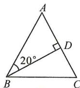  
图1

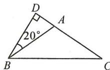  
图2

2. A 解: 如图 1, $\angle P = \beta + \gamma - \alpha$ ; 如图 2, $\angle P = \alpha + \gamma - \beta$ ; 如图 3, $\angle P = \gamma - \alpha - \beta$ . 故选 A.

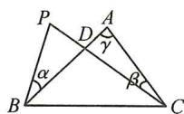  
图1

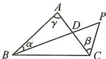  
图2

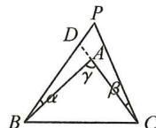  
图3

# 第5讲 情境创新题

# 板块一 数学活动(课本变式)

1. 解：(1)4，三棱锥；

(2)7,上下两个三棱锥.

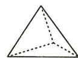

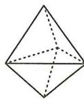

2. 解：(1)1；(2)2；(3)3；(4)6.

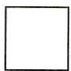  
图1

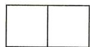  
图2

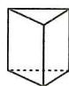  
图3

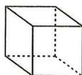  
图4

3. 解: (1) V=5, E=7, F=3;

$$
(2) V = 6, E = 9, F = 4;
$$

(3) $V - E + F = 1$

理由： $V = n,E = n + n - 3 = 2n - 3,F = n - 2,$

$$
\therefore V - E + F = n - (2 n - 3) + (n - 2)
$$

$$
= n - 2 n + 3 + n - 2 = 1.
$$

4. 解: (1) $D_{3}=1; D_{4}=2;$

(2) $n = 4$ 时， $\frac{D_5}{D_4} = \frac{4\times 4 - 6}{4} = \frac{5}{2}.$

$$
\because D _ {4} = 2, \therefore D _ {5} = \frac {5}{2} \times 2 = 5.
$$

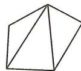

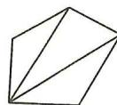

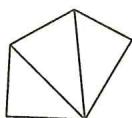

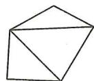

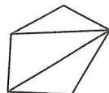

# 板块二 阅读理解与新定义

解:(1)当 $\angle1>\angle2$ 时, $\angle2=\angle1-30^{\circ}$ ,

$$
\therefore \angle 1 + \angle 2 = \angle 1 + \angle 1 - 3 0 ^ {\circ} = 9 0 ^ {\circ}, \therefore \angle 1 = 6 0 ^ {\circ};
$$

当 $\angle1<\angle2$ 时, $\angle2=\angle1+30^{\circ}$ ,

$$
\therefore \angle 1 + \angle 2 = \angle 1 + \angle 1 + 3 0 ^ {\circ} = 9 0 ^ {\circ}, \therefore \angle 1 = 3 0 ^ {\circ}.
$$

故答案为 $60^{\circ}$ 或 $30^{\circ}$ ;

(2)①设 $\angle A=x$ . $\because\angle ACB=90^{\circ}$ ,则 $\angle ABC=90^{\circ}-x$ .

∵∠ABC 的平分线 BD 分别交 AC, CM 于 D, E 两点,

$$
\therefore \angle A B E = \frac {9 0 ^ {\circ} - x}{2}.
$$

$$
\because A B \parallel C M, \therefore \angle B E C = \angle A B E = \frac {9 0 ^ {\circ} - x}{2}.
$$

$\because \angle A > \angle BEC$ , 且 $\angle A$ 与 $\angle BEC$ 互为“伙伴角”,

$\therefore \angle A - \angle BEC = 30^{\circ}.$

可得 $x - \frac{90^{\circ} - x}{2} = 30^{\circ}$ ，解得 $x = 50^{\circ},\therefore \angle A = 50^{\circ};$

②设 $\angle A=y$ . $\because AB//CM,\therefore\angle ACE=y$ .

$$
\because C F \text {平分} \angle A C E, \therefore \angle A C F = \frac {y}{2}.
$$

根据①可得 $\angle CBF=\frac{90^{\circ}-y}{2}$ ,

$$
\therefore \angle B F C = 1 8 0 ^ {\circ} - \angle C B F - \angle A C F - 9 0 ^ {\circ} = 4 5 ^ {\circ}.
$$

当 $\angle A>\angle BFC$ 时,可得 $\angle A=75^{\circ}$ ;

当 $\angle A < \angle BFC$ 时，可得 $\angle A = 15^{\circ}$

综上所述， $\angle A$ 的度数为 $75^{\circ}$ 或 $15^{\circ}$ .

# 板块三 综合与实践

解:(1)∵BP 平分∠MBC,CP 平分∠BCN,

$$
\therefore \angle C B P = \frac {1}{2} \angle M B C = \frac {1}{2} \angle A + \frac {1}{2} \angle A C B,
$$

$$
\angle B C P = \frac {1}{2} \angle B C N = \frac {1}{2} \angle A + \frac {1}{2} \angle A B C,
$$

$$
\therefore \angle C B P + \angle B C P = \frac {1}{2} \angle A + \frac {1}{2} \angle A C B + \frac {1}{2} \angle A +
$$

$$
\frac {1}{2} \angle A B C = \angle A + \frac {1}{2} \angle A C B + \frac {1}{2} \angle A B C.
$$

$\because \angle A + \angle ACB + \angle ABC = 180^{\circ},$

$\therefore \angle A = 180^{\circ} - \angle ACB - \angle ABC.$

$$
\because \angle C B P + \angle B C P + \angle B P C = 1 8 0 ^ {\circ},
$$

$$
\therefore \angle A + \frac {1}{2} \angle A C B + \frac {1}{2} \angle A B C + \angle B P C = 1 8 0 ^ {\circ},
$$

$$
1 8 0 ^ {\circ} - \angle A C B - \angle A B C + \frac {1}{2} \angle A C B + \frac {1}{2} \angle A B C +
$$

$$
\angle B P C = 1 8 0 ^ {\circ}, \therefore \angle A B C + \angle A C B = 2 \angle B P C;
$$

(2)∵BP 平分∠MBC,FP 平分∠EFC,

$$
\therefore \angle C B P = \frac {1}{2} \angle M B C = \frac {1}{2} (\angle A + \beta) = \frac {1}{2} \angle A + \frac {1}{2} \beta ,
$$

$$
\angle C F P = \frac {1}{2} \angle E F C = \frac {1}{2} (\angle A + \alpha) = \frac {1}{2} \angle A + \frac {1}{2} \alpha .
$$

$$
\because \angle O F C + \angle F O C + \angle A C B = 1 8 0 ^ {\circ}, \angle B O P = \angle F O C,
$$

$$
\therefore \angle F O C = 1 8 0 ^ {\circ} - \angle A C B - \angle O F C,
$$

$$
\therefore \angle B O P = 1 8 0 ^ {\circ} - \beta - \angle O F C = 1 8 0 ^ {\circ} - \beta - \frac {1}{2} \angle E F C =
$$

$$
1 8 0 ^ {\circ} - \beta - \frac {1}{2} \alpha - \frac {1}{2} \angle A.
$$

$$
\because \angle C B P + \angle P + \angle B O P = 1 8 0 ^ {\circ},
$$

$$
\therefore \frac {1}{2} \angle A + \frac {1}{2} \beta + \theta + 1 8 0 ^ {\circ} - \beta - \frac {1}{2} \alpha - \frac {1}{2} \angle A = 1 8 0 ^ {\circ},
$$

$$
\therefore \theta = \frac {\alpha + \beta}{2};
$$

(3)∵BP 平分∠ABC,FP 平分∠AFG,

$$
\therefore \angle O F P = \frac {1}{2} \angle A F G = \frac {1}{2} (\angle A + \alpha) = \frac {1}{2} \angle A + \frac {1}{2} \alpha ,
$$

$$
\angle C B O = \frac {1}{2} \angle A B C = \frac {1}{2} (1 8 0 ^ {\circ} - \angle A - \beta) = 9 0 ^ {\circ} - \frac {1}{2} \angle A -
$$

$$
\frac {1}{2} \beta .
$$

$$
\because \angle P O F = \angle C B O + \angle A C B = 9 0 ^ {\circ} - \frac {1}{2} \angle A - \frac {1}{2} \beta + \beta =
$$

$$
9 0 ^ {\circ} - \frac {1}{2} \angle A + \frac {1}{2} \beta ,
$$

$$
\because \angle P O F + \angle O F P + \angle P = 1 8 0 ^ {\circ},
$$

$$
\therefore 9 0 ^ {\circ} - \frac {1}{2} \angle A + \frac {1}{2} \beta + \frac {1}{2} \angle A + \frac {1}{2} \alpha + \theta = 1 8 0 ^ {\circ},
$$

$$
\therefore \alpha + \beta + 2 \theta = 1 8 0 ^ {\circ}.
$$

# 第十四章 全等三角形

# 第6讲 全等三角形的性质与判定

# 板块一 初识全等(一) 全等发现

# 典例精讲

【例 1】证明：∵∠BCA=∠DCE，

$$
\therefore \angle B C A - \angle A C E = \angle D C E - \angle A C E,
$$

$$
\text { 即 } \angle B C E = \angle A C D,
$$

$$
\text { 又 } \because C A = C B, C D = C E, \triangle B E C \cong \triangle A D C (\mathrm{SAS}),
$$

$$
\therefore B E = A D.
$$

【例 2】解：∵AD=AB, DE=BC, AC=AE,

$$
\therefore \triangle A B C \cong \triangle A D E (\text { S   S   S }),
$$

$$
\therefore \angle B = \angle D, \angle B A C = \angle D A E,
$$

$$
\because \angle B A C - \angle B A E = \angle D A E - \angle B A E,
$$

$$
\therefore \angle 1 = \angle D A B = 2 5 ^ {\circ},
$$

$$
\because \angle B = \angle D, \angle B O E = \angle A O D,
$$

$$
\therefore \angle 2 = \angle D A B = 2 5 ^ {\circ}.
$$

【例 3】证明: 先证 $\triangle ABE \cong \triangle ACD$ (ASA), 得 AB = AC,

$$
\therefore B D = C E, \text {   得   } \triangle B O D \cong \triangle C O E (\mathrm{AAS}),
$$

$$
\therefore O B = O C.
$$

【例 4】证明：∵ AC∥DF，∴ ∠ACB = ∠DFE，

$$
\therefore \triangle A B C \cong \triangle D E F (\text { AAS }),
$$

$$
\therefore A C = D F,
$$

$$
\because A M, D N \text { 分   别   是 } \triangle A B C \text { 和 } \triangle D E F \text { 的   角   平   分   线   ， }
$$

$$
\therefore \angle B A M = \frac {1}{2} \angle B A C, \angle E D N = \frac {1}{2} \angle E D F,
$$

$$
\because \triangle A B C \cong \triangle D E F,
$$

$$
\therefore \angle B A C = \angle E D F, \therefore \angle B A M = \angle E D N,
$$

$$
\therefore \triangle B A M \cong \triangle E D N (\text { ASA }), \therefore A M = D N.
$$

# 实战演练

1. 解： $AC = DF$ 且 $AC \parallel DF$ . 证明如下：

$$
\because A B \parallel D E, \therefore \angle B = \angle D E F, \because B E = C F,
$$

$$
\therefore B E + E C = C F + E C \text {, 即} B C = E F,
$$

$$
\text {   在   } \triangle A B C \text {   和   } \triangle D E F \text {   中   }, \left\{ \begin{array}{l l} A B = D E, \\ \angle B = \angle D E F, \\ B C = E F, \end{array} \right.
$$

$$
\therefore \triangle A B C \cong \triangle D E F (\text { SAS }), \therefore A C = D F, \angle A C B = \angle F,
$$

$$
\therefore A C \parallel D F, \therefore A C = D F \text { 且 } A C \parallel D F.
$$

2. 证明：∵AD 是△ABC 的中线，∴BD=CD.

$$
\because D E \perp A B, D F \perp A C, B E = C F,
$$

$$
\therefore \mathrm{Rt} \triangle B D E \cong \mathrm{Rt} \triangle C D F (\mathrm{HL}), \therefore D E = D F,
$$

$$
\because A D = A D, \therefore \mathrm{Rt} \triangle A D E \cong \mathrm{Rt} \triangle A D F (\mathrm{HL}), \therefore A E = A F.
$$

3. 证明: 证 $\triangle ABD \cong \triangle ACD$ (SSS),

$$
\angle B A D = \angle C A D = 4 5 ^ {\circ} = \angle B = \angle A C B, \therefore A D \perp B D,
$$

$$
\text { 又 } \because B N \perp A M, \therefore \angle E = \angle A M C,
$$

$$
\text { 又 } \because A B = A C,
$$

$$
\therefore \triangle B A E \cong \triangle A C M (A A S), \therefore A E = C M.
$$

4. 证明：(1) $\because BE \perp AC, CF \perp AB$

$$
\therefore \angle A E B = \angle A F C = 9 0 ^ {\circ},
$$

$$
\angle A B E + \angle B A C = \angle A C F + \angle B A C = 9 0 ^ {\circ},
$$

$$
\therefore \angle A B E = \angle A C F,
$$

$$
\text { 又 } \because B M = A C, C N = A B, \therefore \triangle A B M \cong \triangle N C A (\mathrm{SAS});
$$

$$
(2) \because \triangle A B M \cong \triangle N C A, \therefore \angle N = \angle B A M,
$$

$$
\because \angle N + \angle N A F = 9 0 ^ {\circ}, \therefore \angle B A M + \angle N A F = 9 0 ^ {\circ},
$$

$$
\therefore A M \perp A N.
$$

# 板块二 初识全等(二)常规辅助线

# 典例精讲

【例 1】证明: 连接 AC. $\because AE = AF, CE = CF, AC = AC,$

$$
\therefore \triangle A C E \cong \triangle A C F (\text { S   S   S }), \therefore \angle E A C = \angle F A C.
$$

$$
\text {在} \triangle A C B \text {和} \triangle A C D \text {中,} \left\{ \begin{array}{l l} \angle B A C = \angle D A C, \\ \angle B = \angle D = 9 0 ^ {\circ}, \\ A C = A C, \end{array} \right.
$$

$$
\therefore \triangle A C B \cong \triangle A C D (\text { AAS }), \therefore C B = C D.
$$

【例 2】证法一: 延长 BA, CD 交于点 E, 可得 $\triangle EBD \cong$

$$
\triangle E C A (\mathrm{AAS}),
$$

$$
\therefore B E = C E, A E = D E, \therefore A B = C D.
$$

证法二: 连接 BC, 则 Rt△ABC≌Rt△DCB(HL), 可得 AB=CD.

【例 3】解: 过点 F 作 $FG \perp AD$ , 交 AD 的延长线于点 G,

$$
\therefore \angle G = \angle D A E = 9 0 ^ {\circ},
$$

$$
\therefore \angle G A F + \angle F A E = \angle E + \angle F A E = 9 0 ^ {\circ},
$$

$$
\therefore \angle G A F = \angle E,
$$

$$
\because A F = D E, \therefore \triangle A G F \cong \triangle E A D (\mathrm{AAS}),
$$

$$
\therefore G F = A D = 4, \therefore S _ {\triangle A D F} = \frac {1}{2} \cdot A D \cdot G F = \frac {1}{2} \times 4 \times
$$

$$
4 = 8.
$$

【例 4】证法一(截长法): 在 AB 上取一点 E, 使 AE = AC,

$$
\because \angle E A P = \angle C A P, A P = A P,
$$

$$
\therefore \triangle E A P \cong \triangle C A P,
$$

$$
\therefore P E = P C \text {, 在} \triangle B E P \text {中}, P B - P E <   B E,
$$

$$
\text { 即 } P B - P C <   A B - A C;
$$

证法二(补短法):延长AC至点F,使AF=AB,连接

$$
P F, \text { 则 } \triangle A B P \cong \triangle A F P (\mathrm{SAS}),
$$

$$
\therefore P B = P F, \therefore P F - P C <   C F,
$$

$$
\therefore P B - P C <   A B - A C.
$$

# 实战演练

1. 证明：连接 $BC$ ，易得 $\triangle ABC \cong \triangle DCB$ (SSS)，

$$
\therefore \angle A = \angle D.
$$

2. 证明: (1) 连接 AC, AD, 得 $\triangle ABC \cong \triangle AED$ (SAS),

$$
\therefore A C = A D. \therefore \mathrm{Rt} \triangle A C F \cong \mathrm{Rt} \triangle A D F (\mathrm{HL}),
$$

$$
\therefore C F = D F \text { ,   即 } F \text { 为 } C D \text { 的   中   点 };
$$

(2)延长 AB, AE, 与直线 CD 交于点 M, N.

$$
\text { 则 } \triangle A F M \cong \triangle A F N (\mathrm{ASA}), \therefore F M = F N, A M = A N,
$$

$$
\angle M = \angle N, \text {   又   } \because A B = A E, \angle A B C = \angle A E D,
$$

3. 解： $\because a^{2}b^{2}-2ab+1+(a^{2}+b^{2}-2ab)=0$ ，

$$
\therefore (a b - 1) ^ {2} + (a - b) ^ {2} = 0, \therefore a - b = 0, a b = 1,
$$

$$
\therefore a ^ {2} + b ^ {2} = (a - b) ^ {2} + 2 a b = 2.
$$

4. 解: 原式 $= 2(x^{2} - 2xy + y^{2}) + 3(y^{2} - 4y + 4) + 1 = 2(x -$

$$
y) ^ {2} + 3 (y - 2) ^ {2} + 1, \because (x - y) ^ {2} \geqslant 0, (y - 2) ^ {2} \geqslant 0,
$$

$$
\therefore \text {   当   } x - y = 0, \text {   且   } y - 2 = 0,
$$

即 x=y=2 时, 原式取得最小值为 1.

5. 解: 原式 = $-(a^{2}-12a+8)=-(a^{2}-12a+36-28)$

$$
= - (a - 6) ^ {2} + 2 8 \leqslant 2 8,
$$

$$
\therefore - a ^ {2} + 1 2 a - 8 \text {   的最大值为   } 2 8.
$$

6. 解: $\because M - N = 5x^{2} - 7x + 17 - (4x^{2} - x + 6)$

$$
= 5 x ^ {2} - 7 x + 1 7 - 4 x ^ {2} + x - 6 = x ^ {2} - 6 x + 1 1
$$

$$
= x ^ {2} - 6 x + 9 + 2 = (x - 3) ^ {2} + 2 > 0,
$$

$$
\therefore M > N.
$$

# 板块五 整式乘法与几何图形结合

# 典例精讲

【例 1】解: 设 AB = x, BC = y, 由题意, 得 $2(x + y) = 16$ , 即

$$
x + y = 8 \textcircled {1},
$$

$$
\text { 又 } \because \text {   四个正方形的面积和为   } 6 8,
$$

$$
\therefore 2 x ^ {2} + 2 y ^ {2} = 6 8, \text { 即 } x ^ {2} + y ^ {2} = 3 4 \tag {②}
$$

$$
① \text {   的两边平方得   } (x + y) ^ {2} = 6 4,
$$

$$
\text { 即 } x ^ {2} + 2 x y + y ^ {2} = 6 4,
$$

$$
\text { 将②代入,得 } 2 x y = 3 0, \therefore x y = 1 5,
$$

$$
\text { 即长方形 } A B C D \text { 的面积为 } 1 5.
$$

【例 2】解: 设图 1 中阴影部分的面积为 $S_{1}$ ,

$$
\text { 则 } S _ {1} = a ^ {2} + b ^ {2} = (a + b) ^ {2} - 2 a b = 4 9 - 1 4 = 3 5;
$$

$$
\text { 设   图 } 2 \text { 中   阴   影   部   分   的   面   积   为 } S _ {2},
$$

$$
\mathrm{则} S _ {2} = a ^ {2} + b ^ {2} - \frac {1}{2} a ^ {2} - \frac {1}{2} b (a + b)
$$

$$
= \frac {1}{2} (a ^ {2} + b ^ {2} - a b)
$$

$$
= \frac {1}{2} [ (a + b) ^ {2} - 3 a b ] = 1 4.
$$

【例 3】解:由题意,得 $AC + BC = 6, AC^{2} + BC^{2} = 18$ ,

$$
\because (A C + B C) ^ {2} = 6 ^ {2}, A C ^ {2} + 2 A C \cdot B C + B C ^ {2} = 3 6,
$$

$$
\therefore 2 A C \cdot B C = 3 6 - \left(A C ^ {2} + B C ^ {2}\right) = 3 6 - 1 8 = 1 8,
$$

$$
\therefore A C \cdot B C = 9,
$$

$$
\because B C = C F, \therefore S _ {\triangle A C F} = \frac {1}{2} A C \cdot C F = \frac {9}{2}.
$$

$$
\therefore \text { 图中阴影部分的面积为 } \frac {9}{2}.
$$

【例 4】解:根据题意,可知 ED=AD-AE=x-1,

$$
D G = D C - C G = x - 2,
$$

$$
\text { 依题意,得 } (x - 1) (x - 2) = 5 \text { ,设 } x - 1 = a, x - 2 = b,
$$

$$
\text { 则 } a - b = (x - 1) - (x - 2) = 1, a b = 5,
$$

$$
\therefore a ^ {2} + b ^ {2} = (a - b) ^ {2} + 2 a b = 1 + 2 \times 5 = 1 1,
$$

$$
\therefore \text { 阴影部分的面积为 } E D ^ {2} + E D \cdot D G + D G ^ {2} + D H
$$

$$
Q D = (x - 1) ^ {2} + (x - 1) (x - 2) + (x - 2) ^ {2} + (x -
$$

$$
1) (x - 2) = a ^ {2} + a b + b ^ {2} + a b = 1 1 + 1 0 = 2 1.
$$

# 实战演练

1. 解：设 $AC = a, BC = b$ ，则阴影部分的面积为

$$
\frac {(a + b) (a + b)}{2} - \frac {a ^ {2}}{2} - \frac {b ^ {2}}{2} = \frac {(a + b) ^ {2} - (a ^ {2} + b ^ {2})}{2} = a b =
$$

$$
A C \cdot B C = 1 0, \therefore \text { 图中阴影部分的面积 } 1 0.
$$

2. 解: 由题意, 得 a-b=16, $a^{2}-b^{2}=(a+b)(a-b)=960$ ,

∴a+b=60,解得a=38,b=22.故a的值为38,b的值为22.

3. 解: 由题意, 得 $S_{2}=4\left(\frac{1}{2}ab+\frac{1}{2}b^{2}\right)=2ab+2b^{2}$ ,

$$
S _ {1} = (a + b) ^ {2} - S _ {2} = a ^ {2} + 2 a b + b ^ {2} - 2 a b - 2 b ^ {2} = a ^ {2} - b ^ {2}.
$$

$$
\because S _ {1} = S _ {2}. \therefore a ^ {2} - b ^ {2} = 2 a b + 2 b ^ {2}. \therefore a ^ {2} - 2 a b - 3 b ^ {2} = 0.
$$

$$
\therefore (a - 3 b) (a + b) = 0. \because a > b > 0. \therefore a + b > 0.
$$

$$
\therefore a - 3 b = 0. \therefore a = 3 b. \therefore a: b = 3: 1.
$$

4. 解: 设大、小正方形的边长分别为 a, b.

由图1,得 $S_{阴影}=\frac{1}{2}ab=24,\therefore ab=48.$

由图2，得 $S_{\text{阴影}} = \frac{1}{2} (a + b)(a + b) - b^2 - \frac{1}{2} a^2 = 30$

$$
\therefore \frac {1}{2} a ^ {2} + a b + \frac {1}{2} b ^ {2} - b ^ {2} - \frac {1}{2} a ^ {2} = 3 0.
$$

$$
\because a b = 4 8, \therefore b ^ {2} = 3 6. \therefore b = 6. \therefore a = 8.
$$

# 第 28 讲 情境创新题

# 板块一 数学活动(课本变式)

【变式1】解：由题意，知 $a_1 = a - 8, a_2 = a - 1, a_3 = a + 1$

$$
a _ {4} = a - 6,
$$

$$
\therefore a _ {2} a _ {4} - a _ {1} a _ {3} = (a - 6) (a - 1) - (a - 8) (a + 1)
$$

$$
= (a ^ {2} - 7 a + 6) - (a ^ {2} - 7 a - 8)
$$

$$
= 1 4.
$$

【变式 2】解:(1) $12 \times 14 - 6 \times 20 = 48$ ;

(2)设十字星中心的数为 x，

则十字星左右两数分别为 $x - 1, x + 1$

上下两数分别为 x-5, $x+5$ ,

$$
\text {十字差为} (x - 1) (x + 1) - (x - 5) (x + 5) = x ^ {2} -
$$

$$
1 - x ^ {2} + 2 5 = 2 4,
$$

这个定值是24.

【变式 3】解: $(10a+b)(10a+10-b)=100a(a+1)+b(10-b)$ .

理由如下：

$$
(1 0 a + b) (1 0 a + 1 0 - b) = 1 0 0 a ^ {2} + 1 0 a b + 1 0 0 a + 1 0 b -
$$

$$
1 0 a b - b ^ {2}
$$

$$
= 1 0 0 a (a + 1) + b (1 0 - b).
$$

# 板块二 综合与实践

发现问题：

丙摆法的面积是乙和丁摆法面积之和

提出问题：

$S_{\text{丙}} = S_{\text{乙}} + S_{\text{丁}}$

分析问题：

$$
\because S _ {\text {乙}} = a b + a b = 2 a b, S _ {\text {丁}} = a ^ {2} + b ^ {2},
$$

$$
\therefore S _ {\text {乙}} + S _ {\text {丁}} = a ^ {2} + b ^ {2} + 2 a b.
$$

$$
\text { 又 } \because S _ {\text { 丙 }} = (a + b) ^ {2} = a ^ {2} + b ^ {2} + 2 a b,
$$

$$
\therefore S _ {\text { 丙 }} = S _ {\text { 乙 }} + S _ {\text { 丁 }}.
$$

拓展创新：

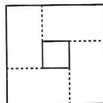

$$
(a + b) ^ {2} - (a - b) ^ {2} = 4 a b
$$

迁移运用：

解:由拓展创新知 $(x+y)^{2}-(x-y)^{2}=4xy$ ,

# 实战演练

1. 解: 原式 $=3m^{2}+10m+3-(16-4m^{2})=7m^{2}+10m-13$ ;

(2) 原式 $=9a^{2}-1-(6a^{2}+a-1)=3a^{2}-a.$

2. 解: 原式 $=9x^{2}-4+x^{2}-2x=10x^{2}-2x-4$ ,

$$
\because 5 x ^ {2} - x - 1 = 0, \therefore 5 x ^ {2} - x = 1,
$$

$$
\therefore 1 0 x ^ {2} - 2 x = 2, \therefore \text {   原式   } = 2 - 4 = - 2.
$$

3. 解: 设 $2x^{2}+2y^{2}=m$ , $\therefore (m+3)(m-3)=27$ ,

$$
\therefore m ^ {2} - 9 = 2 7, \text {即} m ^ {2} = 3 6, \therefore m = \pm 6.
$$

$$
\because 2 x ^ {2} + 2 y ^ {2} \geqslant 0, \therefore 2 x ^ {2} + 2 y ^ {2} = 6, \therefore x ^ {2} + y ^ {2} = 3.
$$

# 板块二 完全平方公式

# 典例精讲

【例 1】7 或 -1 解: 依题意, 得 $x^{2} + 2(m - 3)x + 16 = (x \pm 4)^{2}$ , 比较对应项的系数, 得 $2(m - 3) = \pm 8$ , 解得 m = 7 或 -1.

【例 2】解：(1) 原式 $=a^{2}+b^{2}+c^{2}+2ab+2bc+2ac$ ;

(2) 原式 $= 4x^{2} + y^{2} + 9 + 4xy - 12x - 6y$ ;

【例 3】解：(1) 原式 = $[x + (y + z)][x - (y + z)]$

$$
= x ^ {2} - (y + z) ^ {2} = x ^ {2} - y ^ {2} - 2 y z - z ^ {2};
$$

(2) 原式 $= x^{2} - (2y - 3)^{2} = x^{2} - 4y^{2} + 12y - 9$ .

【例 4】解: 原式= $4x^{2}-1-(4x^{2}-12x+9)$

$$
= 4 x ^ {2} - 1 - 4 x ^ {2} + 1 2 x - 9
$$

$$
= 1 2 x - 1 0.
$$

当 $x = -1$ 时，原式 $= 12 \times (-1) - 10 = -22$ .

# 实战演练

1.2或-2 2.±20

3. 解: (1) 原式 = 4; (2) 原式 = -190;

(3) 原式= $\frac{(100+2)^{2}}{125^{2}-(125^{2}-4)}=2601.$

4. 解: (1) 原式 $=a^{2}+4b^{2}+9c^{2}-6ac+4ab-12bc$ ;

(2) 原式 $= [(x + 2)(x - 2)]^2$

$$
= (x ^ {2} - 4) ^ {2}
$$

$$
= x ^ {4} - 8 x ^ {2} + 1 6;
$$

(3) 原式= $[x+(5y-9)][x-(5y-9)]$

$$
= x ^ {2} - (5 y - 9) ^ {2}
$$

$$
= x ^ {2} - (2 5 y ^ {2} - 9 0 y + 8 1)
$$

$$
= x ^ {2} - 2 5 y ^ {2} + 9 0 y - 8 1;
$$

(4) 原式 $= [2a - (b - 3c)][2a + (b - 3c)]$

$$
= 4 a ^ {2} - (b - 3 c) ^ {2}
$$

$$
= 4 a ^ {2} - b ^ {2} - 9 c ^ {2} + 6 b c.
$$

# 板块三 完全平方公式的应用

# 典例精讲

【例1】解： $\because (a + b)^2 = a^2 +b^2 +2ab = 7,(a - b)^2 = a^2 +b^2-$ $2ab = 3,\therefore a^{2} + b^{2} = 5,ab = 1.$

【例 2】解： $\because a^{2}+b^{2}=(a+b)^{2}-2ab,\therefore a^{2}+b^{2}=5,$ $\because(a-b)^{2}=a^{2}+b^{2}-2ab=1,\therefore a-b=\pm1.$

【例3】解： $\because (a + b)^2 = a^2 +b^2 +2ab = 49,\therefore 2ab = 24,$ $\because (a - b)^{2} = a^{2} + b^{2} - 2ab = 1,\therefore a - b = \pm 1.$

【例4】解： $① \frac{b}{a} +\frac{a}{b} = \frac{a^2 + b^2}{ab} = \frac{25}{12};$ $② \because (a + b)^{2} = a^{2} + b^{2} + 2ab = 49,\therefore a + b = \pm 7;$ $③ \because (a - b)^{2} = a^{2} + b^{2} - 2ab = 1,\therefore a - b = \pm 1.$

【例 5】解：①∵ $(x-\frac{1}{x})^{2}=(x+\frac{1}{x})^{2}-4=3^{2}-4=5$

$$
\therefore x - \frac {1}{x} = \pm \sqrt {5};
$$

$$
② x ^ {2} + \frac {1}{x ^ {2}} = (x + \frac {1}{x}) ^ {2} - 2 = 3 ^ {2} - 2 = 7;
$$

$$
③ x ^ {4} + \frac {1}{x ^ {4}} = (x ^ {2} + \frac {1}{x ^ {2}}) ^ {2} - 2 = 7 ^ {2} - 2 = 4 7.
$$

【例 6】解: 设 2022-x=a, x-2010=b, 则 ab=22,

$$
\text { 且 } a + b = (2 0 2 2 - x) + (x - 2 0 1 0) = 1 2.
$$

$$
\because (a + b) ^ {2} = a ^ {2} + 2 a b + b ^ {2}, \therefore a ^ {2} + b ^ {2} = (a + b) ^ {2} -
$$

$$
2 a b = 1 2 ^ {2} - 2 \times 2 2 = 1 0 0,
$$

即 $(2\ 022-x)^{2}+(x-2\ 010)^{2}$ 的值为100.

# 实战演练

1. 解：(1) $x^{2}+y^{2}=(x+y)^{2}-2xy=5^{2}-2\times3=19$ ;

$$
x + y = \pm 3; x - y = \pm 1; \tag {2}
$$

$$
x ^ {2} + y ^ {2} = 1 7, x y = 4. \tag {3}
$$

2. 解： $\because x^{2}-4x+2=0, \therefore x+\frac{2}{x}=4.$

$$
① x ^ {2} + \frac {4}{x ^ {2}} = (x + \frac {2}{x}) ^ {2} - 4 = 1 2;
$$

$$
② (x - \frac {2}{x}) ^ {2} = x ^ {2} + \frac {4}{x ^ {2}} - 4 = 8;
$$

$$
③ x ^ {4} + \frac {1 6}{x ^ {4}} = (x ^ {2} + \frac {4}{x ^ {2}}) ^ {2} - 8 = 1 3 6.
$$

3. 解: 设 2022-x=a, x-2002=b,

则 $a + b = (2022 - x) + (x - 2002) = 20.$

$$
\because (a + b) ^ {2} = a ^ {2} + 2 a b + b ^ {2}, \therefore a ^ {2} + b ^ {2} = (a + b) ^ {2} - 2 a b =
$$

$20^{2}-2ab=2\ 020$ , 解得 ab=-810,

即 $(2\ 022-x)(x-2\ 002)$ 的值为-810.

# 板块四 配方法

# 典例精讲

【例1】解： $\because 4x^{2} + 4x + 1 + y^{2} - 6y + 9 = 0$

$$
\therefore (2 x + 1) ^ {2} + (y - 3) ^ {2} = 0, \therefore x = - \frac {1}{2}, y = 3.
$$

【例 2】解：∵ $2a^{2}-2ab+b^{2}+6a+9=0$ ，

$$
\therefore (a ^ {2} - 2 a b + b ^ {2}) + (a ^ {2} + 6 a + 9) = 0,
$$

$$
\therefore (a - b) ^ {2} + (a + 3) ^ {2} = 0, \therefore a = b = - 3.
$$

【例 3】证明：∵ $N - M = 9a^{2} - 4a - (2a - 2) = 9a^{2} - 6a +$

$$
2 = (9 a ^ {2} - 6 a + 1) + 1 = (3 a - 1) ^ {2} + 1 > 0, \therefore M <   N.
$$

【例 4】解： $-x^{2}-6x+10=-(x^{2}+6x+9)+19=-(x+3)^{2}+19.$

$$
\because - (x + 3) ^ {2} \leqslant 0, \therefore - (x + 3) ^ {2} + 1 9 \leqslant 1 9,
$$

$\therefore -x^{2}-6x+10$ 的最大值为 19.

【例5】解： $\because 5a^2 +b^2 -4ab - 2a + 10 = (4a^2 -4ab + b^2) +$

$$
(a ^ {2} - 2 a + 1) + 9 = (2 a - b) ^ {2} + (a - 1) ^ {2} + 9 \geqslant 9.
$$

$\therefore 5a^{2} + b^{2} - 4ab - 2a + 10$ 的最小值为9.

# 实战演练

1. 解： $\because x^{2}+y^{2}+6x-4y+13=0$ ，

$$
\therefore (x ^ {2} + 6 x + 9) + (y ^ {2} - 4 y + 4) = 0,
$$

即 $(x + 3)^{2} + (y - 2)^{2} = 0$

$$
\therefore x = - 3, y = 2. \therefore (x + y) ^ {2 0 2 3} = (- 1) ^ {2 0 2 3} = - 1.
$$

2. 解： $\because (a^{2}-2ab+b^{2})+(b-c)^{2}+(c^{2}-6c+9)=0$ ，

即 $(a - b)^2 +(b - c)^2 +(c - 3)^2 = 0$

$$
\therefore a - b = 0, b - c = 0, c = 3,
$$

$$
\therefore a = b = c = 3, \therefore a b ^ {c} = 3 \times 3 ^ {3} = 8 1.
$$

$\therefore BM = EN, \angle MBC = \angle DEN,$

$\therefore \triangle MBC \cong \triangle NED(ASA), \therefore MC = DN,$

又∵FM=FN,∴CF=DF,∴F为CD的中点.

3. 解: 过点 D 作 $DH \perp BC$ 于点 H, $\therefore \angle EHD = 90^{\circ}$ ,

$\because \angle BAC=90^{\circ},\therefore \angle BAC=\angle EHD,$

∵ AB ⊥ AC, DE ⊥ AC, ∴ AB ∥ DE, ∴ ∠B = ∠DEH,

$\because BC=ED,\angle BAC=\angle EHD,$

$\therefore \triangle ABC \cong \triangle HED(AAS)$ ,

$\therefore AC = HD = 4, \because S_{\triangle CDE} = 6,$

$\therefore CE \cdot HD = 12, \therefore CE = 3.$

4. 证明: 在 BC 上截取 BM = BA, 连接 DM, 证 $\triangle BAD \cong \triangle BMD$ ,

再证 $\triangle CED\cong\triangle CMD$ ，

$\therefore CE = CM, \therefore BC = BM + MC = BA + CE.$

# 第 7 讲 中点的处理方法

# 板块一 中点处理(一) 知中点

# 典例精讲

【例1】解：(1)延长 $AD$ 至点 $E$ ，使 $DE = AD$ ，连接 $BE$ ，则 $\triangle ADC \cong \triangle EDB$ (SAS)， $\therefore AC = BE$ ， $\because$ 在 $\triangle ABE$ 中， $AB + BE > AE$ ， $\therefore AB + AC > 2AD$ ；

$$
(2) \because \text {   在   } \triangle A B E \text {   中   }, A E - A B <   B E <   A B + A E,
$$

$$
\therefore 8 - 6 <   B E <   6 + 8, \therefore 2 <   B E <   1 4, \therefore 2 <   A C <   1 4.
$$

【例 2】证明：过点 C 作 $CH \parallel AB$ ，交 FE 的延长线于点 H，则 $\triangle ECH \cong \triangle EBG$ （ASA），

$$
\therefore C F = B G = C H, \angle B G E = \angle H = \angle F.
$$

$$
\because E F \parallel A D, \therefore \angle B A D = \angle B G E, \angle D A C = \angle F,
$$

$$
\therefore \angle B A D = \angle D A C, \therefore A D \text {   为   } \triangle A B C \text {   的角平分线.   }
$$

【例 3】证明: 过点 C, E 分别作 AD 的垂线, 垂足分别为 G, H. 则 $\triangle CDG \cong \triangle EDH$ (AAS), $\therefore CG = EH$ ,

$$
\because E F \parallel A B, A D \text {   平分   } \angle B A C,
$$

$$
\therefore \angle E F D = \angle B A D = \angle C A D,
$$

$$
\therefore \triangle E F H \cong \triangle C A G (\mathrm{AAS}), \therefore E F = A C.
$$

# 实战演练

1. 解: 延长 FD 至点 A, 使 AD = DF, 连接 AB, EA,

$$
\therefore \triangle B A D \cong \triangle C F D (\text { SAS }), \therefore C F = B A = 1,
$$

$$
\because D F = D A, \angle E D F = 9 0 ^ {\circ}, \text {证} \triangle A D E \cong \triangle F D E (\mathrm{SAS}),
$$

$$
\therefore E A = E F, \because E B - A B <   A E <   E B + A B,
$$

$$
\therefore 4 - 1 <   E F <   4 + 1 \text {, 即} 3 <   E F <   5
$$

∵ EF 的长为整数，∴ EF = 4.

2. 解: 延长 GE, FB 交于点 H, 则 $\triangle AEG \cong \triangle BEH$ (ASA),

$$
\therefore E G = E H, B H = A G = 2,
$$

$$
\text { 又 } \because \angle G E F = \angle H E F = 9 0 ^ {\circ}, E F = E F,
$$

$$
\therefore \triangle G E F \cong \triangle H E F (\text { SAS }),
$$

$$
\therefore G F = H F = B F + B H = 3 + 2 = 5.
$$

3. 证明：延长 $AE$ 至点 $F$ ，使 $EF = AE$ ，连接 $DF$ ，可得 $\triangle ABE \cong \triangle FDE(SAS)$ ，

$$
\therefore D F = A B = C D, \angle E D F = \angle B.
$$

$$
\because A B = C D = B D, \therefore \angle B A D = \angle B D A,
$$

$$
\therefore \angle A D C = \angle B A D + \angle B = \angle A D B + \angle E D F = \angle A D F,
$$

$$
\therefore \triangle A D F \cong \triangle A D C (\text { SAS }), \therefore A C = A F = 2 A E.
$$

4. 证明: 延长 AF 至点 G, 使 FG = AF, 连接 DG, 则 $\triangle AFE \cong \triangle GFD(SAS)$ , $\therefore DG = AE = AC, \angle G = \angle EAF$ ,

$$
\therefore D G \parallel A E, \therefore \angle A D G + \angle D A E = 1 8 0 ^ {\circ} = \angle B A C + \angle D A E,
$$

$\therefore \angle ADG = \angle BAC,$ 又 $\because AB = AD,$

$\therefore \triangle ADG \cong \triangle BAC(SAS), \therefore BC = AG = 2AF.$

# 板块二 中点处理(二) 证中点

# 典例精讲

【例 1】证明: 过点 A 作 $AF \parallel BC$ 交 CD 于点 F,

$$
\therefore \angle A F C = \angle C,
$$

$$
\because \angle A F D + \angle A F C = 1 8 0 ^ {\circ}, \angle C + \angle D = 1 8 0 ^ {\circ},
$$

$$
\therefore \angle A F D = \angle D, \therefore A D = A F, \because A D = B C, \therefore A F =
$$

$$
B C, \text {又} \because \angle A E F = \angle B E C, \therefore \triangle A E F \cong \triangle B E C,
$$

$$
\therefore A E = B E.
$$

【例 2】证明: 分别过 B, C 两点作 AD 的垂线, 垂足分别为 G, H. 则 $\triangle ACH \cong \triangle FBG$ (AAS),

$$
\therefore B G = C H, \therefore \triangle B D G \cong \triangle C D H (\text { AAS }), \therefore B D = C D.
$$

【点睛】也可作 $BM \parallel AC$ ，交 $AD$ 的延长线于点 $M$ .

【例 3】证明: 延长 DE 交 CB 的延长线于点 F.

$$
\because A D \parallel B C, \therefore \angle A D C + \angle B C D = 1 8 0 ^ {\circ},
$$

$$
\therefore \angle E D C + \angle E C D = 9 0 ^ {\circ}, \therefore \angle D E C = 9 0 ^ {\circ},
$$

$$
\because E C = E C, \angle D C E = \angle F C E,
$$

$$
\therefore \triangle C E D \cong \triangle C E F (\mathrm{ASA}),
$$

$$
\therefore D E = E F, \therefore \triangle A E D \cong \triangle B E F (\mathrm{ASA}),
$$

$$
\therefore A E = B E \text {, 即} E \text {为} A B \text {的中点.}
$$

# 实战演练

1. 证明: 过点 E 作 $EG \perp AC$ 于点 G.

$$
\because \angle A C D + \angle A C E = \angle D C E = 9 0 ^ {\circ}, \angle C E G + \angle A C E = 9 0 ^ {\circ},
$$

$$
\therefore \angle A C D = \angle C E G,
$$

$$
\because D C = C E, \therefore \triangle A C D \cong \triangle G E C (A A S),
$$

$$
\therefore E G = A C = A B, \therefore \triangle A B F \cong \triangle G E F (\text { AAS }),
$$

$$
\therefore B F = E F, \therefore F \text {   为   } B E \text {   的中点.   }
$$

2. 证明: 过点 B 作 $BM \perp AC$ 于点 M.

$$
\text { 可证 } \triangle A B M \cong \triangle A C D (\mathrm{AAS}),
$$

$$
\therefore C D = B M = A E. \therefore \triangle A E F \cong \triangle M B F, \therefore B F = E F.
$$

3. 证明: 过点 A 作 AH // BD 交 BE 的延长线于点 H,

$$
\therefore \angle H = \angle E B D.
$$

$$
\because \angle D F C = \angle D B C + \angle B C F,
$$

$$
\angle C B E = \angle D B C + \angle E B D, \angle D F C = \angle C B E,
$$

$$
\therefore \angle B C F = \angle E B D = \angle H,
$$

$$
\because \angle A B D = \angle C B E, \therefore \angle A B E = \angle C B F,
$$

$$
\text { 又 } \because A B = B F, \therefore \triangle A B H \cong \triangle F B C (\mathrm{AAS}),
$$

$$
\therefore B C = B H = 2 B E, \therefore B E = E H,
$$

$$
\text { 又 } \because \angle A E H = \angle D E B, \angle H = \angle E B D,
$$

$$
\therefore \triangle A E H \cong \triangle D E B, \therefore A E = D E, \therefore E \text {   是   } A D \text {   的中点.   }
$$

4. 证明：延长 CD 交 AF 于点 K，过点 B 作 $BG \perp AF$ ，交 AF 的延长线于点 G.

$$
\because \angle A D C = 1 3 5 ^ {\circ},
$$

$$
\therefore \angle A D K = 4 5 ^ {\circ} = \angle D A F,
$$

$$
\therefore A K = D K, \angle A K D = 9 0 ^ {\circ}.
$$

$$
\because \angle B A G + \angle C A K = 9 0 ^ {\circ} = \angle C + \angle C A K,
$$

$$
\therefore \angle B A G = \angle C,
$$

$$
\text { 又 } \because \angle G = \angle A K C = 9 0 ^ {\circ}, A B = A C,
$$

$$
\therefore \triangle A B G \cong \triangle C A K (\text { A   A   S }),
$$

$$
\therefore B G = A K = D K,
$$

$$
\because \angle G = \angle D K F = 9 0 ^ {\circ}, \angle B F G = \angle D F K,
$$

$$
\therefore \triangle B F G \cong \triangle D F K,
$$

$$
\therefore B F = D F.
$$

# 第8讲 线段和差的处理方法

# 板块一 等线段代换

# 典例精讲

【例 1】证明:由条件可得 $\triangle ACE\cong\triangle ABD(SAS)$ ,

$$
\therefore B D = C E, \therefore B C = C D + B D = C D + C E.
$$

【例 2】证明：(1) 易得 $\triangle ABD \cong \triangle CAE$ (AAS)，∴ AD = CE, AE = BD, ∴ DE = AD + AE = CE + BD;

$$
\begin{array}{r l} & {(2) \text {同} (1) A D = C E, A E = B D, \therefore D E = A D - A E =} \\ & {C E - B D.} \end{array}
$$

# 实战演练

证明： $\triangle ABE \cong BCD$ (ASA)，得 $CD = BE, AE = BD = AD$ ， $\triangle ADF \cong \triangle AEF$ (SAS)，得 $DF = EF, \therefore CD = BE = BF + EF = BF + DF$ .

# 板块二 截长补短

# 典例精讲

【例】证法一(截长法): 在 FC 上截取 FG = FD,

$$
\mathrm{易证} \triangle A F D \cong \triangle A F G, \triangle C A G \cong \triangle B C E,
$$

$$
\therefore D F + B E = F G + C G = C F.
$$

$$
\text {   证法二(补短法):延长   } F D \text {   至点   } H, \text {   使   } F H = F C, \text {   连接   }
$$

$$
A H. \text { 证 } \triangle F A C \cong \triangle F A H, \triangle A D H \cong \triangle C E B,
$$

$$
\therefore D H = B E, \therefore D F + B E = D F + D H = F H = C F.
$$

# 实战演练

1. 证明：(1) $\because BE \perp AC, \therefore \angle BEC = \angle DEC = 90^{\circ}$ ,

$$
\because B E = D E, C E = C E, \therefore \triangle B C E \cong \triangle D C E,
$$

$$
\therefore B C = D C, \angle A C D = \angle A C B = \angle A B C;
$$

(2) 在 CE 上截取 EG = AE，连接 DG.

$$
\because \angle A E B = \angle D E G, B E = D E,
$$

$$
\therefore \triangle A B E \cong \triangle G D E,
$$

$$
\therefore \angle A = \angle D G E = \angle A F C, \therefore \angle B F C = \angle C G D,
$$

$$
\because B C = D C, \angle A C D = \angle A B C,
$$

$$
\therefore \triangle B C F \cong C D G (\text { A   A   S }),
$$

$$
\therefore B F = C G, \therefore E G + C G = A E + B F = C E.
$$

2. 证明: (1) 延长 CB 至点 F, 使 BF = DE, 连接 AF, 证 $\triangle ABF \cong \triangle AED(SAS)$ , $\triangle ACF \cong \triangle ACD(SSS)$ ,

$$
\therefore \angle A D C = \angle A F C = \angle A D E,
$$

$$
\therefore D A \text {   平分   } \angle C D E;
$$

$$
\begin{array}{l} (2) \angle B A E = \angle B A D + \angle D A E = \angle B A D + \angle B A F = \\ \angle D A F = 2 \angle C A D. \end{array}
$$

# 第 9 讲 角平分线的处理方法

# 板块一 角平分线(一) 性质

# 典例精讲

【例 1】证明: 过点 E 作 $EH \perp AD$ 于点 H.

$$
\because A E \text {   平分   } \angle B A D, D E \text {   平分   } \angle A D C,
$$

$$
\angle B = \angle C = \angle A H E = 9 0 ^ {\circ},
$$

$$
\therefore E H = E B = E C.
$$

【例 2】证明: 过点 D 作 $DE \perp AB$ 于点 E, 过点 D 作 $DF \perp BC$ 于点 F.

$$
\because B D \text {   平分   } \angle A B C, \therefore D E = D F,
$$

$$
\text { 又 } \because A D = C D, \therefore \mathrm{Rt} \triangle A D E \cong \triangle \mathrm{Rt} \triangle C D F (\mathrm{HL}),
$$

$$
\therefore \angle A D E = \angle C D F.
$$

$$
\because \angle D E B = \angle E B C = \angle B F D = 9 0 ^ {\circ}, \therefore \angle E D F = 9 0 ^ {\circ},
$$

$$
\therefore \angle A D C = \angle E D F = 9 0 ^ {\circ}, \therefore A D \perp C D.
$$

# 实战演练

证明: 过点 A 分别作 $AE \perp BD$ 于点 E, $AF \perp CD$ 于点 F,

$$
\mathrm{易得} \angle A D F = \angle A D B = 7 2 ^ {\circ},
$$

$$
\therefore A E = A F \text {, 由} \angle B A C = \angle B D C \text {可得} \angle A B E = \angle A C F,
$$

$$
\therefore \triangle A B E \cong \triangle A C F (\mathrm{AAS}), \therefore A B = A C.
$$

# 板块二 角平分线(二) 判定

# 典例精讲

【例 1】证明: 过点 C 作 $CM \perp AE$ 于点 M, 过点 C 作 $CN \perp BE$ 于点 N.

$$
\because \angle C A E = \angle C B E, \angle A M C = \angle B N C = 9 0 ^ {\circ}, A C = B C,
$$

$$
\therefore \triangle A M C \cong \triangle B N C (A A S),
$$

$$
\therefore C M = C N, \therefore \angle M E C = \angle N E C,
$$

$$
\therefore C E \text {   平分   } \triangle A B E \text {   的外角.   }
$$

【例 2】解:(1)过点 P 分别作 $PF \perp AD$ ，垂足为 F， $PG \perp AE$ ，垂足为 G， $PH \perp BC$ ，垂足为 H.

$$
\because P A \text {   平分   } \angle B A C, \therefore P F = P G,
$$

$$
\because P B \text {   平分   } \angle C B D, \therefore P F = P H,
$$

$$
\therefore P G = P H, \therefore P C \text {   平分   } \angle B C E;
$$

$$
(2) \text {   易证   } \triangle P C G \cong \triangle P C H, \triangle P B H \cong \triangle P B F,
$$

$$
\therefore \angle B P C = \frac {1}{2} \angle G P F = \frac {1}{2} (1 8 0 ^ {\circ} - \angle B A C) = 9 0 ^ {\circ} -
$$

$$
\frac {\alpha}{2}.
$$

# 实战演练

解:延长 CA 至点 F, $\because \angle EAC + \angle EAF = 180^{\circ}$ ,

$$
\text { 又 } \because \angle E A C + \angle E A D = 1 8 0 ^ {\circ}, \therefore \angle E A D = \angle E A F,
$$

即 $AE$ 为 $\triangle ACD$ 的外角平分线，

又∵CE为△ACD的内角平分线，

∴可得 DE 为 $\triangle ACD$ 的外角平分线，

$$
\because \angle E A D = \angle E A F = \alpha ,
$$

∴ $\angle DAC = 180^{\circ} - 2\alpha$ ，由三角形内外角平分线模型可得

$$
\angle D E C = \frac {1}{2} \angle D A C = \frac {1}{2} (1 8 0 ^ {\circ} - 2 \alpha) = 9 0 ^ {\circ} - \alpha .
$$

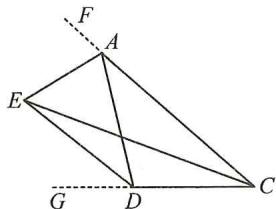

# 板块三 角平分线(三) 面积法

# 典例精讲

【例 1】解: 过点 O 作 $OD \perp AB$ 于点 D, $OE \perp AC$ 于点 E, OF $\perp BC$ 于点 F, 连接 OC.

∵点 O 是 $\angle CAB, \angle ABC$ 平分线的交点，

$$
\therefore O D = O E, O D = O F,
$$

$$
\therefore O D = O E = O F,
$$

$$
\because S _ {\triangle A O B} + S _ {\triangle A O C} + S _ {\triangle B O C} = S _ {\triangle A B C},
$$

$$
\therefore \frac {1}{2} A B \cdot O D + \frac {1}{2} A C \cdot O E + \frac {1}{2} B C \cdot O F = \frac {1}{2} A C \cdot
$$

$$
B C,
$$

即 $\frac{1}{2}\times10OD+\frac{1}{2}\times6OD+\frac{1}{2}\times8OD=\frac{1}{2}\times6\times8$

解得 OD=2，

$$
\therefore S _ {\triangle A O B} = \frac {1}{2} A B \cdot O D = \frac {1}{2} \times 1 0 \times 2 = 1 0 (\mathrm{cm} ^ {2}).
$$

5. 解: (1) 原式 $=3^{a} \times 3^{3b} = 3^{a+3b} = 3^{2} = 9$ ;

$$
(2) \because (2 \times 3) ^ {x + 1} = (6 ^ {2}) ^ {2 x - 1}, \therefore 6 ^ {x + 1} = 6 ^ {4 x - 2},
$$

$$
\therefore x + 1 = 4 x - 2, \therefore x = 1.
$$

# 板块二 整式的乘法(一)

# 典例精讲

【例 1】解:(1) 原式= $-20x^{7}y^{6}$ ;

$$
(2) \text { 原式 } = - 4 x ^ {7} y ^ {1 1};
$$

$$
(3) \text {   原式   } = 4 x ^ {4} - 1 2 x ^ {3} - 2 4 x ^ {2};
$$

$$
(4) \text {   原式   } = - 4 a ^ {3} b ^ {3} + 2 4 a ^ {3} b ^ {2} + 2 8 a ^ {2} b ^ {2};
$$

$$
(5) \text {   原式   } = 4 a ^ {2} + 4 a b - 3 b ^ {2};
$$

$$
(6) \text {   原式   } = 6 a ^ {2} - 5 a b - 6 b ^ {2}.
$$

【例 2】解:(1) 原式= $6x^{2}-9x-5x^{2}+x=x^{2}-8x$ ;

$$
(2) \text {   原式   } = - 6 b ^ {2} + 2 7 b - 2 0 b ^ {2} + 4 b + 4
$$

$$
= - 2 6 b ^ {2} + 3 1 b + 4;
$$

$$
(3) \text {   原式   } = 6 x ^ {2} + 1 8 x - 2 4 + 2 x ^ {2} - 3 x - 3 5
$$

$$
= 8 x ^ {2} + 1 5 x - 5 9;
$$

$$
(4) \text {   解:原式   } = 2 0 x ^ {2} + 9 x - 1 8 - 1 5 x ^ {2} + 1 4 x + 8
$$

$$
= 5 x ^ {2} + 2 3 x - 1 0.
$$

【例 3】解：∵(2x-m)(3x+5)=6x²+(10-3m)x-5m，

依题意, 得 10-3m=25, 解得 m=-5.

# 实战演练

1. (1) $-2a^{8}b^{7}$ ; (2) $-\frac{1}{3}m^{3}n^{3}+m^{3}n^{2}+2m^{2}n$

2. 解: (1) 原式 = 9y; (2) 原式 = -2a $^{2}$ b $^{3}$ ;

(3) 原式 $= x^{2} + 4x - 45 - (x^{2} - 2x - 48) = 6x + 3;$

(4) 原式 $= x^{2} - x - 30 - (x^{2} - 10x + 21) = 9x - 51$ ;

(5) 原式 $= 12x^{2} - 38x - 14 - (12x^{2} + 4x - 40)$

$$
= - 4 2 x + 2 6;
$$

(6) 原式 $= 12x^{2} - 19x - 18 - (12x^{2} - 30x - 18) = 11x$ .

3.(1)-1;(2)7;(3)-13;(4)±16或±8

4. 解: $(x+a)(bx+c)=bx^{2}+(ab+c)x+ac=5x^{2}+17x-$

12, 比较对应项的系数, 得 $b = 5, ab + c = 17$ ,

$$
a c = - 1 2, \text {解得} a = 4, c = - 3.
$$

# 板块三 整式的乘法(二)

# 典例精讲

【例 1】解: 原式 $=9a^{2}+14a-2$ . 当 a=-1 时, 原式 =-7.

【例 2】解：(1)x=3；(2) $x>\frac{14}{9}$ .

【例 3】解: $2x^{3}-3x^{2}-11x+1=2x \cdot x^{2}-3x^{2}-11x+1=$

$$
2 x \cdot (3 x + 1) - 3 (3 x + 1) - 1 1 x + 1 = 6 x ^ {2} + 2 x - 9 x -
$$

$$
3 - 1 1 x + 1 = 6 x ^ {2} - 1 8 x - 2 = 6 (3 x + 1) - 1 8 x - 2 =
$$

$$
1 8 x + 6 - 1 8 x - 2 = 4.
$$

【例 4】解： $(x^{2}+ax+8)(x^{2}-3x+b)=x^{4}+ax^{3}+8x^{2}-$

$$
3 x ^ {3} - 3 a x ^ {2} - 2 4 x + b x ^ {2} + a b x + 8 b = x ^ {4} + (a - 3) x ^ {3} +
$$

$(8-3a+b)x^{2}+(ab-24)x+8b$ ，依题意，得

$$
\left| a - 3 = 0, \quad \text {   知得   } \right| a = 3,
$$

$$
(8 - 3 a + b = 0, \text {解得}) (b = 1.
$$

# 实战演练

1. 证明： $\because n(n+7)-(n+3)(n-2)=n^{2}+7n-n^{2}-n+6=$

$$
6 n + 6 = 6 (n + 1),
$$

∴ $n(n+7)-(n+3)(n-2)$ 的值必是 6 的倍数.

2. 解: 原式 $=12x^{2}-3y^{2}-6x^{2}-6xy-(6x^{2}+8xy-8y^{2})$

$$
= 1 2 x ^ {2} - 3 y ^ {2} - 6 x ^ {2} - 6 x y - 6 x ^ {2} - 8 x y + 8 y ^ {2}
$$

$$
= - 1 4 x y + 5 y ^ {2}.
$$

当 $x = -3, y = -2$ 时，原式 $= -14 \times (-3) \times (-2) + 5 \times$

$$
(- 2) ^ {2} = - 6 4.
$$

3. 解: $3a(2a+1)-(2a+1)(2a-1)=6a^{2}+3a-(4a^{2}-2a+$

$$
2 a - 1) = 2 a ^ {2} + 3 a + 1,
$$

由 $2a^{2} + 3a - 6 = 0$ ，得 $2a^{2} + 3a = 6$ ，原式 $= 6 + 1 = 7$

4. 解： $\because x^{2}-2x-1=0, \therefore x^{2}-2x=1$

$$
\begin{array}{l} \text {   原式   } = 2 x ^ {3} - 4 x ^ {2} - 2 x ^ {2} + 2 x + 1 \\ = 2 x \left(x ^ {2} - 2 x\right) - 2 x ^ {2} + 2 x + 1 \\ = - 2 x ^ {2} + 4 x + 1 = - 2 \left(x ^ {2} - 2 x\right) + 1 \\ = - 2 + 1 = - 1. \\ \end{array}
$$

5. 解: (1) $(1+x)(2x^{2}+ax+1)=2x^{3}+(a+2)x^{2}+(a+1)$

$$
x + 1, \therefore a + 2 = - 2, \therefore a = - 4.
$$

$$
(2) (x ^ {2} + a x + 2) (x ^ {2} + 2 x - b) = x ^ {4} + (a + 2) x ^ {3} + (2 +
$$

$$
2 a - b) x ^ {2} + (4 - a b) x - 2 b,
$$

根据题意,得 $\left\{\begin{aligned}a+2&=0,\\ 2+2a-b&=0,\end{aligned}\right.$ $\therefore\left\{\begin{aligned}a&=-2,\\ b&=-2.\end{aligned}\right.$

# 板块四 整式的除法

# 典例精讲

【例 1】(1) $a^{4}$ ;(2) $-(x-y)^{4}$

【例 2】27 解：∵ $2x + 3y - 4z - 3 = 0$ , ∴ $2x + 3y - 4z = 3$ ,

$$
\therefore 9 ^ {x} \cdot 2 7 ^ {y} \div 8 1 ^ {z} = 3 ^ {2 x} \cdot 3 ^ {3 y} \div 3 ^ {4 z} = 3 ^ {2 x + 3 y - 4 z} = 3 ^ {3} = 2 7.
$$

【例 3】解:(1) 原式= $\frac{8}{3}a^{2}b-\frac{4}{9}b^{2}$ ;

(2) 原式 $= a^{2} - 2a^{2}b^{2} - 3ab$ .

【例 4】解:(1)原式= $(25a^{12}+27a^{12})\div4a^{4}$

$$
= 5 2 a ^ {1 2} \div 4 a ^ {4}
$$

$$
= 1 3 a ^ {8};
$$

$$
(2) \text {   原式   } = [ x ^ {3} y ^ {2} - x ^ {2} y - x ^ {2} y + x ^ {3} y ^ {2} ] \div 3 x ^ {2} y
$$

$$
= (2 x ^ {3} y ^ {2} - 2 x ^ {2} y) \div 3 x ^ {2} y
$$

$$
= \frac {2}{3} x y - \frac {2}{3}.
$$

# 实战演练

1. (1) 6; (2) $\frac{3}{2}$ ; (3) $\frac{9}{8}$

2. 解: 原式 $=3x^{2} + xy - 10y^{2} - 3x^{4} + 1$ .

3. 解: 原式 $= -\frac{3}{2}a - 2b$ .

当 $a = -1, b = -2$ 时，原式 $= \frac{11}{2}$ .

# 第 27 讲 乘法公式

# 板块一 平方差公式

# 典例精讲

【例 1】解：(1) 原式 $=9x^{2}-16-4x^{2}+9=5x^{2}-7$ ;

(2) 原式 $=a^{8}-b^{8}$ .

【例 2】解：(1) 原式 = $\left(50 + \frac{2}{3}\right) \times \left(50 - \frac{2}{3}\right) = 50^{2} - \left(\frac{2}{3}\right)^{2}$

$$
= 2 4 9 9 \frac {5}{9};
$$

(2) 原式 $= 2000^{2} - (2000 - 1)(2000 + 1)$

$$
= 2 0 0 0 ^ {2} - 2 0 0 0 ^ {2} + 1 = 1.
$$

【例 3】解: 设 $2m^{2} + n^{2} + 1 = t$ ，则原方程变为 $(t - 1)(t + 1)$

=80,整理得 $t^{2}-1=80$ ,即 $t^{2}=81$ ,

$$
\therefore t = \pm 9. \therefore 2 m ^ {2} + n ^ {2} + 1 = \pm 9,
$$

$$
\therefore 2 m ^ {2} + n ^ {2} = 8 \text {   或   } 2 m ^ {2} + n ^ {2} = - 1 0 (\text {   舍去   }).
$$

$$
\therefore D E = C G = B G = C E,
$$

$$
\therefore B H = B G + G H = C E + C H.
$$

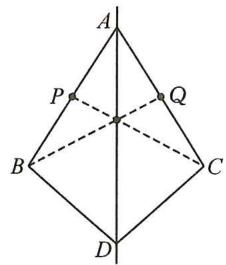  
图1

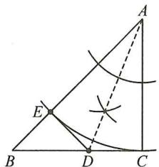  
图2

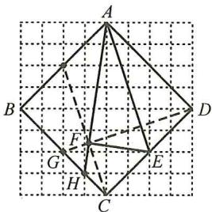

text_image

Geometric diagram of a polyhedron with labeled vertices and internal points, used in spatial geometry problems.

图3

# 板块二 综合与实践

解:(1)画图如图所示,连接 OB,

由题意, 得 $A'(0,-1)$ , $S_{\triangle A'OB}=\frac{1}{2}OA'\times4=4$ .

$$
\because S _ {\triangle A ^ {\prime} O B} = S _ {\triangle A ^ {\prime} O C} + S _ {\triangle O C B} = \frac {1}{2} O C \times 2 + \frac {1}{2} O C \times 3 =
$$

$$
\frac {5}{2} O C = 4,
$$

$$
\therefore O C = \frac {8}{5}, \therefore C \left(\frac {8}{5}, 0\right);
$$

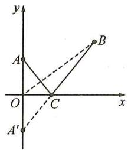  
图1

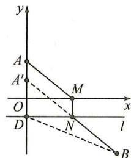  
图2

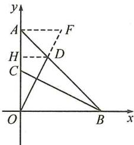  
图3

(2)画图如图所示,连接 DB, $S_{\triangle A^{\prime}DB}=\frac{1}{2}A^{\prime}D\times5=5.$

$$
\begin{array}{l} \because S _ {\triangle A ^ {\prime} D B} = S _ {\triangle A ^ {\prime} D N} + S _ {\triangle D N B} = \frac {1}{2} D N \times 2 + \frac {1}{2} D N \times 2 = \\ 2 D N = 5, \end{array}
$$

$$
\therefore D N = \frac {5}{2}, \therefore N \left(\frac {5}{2}, - 1\right), M \left(\frac {5}{2}, 0\right);
$$

(3) 过点 A 作 $AF \perp OA$ 交 OD 的延长线于点 F，过点 D 作 $DH \perp OA$ 于点 H.

$$
\because O A = O B, \therefore \angle B A O = 4 5 ^ {\circ},
$$

$$
\therefore \angle A D H = 4 5 ^ {\circ}, \therefore D H = A H.
$$

$$
\because \angle A O D + \angle B O D = \angle B O D + \angle O B C,
$$

$$
\therefore \angle A O D = \angle O B C, \therefore \triangle A O F \cong \triangle O B C, \therefore A F = O C.
$$

$$
\because A O = 6, C \text {   为   } O A \text {   的中点，   } \therefore A F = O C = 3.
$$

$$
\because S _ {\triangle A O F} = \frac {1}{2} A F \cdot A O = 9,
$$

$$
S _ {\triangle A O F} = S _ {\triangle O D H} + S _ {\text {梯形} D H A F}
$$

$$
= \frac {1}{2} D H \cdot O H + \frac {1}{2} (D H + A F) D H
$$

$$
= \frac {1}{2} D H (O H + D H + A F)
$$

$$
= \frac {1}{2} D H (O A + A F)
$$

$$
= \frac {9}{2} D H = 9,
$$

$$
\text { 解得 } D H = 2, \therefore O H = 4, \therefore D (2, 4).
$$

# 第十六章 整式的乘法

# 第26讲 整式的乘法

# 板块一 幂的运算

# 典例精讲

【例 1】(1) $a^{5}$ ; (2) $x^{6}$ ; (3) $-x^{5}$ ; (4) $-(x-y)^{5}$

【例2】解： $\because 2^{2x + 1}\times 2^{2y} = 128,\therefore 2^{2x + 1 + 2y} = 2^7$

$$
\therefore 2 x + 1 + 2 y = 7, \therefore x + y = 3.
$$

【例 3】(1) $x^{6}$ ; (2) $x^{6}$ ; (3) $x^{3n}$

【例 4】解： $(1)2 \times (2^{3})^{x} \times (2^{4})^{x} = 2^{22}, 2^{1+3x+4x} = 2^{22}$

$$
7 x + 1 = 2 2, \text { 解得 } x = 3;
$$

$$
(2) y ^ {2 a + 2 b} = (y ^ {a}) ^ {2} \cdot (y ^ {b}) ^ {2} = 4 ^ {2} \times 3 ^ {2} = 1 4 4.
$$

【例 5】(1) $8a^{12}$ ;(2) $-27x^{6}$

【例 6】(1) 解: 原式 = $\left[(-0.125) \times (-8)\right]^{101} = 1$ ;

(2) 原式 $= \left(\frac{2}{3}\right)^{201} \times \left(\frac{3}{2}\right)^{200} = \left(\frac{2}{3} \times \frac{3}{2}\right)^{200} \times \frac{2}{3} = \frac{2}{3}$ .

【例 7】(1) 解: 原式 = $\left(\frac{2}{3} \times 1.5\right)^{2022} \times 1.5 \times (-1) = -1.5$ ;

(2) 原式 $= -1 + \left(-\frac{3}{4} \times \frac{4}{3}\right)^{100} \times \frac{4}{3} + 6$

$$
= - 1 + \frac {4}{3} + 6 = 6 \frac {1}{3};
$$

(3) 原式 $= 3a^{18}$ ;

(4) 原式 $= 4t^{3}$ .

# 实战演练

1.(1)原式= $2a^{6}$ ;(2)原式=- $23x^{6}$ ;

(3) 原式 $= 4a^{6}$ ; (4) 原式 $= 10a^{6}$ ;

(5) 原式 $= -x^{8}$ ; (6) 原式 $= -16a^{8}$ .

2.(1)原式= $\left(\frac{1}{8}\times2\times4\right)^{6}=1;$

(2) 原式= $\left(\frac{1}{5}\right)^{5993}\times\left(5^{2}\right)^{2996}$

$$
= (\frac {1}{5} \times 5) ^ {5 9 9 2} \times \frac {1}{5} = \frac {1}{5}.
$$

3. 解：(1) $a^{3n}b^{3(m+1)}=a^{9}b^{15},\therefore3n=9,3(m+1)=15,$

$$
\therefore m = 4, n = 3;
$$

$$
(2) \left(2 ^ {a + 2 b}\right) ^ {3} = \left(2 ^ {a} \cdot 2 ^ {2 b}\right) ^ {3} = \left(2 ^ {a}\right) ^ {3} \cdot \left(2 ^ {2 b}\right) ^ {3} = 5 ^ {3} \times \left(8 ^ {b}\right) ^ {2} =
$$

$$
5 ^ {3} \times 4 ^ {2} = 1 2 5 \times 1 6 = 2 0 0 0.
$$

4. 解：(1) 原式 $=(x^{n})^{3} \cdot (y^{n})^{2} = 2^{3} \times 3^{2} = 8 \times 9 = 72$ ;

(2) 原式 $= (x^{2n})^3 - 4(x^{2n})^2 = 3^3 - 4 \times 3^2 = 27 - 36 = -9$ .

【例 2】证明：过点 D 作 $DE \perp AB$ 于点 E, $DF \perp AC$ 于点 F，设 BC 上的高为 h.

$$
\because A D \text {   平分   } \angle B A C, \therefore D E = D F.
$$

$$
\therefore \frac {S _ {\triangle A B D}}{S _ {\triangle A C D}} = \frac {\frac {1}{2} A B \cdot D E}{\frac {1}{2} A C \cdot D F} = \frac {A B}{A C},
$$

$$
\text {又} \frac {S _ {\triangle A B D}}{S _ {\triangle A C D}} = \frac {\frac {1}{2} B D \cdot h}{\frac {1}{2} C D \cdot h} = \frac {B D}{C D}, \therefore \frac {B D}{C D} = \frac {A B}{A C}.
$$

【例 3】解: 过点 P 分别作 $\triangle ABC$ 三边的垂线段, 垂足分别为 G, H, I.

则 $\angle PGB = \angle PGC = \angle PHC = \angle PHD = \angle PIE = 90^{\circ}.$

证 $\triangle IEP\cong\triangle HDP(AAS)$ ,

Rt△PBI≌Rt△PBG(HL),

Rt△PGC≌Rt△PHC(HL),

$$
\because S _ {\triangle A B C} = 1 6, S _ {\text {四边形} A E P D} = 5,
$$

$$
\therefore S _ {\triangle B E C} + S _ {\triangle C D P} = 1 6 - 5 = 1 1,
$$

$$
\therefore 2 (S _ {\triangle B G P} + S _ {\triangle P G C}) = 1 1, \therefore S _ {\triangle B P C} = 5. 5.
$$

# 实战演练

1. 解: 连接 IA, IB, IC, 过点 I 作 IM⊥AB 于点 M, IN⊥BC 于点 N,

∵ I 为△ABC 各内角平分线的交点， $IM \perp AB, IN \perp BC, IH \perp AC$ ，

$$
\therefore I H = I M = I N, \because A B = 4, B C = 3, \angle A B C = 9 0 ^ {\circ},
$$

$$
\therefore S _ {\triangle A B C} = \frac {1}{2} A B \cdot B C = \frac {1}{2} \times 4 \times 3 = 6,
$$

$$
\because S _ {\triangle A B C} = S _ {\triangle A I B} + S _ {\triangle B I C} + S _ {\triangle A I C},
$$

$$
\therefore 6 = \frac {1}{2} A B \cdot I M + \frac {1}{2} B C \cdot I N + \frac {1}{2} A C \cdot I H,
$$

$$
\because A B = 4, B C = 3, A C = 5, I H = I M = I N,
$$

$$
\therefore 6 = \frac {1}{2} \times 4 I H + \frac {1}{2} \times 3 I H + \frac {1}{2} \times 5 I H, \therefore I H = 1.
$$

2. 解：∵ BF = 2EF, $S_{\triangle DEF} = 2$ , ∴ $S_{\triangle BDE} = 3S_{\triangle DEF} = 3 \times 2 = 6$ ,

∵E为AD的中点，∴ $S_{\triangle ABD}=2S_{\triangle BDE}=2\times6=12$

$$
\because S _ {\triangle A B C} = 2 1, \therefore S _ {\triangle A C D} = 2 1 - 1 2 = 9,
$$

过点 D 作 $DM \perp AB$ 于点 M, $DN \perp AC$ 于点 N,

∵AD 是∠BAC 的角平分线，∴DM=DN，

$$
\therefore \frac {S _ {\triangle A B D}}{S _ {\triangle A C D}} = \frac {\frac {1}{2} A B \cdot D M}{\frac {1}{2} A C \cdot D N} = \frac {A B}{A C} = \frac {1 2}{9} = \frac {4}{3}.
$$

3. 解: 过点 D 作 $DF \perp AB$ 于点 F, $DG \perp AC$ 于点 G,

∵AD为∠BAC的平分线,DF⊥AB,DG⊥AC,

$$
\therefore D F = D G,
$$

$$
\therefore S _ {\triangle A B D} = \frac {1}{2} A B \cdot D F = \frac {3}{2} D F,
$$

$$
S _ {\triangle A C D} = \frac {1}{2} A C \cdot D G = \frac {4}{2} D G = 2 D F,
$$

$$
\therefore S _ {\triangle A B D}: S _ {\triangle A C D} = \frac {3}{2} D F: 2 D F = 3: 4,
$$

$$
\therefore S _ {\triangle A B D}: S _ {\triangle A C D} = B D: C D = 3: 4,
$$

$$
\therefore C D = \frac {4}{7} B C = \frac {4}{7} \times 5 = \frac {2 0}{7}.
$$

4. 解: 过点 C 作 $CF \perp BD$ 交 BD 的延长线于点 E, 交 BA 的延长线于点 F.

$$
\because B D \text {   平分   } \angle A B C, \therefore \angle F B E = \angle C B E,
$$

$$
\therefore \triangle B F E \cong \triangle B C E, \therefore C E = E F,
$$

$$
\because A B = A C, \angle A B D = \angle A C F,
$$

$$
\therefore \triangle A B D \cong \triangle A C F, \therefore B D = C F = 2 C E = 8,
$$

$$
\therefore C E = 4, S _ {\triangle B D C} = \frac {1}{2} B D \cdot C E = 1 6.
$$

# 板块四 角平分线(四) 作垂构对称型全等

# 典例精讲

【例1】证明：过点 $C$ 作 $CE \perp AD$ 于点 $E$ ，过点 $C$ 作 $CF \perp AB$ ，交 $AB$ 的延长线于点 $F$

$$
\because A C \text {   平分   } \angle B A D, \therefore C E = C F.
$$

$$
\because \angle A B C + \angle D = 1 8 0 ^ {\circ}, \angle A B C + \angle F B C = 1 8 0 ^ {\circ},
$$

$$
\therefore \angle F B C = \angle D, \because \angle F = \angle C E D = 9 0 ^ {\circ},
$$

$$
\therefore \triangle B F C \cong \triangle D E C, \therefore C B = C D.
$$

【例 2】证明: 过点 K 作 $KE \perp AB$ 于点 E, $KF \perp AC$ 于点 F,
∵AK 平分∠BAC, KE⊥AB, KF⊥AC,

$$
\therefore K E = K F,
$$

$$
\text {在} \mathrm{Rt} \triangle A K E \text {和} \mathrm{Rt} \triangle A K F \text {中}, \left\{ \begin{array}{l l} A K = A K, \\ E K = F K, \end{array} \right.
$$

$$
\therefore \triangle A K E \cong \triangle A K F (\mathrm{HL}), \therefore A E = A F,
$$

$$
\text { 同理可得 } B E = B D, C D = C F,
$$

$$
\begin{array}{l} \therefore A B - A C = A E + B E - A F - C F = B E - C F = B D - \\ C D. \end{array}
$$

# 实战演练

解:(1) $\because\angle A=\angle B=90^{\circ},\therefore AD\parallel BC,$

$$
\therefore \angle A D C + \angle B C D = 1 8 0 ^ {\circ},
$$

$$
\because D E \text {   平分   } \angle A D C, C E \text {   平分   } \angle B C D,
$$

$$
\therefore \angle E D C + \angle E C D = 9 0 ^ {\circ},
$$

$$
\therefore \angle D E C = 9 0 ^ {\circ} \text {, 即} D E \perp C E;
$$

(2) 过点 E 作 $EF \perp CD$ 于点 F，

$$
\because E A \perp A D, E B \perp B C, \therefore E A = E F = E B;
$$

$$
\triangle A D E \cong \triangle F D E, \triangle C B E \cong \triangle C F E, \tag {3}
$$

$$
\therefore A D = D F, C B = C F, \therefore A D + B C = C D;
$$

$$
\because A B = 1 2, \therefore E F = A E = \frac {1}{2} A B = 6,
$$

$$
\therefore S _ {\triangle C D E} = \frac {1}{2} C D \cdot E F = \frac {1}{2} \times 1 3 \times 6 = 3 9.
$$

# 板块五 角平分线(五) 截长补短构对称型全等

# 典例精讲

【例】证明:(方法一)在 AB 上截取 AE=AD, 连接 CE.
则 $\triangle ACE \cong \triangle ACD(SAS)$ ,

$$
\therefore \angle A D C = \angle A E C, C E = C D = B C, \therefore \angle C E B = \angle B,
$$

$$
\because \angle A E C + \angle C E B = 1 8 0 ^ {\circ}, \therefore \angle A D C + \angle B = 1 8 0 ^ {\circ}.
$$

$$
\begin{array}{r l} & (\text {方法二}) \text {延长} A D \text {至点} E, \text {使} A E = A B, \text {连接} C E, \\ & \text {则} \triangle A C E \cong \triangle A C B (\mathrm{SAS}), \end{array}
$$

$$
\therefore \angle E = \angle B, B C = C E = C D,
$$

$$
\therefore \angle C D E = \angle E = \angle B,
$$

$$
\because \angle A D C + \angle C D E = 1 8 0 ^ {\circ}, \therefore \angle A D C + \angle B = 1 8 0 ^ {\circ}.
$$

# 实战演练

1. 证明: 延长 CD 与 AE 的延长线交于点 F.

$$
\because A B \parallel C D, \therefore \angle F D B = \angle B, \angle F = \angle B A F,
$$

$$
\because E \text {   是   } B D \text {   的中点,   } \therefore B E = E D,
$$

$\therefore \triangle ABE \cong \triangle FDE, \therefore AB = DF, AE = EF.$

$$
\because A B + C D = A C, \therefore C F = D F + C D = A B + C D = A C,
$$

$$
\because C E = C E, \therefore \triangle A E C \cong \triangle F E C, \therefore \angle A C E = \angle F C E,
$$

即 CE 平分 $\angle ACD$ .

2. 解: (1) $\because \angle A = 60^{\circ}, \therefore \angle ABC + \angle ACB = 180^{\circ} - \angle A = 120^{\circ}, \therefore \angle OBC + \angle OCB = 60^{\circ}$ ,

$$
\therefore \angle B O E = \angle C O D = \angle O B C + \angle O C B = 6 0 ^ {\circ};
$$

(2) 在 BC 上截取 BF = BE，连接 OF. ∴ $\triangle BOF \cong \triangle BOE$ ，

$$
\therefore \angle B O F = \angle B O E = 6 0 ^ {\circ}, \text {   易求   } \angle B O C = 1 2 0 ^ {\circ},
$$

$$
\therefore \angle C O F = 6 0 ^ {\circ}, \therefore \angle C O F = \angle C O D, \therefore \triangle C O F \cong \triangle C O D,
$$

$$
\therefore C F = C D, \therefore B E + C D = B F + C F = B C = 7,
$$

$$
\because B E = 4, \therefore C D = 7 - 4 = 3.
$$

# 板块六 角平分线(六) 角分垂,延长构对称型全等 典例精讲

【例 1】解:(1)延长 AP 交 BC 于点 D, 可证 $\triangle ABP \cong \triangle DBP$ ,

$$
\therefore \angle B A P = \angle B D A = \angle A C B + \angle D A C = 7 0 ^ {\circ};
$$

$$
(2) \because \triangle A B P \cong \triangle D B P, \therefore A P = D P,
$$

$$
\therefore S _ {\triangle A B P} = S _ {\triangle D P B}, S _ {\triangle A P C} = S _ {\triangle D P C},
$$

$$
\therefore S _ {\triangle B P C} = \frac {1}{2} S _ {\triangle A B C} = 2.
$$

【例 2】证明: 过点 D 作 $DH \parallel BC$ 交 AE 的延长线于点 H, DH 与 AC 交于点 G,

$$
\text { 证 } \triangle D A E \cong \triangle D H E (\mathrm{ASA}), \triangle D F G \cong \triangle A H G (\mathrm{ASA}),
$$

$$
\therefore D F = A H = 2 A E,
$$

$$
\therefore S _ {\triangle A D F} = \frac {1}{2} D F \cdot A E = \frac {1}{2} D F \cdot \frac {1}{2} D F = \frac {1}{4} D F ^ {2}.
$$

# 实战演练

解:(1)延长 BM 交 CD 于点 N.

$$
\because \angle B C M = \angle N C M, C M = C M,
$$

$$
\angle C M B = \angle C M N = 9 0 ^ {\circ}, \therefore \triangle C M B \cong \triangle C M N (\mathrm{ASA}),
$$

$$
\therefore B M = N M,
$$

$$
\because \angle A M B = \angle D M N, \therefore \triangle A B M \cong \triangle D N M (A A S),
$$

$$
\therefore A M = D M;
$$

(2) $BC = CD - AB$ . 理由如下:

由(1)得 $\triangle ABM\cong\triangle DNM,\triangle CBM\cong\triangle CNM,$

$$
\therefore A B = D N, B C = C N,
$$

$$
\therefore B C = C N = C D - D N = C D - A B.
$$

# 板块七 角平分线(七) 对角互补模型

# 典例精讲

【例 1】证明:(1)方法一:过点 D 作 $DE \perp BD$ 交 BC 的延长线于点 E,

可得等腰 Rt△BDE, BD=DE,

$$
\triangle A D B \cong \triangle C D E (\text { ASA   或   AAS }), \therefore A D = C D;
$$

方法二: 过点 D 分别作 AB, BC 的垂线, 垂足分别为点 E, F, 证 $\triangle ADE \cong CDF$ (AAS);

$$
(2) \text {   由   } (1) \text {   知   } S _ {\text { 四边形 } A B C D} = S _ {\triangle B D E} = \frac {1}{2} B D ^ {2}.
$$

【例 2】(1) 证明: 过点 C 作 $CE \perp AB$ 交 AB 的延长线于点 E,

$$
\because C F \perp A D, \angle E A C = \angle F A C,
$$

$$
\therefore C E = C F, \because C B = C D,
$$

$$
\therefore \mathrm{Rt} \triangle C B E \cong \mathrm{Rt} \triangle C D F (\mathrm{HL}), \therefore \angle F D C = \angle C B E,
$$

$$
\because \angle A B C + \angle C B E = 1 8 0 ^ {\circ},
$$

$$
\therefore \angle A D C + \angle A B C = 1 8 0 ^ {\circ};
$$

(2)证明：∵△CBE≌△CDF，∴∠BCE=∠DCF，
易证△ACE≌△ACF，

$$
\therefore \angle A C E = \angle A C F, \therefore \angle A C F = \angle A C B + \angle B C E =
$$

$$
\angle A C B + \angle D C F = \frac {1}{2} \angle B C D;
$$

(3) 解: $\because \triangle ACE \cong \triangle ACF, \therefore AE = AF$ ,

$$
\because \triangle C B E \cong \triangle C D F, \therefore B E = D F,
$$

$$
\therefore A B + A D = (A E - B E) + (A F + D F) = A E + A F =
$$

$$
2 A F = 1 2;
$$

(4) 解: $AD - AB = (AF + DF) - (AE - BE) = DF + BE = 2DF = 4$ ;

(5) 解: $\because AE = AF$ ,

$$
\therefore A F - A B = A E - A B = B E = D F = 2;
$$

(6) 解: $\because \triangle CDF \cong \triangle CBE, \triangle ACE \cong \triangle ACF,$

$$
\therefore S _ {\text { 四   边   形 } A B C D} = S _ {\text { 四   边   形 } A E C F} = 2 S _ {\triangle A C F} = 2 0,
$$

$$
\therefore S _ {\triangle A C F} = 1 0, \therefore \frac {1}{2} A F \cdot C F = 1 0, \therefore A F \cdot C F = 2 0;
$$

(7) 解: $\because \triangle AEC \cong \triangle AFC, \triangle CBE \cong \triangle CDF$ ,

$$
\therefore S _ {\triangle A C D} - S _ {\triangle A B C} = \left(S _ {\triangle A C F} + S _ {\triangle C F D}\right) - \left(S _ {\triangle A C E} - \right.
$$

$$
S _ {\triangle B C E}) = S _ {\triangle C F D} + S _ {\triangle B C E} = 2 S _ {\triangle C F D} = 4, \therefore S _ {\triangle C F D} = 2.
$$

【点睛】本题也可用截长法或补短法做.

# 实战演练

1. 解: (1) 延长 AC 至 E, 使 CE = AB, 连接 DE.

$$
\because \angle B A C = \angle B D C = 9 0 ^ {\circ},
$$

$$
\therefore \angle B + \angle A C D = 1 8 0 ^ {\circ} = \angle D C E + \angle A C D,
$$

$$
\therefore \angle B = \angle D C E, \because B D = C D, \therefore \triangle A B D \cong \triangle E C D (\text { SAS }),
$$

$$
\therefore A D = E D, \therefore \angle A D B = \angle E D C,
$$

$$
\therefore \angle A D E = \angle B D C = 9 0 ^ {\circ},
$$

∴△ADE 为等腰直角三角形，∴∠DAE=45°=∠BAD，

$\therefore AD$ 平分 $\angle BAC$ ;

(2) 过点 D 作 $DF \perp AE$ 于点 F，

$$
\because A E = A C + C E = A C + A B = 1 4, \therefore D F = A F = E F = 7,
$$

$$
\therefore S _ {\triangle A B D} = S _ {\triangle D C E} = \frac {1}{2} C E \cdot D F = \frac {1}{2} \times 5 \times 7 = \frac {3 5}{2}.
$$

2. 解: (1) 过点 D 作 $DF \perp AC$ 交 AC 的延长线于点 F, 连接 DB, DC.

$$
\because B G = C G, \angle B G D = \angle C G D = 9 0 ^ {\circ}, D G = D G,
$$

$$
\therefore \triangle B G D \cong \triangle C G D,
$$

$$
\therefore B D = C D. \because A D \text {平分} \angle B A C, D E \perp A B, D F \perp A C,
$$

$$
\therefore D E = D F, \therefore \mathrm{Rt} \triangle B D E \cong \mathrm{Rt} \triangle C D F (\mathrm{HL}),
$$

∴BE=CF, 易证 $\triangle ADE\cong\triangle ADF$ ,

$$
\therefore A E = A F,
$$

$$
\therefore A B - A C = (A E + B E) - (A F - C F) = 2 B E;
$$

(2)由(1)知 $AB + AC = (AE + BE) + (AF - CF) = 2AE = 16.$

# 板块八 角平分线(八) 同旁张等角模型

# 典例精讲

【例 1】证明:(1)在 BD 上截取 BG=CD, 连接 AG.

$$
\because \angle B A C = \angle B D C = 9 0 ^ {\circ}, \therefore \angle A B D = \angle A C D,
$$

$$
\text { 又 } \because A B = A C, \therefore \triangle A B G \cong \triangle A C D,
$$

$$
\therefore A G = A D, \angle B A G = \angle C A D,
$$

$$
\therefore \angle G A D = \angle B A C = 9 0 ^ {\circ},
$$

$$
\therefore \triangle A G D \text { 为等腰直角三角形, } \therefore \angle A D B = 4 5 ^ {\circ};
$$

$$
(2) \text {   易证   } \triangle A F G \cong \triangle A F D, \therefore G F = D F,
$$

(2) 连接 AO. 由 (1) 得 BO = AO, CO = AO.

$$
\text { 设 } \angle O A B = \alpha , \text { 则 } \angle O B A = \alpha , \angle O A C = \angle O C A = 4 0 ^ {\circ} + \alpha ,
$$

$$
\therefore \angle B O A = 1 8 0 ^ {\circ} - \angle O A B - \angle O B A = 1 8 0 ^ {\circ} - 2 \alpha ,
$$

$$
\begin{array}{l} \angle A O C = 1 8 0 ^ {\circ} - \angle O A C - \angle O C A = 1 8 0 ^ {\circ} - 2 (4 0 ^ {\circ} + \alpha) = \\ 1 0 0 ^ {\circ} - 2 \alpha , \end{array}
$$

$$
\therefore \angle B O C = \angle A O B - \angle A O C = (1 8 0 ^ {\circ} - 2 \alpha) - (1 0 0 ^ {\circ} - 2 \alpha)
$$

$$
= 8 0 ^ {\circ}.
$$

# 板块六 尺规作图(二) 作垂线

# 典例精讲

【例】解:(1)如图所示;

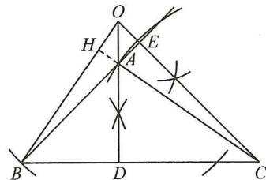

text_image

Geometric diagram with labeled points and intersecting lines, likely from a math problem or proof

(2)延长 CA 交 BO 于点 H.

$$
\because \angle A B C = 4 5 ^ {\circ}, A D \perp B C, \therefore \angle B A D = \angle O A E = 4 5 ^ {\circ}.
$$

$$
\because C E \perp B E, \therefore \angle O A E = \angle A O E = 4 5 ^ {\circ},
$$

$\therefore \triangle OCD, \triangle ABD$ 都为等腰直角三角形，

$$
\therefore A D = B D, O D = C D, \angle B D O = \angle A D C = 9 0 ^ {\circ},
$$

$$
\therefore \triangle O B D \cong \triangle C A D (\text { SAS }),
$$

$$
\therefore \angle O B D = \angle C A D, \therefore \angle O A H = \angle C A D = \angle O B D.
$$

$$
\because \angle B O D + \angle O B D = 9 0 ^ {\circ}, \therefore \angle B O D + \angle O A H = 9 0 ^ {\circ},
$$

$$
\therefore \angle O H A = 9 0 ^ {\circ}, \therefore B O \perp A C.
$$

# 实战演练

解:(1)如图所示;

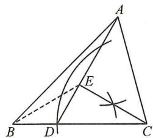

(2) 连接 BE.

$$
\because \angle D C E = 9 0 ^ {\circ} - \angle A D C = 3 0 ^ {\circ}, \therefore C D = 2 D E.
$$

$$
\because C D = 2 B D, \therefore B D = D E, \therefore \angle D B E = \angle D E B = 3 0 ^ {\circ},
$$

$$
\therefore \angle D B E = \angle D C E, \therefore B E = C E.
$$

$$
\because \angle B A E = \angle A D C - \angle A B C = 6 0 ^ {\circ} - 4 5 ^ {\circ} = 1 5 ^ {\circ},
$$

$$
\angle A B E = \angle A B C - \angle D B E = 4 5 ^ {\circ} - 3 0 ^ {\circ} = 1 5 ^ {\circ},
$$

$$
\therefore \angle B A E = \angle A B E, \therefore A E = B E = C E,
$$

$$
\therefore \triangle A C E \text {   为等腰直角三角形,   } \therefore \angle A C E = 4 5 ^ {\circ},
$$

$$
\therefore \angle A C B = \angle A C E + \angle D C E = 4 5 ^ {\circ} + 3 0 ^ {\circ} = 7 5 ^ {\circ}.
$$

# 板块七 尺规作图(三) 作轴对称图形

# 典例精讲

【例】解:(1)如图所示;

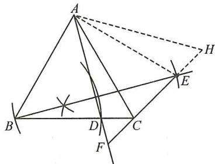

text_image

Geometric diagram with labeled points and lines, likely from a math problem or proof

(2) $60^{\circ}$ . 连接 AE, 则 AE = AB = AC.

设 $\angle BAD=\angle EAF=\alpha$ ,

$$
\angle C A D = 6 0 ^ {\circ} - \alpha , \angle C A E = 2 \alpha - 6 0 ^ {\circ}.
$$

$$
\because A E = A C, \therefore \angle A E C = \angle A C E = 1 2 0 ^ {\circ} - \alpha ,
$$

$$
\therefore \angle F = 1 8 0 ^ {\circ} - \angle A E C - \angle E A F = 6 0 ^ {\circ}.
$$

延长 FE 到点 H, 使得 FH = FA, 连接 AH. 则 $\triangle AFH$ 为等边三角形,

$$
\therefore F H = A F. \because \angle A C E = \angle A E C, \therefore \angle A C F = \angle A E H.
$$

$$
\because \angle A F H = \angle A H F = 6 0 ^ {\circ}, A F = A H,
$$

$$
\therefore \triangle A F C \cong \triangle A H E (A A S), \therefore C F = E H,
$$

$$
\therefore A F = F H = F E + E H = E F + C F.
$$

# 实战演练

解:(1)如图所示;

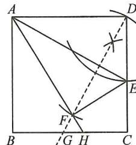

(2)延长 DF 交 BC 于点 G. 由(1)得 AD = AF,

$$
\therefore \angle A D F = \angle A F D. \because A D / / B C, \therefore \angle A D F = \angle H G F,
$$

$$
\therefore \angle H F G = \angle H G F, \therefore F H = H G.
$$

$$
\because \angle A D G + \angle D A E = \angle A D G + \angle C D G = 9 0 ^ {\circ},
$$

$$
\therefore \angle D A E = \angle C D G. \because A D = C D,
$$

$$
\therefore \triangle A D E \cong \triangle D C G (\mathrm{ASA}),
$$

$$
\therefore D E = C G.
$$

$$
\because C D = B C, \therefore C D - D E = B C - C G,
$$

$$
\therefore C E = B G,
$$

$$
\therefore B H = B G + G H = C E + F H.
$$

# 第 25 讲 情境创新题

# 板块一 阅读理解与新定义

解：(1)①；

(2)如图所示；(提示:画点 P 关于直线 AD 的对称点即为点 Q)  
(3)如图所示；(画 $\angle BAC$ 的角平分线交BC于点D，在AB上截取AE=AC)

由题意,得 $\triangle AED\cong\triangle ACD,\therefore AE=AC,DE=DC,$

∴△BDE 的周长为 $BD + DE + BE = BD + CD + BE = BC + BE = AE + BE = AB = 10$ ;

(4)①如图所示；  
②连接 EH, 延长 DF 交 BC 于点 G.

由题意, 得 AD = AF, AE 垂直平分 DF,

$$
\therefore \angle A D F = \angle A F D, D E = E F.
$$

$$
\because A D \parallel B C,
$$

$$
\therefore \angle A D F = \angle F G H,
$$

$$
\therefore \angle G F H = \angle F G H,
$$

$$
\therefore H F = G H.
$$

$$
\because E F = D E = C E,
$$

$$
\therefore \mathrm{Rt} \triangle E F H \cong \mathrm{Rt} \triangle E C H,
$$

$$
\therefore F H = H C.
$$

$$
\because D G \perp A E,
$$

$$
\therefore \angle D A E = \angle C D G,
$$

$$
\therefore \triangle A D E \cong \triangle D C G,
$$

实战演练   
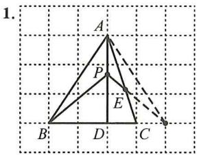  
图1

2.   
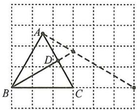  
图2

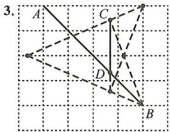  
图3

4.   
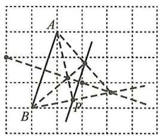  
图4

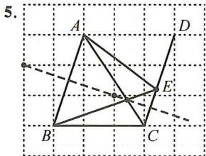  
图5

6.   
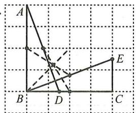  
图6

板块四 无刻度直尺作图(四) 对称与最值
典例精讲  
【例1】  
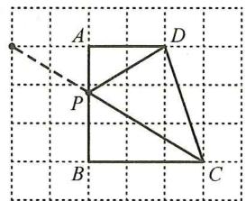

【例2】  
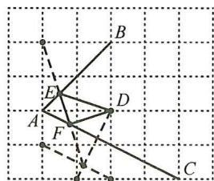

【例3】  
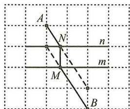

实战演练   
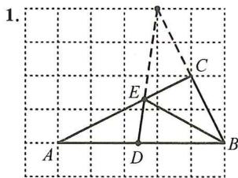  
图1

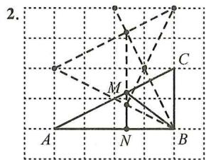  
图2

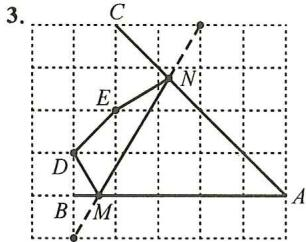

text_image

3.
C
E
N
D
B
M
A

图3

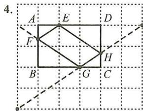  
图4

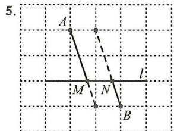  
图5

  
图6  
板块五 尺规作图(一) 作线段的垂直平分线
典例精讲

【例】解:(1)如图所示;

(2) 过点 D 分别作 $DM \perp AC, DN \perp BA$ ，垂足分别为 M, N。由(1)得 DB = DC。

$\because \angle BAC + \angle ABD = \angle BDC + \angle DCA,$

$\therefore \angle ABD = \angle DCA.$

又∵∠BND=∠CMD=90°,BD=CD,

$\therefore\triangle DBN\cong\triangle DCM(AAS),$

$\therefore DN=DM,\therefore AD$ 平分 $\angle CAE.$

实战演练

解:(1)如图所示;

text_image

Geometric diagram with labeled points O, A, B, C and intersecting lines, likely from a math problem or proof.

$\therefore BF - DF = BF - GF = BG = CD;$

(3) 易证 $\triangle ADF, \triangle AGF$ 均为等腰直角三角形，

$\therefore AF=DF=GF,$

$\therefore BD-CD=BD-BG=DG=2AF.$

【例 2】解:(1)过点 P 作 $PN \perp AC$ 于点 N.

$\because PM\perp AM,PA$ 平分 $\angle MAC,\therefore PM=PN,$

$\because \angle BPC = \angle BAC, \therefore \angle ABP = \angle PCA,$

$\because \angle BMP = \angle CNP = 90^{\circ},$

$\therefore \triangle PMB \cong \triangle PNC, \therefore PB = PC;$

(2) $\because\triangle PMB\cong\triangle PNC,\therefore BM=CN,$ 易证 $\triangle PAM\cong\triangle PAN$ ,

$\therefore AM = AN,$

$\therefore AC - AB = (AN + CN) - (BM - AM) = 2AM;$

(3) $AB + AC = (BM - AM) + (AN + CN) = BM + CN = 2BM = 6.$

实战演练

证明:(1)过点 D 作 $DE \perp BD$ 交 BC 于点 E,

可得等腰 Rt△BDE, BD = DE, △ADB ≅ △CDE (ASA 或 AAS),

$\therefore AD=CD;$

(2) $S_{\triangle BDC} - S_{\triangle ABD} = S_{\triangle BDE} = \frac{1}{2} BD^2.$

第10讲 一线三等角模型

板块一 三垂直

典例精讲

【例 1】解: 过点 E 作 $ED \perp BC$ , 交 BC 的延长线于点 D.

∵AB⊥BC,ED⊥BD,AC⊥CE,

$\therefore \angle ABC = \angle D = \angle ACE = 90^{\circ},$

$\therefore \angle DCE + \angle DEC = 90^{\circ}, \angle BCA + \angle DCE = 90^{\circ},$

$\therefore \angle BCA = \angle DEC, \therefore \triangle ABC \cong \triangle CDE (AAS),$

$\therefore BC = DE = 6.\therefore S_{\triangle BCE} = \frac{1}{2} BC\cdot DE = 18.$

【例 2】解: 过点 B 作 $BE \perp CD$ , 交 CD 的延长线于点 E, 证

$\triangle ACD \cong \triangle CBE(AAS), \therefore CD = BE, S_{\triangle BCD} = \frac{1}{2} CD \cdot$

$BE = \frac{1}{2} CD^2 = 8, \therefore CD = 4.$

【例 3】证明: 过点 C 作 $CG \perp AC$ , 交 AE 的延长线于点 G.

证 $\triangle ABD\cong\triangle CAG(ASA)$ , $\therefore CG=AD=CD$ ,

$\angle G=\angle ADB$ , 易证 $\angle GCE=\angle DCE=45^{\circ}$ ,

$\therefore \triangle CGE \cong \triangle CDE(SAS),$

$\therefore \angle G = \angle CDE, \therefore \angle ADB = \angle CDE.$

实战演练

1.50 解：∵AE⊥AB且AE=AB,EF⊥FH,BG⊥FH,

$\therefore \angle EAB = \angle EFA = \angle BGA = 90^{\circ},$

$\therefore \angle EAF + \angle BAG = 90^{\circ}, \angle ABG + \angle BAG = 90^{\circ},$

$\therefore \angle EAF = \angle ABG,$

$\because AE=AB,\angle EFA=\angle AGB,\angle EAF=\angle ABG,$

$\therefore \triangle EFA \cong \triangle AGB, \therefore AF = BG, AG = EF.$ 同理证得

$\triangle BGC \cong \triangle CHD, \therefore GC = DH, CH = BG.$

$\therefore FH = FA + AG + GC + CH = 3 + 6 + 4 + 3 = 16,$

∴ $S=\frac{1}{2}(6+4)\times16-3\times4-6\times3=50$ . 故答案为 50.

2. 解: 分别过点 B, E 作 AD 的垂线, 垂足分别为 G, H.

$DG=BC=7,\therefore AG=3$ , 易得 $\triangle ABG\cong\triangle EAH(AAS)$ ,

$$
\therefore E H = A G = 3, \therefore S _ {\triangle A D E} = \frac {1}{2} A D \cdot E H = \frac {1}{2} \times 4 \times 3 = 6.
$$

3.3 或 7 解: ① 如图 1, 当直线 CD 不经过 $\triangle ABC$ 内部时,

$\triangle AFC \cong \triangle CEB, AF = CE = 5, CF = BE = 2, EF = CE + CF = AF + BE = 5 + 2 = 7;$

②如图 2, 当直线 CD 经过△ABC 内部时,

$\triangle AFC \cong \triangle CEB, AF = CE = 5, CF = BE = 2,$

∴ EF = CE - CF = AF - BE = 5 - 2 = 3. 故 EF = 3 或 7.

  
图1

  
图2

4. 证明: (1) 过点 F 作 $FH \perp AC$ 于点 H, 则易得 $\triangle AFH \cong \triangle EAC(AAS)$ , $\therefore FH = AC = BC$ , $\therefore \triangle BCD \cong \triangle FHD (AAS)$ , $\therefore BD = DF$ , 即 D 为 BF 的中点;

(2)由(1)得 $\triangle AFH\cong\triangle EAC,\therefore AH=CE,$

$\therefore AC-AH=BC-CE,$

$\therefore BE=CH,$ 又 $\triangle BCD\cong\triangle FHD,$

$\therefore DH=CD,\therefore BE=CH=2CD.$

板块二 坐标系中的三垂直

典例精讲

【例 1】解: 过点 B 作 $BE \perp y$ 轴于点 E.

∵点 A(4,0), C(0,-2), ∴OA=4, OC=2,

$\because \angle BEC = \angle ACB = 90^{\circ},$

$\therefore \angle EBC + \angle ECB = 90^{\circ} = \angle ECB + \angle OCA,$

$\therefore \angle EBC = \angle OCA,$

又∵AC=BC,∴△EBC≌△OCA(AAS),

$\therefore BE=OC=2,CE=OA=4,$

$\therefore OE=CE-OC=2,\therefore$ 点 B 的坐标为 $(-2,2)$ .

【例 2】解: 分别过点 A, B 作 $AD \perp OC$ 于点 D, $BE \perp OC$ 于点 E. $\because \angle ACB = 90^{\circ}, \therefore \angle ACD + \angle CAD = 90^{\circ}, \angle ACD + \angle BCE = 90^{\circ}, \therefore \angle CAD = \angle BCE,$

$\therefore\triangle ADC\cong\triangle CEB(AAS),\therefore DC=BE,AD=CE,$

∵点 C 的坐标为 $(-2,0)$ ，点 A 的坐标为 $(-6,3)$ ，

$\therefore OC = 2, AD = CE = 3, OD = 6, \therefore CD = OD - OC =$

4, OE = CE - OC = 3 - 2 = 1, ∴ BE = 4, ∴ 点 B 的坐标是 (1, 4).

【例 3】解: 过点 A 作直线 $l \parallel y$ 轴, 过点 B 作 $BE \perp l$ 于点 E, 过点 C 作 $CF \perp l$ 于点 F,

$\therefore \angle BEA = \angle CFA = \angle BAC$

$= 90^{\circ},\therefore \angle BAE + \angle CAF =$

$\angle BAE + \angle ABE = 90^{\circ},$

$\therefore \angle ABE = \angle CAF,$

又∵AC=BC,∴△ABE≌△CAF(AAS),

$\therefore BE=AF,CF=AE,$ 设点 $A(m,n)$ ,

∵点 $B(2,2)$ , $C(4,-2)$ ,

$\therefore 2 - n = 4 - m, n + 2 = 2 - m,$

$\therefore m = 1, n = -1, \therefore$ 点 $A$ 的坐标为 $(1, -1)$ .

【例 4】(3,4)或(1,0) 解:分两种情况讨论:

①当点 C 在 AB 上方时, 可得点 $C(3,4)$ ;

②当点 C 在 AB 下方时, 可得点 C(1,0).

故答案为 $(3,4)$ 或 $(1,0)$ .

# 实战演练

1. 解: 过点 A 作 $AD \perp x$ 轴于点 D,

过点 B 作 $BE \perp AD$ 于点 E，

则 $\triangle ACD\cong\triangle BAE$ ，

$\therefore CD=AE,\because A(-2,-2),C(n,0),$

$B(0,m),\therefore CD = n + 2,AE = -2 - m,$

$\therefore n + 2 = -2 - m, \therefore m + n = -4.$

2. 解: 过点 B 作 $BE \perp x$ 轴于点 E,

交 AC 延长线于点 H，

$\therefore \angle ACD = \angle BED = 90^{\circ} = \angle AEH = \angle BCH.$

$\because \angle CDE = \angle CAO + \angle ACD = \angle DBE + \angle BED,$

$\therefore \angle CAO = \angle DBE.$

∵AD平分∠BAC,∴∠CAO=∠BAO,

又∵AE=AE,∴△AEH≌△AEB(ASA),

$\therefore BE=EH=-n,\therefore BH=-2n,$

又可得 $\triangle ACD\cong \triangle BCH,\therefore AD = BH.$

$\because A(-4,0),D(m,0),\therefore AD = BH = 4 + m,$

∴4+m=-2n,∴2n+m=-4.

3. 解: 过点 C 作直线 $l \parallel x$ 轴, 分别过点 A, B 作 $AE \perp l$ 于点

$E, BF \perp l$ 于点 $F$ . $\therefore \angle AEC = \angle ACB = \angle BFC = 90^{\circ}$ ,

$\therefore \angle EAC = \angle BCF$ ，又 $\because AC = BC,\therefore \triangle AEC\cong \triangle CFB$

$\therefore AE=CF=3,BF=EC=2,\therefore$ 点 B 的坐标为(4,1).

  
第3题图

  
第4题图

4. 解: 过点 A 作 $AH \perp y$ 轴于点 H, 过点 C 分别作 $CM \perp AH$ 于点 M, $CN \perp y$ 轴于点 N, 可得 $\triangle ACM \cong \triangle BCN$ ,

$\therefore BN=AM=2+1=3,\therefore b-c=BN=3.$

# 板块三 一线三等角

# 典例精讲

【例 1】证明：∵ $\angle EDC = \angle B + \angle BED, \angle EDF = \angle B,$

$\therefore \angle CDF = \angle BED,$

$\because \angle B = \angle C, BD = CF,$

$\therefore \triangle BDE \cong \triangle CFD(AAS), \therefore DE = DF.$

【例 2】解：∵ $\angle BAD + \angle CAE = \angle ACE + \angle CAE = 60^{\circ}$ ,

$\therefore \angle BAD = \angle ACE,$

$\because \angle ADB = \angle AEC = 120^{\circ}, AB = AC,$

$\therefore \triangle ADB \cong \triangle CEA (AAS),$

$\therefore BD=AE,AD=CE,$

$\therefore BD+DE=AE+DE=AD=CE.$

# 实战演练

1. 证明: 易知 $\angle CDE = \angle A = \angle B = 45^{\circ}, \angle BDE = \angle ACD$ ,

$CD = DE, \therefore \triangle ACD \cong \triangle BDE (AAS), \therefore BD = AC = BC.$

2. 解：∵ $\angle BAD + \angle CAD = \angle BAC, \angle 1 = \angle BAD +$

$\angle ABE, \because \angle 1 = \angle BAC, \therefore \angle ABE = \angle CAD,$

$\because \angle1=\angle2,\therefore\angle AEB=\angle AFC,$

又∵AB=AC,∴△ABE≌△CAF,

$\because CD=2BD,\therefore S_{\triangle ACD}=\frac{2}{3}S_{\triangle ABC}=8,$

$\therefore S_{\triangle ABE} + S_{\triangle CDF} = S_{\triangle CAF} + S_{\triangle CDF} = S_{\triangle ACD} = 8.$

# 第11讲 手拉手模型

# 板块一 初识手拉手模型(一) 双等边三角形

# 典例精讲

【例】解:(1) $\because\angle BAD=\angle CAE=60^{\circ}$ ,

$\therefore \angle BAE = \angle DAC,$

$\because AB=AD,AE=AC,$

$\therefore \triangle ABE \cong \triangle ADC(SAS), \therefore BE = CD;$

(2)由 $\triangle ABE\cong\triangle ADC$ 得 $\angle ABE=\angle ADC$ ,

$\therefore \angle BPD = \angle BAD = 60^{\circ};$

(3) 过点 A 作 $AM \perp BE$ 于点 M, $AN \perp CD$ 于点 N,

$\because \triangle ABE \cong \triangle ADC, \therefore BE = CD, S_{\triangle ABE} = S_{\triangle ADC}$

$\therefore AM=AN,\therefore PA$ 平分 $\angle DPE.$

# 实战演练

解:(1) $\because\angle BAD=\angle EAC=60^{\circ},\therefore\angle BAE=\angle DAC,$

又∵AB=AD,AE=AC,

$\therefore \triangle ABE \cong \triangle ADC(SAS), \therefore BE = CD;$

(2) 在 BE 上截取 BF = DP，连接 AF.

$\because \triangle ABE \cong \triangle ADC, \therefore \angle ABE = \angle ADC,$

又∵AB=AD,∴ $\triangle ABF\cong\triangle ADP(SAS)$ ,

$\therefore AP = AF, \angle BAF = \angle DAP,$

$\therefore \angle FAP = \angle BAD = 60^{\circ},$

$\therefore \angle BPA = \angle AFP = 60^{\circ}.$

# 板块二 初识手拉手模型(二) 双等腰直角三角形

# 典例精讲

【例】解:(1) $\because\angle BAC=\angle DAE=90^{\circ},\therefore\angle BAD=\angle CAE,$

$\because AB=AC,AD=AE,\therefore\triangle ABD\cong\triangle ACE(SAS);$

(2) $BD=CE$ 且 $BD\perp CE$ . 证明如下：

$\because \triangle ABD \cong \triangle ACE, \therefore BD = CE, \angle ABD = \angle ACE,$

$\therefore \angle BPC = \angle BAC = 90^{\circ},\therefore BD\perp CE;$

(3) 过点 A 分别作 BD, CE 的垂线, 垂足分别为 M, N.

$\because \triangle ABD \cong \triangle ACE, \therefore S_{\triangle ABD} = S_{\triangle ACE}$

$\because BD=CE,\therefore AM=AN,\therefore PA$ 平分 $\angle BPE,$

又∵∠BPE=90°,∴∠APB=45°.

# 实战演练

解:(1) $\because\angle BAD=\angle CAE=90^{\circ}$ ,

$\therefore \angle BAC + \angle CAD = 90^{\circ}, \angle CAD + \angle DAE = 90^{\circ},$

$\therefore \angle BAC = \angle DAE, \therefore \triangle BAC \cong \triangle DAE (\mathrm{SAS})$

$\therefore \angle BCA = \angle E, \because \angle CAE = 90^{\circ}, AC = AE,$

$\therefore \angle ACE = \angle E = 45^{\circ}, \therefore \angle BCA = 45^{\circ}, \therefore BC \perp CE;$

(2) 过点 A 作 $AG \perp CE$ 于点 G. 易证 $\triangle FBA \cong \triangle GDA$ ,

$\triangle ACF \cong \triangle ACG, \therefore CD - DE = CD - CB = (CG + DG) -$

$(CF-BF)=DG+BF=2BF=4.$

【例 2】

【例 3】

# 实战演练

1.

  
图1

  
图2

  
图3

  
图4

  
图5

  
图6

# 板块二 无刻度直尺作图(二)画对称

# 典例精讲

【例 1】

【例 2】

【例 3】

# 实战演练

  
图1

  
图2

  
图3

  
图4

  
图5

  
图6

# 板块三 无刻度直尺作图(三)用对称

# 典例精讲

【例1】

【例 2】

【例3】

text_image

Geometric diagram with labeled points A, B, C, D, E on a grid background

$\angle OP_{1}M + \angle OP_{2}N = \angle OP_{1}P_{2} + \angle OP_{2}P_{1} = 60^{\circ}.$

  
例1题图

text_image

Geometric diagram with labeled points and lines, likely from a math problem or proof

例2题图

【例 2】 $2+2\sqrt{3}$ 解:作点 P 关于 OA 的对称点 E, 点 Q 关于 OB 的对称点 F, 连接 EF. 易得 $PM+MN+QN+PQ \geqslant EM + MN + NF + 2 \geqslant EF + 2$ . 作 $OT \perp PQ$ 于点 T, 作 $OS \perp EF$ 于点 S, $\because OE = OF, \therefore ES = FS$ . 易证 $\triangle EOS \cong \triangle OPT, \therefore ES = OT = \sqrt{3}, \therefore EF = 2\sqrt{3}$ . ∴ 四边形 PMNQ 的周长的最小值为 $2+2\sqrt{3}$ .

实战演练

解:作点 M 关于 OB 的对称点 D, 作点 N 关于 OA 的对称点 C, 连接 OC, OD, PC, QD, CD. 则 $\angle COA = \angle AOB = \angle BOD = 20^{\circ}$ , OC = OM = ON = OD = 4, PN = PC, MQ = QD, $\therefore \angle COD = \angle COA + 2$

$\therefore\triangle COD$ 为等边三角形，

$$
\therefore C D = O C = 4.
$$

$$
\because M Q + P Q + P N = D Q + P Q + P C \geqslant C D = 4, \text {   当点   } C,
$$

$$
\begin{array}{r l} & {P, Q, D \text {四点共线时}, M Q + P Q + P N = D Q + P Q + P C} \\ & {\text {的最小值为} 4.} \end{array}
$$

# 板块八 两点之间线段最短(三)“造桥选址”问题 典例精讲

【例】(2,0)解:作点 A 关于 x 轴的对称点 $C(1,-2)$ ，将点 B 向左平移 3 个单位长度得到点 $B'$ ，连接 $CB'$ 交 x 轴于点 $M(2,0)$ ，此时点 M 的坐标即为所求.

text_image

y
A'
B'
O
M
M
N
N
x
C

实战演练

1. 解: 如图, 取格点 E, 连接 CE 交 BD 于点 N, 再沿 DB 方向取格点 M, 使 MN = AE, 则点 M, N 即为所求作的点.

text_image

Geometric diagram of a square with internal points and lines, labeled with letters A through M and N.

第1题图

  
第2题图

2. 解: 将 MN 平移到 $PP_{2}$ 处, 点 M 的对应点为点 P, 作点 P 关于 AO 的对称点 $P_{1}$ , 连接 $P_{1}P_{2}$ 交 AO 于点 $N'$ . 当点 N 移动到点 $N'$ 的位置时, $PM + PN$ 最小,

∴点 $N'$ 即为所要画的点.

# 板块九 两点之间线段最短(四) 拼接最值

典例精讲

【例】 $67.5^{\circ}$ 解：过点 $C$ 向

左作 $CF \parallel AB$ ，且 $CF = AC$ ，连接 $EF, BF$ .

$$
\therefore \angle F C E = \angle A.
$$

$$
\because C E = A D,
$$

$$
\therefore \triangle F C E \cong \triangle C A D,
$$

$$
\therefore E F = C D,
$$

$$
\therefore C D + B E = E F + B E \geqslant F B,
$$

当 F, E, B 三点共线时，

$CD+BE$ 取最小值 FB.

此时 $\angle CEB = 90^{\circ} - \angle CBF.$

$$
\because \angle F C A = \angle A = 4 5 ^ {\circ},
$$

$$
\therefore \angle F C B = \angle F C A + \angle A C B = 1 3 5 ^ {\circ},
$$

$$
\because C F = C A = C B,
$$

$$
\therefore \angle C F B = \angle C B F = 2 2. 5 ^ {\circ},
$$

$$
\therefore \angle C E B = 9 0 ^ {\circ} - 2 2. 5 ^ {\circ} = 6 7. 5 ^ {\circ}.
$$

实战演练

1.8 解: 延长 BC 至点 M, 使 CM = AB, 连接 FM, AM.

$$
\because \angle B = \angle F C M = 9 0 ^ {\circ}, B E = C F,
$$

$$
\therefore \triangle A B E \cong \triangle M C F,
$$

$$
\therefore A E = F M,
$$

$$
\therefore A E + A F = F M + A F \geqslant A M,
$$

当 A, F, M 三点共线时, $AE + AF$ 取最小值,

此时 $S_{\triangle ABE} + S_{\triangle ACF} = S_{\triangle FCM} + S_{\triangle ACF} = S_{\triangle ACM} = \frac{1}{2} CM\cdot AB = 8.$

2. B 解: 过点 A 向上作 $AG \perp AC$ ,

使 AG=AC，可证 $\triangle AEG\cong\triangle CFA$ ，

$$
\therefore G E = A F, B E + A F = B E + G E \geqslant G B,
$$

当 G, E, B 三点共线时, $AF + BE$ 的值最小,

此时， $\triangle AEG \cong \triangle CEB$

$$
\therefore A E = C E = C F,
$$

易得 AE=BF. 选 B.

# 第 24 讲 实践操作与轴对称

# 板块一 无刻度直尺作图(一) $45^{\circ}$ 角与垂直平分线

典例精讲

【例 1】

# 板块三 初识手拉手模型(三) 双等腰三角形

典例精讲

【例】解:(1) $\because\angle BAC=\angle DAE=\alpha$ ,

$$
\therefore \angle B A D = \angle C A E, \because A B = A C, A D = A E,
$$

$$
\therefore \triangle B A D \cong \triangle C A E (\mathrm{SAS}), \therefore B D = C E;
$$

$$
\because \triangle B A D \cong \triangle C A E, \therefore \angle A C P = \angle A B P, \tag {2}
$$

$$
\therefore \angle B P C = \angle B A C = \alpha , \text { 则 } \angle B P E = 1 8 0 ^ {\circ} - \alpha , \text { 过点 } A
$$

作 $AM \perp BD$ 于点 M, $AN \perp CE$ 于点 N,

$$
\text { 由 } \triangle A B D \cong \triangle A C E \text {   得,   } S _ {\triangle A B D} = S _ {\triangle A C E}.
$$

$$
\because B D = C E, \therefore A M = A N,
$$

$$
\therefore P A \text {   平分   } \angle B P E, \therefore \angle A P B = 9 0 ^ {\circ} - \frac {1}{2} \alpha ;
$$

$$
(3) \text { 图略 }, \angle A P B = 9 0 ^ {\circ} - \frac {1}{2} \alpha .
$$

实战演练

解: 易证 $\triangle DAC \cong \triangle BAE$ , 得 $\angle ADG = \angle ABF, DC = BE$ .

∵G,F分别为DC,BE的中点,∴DG=BF.

连接 $AF, \because AD = AB, \angle ADG = \angle ABF,$

$$
\therefore \triangle D A G \cong \triangle B A F, \therefore \angle D A G = \angle B A F, A G = A F,
$$

$$
\therefore \angle G A F = \angle D A B = \alpha , \therefore \angle A G F = \frac {1 8 0 ^ {\circ} - \alpha}{2} = 9 0 ^ {\circ} - \frac {1}{2} \alpha .
$$

# 板块四 构造手拉手模型

典例精讲

【例 1】解: 在 DB 的延长线上取点 E, 使 DE = AD, 连接 AE, 可得双等边三角形 $\triangle ADE$ 与 $\triangle ABC$ , 形成手拉手全等, 即 $\triangle ACD \cong \triangle ABE$ (SAS), $\therefore \angle ADC = \angle AED = 60^{\circ}$ .

【例 2】解: 过点 A 作 $AE \perp AD$ ，交 DB 的延长线于点 E，可得双等腰直角三角形 $\triangle ADE$ 与 $\triangle ABC$ ，形成手拉手全等，即 $\triangle ACD \cong \triangle ABE$ （SAS），∴ $\angle ADC = \angle AED = 45^{\circ}$ .

【例 3】解: 在 DB 的延长线上取点 E, 使 AE = AD, 连接 AE, 可得底角为 $30^{\circ}$ 的双等腰三角形 $\triangle ADE$ 与 $\triangle ABC$ , 形成手拉手全等, 即 $\triangle ACD \cong \triangle ABE$ (SAS), $\therefore \angle ADC = \angle AED = 30^{\circ}$ .

实战演练

1. 解: (1) 过点 D 作 $DF \perp DC$ 交 CA 的延长线于点 F, 则构造出共顶点的双等腰直角 $\triangle ADE$ 和 $\triangle FDC$ , 形成手拉手全等, 即 $\triangle FDA \cong \triangle CDE(SAS)$ , 得 $\angle DCE = \angle F = 45^{\circ}$ .

(2) 在 CA 的延长线上取点 F, 使 DF = DC, 连接 AE. 则构造出共顶点的双等腰 $\triangle ADE$ 和 $\triangle FDC$ , 形成手拉手全等, 即 $\triangle FDA \cong \triangle CDE(SAS)$ , 得 $\angle DCE = \angle F = 30^{\circ}$ .

2. 证明: 在 DB 延长线上取点 E, 使 AE = AD, 连接 AE, 可得双等腰 $\triangle ADE$ 与 $\triangle ABC$ , 形成手拉手全等, 即 $\triangle ACD \cong \triangle ABE(SAS)$ , $\therefore \angle ADC = \angle AED = \angle ADB$ , 即可得 AD 平分 $\angle BDC$ .

3. 解: 以 BP 为边向上作等边 $\triangle BPE$ ，连接 CE，易证 $\triangle ABP \cong \triangle CBE, \therefore CE = AP = 5$ ，又 $\because PE = PB = 2, \therefore 5 - 2 \leqslant PC \leqslant 5 + 2, \therefore 3 \leqslant PC \leqslant 7.$

# 第 12 讲 夹半角模型

# 板块一 $90^{\circ}$ 角夹 $45^{\circ}$ 角

典例精讲

【例 1】证明：(1)延长 EB 至点 G，使 BG = DF，连接 AG.

则 $\triangle ADF\cong \triangle ABG$ (SAS),

$$
\therefore A F = A G, \angle D A F = \angle B A G,
$$

$$
\therefore \angle D A F + \angle B A F = \angle B A G + \angle B A F,
$$

即 $\angle GAF = \angle BAD = 90^{\circ}.$

$$
\because \angle E A F = 4 5 ^ {\circ}, \therefore \angle G A E = \angle E A F = 4 5 ^ {\circ},
$$

$$
\therefore \triangle G A E \cong \triangle F A E (\mathrm{SAS}),
$$

$$
\therefore E F = E G = B E + B G = B E + D F;
$$

$$
(2) \because \triangle G A E \cong \triangle F A E,
$$

$$
\therefore \angle A E B = \angle A E F, \therefore A E \text {   平分   } \angle B E F.
$$

$$
\because \triangle G A E \cong \triangle F A E, \therefore \angle A F E = \angle G.
$$

$$
\because \triangle A D F \cong \triangle A B G, \therefore \angle A F D = \angle G.
$$

$$
\therefore \angle A F D = \angle A F E, \therefore A F \text {   平分   } \angle D F E.
$$

【例 2】证明: 在 AB 上截取 BF = AD, 连接 CF.

$$
\because \angle D A C = \angle B = 4 5 ^ {\circ}, A C = B C,
$$

$$
\therefore \triangle D A C \cong \triangle F B C (\mathrm{SAS}),
$$

$$
\therefore C D = C F, \angle D C A = \angle F C B,
$$

$$
\therefore \angle D C F = \angle A C B = 9 0 ^ {\circ}, \therefore \angle D C E = \angle E C F = 4 5 ^ {\circ},
$$

$$
\text { 又 } \because C E = C E, \therefore \triangle D C E \cong \triangle F C E (\mathrm{SAS}),
$$

$$
\therefore D E = F E, \therefore A D + D E = B F + E F = B E.
$$

实战演练

1. 解: (1) EF = BE - DF. 证明如下: 在 BE 上截取 BG = DF, 连接 AG. 则 $\triangle ADF \cong \triangle ABG$ (SAS),

$$
\therefore A F = A G, \angle D A F = \angle B A G,
$$

$$
\therefore \angle D A F + \angle D A G = \angle B A G + \angle D A G,
$$

$$
\text { 即 } \angle G A F = \angle B A D = 9 0 ^ {\circ}.
$$

$$
\because \angle E A F = 4 5 ^ {\circ}, \therefore \angle G A E = \angle E A F = 4 5 ^ {\circ},
$$

$$
\therefore \triangle G A E \cong \triangle F A E (\text { SAS }),
$$

$$
\therefore E F = E G = B E - B G = B E - D F;
$$

$$
(2) \angle A F D + \angle A F E = 1 8 0 ^ {\circ}. \text {   证明如下:   }
$$

$$
\text {   由(1)知   } \triangle A D F \cong \triangle A B G, \triangle G A E \cong \triangle F A E,
$$

$$
\therefore \angle A F D = \angle A G B, \angle A F E = \angle A G E,
$$

$$
\therefore \angle A F D + \angle A F E = \angle A G B + \angle A G E = 1 8 0 ^ {\circ}.
$$

2. 解: $EF = BE + DF$ . 证明如下:

延长 CD 至点 G，使 DG = BE.

$$
\text { 由 } \angle B A D = \angle C = 9 0 ^ {\circ} \text { ,   得 } \angle A B C + \angle A D C = 1 8 0 ^ {\circ},
$$

$$
\therefore \angle A D G = \angle A B E, \therefore \triangle A B E \cong \triangle A D G (\text { SAS }),
$$

$$
\therefore A E = A G, \angle B A E = \angle D A G,
$$

$$
\therefore \angle G A E = \angle D A G + \angle D A E = \angle B A E + \angle D A E =
$$

$$
\angle B A D = 9 0 ^ {\circ} = 2 \angle E A F,
$$

$$
\therefore \angle G A F = \angle E A F, \therefore \triangle A G F \cong \triangle A E F (\text { SAS }),
$$

$$
\therefore E F = G F = D G + D F = B E + D F.
$$

3. 证明: 延长 AB 至点 F, 使 BF = AD, 连接 CF.

$$
\because A C = B C, \angle A C B = 9 0 ^ {\circ},
$$

$$
\therefore \angle C A B = \angle C B A = 4 5 ^ {\circ}, \because A D \perp A B, \therefore \angle D A E = 9 0 ^ {\circ},
$$

$$
\therefore \angle C A D = \angle C B F = 1 3 5 ^ {\circ}, \therefore \triangle C A D \cong \triangle C B F (\text { SAS }),
$$

$$
\therefore C D = C F, \angle A C D = \angle B C F, \because \angle D C E = 4 5 ^ {\circ},
$$

$$
\therefore \angle A C D + \angle B C E = 9 0 ^ {\circ} - 4 5 ^ {\circ} = 4 5 ^ {\circ}, \therefore \angle B C E + \angle B C F = 4 5 ^ {\circ},
$$

$$
\therefore \angle D C E = \angle F C E = 4 5 ^ {\circ}, \because C D = C F, C E = C E,
$$

$$
\therefore \triangle C D E \cong \triangle C F E (\text { SAS }),
$$

$$
\therefore D E = E F, \therefore A D + B E = B F + B E = E F = D E.
$$

# 板块二 $120^{\circ}$ 角夹 $60^{\circ}$ 角

典例精讲

【例】证明：(1)延长 FD 至点 G，使 DG = BE，连接 CG.

$$
\because \angle A + \angle B C D = 6 0 ^ {\circ} + 1 2 0 ^ {\circ} = 1 8 0 ^ {\circ},
$$

$$
\therefore \angle B + \angle A D C = 1 8 0 ^ {\circ},
$$

$$
\therefore \angle C D G = \angle B, \therefore \triangle C B E \cong \triangle C D G (\mathrm{SAS}),
$$

$$
\therefore C G = C E, \angle D C G = \angle B C E,
$$

$$
\therefore \angle E C G = \angle B C D = 1 2 0 ^ {\circ} = 2 \angle E C F,
$$

$$
\therefore \angle E C F = \angle G C F, \therefore \triangle E C F \cong \triangle G C F (\mathrm{SAS}),
$$

$$
\therefore E F = G F = D G + D F = B E + D F;
$$

(2)过 C 作 $CM \perp AB$ 于点 M, $CN \perp AD$ 于点 N, 证 CM = CN, ∴ 点 C 在 $\angle BAD$ 的平分线上. (或利用 CE 平分 $\angle BEF$ , CF 平分 $\angle EFD$ 说明也可).

# 实战演练

证明: 在 BA 上截取 BF = AD, 连接 CF.

$$
\because A C = B C, \angle A C B = 1 2 0 ^ {\circ}, \therefore \angle C A B = \angle B = 3 0 ^ {\circ}.
$$

$$
\because \angle D A E = 6 0 ^ {\circ}, \therefore \angle D A C = 6 0 ^ {\circ} - 3 0 ^ {\circ} = 3 0 ^ {\circ},
$$

$$
\therefore \angle D A C = \angle B. \therefore \triangle A C D \cong \triangle B C F (\mathrm{SAS}),
$$

$$
\therefore C D = C F, \angle D C A = \angle B C F.
$$

$$
\because \angle D C A + \angle A C E = \angle D C E = 6 0 ^ {\circ},
$$

$$
\therefore \angle B C F + \angle A C E = 6 0 ^ {\circ},
$$

$$
\therefore \angle F C E = 1 2 0 ^ {\circ} - 6 0 ^ {\circ} = 6 0 ^ {\circ}, \therefore \angle D C E = \angle F C E,
$$

$$
\because C D = C F, C E = C E, \therefore \triangle C E D \cong \triangle C E F,
$$

$$
\therefore D E = E F, \therefore A D + D E = B F + E F = B E.
$$

# 板块三 $2 \alpha^{\circ}$ 角夹 $\alpha^{\circ}$ 角

# 典例精讲

【例】证明:(1)延长AD至点G,使DG=BE,连接CG.

$$
\because \angle B + \angle A D C = 1 8 0 ^ {\circ}, \therefore \angle C D G = \angle B,
$$

$$
\because C B = C D, D G = B E, \therefore \triangle B C E \cong \triangle D C G (\mathrm{SAS}),
$$

$$
\therefore \angle E C G = \angle B C D = 2 \angle E C F,
$$

$$
\therefore \angle E C F = \angle G C F. \text {   又   } \because C E = C G, C F = C F,
$$

$$
\therefore \triangle E C F \cong \triangle G C F (\mathrm{SAS}),
$$

$$
\therefore E F = F G = D G + D F = B E + D F;
$$

$$
(2) \text { 由 } \triangle E C F \cong \triangle G C F \text {   得   } \angle C F E = \angle C F D,
$$

$$
\therefore F C \text {   平分   } \angle D F E;
$$

$$
\because \angle B E C = \angle G = \angle C E F, \therefore E C \text {   平分   } \angle B E F.
$$

【点睛】①等腰三角形腰的旋转；②通过旋转对剩余半角进行拼凑；③产生一组旋转全等和一组轴对称全等；④旋转全等的旋转角度为 $2\alpha$ ；⑤对角互补使夹半角模型产生一组“截长补短”的相应结论.

# 实战演练

证明: 在 BE 上截取 BG = DF, 连接 AG.

$$
\because \angle B + \angle A D C = \angle A D F + \angle A D C = 1 8 0 ^ {\circ},
$$

$$
\therefore \angle B = \angle A D F, \text {又} \because A B = A D,
$$

$$
\therefore \triangle A B G \cong A D F (\text { SAS }),
$$

$$
\therefore A G = A F, \angle B A G = \angle D A F,
$$

$$
\because \angle B A D = 2 \angle E A F, \therefore \angle G A E = \angle F A E,
$$

$$
\text { 又 } \because A E = A E, \therefore \triangle G A E \cong \triangle F A E (\mathrm{SAS}),
$$

$$
\therefore E F = E G = B E - B G = B E - D F.
$$

# 第 13 讲 婆罗摩笈多模型

# 板块一 向外作双等腰直角三角形

# 典例精讲

【例 1】证明: 过点 D 作 $DH \perp FB$ , 交 BF 的延长线于点 H.

$$
\because \angle A C B = 9 0 ^ {\circ}, B D \perp A B, A B = D B,
$$

$$
\therefore \text {   可证   } \triangle A B C \cong \triangle B D H (\mathrm{AAS}),
$$

$$
\therefore B C = D H = B E, \therefore \triangle D H F \cong \triangle E B F (\text { A   A   S }).
$$

$$
\therefore D F = E F, \therefore F \text {   是   } D E \text {   的中点.   }
$$

【例 2】解: 过点 E 作 $EH \perp AF$ , 交 AF 的延长线于点 H.

$$
\because \angle A C B = \angle B A E = \angle C A D = 9 0 ^ {\circ},
$$

$$
\therefore \angle E H A = \angle A C B, \angle E A H + \angle B A C = \angle A B C +
$$

$$
\angle B A C = 9 0 ^ {\circ}, \therefore \angle E A H = \angle A B C,
$$

$$
\because A B = A E, \therefore \triangle A H E \cong \triangle B C A,
$$

$$
\therefore E H = A C, A H = B C, \because A C = A D, \therefore E H = A D,
$$

$$
\because \angle E H A = \angle F A D = 9 0 ^ {\circ}, \angle E F H = \angle D F A,
$$

$$
\therefore \triangle F H E \cong \triangle F A D, \therefore F H = A F, \therefore A H = 2 A F,
$$

$$
\therefore B C = 2 A F, \therefore \frac {A F}{B C} = \frac {1}{2}
$$

# 实战演练

解: 过 E 作 $EH \perp BF$ 交 BF 的延长线于点 H,

$$
\therefore \angle A B C = \angle A C E = \angle H = 9 0 ^ {\circ},
$$

$$
\therefore \angle A C B + \angle E C H = \angle A C B + \angle C A B = 9 0 ^ {\circ},
$$

$$
\therefore \angle B A C = \angle E C H, \because A C = C E,
$$

$$
\therefore \triangle A B C \cong \triangle C H E (\text { A   A   S }),
$$

$$
\therefore B C = E H = 3, C H = A B = 6,
$$

$$
\because \angle C H E = \angle D C H = 9 0 ^ {\circ}, B C = C D,
$$

$$
\therefore E H \parallel C D, E H = C D, \therefore \triangle C D F \cong \triangle H E F (\text { AAS }),
$$

$$
\therefore C F = F H, \therefore C F = \frac {1}{2} C H = \frac {1}{2} A B = 3,
$$

$$
\therefore \triangle C E F \text {   的面积为   } \frac {1}{2} \times 3 \times 3 = \frac {9}{2}.
$$

# 板块二 向内作双等腰三角形

# 典例精讲

【例】解:(1) $\because\angle ACB=\angle DAB=90^{\circ},AE\parallel BC,$

$$
\therefore \angle C A E = 1 8 0 ^ {\circ} - \angle A C B = 9 0 ^ {\circ}, \angle B = \angle B A E,
$$

$$
\therefore \angle D A C = 9 0 ^ {\circ} - \angle B A C = \angle B A E, \therefore \angle D A C = \angle B;
$$

(2) $BC = 2AF$ . 证明如下: 过点 $D$ 作 $DG \perp AC$ , 交 $AC$ 的延长线于点 $G$ ,

$$
\because A G \perp D G, \therefore \angle A G D = \angle A C B = 9 0 ^ {\circ},
$$

$$
\therefore \triangle A G D \cong \triangle B C A (\text { A   A   S }),
$$

$$
\therefore D G = A C = A E, A G = B C,
$$

$$
\therefore \triangle A E F \cong \triangle G D F (\text { A   A   S }),
$$

$$
\therefore A F = G F, \therefore B C = A G = 2 A F.
$$

# 实战演练

1. 证明: 延长 AD 至点 H, 使 HD = AD, 连接 CH,

$$
\because B D = C D, A D = H D, \angle A D B = \angle H D C,
$$

$$
\therefore \triangle A D B \cong \triangle H D C, \therefore \angle B A D = \angle C H D, A B = H C,
$$

$$
\therefore A B \parallel C H, \therefore \angle B A C + \angle A C H = 1 8 0 ^ {\circ},
$$

$$
\because E F = 2 A D, H A = 2 A D, \therefore E F = H A,
$$

$$
\because A E = A B, A B = H C,
$$

$$
\therefore H C = A E \text {, 又} A C = A F
$$

$$
\therefore \triangle A H C \cong \triangle F E A, \therefore \angle E A F = \angle A C H,
$$

$$
\therefore \angle E A F + \angle B A C = 1 8 0 ^ {\circ}.
$$

2. 证明: 过点 $E$ 作 $EG \parallel AD$ , 交 $AB$ 的延长线于点 $G$ .

$$
\because \angle B A E + \angle C A D = 1 8 0 ^ {\circ},
$$

$$
\therefore \angle D A E + \angle C A B = 1 8 0 ^ {\circ},
$$

$$
\because E G \parallel A D, \therefore \angle D A E + \angle A E G = 1 8 0 ^ {\circ},
$$

$$
\therefore \angle A E G = \angle C A B.
$$

$$
\because A C = A D, E G \parallel A D, F \text {为} D E \text {的中点，}
$$

$$
\therefore \triangle D A F \cong \triangle E G F,
$$

$$
\therefore E G = A D = A C, A F = G F, \therefore A G = 2 A F.
$$

$$
\because A B = A E, \angle A E G = \angle C A B, E G = A C,
$$

$$
\because A (- 2, 0), B (0, - 2), \therefore O A = O B = O F = 2,
$$

$$
\because B O \perp A F, \therefore \angle O A B = \angle O B A = 4 5 ^ {\circ} = \angle O B F =
$$

$$
\angle O F B, \therefore \angle A B F = 9 0 ^ {\circ} = \angle D B E,
$$

$$
\therefore \angle D B A = \angle E B F, \because D B = B E,
$$

$$
\therefore \triangle D B A \cong \triangle E B F,
$$

$$
\therefore \angle E F B = \angle D A B = 1 8 0 ^ {\circ} - \angle O A B = 1 3 5 ^ {\circ},
$$

$$
\therefore \angle E F O = \angle E F B - \angle O F B = 9 0 ^ {\circ},
$$

∴点 E 在直线 x=2 上运动, 当 CE 与直线 x=2 垂直时, CE 最小, 此时点 E 坐标为 $(2,0)$ .

# 实战演练

解: 过点 C 作 $CO \perp AB$ 于点 O,

过点 E 分别作 $EM \perp CO$ 于点 M, $EN \perp AB$ 于点 N.

$$
\because A C = B C, \angle B C A = 9 0 ^ {\circ},
$$

$$
\therefore \angle C B A = \angle C A B = \angle B C O =
$$

$$
\angle A C O = 4 5 ^ {\circ}, \therefore B O = C O = A O.
$$

$$
\because \angle D E C = 9 0 ^ {\circ}, \angle C O D = 9 0 ^ {\circ},
$$

$$
\therefore \angle E D O + \angle E C O = 1 8 0 ^ {\circ}, \because \angle E D B + \angle E D O = 1 8 0 ^ {\circ},
$$

$$
\therefore \angle E D B = \angle E C O.
$$

$$
\because \angle E N D = \angle E M C = 9 0 ^ {\circ}, E C = E D,
$$

$$
\therefore \triangle E D N \cong \triangle E C M, \therefore E N = E M, \therefore O E \text {平分} \angle C O B,
$$

$$
\therefore \text {   点   } E \text {   在   } \angle C O B \text {   的平分线所在直线上运动,当   } B E \perp O E
$$

$$
\text { 时 }, B E _ {\text { 最小值 }} = \frac {1}{2} B C = 1.
$$

# 板块五 垂线段最短(五) 胡不归

# 典例精讲

【例 1】2 解: 过点 A 向右作 AM//BC, 过点 D 作 $DE \perp AM$ 于点 E, 交 BC 于点 F, 则 $DF \perp BC$ .

$$
\therefore \angle M A B = \angle B = 3 0 ^ {\circ}, \therefore D E = \frac {1}{2} A D,
$$

$$
\therefore \frac {1}{2} A D + P D = D E + P D \geqslant E F = A C = 2, \text {当} P, D,
$$

$E$ 三点共线时, $\frac{1}{2} AD + PD$ 的最小值为2.

【例 2】12 解: 在 BC 下方作

$\angle BCE=30^{\circ}$ ，过点D作 $DF\perp CE$ 于点F，过点A作 $AH\perp CE$ 于点H，AH与BC交于点M.

$$
\therefore D F = \frac {1}{2} D C,
$$

$$
\because 2 A D + D C = 2 (A D + \frac {1}{2} D C) = 2 (A D + D F),
$$

∴当 A, D, F 在同一直线上，点 D 与点 M 重合时， $(AD+DF)_{\text{最小值}}=AH$ ，此时， $\angle B=\angle AMB=60^{\circ}$

∴△ABM 是等边三角形，∴AM=BM=AB=4，在 Rt△ABC 中，∠BAC=90°，∠B=60°，AB=4，

$$
\therefore B C = 8, \therefore M C = B C - B M = 4, \therefore 2 A D + D C = 2 \times
$$

$$
4 + 4 = 1 2, \therefore 2 A D + D C \text {   的最小值为   } 1 2.
$$

# 实战演练

解: 过点 C 作 $CE \perp AB$ 于点 E, 过点 P 作 $PF \perp CE$ 于点 F.

∵△BDC为等边三角形，

$$
\therefore D C = B C = B D, \angle D C B = 6 0 ^ {\circ}.
$$

$$
\because C E \perp B D,
$$

$$
\therefore \angle D C E = \frac {1}{2} \angle D C B = 3 0 ^ {\circ},
$$

$$
\because P F \perp C E,
$$

$$
\therefore P F = \frac {1}{2} P C,
$$

$$
\therefore A P + \frac {1}{2} P C = A P + P F \geqslant A E = A D + \frac {1}{2} B D = 3,
$$

当 A, P, F 三点共线时, $AP + \frac{1}{2}PC$ 取最小值 3.

# 板块六 两点之间线段最短(一) 将军饮马

# 典例精讲

【例 1】8 解: 连接 AD, MA.

$$
\because A B = A C, B D = C D, \therefore A D \perp B C,
$$

$$
\therefore S _ {\triangle A B C} = \frac {1}{2} B C \cdot A D = \frac {1}{2} \times 6 A D = 2 4,
$$

$$
\therefore A D = 8, \because E F \text {   是线段   } A C \text {   的垂直平分线，   }
$$

$$
\therefore M B = M A, B M + D M = A M + D M \geqslant A D = 8.
$$

$$
\therefore B M + D M \text {   的最小值为   } 8 \mathrm{cm}.
$$

【例 2】3 解:作点 C 关于 AB 的对

称点 E，连接 AE, DE, PE，则 $PE = PC, PD + PC = PD + PE \geqslant DE.$ 当 P, D, E 三点共线时， $PD + PC$ 取最小值，最小值为 DE.

$$
\because A C = B C, \angle A C B = 9 0 ^ {\circ},
$$

$$
\therefore \angle C A B = \angle C B A = 4 5 ^ {\circ}, \therefore \angle E A B = \angle C A B = 4 5 ^ {\circ},
$$

$$
\therefore \angle E A C = 9 0 ^ {\circ}, \therefore \angle E A D = \angle B C D.
$$

$$
\because A E = A C = B C, A D = C D, \therefore \triangle E A D \cong \triangle B C D,
$$

$$
\therefore E D = B D = 3, \therefore P D + P C \text {   的最小值为   } 3.
$$

# 实战演练

解:作点 B 关于 AC 的对称点 E, 连

接 $PE, AE, DE$ . 则 $PB = PE$ ,

$$
\therefore P B + P D = P E + P D \geqslant D E.
$$

当点 E, P, D 三点共线时，

$PB+PD$ 取最小值.

$$
\mathrm{设} S _ {\triangle A P D} = 1, S _ {\triangle B P C} = x,
$$

$$
\text { 则 } S _ {\triangle P B D} = 1, S _ {\triangle P C E} = x,
$$

$$
\because \triangle A P E \cong \triangle A P B,
$$

$$
\therefore S _ {\triangle A P E} = S _ {\triangle A P B} = 2,
$$

$$
\because S _ {\triangle E A D} = S _ {\triangle E D B},
$$

$$
\therefore 3 = 2 x + 1 \text {, 解 得} x = 1
$$

$$
\therefore S _ {\triangle B P C} = 1,
$$

$$
\therefore S _ {\triangle A P B}: S _ {\triangle B P C} = 2: 1 = 2.
$$

# 板块七 两点之间线段最短(二) 多折线和最值

# 典例精讲

【例 1】 $60^{\circ}$ 解: 分别作点 P 关于 OA, OB 的对称点 $P_{1}, P_{2}$ ，连接 $P_{1}P_{2}$ ,

$$
\begin{array}{l} \therefore O P _ {1} = O P = O P _ {2}, \angle O P _ {1} M = \angle M P O, \angle N P O = \\ \angle N P _ {2} O, M P = P _ {1} M, P N = P _ {2} N, \end{array}
$$

$$
\begin{array}{l} {P M + M N + P N = P _ {1} M + M N + P _ {2} N \geqslant P _ {1} P _ {2}, \text {   当   }} \\ {P _ {1}, M, N, P _ {2} \text {   四点共线时，   }} \end{array}
$$

$$
\begin{array}{r l} & {\therefore \triangle P M N \text {的周长的最小值} = P _ {1} P _ {2}, \text {由轴对称的性质可得} \angle P _ {1} O P _ {2} = 2 \angle A O B = 1 2 0 ^ {\circ}, \angle O P _ {1} P _ {2} +} \\ & {\angle O P _ {2} P _ {1} = 6 0 ^ {\circ}, \therefore \angle M P N = \angle O P M + \angle O P N =} \end{array}
$$

$\therefore AF = AD, \therefore \angle AFD = \angle ADF = 30^{\circ}.$

$\because \angle ECF = 120^{\circ},\angle DCE = 60^{\circ},$

$\therefore \angle FCD = 60^{\circ}, \therefore \angle FCD = \angle ECD.$

$\because CD=CD,CF=CE,\therefore\triangle CFD\cong\triangle CED,$

$\therefore \angle E = \angle CFD, \therefore \angle AFC = \angle CFD = \angle E.$

$\because \angle AFD = \angle AFC + \angle CFD = 2\angle E = 30^{\circ},\therefore \angle E = 15^{\circ}.$

2. 证明: 在 BA 的延长线上取点 F, 使 $\angle FCP = 120^{\circ}$ ,

$\therefore \angle FCP = \angle ACB = \angle ABP,$

$\therefore \angle FCA = \angle PCB, \angle F = \angle CPB.$

$\because CA=CB,\therefore\triangle CFA\cong\triangle CPB,\therefore BP=AF,CF=CP.$

$\because \angle FCP = 120^{\circ},\angle DCE = 60^{\circ},\therefore \angle FCD = \angle PCD.$

$\because CD=CD,CF=CP,\therefore\triangle CFD\cong\triangle CPD,$

$\therefore PD=FD=AD+AF=AD+BP.$

# 第 23 讲 综合与实践——最短路径问题

# 板块一 垂线段最短(一) 定点定线

# 典例精讲

【例 1】3 解: 过点 P 作 $PH \perp AB$ 于点 H.

∵AP 平分∠BAC, ∠C=90°, ∴PH=PC.

$\therefore \frac{S_{\triangle APB}}{S_{\triangle APC}} = \frac{BP}{PC} = \frac{AB}{AC} = \frac{5}{3},\therefore PC = \frac{3}{8} BC = 3,\therefore PH =$

3. $\because PH \perp AB, \therefore PD \geqslant PH = 3$ , 当点 $D$ 与点 $H$ 重合时, $PD$ 取最小值 3.

【例 2】6 解:作点 E 关于 AM 的对称点 $E'$ ，连接 $DE'$ ， $BE'$ ，∴ $ED = E'D$ .

$\because BD+DE=BD+DE'\geq BE'$ . 则当 $E', D, B$ 三点共线，且 $BE'\perp AC$ 时， $BD+DE$ 最小，

∵AM平分∠BAC,∠BAM=15°,

$\therefore E^{\prime}$ 在 $AC$ 上， $\angle BAE' = 30^{\circ}$ ， $\because AB = 12, BE'\perp AC.$

$\therefore BE'=\frac{1}{2}AB=6$ , 即 $BD+DE$ 最小值为 6.

# 实战演练

解:1 延长 BC 至点 D, 使 CD = BC, 连接 DN, DM,

$\because \angle ACB = 90^{\circ},\angle A = 30^{\circ},\therefore BN = DN,\angle ABC = 60^{\circ},$

∴ $MN + BN = MN + DN \geqslant DM$ ，当 M, N, D 三点共线，且 $DM \perp AB$ 时，线段 MN 与 BN 的和最小，

$\therefore \angle BDM = 30^{\circ},\therefore BM = \frac{1}{2} BD = BC,\therefore \frac{BC}{BM} = 1.$

# 板块二 垂线段最短(二) K 型全等稳定线

# 典例精讲

【例】4 解: 过点 B 作 $BC \perp x$ 轴于点 C.

$\therefore \angle BCA = \angle BAP = 90^{\circ},$

$\therefore \angle CBA + \angle BAC = 90^{\circ}, \angle PAO + \angle BAC = 90^{\circ}.$

$\therefore \angle CBA = \angle PAO.$

$\because \angle AOP = \angle BCA = 90^{\circ}, AP = AB,$

$\therefore \triangle BAC \cong \triangle APO, \therefore BC = OA = 4,$

∴点 B 在直线 y=4 上，当 MB 与直线 y=4 垂直时， $MB_{最小值}=4.$

# 实战演练

1.4 解: 过点 F 作 $FN \perp AC$ 于点 N.

$\therefore \angle FNC = \angle EDF = \angle C = 90^{\circ},$

$\therefore \angle EDC + \angle FDN = \angle EDC + \angle DEC = 90^{\circ},$

$\therefore \angle DEC = \angle FDN.$

$\because ED = DF, \therefore \triangle EDC \cong \triangle DFN, \therefore FN = CD = 4.$

$\because FA\geqslant FN=4,\therefore$ 当点N与点A重合时,FA最小,

$\therefore FA$ 的最小值为 4.

2.5 解: 过点 B 作 $BE \perp y$ 轴于点 E,

设直线 y = -2 交 y 轴于点 $F(0, -2)$ ,

$\because \angle BEC = \angle CFA = \angle BCA = 90^{\circ},$

$\therefore \angle BCE + \angle ACF = 90^{\circ}, \angle CBE + \angle BCE = 90^{\circ},$

$\therefore \angle CBE = \angle ACF.$

$\because CB=CA,\therefore\triangle CBE\cong\triangle ACF,$

$\therefore BE=CF=OC+OF=5,$

∴点 B 在直线 x = -5 上运动，

当点 B 在 x 轴上时, OB 取最小值 5.

# 板块三 垂线段最短(三) 发现手拉手

# 典例精讲

【例】解: 连接 BF, ∵△ABC 和 △CEF 都是等边三角形,

$\therefore AC = BC, CE = CF, \angle ACB = \angle ECF = 60^{\circ},$

∵AD 是△ABC 的高, ∴AD 平分∠BAC,

$\therefore \angle CAE=30^{\circ}, CD=BD=3,$

$\therefore \angle ACE = \angle BCF = 60^{\circ} - \angle BCE,$

$\therefore \triangle ACE \cong \triangle BCF, \therefore \angle CAE = \angle CBF = 30^{\circ},$

∴点 F 在定直线 BF 上运动, 过点 D 作 $DH \perp BF$ 于点 H, 则 $DF \geqslant DH$ , 当 $DF \perp BF$ 时, $DH = \frac{1}{2} BD = 1.5$ ,

$\therefore DF \geqslant 1.5$ , 故 DF 的最小值为 1.5.

# 实战演练

1.1 解: 连接 BE. $\because \angle ACB = \angle DCE = 90^{\circ}, \therefore \angle ACD = \angle BCE.$ $\because AC = BC, DC = EC, \therefore \triangle ACD \cong \triangle BCE,$

$\therefore \angle CBE = \angle A = 45^{\circ}.\therefore \angle ABE = \angle ABC + \angle CBE =$ $90^{\circ},\therefore$ 点 $E$ 在过点 $B$ 且与 $AB$ 垂直的直线 $BM$ 上运动.当 $OE\bot BM$ 时， $OE$ 最小， $S_{\triangle ECO} = \frac{1}{2} OC\times \frac{1}{2} OB = 1.$

2.90 解: 过点 D 作 $DM \perp AC$ 于点 M, $DN \perp BC$ 于点 N.

$\because \angle ADE = \angle ACB = 90^{\circ},$

$\therefore \angle DAC = \angle DEN.$

$\because \angle DMA = \angle DNE = 90^{\circ}, DA = DE,$

$\therefore \triangle DMA \cong \triangle DNE, \therefore DM = DN,$

∴CD平分∠ACN.∴∠DCA= $\frac{1}{2}$ ∠ACN=45°,

当 $\angle ODC=90^{\circ}$ 时，OD最小，此时DM=OM=MC.

此时 $S_{四边形ABCD}=S_{\triangle DAC}+S_{\triangle ABC}=\frac{1}{2}AC\cdot DM+\frac{1}{2}AC\cdot$

$BC = 18 + 72 = 90.$

# 板块四 垂线段最短(四) 构手拉手

# 典例精讲

【例 1】1 解: 在 BC 上截取 BF = AB = 4, 连接 AF, EF.

$\because \angle B=60^{\circ},\therefore\triangle ABF$ 为等边三角形，

$\therefore \angle AFB = \angle BAF = 60^{\circ}, AB = AF.$

易证 $\triangle ABD\cong \triangle AFE,\therefore \angle AFE = \angle B = 60^{\circ},$

$\therefore \angle EFC = 60^{\circ} = \angle B, \therefore EF \parallel AB,$

∴点 E 在过定点 F 且与 AB 平行的直线上运动, 当

$CE \perp EF$ 时, CE 取最小值, 此时 $BD = EF = \frac{1}{2} FC = \frac{1}{2}(BC - BF) = 1$ .

【例 2】(2,0) 解: 取点 $F(2,0)$ ,

$\therefore \triangle ABC \cong \triangle EAG, \therefore BC = AG = 2AF.$

# 第 14 讲 实践操作与全等三角形

# 板块一 无刻度直尺作图(一) 格点画图

# 典例精讲

【例 1】

【例 2】

【例 3】

# 实战演练

1

  
图1

  
图2

  
图3

  
图4

  
图5

  
图6

# 板块二 无刻度直尺作图(二) 非格点画图

# 典例精讲

【例1】

【例 2】

【例 3】

# 实战演练

1.

  
图1

  
图2

3.

  
图3

  
图4

5.

  
图5

  
图6

# 板块三 尺规作图(一) 作全等

# 典例精讲

【例】解:(1)如图所示;

text_image

Geometric diagram with labeled points A, B, C, D, E and intersecting lines forming triangles and quadrilaterals

(2) $\because AD=BC,DB=CA,AB=AB,$

$$
\therefore \triangle A D B \cong \triangle B C A (\text { S   S   S }), \therefore \angle D A B = \angle C B A.
$$

$$
\because A D = B C, A C = B D, C D = C D,
$$

$$
\therefore \triangle A D C \cong \triangle B C D (\text { S   S   S }), \therefore \angle A D C = \angle B C D.
$$

$$
\because \angle D A B + \angle C B A + \angle A D C + \angle B C D = 3 6 0 ^ {\circ},
$$

$$
\therefore \angle C B A + \angle A D C = 1 8 0 ^ {\circ}.
$$

$$
\mathrm{由(1)得} \angle A D E = \angle C B A,
$$

$$
\therefore \angle A D E + \angle A D C = \angle C B A + \angle A D C = 1 8 0 ^ {\circ},
$$

$$
\therefore E, D, C \text { 三   点   共   线 }.
$$

# 实战演练

解:(1)如图所示;

(2) 过点 D 作 $DE \perp AC$ 于点 E.

由(1)得 $\angle ACD=\angle ABC.$

$$
\because A B = C D, \angle D E C = \angle A C B = 9 0 ^ {\circ},
$$

$$
\therefore \triangle D C E \cong \triangle A B C (\text { A   A   S }),
$$

$$
\therefore C E = B C, D E = A C = 1 0. \because A D \perp A B,
$$

$$
\therefore \angle D A C + \angle B A C = \angle B A C + \angle B = 9 0 ^ {\circ},
$$

$$
\therefore \angle D A E = \angle A B C = \angle A C D,
$$

$$
\therefore \triangle A D E \cong \triangle C D E (\mathrm{AAS}), \therefore A E = C E = 5,
$$

$$
\therefore S _ {\text {四边形} A B C D} = S _ {\triangle A C D} + S _ {\triangle A B C} = \frac {1}{2} A C \cdot D E + \frac {1}{2} A C \cdot
$$

$$
B C = \frac {1}{2} \times 1 0 \times 1 0 + \frac {1}{2} \times 1 0 \times 5 = 7 5.
$$

# 板块四 尺规作图(二) 作角的平分线

# 典例精讲

【例】解:(1)如图所示;

(2) 在 AB 上截取 AH = AF，连接 DH.

由(1)得 $\angle FAD=\angle HAD.$

$$
\because A F = A H, A D = A D, \therefore \triangle A F D \cong \triangle A H D (\text { SAS }),
$$

$$
\therefore A H = A F = 3, D F = D H.
$$

$$
\because D F = D B, \therefore D H = D B. \because D E \perp A B,
$$

$$
\therefore \mathrm{Rt} \triangle D H E \cong \mathrm{Rt} \triangle D B E (\mathrm{HL}), \therefore H E = B E.
$$

$$
\because H E = A E - A H = A E - A F = 4 - 3 = 1,
$$

$$
\therefore B E = H E = 1, \therefore A B = A E + B E = 4 + 1 = 5.
$$

# 实战演练

解:(1)如图所示;

(2)①过点 D 分别作 $DM \perp BC, DN \perp AC$ ，垂足分别为 M, N。由(1)得 DM = DN。

$$
\because D E \perp D F, \therefore \angle F D E = \angle A C B = 9 0 ^ {\circ},
$$

$$
\therefore \angle D E C + \angle D F C = 1 8 0 ^ {\circ}, \therefore \angle D E M = \angle D F N,
$$

$$
\therefore \triangle D E M \cong \triangle D F N (\mathrm{AAS}), \therefore D E = D F;
$$

②在 BC 上截取 EP = AF，连接 DP.

$$
\because D E = D F, \angle D E P = \angle D F A, E P = F A,
$$

$$
\therefore \triangle D E P \cong \triangle D F A (\text { SAS }),
$$

$$
\therefore D P = D A = 4, \angle E D P = \angle F D A,
$$

$$
\therefore \angle B D E + \angle A D F = \angle B D E + \angle E D P = \angle B D P = 9 0 ^ {\circ},
$$

$$
\therefore S _ {\triangle A D F} + S _ {\triangle B D E} = S _ {\triangle P D E} + S _ {\triangle B D E} = S _ {\triangle B D P} = \frac {1}{2} B D \cdot
$$

$$
D P = \frac {1}{2} B D \cdot A D = \frac {1}{2} \times 6 \times 4 = 1 2.
$$

# 第 15 讲 情境创新题

# 板块一 阅读理解与新定义

解:(1)①∵△ABP与△CBP在AP,CP边上的高相等,

∴当 AP = CP = 3 时， $\triangle ABP$ 与 $\triangle CBP$ 面积相等，但 $\triangle ABP$ 与 $\triangle CBP$ 不全等，

∴此时 $\triangle ABP$ 与 $\triangle CBP$ 是偏等积三角形,故答案为3;

$$
② \because A Q = Q B = 5, \therefore S _ {\triangle A C Q} = S _ {\triangle B C Q}.
$$

$\because CQ=CQ,AC\neq BC,\therefore\triangle CAQ$ 与 $\triangle CBQ$ 不全等，

∴△CAQ 与△CBQ 是偏等积三角形；

(2) 过点 C 作 $CE \parallel AB$ 交 AD 的延长线于点 E.

∵△ABD与△ACD是偏等积三角形，且△ABD与△ACD在BD,CD边上的高相等，∴BD=CD.

$$
\because C E \parallel A B, \therefore \angle E = \angle B A D,
$$

$$
\therefore \triangle E C D \cong \triangle A B D (\text { A   A   S }),
$$

$$
\therefore E D = A D, E C = A B = 4.
$$

$$
\because A C - E C <   A E <   A C + E C \text {, 且} A C = 1 2, A E = 2 A D, \therefore
$$

$$
1 2 - 4 <   2 A D <   1 2 + 4, \therefore 4 <   A D <   8.
$$

∵线段 AD 的长为偶数, ∴AD=6, 故答案为 6;

  
图2

  
图3

text_image

Geometric diagram with labeled points A, B, C, D, E, F, M and right-angle markers, likely from a math problem or proof.

图4

(3)①∵∠ACB=∠DCE=90°,

$$
\therefore \angle A C D + \angle B C E = 1 8 0 ^ {\circ}. \because 0 ^ {\circ} <   \angle B C E <   9 0 ^ {\circ},
$$

$$
\therefore \angle A C D > 9 0 ^ {\circ},
$$

$$
\therefore \angle A C D \neq \angle B C E. \because C A = C B, C D = C E,
$$

$\therefore \triangle ACD$ 与 $\triangle BCE$ 不全等.

延长 DC 至点 F，使 CF = DC，连接 AF。由定义可知， $\triangle ACD$ 与 $\triangle ACF$ 是偏等积三角形。

$$
= 1 8 0 ^ {\circ} - (6 0 ^ {\circ} - x) - (6 0 ^ {\circ} + x) = 6 0 ^ {\circ};
$$

(2) 在 $ED$ 的延长线上取点 $M$ , 使 $EM = CE$ , 连接 $CM$ ,

$\therefore \triangle ECM$ 为等边三角形，

$$
\therefore \angle M = \angle E = 6 0 ^ {\circ}, C M = C E.
$$

$$
\because C A = C D, \therefore \angle C A D = \angle C D A, \therefore \angle C A E = \angle C D M,
$$

$$
\therefore \triangle C A E \cong \triangle C D M, \therefore A E = D M,
$$

$$
\therefore E M - A D = A E + D M = 2 A E.
$$

$$
\because C E = E M, \therefore C E - A D = 2 A E, \therefore \frac {C E - A D}{A E} = 2.
$$

# 板块三 $60^{\circ}$ 角的用法(二)等边互补模型

# 典例精讲

【例 1】证明:(1)延长 BC 至点 E,使 CE=CD,连接 DE.

$\because \angle DCE=60^{\circ},\therefore\triangle DCE$ 为等边三角形；

易证 $\triangle ACD\cong \triangle BED$ (SAS),

$$
\therefore \angle A C D = \angle E = 6 0 ^ {\circ} = \angle A C B, \therefore C A \text {平分} \angle B C D;
$$

$$
(2) \text {   由   } (1) \text {   得   } A C = B E = B C + C E = B C + C D.
$$

【点睛】证 $120^{\circ}$ 的角平分线的常用方法有:(1) 构等边三角形,(2) 作垂线.

【例 2】解:(1)延长 AB 至点 E,使 AE=AC,连接 EC.

$\because \angle EAC = 60^{\circ}, \therefore \triangle AEC$ 为等边三角形，易证 $\triangle ACD \cong \triangle ECB(ASA), \therefore CD = CB,$

$\because \angle BCD=60^{\circ},\therefore\triangle BCD$ 为等边三角形；

(2)由(1)知 $AC = AE = AB + BE = AB + AD = 4$ ,
∴AD=3.

【点睛】本题也可过点 C 作 AB, AD 的垂线求解.

【例 3】证明: 过点 D 作 DE∥AB, 交 BC 于点 E. 易证△DEC 为等边三角形, 易证△AMD≌△END, ∴DM=DN.

【点睛】本题还有不少其他方法,如:

(1)作 D 作 $DF \parallel BC$ ;

(2) 过 D 向 $\angle ABC$ 的两边作垂线.

# 实战演练

1. 解: 延长 BC 至点 M, 使 BM = BD, 连接 DM.

∵△ABE为等边三角形，∴AB=BE，∠ABE=60°.

$\because \angle ABC = 120^{\circ}, \therefore \angle DBM = 60^{\circ}.$

$\because BM=BD,\therefore\triangle BDM$ 为等边三角形，

$\therefore DM=BD,\angle M=\angle BDM=60^{\circ},$

$\because \angle ADC = 60^{\circ}, \therefore \angle ADC = \angle BDM,$

$\therefore \angle ADB = \angle MDC.$

$\because \angle M = \angle ABD = 60^{\circ},\therefore \triangle ABD\cong \triangle CMD,\therefore AB = CM.$

$\because AB=BE,\therefore CM=BE.$

$\because BM=BD,\therefore BD-BE=BM-CM,$ 即 DE=BC.

2. 解: (1) 连接 AD, 在 AB 上截取 AM = AD, 连接 MD.

∵AB=AC,D为BC的中点，

$$
\therefore \angle B A D = \angle C A D = \frac {1}{2} \angle B A C = 6 0 ^ {\circ}.
$$

∵AM=AD, ∴△AMD 为等边三角形，

$\therefore MD = AD, \angle AMD = \angle ADM = 60^{\circ},$

$\therefore \angle AMD = \angle BAD, \angle ADM = \angle EDF,$

$\therefore \angle EDM = \angle ADF,$

$\therefore \triangle EDM \cong \triangle FDA, \therefore DE = DF;$

(2) $\because AD=AM=AE+ME,AF=EM,$

$\therefore AD=AE+AF.$

∵AB=AC，D为BC的中点， $\angle BAC=120^{\circ}$

$\therefore \angle B = \angle C = 30^{\circ}, AD \perp BC,$

$$
\therefore A B = 2 A D, \therefore A B = 2 (A E + A F).
$$

3. 证明: 延长 BM, CD 交于点 A, 则 $\triangle ABC$ 为等边三角形.

过点 D 作 $DF \parallel BC$ 交 AB 于点 F，

易得 $\triangle ADF$ 为等边三角形，易证 $\triangle DFM \cong \triangle DCN$

$$
\therefore M F = C N, \therefore B N + B M = B F + B C = 3 + 6 = 9.
$$

# 板块四 $60^{\circ}$ 角的用法(三)等边同旁张等角模型

# 典例精讲

【例】证法一:过点 D 作 DM//AC 交 EC 于点 M,

$$
\therefore \angle D M C = \angle A C E = 6 0 ^ {\circ}, \angle M D C = \angle A C B,
$$

$$
\therefore \angle D M E = 1 2 0 ^ {\circ}.
$$

$\because \triangle ABC$ 为等边三角形， $\therefore \angle ACB = 60^{\circ}$

$$
\therefore \angle M D C = 6 0 ^ {\circ}, \angle A C D = 1 2 0 ^ {\circ},
$$

∴△MCD 为等边三角形，∴MD=CD.

$$
\because \angle A C E = \angle A D E = 6 0 ^ {\circ}, \therefore \angle C A D = \angle C E D.
$$

$$
\because \angle A C D = \angle E M D = 1 2 0 ^ {\circ}, \therefore \triangle A C D \cong \triangle E M D,
$$

$$
\therefore A D = D E;
$$

证法二: 过点 D 作 DN//AB 交 AC 的延长线于点 N,

$$
\therefore \angle N D C = \angle B.
$$

$\because \triangle ABC$ 为等边三角形， $\therefore \angle B = \angle ACB = 60^{\circ}$

$$
\therefore \angle N D C = 6 0 ^ {\circ}, \angle N C D = \angle A C B = 6 0 ^ {\circ},
$$

∴△CDN 为等边三角形，∴DN=CD，∠N=60°.

$$
\because \angle E C D = 1 8 0 ^ {\circ} - \angle A C B - \angle A C E = 1 8 0 ^ {\circ} - 6 0 ^ {\circ} - 6 0 ^ {\circ} =
$$

$$
6 0 ^ {\circ}, \therefore \angle E C D = \angle N = 6 0 ^ {\circ}. \because \angle A D E = \angle N D C = 6 0 ^ {\circ},
$$

$$
\therefore \angle E D C = \angle A D N, \therefore \triangle A N D \cong \triangle E C D, \therefore A D = D E.
$$

# 实战演练

解:延长 MB, CD 交于点 E,

易证 $\triangle BCE$ 为等边三角形，D为EC的中点.

过点 D 作 $DF \parallel BC$ 交 BE 于点 F，

易证 $\triangle DEF$ 为等边三角形,则ED=EF=DF=DC,

$$
\text { 易证 } \triangle D F M \cong \triangle D C N, \therefore C N = M F, \therefore C N - B M =
$$

$$
F M - B M = F B = E B - E F = E C - E D = C D = 3.
$$

# 板块五 $60^{\circ}$ 角的用法(四) $120^{\circ}$ 夹 $60^{\circ}$ 模型

# 典例精讲

【例】证明:顺时针作 $\angle ECF=120^{\circ},CF=CE$ ，连接AF,DF.

$$
\therefore \angle F C E = \angle A C B = 1 2 0 ^ {\circ}, \therefore \angle F C A = \angle E C B.
$$

$$
\because C A = C B, C F = C E, \therefore \triangle A C F \cong \triangle B C E,
$$

$$
\therefore B E = A F, \angle C A F = \angle B = 3 0 ^ {\circ},
$$

$$
\therefore \angle F A D = \angle C A F + \angle C A B = 6 0 ^ {\circ}.
$$

$$
\because \angle F C E = 1 2 0 ^ {\circ}, \angle D C E = 6 0 ^ {\circ},
$$

$$
\therefore \angle F C D = 6 0 ^ {\circ} = \angle E C D,
$$

$$
\because C F = C E, \therefore \triangle F C D \cong \triangle E C D,
$$

$$
\therefore D E = D F, \angle C D F = \angle C D E = 7 5 ^ {\circ},
$$

$$
\therefore \angle A D F = 3 0 ^ {\circ}, \therefore \angle F A D + \angle A D F = 6 0 ^ {\circ} + 3 0 ^ {\circ} = 9 0 ^ {\circ},
$$

$$
\therefore \angle A F D = 9 0 ^ {\circ}, \therefore A D = 2 A F = 2 B E.
$$

# 实战演练

1. 证明: 顺时针作 $\angle ECF = 120^{\circ}, CF = CE$ , 连接 $AF, DF$ .

$$
\therefore \angle F C E = \angle A C B = 1 2 0 ^ {\circ}, \therefore \angle F C A = \angle E C B.
$$

$$
\because C A = C B, C F = C E, \therefore \triangle A C F \cong \triangle B C E,
$$

$$
\therefore B E = A F, \angle C A F = \angle C B E,
$$

$$
\because C A = C B, \angle A C B = 1 2 0 ^ {\circ},
$$

$$
\therefore \angle C A B = \angle C B A = 3 0 ^ {\circ}, \therefore \angle C B E = 1 5 0 ^ {\circ},
$$

$$
\therefore \angle C A F = 1 5 0 ^ {\circ}, \therefore \angle D A F = \angle C A F - \angle C A B = 1 2 0 ^ {\circ}.
$$

$$
\because A D = B E, B E = A F,
$$

∴HG=HD, ∴GF=GH+HF=BE+BF.

# 第 22 讲 玩转 $30^{\circ}$ 与 $60^{\circ}$ 角

# 板块一 $30^{\circ}$ 角的用法

# 典例精讲

【例 1】解: 过点 C 作 $CE \perp AD$ 于点 E,

$$
\because \angle B = 6 0 ^ {\circ}, \therefore \angle B C E = 3 0 ^ {\circ}, \therefore B E = \frac {1}{2} B C = 9.
$$

$$
\because B D = 7. \therefore D E = B E - B D = 2,
$$

$$
\because C A = C D, C E \perp A D, \therefore A E = D E = 2. \therefore A D = 4.
$$

【例 2】解: 延长 BD, CE 交于点 A, 连接 CD.

$$
\because \angle B = \angle A C B = 6 0 ^ {\circ},
$$

$$
\therefore \triangle A B C \text {   为等边三角形,   } \angle A = 6 0 ^ {\circ},
$$

$$
\therefore A B = A C = B C = 2 B D, \therefore A D = B D,
$$

$$
\therefore C D \perp A B, \angle A C D = \angle B C D = 3 0 ^ {\circ}.
$$

$$
\because D E \perp A C, \therefore \angle A D E = 9 0 ^ {\circ} - \angle A = 3 0 ^ {\circ}.
$$

$$
\therefore A D = 2 A E. \text { 设 } A E = x, \text { 则 } A D = 2 x, A B = A C = 4 x,
$$

$$
\because A C = A E + C E, \therefore 4 x = x + 2, \text {解得} x = \frac {2}{3},
$$

$$
\therefore B C = 4 x = \frac {8}{3}.
$$

【例 3】解: 过点 D 作 $DE \perp AC$ 于点 E, 过点 A 作 $AF \perp BD$ 于点 F, $\because AD = CD, \therefore AC = 2AE$ ,

$$
\because \angle A B D = 3 0 ^ {\circ}, \angle A F B = 9 0 ^ {\circ},
$$

$$
\therefore A B = 2 A F, \because A B = A C,
$$

$$
\therefore A E = A F, \therefore \triangle A D F \cong \triangle A D E (\mathrm{HL}),
$$

$$
\therefore \angle D A F = \angle D A E,
$$

$$
\because \angle B A C = 9 0 ^ {\circ}, \angle B A F = 6 0 ^ {\circ},
$$

$$
\therefore \angle E A F = 3 0 ^ {\circ}, \angle D A E = 1 5 ^ {\circ}, \angle B A D = 7 5 ^ {\circ},
$$

$$
\angle B D A = 1 8 0 ^ {\circ} - \angle A B D - \angle B A D = 7 5 ^ {\circ} = \angle B A D,
$$

$$
\therefore A B = B D.
$$

【例 4】解：∵ $\angle ACB = 90^{\circ}$ ，∴ $\angle CAB = 90^{\circ} - \angle B = 60^{\circ}$ .

$$
\because A D \text {   平分   } \angle C A B,
$$

$$
\therefore \angle C A D = \angle D A B = 3 0 ^ {\circ} = \angle B,
$$

$$
\therefore C D = \frac {1}{2} A D = \frac {1}{2} D B, \angle A D B = \angle C D E = 1 2 0 ^ {\circ}.
$$

在 DE 上截取 DM=CD，连接 CM，

$$
\therefore \angle D C M = \angle D M C = 3 0 ^ {\circ}.
$$

$$
\therefore \angle C A D = \angle C M A = 3 0 ^ {\circ}.
$$

$$
\therefore C A = C M. \because \angle C M A = \angle E + \angle M C E,
$$

$$
\therefore \angle M C E = \angle C M A - \angle E = 1 5 ^ {\circ} = \angle E,
$$

$$
\therefore C M = M E, \therefore M E = A C,
$$

$$
\therefore D E = M E + D M = A C + C D = A C + \frac {1}{2} D B.
$$

# 实战演练

1. 解: 过点 A 作 $AE \perp BC$ 于点 E.

$$
\because \angle A B C = 6 0 ^ {\circ}, \angle B A C = 5 0 ^ {\circ}, \therefore \angle B A E = 3 0 ^ {\circ}.
$$

$$
\therefore A B = 2 B E, \angle E A C = \angle B A C - \angle B A E = 2 0 ^ {\circ}.
$$

$$
\because D H \perp A B, \angle D B H = 2 0 ^ {\circ}, \therefore \angle D H B = \angle A E C = 9 0 ^ {\circ},
$$

$$
\angle D B H = \angle E A C.
$$

$$
\because A C = B D, \therefore \triangle D B H \cong \triangle C A E, \therefore D H = E C.
$$

$$
\therefore \frac {B C - D H}{A B} = \frac {B C - E C}{2 B E} = \frac {B E}{2 B E} = \frac {1}{2}.
$$

2. 解: 延长 AD, BC 交于点 E, 连接 AC.

$$
\because \angle D A B = 3 0 ^ {\circ}, \angle A D C = \angle B = 9 0 ^ {\circ},
$$

$$
\therefore \angle E = 6 0 ^ {\circ}, \angle E C D = 9 0 ^ {\circ} - 6 0 ^ {\circ} = 3 0 ^ {\circ}.
$$

设 DE = x，则 CE = 2DE = 2x，AE = 2BE，

$$
\therefore A E = A D + D E = 8 + x = 2 (2 x + 1), \text {解得} x = 2.
$$

$$
\therefore D E = 2, C E = 4, A E = 1 0,
$$

$$
\therefore S _ {\triangle A C E} = \frac {1}{2} A E \cdot C D = \frac {1}{2} C E \cdot A B,
$$

$$
\therefore 1 0 C D = 2 0 \sqrt {3}, \therefore C D = 2 \sqrt {3}.
$$

3. 解: 过点 B 作 $BF \perp AD$ 交 AD 的延长线于点 F, 连接 CF.

$$
\because \angle B E D = 3 0 ^ {\circ}, A E = \frac {1}{2} B E, \therefore B F = \frac {1}{2} B E = A E.
$$

$$
\because \angle A C B = 9 0 ^ {\circ} = \angle B F A, \angle A D C = \angle B D F,
$$

$$
\therefore \angle C A D = \angle C B F. \because B F = A E, A C = B C,
$$

$$
\therefore \triangle C A E \cong \triangle C B F, \therefore C E = C F, \angle A C E = \angle B C F.
$$

$$
\therefore \angle E C F = \angle E C D + \angle B C F = \angle E C D + \angle A C E = \angle A C B
$$

$$
= 9 0 ^ {\circ}, \because C E = C F, \therefore \angle C F E = \angle C E D = 4 5 ^ {\circ}.
$$

4. 解: 过点 A, B 作直线 CD 的垂线, 垂足分别为 F, H, 连接

$$
B E. \text {   易证   } \angle B E H = 2 \angle B C D = 3 0 ^ {\circ}, B H = \frac {1}{2} B E = \frac {1}{2} C E,
$$

$$
\text { 易证 } \triangle B C H \cong \triangle C A F. \therefore B H = C F = \frac {1}{2} C E.
$$

$$
\because A F \perp C D, \therefore A E = A C.
$$

# 板块二 $60^{\circ}$ 角的用法(一) 构等边

# 典例精讲

【例 1】证明: 在 AD 的延长线上截取 DH = BD, 连接 BH,

$$
\because \angle B D H = \angle A D C = 6 0 ^ {\circ}, \therefore \triangle B D H \text {   为等边三角形，   }
$$

$$
\therefore B H = B D, \because D \text {是} B C \text {的中点}, \therefore B H = B D = C D,
$$

$$
\because A E = E F, \therefore \angle A F E = \angle E A F = \angle B F H,
$$

$$
\because \angle B H F = \angle A D C = 6 0 ^ {\circ}, \therefore \triangle F B H \cong \triangle A C D (\text { AAS }),
$$

$$
\therefore H F = A D, \therefore D F + D H = D F + A F, \therefore D H = A F,
$$

$$
\because D H = D B = D C, \therefore A F = \frac {1}{2} B C.
$$

【例 2】解:延长 AC 至点 T,

使 $AT = AD$

$$
\text { 连   接 } B T, E T, B D, D T.
$$

$$
\because \angle C A D = 6 0 ^ {\circ},
$$

$$
\therefore \triangle A T D \text {   为等边三角形，   }
$$

$$
\therefore A D = D T = A T,
$$

$$
\angle A D T = \angle A T D = 6 0 ^ {\circ} =
$$

$$
\angle A D C + \angle C D T.
$$

$$
\because \angle B A C + \angle A D C = 6 0 ^ {\circ}, \therefore \angle B A C = \angle T D E.
$$

$$
\because A B = D E, \therefore \triangle A T B \cong \triangle D T E,
$$

$$
\therefore B T = E T, \angle A T B = \angle D T E,
$$

$$
\therefore \angle B T E = \angle A T D = 6 0 ^ {\circ},
$$

$$
\therefore \triangle B T E \text {   为等边三角形.   }
$$

$$
\therefore B E = T E, \angle B E T = 6 0 ^ {\circ}.
$$

$$
\because \angle B E C = 3 0 ^ {\circ}, \therefore \angle T E C = 3 0 ^ {\circ},
$$

$$
\therefore \angle B E C = \angle T E C. \because E C = E C,
$$

$$
\therefore \triangle B E C \cong \triangle T E C, \therefore C T = B C.
$$

$$
\therefore A D = A T = A C + C T = A C + B C.
$$

# 实战演练

解:(1)设 $\angle ACE=x,\angle DCE=\angle BCP=60^{\circ}-x$ ,易证CB=

$$
C A = C D, \therefore \angle D C A = 6 0 ^ {\circ} - 2 x, \angle C D A = \frac {1}{2} (1 8 0 ^ {\circ} -
$$

$$
\angle A C D) = 6 0 ^ {\circ} + x, \therefore \angle C E D = 1 8 0 ^ {\circ} - \angle D C E - \angle C D E
$$

$$
\because \angle A C D + \angle A C F = \angle A C D + \angle B C E = 1 8 0 ^ {\circ},
$$

$$
\therefore \angle A C F = \angle B C E. \because C E = C D = C F, C A = C B,
$$

$$
\therefore \triangle A C F \cong \triangle B C E, \therefore S _ {\triangle A C F} = S _ {\triangle B C E} = S _ {\triangle A C D},
$$

∴△ACD 与△BCE 是偏等积三角形；

②过点 D 作 $DF \perp AE$ 交 EA 的延长线于点 F，过点 C 作 $CM \perp AB$ 于点 M.

$$
\because \triangle A B C \text { 与 } \triangle A D E \text { 是   偏   等   积   三   角   形 },
$$

$$
\therefore S _ {\triangle A B C} = S _ {\triangle A D E}.
$$

$$
\because A B = A E, A C = A D, \therefore C M = D F.
$$

$$
\because \angle A M C = \angle A F D = 9 0 ^ {\circ},
$$

$$
\therefore \mathrm{Rt} \triangle A C M \cong \mathrm{Rt} \triangle A D F (\mathrm{HL}),
$$

$$
\therefore \angle B A C = \angle D A F.
$$

$$
\because \angle D A E + \angle D A F = 1 8 0 ^ {\circ},
$$

$$
\therefore \angle B A C + \angle D A E = 1 8 0 ^ {\circ}.
$$

# 板块二 综合与实践

解:(1)可行.理由如下:

$$
\text {   在   } \triangle A B C \text {   和   } \triangle D E C \text {   中   }, \left\{ \begin{array}{l l} A C = D C, \\ \angle A C B = \angle E C D, \\ C B = E C, \end{array} \right.
$$

$$
\therefore \triangle A B C \cong \triangle D E C (\text { SAS }), \therefore A B = D E;
$$

(2) 可行, 理由如下:

$$
\because B F \perp A B, D E \perp B F, \therefore \angle B = \angle B D E.
$$

$$
\text {   在   } \triangle A B C \text {   和   } \triangle E D C \text {   中   }, \left\{ \begin{array}{l l} \angle B = \angle C D E, \\ C B = C D, \\ \angle B C A = \angle D C E, \end{array} \right.
$$

$$
\therefore \triangle A B C \cong \triangle E D C (\text { ASA }), \therefore A B = D E;
$$

(3) 只需 $AB \parallel DE$ 即可. $\because AB \parallel DE, \therefore \angle B = \angle BDE.$ 在

$$
\triangle A B C \text {   和   } \triangle E D C \text {   中,   } \left\{ \begin{array}{l l} \angle B = \angle C D E  , \\ C B = C D  , \\ \angle B C A = \angle D C E  , \end{array} \right.
$$

$$
\therefore \triangle A B C \cong \triangle E D C (\text { ASA }), \therefore A B = D E.
$$

故答案为 $AB \parallel DE$ ;

(4)方案:在 CD 的左侧作 $\angle PCD = \angle ECD$ ，交 NH 的延长线于点 P，测量 PH, HN 的长，再计算 PH - HN 的长即为 MN 的长.

$$
\text { 理由如下: } \because \angle P C H = \angle M C H, C H = C H,
$$

$$
\angle C H P = \angle C H M = 9 0 ^ {\circ},
$$

$$
\therefore \triangle C P H \cong \triangle C M H, \therefore P H = M H,
$$

$$
\therefore M N = M H - N H = P H - N H.
$$

text_image

A
B
C
D
E
P
H
N
F
M

图3

# 第十五章 轴对称

# 第16讲 轴对称

# 板块一 轴对称与轴对称图形

# 典例精讲

【例 1】A 解: 如图, 连接 $OP_{1}, OP_{2}$ , 由题意知 $OP_{1} = OP_{2}$

$$
= O P = 3. 6, P _ {1} P _ {2} \leqslant O P _ {1} + O P _ {2} = 7. 2, \text {当点} O \text {在} P _ {1} P _ {2} \text {上时}, P _ {1} P _ {2} = O P _ {1} + O P _ {2} = 7. 2, \therefore P _ {1}, P _ {2} \text {之间的距离不可能是} 8. \text {选A.}
$$

【例 2】A 解: 看到的时间和正确的时间关于平面镜所在的直线对称(左右对称), 作出对称图形后即可得到正确的时间. 选 A.

【例 3】(1)

text_image

B
y B₁
A A₁
C C₁ y=1
O x
A₂
B₂
x=-1

(2) $P_{1}(-2-x,y)$   
(3) $P_{2}(x,2-y)$

【例 4】解:如图.

# 实战演练

1.7 解: DC = DE, BE = BC = 6 cm, AB = 8 cm, ∴ AE = AB - BE = 2 cm, ∵ △AED 周长 = AD + DE + AE = AD + DC + AE = AC + AE = 5 + 2 = 7 (cm).

2. D 解: $\because \angle BAD + \angle B'AD + \angle B'AC = 90^{\circ}$ ，且 $\angle BAD = \angle B'AD, \angle B'AC = 14^{\circ}, \therefore \angle BAD = 38^{\circ} \therefore \angle B = 90^{\circ} - 38^{\circ} = 52^{\circ}$ . 故选 D.

3. B

4. 解: 如图所示.

5. 解: (1) 如图所示;

(2) 连接 NE, 易证 $\triangle NEM \cong \triangle ACM$ ,

得 $NE = AC = AB, \angle ENA = \angle MAC.$

$\because DM \perp MA, \therefore DN = DA, \therefore \angle DNA = \angle DAM,$

易证 $\triangle NDE \cong \triangle ADB$ (SSS), $\therefore \angle DNE = \angle DAB$ .

$\therefore \angle DAN = \angle DNA = \angle DNE + \angle ENA = \angle DAB +$

$\angle MAC, \therefore \angle DAM = \frac{1}{2} \angle BAC.$

# 板块二 线段的垂直平分线

# 典例精讲

【例 1】解: 连接 AC. ∵ AG 垂直平分 CD, AH 垂直平分 BC,

$\therefore AD = AC = AB, \angle DAG = \angle CAG, \angle CAH =$

$\angle BAH, \therefore \angle DAB = 2\angle GAH = 150^{\circ},$

$\therefore \angle ADB = \angle ABD = 15^{\circ},$

$\therefore \angle ABH = 40^{\circ} = \angle ACH,$

$\because \angle AGC + \angle AHC = 180^{\circ},$

$\therefore \angle GCH = 180^{\circ} - \angle GAH = 105^{\circ},$

$\therefore \angle ADC = \angle ACG = 105^{\circ} - 40^{\circ} = 65^{\circ}.$

【例 2】证明: 设 AE 交 BD 于点 G.

∵ DE 垂直平分 BC, ∴ DB = DC, ∠DBC = ∠C = ∠E,

$\therefore \angle BGE = \angle BFE = 90^{\circ},\therefore AE\perp BD,$

$\because \angle BAE = \angle DAE, AG = AG,$

$\therefore \triangle ABG \cong \triangle ADG(ASA)$ ,

$\therefore BG=DG,\therefore AE$ 垂直平分 BD.

【例 3】解:(1)∵GD,HE 分别为 AB,AC 的垂直平分线,

$\therefore AD=DB,AE=EC,$

$\therefore \angle B = \angle DAB, \angle C = \angle CAE,$

$\therefore \angle ADE = 2\angle B, \angle AED = 2\angle C, \angle ADE + \angle AED =$

$2(\angle B + \angle C) = 120^{\circ},\therefore \angle DAE = 60^{\circ};$

text_image

Geometric diagram with labeled points and perpendicular lines, likely from a math problem or proof

(2) 过点 P 作 AD, AE, BC 的垂线, 垂足分别为 M,

$F, N$ , 易得 $\angle PDM = \angle ADG = \angle BDG = \angle PDN$ ,

$\because PM \perp AD, PN \perp BC,$

$\therefore PM=PN$ , 同理 PF=PN,

$\therefore PM=PF,$

∴AP 平分∠DAE.

# 实战演练

1.3 解: 连接 ED. ∵ BE 垂直平分 CD,

$\therefore BD=BC=6,ED=EC.$

∵EB=EB, ∴△BEC≌△BED,

$\therefore \angle EDB = \angle ECB = 90^{\circ}.S_{\triangle ABC} = S_{\triangle ABE} + S_{\triangle CBE},$

$\therefore \frac{1}{2} AC \cdot BC = \frac{1}{2} EC \cdot BC + \frac{1}{2} AB \cdot ED,$

∴ $\frac{1}{2}\times8\times6=\frac{1}{2}\times6\cdot EC+\frac{1}{2}\times(4+6)\cdot EC$ , 解得 EC=3.

2. 解: (1) ∵ CE 垂直平分 DB, ∴ CD = CB, DE = BE.

$\because CE = CE, \therefore \triangle CDE \cong \triangle CBE, \therefore \angle CED = \angle CEB.$

∵ DE 垂直平分 AC, ∴ DA = DC, AE = CE.

$\because DE=DE,\therefore\triangle AED\cong\triangle CED,$

$\therefore \angle AED = \angle CED = \angle CEB.$

$\because \angle AED + \angle CED + \angle CEB = 180^{\circ}, \therefore \angle CED = 60^{\circ};$

(2) $\because\angle AED=\angle CED=\angle CEB=60^{\circ},$

$\therefore \angle AEC = \angle DEB = 120^{\circ}.\because DE = EB, AE = EC,$

$\therefore \angle EAC = \angle ECA = \angle EDB = \angle EBD = 30^{\circ}.$

$\because AE=AF,\therefore\triangle AFB\cong\triangle AEC,\therefore AB=AC.$

$\because AE=AF,\therefore AB-AE=AC-AF,$ 即 BE=CF.

3. 解: 连接 BD, CD. 过点 D 作 $DN \perp AC$ 交 AC 的延长线于点 N. ∵ AD 平分 $\angle BAC, DM \perp AB, \therefore DM = DN$ .

$\because AD = AD, \therefore Rt\triangle ADM \cong Rt\triangle ADN,$

$\therefore AM=AN. \because OD$ 垂直平分 BC,

$\therefore BD=CD, BC=2OB.$

$\because BC=2DM,\therefore OB=DM.\because BD=BD,$

$\therefore Rt\triangle BDM\cong Rt\triangle DBO,\therefore BM=OD;$

$\because BD=CD,DM=DN,\therefore Rt\triangle DBM\cong Rt\triangle DCN,$

∴ BM = CN. 设 BM = x，则 OD = BM = CN = x，

∴AN=AC+CN=6+x,AM=AB-BM=10-BM=

$10 - x, \therefore 6 + x = 10 - x$ ，解得 $x = 2, \therefore OD = 2$ .

# 第 17 讲 等腰三角形的性质

# 板块一 方程思想求角

# 典例精讲

【例 1】 $52^{\circ}$ 解: 设 $\angle C = x$ . $\because AB = AC, AD = BD$ ,

$\therefore \angle B = \angle C = x, \angle B = \angle BAD = x,$

$\therefore \angle BAC = x + 24^{\circ}.$

$\because \angle B + \angle C + \angle BAC = 180^{\circ},$

$\therefore x + x + x + 24^{\circ} = 180^{\circ}$ ，解得 $x = 52^{\circ}$

$\therefore \angle C = 52^{\circ}.$

【例 2】解：∵ BD = BC = BE, AB = AC, ∴ ∠C = ∠ABC =

$\angle BDC, \angle BDE = \angle BED, \therefore \angle A = \angle DBC,$ 设 $\angle A$

$= \angle DBC = x, \because AE = ED, \therefore \angle A = \angle ADE = x,$

$\angle BED = 2\angle A = 2x,\therefore \angle BDE = \angle BED = 2x,$

$\angle ADB = 3x = \angle DBC + \angle C = x + \angle C, \therefore \angle C =$

$2x, \therefore \angle ABC = \angle C = 2x$ ，在 $\triangle ABC$ 中， $x + 2x + 2x$

$= 180^{\circ}$ ，解得 $x = 36^{\circ},\angle C = 2x = 72^{\circ}.$

【例 3】解：(1)∵BD=AB=AC=AE,CD=CE,∴∠B=

$\angle ACB, \angle BAD = \angle BDA = \angle CDE = \angle E =$

$\angle ACE, \therefore \angle B = \angle DCE, \therefore$ 设 $\angle DCE = \angle B =$

$\angle ACB = x$ ，则 $\angle ACE = 2x = \angle BAD = \angle BDA$

在 $\triangle ABD$ 中， $x + 2x + 2x = 180^{\circ}$ ，解得 $x = 36^{\circ}$

$\therefore\angle ABC=36^{\circ};$

(2) $\because \angle E = \angle ACE = 2x = 72^{\circ},\therefore \angle EAC = 180^{\circ} -$

$\angle E - \angle ACE = 36^{\circ} = \angle ACB, \therefore AD = DC = CE,$

$\because AB = AC = AE, \therefore AB = AE = AD + DE = EC + DE.$

【例 4】解: 在 AB 上截取 AE = AC, 连接 DE.

$\because \angle CAD = \angle BAD, AD = AD,$

$\therefore \triangle ACD \cong \triangle AED(SAS), \therefore CD = DE,$

$\because AB = AC + BD = AE + BE, \therefore BD = BE,$

$\therefore \angle BDE = \angle BED$ ，设 $\angle ADC = \angle ADE = x$

$\because \angle CAD = \angle BAD = 15^{\circ},$

$\therefore \angle BED = 15^{\circ} + x = \angle BDE,$

$\therefore \angle ADB = x + (15^{\circ} + x) = 2x + 15^{\circ} = \angle CAD + \angle C,$

$\therefore \angle C = 2x$ ，在 $\triangle ACD$ 中， $15^{\circ} + 2x + x = 180^{\circ}$ ，解得

$x = 55^{\circ},\therefore \angle C = 2x = 110^{\circ}.$

# 实战演练

1. 解: 设 $\angle C = x$ , 则 $\angle AED = \angle DAE = 2x$ ,

∵△ABC为等边三角形，

$\therefore \angle B = \angle ACB = \angle A = 60^{\circ}, AC = BC.\because DM / / AB,$

$\therefore \angle MDC = \angle A = 60^{\circ},\angle DMC = \angle B = 60^{\circ},$

∴△DMC为等边三角形，∴DC=MC=DM.

$\because AC=BC,\therefore AD=BM=BE+EM,$

$\because AD=BE+CF,\therefore EM=CF.$

$\because \angle DME = 180^{\circ} - \angle DMC = 120^{\circ},\angle DCF = 180^{\circ} -$

$\angle ACB=120^{\circ},$

$\therefore \angle DCF = \angle DME, \therefore \triangle DME \cong \triangle DCF, \therefore DE = DF.$

【例 2】解: 过点 D 作 DG//BC 交 AF 的延长线于点 G.

∵△ABC为等边三角形，

$\therefore \angle ABC = \angle ACB = 60^{\circ}, AB = AC.\because BC \parallel DG,$

$\therefore \angle ADG = \angle ABC = 60^{\circ},\angle G = \angle ACB = 60^{\circ},$

∴△ADG 为等边三角形，∴AD=AG=DG，

$\therefore AD-AB=AG-AC,$ 即 BD=CG.

$\because DG\parallel BC,\therefore\angle E=\angle FDG,\angle ECF=\angle G.$

$\because CE=AD=DG,\therefore\triangle CEF\cong\triangle GDF,$

$\therefore CF=FG.\therefore CG=2CF.$

$\because BD=CG,\therefore\frac{CF}{BD}=\frac{CF}{CG}=\frac{1}{2}.$

【例 3】解:(1)过点 D 作 DG//BC 交 AB 于点 G,

易得 $\triangle ADG$ 为等边三角形，

$\therefore AD=AG,\because AC=AB,\therefore CD=BG,$

$\because BD=DE,\angle DBG=\angle DEA,\angle DGB=\angle DAE=$

$120^{\circ}, \triangle BDG \cong \triangle EDA, BG = AE = CD;$

(2)延长 CF 到点 H, 使 FH = CF, 连接 BH, 易证

$\triangle CDF \cong \triangle HBF$ (SAS), $\therefore BH = CD, \angle CDF =$

$\angle HBF, \because \angle CBH = \angle HBF + \angle CBD = \angle CDF +$

$\angle CBD=180^{\circ}-\angle BCD=120^{\circ}=\angle CAE$ ，由(1)得，

$AE = CD = BH, \therefore \triangle CAE \cong \triangle CBH(SAS), \therefore CE =$

$CH = 2CF.$

# 实战演练

1. 解: 过点 E 作 EM//BC 交 AB 于点 M,

$\therefore \angle AME = \angle ABC, \angle AEM = \angle ACB.$

∵△ABC为等边三角形，

$\therefore AB=AC,\angle ABC=\angle ACB=60^{\circ},$

$\therefore \angle AME = \angle AEM = 60^{\circ},$

∴△AME 为等边三角形，∴AM=ME=AE.

$\therefore AB - AM = AC - AE$ , 即 BM = CE.

$\because CE=BD,\therefore BM=BD=CE,$

$\therefore MD=BD+BM=2CE.$

$\because AE=2CE,\therefore ME=AE=2CE,$

$\therefore ME=MD,\therefore\angle D=\angle MED.$

$\because \angle AME = \angle D + \angle MED = 60^{\circ},$

$\therefore 2\angle D=60^{\circ},\therefore\angle D=30^{\circ}.$

2. 解: 过点 P 作 $PM \parallel BC$ 交 AB 于点 M,

$\therefore \triangle AMP$ 为等边三角形，

$\therefore AP=MP,\angle AMP=60^{\circ},$

∵ P 为 AC 的中点，∴ AP = PC，∴ MP = PC，

$\because \angle ACB = 60^{\circ}, \therefore \angle EMP = \angle PCF = 120^{\circ},$

$\because \angle AEP = \angle PFC, \therefore \triangle PCF \cong \triangle PME,$

$\therefore CF=ME,$

$\therefore BF - BE = BC + CF - ME + MB = BC + MB,$

又∵P为AC的中点,MP//BC,

$\therefore MB = \frac{1}{2} BC, \therefore BF - BE = BC + \frac{1}{2} BC = \frac{3}{2} BC,$

$\therefore \frac{BF - BE}{BC} = \frac{3}{2}.$

3. 证明: 过点 E 作 $EH \parallel BC$ 交 AB 于点 H.

∵△ABC,△EBF为等边三角形，

$\therefore AB = BC, EB = BF, \angle ABC = \angle EBF = 60^{\circ},$

$\therefore \angle ABE = \angle CBF, \therefore \triangle ABE \cong \triangle CBF, \therefore AE = CF;$

$\because EH \parallel BC, \therefore \angle AHE = \angle ABC, \angle AEH = \angle ACB.$

∵△ABC为等边三角形，

$\therefore \angle BAC = \angle ABC = \angle ACB = 60^{\circ},$

$\therefore \angle AHE = \angle AEH = 60^{\circ} = \angle HAE,$

$\therefore AH=AE,\angle EAG=\angle EHB.$

$\because EG=EB,\therefore\angle G=\angle EBH,$

$\therefore \triangle EAG \cong \triangle EHB, \therefore BH = AG,$

$\therefore AB = AH + BH = AE + AG = CF + AG.$

# 板块三 构等边(二)作等边三角形

# 典例精讲

【例 1】证明: 在 EB 上截取 EG = EA, 连接 AG.

$\because \angle CAF = \angle ABE, \therefore \angle BAF = \angle BAC + \angle CAF =$

$60^{\circ} + \angle CAF = \angle E + \angle ABE, \therefore \angle E = 60^{\circ},$

∴△AEG为等边三角形，∴∠AGB=120°，

$\because BE \parallel CF, \therefore \angle F = 180^{\circ} - \angle E = 120^{\circ},$

$\therefore \angle AGB = \angle F.$

∵AB=AC, ∴△AGB≌△CFA(AAS),

$\therefore CF=AG=EG,AF=BG,$

$\therefore BE=BG+EG=AF+CF.$

【例 2】解: 在 EC 右侧作等边 $\triangle ECF$ . 连接 AF, 则 B, E, F 三点共线.

易证 $\triangle ACF \cong \triangle BCE$ .

$\therefore AF=BE.$

又 $\angle FEC = 60^{\circ},\angle AEF =$

$\angle AEC - \angle FEC = 90^{\circ}.$

$\because \angle AFC = \angle BEC = 120^{\circ},\therefore \angle AFE = 60^{\circ}.$

$\therefore \angle EAF = 90^{\circ} - 60^{\circ} = 30^{\circ}.$

$\therefore AF=2EF,\therefore BE=2EC.$

# 实战演练

证明:(1)在 BD 上截取 BO=BC.

$\because \angle DBC=60^{\circ},\therefore\triangle BOC$ 为等边三角形，

$\therefore CO = CB, \angle OCB = \angle BOC = 60^{\circ}, \therefore \angle DOC = 120^{\circ},$

$\because \triangle CDE$ 为等边三角形， $\therefore CD=CE, \angle DCE=60^{\circ}$

$\therefore \angle DCE = \angle OCB = 60^{\circ},$

即 $\angle OCD + \angle OCE = \angle OCE + \angle BCE$

$\therefore \angle OCD = \angle BCE, \therefore \triangle OCD \cong \triangle BCE, \therefore OD = BE,$

$\therefore BD=BO+OD=BC+BE;$

(2) 在 GF 上截取 HF = BF，连接 DH.

$\because \triangle OCD \cong \triangle BCE, \therefore \angle EBC = \angle DOC = 120^{\circ},$

$\therefore \angle OCB + \angle EBC = 180^{\circ}, \therefore OC \parallel BE,$

∵F 是 DE 的中点，∴FE=FD.

$\because \angle BFE = \angle HFD, \therefore \triangle BEF \cong \triangle HDF,$

$\therefore BE = HD, \angle BEF = \angle HDF, \therefore DH \parallel BE,$

$\therefore DH\parallel OC,\therefore\angle HDG=\angle OCD,$

又∵∠G=∠BCE,∴∠G=∠HDG,

连接 AE, 过点 A 作 $AF \perp AE$ 交 CD 的延长线于点 F.

$\because \angle BCD=135^{\circ},\therefore \angle BCE=45^{\circ},$

∴△BCE 为等腰直角三角形，∴BE=CE，

$\because AB \perp AD, \therefore \angle BAE = \angle DAF,$

$\because AB=AD,\angle BAD=\angle BEC=90^{\circ},$

$\therefore \angle ABE + \angle ADE = 180^{\circ},$

$\because \angle ADF + \angle ADE = 180^{\circ}, \therefore \angle ABE = \angle ADF,$

$\therefore \triangle ABE \cong \triangle ADF(ASA), \therefore AE = AF,$

$\triangle AEF$ 为等腰直角三角形， $\therefore \angle AEF = \angle F = 45^{\circ}$

$\therefore \angle AEB = \angle AEF = 45^{\circ},\because BE = CE,AE = AE,$

$\therefore \triangle ABE \cong \triangle ACE(SAS), \therefore AB = AC;$

(2) 设 $\angle CAD = 2\alpha$ ，则 $\angle BAC = 90^{\circ} - 2\alpha$ ， $\because AB = AC$

$$
\therefore \angle A B C = \frac {1 8 0 ^ {\circ} - \angle B A C}{2} = \frac {1 8 0 ^ {\circ} - (9 0 ^ {\circ} - 2 \alpha)}{2} = 4 5 ^ {\circ} + \alpha ,
$$

$\therefore \angle DBC = \angle ABC - \angle ABD = 45^{\circ} + \alpha -45^{\circ} = \alpha ,$

$\therefore \angle CAD = 2\angle DBC.$

# 板块四 $45^{\circ}$ 角的用法(四) 再探手拉手

# ——破解手拉脚、脚拉脚

# 典例精讲

【例】证明:延长 CB 到点 H, 使得 HB = CB, 连接 AH, 延长 HD 交 CE 于点 O,

$\because DB=BF,\therefore\triangle DBH\cong\triangle FBC(SAS),$

$\therefore HD=CF,\angle DHB=\angle FCB,\therefore HD\parallel CF,$

∵△ABC为等腰直角三角形，∴AB=BC=BH，

∴△AHC 为等腰直角三角形，

$\therefore \triangle ADH \cong \triangle AEC(SAS)$ ,

$\therefore HD=CE,\angle AHD=\angle ACE,$

$\because \angle HAC = 90^{\circ},\therefore \angle COH = \angle HAC = 90^{\circ},$

$\because HD \parallel CF, \therefore \angle FCE = 180^{\circ} - \angle COH = 90^{\circ},$

$\therefore CF \perp CE, CF = CE.$

# 实战演练

证明:分别将 $\triangle ABC$ 和 $\triangle CDE$ 沿AC,CD翻折,得到 $\triangle BCF$

和 $\triangle ECG$ ，则 $\triangle BCF$ 和 $\triangle ECG$ 都为等腰直角三角形，

$\therefore\triangle EBC\cong\triangle GFC,\therefore EB=FG,$

延长 BE, GF 交于点 O, 可得 $BE \perp GF$ ,

过点 E 作 $EH \parallel FG$ 交 AB 于点 H，

$\because ED=DG,\therefore\triangle DEH\cong\triangle DGF(AAS),$

$\therefore EH=FG,\therefore EH=BE,$

∵ BE ⊥ FG, EH ∥ FG, ∴ EH ⊥ BE,

∴△BEH 为等腰直角三角形，

$\therefore \angle E B H = \angle A B C = 45^{\circ}, \therefore \angle E B C = 90^{\circ}, \therefore E B \perp B C.$

# 第21讲 等边三角形的性质与判定

# 板块一 等边三角形的性质与判定

# 典例精讲

【例 1】解：∵△ABC 和△BDE 都是等边三角形，

$\therefore AB = BC, BD = BE, \angle ABC = \angle DBE = 60^{\circ},$

$\therefore \angle ABD = \angle CBE.$

$\therefore \triangle ABD \cong \triangle CBE, \therefore \angle BAD = \angle BCE,$

$\because \angle DCE = 66^{\circ},\therefore \angle BCD + \angle BCE = 66^{\circ},$

$\therefore \angle BCD + \angle BAD = 66^{\circ},$

$\therefore \angle DAC + \angle DCA = 120^{\circ} - 66^{\circ} = 54^{\circ},$

$\therefore \angle ADC = 180^{\circ} - 54^{\circ} = 126^{\circ}.$

【例 2】解: 延长 DC 至点 M, 使 CM = AB, 连接 AC, AM,

则 $\triangle AMD$ 是等边三角形，

易证 $\triangle BCA\cong\triangle MAC,\therefore\angle B=\angle M=60^{\circ}.$

【例 3】证明:(1)∵CD 平分∠ACB,

$$
\therefore \angle B C D = \frac {1}{2} \angle A C B = 4 5 ^ {\circ},
$$

$\therefore \angle CBE = \angle CDE - \angle BCD = 60^{\circ} - 45^{\circ} = 15^{\circ}.$

$\because AC=BC,CE=AC,$

$\therefore CB = CE, \therefore \angle CEB = \angle CBE = 15^{\circ},$

$\therefore \angle BCE = 180^{\circ} - \angle CBE - \angle CEB = 150^{\circ},$

$\therefore \angle ACE = \angle BCE - \angle ACB = 60^{\circ}.$

$\because CA=CE,\therefore\triangle ACE$ 为等边三角形；

(2)在 $DE$ 上截取 $DH = CD$ . 连接 $CH$ ,

$\because \angle CDE=60^{\circ},\therefore\triangle CDH$ 为等边三角形，

$\therefore CH = CD, \angle CHD = 60^{\circ} = \angle CDH,$

$\therefore \angle CDB = \angle CHE = 120^{\circ},$

$\because \angle CBD = \angle CEH, CB = CE,$

$\therefore \triangle CBD \cong \triangle CEH, \therefore BD = EH,$

$\therefore DE = EH + DH = BD + CD.$

# 实战演练

1. 解：∵△ABC, △DEC 均为等边三角形，∴ AC = BC,

$\angle BAC = \angle ABC = \angle ACB = \angle DCE = \angle DEC = 60^{\circ}.$

$\therefore \angle ACD = \angle BCE = \angle BDE.$

$\because DE \parallel AF, \therefore \angle BDE = \angle BAF = \angle ACD.$

$\because AB = AC, \therefore \triangle ABF \cong \triangle CAD. \therefore AD = BF.$

$\because DF \perp BC, \angle ABC = 60^{\circ}, \therefore \angle BDF = 30^{\circ}.$

$\therefore DB = 2BF, \therefore BC = AB = BD + AD = 3BF = 6, BF = 2,$

$\therefore FC=BC-BF=4.$

2. 解: 延长 DE 交 AB 于点 F, 延长 CE 交 AB 于点 G.

$\because \angle BAD = \angle D = 60^{\circ}, \therefore \triangle ADF$ 是等边三角形，

$\therefore AD = AF = DF, \angle AFD = 60^{\circ}.$

$\because CA=CB,CE$ 平分 $\angle ACB,$

∴ $CG \perp AB$ ，即 $\angle CGB = 90^{\circ}, AG = \frac{1}{2} AB = 5, \therefore \angle FEG =$

$30^{\circ}$ . 设 $AD = AF = DF = a$ , 在 Rt $\triangle GEF$ 中, $\angle AFD =$

$60^{\circ}, EF = DF - DE = a - 3,$

∴ $GF = \frac{1}{2}EF = \frac{a - 3}{2}$ ，由 AF - GF = AG，

得 $a - \frac{a - 3}{2} = 5, \therefore a = 7, \therefore AD = 7.$

3. 解: (1) 延长 DE 至点 F, 使 DF = AD, 连接 AF.

$\because \angle ADF=60^{\circ},\therefore\triangle ADF$ 为等边三角形，

$\therefore AD=AF,\angle F=\angle FAD=60^{\circ}.$

∵△ABC为等边三角形，∴∠BAC=60°,AB=AC.

$\because \angle ADN = 60^{\circ},\therefore \angle F = \angle ADN,\angle FAD = \angle BAC,$

$\therefore \angle FAE = \angle DAN, \therefore \triangle AFE \cong \triangle ADN,$

$\therefore AE=AN,\therefore AB-AE=AC-AN,$ 即 BE=CN;

(2)由(1)知 $\triangle AFE\cong\triangle ADN,\therefore EF=DN.$

$\because DN=2DE,\therefore EF=2DE,\therefore DF=DE+EF=3DE.$

$\because \triangle ADF$ 为等边三角形， $\therefore AD=DF=3DE,\therefore\frac{AD}{DE}=3.$

【点睛】过点 A 作 DE, DN 的垂线也可证明.

# 板块二 构等边(一) 作平行线

# 典例精讲

【例 1】证明: 过点 D 作 DM//AB 交 BC 于点 M.

$\angle ABC = \angle ADB = 3x, \therefore 3x = 63^{\circ}, \therefore x = 21^{\circ}.$

故 $\angle C=21^{\circ}$ .

2. 解: 设 $\angle EDC = x, \angle B = \angle C = y$ ,

则 $\angle AED = \angle EDC + \angle C = x + y$

又∵AD=AE,∴∠ADE=∠AED=x+y,

则 $\angle ADC = \angle ADE + \angle EDC = 2x + y$

又∵∠ADC=∠B+∠BAD,∴2x+y=y+30°,

解得 $x=15^{\circ},\therefore\angle EDC=15^{\circ}.$

3. 解: 设 $\angle BDC = x, \angle ABD = \angle ADB = y$ , 则 $\angle CBD = 2x$ ,

$\therefore \angle ABC = 2x + y, \angle ACD = \angle ADC = x + y,$

. $\int2x+y=70^{\circ}$ ,

$2x+70^{\circ}+x+y+x=180^{\circ},$

解得 $x = 20^{\circ}, y = 30^{\circ}, \therefore \angle CAD = 80^{\circ}$ .

4. 解: 延长 BA 至点 F, 使 AF = AC, 连接 EF.

$\because \angle BAC=36^{\circ}, AD$ 平分 $\angle BAC,$

$\therefore \angle BAD = \angle CAD = 18^{\circ}.$

$\because AE \perp AD, \therefore \angle EAC = 72^{\circ} = \angle EAF.$

$\because AC=AF, AE=AE, \therefore \triangle AFE \cong \triangle ACE.$

$\therefore FE=CE,\angle F=\angle ACE.$

$\because AB + AC = CE, AC = AF, \therefore FE = CE = FB.$

$\therefore \angle B = \angle FEB.$ 设 $\angle B = x$ ，则 $\angle FEB = \angle B = x,\angle F =$

$\angle ACE = \angle BAC + \angle B = 36^{\circ} + x.$

$\because \angle F + \angle B + \angle FEB = 180^{\circ},$

$\therefore 36^{\circ} + x + x + x = 180^{\circ}$ ，解得 $x = 48^{\circ},\therefore \angle B = 48^{\circ}.$

# 板块二 整体思想求角

# 典例精讲

【例 1】 $75^{\circ}$ 解: 连接 AD, ∵ DE 垂直平分 AB, ∴ AD = BD,

$\because DB = DC, \therefore CD = AD = BD, \therefore \angle DBC = \angle DCB$

$\angle DAC = \angle DCA, \angle DAB = \angle DBA, \because \angle ACB = 75^{\circ},$

$\therefore \angle DCB + \angle DCA = \angle DBC + \angle DAC = 75^{\circ},$

$\therefore \angle DCB + \angle DCA + \angle DBC + \angle DAC = 150^{\circ},$

$\therefore \angle DAB + \angle DBA = 180^{\circ} - 150^{\circ} = 30^{\circ},$

$\therefore \angle ADB = 180^{\circ} - 30^{\circ} = 150^{\circ},$

$\because AD = BD, DE \perp AB, \therefore \angle BDE = \frac{1}{2} \angle ADB = 75^{\circ}.$

【例 2】解:(1)证 $\triangle BAD\cong\triangle CAE$ 即可;

(2) 易得 $\angle ACE = \angle ABD$ ,

$\because \angle ACE + \angle ACD + \angle DCE = 360^{\circ},$

$\therefore \angle ABD + \angle ACD + \angle DCE = 360^{\circ},$

$\therefore \angle ACD + \angle ABD = 360^{\circ} - 130^{\circ} = 230^{\circ},$

$\therefore \angle BDC = 360^{\circ} - 230^{\circ} - 40^{\circ} = 90^{\circ}.$

【点睛】本题也可延长 $DB, EC$ 交于点 $O$ , 则 $\angle DOE = \angle DAE = 40^{\circ}$ .

# 实战演练

1. $80^{\circ}$ 解: 设 $\angle ACD = \angle DCE = x, \angle ECB = y$ .

$\because AB=AC,DB=DC,$

$\therefore \angle ABC = \angle ACB = 2x + y, \angle DCB = \angle DBC = x + y,$

$\because \angle AEC = \angle ECB + \angle EBC = 2x + 2y,$

$\therefore 2x + 2y = 100^{\circ}$ ，在 $\angle BDC = 180^{\circ} - 2x - 2y = 80^{\circ}$

2. 解: (1) ∵ 线段 AB, DE 的垂直平分线交于点 C,

$\therefore CA = CB, CE = CD. \because \angle ABC = \angle EDC = 72^{\circ} = \angle DEC,$

$\therefore \angle ACB = \angle ECD = 36^{\circ},$

$\therefore \angle ACE = \angle BCD, \therefore \triangle ACE \cong \triangle BCD (\text{SAS})$ ;

(2) 易得 $\angle AEC = \angle BDC$ . 设 $\angle AEC = \angle BDC = x$ ,

则 $\angle BDE = 72^{\circ} - x, \angle CEB = 92^{\circ} - x,$

$\therefore \angle BED = \angle DEC - \angle CEB = 72^{\circ} - (92^{\circ} - x) = x - 20^{\circ},$

在 $\triangle BDE$ 中， $\angle EBD = 180^{\circ} - (72^{\circ} - x) - (x - 20^{\circ}) = 128^{\circ}$ .

# 板块三 分类讨论求角

# 典例精讲

【例 1】 $35^{\circ}$ 或 $55^{\circ}$ 或 $40^{\circ}$

解: 当 D 在 CB 的延长线上, AB = BD 时, $\angle ADB = 35^{\circ}$ ; 当 D 在 BC 的延长线上, AB = BD 时, $\angle ADB = 55^{\circ}$ ; 当 D 在 BC 的延长线上, AD = BD 时, $\angle ADB = 40^{\circ}$ . 综上所述, $\angle ADB = 35^{\circ}$ 或 $55^{\circ}$ 或 $40^{\circ}$ .

text_image

A
D B C
A
B C D
A
B C D

【例 2】 $40^{\circ}$ 或 $140^{\circ}$ 或 $100^{\circ}$

解:如图所示.

text_image

A
B
C
40°
40°
A
B
C
40°
A
B
C

# 实战演练

1. $75^{\circ}$ 或 $15^{\circ}$

解:如图1,∵在等腰△ABC中,AB=AC,∠BAC=120°, ∴∠B=∠C=30°, ∵BP=AB, ∴∠APB=75°;如图2, 在等腰△ABC中,AB=AC,∠BAC=120°, ∴∠ABC=∠C=30°, ∵BP=AB, ∴∠APB= $\frac{1}{2}$ ∠ABC=15°.综上所述,∠APB的度数为75°或15°.

text_image

Geometric diagram showing two triangles with labeled vertices and internal points, likely for a geometry problem or proof.

图1  
图2

2. 解: (1) 易证 $\triangle ACF \cong \triangle BCE$ ,

$\therefore \angle BEC = \angle AFC = \alpha;$

(2) $\because\triangle CEF$ 是等边三角形, $\therefore\angle CFE=\angle CEF=60^{\circ}$ ,

$\therefore \angle AFE = \alpha -60^{\circ},\angle AEF = 360^{\circ} - 60^{\circ} - 100^{\circ} - \alpha = 200^{\circ}$

$-\alpha, \angle EAF = 180^{\circ} - \angle AFE - \angle AEF = 180^{\circ} - (\alpha - 60^{\circ})$

$-(200^{\circ}-\alpha)=40^{\circ}$ . 当 AF=AE 时， $\angle AEF=\angle AFE,\alpha-$

$60^{\circ} = 200^{\circ} - \alpha, \alpha = 130^{\circ}$ ; 当 $AF = EF$ 时, $\angle AEF = \angle EAF$ ,

$200^{\circ} - \alpha = 40^{\circ},\therefore \alpha = 160^{\circ};$ 当 $EF = AE$ 时， $\angle AFE =$

$\angle EAF, \alpha - 60^{\circ} = 40^{\circ}, \alpha = 100^{\circ}$ . 故 $\triangle AEF$ 为等腰三角形

时， $\alpha$ 的度数为 $130^{\circ}, 160^{\circ}, 100^{\circ}$ .

# 板块四 分类讨论计数

# 典例精讲

【例 1】12 解:如图所示.

【例 2】A

解: 当 AB = AC 时, 以点 A 为圆心, AB 长为半径画弧, 交 y 轴于点 $C_{1}, C_{2}$ , 当 BA = BC 时, 以点 B 为圆心, AB 长为半径画弧, 交 x 轴于点 $C_{3}, C_{4}$ , 当 CA = CB 时, 作 AB 的垂直平分线, 交 x 轴于点 $C_{5}$ , 交 y 轴于点 $C_{6}$ , ∵ 点 A, B, $C_{2}$ 三个点在同一条直线上, ∴ 满足条件的点 C 的个数是 5. 故选 A.

  
实战演练

1.4 2.B

# 板块五 三线合一(一) 连底边上的中线

# 典例精讲

【例 1】证明: 连接 AD, 交 BE 于点 F.

∵AB=AC,D为BC的中点,∴AD⊥BC,

$\therefore \angle ADB = 90^{\circ}.$

$\because \angle AEB=90^{\circ},AE=BD,AB=BA,$

$\therefore Rt\triangle ABE \cong Rt\triangle BAD(HL)$ ,

$\therefore \angle EAB = \angle DBA, AD = BE, \angle ABE = \angle BAD,$

$\therefore AF=BF,FD=FE,\therefore\angle FDE=\angle FED,$

$\therefore \angle ABE + \angle BAD = \angle FDE + \angle FED,$

$\therefore 2 \angle ABE = 2 \angle FED, \therefore \angle ABE = \angle BED,$

∴ DE∥AB.

【例 2】解: 连接 AO, 过点 O 作 $OH \perp OF$ 交 BF 于点 H.

$\because AB=AC, BO=CO,$

$\therefore AO \perp BC, \angle BAO = \angle CAO = \angle ABC = \angle ACB = 45^{\circ},$

∴△ABO,△ACO都是等腰直角三角形，

$\therefore AO = BO = CO, \because AF \perp BF, \therefore \angle BFA = 90^{\circ} = \angle AOB,$

$\therefore \angle OAF = \angle OBH,$

$\because \angle BOH + \angle AOH = \angle AOH + \angle AOF = 90^{\circ},$

$\therefore \angle BOH = \angle AOF, \therefore \triangle AOF \cong \triangle BOH, \therefore OH = OF,$

∴△OHF 为等腰直角三角形，∴∠BFO=45°.

# 实战演练

证明: 连接 CD. $\because AC = BC, \angle ACB = 90^{\circ}, AD = BD,$

$$
\therefore C D \perp A B, \angle A C D = \angle B C D = \frac {1}{2} \angle A C B = 4 5 ^ {\circ},
$$

∴△BCD为等腰直角三角形，过点D作 $DE\perp DF$ 交CB的延长线于点E，易证 $\angle CFD=\angle E,\angle DCF=\angle DBE=135^{\circ},DC=DB,\triangle DCF\cong\triangle DBE,$

$\therefore DF=DE,CF=BE,$

$\because \angle FDE=90^{\circ},\angle FDM=45^{\circ},$

$\therefore \angle EDM = 45^{\circ}$ ，易证 $\triangle FDM\cong \triangle EDM$

$\therefore FM = ME = BM + BE = BM + CF.$

# 板块六 三线合一(二)作底边上的高

# 典例精讲

【例 1】证明: 过点 A 作 $AD \perp BC$ 于点 D.

$\because AB=AC,\therefore\angle ABC=\angle C.$

$\because \angle EAB = \angle C, \therefore \angle EAB = \angle ABC.$

$\because AD \perp BC, \therefore \angle ADB = 90^{\circ}.$

$\because \angle E=90^{\circ},\therefore \angle ADB=\angle E.$

$\because AB=BA,\therefore\triangle ABE\cong\triangle BAD,\therefore AE=BD.$

$\because AB = AC, AD \perp BC, \therefore BD = CD, \therefore BC = 2BD.$

$\because AE=BD,\therefore BC=2AE.$

【例 2】解:(1)过点 D 作 $DE \perp AC$ 于点 E, $\therefore \angle AED = 90^{\circ}$ .

$\because AD = CD, DE \perp AC, \therefore AE = EC, \therefore AC = 2AE.$

$\because \angle BAD = \angle ACB = 90^{\circ},$

$\therefore \angle BAC + \angle DAC = \angle BAC + \angle B = 90^{\circ},$

$\therefore \angle B = \angle DAE.$

$\because \angle AED = \angle ACB = 90^{\circ}, AD = AB,$

$\therefore \triangle ABC \cong \triangle DAE, \therefore BC = AE.$

$\because AC=2AE,\therefore AC=2BC;$

(2) $\because AC=2BC,BC=2,\therefore AC=4.$

$\because \triangle ABC \cong \triangle DAE, \therefore DE = AC = 4.$

$$
\therefore S _ {\text {四边形} A B C D} = S _ {\triangle A B C} + S _ {\triangle A C D} = \frac {1}{2} B C \cdot A C + \frac {1}{2} A C \cdot
$$

$$
D E = \frac {1}{2} \times 2 \times 4 + \frac {1}{2} \times 4 \times 4 = 1 2.
$$

【例 3】解:(1)过点 C 作 $CF \perp AB$ 于点 F,

$\because AC = BC, \therefore \angle ACB = 2 \angle ACF = 2 \angle BCF,$

$\because AC \perp BD$ 于点 E, $\therefore \angle AEB = 90^{\circ}$ ,

$\therefore \angle ABD + \angle BAC = \angle ACF + \angle BAC = 90^{\circ},$

$\therefore \angle ABD = \angle ACF, \angle ACB = 2\angle ACF = 2\angle ABD;$

(2) 过点 D 作 $DM \perp BA$ 于点 M，

$\because BD=AC,\angle ABD=\angle ACF,$

$\therefore \triangle ACF \cong \triangle DBM(AAS)$ ,

$$
\therefore D M = A F = \frac {1}{2} A B = 3,
$$

$$
\therefore S _ {\triangle A B D} = \frac {1}{2} A B \cdot D M = 9.
$$

# 实战演练

1. 解: (1) 过点 A 作 $AM \perp BC$ 于点 M.

$$
\because A B = A C, \therefore \angle B A M = \angle C A M = \frac {1}{2} \angle B A C.
$$

$\because AD=AE,\therefore\angle D=\angle AED.$

$\because \angle BAC = \angle D + \angle AED, \therefore \angle D = \angle BAM.$

$\therefore AM\parallel DF,\therefore\angle DFC=\angle AMC.$

$\because AM \perp BC, \therefore \angle AMC = 90^{\circ},$

$\therefore \angle EFC = 90^{\circ}, \therefore DF \perp BC;$

(2) 过点 A 作 $AN \perp DE$ 于点 N, $\therefore \angle ANE = \angle EFC = 90^{\circ}$ .

$\because AD=AE,AN\perp DE,\therefore DN=NE,$

$\therefore DE=2NE. \because DE=2EF, \therefore NE=EF.$

$\because \angle AEN = \angle CEF, \therefore \triangle AEN \cong \triangle CEF, \therefore AE = EC.$

$\because AD=AE,\therefore AC=2AE=2AD.$

$$
\because A B = A C, \therefore A B = 2 A D, \therefore \frac {A B}{A D} = 2.
$$

2. 解: $\because AD = DB, DA$ 平分 $\angle CDE$ ,

$\therefore \angle DAB = \angle B, \angle ADC = \angle ADE.$

$\because EM \perp AC, \therefore \angle EMA = 90^{\circ} = \angle ACB,$

$\therefore EM \parallel BC, \therefore \angle AEM = \angle B, \angle END = \angle ADC.$

$\therefore \angle BAD = \angle AEM, \angle END = \angle ADE,$

$\therefore AN=NE=DE.$

过点 E 作 $EF \perp AD$ ，垂足为 F，则 DN = 2NF.

易证 $\triangle AMN\cong \triangle EFN.\therefore MN = NF.\therefore \frac{DN}{MN} = 2.$

3. 证明: 过点 A 作 $AE \perp CD$ 于点 E, 过点 B 作 $BF \perp CD$ 于

# 第 20 讲 玩转 $45^{\circ}$ 角

# 板块一 45°角的用法(一)再探手拉手——作垂直典例精讲

【例 1】解: 过点 A 作 $AE \perp AD$ 交 DC 的延长线于点 E, 连接 BE. $\because \angle ADC = 45^{\circ}, \therefore \triangle ADE$ 为等腰直角三角形,

$\therefore AD = AE, \angle AED = \angle ADC = 45^{\circ},$

∵△ABC为等腰直角三角形，∠BAE=∠DAC，

$\therefore \triangle ADC \cong \triangle AEB(SAS), \angle AEB = \angle ADC = 45^{\circ}, BE = CD = 4,$

$\therefore \angle BEC = \angle AEB + \angle AED = 90^{\circ}, BE \perp DC,$

$$
\therefore S _ {\triangle B C D} = \frac {1}{2} C D \cdot B E = 8.
$$

【例 2】解: 过点 A 作 $AE \perp AP$ 交 BP 于点 E, $AF \perp BP$ 于点 F.

$\because \angle APB=45^{\circ},\therefore \triangle APE$ 为等腰直角三角形，

$\therefore \triangle ABE \cong \triangle ACP(SAS),$

$\therefore BE = CP, \angle APC = \angle AEB = 135^{\circ}, \therefore \angle BPC = 90^{\circ}.$

$\because AF \perp EP, \therefore EF = FP = AF,$

∵BD 是△ABC 的中线，∴AD=CD，

$\therefore \triangle ADF \cong \triangle CDP(AAS), \therefore AF = CP = EF = EP,$

$\therefore BP=BE+EF+FP=3CP,\because BP=12,\therefore CP=4.$

【例 3】证明: 过点 A 作 $AE \perp AD$ 交 CD 的延长线于点 E.

$\because \angle ADC = 135^{\circ}, \therefore \angle ADE = 45^{\circ},$

$\therefore \triangle ADE$ 为等腰直角三角形.

$\therefore \triangle ABD \cong \triangle ACE(SAS), \therefore \angle ADB = \angle E = 45^{\circ},$

$\therefore \angle BDC = \angle ADC - \angle ADB = 135^{\circ} - 45^{\circ} = 90^{\circ},$

$\therefore BD \perp CD.$

# 实战演练

1. 解: 过点 C 作 CD 的垂线交 DA 的延长线于点 E,

$\because \angle ADC = 45^{\circ}, \therefore \angle E = \angle ADC = 45^{\circ}, \therefore EC = CD,$

$\because \angle ECD=90^{\circ},\angle ACB=90^{\circ},$

$\therefore \angle ACE = \angle DCB,$ 又 $\because AC = CB,$

$\therefore \triangle ACE \cong \triangle BCD, \therefore \angle CDB = \angle E = 45^{\circ}.$

2. 解: 过点 D 作 $DE \perp AD$ 交 AB 于点 E, 连接 CE.

$\because \angle BAD=45^{\circ},\therefore\triangle ADE$ 为等腰直角三角形，

$\therefore \triangle ABD \cong \triangle ECD(SAS)$ ,

$\therefore AB = CE = 8, \therefore \angle DAB = \angle DEC = \angle DEA = 45^{\circ},$

$\therefore \angle AEC = 90^{\circ}, CE \perp AB,$

$$
\therefore S _ {\triangle A B C} = \frac {1}{2} A B \cdot C E = \frac {1}{2} \times 8 \times 8 = 3 2.
$$

3. 证明: 过点 A 作 $AD \perp AO$ 交 CO 的延长线于点 D, 连接 BD, 过点 D 作 $DE \perp BO$ 于点 E.

$\because \angle BOC = \angle AOC = 135^{\circ},$

$\therefore \angle BOD = \angle AOD = 45^{\circ},$

$\therefore \triangle ADO$ 为等腰直角三角形，

$\therefore \triangle ABD \cong \triangle ACO(SAS),$

$\therefore \angle ADB = \angle AOC = 135^{\circ},$

$\therefore \angle BDC = \angle ADB - \angle ADO = 135^{\circ} - 45^{\circ} = 90^{\circ},$

$\therefore \triangle BDO$ 为等腰直角三角形，

$\therefore BE=OE=DE,$

$\because \angle BOD = \angle AOD = 45^{\circ},$

$\therefore DA=DE,\therefore AO=AD=DE=BE=OE,$

$\therefore BO=BE+OE=2AO.$

# 板块二 $45^{\circ}$ 角的用法(二)

# 再探手拉手——夹半角模型

# 典例精讲

【例 1】证明: 过点 C 作 $CM \perp CE$ ，且 CM = CE，连接 AM, MD.

$\therefore \angle MCE = 90^{\circ} = \angle ACB, \therefore \angle MCA = \angle BCE.$

$\because CA=CB,CM=CE,\therefore\triangle ACM\cong\triangle BCE,$

$\therefore \angle MAC = \angle B.\because \angle ACB = 90^{\circ},\therefore \angle CAB + \angle B = 90^{\circ},$

$\therefore \angle MAC + \angle CAB = \angle B + \angle CAB = 90^{\circ},$

即 $\angle MAD = 90^{\circ}$ $\because CM\perp CE,\angle DCE = 45^{\circ},$

$\therefore \angle MCD = 45^{\circ},$

$\therefore \angle MCD = \angle ECD. \because CM = CE, CD = CD,$

$\therefore \triangle MCD \cong \triangle ECD, \therefore DE = MD, \angle CDM =$

$\angle CDE = 60^{\circ}, \therefore \angle MDA = 60^{\circ}$ ,

$\therefore \angle AMD = 90^{\circ} - \angle MDA = 30^{\circ}, \because \angle MAD = 90^{\circ},$

$\therefore MD=2AD,\therefore DE=2AD.$

【例 2】解: 过点 A 作 $AF \perp AD$ ，且 AF = AD，连接 CF, EF.

$\because AB=AC,\angle BAC=90^{\circ},$

$\therefore \triangle ABD \cong \triangle ACF(SAS)$ ,

$\therefore BD=CF,\angle B=\angle ACF=45^{\circ},\therefore\angle BCF=90^{\circ},$

$\because \angle DAE=45^{\circ},\therefore \angle FAE=45^{\circ},$

$\therefore \triangle ADE \cong \triangle AFE(SAS),$

$\therefore EF = ED, \angle AEF = \angle AEB = 15^{\circ},$

$\therefore \angle FEB = 30^{\circ},\therefore EF = 2CF,\therefore ED = 2BD = 10,$

$\therefore BE=BD+DE=15.$

# 实战演练

证明: 连接 CD, 过点 D 作 $DM \perp DE$ 交 CB 于点 M.

$\because CA=CB,\angle ACB=90^{\circ},D$ 为 AB 的中点，

$\therefore \angle A = \angle B = \angle ACD = \angle BCD = 45^{\circ}, CD \perp AB.$

$\therefore CD=DB,\angle CDB=90^{\circ}.$

$\because ED \perp DM, \therefore \angle EDM = 90^{\circ},$

$\therefore \angle CDE = \angle BDM, \therefore \triangle CED \cong \triangle BMD,$

$\therefore CE=BM,DM=DE.$

$\because \angle EDM=90^{\circ},\angle EDF=45^{\circ},$

$\therefore \angle MDF = 45^{\circ}, \therefore \angle EDF = \angle MDF.$

$\because DF=DF,\therefore\triangle EDF\cong\triangle MDF,\therefore EF=FM,$

$\therefore BF=BM+FM=CE+EF.$

# 板块三 $45^{\circ}$ 角的用法(三) 再探手拉手

# ——共顶点的三等腰模型

# 典例精讲

【例】解: 过点 C 作 $CE \perp BD$ 于点 E, 连接 AE,

过点 A 作 $AE \perp AF$ ，交 CE 于点 F. $\because \angle BDC = 45^{\circ}$

$\therefore \triangle DCE$ 为等腰直角三角形， $\therefore CE=DE$ ，

$\because \angle BAC = \angle EAF = 90^{\circ},$

$\therefore \angle BAE = \angle CAF, \angle ABE = \angle ACF,$

∵ AB = AC, ∴ △ABE ≅ △ACF (ASA),

$\therefore AE=AF, \therefore \triangle AEF$ 为等腰直角三角形，

$\therefore \angle AEF = 45^{\circ}.\therefore \angle AEF = \angle DEA = 45^{\circ},$

$\because DE=CE, AE=AE,$

$\therefore \triangle EAC \cong \triangle EAD(SAS), \therefore AC = AD.$

$\because AB=AC,\therefore AB=AD.$

# 实战演练

解:(1)过点 B 作 $BE \perp DC$ 交 DC 的延长线于点 E,

$\therefore \angle ABC - \angle PBC = \angle ACB - \angle PCB$ ，即 $\angle ABP = \angle ACP.$

$\because \angle ACP = \angle E, \therefore \angle E = \angle ABP, \therefore PE = PB = PC.$

$\because \angle PCM = \angle E, CM = AE,$

$\therefore \triangle PCM \cong \triangle PEA, \therefore PM = AP,$

$\therefore \angle DAC = \angle PMA.\because \angle DAC + 2\angle CFP = 180^{\circ},$

$\therefore \angle PMA + 2\angle CFP = 180^{\circ}.$

$\because \angle PMA + \angle CFP + \angle MPF = 180^{\circ},$

$\therefore \angle CFP = \angle MPF, \therefore MF = PM = AP,$

$\therefore CF=MF+CM=AP+AE.$

# 板块二 构全等(二)一等边、一互补构全等

# 典例精讲

【例 1】证明:延长 AB, ED 交于点 F. 过点 B 作 BM//AC 交 EF 于点 M.

$\because \angle DEC = \angle A + \angle F, \angle DEC = \angle A + \angle AED,$

$\therefore \angle F = \angle AED, \therefore AE = AF = AB + BF.$

$\because AE=AB+EC,\therefore BF=EC.$

$\because BM\parallel AC,\therefore\angle AEF=\angle BMF.$

$\because \angle F = \angle AEF, \therefore \angle F = \angle BMF,$

$\therefore BM=BF,\therefore BM=EC.$

$\because BM\parallel AC,\therefore\angle BMD=\angle DEC.$

$\because \angle BDM = \angle CDE, \therefore \triangle BDM \cong \triangle CDE, \therefore BD = CD.$

【例 2】解：(1) $\because \angle B = \angle EFC, \angle EFD + \angle EFC = 180^{\circ},$ $\therefore \angle EFD + \angle B = 180^{\circ}.$

$\because \angle BDF + \angle BEF + \angle B + \angle EFD = 360^{\circ},$

$\therefore \angle BDF + \angle BEF = 180^{\circ}.$

$\because \angle BDF + \angle ADF + \angle BEF + \angle AEC = 180^{\circ} + 180^{\circ} =$ $360^{\circ},\therefore \angle ADF + \angle AEC = 180^{\circ};$

(2)延长 CD 至点 N, 连接 AN, 使 AN = AD,

$\therefore \angle N = \angle ADN.\because \angle ADF + \angle ADN = 180^{\circ},$

$\angle ADF + \angle AEC = 180^{\circ},\therefore \angle ADN = \angle AEC,$

$\therefore \angle N = \angle AEC. \because \angle EFC = \angle B = 2\angle FAC,$

$\angle EFC = \angle FAC + \angle FCA$

$\therefore \angle FAC = \angle FCA, \therefore FA = FC.$

$\because \angle AFN = \angle CFE, \therefore \triangle AFN \cong \triangle CFE,$

$\therefore AN=EC. \because AN=AD, \therefore AD=EC.$

# 实战演练

证明: 在 AC 上取点 F, 使 BF = BC, ∴ $\angle BFC = \angle C$ .

$\because \angle BFC + \angle BFA = 180^{\circ},\angle AED + \angle C = 180^{\circ},$

$\therefore \angle AED = \angle AFB.$

$\because BF=BC,DE=BC,\therefore BF=DE.$

$\because \angle A = \angle A, \therefore \triangle ABF \cong \triangle ADE, \therefore AD = AB.$

# 板块三 构全等(三) 镜面角构全等

# 典例精讲

【例 1】证明:延长 CA, BE 交于点 N,

$\therefore \angle NAE = \angle DAC = \angle BAE.$

$\because BE \perp DA, \therefore \angle AEN = \angle AEB = 90^{\circ},$

$\because AE=AE,\therefore\triangle ANE\cong\triangle ABE,\therefore NE=BE.$

$\because \angle ACD = \angle AEN = 90^{\circ}, \angle DAC = \angle NAE,$

$\therefore \angle N = \angle D.$

$\because \angle ACD = \angle NCB = 90^{\circ}, AC = BC,$

$\therefore \triangle ACD \cong \triangle BCN, \therefore AD = BN = 2BE.$

【例 2】证明:延长 AF 至点 M,使点 FM=EF,连接 DM.

$\because \angle EFD = \angle AFB = \angle DFM,DF = DF,$

$\therefore \triangle DEF \cong \triangle DMF, \therefore DE = DM, \angle DEF = \angle M.$

$\because \angle DEF = \angle DAF, \therefore \angle M = \angle DAF,$

$\therefore DM=DA,\therefore DA=DE.$

# 实战演练

证明：(1) $\because EF\perp DB,\therefore\angle EFB+\angle DBC=90^{\circ}.$

$\because \angle C=90^{\circ},\therefore \angle CDB+\angle DBC=90^{\circ},$

$\therefore \angle EFB = \angle CDB = \angle ADE.$

$\because AC = BC, \angle ACB = 90^{\circ}, \therefore \angle A = \angle ABC = 45^{\circ}.$

$\because \angle AED + \angle ADE + \angle A = \angle FEB + \angle ABC +$

$\angle EFB=180^{\circ},\therefore\angle AED=\angle FEB;$

(2) 过点 B 作 $BM \perp BC$ 与 DE 的延长线交于点 M,

$\therefore \angle MBC = 90^{\circ}, \therefore \angle MBE = \angle MBC - \angle ABC = 45^{\circ},$

$\therefore \angle MBE = \angle ABC = \angle A = 45^{\circ}, \therefore AC \parallel BM.$

$\because \angle MEB = \angle AED = \angle FEB, EB = EB,$

$\therefore \triangle MEB \cong \triangle FEB,$

$\therefore EM=EF,\angle M=\angle EFB=\angle CDB.$

$\because AC \parallel BM, \therefore \angle DBM = \angle CDB, \therefore \angle M = \angle DBM,$

$\therefore DB=DM=DE+EM=DE+EF.$

# 板块四 构全等(四)“十字架”构全等

# 典例精讲

【例】解: 过点 B 作 $BG \perp BC$ , 交 CD 的延长线于点 G.

$\because AM \perp CD, \angle ACB = 90^{\circ},$

$\therefore \angle ACG + \angle CAM = 90^{\circ}, \angle ACD + \angle BCG = 90^{\circ},$

$\therefore \angle CAM = \angle BCG,$

$\because AC=BC,\therefore\triangle ACM\cong\triangle CBG,$

$\therefore CM=BG,\angle AMC=\angle G.$

$\because CN=BM,\therefore CM=BN=BG,$

$\because BD = BD, \angle DBN = \angle DBG = 45^{\circ}, \therefore \triangle DBN \cong \triangle DBG,$

$\therefore \angle G = \angle BND, \therefore \angle AMC = \angle DNB.$

# 实战演练

1. 证明: 过点 E 作 $EH \perp AC$ 于点 H.

$\because AC=BC,\angle ACB=90^{\circ},DE\perp AB,$

$\therefore \angle B = \angle A = \angle EDA = 45^{\circ}, \therefore DE = EA.$

$\because EH \perp AC, \therefore AH = DH, \angle HEA = 90^{\circ} - \angle A = 45^{\circ},$

$\therefore \angle A = \angle HEA,$

$\therefore EH=AH=DH.$

$\because CE \perp DF, EH \perp AC,$

$\therefore \angle ECH + \angle CEH = \angle ECH + \angle CDF = 90^{\circ},$

$\therefore \angle CEH = \angle CDF.$

$\because \angle CHE = \angle FCD = 90^{\circ}, CE = DF,$

$\therefore \triangle CDF \cong \triangle HEC, \therefore CF = CH.$

$\because CA=CB,\therefore CA-CH=CB-CF,$ 即 AH=FB.

$\therefore AD=2AH=2FB.$

2. 证明: 过点 B 作 MN 的垂线交 CD 的延长线于点 G. 则

$\angle CBG = \angle GBM = 90^{\circ}.$

$\because CO \perp AM, \therefore \angle GOM = 90^{\circ} = \angle GBM,$

$\therefore \angle G = \angle M.$

$\because \angle ACM = \angle GBC = 90^{\circ}, AC = BC, \triangle ACM \cong \triangle CBG,$

$\therefore CM=BG.$

$\because \angle GBD = 90^{\circ} - \angle ABC = 45^{\circ} = \angle NBD,$

$\angle N = \angle M = \angle G, BD = BD,$

$\therefore \triangle GBD \cong \triangle NBD, \therefore NB = BG, \therefore NB = CM,$

$\therefore NB-BC=CM-BC$ ，即 CN=BM。

点 $F$ . $\because \angle BCD = 22.5^{\circ}, \angle CAD = 45^{\circ}$ ,

$\therefore \angle ACD = \angle ADC = 67.5^{\circ}, \therefore AC = AD,$

$\because AE \perp CD, \therefore CE = DE, \angle CAE = \angle DAE = 22.5^{\circ},$

易证 $\triangle AEC\cong \triangle CFB,\therefore BF = CE = \frac{1}{2} CD$

$\therefore S_{\triangle BCD} = \frac{1}{2} CD \cdot BF = \frac{1}{4} CD^2.$

# 第 18 讲 构造等腰三角形的技巧

# 板块一 构等腰(一) 作腰(底)的平行线

# 典例精讲

【例 1】证明: 过点 D 作 DN//BC 交 AC 于点 N,

$\therefore \angle ADN = \angle B, \angle AND = \angle ACB.$

$\because AB = AC, \therefore \angle B = \angle ACB,$

$\therefore \angle ADN = \angle AND, \therefore AD = AN.$

∵DN∥BC, ∴∠DNF=∠FCE.

$\because \angle DFN = \angle EFC,DF = EF,$

$\therefore \triangle DFN \cong \triangle EFC, \therefore NF = CF.$

$\because AF = AN + NF, \therefore AF = AD + CF.$

【例 2】解: 过点 D 作 $DH \parallel AE$ , 交 BF 的延长线于点 H.

易证 $\angle H=\angle ACB=\angle B=\angle ECF,DH=DB=EC.$

又 $\angle CFE = \angle HFD, \triangle ECF \cong \triangle DHF.\therefore CF = FH.$

$\because DB = DH, DC \perp BH, \therefore BC = CH = 2CF. \therefore \frac{BC}{CF} = 2.$

# 实战演练

1. 解: 过点 E 作 $EG \parallel AC$ 交 BC 于点 G,

易证 $\angle EGB=\angle ACB=\angle B,\therefore EB=EG,$

又 $EM \perp BC, \therefore BM = MG.$

$\because \angle EGN = \angle NCF, \angle ENG = \angle CNF,$

$EG = EB = CF, \therefore \triangle EGN \cong \triangle FCN, \therefore GN = NC,$

$\therefore MN = MG + GN = BM + CN, \therefore \frac{MN}{BC} = \frac{1}{2}.$

2. 证明: 过点 D 作 $DF \parallel BC$ 交 AC 的延长线于点 F,

$\therefore \angle ABC = \angle ADF, \angle ACB = \angle F.$

$\because AB=AC,\therefore\angle ABC=\angle ACB,\therefore\angle ADF=\angle F,$

$\therefore AD=AF. \because AB=AC,$

$\therefore AD-AB=AF-AC$ , 即 BD=CF.

$\because \angle DCE = \angle ACB, \therefore \angle F = \angle DCE, \therefore DC = DF.$

$\because DE \perp CE, \therefore CE = EF, \therefore CF = 2CE, \therefore BD = 2CE.$

3. 证明: (1) ∵ DE = DC, AB = AC,

$\therefore \angle ABC = \angle ACB, \angle DEC = \angle DCE.$

$\because \angle DEC = \angle 1 + \angle B, \angle DCE = \angle ACB + \angle 2,$

$\therefore\angle1=\angle2;$

(2) 过点 D 作 DM//BC 交 CA 的延长线于点 M，

$\therefore \angle M = \angle ACB, \because \angle ABC = \angle ACB, \therefore \angle M = \angle ABC.$

$\because \angle 1 = \angle 2, DC = DE, \therefore \triangle DBE \cong \triangle CMD, \therefore MD = BE.$

$\because \angle M = \angle FCE, \angle MFD = \angle CFE. DF = EF,$

$\therefore \triangle MFD \cong \triangle CFE, \therefore MD = EC, \therefore BE = EC.$

# 板块二 构等腰(二) 角平分线遇平行线

# 典例精讲

【例 1】解: $CD = AB + BD$ . 理由如下: 延长 $DO, AB$ 交于点 $F$ .

∵ AB∥CD, ∴∠2=∠F,

$\because \angle1=\angle2,\therefore\angle1=\angle F,$

$\therefore BD = BF$ ，易证 $\triangle AOF\cong \triangle COD$

$\therefore CD = AF = AB + BF = AB + BD.$

【例 2】解: 延长 FM 到点 N, 使 MN = MF, 连接 BN, 延长

MF 交 BA 延长线于点 E，则 $\triangle BMN \cong \triangle CMF$ ，

$\therefore BN=CF,\angle N=\angle MFC,$

又∵∠BAD=∠CAD,MF∥AD,

$\therefore \angle E = \angle BAD = \angle CAD = \angle CFM = \angle AFE =$

$\angle N, \therefore AE = AF, BN = BE,$

$\therefore AB + AC = AB + AF + FC = AB + AE + FC = BE +$

$FC = BN + FC = 2FC$

$\because AB=8,CF=10,$

$\therefore AC=2FC-AB=20-8=12.$

# 实战演练

解:(1)过点 O 分别作三边 AB, BC, AC 的垂线, 垂足分别为

点 M, N, E, 易得 OE = OM = ON, ∴ CO 平分 ∠ ACB;

(2) 过点 O 作 $OD \parallel BC$ 交 AC 于点 D. ∵ BO 平分

$\angle ABC, \angle ABC = 2\angle ACB, \therefore \angle ABO = \angle ACB,$

$\because OD \parallel BC, \therefore \angle ADO = \angle ACB, \therefore \angle ABO = \angle ADO,$

又 $\angle BAO=\angle DAO,AO=AO,\therefore\triangle BAO\cong\triangle DAO$ ，

$\therefore AD = AB = 6, \therefore DC = AC - AD = 10 - 6 = 4,$

$\because OD \parallel BC, \therefore \angle DOC = \angle OCB = \angle ACO,$

$\therefore OB=OD=DC=4.$

# 板块三 构等腰(一) 截长补短法

# 典例精讲

【例】方法一

证明: 连接 AN, DN, 则 $\triangle ABN \cong \triangle ACD$ ,

$\therefore AN=AD,\angle1=\angle2=\angle ANB,$

$\because AD=AN,\therefore\angle AND=\angle ADN,$

$\therefore \angle END = \angle EDN,$

$\therefore ED=EN=BE+BN=BE+CD.$

方法二

证明: 连接 BM, AM, 则 $\triangle DCA \cong \triangle DMA$ ,

$\therefore AM=AC=AB,$

$\therefore \angle ABM = \angle AMB,$

$\because \angle AMD = \angle ACD = 135^{\circ},$

$\therefore \angle EMA = 45^{\circ} = \angle ABE,$

$\therefore \angle EBM = \angle EMB,$

$\therefore BE=EM.\therefore BE+CD=EM+DM=DE.$

# 实战演练

1. 解: 在 AB 上截取 AE = AC, 连接 DE.

∵AD平分∠BAC,易证△ACD≌△AED,

$\therefore AE = AC, DE = CD, \angle AED = \angle C = 2\angle B,$

$\because \angle AED = \angle B + \angle BDE,$

$\therefore \angle B = \angle BDE, \therefore BE = DE = CD,$

$\because AB = AD + CD = AE + BE = AC + CD,$

$\therefore AC = AD, \therefore \angle ADC = \angle ACD = 2\angle B,$

$\therefore \angle B = \angle BAD, \angle BAC = 2\angle BAD = 2\angle B,$

$\therefore \angle B + 2\angle B + 2\angle B = 180^{\circ},\therefore \angle B = 36^{\circ}.$

2. 证明: 在 BE 上截取 EM = AD, 连接 FM.

$\because \angle A = \angle DEF, \angle DEB = \angle A + \angle ADE,$

$\therefore \angle ADE = \angle FEM,$

$\because ED=EF,\therefore\triangle ADE\cong\triangle MEF,$

$\therefore AE = FM, \angle A = \angle EMF = 2\angle EBF,$

$\therefore \angle MBF = \angle MFB, \therefore FM = BM, \therefore AE = BM,$

$\therefore BE-AD=BE-EM=BM=AE.$

# 板块四 构等腰(四) 二倍角处理

# 典例精讲

# 【例 1】方法一

解: 连接 AE, 则 CE = AB = AE,

$$
\therefore \angle B = \angle A E D = \angle C + \angle C A E = 2 \angle C,
$$

$$
\because \angle B A C = 1 2 0 ^ {\circ}, \therefore \angle C = 2 0 ^ {\circ}.
$$

方法二

解: 连接 AF, 则 $AB + BD = DF = CD$ , $\therefore AF = AC$ ,

$$
\angle C = \angle F = \frac {1}{2} \angle A B C, \therefore \angle C = 2 0 ^ {\circ}.
$$

# 【例 2】证明: 在 AC 上截取 AE = AB, 连接 DE.

∵AD平分∠BAC，

$$
\therefore \angle B A D = \angle D A C, \text {   在   } \triangle A B D \text {   和   } \triangle A E D \text {   中   },
$$

$$
A E = A B, \angle B A D = \angle D A C, A D = A D,
$$

$$
\therefore \triangle A B D \cong \triangle A E D (\text { SAS }),
$$

$$
\therefore \angle B = \angle A E D, \angle A D B = \angle A D E, B D = D E,
$$

$$
\text { 又 } \angle B = 2 \angle A D B, \therefore \angle A E D = 2 \angle A D B,
$$

$$
\text {   而   } \angle B D E = \angle A D B + \angle A D E = 2 \angle A D B,
$$

$$
\therefore \angle B D E = \angle A E D, \therefore \angle C E D = \angle E D C, \therefore C D =
$$

$$
C E, \therefore A C = A E + C E = A B + C D.
$$

# 【例 3】解: 延长 CA 至点 F, 使 AF = AB, 连接 BF, 则 $\angle F =$

$$
\angle A B F, \therefore \angle B A C = \angle F + \angle A B F = 2 \angle F.
$$

$$
\because \angle B A C = 2 \angle A C D, \therefore \angle F = \angle A C D.
$$

$$
\because \angle F E B = \angle D E C, B E = D E, \therefore \triangle F E B \cong \triangle C E D.
$$

$$
\therefore F E = C E = 8, \therefore A B = A F = E F - A E = 8 - 2 = 6.
$$

# 实战演练

# 1. 证明: 在 BC 上截取 CE = CA, 连接 OE.

∵CO 平分∠ACB, ∴∠ACO=∠ECO.

$$
\because C O = C O, \therefore \triangle A C O \cong \triangle E C O,
$$

$$
\therefore O A = O E, \angle C A O = \angle C E O.
$$

$$
\because \angle C A O = 2 \angle C B O, \therefore \angle C E O = 2 \angle C B O.
$$

$$
\because \angle C E O = \angle C B O + \angle E O B,
$$

$$
\therefore \angle C B O = \angle E O B, \therefore E O = E B, \therefore A O = E B.
$$

$$
\therefore B C = C E + E B = A C + A O.
$$

# 2. 证明: 延长 EA 至点 F, 使 AF = AB, 连接 BF.

$$
\because A F = A B, \therefore \angle F = \angle A B F,
$$

$$
\therefore \angle B A C = \angle F + \angle A B F = 2 \angle F.
$$

$$
\because \angle B A C = 2 \angle D C E, \therefore \angle F = \angle D C E.
$$

$$
\because \angle F E B = \angle C E D, B E = D E, \therefore \triangle E F B \cong \triangle E C D,
$$

$$
\therefore C E = E F = A E + A F = A E + A B.
$$

# 3. 证明：(1) 设 $\angle EDC = x$ ，则 $\angle B = 2x, \angle ADC = 45^{\circ} + x$

$$
\angle C A D = 9 0 ^ {\circ} - \angle A D C = 4 5 ^ {\circ} - x, \angle D A B = 9 0 ^ {\circ} - 2 x - (4 5 ^ {\circ} - x)
$$

$$
= 4 5 ^ {\circ} - x, \therefore \angle C A D = \angle D A B, \therefore A D \text {平分} \angle C A B;
$$

(2) 在 AB 上截取 AF = AE，连接 DF，易证 $\triangle ADE \cong \triangle ADF$ (SAS)，得 $\angle ADF = \angle ADE = 45^{\circ}$ ，

$$
\therefore \angle F D B = 1 8 0 ^ {\circ} - \angle A D F - \angle A D E - \angle E D C = 9 0 ^ {\circ} - x,
$$

$$
\therefore \angle D F B = \angle A D F + \angle D A B = 9 0 ^ {\circ} - x, \therefore \angle D F B =
$$

$$
\angle F D B, \therefore F B = D B, \therefore A B = A F + F B = A E + D B.
$$

# 4. 证明: 法一: 延长 BD 至点 M, 使 DM = AD, 连接 AM.

$$
\therefore \angle D A M = \angle M, \therefore \angle A D C = \angle D A M + \angle M = 2 \angle M.
$$

$$
\because \angle A D C = 2 \angle E, \therefore \angle M = \angle E.
$$

∵△ABC为等边三角形，

$$
\therefore A C = B C, \angle A B C = \angle A C B = 6 0 ^ {\circ},
$$

$$
\therefore \angle A B M = \angle B C E = 1 2 0 ^ {\circ},
$$

$\therefore \triangle ABM \cong \triangle BCE, \therefore BM = CE.$

$\because BM = BD + DM = BD + AD, \therefore CE = BD + AD.$

法二: 在 CE 上截取 CN=BD, 连接 BN.

∵△ABC 为等边三角形，

$$
\therefore A B = B C, \angle A B C = \angle A C B = 6 0 ^ {\circ},
$$

$$
\therefore \angle A B D = \angle B C N = 1 2 0 ^ {\circ}, \therefore \triangle A B D \cong \triangle B C N,
$$

$$
\therefore \angle B N C = \angle A D C, B N = A D.
$$

$$
\because \angle A D C = 2 \angle E, \therefore \angle B N C = 2 \angle E.
$$

$$
\because \angle B N C = \angle E + \angle N B E, \therefore \angle E = \angle N B E,
$$

$$
\therefore B N = N E. \because B N = A D, \therefore A D = N E.
$$

$$
\therefore C E = C N + N E = B D + A D.
$$

# 板块五 构等腰(五) 特殊角翻折

# 典例精讲

# 【例】证法一(截长法)

证明: 在 BC 上截取 BE = BA, 连接 DE,

则 $\triangle ABD\cong\triangle EBD(SAS)$ ,

$$
\angle D E B = \angle B A C = 1 0 8 ^ {\circ}, \therefore \angle C E D = 7 2 ^ {\circ},
$$

$$
\because \angle C = 3 6 ^ {\circ}, \therefore \angle C D E = 7 2 ^ {\circ} = \angle C E D,
$$

$$
\therefore C D = C E, \therefore B C = B E + C E = A B + C D.
$$

证法二(补短法)

证明:延长 BA 至点 E,使 BE=BC,连接 DE,

则 $\triangle BDE\cong\triangle BDC(SAS)$ ,

$$
\therefore D E = C D, \angle E = \angle C = 3 6 ^ {\circ}, \angle E A D = 7 2 ^ {\circ},
$$

$$
\therefore \angle E D A = 7 2 ^ {\circ} = \angle E A D,
$$

$$
\therefore A E = D E = C D,
$$

$$
\therefore B C = B E = A B + A E = A B + C D.
$$

# 实战演练

# 证明: 在 BC 上截取 BE = BD, 连接 DE.

$$
\because \angle D B C = 2 0 ^ {\circ}, \text { 则 } \angle B E D = 8 0 ^ {\circ}, \angle C = 4 0 ^ {\circ},
$$

$$
\therefore \angle C D E = 4 0 ^ {\circ} = \angle C,
$$

$$
\therefore C E = D E,
$$

在 BC 上截取 BF=BA，连接 DF，则 $\triangle BDA \cong \triangle BDF$

$$
(\mathrm{SAS}), A D = D F, \angle D F B = \angle A = 1 0 0 ^ {\circ},
$$

$$
\therefore \angle D F E = 8 0 ^ {\circ} = \angle D E F,
$$

$$
\therefore D E = D F, \therefore C E = A D,
$$

$$
\therefore B C = B E + C E = B D + A D.
$$

# 板块六 构等腰(六)倍长中线或作平行线

# 典例精讲

# 【例 1】证明: 过点 D 作 DH // AC,

交 CP 的延长线于点 H, 连接 CE, HE,

$$
\therefore \angle A = \angle P D H,
$$

$$
\because \angle A P C = \angle D P H, P A
$$

$$
= P D, \therefore \triangle A C P \cong \triangle D H P (\text {ASA}),
$$

$$
\therefore P H = P C, D H = A C = B E.
$$

延长 CB, HD 交于点 G,

$$
\because A C \parallel D H, \therefore \angle G = \angle A C B = 9 0 ^ {\circ} = \angle B E D,
$$

$$
\therefore \angle G B E = \angle E D G, \therefore \angle C B E = \angle E D H,
$$

$$
\because B C = D E, \therefore \triangle C B E \cong \triangle E D H (\text { SAS }),
$$

$$
\therefore E C = E H, \because P C = P H, \therefore P C \perp P E.
$$

【点睛】延长 CB, HD, 利用平行

线得 $\angle G=90^{\circ}$ ,构造如图所示的八字型,得 $\angle GBE=\angle GDE$ 是导

# 角的技巧之处.

# 【例 2】证法一(计算导角): 延长 BM

至点 N，使 MN = BM，连接 NE, ND, BD.

∵M为AE的中点，

$$
\therefore A M = M E.
$$

$$
\because \angle A M B = \angle N M E,
$$

$$
\therefore \triangle A M B \cong \triangle E M N,
$$

$$
\therefore N E = A B = C D,
$$

$$
\angle B A E = \angle N E M,
$$

$$
\because \angle N E D + \angle N E M + \angle A E D = 3 6 0 ^ {\circ},
$$

$$
\therefore \angle N E D + \angle B A E + \angle A E D = 3 6 0 ^ {\circ}.
$$

$$
\begin{array}{l} \because \angle B A E + \angle A E D + \angle E D C + \angle A B C + \angle B C D = \\ 5 4 0 ^ {\circ}, \angle A B C = \angle E D C = 9 0 ^ {\circ}, \end{array}
$$

$$
\therefore \angle B A E + \angle A E D + \angle B C D = 3 6 0 ^ {\circ},
$$

$$
\therefore \angle N E D = \angle B C D.
$$

$$
\because N E = C D, D E = B C,
$$

$$
\therefore \triangle N E D \cong \triangle D C B, \therefore D N = D B.
$$

$$
\because B M = M N, \therefore D M \perp B M.
$$

证法二(构互补图导角): 延长 NE, DC 交于点 G, 设 NE 交 BC 于点 F.

由(1)知 $AB \parallel NG, \therefore NG \perp BC,$

$$
\because \angle C D E = 9 0 ^ {\circ}, \therefore \angle B C G = \angle D E G,
$$

$$
\therefore \angle B C D = \angle D E N,
$$

再证 $\triangle NED \cong \triangle DCB$ 即可.

【点睛】证法二中延长 NE, CD, 构造如图所示的对角互补四边形 EFCD 导角, 是简化证角相等的技巧.

# 实战演练

# 1. 解: (1) $\because \angle BAC = \angle DAE$ ,

$$
\therefore \angle B A C + \angle D A C = \angle D A E + \angle D A C,
$$

$$
\text { 即 } \angle B A D = \angle C A E, \triangle A B D \cong \triangle A C E, \therefore B D = C E;
$$

(2) 过点 C 作 $CH \parallel BD$ 交 DF 的延长线于点 H，

$$
\angle H = \angle B D F, \angle C F H = \angle B F D, \triangle C F H \cong \triangle B F D,
$$

$$
\therefore C H = B D = C E,
$$

$$
\therefore \angle H = \angle C E H, \therefore \angle C E H = \angle B D F,
$$

$$
\because \angle B A C = \angle D A E, \therefore \angle A D E = \angle A E D = \angle A B C =
$$

$$
\angle A C B, \angle A D F + \angle A D E = \angle A D F + \angle A B C = 1 8 0 ^ {\circ},
$$

$$
\therefore \angle A D B + \angle B D F + \angle A B C = 1 8 0 ^ {\circ},
$$

$$
\therefore \angle A D B + \angle A E D + \angle C E H = 1 8 0 ^ {\circ},
$$

$$
\therefore \angle A D B + \angle A E C = 1 8 0 ^ {\circ} \text {, 由(1)得} \angle A D B = \angle A E C,
$$

$$
\therefore \angle A D B = 9 0 ^ {\circ} \text {, 即} A D \perp B D.
$$

2. 解: FD = FC, FD ⊥ FC, 理由: 延长 CF 至点 M, 使 MF = CF, 连接 ME, DM, DC, 延长 DE 交 AC 于点 N.

∵F为AE的中点，∴AF=EF.

$$
\because \angle A F C = \angle M F E,
$$

$$
\therefore \triangle A F C \cong \triangle E F M,
$$

$$
\therefore M E = A C = B C,
$$

$$
\angle E M F = \angle F C A,
$$

$$
\therefore M E \parallel A C, \therefore \angle M E D = \angle A N D.
$$

$$
\because \angle B D N + \angle B C N + \angle D B C + \angle D N C = 3 6 0 ^ {\circ},
$$

$$
\angle B D N = 9 0 ^ {\circ}, \angle B C A = 9 0 ^ {\circ},
$$

$$
\therefore \angle D B C + \angle D N C = 1 8 0 ^ {\circ}. \because \angle A N D + \angle D N C = 1 8 0 ^ {\circ},
$$

$\therefore \angle DNA = \angle DBC, \therefore \angle MED = \angle DBC.$

$\because BD=DE,ME=BC,\therefore\triangle DBC\cong\triangle DEM,$

$$
\therefore \angle B D C = \angle E D M, D C = D M,
$$

$$
\therefore \angle C D M = \angle B D E = 9 0 ^ {\circ},
$$

$$
\therefore \angle D C M = \angle D M C = 4 5 ^ {\circ}.
$$

$$
\because D C = D M, M F = C F, \therefore F D \perp F C,
$$

$$
\therefore \angle C D F = 9 0 ^ {\circ} - \angle D C F = 4 5 ^ {\circ},
$$

$$
\therefore \angle C D F = \angle D C F, \therefore F D = F C \text {, 故} F D = F C, F D \perp F C.
$$

【点睛】延长 DE 交 AC 于点 N，构造对角互补四边形 BDNC，再利用 ME // AC，得出 $\angle MED = \angle AND = \angle B$ ，是导角的技巧之处.

3. 证明: 延长 BM 到点 H, 使 HM = BM, 连接 HF, BD, HD, 延长 BE, DF 交于点 C.

∵M为EF的中点，∴FM=EM，∵∠HMF=∠BME，

$$
\therefore \triangle H F M \cong \triangle B E M (\text { SAS }),
$$

$$
\therefore F H = B E, \angle F H M = \angle E B M, \therefore H F \parallel B E,
$$

$$
\therefore \angle C F H = \angle C, \because A B = B E, \therefore F H = A B,
$$

$$
\because \angle A + \angle C + \angle A B C + \angle A D C = 3 6 0 ^ {\circ},
$$

$$
\text { 且 } \angle A B C + \angle A D C = 1 8 0 ^ {\circ},
$$

$$
\therefore \angle A + \angle C = 1 8 0 ^ {\circ}, \therefore \angle C F H + \angle A = 1 8 0 ^ {\circ},
$$

$$
\because \angle D F H + \angle C F H = 1 8 0 ^ {\circ}, \therefore \angle D F H = \angle A.
$$

$$
\because F D = A D, \therefore \triangle F H D \cong \triangle A B D, \therefore H D = B D,
$$

$$
\because B M = M H, \therefore D M \perp B M.
$$

【点睛】延长 BE, DF, 构对角互补四边形 ABCD, 得出 $\angle A + \angle C = 180^{\circ}$ , 再利用平行线 FH // BC, 得出 $\angle C = \angle HFC$ 是导角的技巧之处.

# 第 19 讲 等腰三角形中构全等技巧

# 板块一 构全等(一)一边一角(SA)构全等

# 典例精讲

# 【例】证明: 在 DE 上截取 DF = BE, 连接 CF.

$$
\because A C = B C, \angle C D E = \angle A = \angle B,
$$

$$
\text { 又 } \because C D = B D, \therefore \triangle C D F \cong \triangle D B E, \therefore C F = D E,
$$

$$
\because C D = B D, \therefore \angle B = \angle C D E = \angle D C E,
$$

$$
\therefore C E = D E, \therefore C E = C F,
$$

$$
\because C H \perp D E, \therefore F H = E H,
$$

$$
\therefore C E - B E = D E - D F = E F = 2 E H.
$$

# 实战演练

# 1. 证明: 在 DE 上截取 DM = AB, 连接 AM.

∵ $AD \perp BC, DE \perp AB, \therefore \angle D + \angle DAB = 90^{\circ}, \angle B + \angle DAB = 90^{\circ}, \therefore \angle D = \angle B.$

$$
\because A D = B C, D M = A B, \therefore \triangle A D M \cong \triangle C B A,
$$

$$
\therefore A M = A C, \angle A M D = \angle B A C.
$$

$$
\because \angle A M D + \angle A M E = 1 8 0 ^ {\circ}, \angle B A C + \angle D A C = 1 8 0 ^ {\circ},
$$

$$
\therefore \angle D A C = \angle A M E. \because \angle A F C = \angle A E M = 9 0 ^ {\circ},
$$

$$
\therefore \triangle C A F \cong \triangle A M E, \therefore A F = M E,
$$

$$
\therefore D E = D M + M E = A B + A F.
$$

# 2. 证明: 在 CA 上截取 CM=AE, 连接 BP, PM.

$$
\because A B = A C, A D \perp B C, \therefore B D = C D, \angle A B C = \angle A C B.
$$

$$
\because A D \perp B C, \therefore P B = P C, \therefore \angle P B C = \angle P C B,
$$