# 勤学早

# 大综合

# 数学

八年级 上册

RJ 版

# 目录

# 大综合

# I 几何大综合

大综合 1 中点模型——倍长中线法 …… 1

大综合 2 角平分线模型——作垂直或截长补短 …… 2

大综合 3 手拉手模型——旋转型全等 …… 3

大综合 4 夹半角模型——截长补短法 …… 4

大综合 5 一线三垂直模型——作垂直构全等 …… 5

大综合6 特殊到一般 6

大综合 7 构全等(一) 内 K 型全等,旋转全等…… 7

大综合 8 构全等(二) $60^{\circ}$ 角构造手拉手全等…… 8

大综合 9 构全等(三)作垂线构全等 9

大综合 10 构全等(四)作平行线构全等 …… 10

大综合 11 构全等(五)截长补短构全等 …… 11

大综合 12 构全等(六) $45^{\circ}$ 角构全等 …… 12

大综合 13 路径与最值 …… 13

大综合 14 模型运用 …… 15

# Ⅱ 代几大综合

大综合 15 构全等(一) 倍长中线构全等 …… 17

大综合 16 构全等(二) 构对称全等,旋转全等 …… 18

大综合 17 构全等(三)截长补短构全等 …… 19

大综合 18 构全等(四) 存在性问题 …… 20

大综合 19 构全等(五) 参数问题 …… 21

大综合 20 构全等(六) 最值问题 …… 22

# 大综合

# I 几何大综合

# 大综合1 中点模型——倍长中线法

1. 如图 1, 在五边形 $ABCDE$ 中, $\angle AED = 90^\circ$ , $BC = DE$ . 连接 $AC, AD$ , 且 $AB = AD$ , $AC \perp BC$ .

(1) 求证: AC = AE;   
(2)如图 2, 若 $\angle ABC = \angle CAD$ , AF 为 BE 边上的中线, 求证: $AF \perp CD$ ;  
(3)如图2,在(2)的条件下,AE=6,DE=4,则五边形ABCDE的面积为\_\_\_\_.

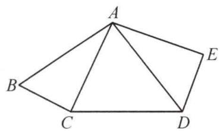

text_image

A
B
C
D
E

图1

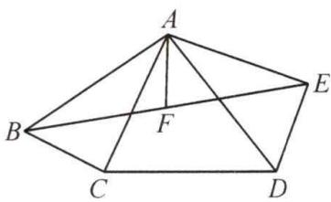

text_image

A
B
C
D
E
F

图2

# 大综合 2 角平分线模型——作垂直或截长补短

2. 如图, 在 $\angle EAF$ 的平分线上取点 $B$ , 作 $BC \perp AF$ 于点 $C$ , 在直线 $AC$ 上取点 $P$ , 在直线 $AE$ 上取点 $Q$ , 使得 $BQ = BP$ .

(1)如图1,当点P在线段AC上时,求证: $\angle BQA+\angle BPA=180^{\circ}$ ;

(2)如图 2, 当点 P 在 CA 延长线上时, 探究 AQ, AP, AC 三条线段之间的数量关系, 并说明理由;

(3)当点 P 运动到 AC 的延长线上时, 直接写出 AQ, AP, PC 三条线段之间的数量关系为:

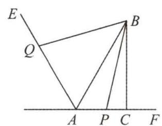

text_image

E
Q
B
A P C F

图1

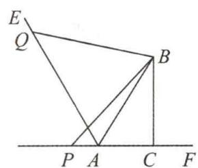

text_image

E
Q
B
P A C F

图2

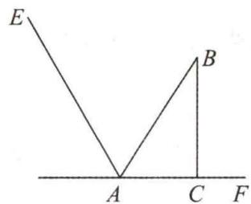

text_image

E
A
C
F
B

备用图

# 大综合3 手拉手模型——旋转型全等

3.【问题提出】如图1,在锐角等腰 $\triangle ABC$ 中, $AB=AC$ , $\angle BAC=\alpha$ , $K$ 是动点,且满足 $BK\perp AK$ ,将线段 $AK$ 绕点 $A$ 逆时针旋转 $\alpha$ 至 $AD$ ,连接 $DK$ 并延长,交 $BC$ 于点 $M$ ,探究点 $M$ 的位置.

【特例探究】(1)如图2,当点K在BC上时,连接CD,求证: $CD=\frac{1}{2}BC$ ;

(2)如图3,当点K在AC上时,求证:M是BC的中点;

【问题解决】(3)再探究一般情形,如图1,求证:M 是 BC 的中点.

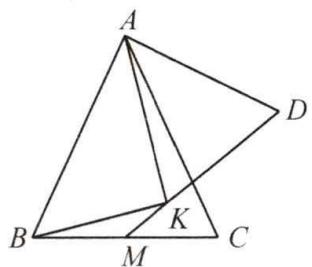

text_image

Geometric diagram with labeled points A, B, C, D, M, and K forming triangles and intersecting lines

图1

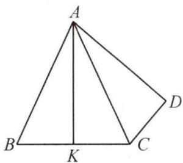

text_image

A
B K C D

图2

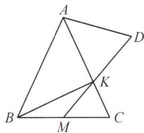

text_image

Geometric diagram with labeled points A, B, C, D, M, and K forming triangles and intersecting lines

图3

# 大综合4 夹半角模型——截长补短法

4. 如图, 在 $\triangle ABC$ 中, $\angle A = 90^{\circ}, AB = AC, E$ 为线段 $AB$ 上一动点 (不与点 $B$ 重合), $CE \perp CF$ 且 $CE = CF$ .

(1) 连接 BF 交 AC 于点 M，设 $\frac{BE}{AB}=m$ .

①当 m=1 时, 如图 1, 则 $\frac{BM}{MF}$ 的值为 \_\_\_\_;

②当 $m=\frac{4}{9}$ 时, 如图 2, 若 AB=18, 求 MC 的长;

(2)如图3,作 $FP \perp CF$ 交CA的延长线于点P, $EQ \perp EC$ 交BC于点Q,连接PQ,求证:PQ=PF-EQ.

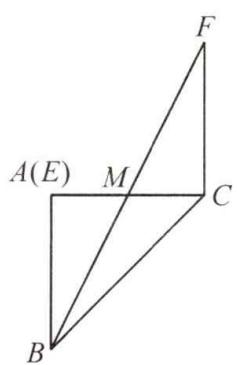

text_image

A(E)
M
C
B
F

图1

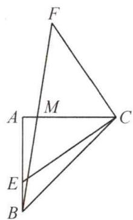

text_image

F
A
M
C
E
B

图2

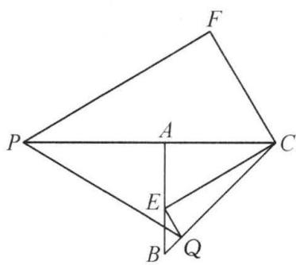

text_image

Geometric diagram with labeled points P, A, B, C, E, F, Q and intersecting lines forming triangles and quadrilaterals

图3

# 大综合 5 一线三垂直模型——作垂直构全等

5. 已知在 $\triangle ABC$ 中， $\angle ABC=90^{\circ}, AB=BC$ .

(1)【问题背景】如图 1, D 为 AC 上一点, 连接 BD, 作 $BE \perp BD$ , $AE \perp AC$ , 两直线交于点 E, 求证: BD = BE;

(2)【运用探究】如图 2, D 为 AC 外一点, 以 AD 为直角边作等腰直角三角形 ADE, $\angle ADE = 90^{\circ}$ , AD = ED, 且 C, E, D 三点共线, 连接 BE. 求证: AB = EB;

(3)【创新拓展】如图3,以AB为斜边在△ABC的外部作Rt△ABD,若BD=3,AD=4,请直接写出△ACD的面积为\_\_\_\_.

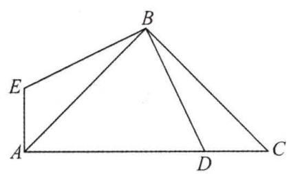

text_image

Geometric diagram of triangle ABC with points D and E on sides BC and AB respectively, and segment AD drawn

图1

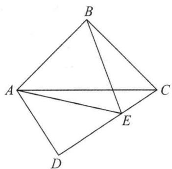

text_image

B
A
C
E
D

图2

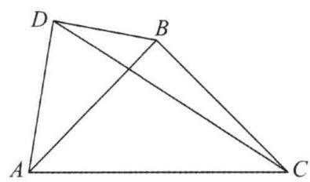

natural_image

Geometric diagram of a quadrilateral ABCD with diagonals AC and BD intersecting (no labels or measurements)

图3

# 大综合6 特殊到一般

6. 以线段 $AC, CB$ 为底在同一平面内分别构造等腰 $\triangle ACD$ 与等腰 $\triangle CBE, DA = DC, EC = EB, \angle ADC = \alpha, \angle CEB = \beta$ , 且 $\alpha + \beta = 180^\circ$ .

(1)如图1,当A,B,C三点共线时,求证:DC⊥CE;

(2)如图2,当A,B,C三点不共线时,连接AB,F为AB的中点,连接DF,EF.求证:DF⊥EF;

(3)如图3,当点B在线段AD上运动时(点B与点A,D不重合),请直接写出∠AEC与∠DBC的数量关系: (直接填写答案)

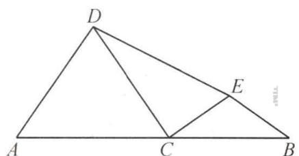

text_image

D
A C B
E
T15°

图1

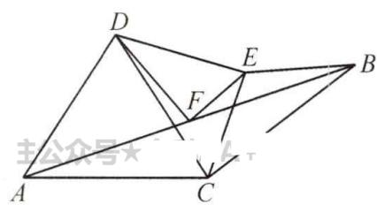

text_image

D
E
B
F
A
C
主公众号★

图2

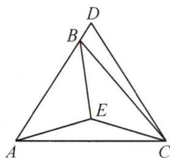

text_image

Geometric diagram of a tetrahedron with labeled vertices A, B, C, D and internal point E, showing edges and diagonals.

图3

# 大综合 7 构全等(一) 内 K 型全等, 旋转全等

7. $\triangle ABC$ 为等腰直角三角形, $\angle CAB = 90^{\circ}, AB = AC$ .

(1)如图1,点D在边BC上, $DE\perp AD$ , $DE=AD$ , $EF\perp BC$ 于点F, $AH\perp BC$ 于点H.求证:AH=DF;   
(2)如图2,点D在BC的延长线上, $AD\perp DE$ ,AD=DE,连接BE.求 $\angle DBE$ 的度数;   
(3)如图3，D为直线AC下方一动点，满足 $\angle CAD>90^{\circ}$ ， $\angle CDB=45^{\circ}$ 。求证：AD=AB。

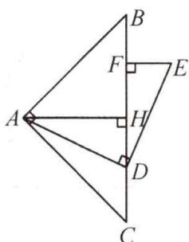

text_image

Geometric diagram with labeled points A, B, C, D, E, F, H and right-angle markers at F and D

图1

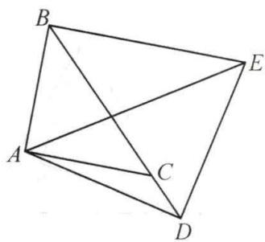

text_image

Geometric diagram with labeled points A, B, C, D, E forming connected triangles and quadrilaterals

图2

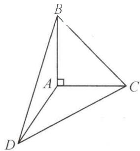

text_image

B
A
C
D

图3

# 大综合 8 构全等(二) $60^{\circ}$ 角构造手拉手全等

8. $P$ 为等边 $\triangle ABC$ 所在平面内一点，且 $\angle BPC = 120^{\circ}$

(1)如图1,点P在 $\triangle ABC$ 外部,若BP=2,CP=3,求AP的长;  
(2) 点 P 在 $\triangle ABC$ 内部, 连接 AP.

①如图 2, 若 $AP \perp BP$ , 求证: BP = 2CP;  
②如图3，D为BC的中点，连接PD，求证： $\angle APC+\angle BPD=180^{\circ}$

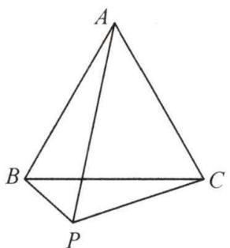

natural_image

Geometric diagram of a tetrahedron with vertices labeled A, B, C, and P (no additional text or symbols)

图1

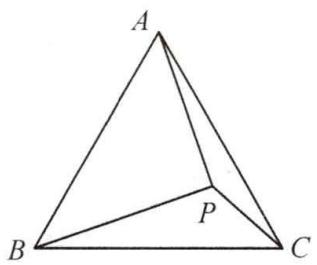

text_image

A
B
P
C

图2

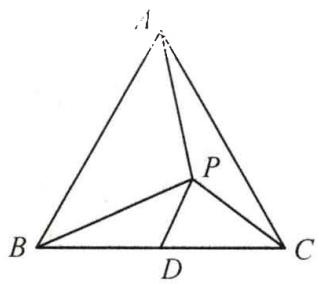

text_image

Geometric diagram of triangle ABC with internal points D and P, showing connected segments forming smaller triangles.

图3

# 大综合9 构全等(三)作垂线构全等

9. 已知 $\triangle ABC$ 是等边三角形.

(1)如图1,点D是AB边的中点,点P为射线AC上一动点,当 $\triangle CDP$ 是轴对称图形时, $\angle APD$ 的度数为\_\_\_\_;

(2)如图 2, $AE \parallel BC$ , 点 D 在 AB 边上, 点 F 在射线 AE 上, 且 DC = DF, 过点 F 作 FG ⊥ AC 于点 G, 当点 D 在 AB 边上移动时, 探究线段 AD, AC, CG 之间的数量关系, 并证明:

(3)如图3,点R在BC延长线上,连接AR,S为AR上一点,AS=BC,连接BS交AC于点T,若AT=2n,SR=n,直接写出线段 $\frac{CT}{AR}$ 的值为\_\_\_\_.

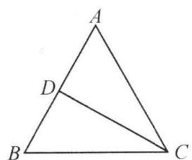

text_image

A
D
B
C

图1

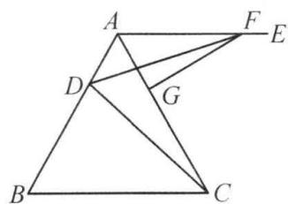

text_image

Geometric diagram with labeled points A, B, C, D, E, F, G forming intersecting triangles and quadrilaterals

图2

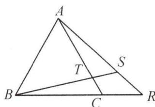

text_image

A
T
S
B
C
R

图3

# 大综合 10 构全等(四)作平行线构全等

10. $\triangle ABC$ 是等边三角形, D 是边 BC (端点除外) 上一动点, 连接 AD.

(1)如图1,以AD为边作等边 $\triangle ADE$ ,连接CE.

①求证:BD=CE;

②AB=4,F为AC的中点,连接EF,当EF的长取最小值时,求CD的长:

(2)如图 2, M 是 AB 延长线上的点, BM = CD, N 为 AD 的中点, 连接 NC, NM. 求证: CN ⊥ MN.

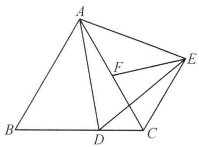

text_image

Geometric diagram with labeled points A, B, C, D, E, and F, showing triangles and line segments

图1

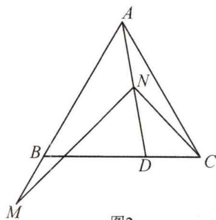

text_image

A
N
B
D
C
M
图2

图2

# 大综合 11 构全等(五) 截长补短构全等

11. 在等腰 $\triangle ABC$ 中, $AB = AC$ , $D$ 是 $AC$ 边上一动点, 点 $E$ 在 $BD$ 的延长线上, 且 $AB = AE$ , $AF$ 平分 $\angle CAE$ 交 $DE$ 于点 $F$ , 连接 $FC$ .

(1)如图1,求证: $\angle ABE=\angle ACF;$   
(2)如图2,当 $\angle ABC=60^{\circ}$ 时,求证: $AF+EF=FB$ ;  
(3)如图3,当 $\angle ABC=45^{\circ}$ ,且 $AE\parallel BC$ 时,求证:BD=2EF.

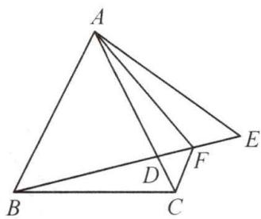

text_image

A
B
C
D
F
E

图1

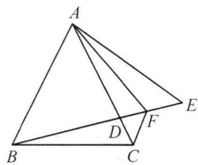

text_image

A
B
C
D
F
E

图2

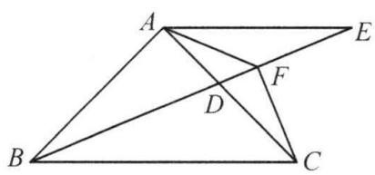

text_image

A
E
F
D
B
C

图3

# 大综合 12 构全等(六) $45^{\circ}$ 角构全等

12. 已知, 在 Rt△ABC 中, ∠ACB = 90°, AC = BC, D 为 BC 边上一点, E 为射线 AD 上一点, 连接 BE, CE.

(1)如图1,若 $\angle ADC=60^{\circ}$ ,CE平分 $\angle ACB$ .求证:BD=DE;

(2) 若 $\angle CED = 45^{\circ}$ .

①如图2,求证:BE⊥AE;

②如图3,若 $\angle BED=30^{\circ}$ ,点E在线段AD上,且AE=1,求BE的长.

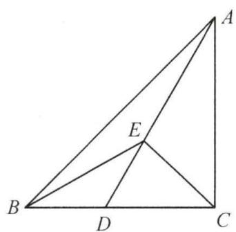

text_image

Geometric diagram of triangle ABC with internal points D and E, showing segments AD and AE

图1

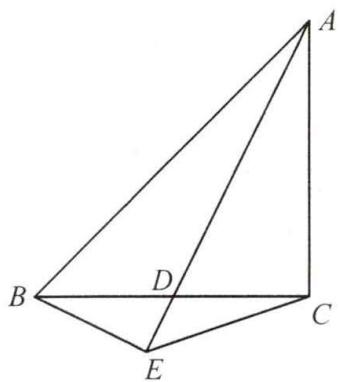

text_image

Geometric diagram of a tetrahedron with labeled vertices A, B, C, D, E and internal diagonals

图2

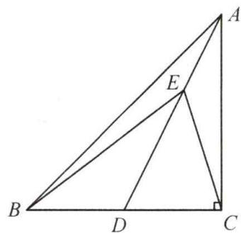

text_image

Geometric diagram of triangle ABC with internal points D, E and perpendicular line from A to BC at C

图3

# 大综合13 路径与最值

13. 如图, $D$ 是等边 $\triangle ABC$ 的边 $AC$ 上一点, 且 $\angle DBC = \alpha$ , 点 $F$ 在边 $AB$ 上, 且 $AD = 2BF$ , 点 $E$ 在 $CF$ 的延长线上, 连接 $BE$ , 且 $\angle ABE = \angle ADB$ .

(1)如图1,求 $\angle DBE$ 的度数;

(2)如图1,求证:BE=BD;

(3)如图 2, M, N 分别是 BA, BC 上两个动点, 满足 BM = BN. 当 $DM + DN$ 最小时, 直接写出 $\angle DMB$ 的大小为 (用含 $\alpha$ 的式子表示).

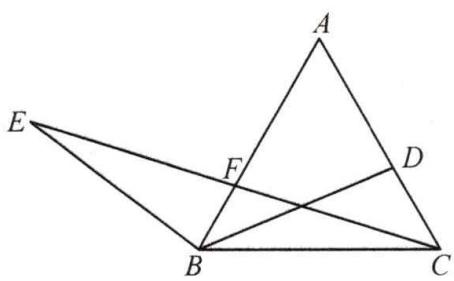

text_image

Geometric diagram with labeled points A, B, C, D, E, F and intersecting lines forming triangles and quadrilaterals

图1

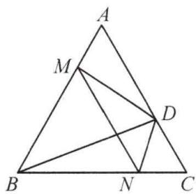

text_image

Geometric diagram of triangle ABC with internal points M, D, N and connecting lines forming smaller triangles and intersections.

图2

14. 在等边 $\triangle ABC$ 中, $AB = 4$ , 点 $D$ 和点 $E$ 分别在边 $AB, BC$ 上, 以 $DE$ 为边向右侧作等边 $\triangle DEF$ , 连接 $CF$ .

(1)如图1,当点D和点A重合时,求 $\angle ACF$ 的度数;

(2) 当 D 是边 AB 的中点时，

①如图 2, 判断线段 FE 与 FC 的数量关系, 并证明;

②如图3,在点E从点B沿BC运动到点C的过程中,请直接写出点F的运动路径长.

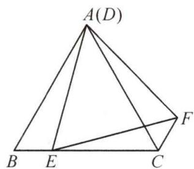

text_image

A(D)
B E C
F

图1

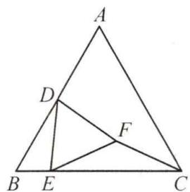

text_image

A
D
F
B E C

图2

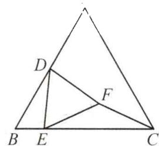

text_image

Geometric diagram of triangle ABC with internal points D, E, F and connecting line segments

图3

# 大综合14 模型运用

15.(1)【问题背景】如图1,已知AB=AD,AC=AE, $\angle BAD=\angle CAE$ ,连接BC,DE.求证: $\triangle ABC\cong\triangle ADE;$

(2)【运用探究】如图 2, $\triangle ABC$ 与 $\triangle ADE$ 都是等边三角形, 直线 DE 经过 BC 边的中点 F, 连接 BD. 求证: $BD \perp AD$ ;

(3)【创新拓展】如图 3, $\triangle ABC$ 与 $\triangle ADE$ 都是等边三角形, 直线 DE 经过 BC 边的中点 F, 连接 CE, 使 DE=CE, 连接 BD. 若 P 为 $\triangle ABD$ 内一点, 当 AP=AD、PB=PD 时, 直接写出 $\angle PAD$ 的度数 \_\_\_\_. (不需要写出求解过程)

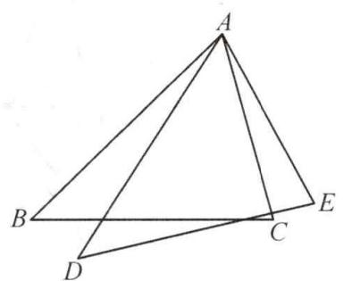

text_image

Geometric diagram of triangle ABC with points D and E on base BD, and line segments AE and AC drawn

图1

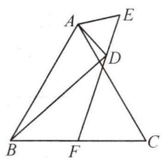

text_image

Geometric diagram with labeled points A, B, C, D, E, F forming intersecting triangles and lines

图2

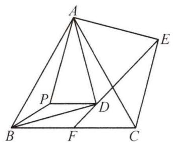

text_image

Geometric diagram of a polyhedron with labeled vertices A, B, C, D, E, F, P and connecting lines forming triangles and diagonals.

图3

16.(1)问题背景:如图1,在 $\triangle ABC$ 中,AD是 $\triangle ABC$ 的角平分线.

求证: $S_{\triangle ABD}:S_{\triangle ACD}=AB:AC=DB:DC;$

(2) 在 $\triangle ABC$ 中, $CA = CB$ , $\angle ACB = \alpha$ , $AD$ 是角平分线, $BD = m$ , $CD = n$ .

①应用探究:如图2,若 $\alpha=108^{\circ}$ ,求证: $m^{2}-n^{2}=mn$ ;

②迁移拓展:如图3,P为线段AD上一点,CP绕点C逆时针旋转得到CQ,使 $\angle PCQ=\alpha$ ,
连接DQ,当QC+QD最小时,直接写出 $\frac{QC}{QD}$ 的值(用含m,n的式子表示).

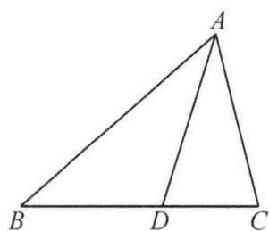

text_image

A
B D C

图1

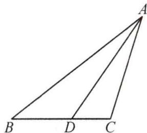

text_image

Geometric diagram of triangle ABC with point D on base BC, labeled vertices A, B, C, D

图2

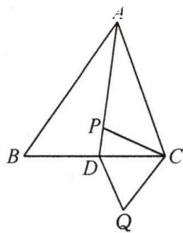

text_image

Geometric diagram of a tetrahedron with labeled vertices A, B, C, D and internal points P, Q, showing edges and triangles.

图3

# Ⅱ 代几大综合

# 大综合 15 构全等(一) 倍长中线构全等

17. 在平面直角坐标系中, 等边 $\triangle ABC$ 的顶点 $B, C$ 在 $x$ 轴上, 点 $A$ 在 $y$ 轴正半轴上.

(1)如图1,若P为AB的中点,连接PC交y轴于点D,问线段AD与PD有何数量关系?并说明理由;

(2)将图1中的 $\triangle ADC$ 绕点C顺时针旋转 $\alpha$ 角 $(0^{\circ}<\alpha<180^{\circ})$ 至图2位置,点A的对应点为点E,P为EB的中点,连接AD,PD.(1)中的结论是否仍然成立?若成立,请给出证明;若不成立,请说明理由.

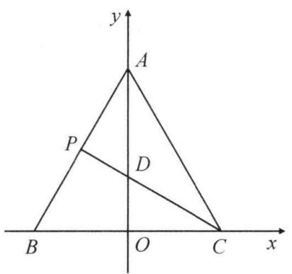

text_image

y
A
P
D
B
O
C
x

图1

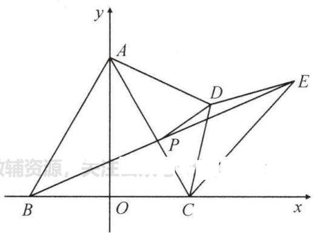

text_image

y
A
D
E
P
B
O
C
x
辅资源，关注二元

图2

# 大综合 16 构全等(二) 构对称全等,旋转全等

18. 已知 $A(0, a), B(b, 0)$ ，且 $a, b$ 满足 $\sqrt{a - \sqrt{3}} + b^2 - 2b + 1 = 0, \angle ABO = 60^\circ$ .

(1)求出点 B 的坐标;

(2)如图1,点 $N(c,0)(c<-1)$ 关于y轴的对称点为点M,线段AN的垂直平分线交线段AB的延长线于点P.当点N运动时,求 $\angle AMP$ 的度数;

(3)如图2,点B关于y轴的对称点为点C,点D在线段CO上,点E在边AB上,满足 $\angle DEA=2\angle DAE$ ,试探究CD,EB和DE之间的数量关系,并给出你的证明.

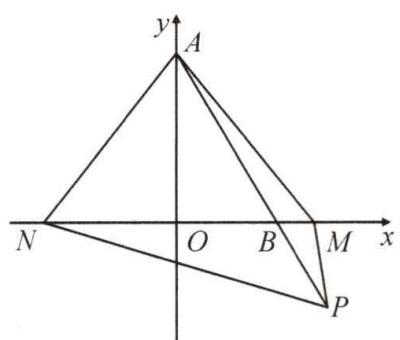

text_image

y
A
N O B M x
P

图1

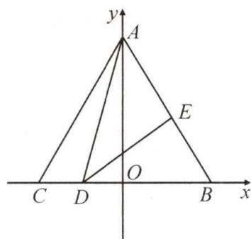

text_image

y
A
E
C D O B x

图2

# 大综合 17 构全等(三) 截长补短构全等

19. 如图, 在平面直角坐标系中, 点 $A(a,0)$ 是 $x$ 轴正半轴上一点, 点 $B(0,b)$ 是 $y$ 轴正半轴上一点, 且 $a=(-2)\times(-2)^{4}\times(-2)^{3}\div64$ , $b$ 是多项式 $(6m^{3}+12m^{2}-7m)\div3m$ 中一次项的系数.

(1)直接写出 A, B 两点的坐标: A( ), B( ),

(2)如图1,C为线段OA上一点(点C不与点O,A重合),且满足BC=CE,连接AE,D为x轴上一点(点D在点A的右边),若 $\angle DAE=45^{\circ}$ ,求证: $BC\perp CE$ ;

(3)如图2,过点O作OF⊥AB于点F,以OB为边在y轴左侧作等边△OBQ,连接AQ交OF于点P,请探究线段PQ,OP,AP三者之间的数量关系,并证明你的结论.

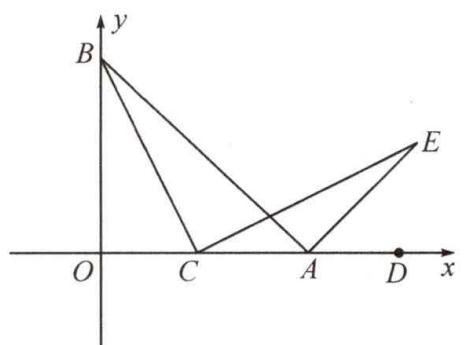

text_image

y
B
O C A D x
E

图1

text_image

教辅资源，关注公众号★
y
B
Q
F
P
O
A
x

图2

# 大综合 18 构全等(四) 存在性问题

20. 在平面直角坐标系中, 直线 AB 交 x 轴于点 A(a,0), 交 y 轴于点 B(0,b), 且 a, b 满足 $b = \sqrt{a - 4} + \sqrt{4 - a} + 4$ .

(1) 求 A, B 两点的坐标;

(2)如图1, D为OA上一点, 连接BD, 过点O作OE⊥BD交AB于点E. 连接DE. 若 $\angle BDO = \angle EDA$ , 求点D的坐标;

(3)如图2,点B,Q关于x轴对称,M为x轴上A点右侧的一点,过点M作MN+BM,交直线QA于点N.是否存在点M,使 $S_{\triangle AMN}=\frac{3}{2}S_{\triangle AMQ}$ ?若存在,求点M的坐标;若不存在,请说明理由.

text_image

y
B
E
O
D
A
x

图1

text_image

y
B
N
O
A
M
x
Q
图2

图2

# 大综合 19 构全等(五) 参数问题

21. 在平面直角坐标系中, 点 $A$ 在 $x$ 轴正半轴上, 点 $B$ 在 $y$ 轴正半轴上, $\angle ABC = 90^{\circ}$ , 且 $AB = BC$ .

(1)如图1,点A(5,0),B(0,2),点C在第三象限,请直接写出点C的坐标;

(2)如图 2, BC 与 x 轴交于点 D, AC 与 y 轴交于点 E, 若 D 为 BC 的中点, 求证: $\angle ADB = \angle CDE$ ;

(3)如图3,点 $A(a,0)$ ,点M在AC的延长线上,过点 $M(m,-a)$ 作 $MN\perp x$ 轴于点N.探究线段BM,AN,OB之间的数量关系,并证明你的结论.

text_image

y
B
O
A
x
C

图1

text_image

y
B
D
O
A
x
C
E

图2

text_image

y
B
N
O
A
x
M
C

图3

# 大综合 20 构全等(六) 最值问题

22. 在平面直角坐标系中, 点 $A$ 和点 $B$ 在 $x$ 轴上, $OA = OB = m$ , 点 $C$ 在 $y$ 轴正半轴上, $AC = n$ , 且 $(m - 2)^{2} + (n - 4)^{2} = 0$ . 点 $P$ 在 $x$ 轴上运动, 点 $Q$ 在 $AC$ 上运动.

(1) 求证: $\triangle ABC$ 是等边三角形;

(2)如图 2, 当点 Q 与点 C 重合, 点 P 在点 B 右边时, 连接 QP, 以 QP 为边向右作等边 $\triangle MPQ, MH \perp CB$ 于点 H, 且 CH = 1, 求此时点 P 的坐标;

(3)如图 3, 点 Q 与点 C 不重合, 且 AQ = 2BP, 以 QP 为边向右作等边 $\triangle MPQ$ , 连接 MB. 求线段 BM 的最小值.

text_image

y
C
A O B x

图1

text_image

y
(Q)
C
M
H
A O B P x
教辅资源

图2

text_image

y
C
M
Q
A O P B x
公众号★

图3