# GD 勤学早同步大培优数学八年级上 RJ 版参考答案

# 第十三章 三角形

# 第1讲 与三角形有关的线段

# 板块一 三角形的三边关系

典例精讲

【例 1】解: 能构成三角形的有 5,7,9;5,9,13;7,9,13,共 3 种不同的选择方法, ∴ 可以摆出 3 个不同的三角形.

【例 2】解:依题意,得 $5-2<a-1<5+2$ , 解得 4<a<8.

【例 3】解:(1)∵等腰三角形的周长为12,腰长为x,
∴底边长为12-2x,根据三角形三边关系,

得 $\left\{\begin{aligned}12-2x&>0,\\ 2x&>12-2x,\end{aligned}\right.$ 解得3<x<6，

∴ x 的取值范围是 3 < x < 6;

(2)依题意,得 $\left\{\begin{aligned}y&>0,\\ 12-y&>y,\end{aligned}\right.$ 解得0<y<6,

$\therefore y$ 的取值范围是 0<y<6.

【例 4】解:依题意,得第二条边长为 3x-4,

第三条边长为 $41-x-(3x-4)=45-4x$ .

①若 x=3x-4，解得 x=2，则三边长为 2,2,37，

∵2+2<37,不符合三边关系,∴舍去;

②若 x=45-4x，解得 x=9，则三边长为 9,9,23，

$\because 9+9<23$ , 不符合三边关系, $\therefore$ 舍去;

③若 3x-4=45-4x，解得 x=7，则三边长为 7,17,17，符合三边关系。综上所述，这个三角形的三边长分别为 7,17,17。

【例 5】2 解:由折叠可知,AP=AB=3,在 $\triangle APC$ 中,由三角形三边关系可得CP>AC-AP,当点P落在AC边上时,CP=AC-AP,∴当点D在BC边上运动时,总有 $CP\geqslant AC-AP,\therefore CP_{最小}=AC-AP=5-3=2.$

实战演练

1.4 2.0<a<12 b>2 3.B 4.8

5. 解: ① 若 4 cm 是底边长, 则腰长为 $(20-4) \div 2 = 8 \, (\text{cm})$ , 能组成三角形, ∴ 腰长为 8 cm;

②若 4 cm 为腰长, 则底边长为 20-4-4=12(cm),

$\because 4+4<12,\therefore$ 不能组成三角形,故舍去.

综上所述，腰长为 8 cm.

6. 解: ① 当 $3a - 2 = 4$ 时, $a = 2$ , 三边长分别为 $4, 4, 6$ , 能组成三角形, 其周长为 $4 + 4 + 6 = 14$ ; ② 当 $6a - 6 = 4$ 时, $a = \frac{5}{3}$ , 三边长分别为 $4, 4, 3$ , 能组成三角形, 其周长为 $4 + 4 + 3 = 11$ ; ③ 当 $3a - 2 = 6a - 6$ 时, $a = \frac{4}{3}$ , 三边长分别为 $4, 2, 2, \because 4 = 2 + 2, \therefore$ 不能组成三角形, 此情况不成立.

综上所述,这个三角形的周长为11或14.

7. 解：∵a,b,c为三角形三边的长，

$$
\therefore a + b > c, a + c > b, b + c > a,
$$

$$
\therefore \text {   原式   } = | a - (b + c) | + | b - (c + a) | + | c - (a + b) |
$$

$$
= b + c - a + a + c - b + a + b - c = a + b + c.
$$

8. 解: 由折叠可知 AD = DE, AC = EC,

$$
\therefore B D + D E = B D + A D = A B = 6.
$$

∵点 E 落在 BC 的下方，

∴在 $\triangle BCE$ 中，BE>BC-CE=10-8=2，

又∵在 $\triangle BDE$ 中，BE<BD+DE=6，∴2<BE<6.

# 板块二 三角形的高

典例精讲

【例 1】解: 如图, AM, CN 即为所求作的高.

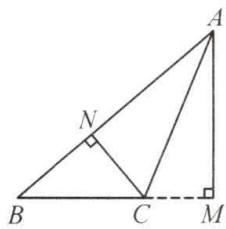

text_image

Geometric diagram of triangle ABC with perpendiculars from A and B to sides BC and AB, labeled points A, B, C, M, N, and right-angle symbols.

【例 2】解： $\because S_{\triangle ABC}=\frac{1}{2}BC\cdot AM=\frac{1}{2}AB\cdot CN,$

$$
\therefore 5 B C = 1 0 \times 3, \therefore B C = 5.
$$

【例3】解：①如图1，当高 $AD$ 在 $\triangle ABC$ 的内部时，

$$
\angle B A C = \angle B A D + \angle C A D = 7 0 ^ {\circ} + 2 0 ^ {\circ} = 9 0 ^ {\circ};
$$

②如图2，当高AD在△ABC的外部时，

$$
\angle B A C - \angle B A D - \angle C A D = 7 0 ^ {\circ} - 2 0 ^ {\circ} = 5 0 ^ {\circ}.
$$

综上所述，∠BAC 的度数为 $90^{\circ}$ 或 $50^{\circ}$ .

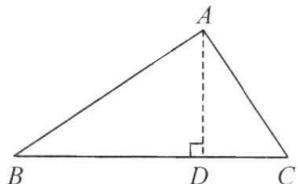

text_image

A
B D C

图1

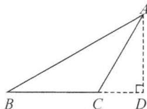  
图2

实战演练

解: 连接 AD. $\because S_{\triangle ABD} + S_{\triangle ACD} = S_{\triangle ABC}$ ,

$$
\therefore \frac {1}{2} A B \cdot D E + \frac {1}{2} A C \cdot D F = \frac {1}{2} A B \cdot C H.
$$

$$
\because A B = A C, \therefore \frac {1}{2} A B (D E + D F) = \frac {1}{2} A B \cdot C H,
$$

$$
\therefore D E + D F = C H = 8.
$$

# 板块三 三角形的中线

典例精讲

【例 1】解：∵BD 是△ABC 的中线，∴AD=CD，

$\because \triangle ABD$ 的周长为 15, AB = 7, BC = 3,

$$
\therefore A D + B D = 1 5 - 7 = 8, \therefore B D + C D = 8.
$$

∴ $\triangle BCD$ 的周长是 $8+3=11$ .

【例 2】解: 易证 $S_{\triangle ABD}=S_{\triangle ADC}=2, S_{\triangle AEC}=S_{\triangle DEC}=S_{\triangle BDE}=1$ ,

$$
\therefore S _ {\triangle B E C} = 2, \therefore S _ {\triangle B E F} = S _ {\triangle B C F} = 1.
$$

【例 3】解:(1)5 ∵O 为△ABC 的重心,∴AE,BF,CD 都为△ABC 的中线,即 D,E,F 分别为 AB,BC,AC 的中点,在△ABE 和△ACE 中,∵BE=CE,且高相同,$\therefore S_{\triangle ABE} = S_{\triangle ACE}$ ，同理可得 $S_{\triangle BOE} = S_{\triangle COE}$

$\therefore S_{\triangle ABE} - S_{\triangle BOE} = S_{\triangle ACE} - S_{\triangle COE}$ ，即 $S_{\triangle ABO} =$

$S_{\triangle ACO}$ ，又 $\because S_{\triangle AOD} = S_{\triangle BOD}, S_{\triangle AOF} = S_{\triangle COF}$

$\therefore S_{\triangle AOD}=S_{\triangle BOD}=S_{\triangle AOF}=S_{\triangle COF}=S_{\triangle BOE}=S_{\triangle COE}$

∴与 $\triangle AOD$ 面积相等的三角形有5个；

(2)由(1)，得 $S_{\triangle AOD} = S_{\triangle BOD} = S_{\triangle BOE}$

$\therefore S_{\triangle AOB}=2S_{\triangle BOE}.\because$ 高相同， $\therefore AO=2OE.$

# 实战演练

1. $\frac{1}{4}$ 2. 12

3. 解: 设三角形的腰长为 $x \, cm$ . 如图, $\triangle ABC$ 是等腰三角形, AB = AC, BD 是 AC 边上的中线, 则有 $AB + AD = 9$ 或 $AB + AD = 15$ , 分下面两种情况讨论:

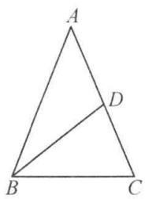

(1) $x+\frac{1}{2}x=9,\therefore x=6.$

∵三角形的周长为 $9+15=24$ (cm)，

∴三边长分别为6 cm, 6 cm, 12 cm.

$\because 6+6=12$ , 不符合三角形的三边关系, $\therefore$ 舍去;

(2) $x+\frac{1}{2}x=15,\therefore x=10.$ ∵三角形的周长为24cm,

∴三边长分别为 $10 \, cm, 10 \, cm, 4 \, cm.$

综上所述,这个等腰三角形的底边长为 $4 \, cm$ .

4. 解: 如图, 点 G, 线段 BF 即为所求.

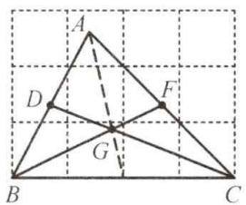

text_image

A
D
F
G
B
C

5. 解: (1) $\because \triangle BDE$ 与四边形 ACDE 的周长相等,

$$
\therefore B D + D E + B E = A C + A E + C D + D E.
$$

$$
\because B D = D C, \therefore B E = A E + A C.
$$

设 AE = x cm，则 $BE = (10 - x)$ cm.

由题意, 得 $10 - x = x + 6$ , 解得 x = 2, $\therefore AE = 2 \, cm$ ;

(2)图中共有8条线段,它们的和为 $AE+EB+AB+AC+$

$$
D E + B D + C D + B C = 2 A B + A C + 2 B C + D E,
$$

$$
\therefore 2 A B + A C + 2 B C + D E = 5 3.
$$

$$
\because A B = 1 0 \mathrm{cm}, A C = 6 \mathrm{cm},
$$

$$
\therefore 2 B C + D E = 5 3 - (2 A B + A C) = 5 3 - (2 \times 1 0 + 6) =
$$

$$
2 7 (\mathrm{cm}), \therefore B C + \frac {1}{2} D E = 1 3. 5 (\mathrm{cm}).
$$

# 板块四 面积转化与面积法

# 典例精讲

【例 1】4 解：∵ AD∥BC，∴ $S_{\triangle ABC}=S_{\triangle DBC}$

$$
\therefore S _ {\triangle A B C} - S _ {\triangle O B C} = S _ {\triangle D B C} - S _ {\triangle O B C},
$$

即 $S_{\triangle ABO}=S_{\triangle DCO},\therefore S_{\triangle BOC}=2S_{\triangle AOB}=2S_{\triangle COD}$

$$
\therefore O B = 2 O D, \therefore O D = \frac {1}{3} B D = 4.
$$

【例 2】解： $S_{四边形CDFE}-S_{\triangle ABF}=S_{\triangle BCE}-S_{\triangle ABD}=\frac{1}{2}S_{\triangle ABC}-$

$$
\frac {1}{3} S _ {\triangle A B C} = 9 - 6 = 3.
$$

# 实战演练

解:(1)连接 AC, $\because \angle ABC = \angle BCD = 90^{\circ}$ ,

$$
\therefore A B \parallel C D, \therefore S _ {\triangle A C B} = S _ {\triangle A D B},
$$

$$
\therefore S _ {\triangle A C E} = S _ {\triangle B D E} = 6,
$$

$$
\therefore S _ {\triangle A C E} = \frac {1}{2} C E \times 6 = 6, \therefore C E = 2;
$$

(2) $\because BC=5,CE=2,\therefore BE=5-2=3,$

$$
\therefore S _ {\triangle B D E} = \frac {1}{2} B E \cdot C D = \frac {1}{2} \times 3 C D = 6,
$$

$$
\therefore C D = 4, \therefore S _ {\triangle C D E} = \frac {1}{2} C E \cdot C D = \frac {1}{2} \times 2 \times 4 = 4.
$$

# 第2讲 与三角形有关的角

# 板块一 三角形的内角和

# 典例精讲

【例 1】解：∵ $\angle A = 54^{\circ}, \angle B = 48^{\circ}$ ,

$$
\therefore \angle A C B = 1 8 0 ^ {\circ} - 5 4 ^ {\circ} - 4 8 ^ {\circ} = 7 8 ^ {\circ},
$$

∵CD平分∠ACB,∴∠DCB= $\frac{1}{2}\times78^{\circ}=39^{\circ}$ ,

$$
\because D E \parallel B C, \therefore \angle C D E = \angle D C B = 3 9 ^ {\circ}.
$$

【例 2】解：(1) $\because \angle A + \angle ABC + \angle ACB = 180^{\circ}$ ,

$$
\angle A = 5 0 ^ {\circ}, \angle A B C = \angle C,
$$

$$
\therefore 5 0 ^ {\circ} + 2 \angle C = 1 8 0 ^ {\circ}, \therefore \angle C = 6 5 ^ {\circ}.
$$

∵BD 是高，∴∠BDC=90°，

$$
\therefore \angle C B D = 9 0 ^ {\circ} - \angle C = 2 5 ^ {\circ};
$$

(2)出(1)，得 $\alpha+2\angle C=180^{\circ},\therefore\angle C=90^{\circ}-\frac{1}{2}\alpha,$

$$
\therefore \angle C B D = 9 0 ^ {\circ} - \angle C = \frac {1}{2} \alpha .
$$

# 实战演练

1. 解： $\because \angle BPC = 110^{\circ}, \therefore \angle PBC + \angle PCB = 70^{\circ}$ ，

$$
\because \angle P B C = \angle P C A, \therefore \angle P C B + \angle P C A = 7 0 ^ {\circ},
$$

$$
\because \angle A B C = \angle A C B, \therefore \angle A B C = \angle A C B = 7 0 ^ {\circ},
$$

$$
\therefore \angle A = 1 8 0 ^ {\circ} - 7 0 ^ {\circ} - 7 0 ^ {\circ} = 4 0 ^ {\circ}.
$$

2. 解： $\because \angle ACB = 90^{\circ}, \angle B = 45^{\circ}, \therefore \angle BAC = 90^{\circ} - \angle B = 45^{\circ}$ ，

$$
\because \angle B A D = 2 \angle C A D, \therefore \angle C A D = \frac {1}{3} \angle B A C = 1 5 ^ {\circ}.
$$

$$
\because E F \perp A D, \therefore \angle D F E = \angle A C D = 9 0 ^ {\circ},
$$

$$
\therefore \angle E + \angle A D C = \angle C A D + \angle A D C, \therefore \angle E = \angle C A D = 1 5 ^ {\circ}.
$$

# 板块二 三角形的外角

# 典例精讲

【例 1】解：∵ $\angle A=20^{\circ},\angle C=50^{\circ},\therefore\angle AEB=\angle A+\angle C=70^{\circ}.$

$$
\begin{array}{l} \because \angle B = 4 0 ^ {\circ}, \therefore \angle A D B = \angle A E B + \angle B = 7 0 ^ {\circ} + 4 0 ^ {\circ} = \\ 1 1 0 ^ {\circ}. \end{array}
$$

【例 2】解：∵ $AC \perp DE, \therefore \angle APE = 90^{\circ}$ .

$\because \angle1$ 是 $\triangle AEP$ 的外角， $\therefore \angle1=\angle A+\angle APE.$

$$
\because \angle A = 2 0 ^ {\circ}, \therefore \angle 1 = 2 0 ^ {\circ} + 9 0 ^ {\circ} = 1 1 0 ^ {\circ}.
$$

在 $\triangle BDE$ 中， $\angle1+\angle D+\angle B=180^{\circ}$ ，

$$
\because \angle B = 2 7 ^ {\circ},
$$

$$
\therefore \angle D = 1 8 0 ^ {\circ} - 1 1 0 ^ {\circ} - 2 7 ^ {\circ} = 4 3 ^ {\circ}.
$$

# 实战演练

1. 解: $\angle1+\angle2=90^{\circ}+\angle CED+90^{\circ}+\angle CDE$

$$
\begin{array}{l} = 1 8 0 ^ {\circ} + (\angle C E D + \angle C D E) \\ = 1 8 0 ^ {\circ} + 9 0 ^ {\circ} \\ = 2 7 0 ^ {\circ}. \\ = 1 8 0 ^ {\circ} + (\angle C E D + \angle C D E) \\ = 1 8 0 ^ {\circ} + 9 0 ^ {\circ} \\ = 2 7 0 ^ {\circ}. \\ = 2 7 0 ^ {\circ}. \\ \end{array}
$$

$$
\begin{array}{l} = 1 8 0 ^ {\circ} + (\angle C E D + \angle C D E) \\ = 1 8 0 ^ {\circ} + 9 0 ^ {\circ} \\ = 2 7 0 ^ {\circ}. \\ = 1 8 0 ^ {\circ} + (\angle C E D + \angle C D E) \\ = 1 8 0 ^ {\circ} + 9 0 ^ {\circ} \\ = 2 7 0 ^ {\circ}. \\ = 2 7 0 ^ {\circ}. \\ \end{array}
$$

2. 解: $\because AD$ 是 $\triangle ABC$ 的角平分线, $\angle BAC = 60^{\circ}$ ,

$\therefore \angle BAD = 30^{\circ}$ ，又 $\because CE$ 是 $\triangle ABC$ 的高， $\angle BCE = 45^{\circ}$

$$
\therefore \angle B = 4 5 ^ {\circ}, \therefore \angle A D C = \angle B A D + \angle B = 3 0 ^ {\circ} + 4 5 ^ {\circ} = 7 5 ^ {\circ}.
$$

# 板块三 综合与实践——折叠求角

1. 解: 设 $\angle AEF = \angle A'EF = x, \angle AFE = \angle A'FE = y,$

$$
\begin{array}{l} \therefore \angle 1 + \angle 2 = (1 8 0 ^ {\circ} - 2 x) + (1 8 0 ^ {\circ} - 2 y) = 3 6 0 ^ {\circ} - 2 x - 2 y. \\ \because \angle B = 8 0 ^ {\circ}, \angle C = 7 0 ^ {\circ}, \therefore \angle A = 3 0 ^ {\circ}, \therefore x + y = 1 5 0 ^ {\circ}, \\ \therefore \angle 1 + \angle 2 = 3 6 0 ^ {\circ} - 2 \times 1 5 0 ^ {\circ} = 6 0 ^ {\circ}. \\ \end{array}
$$

2. 解: 根据翻折的性质, $\angle ADE = \frac{1}{2}(180^{\circ} - \angle 1)$ , $\angle AED =$

$$
\frac {1}{2} (1 8 0 ^ {\circ} + \angle 2), \because \angle A + \angle A D E + \angle A E D = 1 8 0 ^ {\circ},
$$

$\therefore \angle A + \frac{1}{2} (180^{\circ} - \angle 1) + \frac{1}{2} (180^{\circ} + \angle 2) = 180^{\circ}$ , 整理, 得 $2\angle A = \angle 1 - \angle 2$ .

3. 解: 设 $\angle MEB = \angle MEB' = x, \angle NFC = \angle NFC' = y$ ,

$$
\begin{array}{l} \therefore 2 x + \angle 1 = 1 8 0 ^ {\circ}, 2 y + \angle 2 = 1 8 0 ^ {\circ}, \\ \therefore 2 x + 2 y + \angle 1 + \angle 2 = 3 6 0 ^ {\circ}, \\ \because \angle 1 + \angle 2 = 9 0 ^ {\circ}, \\ \therefore 2 x + 2 y = 3 6 0 ^ {\circ} - 9 0 ^ {\circ} = 2 7 0 ^ {\circ}, \therefore x + y = 1 3 5 ^ {\circ}, \\ \because \angle A E F = \angle M E B = x, \angle A F E = \angle N F C = y, \\ \therefore \angle A E F + \angle A F E = x + y = 1 3 5 ^ {\circ}, \\ \because \angle A + \angle A E F + \angle A F E = 1 8 0 ^ {\circ}, \\ \therefore \angle A = 1 8 0 ^ {\circ} - 1 3 5 ^ {\circ} = 4 5 ^ {\circ}. \\ \end{array}
$$

# 第 3 讲 求角思想方法

# 板块一 方程思想

# 典例精讲

【例 1】解：∵BD 平分∠ABC，∴∠1=∠DBC，

设 $\angle A=x$ ，则 $\angle ABC=2x,\angle 2=\angle C=2x$ ，在 $\triangle ABC$ 中， $x+2x+2x=180^{\circ},x=36^{\circ},\therefore\angle A=36^{\circ}$ .

【例 2】解: 设 $\angle B = \angle C = \angle ADE = x$ .

$$
\because \angle A D C = \angle A D E + \angle C D E = \angle B + \angle B A D,
$$

$$
\therefore \angle C D E = \angle B A D, \text {设} \angle C D E = \angle B A D = y,
$$

$$
\therefore \angle A E D = x + y,
$$

∴在 $\triangle ADE$ 中， $2x+y+20^{\circ}=180^{\circ}①$ ;

又∵∠AED-3∠BAD=20°,∴x+y-3y=20°②，
由①②可得 $x=68^{\circ}$ . ∴∠B=68°.

# 实战演练

1. 解: 设 $\angle C = 2x$ ，则 $\angle ADB = 3x$ ，

∵BD平分∠ABC，∠ABC=72°，

$$
\begin{array}{l} \therefore \angle A B D = \angle C B D = 3 6 ^ {\circ}, \\ \because \angle A D B = \angle D B C + \angle C, \therefore 3 x = 3 6 ^ {\circ} + 2 x, \\ \therefore x = 3 6 ^ {\circ}, \therefore \angle C = 7 2 ^ {\circ}, \angle A D B = 1 0 8 ^ {\circ}, \\ \therefore \angle B A C = 1 8 0 ^ {\circ} - 7 2 ^ {\circ} - 7 2 ^ {\circ} = 3 6 ^ {\circ}, \\ \because A E \perp B E, \therefore \angle E = 9 0 ^ {\circ}, \\ \because \angle A D B = \angle E + \angle D A E, \therefore \angle D A E = 1 0 8 ^ {\circ} - 9 0 ^ {\circ} = 1 8 ^ {\circ}. \\ \end{array}
$$

2. 解: 设 $\angle EDC = x, \angle B = \angle C = y$ ,

则 $\angle ADE = \angle AED = x + y$

$$
\because \angle A D C = \angle 1 + \angle B, \therefore x + y + x = 4 0 ^ {\circ} + y, \therefore x = 2 0 ^ {\circ}.
$$

# 板块二 整体思想

# 典例精讲

【例】解：∵BI平分∠DBE，CI平分∠DCF，

∴可设 $\angle IBD=\angle IBE=x,\angle ICD=\angle ICF=y,$

易得 $x + y = \angle I + \angle A$ ①，

$$
\angle D = 1 8 0 ^ {\circ} - 2 x + 1 8 0 ^ {\circ} - 2 y + \angle A ②,
$$

将①代入②得 $\angle D=360^{\circ}-2\angle A-2\angle I+\angle A$ ，

$$
\therefore \angle I = 1 8 0 ^ {\circ} - \frac {1}{2} (\angle A + \angle D) = 1 8 0 ^ {\circ} - \frac {1}{2} \times 1 6 0 ^ {\circ} = 1 0 0 ^ {\circ}.
$$

# 实战演练

1. 解: (1) $240^{\circ}, 60^{\circ}$ ;

(2) $\angle AED=\frac{1}{2}(\angle B+\angle C)$ . 理由如下: 在四边形 ABCD 中,

$$
\because \angle B A D + \angle C D A + \angle B + \angle C = 3 6 0 ^ {\circ},
$$

$$
\therefore \angle B A D + \angle C D A = 3 6 0 ^ {\circ} - (\angle B + \angle C),
$$

又∵AE平分∠BAD，DE平分∠ADC，

$$
\therefore \angle E A D = \frac {1}{2} \angle B A D, \angle E D A = \frac {1}{2} \angle A D C,
$$

$$
\therefore \angle E A D + \angle E D A = \frac {1}{2} \angle B A D + \frac {1}{2} \angle A D C =
$$

$$
\frac {1}{2} [ 3 5 0 ^ {\circ} (\angle B - \angle C) ], \text {在} \triangle A E D \text {中,} \angle A E D = 1 8 0 ^ {\circ} -
$$

$$
(\angle E A D) - \angle E D A) = 1 8 0 ^ {\circ} - \frac {1}{2} [ 3 6 0 ^ {\circ} - (\angle B + \angle C) ] =
$$

$$
\frac {1}{2} (x - B + y - C),
$$

2. 解：1 连接 AD。

$$
\angle A + \angle B - \angle C + \angle D + \angle E = \angle E A B + \angle E B A + \angle E = 1 8 0 ^ {\circ};
$$

(2)360°.

提示: $\angle A+\angle B+\angle C+\angle D+\angle E+\angle F=2(\angle1+\angle2+\angle3)=360^{\circ}$ .

# 板块三 分类讨论

# 典例精讲

【例】解:如图1,当 $\triangle ABC$ 为锐角三角形时, $\angle DFE+\angle A=180^{\circ},\because\angle A=50^{\circ},\therefore\angle DFE=130^{\circ}$ ;如图2,图3,当 $\triangle ABC$ 为钝角三角形时, $\angle DFE=\angle A=50^{\circ}$ .综上所述, $\angle DFE=50^{\circ}$ 或 $130^{\circ}$ .

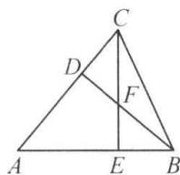  
图1

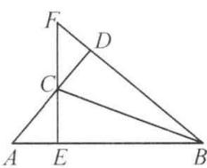  
图2

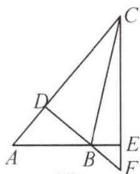  
图3

# 实战演练

1. 解: (1) 如图 1, 当 $\angle BAC$ 为锐角时, BD 在 $\triangle ABC$ 的内部, 此时, $\angle BAC = 90^{\circ} - \angle ABD = 90^{\circ} - 20^{\circ} = 70^{\circ}$ . $\therefore \angle ACB =$

$$
\angle A B C = \frac {1}{2} (1 8 0 ^ {\circ} - \angle B A C) = \frac {1}{2} (1 8 0 ^ {\circ} - 7 0 ^ {\circ}) = 5 5 ^ {\circ};
$$

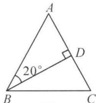  
图1

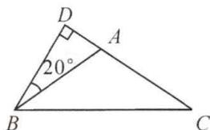  
图2

(2)如图2,当 $\angle BAC$ 为钝角时,BD在 $\triangle ABC$ 的外部,此时, $\angle BAC=90^{\circ}+\angle ABD=90^{\circ}+20^{\circ}=110^{\circ},\therefore\angle ACB=\angle ABC=\frac{1}{2}(180^{\circ}-\angle BAC)=\frac{1}{2}(180^{\circ}-110^{\circ})=35^{\circ}.$

2. 解: 如图 1, $\angle P = \beta + \gamma - \alpha$ ; 如图 2, $\angle P = \alpha + \gamma - \beta$ ; 如图 3, $\angle P = \gamma - \alpha - \beta$ . 故选 A.

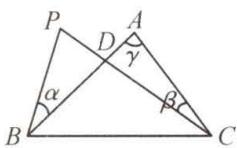  
图1

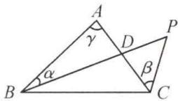  
图2

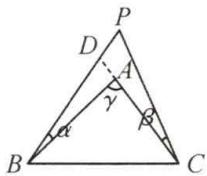  
图3

# 板块四 特殊到一般

# 典例精讲

【例】解:(1)∵BD,CE是△ABC的角平分线,

$$
\therefore \angle 2 = \frac {1}{2} \angle A B C = \frac {1}{2} \times 4 0 ^ {\circ} = 2 0 ^ {\circ},
$$

$$
\therefore \angle F C B = \frac {1}{2} \angle A C B = \frac {1}{2} \times 6 0 ^ {\circ} = 3 0 ^ {\circ},
$$

$$
\because F H \perp B C, \therefore \angle 1 = 9 0 ^ {\circ} - 3 0 ^ {\circ} = 6 0 ^ {\circ},
$$

$$
\therefore \angle 1 - \angle 2 = 6 0 ^ {\circ} - 2 0 ^ {\circ} = 4 0 ^ {\circ};
$$

(2) $\because BD, CE$ 是 $\triangle ABC$ 的角平分线，

∴设 $\angle2=\angle ABD=x,\angle BCE=\angle ACE=y,$

则 $\angle ABC = 2x, \angle ACB = 2y$

$$
\because \angle A = 6 0 ^ {\circ}, \therefore 2 x + 2 y = 1 2 0 ^ {\circ}, \therefore x + y = 6 0 ^ {\circ},
$$

$$
\because F H \perp B C, \therefore \angle 1 = 9 0 ^ {\circ} - y,
$$

$$
\therefore \angle 1 - \angle 2 = 9 0 ^ {\circ} - y - x = 9 0 ^ {\circ} - 6 0 ^ {\circ} = 3 0 ^ {\circ};
$$

(3) 同(2) 设 $\angle 2 = \angle ABD = x, \angle BCE = \angle ACE = y$ ,
则 $\angle ABC = 2x, \angle ACB = 2y,$

$$
\because \angle A = \alpha , \therefore 2 x + 2 y = 1 8 0 ^ {\circ} - \alpha , \therefore x + y = 9 0 ^ {\circ} - \frac {1}{2} \alpha ,
$$

$$
\because F H \perp B C, \therefore \angle 1 = 9 0 ^ {\circ} - y,
$$

$$
\therefore \angle 1 - \angle 2 = 9 0 ^ {\circ} - y - x = 9 0 ^ {\circ} - \left(9 0 ^ {\circ} - \frac {1}{2} \alpha\right) = \frac {1}{2} \alpha .
$$

# 实战演练

解: 探究一: $\because DP, CP$ 分别平分 $\angle ADC$ 和 $\angle ACD$ ,

$$
\therefore \angle P D C = \frac {1}{2} \angle A D C, \angle P C D = \frac {1}{2} \angle A C D,
$$

$$
\therefore \angle P = 1 8 0 ^ {\circ} - \angle P D C - \angle P C D = 1 8 0 ^ {\circ} - \frac {1}{2} (\angle A D C +
$$

$$
\angle A C D) = 1 8 0 ^ {\circ} - \frac {1}{2} (1 8 0 ^ {\circ} - \angle A) = 9 0 ^ {\circ} + \frac {1}{2} \angle A;
$$

探究二:(1) $360^{\circ}$ ;

$$
\begin{array}{l} (2) \angle P = 1 8 0 ^ {\circ} - \angle P D C - \angle P C D = 1 8 0 ^ {\circ} - \frac {1}{2} (\angle A D C + \\ \angle B C D) = 1 8 0 ^ {\circ} - \frac {1}{2} (3 6 0 ^ {\circ} - \angle A - \angle B) = \frac {1}{2} (\angle A + \\ \angle B). \\ \end{array}
$$

# 板块五 参数思想

# 典例精讲

【例】解：∵AE平分∠DAC，∴设∠DAE=∠EAC=x，

$$
\because A D \perp B C, \therefore \angle C = 9 0 ^ {\circ} - 2 x,
$$

$$
\because \angle B A C = \angle B,
$$

$$
\therefore \angle B A C = \frac {1}{2} (1 8 0 ^ {\circ} - 9 0 ^ {\circ} + 2 x) = 4 5 ^ {\circ} + x,
$$

$$
\therefore \angle F A E = \angle B A C - \angle E A C = 4 5 ^ {\circ} + x - x = 4 5 ^ {\circ}.
$$

$$
\because E F \perp A B, \therefore \angle A E F = 9 0 ^ {\circ} - 4 5 ^ {\circ} = 4 5 ^ {\circ}.
$$

# 实战演练

解：(1) $\angle I=\frac{1}{2}(\angle A+\angle D)-90^{\circ}$ ,

设 $\angle ABI = \angle DBI = x, \angle ACI = \angle ECI = y,$

则 $x + \angle A = y + \angle I①$ ,

$$
\angle D = 2 x + 1 8 0 ^ {\circ} - 2 y + \angle A ②,
$$

由①得 $x - y = \angle I - \angle A$

代入②中得 $\angle D=2\angle I-\angle A+180^{\circ}$ ,

$$
\therefore \angle I = \frac {1}{2} (\angle A + \angle D) - 9 0 ^ {\circ};
$$

(2) $\angle I=90^{\circ}+\frac{1}{2}(\angle A-\angle D).$

设 $\angle ABI = \angle DBI = x, \angle ACI = \angle ECI = y,$

可得 $\angle A + x = \angle I + y$ ，即 $x - y = \angle I - \angle A$ ①；

连接 AD，易得 $\angle A + 2x + \angle BDC + 180^{\circ} - 2y = 360^{\circ}$

即 $x - y = 90^{\circ} - \frac{1}{2} (\angle A + \angle D)$ ②.

由①②. 得 $\angle I = 90^{\circ} + \frac{1}{2} (\angle A - \angle D)$ .

# 第4讲 常用导角模型

# 板块一 七个基本导角模型

1. 解: 连接 CE. 则可得 $\angle FCE + \angle FEC = \angle A + \angle B$ ,

$$
\begin{array}{l} \therefore \angle F C D + \angle D + \angle D E F - \angle A - \angle B = \angle D C E + \angle D + \\ \angle D E C = 1 8 0 ^ {\circ}. \end{array}
$$

2. 解：∵ $\angle BDE = \angle AED + \angle A, \angle CED = \angle ADE + \angle A,$

$$
\begin{array}{l} \therefore \angle B D E + \angle C E D = \angle A D E + \angle A E D + 2 \angle A = 1 8 0 ^ {\circ} + \\ \angle A = 1 8 0 ^ {\circ} + 6 5 ^ {\circ} = 2 4 5 ^ {\circ}. \end{array}
$$

3. $140^{\circ}$ 解: 由风筝模型知 $\angle1 + \angle2 = \angle A + \angle D = 70^{\circ} + 70^{\circ} = 140^{\circ}$ .

4. $40^{\circ}$ 解：由模型知 $\angle A + \angle B + \angle ACD = \angle D$

$$
\therefore \angle A C D = \angle D - \angle A - \angle B = 6 0 ^ {\circ} - 2 0 ^ {\circ} = 4 0 ^ {\circ},
$$

∵CE 平分∠ACD，∴∠ECD= $\frac{1}{2}$ ∠ACD=20°，

又∵∠BEC+∠B+∠ECD=∠D，

$$
\therefore \angle D - \angle B E C = \angle B + \angle E C D = 2 0 ^ {\circ} + 2 0 ^ {\circ} = 4 0 ^ {\circ}.
$$

5. 证明: 延长 FE, BC 交于点 G.

$$
\because \angle F = \angle D = 9 0 ^ {\circ}, A F / / B C, \therefore \angle G = \angle D = 9 0 ^ {\circ},
$$

$$
\therefore \angle D E G = \angle D C G, \therefore \angle D E F = \angle B C D.
$$

6. 证明: (1) 连接 BD.

$$
\because \angle B = \angle D = 9 0 ^ {\circ}, \therefore \angle D A B + \angle B C D = 1 8 0 ^ {\circ},
$$

$\therefore \angle DCG = \angle DAB, \because AE$ 平分 $\angle DAB,$

$$
\therefore \angle D A B = 2 \angle D A E, \therefore \angle E C G = 2 \angle D A E;
$$

(2) $\because \angle B = \angle D = 90^{\circ}, \therefore \angle DAE + \angle AED = \angle EAB +$

$$
\angle G = 9 0 ^ {\circ}, \because A E \text {平分} \angle D A B, \therefore \angle D A E = \angle E A B,
$$

$$
\therefore \angle A E D = \angle G, \text {   又   } \because \angle A E D = \angle C E G, \therefore \angle C E G = \angle G.
$$

7. 解：∵ $\angle BPF = \angle BPC + \angle CPF = \angle B + \angle BEP$ ,

$$
\angle B E P = \angle B P C, \therefore \angle C P F = \angle B = 3 7 ^ {\circ},
$$

同理可得 $\angle BPE = \angle C = 25^{\circ}$

$$
\therefore \angle B P C = 1 8 0 ^ {\circ} - \angle B P C - \angle C P F = 1 8 0 ^ {\circ} - 2 5 ^ {\circ} - 3 7 ^ {\circ} =
$$

$118^{\circ}$ , 易知 $\angle BPC = \angle A + \angle B + \angle C$ ,

$$
\therefore \angle A = 1 1 8 ^ {\circ} - 2 5 ^ {\circ} - 3 7 ^ {\circ} = 5 6 ^ {\circ}.
$$

8. 证明: 由 $\angle A = \angle BEC$ 可得 $\angle CED = \angle ABE$ ,

∵ BE 平分 $\angle ABC, \therefore \angle ABE = \angle CBE,$

$$
\therefore \angle C E D = \angle C B E, \text {   又   } \because \angle D = \angle B E C, \angle C B E + \angle B E C +
$$

$$
\angle B C E = \angle C E D + \angle D + \angle D C E = 1 8 0 ^ {\circ},
$$

$\therefore \angle BCE = \angle DCE, \therefore CE$ 平分 $\angle BCD.$

# 板块二 五大双角平分线夹角模型(一) 识模

模型 1: 证明

∵BP 平分∠ABC, CP 平分∠ACB,

$$
\begin{array}{l} \therefore \angle P B C = \frac {1}{2} \angle A B C, \angle P C B = \frac {1}{2} \angle A C B, \\ \angle P = 1 8 0 ^ {\circ} - (\angle P B C + \angle P C B) \\ = 1 8 0 ^ {\circ} - \frac {1}{2} (\angle A B C + \angle A C B) \\ = 1 8 0 ^ {\circ} - \frac {1}{2} (1 8 0 ^ {\circ} - \angle A) \\ = 9 0 ^ {\circ} + \frac {1}{2} \angle A. \\ \end{array}
$$

模型 2: 证明

∵BP 平分∠DBC, CP 平分∠ECB,

$$
\therefore \angle P B C = \frac {1}{2} \angle D B C = \frac {1}{2} (\angle A + \angle A C B),
$$

$$
\angle P C B = \frac {1}{2} \angle B C E = \frac {1}{2} (\angle A + \angle A B C),
$$

$$
\begin{array}{l} \therefore \angle P B C + \angle P C B = \frac {1}{2} (\angle A + \angle A C B + \angle A B C) + \frac {1}{2} \angle A \\ = \frac {1}{2} \times 1 8 0 ^ {\circ} + \frac {1}{2} \angle A \\ = 9 0 ^ {\circ} + \frac {1}{2} \angle A, \\ \end{array}
$$

$$
\angle P = 1 8 0 ^ {\circ} - (\angle P B C + \angle P C B)
$$

$$
= 1 8 0 ^ {\circ} - \left(9 0 ^ {\circ} + \frac {1}{2} \angle A\right)
$$

$$
= 9 0 ^ {\circ} - \frac {1}{2} \angle A.
$$

模型 3: 证明

∵PB 平分∠ABC,PC 平分∠ACD,

$$
\therefore \angle P B C = \frac {1}{2} \angle A B C, \angle P C D = \frac {1}{2} \angle A C D,
$$

$$
\therefore \angle P = \angle P C D - \angle P B C = \frac {1}{2} (\angle A C D - \angle A B C) = \frac {1}{2} \angle A.
$$

模型 4: 证明

∵AP 平分∠BAD, CP 平分∠BCD,

∴可设 $\angle PAB=\angle PAD=x,\angle PCB=\angle PCD=y,$

设 PC 与 AD 交于点 E，

则 $\angle P + \angle PAD = \angle D + \angle PCD = \angle PED$

即 $\angle P + x = \angle D + y①$

同理可得 $\angle P + y = \angle B + x$ ②，

由①+②，得 $2\angle P + x + y = \angle B + \angle D + x + y$ ，

$$
\therefore \angle P = \frac {1}{2} (\angle B + \angle D).
$$

模型 5: 证明

∵BP 平分∠ABD, CP 平分∠ACD,

∴可设 $\angle PBA=\angle PBD=x,\angle PCA=\angle PCD=y.$

延长 BP 交 AC 于点 E，

则 $\angle BPC = \angle PEC + \angle PCA = \angle A + \angle PBA + \angle PCA$

$$
\therefore \angle B P C = \angle A + x + y ①,
$$

同理可得 $\angle D = \angle PBD + \angle PCD + \angle BPC$

即 $\angle D = \angle BPC + x + y$ ②，

由①-②，得 $\angle BPC-\angle D=\angle A-\angle BPC$ ，

$$
\therefore \angle B P C = \frac {1}{2} (\angle A + \angle D).
$$

证明

∵AP 平分∠BAC, DP 平分∠BDC,

∴可设 $\angle PAB=\angle PAC=x,\angle PDB=\angle PDC=y.$

设 PA 与 CD 交于点 E，

则 $\angle PEC = \angle P + \angle PDC = \angle C + \angle PAC$

即 $\angle P + y - \angle C + x①$

延长PD父AB于点F，

可得 $\angle PDB = \angle B + \angle PFB = \angle B + \angle P + \angle PAB$

即 $\angle B + \angle P - x = y②$

由①+②，得 $2\angle P+\angle B+x+y=\angle C+x+y$ ，

$$
\therefore \angle P = - \frac {1}{2} (\angle C - \angle B).
$$

# 板块三 五大双角平分线夹角模型(二)用模 典例精讲

【例 1】解：(1) $\angle BO_{1}C=180^{\circ}-\frac{1}{3}(\angle ABC+\angle ACB)=$

$$
1 8 0 ^ {\circ} - \frac {1}{3} (1 8 0 ^ {\circ} - \angle A) = 1 2 0 ^ {\circ} + \frac {1}{3} \angle A = 1 4 0 ^ {\circ};
$$

同理可得 $\angle BO_{2}C = 180^{\circ} - \frac{2}{3}(180^{\circ} - \angle A) = 60^{\circ} +$

$$
\frac {2}{3} \angle A = 1 0 0 ^ {\circ};
$$

(2) $\because \angle O_{1}BO_{2} = \angle BO_{1}C - \angle O_{2} = 125^{\circ} - 110^{\circ} =$

$15^{\circ}, BO_{1}, BO_{2}$ 是 $\angle ABC$ 的三等分线，

$$
\therefore \angle C B O _ {1} = \angle O _ {1} B O _ {2} = 1 5 ^ {\circ}, \angle A B C = 3 \angle O _ {1} B O _ {2} =
$$

$$
4 5 ^ {\circ}, \therefore \angle B C O _ {1} = 1 8 0 ^ {\circ} - 1 5 ^ {\circ} - 1 2 5 ^ {\circ} = 4 0 ^ {\circ},
$$

$\because CO_{1}$ 平分 $\angle ACB, \therefore \angle ACB = 2\angle BCO_{1} = 80^{\circ},$

$$
\therefore \angle A = 1 8 0 ^ {\circ} - 4 5 ^ {\circ} - 8 0 ^ {\circ} = 5 5 ^ {\circ}.
$$

【例 2】解: BP 平分 $\angle OBA$ , AD 平分 $\angle BAx$ ,

$$
\therefore \angle P B A = \frac {1}{2} \angle O B A, \angle B A D = \frac {1}{2} \angle B A x,
$$

$$
\therefore \angle P = \angle B A D - \angle P B A = \frac {1}{2} (\angle B A x - \angle O B A) =
$$

$$
\frac {1}{2} \angle B O A = \frac {1}{2} \times 9 0 ^ {\circ} = 4 5 ^ {\circ}.
$$

【例 3】 $70^{\circ}$ 解：∵ $\angle C = \angle COA, \angle BDC = \angle BOD, \angle AOC$

$$
= \angle B O D, \therefore \angle C = \angle A O C = \angle B O D = \angle B D O,
$$

$\therefore \angle B = \angle CAO$ ，设 $\angle C = \angle AOC = \angle BOD =$

$\angle BDO = x, \angle CAP = \angle PAB = y, \angle P = z$ ，则 $\angle B =$

2y，则有 $\left\{\begin{aligned}&2x+2y=180^{\circ},\\&x+y=z+\frac{1}{2}x,\end{aligned}\right.$ 解得 $\left\{\begin{aligned}&x=70^{\circ},\\&y=20^{\circ},\\&z=55^{\circ},\end{aligned}\right.$

$\therefore \angle C=70^{\circ}$ . 故答案为 $70^{\circ}$ .

【例 4】证明：∵BM 平分∠ABC, DN 平分∠ADC,

$$
\therefore \angle A B M = \angle C B M, \angle A D N = \angle C D N,
$$

设 $\angle ABM = \angle CBM = x, \angle A = \angle C = y.$

易知 $\angle ADC = \angle A + \angle C + \angle ABC = 2x + 2y$

$$
\therefore \angle C D N = \frac {1}{2} \angle A D C = x + y,
$$

$$
\because \angle C E M = \angle C B M + \angle C = x + y,
$$

$$
\therefore \angle C D N = \angle C E M, \therefore B M / / D N.
$$

【例 5】解： $\angle C=90^{\circ}-\frac{1}{2}\angle AOB=90^{\circ}-\frac{1}{2}\times90^{\circ}=45^{\circ}$

# 实战演练

1. 解: 设 $\angle ABP = \angle DBP = x, \angle ACP = \angle DCP = y$ ,

易证 $\angle A + \angle ABP = \angle ACP + \angle P$

$\therefore x+90^{\circ}=y+\angle P$ ①, 同理 $y+90^{\circ}=\angle P+x$ ②,

①+②得 $x+y+180^{\circ}=2\angle P+x+y,\therefore\angle P=90^{\circ}.$

2. 证明：∵ BP 平分 ∠ABC, CP 平分 ∠ACB,

则可得 $\angle BPC = 90^{\circ} + \frac{1}{2}\angle A,\because \angle AMN = \angle ANM,$

$$
\therefore \angle A M N = \angle A N M = \frac {1}{2} (1 8 0 ^ {\circ} - \angle A) = 9 0 ^ {\circ} - \frac {1}{2} \angle A,
$$

$$
\therefore \angle B M N = \angle C N M = 1 8 0 ^ {\circ} - (9 0 ^ {\circ} - \frac {1}{2} \angle A) = 9 0 ^ {\circ} + \frac {1}{2} \angle A,
$$

$$
\therefore \angle B P C = \angle B M N = \angle C N M.
$$

3. 解: $\because BF$ 平分 $\angle ABC, CF$ 平分 $\angle DCE,$

$\therefore \angle ABF = \angle CBF, \angle DCF = \angle ECF$ ，设 $\angle ABF = \angle CBF = x$ ，易知 $\angle ADC = \angle A + \angle ABC + \angle BCD$ ，

$$
\therefore 6 0 ^ {\circ} + \angle A B C + \angle B C D = 1 5 0 ^ {\circ}, \therefore \angle B C D = 9 0 ^ {\circ} - 2 x,
$$

$$
\therefore \angle D C E = 1 8 0 ^ {\circ} - \angle B C D = 9 0 ^ {\circ} + 2 x,
$$

$$
\therefore \angle F C E = \frac {1}{2} \angle D C E = 4 5 ^ {\circ} + x,
$$

$$
\therefore \angle F = \angle F C E - \angle C B F = 4 5 ^ {\circ} + x - x = 4 5 ^ {\circ}.
$$

# 板块四 高与角平分线夹角模型

类型 1: 证明

$$
\begin{array}{l} \angle C) = 9 0 ^ {\circ} - \frac {1}{2} (\angle B + \angle C), \therefore \angle A D C = \angle B + \angle B A D = \\ 9 0 ^ {\circ} + \frac {1}{2} (\angle B - \angle C). \because A E \perp B C, \therefore \angle D A E = 9 0 ^ {\circ} - \angle A D C = \\ 9 0 ^ {\circ} - \left[ 9 0 ^ {\circ} + \frac {1}{2} (\angle B - \angle C) \right] = \frac {1}{2} (\angle C - \angle B). \\ \end{array}
$$

∵AD平分∠BAC,∴∠BAD= $\frac{1}{2}$ ∠BAC= $\frac{1}{2}(180^{\circ}-\angle B-$

类型 2: 证明

同上可得 $\angle PDE = \angle ADC = 90^{\circ} + \frac{1}{2} (\angle B - \angle C)$

$$
\therefore \angle P = 9 0 ^ {\circ} - \angle P D E = 9 0 ^ {\circ} - \left[ 9 0 ^ {\circ} + \frac {1}{2} (\angle B - \angle C) \right]
$$

$$
= \frac {1}{2} (\angle C - \angle B).
$$

类型 3: 证明

同上可得 $\angle P = 90^{\circ} - \angle ADC$

$$
= 9 0 ^ {\circ} - \left[ 9 0 ^ {\circ} + \frac {1}{2} (\angle B - \angle C) \right]
$$

$$
= \frac {1}{2} (\angle C - \angle B).
$$

类型 4: 证明

∵AD 平分∠BAC, ∴∠BAD=∠CAD,

∵CE为高，∴∠AEC=∠ACB=90°，

$$
\therefore \angle A F E + \angle B A D = \angle C A D + \angle A D C = 9 0 ^ {\circ},
$$

$$
\therefore \angle A F E = \angle C D F,
$$

$$
\because \angle C F D = \angle A F E,
$$

$$
\therefore \angle C D F = \angle C F D.
$$

# 第5讲 情境创新题

# 板块一 数学活动(课本 $P_{19}$ 变式)

1. 解：(1)4，三棱锥；

(2)7,上下两个三棱锥.

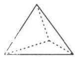

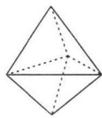

2. 解：(1)1；(2)2；(3)3；(4)6.

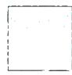  
[1]

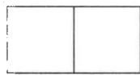  
图2

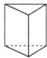  
图3

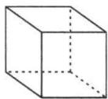  
图4

3. 解：(1) V=5, E=7, F=3;

(2) $V=6,E=9,F=4;$   
(3) $V-E+F=1,$

理由： $V = n,E = n + n - 3 = 2n - 3,F = n - 2,$

$$
\begin{array}{l} \therefore V - E + F = n - (2 n - 3) + (n - 2) \\ = n - 2 n + 3 + n - 2 = 1. \\ \end{array}
$$

4. 解：(1) $D_{3}=1;D_{4}=2;$

(2) $n = 4$ 时， $\frac{D_5}{D_4} = \frac{4\times 4 - 6}{4} = \frac{5}{2}$

$$
\because D _ {4} = 2, \therefore D _ {5} = \frac {5}{2} \times 2 = 5.
$$

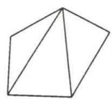

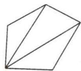

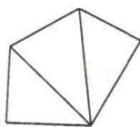

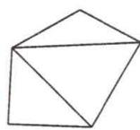

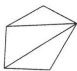

# 板块二 综合与实践

解:(1)∵BP 平分∠MBC,CP 平分∠BCN,

$$
\therefore \angle C B P = \frac {1}{2} \angle M B C = \frac {1}{2} \angle A + \frac {1}{2} \angle A C B,
$$

$$
\angle B C P = \frac {1}{2} \angle B C N = \frac {1}{2} \angle A + \frac {1}{2} \angle A B C,
$$

$$
\therefore \angle C B P + \angle B C P = \frac {1}{2} \angle A + \frac {1}{2} \angle A C B + \frac {1}{2} \angle A +
$$

$$
\frac {1}{2} \angle A B C = \angle A + \frac {1}{2} \angle A C B + \frac {1}{2} \angle A B C.
$$

$$
\because \angle A + \angle A C B + \angle A B C = 1 8 0 ^ {\circ},
$$

$$
\therefore \angle A = 1 8 0 ^ {\circ} - \angle A C B - \angle A B C.
$$

$$
\because \angle C B P + \angle B C P + \angle B P C = 1 8 0 ^ {\circ},
$$

$$
\therefore \angle A + \frac {1}{2} \angle A C B + \frac {1}{2} \angle A B C + \angle B P C = 1 8 0 ^ {\circ}, 1 8 0 ^ {\circ} -
$$

$$
\angle A C B - \angle A B C + \frac {1}{2} \angle A C B + \frac {1}{2} \angle A B C + \angle B P C =
$$

$$
1 8 0 ^ {\circ}, \therefore \angle A B C + \angle A C B = 2 \angle B P C;
$$

(2)∵BP 平分∠MBC,FP 平分∠EFC,

$$
\therefore \angle C B P = \frac {1}{2} \angle M B C = \frac {1}{2} (\angle A + \beta) = \frac {1}{2} \angle A + \frac {1}{2} \beta ,
$$

$$
\angle C F P = \frac {1}{2} \angle E F C = \frac {1}{2} (\angle A + \alpha) = \frac {1}{2} \angle A + \frac {1}{2} \alpha .
$$

$$
\because \angle O F C + \angle F O C + \angle A C B = 1 8 0 ^ {\circ}, \angle B O P = \angle F O C,
$$

$$
\therefore \angle F O C = 1 8 0 ^ {\circ} - \angle A C B - \angle O F C,
$$

$$
\therefore \angle B O P = 1 8 0 ^ {\circ} - \beta - \angle O F C = 1 8 0 ^ {\circ} - \beta - \frac {1}{2} \angle E F C = 1 8 0 ^ {\circ}
$$

$$
- \beta - \frac {1}{2} \alpha - \frac {1}{2} \angle A. \because \angle C B P + \angle P + \angle B O P = 1 8 0 ^ {\circ},
$$

$$
\therefore \frac {1}{2} \angle A + \frac {1}{2} \beta + \theta + 1 8 0 ^ {\circ} - \beta - \frac {1}{2} \alpha - \frac {1}{2} \angle A = 1 8 0 ^ {\circ},
$$

$$
\therefore \theta = \frac {\alpha + \beta}{2};
$$

(3)∵BP 平分∠ABC,FP 平分∠AFG,

$$
\therefore \angle O F P = \frac {1}{2} \angle A F G = \frac {1}{2} (\angle A + \alpha) = \frac {1}{2} \angle A + \frac {1}{2} \alpha ,
$$

$$
\angle C B O = \frac {1}{2} \angle A B C = \frac {1}{2} (1 8 0 ^ {\circ} - \angle A - \beta) = 9 0 ^ {\circ} - \frac {1}{2} \angle A
$$

$$
- \frac {1}{2} \beta .
$$

$$
\because \angle P O F = \angle C B O + \angle A C B = 9 0 ^ {\circ} - \frac {1}{2} \angle A - \frac {1}{2} \beta + \beta =
$$

$$
9 0 ^ {\circ} - \frac {1}{2} \angle A + \frac {1}{2} \beta ,
$$

$$
\because \angle P O F + \angle O F P + \angle P = 1 8 0 ^ {\circ},
$$

$$
\therefore 9 0 ^ {\circ} - \frac {1}{2} \angle A + \frac {1}{2} \beta + \frac {1}{2} \angle A + \frac {1}{2} \alpha + \theta = 1 8 0 ^ {\circ},
$$

$$
\therefore \alpha + \beta + 2 \theta = 1 8 0 ^ {\circ}.
$$

# 第十四章 全等三角形

# 第6讲 全等三角形的性质与判定

# 板块一 全等发现

# 典例精讲

【例 1】解：AC=DF 且 AC//DF. 证明如下：

$$
\because A B \parallel D E, \therefore \angle B = \angle D E F, \because B E = C F,
$$

$$
\therefore B E + E C = C F + E C, \text {即} B C = E F,
$$

在 $\triangle ABC$ 和 $\triangle DEF$ 中， $\left\{\begin{aligned}AB&=DE,\\ \angle B&=\angle DEF,\\ BC&=EF,\end{aligned}\right.$

$$
\begin{array}{r l} & {\therefore \triangle A B C \cong \triangle D E F (\mathrm{SAS}), \therefore A C = D F, \angle A C B =} \\ & {\angle F, \therefore A C / / D F, \therefore A C = D F \text {且} A C / / D F.} \end{array}
$$

【例 2】解：∵AD=AB, DE=BC, AC=AE,

$$
\therefore \triangle A B C \cong \triangle A D E (\text { S   S   S }),
$$

$$
\therefore \angle B = \angle D, \angle B A C = \angle D A E,
$$

$$
\because \angle B A C - \angle B A E = \angle D A E - \angle B A E,
$$

$$
\therefore \angle 1 = \angle D A B = 2 5 ^ {\circ},
$$

$$
\because \angle B = \angle D, \angle B O E = \angle A O D,
$$

$$
\therefore \angle 2 = \angle D A B = 2 5 ^ {\circ}.
$$

【例 3】证明：∵AD 是△ABC 的中线，∴BD=CD.

$$
\because D E \perp A B, D F \perp A C, B E = C F,
$$

$$
\therefore \mathrm{Rt} \triangle B D E \cong \mathrm{Rt} \triangle C D F (\mathrm{HL}), \therefore D E = D F,
$$

$$
\because A D = A D,
$$

$$
\therefore \mathrm{Rt} \triangle A D E \cong \mathrm{Rt} \triangle A D F (\mathrm{HL}), \therefore A E = A F.
$$

【例 4】证明：∵ AC∥DF，∴ ∠ACB = ∠DFE，

$$
\therefore \triangle A B C \cong \triangle D E F (\text { A   A   S }), \therefore A C = D F,
$$

∵AM, DN 分别是△ABC 和△DEF 的角平分线，

$$
\therefore \angle B A M = \frac {1}{2} \angle B A C, \angle E D N = \frac {1}{2} \angle E D F,
$$

$$
\because \triangle A B C \cong \triangle D E F, \therefore \angle B A C = \angle E D F,
$$

$$
\therefore \angle B A M = \angle E D N,
$$

$$
\therefore \triangle B A M \cong \triangle E D N (\text { ASA }),
$$

$$
\therefore A M = D N.
$$

# 实战演练

1. 证明 $\because \angle BCA = \angle DCE, \therefore \angle BCA - \angle ACE = \angle DCE - \angle ACE$ ，即 $\angle BCE = \angle ACD$ ，又 $\because CA = CB, CD = CE, BF\cong ABC(SAS), \therefore BE = AD.$

2. 证明：先证 $ABE \cong \triangle ACD$ (ASA)，得 $AB = AC$

$$
\therefore B D = C F \text {, 得} \triangle B O D \cong \triangle C O E (\mathrm{AAS}), \therefore O B = O C.
$$

3. 证明：证 $\triangle ABD \cong \triangle ACD$ (SSS)，

$$
\angle B A D = \angle C A D = 4 5 ^ {\circ} = \angle B = \angle A C B, \therefore A D \perp B D,
$$

$$
\text { 又 } \because B N \perp A M, \therefore \angle E = \angle A M C,
$$

$$
\text { 又 } \because A B = A C, \therefore \triangle B A E \cong \triangle A C M (\mathrm{AAS}), \therefore A E = C M.
$$

4. 证明：(1) $\because BE \perp AC, CF \perp AB, \therefore \angle AEB = \angle AFC = 90^{\circ}, \angle ABE + \angle BAC = \angle ACF + \angle BAC = 90^{\circ}$ ,

$$
\therefore \angle A B E = \angle A C F, \text {又} \because B M = A C, C N = A B,
$$

$$
\therefore \triangle A B M \cong \triangle N C A (\text { SAS });
$$

$$
\because \triangle A B M \cong \triangle N C A, \therefore \angle N = \angle B A M, \because \angle N + \tag {2}
$$

$$
\angle N A F = 9 0 ^ {\circ}, \therefore \angle B A M + \angle N A F = 9 0 ^ {\circ}, \therefore A M \perp A N.
$$

# 板块二 初识全等的常规辅助线

# 典例精讲

【例 1】证明：连接 BC，易得 $\triangle ABC \cong \triangle DCB$ (SSS)，

$$
\therefore \angle A = \angle D.
$$

【例 2】证法一: 延长 BA, CD 交于点 E,

$$
\text { 可得 } \triangle E B D \cong \triangle E C A (\mathrm{AAS}),
$$

$$
\therefore B E = C E, A E = D E, \therefore A B = C D.
$$

证法二: 连接 BC, 则 Rt△ABC≌Rt△DCB(HL), 可得 AB=CD.

【例 3】解: 过点 D 作 $DH \perp BC$ 于点 H, $\therefore \angle EHD = 90^{\circ}$ ,

$$
\because \angle B A C = 9 0 ^ {\circ}, \therefore \angle B A C = \angle E H D,
$$

$$
\because A B \perp A C, D E \perp A C,
$$

$$
\therefore A B \parallel D E, \therefore \angle B = \angle D E H,
$$

$$
\because B C = E D, \angle B A C = \angle E H D,
$$

$$
\therefore \triangle A B C \cong \triangle H E D (\text { AAS }), \therefore A C = H D = 4,
$$

$$
\because S _ {\triangle C D E} = 6, \therefore C E \cdot H D = 1 2, \therefore C E = 3.
$$

【例 4】证法一(截长法): 在 AB 上取一点 E, 使 AE = AC,

$$
\because \angle E A P = \angle C A P, A P = A P, \therefore \triangle E A P \cong \triangle C A P,
$$

∴ PE = PC，在 $\triangle BEP$ 中，PB - PE < BE，即 PB - PC < AB - AC；

证法二(补短法):延长 AC 至点 F,使 AF=AB,连接 PF,则 $\triangle ABP \cong \triangle AFP(SAS),\therefore PB=PF,$

$$
\therefore P F - P C <   C F,
$$

$$
\therefore P B - P C <   A B - A C.
$$

# 实战演练

1. 证明: 连接 AC. $\because AE = AF, CE = CF, AC = AC,$

$$
\therefore \triangle A C E \cong \triangle A C F (\mathrm{SSS}), \therefore \angle E A C = \angle F A C.
$$

在 $\triangle ACB$ 和 $\triangle ACD$ 中， $\left\{\begin{aligned}\angle BAC&=\angle DAC,\\ \angle B&=\angle D=90^{\circ},\\ AC&=AC,\end{aligned}\right.$

$$
\therefore \triangle A C B \cong \triangle A C D (\mathrm{AAS}), \therefore C B = C D.
$$

2. 证明: (1) 连接 AC, AD, 得 $\triangle ABC \cong \triangle AED$ (SAS),

$$
\therefore A C = A D. \therefore \mathrm{Rt} \triangle A C F \cong \mathrm{Rt} \triangle A D F (\mathrm{HL}),
$$

∴CF=DF，即F为CD的中点；

(2) 延长 AB, AE, 与直线 CD 交于点 M, N.

$$
\text { 则 } \triangle A F M \cong \triangle A F N (\mathrm{ASA}), \therefore F M = F N, A M = A N,
$$

$$
\angle M = \angle N, \text {   又   } \because A B = A E, \angle A B C = \angle A E D,
$$

$$
\therefore B M = E N, \angle M B C = \angle D E N,
$$

$$
\therefore \triangle M B C \cong \triangle N E D (\mathrm{ASA}), \therefore M C = D N,
$$

又∵FM=FN,∴CF=DF,∴F为CD的中点.

3. 解: 过点 F 作 $FG \perp AD$ ，交 AD 的延长线于点 G，∴ $\angle G = \angle DAE = 90^{\circ}$ ，∴ $\angle GAF + \angle FAE = \angle E + \angle FAE = 90^{\circ}$ ，

$$
\therefore \angle G A F = \angle E, \because A F = D E, \therefore \triangle A G F \cong \triangle E A D (\mathrm{AAS}),
$$

$$
\therefore G F = A D = 4, \therefore S _ {\triangle A D F} = \frac {1}{2} \cdot A D \cdot G F = \frac {1}{2} \times 4 \times 4 = 8.
$$

4. 证明: 在 BC 上截取 BM = BA, 连接 DM, 证 $\triangle BAD \cong \triangle BMD$ , 再证 $\triangle CED \cong \triangle CMD$ ,

$$
\therefore C E = C M, \therefore B C = B M + M C = B A + C E.
$$

# 第 7 讲 角平分线的处理方法

# 板块一 角平分线的性质

# 典例精讲

【例 1】证明：∵AD 平分∠BAC, DE⊥AB, DF⊥AC,

$$
\therefore D E = D F, \text {又} \because B D = C D,
$$

$$
\therefore \mathrm{Rt} \triangle B D E \cong \mathrm{Rt} \triangle C D F (\mathrm{HL}), \therefore B E = C F.
$$

【例 2】证明: 过点 E 作 $EH \perp AD$ 于点 H.

$$
\because A E \text {   平分   } \angle B A D, D E \text {   平分   } \angle A D C,
$$

$$
\angle B = \angle C = \angle A H E = 9 0 ^ {\circ}, \therefore E H = E B = E C.
$$

【例 3】证明: 过点 D 作 $DE \perp AB$ 于点 E,

过点 D 作 $DF \perp BC$ 于点 F.

∵ BD 平分 ∠ABC, ∴ DE = DF,

$$
\text { 又 } \because A D = C D, \therefore \mathrm{Rt} \triangle A D E \cong \triangle \mathrm{Rt} \triangle C D F (\mathrm{HL}),
$$

$$
\therefore \angle A D E = \angle C D F.
$$

$$
\because \angle D E B = \angle E B C = \angle B F D = 9 0 ^ {\circ}, \therefore \angle E D F = 9 0 ^ {\circ},
$$

$$
\therefore \angle A D C = \angle E D F = 9 0 ^ {\circ}, \therefore A D \perp C D.
$$

# 实战演练

证明: 过点 A 分别作 $AE \perp BD$ 于点 E, $AF \perp CD$ 于点 F,
易得 $\angle ADF=\angle ADB=72^{\circ}$ ,

$$
\therefore A E = A F, \text {   由   } \angle B A C = \angle B D C \text {   可得   } \angle A B E =
$$

$$
\angle A C F, \therefore \triangle A B E \cong \triangle A C F (\text { A   A   S }), \therefore A B = A C.
$$

# 板块二 证角平分线

# 典例精讲

【例 1】证明: 过点 C 作 $CM \perp AE$ 于点 M, 过点 C 作 $CN \perp BE$ 于点 N. $\because \angle CAE = \angle CBE, \angle AMC = \angle BNC = 90^{\circ}, AC = BC, \therefore \triangle AMC \cong \triangle BNC (AAS)$ ,

$$
\therefore C M = C N, \therefore \angle M E C = \angle N E C,
$$

∴CE 平分 $\triangle ABE$ 的外角.

【例 2】解:(1)过点 P 分别作 $PF \perp AD$ , 垂足为 F, $PG \perp AE$ , 垂足为 G, $PH \perp BC$ , 垂足为 H.

∵PA 平分∠BAC，

$$
\therefore P F = P G,
$$

∵PB 平分∠CBD，

$$
\therefore P F = P H,
$$

$\therefore PG = PH, \therefore PC \text{ 平分 } \angle BCE;$

(2) 易证 $\triangle PCG \cong \triangle PCH, \triangle PBH \cong \triangle PBF,$

$$
\therefore \angle B P C = \frac {1}{2} \angle G P F = \frac {1}{2} (1 8 0 ^ {\circ} - \angle B A C) = 9 0 ^ {\circ} - \frac {\alpha}{2}.
$$

# 实战演练

解：延长 CA 至点 F，∵ $\angle EAC + \angle EAF = 180^{\circ}$ ，

$$
\text { 又 } \because \angle E A D + \angle E A D = 1 8 0 ^ {\circ}, \therefore \angle E A D = \angle E A F,
$$

即 AE 为 $\triangle ACD$ 的外角平分线，又 $\because CE$ 为 $\triangle ACD$ 的内角平分线，∴ 可得 DE 为 $\triangle ACD$ 的外角平分线，

$\because \angle EAD = \angle EAF = \alpha, \therefore \angle DAC = 180^{\circ} - 2\alpha$ ，由三角形内外角平分线模型可得 $\angle DEC = \frac{1}{2}\angle DAC = \frac{1}{2}(180^{\circ} - 2\alpha) = 90^{\circ} - \alpha.$

# 板块三 角平分线与面积法

# 典例精讲

【例 1】解: 连接 IA, IB, IC, 过点 I 作 IM⊥AB 于点 M, IN⊥BC 于点 N, ∵ I 为 △ABC 各内角平分线的交点, IM⊥AB, IN⊥BC, IH⊥AC,

$$
\therefore I H = I M = I N, \because A B = 4, B C = 3, \angle A B C = 9 0 ^ {\circ},
$$

$$
\therefore S _ {\triangle A B C} = \frac {1}{2} A B \cdot B C = \frac {1}{2} \times 4 \times 3 = 6,
$$

$$
\because S _ {\triangle A B C} = S _ {\triangle A I B} + S _ {\triangle B I C} + S _ {\triangle A I C},
$$

$$
\therefore 6 = \frac {1}{2} A B \cdot I M + \frac {1}{2} B C \cdot I N + \frac {1}{2} A C \cdot I H,
$$

$$
\because A B = 4, B C = 3, A C = 5, I H = I M = I N,
$$

$$
\therefore 6 = \frac {1}{2} \times 4 I H + \frac {1}{2} \times 3 I H + \frac {1}{2} \times 5 I H, \therefore I H = 1.
$$

【例 2】证明：过点 D 作 $DE \perp AB$ 于点 E, $DF \perp AC$ 于点 F，设 BC 上的高为 h. ∵ AD 平分 $\angle BAC$ , ∴ DE = DF.

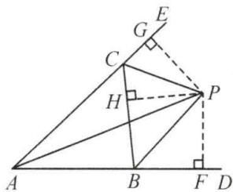

text_image

Geometric diagram with labeled points and right-angle markers, likely from a math problem or proof

$$
\therefore \frac {S _ {\triangle A B D}}{S _ {\triangle A C D}} = \frac {\frac {1}{2} A B \cdot D E}{\frac {1}{2} A C \cdot D F} = \frac {A B}{A C}, \text {又} \frac {S _ {\triangle A B D}}{S _ {\triangle A C D}} = \frac {\frac {1}{2} B D \cdot h}{\frac {1}{2} C D \cdot h} =
$$

$$
\frac {B D}{C D}, \therefore \frac {B D}{C D} = \frac {A B}{A C}.
$$

【例 3】解: 过点 P 分别作 $\triangle ABC$ 三边的垂线段, 垂足分别为 G, H, I. 则 $\angle PGB = \angle PGC = \angle PHC = \angle PHD = \angle PIE = 90^{\circ}$ . 证 $\triangle IEP \cong \triangle HDP$ (AAS), Rt $\triangle PBI \cong$ Rt $\triangle PBG$ (HL), Rt $\triangle PGC \cong$ Rt $\triangle PHC$ (HL), $\because S_{\triangle ABC} = 16, S_{四边形AEPD} = 5, \therefore S_{\triangle BEC} + S_{\triangle CDP} = 16 - 5 = 11, \therefore 2(S_{\triangle BGP} + S_{\triangle PGC}) = 11, \therefore S_{\triangle BPC} = 5.5.$

# 实战演练

1. 解: 过点 O 作 $OD \perp AB$ 于点 D, $OE \perp AC$ 于点 E, $OF \perp BC$ 于点 F, 连接 OC. ∵ 点 O 是 $\angle CAB$ , $\angle ABC$ 平分线的交点, ∴ $OD = OE$ , $OD = OF$ , ∴ $OD = OE = OF$ ,

$$
\because S _ {\triangle A O B} + S _ {\triangle A O C} + S _ {\triangle B O C} = S _ {\triangle A B C},
$$

$$
\therefore \frac {1}{2} A B \cdot O D + \frac {1}{2} A C \cdot O E + \frac {1}{2} B C \cdot O F = \frac {1}{2} A C \cdot B C,
$$

即 $\frac{1}{2}\times10OD+\frac{1}{2}\times6OD+\frac{1}{2}\times8OD=\frac{1}{2}\times6\times8$ ，解得

$$
O D = 2, \therefore S _ {\triangle A O B} = \frac {1}{2} A B \cdot O D = \frac {1}{2} \times 1 0 \times 2 = 1 0 (\mathrm{cm} ^ {2}).
$$

2. 解：∵ BF = 2EF, $S_{\triangle DEF} = 2$ , ∴ $S_{\triangle BDE} = 3S_{\triangle DEF} = 3 \times 2 = 6$ ,
∵ E 为 AD 的中点，∴ $S_{\triangle ABD} = 2S_{\triangle BDE} = 2 \times 6 = 12$

$$
\because S _ {\triangle A B C} = 2 1, \therefore S _ {\triangle A C D} = 2 1 - 1 2 = 9,
$$

过点 D 作 $DM \perp AB$ 于点 M, $DN \perp AC$ 于点 N,

∵AD 是∠BAC 的角平分线，∴DM=DN，

$$
\therefore \frac {S _ {\triangle A B D}}{S _ {\triangle A C D}} = \frac {\frac {1}{2} A B \cdot D M}{\frac {1}{2} A C \cdot D N} = \frac {A B}{A C} = \frac {1 2}{9} = \frac {4}{3}.
$$

3. 解: 过点 D 作 $DF \perp AB$ 于点 F, $DG \perp AC$ 于点 G, $\because AD$ 为 $\angle BAC$ 的平分线, $DF \perp AB$ , $DG \perp AC$ , $\therefore DF = DG$ ,

$$
\therefore S _ {\triangle A B D} = \frac {1}{2} A B \cdot D F = \frac {3}{2} D F, S _ {\triangle A C D} = \frac {1}{2} A C \cdot D G =
$$

$$
\frac {4}{2} D G = 2 D F, \therefore S _ {\triangle A B D}: S _ {\triangle A C D} = \frac {3}{2} D F: 2 D F = 3: 4,
$$

$$
\therefore S _ {\triangle A B D}: S _ {\triangle A C D} = B D: C D = 3: 4,
$$

$$
\therefore C D = \frac {4}{7} B C = \frac {4}{7} \times 5 = \frac {2 0}{7}.
$$

4. 解: 过点 C 作 $CF \perp BD$ 交 BD 的延长线于点 E, 交 BA 的延长线于点 F. ∵ BD 平分 ∠ABC, ∴ ∠FBE = ∠CBE, ∴ △BFE ≅ △BCE, ∴ CE = EF, ∵ AB = AC, ∠ABD = ∠ACF, ∴ △ABD ≅ △ACF, ∴ BD = CF = 2CE = 8,

$$
\therefore C E = 4, S _ {\triangle B D C} = \frac {1}{2} B D \cdot C E = 1 6.
$$

# 板块四 角平分线与对称型全等(一)作垂

# 典例精讲

【例】解:(1) $\because\angle A=\angle B=90^{\circ},\therefore AD\parallel BC,$

$$
\therefore \angle A D C + \angle B C D = 1 8 0 ^ {\circ},
$$

∵ DE 平分∠ADC, CE 平分∠BCD,

$$
\therefore \angle E D C + \angle E C D = 9 0 ^ {\circ}, \therefore \angle D E C = 9 0 ^ {\circ} \text {, 即} D E \perp C E;
$$

(2) 过点 E 作 $EF \perp CD$ 于点 F，

$$
\because E A \perp A D, E B \perp B C, \therefore E A = E F = E B;
$$

(3) 易证 $\triangle ADE \cong \triangle FDE, \triangle CBE \cong \triangle CFE,$

$$
\therefore A D = D F, C B = C F, \therefore A D + B C = C D;
$$

(4) $\because AB=12,\therefore EF=AE=\frac{1}{2}AB=6,$

$$
\therefore S _ {\triangle C D E} = \frac {1}{2} C D \cdot E F = \frac {1}{2} \times 1 3 \times 6 = 3 9.
$$

# 实战演练

1. 证明: 过点 C 作 $CE \perp AD$ 于点 E, 过点 C 作 $CF \perp AB$ , 交 AB 的延长线于点 F,

∵AC平分∠BAD,∴CE=CF.

$$
\because \angle A B C + \angle D = 1 8 0 ^ {\circ}, \angle A B C + \angle F B C = 1 8 0 ^ {\circ},
$$

$$
\therefore \angle F B C = \angle D, \because \angle F = \angle C E D = 9 0 ^ {\circ},
$$

$$
\therefore \triangle B F C \cong \triangle D E C, \therefore C B = C D.
$$

2. 证明: 过点 K 作 $KE \perp AB$ 于点 E, $KF \perp AC$ 于点 F,
∵AK 平分∠BAC, KE⊥AB, KF⊥AC,

$$
\therefore K E = K F,
$$

在 Rt△AKE 和 Rt△AKF 中， $\left\{\begin{aligned}AK&=AK,\\ EK&=FK,\end{aligned}\right.$

$$
\therefore \triangle A K E \cong \triangle A K F (\mathrm{HL}),
$$

∴AE=AF，同理可得 BE=BD, CD=CF，

$$
\therefore A B - A C = A E + B E - A F - C F = B E - C F = B D - C D.
$$

# 板块五 角平分线与对称型全等(二)截长补短

# 典例精讲

【例】证明：(方法一)在 $AB$ 上截取 $AE = AD$ ，连接 $CE$ .则 $\triangle ACE\cong \triangle ACD$ (SAS)， $\therefore \angle ADC = \angle AEC,CE =$ $CD = BC,\therefore \angle CEB = \angle B,\because \angle AEC + \angle CEB = 180^{\circ},$ $\therefore \angle ADC + \angle B = 180^{\circ}.$

(方法二)延长 AD 至点 E，使 AE = AB，连接 CE，则 $\triangle ACE \cong \triangle ACB$ （SAS），∴ $\angle E = \angle B, BC = CE = CD, \therefore \angle CDE = \angle E = \angle B,$

$$
\because \angle A D C + \angle C D E = 1 8 0 ^ {\circ}, \therefore \angle A D C + \angle B = 1 8 0 ^ {\circ}.
$$

# 实战演练

1. 证明: 延长 CD 与 AE 的延长线交于点 F.

$$
\because A B \parallel C D, \therefore \angle F D B = \angle B, \angle F = \angle B A F,
$$

∵E是BD的中点，∴BE=ED，

$$
\therefore \triangle A B E \cong \triangle F D E, \therefore A B = D F, A E = E F.
$$

$$
\because A B + C D = A C, \therefore C F = D F + C D = A B + C D = A C,
$$

$$
\because C E = C E, \therefore \triangle A E C \cong \triangle F E C,
$$

$\therefore \angle ACE = \angle FCE$ , 即 CE 平分 $\angle ACD$ .

2. 解: (1) $\because \angle A = 60^{\circ}, \therefore \angle ABC + \angle ACB = 180^{\circ} - \angle A = 120^{\circ}, \therefore \angle OBC + \angle OCB = 60^{\circ}, \therefore \angle BOE = \angle COD = \angle OBC + \angle OCB = 60^{\circ}$ ;

(2) 在 BC 上截取 BF = BE，连接 OF.

$$
\therefore \triangle B O F \cong \triangle B O E,
$$

$$
\therefore \angle B O F = \angle B O E = 6 0 ^ {\circ}, \text {   易求   } \angle B O C = 1 2 0 ^ {\circ},
$$

$$
\therefore \angle C O F = 6 0 ^ {\circ}, \therefore \angle C O F = \angle C O D, \therefore \triangle C O F \cong \triangle C O D,
$$

$$
\therefore C F = C D, \therefore B E + C D = B F + C F = B C = 7,
$$

$$
\because B E = 4, \therefore C D = 7 - 4 = 3.
$$

# 板块六 角平分线与对称型全等(三)角分垂

# 典例精讲

【例】解:(1)延长AP交BC于点D,可证 $\triangle ABP\cong\triangle DBP$ ,

$$
\therefore \angle B A P = \angle B D A = \angle A C B + \angle D A C = 7 0 ^ {\circ};
$$

(2) $\because \triangle ABP \cong \triangle DBP, \therefore AP = DP, \therefore S_{\triangle ABP} =$

$$
S _ {\triangle D P B}, S _ {\triangle A P C} = S _ {\triangle D P C}, \therefore S _ {\triangle B P C} = \frac {1}{2} S _ {\triangle A B C} = 2.
$$

# 实战演练

1. 解: (1) 延长 BM 交 CD 于点 N.

$$
\begin{array}{l} \because \angle B C M = \angle N C M, C M = C M, \angle C M B = \angle C M N = 9 0 ^ {\circ}, \\ \begin{array}{l} \therefore \triangle C M B \cong \triangle C M N (\mathrm{ASA}), \therefore B M = N M, \because \angle A M B = \\ \angle D M N, \therefore \triangle A B M \cong \triangle D N M (\mathrm{AAS}), \therefore A M = D M; \end{array} \\ \end{array}
$$

(2) $BC = CD - AB$ . 理由如下: 由 (1) 得 $\triangle ABM \cong \triangle DNM$ , $\triangle CBM \cong \triangle CNM$ , $\therefore AB = DN, BC = CN, \therefore BC = CN = CD - DN = CD - AB$ .

2. 证明: 过点 D 作 DH//BC 交 AE 的延长线于点 H, DH 与 AC 交于点 G, 证 $\triangle DAE \cong \triangle DHE$ (ASA), $\triangle DFG \cong$

$$
\triangle A H G (\mathrm{ASA}), \therefore D F = A H = 2 A E, \therefore S _ {\triangle A D F} = \frac {1}{2} D F \cdot
$$

$$
A E = \frac {1}{2} D F \cdot \frac {1}{2} D F = \frac {1}{4} D F ^ {2}.
$$

# 板块七 内角平分线与对角互补模型

# 典例精讲

【例 1】证明:(1)方法一:过点 D 作 $DE \perp BD$ 交 BC 的延长线于点 E, 可得等腰 $Rt\triangle BDE, BD = DE$ ,

$\triangle ADB\cong\triangle CDE(ASA 或 AAS),\therefore AD=CD;$

方法二: 过点 D 分别作 AB, BC 的垂线, 垂足分别为点 E, F, 证 $\triangle ADE \cong CDF$ (AAS);

(2)由(1)知 $S_{四边形ABCD}=S_{\triangle BDE}=\frac{1}{2}BD^{2}$ .

【例 2】(1) 证明: 过点 C 作 $CE \perp AB$ 交 AB 的延长线于点 E,

$$
\because C F \perp A D, \angle E A C = \angle F A C, \therefore C E = C F,
$$

$$
\because C B = C D, \therefore \mathrm{Rt} \triangle C B E \cong \mathrm{Rt} \triangle C D F (\mathrm{HL}),
$$

$$
\therefore \angle F D C = \angle C B E, \because \angle A B C + \angle C B E = 1 8 0 ^ {\circ},
$$

$$
\therefore \angle A D C + \angle A B C = 1 8 0 ^ {\circ};
$$

(2) 证明： $\because \triangle CBE \cong \triangle CDF, \therefore \angle BCE = \angle DCF$ ，易证 $\triangle ACE \cong \triangle ACF, \therefore \angle ACE = \angle ACF, \therefore \angle ACF =$

$$
\angle A C B + \angle B C E = \angle A C B + \angle D C F = \frac {1}{2} \angle B C D;
$$

(3) 解：∵ $\triangle ACE \cong \triangle ACF, \therefore AE = AF,$

$$
\begin{array}{l} \because \triangle C B E \cong \triangle C D F, \therefore B E = D F, \therefore A B + A D = (A E \\ - B E) + (A F + D F) = A E + A F = 2 A F = 1 2; \end{array}
$$

(4) 解: $AD - AB = (AF + DF) - (AE - BE) = DF + BE = 2DF = 4$ ;

(5) 解: $\because AE = AF, \therefore AF - AB = AE - AB = BE = DF = 2;$

(6) 解：∵ $\triangle CDF \cong \triangle CBE, \triangle ACE \cong \triangle ACF,$

$$
\therefore S _ {\mathrm{四边形} A B C D} = S _ {\mathrm{四边形} A E C F} = 2 S _ {\triangle A C F} = 2 0,
$$

$$
\therefore S _ {\triangle A C F} = 1 0, \therefore \frac {1}{2} A F \cdot C F = 1 0, \therefore A F \cdot C F = 2 0;
$$

(7) 解：∵△AEC≌△AFC，△CBE≌△CDF，

$$
\begin{array}{l} \therefore S _ {\triangle A C D} - S _ {\triangle A B C} = (S _ {\triangle A C F} + S _ {\triangle C F D}) - (S _ {\triangle A C E} - \\ S _ {\triangle B C E}) = S _ {\triangle C F D} + S _ {\triangle B C E} = 2 S _ {\triangle C F D} = 4, \therefore S _ {\triangle C F D} = 2. \\ \end{array}
$$

【点睛】本题也可用截长法或补短法做.

# 实战演练

1. 解: (1) 延长 AC 至 E, 使 CE = AB, 连接 DE.

$$
\because \angle B A C = \angle B D C = 9 0 ^ {\circ}, \therefore \angle B + \angle A C D = 1 8 0 ^ {\circ} =
$$

$$
\angle D C E + \angle A C D, \therefore \angle B = \angle D C E, \because B D = C D,
$$

$$
\therefore \triangle A B D \cong \triangle E C D (\mathrm{SAS}), \therefore A D = E D,
$$

$$
\therefore \angle A D B = \angle E D C, \therefore \angle A D E = \angle B D C = 9 0 ^ {\circ},
$$

∴△ADE 为等腰直角三角形，∴∠DAE=45°=∠BAD，
∴AD 平分∠BAC；

(2) 过点 D 作 $DF \perp AE$ 于点 F, $\because AE = AC + CE = AC + AB = 14$ , $\therefore DF = AF = EF = 7$ ,

$$
\therefore S _ {\triangle A B D} = S _ {\triangle D C E} = \frac {1}{2} C E \cdot D F = \frac {1}{2} \times 5 \times 7 = \frac {3 5}{2}.
$$

2. 解: (1) 过点 D 作 $DF \perp AC$ 交 AC 的延长线于点 F, 连接 DB, DC. $\because BG = CG, \angle BGD = \angle CGD = 90^{\circ}, DG = DG,$

$\therefore \triangle BGD \cong \triangle CGD, \therefore BD = CD. \because AD \text{ 平分 } \angle BAC, DE \perp AB, DF \perp AC, \therefore DE = DF, \therefore Rt \triangle BDE \cong Rt\triangle CDF(HL), \therefore BE = CF, \text{ 易证 } \triangle ADE \cong \triangle ADF,$

$$
\therefore A E = A F, \therefore A B - A C = (A E + B E) - (A F - C F) = 2 B E;
$$

(2)由(1)知 $AB + AC = (AE + BE) + (AF - CF) = 2AE = 16.$

# 板块八 外角平分线与同旁张等角模型

# 典例精讲

【例1】证明：(1)过点 $D$ 作 $DE \perp BD$ 交 $BC$ 于点 $E$ ，可得等腰 $Rt\triangle BDE, BD = DE, \triangle ADB \cong \triangle CDE$ (ASA或AAS)， $\therefore AD = CD$ ；

$$
(2) S _ {\triangle A B D} - S _ {\triangle A B D} = S _ {\triangle B D E} = \frac {1}{2} B D ^ {2}.
$$

【例2】解：(1) 过点 P 作 $PN \perp AC$ 于点 N.

$$
\because P M \perp A M, P A \text {   平分   } \angle M A C, \therefore P M = P N,
$$

$$
\because \angle B P C = \angle B A C, \therefore \angle A B P = \angle P C A,
$$

$$
\because \angle B M P = \angle C N P = 9 0 ^ {\circ},
$$

$$
\therefore \triangle P M B \cong \triangle P N C, \therefore P B = P C;
$$

$$
(2) \because \triangle P M B \cong \triangle P N C,
$$

$$
\therefore B M = C N, \text {   易证   } \triangle P A M \cong \triangle P A N, \therefore A M = A N,
$$

$$
\therefore A C - A B = (A N + C N) - (B M - A M) = 2 A M;
$$

$$
(3) A B + A C = (B M - A M) + (A N + C N) = B M +
$$

$$
C N = 2 B M = 6.
$$

# 实战演练

1. 证明: (1) 在 BD 上截取 BG = CD, 连接 AG.

$$
\because \angle B A C = \angle B D C = 9 0 ^ {\circ}, \therefore \angle A B D = \angle A C D,
$$

$$
\text { 又 } \because A B = A C, \therefore \triangle A B G \cong \triangle A C D,
$$

$$
\therefore A G = A D, \angle B A G = \angle C A D,
$$

$$
\therefore \angle G A D = \angle B A C = 9 0 ^ {\circ},
$$

∴△AGD 为等腰直角三角形，∴∠ADB=45°；

(2) 易证 $\triangle AFG \cong \triangle AFD, \therefore GF = DF,$

$$
\therefore B F - D F = B F - G F = B G = C D;
$$

(3) 易证 $\triangle ADF, \triangle AGF$ 均为等腰直角三角形， $\therefore AF = DF = GF, \therefore BD - CD = BD - BG = DG = 2AF.$

2. 解: 连接 AE, 过点 E 作 $EG \perp AC$ 交 AC 的延长线于点 G,

∵D为AB中点, $DE\perp AB,\therefore EA=EB$ ,

$$
\because \angle A C E + \angle B C E = 1 8 0 ^ {\circ}, \angle A C E + \angle E C G = 1 8 0 ^ {\circ},
$$

$$
\therefore \angle E C G = \angle B C E, \because E F \perp B C, E G \perp A C, \therefore E G = E F,
$$

$$
\therefore \mathrm{Rt} \triangle E F C \cong \mathrm{Rt} \triangle E G C (\mathrm{HL}), \therefore C F = C G,
$$

同理可得 $BF = AG, \therefore 12 - CF = 8 + CF$ ，解得 $CF = 2$

$$
\therefore B F = 1 2 - 2 = 1 0.
$$

3. 解: 连接 AI, BI, CI, DI, 过点 I 作 $IT \perp AC$ 于点 T.

$$
\because A B = A C, \angle B A I = \angle C A I, A I = A I,
$$

$$
\therefore \triangle B A I \cong \triangle C A I (\mathrm{SAS}), \therefore I B = I C,
$$

$$
\because \angle I T D = \angle I E D = 9 0 ^ {\circ}, \angle I D T = \angle I D E, D I = D I,
$$

$$
\therefore \triangle I D T \cong \triangle I D E (\mathrm{AAS}), \therefore D E = D T, I T = I E,
$$

$$
\because \angle B E I = \angle C T I = 9 0 ^ {\circ}, \therefore \mathrm{Rt} \triangle B E I \cong \mathrm{Rt} \triangle C T I (\mathrm{HL}),
$$

$$
\therefore B E = C T, \text {设} B E = C T = x, \because D E = D T,
$$

$$
\therefore 1 0 - x = x - 4, \therefore x = 7, \therefore B E = 7.
$$

# 第8讲 中点的处理方法

# 板块一 知中点

# 典例精讲

【例 1】解：(1) 延长 AD 至点 E，使 DE = AD，连接 BE，则 $\triangle ADC \cong \triangle EDB$ （SAS），∴ AC = BE，∵ 在 $\triangle ABE$ 中， $AB + BE > AE$ ，∴ $AB + AC > 2AD$ ；

(2)∵在 $\triangle ABE$ 中，AE-AB<BE<AB+AE，

$$
\therefore 8 - 6 <   B E <   6 + 8, \therefore 2 <   B E <   1 4, \therefore 2 <   A C <   1 4.
$$

【例 2】证明：过点 C 作 $CH \parallel AB$ ，交 FE 的延长线于点 H，则 $\triangle ECH \cong \triangle EBG$ （ASA），

$$
\therefore C F = B G = C H, \angle B G E = \angle H = \angle F.
$$

$$
\because E F \parallel A D, \therefore \angle B A D = \angle B G E, \angle D A C = \angle F,
$$

$$
\therefore \angle B A D = \angle D A C, \therefore A D \text {   为   } \triangle A B C \text {   的角平分线.   }
$$

【例 3】证明: 过点 C, E 分别作 AD 的垂线, 垂足分别为 G, H. 则 $\triangle CDG \cong \triangle EDH$ (AAS), $\therefore CG = EH$ ,

$$
\because E F \parallel A B, A D \text {   平分   } \angle B A C,
$$

$$
\therefore \angle E F D = \angle B A D = \angle C A D,
$$

$$
\therefore \triangle E F H \cong \triangle C A G (\mathrm{AAS}), \therefore E F = A C.
$$

# 实战演练

1. 解: 延长 FD 至点 A, 使 AD = DF, 连接 AB, EA,

$$
\therefore \triangle B A D \cong \triangle C F D (\mathrm{SAS}), \therefore C F = B A = 1,
$$

$$
\because D F = D A, \angle E D F = 9 0 ^ {\circ}, \text {   证   } \triangle A D E \cong \triangle F D E (\mathrm{SAS}),
$$

$$
\therefore E A = E F, \because E B - A B <   A E <   E B + A B,
$$

$$
\therefore 4 - 1 <   E F <   4 + 1, \text {   即   } 3 <   E F <   5,
$$

$$
\because E F \text {   的长为整数,   } \therefore E F = 4.
$$

2. 解: 延长 GE, FB 交于点 H, 则 $\triangle AEG \cong \triangle BEH$ (ASA),

$$
\therefore E G = E H, B H = A G = 2,
$$

$$
\text { 又 } \because \angle G E F = \angle H E F = 9 0 ^ {\circ}, E F = E F,
$$

$$
\therefore \triangle G E F \cong \triangle H E F (\text { SAS }),
$$

$$
\therefore G F = H F = B F + B H = 3 + 2 = 5.
$$

3. 证明：延长 AE 至点 F，使 EF = AE，连接 DF，可得 $\triangle ABE \cong \triangle FDE(SAS)$ ，

$$
\therefore D F = A B = C D, \angle E D F = \angle B.
$$

$$
\because A B = C D = B D, \therefore \angle B A D = \angle B D A,
$$

$$
\therefore \angle A D C = \angle B A D + \angle B = \angle A D B + \angle E D F = \angle A D F,
$$

$$
\therefore \triangle A D F \cong \triangle A D C (\mathrm{SAS}), \therefore A C = A F = 2 A E.
$$

4. 证明: 延长 AF 至点 G, 使 FG = AF, 连接 DG, 则 $\triangle AFE$

$$
\cong \triangle G F D (\mathrm{SAS}), \therefore D G = A E = A C, \angle G = \angle E A F,
$$

$$
\therefore D G \parallel A E, \therefore \angle A D G + \angle D A E = 1 8 0 ^ {\circ} = \angle B A C + \angle D A E,
$$

$$
\therefore \angle A D G = \angle B A C, \text {   又   } \because A B = A D,
$$

$$
\therefore \triangle A D G \cong \triangle B A C (\text { SAS }), \therefore B C = A G = 2 A F.
$$

# 板块二 证中点

# 典例精讲

【例 1】证明: 过点 A 作 $AF \parallel BC$ 交 CD 于点 F,

$$
\therefore \angle A F C = \angle C,
$$

$$
\because \angle A F D + \angle A F C = 1 8 0 ^ {\circ}, \angle C + \angle D = 1 8 0 ^ {\circ},
$$

$$
\therefore \angle A F D = \angle D, \therefore A D = A F, \because A D = B C, \therefore A F =
$$

$$
B C, \text {   又   } \because \angle A E F = \angle B E C, \therefore \triangle A E F \cong \triangle B E C,
$$

$$
\therefore A E = B E.
$$

【例 2】证明: 分别过 B, C 两点作 AD 的垂线, 垂足分别为 G, H. 则 $\triangle ACH \cong \triangle FBG$ (AAS),

$$
\therefore B G = C H, \therefore \triangle B D G \cong \triangle C D H (\text { AAS }), \therefore B D = C D.
$$

【点睛】也可作 BM//AC，交 AD 的延长线于点 M.

【例 3】证明: 延长 DE 交 CB 的延长线于点 F.

$$
\because A D \parallel B C, \therefore \angle A D C + \angle B C D = 1 8 0 ^ {\circ},
$$

$$
\therefore \angle E D C + \angle E C D = 9 0 ^ {\circ}, \therefore \angle D E C = 9 0 ^ {\circ},
$$

$$
\because E C = E C, \angle D C E = \angle F C E,
$$

$$
\therefore \triangle C E D \cong \triangle C E F (\mathrm{ASA}),
$$

$$
\therefore D E = E F, \therefore \triangle A E D \cong \triangle B E F (\mathrm{ASA}),
$$

$\therefore AE-BE$ , 即 E 为 AB 的中点.

# 实战演练

1. 证明：过点 E 作 $EG \perp AC$ 于点 G.

$$
\because \angle A C D + \angle A C E = \angle D C E = 9 0 ^ {\circ}, \angle C E G + \angle A C E = 9 0 ^ {\circ},
$$

$$
\therefore \angle A C D = \angle C E G,
$$

$$
\because D _ {1} = (E \therefore A C D \cong \triangle G E C (\mathrm{AAS}),
$$

$$
\therefore E G = A C = A B, \therefore \triangle A B F \cong \triangle G E F (\text { AAS }),
$$

$\therefore BF=EF,\therefore F$ 为 BE 的中点.

2. 证明: 过点 B 作 $BM \perp AC$ 于点 M.

可证 $\triangle ABM\cong\triangle ACD$ (AAS),

$$
\therefore C D = B M = A E. \therefore \triangle A E F \cong \triangle M B F, \therefore B F = E F.
$$

3. 证明: 过点 A 作 AH // BD 交 BE 的延长线于点 H,

$$
\therefore \angle H = \angle E B D.
$$

$$
\because \angle D F C = \angle D B C + \angle B C F,
$$

$$
\angle C B E = \angle D B C + \angle E B D, \angle D F C = \angle C B E,
$$

$$
\therefore \angle B C F = \angle E B D = \angle H,
$$

$$
\because \angle A B D = \angle C B E, \therefore \angle A B E = \angle C B F,
$$

$$
\text { 又 } \because A B = B F, \therefore \triangle A B H \cong \triangle F B C (\mathrm{AAS}),
$$

$$
\therefore B C = B H = 2 B E, \therefore B E = E H,
$$

$$
\text { 又 } \because \angle A E H = \angle D E B, \angle H = \angle E B D,
$$

$\therefore \triangle AEH \cong \triangle DEB, \therefore AE = DE, \therefore E$ 是 $AD$ 的中点.

4. 证明：延长 CD 交 AF 于点 K，过点 B 作 $BG \perp AF$ ，交 AF 的延长线于点 G.

$$
\because \angle A D C = 1 3 5 ^ {\circ}, \therefore \angle A D K = 4 5 ^ {\circ} = \angle D A F,
$$

$$
\therefore A K = D K, \angle A K D = 9 0 ^ {\circ}.
$$

$$
\because \angle B A G + \angle C A K = 9 0 ^ {\circ} = \angle C + \angle C A K,
$$

$$
\therefore \angle B A G = \angle C,
$$

$$
\text { 又 } \because \angle G = \angle A K C = 9 0 ^ {\circ}, A B = A C,
$$

$$
\therefore \triangle A B G \cong \triangle C A K (\text { A   A   S }), \therefore B G = A K = D K,
$$

$$
\because \angle G = \angle D K F = 9 0 ^ {\circ}, \angle B F G = \angle D F K,
$$

$$
\therefore \triangle B F G \cong \triangle D F K, \therefore B F = D F.
$$

# 第9讲 线段和差的处理方法

# 板块一 等线段代换

# 典例精讲

【例 1】证明:由条件可得 $\triangle ACE\cong\triangle ABD(SAS)$ ,

$$
\therefore B D = C E, \therefore B C = C D + B D = C D + C E.
$$

【例 2】证明：(1) 易得 $\triangle ABD \cong \triangle CAE$ (AAS)，∴ AD = CE, AE = BD, ∴ DE = AD + AE = CE + BD;

(2) 同 (1) AD = CE, AE = BD, $\therefore DE = AD - AE = CE - BD.$

# 实战演练

证明： $\triangle ABE \cong BCD$ (ASA)，得 $CD = BE, AE = BD = AD$ ， $\triangle ADF \cong \triangle AEF$ (SAS)，得 $DF = EF, \therefore CD = BE = BF + EF = BF + DF$ .

# 板块二 截长补短

# 典例精讲

【例】证法一(截长法): 在 FC 上截取 FG = FD,

易证 $\triangle AFD\cong \triangle AFG,\triangle CAG\cong \triangle BCE$

$$
\therefore D F + B E = F G + C G = C F.
$$

证法二(补短法): 延长 FD 至点 H, 使 FH = FC, 连接 AH. 证 $\triangle FAC \cong \triangle FAH, \triangle ADH \cong \triangle CEB$ ,

$$
\therefore D H = B E, \therefore D F + B E = D F + D H = F H = C F.
$$

# 实战演练

1. 证明：(1) $\because BE \perp AC, \therefore \angle BEC = \angle DEC = 90^{\circ}$ ,

$$
\begin{array}{l} \because B E = D E, C E = C E, \therefore \triangle B C E \cong \triangle D C E, \\ \therefore B C = D C, \angle A C D = \angle A C B = \angle A B C; \\ \end{array}
$$

(2) 在 CE 上截取 EG = AE，连接 DG.

$$
\begin{array}{l} \because \angle A E B = \angle D E G, B E = D E, \\ \therefore \triangle A B E \cong \triangle G D E, \\ \therefore \angle A = \angle D G E = \angle A F C, \therefore \angle B F C = \angle C G D, \\ \because B C = D C, \angle A C D = \angle A B C, \\ \therefore \triangle B C F \cong C D G (\text { A   A   S }), \\ \therefore B F = C G, \therefore E G + C G = A E + B F = C E. \\ \end{array}
$$

2. 证明：(1) 延长 CB 至点 F，使 BF = DE，连接 AF，证

$$
\triangle A B F \cong \triangle A E D (\text { SAS }), \triangle A C F \cong \triangle A C D (\text { SSS }),
$$

$$
\therefore \angle A D C = \angle A F C = \angle A D E,
$$

∴DA 平分∠CDE;

$$
\begin{array}{l} (2) \angle B A E = \angle B A D + \angle D A E = \angle B A D + \angle B A F = \\ \angle D A F = 2 \angle C A D. \\ \end{array}
$$

# 第 10 讲 全等模型(一) 一线三等角模型

# 板块一 三垂直

# 典例精讲

【例 1】解: 过点 E 作 $ED \perp BC$ , 交 BC 的延长线于点 D.

$$
\begin{array}{l} \because A B \perp B C, E D \perp B D, A C \perp C E, \\ \therefore \angle A B C = \angle D = \angle A C E = 9 0 ^ {\circ}, \\ \therefore \angle D C E + \angle D E C = 9 0 ^ {\circ}, \angle B C A + \angle D C E = 9 0 ^ {\circ}, \\ \end{array}
$$

$$
\therefore \angle B C A = \angle D E C, \therefore \triangle A B C \cong \triangle C D E (\text { A   A   S }),
$$

$$
\therefore B C = D E = 6. \therefore S _ {\triangle B C E} = \frac {1}{2} B C \cdot D E = 1 8.
$$

【例 2】解: 过点 B 作 $BE \perp CD$ , 交 CD 的延长线于点 E, 证

$$
\triangle A C D \cong \triangle C B E (\mathrm{AAS}), \therefore C D = B E, S _ {\triangle B C D} = \frac {1}{2} C D \cdot
$$

$$
B E = \frac {1}{2} C D ^ {2} = 8, \therefore C D = 4.
$$

【例 3】证明: 过点 C 作 $CG \perp AC$ , 交 AE 的延长线于点 G.

$$
\text { 证 } \triangle A B D \cong \triangle C A G (\mathrm{ASA}), \therefore C G = A D = C D,
$$

$$
\angle G = \angle A D B, \text {   易证   } \angle G C E = \angle D C E = 4 5 ^ {\circ},
$$

$$
\therefore \triangle C G E \cong \triangle C D E (\text { SAS }),
$$

$$
\therefore \angle G = \angle C D E, \therefore \angle A D B = \angle C D E.
$$

1.50 解：∵AE⊥AB 且 AE=AB, EF⊥FH, BG⊥FH,

$$
\therefore \angle E A B = \angle E F A = \angle B G A = 9 0 ^ {\circ},
$$

$$
\therefore \angle E A F + \angle B A G = 9 0 ^ {\circ}, \angle A B G + \angle B A G = 9 0 ^ {\circ},
$$

$$
\therefore \angle E A F = \angle A B G,
$$

$$
\because A E = A B, \angle E F A = \angle A G B, \angle E A F = \angle A B G,
$$

$\therefore \triangle EFA \cong \triangle AGB, \therefore AF = BG, AG = EF.$ 同理证得 $\triangle BGC \cong \triangle CHD, \therefore GC = DH, CH = BG.$

$$
\therefore F H = F A + A G + G C + C H = 3 + 6 + 4 + 3 = 1 6,
$$

∴ $S = \frac{1}{2} - (6 + 4) \times 16 - 3 \times 4 - 6 \times 3 = 50.$ 故答案为 50.

2. 解: 分别过点 B, E 作 AD 的垂线, 垂足分别为 G, H.

$DG=BC=7,\therefore AG=3$ , 易得 $\triangle ABG\cong\triangle EAH(AAS)$ ,

$$
\therefore E H = A G = 3, \therefore S _ {\triangle A D E} = \frac {1}{2} A D \cdot E H = \frac {1}{2} \times 4 \times 3 = 6.
$$

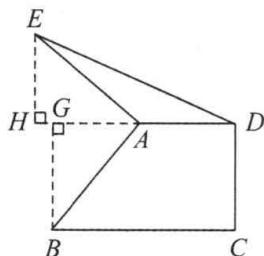

text_image

Geometric diagram with labeled points and right-angle markers, likely from a math problem or proof

3.3 或 7 解: ① 如图 1, 当直线 CD 不经过 $\triangle ABC$ 内部时,

$$
\begin{array}{l} \triangle A F C \cong \triangle C E B, A F = C E = 5, C F = B E = 2, E F = C E + \\ C F = A F + B E = 5 + 2 = 7; \\ \end{array}
$$

②如图2，当直线 $CD$ 经过 $\triangle ABC$ 内部时，

$$
\triangle A F C \cong \triangle C E B, A F = C E = 5, C F = B E = 2,
$$

∴ EF = CE - CF = AF - BE = 5 - 2 = 3. 故 EF = 3 或 7.

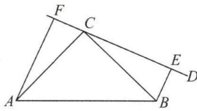

text_image

Geometric diagram with labeled points A, B, C, D, E, F forming triangles and lines

图1

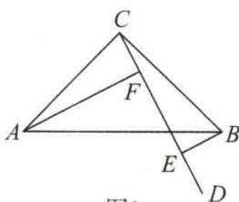

text_image

C
F
A
B
E
D
图2

图2

4. 证明: (1) 过点 F 作 $FH \perp AC$ 于点 H, 则易得 $\triangle AFH \cong \triangle EAC(AAS)$ , $\therefore FH = AC = BC$ , $\therefore \triangle BCD \cong \triangle FHD$ (AAS), $\therefore BD = DF$ , 即 D 为 BF 的中点;

(2)由(1)得 $\triangle AFH\cong\triangle EAC,\therefore AH=CE,$

$$
\begin{array}{l} \therefore A C - A H = B C - C E, \\ \therefore B E = C H, \text { 又 } \triangle B C D \cong \triangle F H D, \\ \end{array}
$$

$$
\therefore D H = C D, \therefore B E = C H = 2 C D.
$$

# 板块二 坐标系中的三垂直

# 典例精讲

【例 1】解: 过点 B 作 $BE \perp y$ 轴于点 E.

$$
\because \text {   点   } A (4, 0), C (0, - 2), \therefore O A = 4, O C = 2,
$$

$$
\because \angle B E C = \angle A C B = 9 0 ^ {\circ},
$$

$$
\therefore \angle E B C + \angle E C B = 9 0 ^ {\circ} = \angle E C B + \angle O C A,
$$

$$
\therefore \angle E B C = \angle O C A,
$$

$$
\text { 又 } \because A C = B C, \therefore \triangle E B C \cong \triangle O C A (\mathrm{AAS}),
$$

$$
\therefore B E = O C = 2, C E = O A = 4,
$$

$$
\therefore O E = C E - O C = 2, \therefore \text {   点   } B \text {   的坐标为   } (- 2, 2).
$$

【例 2】解: 分别过点 A, B 作 $AD \perp OC$ 于点 D, $BE \perp OC$ 于点 E. $\because \angle ACB = 90^{\circ}, \therefore \angle ACD + \angle CAD = 90^{\circ}, \angle ACD + \angle BCE = 90^{\circ}, \therefore \angle CAD = \angle BCE, \therefore \triangle ADC \cong \triangle CEB (AAS), \therefore DC = BE, AD = CE, \because$ 点 C 的坐标为 $(-2, 0)$ ，点 A 的坐标为 $(-6, 3)$ ， $\therefore OC = 2, AD = CE = 3, OD = 6, \therefore CD = OD - OC = 4, OE = CE - OC = 3 - 2 = 1, \therefore BE = 4, \therefore$ 点 B 的坐标是 $(1, 4)$ .

【例 3】解: 过点 A 作直线 $l \parallel y$ 轴, 过点 B 作 $BE \perp l$ 于点 E, 过点 C 作 $CF \perp l$ 于点 F,

$$
\begin{array}{r l} & \therefore \angle B E A = \angle C F A = \angle B A C \\ & = 9 0 ^ {\circ}, \therefore \angle B A E + \angle C A F = \\ & \angle B A E + \angle A B E = 9 0 ^ {\circ}, \end{array}
$$

$$
\therefore \angle A B E = \angle C A F,
$$

$$
\text { 又 } \because A C = B C, \therefore \triangle A B E \cong \triangle C A F (\mathrm{AAS}),
$$

$$
\therefore B E = A F, C F = A E \text {, 设点} A (m, n),
$$

$$
\because \text {   点   } B (2, 2), C (4, - 2),
$$

$$
\therefore 2 - n = 4 - m, n + 2 = 2 - m,
$$

$$
\therefore m = 1, n = - 1, \therefore \text {   点   } A \text {   的坐标为   } (1, - 1).
$$

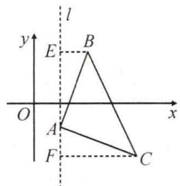

text_image

l
y
E
B
O
x
A
F
C

【例 4】(3,4)或(1,0) 解: 分两种情况讨论:

①当点 C 在 AB 上方时, 可得点 C(3,4);  
②当点 C 在 AB 下方时, 可得点 C(1,0).

故答案为 $(3,4)$ 或 $(1,0)$ .

# 实战演练

1. 解: 过点 A 作 $AD \perp x$ 轴于点 D,
过点 B 作 $BE \perp AD$ 于点 E，
则 $\triangle ACD \cong \triangle BAE$ ，

$$
\therefore C D = A E, \because A (- 2, - 2), C (n, 0),
$$

$$
B (0, m), \therefore C D = n + 2, A E = - 2 - m,
$$

$$
\therefore n + 2 = - 2 - m, \therefore m + n = - 4.
$$

2. 解: 过点 B 作 $BE \perp x$ 轴于点 E, 交 AC 延长线于点 H,

$$
\therefore \angle A C D = \angle B E D = 9 0 ^ {\circ} = \angle A E H = \angle B C H.
$$

$$
\because \angle C D E = \angle C A O + \angle A C D = \angle D B E + \angle B E D,
$$

$$
\therefore \angle C A O = \angle D B E.
$$

∵AD 平分∠BAC, ∴∠CAO=∠BAO,

又∵AE=AE,∴ $\triangle AEH\cong\triangle AEB(ASA)$ ,

$$
\therefore B E = E H = - n, \therefore B H = - 2 n,
$$

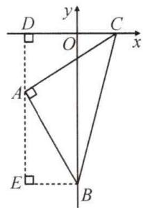

text_image

D
y
C
O
x
A
E
B

又可得 $\triangle ACD\cong\triangle BCH,\therefore AD=BH.$

$$
\because A (- 4, 0), D (m, 0), \therefore A D = B H = 4 + m,
$$

$$
\therefore 4 + m = - 2 n, \therefore 2 n + m = - 4.
$$

3. 解: 过点 C 作直线 $l \parallel x$ 轴, 分别过点 A, B 作 $AE \perp l$ 于点 E, $BF \perp l$ 于点 F. $\therefore \angle AEC = \angle ACB = \angle BFC = 90^{\circ}$ ,

$$
\therefore \angle E A C = \angle B C F, \text {   又   } \because A C = B C, \therefore \triangle A E C \cong \triangle C F B,
$$

∴AE=CF=3,BF=EC=2,∴点B的坐标为(4,1).

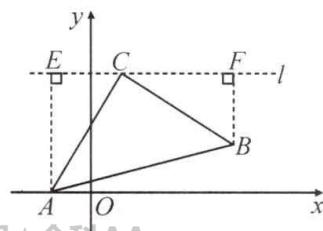

text_image

y
E C F l
A O B x

第3题图

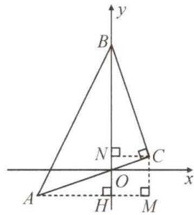

text_image

y
B
N
C
O
x
A
H
M

第4题图

4. 解: 过点 A 作 $AH \perp y$ 轴于点 H, 过点 C 分别作 $CM \perp AH$ 于点 M, $CN \perp y$ 轴于点 N, 可得 $\triangle ACM \cong \triangle BCN$ ,

$$
\therefore B N = A M = 2 + 1 = 3, \therefore b - c = B N = 3.
$$

# 板块三 一线三等角

# 典例精讲

【例 1】证明：∵ $\angle EDC = \angle B + \angle BED, \angle EDF = \angle B,$

$$
\therefore \angle C D F = \angle B E D,
$$

$$
\because \angle B = \angle C, B D = C F,
$$

$$
\therefore \triangle B D E \cong \triangle C F D (\text { AAS }), \therefore D E = D F.
$$

【例 2】解：∵∠BAD+∠CAE=∠ACE+∠CAE=60°，

$$
\therefore \angle B A D = \angle A C E,
$$

$$
\because \angle A D B = \angle A E C = 1 2 0 ^ {\circ}, A B = A C,
$$

$$
\therefore \triangle A D B \cong \triangle C E A (\text {AAS}),
$$

$$
\therefore B D = A E, A D = C E,
$$

$$
\therefore B D + D E = A E + D E = A D = C E.
$$

# 实战演练

1. 证明: 易知 $\angle CDE = \angle A = \angle B = 45^{\circ}, \angle BDE = \angle ACD, CD = DE, \therefore \triangle ACD \cong \triangle BDE$ (AAS), $\therefore BD = AC = BC$ .

2. 解：∵ $\angle BAD + \angle CAD = \angle BAC, \angle 1 = \angle BAD + \angle ABE, \because \angle 1 = \angle BAC, \therefore \angle ABE = \angle CAD,$

$$
\because \angle 1 = \angle 2, \therefore \angle A E B = \angle A F C,
$$

$$
\text { 又 } \because A B = A C, \therefore \triangle A B E \cong \triangle C A F,
$$

$$
\because C D = 2 B D, \therefore S _ {\triangle A C D} = \frac {2}{3} S _ {\triangle A B C} = 8,
$$

$$
\therefore S _ {\triangle A B E} + S _ {\triangle C D F} = S _ {\triangle C A F} + S _ {\triangle C D F} = S _ {\triangle A C D} = 8.
$$

# 第 11 讲 全等模型(二) 手拉手模型

# 板块一 初识手拉手模型(一) 双等边三角形

# 典例精讲

【例】解:(1) $\because\angle BAD=\angle CAE=60^{\circ}$ ,

$$
\therefore \angle B A E = \angle D A C,
$$

$$
\because A B = A D, A E = A C,
$$

$$
\therefore \triangle A B E \cong \triangle A D C (\mathrm{SAS}), \therefore B E = C D;
$$

(2)由 $\triangle ABE\cong\triangle ADC$ 得 $\angle ABE=\angle ADC$ ,

$$
\therefore \angle B P D = \angle B A D = 6 0 ^ {\circ};
$$

(3) 过点 A 作 $AM \perp BE$ 于点 M, $AN \perp CD$ 于点 N,

$$
\because \triangle A B E \cong \triangle A D C, \therefore B E = C D, S _ {\triangle A B E} = S _ {\triangle A D C},
$$

$\therefore AM=AN,\therefore PA$ 平分 $\angle DPE.$

# 实战演练

解:(1) $\because\angle BAD=\angle EAC=60^{\circ},\therefore\angle BAE=\angle DAC,$

又∵AB=AD,AE=AC,

$\therefore \triangle ABE \cong \triangle ADC(SAS), \therefore BE = CD;$

(2) 在 BE 上截取 BF = DP，连接 AF.

$$
\because \triangle A B E \cong \triangle A D C, \therefore \angle A B E = \angle A D C,
$$

又∵AB=AD,∴ $\triangle ABF\cong\triangle ADP(SAS)$ ,

$$
\therefore A P = A F, \angle B A F = \angle D A P,
$$

$$
\therefore \angle F A P = \angle B A D = 6 0 ^ {\circ},
$$

$$
\therefore \angle B P A = \angle A F P = 6 0 ^ {\circ}.
$$

# 板块二 初识手拉手模型(二) 双等腰直角三角形

# 典例精讲

【例】解:(1) $\because\angle BAC=\angle DAE=90^{\circ},\therefore\angle BAD=\angle CAE,$

$$
\because A B = A C, A D = A E, \therefore \triangle A B D \cong \triangle A C E (\mathrm{SAS});
$$

(2) $BD=CE$ 且 $BD\perp CE$ . 证明如下：

$$
\because \triangle A B D \cong \triangle A C E, \therefore B D = C E, \angle A B D = \angle A C E,
$$

$$
\therefore \angle B P C = \angle B A C = 9 0 ^ {\circ}, \therefore B D \perp C E;
$$

(3) 过点 A 分别作 BD, CE 的垂线, 垂足分别为 M, N.

$$
\because \triangle A B D \cong \triangle A C E, \therefore S _ {\triangle A B D} = S _ {\triangle A C E},
$$

$\because BD=CE,\therefore AM=AN,\therefore PA$ 平分 $\angle BPE$ ,

$$
\text { 又 } \because \angle B P E = 9 0 ^ {\circ}, \therefore \angle A P B = 4 5 ^ {\circ}.
$$

# 实战演练

解:(1) $\because\angle BAD=\angle CAE=90^{\circ}$ ,

$$
\therefore \angle B A C + \angle C A D = 9 0 ^ {\circ}, \angle C A D + \angle D A E = 9 0 ^ {\circ},
$$

$$
\therefore \angle B A C = \angle D A E, \therefore \triangle B A C \cong \triangle D A E (\text { SAS });
$$

$$
\therefore \angle B C A = \angle E, \because \angle C A E = 9 0 ^ {\circ}, A C = A E,
$$

$$
\therefore \angle A C E = \angle E = 4 5 ^ {\circ}, \therefore \angle B C A = 4 5 ^ {\circ}, \therefore B C \perp C E;
$$

(2) 过点 A 作 $AG \perp CE$ 于点 G. 易证 $\triangle FBA \cong \triangle GDA$ ,

$$
\triangle A C F \cong \triangle A C G, \therefore C D - D E = C D - C B = (C G + D G) -
$$

$$
(C F - B F) = D G + B F = 2 B F = 4.
$$

# 板块三 初识手拉手模型(三) 双等腰三角形

# 典例精讲

【例】解:(1) $\because\angle BAC=\angle DAE=\alpha$ ,

$$
\therefore \angle B A D = \angle C A E, \because A B = A C, A D = A E,
$$

$$
\therefore \triangle B A D \cong \triangle C A E (\mathrm{SAS}), \therefore B D = C E;
$$

(2) $\because\triangle BAD\cong\triangle CAE,\therefore\angle ACP=\angle ABP,$

∴ $\angle BPC = \angle BAC = \alpha$ ，则 $\angle BPE = 180^{\circ} - \alpha$ ，过点 A 作 $AM \perp BD$ 于点 M， $AN \perp CE$ 于点 N，

由 $\triangle ABD\cong \triangle ACE$ 得， $S_{\triangle ABD} = S_{\triangle ACE}$

$$
\because B D = C E, \therefore A M = A N,
$$

∴ PA 平分 $\angle BPE, \therefore \angle APB = 90^{\circ} - \frac{1}{2}\alpha;$

(3) 图略, $\angle APB = 90^{\circ} - \frac{1}{2}\alpha.$

# 实战演练

解: 易证 $\triangle DAC \cong \triangle BAE$ , 得 $\angle ADG = \angle ABF, DC = BE$ .

∵G,F 分别为 DC,BE 的中点,∴DG=BF.

连接 AF, $\because AD = AB, \angle ADG = \angle ABF,$

$$
\therefore \triangle D A G \cong \triangle B A F, \therefore \angle D A G = \angle B A F, A G = A F,
$$

$$
\therefore \angle G A F = \angle D A B = \alpha , \therefore \angle A G F = \frac {1 8 0 ^ {\circ} - \alpha}{2} = 9 0 ^ {\circ} - \frac {1}{2} \alpha .
$$

# 板块四 构造手拉手模型

# 典例精讲

【例 1】解: 在 DB 的延长线上取点 E, 使 DE = AD, 连接 AE, 可得双等边三角形 $\triangle ADE$ 与 $\triangle ABC$ , 形成手拉手全等, 即 $\triangle ACD \cong \triangle ABE$ (SAS),

$$
\therefore \angle A D C = \angle A E D = 6 0 ^ {\circ}.
$$

【例 2】解: 过点 A 作 $AE \perp AD$ ，交 DB 的延长线于点 E，可得双等腰直角三角形 $\triangle ADE$ 与 $\triangle ABC$ ，形成手拉手全等，即 $\triangle ACD \cong \triangle ABE(SAS)$ ，

$$
\therefore \angle A D C = \angle A E D = 4 5 ^ {\circ}.
$$

【例 3】解: 在 DB 的延长线上取点 E, 使 AE = AD, 连接 AE, 可得底角为 $30^{\circ}$ 的双等腰三角形 $\triangle ADE$ 与 $\triangle ABC$ , 形成手拉手全等, 即 $\triangle ACD \cong \triangle ABE$ (SAS), $\therefore \angle ADC = \angle AED = 30^{\circ}$ .

# 实战演练

1. 解: (1) 过点 D 作 $DF \perp DC$ 交 CA 的延长线于点 F, 则构造出共顶点的双等腰直角 $\triangle ADE$ 和 $\triangle FDC$ , 形成手拉手全等, 即 $\triangle FDA \cong \triangle CDE(SAS)$ , 得 $\angle DCE = \angle F = 45^{\circ}$ .

(2) 在 CA 的延长线上取点 F，使 DF = DC，连接 AE。则构造出共顶点的双等腰 $\triangle ADE$ 和 $\triangle FDC$ ，形成手拉手全等，即 $\triangle FDA \cong \triangle CDE(SAS)$ ，得 $\angle DCE = \angle F = 30^{\circ}$ 。

2. 证明: 在 $DB$ 延长线上取点 $E$ , 使 $AE = AD$ , 连接 $AE$ , 可得双等腰 $\angle ADE$ 与 $\triangle ABC$ , 形成手拉手全等, 即 $\triangle ACD \cong \triangle ABE(SAS)$ . $\therefore \angle ADC = \angle AED = \angle ADB$ , 即可得 $AD$ 平分 $\angle BDC$ .

3. 解：以 $BP$ 为边向上作等边 $\triangle BPE$ ，连接 $CE$ ，易证 $\triangle ABP \cong \triangle CBE, \therefore CE = AP = 5$ ，又 $\because PE = PB = 2, \therefore 5 - 2 \leqslant PC \leqslant 5 + 2, \therefore 3 \leqslant PC \leqslant 7$ .

# 第 12 讲 全等模型(三) 夹半角模型

# 板块一 $90^{\circ}$ 角夹 $45^{\circ}$ 角

# 典例精讲

【例 1】证明：(1) 延长 EB 至点 G，使 BG = DF，连接 AG.
则 $\triangle ADF \cong \triangle ABG(SAS)$ ,

$$
\therefore A F = A G, \angle D A F = \angle B A G,
$$

$$
\therefore \angle D A F + \angle B A F = \angle B A G + \angle B A F,
$$

即 $\angle GAF = \angle BAD = 90^{\circ}$

$$
\because \angle E A F = 4 5 ^ {\circ}, \therefore \angle G A E = \angle E A F = 4 5 ^ {\circ},
$$

$$
\therefore \triangle G A E \cong \triangle F A E (\mathrm{SAS}),
$$

$$
\therefore E F = E G = B E + B G = B E + D F;
$$

$$
(2) \because \triangle G A E \cong \triangle F A E,
$$

$\therefore\angle AEB=\angle AEF,\therefore AE$ 平分 $\angle BEF.$

$$
\because \triangle G A E \cong \triangle F A E, \therefore \angle A F E = \angle G.
$$

$$
\because \triangle A D F \cong \triangle A B G, \therefore \angle A F D = \angle G.
$$

$$
\therefore \angle A F D = \angle A F E, \therefore A F \text {   平分   } \angle D F E.
$$

【例 2】证明: 在 AB 上截取 BF = AD, 连接 CF.

$$
\because \angle D A C = \angle B = 4 5 ^ {\circ}, A C = B C,
$$

$$
\therefore \triangle D A C \cong \triangle F B C (\mathrm{SAS}),
$$

$$
\therefore C D = C F, \angle D C A = \angle F C B,
$$

$$
\therefore \angle D C F = \angle A C B = 9 0 ^ {\circ}, \therefore \angle D C E = \angle E C F = 4 5 ^ {\circ},
$$

$$
\text { 又 } \because C E = C E, \therefore \triangle D C E \cong \triangle F C E (\mathrm{SAS}),
$$

$$
\therefore D E = F E, \therefore A D + D E = B F + E F = B E.
$$

# 实战演练

1. 解: (1) EF = BE - DF. 证明如下: 在 BE 上截取 BG = DF, 连接 AG. 则 $\triangle ADF \cong \triangle ABG$ (SAS),

$$
\therefore A F = A G, \angle D A F = \angle B A G,
$$

$$
\therefore \angle D A F + \angle D A G = \angle B A G + \angle D A G,
$$

即 $\angle GAF = \angle BAD = 90^{\circ}.$

$$
\because \angle E A F = 4 5 ^ {\circ}, \therefore \angle G A E = \angle E A F = 4 5 ^ {\circ},
$$

$$
\therefore \triangle G A E \cong \triangle F A E (\text { SAS }),
$$

$$
\therefore E F = E G = B E - B G = B E - D F;
$$

(2) $\angle AFD+\angle AFE=180^{\circ}$ .证明如下：

由(1)知 $\triangle ADF\cong\triangle ABG,\triangle GAE\cong\triangle FAE$ ，

$$
\therefore \angle A F D = \angle A G B, \angle A F E = \angle A G E,
$$

$$
\therefore \angle A F D + \angle A F E = \angle A G B + \angle A G E = 1 8 0 ^ {\circ}.
$$

2. 解: $EF = BE + DF$ . 证明如下:

延长 CD 至点 G，使 DG = BE.

由 $\angle BAD = \angle C = 90^{\circ}$ ，得 $\angle ABC + \angle ADC = 180^{\circ}$

$$
\therefore \angle A D G = \angle A B E, \therefore \triangle A B E \cong \triangle A D G (\text { SAS }),
$$

$$
\therefore A E = A G, \angle B A E = \angle D A G,
$$

$$
\therefore \angle G A E = \angle D A G + \angle D A E = \angle B A E + \angle D A E =
$$

$$
\angle B A D = 9 0 ^ {\circ} = 2 \angle E A F,
$$

$$
\therefore \angle G A F = \angle E A F, \therefore \triangle A G F \cong \triangle A E F (\text { SAS }),
$$

$$
\therefore E F = G F = D G + D F = B E + D F.
$$

3. 证明: 延长 AB 至点 F, 使 BF = AD, 连接 CF.

$$
\because A C = B C, \angle A C B = 9 0 ^ {\circ},
$$

$$
\therefore \angle C A B = \angle C B A = 4 5 ^ {\circ}, \because A D \perp A B, \therefore \angle D A E = 9 0 ^ {\circ},
$$

$$
\therefore \angle C A D = \angle C B F = 1 3 5 ^ {\circ}, \therefore \triangle C A D \cong \triangle C B F (\text { SAS }),
$$

$$
\therefore C D = C F, \angle A C D = \angle B C F, \because \angle D C E = 4 5 ^ {\circ},
$$

$$
\therefore \angle A C D + \angle B C E = 9 0 ^ {\circ} - 4 5 ^ {\circ} = 4 5 ^ {\circ}, \therefore \angle B C E + \angle B C F = 4 5 ^ {\circ},
$$

$$
\therefore \angle D C E = \angle F C E = 4 5 ^ {\circ}, \because C D = C F, C E = C E,
$$

$$
\therefore \triangle C D E \cong \triangle C F E (\text { SAS }),
$$

$$
\therefore D E = E F, \therefore A D + B E = B F + B E = E F = D E.
$$

# 板块二 $120^{\circ}$ 角夹 $60^{\circ}$ 角

# 典例精讲

【例】证明：(1)延长 FD 至点 G，使 DG = BE，连接 CG.

$$
\because \angle A + \angle B C D = 6 0 ^ {\circ} + 1 2 0 ^ {\circ} = 1 8 0 ^ {\circ},
$$

$$
\therefore \angle B + \angle A D C = 1 8 0 ^ {\circ},
$$

$$
\therefore \angle C D G = \angle B, \therefore \triangle C B E \cong \triangle C D G (\text { SAS }),
$$

$$
\therefore C G = C E, \angle D C G = \angle B C E,
$$

$$
\therefore \angle E C G = \angle B C D = 1 2 0 ^ {\circ} = 2 \angle E C F,
$$

$$
\therefore \angle E C F = \angle G C F, \therefore \triangle E C F \cong \triangle G C F (\text { SAS }),
$$

$$
\therefore E F = G F = D G + D F = B E + D F;
$$

(2) 过 C 作 $CM \perp AB$ 于点 M, $CN \perp AD$ 于点 N, 证 CM = CN, ∴ 点 C 在 $\angle BAD$ 的平分线上. (或利用 CE 平分 $\angle BEF, CF$ 平分 $\angle EFD$ 说明也可).

# 实战演练

证明: 在 BA 上截取 BF = AD, 连接 CF.

$$
\because A C = B C, \angle A C B = 1 2 0 ^ {\circ}, \therefore \angle C A B = \angle B = 3 0 ^ {\circ}.
$$

$$
\because \angle D A E = 6 0 ^ {\circ}, \therefore \angle D A C = 6 0 ^ {\circ} - 3 0 ^ {\circ} = 3 0 ^ {\circ},
$$

$$
\therefore \angle D A C = \angle B. \therefore \triangle A C D \cong \triangle B C F (\text { SAS }),
$$

$$
\therefore C D = C F, \angle D C A = \angle B C F.
$$

$$
\because \angle D C A + \angle A C E = \angle D C E = 6 0 ^ {\circ},
$$

$$
\therefore \angle B C F + \angle A C E = 6 0 ^ {\circ},
$$

$$
\therefore \angle F C E = 1 2 0 ^ {\circ} - 6 0 ^ {\circ} = 6 0 ^ {\circ}, \therefore \angle D C E = \angle F C E,
$$

$$
\because C D = C F, C E = C E, \therefore \triangle C E D \cong \triangle C E F,
$$

$$
\therefore D E = E F, \therefore A D + D E = B F + E F = B E.
$$

# 板块三 $2\alpha^{\circ}$ 角夹 $\alpha^{\circ}$ 角

# 典例精讲

【例】证明:(1)延长 AD 至点 G, 使 DG = BE, 连接 CG.

$$
\because \angle B + \angle A D C = 1 8 0 ^ {\circ}, \therefore \angle C D G = \angle B,
$$

$$
\because C B = C D, D G = B E, \therefore \triangle B C E \cong \triangle D C G (\text {SAS}),
$$

$$
\therefore \angle E C G = \angle B C D = 2 \angle E C F,
$$

$$
\therefore \angle E C F = \angle G C F. \text {又} \because C E = C G, C F = C F,
$$

$$
\therefore \triangle E C F \cong \triangle G C F (\text { SAS }),
$$

$$
\therefore E F = F G = D G + D F = B E + D F;
$$

(2)由 $\triangle ECF\cong\triangle GCF$ 得 $\angle CFE=\angle CFD$ ,

∴FC 平分∠DFE;

$$
\because \angle B E C = \angle G = \angle C E F, \therefore E C \text {平分} \angle B E F.
$$

【点睛】①等腰三角形腰的旋转；②通过旋转对剩余半角进行拼凑；③产生一组旋转全等和一组轴对称全等；④旋转全等的旋转角度为 $2\alpha$ ；⑤对角互补使夹半角模型产生一组“截长补短”的相应结论.

# 实战演练

证明：在 $BE$ 上截取 $BG = DF$ ，连接 $AG$

$$
\because \angle B - \angle A D C = \angle A D F + \angle A D C = 1 8 0 ^ {\circ},
$$

$$
\therefore B - \text { ADF } \text { ,又 } \because A B = A D,
$$

$$
\therefore \triangle A B G \cong A D F (\text { SAS }),
$$

$$
\therefore A G = A F, \angle B A G = \angle D A F,
$$

$$
\because \angle B A D = 2 \angle E A F, \therefore \angle G A E = \angle F A E,
$$

$$
\text { 又 } \because A E = A E, \therefore \triangle G A E \cong \triangle F A E (\mathrm{SAS}),
$$

$$
\therefore E F = E G = B E - B G = B E - D F.
$$

# 第 13 讲 全等模型(四) 婆罗摩笈多模型

# 板块一 向外作双等腰直角三角形

# 典例精讲

【例 1】证明: 过点 D 作 $DH \perp FB$ , 交 BF 的延长线于点 H.

$$
\because \angle A C B = 9 0 ^ {\circ}, B D \perp A B, A B = D B,
$$

$$
\therefore \text { 可证 } \triangle A B C \cong \triangle B D H (\mathrm{AAS}),
$$

$$
\therefore B C = D H = B E, \therefore \triangle D H F \cong \triangle E B F (\text { A   A   S }).
$$

$$
\therefore D F = E F, \therefore F \text {   是   } D E \text {   的中点.   }
$$

【例 2】解: 过点 E 作 $EH \perp AF$ , 交 AF 的延长线于点 H.

$$
\because \angle A C B = \angle B A E = \angle C A D = 9 0 ^ {\circ},
$$

$$
\therefore \angle E H A = \angle A C B, \angle E A H + \angle B A C = \angle A B C +
$$

$$
\angle B A C = 9 0 ^ {\circ}, \therefore \angle E A H = \angle A B C,
$$

$$
\because A B = A E, \therefore \triangle A H E \cong \triangle B C A,
$$

$$
\therefore E H = A C, A H = B C, \because A C = A D, \therefore E H = A D,
$$

$$
\because \angle E H A = \angle F A D = 9 0 ^ {\circ}, \angle E F H = \angle D F A,
$$

$$
\therefore \triangle F H E \cong \triangle F A D, \therefore F H = A F, \therefore A H = 2 A F,
$$

$$
\therefore B C = 2 A F, \therefore \frac {A F}{B C} = \frac {1}{2}.
$$

# 实战演练

解: 过 E 作 $EH \perp BF$ 交 BF 的延长线于点 H,

$$
\begin{array}{l} \therefore \angle A B C = \angle A C E = \angle H = 9 0 ^ {\circ}, \\ \therefore \angle A C B + \angle E C H = \angle A C B + \angle C A B = 9 0 ^ {\circ}, \\ \therefore \angle B A C = \angle E C H, \because A C = C E, \\ \therefore \triangle A B C \cong \triangle C H E (\mathrm{AAS}), \\ \therefore B C = E H = 3, C H = A B = 6, \\ \because \angle C H E = \angle D C H = 9 0 ^ {\circ}, B C = C D, \\ \therefore E H \parallel C D, E H = C D, \therefore \triangle C D F \cong \triangle H E F (\text { AAS }), \\ \therefore C F = F H, \therefore C F = \frac {1}{2} C H = \frac {1}{2} A B = 3, \\ \end{array}
$$

∴ $\triangle CEF$ 的面积为 $\frac{1}{2}\times3\times3=\frac{9}{2}$ .

# 板块二 向内作双等腰三角形

# 典例精讲

【例】解:(1) $\because\angle ACB=\angle DAB=90^{\circ},AE\parallel BC,$

$$
\begin{array}{l} \therefore \angle C A E = 1 8 0 ^ {\circ} - \angle A C B = 9 0 ^ {\circ}, \angle B = \angle B A E, \\ \therefore \angle D A C = 9 0 ^ {\circ} - \angle B A C = \angle B A E, \therefore \angle D A C = \angle B; \\ \end{array}
$$

(2)BC=2AF.证明如下:过点D作DG⊥AC,交AC的延长线于点G,

$$
\begin{array}{l} \because A G \perp D G, \therefore \angle A G D = \angle A C B = 9 0 ^ {\circ}, \\ \therefore \triangle A G D \cong \triangle B C A (\text { A   A   S }), \\ \therefore D G = A C = A E, A G = B C, \\ \therefore \triangle A E F \cong \triangle G D F (\mathrm{AAS}), \\ \therefore A F = G F, \therefore B C = A G = 2 A F. \\ \end{array}
$$

# 实战演练

1. 证明: 延长 AD 至点 H, 使 HD = AD, 连接 CH,

$$
\begin{array}{l} \because B D = C D, A D = H D, \angle A D B = \angle H D C, \\ \therefore \triangle A D B \cong \triangle H D C, \therefore \angle B A D = \angle C H D, A B = H C, \\ \therefore A B \parallel C H, \therefore \angle B A C + \angle A C H = 1 8 0 ^ {\circ}, \\ \because E F = 2 A D, H A = 2 A D, \\ \therefore E F = H A, \\ \because A E = A B, A B = H C, \\ \therefore H C = A E, \text {   又   } A C = A F, \\ \therefore \triangle A H C \cong \triangle F E A, \\ \therefore \angle E A F = \angle A C H, \\ \therefore \angle E A F + \angle B A C = 1 8 0 ^ {\circ}. \\ \end{array}
$$

2. 证明: 过点 E 作 $EG \parallel AD$ , 交 AB 的延长线于点 G.

$$
\begin{array}{l} \because \angle B A E + \angle C A D = 1 8 0 ^ {\circ}, \\ \therefore \angle D A E + \angle C A B = 1 8 0 ^ {\circ}, \\ \because E G \parallel A D, \therefore \angle D A E + \angle A E G = 1 8 0 ^ {\circ}, \\ \therefore \angle A E G = \angle C A B. \\ \end{array}
$$

$\because AC=AD,EG\parallel AD,F$ 为 DE 的中点，

$$
\therefore \triangle D A F \cong \triangle E G F,
$$

$$
\therefore E G = A D = A C, A F = G F,
$$

$$
\therefore A G = 2 A F.
$$

$$
\because A B = A E, \angle A E G = \angle C A B, E G = A C,
$$

$$
\therefore \triangle A B C \cong \triangle E A G,
$$

$$
\therefore B C = A G = 2 A F.
$$

# 第 14 讲 尺规作图与全等三角形

# 板块一 尺规作图(一) 作全等

# 典例精讲

【例】解:(1)如图所示;

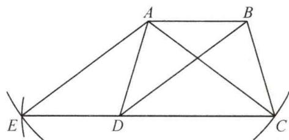

text_image

Geometric diagram with labeled points A, B, C, D, E and intersecting lines forming triangles and quadrilaterals

$$
\begin{array}{l} (2) \because A D = B C, D B = C A, A B = A B, \\ \therefore \triangle A D B \cong \triangle B C A (\text { S   S   S }), \therefore \angle D A B = \angle C B A. \\ \because A D = B C, A C = B D, C D = C D, \\ \therefore \triangle A D C \cong \triangle B C D (\text { S   S   S }), \therefore \angle A D C = \angle B C D. \\ \because \angle D A B + \angle C B A + \angle A D C + \angle B C D = 3 6 0 ^ {\circ}, \\ \therefore \angle C B A + \angle A D C = 1 8 0 ^ {\circ}. \\ \end{array}
$$

由(1)得 $\angle ADE=\angle CBA$ ，

$$
\therefore \angle A D E + \angle A D C = \angle C B A + \angle A D C = 1 8 0 ^ {\circ},
$$

$\therefore E, D, C$ 三点共线.

# 实战演练

解:(1)如图所示;

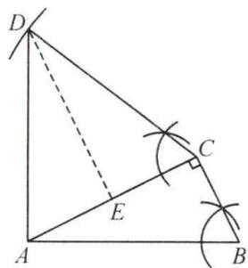

text_image

Geometric diagram with labeled points A, B, C, D, E and right-angle markings, likely from a math problem or proof.

(2) 过点 D 作 $DE \perp AC$ 于点 E.

由(1)得 $\angle ACD=\angle ABC.$

$$
\because A B = C D, \angle D E C = \angle A C B = 9 0 ^ {\circ},
$$

$$
\therefore \triangle D C E \cong \triangle A B C (\mathrm{AAS}),
$$

$$
\therefore C E = B C, D E = A C = 1 0. \because A D \perp A B,
$$

$$
\therefore \angle D A C + \angle B A C = \angle B A C + \angle B = 9 0 ^ {\circ},
$$

$$
\therefore \angle D A E = \angle A B C = \angle A C D,
$$

$$
\therefore \triangle A D E \cong \triangle C D E (\mathrm{AAS}), \therefore A E = C E = 5,
$$

$$
\therefore S _ {\text { 四边形 } A B C D} = S _ {\triangle A C D} + S _ {\triangle A B C} = \frac {1}{2} A C \cdot D E + \frac {1}{2} A C \cdot
$$

$$
B C = \frac {1}{2} \times 1 0 \times 1 0 + \frac {1}{2} \times 1 0 \times 5 = 7 5.
$$

# 板块二 尺规作图(二) 作角的平分线

# 典例精讲

【例】解:(1)如图所示;

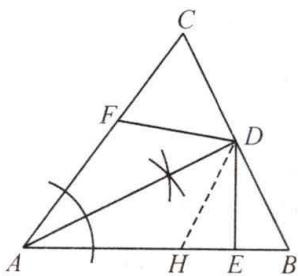

text_image

Geometric diagram of triangle ABC with internal points D, E, F and marked angles and segments

(2) 在 AB 上截取 AH = AF，连接 DH.

由(1)得 $\angle FAD=\angle HAD.$

$$
\because A F = A H, A D = A D, \therefore \triangle A F D \cong \triangle A H D (\text { SAS }),
$$

$$
\therefore A H = A F = 3, D F = D H.
$$

$$
\because D F = D B, \therefore D H = D B. \because D E \perp A B,
$$

$$
\therefore \mathrm{Rt} \triangle D H E \cong \mathrm{Rt} \triangle D B E (\mathrm{HL}), \therefore H E = B E.
$$

$$
\because H E = A E - A H = A E - A F = 4 - 3 = 1,
$$

$$
\therefore B E = H E = 1, \therefore A B = A E + B E = 4 + 1 = 5.
$$

# 实战演练

解:(1)如图所示;

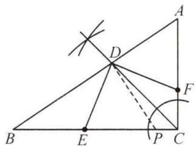

text_image

Geometric diagram with labeled points A, B, C, D, E, F, P and intersecting lines, including a right angle at P.

(2)①过点 D 分别作 $DM \perp BC, DN \perp AC$ ，垂足分别为 M, N。由(1)得 DM = DN。

$$
\because D E \perp D F, \therefore \angle F D E = \angle A C B = 9 0 ^ {\circ},
$$

$$
\therefore \angle D E C + \angle D F C = 1 8 0 ^ {\circ}, \therefore \angle D E M = \angle D F N,
$$

$$
\therefore \triangle D E M \cong \triangle D F N (\mathrm{AAS}), \therefore D E = D F;
$$

②在 BC 上截取 EP = AF，连接 DP.

$$
\because D E = D F, \angle D E P = \angle D F A, E P = F A,
$$

$$
\therefore \triangle D E P \cong \triangle D F A (\text { SAS }),
$$

$$
\therefore D P = D A = 4, \angle E D P = \angle F D A,
$$

$$
\therefore \angle B D E + \angle A D F = \angle B D E + \angle E D P = \angle B D P = 9 0 ^ {\circ},
$$

$$
\therefore S _ {\triangle A D F} + S _ {\triangle B D E} = S _ {\triangle P D E} + S _ {\triangle B D E} = S _ {\triangle B D P} = \frac {1}{2} B D \cdot
$$

$$
D P = \frac {1}{2} B D \cdot A D = \frac {1}{2} \times 6 \times 4 = 1 2.
$$

# 第 15 讲 情境创新题

# 板块一 阅读理解与新定义

# 典例精讲

【例】解:(1)①∵△ABP 与△CBP 在 AP, CP 边上的高相等,

∴当 AP=CP=3 时， $\triangle ABP$ 与 $\triangle CBP$ 面积相等，但 $\triangle ABP$ 与 $\triangle CBP$ 不全等，

∴此时 $\triangle ABP$ 与 $\triangle CBP$ 是偏等积三角形,故答案为3;

$$
② \because A Q = Q B = 5,
$$

$$
\therefore S _ {\triangle A C Q} = S _ {\triangle B C Q}.
$$

$$
\because C Q = C Q, A C \neq B C,
$$

∴△CAQ 与△CBQ 不全等，

∴△CAQ 与△CBQ 是偏等积三角形；

(2) 过点 C 作 $CE \parallel AB$ 交 AD 的延长线于点 E.

∵△ABD 与△ACD 是偏等积三角形,且△ABD 与△ACD 在 BD,CD 边上的高相等,∴BD=CD.

$$
\because C E \parallel A B, \therefore \angle E = \angle B A D,
$$

$$
\therefore \triangle E C D \cong \triangle A B D (\text { A   A   S }),
$$

$$
\therefore E D = A D, E C = A B = 4.
$$

$$
\because A C - E C <   A E <   A C + E C \text {, 且} A C = 1 2, A E = 2 A D,
$$

$$
\therefore 1 2 - 4 <   2 A D <   1 2 + 4, \therefore 4 <   A D <   8.
$$

∵线段 AD 的长为偶数, ∴AD=6, 故答案为 6;

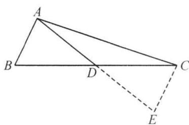

text_image

Geometric diagram with labeled points A, B, C, D, E and solid/dashed lines forming triangles and a dashed extension.

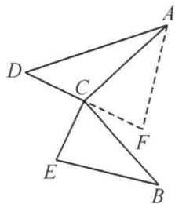

text_image

Geometric diagram with labeled points A, B, C, D, E, F and connecting lines, including a dashed line from C to F.

图3

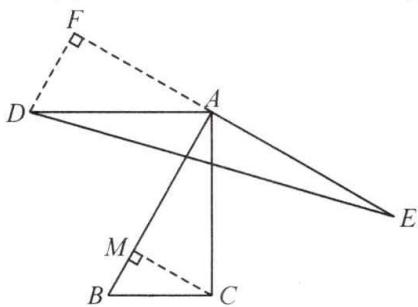

text_image

Geometric diagram with labeled points A, B, C, D, E, F, M and right-angle markers, likely from a math problem or proof.

图4

(3)①∵∠ACB=∠DCE=90°,

$$
\therefore \angle A C D + \angle B C E = 1 8 0 ^ {\circ}. \because 0 ^ {\circ} <   \angle B C E <   9 0 ^ {\circ},
$$

$$
\therefore \angle A C D > 9 0 ^ {\circ},
$$

$$
\therefore \angle A C D \neq \angle B C E. \because C A = C B, C D = C E,
$$

∴△ACD 与△BCE 不全等.

延长 DC 至点 F，使 CF = DC，连接 AF。由定义可知， $\triangle ACD$ 与 $\triangle ACF$ 是偏等积三角形。

$$
\because \angle A C D + \angle A C F = \angle A C D + \angle B C E = 1 8 0 ^ {\circ},
$$

$$
\therefore \angle A C F = \angle B C E. \because C E = C D = C F, C A = C B,
$$

$$
\therefore \triangle A C F \cong \triangle B C E, \therefore S _ {\triangle A C F} = S _ {\triangle B C E} = S _ {\triangle A C D},
$$

∴△ACD 与△BCE 是偏等积三角形；

②过点 D 作 $DF \perp AE$ 交 EA 的延长线于点 F，过点 C 作 $CM \perp AB$ 于点 M.

∵△ABC与△ADE是偏等积三角形，

$$
\therefore S _ {\triangle A B C} = S _ {\triangle A D E}. \because A B = A E, A C = A D, \therefore C M = D F.
$$

$$
\because \angle A M C = \angle A F D = 9 0 ^ {\circ},
$$

$$
\therefore \mathrm{Rt} \triangle A C M \cong \mathrm{Rt} \triangle A D F (\mathrm{HL}),
$$

$$
\therefore \angle B A C = \angle D A F.
$$

$$
\because \angle D A E + \angle D A F = 1 8 0 ^ {\circ},
$$

$$
\therefore \angle B A C + \angle D A E = 1 8 0 ^ {\circ}.
$$

# 实战演练

解:(1)上面证明过程不正确;错在第一步,错误原因是 SSA 不能判定全等;

(2)∵在 Rt△ABE 与 Rt△ACE 中， $\left\{\begin{aligned}AE&=AE,\\ BE&=CE,\end{aligned}\right.$

$$
\therefore \mathrm{Rt} \triangle A B E \cong \mathrm{Rt} \triangle A C E (\mathrm{HL}), \therefore A B = A C;
$$

(3) 过点 E 分别作 $EF \perp AB$ 于点 F, $EH \perp AC$ 于点 H. 则 $\angle BFE = \angle CHE = 90^{\circ}$ .

$$
\because B E = C E, \angle A B E = \angle A C E,
$$

$$
\therefore \triangle B E F \cong \triangle C E H, \therefore E F = E H,
$$

$$
\therefore \mathrm{Rt} \triangle A E F \cong \mathrm{Rt} \triangle A E H (\mathrm{HL}), \therefore \angle B A E = \angle C A E;
$$

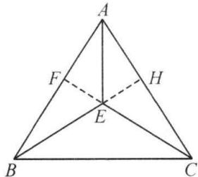

text_image

A
F
H
E
B
C

图1

(4) 全等. 理由如下:

已知:如图,在锐角 $\triangle ABC$ 和锐角 $\triangle A^{\prime}B^{\prime}C^{\prime}$ 中,

$$
A B = A ^ {\prime} B ^ {\prime}, A C = A ^ {\prime} C ^ {\prime}, \angle C = \angle C ^ {\prime}.
$$

求证: $\triangle ABC\cong\triangle A^{\prime}B^{\prime}C^{\prime}$ .

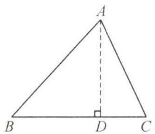

text_image

A
B D C

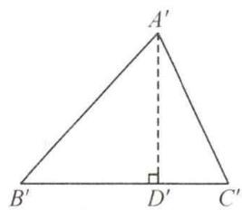

text_image

A'
B' D' C'

证明: 过点 A 作 $AD \perp BC$ 于点 D, 过点 $A'$ 作 $A'D' \perp B'C'$ 于点 $D'$ ,

$$
\therefore \angle A D C = \angle A ^ {\prime} D ^ {\prime} C ^ {\prime} = \angle A D B = \angle A ^ {\prime} D ^ {\prime} B ^ {\prime} = 9 0 ^ {\circ}.
$$

在 $\triangle ACD$ 和 $\triangle A^{\prime}C^{\prime}D^{\prime}$ 中， $\because\left\{\begin{aligned}\angle C&=\angle C^{\prime},\\\angle ADC&=\angle A^{\prime}D^{\prime}C^{\prime},\\AC&=A^{\prime}C^{\prime},\end{aligned}\right.$

$$
\therefore \triangle A C D \cong \triangle A ^ {\prime} C ^ {\prime} D ^ {\prime} (\mathrm{AAS}), \therefore A D = A ^ {\prime} D ^ {\prime}.
$$

在 Rt△ABD 和 Rt△A'B'D' 中， $\left\{\begin{aligned}AB&=A^{\prime}B^{\prime},\\ AD&=A^{\prime}D^{\prime},\end{aligned}\right.$

$$
\therefore \mathrm{Rt} \triangle A B D \cong \mathrm{Rt} \triangle A ^ {\prime} B ^ {\prime} D ^ {\prime} (\mathrm{HL}), \therefore \angle B = \angle B ^ {\prime}.
$$

在 $\triangle ABC$ 和 $\triangle A^{\prime}B^{\prime}C^{\prime}$ 中， $\left\{\begin{aligned}\angle C&=\angle C^{\prime},\\\angle B&=\angle B^{\prime},\\AC&=A^{\prime}C^{\prime},\end{aligned}\right.$

$$
\therefore \triangle A B C \cong \triangle A ^ {\prime} B ^ {\prime} C ^ {\prime} (\text { A   A   S }).
$$

# 板块二 综合与实践

解:(1)可行.理由如下:

在 $\triangle ABC$ 和 $\triangle DEC$ 中， $\left\{\begin{aligned}AC&=DC,\\ \angle ACB&=\angle ECD,\\ CB&=EC,\end{aligned}\right.$

$$
\therefore \triangle A B C \cong \triangle D E C (\mathrm{SAS}), \therefore A B = D E;
$$

(2) 可行, 理由如下:

$$
\because B F \perp A B, D E \perp B F, \therefore \angle B = \angle B D E.
$$

在 $\triangle ABC$ 和 $\triangle EDC$ 中， $\left\{\begin{aligned}\angle B&=\angle CDE,\\ CB&=CD,\\ \angle BCA&=\angle DCE,\end{aligned}\right.$

$$
\therefore \triangle A B C \cong \triangle E D C (\mathrm{ASA}), \therefore A B = D E;
$$

(3) 只需 $AB \parallel DE$ 即可.

$$
\because A B \parallel D E, \therefore \angle B = \angle B D E.
$$

在 $\triangle ABC$ 和 $\triangle EDC$ 中， $\left\{\begin{aligned}\angle B&=\angle CDE,\\ CB&=CD,\\ \angle BCA&=\angle DCE,\end{aligned}\right.$

$$
\therefore \triangle A B C \cong \triangle E D C (\mathrm{ASA}),
$$

$$
\therefore A B = D E.
$$

故答案为 $AB \parallel DE$ ；

(4)方案:在 CD 的左侧作 $\angle PCD = \angle ECD$ ，交 NH 的延长线于点 P，测量 PH, HN 的长，再计算 PH - HN 的长即为 MN 的长.

$$
\text { 理由如下: } \because \angle P C H = \angle M C H, C H = C H,
$$

$$
\angle C H P = \angle C H M = 9 0 ^ {\circ},
$$

$$
\therefore \triangle C P H \cong \triangle C M H,
$$

$$
\therefore P H = M H,
$$

$$
\therefore M N = M H - N H = P H - N H.
$$

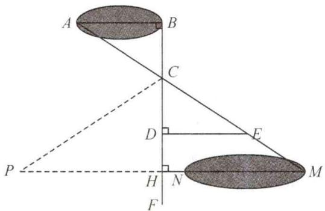

text_image

A
B
C
D
E
P
H
N
F
M

图3

# 第十五章 轴对称

# 第16讲 轴对称

# 板块一 轴对称与轴对称图形

# 典例精讲

【例 1】A 解: 如图, 连接 $OP_{1}, OP_{2}$ , 由题意知 $OP_{1} = OP_{2} = OP = 3.6, P_{1}P_{2} \leqslant OP_{1} + OP_{2} = 7.2$ , 当点 O 在 $P_{1}P_{2}$ 上时, $P_{1}P_{2} = OP_{1} + OP_{2} = 7.2, \therefore P_{1}, P_{2}$ 之间的距离不可能是 8. 选 A.

【例 2】A 解: 看到的时间和正确的时间关于平面镜所在的直线对称(左右对称), 作出对称图形后即可得到正确的时间. 选 A.

【例 3】(1)

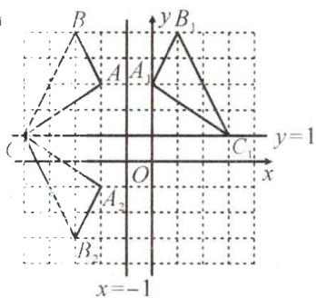

text_image

B
y B₁
A A₁
C
y=1
O
x
A₂
B₂
x=-1

$$
(2) P _ {1} (- 2 - x, y)
$$

$$
(3) P _ {2} (x, 2 - y)
$$

【例 4】解: 如图.

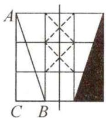

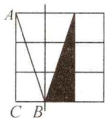

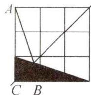

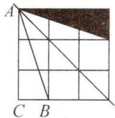

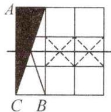

# 实战演练

1.7 解: DC = DE, BE = BC = 6 cm, AB = 8 cm,

$$
\therefore A E = A B - B E = 2 \mathrm{cm},
$$

∵△AED 周长=AD+DE+AE=AD+DC+AE=AC+AE=5+2=7(cm).

2. D 解: $\because \angle BAD + \angle B'AD + \angle B'AC = 90^{\circ}$ ,

且 $\angle BAD = \angle B'AD, \angle B'AC = 14^\circ,$

$$
\therefore \angle B A D = 3 8 ^ {\circ}
$$

∴ $\angle B = 90^{\circ} - 38^{\circ} = 52^{\circ}$ . 故选 D.

3. B

4. 解: 如图所示.

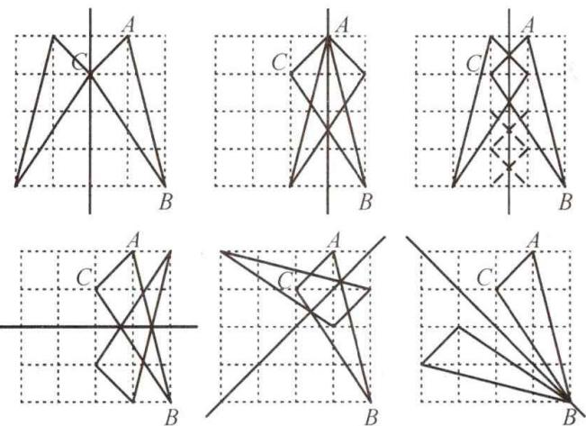

5. 解: (1) 如图所示;

text_image

Geometric diagram of a trapezoid with labeled vertices and internal points, including perpendicular lines and dashed construction lines.

(2) 连接 NE, 易证 $\triangle NEM \cong \triangle ACM$ ,

得 $NE = AC = AB, \angle ENA = \angle MAC.$

$$
\because D M \perp M A, \therefore D N = D A, \therefore \angle D N A = \angle D A M,
$$

易证 $\triangle NDE\cong\triangle ADB(SSS),\therefore\angle DNE=\angle DAB.$

$$
\therefore \angle D A N = \angle D N A = \angle D N E + \angle E N A = \angle D A B +
$$

$$
\angle M A C, \therefore \angle D A M = \frac {1}{2} \angle B A C.
$$

# 板块二 线段的垂直平分线

# 典例精讲

【例 1】解: 连接 AC. ∵ AG 垂直平分 CD, AH 垂直平分 BC,

$$
\therefore A D = A C = A B, \angle D A G = \angle C A G, \angle C A H =
$$

$$
\angle B A H, \therefore \angle D A B = 2 \angle G A H = 1 5 0 ^ {\circ},
$$

$$
\therefore \angle A D B = \angle A B D = 1 5 ^ {\circ},
$$

$$
\therefore \angle A B H = 4 0 ^ {\circ} = \angle A C H,
$$

$$
\because \angle A G C + \angle A H C = 1 8 0 ^ {\circ},
$$

$$
\therefore \angle G C H = 1 8 0 ^ {\circ} - \angle G A H = 1 0 5 ^ {\circ},
$$

$$
\therefore \angle A D C = \angle A C G = 1 0 5 ^ {\circ} - 4 0 ^ {\circ} = 6 5 ^ {\circ}.
$$

【例 2】证明: 设 AE 交 BD 于点 G.

$$
\because D E \text {   垂直平分   } B C, \therefore D B = D C, \angle D B C = \angle C = \angle E,
$$

$$
\therefore \angle B G E = \angle B F E = 9 0 ^ {\circ}, \therefore A E \perp B D,
$$

$$
\because \angle B A E = \angle D A E, A G = A G,
$$

$$
\therefore \triangle A B G \cong \triangle A D G (\mathrm{ASA}),
$$

$$
\therefore B G = D G, \therefore A E \text { 垂直平分 } B D.
$$

【例 3】解:(1)∵GD,HE 分别为 AB,AC 的垂直平分线,

$$
\therefore A D = D B, A E = E C,
$$

$$
\therefore \angle B = \angle D A B, \angle C = \angle C A E,
$$

$$
\therefore \angle A D E = 2 \angle B, \angle A E D = 2 \angle C, \angle A D E + \angle A E D =
$$

$$
2 (\angle B + \angle C) = 1 2 0 ^ {\circ}, \therefore \angle D A E = 6 0 ^ {\circ};
$$

(2) 过点 P 作 AD, AE, BC 的垂线, 垂足分别为 M,

$$
F, N, \text { 易得 } \angle P D M = \angle A D G = \angle B D G = \angle P D N,
$$

$$
\because P M \perp A D, P N \perp B C,
$$

$$
\therefore P M = P N, \text {同理} P F = P N,
$$

$$
\therefore P M = P F,
$$

∴AP 平分∠DAE.

text_image

Geometric diagram with labeled points, right-angle markers, and dashed lines indicating construction or proof relationships

实战演练

1.3 解: 连接 ED. ∵ BE 垂直平分 CD,

$$
\therefore B D = B C = 6, E D = E C.
$$

$$
\because E B = E B, \therefore \triangle B E C \cong \triangle B E D,
$$

$$
\therefore \angle E D B = \angle E C B = 9 0 ^ {\circ}. S _ {\triangle A B C} = S _ {\triangle A B E} + S _ {\triangle C B E},
$$

$$
\therefore \frac {1}{2} A C \cdot B C = \frac {1}{2} E C \cdot B C + \frac {1}{2} A B \cdot E D,
$$

∴ $\frac{1}{2}\times8\times6=\frac{1}{2}\times6\cdot EC+\frac{1}{2}\times(4+6)\cdot EC$ , 解得 EC=3.

2. 解: (1) ∵ CE 垂直平分 DB, ∴ CD = CB, DE = BE.

$$
\because C E = C E, \therefore \triangle C D E \cong \triangle C B E, \therefore \angle C E D = \angle C E B.
$$

∵ DE 垂直平分 AC, ∴ DA = DC, AE = CE.

$$
\because D E = D E, \therefore \triangle A E D \cong \triangle C E D,
$$

$$
\therefore \angle A E D = \angle C E D = \angle C E B.
$$

$$
\because \angle A E D + \angle C E D + \angle C E B = 1 8 0 ^ {\circ}, \therefore \angle C E D = 6 0 ^ {\circ};
$$

$$
(2) \because \angle A E D = \angle C E D = \angle C E B = 6 0 ^ {\circ},
$$

$$
\therefore \angle A E C = \angle D E B = 1 2 0 ^ {\circ}. \because D E = E B, A E = E C,
$$

$$
\therefore \angle E A C = \angle E C A = \angle E D B = \angle E B D = 3 0 ^ {\circ}.
$$

$$
\because A E = A F \therefore \triangle A F B \cong \triangle A E C, \therefore A B = A C.
$$

∵AE-AF...AB-AE=AC-AF,即BE=CF.

3. 解. 连接 BD, CD. 过点 D 作 $DN \perp AC$ 交 AC 的延长线于点 N. ∵ AD 平分 $\angle BAC, DM \perp AB, \therefore DM = DN$ .

$$
\because A D = A D, \therefore R t \triangle A D M \cong R t \triangle A D N,
$$

$\therefore AM=AN. \because OD$ 垂直平分 BC,

$$
\therefore B D = C D, B C = 2 O B.
$$

$$
\because B C = 2 D M, \therefore O B = D M. \because B D = B D,
$$

$$
\therefore \mathrm{Rt} \triangle B D M \cong \mathrm{Rt} \triangle D B O, \therefore B M = O D;
$$

$$
\because B D = C D, D M = D N, \therefore \mathrm{Rt} \triangle D B M \cong \mathrm{Rt} \triangle D C N,
$$

∴BM=CN.设BM=x，则OD=BM=CN=x，

$$
\therefore A N = A C + C N = 6 + x, A M = A B - B M = 1 0 - B M =
$$

$10 - x, \therefore 6 + x = 10 - x$ ，解得 $x = 2, \therefore OD = 2$ .

# 第 17 讲 等腰三角形的性质(一)

# 数学思想求角

# 板块一 方程思想

# 典例精讲

【例 1】 $52^{\circ}$ 解: 设 $\angle C = x$ . $\because AB = AC, AD = BD$ ,

$$
\therefore \angle B = \angle C = x, \angle B = \angle B A D = x,
$$

$$
\therefore \angle B A C = x + 2 4 ^ {\circ}.
$$

$$
\because \angle B + \angle C + \angle B A C = 1 8 0 ^ {\circ},
$$

$$
\therefore x + x + x + 2 4 ^ {\circ} = 1 8 0 ^ {\circ}, \text {解得} x = 5 2 ^ {\circ},
$$

$$
\therefore \angle C = 5 2 ^ {\circ}.
$$

【例 2】解：∵ BD = BC = BE, AB = AC, ∴ ∠C = ∠ABC =

$$
\begin{array}{l} \angle B D C, \angle B D E = \angle B E D, \therefore \angle A = \angle D B C, \text { 设 } \angle A \\ = \angle D B C = x, \because A E = E D, \therefore \angle A = \angle A D E = x, \\ \angle B E D = 2 \angle A = 2 x, \therefore \angle B D E = \angle B E D = 2 x, \\ \angle A D B = 3 x = \angle D B C + \angle C = x + \angle C, \therefore \angle C = \\ 2 x, \therefore \angle A B C = \angle C = 2 x, \text {在} \triangle A B C \text {中}, x + 2 x + 2 x \\ = 1 8 0 ^ {\circ} \text {, 解得} x = 3 6 ^ {\circ}, \angle C = 2 x = 7 2 ^ {\circ}. \\ \end{array}
$$

【例 3】解：(1) $\because BD = AB = AC = AE, CD = CE, \therefore \angle B =$

$$
\angle A C B, \angle B A D = \angle B D A = \angle C D E = \angle E =
$$

$$
\angle A C E, \therefore \angle B = \angle D C E, \therefore \text { 设 } \angle D C E = \angle B =
$$

$$
\angle A C B = x, \text {   则   } \angle A C E = 2 x = \angle B A D = \angle B D A,
$$

在 $\triangle ABD$ 中， $x+2x+2x=180^{\circ}$ ，解得 $x=36^{\circ}$ ，

$$
\therefore \angle A B C = 3 6 ^ {\circ};
$$

$$
\because \angle E = \angle A C E = 2 x = 7 2 ^ {\circ}, \therefore \angle E A C = 1 8 0 ^ {\circ} -
$$

$$
\angle E - \angle A C E = 3 6 ^ {\circ} = \angle A C B, \therefore A D = D C = C E,
$$

$$
\because A B = A C = A E, \therefore A B = A E = A D + D E = E C + D E.
$$

【例 4】解: 在 AB 上截取 AE = AC, 连接 DE.

$$
\because \angle C A D = \angle B A D, A D = A D,
$$

$$
\therefore \triangle A C D \cong \triangle A E D (\mathrm{SAS}), \therefore C D = D E,
$$

$$
\because A B = A C + B D = A E + B E, \therefore B D = B E,
$$

$$
\therefore \angle B D E = \angle B E D, \text { 设 } \angle A D C = \angle A D E = x,
$$

$$
\because \angle C A D = \angle B A D = 1 5 ^ {\circ},
$$

$$
\therefore \angle B E D = 1 5 ^ {\circ} + x = \angle B D E,
$$

$$
\therefore \angle A D B = x + (1 5 ^ {\circ} + x) = 2 x + 1 5 ^ {\circ} = \angle C A D + \angle C,
$$

$$
\therefore \angle C = 2 x, \text {   在   } \triangle A C D \text {   中   }, 1 5 ^ {\circ} + 2 x + x = 1 8 0 ^ {\circ}, \text {   解得   }
$$

$$
x = 5 5 ^ {\circ}, \therefore \angle C = 2 x = 1 1 0 ^ {\circ}.
$$

# 实战演练

1. 解: 设 $\angle C = x$ , 则 $\angle AED = \angle DAE = 2x$ ,

$$
\angle A B C = \angle A D B = 3 x, \therefore 3 x = 6 3 ^ {\circ}, \therefore x = 2 1 ^ {\circ}.
$$

故 $\angle C = 21^{\circ}$

2. 解: 设 $\angle EDC = x, \angle B = \angle C = y$ ,

则 $\angle AED = \angle EDC + \angle C = x + y$

$$
\text { 又 } \because A D = A E, \therefore \angle A D E = \angle A E D = x + y,
$$

则 $\angle ADC = \angle ADE + \angle EDC = 2x + y$

$$
\text { 又 } \because \angle A D C = \angle B + \angle B A D, \therefore 2 x + y = y + 3 0 ^ {\circ},
$$

解得 $x=15^{\circ},\therefore\angle EDC=15^{\circ}.$

3. 解: 设 $\angle BDC = x, \angle ABD = \angle ADB = y$ ，则 $\angle CBD = 2x$ ，

$$
\therefore \angle A B C = 2 x + y, \angle A C D = \angle A D C = x + y,
$$

$$
\therefore \left\{ \begin{array}{l} 2 x + y = 7 0 ^ {\circ}, \\ 2 x + 7 0 ^ {\circ} + x + y + x = 1 8 0 ^ {\circ}, \end{array} \right.
$$

解得 $x=20^{\circ}, y=30^{\circ}, \therefore \angle CAD=80^{\circ}.$

4. 解: 延长 BA 至点 F, 使 AF = AC, 连接 EF.

$\because \angle BAC=36^{\circ}, AD$ 平分 $\angle BAC,$

$$
\therefore \angle B A D = \angle C A D = 1 8 ^ {\circ}.
$$

$$
\because A E \perp A D, \therefore \angle E A C = 7 2 ^ {\circ} = \angle E A F.
$$

$$
\because A C = A F, A E = A E, \therefore \triangle A F E \cong \triangle A C E.
$$

$$
\therefore F E = C E, \angle F = \angle A C E.
$$

$$
\because A B + A C = C E, A C = A F, \therefore F E = C E = F B.
$$

$$
\therefore \angle B = \angle F E B. \text {   设   } \angle B = x, \text {   则   } \angle F E B = \angle B = x, \angle F =
$$

$$
\angle A C E = \angle B A C + \angle B = 3 6 ^ {\circ} + x.
$$

$$
\because \angle F + \angle B + \angle F E B = 1 8 0 ^ {\circ},
$$

$\therefore 36^{\circ}+x+x+x=180^{\circ}$ ，解得 $x=48^{\circ},\therefore\angle B=48^{\circ}$

# 板块二 整体思想

# 典例精讲

【例 1】 $75^{\circ}$ 解: 连接 AD, ∵ DE 垂直平分 AB, ∴ AD = BD,

$$
\because D B = D C, \therefore C D = A D = B D, \therefore \angle D B C = \angle D C B,
$$

$$
\angle D A C = \angle D C A, \angle D A B = \angle D B A, \because \angle A C B = 7 5 ^ {\circ},
$$

$$
\therefore \angle D C B + \angle D C A = \angle D B C + \angle D A C = 7 5 ^ {\circ},
$$

$$
\therefore \angle D C B + \angle D C A + \angle D B C + \angle D A C = 1 5 0 ^ {\circ},
$$

$$
\therefore \angle D A B + \angle D B A = 1 8 0 ^ {\circ} - 1 5 0 ^ {\circ} = 3 0 ^ {\circ},
$$

$$
\therefore \angle A D B = 1 8 0 ^ {\circ} - 3 0 ^ {\circ} = 1 5 0 ^ {\circ},
$$

$$
\because A D = B D, D E \perp A B, \therefore \angle B D E = \frac {1}{2} \angle A D B = 7 5 ^ {\circ}.
$$

【例 2】解:(1)证 $\triangle BAD\cong\triangle CAE$ 即可;

(2) 易得 $\angle ACE = \angle ABD$ ,

$$
\because \angle A C E + \angle A C D + \angle D C E = 3 6 0 ^ {\circ},
$$

$$
\therefore \angle A B D + \angle A C D + \angle D C E = 3 6 0 ^ {\circ},
$$

$$
\therefore \angle A C D + \angle A B D = 3 6 0 ^ {\circ} - 1 3 0 ^ {\circ} = 2 3 0 ^ {\circ},
$$

$$
\therefore \angle B D C = 3 6 0 ^ {\circ} - 2 3 0 ^ {\circ} - 4 0 ^ {\circ} = 9 0 ^ {\circ}.
$$

【点睛】本题也可延长 DB, EC 交于点 O, 则 $\angle DOE = \angle DAE = 40^{\circ}$ .

# 实战演练

1. $80^{\circ}$ 解：设 $\angle ACD = \angle DCE = x, \angle ECB = y.$

$$
\because A B = A C, D B = D C,
$$

$$
\therefore \angle A B C = \angle A C B = 2 x + y, \angle D C B = \angle D B C = x + y,
$$

$$
\because \angle A E C = \angle E C B + \angle E B C = 2 x + 2 y,
$$

$$
\therefore 2 x + 2 y - 1 0 0 ^ {\circ} \text {, 在} \angle B D C = 1 8 0 ^ {\circ} - 2 x - 2 y = 8 0 ^ {\circ}.
$$

2. 解：(1) ∵ 线段 AB, DE 的垂直平分线交于点 C,

$$
\therefore C A = C B, C E = C D. \because \angle A B C = \angle E D C = 7 2 ^ {\circ} = \angle D E C,
$$

$$
\therefore \angle A C B = \angle E C D = 3 6 ^ {\circ},
$$

$$
\therefore \angle A C E = \angle B C D, \therefore \triangle A C E \cong \triangle B C D (\text { SAS });
$$

(2) 易得 $\angle AEC = \angle BDC$ . 设 $\angle AEC = \angle BDC = x$ ,

则 $\angle BDE = 72^{\circ} - x, \angle CEB = 92^{\circ} - x,$

$$
\therefore \angle B E D = \angle D E C - \angle C E B = 7 2 ^ {\circ} - (9 2 ^ {\circ} - x) = x - 2 0 ^ {\circ},
$$

在 $\triangle BDE$ 中， $\angle EBD = 180^{\circ} - (72^{\circ} - x) - (x - 20^{\circ}) = 128^{\circ}$ .

# 板块三 分类讨论求角

# 典例精讲

【例1】 $35^{\circ}$ 或 $55^{\circ}$ 或 $40^{\circ}$

解: 当 D 在 CB 的延长线上, AB = BD 时, $\angle ADB = 35^{\circ}$ ; 当 D 在 BC 的延长线上, AB = BD 时, $\angle ADB = 55^{\circ}$ ; 当 D 在 BC 的延长线上, AD = BD 时, $\angle ADB = 40^{\circ}$ . 综上所述, $\angle ADB = 35^{\circ}$ 或 $55^{\circ}$ 或 $40^{\circ}$ .

【例 2】 $40^{\circ}$ 或 $140^{\circ}$ 或 $100^{\circ}$

解:如图所示.

# 实战演练

1. $75^{\circ}$ 或 $15^{\circ}$

解:如图1,∵在等腰△ABC中, $AB=AC,\angle BAC=120^{\circ}$ , $\therefore\angle B=\angle C=30^{\circ},\because BP=AB,\therefore\angle APB=75^{\circ}$ ;如图2,在等腰△ABC中, $AB=AC,\angle BAC=120^{\circ},\therefore\angle ABC=\angle C=30^{\circ},\because BP=AB,\therefore\angle APB=\frac{1}{2}\angle ABC=15^{\circ}$ .综上所述, $\angle APB$ 的度数为 $75^{\circ}$ 或 $15^{\circ}$ .

  
图1

text_image

A
P B C

图2

2. 解: (1) 易证 $\triangle ACF \cong \triangle BCE$ ,

$$
\therefore \angle B E C = \angle A F C = \alpha ;
$$

(2) $\because\triangle CEF$ 是等边三角形, $\therefore\angle CFE=\angle CEF=60^{\circ}$ ,

$$
\therefore \angle A F E = \alpha - 6 0 ^ {\circ}, \angle A E F = 3 6 0 ^ {\circ} - 6 0 ^ {\circ} - 1 0 0 ^ {\circ} - \alpha = 2 0 0 ^ {\circ}
$$

$$
- \alpha , \angle E A F = 1 8 0 ^ {\circ} - \angle A F E - \angle A E F = 1 8 0 ^ {\circ} - (\alpha - 6 0 ^ {\circ})
$$

$$
- (2 0 0 ^ {\circ} - \alpha) = 4 0 ^ {\circ}. \text {   当   } A F = A E \text {   时,   } \angle A E F = \angle A F E, \alpha -
$$

$60^{\circ} = 200^{\circ} - \alpha, \alpha = 130^{\circ}$ ; 当 $AF = EF$ 时, $\angle AEF = \angle EAF$ , $200^{\circ} - \alpha = 40^{\circ}, \therefore \alpha = 160^{\circ}$ ; 当 $EF = AE$ 时, $\angle AFE = \angle EAF, \alpha - 60^{\circ} = 40^{\circ}, \alpha = 100^{\circ}$ . 故 $\triangle AEF$ 为等腰三角形时, $\alpha$ 的度数为 $130^{\circ}, 160^{\circ}, 100^{\circ}$ .

# 板块四 分类讨论计数

# 典例精讲

【例 1】12 解: 如图所示.

text_image

A
B

【例 2】A

解: 当 AB = AC 时, 以点 A 为圆心, AB 长为半径画弧, 交 y 轴于点 $C_{1}, C_{2}$ , 当 BA = BC 时, 以点 B 为圆心, AB 长为半径画弧, 交 x 轴于点 $C_{3}, C_{4}$ , 当 CA = CB 时, 作 AB 的垂直平分线, 交 x 轴于点 $C_{5}$ , 交 y 轴于点 $C_{6}$ , ∵ 点 A, B, $C_{2}$ 三个点在同一条直线上, ∴ 满足条件的点 C 的个数是 5. 故选 A.

text_image

y
C₂
A
C₁ C₃
O C₅ B C₄
x
C₆

实战演练

1.4 2.B

# 第 18 讲 等腰三角形的性质(二) 三线合一 板块一 连底边上的中线

典例精讲

【例 1】证明: 连接 AD, 交 BE 于点 F.

$$
\because A B = A C, D \text {为} B C \text {的中点}, \therefore A D \perp B C,
$$

$$
\therefore \angle A D B = 9 0 ^ {\circ}.
$$

$$
\because \angle A E B = 9 0 ^ {\circ}, A E = B D, A B = B A,
$$

$$
\therefore \mathrm{Rt} \triangle A B E \cong \mathrm{Rt} \triangle B A D (\mathrm{HL}),
$$

$$
\therefore \angle E A B = \angle D B A, A D = B E, \angle A B E = \angle B A D,
$$

$$
\therefore A F = B F, F D = F E, \therefore \angle F D E = \angle F E D,
$$

$$
\therefore \angle A B E + \angle B A D = \angle F D E + \angle F E D,
$$

$$
\therefore 2 \angle A B E = 2 \angle F E D, \therefore \angle A B E = \angle B E D,
$$

$$
\therefore D E \parallel A B.
$$

【例 2】解: 连接 AO, 过点 O 作 $OH \perp OF$ 交 BF 于点 H.

$$
\because A B = A C, B O = C O,
$$

$$
\therefore A O \perp B C, \angle B A O = \angle C A O = \angle A B C = \angle A C B = 4 5 ^ {\circ},
$$

$$
\therefore \triangle A B O, \triangle A C O \text {   都是等腰直角三角形，   }
$$

$$
\therefore A O = B O = C O, \because A F \perp B F, \therefore \angle B F A = 9 0 ^ {\circ} = \angle A O B,
$$

$$
\therefore \angle O A F = \angle O B H,
$$

$$
\because \angle B O H + \angle A O H = \angle A O H + \angle A O F = 9 0 ^ {\circ},
$$

$$
\therefore \angle B O H = \angle A O F, \therefore \triangle A O F \cong \triangle B O H, \therefore O H = O F,
$$

$$
\therefore \triangle O H F \text {   为等腰直角三角形,   } \therefore \angle B F O = 4 5 ^ {\circ}.
$$

# 实战演练

证明: 连接 CD. $\because AC = BC, \angle ACB = 90^{\circ}, AD = BD,$

$$
\therefore C D \perp A B, \angle A C D = \angle B C D = \frac {1}{2} \angle A C B = 4 5 ^ {\circ},
$$

$\therefore \triangle BCD$ 为等腰直角三角形，过点D作 $DE \perp DF$ 交CB的延长线于点E，易证 $\angle CFD = \angle E, \angle DCF = \angle DBE = 35^{\circ}, DC = DB, \triangle DCF \cong \triangle DBE$

$$
\therefore D F = D E, C F = B E,
$$

$$
\because \angle F D E = 9 0 ^ {\circ}, \angle F D M = 4 5 ^ {\circ},
$$

$$
\therefore \angle E D M = 4 5 ^ {\circ} \text {, 易证} \triangle F D M \cong \triangle E D M,
$$

$$
\therefore F M - M E = B M + B E = B M + C F.
$$

# 板块二 作底边上的高

# 典例精讲

【例 1】证明: 过点 A 作 $AD \perp BC$ 于点 D.

$$
\because A B = A C, \therefore \angle A B C = \angle C.
$$

$$
\because \angle E A B = \angle C, \therefore \angle E A B = \angle A B C.
$$

$$
\because A D \perp B C, \therefore \angle A D B = 9 0 ^ {\circ}.
$$

$$
\because \angle E = 9 0 ^ {\circ}, \therefore \angle A D B = \angle E.
$$

$$
\because A B = B A, \therefore \triangle A B E \cong \triangle B A D, \therefore A E = B D.
$$

$$
\because A B = A C, A D \perp B C, \therefore B D = C D, \therefore B C = 2 B D.
$$

$$
\because A E = B D, \therefore B C = 2 A E.
$$

【例 2】解:(1)过点 D 作 $DE \perp AC$ 于点 E, $\therefore \angle AED = 90^{\circ}$ .

$$
\because A D = C D, D E \perp A C, \therefore A E = E C, \therefore A C = 2 A E.
$$

$$
\because \angle B A D = \angle A C B = 9 0 ^ {\circ},
$$

$$
\therefore \angle B A C + \angle D A C = \angle B A C + \angle B = 9 0 ^ {\circ},
$$

$$
\therefore \angle B = \angle D A E.
$$

$$
\because \angle A E D = \angle A C B = 9 0 ^ {\circ}, A D = A B,
$$

$$
\therefore \triangle A B C \cong \triangle D A E, \therefore B C = A E.
$$

$$
\because A C = 2 A E, \therefore A C = 2 B C;
$$

$$
(2) \because A C = 2 B C, B C = 2, \therefore A C = 4.
$$

$$
\because \triangle A B C \cong \triangle D A E, \therefore D E = A C = 4.
$$

$$
\therefore S _ {\text { 四边形 } A B C D} = S _ {\triangle A B C} + S _ {\triangle A C D} = \frac {1}{2} B C \cdot A C + \frac {1}{2} A C \cdot
$$

$$
D E = \frac {1}{2} \times 2 \times 4 + \frac {1}{2} \times 4 \times 4 = 1 2.
$$

【例 3】解:(1)过点 C 作 $CF \perp AB$ 于点 F,

$$
\because A C = B C, \therefore \angle A C B = 2 \angle A C F = 2 \angle B C F,
$$

$$
\because A C \perp B D \text {   于点   } E, \therefore \angle A E B = 9 0 ^ {\circ},
$$

$$
\therefore \angle A B D + \angle B A C = \angle A C F + \angle B A C = 9 0 ^ {\circ},
$$

$$
\therefore \angle A B D = \angle A C F, \angle A C B = 2 \angle A C F = 2 \angle A B D;
$$

(2) 过点 $D$ 作 $DM \perp BA$ 于点 $M$ ,

$$
\because B D = A C, \angle A B D = \angle A C F,
$$

$$
\therefore \triangle A C F \cong \triangle D B M (\mathrm{AAS}),
$$

$$
\therefore D M = A F = \frac {1}{2} A B = 3,
$$

$$
\therefore S _ {\triangle A B D} = \frac {1}{2} A B \cdot D M = 9.
$$

# 实战演练

1. 解: (1) 过点 A 作 $AM \perp BC$ 于点 M.

$$
\begin{array}{l} \because A B = A C, \therefore \angle B A M = \angle C A M = \frac {1}{2} \angle B A C. \\ \because A D = A E, \therefore \angle D = \angle A E D. \\ \because \angle B A C = \angle D + \angle A E D, \therefore \angle D = \angle B A M. \\ \therefore A M \parallel D F, \therefore \angle D F C = \angle A M C. \\ \because A M \perp B C, \therefore \angle A M C = 9 0 ^ {\circ}, \\ \therefore \angle E F C = 9 0 ^ {\circ}, \therefore D F \perp B C; \\ \end{array}
$$

(2) 过点 A 作 $AN \perp DE$ 于点 N, $\therefore \angle ANE = \angle EFC = 90^{\circ}$ .

$$
\because A D = A E, A N \perp D E, \therefore D N = N E,
$$

$$
\therefore D E = 2 N E. \because D E = 2 E F, \therefore N E = E F.
$$

$$
\because \angle A E N = \angle C E F, \therefore \triangle A E N \cong \triangle C E F, \therefore A E = E C.
$$

$$
\because A D = A E, \therefore A C = 2 A E = 2 A D.
$$

$$
\because A B = A C, \therefore A B = 2 A D, \therefore \frac {A B}{A D} = 2.
$$

2. 解：∵AD=DB,DA 平分∠CDE,

$$
\begin{array}{l} \therefore \angle D A B = \angle B, \angle A D C = \angle A D E. \\ \because E M \perp A C, \therefore \angle E M A = 9 0 ^ {\circ} = \angle A C B, \\ \therefore E M \parallel B C, \therefore \angle A E M = \angle B, \angle E N D = \angle A D C. \\ \therefore \angle B A D = \angle A E M, \angle E N D = \angle A D E, \\ \therefore A N = N E = D E. \\ \end{array}
$$

过点 E 作 $EF \perp AD$ ，垂足为 F，则 DN = 2NF.

易证 $\triangle AMN\cong\triangle EFN.\therefore MN=NF.\therefore\frac{DN}{MN}=2.$

3. 证明: 过点 A 作 $AE \perp CD$ 于点 E, 过点 B 作 $BF \perp CD$ 于点 F. $\because \angle BCD = 22.5^{\circ}, \angle CAD = 45^{\circ}$ ,

$$
\therefore \angle A C D = \angle A D C = 6 7. 5 ^ {\circ}, \therefore A C = A D,
$$

$$
\because A E \perp C D, \therefore C E = D E, \angle C A E = \angle D A E = 2 2. 5 ^ {\circ},
$$

易证 $\triangle AEC\cong \triangle CFB,\therefore BF = CE = \frac{1}{2} CD$

$$
\therefore S _ {\triangle B C D} = \frac {1}{2} C D \cdot B F = \frac {1}{4} C D ^ {2}.
$$

# 第 19 讲 构造等腰三角形的技巧

# 板块一 构等腰(一) 作腰(底)的平行线

# 典例精讲

【例 1】证明: 过点 D 作 DN//BC 交 AC 于点 N,

$$
\therefore \angle A D N = \angle B, \angle A N D = \angle A C B.
$$

$$
\begin{array}{l} \because A B = A C, \therefore \angle B = \angle A C B, \\ \therefore \angle A D N = \angle A N D, \therefore A D = A N. \\ \because D N \parallel B C, \therefore \angle D N F = \angle F C E. \\ \because \angle D F N = \angle E F C, D F = E F, \\ \therefore \triangle D F N \cong \triangle E F C, \therefore N F = C F. \\ \because A F = A N + N F, \therefore A F = A D + C F. \\ \end{array}
$$

【例 2】解: 过点 D 作 DH//AE, 交 BF 的延长线于点 H.

$$
\text { 易证 } \angle H = \angle A C B = \angle B = \angle E C F, D H = D B = E C.
$$

$$
\text { 又 } \angle C F E = \angle H F D, \triangle E C F \cong \triangle D H F. \therefore C F = F H.
$$

$$
\because D B = D H, D C \perp B H, \therefore B C = C H = 2 C F. \therefore \frac {B C}{C F} = 2.
$$

# 实战演练

1. 解: 过点 E 作 $EG \parallel AC$ 交 BC 于点 G,

易证 $\angle EGB = \angle ACB = \angle B, \therefore EB = EG$

又 $EM \perp BC, \therefore BM = MG.$

$$
\because \angle E G N = \angle N C F, \angle E N G = \angle C N F,
$$

$$
E G = E B = C F, \therefore \triangle E G N \cong \triangle F C N, \therefore G N = N C,
$$

$$
\therefore M N = M G + G N = B M + C N, \therefore \frac {M N}{B C} = \frac {1}{2}.
$$

2. 证明: 过点 D 作 $DF \parallel BC$ 交 AC 的延长线于点 F,

$$
\therefore \angle A B C = \angle A D F, \angle A C B = \angle F.
$$

$$
\because A B = A C, \therefore \angle A B C = \angle A C B, \therefore \angle A D F = \angle F,
$$

$$
\therefore A D = A F, \because A B = A C,
$$

∴ AD = AF - AC，即 BD = CF。

$$
\because \angle D C E \quad \angle A C B, \therefore \angle F = \angle D C E, \therefore D C = D F.
$$

$$
\because D E = C E, \therefore C E = E F, \therefore C F = 2 C E, \therefore B D = 2 C E.
$$

3. 证明：(1) $\because {PE} = {DC},{AB} = {AC}$ ,

$$
\begin{array}{l} \therefore \angle A B C = \angle A C B, \angle D E C = \angle D C E. \\ \because \angle D E C = 1 + \angle B, \angle D C E = \angle A C B + \angle 2, \\ \therefore \angle 1 = - \angle 2; \\ \end{array}
$$

(2) 过点 D 作 DM//BC 交 CA 的延长线于点 M,

$$
\begin{array}{l} \therefore \angle M = \angle A C B, \because \angle A B C = \angle A C B, \therefore \angle M = \angle A B C. \\ \because \angle 1 = \angle 2, D C = D E, \therefore \triangle D B E \cong \triangle C M D, \therefore M D = B E. \\ \because \angle M = \angle F C E, \angle M F D = \angle C F E. D F = E F, \\ \therefore \triangle M F D \cong \triangle C F E, \therefore M D = E C, \therefore B E = E C. \\ \end{array}
$$

# 板块二 构等腰(二) 角平分线遇平行线

# 典例精讲

【例 1】解: $CD = AB + BD$ . 理由如下: 延长 DO, AB 交于点 F.

$$
\begin{array}{l} \because A B \parallel C D, \therefore \angle 2 = \angle F, \\ \because \angle 1 = \angle 2, \therefore \angle 1 = \angle F, \\ \therefore B D = B F \text {, 易证} \triangle A O F \cong \triangle C O D, \\ \therefore C D = A F = A B + B F = A B + B D. \\ \end{array}
$$

【例 2】解: 延长 FM 到点 N, 使 MN = MF, 连接 BN, 延长 MF 交 BA 延长线于点 E, 则 $\triangle BMN \cong \triangle CMF$ ,

$$
\therefore B N = C F, \angle N = \angle M F C,
$$

$$
\text { 又 } \because \angle B A D = \angle C A D, M F / / A D,
$$

$$
\therefore \angle E = \angle B A D = \angle C A D = \angle C F M = \angle A F E =
$$

$$
\angle N, \therefore A E = A F, B N = B E,
$$

$$
\therefore A B + A C = A B + A F + F C = A B + A E + F C = B E +
$$

$$
F C = B N + F C = 2 F C,
$$

$$
\because A B = 8, C F = 1 0,
$$

$$
\therefore A C = 2 F C - A B = 2 0 - 8 = 1 2.
$$

# 实战演练

解:(1)过点 O 分别作三边 AB, BC, AC 的垂线, 垂足分别为点 M, N, E, 易得 OE = OM = ON, ∴ CO 平分 $\angle ACB$ ;

(2) 过点 O 作 $OD \parallel BC$ 交 AC 于点 D. ∵ BO 平分 $\angle ABC, \angle ABC = 2\angle ACB, \therefore \angle ABO = \angle ACB,$

$$
\because O D \parallel B C, \therefore \angle A D O = \angle A C B, \therefore \angle A B O = \angle A D O,
$$

$$
\text { 又 } \angle B A O = \angle D A O, A O = A O, \therefore \triangle B A O \cong \triangle D A O,
$$

$$
\therefore A D = A B = 6, \therefore D C = A C - A D = 1 0 - 6 = 4,
$$

$$
\because O D \parallel B C, \therefore \angle D O C = \angle O C B = \angle A C O,
$$

$$
\therefore O B = O D = D C = 4.
$$

# 板块三 构等腰(一) 截长补短法

# 典例精讲

【例】方法一

证明: 连接 AN, DN, 则 $\triangle ABN \cong \triangle ACD$ ,

$$
\therefore A N = A D, \angle 1 = \angle 2 = \angle A N B,
$$

$$
\because A D = A N, \therefore \angle A N D = \angle A D N,
$$

$$
\therefore \angle E N D = \angle E D N,
$$

$$
\therefore E D = E N = B E + B N = B E + C D.
$$

方法二

证明: 连接 BM, AM, 则 $\triangle DCA \cong \triangle DMA$ ,

$$
\therefore A M = A C = A B, \therefore \angle A B M = \angle A M B,
$$

$$
\because \angle A M D = \angle A C D = 1 3 5 ^ {\circ},
$$

$$
\therefore \angle E M A = 4 5 ^ {\circ} = \angle A B E, \therefore \angle E B M = \angle E M B,
$$

$$
\therefore B E = E M. \therefore B E + C D = E M + D M = D E.
$$

# 实战演练

1. 解: 在 AB 上截取 AE = AC, 连接 DE.

∵AD平分∠BAC,易证△ACD≌△AED,

$$
\therefore A E = A C, D E = C D, \angle A E D = \angle C = 2 \angle B,
$$

$$
\because \angle A E D = \angle B + \angle B D E,
$$

$$
\therefore \angle B = \angle B D E, \therefore B E = D E = C D,
$$

$$
\because A B = A D + C D = A E + B E = A C + C D,
$$

$$
\therefore A C = A D, \therefore \angle A D C = \angle A C D = 2 \angle B,
$$

$$
\therefore \angle B = \angle B A D, \angle B A C = 2 \angle B A D = 2 \angle B,
$$

$$
\therefore \angle B + 2 \angle B + 2 \angle B = 1 8 0 ^ {\circ}, \therefore \angle B = 3 6 ^ {\circ}.
$$

2. 证明: 在 BE 上截取 EM = AD, 连接 FM.

$$
\because \angle A = \angle D E F, \angle D E B = \angle A + \angle A D E,
$$

$$
\therefore \angle A D E = \angle F E M,
$$

$$
\because E D = E F, \therefore \triangle A D E \cong \triangle M E F,
$$

$$
\therefore A E = F M, \angle A = \angle E M F = 2 \angle E B F,
$$

$$
\therefore \angle M B F = \angle M F B, \therefore F M = B M, \therefore A E = B M,
$$

$$
\therefore B E - A D = B E - E M = B M = A E.
$$

# 板块四 构等腰(四) 二倍角处理

# 典例精讲

【例1】方法一

解: 连接 AE, 则 CE = AB = AE,

$$
\therefore \angle B = \angle A E D = \angle C + \angle C A E = 2 \angle C,
$$

$$
\because \angle B A C = 1 2 0 ^ {\circ}, \therefore \angle C = 2 0 ^ {\circ}.
$$

方法二

解: 连接 AF, 则 $AB + BD = DF = CD$ , $\therefore AF = AC$ ,

$$
\angle C = \angle F = \frac {1}{2} \angle A B C, \therefore \angle C = 2 0 ^ {\circ}.
$$

【例 2】证明: 在 AC 上截取 AE = AB, 连接 DE.

∵AD平分∠BAC，

$$
\therefore \angle B A D = \angle D A C, \text {   在   } \triangle A B D \text {   和   } \triangle A E D \text {   中   },
$$

$$
A E = A B, \angle B A D = \angle D A C, A D = A D,
$$

$$
\therefore \triangle A B D \cong \triangle A E D (\text { SAS }),
$$

$$
\therefore \angle B = \angle A E D, \angle A D B = \angle A D E, B D = D E,
$$

$$
\text { 又 } \angle B = 2 \angle A D B, \therefore \angle A E D = 2 \angle A D B,
$$

$$
\text {   而   } \angle B D E = \angle A D B + \angle A D E = 2 \angle A D B,
$$

$$
\therefore \angle B D E = \angle A E D, \therefore \angle C E D = \angle E D C, \therefore C D =
$$

$$
C E, \therefore A C = A E + C E = A B + C D.
$$

【例 3】解: 延长 CA 至点 F, 使 AF = AB, 连接 BF, 则 $\angle F =$

$$
\angle A B F, \therefore \angle B A C = \angle F + \angle A B F = 2 \angle F.
$$

$$
\because \angle B A C = 2 \angle A C D, \therefore \angle F = \angle A C D.
$$

$$
\because \angle F E B = \angle D E C, B E = D E, \therefore \triangle F E B \cong \triangle C E D.
$$

$$
\therefore F E = C E = 8, \therefore A B = A F = E F - A E = 8 - 2 = 6.
$$

# 实战演练

1. 证明: 在 BC 上截取 CE = CA, 连接 OE.

∵CO 平分∠ACB，∴∠ACO=∠ECO.

$$
\because C O = C O, \therefore \triangle A C O \cong \triangle E C O,
$$

$$
\therefore O A = O E, \angle C A O = \angle C E O.
$$

$$
\because \angle C A O = 2 \angle C B O, \therefore \angle C E O = 2 \angle C B O.
$$

$$
\because \angle C E O = \angle C B O + \angle E O B,
$$

$$
\therefore \angle (B O) = \angle E O B, \therefore E O = E B, \therefore A O = E B.
$$

$$
\therefore B C - C E + E B = A C + A O.
$$

2. 证明：延长 EA 至点 F，使 AF = AB，连接 BF.

$$
\because A F = A B \therefore \angle F = \angle A B F,
$$

$$
\therefore \angle A B C = \angle F + \angle A B F = 2 \angle F.
$$

$$
\because \angle B A C = 2 \angle D C E, \therefore \angle F = \angle D C E.
$$

$$
\because \angle F E B = \angle C E D, B E = D E, \therefore \triangle E F B \cong \triangle E C D,
$$

$$
\therefore C E = E F = A E + A F = A E + A B.
$$

3. 证明：(1) 设 $\angle EDC = x$ ，则 $\angle B = 2x, \angle ADC = 45^\circ + x, \angle CAD = 90^\circ - \angle ADC = 45^\circ - x, \angle DAB = 90^\circ - 2x - (45^\circ - x) = 45^\circ - x, \therefore \angle CAD = \angle DAB, \therefore AD$ 平分 $\angle CAB$ ；

(2) 在 AB 上截取 AF = AE，连接 DF，易证 $\triangle ADE \cong \triangle ADF(SAS)$ ，得 $\angle ADF = \angle ADE = 45^{\circ}$ ，

$$
\therefore \angle F D B = 1 8 0 ^ {\circ} - \angle A D F - \angle A D E - \angle E D C = 9 0 ^ {\circ} - x,
$$

$$
\therefore \angle D F B = \angle A D F + \angle D A B = 9 0 ^ {\circ} - x, \therefore \angle D F B =
$$

$$
\angle F D B, \therefore F B = D B, \therefore A B = A F + F B = A E + D B.
$$

4. 证明: 法一: 延长 BD 至点 M, 使 DM = AD, 连接 AM.

$$
\therefore \angle D A M = \angle M, \therefore \angle A D C = \angle D A M + \angle M = 2 \angle M.
$$

$$
\because \angle A D C = 2 \angle E, \therefore \angle M = \angle E.
$$

∵△ABC为等边三角形，

$$
\therefore A C = B C, \angle A B C = \angle A C B = 6 0 ^ {\circ},
$$

$$
\therefore \angle A B M = \angle B C E = 1 2 0 ^ {\circ},
$$

$$
\therefore \triangle A B M \cong \triangle B C E, \therefore B M = C E.
$$

$$
\because B M = B D + D M = B D + A D, \therefore C E = B D + A D.
$$

法二: 在 CE 上截取 CN = BD, 连接 BN.

∵△ABC 为等边三角形，

$$
\therefore A B = B C, \angle A B C = \angle A C B = 6 0 ^ {\circ},
$$

$$
\therefore \angle A B D = \angle B C N = 1 2 0 ^ {\circ}, \therefore \triangle A B D \cong \triangle B C N,
$$

$$
\therefore \angle B N C = \angle A D C, B N = A D.
$$

$$
\because \angle A D C = 2 \angle E, \therefore \angle B N C = 2 \angle E.
$$

$$
\because \angle B N C = \angle E + \angle N B E, \therefore \angle E = \angle N B E,
$$

$$
\therefore B N = N E. \because B N = A D, \therefore A D = N E.
$$

$$
\therefore C E = C N + N E = B D + A D.
$$

# 板块五 构等腰(五) 特殊角翻折

# 典例精讲

【例】证法一(截长法)

证明: 在 BC 上截取 BE = BA, 连接 DE,

则 $\triangle ABD\cong\triangle EBD(SAS)$ ,

$$
\angle D E B = \angle B A C = 1 0 8 ^ {\circ}, \therefore \angle C E D = 7 2 ^ {\circ},
$$

$$
\because \angle C = 3 6 ^ {\circ}, \therefore \angle C D E = 7 2 ^ {\circ} = \angle C E D,
$$

$$
\therefore C D = C E, \therefore B C = B E + C E = A B + C D.
$$

证法二(补短法)

证明:延长 BA 至点 E,使 BE=BC,连接 DE,

则 $\triangle BDE\cong\triangle BDC(SAS)$ ,

$$
\therefore D E = C D, \angle E = \angle C = 3 6 ^ {\circ}, \angle E A D = 7 2 ^ {\circ},
$$

$$
\therefore \angle E D A = 7 2 ^ {\circ} = \angle E A D,
$$

$$
\therefore A E = D E = C D,
$$

$$
\therefore B C = B E = A B + A E = A B + C D.
$$

# 实战演练

证明: 在 BC 上截取 BE = BD, 连接 DE.

$$
\because \angle D B C = 2 0 ^ {\circ}, \text { 则 } \angle B E D = 8 0 ^ {\circ}, \angle C = 4 0 ^ {\circ},
$$

$$
\therefore \angle C D E = 4 0 ^ {\circ} = \angle C,
$$

$$
\therefore C E = D E,
$$

在 $BC$ 上截取 $BF = BA$ ，连接 $DF$ ，则 $\triangle BDA\cong \triangle BDF$

$$
(\mathrm{SAS}), A D = D F, \angle D F B = \angle A = 1 0 0 ^ {\circ},
$$

$$
\therefore \angle D F E = 8 0 ^ {\circ} = \angle D E F,
$$

$$
\therefore D E = D F,
$$

$$
\therefore C E = A D,
$$

$$
\therefore B C = B E + C E = B D + A D.
$$

# 板块六 构等腰(六) 倍长中线或作平行线

# 典例精讲

【例 1】证明: 过点 D 作 $DH \parallel AC$ ，交 CP 的延长线于点 H，连接 CE, HE，

$$
\therefore \angle A = \angle P D H,
$$

$$
\because \angle A P C = \angle D P H, P A
$$

$$
= P D, \therefore \triangle A C P \cong \triangle D H P (\mathrm{ASA}),
$$

$$
\therefore P H = P C, D H = A C = B E.
$$

延长 $CB, HD$ 交于点 $G$ ,

$$
\because A C \parallel D H, \therefore \angle G = \angle A C B = 9 0 ^ {\circ} = \angle B E D,
$$

$$
\therefore \angle G B E = \angle E D G, \therefore \angle C B E = \angle E D H,
$$

$$
\because B C = D E, \therefore \triangle C B E \cong \triangle E D H (\text { SAS }),
$$

$$
\therefore E C = E H, \because P C = P H, \therefore P C \perp P E.
$$

【点睛】延长 CB, HD, 利用平行线得 $\angle G = 90^{\circ}$ , 构造如图所示的八字型, 得 $\angle GBE = \angle GDE$ 是导角的技巧之处.

text_image

Geometric diagram with labeled points A, B, C, D, E, F, G, H, P and solid/dashed lines indicating spatial relationships

【例 2】证法一(计算导角): 延长 BM 至点 N, 使 MN = BM, 连接 NE, ND, BD.

∵M为AE的中点，

$$
\begin{array}{l} \therefore A M = M E. \\ \because \angle A M B = \angle N M E, \\ \therefore \triangle A M B \cong \triangle E M N, \\ \therefore N E = A B = C D, \\ \angle B A E = \angle N E M, \\ \because \angle N E D + \angle N E M + \angle A E D = 3 6 0 ^ {\circ}, \\ \therefore \angle N E D + \angle B A E + \angle A E D = 3 6 0 ^ {\circ}. \\ \because \angle B A E + \angle A E D + \angle E D C + \angle A B C + \angle B C D = \\ 5 4 0 ^ {\circ}, \angle A B C = \angle E D C = 9 0 ^ {\circ}, \\ \therefore \angle B A E + \angle A E D + \angle B C D = 3 6 0 ^ {\circ}, \\ \therefore \angle N E D = \angle B C D. \\ \because N E = C D, D E = B C, \\ \therefore \triangle N E D \cong \triangle D C B, \therefore D N = D B. \\ \because B M = M N, \therefore D M \perp B M. \\ \end{array}
$$

证法二(构互补图导角): 延长 NE, DC 交于点 G, 设 NE 交 BC 于点 F.

由(1)知 $AB \parallel NG, \therefore NG \perp BC,$

$$
\because \angle C D E = 9 0 ^ {\circ}, \therefore \angle B C G = \angle D E G,
$$

$$
\therefore \angle B C D = \angle D E N,
$$

再证 $\triangle NED \cong \triangle DCB$ 即可.

【点睛】证法二中延长 NE, CD, 构造如图所示的对角互补四边形 EFCD 导角, 是简化证角相等的技巧.

# 实战演练

1. 解：(1) $\because \angle BAC = \angle DAE,$

$$
\therefore \angle B A C - \angle D A C = \angle D A E + \angle D A C,
$$

即 $\angle BAD = \angle CAE, \triangle ABD \cong \triangle ACE, \therefore BD = CE;$

(2) 过点 C 作 $CH \parallel BD$ 交 DF 的延长线于点 H,

$$
\angle H = \angle B D F, \angle C F H = \angle B F D, \triangle C F H \cong \triangle B F D,
$$

$$
\therefore C H = B D = C E,
$$

$$
\therefore \angle H = \angle C E H, \therefore \angle C E H = \angle B D F,
$$

$$
\because \angle B A C = \angle D A E, \therefore \angle A D E = \angle A E D = \angle A B C =
$$

$$
\angle A C B, \angle A D F + \angle A D E = \angle A D F + \angle A B C = 1 8 0 ^ {\circ},
$$

$$
\therefore \angle A D B + \angle B D F + \angle A B C = 1 8 0 ^ {\circ},
$$

$$
\therefore \angle A D B + \angle A E D + \angle C E H = 1 8 0 ^ {\circ},
$$

$$
\therefore \angle A D B + \angle A E C = 1 8 0 ^ {\circ} \text {, 由(1)得} \angle A D B = \angle A E C,
$$

$\therefore \angle ADB=90^{\circ}$ ，即 $AD \perp BD$ .

2. 解: FD = FC, $FD \perp FC$ , 理由: 延长 CF 至点 M, 使 MF = CF, 连接 ME, DM, DC, 延长 DE 交 AC 于点 N.

∵F为AE的中点，∴AF=EF.

$$
\because \angle A F C = \angle M F E,
$$

$$
\therefore \triangle A F C \cong \triangle E F M,
$$

$$
\therefore M E = A C = B C,
$$

$$
\angle E M F = \angle F C A,
$$

$$
\therefore M E \parallel A C, \therefore \angle M E D = \angle A N D.
$$

text_image

Geometric diagram of a polyhedron with labeled vertices and internal points, used in spatial geometry problems.

text_image

Geometric diagram with labeled points and right-angle markers, likely from a math problem or proof

$$
\begin{array}{l} \because \angle B D N + \angle B C N + \angle D B C + \angle D N C = 3 6 0 ^ {\circ}, \\ \angle B D N = 9 0 ^ {\circ}, \angle B C A = 9 0 ^ {\circ}, \\ \therefore \angle D B C + \angle D N C = 1 8 0 ^ {\circ}. \because \angle A N D + \angle D N C = 1 8 0 ^ {\circ}, \\ \therefore \angle D N A = \angle D B C, \therefore \angle M E D = \angle D B C. \\ \because B D = D E, M E = B C, \therefore \triangle D B C \cong \triangle D E M, \\ \therefore \angle B D C = \angle E D M, D C = D M, \\ \therefore \angle C D M = \angle B D E = 9 0 ^ {\circ}, \\ \therefore \angle D C M = \angle D M C = 4 5 ^ {\circ}. \\ \because D C = D M, M F = C F, \therefore F D \perp F C, \\ \therefore \angle C D F = 9 0 ^ {\circ} - \angle D C F = 4 5 ^ {\circ}, \\ \therefore \angle C D F = \angle D C F, \therefore F D = F C, \text {   故   } F D = F C, F D \perp F C. \\ \end{array}
$$

【点睛】延长 DE 交 AC 于点 N，构造对角互补四边形 BDNC，再利用 $ME \parallel AC$ ，得出 $\angle MED = \angle AND = \angle B$ ，是导角的技巧之处.

3. 证明: 延长 BM 到点 H, 使 HM = BM, 连接 HF, BD, HD, 延长 BE, DF 交于点 C.

text_image

Geometric diagram with labeled points A, B, C, D, E, F, M and connecting lines, likely from a math problem or proof.

∵M为EF的中点，∴FM=EM，∵∠HMF=∠BME，

$$
\therefore \triangle H F M \cong \triangle B E M (\mathrm{SAS}),
$$

$$
\therefore F H = B E, \angle F H M = \angle E B M, \therefore H F \parallel B E,
$$

$$
\therefore \angle C F H = \angle C, \because A B = B E, \therefore F H = A B,
$$

$$
\because \angle A + \angle C + \angle A B C + \angle A D C = 3 6 0 ^ {\circ},
$$

$$
\mathrm{且} \angle A B C + \angle A D C = 1 8 0 ^ {\circ},
$$

$$
\begin{array}{l} \therefore \angle A + \angle C = 1 8 0 ^ {\circ}, \therefore \angle C F H + \angle A = 1 8 0 ^ {\circ}, \\ \because \angle D F H + \angle C F H = 1 8 0 ^ {\circ}, \therefore \angle D F H = \angle A. \\ \because F D = A D, \therefore \triangle F H D \cong \triangle A B D, \therefore H D = B D, \\ \because B M = M H, \therefore D M \perp B M. \\ \end{array}
$$

【点睛】延长 BE, DF, 构对角互补四边形 ABCD, 得出 $\angle A + \angle C = 180^{\circ}$ , 再利用平行线 FH // BC, 得出 $\angle C = \angle HFC$ 是导角的技巧之处.

# 第 20 讲 等腰三角形中构全等技巧

# 板块一 构全等(一)一边一角(SA)构全等

典例精讲

【例】证明: 在 DE 上截取 DF = BE, 连接 CF.

$$
\begin{array}{l} \because A C = B C, \angle C D E = \angle A = \angle B, \\ \text { 又 } \because C D = B D, \therefore \triangle C D F \cong \triangle D B E, \therefore C F = D E, \\ \because C D = B D, \therefore \angle B = \angle C D E = \angle D C E, \\ \therefore C E = D E, \therefore C E = C F, \\ \because C H \perp D E, \therefore F H = E H, \\ \therefore C E - B E = D E - D F = E F = 2 E H. \\ \end{array}
$$

实战演练

1. 证明: 在 DE 上截取 DM = AB, 连接 AM.

$$
\because A D \perp B C, D E \perp A B, \therefore \angle D + \angle D A B = 9 0 ^ {\circ}, \angle B +
$$

$$
\angle D A B = 9 0 ^ {\circ}, \therefore \angle D = \angle B.
$$

$$
\begin{array}{l} \because A D = B C, D M = A B, \therefore \triangle A D M \cong \triangle C B A, \\ \therefore A M = A C, \angle A M D = \angle B A C. \\ \because \angle A M D + \angle A M E = 1 8 0 ^ {\circ}, \angle B A C + \angle D A C = 1 8 0 ^ {\circ}, \\ \end{array}
$$

$$
\begin{array}{l} \therefore \angle D A C = \angle A M E. \because \angle A F C = \angle A E M = 9 0 ^ {\circ}, \\ \therefore \triangle C A F \cong \triangle A M E, \therefore A F = M E, \\ \therefore D E = D M + M E = A B + A F. \\ \end{array}
$$

2. 证明: 在 CA 上截取 CM = AE, 连接 BP, PM.

$$
\begin{array}{l} \because A B = A C, A D \perp B C, \therefore B D = C D, \angle A B C = \angle A C B. \\ \because A D \perp B C, \therefore P B = P C, \therefore \angle P B C = \angle P C B, \\ \therefore \angle A B C - \angle P B C = \angle A C B - \angle P C B, \text { 即 } \angle A B P = \angle A C P. \\ \because \angle A C P = \angle E, \therefore \angle E = \angle A B P, \therefore P E = P B = P C. \\ \because \angle P C M = \angle E, C M = A E, \\ \therefore \triangle P C M \cong \triangle P E A, \therefore P M = A P, \\ \therefore \angle D A C = \angle P M A. \because \angle D A C + 2 \angle C F P = 1 8 0 ^ {\circ}, \\ \therefore \angle P M A + 2 \angle C F P = 1 8 0 ^ {\circ}. \\ \because \angle P M A + \angle C F P + \angle M P F = 1 8 0 ^ {\circ}, \\ \therefore \angle C F P = \angle M P F, \therefore M F = P M = A P, \\ \therefore C F = M F + C M = A P + A E. \\ \end{array}
$$

# 板块二 构全等(二)一等边、一互补构全等

典例精讲

【例 1】证明:延长 AB, ED 交于点 F. 过点 B 作 BM//AC 交 EF 于点 M.

$$
\begin{array}{l} \because \angle D E C = \angle A + \angle F, \angle D E C = \angle A + \angle A E D, \\ \therefore \angle F = \angle A E D, \therefore A E = A F = A B + B F. \\ \because A E = A B + E C, \therefore B F = E C. \\ \because B M / / A C, \therefore \angle A E F = \angle B M F. \\ \because \angle F - \angle A E F, \therefore \angle F = \angle B M F, \\ \therefore B M = B F, \therefore B M = E C. \\ \because B M \parallel A C, \therefore \angle B M D = \angle D E C. \\ \because \angle B D M = \angle C D E, \therefore \triangle B D M \cong \triangle C D E, \therefore B D = C D. \\ \end{array}
$$

【例2】解：(1) $\because \angle B = \angle EFC, \angle EFD + \angle EFC = 180^{\circ}$ ，

$$
\begin{array}{l} \therefore \angle E F D + \angle B = 1 8 0 ^ {\circ}. \\ \because \angle B D F + \angle B E F + \angle B + \angle E F D = 3 6 0 ^ {\circ}, \\ \therefore \angle B D F + \angle B E F = 1 8 0 ^ {\circ}. \\ \because \angle B D F + \angle A D F + \angle B E F + \angle A E C = 1 8 0 ^ {\circ} + 1 8 0 ^ {\circ} = \\ 3 6 0 ^ {\circ}, \therefore \angle A D F + \angle A E C = 1 8 0 ^ {\circ}; \\ \end{array}
$$

(2)延长 CD 至点 N, 连接 AN, 使 AN = AD,

$$
\begin{array}{l} \therefore \angle N = \angle A D N. \because \angle A D F + \angle A D N = 1 8 0 ^ {\circ}, \\ \angle A D F + \angle A E C = 1 8 0 ^ {\circ}, \therefore \angle A D N = \angle A E C, \\ \therefore \angle N = \angle A E C. \because \angle E F C = \angle B = 2 \angle F A C, \\ \angle E F C = \angle F A C + \angle F C A, \\ \therefore \angle F A C = \angle F C A. \therefore F A = F C. \\ \because \angle A F N = \angle C F E, \therefore \triangle A F N \cong \triangle C F E, \\ \therefore A N = E C. \because A N = A D, \therefore A D = E C. \\ \end{array}
$$

实战演练

证明: 在 AC 上取点 F, 使 BF = BC, ∴ $\angle BFC = \angle C$ .

$$
\begin{array}{l} \because \angle B F C + \angle B F A = 1 8 0 ^ {\circ}, \angle A E D + \angle C = 1 8 0 ^ {\circ}, \\ \therefore \angle A E D = \angle A F B. \\ \because B F = B C, D E = B C, \therefore B F = D E. \\ \because \angle A = \angle A, \therefore \triangle A B F \cong \triangle A D E, \therefore A D = A B. \\ \end{array}
$$

# 板块三 构全等(三) 镜面角构全等

典例精讲

【例 1】证明: 延长 CA, BE 交于点 N,

$$
\begin{array}{l} \therefore \angle N A E = \angle D A C = \angle B A E. \\ \because B E \perp D A, \therefore \angle A E N = \angle A E B = 9 0 ^ {\circ}, \\ \because A E = A E, \therefore \triangle A N E \cong \triangle A B E, \therefore N E = B E. \\ \because \angle A C D = \angle A E N = 9 0 ^ {\circ}, \angle D A C = \angle N A E, \\ \therefore \angle N = \angle D. \\ \because \angle A C D = \angle N C B = 9 0 ^ {\circ}, A C = B C, \\ \therefore \triangle A C D \cong \triangle B C N, \therefore A D = B N = 2 B E. \\ \end{array}
$$

【例 2】证明: 延长 AF 至点 M, 使点 FM = EF, 连接 DM.

$$
\because \angle E F D = \angle A F B = \angle D F M, D F = D F,
$$

$$
\therefore \triangle D E F \cong \triangle D M F, \therefore D E = D M, \angle D E F = \angle M.
$$

$$
\because \angle D E F = \angle D A F, \therefore \angle M = \angle D A F,
$$

$$
\therefore D M = D A, \therefore D A = D E.
$$

# 实战演练

证明：(1) $\because EF\perp DB,\therefore\angle EFB+\angle DBC=90^{\circ}.$

$$
\begin{array}{l} \because \angle C = 9 0 ^ {\circ}, \therefore \angle C D B + \angle D B C = 9 0 ^ {\circ}, \\ \therefore \angle E F B = \angle C D B = \angle A D E. \\ \because A C = B C, \angle A C B = 9 0 ^ {\circ}, \therefore \angle A = \angle A B C = 4 5 ^ {\circ}. \\ \because \angle A E D + \angle A D E + \angle A = \angle F E B + \angle A B C + \\ \angle E F B = 1 8 0 ^ {\circ}, \therefore \angle A E D = \angle F E B; \\ \end{array}
$$

(2) 过点 B 作 $BM \perp BC$ 与 DE 的延长线交于点 M，

$$
\therefore \angle M B C = 9 0 ^ {\circ}, \therefore \angle M B E = \angle M B C - \angle A B C = 4 5 ^ {\circ},
$$

$$
\therefore \angle M B E = \angle A B C = \angle A = 4 5 ^ {\circ}, \therefore A C / / B M.
$$

$$
\because \angle M E B = \angle A E D = \angle F E B, E B = E B,
$$

$$
\therefore \triangle M E B \cong \triangle F E B,
$$

$$
\therefore E M = E F, \angle M = \angle E F B = \angle C D B.
$$

$$
\because A C \parallel B M, \therefore \angle D B M = \angle C D B, \therefore \angle M = \angle D B M,
$$

$$
\therefore D B = D M = D E + E M = D E + E F.
$$

# 板块四 构全等(四)“十字架”构全等

# 典例精讲

【例】解: 过点 B 作 $BG \perp BC$ , 交 CD 的延长线于点 G.

$$
\because A M \perp C D, \angle A C B = 9 0 ^ {\circ},
$$

$$
\therefore \angle A C G + \angle C A M = 9 0 ^ {\circ}, \angle A C D + \angle B C G = 9 0 ^ {\circ},
$$

$$
\therefore \angle C A M = \angle B C G,
$$

$$
\because A C = B C, \therefore \triangle A C M \cong \triangle C B G,
$$

$$
\therefore C M = B G, \angle A M C = \angle G.
$$

$$
\because C N = B M, \therefore C M = B N = B G,
$$

$$
\because B D = B D, \angle D B N = \angle D B G = 4 5 ^ {\circ}, \therefore \triangle D B N \cong \triangle D B G,
$$

$$
\therefore \angle G = \angle B N D, \therefore \angle A M C = \angle D N B.
$$

# 实战演练

1. 证明: 过点 E 作 $EH \perp AC$ 于点 H.

$$
\because A C = B C, \angle A C B = 9 0 ^ {\circ}, D E \perp A B,
$$

$$
\therefore \angle B = \angle A = \angle E D A = 4 5 ^ {\circ}, \therefore D E = E A.
$$

$$
\because E H \perp A C, \therefore A H = D H, \angle H E A = 9 0 ^ {\circ} - \angle A = 4 5 ^ {\circ},
$$

$$
\therefore \angle A = \angle H E A, \therefore E H = A H = D H.
$$

$$
\because C E \perp D F, E H \perp A C,
$$

$$
\therefore \angle E C H + \angle C E H = \angle E C H + \angle C D F = 9 0 ^ {\circ},
$$

$$
\therefore \angle C E H = \angle C D F.
$$

$$
\because \angle C H E = \angle F C D = 9 0 ^ {\circ}, C E = D F,
$$

$$
\therefore \triangle C D F \cong \triangle H E C, \therefore C F = C H.
$$

$$
\because C A = C B, \therefore C A - C H = C B - C F, \text { 即 } A H = F B.
$$

$$
\therefore A D = 2 A H = 2 F B.
$$

2. 证明: 过点 B 作 MN 的垂线交 CD 的延长线于点 G. 则 $\angle CBG = \angle GBM = 90^{\circ}$ .

$$
\because C O \perp A M, \therefore \angle G O M = 9 0 ^ {\circ} = \angle G B M, \therefore \angle G = \angle M.
$$

$$
\because \angle A C M = \angle G B C = 9 0 ^ {\circ}, A C = B C, \triangle A C M \cong \triangle C B G,
$$

$$
\therefore C M = B G.
$$

$$
\because \angle G B D = 9 0 ^ {\circ} - \angle A B C = 4 5 ^ {\circ} = \angle N B D,
$$

$$
\angle N = \angle M = \angle G, B D = B D,
$$

$$
\therefore \triangle G B D \cong \triangle N B D, \therefore N B = B G, \therefore N B = C M,
$$

$$
\therefore N B - B C = C M - B C, \text {   即   } C N = B M.
$$

# 第 21 讲 玩转 $45^{\circ}$ 角

# 板块一 $45^{\circ}$ 角的用法(一)再探手拉手——作垂直

# 典例精讲

【例 1】解: 过点 A 作 $AE \perp AD$ 交 DC 的延长线于点 E, 连接 BE. $\because \angle ADC = 45^{\circ}, \therefore \triangle ADE$ 为等腰直角三角形,

$$
\therefore A D = A E, \angle A E D = \angle A D C = 4 5 ^ {\circ},
$$

$$
\because \triangle A B C \text {   为等腰直角三角形,   } \angle B A E = \angle D A C,
$$

$$
\therefore \triangle A D C \cong \triangle A E B (\text { SAS }), \angle A E B = \angle A D C = 4 5 ^ {\circ},
$$

$$
B E = C D = 4,
$$

$$
\therefore \angle B E C = \angle A E B + \angle A E D = 9 0 ^ {\circ}, B E \perp D C,
$$

$$
\therefore S _ {\triangle B C D} = \frac {1}{2} C D \cdot B E = 8.
$$

【例 2】解：过点 A 作 $AE \perp AP$ 交 BP 于点 E, $AF \perp BP$ 于点 F.

$$
\because \triangle A P B = 4 5 ^ {\circ}, \therefore \triangle A P E \text {为等腰直角三角形，}
$$

$$
\therefore \triangle A B C = \triangle A C P (\text { SAS }),
$$

$$
\therefore B E = C P, \angle A P C = \angle A E B = 1 3 5 ^ {\circ}, \therefore \angle B P C = 9 0 ^ {\circ}.
$$

$$
\because A I \quad E P, \therefore E F = F P = A F,
$$

$$
\because B D \text {   是   } \_ A B C \text {   的中线，   } \therefore A D = C D,
$$

$$
\therefore \triangle A D F \cong \triangle C D P (\text { AAS }), \therefore A F = C P = E F = E P,
$$

$$
\therefore B P = B E + E F + F P = 3 C P, \because B P = 1 2, \therefore C P = 4.
$$

【例 3】证明: 过点 A 作 $AE \perp AD$ 交 CD 的延长线于点 E.

$$
\because \angle A D C = 1 3 5 ^ {\circ}, \therefore \angle A D E = 4 5 ^ {\circ},
$$

$$
\therefore \triangle A D E \text {   为等腰直角三角形.   }
$$

$$
\therefore \triangle A B D \cong \triangle A C E (\mathrm{SAS}), \therefore \angle A D B = \angle E = 4 5 ^ {\circ},
$$

$$
\therefore \angle B D C = \angle A D C - \angle A D B = 1 3 5 ^ {\circ} - 4 5 ^ {\circ} = 9 0 ^ {\circ},
$$

$$
\therefore B D \perp C D.
$$

# 实战演练

1. 解: 过点 C 作 CD 的垂线交 DA 的延长线于点 E,

$$
\because \angle A D C = 4 5 ^ {\circ}, \therefore \angle E = \angle A D C = 4 5 ^ {\circ}, \therefore E C = C D,
$$

$$
\because \angle E C D = 9 0 ^ {\circ}, \angle A C B = 9 0 ^ {\circ},
$$

$$
\therefore \angle A C E = \angle D C B, \text {   又   } \because A C = C B,
$$

$$
\therefore \triangle A C E \cong \triangle B C D, \therefore \angle C D B = \angle E = 4 5 ^ {\circ}.
$$

2. 解: 过点 D 作 $DE \perp AD$ 交 AB 于点 E, 连接 CE.

$$
\because \angle B A D = 4 5 ^ {\circ}, \therefore \triangle A D E \text {   为等腰直角三角形，   }
$$

$$
\therefore \triangle A B D \cong \triangle E C D (\text { SAS }),
$$

$$
\therefore A B = C E = 8, \therefore \angle D A B = \angle D E C = \angle D E A = 4 5 ^ {\circ},
$$

$$
\therefore \angle A E C = 9 0 ^ {\circ}, C E \perp A B,
$$

$$
\therefore S _ {\triangle A B C} = \frac {1}{2} A B \cdot C E = \frac {1}{2} \times 8 \times 8 = 3 2.
$$

3. 证明: 过点 A 作 $AD \perp AO$ 交 CO 的延长线于点 D,

连接 BD, 过点 D 作 $DE \perp BO$ 于点 E.

$$
\because \angle B O C = \angle A O C = 1 3 5 ^ {\circ}, \therefore \angle B O D = \angle A O D = 4 5 ^ {\circ},
$$

∴△ADO为等腰直角三角形，∴△ABD≌△ACO(SAS)，

$$
\therefore \angle A D B = \angle A O C = 1 3 5 ^ {\circ},
$$

$$
\therefore \angle B D C = \angle A D B - \angle A D O = 1 3 5 ^ {\circ} - 4 5 ^ {\circ} = 9 0 ^ {\circ},
$$

∴△BDO 为等腰直角三角形，∴BE=OE=DE，

$$
\because \angle B O D = \angle A O D = 4 5 ^ {\circ},
$$

$$
\therefore D A = D E, \therefore A O = A D = D E = B E = O E,
$$

$$
\therefore B O = B E + O E = 2 A O.
$$

# 板块二 $45^{\circ}$ 角的用法(二)

# 再探手拉手——夹半角模型

# 典例精讲

【例 1】证明: 过点 C 作 $CM \perp CE$ ，且 CM = CE，

连接 AM, MD.

$$
\therefore \angle M C E = 9 0 ^ {\circ} = \angle A C B, \therefore \angle M C A = \angle B C E.
$$

$$
\because C A = C B, C M = C E, \therefore \triangle A C M \cong \triangle B C E,
$$

$$
\therefore \angle M A C = \angle B. \because \angle A C B = 9 0 ^ {\circ}, \therefore \angle C A B + \angle B = 9 0 ^ {\circ},
$$

$$
\therefore \angle M A C + \angle C A B = \angle B + \angle C A B = 9 0 ^ {\circ},
$$

即 $\angle MAD = 90^{\circ}$ $\because CM\perp CE,\angle DCE = 45^{\circ},$

$$
\therefore \angle M C D = 4 5 ^ {\circ},
$$

$$
\therefore \angle M C D = \angle E C D. \because C M = C E, C D = C D,
$$

$$
\therefore \triangle M C D \cong \triangle E C D, \therefore D E = M D, \angle C D M =
$$

$$
\angle C D E = 6 0 ^ {\circ}, \therefore \angle M D A = 6 0 ^ {\circ},
$$

$$
\therefore \angle A M D = 9 0 ^ {\circ} - \angle M D A = 3 0 ^ {\circ}, \because \angle M A D = 9 0 ^ {\circ},
$$

$$
\therefore M D = 2 A D, \therefore D E = 2 A D.
$$

【例 2】解: 过点 A 作 $AF \perp AD$ ，且 AF = AD，连接 CF, EF.

$$
\because A B = A C, \angle B A C = 9 0 ^ {\circ},
$$

$$
\therefore \triangle A B D \cong \triangle A C F (\text { SAS }),
$$

$$
\therefore B D = C F, \angle B = \angle A C F = 4 5 ^ {\circ}, \therefore \angle B C F = 9 0 ^ {\circ},
$$

$$
\because \angle D A E = 4 5 ^ {\circ}, \therefore \angle F A E = 4 5 ^ {\circ},
$$

$$
\therefore \triangle A D E \cong \triangle A F E (\text { SAS }),
$$

$$
\therefore E F = E D, \angle A E F = \angle A E B = 1 5 ^ {\circ},
$$

$$
\therefore \angle F E B = 3 0 ^ {\circ}, \therefore E F = 2 C F, \therefore E D = 2 B D = 1 0,
$$

$$
\therefore B E = B D + D E = 1 5.
$$

# 实战演练

证明: 连接 CD, 过点 D 作 $DM \perp DE$ 交 CB 于点 M.

$\because CA=CB,\angle ACB=90^{\circ},D$ 为 AB 的中点，

$$
\therefore \angle A = \angle B = \angle A C D = \angle B C D = 4 5 ^ {\circ}, C D \perp A B.
$$

$$
\therefore C D = D B, \angle C D B = 9 0 ^ {\circ}.
$$

$$
\because E D \perp D M, \therefore \angle E D M = 9 0 ^ {\circ},
$$

$$
\therefore \angle C D E = \angle B D M, \therefore \triangle C E D \cong \triangle B M D,
$$

$$
\therefore C E = B M, D M = D E.
$$

$$
\because \angle E D M = 9 0 ^ {\circ}, \angle E D F = 4 5 ^ {\circ},
$$

$$
\therefore \angle M D F = 4 5 ^ {\circ}, \therefore \angle E D F = \angle M D F.
$$

$$
\because D F = D F, \therefore \triangle E D F \cong \triangle M D F, \therefore E F = F M,
$$

$$
\therefore B F = B M + F M = C E + E F.
$$

# 板块三 $45^{\circ}$ 角的用法(三) 再探手拉手

# ——共顶点的三等腰模型

# 典例精讲

【例】解: 过点 C 作 $CE \perp BD$ 于点 E, 连接 AE,

过点 A 作 $AE \perp AF$ ，交 CE 于点 F. ∵ $\angle BDC = 45^{\circ}$ ,

∴△DCE 为等腰直角三角形，∴CE=DE，

$$
\because \angle B A C = \angle E A F = 9 0 ^ {\circ},
$$

$$
\therefore \angle B A E = \angle C A F, \angle A B E = \angle A C F,
$$

$$
\because A B = A C, \therefore \triangle A B E \cong \triangle A C F (\mathrm{ASA}),
$$

$\therefore AE=AF, \therefore \triangle AEF$ 为等腰直角三角形，

$$
\therefore \angle A E F = 4 5 ^ {\circ}. \therefore \angle A E F = \angle D E A = 4 5 ^ {\circ},
$$

$$
\because D E = C E, A E = A E,
$$

$$
\therefore \triangle E A C \cong \triangle E A D (\mathrm{SAS}), \therefore A C = A D.
$$

$$
\because A B = A C, \therefore A B = A D.
$$

# 实战演练

解:(1)过点 B 作 $BE \perp DC$ 交 DC 的延长线于点 E,

连接 AE, 过点 A 作 $AF \perp AE$ 交 CD 的延长线于点 F.

$$
\because \angle B C D = 1 3 5 ^ {\circ}, \therefore \angle B C E = 4 5 ^ {\circ},
$$

∴△BCE 为等腰直角三角形，∴BE=CE，

$$
\because A B \perp A D, \therefore \angle B A E = \angle D A F,
$$

$$
\because A B = A D, \angle B A D = \angle B E C = 9 0 ^ {\circ},
$$

$$
\therefore \angle A B E + \angle A D E = 1 8 0 ^ {\circ},
$$

$$
\because \angle A D F + \angle A D E = 1 8 0 ^ {\circ}, \therefore \angle A B E = \angle A D F,
$$

$$
\therefore \triangle A B E \cong \triangle A D F (\text { ASA }), \therefore A E = A F,
$$

$\triangle AEF$ 为等腰直角三角形， $\therefore \angle AEF = \angle F = 45^{\circ}$

$$
\therefore \angle A E B = \angle A E F = 4 5 ^ {\circ}, \because B E = C E, A E = A E,
$$

$$
\therefore \wedge A B E \cong \wedge A C E (\mathrm{SAS}), \therefore A B = A C;
$$

(2) 设 $\angle CAD = 2\alpha$ ，则 $\angle BAC = 90^{\circ} - 2\alpha$ ，∵ AB = AC，

$$
\therefore \angle A B C = \frac {1 8 0 ^ {\circ} - \angle B A C}{2} = \frac {1 8 0 ^ {\circ} - (9 0 ^ {\circ} - 2 \alpha)}{2} = 4 5 ^ {\circ} + \alpha ,
$$

$$
\therefore D B C = \angle A B C - \angle A B D = 4 5 ^ {\circ} + \alpha - 4 5 ^ {\circ} = \alpha ,
$$

$$
\therefore \angle C A D = 2 \angle D B C.
$$

# 板块四 $45^{\circ}$ 角的用法(四)再探手拉手

# ——破解手拉脚、脚拉脚

# 典例精讲

【例】证明:延长 CB 到点 H, 使得 HB = CB, 连接 AH, 延长 HD 交 CE 于点 O,

$$
\because D B = B F, \therefore \triangle D B H \cong \triangle F B C (\mathrm{SAS}),
$$

$$
\therefore H D = C F, \angle D H B = \angle F C B, \therefore H D / / C F,
$$

$\because \triangle ABC$ 为等腰直角三角形， $\therefore AB=BC=BH$

∴△AHC 为等腰直角三角形，

$$
\therefore \triangle A D H \cong \triangle A E C (\mathrm{SAS}),
$$

$$
\therefore H D = C E, \angle A H D = \angle A C E,
$$

$$
\because \angle H A C = 9 0 ^ {\circ}, \therefore \angle C O H = \angle H A C = 9 0 ^ {\circ},
$$

$$
\because H D \parallel C F, \therefore \angle F C E = 1 8 0 ^ {\circ} - \angle C O H = 9 0 ^ {\circ},
$$

$$
\therefore C F \perp C E, C F = C E.
$$

# 实战演练

证明: 分别将 $\triangle ABC$ 和 $\triangle CDE$ 沿 AC, CD 翻折, 得到 $\triangle BCF$ 和 $\triangle ECG$ , 则 $\triangle BCF$ 和 $\triangle ECG$ 都为等腰直角三角形,

$$
\therefore \triangle E B C \cong \triangle G F C, \therefore E B = F G,
$$

延长 BE, GF 交于点 O, 可得 $BE \perp GF$ ,

过点 E 作 $EH \parallel FG$ 交 AB 于点 H，

$$
\because E D = D G, \therefore \triangle D E H \cong \triangle D G F (\text { AAS }),
$$

$$
\therefore E H = F G, \therefore E H = B E,
$$

$$
\because B E \perp F G, E H / / F G, \therefore E H \perp B E,
$$

∴△BEH 为等腰直角三角形，

$$
\therefore \angle E B H = \angle A B C = 4 5 ^ {\circ}, \therefore \angle E B C = 9 0 ^ {\circ}, \therefore E B \perp B C.
$$

# 第 22 讲 等边三角形的性质与判定

# 板块一 等边三角形的性质与判定

# 典例精讲

【例 1】解：∵△ABC 和 △BDE 都是等边三角形，

$$
\begin{array}{l} \therefore A B = B C, B D = B E, \angle A B C = \angle D B E = 6 0 ^ {\circ}, \\ \therefore \angle A B D = \angle C B E. \\ \therefore \triangle A B D \cong \triangle C B E, \therefore \angle B A D = \angle B C E, \\ \because \angle D C E = 6 6 ^ {\circ}, \therefore \angle B C D + \angle B C E = 6 6 ^ {\circ}, \\ \therefore \angle B C D + \angle B A D = 6 6 ^ {\circ}, \\ \therefore \angle D A C + \angle D C A = 1 2 0 ^ {\circ} - 6 6 ^ {\circ} = 5 4 ^ {\circ}, \\ \therefore \angle A D C = 1 8 0 ^ {\circ} - 5 4 ^ {\circ} = 1 2 6 ^ {\circ}. \\ \end{array}
$$

【例 2】解: 延长 DC 至点 M, 使 CM = AB, 连接 AC, AM, 则 $\triangle AMD$ 是等边三角形,

易证 $\triangle BCA\cong\triangle MAC,\therefore\angle B=\angle M=60^{\circ}.$

【例 3】证明:(1)∵CD 平分∠ACB,

$$
\begin{array}{l} \therefore \angle B C D = \frac {1}{2} \angle A C B = 4 5 ^ {\circ}, \\ \therefore \angle C B E = \angle C D E - \angle B C D = 6 0 ^ {\circ} - 4 5 ^ {\circ} = 1 5 ^ {\circ}. \\ \because A C = B C, C E = A C, \\ \therefore C B = C E, \therefore \angle C E B = \angle C B E = 1 5 ^ {\circ}, \\ \therefore \angle B C E = 1 8 0 ^ {\circ} - \angle C B E - \angle C E B = 1 5 0 ^ {\circ}, \\ \therefore \angle A C E = \angle B C E - \angle A C B = 6 0 ^ {\circ}. \\ \end{array}
$$

$\because CA=CE,\therefore\triangle ACE$ 为等边三角形；

(2) 在 DE 上截取 DH = CD. 连接 CH,

$\because \angle CDE=60^{\circ},\therefore\triangle CDH$ 为等边三角形，

$$
\therefore C H = C D, \angle C H D = 6 0 ^ {\circ} = \angle C D H,
$$

$$
\therefore \angle C D B = \angle C H E = 1 2 0 ^ {\circ},
$$

$$
\because \angle C B D = \angle C E H, C B = C E,
$$

$$
\therefore \triangle C B D \cong \triangle C E H, \therefore B D = E H,
$$

$$
\therefore D E = E H + D H = B D + C D.
$$

# 实战演练

1. 解：∵ $\triangle ABC, \triangle DEC$ 均为等边三角形，∴ AC = BC，

$$
\angle B A C = \angle A B C = \angle A C B = \angle D C E = \angle D E C = 6 0 ^ {\circ}.
$$

$$
\therefore \angle A C D = \angle B C E = \angle B D E.
$$

$$
\because D E \parallel A F, \therefore \angle B D E = \angle B A F = \angle A C D.
$$

$$
\because A B = A C, \therefore \triangle A B F \cong \triangle C A D. \therefore A D = B F.
$$

$$
\because D F \perp B C, \angle A B C = 6 0 ^ {\circ}, \therefore \angle B D F = 3 0 ^ {\circ}.
$$

$$
\therefore D B = 2 B F. \therefore B C = A B = B D + A D = 3 B F = 6, B F = 2,
$$

$$
\therefore F C = B C - B F = 4.
$$

2. 解: 延长 DE 交 AB 于点 F, 延长 CE 交 AB 于点 G.

$\because \angle BAD = \angle D = 60^{\circ}, \therefore \triangle ADF$ 是等边三角形，

$$
\therefore A D = A F = D F, \angle A F D = 6 0 ^ {\circ}.
$$

$\because CA=CB,CE$ 平分 $\angle ACB,$

∴ $CG \perp AB$ ，即 $\angle CGB = 90^{\circ}, AG = \frac{1}{2} AB = 5, \therefore \angle FEG =$

$30^{\circ}$ . 设 $AD = AF = DF = a$ ，在 Rt $\triangle GEF$ 中， $\angle AFD = 60^{\circ}$ ， $EF = DF - DE = a - 3$ ，

∴ $GF = \frac{1}{2}EF = \frac{a - 3}{2}$ ，由 AF - GF = AG，

得 $a - \frac{a - 3}{2} = 5, \therefore a = 7, \therefore AD = 7.$

3. 解: (1) 延长 DE 至点 F, 使 DF = AD, 连接 AF.

$\because \angle ADF=60^{\circ},\therefore\triangle ADF$ 为等边三角形，

$$
\therefore A D = A F, \angle F = \angle F A D = 6 0 ^ {\circ}.
$$

∵△ABC为等边三角形，∴∠BAC=60°,AB=AC.

$$
\because \angle A D N = 6 0 ^ {\circ}, \therefore \angle F = \angle A D N, \angle F A D = \angle B A C,
$$

$$
\therefore \angle F A E = \angle D A N. \therefore \triangle A F E \cong \triangle A D N,
$$

$\therefore AE=AN,\therefore AB-AE=AC-AN,$ 即 BE=CN;

(2)由(1)知 $\triangle AFE\cong\triangle ADN,\therefore EF=DN.$

$$
\because D N = 2 D E, \therefore E F = 2 D E, \therefore D F = D E + E F = 3 D E.
$$

∵△ADF 为等边三角形，∴AD=DF=3DE，∴ $\frac{AD}{DE}=3$ .

【点睛】过点 A 作 DE, DN 的垂线也可证明.

# 板块二 构等边(一)作平行线

# 典例精讲

【例 1】证明: 过点 D 作 DM//AB 交 BC 于点 M.

∵△ABC为等边三角形，

$$
\therefore \angle B = \angle A C B = \angle A = 6 0 ^ {\circ}, A C = B C. \because D M / / A B,
$$

$$
\therefore \angle M D C = \angle A = 6 0 ^ {\circ}, \angle D M C = \angle B = 6 0 ^ {\circ},
$$

∴△DMC 为等边三角形，∴DC=MC=DM.

$$
\because A C = B C, \therefore A D = B M = B E + E M,
$$

$$
\because A D = B E + C F, \therefore E M = C F.
$$

$$
\because \angle D M E = 1 8 0 ^ {\circ} - \angle D M C = 1 2 0 ^ {\circ}, \angle D C F = 1 8 0 ^ {\circ} -
$$

$$
\angle A C B = 1 2 0 ^ {\circ},
$$

$$
\therefore \angle D C F = \angle D M E, \therefore \triangle D M E \cong \triangle D C F, \therefore D E = D F.
$$

【例 2】解: 过点 D 作 DG//BC 交 AF 的延长线于点 G.

∵△ABC为等边三角形，

$$
\therefore \angle A B C = \angle A C B = 6 0 ^ {\circ}, A B = A C. \because B C / / D G,
$$

$$
\therefore \angle A D C = \angle A B C = 6 0 ^ {\circ}, \angle G = \angle A C B = 6 0 ^ {\circ},
$$

∴△AOC为等边三角形，∴AD=AG=DG，

$\therefore AD - AB = AG - AC$ , 即 BD = CG.

$$
\because D G \parallel B C, \therefore \angle E = \angle F D G, \angle E C F = \angle G.
$$

$$
\because C E = A D = D G, \therefore \triangle C E F \cong \triangle G D F,
$$

$$
\therefore C F = F G. \therefore C G = 2 C F.
$$

$$
\because B D = C G, \therefore \frac {C F}{B D} = \frac {C F}{C G} = \frac {1}{2}.
$$

【例 3】解:(1)过点 D 作 DG//BC 交 AB 于点 G,
易得 $\triangle ADG$ 为等边三角形，

$$
\therefore A D = A G, \because A C = A B, \therefore C D = B G,
$$

$$
\because B D = D E, \angle D B G = \angle D E A, \angle D D G B = \angle D A E =
$$

$$
1 2 0 ^ {\circ}, \triangle B D G \cong \triangle E D A, B G = A E = C D;
$$

(2)延长 $CF$ 到点 $H$ ，使 $FH = CF$ ，连接 $BH$ ，易证

$$
\triangle C D F \cong \triangle H B F (\text {SAS}), \therefore B H = C D, \angle C D F =
$$

$$
\angle H B F, \because \angle C B H = \angle H B F + \angle C B D = \angle C D F +
$$

$\angle CBD = 180^{\circ} - \angle BCD = 120^{\circ} = \angle CAE$ ，由（1）得，

$$
A E = C D = B H, \therefore \triangle C A E \cong \triangle C B H (\text {SAS}), \therefore C E =
$$

$$
C H = 2 C F.
$$

# 实战演练

1. 解: 过点 E 作 EM//BC 交 AB 于点 M,

$$
\therefore \angle A M E = \angle A B C, \angle A E M = \angle A C B.
$$

∵△ABC为等边三角形，

$$
\therefore A B = A C, \angle A B C = \angle A C B = 6 0 ^ {\circ},
$$

$$
\therefore \angle A M E = \angle A E M = 6 0 ^ {\circ},
$$

∴△AME为等边三角形，∴AM=ME=AE.

∴AB-AM=AC-AE，即BM=CE.

$$
\because C E = B D, \therefore B M = B D = C E,
$$

$$
\therefore M D = B D + B M = 2 C E.
$$

$$
\because A E = 2 C E, \therefore M E = A E = 2 C E,
$$

$$
\therefore M E = M D, \therefore \angle D = \angle M E D.
$$

$$
\because \angle A M E = \angle D + \angle M E D = 6 0 ^ {\circ},
$$

$$
\therefore 2 \angle D = 6 0 ^ {\circ}, \therefore \angle D = 3 0 ^ {\circ}.
$$

2. 解: 过点 P 作 $PM \parallel BC$ 交 AB 于点 M,

∴△AMP 为等边三角形，

$$
\therefore A P = M P, \angle A M P = 6 0 ^ {\circ},
$$

∵P为AC的中点，∴AP=PC，∴MP=PC，

$$
\because \angle A C B = 6 0 ^ {\circ}, \therefore \angle E M P = \angle P C F = 1 2 0 ^ {\circ},
$$

$$
\because \angle A E P = \angle P F C, \therefore \triangle P C F \cong \triangle P M E,
$$

$$
\therefore C F = M E,
$$

$$
\therefore B F - B E = B C + C F - M E + M B = B C + M B,
$$

又∵P为AC的中点,MP//BC,

$$
\therefore M B = \frac {1}{2} B C, \therefore B F - B E = B C + \frac {1}{2} B C = \frac {3}{2} B C,
$$

$$
\therefore \frac {B F - B E}{B C} = \frac {3}{2}.
$$

3. 证明: 过点 E 作 $EH \parallel BC$ 交 AB 于点 H.

∵△ABC,△EBF为等边三角形，

$$
\therefore A B = B C, E B = B F, \angle A B C = \angle E B F = 6 0 ^ {\circ},
$$

$$
\therefore \angle A B E = \angle C B F, \therefore \triangle A B E \cong \triangle C B F, \therefore A E = C F;
$$

$$
\because E H \parallel B C, \therefore \angle A H E = \angle A B C, \angle A E H = \angle A C B.
$$

∵△ABC 为等边三角形，

$$
\therefore \angle B A C = \angle A B C = \angle A C B = 6 0 ^ {\circ},
$$

$$
\therefore \angle A H E = \angle A E H = 6 0 ^ {\circ} = \angle H A E,
$$

$$
\therefore A H = A E, \angle E A G = \angle E H B.
$$

$$
\because E G = E B, \therefore \angle G = \angle E B H,
$$

$$
\therefore \triangle E A G \cong \triangle E H B, \therefore B H = A G,
$$

$$
\therefore A B = A H + B H = A E + A G = C F + A G.
$$

# 板块三 构等边(二)作等边三角形

# 典例精讲

【例 1】证明: 在 EB 上截取 EG = EA, 连接 AG.

$$
\because \angle C A F = \angle A B E, \therefore \angle B A F = \angle B A C + \angle C A F =
$$

$$
6 0 ^ {\circ} + \angle C A F = \angle E + \angle A B E, \therefore \angle E = 6 0 ^ {\circ},
$$

∴△AEG为等边三角形，∴∠AGB=120°，

$$
\because B E \parallel C F, \therefore \angle F = 1 8 0 ^ {\circ} - \angle E = 1 2 0 ^ {\circ},
$$

$$
\therefore \angle A G B = \angle F.
$$

$$
\because A B = A C, \therefore \triangle A G B \cong \triangle C F A (A A S),
$$

$$
\therefore C F = A G = E G, A F = B G,
$$

$$
\therefore B E = B G + E G = A F + C F.
$$

【例 2】解: 在 EC 右侧作等边 $\triangle ECF$ . 连接 AF, 则 B, E, F 三点共线.

易证 $\triangle ACF \cong \triangle BCE.$

$$
\therefore A F = B E.
$$

又 $\angle FEC = 60^{\circ},\angle AEF =$

$$
\angle A E C - \angle F E C = 9 0 ^ {\circ}.
$$

$$
\because \angle A F C = \angle B E C = 1 2 0 ^ {\circ}, \therefore \angle A F E = 6 0 ^ {\circ}.
$$

text_image

Geometric diagram of a tetrahedron with labeled vertices A, B, C, E and internal points F, showing solid and dashed edges.

$$
\therefore \angle E A F = 9 0 ^ {\circ} - 6 0 ^ {\circ} = 3 0 ^ {\circ}.
$$

$$
\therefore A F = 2 E F, \therefore B E = 2 E C.
$$

# 实战演练

证明:(1)在 BD 上截取 BO=BC.

$\because \angle DBC=60^{\circ},\therefore\triangle BOC$ 为等边三角形，

$$
\therefore C O = C B, \angle O C B = \angle B O C = 6 0 ^ {\circ}, \therefore \angle D O C = 1 2 0 ^ {\circ},
$$

∵△CDE 为等边三角形，∴CD=CE，∠DCE=60°，

$$
\therefore \angle D C E = \angle O C B = 6 0 ^ {\circ},
$$

即 $\angle OCD + \angle OCE = \angle OCE + \angle BCE$

$$
\therefore \angle O C D = \angle B C E, \therefore \triangle O C D \cong \triangle B C E, \therefore O D = B E,
$$

$$
\therefore B D = B O + O D = B C + B E;
$$

(2) 在 GF 上截取 HF = BF，连接 DH.

$$
\because \triangle O C D \cong \triangle B C E, \therefore \angle E B C = \angle D O C = 1 2 0 ^ {\circ},
$$

$$
\therefore \angle O C B + \angle E B C = 1 8 0 ^ {\circ}, \therefore O C / / B E,
$$

∵F 是 DE 的中点，∴FE=FD.

$$
\because \angle B F E = \angle H F D, \therefore \triangle B E F \cong \triangle H D F,
$$

$$
\therefore B E = H D, \angle B E F = \angle H D F, \therefore D H / / B E,
$$

$$
\therefore D H \parallel O C, \therefore \angle H D G = \angle O C D,
$$

$$
\text { 又 } \because \angle G = \angle B C E, \therefore \angle G = \angle H D G,
$$

$$
\therefore H G = H D, \therefore G F = G H + H F = B E + B F.
$$

# 第 23 讲 玩转 $30^{\circ}$ 与 $60^{\circ}$ 角

# 板块一 $30^{\circ}$ 角的用法

# 典例精讲

【例1】解：过点C作 $CE \perp AD$ 于点E，

$$
\because \angle B = 6 0 ^ {\circ}, \therefore \angle B C E = 3 0 ^ {\circ}, \therefore B E = \frac {1}{2} B C = 9.
$$

$$
\because B D = 7, \therefore D E = B E - B D = 2,
$$

$$
\because C A = C D, C E \perp A D, \therefore A E = D E = 2. \therefore A D = 4.
$$

【例 2】解：延长 BD, CE 交于点 A，连接 CD.

$$
\because \angle B = \angle A C B = 6 0 ^ {\circ},
$$

∴△ABC为等边三角形，∠A=60°，

$$
\therefore A B = A C = B C = 2 B D, \therefore A D = B D,
$$

$$
\therefore C D \perp A B, \angle A C D = \angle B C D = 3 0 ^ {\circ}.
$$

$$
\because D E \perp A C, \therefore \angle A D E = 9 0 ^ {\circ} - \angle A = 3 0 ^ {\circ}.
$$

∴AD=2AE.设AE=x，则AD=2x,AB=AC=4x,

$\because AC=AE+CE,\therefore 4x=x+2,$ 解得 $x=\frac{2}{3},$

$$
\therefore B C = 4 x = \frac {8}{3}.
$$

【例 3】解: 过点 D 作 $DE \perp AC$ 于点 E, 过点 A 作 $AF \perp BD$ 于点 F, $\because AD = CD, \therefore AC = 2AE$ ,

$$
\because \angle A B D = 3 0 ^ {\circ}, \angle A F B = 9 0 ^ {\circ},
$$

$$
\therefore A B = 2 A F, \because A B = A C,
$$

$$
\therefore A E = A F, \therefore \triangle A D F \cong \triangle A D E (\mathrm{HL}),
$$

$$
\therefore \angle D A F = \angle D A E,
$$

$$
\because \angle B A C = 9 0 ^ {\circ}, \angle B A F = 6 0 ^ {\circ},
$$

$$
\therefore \angle E A F = 3 0 ^ {\circ}, \angle D A E = 1 5 ^ {\circ}, \angle B A D = 7 5 ^ {\circ},
$$

$$
\angle B D A = 1 8 0 ^ {\circ} - \angle A B D - \angle B A D = 7 5 ^ {\circ} = \angle B A D,
$$

$$
\therefore A B = B D.
$$

【例 4】解：∵ $\angle ACB = 90^{\circ}$ ，∴ $\angle CAB = 90^{\circ} - \angle B = 60^{\circ}$ .

∵AD 平分∠CAB，

$$
\therefore \angle C A D = \angle D A B = 3 0 ^ {\circ} = \angle B,
$$

$$
\therefore C D = \frac {1}{2} A D = \frac {1}{2} D B, \angle A D B = \angle C D E = 1 2 0 ^ {\circ}.
$$

在 DE 上截取 DM=CD，连接 CM，

$$
\therefore \angle D C M = \angle D M C = 3 0 ^ {\circ}.
$$

$$
\therefore \angle C A D = \angle C M A = 3 0 ^ {\circ}.
$$

$$
\therefore C A = C M. \because \angle C M A = \angle E + \angle M C E,
$$

$$
\therefore \angle M C E = \angle C M A - \angle E = 1 5 ^ {\circ} = \angle E,
$$

$$
\therefore C M = M E, \therefore M E = A C,
$$

$$
\therefore D E = M E + D M = A C + C D = A C + \frac {1}{2} D B.
$$

# 实战演练

1. 解: 过点 A 作 $AE \perp BC$ 于点 E.

$$
\because \angle A B C = 6 0 ^ {\circ}, \angle B A C = 5 0 ^ {\circ}, \therefore \angle B A E = 3 0 ^ {\circ}.
$$

$$
\therefore A B = 2 B E, \angle E A C = \angle B A C - \angle B A E = 2 0 ^ {\circ}.
$$

$$
\because D H \perp A B, \angle D B H = 2 0 ^ {\circ}, \therefore \angle D H B = \angle A E C = 9 0 ^ {\circ},
$$

$$
\angle D B H = \angle E A C.
$$

$$
\because A C = B D, \therefore \triangle D B H \cong \triangle C A E, \therefore D H = E C.
$$

$$
\therefore \frac {B C - D H}{A B} = \frac {B C - E C}{2 B E} = \frac {B E}{2 B E} = \frac {1}{2}.
$$

2. 解: 延长 AD, BC 交于点 E, 连接 AC.

$$
\because \angle D A B = 3 0 ^ {\circ}, \angle A D C = \angle B = 9 0 ^ {\circ},
$$

$$
\therefore \angle E = 6 0 ^ {\circ}, \angle E C D = 9 0 ^ {\circ} - 6 0 ^ {\circ} = 3 0 ^ {\circ}.
$$

设 $DE = x$ ，则 $CE = 2DE = 2x, AE = 2BE,$

$$
\therefore A E = A D + D E = 8 + x = 2 (2 x + 1), \text { 解得 } x = 2.
$$

$$
\therefore D E = 2, C E = 4, A E = 1 0,
$$

$$
\therefore S _ {\triangle A C E} = \frac {1}{2} A E \cdot C D = \frac {1}{2} C E \cdot A B,
$$

$$
\therefore 1 0 C D = 2 0 \sqrt {3}, \therefore C D = 2 \sqrt {3}.
$$

3. 解: 过点 B 作 $BF \perp AD$ 交 AD 的延长线于点 F, 连接 CF.

$$
\because \angle B E D = 3 0 ^ {\circ}, A E = \frac {1}{2} B E, \therefore B F = \frac {1}{2} B E = A E.
$$

$$
\because \angle A C B = 9 0 ^ {\circ} = \angle B F A, \angle A D C = \angle B D F,
$$

$$
\therefore \angle C A D = \angle C B F. \because B F = A E, A C = B C,
$$

$$
\therefore \triangle C A E \cong \triangle C B F, \therefore C E = C F, \angle A C E = \angle B C F.
$$

$$
\therefore \angle E C F = \angle E C D + \angle B C F = \angle E C D + \angle A C E = \angle A C B
$$

$$
= 9 0 ^ {\circ}, \because C E = C F, \therefore \angle C F E = \angle C E D = 4 5 ^ {\circ}.
$$

4. 解: 过点 A, B 作直线 CD 的垂线, 垂足分别为 F, H, 连接 BE. 易证 $\angle BEH = 2\angle BCD = 30^{\circ}$ , $BH = \frac{1}{2}BE = \frac{1}{2}CE$ ,

易证 $\triangle BCH\cong\triangle CAF.\therefore BH=CF=\frac{1}{2}CE.$

$$
\because A F \perp C D, \therefore A E = A C.
$$

# 板块二 $60^{\circ}$ 角的用法(一) 构等边

# 典例精讲

【例 1】证明: 在 AD 的延长线上截取 DH = BD, 连接 BH,

$\because \angle BDH = \angle ADC = 60^{\circ}, \therefore \triangle BDH$ 为等边三角形，

$\therefore BH=BD,\because D$ 是 BC 的中点, $\therefore BH=BD=CD,$

$$
\because A E = E F, \therefore \angle A F E = \angle E A F = \angle B F H,
$$

$$
\because \angle B H F = \angle A D C = 6 0 ^ {\circ}, \therefore \triangle F B H \cong \triangle A C D (\mathrm{AAS}),
$$

$$
\therefore H F = A D, \therefore D F + D H = D F + A F, \therefore D H = A F,
$$

$$
\because D H = D B = D C, \therefore A F = \frac {1}{2} B C.
$$

【例 2】解: 延长 AC 至点 T,

使 $AT = AD$

连接 BT, ET, BD, DT.

$$
\because \angle C A D = 6 0 ^ {\circ},
$$

∴△ATD 为等边三角形，

$$
\therefore A D = D T = A T,
$$

$$
\angle A D T = \angle A T D = 6 0 ^ {\circ} =
$$

$$
\angle A D C + \angle C D T.
$$

$$
\because \angle B A C + \angle A D C = 6 0 ^ {\circ}, \therefore \angle B A C = \angle T D E.
$$

$$
\because A B = D E, \therefore \triangle A T B \cong \triangle D T E,
$$

$$
\therefore B T = E T, \angle A T B = \angle D T E,
$$

$$
\therefore \angle B T E = \angle A T D = 6 0 ^ {\circ},
$$

∴△BTE 为等边三角形.

$$
\therefore B E = T E, \angle B E T = 6 0 ^ {\circ}.
$$

$$
\because \angle B E C = 3 0 ^ {\circ}, \therefore \angle T E C = 3 0 ^ {\circ},
$$

$$
\therefore \angle B E C = \angle T E C. \because E C = E C,
$$

$$
\therefore \triangle B E C \cong \triangle T E C, \therefore C T = B C.
$$

$$
\therefore A D = A T = A C + C T = A C + B C.
$$

# 实战演练

解:(1)设 $\angle ACE=x,\angle DCE=\angle BCP=60^{\circ}-x$ , 易证CB=

$$
\begin{array}{l} C A = C D, \therefore \angle D C A = 6 0 ^ {\circ} - 2 x, \angle C D A = \frac {1}{2} (1 8 0 ^ {\circ} - \\ \angle A C D) = 6 0 ^ {\circ} + x, \therefore \angle C E D = 1 8 0 ^ {\circ} - \angle D C E - \angle C D E \\ = 1 8 0 ^ {\circ} - (6 0 ^ {\circ} - x) - (6 0 ^ {\circ} + x) = 6 0 ^ {\circ}; \\ \end{array}
$$

(二) 在 $EI$ 的延长线上取点 $M$ , 使 $EM = CE$ , 连接 $CM$ ,

∴∠ECM为等边三角形，

$$
\begin{array}{l} \therefore M = \angle E = 6 0 ^ {\circ}, C M = C E. \\ \because C A = C D, \therefore \angle C A D = \angle C D A, \therefore \angle C A E = \angle C D M, \\ \therefore \triangle C A E \therefore C D M, \therefore A E = D M, \\ \therefore E M - A D = A E + D M = 2 A E. \\ \because C E = E M \therefore C E - A D = 2 A E, \therefore \frac {C E - A D}{A E} = 2. \\ \end{array}
$$

# 板块三 $60^{\circ}$ 角的用法(二)等边互补模型

# 典例精讲

【例 1】证明:(1)延长 BC 至点 E,使 CE=CD,连接 DE.

$\because \angle DCE=60^{\circ},\therefore\triangle DCE$ 为等边三角形；

易证 $\triangle ACD\cong\triangle BED(SAS)$ ,

$\therefore\angle ACD=\angle E=60^{\circ}=\angle ACB,\therefore CA$ 平分 $\angle BCD$ ;

(2)由(1)得 $AC=BE=BC+CE=BC+CD.$

【点睛】证 $120^{\circ}$ 的角平分线的常用方法有:(1) 构等边三角形,(2) 作垂线.

【例 2】解:(1)延长 AB 至点 E,使 AE=AC,连接 EC.

$\because \angle EAC = 60^{\circ}, \therefore \triangle AEC$ 为等边三角形, 易证 $\triangle ACD \cong \triangle ECB(ASA), \therefore CD = CB,$

$\because \angle BCD=60^{\circ},\therefore\triangle BCD$ 为等边三角形；

(2)由(1)知 $AC = AE = AB + BE = AB + AD = 4$ ,

$$
\therefore A D = 3.
$$

【点睛】本题也可过点 C 作 AB, AD 的垂线求解.

【例 3】证明: 过点 D 作 DE∥AB, 交 BC 于点 E. 易证 $\triangle DEC$ 为等边三角形, 易证 $\triangle AMD \cong \triangle END, \therefore DM = DN$ .

【点睛】本题还有不少其他方法,如:

(1)作 D 作 $DF \parallel BC$ ;

(2) 过 D 向 $\angle ABC$ 的两边作垂线.

text_image

Geometric diagram of a tetrahedron with labeled vertices A, B, C, D, E, T and solid/dashed edges indicating hidden edges.

# 实战演练

1. 解: 延长 BC 至点 M, 使 BM = BD, 连接 DM.

∵△ABE为等边三角形，∴AB=BE，∠ABE=60°.

$$
\because \angle A B C = 1 2 0 ^ {\circ}, \therefore \angle D B M = 6 0 ^ {\circ}.
$$

$\because BM=BD,\therefore\triangle BDM$ 为等边三角形，

$$
\therefore D M = B D, \angle M = \angle B D M = 6 0 ^ {\circ},
$$

$$
\because \angle A D C = 6 0 ^ {\circ}, \therefore \angle A D C = \angle B D M,
$$

$$
\therefore \angle A D B = \angle M D C.
$$

$$
\because \angle M = \angle A B D = 6 0 ^ {\circ}, \therefore \triangle A B D \cong \triangle C M D, \therefore A B = C M.
$$

$$
\because A B = B E, \therefore C M = B E.
$$

$\because BM=BD,\therefore BD-BE=BM-CM,$ 即 DE=BC.

2. 解: (1) 连接 AD, 在 AB 上截取 AM = AD, 连接 MD.

∵AB=AC,D为BC的中点，

$$
\therefore \angle B A D = \angle C A D = \frac {1}{2} \angle B A C = 6 0 ^ {\circ}.
$$

∵AM=AD,∴△AMD为等边三角形，

$$
\therefore M D = A D, \angle A M D = \angle A D M = 6 0 ^ {\circ},
$$

$$
\therefore \angle A M D = \angle B A D, \angle A D M = \angle E D F,
$$

$$
\therefore \angle E D M = \angle A D F,
$$

$$
\therefore \triangle E D M \cong \triangle F D A, \therefore D E = D F;
$$

$$
(2) \because A D = A M = A E + M E, A F = E M,
$$

$$
\therefore A D = A E + A F.
$$

$\because AB=AC, D$ 为 BC 的中点， $\angle BAC=120^{\circ}$

$$
\therefore \angle B = \angle C = 3 0 ^ {\circ}, A D \perp B C,
$$

$$
\therefore A B = 2 A D, \therefore A B = 2 (A E + A F).
$$

3. 证明: 延长 BM, CD 交于点 A, 则 $\triangle ABC$ 为等边三角形.
过点 D 作 $DF \parallel BC$ 交 AB 于点 F,

易得 $\triangle ADF$ 为等边三角形，易证 $\triangle DFM\cong\triangle DCN$ ，

$$
\therefore M F = C N, \therefore B N + B M = B F + B C = 3 + 6 = 9.
$$

# 板块四 $60^{\circ}$ 角的用法(三)等边同旁张等角模型

# 典例精讲

【例】证法一: 过点 D 作 DM//AC 交 EC 于点 M,

$$
\therefore \angle D M C = \angle A C E = 6 0 ^ {\circ}, \angle M D C = \angle A C B,
$$

$$
\therefore \angle D M E = 1 2 0 ^ {\circ}.
$$

$\because \triangle ABC$ 为等边三角形， $\therefore \angle ACB = 60^{\circ}$

$$
\therefore \angle M D C = 6 0 ^ {\circ}, \angle A C D = 1 2 0 ^ {\circ},
$$

∴△MCD 为等边三角形，∴MD=CD.

$$
\because \angle A C E = \angle A D E = 6 0 ^ {\circ}, \therefore \angle C A D = \angle C E D.
$$

$$
\because \angle A C D = \angle E M D = 1 2 0 ^ {\circ}, \therefore \triangle A C D \cong \triangle E M D,
$$

$$
\therefore A D = D E;
$$

证法二: 过点 D 作 DN∥AB 交 AC 的延长线于点 N，
∴∠NDC=∠B.

$\because \triangle ABC$ 为等边三角形， $\therefore \angle B = \angle ACB = 60^{\circ}$

$$
\therefore \angle N D C = 6 0 ^ {\circ}, \angle N C D = \angle A C B = 6 0 ^ {\circ},
$$

∴△CDN 为等边三角形，∴DN=CD，∠N=60°.

$$
\because \angle E C D = 1 8 0 ^ {\circ} - \angle A C B - \angle A C E = 1 8 0 ^ {\circ} - 6 0 ^ {\circ} - 6 0 ^ {\circ} =
$$

$$
6 0 ^ {\circ}, \therefore \angle E C D = \angle N = 6 0 ^ {\circ}. \because \angle A D E = \angle N D C = 6 0 ^ {\circ},
$$

$$
\therefore \angle E D C = \angle A D N, \therefore \triangle A N D \cong \triangle E C D, \therefore A D = D E.
$$

# 实战演练

解:延长 MB, CD 交于点 E,

易证 $\triangle BCE$ 为等边三角形，D为EC的中点.

过点 D 作 $DF \parallel BC$ 交 BE 于点 F，

易证 $\triangle DEF$ 为等边三角形，则ED=EF=DF=DC，

$$
\text { 易证 } \triangle D F M \cong \triangle D C N, \therefore C N = M F, \therefore C N - B M =
$$

$$
F M - B M = F B = E B - E F = E C - E D = C D = 3.
$$

# 板块五 $60^{\circ}$ 角的用法(四) $120^{\circ}$ 夹 $60^{\circ}$ 模型

# 典例精讲

【例】证明:顺时针作 $\angle ECF=120^{\circ},CF=CE$ ，连接AF,DF.

$$
\therefore \angle F C E = \angle A C B = 1 2 0 ^ {\circ}, \therefore \angle F C A = \angle E C B.
$$

$$
\because C A = C B, C F = C E, \therefore \triangle A C F \cong \triangle B C E,
$$

$$
\therefore B E = A F, \angle C A F = \angle B = 3 0 ^ {\circ},
$$

$$
\therefore \angle F A D = \angle C A F + \angle C A B = 6 0 ^ {\circ}.
$$

$$
\because \angle F C E = 1 2 0 ^ {\circ}, \angle D C E = 6 0 ^ {\circ},
$$

$$
\therefore \angle F C D = 6 0 ^ {\circ} = \angle E C D,
$$

$$
\because C F = C E, \therefore \triangle F C D \cong \triangle E C D,
$$

$$
\therefore D E = D F, \angle C D F = \angle C D E = 7 5 ^ {\circ},
$$

$$
\therefore \angle A D F = 3 0 ^ {\circ}, \therefore \angle F A D + \angle A D F = 6 0 ^ {\circ} + 3 0 ^ {\circ} = 9 0 ^ {\circ},
$$

$$
\therefore \angle A F D = 9 0 ^ {\circ}, \therefore A D = 2 A F = 2 B E.
$$

# 实战演练

1. 证明: 顺时针作 $\angle ECF = 120^{\circ}, CF = CE$ ，连接 AF, DF.

$$
\therefore \angle F C E = \angle A C B = 1 2 0 ^ {\circ}, \therefore \angle F C A = \angle E C B.
$$

$$
\because C A = C B, C F = C E, \therefore \triangle A C F \cong \triangle B C E,
$$

$$
\therefore B E = A F, \angle C A F = \angle C B E,
$$

$$
\because C A = C B, \angle A C B = 1 2 0 ^ {\circ},
$$

$$
\therefore \angle C A B = \angle C B A = 3 0 ^ {\circ}, \therefore \angle C B E = 1 5 0 ^ {\circ},
$$

$$
\therefore \angle (A F - 1 5 0) ^ {\circ}, \therefore \angle D A F = \angle C A F - \angle C A B = 1 2 0 ^ {\circ}.
$$

$$
\because A D = B E, B E = A F,
$$

$$
\therefore A F = A D \therefore \angle A F D = \angle A D F = 3 0 ^ {\circ}.
$$

$$
\because \angle E C F = 1 2 0 ^ {\circ}, \angle D C E = 6 0 ^ {\circ},
$$

$$
\therefore F (D) = 6 0 ^ {\circ}, \therefore \angle F C D = \angle E C D.
$$

$$
\because (C) = (D), C F = C E, \therefore \triangle C F D \cong \triangle C E D,
$$

$$
\therefore E = \angle C F D, \therefore \angle A F C = \angle C F D = \angle E.
$$

$$
\because \angle A F D = \angle A F C + \angle C F D = 2 \angle E = 3 0 ^ {\circ}, \therefore \angle E = 1 5 ^ {\circ}.
$$

2. 证明: 在 BA 的延长线上取点 F, 使 $\angle FCP = 120^{\circ}$ ,

$$
\therefore \angle F C P = \angle A C B = \angle A B P,
$$

$$
\therefore \angle F C A = \angle P C B, \angle F = \angle C P B.
$$

$$
\because C A = C B, \therefore \triangle C F A \cong \triangle C P B, \therefore B P = A F, C F = C P.
$$

$$
\because \angle F C P = 1 2 0 ^ {\circ}, \angle D C E = 6 0 ^ {\circ}, \therefore \angle F C D = \angle P C D.
$$

$$
\because C D = C D, C F = C P, \therefore \triangle C F D \cong \triangle C P D,
$$

$$
\therefore P D = F D = A D + A F = A D + B P.
$$

# 第 24 讲 尺规作图与轴对称

# 板块一 尺规作图(一) 作线段的垂直平分线 典例精讲

【例】解:(1)如图所示;

text_image

E
N
A
D
M
B
H
C
公众号★全科AA+

教辅资源，关注公众号★全科AA+
(2)过点D分别作DM⊥AC, DN⊥BA,垂足分别为

M,N.由(1)得 DB=DC.

$$
\because \angle B A C + \angle A B D = \angle B D C + \angle D C A,
$$

$$
\therefore \angle A B D = \angle D C A.
$$

又∵∠BND=∠CMD=90°,BD=CD,

$$
\therefore \triangle D B N \cong \triangle D C M (\text { A   A   S }),
$$

$\therefore DN=DM,\therefore AD$ 平分 $\angle CAE.$

# 实战演练

解:(1)如图所示;

text_image

Geometric diagram with labeled points O, A, B, C and intersecting lines, likely from a math problem or proof.

(2) 连接 AO. 由 (1) 得 BO = AO, CO = AO.

设 $\angle OAB = \alpha$ ，则 $\angle OBA = \alpha$ ， $\angle OAC = \angle OCA = 40^{\circ} + \alpha$

$$
\therefore \angle B O A = 1 8 0 ^ {\circ} - \angle O A B - \angle O B A = 1 8 0 ^ {\circ} - 2 \alpha ,
$$

$$
\begin{array}{l} \angle A O C = 1 8 0 ^ {\circ} - \angle O A C - \angle O C A = 1 8 0 ^ {\circ} - 2 (4 0 ^ {\circ} + \alpha) = \\ 1 0 0 ^ {\circ} - 2 \alpha , \end{array}
$$

$$
\therefore \angle B O C = \angle A O B - \angle A O C = (1 8 0 ^ {\circ} - 2 \alpha) - (1 0 0 ^ {\circ} - 2 \alpha)
$$

$$
= 8 0 ^ {\circ}.
$$

# 板块二 尺规作图(二) 作垂线

# 典例精讲

【例】解:(1)如图所示;

text_image

O
H
A
E
B
D
C

(2) 延长 CA 交 BO 于点 H.

$$
\because \angle A B C = 4 5 ^ {\circ}, A D \perp B C, \therefore \angle B A D = \angle O A E = 4 5 ^ {\circ}.
$$

$$
\because C E \perp B E, \therefore \angle O A E = \angle A O E = 4 5 ^ {\circ},
$$

$\therefore\triangle OCD,\triangle ABD$ 都为等腰直角三角形，

$$
\therefore A D = B D, O D = C D, \angle B D O = \angle A D C = 9 0 ^ {\circ},
$$

$$
\therefore \triangle O B D \cong \triangle C A D (\text { SAS }),
$$

$$
\therefore \angle O B D = \angle C A D, \therefore \angle O A H = \angle C A D = \angle O B D.
$$

$$
\because \angle B O D + \angle O B D = 9 0 ^ {\circ}, \therefore \angle B O D + \angle O A H = 9 0 ^ {\circ},
$$

$$
\therefore \angle O H A = 9 0 ^ {\circ}, \therefore B O \perp A C.
$$

# 实战演练

解:(1)如图所示;

text_image

Geometric diagram of triangle ABC with points D and E, showing auxiliary lines and intersections

(2) 连接 BE.

$$
\because \angle D C E = 9 0 ^ {\circ} - \angle A D C = 3 0 ^ {\circ}, \therefore C D = 2 D E.
$$

$$
\because C D = 2 B D, \therefore B D = D E, \therefore \angle D B E = \angle D E B = 3 0 ^ {\circ},
$$

$$
\therefore \angle D B E = \angle D C E, \therefore B E = C E.
$$

$$
\because \angle B A E = \angle A D C - \angle A B C = 6 0 ^ {\circ} - 4 5 ^ {\circ} = 1 5 ^ {\circ},
$$

$$
\angle A B E = \angle A B C - \angle D B E = 4 5 ^ {\circ} - 3 0 ^ {\circ} = 1 5 ^ {\circ},
$$

$$
\therefore \angle B A E = \angle A B E, \therefore A E = B E = C E,
$$

∴△ACE 为等腰直角三角形，∴∠ACE=45°，

$$
\therefore \angle A C B = \angle A C E + \angle D C E = 4 5 ^ {\circ} + 3 0 ^ {\circ} = 7 5 ^ {\circ}.
$$

# 板块三 尺规作图(三) 作轴对称图形

# 典例精讲

【例】解:(1)如图所示;

text_image

Geometric diagram with labeled points A, B, C, D, E, F, H and intersecting lines, likely from a math problem or proof.

(2) $60^{\circ}$ . 连接 AE, 则 AE = AB = AC.

设 $\angle BAD=\angle EAF=\alpha$ ,

则 $\angle CAD = 60^{\circ} - \alpha, \angle CAE = 2\alpha - 60^{\circ}$ .

$$
\because A E = A C, \therefore \angle A E C = \angle A C E = 1 2 0 ^ {\circ} - \alpha ,
$$

$$
\therefore \angle F = 1 8 0 ^ {\circ} - \angle A E C - \angle E A F = 6 0 ^ {\circ}.
$$

延长 FE 到点 H，使得 FH = FA，连接 AH。则 $\triangle AFH$ 为等边三角形，

$$
\therefore F H = A F. \because \angle A C E = \angle A E C, \therefore \angle A C F = \angle A E H.
$$

$$
\because A F H = \angle A H F = 6 0 ^ {\circ}, A F = A H,
$$

$$
\therefore \triangle A F C = \triangle A H E (A A S), \therefore C F = E H,
$$

$$
\therefore A F = F H = F E + E H = E F + C F.
$$

# 实战演练

解：(1) 如图所示。

text_image

Geometric diagram of a square with labeled points and lines, including triangle ABC and auxiliary constructions.

(2)延长 DF 交 BC 于点 G. 由(1)得 AD = AF,

$$
\therefore \angle A D F = \angle A F D. \because A D / / B C, \therefore \angle A D F = \angle H G F,
$$

$$
\therefore \angle H F G = \angle H G F, \therefore F H = H G.
$$

$$
\because \angle A D G + \angle D A E = \angle A D G + \angle C D G = 9 0 ^ {\circ},
$$

$$
\therefore \angle D A E = \angle C D G. \because A D = C D,
$$

$$
\therefore \triangle A D E \cong \triangle D C G (\text { ASA }),
$$

$$
\therefore D E = C G. \because C D = B C, \therefore C D - D E = B C - C G,
$$

$$
\therefore C E = B G, \therefore B H = B G + G H = C E + F H.
$$

# 第 25 讲 综合与实践——最短路径问题

# 板块一 垂线段最短(一) 定点定线

# 典例精讲

【例 1】3 解: 过点 P 作 $PH \perp AB$ 于点 H.

$$
\because A P \text {   平分   } \angle B A C, \angle C = 9 0 ^ {\circ}, \therefore P H = P C.
$$

$$
\because \frac {S _ {\triangle A P B}}{S _ {\triangle A P C}} = \frac {B P}{P C} = \frac {A B}{A C} = \frac {5}{3}, \therefore P C = \frac {3}{8} B C = 3, \therefore P H =
$$

3.∵PH⊥AB,∴PD≥PH=3,当点D与点H重合

时,PD 取最小值 3.

【例 2】6 解: 作点 E 关于 AM 的对称点 $E'$ ，连接 $DE'$ ， $BE'$ ，∴ $ED = E'D$ .

$\because BD+DE=BD+DE'\geq BE'$ . 则当 $E', D, B$ 三点共线，且 $BE'\perp AC$ 时， $BD+DE$ 最小，

∵AM平分∠BAC,∠BAM=15°,

$\therefore E'$ 在 AC 上， $\angle BAE'=30^{\circ}$ ， $\because AB=12, BE'\perp AC.$

$\therefore BE'=\frac{1}{2}AB=6$ , 即 $BD+DE$ 最小值为 6.

# 实战演练

解:1 延长 BC 至点 D, 使 CD = BC, 连接 DN, DM,

$$
\because \angle A C B = 9 0 ^ {\circ}, \angle A = 3 0 ^ {\circ}, \therefore B N = D N, \angle A B C = 6 0 ^ {\circ},
$$

∴ $MN + BN = MN + DN \geqslant DM$ ，当 M, N, D 三点共线，且 $DM \perp AB$ 时，线段 MN 与 BN 的和最小，

$$
\therefore \angle B D M = 3 0 ^ {\circ}, \therefore B M = \frac {1}{2} B D = B C, \therefore \frac {B C}{B M} = 1.
$$

# 板块二 垂线段最短(二) K 型全等稳定线

# 典例精讲

【例】4 解: 过点 B 作 $BC \perp x$ 轴于点 C.

$$
\therefore \angle B C A = \angle B A P = 9 0 ^ {\circ},
$$

$$
\therefore \angle C B A + \angle B A C = 9 0 ^ {\circ}, \angle P A O + \angle B A C = 9 0 ^ {\circ}.
$$

$$
\therefore \angle C B A = \angle P A O.
$$

$$
\because \angle A O P = \angle B C A = 9 0 ^ {\circ}, A P = A B,
$$

$$
\therefore \triangle B A C \cong \triangle A P O, \therefore B C = O A = 4,
$$

∴点 B 在直线 y=4 上，当 MB 与直线 y=4 垂直时， $MB_{最小值}=4.$

# 实战演练

1.4 解: 过点 F 作 $FN \perp AC$ 于点 N.

$$
\therefore \angle F N C = \angle E D F = \angle C = 9 0 ^ {\circ},
$$

$$
\therefore \angle E D C + \angle F D N = \angle E D C + \angle D E C = 9 0 ^ {\circ},
$$

$$
\therefore \angle D E C = \angle F D N.
$$

$$
\because E D = D F, \therefore \triangle E D C \cong \triangle D F N, \therefore F N = C D = 4.
$$

$\because FA\geqslant FN=4,\therefore$ 当点N与点A重合时,FA最小,

∴ FA 的最小值为 4.

2.5 解: 过点 B 作 $BE \perp y$ 轴于点 E,

设直线 y = -2 交 y 轴于点 $F(0, -2)$ ,

$$
\because \angle B E C = \angle C F A = \angle B C A = 9 0 ^ {\circ},
$$

$$
\therefore \angle B C E + \angle A C F = 9 0 ^ {\circ}, \angle C B E + \angle B C E = 9 0 ^ {\circ},
$$

$$
\therefore \angle C B E = \angle A C F.
$$

$$
\because C B = C A, \therefore \triangle C B E \cong \triangle A C F,
$$

$$
\therefore B E = C F = O C + O F = 5,
$$

∴点 B 在直线 x = -5 上运动，

当点 B 在 x 轴上时, OB 取最小值 5.

# 板块三 垂线段最短(三) 发现手拉手

# 典例精讲

【例】解: 连接 BF, ∵△ABC 和 △CEF 都是等边三角形,

$$
\therefore A C = B C, C E = C F, \angle A C B = \angle E C F = 6 0 ^ {\circ},
$$

∵AD 是△ABC 的高，∴AD 平分∠BAC，

$$
\therefore \angle C A E = 3 0 ^ {\circ}, C D = B D = 3,
$$

$$
\therefore \angle A C E = \angle B C F = 6 0 ^ {\circ} - \angle B C E,
$$

$$
\therefore \triangle A C E \cong \triangle B C F, \therefore \angle C A E = \angle C B F = 3 0 ^ {\circ},
$$

∴点 F 在定直线 BF 上运动, 过点 D 作 $DH \perp BF$ 于

点 H，则 $DF \geqslant DH$ ，当 $DF \perp BF$ 时， $DH = \frac{1}{2} BD = 1.5$ ，
∴DF≥1.5,故DF的最小值为1.5.

# 实战演练

1.1 解: 连接 BE. $\because \angle ACB = \angle DCE = 90^{\circ}, \therefore \angle ACD = \angle BCE.$ $\because AC = BC, DC = EC, \therefore \triangle ACD \cong \triangle BCE,$

$\therefore \angle CBE = \angle A = 45^{\circ}.\therefore \angle ABE = \angle ABC + \angle CBE =$ $90^{\circ},\therefore$ 点 $E$ 在过点 $B$ 且与 $AB$ 垂直的直线 $BM$ 上运动.当 $OE\bot BM$ 时， $OE$ 最小， $S_{\triangle ECO} = \frac{1}{2} OC\times \frac{1}{2} OB = 1.$

2.90 解: 过点 D 作 $DM \perp AC$ 于点 M, $DN \perp BC$ 于点 N.

$$
\because \angle A D E = \angle A C B = 9 0 ^ {\circ},
$$

$$
\therefore \angle D A C = \angle D E N.
$$

$$
\because \angle D M A = \angle D N E = 9 0 ^ {\circ}, D A = D E,
$$

$$
\therefore \triangle D M A \cong \triangle D N E, \therefore D M = D N,
$$

∴CD 平分∠ACN. ∴∠DCA= $\frac{1}{2}$ ∠ACN=45°,

当 $\angle ODC=90^{\circ}$ 时,OD最小,此时DM=OM=MC.

此时 $S_{四边形ABCD}=S_{\triangle DAC}+S_{\triangle ABC}=\frac{1}{2}AC\cdot DM+\frac{1}{2}AC\cdot$

$$
B C = 1 8 + 7 2 = 9 0.
$$

# 板块四 垂线段最短(四) 构手拉手

# 典例精讲

【例1】解：在 $BC$ 上截取 $BF = AB = 4$ ，连接 $AF, EF$ .

$\because \angle B=60^{\circ},\therefore \triangle ABF$ 为等边三角形，

$$
\therefore \angle A F B = \angle B A F = 6 0 ^ {\circ}, A B = A F.
$$

易证 $\triangle ABD\cong\triangle AFE,\therefore\angle AFE=\angle B=60^{\circ},$

$$
\therefore \angle E F C = 6 0 ^ {\circ} = \angle B, \therefore E F / / A B,
$$

∴点 E 在过定点 F 且与 AB 平行的直线上运动，当 $(E \perp EF)$ 时，CE 取最小值，此时 $BD = EF = \frac{1}{2} FC = \frac{1}{2}(BC - BF) = 1$ .

【例 2】(2,0) 解: 取点 $F(2,0)$ ,

$$
\because A (- 2, 0), B (0, - 2), \therefore O A = O B = O F = 2,
$$

$$
\because B O \perp A F, \therefore \angle O A B = \angle O B A = 4 5 ^ {\circ} = \angle O B F =
$$

$$
\angle O F B, \therefore \angle A B F = 9 0 ^ {\circ} = \angle D B E,
$$

$$
\therefore \angle D B A = \angle E B F, \because D B = B E,
$$

$$
\therefore \triangle D B A \cong \triangle E B F,
$$

$$
\therefore \angle E F B = \angle D A B = 1 8 0 ^ {\circ} - \angle O A B = 1 3 5 ^ {\circ},
$$

$$
\therefore \angle E F O = \angle E F B - \angle O F B = 9 0 ^ {\circ},
$$

∴点 E 在直线 x=2 上运动, 当 CE 与直线 x=2 垂直时, CE 最小, 此时点 E 坐标为 $(2,0)$ .

# 实战演练

解: 过点 C 作 $CO \perp AB$ 于点 O,

过点 E 分别作 $EM \perp CO$ 于点 M, $EN \perp AB$ 于点 N.

$$
\because A C = B C, \angle B C A = 9 0 ^ {\circ},
$$

$$
\therefore \angle C B A = \angle C A B = \angle B C O =
$$

$$
\angle A C O = 4 5 ^ {\circ}, \therefore B O = C O = A O.
$$

$$
\because \angle D E C = 9 0 ^ {\circ}, \angle C O D = 9 0 ^ {\circ},
$$

$$
\therefore \angle E D O + \angle E C O = 1 8 0 ^ {\circ}, \because \angle E D B + \angle E D O = 1 8 0 ^ {\circ},
$$

text_image

Geometric diagram of a triangular pyramid with labeled vertices and internal points, including dashed lines indicating hidden edges.

$$
\therefore \angle E D B = \angle E C O.
$$

$$
\because \angle E N D = \angle E M C = 9 0 ^ {\circ}, E C = E D,
$$

$\therefore \triangle EDN \cong \triangle ECM, \therefore EN = EM, \therefore OE$ 平分 $\angle COB$ ,

∴ 点 E 在 $\angle COB$ 的平分线所在直线上运动，当 $BE \perp OE$ 时， $BE_{最小值} = \frac{1}{2} BC = 1$ .

# 板块五 垂线段最短(五) 胡不归

# 典例精讲

【例 1】2 解: 过点 A 向右作 AM//BC, 过点 D 作 $DE \perp AM$ 于点 E, 交 BC 于点 F, 则 $DF \perp BC$ .

$$
\therefore \angle M A B = \angle B = 3 0 ^ {\circ}, \therefore D E = \frac {1}{2} A D,
$$

$\therefore\frac{1}{2}AD+PD=DE+PD\geqslant EF=AC=2,$ 当 P,D,

E 三点共线时, $\frac{1}{2}AD+PD$ 的最小值为 2.

【例 2】12 解: 在 BC 下方作 $\angle BCE = 30^{\circ}$ ，过点 D 作 $DF \perp CE$ 于点 F，过点 A 作 $AH \perp CE$ 于点 H，AH 与 BC 交于点 M.

text_image

A
B
M
D
C
F
H
E

$$
\therefore D F = \frac {1}{2} D C,
$$

$$
\because 2 A D + D C = 2 (A D + \frac {1}{2} D C) = 2 (A D + D F),
$$

∴当 A, D, F 在同一直线上，点 D 与点 M 重合时， $(AD+DF)_{\text{最小值}}=AH$ ，此时， $\angle B=\angle AMB=60^{\circ}$

∴△ABM 是等边三角形，∴AM=BM=AB=4，在 Rt△ABC 中，∠BAC=90°，∠B=60°，AB=4，

$$
\therefore B C = 8, \therefore M C = B C - B M = 4, \therefore 2 A D + D C = 2 \times
$$

$4+4=12,\therefore2AD+DC$ 的最小值为12.

# 实战演练

解: 过点 C 作 $CE \perp AB$ 于点 E, 过点 P 作 $PF \perp CE$ 于点 F.
∵△BDC为等边三角形，∴DC=BC=BD，∠DCB=60°.∵CE⊥BD，

$$
\therefore \angle D C E = \frac {1}{2} \angle D C B = 3 0 ^ {\circ},
$$

$$
\because P F \perp C E, \therefore P F = \frac {1}{2} P C,
$$

$$
\therefore A P + \frac {1}{2} P C = A P + P F \geqslant A E = A D + \frac {1}{2} B D = 3,
$$

当 A, P, F 三点共线时, $AP + \frac{1}{2}PC$ 取最小值 3.

# 板块六 两点之间线段最短(一) 将军饮马

# 典例精讲

【例 1】8 解: 连接 AD, MA.

$$
\because A B = A C, B D = C D, \therefore A D \perp B C,
$$

$$
\therefore S _ {\triangle A B C} = \frac {1}{2} B C \cdot A D = \frac {1}{2} \times 6 A D = 2 4,
$$

∴AD=8,∵EF是线段AC的垂直平分线，

$$
\therefore M B = M A, B M + D M = A M + D M \geqslant A D = 8.
$$

∴BM+DM 的最小值为 8 cm.

【例 2】3 解:作点 C 关于 AB 的对称点 E, 连接 AE, DE,

PE, 则 PE = PC, $PD + PC = PD + PE \geqslant DE$ . 当 P, D, E 三点共线时, $PD + PC$ 取最小值, 最小值为 DE.

$$
\because A C = B C, \angle A C B = 9 0 ^ {\circ},
$$

$$
\therefore \angle C A B = \angle C B A = 4 5 ^ {\circ},
$$

$$
\therefore \angle E A B = \angle C A B = 4 5 ^ {\circ},
$$

$$
\therefore \angle E A C = 9 0 ^ {\circ}, \therefore \angle E A D = \angle B C D.
$$

$$
\because A E = A C = B C, A D = C D, \therefore \triangle E A D \cong \triangle B C D,
$$

$\therefore ED=BD=3,\therefore PD+PC$ 的最小值为3.

text_image

A
P
D
C
B
E
★全科AA+

# 实战演练

解:作点 B 关于 AC 的对称点 E, 连接 PE, AE, DE. 则 PB = PE,

$$
\therefore P B + P D = P E + P D \geqslant D E.
$$

当点 E, P, D 三点共线时，

$PB+PD$ 取最小值.

设 $S_{\triangle APD} = 1, S_{\triangle BPC} = x$

则 $S_{\triangle PBD}=1, S_{\triangle PCE}=x$ ,

$$
\because \triangle A P E \cong \triangle A P B,
$$

$$
\therefore S _ {\triangle A P E} = S _ {\triangle A P B} = 2,
$$

$$
\because S _ {\triangle E A D} = S _ {\triangle E D B},
$$

∴ $3 = 2x + 1$ , 解得 x = 1,

$$
\therefore S _ {\text { 指 }} = 1.
$$

$$
\therefore S _ {A P C}: \text {   } B P C = 2: 1 = 2.
$$

text_image

Geometric diagram with labeled points A, B, C, D, E, and P, showing solid and dashed lines forming triangles and quadrilaterals.

# 板块一 两点之间线段最短(二) 多折线和最值

# 典例精讲

【例1】60 解：分别作点 P 关于 OA, OB 的对称点 $P_{1}, P_{2}$ ，连接 $P_{1}, P_{2}$ ，

$$
\begin{array}{r l} & {\therefore O P _ {1} = O P = O P _ {2}, \angle O P _ {1} M = \angle M P O, \angle N P O =} \\ & {\angle N P O, M P = P _ {1} M, P N = P _ {2} N,} \end{array}
$$

$PM+MN+PN=P_{1}M+MN+P_{2}N\geqslant P_{1}P_{2}$ ，当 $P_{1},M,N,P_{2}$ 四点共线时，

∴ $\triangle PMN$ 的周长的最小值 $=P_{1}P_{2}$ ，由轴对称的性质可得 $\angle P_{1}OP_{2}=2\angle AOB=120^{\circ},\angle OP_{1}P_{2}+\angle OP_{2}P_{1}=60^{\circ},\therefore\angle MPN=\angle OPM+\angle OPN=\angle OP_{1}M+\angle OP_{2}N=\angle OP_{1}P_{2}+\angle OP_{2}P_{1}=60^{\circ}.$

text_image

P₁
A
M′
P
M
O
N
N′
B
P₂

例1题图

text_image

Geometric diagram with labeled points and lines, likely from a math problem or proof

例2题图

【例 2】 $2+2\sqrt{3}$ 解:作点 P 关于 OA 的对称点 E, 点 Q 关于 OB 的对称点 F, 连接 EF. 易得 $PM+MN+QN+PQ \geqslant EM + MN + NF + 2 \geqslant EF + 2$ . 作 $OT \perp PQ$ 于点 T, 作 $OS \perp EF$ 于点 S, $\because OE = OF, \therefore ES = FS$ .

易证 $\triangle EOS\cong\triangle OPT,\therefore ES=OT=\sqrt{3},\therefore EF=2\sqrt{3}.$

∴四边形 PMNQ 的周长的最小值为 $2+2\sqrt{3}$ .

# 实战演练

解:作点 M 关于 OB 的对称点 D, 作点 N 关于 OA 的对称点 C, 连接 OC, OD, PC, QD,

$$
\begin{array}{l} C D. \text { 则 } \angle C O A = \angle A O B = \\ \angle B O D = 2 0 ^ {\circ}, O C = O M = \\ O N = O D = 4, P N = P C, M Q \\ \end{array}
$$

text_image

Geometric diagram with labeled points and lines, including triangle OAB and auxiliary points P, Q, M, N, D

$$
= Q D, \therefore \angle C O D = \angle C O A + \angle A O B + \angle B O D = 6 0 ^ {\circ},
$$

∴△COD 为等边三角形，

$$
\therefore C D = O C = 4.
$$

$\because MQ+PQ+PN=DQ+PQ+PC\geqslant CD=4$ ，当点C，P,Q,D四点共线时， $MQ+PQ+PN=DQ+PQ+PC$ 的最小值为4.

# 板块八 两点之间线段最短(三)“造桥选址”问题

# 典例精讲

【例】(2,0)解:作点 A 关于 x 轴的对称点 $C(1,-2)$ ，将点 B 向左平移 3 个单位长度得到点 $B'$ ，连接 $CB'$ 交 x 轴于点 $M(2,0)$ ，此时点 M 的坐标即为所求.

text_image

y
A
B
B
O
M M
N N
x
C

# 实战演练

1. 解: 如图, 取格点 E, 连接 CE 交 BD 于点 N, 再沿 DB 方向取格点 M, 使 MN = AE, 则点 M, N 即为所求作的点.

text_image

E
A
D
N
N
M
B
C

第1题图

text_image

P₁
N′
A
M
N
O
P₂
P
B

第2题图

2. 解: 将 MN 平移到 $PP_{2}$ 处, 点 M 的对应点为点 P, 作点 P 关于 AO 的对称点 $P_{1}$ , 连接 $P_{1}P_{2}$ 交 AO 于点 $N'$ . 当点 N 移动到点 $N'$ 的位置时, $PM + PN$ 最小,

∴点 $N'$ 即为所要画的点.

# 板块九 两点之间线段最短(四) 拼接最值

# 典例精讲

【例】67.5° 解: 过点 C 向左作 $CF \parallel AB$ ，且 CF = AC，连接 EF，BF.

$$
\therefore \angle F C E = \angle A.
$$

$$
\because C E = A D,
$$

$$
\therefore \triangle F C E \cong \triangle C A D,
$$

$$
\therefore E F = C D,
$$

$\therefore CD+BE=EF+BE\geqslant FB$ ，当F,E,B三点共线时，

text_image

Geometric diagram with labeled points A, B, C, D, E, F and solid/dashed lines indicating spatial relationships

$CD+BE$ 取最小值 FB. 此时 $\angle CEB=90^{\circ}-\angle CBF$ .

$$
\because \angle F C A = \angle A = 4 5 ^ {\circ},
$$

$$
\therefore \angle F C B = \angle F C A + \angle A C B = 1 3 5 ^ {\circ},
$$

$$
\because C F = C A = C B,
$$

$$
\therefore \angle C F B = \angle C B F = 2 2. 5 ^ {\circ},
$$

$$
\therefore \angle C E B = 9 0 ^ {\circ} - 2 2. 5 ^ {\circ} = 6 7. 5 ^ {\circ}.
$$

# 实战演练

1.8 解: 延长 BC 至点 M, 使 CM = AB, 连接 FM, AM.

$$
\begin{array}{l} \because \angle B = \angle F C M = 9 0 ^ {\circ}, B E = C F, \\ \therefore \triangle A B E \cong \triangle M C F, \therefore A E = F M, \\ \therefore A E + A F = F M + A F \geqslant A M, \\ \end{array}
$$

当 A, F, M 三点共线时, $AE + AF$ 取最小值, 此时 $S_{\triangle ABE}$

$$
+ S _ {\triangle A C F} = S _ {\triangle F C M} + S _ {\triangle A C F} = S _ {\triangle A C M} = \frac {1}{2} C M \cdot A B = 8.
$$

text_image

Geometric diagram of rectangle ABCD with extended lines and points E, F, M labeled, including dashed auxiliary lines

2. B 解: 过点 A 向上作 $AG \perp AC$ ,

使 AG = AC，可证 $\triangle AEG \cong \triangle CFA$ ，

$$
\therefore G E = A F, B E + A F = B E + G E \geqslant G B,
$$

当 G, E, B 三点共线时, $AF + BE$ 的值最小,

此时， $\triangle AEG\sim\triangle CEB,\therefore AE=CE=CF,$

易得 $A E \sim B F$ 选B.

# 第26讲 情境创新题

# 板块一 从特殊到一般

# 典例精讲

【例】解： $(1+B) = CO$ ;

(2) 成立，理由如下：

$$
\begin{array}{l} \because A B = A C, \angle B A C = \angle D A E = \alpha , \\ \therefore \angle A D E = \angle O D C = \angle C = 9 0 ^ {\circ} - \frac {1}{2} \alpha , \therefore O D = O C. \\ \because B D \perp A D, \therefore \angle B D C = 9 0 ^ {\circ}, \\ \therefore \angle B D O = \angle B D C - \angle O D C = 9 0 ^ {\circ} - \angle O D C, \\ \angle D B O = 9 0 ^ {\circ} - \angle C, \\ \therefore \angle B D O = \angle D B O, \therefore O B = O D, \therefore B O = C O; \\ \end{array}
$$

(3) 点 O 的位置不发生改变, O 为 BC 的中点. 理由如下: 连接 CE, 过点 C 作 $CF \parallel BD$ 交 DO 的延长线于点 F.

text_image

Geometric diagram of a tetrahedron with labeled vertices A, B, C, D, E and auxiliary points F and O, including solid and dashed edges.

图1

$$
\because \angle B A C = \angle D A E = \alpha ,
$$

$$
\therefore \angle B A D = \angle C A E.
$$

$$
\because A B = A C, A D = A E, \therefore \triangle A B D \cong \triangle A C E,
$$

$$
\therefore \angle A E C = \angle A D B = 9 0 ^ {\circ}, B D = C E.
$$

$$
\because \angle A D E = \angle A E D, \angle C E F = 9 0 ^ {\circ} - \angle A E D,
$$

$$
\angle B D O = 1 8 0 ^ {\circ} - \angle A D B - \angle A D E = 9 0 ^ {\circ} - \angle A D E,
$$

$$
\begin{array}{l} \therefore \angle C E F = \angle B D O. \because C F / / B D, \\ \therefore \angle C F O = \angle B D O = \angle C E F, \therefore C F = C E = B D. \\ \text { 又 } \because \angle B O D = \angle C O F, \therefore \triangle B O D \cong \triangle C O F, \\ \end{array}
$$

$\therefore BO=CO, \therefore$ 点 O 的位置不发生变化.

# 实战演练

解:(1)等边, $BE\parallel AC$ .

由题意,得 $\triangle ABC$ , $\triangle BDF$ 和 $\triangle ADE$ 都为等边三角形,

$$
\therefore \angle B D E = \angle F D A.
$$

又∵BD=DF,AD=AE,

$$
\therefore \triangle B D E \cong \triangle F D A, \therefore \angle D B E = \angle D F A = 1 2 0 ^ {\circ}.
$$

$$
\because \angle A C B = 6 0 ^ {\circ}, \therefore \angle E B D + \angle A C B = 1 8 0 ^ {\circ}, \therefore B E / / A C;
$$

(2) 结论仍成立. 理由:

过点 D 作 $DF \perp BC$ 交 BA 的延长线于点 F.

$$
\because \alpha = 9 0 ^ {\circ}, A B = A C, \therefore \angle A B C = \angle A C B = 4 5 ^ {\circ},
$$

∴△BDF 为等腰直角三角形，∴ BD = DF，∠AFD = 45°.

$$
\because A D \perp D E,
$$

$$
\therefore \angle B D E + \angle A D B = \angle A D F + \angle A D B = 9 0 ^ {\circ},
$$

$$
\therefore \angle B D E = \angle A D F.
$$

又∵BD=DF,DE=AD,∴△BDE≌△FDA,

$$
\therefore \angle D B E = \angle D F A = 4 5 ^ {\circ},
$$

$$
\therefore \angle D B E = \angle A C B, \therefore B E \parallel A C;
$$

text_image

Geometric diagram of a tetrahedron with labeled vertices A, B, C, D, E and an external point F, showing solid and dashed edges.

图2

text_image

Geometric diagram of a tetrahedron with labeled vertices A, B, C, D, E, F and dashed internal lines

图3

(3) 点 E 在过点 B, 且与 AC 平行的直线上运动. 理由如下:

在射线 BA 上取点 F，使得 DF = DB，

$$
\therefore \angle D F B = \angle A B C.
$$

$$
\because A B = A C, \therefore \angle A B C = \angle A C B,
$$

$$
\therefore \angle B A C = \angle B D F = \angle A D E = \alpha , \therefore \angle B D E = \angle A D F.
$$

又∵BD=DF,DE=AD,

$$
\therefore \triangle B D E \cong \triangle F D A, \therefore \angle D B E = \angle D F A,
$$

$$
\therefore \angle D B E = \angle A C B, \therefore B E / / A C.
$$

即点 E 在过点 B，且与 AC 平行的直线上运动.

# 板块二 阅读理解与新定义

解：(1)①；

(2)如图所示;(提示:画点 P 关于直线 AD 的对称点即为点 Q)  
(3)如图所示；(画 $\angle BAC$ 的角平分线交BC于点D，在AB上截取AE=AC)

由题意,得 $\triangle AED\cong\triangle ACD,\therefore AE=AC,DE=DC,$

∴ $\triangle BDE$ 的周长为 $BD + DE + BE = BD + CD + BE = BC + BE = AE + BE = AB = 10$ ;

(4)①如图所示；

②连接 EH, 延长 DF 交 BC 于点 G.

由题意, 得 AD = AF, AE 垂直平分 DF,

$$
\begin{array}{l} \therefore \angle A D F = \angle A F D, D E = E F. \\ \because A D \parallel B C, \therefore \angle A D F = \angle F G H, \\ \therefore \angle G F H = \angle F G H, \therefore H F = G H. \because E F = D E = C E, \\ \therefore \mathrm{Rt} \triangle E F H \cong \mathrm{Rt} \triangle E C H, \therefore F H = H C. \\ \because D G \perp A E, \therefore \angle D A E = \angle C D G, \\ \therefore \triangle A D E \cong \triangle D C G, \therefore D E = C G = B G = C E, \\ \therefore B H = B G + G H = C E + C H. \\ \end{array}
$$

text_image

A
P
Q
B
C
D

图1

text_image

Geometric diagram with triangle ABC, points D and E, and construction lines including arcs and a star symbol

图2

text_image

Geometric diagram of a polyhedron with labeled vertices and internal points, used for spatial geometry problems.

图3

# 板块三 综合与实践

解：(1)画图如图所示，连接OB，

由题意. 得 $A'(0, -1), S_{\triangle A'OB} = \frac{1}{2} OA' \times 4 = 4$ .

$$
\because S _ {\triangle A O C} = S _ {A ^ {\prime} O C} + S _ {\triangle O C B} = \frac {1}{2} O C \times 2 + \frac {1}{2} O C \times 3 =
$$

$$
\frac {5}{2} O C = 1,
$$

$$
\therefore O C = \frac {8}{5}, \therefore C \left(\frac {8}{5}, 0\right);
$$

text_image

y
A
B
O
C
x
A'

图1

text_image

y
A
A'
M
O
x
D
N
l
B

图2

text_image

y
A
F
H
D
C
O
B
x

图3

(2)画图如图所示,连接 DB, $S_{\triangle A^{\prime}DB}=\frac{1}{2}A^{\prime}D\times5=5.$

$$
\because S _ {\triangle A ^ {\prime} D B} = S _ {\triangle A ^ {\prime} D N} + S _ {\triangle D N B} = \frac {1}{2} D N \times 2 + \frac {1}{2} D N \times 2 =
$$

$$
2 D N = 5,
$$

$$
\therefore D N = \frac {5}{2}, \therefore N \left(\frac {5}{2}, - 1\right), M \left(\frac {5}{2}, 0\right);
$$

(3) 过点 A 作 $AF \perp OA$ 交 OD 的延长线于点 F，过点 D 作 $DH \perp OA$ 于点 H.

$$
\because O A = O B, \therefore \angle B A O = 4 5 ^ {\circ},
$$

$$
\therefore \angle A D H = 4 5 ^ {\circ}, \therefore D H = A H.
$$

$$
\because \angle A O D + \angle B O D = \angle B O D + \angle O B C,
$$

$$
\therefore \angle A O D = \angle O B C, \therefore \triangle A O F \cong \triangle O B C, \therefore A F = O C.
$$

∵AO=6,C为OA的中点，∴AF=OC=3.

$$
\because S _ {\triangle A O F} = \frac {1}{2} A F \cdot A O = 9,
$$

$$
\begin{array}{l} S _ {\triangle A O F} = S _ {\triangle O D H} + S _ {\mathrm{梯形} D H A F} \\ = \frac {1}{2} D H \cdot O H + \frac {1}{2} (D H + A F) D H \\ = \frac {1}{2} D H (O H + D H + A F) \\ = \frac {1}{2} D H (O A + A F) \\ = \frac {9}{2} D H = 9, \\ \end{array}
$$

解得 $DH = 2, \therefore OH = 4, \therefore D(2,4)$ .

# 第十六章 整式的乘法

# 第 27 讲 整式的乘法

# 板块一 幂的运算

# 典例精讲

【例 1】(1) $a^{5}$ ; (2) $x^{6}$ ; (3) $-x^{5}$ ; (4) $-(x-y)^{5}$

【例 2】解： $\because2^{2x+1}\times2^{2y}=128,\therefore2^{2x+1+2y}=2^{7}$

$$
\therefore 2 x + 1 + 2 y = 7, \therefore x + y = 3.
$$

【例 3】(1) $x^{6}$ ; (2) $x^{6}$ ; (3) $x^{3n}$

【例 4】解： $(1)2 \times (2^{3})^{x} \times (2^{4})^{x} = 2^{22}, 2^{1+3x+4x} = 2^{22}$

$7x+1=22$ , 解得 x=3;

(2) $y^{2a+2b}=(y^{a})^{2}\cdot(y^{b})^{2}=4^{2}\times3^{2}=144.$

【例 5】(1) $8a^{12}$ ;(2) $-27x^{6}$

【例 6】(1) 解: 原式 = $\left[(-0.125) \times (-8)\right]^{101} = 1$ ;

(2) 原式 $= \left(\frac{2}{3}\right)^{201} \times \left(\frac{3}{2}\right)^{200} = \left(\frac{2}{3} \times \frac{3}{2}\right)^{200} \times \frac{2}{3} = \frac{2}{3}$ .

【例 7】(1) 解: 原式 = $\left(\frac{2}{3} \times 1.5\right)^{2022} \times 1.5 \times (-1) = -1.5$ ;

(2) 原式 $= -1 + \left(-\frac{3}{4} \times \frac{4}{3}\right)^{100} \times \frac{4}{3} + 6$

$$
= - 1 + \frac {4}{3} + 6 = 6 \frac {1}{3};
$$

(3) 原式 $= 3a^{18}$ ;

(4) 原式 $= 4t^{3}$ .

# 实战演练

1.(1)原式= $2a^{6}$ ;(2)原式=- $23x^{6}$ ;

(3) 原式 $=4a^{6}$ ; (4) 原式 $=10a^{6}$ ;  
(5) 原式 $= -x^{8}$ ; (6) 原式 $= -16a^{8}$ .

2.(1)原式= $\left(\frac{1}{8}\times2\times4\right)^{6}=1;$

(2) 原式 $= \left(\frac{1}{5}\right)^{5993} \times (5^2)^{2996}$

$$
= (\frac {1}{5} \times 5) ^ {5 9 9 2} \times \frac {1}{5} = \frac {1}{5}.
$$

3. 解：(1) $a^{3n}b^{3(m+1)}=a^{9}b^{15},\therefore3n=9,3(m+1)=15,$

$$
\therefore m = 4, n = 3;
$$

(2) $(2^{a+2b})^{3}=(2^{a}\cdot2^{2b})^{3}=(2^{a})^{3}\cdot(2^{2b})^{3}=5^{3}\times(8^{b})^{2}=5^{3}\times4^{2}=125\times16=2000.$

4. 解：(1) 原式 $=(x^{n})^{3} \cdot (y^{n})^{2}=2^{3} \times 3^{2}=8 \times 9=72$ ;

(2) 原式 $= (x^{2n})^3 - 4(x^{2n})^2 = 3^3 - 4 \times 3^2 = 27 - 36 = -9$ .

5. 解：(1) 原式 $=3^{a} \times 3^{3b} = 3^{a+3b} = 3^{2} = 9$ ;

(2) $\because(2\times3)^{x+1}=(6^{2})^{2x-1},\therefore6^{x+1}=6^{4x-2},$

$$
\therefore x + 1 = 4 x - 2, \therefore x = 1.
$$

# 板块二 整式的乘法(一)

# 典例精讲

【例 1】解:(1) 原式= $-20x^{7}y^{6}$ ;

(2) 原式 $= -4x^{7}y^{11}$ ;  
(3) 原式 $= 4x^{4} - 12x^{3} - 24x^{2}$ ;  
(4) 原式 $= -4a^{3}b^{3} + 24a^{3}b^{2} + 28a^{2}b^{2}$ ;  
(5) 原式 $=4a^{2}+4ab-3b^{2}$ ;  
(6) 原式 $= 6a^{2} - 5ab - 6b^{2}$ .

【例 2】解:(1) 原式= $6x^{2}-9x-5x^{2}+x=x^{2}-8x$ ;

(2) 原式 $= -6b^{2} + 27b - 20b^{2} + 4b + 4$

$$
= - 2 6 b ^ {2} + 3 1 b + 4;
$$

(3) 原式 $= 6x^{2} + 18x - 24 + 2x^{2} - 3x - 35$

$$
= 8 x ^ {2} + 1 5 x - 5 9;
$$

(1) 解: 原式 $= 20x^{2} + 9x - 18 - 15x^{2} + 14x + 8$

$$
= 5 x ^ {2} + 2 3 x - 1 0.
$$

【例3】解： $\because (2x - m)(3x + 5) = 6x^{2} + (10 - 3m)x - 5m$

依题意. 得 10-3m=25, 解得 m=-5.

# 实战演练

$$
2. (1) - 2 a ^ {3} b ^ {3}; (2) - \frac {1}{3} m ^ {3} n ^ {3} + m ^ {3} n ^ {2} + 2 m ^ {2} n
$$

2. 解：(1) 原式 = 9y；(2) 原式 = -2a^2b^3；

(3) 原式 $= x^{2} + 4x - 45 - (x^{2} - 2x - 48) = 6x + 3$ ;

(4) 原式 $=x^{2}-x-30-(x^{2}-10x+21)=9x-51$ ;

(5) 原式 $= 12x^{2} - 38x - 14 - (12x^{2} + 4x - 40)$

$$
= - 4 2 x + 2 6;
$$

(6) 原式 $= 12x^{2} - 19x - 18 - (12x^{2} - 30x - 18) = 11x$ .

3.(1)-1;(2)7;(3)-13;(4)±16或±8

4. 解： $(x+a)(bx+c)=bx^{2}+(ab+c)x+ac=5x^{2}+17x-$

12, 比较对应项的系数, 得 b=5, $ab+c=17$ ,

$ac = -12$ ，解得 $a = 4, c = -3$ .

# 板块三 整式的乘法(二)

# 典例精讲

【例 1】解: 原式 $=9a^{2}+14a-2$ . 当 a=-1 时, 原式 =-7.

【例 2】解：(1)x=3；(2) $x>\frac{14}{9}$ .

【例 3】解: $2x^{3}-3x^{2}-11x+1=2x \cdot x^{2}-3x^{2}-11x+1=2x \cdot (3x+1)-3(3x+1)-11x+1=6x^{2}+2x-9x-3-11x+1=6x^{2}-18x-2=6(3x+1)-18x-2=18x+6-18x-2=4.$

【例 4】解： $(x^{2}+ax+8)(x^{2}-3x+b)=x^{4}+ax^{3}+8x^{2}-3x^{3}-3ax^{2}-24x+bx^{2}+abx+8b=x^{4}+(a-3)x^{3}+$ $(8-3a+b)x^{2}+(ab-24)x+8b$ ，依题意，得 $\left\{\begin{aligned}a-3&=0,\\ 8-3a+b&=0,\end{aligned}\right.$ 解得 $\left\{\begin{aligned}a&=3,\\ b&=1.\end{aligned}\right.$

# 实战演练

1. 证明： $\because n(n+7)-(n+3)(n-2)=n^{2}+7n-n^{2}-n+6=6n+6=6(n+1)$ ,

∴ $n(n+7)-(n+3)(n-2)$ 的值必是 6 的倍数.

2. 解: 原式 $=12x^{2}-3y^{2}-6x^{2}-6xy-(6x^{2}+8xy-8y^{2})$

$$
= 1 2 x ^ {2} - 3 y ^ {2} - 6 x ^ {2} - 6 x y - 6 x ^ {2} - 8 x y + 8 y ^ {2}
$$

$$
= - 1 4 x y + 5 y ^ {2}.
$$

当 x = -3, y = -2 时，原式 $= -14 \times (-3) \times (-2) + 5 \times (-2)^{2} = -64.$

3. 解: $3a(2a+1)-(2a+1)(2a-1)=6a^{2}+3a-(4a^{2}-2a+2a-1)=2a^{2}+3a+1$ ,

由 $2a^{2}+3a-6=0$ ，得 $2a^{2}+3a=6$ ，原式 $=6+1=7$ 。

4. 解： $\because x^{2}-2x-1=0,\therefore x^{2}-2x=1,$

原式 $= 2x^{3} - 4x^{2} - 2x^{2} + 2x + 1$

$$
= 2 x \left(x ^ {2} - 2 x\right) - 2 x ^ {2} + 2 x + 1
$$

$$
= - 2 x ^ {2} + 4 x + 1 = - 2 \left(x ^ {2} - 2 x\right) + 1
$$

$$
= - 2 + 1 = - 1.
$$

5. 解: (1) $(1+x)(2x^{2}+ax+1)=2x^{3}+(a+2)x^{2}+(a+1)$

$$
x + 1, \therefore a + 2 = - 2, \therefore a = - 4.
$$

(2) $(x^{2}+ax+2)(x^{2}+2x-b)=x^{4}+(a+2)x^{3}+(2+$

$$
2 a - b) x ^ {2} + (4 - a b) x - 2 b,
$$

根据题意, 得 $\left\{\begin{aligned}a+2&=0,\\ 2+2a-b&=0,\end{aligned}\right.$ $\therefore\left\{\begin{aligned}a&=-2,\\ b&=-2.\end{aligned}\right.$

# 板块四 整式的除法

# 典例精讲

【例 1】(1) $a^{4}$ ; (2) $-(x-y)^{4}$

【例 2】27 解：∵ $2x + 3y - 4z - 3 = 0$ ，∴ $2x + 3y - 4z = 3$ ，

$$
\therefore 9 ^ {x} \cdot 2 7 ^ {y} \div 8 1 ^ {z} = 3 ^ {2 x} \cdot 3 ^ {3 y} \div 3 ^ {4 z} = 3 ^ {2 x + 3 y - 4 z} = 3 ^ {3} = 2 7.
$$

【例 3】解:(1) 原式= $\frac{8}{3}a^{2}b-\frac{4}{9}b^{2}$ ;

(2) 原式 $= a^{2} - 2a^{2}b^{2} - 3ab$ .

【例 4】解：(1) 原式 = $(25a^{12} + 27a^{12}) \div 4a^{4}$

$$
= 5 2 a ^ {1 2} \div 4 a ^ {4} = 1 3 a ^ {8};
$$

(2) 原式= $\left[x^{3}y^{2}-x^{2}y-x^{2}y+x^{3}y^{2}\right]\div3x^{2}y$

$$
= (2 x ^ {3} y ^ {2} - 2 x ^ {2} y) \div 3 x ^ {2} y
$$

$$
= \frac {2}{3} x y - \frac {2}{3}.
$$

# 实战演练

1. (1) 6; (2) $\frac{3}{2}$ ; (3) $\frac{9}{8}$

2. 解: 原式 $=3x^{2} + xy - 10y^{2} - 3x^{4} + 1$ .

3. 解: 原式 $= -\frac{3}{2}a - 2b$ .

当 a = -1, b = -2 时，原式 $=\frac{11}{2}$ .

# 第 28 讲 乘法公式

# 板块一 平方差公式

# 典例精讲

【例 1】解:(1) 原式= $9x^{2}-16-4x^{2}+9=5x^{2}-7$ ;

(2) 原式 $= a^{8} - b^{8}$ .

【例 2】解：(1) 原式= $\left(50+\frac{2}{3}\right)\times\left(50-\frac{2}{3}\right)=50^{2}-\left(\frac{2}{3}\right)^{2}$

$$
= 2 4 9 9 \frac {5}{9};
$$

(2) 原式 $= 2000^{2} - (2000 - 1)(2000 + 1)$

$$
= 2 0 0 0 ^ {2} - 2 0 0 0 ^ {2} + 1 = 1.
$$

【例 3】解: 设 $2m^{2} + n^{2} + 1 = t$ ,

则原方程变为 $(t-1)(t+1)=80$ ，

整理得 $t^{2}-1=80$ ，即 $t^{2}=81$ ，

$$
\therefore t = \pm 9.
$$

$$
\therefore 2 m ^ {2} + n ^ {2} + 1 = \pm 9,
$$

$\therefore 2m^{2}+n^{2}=8$ 或 $2m^{2}+n^{2}=-10$ （舍去）.

# 实战演练

1. 解: 原式 $=3m^{2}+10m+3-(16-4m^{2})=7m^{2}+10m-13$ ;

(2) 原式 $= 9a^{2} - 1 - (6a^{2} + a - 1) = 3a^{2} - a$ .

2. 解: 原式 $=9x^{2}-4+x^{2}-2x=10x^{2}-2x-4$ ,

$$
\because 5 x ^ {2} - x - 1 = 0, \therefore 5 x ^ {2} - x = 1,
$$

$\therefore 10x^{2}-2x=2,\therefore$ 原式=2-4=-2.

3. 解: 设 $2x^{2}+2y^{2}=m, \therefore (m+3)(m-3)=27,$

$\therefore m^{2}-9=27$ , 即 $m^{2}=36$ , $\therefore m=\pm6$ .

$$
\because 2 x ^ {2} + 2 y ^ {2} \geqslant 0, \therefore 2 x ^ {2} + 2 y ^ {2} = 6, \therefore x ^ {2} + y ^ {2} = 3.
$$

# 板块二 完全平方公式

# 典例精讲

【例1】7或1 解：依题意，得 $x^{2} + 2(m - 3)x + 16 = (x \pm 1)$ ，比较对应项的系数，得 $2(m - 3) = \pm 8$ ，解得 $m = 7$ 或-1.

例2 解. (1) 原式 $= a^{2} + b^{2} + c^{2} + 2ab + 2bc + 2ac$ ;

$$
(2) \text {原式} - 4 x ^ {2} + y ^ {2} + 9 + 4 x y - 1 2 x - 6 y;
$$

【例】解：(1) 原式= $[x+(y+z)][x-(y+z)]$

$$
= x ^ {2} - (y + z) ^ {2} = x ^ {2} - y ^ {2} - 2 y z - z ^ {2};
$$

(2) 原式 $= x^{2} - (2y - 3)^{2} = x^{2} - 4y^{2} + 12y - 9.$

【例 4】解: 原式= $4x^{2}-1-(4x^{2}-12x+9)$

$$
= 4 x ^ {2} - 1 - 4 x ^ {2} + 1 2 x - 9
$$

$$
= 1 2 x - 1 0.
$$

当 x = -1 时，原式 $= 12 \times (-1) - 10 = -22$ .

# 实战演练

1.2或-2 2. $\pm$ 20

3. 解: (1) 原式 = 4; (2) 原式 = -190;

(3) 原式= $\frac{(100+2)^{2}}{125^{2}-(125^{2}-4)}=2601.$

4. 解：(1) 原式 $=a^{2}+4b^{2}+9c^{2}-6ac+4ab-12bc$ ;

(2) 原式 $= [(x + 2)(x - 2)]^2$

$$
= (x ^ {2} - 4) ^ {2}
$$

$$
= x ^ {4} - 8 x ^ {2} + 1 6;
$$

(3) 原式= $\left[x+(5y-9)\right]\left[x-(5y-9)\right]$

$$
= x ^ {2} - (5 y - 9) ^ {2}
$$

$$
= x ^ {2} - (2 5 y ^ {2} - 9 0 y + 8 1)
$$

$$
= x ^ {2} - 2 5 y ^ {2} + 9 0 y - 8 1;
$$

(4) 原式= $\left[2a-(b-3c)\right]\left[2a+(b-3c)\right]$

$$
= 4 a ^ {2} - (b - 3 c) ^ {2}
$$

$$
= 4 a ^ {2} - b ^ {2} - 9 c ^ {2} + 6 b c.
$$

# 板块三 完全平方公式的应用

# 典例精讲

【例 1】解： $\because(a+b)^{2}=a^{2}+b^{2}+2ab=7,(a-b)^{2}=a^{2}+b^{2}-2ab=3,\therefore a^{2}+b^{2}=5,ab=1.$

【例 2】解： $\because a^{2}+b^{2}=(a+b)^{2}-2ab,\therefore a^{2}+b^{2}=5,$

$$
\because (a - b) ^ {2} = a ^ {2} + b ^ {2} - 2 a b = 1, \therefore a - b = \pm 1.
$$

【例 3】解： $\because(a+b)^{2}=a^{2}+b^{2}+2ab=49,\therefore2ab=24,$

$$
\because (a - b) ^ {2} = a ^ {2} + b ^ {2} - 2 a b = 1, \therefore a - b = \pm 1.
$$

【例 4】解：① $\frac{b}{a}+\frac{a}{b}=\frac{a^{2}+b^{2}}{ab}=\frac{25}{12}$ ;

$$
② \because (a + b) ^ {2} = a ^ {2} + b ^ {2} + 2 a b = 4 9, \therefore a + b = \pm 7;
$$

$$
③ \because (a - b) ^ {2} = a ^ {2} + b ^ {2} - 2 a b = 1, \therefore a - b = \pm 1.
$$

【例 5】解: ① $\because (x - \frac{1}{x})^{2} = (x + \frac{1}{x})^{2} - 4 = 3^{2} - 4 = 5$ ,

$$
\therefore x - \frac {1}{x} = \pm \sqrt {5};
$$

$$
② x ^ {2} + \frac {1}{x ^ {2}} = (x + \frac {1}{x}) ^ {2} - 2 = 3 ^ {2} - 2 = 7;
$$

$$
③ x ^ {4} + \frac {1}{x ^ {4}} = (x ^ {2} + \frac {1}{x ^ {2}}) ^ {2} - 2 = 7 ^ {2} - 2 = 4 7.
$$

【例 6】解: 设 2022-x=a, x-2010=b, 则 ab=22,

$$
\text { 且 } a + b = (2 0 2 2 - x) + (x - 2 0 1 0) = 1 2.
$$

$$
\because (a + b) ^ {2} = a ^ {2} + 2 a b + b ^ {2}, \therefore a ^ {2} + b ^ {2} = (a + b) ^ {2} -
$$

$$
2 a b = 1 2 ^ {2} - 2 \times 2 2 = 1 0 0,
$$

即 $(2\ 022-x)^{2}+(x-2\ 010)^{2}$ 的值为100.

# 实战演练

1. 解: $(1)x^{2}+y^{2}=(x+y)^{2}-2xy=5^{2}-2\times3=19$ ;

$$
x + y = \pm 3; x - y = \pm 1;
$$

$$
x ^ {2} + y ^ {2} = 1 7, x y = 4. \tag {3}
$$

2. 解： $\because x^{2}-4x+2=0, \therefore x+\frac{2}{x}=4.$

$$
① x ^ {2} + \frac {4}{x ^ {2}} = (x + \frac {2}{x}) ^ {2} - 4 = 1 2;
$$

$$
② (x - \frac {2}{x}) ^ {2} = x ^ {2} + \frac {4}{x ^ {2}} - 4 = 8;
$$

$$
③ x ^ {4} + \frac {1 6}{x ^ {4}} = (x ^ {2} + \frac {4}{x ^ {2}}) ^ {2} - 8 = 1 3 6.
$$

3. 解: 设 2022-x=a, x-2002=b,

则 $a+b=(2\ 022-x)+(x-2\ 002)=20.$

$$
\because (a + b) ^ {2} = a ^ {2} + 2 a b + b ^ {2}, \therefore a ^ {2} + b ^ {2} = (a + b) ^ {2} - 2 a b =
$$

$20^{2}-2ab=2\ 020$ , 解得 ab=-810,

即 $(2\ 022-x)(x-2\ 002)$ 的值为-810.

# 板块四 配方法

# 典例精讲

【例 1】解：∵ $4x^{2} + 4x + 1 + y^{2} - 6y + 9 = 0$ ，

$$
\therefore (2 x + 1) ^ {2} + (y - 3) ^ {2} = 0, \therefore x = - \frac {1}{2}, y = 3.
$$

【例 2】解：∵ $2a^{2}-2ab+b^{2}+6a+9=0$ ，

$$
\therefore (a ^ {2} - 2 a b + b ^ {2}) + (a ^ {2} + 6 a + 9) = 0,
$$

$$
\therefore (a - b) ^ {2} + (a + 3) ^ {2} = 0, \therefore a = b = - 3.
$$

【例 3】证明：∵ $N - M = 9a^{2} - 4a - (2a - 2) = 9a^{2} - 6a +$

$$
2 = (9 a ^ {2} - 6 a + 1) + 1 = (3 a - 1) ^ {2} + 1 > 0, \therefore M <   N.
$$

【例 4】解： $-x^{2}-6x+10=-(x^{2}+6x+9)+19=-(x+$

$$
3) ^ {2} + 1 9.
$$

$$
\because - (x + 3) ^ {2} \leqslant 0, \therefore - (x + 3) ^ {2} + 1 9 \leqslant 1 9,
$$

$\therefore -x^{2}-6x+10$ 的最大值为 19.

【例 5】解： $\because 5a^{2}+b^{2}-4ab-2a+10=(4a^{2}-4ab+b^{2})+$

$$
(a ^ {2} - 2 a + 1) + 9 = (2 a - b) ^ {2} + (a - 1) ^ {2} + 9 \geqslant 9.
$$

$\therefore 5a^{2}+b^{2}-4ab-2a+10$ 的最小值为9.

# 实战演练

1. 解： $\because x^{2}+y^{2}+6x-4y+13=0$ ，

$$
\therefore (x ^ {2} + 6 x + 9) + (y ^ {2} - 4 y + 4) = 0,
$$

即 $(x + 3)^2 +(y - 2)^2 = 0$

$$
\therefore x = - 3, y = 2. \therefore (x + y) ^ {2 0 2 3} = (- 1) ^ {2 0 2 3} = - 1.
$$

2. 解： $\because (a^{2}-2ab+b^{2})+(b-c)^{2}+(c^{2}-6c+9)=0$

即 $(a-b)^{2}+(b-c)^{2}+(c-3)^{2}=0$ ,

$$
\therefore a - b = 0, b - c = 0, c = 3,
$$

$$
\therefore a = b = c = 3, \therefore a b ^ {c} = 3 \times 3 ^ {3} = 8 1.
$$

3. 解： $\because a^{2}b^{2}-2ab+1+(a^{2}+b^{2}-2ab)=0$ ，

$$
\therefore (a b - 1) ^ {2} + (a - b) ^ {2} = 0, \therefore a - b = 0, a b = 1,
$$

$$
\therefore a ^ {2} + b ^ {2} = (a - b) ^ {2} + 2 a b = 2.
$$

4. 解: 原式 $=2(x^{2}-2xy+y^{2})+3(y^{2}-4y+4)+1=2(x-$

$$
y) ^ {2} + 3 (y - 2) ^ {2} + 1, \because (x - y) ^ {2} \geqslant 0, (y - 2) ^ {2} \geqslant 0,
$$

∴当 x-y=0，且 y-2=0，

即 x=y=2 时, 原式取得最小值为 1.

5. 解：原式 $= -(a^{2} - 12a + 8) = -(a^{2} - 12a + 36 - 28)$

$$
= - (2 1 - 6) ^ {2} + 2 8 \leqslant 2 8,
$$

∴ $a = -12a - 8$ 的最大值为 28.

6. 解：∵M-N=5x²-7x+17-(4x²-x+6)

$$
= 5 x ^ {2} - 7 x + 1 7 - 4 x ^ {2} + x - 6 = x ^ {2} - 6 x + 1 1
$$

$$
- r ^ {2} - 6 x + 9 + 2 = (x - 3) ^ {2} + 2 > 0,
$$

$$
\therefore M = N.
$$

# 板块五 整式乘法与几何图形结合

# 典例精讲

【例 1】解: 设 AB = x, BC = y, 由题意, 得 $2(x + y) = 16$ , 即 $x + y = 8$ ①,

又∵四个正方形的面积和为68，

$$
\therefore 2 x ^ {2} + 2 y ^ {2} = 6 8 \text {, 即} x ^ {2} + y ^ {2} = 3 4 ②,
$$

①的两边平方得 $(x+y)^{2}=64$ ，

即 $x^{2}+2xy+y^{2}=64$ ,

将②代入，得 $2xy = 30, \therefore xy = 15$

即长方形 ABCD 的面积为 15.

【例 2】解: 设图 1 中阴影部分的面积为 $S_{1}$ ,

则 $S_{1} = a^{2} + b^{2} = (a + b)^{2} - 2ab = 49 - 14 = 35;$

设图 2 中阴影部分的面积为 $S_{2}$ ,

则 $S_{2} = a^{2} + b^{2} - \frac{1}{2} a^{2} - \frac{1}{2} b(a + b)$

$$
= \frac {1}{2} (a ^ {2} + b ^ {2} - a b)
$$

$$
= \frac {1}{2} [ (a + b) ^ {2} - 3 a b ] = 1 4.
$$

【例 3】解:由题意,得 $AC + BC = 6, AC^{2} + BC^{2} = 18$ ,

$$
\because (A C + B C) ^ {2} = 6 ^ {2}, A C ^ {2} + 2 A C \cdot B C + B C ^ {2} = 3 6,
$$

$$
\therefore 2 A C \cdot B C = 3 6 - \left(A C ^ {2} + B C ^ {2}\right) = 3 6 - 1 8 = 1 8,
$$

$$
\therefore A C \cdot B C = 9,
$$

$$
\because B C = C F, \therefore S _ {\triangle A C F} = \frac {1}{2} A C \cdot C F = \frac {9}{2}.
$$

∴图中阴影部分的面积为 $\frac{9}{2}$ .

【例 4】解: 根据题意, 可知 ED = AD - AE = x - 1,

$$
D G = D C - C G = x - 2,
$$

依题意, 得 $(x-1)(x-2)=5$ , 设 x-1=a, x-2=b,
则 $a-b=(x-1)-(x-2)=1, ab=5$ ,

$$
\therefore a ^ {2} + b ^ {2} = (a - b) ^ {2} + 2 a b = 1 + 2 \times 5 = 1 1,
$$

$\therefore$ 阴影部分的面积为 $ED^{2} + ED \cdot DG + DG^{2} + DH$ $\cdot QD = (x - 1)^{2} + (x - 1)(x - 2) + (x - 2)^{2} + (x - 1)(x - 2) = a^{2} + ab + b^{2} + ab = 11 + 10 = 21.$

# 实战演练

1. 解：设 AC = a, BC = b，则阴影部分的面积为

$$
\frac {(a + b) (a + b)}{2} - \frac {a ^ {2}}{2} - \frac {b ^ {2}}{2} = \frac {(a + b) ^ {2} - (a ^ {2} + b ^ {2})}{2} = a b =
$$

$AC \cdot BC = 10, \therefore$ 图中阴影部分的面积 10.

2. 解: 由题意, 得 a-b=16, $a^{2}-b^{2}=(a+b)(a-b)=960$ ,

$\therefore a + b = 60$ ，解得 $a = 38, b = 22.$ 故 $a$ 的值为 $38, b$ 的值为22.

3. 解: 由题意, 得 $S_{2}=4\left(\frac{1}{2}ab+\frac{1}{2}b^{2}\right)=2ab+2b^{2}$ ,

$$
S _ {1} = (a + b) ^ {2} - S _ {2} = a ^ {2} + 2 a b + b ^ {2} - 2 a b - 2 b ^ {2} = a ^ {2} - b ^ {2}.
$$

$$
\because S _ {1} = S _ {2}. \therefore a ^ {2} - b ^ {2} = 2 a b + 2 b ^ {2}. \therefore a ^ {2} - 2 a b - 3 b ^ {2} = 0.
$$

$$
\therefore (a - 3 b) (a + b) = 0. \because a > b > 0. \therefore a + b > 0.
$$

$$
\therefore a - 3 b = 0. \therefore a = 3 b. \therefore a: b = 3: 1.
$$

4. 解: 设大、小正方形的边长分别为 a, b.

由图 1, 得 $S_{阴影} = \frac{1}{2} ab = 24, \therefore ab = 48.$

由图2，得 $S_{\text{阴影}} = \frac{1}{2} (a + b)(a + b) - b^2 - \frac{1}{2} a^2 = 30$

$$
\therefore \frac {1}{2} a ^ {2} + a b + \frac {1}{2} b ^ {2} - b ^ {2} - \frac {1}{2} a ^ {2} = 3 0.
$$

$$
\because a b = 4 8, \therefore b ^ {2} = 3 6. \therefore b = 6. \therefore a = 8.
$$

# 第 29 讲 情境创新题

# 板块一 数学活动(课本 $P_{119}$ 变式)

【变式 1】解:由题意,知 $a_{1}=a-8$ , $a_{2}=a-1$ , $a_{3}=a+1$ ,

$$
a _ {4} = a - 6,
$$

$$
\begin{array}{l} \therefore a _ {2} a _ {4} - a _ {1} a _ {3} = (a - 6) (a - 1) - (a - 8) (a + 1) \\ = (a ^ {2} - 7 a + 6) - (a ^ {2} - 7 a - 8) \\ = 1 4. \\ \end{array}
$$

【变式 2】解:(1) $12 \times 14 - 6 \times 20 = 48$ ;

(2)设十字星中心的数为 x，

则十字星左右两数分别为 $x-1, x+1$ ,

上下两数分别为 $x-5, x+5$ ,

十字差为 $(x-1)(x+1)-(x-5)(x+5)=x^{2}-1-x^{2}+25=24$ ,

这个定值是24.

【变式 3】解： $(10a+b)(10a+10-b)=100a(a+1)+b(10-b)$ .

理由如下：

$$
\begin{array}{l} (1 0 a + b) (1 0 a + 1 0 - b) = 1 0 0 a ^ {2} + 1 0 a b + 1 0 0 a + 1 0 b - \\ 1 0 a b - b ^ {2} \\ = 1 0 0 a (a + 1) + b (1 0 - b). \\ \end{array}
$$

# 板块二 综合与实践

发现问题：

丙摆法的面积是乙和丁摆法面积之和

提出问题：

$$
S _ {\mathrm{丙}} = S _ {\mathrm{乙}} + S _ {\mathrm{丁}}
$$

分析问题：

$$
\because S _ {\text {乙}} = a b + a b = 2 a b, S _ {\text {丁}} = a ^ {2} + b ^ {2},
$$

$$
\therefore S _ {\text { 乙 }} + S _ {\text { 丁 }} = a ^ {2} + b ^ {2} + 2 a b.
$$

又∵ $S_{丙}=(a+b)^{2}=a^{2}+b^{2}+2ab$ ,

$$
\therefore S _ {\text { 丙 }} = S _ {\text { 乙 }} + S _ {\text { 丁 }}.
$$

拓展创新：

$$
(a + b) ^ {2} - (a - b) ^ {2} = 4 a b
$$

迁移运用：

解:由拓展创新知 $(x+y)^{2}-(x-y)^{2}=4xy$ ,

$$
\therefore (\sqrt {3 1}) ^ {2} - (x - y) ^ {2} = 4 \times 7,
$$

$$
\therefore (x - y) ^ {2} = 3, \therefore x - y = \pm \sqrt {3}.
$$

# 第十七章 因式分解

# 第 30 讲 因式分解

# 板块一 提公因式法

# 典例精讲

【例 1】(1) $5ax + 4ax + 2by - 5c$ ;

$$
(2) - 2 a b ^ {2} (2 a ^ {2} b - 3 a + 1)
$$

$$
(3) (5 x - 2 y) [ 2 x - 3 y - (2 x + 3 y) ] = - 6 y (3 x - 2 y).
$$

【例2】解：(1)原式= $(a-1)(1-b+b^{2})$ ;

(2) 原式 = $x(a-1)(x-1)$ ;

(3) 原式=2a(m-n)(2m-2n+1).

【例 3】解: $x^{2}y - xy^{2} = xy(x - y) = 6$ .

【例 4】解: 原式= $(x-y)(b-a+c)+(x-y)(b-a-c)=$

$$
(x - y) (b - a + c + b - a - c) = - 2 (x - y) (a - b)
$$

当 x-y=-3, a-b=2 时，原式=12.

# 实战演练

1. 解: (1) 原式 = -2ab(3c + 7ab² - 6a²);

(2) 原式= $(a^{2}+x^{2})(4x-1)$ ;  
(3) 原式 $= -3a^{2}(4a^{2} + 2a - 5)$ ;  
(4) 原式=3(a-b)(2a-b).

2. 解: (1) 原式 = 25; (2) 原式 = $\frac{2023}{2025}$

# 板块二 平方差公式

# 典例精讲

【例 1】解:(1)原式= $(5m-n)(m-5n)$ ;

(2) 原式= $4(a+c)(b+d)$ ;

(3) 原式= $(3m-2n+5m-6n)(3m-2n-5m+6n)$

$$
= - 1 6 (m - n) (m - 2 n);
$$

(4) 原式= $(4a^{2}+1)(4a^{2}-1)$

$$
= (4 a ^ {2} + 1) (2 a + 1) (2 a - 1).
$$

【例 2】解:(1)原式= $xy(y^{2}-4)=xy(y+2)(y-2)$ ;

(2) 原式 $= (x - y)(a^2 - b^2)$

$$
= (x - y) (a + b) (a - b);
$$

(3) 原式 $= 2a^{2}(4b^{2} - 1)$

$$
= 2 a ^ {2} (2 b + 1) (2 b - 1).
$$

【例 3】解： $a^{2}-b^{2}-4b=(a+b)(a-b)-4b=2(a-b)=4.$

# 实战演练

1. 解: (1) 原式 = $(2y + 2z - x)(2y - 2z + x)$ ;

(2) 原式 $= (y + 3)(y - 3)(y^2 + 9)$ ;

(3) 原式 $= -\frac{1}{2} (4x^{2} - y^{2})$

$$
= - \frac {1}{2} (2 x + y) (2 x - y);
$$

(4) 原式= $(3x-2y+4y)(3x-2y-4y)$

$$
= 3 (x - 2 y) (3 x + 2 y).
$$

2. 解: (1) 原式 = $a(a + 3)(a - 3)$ ;

(2) 原式 = 3m (2x - y + n) (2x - y - n);

(3) 原式= $(a-b)(b+2)(b-2)$ .

# 板块三 完全平方公式

# 典例精讲

【例 1】解：(1) 原式= $(3x-4y)^{2}$ ;

(2) 原式 $= (x^{2} + 4x + 4)^{2} = (x + 2)^{4}$ .

【例 2】解:(1) 原式= $3a(x^{2}+2xy+y^{2})=3a(x+y)^{2}$ ;

(2) 原式= $(x^{2}+x+x+1)(x^{2}+x-x-1)$

$$
= (x + 1) ^ {3} (x - 1);
$$

(3) 原式 $= (a - b)^{3}$ ;

(4) 原式 $= 9(m + n)^{2}$ .

【例 3】解： $a^{3}b+2a^{2}b^{2}+ab^{3}=ab(a^{2}+2ab+b^{2})=ab(a+b)^{2}=18.$

# 实战演练

1. 解: (1) 原式 $=(x+y-2)^{2}$ ; (2) 原式 $=(2-3x+3y)^{2}$ .

2. 解: (1) 原式 $=(c^{2}-a^{2}-b^{2}+2ab)(c^{2}-a^{2}-b^{2}-2ab)$

$$
= [ c ^ {2} - (a - b) ^ {2} ] [ c ^ {2} - (a + b) ^ {2} ]
$$

$$
= (c + a - b) (c - a + b) (c + a + b) (c - a - b);
$$

(2) 原式 $= (x^{2} + 4 - 4x)(x^{2} + 4 + 4x) = (x - 2)^{2}(x + 2)^{2}$ .

3. 解：(1) 原式 = $(202 + 98)^{2} = 300^{2} = 90\ 000$ ;

(2) 原式= $(184.5+15.5)^{2}=200^{2}=40\ 000$ .

# 板块四 分组分解法

# 典例精讲

【例 1】解:(1)原式= $(x-3)(x-2y)$ ;

(2) 原式= $(x+3y)(x+2)(x-2)$ .

【例 2】解：(1) 原式 $=(a-b)^{2}-c^{2}=(a-b-c)(a-b+c)$ ;

(2) 原式 $= x^{2} - 4x + 4 - y^{2} = (x - 2)^{2} - y^{2}$

$$
= (x - 2 - y) (x - 2 + y);
$$

(3) 原式 $= 1^{2} - (x^{2} + y^{2} + 2xy)$

$$
= 1 ^ {2} - (x + y) ^ {2}
$$

$$
= (1 - x - y) (1 + x + y);
$$

(4) 原式 $=(3a+b-2c)(3a-b+2c)$ .

# 实战演练

1. 解: (1) 原式 = $(x - 2y)(x + 2y - 10)$ ;

(2) 原式= $(x-y)(x-y-5)$ .

2. 解: (1) 原式 = $(x + y - z)(x - y + z)$ ;

(2) 原式= $(x-5+2y)(x-5-2y)$ .

3. 解: $\triangle ABC$ 为等腰三角形. $\because b^{2}-c^{2}+2ab-2ac=0$ ,

$$
\therefore (b + c) (b - c) + 2 a (b - c) = 0, (b - c) (b + c + 2 a) = 0,
$$

$$
\because b + c + 2 a > 0,
$$

$$
\therefore b - c = 0, b = c,
$$

∴△ABC 为等腰三角形.

# 板块五 十字相乘法

# 典例精讲

【例 1】解:(1)原式= $(x+2)(x+3)$ ;

(2) 原式= $(x-2)(x-4)$ ;  
(3) 原式= $(x+y-6)(x+y+2)$ .

【例 2】解：(1) 原式 = (3a + 2)(a - 3);

(2) 原式 = $(5x - 3)(x + 3)$ ;  
(3) 原式= $(2x-3y)(3x+2y)$ .

【例 3】解： $(1)x^{2}-(b+1)x+b=(x-1)(x-b)$ ;

(2) $kx^{2}+(2k-3)x+k-3=(x+1)(kx+k-3)$ ;   
(3) $(m + 1)x^{2} - x - m = (x - 1)[(m + 1)x + m] =$   
$(x-1)(mx+x+m)$ .

# 实战演练

1.(1) $(y-4)(y+3)$ ;(2) $(y+5)(y+3)$ ;

(3) $(y+8)(y-2)$ ;(4) $(x+1)(x-1)(x+2)(x-2)$ .

2. 解: (1) 原式 = $(3x + 1)(x - 3)$ ;

(2) 原式 = -(4x + 3)(3x - 5);

(3) 原式 $= (2x + y)(3x - 4y)$ ;  
(4) 原式 = (3x - 4y)(4x - 3y).

3. 解：(1) 原式 = $(a.x + 1)(x - a)$ ;

(2) 原式 $= (x^{2} - a^{2})(x^{2} - 1)$

$$
= (x + a) (x - a) (x + 1) (x - 1).
$$

# 板块六 换元法

# 典例精讲

解：(1)令 $A = a + b$ ，则原式变为 $A(A - 4) + 4 = A^2 -4A+$ $4 = (A - 2)^{2}$ ，故 $(a + b)(a + b - 4) + 4 = (a + b - 2)^{2}$

(2) $(n+1)(n+2)(n^{2}+3n)+1=(n^{2}+3n)\left[(n+1)(n+\right.$   
2)]+1=(n²+3n)(n²+3n+2)+1=(n²+3n)²+   
$2(n^{2} + 3n) + 1 = (n^{2} + 3n + 1)^{2}$

$\because n$ 为正整数， $\therefore n^{2}+3n+1$ 也为正整数，

∴代数式 $(n+1)(n+2)(n^{2}+3n)+1$ 的值一定是某一个整数的平方.

# 实战演练

1. 解：(1) 原式 $= (x^{2} + 3x)(x^{2} + 3x + 2) + 1$ ，设 $x^{2} + 3x = t$

则原式 $= t(t + 2) + 1 = t^2 +2t + 1 = (t + 1)^2$

$$
= (x ^ {2} + 3 x + 1) ^ {2};
$$

(2) 原式= $(x^{2}-3x-10)(x^{2}-3x+2)+36$ , 设 $x^{2}-3x-4=t$ ,

则原式 $=(t+6)(t-6)+36=t^{2}=(x^{2}-3x-4)^{2}$

$$
= (x + 1) ^ {2} (x - 4) ^ {2}.
$$

2. 解: (1) 原式 = $(x-1)(x-2)(x+2)(x+3)$ ;

(2) 原式 $= (x - 1)^{2}(x + 4)^{2}$ .

3. 解: (1) 原式 = $(2a + 3b - 6)(2a + 3b + 2)$ ;

(2) 原式= $(x+1)(x-2)(x+3)(x-4)$ .

# 板块七 因式分解的应用

# 典例精讲

【例 1】解: $a^{3}b+ab^{3}=ab(a^{2}+b^{2})=ab[(a+b)^{2}-2ab]=-30.$

【例2】解： $\because (2n + 1)^2 -(2n - 1)^2 = (2n + 1 + 2n - 1)(2n+$

$$
1 - 2 n + 1) = 4 n \times 2 = 8 n.
$$

∴多项式 $(2n+1)^{2}-(2n-1)^{2}$ 一定能被8整除.

【例 3】解： $\because(a-c)^{2}-b^{2}=(a-c+b)(a-c-b)$ .

$\because a,b,c$ 是 $\triangle ABC$ 的三边， $\therefore a+b>c,b+c>a$ ，

$$
\therefore a + b - c > 0, a - c - b <   0.
$$

$$
\therefore (a - c + b) (a - c - b) <   0.
$$

$\therefore (a-c)^{2}-b^{2}$ 是负数.

# 实战演练

1. 解: $(x+2y)^{2}-(3x-y)^{2}=(4x+y)(-2x+3y)=-(4x+y)(2x-3y)=-100.$

2. 解： $\because a^{2}+b^{2}+2c^{2}=2ac+2bc$ ，

$$
\therefore a ^ {2} + b ^ {2} + 2 c ^ {2} - 2 a c - 2 b c = 0. \therefore (a - c) ^ {2} + (b - c) ^ {2} = 0.
$$

$\therefore a=b=c.\therefore\triangle ABC$ 是等边三角形.

3. 证明： $\because (a^2 + b^2)^2 - 4a^2b^2 = (a^2 + b^2 + 2ab)(a^2 + b^2 - 2ab) = (a + b)^2(a - b)^2.$

又 $\because a^{2} \neq b^{2}, \therefore a \neq b$ 且 $a \neq -b, \therefore (a + b)^{2}(a - b)^{2} > 0$ .

$\therefore (a^{2}+b^{2})^{2}-4a^{2}b^{2}$ 为正数.

# 第31讲 情境创新题

# 板块一 数学活动(课本 $P_{134}$ 变式)

【变式1】解：(1)3；

(2)由题意,得 $M=10a+b$ , $N=10b+a$ ,

$$
\begin{array}{l} \therefore M ^ {2} - N ^ {2} = (1 0 a + b) ^ {2} - (1 0 b + a) ^ {2} \\ = 1 0 0 a ^ {2} + 2 0 a b + b ^ {2} - 1 0 0 b ^ {2} - 2 0 a b - a ^ {2} \\ = 9 9 \left(a ^ {2} - b ^ {2}\right) \\ = (a - b) (a + b) \times 9 9; \\ \end{array}
$$

(3) $\because M^{2}-N^{2}$ 的结果恰好是一个整数的平方，

$\therefore (a-b)(a+b)\times99$ 是一个整数的平方.

$$
\because (a - b) (a + b) \times 9 9 = (a - b) (a + b) \times 1 1 \times 9,
$$

且 a, b 均为小于 10 的正整数，

$$
\begin{array}{l} \therefore a - b = 1, a + b = 1 1 \text {, 解 得} a = 6, b = 5 \\ \therefore M = 6 5. \\ \end{array}
$$

【变式 2】解：(1) $\because x^{2}-16=(x+4)(x-4)$ ,

∴当 x=15 时， $x+4=19$ ，x-4=11，

∴锁屏密码为 1119 或 1911;

(2) $\because x^{3}-9xy^{2}=x(x^{2}-9y^{2})=x(x+3y)(x-3y)$ ,

∴当 x=25, y=2 时， $x+3y=31$ , x-3y=19,

∴锁屏密码为 192531 或 193125 或 253119 或 251931 或 312519 或 311925；

(3)由题意,得 $x^{3}+(m-3n)x^{2}-nx-21=(x-3)(x+1)(x+7)$ ,

$$
\therefore x ^ {3} + (m - 3 n) x ^ {2} - n x - 2 1 = x ^ {3} + 5 x ^ {2} - 1 7 x - 2 1,
$$

∴ $\left\{\begin{aligned}m-3n=5,\\ n=17,\end{aligned}\right.$ 解得 $\left\{\begin{aligned}m=56,\\ n=17.\end{aligned}\right.$

# 板块二 综合与实践

# 典例精讲

【例】解:(1)①由题意,得 $(x+y)^{2}=x^{2}+y^{2}+2xy$

$$
\begin{array}{l} , \therefore x ^ {2} + y ^ {2} = (x + y) ^ {2} - 2 x y \\ = 6 ^ {2} - 2 \times 8 \\ = 2 0; \\ \end{array}
$$

②令 x-1=a,5-x=b,∴ $a+b=4$ ,ab=3,

$$
\begin{array}{l} \therefore (x - 1) ^ {2} + (5 - x) ^ {2} = a ^ {2} + b ^ {2} = (a + b) ^ {2} - 2 a b = 4 ^ {2} - \\ 2 \times 3 = 1 0; \\ \end{array}
$$

(2)设三角板的两条直角边 AO=m, BO=n,

则一块三角板的面积为 $\frac{1}{2} mn$

$\therefore m + n = 14, \frac{1}{2} (m^2 + n^2) = 54$ ，即 $m^2 + n^2 = 108$ .

$$
\because 2 m n = (m + n) ^ {2} - (m ^ {2} + n ^ {2}) = 1 4 ^ {2} - 1 0 8 = 8 8,
$$

$$
\therefore m n = 4 4,
$$

∴ $\frac{1}{2}mn = \frac{1}{2} \times 44 = 22$ , ∴一块三角板的面积是22.

# 实战演练

解:(1)设 x-2024=m, x-2025=n,

则 $m - n = 1, m^2 + n^2 = 2026$

$$
(x - 2 0 2 4) (x - 2 0 2 5) = m n,
$$

$\therefore (m-n)^{2}=m^{2}-2mn+n^{2}=1$ ，即 2026-2mn=1，

$$
\therefore m n = \frac {2 0 2 5}{2}, \therefore (x - 2 0 2 4) (x - 2 0 2 5) = \frac {2 0 2 5}{2};
$$

(2)设正方形 ABCD 的边长为 a，正方形 DEFG 的边长为 b，则 $CE = a + b$ .

$$
\because S _ {\triangle A B G} = \frac {1}{2} A G \cdot A B = \frac {1}{2} (a - b) a,
$$

$$
S _ {\triangle E F G} = \frac {1}{2} E F \cdot F G = \frac {1}{2} b ^ {2},
$$

$$
\therefore S _ {\text {   王   等   }} + S _ {\triangle B G} + S _ {\triangle E F G} = \frac {1}{2} (a - b) a + \frac {1}{2} b ^ {2} = 1 1,
$$

整理得 $ab + b^2 = 22.$

$$
\because S _ {a b} = \frac {1}{2} C D \cdot D G = \frac {1}{2} a b = 7, \therefore a b = 1 4,
$$

$$
\therefore (a + b) = a ^ {2} + 2 a b + b ^ {2} = a ^ {2} - a b + b ^ {2} + 3 a b = 2 2 + 3 \times
$$

$$
\text { ！ } \quad \text { ！ } = \dots (5) \pm .
$$

$\therefore a+b=-8$ 或 -8(舍去)， $\therefore CE=8.$

# 板块三 新定义

# 典例精讲

【例】解：(1) 原式 $= 1^{2} + (-1)^{2} - 2 \times 3 = -4$ ；

(2) 原式= $x^{2}+y^{2}-kxy$ .

∵是完全平方公式，∴k=2或-2；

(3)①原式 $=(2x-y)^{2}+y^{2}-(3x-y)(x-y)$

$$
\begin{array}{l} = 4 x ^ {2} - 4 x y + y ^ {2} + y ^ {2} - \left(3 x ^ {2} - 3 x y - x y + y ^ {2}\right) \\ = x ^ {2} + y ^ {2}. \\ \because x + y = 1 0, x y = 2 2, \\ \therefore x ^ {2} + y ^ {2} = (x + y) ^ {2} - 2 x y = 1 0 0 - 4 4 = 5 6; \\ \end{array}
$$

②由图知 $S_{\mathrm{阴影}} = S_{\triangle DBC} + S_{\mathrm{长方形}ECGF} - S_{\triangle BGF}$

$$
\therefore 4 5 = \frac {1}{2} x \cdot n x + n y \cdot y - \frac {1}{2} y (x + n y),
$$

化简，得 $nx^{2} + ny^{2} - xy = 90$

$$
\therefore n (x ^ {2} + y ^ {2}) - x y = 9 0,
$$

由①，知 $x^{2} + y^{2} = 56,xy = 22$

$$
\therefore 5 6 n - 2 2 = 9 0, \therefore n = 2.
$$

# 实战演练

解：(1) $\because3=2^{2}-1^{2},5=3^{2}-2^{2},7=4^{2}-3^{2},8=3^{2}-1^{2},9=5^{2}-4^{2},\therefore$ 所有小于10的“平方差数”有3,5,7,8,9；

(2) $\because36=10^{2}-8^{2}$ ，根据平方差数的定义知36是“平方

差数";

(3) $\because M=x^{2}+6x+k=x^{2}+6x+9-(9-k)=(x+3)^{2}-(9-k)$ ,

∴当 $(9-k)$ 是平方数时，M为“平方差数”.

$\because k$ 为大于 0 是常数，

∴9-k=1或9-k=4，解得k=8或k=5；

(4) $\because m,n$ 都是“平方差数”，

∴设 $m=a^{2}-b^{2}, n=x^{2}-y^{2}$ ，其中 a, b, x, y 为正整数，

$$
\begin{array}{l} \therefore m n = \left(a ^ {2} - b ^ {2}\right) \left(x ^ {2} - y ^ {2}\right) \\ = (a + b) (a - b) (x + y) (x - y) \\ = (a + b) (x + y) (a - b) (x - y) \\ = (a x + a y + b x + b y) (a x - a y - b x + b y) \\ = [ (a x + b y) + (a y + b x) ] [ (a x + b y) - (a y + b x) ] \\ = (a x + b y) ^ {2} - (a y + b x) ^ {2}, \\ \end{array}
$$

$\because a,b,x,y$ 为正整数， $\therefore ax+by,ay+bx$ 均为正整数.
故 mn 也是“平方差数”.

# 第十八章 分式

# 第32讲 分式的概念及性质

# 板块一 分式有意义的条件

# 典例精讲

【例 1】解：(1) $x \neq \pm 1$ ; (2)x 为全体实数；(3) $x \neq 3$ .

【例 2】C 解：∵ 分式 $\frac{|a|-2}{a^{2}+a-6}$ 的值为零，

∴ $\left\{\begin{aligned}|a|-2=0,\\ a^{2}+a-6\neq0,\end{aligned}\right.$ 解得 a=-2，故选 C.

【例 3】解：(1)∵1>0，∴由除法法则，得 $x+1<0,\therefore x<-1$ ;

(2) $\because x^{2}+1>0,\therefore x-5<0,\therefore x<5;$

(3) $\because$ 分式 $\frac{x}{x + 1}$ 的值为正数，由除法法则，得 $\left\{ \begin{array}{l} x > 0, \\ x + 1 > 0 \end{array} \right.$ 或 $\left\{ \begin{array}{l} x < 0, \\ x + 1 < 0, \end{array} \right.$ 解得 $x > 0$ 或 $x < -1$

∴x 的取值范围是 x>0 或 x<-1;

(4)由题意,得 $\left\{\begin{aligned}x-1&>0,\\ x&-2<0\end{aligned}\right.$ 或 $\left\{\begin{aligned}x&-1<0,\\ x&-2>0,\end{aligned}\right.$ 解得1<x<2,∴x的取值范围是1<x<2.

# 实战演练

1. $x \neq 0$ 且 $x \neq 2$ $x = \pm 2$   
2. $x < -\frac{1}{2}$ 当 $x < 1$ 且 $x \neq 0$ $x \geqslant 5$ 或 $x < -2$   
3. 解： $\because x = -2$ 时，分式无意义， $\therefore -2 + a = 0, \therefore a = 2$

$\because x=4$ 时, 分式值为 0,

$$
\therefore 4 - b = 0, \therefore b = 4, \therefore a + b = 2 + 4 = 6.
$$

4. 解: (1) 由题意, 得 $\left\{\begin{aligned} x^{2}-1&=0,\\ x+1&\neq0,\end{aligned}\right.$ $\therefore x=1;$

(2)由题意,得 $\left\{\begin{aligned}|x|-2&=0,\\ x+2&\neq0,\end{aligned}\right.$ $\therefore x=2;$   
(3)由题意,得 $|x|-5=0$ 且 $x^{2}-4x-5\neq0$ ,

$$
\therefore \left\{ \begin{array}{l} | x | - 5 = 0, \\ (x - 5) (x + 1) \neq 0, \end{array} \right. \therefore x = - 5.
$$

5. 解：(1) $x \neq -1$ ; (2) $x \neq 0$ ; (3) 全体实数；

(4) $x^{2}-2x+1=(x-1)^{2}\neq0,\therefore x\neq1.$

(5) $\because x^{2}-6x+10=x^{2}-6x+9+1=(x-3)^{2}+1>0\neq0$ ∴无论 x 为何值，分母 $x^{2}-6x+10$ 不为 0，该分式总有意义；  
(6) $\because x^{2}+4x+4+m-4=(x+2)^{2}+(m-4)$ ,

∴当 m-4>0 即 m>4 时， $x^{2}+4x+m>0$ . 原分式总有意义.

# 板块二 分式的基本性质

# 典例精讲

【例1】D 【例2】A

【例 3】解:(1) 原式= $-\frac{4ab^{2}\cdot6b}{4ab^{2}}=-6b$ ;

(2) 原式= $\frac{a-2b}{a+2b}$ ;  
(3) 原式= $\frac{1}{x-2y}$ .

【例 4】 $12(x-y)x^{2}y$

【例5】解：(1) $\frac{8a^3c}{10a^2b^2c^2},\frac{3bc^3}{10a^2b^2c^2}, - \frac{50ab^3}{10a^2b^2c^2};$

(2) $\frac{(x+1)(x-1)}{2(x+1)^{2}(x-1)},\frac{6(x+1)}{2(x+1)^{2}(x-1)},$

$$
\frac {2 x (x - 1)}{2 (x + 1) ^ {2} (x - 1)}.
$$

【例6】解： $\because \frac{a}{b},\frac{1}{2},\frac{b}{c} = \frac{3}{2},$

$$
\begin{array}{l} \therefore a: b: c = 3: 6: 4 \text {, 设} a = 3 k, b = 6 k, c = 4 k, \\ \text {   原式   } = \frac {(a + b) c}{c ^ {2} + b ^ {2}} = \frac {9 k \cdot 4 k}{9 k ^ {2} + 3 6 k ^ {2}} = \frac {3 6 k ^ {2}}{4 5 k ^ {2}} = \frac {4}{5}. \\ \end{array}
$$

# 实战演练

$$
i. (1) \frac {3 a + 4 b}{3 a - 1 b}; (2) \frac {2 5 x - 3 5 y}{1 5 x + y}.
$$

7. A 3. $(a + b)(a - b)$

4. 解: (1) 原式 $=\frac{2b^{2}xy}{3}$ ; (2) 原式 $=-\frac{x}{y}$ ;

(3) 原式= $\frac{2b+a}{2b-a}$ ; (4) 原式= $\frac{1}{2(x-y)}$ .

5. 解: (1) 它们的最简公分母是 $30a^{2}b^{3}c^{2}$ ,

$$
\therefore \frac {b}{3 a ^ {2} c ^ {2}} = \frac {1 0 b ^ {4}}{3 0 a ^ {2} b ^ {3} c ^ {2}}, \frac {c}{- 2 a b} = - \frac {1 5 a b ^ {2} c ^ {3}}{3 0 a ^ {2} b ^ {3} c ^ {2}},
$$

$$
\frac {a}{5 c b ^ {3}} = \frac {6 a ^ {3} c}{3 0 a ^ {2} b ^ {3} c ^ {2}};
$$

(2)它们的最简公分母是 $x(x - 1)^2$

$$
\therefore \frac {1}{x ^ {2} - x} = \frac {x - 1}{x (x - 1) ^ {2}}, \frac {1}{x ^ {2} - 2 x + 1} = \frac {x}{x (x - 1) ^ {2}}.
$$

6. 解: (1) 设 x=2k, y=3k, z=4k,

原式= $\frac{2k-3k}{6k+4k}=-\frac{1}{10}.$

(2) 原式= $\frac{11xy}{xy}=11.$   
(3) 设 $\frac{x+y}{z}=\frac{z+y}{x}=\frac{x+z}{y}=k$ ,

$$
\therefore x + y = k z, y + z = x k, x + z = y k,
$$

$$
\therefore 2 (x + y + z) = k (x + y + z),
$$

$$
\because x + y + z \neq 0,
$$

$\therefore k=2,\therefore$ 原式 $=k^{3}=8.$

# 第33讲 分式的运算

# 板块一 分式的乘除与乘方

# 典例精讲

【例 1】解:(1) 原式= $\frac{6y^{2}}{x}\cdot\frac{3x^{2}}{2y}\cdot\frac{-x^{3}}{6y^{3}}=-\frac{3x^{4}}{2y^{2}}$ ;

(2) 原式 $= \frac{1}{m^2 n^3}$ .

【例 2】解:(1) 原式= $\frac{x-2}{x+3}\cdot\frac{1}{3-x}\cdot\frac{(x-3)(x+3)}{(x-2)^{2}}$

$$
= \frac {1}{2 - x};
$$

(2) 原式= $\frac{(x+1)(x-1)}{(x-1)^{2}}\cdot\frac{x-1}{x(x+1)}\cdot\frac{(x+1)(x+2)}{1}$

$$
= \frac {(x + 1) (x + 2)}{x} = \frac {x ^ {2} + 3 x + 2}{x}.
$$

# 实战演练

解:(1)原式= $\frac{b^{2}}{-27a^{3}}\cdot\frac{9a}{2b}\cdot\frac{3ab}{b^{4}}=-\frac{1}{2ab^{2}}$ ;

(2) 原式 $= (a - b)b \cdot \frac{ab}{a - b} = ab^2$ ;

(3): 原式= $(x+3)(x-3)\cdot\frac{x}{3-x}\cdot\frac{1}{x(x+3)}=-1$ ;

(4) 原式 $= \frac{a - 1}{a + 2} \cdot \frac{(a + 2)(a - 2)}{(a - 1)^2} \cdot (a + 1)(a - 1)$

$$
= (a - 2) (a + 1) = a ^ {2} - a - 2;
$$

(5) 原式= $\frac{(4+a)(4-a)}{(4+a)^{2}}\cdot\frac{2(4+a)}{a-4}\cdot\frac{a-2}{a+2}$

$$
= \frac {2 (2 - a)}{a + 2} = \frac {4 - 2 a}{a + 2};
$$

(6) 原式= $\frac{(a+b)^{2}}{(a-b)^{2}}\cdot\frac{7(a-b)}{6(a+b)}\cdot\frac{(a+b)(a-b)}{ab}$

$$
= \frac {7 (a + b) ^ {2}}{6 a b} = \frac {7 a ^ {2} + 1 4 a b + 7 b ^ {2}}{6 a b}.
$$

# 板块二 分式的加减

# 典例精讲

【例 1】解:(1) 原式= $\frac{1}{a-1}+\frac{2a}{a-1}-\frac{3a}{a-1}$

$$
= \frac {1 + 2 a - 3 a}{a - 1} = \frac {1 - a}{a - 1} = - 1;
$$

(2) 原式 $= \frac{n + 3}{m^2 - n^2} - \frac{m + 3}{m^2 - n^2}$

$$
= \frac {n - m}{m ^ {2} - n ^ {2}} = - \frac {1}{m + n}.
$$

【例 2】解:(1)原式= $\frac{3(x-3)+(x+3)-6}{2(x+3)(x-3)}$

$$
= \frac {4 x - 1 2}{2 (x + 3) (x - 3)} = \frac {2}{x + 3};
$$

(2) 原式= $\frac{2xy+x(x-y)+y(x+y)}{(x+y)(x-y)}$

$$
= \frac {2 x y + x ^ {2} - x y + y x + y ^ {2}}{(x + y) (x - y)}
$$

$$
= \frac {(x + y) ^ {2}}{(x + y) (x - y)} = \frac {x + y}{x - y}.
$$

【例 3】解:(1) 原式= $\frac{x^{2}}{x+1}+\frac{(-x+1)(x+1)}{x+1}$

$$
= \frac {x ^ {2} + 1 - x ^ {2}}{x + 1} = \frac {1}{x + 1};
$$

(2) 原式 $= \frac{(x + 2)^2}{x + 2} - \frac{x^2 + 4}{x + 2} = \frac{4x}{x + 2}$ .

# 实战演练

解:(1)原式= $a+2+\frac{4}{a-2}=\frac{a^{2}-4+4}{a-2}=\frac{a^{2}}{a-2}$ ;

(2) 原式 $= \frac{a^2 + b^2}{a - b} - \frac{(a + b)(a - b)}{a - b}$

$$
= \frac {a ^ {2} + b ^ {2} - a ^ {2} + b ^ {2}}{a - b} = \frac {2 b ^ {2}}{a - b};
$$

(3) 原式 $= \frac{m^2 - mn + mn + n^2 - m^2}{(m + n)(m - n)} = \frac{n^2}{(m + n)(m - n)};$

(4) 原式= $\frac{2(x-3)-2(x+3)+2x+18}{(x+3)(x-3)}$

$$
= \frac {2 x + 6}{(x + 3) (x - 3)} = \frac {2}{x - 3}.
$$

# 板块三 分式的混合运算

# 典例精讲

【例 1】解:(1) 原式 = -1 + 1 + 9 = 9;

(2) 原式 $= 4m^{4}n^{-6} \cdot (-1)^{-2}m^{-2}n^{-4} \div (-2)^{3}m^{-3}n^{-6}$

$$
= 4 \times 1 \times (- \frac {1}{8}) m ^ {5} n ^ {- 4} = - \frac {m ^ {5}}{2 n ^ {4}}.
$$

【例 2】解：原式= $\left[\frac{4m+5}{m+1}+\frac{(m-1)(m+1)}{m+1}\right]\cdot\frac{m+1}{m+2}=$

$$
\frac {m ^ {2} - (m + 4)}{m + 1} \cdot \frac {m + 1}{m + 2} = \frac {(m + 2) ^ {2}}{m + 1} \cdot \frac {m + 1}{m + 2} = m + 2.
$$

# 实战演练

1. 解：(1) 原式 $= -1 + 1 - \frac{1}{8} \times 4 = -1 + 1 - \frac{1}{2} = -\frac{1}{2}$ ;

$$
(2) \text {   原式   } = 1 6 a ^ {2} b ^ {2} c ^ {- 2} \cdot \frac {1}{8} a ^ {- 3} b ^ {- 6} c ^ {- 3} \div b ^ {- 2} c ^ {- 6} = \frac {2 a c}{b ^ {2}}.
$$

2. 解: (1) 原式 = $\left(\frac{3a}{a^{2}-1}-\frac{1}{a-1}\right)\div\frac{2a-1}{a+1}$

$$
= \frac {3 a - (a + 1)}{(a + 1) (a - 1)} \cdot \frac {a + 1}{2 a - 1}
$$

$$
= \frac {2 a - 1}{a - 1} \cdot \frac {1}{2 a - 1}
$$

$$
= \frac {1}{a - 1};
$$

(2) 原式= $\frac{a^{2}+3a-4}{a+3}\cdot\frac{2(a+3)}{(a-1)^{2}}$

$$
= \frac {(a + 4) (a - 1)}{a + 3} \cdot \frac {2 (a + 3)}{(a - 1) ^ {2}} = \frac {2 a + 8}{a - 1};
$$

(3) 原式 $= \frac{a - 3}{2(a - 2)} \div \frac{5 - a^2 + 4}{a - 2}$

$$
= \frac {a - 3}{2 (a - 2)} \cdot \frac {a - 2}{(3 - a) (3 + a)} = - \frac {1}{2 a + 6};
$$

(4) 原式 $= \frac{2(3 - m)}{(m - 3)^2} \div \frac{m + 3 - m + 3}{(m + 3)(m - 3)}$

$$
= \frac {2 (3 - m)}{(m - 3) ^ {2}} \cdot \frac {(m + 3) (m - 3)}{6} = - \frac {m + 3}{3}.
$$

# 板块四 分式的化简求值

# 典例精讲

【例1】解：原式 $= \frac{x + 1 - 1}{x + 1}\cdot \frac{(x + 1)^2}{x} = \frac{x}{x + 1}\cdot \frac{(x + 1)^2}{x} = x + 1.$

当 x=2 时，原式 $=2+1=3$ .

【例 2】解: 原式= $(a+b)(a-b)(a^{2}+b^{2})\cdot\frac{ab}{a^{2}+b^{2}}\cdot\frac{1}{a-b}=$ $ab(a+b)$ . 当 $a+b=3, ab=1$ 时，原式 $=1\times3=3$ .

【例3】解：原式 $= \left[\frac{2x}{(x + 1)x} -\frac{x + 1}{(x + 1)x}\right]\cdot \frac{(x + 1)^2}{x(x - 1)}$

$$
= \frac {x - 1}{(x + 1) x} \cdot \frac {(x + 1) ^ {2}}{x (x - 1)} = \frac {x + 1}{x ^ {2}}.
$$

$$
\because x ^ {2} - x - 1 = 0, \therefore x + 1 = x ^ {2}, \therefore \text {   原式   } = \frac {x ^ {2}}{x ^ {2}} = 1.
$$

【例4】解：原式 $= \frac{(a - 3)^2}{a - 2} \div \frac{4 - a^2 + 5}{2 - a} = \frac{(a - 3)^2}{a - 2}$

$$
\frac {2 - a}{(3 - a) (3 + a)} = \frac {(a - 3) ^ {2}}{a - 2} \cdot \frac {a - 2}{(a - 3) (a + 3)} =
$$

$\frac{a-3}{a+3}.\because\frac{a-1}{2}\leqslant1$ , 解得 $a\leqslant3,\because a$ 是使不等式 $\frac{a-1}{2}\leqslant1$ 成立的正整数, 且 $a-2\neq0,a-3\neq0$ ,

$$
\therefore a = 1, \therefore \text {   原式   } = \frac {1 - 3}{1 + 3} = - \frac {1}{2}.
$$

# 实战演练

1. 解: 原式 $=\frac{1}{x+1}+\frac{x-3}{(x-3)^{2}}\cdot\frac{x-3}{x(x+1)}=\frac{1}{x+1}+\frac{1}{x(x+1)}$

$$
= \frac {x + 1}{x (x + 1)} = \frac {1}{x}.
$$

当 $x = -\frac{3}{2}$ 时，原式 $= \frac{1}{-\frac{3}{2}} = -\frac{2}{3}$ .

2. 解: 原式= $\frac{a-1+3}{a-1}\cdot\frac{a-1}{(a-2)(a+2)}$

$$
= \frac {a + 2}{a - 1} \cdot \frac {a - 1}{(a - 2) (a + 2)} = \frac {1}{a - 2}.
$$

当 a=1 或 2 时，分式无意义，故当 a=-1 时，

原式 $=-\frac{1}{3}$ ，当a=0时，原式 $=-\frac{1}{2}$ .

3. 解：原式 $= \left(\frac{3x + y}{x^2 - y^2} -\frac{2x}{x^2 - y^2}\right)\div \frac{2}{x^2y - xy^2} =$

$$
\frac {3 x + y - 2 x}{(x - y) (x + y)} \cdot \frac {x y (x - y)}{2} = \frac {x + y}{(x - y) (x + y)}.
$$

$$
\frac {x y (x - y)}{2} = \frac {x y}{2}.
$$

∵当 x=-2,y=1 时,∴原式=-1.

4. 解: 原式 = $\frac{x(x-1)}{2x-1} \cdot \frac{1}{x(x-1)} \cdot \frac{(2x+1)(2x-1)}{x^{2}} =$

$\frac{2x+1}{x^{2}}.\because x^{2}-2x-1=0,\therefore 2x+1=x^{2},\therefore$ 原式 $=\frac{x^{2}}{x^{2}}=1.$

5. 解: 原式= $\frac{x^{2}y^{2}}{(x-y)^{4}}\cdot\frac{(x-y)^{2}}{x^{2}y^{4}}\cdot(x-y)^{3}y^{3}$

$$
= y (x - y) = x y - y ^ {2}.
$$

当 x = -2, y = 4 时，原式 $= -2 \times 4 - 4^{2} = -24$ .

# 板块五 实际问题与分式

# 典例精讲

【例 1】解：“丰收 1 号”小麦试验田的单位面积产量 = $\frac{500}{(a+1)(a-1)}$ ，“丰收 2 号”小麦试验田的单位面积

产量= $\frac{500}{(a-1)^{2}}$ , $\because a+1>a-1$ , $\therefore\frac{500}{(a+1)(a-1)}<$

$\frac{500}{(a-1)^{2}}$ , $\therefore$ “丰收2号”小麦试验田的单位面积产量

高. $\because \frac{500}{(a - 1)^2} \div \frac{500}{(a + 1)(a - 1)} = \frac{a + 1}{a - 1}$ ,

∴高的单位面积产量是低的单位面积产量的 $\frac{a+1}{a-1}$ 倍.

【例 2】解: 设方案一所用时间为 t h, 则总路程为 $\frac{t}{2}(m+n)$ ,

则方案二所用时间为 $T=\frac{t}{4m}(m+n)+\frac{t}{4n}(m+n)$ ,

则 $T-t=\frac{t}{4m}(m+n)+\frac{t}{4n}(m+n)-t=(\frac{m+n}{4m}+$

$$
\frac {m + n}{4 n} - 1) t = \frac {(m - n) ^ {2}}{4 m n} t.
$$

当 m=n 时，T=t，即同时到达；

当 $m \neq n$ 时，∴ T > t，∴ 方案一更快.

# 实战演练

1. 证明: 甲图中阴影部分面积是 $a^{2}-b^{2}$ ，乙图中阴影部分的面积是 $a^{2}-ab$ ，

$$
\therefore k = \frac {a ^ {2} - b ^ {2}}{a ^ {2} - a b} = \frac {(a + b) (a - b)}{a (a - b)} = \frac {a + b}{a} = 1 + \frac {b}{a}.
$$

$\because a>b>0,\therefore 0<\frac{b}{a}<1.\therefore 1<1+\frac{b}{a}<2,$ 即 $1<k<2.$

2. 解：(i) 甲筐水果的单价为 $\frac{50}{(x - 2)^2}$ ，乙筐水果的单价为

$\frac{50}{x^{2}-4}$ . $\because 0 < (x-2)^{2} < (x+2)(x-2), \therefore \frac{50}{x^{2}-4} < \frac{50}{(x-2)^{2}}$ . 答：乙筐水果的单价低；

(2) $\frac{50}{(x - 2)^2} \div \frac{50}{x^2 - 4} = \frac{50}{(x - 2)^2} \cdot \frac{(x + 2)(x - 2)}{50} = \frac{x + 2}{x - 2}$ .

答:高的单价是低的单价的 $\frac{x+2}{x-2}$ 倍.

3. 解: (1) 甲地单产量为 $\frac{100}{(a-1)^{2}}$ kg/m $^{2}$ ，乙地单产量为 $\frac{100}{a^{2}-1}$

$\mathrm{kg / m^2}$ $\because \frac{100}{(a - 1)^2}\div \frac{100}{a^2 - 1} = \frac{(a + 1)(a - 1)}{(a - 1)^2} = \frac{a + 1}{a - 1} >1,$

∴甲地单产量高；

(2) $\frac{100}{(a - 1)^2} - \frac{100}{a^2 - 1} = \frac{100(a + 1) - 100(a - 1)}{(a - 1)^2(a + 1)} = \frac{200}{(a - 1)^2(a + 1)}\mathrm{kg / m^2}$ ,

∴高的单产量比低的单产量多 $\frac{200}{(a-1)^{2}(a+1)}\mathrm{kg/m^{2}}$ .

4. 解: (1) ∵ 两次大米的价格分别为每千克 a 元和 b 元 ( $a \neq b$ ). 甲每次买 100 千克大米, 乙每次买 100 元大米, ∴ 甲两次购买大米共需付款 $100(a + b)$ 元, 乙两次共购买 $\left(\frac{100}{a} + \frac{100}{b}\right)$ 千克大米; ∵ 甲两次购买大米的平均单价为每千克 $Q_{1}$ 元, 乙两次购买大米的平均单价为每千克 $Q_{2}$ 元,

$\therefore Q_{1} = \frac{a + b}{2},Q_{2} = 200\div (\frac{100}{a} +\frac{100}{b}) = \frac{2ab}{a + b};$

(2) $\because Q_{1}-Q_{2}=\frac{a+b}{2}-\frac{2ab}{a+b}=\frac{(a-b)^{2}}{2(a+b)}>0,$

$\therefore Q_{1}>Q_{2}$ ，即乙更合理.

# 第 34 讲 分式方程及应用

# 板块一 解分式方程

# 典例精讲

【例 1】解:(1)方程两边同乘 $(2x+1)$ ,得

$4-(2x+1)=x$ . 解得 x=1.

检验: 当 x=1 时, $2x+1 \neq 0$ .

所以,原分式方程的解为 x=1;

(2) 解: 方程两边同乘 $x(x+1)(x-1)$ ，得

$2(x+1)+3(x-1)=4x$ . 解得 x=1.

检验: 当 x=1 时, $x(x+1)(x-1)=0$ .

所以，原分式方程无解.

【例 2】解:(1)方程两边同乘 $(x-1)$ ,得

$1+a(x-1)=2x-2.$

整理得 $(a-2)x=a-3.$

$$
\because a \neq 2, \therefore a - 2 \neq 0, \therefore x = \frac {a - 3}{a - 2}
$$

检验: 当 $x=\frac{a-3}{a-2}$ 时, $x-1\neq0$ .

所以,原分式方程的解为 $x=\frac{a-3}{a-2}$ ;

(2)方程两边同乘 $(x+1)(x-1)$ ，得

$m = x - 1.$ 解得 $x = m + 1$

检验: 当 $x = m + 1$ 时, $(x + 1)(x - 1) = (m + 2)m$ .

$\because m\neq0,$ 且 $m\neq-2,\therefore(m+2)m\neq0,$

所以,原分式方程的解为 $x=m+1$ .

# 实战演练

解:(1)方程两边同乘 $2(2x+1)(2x-1)$ , 得

$2(x+1)=6(2x-1)-4(2x+1)$ . 解得 x=6.

检验: 当 x=6 时, $2(2x+1)(2x-1) \neq 0$ .

所以,原分式方程的解为 x=6;

(2)方程两边同乘 $(x-2)$ ，得 $mx=4+x-2$ ，

整理,得 $(m-1)x=2,\because m\neq1,\therefore x=\frac{2}{m-1}$ ,

检验: 当 $x=\frac{2}{m-1}$ 时, $x-2=\frac{2}{m-1}-2\neq0$ ,

所以,原分式方程的解为 $x=\frac{2}{m-1}$ .

# 板块二 含参方程的解的讨论

# 典例精讲

【例 1】解: 去分母, 得 $3(x-1)+6x=x+m$ , 解得 x=

$\frac{m+3}{8}$ ，∵分式方程有解，∴ $\frac{m+3}{8}\neq0$ 且 $\frac{m+3}{8}\neq1$ ，

∴ $m \neq -3$ 且 $m \neq 5$ .

【例 2】2 解: 去分母, 整理, 得 $(a-3)x=2a-4$ ,

∵原分式方程有增根，

∴x=0或x=2且 $a\neq3$ ，当x=0时，a=2；

当 x=2 时，a 不存在；∴ a 的值为 2.

【例 3】解: 去分母, 得 $2(x+2)+mx=x-1$ , 整理, 得 $(m+$

1) $x = -5$ ， $\because$ 方程无解， $\therefore$ 当 $x = 1$ 时， $m + 1 = -5$

∴ m = -6; 当 x = -2 时, $-2(m + 1) = -5$ , ∴ m = $\frac{3}{2}$ ; 当 $m + 1 = 0$ 时, m = -1, ∴ 满足条件的 m 的值为 $\frac{3}{2}$ 或 -6 或 -1.

# 实战演练

1. 解: 去分母, 得 $3x - 2 - 2(x + 1) = m$ , 解得 $x = m + 4$ ,

∵分式方程无解，∴ $m+4=-1$ ，∴m=-5.

2. 解: 去分母, 得 $mx - 8 = 2(x - 2)$ ,

整理，得 $(m-2)x=4$ ，

∵分式方程有解，∴ $m\neq2$ .∴ $x=\frac{4}{m-2}$ 且 $x\neq0$ ，且 $x\neq2$ ，

即 $\frac{4}{m - 2} \neq 0$ 且 $\frac{4}{m - 2} \neq 2, \therefore m \neq 4$ 且 $m \neq 2$ .

# 板块三 解为 0, 正数、负数

# 典例精讲

【例 1】解: 去分母, 得 $(x+1)(a+5)=(x-2)(2a-3)$ , 整

理，得 $(a-8)x=5a-1$ ，

∵方程的解为 $x=0,\therefore5a-1=0,\therefore a=\frac{1}{5}$ .

【例 2】解: 去分母, 整理, 得 $x=\frac{2-a}{3}$ , ∵ 原方程的解为正数,

∴ $\int x > 0,$ 解得 a < 2 且 $a \neq -4$ .

【例3】解：去分母，得 $5x = k - 3$ ，解得 $x = \frac{k - 3}{5}$ ∴原方程的

解为负数，∴ $\left\{\begin{aligned}x&<0,\\ x&+3\neq0,\end{aligned}\right.$ 即 $\left\{\begin{aligned}\frac{k-3}{5}&<0,\\ \frac{k-3}{5}&+3\neq0,\end{aligned}\right.$

$k \neq 12.$

# 实战演练

1. $k < 3$ 且 $k \neq 1$ 解：去分母，整理，得 $x = \frac{k - 3}{2}$ ， $\because$ 原方程的解为负数， $\therefore \left\{ \begin{array}{l} x < 0, \\ x \neq -1, \end{array} \right.$ 解得 $k < 3$ 且 $k \neq 1$ .

2. 解: 去分母, 得 $2x - m = 3x + 3$ , 解得 x = -m - 3,

∵方程的解为正数，∴-m-3>0. 解得 m<-3.

3. 解: 去分母, 得 $6 - 2x + 2 = ax$ , $\therefore (a + 2)x = 8$ , 当 $a + 2 \neq 0$

时，解得 $x=\frac{8}{a+2}$ ，∵ 分式方程有正数解，∴ $a+2>0$ ， $\frac{8}{a+2}\neq0$ 且 $\frac{8}{a+2}\neq1$ . ∴ a>-2 且 $a\neq6$ .

# 板块四 实际问题与分式方程(一) 行程问题

# 典例精讲

【例】解: 设前 1 小时行驶的速度为 x km/h, 依题意, 得

$$
\frac {1 8 0 - x}{x} - \frac {1 8 0 - x}{1 . 5 x} = \frac {2}{3},
$$

解得 x=60，经检验，x=60 是原方程的解，

答: 前 1 小时行驶的速度为 60 km/h.

# 实战演练

1. 解: 设公共汽车的速度是 x km/h, 由题意, 得 $\frac{80}{x} - 3 +$

$\frac{1}{3}=\frac{80}{3x}$ ，解得 x=20，经检验 x=20 是原方程的解，且符合题意.

答:公共汽车的速度是 20 km/h, 小汽车的速度是 60 km/h.

2. 解: (1) $\frac{1200}{x}-\frac{1200}{x+v}=\frac{1200v}{x(x+v)}$ ;

(2)设提速前列车平均速度为 x km/h, 依题意, 得 $\frac{1200}{x+50} = \frac{4}{5} \times \frac{1200}{x}$ , 解得 x = 200,

经检验,x=200 是原方程的解,且符合题意;

(3)设提速前列车平均速度为 x km/h, 依题意, 得 $\frac{s}{x} = \frac{s + 30}{x + v}$ , 解得 $x = \frac{sv}{30}$ , 经检验, $x = \frac{sv}{30}$ 是原方程的解, 且符合题意.

# 板块五 实际问题与分式方程(二) 工程问题

# 典例精讲

【例】解:设甲单独完成工程需 x 天,则乙单独完成工程需 $(x+3)$ 天,根据题意,得 $\left(\frac{1}{x}+\frac{1}{x+3}\right)\times2+\frac{1}{x+3}\cdot(x-2)=1$ , 解得 x=6. 经检验,x=6 是原方程的解.
答:甲单独完成工程需6天,乙单独完成工程需9天.

# 实战演练

1. 解: 设 B 型机器人每小时搬 x kg 材料, 由题意, 得 $\frac{100}{x+30} = \frac{80}{x}$ , 解得 x = 120, 经检验 x = 120 是原方程的解.

答: A, B 两种型号的机器人每小时分别搬运 150 kg, 120 kg 材料.

2. 解: 设乙队单独施工 x 个月完成. 则 $\frac{1}{6} + 2\left(\frac{1}{6} + \frac{1}{x}\right) = 1$ ,
解得 x=4，检验：当 x=4 时， $6x\neq0,\therefore x=4$ 是原方程的解.
答:乙队单独施工需4个月完成.

3. 解: (1) 依题意, 得 $\left(\frac{1}{6} + \frac{1}{x}\right) \times \frac{6}{5} = \frac{1}{2}$ , 解得 x = 4, 经检验 x = 4 是原分式方程的解;

(2)依题意,得 $\left(\frac{1}{2a}+\frac{1}{x}\right)\times\frac{6}{5}=\frac{1}{2}$ ,解得 $x=\frac{12a}{5a-6}$ ,
当 $a > \frac{6}{5}$ 时，x 的值符合实际意义.

# 板块六 实际问题与分式方程(三) 方案问题

# 典例精讲

【例】解:(1)设每个乙种商品的进价为x元,则每个甲种商品的进价为 $(x-2)$ 元.根据题意,得 $\frac{80}{x-2}=\frac{100}{x}$ ,解得x=10,经检验,x=10是原方程的解,且符合题意,∴每个甲种商品的进价为10-2=8.

答:每个甲种商品的进价为8元,每个乙种商品的进价为10元;

(2)设购进乙种商品 y 个,则购进甲种商品 $(3y-5)$ 个.
由题意,得 $3y-5+y\leqslant95$ ,

解得 $y \leqslant 25$ .

答:商场最多购进乙商品25个.

# 实战演练

解:(1)设今年5月份A款汽车每辆售价m万元.根据题意,得 $\frac{90}{m}=\frac{100}{m+1}$ ,解得m=9.

经检验，m=9 是原方程的解，且符合题意。

答:今年5月份A款汽车每辆售价9万元;

(2)设购进 A 款汽车 x 辆. 根据题意,

得 $99 \leqslant 7.5x + 6(15 - x) \leqslant 105$ ，解得 $6 \leqslant x \leqslant 10$ 。

$\because x$ 的正整数解为 6,7,8,9,10,

∴共有5种进货方案.

# 第 35 讲 情境创新题

# 板块一 数学活动(课本 $P_{170}$ 变式)

【变式1】证明：设 $\frac{a}{b} = \frac{c}{d} = k$ ，则 $a = bk, c = dk$

$$
\therefore \frac {a + b}{b} = \frac {b k + b}{b} = \frac {b (k + 1)}{b} = k + 1,
$$

$$
\frac {c + d}{d} = \frac {d k + d}{d} = \frac {d (k + 1)}{d} = k + 1,
$$

$$
\therefore \frac {a + b}{b} = \frac {c + d}{d}.
$$

【变式 2】证明: 设 $\frac{a}{b} = \frac{c}{d} = k$ ，则 a = bk, c = dk，

$$
\therefore \frac {a}{b - 3 c} = \frac {b k}{b - 3 b k} = \frac {b k}{b (1 - 3 k)} = \frac {k}{1 - 3 k},
$$

$$
\frac {c}{d - 3 c} = \frac {d k}{d - 3 d k} = \frac {d k}{d (1 - 3 k)} = \frac {k}{1 - 3 k},
$$

$$
\therefore \frac {d}{b - 3 c} = \frac {c}{d - 3 c}.
$$

【变式3】证明：设 $\frac{a}{b}=\frac{c}{d}=\frac{e}{f}=\cdots=\frac{m}{n}=k$

则 $a = dk, c = dk, e = fk, \cdots, m = nk,$

$$
\therefore \frac {a + c + e + \cdots + m}{b + d + f + \cdots + n} = \frac {b k + d k + f k + \cdots + n k}{b + d + f + \cdots + n} =
$$

$$
\frac {(b + d + f + \cdots + n) k}{b + d + f + \cdots + n} = k,
$$

$$
\therefore \frac {a + c + e + \cdots + m}{b + d + f + \cdots + n} = \frac {a}{b}.
$$

【变式 4】证明：∵mn=-1，∴m=- $\frac{1}{n}$ ，

$$
\therefore m ^ {2} + \frac {1}{m ^ {2}} = \left(- \frac {1}{n}\right) ^ {2} + (- n) ^ {2} = n ^ {2} + \frac {1}{n ^ {2}}.
$$

【变式5】解： $\because m^2 +\frac{1}{m^2} = n^2 +\frac{1}{n^2},\therefore m^2 -n^2 = \frac{1}{n^2} -\frac{1}{m^2},$

$$
\therefore (m + n) (m - n) = \frac {m ^ {2} - n ^ {2}}{m ^ {2} n ^ {2}} = \frac {(m + n) (m - n)}{m ^ {2} n ^ {2}}.
$$

$$
\because m \neq n, \therefore m + n = \frac {m + n}{m ^ {2} n ^ {2}}.
$$

当 $m+n=0$ 时，等式成立，

当 $m+n\neq0$ 时， $m^{2}n^{2}=1,\therefore mn=1$ 或 mn=-1.

综上所述: $m+n=0$ 或 mn=1 或 mn=-1.

# 板块二 阅读理解与新定义

# 典例精讲

【例】解:(1) $\because A+B=\frac{x-1}{x-4}+\frac{x-7}{x-4}=2,$

∴A 与 B 是互为“和整分式”，“和整值”k=2；

(2)①∵C与D互为“和整分式”，且“和整值”k=3，

$$
\therefore C + D = \frac {3 x - 4}{x - 2} + \frac {G}{x ^ {2} - 4} = 3,
$$

$$
\therefore 3 x ^ {2} + 2 x - 8 + G = 3 (x - 2) (x + 2) = 3 x ^ {2} - 1 2,
$$

$$
\therefore G = 3 x ^ {2} - 1 2 - 3 x ^ {2} - 2 x + 8 = - 2 x - 4;
$$

②∵ $D=\frac{G}{x^{2}-4}=\frac{-2(x+2)}{(x+2)(x-2)}=-\frac{2}{x-2},x$ 为正整

数,且分式 D 的值为正整数.

∴x-2=-1或x-2=-2，

∴x=1 或 x=0.

$\because x$ 为正整数，

$$
\therefore x = 1.
$$

# 实战演练

解:(1)依题意,得 A-B=2, 即 $\frac{C}{9-x^{2}}-\frac{2x}{3-x}=2$ ,

$$
\therefore C = 1 8 + 6 x;
$$

(2)依题意,得 $\frac{x-3y}{y}-\left(-\frac{x+y}{x}\right)=4,\therefore\frac{(x-y)^{2}}{xy}=4.$

$$
\because x y = 2, \therefore (x - y) ^ {2} = 8, \therefore x - y = \pm 2 \sqrt {2}.
$$

# 板块三 综合与实践

解:(1)设95号汽油的单价为x元/升.

由题意, 得 $\frac{200}{x} + 10 = \frac{280}{x}$ , 解得 x = 8.

经检验，x=8 是原分式方程的解，

∴95号汽油的单价为8元/升；

(2)甲第一次加油量为 $200 \div 8 = 25$ (升)，甲第二次加油的费用为 $25 \times (8 - 1) = 175$ (元)，

∴甲两次加95号汽油的平均单价是 $(200+175)\div(25+25)=7.5$ （元/升）；

乙第一次加油的量为 $25+10=35$ （升），乙第二次加油的量为 $280\div(8-1)=40$ （升），

∴乙两次加95号汽油的平均单价是 $(280+280)\div(35+40)=\frac{112}{15}$ （元/升）.故答案为7.5, $\frac{112}{15}$ ;

(3)设第一次汽油的单价为 x 元/升,第二次汽油的单价为 y 元/升,且 $x \neq y$ . 甲每次总是加汽油 a 升,乙每次总是加汽油 b 元. 则甲两次加油的平均单价为 $\frac{ax + ay}{2a} = \frac{x + y}{2}$ (元/升), 乙两次加油的平均单价为 $2b \div \left(\frac{b}{x} + \frac{b}{y}\right) = \frac{2xy}{x + y}$ (元/升),

$$
\therefore \frac {x + y}{2} - \frac {2 x y}{x + y} = \frac {(x - y) ^ {2}}{2 (x + y)}.
$$

$\because x\neq y$ , 且 x>0, y>0, $\therefore(x-y)^{2}>0,2(x+y)>0,$

$$
\therefore \frac {(x - y) ^ {2}}{2 (x + y)} > 0, \therefore \frac {x + y}{2} - \frac {2 x y}{x + y} > 0,
$$

∴甲的两次平均单价比乙的两次平均单价高,故建议按相同金额加油更合算.故答案为金额.

# 大综合

# I 几何大综合

# 大综合 1 中点模型——倍长中线法

1. 解: (1) $\because AC \perp BC, \therefore \angle ACB = 90^{\circ} = \angle E,$

$$
\therefore \mathrm{Rt} \triangle A B C \cong \mathrm{Rt} \triangle A D E (\mathrm{HL}), \therefore A C = A E;
$$

(2)延长 AF, BC 交于点 G. ∵△ABC≌△ADE,

$$
\therefore \angle B A C = \angle D A E. \text {   又   } \because \angle A B C = \angle C A D,
$$

$$
\therefore \angle C A D + \angle D A E = \angle A B C + \angle B A C = 9 0 ^ {\circ} = \angle A C B,
$$

$$
\therefore B G \parallel A E, \therefore \angle G = \angle E A G,
$$

$$
\therefore \triangle A E F \cong \triangle G B F (\text { AAS }), \therefore A E = B G.
$$

$$
\because A C = A E, \therefore B G = A C,
$$

$$
\therefore \triangle A B G \cong \triangle D A C (\mathrm{SAS}), \therefore \angle G = \angle A C D.
$$

$$
\because \angle A C G = \angle A C B = 9 0 ^ {\circ}, \text { 即 } \angle A C D + \angle G C D = 9 0 ^ {\circ},
$$

$$
\therefore \angle G + \angle G C D = 9 0 ^ {\circ}, \therefore A F \perp C D;
$$

(3)由(2)可知， $BG = AC = AE = 6$ ，

$$
\therefore S _ {\triangle A B G} = \frac {1}{2} \times B G \times A C = \frac {1}{2} \times 6 \times 6 = 1 8.
$$

$$
\because \triangle A B G \cong \triangle D A C, \therefore S _ {\triangle A C D} = 1 8,
$$

$$
\begin{array}{r l} & {\therefore S _ {\text {五边形} A B C D E} = S _ {\triangle A B C} + S _ {\triangle A C D} + S _ {\triangle A D E} = 1 2 + 1 8 + 1 2 =} \\ & {4 2.} \end{array}
$$

故答案为42.

# 大综合 2 角平分线模型

# ——作垂直或截长补短

2. 证明: (1) 过点 B 作 $BM \perp AE$ 于点 M.

∵AB平分∠EAF,BM⊥AE,BC⊥AF,∴BM=BC.

在 Rt△BMQ 和 Rt△BCP 中， $\left\{\begin{aligned}BM&=BC,\\ BQ&=BP,\end{aligned}\right.$

$$
\therefore \mathrm{Rt} \triangle B M Q \cong \mathrm{Rt} \triangle B C P (\mathrm{HL}), \therefore \angle B Q M = \angle B P C.
$$

$$
\text { 又 } \angle B P C + \angle B P A = 1 8 0 ^ {\circ}, \therefore \angle B Q A + \angle B P A = 1 8 0 ^ {\circ};
$$

(2) $AP + 2AC = AQ$ . 理由如下：

过点 B 作 $BM \perp AQ$ 于点 M.

∵AB平分∠EAF,BM⊥AE,BC⊥AF,∴BM=BC.

在 Rt△BQM 和 Rt△BPC 中， $\left\{\begin{aligned}BM&=BC,\\ BQ&=BP,\end{aligned}\right.$

$$
\therefore \mathrm{Rt} \triangle B Q M \cong \mathrm{Rt} \triangle B P C (\mathrm{HL}), \therefore M Q = P C.
$$

在 Rt△BMA 和 Rt△BCA 中， $\left\{\begin{aligned}BA&=BA,\\ BM&=BC,\end{aligned}\right.$

$$
\therefore \mathrm{Rt} \triangle B M A \cong \mathrm{Rt} \triangle B C A (\mathrm{HL}), \therefore A M = A C,
$$

$$
\therefore A Q = A M + M Q = A C + P C = A P + 2 A C;
$$

(3) $AQ = AP - 2PC.$

过点 B 作 $BM \perp AE$ ，垂足为 M.

由(2)知 $\triangle BQM\cong\triangle BPC,\triangle BMA\cong\triangle BCA$ ,

$$
\therefore P C = Q M, A C = A M = A Q + Q M = A Q + P C,
$$

$$
\therefore A P = A C + P C = A Q + 2 P C.
$$

即 AQ = AP - 2PC.

# 大综合 3 手拉手模型——旋转型全等

3. 解: (1) $\because AB = AC, BK \perp AK,$

$$
\therefore B K = K C = \frac {1}{2} B C, \angle B A K = \angle C A K.
$$

$$
\because \angle B A C = \alpha , \angle K A D = \alpha , \therefore \angle B A C = \angle K A D,
$$

$$
\therefore \angle B A C - \angle K A C = \angle K A D - \angle K A C,
$$

$$
\therefore \angle B A K = \angle D A C, \therefore \triangle B A K \cong \triangle C A D (\mathrm{SAS}),
$$

$$
\therefore C D = B K, \therefore C D = \frac {1}{2} B C;
$$

(2) $\because AB=AC,\angle BAC=\alpha,$

$$
\therefore \angle A B C = \angle A C B = \frac {1 8 0 ^ {\circ} - \alpha}{2}.
$$

$$
\because A K = A D, \angle K A D = \alpha , \therefore \angle A K D = \angle D = \frac {1 8 0 ^ {\circ} - \alpha}{2},
$$

$$
\therefore \angle A K D = \angle C. \because \angle A K D = \angle M K C,
$$

$$
\therefore \angle M K C = \angle C, \therefore M K = M C.
$$

$$
\because B K \perp A K, \therefore \angle B K C = 9 0 ^ {\circ},
$$

$$
\therefore \angle M K B + \angle M K C = 9 0 ^ {\circ}, \angle M B K + \angle C = 9 0 ^ {\circ},
$$

$$
\therefore \angle M K B = \angle M B K, \therefore M K = M B,
$$

$\therefore MB=MC, \therefore M$ 是 BC 的中点；

(3) 连接 CD，过点 B 作 $BE \perp KD$ 于点 E，过点 C 作 $CF \perp DK$ 于点 F.

$$
\because \angle B A C = \angle K A D, \therefore \angle B A K = \angle C A D.
$$

又∵AB=AC,AK=AD,∴ $\triangle BAK\cong\triangle CAD(SAS)$ ,

$$
\therefore B K = C D, \angle A K B = \angle A D C = 9 0 ^ {\circ},
$$

$$
\therefore \angle A D K + \angle C D F = 9 0 ^ {\circ}, \angle A K D + \angle B K E = 9 0 ^ {\circ}.
$$

$$
\because A K = A D, \therefore \angle A D K = \angle A K D,
$$

$$
\therefore \angle C D F = \angle B K E, \therefore \triangle C D F \cong \triangle B K E (\mathrm{AAS}),
$$

$$
\therefore C F = B E, \therefore \triangle B E M \cong \triangle C F M (\mathrm{AAS}),
$$

$\therefore BM=CM,\therefore M$ 是 BC 的中点.

# 大综合 4 夹半角模型——截长补短法

4. 解: (1) ① ∵ 在 $\triangle ABC$ 中, $\angle A = 90^{\circ}$ , AB = AC, CE ⊥ CF, CE = CF,

$$
\therefore A B = A C = C E = C F, \angle B A M = \angle F C M = 9 0 ^ {\circ},
$$

$$
\therefore \triangle A B M \cong \triangle C F M (\mathrm{AAS}), \therefore B M = M F, \therefore \frac {B M}{M F} = 1;
$$

②过点 F 作 $FN \perp AC$ 于点 N.

设 $AE = 5a, BE = 4a$ ，则 $AB = AC = 9a$ .

$$
\text { 又 } \because \angle A = 9 0 ^ {\circ}, C E \perp C F,
$$

$$
\therefore \angle F N C = \angle C A E = 9 0 ^ {\circ}, \angle A C E + \angle A E C = 9 0 ^ {\circ},
$$

$$
\angle A C E + \angle A C F = 9 0 ^ {\circ},
$$

$$
\therefore \angle A E C = \angle N C F.
$$

又∵CE=CF，∴△ACE≌△NFC(AAS)，

$$
\therefore C N = A E = 5 a, F N = A C = A B = 9 a,
$$

$$
\therefore A N = 9 a - 5 a = 4 a, \triangle A B M \cong \triangle N F M (A A S),
$$

$$
\therefore A M = N M = 2 a, \therefore M C = 7 a.
$$

$$
\because A B = 9 a = 1 8, \therefore a = 2,
$$

$$
\therefore M C = 7 a = 1 4;
$$

(2) 在 FP 上截取 FG = EQ，连接 CG，则 $\triangle CFG \cong \triangle CEQ$ (SAS)，

$$
\therefore \angle F C G = \angle E C Q, C G = C Q.
$$

$$
\because \angle F C G + \angle G C E = 9 0 ^ {\circ}, \therefore \angle E C Q + \angle G C E = 9 0 ^ {\circ}.
$$

$$
\because \angle A C B = 4 5 ^ {\circ}, \therefore \angle P C G = \angle P C Q = 4 5 ^ {\circ},
$$

$$
\therefore \triangle P C G \cong \triangle P C Q (\mathrm{SAS}), \therefore P Q = P G.
$$

$$
\because P G = P F - G F = P F - Q E, \therefore P Q = P F - Q E.
$$

# 大综合 5 一线三垂直模型——作垂直构全等

5. 解：(1) $\because BE \perp BD, AE \perp AC, \therefore \angle EBD = \angle EAD = 90^{\circ}.$

$$
\because \angle E B A + \angle A B D = 9 0 ^ {\circ}, \angle C B D + \angle A B D = 9 0 ^ {\circ},
$$

$$
\therefore \angle E B A = \angle C B D. \because \angle A B C = 9 0 ^ {\circ}, A B = B C,
$$

$$
\therefore \angle B A C = \angle C = 4 5 ^ {\circ}.
$$

又∵∠EAD=90°,∴∠EAB=∠BAC=∠C=45°.

在 $\triangle AEB$ 和 $\triangle CDB$ 中， $\left\{\begin{aligned}\angle EAB&=\angle C,\\ AB&=BC,\\ \angle EBA&=\angle CBD,\end{aligned}\right.$

$$
\therefore \triangle A E B \cong \triangle C D B, \therefore B D = B E;
$$

(2) 连接 BD，过点 B 作 $BM \perp AD, BN \perp CD$ ，垂足分别为 M, N。在四边形 ABCD 中，

$$
\because \angle A D C = \angle A B C = 9 0 ^ {\circ}, \therefore \angle B A D + \angle B C D = 1 8 0 ^ {\circ}.
$$

$$
\because \angle B A D + \angle B A M = 1 8 0 ^ {\circ}, \therefore \angle B C D = \angle B A M.
$$

$$
\because B M \perp A D, B N \perp C D, \therefore \angle B M A = \angle B N C = 9 0 ^ {\circ}.
$$

在 $\triangle ABM$ 和 $\triangle CBN$ 中， $\left\{\begin{aligned}\angle BMA&=\angle BNC,\\ \angle BAM&=\angle BCD,\\ AB&=CB,\end{aligned}\right.$

$$
\therefore \triangle A B M \cong \triangle C B N, \therefore B M = B N.
$$

$\because BM\perp AD, BN\perp CD, \therefore BD$ 平分 $\angle ADC$ ,

$$
\therefore \angle B D M = \angle B D C.
$$

在 $\triangle ABD$ 和 $\triangle EBD$ 中， $\left\{\begin{aligned}AD&=ED,\\ \angle BDM&=\angle BDC,\\ BD&=BD,\end{aligned}\right.$

$$
\therefore \triangle A B D \cong \triangle E B D, \therefore A B = E B;
$$

(3)14(构造三垂直).(过点 C 作 $CH \perp DB$ 交 DB 的延长线于点 H, 则 $\triangle CHB \cong \triangle BDA, BH = AD = 4$ ,

$$
\therefore S _ {\triangle A C D} = \frac {1}{2} A D \cdot D H = \frac {1}{2} \times 4 \times 7 = 1 4. \text {) }
$$

# 大综合6 特殊到一般

6. 解: (1) 在 $\triangle DAC$ 中, $\because AD = DC, \therefore \angle DAC = \angle DCA$ .

$$
\because \angle A D C = \alpha , \angle D C A + \angle D A C + \angle A D C = 1 8 0 ^ {\circ},
$$

$$
\therefore \angle D C A = 9 0 ^ {\circ} - \frac {1}{2} \alpha ,
$$

同理可得 $\angle ECB = 90^{\circ} - \frac{1}{2}\beta .$

$$
\because 9 0 ^ {\circ} - \frac {\alpha}{2} + 9 0 ^ {\circ} - \frac {\beta}{2} + \angle D C E = 1 8 0 ^ {\circ}, \alpha + \beta = 1 8 0 ^ {\circ},
$$

$$
\therefore \angle D C E = 3 0 ^ {\circ}, \therefore D C \perp C E;
$$

(2) 延长 DF 至点 Q，使 FQ = DF，连接 BQ, EQ，则 $\triangle APD$ 绝 $\triangle BFQ(SAS)$ ,

$$
\therefore A D = B Q, \angle D A F = \angle Q B F.
$$

$$
\text { 又 } \because A D = D C, \therefore D C = Q B.
$$

$$
\text {   南   } \text {   ，知   } \angle D A C = \angle D C A  ,
$$

$$
\angle E C B = \angle E B C,
$$

设 $\angle DAC = \angle DCA = x, \angle ECB = \angle EBC = y,$

$$
\angle C A B = \angle 1, \angle C B A = \angle 2,
$$

$$
\therefore \angle Q B F = x - \angle 1,
$$

$$
\therefore \angle Q B E = y + x - \angle 1 - \angle 2,
$$

$$
\angle D C E = 1 8 0 ^ {\circ} - y - x - \angle 1 - \angle 2.
$$

由(1)知 $y + x = 90^{\circ}$ ,

$$
\therefore \angle D C E = \angle Q B E = 9 0 ^ {\circ} - \angle 1 - \angle 2,
$$

$$
\therefore \triangle D C E \cong \triangle Q B E (\mathrm{SAS}), \therefore D E = Q E.
$$

$$
\text { 又 } \because D F = Q F, \therefore D F \perp E F;
$$

(3) 取 AB 的中点 F，连接 EF。由(2)知 $DF \perp EF$ ，

$$
\therefore E B = E A. \because E B = E C,
$$

$$
\therefore E C = E A, \text { 设 } \angle B A C = x,
$$

$$
\angle B C E = y, \angle E A C = \angle E C A = z.
$$

①当点 E 在 AC 上方时, 如图 4.

$$
\because \angle D B C = \angle B A C + \angle B C A = x + y + z = 9 0 ^ {\circ} + z,
$$

$$
\therefore z = \angle D B C - 9 0 ^ {\circ},
$$

$$
\therefore \angle A E C = 1 8 0 ^ {\circ} - 2 z = 1 8 0 ^ {\circ} - 2 (\angle D B C - 9 0 ^ {\circ}) = 3 6 0 ^ {\circ} - 2
$$

$$
\angle D B C,
$$

即 $\angle AEC + 2\angle DBC = 360^{\circ}$

  
图4

text_image

Geometric diagram of a tetrahedron with labeled vertices A, B, C, D, E and internal points F and dashed lines indicating hidden edges.

图5

②当点 E 在 AC 下方时, 如图 5.

$$
\because \angle D B C = \angle B A C + \angle B C A = x + y - z = 9 0 ^ {\circ} - z,
$$

$$
\therefore \angle A E C = 1 8 0 ^ {\circ} - 2 z = 2 (9 0 ^ {\circ} - z) = 2 \angle D B C.
$$

综上所述， $\angle AEC+2\angle DBC=360^{\circ}$ 或 $\angle AEC=2\angle DBC$ .

# 大综合 7 构全等(一) 内 K 型全等, 旋转全等

7. 解: (1) 易证 $\triangle AHD \cong \triangle DFE$ (AAS),

$$
\therefore A H = D F;
$$

(2) 过点 A 作 $AH \perp BD$ 于点 H，过点 E 作 $EF \perp BD$ 于点 F.

$$
\because A H \perp C B, E F \perp C B, A D \perp D E,
$$

$$
\therefore \angle A D H + \angle E D F = 9 0 ^ {\circ}, \angle E D F + \angle F E D = 9 0 ^ {\circ},
$$

$$
\therefore \angle A D H = \angle F E D. \because \angle A H D = \angle E F D, A D = D E,
$$

$$
\therefore \triangle A H D \cong \triangle D F E, \therefore D H = E F, A H = D F.
$$

$$
\because A B = A C, \angle B A C = 9 0 ^ {\circ}, A H \perp C B,
$$

$$
\therefore H B = H C, \therefore H A = H B = H C,
$$

$$
\therefore C H = D F, \therefore B H = D F, \therefore B F = D H = E F.
$$

$$
\because \angle E F B = 9 0 ^ {\circ}, \therefore \angle E B D = 4 5 ^ {\circ};
$$

(3) 在 AC 下方过点 A 作 $AT \perp AD$ ，使得 AT = AD，连接 DT, BT.

设 BT 交 CD 于点 O, 交 AC 于点 J.

text_image

Geometric diagram of a tetrahedron with labeled vertices and auxiliary points, including perpendicular lines and dashed construction lines.

图3

$$
\because \angle C A B = \angle D A T = 9 0 ^ {\circ}, \therefore \angle B A T = \angle C A D.
$$

$$
\because A C = A B, A D = A T, \therefore \triangle C A D \cong \triangle B A T,
$$

$$
\therefore C D = B T, \angle A C D = \angle A B T. \because \angle A J B = \angle C J O,
$$

$$
\therefore \angle J O C = \angle J A B = 9 0 ^ {\circ}, \therefore \angle D O B = 9 0 ^ {\circ}.
$$

$$
\because \angle B D C = 4 5 ^ {\circ}, \therefore \angle C D B = \angle T B D = 4 5 ^ {\circ}.
$$

$$
\because B D = D B, \therefore \triangle C D B \cong \triangle T B D,
$$

$$
\therefore \angle C B D = \angle T D B. \because \angle C B A = \angle T D A = 4 5 ^ {\circ},
$$

$$
\therefore \angle C B D - \angle C B A = \angle T D B - \angle T D A,
$$

$$
\therefore \angle A B D = \angle A D B, \therefore A D = A B.
$$

# 大综合 8 构全等(二) $60^{\circ}$ 角构造手拉手全等

8. 解: (1) 延长 PC 至点 Q, 使得 CQ = BP, 连接 AQ.

$$
\because \angle B P C = 1 2 0 ^ {\circ}, \therefore \angle B A C + \angle B P C = 1 8 0 ^ {\circ},
$$

$$
\therefore \angle A B P + \angle A C P = 1 8 0 ^ {\circ} = \angle A C Q + \angle A C P,
$$

$$
\therefore \angle A B P = \angle A C Q.
$$

$$
\because A B = A C, \therefore \triangle A B P \cong \triangle A C Q,
$$

$$
\therefore A P = A Q, \angle B A P = \angle C A Q,
$$

$$
\therefore \angle B A C = \angle P A Q = 6 0 ^ {\circ},
$$

∴△APQ为等边三角形，

$$
\therefore A P = P Q = P C + C Q = 5;
$$

(2)①以 AP 为边作等边 $\triangle APQ$ ，使点 Q 在点 P 左侧，连接 BQ.

text_image

A
Q
B
P
C

图2

∵△ABC是等边三角形，

$$
\therefore A B = A C, A Q = A P, \angle B A C = \angle Q A P = 6 0 ^ {\circ},
$$

$$
\therefore \angle B A Q = \angle C A P, \therefore \triangle A Q B \cong \triangle A P C (\mathrm{SAS}),
$$

$$
\therefore B Q = C P, \angle A Q B = \angle A P C.
$$

$$
\because \angle A P C = 3 6 0 ^ {\circ} - \angle B P C - \angle A P B = 1 5 0 ^ {\circ},
$$

$$
\therefore \angle P Q B = 9 0 ^ {\circ}, \angle B P Q = 3 0 ^ {\circ}.
$$

在 Rt△PBQ 中，BP=2BQ=2CP；

②延长 PD 至点 F，使 DF = DP，连接 BF，以 AP 为边向左作等边 $\triangle APE$ ，连接 BE.

text_image

Geometric diagram of a tetrahedron with labeled vertices and internal points, used for spatial geometry problems.

图3

证 $\triangle CDP\cong\triangle BDF(SAS)$ ,

$$
\therefore P C = F B, \angle P C D = \angle F B D.
$$

$$
\because \angle P B C + \angle P C D = 6 0 ^ {\circ}, \therefore \angle P B C + \angle F B D = 6 0 ^ {\circ},
$$

即 $\angle PBF = 60^{\circ}$ .证 $\triangle AEB\cong \triangle APC$ (SAS),

$$
\begin{array}{l} \therefore B E = C P = B F, \angle A B E = \angle A C P. \\ \begin{array}{r l} & \because \angle A B P + \angle A C P = \angle A B C + \angle A C B - (\angle P B C + \\ & \angle P C B) = 6 0 ^ {\circ}, \end{array} \\ \end{array}
$$

$$
\therefore \angle A B E + \angle A B P = 6 0 ^ {\circ}, \text { 即 } \angle P B E = 6 0 ^ {\circ} = \angle P B F.
$$

$$
\because B P = B P, \therefore \triangle P B E \cong \triangle P B F (\mathrm{SAS}),
$$

$$
\therefore \text { 设 } \angle B P E = \angle B P F = \alpha .
$$

$$
\because \angle A P C + \angle B P D + \angle A P B + \angle C P D = 3 6 0 ^ {\circ},
$$

$$
\therefore \angle A P C + \angle B P D + 6 0 ^ {\circ} + \alpha + 1 2 0 ^ {\circ} - \alpha = 3 6 0 ^ {\circ},
$$

$$
\therefore \angle A P C + \angle B P D = 1 8 0 ^ {\circ}.
$$

# 大综合 9 构全等(三)作垂线构全等

9. 解：(1) $15^{\circ}, 60^{\circ}, 105^{\circ}$ ;

(2) $AC+AD=2CG.$ 理由: 过点 D 作 $DM \perp AC$ 于点 M, $DN \perp FA$ 于点 N.

$$
\because \angle D A M = \angle D A N = 6 0 ^ {\circ},
$$

$$
\therefore D M = D N, \angle A D M = \angle A D N = 3 0 ^ {\circ}.
$$

$$
\because D C = D F, \therefore \mathrm{Rt} \triangle D M C \cong \mathrm{Rt} \triangle D N F,
$$

$$
\therefore \angle M D C = \angle N D F, \therefore \angle C D F = \angle M D N = 6 0 ^ {\circ}.
$$

$\because DC=DF, \therefore \triangle DFC$ 为等边三角形，

$$
\therefore F C = D F.
$$

text_image

Geometric diagram with labeled points and lines, likely from a math problem or proof

图2

连接 CF, 作 $FH \perp BA$ 交 BA 的延长线于点 H.

$$
\because \angle F A G = \angle F A H = 6 0 ^ {\circ},
$$

$$
\therefore F G = F H, A G = A H = \frac {1}{2} A F.
$$

$$
\because F C = F D, \therefore \mathrm{Rt} \triangle F G C \cong \mathrm{Rt} \triangle F H D,
$$

$$
\therefore C G = D H.
$$

$$
\therefore A C - C G = A G = A H = D H - A D = C G - A D,
$$

即 $AD + AC = 2CG$ ;

(3) 过点 R 作 DE∥AB 分别交 BS, AC 的延长线于点 D, E, 在 BC 上截取 BF = CT, 连接 AF, 则 $\triangle ABF \cong \triangle BCT$ ,

text_image

Geometric diagram of triangle ABC with internal points D, E, F, R, S, T and dashed/solid lines indicating construction or proof relationships

图3

$\therefore \angle BAF = \angle CBT,$ 设 $\angle BAF = \alpha.$

$$
\because A S = B C = A B, \therefore \angle A S B = \angle A B S = 6 0 ^ {\circ} - \alpha ,
$$

$$
\therefore \angle B A S = 6 0 ^ {\circ} + 2 \alpha , \angle F A R = \angle B A S - \angle B A F = 6 0 ^ {\circ} + \alpha .
$$

$$
\because \angle A F R = \angle A B F + \angle B A F = 6 0 ^ {\circ} + \alpha ,
$$

$$
\therefore \angle F A R = \angle A F R, \therefore A R = F R.
$$

$$
\because D E \parallel A B, \therefore \angle D = \angle A B S.
$$

$$
\because \angle D S R = \angle A S B, \angle A B S = \angle A S B,
$$

$$
\therefore \angle D = \angle D S R, \therefore D R = S R = n.
$$

$$
\because D E \parallel A B, \therefore \angle E = \angle B A C = 6 0 ^ {\circ},
$$

$\therefore \triangle ECR$ 是等边三角形. 设 $CE = ER = CR = m$ ， $AB = AC = BC = a$ ，则 $AR = AS + SR = a + n$

$$
\because B C = A C, B F = C T, \therefore B C - B F = A C - C T,
$$

$$
\therefore C F = A T = 2 n, \therefore F R = C F + C R = 2 n + m.
$$

$$
\because A R = F R, \therefore a + n = 2 n + m, \therefore a = m + n.
$$

$$
\text { 又 } \because D E = D R + E R = m + n, \therefore D E = A B,
$$

可证 $\triangle ABT\cong \triangle EDT,\therefore AT = ET = 2n$

$$
\therefore C T = E T - C E = 2 n - m.
$$

$$
\text { 又 } \because C T = A C - A T = a - 2 n, \therefore a - 2 n = 2 n - m,
$$

$$
\therefore m + n - 2 n = 2 n - m, \therefore m = \frac {3}{2} n,
$$

$$
\therefore C T = 2 n - m = \frac {1}{2} n, A R = A S + S R = \frac {7}{2} n,
$$

$$
\therefore \frac {C T}{A R} = \frac {1}{T}.
$$

# 大综合 19 构全等(四)作平行线构全等

16. 解：(1) $\triangle ADE, \triangle ABC$ 都是等边三角形，

$$
\therefore C A = B A = B C, A E = A D, \angle E A D = \angle B A C = 6 0 ^ {\circ},
$$

$$
\therefore \angle E A D - \angle C A D = \angle B A C - \angle C A D,
$$

$$
\text { 即 } \angle E A C = \angle D A B, \therefore \triangle E A C \cong \triangle D A B, \therefore B D = C E;
$$

$$
② \because \triangle E A C \cong \triangle D A B, \therefore \angle A C E = \angle A B D = 6 0 ^ {\circ},
$$

∴点 E 在与 AC 成 $60^{\circ}$ 角的直线上运动.

∵AB=4,F为AC的中点,∴FC=2.

当 $FE \perp CE$ 时， $EF$ 的长取最小值，

此时， $\angle CFE = 30^{\circ}, CE = \frac{1}{2} FC = 1$

$$
\therefore C D = B C - B D = B C - C E = 4 - 1 = 3;
$$

(2) 过点 A 作 $AP \parallel BC$ 交 CN 的延长线于点 P，连接 PM, MC，

text_image

P
A
N
B
D
C
M
图2

图2

$$
\therefore \angle A P N = \angle D C N.
$$

∵ N 是 AD 中点, ∴ AN = DN.

$$
\because \angle A N P = \angle D N C, \therefore \triangle A P N \cong \triangle D C N,
$$

$$
\therefore A P = D C = B M, P N = C N. \because A P / / C D,
$$

$$
\therefore \angle P A C + \angle A C B = 1 8 0 ^ {\circ}.
$$

$$
\because \angle A B C = \angle A C B = 6 0 ^ {\circ}, \therefore \angle P A C = \angle M B C = 1 2 0 ^ {\circ}.
$$

$$
\because A C = B C, \therefore \triangle P A C \cong \triangle M B C,
$$

$$
\therefore P C = M C, \angle P C A = \angle M C B.
$$

$$
\because \angle P C A + \angle P C B = 6 0 ^ {\circ},
$$

$$
\therefore \angle M C B + \angle P C B = \angle P C M = 6 0 ^ {\circ},
$$

∴△PCM 是等边三角形.

$$
\because P N = C N, \therefore C N \perp M N.
$$

# 大综合 11 构全等(五) 截长补短构全等

11. 证明：(1) $\because AB = AE, \therefore \angle ABE = \angle E.$

$$
\because A B = A C, \therefore A C = A E.
$$

∵ AF 平分 $\angle CAE, \therefore \angle CAF = \angle EAF.$

$$
\because A F = A F, \therefore \triangle C A F \cong \triangle E A F,
$$

$$
\therefore \angle A C F = \angle E, \therefore \angle A B E = \angle A C F;
$$

(2) 在 $BF$ 上截取 $BG = CF$ , 连接 $AG$ .

$$
\because \angle A B E = \angle A C F, A B = A C, \therefore \triangle A B G \cong \triangle A C F,
$$

$$
\therefore A G = A F, \angle B A G = \angle C A F,
$$

$$
\therefore \angle G A F = \angle B A C = 6 0 ^ {\circ},
$$

∴△AGF 为等边三角形，∴AF=GF.

$$
\because \triangle A C F \cong \triangle A E F, \therefore E F = C F = B G,
$$

$$
\therefore A F + E F = F G + B G = B F;
$$

(3) 延长 CF, BA 交于点 H.

$$
\because A B = A C, \therefore \angle A C B = \angle A B C = 4 5 ^ {\circ},
$$

$$
\therefore \angle B A C = 9 0 ^ {\circ} = \angle C A H.
$$

又∵∠ABE=∠ACF,∴△ABD≌△ACH,

$$
\therefore B D = C H. \because \angle A B E = \angle A C F,
$$

$$
\therefore \angle D F C = \angle B A D = 9 0 ^ {\circ}, \therefore \angle B F C = \angle B F H = 9 0 ^ {\circ}.
$$

$$
\because A E \parallel B C, \angle A B E = \angle E, \therefore \angle C B E = \angle E = \angle A B E,
$$

$$
\therefore \triangle B F C \cong \triangle B F H, \therefore C F = F H,
$$

$$
\therefore B D = C H = 2 C F.
$$

由(1)中 $\triangle CAF\cong\triangle EAF,\therefore CF=EF,\therefore BD=2EF.$

# 大综合 12 构全等(六) $45^{\circ}$ 角构全等

12. 解: (1) $\because AC = BC, \angle ACB = 90^{\circ}$ ,

$$
\therefore \angle A B C = \angle B A C = 4 5 ^ {\circ}.
$$

∵CE平分∠ACB，∴∠BCE=∠ACE=45°.

在 $\triangle BCE$ 和 $\triangle ACE$ 中， $\left\{\begin{aligned}BC&=AC,\\ \angle BCE&=\angle ACE,\\ EC&=EC,\end{aligned}\right.$

$$
\therefore \triangle B C E \cong \triangle A C E, \therefore \angle C A E = \angle C B E.
$$

$$
\because \angle A D C = 6 0 ^ {\circ}, \angle A C B = 9 0 ^ {\circ},
$$

$$
\therefore \angle C A E = \angle C B E = 3 0 ^ {\circ}.
$$

$$
\text { 又 } \because \angle D B E + \angle B E D = 6 0 ^ {\circ},
$$

$$
\therefore \angle B E D = \angle C B E = 3 0 ^ {\circ}, \therefore B D = D E;
$$

(2)①过点 C 作 $CF \perp CE$ 交 AD 于点 F.

$$
\because \angle C E D = 4 5 ^ {\circ}, C F \perp C E,
$$

$$
\therefore \angle C E D = \angle C F E = 4 5 ^ {\circ}, \angle A C F = \angle B C E,
$$

$$
\therefore C E = C F.
$$

在 $\triangle BCE$ 和 $\triangle ACF$ 中， $\left\{\begin{aligned}BC&=AC,\\ \angle BCE&=\angle ACF,\\ EC&=FC,\end{aligned}\right.$

$$
\therefore \triangle B C E \cong \triangle A C F, \therefore \angle A F C = \angle B E C = 1 3 5 ^ {\circ}.
$$

$$
\because \angle C E D = 4 5 ^ {\circ}, \therefore \angle A E B = 9 0 ^ {\circ}, \therefore B E \perp A E;
$$

②过点 C 作 $CF \perp CE$ 交 AD 的延长线于点 F，连接 BF.

$$
\because \angle (E I) = 4 5 ^ {\circ}, C F \perp C E,
$$

$$
\therefore \angle C E D = \angle C F E = 4 5 ^ {\circ}, \angle A C E = \angle B C F, \therefore C E = C F.
$$

在 $\triangle BCF$ 稱 $\triangle ACE$ 中， $\left\{\begin{aligned}BC&=AC,\\ \angle BCF&=\angle ACE,\\ EC&=FC,\end{aligned}\right.$

$$
\therefore \triangle B C F \cong \triangle A C E,
$$

$$
\therefore \angle A E C = \angle B F C = 1 3 5 ^ {\circ}, A E = B F = 1,
$$

$$
\therefore \angle A F B = 9 0 ^ {\circ}. \because \angle B E D = 3 0 ^ {\circ}, \therefore B E = 2.
$$

# 大综合 13 路径与最值

13. 解: (1) $\because \triangle ABC$ 是等边三角形,

$$
\therefore \angle A = \angle A B C = \angle A C B = 6 0 ^ {\circ}.
$$

$$
\because \angle D B C = \alpha , \therefore \angle A B D = 6 0 ^ {\circ} - \alpha ,
$$

$$
\angle A B E = \angle A D B = \angle A C B + \angle D B C = 6 0 ^ {\circ} + \alpha ,
$$

$$
\begin{array}{r l} & \therefore \angle D B E = \angle A B E + \angle A B D = (6 0 ^ {\circ} + \alpha) + (6 0 ^ {\circ} - \alpha) = \\ & 1 2 0 ^ {\circ}; \end{array}
$$

(2) 在 AB 上截取 BX = AD.

$$
\because A D = 2 B F, \therefore B X = 2 B F, \therefore X F = B F.
$$

∵△ABC 是等边三角形，

$$
\therefore \angle A = \angle A B C = 6 0 ^ {\circ}, A B = B C,
$$

$$
\therefore \triangle A B D \cong \triangle B C X (\text { SAS }),
$$

$$
\therefore \angle C X B = \angle A D B, C X = B D.
$$

$$
\because \angle A D B = \angle A B E, \therefore \angle A B E = \angle C X B.
$$

$$
\because \angle B F E = \angle C F X, \therefore \triangle B F E \cong \triangle X F C (\mathrm{ASA}),
$$

$$
\therefore B E = C X, \therefore B E = B D;
$$

(3)作 $\angle DBW=60^{\circ}$ ,截取 $BW=BD$ ,连接 $NW,DW,DW$ 交 $BC$ 于点 $N'$ ,在 $BA$ 上截取 $BM'=BN'$ ,连接 $M'N'$ , $M'N'$ 交 $BD$ 于点 $O$ ,

text_image

Geometric diagram of triangle ABC with internal points, lines, and auxiliary constructions labeled M, D, W, N, O, N'.

图2

$$
\therefore \angle A B C = \angle D B W, \therefore \angle M B D = \angle N B W.
$$

$$
\because B M = B N, \therefore \triangle M B D \cong \triangle N B W (\mathrm{SAS}),
$$

$$
\therefore D M = N W, \therefore D N + D M = D N + N W \leqslant D W,
$$

∴当点 N 在 $N'$ 处，点 M 在 $M'$ 处时， $DM + DN$ 最小，此时 $\angle BDM' = \angle BDW = 60^{\circ}$ .

$$
\because \angle A B C = 6 0 ^ {\circ}, B M ^ {\prime} = B N ^ {\prime},
$$

$\therefore \triangle BM'N'$ 是等边三角形，

$$
\therefore \angle B N ^ {\prime} M ^ {\prime} = 6 0 ^ {\circ}, \angle B M ^ {\prime} N ^ {\prime} = 6 0 ^ {\circ},
$$

$$
\therefore \angle B N ^ {\prime} M ^ {\prime} = \angle B D M ^ {\prime}.
$$

$$
\because \angle D O M ^ {\prime} = \angle B O N ^ {\prime}, \therefore \angle D M ^ {\prime} O = \angle D B C = \alpha ,
$$

$$
\therefore \angle B M ^ {\prime} D = 6 0 ^ {\circ} + \alpha .
$$

故答案为 $60^{\circ} + \alpha$ .

14. 解: (1) $\because \triangle ABC, \triangle AEF$ 都是等边三角形,

$$
\therefore \angle A B C = \angle B A C = \angle E A F = 6 0 ^ {\circ}, A B = A C, A E = A F,
$$

即 $\angle BAE + \angle EAC = \angle EAC + \angle CAF$ ,

$$
\therefore \angle B A E = \angle C A F, \therefore \triangle B A E \cong \triangle C A F (\mathrm{SAS}),
$$

$$
\therefore \angle A B C = \angle A C F = 6 0 ^ {\circ};
$$

(2)①FE=FC. 理由如下：

连接 CD, 取 BC 的中点 T, 连接 DT, FT.

  
图2

$$
\because B D = A D, B T = C T, A B = B C, \therefore B D = B T.
$$

$\because \angle B=60^{\circ},\therefore\triangle BDT$ 是等边三角形.

∵△DEF 是等边三角形，

∴同(1)可证 $\triangle BDE\cong\triangle TDF(SAS)$ ,

$$
\therefore B E = F T, \angle B = \angle D T F = 6 0 ^ {\circ}.
$$

$$
\because \angle B T D = 6 0 ^ {\circ}, \therefore \angle F T C = \angle B = 6 0 ^ {\circ}.
$$

$$
\because B D = T C, \angle B = \angle F T C, B E = T F,
$$

$$
\therefore \triangle B D E \cong \triangle T C F (\mathrm{SAS}), \therefore D E = C F.
$$

$$
\because E F = D E, \therefore F E = F C;
$$

②连接 CD，以 CD 为边向外作等边 $\triangle DNC$ ，取 BC 的中点 M，连接 NM，

  
图3

∴点 F 的运动路径是线段 MN.

$$
\because C D = C N, \angle C D B = \angle N C M = 9 0 ^ {\circ}, B D = C M,
$$

$$
\therefore \triangle C D B \cong \triangle N C M (\text { SAS }), \therefore B C = M N = 4,
$$

∴点 F 的运动路径长为 4.

# 大综合14 模型运用

15. 解: (1) $\because \angle BAD = \angle CAE, \therefore \angle BAC = \angle DAE.$

$$
\because A B = A D, A C = A E, \therefore \triangle A B C \cong \triangle A D E (\text { SAS });
$$

(2) 连接 CE, 延长 DF 至点 G, 使 FG = DF, 连接 CG.
由(1)可知， $\triangle ABD \cong \triangle ACE$ ，

$$
\therefore B D = C E, \angle A D B = \angle A E C.
$$

∵F是FC边的中点，∴BF=FC.

$$
\because D F = F C, \angle B F D = \angle G F C,
$$

$$
\therefore \triangle B D F \cong \triangle C G F (\text { SAS }),
$$

$$
\therefore B D = C G = C E, \angle B D F = \angle G.
$$

$$
\text { 设 } \angle C E F = c, \therefore \angle G = \angle C E F = \angle B D F = \alpha ,
$$

$$
\angle A E C - \angle A E D + \angle C E F = 6 0 ^ {\circ} + \alpha .
$$

∵E,D,F在一条直线上，

$$
\begin{array}{l} \therefore \angle A D B = 1 8 0 ^ {\circ} - (\angle A D E + \angle B D F) = 1 8 0 ^ {\circ} - (6 0 ^ {\circ} + \alpha) = \\ 1 2 0 ^ {\circ} - \alpha . \end{array}
$$

$$
\because \angle A D B = \angle A E C, \therefore 1 2 0 ^ {\circ} - \alpha = 6 0 ^ {\circ} + \alpha ,
$$

$$
\therefore \alpha = 3 0 ^ {\circ}, \therefore \angle A D B = 1 2 0 ^ {\circ} - \alpha = 9 0 ^ {\circ}, \therefore B D \perp A D;
$$

text_image

Geometric diagram with labeled points A, B, C, D, E, F, G and intersecting lines, likely from a math problem or proof.

图2

(3) 过点 P 作 $PM \perp AD, PN \perp BD$ ，垂足分别为 M, N.

text_image

Geometric diagram of a polyhedron with labeled vertices and internal points, used for spatial geometry problems.

图3

由(2)知 $BD \perp AD, \therefore \triangle PMD \cong \triangle DNP, \therefore PM = DN.$

$$
\because P B = P D, \therefore B N = D N = \frac {1}{2} B D.
$$

∵由(2)知， $\triangle ABD\cong\triangle ACE$ ，

则 AD=DE=CE=BD=AP，

$$
\therefore P M = \frac {1}{2} A P.
$$

延长 PM 至点 Q，使 PM = MQ，连接 AQ。

$$
\because A M \perp P Q, P M = M Q,
$$

$$
\therefore A P = A Q, \angle P A M = \angle Q A M = \frac {1}{2} \angle P A Q.
$$

又∵PM= $\frac{1}{2}$ AP,∴AP=2PM=AQ=PQ,

∴△APQ 是等边三角形，∴∠PAQ=60°，

$$
\therefore \angle P A D = 3 0 ^ {\circ}.
$$

16. 解: (1) 过点 D 分别作 AB, AC 边的垂线, 垂足分别为 M, N.

∵AD 是△ABC 的角平分线，∴DM=DN.

$$
\because S _ {\triangle A C D} = \frac {1}{2} A C \cdot D N, S _ {\triangle A B D} = \frac {1}{2} A B \cdot D M,
$$

$$
\therefore S _ {\triangle A B D}: S _ {\triangle A C D} = A B: A C.
$$

$$
\because S _ {\triangle A B D}: S _ {\triangle A C D} = D B: D C,
$$

$$
\therefore S _ {\triangle A B D}: S _ {\triangle A C D} = A B: A C = D B: D C;
$$

(2)①在 AB 上取点 E，使 AE = AC，作 $\angle EDB$ 的角平分线 DF 交 AB 于点 F.

∵在 $\triangle ABC$ 中，CA=CB， $\angle ACB=108^{\circ}$ ，

$$
\therefore \angle C A B = \angle C B A = 3 6 ^ {\circ}.
$$

∵AD 是∠BAC 的角平分线，

即 $\angle CAD = \angle DAB = 18^{\circ}$ .

又∵AE=AC,AD=AD,∴△AED≌△ACD(SAS),

$$
\therefore D E = C D, \angle A E D = \angle A C B = 1 0 8 ^ {\circ},
$$

$$
\therefore \angle B E D = 1 8 0 ^ {\circ} - \angle A E D = 7 2 ^ {\circ}, \angle E D B = 1 8 0 ^ {\circ} -
$$

$$
\angle B E D - \angle B = 7 2 ^ {\circ},
$$

∴ BE = BD = m. 又∵ DF 是 $\angle EDB$ 的角平分线，

$$
\therefore \angle B D F = \angle E D F = \frac {1}{2} \angle B D E = 3 6 ^ {\circ},
$$

$$
\therefore \angle B = \angle F D B = 3 6 ^ {\circ},
$$

$$
\therefore B F = D F, \angle D F E = \angle B + \angle F D B = 7 2 ^ {\circ} = \angle F E D,
$$

$$
\therefore E D = D F, \therefore B F = F D = E D = C D = n.
$$

∵DF 是∠EDB 的角平分线，∴ED:BD=EF:BF,

即 $n: m = (m - n): n$ ,

$$
\therefore n ^ {2} = m (m - n),
$$

即 $m^{2}-n^{2}=mn$ ;

②连接 BQ，作点 D 关于直线 BQ 的对称点 $D'$ ，连接 $CD'$

交 BQ 于点 $Q'$ .

$$
\because \angle A C B = \angle P C Q = \alpha , \therefore \angle A C P = \angle B C Q.
$$

又∵AC=BC,CP=CQ,∴△BQC≌△APC(SAS),

$\therefore \angle CBQ = \angle CAP. \because BQ$ 是定直线，

$$
\therefore D ^ {\prime} Q ^ {\prime} + Q ^ {\prime} C = D Q ^ {\prime} + Q ^ {\prime} C \leqslant D Q + Q C.
$$

text_image

Geometric diagram of a tetrahedron with labeled vertices and internal points, used for spatial geometry problems.

图3

当 Q 在点 $Q'$ 处时， $CQ + DQ$ 最小，由对称性质可知 $\angle D'$ $BQ = \angle CBQ, BD' = BD,$

$$
\therefore B D ^ {\prime}: B C = D ^ {\prime} Q ^ {\prime}: Q ^ {\prime} C = B D: B C = m: (m + n),
$$

∴当 $CQ + DQ$ 最小时， $\frac{QC}{QD} = \frac{m + n}{m}$ .

# Ⅱ 代几大综合

# 大综合 15 构全等(一)倍长中线构全等

17. 解：(1) AD = 2PD. 理由：

∵△ABC为等边三角形，P为AB的中点，∴CP⊥AB，

$$
\therefore \angle A P D = 9 0 ^ {\circ} \text {, 又} \because A O \perp B C,
$$

∴AO平分∠BAC，∴∠PAD=30°，∴AD=2PD；

(2) 延长 DP 至点 G，使 PG = DP，连接 AG, BG, AP，延长 BG 交 CD 于点 H，

text_image

y
A
D
E
P
H
G
B
O
C
x
公众号★全科AA+

图2

$$
\begin{array}{l} \therefore \triangle P B G \cong \triangle P E D (\text { SAS }), \\ \therefore B G = D E, \angle P B G = \angle P E D, \\ \therefore B G \parallel D E, \therefore \angle B H D = \angle H D E. \\ \end{array}
$$

由(1)知, $\triangle ADC$ 是顶角为 $120^{\circ}$ 的等腰三角形,

$$
\therefore C D = D E, \angle C D E = 1 2 0 ^ {\circ},
$$

$$
\therefore B G = D E = C D, \angle B H D = \angle C D E = 1 2 0 ^ {\circ},
$$

$$
\therefore \angle B H C = 6 0 ^ {\circ} = \angle B A C, \therefore \angle A B G = \angle A C D.
$$

$$
\because A B = A C, B G = C D, \therefore \triangle A B G \cong \triangle A C D (\text { SAS }),
$$

$$
\therefore A G = A D, \angle B A G = \angle C A D,
$$

$$
\therefore \angle G A D = \angle B A C = 6 0 ^ {\circ},
$$

∴△AGD 为等边三角形.∵PG=DP,

$$
\therefore \angle D A P = \angle G A P = 3 0 ^ {\circ}, \angle A P D = 9 0 ^ {\circ}, \therefore A D = 2 P D.
$$

故(1)中的结论仍成立.

# 大综合 16 构全等(二) 构对称全等, 旋转全等

18. 解：(1) $\because \sqrt{a - \sqrt{3}} + b^2 - 2b + 1 = 0$

$$
\therefore \sqrt {a - \sqrt {3}} + (b - 1) ^ {2} = 0, \therefore a = \sqrt {3}, b = 1,
$$

$$
\therefore A (0, \sqrt {3}), B (1, 0);
$$

(2)作点 P 关于 y 轴的对称点 E, 连接 EP, EN, AE.

∵点 N 关于 y 轴的对称点为点 M，点 P 关于 y 轴的对称点为点 E，

$$
\therefore A N = A M, A E = A P, \angle N A O = \angle M A O, \angle E A O = \angle P A O,
$$

$$
\therefore \angle N A E = \angle P A M, \therefore \triangle A N E \cong \triangle A M P,
$$

$$
\therefore \angle A M P = \angle A N E. \because \angle A B O = 6 0 ^ {\circ},
$$

$$
\therefore \angle B A O = 3 0 ^ {\circ} = \angle E A O, \therefore \angle E A P = 6 0 ^ {\circ}.
$$

又∵AE=AP,∴△AEP是等边三角形，

$$
\therefore A P = E P, \angle A P E = 6 0 ^ {\circ}.
$$

∵点 P 在 AN 的垂直平分线上，∴AP = NP = PE，

$$
\therefore \angle A N P = \frac {1 8 0 ^ {\circ} - \angle A P N}{2}, \angle P N E = \frac {1 8 0 ^ {\circ} - \angle N P E}{2},
$$

$$
\therefore \angle A N E = \angle A N P + \angle P N E = \frac {3 6 0 ^ {\circ} - (\angle A P N + \angle N P E)}{2} =
$$

$150^{\circ}$

$$
\therefore \angle A M P = 1 5 0 ^ {\circ};
$$

(3) $DE=EB+CD.$ 理由如下：

在 AC 上截取 CH=CD，连接 DH.

在 AB 的延长线上截取 BG=CD，连接 DG.

∵点 B 关于 y 轴的对称点为点 C，∴ AC = AB.

又∵∠ABO=60°,∴△ABC是等边三角形，

$$
\therefore A C = A B = B C, \angle A C B = \angle A B C = \angle B A C = 6 0 ^ {\circ}.
$$

又∵CH=CD,∴△CDH是等边三角形，

$$
\therefore C D = C H = D H, \angle C H D = 6 0 ^ {\circ} = \angle A B C,
$$

$$
\therefore \angle A H D = 1 2 0 ^ {\circ} = \angle D B G, A H = D B, B G = D H = C D,
$$

$$
\therefore \triangle A H D \cong \triangle D B G, \therefore A D = G D, \therefore \angle G = \angle D A B.
$$

$$
\because \angle D E A = \angle G + \angle E D G = 2 \angle D A E,
$$

$$
\therefore \angle G = \angle E D G, \therefore E D = E G, \therefore D E = E B + C D.
$$

# 大综合 17 构全等(三) 截长补短构全等

19. 解: (1) $\because a=(-2)\times(-2)^{4}\times(-2)^{3}\div64$ ,

$$
\therefore a = (- 2) ^ {1 + 4 + 3} \div 2 ^ {6} = 2 ^ {8} \div 2 ^ {6} = 2 ^ {2} = 4, \therefore A (4, 0).
$$

$\because(6m^{3}+12m^{2}-7m)\div3m=2m^{2}+4m-\frac{7}{3},b$ 是多项式 $(6m^{3}+12m^{2}-7m)\div3m$ 中一次项的系数，

$$
\therefore b = 4, \therefore B (0, 4);
$$

(2) 在 OB 上取一点 M，使 OM = OC，过点 B 作 $BF \perp CM$ ，交 CM 的延长线于点 F，

过点 A 作 $AN \perp MC$ ，交 MC 的延长线于点 N，则 $\triangle OCM$ 是等腰直角三角形，

text_image

y
B
F
M
O
C
A
D
x
N
E

图1

$$
\therefore \angle O M C = \angle O C M = 4 5 ^ {\circ}, \therefore \angle B M F = \angle O M C = 4 5 ^ {\circ}.
$$

$$
\because B F \perp C M, \therefore \angle F B M = 9 0 ^ {\circ} - \angle B M F = 4 5 ^ {\circ},
$$

同理 $\angle ACN = \angle CAN = 45^{\circ}$

$\because \angle DAE=45^{\circ},\therefore N,A,E$ 三点共线.

由(1)得,OA=OB=4,又OM=OC,

$$
\therefore B M = A C, \therefore \triangle B M F \cong \triangle C A N (\mathrm{ASA}),
$$

$$
\therefore B F = C N, \therefore \mathrm{Rt} \triangle B C F \cong \mathrm{Rt} \triangle C E N (\mathrm{HL}),
$$

$$
\therefore \angle B C F = \angle C E N. \because \angle C E N + \angle E C N = 9 0 ^ {\circ},
$$

$$
\therefore \angle B C F + \angle E C N = 9 0 ^ {\circ},
$$

$$
\therefore \angle B C E = 1 8 0 ^ {\circ} - 9 0 ^ {\circ} = 9 0 ^ {\circ}, \therefore B C \perp C E;
$$

(3) $FQ - OF = AP$ . 理由如下：

在 AQ 上取 QH=OP，连接 BH 并延长交 x 轴于点 G.

在等边OBQ中，OB = OQ = BQ, $\angle OBQ = \angle OQB = \angle BOQ = 30^{\circ}$ ,

$$
\therefore \angle G O Q = 9 0 ^ {\circ} - 6 0 ^ {\circ} = 3 0 ^ {\circ}.
$$

$$
\because O A = O B, \therefore O A = O Q = B Q,
$$

$$
\therefore \angle O A Q = \angle O Q A.
$$

$$
\because \angle O A Q + \angle O Q A = \angle G O Q,
$$

$$
\therefore \angle O A Q = \angle O Q A = 1 5 ^ {\circ},
$$

$$
\therefore \angle A Q B = \angle O Q B - \angle O Q A = 4 5 ^ {\circ}.
$$

在等腰直角 $\triangle OAB$ 中，

$$
\angle O A B = \angle O B A = 4 5 ^ {\circ},
$$

$$
\therefore \angle B A Q = \angle O A B - \angle O A Q = 3 0 ^ {\circ}.
$$

$$
\because O F \perp A B,
$$

$$
\therefore \angle A O P = 9 0 ^ {\circ} - 4 5 ^ {\circ} = 4 5 ^ {\circ} = \angle B Q H,
$$

$$
\therefore \triangle B Q H \cong \triangle A O P (\mathrm{SAS}),
$$

$$
\therefore B H = A P,
$$

$$
\angle Q B H = \angle O A P = 1 5 ^ {\circ},
$$

$$
\therefore \angle O B G = \angle O B Q - \angle Q B H = 4 5 ^ {\circ},
$$

$$
\therefore \angle A B G = \angle O B G + \angle O B A = 9 0 ^ {\circ}.
$$

在 Rt△ABH 中，∠BAH = 30°，

$$
\therefore A H = 2 B H = 2 A P.
$$

$$
\because A H = A Q - Q H = A P + P Q - O P = 2 A P,
$$

$$
\therefore P Q - O P = A P.
$$

# 大综合 18 构全等(四) 存在性问题

20. 解：(1) $A(4,0)$ ， $B(0,4)$ ;

(2) 过点 A 作 $AF \perp x$ 轴, 交 OF 的延长线于点 F.

$$
\because O A = O B = 4, \angle A O B = 9 0 ^ {\circ},
$$

$$
\therefore \angle O B A = \angle O A B = \angle F A E = 4 5 ^ {\circ}.
$$

$$
\because \angle O B D + \angle O D B = 9 0 ^ {\circ},
$$

$$
\angle F O A + \angle O D B = 9 0 ^ {\circ},
$$

$$
\therefore \angle O B D = \angle F O A.
$$

$$
\because \angle F A O = \angle B O D = 9 0 ^ {\circ},
$$

$$
\therefore \triangle B O D \cong \triangle O A F,
$$

$$
\therefore A F = O D,
$$

$$
\angle F = \angle B D O = \angle E D A.
$$

$$
\because A E = A E,
$$

$$
\therefore \triangle E A D \cong \triangle E A F,
$$

$$
\therefore A D = A F,
$$

$$
\therefore O D = A D,
$$

$$
\therefore O D = \frac {1}{2} O A = 2,
$$

∴点 $D(2,0)$ ;

(3) 过点 N 作 $NF \perp x$ 轴, 垂足为 F.

∵点 B, Q 关于 x 轴对称，

$$
\therefore \angle O A Q = \angle O A B = 4 5 ^ {\circ},
$$

$$
O Q = O B = 4.
$$

$$
\because \angle N A F = \angle O A Q,
$$

$$
\therefore \angle N A F = 4 5 ^ {\circ}.
$$

$\because NF \perp x$ 轴，

$$
\therefore \angle A N F = 4 5 ^ {\circ},
$$

$$
\therefore \angle N A F = \angle A N F,
$$

$$
\therefore A F = N F.
$$

$$
\because S _ {\triangle A M N} = \frac {3}{2} S _ {\triangle A M Q},
$$

$$
\therefore \frac {N F}{O Q} = \frac {3}{2},
$$

$$
\therefore N F = \frac {3}{2} O Q = 6,
$$

$$
\therefore A F = N F = 6.
$$

$$
\because \angle O A B = \angle N A F = 4 5 ^ {\circ},
$$

$$
\therefore \angle B A N = 9 0 ^ {\circ}.
$$

$$
\because M N \perp B M,
$$

$$
\therefore \angle B M N = \angle B A N = 9 0 ^ {\circ},
$$

$$
\therefore \angle A N M = \angle M B A.
$$

根据对称性, 得 $\angle MBA = \angle MQA$ ,

$$
\therefore \angle M N A = \angle M Q A,
$$

$$
\therefore M N = M Q = M B.
$$

$$
\because \angle N M F + \angle M N F = 9 0 ^ {\circ}, \angle B M O + \angle N M F = 9 0 ^ {\circ},
$$

$$
\therefore \angle B M O = \angle M N F.
$$

$$
\because \angle B O M = \angle N F M = 9 0 ^ {\circ},
$$

$$
\therefore \triangle B O M \cong \triangle M F N,
$$

$$
\therefore O M = F N = 6,
$$

∴点 $M(6,0)$ .

# 大综合 19 构全等(五) 参数问题

21. 解: (1) 过点 C 作 $CR \perp y$ 轴于点 R, 则 $\angle BRC = 90^{\circ}$ ,

易证 $\triangle AOB\cong\triangle BRC(AAS)$ ,

$$
\therefore B R = A O = 5, C R = O B = 2,
$$

$$
\therefore O R = B R - O B = 3,
$$

$$
\therefore C (- 2, - 3);
$$

(2)作 BF 平分 $\angle ABC$ 交 AD 于点 F.

$$
\because A B = B C \cdot \angle C B A = 9 0 ^ {\circ},
$$

$$
\therefore \angle C = \angle B A C = \angle D B F = \angle A B F = 4 5 ^ {\circ}.
$$

$$
\because \angle C B E + \angle A B O = \angle B A F + \angle A B O = 9 0 ^ {\circ},
$$

$$
\therefore \angle C B E = \angle B A F,
$$

$$
\therefore \triangle B C E \cong \triangle A B F,
$$

$$
\therefore (E = P F
$$

$$
\because C D = B D,
$$

$$
\therefore \triangle C E D \cong \triangle B F D,
$$

$$
\therefore \angle A D B = \angle C D E;
$$

(3) $AN=BM+OB.$ 理由：

在 ON 上取点 H，使 NH = BO，连接 MH 并延长交 AB 的延长线于点 G.

$$
\because A (a, 0),
$$

$$
\therefore A O = a.
$$

$\because MN \perp x$ 轴, $M(m,-a)$ ,

$$
\therefore O N = - m, M N = a,
$$

$$
\therefore A O = M N.
$$

$$
\because \angle A O B = \angle H N M = 9 0 ^ {\circ},
$$

$$
\therefore \triangle A B O \cong \triangle M H N (\text { SAS }),
$$

$$
\therefore \angle B A O = \angle N M H, A B = H M.
$$

$$
\because \angle A H G = \angle M H N,
$$

$$
\therefore \angle A N M = \angle A G M = 9 0 ^ {\circ},
$$

$$
\therefore B C \parallel G M.
$$

$$
\because \angle A B C = 9 0 ^ {\circ}, B C = A B,
$$

$$
\therefore \angle B A C = \angle B C A = 4 5 ^ {\circ} = \angle G M A.
$$

又∵AB=HM,AM=MA,

$$
\therefore \triangle A B M \cong \triangle M H A (\mathrm{SAS}),
$$

$$
\therefore B M = H A.
$$

$$
\because A N = A H + N H,
$$

$$
\therefore A N = B M + O B.
$$

# 大综合 20 构全等(六) 最值问题

22. 解: (1) m = 2, n = 4.

$$
\because O A = O B, O C \perp A B,
$$

$$
\therefore A C = B C = A B = 4,
$$

∴△ABC为等边三角形；

(2) 过点 M 作 $MN \perp x$ 轴于点 N，连接 BM，

证 $\triangle CAP \cong \triangle CBM(\mathrm{SAS})$

$$
\therefore \angle C A P = \angle C B M = 6 0 ^ {\circ},
$$

$$
\therefore \angle C B M = \angle N B M = 6 0 ^ {\circ},
$$

$$
\therefore M H = M N.
$$

证 Rt△MCH≌Rt△MPN(HL),

$$
\therefore C H = P N = 1, \angle B M H = \angle B M N,
$$

$$
\therefore B H = B N = 3,
$$

$$
\therefore B P = B N - P N = 2,
$$

$$
\therefore O P = 4,
$$

$$
\therefore P (4, 0);
$$

(3) 过点 Q 作 $QH \perp x$ 轴于点 H，连接 CM.

text_image

y
C
M
Q
M'
A H O P B x

图3

令 $BP = t$ ，则 $AQ = 2t.$ 在 $\mathrm{Rt}\triangle AQH$ 中， $\angle AQH = 30^{\circ}$

$$
\therefore A H = \frac {1}{2} A Q = t, \therefore P H = 4 - 2 t = C Q.
$$

$$
\because \angle P Q M = 6 0 ^ {\circ} = \angle B A C, \therefore \angle C Q M = \angle H P Q,
$$

$$
\therefore \triangle C Q M \cong \triangle H P Q (\mathrm{SAS}), \therefore \angle Q C M = \angle P H Q = 9 0 ^ {\circ},
$$

∴点 M 在过点 C 与 CA 垂直的直线上运动.

当 $BM \perp CM$ 时，BM 取最小值，此时，在 Rt $\triangle BCM$ 中， $\angle BCM = 30^{\circ}$ ，

$$
\therefore B M = \frac {1}{2} B C = 2,
$$

即 BM 的最小值为 2.

# 培优卷

# 1 第十三章《三角形》单元培优卷

1. D 2. B 3. B 4. D 5. C 6. D 7. D 8. C

9. D 解: 设 $\angle EDC = \angle ECD = x$ ,

$$
\text { 则 } \angle A E D = \angle E D C + \angle E C D = 2 x,
$$

$$
\angle B D F = \angle E D F = x + 4 0 ^ {\circ}, \therefore \angle E D B = 8 0 ^ {\circ} + 2 x,
$$

$$
\therefore \angle A = \angle E D B - \angle A E D = 8 0 ^ {\circ} + 2 x - 2 x = 8 0 ^ {\circ}. \text {   选   } D.
$$

10. B 解: $\because \triangle ABC$ 的周长为 18, $\therefore AB + AC = 18 - BC$ , $\triangle ABM$ 的周长比 $\triangle ACM$ 的周长大 2, $\therefore AB - AC = 2$ , $\therefore 2 < BC < 18 - BC$ , 解得 $2 < BC < 9$ . 又 $\because \triangle ABC$ 的三边长均为整数, $\triangle ABM$ 的周长比 $\triangle ACM$ 的周长大 2,

$$
\therefore A C = \frac {1 8 - B C - 2}{2} = 8 - \frac {1}{2} B C.
$$

∵三边长均为整数，∴BC边长为偶数，∴BC=4,6,8，即BC的长可能值有3个.

11. $50^{\circ}$ 12.19 13. $39^{\circ}$ 14.7

15. $40^{\circ}$ 解：六边形的外角和为 $360^{\circ}$ ，

$$
\begin{array}{l} \therefore \angle 1 + \angle 2 + \angle 3 + \angle 4 + 1 8 0 ^ {\circ} - \angle 5 = 3 6 0 ^ {\circ}, \\ \therefore \angle 5 = \angle 1 + \angle 2 + \angle 3 + \angle 4 + 1 8 0 ^ {\circ} - 3 6 0 ^ {\circ} \\ = 2 2 0 ^ {\circ} + 1 8 0 ^ {\circ} - 3 6 0 ^ {\circ} \\ = 4 0 ^ {\circ}. \\ \end{array}
$$

16. 解: (1) ∵ ∠1 = ∠BFD, ∠1 = ∠2,

$$
\begin{array}{l} \therefore \angle B F D = \angle 2, \therefore B C / / D E; \\ (2) \because \angle A + \angle A F B + \angle B = 1 8 0 ^ {\circ}, \\ \angle A = 5 0 ^ {\circ}, \angle A F B = 7 0 ^ {\circ}, \\ \therefore \angle B = 1 8 0 ^ {\circ} - \angle A - \angle A F B = 6 0 ^ {\circ}. \\ \because A B \parallel C D, \therefore \angle C = \angle B = 6 0 ^ {\circ}. \\ \end{array}
$$

17. 解: (1) 由题意, 得 $18 - 4 < 2a + 6 < 18 + 4$ , 解得 4 < a < 8;

(2) $\because4<a<8,\therefore2a+6>14\neq4.$

∵原三角形为等腰三角形，∴ $2a+6=18$ ，解得a=6。

18. 解: 设这个多边形的边数为 n, 则 $(n-2)180^{\circ}:360^{\circ}=9:2$ , 解得 n=11.

答: 这个多边形的边数为 11.

19. 解： $\because \angle B = 20^{\circ}, \angle C = 80^{\circ}$

$$
\therefore \angle B A C = 1 8 0 ^ {\circ} - \angle B - \angle C = 8 0 ^ {\circ}.
$$

∵AE 是△ABC 的角平分线，

$$
\begin{array}{l} \therefore \angle B A E = 4 0 ^ {\circ}, \\ \therefore \angle A E D = \angle B + \angle B A E = 2 0 ^ {\circ} + 4 0 ^ {\circ} = 6 0 ^ {\circ}, \\ \therefore \angle E A D = 3 0 ^ {\circ}. \\ \end{array}
$$

20. 解: (1) 2 m, 3 m, 4 m; 2 m, 4 m, 5 m; 2 m, 5 m, 6 m; 3 m, 4 m, 5 m; 3 m, 4 m, 6 m; 3 m, 5 m, 6 m; 4 m, 5 m, 6 m;

一共有7种不同方案；

(2)选取4 m木棒构成三角形木架养鱼,所花费用最小, $20+25+30=75$ (元).

答: 小明的爷爷最少应准备的钱数为 75 元.

21. 解: (1) $\because \angle B + \angle ADC = 180^{\circ}$ ,

$$
\angle A + \angle B + \angle B C D + \angle A D C = 3 6 0 ^ {\circ},
$$

$$
\therefore \angle A + \angle B C D = 1 8 0 ^ {\circ}.
$$

$$
\because \angle A = 5 0 ^ {\circ}, \therefore \angle B C D = 1 3 0 ^ {\circ}.
$$

∵CE 平分∠BCD，

$$
\therefore \angle B C E = \frac {1}{2} \angle B C D = 6 5 ^ {\circ}.
$$

$$
\because \angle B = 8 5 ^ {\circ},
$$

$$
\therefore \angle B E C = 1 8 0 ^ {\circ} - \angle B C E - \angle B = 1 8 0 ^ {\circ} - 6 5 ^ {\circ} - 8 5 ^ {\circ} = 3 0 ^ {\circ};
$$

(2)∵由(1)知： $\angle A+\angle BCD=180^{\circ}$

$$
\therefore \angle A + \angle B C E + \angle D C E = 1 8 0 ^ {\circ}.
$$

$$
\because \angle C D E + \angle D C E + \angle 1 = 1 8 0 ^ {\circ}, \angle 1 = \angle A,
$$

$\therefore \angle BCE = \angle CDE. \because CE$ 平分 $\angle BCD$ ,

$$
\therefore \angle D C E = \angle B C E, \therefore \angle C D E = \angle D C E.
$$

22. 解：(1)建设 UE 交 BG 于点 K. ∵ BG 平分 ∠ABC,

$$
\therefore \angle A B C = - \frac {1}{2} \angle A B C = 5 0 ^ {\circ}. \because D E / / A B,
$$

$$
\therefore E D G = \angle A = 3 0 ^ {\circ}, \angle D K F = \angle A B G = 5 0 ^ {\circ}.
$$

∵DF平分∠CDE,∴∠EDF= $\frac{1}{2}\angle EDG=15^{\circ}$ ,

$$
\therefore \angle B F D = 1 8 0 ^ {\circ} - \angle D K F - \angle E D F = 1 8 0 ^ {\circ} - 5 0 ^ {\circ} - 1 5 ^ {\circ} =
$$

$$
1 1 5 ^ {\circ};
$$

$$
② \because \angle A B C + \angle A + \angle C = 1 8 0 ^ {\circ},
$$

$$
\therefore \angle A B C + \angle A = 1 8 0 ^ {\circ} - \angle C.
$$

∵BG平分∠ABC，∴∠ABG= $\frac{1}{2}$ ∠ABC.∵DE∥AB，

$$
\therefore \angle E D G = \angle A, \angle D K F = \angle A B G.
$$

∵DF平分∠CDE,∴∠EDF= $\frac{1}{2}$ ∠EDG,

$$
\therefore \angle D K F + \angle E D F = \frac {1}{2} (\angle A B C + \angle A) = \frac {1}{2} (1 8 0 ^ {\circ} -
$$

$$
\angle C) = 9 0 ^ {\circ} - \frac {1}{2} \angle C,
$$

$$
\therefore \angle B F D = 1 8 0 ^ {\circ} - (\angle D K F + \angle E D F) = 1 8 0 ^ {\circ} -
$$

$$
\left(9 0 ^ {\circ} - \frac {1}{2} \angle C\right) = 9 0 ^ {\circ} + \frac {1}{2} \angle C;
$$

$$
(2) 6 0 ^ {\circ} + \frac {2}{3} \alpha .
$$

23. 解: (1) $\because OD \perp AC, \therefore \angle ODA = 90^{\circ}$ ,

$$
\therefore \angle D O A + \angle D A O = 9 0 ^ {\circ}.
$$

$$
\because \angle A O B = 9 0 ^ {\circ}, \angle C O D + \angle D O A = 9 0 ^ {\circ},
$$

$$
\therefore \angle C O D = \angle C A O.
$$

$$
\because \angle O C A = \angle O B A + \angle C O D,
$$

$$
\text { 且 } \angle O C A = \angle O B A + \angle C A B,
$$

$$
\therefore \angle C O D = \angle C A B. \because \angle C O D = \angle C A O,
$$

$$
\therefore \angle C A B = \angle C A O,
$$

$$
\therefore A C \text {   平分   } \angle O A B;
$$

(2)①∵AC平分∠BAO,BE平分∠OBF,

$$
\therefore \text { 设 } \angle O A C = \angle B A C = \alpha , \angle O B E = \angle F B E = \beta ,
$$

$$
\therefore \angle A O B = \angle F B O - \angle B A O = 2 \beta - 2 \alpha = 9 0 ^ {\circ},
$$

$$
\therefore \beta - \alpha = 4 5 ^ {\circ}.
$$

$$
\because \angle A E B = \angle F B E - \angle B A C = \beta - \alpha , \therefore \angle A E B = 4 5 ^ {\circ};
$$

②由①知 $\angle OEA=\angle EOG-\angle OAE=45^{\circ}-\alpha.$

$$
\mathrm{又} \angle B E H = 9 0 ^ {\circ} - \angle E B H = 9 0 ^ {\circ} - (\angle A E B + \angle E A B) =
$$

$$
9 0 ^ {\circ} - (4 5 ^ {\circ} + \alpha) = 4 5 ^ {\circ} - \alpha ,
$$

$$
\therefore \angle O E A = \angle B E H.
$$

# 2 第十四章《全等三角形》单元培优卷

1. D  2. D  3. B  4. B  5. C  6. D  7. C  8. A

9. B 解: 延长 AD 到点 E, 使 DE = AD, 连接 BE,

易证 $\triangle ADC\cong\triangle EDB$ （SAS），

∴ BE = AC = 2. 在 $\triangle ABE$ 中，AB - BE < AE < AB + BE.

即 2<2AD<6, 解得 1<AD<3. 故选 B.

10. C 解: 在四边形 ABDC 中, $\angle BAC = 80^{\circ}, \angle BDC = 160^{\circ}$ ,

$$
\therefore \angle A C D + \angle A B D = 3 6 0 ^ {\circ} - \angle B A C - \angle B D C = 1 2 0 ^ {\circ}.
$$

$$
\because \angle E A D = \angle B A C = 8 0 ^ {\circ},
$$

$$
\therefore \angle E A D - \angle C A D = \angle B A C - \angle C A D,
$$

$$
\text { 即 } \angle C A E = \angle B A D.
$$

$$
\because A B = A C, \angle B A D = \angle C A E, A D = A E,
$$

$$
\therefore \triangle A B D \cong \triangle A C E (\text { SAS }), \therefore \angle A B D = \angle A C E,
$$

$$
\therefore \angle D C E = \angle A C D + \angle A C E = \angle A C D + \angle A B D = 1 2 0 ^ {\circ}.
$$

故选 C.

11.4 12. CA = FD (答案不唯一) 13.3 14.2:3:4

15.5 解: 过点 C 作 $CE \perp AB$ 于点 E, 交 BD 于点 $M'$ , 过点 $M'$ 作 $M'N' \perp BC$ 于点 $N'$ .

∵BD 平分∠ABC, $M'E \perp AB$ , $M'N' \perp BC$ ,

$\therefore M^{\prime}N^{\prime}=M^{\prime}E,\therefore CE=CM^{\prime}+M^{\prime}E=CM^{\prime}+M^{\prime}N^{\prime}$ 是 $CM+MN$ 的最小值,此时M与 $M^{\prime}$ 重合,N与 $N^{\prime}$ 重合.

∵三角形 ABC 的面积为 10, AB = 4,

$$
\therefore \frac {1}{2} \times 4 \cdot C E = 1 0,
$$

∴CE=5, 即 $CM+MN$ 的最小值为 5.

16. 证明: $\triangle ACD \cong \triangle CBE$ (SAS),

$$
\therefore \angle D = \angle E.
$$

17. 证明：∵ AB∥CD，∴ ∠B = ∠FED.

$$
\because B F = E F, \angle A F B = \angle E F D,
$$

$$
\therefore \triangle A B F \cong \triangle D E F, \therefore A F = D F.
$$

18. 证明: $\triangle ADF \cong \triangle CBE$ (HL),

$$
\therefore \angle A = \angle C,
$$

$$
\therefore A D \parallel B C.
$$

19. 解: (1) $\because AB = AD, \angle B = \angle DAC,$

$$
B C = A E, \therefore \triangle A B C \cong \triangle D A E,
$$

$$
\therefore A C = D E. \text {   又   } \because A E = A C + C E,
$$

$$
\therefore B C = A E = D E + C E;
$$

(2) 当 $\triangle ABC$ 满足 $\angle ACB$ 为直角时, $BC \parallel DE$ . 理由:

$$
\because \triangle A B C \cong \triangle D A E, \therefore \angle A C B = \angle E = 9 0 ^ {\circ}.
$$

$$
\text { 又 } \because \angle A C B + \angle B C E = 1 8 0 ^ {\circ}, \therefore \angle B C E = 9 0 ^ {\circ} = \angle E,
$$

$$
\therefore B C \parallel D E.
$$

20. 解: (1) 如图, 点 D, 线段 CD 即为所求;

(2)如图,点 E,垂线 CE 即为所求;

(3) $AB < AC + CB; \triangle ABC$ 的面积是: $4 \times 5 - \frac{1}{2} \times 1 \times 5 = \frac{1}{2} \times 3 \times 3 - \frac{1}{2} \times 2 \times 4 = 9$ . 故答案为: $<;9$ .

text_image

Geometric diagram with labeled points A, B, C, D, E on a grid background

21. 解: (1) $90^{\circ}$ ;

(2) $\alpha+\beta=180^{\circ}$ . 理由：∵ $\angle DAE=\angle BAC$ ,

$$
\therefore \angle B A C - \angle D A C = \angle D A E - \angle D A C,
$$

即 $\angle BAD = \angle CAE.$

又∵AB=AC,AD=AE,∴△ABD≌△ACE,

$$
\therefore \angle B = \angle A C E, \therefore \angle B + \angle A C B = \angle A C E + \angle A C B,
$$

$$
\therefore \angle B + \angle A C B = \beta . \because \alpha + \angle B + \angle A C B = 1 8 0 ^ {\circ},
$$

$$
\therefore \alpha + \beta = 1 8 0 ^ {\circ}.
$$

22. 解: (1) $\because \angle BAC = \angle DAE$ ,

$$
\therefore \angle B A C + \angle C A D = \angle D A E + \angle C A D,
$$

$$
\therefore \angle B A D = \angle C A E.
$$

在 $\triangle BAD$ 与 $\triangle CAE$ 中， $\left\{\begin{aligned}AB&=AC,\\ \angle BAD&=\angle CAE,\\ AD&=AE,\end{aligned}\right.$

$$
\therefore \triangle B A D \cong \triangle C A E (\mathrm{SAS}), \therefore B D = C E;
$$

(2) 延长 AM 至点 K，使 MK = AM，则 AK = 2AM，连接 BK.

$\because M$ 为 BE 的中点， $\therefore ME = BM.$

在 $\triangle AEM$ 与 $\triangle KBM$ 中， $\left\{\begin{aligned}AM&=MK,\\ \angle KMB&=\angle AME,\\ EM&=BM,\end{aligned}\right.$

$$
\therefore \triangle A E M \cong \triangle K B M (\mathrm{SAS}),
$$

$$
\therefore B K = A E, \angle K B M = \angle A E M.
$$

$$
\because \angle D A C = \angle A B E + \angle A E B,
$$

$$
\angle K B A = \angle K B M + \angle A B E,
$$

$$
\therefore \angle D A C = \angle K B A. \because A D = A E, \therefore A D = B K.
$$

在 $\triangle AKB$ 与 $\triangle CDA$ 中， $\left\{\begin{aligned}BK&=DA,\\ \angle KBA&=\angle DAC,\\ AB&=CA,\end{aligned}\right.$

$$
\therefore \triangle A K B \cong \triangle C D A (\mathrm{SAS}), \therefore D C = A K = 2 A M.
$$

23. 解: (1) $\because \sqrt{b+4} + |a-4| = 0, \sqrt{b+4} \geqslant 0, |a-4| \geqslant 0,$

$$
\therefore \sqrt {b + 4} = 0, | a - 4 | = 0, \therefore b = - 4, a = 4,
$$

$$
\therefore O A = 4, O B = 4, \therefore O A = O B;
$$

(2) 过点 M 作 $ME \perp x$ 轴于点 E，

$$
\therefore \angle E M D + \angle M D E = 9 0 ^ {\circ}.
$$

$$
\because M D \perp B C, \therefore \angle C B O + \angle M D E = 9 0 ^ {\circ},
$$

$$
\therefore \angle E M D = \angle C B O.
$$

$\because MA \perp y$ 轴, $y_{M}=y_{A}=4,\therefore ME=OA=4.$

$$
\because O B = O A, \therefore M E = O B. \because \angle M E D = \angle C O B = 9 0 ^ {\circ},
$$

$$
\therefore \triangle M E D \cong \triangle B O C, \therefore M D = B C;
$$

(3) 过点 A 作 y 轴的垂线, 交 DN 的延长线于点 M, 过点 M 作 $ME \perp x$ 轴于点 E. 由 (2) 知 $\triangle MDE \cong \triangle BCO$ ,

$$
\therefore D E = O C. \because \angle M A O = \angle A O B = 9 0 ^ {\circ},
$$

$$
\therefore M A \parallel O B, \therefore \angle A M N = \angle N D B.
$$

$$
\because \angle A C N = \angle N D B, \therefore \angle A M N = \angle A C N.
$$

$$
\because O A = O B, \angle A O B = 9 0 ^ {\circ}, \therefore \angle A B O = \angle O A B = 4 5 ^ {\circ},
$$

$$
\therefore \angle M A N = 4 5 ^ {\circ} = \angle C A N.
$$

$$
\because A N = A N, \therefore \triangle M A N \cong \triangle C A N,
$$

∴AM=AC.∵MA⊥y轴,ME⊥x轴,

$$
\therefore M A = O E = O D + D E = O D + O C.
$$

# 3 第十五章《轴对称》单元培优卷

1. A 2. D 3. B 4. C 5. C 6. B 7. D 8. D 9. A

10. C 解: 分别作点 A 关于 BC, CD 的对称点 $A_{1}, A_{2}$ . 连接 $A_{1}A_{2}$ 交 BC 于 M, 交 CD 于 N, 则此时 $\triangle AMN$ 的周长最小.

设 $\angle A_{1} = \alpha, \angle A_{2} = \beta$ ，则 $\alpha + \beta + 115^{\circ} = 180^{\circ}$ ，

$$
\therefore \alpha + \beta = 6 5 ^ {\circ}, \angle A M N + \angle A N M = 2 \alpha + 2 \beta = 1 3 0 ^ {\circ}.
$$

故选 C.

11. $35^{\circ}$ 12.12 13. $40^{\circ}$ 14.8

15.3 解: 延长 AD, BC 交于点 E, 连接 AC.

$$
\because \angle B = \angle A D C = 9 0 ^ {\circ}, \angle B A D = 3 0 ^ {\circ},
$$

∴CE=2DE,AE=2BE.设 DE=x,CE=2x,

$$
B C = a, A D = 5 a, \therefore 5 a + x = 2 (a + 2 x), \therefore x = a,
$$

$$
\therefore A E = 6 a, C E = 2 a. \because \frac {1}{2} A E \cdot C D = \frac {1}{2} C E \cdot A B,
$$

$$
\therefore A B = 3 C D.
$$

16. 解: $50^{\circ}$ .

17. 证明: 略.

18. 解: (1) 略;

(2) $35^{\circ}$ .

19. 解: (1) 略;

$$
(2) \angle D E F = 7 0 ^ {\circ}.
$$

20. 解: (1) 图略, $B_{1}(3,2)$ ;

(2) 图略, $B_{2}(5,2)$ ;

(3)由图可知 $\triangle AB_{1}C_{1}$ 与 $\triangle A_{1}B_{2}C_{2}$ 关于直线x=4对称.

21. 解: (1) 证 $\triangle ACM \cong \triangle BAN$ ,

$$
\therefore \angle N = \angle A M C,
$$

$$
\therefore \angle A P C = \angle N + \angle P C N = \angle A M C + \angle B C M = 6 0 ^ {\circ},
$$

$$
\therefore \angle C P N = 1 2 0 ^ {\circ};
$$

(2) $\because\angle CPN=120^{\circ},\triangle CPN$ 为等腰三角形，

$$
\therefore \angle N = \angle P C N = \angle B M C = \angle B C M = 3 0 ^ {\circ}.
$$

$$
\because M G \perp B C \cdot \angle M B G = 6 0 ^ {\circ}, \therefore B M = B C = 2 B G = C N,
$$

$$
\therefore G N = 5 B G, \therefore n = 5.
$$

22. 解: (1) 证 Rt△ABD≌Rt△ACE(HL), ∴AE=BD;

(2) 过点 C 作 $CM \perp BA$ 交 BA 的延长线于点 M，过点 B 作 $BN \perp CA$ 交 CA 的延长线于点 N.

$$
\because \angle M = \angle N = 9 0 ^ {\circ}, \angle C A M = \angle B A N, C A = B A,
$$

$$
\therefore \triangle C A M \cong \triangle B A N, \therefore C M = B N, A M = A N.
$$

$$
\because \angle M = \angle N = 9 0 ^ {\circ}, C E = B D, C M = B N,
$$

$$
\therefore \mathrm{Rt} \triangle C M E \cong \mathrm{Rt} \triangle B N D, \therefore E M = D N, \therefore A E = A D;
$$

(3) 在 AB 上取一点 F，使得 CF = CE，

$\therefore BD=CF$ ，则 AD=AF。

过点 C 作 $CH \perp AE$ 于点 H. $\because CH \perp EF, \therefore EH = FH,$

$$
\therefore A E - A H = E H = F H = A D + A H,
$$

$$
\therefore A E - A D = 2 A H.
$$

$$
\because \angle B A C = 1 2 0 ^ {\circ}, \therefore \angle A C H = 3 0 ^ {\circ}, \therefore A C = 2 A H,
$$

$$
\therefore A E - A D = A C = A D + C D, \therefore A E - C D = 2 A D,
$$

$$
\therefore \frac {A E - C D}{A D} = 2.
$$

23. 解: (1) $\angle BAO = 60^{\circ}$ ;

(2) 连接 DO, 易证 $\triangle AOD$ 为等边三角形, 再证 $\triangle AOP \cong \triangle ADQ$ ,

$$
\therefore \angle A D M = \angle A O P = 9 0 ^ {\circ},
$$

$$
\therefore \angle A M D = 3 0 ^ {\circ}, A M = 2 A D = A B = 6.
$$

又 $AO=\frac{1}{2}AB=3,\therefore OM=3$ , 故 $M(3,0)$ ;

(3) 在 $CB$ 上截取 $CG = CE$ , 连接 $AG$ , 易证 $\triangle ACG \cong \triangle BCE$ ,

$$
\therefore A G = B E = B F, \angle A E B = \angle A G B = \angle C B F,
$$

$$
\therefore \triangle A P G \cong \triangle F P B, \therefore B P = G P = \frac {1}{2} B G.
$$

$$
\because C E = \frac {1}{4} A C, \therefore C G = \frac {1}{4} C B, B G = \frac {3}{4} B C,
$$

$$
\therefore B P = \frac {3}{8} B C, C P = \frac {5}{8} B C, \therefore \frac {B P}{C P} = \frac {3}{5}.
$$

# 4 第十六章《整式的乘法》单元培优卷

1. B 2. C 3. D 4. B 5. C

6. D  7. C  8. B  9. D  10. A

11.1 12.48 13.8 14.-2 15.±7

16. 解: (1) 原式 = -3;

(2) 原式 $= 9x^{4} - 18x^{3}y$ .

17. 解: 原式 = 1.5m + 2n.

当 $m = 1, n = 3$ 时，

原式=1.5×1+2×3=7.5.

18. 解：(1)15；

(2) $\frac{9}{125}.$

19. 解: (1) $(a+3b)(a+2b)-(a-b)^{2}$

$$
\begin{array}{l} = a ^ {2} + 2 a b + 3 a b + 6 b ^ {2} - \left(a ^ {2} - 2 a b + b ^ {2}\right) \\ = a ^ {2} + 6 b ^ {2} + 5 a b - a ^ {2} - b ^ {2} + 2 a b \\ = 7 a b + 5 b ^ {2}; \\ \end{array}
$$

(2) 当 a=5, b=2 时， $7ab+5b^{2}=7\times5\times2+5\times2^{2}=90$ .

20. 解: (1) 原式 = $(300 + 1)(300 - 1) + 1$

$$
\begin{array}{l} = 3 0 0 ^ {2} - 1 + 1 \\ = 9 0 0 0 0; \\ \end{array}
$$

(2) 原式 $=99^{2}+2\times99\times1+1^{2}$

$$
\begin{array}{l} = (9 9 + 1) ^ {2} \\ = 1 0 0 0 0. \\ \end{array}
$$

21. 解: (1) 第 5 个等式为 $2 \times (1 + 3 + 9 + 27 + 81) = (3 - 1) \times$

$$
(1 + 3 + 3 ^ {2} + 3 ^ {3} + 3 ^ {4}) = 2 4 2;
$$

(2)第 n 个等式为 $(3-1)\times(1+3+3^{2}+3^{3}+3^{4}+\cdots+3^{n-1})=3^{n}-1.$

证明：左边 $= 3 \times (1 + 3 + 3^{2} + 3^{3} + 3^{4} + \dots + 3^{n - 1}) - 1 \times$

$$
(1 + 3 + 3 ^ {2} + 3 ^ {3} + 3 ^ {4} + \dots + 3 ^ {n - 1}) = 3 + 3 ^ {2} + 3 ^ {3} + 3 ^ {4} + \dots +
$$

$3^{n}-(1+3+3^{2}+3^{3}+3^{4}+\cdots+3^{n-1})=3^{n}-1=$ 右边，

所以 $(3-1)\times(1+3+3^{2}+3^{3}+3^{4}+\cdots+3^{n-1})=3^{n}-1.$

22. 解: (1)83 和 87 满足题中的条件, 即十位数都是 8, 8 > 3, 且个位数字分别是 3 和 7, 和为 10,

那么它们的乘积是一个4位数,前两位数字是8和9的乘积,

后两位数字就是 3 和 7 的乘积, 所以 $83 \times 87 = 7221$ ;

(2)这两个两位数的十位数字为 $x(x>3)$ ，个位数字分别为 y 和 z，则由题知 $y+z=10$ ，所以 $(10x+y)(10x+z)=$

$$
1 0 0 x ^ {2} + 1 0 x z + 1 0 x y + y z = 1 0 0 x ^ {2} + 1 0 x (y + z) + y z =
$$

$$
1 0 0 x ^ {2} + 1 0 0 x + y z = 1 0 0 x (x + 1) + y z;
$$

(3) $1 \times 9 = 9$ ,

$$
9 1 \times 9 9 = 9 0 0 9,
$$

$$
9 9 1 \times 9 9 9 = 9 9 0 0 0 9,
$$

...

$$
9 9 9 9 1 \times 9 9 9 9 9 = 9 9 9 9 0 0 0 0 0 9.
$$

23. 解：(1) $(a+b+c)^{2}=a^{2}+b^{2}+c^{2}+2ab+2bc+2ca$ ;

(2)由(1)可知，

$$
a ^ {2} + b ^ {2} + c ^ {2} = (a + b + c) ^ {2} - 2 (a b + b c + c a)
$$

$$
= 9 ^ {2} - 2 6 \times 2
$$

$$
= 8 1 - 5 2
$$

$$
= 2 9;
$$

(3) $2d = 3b$ .

# 第十七章《因式分解》单元培优卷

1. C 2. B 3. A 4. B 5. A 6. D 7. A 8. D 9. D

10. B 解: 设 k 是正整数, $\because (k+1)^{2}-k^{2}=(k+1+k)(k+1-k)=2k+1$ , ∴除 1 外, 所有的奇数都是智慧数, 所以 A, C 选项都是智慧数, 不符合题意;

$\because (k+1)^{2}-(k-1)^{2}=(k+1+k-1)(k+1-k+1)=4k,\therefore$ 除4外，所有的能被4整除的偶数都是智慧数，所以D选项是智慧数，不符合题意，B选项2022不是奇数也不是4的倍数，不是智慧数，符合题意.故选B.

11. $(a+2b)(a-2b)$ 12.12 13.2 14. $(x+3)^{2}$ 15.±12

16. 解: (1) 原式 = 2xy(2 - x);

(2) 原式 $= (x + 3y)(x - 3y)$ .

17. 解: (1) 原式 = 3x(x² - 4y²)

$$
= 3 x (x + 2 y) (x - 2 y);
$$

(2) 原式 $= 2m^{2}n(m^{2} - 6mn + 9n^{2})$

$$
= 2 m ^ {2} n (m - 3 n) ^ {2}.
$$

18. 解: (1) 原式 = $(655 + 345) \times (655 - 345)$

$$
= 1 0 0 0 \times 3 1 0
$$

$$
= 3 1 0 0 0 0;
$$

(2) 原式 $= 83^{2} + 2 \times 83 \times 17 + 17^{2}$

$$
\begin{array}{l} = (8 3 + 1 7) ^ {2} \\ = 1 0 0 ^ {2} \\ = 1 0 0 0 0. \\ \end{array}
$$

19. 解: 原式= $(2x-3y+2x+3y)(2x-3y-2x-3y)$

$$
\begin{array}{l} = 4 x \cdot (- 6 y) \\ = - 2 4 x y. \\ \end{array}
$$

$$
\because x = \frac {1}{3}, y = \frac {1}{8},
$$

∴原式 $=-24\times\frac{1}{3}\times\frac{1}{8}=-1.$

20. 解: (1) 被墨水污染的一次式为: $(x-2)(2x+5)-(2x^{2}+3x-6)=2x^{2}+5x-4x-10-2x^{2}-3x+6=-2x-4$ ;

(2)根据题意,得 $2 \leqslant -2x - 4 < 6$ , 解得 $-5 < x \leqslant -3$ ,
即 x 的取值范围为 $-5 < x \leqslant -3$ .

21. 解: (1) 原式 $=(x+y)^{2}-2(x+y)+1$

$$
= (x + y - 1) ^ {2};
$$

(2) 原式 $= (x^{2} + 4)^{2} - (4x)^{2}$

$$
\begin{array}{l} = \left(x ^ {2} + 4 + 4 x\right) \left(x ^ {2} + 4 - 4 x\right) \\ = (x + 2) ^ {2} (x - 2) ^ {2}. \\ \end{array}
$$

22. 解: (1) ① 原式 = $\left[(3a + 2b) + (2a + 3b)\right]\left[(3a + 2b) - \right.$

$$
\begin{array}{l} (2 a + 3 b) ] \\ = (5 a + 5 b) (a - b) = 5 (a + b) (a - b); \\ \end{array}
$$

②设 $M=n^{2}+3n$

则原式 $=(M+2)M+1=M^{2}+2M+1=(M+1)^{2}$ ,

$$
\therefore (n ^ {2} + 3 n + 2) (n ^ {2} + 3 n) + 1 = (n ^ {2} + 3 n + 1) ^ {2}.
$$

(2) $(n+2)(n+5)(n^{2}+7n+12)+1=(n^{2}+7n+10)(n^{2}+7n+12)+1,$

设 $n^{2}+7n+10=M$ ,

则原式 $= M(M + 2) + 1 = M^2 +2M + 1 = (M + 1)^2$

$$
\therefore (n + 2) (n + 5) \left(n ^ {2} + 7 n + 1 2\right) + 1 = \left(n ^ {2} + 7 n + 1 1\right) ^ {2}.
$$

23. 解: (1) 令 $x^{3} + ax + 1 = (x + 1)(x^{2} + bx + c)$

$$
= x ^ {3} + (b + 1) x ^ {2} + (b + c) x + c,
$$

$\therefore \left\{ \begin{array}{l} b + 1 = 0, \\ b + c = a, \\ c = 1 \end{array} \right.$ 解得 $\left\{ \begin{array}{l} a = 0, \\ b = -1, \\ c = 1, \end{array} \right.$

$$
\begin{array}{l} \therefore a = 0, \\ \therefore x ^ {3} + 1 = (x + 1) \left(x ^ {2} - x + 1\right); \\ \end{array}
$$

(2) $(x+1)(x-2)=x^{2}-x-2,$

令 $3x^{4}+ax^{3}+bx-34=(x^{2}-x-2)(3x^{2}+cx+d)=$

$$
3 x ^ {4} + (c - 3) x ^ {3} + (d - c - 6) x ^ {2} - (2 c + d) x - 2 d,
$$

$\therefore \left\{ \begin{array}{l} c - 3 = a, \\ d - c - 6 = 0, \\ -2c - d = b, \\ -2d = -34 \end{array} \right.$ 解得 $\left\{ \begin{array}{l} a = 8, \\ b = -39, \\ c = 11, \\ d = 17, \end{array} \right.$

$$
\therefore a = 8, b = - 3 9.
$$

# 6 第十八章《分式》单元培优卷

1. C 2. B 3. B 4. A 5. D 6. D 7. B 8. A 9. C

10. B 解: 根据题意, 解分式方程 $\frac{m+3}{2x-1}=1$ , 得 $x=\frac{m+4}{2}$ .

$\because 2x-1\neq0,\therefore x\neq\frac{1}{2}$ ，即 $\frac{m+4}{2}\neq\frac{1}{2}$ ，解得 $m\neq-3$ .

$\because x\geqslant0,\therefore\frac{m+4}{2}\geqslant0,$ 解得 $m\geqslant-4.$

综上， $m$ 的取值范围是 $m \geqslant -4$ 且 $m \neq -3$ . 故选 B.

11. $2 \times 10^{-5}$ 12. $\frac{2m+1}{2m+3}$ 13. $8 \times 10^{-6}$ 14. $\frac{m^{2}-2m+1}{m+1}$

15. -3 解: 原式 $=\frac{m}{n}-\frac{m}{p}+\frac{n}{m}-\frac{n}{p}-\frac{p}{m}-\frac{p}{n}=\frac{m-p}{n}+\frac{n-p}{m}-\frac{m+n}{p}$ .

$$
\because m + n - p = 0, \therefore m - p = - n, n - p = - m, m + n = p,
$$

∴原式=-1-1-1=-3.

16. 解: $\frac{1}{m-2}$ .

17. 解： $\frac{2x}{x+1}$ .

18. 解: 原式 $=\frac{x-1-3}{x-1} \cdot \frac{x-1}{x-2} = \frac{(x+2)(x-2)}{x-1} \cdot \frac{x-1}{x-2} =$ x=2.

当 $x = 2 + \sqrt{2}$ 时. 原式 $= 2 + \sqrt{2} + 2 = 4 + \sqrt{2}$ .

19. 解: x = 6

20. 解: 原式= $\frac{2x-5}{x+1}$ ;

当 x=2 时, 原式 $=-\frac{1}{3}$ ;

当 x = -2 时, 原式 = 9.

21. 解: (1) 设第一次每件的进价为 x 元.

根据题意, 得 $\frac{3000}{x}-\frac{3000}{(1+20\%)x}=10$ , 解得 x=50.

经检验 x=50 是原方程的解, 且符合题意.

答:第一次每件的进价为 50 元;

(2) $70 \times \left[\frac{3000}{50} + \frac{3000}{(1 + 20\%) \times 50}\right] - 3000 \times 2 = 1700$ （元）.

答:两次的总利润为1700元.

22. 解: (1) 由题意, 得 $\frac{1200}{x} = \frac{1500}{x + 4}$ , 解得 x = 16.

经检验,x=16 是原方程的解,且符合题意;

(2)设购进甲种水果 m 千克, 则乙种水果 $(100-m)$ 千克, 利润为 y 元.

由题意,得

$$
y = (2 0 - 1 6) m + (2 5 - 1 6 - 4) (1 0 0 - m) = - m + 5 0 0.
$$

∵甲种水果的质量不低于乙种水果的质量，

∴ $m \geqslant 100 - m$ ，解得 $m \geqslant 50$ ，即 $50 \leqslant m < 100$ ，

∴当 m=50 时，y 最大为 450 元，

∴购进甲种水果50千克,则乙种水果50千克,获得最大利润450元.

23. 解: (1) 可求 $A(-3,0)$ , $B(0,3)$ , $\therefore OA=OB$ .

又∵ $\angle AOB=90^{\circ},\therefore\triangle ABO$ 为等腰直角三角形；

(2) 在 OA 上取一点 D，使 OD = BN，连接 CD，CO.

∵C 是 AB 中点, 且 OA=OB, ∴OC 平分∠AOB,

∴△BOC 是等腰直角三角形，∴BC=OC.

在 $\triangle CBN$ 和 $\triangle COD$ 中， $\left\{\begin{aligned}CB&=CO,\\ \angle CBN&=\angle COD,\\ BN&=OD,\end{aligned}\right.$

$$
\therefore \triangle C B N \cong \triangle C O D (\text { SAS }),
$$

$$
\therefore C N = C D, \angle B C N = \angle O C D,
$$

$$
\therefore \angle O C D + \angle N C O = \angle N C D = 9 0 ^ {\circ}.
$$

又∵BN+OM=MN,∴DM=MN.

在 $\triangle CDM$ 和 $\triangle CNM$ 中， $\left\{\begin{aligned}CD&=CN,\\ CM&=CM,\\ DM&=NM,\end{aligned}\right.$

$$
\therefore \triangle C D M \cong \triangle C N M (\text { S   S   S }), \angle N C M = \angle D C M = 4 5 ^ {\circ};
$$

(3) $BD-AD=2OP$ . 理由如下：

连接 OD, 过点 O 作 OD 的垂线交 BD 于点 E.

$$
\because O D \perp O E, \therefore \angle D O E = 9 0 ^ {\circ},
$$

$$
\therefore \angle A O D + \angle A O E = 9 0 ^ {\circ}, \angle A O E + \angle B O E = 9 0 ^ {\circ},
$$

$$
\therefore \angle A O D = \angle B O E.
$$

$$
\because \angle D A O + \angle A D B = \angle D B O + \angle A O B,
$$

$$
\angle A D B = \angle A O B = 9 0 ^ {\circ},
$$

$$
\therefore \angle D A O = \angle O B E.
$$

在 $\triangle AOD$ 和 $\triangle BOE$ 中， $\left\{\begin{aligned}\angle AOD&=\angle BOE,\\OA&=OB,\\ \angle DAO&=\angle EBO,\end{aligned}\right.$

$$
\therefore \triangle A O D \cong \triangle B O E (\text { ASA }), \therefore B E = A D, O E = O D.
$$

$$
\text { 又 } \because O P \perp B D, \therefore O P = P E = P D,
$$

$$
\therefore B D - A D = B D - B E = 2 O P.
$$