# 板块七 一线三垂直型相似

模型:一线三垂直型相似

条件: D 为 BC 上一点,

$$
\angle B = \angle A D E = \angle C = 9 0 ^ {\circ}.
$$

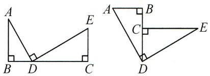

text_image

Two geometric diagrams showing right triangles with right angles at vertices A, B, C, D, and E.

结论:① $\triangle ABD\sim\triangle DCE$ ;

② $\frac{AB}{DC} = \frac{BD}{EC} = \frac{AD}{DE}$ ;

③ $AB \cdot EC = BD \cdot DC.$

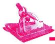

# 典例精讲

# 题型一 单垂构

【例 1】如图, 在矩形 ABCD 中, $\frac{AB}{BC} = \frac{k}{2} (k > 1)$ , E 是 BC 的中点, 连接 AE, 过点 E 作 AE 的垂线 EF, 与矩形的外角平分线 CF 交于点 F. 求 $\frac{AE}{EF}$ 的值 (用含 k 的式子表示).

解: 过点 F 作 $FH \perp BC$ , 交 BC 的延长线于点 H. 设 BC = 2, FH = x, $\therefore AB = k$ .

∵四边形 ABCD 为矩形, ∴ $\angle B = \angle DCB = 90^{\circ}$ . ∴ $\angle DCH = 90^{\circ}$ .

∵CF 平分∠DCH, ∴∠FCH=45°. ∴FH=CH=x, ∴EH=1+x.

$$
\because A E \perp E F, \therefore \angle A E B + \angle F E H = 9 0 ^ {\circ}. \because \angle A E B + \angle B A E = 9 0 ^ {\circ},
$$

$$
\therefore \angle B A E = \angle F E H. \because \angle B = \angle H = 9 0 ^ {\circ}, \therefore \triangle A B E \sim \triangle E H F,
$$

$$
\therefore \frac {A B}{E H} = \frac {B E}{F H} = \frac {A E}{E F}, \therefore \frac {k}{1 + x} = \frac {1}{x} = \frac {A E}{E F}, \therefore x = \frac {1}{k - 1}. \therefore \frac {A E}{E F} = \frac {1}{x} = k - 1.
$$

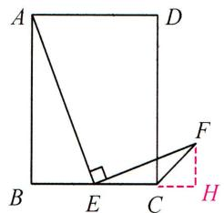

text_image

A
D
B
E
C
F
H

# 题型二 双垂构

【例 2】如图, 在平面直角坐标系中, 四边形 OABC 为矩形, 点 B 的坐标为 $(1,2)$ , 点 D 与点 B 关于直线 AC 对称, 连接 AD, CD, 求点 D 的坐标.

解: 过点 D 作 $DF \perp x$ 轴于点 F, 延长 BC, FD 交于点 E,

由 $\angle ADC = \angle E = \angle AFD = 90^{\circ}$ ，可证得 $\triangle AFD\sim \triangle DEC$

$$
\therefore \frac {D F}{C E} = \frac {A F}{D E} = \frac {A D}{C D} = \frac {A B}{B C} = 2,
$$

设 CE=a，则 OF=a,DF=2a,DE=2-2a，

$\therefore\frac{a+1}{2-2a}=2$ , 解得 $a=\frac{3}{5}$ , $\therefore D\left(-\frac{3}{5},\frac{6}{5}\right)$ .

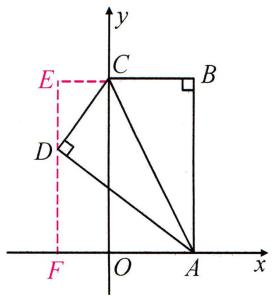

text_image

y
E
C
B
D
F
O
A
x

# 实战演练

如图, 在 $\triangle ABC$ 中, $\angle BAC = 60^{\circ}$ , $\angle ABC = 90^{\circ}$ , 直线 $l_{1} // l_{2} // l_{3}, l_{1}$ 与 $l_{2}$ 之间的距离是 $1, l_{2}$ 与 $l_{3}$ 之间的距离是 $2$ , 且 $l_{1}, l_{2}, l_{3}$ 分别经过点 $A, B, C$ , 求边 $AC$ 的长.

解: 过点 A 作 $AD \perp l_{2}$ 于点 D, 过点 C 作 $CE \perp l_{2}$ 于点 E,

则 ${AD} = 1,{CE} = 2,\because \angle {BAC} = {60}^{ \circ  },\angle {ABC} = {90}^{ \circ  }$ ,

$\therefore BC = \sqrt{3} AB$ ，由 $\angle ADB = \angle ABC = \angle BEC = 90^{\circ}$ ，可证得 $\triangle ABD \sim \triangle BCE$ ，

$$
\therefore \frac {B E}{A D} = \frac {C E}{B D} = \frac {B C}{A B} = \sqrt {3}, \therefore B E = \sqrt {3} A D = \sqrt {3}, B D = \frac {\sqrt {3}}{3} C E = \frac {2 \sqrt {3}}{3},
$$

$$
\therefore A B = \sqrt {A D ^ {2} + B D ^ {2}} = \sqrt {1 ^ {2} + \left(\frac {2}{3} \sqrt {3}\right) ^ {2}} = \frac {\sqrt {2 1}}{3}, \therefore A C = 2 A B = \frac {2 \sqrt {2 1}}{3}.
$$

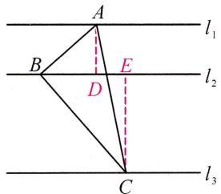

text_image

A
l₁
B
E
D
l₂
C
l₃

# 板块八 一线三等角型相似

模型:一线三等角型相似

条件: $\angle B=\angle ADE=\alpha.$

构图: 在 BD 的延长线上取点 C, 使 $\angle ECD = \alpha$ .

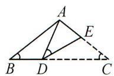  
$\alpha$ 为锐角

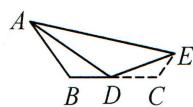  
$\alpha$ 为钝角

结论：

① $\triangle ABD\sim\triangle DCE$ ;

② $\frac{AB}{DC} = \frac{BD}{EC} = \frac{AD}{DE}$ ;

③ $AB \cdot EC = BD \cdot DC.$

# 典例精讲

# 题型一 用一线三等角相似

【例】如图,在 $\triangle ABC$ 中, $AC=BC$ ,点 $P$ 在边 $AB$ 上,点 $E$ 在 $BC$ 上, $\angle CPE=\angle A$ .

(1) 求证: $\triangle ACP \sim \triangle BPE$ ;   
(2) 若 $EC = EP, AB = 12, AC = 8$ , 求 $AP$ 的长.

解:(1) $\because AC=BC,\therefore\angle A=\angle B,$

$$
\begin{array}{l} \because \angle C P B = \angle A + \angle P C A, \text {   即   } \angle C P E + \angle E P B = \angle A + \angle P C A, \\ \text {   又   } \because \angle A = \angle C P E, \therefore \angle A C P = \angle B P E, \\ \because \angle A = \angle B, \therefore \triangle A C P \sim \triangle B P E; \\ \end{array}
$$

(2) 当 $EC = EP$ 时, $\angle CPE = \angle ECP$ , $\because \angle B = \angle CPE$ ,

$$
\therefore \angle E C P = \angle B, \therefore P C = P B, \because \triangle A C P \sim \triangle B P E, \therefore \frac {A C}{B P} = \frac {A P}{B E} = \frac {P C}{E P},
$$

即 $\frac{8}{PB} = \frac{12 - PB}{BE} = \frac{PB}{8 - BE}$ 解得 $PB = \frac{16}{3},\therefore AP = AB - PB = \frac{20}{3}.$

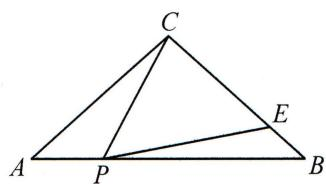

text_image

C
A P B
E

# 实战演练

# 题型二 构一线三等角相似

如图,在菱形ABCD中, $\angle ABC=60^{\circ}$ ,点E在BC上, $\angle AEF=\angle ABC$ ,EF交□ABCD的外角平分线CF于点F,BE:AB=1:3.求 $\frac{CF}{BE}$ 的值.

解: 方法 1(外构): 过点 F 作 CF 的垂线, 交 BC 的延长线于点 M, 易得

$\angle FCM = 30^{\circ}, \therefore CM = 2FM, CF = \sqrt{3} FM.$ 易证 $\triangle ABE \sim \triangle EMF,$

$\therefore\frac{BE}{FM}=\frac{AB}{EM},BE\cdot EM=FM\cdot AB.$ 设 BE=1, FM=x，则 AB=3，

$$
C M = 2 x. \because B C = A B, \therefore B C = 3, E C = 2, E M = 2 + 2 x. \therefore 2 + 2 x = 3 x,
$$

解得 $x = 2, \therefore CF = \sqrt{3} x = 2\sqrt{3}, \therefore \frac{CF}{BE} = 2\sqrt{3}$ .

方法 2(内构): 过点 E 作 $EN \perp BC$ 交 AB 于点 N, 则 $\angle ANE = \angle ECF = 150^{\circ}$ ,

证 $\triangle ANE\sim \triangle ECF$ ， $\therefore \frac{EN}{FC} = \frac{AN}{EC}$ 设 $BE = 1$ ，则 $BN = 2,EN = \sqrt{3},AB = 3,$

$$
\therefore A N = 1, E C = 2, \therefore \frac {2}{F C} = \frac {1}{\sqrt {3}}, \therefore C F = 2 \sqrt {3}, \therefore \frac {C F}{B E} = 2 \sqrt {3}.
$$

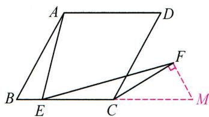

text_image

Geometric diagram of parallelogram ABCD with points E, F, M and auxiliary lines, including a right angle at F.

# 板块九 十字架型相似

模型 1: 作单垂线构直角三角形相似

$FB \perp BC, DE \perp CF,$ 作 $DM \perp BC$

$$
\rightarrow \triangle B C F \sim \triangle M D E
$$

$$
\rightarrow \frac {D E}{C F} = \frac {D M}{B C} = \frac {E M}{B F}.
$$

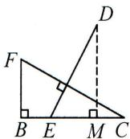

模型 2: 作双垂线构直角三角形相似

$AB \perp BC, DE \perp AF$ , 作 $DM \perp BC, FN \perp AB$

$$
\rightarrow \triangle N F A \sim \triangle M D E
$$

$$
\rightarrow \frac {D E}{A F} = \frac {D M}{F N} = \frac {E M}{A N}.
$$

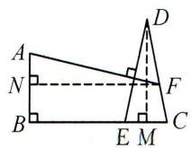

# 典例精讲

# 题型一 构直角三角形相似

【例 1】如图, E, F, G 分别为矩形 ABCD 的边 AD, BC, CD 上的点, $EF \perp AG$ , EC = EF.
求证: $\frac{ED}{DG}=\frac{EF}{AG}.$

解: 过点 E 作 $EH \perp BC$ 于点 H, $\therefore \angle EHC = \angle EHF = 90^{\circ}$ .

由矩形 ABCD 得 $\angle D = \angle DCB = 90^{\circ}, AD \parallel BC$ ,

$\therefore \angle AEF = \angle EFH$ , 四边形 DEHC 为矩形, $\therefore EH = CD, ED = HC$ .

$$
\because E F = E C, E H \perp F C, A G \perp E F,
$$

$$
\therefore \angle D A G + \angle A E F = \angle F E H + \angle E F H = 9 0 ^ {\circ}, F H = H C,
$$

$$
\therefore \angle D A G = \angle F E H, F H = E D.
$$

$$
\because \angle E H F = \angle A D G = 9 0 ^ {\circ}, \therefore \triangle E F H \sim \triangle A G D, \therefore \frac {F H}{D G} = \frac {E F}{A G}, \therefore \frac {E D}{D G} = \frac {E F}{A G}.
$$

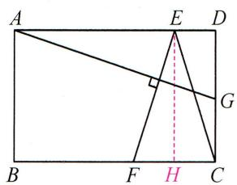

text_image

A
E
D
G
B
F
H
C

# 题型二 构非直角三角形相似

【例 2】如图, 在四边形 ABCD 中, BA = BC, DA = DC, $\angle BAD = 90^{\circ}$ , $DE \perp CF$ . E, F 分别是 AB, AD 边上的点, DE 与 CF 交于点 G, 求证: $\frac{DE}{CF} = \frac{BE}{AF}$ .

证明: 连接 AC 与 BD 交于点 O. ∵ BA = BC, DA = DC, ∴ BD 垂直平分 AC.

$$
\because F C \perp D E, \therefore \angle C G D = \angle C O D = 9 0 ^ {\circ}, \therefore \angle A C F = \angle B D E.
$$

$$
\because \angle E G F = \angle B A D = 9 0 ^ {\circ}, \therefore \angle A E D + \angle C F A = 3 6 0 ^ {\circ} - 1 8 0 ^ {\circ} = 1 8 0.
$$

$$
\because \angle A E D + \angle B E D = 1 8 0 ^ {\circ}, \therefore \angle B E D = \angle A F C.
$$

$$
\therefore \triangle A C F \sim \triangle B D E, \therefore \frac {D E}{C F} = \frac {B E}{A F}.
$$

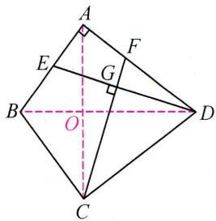

text_image

Geometric diagram of a quadrilateral with labeled vertices and perpendicular lines, including a right angle at G.

# 实战演练

如图, 在 $\triangle ABC$ 中, $\angle ACB = 90^{\circ}, D, E$ 分别是 $BC, AB$ 边上的点, $AD \perp CE$ , 垂足为 $F$ . $AC = 4, BC = 3$ , 若 $\frac{AD}{CE} = \frac{8}{5}$ , 求 $\frac{BE}{AB}$ 的值.

解: 过点 E 作 $EG \perp BC$ 于点 G, $\therefore \angle EGC = 90^{\circ}$ ,

$$
\because \angle A C B = \angle E C G + \angle A C F = 9 0 ^ {\circ}, A D \perp C E, \therefore \angle A C F + \angle C A D = 9 0 ^ {\circ},
$$

$$
\therefore \angle C A D = \angle E C G, \because \angle E G C = \angle A C D, \therefore \triangle E C G \sim \triangle D A C, \therefore \frac {A D}{C E} = \frac {A C}{C G} = \frac {8}{5},
$$

$$
\because A C = 4, \therefore C G = \frac {5}{2}, \because B C = 3, \therefore B G = \frac {1}{2},
$$

$$
\because E G \parallel A C, \therefore \frac {B E}{A B} = \frac {B G}{B C} = \frac {1}{2} \times \frac {1}{3} = \frac {1}{6}.
$$

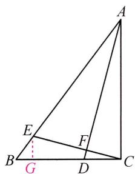

text_image

Geometric diagram of triangle ABC with internal points D, E, F, G and a dashed line from E to B

# 板块十 旋转型相似

模型 1: 边角边型旋转相似

条件: $\angle1=\angle2,\frac{AB}{AC}=\frac{AD}{AE}.$

结论：

$$
\begin{array}{l} ① \triangle A B D \sim \triangle A C E, \triangle A B C \sim \triangle A D E; \\ ② \frac {B D}{C E} = \frac {A B}{A C} = \frac {A D}{A E}; \frac {B C}{D E} = \frac {A B}{A D} = \frac {A C}{A E}. \\ \end{array}
$$

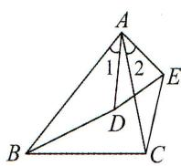

模型 2: 角角型旋转相似

条件: $\angle1=\angle2,\angle3=\angle4.$

结论：

$$
① \triangle A B D \sim \triangle A C E, \triangle A B C \sim \triangle A D E;
$$

$$
② \frac {B D}{C E} = \frac {A B}{A C} = \frac {A D}{A E}; \frac {B C}{D E} = \frac {A B}{A D} = \frac {A C}{A E}.
$$

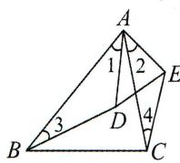

# 典例精讲

# 题型一 作垂线构旋转型相似

【例】如图,在 Rt△ABC 中,∠BAC=90°,AD⊥BC,垂足为 D,O 是 AC 边中点,连接 BO 交 AD 于点 F,OE⊥OB 交 BC 边于点 E.若 $\frac{AC}{AB}=n$ ,求 $\frac{OF}{OE}$ 的值.

解: 过点 O 作 AD, DC 的垂线, 垂足分别为 H, K,

$$
\triangle F H O \sim \triangle E K O, \triangle A O H \cong \triangle O C K, \triangle O K C \sim \triangle B A C,
$$

$$
\frac {O F}{O E} = \frac {O H}{O K} = \frac {C K}{O K} = \frac {A C}{A B} = n.
$$

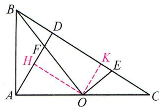

text_image

Geometric diagram of triangle ABC with internal points D, E, F, H, K and auxiliary lines, including a dashed extension from O to H.

# 实战演练

# 题型二 构旋转得旋转型相似

如图, 在 Rt△ABC 中, ∠ACB = 90°, ∠ABC = 30°, P 是 △ABC 内一点, 若 PA = 2, PB = 2√2, PC = 1, 求 △ABP 的面积.

解: 在 BP 上方作 $PD \perp BP$ ，且 $\angle DBP = 30^{\circ}$ ，连接 AD.

$$
\because \angle A B C = 3 0 ^ {\circ}, \angle A C B = 9 0 ^ {\circ}, \therefore \frac {B C}{A B} = \frac {B P}{B D} = \frac {\sqrt {3}}{2}, \angle D B A = \angle P B C.
$$

$$
\therefore \triangle D B A \sim \triangle P B C. \therefore \frac {P C}{A D} = \frac {B C}{A B} = \frac {\sqrt {3}}{2}, \because P C = 1, \therefore A D = \frac {2 \sqrt {3}}{3}.
$$

$$
\because D P \perp B P, \angle D B P = 3 0 ^ {\circ}, \therefore D P = \frac {\sqrt {3}}{3} B P = \frac {2 \sqrt {6}}{3}. \because P A = 2,
$$

$$
\therefore A D ^ {2} + D P ^ {2} = 4 = P A ^ {2}, \therefore \angle A D P = 9 0 ^ {\circ} = \angle D P B, \therefore A D / / B P.
$$

$$
\therefore S _ {\triangle A B P} = S _ {\triangle D B P} = \frac {1}{2} B P \cdot D P = \frac {4 \sqrt {3}}{3}.
$$

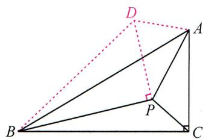

text_image

Geometric diagram with labeled points A, B, C, D, and P, showing solid and dashed lines forming triangles and right angles.

# 第 43 讲 相似与圆

# 板块一 圆中的 A 型相似

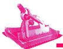

# 典例精讲

# 题型一 连圆心与切点构 A 型相似

【例】如图, 在 Rt△ABC 中, ∠C=90°, 点 D 在斜边 AB 上, 以 AD 为直径的半圆 O 与 BC 相切于点 E, 与 AC 相交于点 F, 连接 DE. 若 AC=8, BC=6, 求 DE 的长.

解： $\because \angle C = 90^{\circ}, AC = 8, BC = 6, \therefore AB = \sqrt{AC^{2} + BC^{2}} = 10.$

连接 AE, OE. 设 $\odot O$ 的半径为 r，则 OA = OE = r, OB = 10 - r,

∵BC与半圆相切, $\angle C=90^{\circ},\therefore OE\parallel AC,$

$\therefore \triangle BOE \sim \triangle BAC, \therefore \frac{BE}{BC} = \frac{BO}{AB} = \frac{OE}{AC}$ , 即 $\frac{BE}{6} = \frac{10 - r}{10} = \frac{r}{8}$ ,

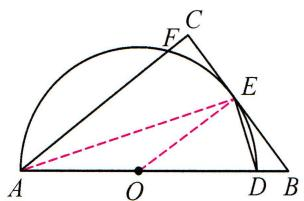

text_image

Geometric diagram with labeled points and lines, including a semicircle and triangle constructions

解得 $r=\frac{40}{9}$ , $BE=\frac{10}{3}$ , $\therefore CE=BC-BE=\frac{8}{3}$ , $\therefore AE=\sqrt{AC^{2}+CE^{2}}=\frac{8\sqrt{10}}{3}$ ,

在 Rt△ADE 中, 由勾股定理, 得 $AE^{2} + DE^{2} = AD^{2}$ , $\therefore \left(\frac{8}{3}\sqrt{10}\right)^{2} + DE^{2} = \left(\frac{80}{9}\right)^{2}$ , $\therefore DE = \frac{8\sqrt{10}}{9}$ .

# 实战演练

# 题型二 知直径连直角构 A 型相似

1. 如图, $AB$ 是 $\odot O$ 的直径, $E$ 为 $\odot O$ 上的一点, $\angle ABE$ 的平分线交 $\odot O$ 于点 $C$ , 过点 $C$ 的直线交 $BA$ 的延长线于点 $P$ , 交 $BE$ 的延长线于点 $D$ . 且 $\angle PCA = \angle CBD$ .

(1)求证:PC 为 $\odot O$ 的切线;  
(2) 若 $PC = 2\sqrt{2}BO, PB = 12$ ，求 $\odot O$ 的半径及 BE 的长.

解:(1)略;

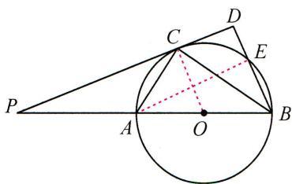

text_image

Geometric diagram showing a circle with points P, A, B, C, D, E and external point O, including chords and dashed lines.

(2) 连接 $AE$ , 设 $OB = OC = r$ , $\because PC = 2\sqrt{2}OB$ , $\therefore PC = 2\sqrt{2}r$ ,

$$
\therefore O P = \sqrt {O C ^ {2} + P C ^ {2}} = \sqrt {r ^ {2} + (2 \sqrt {2} r) ^ {2}} = 3 r, \because P B = 1 2, \therefore 4 r = 1 2, \therefore r = 3,
$$

可证 $\angle OCB=\angle CBD, \therefore OC\parallel BD, \therefore \triangle POC \sim \triangle PBD, \therefore \frac{OC}{BD}=\frac{OP}{PB}, \angle D=\angle PCO=90^{\circ}, \therefore \frac{3}{BD}=\frac{9}{12}, \therefore BD=4,$

∵AB是直径，∴∠AEB=90°，∴∠AEB=∠D=90°，∴AE∥PD，∴△ABE∽△PBD，

$$
\therefore \frac {B E}{B D} = \frac {A B}{B P}, \therefore \frac {B E}{4} = \frac {6}{1 2}, \therefore B E = 2.
$$

# 题型三 作垂线构 A 型相似

2. 如图, $\triangle ABC$ 内接于 $\odot O$ , 弦 $CD \parallel AB$ , $AD$ 交 $BC$ 于点 $E$ , $EF \perp BC$ 交 $AC$ 于点 $F$ , $\angle D = 60^\circ$ .

(1)求证: $\triangle ABE$ 是等边三角形;  
(2) 若 $AB = 8, AC = 3FC$ , 求 $AC$ 的长.

解:(1)略;

(2) 过点 A 作 $AH \perp BC$ 于点 H，则 $BH = HE = \frac{1}{2}BE = \frac{1}{2}AB = 4, AH = \frac{\sqrt{3}}{2}AB = 4\sqrt{3}$ . ∵ $EF \perp BC, \therefore EF \parallel AH, \therefore \triangle CEF \sim \triangle CHA, \therefore \frac{CF}{CA} = \frac{CE}{CH} = \frac{1}{3}, \therefore CE = 2, \therefore AC = \sqrt{AH^{2} + HC^{2}} = 2\sqrt{21}$ .

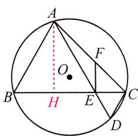

text_image

A
O
B
H
E
C
D
F

# 板块二 圆中的射影型相似

# 典例精讲

# 题型一 直径+垂径

【例】如图, 在 $\odot O$ 中, 直径 $AB$ 垂直于弦 $CD$ 于点 $E$ , 连接 $AC, AD, BC$ , 过点 $C$ 作 $CF \perp AD$ 于点 $F$ , 交线段 $OB$ 于点 $G$ (不与点 $O, B$ 重合), 连接 $OF$ .

(1) 若 $BE = 1$ , 求 $GE$ 的长;  
(2) 求证: $BC^{2} = BG \cdot BO$ .

解:(1)∵直径AB垂直弦CD,∴∠AED=90°,

$$
\therefore \angle D A E + \angle D = 9 0 ^ {\circ}, \because C F \perp A D, \therefore \angle F C D + \angle D = 9 0 ^ {\circ},
$$

$$
\therefore \angle D A E = \angle F C D = \angle B C D, \therefore \triangle B C E \cong \triangle G C E, \therefore G E = B E = 1;
$$

(2) $\because A B$ 是 $\odot O$ 的直径, $\therefore \angle A C B = 90^{\circ}, \therefore \angle A C B = \angle C E B = 90^{\circ}$ ,

$$
\because \angle A B C = \angle C B E, \therefore \triangle A C B \sim \triangle C E B, \therefore \frac {B C}{B E} = \frac {B A}{B C}, \therefore B C ^ {2} = B A \cdot B E,
$$

由(1)知 $GE = BE, \therefore BE = \frac{1}{2} BG, \because AB = 2BO, \therefore BC^2 = BA \cdot BE = 2BO \cdot \frac{1}{2} BG = BG \cdot BO.$

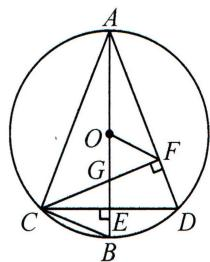

text_image

A
O
G
F
C
E
B
D

# 实战演练

# 题型二 直径+切线

1. 如图, 在 Rt△ABC 中, ∠ACB = 90°, 以 AC 为直径的 ⊙O 交 AB 于点 D, E 是边 BC 的中点, 连接 DE.

(1)求证: DE 是 $\odot O$ 的切线;  
(2) 若 $AD = 4, BD = 9$ , 求 $DE$ 的长.

解:(1)连接 ${OD},{CD}.\because \angle {ACB} = {90}^{ \circ  },\therefore \angle {ACD} + \angle {DCB} = {90}^{ \circ  },\because {OC} = {OD}$ ,

$$
\therefore \angle O C D = \angle O D C, \because A C \text {   是   } \odot O \text {   的直径,   } \therefore \angle A D C = 9 0 ^ {\circ},
$$

$\therefore \angle CDB = 180^{\circ} - \angle ADC = 90^{\circ}, \because E$ 是边 $BC$ 的中点, $\therefore DE = CE = \frac{1}{2} BC$ ,

$$
\therefore \angle D C E = \angle C D E, \therefore \angle O D C + \angle C D E = 9 0 ^ {\circ}, \therefore \angle O D E = 9 0 ^ {\circ},
$$

∵OD 是⊙O 的半径，∴DE 是⊙O 的切线；

(2) $\because AD = 4, BD = 9, \therefore AB = AD + BD = 4 + 9 = 13, \because \angle ACB = \angle ADC = 90^{\circ}, \angle B = \angle B,$

$$
\therefore \triangle B A C \sim \triangle B C D, \therefore \frac {B C}{A B} = \frac {B D}{B C}, \therefore B C ^ {2} = B D \cdot A B = 9 \times 1 3, \therefore B C = 3 \sqrt {1 3}, \therefore D E = \frac {1}{2} B C = \frac {3}{2} \sqrt {1 3}.
$$

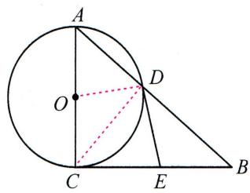

text_image

Geometric diagram showing a circle with points A, B, C, D, E and center O, including chords and tangent lines.

# 题型三 垂直弦

2. 如图, $\triangle ABC$ 内接于 $\odot O$ , $\angle BAC = 45^{\circ}$ , 过点 $B$ 作 $BC$ 的垂线, 交 $\odot O$ 于点 $D$ , 交 $CA$ 的延长线于点 $E$ , 过点 $B$ 作 $BF \perp AC$ , 垂足为 $M$ , 交 $\odot O$ 于点 $F$ .

(1)求证:BD=BC;   
(2) 若 $\odot O$ 的半径 $r = 3, BE = 6$ , 求 $BF$ 的长.

解:(1)连接 DC, 则 $\angle BDC = \angle BAC = 45^{\circ}$ . $\because BD \perp BC$ ,

$$
\therefore \angle B C D = \angle B D C = 4 5 ^ {\circ}. \therefore B D = B C;
$$

(2) 连接 CF，则 $\angle F = \angle BDC = 45^{\circ}$ ，∴ MF = MC， $BC = \frac{\sqrt{2}}{2} CD = 3\sqrt{2}$ .

$\because \angle DBC = 90^{\circ}, BF \perp AC, \therefore \triangle BCM \sim \triangle ECB, \therefore \frac{BM}{CM} = \frac{EB}{CB} = \frac{6}{3\sqrt{2}} = \sqrt{2}$ . 设 $CM = x$ ，则 $BM = \sqrt{2}x$

$$
F M = x, \therefore B C = \sqrt {B M ^ {2} + C M ^ {2}} = \sqrt {3} x = 3 \sqrt {2}, \therefore x = \sqrt {6}, \therefore B F = B M + F M = \sqrt {2} x + x = 2 \sqrt {3} + \sqrt {6}.
$$

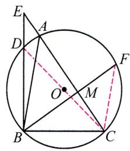

text_image

Geometric diagram of a circle with inscribed triangle ABC and auxiliary lines, labeled with points A, B, C, D, E, F, M, O.

# 板块三 圆中的 X 型相似

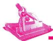

# 典例精讲

# 题型一 直径+垂径→X型相似

【例】如图, $\triangle ABC$ 内接于 $\odot O,AB=AC,CO$ 的延长线交AB于点D.

(1)求证: $AO \perp BC$ ;   
(2) 若 $BC = 6, AB = 3\sqrt{10}$ , 求 $\frac{AD}{BD}$ 的值.

解:(1)延长 AO 交 BC 于点 E, 连接 OB.

$\because OB=OC,AB=AC,\therefore$ 直线 AO 垂直平分 BC, $\therefore BE=EC,AO\perp BC;$

(2)延长 ${CO}$ 交 $\odot  O$ 于点 $F$ ,连接 ${BF}.\because {BE} = \frac{1}{2}{BC} = 3,\therefore {AE} = \sqrt{A{B}^{2} - B{E}^{2}} = 9.$

设 $AO = BO = x$ ，则 $OE = 9 - x$ ，由 $BE^{2} + OE^{2} = OB^{2}$ ，得 $3^{2} + (9 - x)^{2} = x^{2}$ ，解得 $x = 5, \therefore FC = 2x = 10,$

$\therefore BF = \sqrt{CF^2 - BC^2} = 8$ ，可证 $AE / / FB$ ， $\therefore \triangle ADO\sim \triangle BDF$ ， $\therefore \frac{AD}{BD} = \frac{AO}{FB} = \frac{5}{8}$

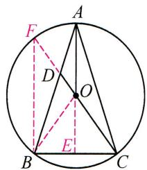

text_image

A
F
D
O
B
E
C

# 实战演练

# 题型二 直径+切线→X型相似

1. 如图, 在 $\triangle ABC$ 中, $AB = AC$ , 以 $AB$ 为直径的 $\odot O$ 交 $BC$ 于点 $D$ , 过点 $D$ 作 $\odot O$ 的切线交 $AC$ 于点 $E$ .

(1)求证: $DE \perp AC$ ;   
(2) 连接 OC 交 DE 于点 F，若 AE = 2, DE = 3，求 $\frac{DF}{EF}$ 的值.

解:(1)连接 OD, ∵ OB = OD, AB = AC, ∴ $\angle B = \angle ODB = \angle ACB$ ,
∴OD//AC.∵DE为⊙O的切线，∴OD⊥DE，∴DE⊥AC；

(2)连接 AD.∵AB 为⊙O 的直径,∴AD⊥BC,∵AB=AC,∴BD=DC,由 DE⊥AC,AD⊥BC,可证得 △AED∽△DEC,∴DE²=AE·CE,即 3²=2CE,∴CE= $\frac{9}{2}$ .∵AO=OB,BD=DC,∴OD= $\frac{1}{2}$ AC=

$$
\frac {1}{2} \left(2 + \frac {9}{2}\right) = \frac {1 3}{4}. \because O D / / A C, \therefore \triangle O F D \sim \triangle C F E, \therefore \frac {D F}{E F} = \frac {O D}{C E} = \frac {1 3}{1 8}.
$$

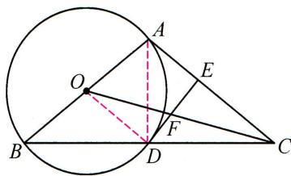

text_image

Geometric diagram showing a circle with points A, B, C, D, E, F and center O, including chords and dashed lines for construction.

# 题型三 直径+双切→X型相似

2. 如图, $PA$ 是 $\odot O$ 的切线, $A$ 是切点, $AC$ 是直径, $AB$ 是弦, 连接 $PB, PC, PC$ 与 $AB$ 相交于点 $E$ , 且 $PA = PB$ .

(1)求证:PB 是 $\odot O$ 的切线;  
(2) 若 $\angle APC = 3\angle BPC$ ，求 $\frac{PE}{CE}$ 的值.

解:(1)连接 OP, OB, 证 $\triangle OAP \cong \triangle OBP$ ;

(2) $\because \angle APC = 3\angle BPC, \therefore \angle APB = 4\angle BPC, \therefore \angle OPB = 2\angle BPC,$

$\therefore \angle OPC = \angle BPC.$ 连接 $BC$ ，设 $OP$ 交 $AB$ 于点 $F$ ，∴ $BC // OP$

$\therefore \angle PCB = \angle OPC = \angle BPC, \therefore BC = BP,$ 设 OF = a, 则 BC = BP = 2a,

$\because PB^{2} = PF \cdot PO, \therefore (2a)^{2} = PF \cdot (PF + a), \therefore PF = \frac{\sqrt{17} - 1}{2} a$ （负值已舍），

$$
\because P F \parallel B C, \therefore \triangle P E F \sim \triangle C E B, \therefore \frac {P E}{C E} = \frac {P F}{B C} = \frac {\sqrt {1 7} - 1}{4}.
$$

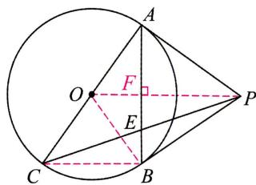

text_image

Geometric diagram showing a circle with points A, B, C, P, O, E, F and auxiliary lines forming triangles and chords.

# 板块四 圆中的母子型相似

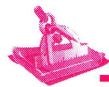

# 典例精讲

# 题型一 切割图 $\rightarrow$ 母子型相似

【例】如图, $\triangle ABC$ 内接于 $\odot O, AH \perp BC$ 于点H,连接OC,过点A作 $\odot O$ 的切线,交CB的延长线于点E.

(1) 求证: $\angle BAH = \angle ACO$ ;   
(2) 若 $AC = 24, AH = 18, OC = 13$ , 求 $\frac{BE}{AE}$ 的值.

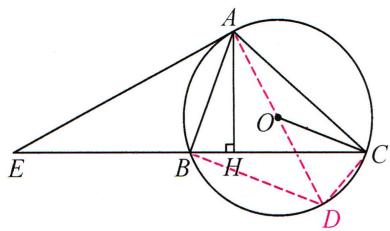

text_image

Geometric diagram showing a circle with points A, B, C, D, E, H and auxiliary lines including chords and a right angle at O.

解:(1) 连接 AO 并延长交 $\odot O$ 于点 D, 连接 CD. 易证 $\angle BAH = \angle DAC = \angle ACO$ ;

(2)连接 $BD$ , $\because AD$ 为 $\odot O$ 直径, $\therefore \angle ACD = 90^{\circ}$ . 易证 $\triangle ABH \sim \triangle ADC$ . $\therefore \frac{AB}{AD} = \frac{AH}{AC} = \frac{18}{24}$ .

$\therefore AB = \frac{3}{4} AD = \frac{39}{2}$ . 可证 $\angle EAB = \angle ADB = \angle ACB$ . 又 $\angle E = \angle E$ . $\therefore \triangle EAB \sim \triangle ECA$ . $\therefore \frac{BE}{AE} = \frac{AB}{AC} = \frac{13}{16}$ .

# 实战演练

# 题型二 等腰图→母子型相似

1. 如图, $AM$ 是 $\odot O$ 的直径, 弦 $BC \perp AM$ , 垂足为 $N$ , 弦 $CD$ 交 $AM$ 于点 $E$ , 交 $AB$ 于点 $F$ , 且 $CD = AB$ . 求证: $CE^2 = EF \cdot ED$ .

证明: 连接 AC, BE, BD. $\because CD = AB, \therefore \widehat{ADB} = \widehat{DBC}, \therefore \widehat{AD} = \widehat{BC},$ $\therefore \angle ACD = \angle BDC. \because AM$ 是 $\odot O$ 的直径，弦 $BC \perp AM, \therefore BN = CN,$ $\therefore AM$ 垂直平分 BC, $\therefore \angle ACD = \angle ABE, CE = BE, \therefore \angle BDC = \angle ABE,$ $\because \angle DEB = \angle BEF, \therefore \triangle FEB \sim \triangle BED, \therefore \frac{EF}{BE} = \frac{BE}{DE},$ $\therefore EF \cdot DE = BE^{2} = CE^{2}.$

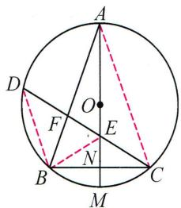

text_image

A
D
F
O
E
B
N
C
M

# 题型三 角分图→母子型相似

2. 如图, $E$ 是 $\triangle ABC$ 的内心, $AE$ 的延长线与边 $BC$ 相交于点 $F$ , 与 $\triangle ABC$ 的外接圆交于点 $D$ .

(1) 求证: $AF^2 = AB \cdot AC - BF \cdot CF$ ;   
(2) 探究 $DF, DE, DA$ 三者之间的等量关系.

解:(1)连接 DB, DC, ∵∠ACF = ∠BDF, ∠FAC = ∠FBD, ∴△BFD∽△AFC,

$$
\therefore B F \cdot C F = A F \cdot D F, \because \angle F B A = \angle A D C, \angle B A D = \angle D A C, \therefore \triangle A B F \sim \triangle A D C,
$$

$$
\therefore \frac {A B}{A D} = \frac {A F}{A C}, \therefore A B \cdot A C = A D \cdot A F = (A F + D F) \cdot A F = A F ^ {2} + A F \cdot D F,
$$

$$
\therefore A F ^ {2} = A B \cdot A C - B F \cdot C F;
$$

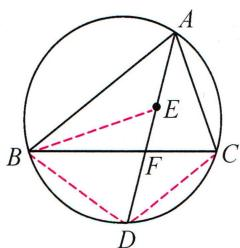

text_image

Geometric diagram of a circle with inscribed triangle ABC and auxiliary points D, E, F, showing chords and dashed lines for construction.

(2) $DE^{2}=DA\cdot DF$ . 理由如下: 连接 BE, ∵ E 是△ABC 的内心, ∴ $\angle ABE=\angle FBE$ , ∵ $\angle CBD=\angle CAD=$ $\angle BAD$ , $\angle ADB=\angle BDF$ , ∴ $\triangle ABD\sim\triangle BFD$ , ∴ $\frac{DB}{DF}=\frac{DA}{DB}$ , ∴ $DB^{2}=DA\cdot DF$ , ∵ $\angle BED=\angle BAD+\angle ABE=\angle CBD+\angle FBE$ , ∴ $\angle BED=\angle DBE$ , ∴ DB=DE, ∴ $DE^{2}=DA\cdot DF$ .

# 板块五 圆中的仿 A 型相似

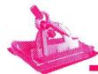

# 典例精讲

# 题型一 直接用仿 A 型

【例 1】如图, 四边形 ABCD 内接于 $\odot O$ , AB 是直径, C 是 $\widehat{BD}$ 的中点, 延长 AD, BC 相交于点 E.

(1) 求证: CE = CD;   
(2) 若 AB = 3, BC = $\sqrt{3}$ , 求 AD 的长.

解:(1)连接 AC, $\because AB$ 为直径, $\therefore \angle ACB = \angle ACE = 90^{\circ}$ , $\because C$ 是 $\widehat{BD}$ 的中点,

$$
\therefore \angle C A E = \angle C A B, C D = C B, \therefore \triangle A C E \cong \triangle A C B, \therefore C E = C B, \therefore C E = C D;
$$

(2) $\because \triangle ACE \cong \triangle ACB, AB = 3, \therefore AE = AB = 3,$

又∵四边形ABCD内接于⊙O，∴∠ADC+∠ABC=180°，

又∵ $\angle ADC+\angle CDE=180^{\circ},\therefore\angle CDE=\angle ABE,$

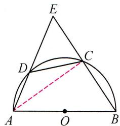

text_image

Geometric diagram with labeled points A, B, C, D, E and a dashed arc, likely from a math problem or proof.

又∵∠E=∠E，∴△EDC∽△EBA，∴ $\frac{DE}{BE}=\frac{CD}{AB}$ ，即 $\frac{DE}{2\sqrt{3}}=\frac{\sqrt{3}}{3}$ ，解得DE=2，∴AD=AE-DE=1。

# 题型二 构仿 A 型相似

【例 2】如图, $\odot O$ 的两条弦 CB 和 DE 的延长线交于点 A, BD = BC, $\angle DBC = 60^{\circ}$ , AE = 3, DE = 4.

(1)求 $DB$ 的长；  
(2) 求 AB 的长.

解:(1)连接 BE, CD, ∵ BD = BC, ∠DBC = 60°,

$\therefore \triangle DBC$ 为等边三角形, $\therefore \angle DBC = \angle C = 60^{\circ}, \therefore \angle BED = \angle ABD = 120^{\circ}$

$$
\therefore \triangle B E D \sim \triangle A B D, \therefore \frac {D B}{A D} = \frac {D E}{D B}, \therefore D B ^ {2} = D E \cdot D A = 2 8, \therefore D B = 2 \sqrt {7};
$$

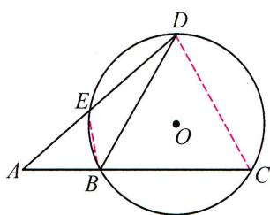

text_image

Geometric diagram showing a circle with inscribed triangle ABC, point D on the circumference, and auxiliary lines AE and BC drawn.

(2) $\because \angle AEB = \angle ACD = 60^{\circ}, \therefore \triangle AEB \sim \triangle ACD, \therefore \frac{AE}{AC} = \frac{AB}{AD}, \therefore AE \cdot AD = AB \cdot AC,$

$\therefore 3 \times 7 = AB \times (AB + 2\sqrt{7})$ ，解得 $AB = \sqrt{7}$ 或 $-3\sqrt{7}$ （舍负）， $\therefore AB$ 的长为 $\sqrt{7}$ .

# 实战演练

如图,AB 是 $\odot O$ 的直径,BA 与弦 DC 的延长线交于点 P,OD 平分 $\angle CDB$ .

(1) 求证: $AC \parallel OD$ ;   
(2) 若 PA=5, PC=6, 求 $\odot O$ 的半径.

解:(1)连接 BC, OC, 由 OD 平分 $\angle CDB$ , 可证得 $\triangle OCD \cong \triangle OBD$ ,

$\therefore CD=BD, \therefore OD\perp BC, \because AB$ 是 $\odot O$ 的直径, $\therefore AC\perp BC, \therefore AC\parallel OD$ ;

(2) $\because AC \parallel OD, \therefore \frac{OA}{CD} = \frac{PA}{PC} = \frac{5}{6}$ , 设 $OA = OB = 5x$ , 则 $CD = 6x$ ,

由 $\triangle PAC \sim \triangle PDB$ ，得 $\frac{PA}{PD} = \frac{PC}{PB}$ ， $\therefore PA \cdot PB = PC \cdot PD$ ，即 $5(5 + 10x) = 6(6 + 6x)$ ，

解得 $x=\frac{11}{14},\therefore OA=5x=\frac{55}{14}$ ，即 $\odot O$ 的半径为 $\frac{55}{14}$ .

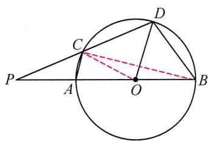

text_image

Geometric diagram showing a circle with points P, A, B, C, D and center O, including chords and dashed lines for construction.

# 板块六 圆中的旋转型相似

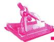

# 典例精讲

# 题型一 直接用旋转型相似

【例】如图, $\triangle ABC$ 是 $\odot O$ 的内接三角形, $AB$ 是 $\odot O$ 的直径, $AC = \sqrt{5}$ , $BC = 2\sqrt{5}$ , 点 $F$ 在 $AB$ 上, 连接 $CF$ 并延长, 交 $\odot O$ 于点 $D$ , 连接 $BD$ , 作 $BE \perp CD$ , 垂足为 $E$ .

(1) 求证: $\triangle DBE \sim \triangle ABC$ ;   
(2) 若 AF=2，求 ED 的长.

解:(1)∵AB为直径,BE⊥CD,∴∠ACB=∠BED=90°.

$$
\because \angle B D E = \angle B A C, \therefore \triangle D B E \sim \triangle A B C;
$$

(2) 过点 C 作 $CG \perp AB$ ，垂足为 G. $\because \angle ACB = 90^{\circ}, AC = \sqrt{5}, BC = 2\sqrt{5}, \therefore AB = \sqrt{AC^{2} + BC^{2}} = 5$ ，由 $S_{\triangle ABC} = \frac{1}{2}AC \cdot BC = \frac{1}{2}AB \cdot CG$ ，得 $\frac{1}{2} \times \sqrt{5} \times 2\sqrt{5} = \frac{1}{2} \times 5 \times$

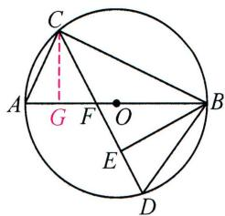

text_image

C
A G F O B
E
D

CG, 解得 $CG = 2, \therefore AG = \sqrt{AC^{2} - CG^{2}} = 1. \because AF = 2, \therefore FG = AG = 1, \therefore AC = FC, \therefore \angle CAF = \angle CFA = \angle BFD = \angle BDF, \therefore BD = BF = AB - AF = 5 - 2 = 3. \because \triangle DBE \sim \triangle ABC, \therefore \frac{BD}{AB} = \frac{DE}{AC}, \therefore \frac{3}{5} = \frac{DE}{\sqrt{5}}$ ,

$$
\therefore E D = \frac {3 \sqrt {5}}{5}.
$$

# 实战演练

# 题型二 作直径构旋转型相似

1. 如图, $\triangle ABC$ 内接于 $\odot O, CD \perp AB$ 于 $D$ , 若 $BD = 1, CD = 3, AC = 4$ , 求 $\odot O$ 的半径.

解: 连接 CO 并延长 CO 交 $\odot O$ 于点 E, 连接 AE.

则 $\angle EAC = \angle CDB = 90^{\circ},\angle E = \angle B,\therefore \triangle AEC\sim \triangle DBC,\therefore \frac{AC}{DC} = \frac{EC}{BC}.$

$\because BC = \sqrt{CD^2 + BD^2} = \sqrt{10},\therefore \frac{4}{3} = \frac{EC}{\sqrt{10}}$ ，解得 $EC = \frac{4\sqrt{10}}{3}$

∴⊙O的半径为 $\frac{2\sqrt{10}}{3}$ .

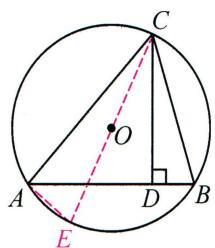

text_image

Geometric diagram of a circle with inscribed triangle and perpendicular line, labeled with points A, B, C, D, E, and center O.

# 题型三 连半径构旋转型相似

2. 如图, $AC$ 是 $\odot O$ 的直径, $BC$ 是 $\odot O$ 的弦, $P$ 是 $\odot O$ 外一点, 连接 $PB, AB, \angle PBA = \angle C$ .

(1)求证:PB 是 $\odot O$ 的切线;  
(2) 连接 OP，若 $OP \parallel BC$ ，且 OP = 8， $\odot O$ 的半径为 $2\sqrt{2}$ ，求 BC 的长.

解:(1)连接 OB.∵AC 是⊙O 的直径,∴∠C+∠BAC=90°.

$$
\because O A = O B, \therefore \angle B A C = \angle O B A, \because \angle P B A = \angle C,
$$

$\therefore \angle PBA + \angle OBA = 90^{\circ}$ ，即 $PB \perp OB$ ，∴ PB 是 $\odot O$ 的切线；

(2) $\because OP \parallel BC, \therefore \angle CBO = \angle BOP.$

$$
\because O C = O B, \therefore \angle C = \angle C B O, \therefore \angle C = \angle B O P,
$$

又∵∠ABC=∠PBO=90°,∴△ABC∽△PBO,

$$
\therefore \frac {B C}{O B} = \frac {A C}{O P}, \text { 即 } \frac {B C}{2 \sqrt {2}} = \frac {4 \sqrt {2}}{8}, \therefore B C = 2.
$$

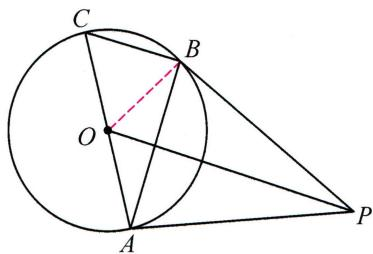

text_image

Geometric diagram showing a circle with points A, B, C, O, P and connecting lines forming triangles and chords.

# 第 44 讲 相似与函数

# 板块一 相似与反比例函数

# 典例精讲

# 题型一 知线段比构A型相似

【例 1】如图, 矩形 ABCD 的边 AB 平行于 x 轴, 反比例函数 $y=\frac{k}{x}(x>0)$ 的图象经过点 B, D, 对角线 CA 的延长线经过原点 O, 且 AC=2AO. 若矩形 ABCD 的面积是 8, 求 k 的值.

解:延长 CD 交 y 轴于点 E, 连接 OD. 设点 D(m, n),

∵矩形 ABCD 的面积是 $8, \therefore S_{\triangle ADC} = 4, \because AC = 2AO, \therefore S_{\triangle ADO} = 2, S_{\triangle OCD} = 6,$

$$
\because A D \parallel O E, \therefore \frac {C D}{D E} = \frac {C A}{O A} = 2, \therefore S _ {\triangle O D E} = \frac {1}{2} S _ {\triangle O C D} = 3 = \frac {1}{2} m n, \therefore k = m n = 6.
$$

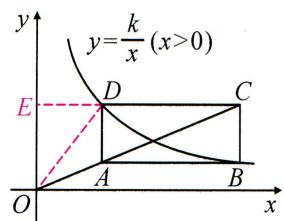

text_image

y
y=k/x(x>0)
E
D
C
A
B
O
x

# 题型二 知直角构一线三垂直相似

【例 2】如图, 在 $\triangle ABC$ 中, $\angle BAC=90^{\circ}, AB=2AC$ , 点 $A(2,0), B(0,4)$ , 点 $C$ 在第一象限内, 双曲线 $y=\frac{k}{x}(x>0)$ 经过点 $C$ . 将 $\triangle ABC$ 沿 $y$ 轴向上平移 $m$ 个单位长度, 使点 $A$ 恰好落在双曲线上, 求 $m$ 的值.

解: 过点 C 作 $CH \perp x$ 轴于点 H. $\because A(2,0)$ , $B(0,4)$ , $\therefore OA = 2$ , OB = 4,

$$
\because \angle A B O + \angle O A B = 9 0 ^ {\circ}, \angle O A B + \angle C A H = 9 0 ^ {\circ}, \therefore \angle A B O = \angle C A H,
$$

$$
\because \angle A O B = \angle A H C, \therefore \triangle A B O \sim \triangle C A H, \therefore \frac {O A}{C H} = \frac {O B}{A H} = \frac {A B}{A C} = 2, \therefore C H = 1,
$$

$AH=2,\therefore C(4,1),\because C(4,1)$ 在 $y=\frac{k}{x}$ 上，∴ k=4，∴ $y=\frac{4}{x}$ ，平移后点 A 坐标为 $(2,m),\therefore 2m=4,\therefore m=2.$

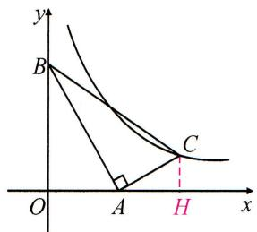

text_image

y
B
C
O
A
H
x

# 实战演练

如图, 直线 $y=\frac{1}{3}x+3$ 与双曲线 $y=\frac{12}{x}$ 交于 B, C 两点, 点 A 在第一象限内的双曲线上, 且 $\angle CAB=90^{\circ}$ , 求点 A 的坐标.

解: 过点 A 作 y 轴的垂线 EF, 过 B, C 两点分别作 EF 的垂线, 垂足分别为 E, F.

则 $\triangle ACF\sim \triangle BAE$ ， $\therefore \frac{AF}{FC} = \frac{BE}{AE}$ 设 $A\left(a,\frac{12}{a}\right)$ ，联立 $\left\{ \begin{array}{ll}y = \frac{1}{3} x + 3,\\ y = \frac{12}{x}, \end{array} \right.$ 可求得

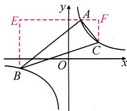

text_image

E
y
A
F
C
B
O
x

$B(-12, - 1),C(3,4),\therefore \frac{3 - a}{\frac{12}{a} - 4} = \frac{\frac{12}{a} + 1}{a + 12}$ 化简，得 $\frac{a}{4} = \frac{1}{a}$ ，解得 $a_1 = 2,a_2 = -2$ （舍），∴ $A(2,6)$

# 板块二 相似与二次函数(一) 线段比

条件: $\frac{PE}{AE}$ 为定值k.

方法:作 $PF \parallel x$ 轴交 BC 的延长线于点 F.

结论: $x_{P} - x_{F} = kAB$ .

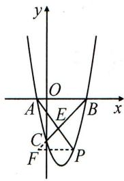

text_image

y
O
A
E
B
x
C
F
P

条件:C 为 AB 上的定点.

$\frac{PE}{EC}$ 为定值k.

方法:作 $PF \perp x$ 轴于点 F, 作 $CD \perp x$ 轴于点 D.

结论: $y_{P}=-ky_{C}$ .

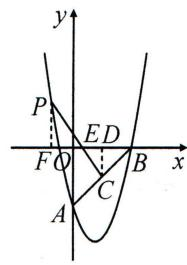

text_image

y
P
ED
F O C B x
A

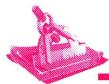

# 典例精讲

# 题型一 作垂线构 X 型相似

【例】如图,抛物线 $y=x^{2}-3x-4$ 与 y 轴交于点 A, 与 x 轴正半轴交于点 B, C 为 AB 的中点. P 为第二象限抛物线上一点, PC 与 x 轴交于点 E, 若 $\frac{PE}{EC}=\frac{3}{2}$ , 求点 P 的横坐标.

解: $A(0,-4), B(4,0), \because C$ 为 $AB$ 的中点, $\therefore C(2,-2)$ .

过点 C 作 $CD \perp x$ 轴于点 D，作 $PF \perp x$ 轴于点 F，则 $PF \parallel CD$ ，

$$
\therefore \triangle P F E \sim \triangle C D E, \therefore \frac {P F}{C D} = \frac {P E}{E C} = \frac {3}{2},
$$

$\because CD=2,\therefore PF=3,$ 由 $x^{2}-3x-4=3,$ 得 $x=\frac{3\pm\sqrt{37}}{2},$

∵点 P 在第二象限，∴点 P 的横坐标为 $\frac{3-\sqrt{37}}{2}$ .

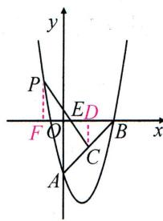

text_image

y
P
ED
F O C B x
A

# 实战演练

# 题型二 作平行线构 X 型相似

如图, 抛物线 $y = ax^{2} + bx$ 经过 A(4,0), B(1,4) 两点. P 是抛物线上一点, 且在直线 AB 的上方.

(1)写出抛物线的解析式；

(2) OP 交 AB 于点 C, PD // BO 交 AB 于点 D. 记 $\triangle CDP$ , $\triangle CPB$ , $\triangle CBO$ 的面积分别为 $S_{1}, S_{2}, S_{3}$ . 求 $\frac{S_{1}}{S_{2}} + \frac{S_{2}}{S_{3}}$ 的最大值.

解:(1)抛物线的解析式为 $y=-\frac{4}{3}x^{2}+\frac{16}{3}x$ ;

(2) $\because PD \parallel OB, \therefore \triangle DPC \sim \triangle BOC, \therefore \frac{CP}{CO} = \frac{CD}{CB} = \frac{PD}{OB}, \therefore \frac{S_1}{S_2} = \frac{CD}{CB} = \frac{PC}{OC}$ ,

又 $\because \frac{S_2}{S_3} = \frac{PC}{CO},\therefore \frac{S_1}{S_2} +\frac{S_2}{S_3} = \frac{2PC}{OC}$ 设直线 $AB$ 交 $y$ 轴于点 $F$ .由 $A(4,0),B(1,4)$ ，得

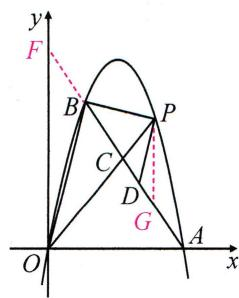

text_image

y
F
B
P
C
D
G
O
A
x

直线 $AB: y = -\frac{4}{3} x + \frac{16}{3}$ , 则 $F(0, \frac{16}{3})$ , 过点 $P$ 作 $PG // y$ 轴交 $AB$ 于点 $G$ , 设 $P(n, -\frac{4}{3} n^2 + \frac{16}{3} n)$ (1 < $n < 4$ ), 则 $G(n, -\frac{4}{3} n + \frac{16}{3})$ , 得 $PG = -\frac{4}{3} n^2 + \frac{20}{3} n - \frac{16}{3}$ , $\therefore \frac{S_1}{S_2} + \frac{S_2}{S_3} = \frac{2PC}{OC} = \frac{2PG}{OF} = \frac{3}{8} PG = -\frac{1}{2}(n - \frac{5}{2})^2 + \frac{9}{8}$ . $\because 1 < n < 4$ , $\therefore$ 当 $n = \frac{5}{2}$ 时, $\frac{S_1}{S_2} + \frac{S_2}{S_3}$ 的最大值为 $\frac{9}{8}$ .

# 板块三 相似与二次函数(二)垂直弦

条件: $PE \perp BC$ , PE 为定长 k.

方法:作 $PN \parallel y$ 轴.

结论: $y_{P}-y_{N}=\frac{kBC}{OB}.$

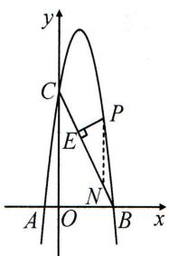

text_image

y
C
P
E
N
A O B x

条件: $PD \perp AC, \frac{PE}{DE}$ 为定值k.

方法:作 $PM \parallel y$ 轴, $PN \perp y$ 轴.

结论: $y_{P}-y_{M}=kCD$ ,

$$
\frac {- x _ {P}}{y _ {P} - y _ {D}} = \frac {O C}{O A}.
$$

text_image

P
E
M
A
O B x
D
N
C
y

# 典例精讲

# 题型一 构单相似

【例】如图,在平面直角坐标系中,O为坐标原点,抛物线 $y=-2x^{2}+6x+8$ 与y轴交于C点,交x轴于A,B两点(点A在点B的左边),P为抛物线第一象限上一点. $PE\perp$ 直线BC于点E.若 $PE=\sqrt{5}$ ,求点P的横坐标.

解:作 $PN \parallel y$ 轴交 BC 于点 N. B(4,0), C(0,8), 设 $P(t, -2t^{2} + 6t + 8)$ , 则直线 BC:

$$
y = - 2 x + 8, \therefore N (t, - 2 t + 8), \therefore P N = (- 2 t ^ {2} + 6 t + 8) - (- 2 t + 8) = - 2 t ^ {2} + 8 t,
$$

$$
\because P N \parallel y \text {   轴,   } \therefore \angle P N E = \angle O C B. \because \angle C O B = \angle P E B, \therefore \triangle P E N \sim \triangle B O C,
$$

$$
\therefore \frac {P N}{B C} = \frac {P E}{O B} = \frac {\sqrt {5}}{4}, \therefore P N = \frac {\sqrt {5}}{4} B C = 5, \therefore - 2 t ^ {2} + 8 t = 5, \therefore t = \frac {4 \pm \sqrt {6}}{2},
$$

∴点 P 的横坐标为 $\frac{4 \pm \sqrt{6}}{2}$ .

text_image

y
C
P
E
N
A O B x

# 实战演练

# 题型二 构双相似

如图,在平面直角坐标系中,抛物线 $y=-\frac{1}{4}x^{2}+bx+c(b,c$ 是常数)经过点 $B(2,0)$ , 点 $C(0,3)$ , 抛物线与 x 轴负半轴交于点 A.

(1)求此抛物线解析式；  
(2) $P$ 为第二象限抛物线上一点, 过点 $P$ 作 $AC$ 的垂线, 分别交 $AC, y$ 轴于点 $E, D$ . 若 $DE = 2PE$ , 求点 $P$ 的横坐标.

解:(1) $y=-\frac{1}{4}x^{2}-x+3;$

(2) $A(-6,0)$ . 过点 $P$ 作 $PM \parallel y$ 轴交 $AC$ 于点 $M$ , 作 $PN \perp y$ 轴于点 $N$ .

则 $\triangle PND \sim \triangle COA, \therefore \frac{ND}{PN} = \frac{OA}{OC} = \frac{6}{3} = 2, \therefore ND = 2PN.$

设 $P\left(m, -\frac{1}{4} m^2 - m + 3\right)$ , 则 $PN = -m, ND = -2m$ .

text_image

P
E
M
A
O B x
D
N
C
y

$\therefore OD = ND - ON = -2m + \frac{1}{4} m^2 + m - 3 = \frac{1}{4} m^2 - m - 3, \therefore CD = \frac{1}{4} m^2 - m. \therefore$ 直线 $AC: y = \frac{1}{2} x + 3,$

$\therefore M(m, \frac{1}{2} m + 3), PM = -\frac{1}{4} m^2 - m + 3 - \left(\frac{1}{2} m + 3\right) = -\frac{1}{4} m^2 - \frac{3}{2} m, \because PM \parallel y$ 轴，

$\therefore \frac{PM}{CD} = \frac{PE}{ED} = \frac{1}{2}, \therefore CD = 2PM = -\frac{1}{2}m^2 - 3m = \frac{1}{4}m^2 - m, \therefore m = 0$ 或 $-\frac{8}{3}, \therefore$ 点 $P$ 的横坐标为 $-\frac{8}{3}$ .

# 板块四 相似与二次函数(三) 位置关系构相似

# 典例精讲

# 题型一 线段平行构相似

【例】如图,抛物线 $y=ax^{2}+bx+c$ 经过点 A(-1,0), 点 B(3,0), 点 C(0,3), 连接 AC.

(1)直接写出抛物线的解析式；  
(2) 过抛物线上第一象限内的一点 P 作 $PQ \parallel AC$ ，交 BC 于点 Q，若 $PQ = \frac{1}{2} AC$ ，求点 P 的坐标.

解:(1) $y=-x^{2}+2x+3$ ;

(2) 过点 P, A 作 y 轴的平行线, 与直线 BC 分别交于点 M, N,

则 $PM \parallel AN, \therefore \angle PMQ = \angle ANC, \because PQ \parallel AC, \therefore \angle ACQ = \angle PQC,$

$$
\therefore \angle A C N = \angle P Q M, \therefore \triangle A C N \sim \triangle P Q M, \therefore \frac {P M}{A N} = \frac {P Q}{A C} = \frac {1}{2}.
$$

由 $B(3,0), C(0,3)$ , 可求得直线 $BC$ 的解析式为 $y = 3 - x$ ,

$$
\therefore N (- 1, 4), \therefore A N = 4, \therefore P M = \frac {1}{2} A N = 2.
$$

设 $P(a, -a^{2} + 2a + 3)$ ，则 $M(a, 3 - a)$ ，

$\therefore PM = -a^{2} + 2a + 3 - (3 - a) = -a^{2} + 3a = 2$ ，解得 $a = 1$ 或 $a = 2$ ，∴ $P$ 为(1,4)或(2,3).

text_image

y
N
C
P
Q
M
A
O
B
x

# 实战演练

# 题型二 线段垂直构相似

如图, 抛物线 $y = -x^{2} + bx + c$ 与 $x$ 轴交于点 $A(-3,0), B(2,0)$ , 与 $y$ 轴正半轴交于点 $C$ .

(1)直接写出抛物线的解析式；  
(2) 直线 $y = \frac{1}{2} x + m$ 与抛物线交于点 $M, N$ , 若 $\angle MON = 90^\circ$ , 求 $m$ 的值.

解:(1) $y=-x^{2}-x+6$ ;

(2) 过点 M, N 作 x 轴的垂线, 垂足分别为 $M'$ , $N'$ ,

又∵∠MON=90°,∴Rt△MM'O∽Rt△ON'N,

$$
\therefore \frac {M M ^ {\prime}}{O N ^ {\prime}} = \frac {O M ^ {\prime}}{N N ^ {\prime}}, \therefore M M ^ {\prime} \cdot N N ^ {\prime} = O N ^ {\prime} \cdot O M ^ {\prime}, \therefore - x _ {M} \cdot x _ {N} = y _ {M} \cdot y _ {N}.
$$

联立 $\left\{ \begin{array}{l} y = -x^2 - x + 6, \\ y = \frac{1}{2} x + m, \end{array} \right.$ 得 $x^2 + \frac{3}{2} x + m - 6 = 0$

$$
\therefore x _ {M} + x _ {N} = - \frac {3}{2}, x _ {M} \cdot x _ {N} = m - 6,
$$

$$
\therefore y _ {M} \cdot y _ {N} = \left(\frac {1}{2} x _ {M} + m\right) \left(\frac {1}{2} x _ {N} + m\right) = \frac {1}{4} x _ {M} \cdot x _ {N} + \frac {1}{2} m (x _ {M} + x _ {N}) + m ^ {2} = \frac {1}{4} (m - 6) - \frac {3}{4} m + m ^ {2},
$$

$\therefore -(m - 6) = \frac{1}{4} (m - 6) - \frac{3}{4} m + m^2$ ，解得 $m_{1} = -3,m_{2} = \frac{5}{2}$

∴m 的值为 -3 或 $\frac{5}{2}$ .

text_image

y
C
M
N
A M' O N' B x

# 板块五 相似与二次函数(四) 角度关系构相似

# 典例精讲

# 题型一 等角构相似

【例】已知抛物线 $y=\frac{1}{2}x^{2}+c$ 与 x 轴交于 A(-1,0), B 两点，交 y 轴于点 C.

(1)求抛物线的解析式;

(2)如图,点 $E(m,n)$ 是第二象限内一点,过点 $E$ 作 $EF \perp x$ 轴交抛物线于点 $F$ , 过点 $F$ 作 $FG \perp y$ 轴于点 $G$ , 连接 $CE, CF$ , 若 $\angle CEF = \angle CFG$ . 求 $n$ 的值.

解:(1)把 A(-1,0) 代入 $y=\frac{1}{2}x^{2}+c$ , 可得 $c=-\frac{1}{2}$

∴抛物线的解析式为 $y=\frac{1}{2}x^{2}-\frac{1}{2}$ ;

(2) 过点 C 作 $CH \perp EF$ 于点 H, $\because E(m, n), C\left(0, -\frac{1}{2}\right)$

$$
\therefore F \left(m, \frac {1}{2} m ^ {2} - \frac {1}{2}\right), E H = n + \frac {1}{2}, C H = F G = - m, C G = \frac {1}{2} m ^ {2},
$$

$\because \angle CEF = \angle CFG,FG\perp y$ 轴， $\therefore \triangle EHC\sim \triangle FGC,\therefore \frac{EH}{CH} = \frac{FG}{CG},$

即 $\frac{n + \frac{1}{2}}{-m} = \frac{-m}{\frac{1}{2} m^2}, \therefore n + \frac{1}{2} = 2, \therefore n = \frac{3}{2}$ .

text_image

E
F
G
A
O
B
x
H
C
y

# 实战演练

# 题型二 角度关系构相似

如图, 抛物线 $y = \frac{2}{3} x^2 - \frac{2}{3} x - 4$ 与 $x$ 轴交于 $A, B$ 两点 ( $A$ 在 $B$ 点左边), 与 $y$ 轴交于 $C$ 点, $E$ 是 $x$ 轴上方抛物线上一点, 且 $\frac{1}{2} \angle AEB + \angle BAE = 45^\circ$ .

(1)直接写出点 A, B 的坐标;  
(2) 求点 E 的纵坐标.

解:(1)由 $\frac{2}{3}x^{2}-\frac{2}{3}x-4=0$ ,得 $x_{1}=-2,x_{2}=3,\therefore A(-2,0),B(3,0)$ ;

(2)由题意可知点 E 在第一象限，

设 $E(m,n)$ ，则 $n = \frac{2}{3} m^2 -\frac{2}{3} m - 4 = \frac{2}{3} (m + 2)(m - 3).$

text_image

y
A O B H x
C
E

过点 E 作 $EH \perp x$ 轴于点 H，∵ $\frac{1}{2} \angle AEB + \angle BAE = 45^{\circ}$ ，∴ $\angle AEB + 2 \angle BAE = 90^{\circ}$ ，

$$
\because \angle A E B + \angle B A E + \angle B E H = 9 0 ^ {\circ}, \therefore \angle B A E = \angle B E H, \therefore \triangle E A H \sim \triangle B E H,
$$

$\therefore\frac{HA}{HE}=\frac{HE}{HB},\therefore HE^{2}=HA\cdot HB,\therefore n^{2}=(m+2)(m-3)=\frac{3}{2}n$ ，解得 $n=0$ （舍去）或 $\frac{3}{2}$ ，

∴点 E 的纵坐标为 $\frac{3}{2}$ .

# 板块六 相似与二次函数(五) 分类讨论

# 典例精讲

【例】如图,抛物线 $y=\frac{1}{2}x^{2}-2x-\frac{5}{2}$ 交 x 轴于 A, B 两点 (A 在 B 的左侧), 交 y 轴于点 C, D 为第四象限的抛物线上一点, $DE \perp BC$ 于点 E. 若 $\triangle CDE$ 与 $\triangle OBC$ 相似, 求点 D 的坐标.

解:由题意可求得 $B(5,0)$ , $C\left(0,-\frac{5}{2}\right)$ .

①当 $\triangle CDE \sim \triangle BCO$ 时, $\angle DCE = \angle CBO, \therefore CD \parallel AB$ ,

∴由对称性可得 $D\left(4,-\frac{5}{2}\right)$ ;

②当 $\triangle CDE \sim \triangle CBO$ 时, $\angle BCO = \angle DCE$ ,作 $BF \parallel CD$ 交y轴于点F,

则 $\angle FBC = \angle DCE = \angle BCO, \therefore FC = FB.$ 设 $OF = t$ ，则 $FB = t + \frac{5}{2}$ ，

由 $OF^2 + OB^2 = FB^2$ ，得 $5^2 + t^2 = \left(t + \frac{5}{2}\right)^2$ ，解得 $t = \frac{15}{4}, \therefore F\left(0, \frac{15}{4}\right)$ ，

∴可求得直线 FB: $y = -\frac{3}{4}x + \frac{15}{4}$ , ∴直线 CD: $y = -\frac{3}{4}x - \frac{5}{2}$ ,

联立 $\left\{\begin{aligned}y&=\frac{1}{2}x^{2}-2x-\frac{5}{2},\\ y&=-\frac{3}{4}x-\frac{5}{2},\end{aligned}\right.$ 可求得 $D\left(\frac{5}{2},-\frac{35}{8}\right).$

∴点 D 的坐标为 $\left(4, -\frac{5}{2}\right)$ 或 $\left(\frac{5}{2}, -\frac{35}{8}\right)$ .

text_image

y
F
A O B x
C E D

# 实战演练

抛物线 $y=x^{2}-2x-8$ 交 x 轴于 A, B 两点 (A 在 B 的左边), 交 y 轴于点 C.

(1)直接写出 $A, B, C$ 三点的坐标；

(2)如图,作直线 $x = t (0 < t < 4)$ , 分别交 $x$ 轴, 线段 $BC$ , 抛物线于 $D, E, F$ 三点, 连接 $CF$ . 若 $\triangle BDE$ 与 $\triangle CEF$ 相似, 求 $t$ 的值.

解:(1) $A(-2,0)$ , $B(4,0)$ , $C(0,-8)$ ;

(2) $\because F$ 是直线 $x = t$ 与抛物线的交点, $\therefore F(t, t^2 - 2t - 8)$ .

①当 $\triangle BE_{1}D_{1}\sim\triangle CE_{1}F_{1}$ 时， $\because\angle BCF_{1}=\angle CBO,\therefore CF_{1}//OB$ ，

$\because C(0,-8),\therefore t^{2}-2t-8=-8,$ 解得 $t=0$ (舍去)或t=2;

②当 $\triangle BE_{2}D_{2}\sim\triangle F_{2}E_{2}C$ 时,过点 $F_{2}$ 作 $F_{2}T\perp y$ 轴于点 $T$ .

$$
\because \angle B C F _ {2} = \angle B D _ {2} E _ {2} = 9 0 ^ {\circ}, \therefore \angle T C F _ {2} = \angle O B C,
$$

又∵ $\angle CTF_{2}=\angle BOC,\therefore\triangle BCO\sim\triangle CF_{2}T,\therefore\frac{F_{2}T}{CO}=\frac{CT}{BO},$

$$
\because B (4, 0), C (0, - 8), \therefore O B = 4, O C = 8,
$$

$$
\because F _ {2} T = t, C T = - 8 - (t ^ {2} - 2 t - 8) = 2 t - t ^ {2},
$$

∴ $4t = 8(2t - t^{2})$ ，解得 t = 0（舍去）或 $t = \frac{3}{2}$ .

综上,符合题意的 t 的值为 2 或 $\frac{3}{2}$ .

text_image

y
D₂ D₁
A O B x
E₂ E₁
C F₁
T F₂

# 第 45 讲 尺规作图与相似

# 板块一 尺规作图(一) 作相似

# 典例精讲

【例】如图,已知 $\triangle ABC$ 和点 $A'$ .

(1)以点 $A'$ 为一个顶点作 $\triangle A'B'C'$ , 使 $\triangle A'B'C'\sim\triangle ABC$ , 且 $\triangle A'B'C'$ 的面积等于 $\triangle ABC$ 面积的 4 倍; (要求: 尺规作图, 不写作法, 保留作图痕迹)  
(2)设 D, E, F 分别是 $\triangle ABC$ 三边 AB, BC, AC 的中点, $D', E', F'$ 分别是所作的 $\triangle A'B'C'$ 三边 $A'B', B'C', C'A'$ 的中点, 求证: $\triangle DEF \sim \triangle D'E'F'$ .

解:(1)如图1,作线段 $A^{\prime}C^{\prime}=2AC$ , $A^{\prime}B^{\prime}=2AB$ ,

$B^{\prime}C^{\prime}=2BC$ , 得 $\triangle A^{\prime}B^{\prime}C^{\prime}$ 即为所求；

证明：∵ $A^{\prime}C^{\prime}=2AC$ , $A^{\prime}B^{\prime}=2AB$ , $B^{\prime}C^{\prime}=2BC$ ,

$$
\therefore \triangle A B C \sim \triangle A ^ {\prime} B ^ {\prime} C ^ {\prime}, \therefore \frac {S _ {\triangle A ^ {\prime} B ^ {\prime} C ^ {\prime}}}{S _ {\triangle A B C}} = \left(\frac {A ^ {\prime} B ^ {\prime}}{A B}\right) ^ {2} = 4.
$$

text_image

C
A B A'

text_image

A
C
B

text_image

C'
A'
B'

图1

图2  

text_image

C'
F'
E'
A'
D'
B'

(2)如图 2, $\because D,E,F$ 分别是 $\triangle ABC$ 三边 $AB,{BC},{AC}$ 的中点,

$$
\therefore D E = \frac {1}{2} A C, D F = \frac {1}{2} B C, E F = \frac {1}{2} A B,
$$

$\therefore \triangle DEF \sim \triangle CAB$ , 同理: $\triangle D'E'F' \sim \triangle C'A'B'$ ,

由(1)可知: $\triangle ABC\sim\triangle A^{\prime}B^{\prime}C^{\prime},\therefore\triangle DEF\sim\triangle D^{\prime}E^{\prime}F^{\prime}.$

# 实战演练

如图,在正方形 ABCD 中,E 为 AD 的中点,连接 EC.

(1)作 $\triangle AEF \sim \triangle DCE$ ,点 $F$ 在边 $AB$ 上;(要求:尺规作图,不写作法,保留作图痕迹)   
(2)在(1)的条件下,连接CF,求证: $\triangle AEF\sim\triangle ECF$ .

解:(1)如图,以 C 为圆心,以小于 CD 的长为半径画弧,分别交 CE,CD 于点 G,H;以点 E 为圆心,以 CG 为半径画弧,交 EA 与点 M;以点 M 为圆心,以 GH 为半径画弧,交前弧于点 N;作射线 EF 交 AB 于点 F, $\triangle AEF$ 即为所求作的三角形;

(2) $\because \triangle AEF \sim \triangle DCE, \therefore \frac{AF}{DE} = \frac{EF}{CE}$ ,

又∵E为AD的中点，∴AE=ED，∴ $\frac{AF}{AE}=\frac{EF}{CE}$ .

$$
\because \angle D C E + \angle D E C = 9 0 ^ {\circ}, \angle A E F = \angle D C E,
$$

$$
\therefore \angle A E F + \angle D E C = 9 0 ^ {\circ}, \therefore \angle F E C = 9 0 ^ {\circ},
$$

$$
\therefore \angle A = \angle F E C = 9 0 ^ {\circ}, \therefore \triangle A E F \sim \triangle E C F.
$$

text_image

A M E D
F N
G H
B C

# 板块二 尺规作图(二) 用相似

# 典例精讲

【例】如图,已知线段 $MN = a$ , $AR \perp AK$ , 垂足为 $A$ .

(1)求作四边形 ABCD, 使得点 B, D 分别在射线 AK, AR 上, 且 AB = BC = a, $\angle ABC = 60^{\circ}$ , CD // AB; (要求: 尺规作图, 不写作法, 保留作图痕迹)  
(2)设 P, Q 分别为(1)中四边形 ABCD 的边 AB, CD 的中点, 求证: 直线 AD, BC, PQ 相交于同一点.

解:(1)作图如下:四边形 ABCD 是所求作的四边形;

text_image

R
C
D
A
B
K
S(S')
D
Q
C
A
P
B

text_image

R
A
K
M
a
N

(2)设直线 BC 与 AD 相交于点 S, ∵ DC∥AB, ∴ △SBA∽△SCD, ∴ $\frac{SA}{SD} = \frac{AB}{DC}$ , 设直线 PQ 与 AD 相交于点 $S'$ , 同理 $\frac{S'A}{S'D} = \frac{PA}{QD}$ . ∵ P, Q 分别为 AB, CD 的中点, ∴ $PA = \frac{1}{2} AB$ , $QD = \frac{1}{2} DC$ , ∴ $\frac{PA}{QD} = \frac{AB}{DC}$ , ∴ $\frac{S'A}{S'D} = \frac{SA}{SD}$ , ∴ $\frac{S'D + AD}{S'D} = \frac{SD + AD}{SD}$ , ∴ $\frac{AD}{S'D} = \frac{AD}{SD}$ , ∴ $S'D = SD$ , ∴ 点 S 与 $S'$ 重合, 即三条直线 AD, BC, PQ 相交于同一点.

# 实战演练

如图, 在 Rt△ABC 中, ∠ACB = 90°.

(1)求作菱形 ADEF, 使得点 D, E, F 分别在边 AB, BC, AC 上; (要求: 尺规作图, 不写作法, 保留作图痕迹)  
(2)在(1)的条件下,若 CF=2,AD:DB=2:3,求 CE 的长.

解:(1)如图,作法:作 $\angle BAC$ 的平分线AE交BC于点E;

作 $AE$ 的垂直平分线, 交 $AB$ 于点 $D$ , 交 $AC$ 于点 $F$ ; 连

接 $DE, FE$ , 四边形 ADEF 就是所求作的菱形.

证明: 设 DF 交 AE 于点 I, ∵ DF 垂直平分 AE,

$$
\therefore A D = E D, A F = E F, \angle A I D = \angle A I F = 9 0 ^ {\circ}.
$$

$$
\because A I = A I, \angle D A I = \angle F A I, \therefore \triangle A I D \cong \triangle A I F (\mathrm{ASA}), \therefore A D = A F,
$$

$\therefore AD=ED=AF=EF, \therefore$ 四边形 ADEF 是菱形；

text_image

A
I
D
F
C
E
B

natural_image

Simple geometric diagram of a right triangle labeled A, C, and B (no additional text or symbols)

(2) 设 $AD = 2x, DB = 3x$ , $\because$ 四边形 ADEF 是菱形, $\therefore AD = AF = EF = DE = 2x, DE // AC$ ,

$\therefore \triangle BDE \sim \triangle BAC, \therefore \frac{BD}{BA} = \frac{DE}{AC}, \therefore \frac{3x}{5x} = \frac{2x}{2 + 2x}$ , 解得 $x = \frac{3}{2}, \therefore EF = 2x = 3$ .

$\because \angle ACB = 90^{\circ}, \therefore CE = \sqrt{EF^{2} - CF^{2}} = \sqrt{3^{2} - 2^{2}} = \sqrt{5}.\therefore CE$ 的长是 $\sqrt{5}$ .

# 板块三 尺规作图(三) 圆中相似

# 典例精讲

# 题型一 切线与相似

【例】弗朗索瓦·韦达是十六世纪法国最杰出的数学家之一,最早提出“切割线定理”(圆幂定理之一),指的是从圆外一点引圆的切线和割线,则切线长是这点到割线与圆交点的两条线段长的比例中项,下面紧跟着圆的切线作图的思路尝试证明与运用.

(1)如图,已知 $AB$ 是 $\odot O$ 的直径, $P$ 是 $BA$ 延长线上的一点. 过点 $P$ 作 $\odot O$ 的一条切线, 切点为 $E$ ; (尺规作图:保留作图痕迹, 不写作法)

(2) 若 $\odot O$ 半径 $OB = 4, PB = 14$ , 尝试证明“切割线定理”并计算出 $PE$ 的长度.

解:(1)作图如下;

text_image

Geometric diagram showing a circle with tangent and secant lines, labeled points A, B, E, O, P, and construction marks.

(2) 连接 BE, AE, OE.

∵EP 是⊙O 的切线,AB 为⊙O 的直径,

$$
\therefore \angle O E P = 9 0 ^ {\circ}, \angle B E A = 9 0 ^ {\circ},
$$

$$
\therefore \angle B E O = \angle A E P.
$$

∵OE 和 OB 为⊙O 的半径，

$$
\therefore \angle B E O = \angle E B O,
$$

$$
\therefore \angle E B O = \angle A E P.
$$

$$
\because \angle E P B = \angle E P A,
$$

$$
\therefore \triangle A E P \sim \triangle E B P,
$$

$$
\therefore \frac {A P}{E P} = \frac {E P}{B P},
$$

$$
\therefore E P ^ {2} = A P \cdot B P.
$$

$$
\because O B = 4, P B = 1 4,
$$

$$
\therefore A B = 2 O B = 8, A P = B P - A B = 1 4 - 8 = 6,
$$

$$
\therefore E P ^ {2} = 6 \times 1 4 = 8 4,
$$

$$
\therefore E P = 2 \sqrt {2 1}.
$$

text_image

B
O
A
P

# 实战演练

# 题型二 二次相似

如图, 在 Rt△ABC 中, ∠ACB=90°, 点 D 在 AB 上, CD=BC.

(1)尺规作图:求作 $\odot O$ ,使得圆心O在AC上, $\odot O$ 经过A,D两点;(保留作图痕迹,不写作法)  
(2)在(1)的条件下, $\odot O$ 与AC的另一个交点为F, $DE\perp AC$ 交 $\odot O$ 于点E.求证:直线BE经过点F.

解:(1)如图1所示;∴图中⊙O,点E,点O就是所求作的;

(2)如图 2, 连接 BF, EF, DF.

由(1)的条件得 $DE \perp AC$ ，

$$
\angle A C B = 9 0 ^ {\circ},
$$

$$
\therefore D E \parallel B C, \therefore \angle A D E = \angle A B C,
$$

text_image

Geometric diagram showing a circle with points A, B, C, D, and center O, including chords and tangent lines.

图1

text_image

Geometric diagram with circle, triangle, and labeled points including A, B, C, D, E, F, M, O, and construction lines

图2

$\therefore \angle AFE = \angle ADE = \angle ABC, \because AF$ 是 $\odot O$ 直径， $\therefore \angle ADF = 90^{\circ} = \angle ACB, \because \angle A = \angle A, \therefore \triangle ADF \sim$

$$
\triangle A C B, \therefore \frac {A D}{A C} = \frac {A F}{A B}, \therefore \frac {A D}{A F} = \frac {A C}{A B}, \therefore \triangle A D C \sim \triangle A F B, \therefore \angle A C D = \angle A B F, \because \angle A C D + \angle B F C =
$$

$$
\angle A B F + \angle B D C = 1 8 0 ^ {\circ} - \angle B M D, \therefore \angle B F C = \angle B D C, \because C D = B C, \therefore \angle B D C = \angle A B C, \therefore \angle B F C =
$$

$\angle ABC, \therefore \angle BFC = \angle AFE, \because \angle BFC + \angle AFB = 180^{\circ}, \therefore \angle AFE + \angle AFB = 180^{\circ}, \therefore$ 直线 $BE$ 经过点 $F$ .

# 第 46 讲 相似三角形综合探究

# 板块一 特殊到一般

# 典例精讲

【例】已知 $\angle ACE=\angle BCD=90^{\circ},\frac{CE}{AC}=\frac{CD}{CB}=2$ ，过点 $C$ 作 $AB$ 的垂线，分别交 $AB,DE$ 于点 $G,F$ .

(1)如图1,当CA=CB, $\angle ECD=90^{\circ}$ 时,求证:CF=AB;   
(2)如图2,当 $CA\neq CB,\angle ECD\neq90^{\circ}$ 时,(1)中结论成立吗?说明理由.

解:(1) $\because\angle ACE=\angle BCD=\angle ECD=90^{\circ}$ ,

$\therefore A,C,D$ 三点及 B,C,E 三点分别共线, $\angle ACB=90^{\circ}$

$$
\begin{array}{l} \because C A = C B, \frac {C E}{A C} = \frac {C D}{C B}, C G \perp A B, \\ \therefore C E = C D, \angle A C G = \angle B C G = \frac {1}{2} \angle A C B = 4 5 ^ {\circ}. \\ \because \angle E C F = \angle B C G, \angle D C F = \angle A C G, \\ \therefore \angle E C F = \angle D C F = 4 5 ^ {\circ}, \because E C = C D, \therefore E F = D F, \\ \because \angle E C D = 9 0 ^ {\circ}, \therefore D E = 2 C F. \\ \because \frac {C E}{A C} = \frac {C D}{C B} = 2, \angle A C B = \angle E C D = 9 0 ^ {\circ}, \therefore \triangle E C D \sim \triangle A C B, \therefore \frac {E D}{A B} = \frac {C D}{C B} = 2, \therefore E D = 2 A B, \therefore C F = A B; \\ \end{array}
$$

(2) 成立. 理由: 过点 D 作 DH // CE 交 CF 的延长线于点 H, ∴ $\angle HDC + \angle ECD = 180^{\circ}$ .

$$
\begin{array}{l} \because \angle A C E + \angle B C D = 9 0 ^ {\circ} + 9 0 ^ {\circ} = 1 8 0 ^ {\circ}, \therefore \angle A C B + \angle E C D = 1 8 0 ^ {\circ}, \therefore \angle H D C = \angle A C B. \\ \because \angle G C B + \angle C B A = \angle G C B + \angle D C H = 9 0 ^ {\circ}, \therefore \angle D C H = \angle C B A, \therefore \triangle H D C \sim \triangle A C B, \\ \therefore \frac {H D}{A C} = \frac {H C}{A B} = \frac {C D}{C B} = 2, \therefore H C = 2 A B, H D = 2 A C = C E. \because H D / / E C, \therefore \frac {H F}{C F} = \frac {H D}{E C} = 1, \\ \therefore H F = C F, \therefore H C = 2 C F, \therefore C F = A B. \\ \end{array}
$$

# 实战演练

【问题提出】如图1,四边形ABCD为平行四边形,AC=AD,E为AB边上一动点,连接DE交AC于点G.F为射线BA上一点, $\angle EDF=\angle ADC$ .探究FG与FD的数量关系.

(1)【特殊化】如图2,当 $\angle EDF=60^{\circ}$ 时,直接写出FG与FD的数量关系;  
(2)【一般化】在图1中, $\angle EDF\neq60^{\circ}$ 时,(1)中结论还是否成立?说明理由.

解:(1)FG=FD.证 $\triangle AFD\cong\triangle CGD,\therefore FD=GD.$

$\because \angle EDF = 60^{\circ}, \therefore \triangle FGD$ 为等边三角形，

$$
\therefore F G = F D;
$$

(2)仍然成立.理由：

$$
\because \angle E D F = \angle A D C, \therefore \angle A D F = \angle C D G.
$$

∵四边形 ABCD 为平行四边形，

$$
\therefore A B \parallel C D, \therefore \angle F A D = \angle A D C.
$$

$$
\because A D = A C, \therefore \angle A C D = \angle A D C, \therefore \angle F A D = \angle A C D,
$$

$$
\therefore \triangle F A D \sim \triangle G C D, \therefore \frac {F D}{G D} = \frac {A D}{C D}, \therefore \frac {F D}{A D} = \frac {G D}{C D}.
$$

$$
\because \angle G D F = \angle A D C, \therefore \triangle F D G \sim \triangle A D C, \therefore \angle F G D = \angle A C D.
$$

$$
\because \angle A C D = \angle A D C = \angle E D F, \therefore \angle F G D = \angle E D F, \therefore F G = F D.
$$

text_image

Geometric diagram with labeled points A, B, C, D, E, F, G forming intersecting triangles and a quadrilateral

图1

text_image

Geometric diagram with labeled points A, B, C, D, E, F, G forming intersecting triangles and quadrilaterals

图2

# 板块二 类比推理

# 典例精讲

【例】在 $\triangle ABC$ 中, $AB=AC,D$ 为射线 $BA$ 上一点, $AB=2AD,E$ 为射线 $CB$ 上一点, $DE=DC$ .

(1)如图1,当点D在AB上时,求证:BC=2BE;   
(2)如图2,当D为BA的延长线上一点时,(1)中结论是否成立?说明理由.

解:(1)取 BC 的中点 F, 连接 DF.

∵D为AB的中点，∴DF∥AC，∴∠DFB=∠ACB.

$$
\begin{array}{l} \because A B = A C, \therefore \angle A B C = \angle A C B, \therefore \angle A B C = \angle D F B, \\ \therefore \angle D B E = \angle D F C. \because D E = D C, \therefore \angle E = \angle D C E, \\ \therefore \triangle D B E \cong \triangle D F C, \therefore B E = F C. \therefore B C = 2 F C = 2 B E; \\ \end{array}
$$

(2) 成立, 理由: 过点 D 作 DF // AC 交 BC 的延长线于点 F,

$$
\therefore \angle A C B = \angle F, B C: C F = B A: A D = 2, \therefore B C = 2 C F.
$$

$$
\because A B = A C, \therefore \angle B = \angle A C B = \angle F, \because D E = D C, \therefore \angle D E C = \angle D C E,
$$

$$
\therefore \angle D E B = \angle D C F, \therefore \triangle D E B \cong \triangle D C F, \therefore B E = C F, \therefore B C = 2 B E.
$$

  
图1

text_image

Geometric diagram of triangle ABC with internal points D, E, F and auxiliary lines, including a dashed extension to point F.

图2

# 实战演练

(1)如图1,在矩形ABCD中,AD=2CD.E为AB上一个动点,过点C作CG⊥DE于点G,CG的延长线交AD于点F,求证:DE=2CF;  
(2)如图2,在梯形ABCD中, $\angle A=\angle B=90^{\circ},AB=2AD$ ,过点C作ED的垂线,分别交AD,ED的延长线于点F,G.求证:CF=2DE.

证明:(1)∵四边形ABCD为矩形,

$$
\therefore \angle A = \angle A D C = 9 0 ^ {\circ}.
$$

$$
\because C F \perp D E,
$$

$$
\therefore \angle A D E + \angle C F D = \angle A D E + \angle A E D = 9 0 ^ {\circ},
$$

$$
\therefore \angle C F D = \angle A E D,
$$

$$
\therefore \triangle A D E \sim \triangle D C F,
$$

$$
\therefore \frac {D E}{C F} = \frac {A D}{C D} = 2, \therefore D E = 2 C F;
$$

text_image

A
F
D
G
E
B
C

图1

text_image

Geometric diagram of a square with labeled points and right angle at G, including auxiliary lines and a dashed rectangle.

图2

(2)过点 C 作 $CH \perp AF$ 交 AF 的延长线于点 H.

$\therefore \angle A = \angle B = \angle H = 90^{\circ}, \therefore$ 四边形 ${ABCH}$ 为矩形, $\therefore {CH} = {AB} = {2AD}.$

$$
\because C G \perp E G, \angle A = 9 0 ^ {\circ}, \therefore \angle G F D + \angle G D F = 9 0 ^ {\circ}, \angle A E D + \angle A D E = 9 0 ^ {\circ}.
$$

$$
\because \angle A D E = \angle G D F, \therefore \angle A E D = \angle G F D = \angle H F C, \therefore \triangle C H F \sim \triangle D A E,
$$

$$
\therefore \frac {C F}{D E} = \frac {C H}{A D} = 2, \therefore C F = 2 D E.
$$

# 板块三 全等与相似结合

# 典例精讲

# 题型一 全等到相似

【例】已知 $AD$ 是 $BC$ 的垂直平分线, 垂足为 $D, F$ 为 $AD$ 上一动点, $DE \perp CF$ 于点 $E$ , 连接 $AE, AB$ .

(1)如图1,若AD=BC,且F为AD的中点,直接写出AB与AE的数量关系为 $AB=\sqrt{2}AE$ ;  
(2)如图2,若 $AD \neq BC$ ,且F,G分别为AD,AB的中点,求证: $\frac{EG}{AB} = \frac{1}{2}$ .

解:(1) $AB=\sqrt{2}AE$ ;

(2) 连接 BE. ∵ AD 是 BC 的垂直平分线，

$$
D E \perp C F, \therefore \angle C E D = \angle D E F = \angle C D F = 9 0 ^ {\circ}.
$$

$$
\because \angle C = \angle E D F = 9 0 ^ {\circ} - \angle C D E,
$$

$$
\therefore \triangle C D E \sim \triangle D F E, \therefore \frac {C E}{D E} = \frac {C D}{D F}.
$$

∵D,F分别是BC,AD的中点,

$$
\therefore \frac {C D}{D F} = \frac {B C}{A D}, \therefore \frac {C E}{D E} = \frac {B C}{A D},
$$

$$
\because \angle C = \angle E D F, \therefore \triangle C E B \sim \triangle D E A, \therefore \angle C E B = \angle D E A, \therefore \angle C E D = \angle A E B = 9 0 ^ {\circ},
$$

∵G是AB的中点，∴ $\frac{EG}{AB}=\frac{1}{2}$ .

text_image

Geometric diagram of triangle ABC with perpendiculars from points E and D to sides, labeled with points A, B, C, D, E, F, and right-angle symbols.

图1

text_image

Geometric diagram of triangle ABC with internal points D, E, F, G and perpendicular lines marked

图2

# 实战演练

# 题型二 全等与相似

如图,在正方形 ABCD 中,E,F 为边 AB 上的三等分点,点 A 关于 DE 的对称点为 $A'$ , $AA'$ 的延长线交 BC 于点 G.

(1) 求证: $DE \parallel A'F$ ;   
(2)求 $\angle GA^{\prime}B$ 的大小；  
(3) 求证: $A^{\prime}C=2A^{\prime}B$ .

解:(1)设直线 AG, DE 交于点 T, ∴ T 为 AA' 的中点,

∵AE=EF, ∴ET为△AFA′的中位线, ∴DE∥A′F;

(2) 过点 B 作 $BH \perp A'B$ ，交 AG 的延长线于点 H. $\because DE \perp AG, \therefore \angle DAT + \angle ADT = 90^{\circ}.$

在正方形 ABCD 中, AD = AB, $\angle DAE = \angle ABC = 90^{\circ}$ , $\therefore \angle DAT + \angle BAG = 90^{\circ}$ ,

$\therefore \angle ADE = \angle BAG, \therefore \triangle ADE \cong \triangle BAG(ASA), \therefore AE = EF = BF = BG,$

$\because FA^{\prime}\perp AG,\therefore\angle FA^{\prime}G=\angle ABC=90^{\circ},\therefore\angle BGH=\angle BFA^{\prime},$

$\because \angle A^{\prime}BH = \angle FBG, \therefore \angle HBG = \angle A^{\prime}BF, \therefore \triangle BGH \cong \triangle BFA^{\prime},$

$\therefore BH = BA^{\prime}, \angle H = \angle BA^{\prime}F, \therefore \angle H = \angle BA^{\prime}H = \angle BA^{\prime}F, \therefore \angle GA^{\prime}B = 45^{\circ}$ ;

(3) 设 $AE = a$ ，则 $BF = BG = a, BC = AB = 3a, CG = 2a$ ， $\because \triangle ATE \sim \triangle ABG, \therefore \frac{TE}{BG} = \frac{AE}{AG}$ ，

$$
\because A G = \sqrt {A B ^ {2} + B G ^ {2}} = \sqrt {1 0} a, \therefore T E = \frac {\sqrt {1 0} a}{1 0}, A T = \frac {3 \sqrt {1 0} a}{1 0},
$$

由(1)得 $A^{\prime}F=2TE=\frac{\sqrt{10}a}{5}, AA^{\prime}=2AT=\frac{3\sqrt{10}a}{5}, \therefore A^{\prime}G=\frac{2\sqrt{10}a}{5}, \therefore \frac{CG}{BF}=\frac{A^{\prime}G}{A^{\prime}F}=2,$

$$
\because \angle C G A ^ {\prime} = \angle B F A ^ {\prime}, \therefore \triangle C G A ^ {\prime} \sim \triangle B F A ^ {\prime}, \therefore \frac {A ^ {\prime} C}{A ^ {\prime} B} = \frac {C G}{B F} = 2, \therefore A ^ {\prime} C = 2 A ^ {\prime} B.
$$

text_image

Geometric diagram of a square with labeled points and intersecting lines, including auxiliary constructions and a dashed extension.

# 板块四 综合与实践

【动手操作】如图1,已知正方形纸片ABCD,E为CD边上一点,连接BE,折叠纸片AB-CD,使点E落在AD边上的点M处,折痕为DB,展开纸片,再折叠该正方形纸片,使AB与CD重合,点M落在AD上的点F处,折痕为PQ.

【思考探究】(1)直接写出 $CF$ 与 $BE$ 的关系: $CF = BE, CF \perp BE$ ;

(2)如图 2, PQ 与 DB, BE 分别交于点 S, T. 若 DE = 2CE, 求证: SE = BT;

【深入探究】(3)如图3,设BE与CF相交于点G,继续折叠该正方形纸片,使点E落在CB上的点H处,折痕为AC,展开纸片.求证: $\triangle ABG\sim\triangle HCG$ .

text_image

Geometric diagram of a square with labeled points and intersecting lines, likely for a math problem or proof.

图1

text_image

Geometric diagram of a square with labeled points and intersecting lines, including a dashed auxiliary line from Q to S.

图2

text_image

Geometric diagram of a square with labeled points and lines, including dashed auxiliary lines

图3

解:(1)CF=BE,CF⊥BE;

(2) 连接 CT. 由折叠知, PQ // CD, CQ = BQ, ∴ DS = SB, ET = TB,

$$
\therefore D E = 2 S T. \because D E = 2 E C, \therefore S T = E C.
$$

∵ EC //ST, ∴ 四边形 ECTS 为平行四边形, ∴ ES = CT.

∵PQ 为 BC 的垂直平分线, ∴CT=BT, ∴SE=BT;

(3) $\because {BE}\bot {CF},\therefore \angle {CGE} = \angle {CGB} = {90}^{ \circ  }$ .

$$
\because \angle E C B = 9 0 ^ {\circ}, \therefore \angle E C G + \angle G C B = 9 0 ^ {\circ}, \angle E C G + \angle C E G = 9 0 ^ {\circ},
$$

$$
\therefore \angle C E G = \angle G C B, \therefore \triangle E C G \sim \triangle C B G, \therefore \frac {E C}{C B} = \frac {C G}{G B}.
$$

$$
\because C E = C H, C B = A B, \therefore \frac {C H}{A B} = \frac {C G}{G B}.
$$

$$
\because C D \parallel A B, \therefore \angle C E G = \angle G B A.
$$

$$
\therefore \angle G B A = \angle G C B, \therefore \triangle A B G \sim \triangle H C G.
$$

# 第二十八章 锐角三角函数

# 第 47 讲 锐角的三种三角函数

# 板块一 求锐角三角函数值

# 典例精讲

# 题型一 发现直角

【例 1】如图是由边长为 1 的小正方形组成的 $4 \times 4$ 网络， $\triangle ABC$ 的三个顶点均在格点上。求 $\cos \angle BAC$ 的值.

解: 取格点 D, 连接 BD, CD, 则 A, B, D 三点共线, $\angle ADC = 90^{\circ}$ .

由勾股定理得 $AD=\sqrt{4^{2}+2^{2}}=2\sqrt{5}$ ， $AC=\sqrt{3^{2}+4^{2}}=5$ ，

∴在 Rt△ACD 中，cos∠BAC= $\frac{AD}{AC}=\frac{2\sqrt{5}}{5}$ .

text_image

A
B
C
D

# 题型二 构造直角

【例 2】如图, 在边长为 1 的小正方形组成的网格中, 点 A, B, C 都是小正方形的顶点, 经过 A, B, C 三点的圆交网格线于点 D, 连接 AD, CD. 求 $\sin \angle ADC$ 的值.

解: 连接 AB, 根据圆周角定理知 $\angle ADC = \angle ABC$ .

$$
\because A C = 2, C B = 3, \therefore A B = \sqrt {1 3}, \because \angle A C B = 9 0 ^ {\circ},
$$

$$
\therefore \sin \angle A D C = \sin \angle A B C = \frac {A C}{A B} = \frac {2}{\sqrt {1 3}} = \frac {2 \sqrt {1 3}}{\sqrt {1 3}}.
$$

text_image

Geometric diagram of a circle with labeled points A, B, C, D and center O, showing chords and radii on grid paper

# 实战演练

# 题型三 等比代换

1. 如图, $AB$ 是 $\odot O$ 的直径, 且 $AB = 10$ , $CD$ 是 $\odot O$ 的弦, $AD$ 与 $BC$ 相交于点 $P$ . 若 $CD = 6$ , 求 $\cos \angle APC$ 的值.

解: 连接 AC. ∵ AB 是 ⊙O 的直径, ∴ $\angle ACP = 90^{\circ}$ , ∴ $\cos \angle APC = \frac{PC}{PA}$ .

又易证 $\triangle PCD \sim \triangle PAB, \therefore \frac{PC}{PA} = \frac{CD}{AB} = \frac{6}{10} = \frac{3}{5}.$ $\therefore \cos \angle APC = \frac{3}{5}.$

text_image

C
D
P
A
O
B

# 题型四 等角代换

2. 如图, $AB$ 为 $\odot O$ 的直径, 点 $P$ 在 $AB$ 的延长线上, $PC, PD$ 与 $\odot O$ 相切, 切点分别为 $C, D$ . 若 $AB = 6, PC = 4$ , 求 $\sin \angle CAD$ 的值.

解: 连接 OC, OD, CD. ∵ PC, PD 与 ⊙O 相切, 切点分别为 C, D,

$\therefore OC \perp CP, PC = PD, OP$ 平分 $\angle CPD, \therefore OP \perp CD, \therefore \widehat{CB} = \widehat{DB},$

$\therefore \angle COB = \angle DOB.\because \angle CAD = \frac{1}{2}\angle COD,\therefore \angle COB = \angle CAD.$ 在 Rt $\triangle OCP$ 中，

$$
O P = \sqrt {O C ^ {2} + P C ^ {2}} = \sqrt {3 ^ {2} + 4 ^ {2}} = 5, \therefore \sin \angle C O P = \frac {P C}{O P} = \frac {4}{5}, \therefore \sin \angle C A D = \frac {4}{5}.
$$

text_image

Geometric diagram showing a circle with inscribed quadrilateral ABCD and external point P, including dashed lines from center O to points A, B, C, D.

# 板块二 知三角函数值求值

# 典例精讲

# 题型一 知半角求倍角

【例 1】已知 $0^{\circ}<\alpha<45^{\circ}$ ，且 $\tan\alpha=\frac{3}{4}$ ，求 $\tan2\alpha$ 的值.

解:如图,在 Rt△ABC 中, $\angle C=90^{\circ},\angle B=\alpha$ ,则 $\tan\alpha=\tan\angle B=\frac{AC}{BC}=\frac{3}{4}$ ,设 AC=3a,则 BC=4a. 在 BC 上取一点 D,连接 AD,使 BD=AD,则 $\angle ADC=2\alpha$ . 设 CD=x,则 BD=AD=4a-x,∴在 Rt△ACD 中, $(4a-x)^{2}=x^{2}+(3a)^{2},\therefore x=\frac{7}{8}a$ ,即 $CD=\frac{7}{8}a,\therefore$ 在 Rt△ACD 中, $\tan2\alpha=\tan\angle ADC=\frac{AC}{CD}=\frac{24}{7}$ .

text_image

A
α
B D C

# 题型二 知倍角求半角

【例 2】已知 $\alpha$ 是锐角，且 $\cos\alpha=\frac{4}{5}$ ，求 $\tan\frac{\alpha}{2}$ 的值.

解:如图,在 Rt△ABC 中, $\angle C=90^{\circ},\angle ABC=\alpha$ ,则 $\cos\alpha=\cos\angle ABC=\frac{BC}{AB}=\frac{4}{5}$ ,设 BC=4a,则 BA=5a, $\therefore AC=3a$ .延长 CB 至点 D,使 DB=AB=5a, $\therefore\angle D=\frac{1}{2}\angle ABC=\frac{1}{2}\alpha$ ,CD=9a, $\therefore$ 在 Rt△ACD 中, $\tan\frac{\alpha}{2}=\tan\angle D=\frac{AC}{CD}=\frac{1}{3}$ .

text_image

A
α
D B C

# 实战演练

# 题型三 求线段长

如图， $\triangle ABC$ 是边长为 6 的等边三角形， $E$ 是 $BC$ 上的一点，且 $\tan \angle CAE = \frac{\sqrt{3}}{6}$ .

(1) 求 CE 的长；  
(2) $F$ 是 $BE$ 上的一点, 且 $\angle EAF = 30^{\circ}$ , 求 $BF$ 的长.

解:(1)过点 E 作 $EG \perp AC$ 于点 G. 设 CG = a, 则 CE = 2a, $EG = \sqrt{3}a$ .

$$
\because \tan \angle C A E = \frac {E G}{A G} = \frac {\sqrt {3}}{6}, \therefore A G = \sqrt {3} a \cdot \frac {6}{\sqrt {3}} = 6 a, \therefore A C = 6 a + a = 6,
$$

$$
\therefore a = \frac {6}{7}, \therefore C E = 2 a = \frac {1 2}{7};
$$

text_image

A
B F H E C
G

(2)过点 A 作 $AH \perp BC$ 于点 H. ∵ $\triangle ABC$ 是等边三角形, ∴ $BH = \frac{1}{2} BC = 3$ , $\angle BAH = \angle CAH = \frac{1}{2} \angle BAC = 30^{\circ} = \angle EAF$ , ∴ $\angle FAH = \angle CAE$ , ∴ $\tan \angle FAH = \tan \angle CAE = \frac{\sqrt{3}}{6}$ , ∴ $\frac{FH}{AH} = \frac{\sqrt{3}}{6}$ .

$$
\because A H = A B \cdot \sin B = 6 \times \frac {\sqrt {3}}{2} = 3 \sqrt {3}, \therefore F H = \frac {\sqrt {3}}{6} A H = \frac {3}{2}, \therefore B F = B H - F H = \frac {3}{2}.
$$

# 第 48 讲 解直角三角形及其应用

# 板块一 解直角三角形

# 典例精讲

# 题型一 “化斜为直”解直角三角形

【例】在 $\triangle ABC$ 中, $AB=6,AC=\sqrt{5},\sin B=\frac{1}{3}$ .求 $BC$ 的长.

解: 过点 A 作 $AH \perp BC$ 于点 H. 在 Rt△ABH 中, $\sin B = \frac{AH}{AB} = \frac{1}{3}$ ,

$$
\therefore A H = \frac {1}{3} A B = \frac {1}{3} \times 6 = 2, \therefore B H = \sqrt {A B ^ {2} - A H ^ {2}} = 4 \sqrt {2},
$$

$$
C H = \sqrt {A C ^ {2} - A H ^ {2}} = 1.
$$

如图 1, 当 $\angle ACB$ 是锐角时, $BC = BH + CH = 4\sqrt{2} + 1$ ;

如图 2, 当 $\angle ACB$ 是钝角时, $BC = BH - CH = 4\sqrt{2} - 1$ .

综上所述, $BC=4\sqrt{2}\pm1$ .

text_image

A
B
H C

图1  

text_image

A
B
C
H

图2

# 实战演练

# 题型二 “发现隐直角”解直角三角形

1. 如图, 在四边形 $ABCD$ 中, $\tan A = \frac{1}{2}, \angle B = \angle C = 135^\circ, AB = 9, CD = 3$ . 求 $BC$ 的长.

解: 延长 AB, DC 相交于点 E. ∵ $\angle ABC = \angle BCD = 135^{\circ}$ , ∴ $\angle EBC = \angle ECB = 45^{\circ}$ , ∴ BE = CE, $\angle E = 90^{\circ}$ . 设 BE = CE = x, 则 $BC = \sqrt{2}x$ , ∴ $AE = AB + BE = 9 + x$ , DE = CD + CE = 3 + x. 在 Rt $\triangle ADE$ 中, $\angle E = 90^{\circ}$ , ∴ $\tan A = \frac{DE}{AE} = \frac{3 + x}{9 + x} = \frac{1}{2}$ , ∴ x = 3, ∴ BC = $\sqrt{2}x = 3\sqrt{2}$ .

text_image

A
B
C
D
E

# 题型三 “巧设参数法”解直角三角形

2. 如图, 在 $\triangle ABC$ 中, $AB = AC$ , $D$ , $E$ 分别是 $AB$ , $AC$ 上的一点, $DE$ 的延长线与 $BC$ 的延长线交于点 $F$ ，且 $CE = CF$ ， $\tan \angle AED = \frac{1}{2}$

(1) 求 $\sin B$ 的值；  
(2) 若 BD=5，求 DF 的长.

解:(1)过点 E 作 $EH \perp BC$ 于点 H. $\because CE = CF, \therefore \angle AED = \angle CEF = \angle F,$

text_image

A
D
E
B
G
H
C
F

∴ 在 Rt△EHF 中， $\tan\angle F=\frac{EH}{HF}=\tan\angle AED=\frac{1}{2}$ ，设 EH=a，则 HF=2a，设 CE=CF=x，则 CH=2a-x，∴ 在 Rt△ECH 中， $a^{2}+(2a-x)^{2}=x^{2}$ ，∴ $x=\frac{5}{4}a$ ，即 $CE=\frac{5}{4}a$ ，∴ $\sin\angle ACB=\frac{EH}{CE}=\frac{4}{5}$ 。∵ AB=AC，∴ $\angle ACB=\angle B$ ，∴ $\sin B=\sin\angle ACB=\frac{4}{5}$ ;

(2) 过点 D 作 $DG \perp BC$ 于点 G. 在 Rt△BDG 中, ∵ $\sin B = \frac{DG}{BD} = \frac{4}{5}$ , ∴ $DG = \frac{4}{5} \times 5 = 4$ . 在 Rt△DGF 中,
∵ $\tan\angle F=\frac{DG}{FG}=\frac{1}{2},\therefore FG=2DG=8,\therefore DF=\sqrt{DG^{2}+FG^{2}}=4\sqrt{5}.$

# 板块二 化“斜”为“直”的常见类型

# 典例精讲

# 题型一 作高 $\rightarrow$ 解斜三角形

【例 1】如图, 在锐角 $\triangle ABC$ 中, AB = AC, $\tan B = \frac{3}{2}$ . 求 $\sin \angle BAC$ 的值.

解: 过点 C 作 $CD \perp AB$ 于点 D. $\because \tan B = \frac{CD}{BD} = \frac{3}{2}$ ，设 CD = 3a，则 BD = 2a，设 AD = x，则 $AB = x + 2a = AC, \therefore x^{2} + (3a)^{2} = (x + 2a)^{2}, \therefore x = \frac{5}{4}a, AC = x + 2a = \frac{13}{4}a, \therefore \sin \angle BAC = \frac{CD}{AC} = \frac{12}{13}.$

text_image

A
D
B
C

# 题型二 作垂 $\rightarrow$ 构直角三角形

【例 2】如图, 在 $\triangle ABC$ 中, $\angle ACB=90^{\circ}, D, E$ 是直线 $AB$ 上的两点, 且 $DA=BE=\frac{1}{2}AB$ , 连接 $CD, CE$ . 求 $\tan\angle ACD \cdot \tan\angle BCE$ 的值.

解: 过点 A 作 $AM \perp AC$ 交 CD 于点 M, 过点 B 作 $BN \perp BC$ 交 CE 于点 N. $\because \angle ACB = 90^{\circ}, \therefore AM \parallel BC, \therefore \triangle DAM \sim \triangle DBC, \therefore \frac{AM}{BC} = \frac{DA}{DB} = \frac{1}{3}$ , 同理可得 $\frac{BN}{AC} = \frac{1}{3}$ . $\because \tan \angle ACD = \frac{AM}{AC}, \tan \angle BCE = \frac{BN}{BC}, \therefore \tan \angle ACD \cdot \tan \angle BCE = \frac{AM}{AC} \cdot \frac{BN}{BC} = \frac{AM}{BC} \cdot \frac{BN}{AC} = \frac{1}{9}$ .

text_image

C
M
N
D A B E

# 实战演练

# 题型三 延长 $\rightarrow$ 构直角三角形

1. 如图, 在四边形 $ABCD$ 中, $\angle ABC = \angle ADC = 90^{\circ}, AB = 3, CD = 2, \sin A = \frac{4}{5}$ . 求四边形 $ABCD$ 的面积.

解:延长 AD, BC 相交于点 E. $\because \angle ABE = 90^{\circ}, \sin A = \frac{BE}{AE} = \frac{4}{5}$ ，设 BE = 4a，则 AE = 5a，∴ AB = 3a = 3，∴ a = 1，∴ BE = 4，AE = 5，∴ $\tan E = \frac{CD}{DE} = \frac{AB}{BE} = \frac{3}{4}$ ， $\therefore DE=\frac{4}{3}CD=\frac{8}{3},\therefore S_{\triangle ABE}=\frac{1}{2}AB\cdot BE=6,S_{\triangle DCE}=\frac{1}{2}CD\cdot DE=\frac{8}{3},$ $\therefore S_{四边形ABCD}=S_{\triangle ABE}-S_{\triangle DCE}=\frac{10}{3}.$

text_image

Geometric diagram of a right triangle with perpendiculars and labeled points A, B, C, D, E

# 题型四 连线 $\rightarrow$ 构直角三角形

2. 如图, 在矩形 $ABCD$ 中, $E$ 是边 $BC$ 的中点, 将 $\triangle ABE$ 沿 $AE$ 翻折得到 $\triangle AFE$ , 连接 $CF$ . 若矩形 $ABCD$ 的面积为 $24$ , $\tan \angle ECF = \frac{4}{3}$ , 求 $CF$ 的长.

解: 连接 BF. ∵ E 是 BC 的中点, ∴ EB = EF = EC, ∴ ∠BFC = 90°. 由翻折性质, 知 BF ⊥ AE, ∴ AE // CF, ∴ ∠ECF = ∠AEB, ∴ tan∠AEB = $\frac{AB}{BE}$ = tan∠ECF = $\frac{4}{3}$ , 设 AB = 4a, BE = 3a, ∴ BC = 6a, ∴ 4a · 6a = 24, ∴ a = 1, BC = 6a = 6. ∵ tan∠ECF = $\frac{BF}{CF}$ = $\frac{4}{3}$ , 设 BF = 4x, CF = 3x, 则 BC = 5x = 6, ∴ x = $\frac{6}{5}$ , ∴ CF = 3x = $\frac{18}{5}$ .

text_image

Geometric diagram with labeled points A, B, C, D, E, F and a dashed diagonal line, likely from a math problem or proof.

# 板块三 解直角三角形中的分类讨论

# 典例精讲

# 题型一 腰(底)不明

【例 1】在等腰 $\triangle ABC$ 中， $\angle A=30^{\circ}, AB=8$ ，则 $\triangle ABC$ 的面积为 $16$ 或 $\frac{16\sqrt{3}}{3}$ 或 $16\sqrt{3}$ 。

解：①当 $AB=AC$ 时， $S_{\triangle ABC}=16$ ；②当 $AC=BC$ 时， $S_{\triangle ABC}=\frac{16\sqrt{3}}{3}$ ；③当 $AB=BC$ 时， $S_{\triangle ABC}=16\sqrt{3}$ 。

# 题型二 高的位置不明

【例 2】在 $\triangle ABC$ 中, $AB=4, BC=6, \triangle ABC$ 的面积为 $6\sqrt{3}$ . 则 $\angle B$ 的度数为 $\underline{60^{\circ}\text{或}120^{\circ}}$ .

解: 过点 A 作 $AD \perp BC$ 于点 D. $\because S_{\triangle ABC} = \frac{1}{2} \cdot BC \cdot AD, \therefore \frac{1}{2} \times 6AD = 6\sqrt{3}, \therefore AD = 2\sqrt{3}.$ (1) 当点 D 在 BC 上时（如图 1）， $\sin B = \frac{AD}{AB} = \frac{2\sqrt{3}}{4} = \frac{\sqrt{3}}{2}, \therefore \angle B = 60^{\circ};$ (2) 当点 D 在 CB 的延长线上时（如图 2）， $\sin \angle ABD = \frac{AD}{AB} = \frac{\sqrt{3}}{2}, \therefore \angle ABD = 60^{\circ}, \therefore \angle ABC = 120^{\circ}.$ 综上， $\angle B$ 的度数为 $60^{\circ}$ 或 $120^{\circ}.$

  
图1

  
图2

# 实战演练

# 题型三 直角不明

1. 如图, 在 $\triangle ABC$ 中, $\angle A = 30^{\circ}$ , $\tan B = \frac{1}{2}$ , $P$ 是 $AB$ 上的一点. 若 $\triangle ACP$ 是直角三角形, 则 $\frac{BP}{AP}$ 的值为 $\frac{2\sqrt{3}}{3}$ 或 $\frac{2\sqrt{3} - 1}{4}$ .

解: 过点 C 作 $CD \perp AB$ 于点 D. 设 $CD = \sqrt{3}a, \because \angle A = 30^{\circ}, \therefore AD = \frac{CD}{\tan 30^{\circ}} = 3a$ ,

$\because \tan B = \frac{1}{2}, \therefore BD = 2CD = 2\sqrt{3}a.$ (1) 当 $\angle APC = 90^{\circ}$ （点 $P$ 与点 $D$ 重合）时， $\frac{BP}{AP} = \frac{2\sqrt{3}a}{3a} = \frac{2\sqrt{3}}{3};$ (2) 当 $\angle ACP = 90^{\circ}$ 时，则 $DP = CD \cdot \tan 30^{\circ} = a, \therefore AP =$ $AD + DP = 4a, BP = BD - DP = (2\sqrt{3} - 1)a, \therefore \frac{BP}{AP} = \frac{2\sqrt{3} - 1}{4}$ . 综上, $\frac{BP}{AP}$ 的值为 $\frac{2\sqrt{3}}{3}$ 或 $\frac{2\sqrt{3} - 1}{4}$ .

text_image

D(P₁)
P₂
A
C
B

# 题型四 动点位置不明

2. 在 $\triangle ABC$ 中, $AC=2\sqrt{5}$ , $D$ 为直线 $AB$ 上的一点, 且 $AB=3BD$ . 若 $\tan\angle BCD=\frac{1}{3}$ , 且 $CD\perp AC$ , 则 $BC$ 的长为 $\frac{5\sqrt{2}}{2}$ 或 $5\sqrt{2}$ .

解: 过点 B 作 $BM \perp CD$ 于点 M. ∵ $CD \perp AC$ , ∴ $BM \parallel AC$ ,
∴△BDM∽△ADC, ∴ $\frac{BM}{AC}=\frac{BD}{AD}$ . (1) 当点 D 在边 AB 的延长线上时（如图 1），∵ AB=3BD，∴ $\frac{BM}{AC}=\frac{BD}{AD}=\frac{BD}{4BD}=\frac{1}{4}$

  
图1

text_image

C
A D B
图2 M

图2

$\therefore BM = \frac{1}{4} AC = \frac{\sqrt{5}}{2}.\because \tan \angle BCD = \frac{BM}{CM} = \frac{1}{3},\therefore BC = \sqrt{10} BM = \frac{5\sqrt{2}}{2};(2)$ 当点 $D$ 在边 $AB$ 上时（如图2）， $\because AB = 3BD,\therefore \frac{BM}{AC} = \frac{BD}{AD} = \frac{BD}{2BD} = \frac{1}{2},\therefore BM = \frac{1}{2} AC = \sqrt{5},\therefore BC = \sqrt{10} BM = 5\sqrt{2}.$ 综上， $BC$ 的长为 $\frac{5\sqrt{2}}{2}$ 或 $5\sqrt{2}$ .

# 板块四 解直角三角形的实际应用

# 典例精讲

# 题型一 仰角、俯角

【例 1】如图, 在小山的东侧 A 点有一个热气球, 由于受西风的影响, 以 30 米/分钟的速度沿与地面成 $75^{\circ}$ 角的方向飞行, 25 分钟后到达 C 处, 此时热气球上的人测得小山西侧 B 点的俯角为 $30^{\circ}$ , 则小山东西两侧 A, B 两点间的距离为 $750\sqrt{2}$ 米(结果保留根号).

text_image

30°
D
75°
B
A
C

# 题型二 方位角

【例 2】如图, B 港口在 A 港口的南偏西 $25^{\circ}$ 方向上, 距离 A 港口 100 海里处. 一艘货轮航行到 C 处, 发现 A 港口在货轮的北偏西 $25^{\circ}$ 方向, B 港口在货轮的北偏西 $70^{\circ}$ 方向. 则此时货轮与 A 港口的距离为 \_\_\_\_ 海里 (结果取整数). (参考数据: $\sin50^{\circ}\approx0.766$ , $\cos50^{\circ}\approx0.643$ , $\tan50^{\circ}\approx1.192$ , $\sqrt{2}\approx1.414$ )

text_image

北
东
25°
25°
70°
A
B
C

# 题型三 坡度

【例 3】一个长方体木箱沿斜面下滑, 当木箱滑至如图所示位置时, AB = 3 m, 已知该斜坡的坡度 $i = 1 : \sqrt{3}$ , 木箱的高 $BE = \sqrt{3}$ m, 则木箱的端点 E 处距离地面 AC 的高度为 3 m.

text_image

E
B
A
F
C

# 实战演练

1. 如图, 某城市的电视塔 $AB$ 坐落在湖边, 数学老师带领学生隔湖测量电视塔 $AB$ 的高度, 在点 $M$ 处测得塔尖点 $A$ 的仰角为 $22.5^{\circ}$ , 沿射线 $MB$ 方向前进 200 米到达湖边点 $N$ 处, 测得塔尖点 $A$ 在湖中的倒影点 $A'$ 的俯角为 $45^{\circ}$ , 则电视塔 $AB$ 的高度为 $\underline{100\sqrt{2}}$ 米 (结果保留根号).

text_image

Geometric diagram with labeled points M, N, A, B, A' and dashed/solid lines forming triangles and a vertical segment

2. 在一次海上救援中, 两艘专业救助船 $A, B$ 同时收到某事故渔船 $P$ 的求救讯息, 已知此时救助船 $B$ 在 $A$ 的正北方向, 事故渔船 $P$ 在救助船 $A$ 的北偏西 $30^{\circ}$ 方向上, 在救助船 $B$ 的西南方向上, 且事故渔船 $P$ 与救助船 $A$ 相距 120 海里. 则在收到求救讯息时, 事故渔船 $P$ 与救助船 $B$ 之间的距离为 $\underline{60\sqrt{2}}$ 海里 (结果保留根号).

text_image

北
B
P
C
A

3. 如图, 直立于地面上的电线杆 $AB$ , 在阳光下落在水平地面和坡面上的影子分别是 $BC, CD$ , 测得 $BC = 5$ 米, $CD = 4$ 米, $\angle BCD = 150^\circ$ , 在点 $D$ 处测得电线杆顶端 $A$ 的仰角为 $45^\circ$ , 则电线杆 $AB$ 的高度约为 10.5 米. (参考数据: $\sqrt{2} \approx 1.414, \sqrt{3} \approx 1.732$ , 结果精确到 $0.1 \mathrm{~m}$ )

text_image

A
45°
B C D

# 第 49 讲 三角函数小综合

# 板块一 三角函数与三角形、四边形

# 典例精讲

【例】（1）如图1，在 $\triangle ABC$ 中， $\angle ACB=\alpha$ 。求证： $S_{\triangle ABC}=\frac{1}{2}AC\cdot BC\cdot\sin\alpha$ ；

(2)如图2,在锐角 $\triangle ABC$ 中， $BE\perp AC$ 于点 $E,CF\perp AB$ 于点 $F.$ 求证： $\frac{S_{\triangle AEF}}{S_{\triangle ABC}} = \cos^2 A;$   
(3)如图3,在四边形ABCD中,对角线AC与BD相交于点O,且 $\angle AOB=\alpha$ .求证: $S_{四边形ABCD}=\frac{1}{2}AC\cdot BD\cdot\sin\alpha.$

text_image

A
B       D       C
α

图1

text_image

Geometric diagram of triangle ABC with internal points E and F, showing intersecting lines and segments

图2

text_image

A
M
B
O
N
C
D

图3

证明:(1)过点 A 作 $AD \perp BC$ 于点 D, 证 $AD = AC \cdot \sin \alpha$ 即可;

(2)证 $\triangle ACF\sim \triangle ABE$ ，得证 $\triangle AEF\sim \triangle ABC$ ，∴ $\frac{S_{\triangle AEF}}{S_{\triangle ABC}} = \left(\frac{AE}{AB}\right)^2 = \cos^2 A;$   
(3) 分别过点 B, D 作 $BM \perp AC$ 于点 M, $DN \perp AC$ 于点 N, 则 $BM = BO \cdot \sin \alpha$ , $DN = DO \cdot \sin \alpha$ ,

$$
\therefore S _ {\text {四边形} A B C D} = S _ {\triangle A B C} + S _ {\triangle A D C} = \frac {1}{2} A C \cdot (O B + O D) \cdot \sin \alpha = \frac {1}{2} A C \cdot B D \cdot \sin \alpha .
$$

# 实战演练

如图, 在 $\triangle ABC$ 中, $\angle ACB = 90^{\circ}$ , $\angle CAB = 30^{\circ}$ , 以 $AB$ 为边作等边 $\triangle ABD$ , 将四边形 $ACBD$ 沿直线 $EF$ 折叠, 使点 $D$ 与点 $C$ 重合, $CE, CF$ 分别与 $AB$ 交于点 $G, H$ .

(1) 求 $\cos\angle CHA$ 的值；  
(2) 求 $\tan \angle CEF$ 的值.

解:(1)设 BC=1. $\because \angle ACB=90^{\circ}, \angle CAB=30^{\circ}, \therefore AB=AD=2, AC=\sqrt{3}.$

设 DE=CE=x，则 AE=2-x，∴在 Rt△ACE 中， $(\sqrt{3})^{2}+(2-x)^{2}=x^{2}$

$\therefore x = \frac{7}{4}$ , 即 $DE = CE = \frac{7}{4}, AE = \frac{1}{4}$ , $\because \angle DAB = \angle ADB = \angle ECF = 60^\circ$ ,

text_image

Geometric diagram with labeled points and lines, likely from a math problem or proof

$\angle AGE = \angle CGH, \therefore \angle CHA = \angle CEA, \therefore$ 在 Rt $\triangle ACE$ 中, $\cos \angle CHA = \cos \angle CEA = \frac{AE}{CE} = \frac{1}{7}$ ;

(2) 连接 CD 交 EF 于点 M，由翻折的性质知， $EF \perp CD, \therefore \angle CME + \angle CAE = 180^{\circ}$

$$
\therefore \angle A E M + \angle A C D = \angle A E M + \angle D E M = 1 8 0 ^ {\circ}, \therefore \angle A C D = \angle D E M = \angle C E F,
$$

∴在 Rt△ACD 中， $\tan\angle CEF=\tan\angle ACD=\frac{AD}{AC}=\frac{2}{\sqrt{3}}=\frac{2\sqrt{3}}{3}$

# 板块二 三角函数与抛物线

# 典例精讲

# 题型一 知三角函数值

【例】如图,抛物线 $y=ax^{2}+4x+3a(a<0)$ 与 x 轴交于 A, B 两点(点 A 在点 B 的左侧),与 y 轴交于点 C, 连接 AC, 且 $\tan\angle OAC=3$ .

(1)求抛物线的解析式；  
(2) $D$ 是第四象限内的抛物线上一点, 若 $\tan \angle ACD = 2$ , 求点 $D$ 的横坐标.

解:(1)易求点 $A(-a,0)$ , $\therefore a^{3}-4a+3a=0$ , $\therefore a=-1$ , $\therefore y=-x^{2}+4x-3$ ;

(2) 过点 A 作 $AE \perp AC$ 交 CD 的延长线于点 E，过点 E 作 $EF \perp x$ 轴于点 F，易证 $\triangle AOC \sim \triangle EFA, \therefore \frac{OA}{EF} = \frac{OC}{AF} = \frac{AC}{AE}$ ,

$$
\because \tan \angle A C D = \frac {A E}{A C} = 2, \therefore E F = 2, A F = 6, \therefore E (7, - 2),
$$

∴直线 CD 的解析式为 $y=\frac{1}{7}x-3$ ，联立 $\left\{\begin{aligned}y&=\frac{1}{7}x-3,\\ y&=-x^{2}+4x-3,\end{aligned}\right.$

$\therefore x^{2} - \frac{27}{7} x = 0, \therefore x_{D} = \frac{27}{7}$ , 即点 $D$ 的横坐标为 $\frac{27}{7}$ .

text_image

y
A
B
F
O
x
C
D
E

# 实战演练

# 题型二 隐三角函数值

如图, 抛物线 $y = -\frac{1}{2} x^2 + \frac{3}{2} x + 2$ 与 $x$ 轴交于点 $A, C$ (点 $A$ 在点 $C$ 的右侧), 与 $y$ 轴交于点 $B, P$ 为直线 $AB$ 下方的抛物线上一点, 且 $\angle PBA = 2\angle BAC$ .

(1) 求 $\tan\angle PBA$ 的值；  
(2)求点 P 的坐标.

解:(1)在 OA 上取一点 M, 连接 BM, 且使 BM = AM, 则 $\angle OMB = 2\angle BAC = \angle PBA$ . 由解析式知 A(4,0), B(0,2), 则 OA = 4, OB = 2. 设 BM = AM = m, 则 OM = 4 - m, 在 Rt $\triangle BOM$ 中, $2^{2} + (4 - m)^{2} = m^{2}$ , $\therefore m = \frac{5}{2}$ , OM = $\frac{3}{2}$ ,

$$
\therefore \tan \angle P B A = \tan \angle O M B = \frac {O B}{O M} = \frac {4}{3};
$$

text_image

y
B
C
O
M
A
x
Q

(2) 过点 A 向下作 $AQ \perp AB$ ，连接 BQ，且使 $\tan\angle QBA = \frac{4}{3}$ ，则 $\angle QBA = \sqrt[1]{Q}$ $\angle PBA, \therefore$ 点 Q 在直线 BP 上。过点 Q 作 $QG \perp x$ 轴于点 G，则 $\angle AGQ = \angle AOB = \angle QAB = 90^{\circ}, \therefore$ 可证 $\triangle QAG \sim \triangle ABO, \therefore \frac{AG}{OB} = \frac{QG}{OA} = \frac{AQ}{AB} = \tan\angle QBA = \frac{4}{3}, \therefore AG = \frac{4}{3}OB = \frac{8}{3}, QG = \frac{4}{3}OA = \frac{16}{3}, OG = OA - AG = \frac{4}{3}, \therefore Q\left(\frac{4}{3}, -\frac{16}{3}\right).$ $\because B(0, 2), \therefore$ 可求直线 BQ 的解析式为 $y = -\frac{11}{2}x + 2.$ 联立 $\left\{\begin{aligned}y &= -\frac{11}{2}x + 2, \\ y &= -\frac{1}{2}x^{2} + \frac{3}{2}x + 2,\end{aligned}\right.$ 解得 $\left\{\begin{aligned}x &= 0, \\ y &= 2, \end{aligned}\right.$ 或 $\left\{\begin{aligned}x &= 14, \\ y &= -75, \end{aligned}\right.$ $\therefore$ 点 P 的坐标为 (14, -75)。

# 板块三 三角函数与双曲线

# 典例精讲

# 题型一 知函数解析式求三角函数值

【例】在平面直角坐标系中, 将一块直角三角板如图放置, 直角顶点与原点 O 重合, 顶点 A, B 恰好分别落在双曲线 $y = -\frac{1}{x} (x < 0)$ , $y = \frac{4}{x} (x > 0)$ 上. 求 $\tan \angle OAB$ 的值.

解: 过点 A 作 $AD \perp x$ 轴于点 D, 过点 B 作 $BE \perp x$ 轴于点 E. ∵ 点 A 在双曲线 $y = -\frac{1}{x} (x < 0)$ 上, ∴ $S_{\triangle AOD} = \frac{1}{2} OD \cdot AD = \frac{1}{2} |x_A \cdot y_A| = \frac{1}{2}$ , 同理可得 $S_{\triangle BOE} = 2$ . ∵ $\angle ADO = \angle AOB = \angle OEB = 90^\circ$ , ∴ $\angle AOD + \angle BOE = \angle BOE + \angle OBE = 90^\circ$ , ∴ $\angle AOD = \angle OBE$ , ∴ $\triangle BOE \sim \triangle OAD$ , ∴ $\left(\frac{OB}{OA}\right)^2 = \frac{S_{\triangle BOE}}{S_{\triangle AOD}} = 4$ , ∴ $\frac{OB}{OA} = 2$ , 即 $\tan \angle OAB = \frac{OB}{OA} = 2$ .

text_image

y
A
B
D
O
E
x

# 实战演练

# 题型二 知三角函数值确定反比例函数解析式

1. 如图, 菱形 $OABC$ 的一边 $OA$ 在 $x$ 轴的负半轴上, 点 $O$ 是坐标原点, $\tan \angle AOC = \frac{4}{3}$ , 反比例函数 $y = \frac{k}{x}$ 的图象经过点 $C$ , 与 $AB$ 交于点 $D$ . 若 $\triangle COD$ 的面积为 20, 求 $k$ 的值.

解: 过点 C 作 $CF \perp x$ 轴于点 F.

$\because \tan \angle AOC = \frac{CF}{OF} = \frac{4}{3}$ , 设 $CF = 4a$ , 则 $OF = 3a$ , $\therefore OC = 5a$ .

∵四边形 OABC 是菱形，∴OA=OC=5a， $S_{菱形OABC}=2S_{\triangle COD}=40$ ，

$\therefore OA \cdot CF = 40$ , 即 $5a \cdot 4a = 40$ , $\therefore a = \sqrt{2}$ (负值已舍),

$\therefore OF=3\sqrt{2},CF=4\sqrt{2},\therefore$ 点 C 的坐标为 $(-3\sqrt{2},4\sqrt{2})$ ,

$$
\therefore k = - 3 \sqrt {2} \times 4 \sqrt {2} = - 2 4.
$$

text_image

B
C
D
A F O x
y

# 题型三 知三角函数值确定未知函数解析式

2. 如图, $P$ 是双曲线 $y = \frac{1}{x} (x > 0)$ 上的一动点, 过点 $O$ 作 $OQ \perp OP$ , 且满足 $\tan \angle OQP = \frac{1}{3}$ . 探究发现: 当点 $P$ 运动时, 点 $Q$ 也随之在某条曲线 $C$ 上运动. 求曲线 $C$ 的解析式.

解: 设点 $Q(m, n)$ . 过点 P 作 $PM \perp y$ 轴于点 M, 过点 Q 作 $QN \perp y$ 轴于点 N.

$$
\because \angle P M O = \angle P O Q = \angle O N Q = 9 0 ^ {\circ}, \therefore \triangle P O M \sim \triangle O Q N,
$$

$$
\therefore \frac {S _ {\triangle P O M}}{S _ {\triangle O Q N}} = \left(\frac {O P}{O Q}\right) ^ {2} = \tan^ {2} \angle O Q P = \frac {1}{9}.
$$

$\because S_{\triangle POM} = \frac{1}{2}, S_{\triangle OQN} = -\frac{1}{2} mn, \therefore mn = -9, \therefore$ 曲线 $C$ 的解析式为 $y = -\frac{9}{x}$ .

text_image

y
M
P
O
x
N
Q

# 板块四 三角函数与尺规作图

# 典例精讲

# 题型一 求三角函数值

【例】如图, $BD$ 是矩形 $ABCD$ 的对角线.

(1)求作 $\odot A$ ,使得 $\odot A$ 与 $BD$ 相切;(要求:尺规作图,不写作法,保留作图痕迹)

(2)在(1)的条件下,设 $BD$ 与 $\odot A$ 相切于点 $E, CF \perp BD$ ,垂足为 $F$ .若直线 $CF$ 与 $\odot A$ 相切于点 $G$ ,求 $\tan \angle ADB$ 的值.

解:(1)如图1所示, $\odot A$ 即为所求作:

(2)根据题意,作出图形如下(如图2):设 $\angle ADB=\alpha,\odot A$ 的半径为 $r,\because BD$ 与 $\odot A$ 相切于点 $E,CF$ 与 $\odot A$ 相切于点 $G$ , $\therefore AE\perp BD,AG\perp CG$ ,即 $\angle AEF=\angle AGF=90^{\circ},\because CF\perp BD,\therefore \angle EFG=90^{\circ},\therefore$ 四边形AEFG是矩形.又 $\because AE=AG=r,\therefore$ 四边形AEFG是正方形, $\therefore EF=AE=r$ ,

text_image

Geometric diagram showing a circle with points A, B, C, D and a right triangle ABC with an arrow indicating direction.

图1

text_image

Geometric diagram with labeled points and lines, including a circle and inscribed square

图2

text_image

D
C
A
B

在 Rt△AEB 和 Rt△DAB 中，∠BAE + ∠ABD = 90°, ∠ADB + ∠ABD = 90°, ∴∠BAE = ∠ADB = α，在 Rt△ABE 中，tan∠BAE = $\frac{BE}{AE}$ ，∴ BE = r tanα，∵四边形 ABCD 是矩形，∴ AB // CD, AB = CD，∴ ∠ABE = ∠CDF，又 ∵∠AEB = ∠CFD = 90°，∴ △ABE ≌ △CDF，∴ BE = DF = r tanα，∴ DE = DF + EF = r tanα + r，在 Rt△ADE 中，tan∠ADE = $\frac{AE}{DE}$ ，即 DE · tanα = AE，∴ (r tanα + r) tanα = r，即 tan²α + tanα - 1 = 0，∵ tanα > 0，∴ tanα = $\frac{\sqrt{5} - 1}{2}$ ，即 tan∠ADB 的值为 $\frac{\sqrt{5} - 1}{2}$ .

# 实战演练

# 题型二 用三角函数值

如图, 在 $\triangle ABC$ 中, $AB=AC=3$ , $\cos\angle ABC=\frac{1}{3}$ .

(1)在边 $AC$ 上求作一点 $D$ , 使得 $BD$ 平分 $\triangle ABC$ 的周长; (保留作图痕迹, 不写作法)  
(2)在(1)的条件下,将 $\triangle ABD$ 绕点 $B$ 顺时针旋转 $\alpha(0^{\circ}<\alpha<90^{\circ})$ 得到 $\triangle A^{\prime}BD^{\prime}$ ,若点 $A$ 的对应点 $A^{\prime}$ 在 $BC$ 的延长线上,求证: $A,C,D^{\prime}$ 三点共线.

解:(1)过点 A 作 BC 的垂线段,交 BC 于点 H,∵ AB = AC
=3,AH⊥BC,∴CH=BH.∵cos∠ABC= $\frac{1}{3}$ ,∴ $\frac{BH}{AB}$ = $\frac{1}{3}$ ,∴BH=1,∴CB=2HB=2,∴△ABC 的周长为 8,
∴CD=8÷2-2=2,故只需要以点 C 为圆心,CB 的长为半径画弧交 AC 于点 D,即为所求图形;

text_image

A'
D'
C
D
A
B

natural_image

Simple geometric diagram of a triangle labeled A, B, and C (no additional text or symbols)

(2)如图,按题意画出图形,由(1)得 $AD = 1, BC = 2$ , $\because$ 将 $\triangle ABD$ 绕点 $B$ 顺时针旋转 $\alpha (0^{\circ} < \alpha < 90^{\circ})$ 得到 $\triangle A'BD'$ , $\therefore \triangle ABD \cong \triangle A'BD'$ , $\therefore A'D' = AD = 1, A'B = AB = 3, \angle A = \angle A'$ , $\therefore A'C = A'B - BC = 1$ , $\therefore A'C = A'D'$ , $\therefore \angle A'CD' = \frac{180^{\circ} - \angle A'}{2} = \frac{180^{\circ} - \angle A}{2} = \angle ACB$ . $\because \angle A'CD' + \angle D'CB = 180^{\circ}$ , $\therefore \angle ACB + \angle D'CB = 180^{\circ}$ , 即 $A, C, D'$ 三点共线.

# 第 50 讲 三角函数与圆

# 板块一 作垂线构直角

# 典例精讲

【例】如图,在等边 $\triangle ABC$ 中,点 $O$ 在边 $BC$ 上,以 $OC$ 为半径的 $\odot O$ 交 $AC$ 于点 $D$ ,过点 $D$ 作 $DE \perp AB$ 于点 $E$ .

(1)求证:DE 为 $\odot O$ 的切线;

(2) 连接 AO 交 DE 于点 F. 若 OF = 2AF, 求 $\tan \angle CAO$ 的值.

解:(1)连接 $OD$ . $\because \triangle ABC$ 为等边三角形, $\therefore \angle BAC = \angle C$ . $\because OD = OC$ , $\therefore \angle ODC = \angle C$ , $\therefore \angle ODC = \angle BAC$ , $\therefore OD \parallel AB$ . $\because DE \perp AB$ , $\therefore \angle ODE = \angle AED = 90^\circ$ , $\therefore OD \perp DE$ , 又 $\because OD$ 为半径, $\therefore DE$ 为 $\odot O$ 的切线;

(2) 过点 O 作 $OH \perp AC$ 于点 H. 由 (1) 知 $\angle ODE = \angle AED = 90^{\circ}$ ，又 $\because \angle AFE = \angle OFD, \therefore \triangle AEF \sim \triangle ODF, \therefore \frac{AE}{OD} = \frac{AF}{OF} = \frac{1}{2}$ . 设 AE = x，则 OD = 2x.

text_image

Geometric diagram showing a triangle with an inscribed circle and labeled points A, B, C, D, E, F, H, O, including perpendicular lines and a dashed arc.

$\because \triangle ABC$ 为等边三角形， $\therefore \angle BAC = \angle C = 60^{\circ}$ ， $\therefore$ 在 Rt $\triangle ADE$ 中， $AD = \frac{AE}{\cos 60^{\circ}} = 2x$ 。 $\because \angle C = 60^{\circ}, OD = OC, \therefore \triangle ODC$ 为等边三角形， $\therefore OD = OC = CD = 2x$ 。 $\because OH \perp AC, \therefore DH = \frac{1}{2} CD = x$ ，在 Rt $\triangle OCH$ 中， $OH = OC \cdot \sin C = \sqrt{3} x, AH = AD + DH = 3x, \therefore$ 在 Rt $\triangle AOH$ 中， $\tan \angle CAO = \frac{OH}{AH} = \frac{\sqrt{3}}{3}$ .

# 实战演练

如图, 四边形 ABCD 内接于 $\odot O, AB = AC, AC \perp BD$ , 垂足为 E, 点 F 在 BD 的延长线上, 且 DF = DC, 连接 AF, CF.

(1) 求证: $\angle BAC = 2\angle CAD$ ;

(2) 若 $AF = 10, BC = 4\sqrt{5}$ , 求 $\tan \angle BAD$ 的值.

$$
\begin{array}{l} \therefore \angle A B C = \angle A D B, \angle B A C = 1 8 0 ^ {\circ} - 2 \angle A C B, \\ \because B D \perp A C, \therefore \angle C A D = 9 0 ^ {\circ} - \angle A D B = 9 0 ^ {\circ} - \angle A C B, \therefore \angle B A C = 2 \angle C A D; \\ \therefore \angle B F C = \frac {1}{2} \angle B D C = \frac {1}{2} \angle B A C = \angle C A D = \angle F B C, \therefore C B = C F, \text {又} B D \perp A C, \\ \end{array}
$$

解：(1) $\because AB=AC,\therefore\widehat{AB}=\widehat{AC},\angle ABC=\angle ACB,$

(2) $\because DF = DC, \therefore \angle DFC = \angle DCF, \therefore \angle BDC = 2\angle DFC,$

∴AC垂直平分BF，∴AB=AF=10,AC=10.

设 $AE = x, CE = 10 - x$ ，由 $AB^2 - AE^2 = BC^2 - CE^2$ ，得 $100 - x^2 = 80 - (10 - x)^2$

解得 $x = 6, \therefore AE = 6, BE = 8, CE = 4$ ，由 $\triangle DEC \sim \triangle AEB$ 得 $DE = \frac{AE \cdot CE}{BE} = \frac{6 \times 4}{8} = 3$

$\therefore BD=BE+DE=3+8=11.$ 过点 D 作 $DH \perp AB$ ，垂足为 H.

$$
\because \frac {1}{2} A B \cdot D H = \frac {1}{2} B D \cdot A E, \therefore D H = \frac {B D \cdot A E}{A B} = \frac {1 1 \times 6}{1 0} = \frac {3 3}{5}, \therefore B H = \sqrt {B D ^ {2} - D H ^ {2}} = \frac {4 4}{5},
$$

$$
\therefore A H = A B - B H = 1 0 - \frac {4 4}{5} = \frac {6}{5}, \therefore \tan \angle B A D = \frac {D H}{A H} = \frac {3 3}{6} = \frac {1 1}{2}.
$$

text_image

Geometric diagram with circle, inscribed triangle, and labeled points A, B, C, D, E, F, H, and center O

# 板块二 用直径构直角

# 典例精讲

# 题型一 遇直径,连弦构直角

【例 1】如图, 在 $\triangle ABC$ 中, AB = AC, 以 AB 为直径的 $\odot O$ 交 BC 于点 D, 交 CA 的延长线于点 E.

(1) 求证: BD = CD;   
(2) 若 $\tan \angle C = \frac{3}{4}$ , 求 $\sin \angle BDE$ 的值.

解:(1)连接 AD, 则 $AD \perp BC$ , $\because AB = AC$ , $\therefore BD = CD$ ;

(2) 连接 BE，则 $\angle AEB = 90^{\circ}$ ，∴ $\tan \angle C = \frac{BE}{CE} = \frac{3}{4}$ ，设 AE = x，BE = 3，则

$CE = 4, AB = AC = 4 - x$ ，在 Rt $\triangle ABE$ 中， $3^2 + x^2 = (4 - x)^2$ ， $\therefore x = \frac{7}{8}$ ，

$$
\therefore A B = 4 - \frac {7}{8} = \frac {2 5}{8}, \therefore \sin \angle B D E = \sin \angle B A E = \frac {B E}{A B} = \frac {2 4}{2 5}.
$$

text_image

Geometric diagram showing a circle with points A, B, C, D, E and center O, including chords and dashed auxiliary lines.

# 题型二 作直径构直角

【例 2】如图, $\odot O$ 经过 $\square ABCD$ 的顶点 A, D, C, 边 AB 与 $\odot O$ 相切于点 A, 边 BC 与 $\odot O$ 相交于点 H.

(1) 求证: AB = AH;   
(2) 若 $AB = 2, AD = \sqrt{17}$ , 求 $\sin \angle BAH$ 的值.

解:(1) $\because \angle {ADC} = \angle {AHB},\angle {ADC} = \angle B,\therefore \angle {AHB} = \angle B,\therefore {AB} = {AH}$ ；

(2)作直径 AF, 设 AF 交 CD 于点 E, 连接 OD. ∵ 四边形 ABCD 是平行四边形,

$$
\therefore D C = A B = 2. \because F A \perp A B, \therefore F A \perp C D, \therefore D E = C E = 1. \because \angle A E D = 9 0 ^ {\circ},
$$

$AD = \sqrt{17}, DE = 1, \therefore AE = 4.$ 设 $\odot O$ 的半径为 $r$ , 则 $OA = OD = r, OE = AE -$

text_image

Geometric diagram showing a circle with inscribed quadrilateral ABCD and auxiliary points E, F, H, O, including dashed construction lines.

$OA = 4 - r, \because \angle OED = 90^{\circ}, DE = 1, \therefore r^{2} = (4 - r)^{2} + 1^{2}$ , 解得 $r = \frac{17}{8}, \therefore AF = \frac{17}{4}$ . 连接 $HF, \because \angle F +$

$$
\angle H A F = \angle B A H + \angle H A F = 9 0 ^ {\circ}, \therefore \angle B A H = \angle F, \therefore \sin \angle B A H = \sin \angle F = \frac {A H}{A F} = \frac {8}{1 7}.
$$

# 实战演练

如图, 在 $\triangle ABC$ 中, 以 $AB$ 为直径的 $\odot O$ 交 $AC$ 于点 $D$ , $F$ 是 $BC$ 边上一点, 连接 $AF$ 交 $\odot O$ 于点 $E$ , $DE \parallel AB$ , $\angle BAF = \angle C$ .

(1)求证:BC 是 $\odot O$ 的切线;  
(2) 若 $\tan \angle C = \frac{2}{3}$ , 求 $\tan \angle CAF$ 的值.

解:(1)连接 BD 交 AF 于点 N.∵DE∥AB,∴∠AED=∠BAF,∵ $\widehat{AD}=\widehat{AD}$ ,

$$
\therefore \angle A E D = \angle A B D, \therefore \angle A B D = \angle B A F, \because \angle B A F = \angle C, \therefore \angle A B D =
$$

$\angle C. \because AB \text{ 为 } \odot O \text{ 的直径, } \therefore \angle ADB = 90^{\circ}, \therefore \angle ABD + \angle BAD = 90^{\circ}, \therefore \angle BAD + \angle C = 90^{\circ}, \therefore \angle ABC = 90^{\circ}, \therefore OB \perp BC, \because OB \text{ 为 } \odot O \text{ 的半径, } \therefore BC \text{ 是 } \odot O \text{ 的切线; }$

(2)由(1)得 $\angle BAN=\angle ABN=\angle C,\therefore AN=BN.\because \angle ADB=90^{\circ},\therefore\tan\angle ABD=\tan\angle C=\frac{AD}{BD}=\frac{2}{3}$ ,设 $AD=2a$ ,则 $BD=3a$ ,设 $DN=b$ ,则 $AN=BN=3a-b$ ,在Rt $\triangle AND$ 中, $AD^{2}+DN^{2}=AN^{2},\therefore(2a)^{2}+b^{2}=(3a-b)^{2},\therefore a=\frac{6}{5}b$ ,在Rt $\triangle AND$ 中, $\tan\angle CAF=\frac{DN}{AD}=b\times\frac{5}{12b}=\frac{5}{12}$ .

text_image

A
O
N
E
B
F
C
D

# 板块三 利用垂径构直角

# 典例精讲

# 题型一 作垂径构直角

【例 1】如图, 在 $\triangle ABC$ 中, $\angle C=90^{\circ}$ , $\angle BAC$ 的平分线 $AD$ 交 $BC$ 于点 $D$ , 点 $O$ 在 $AB$ 上,以 $OA$ 为半径的 $\odot O$ 经过点 $D$ ,与 $AB$ 交于点 $E$ ,与 $AC$ 交于点 $F$ .

(1)求证:BC 是 $\odot O$ 的切线;  
(2) 若 $\cos \angle ABC = \frac{2\sqrt{2}}{3}, AE = 4$ ，求 $AF$ 的长.

解:(1)连接 OD, 证 $OD \parallel AC$ ;

text_image

Geometric diagram showing a circle with tangent lines and labeled points, including right angle at C and auxiliary lines.

(2) 过点 O 作 $OG \perp AC$ 于点 G，则 $\angle AOG = \angle ABC, \therefore \cos \angle AOG = \frac{2\sqrt{2}}{3} = \frac{OG}{OA} = \frac{OG}{2}$ ,

$$
\therefore O G = \frac {4}{3} \sqrt {2}, \therefore A G = \sqrt {A O ^ {2} - O G ^ {2}} = \frac {2}{3}, \therefore A F = 2 A G = \frac {4}{3}.
$$

# 题型二 连弧(弦)的中点与圆心构直角

【例 2】如图,AB 是⊙O 的直径, $\widehat{PB}=\widehat{PC}$ ,AP 交 BC 于点 M,且 $\frac{MP}{MA}=\frac{2}{3}$ .

(1)求 $\frac{CM}{BM}$ 的值；  
(2) 求 $\tan \angle PMB$ 的值.

解:(1)连接 AC, OP, OP 交 BC 于点 E, 易证 $OP \perp BC$ , BE = CE, $OP \parallel AC$ , $\therefore \frac{MP}{MA} = \frac{ME}{MC} = \frac{2}{3}$ , 设 ME = 2x, 则 MC = 3x, CE = 5x = BE, $\therefore BM = 7x$ , $\therefore \frac{CM}{BM} = \frac{3}{7}$ ;

text_image

C
M
P
E
A
O
B

(2) $\because \frac{PE}{AC} = \frac{PM}{AM} = \frac{2}{3}$ , 设 $PE = 2y$ , 则 $AC = 3y, OE = \frac{1}{2} AC = \frac{3}{2} y, \therefore OP = 2y + \frac{3}{2} y = \frac{7}{2} y, \therefore AB = 7y$ .

由(1)得,在 Rt△ABC 中, $(7y)^{2}=(3y)^{2}+(10x)^{2},\therefore y=\frac{\sqrt{10}}{2}x,\therefore\tan\angle PMB=\frac{PE}{ME}=\frac{2y}{2x}=\frac{\sqrt{10}}{2}.$

# 实战演练

如图, $CD$ 是 $\triangle ABC$ 的外角 $\angle ECA$ 的平分线, $CD$ 与过 $A, B, C$ 三点的 $\odot O$ 相交于点 $D$ .

(1) 求证: $\widehat{BD} = \widehat{AD}$ ;   
(2) 若 $\widehat{AB} = \widehat{CD}, \frac{AB}{AC} = \frac{\sqrt{10}}{5}$ , 求 $\sin \angle ACB$ 的值.

解:(1)连接 DA, DB, 证 $\angle DAB = \angle ECD = \angle DCA = \angle DBA, \therefore BD = AD,$

$$
\therefore \widehat {B D} = \widehat {A D};
$$

text_image

Geometric diagram of a circle with inscribed triangle ABC and auxiliary points D, E, F, O, showing chords and radii

(2)连接 DO 并延长交 AB 于点 F，连接 OB，易证 $DF \perp AB$ ，则 AF = FB。∵ $\widehat{AB} = \widehat{CD}$ ，∴ $\widehat{AC} = \widehat{BD}$ ，∴ AC = BD，∴ $\frac{AB}{BD} = \frac{\sqrt{10}}{5}$ ，∴ $\frac{BF}{BD} = \frac{\sqrt{10}}{10}$ ，设 $BF = \sqrt{10}$ ，则 BD = 10，∴ $DF = 3\sqrt{10}$ ，设 OB = OD = R，则 $OF = 3\sqrt{10} - R$ ，在

$$
\mathrm{Rt} \triangle O B F \text {中,} (\sqrt {1 0}) ^ {2} + (3 \sqrt {1 0} - R) ^ {2} = R ^ {2}, \therefore R = \frac {5 \sqrt {1 0}}{3}, \therefore \sin \angle A C B = \sin \angle B D A = \sin \angle B O F = \frac {B F}{O B} = \frac {3}{5}.
$$

# 板块四 利用切线构直角

# 典例精讲

# 题型一 遇切线,连过切点的半径

【例 1】如图, $\triangle ABC$ 内接于 $\odot O$ ,且 AB 为 $\odot O$ 的直径, $OD \perp AB$ ,OD 与 AC 交于点 E,与过点 C 的 $\odot O$ 的切线交于点 D.

(1)试判断 $\angle A$ 与 $\angle CDE$ 的数量关系,并说明理由;   
(2) 若 $\tan \angle CAB = \frac{1}{2}$ , 求 $\tan \angle D$ 的值.

解:(1) 易证 DC = DE, 过点 D 作 $DM \perp CE$ 于点 M, 则 $\angle CDM = \angle EDM = \angle A$ ,

$$
\therefore \angle A = \frac {1}{2} \angle C D E;
$$

(2) $\because \tan A = \frac{BC}{AC} = \frac{1}{2}$ , 设 $BC = 4$ , 则 $AC = 8$ , $\therefore AB = 4\sqrt{5}$ . 易证 $\triangle AOE \sim \triangle ACB$ ,

$\therefore \frac{OE}{BC} = \frac{OA}{AC}, \therefore \frac{OE}{4} = \frac{2\sqrt{5}}{8}, \therefore OE = \sqrt{5}$ . 连接 $OC$ ，设 $CD = DE = x$ ，在 Rt△CDO 中，

$$
x ^ {2} + (2 \sqrt {5}) ^ {2} = (x + \sqrt {5}) ^ {2}, \therefore x = \frac {3 \sqrt {5}}{2}, \therefore \tan D = \frac {O C}{C D} = \frac {4}{3}.
$$

text_image

Geometric diagram of a circle with inscribed triangle and labeled points A, B, C, D, E, O

# 题型二 遇双切,连切线交点与圆心

【例 2】如图, 在等腰 Rt△ABC 中, ∠ABC=90°, D 是以 AB 为直径的 ⊙O 上的一点, 连接 BD, CD, BD 交 AC 于点 P, 且 CD=CB.

(1)求证:CD为⊙O的切线;   
(2) 求 $\tan\angle BPC$ 的值.

解:(1)连接 OD, 证 $\angle CDO = \angle CBO = 90^{\circ}$ , 即可得证;

(2)连接 $AD, OC, OC$ 交 $BD$ 于点 $H$ . 易证 $OC \perp BD$ , $\therefore \angle OBH = \angle OCB$ ,

$\therefore \tan \angle O B H = \tan \angle O C B = \frac {O H}{B H} = \frac {B H}{C H} = \frac {O B}{C B} = \frac {1}{2}$ , 设 $O H = a$ , 则 $B H = 2a$ ,

$CH = 2BH = 4a.\because AB$ 是直径， $\therefore \angle ADB = 90^{\circ} = \angle CHD,\therefore \triangle APD\sim$

△CPH，且 AD=2OH=2a，∴ $\frac{DP}{PH}=\frac{AD}{CH}=\frac{2a}{4a}=\frac{1}{2}$ ，∴ $PH=\frac{2}{3}DH=\frac{2}{3}BH=\frac{4}{3}a$

∴在 Rt△CPH 中， $\tan\angle BPC=\frac{CH}{PH}=\frac{4a}{\frac{4}{3}a}=3.$

text_image

Geometric diagram showing a circle with inscribed triangle and labeled points A, B, C, D, O, P, H

# 实战演练

如图, $PA$ 与 $\odot O$ 相切于点 $A$ , 过点 $A$ 作 $OP$ 的垂线 $AB$ , 垂足为点 $C$ , 交 $\odot O$ 于点 $B$ , 延长 $BO$ 与直线 $PA$ 交于点 $E$ , 连接 $PB$ .

(1)求证:PB 为 $\odot O$ 的切线;  
(2) 若 $\tan \angle ABE = \frac{1}{2}$ , 求 $\sin \angle E$ 的值.

text_image

Geometric diagram showing a circle with points A, B, C, E, O, P and tangent lines forming triangles and chords.

解:(1)略;

(2) 易证 $\angle ABE = \angle OPB, \therefore \tan \angle ABE = \tan \angle OPB = \frac{OB}{PB} = \frac{OA}{PB} = \frac{1}{2}$ . $\because Rt\triangle EAO \sim Rt\triangle EBP, \therefore \frac{EA}{EB} = \frac{OA}{PB} = \frac{1}{2}$ , 设 $EA = a$ , 则 $EB = 2a$ , 设 $PA = PB = x$ , 则 $PE = x + a$ , 在 Rt $\triangle PBE$ 中, $(2a)^{2} + x^{2} = (x + a)^{2}$ , $\therefore x = \frac{3}{2}a$ , 即 $PB = \frac{3}{2}a, PE = \frac{5}{2}a, \therefore$ 在 Rt $\triangle PBE$ 中, $\sin \angle E = \frac{PB}{PE} = \frac{3}{5}$ .

# 板块五 等角代换找(构)直角

# 典例精讲

# 题型一 圆周角转圆周角

【例 1】如图, 在 $\triangle ABC$ 中, AB = AC, 以 AB 为直径作 $\odot O$ 交 BC 于点 E, 交 CA 的延长线于点 D.

(1) 求证: BE = CE;

(2) 连接 $ED$ 交 $AB$ 于点 $H$ . 若 $\sin \angle BED = \frac{2\sqrt{2}}{3}$ , 求 $\frac{AH}{BH}$ 的值.

text_image

Geometric diagram showing a circle with inscribed triangle ABC and auxiliary points D, E, H, O, including dashed lines and right-angle markers.

解:(1)连接AE.∵AB是直径,∴∠AEB=90°,∴AE⊥BC.∵AB=AC,∴BE=CE;

(2) 连接 $BD, OE$ . $\because AB$ 是直径, $\therefore \angle ADB = 90^\circ$ , $\therefore \sin \angle BED = \sin \angle BAD = \frac{BD}{AB} = \frac{2\sqrt{2}}{3}$ , 设 $BD = 2\sqrt{2} a$ , 则 $AB = AC = 3a$ , $\therefore AD = \sqrt{AB^2 - BD^2} = a$ . $\because BO = AO, BE = CE$ , $\therefore OE \parallel CD, OE = \frac{1}{2} AC = \frac{3}{2} a$ , $\therefore \triangle ADH \sim \triangle OEH$ , $\therefore \frac{AH}{HO} = \frac{AD}{OE} = \frac{2}{3}$ , 设 $AH = 2k$ , 则 $HO = 3k$ , $AO = BO = 5k$ , $BH = BO + OH = 8k$ , $\therefore \frac{AH}{BH} = \frac{2k}{8k} = \frac{1}{4}$ .

# 题型二 圆周角转圆心角

【例 2】如图, $\odot O$ 为 $\triangle ABC$ 的外接圆,AB=AC,过点C作 $CD\perp AC$ 交过点A的切线于点D.

(1)求证: $2AC^{2}=AD\cdot BC$ ;

(2) 连接 $BD$ 交 $AC$ 于点 $P$ . 若 $\frac{AP}{CP} = \frac{3}{2}$ , 求 $\sin \angle BAC$ 的值.

text_image

Geometric diagram showing a circle with inscribed triangle ABC, points D and E on the circumference, and auxiliary lines forming triangles and chords.

解:(1)连接 AO 并延长交 BC 于点 E, 则 $AE \perp BC, AE \perp AD, \therefore AD \parallel BC$ ,

$$
C E = \frac {1}{2} B C, \therefore \triangle A C E \sim \triangle D A C, \therefore \frac {C E}{A C} = \frac {A C}{A D}, \therefore A C ^ {2} = C E \cdot A D, \therefore 2 A C ^ {2} = A D \cdot B C;
$$

(2)由(1)知 $AD \parallel BC, \therefore \frac{AP}{PC} = \frac{AD}{BC} = \frac{3}{2}$ ，设 AD = 3，则 $BC = 2, \because 2AC^{2} = AD \cdot BC, \therefore AC = AB = \sqrt{3}$ ， $\therefore AE=\sqrt{AB^{2}-BE^{2}}=\sqrt{2}$ . 连接 OC，设 OA=OC=r，则 $OE=\sqrt{2}-r$ ，在 Rt△COE 中， $r^{2}=(\sqrt{2}-r)^{2}+1^{2}$ $\therefore r=\frac{3\sqrt{2}}{4},\therefore\sin\angle BAC=\sin\angle COE=\frac{CE}{OC}=\frac{2\sqrt{2}}{3}.$

# 实战演练

# 题型三 圆外角转圆心角

如图, $AB$ 为 $\odot O$ 的直径, $DB, DE$ 分别与 $\odot O$ 相切于点 $B, E, AD$ 交 $\odot O$ 于点 $M$ , 连接 $EM$ . 若 $\tan \angle AME = \frac{1}{2}$ , 求 $\cos \angle BDE$ 的值.

解: 连接 OE, BE, 过点 E 作 $EF \perp AB$ 于点 F, $\therefore \tan \angle ABE = \frac{EF}{BF} = \tan \angle AME = \frac{1}{2}$ , 设 EF = a, 则 BF = 2a, 设 OB = OE = r, 则 OF = 2a - r, $\therefore$ 在 Rt△OEF 中, $a^{2} + (2a - r)^{2} = r^{2}$ , $\therefore r = \frac{5}{4}a$ , 即 $OE = \frac{5}{4}a$ , $OF = 2a - r = \frac{3}{4}a$ . $\because DB, DE$ 分别与 ⊙O 相切于点 B, E, $\therefore \angle OED = \angle OBD = 90^{\circ}$ , $\therefore \angle EDB + \angle EOB = 180^{\circ} = \angle EOB + \angle EOF$ , $\therefore \angle BDE = \angle EOF$ , $\therefore \cos \angle BDE = \cos \angle EOF = \frac{OF}{OE} = \frac{3}{5}$ .

text_image

Geometric diagram showing a circle with points A, B, D, E, F, M and auxiliary lines, including chords and dashed construction lines.

# 第 51 讲 综合与实践

# 板块一 生活中的建模——解直角三角形

阅读下列材料,回答问题.

任务:测量一个扁平状的小水池的最大宽度,该水池东西走向的最大宽度 AB 远大于南北走向的最大宽度,如图 1.

工具:一把皮尺(测量长度略小于AB)和一台测角仪,如图2.皮尺的功能是直接测量任意可到达的两点间的距离(这两点间的距离不大于皮尺的测量长度);测角仪的功能是测量角的大小,即在任一点O处,对其视线可及的P,Q两点,可测得 $\angle POQ$ 的大小,如图3.小明利用皮尺测量,求出了小水池的最大宽度AB.其测量及求解过程如下:

测量过程：

(i) 在小水池外选点 C，如图 4，测得 AC = a m, BC = b m;  
(ii) 分别在 $AC, BC$ 上测得 $CM = \frac{a}{3} \mathrm{~m}, CN = \frac{b}{3} \mathrm{~m}$ ; 测得 $MN = c \mathrm{~m}$ .

求解过程：

由测量知,AC=a m,BC=b m,CM= $\frac{a}{3}$ m,CN= $\frac{b}{3}$ m,

$$
\therefore \frac {C M}{C A} = \frac {C N}{C B} = \frac {1}{3}, \text {又} \because ① \angle C = \angle C,
$$

$$
\therefore \triangle C M N \sim \triangle C A B, \therefore \frac {M N}{A B} = \frac {1}{3}.
$$

又∵MN=c m,∴AB=② 3c (m).

故小水池的最大宽度为 \* \* \* m.

  
图1

natural_image

Black-and-white photo of a vintage camera setup with a spool, cable, and tripod (no visible text or symbols)

图2  
  
图3

text_image

A
M
N
C
B

图4

(1)补全小明求解过程中①②所缺的内容；  
(2)小明求得 AB 用到的几何知识是 相似三角形的判定与性质；  
(3)小明仅利用皮尺,通过5次测量,求得AB.请你同时利用皮尺和测角仪,通过测量长度、角度等几何量,并利用解直角三角形的知识求小水池的最大宽度AB,写出你的测量及求解过程.

要求:测量得到的长度用字母 a, b, c…表示, 角度用 $\alpha, \beta, \gamma\cdots$ 表示; 测量次数不超过 4 次. (测量的几何量能求出 AB, 且测量的次数最少, 才能得满分)

解:(1)① $\angle C=\angle C$ ;②3c;

(2) 相似三角形的判定与性质；  
(3) 测量过程: (i) 在小水池外选点 C, 如图, 用测角仪在点 B 处测得 $\angle ABC = \alpha$ , 在点 A 处测得 $\angle BAC = \beta$ ;

(ii) 用皮尺测得 BC = a m.

求解过程:由测量知,在 $\triangle ABC$ 中, $\angle ABC=\alpha,\angle BAC=\beta,BC=a\ m.$

过点 C 作 $CD \perp AB$ ，垂足为 D。在 Rt△CBD 中， $\cos\angle CBD=\frac{BD}{BC}$ ，

即 $\cos\alpha=\frac{BD}{a}$ ，所以 $BD=a\cos\alpha(m)$ 。同理， $CD=a\sin\alpha(m)$ 。

在 Rt△ACD 中， $\tan\angle CAD=\frac{CD}{AD}$ ，即 $\tan\beta=\frac{a\sin\alpha}{AD}$ ，所以 $AD=\frac{a\sin\alpha}{\tan\beta}$ （m），

所以 $AB = BD + AD = a \cos \alpha + \frac{a \sin \alpha}{\tan \beta} \, (\text{m})$ . 故小水池的最大宽度为 $\left(a \cos \alpha + \frac{a \sin \alpha}{\tan \beta}\right) \, \text{m}$ .

text_image

A
β
D
α
B
C

图1

# 板块二 阅读理解与新定义

通过学习三角函数,我们知道在直角三角形中,一个锐角的大小与两条边长的比值相互唯一确定,因此边长与角的大小之间可以相互转化.类似的,可以在等腰三角形中建立边角之间的联系.我们定义:等腰三角形中底边与腰的比叫做顶角的正对(sad).如图1,在 $\triangle ABC$ 中, $AB=AC$ ,顶角 $A$ 的正对记作sadA,这时 $\text{sad}A=\frac{\text{底边}}{\text{腰}}=\frac{BC}{AB}$ .容易知道一个角的大小与这个角的正对值也是相互唯一确定的.

根据上述角的正对定义,解答下列问题:

(1)填空:sad60°的值为 1 ,sad120°的值为 $\sqrt{3}$ ;   
(2)对于 $0^{\circ} < A < 180^{\circ}, \angle A$ 的正对值 $\mathrm{sad} A$ 的取值范围是 $0 < \mathrm{sad} A < 2$ ；  
(3)【理解运用】如图2,在菱形ABCD中, $\sin B=\frac{4}{5}$ ,求sadA的值;   
(4)【问题解决】如图3,在Rt△ABC中,∠C=90°,sadA= $\frac{\sqrt{10}}{5}$ ,AB=4,求△ABC的面积.

  
图1

text_image

A
B
O
C
D
G

图2

text_image

B
D
C
E
A

图3

解:(1) $1,\sqrt{3}$ ;

(2)如图1, $\because \mathrm{sad}A = \frac{BC}{AB} < \frac{AB + AC}{AB} = \frac{2AB}{AB} = 2, \therefore 0 < \mathrm{sad}A < 2;$   
(3)连接 $BD, AC, AC$ 与 $BD$ 交于点 $O$ , 过点 $A$ 作 $AG \perp BC$ 于点 $G$ . 在 Rt $\triangle ABG$ 中,

$\because \sin \angle ABG = \frac{AG}{AB} = \frac{4}{5}, \therefore$ 可设 $AG = 4a$ ，则 $AB = BC = 5a$ ，

$$
\therefore B G = 3 a, C G = B C - B G = 2 a, \therefore A C = \sqrt {A G ^ {2} + C G ^ {2}} = 2 \sqrt {5} a.
$$

∵四边形 ABCD 是菱形，∴ $AC \perp BD, AO = \frac{1}{2}AC = \sqrt{5}a, BD = 2BO = 2\sqrt{AB^{2} - AO^{2}} = 4\sqrt{5}a$

$$
\therefore \mathrm{sad} A = \frac {B D}{A B} = \frac {4 \sqrt {5}}{5};
$$

(4) 在 AB 上取一点 D，使 AD = AC，过点 D 作 $DE \perp AC$ 于点 E，连接 CD。设 CE = x。

$\because \mathrm{sad}A = \frac{CD}{AC} = \frac{\sqrt{10}}{5},\therefore$ 可设 $CD = \sqrt{10} m$ ，则 $AC = AD = 5m$ ， $\therefore AE = 5m - x$

$\therefore DE^{2} = (\sqrt{10} m)^{2} - x^{2} = (5m)^{2} - (5m - x)^{2}, \therefore x = m$ ，即 $CE = m$

$$
\therefore A E = 4 m, D E = \sqrt {A D ^ {2} - A E ^ {2}} = 3 m, \therefore \sin A = \frac {D E}{A D} = \frac {3}{5}, \cos A = \frac {A E}{A D} = \frac {4}{5},
$$

$$
\therefore B C = A B \cdot \sin A = \frac {1 2}{5}, A C = A B \cdot \cos A = \frac {1 6}{5}, \therefore S _ {\triangle A B C} = \frac {1}{2} A C \cdot B C = \frac {1}{2} \times \frac {1 6}{5} \times \frac {1 2}{5} = \frac {9 6}{2 5}.
$$

# 第二十九章 投影与视图

# 第52讲 投影与视图

# 板块一 投影

# 典例精讲

# 题型一 投影的识别

【例 1】下列四幅图形中,表示两棵小树在同一时刻阳光下的影子的图形可能是( A )

  
A

  
B

  
C

  
D

解: 太阳光是平行光线, 相同地点相同时刻树高与影长的比应是一样的, 影子的方向也应相同.

【例 2】如图, 小亮居住的小区内有一条笔直的小路, 一天晚上, 他匀速从点 A 经过路灯 C 的正下方走到点 B (点 A, B 与点 C 的距离相等), 他的影长 y 随他与点 A 之间的距离 x 的变化而变化, 那么表示 y 与 x 之间的函数关系的图象大致为 ( B )

text_image

C
A → B

  
A

  
B

  
C

  
D

# 题型二 画投影

【例 3】 在一条直线上有几根竖直的竹竿, 它们在同一灯光下的影子如图所示(图中的粗线段).

(1)根据灯光下的影子确定光源的位置;  
(2)画出竹竿 AB 的影子(用线段表示);  
(3)画出影子为 CD 的竹竿(用线段表示).

解:(1)如图,点 P 即为光源所在位置;

(2)BE 即为竹竿 AB 的影子;  
(3) $CF$ 是以 $CD$ 为影子的竹竿.

text_image

P
N
H
A
F
M
G B E C D

# 实战演练

# 题型三 与投影有关的计算

如图, 一路灯(点 G)距地面 5.6 米, 身高 1.6 米的小方从距离灯的底部(点 O)5 米的 A 处, 沿 OA 所在的直线行走到点 C 处时, 人影长度增加了 3 米, 求小方行走的路程.

解:由题意,得 $\triangle AEB\sim\triangle OGB$ , $\triangle DFC\sim\triangle DGO$ ,

$\therefore\frac{AE}{OG}=\frac{AB}{OB}$ ，即 $\frac{1.6}{5.6}=\frac{AB}{AB+5}$ ， $\therefore AB=2$ ， $\therefore DC=AB+3=5$ .

同理可得 $\frac{CF}{OG} = \frac{CD}{OD}$ 即 $\frac{1.6}{5.6} = \frac{5}{5 + 5 + AC},\therefore AC = 7.5.$

答: 小方行走的路程 AC 为 7.5 m.

text_image

G
E
F
O A B C D

# 板块二 三视图

# 典例精讲

# 题型一 由几何体到三视图

【例 1】由两个圆柱和一个正方体构成的几何体模型如图所示,则它的俯视图是( D )

  
主视方向

  
A

  
B

  
C

  
D

【例 2】将两个长方体如图放置,则所构成的几何体的左视图可能是( C )

  
正面

  
A

  
B

  
C

  
D

【例 3】如图所示的几何体是由 6 个形状, 大小完全相同的小正方体组成, 若移动正方体①, 使得几何体的左视图不改变, 则有 (A) 种移动的方法.

A. 6

B. 5

C. 3

D. 2

# 实战演练

# 题型二 由三视图到几何体

1 如图是一个正三棱柱的三视图, 则这个三棱柱摆放方式正确的是 ( B )

text_image

主视图
俯视图
左视图

  
A

  
B

  
C

  
D

2. 某几何体的三视图如图所示, 则该几何体可能是 ( A )

  
俯视图

  
A

  
B

  
C

  
D

# 题型三 与三视图有关的计算

3. 下图是一个几何体的三视图, 其中主视图与左视图完全一样, 则这个几何体的表面积是

( B )

A. $80 - 2\pi$

B. ${80} + {4\pi }$

C. 80

D. ${80} + {6\pi }$

解:由三视图可知几何体为一个长方体中间挖去一个圆柱体,其中长方体的长宽高分别为4,4,3,中间空缺部分为一个直径为2,高为3的圆柱体.其中上下底面积均为正方形面积减去圆的面积,外侧面积为长方体的侧面积,内侧面积为圆柱体的侧面积.所以, $S_{表}=S_{上底}+S_{下底}+S_{外侧}+S_{内侧}=(4\times4-\pi)+(4\times4-\pi)+(4\times4\times3)+(2\pi\times3)=32-2\pi+48+6\pi=80+4\pi.$ 故选B.

# 学习反思