# 板块九 十字架型相似

模型 1: 作单垂线构直角三角形相似

$FB \perp BC, DE \perp CF$ ，作 $DM \perp BC$

$$
\rightarrow \triangle B C F \sim \triangle M D E
$$

$$
\rightarrow \frac {D E}{C F} = \frac {D M}{B C} = \frac {E M}{B F}.
$$

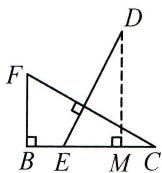

模型 2: 作双垂线构直角三角形相似

$AB \perp BC, DE \perp AF$ ，作 $DM \perp BC, FN \perp AB$

$$
\rightarrow \triangle N F A \sim \triangle M D E
$$

$$
\rightarrow \frac {D E}{A F} = \frac {D M}{F N} = \frac {E M}{A N}.
$$

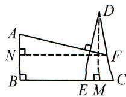

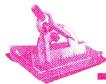

# 典例精讲

# 题型一 构直角三角形相似

【例 1】如图, E, F, G 分别为矩形 ABCD 的边 AD, BC, CD 上的点, $EF \perp AG$ , EC = EF.
求证: $\frac{ED}{DG}=\frac{EF}{AG}.$

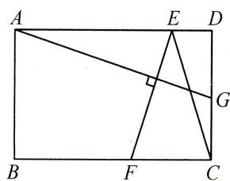

text_image

A
E
D
G
B
F
C

# 题型二 构非直角三角形相似

【例 2】如图, 在四边形 ABCD 中, BA = BC, DA = DC, $\angle BAD = 90^{\circ}$ , $DE \perp CF$ . E, F 分别是 AB, AD 边上的点, DE 与 CF 交于点 G, 求证: $\frac{DE}{CF} = \frac{BE}{AF}$ .

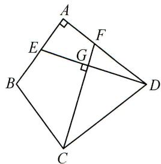

text_image

Geometric diagram of a quadrilateral with labeled vertices and right-angle markers at A, B, C, D, E, F, G

# 实战演练

如图, 在 $\triangle ABC$ 中, $\angle ACB = 90^{\circ}, D, E$ 分别是 $BC, AB$ 边上的点, $AD \perp CE$ , 垂足为 $F$ . $AC = 4, BC = 3$ , 若 $\frac{AD}{CE} = \frac{8}{5}$ , 求 $\frac{BE}{AB}$ 的值.

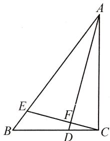

text_image

Geometric diagram of triangle ABC with internal points D, E, F and connecting line segments

# 板块十 旋转型相似

模型 1: 边角边型旋转相似

条件: $\angle1=\angle2,\frac{AB}{AC}=\frac{AD}{AE}.$

结论：

① $\triangle ABD\sim\triangle ACE,\triangle ABC\sim\triangle ADE;$

② $\frac{BD}{CE}=\frac{AB}{AC}=\frac{AD}{AE};\frac{BC}{DE}=\frac{AB}{AD}=\frac{AC}{AE}.$

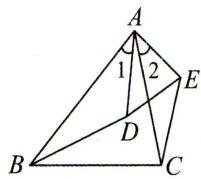

模型 2: 角角型旋转相似

条件: $\angle1=\angle2,\angle3=\angle4.$

结论：

① $\triangle ABD\sim\triangle ACE,\triangle ABC\sim\triangle ADE;$

② $\frac{BD}{CE}=\frac{AB}{AC}=\frac{AD}{AE};\frac{BC}{DE}=\frac{AB}{AD}=\frac{AC}{AE}.$

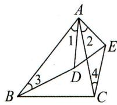

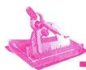

# 典例精讲

# 题型一 作垂线构旋转型相似

【例】如图, 在 Rt△ABC 中, ∠BAC=90°, AD⊥BC, 垂足为 D, O 是 AC 边中点, 连接 BO 交 AD 于点 F, OE⊥OB 交 BC 边于点 E. 若 $\frac{AC}{AB}=n$ , 求 $\frac{OF}{OE}$ 的值.

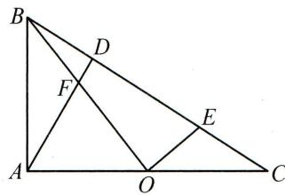

text_image

Geometric diagram of triangle ABC with internal points D, E, F, and O labeled

# 实战演练

# 题型二 构旋转得旋转型相似

如图, 在 Rt△ABC 中, ∠ACB = 90°, ∠ABC = 30°, P 是△ABC 内一点, 若 PA = 2, PB = 2√2, PC = 1, 求 △ABP 的面积.

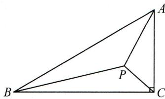

text_image

Geometric diagram of triangle ABC with internal point P and right angle at C

# 第 43 讲 相似与圆

# 板块一 圆中的 A 型相似

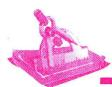

# 典例精讲

# 题型一 连圆心与切点构A型相似

【例】如图, 在 Rt△ABC 中, ∠C=90°, 点 D 在斜边 AB 上, 以 AD 为直径的半圆 O 与 BC 相切于点 E, 与 AC 相交于点 F, 连接 DE. 若 AC=8, BC=6, 求 DE 的长.

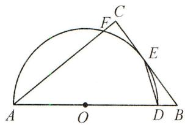

text_image

Geometric diagram showing a semicircle with points A, B, C, D, E, F, and O, including chords and tangent lines.

# 实战演练

# 题型二 知直径连直角构 A 型相似

1. 如图, $AB$ 是 $\odot O$ 的直径, $E$ 为 $\odot O$ 上的一点, $\angle ABE$ 的平分线交 $\odot O$ 于点 $C$ , 过点 $C$ 的直线交 $BA$ 的延长线于点 $P$ , 交 $BE$ 的延长线于点 $D$ . 且 $\angle PCA = \angle CBD$ .

(1)求证:PC 为 $\odot O$ 的切线;  
(2) 若 $PC = 2\sqrt{2}BO, PB = 12$ ，求 $\odot O$ 的半径及 BE 的长.

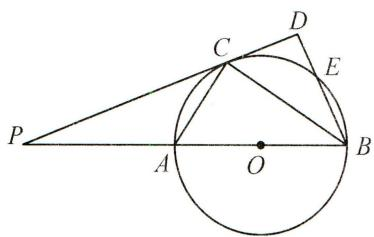

text_image

Geometric diagram showing a circle with points P, A, B, C, D, E and center O, including chords and triangles.

# 题型三 作垂线构 A 型相似

2. 如图, $\triangle ABC$ 内接于 $\odot O$ , 弦 $CD \parallel AB$ , $AD$ 交 $BC$ 于点 $E$ , $EF \perp BC$ 交 $AC$ 于点 $F$ , $\angle D = 60^\circ$ .

(1)求证: $\triangle ABE$ 是等边三角形;  
(2) 若 $AB = 8, AC = 3FC$ , 求 $AC$ 的长.

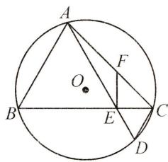

text_image

A
F
O
B
E
C
D

# 板块二 圆中的射影型相似

# 典例精讲

# 题型一 直径+垂径

【例】如图,在 $\odot O$ 中,直径 $AB$ 垂直于弦 $CD$ 于点 $E$ ,连接 $AC,AD,BC$ ,过点 $C$ 作 $CF\perp AD$ 于点 $F$ ,交线段 $OB$ 于点 $G$ (不与点 $O,B$ 重合),连接 $OF$ .

(1) 若 BE=1，求 GE 的长；

(2)求证: $BC^{2} = BG \cdot BO$ .

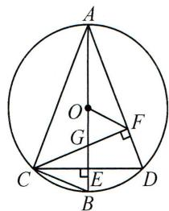

text_image

A
O
G
F
C
E
B
D

# 实战演练

# 题型二 直径+切线

1. 如图, 在 Rt△ABC 中, ∠ACB = 90°, 以 AC 为直径的 ⊙O 交 AB 于点 D, E 是边 BC 的中点, 连接 DE.

(1)求证:DE 是⊙O 的切线;

(2) 若 AD=4, BD=9, 求 DE 的长.

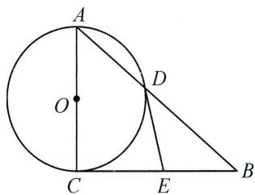

text_image

A
O
D
C
E
B

# 题型三 垂直弦

2. 如图, $\triangle ABC$ 内接于 $\odot O$ , $\angle BAC = 45^{\circ}$ , 过点 $B$ 作 $BC$ 的垂线, 交 $\odot O$ 于点 $D$ , 交 $CA$ 的延长线于点 $E$ , 过点 $B$ 作 $BF \perp AC$ , 垂足为 $M$ , 交 $\odot O$ 于点 $F$ .

(1) 求证: BD = BC;

(2)若 $\odot O$ 的半径 $r=3,BE=6$ ,求 $BF$ 的长.

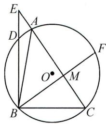

text_image

E
A
D
O
M
B
C
F

# 板块三 圆中的 X 型相似

# 典例精讲

# 题型一 直径+垂径→X型相似

【例】如图, $\triangle ABC$ 内接于 $\odot O,AB=AC,CO$ 的延长线交AB于点D.

(1) 求证: $AO \perp BC$ ;   
(2) 若 $BC = 6, AB = 3\sqrt{10}$ , 求 $\frac{AD}{BD}$ 的值.

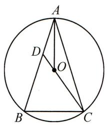

text_image

A
D
O
B
C

# 实战演练

# 题型二 直径+切线→X型相似

1. 如图, 在 $\triangle ABC$ 中, $AB = AC$ , 以 $AB$ 为直径的 $\odot O$ 交 $BC$ 于点 $D$ , 过点 $D$ 作 $\odot O$ 的切线交 $AC$ 于点 $E$ .

(1)求证: $DE \perp AC$ ;   
(2) 连接 OC 交 DE 于点 F，若 AE = 2, DE = 3，求 $\frac{DF}{EF}$ 的值.

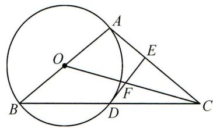

text_image

Geometric diagram showing a circle with points A, B, C, D, E, F and center O, including chords and tangent lines.

# 题型三 直径+双切→X型相似

2. 如图, $PA$ 是 $\odot O$ 的切线, $A$ 是切点, $AC$ 是直径, $AB$ 是弦, 连接 $PB, PC, PC$ 与 $AB$ 相交于点 $E$ , 且 $PA = PB$ .

(1)求证:PB 是 $\odot O$ 的切线;  
(2) 若 $\angle APC = 3\angle BPC$ ，求 $\frac{PE}{CE}$ 的值.

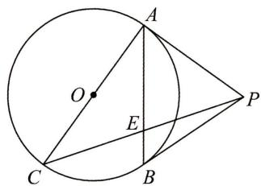

text_image

Geometric diagram showing a circle with points A, B, C, O, P and line segments forming triangles and chords

# 板块四 圆中的母子型相似

# 典例精讲

# 题型一 切割图→母子型相似

【例】如图, $\triangle ABC$ 内接于 $\odot O$ , $AH \perp BC$ 于点 $H$ , 连接 $OC$ , 过点 $A$ 作 $\odot O$ 的切线, 交 $CB$ 的延长线于点 $E$ .

(1) 求证: $\angle BAH = \angle ACO$ ;   
(2) 若 $AC = 24, AH = 18, OC = 13$ , 求 $\frac{BE}{AE}$ 的值.

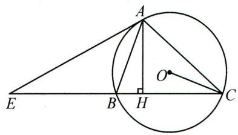

text_image

Geometric diagram showing a triangle ABC inscribed in a circle with perpendiculars from A to BC and BC, labeled points E, B, H, and O.

# 实战演练

# 题型二 等腰图→母子型相似

1. 如图, $AM$ 是 $\odot O$ 的直径, 弦 $BC \perp AM$ , 垂足为 $N$ , 弦 $CD$ 交 $AM$ 于点 $E$ , 交 $AB$ 于点 $F$ , 且 $CD = AB$ . 求证: $CE^2 = EF \cdot ED$ .

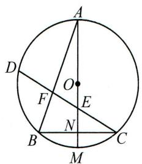

text_image

A
D
O
F
E
B
N
C
M

# 题型三 角分图→母子型相似

2. 如图, $E$ 是 $\triangle ABC$ 的内心, $AE$ 的延长线与边 $BC$ 相交于点 $F$ , 与 $\triangle ABC$ 的外接圆交于点 $D$ .

(1) 求证: $AF^2 = AB \cdot AC - BF \cdot CF$ ;   
(2) 探究 $DF, DE, DA$ 三者之间的等量关系.

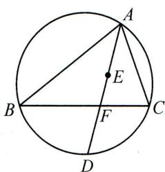

text_image

A
B
C
D
E
F

# 板块五 圆中的仿 A 型相似

# 典例精讲

# 题型一 直接用仿 A 型

【例 1】如图, 四边形 ABCD 内接于 $\odot O$ , AB 是直径, C 是 $\widehat{BD}$ 的中点, 延长 AD, BC 相交于点 E.

(1) 求证: CE = CD;   
(2) 若 AB = 3, BC = $\sqrt{3}$ , 求 AD 的长.

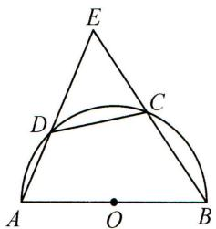

text_image

Geometric diagram with labeled points A, B, C, D, E, O and arcs, likely from a math problem or proof.

# 题型二 构仿 A 型相似

【例 2】如图, $\odot O$ 的两条弦 CB 和 DE 的延长线交于点 A, BD = BC, $\angle DBC = 60^{\circ}$ , AE = 3, DE = 4.

(1)求 ${DB}$ 的长；  
(2)求 ${AB}$ 的长.

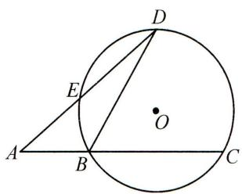

text_image

Geometric diagram showing a circle with points A, B, C, D, E and center O, including chords and tangent lines.

# 实战演练

如图, $AB$ 是 $\odot O$ 的直径, $BA$ 与弦 $DC$ 的延长线交于点 $P$ , $OD$ 平分 $\angle CDB$ .

(1) 求证: $AC \parallel OD$ ;   
(2) 若 PA=5, PC=6, 求 $\odot O$ 的半径.

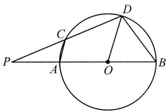

text_image

Geometric diagram showing a circle with points P, A, B, C, D and center O, including chords and tangent lines.

# 板块六 圆中的旋转型相似

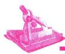

# 典例精讲

# 题型一 直接用旋转型相似

【例】如图, $\triangle ABC$ 是 $\odot O$ 的内接三角形,AB是 $\odot O$ 的直径, $AC=\sqrt{5}$ , $BC=2\sqrt{5}$ ,点F在AB上,连接CF并延长,交 $\odot O$ 于点D,连接BD,作 $BE\perp CD$ ,垂足为E.

(1) 求证: $\triangle DBE \sim \triangle ABC$ ;   
(2) 若 ${AF} = 2$ ,求 ${ED}$ 的长.

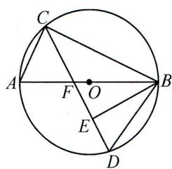

text_image

C
A	F	O	B
E
D

# 实战演练

# 题型二 作直径构旋转型相似

1. 如图, $\triangle ABC$ 内接于 $\odot O, CD \perp AB$ 于 $D$ , 若 $BD = 1, CD = 3, AC = 4$ , 求 $\odot O$ 的半径.

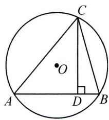

text_image

Geometric diagram of a circle with inscribed triangle ABC and point D on the circumference, showing perpendicular from center O to chord AB at D.

# 题型三 连半径构旋转型相似

2. 如图, $AC$ 是 $\odot O$ 的直径, $BC$ 是 $\odot O$ 的弦, $P$ 是 $\odot O$ 外一点, 连接 $PB, AB, \angle PBA = \angle C$ .

(1)求证:PB 是 $\odot O$ 的切线;  
(2) 连接 OP，若 $OP \parallel BC$ ，且 OP = 8， $\odot O$ 的半径为 $2\sqrt{2}$ ，求 BC 的长.

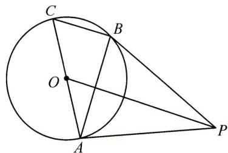

text_image

Geometric diagram showing a circle with points A, B, C, O, and P, including chords and tangent lines.

# 第 44 讲 相似与函数

# 板块一 相似与反比例函数

# 典例精讲

# 题型一 知线段比构 A 型相似

【例 1】如图, 矩形 ABCD 的边 AB 平行于 x 轴, 反比例函数 $y = \frac{k}{x} (x > 0)$ 的图象经过点 B, D, 对角线 CA 的延长线经过原点 O, 且 AC = 2AO. 若矩形 ABCD 的面积是 8, 求 k 的值.

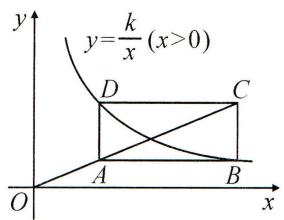

text_image

y
y=k/x(x>0)
D	C
O	A	B
x

# 题型二 知直角构一线三垂直相似

【例 2】如图, 在 $\triangle ABC$ 中, $\angle BAC=90^{\circ}, AB=2AC$ , 点 $A(2,0), B(0,4)$ , 点 $C$ 在第一象限内, 双曲线 $y=\frac{k}{x}(x>0)$ 经过点C. 将 $\triangle ABC$ 沿 $y$ 轴向上平移 $m$ 个单位长度, 使点 $A$ 恰好落在双曲线上, 求 $m$ 的值.

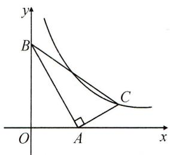

text_image

y
B
C
O
A
x

# 实战演练

如图, 直线 $y = \frac{1}{3} x + 3$ 与双曲线 $y = \frac{12}{x}$ 交于 $B, C$ 两点, 点 $A$ 在第一象限内的双曲线上, 且 $\angle CAB = 90^\circ$ , 求点 $A$ 的坐标.

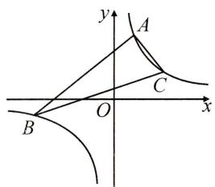

text_image

y
A
C
O
x
B

# 板块二 相似与二次函数(一) 线段比

条件: $\frac{PE}{AE}$ 为定值k.

方法:作 $PF \parallel x$ 轴交 BC 的延长线于点 F.

结论: $x_{P}-x_{F}=kAB.$

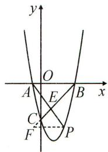

text_image

y
O
A
E
B
x
C
F'
P

条件: C 为 AB 上的定点.

$\frac{PE}{EC}$ 为定值 $k$

方法:作 $PF \perp x$ 轴于点 F, 作 $CD \perp x$ 轴于点 D.

结论: $y_{P}=-k y_{C}$ .

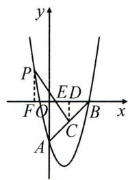

text_image

y
P
E
D
F
O
B
x
A
C

# 典例精讲

# 题型一 作垂线构 X 型相似

【例】如图,抛物线 $y=x^{2}-3x-4$ 与 y 轴交于点 A, 与 x 轴正半轴交于点 B, C 为 AB 的中点. P 为第二象限抛物线上一点, PC 与 x 轴交于点 E, 若 $\frac{PE}{EC}=\frac{3}{2}$ , 求点 P 的横坐标.

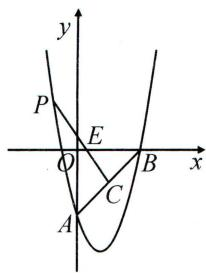

text_image

y
P
E
O
B
x
A
C

# 实战演练

# 题型二 作平行线构 X 型相似

如图, 抛物线 $y=ax^{2}+bx$ 经过 A(4,0), B(1,4) 两点. P 是抛物线上一点, 且在直线 AB 的上方.

(1) 写出抛物线的解析式；  
(2) OP 交 AB 于点 C, PD // BO 交 AB 于点 D. 记 $\triangle CDP, \triangle CPB, \triangle CBO$ 的面积分别为 $S_{1}, S_{2}, S_{3}$ . 求 $\frac{S_{1}}{S_{2}} + \frac{S_{2}}{S_{3}}$ 的最大值.

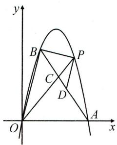

text_image

y
B
P
C
D
O
A
x

# 板块三 相似与二次函数(二)垂直弦

条件： $PE \perp BC$ ， $PE$ 为定长 $k$

方法:作 $PN \parallel y$ 轴.

结论: $y_{P}-y_{N}=\frac{kBC}{OB}.$

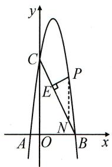

text_image

y
C
P
E
N
A O B x

条件: $PD \perp AC, \frac{PE}{DE}$ 为定值k.

方法:作 $PM \parallel y$ 轴, $PN \perp y$ 轴.

结论: $y_{P}-y_{M}=kCD$ ,

$$
\frac {- x _ {P}}{y _ {P} - y _ {D}} = \frac {O C}{O A}.
$$

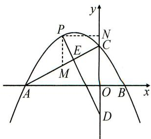

text_image

P
E
M
A
O B x
D
N
C
y

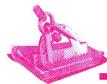

# 典例精讲

# 题型一 构单相似

【例】如图,在平面直角坐标系中,O为坐标原点,抛物线 $y=-2x^{2}+6x+8$ 与y轴交于C点,交x轴于A,B两点(点A在点B的左边),P为抛物线第一象限上一点. $PE\perp$ 直线BC于点E.若 $PE=\sqrt{5}$ ,求点P的横坐标.

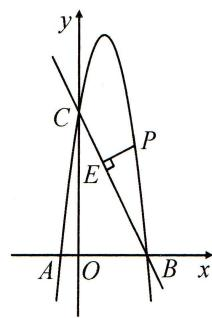

text_image

y
C
P
E
A O B x

# 实战演练

# 题型二 构双相似

如图,在平面直角坐标系中,抛物线 $y=-\frac{1}{4}x^{2}+bx+c(b,c$ 是常数)经过点 B(2,0), 点 C(0,3), 抛物线与 x 轴负半轴交于点 A.

(1)求此抛物线解析式;   
(2) $P$ 为第二象限抛物线上一点, 过点 $P$ 作 $AC$ 的垂线, 分别交 $AC, y$ 轴于点 $E, D$ . 若 $DE = 2PE$ , 求点 $P$ 的横坐标.

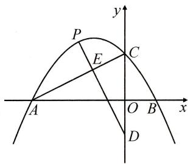

text_image

P
E
C
A
O B x
D
y

# 板块四 相似与二次函数(三) 位置关系构相似

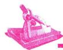

# 典例精讲

# 题型一 线段平行构相似

【例】如图,抛物线 $y=ax^{2}+bx+c$ 经过点 A(-1,0), 点 B(3,0), 点 C(0,3), 连接 AC.

(1)直接写出抛物线的解析式；  
(2) 过抛物线上第一象限内的一点 P 作 $PQ \parallel AC$ ，交 BC 于点 Q，若 $PQ = \frac{1}{2} AC$ ，求点 P 的坐标.

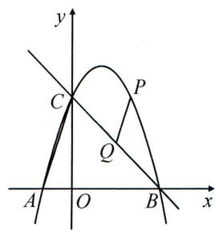

text_image

y
C
P
Q
A
O
B
x

# 实战演练

# 题型二 线段垂直构相似

如图, 抛物线 $y = -x^{2} + bx + c$ 与 x 轴交于点 A(-3,0), B(2,0), 与 y 轴正半轴交于点 C.

(1)直接写出抛物线的解析式；  
(2) 直线 $y=\frac{1}{2}x+m$ 与抛物线交于点 M, N, 若 $\angle MON=90^{\circ}$ , 求 m 的值.

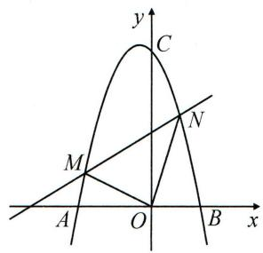

text_image

y
C
M
N
A
O
B
x

# 板块五 相似与二次函数(四) 角度关系构相似

# 典例精讲

# 题型一 等角构相似

【例】已知抛物线 $y=\frac{1}{2}x^{2}+c$ 与 x 轴交于 A(-1,0), B 两点，交 y 轴于点 C.

(1)求抛物线的解析式;

(2)如图,点 $E(m,n)$ 是第二象限内一点,过点 $E$ 作 $EF \perp x$ 轴交抛物线于点 $F$ , 过点 $F$ 作 $FG \perp y$ 轴于点 $G$ , 连接 $CE, CF$ , 若 $\angle CEF = \angle CFG$ . 求 $n$ 的值.

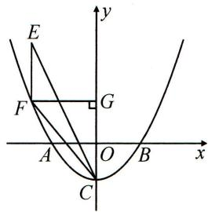

text_image

E
F
G
A
O
B
x
y
C

# 实战演练

# 题型二 角度关系构相似

如图, 抛物线 $y = \frac{2}{3} x^2 - \frac{2}{3} x - 4$ 与 $x$ 轴交于 $A, B$ 两点 ( $A$ 在 $B$ 点左边), 与 $y$ 轴交于 $C$ 点, $E$ 是 $x$ 轴上方抛物线上一点, 且 $\frac{1}{2} \angle AEB + \angle BAE = 45^\circ$ .

(1)直接写出点A,B的坐标；

(2)求点 E 的纵坐标.

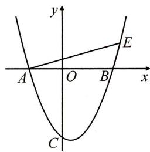

text_image

y
A O B x
C
E

# 板块六 相似与二次函数(五) 分类讨论

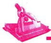

# 典例精讲

【例】如图, 抛物线 $y = \frac{1}{2} x^2 - 2x - \frac{5}{2}$ 交 $x$ 轴于 $A, B$ 两点 ( $A$ 在 $B$ 的左侧), 交 $y$ 轴于点 $C, D$ 为第四象限的抛物线上一点, $DE \perp BC$ 于点 $E$ . 若 $\triangle CDE$ 与 $\triangle OBC$ 相似, 求点 $D$ 的坐标.

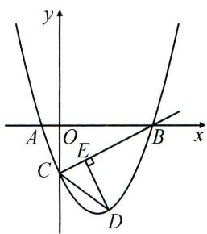

text_image

y
A O E B x
C D

# 实战演练

抛物线 $y=x^{2}-2x-8$ 交 x 轴于 A, B 两点 (A 在 B 的左边), 交 y 轴于点 C.

(1)直接写出 A, B, C 三点的坐标；  
(2)如图,作直线 $x = t (0 < t < 4)$ ,分别交 $x$ 轴,线段 $BC$ ,抛物线于 $D, E, F$ 三点,连接 $CF$ . 若 $\triangle BDE$ 与 $\triangle CEF$ 相似,求 $t$ 的值.

text_image

y
A O B x
C

# 第 45 讲 尺规作图与相似

# 板块一 尺规作图(一) 作相似

# 典例精讲

【例】如图,已知 $\triangle ABC$ 和点 $A'$ .

(1)以点 $A'$ 为一个顶点作 $\triangle A'B'C'$ , 使 $\triangle A'B'C'\sim\triangle ABC$ , 且 $\triangle A'B'C'$ 的面积等于 $\triangle ABC$ 面积的 4 倍; (要求: 尺规作图, 不写作法, 保留作图痕迹)  
(2) 设 $D, E, F$ 分别是 $\triangle ABC$ 三边 $AB, BC, AC$ 的中点, $D', E', F'$ 分别是所作的 $\triangle A'B'C'$ 三边 $A'B', B'C', C'A'$ 的中点, 求证: $\triangle DEF \sim \triangle D'E'F'$ .

text_image

C
A B A'

# 实战演练

如图,在正方形 ABCD 中,E 为 AD 的中点,连接 EC.

(1)作 $\triangle AEF \sim \triangle DCE$ ,点 $F$ 在边 $AB$ 上;(要求:尺规作图,不写作法,保留作图痕迹)   
(2)在(1)的条件下,连接CF,求证: $\triangle AEF\sim\triangle ECF$ .

text_image

A E D
B C

# 板块二 尺规作图(二) 用相似

# 典例精讲

【例】如图,已知线段 $MN = a$ , $AR \perp AK$ ,垂足为 $A$ .

(1)求作四边形 ABCD, 使得点 B, D 分别在射线 AK, AR 上, 且 AB = BC = a, $\angle ABC = 60^{\circ}$ , CD // AB; (要求: 尺规作图, 不写作法, 保留作图痕迹)  
(2)设 P, Q 分别为(1)中四边形 ABCD 的边 AB, CD 的中点, 求证: 直线 AD, BC, PQ 相交于同一点.

text_image

R
A
K
M a N

# 实战演练

如图, 在 Rt△ABC 中, ∠ACB = 90°.

(1)求作菱形 ADEF, 使得点 D, E, F 分别在边 AB, BC, AC 上; (要求: 尺规作图, 不写作法, 保留作图痕迹)  
(2)在(1)的条件下,若 CF=2,AD:DB=2:3,求 CE 的长.

natural_image

Simple geometric diagram of a right triangle labeled A, C, and B (no additional text or symbols)

# 板块三 尺规作图(三) 圆中相似

# 典例精讲

# 题型一 切线与相似

【例】弗朗索瓦·韦达是十六世纪法国最杰出的数学家之一,最早提出“切割线定理”(圆幂定理之一),指的是从圆外一点引圆的切线和割线,则切线长是这点到割线与圆交点的两条线段长的比例中项,下面紧跟着圆的切线作图的思路尝试证明与运用.

(1)如图,已知 $AB$ 是 $\odot O$ 的直径, $P$ 是 $BA$ 延长线上的一点. 过点 $P$ 作 $\odot O$ 的一条切线, 切点为 $E$ ; (尺规作图:保留作图痕迹, 不写作法)  
(2) 若 $\odot O$ 半径 $OB = 4, PB = 14$ , 尝试证明“切割线定理”并计算出 $PE$ 的长度.

text_image

B
O
A
P

# 实战演练

# 题型二 二次相似

如图, 在 Rt△ABC 中, ∠ACB=90°, 点 D 在 AB 上, CD=BC.

(1)尺规作图:求作 $\odot O$ ,使得圆心O在AC上, $\odot O$ 经过A,D两点;(保留作图痕迹,不写作法)  
(2)在(1)的条件下, $\odot O$ 与AC的另一个交点为F, $DE\perp AC$ 交 $\odot O$ 于点E.求证:直线BE经过点F.

text_image

Geometric diagram of triangle ABC with point D on side AB and line segment DC drawn

# 第 46 讲 相似三角形综合探究

# 板块一 特殊到一般

# 典例精讲

【例】已知 $\angle ACE=\angle BCD=90^{\circ},\frac{CE}{AC}=\frac{CD}{CB}=2$ ，过点 $C$ 作 $AB$ 的垂线，分别交 $AB,DE$ 于点 $G,F$ .

(1)如图1,当CA=CB, $\angle ECD=90^{\circ}$ 时,求证:CF=AB;   
(2)如图2,当 $CA\neq CB,\angle ECD\neq90^{\circ}$ 时,(1)中结论成立吗?说明理由.

text_image

Geometric diagram of a trapezoid with labeled vertices and intersection points, including perpendicular lines and a right angle at G.

图1

text_image

Geometric diagram with labeled points and intersecting lines, likely from a math problem or proof

图2

# 实战演练

【问题提出】如图1,四边形ABCD为平行四边形,AC=AD,E为AB边上一动点,连接DE交AC于点G.F为射线BA上一点, $\angle EDF=\angle ADC$ .探究FG与FD的数量关系.

(1)【特殊化】如图2,当 $\angle EDF=60^{\circ}$ 时,直接写出FG与FD的数量关系;  
(2)【一般化】在图1中, $\angle EDF\neq60^{\circ}$ 时,(1)中结论还是否成立?说明理由.

text_image

Geometric diagram with labeled points A, B, C, D, E, F, G forming intersecting triangles and quadrilaterals

图1

text_image

Geometric diagram with labeled points A, B, C, D, E, F, G and intersecting lines forming triangles and quadrilaterals

图2

# 板块二 类比推理

# 典例精讲

【例】在 $\triangle ABC$ 中, $AB=AC,D$ 为射线 $BA$ 上一点, $AB=2AD,E$ 为射线 $CB$ 上一点, $DE=DC$ .

(1)如图1,当点D在AB上时,求证:BC=2BE;   
(2)如图 2, 当 D 为 BA 的延长线上一点时, (1)中结论是否成立? 说明理由.

text_image

A
D
E B C

图1

  
图2

# 实战演练

(1)如图1,在矩形ABCD中,AD=2CD.E为AB上一个动点,过点C作CG⊥DE于点G,CG的延长线交AD于点F,求证:DE=2CF;  
(2)如图2,在梯形ABCD中, $\angle A=\angle B=90^{\circ},AB=2AD$ ,过点C作ED的垂线,分别交AD,ED的延长线于点F,G.求证:CF=2DE.

text_image

A
F
D
G
E
B
C

图1

text_image

Geometric diagram of a square with labeled points and right angle at G, showing line segments and a right angle marker.

图2

# 板块三 全等与相似结合

# 典例精讲

# 题型一 全等到相似

【例】已知 $AD$ 是 $BC$ 的垂直平分线，垂足为 $D, F$ 为 $AD$ 上一动点， $DE \perp CF$ 于点 $E$ ，连接 $AE, AB$ .

(1)如图1,若AD=BC,且F为AD的中点,直接写出AB与AE的数量关系为  
(2)如图2,若 $AD \neq BC$ ,且F,G分别为AD,AB的中点,求证: $\frac{EG}{AB} = \frac{1}{2}$ .

text_image

Geometric diagram of triangle ABC with perpendiculars from points E and D to sides AC and BC, labeled with points A, B, C, D, E, F.

图1

text_image

Geometric diagram of triangle ABC with perpendiculars and labeled points E, D, F, G

图2

# 实战演练

# 题型二 全等与相似

如图, 在正方形 $ABCD$ 中, $E, F$ 为边 $AB$ 上的三等分点, 点 $A$ 关于 $DE$ 的对称点为 $A', AA'$ 的延长线交 $BC$ 于点 $G$ .

(1)求证: $DE \parallel A^{\prime}F$ ;   
(2)求 $\angle GA^{\prime}B$ 的大小；  
(3) 求证: $A^{\prime} C = 2 A^{\prime} B$ .

text_image

Geometric diagram of a square with labeled points and intersecting lines, likely for a geometry problem or proof.

# 板块四 综合与实践

【动手操作】如图1,已知正方形纸片ABCD,E为CD边上一点,连接BE,折叠纸片AB-CD,使点E落在AD边上的点M处,折痕为DB,展开纸片,再折叠该正方形纸片,使AB与CD重合,点M落在AD上的点F处,折痕为PQ.

【思考探究】(1)直接写出 CF 与 BE 的关系：\_\_\_\_；

(2)如图 2, PQ 与 DB, BE 分别交于点 S, T. 若 DE = 2CE, 求证: SE = BT;

【深入探究】(3)如图3,设BE与CF相交于点G,继续折叠该正方形纸片,使点E落在CB上的点H处,折痕为AC,展开纸片.求证: $\triangle ABG\sim\triangle HCG$ .

text_image

Geometric diagram of a square with labeled points and intersecting lines, likely for a math problem or proof.

图1

text_image

Geometric diagram of a square with labeled points and intersecting lines, including a dashed line from P to Q.

图2

text_image

Geometric diagram of a square with labeled points and lines, including dashed auxiliary lines

图3

# 第二十八章 锐角三角函数

# 第 47 讲 锐角的三种三角函数

# 板块一 求锐角三角函数值

# 典例精讲

# 题型一 发现直角

【例 1】如图是由边长为 1 的小正方形组成的 $4 \times 4$ 网络, $\triangle ABC$ 的三个顶点均在格点上. 求 $\cos \angle BAC$ 的值.

text_image

A
B
C

# 题型二 构造直角

【例 2】如图, 在边长为 1 的小正方形组成的网格中, 点 A, B, C 都是小正方形的顶点, 经过 A, B, C 三点的圆交网格线于点 D, 连接 AD, CD. 求 $\sin \angle ADC$ 的值.

text_image

Geometric diagram showing a circle with points A, B, C, D and center O, plotted on a grid background

# 实战演练

# 题型三 等比代换

1. 如图, $AB$ 是 $\odot O$ 的直径, 且 $AB = 10$ , $CD$ 是 $\odot O$ 的弦, $AD$ 与 $BC$ 相交于点 $P$ . 若 $CD = 6$ , 求 $\cos \angle APC$ 的值.

text_image

C
D
P
A
O
B

# 题型四 等角代换

2. 如图, $AB$ 为 $\odot O$ 的直径, 点 $P$ 在 $AB$ 的延长线上, $PC, PD$ 与 $\odot O$ 相切, 切点分别为 $C, D$ . 若 $AB = 6, PC = 4$ , 求 $\sin \angle CAD$ 的值.

text_image

A
O
B
P
C
D

# 板块二 知三角函数值求值

# 典例精讲

# 题型一 知半角求倍角

【例 1】已知 $0^{\circ}<\alpha<45^{\circ}$ ，且 $\tan\alpha=\frac{3}{4}$ ，求 $\tan2\alpha$ 的值.

# 题型二 知倍角求半角

【例 2】已知 $\alpha$ 是锐角，且 $\cos\alpha=\frac{4}{5}$ ，求 $\tan\frac{\alpha}{2}$ 的值.

# 实战演练

# 题型三 求线段长

如图， $\triangle ABC$ 是边长为 6 的等边三角形， $E$ 是 $BC$ 上的一点，且 $\tan \angle CAE = \frac{\sqrt{3}}{6}$ .

(1)求 $CE$ 的长；  
(2) $F$ 是 $BE$ 上的一点, 且 $\angle EAF = 30^{\circ}$ , 求 $BF$ 的长.

text_image

A
B F E C

# 第 48 讲 解直角三角形及其应用

# 板块一 解直角三角形

# 典例精讲

# 题型一 “化斜为直”解直角三角形

【例】在 $\triangle ABC$ 中, $AB=6,AC=\sqrt{5},\sin B=\frac{1}{3}$ .求 $BC$ 的长.

# 实战演练

# 题型二 “发现隐直角”解直角三角形

1. 如图, 在四边形 $ABCD$ 中, $\tan A = \frac{1}{2}, \angle B = \angle C = 135^\circ, AB = 9, CD = 3$ . 求 $BC$ 的长.

natural_image

Simple geometric diagram of a quadrilateral with vertices labeled A, B, C, D (no text or symbols beyond labels)

# 题型三 “巧设参数法”解直角三角形

2. 如图, 在 $\triangle ABC$ 中, $AB = AC$ , $D$ , $E$ 分别是 $AB$ , $AC$ 上的一点, $DE$ 的延长线与 $BC$ 的延长线交于点 $F$ , 且 $CE = CF$ , $\tan \angle AED = \frac{1}{2}$ .

(1) 求 $\sin B$ 的值;  
(2)若 $BD = 5$ ，求 $DF$ 的长.

text_image

A
D
E
B
C
F

# 板块二 化“斜”为“直”的常见类型

# 典例精讲

# 题型一 作高 $\rightarrow$ 解斜三角形

【例 1】如图, 在锐角 $\triangle ABC$ 中, AB = AC, $\tan B = \frac{3}{2}$ . 求 $\sin \angle BAC$ 的值.

natural_image

Simple geometric triangle diagram labeled A, B, C at vertices (no additional text or symbols)

# 题型二 作垂 $\rightarrow$ 构直角三角形

【例 2】如图, 在 $\triangle ABC$ 中, $\angle ACB=90^{\circ}$ , $D,E$ 是直线 $AB$ 上的两点, 且 $DA=BE=\frac{1}{2}AB$ , 连接 $CD,CE$ . 求 $\tan\angle ACD\cdot\tan\angle BCE$ 的值.

text_image

C
D A B E

# 实战演练

# 题型三 延长→构直角三角形

1. 如图, 在四边形 $ABCD$ 中, $\angle ABC = \angle ADC = 90^{\circ}, AB = 3, CD = 2, \sin A = \frac{4}{5}$ . 求四边形 $ABCD$ 的面积.

text_image

A
B C
D

# 题型四 连线 $\rightarrow$ 构直角三角形

2. 如图, 在矩形 $ABCD$ 中, $E$ 是边 $BC$ 的中点, 将 $\triangle ABE$ 沿 $AE$ 翻折得到 $\triangle AFE$ , 连接 $CF$ . 若矩形 $ABCD$ 的面积为 $24$ , $\tan \angle ECF = \frac{4}{3}$ , 求 $CF$ 的长.

text_image

Geometric diagram of a square with labeled vertices A, B, C, D and internal points E, F, showing triangles and dashed lines.

# 板块三 解直角三角形中的分类讨论

# 典例精讲

# 题型一 腰(底)不明

【例 1】在等腰 $\triangle ABC$ 中， $\angle A=30^{\circ},AB=8$ ，则 $\triangle ABC$ 的面积为 \_\_\_\_.

# 题型二 高的位置不明

【例 2】 在 $\triangle ABC$ 中, $AB=4$ , $BC=6$ , $\triangle ABC$ 的面积为 $6\sqrt{3}$ . 则 $\angle B$ 的度数为\_\_\_\_.

# 实战演练

# 题型三 直角不明

1. 如图, 在 $\triangle ABC$ 中, $\angle A = 30^{\circ}$ , $\tan B = \frac{1}{2}$ , $P$ 是 $AB$ 上的一点. 若 $\triangle ACP$ 是直角三角形, 则 $\frac{BP}{AP}$ 的值为 \_\_\_\_.

natural_image

Simple geometric diagram of a quadrilateral labeled A, B, and C (no additional text or symbols)

# 题型四 动点位置不明

2. 在 $\triangle ABC$ 中, $AC=2\sqrt{5}$ , $D$ 为直线 $AB$ 上的一点, 且 $AB=3BD$ . 若 $\tan\angle BCD=\frac{1}{3}$ , 且 $CD\perp AC$ , 则 $BC$ 的长为\_\_\_\_.

# 板块四 解直角三角形的实际应用

# 典例精讲

# 题型一 仰角、俯角

【例 1】如图, 在小山的东侧 A 点有一个热气球, 由于受西风的影响, 以 30 米/分钟的速度沿与地面成 $75^{\circ}$ 角的方向飞行, 25 分钟后到达 C 处, 此时热气球上的人测得小山西侧 B 点的俯角为 $30^{\circ}$ , 则小山东西两侧 A, B 两点间的距离为 \_\_\_\_ 米(结果保留根号).

text_image

30°
75°
B
A
C

# 题型二 方位角

【例 2】如图, B 港口在 A 港口的南偏西 $25^{\circ}$ 方向上, 距离 A 港口 100 海里处. 一艘货轮航行到 C 处, 发现 A 港口在货轮的北偏西 $25^{\circ}$ 方向, B 港口在货轮的北偏西 $70^{\circ}$ 方向. 则此时货轮与 A 港口的距离为 \_\_\_\_ 海里 (结果取整数). (参考数据: $\sin50^{\circ}\approx0.766$ , $\cos50^{\circ}\approx0.643$ , $\tan50^{\circ}\approx1.192$ , $\sqrt{2}\approx1.414$ )

text_image

北
东
25°
70°
B
C

# 题型三 坡度

【例 3】一个长方体木箱沿斜面下滑, 当木箱滑至如图所示位置时, AB = 3 m, 已知该斜坡的坡度 $i = 1 : \sqrt{3}$ , 木箱的高 $BE = \sqrt{3}$ m, 则木箱的端点 E 处距离地面 AC 的高度为 \_\_\_\_ m.

text_image

E
B
A
C

# 实战演练

1. 如图, 某城市的电视塔 $AB$ 坐落在湖边, 数学老师带领学生隔湖测量电视塔 $AB$ 的高度, 在点 $M$ 处测得塔尖点 $A$ 的仰角为 $22.5^{\circ}$ , 沿射线 $MB$ 方向前进 200 米到达湖边点 $N$ 处, 测得塔尖点 $A$ 在湖中的倒影点 $A'$ 的俯角为 $45^{\circ}$ , 则电视塔 $AB$ 的高度为 \_\_\_\_ 米 (结果保留根号).

text_image

Geometric diagram showing points M, N, A, B, A' connected by solid and dashed lines, likely illustrating a reflection or perspective concept.

2. 在一次海上救援中, 两艘专业救助船 $A, B$ 同时收到某事故渔船 $P$ 的求救讯息, 已知此时救助船 $B$ 在 $A$ 的正北方向, 事故渔船 $P$ 在救助船 $A$ 的北偏西 $30^{\circ}$ 方向上, 在救助船 $B$ 的西南方向上, 且事故渔船 $P$ 与救助船 $A$ 相距 120 海里. 则在收到求救讯息时, 事故渔船 $P$ 与救助船 $B$ 之间的距离为 \_\_\_\_ 海里 (结果保留根号).

text_image

北
B
P
A

3. 如图, 直立于地面上的电线杆 $AB$ , 在阳光下落在水平地面和坡面上的影子分别是 $BC, CD$ , 测得 $BC = 5$ 米, $CD = 4$ 米, $\angle BCD = 150^\circ$ , 在点 $D$ 处测得电线杆顶端 $A$ 的仰角为 $45^\circ$ , 则电线杆 $AB$ 的高度约为 \_\_\_\_ 米. (参考数据: $\sqrt{2} \approx 1.414, \sqrt{3} \approx 1.732$ , 结果精确到 $0.1 \mathrm{~m}$ )

text_image

A
45°
B C D

# 第 49 讲 三角函数小综合

# 板块一 三角函数与三角形、四边形

# 典例精讲

【例】（1）如图1，在 $\triangle ABC$ 中， $\angle ACB=\alpha$ . 求证： $S_{\triangle ABC}=\frac{1}{2}AC\cdot BC\cdot\sin\alpha$ ；

(2)如图2,在锐角 $\triangle ABC$ 中, $BE\perp AC$ 于点 $E,CF\perp AB$ 于点 $F$ .求证: $\frac{S_{\triangle AEF}}{S_{\triangle ABC}}=\cos^{2}A$ ;

(3)如图3,在四边形ABCD中,对角线AC与BD相交于点O,且 $\angle AOB=\alpha$ .求证: $S_{\text{四边形ABCD}}=\frac{1}{2}AC\cdot BD\cdot\sin\alpha$ .

text_image

A
B
α
C

图1

text_image

Geometric diagram of triangle ABC with internal points E, F and connecting lines forming smaller triangles

图2

text_image

A
B
O
C
D

图3

# 实战演练

如图, 在 $\triangle ABC$ 中, $\angle ACB = 90^{\circ}, \angle CAB = 30^{\circ}$ , 以 $AB$ 为边作等边 $\triangle ABD$ , 将四边形 $ACBD$ 沿直线 $EF$ 折叠, 使点 $D$ 与点 $C$ 重合, $CE, CF$ 分别与 $AB$ 交于点 $G, H$ .

(1) 求 $\cos\angle CHA$ 的值；  
(2) 求 $\tan \angle CEF$ 的值.

text_image

Geometric diagram with labeled points and lines, likely from a math problem or proof

# 板块二 三角函数与抛物线

# 典例精讲

# 题型一 知三角函数值

【例】如图,抛物线 $y=ax^{2}+4x+3a(a<0)$ 与 x 轴交于 A, B 两点(点 A 在点 B 的左侧),与 y 轴交于点 C, 连接 AC, 且 $\tan\angle OAC=3$ .

(1)求抛物线的解析式;   
(2) $D$ 是第四象限内的抛物线上一点, 若 $\tan \angle ACD = 2$ , 求点 $D$ 的横坐标.

text_image

y
A
B
O
x
C
D

# 实战演练

# 题型二 隐三角函数值

如图, 抛物线 $y = -\frac{1}{2} x^2 + \frac{3}{2} x + 2$ 与 $x$ 轴交于点 $A, C$ (点 $A$ 在点 $C$ 的右侧), 与 $y$ 轴交于点 $B, P$ 为直线 $AB$ 下方的抛物线上一点, 且 $\angle PBA = 2\angle BAC$ .

(1)求 $\tan \angle PBA$ 的值；  
(2)求点 $P$ 的坐标.

text_image

y
B
C
O
A
x

# 板块三 三角函数与双曲线

# 典例精讲

# 题型一 知函数解析式求三角函数值

【例】在平面直角坐标系中, 将一块直角三角板如图放置, 直角顶点与原点 O 重合, 顶点 A, B 恰好分别落在双曲线 $y = -\frac{1}{x} (x < 0)$ , $y = \frac{4}{x} (x > 0)$ 上. 求 $\tan \angle OAB$ 的值.

text_image

y
A
O
x
B

# 实战演练

# 题型二 知三角函数值确定反比例函数解析式

1. 如图,菱形 $OABC$ 的一边 $OA$ 在 $x$ 轴的负半轴上, 点 $O$ 是坐标原点, $\tan \angle AOC = \frac{4}{3}$ , 反比例函数 $y = \frac{k}{x}$ 的图象经过点 $C$ , 与 $AB$ 交于点 $D$ . 若 $\triangle COD$ 的面积为 20 , 求 $k$ 的值.

text_image

B
C
D
A
O
x
y

# 题型三 知三角函数值确定未知函数解析式

2. 如图, $P$ 是双曲线 $y = \frac{1}{x} (x > 0)$ 上的一动点, 过点 $O$ 作 $OQ \perp OP$ , 且满足 $\tan \angle OQP = \frac{1}{3}$ . 探究发现: 当点 $P$ 运动时, 点 $Q$ 也随之在某条曲线 $C$ 上运动. 求曲线 $C$ 的解析式.

text_image

y
P
O
x
Q

# 板块四 三角函数与尺规作图

# 典例精讲

# 题型一 求三角函数值

【例】如图, $BD$ 是矩形ABCD的对角线.

(1)求作 $\odot A$ ,使得 $\odot A$ 与 $BD$ 相切;(要求:尺规作图,不写作法,保留作图痕迹)   
(2)在(1)的条件下,设 BD 与 $\odot A$ 相切于点 E, $CF \perp BD$ , 垂足为 F. 若直线 CF 与 $\odot A$ 相切于点 G, 求 $\tan \angle ADB$ 的值.

text_image

D
C
A
B

# 实战演练

# 题型二 用三角函数值

如图, 在 $\triangle ABC$ 中, AB = AC = 3, $\cos\angle ABC = \frac{1}{3}$ .

(1)在边 $AC$ 上求作一点 $D$ , 使得 $BD$ 平分 $\triangle ABC$ 的周长; (保留作图痕迹, 不写作法)  
(2)在(1)的条件下,将 $\triangle ABD$ 绕点 $B$ 顺时针旋转 $\alpha(0^{\circ}<\alpha<90^{\circ})$ 得到 $\triangle A^{\prime}BD^{\prime}$ ,若点 $A$ 的对应点 $A^{\prime}$ 在 $BC$ 的延长线上,求证: $A,C,D^{\prime}$ 三点共线.

natural_image

Simple geometric diagram of a triangle labeled A, B, and C (no additional text or symbols)

# 第50讲 三角函数与圆

# 板块一 作垂线构直角

# 典例精讲

【例】如图,在等边 $\triangle ABC$ 中,点 $O$ 在边 $BC$ 上,以 $OC$ 为半径的 $\odot O$ 交 $AC$ 于点 $D$ ,过点 $D$ 作 $DE \perp AB$ 于点 $E$ .

(1)求证:DE 为 $\odot O$ 的切线;  
(2)连接 AO 交 DE 于点 F. 若 OF = 2AF, 求 $\tan \angle CAO$ 的值.

text_image

Geometric diagram showing a triangle with an inscribed circle and labeled points A, B, C, D, E, F, O

# 实战演练

如图, 四边形 $ABCD$ 内接于 $\odot O, AB = AC, AC \perp BD$ , 垂足为 $E$ , 点 $F$ 在 $BD$ 的延长线上, 且 $DF = DC$ , 连接 $AF, CF$ .

(1) 求证: $\angle BAC = 2\angle CAD$ ;   
(2) 若 $AF = 10, BC = 4\sqrt{5}$ , 求 $\tan \angle BAD$ 的值.

text_image

Geometric diagram showing a circle with inscribed quadrilateral ABCD and intersecting lines, labeled with points A, B, C, D, E, F, and center O.

# 板块二 用直径构直角

# 典例精讲

# 题型一 遇直径,连弦构直角

【例 1】如图, 在 $\triangle ABC$ 中, AB = AC, 以 AB 为直径的 $\odot O$ 交 BC 于点 D, 交 CA 的延长线于点 E.

(1) 求证: BD = CD;   
(2) 若 $\tan \angle C = \frac{3}{4}$ , 求 $\sin \angle BDE$ 的值.

text_image

Geometric diagram showing a circle with points A, B, C, D, E and center O, including chords and tangent lines.

# 题型二 作直径构直角

【例 2】如图, $\odot O$ 经过 $\square ABCD$ 的顶点 A, D, C, 边 AB 与 $\odot O$ 相切于点 A, 边 BC 与 $\odot O$ 相交于点 H.

(1) 求证: AB = AH;   
(2) 若 $AB = 2, AD = \sqrt{17}$ , 求 $\sin \angle BAH$ 的值.

text_image

Geometric diagram showing a circle with inscribed quadrilateral ABCD and external point H, labeled with points A, B, C, D, H, and center O.

# 实战演练

如图, 在 $\triangle ABC$ 中, 以 $AB$ 为直径的 $\odot O$ 交 $AC$ 于点 $D$ , $F$ 是 $BC$ 边上一点, 连接 $AF$ 交 $\odot O$ 于点 $E$ , $DE \parallel AB$ , $\angle BAF = \angle C$ .

(1)求证:BC 是 $\odot O$ 的切线;  
(2) 若 $\tan \angle C = \frac{2}{3}$ , 求 $\tan \angle CAF$ 的值.

text_image

Geometric diagram showing a circle with tangent lines and labeled points A, B, C, D, E, F, and center O

# 板块三 利用垂径构直角

# 典例精讲

# 题型一 作垂径构直角

【例 1】如图, 在 $\triangle ABC$ 中, $\angle C=90^{\circ}$ , $\angle BAC$ 的平分线 $AD$ 交 $BC$ 于点 $D$ , 点 $O$ 在 $AB$ 上, 以 $OA$ 为半径的 $\odot O$ 经过点 $D$ , 与 $AB$ 交于点 $E$ , 与 $AC$ 交于点 $F$ .

(1)求证:BC 是 $\odot O$ 的切线;

(2) 若 $\cos \angle ABC = \frac{2\sqrt{2}}{3}, AE = 4$ ，求 $AF$ 的长.

text_image

Geometric diagram showing a circle with tangent line and right angle at C, labeled with points A, B, C, D, E, F, O.

# 题型二 连弧(弦)的中点与圆心构直角

【例 2】如图,AB 是 $\odot O$ 的直径, $\widehat{PB}=\widehat{PC}$ ,AP 交 BC 于点 M,且 $\frac{MP}{MA}=\frac{2}{3}$ .

(1)求 $\frac{CM}{BM}$ 的值；

(2) 求 $\tan\angle PMB$ 的值.

text_image

C
M
P
A
O
B

# 实战演练

如图, $CD$ 是 $\triangle ABC$ 的外角 $\angle ECA$ 的平分线, $CD$ 与过 $A, B, C$ 三点的 $\odot O$ 相交于点 $D$ .

(1)求证: $\widehat{BD}=\widehat{AD}$ ;

(2) 若 $\widehat{AB} = \widehat{CD}, \frac{AB}{AC} = \frac{\sqrt{10}}{5}$ , 求 $\sin \angle ACB$ 的值.

text_image

E
C
O
B
A
D

# 板块四 利用切线构直角

# 典例精讲

# 题型一 遇切线,连过切点的半径

【例 1】如图, $\triangle ABC$ 内接于 $\odot O$ ,且AB为 $\odot O$ 的直径, $OD\perp AB$ ,OD与AC交于点E,与过点C的 $\odot O$ 的切线交于点D.

(1)试判断 $\angle A$ 与 $\angle CDE$ 的数量关系,并说明理由;

(2) 若 $\tan \angle CAB = \frac{1}{2}$ , 求 $\tan \angle D$ 的值.

text_image

D
E
C
A
O
B

# 题型二 遇双切,连切线交点与圆心

【例 2】如图, 在等腰 Rt△ABC 中, ∠ABC=90°, D 是以 AB 为直径的 ⊙O 上的一点, 连接 BD, CD, BD 交 AC 于点 P, 且 CD=CB.

(1)求证:CD为 $\odot O$ 的切线;

(2) 求 $\tan\angle BPC$ 的值.

text_image

Geometric diagram showing a circle with points A, B, C, D, center O, and external point P connected by lines and chords.

# 实战演练

如图, $PA$ 与 $\odot O$ 相切于点 $A$ , 过点 $A$ 作 $OP$ 的垂线 $AB$ , 垂足为点 $C$ , 交 $\odot O$ 于点 $B$ , 延长 $BO$ 与直线 $PA$ 交于点 $E$ , 连接 $PB$ .

(1)求证:PB 为 $\odot O$ 的切线;

(2) 若 $\tan \angle ABE = \frac{1}{2}$ , 求 $\sin \angle E$ 的值.

text_image

Geometric diagram showing a circle with points A, B, C, E, O, P and connecting lines forming triangles and chords.

# 板块五 等角代换找(构)直角

# 典例精讲

# 题型一 圆周角转圆周角

【例 1】如图, 在 $\triangle ABC$ 中, AB = AC, 以 AB 为直径作 $\odot O$ 交 BC 于点 E, 交 CA 的延长线于点 D.

(1) 求证: BE = CE;   
(2) 连接 $ED$ 交 $AB$ 于点 $H$ . 若 $\sin \angle BED = \frac{2\sqrt{2}}{3}$ , 求 $\frac{AH}{BH}$ 的值.

text_image

Geometric diagram showing a circle with points A, B, C, D, E, H, and center O, including chords and tangent lines.

# 题型二 圆周角转圆心角

【例 2】如图, $\odot O$ 为 $\triangle ABC$ 的外接圆,AB=AC,过点C作 $CD\perp AC$ 交过点A的切线于点D.

(1) 求证: $2AC^{2}=AD \cdot BC$ ;   
(2) 连接 $BD$ 交 $AC$ 于点 $P$ . 若 $\frac{AP}{CP} = \frac{3}{2}$ , 求 $\sin \angle BAC$ 的值.

text_image

Geometric diagram showing a circle with inscribed triangle ABC and external point D connected to C, with center O and point P on the circle.

# 实战演练

# 题型三 圆外角转圆心角

如图, $AB$ 为 $\odot O$ 的直径, $DB, DE$ 分别与 $\odot O$ 相切于点 $B, E, AD$ 交 $\odot O$ 于点 $M$ , 连接 $EM$ . 若 $\tan \angle AME = \frac{1}{2}$ , 求 $\cos \angle BDE$ 的值.

text_image

A
O
B
D
E
M

# 第51讲 综合与实践

# 板块一 生活中的建模——解直角三角形

阅读下列材料,回答问题.

任务:测量一个扁平状的小水池的最大宽度,该水池东西走向的最大宽度 AB 远大于南北走向的最大宽度,如图 1.

工具:一把皮尺(测量长度略小于AB)和一台测角仪,如图2.皮尺的功能是直接测量任意可到达的两点间的距离(这两点间的距离不大于皮尺的测量长度);测角仪的功能是测量角的大小,即在任一点O处,对其视线可及的P,Q两点,可测得 $\angle POQ$ 的大小,如图3.小明利用皮尺测量,求出了小水池的最大宽度AB.其测量及求解过程如下:

测量过程：

(i) 在小水池外选点 C，如图 4，测得 AC = a m, BC = b m;  
(ii) 分别在 $AC, BC$ 上测得 $CM = \frac{a}{3} \mathrm{~m}, CN = \frac{b}{3} \mathrm{~m}$ ; 测得 $MN = c \mathrm{~m}$ .

求解过程：

由测量知,AC=a m,BC=b m,CM= $\frac{a}{3}$ m,CN= $\frac{b}{3}$ m,

$$
\therefore \frac {C M}{C A} = \frac {C N}{C B} = \frac {1}{3}, \text {又} \because ① \underline {{\quad}},
$$

$$
\therefore \triangle C M N \sim \triangle C A B, \therefore \frac {M N}{A B} = \frac {1}{3}.
$$

又∵MN=c m,∴AB=②(m).

故小水池的最大宽度为 \* \* \* m.

  
图1

natural_image

Black-and-white photo of a vintage camera setup with a spool, ruler, and tripod (no visible text or symbols)

图2  
  
图3

text_image

A
M
N
C
B

图4

(1)补全小明求解过程中①②所缺的内容;   
(2)小明求得 AB 用到的几何知识是 \_\_\_\_；  
(3)小明仅利用皮尺,通过5次测量,求得AB.请你同时利用皮尺和测角仪,通过测量长度、角度等几何量,并利用解直角三角形的知识求小水池的最大宽度AB,写出你的测量及求解过程.

要求:测量得到的长度用字母 a, b, c…表示,角度用 $\alpha, \beta, \gamma\cdots$ 表示;测量次数不超过 4 次。(测量的几何量能求出 AB, 且测量的次数最少,才能得满分)

# 板块二 阅读理解与新定义

通过学习三角函数,我们知道在直角三角形中,一个锐角的大小与两条边长的比值相互唯一确定,因此边长与角的大小之间可以相互转化.类似的,可以在等腰三角形中建立边角之间的联系.我们定义:等腰三角形中底边与腰的比叫做顶角的正对(sad).如图1,在 $\triangle ABC$ 中, $AB=AC$ ,顶角 $A$ 的正对记作sadA,这时 $\mathrm{sad}A=\frac{\text{底边}}{\text{腰}}=\frac{BC}{AB}$ .容易知道一个角的大小与这个角的正对值也是相互唯一确定的.

根据上述角的正对定义,解答下列问题:

(1)填空:sad60°的值为\_\_\_\_,sad120°的值为\_\_\_\_;   
(2)对于 $0^{\circ}<A<180^{\circ},\angle A$ 的正对值 sadA 的取值范围是 \_\_\_\_；  
(3)【理解运用】如图2,在菱形ABCD中, $\sin B=\frac{4}{5}$ ,求sadA的值;   
(4)【问题解决】如图3,在Rt△ABC中,∠C=90°,sadA= $\frac{\sqrt{10}}{5}$ ,AB=4,求△ABC的面积.

  
图1

flowchart

图2

text_image

B
C
A

图3

# 第二十九章 投影与视图

# 第52讲 投影与视图

# 板块一 投影

# 典例精讲

# 题型一 投影的识别

【例 1】下列四幅图形中,表示两棵小树在同一时刻阳光下的影子的图形可能是( )

【例 2】如图, 小亮居住的小区内有一条笔直的小路, 一天晚上, 他匀速从点 A 经过路灯 C 的正下方走到点 B (点 A, B 与点 C 的距离相等), 他的影长 y 随他与点 A 之间的距离 x 的变化而变化, 那么表示 y 与 x 之间的函数关系的图象大致为( )

text_image

C
A →
B

# 题型二 画投影

【例 3】 在一条直线上有几根竖直的竹竿, 它们在同一灯光下的影子如图所示(图中的粗线段).

(1)根据灯光下的影子确定光源的位置；  
(2)画出竹竿 $AB$ 的影子(用线段表示);  
(3)画出影子为 $CD$ 的竹竿(用线段表示).

text_image

Geometric diagram showing perpendicular lines and labeled points A, B, C, D on a horizontal line

# 实战演练

# 题型三 与投影有关的计算

如图, 一路灯(点 G)距地面 5.6 米, 身高 1.6 米的小方从距离灯的底部(点 O)5 米的 A 处, 沿 OA 所在的直线行走到点 C 处时, 人影长度增加了 3 米, 求小方行走的路程.

text_image

G
E
F
O A B C D

# 板块二 三视图

# 典例精讲

# 题型一 由几何体到三视图

【例 1】由两个圆柱和一个正方体构成的几何体模型如图所示,则它的俯视图是( )

【例 2】将两个长方体如图放置,则所构成的几何体的左视图可能是( )

【例 3】如图所示的几何体是由 6 个形状, 大小完全相同的小正方体组成, 若移动正方体①, 使得几何体的左视图不改变, 则有( )种移动的方法.

A. 6

B. 5

C. 3

D. 2

# 实战演练

# 题型二 由三视图到几何体

1. 如图是一个正三棱柱的三视图, 则这个三棱柱摆放方式正确的是( )

text_image

主视图
俯视图
左视图

2. 某几何体的三视图如图所示, 则该几何体可能是( )

text_image

主视图
左视图
俯视图

# 题型三 与三视图有关的计算

3. 下图是一个几何体的三视图, 其中主视图与左视图完全一样, 则这个几何体的表面积是( )

A. $80 - 2\pi$ C.80

B. $80 + 4\pi$ D. $80 + 6\pi$

# 学习反思