# 大培优

# 数学

九年级全一册

班级：\_\_\_\_

姓名：\_\_\_\_

# 2025 同步大培优数学九年级全一册 RJ 版 参考答案

# 第二十一章 一元二次方程

# 第1讲 一元二次方程及其解法

# 板块一 追根溯源——一元二次方程的根

【典例精讲】

【例1】 -2

【例 2】 -1 解:由题知 $a^{2}-2024a=-1$ , $a^{2}+1=2024a$ , $\therefore a^{2}-2023a-\frac{a^{2}+1}{2024}=a^{2}-2023a-a=-1$ .

【例3】 -3

【例4】 2025

【例5】 $x_{1} = -3, x_{2} = 2$

解:由题知 $a(x+1-m)^{2}+n=0$ 中， $x+1=-2$ 或 $x+1=3$ ,
解得 $x_{1}=-3, x_{2}=2.$

【例 6】 x = -1 解: 原方程变形为 $(x^{2}-1)m + x + 1 = 0$ ，当 $x^{2}-1 = 0$ ，且 $x + 1 = 0$ 时，即 x = -1 时，满足条件.

【例7】 $x = -2$

【例 8】-1 解: 设这个相同的根为 t，则 $t^{2} + mt - 2 = 0$ ①， $t^{2} + 2t - m = 0$ ②，①-②，得 $(m - 2)t = 2 - m$ ，∴ m = 2 或 t = -1，当 m = 2 时，两个方程相同，舍去；∴ t = -1，∴ 1 - m - 2 = 0，解得 m = -1。

【实战演练】

1.1 2.-4

3. $t_1 = 0.23, t_2 = -7.76$

4. $x = -1$ 解： $mx^{2} - 2mx + nx - 3m + n = (x^{2} - 2x - 3)m + (x + 1)n = 0$ ，无论 $m, n$ 为何值，原方程都有一个不变的根， $\therefore x + 1 = 0$ ，且 $x^{2} - 2x - 3 = 0$ ， $\because$ 当 $x = -1$ 时， $x^{2} - 2x - 3 = 0$ ， $\therefore$ 原方程的不变的根为 $x = -1$ .

5. $x = -\frac{1}{2}$ 解：由题知， $\frac{1}{4} a - \frac{1}{2} b+$ $c = 0,\therefore x^{2} = \frac{1}{4}$ ，且 $x = -\frac{1}{2},\therefore x =$ $-\frac{1}{2},\therefore$ 原方程一定有一个根为 $x = -\frac{1}{2}.$

6. $x_{1} = \frac{1}{3}, x_{2} = -\frac{1}{2}$ 解：将方程 $\frac{a}{x^2} + \frac{b}{x} + c = 0$ 变形，得 $a\left(\frac{1}{x}\right)^2 + b\left(\frac{1}{x}\right) + c = 0, \therefore \frac{1}{x} = 3$ 或 $\frac{1}{x} =$

$$
- 2, \therefore x _ {1} = \frac {1}{3}, x _ {2} = - \frac {1}{2}.
$$

7. 解: 由题意, 得 $m^{2} + m = 1$ ,

$$
m - \frac {1}{m} = - 1.
$$

$$
\begin{array}{l} = m - 3 m ^ {2} - 4 m + 6 \\ = - 3 m ^ {2} - 3 m + 6 = 3; \\ \end{array}
$$

(1) 原式 $= m(m^{2} + m) - 3m^{2} - 4m + 6$

$$
\begin{array}{l} = - m + 1 - 2 0 2 3 m + \frac {2 0 2 4}{m} \\ = - 2 0 2 4 \left(m - \frac {1}{m}\right) + 1 \\ = 2 0 2 5. \\ \end{array}
$$

(2) 原式 $= m^{2} - 2023m + \frac{2024}{m}$

8. 解: 设这两个方程的相同的根为 t, 则 $t^{2}-mt+m+4=0①$ ,

$$
2 t ^ {2} - m t + m = 0 \textcircled {2},
$$

②一①，得 $t^2 - 4 = 0$ ，解得 $t = \pm 2$

当 t=2 时，由 $4-2m+m+4=0$ ，
解得 m=8;

当 $t = -2$ 时， $4 + 2m + m + 4 = 0$

解得 $m = -\frac{8}{3}$ .

综上所述， $m$ 的值为8或 $-\frac{8}{3}$

# 板块二 解一元二次方程

【典例精讲】

【例】解:(1)(x-6)(3x-4)=0,

$$
\therefore x _ {1} = 6, x _ {2} = \frac {4}{3};
$$

$$
(2) y _ {1} = \frac {2 + \sqrt {7}}{3}, y _ {2} = \frac {2 - \sqrt {7}}{3};
$$

(3) $x^{2}-12x+36=1\ 225,$

$(x-6)^{2}=35^{2}$ ,

解得 $x_{1} = 41, x_{2} = -29$ ;

(4)方程整理,得 $3x(x-2)-(x-2)^{2}=0$ ,

分解因式,得 $(x-2)(3x-x+2)=0$ ,

解得 $x_{1}=2, x_{2}=-1$ .

【实战演练】

1. 解: (1) $(x-k)(x-2)=0$ ,

$$
\therefore x _ {1} = k, x _ {2} = 2;
$$

(2) $x^{2}+(2t+1)x+(t-1)(t+2)=0,$

$$
\therefore (x + t - 1) (x + t + 2) = 0,
$$

$$
\therefore x _ {1} = - t + 1, x _ {2} = - t - 2;
$$

(3) $\Delta = 4m^{2} - 4(m^{2} - 2) = 8 > 0$

$$
x = \frac {2 m \pm 2 \sqrt {2}}{2},
$$

$$
\therefore x _ {1} = m + \sqrt {2}, x _ {2} = m - \sqrt {2};
$$

(4) $(mx-2m+2)(x-1)=0,$

$$
\therefore x _ {1} = \frac {2 m - 2}{m}, x _ {2} = 1.
$$

2. 解: 因式分解, 得 $(ax-1)(x+a)=0$ ,

解得 $x = -a$ 或 $x = \frac{1}{a}$ .

当 $m = -a$ 时， $2 < -a < 3$

解得 $-3 < a < -2$ ;

当 $m=\frac{1}{a}$ 时， $2<\frac{1}{a}<3$ ，

解得 $\frac{1}{3}<a<\frac{1}{2}.$

# 板块三 可化为一元二次方程的方程

【典例精讲】

【例1】解：原方程化为 $\left(x + \frac{1}{x}\right)^2 +$ $\left(x + \frac{1}{x}\right) - 2 = 0$ ，令 $x + \frac{1}{x} = t$ ，则 $t^2 +t - 2 = 0$ ，解得 $t_1 = -2,t_2 = 1.$ 当 $t_2 = 1$ 时， $x + \frac{1}{x} = 1$ ，方程没有实数根，舍去. $\therefore x + \frac{1}{x}$ 的值为-2.

【例 2】解: 当 $x \geqslant 1$ 时, $x^{2} - x = 0$ , $x_{1} = 0$ (舍去), $x_{2} = 1$ ;
当 x < 1 时， $x^{2} + x - 2 = 0$ ， $x_{1} = 1$ （舍去）， $x_{2} = -2$ .
∴原方程的根是 $x_{1}=1, x_{2}=-2.$

【实战演练】

1. 解: (1) 换元;

(2) 设 $y = x^{2} - x$ ,

则原方程可化为 $y^{2}-4y-12=0$ ，

解得 $y_{1} = 6, y_{2} = -2$ .

当 y=6 时， $x^{2}-x=6$ ，

解得 $x_{1} = 3, x_{2} = -2$ ;

当 y = -2 时， $x^{2} - x = -2$ ，无解。

∴原方程的解为 $x_{1}=3, x_{2}=-2$ .

2. $x_{1} = -2 + \sqrt{5}, x_{2} = -2 - \sqrt{5}$

解: 设 $\sqrt{x^{2}+4x}=y$ ，则原方程可化为 $y^{2}+4y-5=0, (y+5)(y-1)=0$ ，解得 $y_{1}=-5, y_{2}=1$ 。当 y=-5 时， $\sqrt{x^{2}+4x}=-5$ （舍去）；当 y=1 时， $\sqrt{x^{2}+4x}=1$ ，方程两边平方，得 $x^{2}+4x=1$ ，解得 $x_{1}=-2+\sqrt{5}$ ， $x_{2}=-2-\sqrt{5}$ ，当 $x_{1}=-2+\sqrt{5}$ ， $x_{2}=-2-\sqrt{5}$ 时， $x^{2}+4x>0$ 。故答案为 $x_{1}=-2+\sqrt{5}, x_{2}=-2-\sqrt{5}$ 。

# 板块四 配方法的应用(一) 求值及比大小

【典例精讲】

【例 1】解: 配方, 得 $(a-4)^{2}+(b+5)^{2}=0$ , $\therefore a-4=0, b+5=0,$ $\therefore a=4, b=-5.$

$$
\therefore 4 x ^ {2} + x - 5 = 0,
$$

解得 $x_{1}=-\frac{5}{4},x_{2}=1.$

【例 2】 B 解： $\because M-N=m^{2}-2m-6m+25=m^{2}-8m+16+9=(m-4)^{2}+9>0,\therefore M>N.$ 故选 B.

【例 3】 C 解: $A-B=x^{2}+2x-6y-$ $(-y^{2}+4x-10)=x^{2}+2x-6y+$ $y^{2}-4x+10=x^{2}-2x+1+y^{2}-$ $6y+9=(x-1)^{2}+(y-3)^{2}\geqslant0,$ ∴ $A\geqslant B.$ 故选 C.

# 【实战演练】

1. 解: 由 $x^{2} + y^{2} + xy + x - y + 1 = 0$ ,
得 $\frac{1}{2}\left[(x+y)^{2}+(x+1)^{2}+(y-1)^{2}\right]=0$

再由非负性, 得 x = -1, y = 1.

$$
\therefore x ^ {2} - y ^ {2} = 0.
$$

2. 解： $\because x - y = a^{2} + b^{2} + 5 - 2(2b - a)$ $= a^{2} + b^{2} + 5 - 4b + 2a$ $= (a + 1)^{2} + (b - 2)^{2}$ $\geqslant 0,$ $\therefore x \geqslant y.$

# 板块五 配方法的应用(二) 求最值

# 【典例精讲】

【例 1】3 解: $\because x^{2}-2x+4=x^{2}-2x+1+3=(x-1)^{2}+3,$ 又 $\because (x-1)^{2} \geqslant 0,$ $\therefore x^{2}-2x+4$ 的最小值是 3.

【例 2】 A 解： $\because x^{2}+y^{2}+2y-4x+6=x^{2}-4x+4+y^{2}+2y+1+1=(x-2)^{2}+(y+1)^{2}+1$ ，又 $\because(x-2)^{2}\geqslant0,(y+1)^{2}\geqslant0,\therefore x^{2}+y^{2}+2y-4x+6$ 的最小值为 1. 故选 A.

【例3】解：原式 $= 2(x^{2} - 2xy + y^{2})+$ $y^{2} - 2y + 1 + 5 = 2(x - y)^{2} + (y - 1)^{2} + 5,$ $\therefore$ 当 $x - y = 0,y - 1 = 0$ 时，即 $x =$ $y = 1$ 时，原式的最小值为5.

# 【实战演练】

1. B 解： $\because y^{2}-2x+2=0$ ，

$$
\therefore y ^ {2} = 2 x - 2 \geqslant 0, \text {即} x \geqslant 1.
$$

$$
\because - x ^ {2} + y ^ {2} + 2 x = - x ^ {2} + 2 x - 2 +
$$

$$
2 x = - (x - 2) ^ {2} + 2.
$$

又∵当 $x\geqslant1$ 时， $(x-2)^{2}\geqslant0$ ，

∴当 x=2 时， $-x^{2}+y^{2}+2x$ 的最大值是 2. 故选 B.

2.2 1 1

$$
\text { 解 }: 2 x ^ {2} + 5 y ^ {2} - 4 x y - 4 x - 2 y + 6 =
$$

$$
\left(x ^ {2} - 4 x y + 4 y ^ {2}\right) + \left(x ^ {2} - 4 x + 4\right) +
$$

$$
(y ^ {2} - 2 y + 1) + 1 = (x - 2 y) ^ {2} +
$$

$$
(x - 2) ^ {2} + (y - 1) ^ {2} + 1,
$$

$$
\therefore \text {   当   } x - 2 y = x - 2 = y - 1 = 0,
$$

即 x=2,y=1 时，

∴原式的最小值是1.

# 第2讲 一元二次方程根的判别式

# 板块一 根的判别式

# 【典例精讲】

【例1】 A

【例2】D

【例 3】 A 解： $\Delta = b^{2} - 4ac = (3k + 1)^{2} - 12k^{2} - 8 = 9k^{2} + 6k + 1 - 12k^{2} - 8 = -3k^{2} + 6k - 7 = -3(k - 1)^{2} - 4 < 0,$ ∴方程没有实数根.

【例4】 B

【例 5】 $m \geqslant \frac{7}{8}$

【例 6】解:(1)由题知, $\Delta=b^{2}-4ac=$ $4-12(k-2)=28-12k.$

若该方程有两个实数根，则 $k-2 \neq 0$ ，且 $\Delta \geqslant 0$ ，解得 $k \leqslant \frac{7}{3}$ 且 $k \neq 2$ ；

(2)若该方程有实数根,当 k=2 时, $2x+3$ 有实数根;

当 $k \neq 2$ 时， $\Delta \geqslant 0$ ，解得 $k \leqslant \frac{7}{3}$ .

综上所述， $k \leqslant \frac{7}{3}$ 时，方程有实数根.

# 【实战演练】

1. A 解: $\because \Delta = k^{2} - 4k + 4 = (k - 2)^{2}$ $\geqslant0,\therefore$ 方程有两个实数根. 故选 A.

2. C 解: $\because \Delta = b^{2} - 4ac = [-(k + 3)]^{2} - 4 \times 1 \times (2k + 1) = k^{2} + 6k + 9 - 8k - 4 = k^{2} - 2k + 5 = (k - 1)^{2} + 4 > 0$ , $\therefore$ 方程有两个不相等的实数根. 故选 C.

3.1 解:由题意,得 $\Delta=b^{2}-4ac=1-4n<0$ , 解得 $n>\frac{1}{4}$ , ∴ 整数 n 的最小值为 1.

4. A 解: 当 $k \neq 0$ 时, $\Delta = 2^{2} - 4 \times k \times (-1) \geqslant 0$ , $k \geqslant -1$ 且 $k \neq 0$ ; 当 k = 0 时, 2x - 1 = 0 有实数根. 综上所述, $k \geqslant -1$ . 故选 A.

5. $k < -\frac{1}{4}$ 且 $k \neq -1$ 解: $k + 1 \neq 0$ , 且 $[- (2k - 1)]^2 - 4 (k + 1)^2 > 0$ , 解得 $k < -\frac{1}{4}$ 且 $k \neq -1$ .

6. 解: 当 k=0 时, 关于 x 的方程 $x+2=0$ 有实数根, 当 $k\neq0$ 时,

$$
\therefore \Delta = b ^ {2} - 4 a c = k + 1 - 8 k \geqslant 0,
$$

即 $k \leqslant \frac{1}{7}, \therefore k \leqslant \frac{1}{7}$ 且 $k \neq 0$ .

综上所述， $k \leqslant \frac{1}{7}$ .

又∵ $\sqrt{k+1}$ 中 $k\geqslant-1$ ,

∴ k 的取值范围是 $-1 \leqslant k \leqslant \frac{1}{7}$ .

7. 解: 当 a=0 时, 解得 $x_{1}=0, x_{2}=5$ .

符合题意；

当 $a > 0$ 时，解得 $x^{2} - 5x = \pm a$

$$
\therefore x ^ {2} - 5 x = a \text {或} x ^ {2} - 5 x = - a.
$$

$\because\Delta_{1}=25+4a>0$ , 方程必有两个不相等的实数根,

$$
\therefore \Delta_ {2} = 2 5 - 4 a <   0, \text {解得} a > \frac {2 5}{4}.
$$

综上所述， $a = 0$ 或 $a > \frac{25}{4}$

# 板块二 根的判别式的综合运用

# 【典例精讲】

【例 1】解: 将原方程看作关于 b 的方程为 $ab^{2}-(2a-3)b+a=0$ ,

∴该方程一定有实数根.

当 a=0 时, b=0; 等式成立.

当 $a \neq 0$ 时， $\Delta = (2a - 3)^{2} - 4a^{2} = -12a + 9 \geqslant 0$ ，解得 $a \leqslant \frac{3}{4}$ ，

∴ a 的取值范围为 $a \leqslant \frac{3}{4}$ .

【例 2】解:(1)∵点 P 在直线 y=4x-3 上,

$\therefore a^{2}+2a-3=4a-3$ , 解得 $a_{1}=0$ , $a_{2}=2$ ，即 $P(0,-3)$ 或 $(2,5)$ ;

(2)∵点P在直线y=4x-3-m上，

$$
\therefore a ^ {2} + 2 a - 3 = 4 a - 3 - m,
$$

整理，得 $a^2 - 2a + m = 0$

$\therefore\Delta=4-4m\geqslant0$ , 解得 $m\leqslant1$ ,

$$
\therefore 0 <   m \leqslant 1.
$$

【例 3】 解:(1)过点 D 作 $DE \perp AB$ 交 BA 的延长线于点 E.

$$
\because \angle B = \angle C = 9 0 ^ {\circ},
$$

$$
\therefore A D ^ {2} = A E ^ {2} + D E ^ {2} = A B ^ {2} + B P ^ {2}
$$

$$
+ C P ^ {2} + C D ^ {2},
$$

$$
\therefore 9 + k ^ {2} = 1 + x ^ {2} + (k - x) ^ {2} + 1 6,
$$

化简得 $x^{2} - kx + 4 = 0$

(2)∵这样的点 P 有且只有一个，

∴ $x^{2}-kx+4=0$ 有两个相等的实数根，

$\therefore\Delta=k^{2}-16=0$ , 解得 k=4, k=-4(舍). 将 k=4 代入方程得 x=2,

∴BP 的长为 2.

# 【实战演练】

解： $\because \Delta = (m + 2)^{2} - 2\left(2m^{2} - m + \frac{7}{2}\right) =$

$$
- 3 m ^ {2} + 6 m - 3 = - 3 (m - 1) ^ {2} \leqslant 0,
$$

而 CD, BC 是方程的两根, $\Delta \geqslant 0$ ,

故 m=1，

∴原方程有两个相等的实数根，

$\therefore CD = BC = 3.$ 延长 $AB$ 到点 $E$ ，使 $BE = AD = 2$ ，则 $\triangle CBE\cong \triangle CDA$

∴△ACE 是等腰直角三角形，

设 AB=t，过点 C 作 $CH \perp AB$ 于点 H，

$$
\therefore C H = \frac {1}{2} A E = \frac {t}{2} + 1,
$$

$$
H B = t - \left(\frac {t}{2} + 1\right) = \frac {t}{2} - 1,
$$

$$
\therefore \left(\frac {t}{2} + 1\right) ^ {2} + \left(\frac {t}{2} - 1\right) ^ {2} = 9,
$$

$\therefore t=\sqrt{14}$ （负值已舍），

$$
\therefore A C = \sqrt {2} C H = \sqrt {2} \left(\frac {\sqrt {1 4}}{2} + 1\right) = \sqrt {7} + \sqrt {2}.
$$

# 第3讲 根系关系及其应用

# 板块一 求解两根对称式

【典例精讲】

【例1】 $-\frac{29}{10}$

解： $\because \alpha + \beta = -\frac{3}{2}, \alpha \beta = -\frac{5}{2}$ ，

$$
\therefore \alpha^ {2} + \beta^ {2} = (\alpha + \beta) ^ {2} - 2 \alpha \beta = \frac {2 9}{4},
$$

$$
\therefore \frac {\alpha}{\beta} + \frac {\beta}{\alpha} = \frac {\alpha^ {2} + \beta^ {2}}{\alpha \beta} = - \frac {2 9}{1 0}.
$$

【例 2】 $-2\sqrt{3}$

解： $\because m+n=-6,mn=3,$

$$
\therefore m <   0, n <   0,
$$

$$
\therefore n \sqrt {\frac {m}{n}} + m \sqrt {\frac {n}{m}} <   0.
$$

$$
\because \left(n \sqrt {\frac {m}{n}} + m \sqrt {\frac {n}{m}}\right) ^ {2} = 4 m n = 1 2,
$$

$$
\therefore n \sqrt {\frac {m}{n}} + m \sqrt {\frac {n}{m}} = - 2 \sqrt {3}.
$$

【例 3】 A 解: $\because a, b$ 是方程 $x^{2}-x-1=0$ 的解,

$$
\therefore a ^ {2} = a + 1, a + b = 1, b ^ {2} = b + 1,
$$

$$
a ^ {3} = a \cdot a ^ {2} = a (a + 1),
$$

同理 $b^{3} = b(b + 1), a^{3} + b^{3} = a(a +$

$$
1) + b (b + 1) = a ^ {2} + b ^ {2} + a + b = a +
$$

$$
1 + b + 1 + a + b = 2 (a + b) + 2 = 2 \times
$$

$$
1 + 2 = 4.
$$

【实战演练】

1. A 解: $\because \alpha$ 和 $\beta$ 是方程 $x^{2} + 2023x + 1 = 0$ 的两个根, $\therefore \alpha + \beta = -2023$ ,

$$
\alpha \beta = 1, \alpha^ {2} + 2 0 2 3 \alpha + 1 = 0, \beta^ {2} +
$$

$$
2 0 2 3 \beta + 1 = 0, \therefore \alpha^ {2} + 1 = - 2 0 2 3 \alpha ,
$$

$$
\beta^ {2} + 1 = - 2 0 2 3 \beta , \therefore (\alpha^ {2} + 2 0 2 4 \alpha +
$$

$$
2) (\beta^ {2} + 2 0 2 4 \beta + 2) = (2 0 2 4 \alpha -
$$

$$
2 0 2 3 \alpha + 1) (2 0 2 4 \beta - 2 0 2 3 \beta + 1) =
$$

$$
(\alpha + 1) \cdot (\beta + 1) = \alpha \beta + (\alpha + \beta) + 1,
$$

∴原式=-2023+1+1=-2021.

2. 解: 依题意知 $x_{1} + x_{2} = 6, x_{1}x_{2} = -3$ .

(1) $\frac{1}{x_{1}}+\frac{1}{x_{2}}=\frac{x_{1}+x_{2}}{x_{1}x_{2}}=\frac{6}{-3}=-2;$

$$
(2) x _ {1} ^ {2} + x _ {2} ^ {2} = (x _ {1} + x _ {2}) ^ {2} - 2 x _ {1} x _ {2}
$$

$$
= 6 ^ {2} - 2 \times (- 3) = 4 2;
$$

(3)由(2)知 $(x_{1}-x_{2})^{2}=48,\mid x_{1}-$

$$
x _ {2} \mid = \sqrt {(x _ {1} - x _ {2}) ^ {2}} = \sqrt {4 8} = 4 \sqrt {3}.
$$

# 板块二 求解两根非对称式

【典例精讲】

【例1】D解： $\because m$ 是一元二次方程 $x^{2} + x - 2023 = 0$ 的根，

$$
\therefore m ^ {2} + m - 2 0 2 3 = 0,
$$

$$
\therefore m ^ {2} = - m + 2 0 2 3,
$$

$$
\therefore m ^ {2} + 2 m + n = - m + 2 0 2 3 + 2 m +
$$

$$
n = m + n + 2 0 2 3,
$$

$\because m,n$ 是一元二次方程 $x^{2}+x-2023=0$ 的两个实数根，

$$
\therefore m + n = - 1,
$$

$$
\therefore m ^ {2} + 2 m + n = - 1 + 2 0 2 3 = 2 0 2 2.
$$

【例 2】16 解: $\because x_{1}, x_{2}$ 是方程 $x^{2}-x-9=0$ 的两个实数根，

$$
\therefore x _ {1} ^ {2} - x _ {1} - 9 = 0, x _ {2} ^ {2} - x _ {2} - 9 = 0,
$$

$$
x _ {1} + x _ {2} = 1,
$$

$$
\therefore x _ {1} ^ {2} = x _ {1} + 9, x _ {2} ^ {2} = x _ {2} + 9,
$$

$$
\therefore 7 x _ {2} ^ {2} = 7 x _ {2} + 6 3,
$$

$$
x _ {1} ^ {3} = x _ {1} ^ {2} + 9 x _ {1} = x _ {1} + 9 + 9 x _ {1} =
$$

$$
1 0 x _ {1} + 9,
$$

∴原式= $10x_{1}+9+7x_{2}+63+3x_{2}-$

$$
6 6 = 1 0 \left(x _ {1} + x _ {2}\right) + 6 = 1 6.
$$

故答案为 16.

【例 3】解：∵方程 $x^{2}-2021x+1=0$ 的两根分别为 $x_{1}, x_{2}$ ,

$$
\therefore x _ {1} \cdot x _ {2} = 1, x _ {1} ^ {2} - 2 0 2 1 x _ {1} + 1 = 0,
$$

$$
\therefore x _ {1} ^ {2} - 2 0 2 1 x _ {1} = - 1, \frac {1}{x _ {2}} = x _ {1},
$$

$$
\therefore x _ {1} ^ {2} - \frac {2 0 2 1}{x _ {2}} = x _ {1} ^ {2} - 2 0 2 1 x _ {1} = - 1.
$$

【实战演练】

1. 解: $\because a, b$ 是方程 $x^{2}-3x-1=0$ 的两根,

$$
\therefore a + b = 3,
$$

$$
\therefore a ^ {2} - 3 a - 1 = 0, \text {即} a ^ {2} - 3 a = 1,
$$

$$
\therefore (2 a ^ {2} - 6 a - 1) (3 a + 3 b - 2)
$$

$$
= [ 2 (a ^ {2} - 3 a) - 1 ] \cdot [ 3 (a + b) - 2 ]
$$

$$
= (2 \times 1 - 1) \times (3 \times 3 - 2)
$$

$$
= 7.
$$

2. 解: $\because m, n$ 是方程 $x^{2} - 4x + 2 = 0$ 的两根,

$$
\therefore m ^ {2} - 4 m + 2 = 0, n ^ {2} - 4 n + 2 = 0,
$$

$$
m + n = 4, m n = 2,
$$

$$
\therefore m ^ {2} = 4 m - 2, n ^ {2} = 4 n - 2, \frac {1}{n} = \frac {m}{2},
$$

$$
m ^ {3} = 4 m ^ {2} - 2 m = 1 4 m - 8,
$$

∴原式=2(14m-8)+5(4n-2)-

$$
8 m + 4 = 2 0 (m + n) - 2 2 = 5 8.
$$

# 板块三 根系关联判别式

【典例精讲】

【例1】解： $\because x_{1} + x_{2} = 2k,x_{1}x_{2} =$

$$
k ^ {2} + k + 1 = \left(k + \frac {1}{2}\right) ^ {2} + \frac {3}{4} > 0,
$$

$$
\text { 且 } | x _ {1} | + | x _ {2} | = 3,
$$

$$
\therefore x _ {1} ^ {2} + 2 \mid x _ {1} x _ {2} \mid + x _ {2} ^ {2} = 9,
$$

$$
\therefore (x _ {1} + x _ {2}) ^ {2} = 9,
$$

∴ $4k^{2}=9$ , 解得 $k=\pm\frac{3}{2}$ .

$$
\because \Delta = b ^ {2} - 4 a c = (- 2 k) ^ {2} - 4 \times 1 \times
$$

$(k^{2}+k+1)\geqslant0$ , 解得 $k\leqslant-1$ ,

$$
\therefore k = - \frac {3}{2}.
$$

【例 2】解： $\because x_{1}, x_{2}$ 是关于 x 的一元二次方程 $x^{2}+(3a-1)x+2a^{2}-1=0$ 的两个实数根，

$$
\therefore x _ {1} + x _ {2} = - (3 a - 1),
$$

$$
x _ {1} x _ {2} = 2 a ^ {2} - 1,
$$

而 $(3x_{1} - x_{2})(x_{1} - 3x_{2}) = -80$

$$
\therefore 3 x _ {1} ^ {2} - 1 0 x _ {1} x _ {2} + 3 x _ {2} ^ {2} = - 8 0,
$$

$$
3 (x _ {1} + x _ {2}) ^ {2} - 1 6 x _ {1} x _ {2} = - 8 0,
$$

$$
\therefore 3 [ - (3 a - 1) ] ^ {2} - 1 6 (2 a ^ {2} - 1) = - 8 0,
$$

$$
\therefore 5 a ^ {2} + 1 8 a - 9 9 = 0,
$$

∴a=3或 $-\frac{33}{5}$ .

当 a=3 时， $\Delta=(3a-1)^{2}-4(2a^{2}-1)=8^{2}-4\times17=-4<0$ ，不合题意，

舍去. 当 $a = -\frac{33}{5}, \Delta > 0.$

$$
\therefore a = - \frac {3 3}{5}.
$$

【实战演练】

1.2 解:依题意,得 $x_{1}+x_{2}=2$ ,

$$
x _ {1} \cdot x _ {2} = k - 1, x _ {1} ^ {2} - 2 x _ {1} + k - 1 = 0,
$$

$$
\therefore x _ {1} ^ {2} = 2 x _ {1} - k + 1,
$$

$$
\because \frac {x _ {2}}{x _ {1}} + \frac {x _ {1}}{x _ {2}} = x _ {1} ^ {2} + 2 x _ {2} - 1,
$$

$$
\therefore \frac {(x _ {1} + x _ {2}) ^ {2} - 2 x _ {1} x _ {2}}{x _ {1} x _ {2}} = 2 (x _ {1} + x _ {2}) - k,
$$

$$
\therefore \frac {2 ^ {2} - 2 (k - 1)}{k - 1} = 4 - k,
$$

解得 k=2 或 k=5，

经检验:k=2 或 5 是原分式方程的根.

$$
\because \Delta = 4 - 4 (k - 1) \geqslant 0,
$$

$$
\therefore k \leqslant 2, \therefore k = 2.
$$

2. 解: $\because x_{1} + x_{2} = 2m + 1, x_{1} \cdot x_{2} = m^{2} + m - 2.$

$$
\text { 又 } \because \frac {1}{x _ {1}} + \frac {1}{x _ {2}} = \frac {x _ {1} + x _ {2}}{x _ {1} x _ {2}} = 1 + \frac {1}{m + 2}.
$$

$$
\therefore \frac {2 m + 1}{m ^ {2} + m - 2} = 1 + \frac {1}{m + 2}.
$$

整理, 得 $m^{2}=4$ ,

解得 $m_{1}=2, m_{2}=-2.$

经检验 m=2 是原分式方程的根，
m=-2 是原分式方程的增根.

$$
\because \Delta = [ - (2 m + 1) ] ^ {2} - 4 (m ^ {2} + m -
$$

$$
2) = 4 m ^ {2} + 4 m + 1 - 4 m ^ {2} - 4 m + 8 =
$$

9>0, 方程总有实数根.

∴m 的值为 2.

# 板块四 分类解析根分布

【典例精讲】

【例 1】 B 解: 由题知 c > 0, $\Delta =$

$$
(a + b) ^ {2} - 4 c \cdot \frac {c}{4} = (a + b) ^ {2} - c ^ {2} =
$$

$$
(a + b + c) (a + b - c),
$$

$\because a,b,c$ 是 $\triangle ABC$ 三条边的长，

$$
\therefore a + b + c > 0, a + b - c > 0,
$$

$\therefore\Delta=(a+b+c)(a+b-c)>0$ , 故方程有两个不相等的实数根.

又 $\because x_{1} + x_{2} = -\frac{a + b}{c} < 0,$

$$
x _ {1} x _ {2} = \frac {1}{4} > 0,
$$

∴方程 $cx^{2}+(a+b)x+\frac{c}{4}=0$ 有两个不相等的负根.

【例 2】解: 化简方程, 得 $x^{2} + x - 2 - p^{2} = 0$ ,

$$
\begin{array}{l} \because \Delta = 1 ^ {2} - 4 \times 1 \times (- 2 - p ^ {2}) = 1 + \\ 8 + 4 p ^ {2} = 9 + 4 p ^ {2} > 0, \end{array}
$$

故该方程有两个不相等的实数根.

设方程的两根为 $x_{1}, x_{2}$ ,

$$
\therefore x _ {1} \cdot x _ {2} = - 2 - p ^ {2} <   0,
$$

∴该方程有一个正根,一个负根.

# 【实战演练】

1. 解: $\because \Delta = [-(2k-3)]^{2} - 4(2k-4)$

$$
= 4 k ^ {2} - 2 0 k + 2 5 = (2 k - 5) ^ {2} \geqslant 0,
$$

∴无论 k 取任何实数, 方程都有两个实数根.

设该方程的两根为 $x_{1}, x_{2}$ ,

得 $x_{1}+x_{2}=2k-3, x_{1}x_{2}=2k-4.$

设 $x_{1}>3, x_{2}<3,$

$$
\therefore (x _ {1} - 3) (x _ {2} - 3) <   0,
$$

即 $x_{1}x_{2}-3(x_{1}+x_{2})+9<0.$

$$
\therefore 2 k - 4 - 3 (2 k - 3) + 9 <   0, k > \frac {7}{2}.
$$

∴当 $k > \frac{7}{2}$ 时，方程一根大于 3，另一根小于 3.

2. 解: 将方程变形为 $(x+3)(x+a+1)$ =0, 解得 $x_{1}=-3, x_{2}=-a-1$ ,

∵该方程有一个大于-2的非正数根，

$\therefore -2<-a-1\leqslant0,$ 解得 $-1\leqslant a<1.$

# 板块五 根与根系构方程

# 【典例精讲】

【例 1】解:(1)当 $m \neq n$ 时,m,n 可看作是方程 $3x^{2}-x-2=0$ 的两根，

$$
\therefore m + n = \frac {1}{3}, m n = - \frac {2}{3},
$$

∴原式= $\frac{n^{2}+m^{2}}{mn}=\frac{(m+n)^{2}-2mn}{mn}$

$$
= \frac {\frac {1}{9} - 2 \times \left(- \frac {2}{3}\right)}{- \frac {2}{3}} = - \frac {1 3}{6};
$$

当 m=n 时，则原式 $=1+1=2$ 。综上所述，原式的值为 $-\frac{13}{6}$ 或 2；

(2) $\because 2q^{2}-3q-1=0,$

$$
\therefore 4 q ^ {2} - 6 q - 2 = 0,
$$

即 $(2q)^{2}-3\times2q-2=0.$

又∵ $p^{2}-3p-2=0$ ，且p=2q，

∴ p, 2q 可看作是方程 $x^{2}-3x-2=0$ 的两个实数根，

$$
\therefore p + 2 q = 3, 2 p q = - 2,
$$

$$
\therefore p ^ {2} + 4 q ^ {2} = (p + 2 q) ^ {2} - 4 p q = 9 +
$$

$$
4 = 1 3.
$$

【例 2】解：(1) $\because c=-3$ ，

$$
\therefore a + b = - 8, a b = 2,
$$

∴a,b看作是方程 $x^{2}+8x+2=0$ 的两个实数根；

(2) $\because a+b=c-5,ab=\frac{16}{5-c},$

∴将 a, b 看作是方程 $x^{2}-(c-5)x+\frac{16}{5-c}=0$ 的两个实数根.

$\because \Delta = (c - 5)^{2} - 4 \times \frac{16}{5 - c} \geqslant 0$ ，而 $c < 5$

$$
\therefore (5 - c) ^ {3} \geqslant 6 4,
$$

∴ $5 - c \geqslant 4$ ，即 $c \leqslant 1$ ，

∴ c 的最大值为 1.

# 【实战演练】

解： $\because a+b+c=0,abc=2,$

$$
\therefore a + b = - c, a b = \frac {2}{c},
$$

∴a,b 可视为方程 $x^{2}+cx+\frac{2}{c}=0$ 的两根，

$$
\therefore \Delta = c ^ {2} - \frac {8}{c} \geqslant 0,
$$

$\because c$ 为正数， $\therefore c^{3}-8\geqslant0$

$\therefore c\geqslant2,\therefore$ 正数c的最小值为2.

# 第4讲 实际问题与一元二次方程

# 板块一 循环、规律、数字问题

# 【典例精讲】

【例 1】解: 设应邀请 x 个球队参赛,

依题意,得 $\frac{1}{2}x(x-1)=21$ ,

解得 $x_{1}=-6$ (舍去), $x_{2}=7$ .

答: 应邀请 7 个球队参赛.

【例 2】11 解: 第 n 个图形中圆的个数是 $n(n+1)+2$ ，由 $n(n+1)+2=134$ ，解得 n=-12（舍），n=11。

# 【实战演练】

解:设这个最小数为 x, 则最大数为 $x + 8$ ,

依题意, 得 $x(x+8)=65$ ,

整理, 得 $x^{2}+8x-65=0$ ,

解得 $x_{1}=5, x_{2}=-13$ (不合题意, 舍去).

答: 这个最小数为 5.

# 板块二 传染、变化率问题

# 【典例精讲】

【例 1】解: 设一个患者一轮传染 x 人, 根据题意, 得 $1 + x + x(1 + x) = 64$ , 整理, 得 $x^{2} + 2x - 63 = 0$ ,

解得 $x_{1}=7, x_{2}=-9$ (不合题意, 舍去).
答: 第三轮将传染 $64 \times 7 = 448$ (人).

【例 2】解:(1)设增长率为 x,

根据题意, 得 $2500(1+x)^{2}=3025$ , 解得 $x_{1}=0.1=10\%$ , $x_{2}=-2.1$ (不符合题意).

答: 这两年的平均增长率为 10%;

(2) $3025 \times (1 + 10\%) = 3327.5$ (万元).

答:预计2023年该地区将投入教育经费3327.5万元.

# 【实战演练】

1. 解: 设每轮转发中平均一个人转发给 x 人, 由题意, 得 $x + x^{2} = 132$ ,

解得 $x_{1}=11, x_{2}=-12$ (舍).

答: 每轮转发中平均一个人转发给11人.

2. 解: (1) 设每套 A 型健身器材年平均下降率为 x,

由题意, 得 $2.5(1-x)^{2}=1.6$ ,

整理,得 $(1-x)^{2}=0.64$ ,

解得 $x_{1}=0.2, x_{2}=1.8$ (舍去).

答:年平均下降率为20%;

(2)设购买 A 型号 a 套, 则购买 B 型号 $(80-a)$ 套,

由题意, 得 $1.6a + 1.1(80 - a) \leqslant 108$ , 解得 $a \leqslant 40$ , 即 A 型号最多可购买 40 套.

答: A 型号最多可购买 40 套.

# 板块三 销售问题

# 【典例精讲】

【例】解:(1)设每件降价 x 元.

由题意, 得 $50 = 40 + 2x$ , 解得 x = 5.

答: 每件应降价 5 元;

(2)设每件降价 x 元.

由题意,得 $(110-x-50)(40+2x)$

$$
= (1 1 0 - 5 0) \times 4 0 + 6 0 0,
$$

即 $x^{2}-40x+300=0$ ，

$$
(x - 1 0) (x - 3 0) = 0,
$$

$$
\therefore x _ {1} = 1 0, x _ {2} = 3 0.
$$

∵要尽快减少库存，

$$
\therefore x = 3 0.
$$

答:每件应降价30元.

# 【实战演练】

解:(1)年销售量 y 与销售单价 x 的函数关系式为 $y = -10x + 900$ ;

(2)设此设备的销售单价为 x 万元/台,则每台设备的利润为 $(x-30)$ 万元,销售数量为 $(-10x+900)$ 台,

根据题意,得 $(x-30)(-10x+900)=8\ 000$ .

整理，得 $x^{2} - 120x + 3500 = 0$

解得 $x_{1}=50, x_{2}=70.$

∵此设备的销售单价不得高于60万元，

$$
\therefore x = 5 0.
$$

答:该设备的销售单价应是50万元/台.

# 板块四 面积问题

# 【典例精讲】

【例】解:(1)∵三块矩形区域的面积相等,

∴矩形 AEFD 面积是矩形 BCFE 面积的 2 倍，

又∵EF是公共边，

$$
\therefore A E = 2 B E,
$$

∵ BE 的长度为 x m,

$$
\therefore A E = 2 x, A B = 3 x,
$$

$$
\because 8 x + 2 B C = 8 0,
$$

$$
\therefore B C = (4 0 - 4 x) \mathrm{m}.
$$

故答案为 $2x,(40 - 4x)$

(2)依题意,得 $3x \cdot (40 - 4x) = 288$ ,

解得 $x_{1} = 4, x_{2} = 6$

①当 $x_{1} = 4, AB = 3x = 12\mathrm{m}$

$BC = 40 - 4x = 24 > 20$ （舍去），

②当 $x_{2}=6, AB=3x=18\ m,$

$$
B C = 4 0 - 4 x = 1 6 <   2 0,
$$

$$
\therefore A B = 1 8 \mathrm{m}, B C = 1 6 \mathrm{m};
$$

(3)由(2)，得 $3x \cdot (40 - 4x) = 360$ ，

$$
\therefore x ^ {2} - 1 0 x + 3 0 = 0,
$$

$$
\Delta = 1 0 ^ {2} - 4 \times 1 \times 3 0 = - 2 0 <   0,
$$

∴方程无实数根,故矩形 ABCD 的面积不可能等于 $360 \, m^{2}$ .

# 【实战演练】

解:(1) $\because AE=x\ m,AB=8\ m,$

$$
\therefore B E = (8 - x) \mathrm{m},
$$

∵ 四个阴影部分的三角形全等，

$$
\therefore A H = B E = (8 - x) \mathrm{m},
$$

∴红色花卉的种植面积为 $\frac{1}{2}x\cdot(8-x)\times4=(-2x^{2}+16x)\mathrm{m}^{2}$ ,

$$
\because A E = L I, \therefore L I = x \mathrm{m},
$$

∴蓝色花卉的种植面积为 $x \, m^{2}$ ,

∴黄色花卉的种植面积为 $8^{2}-(-2x^{2}+16x)-x^{2}=(x^{2}-16x+64)\mathrm{m}^{2}$ ;

(2)由题意,可得 $40(-2x^{2}+16x)+100x^{2}+60(x^{2}-16x+64)=80x^{2}-320x+3840$ ;

(3)由(2)得 $80x^{2}-320x+3840=$ 3520, 解得 $x_{1}=x_{2}=2$ ,

$$
\therefore A E = L I = 2 \mathrm{m}, A H = 6 \mathrm{m},
$$

$$
\begin{array}{l} {\therefore E H = \sqrt {A E ^ {2} + A H ^ {2}} = \sqrt {2 ^ {2} + 6 ^ {2}} =} \\ {2 \sqrt {1 0},} \end{array}
$$

∵ 四个白色部分的三角形全等，

∴EI=HL，设EI=HL=a m，

则 $HI = (a + 2)\mathrm{m}$

在 Rt△EIH 中， $EI^{2}+HI^{2}=EH^{2}$ ，

$$
\therefore a ^ {2} + (a + 2) ^ {2} = (2 \sqrt {1 0}) ^ {2},
$$

$\therefore a^{2}+2a=18$ , 解得 $a=\sqrt{19}-1$ 或 $a=-\sqrt{19}-1$ (不合, 舍去),

∴EI 的长为( $\sqrt{19}-1$ ) m.

答:EI 的长为 $(\sqrt{19}-1)$ m 时,购买花卉的总费用为 3 520 元.

# 第二十二章 二次函数

# 第5讲 二次函数的图象与性质

# 板块一 二次函数的对称性

# 【典例精讲】

【例 1】 A 解：∵二次函数 $y=ax^{2}+$

c 图象的对称轴为 y 轴，且 $(-2,4)$ 关于 y 轴的对称点是 $(2,4)$ ，∴ 当其图象经过点 $P(-2,4)$ 时，则该图象必经过点 $(2,4)$ .

【例 2】解： $\because y_{A}=y_{B}=n$ ，

∴A,B两点关于抛物线的对称x=h对称，

$$
\therefore h = \frac {m + m + 2}{2} = m + 1,
$$

∴m=h-1,将A(m,n)代入,

得 $n = (h - 1 - h)^2 + 2023 = 2024.$

# 【实战演练】

1. $(-3,0)$ 2.-4

3.-9 解:由表可知抛物线经过点(0,-3),(2,-3),∴抛物线的对称轴为直线 $x=\frac{0+2}{2}=1$ , ∵抛物线经过点(3,-9), ∴x=-1 时 y=-9, 即 $a-b+c=-9$ . 故答案为 -9.

4. D 解: $\because A, B$ 的纵坐标相同,

∴A,B关于对称轴 $x=-\frac{b}{2a}$ 对称，

$$
\therefore x = x _ {1} + x _ {2} = - \frac {b}{a},
$$

$$
\therefore a \left(- \frac {b}{a}\right) ^ {2} + b \left(- \frac {b}{a}\right) + 5 = 5.
$$

故选D.

# 板块二 二次函数的增减性

# 【典例精讲】

【例1】C 解: 易知该抛物线的对称轴为 x=1. 当 a>0 时, 若 $\left|x_{1}-1\right|>\left|x_{2}-1\right|$ , 则 $y_{1}>y_{2}$ , 故选项 B 错误; 当 a<0 时, 若 $\left|x_{1}-1\right|>\left|x_{2}-1\right|$ , 则 $y_{1}<y_{2}$ , 故选项 A 错误; 若 $\left|x_{1}-1\right|=\left|x_{2}-1\right|$ , 则 $y_{1}=y_{2}$ , 故选项 C 正确; 若 $y_{1}=y_{2}$ , 则 $\left|x_{1}-1\right|=\left|x_{2}-1\right|$ , $\therefore x_{1}=x_{2}$ 或 $x_{1}+x_{2}=2$ , 故选项 D 错误. 故选 C.

【例 2】 -1 < n < 0 解: 抛物线的对称轴为 $x = -\frac{-2a}{2a} = 1$ ,

$\because a>0,\therefore$ 抛物线开口向上.

$$
\because y _ {1} <   y _ {2},
$$

∴当点 A 在对称轴 x=1 的左侧，点 B 在对称轴 x=1 的右侧时，

则 $\left\{ \begin{array}{ll}2n + 3 <   1,\\ n - 1 > 1,\\ 1 - (2n + 3) <   n - 1 - 1, \end{array} \right.$ 无解；

当点 B 在对称轴 x=1 的左侧，点 A 在对称轴 x=1 的右侧时，

则 $\left\{ \begin{array}{l} 2n + 3 > 1, \\ n - 1 < 1, \\ 1 - (n - 1) > 2n + 3 - 1, \end{array} \right.$

解得-1<n<0.

# 【实战演练】

1. D

2. D 解: ∵ 二次函数的图象经过点 $A(m,n)$ , $C(3-m,n)$ ,

∴其对称轴为 $x=\frac{m+3-m}{2}=\frac{3}{2}$ ,

∵点 $B(0,y_{1}),D(\sqrt{2},y_{2}),E(2,y_{3})$ 与对称轴的距离中，点B最远，点D最近，

$\because |a|>0,\therefore y_{2}<y_{3}<y_{1}.$ 故选 D.

3. C 解: 易知其对称轴为 x=1, a>0, 根据 A, B, C, D 的横坐标, 得 $y_{1}>y_{4}>y_{2}>y_{3}$ . 若 $y_{1}y_{2}>0$ , 则 $y_{3}y_{4}>0$ 或 $y_{3}y_{4}<0$ , 选项 A 不符合题意; 若 $y_{1}y_{4}>0$ , 则 $y_{2}y_{3}>0$ 或 $y_{2}y_{3}<0$ , 选项 B 不符合题意; 若 $y_{2}y_{4}<0$ , 则 $y_{1}y_{3}<0$ , 选项 C 符合题意; 若 $y_{3}y_{4}<0$ , 则 $y_{1}y_{2}<0$ 或 $y_{1}y_{2}>0$ , 选项 D 不符合题意. 故选 C.

# 板块三 二次函数与图形变换

# 【典例精讲】

【例 1】D 解: 抛物线 $y = ax^{2}$ 向左平移 1 个单位长度得到抛物线 $y = a(x + 1)^{2}$ ，点 $P(m, n)$ 向左平移 1 个单位长度得点 $(m - 1, n)$ ，

∴点 $(m-1,n)$ 在抛物线 $y=a(x+1)^{2}$ 上.故选D.

【例 2】①②③④ 解: 分别求出平移或翻折后的函数解析式, 将点(2,0)代入可得①②③④都正确.

# 【实战演练】

$$
y = - 2 (x - 1) ^ {2} + 1
$$

$$
y = - x ^ {2} - 2 x + 3
$$

3. $(2,-2)$

4.5 或 -1 解: ∵ 抛物线 $C_{1}$ 的顶点为 $(1, m-1)$ ，抛物线 $C_{2}$ 与 $C_{1}$ 关于直线 y=1 对称，∴ $C_{2}$ 的顶点为 $(1, 3-m)$ ，∴ $|(m-1)-(3-m)|=6$ ，解得 m=5 或 -1.

5. 解: $\because y = -x^{2} + 2x + 3$

$$
= - (x - 1) ^ {2} + 4,
$$

∴顶点为(1,4)，将抛物线向上平移n个单位长度后得到 $y=-(x-1)^{2}+4+n$ ，

∵过点 $P(m,4)$ ,

$$
\therefore 4 = - (m - 1) ^ {2} + 4 + n,
$$

$$
\therefore n = (m - 1) ^ {2},
$$

∵将点 P 向右平移 3 个单位长度后得点 Q, ∴Q(m+3,4),

∵点 Q 恰好落在原抛物线 $y=-x^{2}+2x+3$ 上，

$$
\therefore 4 = - (m + 3 - 1) ^ {2} + 4,
$$

$$
\therefore m + 2 = 0, \therefore m = - 2,
$$

$\therefore n=(m-1)^{2}=9$ , 故 n 的值为 9.

# 第6讲 二次函数与方程、不等式

# 板块一 二次函数与一元二次方程

# 【典例精讲】

【例1】 -1

【例2】 $a < -1$ 或 $a > 3$

解:根据题意可得“优级点”在直线

$$
y = x \text {上, 令} \frac {1}{2} x ^ {2} + a x + 2 = x,
$$

整理, 得 $\frac{1}{2}x^{2}+(a-1)x+2=0$ ,

$$
\therefore \Delta = (a - 1) ^ {2} - 4 \times \frac {1}{2} \times 2 > 0,
$$

解得 a > 3 或 a < -1.

# 【实战演练】

1. $x_{1} = -1, x_{2} = 5$

2. $c > 3$ 解： $\because$ 抛物线 $y = 2x^{2} - 3x + c$ 与直线 $y = x + 1$ 没有公共点，

∴一元二次方程 $2x^{2}-3x+c=x+1$ 没有实数根，即 $2x^{2}-4x+c-1=0$ 无实数根，

$\therefore\Delta=16-8(c-1)<0$ , 解得 c>3.

3. 解: (1)x=1;

(2) $x_{1}=-1,x_{2}=3;$

(3) $x_{1}=2,x_{2}=-1;$

(4)设该抛物线的解析式为 $y=a(x+1)(x-3)$ ,

∵该抛物线经过点 A(0,3)，

∴ $3 = a(0 + 1)(0 - 3)$ ，解得 a = -1，

$\therefore y = -(x + 1)(x - 3) = -x^2 + 2x + 3 = -(x - 1)^2 + 4,$

∴该抛物线的最大值为4，

∵一元二次方程 $ax^{2}+bx+c-k=0$ 无实数根，

$\therefore k>4.$

# 板块二 二次函数与不等式

# 【典例精讲】

【例 1】 解:(1)-1 或 3;

(2)x<-1 或 x>3;   
(3) $-4\leqslant y<0;$   
(4) $1 \leqslant a \leqslant 3.$

【例 2】解：(1) $-24 \leqslant y \leqslant 1$ ;

(2) $-1 \leqslant x \leqslant 0$ 或 $4 \leqslant x \leqslant 5.$

# 【实战演练】

1. 解: (1) 当 $y_{1}=0$ 时, 有 $-x^{2}-2x+3=0$ , 解得 $x_{1}=1, x_{2}=-3$ .

由图象可知, 当 $y_{1}<0$ 时, x<-3 或 x>1;

(2) 当 $y_{1}=3$ 时， $-x^{2}-2x+3=3$ ，
解得 $x_{1}=0, x_{2}=-2,$

由图象可知, 当 $0 < y_{1} < 3$ 时, -3 < x < -2 或 0 < x < 1;

(3)由 $-x^{2}-2x+3=x+3$ ,

解得 $x_{1} = 0, x_{2} = -3$

由图象可知，

当 $y_{1}>y_{2}$ 时，-3<x<0.

2. 解: (1) 1, -3;

(2)x<0 或 x>3;

(3)3.

# 板块三 二次函数与公共点

# 【典例精讲】

【例】解:(1) $y=-x^{2}+x+2(-1<$

$x <   2)$

(2)由图象得直线 $y=-x+b$ 与“图象 W”有三个交点时,存在两种情况:

①当直线 $y = -x + b$ 过点 C 时，与“图象 W”有三个交点，此时 b = 2；  
②当直线 $y = -x + b$ 与“图象 W”位于线段 AB 上方部分 $(-1 < x < 2)$ 对应的函数图象有唯一公共点时，

$$
\begin{array}{l} {- x + b = - x ^ {2} + x + 2, x ^ {2} - 2 x + b} \\ {- 2 = 0,} \end{array}
$$

$$
\Delta = (- 2) ^ {2} - 4 \times 1 \times (b - 2) = 0,
$$

$\therefore b=3$ , 综上所述, b 的值是 2 或 3.

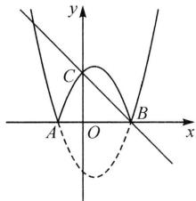

text_image

y
C
A O B x

# 【实战演练】

1. $-\frac{29}{4} < b < -1$ 解: 如图, 当 $y = 0$ 时, $-x^{2} + 4x + 5 = 0$ , 解得 $x_{1} = -1, x_{2} = 5$ , 则 $A(-1,0), B(5,0)$ , 将该二次函数在 $x$ 轴上方的图象沿 $x$ 轴翻折到 $x$ 轴下方的部分图象的解析式为 $y = (x + 1)(x - 5)$ , 即 $y = x^{2} - 4x - 5 (-1 \leqslant x \leqslant 5)$ , 当直线 $y = -x + b$ 经过点 $A(-1,0)$ 时, $1 + b = 0$ , 解得 $b = -1$ ; 当直线 $y = -x + b$ 与抛物线 $y = x^{2} - 4x - 5 (-1 \leqslant x \leqslant 5)$ 有唯一公共点时, 方程 $x^{2} - 4x - 5 = -x + b$ 有两个相等的实数解, 解得 $b = -\frac{29}{4}$ , 所以当直线 $y = -x + b$ 与新图象有 4 个交点时, $b$ 的取值范围为 $-\frac{29}{4} < b < -1$ .

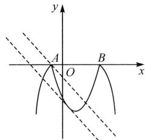

text_image

y
A
O
B
x

2. 解: ∵ 抛物线的对称轴为 x = -2,

$\therefore M(-2,0), A(2,0), B(-4,0).$

①当 a > 0 时，只有顶点在线段 AB 上时，抛物线与线段 AB 恰有一个公共点，把点 $M(-2,0)$ 代入 $y = ax^{2}$

+4ax+3, 可得 $a=\frac{3}{4}$ ;

②当 $a < 0$ 时，

∵抛物线与线段 AB 恰有一个交点，
∴当 x=2 时， $y=12a+3\leqslant0$ ，

解得 $a \leqslant -\frac{1}{4}$ .

综上所述， $a = \frac{3}{4}$ 或 $a\leqslant -\frac{1}{4}$

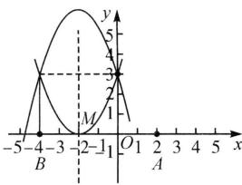

line

| x | y |
|---|---|
| -5 | 0 |
| -4 | 1 |
| -3 | 2 |
| -2 | 3 |
| -1 | 4 |
| 0 | 5 |
| 1 | 4 |
| 2 | 3 |
| 3 | 2 |
| 4 | 1 |
| 5 | 0 |

# 板块四 二次函数与根系关系

# 【典例精讲】

【例 1】解: 设 $A(x_{1},0)$ , $B(x_{2},0)$ ,

$$
\therefore \left| x _ {1} - x _ {2} \right| = 2,
$$

$$
\therefore \left(x _ {1} - x _ {2}\right) ^ {2} = 4,
$$

$$
\therefore (x _ {1} + x _ {2}) ^ {2} - 4 x _ {1} x _ {2} = 4,
$$

$$
\therefore \left(- \frac {6}{2}\right) ^ {2} - 4 \times \frac {m}{2} = 4,
$$

$$
\therefore m = \frac {5}{2} \text {, 当} m = \frac {5}{2} \text {时}, \Delta > 0,
$$

$$
\therefore m = \frac {5}{2}.
$$

【例 2】解: 联立 $\left\{\begin{aligned} y &= kx - 5k, \\ y &= ax^{2}, \end{aligned}\right.$

得 $ax^2 - kx + 5k = 0$

$$
\therefore x _ {A} + x _ {B} = \frac {k}{a}, x _ {A} x _ {B} = \frac {5 k}{a},
$$

$$
\therefore \frac {1}{O N} - \frac {1}{O M} = \frac {1}{x _ {B}} + \frac {1}{x _ {A}} = \frac {x _ {A} + x _ {B}}{x _ {A} x _ {B}}
$$

$$
= \frac {\frac {k}{a}}{\frac {5 k}{a}} = \frac {1}{5}.
$$

# 【实战演练】

1. 解: $\because |x_{1}-x_{2}|=2$ ,

$$
\therefore (x _ {1} + x _ {2}) ^ {2} - 4 x _ {1} x _ {2} = 4,
$$

由 $x^{2} + bx + c = x + 1$

得 $x^{2}+(b-1)x+c-1=0$ ,

$$
\therefore x _ {1} + x _ {2} = - (b - 1), x _ {1} x _ {2} = c - 1.
$$

$$
\therefore (b - 1) ^ {2} - 4 (c - 1) = 4,
$$

$$
\therefore c = \frac {1}{4} (b - 1) ^ {2} \geqslant 0,
$$

∴ c 的最小值为 0，此时 b=1, c=0，
抛物线的解析式为 $y = x^{2} + x$ .

2. 证明: 联立 $\left\{\begin{aligned} y &= kx + 2, \\ y &= ax^{2}, \end{aligned}\right.$

得 $ax^2 - kx - 2 = 0$

$$
\therefore x _ {A} + x _ {B} = \frac {k}{a}, x _ {A} x _ {B} = - \frac {2}{a},
$$

$$
\therefore A M \cdot B N = y _ {A} \cdot y _ {B} = a x _ {A} ^ {2} \cdot
$$

$$
\begin{array}{l} a x _ {B} ^ {2} = a ^ {2} \left(x _ {A} x _ {B}\right) ^ {2} = a ^ {2} \cdot \left(- \frac {2}{a}\right) ^ {2} \\ = 4. \end{array}
$$

# 板块五 二次函数与根的分布

# 【典例精讲】

【例 1】 B 解: 关于 x 的方程 $x^{2} + 2x - 3 - m = 0$ 的解为抛物线 $y = x^{2} + 2x - 3$ 与直线 y = m 的交点的横坐标, 关于 x 的方程 $x^{2} + 2x - 3 - n = 0$ 的解为抛物线 $y = x^{2} + 2x - 3$ 与直线 y = n 的交点的横坐标, 画出大致图象如图,由图可知, $x_{1}<x_{3}<x_{4}<x_{2}$ ,故选B.

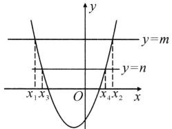

text_image

y
y=m
y=n
x₁x₃ O x₄x₂ x

【例 2】 B 解: 依题意画出抛物线 $y=ax^{2}+bx+c(a<0)$ 的大致图象如图, 观察可知 p 的值有 3 个.

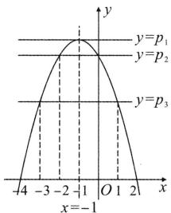

text_image

y=p₁
y=p₂
y=p₃
-4 -3 -2 -1 O 1 2 x
x=-1

# 【实战演练】

1. B

2. A 解: 由题意可知抛物线 $y = a(x - x_{1})(x - x_{2})$ 与 x 轴的交点分别为 $(-1,0)$ 和 $(-3,0)$ ，与 y = m 的交点分别为 $(1,m)$ 和 $(-5,m)$ ，设与直线 y = n 的交点分别为 $(s,n)$ 和 $(t,n)$ ，∵ m < n < 0，∴ 直线 y = n 在 x 轴和直线 y = m 之间，如图所示，由图可知， $-1 < s < 1, -5 < t < -3$ ，又∵ s，t 都为整数，∴ s = 0, t = -4，故选 A.

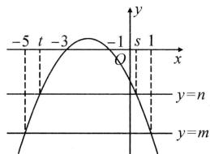

line

| Point | x | y |
|---|---|---|
| -5 | -5 | - |
| t | -3 | - |
| -3 | -2 | 0 |
| -1 | -1 | 1 |
| s | 1 | 0 |
| 1 | 0 | - |
| 0 | -1 | - |
| 0 | 0 | - |
| 0 | 1 | - |
| 0 | -1 | - |
| 0 | 0 | - |
| 0 | 1 | - |
| 0 | -1 | - |
| 0 | 0 | - |
| 0 | 1 | - |
| 0 | -1 | - |
| 0 | 0 | - |
| 0 | 1 | - |
| 0 | -1 | - |
| 0 | 0.5 | - |
| 0.5 | 0.5 | - |
| 1 | 1 | - |
| 2 | 2 | - |
| 3 | 3 | - |
| 4 | 4 | - |
| 5 | 5 | - |
| 6 | 6 | - |
| 7 | 7 | - |
| 8 | 8 | - |
| 9 | 9 | - |
| 10 | 10 | - |
| 11 | 11 | - |
| 12 | 12 | - |
| 13 | 13 | - |
| 14 | 14 | - |
| 15 | 15 | - |
| 16 | 16 | - |
| 17 | 17 | - |
| 18 | 18 | - |
| 19 | 19 | - |
| 20 | 20 | - |
| 21 | 21 | - |
| 22 | 22 | - |
| 23 | 23 | - |
| 24 | 24 | - |
| 25 | 25 | - |
| 26 | 26 | - |
| 27 | 27 | - |
| 28 | 28 | - |
| 29 | 29 | - |
| 30 | 30 | - |
| 31 | 31 | - |
| 32 | 32 | - |
| 33 | 33 | - |
| 34 | 34 | - |
| 35 | 35 | - |
| 36 | 36 | - |
| 37 | 37 | - |
| 38 | 38 | - |
| 39 | 39 | - |
| 40 | 40 | - |
| 41 | 41 | - |
| 42 | 42 | - |
| 43 | 43 | - |
| 44 | 44 | - |
| 45 | 45 | - |
| 46 | 46 | - |
| 47 | 47 | - |
| 48 | 48 | - |
| 49 | 49 | - |
| 50 | 50 | - |
| 51 | 51 | - |
| 52 | 52 | - |
| 53 | 53 | - |
| 54 | 54 | - |
| 55 | 55 | - |
| 56 | 56 | - |
| 57 | 57 | - |
| 58 | 58 | - |
| 59 | 59 | - |
| 60 | 60 | - |
| 61 | 61 | - |
| 62 | 62 | - |
| 63 | 63 | - |
| 64 | 64 | - |
| 65 | 65 | - |
| 66 | 66 | - |
| 67 | 67 | - |
| 68 | 68 | - |
| 69 | 69 | - |
| 70 | 70 | - |
| 71 | 71 | - |
| 72 | 72 | - |
| 73 | 73 | - |
| 74 | 74 | - |
| 75 | 75 | - |
| 76 | 76 | - |
| 77 | 77 | - |
| 78 | 78 | - |
| 79 | 79 | - |
| 80 | 80 | - |
| Note: The x-axis is labeled as 'x', and the y-axis is labeled as 'y'. The chart displays a single line representing a function of y over the interval [0, x].

# 板块六 二次函数与参变分离法 【典例精讲】

【例 1】D 解:依题意,得三倍点在直线 y=3x 上,令 $-x^{2}-x+c=3x$ , 参变分离,得 $x^{2}+4x=c$ , 画出 -3<x<1 范围内函数 $y=x^{2}+4x$ 的图象, 当直线 y=c 经过最低点即顶点 $(-2,-4)$ 时, c=-4; 当直线 y=c 经过最高点 $(1,5)$ 时, c=5. 由图象可知 $-4\leqslant c<5$ , 故选 D.

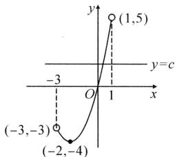

line

| Point | x | y |
|---|---|---|
| (-3,-3) | -3 | -4 |
| (-2,-4) | -2 | -4 |
| (1,5) | 1 | 5 |

【例 2】 $4\sqrt{2}-6\leqslant m\leqslant\frac{3}{5}$

解:由 $x^{2}-(m+2)x-2m=0$ ，参变分离，得 $x^{2}-2x=mx+2m$ ，问题转化为：在 $0\leqslant x\leqslant3$ 范围内，抛物线 $y=x^{2}-2x$ 和直线 $y=mx+2m$ 至

少有一个交点，画出大致图象。①当直线 $y = mx + 2m$ 过点（3，3）时， $m = \frac{3}{5}$ ；②当直线 $y = mx + 2m$ 与抛物线下方部分相切时， $m = 4\sqrt{2} - 6$ ，由图象可得 $4\sqrt{2} - 6 \leqslant m \leqslant \frac{3}{5}$ 。

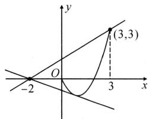

line

| Point | x | y |
|---|---|---|
| -2 | -2 | 0 |
| 3 | 3 | 3 |
| (3,3) | 3 | 3 |

# 【实战演练】

解: 令 $x^{2}-(m+2)x+5m-3 \geqslant 2$ ,
参变分离, 得 $x^{2}-2x-5 \geqslant mx-5m$ ,
问题转化为: 在 $-1 \leqslant x \leqslant 1$ 的范围内,
抛物线 $y = x^{2} - 2x - 5$ 的图象在直线 y = mx - 5m 上或者上方, 画出大致图象. 当直线 y = mx - 5m 过点 $(1, -6)$ 时， $m=\frac{3}{2}$ ，由图象可知，只需当 $m\geqslant \frac{3}{2}$ 时，满足条件，

∴m 的取值范围是 $m \geqslant \frac{3}{2}$ .

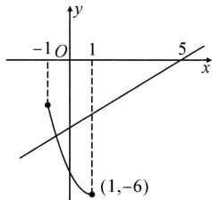

line

| Point | x | y |
|---|---|---|
| 1 | -1 | -6 |
| 2 | 1 | 0 |
| 3 | 5 | 0 |

# 第7讲 二次函数与区间最值板块一定轴定区间

# 【典例精讲】

【例 1】2 解：∵ $y = x^{2} - 2x - 1 = (x - 1)^{2} - 2$ ,

∴对称轴为直线 x=1，

$$
\because a = 1 > 0,
$$

∴抛物线的开口向上，

∴轴距(到对称轴的距离)越大,函数值越大,

$$
\because 0 \leqslant x \leqslant 3,
$$

∴当 x=3 时， $y_{最大}=9-6-1=2$ .

【例2】 $-\frac{1}{4}$ 解：二次函数 $y = ax^{2} - 4ax - 1 = a(x - 2)^{2} - 4a - 1$ ， $\therefore$ 该函数图象的对称轴是直线 $x = 2$ 又 $\because$ 当 $x \leqslant 1$ 时， $y$ 随 $x$ 的增大而增大， $\therefore a < 0.$ $\because$ 当 $-1 \leqslant x \leqslant 6$ 时， $y$ 的最小值为-4， $\therefore$ 当 $x = 6$ 时， $y = a \times 6^{2} - 4a \times 6 - 1 = -4$ ，解得 $a = -\frac{1}{4}$ .

# 【实战演练】

1. $-2 \leqslant y \leqslant 7$ 解: $\because y = -(x - 2)^{2} + 7$ ,
∴顶点坐标为(2,7).

$\because -1 \leqslant x \leqslant 3$ 中含有顶点 $(2,7)$ ,

∴当 x=2 时，y 有最大值 7，

$$
\because 2 - (- 1) > 3 - 2,
$$

∴当 x = -1 时，y 有最小值为 -2，

∴当 $-1\leqslant x\leqslant3$ 时， $-2\leqslant y\leqslant7$ .

2. $\frac{3}{8}$ 或-3 解: $\because y=ax^{2}+4ax+3a=$ $a(x+2)^{2}-a,$

∴对称轴是 x = -2.

当 a>0 时, 结合图象可知当 x=1 时, y 有最大值 8a,

$$
\therefore 8 a = 3, \therefore a = \frac {3}{8};
$$

当 a<0 时, 结合图象可知当 x=-2 时, y 有最大值 -a,

$$
\therefore - a = 3,
$$

∴a=-3.综上, $a=\frac{3}{8}$ 或-3.

# 板块二 定轴动区间

# 【典例精讲】

【例 1】D 解：∵二次函数 $y=2x^{2}-4x-1=2(x-1)^{2}-3$ ,

∴抛物线的开口向上,对称轴为 x=1.
∵当 y=15 时， $2(x-1)^{2}-3=15$ 解得 x=4 或 x=-2，

∵当 $0 \leqslant x \leqslant a$ 时，y 的最大值为 15，
∴a=4. 故选 D.

【例 2】 -3 解：∵ $m \leqslant x \leqslant n$ 且 mn <0, ∴ m < 0, n > 0.

①当 $0 < n \leqslant 1$ 时，x = n 时 y 取最大值，即 $-(n - 1)^{2} + 5 = 5n$ ，

解得 n=1 或 n=-4(舍)，

x=m 时 y 取最小值，

即 $-(m-1)^{2}+5=5m$ ，

解得 $m = 1$ （舍）或 $m = -4$

$$
\therefore m + n = - 3;
$$

②当 n>1 时，y=5n=5 为最大值，
解得 n=1(舍). 故答案为 -3.

# 【实战演练】

1. D 解: $\because y=x^{2}-2x+2=(x-1)^{2}+1$ , ∴抛物线的对称轴为 x=1, 顶点 $(1,1)$ , ∴当 y=1 时, x=1, 当 y=2 时, $x^{2}-2x+2=2$ , x=0 或 2, ∵当 $0 \leqslant x \leqslant a$ 时, y 的最大值为 2, y 的最小值为 1, ∴ $1 \leqslant a \leqslant 2$ .

2. D 解: 当 y=1 时, 有 $x^{2}-2x+1=$ 1, 解得 $x_{1}=0, x_{2}=2$ .

∵当 $a\leqslant x\leqslant a+1$ 时,函数有最小值1,
∴a=2 或 $a+1=0$ ,

$\therefore a=2$ 或 a=-1.

3. 解: 当 y = -4 时, 有 $-x^{2} + 2x - 1 = -4$ , $\therefore x = -1$ 或 x = 3,

∵抛物线开口向下,对称轴是x=1,

∴当 x<1 时，y 随 x 的增大而增大，

$\therefore x=m+2=-1$ 时，y 有最大值 -4，

$$
\therefore m = - 3;
$$

当 $x > 1$ 时， $y$ 随 $x$ 的增大而减小，

∴x=m=3时,y有最大值-4,

∴m=-3或m=3.

# 板块三 动轴定区间

# 【典例精讲】

【例 1】解: 抛物线 $y = x^{2} - 2tx + 3$ 的对称轴为 x = t.

①若 $0 < t \leqslant 3$ ，当 x = t 时函数取最小值，

$\therefore t^{2}-2t^{2}+3=-2$ , 解得 $t=\sqrt{5}$ ;

②若 t>3，当 x=3 时函数取最小值，

∴9-6t+3=-2，解得 $t=\frac{7}{3}$ （不符合题意，舍去）.

综上所述， $t$ 的值为 $\sqrt{5}$

【例 2】1 解: 可知抛物线的开口向上, 对称轴为 x=a, 当 $a \leqslant 1$ 时, y 随 x 的增大而增大, 当 x=1 时函数取得最小值, $1-2a+3=2a$ , 解得 a=1; 当 1<a<3 时, 当 x=a 时函数取得最小值, $a^{2}-2a \cdot a+3=2a$ , 解得 a=1 或 -3 (均舍去); 当 $a \geqslant 3$ 时, y 随 x 的增大而减小, 当 x=3 时函数取得最小值, $9-6a+3=2a$ , 解得 $a=\frac{3}{2}$ (舍). 综上, a 的值为 1.

# 【实战演练】

1. 解: $\because -1 < 0, \therefore$ 抛物线的开口向下,
对称轴为 $x=\frac{a-3}{2}$ .

(1) $\because y$ 在 x=1 时取得最大值，

$\therefore\frac{a-3}{2}\leqslant1,$ 解得 $a\leqslant5;$

(2) $\because y$ 在 x=1 时取得最小值，

$$
\therefore \left| 1 - \frac {a - 3}{2} \right| \geqslant \left| 5 - \frac {a - 3}{2} \right|,
$$

解得 $a \geqslant 9$ .

2. D 解: $y = x^{2} - 2mx$ 的对称轴为 x = m，若 m < -1，当 x = -1 时， $y = 1 + 2m = -2$ ，解得 $m = -\frac{3}{2}$ ;

若 $m > 2$ ，当 $x = 2$ 时， $y = 4 - 4m = -2$ ，解得 $m = \frac{3}{2} < 2$ （舍）；若 $-1 \leqslant m \leqslant 2$ ，当 $x = m$ 时， $y = -m^2 = -2$

解得 $m=\sqrt{2}$ 或 $m=-\sqrt{2}<-1$ （舍）.
∴ m 的值为 $-\frac{3}{2}$ 或 $\sqrt{2}$ .

3. $\frac{1}{4}$ 解: 抛物线 $y = x^{2} - 2hx + h$ 的对称轴为 $x = h$ , 开口向上, 当 $h \leqslant -1$ 时, $y$ 随 $x$ 的增大而增大, 此时 $n = 1 + 3h \leqslant -2$ , $n$ 的最大值为 $-2$ ; 当 $-1 < h < 1$ 时, 此时 $n = -h^{2} + h = -\left(h - \frac{1}{2}\right)^{2} + \frac{1}{4} \leqslant \frac{1}{4}$ , $n$ 的最大值为 $\frac{1}{4}$ ; 当 $h \geqslant 1$ 时, $y$ 随 $x$ 的增

大而减小,此时 $n=-h+1\leqslant0$ , n 的最大值为 0. 综上, 可得 n 的最大值为 $\frac{1}{4}$ .

# 第8讲 二次函数与多结论

# 板块一 二次函数与多结论(一) 图象信息

# 【典例精讲】

【例】B 解: ①∵对称轴为直线 x = -1. ∴ b = 2a,

∵当x=1时， $y=a+b+c<0$ ，

$\therefore 3a + c < 0$ , 故①错误;

②∵抛物线开口向下，

∴在对称轴的右侧 y 随 x 的增大而减小，

$\because(-4,y_{1})$ 关于直线 x=-1 对称的点为 $(2,y_{1})$ ,

又∵2<3,∴ $y_{1}>y_{2}$ ，故②正确；

③方程 $ax^{2}+bx+c=-1$ 的解可看做抛物线 $y=ax^{2}+bx+c$ 与直线 y=-1 的交点，由图象可知抛物线 $y=ax^{2}+bx+c$ 与直线 y=-1 有两个交点，

∴关于 x 的一元二次方程 $ax^{2} + bx + c = -1$ 有两个不相等的实数根，故③错误；

④不等式 $ax^{2}+bx+c>2$ 的解集可看做抛物线 $y=ax^{2}+bx+c$ 的图象在直线 y=2 上方的部分，

$\because(0,2)$ 关于直线 x=-1 对称的点为 $(-2,2)$ ,

∴ x 的取值范围为 -2 < x < 0，故④正确. 故选 B.

# 【实战演练】

1. B 解: ∵ 抛物线开口向上,

$\therefore a>0,$

∵对称轴在 y 轴右侧，∴b<0，

∵抛物线与 y 轴交于负半轴，

$\therefore c<0,\therefore abc>0,$ 故①正确；

$\because x=-\frac{b}{2a}=1,\therefore b=-2a$ ,故②错误;

∵抛物线与 x 轴的一个交点为(3,0)，对称轴为 x=1，

∴抛物线与 x 轴的另一个交点为 $(-1,0)$ , ∴ $a-b+c=0$ ,

$\because b=-2a,\therefore3a+c=0,$ 故③正确；
方程 $ax^{2}+bx+c+k^{2}=0(a\neq0)$ 的解可看做 $y=ax^{2}+bx+c(a\neq0)$ 与 $y=-k^{2}$ 的交点， $\because-k^{2}\leqslant0,$

∴当 $y = -k^{2}$ 过抛物线 $y = ax^{2} + bx + c (a \neq 0)$ 顶点时，两函数只有一个交点，即方程 $ax^{2} + bx + c + k^{2} = 0$ 有两个相等的实数根，故④错误；

∵点 $(m,y_{1})(-m+2,y_{2})$ 关于直线x=1对称，

$\therefore y_{1}=y_{2}$ ，故⑤正确。故选 B.

2. B 解: ∵ 抛物线 $y = ax^{2} + bx + c$ (a, b, c 为常数) 关于直线 x = 1 对称, 且过 $(0, c)$ ,

∴点 $(2,c)$ 在抛物线上，故①正确； $\therefore b = -2a, \therefore 2a + b = 0$ ，故②正确； $\because x=0$ 时，y<0，对称轴为直线 x=1， $\therefore x=2$ 时，y<0， $\therefore 4a+2b+c<0$ 故③错误；

∵抛物线开口向上,对称轴为直线 $x=1,\therefore am^{2}+bm+c\geqslant a+b+c$ ,
即 $am^{2}+bm\geqslant a+b$ ，故④错误；

$\because x=-1$ 时， $y>0,\therefore a-b+c>0,$ $\because b=-2a,\therefore3a+c>0.$ 故⑤正确.
故选：B.

# 板块二 二次函数与多结论(二) 表格信息

# 【典例精讲】

【例】 ①②④ 解:由表可知,抛物线经过点(0,6)和(1,6),∴对称轴为 $x=\frac{1}{2}$ ,故②对;在对称轴左侧,y随x的增大而增大,∴开口向下,故①对;由对称性可知,抛物线与x轴的另一个交点为(3,0),故③错;设抛物线解析式为 $y=a(x+2)(x-3)$ ,∵抛物线经过点(0,6),∴-6a=6,∴a=-1,∴ $y=-(x+2)(x-3)=-\left(x-\frac{1}{2}\right)^{2}+\frac{25}{4}$ ,∴ $x=\frac{1}{2}$ 时y的最大值为 $\frac{25}{4}$ .故④对.故答案为①②④.

# 【实战演练】

1. ③④ 解:由表格可知,抛物线的对称轴是直线 $x=\frac{-1+3}{2}=1$ , 故②错误;抛物线的顶点坐标是 $(1,-1)$ , 有最小值, 故抛物线 $y=ax^{2}+bx+c$ 的开口向上, 故①错误; 当 y=0 时, x=0 或 x=2, 故方程 $ax^{2}+bx+c=0$ 的根为 0 和 2, 故③正确; 当 y>0 时, x 的取值范围是 x<0 或 x>2, 故④正确. 故答案为③④.

2. ①②④ 解: 对称轴为 $x = -\frac{b}{2a} = \frac{1}{2}(0 + 3) = \frac{3}{2}, \therefore b = -3a$ ，由 n > 0，可知抛物线开口向上，∴ a > 0，b < 0，∵ c = -3，∴ bc > 0。故①正确；x = 2 在对称轴的右侧，故②正确；当 x = -1 时， $n = y = a - b + c = 4a - 3 < 4a$ ，故③错误；当 n = 1 时，可知直线 y = -x 与抛物线 $y = ax^{2} + bx + c$ 交于 $(-1, 1)$ 和 $(3, -3)$ 两点，∴ 方程 $ax^{2} + bx + c = -x$ 的两根为 $x_{1} = -1, x_{2} = 3$ ，故④正确。故答案为①②④。

# 板块三 二次函数与多结论(三) 文字信息

# 【典例精讲】

【例】②③④ 解：①∵图象经过(1,1),c<0,n≥3，∴抛物线的开口向下，即a<0，把(1,1)代入 $y=ax^{2}+bx+c$ 得 $a+b+c=1$ ，即b=1-a-c>0，故①错误；②画图可知抛物线的顶点纵坐标大于1，∴ $\frac{4ac-b^{2}}{4a}>1$ ，∵4a<0，∴ $4ac-b^{2}<4a$ ，故②正确；③∵m>0,n≥3，∴对称轴 $x=\frac{m+n}{2}>1.5$ ，∵ $2-\frac{m+n}{2}<\frac{m+n}{2}-1$ ，∴t>1，故③正确；④方程 $ax^{2}+bx+c=x$ 可变为 $ax^{2}+(b-1)x+c=0$ ，∵ $\Delta=(b-1)^{2}-4ac=0$ 。由(1,1)代入 $y=ax^{2}+bx+c$ 得 $a+b+c=1$ ，即 $1-b=a+c$ ，∴ $(a+c)^{2}-4ac=0$ ，即 $a^{2}+2ac+c^{2}-4ac=0$ ，∴ $(a-c)^{2}=0$ ，∴a-c=0，即a=c，∵(m,0)，(n,0)在抛物线上，∴m,n为方程 $ax^{2}+bx+c=0$ 的两个根，∴ $mn=\frac{c}{a}=1$ ，∴ $n=\frac{1}{m}$ ，∵ $n\geqslant3$ ，∴ $\frac{1}{m}\geqslant3$ ，∴ $0<m\leqslant\frac{1}{3}$ 。故④正确。∴正确结论有②③④。

# 【实战演练】

1. B 解: ① ∵ 抛物线经过 $(-1,0)$ ，∴ $a-b+c=0$ ，故① 正确；② ∵ a<0，∴ 抛物线开口向下，点 $(-3,y_{1})$ ， $(2,y_{2})$ ， $(4,y_{3})$ 均在该二次函数图象上，且点 $(-3,y_{1})$ 到对称轴的距离最大，点 $(2,y_{2})$ 到对称轴的距离最小，∴ $y_{1}<y_{3}<y_{2}$ ，故② 错误；③ ∵ $-\frac{b}{2a}=1$ ，∴ b=-2a，∴ a-b+c=0，∴ c=b-a=-3a，∴ 抛物线的最大值为 $a+b+c=-4a$ ，∴ $am^{2}+bm+c \leqslant -4a$ ，故③ 正确；④ ∵ 方程 $ax^{2}+bx+c+1=0$ 的两实数根为 $x_{1}, x_{2}$ ，∴ 抛物线与直线 y=-1 的交点的横坐标为 $x_{1}, x_{2}$ ，由抛物线对称性可得抛物线与 x 轴另一交点坐标为 $(3,0)$ ，∴ 抛物线与 x 轴交点坐标为 $(-1,0)$ ， $(3,0)$ ，∵ 抛物线开口向下， $x_{1}<x_{2}$ ，∴ $x_{1}<-1, x_{2}>3$ ，故④ 正确。故选 B.

2. B 解: ①∵3<m<4, ∴对称轴 $x=\frac{-1+m}{2}>1$ , ∴ $-\frac{b}{2a}>0$ , ∵a<0, ∴b>0, ∵过 $(-1,0)$ , ∴ $a-b+c=0$ , ∴c=b-a>0, ∴abc<0, 故①错误; ②∵ $-\frac{b}{2a}>1$ , a<0, ∴-b<2a, ∵抛物线过点 A $(-1,0)$ , ∴a-b+

$c = 0, \therefore 3a + c > 0$ ，故②正确；③ $\because$ 抛物线过点(1,4)， $a + b + c = 4$ ，又 $\because a - b + c = 0, \therefore b = 2, c = 2 - a, \therefore y = ax^2 + 2x + 2 - a, \because$ 抛物线过(-1,0)和(m,0)两点， $\therefore -1$ 和 $m$ 是 $ax^2 + bx + c = 0$ 的根， $\therefore -1 \cdot m = \frac{c}{a} = \frac{2 - a}{a} = \frac{2}{a} - 1, \therefore m = 1 - \frac{2}{a}, \because 3 < m < 4$ 且 $a < 0, \therefore 3 < 1 - \frac{2}{a} < 4, \therefore -1 < a < -\frac{2}{3}$ ，故③正确；④依题意，得抛物线 $y = ax^2 + bx + c$ 与直线 $y = 3$ 有交点， $\therefore \frac{4ac - b^2}{4a} \geqslant 3, \therefore 4ac - b^2 \leqslant 12a$ ，故④错误. 故选 B.

# 第9讲 实际问题与二次函数

# 板块一 利润问题(一)

# 区间内顶点最值

# 【典例精讲】

【例】解:(1)①设 $y=kx+b(k\neq0)$ ,
将点 $(10,30)$ ， $(15,25)$ 代入，

得 $\left\{ \begin{array}{l} 10k + b = 30, \\ 15k + b = 25, \end{array} \right.$ 解得 $\left\{ \begin{array}{l} k = -1, \\ b = 40, \end{array} \right.$

$$
\therefore y = - x + 4 0;
$$

②设 $Q = ny (n \neq 0)$ ，将点（30, 360）
代入得 360=30n，

$$
\therefore n = 1 2, \therefore Q = 1 2 y.
$$

$$
\because y = - x + 4 0,
$$

$$
\therefore Q = 1 2 (- x + 4 0) = - 1 2 x + 4 8 0;
$$

(2)设每天销售这种产品所获得的利润为 W 元,依题意,得 $W=x(-x+40)-(-12x+480)=-x^{2}+52x-480=-(x-26)^{2}+196.$

$\because a=-1<0$ , 抛物线开口向下,

∴当 x=26 时，W 有最大值，最大值是 196.

答: 当销售价格 26 元时, W 最大, 最大值是 196 元.

# 【实战演练】

解:(1)设 y 与 x 之间的函数关系式为 $y=kx+b$ ，则 $\left\{\begin{aligned}&28k+b=66,\\ &10k+b=75,\end{aligned}\right.$

解得 $k = -\frac{1}{2}$ , b = 80,

∴ y 与 x 之间的函数关系式为 $y = -\frac{1}{2}x + 80$ ;

自变量 x 的取值范围是 $0 < x \leqslant 80$ 且 x 为整数；

(2)设增种果树 a 棵，

则 $W = (60 + a)(-0.5a + 80)$

$$
= - 0. 5 a ^ {2} + 5 0 a + 4 8 0 0,
$$

$$
\because - 0. 5 <   0, \therefore \text {当} a = - \frac {5 0}{2 \times (- 0 . 5)} =
$$

50 时, $W_{最大}=6\ 050$ ,

∴当增种果树50棵时,果园的总产量

$W(\text{kg})$ 最大,最大产量是6050 kg.

# 板块二 利润问题(二)

# 区间内端点最值

# 【典例精讲】

【例】解：(1) $y = -50x + 1200 (4 \leqslant x \leqslant 7)$ ;

(2)设利润为 W 元, 则 $W=(x-4)(-50x+1\ 200)=-50(x-14)^{2}+5\ 000$ ,

$\because a=-50<0$ , 对称轴为 x=14,

∴当 x<14 时，W 随 x 的增大而增大，
又∵ $4 \leqslant x \leqslant 7$ ，

∴当 x=7 时， $W_{\text{最大}}=-50(7-14)^{2}$ +5 000=2 550(元)，

∴当每千克售价定为7元时,每天获利最大,最大利润为2550元.

# 【实战演练】

解:(1)设 y 与 x 之间的函数关系式为 $y=kx+b$ ,

则 $\left\{ \begin{array}{l}90 = 22k + b,\\ 80 = 24k + b, \end{array} \right.$ 解得 $\left\{ \begin{array}{l}k = -5,\\ b = 200, \end{array} \right.$

$$
\therefore y = - 5 x + 2 0 0;
$$

(2)消毒洗手液的每瓶利润不允许高于进价的 30%，

即 $x \leqslant 20(1 + 30\%) = 26$ .

由题意, 得 $w=(x-20)(-5x+200)$ $=-5(x-30)^{2}+500,$

∵图象的对称轴为 x=30，开口向下，
∴当 x<30 时，w 随 x 的增大而增大，
又∵ $x \leqslant 26$ ，

∴当 x=26 时，w 有最大值为 420.

故售价定为 26 元时,该药店可获得的利润最大,最大利润 420 元.

# 板块三 利润问题(三)

# 区间内取整最值

# 【典例精讲】

【例】解：(1)设这种药材的售价 $y$ （元）与月份 $x$ 的函数关系式为 $y = kx + b$

则 $\left\{ \begin{array}{l}3k + b = 8,\\ 6k + b = 6, \end{array} \right.$ 解得 $\left\{ \begin{array}{l}k = -\frac{2}{3},\\ b = 10, \end{array} \right.$

$$
\therefore y = - \frac {2}{3} x + 1 0;
$$

(2) 设 $m = a(x - 6)^{2} + 1$ ，把 $(1, 9)$ 代入，得 $9 = a(1 - 6)^{2} + 1$ ，

解得 $a=\frac{8}{25},\therefore m=\frac{8}{25}(x-6)^{2}+1,$

设这种药材每千克的利润为 $w$ 元，则 $w = y - m = -\frac{2}{3} x + 10 - \frac{8}{25}(x$

$$
- 6) ^ {2} - 1 = - \frac {8}{2 5} \left(x - \frac {1 1 9}{2 4}\right) ^ {2} + \frac {3 8 5}{7 2},
$$

$\because -\frac{8}{25}<0$ , 对称轴为 $x=\frac{119}{24}=4\frac{23}{24}$ ,
∵ x 为正整数，

∴当 x=5 时，w 最大.

∴5月份出售这种药材获利最大.

# 【实战演练】

解:(1)由 $x-10=2(z-15)$ ,

得 $x=2z-20(z>15)$ ;

(2) $\because x=2z-20,$

$$
\therefore z = \frac {1}{2} x + 1 0,
$$

$$
\therefore y _ {2} = - 4 z + 1 8 0 = - 4 \left(\frac {1}{2} x + 1 0\right) +
$$

$$
1 8 0 = - 2 x + 1 4 0,
$$

$$
W = (x - 1 0) (- 2 x + 1 0 0) +
$$

$$
\left(\frac {1}{2} x + 1 0 - 1 5\right) (- 2 x + 1 4 0)
$$

$$
= - 3 \left(x - \frac {1 0 0}{3}\right) ^ {2} + \frac {4 9 0 0}{3},
$$

$\because -3<0$ , 对称轴为 $x=\frac{100}{3}$ , 且 2x 为整数,

∴x=33.5时，W取最大值，

∴这两种玩具每天销售的总利润之和最大时，甲种玩具每件的销售价格是33.5元.

# 板块四 利润问题(四) 区间求参

# 【典例精讲】

【例】解:(1)根据题意,得 $y=(x-6)$

$$
\begin{array}{l} [ 8 0 + 4 0 (1 2 - x) ] = - 4 0 (x - 1 0) ^ {2} \\ + 6 4 0, \\ \end{array}
$$

∴当 x=10 时，y 有最大值，最大值为 640.

答: 当商品的售价 x 为 10 元时, 销售这批商品的日利润最大, 最大值为 640 元;

(2)根据题意,得 $y=(x-6-m)$ [80]

$$
\begin{array}{l} + 4 0 (1 2 - x) ] = - 4 0 x ^ {2} + (8 0 0 + \\ 4 0 m) x - 3 3 6 0 - 5 6 0 m, \\ \end{array}
$$

∴对称轴为 $x=-\frac{800+40m}{2\times(-40)}=10+\frac{m}{2}$ ,

∵当售价为11元时可获得最大日利润，

$\therefore\frac{21}{2}<10+\frac{m}{2}<\frac{23}{2}$ ，解得1<m<3.

# 【实战演练】

解:(1)设 $y=kx+b$ ,

则 $\left\{ \begin{array}{l} 40k + b = 300, \\ 45k + b = 250, \end{array} \right.$ 解得 $\left\{ \begin{array}{l} k = -10, \\ b = 700, \end{array} \right.$

$$
\therefore y = - 1 0 x + 7 0 0;
$$

(2)由表中数据知,每件商品进价为 $\frac{300\times40-3\ 000}{300}=30$ (元),

根据题意，得 $w = (x - 30 - m)(-10x + 700) = -10x^{2} + (1000 + 10m)x - 21000 - 700m$

$\because$ 对称轴为 $x = -\frac{1000 + 10m}{2 \times (-10)} = 50 + \frac{m}{2}, x \leqslant 52$ ，且 $x$ 为整数，利润 $w$ 随售价 $x$ 的增大而增大，

∴ $50 + \frac{m}{2} > 51.5$ , 解得 m > 3,

$$
\because m \leqslant 6,
$$

∴m 的取值范围为 $3<m\leqslant6$ .

# 板块五 利润问题(五)

# 关联变量利润和

# 【典例精讲】

【例】解:(1)根据题意,得 $W=y_{1}+$

$$
\begin{array}{l} y _ {2} = \frac {1}{2} (5 0 - x) + \frac {1}{4 0} x ^ {2} = \frac {1}{4 0} x ^ {2} - \\ \frac {1}{2} x + 2 5; \\ \end{array}
$$

(2)由(1)可知 $W=\frac{1}{40}x^{2}-\frac{1}{2}x+25$

$$
= \frac {1}{4 0} (x - 1 0) ^ {2} + 2 2. 5,
$$

∵图象开口向上,对称轴为 x=10,

∴当 x=10 时, W 最小, 最小值为 22.5,

当 x=50 时, W 最大, 最大值为 $\frac{1}{40} \times$

$$
(5 0 - 1 0) ^ {2} + 2 2. 5 = 6 2. 5,
$$

∴该总公司能获得的总利润 W(单位:

万元)的范围为 $22.5 \leqslant W \leqslant 62.5$ .

# 【实战演练】

解:(1) $y_{1}=2x(x\geqslant0)$ ,

$$
y _ {2} = \frac {1}{2} x ^ {2} (x \geqslant 0);
$$

(2) $w=2(6-m)+\frac{1}{2}m^{2}=\frac{1}{2}(m-2)^{2}$

$$
+ 1 0,
$$

$$
\because a = \frac {1}{2} > 0, 0 \leqslant m \leqslant 6,
$$

∴当 m=2 时，w 的最小值是 10.

当 m=0 时，w=12；

当 m=6 时，w=18；

∴当 m=6 时，w 的最大值是 18.

答:该专业户至少能获得10万元利润，
他能获取的最大利润是18万元；

(3)由 $\frac{1}{2}(m-2)^{2}+10=14.5$ ,

解得 $m_{1}=-1$ (舍), $m_{2}=5$ ,

$$
\therefore 5 \leqslant m \leqslant 6.
$$

# 板块六 利润问题(六)

# 分段函数取最值

# 【典例精讲】

【例】解:(1)当 $0<x\leqslant40$ 时,y=30;
当 $40<x\leqslant100$ 时,设函数关系式为 $y=kx+b$ , 则 $\left\{\begin{aligned}&40k+b=30,\\ &100k+b=15,\end{aligned}\right.$

解得 $\left\{\begin{aligned}k&=-\frac{1}{4},\\ b&=40,\end{aligned}\right.$ $\therefore y=-\frac{1}{4}x+40,$

$$
\therefore y = \left\{ \begin{array}{l l} 3 0 (0 <   x \leqslant 4 0), \\ - \frac {1}{4} x + 4 0 (4 0 <   x \leqslant 1 0 0); \end{array} \right.
$$

(2)由 $\left\{\begin{aligned}x&\geqslant30,\\ 360-x&\geqslant3x,\end{aligned}\right.$

解得 $30 \leqslant x \leqslant 90$ ;

当 $30 \leqslant x \leqslant 40$ 时， $w = 30x + 15(360 - x) = 15x + 5400$

∴当 x=30 时，w 取得最小值 5850；

当 $40 < x \leqslant 90$ 时， $w = \left(-\frac{1}{4} x + 40\right)x$

$+15(360-x)=-\frac{1}{4}(x-50)^{2}+$

6 025,

∴当 x=90 时，w 取得的最小值为 $-\frac{1}{4}(90-50)^{2}+6025=5625$ ，

∵5 850＞5 625，

∴种植甲种花卉 $90 \, m^{2}$ ，乙种花卉 $270 \, m^{2}$ 时，种植的总费用最少，最少为 5625 元.

# 【实战演练】

解:(1)∵第5天售价为50元/千克,第10天售价为40元/千克,

∴ $\left\{\begin{aligned}5m+n=50,\\ 10m+n=40,\end{aligned}\right.$ 解得 $\left\{\begin{aligned}m=-2,\\ n=60;\end{aligned}\right.$

(2)由题意,得当 $1 \leqslant x < 20$ 时,

$$
W = p q = (- 2 x + 6 0) (x + 1 0) = - 2 x ^ {2}
$$

$$
+ 4 0 x + 6 0 0;
$$

当 $20 \leqslant x \leqslant 30$ 时， $W = 30q = 30(x +$

$$
1 0) = 3 0 x + 3 0 0;
$$

$$
\therefore W = \left\{ \begin{array}{l} - 2 x ^ {2} + 4 0 x + 6 0 0 (1 \leqslant x <   2 0), \\ 3 0 x + 3 0 0 (2 0 \leqslant x \leqslant 3 0); \end{array} \right.
$$

(3)由题意,得当 $1 \leqslant x < 20$ 时, W = -2x^{2} + 40x + 600 = -2(x - 10)^{2} + 800, $\because -2 < 0,$

∴当 x=10 时，W 最大为 800；

当 $20 \leqslant x \leqslant 30$ 时， $W = 30x + 300$

由 $30x+300>1\ 000$ 时, 解得 $x>23\frac{1}{3}$ ,

又∵x为整数,且30>0,

∴当 $20 \leqslant x \leqslant 30$ 时，W 随 x 的增大而增大，

∴第24至30天，销售额超过1000元，共7天.

# 板块七 面积问题(一)

# 面积最值计算

# 【典例精讲】

【例】解：(1) $y = x\left(100 - \frac{5}{4} x\right) = \frac{5}{4} x^2 + 100x, 28 \leqslant x < 80$ ;

(2) $y = -\frac{5}{4} x^2 + 100x = -\frac{5}{4}(x -$

$$
4 0) ^ {2} + 2 0 0 0,
$$

又∵28≤x<80，

∴当 x=40 时，y 有最大值，最大值为 $2\ 000\ m^{2}$ ;

(3)设安装成本为w元，

$$
\because S _ {\text {矩形} E A G H} = \frac {1}{2} \left(1 0 0 - \frac {5}{4} x\right) \cdot \frac {1}{2} x,
$$

$$
S _ {\mathrm{矩形} D E F C} = \left(1 0 0 - \frac {5}{4} x\right) \cdot \frac {1}{2} x,
$$

$$
\therefore w = 4 0 \left(- \frac {5}{1 6} x ^ {2} + 2 5 x\right) +
$$

$$
2 0 \left(- \frac {5}{8} x ^ {2} + 5 0 x\right)
$$

$$
= - 2 5 x ^ {2} + 2 0 0 0 x,
$$

由 $-25x^{2} + 2000x = 30000$

解得 x=60 或 20，

∴w≤30 000时，x≤20或x≥60，

$$
\because 2 8 \leqslant x <   8 0,
$$

∴ $60 \leqslant x < 80$ 时, 安装成本不超过 30 000 元.

# 【实战演练】

解:(1)EF=11-2x-(x-1)=(12-3x)m;

(2)设农场 DBEF 的面积为 S, DF 的长为 $x \, m$ , 若点 D 在线段 AB 上,
由(1)知此时 $x \geqslant 3$ ,

则 $S=x(12-3x)=-3(x-2)^{2}+12$ ,
∴x>2时，S随x的增大而减小，

∴x=3时,S有最大值,

$$
S _ {\mathrm{最大值}} = - 3 \times 1 ^ {2} + 1 2 = 9 (\mathrm{m} ^ {2});
$$

若点 D 在线段 BA 的延长线上, 此时 x < 3,

则 $S = \frac{1}{2} (12 - 3x + 3)x$

$$
= - \frac {3}{2} \left(x - \frac {5}{2}\right) ^ {2} + \frac {7 5}{8},
$$

$$
\because a = - \frac {3}{2} <   0,
$$

∴ $x=\frac{5}{2}$ 时，S 有最大值， $S_{最大值}=\frac{75}{8}$ ,

$$
\because \frac {7 5}{8} > 9,
$$

∴DF 为 $\frac{5}{2}$ m 时, 农场 DBEF 的面积最大, 最大面积为 $\frac{75}{8}$ m $^{2}$ .

# 板块八 面积问题(二)

# 面积最值求参

# 【典例精讲】

【例】解：(1) $S=\frac{1}{2}(50-x)x$

$$
= - \frac {1}{2} x ^ {2} + 2 5 x;
$$

(2)依题意,得 $y=\frac{1}{2}(50-x+a)x$ $=-\frac{1}{2}x^{2}+\frac{1}{2}(50+a)x$ ,

$$
\because 0 <   a,
$$

∴抛物线开口向下,对称轴为 x=25+ $\frac{a}{2}$ >25,

∴当 $x<25+\frac{a}{2}$ 时，y 随 x 的增大而增大，

又∵ $x\leqslant25$ ,

∴当 x=25 时，y 最大，

$$
\therefore - \frac {1}{2} \times 2 5 ^ {2} + \frac {1}{2} (5 0 + a) \times 2 5 =
$$

325, 解得 a=1.

# 【实战演练】

解:(1)① $x\left(50-\frac{1}{2}x\right)=450$ ,

解得 $x_{1} = 10, x_{2} = 90$

$$
\because A D <   3 0, \therefore x = 1 0.
$$

答:AD 长为 10 m;

② $S = \frac{1}{2} x(100 - x) = -\frac{1}{2} (x - 50)^2$

$$
+ 1 2 5 0,
$$

$$
\because - \frac {1}{2} <   0, x \leqslant 3 0,
$$

∴当 x=30 时，S 有最大值，最大值为 $-\frac{1}{2}(30-50)^{2}+1\ 250=1\ 050(\mathrm{~m}^{2})$ .

答: 当 AD 长为 30 m 时, 菜园面积最大, 为 $1050 \, m^{2}$ ;

(2) $S=\frac{1}{2}x(100+2a-x)=-\frac{1}{2}x^{2}+(a+50)x$ ,

$\because -\frac{1}{2}<0$ , 图象开口向下, 对称轴为直线 $x=a+50$ ,

∴当 $x < a + 50$ 时，S 随 x 的增大而增大，而 $x \leqslant a$ ，

∴当 x=a 时，S 有最大值为 2800，

$$
\therefore \frac {1}{2} a (1 0 0 + 2 a - a) = 2 8 0 0,
$$

解得 $a_1 = 40, a_2 = -140$ （舍去）.

$$
\therefore a = 4 0.
$$

# 板块九 面积问题(三)

# 面积加权最值

# 【典例精讲】

【例】解:(1)花卉A的面积为(40-x)(20-x)=(x²-60x+800)m²,

花卉 B 的面积为 $x(40-x-10)=(-x^{2}+30x)\mathrm{m}^{2}$ ,

花卉 C 的面积为 $x(20-x)=(-x^{2}+20x)\mathrm{m}^{2}$ ;

(2)∵花卉A与B的种植面积之和为 $x^{2}-60x+800+(-x^{2}+30x)=(-30x+800)m^{2}$ ,

由 $-30x+800\leqslant560$ ，解得 $x\geqslant8$ ，

设 A, B, C 三种花卉的总产值之和 y 百元，

则 $y = 2(x^{2} - 60x + 800) + 3(-x^{2}$

$$
+ 3 0 x) + 4 (- x ^ {2} + 2 0 x)
$$

$$
= - 5 x ^ {2} + 5 0 x + 1 6 0 0
$$

$$
= - 5 (x - 5) ^ {2} + 1 7 2 5,
$$

∴当 x>5 时，y 随 x 的增大而减小，
又 $x \geqslant 8$ ，

∴当 x=8 时，y 取得最大值 1680 （百元）.

故 A, B, C 三种花卉的总产值之和的最大值 168 000 元.

# 【实战演练】

解:(1)当 x=5 时,y=22 000;

(2) $y=(30+30-2x)\cdot x\cdot20+(20+$

$$
2 0 - 2 x) \cdot x \cdot 6 0 + (3 0 - 2 x) (2 0 -
$$

$$
\begin{array}{l} {2 x) \cdot 4 0 = - 4 0 0 x + 2 4 0 0 0 (0 <   x <  } \\ {1 0);} \end{array}
$$

(3) $S_{甲}=-2x^{2}+60x$ ,

$$
S _ {\text {乙}} = - 2 x ^ {2} + 4 0 x,
$$

$$
\therefore (- 2 x ^ {2} + 6 0 x) + (- 2 x ^ {2} + 4 0 x) \leqslant 4 5 6,
$$

解得 $x \leqslant 6$ 或 $x \geqslant 19$ ,

又 0 < x < 10, ∴ 0 < x ≤ 6.

$\because y = -400x + 24000$ 随着 $x$ 的增大而减小，

∴当 x=6 时，y 最小为 21 600. ∴三种花卉的最低种植总成本为 21 600 元.

# 板块十 抛物线形问题(一)

# 实物长度计算

# 【典例精讲】

【例】解:(1)由题意,得 $y=\frac{1}{20}(x-$

$$
5) ^ {2} + \frac {7}{4} = \frac {1}{2 0} x ^ {2} - \frac {1}{2} x + 3,
$$

令 x=0 ，得到 y=3 ，∴ AB=3 m ;

(2)设抛物线 $F_{1}$ 的解析式为

$$
y = a (x - 3) ^ {2} + 2,
$$

则 $3 = a(0 - 3)^2 + 2$ ，解得 $a = \frac{1}{9}$ ，

$$
\therefore y = \frac {1}{9} (x - 3) ^ {2} + 2,
$$

当 x=4 时， $y=\frac{19}{9}$ ，

$$
\therefore M N = \frac {1 9}{9} \mathrm{m}.
$$

# 【实战演练】

解:(1)由题意可得 $A(-6,2)$ , $D(6,2)$ ,
设抛物线对应的函数解析式为 $y = ax^{2} + 8$ ,

则 $(-6)^{2}a+8=2$ ，解得 $a=-\frac{1}{6}$ ，

$$
\therefore y = - \frac {1}{6} x ^ {2} + 8;
$$

(2)∵点 $P_{1}$ 的横坐标为 $m(0<m\leqslant6)$ ,

$\therefore P_{2}$ 的坐标为 $\left(m, -\frac{1}{6}m^{2} + 8\right)$ ,

$$
\therefore P _ {2} P _ {3} = 2 m,
$$

$$
P _ {1} P _ {2} = P _ {3} P _ {4} = M N = - \frac {1}{6} m ^ {2} + 8,
$$

$$
\therefore l = 3 \left(- \frac {1}{6} m ^ {2} + 8\right) + 2 m
$$

$$
= - \frac {1}{2} (m - 2) ^ {2} + 2 6.
$$

$$
\because - \frac {1}{2} <   0,
$$

∴当 m=2 时，l 的最大值为 26.

# 板块十一 抛物线形问题(二)

# 路径高度分析

# 【典例精讲】

【例】解:(1)抛物线 $L_{1}$ 的解析式为 $y=-\frac{1}{2}x^{2}+4x$ , A 点的坐标为

$$
\left(7, \frac {7}{2}\right);
$$

(2)小球 M 能飞过这棵树. 理由如下: 当 x=2 时, 对于 $L_{2}: y=\frac{1}{2}x=\frac{1}{2}\times2=1$ ; 对于 $L_{1}: y=-\frac{1}{2}x^{2}+4x=-\frac{1}{2}\times2^{2}+4\times2=6; 6-1=5>4$ ,

∴小球 M 能飞过这棵树；

(3)∵小球 M 在飞行的过程中离斜坡 OA 的距离为 $-\frac{1}{2}x^{2}+4x-\frac{1}{2}x=-\frac{1}{2}\left(x-\frac{7}{2}\right)^{2}+\frac{49}{8}$ ,

∴小球 M 在飞行的过程中离斜坡 OA 的最大高度为 $\frac{49}{8}$ .

# 【实战演练】

解:(1) $y=-\frac{1}{50}x^{2}+\frac{9}{5}x+20;$

(2)无人机此次飞行安全.理由如下:无人机与山坡的竖直距离

$$
\begin{array}{l} d = - \frac {1}{5 0} x ^ {2} + \frac {9}{5} x + 2 0 - \left(- \frac {1}{4 0} x ^ {2} + \frac {9}{4} x\right) \\ = \frac {1}{2 0 0} (x - 4 5) ^ {2} + \frac {7 9}{8}, \\ \end{array}
$$

$\because\frac{1}{200}>0,\therefore x=45$ 时，d 有最小值 $\frac{79}{8}>9,$

∴无人机此次飞行是安全的.

# 板块十二 抛物线形问题(三) 路径落点分析

# 【典例精讲】

【例】解：(1) $y=-\frac{5}{4}x^{2}+5$ ;

(2) 当 $x = 1$ 时, $y = \frac{15}{4}$ ;

当 $x=\frac{3}{2}$ 时， $y=\frac{35}{16}$ .

$$
\therefore P \left(1, \frac {1 5}{4}\right), Q \left(\frac {3}{2}, \frac {3 5}{1 6}\right),
$$

当竖直摆放 7 个圆柱形桶时, 桶高为 $0.3 \times 7 = 2.1$ .

$$
\because 2. 1 <   \frac {1 5}{4} \text {   且   } 2. 1 <   \frac {3 5}{1 6},
$$

∴网球不能落入桶内；

(3)设竖直摆放圆柱形桶 m 个时网球可以落入桶内，

由题意, 得 $\frac{35}{16}<0.3m<\frac{15}{4}$ ,

解得 $7 \frac{7}{24} < m < 12 \frac{1}{2}$ ;

$\because m$ 为整数, $\therefore m$ 的最大值为 12,

∴当竖直摆放圆柱形桶至多12个时,网球可以落入桶内.

# 【实战演练】

解:(1)设抛物线的解析式为

$$
y = a (x - 2 0) ^ {2} + 1 8.
$$

则 $400a + 18 = 2$ ，解得 a = -0.04。

$$
\therefore y = - 0. 0 4 (x - 2 0) ^ {2} + 1 8.
$$

当 x=33 时， $y=-0.04(33-20)^{2}+18=11.24.$

∴哑弹会落在距该居民楼底部 11.24 米的外墙上；

(2)设小林沿 $x$ 轴负半轴后退 $m$ 米，则抛物线的解析式为 $y = -0.04(x - 20 + m)^2 +18.$

若抛物线经过点(33,0).

则-0.04(13+m) $^{2}$ +18=0.

解得 $m=15\sqrt{2}-13$ (舍负).

答: 小林沿 x 轴负半轴至少后退 $(15\sqrt{2}-13)$ 米, 才能避免哑弹落在居民楼的外墙或窗户上.

# 板块十三 抛物线形问题(四) 直线运动建模

# 【典例精讲】

【例】解：(1) $v=-\frac{1}{2}t+10$

$$
y = - \frac {1}{4} t ^ {2} + 1 0 t;
$$

(2)设黑,白两球的距离为 $\omega \, cm$ ,

则 $w=70+2t-y=\frac{1}{4}t^{2}-8t+70=$ $\frac{1}{4}(t-16)^{2}+6,$

$$
\because \frac {1}{4} > 0,
$$

∴当 t=16 时，w 的最小值为 6，

∴黑,白两球的最小距离为 $6 \, cm$ , 故黑球不会碰到白球.

# 【实战演练】

解:(1) $s=-\frac{1}{2}t^{2}+16t,v=-t+16;$

(2) 当 v=9 时， $-t+16=9$ ，解得 t=7，

$$
\because s = - \frac {1}{2} t ^ {2} + 1 6 t,
$$

∴当 t=7 时，s=87.5，

∴当甲车减速至9 m/s时,它行驶的路程是87.5 m;

(3)设甲,乙两车的距离为 $\omega \, m$ ,

则 $w = 20 + 10t - \left(-\frac{1}{2} t^2 +16t\right)$

$$
= \frac {1}{2} (t - 6) ^ {2} + 2,
$$

∴当 t=6 时，w 的最小值为 2，

∴第6 s时甲,乙两车相距最近,最近距离为2 m.

# 板块十四 综合与实践——设计喷泉安全通道

解:(1)设抛物线解析式为 $y=ax^{2}+bx$ ，则 $\left\{\begin{aligned}&3=4a+2b,\\ &0=16a+4b,\end{aligned}\right.$ 解得 $\left\{\begin{aligned}&a=-\frac{3}{4},\\ &b=3,\end{aligned}\right.$

∴抛物线的解析式为 $y=-\frac{3}{4}x^{2}+3x$ ;

(2)设顶点坐标为 $(m,3)(m>0)$ ,

则抛物线的解析式为 $y = -\frac{3}{4}(x - m)^{2} + 3$ ,

∵抛物线过 $A\left(0,\frac{9}{4}\right)$ ,

$$
\therefore \frac {9}{4} = - \frac {3}{4} (- m) ^ {2} + 3,
$$

解得 $m = \pm 1$

$$
\because m > 0, \therefore m = 1,
$$

∴抛物线的解析式为 $y = -\frac{3}{4}(x - 1)^{2} + 3$ ,

由 $-\frac{3}{4}(x-1)^{2}+3=0$ ,

得 $x_{1}=3, x_{2}=-1$ ,

∴OB=3,即喷泉跨度OB的最小值为3;

(3) 设 $F(n, h)$ ，则 $E(n+2, h)$ ，

$$
\therefore \left\{ \begin{array}{l} h = - \frac {3}{4} n ^ {2} + 3 n, \\ h = - \frac {3}{4} (n + 2 - 1) ^ {2} + 3, \end{array} \right.
$$

解得 $\left\{\begin{aligned}n&=\frac{1}{2},\\ h&=\frac{21}{16},\end{aligned}\right.$

∴能够进入该安全通道的人的最大身高为 $\frac{21}{16}\approx1.3(m)$ .

# 第10讲 二次函数与线段板块一 横竖线段

# 【典例精讲】

【例】解：∵ $P(m,-m^{2}+4m)$ ,

$$
D (m, - m + 4),
$$

$$
\therefore P D = \left| - m ^ {2} + 4 m - (- m + 4) \right|
$$

$$
= \left| - m ^ {2} + 5 m - 4 \right|,
$$

$$
\because P D = \frac {1}{2} O C = 2,
$$

$$
\therefore | - m ^ {2} + 5 m - 4 | = 2,
$$

当 $-m^{2}+5m-4=2$ 时，

解得 $m_{1} = 2, m_{2} = 3$ ;

当 $-m^{2}+5m-4=-2$ 时，

解得 $m=\frac{5\pm\sqrt{17}}{2}$ ,

$$
\because 0 <   m <   4, \therefore m = \frac {5 - \sqrt {1 7}}{2}.
$$

综上所述， $m$ 的值为2或3或 $\frac{5 - \sqrt{17}}{2}.$

# 【实战演练】

解: 令 $x^{2}+2x-n=0$ ,

解得 $x = -1 \pm \sqrt{n + 1}$ ,

令 $x^{2}-2x-n=0$ ,

解得 $x = 1 \pm \sqrt{n + 1}$ ,

$$
\therefore A (- 1 - \sqrt {n + 1}, 0),
$$

$$
B (- 1 + \sqrt {n + 1}, 0),
$$

$$
C (1 - \sqrt {n + 1}, 0),
$$

$$
D (1 + \sqrt {n + 1}, 0),
$$

$$
\therefore A D = 1 + \sqrt {n + 1} - (- 1 - \sqrt {n + 1})
$$

$$
= 2 + 2 \sqrt {n + 1},
$$

$$
B C = - 1 + \sqrt {n + 1} - (1 - \sqrt {n + 1}) =
$$

$$
- 2 + 2 \sqrt {n + 1},
$$

$$
\because A D = 2 B C,
$$

$$
\therefore 2 + 2 \sqrt {n + 1} = 2 (- 2 + 2 \sqrt {n + 1}),
$$

解得 $n=8,\therefore n$ 的值为 8.

# 板块二 斜线段

# 【典例精讲】

【例】解:设点 $P(x_{1},y_{1})$ , $Q(x_{2},y_{2})$ ,

则 $y_{1} = -3x_{1} + 3, y_{2} = -3x_{2} + 3,$

$$
\therefore y _ {1} - y _ {2} = - 3 (x _ {1} - x _ {2}),
$$

联立 $\left\{\begin{aligned}y&=x^{2}-4ax+4a^{2}-3a,\\ y&=-3x+3,\end{aligned}\right.$

得 $x^{2} - (4a - 3)x + 4a^{2} - 3a - 3 = 0$

$$
\therefore x _ {1} + x _ {2} = 4 a - 3,
$$

$$
x _ {1} x _ {2} = 4 a ^ {2} - 3 a - 3,
$$

根据勾股定理，

得 $PQ^{2} = (x_{1} - x_{2})^{2} + (y_{1} - y_{2})^{2}$

$$
\therefore (5 \sqrt {6}) ^ {2} = 1 0 (x _ {1} - x _ {2}) ^ {2},
$$

$$
\therefore 1 5 0 = 1 0 \times [ (4 a - 3) ^ {2} - 4 (4 a ^ {2} -
$$

$$
\left. 3 a - 3) \right],
$$

$$
\therefore a = \frac {1}{2}.
$$

# 【实战演练】

解: 过点 M 作 $ME \perp x$ 轴于点 E, 交 AC 于点 F, 设 $M(m, -m^{2} - 2m + 3)$ .

由 $y = -x^{2} - 2x + 3$ 可得 A(-3,0),

$$
C (0, 3), \therefore O A = O C,
$$

$$
\therefore \angle M F N = \angle A F E = \angle O A C = 4 5 ^ {\circ},
$$

$$
\therefore M F = \sqrt {2} M N = 2.
$$

由 $A(-3,0)$ , $C(0,3)$ ,

可得直线 AC: $y = x + 3$ ,

$$
\therefore F (m, m + 3),
$$

$$
\therefore M F = (- m ^ {2} - 2 m + 3) - (m + 3) =
$$

$$
- m ^ {2} - 3 m,
$$

$$
\therefore - m ^ {2} - 3 m = 2,
$$

解得 $m_{1} = -2, m_{2} = -1$

$$
\therefore M (- 2, 3) \text {或} (- 1, 4).
$$

# 板块三 等线段

# 【典例精讲】

【例】解: 过点 C 作 $CH \perp PD$ 于点 H.

$$
\begin{array}{l} \because n = - m ^ {2} + 2 m + 3 = (- 2 m + 2) m \\ + b, \end{array}
$$

$$
\therefore b = m ^ {2} + 3,
$$

∴一次函数为 $y=(-2m+2)x+m^{2}+3$ ,

$$
\because x _ {D} = 1,
$$

$$
\therefore y _ {D} = - 2 m + 2 + m ^ {2} + 3 = 8 -
$$

$$
(- m ^ {2} + 2 m + 3) = 8 - n,
$$

$$
\therefore D (1, 8 - n),
$$

设 $P(1,t)$ ，则 PC=PD=8-n-t，

$$
H C = m - 1, P H = t - n,
$$

在 Rt△PCH 中, 由勾股定理得 (8- $n-t$ ) $^{2}=(t-n)^{2}+(m-1)^{2}$ ,

$$
\therefore (8 - n - t) ^ {2} - (t - n) ^ {2} = (m - 1) ^ {2},
$$

$$
\therefore (8 - 2 n) (8 - 2 t) = m ^ {2} - 2 m + 1,
$$

$$
\because n = - m ^ {2} + 2 m + 3,
$$

$$
\therefore 2 (4 - n) (8 - 2 t) = 4 - n,
$$

$$
\because - 2 m + 2 \neq 0, \therefore m \neq 1,
$$

$$
\therefore n \neq 4, \therefore 2 (8 - 2 t) = 1,
$$

$$
\therefore t = \frac {1 5}{4}, \therefore P \left(1, \frac {1 5}{4}\right).
$$

# 【实战演练】

解：∵AC=BC，

∴点 C 在 AB 的垂直平分线上, 作 AB 的垂直平分线 CH, 垂足为 H, 与 y 轴右侧的抛物线交于点 C, 与 y 轴交于点 D, 则 AD = BD.

$$
\because A (- 1, 0), B (0, 2),
$$

∴AB的中点 $H\left(-\frac{1}{2},1\right)$ .

设 OD=t，则 AD=BD=2-t，由勾股定理，得 $1^{2}+t^{2}=(2-t)^{2}$ ，解得 $t=\frac{3}{4}$ ，

$$
\therefore D \left(0, \frac {3}{4}\right),
$$

∴直线 CD:y=- $\frac{1}{2}$ x+ $\frac{3}{4}$ ,

联立 $\left\{ \begin{array}{l} y = -\frac{1}{2} x^2 + \frac{3}{2} x + 2, \\ y = -\frac{1}{2} x + \frac{3}{4}, \end{array} \right.$

解得 $x=2\pm\frac{\sqrt{26}}{2}$ ,

∵点 C 在 y 轴右侧，

$$
\therefore x = 2 + \frac {\sqrt {2 6}}{2},
$$

$$
\therefore C \left(2 + \frac {\sqrt {2 6}}{2}, - \frac {1}{4} - \frac {\sqrt {2 6}}{4}\right).
$$

(另解:本题也可设点 C 坐标,用勾股定理直接列方程计算.)

# 板块四 倍线段

# 【典例精讲】

【例】解: 过点 A, B 分别作 y 轴的垂线, 垂足为 E, F, 连接 OA, OB.

则 $\frac{BF}{AE}=\frac{S_{\triangle BCO}}{S_{\triangle ACO}}=\frac{BC}{AC}=2,$

$$
\therefore x _ {B} = - 2 x _ {A}.
$$

联立 $\left\{ \begin{array}{l} y = x^2, \\ y = kx + 2, \end{array} \right.$ 得 $x^2 - kx - 2 = 0$

$$
\therefore x _ {A} + x _ {B} = k, x _ {A} x _ {B} = - 2.
$$

$$
\therefore - 2 x _ {A} ^ {2} = - 2,
$$

$$
\because x _ {A} <   0, \therefore x _ {A} = - 1,
$$

$$
\therefore x _ {B} = 2, \therefore k = x _ {A} + x _ {B} = - 1 + 2 = 1.
$$

# 【实战演练】

解: 过点 E 作 y 轴的垂线, 垂足为 T, 连接 OE. 设 $A(x_{1}, 0)$ , $B(x_{2}, 0)$ , $E(x_{3}, y_{3})$ ,

$\because x_{1},x_{2}$ 是方程 $-x^{2}+2x+c=0$ 的两根，

$$
\therefore x _ {1} + x _ {2} = 2,
$$

设直线 BC 的解析式为 $y=kx+b_{1}$ ,

则 $0, x_{2}$ 是方程 $kx + b_{1} = -x^{2} + 2x + c$ 的两根，

$$
\therefore x _ {2} = 2 - k, \therefore x _ {1} = k, ①
$$

$$
\because B C \parallel A E,
$$

∴设直线 AE 的解析式为 $y=kx+b_{2}$ ，则 $x_{1}, x_{3}$ 是方程 $kx+b_{2}=-x^{2}+2x+c$ 的两根，

$$
\therefore x _ {1} + x _ {3} = 2 - k, \textcircled {2}
$$

$$
\therefore \frac {S _ {\triangle O D A}}{S _ {\triangle O D E}} = \frac {O A}{T E} = \frac {A D}{D E} = \frac {1}{3},
$$

∴ TE = 3OA，即 $x_{3} = -3x_{1}$ ，③

联立①，②，③，解得 k = -2，

$$
\therefore A (- 2, 0),
$$

把 $A(-2,0)$ 代入 $y=-x^{2}+2x+c$ 中，得 c=8.

# 板块五 平行

# 【典例精讲】

【例】解：由已知，得 $A(1,5a + 4)$ $B(0,4a),C(-1,5a - 4),$

$$
\therefore l _ {_ {B C}} \text {   的解析式为   } y = (4 - a) x + 4 a,
$$

$$
\because A E \parallel B C,
$$

∴可设 $l_{AE}$ 的解析式为 $y=(4-a)x+b$ ，将 $A(1,5a+4)$ 代入，得 b=6a，

$$
\therefore l _ {A E} \text {   的解析式为   } y = (4 - a) x + 6 a,
$$

联立 $\left\{\begin{aligned}y=(4-a)x+6a,\\ y=ax^{2}+4x+4a,\end{aligned}\right.$ 得 $ax^{2}+$

$$
a x - 2 a = 0, \text {解得} x _ {1} = 1, x _ {2} = - 2,
$$

$$
\therefore x _ {E} = - 2, \therefore E (- 2, 8 a - 8),
$$

∴点 E 在直线 x = -2 上.

# 【实战演练】

证明:设 OE=m，

$$
\because O E + O F = O C = 3,
$$

$$
\therefore O F = 3 - m,
$$

$$
\therefore E (0, m), F (0, 3 - m),
$$

$$
\because A (- 1, 0),
$$

∴直线 AE: $y = mx + m$ ,

$$
A F: y = (3 - m) x + 3 - m,
$$

由 $mx + m = -x^{2} + 2x + 3$ ,

得 $x = -1$ (舍去)或 $x = 3 - m$

$$
\therefore M (3 - m, - m ^ {2} + 4 m),
$$

由 $(3-m)x+3-m=-x^{2}+2x+3$ ,

得 $x = -1$ (舍去) 或 $x = m$

$$
\therefore N (m, - m ^ {2} + 2 m + 3),
$$

设直线 $MN:y = sx + t$

$$
\therefore \left\{ \begin{array}{l} (3 - m) s + t = - m ^ {2} + 4 m, \\ m s + t = - m ^ {2} + 2 m + 3, \end{array} \right.
$$

解得 s = -1，即 $k_{MN} = -1$ 。

$$
\because B (3, 0), C (0, 3),
$$

∴直线 BC:y=-x+3,

$$
\therefore k _ {B C} = k _ {M N}, \therefore M N / / B C.
$$

# 板块六 垂直

# 【典例精讲】

【例】解:延长 CP 至点 E,使 CE=

AC, 过点 E 作 $EF \perp y$ 轴于点 F.
则 $\triangle CEF \cong \triangle ACO$ ，由 $y = -x^{2} + 2x + 3$ 可得 $A(-1,0)$ ， $C(0,3)$ ，

$$
\begin{array}{l} \therefore C F = A O = 1, E F = O C = 3, \\ \therefore O F = 3 - 1 = 2, \therefore E (3, 2), \\ \end{array}
$$

∴直线 PC:y=- $\frac{1}{3}$ x+3,

$$
\therefore - x ^ {2} + 2 x + 3 = - \frac {1}{3} x + 3,
$$

得 $x_{P}=\frac{7}{3},\therefore P\left(\frac{7}{3},\frac{20}{9}\right)$ .

# 【实战演练】

解:(1) $y=-x^{2}+2x+3$ ,对称轴为直线x=1;

(2) 过点 P 作 $PE \perp AB$ 于点 E，过点 D 作 $DF \perp EP$ 交 EP 的延长线于点 F，

$$
\therefore \angle P E A = \angle F = 9 0 ^ {\circ}.
$$

$$
\because P D \perp P A, P A = P D,
$$

$$
\therefore \angle P A E + \angle A P E = 9 0 ^ {\circ},
$$

$$
\angle D P F + \angle A P E = 9 0 ^ {\circ},
$$

$$
\therefore \angle P A E = \angle D P F,
$$

$$
\therefore \triangle P A E \cong \triangle D P F (\text { A   A   S }),
$$

$$
\therefore P E = D F.
$$

$$
\because P (m, - m ^ {2} + 2 m + 3), A (- 1, 0),
$$

$$
\therefore P E = D F = - m ^ {2} + 2 m + 3,
$$

∴点 D 的横坐标为 $m-(-m^{2}+2m+3)=m^{2}-m-3$ ,

∵直线 l 的解析式为 x=1，点 D 在直线 l 上，

$\therefore m^{2} - m - 3 = 1$ ，解得 $m = \frac{1\pm\sqrt{17}}{2}$

∵点 P 在直线 l 的右侧，

$$
\therefore 1 <   m <   3, \therefore m = \frac {1 + \sqrt {1 7}}{2}.
$$

# 第11讲 二次函数与面积

# 板块一 割补法

# 【典例精讲】

【例】解: 存在, 点 $P(4,2)$ .

连接 OP，设点 $P\left(t, -\frac{1}{4}t^{2} + \frac{3}{2}t\right)$ ,

由 AB: $y = -\frac{1}{2}x + 3$ ,

可得 $A(0,3)$ , $B(6,0)$ ,

$$
\therefore S _ {\triangle P A B} = S _ {\triangle P A O} + S _ {\triangle P B O} - S _ {\triangle A O B}
$$

$$
= \frac {1}{2} \cdot 3 t + \frac {1}{2} \times 6 \left(- \frac {1}{4} t ^ {2} + \frac {3}{2} t\right) -
$$

$$
\frac {1}{2} \times 3 \times 6
$$

$$
= - \frac {3}{4} t ^ {2} + 6 t - 9 = 3,
$$

整理, 得 $t^{2}-8t+16=0$ ,

解得 $t_{1}=t_{2}=4,\therefore P(4,2)$ .

# 【实战演练】

解: 过点 P 作 $PG \perp x$ 轴于点 G.
设 $P(m, n)$ ,

则 $n = \frac{1}{4} (m - 4)^2 = \frac{1}{4} m^2 - 2m + 4$

$$
\therefore O G = m, P G = \frac {1}{4} m ^ {2} - 2 m + 4.
$$

$$
\because M (4, 0), N (0, 4),
$$

$$
\therefore O M = O N = 4, M G = m - 4.
$$

$$
\because S _ {\triangle P M N} = S _ {\text {四边形} P N O G} - S _ {\triangle M O N} - S _ {\triangle P M G},
$$

$$
\therefore \frac {1}{2} m \left(4 + \frac {1}{4} m ^ {2} - 2 m + 4\right) - \frac {1}{2} \times 4 \times
$$

$$
4 - \frac {1}{2} (m - 4) \left(\frac {1}{4} m ^ {2} - 2 m + 4\right) = 1 2,
$$

整理得 $\frac{1}{2}m^{2}-2m=12$ ，

解得 $m=2+2\sqrt{7}$ (舍负)，

$$
\therefore P (2 + 2 \sqrt {7}, 8 - 2 \sqrt {7}).
$$

# 板块二 铅垂法

# 【典例精讲】

【例】解:设直线 AB 的解析式为 $y = kx + t$ ，将 $A(4,0)$ ， $B(1,4)$ 代入 $y = kx + t$ ，

$$
\therefore \left\{ \begin{array}{l l} 4 k + t = 0, \\ k + t = 4, \end{array} \right. \text {解得} \left\{ \begin{array}{l l} k = - \frac {4}{3}, \\ t = \frac {1 6}{3}, \end{array} \right.
$$

∴直线 AB 的解析式为

$$
y = - \frac {4}{3} x + \frac {1 6}{3}.
$$

$$
\because A (4, 0), B (1, 4),
$$

$$
\therefore S _ {\triangle O A B} = \frac {1}{2} \times 4 \times 4 = 8,
$$

$$
\therefore S _ {\triangle P A B} = \frac {1}{2} S _ {\triangle O A B} = 4.
$$

过点 P 作 $PN \parallel y$ 轴交 AB 于点 N，

则 $S_{\triangle PAB} = \frac{1}{2} PN \cdot |x_{A} - x_{B}| = \frac{3}{2} PN = 4, \therefore PN = \frac{8}{3}.$

设点 $P\left(m, -\frac{4}{3} m^2 + \frac{16}{3} m\right) (1 < m < 4)$ ，则点 $N\left(m, -\frac{4}{3} m + \frac{16}{3}\right)$ ，

$$
\begin{array}{l} \therefore P N = - \frac {4}{3} m ^ {2} + \frac {1 6}{3} m - \\ \left(- \frac {4}{3} m + \frac {1 6}{3}\right) = \frac {8}{3}. \end{array}
$$

解得 m=2 或 m=3，

∴点 $P\left(2,\frac{16}{3}\right)$ 或(3,4).

# 【实战演练】

解： $\because y = kx - k + 4 = k(x - 1) + 4$ ，

∴当 x=1 时，y=4，

∴该直线过定点 $G(1,4)$ ,

$$
\because y = - x ^ {2} + 2 x + 1 = - (x - 1) ^ {2} + 2,
$$

∴点 $B(1,2)$ , ∴BG=2,

$$
\because S _ {\triangle B M N} = \frac {1}{2} B G \cdot (x _ {N} - x _ {M}) = 1,
$$

$$
\therefore x _ {N} - x _ {M} = 1,
$$

由 $-x^{2}+2x+1=kx-k+4$ ,

得 $x^{2}+(k-2)x-k+3=0$ ,

$$
\therefore x _ {N} + x _ {M} = 2 - k, x _ {N} x _ {M} = 3 - k,
$$

$$
\because (x _ {N} - x _ {M}) ^ {2} = (x _ {N} + x _ {M}) ^ {2} - 4 x _ {N} x _ {M},
$$

$$
\therefore 1 ^ {2} = (2 - k) ^ {2} - 4 (3 - k),
$$

整理, 得 $k^{2}=9,\therefore k=\pm3$ ,

$$
\because k <   0, \therefore k = - 3.
$$

# 板块三 平行转化法

# 【典例精讲】

【例】解:由抛物线 $y = -x^{2} - 2x +$

3, 可得 $A(-3,0), B(1,0), C(0,3)$ ,

∴直线 BC:y=-3x+3,

取 AB 的中点 D，则 $D(-1,0)$ .

过点 D 作 DP // BC 交抛物线于点 P，

则 $S_{\triangle PBC} = S_{\triangle DBC} = \frac{1}{2} S_{\triangle ABC}$

设 PD:y=-3x+b，

将 $D(-1,0)$ 代入，得 b = -3，

$$
\therefore P D: y = - 3 x - 3,
$$

联立 $\left\{\begin{aligned}y&=-3x-3,\\ y&=-x^{2}-2x+3,\end{aligned}\right.$

可得点 P 的坐标为 $(-2,3)$ 或 $(3,-12)$ .

# 【实战演练】

解:(1)∵抛物线 $y=ax^{2}-2ax-3a$ ,

∴令 y=0，解得 $x_{1}=-1, x_{2}=3$ ，

$$
\therefore A (- 1, 0),
$$

又∵OC=3OA,∴C(0,-3),

代入解析式得 a=1，

$$
\therefore y = x ^ {2} - 2 x - 3;
$$

(2) 过点 P 作 AC 的平行线交 x 轴于点 H, 连接 CH.

$$
\because P H \parallel A C, \therefore S _ {\triangle A C P} = S _ {\triangle A C H},
$$

$$
\therefore \frac {1}{2} A H \cdot O C = 6, \therefore A H = 4,
$$

$$
\therefore H (3, 0).
$$

∵直线 AC 的解析式为 y = -3x - 3，

∴直线 PH 的解析式为 $y = -3x + 9$ ,

联立 $\left\{\begin{aligned}y&=x^{2}-2x-3,\\ y&=-3x+9,\end{aligned}\right.$

解得 $\left\{ \begin{array}{l}x_{1} = -4,\\ y_{1} = 21, \end{array} \right.\left\{ \begin{array}{l}x_{2} = 3,\\ y_{2} = 0. \end{array} \right.$

∴点 $P(-4,21)$ 或 $(3,0)$ .

# 板块四 面积转化技巧

# 【典例精讲】

【例 1】解：∵ $S_{\triangle PAD}=4S_{\triangle PDB}$ ，

$\therefore AD=4BD$ , 易知 $A(-1,0)$ ,

$$
B (4, 0), \therefore D (3, 0),
$$

又∵C(0,-2),

∴直线 CD:y= $\frac{2}{3}$ x-2,

$$
\therefore \frac {1}{2} x ^ {2} - \frac {3}{2} x - 2 = \frac {2}{3} x - 2,
$$

得 $x_{P}=\frac{13}{3},\therefore P\left(\frac{13}{3},\frac{8}{9}\right)$ .

【例 2】 解:(1)A(2,1);

$$
(2) \because y = - x ^ {2} + 4 x = - (x - 2) ^ {2} + 4,
$$

∴顶点 $D(2,4)$ ,

$$
\because A (2, 1),
$$

$\therefore AD \perp x$ 轴. 分别过点 B, C 作直线 AD 的垂线, 垂足分别为 M, N,

设 B, C 的横坐标分别为 $x_{1}, x_{2}$ ,

$$
\because S _ {\triangle A C D} = 2 S _ {\triangle A B D},
$$

$$
\therefore C N = 2 B M,
$$

$$
\therefore x _ {2} - 2 = 2 \left(2 - x _ {1}\right),
$$

$$
\therefore 2 x _ {1} + x _ {2} = 6.
$$

由 $\left\{\begin{aligned}y&=-x^{2}+4x,\\ y&=kx-2k+1,\end{aligned}\right.$

得 $x^{2} + (k - 4)x - 2k + 1 = 0$

$$
\therefore x _ {1} + x _ {2} = 4 - k,
$$

由 $2x_{1} + x_{2} = 6$ ，得 $x_{1} = 2 + k$

$$
\therefore (2 + k) ^ {2} + (k - 4) (2 + k) - 2 k + 1
$$

$= 0$ ，解得 $k = \pm \frac{\sqrt{6}}{2}$

$$
\because k <   0, \therefore k = - \frac {\sqrt {6}}{2}.
$$

# 【实战演练】

1. 解: 连接 AD, BC,

$$
\because S _ {\triangle A C B} = S _ {\triangle B C D}, \therefore A D / / B C.
$$

可知点 $B(4,0), C(0,2)$

∴直线 BC 的解析式 $y=-\frac{1}{2}x+2$ ,

∴直线 AD 的解析式为 $y = -\frac{1}{2}x$

$-\frac{1}{2}$ ，联立 $\left\{\begin{aligned}y&=-\frac{1}{2}x-\frac{1}{2},\\ y&=-\frac{1}{2}x^{2}+\frac{3}{2}x+2,\end{aligned}\right.$

得 $D(5, -3)$

∴可得直线 CD:y=-x+2.

2. 解: 连接 BC, BP, 过点 P 作 $PG \parallel y$ 轴交 BC 于点 G, 可得直线 BC 的解析式为 y = x - 3, 设 $P(m, m^{2} - 2m - 3)$ , 则 $G(m, m - 3)$ ,

$$
\therefore P G = m - 3 - (m ^ {2} - 2 m - 3) =
$$

$$
- m ^ {2} + 3 m,
$$

∵P为第四象限抛物线上一点，

$$
\therefore 0 <   m <   3,
$$

$$
\because B Q / / C P, \therefore S _ {\triangle C P Q} = S _ {\triangle B C P},
$$

$$
\therefore S _ {\triangle C P Q} = \frac {1}{2} \times 3 \times (- m ^ {2} + 3 m) =
$$

$$
- \frac {3}{2} \left(m - \frac {3}{2}\right) ^ {2} + \frac {2 7}{8},
$$

当 $m=\frac{3}{2}$ 时， $\triangle CPQ$ 面积的最大值为 $\frac{27}{8}$ ，此时 $P\left(\frac{3}{2},-\frac{15}{4}\right)$ .

3. 解: 设点 $C(0, n)$ ，点 $E(m, m^{2}-1)$ ，
∵ 四边形 ACDE 为平行四边形，
A(-1,0),

∴可得点 D 的坐标为 $(m+1, m^{2}-1+n)$ ，将点 D 的坐标代入抛物线解析式，得 $m^{2}-1+n=(m+1)^{2}-1$ ，解得 $n=2m+1$ ，

故点 C 的坐标为 $(0,2m+1)$ ，连接 CE，过点 E 作 y 轴的平行线交 x 轴于点 M，

交过点 C 与 x 轴的平行线于点 N，
则 $S_{\triangle ACE}=S_{梯形 CNMA}-S_{\triangle AEM}-S_{\triangle CEN}$

$$
= \frac {1}{2} (m + 1 + m) (2 m + 1) - \frac {1}{2} \times
$$

$$
(m + 1) \left(m ^ {2} - 1\right) - \frac {1}{2} m [ 2 m + 1 -
$$

$$
(m ^ {2} - 1) ]
$$

$$
= \frac {1}{2} S _ {\square A C D E} = 6,
$$

解得 m = -5（舍去）或 2，故点 E 的坐标为 $(2,3)$ .

# 第12讲 二次函数与角度

# 板块一 等角(一) 构等腰

# 【典例精讲】

【例】解:设 AD 与 y 轴交于点 $E(0,t)$ .
由 $y=x^{2}-2x-3$ 可得点 A(-1, 0), C(0, -3).

$$
\because \angle D A C = \angle A C O,
$$

$$
\therefore A E = C E = t + 3.
$$

在 Rt△AOE 中，

$$
\because A E ^ {2} = O E ^ {2} + O A ^ {2},
$$

$\therefore (t+3)^{2}=t^{2}+1^{2}$ ，解得 $t=-\frac{4}{3}$ ，

$$
\therefore E \left(0, - \frac {4}{3}\right),
$$

∴直线 AE:y=- $\frac{4}{3}$ x- $\frac{4}{3}$ ,

与抛物线 $y=x^{2}-2x-3$ 联立, 可得点 $D\left(\frac{5}{3}, -\frac{32}{9}\right)$ .

# 【实战演练】

1. 解: 延长 CD 交 x 轴于点 E, 设 $E(0, t)$ . 易知点 $A(-1,0)$ , $C(0,-3)$ .

$$
\because \angle D C A = \angle C A O,
$$

$$
\therefore C E = A E = t + 1.
$$

在 Rt△OCE 中，

$$
\because C E ^ {2} = O E ^ {2} + O C ^ {2},
$$

$\therefore(t+1)^{2}=t^{2}+3^{2}$ ，解得 t=4，

$$
\therefore E (4, 0),
$$

∴直线 CE: $y=\frac{3}{4}x-3$ ,

与抛物线 $y=x^{2}-2x-3$ 联立, 可得点 $D\left(\frac{11}{4}, -\frac{15}{16}\right)$ .

2. 解: 过点 B 作 BN//CM, 交 CA 的延长线于点 N.

$$
\therefore \angle C B N = \angle M C B = \angle A C B,
$$

∴BN=CN, 易求 $B(2,0)$ ,

∴直线 AC:y=-2x-2,

设 $N(n, -2n - 2)$

$$
\because B N ^ {2} = C N ^ {2},
$$

$$
\therefore (2 - n) ^ {2} + (2 n + 2) ^ {2} = n ^ {2} + (- 2 n
$$

$-2+2)^{2}$ ，解得 n=-2，

$$
\therefore N (- 2, 2),
$$

∴直线 BN: $y = -\frac{1}{2}x + 1$ ,

∴设直线 CM:y=- $\frac{1}{2}$ x+b,

将 $C(0, -2)$ 代入得 $b = -2$

∴直线 CM: $y = -\frac{1}{2}x - 2$ ,

联立 $-\frac{1}{2} x - 2 = x^2 - x - 2$

得 $x=\frac{1}{2}$ 或 0(舍)，

$$
\therefore M \left(\frac {1}{2}, - \frac {9}{4}\right).
$$

另法:由于 $\angle ABC=45^{\circ}$ ，过B作BR $\perp x$ 轴，交CM延长线于点R，则 $\triangle RBC\cong\triangle ABC$ ，

$$
\therefore B R = A B = 3, R (2, - 3).
$$

∴直线 CR: $y = -\frac{1}{2}x - 2$ ，以下同上.

# 板块二 等角(二) 构全等

# 【典例精讲】

【例】解：(1) $y=x^{2}+2x-3$ ;

(2)延长 AD 交 y 轴于点 F, 延长 CE 交 x 轴于点 G.

∵点A(-3,0)，

又可知点 $C(0,-3)$ ,

$$
\therefore O A = O C = 3,
$$

又∵∠OCE=∠OAD，

$$
\angle A O F = \angle C O G,
$$

$$
\therefore \triangle C O G \cong \triangle A O F,
$$

$$
\therefore O G = O F.
$$

由 $A(-3,0)$ , $D(-1,-4)$ ,

可得直线 $AD:y = -2x - 6$

$$
\therefore F (0, - 6), \therefore O G = O F = 6,
$$

$$
\therefore G (- 6, 0),
$$

∴直线 CG: $y = -\frac{1}{2}x - 3$ ,

联立 $\left\{\begin{aligned}y&=-\frac{1}{2}x-3,\\ y&=x^{2}+2x-3,\end{aligned}\right.$

得 $E\left(-\frac{5}{2}, -\frac{7}{4}\right)$ .

# 【实战演练】

解:设直线 PB 交 y 轴于点 D,

由 $y=-x^{2}+2x+3$ 可得 A(-1,0),

$$
B (3, 0), C (0, 3),
$$

$$
\therefore O B = O C = 3,
$$

$$
\because \angle P B A = \angle A C O,
$$

$$
\angle A O C = \angle B O D = 9 0 ^ {\circ},
$$

$$
\therefore \triangle A O C \cong \triangle D O B,
$$

$$
\therefore O D = O A = 1,
$$

$\therefore D(0,1)$ 或 $D'(0,-1)$ ,

∴直线 BD: $y = -\frac{1}{3}x + 1$ ，或 $BD'$ : y

$= \frac{1}{3} x - 1$ ，联立 $\left\{ \begin{array}{l}y = -\frac{1}{3} x + 1,\\ y = -x^2 +2x + 3, \end{array} \right.$

可得 $P_{1}\left(-\frac{2}{3},\frac{11}{9}\right)$ ,

同理可得 $P_{2}\left(-\frac{4}{3},\frac{13}{9}\right)$ ,

综上所述，点 $P\left(-\frac{2}{3}, \frac{11}{9}\right)$ 或 $\left(-\frac{4}{3}, \frac{13}{9}\right)$ .

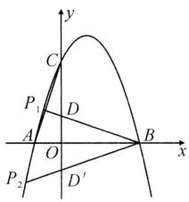

text_image

y
C
P₁
D
A
O
B
x
P₂
D′

# 板块三 倍角

# 方法一：

解: 连接 AC, 设 AP 与 y 轴交于点 E. 易得点 $P(2, -2)$ , $A(-2, 0)$ , $C(0, 1)$ ,

∴直线 AC: $y=\frac{1}{2}x+1$ ,

直线 AP: $y = -\frac{1}{2}x - 1$ ,

$$
\therefore E (0, - 1), \therefore O C = O E,
$$

$$
\therefore \triangle A O E \cong \triangle A O C,
$$

$$
\therefore \angle C A B = \angle P A B,
$$

$$
\therefore \angle P A C = 2 \angle P A B = \angle A P D,
$$

$$
\therefore P D \parallel A C,
$$

∴可得直线 PD: $y=\frac{1}{2}x-3$ ,

由 $-\frac{1}{2}x^{2}-\frac{1}{2}x+1=\frac{1}{2}x-3$ ,

得 $x_{D} = -4, \therefore D(-4, -5)$ .

# 方法二：

解:延长 DP 交 x 轴于点 E.

$$
\because \angle A P D = 2 \angle P A B,
$$

$$
\therefore \angle P A E = \angle P E A,
$$

$$
\therefore P A = P E,
$$

易知点 $A(-2,0)$ , $P(2,-2)$ ，可得点 $E(6,0)$ ,

∴直线 PD:y= $\frac{1}{2}$ x-3,

由 $-\frac{1}{2}x^{2}-\frac{1}{2}x+1=\frac{1}{2}x-3,$

得 $x_{D}=-4,\therefore D(-4,-5)$ .

# 方法三：

解: 过点 A 作 $AE \parallel y$ 轴, 交 PD 于点 E, 过点 P 作 $PF \perp AE$ 于点 F.

则 $\angle APF = \angle PAB$

$$
\because \angle A P D = 2 \angle P A B,
$$

$$
\therefore \angle A P F = \angle E P F,
$$

$$
\therefore A F = E F,
$$

易知点 $A(-2,0)$ , $P(2,-2)$ ,

可得点 $E(-2,-4)$ ,

∴直线 PD:y= $\frac{1}{2}$ x-3,

由 $-\frac{1}{2}x^{2}-\frac{1}{2}x+1=\frac{1}{2}x-3,$

得 $x_{D}=-4,\therefore D(-4,-5)$ .

# 板块四 $45^{\circ}$ 角

# 【典例精讲】

【例 1】解: 过点 A 作 $AM \perp AC$ , 交 CQ 的延长线于点 M, 过点 M 作 $MN \perp x$ 轴于点 N,

则 $\triangle ACM$ 为等腰直角三角形，

$$
\therefore A C = A M,
$$

$$
\therefore \triangle A C O \cong \triangle M A N.
$$

$$
\therefore M N = O A, A N = O C.
$$

由 $y = -x^{2} + 4x - 3$

得 $A(1,0),C(0,-3)$

$$
\therefore M N = O A = 1, A N = O C = 3,
$$

$$
\therefore M (4, - 1),
$$

∴直线 $CQ: y = \frac{1}{2}x - 3$ ,

联立 $\left\{\begin{aligned}y&=\frac{1}{2}x-3,\\ y&=-x^{2}+4x-3,\end{aligned}\right.$

得点 $Q\left(\frac{7}{2}, -\frac{5}{4}\right)$ .

【例 2】解：(1) $y=-x^{2}+2x+3$ ;

(2) 过点 A 作 $AQ \perp AN$ 交直线 CP 于点 Q，过点 Q 作 $QH \perp x$ 轴于点 H，设对称轴与 x 轴的交点为 D.

设直线 $PC$ 的解析式为 $y = kx + 3$

$$
\therefore N (1, k + 3),
$$

$$
\therefore O D = 1, D N = k + 3,
$$

$$
\because A (- 1, 0),
$$

$$
\therefore O A = 1, \therefore A D = 2,
$$

易得 $\triangle NAD\cong \triangle AQH$ (AAS),

$$
\therefore Q H = A D = 2, A H = D N = k + 3,
$$

$$
\therefore Q (- k - 4, 2),
$$

$$
\therefore 2 = k (- k - 4) + 3,
$$

∴ $k=\sqrt{5}-2$ 或 $k=-\sqrt{5}-2$ ,

∴直线 PC 的解析式为 $y=(\sqrt{5}-2)x$

$$
+ 3 \text {或} y = (- \sqrt {5} - 2) x + 3.
$$

# 【实战演练】

1. 解: 过点 B 作 $BF \parallel PC$ ，过点 D 作 $DF \perp BD$ 交 BF 于点 F，再过点 D 作 x 轴的平行线 GH，分别过点 B，F 作 GH 的垂线，垂足分别为 G，H，则 $\angle DBF = \angle BEP = 45^{\circ}$ ， $\triangle BDF$ 为等腰直角三角形， $\triangle BDG \cong \triangle DFH$ ，

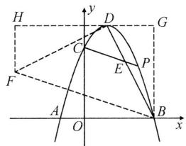

text_image

H
y
D
G
C
E
P
F
A
O
B
x

$$
\therefore D H = B G, F H = D G.
$$

$$
\because y = - x ^ {2} + 2 x + 3 = - (x - 1) ^ {2} + 4,
$$

∴顶点 $D(1,4)$ , $B(3,0)$ ,

∴可得 $F(-3,2)$ ,

∴直线 BF: $y = -\frac{1}{3}x + 1$ ,

$$
\because B F \parallel P C,
$$

∴ 直线 PC: $y = -\frac{1}{3}x + 3$ ，易知直线 BD: $y = -2x + 6$ ，

联立 $\left\{\begin{aligned}y&=-\frac{1}{3}x+3,\\ y&=-2x+6,\end{aligned}\right.$

解得 $\left\{\begin{aligned}x&=\frac{9}{5},\\ y&=\frac{12}{5},\end{aligned}\right.$ $\therefore E\left(\frac{9}{5},\frac{12}{5}\right).$

2. 解: ① 当点 P 在第二象限时, 在 y 轴正半轴上取点 M(0,1), 连接 BM 交抛物线于点 P.

由 $y = -x^{2} + 2x + 3$ 可得 A(-1,0), B(3,0), C(0,3),

$$
\therefore O B = O C = 3, O M = O A = 1,
$$

$$
\angle B O M = \angle C O A = 9 0 ^ {\circ},
$$

$$
\therefore \triangle B O M \cong \triangle C O A (\mathrm{SAS}),
$$

$$
\therefore \angle M B O = \angle A C O,
$$

$$
\because \angle C B O = 4 5 ^ {\circ},
$$

$$
\therefore \angle C B P + \angle M B O = 4 5 ^ {\circ},
$$

$$
\therefore \angle C B P + \angle A C O = 4 5 ^ {\circ},
$$

由点 B, M 的坐标, 得直线 BP: $y = -\frac{1}{3}x + 1$ ;

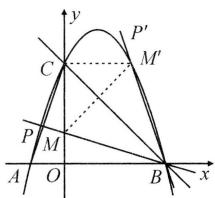

text_image

y
P'
C
M'
P
M
A
O
B
x

②当点 P 在第一象限时，作点 M 关于直线 BC 的对称点 $M'$ ，连接 $MM'$ ， $CM'$ ，直线 $BM'$ 交抛物线于点 $P'$ .

由对称, 得 $MM' \perp BC, CM' = CM = 2, \angle BCM' = \angle BCM = 45^{\circ}$ ,

$$
\therefore \angle M C M ^ {\prime} = 9 0 ^ {\circ}, \therefore M ^ {\prime} (2, 3),
$$

点 $M'(2,3)$ 在抛物线上，点 P 与点 $M'$ 重合，则直线 BP: $y = -3x + 9$ .

综上所述, 直线 BP 的解析式为 $y = -\frac{1}{3}x + 1$ 或 $y = -3x + 9$ .

# 板块五 角的和差

# 【典例精讲】

【例】解：易求 $A(-3,0), B(1,0)$ ， $C(0,3)$ ，

$$
\therefore O A = O C, \therefore \angle C A B = 4 5 ^ {\circ},
$$

$$
\therefore \angle A C B + \angle A B C = 1 3 5 ^ {\circ},
$$

$$
\therefore \angle M C A = \angle A C B,
$$

过点 A 作 $AD \perp AB$ 交 CM 的延长线于点 D，

$$
\therefore \angle D A C = \angle C A B = 4 5 ^ {\circ},
$$

$$
\therefore \triangle A B C \cong \triangle A D C,
$$

$$
\therefore A D = A B = 4, \therefore D (- 3, 4),
$$

∴直线 CD 的解析式为 $y = -\frac{1}{3}x$

+3,联立 $\left\{\begin{aligned}y&=-\frac{1}{3}x+3,\\ y&=-x^{2}-2x+3.\end{aligned}\right.$

$$
\therefore \left\{ \begin{array}{l} x _ {1} = 0, \\ y _ {1} = 3, \end{array} \right. \left\{ \begin{array}{l} x _ {2} = - \frac {5}{3}, \\ y _ {2} = \frac {3 2}{9}, \end{array} \right.
$$

$$
\therefore M \left(- \frac {5}{3}, \frac {3 2}{9}\right).
$$

# 【实战演练】

1. 解: 由 $y = -\frac{2}{3}x^{2} + \frac{2}{3}x + 4$ 可求 $B(3,0), C(0,4), \therefore BC=5.$

假设存在点 P，使得 $\angle BCO + 2\angle BCP = 90^{\circ}$ ，延长 CP 交 x 轴于点 M.

$$
\because \angle B C O + 2 \angle P C B = 9 0 ^ {\circ},
$$

$$
\angle B C O + \angle O B C = 9 0 ^ {\circ},
$$

$$
\therefore \angle O B C = 2 \angle P C B,
$$

$$
\therefore \angle B C P = \angle B M C, \therefore B C = B M.
$$

$$
\because B C = 5, \therefore B M = 5, O M = 8,
$$

$$
\therefore M (8, 0),
$$

∴直线 CM 的解析式为 $y=-\frac{1}{2}x+4$ ，联立得 $-\frac{2}{3}x^{2}+\frac{2}{3}x+4=-\frac{1}{2}x+4$ ，解得 $x=\frac{7}{4}$ 或 x=0（舍），

∴存在点 P 满足题意, 此时 $m=\frac{7}{4}$ .

2. 解: 过点 C 作 $CF \parallel OP$ ，过点 E 作 $EF \perp CE$ ，交 CF 于点 F，过点 F 作 $FH \perp x$ 轴于点 H，则 $\angle FCE = \angle FCO + \angle OCE = \angle POC + \angle OCE = 45^{\circ}$ ，

∴△FCE 为等腰直角三角形，

$$
\therefore \mathrm{Rt} \triangle C O E \cong \mathrm{Rt} \triangle E H F,
$$

$$
\therefore F H = O E = 1, E H = C O = 3,
$$

$$
\therefore F (- 2. - 1),
$$

∴直线 CF 的解析式为 $y=2x+3$ ,

∴直线 OP 的解析式为 y=2x，

联立 $\left\{\begin{aligned}y&=2x,\\ y&=-x^{2}+2x+3,\end{aligned}\right.$

解得 $\left\{ \begin{array}{l}x_{1} = -\sqrt{3},\\ y_{1} = -2\sqrt{3}, \end{array} \right.\left\{ \begin{array}{l}x_{2} = \sqrt{3},\\ y_{2} = 2\sqrt{3}, \end{array} \right.$

$$
\therefore P (\sqrt {3}, 2 \sqrt {3}).
$$

# 第 13 讲 二次函数与特殊图形 板块一 二次函数与等腰三角形 【典例精讲】

【例】解:(1)抛物线的解析式为 $y = -x^{2} + x + 2$ ,

直线 BC 的解析式为 $y = -x + 2$ ;

(2)∵点M在直线BC上，且 $P(m,n)$ ，
∴点 $M(m,-m+2)$ ,

$$
\therefore C M ^ {2} = (m - 0) ^ {2} + (- m + 2 - 2) ^ {2}
$$

$$
= 2 m ^ {2}, O M ^ {2} = m ^ {2} + (- m + 2) ^ {2} =
$$

$2m^{2}-4m+4,\triangle OCM$ 为等腰三角形,则存在以下三种情况:

① 若 $CM = OM$ ，则 $CM^2 = OM^2$ ，即 $2m^{2} = 2m^{2} - 4m + 4$ ，解得 $m = 1$

②若 CM = OC，则 $CM^{2} = OC^{2}$ ，即 $2m^{2} = 4$ ，解得 $m = \sqrt{2}$ 或 $m = -\sqrt{2}$ （舍去）；

③若 $OM = OC$ ，则 $OM^2 = OC^2$ ，即

$2m^{2}-4m+4=4$ , 解得 m=2 或 m=0 (舍去).

综上所述， $m = 1$ 或 $m = \sqrt{2}$ 或 $m = 2$

# 【实战演练】

解: 存在以点 Q 为直角顶点的等腰 Rt△CQR, 理由如下: 设点 $Q(a, -a^{2} + 2a + 8)$ , 则有:

①当点 Q 在第二象限时，存在等腰 Rt△CQR 时，如图 1 所示：过点 Q 作 $QL \perp x$ 轴于点 L，过点 C 作 $CK \perp QL$ ，交其延长线于点 K，可得 △KCQ ≅ △LQR (AAS)，

$$
\therefore Q L = C K, \therefore Q L = C K = O L,
$$

$$
\therefore - a = - a ^ {2} + 2 a + 8,
$$

解得 $a_{1}=\frac{3-\sqrt{41}}{2}$ ， $a_{2}=\frac{3+\sqrt{41}}{2}$ （不符合题意，舍去），

$$
\therefore Q \left(\frac {3 - \sqrt {4 1}}{2}, \frac {\sqrt {4 1} - 3}{2}\right);
$$

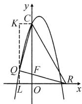  
图1

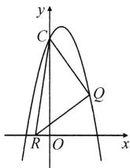  
图2

②当点 Q 在第一象限时，存在等腰 Rt△CQR 时，如图 2 所示：同理①可得 $a = -a^{2} + 2a + 8$ ，解得 $a_{1} = \frac{1 + \sqrt{33}}{2}$ ， $a_{2}=\frac{1-\sqrt{33}}{2}$ （不符合题意，舍去），

$$
\therefore Q \left(\frac {1 + \sqrt {3 3}}{2}, \frac {1 + \sqrt {3 3}}{2}\right).
$$

综上所述，存在以点 $Q$ 为直角顶点的等腰 $\mathrm{Rt}\triangle CQR$ ，点 $Q$ 的坐标为 $\left(\frac{3 - \sqrt{41}}{2},\right.$ $\frac{\sqrt{41} - 3}{2}\Big)$ 或 $\left(\frac{1 + \sqrt{33}}{2},\frac{1 + \sqrt{33}}{2}\right).$

# 板块二 二次函数与平行四边形 【典例精讲】

【例】解:存在,理由如下:

由题可知 $x_{A} = -5, x_{C} = 0$

$$
x _ {N} = - 2, \text {设} x _ {M} = m.
$$

分三种情况：

①如图1，当AC为对角线时，

则 $x_{A} + x_{C} = x_{M} + x_{N}$

$$
\therefore - 5 + 0 = m - 2, \text {解得} m = - 3,
$$

$$
\therefore M (- 3, 8);
$$

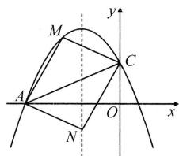

text_image

M
y
C
A
O
x
N

图1

②如图 2, 当 AM 为对角线时,

$$
x _ {A} + x _ {M} = x _ {C} + x _ {N},
$$

$\therefore -5+m=0-2$ , 解得 m=3,

$$
\therefore M (3, - 1 6);
$$

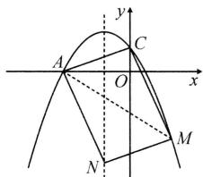

text_image

y
A
C
O
x
M
N

图2

③如图3，当AN为对角线时，

$$
x _ {A} + x _ {N} = x _ {C} + x _ {M},
$$

$\therefore -5 - 2 = 0 + m$ ，解得 $m = -7$

$$
\therefore M (- 7, - 1 6);
$$

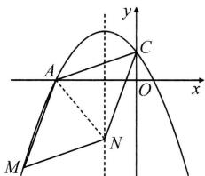

text_image

Mathematical diagram showing a parabola intersecting x-axis at points A and C, with auxiliary points M, N, and O, and coordinate axes labeled.

图3

综上所述，点 M 的坐标为 $(-3,8)$ 或 $(3,-16)$ 或 $(-7,-16)$ .

# 【实战演练】

1. 解: (1) $y = \frac{1}{2} x^{2} - \frac{3}{2} x - 9$ ;

(2)∵以点A,C,P,Q为顶点的平行四边形是以AC为一边，

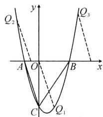

text_image

Q₂
y
Q₃
A O B x
C Q₁

$$
\therefore P Q \parallel A C, \text {且} P Q = A C,
$$

$$
\therefore | y _ {Q} - y _ {P} | = | y _ {A} - y _ {C} | = 9,
$$

$$
\therefore y _ {Q} = \pm 9.
$$

当 $y_{Q} = -9$ 时， $\frac{1}{2} x^2 -\frac{3}{2} x - 9 = -9,$

可得 $Q_{1}(3, - 9)$

当 $y_{Q} = 9$ 时， $\frac{1}{2} x^2 -\frac{3}{2} x - 9 = 9,$

$$
\therefore x = \frac {3 \pm 3 \sqrt {1 7}}{2},
$$

$$
\therefore Q _ {2} \left(\frac {3 - 3 \sqrt {1 7}}{2}, 9\right), Q _ {3} \left(\frac {3 + 3 \sqrt {1 7}}{2}, 9\right).
$$

综上所述， $Q(3,-9)$ 或 $\left(\frac{3-3\sqrt{17}}{2},9\right)$ 或 $\left(\frac{3+3\sqrt{17}}{2},9\right)$ .

2. 解: (1) $B(3,0)$ , $C(0,3)$ , 对称轴为直线 x=1;

(2) 存在. 设点 $M(1, t)$ ,

$$
G (m, - m ^ {2} + 2 m + 3).
$$

①当 BC 为平行四边形的边时,有 $\left|x_{M}-x_{G}\right|=x_{B}-x_{C}$ ,

∴ $\left|1-m\right|=3$ ，解得 m=-2 或 4，

$$
\therefore G (- 2, - 5) \text { 或 } (4, - 5);
$$

②当 BC 为平行四边形的对角线时，
有 $x_{M} + x_{G} = x_{C} + x_{B}$ ,

$$
\therefore 1 + m = 0 + 3, \therefore m = 2, \therefore G (2, 3).
$$

综上所述,满足条件的点 G 的坐标为 $(-2,-5)$ 或 $(4,-5)$ 或 $(2,3)$ .

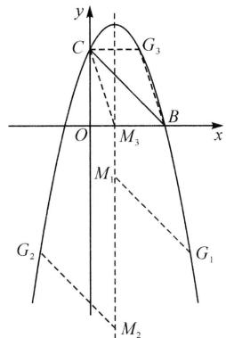

text_image

y
C
G₃
O
M₃
B
x
M₁
G₂
G₁
M₂

# 板块三 二次函数与菱形、正方形

# 【典例精讲】

【例】解: 在 y 轴上存在点 Q, 使以 M, N, C, Q 为顶点的四边形是菱形, 理由如下:

由 $A(-3,0)$ , $C(0,-3)$ 得直线 AC 解析式为 y = -x - 3,

设 $Q(0,t),P(n,0)$ ，则 $M(n, - n -$

3), $N(n, n^{2} + 2n - 3)$ ,

∵MN//CQ,

∴当 M, N, C, Q 为顶点的四边形是菱形时，MN, CQ 是一组对边；

①当 MC, NQ 为对角线时, MC, NQ 的中点重合, 且 CN = CQ,

$$
\therefore \left\{ \begin{array}{l} {- n - 3 - 3 = t + n ^ {2} + 2 n - 3,} \\ {n ^ {2} + (n ^ {2} + 2 n) ^ {2} = (t + 3) ^ {2},} \end{array} \right.
$$

解得 $\left\{\begin{aligned}n=0,\\ t=-3,\end{aligned}\right.$ （舍）或 $\left\{\begin{aligned}n=-2,\\ t=-1,\end{aligned}\right.$

$\therefore Q(0,-1)$ ;

②当 MQ, CN 为对角线时, MQ, CN 的中点重合, 且 CQ = CM,

$$
\therefore \left\{ \begin{array}{l} {- n - 3 + t = n ^ {2} + 2 n - 3 - 3,} \\ {(t + 3) ^ {2} = n ^ {2} + (- n) ^ {2},} \end{array} \right.
$$

解得 $\left\{\begin{aligned}n=0,\\ t=-3,\end{aligned}\right.$ （舍）或

$$
\left\{ \begin{array}{l l} n = - 3 + \sqrt {2}, \\ t = - 1 - 3 \sqrt {2}, \end{array} \right. \text {或} \left\{ \begin{array}{l l} n = - 3 - \sqrt {2}, \\ t = - 1 + 3 \sqrt {2}, \end{array} \right.
$$

∴ $Q(0, -1 - 3\sqrt{2})$ 或 $(0, -1 + 3\sqrt{2})$ .

综上所述，Q 的坐标为 $(0, -1)$ 或 $(0, -1 - 3\sqrt{2})$ 或 $(0, -1 + 3\sqrt{2})$ .

# 【实战演练】

解:(1) $y=-x^{2}+2x+3;$

(2)①当点 N 在抛物线的对称轴上时，
过点 P 作 $PE \perp x$ 轴于点 E，

设抛物线的对称轴与 x 轴交于点 D.

∵四边形 BPMN 为正方形，

∴可得 $\triangle PEB\cong\triangle BDN$ (AAS),

$\therefore PE=BD.$

∵对称轴为直线 $x=1,\therefore D(1,0)$ .

$\because B(3,0),\therefore BD=3-1=2,$

$\therefore PE=BD=2,$

由 $-x^{2} + 2x + 3 = 2$ ，解得 $x = 1\pm \sqrt{2}$

∴ $P(1+\sqrt{2},2)$ 或 $(1-\sqrt{2},2)$ ;

②当点 M 在抛物线的对称轴上时，过点 P 作 $PG \perp x$ 轴于点 G，过点 P 作 PF 垂直抛物线对称轴于点 F，

则 $\triangle PFM\cong\triangle PGB(AAS)$ ,

∴ PF = PG，设 PF = PG = t，

$$
\therefore P (t + 1, t), \text {代入} y = - x ^ {2} + 2 x + 3,
$$

得 $-(t+1)^{2}+2(t+1)+3=t$ ，

解得 $t=\frac{\pm\sqrt{17}-1}{2}$ .

$$
\because t > 0,
$$

$$
\therefore t = \frac {\sqrt {1 7} - 1}{2}, t + 1 = \frac {\sqrt {1 7} + 1}{2},
$$

∴点 P 的坐标为 $\left(\frac{\sqrt{17}+1}{2},\frac{\sqrt{17}-1}{2}\right)$ .

综上，点 $P$ 的坐标为 $(1 + \sqrt{2}, 2)$ 或 $(1 - \sqrt{2}, 2)$ 或 $\left(\frac{\sqrt{17} + 1}{2}, \frac{\sqrt{17} - 1}{2}\right)$ .

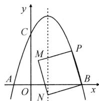

text_image

y
C
M
P
A
O
N
B
x

# 第 14 讲 抛物线与平移、对称

# 板块一 平移

# 【典例精讲】

【例】解: 过点 D, E 分别作 x 轴, y 轴的垂线, 两线交于点 H, 设平移后抛物线的解析式为 $y = x^{2} - 2x - 3 + k$ . 易知点 $B(3,0)$ , $C(0,-3)$ ,

$$
\therefore O B = O C = 3,
$$

$$
\therefore \angle O C B = \angle O B C = 4 5 ^ {\circ},
$$

$$
\therefore \angle D E H = \angle O B C = 4 5 ^ {\circ},
$$

$$
\because D E = \sqrt {2},
$$

∴EH=1, 即 $x_{E}-x_{D}=1$ .

可知直线 BC:y=x-3,

由 $y=x^{2}-2x-3+k=x-3$ ,

得 $x^{2} - 3x + k = 0$

$$
\therefore x _ {E} + x _ {D} = 3, x _ {E} x _ {D} = k,
$$

$$
\because (x _ {E} - x _ {D}) ^ {2} = (x _ {E} + x _ {D}) ^ {2} - 4 x _ {E} x _ {D},
$$

$$
\therefore 1 ^ {2} = 3 ^ {2} - 4 k, \therefore k = 2.
$$

# 【实战演练】

解: 设 $D(t, -t + 3)$ ,

则抛物线为 $y=-(x-t)^{2}-t+3$ ,

联立 $\left\{\begin{aligned}y&=-x+3,\\ y&=-(x-t)^{2}-t+3,\end{aligned}\right.$

得 $x^{2}-(2t+1)x+t^{2}+t=0$ ,

$$
\therefore x _ {D} + x _ {E} = 2 t + 1, x _ {D} x _ {E} = t ^ {2} + t,
$$

$$
\therefore (x _ {D} - x _ {E}) ^ {2} = (x _ {D} + x _ {E}) ^ {2} - 4 x _ {D} x _ {E}
$$

$$
= (2 t + 1) ^ {2} - 4 (t ^ {2} + t) = 1,
$$

$$
\therefore x _ {E} - x _ {D} = 1,
$$

$$
\therefore y _ {D} - y _ {E} = (- x _ {D} + 3) - (- x _ {E} + 3)
$$

$$
= x _ {E} - x _ {D} = 1.
$$

设直线 l 与 x 轴的交点为 G，
则 $G(3,0)$ ,

$$
\begin{array}{l} \therefore S _ {\triangle A D E} = S _ {\triangle A D G} - S _ {\triangle A E G} \\ = \frac {1}{2} A G (y _ {D} - y _ {E}) \\ = \frac {1}{2} A G. \\ \end{array}
$$

$$
\because S _ {\triangle A D E} = \frac {1 5}{8}, \therefore \frac {1}{2} A G = \frac {1 5}{8},
$$

$$
\therefore A G = \frac {1 5}{4}, \therefore A \left(- \frac {3}{4}, 0\right),
$$

将 $A\left(-\frac{3}{4},0\right)$ 代入 $y = -(x - t)^2 -$

$$
t + 3,
$$

得 $-\left(-\frac{3}{4}-t\right)^{2}-t+3=0$ ,

解得 $t_{1}=\frac{3}{4}, t_{2}=-\frac{13}{4}$ (舍去),

$$
\therefore D \left(\frac {3}{4}, \frac {9}{4}\right).
$$

# 板块二 对称

分析:画图分析是关键.1.如何表示翻折后的抛物线解析式?2.存在几种情况?

解: 存在两种情况:

一是翻折后的部分过原点,二是翻折后的部分与 y=x 只有唯一公共点.

易知原抛物线顶点 $(4,-8)$ 与翻折后的顶点关于y=m对称，

∴翻折后抛物线的顶点坐标为 $(4,2m+8)$ ,

∴翻折后抛物线解析式为

$$
y = - \frac {1}{2} (x - 4) ^ {2} + 2 m + 8.
$$

①当 $y = -\frac{1}{2} (x - 4)^2 + 2m + 8$ 过原点

(0,0)时,将(0,0)代入,得m=0;

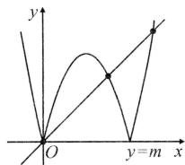

text_image

y
O
y=m x

图1

②当翻折后的部分与直线 y = x 只有唯一公共点时，

联立 $\left\{\begin{aligned}y&=-\frac{1}{2}(x-4)^{2}+2m+8,\\ y&=x,\end{aligned}\right.$

得 $\frac{1}{2}x^{2}-3x-2m=0$ ,

依题意, 得 $\Delta=0$ ,

$$
\therefore (- 3) ^ {2} - 4 \times \frac {1}{2} \times (- 2 m) = 0,
$$

$$
\therefore m = - \frac {9}{4}.
$$

综上所述， $m = 0$ 或 $m = -\frac{9}{4}$

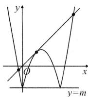

text_image

y
O
x
y=m

图2

# 第15讲 二次函数与最值板块一 线段最值

# 【典例精讲】

【例】解：(1) $y=\frac{1}{4}x^{2}-\frac{1}{2}x-2;$

(2) $\because A(0,-2),B(4,0),$

∴直线 AB 的解析式为 $y=\frac{1}{2}x-2$ ,

设 $P\left(m, \frac{1}{4} m^2 - \frac{1}{2} m - 2\right) (0 < m < 4)$ ,

则 $K\left(\frac{1}{2} m^2 -m,\frac{1}{4} m^2 -\frac{1}{2} m - 2\right),$

$$
\begin{array}{l} \therefore \frac {1}{2} P K + P D = \frac {1}{2} \left(m - \frac {1}{2} m ^ {2} + m\right) \\ + \left(- \frac {1}{4} m ^ {2} + \frac {1}{2} m + 2\right) = - \frac {1}{2} m ^ {2} \\ + \frac {3}{2} m + 2 = - \frac {1}{2} \left(m - \frac {3}{2}\right) ^ {2} + \frac {2 5}{8}, \\ \because - \frac {1}{2} <   0, \\ \end{array}
$$

∴当 $m=\frac{3}{2}$ 时， $\frac{1}{2}PK+PD$ 有最大

值,最大值为 $\frac{25}{8}$ ,此时 $P\left(\frac{3}{2},-\frac{35}{16}\right)$ .

# 【实战演练】

解:(1) $y=x^{2}-2x-3;$

(2) 过点 P 作 $PN \parallel y$ 轴交 EF 于点 N，
设 $P(t, t^{2}-2t-3)$ ,

则 $\angle PNM = 45^{\circ}, N(t, t + n)$ ,

$$
\therefore P M = \frac {\sqrt {2}}{2} P N,
$$

$$
\begin{array}{l} \because P N = t + n - (t ^ {2} - 2 t - 3) = - t ^ {2} + \\ 3 t + n + 3, \end{array}
$$

$$
\therefore P M = \frac {\sqrt {2}}{2} (- t ^ {2} + 3 t + n + 3).
$$

当 $t = \frac{3}{2}$ 时， $PM$ 取最大值，最大值为 $\frac{\sqrt{2}}{2}\left(n + \frac{21}{4}\right)$ ，

$$
\therefore \frac {\sqrt {2}}{2} \left(n + \frac {2 1}{4}\right) = 2 \sqrt {2}, \therefore n = - \frac {5}{4}.
$$

∴直线 EF 的解析式为 $y=x-\frac{5}{4}$ .

# 板块二 面积最值

# 【典例精讲】

【例】解: 易求抛物线的解析式为 $y = x^{2} + 2x - 8, C(0, -8)$ ,

直线 AC: y = -2x - 8.

过点 P 作 $PF \parallel y$ 轴，交 AC 于点 F，

设 $P(t,t^2 +2t - 8)$ ，则 $F(t, - 2t - 8)$

$$
\begin{array}{l} \therefore P F = - 2 t - 8 - (t ^ {2} + 2 t - 8) = \\ - t ^ {2} - 4 t, \end{array}
$$

$$
\therefore S _ {\triangle P A C} = \frac {1}{2} P F \cdot | x _ {C} - x _ {A} | = 2 P F
$$

$$
= 2 (- t ^ {2} - 4 t) = - 2 (t + 2) ^ {2} + 8,
$$

$$
\because - 2 <   0,
$$

∴当 t = -2 时， $S_{\triangle PAC最大} = 8$ ，此时点 $P(-2, -8)$ .

# 【实战演练】

解:(1) $y=x^{2}-2x-3$ ;

(2)由 $B(3,0)$ , $C(0,-3)$ ，可求得直线 BC 的解析式为 y=x-3，连接 CP.

$$
\because P Q \parallel A C, \therefore S _ {\triangle P A Q} = S _ {\triangle P C Q},
$$

$$
\therefore S = S _ {1} + S _ {2} = S _ {\triangle B C P}.
$$

过 P 作 $PF \parallel y$ 轴交 BC 于 F，设 $P(m, m^{2}-2m-3)$ ，则 $F(m, m-3)$ ，

$$
\begin{array}{l} \therefore P F = m - 3 - (m ^ {2} - 2 m - 3) = - m ^ {2} \\ + 3 m, \end{array}
$$

$$
\therefore S = \frac {1}{2} P F \cdot | x _ {B} - x _ {C} | = \frac {3}{2} (- m ^ {2}
$$

$$
+ 3 m) = - \frac {3}{2} \left(m - \frac {3}{2}\right) ^ {2} + \frac {2 7}{8}.
$$

$$
\because - \frac {3}{2} <   0,
$$

∴当 $m=\frac{3}{2}$ 时，S 取得最大值 $\frac{27}{8}$ ，此时 $P\left(\frac{3}{2},-\frac{15}{4}\right)$ .

# 板块三 将军饮马、胡不归最值

# 【典例精讲】

【例】解：由 $y = x^{2} - 5x + 4$ ，可得 $A(1,0)$ ， $B(4,0)$ ， $C(0,4)$ ，抛物线的对称轴为直线 $x = \frac{5}{2}$ ，

∵△PAC 的周长等于 $PA + PC + AC$ , AC 为定长，

∴当 $PA + PC$ 的值最小时， $\triangle PAC$ 的周长最小，

∵A,B关于抛物线的对称轴对称，

$$
\therefore P A + P C = P B + P C \geqslant B C,
$$

当 P, B, C 三点共线时, $PA + PC$ 的值最小, 此时点 P 为直线 BC 与对称轴的交点, 易知直线 BC: y = -x+4, 当 $x=\frac{5}{2}$ 时, $y=-\frac{5}{2}+4=\frac{3}{2}$ ,

$$
\therefore P \left(\frac {5}{2}, \frac {3}{2}\right),
$$

$$
\because A (1, 0), C (0, 4),
$$

$$
\therefore P A = \sqrt {\left(\frac {5}{2} - 1\right) ^ {2} + \left(\frac {3}{2}\right) ^ {2}} = \frac {3 \sqrt {2}}{2},
$$

$$
P C = \sqrt {\left(\frac {5}{2}\right) ^ {2} + \left(4 - \frac {3}{2}\right) ^ {2}} = \frac {5 \sqrt {2}}{2},
$$

$$
\therefore \frac {P A}{P C} = \frac {3}{5}.
$$

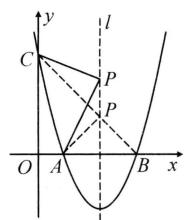

text_image

y
C
l
P
P
O
A
B
x

# 【实战演练】

解:设对称轴与 x 轴的交点为 C, 连接 BD, 过点 P 作 $PH \perp BD$ 于点 H,
过点 A 作 $AM \perp BD$ 于点 M,

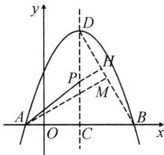

text_image

y
D
H
P
M
A
O
C
B
x

$$
\begin{array}{l} \because y = - \frac {\sqrt {3}}{3} (x + 1) (x - 5) \\ = - \frac {\sqrt {3}}{3} (x - 2) ^ {2} + 3 \sqrt {3}, \\ \end{array}
$$

∴点 $D(2,3\sqrt{3})$ , $A(-1,0)$ , $B(5,0)$ ,

$$
\therefore A B = 6, B C = 3, D C = 3 \sqrt {3},
$$

在 Rt△DCB 中，

$$
D B = \sqrt {D C ^ {2} + B C ^ {2}} = 6,
$$

$$
\therefore \angle B D C = 3 0 ^ {\circ}, \angle D B C = 6 0 ^ {\circ},
$$

$$
\therefore P H = \frac {1}{2} D P,
$$

$\therefore AP+\frac{1}{2}DP$ 的最小值即为 $AP+PH$ 的最小值，

∴当点 A, P, H 三点共线时有最小值, 即为 AM 的长,

$$
\because A B = 6, \angle D B C = 6 0 ^ {\circ},
$$

$$
\therefore \angle B A M = 3 0 ^ {\circ},
$$

$$
\therefore B M = 3, A M = 3 \sqrt {3},
$$

∴ $AP + \frac{1}{2} DP$ 的最小值为 $3\sqrt{3}$ .

# 第16讲 二次函数与参数板块一 点参与线参

# 【典例精讲】

【例】 点参法：

解:设点 $P\left(m,-\frac{1}{2}m^{2}+m+4\right)$ .

易知点 $A(-2,0), B(4,0)$

∴ 直线 PA: $y = -\frac{1}{2}(m - 4)x + 4 - m$ ,

$$
P B: y = - \frac {1}{2} (m + 2) x + 4 + 2 m,
$$

∴点 $M(0,4-m)$ , $N(0,4+2m)$ ,

$$
\therefore O M = 4 - m, O N = 4 + 2 m,
$$

$$
\therefore O M + \frac {1}{2} O N = 4 - m + 2 + m = 6.
$$

线参法：

解：∵点 A(-2,0), B(4,0),

∴可设直线 PA: $y=k_{1}x+2k_{1}$ ,

$$
P B: y = k _ {2} x - 4 k _ {2},
$$

$$
\therefore O M + \frac {1}{2} O N = 2 k _ {1} - 2 k _ {2}.
$$

联立 $\left\{ \begin{array}{l} y = -\frac{1}{2} x^2 + x + 4, \\ y = k_1 x + 2k_1, \end{array} \right.$

得 $\frac{1}{2} x^2 +(k_1 - 1)x + 2k_1 - 4 = 0$

$$
\therefore x _ {A} + x _ {P} = 2 - 2 k _ {1},
$$

$$
\because x _ {A} = - 2,
$$

$$
\therefore x _ {P} = 4 - 2 k _ {1},
$$

同理可得 $x_{P} = -2 - 2k_{2}$

$$
\therefore 4 - 2 k _ {1} = - 2 - 2 k _ {2},
$$

$$
\therefore k _ {1} - k _ {2} = 3,
$$

$$
\therefore O M + \frac {1}{2} O N = 2 k _ {1} - 2 k _ {2} = 6.
$$

# 【实战演练】

点参法：

证明:设点 $P(m,m^{2}-2m-3)$ ,

$$
Q (n, n ^ {2} - 2 n - 3),
$$

易知点 $A(-1,0)$

可得直线 $PA:y = (m - 3)x + m - 3$

$$
Q A: y = (n - 3) x + n - 3,
$$

$$
\therefore \text {点} M (0, m - 3), N (0, n - 3),
$$

$$
\therefore O M = | m - 3 |, O N = | 3 - n |,
$$

$$
\therefore O M \cdot O N = | (m - 3) (3 - n) |
$$

$$
= | 3 (m + n) - m n - 9 |.
$$

由 $x^{2} - 2x - 3 = kx - 3k + 2$

得 $x^{2} - (k + 2)x + 3k - 5 = 0$

$$
\therefore m + n = k + 2, m n = 3 k - 5,
$$

$$
\therefore O M \cdot O N = | 3 (m + n) - m n - 9 |
$$

$$
= | 3 (k + 2) - 3 k + 5 - 9 |
$$

$$
= 2.
$$

线参法：

证明: 易知点 A(-1,0),

∴可设直线 $PA: y = k_{1}x + k_{1}$ ,

$$
Q A: y = k _ {2} x + k _ {2},
$$

$$
\therefore O M = \left| k _ {1} \right|, O N = \left| - k _ {2} \right|,
$$

$$
\therefore O M \cdot O N = \left| - k _ {1} k _ {2} \right|.
$$

由 $x^{2} - 2x - 3 = k_{1}x + k_{1}$

得 $x^{2} - (k_{1} + 2)x - 3 - k_{1} = 0$

$$
\therefore x _ {A} + x _ {P} = k _ {1} + 2,
$$

$$
\because x _ {A} = - 1, \therefore x _ {P} = k _ {1} + 3,
$$

同理可得 $x_{Q} = k_{2} + 3$

由 $x^{2} - 2x - 3 = kx - 3k + 2$

得 $x^{2} - (k + 2)x + 3k - 5 = 0$

$$
\therefore x _ {P} + x _ {Q} = k + 2, x _ {P} x _ {Q} = 3 k - 5,
$$

$$
\because x _ {P} + x _ {Q} = k _ {1} + 3 + k _ {2} + 3
$$

$$
= k _ {1} + k _ {2} + 6
$$

$$
= k + 2,
$$

$$
\therefore k _ {1} + k _ {2} = k - 4,
$$

$$
x _ {P} x _ {Q} = \left(k _ {1} + 3\right) \left(k _ {2} + 3\right)
$$

$$
= k _ {1} k _ {2} + 3 \left(k _ {1} + k _ {2}\right) + 9
$$

$$
= 3 k - 5,
$$

$$
\therefore k _ {1} k _ {2} = 3 k - 5 - 3 (k - 4) - 9 = - 2,
$$

$$
\therefore O M \cdot O N = \left| - k _ {1} k _ {2} \right| = 2.
$$

# 板块二 二次函数与和差定值

【典例精讲】

【例】解: 令 $x^{2}-1=0$ ,

解得 $x_{1} = 1, x_{2} = -1$

$$
\therefore A (- 1, 0), B (1, 0),
$$

∴设直线 PA:y=k₁x+k₁,

直线 $PB:y = k_{2}x - k_{2}$

$$
\therefore M \left(0, k _ {1}\right), N \left(0, - k _ {2}\right),
$$

$$
\therefore O M + O N = k _ {2} - k _ {1},
$$

联立 $\left\{\begin{aligned}y&=x^{2}-1,\\ y&=k_{1}x+k_{1},\end{aligned}\right.$

得 $x^{2} - k_{1}x - 1 - k_{1} = 0$

$$
\therefore x _ {A} \cdot x _ {P} = - 1 - k _ {1},
$$

$$
\because x _ {A} = - 1, \therefore x _ {P} = 1 + k _ {1},
$$

同理可得 $x_{P} = k_{2} - 1$

$$
\therefore 1 + k _ {1} = k _ {2} - 1, \therefore k _ {2} - k _ {1} = 2,
$$

$$
\therefore O M + O N = k _ {2} - k _ {1} = 2.
$$

【实战演练】

解：(1) $y=\frac{1}{4}x^{2}-1$ ;

(2)∵抛物线 $y=\frac{1}{4}x^{2}-1$ ,

令 $y = 0$ ，得 $\frac{1}{4} x^2 - 1 = 0$

$$
\therefore x _ {1} = - 2, x _ {2} = 2,
$$

$$
\therefore A (- 2, 0), B (2, 0),
$$

∵D,E两点关于y轴对称，

∴设 $D\left(m,\frac{1}{4}m^{2}-1\right)$ ,

则 $E\left(-m, \frac{1}{4} m^2 - 1\right)$ ,

∴直线 BD: $y=\frac{m+2}{4}x-\frac{m+2}{2}$ ,

$$
\therefore G \left(- 1, - \frac {3 m + 6}{4}\right),
$$

同理可得直线 BE: $y=\frac{2-m}{4}x+\frac{m-2}{2}$ ,

$$
\therefore Q \left(- 1, \frac {3 m - 6}{4}\right),
$$

$$
\because P (- 1, 0),
$$

$$
\therefore P G = 0 - \left(- \frac {3 m + 6}{4}\right) = \frac {3 m + 6}{4},
$$

$$
P Q = \frac {3 m - 6}{4},
$$

$$
\therefore P G - P Q = \frac {3 m + 6}{4} - \frac {3 m - 6}{4} = 3.
$$

# 板块三 二次函数与积商定值

【典例精讲】

【例】解：设 $E\left(x_{1},\frac{1}{4} x_{1}^{2}\right)$

$$
F \left(x _ {2}, \frac {1}{4} x _ {2} ^ {2}\right), P \left(n, \frac {1}{4} n ^ {2}\right),
$$

设直线 $PE:y = mx + b$

$$
\text {则} \left\{ \begin{array}{l} n m + b = \frac {1}{4} n ^ {2}, \\ x _ {1} m + b = \frac {1}{4} x _ {1} ^ {2}, \end{array} \right.
$$

$$
\therefore m = \frac {1}{4} (n + x _ {1}), b = - \frac {1}{4} n x _ {1},
$$

$$
\therefore y _ {P E} = \frac {1}{4} (n + x _ {1}) x - \frac {1}{4} n x _ {1},
$$

当 $y = -2$ 时， $x_{M} = \frac{n x_{1} - 8}{n + x_{1}}$

同理可求得 $x_{N} = \frac{n x_{2} - 8}{n + x_{2}}$

联立 $\left\{\begin{aligned}y&=\frac{1}{4}x^{2},\\ y&=kx+2,\end{aligned}\right.$

得 $\frac{1}{4} x^2 - kx - 2 = 0$

$$
\therefore x _ {1} + x _ {2} = 4 k, x _ {1} x _ {2} = - 8,
$$

$$
\therefore Q M \cdot Q N = \left| x _ {M} \right| \cdot \left| x _ {N} \right|
$$

$$
= \left| \frac {n x _ {1} - 8}{n + x _ {1}} \cdot \frac {n x _ {2} - 8}{n + x _ {2}} \right|
$$

$$
= \left| \frac {n ^ {2} x _ {1} x _ {2} - 8 n (x _ {1} + x _ {2}) + 6 4}{n ^ {2} + n (x _ {1} + x _ {2}) + x _ {1} x _ {2}} \right|
$$

$$
= \left| \frac {8 n ^ {2} + 8 n \times 4 k - 6 4}{n ^ {2} + 4 n k - 8} \right| = 8.
$$

【实战演练】

解: $\frac{CD}{DE}$ 的值是为定值.理由如下:

由 $ax^2 - 4ax + 3a = 0$ ，解得 $x = 1$ 或 3，

$$
\therefore A (1, 0), B (3, 0),
$$

令 $x = 0$ ，则 $y = 3a$

$$
\therefore C (0, 3 a),
$$

设点 $Q(m, am^2 - 4am + 3a)$ ，

直线 AQ 的解析式为 $y=kx+b$ ，

$$
\therefore \left\{ \begin{array}{l} a m ^ {2} - 4 a m + 3 a = k m + b, \\ 0 = k + b, \end{array} \right.
$$

解得 $\left\{\begin{aligned}k&=am-3a,\\ b&=3a-am,\end{aligned}\right.$

∴直线 AQ: $y = a(m - 3)x + a(3 - m)$ ，即点 D 坐标为 $(0, 3a - am)$ ，

同理可得点 $E(0,3a-3am)$ ,

$$
\therefore \frac {C D}{D E} = \frac {3 a - 3 a + a m}{3 a - a m - 3 a + 3 a m} = \frac {1}{2}, \text {   为   }
$$

定值.

# 板块四 二次函数与长度定值

【典例精讲】

【例】解: GM 的长是定值, 其值为 $\frac{9}{2}$ . 设直线 PQ: $y = kx + b$ , 联立

$$
\left\{ \begin{array}{l} y = k x + b, \\ y = - x ^ {2} - x + 2, \end{array} \right.
$$

得 $x^{2} + (k + 1)x + b - 2 = 0$

$$
\therefore x _ {P} + x _ {Q} = - k - 1, x _ {P} x _ {Q} = b - 2,
$$

$$
\therefore k = - 1 - x _ {P} - x _ {Q}, b = 2 + x _ {P} x _ {Q},
$$

∴直线 PQ 为 $y=(-1-x_{P}-x_{Q})x$

$$
+ 2 + x _ {P} x _ {Q},
$$

同理直线 HG 为 $y=(-1-x_{H}-x_{Q})x+2+x_{H}x_{Q}$ ,

∵点 P 与点 H 关于抛物线对称轴对称，

$$
\therefore x _ {P} + x _ {H} = - 1,
$$

$$
\therefore x _ {H} = - 1 - x _ {P},
$$

$$
\therefore H G \text {   为   } y = (x _ {P} - x _ {Q}) x + 2 - x _ {Q}
$$

$$
- x _ {P} x _ {Q},
$$

∵直线 PQ 经过点 $M\left(-\frac{1}{2},0\right)$ ,

$$
\therefore - \frac {1}{2} (- 1 - x _ {P} - x _ {Q}) + 2 + x _ {P} x _ {Q}
$$

$$
= 0, \text {即} - x _ {P} - x _ {Q} - 2 x _ {P} x _ {Q} = 5,
$$

$$
\therefore \text {   当   } x = - \frac {1}{2} \text {   时   }, y _ {G} = - \frac {1}{2} (x _ {P} -
$$

$$
x _ {Q}) + 2 - x _ {Q} - x _ {P} x _ {Q} = \frac {1}{2} (- x _ {P} -
$$

$$
x _ {Q} - 2 x _ {P} x _ {Q}) + 2 = \frac {9}{2},
$$

$$
\therefore G M = \frac {9}{2}.
$$

# 【实战演练】

解: 令 y=0，即 $x^{2}-2x-3=0$ ，

解得 $x_{1} = -1, x_{2} = 3$

∵点 A 在点 B 的左侧，

∴点 $A(-1,0)$ , $B(3,0)$ ,

设 $Q(m, m^{2} - 2m - 3)$ ，直线 BQ 的解析式为 $y = kx + b$ ，

$$
\therefore \left\{ \begin{array}{l} 3 k + b = 0, \\ m k + b = m ^ {2} - 2 m - 3, \end{array} \right.
$$

解得 $\left\{\begin{aligned}k=m+1,\\ b=-3(m+1),\end{aligned}\right.$

∴直线 BQ 的解析式为 $y=(m+1)x-3(m+1)$ ,

$$
\therefore M (0, - 3 m - 3),
$$

同理得: 直线 AQ 的解析式为 $y = (m - 3)x + (m - 3)$ ,

∵BN∥AQ, 设 BN 的解析式为 $y = (m - 3)x + n$ ,

$$
\because B (3, 0),
$$

$$
\therefore 0 = 3 (m - 3) + n,
$$

解得 $n = -3m + 9$

∴BN 的解析式为 $y=(m-3)x-3m+9$ ,

$$
\therefore N (0, - 3 m + 9),
$$

$$
\therefore M N = - 3 m + 9 - (- 3 m - 3) = 1 2,
$$

∴线段 MN 的长度不会改变, 线段 MN 的长度为 12.

# 板块五 二次函数与定直线

# 【典例精讲】

【例 1】解:由 $y=-x^{2}+x+2$ ,

得 $B(2,0)$ , $C(0,2)$ ,

∴直线 BC:y=-x+2,

∵MN∥BC,

∴设直线 MN:y=-x+b.

设 $M(m, -m^2 + m + 2)$

$$
N (n, - n ^ {2} + n + 2),
$$

∴直线 $MC: y = (-m + 1)x + 2$ ,

$$
N B: y = - (n + 1) x + 2 n + 2,
$$

由 $(-m + 1)x + 2 = -(n + 1)x + 2n + 2,$

得 $x_{P} = \frac{2n}{n - m + 2}$

由 $-x + b = -x^{2} + x + 2$

得 $x^{2} - 2x + b - 2 = 0$

$$
\therefore m + n = 2, \therefore m = 2 - n,
$$

$$
\therefore n - m + 2 = 2 n, \therefore x _ {P} = 1,
$$

∴点 P 的横坐标为 1.

【例 2】解: 易知点 A(1,0), B(3,0), E(2,0),

∴设直线 CD:y=k(x-2),AD:y

$$
= k _ {1} (x - 1), B C: y = k _ {2} (x - 3),
$$

由 $x^{2} - 4x + 3 = k_{1}(x - 1)$

得 $x^{2} - (k_{1} + 4)x + 3 + k_{1} = 0$

$$
\therefore x _ {A} + x _ {D} = k _ {1} + 4.
$$

$$
\because x _ {A} = 1, \therefore x _ {D} = k _ {1} + 3.
$$

同理可得 $x_{C} = k_{2} + 1$

由 $x^{2}-4x+3=k(x-2)$ ,

得 $x^{2} - (k + 4)x + 3 + 2k = 0$

$$
\therefore x _ {C} + x _ {D} = k + 4, x _ {C} x _ {D} = 3 + 2 k.
$$

又 $\because x_{C} + x_{D} = k_{1} + 3 + k_{2} + 1,$

$$
\therefore k _ {1} + 3 + k _ {2} + 1 = k + 4,
$$

$$
\therefore k _ {1} + k _ {2} = k.
$$

$$
\because x _ {C} x _ {D} = (k _ {1} + 3) (k _ {2} + 1) = 3 + 2 k,
$$

$$
\therefore k _ {1} k _ {2} + k _ {1} + 3 k _ {2} = 2 k,
$$

$$
\therefore k _ {1} k _ {2} + k + 2 k _ {2} = 2 k,
$$

即 $k_{1}k_{2}=k-2k_{2}$ .

联立直线 AD, BC 解析式，

可得 $y_{P} = -\frac{2k_{1}k_{2}}{k_{1} - k_{2}}$ ,

将 $k_{1}k_{2} = k - 2k_{2}, k_{1} = k - k_{2}$ 代入，

得 $y_{P} = -\frac{2(k - 2k_{2})}{k - 2k_{2}} = -2$ ,

即点 $P$ 在定直线 $y = -2$ 上，

$$
\therefore S _ {\triangle A B P} = \frac {1}{2} A B \cdot | y _ {P} | = \frac {1}{2} \times 2
$$

$$
\times 2 = 2.
$$

# 【实战演练】

1. 解: 令 x=0，则 $y=3,\therefore C(0,3)$ ,

设直线 CP 的解析式为 $y = nx + 3$ ，

联立 $\left\{\begin{aligned}y&=-x^{2}+2x+3,\\ y&=nx+3,\end{aligned}\right.$

得 $-x^{2}+(2-n)x=0$ ,

$$
\therefore x _ {C} + x _ {P} = 2 - n,
$$

$$
\therefore x _ {P} = 2 - n,
$$

联立 $\left\{\begin{aligned}y&=kx+1,\\ y&=-x^{2}+2x+3,\end{aligned}\right.$

得 $x^{2} + (k - 2)x - 2 = 0$

$$
\therefore x _ {P} \cdot x _ {D} = - 2, \therefore x _ {D} = \frac {2}{n - 2},
$$

$\because DE \parallel y$ 轴, $\therefore x_{E}=x_{D}=\frac{2}{n-2},$

∵点 E 在直线 CP 上，

$$
\therefore y _ {E} = n \cdot \frac {2}{n - 2} + 3 = \frac {5 n - 6}{n - 2} =
$$

$$
\frac {4 + (5 n - 1 0)}{n - 2} = 2 \times \frac {2}{n - 2} + 5 = 2 x _ {E}
$$

$$
+ 5,
$$

∴点 E 的坐标满足直线 $y=2x+5$ ,
∴点 E 一定在直线 $y=2x+5$ 上运动.

2. 证明: 设 MN 解析式为 $y = kx + 2$ ,

联立 $\left\{\begin{aligned}y&=kx+2,\\ y&=-x^{2}+4,\end{aligned}\right.$

得 $x^{2} + kx - 2 = 0$

$$
\therefore x _ {M} + x _ {N} = - k, x _ {M} \cdot x _ {N} = - 2,
$$

设 MR 解析式为 $y = sx + t$ ，

联立 $\left\{\begin{aligned}y=sx+t,\\ y=-x^{2}+4,\end{aligned}\right.$

得 $x^{2} + sx + t - 4 = 0$

$$
\therefore x _ {M} + x _ {M} = - s, x _ {M} \cdot x _ {M} = t - 4,
$$

$$
\therefore s = - 2 x _ {M}, t = x _ {M} ^ {2} + 4,
$$

∴直线 MR 解析式为: $y = -2x_{M}x + x_{M}^{2} + 4$ ,

同理 NR 解析式为: $y = -2x_{N}x + x_{N}^{2} + 4$ ,

联立 $\left\{ \begin{array}{l} y = -2x_{M}x + x_{M}^{2} + 4, \\ y = -2x_{N}x + x_{N}^{2} + 4, \end{array} \right.$

解得 $\left\{\begin{aligned}x&=\frac{x_{M}+x_{N}}{2},\\ y&=4-x_{M}x_{N},\end{aligned}\right.$

$$
\therefore x = - \frac {k}{2}, y = 6,
$$

∴点 R 坐标为 $\left(-\frac{k}{2},6\right)$ ,

∴点 R 在定直线 y=6 上运动.

# 板块六 二次函数与定点(一) 双切类

# 【典例精讲】

【例】证明：设 $M(m,m^2),N(n,n^2)$ 则直线PM可设为 $y = k_{1}(x - m) + m^{2}$ 直线PN可设为 $y = k_{2}(x - n) + n^{2}$ ∵直线PM与抛物线只有一个公共点，

∴联立 $\left\{\begin{aligned}y&=k_{1}(x-m)+m^{2},\\ y&=x^{2},\end{aligned}\right.$

得 $x^{2} - k_{1}x + k_{1}m - m^{2} = 0$

$$
\therefore \Delta = k _ {1} ^ {2} - 4 (k _ {1} m - m ^ {2}) = (k _ {1} -
$$

$2m)^{2} = 0$ ，解得 $k_{1} = 2m$

∴直线 PM 的解析式为: $y=2m(x-m)+m^{2}=2mx-m^{2}$ ,

同理可得, 直线 PN 的解析式为:

$$
y = 2 n (x - n) + n ^ {2} = 2 n x - n ^ {2},
$$

联立 $\left\{\begin{aligned}y=2mx-m^{2},\\ y=2nx-n^{2},\end{aligned}\right.$

可求得 $P\left(\frac{m+n}{2},mn\right)$ ,

$$
\because P (t, - 1), \therefore m n = - 1,
$$

设直线 MN 的解析式为 $y = kx + b$ ，将 $M(m, m^{2})$ ， $N(n, n^{2})$ 代入可得 $y = (m + n)x - mn$ ，

∴直线 MN 的解析式为 $y=(m+n)x+1$ ,

∴直线 MN 过定点 $(0,1)$ .

# 【实战演练】

解:设点 $A\left(m,-\frac{1}{2}m^{2}\right)$ , $B\left(n,-\frac{1}{2}n^{2}\right)$ ,

直线 PA: $y = kx - mk - \frac{1}{2}m^{2}$ .

联立 $kx - mk - \frac{1}{2} m^2 = -\frac{1}{2} x^2$

得 $\frac{1}{2}x^{2}+kx-mk-\frac{1}{2}m^{2}=0$ ,

依题意, 得 $m + m = -2k$ ,

$$
\therefore k = - m,
$$

$$
\therefore P A: y = - m x + \frac {1}{2} m ^ {2}.
$$

同理,得直线 PB:y=-nx+ $\frac{1}{2}$ n $^{2}$ .

联立直线 PA, PB,

得点 $P\left(\frac{m+n}{2},-\frac{mn}{2}\right)$ .

设直线 AB: $y = px + q$ ,

联立 $px + q = -\frac{1}{2}x^{2}$ ,

得 $\frac{1}{2}x^{2}+px+q=0$ ,

$$
\therefore m + n = - 2 p, m n = 2 q,
$$

$$
\therefore P (- p, - q),
$$

∵点 P 在直线 $y=x+1$ 上，

$$
\therefore - q = - p + 1, \therefore q = p - 1,
$$

∴直线 AB: $y = px + p - 1$ ，当 x = -1
时，y = -1，

∴直线 AB 过定点 $(-1,-1)$ .

# 板块七 二次函数与定点(二) 线束类

# 【典例精讲】

【例】证明: 将 $P(-2,1)$ 分别代入

$$
A P: y = k _ {1} x + b _ {1}, B P: y = k _ {2} x + b _ {2},
$$

得 $AP:y = k_{1}x + 1 + 2k_{1}$

$$
B P: y = k _ {2} x + 1 + 2 k _ {2},
$$

联立 $\left\{\begin{aligned}y&=\frac{1}{4}x^{2},\\ y&=k_{1}x+1+2k_{1},\end{aligned}\right.$

解得 $\left\{\begin{aligned}x_{1}&=-2,\\ y_{1}&=1,\end{aligned}\right.\left\{\begin{aligned}x_{2}&=2+4k_{1},\\ y_{2}&=4k_{1}^{2}+4k_{1}+1,\end{aligned}\right.$

$$
\therefore A (2 + 4 k _ {1}, 4 k _ {1} ^ {2} + 4 k _ {1} + 1),
$$

同理可得 $B(2+4k_{2},4k_{2}^{2}+4k_{2}+1)$ ,

设 $AB:y = kx + b$ ，将 $A,B$ 坐标代入，

解得 $k=k_{1}+k_{2}+1, b=-2(k_{1}+k_{2})-4k_{1}k_{2}-1$ ,

$$
\therefore y = (k _ {1} + k _ {2} + 1) x - 2 (k _ {1} + k _ {2}) -
$$

$$
4 k _ {1} k _ {2} - 1 = (k _ {1} + k _ {2} + 1) x - 2 (k _ {1} +
$$

$$
k _ {2} + 1) - 3 = (k _ {1} + k _ {2} + 1) (x - 2) - 3,
$$

∴直线 AB 必经过点 $(2,-3)$ .

# 【实战演练】

证明：联立 $\left\{ \begin{array}{l} y = (k_{1} + 1)x, \\ y = -\frac{1}{2} (x - 1)^{2} + \frac{9}{2}, \end{array} \right.$

得 $x^{2}+2k_{1}x-8=0$ ,

$$
\therefore x _ {A} + x _ {B} = - 2 k _ {1},
$$

代入 $y=(k_{1}+1)x$ ,

得 $y_{A} + y_{B} = -2k_{1}(k_{1} + 1)$ ,

$$
\therefore P \left(- k _ {1}, - k _ {1} ^ {2} - k _ {1}\right),
$$

同理: $Q(-k_{2},-k_{2}^{2}-k_{2})$ ,

设直线 PQ 为 $y=kx+b$ ，

$$
\therefore \left\{ \begin{array}{l} - k _ {1} k + b = - k _ {1} ^ {2} - k _ {1}, \\ - k _ {2} k + b = - k _ {2} ^ {2} - k _ {2}, \end{array} \right.
$$

解得 $k=k_{1}+k_{2}+1, b=k_{1}k_{2}=-3,$

∴直线 PQ 解析式为 $y=(k_{1}+k_{2}+1)x-3$ ,

∴直线 PQ 经过定点 $(0, -3)$ .

# 板块八 二次函数与定点(三) 平四类

# 【典例精讲】

【例】证明:设直线 DF 的解析式为$y=mx+n$ ，联立 $\left\{\begin{aligned}y&=x^{2}-2x-6,\\ y&=mx+n,\end{aligned}\right.$

整理，得 $x^{2} - (2 + m)x - n - 6 = 0$

$$
\therefore x _ {D} + x _ {F} = 2 + m,
$$

∵四边形 CDEF 为平行四边形，

$$
\therefore x _ {C} - x _ {D} = x _ {F} - x _ {E},
$$

$$
y _ {C} - y _ {D} = y _ {F} - y _ {E},
$$

$$
\therefore x _ {E} = x _ {F} + x _ {D} - x _ {C} = 2 + m - 1 =
$$

$$
m + 1, y _ {E} = y _ {F} + y _ {D} - y _ {C} = m x _ {F} +
$$

$$
n + m x _ {D} + n = m \left(x _ {F} + x _ {D}\right) + 2 n =
$$

$$
m (2 + m) + 2 n,
$$

即 $E(m+1, m(2+m)+2n)$ .

∵点E在抛物线上，

$$
\therefore m (2 + m) + 2 n = (m + 1) ^ {2} - 2 (m
$$

+1)-6, 解得 $n=-m-\frac{7}{2}$ ,

∴直线 DF 的解析式为 y = mx -

$m - \frac{7}{2} = m(x - 1) - \frac{7}{2},$

∴直线 DF 过定点 $\left(1,-\frac{7}{2}\right)$ .

# 【实战演练】

证明:设直线 MC 的解析式为 $y=kx+$ b, 联立 $\left\{\begin{aligned} y &= kx + b, \\ y &= -\frac{1}{2}x^{2} + \frac{3}{2}, \end{aligned}\right.$

得 $x^{2}+2kx+2b-3=0$ ，

设 $M(x_{1},y_{1}), C(x_{2},y_{2}), N(x_{N},y_{N})$ ,

$$
\therefore x _ {1} + x _ {2} = - 2 k,
$$

$\because P\left(0,\frac{1}{2}\right)$ ，且四边形 MNCP 为平行四边形，

$$
\therefore x _ {N} - x _ {1} = x _ {2} - 0, y _ {N} - y _ {1} = y _ {2} - \frac {1}{2},
$$

$$
\therefore x _ {N} = x _ {1} + x _ {2}, y _ {N} = y _ {1} + y _ {2} - \frac {1}{2},
$$

$$
\therefore x _ {N} = - 2 k, y _ {N} = k x _ {1} + b + k x _ {2} + b -
$$

$$
\frac {1}{2} = k \left(x _ {1} + x _ {2}\right) + 2 b - \frac {1}{2} = - 2 k ^ {2} +
$$

$$
2 b - \frac {1}{2},
$$

$$
\therefore N \left(- 2 k, - 2 k ^ {2} + 2 b - \frac {1}{2}\right),
$$

∵点 N 在抛物线上，

$$
\therefore y _ {N} = - \frac {1}{2} x _ {N} ^ {2} + \frac {3}{2},
$$

$$
\therefore - 2 k ^ {2} + 2 b - \frac {1}{2} = - \frac {1}{2} (- 2 k) ^ {2} +
$$

$\frac{3}{2}$ , 解得 b=1,

∴直线 MC 过定点 $(0,1)$ .

# 第17讲 抛物线与平行弦板块二 平行弦性质的应用

# 【典例精讲】

【例】解：设 $M\left(m,\frac{1}{2} m^2 -2m - 6\right)$

$$
N \left(n, \frac {1}{2} n ^ {2} - 2 n - 6\right).
$$

易知点 $B(6,0),C(0,-6)$

$$
\therefore B M: y = \frac {1}{2} (m + 2) x - 3 (m + 2),
$$

$$
C N: y = \frac {1}{2} (n - 4) x - 6,
$$

联立直线 BM, CN 的解析式可得

$$
x _ {P} = \frac {6 m}{m - n + 6}.
$$

$$
\because M N \parallel B C,
$$

∴由平行弦的性质1可得 $x_{M}+x_{N}$

$$
= x _ {B} + x _ {C},
$$

$$
\therefore m + n = 6, \therefore n = 6 - m,
$$

$$
\therefore x _ {P} = \frac {6 m}{m - (6 - m) + 6} = \frac {6 m}{2 m} = 3.
$$

∴点 P 的横坐标为定值 3.

# 【实战演练】

1. 解: $\because AD \parallel BC$ , 由平行弦的性质 1,
得 $x_{A} + x_{D} = x_{B} + x_{C}$ ,

$$
\therefore - 1 + x _ {D} = 0 + 2, \therefore x _ {D} = 3,
$$

∴点 D 总在直线 x=3 上，

当 BD 与直线 x=3 垂直时, BD 取得最小值, 此时 $D(3,8a+6)$ ,

$\because B(0,-a)$ ，且 $BD \parallel x$ 轴，

$\therefore -a=8a+6$ , 解得 $a=-\frac{2}{3}$ .

2. 解: $\because AD \parallel BC$ ,

则可得 $x_{A} + x_{D} = x_{C} + x_{B}$

$$
\therefore x _ {A} + 1 - c = 0 + x _ {B},
$$

$$
\therefore x _ {A} - x _ {B} = c - 1,
$$

令 $x^{2}-2x+c=0$ ,

得 $x_{A} + x_{B} = 2, x_{A}x_{B} = c$

∴由 $(x_{A}+x_{B})^{2}=(x_{A}-x_{B})^{2}+4x_{A}x_{B}$ ，

得 $4=(c-1)^{2}+4c$ ,

解得 $c_{1}=1, c_{2}=-3$ ,

$$
\begin{array}{l} \because c <   0, \therefore c = - 3, \\ \therefore y = x ^ {2} - 2 x - 3, x _ {D} = 1 - c = 4, \\ \therefore y _ {D} = 5, \therefore D (4, 5). \\ \end{array}
$$

# 第 18 讲 抛物线与相交弦

# 板块二 相交弦性质的应用

# 【典例精讲】

【例】证明：由 $\left\{ \begin{array}{l} y = kx, \\ y = x^2 - 6, \end{array} \right.$

得 $x^{2}-kx-6=0$ ，

$$
\therefore x _ {E} + x _ {F} = k,
$$

∵M为线段EF的中点，

∴将 EM 沿 EF 方向平移与 MF 重合，

$$
\therefore x _ {M} - x _ {E} = x _ {F} - x _ {M},
$$

$$
\therefore x _ {M} = \frac {1}{2} (x _ {E} + x _ {F}) = \frac {k}{2},
$$

∴点 M 的坐标是 $\left(\frac{k}{2}, \frac{k^{2}}{2}\right)$ ,

同理得点 N 的坐标是 $\left(-\frac{2}{k}, \frac{8}{k^{2}}\right)$ ，设 MN 的解析式为 $y = ax + b$ ，

则 $\left\{\begin{aligned}\frac{k}{2}a+b&=\frac{k^{2}}{2},\\-\frac{2}{k}a+b&=\frac{8}{k^{2}},\end{aligned}\right.$

解得 $\left\{\begin{aligned}a&=\frac{k^{2}-4}{k},\\ b&=2,\end{aligned}\right.$

∴直线 MN 的解析式为 $y=\frac{k^{2}-4}{k}x+2$ ,

当 x=0, k 为任意不等于 0 的实数时，总有 y=2，

∴直线 MN 经过定点 $(0,2)$ .

# 【实战演练】

解: 易得 $A(-1,0)$ , $B(3,0)$ ,

设 $G(0,a)$ ，则直线 GA 解析式为 $y=ax+a$ ，

直线 GB 解析式为 $y = -\frac{a}{3}x + a$ ,

联立 $\left\{\begin{aligned}y&=ax+a,\\ y&=x^{2}-2x-3,\end{aligned}\right.$

得 $x^{2} - (a + 2)x - 3 - a = 0$

$\therefore x_{A} \cdot x_{M} = -3 - a$ ，即 $m = 3 + a$ ，

$$
\therefore a = m - 3,
$$

联立 $\left\{\begin{aligned}y&=-\frac{a}{3}x+a,\\ y&=x^{2}-2x-3,\end{aligned}\right.$

得 $x^{2} + \left(\frac{a}{3} - 2\right)x - 3 - a = 0$

$\therefore x_{B} \cdot x_{N} = -3 - a$ ，即 $3n = -3 - a$ ，

$$
\therefore 3 n = - 3 - m + 3,
$$

$$
\therefore 3 n + m = 0.
$$

# 第 19 讲 抛物线与焦点、准线

# 板块一 焦点、准线(一)

解:(1)∵点A的坐标为(0,2),点P(m,n),

$$
\therefore A P ^ {2} = m ^ {2} + (n - 2) ^ {2} \textcircled {1},
$$

∵点 $P(m,n)$ 是抛物线 $y=\frac{1}{4}x^{2}+1$ 上的一个动点，

$$
\therefore n = \frac {1}{4} m ^ {2} + 1, \therefore m ^ {2} = 4 n - 4 ②,
$$

由①②知,AP=n.

又∵PB⊥x轴，∴PB=n，

$$
\therefore P A = P B;
$$

(2) 过点 P 作 $PB \perp x$ 轴于点 B，

由(1)得 PA = PB，

所以要使 $AP + CP$ 最小，只需 $BP + CP$ 最小，

此时 C, P, B 共线, 点 P 的横坐标等于点 C(2,5) 的横坐标,

所以点 P 的坐标为 $(2,2)$ .

# 板块二 焦点、准线(二)

解:(1)设点 $P\left(m,\frac{1}{4}m^{2}\right)$ ,

则 $PM = \sqrt{m^2 + \left(\frac{1}{4} m^2 - 1\right)^2} =$

$$
\frac {1}{4} m ^ {2} + 1, P N = \frac {1}{4} m ^ {2} + 1,
$$

$$
\therefore P M = P N;
$$

(2)设点 $P\left(m,\frac{1}{4} m^2\right),Q\left(n,\frac{1}{4} n^2\right),$

$l_{PQ}:y=kx+1$ , 同(1)得 $PM=\frac{1}{4}m^{2}+$

$$
1, Q M = \frac {1}{4} n ^ {2} + 1,
$$

联立 $\left\{\begin{aligned}y&=kx+1,\\ y&=\frac{1}{4}x^{2},\end{aligned}\right.$

得 $\frac{1}{4} x^2 - kx - 1 = 0$

$$
\therefore m n = - 4,
$$

$$
\therefore \frac {1}{P M} + \frac {1}{Q M}
$$

$$
= \frac {\frac {1}{4} (m ^ {2} + n ^ {2}) + 2}{\frac {1}{1 6} m ^ {2} n ^ {2} + \frac {1}{4} (m ^ {2} + n ^ {2}) + 1}
$$

$$
= \frac {\frac {1}{4} (m ^ {2} + n ^ {2}) + 2}{\frac {1}{4} (m ^ {2} + n ^ {2}) + 2} = 1;
$$

(3)设点 $P\left(m,\frac{1}{4} m^2\right),Q\left(n,\frac{1}{4} n^2\right),$

则 $l_{OP}: y = \frac{1}{4} mx$ ,

∵QN//y轴，∴ $x_{Q}=x_{N}=n$ ，

$\therefore y_{N}=\frac{1}{4}mn$ ，由(2)知 mn=-4，

$$
\therefore y _ {N} = - 1,
$$

∴点 N 总在直线 y = -1 上；

(4) 设 $P\left(m, \frac{1}{4} m^2\right), M(0, t)$ ,

由已知得 $PM^2 = (PN + 1)^2$

$$
m ^ {2} + \left(\frac {1}{4} m ^ {2} - t\right) ^ {2} = \left(\frac {1}{4} m ^ {2} + 1\right) ^ {2},
$$

$(t-1)\left(t+1-\frac{1}{2}m^{2}\right)=0.$

$$
\therefore t - 1 = 0, t = 1, \therefore M (0, 1).
$$

# 板块三 焦点、准线(三)

解:(1)过点 A 作 $AH \perp x$ 轴于点 H.
设点 $A\left(a,\frac{1}{4}a^{2}\right), l_{AC}:y=kx+b$ ，代入点 A 的坐标，得 $ak+b=\frac{1}{4}a^{2}, b=-ak+\frac{1}{4}a^{2}$ ,

联立 $\left\{\begin{aligned}y&=\frac{1}{4}x^{2},\\ y&=kx+b,\end{aligned}\right.$

$$
\therefore \frac {1}{4} x ^ {2} - k x - b = 0,
$$

又∵2a=4k,∴ $k=\frac{1}{2}a$ ,

$$
\therefore l _ {A C}: y = \frac {1}{2} a x - \frac {1}{4} a ^ {2},
$$

$$
\therefore C \left(0, - \frac {1}{4} a ^ {2}\right),
$$

$$
\therefore O C = \frac {1}{4} a ^ {2}, \therefore O C = A H,
$$

$$
\therefore \triangle A B H \cong \triangle C B O,
$$

$$
\therefore A B = B C;
$$

(2)设点 $A\left(a,\frac{1}{4}a^{2}\right)$ ，过点 B 作 $BG \perp AD$ 于点 G.

由(1)知 AB: $y=\frac{1}{2}ax-\frac{1}{4}a^{2}$ ,

∴点 $B\left(\frac{1}{2}a,0\right)$ ,

$$
\therefore D G = O B = \frac {1}{2} A D,
$$

$$
\therefore A B = B D;
$$

(3)设点 $A\left(a,\frac{1}{4} a^2\right)$

由(1)知点 $C\left(0,-\frac{1}{4}a^{2}\right)$ ,

$$
\therefore C F = 1 + \frac {1}{4} a ^ {2}.
$$

$$
\because A F = \sqrt {a ^ {2} + \left(\frac {1}{4} a ^ {2} - 1\right) ^ {2}}
$$

$$
= \sqrt {\left(\frac {1}{4} a ^ {2} + 1\right) ^ {2}}
$$

$$
= \frac {1}{4} a ^ {2} + 1,
$$

$$
\therefore A F = C F;
$$

(4)设点 $A\left(a,\frac{1}{4} a^2\right),F(0,t)$

由(1)知点 $C\left(0,-\frac{1}{4}a^{2}\right)$ .

$$
\because A F = C F, \therefore A F ^ {2} = C F ^ {2},
$$

$$
\therefore a ^ {2} + \left(\frac {1}{4} a ^ {2} - t\right) ^ {2} = \left(t + \frac {1}{4} a ^ {2}\right) ^ {2}, \text {整}
$$

理，得 $(t - 1)a^{2} = 0$

$$
\because a \neq 0, \therefore t - 1 = 0,
$$

$$
\therefore t = 1, \therefore \text {   点   } F (0, 1).
$$

# 第20讲 抛物线与阿基米德三角形

# 板块二 阿基米德三角形性质的应用

# 【典例精讲】

【例 1】证明: 设 $AP: y = k_{1}x + b_{1}$ ,

联立 $\left\{\begin{aligned}y&=\frac{1}{4}x^{2},\\ y&=k_{1}x+b_{1},\end{aligned}\right.$

得 $\frac{1}{4}x^{2}-k_{1}x-b_{1}=0$ ,

∵只有一个公共点，

$$
\therefore \triangle = k _ {1} ^ {2} + b _ {1} = 0,
$$

$$
\therefore b _ {1} = - k _ {1} ^ {2},
$$

$$
\therefore A P: y = k _ {1} x - k _ {1} ^ {2}.
$$

将 $b_{1} = -k_{1}^{2}$ 代入方程得 $A(2k_{1}, k_{1}^{2})$

设 $BP:y = k_{2}x + b_{2}$ ，同理可得 $BP$ ：

$$
y = k _ {2} x - k _ {2} ^ {2}, B (2 k _ {2}, k _ {2} ^ {2}),
$$

联立 $\left\{ \begin{array}{l} y = k_{1}x - k_{1}^{2}, \\ y = k_{2}x - k_{2}^{2}, \end{array} \right.$

得 $\left\{\begin{aligned}x&=k_{1}+k_{2},\\ y&=k_{1}k_{2},\end{aligned}\right.$

$$
\therefore P \left(k _ {1} + k _ {2}, k _ {1} k _ {2}\right),
$$

由于直线 AB 经过 $(0,1)$ ,

设 AB: $y = kx + 1$ ,

联立 $\left\{ \begin{array}{l} y = \frac{1}{4} x^2, \\ y = kx + 1, \end{array} \right.$

解得 $x^{2} - 4kx - 4 = 0$

$$
\therefore x _ {A} \cdot x _ {B} = - 4,
$$

即 $2k_{1} \cdot 2k_{2} = -4$

$$
\therefore k _ {1} \cdot k _ {2} = - 1, \therefore y _ {P} = - 1,
$$

∴点 P 在定直线 y = -1 上.

【例 2】解: 设 $P(0, t)$ , PM: y = mx +

$$
t, P N: y = n x + t, M N: y = k x + b,
$$

联立 $\left\{ \begin{array}{l} y = mx + t, \\ y = x^2 - 2x - 3, \end{array} \right.$ 得 $x^2 - (2 +$

$$
m) x - 3 - t = 0,
$$

∵PM与抛物线相切，

$$
\therefore x _ {M} = - \frac {b}{2 a} = \frac {m + 2}{2}, x _ {M} ^ {2} = - 3 -
$$

$$
t,
$$

同理可得 $x_{N} = \frac{n + 2}{2}, x_{N}^{2} = -3 - t$

联立 $\left\{\begin{aligned}y&=kx+b,\\ y&=x^{2}-2x-3,\end{aligned}\right.$

得 $x^{2} - (2 + k)x - 3 - b = 0$

$$
\therefore x _ {M} + x _ {N} = 2 + k, x _ {M} \cdot x _ {N} = - 3 - b,
$$

$$
\therefore (x _ {M} \cdot x _ {N}) ^ {2} = (- 3 - b) ^ {2},
$$

$$
(- 3 - t) ^ {2} = (- 3 - b) ^ {2},
$$

∴b=t(舍)，或b=-t-6，

$$
\therefore P Q = b - t = - 2 t - 6,
$$

$$
C Q = b + 3 = - t - 3,
$$

$$
\therefore P Q = 2 C Q,
$$

$$
\therefore \frac {P Q}{C Q} = 2.
$$

# 【实战演练】

1. 解: 由题意, 知 $M(m, m^{2})$ , $N(n, n^{2})$ , 设直线 ME 的解析式为 $y = k(x - m) + m^{2}$ ,

联立 $\left\{\begin{aligned}y&=x^{2},\\ y&=k(x-m)+m^{2},\end{aligned}\right.$

得 $x^{2} - kx + km - m^{2} = 0$

依题意,知方程有两个相等的实数根,

$$
\therefore m + m = k  , \text {即}   k = 2 m  ,
$$

∴直线 ME:y=2mx-m $^{4}$ .

同理可得直线 $NE:y = 2nx - n^2$

联立 $\left\{ \begin{array}{l} y = 2mx - m^2, \\ y = 2nx - n^2, \end{array} \right.$

解得 $\left\{\begin{aligned}x&=\frac{m+n}{2},\\ y&=mn,\end{aligned}\right.$

$$
\therefore E \left(\frac {m + n}{2}, m n\right).
$$

过点 N 作 $NP \parallel x$ 轴交直线 ME 于点 P，

$$
\therefore P \left(\frac {m ^ {2} + n ^ {2}}{2 m}, n ^ {2}\right),
$$

$$
\because S _ {\triangle M N E} = 2,
$$

$$
\therefore \frac {1}{2} P N \cdot (m ^ {2} - m n) = 2,
$$

$$
\therefore \frac {1}{2} \left(\frac {m ^ {2} + n ^ {2}}{2 m} - n\right) \cdot (m ^ {2} - m n) =
$$

$$
\frac {1}{4} (m - n) ^ {3} = 2,
$$

$$
\therefore m - n = 2.
$$

2. 解: 设点 $E(m, -m^{2} + 1)$ ,

$$
F (n, - n ^ {2} + 1),
$$

$$
P E: y = k x - m k - m ^ {2} + 1.
$$

由 $kx - mk - m^2 + 1 = -x^2 + 1$

得 $x^{2} + kx - mk - m^{2} = 0$

∵PE与抛物线只有唯一公共点E，

$$
\therefore m + m = - k  , \text {即}   k = - 2 m  ,
$$

$$
\therefore P E: y = - 2 m x + m ^ {2} + 1.
$$

同理可得 $PF:y = -2nx + n^2 +1.$

联立 $PE, PF$ 的解析式方程，

可得 $P\left(\frac{m+n}{2},-mn+1\right)$ ,

代入 $y=x+3$ ,

得 $\frac{m + n}{2} + 3 = -mn + 1$ .

设 $EF:y = px + q$

由 $px + q = -x^2 + 1$

得 $x^{2} + px + q - 1 = 0$

$$
\therefore m + n = - p, m n = q - 1,
$$

$$
\therefore - \frac {1}{2} p + 3 = 1 - q + 1,
$$

$$
\therefore q = \frac {1}{2} p - 1,
$$

∴ 直线 EF: $y = px + \frac{1}{2}p - 1 =$

$$
p \left(x + \frac {1}{2}\right) - 1,
$$

当 $x = -\frac{1}{2}$ 时， $y = -1$

∴直线 EF 过定点 $\left(-\frac{1}{2}, -1\right)$ .

# 第二十三章 旋转

# 第21讲 旋转的性质

# 板块一 知旋转求角度

# 【典例精讲】

【例】解: 设 AC 与 DE 交于点 O, 旋转角为 $\alpha$ .

由旋转得 $AB = AD, \angle BAD = \angle CAE = \alpha, \angle C = \angle E,$

$$
\because A C \perp D E,
$$

$$
\therefore \angle A O E = 9 0 ^ {\circ},
$$

$$
\therefore \angle C = \angle E = 9 0 ^ {\circ} - \alpha ,
$$

$$
\because A B = A D,
$$

$$
\therefore \angle A D B = \angle B = 9 0 ^ {\circ} - \frac {1}{2} \alpha ,
$$

$$
\because \angle C A E = \angle B + \angle C,
$$

$$
\therefore \alpha = 9 0 ^ {\circ} - \frac {1}{2} \alpha + 9 0 ^ {\circ} - \alpha ,
$$

$$
\therefore \alpha = 7 2 ^ {\circ},
$$

∴旋转角的度数为 $72^{\circ}$ .

# 【实战演练】

1. 解: 设 $\angle ACC' = x$ .

由旋转得 $AC = AC'$ ,

$$
\therefore \angle A C C ^ {\prime} = \angle A C ^ {\prime} C = x,
$$

$$
\because C C ^ {\prime} \parallel A B, \angle C A B ^ {\prime} = 1 5 ^ {\circ},
$$

$$
\begin{array}{l} {\therefore \angle C A B = \angle A C C ^ {\prime} = x = \angle B A B ^ {\prime}} \\ {+ 1 5 ^ {\circ},} \end{array}
$$

$$
\because \angle B A B ^ {\prime} = \angle C A C ^ {\prime} = 1 8 0 ^ {\circ} - 2 x,
$$

$$
\therefore 1 8 0 ^ {\circ} - 2 x + 1 5 ^ {\circ} = x,
$$

$\therefore x = 65^{\circ}$ ，即 $\angle ACC' = 65^{\circ}$

2. 解: 连接 CE. 由旋转得 AE = AC, $\angle CAE=90^{\circ},\angle ACB=\angle AED,$

$$
\therefore \angle A C E + \angle A E C = 9 0 ^ {\circ},
$$

$$
\because \angle C D E = 1 2 7 ^ {\circ},
$$

$$
\therefore \angle D C E + \angle D E C = 5 3 ^ {\circ},
$$

$$
\therefore \angle A C D + \angle A E D = 9 0 ^ {\circ} - 5 3 ^ {\circ} = 3 7 ^ {\circ},
$$

$$
\therefore \angle A C D + \angle A C B = 3 7 ^ {\circ},
$$

即 $\angle BCD = 37^{\circ}$

# 板块二 知旋转求长度

# 【典例精讲】

【例 1】D 解: 连接 AM. 由题意, 得 CA = CM, $\angle ACM = 60^{\circ}$ , $\therefore \triangle ACM$ 为等边三角形, $\therefore AM = CM$ , $\angle MAC = \angle MCA = \angle AMC = 60^{\circ}$ , $\because \angle ABC = 90^{\circ}, AB = BC = 2, \therefore AC = CM = AM = 2\sqrt{2}, \therefore BM$ 垂直平分 AC, 设 BM 交 AC 于点 O, $\therefore BO = OA = OC = \frac{1}{2}AC = \sqrt{2}$ , 由勾股定理, 得 $OM = \sqrt{6}, \therefore BM = BO + OM = \sqrt{2} + \sqrt{6}$ . 故选 D.

【例 2】解:(1)由旋转知 $\angle DOB = 90^{\circ}, \angle ODC = \angle OBA$ ,

$$
\begin{array}{l} \therefore \angle D E B = \angle D O B = 9 0 ^ {\circ}, \\ \therefore \angle A E D = 9 0 ^ {\circ}; \\ \end{array}
$$

(2) 连接 BD. 由旋转知 AB = CD = 12, $\triangle OBD$ 为等腰直角三角形,

$$
\therefore B D = \sqrt {2} O D = 2 \sqrt {1 3},
$$

设 $AE = x$ ，则 $BE = 12 - x$

在 Rt△ADE 和 Rt△DBE 中，由勾股定理可得 $10^{2}-x^{2}=(2\sqrt{13})^{2}-(12-x)^{2}$ ，解得 x=8，

$$
\therefore A E = 8.
$$

# 【实战演练】

1. 解: (1) 由旋转得 AP = AQ,

$$
\angle P A Q = 6 0 ^ {\circ},
$$

∵△ABC为等边三角形，

$$
\begin{array}{l} \therefore A B = A C, \angle B A C = 6 0 ^ {\circ}, \\ \therefore \angle C A P = \angle B A Q, \\ \therefore \triangle A P C \cong \triangle A Q B (\text { SAS }), \\ \therefore P C = Q B; \\ \end{array}
$$

(2) 连接 PQ. 由 (1) 得 BQ = PC = 10, PA = PQ = 6,

$$
\because P B = 8, \therefore P B ^ {2} + P Q ^ {2} = B Q ^ {2},
$$

$$
\therefore \angle B P Q = 9 0 ^ {\circ},
$$

$$
\therefore S _ {\mathrm{四边形} A P B Q} = S _ {\triangle B P Q} + S _ {\triangle A P Q} =
$$

$$
\frac {1}{2} \times 6 \times 8 + \frac {\sqrt {3}}{4} \times 6 ^ {2} = 2 4 + 9 \sqrt {3}.
$$

2. $2\sqrt{3}$ 解: 连接 CD, 过点 D 作 $DF \perp AC$ 于点 F. ∵ Rt△ABC 绕点 B 逆时针旋转 $60^{\circ}$ 至 $\triangle EBD$ , ∴ $\triangle DBC$ 为等边三角形, ∴ $CD = CB = 6$ , $\angle DCB = 60^{\circ}$ , ∵ $\angle C = 90^{\circ}$ , ∴ $\angle DCF = 30^{\circ}$ , ∴ $DF = 3$ , $CF = 3\sqrt{3}$ , ∵ $AC = 4\sqrt{3}$ , ∴ $AF = AC - CF = \sqrt{3}$ , 在 Rt△ADF 中, $AD = \sqrt{DF^{2} + AF^{2}} = 2\sqrt{3}$ .

# 板块三 分类讨论求角度

# 【典例精讲】

【例1】 $50^{\circ}$ 或 $130^{\circ}$

解: 分两种情况讨论:

①如图1,当CA绕点C顺时针旋转时, $\angle ADB=50^{\circ}$ ;   
②如图2，当CA绕点C逆时针旋转时， $\angle ADB=130^{\circ}$ .

故答案为 $50^{\circ}$ 或 $130^{\circ}$ .

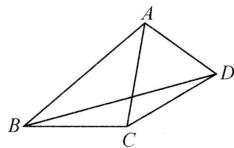  
图1

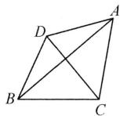  
图2

【例2】 100或135

解:分两种情况讨论:

①如图1，点 $C'$ 在AC边上， $\alpha=100^{\circ}$ ；
②如图2，点 $C'$ 在AB边上， $\alpha=135^{\circ}$ .
故答案为100或135.

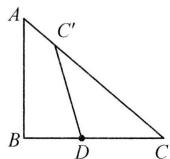  
图1

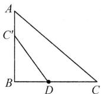  
图2

# 【实战演练】

$90^{\circ}$ 或 $180^{\circ}$ 或 $270^{\circ}$

解: 分三种情况讨论:

①如图1，当 $\angle PCD = 90^{\circ}$ 且点 $P$ 在 $\square ABCD$ 内时， $\alpha = 90^{\circ}$ ②如图2，当 $\angle PDC = 90^{\circ}$ 时， $\alpha = 180^{\circ}$ ③如图3，当 $\angle PCD = 90^{\circ}$ 且点 $P$ 在 $\square ABCD$ 外时， $\alpha = 270^{\circ}$ 故答案为 $90^{\circ}$ 或 $180^{\circ}$ 或 $270^{\circ}$

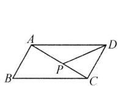  
图1

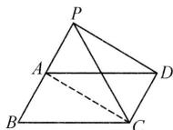  
图2

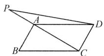  
图3

# 板块四 分类讨论求长度

# 【典例精讲】

【例1】3或 $3\sqrt{5}$

解: 当点 D 在 AB 上时, 如图 1, 在 Rt△ABC 中, ∠ABC = 30°, BC =

$$
4 \sqrt {3}, \therefore A B = \frac {\sqrt {3}}{2} B C = 6. \because A E = \sqrt {3},
$$

$$
\therefore A D = 3, \therefore B D = A B - A D = 6 - 3 = 3;
$$

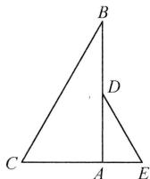  
图1

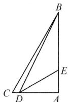  
图2

当点 D 在 CA 边上时, 如图 2,
在 Rt△ADB 中,

$$
B D = \sqrt {A D ^ {2} + A B ^ {2}} = 3 \sqrt {5}.
$$

∴BD 的长为 3 或 $3\sqrt{5}$ .

【例 2】 $\frac{\sqrt{3}}{3}$ 或 $\frac{1}{2}$ 解: 连接 DE. 证

$$
\triangle B A D \cong \triangle C A E (\mathrm{SAS}),
$$

$$
\therefore \angle A C E = \angle A B D = 3 0 ^ {\circ}.
$$

①若 $\angle EFC=90^{\circ}$ ,

$$
\therefore C E = 2 E F,
$$

$$
\therefore E F ^ {2} + 1 ^ {2} = (2 E F) ^ {2},
$$

解得 $EF=\frac{\sqrt{3}}{3}$ (负值已舍去);

②若 $\angle FEC=90^{\circ}$ ,

$$
\therefore E F = \frac {1}{2} C F = \frac {1}{2} \times 1 = \frac {1}{2};
$$

综上所述，EF 的长为 $\frac{\sqrt{3}}{3}$ 或 $\frac{1}{2}$ .

# 【实战演练】

$\sqrt{13}$ 或 $5-2\sqrt{2}$

解:如图1,当点E落在边AB上时,由旋转得PA=PE, $\angle APE=90^{\circ}$ ,此时点P落在边AC上.

$$
\because A C = B C = 5,
$$

$$
\therefore P A = P E = A C - P C = 3,
$$

$$
\begin{array}{l} {\therefore C E = \sqrt {C P ^ {2} + P E ^ {2}} = \sqrt {2 ^ {2} + 3 ^ {2}} =} \\ {\sqrt {1 3};} \end{array}
$$

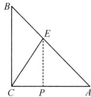

text_image

B
E
C P A

图1

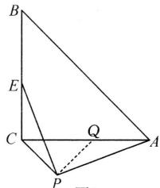

text_image

Geometric diagram of a triangular pyramid with labeled vertices and internal points, including dashed lines indicating hidden edges.

图2

如图 2, 当点 E 落在边 BC 上时, 在 AC 上取点 Q, 使 AQ = CE, 证 $\triangle PAQ \cong \triangle PEC$ ,

$$
\therefore C E = A Q,
$$

$$
P Q = P C = 2, \angle A P Q = \angle C P E,
$$

$$
\therefore \angle C P Q = \angle A P E = 9 0 ^ {\circ},
$$

$$
\therefore C Q = \sqrt {2} P C = 2 \sqrt {2},
$$

$$
\therefore C E = 5 - 2 \sqrt {2}.
$$

综上所述，CE 的长为 $5-2\sqrt{2}$ 或 $\sqrt{13}$ .

# 板块五 坐标系中的旋转

# 【典例精讲】

【例】 $\frac{2\sqrt{3}}{3}$ 解：在 $x$ 轴上取点 $D$ 和

点 E，使得 $\angle ADB = \angle AEC = 120^{\circ}$ ，过点 C 作 $CF \perp x$ 轴于点 F，则 OF = 7, CF = h, $\angle CEF = 180^{\circ} - \angle AEC =$

$$
6 0 ^ {\circ}, \therefore E F = \frac {\sqrt {3}}{3} h, C E = \frac {2 \sqrt {3}}{3} h.
$$

$$
\because \angle B A C = 1 2 0 ^ {\circ}, \angle B A D + \angle C A E =
$$

$$
\begin{array}{l} {\angle B A D + \angle A B D = 6 0 ^ {\circ}, \therefore \angle C A E =} \\ {\angle A B D, \because A B = C A, \therefore \triangle C A E \cong} \end{array}
$$

$$
\begin{array}{l} {\triangle A B D, \therefore A D = C E = \frac {2 \sqrt {3}}{3} h  , A E =} \\ {B D, \because \text {点}   A (3, 0), \therefore O A = 3  ,} \end{array}
$$

$$
\therefore O D = O A - A D = 3 - \frac {2 \sqrt {3}}{3} h,
$$

$$
\begin{array}{r l} & {\text {在} \mathrm{Rt} \triangle B O D \text {中}, \angle B D O = 1 8 0 ^ {\circ} -} \\ & {\angle A D B = 6 0 ^ {\circ}, B D = 2 \left(3 - \frac {2 \sqrt {3}}{3} h\right) =} \end{array}
$$

$$
6 - \frac {4 \sqrt {3}}{3} h, \therefore A E = B D = 6 - \frac {4 \sqrt {3}}{3} h,
$$

$$
\begin{array}{r l} & {\because O A + A E + E F = O F, \therefore 3 + 6 -} \\ & {\frac {4 \sqrt {3}}{3} h + \frac {\sqrt {3}}{3} h = 7, \text {解得} h = \frac {2 \sqrt {3}}{3}.} \end{array}
$$

# 【实战演练】

1. $(5,3\sqrt{3})$ 解: 在 x 轴的负半轴上取点 D, 使 $\angle ADO = 60^{\circ}$ ,

在 x 轴上点 B 的右侧取点 F，使 $\angle CFB = 60^{\circ}$ ，

过点 C 作 $CE \perp x$ 轴于点 E，则 OD = 2, AD = 4，易证 $\triangle ADB \cong \triangle BFC$ ，

$$
\therefore B F = A D = 4, C F = B D = 6,
$$

$$
\therefore C E = \frac {\sqrt {3}}{2} C F = 3 \sqrt {3}, E F = 3,
$$

$$
\therefore B E = 1,
$$

$$
\therefore O E = O B + B E = 5,
$$

$$
\therefore C (5, 3 \sqrt {3}).
$$

2. $3 + \frac{5\sqrt{2}}{2}$ 解：在 $x$ 轴正半轴上截取 $OD = OA$ ，连接 $AD$ ，过点 $C$ 作 $CF \perp x$ 轴于点 $F$ ，在 $x$ 轴上 $CF$ 左侧截取 $EF = CF$ ，连接 $CE$

$$
\therefore \angle A D O = \angle C E F = 4 5 ^ {\circ},
$$

$$
\therefore \angle A D B = \angle B E C = 1 3 5 ^ {\circ} = \angle A B C,
$$

$$
\therefore \angle D A B = \angle E B C,
$$

$$
\therefore \triangle A B D \cong \triangle B C E,
$$

$$
\therefore B D = C E = O B - O D = 1,
$$

$$
A D = B E = 2 \sqrt {2}, \therefore C F = E F = \frac {\sqrt {2}}{2},
$$

$$
\therefore O F = O B + B E + E F = 3 + \frac {5 \sqrt {2}}{2}.
$$

故答案为 $3+\frac{5\sqrt{2}}{2}$ .

# 第22讲 尺规作图与旋转

# 板块一 作旋转

# 【典例精讲】

【例】解:(1)如图 1, $\triangle ADE$ 即为所求;

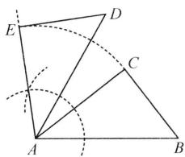

text_image

Geometric diagram with labeled points A, B, C, D, E and construction lines, including dashed arcs and solid segments

图1

(2)如图2,连接CD,

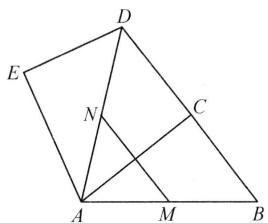

text_image

Geometric diagram with labeled points A, B, C, D, E, M, N and intersecting lines forming triangles and quadrilaterals

图2

$$
\because \beta = 2 \alpha ,
$$

$$
\therefore \angle B A C = \angle D A C.
$$

$$
\because A B = A D, A C = A C,
$$

$$
\therefore \triangle A C B \cong \triangle A C D (\mathrm{SAS}),
$$

$$
\therefore \angle A C B = \angle A C D = 9 0 ^ {\circ}, B C = C D,
$$

∴B,C,D三点共线, $BC=\frac{1}{2}BD$ ,

$$
\because A M = M B, A N = N D,
$$

$$
\therefore M N = \frac {1}{2} B D = B C,
$$

$$
\because D E = B C,
$$

$$
\therefore M N = D E.
$$

# 【实战演练】

解:(1)如图, $\triangle EDC$ 即为所求;

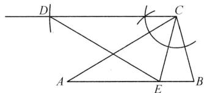

text_image

Geometric diagram with labeled points A, B, C, D, E and intersecting lines forming triangles and a right angle at C.

(2)结论:CD//AB.

理由：∵AB=AC,CB=CE,

$$
\therefore \angle B = \angle C E B = \angle A C B.
$$

$$
\because \angle D C E = \angle A C B,
$$

$$
\therefore \angle D C E = \angle C E B,
$$

$$
\therefore C D \parallel A B.
$$

# 板块二 用旋转

# 【典例精讲】

【例】解:(1)如图所示;

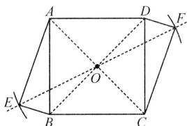

text_image

Geometric diagram of a parallelogram with labeled vertices and internal diagonals, used for mathematical problem solving.

(2) 方法一: 过点 O 作 $OG \perp OE$ , 交 EB 的延长线于点 G.

∵四边形 ABCD 为正方形，

$$
\therefore O A = O B, \angle A O B = \angle E O G = 9 0 ^ {\circ},
$$

$$
\therefore \angle A O E = \angle B O G,
$$

在四边形 AEBO 中，

$$
\angle A E B = \angle A O B = 9 0 ^ {\circ},
$$

$$
\therefore \angle E A O + \angle E B O = 1 8 0 ^ {\circ} = \angle E B O
$$

$$
+ \angle G B O,
$$

$$
\therefore \angle G B O = \angle E A O,
$$

$$
\therefore \triangle E A O \cong \triangle G B O,
$$

$$
\therefore A E = B G, O E = O G,
$$

∴△GEO 为等腰直角三角形，

$$
\therefore O E = \frac {\sqrt {2}}{2} E G = \frac {\sqrt {2}}{2} (E B + B G) =
$$

$$
\frac {\sqrt {2}}{2} (E B + A E) = \frac {1 7 \sqrt {2}}{2},
$$

$$
\therefore E F = 1 7 \sqrt {2}.
$$

方法二: 提示: 延长 EA, FD 交于点 N, 可证 $\triangle NEF$ 为等腰直角三角形, 可求得 $EF = 17\sqrt{2}$ .

# 【实战演练】

解:(1)如图所示;

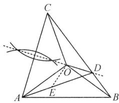

text_image

Geometric diagram of a tetrahedron with labeled vertices and internal points, including dashed lines indicating projections or transformations.

(2) 在 AD 上截取 AE = BD，连接 OE，由画图，得点 D 在 AC 的垂直平分线上，

$$
\therefore C D = A D,
$$

$$
\therefore \angle D C A = \angle D A C,
$$

$$
\therefore \angle B D A = \angle A O B = 2 \angle A C B,
$$

$$
\therefore \angle O A E = \angle O B D,
$$

$$
\because O A = O B,
$$

$$
\therefore \triangle O A E \cong \triangle O B D,
$$

$$
\therefore O E = O D, \angle A O E = \angle B O D,
$$

$$
\therefore \angle A O B = \angle E O D,
$$

$$
\therefore \angle O D E = 9 0 ^ {\circ} - \frac {1}{2} \angle D O E
$$

$$
= 9 0 ^ {\circ} - \frac {1}{2} \angle A O B,
$$

$$
\begin{array}{r l} & {\because \angle C D A = 1 8 0 ^ {\circ} - \angle A D B = 1 8 0 ^ {\circ} -} \\ & {\angle A O B = 2 \angle O D E,} \end{array}
$$

$$
\therefore \angle O D E = \angle O D C,
$$

$$
\because A D = C D, O D = O D,
$$

$$
\therefore \triangle A D O \cong \triangle C D O,
$$

$$
\therefore O C = O A.
$$

# 第23讲 旋转模型

# 板块一 再识手拉手模型

# 【典例精讲】

【例】解:(1)∵△ADE 是由△ABC 绕点 A 逆时针旋转 $90^{\circ}$ 得到的,

$$
\therefore A B = A D, \angle B A D = 9 0 ^ {\circ},
$$

$$
\triangle A B C \cong \triangle A D E  ,
$$

在 Rt△ABD 中，∠B = ∠ADB = 45°，

$$
\therefore \angle A D E = \angle B = 4 5 ^ {\circ},
$$

$$
\therefore \angle B D E = \angle A D B + \angle A D E = 9 0 ^ {\circ};
$$

(2)DF=PF.证明如下：

由旋转的性质可知,AC=AE,

$$
\angle C A E = 9 0 ^ {\circ},
$$

在 Rt△ACE 中，∠ACE = ∠AEC = 45°，

$$
\because \angle C D F = \angle C A D,
$$

$$
\angle A C E = \angle A D B = 4 5 ^ {\circ},
$$

$$
\therefore \angle A D B + \angle C D F = \angle A C E +
$$

$$
\angle C A D, \text {即} \angle F P D = \angle F D P,
$$

$$
\therefore D F = P F.
$$

# 【实战演练】

解:(1)由旋转得 $\triangle ACD\cong\triangle AEF$ , $\angle DAF=60^{\circ}$ ,

$$
\therefore \angle A D C = \angle A F E,
$$

$$
\therefore \angle D P F = \angle D A F = 6 0 ^ {\circ};
$$

(2) 过点 A 分别作 $AM \perp CD$ 于点 M， $AN \perp EF$ 于点 N，

$\therefore \angle AMD = \angle ANF = 90^{\circ}$ ，由（1）得 $AD = AF, \angle ADM = \angle AFN,$

$$
\therefore \triangle A D M \cong \triangle A F N,
$$

$$
\therefore A M = A N,
$$

$$
\because A M \perp C D, A N \perp E F,
$$

∴PA 平分∠DPE.

# 板块二 再识手拉脚模型

# 【典例精讲】

【例】解： $BF \perp CE$ ，且 $BF = \frac{1}{2} CE$ .

理由如下：

过点 A 作 $AH \perp AC$ ，交 CB 的延长线于点 H，连接 DH，设 CE，DH 交于点 O.

由题意, 得 $\triangle ACH$ 为等腰直角三角形, $\therefore \triangle ACE \cong \triangle AHD$ ,

$$
\therefore C E = D H, \angle A C E = \angle A H D,
$$

$$
\therefore \angle C A H = \angle C O H = 9 0 ^ {\circ},
$$

$$
\therefore C E \perp D H,
$$

∵ BF 为 $\triangle CDH$ 的中位线，

$$
\therefore B F \parallel D H, B F = \frac {1}{2} D H,
$$

$$
\therefore B F \perp C E, \text {且} B F = \frac {1}{2} C E.
$$

# 【实战演练】

解: 在 AC 上取点 F, 连接 DF, 使 DF = DC, ∴∠DFC = ∠DCF.

$$
\because A B = A C,
$$

$$
\therefore \angle A B C = \angle A C B,
$$

$$
\therefore \angle C D F = \angle B A C,
$$

$$
\because \angle A D E = \angle B A C = \angle C D F,
$$

$$
\therefore \angle A D F = \angle C D E,
$$

由旋转得 AD = DE，

$$
\therefore \triangle A D F \cong \triangle E D C,
$$

$$
\therefore \angle D C E = \angle D F A.
$$

$$
\because \angle D F C = \angle A C B = \frac {1 8 0 ^ {\circ} - \alpha}{2},
$$

$$
\therefore \angle D C E = \angle D F A = 1 8 0 ^ {\circ} - \angle D F C =
$$

$$
1 8 0 ^ {\circ} - \frac {1 8 0 ^ {\circ} - \alpha}{2} = 9 0 ^ {\circ} + \frac {1}{2} \alpha .
$$

# 板块三 再识脚拉脚模型

# 【典例精讲】

【例】解: $BE = \sqrt{2} CD$ . 理由如下: 将 $\triangle CAD$ 绕点 C 逆时针旋转 $90^{\circ}$ 得到 $\triangle CBH$ , 连接 DH, 延长 DA 交 BH 的延长线于点 P.

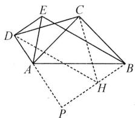

text_image

Geometric diagram with labeled points A, B, C, D, E, H, P and connecting lines, likely from a math problem or proof.

$$
\because \angle C B H = \angle C A D,
$$

$$
\therefore \angle C B H + \angle C A P = 1 8 0 ^ {\circ},
$$

$$
\therefore \angle A P B + \angle B C A = 1 8 0 ^ {\circ},
$$

$$
\therefore \angle A P B = 9 0 ^ {\circ},
$$

$$
\because \angle A D E = 9 0 ^ {\circ}, \therefore B H / / D E,
$$

$$
\because B H = A D = D E,
$$

∴四边形 DEBH 为平行四边形，

$$
\therefore B E \parallel D H, B E = D H,
$$

$$
\because C D = C H, \angle D C H = 9 0 ^ {\circ},
$$

∴ $\triangle DCH$ 为等腰直角三角形, BE = DH = $\sqrt{2}CD$ .

# 【实战演练】

解: AD=2PD. 理由: 延长 ED 到点 F,
使得 DF=DE, 连接 BF, CF.

$$
\because B P = E P, D E = D F,
$$

$$
\therefore B F = 2 P D, B F \parallel P D.
$$

$$
\because \angle E D C = 1 2 0 ^ {\circ},
$$

$$
\therefore \angle F D C = 6 0 ^ {\circ},
$$

$$
\because D F = D E = D C,
$$

∴△DFC 是等边三角形.

$$
\because C B = C A, \angle B C A = \angle D C F = 6 0 ^ {\circ},
$$

$$
\therefore \angle B C F = \angle A C D,
$$

$$
\because C F = C D, \therefore \triangle B C F \cong \triangle A C D,
$$

$$
\therefore B F = A D, \therefore A D = 2 P D.
$$

(本题也可通过倍长 DP 后, 利用模型 3 证明).

# 板块四 再识半角模型

# 【典例精讲】

【例 1】解: 将 $\triangle CAD$ 绕点 C 逆时针旋转 $90^{\circ}$ 得到 $\triangle CBF$ ，连接 EF.

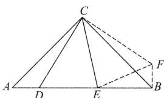

text_image

Geometric diagram of triangle ABC with internal points D, E, F and dashed auxiliary lines

设 AD = x，则 EB = 2AD = 2x。

$$
\because A C = B C, \angle A C B = 9 0 ^ {\circ},
$$

$$
\therefore \angle A = \angle A B C = 4 5 ^ {\circ}.
$$

$$
\because \triangle C A D \cong \triangle C B F,
$$

$$
\therefore \angle C B F = \angle A = 4 5 ^ {\circ},
$$

$$
B F = A D = x, C F = C D,
$$

$$
\therefore \angle F B E = \angle C B F + \angle C B A = 9 0 ^ {\circ},
$$

$$
\therefore E F = \sqrt {E B ^ {2} + F B ^ {2}} = \sqrt {5} x.
$$

$$
\because \angle D C F = 9 0 ^ {\circ}, \angle D C E = 4 5 ^ {\circ},
$$

$$
\therefore \angle F C E = 4 5 ^ {\circ} = \angle D C E.
$$

$$
\because C D = C F, C E = C E,
$$

$$
\therefore \triangle C D E \cong \triangle C F E,
$$

$$
\therefore D E = E F = \sqrt {5} x,
$$

$$
\therefore \frac {D E}{A D} = \sqrt {5}.
$$

【例 2】解: 将 $\triangle ABD$ 绕点 A 逆时针旋转 $120^{\circ}$ 得到 $\triangle ACF$ ，连接 EF.

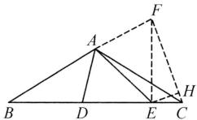

证 $\triangle ADE\cong \triangle AFE, DE = EF$

$$
C F = B D, \angle A C D = \angle B = 3 0 ^ {\circ},
$$

$$
\angle F C E = 6 0 ^ {\circ}.
$$

过点 E 作 $EH \perp CF$ 于点 H.

设 $CF = BD = 2CE = 4x$

则 $CH = x, FH = 3x, EH = \sqrt{3} x$

由 $FE^{2}=FH^{2}+EH^{2}$ ，得 $EF=2\sqrt{3}x$ ，

$$
\therefore D E = 2 \sqrt {3} x,
$$

$$
\because B D + D E + E C = 6,
$$

$$
\therefore x = \frac {3 - \sqrt {3}}{2}, \therefore D E = 3 \sqrt {3} - 3.
$$

# 【实战演练】

解: 将 $\triangle ABD$ 绕点 A 逆时针旋转 $60^{\circ}$ 得到 $\triangle ACF$ , 连接 FE.

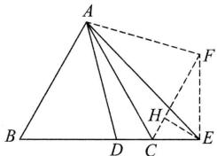

text_image

Geometric diagram of triangle ABC with auxiliary points D, E, F and auxiliary lines forming smaller triangles and dashed segments

则 $\angle DAF = 60^{\circ}$

$$
\because \angle E A D = 3 0 ^ {\circ},
$$

$$
\therefore \angle E A F = 3 0 ^ {\circ},
$$

$$
\therefore \angle E A F = \angle E A D.
$$

$$
\because \triangle A B D \cong \triangle A C F,
$$

$$
\begin{array}{l} \therefore \angle A C F = \angle A B C = 6 0 ^ {\circ}, A F = A D, \\ B D = C F. \end{array}
$$

$$
\because A E = A E, \therefore \triangle A D E \cong \triangle A F E,
$$

$$
\therefore E F = D E = 7.
$$

过点 E 作 $EH \perp FC$ 于点 H.

$$
\begin{array}{r l} & \because \angle F C E = 1 8 0 ^ {\circ} - (\angle A C F + \angle A C B) \\ & = 6 0 ^ {\circ}, \end{array}
$$

$$
\therefore \angle H E C = 3 0 ^ {\circ},
$$

$$
\therefore C H = \frac {1}{2} C E = 2,
$$

$$
\therefore H E = \sqrt {3} C H = 2 \sqrt {3},
$$

$$
\therefore H F = \sqrt {7 ^ {2} - (2 \sqrt {3}) ^ {2}} = \sqrt {3 7},
$$

$$
\therefore B D = C F = 2 + \sqrt {3 7}.
$$

# 第24讲 旋转构造

# 板块一 遇 $60^{\circ}$ 旋转 $60^{\circ}$ 构全等

# 【典例精讲】

【例】解: 将 $\triangle BCD$ 绕点 B 逆时针旋转 $60^{\circ}$ 得到 $\triangle BAF$ ，连接 FD.

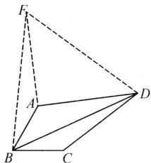

text_image

Geometric diagram of a tetrahedron with labeled vertices A, B, C, D, and F, showing solid and dashed edges.

∵在对余四边形 ABCD 中，

$$
\angle A B C = 6 0 ^ {\circ},
$$

$$
\therefore \angle A D C = 3 0 ^ {\circ},
$$

$$
\because \triangle B C D \cong \triangle B A F, \angle F B D = 6 0 ^ {\circ},
$$

$$
\therefore B F = B D, A F = C D,
$$

$$
\angle B C D = \angle B A F,
$$

∴△BFD 是等边三角形，

$$
\therefore B F = B D = D F.
$$

$$
\because \angle B A D + \angle B C D = 3 6 0 ^ {\circ} - (\angle A B C
$$

$$
+ \angle A D C),
$$

$$
\therefore \angle B A D + \angle B A F = 2 7 0 ^ {\circ},
$$

$$
\therefore \angle F A D = 9 0 ^ {\circ},
$$

$$
\therefore A D ^ {2} + A F ^ {2} = D F ^ {2},
$$

$$
\therefore A D ^ {2} + C D ^ {2} = B D ^ {2},
$$

$$
\therefore B D ^ {2} = (2 \sqrt {5}) ^ {2} + 5 ^ {2} = 4 5,
$$

$$
\because B D > 0, \therefore B D = 3 \sqrt {5}.
$$

# 【实战演练】

解: 将 $\triangle APC$ 绕点 A 顺时针旋转 $60^{\circ}$ 得 $\triangle AQB$ , 连接 PQ.

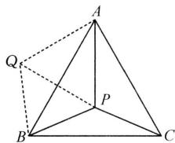

text_image

A
Q
P
B
C

由旋转得 $\triangle AQB\cong \triangle APC$

$$
\therefore B Q = C P, A Q = A P, \angle Q A P = 6 0 ^ {\circ},
$$

$\therefore \triangle APQ$ 是等边三角形，

$$
\therefore Q P = A P, \angle A Q P = \angle A P Q = 6 0 ^ {\circ},
$$

∴△QBP 就是以 AP, BP, CP 三边为边的三角形，

$$
\because \angle A P B = 1 1 3 ^ {\circ},
$$

$$
\therefore \angle B P Q = \angle A P B - \angle A P Q = 5 3 ^ {\circ},
$$

$$
\because \angle A Q B = \angle A P C = 1 2 3 ^ {\circ},
$$

$$
\therefore \angle B Q P = \angle A Q B - \angle A Q P = 6 3 ^ {\circ},
$$

$$
\begin{array}{l} \therefore \angle Q B P = 1 8 0 ^ {\circ} - \angle B P Q - \angle B Q P = \\ 6 4 ^ {\circ}, \end{array}
$$

∴以 AP, BP, CP 为边的三角形的三内角的度数分别为 $64^{\circ}, 63^{\circ}, 53^{\circ}$ .

# 板块二 遇 $90^{\circ}$ 旋转 $90^{\circ}$ 构全等

# 【典例精讲】

【例】解: 将 $\triangle ACD$ 绕点 C 逆时针旋转 $90^{\circ}$ 得到 $\triangle BCF$ ，连接 FD，过点 B 作 FD 的垂线，交 FD 的延长线于点 E，则 $\triangle ACD \cong \triangle BCF$ ，

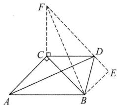

text_image

Geometric diagram with labeled points A, B, C, D, E, F and right-angle markers at C and D

$$
\therefore F B = A D, C F = C D = 3.
$$

$$
\because \angle F C D = 9 0 ^ {\circ},
$$

$$
\therefore \angle C D F = \angle C F D = 4 5 ^ {\circ},
$$

$$
F D = \sqrt {2} C D = 3 \sqrt {2}.
$$

$$
\because \angle C D B = 7 5 ^ {\circ},
$$

$$
\therefore \angle F D B = 1 2 0 ^ {\circ},
$$

$$
\therefore \angle B D E = 6 0 ^ {\circ}, \angle D B E = 3 0 ^ {\circ},
$$

$$
\therefore D E = \frac {1}{2} B D = \sqrt {2},
$$

$$
B E = \sqrt {3} D E = \sqrt {6},
$$

$$
\therefore E F = F D + D E = 4 \sqrt {2}.
$$

$$
\because B E \perp F E,
$$

$$
\therefore A D = F B = \sqrt {F E ^ {2} + B E ^ {2}} = \sqrt {3 8}.
$$

# 【实战演练】

解: 将 $\triangle ACD$ 绕点 C 逆时针旋转 $90^{\circ}$ 得 $\triangle BCE$ , 连接 DE.

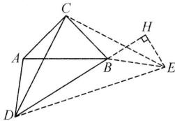

text_image

Geometric diagram with labeled points A, B, C, D, E and auxiliary lines, including a right angle symbol at point H.

则 $\triangle CAD\cong\triangle CBE.$

$$
\therefore B E = A D = 2, \angle C B E = \angle C A D,
$$

$$
C D = C E.
$$

$$
\because \angle C A D + \angle C B D + \angle A C B +
$$

$$
\angle A D B = 3 6 0 ^ {\circ},
$$

$$
\angle C B E + \angle C B D + \angle E B D = 3 6 0 ^ {\circ},
$$

$$
\therefore \angle E B D = \angle A C B + \angle A D B = 1 5 0 ^ {\circ}.
$$

过点 E 作 $EH \perp DB$ 交 DB 的延长线于点 H，则 $\angle HBE = 30^{\circ}$ ，

$$
\therefore H E = \frac {1}{2} B E = 1, \therefore B H = \sqrt {3}.
$$

$$
\because D B = 2 \sqrt {3},
$$

$$
\therefore D H = D B + B H = 3 \sqrt {3}.
$$

$$
\because E H \perp D H,
$$

$$
\therefore D E = \sqrt {D H ^ {2} + H E ^ {2}} = 2 \sqrt {7}.
$$

$$
\because C D = C E, C D \perp C E,
$$

$$
\therefore C D = \frac {\sqrt {2}}{2} D E = \sqrt {1 4}.
$$

# 板块三 遇 $120^{\circ}$ 旋转 $120^{\circ}$ 构全等

# 【典例精讲】

【例】解: 将 $\triangle ABC$ 绕点 A 逆时针旋转 $120^{\circ}$ 得到 $\triangle ADE$ ，连接 CE，过点 E 作 $EH \perp CD$ 交 CD 的延长线于点 H.

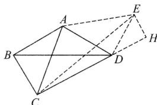

text_image

Geometric diagram of a polyhedron with labeled vertices A, B, C, D, E and auxiliary points H and dashed lines indicating hidden edges.

则 $AE = AC, \angle CAE = 120^{\circ}$

$$
C E = \sqrt {3} A C.
$$

$$
\because \triangle A B C \cong \triangle A D E,
$$

$$
\therefore \angle A D E = \angle A B C.
$$

$$
\therefore \angle A B C + \angle A D C + \angle B A D +
$$

$$
\angle B C D = \angle A D E + \angle A D C +
$$

$$
\angle B A D + \angle B C D = \angle A D E +
$$

$$
\angle A D C + 1 2 0 ^ {\circ} + 9 0 ^ {\circ} = 3 6 0 ^ {\circ},
$$

$$
\therefore \angle A D E + \angle A D C = 1 5 0 ^ {\circ}.
$$

$$
\begin{array}{l} \therefore \angle E D C = \angle A D E + \angle A D C = \\ 1 5 0 ^ {\circ}, \end{array}
$$

$$
\therefore \angle E D H = 3 0 ^ {\circ}.
$$

$$
\therefore E H = \frac {1}{2} D E = \frac {1}{2} B C = 1,
$$

$$
\therefore C H = C D + D H = 3 \sqrt {3},
$$

$$
\because E H \perp C H,
$$

$$
\therefore C E = \sqrt {C H ^ {2} + E H ^ {2}} = 2 \sqrt {7}.
$$

# 【实战演练】

解: 把 $\triangle ABD$ 绕点 A 逆时针旋转 $120^{\circ}$ 得到 $\triangle ACE$ ，连接 ED，过点 E 作 EG $\perp CD$ 于点 G，则 AE = AD， $\angle EAD = 120^{\circ}$ ，

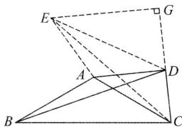

text_image

Geometric diagram with labeled points A, B, C, D, E, G and intersecting lines, likely from a math problem or proof.

$$
\therefore \angle A D E = \angle A E D = 3 0 ^ {\circ},
$$

$$
\therefore \angle E D G = 6 0 ^ {\circ},
$$

设 $CD = \sqrt{3} x, AD = 2x$

则 $ED = \sqrt{3}\cdot AD = 2\sqrt{3} x$

$$
\therefore D G = \frac {1}{2} E D = \sqrt {3} x, E G = 3 x,
$$

$$
\therefore C E = \sqrt {E G ^ {2} + C G ^ {2}} = \sqrt {2 1} x = B D,
$$

$$
\because A B = A C = \sqrt {7} x,
$$

$$
\therefore \frac {B D}{A B} = \frac {\sqrt {2 1}}{\sqrt {7}} = \sqrt {3}.
$$

# 板块四 遇中点旋转 $180^{\circ}$ 构全等

# 【典例精讲】

【例】解:延长AO至点Q,使得OQ=AO,延长FD至点P,使得DP=FD,连接QF,PA,CQ,CP,故PA=2DN,FQ=2NO.

text_image

Geometric diagram with labeled points and lines, likely from a math problem or proof

$$
\because B C \perp A Q, O Q = A O = O C,
$$

$$
\therefore \angle A C Q = 9 0 ^ {\circ}, A C = Q C.
$$

$$
\because C D \perp F P, D P = F D = D C,
$$

$$
\therefore \angle P C F = 9 0 ^ {\circ}, P C = F C,
$$

$$
\therefore \angle A C Q = \angle P C F = 9 0 ^ {\circ},
$$

$$
\therefore \angle A C P = \angle F C Q,
$$

$$
\therefore \triangle P A C \cong \triangle F Q C (\mathrm{SAS}),
$$

$$
\therefore F Q = P A,
$$

$$
\therefore D N = N O.
$$

# 【实战演练】

解: 将 $\triangle CDM$ 绕点 M 旋转 $180^{\circ}$ 得 $\triangle FEM$ ，则 $\triangle CDM \cong \triangle FEM$ ，

text_image

Geometric diagram of a polyhedron with labeled vertices A, B, C, D, E, F and internal points M and dashed lines indicating hidden edges.

$$
\therefore E F = C D = B C, \angle F E M = \angle D,
$$

$$
\therefore \angle A B C = \angle A E F,
$$

证 $\triangle AEF\cong \triangle ABC$

$$
\therefore \angle B A C = \angle E A F. A C = A F,
$$

又 MF = MC = AM，

∴△ACF 为等腰直角三角形，

$$
\therefore \angle C A F = 9 0 ^ {\circ},
$$

又 $\angle BAC = \angle EAF$

$$
\therefore \angle B A E = \angle C A F = 9 0 ^ {\circ},
$$

$$
\therefore \angle B C D = 1 8 0 ^ {\circ} - \angle B A E = 9 0 ^ {\circ}.
$$

【点评】这一类题型具有的特点是:等线段、共端点以及特殊角.

通过旋转“使相等的边重合,得出特殊图形”.

# 第25讲 旋转中的路径与最值

# 板块一 旋转路径

# 【典例精讲】

【例】 $\sqrt{3}$ 解:连接 $BE$ , 过点 $C$ 作 $CE' \perp BE$ 交 $BE$ 的延长线于点 $E'$ , 易证 $\triangle CBE \cong \triangle CAD$ , 得 $\angle CBE = \angle CAD = 30^\circ$ , $\therefore$ 点 $E$ 在直线 $BE'$ 上运动, 当点 $D$ 与点 $A$ 重合时, 点 $E$ 与点 $B$ 重合, 当点 $D$ 与点 $M$ 重合时, 点 $E$ 与点 $E'$ 重合. $\because \angle CBE' = 30^\circ$ , $BC = 2$ , $\therefore CE' = 1$ , $BE' = \sqrt{2^2 - 1^2} = \sqrt{3}$ , 即点 $E$ 所经过的路径长为 $\sqrt{3}$ .

# 【实战演练】

解:(1)延长 AC 至点 M, 使 CM = BC = 2, 延长 ME, AB 交于点 N,

$$
\because \angle A C B = 9 0 ^ {\circ},
$$

$$
\therefore \angle B C M = 9 0 ^ {\circ} = \angle D C E,
$$

$$
\therefore \angle D C B = \angle M C E.
$$

$$
\because C D = C E,
$$

$$
\therefore \triangle M C E \cong \triangle B C D,
$$

$$
\therefore \angle C M E = \angle A B C.
$$

$$
\therefore \angle M N A = \angle A C B = 9 0 ^ {\circ}.
$$

$$
\because \angle A = 3 0 ^ {\circ}, B C = 2,
$$

$$
\therefore A B = 2 B C = 4, A C = 2 \sqrt {3},
$$

$$
\therefore A M = 2 \sqrt {3} + 2, M N = \frac {1}{2} A M = \sqrt {3} +
$$

$$
1, A N = \sqrt {3} M N = 3 + \sqrt {3}.
$$

$$
\therefore B N = A N - A B = \sqrt {3} - 1,
$$

故当 $BE \perp MN$ 时, BE 的最小值为 $BN = \sqrt{3} - 1$ ;

$$
(2) \because \triangle M C E \cong \triangle B C D,
$$

∴DB=ME, 故点 E 的运动路径长为 AB=4.

# 板块二 旋转最值(一)

# 垂线段最短

# 【典例精讲】

【例 1】 $\frac{3}{2}$ 解: 连接 AD, BD, 过点 E 作 $EG \perp DB$ 于点 G. $\because \triangle AOB$ 是等边三角形, $AB \perp x$ 轴, $\therefore AE = BE = \frac{1}{2} AB = 3$ , $\angle AOE = \frac{1}{2} \angle AOB = 30^{\circ}$ . $\because CA = CD$ , $\angle ACD = 60^{\circ}$ , $\therefore \triangle ACD$ 是等边三角形, $\therefore \triangle AOC \cong \triangle ABD$ , $\therefore \angle AOC = \angle ABD$ , $\therefore \angle ABG = \angle AOE = 30^{\circ}$ , $\therefore$ 点 D 在过点 B 且垂直于 OB 的定直线上运动, $\therefore$ 当点 D 运动至点 G 时, DE 取得最小值为 EG 的长, $\therefore DE$ 长度的最小值为 $EG = \frac{1}{2} BE = \frac{3}{2}$ .

【例2】3 解: 取 BC 为边作等边 $\triangle CBD$ ，则 $\angle CBD = \angle PBQ = 60^{\circ}$ ，CB = DB，∴ $\angle PBC = \angle QBD$ .

∵ PB = QB，∴ $\triangle PBC \cong \triangle QBD$ ,

∴ $\angle QDB = \angle PCB = 90^{\circ}$ ，∴ $\angle QDC = 30^{\circ}$ ，∴ 点 Q 在 DQ 上运动，当 CQ ⊥ QD 时，CQ 的长最小， $CQ_{最小值} = \frac{1}{2}CD = \frac{1}{2}CB = \frac{1}{4}AB = 3$ .

# 【实战演练】

$\sqrt{3}$ 解: 连接 EB, EF, 过点 B 作 BH ⊥ AD, 交 DA 的延长线于点 H. ∵ 四边形 ABCD 是菱形, ∴ BC = CD. ∵ $\angle ECF = \angle BCD$ , ∴ $\angle BCE = \angle DCF$ . ∵ CE = CF, ∴ $\triangle BCE \cong \triangle DCF$ , ∴ DF = BE, ∴ 当点 E 与点 H 重合时, BE 取得最小值为 BH 的长.

$\because \angle ABC = 60^{\circ}, \therefore \angle HAB = 60^{\circ}, \therefore BH = \frac{\sqrt{3}}{2} AB = \sqrt{3}, \therefore DF$ 的最小值为 $\sqrt{3}$ .

# 板块三 旋转最值(二)

# 两点之间,线段最短

# 【典例精讲】

【例】13 解: 将 $\triangle EBF$ 绕点 E 逆时针旋转 $90^{\circ}$ 得到 $\triangle EHG, \therefore EH = BE = 3$ ，延长 GH 交 BC 于点 N，则点 G 在过点 H 且垂直 BC 的直线上运动，作点 C 关于直线 GH 的对称点 $C'$ ，连接 $C'D$ ，则 $CG + DG$ 的最小值为 $C'D$ 的长， $\therefore C'D = \sqrt{C'C^{2} + CD^{2}} = \sqrt{144 + 25} = 13, \therefore CG + DG$ 的最小值为 13.

text_image

Geometric diagram with labeled points and lines, likely from a math problem or proof

# 【实战演练】

1. $\sqrt{5} + 1$ 解: 将 $\triangle ABC$ 绕点 $A$ 顺时针旋转 $90^{\circ}$ 得到 $\triangle AQP$ , 取 $AQ$ 的中点 $H$ , 连接 $PH, BH$ . 易得 $PH = \frac{1}{2} AQ = 1$ , 在 Rt $\triangle ABH$ 中, $BH^{2} = AH^{2} + AB^{2}$ , 解得 $BH = \sqrt{5}$ , 则 $PB \leqslant BH + PH = \sqrt{5} + 1$ , 即 $PB$ 的最大值为 $\sqrt{5} + 1$ .

text_image

Geometric diagram with labeled points P, A, B, C, H, Q and dashed/solid lines indicating relationships or projections

2. $\frac{7\sqrt{3}}{2}$ 解: 以 $PE$ 为边向下作等边 $\triangle PEQ$ , 连接 $HQ, BQ$ . $\because \triangle PFH$ 是等边三角形, $\therefore \triangle PEF \cong \triangle PQH$ , $\therefore QH = EF$ , $\therefore EF + BH = QH + BH \geqslant BQ$ , $\therefore$ 当点 $H$ 在定线段 $BQ$ 上时, $EF + BH$ 取得最小值为 $BQ$ 的长. $\because P$ 是 $BE$ 的中点, $\therefore PE = PQ = PB$ , $\because \angle QPB = 120^\circ$ , $\therefore$ 可求 $BQ = \sqrt{3}PB = \frac{7}{2}\sqrt{3}$ , 即 $EF + BH$ 的最小值为 $\frac{7}{2}\sqrt{3}$ .

# 板块四 旋转最值(三)

# 函数建模

# 【典例精讲】

【例】 $\left(\frac{12}{5},\frac{6}{5}\right)$ 解：设点 B(m, -2m), P(a,b),

如图构造 Rt△PGB≌Rt△AHP，

$$
\therefore P G = A H, B G = P H,
$$

$$
\therefore \left\{ \begin{array}{l} a - m = b, \\ 6 - a = b + 2 m, \end{array} \right. \therefore \left\{ \begin{array}{l} a = \frac {6 - m}{2}, \\ b = \frac {6 - 3 m}{2}, \end{array} \right.
$$

即 $P\left(\frac{6 - m}{2},\frac{6 - 3m}{2}\right),$

$$
\begin{array}{l} \therefore P A = \sqrt {\left(6 - \frac {6 - m}{2}\right) ^ {2} + \left(\frac {6 - 3 m}{2}\right) ^ {2}} \\ = \sqrt {\frac {5}{2} m ^ {2} - 6 m + 1 8} \\ = \sqrt {\frac {5}{2} \left(m - \frac {6}{5}\right) ^ {2} + \frac {7 2}{5}}, \\ \end{array}
$$

∴当 $m=\frac{6}{5}$ 时，PA 取得最小值，最小值为 $\sqrt{\frac{72}{5}}=\frac{6\sqrt{10}}{5}$ ，

∴当点 P 的坐标为 $\left(\frac{12}{5}, \frac{6}{5}\right)$ 时，点 P 到点 A 的最小距离为 $\frac{6\sqrt{10}}{5}$ .

text_image

y
G P H
O A x
B

# 【实战演练】

1. 解: 过点 C 作 $CM \perp AB$ 于点 M, 过点 E 作 $EN \perp AB$ 于点 N, 易证得 $\triangle EDN \cong \triangle DCM$ ,

$$
\therefore E N = D M,
$$

$$
\because \angle B A C = 1 2 0 ^ {\circ},
$$

$$
\therefore \angle A C M = 3 0 ^ {\circ},
$$

$$
\begin{array}{l} \therefore B M = A B + A M = A B + \frac {1}{2} A C = 6 \\ + 3 = 9, \end{array}
$$

设 $BD = x$ ，则 $EN = DM = 9 - x$

$$
\begin{array}{l} {\therefore S _ {\triangle B D E} = \frac {1}{2} B D \cdot E N = \frac {1}{2} x (9 -} \\ {x) = - \frac {1}{2} (x - 4. 5) ^ {2} + \frac {8 1}{8},} \end{array}
$$

∴当 BD=4.5 时， $S_{\triangle BDE}$ 有最大值为 $\frac{81}{8}$ .

2. $\sqrt{3}$ 解: 将 $\triangle APB$ 绕点 A 逆时针旋转 $120^{\circ}$ 得到 $\triangle AP'C$ ，连接 $PP'$ ，过点 A 作 $AD \perp PP'$ 于点 D，则 $AP = AP'$ ， $\angle PAP' = 120^{\circ}$ ， $\angle AP'C = \angle APB = 120^{\circ}$ ，

text_image

Geometric diagram with labeled points A, B, C, D, P and dashed/solid lines forming triangles and intersections

$$
\therefore \angle A P ^ {\prime} P = 3 0 ^ {\circ},
$$

$$
\therefore P P ^ {\prime} = \sqrt {3} A P, \angle P P ^ {\prime} C = 9 0 ^ {\circ}.
$$

$$
\because A P + B P = 2,
$$

$$
\therefore B P = 2 - P A = C P ^ {\prime},
$$

在 Rt△PP'C 中，

$$
P C = \sqrt {P ^ {\prime} P ^ {2} + P ^ {\prime} C ^ {2}}
$$

$$
= \sqrt {(\sqrt {3} P A) ^ {2} + (2 - P A) ^ {2}}
$$

$$
= \sqrt {4 \left(P A - \frac {1}{2}\right) ^ {2} + 3},
$$

∴当 $PA=\frac{1}{2}$ 时, PC 的最小值为 $\sqrt{3}$ .

# 第26讲 旋转综合探究

# 板块一 类比推理

# 【典例精讲】

【例】解:(1) $\because\angle DAE=\angle BAC$ ,

$$
\begin{array}{l} \therefore \angle B A D = \angle C A E, \\ \text { 又 } \because A D = A E, A B = A C, \\ \therefore \triangle A B D \cong \triangle A C E; \\ \end{array}
$$

(2) 过点 C 作 $CG \parallel BD$ 交 DF 的延长线于点 G，连接 CE.

$$
\because \angle D A E = \angle B A C,
$$

$$
\therefore \angle B A D = \angle C A E,
$$

$$
\text { 又 } \because A D = A E, A B = A C,
$$

$$
\therefore \triangle A D B \cong \triangle A E C,
$$

$$
\therefore C E = B D, \angle A E C = \angle A D B = 9 0 ^ {\circ},
$$

$$
\because A D = A E,
$$

$$
\therefore \text { 设 } \angle A D E = \angle A E D = \alpha ,
$$

$$
\therefore \angle B D F = 9 0 ^ {\circ} - \alpha ,
$$

$$
\angle C E F = 9 0 ^ {\circ} - \alpha ,
$$

$$
\because B D \parallel C G,
$$

$$
\therefore \angle G = \angle B D F = 9 0 ^ {\circ} - \alpha ,
$$

$$
\therefore \angle G = \angle C E G,
$$

$$
\therefore C G = C E = B D,
$$

$$
\text { 又 } \because \angle B F D = \angle G F C,
$$

$$
\therefore \triangle B F D \cong \triangle C F G,
$$

$$
\therefore B F = C F,
$$

∴F 是 BC 中点.

# 【实战演练】

解:(1)AG=CE 且 AG⊥CE;

(2) DM, CG 的关系是: $DM = \frac{1}{2}CG$ , 且 $DM \perp CG$ . 理由如下:

延长 AD 至点 H，使 DH = AD，连接 EH，

$$
\because \angle G D E = \angle C D H = 9 0 ^ {\circ},
$$

$$
\begin{array}{r l} & {\therefore \angle G D E - \angle C D E = \angle C D H -} \\ & {\angle C D E, \text {即} \angle C D G = \angle H D E,} \end{array}
$$

$$
\because C D = D H, G D = D E,
$$

$$
\therefore \triangle D G C \cong \triangle D E H (\mathrm{SAS}),
$$

$$
\therefore C G = E H,
$$

∵M 是 AE 的中点,AD=DH,

∴DM 是△AEH 的中位线，

$$
\therefore D M \parallel E H, D M = \frac {1}{2} E H,
$$

$$
\therefore D M = \frac {1}{2} C G,
$$

$$
\because \angle G D E = \angle C D H = 9 0 ^ {\circ},
$$

∴△DGC绕点D逆时针旋转90°到△DEH，∴CG⊥EH，∴DM⊥CG.

# 板块二 特殊到一般

# 【典例精讲】

【例】解:(1) $BF-AF=\sqrt{3}CF$ ;

(2) 作 $\angle FCG = \angle ACB = 120^{\circ}$ , 交 $BF$ 于点 $G$ , 则 $\angle BCG = \angle ACF$ , 过点 $C$ 作 $CH \perp GF$ 交 $GF$ 于点 $H$ ,

$$
\because \angle A C B = \angle D C E,
$$

$$
\therefore \angle B C E = \angle A C D.
$$

$$
\text {又} \because B C = A C, E C = D C,
$$

$$
\therefore \triangle B C E \cong \triangle A C D (\text { SAS }),
$$

$$
\therefore \angle C B G = \angle C A F,
$$

$$
\therefore \triangle B C G \cong \triangle A C F (\mathrm{ASA}),
$$

$$
\therefore B G = A F, C G = C F.
$$

$$
\because \angle F C G = 1 2 0 ^ {\circ}, C H \perp G F,
$$

$$
\therefore G F = 2 F H,
$$

$$
\angle C G H = \angle C F H = 3 0 ^ {\circ},
$$

$$
\therefore F H = \sqrt {3} C H, C H = \frac {1}{2} C F,
$$

$$
\therefore F H = \frac {\sqrt {3}}{2} C F,
$$

$$
\therefore B F - A F = B F - B G = G F = 2 F H
$$

$$
= 2 \times \frac {\sqrt {3}}{2} C F = \sqrt {3} C F;
$$

(3) $b-a=\sqrt{2}c$ 或 $a^{2}+2c^{2}=b^{2}$ .

①当点 D 在 $\triangle ABC$ 的外部时，

$$
b - a = \sqrt {2} c;
$$

②当点 D 在 $\triangle ABC$ 的内部时，

$$
a ^ {2} + 2 c ^ {2} = b ^ {2}.
$$

(把 $\triangle ACD$ 绕点C顺时针旋转 $90^{\circ}$ ,
即可得证)

# 【实战演练】

解:(1) $\because\alpha=20^{\circ},\angle BCD=60^{\circ},$

$$
\therefore \angle B C E = 6 0 ^ {\circ} + 2 0 ^ {\circ} = 8 0 ^ {\circ},
$$

由旋转得 CE = CD，

$$
\therefore \angle E = \frac {1 8 0 ^ {\circ} - 2 0 ^ {\circ}}{2} = 8 0 ^ {\circ}.
$$

∵CF 平分∠BCE，

$$
\therefore \angle F C E = \frac {1}{2} \angle B C E = 4 0 ^ {\circ},
$$

$$
\therefore \angle C F E = 1 8 0 ^ {\circ} - 8 0 ^ {\circ} - 4 0 ^ {\circ} = 6 0 ^ {\circ};
$$

(2) 不变, $\angle CFE = 60^{\circ}$ . 理由:

$$
\because C D = C E, \angle E C D = \alpha ,
$$

$$
\therefore \angle E = \angle C D E = \frac {1}{2} (1 8 0 ^ {\circ} - \alpha) = 9 0 ^ {\circ}
$$

$$
- \frac {1}{2} \alpha ,
$$

$$
\because \angle B C D = 6 0 ^ {\circ}, \therefore \angle B C E = 6 0 ^ {\circ} + \alpha ,
$$

$\because CF$ 平分 $\angle BCE$ ,

$$
\therefore \angle F C E = \frac {1}{2} \angle B C E = 3 0 ^ {\circ} + \frac {1}{2} \alpha ,
$$

$$
\therefore \angle C F E = 1 8 0 ^ {\circ} - \angle F C E - \angle E = 1 8 0 ^ {\circ}
$$

$$
- \left(3 0 ^ {\circ} + \frac {1}{2} \alpha\right) - \left(9 0 ^ {\circ} - \frac {1}{2} \alpha\right) = 6 0 ^ {\circ},
$$

∴∠CFE 的度数不变,且∠CFE=60°;

(3) 在 DE 上取一点 T，使得 CT = CF.
由(2)，得 $\angle CFE=60^{\circ}$ ，

$$
\because C F = C T,
$$

∴△CFT 是等边三角形，

$$
\therefore \angle C F T = \angle C T F = 6 0 ^ {\circ},
$$

$$
F T = C F = C T,
$$

$$
\therefore \angle C F D = \angle C T E = 1 2 0 ^ {\circ},
$$

$$
\because C D = C E,
$$

$$
\therefore \angle C D F = \angle E,
$$

$$
\therefore \triangle C D F \cong \triangle C E T (\text { A   A   S }),
$$

$$
\therefore D F = T E,
$$

$$
\therefore E F - D F = E F - T E = F T = C F.
$$

# 板块三 综合与实践

解:(1)∵△ACD,△ABE都是等边三角形,

$$
\therefore A E = A B = B E = 3, A D = A C,
$$

$$
\angle B A E = \angle C A D = 6 0 ^ {\circ},
$$

$$
\therefore \angle E A C = \angle B A D,
$$

$$
\therefore \triangle A C E \cong \triangle A D B,
$$

$$
\therefore C E = B D.
$$

$$
\because \angle A B C = 3 0 ^ {\circ}, \angle A B E = 6 0 ^ {\circ},
$$

$$
\therefore \angle E B C = 9 0 ^ {\circ},
$$

$$
\therefore B E ^ {2} + B C ^ {2} = C E ^ {2},
$$

$$
\because B E = 3, B C = 4,
$$

$$
\therefore B D = C E = 5;
$$

(2) 将 $\triangle ABD$ 绕点 A 逆时针方向旋转 $60^{\circ}$ 至 $\triangle ACE$ ，连接 DE，过点 E 作 $EH \perp CD$ ，交 CD 的延长线于点 H.

text_image

Geometric diagram of a tetrahedron with labeled vertices A, B, C, D, E, H and solid/dashed edges indicating 3D perspective.

则 $\triangle ADE$ 和 $\triangle ABC$ 都是等边三角形，同(1)可得CE=BD.

$$
\begin{array}{l} \because \angle C D E = \angle A D C + \angle A D E = 6 0 ^ {\circ} + \\ 6 0 ^ {\circ} = 1 2 0 ^ {\circ}, \end{array}
$$

$$
\therefore \angle E D H = 6 0 ^ {\circ},
$$

$$
\therefore \angle D E H = 3 0 ^ {\circ},
$$

$$
\because D E = A D = 4,
$$

$$
\therefore D H = \frac {1}{2} D E = 2,
$$

$$
\therefore E H = 2 \sqrt {3}, C H = 4,
$$

$$
\therefore B D = C E = \sqrt {C H ^ {2} + E H ^ {2}} = 2 \sqrt {7};
$$

(3) $DE=\frac{\sqrt{19}}{2}$ . 将 $\triangle ACD$ 沿 AD 翻折得到 $\triangle ADF$ ，连接 BF，将 $\triangle ABF$ 绕点 A 顺时针旋转 $60^{\circ}$ 得到 $\triangle AGC$ ，连接 BG，则 $\triangle ACF$ 和 $\triangle ABG$ 都是等边三角形，由 (1) 可得 BF=CG.

text_image

Geometric diagram with labeled points A, B, C, D, E, F, G and connecting lines, likely from a math problem or proof.

$$
\begin{array}{r l} & \because B G = A B = 2, B C = 3, \angle C B G = \\ & \angle A B G + \angle A B C = 6 0 ^ {\circ} + 6 0 ^ {\circ} = 1 2 0 ^ {\circ}. \end{array}
$$

过点 G 作 $GH \perp BC$ 交 CB 的延长线于点 H，则 $BH = 1, GH = \sqrt{3}, HC = 4$ ，

$$
\therefore C G = \sqrt {G H ^ {2} + H C ^ {2}} = \sqrt {1 9} = B F,
$$

∵ DE 是 $\triangle BCF$ 的中位线，

$$
\therefore D E = \frac {1}{2} B F = \frac {\sqrt {1 9}}{2}.
$$

# 第二十四章 圆

# 第27讲 圆的有关性质(一)

# 板块一 半径的运用(一)

# 构等腰、构全等

# 【典例精讲】

【例 1】 解: 连接 OD.

∵ AB 为 $\odot O$ 的直径, OC, OD 为 $\odot O$ 的半径, AB = 2DE, $\angle E = 18^{\circ}$ ,

$$
\therefore O D = D E,
$$

$$
\therefore \angle D O E = \angle E = 1 8 ^ {\circ},
$$

$$
\therefore \angle O D C = \angle D O E + \angle E = 3 6 ^ {\circ}.
$$

$$
\text { 又 } \because O C = O D,
$$

$$
\therefore \angle C = \angle O D C = 3 6 ^ {\circ},
$$

$$
\begin{array}{l} \therefore \angle A O C = \angle C + \angle E = 3 6 ^ {\circ} + 1 8 ^ {\circ} = \\ 5 4 ^ {\circ}. \end{array}
$$

【例 2】解:(1)连接 OB, OC,
则 OB = OC,

∵四边形 ABCD 是正方形，

$$
\therefore \angle B A O = \angle C D O = 9 0 ^ {\circ},
$$

$$
A B = C D,
$$

$$
\therefore \triangle A O B \cong \triangle D O C (\mathrm{HL}),
$$

$$
\therefore O A = O D;
$$

(2) 连接 OF. 设 OA = OD = a,

则 $AD = CD = 2a, OE = a + 3$

在 Rt△ODC 和 Rt△OEF 中， $a^{2}+$

$$
(2 a) ^ {2} = O C ^ {2} = O F ^ {2} = (a + 3) ^ {2} + 3 ^ {2},
$$

$$
\therefore a _ {1} = 3, a _ {2} = - \frac {3}{2} (\text {舍去}),
$$

$$
\therefore O C = \sqrt {a ^ {2} + (2 a) ^ {2}} = \sqrt {5} a = 3 \sqrt {5},
$$

即 $\odot O$ 的半径为 $3\sqrt{5}$ .

# 【实战演练】

1. 解: 连接 OC.

$$
\because \angle B O D = 3 \angle E = 6 7. 5 ^ {\circ},
$$

$$
\therefore \angle E = 2 2. 5 ^ {\circ}, \angle D = 4 5 ^ {\circ} = \angle O C D,
$$

$$
\therefore \angle E = \angle C O E = 2 2. 5 ^ {\circ},
$$

$$
\therefore C E = C O = O D, \angle C O D = 9 0 ^ {\circ},
$$

$$
\therefore \frac {C E}{C D} = \frac {O C}{C D} = \frac {\sqrt {2}}{2}.
$$

2. 证明: 连接 OA, OB, OC.

则 $OA = OB = OC$

$\because \triangle ABC$ 等边三角形，

$$
\therefore A C = A B,
$$

$$
\therefore \triangle O A C \cong \triangle O A B,
$$

$$
\therefore \angle O A C = \angle O A B = 3 0 ^ {\circ}.
$$

$$
\because O A = O B,
$$

$$
\therefore \angle O B A = \angle O A B = 3 0 ^ {\circ} = \angle O A C.
$$

$$
\text {又} \because A D = B E,
$$

$$
\therefore \triangle O A D \cong \triangle O B E,
$$

$$
\therefore O D = O E.
$$

# 板块二 半径的运用(二) 作隐圆

# 【典例精讲】

【例1】2 解： $\because PO = AO = OB$ ， $\therefore$ 点 $P$ 在以 $AB$ 为直径的 $\odot O$ 上，当 $O, P, C$ 共线时 $PC$ 最小，在 Rt $\triangle BCO$ 中， $AB = 6, BC = 4, \therefore OB = \frac{1}{2} AB = 3, \therefore OC = \sqrt{OB^2 + BC^2} = 5, \therefore PC = OC - OP = 5 - 3 = 2.$ $\therefore PC$ 的最小值为 2.

text_image

Geometric diagram showing triangle ABC inscribed in a circle with auxiliary points O and P, including dashed construction lines.

【例 2】 $4\sqrt{2}-4$ 解： $\because\angle ABC=90^{\circ}$ ， $\therefore\angle ABP+\angle PBC=90^{\circ}$ ，又 $\because\angle PAB=\angle PBC,\therefore\angle ABP+\angle PAB=90^{\circ},\therefore\angle APB=180^{\circ}-(\angle ABP+\angle PAB)=90^{\circ},\therefore$ 点 P 在以 AB 为直径的圆上，取 AB 的中点 O，连 OP，OC， $PC\geqslant OC-OP$ ，当 O，P，C 三点共线时取等号， $\because AB=8,\therefore OB=OP=4$ ，在 $\triangle OBC$ 中， $OC=\sqrt{4^{2}+4^{2}}=4\sqrt{2},\therefore PC_{\min}=4\sqrt{2}-4.$

text_image

Geometric diagram showing a circle with inscribed triangle ABC and auxiliary points O, P, B, C, including dashed construction lines.

# 【实战演练】

1. 证明: 连接 BD,

则 $BD=\sqrt{AD^{2}+AB^{2}}=10$ ,

$$
\text { 又 } \because 6 ^ {2} + 8 ^ {2} = 1 0 ^ {2},
$$

$$
\therefore C D ^ {2} + B C ^ {2} = B D ^ {2},
$$

$$
\therefore \angle B C D = 9 0 ^ {\circ},
$$

取 BD 的中点 O，连接 OC, OA，

则 $OA = OB = OC = OD = \frac{1}{2} BD$

∴点 A, B, C, D 在同一个圆上.

2. $\frac{9}{4}$ 解: 连 $AF$ , 取 $AF$ 的中点 $O$ , 则 $OD = OA = OF = OE$ , $\therefore$ 点 $A, D, F$ , $E$ 在以 $O$ 为圆心, $OD$ 为半径的圆上, 作直径 $DM$ , 连接 $EM$ , 则 $\angle M = 60^\circ$ , $\therefore DE = \frac{\sqrt{3}}{2} \cdot DM = \frac{\sqrt{3}}{2} AF$ . $\therefore AF \perp BC$ 时, $AF$ 最小, 此时 $AF = \frac{3\sqrt{3}}{2}$ , 故 $DE$ 有最小值 $\frac{9}{4}$ .

text_image

Geometric diagram of triangle ABC with inscribed circle and auxiliary points D, E, F, M, O, showing chords and intersections

# 板块三 垂径定理(一) 构单弦心距

# 【典例精讲】

【例1】 $4\sqrt{5}$ 或 $2\sqrt{5}$ 解：连接 $AC$ ， $AO, \because \odot O$ 的直径 $CD = 10, AB \perp CD, AB = 8, \therefore AM = \frac{1}{2} AB = 4, OD = OC = 5, \because CD \perp AB, \therefore OM = \sqrt{OA^2 - AM^2} = 3$ ，当 $C$ 点位置如图1所示时， $CM = OC + OM = 8, \therefore AC = \sqrt{AM^2 + CM^2} = 4\sqrt{5}$ ；当 $C$ 点位置如图2所示时， $CM = OC - OM = 2, \therefore AC = \sqrt{AM^2 + MC^2} = 2\sqrt{5}$ . 综上所述， $AC = 4\sqrt{5}$ 或 $2\sqrt{5}$ .

  
图1

  
图2

【例 2】 $2\sqrt{15}$ 解:作 $OH \perp CD$ 于点 H, 连接 OC, $\because OH \perp CD, \therefore HC = HD, \because AP = 2, BP = 6, \therefore AB = 8, \therefore OA = 4, \therefore OP = OA - AP = 2$ , 在 Rt $\triangle OPH$ 中, $\because \angle OPH = \angle APC = 30^{\circ}, \therefore OH = \frac{1}{2}OP = 1$ , 在 Rt $\triangle OHC$ 中, $\because OC = 4, OH = 1, \therefore CH = \sqrt{OC^{2} - OH^{2}} = \sqrt{15}, \therefore CD = 2CH = 2\sqrt{15}$ .

# 【实战演练】

1. 解: 过点 O 作 $OH \perp EF$ 于点 H,

则 $EH = HF = \frac{1}{2} EF$ .

∵四边形 AOHD 是矩形，

$$
\therefore D H = A O = A G + G O = 5,
$$

$$
\therefore E H = D H - D E = 3,
$$

连接 OE，则 $OE=\frac{1}{2}GB=4$ .

在 Rt△OEH 中，

$$
O H = \sqrt {O E ^ {2} - E H ^ {2}} = \sqrt {7} = A D,
$$

$$
\therefore S _ {\text {矩形} A B C D} = A B \cdot A D = 9 \times \sqrt {7} = 9 \sqrt {7}.
$$

2. $\sqrt{33}$ 解: 延长 $ME$ 交 $\odot O$ 于点 $G$ , $\because E, F$ 为 $AB$ 的三等分点, $\angle MEB = \angle NFB = 60^\circ$ , $\therefore FN = EG$ , 过点 $O$ 作 $OH \perp MG$ 于点 $H$ , 连接 $MO$ , $\because \odot O$ 的直径 $AB = 6$ , $\therefore OE = OA - AE = \frac{1}{2} \times 6 - \frac{1}{3} \times 6 = 1, OM = 3$ ,

$\because \angle MEB = 60^{\circ}, \therefore OH = \frac{\sqrt{3}}{2} OE = \frac{\sqrt{3}}{2}$ , 在 Rt $\triangle MOH$ 中, $MH = \sqrt{3^2 - \left(\frac{\sqrt{3}}{2}\right)^2} = \frac{\sqrt{33}}{2}$ , 根据垂径定理, $MG = 2MH = 2 \times \frac{\sqrt{33}}{2} = \sqrt{33}$ , 即 $EM + FN = \sqrt{33}$ .

# 板块四 垂径定理(二) 构双弦心距

# 【典例精讲】

【例1】2或14

解:①当弦 AB 和 CD 在圆心同侧时,如图 1,

$$
\because A B = 1 6, C D = 1 2,
$$

$$
\therefore A E = 8, C F = 6,
$$

$$
\because O A = O C = 1 0,
$$

$$
\therefore E O = 6, O F = 8,
$$

$$
\therefore E F = O F - O E = 2;
$$

  
图1

  
图2

②当弦 AB 和 CD 在圆心异侧时, 如图 2,

$$
\because A B = 1 6, C D = 1 2,
$$

$$
\therefore A F = 8, C E = 6,
$$

$$
\because O A = O C = 1 0,
$$

$$
\therefore O F = 6, O E = 8,
$$

$$
\therefore E F = O F + O E = 1 4.
$$

∴AB与CD之间的距离为14或2.

【例 2】解: 过点 O 作 $OE \perp AB, OF \perp CD$ ，垂足分别为 E, F，连接 OA, OD，则 AE = BE, CF = DF，易得 $AB^{2} = 4AE^{2} = 4(OA^{2} - OE^{2})$ ， $CD^{2} = 4DF^{2} = 4(OD^{2} - OF^{2})$ ， $\therefore AB^{2}+CD^{2}=4(OA^{2}+OD^{2})-4(OE^{2}+OF^{2})$ $\because OE^{2} + OF^{2} = PF^{2} + OF^{2} = OP^{2},$ $\therefore AB^{2} + CD^{2} = 4(2^{2} + 2^{2}) - 4 \times 1 = 28.$

【例 3】解: 连接 OE, OD, OA, 过点 O 作 $OH \perp CD$ 于点 H.

$$
\because A E = B E, O H \perp C D,
$$

$$
\therefore O E \perp A B, H C = H D,
$$

$$
\because \angle D E B = 6 0 ^ {\circ},
$$

$$
\therefore \angle O E H = 3 0 ^ {\circ},
$$

$$
\therefore O E = 2 O H,
$$

$$
\because D E = 3 C E,
$$

$$
\therefore H E = \frac {1}{2} H C = \frac {1}{4} C D,
$$

在 Rt△OAE 中，由勾股定理，得

$$
O E ^ {2} = r ^ {2} - 4 ^ {2},
$$

$$
\therefore O H ^ {2} = \frac {r ^ {2} - 4 ^ {2}}{4},
$$

$$
\therefore E H ^ {2} = r ^ {2} - 4 ^ {2} - \frac {r ^ {2} - 4 ^ {2}}{4} = \frac {3 (r ^ {2} - 4 ^ {2})}{4},
$$

$$
\therefore D H ^ {2} = 3 (r ^ {2} - 4 ^ {2}),
$$

在 Rt△OHD 中,由勾股定理,得

$$
r ^ {2} = \frac {r ^ {2} - 4 ^ {2}}{4} + 3 (r ^ {2} - 4 ^ {2}),
$$

解得 $r=\frac{4}{3}\sqrt{13}$ .

# 【实战演练】

解: 过点 O 作 $OM \perp AB$ 于点 M, $ON \perp CD$ 于点 N, 连接 OE, OB, OD.

$$
\therefore A M = M B = \frac {1}{2} A B = 3,
$$

$$
E M = A M - A E = 2,
$$

$$
\therefore \text {   在   } \mathrm{Rt} \triangle B O M \text {   中，   }
$$

$$
O M = \sqrt {O B ^ {2} - B M ^ {2}} = 2 = E M,
$$

$$
\therefore \angle O E M = \angle E O M = 4 5 ^ {\circ}, O E = 2 \sqrt {2},
$$

$$
\therefore \angle O E N = \angle D E B - \angle O E M = 3 0 ^ {\circ},
$$

$$
\therefore O N = \frac {1}{2} O E = \sqrt {2},
$$

$$
\therefore \text {   在   } \mathrm{Rt} \triangle D O N \text {   中，   }
$$

$$
D N = \sqrt {O D ^ {2} - O N ^ {2}} = \sqrt {1 1},
$$

$$
\therefore C D = 2 D N = 2 \sqrt {1 1}.
$$

# 第 28 讲 圆的有关性质(二)

# 板块一 弧的中点(一) 连圆心构垂径

# 【典例精讲】

【例】解:(1)∵D是 $\widehat{BC}$ 的中点,

$$
\therefore \widehat {B D} = \widehat {C D},
$$

∵AB为⊙O的直径,DF⊥AB,

$$
\therefore \widehat {B D} = \widehat {B F},
$$

$$
\therefore \widehat {B D} = \widehat {B F} = \widehat {C D}, \widehat {B C} = \widehat {D F},
$$

$$
\therefore B C = D F;
$$

(2) 连接 OD，

∵AB为⊙O的直径,DF⊥AB,

$$
\therefore D E = E F,
$$

$$
\because B C = D F = 8, \therefore D E = 4,
$$

设 $\odot O$ 的半径为r，则OE=r-2，

在 Rt△ODE 中， $OD^{2}=OE^{2}+DE^{2}$ ，

$$
\therefore r ^ {2} = (r - 2) ^ {2} + 4 ^ {2}, \therefore r = 5,
$$

∴⊙O的半径为5.

# 【实战演练】

1. 解: (1) 连接 OC, CD.

∵C 是 $\widehat{AB}$ 的中点, AB 是直径,

$$
\therefore \angle B O C = 9 0 ^ {\circ},
$$

$$
\therefore \angle C D B = \frac {1}{2} \angle B O C = 4 5 ^ {\circ}.
$$

又∵CE⊥BD，

$$
\therefore \angle C E D = 9 0 ^ {\circ},
$$

$$
\therefore \angle C D E = \angle D C E = 4 5 ^ {\circ},
$$

$$
\therefore C E = D E;
$$

(2) 连接 BC, 设 BE = x.

∵AB是直径，∴∠ADB=90°，

在 Rt△ABD 中， $AB^{2}=AD^{2}+BD^{2}$ .

$$
\because A D = D E = 1,
$$

$$
\therefore A B ^ {2} = 1 + (1 + x) ^ {2},
$$

在 Rt△CEB 中， $BC^{2}=CE^{2}+BE^{2}$

$$
\because C E = D E = 1,
$$

$$
\therefore B C ^ {2} = 1 + x ^ {2}.
$$

$$
\because A B = 2 O B = \sqrt {2} B C,
$$

$$
\therefore 1 + (1 + x) ^ {2} = 2 \left(1 + x ^ {2}\right),
$$

解得 $x_{1}=2, x_{2}=0$ (舍去).

$$
\therefore A B ^ {2} = 1 + (1 + 2) ^ {2} = 1 0,
$$

$$
\therefore A B = \sqrt {1 0}.
$$

2. 解: (1) 连接 DO 并延长交 AB 于点 H, 连接 OA, DA.

$$
\because \angle C A B = 9 0 ^ {\circ},
$$

∴BC为⊙O的直径，

$$
\therefore O B = O A,
$$

∵D为 $\widehat{ACB}$ 的中点，

$$
\therefore D A = D B,
$$

$$
\therefore D H \perp A B,
$$

$$
\therefore \angle D H B = \angle A = 9 0 ^ {\circ},
$$

$$
\therefore A C \parallel D H,
$$

$$
\therefore \angle C = \angle H O B,
$$

$$
\because O B = O D,
$$

$$
\therefore \angle H O B = 2 \angle C B D,
$$

$$
\therefore \angle C = 2 \angle C B D;
$$

(2) 设 OB = OD = OC = r.

$$
\because D H \perp A B, D E \perp B C,
$$

$$
\therefore \angle D E O = \angle O H B = 9 0 ^ {\circ},
$$

$$
B H = \frac {1}{2} A B = 4,
$$

又∵∠DOE=∠BOH，

$$
\therefore \triangle O D E \cong \triangle O B H (\text { A   A   S }),
$$

$$
\therefore D E = B H = 4,
$$

$$
\because C E = 2,
$$

$$
\therefore O E = r - 2.
$$

$$
\because O E ^ {2} + D E ^ {2} = O D ^ {2},
$$

$\therefore (r-2)^{2}+4^{2}=r^{2}$ ，解得 r=5，

即 $\odot O$ 的半径为5.

# 板块二 弧的中点(二)

# 连端点构等腰

# 【典例精讲】

【例 1】解: 过点 D 作 $DM \perp BC$ 于点 M, DN ⊥ CA 交 CA 的延长线于点 N, 连接 BD, AD, OD.

$$
\because \widehat {A D} = \widehat {B D},
$$

$$
\therefore A D = B D, \angle D C A = \angle D C B,
$$

$$
\because D M \perp C B, D N \perp C N,
$$

$$
\therefore \angle N = \angle C M D = 9 0 ^ {\circ},
$$

$$
\because \angle D C M = \angle D C N, C D = C D,
$$

$$
\therefore \triangle C D M \cong \triangle C D N,
$$

$$
\therefore C M = C N, D N = D M,
$$

在Rt△DNA 和 Rt△DMB 中，

$$
\left\{ \begin{array}{l} D A = D B, \\ D N = D M \end{array} \right.
$$

$$
\therefore \mathrm{Rt} \triangle D N A \cong \mathrm{Rt} \triangle D M B (\mathrm{HL}),
$$

$$
\therefore A N = B M,
$$

$$
\therefore A C + C B = C N - A N + C M + B M
$$

$$
= 2 C M = 6,
$$

$$
\therefore C M = 3,
$$

$$
\because \angle M C D = 4 5 ^ {\circ},
$$

$$
\therefore C D = 3 \sqrt {2}.
$$

【例 2】解: 连接 BC, AC, DC, 过点 C 作 $CF \perp AB$ 于点 F.

$\because C$ 是 $\widehat{ABD}$ 的中点，

$$
\therefore \widehat {A C} = \widehat {D C},
$$

$$
\therefore A C = D C,
$$

$$
\because C E \perp B D, C F \perp A B,
$$

$$
\therefore \angle A F C = \angle E = 9 0 ^ {\circ},
$$

$$
\text {又} \because \angle C A B = \angle C D B,
$$

$$
\therefore \triangle A C F \cong \triangle D C E,
$$

$$
\therefore C F = C E,
$$

$$
\therefore \triangle B C E \cong \triangle B C F,
$$

$$
\therefore B F = B E = 1,
$$

$$
A F = D E = 6 - 1 = 5,
$$

$$
\therefore B D = D E - B E = 5 - 1 = 4.
$$

# 【实战演练】

解:(1)过点 C 作 $CF \perp BP$ ，垂足为 F，
连接 CA, CB, AB, CP，证 $\angle CPA = \angle CBA = \angle CAB = \angle CPF$ ,

$$
\therefore \triangle P C E \cong \triangle P C F, \triangle C A E \cong \triangle C B F,
$$

$$
\therefore P F = P E, B F = A E,
$$

$$
\therefore A E = B F = B P + P F = P E + P B;
$$

(2) 结论 AE = PE - PB. 过点 C 作 CF ⊥ PB, 垂足为 F, 连接 CA, CB, CP,

$$
\therefore \triangle P C E \cong \triangle P C F, \triangle C A E \cong \triangle C B F,
$$

$$
\therefore A E = B F, P E = P F,
$$

$$
\therefore A E = B F = P F - P B = P E - P B.
$$

# 板块三 直径的构造

# 【典例精讲】

【例】解:(1)连接AC,

∵AB是⊙O的直径，

$$
\therefore \angle A C B = 9 0 ^ {\circ},
$$

$$
\because A B \perp D E,
$$

$$
\therefore \angle B H F = 9 0 ^ {\circ},
$$

$$
\therefore \angle F + \angle A B C = \angle B A C + \angle A B C
$$

$$
= 9 0 ^ {\circ},
$$

$$
\therefore \angle F = \angle B A C,
$$

$$
\because \angle B E C = \angle B A C,
$$

$$
\therefore \angle B E C = \angle F;
$$

(2) 连接 $AE$ ，设 $OA = OE = r$ .

$$
\because O E \parallel B C,
$$

$$
\therefore \angle O E B = \angle E B C,
$$

$$
\because O B = O E,
$$

$$
\therefore \angle O B E = \angle O E B,
$$

$$
\therefore \angle O B E = \angle E B C,
$$

$$
\therefore A E = C E = 1 3,
$$

$$
\because A B \perp D E,
$$

$$
\therefore D H = E H = 1 2,
$$

$$
A H = \sqrt {1 3 ^ {2} - 1 2 ^ {2}} = 5,
$$

在 Rt△OEH 中，

$$
\because O E ^ {2} = O H ^ {2} + E H ^ {2},
$$

$$
\therefore r ^ {2} = 1 2 ^ {2} + (r - 5) ^ {2}, \therefore r = \frac {1 6 9}{1 0},
$$

∴ $\odot O$ 的半径为 $\frac{169}{10}$ .

# 【实战演练】

1. 解: 连接 CE.

$$
\because D E \perp C D, \therefore \angle C D E = 9 0 ^ {\circ},
$$

∴CE 为 $\odot O$ 的直径，

∴CE 经过点 O.

$$
\because P N = P E, \therefore \angle P E N = \angle P N E,
$$

$$
\because O B = O E, \therefore \angle O E B = \angle B,
$$

$$
\therefore \angle P E C = 9 0 ^ {\circ}.
$$

$$
\because A B \perp C D, \therefore C F = D F,
$$

$$
\because O C = O E,
$$

$$
\therefore D E = 2 O F = 1 2, O C = O B = 1 0,
$$

$$
C E = 2 0,
$$

$$
\therefore C D = \sqrt {C E ^ {2} - D E ^ {2}} = 1 6.
$$

设 PD=x，则 $PC=x+16$ .

在 Rt△PDE 和 Rt△PCE 中，

由勾股定理,得

$$
P D ^ {2} + D E ^ {2} = P E ^ {2} = P C ^ {2} - C E ^ {2},
$$

即 $x^{2} + 12^{2} = (x + 16)^{2} - 20^{2}$

解得 x=9，

$$
\therefore P D = 9.
$$

$$
\therefore P E = \sqrt {P D ^ {2} + D E ^ {2}} = 1 5,
$$

$$
\therefore P N = P E = 1 5.
$$

2. 解: (1) 延长 BE 交 $\odot O$ 于点 F, 连接 AF, 则 $\angle BAF = 90^{\circ}$ , $\angle AFB = \angle ACB = \angle ABC$ .

$$
\because \angle D B E + \angle A F B = 9 0 ^ {\circ} = \angle B C D
$$

$$
+ \angle A B C,
$$

$$
\therefore \angle D B E = \angle B C D;
$$

(2) 连接 CF，则 $\angle BCF = 90^{\circ}$ ,

$$
\therefore \angle B C D + \angle F C E = 9 0 ^ {\circ},
$$

$$
\because \angle F E C = \angle B E D,
$$

$$
\therefore \angle F E C + \angle D B E = 9 0 ^ {\circ},
$$

$$
\because \angle D B E = \angle B C D,
$$

$$
\therefore \angle F E C = \angle F C E,
$$

$$
\therefore F C = F E.
$$

设 $FC = FE = x$ ，则 $BF = 4 + x$

∴在 Rt△BCF 中，

$$
(4 \sqrt {2}) ^ {2} + x ^ {2} = (4 + x) ^ {2},
$$

$$
\therefore x = 2, \therefore B F = 6, B O = 3,
$$

$$
\therefore O E = B E - B O = 1.
$$

# 板块四 圆内接四边形的构造

# 【典例精讲】

【例 1】证明: 连接 BD.

$$
\because \angle E F C + \angle B F C = 1 8 0 ^ {\circ},
$$

$$
\angle B D C + \angle B F C = 1 8 0 ^ {\circ},
$$

$$
\therefore \angle E F C = \angle B D C.
$$

∵弦 CD⊥直径 AB，

$$
\therefore \widehat {B C} = \widehat {B D},
$$

$$
\therefore \angle B F D = \angle B D C,
$$

$$
\therefore \angle E F C = \angle B F D.
$$

【例 2】解: 在优弧 $\widehat{AB}$ 上取一点 P,

连接 AP, BP.

$$
\because C D \perp O A, C E \perp O B,
$$

$$
\therefore \angle O D C = \angle O E C = 9 0 ^ {\circ},
$$

$$
\because \angle D C E = 4 0 ^ {\circ},
$$

$$
\begin{array}{l} \therefore \angle A O B = 3 6 0 ^ {\circ} - 9 0 ^ {\circ} - 9 0 ^ {\circ} - 4 0 ^ {\circ} = \\ 1 4 0 ^ {\circ}, \end{array}
$$

$$
\therefore \angle P = \frac {1}{2} \angle A O B = 7 0 ^ {\circ},
$$

∵A,C,B,P 四点共圆，

$$
\therefore \angle P + \angle A C B = 1 8 0 ^ {\circ},
$$

$$
\therefore \angle A C B = 1 8 0 ^ {\circ} - 7 0 ^ {\circ} = 1 1 0 ^ {\circ}.
$$

【例 3】解: 连接 AO 并延长, 交 $\odot O$ 于点 D, 连接 BD.

$$
\because \angle D + \angle C = 1 8 0 ^ {\circ}, \angle A C B = 1 2 0 ^ {\circ},
$$

$$
\therefore \angle D = 6 0 ^ {\circ}.
$$

在直角三角形 ABD 中， $\angle DAB=30^{\circ}$

$$
\therefore B D = \frac {1}{2} A D,
$$

由勾股定理,可求 AD=4,

∴⊙O的半径为2.

# 【实战演练】

$3\sqrt{2}$ 解: 连接 AC, BC, 过点 B 作 BQ ⊥ CP, 交 CP 的延长线于点 Q.

∵AB为直径,C为半圆的中点,

$$
\therefore C B = C A, \angle A C B = 9 0 ^ {\circ},
$$

$$
\therefore \angle C A B = \angle C B A = 4 5 ^ {\circ},
$$

$$
\therefore B C = \frac {\sqrt {2}}{2} A B = \frac {\sqrt {2}}{2} \times 5 \sqrt {2} = 5.
$$

$$
\begin{array}{l} \because \angle C P B + \angle C A B = \angle C P B + \angle B P Q \\ = 1 8 0 ^ {\circ}, \end{array}
$$

$$
\therefore \angle B P Q = \angle C A B = 4 5 ^ {\circ},
$$

又∵BQ⊥CP，

$$
\therefore P Q = B Q = \frac {\sqrt {2}}{2} P B = \frac {\sqrt {2}}{2}.
$$

在 Rt△BCQ 中，

$$
C Q = \sqrt {B C ^ {2} - B Q ^ {2}} = \frac {7 \sqrt {2}}{2},
$$

$$
\therefore P C = C Q - P Q = 3 \sqrt {2}.
$$

# 第29讲 与圆有关的位置关系板块一切线的判定

# 【典例精讲】

【例 1】证明: 作 $OH \perp FA$ , 垂足为 H, 连接 OE.

$\because \angle ACB=90^{\circ}, D$ 是 AB 的中点，

$$
\therefore C D = A D = \frac {1}{2} A B,
$$

$$
\therefore \angle C A D = \angle A C D.
$$

$$
\begin{array}{l} \because \angle B D C = \angle C A D + \angle A C D = \\ 2 \angle C A D, \end{array}
$$

$$
\therefore \angle C A D = \frac {1}{2} \angle B D C.
$$

$$
\text { 又 } \because \angle F A C = \frac {1}{2} \angle B D C,
$$

$$
\therefore \angle F A C = \angle C A B,
$$

∵⊙O与AB相切于点E，

$$
\therefore O E \perp A B,
$$

$$
\therefore O H = O E.
$$

∵OE 是⊙O 的半径，

∴AF 是⊙O 的切线.

【例 2】证明: 连接 OF 交 $\odot O$ 于点 E, 连接 OB, BE.

∵AB是⊙O的切线，

$$
\therefore \angle A B O = \angle O B F = 9 0 ^ {\circ},
$$

$$
\because \angle A = 3 0 ^ {\circ},
$$

$$
\therefore \angle B O D = 1 2 0 ^ {\circ}.
$$

$$
\because B F = 3 \sqrt {3}, O B = 3,
$$

$$
\therefore O F = 6,
$$

$$
\therefore B E = O E = E F = 3,
$$

$\therefore \triangle OBE$ 是等边三角形，

$$
\therefore \angle B O F = \angle D O F = 6 0 ^ {\circ}.
$$

在 $\triangle BOF$ 和 $\triangle DOF$ 中，

$$
\left\{ \begin{array}{l} O B = O D, \\ \angle B O F = \angle D O F, \\ O F = O F, \end{array} \right.
$$

$$
\therefore \triangle B O F \cong \triangle D O F (\text {SAS}),
$$

$$
\therefore \angle O B F = \angle O D F = 9 0 ^ {\circ},
$$

即 $DF \perp OD$

又 $OD$ 为 $\odot O$ 的半径，

∴DF与⊙O相切.

# 【实战演练】

解: 过点 O 作 $OM \perp BC$ 于点 M, 取 CD 的中点 N, 连接 FN,

则 $FN \underline{\underline{=}} \frac{1}{2} AD$

$$
\therefore O M = F N = \frac {1}{2} A D,
$$

$$
\because E F = \frac {1}{2} B C = A D,
$$

$$
\therefore O M = \frac {1}{2} E F,
$$

∴BC与⊙O相切.

# 板块二 切线的性质(一)单切

# 【典例精讲】

【例】 B 解: 连接 OA, OB. ∵ PA, PB 是 ⊙ O 的切线, ∴ PA ⊥ OA, PB

$$
\begin{array}{l} \perp O B. \because \angle A C B = 5 5 ^ {\circ}, \therefore \angle A O B = \\ 1 1 0 ^ {\circ}, \therefore \angle A P B = 3 6 0 ^ {\circ} - 9 0 ^ {\circ} - 9 0 ^ {\circ} - \\ \end{array}
$$

$110^{\circ} = 70^{\circ}$ .故选B.

# 【实战演练】

1. 证明: 连接 AO.

∵AF 是⊙O 的切线，

$\therefore AF \perp OA$ ，即 $\angle OAF = 90^{\circ}$

∵CE 是⊙O 的直径，

$$
\therefore \angle C B E = 9 0 ^ {\circ},
$$

$$
\therefore \angle O A F = \angle C B E.
$$

∵ AF∥BC,

$$
\therefore \angle B A F = \angle A B C,
$$

$$
\therefore \angle O A F - \angle B A F = \angle C B E - \angle A B C,
$$

即 $\angle OAB = \angle ABE$

$$
\therefore A O \parallel B E,
$$

$$
\therefore \angle B E C = \angle A O F.
$$

$$
\because \angle A O F = 2 \angle A C F,
$$

$$
\therefore \angle B E C = 2 \angle A C F.
$$

2. $\frac{5}{4}$ 解: 连接 $FO$ 并延长交 $AD$ 于点 $E$ , 连接 $OD$ , 过点 $O$ 作 $OH \perp DG$ 于点 $H$ , 则 $OE \perp AD$ , $DH = HG = OE$ , 设 $OE = x$ , $AB = 3a$ , 则 $AD = 4a$ , $\therefore OD = OF = 3a - x$ , $ED = 2a$ , 在 Rt $\triangle OED$ 中, $x^{2} + (2a)^{2} = (3a -$

$$
x) ^ {2}, \therefore x = \frac {5}{6} a, \therefore D G = 2 x = \frac {5}{3} a,
$$

$$
C G = C D - D G = \frac {4}{3} a, \therefore \frac {D G}{C G} = \frac {5}{4}.
$$

# 板块三 切线的性质(二) 双切

# 【典例精讲】

【例 1】 解: (1) 连接 OA, 则 OA ⊥ AP.

$$
\because M N \perp A P, \therefore M N / / O A,
$$

$$
\because O M \parallel A P,
$$

∴四边形 ANMO 是矩形，

$$
\therefore O M = A N;
$$

(2) 连接 OB，则 $OB \perp BP$ ，

$$
\therefore \angle O B M = \angle M N P = 9 0 ^ {\circ}.
$$

$$
\because O A = M N, O A = O B, O M \parallel A P,
$$

$$
\therefore O B = M N, \angle O M B = \angle N P M,
$$

$$
\therefore \triangle O B M \cong \triangle M N P,
$$

$$
\therefore O M = M P,
$$

设 $OM = x$ ，则 $NP = 9 - x$

在 Rt△MNP 中，

$$
\because x ^ {2} = 3 ^ {2} + (9 - x) ^ {2},
$$

$$
\therefore x = 5 \text {, 即} O M = 5.
$$

【例 2】 $60^{\circ}$ 解: 连接 OA.

∵四边形 ABOC 是菱形，

$$
\therefore B A = B O,
$$

∵AB与⊙O相切于点D，

$$
\therefore O D \perp A B,
$$

∵D是AB的中点，

∴直线 OD 是线段 AB 的垂直平分线，

$$
\therefore O A = O B,
$$

$\therefore \triangle AOB$ 是等边三角形，

$$
\because O D \perp A B,
$$

$$
\therefore \angle A O D = \frac {1}{2} \angle A O B = 3 0 ^ {\circ},
$$

同理 $\angle AOE = 30^{\circ}$

$$
\therefore \angle D O E = \angle A O D + \angle A O E = 6 0 ^ {\circ}.
$$

【例 3】 解:(1)∵PA,PB 分别与⊙O 相切于点 A,B,

$$
\therefore P A = P B \text {且} \angle A P O = \angle B P O,
$$

∴PO⊥AB且平分AB，

即 $C$ 是 $AB$ 的中点，

又∵D为PB的中点，

∴CD 是△BAP 的中位线，

$$
\therefore C D \parallel P A;
$$

(2) 连接 AB 交 OP 于点 H, 连接 BE, OB.

由(1)可知， $PB = PA,AB\bot PO$

则 $\angle OEB + \angle EBH = 90^{\circ}$

$$
\because \angle P B O = 9 0 ^ {\circ},
$$

$$
\therefore \angle O B E + \angle E B F = 9 0 ^ {\circ},
$$

$$
\because \angle O E B = \angle O B E,
$$

$$
\therefore \angle E B H = \angle E B F,
$$

$$
\therefore E H = E F,
$$

在 Rt△POB 中, 由勾股定理可得 PO=10, BH=4,

在 Rt△BOH 中由勾股定理可得 OH=2,

$$
\therefore E H = O E - O H = 2 \sqrt {5} - 2,
$$

即 $EF=2\sqrt{5}-2.$

# 【实战演练】

1. 解: (1) 直线 BE 与 $\odot O$ 相切. 理由: 连接 OD,

∵CD与⊙O相切于点D，

$$
\therefore \angle O D E = 9 0 ^ {\circ},
$$

$$
\because A D \parallel O E,
$$

$$
\therefore \angle A D O = \angle D O E,
$$

$$
\angle D A O = \angle E O B,
$$

$$
\because O D = O A,
$$

$$
\therefore \angle A D O = \angle D A O,
$$

$$
\therefore \angle D O E = \angle E O B,
$$

$$
\because O D = O B, O E = O E,
$$

$$
\therefore \triangle D O E \cong \triangle B O E (\mathrm{SAS}),
$$

$$
\therefore \angle O B E = \angle O D E = 9 0 ^ {\circ},
$$

∵OB 是⊙O 的半径，

∴直线 BE 与 $\odot O$ 相切；

(2) 设 $\odot O$ 的半径为 r，在 Rt△ODC 中， $OD^{2} + DC^{2} = OC^{2}$ ，

$$
\therefore r ^ {2} + 4 ^ {2} = (r + 2) ^ {2},
$$

$$
\therefore r = 3,
$$

$$
\therefore A B = 2 r = 6,
$$

$$
\therefore B C = A C + A B = 2 + 6 = 8,
$$

由(1)得 $\triangle DOE\cong\triangle BOE$ ，

$$
\therefore D E = B E,
$$

在 Rt△BCE 中， $BC^{2}+BE^{2}=CE^{2}$ ，

$$
\therefore 8 ^ {2} + B E ^ {2} = (4 + D E) ^ {2},
$$

$$
\therefore 6 4 + D E ^ {2} = (4 + D E) ^ {2},
$$

$$
\therefore D E = 6.
$$

2. $\frac{26}{3}$ 解: 过点 $O$ 作 $OE \perp BD$ 于点 $E$ . 连接 $OA$ , 则四边形 $OEDA$ 为矩形, $\therefore OE = AD = 8$ , 设 $OB = OA = r$ , 又 $\because PB = PA = 5 + 8 = 13, BD \perp PA, \therefore BD = \sqrt{PB^2 - PD^2} = 12, \therefore BE = 12 - r$ , 又 $OB^2 = BE^2 + OE^2, \therefore r^2 = (12 - r)^2 + 8^2, \therefore r = \frac{26}{3}$ , 即 $\odot O$ 的半径为 $\frac{26}{3}$ .

3. 解: (1) 连接 OB, 则 OB ⊥ PC.

$$
\because O B = O A = 3,
$$

$$
\therefore B C = \sqrt {O C ^ {2} - O B ^ {2}} = 4,
$$

设 PA = PB = x，则 $PC = x + 4$ ，

∴在 Rt△PAC 中， $x^{2}+8^{2}=(x+4)^{2}$ ，

$$
\therefore x = 6, \therefore P B = 6;
$$

(2) 连接 OP 交 AB 于点 D，则 $OP \perp AB, AD = DB$ ,

$$
\therefore O P = \sqrt {O A ^ {2} + A P ^ {2}} = 3 \sqrt {5},
$$

$$
\because O P \cdot A D = O A \cdot A P,
$$

$$
\therefore A D = \frac {O A \cdot A P}{O P} = \frac {6 \sqrt {5}}{5},
$$

$$
\therefore A B = 2 A D = \frac {1 2 \sqrt {5}}{5}.
$$

# 板块四 切线的性质(三) 多切

# 【典例精讲】

【例】解:(1)①作 $AH \perp BC$ 于点 H，
设 BH = x，则 CH = 5 - x，

$$
\because A B ^ {2} - B H ^ {2} = A C ^ {2} - C H ^ {2},
$$

$$
\therefore 7 ^ {2} - x ^ {2} = 8 ^ {2} - (5 - x) ^ {2},
$$

$$
\therefore x = 1,
$$

$$
\therefore A H = \sqrt {A B ^ {2} - B H ^ {2}} = 4 \sqrt {3},
$$

$$
\therefore S _ {\triangle A B C} = \frac {1}{2} B C \cdot A H = 1 0 \sqrt {3};
$$

$$
② \because S _ {\triangle A B C} = \frac {1}{2} (A B + B C + A C) \cdot R,
$$

$$
\therefore R = \sqrt {3}  ;
$$

(2) 由 (1) 知 $S_{\triangle ABC} = 10\sqrt{3}$ , 连接 $OD, OE, OF, OB, OC$ ,

$$
\because S _ {\triangle A B C} = S _ {\triangle A B O} + S _ {\triangle A C O} - S _ {\triangle B C O},
$$

$$
\therefore \frac {7 r}{2} + \frac {8 r}{2} - \frac {5 r}{2} = 1 0 \sqrt {3},
$$

$$
\therefore r = 2 \sqrt {3}.
$$

# 【实战演练】

1. A 解: 易证 AF = BF = BG = AE = 2, DE = DN = 3, DC = 4, 设 MN = MG = x, CM = 3 - x, DM = 3 + x, 则 $(3 - x)^{2} + 4^{2} = (3 + x)^{2}$ 则 $x = \frac{4}{3}$ , 故 $DM = \frac{13}{3}$ .

2. $\sqrt{6}$ 解: 设 $\odot O$ 与 $MN$ 相切于点 $K$ , 正方形的边长为 $2a$ , 则 $AE = DE = DF = CF = a$ , $MK = ME$ , $NK = NF$ , 设 $MK = ME = x$ , $NK = NF = y$ , 在 Rt $\triangle DMN$ 中, $\because MN = x + y$ , $DN = a - y$ , $DM = a - x$ , $\therefore (x + y)^2 = (a - y)^2 + (a - x)^2$ , $\therefore ax + ay + xy = a^2$ , $\because S_{\triangle BMN} = S_{正方形ABCD} - S_{\triangle ABM} - S_{\triangle DMN} - S_{\triangle BCN} = 6$ , $\therefore 4a^2 - \frac{1}{2} \times 2a \times (a + x) - \frac{1}{2}(a - x)(a - y) - \frac{1}{2} \times 2a(a + y) = 6$ , $\therefore \frac{3}{2} a^2 - \frac{1}{2}(ax + ay + xy) = 6$ , $\therefore a^2 = 6$ , $\therefore a = \sqrt{6}$ , $\therefore \odot O$ 的半径为 $\sqrt{6}$ .

# 第30讲 圆的有关计算

# 板块一 正多边形的有关计算

# 【典例精讲】

【例】C 解：∵△ABF 是等边三角形，∴AB=BF，∠AFB=∠ABF=

$$
\begin{array}{l} 6 0 ^ {\circ} \text {, 在正五边形 } A B C D E \text {中,} A B = B C, \angle A B C = 1 0 8 ^ {\circ}, \therefore B F = B C, \\ \angle F B C = \angle A B C - \angle A B F = 4 8 ^ {\circ}, \\ \therefore \angle B F C = \frac {1 8 0 ^ {\circ} - \angle F B C}{2} = 6 6 ^ {\circ}, \\ \therefore \angle A F C = \angle A F B + \angle B F C = \\ 1 2 6 ^ {\circ}. \text {   故选   } C. \\ \end{array}
$$

# 【实战演练】

1.10 2.3

3. $4\sqrt{7}$ 解: 如图, 设正六边形 $ABCDEF$ 的中心为点 $O$ , 过点 $M, O$ 作直线 $l$ 交 $CD$ 于点 $N$ , 则直线 $l$ 将正六边形的面积平分, 直线 $l$ 被正六边形所截的线段是 $MN$ , 连接 $OF$ , 过点 $O$ 作 $OH \perp AF$ 于点 $H$ , 连接 $OA$ , $\because$ 六边形 $ABCDEF$ 是正六边形, $AB = 6$ , 中心为 $O, \therefore AF$

$$
= A B = 6, \angle A F O = \frac {1}{2} \angle A F E = \frac {1}{2} \times
$$

$$
\frac {(6 - 2) \times 1 8 0 ^ {\circ}}{6} = 6 0 ^ {\circ}, M O = O N, \because O A
$$

$$
= O F, \therefore \triangle O A F \text {   是等边三角形,   } \therefore O A
$$

$$
= O F = A F = 6, \because A M = 2, \therefore M F = A F
$$

$$
- A M = 6 - 2 = 4, \because O H \perp A F,
$$

$$
\therefore \angle F O H = 9 0 ^ {\circ} - 6 0 ^ {\circ} = 3 0 ^ {\circ}, \therefore F H =
$$

$$
\frac {1}{2} O F = 3, O H = \sqrt {O F ^ {2} - F H ^ {2}} =
$$

$$
3 \sqrt {3}, \therefore M H = M F - F H = 4 - 3 = 1,
$$

$$
\therefore O M = \sqrt {M H ^ {2} + O H ^ {2}} = 2 \sqrt {7}, \therefore N O
$$

$$
= O M = 2 \sqrt {7}, \therefore M N = N O + O M = 2 \sqrt {7}
$$

$$
+ 2 \sqrt {7} = 4 \sqrt {7}.
$$

text_image

A
M
F
B
O
E
C
N
l
D

# 板块二 弧长计算

# 【典例精讲】

【例】解：(1)∵AD∥BC,DF∥AB，
∴四边形 ABED 是平行四边形，

$$
\therefore \angle B = \angle D,
$$

$$
\because \angle A F C = \angle B, \angle A C F = \angle D,
$$

$$
\therefore \angle A F C = \angle A C F,
$$

$$
\therefore A C = A F;
$$

(2) 连接 AO, CO.

由(1)得 $\angle AFC=\angle ACF$ ，

$$
\because \angle A F C = \frac {1 8 0 ^ {\circ} - 3 0 ^ {\circ}}{2} = 7 5 ^ {\circ},
$$

$$
\therefore \angle A O C = 2 \angle A F C = 1 5 0 ^ {\circ},
$$

$$
\therefore \widehat {A C} \text {   的长   } l = \frac {1 5 0 \times \pi \times 3}{1 8 0} = \frac {5 \pi}{2}.
$$

# 【实战演练】

1. $6\pi$ 2.0.1

3. C 解: $\because \angle AOB = 360^{\circ} - 240^{\circ} = 120^{\circ}, \therefore \angle ABO = 30^{\circ}, \therefore$ 圆心 O 旋转的长度为 $2 \times \frac{60\pi \times 3}{180} = 2\pi$ , 圆心 O

移动的距离为 $\frac{240\pi\times3}{180}=4\pi,\therefore$ 圆心O所经过的路线长 $=2\pi+4\pi=6\pi.$ 故选C.

# 板块三 扇形面积计算

【典例精讲】

【例】 $5\sqrt{2}-\pi$

解: 过点 D 作 $DF \perp AB$ 于点 F.

$$
\because A D = \frac {2}{3} A B, \angle B A D = 4 5 ^ {\circ},
$$

$$
A B = 3 \sqrt {2},
$$

$$
\therefore A D = \frac {2}{3} \times 3 \sqrt {2} = 2 \sqrt {2},
$$

$$
\therefore D F = 2 \sqrt {2} \times \frac {\sqrt {2}}{2} = 2.
$$

$$
\because A E = A D = 2 \sqrt {2},
$$

$$
E B = A B - A E = \sqrt {2},
$$

$$
\therefore S _ {\mathrm{阴影}} = S _ {\square A B C D} - S _ {\mathrm{扇形} A D E} - S _ {\triangle E B C}
$$

$$
= 3 \sqrt {2} \times 2 - \frac {4 5 \pi \times (2 \sqrt {2}) ^ {2}}{3 6 0} - \frac {1}{2} \times \sqrt {2}
$$

$$
\times 2 = 5 \sqrt {2} - \pi .
$$

【实战演练】

1. $\frac{25}{12}\pi$ 解: 由题意得, $S_{\triangle AED} = S_{\triangle ABC}$ , 由图形可知, $S_{\text{阴}} = S_{\triangle AED} + S_{\text{扇形ADB}}$

$$
- S _ {\triangle A B C}, \therefore S _ {\text {阴}} = S _ {\text {扇形} A D B} = \frac {3 0 \pi \times 5 ^ {2}}{3 6 0}
$$

$$
= \frac {2 5}{1 2} \pi .
$$

2. $\frac{2}{3}\pi$ 解: 连接 $BC$ . $\because AB$ 为直径,

$$
\therefore \angle A C B = 9 0 ^ {\circ}. \because O H \perp A C, \therefore \angle A H O
$$

$$
= 9 0 ^ {\circ}, \therefore O H \parallel B C, \therefore S _ {\triangle B O C} =
$$

$$
S _ {\triangle B H C}, \therefore S _ {\text {阴}} = S _ {\text {扇} O B C}. \text {由题意知}
$$

$$
\angle B O C = 6 0 ^ {\circ}, \because A C = 2 \sqrt {3}, \therefore O C =
$$

$$
2, \therefore S _ {\mathrm{扇} O B C} = \frac {6 0}{3 6 0} \pi \times 2 ^ {2} = \frac {2}{3} \pi , \therefore S _ {\mathrm{阴}}
$$

$$
= \frac {2}{3} \pi .
$$

3. $\pi - 1$ 解: 延长 $DC, CB$ 分别交 $\odot O$ 于 $M, N$ , 则图中阴影部分的面积 $=$

$$
\frac {1}{4} \times (S _ {\odot O} - S _ {\mathrm{正方形} A B C D}) = \frac {1}{4} \times (4 \pi
$$

-4) $=\pi-1$ ,故答案为 $\pi-1$ .

# 板块四 圆锥的有关计算

【典例精讲】

【例】 $\frac{\sqrt{2}}{8}$ 解：连接 $BC.\because \angle BAC = 90^{\circ},\therefore BC$ 为 $\odot O$ 的直径，即 $BC = 1,\therefore AB = \frac{\sqrt{2}}{2}$ ，设该圆锥的底面圆的半径为 $r$ ，根据题意，得 $2\pi r = \frac{90\times\pi\times\frac{\sqrt{2}}{2}}{180}$ ，解得 $r = \frac{\sqrt{2}}{8}$ ，即该圆锥的底面圆的半径为 $\frac{\sqrt{2}}{8}\mathrm{m}.$

【实战演练】

1. $14\pi$ 解: 所得到的几何体的表面积为 $\pi \times 2 \times 3 + \pi \times 2 \times 4 = 14\pi$ .

2. $4\sqrt{2}$ 解: 设圆锥的底面圆的半径为 $r$ , 根据题意, 得 $2\pi r = \frac{120\pi \times 6}{180}$ , 解得 $r = 2$ , 所以圆锥的高 $= \sqrt{6^2 - 2^2} = 4\sqrt{2}$ .

3. $3\sqrt{3}$ 解:由题意知,底面圆的直径AB=4,故底面周长等于 $4\pi$ ,设圆锥的侧面展开后的扇形圆心角为 $n^{\circ}$ , $\therefore4\pi=\frac{n\pi\times6}{180}$ ,解得n=120,∴展开图中 $\angle ASC=120^{\circ}\div2=60^{\circ}$ ,∵SA=SB, $\angle ASB=60^{\circ}$ ,∴ $\triangle SAB$ 为等边三角形,又∵C为SB的中点,∴AC⊥SB,在直角三角形SAC中,SA=6,SC=3,∴AC= $3\sqrt{3}$ ,所以蚂蚁爬行的最短路程为 $3\sqrt{3}$ .

# 第31讲 圆中的基本图形研究

# 板块一 垂径图

【典例精讲】

【例】解:(1)∵AC//DF,

$$
\therefore \angle C D F = \angle A C D,
$$

$$
\because \widehat {C F} = \widehat {C F},
$$

$$
\therefore \angle C A F = \angle C D F,
$$

$$
\therefore \angle A C D = \angle C A F,
$$

$$
\therefore A G = C G;
$$

(2) 连接 CO.

$$
\because A B \perp C D,
$$

$$
\therefore \widehat {A C} = \widehat {A D}, C E = D E,
$$

$$
\because \angle D C A = \angle C A F,
$$

$$
\therefore \widehat {A D} = \widehat {C F},
$$

$$
\therefore \widehat {A C} = \widehat {A D} = \widehat {C F},
$$

$$
\therefore \angle A O D = \angle A O C = \angle C O F,
$$

∵DF是直径，

$$
\therefore \angle A O D = \angle A O C = \angle C O F = 6 0 ^ {\circ},
$$

$$
\because O A = O C,
$$

∴△AOC 是等边三角形，

$$
\therefore A C = A O = 6, \angle C A O = 6 0 ^ {\circ},
$$

$$
\because C E \perp A O,
$$

$$
\therefore A E = E O = 3, \angle A C D = 3 0 ^ {\circ},
$$

$$
\therefore C E = 3 \sqrt {3} = D E,
$$

$$
\because A G ^ {2} = G E ^ {2} + A E ^ {2},
$$

$$
\therefore A G ^ {2} = (3 \sqrt {3} - A G) ^ {2} + 9,
$$

解得 $AG = 2\sqrt{3}$

$$
\therefore G E = \sqrt {3},
$$

$$
\therefore D G = 4 \sqrt {3}.
$$

【实战演练】

解:(1)∵D为 $\widehat{BC}$ 的中点,

$$
\therefore \widehat {C D} = \widehat {B D},
$$

$$
\therefore \angle C A D = \angle B A D,
$$

$$
\because C E \perp A D,
$$

$$
\begin{array}{l} \therefore \angle C A D + \angle A C E = \angle B A D + \angle A E C = \\ 9 0 ^ {\circ}, \end{array}
$$

$$
\therefore \angle A C E = \angle A E C,
$$

$$
\therefore A C = A E;
$$

(2) 连接 OD 交 BC 于点 F，连接 BD，

∵AB为⊙O的直径，

$$
\therefore \angle A D B = 9 0 ^ {\circ},
$$

$$
\because A B = 5, A D = 4,
$$

$$
\therefore B D = \sqrt {A B ^ {2} - A D ^ {2}} = \sqrt {5 ^ {2} - 4 ^ {2}} = 3,
$$

$$
\because \widehat {C D} = \widehat {B D},
$$

∴OD垂直平分BC，

$$
\therefore C F = B F,
$$

$$
\because O A = O B = \frac {1}{2} A B = 2. 5,
$$

$$
\therefore A E = A C = 2 O F,
$$

设 $OF = x$ ，则 $AC = AE = 2x$

∵ 在 Rt△BOF 中， $BF^{2}=2.5^{2}-x^{2}$ ，
在 Rt△BDF 中， $BF^{2}=3^{2}-(2.5-x)^{2}$

$$
\therefore 2. 5 ^ {2} - x ^ {2} = 3 ^ {2} - (2. 5 - x) ^ {2},
$$

解得 $x=\frac{7}{10},\therefore AE=\frac{7}{5}.$

# 板块二 角分图(教材变式)

【典例精讲】

【例】解:(1)连接AB.

$\because \angle ACB=90^{\circ},\therefore AB$ 是直径，

$$
\begin{array}{l} \therefore A B = \sqrt {A C ^ {2} + C B ^ {2}} = \sqrt {2 ^ {2} + 4 ^ {2}} = \\ 2 \sqrt {5}, \end{array}
$$

∴⊙O的半径为 $\sqrt{5}$ ;

(2) 过点 D 分别作 $DM \perp BC$ 于点 M, DN ⊥ CA 交 CA 的延长线于点 N, 连接 BD, AD, OD.

$$
\because \widehat {A D} = \widehat {B D},
$$

$$
\therefore A D = B D, \angle D C A = \angle D C B,
$$

$$
\because D M \perp C B, D N \perp C N,
$$

$$
\therefore \angle N = \angle C M D = 9 0 ^ {\circ},
$$

在 $\triangle CDM$ 和 $\triangle CDN$ 中，

$$
\angle C M D = \angle N = 9 0 ^ {\circ},
$$

$$
\angle D C M = \angle D C N,
$$

$$
C D = C D,
$$

$$
\therefore \triangle C D M \cong \triangle C D N (\text { A   A   S }),
$$

$$
\therefore C M = C N, D N = D M,
$$

在 Rt△DNA 和 Rt△DMB 中，

$$
\int D N = D M,
$$

$$
D A = D B,
$$

$$
\therefore \mathrm{Rt} \triangle D N A \cong \mathrm{Rt} \triangle D M B (\mathrm{HL}),
$$

$$
\therefore A N = B M,
$$

$$
\therefore A C + C B = C N - A N + C M + B M
$$

$$
= 2 C M = 6,
$$

$$
\therefore C M = 3,
$$

$$
\because \angle M C D = 4 5 ^ {\circ},
$$

$$
\therefore C D = 3 \sqrt {2},
$$

$$
\because O E \perp C D,
$$

$$
\therefore E C = D E = \frac {3 \sqrt {2}}{2},
$$

在 Rt△OED 中， $OE = \sqrt{OD^{2} - DE^{2}}$

$$
= \sqrt {5 - \left(\frac {3 \sqrt {2}}{2}\right) ^ {2}} = \frac {\sqrt {2}}{2}.
$$

# 【实战演练】

解:(1)∵DC平分∠ADB,

$$
\therefore \angle B D C = \angle A D C,
$$

$$
\therefore \angle B A C = \angle B D C = \angle A D C = \angle A B C,
$$

$$
\therefore B C = A C,
$$

$$
\text { 又 } \because \angle A C B = 6 0 ^ {\circ},
$$

$\therefore \triangle ABC$ 为等边三角形；

(2)由(1)知 $\angle CDA=\angle BDC=60^{\circ}$ ,

$$
\because C E \parallel B D,
$$

$$
\therefore \angle B D C = \angle D C E = 6 0 ^ {\circ},
$$

$\therefore \triangle CDE$ 为等边三角形，

$$
\therefore C D = C E, \angle B C D = \angle B C A -
$$

$$
\angle A C D = \angle D C E - \angle A C D = \angle A C E,
$$

$$
\therefore \triangle B C D \cong \triangle A C E,
$$

$$
\therefore D E = D A + A E = B D + A D = 8,
$$

$$
C D = D E = 8,
$$

过点 C 作 $CM \perp ED$ 于点 M，

在 Rt△CDM 中， $DM=\frac{1}{2}CD=4$ ，

$$
C M = \sqrt {C D ^ {2} - D M ^ {2}} = 4 \sqrt {3},
$$

$$
\therefore S _ {\triangle A C E} = \frac {1}{2} A E \cdot C M = 6 \sqrt {3}.
$$

# 板块三 折弦图

# 【典例精讲】

【例】解:(1)∵ $BF\perp AC$ ,

$$
\therefore \angle A E B = 9 0 ^ {\circ},
$$

$$
\therefore \angle A B F = 9 0 ^ {\circ} - \angle A,
$$

$$
\because \angle A B F = \angle A C F, \angle F = \angle A,
$$

$$
\therefore \angle A C F = 9 0 ^ {\circ} - \angle A,
$$

$$
\because A B = A C,
$$

$$
\therefore \angle A C B = \angle A B C = \frac {1 8 0 ^ {\circ} - \angle A}{2},
$$

$$
\therefore \angle B C F = \frac {1 8 0 ^ {\circ} - \angle A}{2} + 9 0 ^ {\circ} - \angle A,
$$

$$
\because \angle B C F = 3 \angle F = 3 \angle A,
$$

$$
\therefore \frac {1 8 0 ^ {\circ} - \angle A}{2} + 9 0 ^ {\circ} - \angle A = 3 \angle A,
$$

解得 $\angle A = 40^{\circ}$

(2) 在线段 BE 上截取 BM = CF，连接 AM, AF，在 $\triangle ABM$ 和 $\triangle ACF$

中， $\left\{\begin{aligned}AB&=AC,\\ \angle ABM&=\angle ACF,\\ BM&=CF,\end{aligned}\right.$

$$
\therefore \triangle A B M \cong \triangle A C F (\mathrm{SAS}),
$$

$$
\therefore A M = A F,
$$

∵BF⊥AC于点E，

$$
\therefore M E = F E,
$$

$$
\therefore B E = E F + C F.
$$

# 【实战演练】

解:(1)连接 EB, EC, 过点 E 作 $EH \perp$ CA 交 CA 延长线于点 H,

∵E为 $\widehat{BAC}$ 的中点，

$$
\therefore \widehat {E B} = \widehat {E C},
$$

$$
\therefore E B = E C,
$$

$$
\because \widehat {E A} = \widehat {E A},
$$

$$
\begin{array}{l} \therefore \angle E B F = \angle E C H, \angle E F B = \angle E H C \\ = 9 0 ^ {\circ}, \end{array}
$$

$$
\therefore \triangle E B F \cong \triangle E C H (\mathrm{AAS}),
$$

$$
\therefore E F = E H, B F = C H,
$$

证 $\mathrm{Rt}\triangle EAF\cong \mathrm{Rt}\triangle EAH$ (HL),

$$
\therefore A F = A H,
$$

$$
\therefore A B - A C = (A F + B F) - (C H -
$$

$AH) = 2AF$ ，即 $AB - AC = 2AF$

(2)由(1)知 $\triangle EBF\cong\triangle ECH$ (AAS),

$$
\therefore E B = E C,
$$

$$
\therefore \angle B E C = \angle B A C = 1 8 0 ^ {\circ} - 1 2 0 ^ {\circ} = 6 0 ^ {\circ},
$$

∴△EBC 为等边三角形，

$$
\because A F = A H = 3,
$$

在 Rt△EAH 中，∠AEH=30°，

由勾股可得 $EH=3\sqrt{3}$ ,

在Rt△ECH中，由勾股可得 $EC = 14$ ，  
在△EOC中，∠EOC=120°，

可得 $OC = \frac{14\sqrt{3}}{3}$

∴ $\odot O$ 的面积为 $\frac{196}{3}\pi$ .

# 板块四 等腰图(一) 圆心

# 在对称轴上(教材变式)

# 【典例精讲】

【例】解：(1) $\because \angle BPC = 60^{\circ}$

$$
\therefore \angle B A C = \angle B P C = 6 0 ^ {\circ}.
$$

$$
\because A B = A C,
$$

∴△ABC 是等边三角形，

$$
\therefore \angle A B C = \angle A C B = 6 0 ^ {\circ},
$$

又∵P是AB的中点，

$$
\begin{array}{l} {\therefore \angle B C P = \angle A C P = \frac {1}{2} \angle A C B =} \\ {3 0 ^ {\circ},} \end{array}
$$

$$
\therefore \angle P B C = 9 0 ^ {\circ},
$$

∴PC 是 $\odot O$ 的直径；

(2) 连接 OC, OP, OP 交 AB 于点 E, 连接 AO 并延长交 BC 于点 D.

$$
\because A B = A C, O B = O C,
$$

$$
\therefore A O \perp B C,
$$

$$
\therefore \angle A D C = 9 0 ^ {\circ}, C D = \frac {1}{2} B C = 2 4,
$$

∴在 Rt△ACD 中，

$$
A D = \sqrt {A C ^ {2} - C D ^ {2}} = 3 2.
$$

设 OA = OP = OC = r，

则 $OD = 32 - r$

∴在 Rt△OCD 中，

$$
(3 2 - r) ^ {2} + 2 4 ^ {2} = r ^ {2},
$$

$$
\therefore r = 2 5.
$$

∵P是AB的中点，

∴易证 $OP \perp AB$ ，

$$
\therefore A E = B E = \frac {1}{2} A B = 2 0,
$$

$$
\therefore O E = \sqrt {O A ^ {2} - A E ^ {2}} = 1 5,
$$

$$
\therefore P E = O P - O E = 1 0,
$$

$$
\therefore B P = \sqrt {P E ^ {2} + B E ^ {2}} = 1 0 \sqrt {5}.
$$

# 【实战演练】

解:(1)连接 BD.

∵AC 是直径，

$$
\therefore \angle A D C = 9 0 ^ {\circ},
$$

$$
\therefore \angle A C D + \angle D A C = 9 0 ^ {\circ},
$$

$$
\because \angle A C D + \angle D C B = 9 0 ^ {\circ},
$$

$$
\therefore \angle D A C = \angle B C D,
$$

$$
\therefore \widehat {C D} = \widehat {B D};
$$

(2) 连接 DO 并延长交 BC 于点 T.

$$
\because \widehat {C D} = \widehat {B D},
$$

$$
\therefore D T \perp B C,
$$

$$
\therefore B T = C T = 4,
$$

$$
\therefore D T = \sqrt {C D ^ {2} - C T ^ {2}} = \sqrt {(4 \sqrt {5}) ^ {2} - 4 ^ {2}} =
$$

8, 设 $OD = OC = r$ ，在 Rt△OTC 中， $r^{2}=(8-r)^{2}+4^{2}$ ，解得 r=5，

$$
\therefore A C = 1 0,
$$

$$
\therefore A D = \sqrt {A C ^ {2} - C D ^ {2}} = \sqrt {1 0 ^ {2} - (4 \sqrt {5}) ^ {2}}
$$

$$
= 2 \sqrt {5}.
$$

# 板块五 等腰图(二) 圆心在腰上

# 【典例精讲】

【例】解:(1)连接 AD,

∵AB是⊙O的直径，

∴∠ADB=90°, 即 AD⊥BC,

又∵D为BC的中点，

∴AD 是 BC 的垂直平分线，

$$
\therefore A B = A C;
$$

(2) 连接 BE，

$$
\because B D = D C = \sqrt {5},
$$

$$
\therefore B C = 2 \sqrt {5},
$$

设 $AB = 2r$ ，则 $AC = AB = 2r$

$$
\because A E = 3,
$$

$$
\therefore E C = 2 r - 3,
$$

∵AB是⊙O的直径，

$$
\therefore \angle A E B = 9 0 ^ {\circ},
$$

在 Rt△ABE 中， $AB^{2}-AE^{2}=BE^{2}$ ，

在 Rt△BCE 中， $BE^{2}=BC^{2}-CE^{2}$ ，

$$
\therefore A B ^ {2} - A E ^ {2} = B C ^ {2} - C E ^ {2},
$$

即 $(2r)^{2} - 3^{2} = (2\sqrt{5})^{2} - (2r - 3)^{2}$

$$
\therefore 2 r ^ {2} - 3 r - 5 = 0,
$$

$\therefore r=\frac{5}{2}$ 或r=-1(舍去)，

∴⊙O 的半径为 $\frac{5}{2}$ .

# 【实战演练】

解:(1)连接AD.

∵AB为直径，

$$
\therefore \angle A D B = 9 0 ^ {\circ},
$$

$$
\because A B = A C,
$$

$$
\therefore B D = D C;
$$

(2) 连接 BE，则 $\angle AEB = 90^{\circ}$ .

$$
\because B D = C D,
$$

$$
\therefore B C = 2 E D = 8.
$$

设 $AE = x$ ，则 $CE = x + 5$

在 Rt△ABE 和 Rt△CBE 中，

$$
\because A B ^ {2} - A E ^ {2} = B E ^ {2} = B C ^ {2} - C E ^ {2},
$$

$$
\therefore 5 ^ {2} - x ^ {2} = 8 ^ {2} - (x + 5) ^ {2},
$$

∴ $x=\frac{7}{5}$ ，即 AE 的长为 $\frac{7}{5}$ .

# 板块六 切割图(教材变式)

# 【典例精讲】

【例】解:(1)连接 OC,

$$
\because O A = O C,
$$

$$
\therefore \angle O A C = \angle O C A,
$$

$$
\because A C \text {   平分   } \angle D A B,
$$

$$
\therefore \angle O A C = \angle D A C,
$$

$$
\therefore \angle D A C = \angle O C A,
$$

$$
\therefore O C \parallel A D,
$$

$$
\therefore \angle O C D = \angle A D C = 9 0 ^ {\circ},
$$

∴CD 是⊙O 的切线；

(2) $\because\frac{CD}{AC}=\frac{3}{5},$

∴设 AC=5x, CD=3x,

$$
\therefore A D = 4 x,
$$

$\because \triangle ACD$ 的面积为 6，

$$
\therefore \frac {1}{2} A D \cdot C D = \frac {1}{2} \times 4 x \cdot 3 x = 6,
$$

∴x=1(负值舍去)，

$$
\therefore A D = 4, C D = 3, A C = 5,
$$

连接 BC, 连接 BE 交 OC 于点 F,

则 $OC \perp BE, BF = EF,$

∵AB为⊙O的直径，

$$
\therefore \angle A E B = \angle D E B = 9 0 ^ {\circ},
$$

∴四边形 CDEF 是矩形，

$$
\therefore E F = C D = 3, \therefore B E = 6,
$$

设 AE=y，则 $OF=\frac{1}{2}y, DE=CF$ =4-y, OC=4- $\frac{1}{2}$ y,

由 $\left(4 - \frac{1}{2} y\right)^2 = \left(\frac{1}{2} y\right)^2 + 9$

解得 $AE = y = \frac{7}{4}$ ,

$$
\therefore D E = 4 - \frac {7}{4} = \frac {9}{4},
$$

$$
\therefore B D = \sqrt {B E ^ {2} + D E ^ {2}} = \frac {3 \sqrt {7 3}}{4}.
$$

# 【实战演练】

解:(1)连接 OC, 过点 O 作 $OM \perp AE$ 于点 M, 则四边形 OCDM 是矩形,

$$
\therefore O M = C D = 4,
$$

∴可设 OA=OC=DM=R，

则 $EM = AM = DM - DE = R - 2$

∴在 Rt△AOM 中，

$$
(R - 2) ^ {2} + 4 ^ {2} = R ^ {2},
$$

$$
\therefore R = 5,
$$

$$
\begin{array}{l} \therefore D O = \sqrt {C D ^ {2} + O C ^ {2}} = \sqrt {4 ^ {2} + 5 ^ {2}} = \\ \sqrt {4 1}; \end{array}
$$

(2) 连接 BE, OC, OC 与 BE 相交于点 F, 则易证四边形 CDEF 是矩形,

$$
\therefore C D = E F = F B.
$$

设 $CF = x$ ，则 $OF = 5 - x$

$$
\because B C ^ {2} - C F ^ {2} = B F ^ {2} = O B ^ {2} - O F ^ {2},
$$

$$
\therefore (2 \sqrt {5}) ^ {2} - x ^ {2} = 5 ^ {2} - (5 - x) ^ {2},
$$

$$
\therefore x = 2,
$$

$$
\therefore B F = \sqrt {B C ^ {2} - C F ^ {2}} = 4,
$$

$$
\therefore C D = E F = B F = 4.
$$

# 板块七 双切图(教材变式)

# 【典例精讲】

【例】解:(1)连接 OB,

证 $\triangle POA\cong \triangle POB$ (SSS)即可；

(2)①连接 BC，连接 OP 交 AB 于点 F，易证 AF = FB, OP ⊥ AB.

设 $BE = a$ ，则 $AE = 3a, AB = 4a$

$$
\therefore A F = F B = 2 a,
$$

$$
\therefore E F = B E = a.
$$

∵AC是直径，

$$
\therefore \angle A B C = 9 0 ^ {\circ} = \angle E F P,
$$

$$
\therefore \triangle P E F \cong \triangle C E B,
$$

∴CE=EP，即E是PC的中点；

②∵∠PAC=90°,E是PC的中点，

$$
\begin{array}{l} \therefore A E = C E = E P = 3 B E = 3, A B = \\ A E + E B = 4, \end{array}
$$

∴在 Rt△BCE 中，

$$
B C ^ {2} = C E ^ {2} - B E ^ {2} = 3 ^ {2} - 1 ^ {2} = 8,
$$

∴在 Rt△ABC 中，

$$
A C = \sqrt {A B ^ {2} + B C ^ {2}} = \sqrt {1 6 + 8} = 2 \sqrt {6},
$$

∴⊙O的半径长为 $\sqrt{6}$ .

# 【实战演练】

解:(1)连接AB,证 $\angle CAB=90^{\circ}$ 即可;

(2) 连接 OP, AB 相交于点 E, 连接 OB, OA, 延长 AO 交 BC 于点 D,

$$
\because B C \parallel A P, \therefore A D \perp B C, \therefore C D = D B,
$$

易求 $AE=\frac{OA\cdot AP}{OP}=2$ ,

$$
\therefore A B = 2 A E = 4, O E = 1,
$$

$$
\because O A \cdot B D = A B \cdot O E = 2 S _ {\triangle A O B},
$$

$$
\therefore B D = \frac {A B \cdot O E}{O A} = \frac {4 \sqrt {5}}{5},
$$

$$
\therefore B C = 2 B D = \frac {8 \sqrt {5}}{5}.
$$

# 板块八 三角形内切圆 (教材变式)

# 【典例精讲】

【例】解:(1)连接 OE, 过点 O 作 OD ⊥ AB 于点 D.

∵BO 是∠ABC 的平分线，

$$
\therefore O D = O E,
$$

∵OE 是圆的一条半径，

∴AB 是 $\odot O$ 的切线；

(2) 连接 OF.

∵BC,AC与圆分别相切于点E、点F,

$$
\therefore O E \perp B C, O F \perp A C,
$$

∴四边形 OECF 是正方形.

设 $OE = x$ ，则 $CE = CF = OE = x$

$$
\because B E = A C = 3,
$$

$$
\therefore A F = 3 - x, B C = 3 + x,
$$

∵BC,AC,AB都与⊙O相切，

$$
\therefore A D = A F = 3 - x, B D = B E = 3,
$$

$$
\therefore A B = A D + B D = 6 - x.
$$

∵在 Rt△ABC 中, $AC^{2}+BC^{2}=AB^{2}$ ,

$$
\therefore 3 ^ {2} + (3 + x) ^ {2} = (6 - x) ^ {2},
$$

解得 $x=1,\odot O$ 的半径长为 1.

# 【实战演练】

解:(1) $\because1=S_{\triangle OBC}+S_{\triangle OAC}+S_{\triangle OAB}=$

$$
\frac {1}{2} B C \cdot r + \frac {1}{2} A C \cdot r + \frac {1}{2} A B \cdot r =
$$

$$
\frac {1}{2} (a + b + c) r. \therefore r = \frac {2}{a + b + c};
$$

(2) $\because S_{\triangle DBC}=9,r_{2}=1,$

$$
\therefore B C + C D + B D = \frac {2 S _ {\triangle B C D}}{r} = 1 8,
$$

$$
\because B C + C D = 1 0, \therefore B D = 8.
$$

$\because\odot O_{1}$ 是 $\triangle ABD$ 的内切圆，

$$
\therefore A E = A G = 4, B E = B F, D F = D G,
$$

$$
\therefore D G + B E = B D = 8.
$$

∴设 DG=x，则 BE=8-x，

$$
\because \angle A D B = 9 0 ^ {\circ},
$$

$$
\therefore A D ^ {2} + B D ^ {2} = A B ^ {2},
$$

即 $(4+x)^{2}+8^{2}=(4+8-x)^{2}$ ,

$$
\therefore x = 2,
$$

$$
\therefore A D = A G + D G = 4 + 2 = 6,
$$

$$
\therefore S _ {\triangle A B D} = 2 4,
$$

$$
\because A D + A B + B D = A G + A E + (D G
$$

$$
+ B E) + B D = 4 + 4 + 8 + 8 = 2 4,
$$

$$
\therefore r _ {1} = \frac {2 S _ {\triangle A B D}}{A D + B D + A B} = 2.
$$

# 板块九 梯切圆(教材变式)

# 【典例精讲】

【例】解:(1)过点 D 作 $DF \perp BN$ 交 BC 于点 F.

∵AM,BN与⊙O相切于点A,B,

$$
\therefore A B \perp A M, A B \perp B N.
$$

又∵DF⊥BN，

$$
\therefore \angle B A D = \angle A B C = \angle B F D = 9 0 ^ {\circ},
$$

∴四边形 ABFD 是矩形，

$$
\therefore B F = A D = x, D F = A B = 1 2,
$$

$$
\because F C = B C - B F = y - x, D E = D A
$$

$$
= x, C E = C B = y,
$$

∴在 Rt△DFC 中，由勾股定理得

$$
(x + y) ^ {2} = (y - x) ^ {2} + 1 2 ^ {2},
$$

整理, 得 $y=\frac{36}{x}$ ,

∴ y 与 x 的函数关系式是 $y=\frac{36}{x}$ ;

(2) 连接 OD, OE, OC,

$\because x,y$ 是关于 t 的一元二次方程 $2t^{2}-30t+m=0$ 的两个根，

$$
\therefore x + y = 1 5,
$$

∵AD,BC,CD是⊙O的切线，

$$
\therefore O E \perp C D, A D = D E, B C = C E,
$$

$$
\therefore S _ {\triangle A O D} = S _ {\triangle O D E}, S _ {\triangle O B C} = S _ {\triangle C O E},
$$

$$
\therefore S _ {\triangle C O D} = \frac {1}{2} \times \frac {1}{2} \times (x + y) \times 1 2 =
$$

45.

# 【实战演练】

解:(1) $\triangle OBC$ 是直角三角形.证明:

∵AB,BC,CD 分别与⊙O 相切于点 E,F,G,

$$
\therefore \angle O B E = \angle O B F = \frac {1}{2} \angle E B F,
$$

$$
\angle O C G = \angle O C F = \frac {1}{2} \angle G C F,
$$

$$
\because A B \parallel C D,
$$

$$
\therefore \angle E B F + \angle G C F = 1 8 0 ^ {\circ},
$$

$$
\therefore \angle O B F + \angle O C F = 9 0 ^ {\circ},
$$

$$
\therefore \angle B O C = 9 0 ^ {\circ},
$$

∴△OBC 是直角三角形；

(2) 连接 OF.

∵在 Rt△BOC 中，BO=6，CO=8，

$$
\therefore B C = \sqrt {B O ^ {2} + C O ^ {2}} = 1 0,
$$

∵BC与⊙O相切于点F，

$$
\therefore O F \perp B C,
$$

$$
\therefore O F = \frac {B O \cdot C O}{B C} = \frac {6 \times 8}{1 0} = 4. 8,
$$

∴⊙O的半径长为4.8.

# 板块十 内心图(教材变式)

# 【典例精讲】

【例】解:(1)连接 AI, 证 $\angle DAI = \angle DIA$ 即可;

(2) 连接 BD, 过点 I 作 $IE \perp AB$ 于点 E, $IF \perp AC$ 于点 F, $IG \perp BC$ 于点 G, 则四边形 CFG 是正方形.

$$
\because C I = 2 \sqrt {2}, \therefore C F = C G = 2.
$$

$$
\begin{array}{l} \because \angle D A B = \angle D C B = \angle D C A = \\ \angle D B A, \end{array}
$$

$$
\therefore A B = \sqrt {2} A D = \sqrt {2} D I = 1 0.
$$

设 $BE = BG = x$ ，则 $BC = x + 2$

$$
A E = A F = A B - B E = 1 0 - x,
$$

$$
\therefore A C = A F + C F = 1 0 - x + 2 = 1 2 - x,
$$

∴在 Rt△ABC 中，

$$
(x + 2) ^ {2} + (1 2 - x) ^ {2} = 1 0 ^ {2},
$$

$$
\therefore x = 4 \text {或} x = 6, \therefore B C = 6 \text {或} 8,
$$

$$
\because A C > B C, \therefore B C = 6.
$$

# 【实战演练】

证明:(1)连接 MB, MC,

∵点 I 是△ABC 的内心，

$$
\therefore \angle A B I = \angle C B I,
$$

$$
\angle B A M = \angle C A M = \angle C B M,
$$

$$
\therefore \angle M B I = \angle C B M + \angle C B I = \angle B A M +
$$

$$
\angle A B I = \angle M I B,
$$

∴MB=MI，同理可证MC=MI，

$$
\therefore M B = M I = M C,
$$

∴M 是△BIC 的外心；

(2)∵I是内心，∴ $\widehat{BM}=\widehat{CM}$ ,

连接 OM 交 BC 于点 N，则 $OM \perp BC$ ，

$$
\therefore B N = N C = \frac {1}{2} B C,
$$

$$
\because A I \perp O I,
$$

$$
\therefore A I = I M = B M,
$$

过点 I 作 $IG \perp AB$ 于点 G，

证Rt△AIG≌Rt△BMN，

$$
\therefore A G = B N = \frac {1}{2} B C,
$$

再证 $AG=\frac{1}{2}(AB+AC-BC)$ ,

$$
\therefore \frac {1}{2} B C = \frac {1}{2} (A B + A C - B C),
$$

$$
\therefore A B + A C = 2 B C.
$$

# 第32讲 圆与图形变换

# 板块一 圆的翻折

# 【典例精讲】

【例1】 $60^{\circ}$

解:设点 O 关于 AB 的对称点为点 C, 连接 OA, OB, AC, BC, OC.

∵将⊙O沿弦AB折叠,圆弧恰好经过圆心O,

$$
\therefore \widehat {A C} = \widehat {O A}, \widehat {B C} = \widehat {O B},
$$

$$
\therefore O A = A C, O B = B C,
$$

$$
\because O A = O C = O B,
$$

∴△AOC,△OCB 均为等边三角形，

$$
\therefore \angle A C O = \angle O C B = 6 0 ^ {\circ},
$$

$$
\therefore \angle A C B = 1 2 0 ^ {\circ},
$$

$$
\therefore \angle P = 1 8 0 ^ {\circ} - \angle A C B = 6 0 ^ {\circ}.
$$

【例 2】 D 解: 连接 OC. 由翻折可知, EC = CF, $\angle CBE = \angle CBA$ ,

$\therefore \widehat{EC} = \widehat{AC}, \therefore AC = CE = CF.$ $\because OA = OC = 2, \therefore AF = OF = 1.$ 过点 $C$ 作 $CK \perp AB$ 于点 $K$ , 则 $AK = FK = \frac{1}{2}, BK = \frac{7}{2}$ , 由勾股定理, 得

$$
C K = \frac {\sqrt {7}}{2}, C B = \sqrt {1 4}.
$$

# 【实战演练】

1. $4\sqrt{6}$ 解: 如图, 设翻折后的弧的圆心为 $O'$ , 连接 $O'E$ , $O'F$ , $OO'$ , $O'C$ , $OO'$ 交 CD 于点 H, $\therefore OO' \perp CD$ , CH = DH, $O'C = OA = 6$ . $\because$ 将 $\widehat{CD}$ 沿弦 CD 折叠后恰好与 OA, OB 相切于点 E, F. $\therefore \angle O'EO = \angle O'FO = 90^\circ$ . $\because \angle AOB = 120^\circ$ , $\therefore \angle EO'F = 60^\circ$ , $\therefore \angle O'OF = 60^\circ$ , $\because O'F \perp OB$ , $O'E = O'F = O'C = 6$ , $\therefore OO' = 4\sqrt{3}$ , $\therefore O'H = 2\sqrt{3}$ , $\therefore CH = \sqrt{O'C^2 - O'H^2} = \sqrt{36 - 12} = 2\sqrt{6}$ , $\therefore CD = 2CH = 4\sqrt{6}$ .

text_image

Geometric diagram with labeled points and lines, likely from a math problem or proof

2. 解: 由 $\angle CBD = \angle CBA$ 得 $\widehat{CD} = \widehat{CA}, \therefore CA = CD$ .

作 $CE \perp AD$ 于点 $E$ ,

则 $AE = ED, AD = DB$

设 $AE = ED = x$

则 AD=DB=2x,EB=3x,

$$
\because A C ^ {2} - A E ^ {2} = C E ^ {2} = B C ^ {2} - B E ^ {2},
$$

$$
\therefore 1 7 - x ^ {2} = 2 5 - 9 x ^ {2},
$$

$$
\therefore x = 1, D B = 2 x = 2,
$$

$$
C E = \sqrt {1 7 - x ^ {2}} = 4,
$$

$$
\therefore S _ {\triangle C D B} = \frac {1}{2} D B \cdot C E = 4.
$$

# 板块二 圆的旋转

# 【典例精讲】

【例1】 $\frac{2\sqrt{21}}{3}$

解:如图,将扇形 OAB 绕点 O 旋转使得 OC, OB 重合,连接 $A^{\prime}D$ ,作 $A^{\prime}H \perp CD$ 于点 H,可求得 $A^{\prime}D = 2$

$$
\sqrt {7}, \therefore O A ^ {\prime} = \frac {A ^ {\prime} D}{\sqrt {3}} = \frac {2 \sqrt {2 1}}{3}.
$$

text_image

H
A'
C(B')
O
D

【例2】 $\sqrt{2}$

解: 连接 CD 交 AB 于点 F, 连接 AC, AD, OC, OD, DE, BD.

∵将 $\widehat{AC}$ 绕着A点顺时针旋转得到 $\widehat{AD},\therefore\widehat{AC}=\widehat{AD},\therefore AC=AD,\therefore$ 点A在CD的垂直平分线上，∵OC=OD,∴点O在CD的垂直平分线上，∴AB垂直平分CD，∴BC=BD.∵ $\widehat{BD},\widehat{DE}$ 所对的圆周角为 $\angle BAD,\therefore\widehat{BD}=\widehat{DE},\therefore BD=DE,\therefore EF=BF.\because OE=EB,AB=4,$

$$
\therefore O B = \frac {1}{2} A B = 2, \therefore B E = \frac {1}{2} O B =
$$

$1, \therefore EF = \frac{1}{2} BE = \frac{1}{2}$ , 由 $OC^2 - OF^2 = CB^2 - FB^2$ , 可求得 $BC = \sqrt{2}$ .

# 【实战演练】

1. 证明:作直径 AF, 连接 BF,

$\because \angle AOB + \angle COD = 180^{\circ}$ ，而 $\angle AOB + \angle BOF = 180^{\circ}$ ,

$$
\therefore \angle B O F = \angle C O D,
$$

$$
\therefore B F = C D,
$$

∵E是AB的中点，O是AF的中点，∴OE为△ABF的中位线，

$$
\therefore O E = \frac {1}{2} B F,
$$

$$
\therefore O E = \frac {1}{2} C D.
$$

2. $\sqrt{10}$ 解: 作半径 $OE \perp AB$ , 连接 $DE$ , 作 $BF \perp DE$ 于点 $F$ , 连接 $BE$ .

$$
\because \angle D O C = 9 0 ^ {\circ}, \angle A O E = 9 0 ^ {\circ},
$$

$$
\therefore \angle D O E = \angle A O C,
$$

$$
\therefore D E = A C = 2,
$$

$\because \angle BDE = 180^{\circ} - \frac{1}{2}\times 90^{\circ} = 135^{\circ},$

$$
\therefore \angle B D F = 4 5 ^ {\circ},
$$

$$
\therefore D F = B F = \frac {\sqrt {2}}{2} B D = \frac {\sqrt {2}}{2} \times 2 \sqrt {2} = 2,
$$

$$
\therefore E F = D E + D F = 4,
$$

在Rt△BEF中，

$$
B E = \sqrt {B F ^ {2} + E F ^ {2}} = 2 \sqrt {5},
$$

$\because \triangle BOE$ 为等腰直角三角形，

$$
\therefore O B = \frac {\sqrt {2}}{2} \times 2 \sqrt {5} = \sqrt {1 0}.
$$

text_image

Geometric diagram of a circle with inscribed points and chords, labeled with letters A through F

# 板块三 圆的覆盖

# 【典例精讲】

【例1】 $\frac{\sqrt{34}}{2}$

解: 取 $A^{\prime}D^{\prime}$ 的中点 E, 作 $ME \perp A^{\prime}D^{\prime}$ , 取 BC 的中点 F, 作 $MF \perp BC$ , 以 M 为圆心, MB 长为半径作 $\odot M$ , 则 $\odot M$ 经过点 $D^{\prime}, B, A^{\prime}, C, \odot M$ 为整个图形最小覆盖圆. ∵ 矩形 AB-CD 是由边长为 1 的五个小正方形拼成， $\therefore MF = \frac{3}{2}, BF = \frac{5}{2}$ ，在 Rt$\triangle BMF$ 中， $BM = \sqrt{\left(\frac{3}{2}\right)^2 + \left(\frac{5}{2}\right)^2}$

$$
= \frac {\sqrt {3 4}}{2}.
$$

text_image

Geometric diagram with labeled points and a dashed circle, likely from a math problem or proof.

【例2】 3

解: 过点 A 作 $AG \perp BC$ 于点 G, 则
AG = BG = CG = $\frac{1}{2}$ BC = $\frac{1}{2}$ AD,

∴可设 AG=GC=a，则 AD=2a，

$$
\therefore G D = \sqrt {3} a.
$$

$$
\because C D = G D - G C = 3 \sqrt {3} - 3,
$$

$$
\therefore \sqrt {3} a - a = 3 \sqrt {3} - 3,
$$

$$
\therefore a = 3, \therefore A D = 2 a = 6.
$$

$$
\because \angle A E D = 9 0 ^ {\circ},
$$

∴点 E 在以 AD 为直径的圆上，

∴覆盖四边形 ACDE 的最小圆是以 AD 为直径的圆，

∴最小圆的半径为3.

# 【实战演练】

1. $\frac{10\sqrt{3}}{3}$ 解: 设圆的圆心为点 $O$ , 能够将锐角 $\triangle ABC$ 完全覆盖的最小圆是 $\triangle ABC$ 的外接圆.

$$
\because \text {   在   } \triangle A B C \text {   中,   } \angle A = 6 0 ^ {\circ}, B C = 5,
$$

$$
\therefore \angle B O C = 1 2 0 ^ {\circ},
$$

作 $OD \perp BC$ 于点 D，

则 $\angle ODB = 90^{\circ},\angle BOD = 60^{\circ}$

$$
B D = \frac {5}{2}, \angle O B D = 3 0 ^ {\circ},
$$

$$
\therefore O B = \frac {5 \sqrt {3}}{3}, \therefore 2 O B = \frac {1 0 \sqrt {3}}{3},
$$

即锐角 $\triangle ABC$ 的最小覆盖圆的直径是 $\frac{10\sqrt{3}}{3}$ .

2.50 解: 设圆心为 O, 连接 AO, CO.

∵直线 l 是它的对称轴，

$$
\therefore A N = 4 0,
$$

$$
C M = 3 0.
$$

$$
\because A N ^ {2} + O N ^ {2} = C M ^ {2} + O M ^ {2},
$$

$$
\therefore 4 0 ^ {2} + (7 0 - O M) ^ {2} = 3 0 ^ {2} + O M ^ {2},
$$

解得 $OM = 40$

$$
\therefore O C = \sqrt {3 0 ^ {2} + 4 0 ^ {2}} = 5 0,
$$

∴能完全覆盖这个平面图形的圆面的最小半径是50 mm.

text_image

60
l
D
C
M
O
50
20
A
N
B
80

# 板块四 圆的截取

# 【典例精讲】

【例】 B

解:如图,当AB,BC,CD与 $\odot O$ 相切于点E,F,G时, $\odot O$ 的面积最大.连接OA,OB,OC,OD,OE,OF,OG,过点D作DH⊥BC于点H.

$$
\because A D \parallel C B, \angle B A D = 9 0 ^ {\circ},
$$

$$
\therefore \angle A B C = 9 0 ^ {\circ},
$$

$$
\because \angle D H B = 9 0 ^ {\circ},
$$

∴四边形 ABHD 是矩形，

$$
\therefore A B = D H = 2 0, A D = B H = 9,
$$

$$
\because B C = 2 4,
$$

$$
\therefore C H = B C - B H = 2 4 - 9 = 1 5,
$$

$$
\begin{array}{r l} \therefore C D & = \sqrt {D H ^ {2} + C H ^ {2}} = \sqrt {2 0 ^ {2} + 1 5 ^ {2}} \\ & = 2 5, \end{array}
$$

设 $OE = OF = OG = r$ ，则有 $\frac{1}{2}\times$

$$
(9 + 2 4) \times 2 0 = \frac {1}{2} \times 2 0 \times r + \frac {1}{2} \times 2 4
$$

$$
\times r + \frac {1}{2} \times 2 5 \times r + \frac {1}{2} \times 9 \times (2 0 -
$$

$$
r), \therefore r = 8.
$$

text_image

A
D
G
E
O
B
FH
C

# 【实战演练】

1. B 解: 设圆心为 O, 过点 D 作 $DG \perp BC$ 于点 G, 设 AD 与圆的切点为 H, DC 与圆的切点为 F, BC 与圆的切点为 E, AB 与圆的切点为 M, 连接 OM, OE, OH. $\because \angle A = \angle B = 90^{\circ}, \therefore$ 四边形 AMOH, 四边形 BM-OE 都是正方形, 四边形 HEGD 是矩形, $\therefore BG = AD = 4, CG = BC - BG = 6 - 4 = 2, H, O, E$ 共线,

∵点 E, F, H 是切点，∴DF = DH，
CF = CE. 设 $\odot O$ 半径为 R，则 BE =
AH = OM = R, DG = HE = 2R,

$$
\begin{array}{r l} & {\therefore C E = C F = 6 - R, D F = D H = 4 -} \\ & {R, \because D G ^ {2} + C G ^ {2} = C D ^ {2}, \therefore (2 R) ^ {2} +} \\ & {2 ^ {2} = [ (4 - R) + (6 - R) ] ^ {2}, \text {解得} R =} \\ & {\frac {1 2}{5}. \text {故选B.}} \end{array}
$$

text_image

A H D
M O F
B E G C

2. A 解: 当 AB, BC, CD 与 $\odot O$ 相切于点 E, F, G 时, $\odot O$ 的面积最大, 连接 OA, OB, OC, OE, OF, 过点 O 作 $OM \perp AN$ 于点 M, AB = 26 cm, BC = 30 cm, AN = 24 cm, $\therefore NB = 10 \, cm$ , $\because AB, BC, CD$ 与 $\odot O$ 相切于点 E, F, G, $\angle ABC = \angle DCB$ ,

$$
\therefore \angle O B C = \angle O C B = \frac {1}{2} \angle A B C, O F
$$

$$
\begin{array}{l} \perp B C, O E \perp A B, \therefore O B = O C, \therefore B F \\ = C F = 1 5 \mathrm{cm}, \therefore B F = B E = 1 5 \mathrm{cm}, \end{array}
$$

$AE = 11\mathrm{cm},NF = 5\mathrm{cm},\because OF\perp BC,AN\perp BC,OM\perp AN,\therefore$ 四边形OMNF是矩形， $\therefore MN = OF$ ，设 $OE$ $= OF = r$ cm，则有 $OE^2 +AE^2 =$ $OM^2 +AM^2$ ，即 $r^2 +11^2 = 5^2+$ $(24 - r)^2,\therefore r = 10.$ 故选A.

text_image

Geometric diagram with labeled points and circles, likely from a math problem or proof

# 第33讲 尺规作图与圆

# 板块一 知圆

# 【典例精讲】

【例】解:(1)如图所示;

text_image

Geometric diagram with labeled points and lines, including square ABCD, circle, and various construction marks.

(2)①连接 OE.

$$
\because O D = O E, D E \perp A O,
$$

∴OA 垂直平分 DE, ∴AD = AE,

$$
\therefore \angle A D E = \angle A E D,
$$

$$
\angle O D E = \angle O E D,
$$

$$
\because \angle O D E + \angle A D E = 9 0 ^ {\circ},
$$

$$
\therefore \angle O E D + \angle A E D = \angle O E A = 9 0 ^ {\circ},
$$

∴AE 是 $\odot O$ 的切线；

②延长 DE 交 BC 于点 H，

$$
\because \angle A D H + \angle C D H = \angle A D H +
$$

$$
\angle D A O = 9 0 ^ {\circ},
$$

$$
\therefore \angle C D H = \angle D A O,
$$

$$
\because A D = C D,
$$

$$
\therefore \triangle A D O \cong \triangle D C H,
$$

$$
\therefore D O = C H = C O = \frac {1}{2} C D = \frac {1}{2} B C,
$$

$$
\therefore B H = C O,
$$

$$
\because \angle F C O = 9 0 ^ {\circ},
$$

∴FC 是 $\odot O$ 的切线，

$$
\therefore F C = F E,
$$

$$
\because A D \parallel B C,
$$

$$
\therefore \angle A D E = \angle E H F,
$$

$$
\therefore \angle A E D = \angle H E F = \angle E H F,
$$

$$
\therefore E F = H F = C F,
$$

$$
\therefore B F = B H + H F = C O + C F.
$$

# 【实战演练】

解:(1)方法不唯一,如图所示;

text_image

Geometric diagram with circle, tangent lines, and labeled points A, B, C, D, E, F, O, showing construction marks and construction lines.

(2) $\because AB=AC,$

$$
\therefore \angle A B C = \angle A C B.
$$

又∵CE∥AB，

$$
\therefore \angle A B C = \angle B C F,
$$

$$
\therefore \angle B C F = \angle A C B.
$$

∵AB为⊙O的直径，

$$
\therefore \angle A D B = 9 0 ^ {\circ},
$$

$$
\therefore \angle B D C = 9 0 ^ {\circ}.
$$

又∵BF为⊙O的切线，

$$
\therefore \angle A B F = 9 0 ^ {\circ}.
$$

$$
\because C E \parallel A B,
$$

$$
\therefore \angle B F C + \angle A B F = 1 8 0 ^ {\circ},
$$

$$
\therefore \angle B F C = 9 0 ^ {\circ},
$$

$$
\therefore \angle B D C = \angle B F C.
$$

∵在 $\triangle BCD$ 和 $\triangle BCF$ 中，

$$
\left\{ \begin{array}{l} \angle B C D = \angle B C F, \\ \angle B D C = \angle B F C, \\ B C = B C, \end{array} \right.
$$

$$
\therefore \triangle B C D \cong \triangle B C F (\mathrm{AAS}).
$$

$$
\therefore B D = B F.
$$

# 板块二 作圆

# 【典例精讲】

【例】解:(1)作 BC 的垂直平分线,交 BC 于点 O,以 O 为圆心,OC 为半径画圆.

$$
\because \angle B A C = 9 0 ^ {\circ},
$$

$$
\therefore O A = \frac {1}{2} B C = O B = O C,
$$

$\therefore A, B, C$ 在所作的 $\odot O$ 上，

如图， $\odot O$ 即为所求；

text_image

A
B
O
C

(2) 连接 OA, $\because \angle BAC = 90^{\circ}$ ,

∴BC 是⊙O 的直径，

∴ $\odot O$ 的半径 $OB = \frac{1}{2} BC = 4$ .

$$
\because \angle C = 3 0 ^ {\circ}, \therefore \angle A O B = 6 0 ^ {\circ},
$$

∴ $\widehat{AB}$ 的长= $\frac{60\pi\times4}{180}=\frac{4}{3}\pi.$

# 【实战演练】

解:(1)如图所示;

text_image

Geometric diagram with circle, points A, B, C, D, E, O, and marked angles and segments

(2) 过点 O 作 $OE \perp BC$ 于点 E，连接 OD，设 $\odot O$ 的半径为 r，

$$
\because O D \perp A C, \angle B C A = 9 0 ^ {\circ},
$$

∴四边形 ODCE 为矩形，

$$
\therefore O E = C D = 3, C E = O D = r,
$$

$$
\therefore B E = B C - C E = 6 - r,
$$

$$
\because O B ^ {2} = O E ^ {2} + B E ^ {2},
$$

$\therefore r^{2} = 3^{2} + (6 - r)^{2}$ ，解得 $r = \frac{15}{4}$

∴⊙O 的半径为 $\frac{15}{4}$ .

# 第34讲 圆中的最值

# 板块一 经过定点的弦

# 【典例精讲】

【例1】 $32\leqslant m\leqslant 40$ 16

解: 当 AB 为直径时, m=40; 当 $AB \perp OM$ 时, AB 最短, 最短弦记为 $A_{1}B_{1}$ (如图), 连接 $OA_{1}$ , 在 $Rt\triangle A_{1}OM$ 中, $A_{1}M=\sqrt{OA_{1}^{2}-OM^{2}}=16$ , $\therefore A_{1}B_{1}=2A_{1}M=32$ , 即 m 的最小值为 32, $\therefore 32 \leqslant m \leqslant 40$ ; 当 m 为整数时, 这样的弦长分别为 32, 33, 34, 35, 36, 37, 38, 39, 40, $\therefore$ 由对称性知, 这样的弦共有 16 条.

【例 2】 A 解: 直线 $y = kx - 3k + 4$ 经过定点 $P(3,4)$ ，连接 OP，当 $OP \perp BC$ 时，弦 BC 最短。连接 OB，过点 P 作 $PG \perp x$ 轴于点 G，则 OG = 3，PG = 4，∴ $OP^{2} = 25$ ，∴ 在 Rt△OBP 中， $BP = \sqrt{OB^{2} - OP^{2}} = 2\sqrt{6}$ ，

$$
\therefore B C = 2 B P = 4 \sqrt {6}.
$$

text_image

y
B
P
C
A
O
G
x

# 【实战演练】

B 解: 直线 $y = kx + k + 2$ 经过定点 $M(-1, 2)$ ，连接 OM，当 $AB \perp OM$ 时，弦 AB 最短，此时图中阴影部分的面积最小，易求 $OP = \sqrt{10}$ ， $OM = \sqrt{5}$ 。连接 OA，OB，

$$
\because O B = O P = \sqrt {1 0},
$$

$$
\text { 又 } \because \angle B M O = 9 0 ^ {\circ},
$$

$$
\therefore B M = \sqrt {O B ^ {2} - O M ^ {2}} = \sqrt {5} = O M,
$$

∴△BMO为等腰直角三角形，

$$
\because O A = O B,
$$

$$
\therefore \angle A B O = \angle B A O = 4 5 ^ {\circ},
$$

$$
\therefore \angle A O B = 9 0 ^ {\circ},
$$

$$
\therefore S _ {\text {阴影}} = S _ {\text {扇形} O A B} - S _ {\triangle A O B} = \frac {1}{4} \pi \times
$$

$$
(\sqrt {1 0}) ^ {2} - \frac {1}{2} \times (\sqrt {1 0}) ^ {2} = \frac {5}{2} \pi - 5.
$$

# 板块二 “定点定长”型隐圆

# 【典例精讲】

【例 1】 $3-2\sqrt{2}$ 解: 过点 D 作 $DG \perp BC$ 于点 G, 过点 B 作 $BH \perp CD$ 于点 H. 则可求 $CD = 2\sqrt{2}$ , $\angle BCD = 45^{\circ}$ ,

$$
\therefore B H = \frac {\sqrt {2}}{2} B C = \frac {3 \sqrt {2}}{2}.
$$

由翻折知，BQ=BA=2，

∴点 Q 在以 2 为半径的 $\odot B$ 上运动，∴当点 Q 恰好在 BH 上时，点 Q 到 CD 的距离最小，最小值为 $\frac{3\sqrt{2}}{2}-2$ ，∴ $\triangle CQD$ 的面积最小值为 $\frac{1}{2} \times 2\sqrt{2} \times \left(\frac{3\sqrt{2}}{2}-2\right) = 3 - 2\sqrt{2}$ .

【例2】 $2\sqrt{5}+2$ 解：连接OD，OA，OC，取OA的中点 $O_{1}$ ，连接 $O_{1}C$ ， $O_{1}D$ 。∵D是AB的中点，
∴ $\angle ODA=90^{\circ}$ ，∴ $O_{1}D=\frac{1}{2}OA=2$ ，∴点D在以2为半径的 $\odot O_{1}$ 上运动，∴当点D运动至 $CO_{1}$ 的延长线与 $\odot O_{1}$ 的交点处时，CD取得最大值为 $CO_{1}+2$ 。∵OA=OC=4，AC= $4\sqrt{2}$ ，∴ $\angle AOC=90^{\circ}$ ，∴ $CO_{1}=\sqrt{OC^{2}+OO_{1}^{2}}=2\sqrt{5}$ ，∴CD的最大值为 $2\sqrt{5}+2$ 。

# 【实战演练】

$1+\sqrt{3}$ 解: 连接 OA, 将线段 OA 绕点 A 逆时针旋转 $120^{\circ}$ 得到线段 TA, 连接 CT, OT. 可证 $\triangle ACT \cong \triangle ABO$ (SAS), $\therefore CT=OB=1$ , $\therefore$ 点 C 在以 T 为圆心, 1 为半径的圆上运动, $\therefore$ 当点 C 运动至 OT 的延长线与 $\odot T$ 的交点处时, OC 取得最大值为 $OT+1$ . $\because OA=AT=1, \angle OAT=120^{\circ}, \therefore OT=\sqrt{3}$ , $\therefore CO$ 的最大值为 $1+\sqrt{3}$ .

text_image

Geometric diagram showing a circle with points O, A, B, C, T and connecting lines forming triangles and chords.

# 板块三 显性“定弦定角”型隐圆

# 【典例精讲】

【例1】 $\sqrt{29} - 2$

解: 取 AD 的中点 O,

连接 OB, OF.

$$
\because \angle A D F = \angle B A E,
$$

$$
\begin{array}{l} \therefore \angle A D F + \angle D A F = \angle B A E + \\ \angle D A F = \angle B A D = 9 0 ^ {\circ}, \end{array}
$$

$$
\therefore \angle A F D = 9 0 ^ {\circ},
$$

∴点 F 在以 AD 为直径的 $\odot O$ 上运动，∴当点 F 运动至 OB 与 $\odot O$ 的交点处时，BF 取得最小值为 OB - OF.

$$
\because O B = \sqrt {A B ^ {2} + O A ^ {2}} = \sqrt {2 9},
$$

$$
O F = \frac {1}{2} A D = 2,
$$

∴BF 的最小值为 $\sqrt{29}-2$ .

text_image

Geometric diagram of a quadrilateral with labeled points and intersecting lines, including dashed construction lines.

【例 2】 $2\sqrt{5}+1$ 解： $\because AB=\sqrt{2}$ ， $\angle AOB=45^{\circ}$ ，∴点 O 在以 AB 为弦，所含圆周角为 $45^{\circ}$ 的优弧 $\widehat{AOB}$ 上运动。设 $\widehat{AOB}$ 所在圆的圆心为 $O_{1}$ ，连接 $O_{1}A, O_{1}B$ ，则 $\angle AO_{1}B=90^{\circ}$ 。

$$
\because A B = \sqrt {2}, \therefore O _ {1} A = O _ {1} B = 1,
$$

∴当 OA 是 $\odot O_{1}$ 的直径时，OA 最大，最大值为 2；连接 $O_{1}D, BD$ ，当点 O 运动至 $DO_{1}$ 的延长线与 $\odot O_{1}$ 的交点处 $(D, O_{1}, O$ 三点共线）时，OD 取得最大值，最大值为 $O_{1}D + OO_{1} = O_{1}D + 1$ .

$$
\because \angle A B O _ {1} = \angle A B D = 4 5 ^ {\circ},
$$

$$
\therefore \angle O _ {1} B D = 9 0 ^ {\circ},
$$

∴在 Rt△O₁BD 中，

$$
O _ {1} D = \sqrt {O _ {1} B ^ {2} + B D ^ {2}} = \sqrt {5},
$$

∴点 O 到点 D 的最大距离为 $\sqrt{5} + 1$ .

text_image

Geometric diagram with labeled points, lines, and a circle, likely from a math problem or proof.

# 【实战演练】

$\sqrt{5}-\sqrt{2}$ 解： $\because\angle ADB=45^{\circ},AB=2$ ，作 $\triangle ABD$ 的外接圆O（因求CD的最小值，故圆心O在AB的右侧），连接OA,OB,OC，当O,D,C三点共线时，CD的值最小.

$$
\because \angle A D B = 4 5 ^ {\circ},
$$

$$
\therefore \angle A O B = 9 0 ^ {\circ},
$$

∴△AOB 为等腰直角三角形，

$$
\therefore A O = B O = \frac {\sqrt {2}}{2} A B = \sqrt {2}.
$$

$$
\because \angle O B A = 4 5 ^ {\circ}, \angle A B C = 9 0 ^ {\circ},
$$

$$
\therefore \angle O B C = 4 5 ^ {\circ},
$$

过点 O 作 $OE \perp BC$ 于点 E，

∴△OBE 为等腰直角三角形，

$$
\therefore O E = B E = \frac {\sqrt {2}}{2} O B = 1,
$$

$$
\therefore C E = B C - B E = 3 - 1 = 2,
$$

在Rt△OEC中， $OC = \sqrt{OE^2 + CE^2} =$ $\sqrt{1 + 4} = \sqrt{5}$

当 $O, D, C$ 三点共线时， $CD$ 最小为

$$
C D = O C - O D = \sqrt {5} - \sqrt {2}.
$$

text_image

Geometric diagram showing triangle ABC inscribed in a circle with auxiliary points D, E, O and perpendicular lines

# 板块四 隐性“定弦定角”型隐圆

# 【典例精讲】

【例1】 $3\sqrt{3} - 3 \leqslant DE \leqslant 3\sqrt{3} + 3$

解: 取 OA 的中点 F, 连接 OD, EF, DF.

∵D是AC的中点，

$$
\therefore O D \perp A C.
$$

$$
\because A B = 6 \sqrt {3}, \angle A O B = 1 2 0 ^ {\circ},
$$

$$
\therefore O A = \frac {\sqrt {3}}{3} A B = 6,
$$

$$
E F = \frac {1}{2} A B = 3 \sqrt {3},
$$

∴点 D 在以 OA 为直径的 $\odot F$ 上运动，
∴当点 D 运动至 EF 的延长线与 $\odot F$ 的交点处时，DE 取得最大值为 $EF + DF = 3\sqrt{3} + 3$ ; 当点 D 运动至 EF 与 $\odot F$ 的交点处时，DE 取得最小值为 $EF - DF = 3\sqrt{3} - 3$ ，∴ DE 的取值范围是 $3\sqrt{3} - 3 \leqslant DE \leqslant 3\sqrt{3} + 3$ .

【例 2】 $2-\sqrt{2}$ 解: 连接 BD, BQ, 则 $\angle ADB = 45^{\circ} = \angle PQB, \therefore \angle CQB = 135^{\circ}, \therefore$ 点 Q 在以 BC 为弦, 圆心角 $\angle BMC = 90^{\circ}$ 的 $\widehat{BC}$ 上, $\therefore DQ$ 的最小值为 $2-\sqrt{2}$ .

text_image

Geometric diagram with labeled points and lines, including a circle, square, and triangles

# 【实战演练】

1. $\sqrt{10} -\sqrt{2}$ 解：连接 $AC,BD$ 交于点 $O$ ，连接 $OE,OF.\because AE = CF,\angle OAE$ $= \angle OCF,OA = OC,\therefore \triangle AOE\cong$ $\triangle COF,\therefore \angle AOE = \angle COF.\because \angle AOE$ $+\angle COE = 180^{\circ},\therefore \angle COF + \angle COE=$ $180^{\circ}$ ，点 $E,O,F$ 三点共线. $\because BG\perp$ $EF,\therefore$ 点 $G$ 在以 $OB$ 为直径的圆上运动，设 $OB$ 的中点为 $M$ ，连接 $MA,MG,$ 则 $MA = \sqrt{OA^2 + OM^2} = \sqrt{10},MG =$ $\frac{1}{2} OB = \sqrt{2},\because$ 当点 $G$ 运动至 $MA$ 与 $\odot M$ 的交点处时， $AG$ 取得最小值，最小值为 $MA - MG,\therefore AG$ 的最小值为

$$
A M - M G = \sqrt {1 0} - \sqrt {2}.
$$

2. $2\sqrt{2}+2$ 解: 延长 AC 至点 E, 使 CE = CB, 连接 EB. $\because \angle ACB = 90^{\circ}$ , $\therefore \angle E = \angle CBE = 45^{\circ}$ , $\therefore$ 点 E 在以 AB 为弦, 所含圆周角为 $45^{\circ}$ 的优弧 AEB 上运动. 设 AEB 所在圆的圆心为 O, 连接 OA, OB, 则 $\angle AOB = 2\angle E = 90^{\circ}$ ,

$$
\therefore O A = O B = \frac {\sqrt {2}}{2} A B = \sqrt {2}. \because \triangle A B C
$$

的周长为 $AC + BC + AB = AE + 2$ ,
∴当AE为 $\odot O$ 的直径时，AE最大， $\triangle ABC$ 的周长最大， $\therefore\triangle ABC$ 周长的最大值为 $2\sqrt{2}+2$ .

  
板块五 隐圆隐切线

【典例精讲】

【例】 $4 - \sqrt{7}$

解:由对称性知 AN=AD=3, ∴点 N 在以 3 为半径的 $\odot A$ 上, 如图, 当 BE 与 $\odot A$ 相切于点 N 时, DE 最大, 此时 DE=EN, $AN\perp BE$ , $\triangle ABN\cong\triangle BEC$ , ∴ CE=BN= $\sqrt{AB^{2}-AN^{2}}=\sqrt{7}$ , ∴ DE 的最大值为 $4-\sqrt{7}$ .

【实战演练】

1. $\sqrt{2} + 1$ 解: 延长 $AF$ 至 $M$ , 使 $FM = EF$ , 连接 $EM$ , 则 $EF + FA = FM + FA = MA$ , $\angle EMF = 45^\circ$ , $\therefore$ 当 $ME$ 与 $\odot O$ 相切时, $MA$ 最大. 设当 $MA$ 最大时, $M$ 在 $M_1$ 处, $E$ 在 $E_1$ 处, 连接 $OE_1$ , $OA$ , 并延长 $AO$ 交直线 $M_1E_1$ 于点 $P$ , 则 $\angle P = \angle PM_1A = 45^\circ$ , $\angle OE_1P = 90^\circ = \angle PAM_1$ , $\therefore OP = \sqrt{2}OE_1 = \sqrt{2}$ , $PA = M_1A = OP + OA = \sqrt{2} + 1$ , $\therefore EF + FA$ 的最大值为 $\sqrt{2} + 1$ .

text_image

P
E₁
E
O
M₁
M
F
A
l

2.(4,0) 解: 当过点 A, B, E 三点的 $\odot O_{1}$ 与 x 轴的正半轴相切于点 E

时， $\angle AEB$ 最大. 过点 $O_{1}$ 作 $O_{1}F \perp AB$ 于点 $F$ ，则 $AF = FB = \frac{1}{2} AB = 3, \therefore OF = 5$ ，连接 $O_{1}A, O_{1}E$ ，则 $O_{1}E \perp x$ 轴， $\therefore$ 四边形 $O_{1}EOF$ 是矩形， $\therefore O_{1}E = OF = 5 = O_{1}A, O_{1}F = OE$ ，在 Rt $\triangle AO_{1}F$ 中， $O_{1}F = \sqrt{5^{2} - 3^{2}} = 4 = OE, \therefore E(4,0)$ .

text_image

y
A
F
O₁
B
O
E
x

板块六 “定角定高”类最值

【典例精讲】

【例】 $4 - 2\sqrt{2}$ 解：作 $\triangle CMN$ 的外接圆 $\odot O$ ，连接 $OC, OM, ON$ ，过点 $O$ 作 $OE \perp MN$ 于点 $E$ ，过点 $C$ 作 $CF \perp AB$ 于点 $F$ ，则 $\angle MOE = \angle NOE = \frac{1}{2} \angle MON = \angle MCN = 45^{\circ}, ME = EN = \frac{1}{2} MN.$ ∵∠ACB=90°，AC = BC=2，∴CF=√2.设OM=ON=OC=r，∴OE=ME=EN= $\frac{\sqrt{2}}{2} r,MN=\sqrt{2}r.$ ∵CO+OE≥CF，∴r+ $\frac{\sqrt{2}}{2} r\geqslant\sqrt{2},\therefore r\geqslant 2\sqrt{2}-2,$ ∴MN=√2r≥4-2√2，∴MN的最小值为 $4 - 2\sqrt{2}$ （此时C,O,E三点共线）.

text_image

Geometric diagram with triangle ABC, inscribed circle, and labeled points M, N, E, F, O

【实战演练】

2 解: 延长 AB 至点 M, 使 BM = DF, 连接 CM. ∵ CB = CD, ∠D = ∠CBM = 90°, ∴ △CBM ≅ △CDF, ∴ ∠BCM = ∠DCF. ∵ ∠ABC = ∠D = 90°, ∠A = 45°, ∴ ∠BCD = 135°, ∵ ∠ECF = 90°, ∴ ∠BCE + ∠DCF = 45°, ∴ ∠ECM = ∠BCE + ∠BCM = 45°. 作 △ECM 的外接圆 ⊙ O, 连接 OC, OE, OM, 过点 O 作 OH ⊥ EM 于点 H, 则 ∠EOH = ∠MOH = $\frac{1}{2}$ ∠EOM = ∠ECM = 45°, EH = MH = $\frac{1}{2}$ EM. 设 OC = OE = OM = r, 则 OH = $\frac{\sqrt{2}}{2}r$ , EM = $\sqrt{2}r$ . ∵ CO + OH ≥ CB, ∴ r + $\frac{\sqrt{2}}{2}r$ ≥ $\sqrt{2}$ + 1, ∴ r ≥ $\sqrt{2}$ , ∴ 当 C, O, H 三点共线时, $r_{\text{最小}}$ = $\sqrt{2}$ , ∴ EM 的最小值为

2, 即 $BE + DF$ 的最小值为 2.

text_image

Geometric diagram with triangle ABC, inscribed circle, and labeled points D, E, F, O, B, M, H, showing perpendiculars and auxiliary lines.

第二十五章 概率初步  
第35讲 概率的意义  
板块一 概率的定义求概率

【典例精讲】

【例 1】解:列举出所有等可能出现的结果如下:① $A\rightarrow B\rightarrow C\rightarrow E$ ,② $A\rightarrow B\rightarrow C\rightarrow F$ ,③ $A\rightarrow B\rightarrow D\rightarrow G$ ,④ $A\rightarrow B\rightarrow D\rightarrow H$ ,共有4种等可能出现的结果,其中小球最终从H口落出的只有1种,所以小球最终从H口落出的概率为 $\frac{1}{4}$ .

【例 2】 $\frac{\pi-2}{4}$ 解: 如图, 过点 O 分别作 $OD \perp CF$ 于点 D, $OB \perp AE$ 于点 B. 设 $\odot O$ 的半径为 r, $\because \odot O$ 是小正方形的外接圆, 是大正方形的内切圆,

$\therefore OB=OC=r,\triangle AOB,\triangle COD$ 是等腰直角三角形，

$$
\therefore A B = O B = r, O D = C D = \frac {\sqrt {2}}{2} r,
$$

$$
\therefore A E = 2 r, C F = \sqrt {2} r,
$$

∴这个点取在阴影部分的概率是 $\frac{\pi r^{2}-2r^{2}}{(2r)^{2}}=\frac{\pi-2}{4}.$

【实战演练】

1. $\frac{3}{5}$ 2.C 3. $\frac{1}{3}$

# 板块二 列举法求二步概率

【典例精讲】

【例 1】 解:设立春用 A 表示,立夏用 B 表示,秋分用 C 表示,大寒用 D 表示,画树状图如图,

由树状图知,一共有12种可能结果,并且每一种结果出现的可能性相等,其中小乐抽到的两张邮票恰好是“立春”和“立夏”的可能结果有2种,

∴小乐抽到的两张邮票恰好是“立春”和“立夏”的概率是 $\frac{2}{12}=\frac{1}{6}$ .

【例 2】解:画树状图如图,由图可知,一共有16种可能结果,并且每一种结果出现的可能性相等,其中点 $P(m,n)$ 刚好落在坐标轴上的结果有7种,故点 $P(m,n)$ 刚好落在坐标轴上的概率为 $\frac{7}{16}$ .

# 【实战演练】

1. $\frac{2}{5}$

2. 解: (1) 随机取一张卡片, 抽取的卡片上的数字为负数的概率为 $\frac{2}{4} = \frac{1}{2}$ ;

(2)画树状图如图，

由树状图可知,共有16种等可能的结果,其中点A在直线y=2x上的结果有2种,

∴点 A 在直线 y=2x 上的概率为 $\frac{2}{16}=\frac{1}{8}$ .

# 板块三 列举法求三步概率

# 【典例精讲】

【例】解:根据题意,可以画出如下的树状图:

第一辆

第二辆

第三辆

第一辆

第二辆

第三辆

flowchart

共有 27 种等可能的结果,两辆车向左转,一辆车向右转的结果有 3 种,至少有两辆车向右转的结果有 7 种,

(1)两辆车向左转,一辆车向右转的概率是 $\frac{3}{27}=\frac{1}{9}$ ;

(2) 至少有两辆车向右转的概率是 $\frac{7}{27}$ .

# 【实战演练】

解:(1)画树状图如图:

共有 4 种等可能的结果, 其中踢两次后, 踢到小智处的结果有 1 种,

则踢两次后,踢到小智处的概率是 $\frac{1}{4}$ ;

(2)应从小强处开始踢,画树状图如图:

flowchart

若从小强开始踢， $P$ （踢到小强处） $= \frac{2}{8}$ $= \frac{1}{4},$

同理,若从小东开始踢,P(踢到小强处) $=\frac{3}{8}$ ,

若从小智开始踢， $P(\text{踢到小强处})=\frac{3}{8}$ .

所以要使踢到小强处的概率最小,应该从小强开始踢.

# 板块四 频率与概率

# 【典例精讲】

【例】解:(1)由频率统计表知,当摸球次数很大时,摸到白球的频率将会接近0.25,从箱子中摸一次球,摸到红球的概率为 $1-0.25=0.75=\frac{3}{4}$ ,故答案为 $0.25,\frac{3}{4}$ ;

(2)由(1)知,袋中白球的个数为 $4 \times 0.25 = 1$ , 红球的个数为 4 - 1 = 3, 列表如下:

<table><tr><td></td><td>白</td><td>红1</td><td>红2</td><td>红3</td></tr><tr><td>白</td><td></td><td>白红1</td><td>白红2</td><td>白红3</td></tr><tr><td>红1</td><td>红1白</td><td></td><td>红1红2</td><td>红1红3</td></tr><tr><td>红2</td><td>红2白</td><td>红2红1</td><td></td><td>红2红3</td></tr><tr><td>红3</td><td>红3白</td><td>红3红1</td><td>红3红2</td><td></td></tr></table>

由表可知共有 12 种等可能结果, 其中一红一白的结果有 6 种, 所以摸到一个红球、一个白球的概率为 $\frac{6}{12} = \frac{1}{2}$ .

# 【实战演练】

解:(1)略;

(2)由于出现“和为7”的频率稳定在0.33附近,故出现“和为7”的概率为0.33;

(3)“和为7”的概率为0.33,由树状图可知,共9种情况,“和为7”的情况有 $9 \times 0.33 \approx 3$ 种,由于2和5,3和4之和为7,所以x,5;x,4;x,y;2,y;3,y中有一组和为7即可.

又由于 0 < x < y，且每个扇形内的自然数均不同，所以 x = 1, y = 6.

# 第36讲 概率的应用

# 板块一 统计与概率

# 【典例精讲】

【例】解：(1)18,6,72;

(2)画树状图如图，

共有 9 种等可能的结果, 其中甲乙两位同学选择相同类别书籍的结果有 2 种, 即 BB, CC,

∴甲乙两位同学选择相同类别书籍的概率为 $\frac{2}{9}$ .

# 【实战演练】

解:(1)抽取的总人数为 $14 \div 28\% = 50$ (人), $\therefore m = 50 \times 36\% = 18, n = 50 - 6 - 14 - 18 - 4 = 8$ , 故答案为 18, 8;

(2)列表略.由表可知,共有12种可能的结果,并且每一种结果出现的可能性相等,其中抽取的两名同学恰好是一男一女的结果有8种,

∴抽取的两名同学恰好是一男一女的概率= $\frac{8}{12}=\frac{2}{3}$ .

# 板块二 概率与综合实践

# 【典例精讲】

【例】解:(1)估计转动该转盘一次,获得纸巾的概率约是0.6,故答案为0.6;

(2)摸球抽奖规则:把3个白球和2个黑球放入一个不透明的袋子中,顾客购物满100元即可获得一次摸球的机会,当摸到白球时奖品为纸巾,摸到黑球时奖品为免洗洗手液;

(3)画树状图如下：

text_image

白
白白白黑黑
白
白白白黑黑
白
白白白黑黑
黑
白白白黑黑
黑
白白白黑黑
白白白黑黑

由图可知,一共有25种可能的结果,并且每一种结果出现的可能性相等,其中两人都获得纸巾的结果有9种,所以两人都获得纸巾的概率为 $\frac{9}{25}$ .

# 【实战演练】

解：(1) $\frac{1}{4}$ ;

(2)他应往袋中加入黄球.

理由如下:记往袋中加入的球为“新”,摸得的两球所有可能的结果列表如下:

<table><tr><td>第一球\第二球</td><td>红</td><td>黄1</td><td>黄2</td></tr><tr><td>红</td><td></td><td>红,黄1</td><td>红,黄2</td></tr><tr><td>黄1</td><td>黄1,红</td><td></td><td>黄1,黄2</td></tr><tr><td>黄2</td><td>黄2,红</td><td>黄2,黄1</td><td></td></tr><tr><td>黄3</td><td>黄3,红</td><td>黄3,黄1</td><td>黄3,黄2</td></tr><tr><td>新</td><td>新,红</td><td>新,黄1</td><td>新,黄2</td></tr></table>

<table><tr><td>第一球\第二球</td><td>黄3</td><td>新</td></tr><tr><td>红</td><td>红,黄3</td><td>红,新</td></tr><tr><td>黄1</td><td>黄1,黄3</td><td>黄1,新</td></tr><tr><td>黄2</td><td>黄2,黄3</td><td>黄2,新</td></tr><tr><td>黄3</td><td></td><td>黄3,新</td></tr><tr><td>新</td><td>新,黄3</td><td></td></tr></table>

共有 20 种等可能结果.

(i) 若往袋中加入的是红球, 两球颜色相同的结果共有 8 种, 此时该顾客获得精美礼品的概率 $P_{1}=\frac{8}{20}=\frac{2}{5}$ ;

(ii) 若往袋中加入的是黄球, 两球颜色相同的结果共有 12 种, 此时该顾客获得精美礼品的概率 $P_{2}=\frac{12}{20}=\frac{3}{5}$ ; 因为 $\frac{2}{5}<\frac{3}{5}$ , 所以 $P_{1}<P_{2}$ , 所以他应往袋中加入黄球.

# 第二十六章 反比例函数

# 第37讲 反比例函数的定义、图象与性质

# 板块一 定义与图象

【典例精讲】

【例 1】 B 解:由题意,得 $m^{2}+3m-5=-1$ , 且 $m+4\neq0$ , 解得 m=1. 故选 B.

【例 2】 C 解: A. 由直线位置, 得 m < 0, n < 0, $\therefore \frac{n}{m} > 0$ , 不合题意; B. 由直线位置, 得 m > 0, n > 0, $\therefore \frac{n}{m} > 0$ , 不合题意; C. 由直线位置, 得 m < 0, n > 0, $\therefore \frac{n}{m} < 0$ , 符合题意; D. 由直线位置, 得 m > 0, n < 0, $\therefore \frac{n}{m} < 0$ , 不合题意. 故选 C.

【实战演练】

1. A 解: $\because y=(m+1)x^{|m|-2}$ 是反比例函数, $\therefore |m|-2=-1$ 且 $m+1\neq0$ , 解得 m=1. 故选 A.

2. A 解: 由图象得, 抛物线与 y 轴的交点在 y 轴的正半轴, ∴ c > 0. ∵ 抛物线与 x 轴有两个交点, ∴ $b^{2} - 4ac > 0$ , ∴ 一次函数 $y = cx + b^{2} - 4ac$ 的图象经过第一、二、三象限. ∵ 当 $x = \frac{1}{2}$ 时, $y = \frac{1}{4}a + \frac{1}{2}b + c > 0$ , 则 $a + 2b + 4c > 0$ , ∴ 反比例函数 $y = \frac{a + 2b + 4c}{4x}$ 的图象在第一、三象限. 故选 A.

# 板块二 比较坐标的大小

【典例精讲】

【例1】 $y_{2} > y_{3} > y_{1}$ 解： $\because 2 + k^2 >$ $0,\therefore$ 图象在一、三象限， $\because -2 <   0 <   1$ $<  3,\therefore y_1 <   0 <   y_3 <   y_2.$ 故答案为 $y_{2}$ $>y_{3} > y_{1}$

【例2】 $x_{3} <   x_{1} <   x_{2}$

解： $\because k^{2}-2k+2=(k-1)^{2}+1>0,$ $\therefore A, B, C$ 三点均在第一象限，y 随 x 的增大而减小， $\because 1<2<4,\therefore x_{3}<x_{1}<x_{2}.$

【实战演练】

1. B 解: $\because k = -m^{2} - 1 < 0, x_{2} < x_{1} < 0 < x_{3}, \therefore y_{1} > 0, y_{2} > 0, y_{3} < 0$ , 在第二象限 y 随 x 的增大而增大, $\therefore y_{2} < y_{1}$ , 即 $y_{3} < y_{2} < y_{1}$ .

2. D 解: $\because k = -|m| - 1 < 0, \therefore$ 此函数图象位于二、四象限. $\because y_{1} < y_{2} < 0, \therefore$ 点 $A(a, y_{1}), B(b, y_{2})$ 在第四象限, $\because$ 在每一象限内, y 随 x 的增大而增大, $\therefore b > a > 0, \because y_{3} > 0, \therefore C(c, y_{3})$ 在第二象限, $\therefore c < 0, \therefore a, b, c$ 的大小关系是 b > a > c.

# 板块三 求变量的取值范围

【典例精讲】

【例1】 (1) $0 < y < 6$

(2) $-3<y<0$ (3)y<-3或 $y\geqslant2$

【例 2】(1) $x \leqslant -4$ 或 x > 0

(2) $x \geqslant 2$ (3) $x > 2$ 或 $x \leqslant -4$

【实战演练】

1. D 
2. C

# 板块四 反比例函数的中心对称性

【典例精讲】

【例 1】6 解:由题意知,直线 y=kx (k>0) 过原点和一、三象限,且与双曲线 $y=\frac{2}{x}$ 交于两点,则这两点关于原点对称, $\therefore x_{1}=-x_{2}, y_{1}=-y_{2}$ , 又∵点 A、点 B 在双曲线 $y=\frac{2}{x}$ 上, $\therefore x_{1}y_{1}=2, x_{2}y_{2}=2$ ,

∴ 原式 $=-2x_{2}y_{2}+5x_{2}y_{2}=-2\times$

$$
2 + 5 \times 2 = 6.
$$

【例 2】①④ 解: 如图, 由反比例函数的对称性, 得 OA = OC, OB = OD, ∴ 四边形 ABCD 是平行四边形. ∵ AC, BD 不可能垂直, ∴ 四边形不可能为菱形或正方形. 故答案为①④.

text_image

y
A
B
D
C
O
x

【例 3】1 解: 设反比例函数解析式 $y=\frac{k}{x}$ ，由题意，得点 P 坐标为 (1, 1)，∵ 正方形与双曲线均关于坐标原点 O 中心对称，∴ 第三象限的阴影部分的图形与第一象限位于正方形内部的空白部分的图形全等，故图中阴影部分的面积为 $1 \times 1 = 1$ .

【实战演练】

-6 解:由题意,得 $A(1,2)$ , $B(-1,-2)$ . ∴ A, B 关于原点对称. ∴ AB 的垂直平分线 OC 过原点. ∵ 直线 AB 为 y = 2x, 可得直线 OC 为 $y = -\frac{1}{2}x$ .
∴设 $C\left(a,-\frac{1}{2}a\right)$ . 又 $\triangle ABC$ 为等边三角形，∴ $AC = AB, \therefore (a - 1)^{2} + \left(-\frac{1}{2}a - 2\right)^{2} = 2^{2} + 4^{2}, \therefore a = \pm 2\sqrt{3}.$ ∴ $C(-2\sqrt{3}, \sqrt{3})$ . ∴ k = -6.

# 板块五 反比例函数的轴对称性

【典例精讲】

【例 1】 B 解: ∵ 反比例函数 $y=\frac{6}{x}$ 与一次函数 $y=x+b$ 的图象均关于直线 y=-x 对称, ∴ 反比例函数 $y=\frac{6}{x}$ 与一次函数 $y=x+b$ 的图象的两个交点关于直线 y=-x 对称, 由 A(m,n) 得另一交点的坐标为 $(-n,-m)$ . 故选 B.

【例 2】 $6+2\sqrt{3}$ 解: 连接 AC, 过点 B 作 $BM \perp x$ 轴于点 M, 过点 A 作 $AN \perp BM$ 于点 N. ∵ 函数 $y = \frac{k}{x} (k > 3, x > 0)$ 的图象关于直线 AC 对称, 设 $A(t, t)$ , 将 $A(t, t)$ 代入 $y = \frac{3}{x} (x > 0)$ , 得 $t = \sqrt{3}, \therefore A(\sqrt{3}, \sqrt{3})$ , $\angle CAN = 45^{\circ}, \because \angle BAD = 30^{\circ}, \therefore \angle BAC = 15^{\circ}, \therefore \angle BAN = 45^{\circ} - 15^{\circ} = 30^{\circ}, \because AB = 2, \therefore BN = 1, \therefore AN = \sqrt{3}, \therefore OM = \sqrt{3} + \sqrt{3} = 2\sqrt{3}, BM = \sqrt{3} + 1, \therefore B(2\sqrt{3}, \sqrt{3} + 1)$ ,

$$
\therefore k = 6 + 2 \sqrt {3}.
$$

# 【实战演练】

$\sqrt{2}+1$ 解: 连接 OB 交 MN 于点 H.
∵ 正方形 OABC 与双曲线的组合图形
关于直线 y = x 对称，

$$
\begin{array}{l} \therefore B M = B N, A M = C N, \angle A O M = \\ \angle C O N, \angle B O M = \angle B O N, \end{array}
$$

$$
\begin{array}{l} {\because \angle M O N = 4 5 ^ {\circ}, \angle A O M = \angle H O M =} \\ {\angle H O N = \angle C O N,} \end{array}
$$

$$
\therefore A M = M H = N H = N C,
$$

$$
\because M N = 2,
$$

$$
\therefore A M = 1, B M = \sqrt {2}, A B = O A = \sqrt {2} + 1,
$$

$$
\therefore M (\sqrt {2} + 1, 1), \therefore k = \sqrt {2} + 1.
$$

# 第38讲 反比例函数小综合

# 板块一 k 的几何意义(一)

# 单反比例函数

# 【典例精讲】

【例 1】 C 解: 连接 OP, ∵ OA = OB,

$$
\therefore S _ {\triangle A O P} = S _ {\triangle P O B} = \frac {1}{2} S _ {\triangle P A B},
$$

∵△PAB 的面积为 18，

$$
\therefore S _ {\triangle A O P} = 9, \therefore | k | = 1 8.
$$

$\therefore k=-18.$ 故选 C.

【例 2】4 解: 作 $AC \perp x$ 轴于点 C, $BD \perp x$ 轴于点 D, 设 $A(t, 4t)$ ,

$$
\therefore k = 4 t ^ {2} \text {, 又} \because y = x \text {,} \therefore B (2 t, 2 t),
$$

由等积变形, 得 $S_{\triangle AOB} = S_{梯形ABDC}$ ,

$$
\therefore \frac {1}{2} (B D + A C) \cdot C D = 3,
$$

$$
\therefore \frac {1}{2} (2 t + 4 t) t = 3,
$$

$$
\therefore t ^ {2} = 1, \therefore k = 4 t ^ {2} = 4.
$$

# 【实战演练】

1.12 12

解: 过点 A 作 $AD \perp OC$ 于点 D, 则
OD = CD, $\therefore S_{\triangle AOC} = 2S_{\triangle AOD} = 2 \times$

$\frac{1}{2}\times12=12$ ,由双曲线的对称性知

$$
O A = O B, \therefore S _ {\triangle B O C} = S _ {\triangle A O C} = 1 2.
$$

2.3

# 板块二 $k$ 的几何意义(二)

# 双反比例函数

# 【典例精讲】

【例 1】 B 解: 设 AB 交 y 轴于点 C.
∵ 点 A 在反比例函数 $y = \frac{2}{x} (x > 0)$ 的图象上，

$$
\therefore S _ {\triangle A O C} = \frac {1}{2} \times 2 = 1,
$$

又∵点 B 在反比例函数 $y=-\frac{8}{x}(x<0)$ 的图象上，

$$
\therefore S _ {\triangle B O C} = \frac {1}{2} \times 8 = 4,
$$

$$
\therefore S _ {\triangle A O B} = S _ {\triangle A O C} + S _ {\triangle B O C} = 1 + 4 =
$$

5. 故选 B.

【例 2】2 解: 延长 BA 交 y 轴于点 D, 分别过点 A, B 作 x 轴的垂线, 垂足分别为 E, F, 则 $S_{\square OABC} = S_{矩形ABFE} = S_{矩形ODBF} - S_{矩形ODAE} = m + 2 - m = 2$ .

# 【实战演练】

C 解: 作 $MN \perp BA$ 交 BA 的延长线于点 N，则 $S_{\triangle MAB} = \frac{1}{2} AB \cdot MN$ ，设点 A 的坐标为 $\left(a, -\frac{16}{a}\right), a < 0$ ，

∵AB所在直线垂直x轴于点C，

∴ B 点坐标为 $\left(a, -\frac{6}{a}\right)$ ,

$$
\therefore A B = - \frac {1 6}{a} - \left(- \frac {6}{a}\right) = - \frac {1 0}{a},
$$

$$
M N = | a | = - a,
$$

$$
\therefore S _ {\triangle M A B} = \frac {1}{2} \times \left(- \frac {1 0}{a}\right) \times (- a) = 5.
$$

故选 C.

# 板块三 点参法与面积

# 【典例精讲】

【例 1】4 解:延长 DA 交 y 轴于点 E,
∵四边形 ABCD 是矩形,设点 A 的
坐标为 $(m,n)$ ，矩形 ABCD 中心的
坐标为 $\left(2m,\frac{n}{2}\right),C(3m,0)$ ,

$$
\therefore B C = 2 m. \because S _ {\text {矩形} A B C D} = 8,
$$

$$
\therefore 2 m n = 8, \therefore m n = 4, k = m n = 4.
$$

【例 2】 $\frac{9}{8}$ 解: 设点 $P\left(t, -\frac{4}{t}\right)$ ,

则 $B\left(\frac{t}{4},-\frac{4}{t}\right)$ , $A\left(t,-\frac{1}{t}\right)$ ,

$$
\therefore B P = \frac {t}{4} - t = - \frac {3 t}{4},
$$

$$
A P = - \frac {4}{t} + \frac {1}{t} = - \frac {3}{t},
$$

$$
\therefore S _ {\triangle A B P} = \frac {1}{2} B P \cdot A P = \frac {1}{2} \cdot
$$

$$
\left(- \frac {3}{4} t\right) \cdot \left(- \frac {3}{t}\right) = \frac {9}{8}.
$$

# 【实战演练】

$\frac{64}{7}$ 解: 连接 AC, BE.

$$
\because A D = D B, \therefore S _ {\triangle A D E} = S _ {\triangle B D E} = 2,
$$

∵四边形 AOCB 是平行四边形，

$$
\therefore S _ {\triangle A O C} = \frac {1}{2} S _ {\square A O C B} = S _ {\triangle A E B} = 4,
$$

$$
\because O E = 2 E C,
$$

$$
\therefore S _ {\triangle A O E} = \frac {2}{3} S _ {\triangle A O C} = \frac {8}{3},
$$

设 $A(0,b)$ , $C(a,t)$ ,

则 $B(a,b+t)$ , $D\left(\frac{1}{2}a,\frac{2b+t}{2}\right)$ ,

由 $S_{\triangle AOE}:S_{\triangle AOC}=x_{E}:a=2:3,$

$$
\therefore x _ {E} = \frac {2}{3} a, \therefore E \left(\frac {2}{3} a, \frac {2}{3} t\right),
$$

$$
\therefore \frac {1}{2} a \cdot \frac {2 b + t}{2} = \frac {4}{9} a t,
$$

$$
\therefore t = \frac {1 8}{7} b, \therefore E \left(\frac {2}{3} a, \frac {1 2}{7} b\right),
$$

$$
\therefore \frac {1}{2} \times b \times \frac {2}{3} a = \frac {8}{3}, \therefore a b = 8,
$$

$$
\therefore k = \frac {2}{3} a \times \frac {1 2}{7} b = \frac {6 4}{7}.
$$

# 板块四 反比例函数与

# 方程、不等式

# 【典例精讲】

【例】B 解:由反比例函数的中心对称性知 $m+s=0, n+t=0$ ,

$$
\therefore s = - m, t = - n,
$$

$$
\therefore (m + t) (s + n) = - (m - n) ^ {2},
$$

∵点 $(m,n)$ 是反比例函数 $y=\frac{3}{x}$ 的图象与y=2x的图象的交点，

$$
\therefore n = 2 m, m n = 3, \therefore m ^ {2} = \frac {3}{2},
$$

$$
\therefore (m + t) (s + n) = - m ^ {2} = - \frac {3}{2}.
$$

故选B.

# 【实战演练】

1. 解: (1) 把点 A(1,3) 代入 $y_{1}=\frac{k_{1}}{x}(x>0)$ ，得 $3=\frac{k_{1}}{1}$ ，解得 $k_{1}=3$ ，

∴双曲线的解析式为 $y_{1}=\frac{3}{x}(x>0)$ ,
∴B(3,1).由A(1,3),B(3,1)可求直线的解析式为 $y_{2}=-x+4$ ;

(2)由图象可知:方程组 $\left\{\begin{aligned}y&=\frac{k_{1}}{x},\\ y&=k_{2}x+b\end{aligned}\right.$

的解为 $\left\{\begin{aligned}x_{1}&=3,\\ y_{1}&=1,\end{aligned}\right.\left\{\begin{aligned}x_{2}&=1,\\ y_{2}&=3.\end{aligned}\right.$

2. C 解: 由图象可知, 当 $y_{1} < y_{2}$ 时, x 的取值范围是 x < -2 或 0 < x < 1, 故选 C.

# 板块五 反比例函数与

# 一次函数结合

# 【典例精讲】

【例】解：(1) 把 $A(1, a)$ 代入 $y = x + 4$ ，得 a = 5，

$$
\therefore k = 5,
$$

∴反比例函数的解析式为 $y=\frac{5}{x}$ ，由对称性可求点 B 的坐标为 $(-5,-1)$ ;

(2)由图象,得不等式 $x+4>\frac{k}{x}$ 的解集为 -5<x<0 或 x>1;

(3) 设 $P(t, t + 4), Q\left(t, \frac{5}{t}\right)$ ,

$$
\therefore P Q = t + 4 - \frac {5}{t},
$$

$$
\begin{array}{l} \therefore S _ {\triangle P C Q} = \frac {1}{2} P Q \cdot | x _ {P} | \\ = \frac {1}{2} \left(t + 4 - \frac {5}{t}\right) \cdot (- t) \\ \end{array}
$$

$$
= - \frac {1}{2} (t + 2) ^ {2} + \frac {9}{2},
$$

∴△PCQ 的面积的最大值为 $\frac{9}{2}$ .

# 【实战演练】

解:(1)∵双曲线 $y=\frac{k}{x}$ 过 B(4,2),

$\therefore k=4\times2=8,\therefore$ 反比例函数为 $y=\frac{8}{x}$ ,

把 $A(a,4)$ 代入 $y = \frac{8}{x}$ ，得 $a = \frac{8}{4} = 2$

$\therefore A(2,4),\therefore$ 一次函数为 $y=-x+6;$

(2) 观察函数图象可得, 当 x > 0 时,

$-x+6\geqslant\frac{8}{x}$ 的解集为 $2\leqslant x\leqslant4$ ;

(3) $\because A(2,4)$ ,

∴直线 OA 的解析式为 y=2x，

∵过点 $B(4,2)$ 作 BD 平行于 x 轴，交 OA 于点 D，

$$
\therefore D (1, 2), \therefore B D = 4 - 1 = 3,
$$

$$
\because C (6, 0), \therefore O C = 6,
$$

$$
\because \frac {1}{2} (3 + 6) \times 2 = 9,
$$

∴梯形 OCBD 的面积为 9.

# 板块六 反比例函数与中点问题

# 【典例精讲】

【例 1】 B 解:由题意,设 $C(2,a)$ , 则 $E(1,a+2)$ , 可得 $2a=1\times(a+2)$ , 解得 $a=2,\therefore C(2,2)$ , 则 $k=2\times2=4$ . 故选 B.

【例 2】D 解: 设 D 点坐标为 $(m, 4)$ ，则 $C(m+3,4)$ ， $B(m+3,0)$ ，

∵E是BC的中点，∴ $E(m+3,2)$ ,

∴ $4m = 2(m + 3)$ ，解得 m = 3，

$\therefore D(3,4),\therefore k=12.$ 故选 D.

# 【实战演练】

C 解: 连接 AD, 延长 BA 交 y 轴于点 F, ∵ D 是菱形对角线 OB 的中点, AB // OC, ∴ BF ⊥ y 轴, 设点 D(m, n), 则 B(2m, 2n), ∴ k = mn, ∴ A(m/2, 2n).

∴ 直线 OB: $y = \frac{n}{m}x$ . ∵ AE // OB, ∴ 直线 AE: $y = \frac{n}{m}x + \frac{3}{2}n$ . ∴ $E\left(0, \frac{3}{2}n\right)$ .

$$
\therefore A F = - \frac {1}{2} m, O E = - \frac {3}{2} n.
$$

$\therefore \triangle AOE$ 的面积 $= \frac{1}{2} AF \cdot OE = \frac{1}{2} \times \left(-\frac{1}{2} m\right) \times \left(-\frac{3}{2} n\right) = \frac{3}{8} mn =$

3. $\therefore mn = 8, \therefore k = 8$ . 故选 C.

# 板块七 反比例函数与横平竖直线

# 【典例精讲】

【例】 B 解：∵ y = a，

$$
\therefore a = - \frac {4}{x _ {A}}, a = 2 x _ {B} + 4,
$$

$$
\therefore x _ {A} = - \frac {4}{a}, x _ {B} = \frac {1}{2} a - 2,
$$

$$
\therefore A B = \frac {1}{2} a - 2 + \frac {4}{a},
$$

$$
\therefore S _ {\triangle O A B} = \frac {1}{2} \left(\frac {1}{2} a - 2 + \frac {4}{a}\right) \cdot a =
$$

$$
\frac {1}{4} a ^ {2} - a + 2 = \frac {1}{4} (a - 2) ^ {2} + 1,
$$

$\because\frac{1}{4}>0,\therefore$ 当a=2时, $S_{\triangle OAB}$ 有最小值,最小值为1,故选B.

# 【实战演练】

解:(1)∵OA=1,∴点A的坐标为 $(-1,0)$ ,则 $-k+2=0$ ,解得k=2,

∴直线 $l: y = 2x + 2$ .

∵点 C 在直线 l 上, 点 C 的横坐标为 2,

∴点 C 的纵坐标为 $2 \times 2 + 2 = 6$ ，

∴点 C 的坐标为 $(2,6)$ ,

$$
\therefore m = 2 \times 6 = 1 2;
$$

(2)设点 $D(n,2n + 2)$

则点 $E\left(n, \frac{12}{n}\right)$ ,

$$
\therefore D E = \left| 2 n + 2 - \frac {1 2}{n} \right|,
$$

∵ OB∥DE,

∴当 OB=DE 时，以 B,D,E,O 为顶点的四边形为平行四边形，可知 OB=2，

∴ $\left|2n+2-\frac{12}{n}\right|=2$ ，当 $2n+2-\frac{12}{n}=2$ 时， $n_{1}=\sqrt{6}, n_{2}=-\sqrt{6}$ （舍去），此时，点 $D(\sqrt{6},2\sqrt{6}+2)$ ；当 $2n+2-\frac{12}{n}=-2$ 时， $n_{1}=\sqrt{7}-1, n_{2}=-\sqrt{7}-1$ （舍去），此时，点 $D(\sqrt{7}-1,2\sqrt{7})$ 。综上所述，点 D 的坐标为 $(\sqrt{6},2\sqrt{6}+2)$ 或 $(\sqrt{7}-1,2\sqrt{7})$ 。

# 板块八 反比例函数与特殊四边形

# 【典例精讲】

【例 1】解: 设 $A\left(m,\frac{k}{m}\right)$ ,

$$
\therefore B \left(- \frac {m}{k}, \frac {k}{m}\right), D \left(m, - \frac {1}{m}\right),
$$

$$
\therefore C \left(- \frac {m}{k}, - \frac {1}{m}\right),
$$

$$
\therefore S _ {2} = S _ {4} = 1, S _ {3} = \frac {1}{k},
$$

$$
\because S _ {2} + S _ {3} + S _ {4} = \frac {5}{2},
$$

$\therefore 1+\frac{1}{k}+1=\frac{5}{2}$ ，解得 k=2。

【例2】 -3

解: 连接正方形的对角线, ∵ 正方形和双曲线都是中心对称图形,

∴对角线经过点 O，过点 A, B 分别作 x 轴的垂线。垂足分别为 C, D。

∵四边形是正方形,可证 $\triangle AOC\cong$

$$
\triangle O B D (\mathrm{AAS}),
$$

$$
\therefore S _ {\triangle A O C} = S _ {\triangle O B D} = \frac {3}{2} = \frac {| n |}{2}.
$$

∵点 A 在第二象限，

$$
\therefore n = - 3.
$$

# 【实战演练】

10 解: 作 $CM \perp x$ 轴于点 M, $DH \perp CM$ 于点 H, 交 y 轴于点 G, 作 $BN \perp x$ 轴于点 N.

∵点 A 的坐标为 $(1,0)$ ， $\angle DAO=45^{\circ}$ ，

$$
\therefore O F = O A = 1, \therefore \angle D F G = 4 5 ^ {\circ},
$$

$$
\therefore D G = F G,
$$

设 $D(-m, m + 1) (m > 0)$ ,

$$
\therefore - m (m + 1) = - 6,
$$

即 $m^{2}+m-6=0$ ，

解得 m=2 或 m=-3(舍去)，

$$
\therefore D (- 2, 3),
$$

$$
\because D E = C E,
$$

$\therefore C\left(2,\frac{k}{2}\right)$ ，由 $\triangle DCH\cong \triangle ABN$ ，得

$$
B N = C H = \frac {k}{2} - 3, A N = D H = 4,
$$

$$
\therefore \text {   点   } B \left(5, \frac {k}{2} - 3\right),
$$

$\therefore 5 \times \left( \frac{k}{2} - 3 \right) = k$ , 解得 $k = 10$ .

# 板块九 反比例函数与圆

# 【典例精讲】

【例 1】 C 解: 连接 OC, OA.

∵⊙A 与 x 轴相切于点 B, CB 为⊙A 的直径，

$$
\therefore B C / / O D, \therefore S _ {\triangle A C D} = S _ {\triangle A C O} = 6,
$$

$$
\because \mid k \mid = 2 S _ {\triangle C O B} = 2 \times 2 \times 6 = 2 4,
$$

且反比例函数的图象在第一象限，

∴k=24.故选C.

【例 2】3 解: 作 $PD \perp OA$ 于点 D, $PE \perp OB$ 于点 E,

$$
\therefore O E = \frac {1}{2} O B, O D = \frac {1}{2} O A,
$$

∵点 A(4,0), B(0,3),

$$
\therefore O A = 4, O B = 3,
$$

$$
\therefore O D = 2, O E = \frac {3}{2},
$$

$$
\therefore P \left(2, \frac {3}{2}\right), \therefore k = 2 \times \frac {3}{2} = 3.
$$

# 【实战演练】

A 解: 连接 AF, BF, FC, 过点 C 作 $CD \perp x$ 轴于点 D, 延长 AF 交 CD 于点 E. 由题意, $\angle AOB = \angle FAO = \angle FBO = 90^{\circ}$ , 且 FA = FB,

∴四边形 AOBF 为正方形.

$$
\because A B = 2 \sqrt {2}, \therefore A F = B F = 2,
$$

$$
\therefore F C = 2, O B = 2.
$$

∵四边形 BDEF 为矩形，

$$
\therefore \angle F E C = 9 0 ^ {\circ}, D E = F B = 2,
$$

$$
\angle B F E = 9 0 ^ {\circ}, F E = B D,
$$

∵C为优弧AB的中点，

$$
\begin{array}{l} {\therefore \angle A F C = \angle B F C = \frac {1}{2} (3 6 0 ^ {\circ} - 9 0 ^ {\circ}) =} \\ {1 3 5 ^ {\circ},} \end{array}
$$

$$
\therefore \angle C F E = \angle B F C - \angle B F E = 4 5 ^ {\circ},
$$

$$
\therefore F E = C E = \frac {\sqrt {2}}{2} F C = \sqrt {2},
$$

$$
\therefore C D = C E + D E = 2 + \sqrt {2}, O D = O B +
$$

$$
B D = 2 + \sqrt {2},
$$

$$
\therefore C (2 + \sqrt {2}, 2 + \sqrt {2}),
$$

$$
\therefore 2 k = (2 + \sqrt {2}) ^ {2},
$$

$$
\therefore k = 3 + 2 \sqrt {2} \text {, 故选 A.}
$$

# 第二十七章 相似

# 第39讲 相似三角形的判定

# 板块一 平行线分线段成比例定理

# 【典例精讲】

【例 1】解:(1)∵AB//CN,

$$
\therefore \frac {B C}{C P} = \frac {A N}{N P} = \frac {3}{2}.
$$

$$
\because A D \parallel C P, \therefore \frac {C N}{D N} = \frac {N P}{A N} = \frac {2}{3};
$$

(2) $AB \parallel DN, \therefore \frac{AM}{MN} = \frac{BM}{DM},$

又∵AD∥BP，∴ $\frac{MP}{AM}=\frac{BM}{DM}$ ,

$$
\therefore \frac {A M}{M N} = \frac {M P}{A M}, \therefore A M ^ {2} = M N \cdot M P.
$$

【例 2】解：(1) $\because l_{1}//l_{2}//l_{3}$

$\therefore\frac{AB}{AC}=\frac{DE}{DF}$ ，即 $\frac{AB}{24}=\frac{3}{8}$ ，

解得 AB = 9，

$$
\therefore B C = A C - A B = 1 5;
$$

(2) 过点 A 作 AN//DF，分别交 EB，CF 于点 M, N，则四边形 ADEM 和四边形 ADFN 均为平行四边形，

$$
\therefore E M = F N = A D = 4,
$$

$$
\therefore C N = C F - F N = 2 0 - 4 = 1 6.
$$

$$
\because B M \parallel C N,
$$

$$
\therefore \triangle A M B \sim \triangle A N C,
$$

$$
\therefore \frac {B M}{C N} = \frac {A B}{A C}, \text { 即 } \frac {B M}{1 6} = \frac {9}{2 4},
$$

$$
\therefore B M = 6,
$$

$$
\therefore B E = E M + B M = 4 + 6 = 1 0.
$$

# 【实战演练】

解:(1)=;

(2) 过点 C 作 $CF \parallel AD$ ，交 AB 于点 F，
则 $\frac{AF}{BF} = \frac{CD}{BC} = 2, \angle AFC = \angle EAD,$

$$
\angle A C F = \angle C A D.
$$

∵AD 平分∠EAC，

$$
\therefore \angle E A D = \angle C A D,
$$

$$
\therefore \angle A F C = \angle A C F,
$$

$$
\therefore A F = A C = 2.
$$

$$
\because A F = 2 B F, \therefore B F = 1,
$$

$$
\therefore A B = 3.
$$

# 板块二 “边边边”判定三角形相似

# 【典例精讲】

【例 1】 解：(1) $\because AE = 2AD, AB = 2AC, BE = 2CD,$

$$
\therefore \frac {A E}{A D} = \frac {A B}{A C} = \frac {B E}{C D} = 2,
$$

$$
\therefore \triangle A D C \sim \triangle A E B,
$$

$$
\therefore \angle A B E = \angle A C D;
$$

$$
(2) \because \angle A B E = \angle A C D,
$$

$$
\angle A F B = \angle C F O,
$$

$$
\therefore \angle B A C = \angle B O C.
$$

$$
\because C D \perp B E,
$$

$$
\therefore \angle B O C = 9 0 ^ {\circ},
$$

$$
\therefore \angle B A C = 9 0 ^ {\circ}.
$$

$$
\because A B = 2 A C = 2 (A F + C F) = 1 2,
$$

$$
\therefore B F = \sqrt {A B ^ {2} + A F ^ {2}} = 1 3.
$$

【例 2】 解: (1) $\triangle ABC$ 和 $\triangle DEF$ 相似. 理由如下:

由勾股定理可得 $DE=4\sqrt{2}$ ，

$$
D F = 2 \sqrt {2}, E F = 2 \sqrt {1 0},
$$

$$
A B = 2 \sqrt {5}, A C = \sqrt {5}, B C = 5,
$$

$$
\therefore \frac {A B}{D E} = \frac {A C}{D F} = \frac {B C}{E F} = \frac {\sqrt {1 0}}{4},
$$

$$
\therefore \triangle A B C \sim \triangle D E F;
$$

(2)如图, $\triangle P_{4}P_{5}P_{2}$ 即为所求.

text_image

B
P₁
D
P₂
F
C
P₃
A
E

# 【实战演练】

解:(1) $AC=2\sqrt{2},BC=\sqrt{5},AB=3;$

text_image

(2)
C
A₁
B
O
A
C₁
H
B₁

与 $AB$ 边垂直的最长边长为9，图中 $A_{1}B_{1} = 9,A_{1}C_{1} = \sqrt{6^{2} + 6^{2}} = 6\sqrt{2},$

$$
B _ {1} C _ {1} = \sqrt {3 ^ {2} + 6 ^ {2}} = 3 \sqrt {5},
$$

$$
\frac {A _ {1} C _ {1}}{A C} = \frac {B _ {1} C _ {1}}{B C} = \frac {A _ {1} B _ {1}}{A B} = 3,
$$

$$
\therefore \triangle A _ {1} B _ {1} C _ {1} \sim \triangle A B C,
$$

设 $A_{1}C_{1}$ 与 $AC$ 交于点 $O$

$$
\because A _ {1} C = A _ {1} A,
$$

$$
\angle C A _ {1} C _ {1} = \angle B _ {1} A _ {1} C _ {1} = 4 5 ^ {\circ},
$$

$$
\therefore A _ {1} C _ {1} \perp A C.
$$

延长 $CB$ 交 $C_1B_1$ 于点 $H$

$$
\because \triangle A _ {1} B _ {1} C _ {1} \sim \triangle A B C,
$$

$$
\therefore \angle A C B = \angle A _ {1} C _ {1} B _ {1}.
$$

$$
\therefore \angle C H C _ {1} = \angle C O C _ {1} = 9 0 ^ {\circ}, \text { 即 } C B \perp
$$

$B_{1}C_{1}$ . 故 $\triangle A_{1}B_{1}C_{1}$ 即为所求.

# 板块三 “边角边”判定三角形相似

# 【典例精讲】

【例】解：(1) $\because \angle BAD = \angle EAG = 90^{\circ},\therefore \angle BAE = \angle DAG.$

$$
\because \frac {A B}{A D} = \frac {A E}{A G},
$$

$$
\therefore \triangle A B E \sim \triangle A D G,
$$

$$
\therefore \angle A B E = \angle A D G;
$$

$$
(2) \because \angle B A D = 9 0 ^ {\circ},
$$

$$
\therefore \angle B + \angle A D B = \angle A D G + \angle A D B
$$

$$
= 9 0 ^ {\circ}, B D = \sqrt {A B ^ {2} + A D ^ {2}} = 3 \sqrt {2},
$$

$$
\therefore \angle G D E = 9 0 ^ {\circ}, B E = \frac {1}{3} B D = \sqrt {2}.
$$

$$
\because \triangle A B E \sim \triangle A D G,
$$

$$
\therefore \frac {B E}{D G} = \frac {A B}{A D} = \frac {\sqrt {3}}{\sqrt {1 5}} = \frac {1}{\sqrt {5}},
$$

$$
\therefore D G = \sqrt {5} B E = \sqrt {1 0}.
$$

$$
\because D E = B D - B E = 2 \sqrt {2},
$$

$$
\therefore G E = \sqrt {D G ^ {2} + D E ^ {2}} = 3 \sqrt {2}.
$$

# 【实战演练】

1. 证明: (1) ∵ 四边形 ABCD 是正方形,

$$
\therefore A B = A D = B C = C D,
$$

$$
\angle B A D = \angle A D E = \angle B C D = 9 0 ^ {\circ},
$$

$$
\therefore \angle A B F + \angle A F B = 9 0 ^ {\circ},
$$

$$
\because A E \perp B F,
$$

$$
\therefore \angle D A E + \angle A F B = 9 0 ^ {\circ},
$$

$$
\therefore \angle A B F = \angle D A E,
$$

$$
\therefore \triangle A B F \cong \triangle D A E,
$$

$$
\therefore A F = D E;
$$

$$
(2) \because A D = B C, A F = D E,
$$

$$
\therefore F D = C E,
$$

$$
\because F D ^ {2} = B C \cdot D E,
$$

$$
\therefore \frac {F D}{B C} = \frac {D E}{C E},
$$

$$
\text { 又 } \because \angle F D E = \angle B C E = 9 0 ^ {\circ},
$$

$$
\therefore \triangle D E F \sim \triangle C E B.
$$

2. 解: 连接 AD, 则 $AD \perp DC$ , AD = DC,

$$
\because D E \perp A C,
$$

$$
\therefore D E = E C = A E.
$$

∵F是DE的中点，

$$
\therefore \frac {F E}{A E} = \frac {1}{2},
$$

又 $\because \frac{AE}{AB} = \frac{1}{2},\therefore \frac{EF}{AE} = \frac{AE}{AB},$

$$
\text {又} \because \angle A E F = \angle B A E = 9 0 ^ {\circ},
$$

$$
\therefore \triangle A E F \sim \triangle B A E,
$$

$$
\therefore \frac {A F}{B E} = \frac {A E}{A B} = \frac {1}{2}.
$$

# 板块四 “角角”判定三角形相似

# 【典例精讲】

【例 1】 解:(1) $\because \angle BAD=\angle AED=$ $\angle BEA = 90^{\circ}$ ,

$$
\therefore \triangle A E D \sim \triangle B E A \sim \triangle B A D,
$$

$$
\therefore \frac {D E}{A E} = \frac {A E}{B E} = \frac {A D}{A B},
$$

∵D是AC的中点,AB=AC,

$$
\therefore \frac {A D}{A B} = \frac {1}{2} = \frac {D E}{A E} = \frac {A E}{B E},
$$

$$
\therefore \frac {D E}{B E} = \frac {1}{2} \times \frac {1}{2} = \frac {1}{4};
$$

(2) $\because Rt\triangle AED\sim Rt\triangle BAD,$

$$
\therefore \frac {D E}{A D} = \frac {A D}{B D},
$$

$$
\because A D = D C, \therefore \frac {D E}{D C} = \frac {D C}{D B},
$$

$$
\text { 又 } \angle E D C = \angle C D B  ,
$$

$$
\therefore \triangle D E C \sim \triangle D C B,
$$

$$
\therefore \angle A C E = \angle E B C.
$$

【例 2】解: 过点 O 作 $OG \perp AB$ 交 BC 于点 G. 设 OG = 2x,

$$
\because \angle A B C = 3 0 ^ {\circ}, \therefore G B = 2 O G = 4 x,
$$

$$
\therefore O B = 2 \sqrt {3} x,
$$

$$
\because O B = 2 O A,
$$

$$
\therefore O A = \sqrt {3} x.
$$

$$
\because \angle M O N = \angle A O G = 9 0 ^ {\circ},
$$

$$
\therefore \angle A O P = \angle G O Q,
$$

$$
\because \angle A + \angle B = \angle O G B + \angle B = 9 0 ^ {\circ},
$$

$$
\therefore \angle A = \angle O G B,
$$

$$
\therefore \triangle A O P \sim \triangle G O Q,
$$

$$
\therefore \frac {O P}{O Q} = \frac {A O}{G O} = \frac {\sqrt {3} x}{2 x} = \frac {\sqrt {3}}{2}.
$$

【实战演练】

解:(1)连接 AC.

∵正方形 ABCD，

$$
\therefore \angle A C E = \angle A D N = \angle C A D = 4 5 ^ {\circ},
$$

$$
\because \angle E A F = 4 5 ^ {\circ},
$$

$$
\therefore \angle E A F = \angle C A D,
$$

$$
\therefore \angle E A C = \angle N A D,
$$

$$
\therefore \triangle C A E \sim \triangle D A N,
$$

$$
\therefore \frac {A E}{A N} = \frac {A C}{A D} = \sqrt {2},
$$

$$
\therefore A E = \sqrt {2} A N;
$$

(2)由(1)得 $\frac{AE}{AN}=\frac{AC}{AD}=\sqrt{2}$ ,

同理可证 $\triangle CAF\sim\triangle BAM$ ，

$$
\therefore \frac {A F}{A M} = \frac {A C}{A B} = \sqrt {2}, \therefore \frac {A F}{A M} = \frac {A E}{A N},
$$

$$
\text { 又 } \because \angle M A N = \angle F A E,
$$

$$
\therefore \triangle F A E \sim \triangle M A N,
$$

$$
\therefore \frac {E F}{M N} = \frac {A E}{A N} = \sqrt {2}.
$$

# 第40讲 相似三角形的性质

# 板块一 相似三角形对应线段的比

【典例精讲】

【例】解:(1)∵DE∥BC,

$$
\therefore \triangle A D E \sim \triangle A B C,
$$

$$
\text { 又 } \because A H \perp B C, \therefore A F \perp D E,
$$

$$
\therefore \frac {D E}{A F} = \frac {B C}{A H} = 2,
$$

$$
\therefore D E = 2 A F;
$$

(2) 设 $AF = a$ ，则 $DE = 2a$ ，

$$
F H = D G = 2 - a,
$$

$$
\therefore E G = \sqrt {D E ^ {2} + D G ^ {2}}
$$

$$
= \sqrt {4 a ^ {2} + (2 - a) ^ {2}}
$$

$$
= \sqrt {5 \left(a - \frac {2}{5}\right) ^ {2} + \frac {1 6}{5}},
$$

∴当 $a=\frac{2}{5}$ 时，EG 的最小值为 $\frac{4\sqrt{5}}{5}$ ，

此时 $AF=\frac{2}{5}$ , $FH=\frac{8}{5}$ ,

$$
\because D E \parallel B C, \therefore \frac {A D}{D B} = \frac {A F}{F H} = \frac {1}{4}.
$$

【实战演练】

解:(1)由折叠性质可知,EM=BE=4-AE,在Rt△AEM中, $AE^{2}+AM^{2}=EM^{2}$ ,即 $AE^{2}+x^{2}=(4-AE)^{2}$ ,

解得 $AE=\frac{1}{8}(16-x^{2})=-\frac{1}{8}x^{2}+2;$

(2) $\triangle PDM$ 的周长保持不变.理由：

$$
\because \angle E M P = 9 0 ^ {\circ},
$$

$$
\begin{array}{l} \therefore \angle A M E + \angle D M P = \angle A M E + \\ \angle A E M = 9 0 ^ {\circ}, \end{array}
$$

$$
\therefore \angle A E M = \angle D M P.
$$

$$
\text {又} \because \angle A = \angle D,
$$

$$
\therefore \triangle P D M \sim \triangle M A E,
$$

$$
\therefore \frac {C _ {\triangle P D M}}{C _ {\triangle M A E}} = \frac {M D}{A E},
$$

$$
\therefore C _ {\triangle P D M} = C _ {\triangle M A E} \cdot \frac {M D}{A E} = (4 + x) \cdot
$$

$$
\frac {4 - x}{\frac {1}{8} (1 6 - x ^ {2})} = 8,
$$

$\therefore \triangle PDM$ 的周长保持不变.

# 板块二 相似三角形的面积比

【典例精讲】

【例】解:(1)∵EF∥PQ∥BC,且AE=BP,

$$
\therefore \frac {E F}{B C} = \frac {A E}{A B}, \frac {P Q}{B C} = \frac {A P}{A B},
$$

$$
\therefore \frac {E F}{B C} + \frac {P Q}{B C} = \frac {A E + A P}{A B} = \frac {A P + P B}{A B}
$$

$= 1$ ，即 $EF + PQ = BC$

（或作 $QM \parallel PB$ 交 $BC$ 于 $M$ ，得 $\square PBMQ$ ，证 $\triangle AEF \cong \triangle QMC$ ）；

(2) 设 $\frac{PA}{AE}=x$ ，则 AE:AP:AB=
1:x:(1+x),

又易证 $\triangle AEF\sim \triangle APQ\sim \triangle ABC$

$$
\begin{array}{r l} & {\therefore S _ {\triangle A E F}: S _ {\triangle A P Q}: S _ {\triangle A B C} = 1: x ^ {2}:} \\ & {(1 + x) ^ {2},} \end{array}
$$

当 $S_{1} + S_{3} = S_{2}$ 时，则有 $1 + (1 + x)^{2} - x^{2} = x^{2} - 1$

解得 x=3，即 $\frac{PE}{AE}=2$ .

【实战演练】

1. 解: $\because DE \parallel FG \parallel BC, GI \parallel EH \parallel AB,$

$$
\therefore \triangle A D E \sim \triangle E F G \sim \triangle G I C \sim \triangle A B C,
$$

$$
\therefore \frac {S _ {\triangle A D E}}{S _ {\triangle E F G}} = \left(\frac {A E}{E G}\right) ^ {2} = \frac {2 0}{4 5},
$$

$$
\frac {S _ {\triangle E F G}}{S _ {\triangle G I C}} = \left(\frac {E G}{G C}\right) ^ {2} = \frac {4 5}{8 0},
$$

$$
\therefore \frac {A E}{E G} = \frac {2}{3}, \frac {E G}{G C} = \frac {3}{4},
$$

$$
\therefore \frac {A E}{A C} = \frac {2}{2 + 3 + 4} = \frac {2}{9},
$$

$$
\therefore \frac {S _ {\triangle A D E}}{S _ {\triangle A B C}} = \left(\frac {A E}{A C}\right) ^ {2} = \left(\frac {2}{9}\right) ^ {2} = \frac {2 0}{S _ {\triangle A B C}},
$$

$$
\therefore S _ {\triangle A B C} = 4 0 5.
$$

2. 解: (1) 由题意可知, $S_{\triangle ABC} = 2S_{\triangle BDE}$ , $\triangle BDE \cong \triangle FDE$ ,

$$
\therefore S _ {\triangle F G H} = S _ {\triangle A D G} + S _ {\triangle H E C};
$$

(2)由 $\angle A = \angle F = \angle C$

$$
\angle A G D = \angle F G H = \angle C E H,
$$

可得 $\triangle AGD\sim \triangle FGH\sim \triangle CEH$

$$
\therefore S _ {\triangle A G D}: S _ {\triangle F G H}: S _ {\triangle C E H} = D G ^ {2}:
$$

$$
G H ^ {2}: E H ^ {2} = m ^ {2}: G H ^ {2}: n ^ {2},
$$

$$
\therefore G H ^ {2} = m ^ {2} + n ^ {2},
$$

$$
\therefore G H = \sqrt {m ^ {2} + n ^ {2}}.
$$

# 第41讲 相似证明的方法与技巧

# 板块一 等线段代换法

【典例精讲】

【例 1】证明：∵ AB = AC, AD // BC,

$$
\therefore \angle D A C = \angle A C B = \angle A B C,
$$

$$
\because \angle B H C = \angle A C D = 9 0 ^ {\circ},
$$

$$
\therefore \triangle B H C \sim \triangle A C D,
$$

$$
\therefore \frac {A C}{B H} = \frac {A D}{B C},
$$

$$
\because A D \parallel B C, \therefore \triangle A P D \sim \triangle C P B,
$$

$$
\therefore \frac {A P}{C P} = \frac {A D}{B C}, \therefore \frac {A C}{B H} = \frac {A P}{C P},
$$

$$
\because A B = A C, \therefore \frac {A B}{B H} = \frac {A P}{C P}.
$$

【例 2】证明：∵ $\angle CBG = \angle EBC$ , $\angle CGB = \angle ECB = 90^{\circ}$ ,

$$
\therefore \triangle C G B \sim \triangle E C B, \therefore \frac {C G}{C E} = \frac {B G}{B C}.
$$

$$
\because C E = C H, B C = A B,
$$

$$
\therefore \frac {C G}{C H} = \frac {B G}{A B},
$$

$$
\begin{array}{l} \because \angle C B G + \angle B C G = \angle A B G + \\ \angle C B G = 9 0 ^ {\circ}, \end{array}
$$

$$
\therefore \angle B C G = \angle A B G,
$$

$$
\therefore \triangle H C G \sim \triangle A B G,
$$

$$
\therefore \angle B A G = \angle C H G.
$$

【实战演练】

证明：(1) $\angle FDP=\angle ADB+\angle CDF,$ $\angle DPF = \angle ACE + \angle DAC,$

$$
\angle A D B = \angle A C E, \angle C D F = \angle D A C,
$$

$$
\therefore \angle F D P = \angle D P F,
$$

$$
\therefore D F = P F;
$$

(2)作 $PH \parallel DE$ 交 DF 于点 H，

$$
\therefore \angle H P F = \angle D E F, \frac {E P}{P F} = \frac {D H}{H F}.
$$

$$
\because \angle A D E = \angle A C E,
$$

$$
\therefore \angle D E F = \angle D A C = \angle C D F,
$$

$$
\therefore \angle H P F = C D F.
$$

$$
\because D F = P F, \angle F = \angle F,
$$

$$
\therefore \triangle D F C \cong \triangle P F H, \therefore H F = C F,
$$

$$
\therefore D F - H F = P F - C F \text {, 即} D H = P C,
$$

$$
\therefore \frac {E P}{P F} = \frac {D H}{H F} = \frac {P C}{C F}.
$$

# 板块二 等比代换法

【典例精讲】

【例 1】证明：∵DB∥AC，

$$
\therefore \frac {B M}{M A} = \frac {D B}{A C}, \angle D B A = \angle B A C.
$$

$$
\because A B \parallel C E,
$$

$$
\therefore \angle D A B = \angle A E C, \angle B A C = \angle A C E,
$$

$$
\therefore \angle D B A = \angle A C E,
$$

$$
\therefore \triangle D B A \sim \triangle A C E,
$$

$$
\therefore \frac {D B}{A C} = \frac {A B}{C E}, \therefore \frac {B M}{M A} = \frac {A B}{C E}.
$$

【例 2】解:(1) 易证 BG = MG.

$$
\text {又} B E = E C  ,
$$

$$
\therefore G E \parallel A C. \therefore \frac {B H}{A H} = \frac {B E}{C E} = 1.
$$

$$
\therefore A H = B H;
$$

(2)延长 EH 到点 P, 使 GH = PH.
连接 AP, BP.

易证四边形 APBG 为矩形，

$$
\angle A B P = \angle B A G = 3 0 ^ {\circ}.
$$

$$
\therefore \frac {G F}{A P} = \frac {E G}{E P} = \frac {G D}{B P},
$$

$$
\therefore \frac {G F}{G D} = \frac {A P}{B P} = \frac {\sqrt {3}}{3}.
$$

【实战演练】

证明：∵ $DE \parallel BC$ ，△ADM∽△ABN，

$$
\therefore \frac {D M}{B N} = \frac {A D}{A B}.
$$

$$
\because D E \parallel B C,
$$

$$
\therefore \triangle A D E \sim \triangle A B C, \triangle D E O \sim \triangle C B O,
$$

$$
\triangle D M O \sim \triangle C N O,
$$

$$
\therefore \frac {A D}{A B} = \frac {D E}{B C}, \frac {D E}{B C} = \frac {D O}{O C}, \frac {D O}{O C} = \frac {D M}{N C}.
$$

$$
\therefore \frac {D M}{B N} = \frac {D M}{N C}. \therefore B N = N C.
$$

# 第42讲 相似模型

# 板块一 A型相似

【典例精讲】

【例】解: 过点 D 作 DG // AB 交 BC 于点 G,

$$
\therefore \triangle C D G \sim \triangle C A B,
$$

$$
\therefore \frac {C D}{A C} = \frac {D G}{A B} = \frac {C G}{C B},
$$

$$
\because A D = C D,
$$

$$
\therefore A B = 2 D G, B C = 2 C G,
$$

$$
\because B C = 2 B E, \therefore B G = B E,
$$

$$
\because D G \parallel A B, \therefore \triangle B E F \sim \triangle G E D,
$$

$$
\therefore \frac {B F}{D G} = \frac {B E}{E G} = \frac {1}{2},
$$

$$
\therefore D G = 2 B F, \therefore A B = 4 B F,
$$

$$
\therefore \frac {A F}{B F} = 3.
$$

【实战演练】

解:(1)过点 E 作 $EG \parallel AC$ 交 BD 于点 G, 则 $\angle ACB = \angle EGB, \triangle DCF \sim \triangle DGE$ ,

$$
\therefore \frac {D F}{D E} = \frac {C F}{E G}, \because A C = A B,
$$

$$
\therefore \angle A C B = \angle B, \therefore \angle E G B = \angle B,
$$

$$
\therefore E G = B E, \therefore \frac {D F}{D E} = \frac {C F}{B E};
$$

(2) 过点 E 作 $EG \parallel AC$ 交 BC 于点 G，
由(1)可得 BE=EG=2CF=4，

设 $DF = EF = 5x$ ，则 $AE = 3x, AF = 4x, AC = 4x + 2, AB = 3x + 4,$

∴ $4x + 2 = 3x + 4$ ，解得 x = 2，

$$
\therefore B C = \sqrt {2} A B = 1 0 \sqrt {2},
$$

$$
\text { 又 } \because B G = \sqrt {2} B E = 4 \sqrt {2},
$$

$$
\therefore D C = C G = B C - B G = 6 \sqrt {2}.
$$

# 板块二 X型相似

【典例精讲】

【例1】 $\frac{1}{2}$

解: $AB \parallel DC, \triangle DFE \sim \triangle BAE,$

$$
\therefore \frac {D F}{A B} = \frac {D E}{E B} = \frac {1}{3}, \because A B = C D,
$$

$$
\therefore \frac {D F}{C D} = \frac {1}{3}, \therefore \frac {D F}{F C} = \frac {1}{2}.
$$

【例 2】解: 过点 B 作 AC 的平行线交 AO 的延长线于点 D,

$$
\therefore \angle A D B = \angle O A C = 7 5 ^ {\circ}.
$$

$$
\because \angle B O D = \angle C O A,
$$

$$
\therefore \triangle B O D \sim \triangle C O A,
$$

$$
\therefore \frac {O D}{O A} = \frac {O B}{O C} = \frac {1}{3}.
$$

$$
\text {又} \because A O = 3 \sqrt {3},
$$

$$
\therefore O D = \frac {1}{3} A O = \sqrt {3},
$$

$$
\therefore A D = A O + O D = 4 \sqrt {3}.
$$

$$
\because \angle B A D = 3 0 ^ {\circ}, \angle A D B = 7 5 ^ {\circ},
$$

$$
\therefore \angle A B D = 1 8 0 ^ {\circ} - \angle B A D -
$$

$$
\angle A D B = 7 5 ^ {\circ} = \angle A D B,
$$

$$
\therefore A B = A D = 4 \sqrt {3}.
$$

【例 3】解: 过点 A 作 $AF \parallel DB$ ，交 BP 的延长线于点 F.

设 $DC = k$ ，则 $BC = 2DC = 2k$

$$
D B = D C + B C = 3 k.
$$

∵ BE 是 AC 边上的中线，

$$
\therefore A E = C E.
$$

$$
\because A F \parallel D B, \therefore \triangle A E F \sim \triangle C E B,
$$

$$
\therefore \frac {A E}{E C} = \frac {A F}{B C} = 1, \therefore A F = B C = 2 k.
$$

$$
\because A F \parallel D B, \therefore \triangle A F P \sim \triangle D B P,
$$

$$
\therefore \frac {A P}{P D} = \frac {A F}{D B} = \frac {2 k}{3 k} = \frac {2}{3}.
$$

【实战演练】

1. 证明: 过点 D 作 $DF \parallel AC$ 交 BE 于点 F, $\therefore \triangle AOE \sim \triangle DOF$ .

$$
\because O A = O D, \therefore \frac {O A}{O D} = \frac {A E}{D F} = 1,
$$

$$
\therefore A E = D F.
$$

$$
\because D F \parallel E C, \therefore \triangle B D F \sim \triangle B C E,
$$

$$
\therefore \frac {D F}{E C} = \frac {B D}{B C}, \therefore \frac {A E}{E C} = \frac {D F}{E C} = \frac {B D}{B C}.
$$

2. 解: (1) 过点 A 作 AM//BC 交 BF 的延长线于点 M,

则 $\frac{AM}{BC}=\frac{MF}{BF}=\frac{AF}{FC}=\frac{1}{2}$ ,

$$
\therefore B C = 2 A M, B F = 2 M F.
$$

∵D是BC的中点，

$$
\therefore A M = B D = D C.
$$

$$
\because A M \parallel B D, \therefore \frac {A E}{E D} = \frac {A M}{B D} = 1,
$$

故 $AE = ED$

$$
(2) \because A B = A D,
$$

$$
\therefore \angle A B D = \angle A D B.
$$

$$
\because A M \parallel B D,
$$

$$
\therefore \angle A B D + \angle B A M = 1 8 0 ^ {\circ},
$$

$$
\mathrm{又} \angle A D B + \angle A D C = 1 8 0 ^ {\circ},
$$

$$
\therefore \angle B A M = \angle A D C,
$$

又 $AB = AD,AM = DC$

$$
\therefore \triangle B A M \cong \triangle A D C (\text { SAS }),
$$

$$
\therefore A C = B M,
$$

$$
\because \frac {M F}{B F} = \frac {1}{2}, \therefore \frac {B F}{B M} = \frac {2}{3},
$$

$$
\therefore \frac {B F}{A C} = \frac {2}{3}.
$$

3. 解: 延长 DE 交 CB 的延长线于点 H, 则 $\triangle HCG \sim \triangle DFG$ ,

$$
\therefore \frac {C G}{F G} = \frac {C H}{D F}.
$$

设 $FD = a$ ，则 $AF = 2a$ ，由 $E$ 为 $AB$ 的中点，可得 $HB = AD = BC = 3a$

$$
\therefore \frac {C G}{F G} = \frac {C H}{D F} = \frac {6 a}{a} = 6,
$$

同理可知 $\frac{DG}{GH} = \frac{DF}{CH} = \frac{1}{6}$

$$
\because H E = E D,
$$

$$
\therefore \frac {D G}{D E} = \frac {D G}{\frac {1}{2} D H} = 2 \times \frac {1}{7} = \frac {2}{7},
$$

$$
\therefore \frac {D G}{E G} = \frac {2}{5}, \therefore \frac {D G}{E G} + \frac {C G}{F G} = \frac {3 2}{5}.
$$

# 板块三 仿A型相似

【典例精讲】

【例】解：（1）∵ $\angle C = \angle EGF =$

$$
\angle B G D = 4 5 ^ {\circ}, \angle D B G = \angle C B E,
$$

$$
\therefore \triangle B G D \sim \triangle B C E,
$$

$$
\therefore \frac {B G}{B C} = \frac {B D}{B E},
$$

$$
\therefore B D \cdot B C = B G \cdot B E;
$$

(2) 连接 AD, 可得 $\triangle ABD \sim \triangle CBA$ ,

$$
\therefore A B ^ {2} = B D \cdot B C,
$$

由(1)知 $BD \cdot BC = BG \cdot BE$ ,

$$
\therefore A B ^ {2} = B G \cdot B E,
$$

∴可证得 $\triangle ABG\sim\triangle EBA$ ，

$$
\therefore \angle A G B = \angle B A E = 9 0 ^ {\circ},
$$

由 $\triangle AGE\sim \triangle BGA$ ，得 $\frac{EG}{AG} = \frac{AE}{AB} =$

$\frac{1}{2}$ , 设 $EG = m$ , 则 $AG = 2m$ ,

$$
\therefore A E = \sqrt {5} m,
$$

$$
\therefore C D = \frac {\sqrt {2}}{2} A C = \sqrt {2} A E = \sqrt {1 0} m,
$$

$$
\because \angle F G E = \angle C = 4 5 ^ {\circ},
$$

$$
\angle E F G = \angle D F C,
$$

$$
\therefore \triangle F E G \sim \triangle F D C,
$$

$$
\therefore \frac {E F}{F D} = \frac {E G}{C D} = \frac {m}{\sqrt {1 0} m} = \frac {\sqrt {1 0}}{1 0}.
$$

# 【实战演练】

证明: 过点 N 作 $NG \perp BF$ 于点 G.

∵四边形 ABCD 为矩形，

$$
\therefore A D = B C = B F, \angle A = 9 0 ^ {\circ}.
$$

∵BN 平分∠ABF,NG⊥BF,

$$
\therefore \angle A B N = \angle N B G,
$$

$$
\angle N G B = \angle N G F = 9 0 ^ {\circ} = \angle A.
$$

$\because BN=BN,$

$$
\therefore \triangle A B N \cong \triangle G B N,
$$

$$
\therefore B G = A B.
$$

$$
\because \angle N F G = \angle B F A, \angle N G F = \angle A,
$$

$$
\therefore \triangle N G F \sim \triangle B A F,
$$

$$
\therefore \frac {G F}{A F} = \frac {N F}{B F} = \frac {N F}{A D} = \frac {1}{2},
$$

$$
\therefore G F = \frac {1}{2} A F,
$$

$$
\therefore B C = B F = B G + G F = A B + \frac {1}{2} A F.
$$

# 板块四 仿 X 型相似

# 【典例精讲】

【例】解：(1) 在正方形 ABCD 中， $\angle ABD=45^{\circ}$

$$
\because \angle M C N = 4 5 ^ {\circ},
$$

$$
\therefore \angle G B N = \angle M C G,
$$

$$
\because \angle B G N = \angle M G C,
$$

$$
\therefore \triangle B N G \sim \triangle C M G;
$$

(2) 过点 C 作 $CO \perp BD$ 于点 O.

在正方形 ABCD 中，BC = CD， $\angle BCD=90^{\circ}$ ,

$$
\therefore B O = D O = C O = \frac {\sqrt {2}}{2} B C = 3 \sqrt {2},
$$

$$
\because B M = 2 D M, \therefore O M = \sqrt {2}.
$$

由(1)得 $\triangle BNG\sim\triangle CMG$ ，

$$
\therefore \angle C M O = \angle C N B,
$$

$$
\because \angle C O M = \angle C B N = 9 0 ^ {\circ},
$$

$$
\therefore \triangle C O M \sim \triangle C B N,
$$

$$
\therefore \frac {O M}{B N} = \frac {C O}{B C} = \frac {\sqrt {2}}{2}, \therefore B N = 2.
$$

$$
\because B N \parallel C D, \therefore \triangle B N G \sim \triangle D C G,
$$

$$
\therefore \frac {B G}{D G} = \frac {B N}{C D} = \frac {1}{3}, \therefore \frac {B G}{B D} = \frac {1}{4},
$$

$$
\therefore B G = \frac {1}{4} B D = \frac {1}{4} \times 6 \sqrt {2} = \frac {3 \sqrt {2}}{2}.
$$

# 【实战演练】

解:(1) $\because\angle BAC=90^{\circ},AB=AC,$

$$
D A = D E, \angle A D E = 9 0 ^ {\circ},
$$

$$
\therefore \angle A C B = \angle A B C = \angle A E D = \angle D A E
$$

$$
= 4 5 ^ {\circ}.
$$

$$
\because \angle A F C = \angle D F E,
$$

$$
\therefore \triangle A F C \sim \triangle D F E,
$$

$$
\therefore \frac {A F}{D F} = \frac {C F}{E F}, \therefore \frac {A F}{C F} = \frac {D F}{E F}.
$$

$$
\because \angle A F D = \angle C F E,
$$

$$
\therefore \triangle A F D \sim \triangle C F E,
$$

$$
\therefore \angle D C E = \angle D A F = 4 5 ^ {\circ},
$$

$$
\therefore \angle D C E = \angle B, \therefore E C / / A B;
$$

(2) 连接 KE.

$$
\because E C \parallel A B, \therefore \triangle A F B \sim \triangle E F C,
$$

$$
\therefore \frac {A B}{E C} = \frac {A F}{E F} = 3.
$$

设 $EC = x$ ，则 $AB = AC = 3x$

$$
A K = 3 x - \frac {1 6}{3},
$$

$$
\therefore A E = \sqrt {A C ^ {2} + E C ^ {2}} = \sqrt {1 0} x.
$$

∵AD=DE,P为AE的中点，

$$
\therefore D P \perp A E, A P = P E,
$$

$$
\therefore A K = K E = 3 x - \frac {1 6}{3}.
$$

$$
\because \angle A C E = \angle A C B + \angle B C E = 9 0 ^ {\circ},
$$

$$
\therefore K C ^ {2} + E C ^ {2} = K E ^ {2},
$$

$$
\therefore \left(\frac {1 6}{3}\right) ^ {2} + x ^ {2} = \left(3 x - \frac {1 6}{3}\right) ^ {2},
$$

解得 $x = 0$ (舍) 或 $x = 4$ ,

$$
\therefore A E = \sqrt {1 0} x = 4 \sqrt {1 0}.
$$

# 板块五 射影型相似

# 【典例精讲】

【例】解:(1)易证 $\triangle CEF\sim\triangle BCF$ ,

$$
\therefore \frac {E F}{C F} = \frac {C F}{B F} = \frac {C E}{B C} = \frac {C E}{A C} = \frac {1}{2},
$$

$$
\therefore C F = 2 E F, B F = 2 C F,
$$

$$
\therefore B F = 4 E F;
$$

(2) 过点 E 作 $EH \perp AC$ ，交 AG 于点 H。易证 $EH \parallel BG$ ，

$$
\therefore \frac {E H}{B G} = \frac {E F}{B F} = \frac {1}{4}, \frac {E H}{G C} = \frac {A E}{A C} = \frac {1}{2},
$$

$$
\therefore G C = 2 H E, B G = 4 E H.
$$

$$
\therefore B G = 2 G C.
$$

$$
\therefore A C = B C = 3 G C, \frac {C G}{A C} = \frac {1}{3}.
$$

# 【实战演练】

解：∵AC⊥BC，∠ABC=45°，

$$
\therefore A C = B C = 2 \sqrt {5}.
$$

过点 $D$ 作 $DF \perp AC$ 于点 $F$ ,

$$
\therefore \angle D F C = \angle A D C = 9 0 ^ {\circ}.
$$

$$
\because \angle D C F = \angle D C A,
$$

$$
\therefore \triangle D C F \sim \triangle A C D,
$$

$$
\therefore \frac {C F}{D C} = \frac {D C}{A C},
$$

$$
\therefore A C \cdot C F = D C ^ {2},
$$

$$
\therefore 2 \sqrt {5} C F = 4. \therefore C F = \frac {2 \sqrt {5}}{5},
$$

$$
\therefore D F = \sqrt {D C ^ {2} - C F ^ {2}} = \frac {4 \sqrt {5}}{5}.
$$

$$
\because \angle D F C = \angle A C B = 9 0 ^ {\circ},
$$

$$
\angle D E F = \angle B E C,
$$

$$
\therefore \triangle D E F \sim \triangle B E C,
$$

$$
\therefore \frac {D E}{E B} = \frac {D F}{B C} = \frac {2}{5}.
$$

# 板块六 母子型相似

# 【典例精讲】

【例】解:(1)易证 $\triangle CDE\sim\triangle ADC$ ,

$$
\therefore \frac {C D}{A D} = \frac {D E}{C D},
$$

$$
\therefore C D ^ {2} = D E \cdot D A;
$$

$$
(2) \because \angle B E D = 4 5 ^ {\circ} = \angle C B A,
$$

$$
\text {又} \angle E D B = \angle B D A  ,
$$

$$
\therefore \triangle E D B \sim \triangle B D A,
$$

$$
\therefore D B ^ {2} = D E \cdot D A.
$$

$$
\because C D ^ {2} = D E \cdot D A,
$$

$$
\therefore C D = D B;
$$

$$
(3) \because \triangle E D B \sim \triangle B D A,
$$

$$
\therefore \angle E B D = \angle D A B.
$$

易证 $\angle AEB = \angle CEB = 135^{\circ}$

$$
\therefore \triangle A E B \sim \triangle B E C,
$$

得 $\frac{AE}{EB} = \frac{AB}{BC} = \sqrt{2}$

# 【实战演练】

解:(1) $\because\angle ACP=\angle B,$

$$
\angle B A C = \angle C A P,
$$

$$
\therefore \triangle A C P \sim \triangle A B C,
$$

$$
\therefore A C: A B = A P: A C,
$$

$$
\therefore A C ^ {2} = A P \cdot A B;
$$

(2)延长 PB 至点 N, 使 BN = BP, 连接 CN.

设 $BP = BN = x$

则 $AN = 3 + x, AP = 3 - x$

易证 $\triangle ACP\sim \triangle ANC$

$$
\therefore A C ^ {2} = A P \cdot A N, 4 = (3 - x) (3 +
$$

$x), x^{2} = 5, x = \sqrt{5}$ , 故 $BP = \sqrt{5}$ .

# 板块七 一线三垂直型相似

# 【典例精讲】

【例 1】解: 过点 F 作 $FH \perp BC$ , 交 BC 的延长线于点 H. 设 BC = 2, FH = x, $\therefore AB = k$ .

∵四边形 ABCD 为矩形，

$$
\therefore \angle B = \angle D C B = 9 0 ^ {\circ}.
$$

$$
\therefore \angle D C H = 9 0 ^ {\circ}.
$$

∵CF 平分∠DCH，

$$
\therefore \angle F C H = 4 5 ^ {\circ}.
$$

$$
\therefore F H = C H = x,
$$

$$
\therefore E H = 1 + x.
$$

$$
\because A E \perp E F,
$$

$$
\therefore \angle A E B + \angle F E H = 9 0 ^ {\circ}.
$$

$$
\because \angle A E B + \angle B A E = 9 0 ^ {\circ},
$$

$$
\therefore \angle B A E = \angle F E H.
$$

$$
\because \angle B = \angle H = 9 0 ^ {\circ},
$$

$$
\therefore \triangle A B E \sim \triangle E H F,
$$

$$
\therefore \frac {A B}{E H} = \frac {B E}{F H} = \frac {A E}{E F},
$$

$$
\therefore \frac {k}{1 + x} = \frac {1}{x} = \frac {A E}{E F},
$$

$$
\therefore x = \frac {1}{k - 1}. \therefore \frac {A E}{E F} = \frac {1}{x} = k - 1.
$$

【例 2】解: 过点 D 作 $DF \perp x$ 轴于点 F, 延长 BC, FD 交于点 E,

由 $\angle ADC = \angle E = \angle AFD = 90^{\circ}$

可证得 $\triangle AFD\sim \triangle DEC$

$$
\therefore \frac {D F}{C E} = \frac {A F}{D E} = \frac {A D}{C D} = \frac {A B}{B C} = 2,
$$

设 $CE = a$

则 $OF = a, DF = 2a, DE = 2 - 2a$

$\therefore\frac{a+1}{2-2a}=2$ , 解得 $a=\frac{3}{5}$ ,

$$
\therefore D \left(- \frac {3}{5}, \frac {6}{5}\right).
$$

# 【实战演练】

解: 过点 A 作 $AD \perp l_{2}$ 于点 D, 过点 C 作 $CE \perp l_{2}$ 于点 E,

则 AD=1, CE=2,

$$
\because \angle B A C = 6 0 ^ {\circ}, \angle A B C = 9 0 ^ {\circ},
$$

$$
\therefore B C = \sqrt {3} A B,
$$

由 $\angle ADB = \angle ABC = \angle BEC = 90^{\circ}$

可证得 $\triangle ABD\sim \triangle BCE$

$$
\therefore \frac {B E}{A D} = \frac {C E}{B D} = \frac {B C}{A B} = \sqrt {3},
$$

$$
\therefore B E = \sqrt {3} A D = \sqrt {3},
$$

$$
B D = \frac {\sqrt {3}}{3} C E = \frac {2 \sqrt {3}}{3},
$$

$$
\therefore A B = \sqrt {A D ^ {2} + B D ^ {2}}
$$

$$
= \sqrt {1 ^ {2} + \left(\frac {2}{3} \sqrt {3}\right) ^ {2}}
$$

$$
= \frac {\sqrt {2 1}}{3},
$$

$$
\therefore A C = 2 A B = \frac {2 \sqrt {2 1}}{3}.
$$

# 板块八 一线三等角型相似

# 【典例精讲】

【例】解:(1) $\because AC=BC$ ,

$$
\therefore \angle A = \angle B,
$$

$$
\because \angle C P B = \angle A + \angle P C A,
$$

即 $\angle CPE + \angle EPB = \angle A + \angle PCA$

$$
\text {又} \because \angle A = \angle C P E,
$$

$$
\therefore \angle A C P = \angle B P E,
$$

$$
\because \angle A = \angle B,
$$

$$
\therefore \triangle A C P \sim \triangle B P E;
$$

(2) 当 $EC = EP$ 时, $\angle CPE = \angle ECP$ ,

$$
\because \angle B = \angle C P E,
$$

$$
\therefore \angle E C P = \angle B,
$$

$$
\therefore P C = P B,
$$

$$
\because \triangle A C P \sim \triangle B P E,
$$

$$
\therefore \frac {A C}{B P} = \frac {A P}{B E} = \frac {P C}{E P},
$$

即 $\frac{8}{PB} = \frac{12 - PB}{BE} = \frac{PB}{8 - BE}$

解得 $PB=\frac{16}{3}$ ,

$$
\therefore A P = A B - P B = \frac {2 0}{3}.
$$

# 【实战演练】

解: 方法 1(外构): 过点 F 作 CF 的垂线, 交 BC 的延长线于点 M, 易得 $\angle FCM = 30^{\circ}$ ,

$$
\therefore C M = 2 F M, C F = \sqrt {3} F M.
$$

易证 $\triangle ABE\sim\triangle EMF$ ，

$\therefore\frac{BE}{FM}=\frac{AB}{EM},BE\cdot EM=FM\cdot AB.$ 设

$$
B E = 1, F M = x,
$$

则 AB=3, CM=2x.

$$
\because B C = A B,
$$

$$
\therefore B C = 3, E C = 2, E M = 2 + 2 x.
$$

∴2+2x=3x，解得x=2，

$$
\therefore C F = \sqrt {3} x = 2 \sqrt {3},
$$

$$
\therefore \frac {C F}{B E} = 2 \sqrt {3}.
$$

方法 2(内构): 过点 E 作 $EN \perp BC$ 交 AB 于点 N, 则 $\angle ANE = \angle ECF = 150^{\circ}$ ,

证 $\triangle ANE\sim \triangle ECF$

$$
\therefore \frac {E N}{F C} = \frac {A N}{E C},
$$

设 $BE = 1$

则 $BN = 2, EN = \sqrt{3}, AB = 3$

$$
\therefore A N = 1, E C = 2, \therefore \frac {2}{F C} = \frac {1}{\sqrt {3}},
$$

$$
\therefore C F = 2 \sqrt {3}, \therefore \frac {C F}{B E} = 2 \sqrt {3}.
$$

# 板块九 十字架型相似

# 【典例精讲】

【例 1】解: 过点 E 作 $EH \perp BC$ 于点 H,

$$
\therefore \angle E H C = \angle E H F = 9 0 ^ {\circ}.
$$

由矩形 ABCD 得 $\angle D = \angle DCB = 90^{\circ}, AD \parallel BC$ ,

∴ $\angle AEF = \angle EFH$ ，四边形 DEHC 为矩形，

$$
\therefore E H = C D, E D = H C.
$$

$$
\because E F = E C, E H \perp F C, A G \perp E F,
$$

$$
\therefore \angle D A G + \angle A E F = \angle F E H +
$$

$$
\angle E F H = 9 0 ^ {\circ}, F H = H C,
$$

$$
\therefore \angle D A G = \angle F E H, F H = E D.
$$

$$
\because \angle E H F = \angle A D G = 9 0 ^ {\circ},
$$

$$
\therefore \triangle E F H \sim \triangle A G D,
$$

$$
\therefore \frac {F H}{D G} = \frac {E F}{A G}, \therefore \frac {E D}{D G} = \frac {E F}{A G}.
$$

【例 2】证明: 连接 AC 与 BD 交于点 O.

$$
\because B A = B C, D A = D C,
$$

$\therefore BD$ 垂直平分 $AC$ .

$$
\because F C \perp D E,
$$

$$
\therefore \angle C G D = \angle C O D = 9 0 ^ {\circ},
$$

$$
\therefore \angle A C F = \angle B D E.
$$

$$
\because \angle E G F = \angle B A D = 9 0 ^ {\circ},
$$

$$
\begin{array}{l} \therefore \angle A E D + \angle C F A = 3 6 0 ^ {\circ} - 1 8 0 ^ {\circ} = \\ 1 8 0. \end{array}
$$

$$
\because \angle A E D + \angle B E D = 1 8 0 ^ {\circ},
$$

$$
\therefore \angle B E D = \angle A F C.
$$

$$
\therefore \triangle A C F \sim \triangle B D E,
$$

$$
\therefore \frac {D E}{C F} = \frac {B E}{A F}.
$$

# 【实战演练】

解: 过点 E 作 $EG \perp BC$ 于点 G,

$$
\therefore \angle E G C = 9 0 ^ {\circ},
$$

$$
\because \angle A C B = \angle E C G + \angle A C F = 9 0 ^ {\circ},
$$

$$
A D \perp C E,
$$

$$
\therefore \angle A C F + \angle C A D = 9 0 ^ {\circ},
$$

$$
\therefore \angle C A D = \angle E C G,
$$

$$
\because \angle E G C = \angle A C D,
$$

$$
\therefore \triangle E C G \sim \triangle D A C,
$$

$$
\therefore \frac {A D}{C E} = \frac {A C}{C G} = \frac {8}{5},
$$

$$
\because A C = 4, \therefore C G = \frac {5}{2},
$$

$$
\because B C = 3, \therefore B G = \frac {1}{2},
$$

$$
\because E G \parallel A C,
$$

$$
\therefore \frac {B E}{A B} = \frac {B G}{B C} = \frac {1}{2} \times \frac {1}{3} = \frac {1}{6}.
$$

# 板块十 旋转型相似

# 【典例精讲】

【例】解: 过点 O 作 AD, DC 的垂线，垂足分别为 H, K, $\triangle FHO \sim \triangle EKO$ , $\triangle AOH \cong \triangle OCK$ , $\triangle OKC \sim \triangle BAC$ ,

$$
\frac {O F}{O E} = \frac {O H}{O K} = \frac {C K}{O K} = \frac {A C}{A B} = n.
$$

# 【实战演练】

解: 在 BP 上方作 $PD \perp BP$ ，且 $\angle DBP = 30^{\circ}$ ，连接 AD.

$$
\because \angle A B C = 3 0 ^ {\circ}, \angle A C B = 9 0 ^ {\circ},
$$

$$
\therefore \frac {B C}{A B} = \frac {B P}{B D} = \frac {\sqrt {3}}{2}, \angle D B A = \angle P B C.
$$

$$
\therefore \triangle D B A \sim \triangle P B C.
$$

$$
\therefore \frac {P C}{A D} = \frac {B C}{A B} = \frac {\sqrt {3}}{2},
$$

$$
\because P C = 1,
$$

$$
\therefore A D = \frac {2 \sqrt {3}}{3}.
$$

$$
\because D P \perp B P, \angle D B P = 3 0 ^ {\circ},
$$

$$
\therefore D P = \frac {\sqrt {3}}{3} B P = \frac {2 \sqrt {6}}{3}.
$$

$$
\because P A = 2,
$$

$$
\therefore A D ^ {2} + D P ^ {2} = 4 = P A ^ {2},
$$

$$
\therefore \angle A D P = 9 0 ^ {\circ} = \angle D P B,
$$

$$
\therefore A D \parallel B P.
$$

$$
\therefore S _ {\triangle A B P} = S _ {\triangle D B P} = \frac {1}{2} B P \cdot D P =
$$

$$
\frac {4 \sqrt {3}}{3}.
$$

# 第43讲 相似与圆

# 板块一 圆中的 A 型相似

# 【典例精讲】

【例】解：∵∠C=90°,AC=8,BC=6,

$$
\therefore A B = \sqrt {A C ^ {2} + B C ^ {2}} = 1 0.
$$

连接 AE, OE. 设 $\odot O$ 的半径为 r,

则 $OA = OE = r, OB = 10 - r$

∵BC与半圆相切, $\angle C=90^{\circ}$ ,

$$
\therefore O E \parallel A C,
$$

$$
\therefore \triangle B O E \sim \triangle B A C,
$$

$$
\therefore \frac {B E}{B C} = \frac {B O}{A B} = \frac {O E}{A C},
$$

即 $\frac{BE}{6}=\frac{10-r}{10}=\frac{r}{8}$ ,

解得 $r=\frac{40}{9}$ , $BE=\frac{10}{3}$ ,

$$
\therefore C E = B C - B E = \frac {8}{3},
$$

$$
\therefore A E = \sqrt {A C ^ {2} + C E ^ {2}} = \frac {8 \sqrt {1 0}}{3},
$$

在 Rt△ADE 中，由勾股定理，得 $AE^{2} + DE^{2} = AD^{2}$ ，

$$
\therefore \left(\frac {8}{3} \sqrt {1 0}\right) ^ {2} + D E ^ {2} = \left(\frac {8 0}{9}\right) ^ {2},
$$

$$
\therefore D E = \frac {8 \sqrt {1 0}}{9}.
$$

# 【实战演练】

1. 解: (1) 略;

(2) 连接 AE, 设 OB = OC = r,

$$
\because P C = 2 \sqrt {2} O B,
$$

$$
\therefore P C = 2 \sqrt {2} r,
$$

$$
\therefore O P = \sqrt {O C ^ {2} + P C ^ {2}}
$$

$$
= \sqrt {r ^ {2} + (2 \sqrt {2} r) ^ {2}} = 3 r,
$$

$$
\because P B = 1 2, \therefore 4 r = 1 2,
$$

$\therefore r = 3$ ，可证 $\angle OCB = \angle CBD$

$$
\therefore O C \parallel B D,
$$

$$
\therefore \triangle P O C \sim \triangle P B D,
$$

$$
\therefore \frac {O C}{B D} = \frac {O P}{P B}, \angle D = \angle P C O = 9 0 ^ {\circ},
$$

$$
\therefore \frac {3}{B D} = \frac {9}{1 2}, \therefore B D = 4,
$$

∵AB是直径，∴∠AEB=90°，

$$
\therefore \angle A E B = \angle D = 9 0 ^ {\circ},
$$

$$
\therefore A E \parallel P D, \therefore \triangle A B E \sim \triangle P B D,
$$

$$
\therefore \frac {B E}{B D} = \frac {A B}{B P}, \therefore \frac {B E}{4} = \frac {6}{1 2},
$$

$$
\therefore B E = 2.
$$

2. 解：(1) 略；

(2) 过点 A 作 $AH \perp BC$ 于点 H，

则 $BH = HE = \frac{1}{2} BE = \frac{1}{2} AB = 4,$

$$
A H = \frac {\sqrt {3}}{2} A B = 4 \sqrt {3}.
$$

$$
\because E F \perp B C, \therefore E F / / A H,
$$

$$
\therefore \triangle C E F \sim \triangle C H A,
$$

$$
\therefore \frac {C F}{C A} = \frac {C E}{C H} = \frac {1}{3},
$$

$$
\therefore C E = 2,
$$

$$
\therefore A C = \sqrt {A H ^ {2} + H C ^ {2}} = 2 \sqrt {2 1}.
$$

# 板块二 圆中的射影型相似

# 【典例精讲】

【例】解:(1)∵直径AB垂直弦CD,

$$
\therefore \angle A E D = 9 0 ^ {\circ},
$$

$$
\therefore \angle D A E + \angle D = 9 0 ^ {\circ},
$$

$$
\because C F \perp A D,
$$

$$
\therefore \angle F C D + \angle D = 9 0 ^ {\circ},
$$

$$
\therefore \angle D A E = \angle F C D = \angle B C D,
$$

$$
\therefore \triangle B C E \cong \triangle G C E,
$$

$$
\therefore G E = B E = 1;
$$

(2)∵AB是⊙O的直径，

$$
\therefore \angle A C B = 9 0 ^ {\circ},
$$

$$
\therefore \angle A C B = \angle C E B = 9 0 ^ {\circ},
$$

$$
\because \angle A B C = \angle C B E,
$$

$$
\therefore \triangle A C B \sim \triangle C E B,
$$

$$
\therefore \frac {B C}{B E} = \frac {B A}{B C}, \therefore B C ^ {2} = B A \cdot B E,
$$

由(1)知 GE=BE, $\therefore BE=\frac{1}{2}BG$ ,

$$
\because A B = 2 B O,
$$

$$
\therefore B C ^ {2} = B A \cdot B E = 2 B O \cdot \frac {1}{2} B G =
$$

$$
B G \cdot B O.
$$

# 【实战演练】

1. 解: (1) 连接 OD, CD.

$$
\because \angle A C B = 9 0 ^ {\circ},
$$

$$
\therefore \angle A C D + \angle D C B = 9 0 ^ {\circ},
$$

$$
\because O C = O D,
$$

$$
\therefore \angle O C D = \angle O D C,
$$

∵AC是⊙O的直径，

$$
\therefore \angle A D C = 9 0 ^ {\circ},
$$

$$
\therefore \angle C D B = 1 8 0 ^ {\circ} - \angle A D C = 9 0 ^ {\circ},
$$

∵E是边BC的中点，

$$
\therefore D E = C E = \frac {1}{2} B C,
$$

$$
\therefore \angle D C E = \angle C D E,
$$

$$
\therefore \angle O D C + \angle C D E = 9 0 ^ {\circ},
$$

$$
\therefore \angle O D E = 9 0 ^ {\circ},
$$

∵OD 是⊙O 的半径，

∴ DE 是 $\odot O$ 的切线；

(2) $\because AD=4,BD=9,$

$$
\therefore A B = A D + B D = 4 + 9 = 1 3,
$$

$$
\because \angle A C B = \angle A D C = 9 0 ^ {\circ}, \angle B = \angle B,
$$

$$
\therefore \triangle B A C \sim \triangle B C D,
$$

$$
\therefore \frac {B C}{A B} = \frac {B D}{B C},
$$

$$
\therefore B C ^ {2} = B D \cdot A B = 9 \times 1 3,
$$

$$
\therefore B C = 3 \sqrt {1 3},
$$

$$
\therefore D E = \frac {1}{2} B C = \frac {3}{2} \sqrt {1 3}.
$$

2. 解: (1) 连接 DC,

则 $\angle BDC = \angle BAC = 45^{\circ}$

$$
\because B D \perp B C,
$$

$$
\therefore \angle B C D = \angle B D C = 4 5 ^ {\circ}.
$$

$$
\therefore B D = B C;
$$

(2) 连接 CF，则 $\angle F = \angle BDC = 45^{\circ}$ ,

$$
\therefore M F = M C, B C = \frac {\sqrt {2}}{2} C D = 3 \sqrt {2}.
$$

$$
\because \angle D B C = 9 0 ^ {\circ}, B F \perp A C,
$$

$$
\therefore \triangle B C M \sim \triangle E C B,
$$

$$
\therefore \frac {B M}{C M} = \frac {E B}{C B} = \frac {6}{3 \sqrt {2}} = \sqrt {2}.
$$

设 $CM = x$ ，则 $BM = \sqrt{2} x, FM = x$

$$
\therefore B C = \sqrt {B M ^ {2} + C M ^ {2}} = \sqrt {3} x = 3 \sqrt {2},
$$

$$
\therefore x = \sqrt {6},
$$

$$
\therefore B F = B M + F M = \sqrt {2} x + x = 2 \sqrt {3}
$$

$$
+ \sqrt {6}.
$$

# 板块三 圆中的 X 型相似

# 【典例精讲】

【例】解:(1)延长 AO 交 BC 于点 E, 连接 OB.

$$
\because O B = O C, A B = A C,
$$

∴直线 AO 垂直平分 BC，

$$
\therefore B E = E C, A O \perp B C;
$$

(2)延长 CO 交 $\odot O$ 于点 F, 连接 BF.

$$
\because B E = \frac {1}{2} B C = 3,
$$

$$
\therefore A E = \sqrt {A B ^ {2} - B E ^ {2}} = 9.
$$

设 $AO = BO = x$ ，则 $OE = 9 - x$

由 $BE^{2} + OE^{2} = OB^{2}$ ,

得 $3^{2} + (9 - x)^{2} = x^{2}$ ，解得 $x = 5$

$$
\therefore F C = 2 x = 1 0,
$$

$$
\therefore B F = \sqrt {C F ^ {2} - B C ^ {2}} = 8,
$$

可证 $AE \parallel FB$

$$
\therefore \triangle A D O \sim \triangle B D F,
$$

$$
\therefore \frac {A D}{B D} = \frac {A O}{F B} = \frac {5}{8}.
$$

# 【实战演练】

1. 解: (1) 连接 OD.

$$
\because O B = O D, A B = A C,
$$

$$
\therefore \angle B = \angle O D B = \angle A C B,
$$

$$
\therefore O D \parallel A C.
$$

∵ DE 为⊙O 的切线，∴ $OD \perp DE$ ，

$\therefore DE \perp AC;$

(2) 连接 AD.

∵AB为⊙O的直径，∴AD⊥BC，

$$
\because A B = A C, \therefore B D = D C,
$$

由 $DE \perp AC, AD \perp BC$

可证得 $\triangle AED\sim \triangle DEC$

$$
\therefore D E ^ {2} = A E \cdot C E, \text {即} 3 ^ {2} = 2 C E,
$$

$$
\therefore C E = \frac {9}{2}.
$$

$$
\because A O = O B, B D = D C,
$$

$$
\therefore O D = \frac {1}{2} A C = \frac {1}{2} \left(2 + \frac {9}{2}\right) = \frac {1 3}{4}.
$$

$$
\because O D \parallel A C,
$$

$$
\therefore \triangle O F D \sim \triangle C F E,
$$

$$
\therefore \frac {D F}{E F} = \frac {O D}{C E} = \frac {1 3}{1 8}.
$$

2. 解: (1) 连接 OP, OB,

证 $\triangle OAP\cong \triangle OBP$

(2) $\because\angle APC=3\angle BPC,$

$$
\therefore \angle A P B = 4 \angle B P C,
$$

$$
\therefore \angle O P B = 2 \angle B P C,
$$

$$
\therefore \angle O P C = \angle B P C.
$$

连接 BC, 设 OP 交 AB 于点 F,

$$
\therefore B C \parallel O P,
$$

$$
\therefore \angle P C B = \angle O P C = \angle B P C,
$$

$$
\therefore B C = B P,
$$

设 $OF = a$ ，则 $BC = BP = 2a$

$$
\because P B ^ {2} = P F \cdot P O,
$$

$$
\therefore (2 a) ^ {2} = P F \cdot (P F + a),
$$

∴ $PF = \frac{\sqrt{17} - 1}{2} a$ (负值已舍),

$$
\because P F \parallel B C, \therefore \triangle P E F \sim \triangle C E B,
$$

$$
\therefore \frac {P E}{C E} = \frac {P F}{B C} = \frac {\sqrt {1 7} - 1}{4}.
$$

# 板块四 圆中的母子型相似

# 【典例精讲】

【例】解:(1)连接 AO 并延长交 $\odot O$ 于点 D, 连接 CD.

易证 $\angle BAH = \angle DAC = \angle ACO$

(2) 连接 BD，

∵AD为⊙O直径，∴∠ACD=90°.

易证 $\triangle ABH\sim \triangle ADC$

$$
\therefore \frac {A B}{A D} = \frac {A H}{A C} = \frac {1 8}{2 4}.
$$

$$
\therefore A B = \frac {3}{4} A D = \frac {3 9}{2}.
$$

可证 $\angle EAB = \angle ADB = \angle ACB.$

又 $\angle E = \angle E$

$$
\therefore \triangle E A B \sim \triangle E C A.
$$

$$
\therefore \frac {B E}{A E} = \frac {A B}{A C} = \frac {1 3}{1 6}.
$$

# 【实战演练】

1. 证明: 连接 AC, BE, BD.

$$
\because C D = A B, \therefore \widehat {A D B} = \widehat {D B C},
$$

$$
\therefore \widehat {A D} = \widehat {B C}, \therefore \angle A C D = \angle B D C.
$$

∵AM 是⊙O 的直径, 弦 BC⊥AM,

$\therefore BN=CN,\therefore AM$ 垂直平分 BC,

$$
\therefore \angle A C D = \angle A B E, C E = B E,
$$

$$
\therefore \angle B D C = \angle A B E,
$$

$$
\because \angle D E B = \angle B E F,
$$

$$
\therefore \triangle F E B \sim \triangle B E D,
$$

$$
\therefore \frac {E F}{B E} = \frac {B E}{D E},
$$

$$
\therefore E F \cdot D E = B E ^ {2} = C E ^ {2}.
$$

2. 解: (1) 连接 DB, DC,

$$
\because \angle A C F = \angle B D F, \angle F A C = \angle F B D,
$$

$$
\therefore \triangle B F D \sim \triangle A F C,
$$

$$
\therefore B F \cdot C F = A F \cdot D F,
$$

$$
\because \angle F B A = \angle A D C, \angle B A D = \angle D A C,
$$

$$
\therefore \triangle A B F \sim \triangle A D C, \therefore \frac {A B}{A D} = \frac {A F}{A C},
$$

$$
\therefore A B \cdot A C = A D \cdot A F = (A F +
$$

$$
D F) \cdot A F = A F ^ {2} + A F \cdot D F,
$$

$$
\therefore A F ^ {2} = A B \cdot A C - B F \cdot C F;
$$

(2) $DE^{2}=DA\cdot DF.$

理由如下: 连接 BE,

∵E是△ABC的内心，

$$
\therefore \angle A B E = \angle F B E,
$$

$$
\because \angle C B D = \angle C A D = \angle B A D,
$$

$$
\angle A D B = \angle B D F,
$$

$$
\therefore \triangle A B D \sim \triangle B F D,
$$

$$
\therefore \frac {D B}{D F} = \frac {D A}{D B},
$$

$$
\therefore D B ^ {2} = D A \cdot D F,
$$

$$
\because \angle B E D = \angle B A D + \angle A B E =
$$

$$
\angle C B D + \angle F B E,
$$

$$
\therefore \angle B E D = \angle D B E,
$$

$$
\therefore D B = D E,
$$

$$
\therefore D E ^ {2} = D A \cdot D F.
$$

# 板块五 圆中的仿 A 型相似

# 【典例精讲】

【例 1】解:(1)连接 AC,

∵AB为直径，

$$
\therefore \angle A C B = \angle A C E = 9 0 ^ {\circ},
$$

∵C 是 $\widehat{BD}$ 的中点，

$$
\therefore \angle C A E = \angle C A B, C D = C B,
$$

$$
\therefore \triangle A C E \cong \triangle A C B,
$$

$$
\therefore C E = C B, \therefore C E = C D;
$$

(2) $\because \triangle ACE \cong \triangle ACB, AB = 3,$

$$
\therefore A E = A B = 3,
$$

又∵四边形ABCD内接于⊙O，

$$
\therefore \angle A D C + \angle A B C = 1 8 0 ^ {\circ},
$$

$$
\text { 又 } \because \angle A D C + \angle C D E = 1 8 0 ^ {\circ},
$$

$$
\therefore \angle C D E = \angle A B E,
$$

$$
\text { 又 } \because \angle E = \angle E,
$$

$$
\therefore \triangle E D C \sim \triangle E B A,
$$

$$
\therefore \frac {D E}{B E} = \frac {C D}{A B}, \text {即} \frac {D E}{2 \sqrt {3}} = \frac {\sqrt {3}}{3},
$$

解得 $DE = 2$

$$
\therefore A D = A E - D E = 1.
$$

【例 2】解:(1)连接 BE, CD,

$$
\because B D = B C, \angle D B C = 6 0 ^ {\circ},
$$

∴△DBC为等边三角形，

$$
\therefore \angle D B C = \angle C = 6 0 ^ {\circ},
$$

$$
\therefore \angle B E D = \angle A B D = 1 2 0 ^ {\circ},
$$

$$
\therefore \triangle B E D \sim \triangle A B D,
$$

$$
\therefore \frac {D B}{A D} = \frac {D E}{D B},
$$

$$
\therefore D B ^ {2} = D E \cdot D A = 2 8,
$$

$$
\therefore D B = 2 \sqrt {7};
$$

(2) $\because\angle AEB=\angle ACD=60^{\circ},$

$$
\therefore \triangle A E B \sim \triangle A C D,
$$

$$
\therefore \frac {A E}{A C} = \frac {A B}{A D},
$$

$$
\therefore A E \cdot A D = A B \cdot A C,
$$

$$
\therefore 3 \times 7 = A B \times (A B + 2 \sqrt {7}),
$$

解得 $AB=\sqrt{7}$ 或 $-3\sqrt{7}$ (舍负)，

∴AB的长为 $\sqrt{7}$ .

# 【实战演练】

解:(1) 连接 BC, OC, 由 OD 平分 $\angle CDB$ , 可证得 $\triangle OCD \cong \triangle OBD$ ,

$$
\therefore C D = B D, \therefore O D \perp B C,
$$

∵AB是⊙O的直径，

$$
\therefore A C \perp B C, \therefore A C / / O D;
$$

(2) $\because AC\parallel OD,\therefore\frac{OA}{CD}=\frac{PA}{PC}=\frac{5}{6},$

设 $OA = OB = 5x$ ，则 $CD = 6x$

由 $\triangle PAC \sim \triangle PDB$ ，得 $\frac{PA}{PD} = \frac{PC}{PB}$

$$
\therefore P A \cdot P B = P C \cdot P D,
$$

即 $5(5+10x)=6(6+6x)$ ,

解得 $x = \frac{11}{14},\therefore OA = 5x = \frac{55}{14}$

即 $\odot O$ 的半径为 $\frac{55}{14}$ .

# 板块六 圆中的旋转型相似

# 【典例精讲】

【例】解:(1)∵AB为直径, $BE\perp CD$ ,

$$
\therefore \angle A C B = \angle B E D = 9 0 ^ {\circ}.
$$

$$
\because \angle B D E = \angle B A C,
$$

$$
\therefore \triangle D B E \sim \triangle A B C;
$$

(2) 过点 C 作 $CG \perp AB$ ，垂足为 G.

$$
\because \angle A C B = 9 0 ^ {\circ}, A C = \sqrt {5}, B C = 2 \sqrt {5},
$$

$$
\therefore A B = \sqrt {A C ^ {2} + B C ^ {2}} = 5,
$$

由 $S_{\triangle ABC} = \frac{1}{2} AC\cdot BC = \frac{1}{2} AB$

$CG$ ，得 $\frac{1}{2}\times \sqrt{5}\times 2\sqrt{5} = \frac{1}{2}\times 5\times CG,$

解得 CG=2，

$$
\therefore A G = \sqrt {A C ^ {2} - C G ^ {2}} = 1.
$$

$$
\because A F = 2, \therefore F G = A G = 1,
$$

$$
\therefore A C = F C,
$$

$$
\therefore \angle C A F = \angle C F A = \angle B F D = \angle B D F,
$$

$$
\therefore B D = B F = A B - A F = 5 - 2 = 3.
$$

$$
\because \triangle D B E \sim \triangle A B C, \therefore \frac {B D}{A B} = \frac {D E}{A C},
$$

$$
\therefore \frac {3}{5} = \frac {D E}{\sqrt {5}}, \therefore E D = \frac {3 \sqrt {5}}{5}.
$$

# 【实战演练】

1. 解: 连接 CO 并延长 CO 交 $\odot O$ 于点 E, 连接 AE.

则 $\angle EAC = \angle CDB = 90^{\circ},\angle E = \angle B,$

$$
\therefore \triangle A E C \sim \triangle D B C, \therefore \frac {A C}{D C} = \frac {E C}{B C}.
$$

$$
\because B C = \sqrt {C D ^ {2} + B D ^ {2}} = \sqrt {1 0},
$$

$\therefore \frac{4}{3} = \frac{EC}{\sqrt{10}}$ ，解得 $EC = \frac{4\sqrt{10}}{3}$

∴⊙O的半径为 $\frac{2\sqrt{10}}{3}$ .

2. 解: (1) 连接 OB.

∵AC是⊙O的直径，

$$
\therefore \angle C + \angle B A C = 9 0 ^ {\circ}.
$$

$$
\because O A = O B,
$$

$$
\therefore \angle B A C = \angle O B A,
$$

$$
\because \angle P B A = \angle C,
$$

$$
\therefore \angle P B A + \angle O B A = 9 0 ^ {\circ},
$$

即 $PB \perp OB$

∴PB 是 $\odot O$ 的切线；

$$
(2) \because O P \parallel B C,
$$

$$
\therefore \angle C B O = \angle B O P.
$$

$$
\because O C = O B,
$$

$$
\therefore \angle C = \angle C B O,
$$

$$
\therefore \angle C = \angle B O P,
$$

$$
\text { 又 } \because \angle A B C = \angle P B O = 9 0 ^ {\circ},
$$

$$
\therefore \triangle A B C \sim \triangle P B O,
$$

$$
\therefore \frac {B C}{O B} = \frac {A C}{O P}, \text {即} \frac {B C}{2 \sqrt {2}} = \frac {4 \sqrt {2}}{8},
$$

$$
\therefore B C = 2.
$$

# 第44讲 相似与函数

# 板块一 相似与反比例函数

# 【典例精讲】

【例 1】解: 延长 CD 交 y 轴于点 E, 连接 OD. 设点 $D(m, n)$ ,

∵矩形 ABCD 的面积是 8，

$$
\therefore S _ {\triangle A D C} = 4,
$$

$$
\because A C = 2 A O,
$$

$$
\therefore S _ {\triangle A D O} = 2, S _ {\triangle O C D} = 6,
$$

$$
\because A D \parallel O E,
$$

$$
\therefore \frac {C D}{D E} = \frac {C A}{O A} = 2,
$$

$$
\therefore S _ {\triangle O D E} = \frac {1}{2} S _ {\triangle O C D} = 3 = \frac {1}{2} m n,
$$

$$
\therefore k = m n = 6.
$$

【例 2】解: 过点 C 作 $CH \perp x$ 轴于点 H.

$$
\because A (2, 0), B (0, 4),
$$

$$
\therefore O A = 2, O B = 4,
$$

$$
\because \angle A B O + \angle O A B = 9 0 ^ {\circ},
$$

$$
\angle O A B + \angle C A H = 9 0 ^ {\circ},
$$

$$
\therefore \angle A B O = \angle C A H,
$$

$$
\because \angle A O B = \angle A H C,
$$

$$
\therefore \triangle A B O \sim \triangle C A H,
$$

$$
\therefore \frac {O A}{C H} = \frac {O B}{A H} = \frac {A B}{A C} = 2,
$$

$$
\therefore C H = 1, A H = 2, \therefore C (4, 1),
$$

$$
\because C (4, 1) \text {   在   } y = \frac {k}{x} \text {   上   },
$$

$\therefore k = 4, \therefore y = \frac{4}{x}$ , 平移后点 $A$ 坐标

为 $(2,m)$ ，∴2m=4，∴m=2。

# 【实战演练】

解: 过点 A 作 y 轴的垂线 EF, 过 B, C 两点分别作 EF 的垂线, 垂足分别为 E, F. 则 $\triangle ACF \sim \triangle BAE$ ,

$$
\therefore \frac {A F}{F C} = \frac {B E}{A E}.
$$

设 $A\left(a,\frac{12}{a}\right)$ ，联立 $\left\{ \begin{array}{l}y = \frac{1}{3} x + 3,\\ y = \frac{12}{x}, \end{array} \right.$

可求得 $B(-12,-1)$ , $C(3,4)$ ,

∴ $\frac{3-a}{\frac{12}{a}-4}=\frac{\frac{12}{a}+1}{a+12}$ ，化简，得 $\frac{a}{4}=\frac{1}{a}$

解得 $a_1 = 2, a_2 = -2$ （舍），

$$
\therefore A (2, 6).
$$

# 板块二 相似与二次函数(一)线段比

# 【典例精讲】

【例 1】解: A(0, -4), B(4, 0),

∵C为AB的中点，

$$
\therefore C (2, - 2).
$$

过点 C 作 $CD \perp x$ 轴于点 D，作 $PF \perp x$ 轴于点 F，则 $PF \parallel CD$ ，

$$
\therefore \triangle P F E \sim \triangle C D E,
$$

$$
\therefore \frac {P F}{C D} = \frac {P E}{E C} = \frac {3}{2},
$$

$$
\because C D = 2, \therefore P F = 3,
$$

由 $x^{2} - 3x - 4 = 3$ ，得 $x = \frac{3\pm\sqrt{37}}{2}$

∵点 P 在第二象限，

∴点 P 的横坐标为 $\frac{3-\sqrt{37}}{2}$ .

# 【实战演练】

解:(1)抛物线的解析式为 $y=-\frac{4}{3}x^{2}+\frac{16}{3}x$ ;

(2)∵PD∥OB,∴△DPC∽△BOC,

$$
\therefore \frac {C P}{C O} = \frac {C D}{C B} = \frac {P D}{O B}, \therefore \frac {S _ {1}}{S _ {2}} = \frac {C D}{C B} = \frac {P C}{O C},
$$

又 $\because \frac{S_2}{S_3} = \frac{PC}{CO},\therefore \frac{S_1}{S_2} +\frac{S_2}{S_3} = \frac{2PC}{OC}.$

设直线 AB 交 y 轴于点 F. 由 A(4,0)，B(1,4)，得直线 AB: $y = -\frac{4}{3}x + \frac{16}{3}$ ，则 $F\left(0, \frac{16}{3}\right)$ ，过点 P 作 $PG \parallel y$ 轴交 AB 于点 G，设 $P\left(n, -\frac{4}{3}n^{2} + \frac{16}{3}n\right)$ （1 < n < 4），则 $G\left(n, -\frac{4}{3}n + \frac{16}{3}\right)$ ，

得 $PG = -\frac{4}{3} n^2 + \frac{20}{3} n - \frac{16}{3}$ ,

$$
\begin{array}{l} \therefore \frac {S _ {1}}{S _ {2}} + \frac {S _ {2}}{S _ {3}} = \frac {2 P C}{O C} = \frac {2 P G}{O F} = \frac {3}{8} P G = \\ - \frac {1}{2} \left(n - \frac {5}{2}\right) ^ {2} + \frac {9}{8}. \\ \end{array}
$$

$\because 1 < n < 4, \therefore$ 当 $n = \frac{5}{2}$ 时， $\frac{S_1}{S_2} + \frac{S_2}{S_3}$ 的最大值为 $\frac{9}{8}$ .

# 板块三 相似与二次函数(二) 垂直弦

# 【典例精讲】

【例】解:作 $PN \parallel y$ 轴交 BC 于点 N. $B(4,0)$ , $C(0,8)$ , 设 $P(t,-2t^{2}+6t+8)$ , 则直线 BC: $y = -2x + 8$ ,

$$
\therefore N (t, - 2 t + 8),
$$

$$
\therefore P N = (- 2 t ^ {2} + 6 t + 8) - (- 2 t +
$$

$$
8) = - 2 t ^ {2} + 8 t,
$$

∵PN∥y轴，

$$
\therefore \angle P N E = \angle O C B.
$$

$$
\because \angle C O B = \angle P E B,
$$

$$
\therefore \triangle P E N \sim \triangle B O C,
$$

$$
\therefore \frac {P N}{B C} = \frac {P E}{O B} = \frac {\sqrt {5}}{4},
$$

$$
\therefore P N = \frac {\sqrt {5}}{4} B C = 5,
$$

$$
\therefore - 2 t ^ {2} + 8 t = 5,
$$

$$
\therefore t = \frac {4 \pm \sqrt {6}}{2},
$$

∴点 P 的横坐标为 $\frac{4\pm\sqrt{6}}{2}$ .

# 【实战演练】

解:(1) $y=-\frac{1}{4}x^{2}-x+3;$

(2) $A(-6,0)$ . 过点 P 作 $PM \parallel y$ 轴交 AC 于点 M, 作 $PN \perp y$ 轴于点 N.

则 $\triangle PND\sim\triangle COA$ ，

$$
\therefore \frac {N D}{P N} = \frac {O A}{O C} = \frac {6}{3} = 2,
$$

$\therefore ND=2PN.$

设 $P\left(m, -\frac{1}{4} m^2 - m + 3\right)$ ,

则 $PN = -m, ND = -2m$ .

$$
\therefore O D = N D - O N = - 2 m + \frac {1}{4} m ^ {2} + m
$$

$$
- 3 = \frac {1}{4} m ^ {2} - m - 3,
$$

$$
\therefore C D = \frac {1}{4} m ^ {2} - m.
$$

∴直线 AC: $y=\frac{1}{2}x+3$ ,

$$
\therefore M \left(m, \frac {1}{2} m + 3\right), P M = - \frac {1}{4} m ^ {2} - m
$$

$$
+ 3 - \left(\frac {1}{2} m + 3\right) = - \frac {1}{4} m ^ {2} - \frac {3}{2} m,
$$

$\because PM \parallel y$ 轴，

$$
\therefore \frac {P M}{C D} = \frac {P E}{E D} = \frac {1}{2},
$$

$$
\therefore C D = 2 P M = - \frac {1}{2} m ^ {2} - 3 m = \frac {1}{4} m ^ {2} - m,
$$

$$
\therefore m = 0 \text {或} - \frac {8}{3},
$$

∴点 P 的横坐标为 $-\frac{8}{3}$ .

# 板块四 相似与二次函数(三) 位置关系构相似

# 【典例精讲】

【例】解:(1) $y=-x^{2}+2x+3$ ;

(2) 过点 P, A 作 y 轴的平行线, 与直线 BC 分别交于点 M, N,
则 PM//AN,

$$
\therefore \angle P M Q = \angle A N C,
$$

$$
\because P Q \parallel A C,
$$

$$
\therefore \angle A C Q = \angle P Q C,
$$

$$
\therefore \angle A C N = \angle P Q M,
$$

$$
\therefore \triangle A C N \sim \triangle P Q M,
$$

$$
\therefore \frac {P M}{A N} = \frac {P Q}{A C} = \frac {1}{2}.
$$

由 $B(3,0)$ , $C(0,3)$ ，可求得直线 BC 的解析式为 y=3-x，

$$
\therefore N (- 1, 4),
$$

$$
\therefore A N = 4,
$$

$$
\therefore P M = \frac {1}{2} A N = 2.
$$

设 $P(a, -a^2 + 2a + 3)$ ，则 $M(a, 3 - a)$ ，

$$
\therefore P M = - a ^ {2} + 2 a + 3 - (3 - a) =
$$

$$
- a ^ {2} + 3 a = 2 \text {, 解 得} a = 1 \text {或} a = 2
$$

∴P为(1,4)或(2,3).

# 【实战演练】

解：(1) $y=-x^{2}-x+6$ ;

(2) 过点 M, N 作 x 轴的垂线, 垂足分别为 $M'$ , $N'$ ,

又∵∠MON=90°,

$$
\therefore \mathrm{Rt} \triangle M M ^ {\prime} O \sim \mathrm{Rt} \triangle O N ^ {\prime} N,
$$

$$
\therefore \frac {M M ^ {\prime}}{O N ^ {\prime}} = \frac {O M ^ {\prime}}{N N ^ {\prime}},
$$

$$
\therefore M M ^ {\prime} \cdot N N ^ {\prime} = O N ^ {\prime} \cdot O M ^ {\prime},
$$

$$
\therefore - x _ {M} \cdot x _ {N} = y _ {M} \cdot y _ {N}.
$$

联立 $\left\{\begin{aligned}y&=-x^{2}-x+6,\\ y&=\frac{1}{2}x+m,\end{aligned}\right.$

得 $x^{2} + \frac{3}{2} x + m - 6 = 0$

$$
\therefore x _ {M} + x _ {N} = - \frac {3}{2}, x _ {M} \cdot x _ {N} = m - 6,
$$

$$
\therefore y _ {M} \cdot y _ {N} = \left(\frac {1}{2} x _ {M} + m\right) \left(\frac {1}{2} x _ {N} + m\right) =
$$

$$
\frac {1}{4} x _ {M} \cdot x _ {N} + \frac {1}{2} m \left(x _ {M} + x _ {N}\right) + m ^ {2} =
$$

$$
\frac {1}{4} (m - 6) - \frac {3}{4} m + m ^ {2},
$$

$$
\therefore - (m - 6) = \frac {1}{4} (m - 6) - \frac {3}{4} m +
$$

$m^2$ ，解得 $m_{1} = -3, m_{2} = \frac{5}{2}$

∴m 的值为-3 或 $\frac{5}{2}$ .

# 板块五 相似与二次函数(四) 角度关系构相似

# 【典例精讲】

【例】解:(1)把 A(-1,0) 代入 $y=\frac{1}{2}x^{2}+c$ , 可得 $c=-\frac{1}{2}$ ,

∴抛物线的解析式为 $y=\frac{1}{2}x^{2}-\frac{1}{2}$ ;

(2) 过点 C 作 $CH \perp EF$ 于点 H，

$$
\because E (m, n), C \left(0, - \frac {1}{2}\right)
$$

$$
\therefore F \left(m, \frac {1}{2} m ^ {2} - \frac {1}{2}\right), E H = n + \frac {1}{2},
$$

$$
C H = F G = - m, C G = \frac {1}{2} m ^ {2},
$$

$\because \angle CEF = \angle CFG,FG\bot y$ 轴，

$\therefore \triangle EHC \sim \triangle FGC,$

$$
\therefore \frac {E H}{C H} = \frac {F G}{C G}, \text {即} \frac {n + \frac {1}{2}}{- m} = \frac {- m}{\frac {1}{2} m ^ {2}},
$$

$$
\therefore n + \frac {1}{2} = 2, \therefore n = \frac {3}{2}.
$$

# 【实战演练】

解:(1)由 $\frac{2}{3}x^{2}-\frac{2}{3}x-4=0$ ,

得 $x_{1} = -2, x_{2} = 3$

$$
\therefore A (- 2, 0), B (3, 0);
$$

(2)由题意可知点 E 在第一象限，

设 $E(m,n)$ ，则 $n = \frac{2}{3} m^2 -\frac{2}{3} m - 4 =$

$$
\frac {2}{3} (m + 2) (m - 3).
$$

过点 E 作 $EH \perp x$ 轴于点 H，

$$
\because \frac {1}{2} \angle A E B + \angle B A E = 4 5 ^ {\circ},
$$

$$
\therefore \angle A E B + 2 \angle B A E = 9 0 ^ {\circ},
$$

$$
\because \angle A E B + \angle B A E + \angle B E H = 9 0 ^ {\circ},
$$

$$
\therefore \angle B A E = \angle B E H,
$$

$$
\therefore \triangle E A H \sim \triangle B E H,
$$

$$
\therefore \frac {H A}{H E} = \frac {H E}{H B},
$$

$$
\therefore H E ^ {2} = H A \cdot H B,
$$

$$
\therefore n ^ {2} = (m + 2) (m - 3) = \frac {3}{2} n,
$$

解得 $n = 0$ （舍去）或 $\frac{3}{2}$

∴点 E 的纵坐标为 $\frac{3}{2}$ .

# 板块六 相似与二次函数(五) 分类讨论

# 【典例精讲】

【例】解:由题意可求得 $B(5,0)$ ,

$$
C \left(0, - \frac {5}{2}\right).
$$

①当 $\triangle CDE\sim\triangle BCO$ 时，

$$
\angle D C E = \angle C B O,
$$

$$
\therefore C D \parallel A B,
$$

∴由对称性可得 $D\left(4,-\frac{5}{2}\right)$ ;

②当 $\triangle CDE\sim\triangle CBO$ 时， $\angle BCO=\angle DCE$ ，作 $BF\parallel CD$ 交y轴于点F，则 $\angle FBC=\angle DCE=\angle BCO$ ，

$$
\therefore F C = F B.
$$

设 $OF = t$ ，则 $FB = t + \frac{5}{2}$

由 $OF^{2}+OB^{2}=FB^{2}$ ,

得 $5^{2} + t^{2} = \left(t + \frac{5}{2}\right)^{2}$

解得 $t=\frac{15}{4},\therefore F\left(0,\frac{15}{4}\right)$ ,

∴可求得直线 $FB: y = -\frac{3}{4}x + \frac{15}{4}$ ,

∴直线 CD:y=- $\frac{3}{4}$ x- $\frac{5}{2}$ ,

联立 $\left\{\begin{aligned}y&=\frac{1}{2}x^{2}-2x-\frac{5}{2},\\ y&=-\frac{3}{4}x-\frac{5}{2},\end{aligned}\right.$

可求得 $D\left(\frac{5}{2}, -\frac{35}{8}\right)$ .

∴ 点 D 的坐标为 $\left(4, -\frac{5}{2}\right)$ 或 $\left(\frac{5}{2}, -\frac{35}{8}\right)$ .

# 【实战演练】

解：(1) $A(-2,0)$ , $B(4,0)$ , $C(0,-8)$ ;

(2) $\because F$ 是直线 x=t 与抛物线的交点， $\therefore F(t,t^{2}-2t-8).$

①当 $\triangle BE_{1}D_{1}\sim \triangle CE_{1}F_{1}$ 时，

$$
\because \angle B C F _ {1} = \angle C B O, \therefore C F _ {1} / / O B,
$$

$$
\because C (0, - 8), \therefore t ^ {2} - 2 t - 8 = - 8,
$$

解得 $t = 0$ （舍去）或 $t = 2$

②当 $\triangle BE_{2}D_{2}\sim\triangle F_{2}E_{2}C$ 时，过点 $F_{2}$ 作 $F_{2}T\perp y$ 轴于点T.

$$
\because \angle B C F _ {2} = \angle B D _ {2} E _ {2} = 9 0 ^ {\circ},
$$

$$
\therefore \angle T C F _ {2} = \angle O B C,
$$

$$
\text {又} \because \angle C T F _ {2} = \angle B O C,
$$

$$
\therefore \triangle B C O \sim \triangle C F _ {2} T,
$$

$$
\therefore \frac {F _ {2} T}{C O} = \frac {C T}{B O},
$$

$$
\because B (4, 0), C (0, - 8),
$$

$$
\therefore O B = 4, O C = 8,
$$

$$
\because F _ {2} T = t, C T = - 8 - (t ^ {2} - 2 t - 8) =
$$

$$
2 t - t ^ {2},
$$

$$
\therefore 4 t = 8 \left(2 t - t ^ {2}\right),
$$

解得 $t = 0$ （舍去）或 $t = \frac{3}{2}$

综上,符合题意的 t 的值为 2 或 $\frac{3}{2}$ .

text_image

y
D₂ D₁
A O B x
E₂ E₁
C F₁
T F₂

# 第45讲 尺规作图与相似

# 板块一 尺规作图(一)作相似

# 【典例精讲】

【例】解:(1)如图1,作线段 $A^{\prime}C^{\prime}=2AC$ , $A^{\prime}B^{\prime}=2AB$ ,

$B^{\prime}C^{\prime}=2BC$ ，得 $\triangle A^{\prime}B^{\prime}C^{\prime}$ 即为所求；

text_image

C
A B A' B'
图1

证明：∵ $A^{\prime}C^{\prime}=2AC$ , $A^{\prime}B^{\prime}=2AB$ , $B^{\prime}C^{\prime}=2BC,$

$$
\therefore \triangle A B C \sim \triangle A ^ {\prime} B ^ {\prime} C ^ {\prime},
$$

$$
\therefore \frac {S _ {\triangle A ^ {\prime} B ^ {\prime} C ^ {\prime}}}{S _ {\triangle A B C}} = \left(\frac {A ^ {\prime} B ^ {\prime}}{A B}\right) ^ {2} = 4.
$$

(2)如图2，

  
图2

∵D,E,F分别是△ABC三边AB,BC,AC的中点,

$$
\therefore D E = \frac {1}{2} A C, D F = \frac {1}{2} B C,
$$

$$
E F = \frac {1}{2} A B,
$$

$$
\therefore \triangle D E F \sim \triangle C A B,
$$

同理： $\triangle D'E'F'\sim \triangle C'A'B'$

由(1)可知: $\triangle ABC\sim\triangle A^{\prime}B^{\prime}C^{\prime}$ ,

$$
\therefore \triangle D E F \sim \triangle D ^ {\prime} E ^ {\prime} F ^ {\prime}.
$$

# 【实战演练】

解:(1)如图,以 C 为圆心,以小于 CD 的长为半径画弧,分别交 CE,CD 于点 G,H;以点 E 为圆心,以 CG 为半径画弧,交 EA 与点 M;以点 M 为圆心,以 GH 为半径画弧,交前弧于点 N;作射线 EF 交 AB 于点 F, $\triangle AEF$ 即为所求作的三角形;

text_image

A M E D
F N
G H
B C

(2) $\because\triangle AEF\sim\triangle DCE,\therefore\frac{AF}{DE}=\frac{EF}{CE},$

又∵E为AD的中点，∴AE=ED，

$$
\therefore \frac {A F}{A E} = \frac {E F}{C E}.
$$

$$
\because \angle D C E + \angle D E C = 9 0 ^ {\circ},
$$

$$
\angle A E F = \angle D C E,
$$

$$
\therefore \angle A E F + \angle D E C = 9 0 ^ {\circ},
$$

$$
\therefore \angle F E C = 9 0 ^ {\circ},
$$

$$
\therefore \angle A = \angle F E C = 9 0 ^ {\circ},
$$

$$
\therefore \triangle A E F \sim \triangle E C F.
$$

# 板块二 尺规作图(二) 用相似

# 【典例精讲】

【例】解:(1)作图如下:四边形AB-CD是所求作的四边形;

text_image

R
C
D
A
B
K
S(S')
D
Q
C
A
P
B

(2)设直线 BC 与 AD 相交于点 S，

$$
\because D C \parallel A B, \therefore \triangle S B A \sim \triangle S C D,
$$

$\therefore\frac{SA}{SD}=\frac{AB}{DC}$ ，设直线 PQ 与 AD 相交于点 $S'$ ，同理 $\frac{S'A}{S'D}=\frac{PA}{QD}$ .

∵P,Q分别为AB,CD的中点,

$$
\therefore P A = \frac {1}{2} A B, Q D = \frac {1}{2} D C,
$$

$$
\therefore \frac {P A}{Q D} = \frac {A B}{D C}, \therefore \frac {S ^ {\prime} A}{S ^ {\prime} D} = \frac {S A}{S D},
$$

$$
\therefore \frac {S ^ {\prime} D + A D}{S ^ {\prime} D} = \frac {S D + A D}{S D},
$$

$$
\therefore \frac {A D}{S ^ {\prime} D} = \frac {A D}{S D}, \therefore S ^ {\prime} D = S D,
$$

∴点 S 与 $S'$ 重合, 即三条直线 AD, BC, PQ 相交于同一点.

# 【实战演练】

解:(1)如图,作法:作 $\angle BAC$ 的平分线AE交BC于点E;作AE的垂直平分线,交AB于点D,交AC于点F;连接DE,FE,四边形ADEF就是所求作的菱形.

text_image

A
l
D
F
C
E
B

证明: 设 DF 交 AE 于点 I,
∵DF 垂直平分 AE,

$$
\therefore A D = E D, A F = E F,
$$

$$
\angle A I D = \angle A I F = 9 0 ^ {\circ}.
$$

$$
\because A I = A I, \angle D A I = \angle F A I,
$$

$$
\therefore \triangle A I D \cong \triangle A I F (\mathrm{ASA}),
$$

$$
\therefore A D = A F,
$$

$$
\therefore A D = E D = A F = E F,
$$

∴四边形 ADEF 是菱形；

(2) 设 AD=2x, DB=3x,

∵四边形 ADEF 是菱形，

$$
\therefore A D = A F = E F = D E = 2 x, D E \parallel A C,
$$

$$
\therefore \triangle B D E \sim \triangle B A C, \therefore \frac {B D}{B A} = \frac {D E}{A C},
$$

$\therefore\frac{3x}{5x}=\frac{2x}{2+2x}$ ，解得 $x=\frac{3}{2}$ ，

$$
\therefore E F = 2 x = 3.
$$

$$
\because \angle A C B = 9 0 ^ {\circ},
$$

$$
\therefore C E = \sqrt {E F ^ {2} - C F ^ {2}} = \sqrt {3 ^ {2} - 2 ^ {2}} =
$$

$\sqrt{5}$ . $\therefore CE$ 的长是 $\sqrt{5}$ .

# 板块三 尺规作图(三) 圆中相似

# 【典例精讲】

【例】解:(1)作图如下;

text_image

Geometric diagram showing a circle with points A, B, E, O, and P, including chords and tangent lines.

(2) 连接 BE, AE, OE.

∵ EP 是 $\odot O$ 的切线, AB 为 $\odot O$ 的直径,

$$
\therefore \angle O E P = 9 0 ^ {\circ}, \angle B E A = 9 0 ^ {\circ},
$$

$$
\therefore \angle B E O = \angle A E P.
$$

∵OE 和 OB 为 $\odot O$ 的半径，

$$
\therefore \angle B E O = \angle E B O,
$$

$$
\therefore \angle E B O = \angle A E P.
$$

$$
\because \angle E P B = \angle E P A,
$$

$$
\therefore \triangle A E P \sim \triangle E B P,
$$

$$
\therefore \frac {A P}{E P} = \frac {E P}{B P},
$$

$$
\therefore E P ^ {2} = A P \cdot B P.
$$

$$
\because O B = 4, P B = 1 4,
$$

$$
\begin{array}{l} \therefore A B = 2 O B = 8, A P = B P - A B = \\ 1 4 - 8 = 6, \end{array}
$$

$$
\therefore E P ^ {2} = 6 \times 1 4 = 8 4,
$$

$$
\therefore E P = 2 \sqrt {2 1}.
$$

# 【实战演练】

解:(1)如图1所示;∴图中 $\odot O$ ,点E,点O就是所求作的;

  
图1

  
图2

(2)如图2,连接BF,EF,DF.

由(1)的条件得 $DE \perp AC$ ，

$$
\angle A C B = 9 0 ^ {\circ},
$$

$$
\therefore D E \parallel B C, \therefore \angle A D E = \angle A B C,
$$

$$
\therefore \angle A F E = \angle A D E = \angle A B C,
$$

∵AF 是⊙O 直径，

$$
\therefore \angle A D F = 9 0 ^ {\circ} = \angle A C B,
$$

$$
\because \angle A = \angle A,
$$

$$
\therefore \triangle A D F \sim \triangle A C B,
$$

$$
\therefore \frac {A D}{A C} = \frac {A F}{A B}, \therefore \frac {A D}{A F} = \frac {A C}{A B},
$$

$$
\therefore \triangle A D C \sim \triangle A F B,
$$

$$
\therefore \angle A C D = \angle A B F,
$$

$$
\because \angle A C D + \angle B F C = \angle A B F +
$$

$$
\angle B D C = 1 8 0 ^ {\circ} - \angle B M D,
$$

$$
\therefore \angle B F C = \angle B D C,
$$

$$
\because C D = B C,
$$

$$
\therefore \angle B D C = \angle A B C,
$$

$$
\therefore \angle B F C = \angle A B C,
$$

$$
\therefore \angle B F C = \angle A F E,
$$

$$
\because \angle B F C + \angle A F B = 1 8 0 ^ {\circ},
$$

$$
\therefore \angle A F E + \angle A F B = 1 8 0 ^ {\circ},
$$

∴直线 BE 经过点 F.

# 第46讲 相似三角形综合探究

# 板块一 特殊到一般

# 【典例精讲】

【例】解：(1) $\because \angle ACE = \angle BCD =$ $\angle ECD = 90^{\circ}$

∴A,C,D三点及B,C,E三点分别

共线， $\angle ACB=90^{\circ}$ ，

$$
\because C A = C B, \frac {C E}{A C} = \frac {C D}{C B}, C G \perp A B,
$$

$$
\therefore C E = C D, \angle A C G = \angle B C G =
$$

$$
\frac {1}{2} \angle A C B = 4 5 ^ {\circ}.
$$

$$
\because \angle E C F = \angle B C G,
$$

$$
\angle D C F = \angle A C G,
$$

$$
\therefore \angle E C F = \angle D C F = 4 5 ^ {\circ},
$$

$$
\because E C = C D, \therefore E F = D F,
$$

$$
\because \angle E C D = 9 0 ^ {\circ}, \therefore D E = 2 C F.
$$

$$
\because \frac {C E}{A C} = \frac {C D}{C B} = 2,
$$

$$
\angle A C B = \angle E C D = 9 0 ^ {\circ},
$$

$$
\therefore \triangle E C D \sim \triangle A C B,
$$

$$
\therefore \frac {E D}{A B} = \frac {C D}{C B} = 2,
$$

$$
\therefore E D = 2 A B, \therefore C F = A B;
$$

(2) 成立. 理由: 过点 D 作 $DH \parallel CE$ 交 CF 的延长线于点 H,

$$
\therefore \angle H D C + \angle E C D = 1 8 0 ^ {\circ}.
$$

$$
\begin{array}{l} \because \angle A C E + \angle B C D = 9 0 ^ {\circ} + 9 0 ^ {\circ} = \\ 1 8 0 ^ {\circ}, \end{array}
$$

$$
\therefore \angle A C B + \angle E C D = 1 8 0 ^ {\circ},
$$

$$
\therefore \angle H D C = \angle A C B.
$$

$$
\begin{array}{l} \because \angle G C B + \angle C B A = \angle G C B + \\ \angle D C H = 9 0 ^ {\circ}, \end{array}
$$

$$
\therefore \angle D C H = \angle C B A,
$$

$$
\therefore \triangle H D C \sim \triangle A C B,
$$

$$
\therefore \frac {H D}{A C} = \frac {H C}{A B} = \frac {C D}{C B} = 2,
$$

$$
\therefore H C = 2 A B, H D = 2 A C = C E.
$$

$$
\because H D \parallel E C, \therefore \frac {H F}{C F} = \frac {H D}{E C} = 1,
$$

$$
\therefore H F = C F, \therefore H C = 2 C F,
$$

$$
\therefore C F = A B.
$$

# 【实战演练】

解:(1)FG=FD.证 $\triangle AFD\cong\triangle CGD$ ,

$$
\therefore F D = G D.
$$

$$
\because \angle E D F = 6 0 ^ {\circ},
$$

∴△FGD 为等边三角形，

$$
\therefore F G = F D;
$$

(2)仍然成立.理由：

$$
\because \angle E D F = \angle A D C,
$$

$$
\therefore \angle A D F = \angle C D G.
$$

∵四边形 ABCD 为平行四边形，

$$
\therefore A B \parallel C D,
$$

$$
\therefore \angle F A D = \angle A D C.
$$

$$
\because A D = A C,
$$

$$
\therefore \angle A C D = \angle A D C,
$$

$$
\therefore \angle F A D = \angle A C D,
$$

$$
\therefore \triangle F A D \sim \triangle G C D,
$$

$$
\therefore \frac {F D}{G D} = \frac {A D}{C D}, \therefore \frac {F D}{A D} = \frac {G D}{C D}.
$$

$$
\because \angle G D F = \angle A D C,
$$

$$
\therefore \triangle F D G \sim \triangle A D C,
$$

$$
\therefore \angle F G D = \angle A C D.
$$

$$
\because \angle A C D = \angle A D C = \angle E D F,
$$

$$
\therefore \angle F G D = \angle E D F,
$$

$$
\therefore F G = F D.
$$

# 板块二 类比推理

# 【典例精讲】

【例】解:(1)取 BC 的中点 F, 连接 DF.

∵D为AB的中点，

$$
\therefore D F \parallel A C,
$$

$$
\therefore \angle D F B = \angle A C B.
$$

$$
\because A B = A C,
$$

$$
\therefore \angle A B C = \angle A C B,
$$

$$
\therefore \angle A B C = \angle D F B,
$$

$$
\therefore \angle D B E = \angle D F C.
$$

$$
\because D E = D C,
$$

$$
\therefore \angle E = \angle D C E,
$$

$$
\therefore \triangle D B E \cong \triangle D F C,
$$

$$
\therefore B E = F C.
$$

$$
\therefore B C = 2 F C = 2 B E;
$$

(2) 成立, 理由: 过点 D 作 $DF \parallel AC$ 交 BC 的延长线于点 F,

$$
\therefore \angle A C B = \angle F,
$$

$$
B C: C F = B A: A D = 2,
$$

$$
\therefore B C = 2 C F.
$$

$$
\because A B = A C,
$$

$$
\therefore \angle B = \angle A C B = \angle F,
$$

$$
\because D E = D C,
$$

$$
\therefore \angle D E C = \angle D C E,
$$

$$
\therefore \angle D E B = \angle D C F,
$$

$$
\therefore \triangle D E B \cong \triangle D C F,
$$

$$
\therefore B E = C F, \therefore B C = 2 B E.
$$

# 【实战演练】

证明:(1)∵四边形ABCD为矩形,

$$
\therefore \angle A = \angle A D C = 9 0 ^ {\circ}.
$$

$$
\because C F \perp D E,
$$

$$
\begin{array}{l} \therefore \angle A D E + \angle C F D = \angle A D E + \angle A E D \\ = 9 0 ^ {\circ}, \end{array}
$$

$$
\therefore \angle C F D = \angle A E D,
$$

$$
\therefore \triangle A D E \sim \triangle D C F,
$$

$$
\therefore \frac {D E}{C F} = \frac {A D}{C D} = 2, \therefore D E = 2 C F;
$$

(2) 过点 C 作 $CH \perp AF$ 交 AF 的延长线于点 H.

$$
\therefore \angle A = \angle B = \angle H = 9 0 ^ {\circ},
$$

∴四边形 ABCH 为矩形，

$$
\therefore C H = A B = 2 A D.
$$

$$
\because C G \perp E G, \angle A = 9 0 ^ {\circ},
$$

$$
\therefore \angle G F D + \angle G D F = 9 0 ^ {\circ},
$$

$$
\angle A E D + \angle A D E = 9 0 ^ {\circ}.
$$

$$
\because \angle A D E = \angle G D F,
$$

$$
\therefore \angle A E D = \angle G F D = \angle H F C,
$$

$$
\therefore \triangle C H F \sim \triangle D A E,
$$

$$
\therefore \frac {C F}{D E} = \frac {C H}{A D} = 2,
$$

$$
\therefore C F = 2 D E.
$$

# 板块三 全等与相似结合

# 【典例精讲】

【例】解：(1) $AB=\sqrt{2}AE$ ;

(2) 连接 BE.

∵AD 是 BC 的垂直平分线, $DE \perp CF$ ,

$$
\therefore \angle C E D = \angle D E F = \angle C D F = 9 0 ^ {\circ}.
$$

$$
\because \angle C = \angle E D F = 9 0 ^ {\circ} - \angle C D E,
$$

$$
\therefore \triangle C D E \sim \triangle D F E,
$$

$$
\therefore \frac {C E}{D E} = \frac {C D}{D F}.
$$

∵D,F分别是BC,AD的中点，

$$
\therefore \frac {C D}{D F} = \frac {B C}{A D}, \therefore \frac {C E}{D E} = \frac {B C}{A D},
$$

$$
\because \angle C = \angle E D F,
$$

$$
\therefore \triangle C E B \sim \triangle D E A,
$$

$$
\therefore \angle C E B = \angle D E A,
$$

$$
\therefore \angle C E D = \angle A E B = 9 0 ^ {\circ},
$$

∵G是AB的中点，

$$
\therefore \frac {E G}{A B} = \frac {1}{2}.
$$

# 【实战演练】

解:(1)设直线 AG, DE 交于点 T,

$\therefore T$ 为 $AA'$ 的中点，

$$
\because A E = E F,
$$

∴ET 为 $\triangle AFA'$ 的中位线，

$$
\therefore D E \parallel A ^ {\prime} F;
$$

(2) 过点 B 作 $BH \perp A'B$ ，交 AG 的延长线于点 H.

$$
\because D E \perp A G,
$$

$$
\therefore \angle D A T + \angle A D T = 9 0 ^ {\circ}.
$$

在正方形 ABCD 中, AD = AB,

$$
\angle D A E = \angle A B C = 9 0 ^ {\circ},
$$

$$
\therefore \angle D A T + \angle B A G = 9 0 ^ {\circ},
$$

$$
\therefore \angle A D E = \angle B A G,
$$

$$
\therefore \triangle A D E \cong \triangle B A G (\mathrm{ASA}),
$$

$$
\therefore A E = E F = B F = B G,
$$

$$
\because F A ^ {\prime} \perp A G,
$$

$$
\therefore \angle F A ^ {\prime} G = \angle A B C = 9 0 ^ {\circ},
$$

$$
\therefore \angle B G H = \angle B F A ^ {\prime},
$$

$$
\because \angle A ^ {\prime} B H = \angle F B G,
$$

$$
\therefore \angle H B G = \angle A ^ {\prime} B F,
$$

$$
\therefore \triangle B G H \cong \triangle B F A ^ {\prime},
$$

$$
\therefore B H = B A ^ {\prime}, \angle H = \angle B A ^ {\prime} F,
$$

$$
\therefore \angle H = \angle B A ^ {\prime} H = \angle B A ^ {\prime} F,
$$

$$
\therefore \angle G A ^ {\prime} B = 4 5 ^ {\circ};
$$

(3) 设 AE = a，则 BF = BG = a，

$$
B C = A B = 3 a, C G = 2 a,
$$

$$
\because \triangle A T E \sim \triangle A B G,
$$

$$
\therefore \frac {T E}{B G} = \frac {A E}{A G},
$$

$$
\because A G = \sqrt {A B ^ {2} + B G ^ {2}} = \sqrt {1 0} a,
$$

$$
\therefore T E = \frac {\sqrt {1 0} a}{1 0}, A T = \frac {3 \sqrt {1 0} a}{1 0},
$$

由(1)得 $A^{\prime}F=2TE=\frac{\sqrt{10}a}{5}$ ,

$$
A A ^ {\prime} = 2 A T = \frac {3 \sqrt {1 0} a}{5},
$$

$$
\therefore A ^ {\prime} G = \frac {2 \sqrt {1 0} a}{5}, \therefore \frac {C G}{B F} = \frac {A ^ {\prime} G}{A ^ {\prime} F} = 2,
$$

$$
\because \angle C G A ^ {\prime} = \angle B F A ^ {\prime},
$$

$$
\therefore \triangle C G A ^ {\prime} \sim \triangle B F A ^ {\prime},
$$

$$
\therefore \frac {A ^ {\prime} C}{A ^ {\prime} B} = \frac {C G}{B F} = 2, \therefore A ^ {\prime} C = 2 A ^ {\prime} B.
$$

# 板块四 综合与实践

解:(1)CF=BE,CF⊥BE;

(2) 连接 CT.

由折叠知, $PQ \parallel CD$ ,CQ=BQ,

$$
\therefore D S = S B, E T = T B, \therefore D E = 2 S T.
$$

$$
\because D E = 2 E C, \therefore S T = E C.
$$

$$
\because E C \parallel S T,
$$

∴四边形 ECTS 为平行四边形，

$$
\therefore E S = C T.
$$

∵PQ为BC的垂直平分线，

$\therefore CT=BT, \therefore SE=BT;$

$$
(3) \because B E \perp C F,
$$

$$
\therefore \angle C G E = \angle C G B = 9 0 ^ {\circ}.
$$

$$
\because \angle E C B = 9 0 ^ {\circ},
$$

$$
\therefore \angle E C G + \angle G C B = 9 0 ^ {\circ},
$$

$$
\angle E C G + \angle C E G = 9 0 ^ {\circ},
$$

$$
\therefore \angle C E G = \angle G C B,
$$

$$
\therefore \triangle E C G \sim \triangle C B G, \therefore \frac {E C}{C B} = \frac {C G}{G B}.
$$

$$
\because C E = C H, C B = A B, \therefore \frac {C H}{A B} = \frac {C G}{G B}.
$$

$$
\because C D \parallel A B, \therefore \angle C E G = \angle G B A.
$$

$$
\therefore \angle G B A = \angle G C B,
$$

$$
\therefore \triangle A B G \sim \triangle H C G.
$$

# 第二十八章 锐角三角函数

# 第47讲 锐角的三种三角函数

# 板块一 求锐角三角函数值

# 【典例精讲】

【例 1】解: 取格点 D, 连接 BD, CD, 则 A, B, D 三点共线, $\angle ADC = 90^{\circ}$ . 由勾股定理得 $AD = \sqrt{4^{2} + 2^{2}} = 2\sqrt{5}$ ,

$$
A C = \sqrt {3 ^ {2} + 4 ^ {2}} = 5,
$$

∴在 Rt△ACD 中，

$$
\cos \angle B A C = \frac {A D}{A C} = \frac {2 \sqrt {5}}{5}.
$$

text_image

A
B
C
D

【例 2】解: 连接 AB, 根据圆周角定理知 $\angle ADC = \angle ABC$ .

$$
\because A C = 2, C B = 3, \therefore A B = \sqrt {1 3},
$$

$$
\because \angle A C B = 9 0 ^ {\circ},
$$

$$
\therefore \sin \angle A D C = \sin \angle A B C = \frac {A C}{A B} =
$$

$$
\frac {2}{\sqrt {1 3}} = \frac {2 \sqrt {1 3}}{\sqrt {1 3}}.
$$

# 【实战演练】

1. 解: 连接 AC.

∵AB 是⊙O 的直径，

$$
\therefore \angle A C P = 9 0 ^ {\circ},
$$

$$
\therefore \cos \angle A P C = \frac {P C}{P A}.
$$

又易证 $\triangle PCD \sim \triangle PAB$

$$
\therefore \frac {P C}{P A} = \frac {C D}{A B} = \frac {6}{1 0} = \frac {3}{5}.
$$

$$
\therefore \cos \angle A P C = \frac {3}{5}.
$$

2. 解: 连接 OC, OD, CD.

∵PC,PD与⊙O相切,切点分别为C,D,

$$
\therefore O C \perp C P, P C = P D,
$$

OP 平分∠CPD，

$$
\therefore O P \perp C D, \therefore \widehat {C B} = \widehat {D B},
$$

$$
\therefore \angle C O B = \angle D O B.
$$

$$
\because \angle C A D = \frac {1}{2} \angle C O D,
$$

$$
\therefore \angle C O B = \angle C A D.
$$

在 Rt△OCP 中，

$$
O P = \sqrt {O C ^ {2} + P C ^ {2}} = \sqrt {3 ^ {2} + 4 ^ {2}} = 5,
$$

$$
\therefore \sin \angle C O P = \frac {P C}{O P} = \frac {4}{5},
$$

$$
\therefore \sin \angle C A D = \frac {4}{5}.
$$

# 板块二 知三角函数值求值

# 【典例精讲】

【例 1】解：如图，在 Rt△ABC 中， $\angle C=90^{\circ},\angle B=\alpha,$

则 $\tan \alpha = \tan \angle B = \frac{AC}{BC} = \frac{3}{4}$

设 AC=3a，则 BC=4a。

在 BC 上取一点 D，连接 AD，使 BD = AD，则 $\angle ADC = 2\alpha$ .

设 $CD = x$ ，则 $BD = AD = 4a - x$

∴在 Rt△ACD 中，

$$
(4 a - x) ^ {2} = x ^ {2} + (3 a) ^ {2},
$$

$$
\therefore x = \frac {7}{8} a, \text {   即   } C D = \frac {7}{8} a,
$$

∴在 Rt△ACD 中，

$$
\tan 2 \alpha = \tan \angle A D C = \frac {A C}{C D} = \frac {2 4}{7}.
$$

【例 2】解: 如图, 在 Rt△ABC 中,

$$
\angle C = 9 0 ^ {\circ}, \angle A B C = \alpha ,
$$

则 $\cos\alpha=\cos\angle ABC=\frac{BC}{AB}=\frac{4}{5}$ ,

设 BC=4a，则 BA=5a，

$$
\therefore A C = 3 a.
$$

延长 CB 至点 D，使 DB = AB = 5a，

$$
\therefore \angle D = \frac {1}{2} \angle A B C = \frac {1}{2} \alpha , C D = 9 a,
$$

∴在 Rt△ACD 中，

$$
\tan \frac {\alpha}{2} = \tan \angle D = \frac {A C}{C D} = \frac {1}{3}.
$$

text_image

Geometric diagram showing triangle ABC with right angle at B and dashed lines forming auxiliary lines from D to A.

# 【实战演练】

解:(1)过点 E 作 $EG \perp AC$ 于点 G.
设 CG = a，则 $CE = 2a, EG = \sqrt{3}a.$

$$
\because \tan \angle C A E = \frac {E G}{A G} = \frac {\sqrt {3}}{6},
$$

$$
\therefore A G = \sqrt {3} a \cdot \frac {6}{\sqrt {3}} = 6 a,
$$

$$
\therefore A C = 6 a + a = 6, \therefore a = \frac {6}{7},
$$

$$
\therefore C E = 2 a = \frac {1 2}{7};
$$

(2) 过点 A 作 $AH \perp BC$ 于点 H.

∵△ABC 是等边三角形，

$$
\therefore B H = \frac {1}{2} B C = 3, \angle B A H = \angle C A H
$$

$$
= \frac {1}{2} \angle B A C = 3 0 ^ {\circ} = \angle E A F,
$$

$$
\therefore \angle F A H = \angle C A E,
$$

$$
\therefore \tan \angle F A H = \tan \angle C A E = \frac {\sqrt {3}}{6},
$$

$$
\therefore \frac {F H}{A H} = \frac {\sqrt {3}}{6}.
$$

$$
\because A H = A B \cdot \sin B = 6 \times \frac {\sqrt {3}}{2} = 3 \sqrt {3},
$$

$$
\therefore F H = \frac {\sqrt {3}}{6} A H = \frac {3}{2},
$$

$$
\therefore B F = B H - F H = \frac {3}{2}.
$$

# 第48讲 解直角三角形及其应用

# 板块一 解直角三角形

# 【典例精讲】

【例】解: 过点 A 作 $AH \perp BC$ 于点 H.
在 Rt△ABH 中， $\sin B=\frac{AH}{AB}=\frac{1}{3}$

$$
\therefore A H = \frac {1}{3} A B = \frac {1}{3} \times 6 = 2,
$$

$$
\therefore B H = \sqrt {A B ^ {2} - A H ^ {2}} = 4 \sqrt {2},
$$

$$
C H = \sqrt {A C ^ {2} - A H ^ {2}} = 1.
$$

如图 1, 当 $\angle ACB$ 是锐角时,

$$
B C = B H + C H = 4 \sqrt {2} + 1;
$$

如图 2, 当 $\angle ACB$ 是钝角时,

$$
B C = B H - C H = 4 \sqrt {2} - 1.
$$

综上所述， $BC=4\sqrt{2}\pm1$ .

图1  
  
图2

# 【实战演练】

1. 解: 延长 AB, DC 相交于点 E.

$$
\because \angle A B C = \angle B C D = 1 3 5 ^ {\circ},
$$

$$
\therefore \angle E B C = \angle E C B = 4 5 ^ {\circ},
$$

$$
\therefore B E = C E, \angle E = 9 0 ^ {\circ}.
$$

设 $BE = CE = x$ ，则 $BC = \sqrt{2} x$

$$
\therefore A E = A B + B E = 9 + x,
$$

$$
D E = C D + C E = 3 + x.
$$

在 Rt△ADE 中，∠E=90°，

$$
\therefore \tan A = \frac {D E}{A E} = \frac {3 + x}{9 + x} = \frac {1}{2},
$$

$$
\therefore x = 3,
$$

$$
\therefore B C = \sqrt {2} x = 3 \sqrt {2}.
$$

2. 解: (1) 过点 E 作 $EH \perp BC$ 于点 H.

$$
\because C E = C F,
$$

$$
\therefore \angle A E D = \angle C E F = \angle F,
$$

∴在 Rt△EHF 中，

$$
\tan \angle F = \frac {E H}{H F} = \tan \angle A E D = \frac {1}{2},
$$

设 $EH = a$ ，则 $HF = 2a$

设 $CE = CF = x$ ，则 $CH = 2a - x$

∴在 Rt△ECH 中， $a^{2}+(2a-x)^{2}=x^{2}$

$$
\therefore x = \frac {5}{4} a, \text {   即   } C E = \frac {5}{4} a,
$$

$$
\therefore \sin \angle A C B = \frac {E H}{C E} = \frac {4}{5}.
$$

$$
\because A B = A C, \therefore \angle A C B = \angle B,
$$

$$
\therefore \sin B = \sin \angle A C B = \frac {4}{5};
$$

(2) 过点 D 作 $DG \perp BC$ 于点 G.

在 Rt△BDG 中，

$$
\because \sin B = \frac {D G}{B D} = \frac {4}{5},
$$

$$
\therefore D G = \frac {4}{5} \times 5 = 4.
$$

在 Rt△DGF 中，

$$
\because \tan \angle F = \frac {D G}{F G} = \frac {1}{2},
$$

$$
\therefore F G = 2 D G = 8,
$$

$$
\therefore D F = \sqrt {D G ^ {2} + F G ^ {2}} = 4 \sqrt {5}.
$$

# 板块二 化“斜”为“直”的常见类型

# 【典例精讲】

【例 1】解: 过点 C 作 $CD \perp AB$ 于点 D.

$$
\because \tan B = \frac {C D}{B D} = \frac {3}{2},
$$

设 $CD = 3a$ ，则 $BD = 2a$

设 $AD = x$ ，则 $AB = x + 2a = AC$

$$
\therefore x ^ {2} + (3 a) ^ {2} = (x + 2 a) ^ {2},
$$

$$
\therefore x = \frac {5}{4} a, A C = x + 2 a = \frac {1 3}{4} a,
$$

$$
\therefore \sin \angle B A C = \frac {C D}{A C} = \frac {1 2}{1 3}.
$$

【例 2】解: 过点 A 作 $AM \perp AC$ 交 CD 于点 M, 过点 B 作 $BN \perp BC$ 交 CE 于点 N.

$$
\because \angle A C B = 9 0 ^ {\circ}, \therefore A M / / B C,
$$

$$
\therefore \triangle D A M \sim \triangle D B C,
$$

$$
\therefore \frac {A M}{B C} = \frac {D A}{D B} = \frac {1}{3},
$$

同理可得 $\frac{BN}{AC}=\frac{1}{3}.$

$$
\because \tan \angle A C D = \frac {A M}{A C},
$$

$$
\tan \angle B C E = \frac {B N}{B C},
$$

$$
\therefore \tan \angle A C D \cdot \tan \angle B C E = \frac {A M}{A C} \cdot
$$

$$
\frac {B N}{B C} = \frac {A M}{B C} \cdot \frac {B N}{A C} = \frac {1}{9}.
$$

# 【实战演练】

1. 解: 延长 AD, BC 相交于点 E.

$$
\because \angle A B E = 9 0 ^ {\circ}, \sin A = \frac {B E}{A E} = \frac {4}{5},
$$

设 $BE = 4a$ ，则 $AE = 5a$

$$
\therefore A B = 3 a = 3, \therefore a = 1,
$$

$$
\therefore B E = 4, A E = 5,
$$

$$
\therefore \tan E = \frac {C D}{D E} = \frac {A B}{B E} = \frac {3}{4},
$$

$$
\therefore D E = \frac {4}{3} C D = \frac {8}{3},
$$

$$
\therefore S _ {\triangle A B E} = \frac {1}{2} A B \cdot B E = 6,
$$

$$
S _ {\triangle D C E} = \frac {1}{2} C D \cdot D E = \frac {8}{3},
$$

$$
\therefore S _ {\text {四边形} A B C D} = S _ {\triangle A B E} - S _ {\triangle D C E} = \frac {1 0}{3}.
$$

2. 解: 连接 BF.

∵E是BC的中点，

$$
\therefore E B = E F = E C,
$$

$\therefore \angle BFC = 90^{\circ}.$

由翻折性质,知 $BF \perp AE$ ,

$$
\therefore A E \parallel C F, \therefore \angle E C F = \angle A E B,
$$

$$
\therefore \tan \angle A E B = \frac {A B}{B E} = \tan \angle E C F = \frac {4}{3},
$$

设 $AB = 4a, BE = 3a$

$$
\therefore B C = 6 a,
$$

$$
\therefore 4 a \cdot 6 a = 2 4,
$$

$$
\therefore a = 1, B C = 6 a = 6.
$$

$$
\because \tan \angle E C F = \frac {B F}{C F} = \frac {4}{3},
$$

设 $BF = 4x, CF = 3x$ ，则 $BC = 5x = 6$

$$
\therefore x = \frac {6}{5},
$$

$$
\therefore C F = 3 x = \frac {1 8}{5}.
$$

# 板块三 解直角三角形中的分类讨论

# 【典例精讲】

【例1】 $16$ 或 $\frac{16\sqrt{3}}{3}$ 或 $16\sqrt{3}$

解：①当 $AB = AC$ 时， $S_{\triangle ABC} = 16$ ；

②当 $AC = BC$ 时， $S_{\triangle ABC} = \frac{16\sqrt{3}}{3}$ ；

③当 $AB = BC$ 时， $S_{\triangle ABC} = 16\sqrt{3}$

【例 2】 $60^{\circ}$ 或 $120^{\circ}$

解: 过点 A 作 $AD \perp BC$ 于点 D.

$$
\because S _ {\triangle A B C} = \frac {1}{2} \cdot B C \cdot A D,
$$

$$
\therefore \frac {1}{2} \times 6 A D = 6 \sqrt {3},
$$

$$
\therefore A D = 2 \sqrt {3}.
$$

(1) 当点 D 在 BC 上时 (如图 1),

$$
\sin B = \frac {A D}{A B} = \frac {2 \sqrt {3}}{4} = \frac {\sqrt {3}}{2},
$$

$$
\therefore \angle B = 6 0 ^ {\circ};
$$

(2) 当点 D 在 CB 的延长线上时(如

图2)， $\sin \angle ABD = \frac{AD}{AB} = \frac{\sqrt{3}}{2}$

$$
\therefore \angle A B D = 6 0 ^ {\circ}, \therefore \angle A B C = 1 2 0 ^ {\circ}.
$$

综上， $\angle B$ 的度数为 $60^{\circ}$ 或 $120^{\circ}$ .

  
图1

  
图2

# 【实战演练】

1. $\frac{2\sqrt{3}}{3}$ 或 $\frac{2\sqrt{3} - 1}{4}$

解: 过点 C 作 $CD \perp AB$ 于点 D.

text_image

D(P₁)
P₂
A
C
B

设 $CD = \sqrt{3} a, \because \angle A = 30^{\circ}$

$$
\therefore A D = \frac {C D}{\tan 3 0 ^ {\circ}} = 3 a,
$$

$$
\because \tan B = \frac {1}{2},
$$

$$
\therefore B D = 2 C D = 2 \sqrt {3} a.
$$

(1)当 $\angle APC = 90^{\circ}$ （点 $P$ 与点 $D$ 重

合)时, $\frac{BP}{AP}=\frac{2\sqrt{3}a}{3a}=\frac{2\sqrt{3}}{3}$ ;

(2) 当 $\angle ACP = 90^{\circ}$ 时，

则 $DP = CD \cdot \tan 30^{\circ} = a$

$$
\therefore A P = A D + D P = 4 a,
$$

$$
B P = B D - D P = (2 \sqrt {3} - 1) a,
$$

$$
\therefore \frac {B P}{A P} = \frac {2 \sqrt {3} - 1}{4}.
$$

综上， $\frac{BP}{AP}$ 的值为 $\frac{2\sqrt{3}}{3}$ 或 $\frac{2\sqrt{3} - 1}{4}$

2. $\frac{5\sqrt{2}}{2}$ 或 $5\sqrt{2}$

解: 过点 B 作 $BM \perp CD$ 于点 M.

$$
\because C D \perp A C, \therefore B M \parallel A C,
$$

$$
\therefore \triangle B D M \sim \triangle A D C,
$$

$$
\therefore \frac {B M}{A C} = \frac {B D}{A D}.
$$

(1) 当点 D 在边 AB 的延长线上时 (如图 1),

$$
\because A B = 3 B D,
$$

$$
\therefore \frac {B M}{A C} = \frac {B D}{A D} = \frac {B D}{4 B D} = \frac {1}{4},
$$

$$
\therefore B M = \frac {1}{4} A C = \frac {\sqrt {5}}{2}.
$$

$$
\because \tan \angle B C D = \frac {B M}{C M} = \frac {1}{3},
$$

$$
\therefore B C = \sqrt {1 0} B M = \frac {5 \sqrt {2}}{2};
$$

  
图1

  
图2

(2) 当点 D 在边 AB 上时(如图 2),

$$
\because A B = 3 B D,
$$

$$
\therefore \frac {B M}{A C} = \frac {B D}{A D} = \frac {B D}{2 B D} = \frac {1}{2},
$$

$$
\therefore B M = \frac {1}{2} A C = \sqrt {5},
$$

$$
\therefore B C = \sqrt {1 0} B M = 5 \sqrt {2}.
$$

综上，BC 的长为 $\frac{5\sqrt{2}}{2}$ 或 $5\sqrt{2}$ .

# 板块四 解直角三角形的实际应用

# 【典例精讲】

【例1】 $750\sqrt{2}$

【例2】 141

【例3】 3

# 【实战演练】

1. $100\sqrt{2}$ 2. $60\sqrt{2}$ 3. 10.5

# 第49讲 三角函数小综合

# 板块一 三角函数与三角形、四边形

# 【典例精讲】

【例】证明:(1)过点 A 作 $AD \perp BC$ 于点 D, 证 $AD = AC \cdot \sin \alpha$ 即可;

(2)证 $\triangle ACF\sim \triangle ABE$

得证 $\triangle AEF\sim \triangle ABC$

$$
\therefore \frac {S _ {\triangle A E F}}{S _ {\triangle A B C}} = \left(\frac {A E}{A B}\right) ^ {2} = \cos^ {2} A;
$$

(3) 分别过点 B, D 作 $BM \perp AC$ 于点 M, DN $\perp AC$ 于点 N,

则 $BM = BO\cdot \sin \alpha$

$$
D N = D O \cdot \sin \alpha ,
$$

$$
\therefore S _ {\mathrm{四边形} A B C D} = S _ {\triangle A B C} + S _ {\triangle A D C}
$$

$$
= \frac {1}{2} A C \cdot (O B + O D) \cdot \sin \alpha
$$

$$
= \frac {1}{2} A C \cdot B D \cdot \sin \alpha .
$$

# 【实战演练】

解:(1)设 BC=1.

$$
\because \angle A C B = 9 0 ^ {\circ}, \angle C A B = 3 0 ^ {\circ},
$$

$$
\therefore A B = A D = 2, A C = \sqrt {3}.
$$

设 $DE = CE = x$ ，则 $AE = 2 - x$

∴在 Rt△ACE 中， $(\sqrt{3})^{2}+(2-x)^{2}=x^{2}$

∴ $x=\frac{7}{4}$ ，即 DE=CE= $\frac{7}{4}$ ，AE= $\frac{1}{4}$ ，

$$
\because \angle D A B = \angle A D B = \angle E C F = 6 0 ^ {\circ},
$$

$$
\angle A G E = \angle C G H,
$$

$\therefore \angle CHA = \angle CEA,$

∴在 Rt△ACE 中，

$$
\cos \angle C H A = \cos \angle C E A = \frac {A E}{C E} = \frac {1}{7};
$$

(2) 连接 CD 交 EF 于点 M，由翻折的性质知， $EF \perp CD$ ，

$$
\therefore \angle C M E + \angle C A E = 1 8 0 ^ {\circ},
$$

$$
\therefore \angle A E M + \angle A C D = \angle A E M +
$$

$$
\angle D E M = 1 8 0 ^ {\circ},
$$

$$
\therefore \angle A C D = \angle D E M = \angle C E F,
$$

∴在 Rt△ACD 中，

$$
\tan \angle C E F = \tan \angle A C D = \frac {A D}{A C} = \frac {2}{\sqrt {3}} =
$$

$$
\frac {2 \sqrt {3}}{3}.
$$

# 板块二 三角函数与抛物线

# 【典例精讲】

【例】解:(1)易求点 A(-a,0),

$$
\therefore a ^ {3} - 4 a + 3 a = 0, \therefore a = - 1,
$$

$$
\therefore y = - x ^ {2} + 4 x - 3;
$$

(2) 过点 A 作 $AE \perp AC$ 交 CD 的延长线于点 E，过点 E 作 $EF \perp x$ 轴于点 F，易证 $\triangle AOC \sim \triangle EFA$ ，

$$
\therefore \frac {O A}{E F} = \frac {O C}{A F} = \frac {A C}{A E},
$$

$$
\because \tan \angle A C D = \frac {A E}{A C} = 2,
$$

$$
\therefore E F = 2, A F = 6, \therefore E (7, - 2),
$$

∴直线 CD 的解析式为 $y=\frac{1}{7}x-$

3, 联立 $\left\{\begin{aligned} y &= \frac{1}{7}x - 3, \\ y &= -x^{2} + 4x - 3, \end{aligned}\right.$

$$
\therefore x ^ {2} - \frac {2 7}{7} x = 0,
$$

$\therefore x_{D}=\frac{27}{7}$ ，即点D的横坐标为 $\frac{27}{7}$ .

# 【实战演练】

解:(1)在 OA 上取一点 M, 连接 BM,
且使 BM = AM,

则 $\angle OMB = 2\angle BAC = \angle PBA.$

由解析式知 $A(4,0)$ , $B(0,2)$ ,

则 OA=4, OB=2.

设 $BM = AM = m$ ，则 $OM = 4 - m$

在 Rt△BOM 中， $2^{2}+(4-m)^{2}=m^{2}$ ，

$$
\therefore m = \frac {5}{2}, O M = \frac {3}{2},
$$

$$
\therefore \tan \angle P B A = \tan \angle O M B = \frac {O B}{O M} = \frac {4}{3};
$$

text_image

y
B
C
O
M
A
x
Q

(2) 过点 A 向下作 $AQ \perp AB$ ，连接 BQ，
且使 $\tan\angle QBA=\frac{4}{3}$ ,

则 $\angle QBA = \angle PBA$

∴点 Q 在直线 BP 上.

过点 $Q$ 作 $QG \perp x$ 轴于点 $G$ ,

则 $\angle AGQ = \angle AOB = \angle QAB = 90^{\circ}$

∴ 可证 $\triangle QAG \sim \triangle ABO$ ,

$$
\therefore \frac {A G}{O B} = \frac {Q G}{O A} = \frac {A Q}{A B} = \tan \angle Q B A = \frac {4}{3},
$$

$$
\therefore A G = \frac {4}{3} O B = \frac {8}{3}, Q G = \frac {4}{3} O A = \frac {1 6}{3},
$$

$$
O G = O A - A G = \frac {4}{3},
$$

$$
\therefore Q \left(\frac {4}{3}, - \frac {1 6}{3}\right).
$$

$$
\because B (0, 2),
$$

∴可求直线 BQ 的解析式为 $y = -\frac{11}{2}x + 2$ .

联立 $\left\{\begin{aligned}y&=-\frac{11}{2}x+2,\\ y&=-\frac{1}{2}x^{2}+\frac{3}{2}x+2,\end{aligned}\right.$

解得 $\left\{\begin{aligned}x=0,\\ y=2,\end{aligned}\right.$ 或 $\left\{\begin{aligned}x=14,\\ y=-75,\end{aligned}\right.$

∴点 P 的坐标为 $(14, -75)$ .

# 板块三 三角函数与双曲线

# 【典例精讲】

【例】解: 过点 A 作 $AD \perp x$ 轴于点 D, 过点 B 作 $BE \perp x$ 轴于点 E.

∵点 A 在双曲线 $y=-\frac{1}{x}(x<0)$ 上，

$$
\therefore S _ {\triangle A O D} = \frac {1}{2} O D \cdot A D = \frac {1}{2} | x _ {A} \cdot
$$

$y_{A}|=\frac{1}{2}$ ，同理可得 $S_{\triangle BOE}=2$ .

$$
\because \angle A D O = \angle A O B = \angle O E B = 9 0 ^ {\circ},
$$

$$
\begin{array}{l} \therefore \angle A O D + \angle B O E = \angle B O E + \\ \angle O B E = 9 0 ^ {\circ}, \end{array}
$$

$$
\therefore \angle A O D = \angle O B E,
$$

$$
\therefore \triangle B O E \sim \triangle O A D,
$$

$$
\therefore \left(\frac {O B}{O A}\right) ^ {2} = \frac {S _ {\triangle B O E}}{S _ {\triangle A O D}} = 4,
$$

$$
\therefore \frac {O B}{O A} = 2, \text {   即   } \tan \angle O A B = \frac {O B}{O A} = 2.
$$

# 【实战演练】

1. 解: 过点 C 作 $CF \perp x$ 轴于点 F.

$$
\because \tan \angle A O C = \frac {C F}{O F} = \frac {4}{3},
$$

设 $CF = 4a$ ，则 $OF = 3a$

$$
\therefore O C = 5 a.
$$

∵四边形 OABC 是菱形，

$$
\therefore O A = O C = 5 a,
$$

$$
S _ {\mathrm{菱形} O A B C} = 2 S _ {\triangle C O D} = 4 0,
$$

$\therefore OA \cdot CF = 40$ ，即 $5a \cdot 4a = 40$

$\therefore a=\sqrt{2}$ （负值已舍），

$$
\therefore O F = 3 \sqrt {2}, C F = 4 \sqrt {2},
$$

∴点 C 的坐标为 $(-3\sqrt{2}, 4\sqrt{2})$ ,

$$
\therefore k = - 3 \sqrt {2} \times 4 \sqrt {2} = - 2 4.
$$

2. 解: 设点 $Q(m, n)$ . 过点 P 作 $PM \perp y$ 轴于点 M, 过点 Q 作 $QN \perp y$ 轴于点 N.

$$
\because \angle P M O = \angle P O Q = \angle O N Q = 9 0 ^ {\circ},
$$

$$
\therefore \triangle P O M \sim \triangle O Q N,
$$

$$
\therefore \frac {S _ {\triangle P O M}}{S _ {\triangle O Q N}} = \left(\frac {O P}{O Q}\right) ^ {2} = \tan^ {2} \angle O Q P = \frac {1}{9}.
$$

$$
\because S _ {\triangle P O M} = \frac {1}{2}, S _ {\triangle O Q N} = - \frac {1}{2} m n,
$$

$$
\therefore m n = - 9,
$$

∴曲线 C 的解析式为 $y=-\frac{9}{x}$ .

# 板块四 三角函数与尺规作图

# 【典例精讲】

【例】解:(1)如图1所示, $\odot A$ 即为所求作:

text_image

Geometric diagram with labeled points A, B, C, D and a circle, showing intersecting lines and triangles.

图1

text_image

Geometric diagram with labeled points and lines, including a circle and inscribed square

图2

(2)根据题意,作出图形如下(如图2):设 $\angle ADB=\alpha,\odot A$ 的半径为r,

∵ BD 与 ⊙A 相切于点 E, CF 与 ⊙A 相切于点 G,

$$
\therefore A E \perp B D, A G \perp C G,
$$

即 $\angle AEF = \angle AGF = 90^{\circ}$

$$
\because C F \perp B D, \therefore \angle E F G = 9 0 ^ {\circ},
$$

∴四边形 AEFG 是矩形.

$$
\text { 又 } \because A E = A G = r,
$$

∴四边形 AEFG 是正方形，

$$
\therefore E F = A E = r,
$$

在 Rt $\triangle AEB$ 和 Rt $\triangle DAB$ 中，

$$
\begin{array}{l} {\angle B A E + \angle A B D = 9 0 ^ {\circ}, \angle A D B +} \\ {\angle A B D = 9 0 ^ {\circ},} \end{array}
$$

$$
\therefore \angle B A E = \angle A D B = \alpha ,
$$

在 Rt△ABE 中， $\tan\angle BAE=\frac{BE}{AE}$ ，

$$
\therefore B E = r \tan \alpha ,
$$

∵四边形 ABCD 是矩形，

$$
\therefore A B \parallel C D, A B = C D,
$$

$$
\therefore \angle A B E = \angle C D F,
$$

又∵∠AEB=∠CFD=90°,

$$
\therefore \triangle A B E \cong \triangle C D F,
$$

$$
\therefore B E = D F = r \tan \alpha ,
$$

$$
\therefore D E = D F + E F = r \tan \alpha + r,
$$

在 Rt△ADE 中， $\tan\angle ADE=\frac{AE}{DE}$

即 $DE \cdot \tan\alpha = AE$ ,

$$
\therefore (r \tan \alpha + r) \tan \alpha = r,
$$

即 $\tan^2\alpha +\tan \alpha -1 = 0$

$$
\because \tan \alpha > 0, \therefore \tan \alpha = \frac {\sqrt {5} - 1}{2},
$$

即 $\tan \angle ADB$ 的值为 $\frac{\sqrt{5} - 1}{2}$ .

# 【实战演练】

解:(1)过点 A 作 BC 的垂线段,交 BC 于点 H,

$$
\because A B = A C = 3, A H \perp B C,
$$

$$
\therefore C H = B H.
$$

$$
\because \cos \angle A B C = \frac {1}{3},
$$

$$
\therefore \frac {B H}{A B} = \frac {1}{3}, \therefore B H = 1,
$$

$$
\therefore C B = 2 H B = 2,
$$

∴△ABC 的周长为 8，

$\therefore CD=8\div2-2=2$ , 故只需要以点 C

为圆心,CB 的长为半径画弧交 AC 于点 D, 即为所求图形;

text_image

Geometric diagram showing triangle ABC with points D and D' on sides AB and AC, and segment CD drawn

(2)如图,按题意画出图形,由(1)得AD=1,BC=2,

∵将 $\triangle ABD$ 绕点B顺时针旋转 $\alpha(0^{\circ}<\alpha<90^{\circ})$ 得到 $\triangle A^{\prime}BD^{\prime}$ ,

$$
\therefore \triangle A B D \cong \triangle A ^ {\prime} B D ^ {\prime},
$$

$$
\therefore A ^ {\prime} D ^ {\prime} = A D = 1, A ^ {\prime} B = A B = 3,
$$

$$
\angle A = \angle A ^ {\prime},
$$

$$
\therefore A ^ {\prime} C = A ^ {\prime} B - B C = 1, \therefore A ^ {\prime} C = A ^ {\prime} D ^ {\prime},
$$

$$
\therefore \angle A ^ {\prime} C D ^ {\prime} = \frac {1 8 0 ^ {\circ} - \angle A ^ {\prime}}{2} = \frac {1 8 0 ^ {\circ} - \angle A}{2} =
$$

$$
\angle A C B.
$$

$$
\because \angle A ^ {\prime} C D ^ {\prime} + \angle D ^ {\prime} C B = 1 8 0 ^ {\circ},
$$

$$
\therefore \angle A C B + \angle D ^ {\prime} C B = 1 8 0 ^ {\circ},
$$

即 A, C, $D'$ 三点共线.

# 第50讲 三角函数与圆

# 板块一 作垂线构直角

# 【典例精讲】

【例】解:(1)连接 OD.

∵△ABC为等边三角形，

$$
\therefore \angle B A C = \angle C.
$$

$$
\because O D = O C,
$$

$$
\therefore \angle O D C = \angle C,
$$

$$
\therefore \angle O D C = \angle B A C,
$$

$$
\therefore O D \parallel A B.
$$

$$
\because D E \perp A B,
$$

$$
\therefore \angle O D E = \angle A E D = 9 0 ^ {\circ},
$$

$$
\therefore O D \perp D E,
$$

又∵OD为半径，

∴ DE 为 $\odot O$ 的切线；

(2) 过点 O 作 $OH \perp AC$ 于点 H.

由(1)知 $\angle ODE=\angle AED=90^{\circ}$ ,

又∵∠AFE=∠OFD，

$$
\therefore \triangle A E F \sim \triangle O D F,
$$

$$
\therefore \frac {A E}{O D} = \frac {A F}{O F} = \frac {1}{2}.
$$

设 $AE = x$ ，则 $OD = 2x$

$\because \triangle ABC$ 为等边三角形，

$$
\therefore \angle B A C = \angle C = 6 0 ^ {\circ},
$$

∴在 Rt△ADE 中，

$$
A D = \frac {A E}{\cos 6 0 ^ {\circ}} = 2 x.
$$

$$
\because \angle C = 6 0 ^ {\circ}, O D = O C,
$$

$\therefore \triangle ODC$ 为等边三角形，

$$
\therefore O D = O C = C D = 2 x.
$$

$$
\because O H \perp A C,
$$

$$
\therefore D H = \frac {1}{2} C D = x,
$$

在 Rt△OCH 中， $OH = OC \cdot \sin C =$

$$
\sqrt {3} x, A H = A D + D H = 3 x,
$$

∴在 Rt△AOH 中，

$$
\tan \angle C A O = \frac {O H}{A H} = \frac {\sqrt {3}}{3}.
$$

# 【实战演练】

解:(1) $\because AB=AC,$

$$
\therefore \widehat {A B} = \widehat {A C}, \angle A B C = \angle A C B,
$$

$$
\therefore \angle A B C = \angle A D B,
$$

$$
\angle B A C = 1 8 0 ^ {\circ} - 2 \angle A C B,
$$

$$
\because B D \perp A C,
$$

$$
\begin{array}{l} {\therefore \angle C A D = 9 0 ^ {\circ} - \angle A D B = 9 0 ^ {\circ} -} \\ {\angle A C B,} \end{array}
$$

$$
\therefore \angle B A C = 2 \angle C A D;
$$

$$
(2) \because D F = D C, \therefore \angle D F C = \angle D C F,
$$

$$
\therefore \angle B D C = 2 \angle D F C,
$$

$$
\therefore \angle B F C = \frac {1}{2} \angle B D C = \frac {1}{2} \angle B A C =
$$

$$
\angle C A D = \angle F B C, \therefore C B = C F,
$$

又 $BD \perp AC, \therefore AC$ 垂直平分 $BF$ ,

$$
\therefore A B = A F = 1 0, A C = 1 0.
$$

设 AE = x, CE = 10 - x,

由 $AB^{2}-AE^{2}=BC^{2}-CE^{2}$ ,

得 $100 - x^{2} = 80 - (10 - x)^{2}$

解得 x=6，

$$
\therefore A E = 6, B E = 8, C E = 4,
$$

由 $\triangle DEC\sim \triangle AEB$ 得 $DE = \frac{AE\cdot CE}{BE}$

$$
= \frac {6 \times 4}{8} = 3,
$$

$$
\therefore B D = B E + D E = 3 + 8 = 1 1.
$$

过点 D 作 $DH \perp AB$ ，垂足为 H.

$$
\because \frac {1}{2} A B \cdot D H = \frac {1}{2} B D \cdot A E,
$$

$$
\therefore D H = \frac {B D \cdot A E}{A B} = \frac {1 1 \times 6}{1 0} = \frac {3 3}{5},
$$

$$
\therefore B H = \sqrt {B D ^ {2} - D H ^ {2}} = \frac {4 4}{5},
$$

$$
\therefore A H = A B - B H = 1 0 - \frac {4 4}{5} = \frac {6}{5},
$$

$$
\therefore \tan \angle B A D = \frac {D H}{A H} = \frac {3 3}{6} = \frac {1 1}{2}.
$$

# 板块二 用直径构直角

# 【典例精讲】

【例 1】解:(1)连接 AD, 则 $AD \perp BC$ ,

$$
\because A B = A C, \therefore B D = C D;
$$

(2) 连接 BE，则 $\angle AEB = 90^{\circ}$ ，

$$
\therefore \tan \angle C = \frac {B E}{C E} = \frac {3}{4},
$$

设 $AE = x, BE = 3$

则 $CE = 4, AB = AC = 4 - x$

在 Rt△ABE 中， $3^{2}+x^{2}=(4-x)^{2}$

$$
\therefore x = \frac {7}{8}, \therefore A B = 4 - \frac {7}{8} = \frac {2 5}{8},
$$

$$
\therefore \sin \angle B D E = \sin \angle B A E = \frac {B E}{A B} =
$$

$$
\frac {2 4}{2 5}.
$$

【例 2】解:(1)∵∠ADC=∠AHB,

$$
\angle A D C = \angle B,
$$

$$
\therefore \angle A H B = \angle B,
$$

$$
\therefore A B = A H;
$$

(2)作直径 AF, 设 AF 交 CD 于点 E, 连接 OD.

∵四边形 ABCD 是平行四边形，

$$
\therefore D C = A B = 2.
$$

$$
\because F A \perp A B, \therefore F A \perp C D,
$$

$$
\therefore D E = C E = 1.
$$

$$
\because \angle A E D = 9 0 ^ {\circ}, A D = \sqrt {1 7}, D E = 1,
$$

$$
\therefore A E = 4.
$$

设 $\odot O$ 的半径为r，则OA=OD=r，

$$
O E = A E - O A = 4 - r,
$$

$$
\because \angle O E D = 9 0 ^ {\circ}, D E = 1,
$$

$\therefore r^{2} = (4 - r)^{2} + 1^{2}$ ，解得 $r = \frac{17}{8}$

∴ $AF = \frac{17}{4}$ . 连接 HF,

$$
\begin{array}{l} \because \angle F + \angle H A F = \angle B A H + \angle H A F \\ = 9 0 ^ {\circ}, \\ \end{array}
$$

$$
\therefore \angle B A H = \angle F,
$$

$$
\therefore \sin \angle B A H = \sin \angle F = \frac {A H}{A F} = \frac {8}{1 7}.
$$

# 【实战演练】

解:(1)连接 BD 交 AF 于点 N.

$$
\because D E \parallel A B,
$$

$$
\therefore \angle A E D = \angle B A F,
$$

$$
\because \widehat {A D} = \widehat {A D},
$$

$$
\therefore \angle A E D = \angle A B D,
$$

$$
\therefore \angle A B D = \angle B A F,
$$

$$
\because \angle B A F = \angle C,
$$

$$
\therefore \angle A B D = \angle C.
$$

∵AB为⊙O的直径，

$$
\therefore \angle A D B = 9 0 ^ {\circ},
$$

$$
\therefore \angle A B D + \angle B A D = 9 0 ^ {\circ},
$$

$$
\therefore \angle B A D + \angle C = 9 0 ^ {\circ},
$$

$$
\therefore \angle A B C = 9 0 ^ {\circ}, \therefore O B \perp B C,
$$

∵OB为⊙O的半径，

∴BC 是⊙O 的切线；

(2)由(1)得 $\angle BAN = \angle ABN = \angle C$

$$
\therefore A N = B N.
$$

$$
\because \angle A D B = 9 0 ^ {\circ},
$$

$$
\therefore \tan \angle A B D = \tan \angle C = \frac {A D}{B D} = \frac {2}{3},
$$

设 $AD = 2a$ ，则 $BD = 3a$

设 $DN = b$ ，则 $AN = BN = 3a - b$

在 Rt△AND 中， $AD^{2}+DN^{2}=AN^{2}$

$$
\therefore (2 a) ^ {2} + b ^ {2} = (3 a - b) ^ {2}, \therefore a = \frac {6}{5} b,
$$

在 Rt△AND 中，

$$
\tan \angle C A F = \frac {D N}{A D} = b \times \frac {5}{1 2 b} = \frac {5}{1 2}.
$$

# 板块三 利用垂径构直角

# 【典例精讲】

【例 1】解:(1)连接 OD,证 $OD \parallel AC$ ;

(2) 过点 O 作 $OG \perp AC$ 于点 G，

则 $\angle AOG = \angle ABC$

$$
\therefore \cos \angle A O G = \frac {2 \sqrt {2}}{3} = \frac {O G}{O A} = \frac {O G}{2},
$$

$$
\therefore O G = \frac {4}{3} \sqrt {2},
$$

$$
\therefore A G = \sqrt {A O ^ {2} - O G ^ {2}} = \frac {2}{3},
$$

$$
\therefore A F = 2 A G = \frac {4}{3}.
$$

【例 2】解:(1)连接 AC, OP, OP 交 BC 于点 E, 易证 $OP \perp BC$ , BE = CE, $OP \parallel AC$ ,

$$
\therefore \frac {M P}{M A} = \frac {M E}{M C} = \frac {2}{3}, \text {设} M E = 2 x,
$$

则 $MC = 3x, CE = 5x = BE$

$$
\therefore B M = 7 x, \therefore \frac {C M}{B M} = \frac {3}{7};
$$

(2) $\because \frac{PE}{AC} = \frac{PM}{AM} = \frac{2}{3}$ , 设 $PE = 2y$ ,

则 $AC = 3y, OE = \frac{1}{2} AC = \frac{3}{2} y$

$$
\therefore O P = 2 y + \frac {3}{2} y = \frac {7}{2} y,
$$

$$
\therefore A B = 7 y.
$$

由(1)得,在 Rt△ABC 中,

$$
(7 y) ^ {2} = (3 y) ^ {2} + (1 0 x) ^ {2},
$$

$$
\therefore y = \frac {\sqrt {1 0}}{2} x,
$$

$$
\therefore \tan \angle P M B = \frac {P E}{M E} = \frac {2 y}{2 x} = \frac {\sqrt {1 0}}{2}.
$$

# 【实战演练】

解：(1) 连接 DA, DB，证 $\angle DAB = \angle ECD = \angle DCA = \angle DBA,$ $\therefore BD=AD,\therefore\widehat{BD}=\widehat{AD};$

(2) 连接 DO 并延长交 AB 于点 F，连接 OB，易证 $DF \perp AB$ ，则 AF = FB.

$$
\because \widehat {A B} = \widehat {C D}, \therefore \widehat {A C} = \widehat {B D},
$$

$$
\therefore A C = B D, \therefore \frac {A B}{B D} = \frac {\sqrt {1 0}}{5},
$$

$$
\therefore \frac {B F}{B D} = \frac {\sqrt {1 0}}{1 0},
$$

设 $BF = \sqrt{10}$ ，则 $BD = 10$

$$
\therefore D F = 3 \sqrt {1 0},
$$

设 $OB = OD = R$ ，则 $OF = 3\sqrt{10} -R$ 在 $\mathrm{Rt}\triangle OBF$ 中，

$$
(\sqrt {1 0}) ^ {2} + (3 \sqrt {1 0} - R) ^ {2} = R ^ {2},
$$

$$
\therefore R = \frac {5 \sqrt {1 0}}{3},
$$

$$
\therefore \sin \angle A C B = \sin \angle B D A = \sin \angle B O F
$$

$$
= \frac {B F}{O B} = \frac {3}{5}.
$$

# 板块四 利用切线构直角

# 【典例精讲】

【例 1】解:(1) 易证 DC=DE, 过点 D 作 $DM \perp CE$ 于点 M,

则 $\angle CDM = \angle EDM = \angle A$

$$
\therefore \angle A = \frac {1}{2} \angle C D E;
$$

(2) $\because \tan A = \frac{BC}{AC} = \frac{1}{2},$

设 BC=4，则 AC=8，

$$
\therefore A B = 4 \sqrt {5}.
$$

易证 $\triangle AOE\sim\triangle ACB$ ，

$$
\therefore \frac {O E}{B C} = \frac {O A}{A C}, \therefore \frac {O E}{4} = \frac {2 \sqrt {5}}{8},
$$

$$
\therefore O E = \sqrt {5}.
$$

连接 OC，设 CD = DE = x，

在 Rt△CDO 中，

$$
x ^ {2} + (2 \sqrt {5}) ^ {2} = (x + \sqrt {5}) ^ {2},
$$

$$
\therefore x = \frac {3 \sqrt {5}}{2}, \therefore \tan D = \frac {O C}{C D} = \frac {4}{3}.
$$

【例 2】解:(1)连接 OD, 证 $\angle CDO = \angle CBO = 90^{\circ}$ , 即可得证;

(2) 连接 AD, OC, OC 交 BD 于点 H. 易证 $OC \perp BD$ ,

$$
\therefore \angle O B H = \angle O C B,
$$

$$
\therefore \tan \angle O B H = \tan \angle O C B = \frac {O H}{B H} =
$$

$\frac{BH}{CH}=\frac{OB}{CB}=\frac{1}{2}$ ，设 OH=a，则 BH

$$
= 2 a, C H = 2 B H = 4 a.
$$

∵AB是直径，

$$
\therefore \angle A D B = 9 0 ^ {\circ} = \angle C H D,
$$

$$
\therefore \triangle A P D \sim \triangle C P H,
$$

且 AD=2OH=2a，

$$
\therefore \frac {D P}{P H} = \frac {A D}{C H} = \frac {2 a}{4 a} = \frac {1}{2},
$$

$$
\therefore P H = \frac {2}{3} D H = \frac {2}{3} B H = \frac {4}{3} a,
$$

∴在 Rt△CPH 中，

$$
\tan \angle B P C = \frac {C H}{P H} = \frac {4 a}{\frac {4}{3} a} = 3.
$$

# 【实战演练】

解:(1)略;

(2) 易证 $\angle ABE = \angle OPB$ ,

$$
\therefore \tan \angle A B E = \tan \angle O P B = \frac {O B}{P B} = \frac {O A}{P B}
$$

$$
= \frac {1}{2}.
$$

$$
\because \mathrm{Rt} \triangle E A O \sim \mathrm{Rt} \triangle E B P,
$$

$$
\therefore \frac {E A}{E B} = \frac {O A}{P B} = \frac {1}{2},
$$

设 EA=a，则 EB=2a，

设 $PA = PB = x$ ，则 $PE = x + a$

在 Rt△PBE 中， $(2a)^{2}+x^{2}=(x+a)^{2}$

$$
\therefore x = \frac {3}{2} a, \text {即} P B = \frac {3}{2} a, P E = \frac {5}{2} a,
$$

$$
\therefore \text {在} \mathrm{Rt} \triangle P B E \text {中}, \sin \angle E = \frac {P B}{P E} = \frac {3}{5}.
$$

# 板块五 等角代换找(构)直角

# 【典例精讲】

【例 1】 解:(1)连接 AE.

$$
\because A B \text {   是直径,   } \therefore \angle A E B = 9 0 ^ {\circ},
$$

$$
\therefore A E \perp B C.
$$

$$
\because A B = A C, \therefore B E = C E;
$$

(2) 连接 BD, OE.

∵AB是直径，∴∠ADB=90°，

$$
\therefore \sin \angle B E D = \sin \angle B A D = \frac {B D}{A B} =
$$

$$
\frac {2 \sqrt {2}}{3},
$$

设 $BD = 2\sqrt{2} a$ ，则 $AB = AC = 3a$

$$
\therefore A D = \sqrt {A B ^ {2} - B D ^ {2}} = a.
$$

$$
\because B O = A O, B E = C E,
$$

$$
\therefore O E \parallel C D, O E = \frac {1}{2} A C = \frac {3}{2} a,
$$

$$
\therefore \triangle A D H \sim \triangle O E H,
$$

$$
\therefore \frac {A H}{H O} = \frac {A D}{O E} = \frac {2}{3},
$$

设 $AH = 2k$ ，则 $HO = 3k, AO = BO$

$$
= 5 k, B H = B O + O H = 8 k,
$$

$$
\therefore \frac {A H}{B H} = \frac {2 k}{8 k} = \frac {1}{4}.
$$

【例 2】解:(1)连接 AO 并延长交 BC 于点 E, 则 $AE \perp BC, AE \perp AD$ ,

$$
\therefore A D \parallel B C, C E = \frac {1}{2} B C,
$$

$$
\therefore \triangle A C E \sim \triangle D A C,
$$

$$
\therefore \frac {C E}{A C} = \frac {A C}{A D}, \therefore A C ^ {2} = C E \cdot A D,
$$

$$
\therefore 2 A C ^ {2} = A D \cdot B C;
$$

(2)由(1)知 $AD \parallel BC$ ,

$$
\therefore \frac {A P}{P C} = \frac {A D}{B C} = \frac {3}{2},
$$

设 $AD = 3$ ，则 $BC = 2$

$\because 2AC^{2}=AD\cdot BC,$

$$
\therefore A C = A B = \sqrt {3},
$$

$$
\therefore A E = \sqrt {A B ^ {2} - B E ^ {2}} = \sqrt {2}.
$$

连接 OC，设 OA = OC = r，

则 $OE = \sqrt{2} - r$ ，在 $\mathrm{Rt}\triangle COE$ 中，

$$
r ^ {2} = (\sqrt {2} - r) ^ {2} + 1 ^ {2},
$$

$$
\therefore r = \frac {3 \sqrt {2}}{4}, \therefore \sin \angle B A C = \sin \angle C O E
$$

$$
= \frac {C E}{O C} = \frac {2 \sqrt {2}}{3}.
$$

# 【实战演练】

解: 连接 OE, BE, 过点 E 作 $EF \perp AB$ 于点 F,

$$
\therefore \tan \angle A B E = \frac {E F}{B F} = \tan \angle A M E = \frac {1}{2},
$$

设 EF=a，则 BF=2a，

设 OB=OE=r，则 OF=2a-r，

∴在 Rt△OEF 中， $a^{2}+(2a-r)^{2}=r^{2}$

$$
\therefore r = \frac {5}{4} a,
$$

即 $OE=\frac{5}{4}a, OF=2a-r=\frac{3}{4}a.$

∵DB,DE 分别与⊙O 相切于点 B,E,

$$
\therefore \angle O E D = \angle O B D = 9 0 ^ {\circ},
$$

$$
\begin{array}{l} \therefore \angle E D B + \angle E O B = 1 8 0 ^ {\circ} = \angle E O B + \\ \angle E O F, \end{array}
$$

$$
\therefore \angle B D E = \angle E O F,
$$

$$
\therefore \cos \angle B D E = \cos \angle E O F = \frac {O F}{O E} = \frac {3}{5}.
$$

# 第51讲 综合与实践

# 板块一 生活中的建模 ——解直角三角形

解:(1)① $\angle C=\angle C$ ;②3c;

(2) 相似三角形的判定与性质；

(3)测量过程:(i)在小水池外选点C,如图,用测角仪在点B处测得 $\angle ABC=\alpha$ ,在点A处测得 $\angle BAC=\beta$ ;

  
图1

(ii) 用皮尺测得 BC = a m.

求解过程:由测量知,在 $\triangle ABC$ 中, $\angle ABC=\alpha,\angle BAC=\beta,BC=a\ m.$

过点 C 作 $CD \perp AB$ ，垂足为 D.

在 Rt△CBD 中， $\cos\angle CBD=\frac{BD}{BC}$ ，

即 $\cos\alpha=\frac{BD}{a}$ ，所以 $BD=a\cos\alpha(m)$ .

同理, $CD=a\sin\alpha(m)$ .

在 Rt△ACD 中， $\tan\angle CAD=\frac{CD}{AD}$ ，

即 $\tan\beta=\frac{a\sin\alpha}{AD}$ ，所以 $AD=\frac{a\sin\alpha}{\tan\beta}(m)$ ，

所以 $AB = BD + AD = a \cos \alpha + \frac{a \sin \alpha}{\tan \beta} (m)$ .

故小水池的最大宽度为 $\left(a\cos\alpha+\frac{a\sin\alpha}{\tan\beta}\right)\mathrm{m}$

# 板块二 阅读理解与新定义

解：(1) $1,\sqrt{3}$ ;

(2) $\because \operatorname{sad} A = \frac{BC}{AB} < \frac{AB + AC}{AB} = \frac{2AB}{AB} =$

$$
2, \therefore 0 <   \mathrm{sad} A <   2;
$$

(3) 连接 BD, AC, AC 与 BD 交于点 O, 过点 A 作 $AG \perp BC$ 于点 G.

在 Rt△ABG 中，

$$
\because \sin \angle A B G = \frac {A G}{A B} = \frac {4}{5},
$$

∴可设 AG=4a，则 AB=BC=5a，

$$
\therefore B G = 3 a, C G = B C - B G = 2 a,
$$

$$
\therefore A C = \sqrt {A G ^ {2} + C G ^ {2}} = 2 \sqrt {5} a.
$$

∵四边形 ABCD 是菱形，

$$
\therefore A C \perp B D, A O = \frac {1}{2} A C = \sqrt {5} a,
$$

$$
B D = 2 B O = 2 \sqrt {A B ^ {2} - A O ^ {2}} = 4 \sqrt {5} a,
$$

$$
\therefore \mathrm{sad} A = \frac {B D}{A B} = \frac {4 \sqrt {5}}{5};
$$

(4) 在 AB 上取一点 D，使 AD = AC，
过点 D 作 $DE \perp AC$ 于点 E，连接 CD.

设 $CE = x$ . $\because \mathrm{sad}A = \frac{CD}{AC} = \frac{\sqrt{10}}{5}$ ,

∴可设 $CD=\sqrt{10}m$ ，则 AC=AD=5m，

$$
\therefore A E = 5 m - x,
$$

$$
\therefore D E ^ {2} = (\sqrt {1 0} m) ^ {2} - x ^ {2} = (5 m) ^ {2} -
$$

$(5m-x)^{2},\therefore x=m$ , 即 CE=m,

$$
\therefore A E = 4 m, D E = \sqrt {A D ^ {2} - A E ^ {2}} = 3 m,
$$

$$
\therefore \sin A = \frac {D E}{A D} = \frac {3}{5}, \cos A = \frac {A E}{A D} = \frac {4}{5},
$$

$$
\therefore B C = A B \cdot \sin A = \frac {1 2}{5},
$$

$$
A C = A B \cdot \cos A = \frac {1 6}{5},
$$

$$
\therefore S _ {\triangle A B C} = \frac {1}{2} A C \cdot B C = \frac {1}{2} \times \frac {1 6}{5} \times \frac {1 2}{5}
$$

$$
= \frac {9 6}{2 5}.
$$

# 第二十九章 投影与视图   第52讲 投影与视图

# 板块一 投影

# 【典例精讲】

【例1】A

解: 太阳光是平行光线, 相同地点相同时刻树高与影长的比应是一样的, 影子的方向也应相同.

【例2】 B

【例 3】 解:(1)如图,点 P 即为光源所在位置;

text_image

P
N
H
A
F
M
G B E C D

(2)BE 即为竹竿 AB 的影子；
(3)CF 是以 CD 为影子的竹竿.

# 【实战演练】

解:由题意,得 $\triangle AEB\sim\triangle OGB$ , $\triangle DFC \sim \triangle DGO$ ,

$$
\therefore \frac {A E}{O G} = \frac {A B}{O B}, \text {即} \frac {1 . 6}{5 . 6} = \frac {A B}{A B + 5},
$$

$$
\therefore A B = 2, \therefore D C = A B + 3 = 5.
$$

同理可得 $\frac{CF}{OG}=\frac{CD}{OD}$ ,

即 $\frac{1.6}{5.6}=\frac{5}{5+5+AC},\therefore AC=7.5.$

答: 小方行走的路程 AC 为 7.5 m.

# 板块二 三视图

# 【典例精讲】

【例1】D 【例2】C 【例3】A

# 【实战演练】

1. B 2. A

3.B 解:由三视图可知几何体为一个长方体中间挖去一个圆柱体,其中长方体的长宽高分别为 4,4,3,中间空缺部分为一个直径为 2,高为 3 的圆柱体.其中上下底面积均为正方形面积减去圆的面积,外侧面积为长方体的侧面积,内侧面积为圆柱体的侧面积.所以, $S_{表}=S_{上底}+S_{下底}+S_{外侧}+S_{内侧}=(4\times4-\pi)+(4\times4-\pi)+(4\times4\times3)+(2\pi\times3)=32-2\pi+48+6\pi=80+4\pi$ .故选 B.