# 好好卷 新情景 新考向

勤学早图书

微信公众号

主编：李志刚

# Contents

# 目录

1 第一章《有理数》单元检测卷 …… 1  
2 第一章《有理数》专题卷 …… 3  
3 第二章《有理数的运算》阶段检测卷(一) …… 5  
4 第二章《有理数的运算》阶段检测卷(二) …… 7  
5 第二章《有理数的运算》单元检测卷 9  
6 第二章《有理数的运算》专题卷 11  
7 第一章～第二章综合检测卷 13  
8 第三章《代数式》单元检测卷 15  
9 第三章《代数式》专题卷 17  
10 第四章《整式的加减》单元检测卷 19  
11 第四章《整式的加减》专题卷 21  
12 第一章～第四章综合检测卷(期中检测卷) 23

13 第五章《一元一次方程》阶段检测卷(一) …… 25  
14 第五章《一元一次方程》阶段检测卷(二) …… 27  
15 第五章《一元一次方程》单元检测卷 29  
16 第五章《一元一次方程》专题卷 31  
17 第一章～第五章综合检测卷 33  
18 第六章《几何图形初步》阶段检测卷(一) …… 35  
19 第六章《几何图形初步》阶段检测卷(二) …… 37  
20 第六章《几何图形初步》单元检测卷 39  
21 第六章《几何图形初步》专题卷(一) 41  
22 第六章《几何图形初步》专题卷(二) 43  
23 第一章～第六章综合检测卷(期末检测卷) 45

# 图书在版编目（CIP）数据

勤学早．好好卷．数学七年级．上／李志刚主编．一武汉：湖北科学技术出版社，2021.8（2025.8重印）

ISBN 978-7-5706-1599-5

I. ①勤… II. ①李… III. ①中学数学课—初中—习题集 IV. ①G634

中国版本图书馆 CIP 数据核字(2021)第 141394 号

勤学早．好好卷．数学七年级．上

QINXUEZAO HAOHAOJUAN SHUXUE QINIANJI SHANG

责任编辑：胡静

封面设计：胡博

<table><tr><td>出版发行</td><td>湖北科学技术出版社</td><td>电话</td><td>027-87679468</td></tr><tr><td>社址</td><td>武汉市雄楚大街268号</td><td>邮编</td><td>430070</td></tr><tr><td></td><td>(湖北出版文化城B座13-14层)</td><td></td><td></td></tr></table>

网址 http://www.hbstp.com.cn

印刷 汉川市诚信印务有限责任公司 邮编 432300

规格 880×1230 1/8 印张7 字数140千字

版 次 2021 年 8 月第 1 版 印 次 2025 年 8 月第 5 次印刷

定 价 39.80 元

# 1 第一章《有理数》单元检测卷

(测试范围:第一章 时间:120 分钟 满分:120 分)

# 一、选择题（每小题3分，共30分）

1. 下列各数中, 是负有理数是( )

A. 2

B. 0

C.-3

D. 0.01

2. 下列说法正确的是( )

A.-1是-1相反数

B.0 没有相反数

C. $-\frac{2}{3}$ 和 $-\frac{3}{2}$ 互为相反数

D. -4 的相反数是 4

3. 下列四个数中最大的是( )

A. 2

B. $-\frac{1}{3}$

C. 0

D.-3

4.一种面粉的质量标识为“ $(25\pm0.25)$ 千克”，则下列面粉中合格的有（）

A.25.28千克

B.25.18千克

C.24.69千克

D.24.25千克

5. 化学老师在实验室中发现了四个因操作不规范沾染污垢或被腐蚀的砝码, 经过测量, 超出标准质量的部分记为正数、不足的部分记为负数, 它们中质量最接近标准的是()

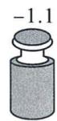  
A

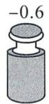  
B

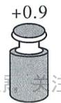  
C

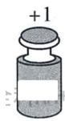  
D

6. 中老铁路是与中国铁路网直接连通的国际铁路, 线路北起中国西南地区的昆明市, 南向到达老挝首都万象市, 是“一带一路”上最成功的样板工程. 从长期看将会使老挝每年的总收入提升 $21\%$ , 若 $+21\%$ 表示提升 $21\%$ , 则 $-10\%$ 表示 ( )

A. 提升 $10\%$

B. 提升 $31\%$

C. 提升 $-10\%$

D. 提升 31%

7. 已知数轴上点 A 表示的数为 a，满足 a 的相反数等于它本身，先将点 A 向右移动 3 个单位长度，再向左移动 4 个单位长度，得到点 B，则点 B 表示的数为（）

A.-2

B.-1

C. 0

D. 1

8. 下列各组数中, 相等的一组是( )

A. $-\left(-\frac{1}{2}\right)$ 和 $-|-2|$

B. $-(+3.5)$ 和 $\left|-\frac{7}{2}\right|$

C. $-[+(-2)]$ 和 $-|2|$

D. $-\left(-\frac{1}{2}\right)$ 和0.5

9. 观察如图所示的有理数阵：

<table><tr><td>-1</td><td>-2</td><td>3</td><td>-4</td><td>-5</td><td>6</td></tr><tr><td>-7</td><td>-8</td><td>9</td><td>-10</td><td>-11</td><td>12</td></tr><tr><td>-13</td><td>-14</td><td>15</td><td>-16</td><td>-17</td><td>18</td></tr><tr><td>...</td><td>...</td><td>...</td><td>...</td><td>...</td><td>...</td></tr></table>

根据你发现的规律推断前 2024 个数中负有理数有（）

A. 1 348

B. 1 350

C. 339

D. 1 012

10. 在数轴上, 点 $A$ 表示的数是 4 , 点 $O$ 表示的数是 0 , 点 $P$ 表示的数是 $p (p \neq 0)$ , 定义: 点 $B$ 在线段 $OP$ 上, 如果线段 $AB$ 的长度有最大值 $m$ , 则称 $m$ 为点 $A$ 与线段 $OP$ 的“闭距离”. 例如, $p = 2$ , 当点 $B$ 与点 $O$ 重合时, $m = 4$ ; 若 $p = -2$ , 则 $m$ 的值是 ( )

A. 2

B. 4

C. 5

D. 6

# 二、填空题（每小题3分，共15分）

11. 孔子曰: “三十而立”, 如果以 30 岁为基准, 张明 40 岁, 记为 +10 岁, 那么王横 25 岁记为 \_\_\_\_.

12. 比较大小: -4 3.

13. 有理数 a, b 在数轴上对应点的位置如图所示, 则 -a \_\_\_\_ b.
(填“＞”“＝”或“＜”)

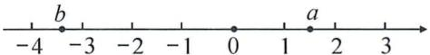

14. 如图所示, 数轴的一部分被墨水污染, 被污染的部分内含有的整数的个数为 \_\_\_\_ 个.

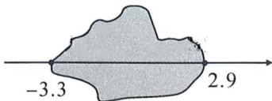

15. 如图, 数轴上标出若干个点, 每相邻两点间的距离为 1, 点 A, B, C, D 对应的数分别是 a, b, c, d, 且 3b = d. (1) d - b 的值为 \_\_\_\_; (2) 点 A 对应的数是 \_\_\_\_.

# 三、解答题（共9小题，共75分）

16.(本题6分)把下列各数填入相应集合的括号内:

$$
3. 1 4, - 3 \frac {1}{2}, - 0. 3, 0, | - 3 |, 1 2, - 9, \frac {2 2}{5}, + 2, 30 \%.
$$

(1) 正有理数集合: {

... }

(2)整数集合: {

... }

(3)非负整数集合:

... }

17.(本题6分)求下列各数的绝对值.

$$
5, - 9, 3. 8, 0, 3 \frac {1}{2}, - 4 \frac {1}{3}.
$$

18.(本题6分)比较大小: $-\frac{2}{15}$ 与 $-\frac{1}{5}$ .

19.(本题8分)如图,数轴上的点A,B,C,D,E分别表示什么数?其中哪些数是互为相反数?

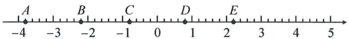

20.(本题8分)在数轴上表示下列各数,并用“<”号把各数连接起来.

$$
+ 2, - (+ 4), + (- 1), | - 3 |, - 1. 5
$$

21.(本题8分)阅读下列材料并解答问题.

<table><tr><td rowspan="3">素材</td><td colspan="9">为了进一步加强对学生的劳动教育,某校将学校劳动实践基地划分区域,分给每个班级自主管理.七年级一班的同学们在本班的种植区域中种植了花生,经过精心耕种,同学们一共收获了8筐花生,以每筐15kg为准,超过的千克数记作正数,不足的千克数记作负数,称重后记录如下:</td></tr><tr><td>筐号</td><td>1</td><td>2</td><td>3</td><td>4</td><td>5</td><td>6</td><td>7</td><td>8</td></tr><tr><td>重量</td><td>2.5</td><td>-1.5</td><td>-3</td><td>-2</td><td>0</td><td>1</td><td>-2</td><td>2</td></tr><tr><td colspan="10"></td></tr><tr><td>任务1</td><td colspan="9">(1)求这8筐花生的实际重量分别为多少千克?</td></tr><tr><td>任务2</td><td colspan="9">(2)在学校的组织下,同学们对收获的花生以市场价7元/千克的价格全部售出,已知七年级一班在播种时,以10元/千克的价格购进花生种子15千克,请你帮七年级一班同学算一算,他们此次耕种花生获利了多少元?</td></tr></table>

22.(本题10分)(1)如果 $|a|=5,|b|=2$ ,且a,b异号,求a,b的值;
(2) 如果 $|a|=4,|b|=1$ , 且 a<b, 求 a,b 的值.

23.(本题11分)当前,新一轮科技革命和产业变革加速演变,新一代信息技术与机器人技术深度融合,机器人产业迎来升级换代、跨越发展的窗口期.今年,一种由我国自主研发的巡逻机器人备受关注,为安保工作提供了强有力的支持.某天,小方发现一个巡逻机器人正准备在一条东西方向的公路上执行治安巡逻,规定向东为正,它从出发到结束巡逻所走的路程(单位:千米)如下:+1.5,-1,-2,+0.5,-4.5,+2.5.

(1)机器人结束巡逻后是否回到出发点？如果没有，请描述巡逻机器人最后的位置；  
(2)求此巡逻机器人这次巡逻离出发点最远的位置；  
(3)已知这次巡逻机器人的平均速度为 3 千米/时,请求出巡逻机器人的巡逻时间.

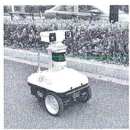

24.(本题12分)数学活动课上,李老师拿出两个单位长度不同的数轴A和数轴B模型.如图,当两个数轴的原点对齐时,数轴A上表示2的点与数轴B上表示3的点恰好对齐.

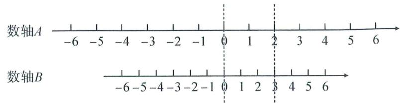

text_image

数轴A
-6 -5 -4 -3 -2 -1 0 1 2 3 4 5 6
数轴B
-6 -5 -4 -3 -2 -1 0 1 2 3 4 5 6

图1

(1)图 1 中, 数轴 B 上表示 6 的点与数轴 A 上表示 \_\_\_\_ 的点对齐, 数轴 A 上表示 -8 的点与数轴 B 上表示 \_\_\_\_ 的点对齐; 李老师将图中的数轴 B 向左移动, 使得数轴 B 的原点与数轴 A 上表示 -2 的点对齐.

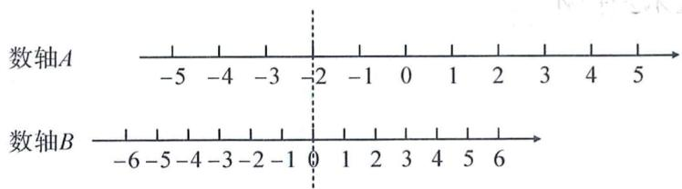

text_image

数轴A
-5 -4 -3 -2 -1 0 1 2 3 4 5 6
数轴B
-6-5-4-3-2-1 0 1 2 3 4 5 6

图2

(2)如图 2, 数轴 A 上表示 5 的点与数轴 B 上表示的哪个数的点对齐? 数轴 B 上距离原点 12 个单位长度的点与数轴 A 上表示哪些数的点对齐?  
(3)将李老师给出图1中数轴B固定,移动数轴A,使数轴A上表示6的点与数轴B上表示-6的点对齐,探究数轴A的移动方式.(用数轴B的单位长度描述)

# 高频考点 1 正数与负数

1. 下列各数: $-3,0,+5,-3.5,+3.1,-\frac{3}{4},-2024,+2023$ , 其中是负数的有()

A.2个

B. 3 个

C. 4 个

D. 5 个

2. 如果水位升高 3 m 时水位变化记作 +3 m, 那么水位下降 2 m 时水位变化记作 \_\_\_\_ m.  
3. 南、北为两个相反的方向. 已知一辆汽车向北行驶 500 m 记作 +500 m, 则该汽车向南行驶 800 m 记作 \_\_\_\_, 汽车停留原地不动记作 \_\_\_\_.  
4. 体育课上一分钟内仰卧起坐的满分标准为 46 个, 高于标准的个数记为正数. 如果某同学做了 50 个记作“+4”, 那么“-5”表示这位同学做了 \_\_\_\_ 个.  
5. 某车床生产一种工件, 该工件的标准直径为 $400 \pm 10 \mathrm{~mm}$ , 下面是从中抽取的 5 个工件的检测结果 (单位: mm): 385, 408, 402, 380, 395. 该车床所生产的工件的合格率是 \_\_\_\_.

# 高频考点2 有理数

6. -0.7 不属于( )

A. 负数

B. 分数

C. 整数

D. 有理数

7. 在 $+8,0,-\frac{3}{7},+\frac{4}{3},2023,-5,0.26,11.1$ 中，非负整数的个数为 \_\_\_\_.

8. 把下列各数填在相应的集合内

$$
- 8, + 5, 0. 0 6, - 5. 1 5, 0, - 0. \dot {3}, - 5 \%, \pi , 1. 5.
$$

(1)整数集合：{ …};   
(2)负有理数集合：{ …};   
(3)正有理数集合: $\{$ $\cdots\}$ .

# 高频考点3 数轴

9. 已知数轴上点 $A$ 表示的数为 $-2$ , 则点 $A$ 与原点的距离为 ( )

A.-1

B. 1

C.-2

D. 2

10. 若点 P 在数轴上表示的数是 -1，则点 P 向右移动 5 个单位长度后所表示的数是（）

A.-4

B. +4

C. +6

D.-6

# 2 第一章《有理数》专题卷

11. 数轴上, 点 A, B 表示的有理数分别是 -4, 8.

(1) $A, B$ 两点间的距离是 \_\_\_\_ 个单位长度；  
(2) C 是数轴上一点, 且点 C 到点 A 和点 B 的距离相等, 则点 C 表示的有理数是 \_\_\_\_.

12. 如图所示的数轴上, 每 1 格为 1 个单位长度, 如果点 B, C 到原点的距离相等, 那么点 A 表示的数是 \_\_\_\_.

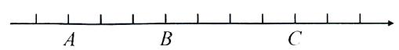

13. 将一把刻度尺按如图所示的方式放在数轴上(数轴上的 1 个单位长度是 1 cm)，刻度尺上的“1 cm”和“7 cm”分别对应数轴上的数 -1.6 和 a，则 a 的值为()

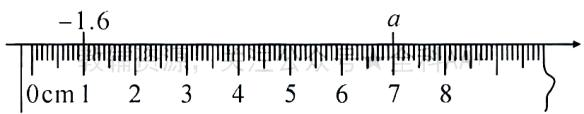

A. 7

B. 6

C. 5.4

D. 4.4

# 高频考点4 相反数

14. 化简: $-(-2)=$ \_\_\_\_ , $-(+3)=$ \_\_\_\_,

$$
+ (- 5) = \underline {{\quad}}, - [ - (- 7) ] = \underline {{\quad}},
$$

$$
+ [ - (+ 7) ] = \underline {{\quad}}, - [ + (- 4) ] = \underline {{\quad}},
$$

$$
- [ - (+ 4) ] = \underline {{\quad}}.
$$

15. 有理数 $a, b$ 在数轴上的位置如图所示, 则① $a$ 与 $-a$ 之间有个点表示的数是整数; ② $-b$ 与 $-a$ 之间的整数有个, 它们分别是 \_\_\_\_.

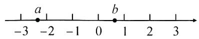

16. 已知数 a, b 表示的点在数轴上的位置如图所示.

(1)在数轴上表示出 $a, b$ 的相反数；  
(2)若表示数 $b$ 与其相反数的两点相距20个单位长度, 则 $b$ 对应的数是多少?

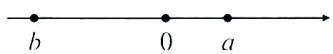

# 高频考点5 绝对值

17. 已知 $|x| = 3, |y| = 4$ .

(1) 若 $x > y$ ，则 $x =$ ， $y =$ ；  
(2) 若 $x < y$ ，则 $x =$ ， $y =$ \_\_\_\_.

18. 若 $|a| = a$ ，则 $a$ \_\_\_\_ 0；若 $|a| = -a$ ，则 $a$ \_\_\_\_ 0；若 $|a| = |b|$ ，则 $a, b$ 之间的关系是 \_\_\_\_.

19.(1)式子 $|a|+3$ 的最小值为 \_\_\_\_，此时 a= \_\_\_\_；

(2)式子 $|a-2|+5$ 的最小值为\_\_\_\_，此时a=\_\_\_\_；  
(3)式子- $|a-3|+4$ 的最大值为\_\_\_\_，此时a=\_\_\_\_。

20. 若 $|x + 4| = 0$ ，则 $x =$ \_\_\_\_；若 $|-2x| = 6$ ，则 $x =$ \_\_\_\_.

21. 若 $\left|x-1\right|=4$ ，且 x<0，则 x 的值为 \_\_\_\_.  
22. 若 $x, y$ 满足 $|x - 2| + |y - 98| = 0$ , 求 $xy$ 的值.

# 高频考点6 有理数的大小比较

23. 在 -3, 2, 0, -1 这四个数中, 最小的数是( )

A.-3

B.-1

C. 0

D. 2

24. 填“＞”、“＜”或“＝”.

(1) +0.1 \_\_\_\_ 0;   
(2)0\_\_\_\_-3.14;   
(3) $-1\frac{3}{4}$ \_\_\_\_ -(-1.2);   
(4) $\left|-3\frac{3}{5}\right|$ \_\_\_\_ | -3.5 |;   
(5) $-\left|-1\frac{2}{5}\right|$ \_\_\_\_ -1.3;   
(6) $-\left|-6\right|$ \_\_\_\_ $-(+6)$ .

25. 比较下列各组数的大小:

(1)-2.5 和 -2; (2) $-\frac{5}{4}$ 和 $-\frac{6}{5}$ ; (3) $-\left| -1\frac{1}{3} \right|$ 与 $-\left(-1\frac{1}{3}\right)$ .

26. 画一条数轴表示下列各数, 并用“<”将它们连接起来:

$$
- 5, - (+ 3. 5), 0, | - 4 |, - (- 2), \frac {1}{2}.
$$

# 高频考点 7 有理数的实际应用

27. 已知某零件的标准直径是 $10 \, mm$ ，超过规定直径长度的数量记作正数，不足规定直径长度的数量记作负数，检验员某次抽查了五件样品，检查的结果如下：

<table><tr><td>序号</td><td>1</td><td>2</td><td>3</td><td>4</td><td>5</td></tr><tr><td>直径长度/mm</td><td>+0.1</td><td>-0.15</td><td>-0.2</td><td>-0.05</td><td>+0.25</td></tr></table>

(1)试指出哪件样品的大小最符合要求?

(2)如果规定误差的绝对值在 0.18 mm 之内是正品,误差的绝对值在 0.18 mm\~0.22 mm 之间的是次品,误差的绝对值超过 0.22 mm 的是废品,那么上述五件样品分别属于哪类产品?

28. 某景区的部分景点和游览路径恰好都在一条直线上, 一辆电瓶小客车接到任务从景区大门出发, 向东走 2 千米到达 A 景点, 继续向东走 2.5 千米到达 B 景点, 然后又回头向西走 7.5 千米到达 C 景点, 最后回到景区大门.

(1)以景区大门为原点,向东为正方向,以1个单位长度表示1千米,建立如图所示的数轴,请在数轴上表示出A,B,C三个景点的位置,并直接写出A,C两景点之间的距离;

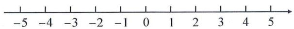

(2)若电瓶车充足一次电能行走16千米,则该电瓶车能否在一开始充足电而途中不充电的情况下完成此次任务?

# 高频考点8 有理数的综合运用

29. 结合数轴的知识回答下列问题：

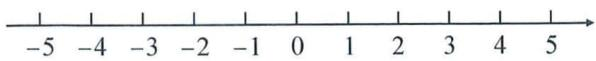

(1)数轴上表示 1 和 4 的两点之间的距离是 \_\_\_\_，表示 7 和 4 的两点之间的距离是 \_\_\_\_；数轴上表示 -3 和 2 的两点之间的距离是 \_\_\_\_，表示 -8 和 -3 的两点之间的距离是 \_\_\_\_；  
(2)如果表示数 $a$ 和3的两点之间的距离是5，求 $a$ 的值；

(3)如果表示数 b 和 4 的两点之间的距离是表示数 b 和 1 的两点之间的距离的 2 倍, 直接写出 b 的值为 \_\_\_\_.

30.【新考法】阅读下列材料:定义:数轴上给定不重合两点 A, B, 若数轴上存在一点 M, 使得点 M 到点 A 的距离等于点 M 到点 B 的距离, 则称点 M 为点 A 与点 B 的“中点”.

解答下列问题：

(1)已知点 A 表示的数为 -3, 点 B 表示的数为 1, 若点 M 为点 A 与点 B 的“中点”, 则点 M 表示的数为 \_\_\_\_;  
(2)已知点 A 表示的数为 -3, 若点 A 与点 B 的“中点”M 表示的数为 -5, 则点 B 表示数为 \_\_\_\_;

操作探究：

如图,已知在纸面上有一条数轴.

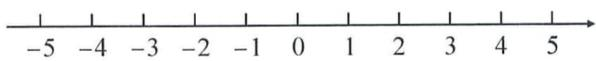

操作一：

(3)折叠数轴,使表示1的点与表示-1的点重合,则表示-5的点与表示\_\_\_\_的点重合;

操作二：

(4)折叠数轴,使表示1的点与表示3的点重合,在这个操作下回答下列问题:

①表示-2的点与表示\_\_\_\_的点重合；  
②若数轴上 A, B 两点的距离为 7 (A 在 B 的左侧), 且折叠后 A, B 两点重合, 则点 A 表示的数为 \_\_\_\_.

# 3 第二章《有理数的运算》阶段检测卷(一)

(测试范围:2.1 时间:90 分钟 满分:120 分)

# 一、选择题（每小题3分，共30分）

1. 温度从 $-2^{\circ}C$ 上升 $7^{\circ}C$ 后是（）

A. ${1}^{ \circ  }\mathrm{C}$

B. $-1^{\circ} \mathrm{C}$

C. $3^{\circ} \mathrm{C}$

D. $5^{\circ} \mathrm{C}$

2. 计算 2-(-4) 的结果是( )

A.-2

B. 2

C. 6

D.-6

3. 将 $-6-(+3)-(-7)+(-2)$ 中的减法改成加法，并写成省略加号和的形式是（）

A.-6-3+7-2

B.-6-3-7-2

C. $6 - 3 + 7 - 2$

D. $-6 + 3 - 7 - 2$

4. 计算 $-4-|-6|$ 的结果为()

A.-2

B. -10

C. 2

D. 10

5. 小明家的冰箱冷藏室温度是 $4^{\circ}C$ ，冷冻室的温度是 $-1^{\circ}C$ ，则他家冰箱冷藏室温度比冷冻室温度高（）

A. $7^{\circ}$ C

B. $5^{\circ}$ C

C. $-5^{\circ}\mathrm{C}$

D. $-7^{\circ}C$

6. 如图, 数轴上一动点 A 向左移动 2 个单位长度到达点 B, 再向右移动 5 个单位长度到达点 C. 若点 C 表示的数为 1, 则点 A 表示的数为( )

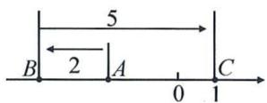

A. 7

B. 3

C.-3

D.-2

7. 若 $\left|a\right|=5, b=-2$ ，且 a>b，则 $a+b$ 的值是（）

A. 7

B.-7

C. 3

D. -3

8. 当 $x < 0, y > 0$ 时， $x, x + y, x - y, y$ 中最大的是（）

A. $x$

B. $x - y$

C. $x + y$

D. y

9. 观察下面一列有理数: 0, -3, 8, -15, 24, -35, …, 则它的第 9 个数与第 8 个数的差为( )

A. 15

B. 111

C. 17

D. 143

10. 如图, 数轴上 A, B, C 三点所表示的数分别为 a, b, c, 且点 B 到点 A, C 的距离相等. 如果有 $b + c > 0, a + c < 0$ , 那么该数轴的原点 O 的位置应该在( )

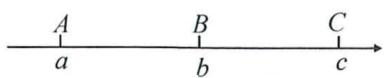

A. 点 $A$ 的左边

B. 点 $B$ 与 $C$ 之间且离点 $B$ 近

C. 点 A 与 B 之间且离点 A 近

D. 点 $C$ 的右边

# 二、填空题（每小题3分，共15分）

11. 计算 0-(-3) 的结果是 \_\_\_\_.

12. 设 a 是最小的自然数, b 是最大的负整数, c 是绝对值最小的有理数, 则 $a + b - c$ 的值为 \_\_\_\_.

13. 已知 $\left|a\right|=3,\left|b\right|=2$ , 且 $a+b<0$ , 那么 a-b 的值是 \_\_\_\_.

14. 计算: $1 - 2 - 3 + 4 + 5 - 6 - 7 + 8 + 9 - \cdots - 2020 + 2021 - 2022 - 2023 + 2024 =$ \_\_\_\_.

15. 新定义: 对于若干个有理数, 先将每两个数作差 (大数减小数, 相等的数的差为 0), 再将这些差进行求和, 这样的运算称为对这若干个数的“非负差值运算”, 例如: 对于 1, 2, 3 进行“非负差值运算”, $(2-1)+(3-2)+(3-1)=4$ , 则对于 -2, 3, 5, 9 进行“非负差值运算”的结果是 \_\_\_\_.

# 三、解答题（共9小题，共75分）

16.(本题6分)计算：

(1) $-\frac{1}{5}-(-1.3)$ ;

(2) $(+8.37)+(-5.37)$ .

17.(本题6分)计算:

(1) $11-(-19)+(-12)-6;$

(2) $\frac{9}{22}+\frac{11}{18}-\left(\frac{21}{22}-\frac{7}{18}\right).$

18.(本题6分)一辆出租车在东西方向的马路上行驶,从起点开始向东行驶记为正,司机记录他一天的行程如下:(单位:千米)
-9,-8,9,-2,9,8,8,-8,29,-36,50,-24.

(1)这一天出租车最后停在离起点多远地方?

(2)若每100千米耗油7升,出租车这一天用了多少升油?

19.(本题8分)小明在电脑中设置了一个有理数的运算程序:输入数a,加\*键,再输入数b,就可以得到运算: $a*b=(a-b)-|b-a|$ .

(1) 求 $(-5)*3$ 的值；

(2) 求 $(3 \times 4) \times (-6)$ 的值.

20.(本题8分)如图,在一条不完整的数轴上从左到右有三个点A,B,C,其中AB=2,BC=1,设点A,B,C所对应数的和是p.

(1)若以 B 为原点,写出点 A,C 所对应的数,并求出 p 的值;  
(2)若原点 O 在图中数轴上点 C 的右边, 且 CO=15, 求 p 的值.

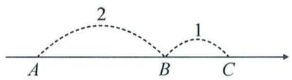

21.(本题8分)(1)若 $|a+b+2|+|c+1|=0$ ,求 $a+b-c$ 的值;

(2)已知 $|a|=6,|b|=2$ ，且 $|a+b|=|a|+|b|$ ，求a-b的值.

22.(本题10分)【阅读理解】|4-1|表示4与1两数在数轴上所对应的点之间的距离: |4+1|可以看做|4-(-1)|, 表示4与-1两数在数轴上所对应的点之间的距离.

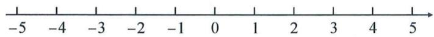

# 【实践应用】

(1) $|4-(-1)|=$ \_\_\_\_;   
(2)在数轴上,有理数5与-3所对应的两点之间的距离为\_\_\_\_;

(3)结合数轴找出所有符合条件的有理数 x，使得 $\left|x-(-1)\right|=3$ ，求 x 的值.

23.(本题11分)阅读下列材料并解答问题.

<table><tr><td>素材</td><td>奥运会足球比赛中,根据场上攻守形势,守门员会在门前来回跑动,如果以球门线为基准,向前跑记作正数,返回则记作负数,一段时间内,某守门员的跑动情况记录如下(单位:m):+10,-2,+5,-6,+12,-9,+4,-14.(假定开始计时时,守门员正好在球门线上)</td></tr><tr><td>任务1</td><td>(1)守门员最后是否回到球门线上?</td></tr><tr><td>任务2</td><td>(2)守门员离开球门线的最远距离达多少米?</td></tr><tr><td>任务3</td><td>(3)如果守门员离开球门线的距离超过10米(不包括10米),则对方球员挑射极可能造成破门.请问在这一时间段内,对方球员有几次挑射破门的机会?</td></tr></table>

24.(本题12分)甲、乙两人借助“数轴”和“剪刀、石头、布”设计了一款“移动游戏”,两人分别在数轴上随机挑选一个点作为游戏的起点,甲选择的游戏起点为A:-5,乙选择的游戏起点为B:3,然后两人进行“剪刀、石头、布”,每次“剪刀、石头、布”的结果共有三种可能:平局,甲胜、乙胜,再根据每次“剪刀、石头、布”的结果,A,B两点沿数轴同时移动,移动规则如下:

<table><tr><td>“剪刀、石头、布”的结果</td><td>甲,乙移动方式</td></tr><tr><td>平局</td><td>甲向右移动0.5个单位,乙向左移动0.5个单位</td></tr><tr><td>甲胜</td><td>甲向右移动2个单位,乙向右移动1个单位</td></tr><tr><td>乙胜</td><td>甲向左移动1个单位,乙向左移动2个单位</td></tr></table>

(1)若甲、乙两人共进行了3次“剪刀、石头、布”游戏,其中平局1次,甲胜1次,乙胜1次,则甲最终位置表示的数为\_\_\_\_,乙最终位置表示的数为\_\_\_\_,此时甲,乙两点间的距离为\_\_\_\_;  
(2)若甲、乙两人共进行了10次“剪刀、石头、布”游戏,其中平局2次,甲胜5次,乙胜3次,通过计算说明此时甲是否移动到了乙的右边.

# 4 第二章《有理数的运算》阶段检测卷(二)

(测试范围:2.2\~2.3 时间:90 分钟 满分:120 分)

# 一、选择题（每小题3分，共30分）

1. 有理数 $\frac{1}{3}$ 的倒数是（ ）

A. 3 B. $-\frac{1}{3}$ C. -3 D. $\frac{1}{3}$

2.“厉行勤俭节约,反对铺张浪费”势在必行.最新统计数据显示,中国每年浪费食物问题折合粮食大约是3 010 000 000人一年的口粮,用科学记数法表示3 010 000 000为()

A. $3.01 \times 10^{10}$ B. $3.01 \times 10^{9}$

C. $3.1 \times 10^{8}$ D. $301 \times 10^{7}$

3. 计算 $3 \div \left(-\frac{1}{3}\right)$ 的结果等于()

A.-9 B.9 C.-1 D.1

4. 下列运算正确的是( )

A. $(-2)\times (-3) = -6$ B. $(-5)\times 2 = -10$

C. $4 \div \left(-\frac{1}{2}\right) = -2$ D. $-8 \div (-2) = -4$

5. 计算 $\left|-2\right|-\left(-2\right)^{3}$ 的结果是()

A.-2 B.-10 C.2 D.10

6. 用四舍五入法按要求对 0.05019 分别取近似值, 其中错误的是 ( )

A.0.1(精确到0.1) B.0.05(精确到百分位)

C.0.05(精确到千分位) D.0.0502(精确到0.0001)

7. 在等式 $\left(-2 + \frac{1}{5} \times \square\right) \div (-3) = -4$ 中, 则 $\square$ 表示的有理数是 ( )

A.-70 B.50 C.-50 D.70

8. 已知“!”是一种数学运算符号, 并且 $1! = 1, 2! = 2 \times 1 = 2,$ $3! = 3 \times 2 \times 1 = 6, 4! = 4 \times 3 \times 2 \times 1 = 24, \cdots$ , 若公式 $C_{n}^{m} = \frac{n!}{m! \times (n - m)!} (n > m)$ , 则计算 $C_{12}^{5}$ 的结果为()

A. 60 B. 792 C. 812 D. 5054

9. 我们平常的数都是十进制数, 如 $2639 = 2 \times 10^{3} + 6 \times 10^{2} + 3 \times 10 + 9$ , 表示十进制数要用 10 个数码(也叫数字): 0, 1, 2, 3, 4, 5, 6, 7, 8, 9. 在电子数字计算机中用二进制, 只要两个数码 0 和

1. 如二进制数 $101 = 1 \times 2^{2} + 0 \times 2^{1} + 1 = 5$ ，故二进制数 101 等于十进制数 5。那么二进制数 110 111 等于十进制的数（）

A. 55 B. 56 C. 57 D. 58

10. 如图, 数轴上的 A, B, C 三点所表示的数分别为 a, b, c. 根据图中各点位置, 下列各式中正确的是()

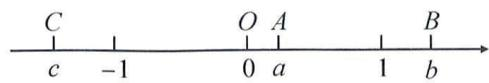

A. $(a - 1)(b - 1) > 0$ B. $(b + 1)(c + 1) <   0$

C. $(a + 1)(b + 1) <   0$ D. $(b - 1)(c - 1) > 0$

# 二、填空题（每小题3分，共15分）

11. 计算 $-4 \times (-5)$ 的结果是 \_\_\_\_.

12. 化简: $-\frac{30}{45}=$ \_\_\_\_.

13. 已知 $(x + 3)^2 + (y - 2)^2 = 0$ ，则 $x^y$ 的值是 \_\_\_\_.

14. 定义新运算: $a \otimes b = \begin{cases} ab (a - b \geqslant 0), \\ \frac{a}{b} (a - b < 0), \end{cases}$ 则 $(-2) \otimes (-7)$ 的值是 \_\_\_\_.

15. 观察下列图形中的数字排列规律, 在第⑧个图中: (1)a 的值为 \_\_\_\_; (2)b-c 的值为 \_\_\_\_.

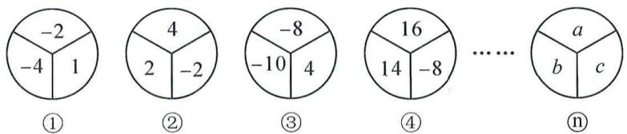

pie

| Category | Value |
|---|---|
| ① | -2 |
| ① | -4 |
| ① | 1 |
| ② | 4 |
| ② | 2 |
| ② | -2 |
| ③ | -8 |
| ③ | -10 |
| ③ | 4 |
| ④ | 16 |
| ④ | 14 |
| ④ | -8 |
……
⑤ | a |
| ⑤ | b |
| ⑤ | c |
⑥ |

# 三、解答题（共9小题，共75分）

16.(本题6分)计算:

(1) $8 \times (-13) \times \left(-\frac{1}{4}\right)$ ; (2) $-2\frac{2}{15} \div \left(-\frac{4}{5}\right)$ .

17.(本题6分)计算:

(1) $\left(\frac{1}{6}-\frac{1}{2}+\frac{5}{12}\right)\times(-36)$ ; (2) $(-81)\div2\frac{1}{4}\times\frac{4}{9}\div(-16)$ .

18.(本题6分)计算: $-1^{2024}+\frac{1}{6}\times[2-(-3)^{2}]$ .

19.(本题8分)已知x是5的相反数, $|y|=2$ 且xy>0,求 $xy-\frac{x}{y}$ 的值.

20.(本题8分)已知数轴上A,B,C三点对应的有理数分别为a,b,c,且a,b,c满足 $|a+b|+(c-3)^{2}=0$ .

(1) 求 c 的值;

(2) 若点 A 在点 B 左侧, 且 A, B 两点间的距离为 2, 试比较 $a^{c} + b^{c}$ 与 $(a + b)^{c}$ 的大小.

21.(本题8分)下表为某班48人参加排球垫球比赛的情况,标准数量为每人垫球25个.

<table><tr><td>垫球个数与标准数量的差值</td><td>-11</td><td>-6</td><td>0</td><td>8</td><td>10</td><td>15</td></tr><tr><td>人数</td><td>5</td><td>12</td><td>10</td><td>6</td><td>10</td><td>5</td></tr></table>

(1)求这个班48人平均每人垫球多少个?

(2)规定垫球达到标准数量记0分,垫球超过标准数量,每多垫1个加2分;垫球未达到标准数量,每少垫1个,扣1分,求这个班垫球总共获得多少分?

22.(本题10分)分类讨论是一种重要的数学方法,如在化简 $|a|$ 时,可以这样分类:当a>0时, $|a|=a$ ;当a=0时, $|a|=0$ ;当a<0时, $|a|=-a$ .用这种方法解决下列问题:

(1)①当 a > 0 时，则 $\frac{|a|}{a} =$ \_\_\_\_ ;

②当 a<0 时，则 $\frac{a}{|a|}=$ \_\_\_\_；

(2) 若 abc < 0，则 $\frac{|a|}{a} + \frac{|b|}{b} + \frac{|c|}{c}$ 的值为 \_\_\_\_；

(3) 若 $a + b + c = 0, a > 0, c < 0$ ，且 $a + c < 0$ ，请分析 b 的正负性，并求出 $\frac{b + c}{|a|} + \frac{a + c}{|b|} + \frac{a + b}{|c|}$ 的值.

23.(本题11分)【综合与实践】七年级智远团成员自主开展数学微项目研究,结合最近所学内容,他们开展了立方数的性质研究.根据背景素材,探索解决问题:

<table><tr><td></td><td>探索立方数的性质</td></tr><tr><td>素材</td><td>古希腊数学家发现:一个正整数k的三次幂总能表示成k个连续奇数之和.举例论证: $1^{3} = 1,2^{3} = 3 + 5,3^{3} = 7 + 9 + 11$ .</td></tr><tr><td>归纳数学规律</td><td>(1)请按规律写出: $4^{3} =$  ____. (2)当k=10时,等号右边的式子的中间两个数(即第5个数和第6个数)是_____.</td></tr><tr><td>应用数学规律</td><td>(3)利用这个结论计算: $1^{3} + 2^{3} + 3^{3} + \cdots + 10^{3} + 11^{3}$ .</td></tr></table>

24.(本题12分)观察下面三行数:

-2, 4, -8, 16, -32, …; ①

-1, 5, -7, 17, -31, …; ②

-4, 8, -16, 32, -64, …. ③

(1)第①行的第8个数是\_\_\_\_；

(2)第②行的第 n 个数是 \_\_\_\_；(n 为正整数)

(3)取每一行的第7个数,计算这三个数的和;

(4)取每一行的第 n 个数,请判断是否存在这样的三个数的和为 -4603.

# 5 第二章《有理数的运算》单元检测卷

(测试范围:第二章 时间:120 分钟 满分:120 分)

# 一、选择题（每小题3分，共30分）

1. 计算 $-5+3$ 的结果是（）

A.-2

B.-8

C. 2

D. 8

2. 下列运算结果为负数的是()

A. $(-7)\times(-6)$

B. $(-6)-(-8)$

C. 0-(-2)

D. $(-6)\div3$

3. 2024 年 5 月 10 日, 记者从中国科学院国家天文台获悉, “中国天眼” FAST 近期发现了 6 个距离地球约 50 亿光年的中性氢星系, 这是人类迄今直接探测到的最远的一批中性氢星系. 50 亿光年用科学记数法表示为( )

A. $50 \times 10^{8}$ 光年

B. $5 \times 10^{8}$ 光年

C. $5 \times 10^{9}$ 光年

D. $5 \times 10^{10}$ 光年

4. 下列计算中, 正确的是()

A. $|-2|=-2$

B. $(-1)^{2} = -2$

C. $-7+3=-4$

D. $6 \div (-2) = 3$

5. 某市某天上午 8 点的气温是 $-2^{\circ}C$ ，中午 12 点的气温比上午 8 点上升了 $4^{\circ}C$ ，晚上 9 点的气温比中午 12 点下降了 $5^{\circ}C$ ，则这天晚上 9 点的气温是（）

A. $-3^{\circ} \mathrm{C}$

B. $-1^{\circ}\mathrm{C}$

C. $2^{\circ}$ C

D. $3^{\circ} \mathrm{C}$

6. 当 -1 < x < 0 时, x, -x, $x^{2}$ 的大小顺序是()

A. $-x>x>x^{2}$

B. $x^{2} > x > -x$

C. $-x>x^{2}>x$

D. $x > x^{2} > -x$

7. 计算 $36 \div (-6) \times \left(-\frac{1}{6}\right)$ 的结果是()

A. 6

B. 36

C.-1

D. 1

8. 若 m, n 互为倒数, 且满足 $mn - m = \frac{1}{2}$ , 则 n 的值为()

A. $\frac{1}{4}$

B. $\frac{1}{2}$

C. 2

D. 4

9. 已知 a 为有理数, 定义运算符号为“※”, 当 $a \geqslant b$ 时, $a \times b = 2a$ , 当 a < b 时, $a \times b = 2b - a$ , 则 $6 \times 2 - (-3 \times 2)$ 的值为()

A. 5

B. 1

C.-6

D. 10

10. 已知 a, b 是有理数, a 在数轴上的对应点的位置如图所示, $a + b < 0$ . 有以下结论: ① b < 0; ② b - a > 0; ③ $|-a| > -b$ ; ④ $\frac{b}{a} < -1$ . 则所有正确的结论是()

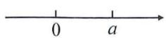

A. ①④

B.①③

C. ②③

D. ②④

# 二、填空题(每小题3分,共15分)

11. 一个气球随风而起, 飞到空中 $5 \mathrm{~m}$ 处后又上升了一 $3 \mathrm{~m}$ , 此时气球在空中 \_\_\_\_ m 处.  
12. 近似数 2.048 精确到十分位的结果是 \_\_\_\_.  
13. 计算: $2 \times (-3) - 9 \div |-3| =$ \_\_\_\_ .   
14. 如图, 某学校“桃李餐厅”把 WIFI 密码做成了数学题. 小红在餐厅就餐时, 思索了一会儿, 输入密码, 顺利地连接到了“桃李餐厅”的网络. 那么她输入的密码是 \_\_\_\_.

教辅资源，头

账号：Tao Li Can Ting

5\*3⊕6=301848

2\*6⊕7=144256

9\*2⊕5=451055

$4*8⊕6=$ 密码

15. 已知 x, y 均为整数，且 $\left|x-y\right| + \left|x-3\right| = 1$ . (1) 若 x = y，则 x 的值为 \_\_\_\_；(2) $x + y$ 的值为 \_\_\_\_.

# 三、解答题（共9小题，共75分）

16.(本题6分)计算: $(-5)+\left(-8\frac{1}{3}\right)+(-25)-\left(+1\frac{2}{3}\right)$ .

17.(本题6分)某矿井下A,B,C三处的海拔高度分别为-35.6米,-122.7米,-67.8米.

(1)求 A 处比 C 处高多少米?   
(2)求 B 处比 C 处高出多少米?

18.(本题6分)已知 $|a|=3,|b|=2,a+b<0$ ,求 $\frac{a}{b}$ 的值.

19.(本题8分)计算:(1) $-2^{2}+(-4)\div2\times\frac{1}{2}+|-3|$ ;

(2) $-1^{4}-7\div[2-(-3)^{2}]$ .

20.(本题8分)根据倒数的定义:我们知道,若 $(a+b)\div c=-2$ ,
则 $c \div (a + b) = -\frac{1}{2}$ .

(1) 计算: $\left(-\frac{1}{9}+\frac{1}{4}+\frac{1}{12}\right)\div\left(-\frac{1}{72}\right)$ ;   
(2) 计算: $\left(-\frac{1}{72}\right)\div\left(-\frac{1}{9}+\frac{1}{4}+\frac{1}{12}\right)$ .

21.(本题8分)有20箱苹果,以每箱15千克为标准,超过15千克的数记为正数,不足15千克的数记为负数,称重记录如下:

<table><tr><td>与标准质量的差(千克)</td><td>-0.5</td><td>-0.4</td><td>-0.2</td><td>0</td><td>+0.2</td><td>+0.3</td><td>+0.6</td></tr><tr><td>箱数(箱)</td><td>2</td><td>1</td><td>5</td><td>2</td><td>4</td><td>2</td><td>4</td></tr></table>

(1)求这20箱苹果的总质量；

(2)若这批苹果的批发价是8.5元/千克,售价是15元/千克,运输和出售过程中有10%的苹果腐烂无法出售,则出售这20箱苹果能盈利多少元?

22.(本题10分)阅读下列各式: $(a\cdot b)^{2}=a^{2}b^{2},(a\cdot b)^{3}=a^{3}b^{3},$ $(a \cdot b)^{4} = a^{4}b^{4}, \cdots.$

回答下列三个问题：

(1)验证: $\left(3\times\frac{1}{3}\right)^{100}=$ \_\_\_\_; $3^{100}\times\left(\frac{1}{3}\right)^{100}=$ \_\_\_\_;

(2)通过上述验证,归纳得出: $(a\cdot b)^{n}=$ \_\_\_\_; $(abc)^{n}=$ \_\_\_\_;

(3)请应用上述性质计算: $(-0.125)^{99}\times2^{100}\times4^{100}$ .

23.(本题11分)根据以下素材,尝试解决问题.

<table><tr><td colspan="3">探究最优方案选择问题</td></tr><tr><td>素材1</td><td>第19届杭州亚运会吉祥物是由琮琮、莲莲、宸宸共同组成“江南忆”组合.杭州亚运会的举办带热了吉祥物的销售,某校七年段4个班级计划购买一批吉祥物作为班级奖品,每班购买数量以20个为标准,超过标准记为正,不足标准记为负,各班购买数量如表所示.</td><td>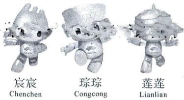杭州2022年第19届亚运会吉祥物Mascots of the 19th Asian Games Hangzhou 2022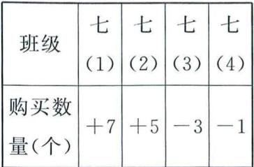</td></tr><tr><td>素材2</td><td colspan="2">现有甲、乙两家销售店均有销售吉祥物,每个标价40元,国庆期间为吸引更多顾客购买,甲、乙两店开展如下优惠方案:甲店每购满7个送1个:乙店购买数量20个以内(含20)不打折,超过20个部分按定价的80%售卖.</td></tr><tr><td colspan="3">问题解决</td></tr><tr><td>问题1</td><td colspan="2">根据素材1,购买吉祥物数量最多班级比购买数量最少班级多_个.</td></tr><tr><td>问题2</td><td colspan="2">根据素材1、2,若按甲店优惠方案四个班级分别购买,则购买费用最多班级比最少班级多多少元?</td></tr><tr><td>问题3</td><td colspan="2">根据素材1、2,若年段统一购买,购买总数不变且只能选其中一种优惠方案,则在哪家销售店购买更优惠?试通过计算说明.</td></tr></table>

24.(本题12分)在印度有一个古老的传说:舍罕王打算奖赏国际象棋的发明人——宰相西萨·班·达依尔.国王问他想要什么,他对国王说:“陛下,请您在这张棋盘的第1个小格里,赏给我1粒麦子,在第2个小格里给2粒,第3小格给4粒,以后每一小格都比前一小格加一倍.请您把这样摆满棋盘上所有的64格的麦粒,都赏给您的仆人吧!”国王觉得这要求太容易满足了,就命令给他这些麦粒.当人们把一袋一袋的麦子搬来开始计数时,国王才发现:就是把全印度甚至全世界的麦粒全拿来,也满足不了那位宰相的要求,那么,宰相要求得到的麦粒到底有多少呢?

即求: $1+2+2^{2}+2^{3}+2^{4}+\cdots+2^{63}$ 的值.如何求它的值呢?

设 $s=1+2+2^{2}+2^{3}+2^{4}+\cdots+2^{63}$ ，①

则 $2s=2(1+2+2^{2}+2^{3}+2^{4}+\cdots+2^{63})=2+2^{2}+2^{3}+2^{4}+\cdots+2^{63}+2^{64}$ . ②

②式减①式得： $s=2^{64}-1$ .

(1)直接写出 $1+2+2^{2}+2^{3}+2^{4}+\cdots+2^{9}$ 的值为 \_\_\_\_ （用乘方的式子表示）；

(2)求 $1+5+5^{2}+5^{3}+5^{4}+\cdots+5^{2022}$ 的值；

(3)如图,一棵“树”的枝干都用线段表示,最下方的一条线段表示初始树干,第一次生长,原树干向上长出三根“树枝”,第二次生长,各树枝再次长出三根“树枝”,按此规律继续生长,第8次生长后,这棵树的枝干共有\_\_\_\_根.
(假设每次生长,新长出来的三根“树枝”都不和生长前的“枝干”共线)

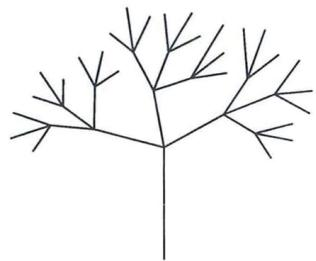

# 高频考点1 有理数的运算

# 类型一 有理数的加减

1. 计算：

(1) $15+(-22)=$ \_\_\_\_；  
(2) $(-13)+(-8)=$ \_\_\_\_；  
(3) $(-0.9)+1.5=$ \_\_\_\_;   
(4) $\frac{1}{2}+\left(-\frac{2}{3}\right)=$ \_\_\_\_；  
(5) $(-16)-(-8)=$ \_\_\_\_；  
(6)90-(-3)=\_\_\_\_;   
(7)0-(-13)=\_\_\_\_;   
(8) $(-72)-(+63)=$ \_\_\_\_.

2. 计算：

(1) $23+(-14)-35-(-10)$ ;   
(2) $\left(-\frac{4}{9}\right)+\left(-\frac{5}{9}\right)-(-9)$ ;   
(3) $4.5 + \left[(-2.5) + 9\frac{1}{3} +\left(-15\frac{2}{3}\right)\right] + 2\frac{1}{3};$   
(4) $\left|-2\frac{1}{2}\right|-(-2.5)+1-\left|1-2\frac{1}{2}\right|$ .

# 类型二 有理数的乘除

3. 计算：

(1) $(-6)\times(-5)=$ \_\_\_\_ ;   
(2) $\frac{4}{3}\times\left(-\frac{9}{8}\right)=$ \_\_\_\_；  
(3) $0 \times \left(-\frac{9}{7}\right)=$ \_\_\_\_；

# 6 第二章《有理数的运算》专题卷

(4) $\left(-126\frac{9}{11}\right)\times\left(-\frac{1}{9}\right)=$ \_\_\_\_；  
(5) $(-18)\div6=$ \_\_\_\_ ;   
(6) $(-70)\div(-5)=$ \_\_\_\_ ;   
(7) $(-6.5)\div0.13=$ \_\_\_\_ ;   
(8) $\left(-\frac{6}{5}\right)\div\left(-\frac{2}{5}\right)=$ \_\_\_\_.

4. 化简：

(1) $\frac{-3}{9}=$ \_\_\_\_；  
(2) $\frac{-42}{-7}=$ \_\_\_\_;   
(3) $\frac{52}{-13}=$ \_\_\_\_；  
(4) $-\frac{-7}{-56}=$ \_\_\_\_.

5. 计算：

(1) $\left(-\frac{8}{3}\right)\times\left(-\frac{5}{6}\right)\div\frac{1}{9};$   
(2) $\left(-4\frac{1}{2}\right)\div\frac{7}{25}\times\left(-\frac{4}{5}\right)\times\left(-1\frac{2}{5}\right);$   
(3) $(-1.25)\times\frac{5}{4}\times(-8)\div\left(-\frac{3}{4}\right);$   
(4) $4\div\left(-\frac{5}{7}\right)\times\frac{2}{7}\div(-1.6).$

# 类型三 有理数的乘方

6. 计算：

(1) $(-2)^{2} =$ \_\_\_\_， $(-2)^{3} =$ \_\_\_\_， $\left(-\frac{1}{2}\right)^{4} =$ \_\_\_\_；  
(2) $(-1)^{100}=$ \_\_\_\_, $(-1)^{2021}=$ \_\_\_\_, $0^{2021}=$ \_\_\_\_;   
(3) $-3^{2}=$ \_\_\_\_， $-3^{3}=$ \_\_\_\_， $-(-3)^{2}=$ \_\_\_\_.

# 类型四 科学记数法与近似数

7. 截止 2023 年底,我国森林面积约为 3465000000 亩,森林覆盖率达到 24.02%. 将数字 3465000000 用科学记数法表示为 ( )

A. 0.346 $5 \times 10^{9}$

B. $3.465 \times 10^{9}$

C. $3.465 \times 10^{8}$

D. $34.65 \times 10^{8}$

8. 2024 年 5 月 10 日, 记者从中国科学院国家天文台获悉, “中国天眼” FAST 近期发现了 6 个距离地球约 50 亿光年的中性氢星系, 这是人类迄今直接探测到的最远的一批中性氢星系. 50 亿光年用科学记数法表示为( )

A. $50 \times 10^{8}$ 光年

B. $5 \times 10^{8}$ 光年

C. $5 \times 10^{9}$ 光年

D. $5 \times 10^{10}$ 光年

9.(1)用四舍五入法将数3.14159精确到千分位的结果是\_\_\_\_；
(2)用四舍五入法将2.096精确到0.01的近似值为\_\_\_\_。

# 类型五 有理数的混合运算

10. 计算：

(1) $-3^{2}+\left(-\frac{1}{2}\right)^{2}-(-2)^{3}+|-2|$ ;   
(2) $(-1)^{2024}-\frac{1}{4}\times[6\div(-2)]^{2}$ ;   
(3) $-2^{3}\div\frac{4}{9}\times\left(\frac{1}{6}-\frac{1}{3}\right);$   
(4) $-3^{2}\times(-2)+4^{2}\div(-2)^{3}-|-2^{2}|$ .

# 类型六 简便运算

11. 计算：

(1) $\frac{1}{6}-\frac{2}{7}+2\frac{1}{9}-\left(-\frac{5}{6}\right)+\left(-\frac{5}{7}\right)-3\frac{2}{9};$

(2) $-3.82+2\frac{19}{21}+(-6.18)-\left(-2\frac{2}{21}\right);$

(3) $\left(\frac{5}{6}-\frac{1}{2}-\frac{7}{12}\right)\div\frac{1}{24};$

(4) $(-36)\times\left(\frac{1}{6}-\frac{2}{9}+\frac{5}{12}\right)$ ;

(5) $17.48 \times 37 + 174.8 \times 1.9 + 8.74 \times 88$ ;

(6) $(-9)\times 31\frac{8}{29} - (-8)\times \left(-31\frac{8}{29}\right) - (-16)\times 31\frac{8}{29}.$

# 高频考点2 利用运算法则合理推断

12. 有理数 $a, b, c, d$ 在数轴上的对应点的位置如图所示. 下列推断: ① 若 $ad > 0$ , 则 $bc > 0$ ; ② 若 $bc > 0$ , 则 $a + d > 0$ ; ③ 若 $bc < 0$ , 则 $ad < 0$ ; ④ 若 $ad < 0$ , 则 $b + c < 0$ . 其中正确的序号是 ( )

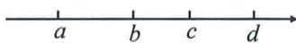

A. ①③

B. ①④

C. ②③

D. ②④

13. 若 $x, y$ 同号, $x + y < 0$ , 且 $x < y$ , 请比较 $x, y, |x|, |y|$ 的大小.

14. 解答下面的问题：

(1)已知 a, b 是不为 0 的有理数, 当 $\left|ab\right| = -ab$ 时, 则 $\frac{a}{\left|a\right|} + \frac{b}{\left|b\right|}$ 的值是 \_\_\_\_;

(2)已知 a, b, c 是有理数, 当 abc < 0 时, 求 $\frac{a}{|a|} + \frac{b}{|b|} + \frac{c}{|c|}$ 的值;

(3)已知 a, b, c 是有理数, $a + b + c = 0$ , abc < 0, 求 $\frac{2a + b + c}{|a|} + \frac{a + 2b + c}{|b|} + \frac{a + b + 2c}{|c|}$ 的值.

# 高频考点 3 有理数的运算的实际应用

15. 某原料仓库一天的原料进出记录如下表(运进用正数表示, 运出用负数表示):

<table><tr><td>进出数量(单位:吨)</td><td>-3</td><td>4</td><td>-1</td><td>2</td><td>-5</td></tr><tr><td>进出次数</td><td>2</td><td>1</td><td>3</td><td>3</td><td>2</td></tr></table>

(1)这天仓库的原料比原来增加或减少了多少吨?

(2)根据实际情况,现有两种方案:

方案一:运进每吨原料费用5元,运出每吨原料费用8元;
方案二:不管运进还是运出费用都是每吨原料6元.

从节约运费的角度考虑,选用哪一种方案较合适?请说明理由.

16. 出租车司机刘师傅某天上午从 A 地出发, 在东西方向的公路上行驶营运, 表中是上午每次行驶的里程记录 (单位: 千米) (规定向东走为正, 向西走为负; × 表示空载, ○ 表示载有乘客, 且乘客都不相同):

<table><tr><td>次数</td><td>1</td><td>2</td><td>3</td><td>4</td><td>5</td><td>6</td><td>7</td><td>8</td></tr><tr><td>里程</td><td>-3</td><td>-15</td><td>+19</td><td>-1</td><td>+5</td><td>-12</td><td>-6</td><td>+12</td></tr><tr><td>载客</td><td>×</td><td>○</td><td>○</td><td>×</td><td>○</td><td>○</td><td>○</td><td>○</td></tr></table>

(1)刘师傅走完第8次里程后,他在A地的什么方向?离A地有多少千米?

(2)已知出租车每千米耗油约0.06升,刘师傅开始营运前油箱里有8升油,若少于2升则需要加油,请通过计算说明刘师傅这天上午中途是否可以不加油?

(3)已知载客时 3 千米以内收费 15 元,超过 3 千米后,超出部分每千米收费 2.8 元,问:刘师傅这天上午最高一次的营业额是多少元?

# 7 第一章～第二章综合检测卷

(测试范围:第一章\~第二章 时间:120 分钟 满分:120 分)

# 一、选择题（每小题3分，共30分）

1. 如果盈利 20 元记作“+20 元”，那么亏损 30 元记作（）

A.-30元

B. 30 元

C. 50 元

D.-50元

2. 下列四个数中, 为负整数的是()

A. 0

B. 1

C.-1

D. $-\frac{1}{9}$

3. 下列各组数中互为相反数的是( )

A. $-\frac{1}{2}$ 与-2

B.-1 与 -(+1)

C. $-(-3)$ 与 -3

D. 2 与 $\left|-2\right|$

4. 如图, 在数轴上, 点 A 表示的数是 4, 将点 A 沿数轴向左移动 a (a > 4) 个单位长度得到点 P, 则点 P 表示的数可能是()

A. 0

B.-1

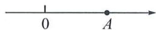

C. 0.5

D. 2

5. 某大米包装袋上标注着“净含量 $10 \, kg \pm 150 \, g$ ”, 小华从商店买了 2 袋大米, 这两袋大米相差的克数不可能是()

A. 0 g

B. 150 g

C. 300 g

D. 400 g

6. 下列各组数中, 相等的一组是( )

A. $-(-2)$ 和 $-|-2|$

B. $(-2)^{3}$ 和 $(-3)^{2}$

C. $1^{2024}$ 和 2024

D. $-2^{3}$ 和 $(-2)^{3}$

7. 下列关于由四舍五入得到的近似数的说法正确的是()

A.0.720 精确到百分位

B. $5.078 \times 10^{4}$ 精确到千分位

C. 3.6 万精确到十分位

D.2.90精确到0.01

8. 某文具店一周的盈亏情况如下表(盈利为正, 单位: 元):

<table><tr><td>星期一</td><td>星期二</td><td>星期三</td><td>星期四</td><td>星期五</td><td>星期六</td><td>星期日</td><td>合计</td></tr><tr><td>-27.8</td><td>-70.3</td><td>200</td><td>138.1</td><td>-8</td><td></td><td>188</td><td>458</td></tr></table>

表中星期六的盈亏数被墨水涂污了,请你利用所学知识计算出星期六的盈亏情况是( )

A. 盈利 8 元

B.盈利38元

C. 亏损 8 元

D. 亏损 38 元

9. 如图, a, b, c, d 四个有理数在数轴上的位置如图, 其中 $b + d = 0$ , 则下列结论正确的是()

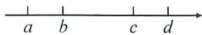

A. $a + d = 0$

B. $a + c = 0$

C. $a(a + c) > 0$

D. $b+c>0$

10. 如图 1, A, B, C 是数轴上从左到右排列的三个点, 分别对应的数为 -4, b, 5. 某同学将刻度尺如图 2 放置, 使刻度尺上的数

字 0 对齐数轴上的点 A, 发现点 B 对应刻度 1.8 cm, 点 C 对应刻度 5.4 cm.

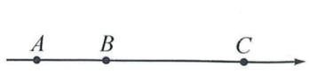

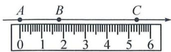  
图1  
图2

则数轴上点 B 所对应的数 b 为( )

A. 3

B. -1

C.-2

D.-3

# 二、填空题（每小题3分，共15分）

11. -5 的相反数是\_\_\_\_，-3 的绝对值是\_\_\_\_，2 的倒数是\_\_\_\_。

12. 比较大小: $-\frac{8}{21}$ \_\_\_\_ $-\frac{3}{7}$ (填“>”、“<”或“=”).

13. 习近平总书记指出“善于学习, 就是善于进步”. “学习强国”平台上线的某天, 全国大约有 124 600 000 人在平台上学习, 将这个数据用科学记数法表示为 \_\_\_\_.

14. 中国人最先使用负数, 魏晋时期的数学家刘徽在“正负术”的注文中指出, 可将算筹 (小棍形状的记数工具) 正放表示正数, 斜放表示负数. 如图, 根据刘徽的这种表示法, 观察图①, 可推算图②中所得的数值为 \_\_\_\_.

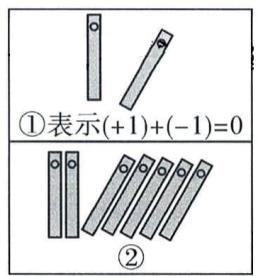

15. 已知 a, b 是有理数，且 a < 0, ab < 0, $a + b < 0$ . 下列结论：

① $b(a+b)>0$ ; ② $|a|>|b|$ ; ③ $\frac{|-b|}{b}+\frac{a-b}{|a-b|}-\frac{|a|}{a}=1$ ;
④若 $|a-b|=6,c$ 是有理数，且满足 $|b-c|=2$ ，则 $|a-c|=8$ .
其中正确的结论序号是\_\_\_\_（填序号）.

# 三、解答题（共9小题，共75分）

16.(本题6分)计算:

(1) $(-3)+12+8+(-7)$ ; (2) $3\times(-4)+(-28)\div7$ .

17.(本题6分)计算: $-1^{4}-(1-0.1)\times[2-(-2)^{3}]$ .

18.(本题6分)用简便方法计算:

(1) $\left(\frac{1}{2}-\frac{1}{3}+\frac{5}{12}\right)\times12;$

(2) $\left(-19\frac{8}{9}\right)\div\left(-1\frac{1}{9}\right).$

19.(本题8分)已知 $|a+3|+(b-2)^{2}=0$ ,求 $a^{b}$ 的值.

20.(本题8分)某冷库一天的冷冻食品进出记录如表(运进用正数表示,运出用负数表示):

<table><tr><td>进出食品的质量(单位:吨)</td><td>-4</td><td>4</td><td>-1</td><td>3</td><td>-3</td></tr><tr><td>进出次数</td><td>2</td><td>1</td><td>4</td><td>3</td><td>2</td></tr></table>

(1)这天冷库的冷冻食品的质量相比原来是增加了还是减少了？请说明理由；  
(2)根据实际情况,不管运进还是运出每吨冷冻食品费用都是300元.求这一天运进运出冷冻食品的总运费.

21.(本题8分)对于任意有理数a,b定义运算“⊕”, $a\oplus b=a+b-\frac{45}{2}$ ,如 $1\oplus2=1+2-\frac{45}{2}$ , $1\oplus2\oplus3=1+2-\frac{45}{2}+3-\frac{45}{2}=-39.$

(1) 填空: $2 \oplus 3 \oplus 4 = \_\_\_\_$ , $4 \oplus 5 \oplus 6 = \_\_\_\_$ ;   
(2) 计算: $1 \oplus 2 \oplus 3 \oplus \cdots \oplus 9$ .

22.(本题10分)某水果店以每箱200元的价格从水果批发市场购进20箱樱桃,若以每箱净重10千克为标准,超过的千克数记为正数,不足的千克数记为负数,称重的记录如下表:

<table><tr><td>与标准重量的差值 (单位:千克)</td><td>-0.5</td><td>-0.25</td><td>0</td><td>0.25</td><td>0.3</td><td>0.5</td></tr><tr><td>箱数</td><td>1</td><td>2</td><td>4</td><td>6</td><td>n</td><td>2</td></tr></table>

(1) 求 n 的值及这 20 箱樱桃的总重量；

(2)若水果店打算以每千克 25 元销售这批樱桃,全部售出可获利多少元?  
(3)实际上该水果店第一天以(2)中的价格只销售了这批樱桃的60%,第二天因为害怕剩余樱桃腐烂,决定降价把剩余的樱桃以原零售价的70%全部售出,水果店销售这批樱桃是盈利还是亏损?盈利或亏损多少元?

23.(本题11分)观察下列三行数:

第一行数：-1，2，-4，8，-16，32，…

第二行数： $\frac{1}{4}$ ， $-\frac{1}{2}$ ，1，-2，4，-8，…

第三行数： $-\frac{7}{4}$ ， $-\frac{5}{2}$ ，-1，-4，2，-10，…

(1)第一行数的第8个数为\_\_\_\_,第二行数的第8个数为\_\_\_\_,第三行数的第8个数为\_\_\_\_;  
(2)第二行中相邻三个数的和为-96,求这三个数;   
(3)取每行数中的第7个数,记作a,b,c,计算 $a-2b+c$ 的和.

24.(本题12分)平移和翻折是初中数学两种重要的图形变换.

(1)平移变换.

①把笔尖放在数轴的原点处,先向负方向移动4个单位长度,再向正方向移动1个单位长度,这时笔尖的位置表示的数是\_\_\_\_;  
②一机器人从原点开始,第1次向左跳1个单位,紧接着第2次向右跳2个单位,第3次向左跳3个单位,第4次向右跳4个单位,…,依此规律跳,当它跳2024次时,落在数轴上的点表示的数是\_\_\_\_;

(2) 翻折变换.

①若折叠数轴,使表示-1的点与表示3的点重合,则表示7的点与表示\_\_\_\_的点重合;   
②若数轴上 A, B 两点之间的距离为 2024（点 A 在点 B 的左侧，且折叠点与①相同），且 A, B 两点经折叠后重合，则点 A 表示 \_\_\_\_，点 B 表示 \_\_\_\_；

(3)如图,一条数轴上有点 A,B,C,其中点 A,B 表示的数分别是 -17,8,现以点 C 为折点,将数轴向右对折,若点 A 对应的点 $A'$ 落在数轴上,并且 $A'B=2$ ,求点 C 表示的数.

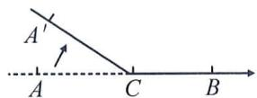

# 8 第三章《代数式》单元检测卷

(测试范围:第三章 时间:120 分钟 满分:120 分)

# 一、选择题（每小题3分，共30分）

1. 在式子 $x-5,2ab^{2},C=\pi d,-\frac{2}{x},a+2>b$ 中，代数式有（）

A. 1 个

B. 2 个

C. 3 个

D. 4 个

2. 下列式子中, 符合代数式书写格式的有( )

$$
① m \times n  ;   ② 3   {\frac {1}{3}} a b  ;   ③ - {\frac {1}{4}} (x + y)  ;   ④ - 1 m  ;   ⑤ a b c ^ {3}.
$$

A. 2 个

B. 3 个

C. 4 个

D. 5 个

3. 当 x=4, y=-2 时，代数式 3x-2y 的值为（）

A. 14

B. 16

C. 18

D. 20

4. 关于代数式 $\frac{1}{2} (a - 2b)$ 的意义表述正确的是（）

A. $\frac{1}{2}$ 乘以a减2b

B. $a$ 的 $\frac{1}{2}$ 与 $2b$ 的差

C. $a$ 与 $2b$ 的差的一半

D. $\frac{1}{2}$ 与 $a$ 的差与 $2b$ 的积

5. 下列赋予 4a 实际意义的例子中不正确的是()

A. 若葡萄的价格是 4 元/千克, 则 4a 表示买 a 千克葡萄的金额

B. 若 a 表示一个正方形的边长, 则 4a 表示这个正方形的周长

C. 若三角形的底边长为 3, 面积为 6a, 则 4a 表示这条边上的高

D. 若 4 和 a 分别表示一个两位数中的十位数字和个位数字, 则

4a 表示这个两位数

6. 一家商店将某种服装按成本价每件 a 元提高 50% 标价, 又以 8 折优惠出售, 则这种服装每件的售价是( )

A. 0.8a 元

B. 0.4a 元

C. 1.2a 元

D. 1.5a 元

7. 下面问题中的两个量: ①长方形的周长一定, 它的长与宽; ②已知 $\frac{a}{b}=1.4, a$ 与 b; ③圆柱的体积一定, 它的底面积与高. 其中成反比例关系的有()

A. 0 个

B. 1 个

C. 2 个

D. 3 个

8. 为落实“双减”政策, 某校利用课后服务开展主题为“书香满校园”的读书活动. 现需购买甲、乙两种读本共 100 本供学生阅读, 其中甲种读本的单价为 8 元/本, 乙种读本的单价为 10 元/本. 设购买甲种读本 x 本, 则购买乙种读本的费用为( )

A. 8x 元

B. $8(100-x)$ 元

C. $10(100-x)$ 元

D.(100-8x)元

9. 按如图的程序计算, 若开始输入的 x 值为 2, 则最后输出的结果为( )

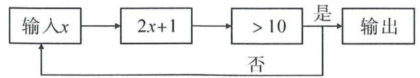

A. 5

B. 10

C. 11

D. 23

10. 为开展劳动教育, 某校计划把一块周长为 30 m 的长方形荒地按如图所示等距外扩 b m, 改造成一个长方形劳动基地, 并且用栅栏围起来, 则至少需要栅栏( )

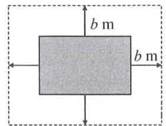

A. $(30+4b)$ m

B. $(30+8b)$ m

C. $4b \mathrm{~m}$

D. $8 b \mathrm{~m}$

# 二、填空题(每小题3分,共15分)

11. 用代数式表示“比 x 的倒数小 1 的数”是 \_\_\_\_.

12. 当 m=2 时, 代数式 $-2(1-m)$ 的值为 \_\_\_\_.

13. 如图是航天博物馆内一个空间站的飞行模拟器, 该空间站绕地球一圈的轨道近似看成圆形的. 若该空间站到地心的距离为 $a \mathrm{~km}$ , 飞行一周所需时间为 $x$ 分钟, 则空间站的飞行速度为 $\underline{\quad} \mathrm{km}/\text {分}$ .

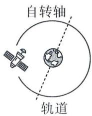

14. 定义一种新运算: 对于有理数 x, y, 有 $L(x, y) = 2x + 7y$ , 由这种运算得到的数称为线性数. 若 $L(7a, 2b) = 168$ , 则 $(a + b)^{2} + \frac{1}{2}(a + b) + 1$ 的值为 \_\_\_\_.

15. 如图是由同样大小的圆按一定规律排列而成的, 其中第 1 个图形中一共有 4 个圆, 第 2 个图形中一共有 8 个圆, 第 3 个图形中一共有 14 个圆, 第 4 个图形中一共有 22 个圆, …, 按此规律排列下去. (1) 第 9 个图形中圆的个数是 \_\_\_\_ ; (2) 第 n 个图形中圆的个数是 \_\_\_\_.

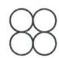  
第1个图形

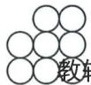  
第2个图形

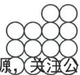  
第3个图形

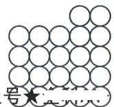  
第4个图形

# 三、解答题（共9小题，共75分）

16.(本题6分)用代数式表示:

(1) 比 x 的 2 倍少 1 的数；

(2)x,y的和与x,y的差的商.

17.(本题6分)根据下列条件,求 $xy-\frac{2y}{x}$ 的值.

(1) $x = -3, y = 2$ ;

(2) $x = 2, y = -\frac{1}{3}$ .

18.(本题6分)定义一种新运算“ $\oplus$ ”，规则如下： $a \oplus b = \frac{ab}{a^2 - b^2}$ . 当 $a = 3, b = -2$ 时，求 $a \oplus b$ 的值.

19.(本题8分)某快递公司的收费标准:5千克以内收费a元,超过5千克的部分每千克按3元收费,小天寄8千克的包裹.

(1)求小天需要支付的费用(用含 a 的式子表示);

(2) 求当 a=12 时, 小天需要支付多少元?

20.(本题8分)历史上的数学巨人欧拉最先把关于x的多项式用记号 $f(x)$ 来表示.例如 $f(x)=x^{2}+3x-5$ ，把x等于某数时多项式的值用f(某数)来表示.例如x=-1时，多项式 $x^{2}+3x-5$ 的值记为 $f(-1)=(-1)^{2}+3\times(-1)-5$ .

(1)已知 $g(x)=-2x^{2}-3x+1$ ，则 $g(-3)$ 的值为 \_\_\_\_；

(2)已知 $h(x) = mx^3 + 2x^2 - x - 14, h\left(\frac{1}{2}\right) = m$ ，求 $m$ 的值.

21.(本题8分)如图,在一个底为a cm,高为h cm的三角形铁皮上剪去一个半径为r cm的半圆.

(1)用含 a, h, r 的代数式表示剩下铁皮(阴影部分)的面积;

(2) 求当 a=20, h=15, r=4 时, 剩下的铁皮面积( $\pi$ 取 3).

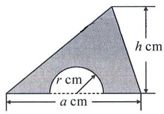

22.(本题10分)【问题情境】行驶中的汽车,在刹车后由于惯性的作用,还要继续向前滑行一段距离才能停止,这段距离称为“刹车距离”.

【问题结论】通过查阅资料发现,在沥青路面上,某种型号汽车的刹车距离 s(单位:m)与刹车时的速度 v(单位:km/h)之间的关系式为 $s=\frac{v^{2}}{200}$ .

【问题解决】(1)根据关系式填写下表:

<table><tr><td>刹车时车速(km/h)</td><td>20</td><td>30</td><td>40</td><td>50</td><td>60</td><td>70</td><td>...</td></tr><tr><td>刹车距离(m)</td><td>2</td><td>4.5</td><td></td><td></td><td>18</td><td>24.5</td><td>...</td></tr></table>

【问题拓展】(2)《中华人民共和国道路交通安全法》规定:高速公路限速标志标明的最高时速不得超过120 km/h;驾驶员应与同车道前车保持至少100 m的距离.请通过计算判断:该种型号汽车在车速为120 km/h时的刹车距离是否在规定的安全距离内?

23.(本题11分)甲、乙两家商场以同样的价格出售同样的电器,但各自推出的优惠方案不同.甲商场规定:凡超过1000元的电器,超出的金额按90%收取;乙商场规定:凡超过500元的电器,超出的金额按95%收取.某顾客购买的电器价格是x元.

(1) 当 x=850 时, 该顾客应选择在 \_\_\_\_ 商场购买比较合算;  
(2) 当 x > 1000 时, 分别用代数式表示在两家商场购买电器所需付的费用;  
(3) 当 x=1700 时, 该顾客应选择哪一家商场购买比较合算? 说明理由.

24.(本题12分)用边长相等的正方形和等边三角形卡片按如图所示的方式和规律拼出图形. 拼第1个图形所用两种卡片的总数为7张, 拼第2个图形所用两种卡片的总数为12张. ……, 若按照这样的规律拼图, 解决下列问题:

(1) 填表：

<table><tr><td></td><td>第1个图形</td><td>第2个图形</td><td>第3个图形</td><td>第4个图形</td><td>第5个图形</td><td>...</td></tr><tr><td>三角形卡片</td><td>3</td><td>5</td><td>7</td><td>____</td><td>____</td><td>...</td></tr><tr><td>正方形卡片</td><td>4</td><td>7</td><td>10</td><td>____</td><td>____</td><td>...</td></tr><tr><td>卡片总数</td><td>7</td><td>12</td><td>17</td><td>____</td><td>____</td><td>...</td></tr></table>

(2)第 $n$ 个图形中有多少张三角形卡片？有多少个正方形卡片？  
(3)①若第 n 个图形中有 49 张正方形卡片, 则该图形中有多少张三角形卡片?  
②写出卡片总数 s 与序号 n 的关系式, 并判断 s 与 n 是否成正(或反)比例关系.

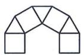  
第1个图形

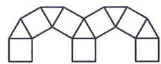  
第2个图形

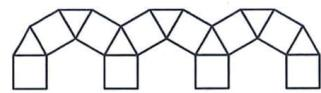  
第3个图形

# 高频考点 1 代数式的有关概念

1. 在 $x^{2} + 2, 1 - 2x = 0, ab, 0, \frac{1}{a}$ 中，代数式有（）

A. 2 个

B. 3 个

C. 4 个

D. 5 个

2. 下列式子: ①1m; ②3 $\frac{1}{3}ab$ ; ③ $\frac{1}{3}(x+y)$ ; ④m+2天; ⑤c÷3. 其中符合代数式书写要求的有( )

A. 1 个

B. 2 个

C. 3 个

D. 4 个

# 高频考点 2 列代数式

# 类型一 代数式的意义

3. 代数式 $\frac{1}{a+b}$ 表示的意义是()

A. $a$ 与 $b$ 的和

B. a 与 b 的倒数和

C. $a$ 与 $b$ 的倒数的和

D. a 与 b 的和的倒数

4. 不能用代数式 $2x$ 表示含义的是( )

A. 如果 $x$ 表示一本书的价格, 那么 $2x$ 可以表示买 2 本这种书的价格  
B. 若某公园成人票价是儿童票价的 2 倍, 儿童票价为 x, 那么 2x 可以表示成人票价  
C. 一辆汽车每分钟行驶 x 米, 行驶两分钟共行驶了 2x 米  
D. 如果用 x 表示正方形的边长, 那么 2x 可以表示正方形的面积

5.“腹有诗书气自华,最是书香能致远.”为鼓励和推广全民阅读活动,某书店开展促销活动,促销方法是将原价为 x 元的一批图书以 0.8(x-15)元的价格出售,则下列说法中,能正确表达这批图书的促销方法的是()

A. 在原价的基础上打 8 折后再减去 15 元  
B. 在原价的基础上打 0.8 折后再减去 15 元  
C. 在原价的基础上减去 15 元后再打 8 折  
D. 在原价的基础上减去 15 元后再打 0.8 折

# 类型二 列代数式

6. 用代数式表示：

(1) 比 a 的 3 倍大 2 的数；  
(2)a 的 2 倍与 b 的 $\frac{1}{3}$ 的和；

(3)a,b的平方和；  
(4)与 $b+3$ 的和是5x的数.

7. 一项工程, 小聪单独做要 a 天, 小明单独做要比小聪少 3 天, 则完成这项工程, 小明比小聪每天多做 \_\_\_\_.

8. 小宇参观完博物馆后, 根据照片手绘了一张火箭模型平面图的简易样稿如图, 该图形由长方形和三角形两种基本图形元素组成(单位: 厘米), 则该组合图形的面积为 \_\_\_\_ 平方厘米.  
9. 某人买了甲、乙两个品牌的衬衣共 n 件, 其中甲品牌衬衣比乙品牌衬衣多 5 件. 已知甲品牌衬衣的单价为 120 元, 乙品牌衬衣的单价为 90 元, 则买这 n 件衬衣共需付款()

A. $(120n+450)$ 元

B. $(90n+600)$ 元

C. $(210n-150)$ 元

D. $(105n+75)$ 元

10. 如图, 烷烃中甲烷的化学式是 $CH_{4}$ , 乙烷的化学式是 $C_{2}H_{6}$ , 丙烷的化学式是 $C_{3}H_{8}, \cdots$ , 按照此规律. 设碳原子(C)的数目为 n (n 为正整数), 则它们的化学式都可以用下列哪个式子来表示()

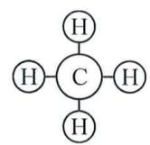  
甲烷

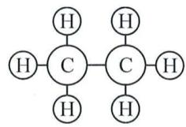  
乙烷

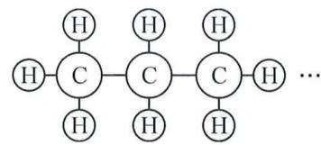  
丙烷

A. $\mathrm{C}_n\mathrm{H}_{2n + 2}$

B. $C_{n}H_{2n}$

C. $\mathrm{C}_n\mathrm{H}_{2n - 2}$

D. $\mathrm{C}_n\mathrm{H}_{n + 3}$

# 类型三 成反比例关系的量

11. 运输队要运一批货物, 每天运的质量和运货的天数之间的关系如下:

<table><tr><td>每天运的质量m/t</td><td>300</td><td>150</td><td>100</td><td>75</td><td>60</td><td>50</td></tr><tr><td>运货的天数n/天</td><td>1</td><td>2</td><td>3</td><td>4</td><td>5</td><td>6</td></tr></table>

运货的天数 n 与每天运的质量 m 成 \_\_\_\_ , n 与 m 的关系式为 \_\_\_\_ , 反比例系数 k 为 \_\_\_\_.

# 高频考点 3 求代数式的值

# 类型一 根据条件求值

12. 已知 $m=2a^{2}b+3ab-4$ . 根据下列条件, 求 m 的值.

(1) $a = -3, b = -2$ ;

(2) $a=-\frac{3}{2},b=\frac{1}{3}.$

13. 已知 $x = -2, y = \frac{5}{2}$ , 求下列代数式的值.

(1) $x^{2}+y^{2}$ 和 $(x+y)^{2}$ ;

(2) $x^{2}-y^{2}$ 和 $(x-y)^{2}$ .

# 类型二 新定义求值

14. 定义: 对于有理数 $x, y, x * y = \frac{x^2 - y^2}{xy}$ , 当 $x = \frac{1}{2}, y = -2$ 时, 求 $x * y$ 的值.

# 类型三 程序求值

15. 若按照如图所示的程序示意图输入一组数值, 能使得输出的结果为 -12, 则输入的一组数 x, y 可能为( )

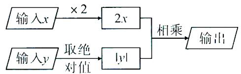

A. 2,3

B.-1,6

C. 3, -4

D.-2,-6

16. 如图, 这是一个简单的数值运算程序, 当输入 $n$ 的值为 3 时, 输出的结果为 \_\_\_\_.

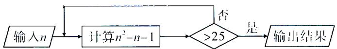

# 类型四 列代数式再求值

17. 如图, 约定: 上方相邻两数之和等于这两数下方箭头共同指向的数, 示例如图 1, 即 $4 + 3 = 7$ . 如图 2:

(1) $m=$ \_\_\_\_ ,n= \_\_\_\_ ;(用x来表示)  
(2) 当 x = -1 时, 计算 y 的值.

flowchart

18. 某市出租车收费标准为: 起步价(不超过 2 千米)为 3 元, 2 千米后每千米加收 2 元. 小明乘坐这种出租车行驶了 x 千米 (x > 2).

(1)试用代数式表示他应付的车费；  
(2) 当 x=4 时, 他应付车费多少元?

# 高频考点4 代数式的应用

# 类型一 规律探究

# (一) 数式规律

19. 观察下列各数 $2, \frac{5}{2}, \frac{10}{3}, \frac{17}{4}, \frac{26}{5}, \cdots$ ，第 n 个数是 \_\_\_\_。  
20. 观察等式①9-1=8, ②16-4=12, ③25-9=16, ④36-16=20, …, 这些等式反映了正整数之间的某种规律, 请写出第 n 个等式 \_\_\_\_.

# (二)图形规律

21. 下列图形都是由同样大小的黑色正方形纸片组成, 其中第①个图中有 3 张黑色正方形纸片, 第②个图中有 5 张黑色正方形纸片, 第③个图中有 7 张黑色正方形纸片, 第④个图中有 9 张黑色正方形纸片, …, 按此规律排列下去, 则第 n 个图中黑色正方形纸片有 \_\_\_\_ 张.

  
①

  
②

  
③

  
④

22. 下列图形是由同样大小的围棋棋子按照一定规律摆成的“山”字, 其中第①个“山”字中有 7 颗棋子, 第②个“山”字中有 12 颗棋子, 第③个“山”字中有 17 颗棋子, ……, 按照此规律, 第 $n$ 个“山”字中棋子颗数为 \_\_\_\_ 颗.

text_image

①
②
③
④ ......

# 类型二 代数应用

23. 某中学七年级(1)班5名教师决定带领本班 $x(x > 30)$ 名学生去净月潭国家森林公园秋游. 该景区现有A, B两种购票方案可供选择:

A 方案: 教师需要购买成人票, 学生购买半价票.

净月潭国家森林公园 ¥30 元 成人票

净月潭国家森林公园 ¥15 元
半票

B 方案:30 人以上团购票,所有人员一律按成人票价 6 折计算.

(1)请用含 x 的代数式分别表示选择 A, B 两种方案所需的费用；  
(2) 当学生人数 $x = 50$ 时, 且只选择其中一种方案购票, 请通过计算说明选择哪种方案更为优惠?

# 类型三 几何应用

24. 如图, 某长方形广场的四个角都有一块半径相同的四分之一圆形的草地, 若圆形的半径为 $r$ 米, 中间有一个半径为 $x$ 米的圆形鱼池, 长方形的长为 $a$ 米, 宽为 $b$ 米.

(1)用代数式表示四块草地的周长之和为\_\_\_\_米；
广场空地的面积为\_\_\_\_平方米(结果保留 $\pi$ );  
(2) 现要将广场空地铺上防滑地砖, 每平方米的价格为 50 元.
当 a=80, b=60, r=2x=10 时, 则一共需要花费多少元?
(π 取 3)

# 一、选择题（每小题3分，共30分）

1. 下列各式中不是单项式的是( )

A. $\frac{1}{3} a$

B. $-\frac{1}{m}$

C. 0

D. b

2. 多项式 $x^{2}y - xy - 1$ 的次数和常数项分别是（）

Λ. 3,1

B. 3, -1

C. 5,1

D. 5, -1

3. 下列各组式子中, 属于同类项的是( )

A. $-2x^{3}y$ 与 $yx^{3}$

B. $5x^{2}y$ 与 $x^{2}z$

C. $3m^{2}n$ 与 $-4nm$

D. 2ab 与 abc

4. 下列计算正确的是( )

A. $4a - 2a = 2$

B. $2ab + 3ba = 5ab$

C. $a + a^2 = a^3$

D. $5x^{2}y - 3xy^{2} = 2xy$

5. 下面去括号正确的是()

A. $a - (b + 1) = a - b - 1$

B. $2(x+3)=2x+3$

C. $x - (y - 1) = x - y - 1$

D. $-3(m - n) = -3m - 3n$

6. 若 $a - b = 1, b - c = -3$ ，则 $a - c$ 的值是（）

Λ. -1

B. 1

C.-2

D. 2

7. 若关于 $x, y$ 的多项式 $4x^{2}y + 7mxy - 5y^{3} + 6xy$ 化简后不含二次项，则 $m$ 的值为（）

A. $-\frac{4}{7}$

B. $-\frac{6}{7}$

C. $\frac{5}{7}$

D. 0

8. 代数式甲、乙、丙之间的运算关系如图所示, 则代数式乙为( )

A. $5a^{2} + b^{2}$

B. $5a^{2} - 6ab \mid b^{2}$

C. $5a^{2} - 6ab - b^{2}$

D. $5a^{2} - b^{2}$

9. 如图所示, 是由一组形状大小完全相同的梯形组成的图形, 第 $n$ ( $n$ 为正整数) 个图形的周长记为 $C_{n}$ , 当 $n - 2021$ 时, $C_{2021}$ 的值为 ( )

Λ. 6 060a

B. 6 062a

C. 6 065a

D. 6 068a

10. 对于 4 个整式: $x, 2x + 1, 3x + 2, 4x + 3$ , 任选其中两个整式改变它们每一项的符号, 再求和, 称这种操作为“半负操作”, 例

# 10 第四章《整式的加减》单元检测卷

(测试范围:第四章 时间:120 分钟 满分:120 分)

如： $x+(-2x-1)+(3x+2)+(-4x-3)=-2x-2$ 。有下列两种相关说法：①不存在任何一种“半负操作”使得结果为单项式；②所有的“半负操作”共有6种不同的结果。其中（）

A. ①正确

B. ②正确

C. ①②都正确

D. ①②都不正确

# 二、填空题(每小题3分,共15分)

11. 如果 $2x^{3}y^{2a-1}$ 与 $3x^{b-2}y^{3}$ 是同类项, 则 $a=$ , $b=$ .

12. 把 $(x-y)$ 看作一个整体, 合并同类项: $7(x-y)+2(x-y)-5(x-y)=$ \_\_\_\_.

13. 一个油桶桶重 b 千克, 装满油重 a 千克, 倒出一半的油后, 再把油桶放到称上称, 则重量是 \_\_\_\_ 千克.

14. 从如图 1(边长为 a) 的正方形纸片上剪去两个相同的小长方形, 得到如图 2 的图案(横向、纵向的宽度均为 b), 再将剪下的两个小长方形拼成一个新长方形(如图 3). 若 a - 2b = 3, 则图 3 中新长方形的周长为 \_\_\_\_.

  
图1

  
图2

  
图3

15. 一台整式转化器原理如图, 开始时输入关于 $x$ 的整式 $M$ , 当 $M = 2x + 1$ 时, 第一次输出的结果是 $4x + 1$ . (1) 关于 $x$ 的整式 $N$ 为 \_\_\_\_; (2) 继续下去, 第3次输出的结果是 \_\_\_\_.

# 三、解答题(共9小题,共75分)

16.(本题6分)化简：

(1) $5x^{2}-15x-8x^{2}-12x$ ;

(2) $5x^{2} + 2xy - 3y^{2} - 3xy + 4y^{2} - 3x^{2}$ .

17.(本题6分)计算：

(1) $(8a^{2}b-5ab^{2})-2(3a^{2}b-4ab^{2})$ ;

(2) $3x^{2}-\left[5x-2\left(\frac{1}{2}x-\frac{1}{3}\right)+2x^{2}\right]$ .

18.（本题6分）先化简，再求值： $\frac{1}{2} x - 2\left(x - \frac{1}{3} y^2\right) + \left(-\frac{3}{2} x + \frac{1}{3} y^2\right)$ . 其中 $x = -\frac{1}{3}, y = -1$ .

19. (本题 8 分) 已知 $m - n = -1$ , 求 $6mn - [2n - 3(m - 2mn - n) - 4] + 2m$ 的值.

20.(本题8分)某同学在做计算 $2A+B$ 时,误将“ $2A+B$ ”看成了“ $2A-B$ ”,求得的结果是 $9x^{2}-2x+7$ ,已知 $B=x^{2}+3x+2$ .

(1) 求 $\Lambda$ ;

(2) 当 $r = -1$ 时, 求 $2A + B$ 的值.

21.(本题8分)图1是某年1月份的月历,用图2所示的“九方格”在图1中框住9个日期,并把其中被阴影方格覆盖的四个日期分别记为a,b,c,d.

(1) 直接填空: $a + d$ b + c; (填“>”、“<”或“=”)

(2) $b=$ \_\_\_\_, $c=$ \_\_\_\_, $d=$ \_\_\_\_ (用含 a 的代数式分别表示);

(3) 当图 2 在图 1 的不同位置时, 代数式 $a - 2b + 4c - 3d$ 的值是否为定值? 若是, 请求出它的值; 若不是, 请说明理由.

text_image

1月
日 一 二 三 四 五 六
2 3 4 5 6 7 8
9 10 11 12 13 14 15
16 17 18 19 20 21 22
23 24 25 26 27 28 29
30 31

图1

  
图2

22.(本题10分)定义:若 $m+n=2$ , 则称 m 与 n 是关于 2 的平衡数.

(1)3 与 \_\_\_\_ 是关于 2 的平衡数;5-x 与 \_\_\_\_ (用含 x 的整式表示)是关于 2 的平衡数;

(2) 若 $A=2x^{2}-3(x^{2}+x)+4$ , $B=2x-\left[3x-(4x+x^{2})-2\right]$ , 判断 A 与 B 是否是关于 2 的平衡数, 并说明理由.

23.(本题11分)【实践操作】小明想把新分发的12本课本用封皮包好,如图,通过测量发现课本的长都是26 cm,宽都是18.5 cm,而厚度(m cm)不一样,且都小于1 cm,如果用一张长方形封皮纸包好一本课本,要将封皮纸在封面和封底各折进去a cm(a不小于1).

【提出问题】(1)计算包一本课本所用封皮纸的周长是多少? (结果用含 a, m 的代数式表示)

【探索发现】(2)若数学课本的厚度为 0.8 cm, 准备把封皮纸在封面和封底各折进去 1 cm, 则包数学课本的封皮纸的周长是多少?

【变式应用】(3)商店里有规格为 $25 \, cm \times 34 \, cm$ 和 $30 \, cm \times 43 \, cm$ 的两种长方形封皮纸,请判断小明该选用哪一种规格的封皮纸,才合适。(说明: $25 \, cm \times 34 \, cm$ 表示宽 $25 \, cm$ , 长 $34 \, cm$ )

text_image

封底
数学
七年级
上級
m	a

24.(本题12分)如果一个四位自然数 $\overline{abcd}$ 的各数位上的数字互不相等且均不为0, 满足 $\overline{ab} - \overline{bc} = \overline{cd}$ , 那么称这个四位数为“递减数”. 例如: 四位数4129, 因为 $41 - 12 = 29$ , 所以4129是“递减数”.

(1) 判断四位数 5324 是不是“递减数”;

(2)若一个“递减数”为 $\overline{a312}$ ，求这个“递减数”；

(3)若一个“递减数”的前三个数字组成的三位数 $\overline{abc}$ 与后三个数字组成的三位数 $\overline{bcd}$ 的和能被 9 整除, 直接写出满足条件的“递减数”的最大值.

# 高频考点 1 整式的有关概念

1. 单项式 $-\frac{x^{2}y}{7}$ 的系数是 \_\_\_\_，次数是 \_\_\_\_。  
2. 多项式 $x^{2}y - 2xy + \frac{4}{3}xy^{2} - 1$ 的二次项的系数是 \_\_\_\_，常数项是 \_\_\_\_。

# 高频考点2 整式的加法与减法

# 类型一 同类项的概念

3. 若 $3x^{m+5}y^{2}$ 与 $x^{3}y^{n}$ 的和还是单项式，则 $m^{n}$ 的值为 \_\_\_\_.  
4. 已知代数式 $2a^{3}b^{n+1}$ 与 $-3a^{m-2}b^{2}$ 是同类项，则 $2m+3n$ 的值为 \_\_\_\_.

# 类型二 合并同类项

5. 合并同类项: $3x^{2}-4xy-2y^{2}+3xy+2y^{2}-x^{2}$ .

# 类型三 去括号

6. 化简 $-ab-(a-1)$ 的结果是()

A. $-2ab + 1$

B.-b+1

C. -ab-a-1

D. $-ab-a+1$

7. 下列运算正确的是( )

A. $-2(a - b) = -2a - b$

B. $-2(a - b) = -2a + b$

C. $-2(a - b) = -2a - 2b$

D. $-2(a-b)=-2a+2b$

# 类型四 整式的加减

8. 化简：

(1) $2(a-3b)-3(2a+b)$ ;   
(2) $4a^{2}+2(3ab-2a^{2})-(7ab-1)$ .

# 11 第四章《整式的加减》专题卷

# 高频考点 3 化简求值

# 类型一 先化简,再求值

9. 先化简, 再求值: $2x^{2}-(2xy-3y^{2})+2(x^{2}+xy-2y^{2})$ , 其中 $x=\frac{3}{2}, y=-2$ .

10. 先化简, 再求值: $\frac{1}{2} x^{2} + \frac{1}{3} (-x^{2} - 4xy + 2y^{2}) - 3\left(\frac{1}{2} x^{2} - xy + \frac{1}{3} y^{2}\right)$ , 其中 $x = -\frac{1}{2}, y = 3$ .

# 类型二 整体求值

11. 已知 2x - y = 3，那么 $1 - 4x + 2y =$ \_\_\_\_.  
12. 已知 m-2n=5，那么整式 $m(m-2n)-3m-4n+14$ 的值为 \_\_\_\_.

13. 先化简, 再求值: $(m-5n+4mn)-2(2m-4n+6mn)$ , 其中 $m=n+2, mn=3$ .

# 类型三 运用“缺项”条件求值

14. 王明在准备化简代数式 $3(3x^{2} + 4xy) - \square (2x^{2} + 3xy - 1)$ 时一不小心将墨水滴在了作业本上, 使得 $(2x^{2} + 3xy - 1)$ 前面的系数看不清了, 于是王明就打电话询问李老师, 李老师为了测试王明对知识的掌握程度, 于是对王明说: “该题标准答案的结果不含 $xy$ .”请你通过李老师的话语, 帮王明求 $\blacksquare$ 的值.

# 类型四 运用“与字母无关”求值

15. 已知 $M = 2x^{2} + 3kx - 2x + 13, N = x^{2} + kx - 4$ ，且 $3M - 6N$ 的值与 $x$ 的值无关，求 $k$ 的值.

# 类型五 新定义求值

16. 现定义 $\left|\begin{matrix}a()b\\ c()d\end{matrix}\right|=a-b+c-d$ ,试计算: $\left|\begin{matrix}xy+3x^{2}()-2xy-x^{2}\\ -2x^{2}-3()-5+xy\end{matrix}\right|$ .

# 高频考点 4 规律探究

17. 观察下列单项式: $2x, 5x^{2}, 8x^{3}, 11x^{4}, \cdots$ , 则第 n 个式子是 \_\_\_\_.

18. 如图, 将形状、大小完全相同的“•”和线段按照一定规律摆成下列图形, 第 1 幅图形中“•”的个数为 $a_{1}$ , 第 2 幅图形中“•”的个数为 $a_{2}$ , 第 3 幅图形中“•”的个数为 $a_{3}, \cdots$ , 以此类推, 第 $n$ 幅图形中“•”的个数为 $a_{n}$ 的值 \_\_\_\_.

text_image

第1幅图
第2幅图
第3幅图
第4幅图

19. 如图是一组有规律图案, 第 1 个图案由 5 个基础图形组成, 第 2 个图案由 8 个基础图形组成, ……, 如果按照以下规律继续下去, 那么通过观察, 可以发现: 第 n 个图案需要 \_\_\_\_ 个基本图形.

text_image

Image showing a grid of plus signs arranged in three rows and three columns, with ellipsis indicating continuation.

20. 如图是用黑色棋子摆放而成的图案, 其中第①个图中有 3 枚棋子, 第②个图中有 6 枚棋子, 第③个图中有 11 枚棋子, 第④个图中有 18 枚棋子, …, 按此规律, 第 n 个图案黑色棋子的个数为 \_\_\_\_.

text_image

①
②
③
④

# 高频考点 5 化简绝对值

# 类型一 运用直接条件,化简绝对值

21. 若 3 < a < 4，化简： $|a - 3| - |a - 4|$ .

# 类型二 根据数轴上点的位置,化简绝对值

22. 已知有理数 $a, b, c$ 在数轴上的位置如图所示，且 $|c| > |a|$ ，试化简： $|a + c| - |b - c| + |2b - a|$ .

# 高频考点6 实际问题与整式加减

# 类型一 代数应用

23. 两船从同一个港口同时出发反向而行,甲船顺水航行了6个小时,乙船逆水航行了3个小时,两船在静水中的速度都是50 km/h,水流速度是a km/h.则两船一共航行了\_\_\_\_km(用含a的式子表示).

24. 已知一个两位数 M 的个位数字是 a，十位数字是 b，交换这个两位数的十位上的数字与个位上的数字的位置，所得的新数记为 N，则 $M - N =$ \_\_\_\_（用含 a, b 的式子表示）.

# 类型二 几何应用

25. 如图, 从边长为 $(a + 4) \mathrm{~cm}$ 的正方形纸片中剪去一个边长为 $(a + 1) \mathrm{~cm}$ 的正方形 $(a > 0)$ , 剩余部分沿虚线又剪开拼成一个长方形 (不重叠无缝隙), 则长方形的周长为 ( ) cm.

text_image

a+1
a+4

A. $2 a + 5$

B. ${4a} + {10}$

C. $4a + 16$

D. $6 a + 15$

26. 在幸福小区的建设中,为了改善居民的生活环境,该小区规划修建一个花坛(平面图形如图所示).

(1)用含 m, n 的式子表示该花坛的面积 S;  
(2) 若 m, n 满足 $(m-6)^{2}+|n-4|=0$ ，求出该花坛的面积.

# 类型三 实际应用

27. 某地自 2022 年 1 月起, 居民生活用水开始试行阶梯式计量水价, 该阶梯式计量水价分为三级(如表所示):

<table><tr><td></td><td>月用水量(吨)</td><td>水价(元/吨)</td></tr><tr><td>第一级</td><td>20吨以下(含20吨)</td><td>1.6</td></tr><tr><td>第二级</td><td>20吨-30吨(含30吨)</td><td>2.4</td></tr><tr><td>第三级</td><td>30吨以上</td><td>3.2</td></tr></table>

例:某用户的月用水量为 32 吨, 按三级计量应缴交水费为: $1.6 \times 20 + 2.4 \times 10 + 3.2 \times 2 = 62.4$ (元).

(1)如果甲用户某月用水量为 10 吨,则甲当月需缴交的水费为 \_\_\_\_ 元;  
(2)如果丙用户某月用水量为 a 吨,则丙该月应缴交水费多少元? (用含 a 的式子表示,并化简)

# 12 第一章～第四章综合检测卷(期中检测卷)

(测试范围:第一章\~第四章 时间:120 分钟 满分:120 分)

# 一、选择题（每小题3分，共30分）

1. $-\frac{1}{5}$ 的相反数是()

A. 5

B.-5

C. $\frac{1}{5}$

D. $-\frac{1}{5}$

2. 下表是四个城市某天中午 12 时的气温, 其中气温最低的城市是( )

<table><tr><td>北京</td><td>济南</td><td>太原</td><td>郑州</td></tr><tr><td>0°C</td><td>-1°C</td><td>-2°C</td><td>3°C</td></tr></table>

A. 北京

B. 济南

C. 太原

D. 郑州

3. 下列说法中, 正确的是()

A. $-\frac{2\pi x^{2}}{3}$ 的系数是 $-\frac{2}{3}$

B. 多项式 $-4a^{2}b + 3ab - 5$ 的项是 $-4a^{2}b, 3ab, 5$

C. 单项式 $a^2 b^3$ 的系数是 0, 次数是 5

D. $\frac{1 - mn}{3}$ 是二次二项式

4. 下列各题中, 正确的是( )

A. $x + x = x^{2}$

B. $3y^{2} - y^{2} = 3$

C. $a^2 b - ba^2 = 0$

D. $3x + 3y = 6xy$

5. 如果代数式 $\frac{1}{2} x^{a}y^{b + 3}$ 与代数式 $-\frac{2}{3} x^3 y^4$ 是同类项, 则 $a, b$ 的值分别是 ( )

A. $a = 3, b = 1$

B. a = -3, b = -1

C. $a = -3, b = 1$

D. $a = 3, b = -1$

6.下列各组数中,互为相反数的是()

A. $2^{4}$ 与 $(-2)^{4}$

B. $-(-2)$ 与 $-|-2|$

C. $(-2)^{3}$ 与 $-2^{3}$

D. $(-1)^{4}$ 与 $-1\times4$

7. 规定 $x \otimes y = \frac{-x^3}{x + y}$ , 则 $(-2) \otimes \frac{1}{2}$ 的值为 ( )

A.-12

B. 12

C. $\frac{16}{3}$

D. $-\frac{16}{3}$

8. 如图是由两个正方形和一个半径为 a 的半圆组合而成的, 已知两个正方形的边长分别为 a, b (a > b), 则图中阴影部分面积为 ( )

A. $a^2 + b^2 - \frac{\pi a^2}{2}$

B. $a^2 - b^2 + \frac{\pi a^2}{2}$

C. $a^2 - b^2 - \frac{\pi a^2}{2}$

D. $a^2 - b^2$

9. 如图, 在一条不完整的数轴上, 点 A, B, C 分别表示 $(m-n)$ , $(2n-m)$ , $(8n-5m+90)$ , 点 A, B 之间的距离记作 AB. 若 AB=60, 则 BC 的长为()

A. 40

B. 30

C. 45

D. 35

10. 将一些完全相同的梅花按如图所示的规律摆放, 第 1 个图形有 5 朵梅花, 第 2 个图形有 8 朵梅花, 第 3 个图形有 13 朵梅花, …, 按此规律, 则第 7 个图形中共有梅花的朵数是( )

  
第1个图形

  
第2个图形

  
第3个图形

A. 39

B. 40

C. 53

D. 68

# 二、填空题(每小题3分,共15分)

11. 化简: ① $-(-2)=$ \_\_\_\_; ② $|-2|=$ \_\_\_\_; ③ $(-2)^{2}=$ \_\_\_\_.

12. 2024 年政府工作报告提出,我国今年发展主要预期目标是:国内生产总值增长 5% 左右,城镇新增就业 1200 万人以上……. 将数“1200万”用科学记数法表示为 \_\_\_\_.

13. 定义一种新运算 $*$ , 规定运算法则为: $m * n = m^n - mn (m, n$ 均为整数, 且 $m \neq 0$ ). 例: $2 * 3 = 2^3 - 2 \times 3 = 2$ , 则 $(-2) * 2$ 的值为 \_\_\_\_.

14. 已知 a, b, c 在数轴上的位置如图所示, 化简 $\left|a - b\right| - 2\left|b + c\right| + \left|c - a\right|$ 的结果为 \_\_\_\_.

15. 已知 a, b 为有理数, 下列说法: ① 若 a, b 互为相反数, 则 $\frac{a}{b} = 1$ ; ② 若 $a + b < 0, ab > 0$ , 则 $\left|3a + 4b\right| = -3a - 4b$ ; ③ 若 $\left|a - b\right| + a - b = 0$ , 则 b > a; ④ 若 $\left|a\right| > \left|b\right|$ , 则 $(a + b) \cdot (a - b)$ 是负数. 其中错误的是 \_\_\_\_ (填写序号).

# 三、解答题（共9小题，共75分）

16.(本题6分)计算:

(1) $(-8)+10+2+(-1)$ ;

(2) $42\times\left(-\frac{2}{3}\right)-(-4)\div\left(-\frac{4}{3}\right).$

17.(本题6分)计算: $(-2)^{4}\div4-(-4)\times(-1)$ .

18.(本题6分)化简: $(5a^{2}+2a-1)-12+32a-8a^{2}$ .

19.(本题8分)先化简,再求值: $\frac{1}{3}x-3\left(x-\frac{1}{5}y^{2}\right)+\left(-\frac{4}{3}x+\frac{2}{5}y^{2}\right)$ ,
其中 x = -3, $y = \frac{3}{5}$ .

20.(本题8分)老师设计了一个数学实验,给甲、乙、丙三名同学各一张写有已化为最简的代数式的卡片,规则是两位同学的代数式相减等于第三位同学的代数式,则实验成功.甲、乙、丙的卡片如下,丙的卡片有一部分看不清楚了.

text_image

甲
2x²-3x-1
乙
x²-2x+3
丙
+2

(1) 计算出甲减乙的结果, 并判断甲减乙能否使实验成功;
(2) 嘉琪发现丙减甲可以使实验成功, 请求出丙的代数式.

21.(本题8分)

<table><tr><td colspan="7">问题背景</td></tr><tr><td colspan="7">某市质量技术监督局从某食品厂生产的袋装食品中抽出样品20袋,检测每袋的质量是否符合标准,把超过或不足的部分分别用正、负数来表示,记录如下表:</td></tr><tr><td>与标准质量的差值(单位:克)</td><td>-6</td><td>-2</td><td>0</td><td>1</td><td>3</td><td>4</td></tr><tr><td>袋数</td><td>1</td><td>4</td><td>3</td><td>4</td><td>5</td><td>3</td></tr><tr><td colspan="7">问题解决</td></tr><tr><td colspan="7">(1)若标准质量为500克,则抽样检测的20袋食品的总质量为多少克?</td></tr><tr><td colspan="7">(2)若该种食品的合格标准为 $500 \pm 3g$ ,求该食品的抽样检测的合格率.</td></tr></table>

22.(本题10分)某工厂计划m天生产2160个零件,安排15名工人每人每天加工a个零件(a为整数)恰好完成.

(1) 直接写出 a 与 m 的数量关系是 \_\_\_\_；并判断 a 与 m 成 \_\_\_\_ 比例关系；（填“正”或“反”）  
(2)若原计划16天完成生产任务,但实际开工6天后,有3名工人外出参加培训,如果剩下的工人要在规定时间里完成这批零件生产任务,每人每天至少要多加工多少个零件?

23.(本题11分)观察下列具有一定规律的三行数:

<table><tr><td>第一行</td><td>1</td><td>4</td><td>9</td><td>16</td><td>25</td><td>...</td></tr><tr><td>第二行</td><td>-1</td><td>2</td><td>7</td><td>14</td><td>23</td><td>...</td></tr><tr><td>第三行</td><td>2</td><td>8</td><td>18</td><td>32</td><td>50</td><td>...</td></tr></table>

(1)第一行第 n 个数为 \_\_\_\_ (用含 n 的式子表示);  
(2)取出每行的第 m 个数,这三个数的和为 482,求 m 的值;  
(3)第四行的每个数是将第二行相对应的每个数乘以-4得到的,若这四行取出每行的第n个数,求这四个数的和.

24.(本题12分)数轴上A,B两点对应的数分别为a,b,则A,B两点之间的距离记作AB,由绝对值的几何意义知 $AB=|a-b|$ .已知有理数a,b,c在数轴上所对应的点分别是A,B,C三点,且a,b,c满足:①多项式 $\frac{1}{2}x^{|a|}+(a-2)x+7$ 是关于x的二次三项式;②b是最小的正整数;③ $|c|=5$ ,且点C在原点的右边.

text_image

-4 -3 -2 -1 0 1 2 3 4 5
-4 -3 -2 -1 0 1 2 3 4 5
备用图

(1)请在数轴上描出 A, B, C 三点，并直接写出 A, C 两点之间的距离 AC = \_\_\_\_；  
(2)若数轴上有一动点 P，且满足 $PA + PC = 9$ ，求点 P 表示的数；  
(3) 若点 A 在数轴上以每秒 1 个单位长度的速度向左运动, 同时点 B 和点 C 在数轴上分别以每秒 m 个单位长度和 4 个单位长度的速度向右运动 (其中 m<4). 若在整个运动过程中, 点 B 到点 C 的距离与点 B 到点 A 的距离差始终不变, 即 BC-BA 为定值, 求这个定值.

# 13 第五章《一元一次方程》阶段检测卷(一)

(测试范围:5.1\~5.2 时间:90 分钟 满分:120 分)

# 一、选择题（每小题3分，共30分）

1. 下列方程是一元一次方程的是( )

A. $x^{2} - x = 4$

B. 2x - y = 0

C. 2x = 1

D. $\frac{1}{x}=2$

2. 如图, 从一个平衡的天平两边分别加上一个砝码, 天平仍平衡, 下面与这一事实相符的是()

A. 如果 $a = b$ ，那么 $a + c = b + c$   
B. 如果 $a = b$ ，那么 $a - c = b - c$   
C. 如果 a=b，那么 ac=bc  
D. 如果 a=b，那么 $a^{2}=b^{2}$

3. 解方程 $3-5(x+2)=x$ 时, 去括号正确的是()

A. $3 - x + 2 = x$

B. 3-5x-10=x

C. $3 - 5x + 10 = x$

D. 3 - x - 2 = x

4. 解方程 $\frac{1}{2}-\frac{x-1}{3}=1$ 时, 去分母正确的是()

A. $2-(x-1)=1$

B. 2-3(x-1)=6

C. $2-3(x-1)=1$

D. $3-2(x-1)=6$

5. 若 $(a-1)x^{|a|}=6$ 是关于x的一元一次方程,则a的值为()

A. 1

B.-1

C. ±1

D. 2

6. 下列运用等式的性质进行变形, 错误的是()

A. 若 $m = n$ ，则 $m + n = 2n$

B. 若 $m = n$ ，则 $\frac{m}{n} = 1$

C. 若 $m = n$ ，则 $mn = n^2$

D. 若 $m = n$ ，则 $\frac{m}{n^2 + 1} = \frac{n}{n^2 + 1}$

7. 小明在解关于 x 的方程 $\frac{x-1}{3}=\frac{x+2m}{2}-1$ 去分母时，方程右边的“-1”没有乘以 6，最后他求得方程的解为 3，则方程正确的解为（）

A. 3

B. 8

C. $\frac{3}{4}$

D. 6

8.《孙子算经》中有个问题:今有三人共车,二车空;二人共车,九人步,问人与车各几何?这道题的意思是:今有若干人乘车,每三人乘一车,最终剩余2辆车,若每2人共乘一车,最终剩余9个人无车可乘,问有多少人,多少辆车?如果我们设有x辆车,则可列方程()

A. $3(x-2)=2x+9$

B. $3(x+2)=2x-9$

C. $\frac{x}{3}+2=\frac{x-9}{2}$

D. $\frac{x}{3}-2=\frac{x+9}{2}$

9. 用符号※定义一种新运算: $a \times b = ab + 2(a + b)$ . 若 $-3 \times x = 20$ , 则 $x$ 的值为( )

A. 24

B.-24

C.-26

D. 26

10. 如图所示的是 2024 年 8 月份的月历, 月历中, 用以下形状的四个阴影图形依次分别覆盖其中四个数字, 若覆盖的四个数字之和为 68, 则不可能是哪一个形状覆盖的结果()

  
A

  
B

  
C

  
D

# 二、填空题（每小题3分，共15分）

11. 写一个解为 x=1 的一元一次方程 \_\_\_\_.  
12. 若代数式 3x-1 与 -4x 的值互为相反数, 则 x 的值是 \_\_\_\_.  
13.《九章算术》中的“方程”一章中讲述了算筹图,图中各行从左到右列出的算筹数分别表示未知数 x,y 的系数与相应的常数项,如:即可表示方程 $x_{+} + 2y = 32$ , 则

表示的方程为\_\_\_\_。

14. 当 x 等于 \_\_\_\_ 时, 代数式 $3(2+2x)$ 和 $2(8-x)$ 的值相等.  
15. 对于有理数 a, b，定义一种新运算“ $\nabla$ ”，规定 $a \nabla b = |a + b| + |a - b|$ 。已知 $(a \nabla a) \nabla a = 8 + a$ ，则 a 的值为 \_\_\_\_.

# 三、解答题（共9小题，共75分）

16.(本题6分)解方程:3x-2=1-2(x-1).   
17.(本题6分)解方程: $\frac{2x+1}{3}=1-\frac{x-1}{5}$ .

18.(本题6分)若关于x的方程3x-3=3和 $\frac{x-k}{3}=k+3x$ 有相同的解,求k的值.

19.(本题8分)如图是一道数学谜题.“□”中数字分别表示三位数中的个位数字与百位数字,请列出方程,求出“□”中数字.

20.(本题8分)单项式 $\frac{1}{5}a^{2m+1}b^{3}$ 与 $-8a^{m+3}b^{3}$ 的和仍然是单项式.

(1) 求 m 的值;  
(2) 若 m 的值是关于 x 的方程 $5a + 12x = 2 + x$ 的解, 求代数式 $(3a^{2} - 2a + 1) - (2a^{2} - 3a - 5)$ 的值.

21.(本题8分)我们规定,若关于x的一元一次方程ax=b的解为x=b-a,则称该方程为差解方程.例如:2x=4的解为x=2,且2=4-2,则方程2x=4是差解方程.

(1) 判断 3x=4.5 是否是差解方程?  
(2) 若关于 x 的一元一次方程 $6x = m + 2$ 是差解方程, 求 m 的值.

22.(本题10分)根据表中的素材,完成下面的任务:

<table><tr><td colspan="3">如何设计奖品购买及兑换方案?</td></tr><tr><td>素材1</td><td colspan="2">文具店销售某种钢笔与笔记本,已知钢笔每支10元,笔记本每本5元.</td></tr><tr><td>素材2</td><td colspan="2">学校计划用1100元购买这种钢笔和笔记本,其数量之比为4:3.</td></tr><tr><td rowspan="2">素材3</td><td rowspan="2">文具店开展“满送”优惠活动,每满130元送1张兑换券,满260元送2张兑换券,以此类推.学校花费1100元后,将兑换券全部用于商品兑换.最终,笔记本与钢笔数量相同.</td><td>兑换券</td></tr><tr><td>凭此券,可兑换2支钢笔或4本笔记本</td></tr><tr><td colspan="3">问题解决</td></tr><tr><td>任务1</td><td>探究购买方案</td><td>分别求出兑换前购买钢笔和笔记本的数量.</td></tr><tr><td>任务2</td><td>确定兑换方式</td><td>求出用于兑换钢笔的兑换券的张数.</td></tr></table>

23.(本题11分)观察下表,回答下列问题:

<table><tr><td></td><td>第1列</td><td>第2列</td><td>第3列</td><td>第4列</td><td>第5列</td><td>第6列</td><td>...</td></tr><tr><td>第1行</td><td>-2</td><td>4</td><td>-8</td><td>a</td><td>-32</td><td>64</td><td>...</td></tr><tr><td>第2行</td><td>0</td><td>6</td><td>-6</td><td>18</td><td>-30</td><td>66</td><td>...</td></tr><tr><td>第3行</td><td>-1</td><td>2</td><td>-4</td><td>8</td><td>-16</td><td>b</td><td>...</td></tr></table>

(1)第1行的第4个数a是\_\_\_\_；第3行第6个数b是\_\_\_\_；  
(2)若第1行的某一列的数为c，则第2行与它同一列的数为\_\_\_\_；  
(3)已知第 n 列的三个数的和为 2562, 设第 1 行第 n 列的数为 x, 试求 x 的值.

24.(本题12分)在数轴上,点A所表示的数为a,点B所表示的数为b,则点A到点B的距离记为AB.AB的长可以用右边的数减去左边的数,即AB=b-a.

请用上面的知识解决下面的问题：

已知数轴上点 A, C 对应的数分别为 a, c，且满足 $\left|a+7\right|+\left|c-2\right|=0$ ，点 B 对应的数为 -3。

(1) $a=$ \_\_\_\_ ,c= \_\_\_\_ ;   
(2)若在数轴上有两动点 P, Q 分别从 A, B 同时出发向右运动, 点 P 的速度为 2 个单位长度 /s, 点 Q 的速度为 1 个单位长度 /s, 求经过多长时间, P, Q 两点的距离为 3?  
(3)若在数轴上找一个点 P, 使得点 P 到点 A 和点 C 的距离之和为 15, 求点 P 所对应的数.

  
备用图

# 14 第五章《一元一次方程》阶段检测卷（二）

(测试范围:5.3 时间:90 分钟 满分:120 分)

# 一、选择题（每小题3分，共30分）

1. 若 $x$ 的 2 倍与 3 的差为 6, 则可列方程为 ( )

A. $2x - 3 = 6$

B. $2(x - 3) = 6$

C. $2x + 3 = 6$

D. $2(x+3)=6$

2. 一个三角形的三边之比为 $3:4:5$ ，周长为 36，则这个三角形的最长边长为（）

A. 9

B. 12

C. 15

D. 3

3. 练习本比水性笔的单价多 3 元, 小刚买了 5 本练习本和 3 支水性笔正好用去 26 元. 如果设水性笔的单价为 $x$ 元, 那么下列方程正确的是 ( )

A. $5(x + 3) + 3x = 26$

B. $5(x + 2) + 3x = 26$

C. $5x + 3(x + 3) = 26$

D. $5x + 3(x - 2) = 26$

4. 某班分两组去两处植树, 第一组 24 人, 第二组 36 人, 现在第一组植树遇到困难, 需第二组支援, 问从第二组调多少人去第一组才能使第一组人数是第二组的 3 倍. 设抽调 $x$ 人, 则可列方程 ( )

A. $24 + x = 3 \times 36$

B. 24=3(36-x)

C. $3(24 + x) = 36 - x$

D. $24 + x = 3(36 - x)$

5. 篮球联赛中, 每场比赛都要分出胜负, 每队胜 1 场得 2 分, 负 1 场得 1 分. 某队赛了 14 场, 得分为 23 分, 则该队胜了( )

A. 7

B. 8

C. 9

D. 10

6. 小勤同学进行杠杆实验(杠杆原理:杠杆平衡时,动力×动力臂=阻力×阻力臂). 如图所示,在轻质木杆 O 处用一根细线悬挂,左端 A 处挂一重物,右端 B 处挂钩码,每个钩

码质量是 500 g. 若 OA = 15 cm, OB = 30 cm, 挂 3 个钩码可使轻质木杆水平位置平衡. 若轻质木杆的质量忽略不计, 设这个重物的质量为 x g, 根据题意可列方程为( )

A. $15x = 30 \times 500 \times 3$

B. $30x = 15 \times 500 \times 3$

C. $3 \times 15x = 30 \times 500$

D. $3 \times 30x = 15 \times 500$

7.《九章算术》中有这样一道数学问题,原文如下:清明游园,共坐八船,大船满六,小船满四,三十八学子,满船坐观.请问客家,大小几船?其大意为:清明时节出去游园,所有人共坐了8只船,大船每只坐6人,小船每只坐4人,38个人,刚好坐满,问:大小船各有几只?若设有x只小船,则可列方程为()

A. $4x + 6(8 - x) = 38$

B. $6x + 4(8 - x) = 38$

C. $4x + 6x = 38$

D. $8x + 6x = 38$

8. 某大厦用无人智能配送车给大厦里的工作人员配送快递. 若配送车 A 单独送, 3 小时才能送完; 配送车 B 单独送, 4 小时才能送完. 如果两辆车同时配送, 则( )个小时可以将这些快递送完.

A. $\frac{3}{7}$

B. $\frac{7}{3}$

C. $\frac{7}{12}$

D. $\frac{12}{7}$

9. 某年11月有5个星期三, 这5个星期三对应的日期数字之和是80, 那么这个月的4日是星期()

A. 一

B. 二

C. 四

D. 五

10. 小明和丹丹从 A, B 两地同时出发, 小明骑自行车, 丹丹步行, 相向匀速而行. 出发后 1 h 两人相遇, 相遇时小明比丹丹多行进 12 km, 相遇后一刻钟小明到达 B 地, 相遇后经过多少时间丹丹到达 A 地? ( )

A. 1 h

B. 2 h

C. 4 h

D. 8 h

# 二、填空题（每小题3分，共15分）

11. 小明与家人和同学一起到游泳池游泳, 买了 2 张成人票与 3 张学生票, 共付了 155 元. 已知成人票的单价比学生票的单价贵 15 元. 设学生票的单价为 $x$ 元, 根据题意, 可列出方程为 \_\_\_\_.

12. 一个两位数个位上的数是 1, 十位上的数是 $x$ , 把 1 与 $x$ 对调, 新的两位数比原两位数小 18, 则原两位数为 \_\_\_\_.

13. 如图所示, 一个长方形的周长为 $30 \mathrm{~cm}$ , 若这个长方形的长减少 $4 \mathrm{~cm}$ , 宽增加 $3 \mathrm{~cm}$ , 就可以围成一个正方形, 那么这个长方形的长为 \_\_\_\_ cm.

  
第13题图

  
第15题图

14. 某种商品的进价为 250 元, 按标价的九折出售时利润率为 10%, 则下列结论: ① 商品的利润为 $250 \times 10\%$ 元; ② 商品的实际售价为 $250(1 + 10\%)$ 元; ③ 该商品的标价为 $250(1 + 10\%) \times 0.9$ 元; ④ 该商品的标价为 $250(1 + 10\%) \div 0.9$ 元. 其中正确的是 \_\_\_\_ (填序号).

15. 如图, 现有 $3 \times 3$ 的方格, 每个小方格内均填有数字, 且方格内每一行、每一列以及每一条对角线上的三个数字之和均相等, 根据图中给出的部分数字推断, $y - x$ 的值是 \_\_\_\_.

# 三、解答题（共9小题，共75分）

16.(本题6分)解方程:3(3y-1)-10=2(5y-7).

17.(本题6分)解方程: $\frac{2x-3}{6}-\frac{x+2}{4}=1.$

18.(本题6分)根据下面的对话,算出小亮今年的年龄.

text_image

我们两个人今年的
年龄之和是42岁。
5年后，我的年龄是
你的年龄的3倍。
小亮 爸爸

19.(本题8分)某车间有58名工人,每人每天可以生产8个甲种部件或5个乙种部件.1个甲种部件和3个乙种部件配成一套,为使每天生产的甲种部件和乙种部件刚好配套,应安排生产甲种部件和乙种部件的工人各多少名?

20.(本题8分)根据素材信息完成任务.

<table><tr><td rowspan="3">素材</td><td colspan="8">如图是一款单肩包,背带由双层部分、单层部分和调节扣构成.通过调节扣可以使背带的长度(单层部分与双层部分的长度和,其中调节扣的长度忽略不计)加长或缩短.经测量,得到如下数据下:</td></tr><tr><td>单层部分的长度(cm)</td><td>0</td><td>2</td><td>4</td><td>6</td><td>8</td><td>...</td><td>150</td></tr><tr><td>双层部分的长度(cm)</td><td>75</td><td>74</td><td>73</td><td>72</td><td>m</td><td>...</td><td>0</td></tr><tr><td>任务1</td><td colspan="8">(1)表格中m的值为_;</td></tr><tr><td>任务2</td><td colspan="8">(2)根据小明同学的身高和习惯,背带的总长度为110cm时,背起来最舒适,请求出此时单层部分的长度.</td></tr></table>

21.(本题8分)如图所示,根据图中给出的信息解决下面的问题:

(1)放入一个小球水面上升\_\_\_\_cm,放入一个大球水面上升\_\_\_\_cm;  
(2)如果在只有水的瓶(如图②所示)中放入10个球,要使水面上升到50 cm,应放入大球、小球各多少个?

text_image

放入体积
相同的小球
32 cm
55 cm
26 cm
放入体积
相同的大球
32 cm

22.(本题10分)为发展校园足球运动,某校决定购买一批足球运动装备.甲、乙两商场销售同种品牌的足球和足球队服,标价一致,每个足球比每套队服少50元,2套队服与3个足球的费用相等.经洽谈,甲商场优惠方案是:每购买10套队服,送1个足球;乙商场优惠方案是:若购买队服超过80套,则购买足球打八折.

(1)每个足球和每套队服的价格分别是多少元?  
(2)初中年级到甲商场购买100套队服和若干箱足球(每箱10个),高中年级在乙商场购买相同装备,付费相同,求学校共买足球箱数.

23.(本题11分)某市自来水收费实行阶梯水价,收费标准如表所示:

<table><tr><td>月用水量</td><td>不超过12吨</td><td>超过12吨但不超 过18吨的部分</td><td>超过18吨 的部分</td></tr><tr><td>收费(元/吨)</td><td>2.00</td><td>2.50</td><td>3.00</td></tr></table>

(1)某户2月份用水15吨,则该户2月份应交水费\_\_\_\_元;  
(2)某户3月份交水费36.5元,则该用户3月份的用水量是多少?  
(3)若8月份的水费为平均每吨2.7元,求8月份的水费为多少元?

24.(本题12分)【问题情境】某市自行车专用道位于汾河两侧,不仅能满足太原市民通勤、运动与休闲的需求,还能缓解滨河东、西路的交通压力.周末,甲、乙两人相约去滨河自行车道骑车,甲从通达桥入口(记为A地)进入自行车道,向胜利桥方向骑行,甲出发20 min后乙从胜利桥入口(记为B地)进入自行车道,向通达桥方向骑行.已知A,B两地自行车专用道长大约18 km,甲的平均速度是10 km/h,乙的平均速度是12 km/h.设甲骑行的时间为x h.

# 【数学思考】

(1)在两人骑行的过程中,甲骑行的路程为\_\_\_\_km,乙骑行的路程为\_\_\_\_km;(用含x的代数式表示)

# 【问题解决】

(2)当甲、乙两人相遇时,求 x 的值;  
(3)两人相遇后,甲继续以原速度向 B 地骑行,乙休息 3 min 后掉头按原速度返回 B 地.在乙返回途中,当甲、乙两人相距 $\frac{1}{3}$ km 时,求 x 的值.

# 15 第五章《一元一次方程》单元检测卷

(测试范围:第五章 时间:120 分钟 满分:120 分)

# 一、选择题（每小题3分，共30分）

1. 下列方程中, 是一元一次方程的是()

A. $x - 1 = 0$

B. x - y = 2

C. xy = 3

D. $x^{2} - 2 = 0$

2. 下列方程中, 解为 x=1 的方程是( )

A. $x + 1 = 0$

B. 3x = -3

C. $x - 1 = 2$

D. $2x + 1 = 3$

3. 已知 x = -2 是方程 $x + 4a = 10$ 的解，则 a 的值是（）

A. 3

B. $\frac{1}{2}$

C. 2

D. -3

4. 下列方程变形过程正确的是()

A. 由 $x + 3 = 6$ ，得 $x = 6 + 3$

B. 由 5x=3, 得 $x=\frac{5}{3}$

C. 由 $x + 5 = 1$ ，得 $x = 5 - 1$

D. 由 $\frac{1}{3}x=0$ ，得 x=0

5. 代数式 $2x - 1$ 与 $4 - 3x$ 的值互为相反数, 则 $x$ 等于( )

A.-3

B. 3

C.-1

D. 1

6. 根据“x 与 7 的和比 x 与 3 的差的 4 倍少 2”，可列出方程为（）

A. $x+7=4(x-3)-2$

B. $4(x+7)=(x-3)-2$

C. $x + 7 = 4(x - 3) + 2$

D. $4(x+7)=(x-3)+2$

7. 某药品降价后每盒 180 元, 比原价降低了 60%, 设该药品原价为 x 元, 则由题意可列方程为( )

A. 60%x=180

B. $x - 60\% = 180$

C. $(1 + 60\%)x = 180$

D. $(1 - 60\%)x = 180$

8. 我国古代著作《增删算法统宗》中记载了一首古算诗：“林下牧童闹如簇，不知人数不知竹。每人六竿多十四，每人八竿少二竿。”若设牧童 x 人，根据题意，可列方程为（）

A. $6x + 14 = 8x + 2$

B. 6x-14=8x+2

C. $6x + 14 = 8x - 2$

D. 6x-14=8x-2

9. 今年小明妈妈和小明的年龄之和是 36 岁, 再过 5 年, 妈妈的年龄是小明年龄的 4 倍还大 1 岁, 则今年小明的年龄为( )

A. 4

B. 5

C. 6

D. 8

10. 将连续的奇数 1, 3, 5, 7, 9, …, 按如图所示方式排列, 图中的 T 字框框住了四个数. 若将 T 字框上下左右移动, 按同样的方式可框住另外的四个数, 则框住的四个数的和不

1 3 5 7 9

11 13 15 17 19

21 23 25 27 29

31 33 35 37 39

A. 22

B. 70

C. 182

D. 206

# 二、填空题(每小题3分,共15分)

11. 方程 3x-6=0 的解是 \_\_\_\_.

12. 规定 $a * b = ab + a - b$ ，若 $3 * x = 11$ ，则 x 的值是 \_\_\_\_.

13. 已知 x = -1 是方程 $ax + 1 = bx - 4$ 的解，则 $-3a + 5b - 2(b - 5)$ 的值是 \_\_\_\_.

14. 五个完全相同的小长方形拼成如图所示的大长方形, 小长方形的周长是 $8 \mathrm{~cm}$ , 则大长方形的面积是 $\mathrm{cm}^{2}$ . 教辅资源

15. 当 x 的取值不同时, 整式 ax-b (其中 a, b 是常数) 的值也不同, 具体情况如表所示:

<table><tr><td>x</td><td>-3</td><td>-2</td><td>-1</td><td>0</td><td>1</td></tr><tr><td>ax-b</td><td>4</td><td>2</td><td>0</td><td>-2</td><td>-4</td></tr></table>

(1)当 x=-2 时,代数式 ax-b 的值为 \_\_\_\_; (2)关于 x 的方程 ax=b-4 的解为 \_\_\_\_.

# 三、解答题（共9小题，共75分）

16.(本题6分)解方程: $3x+3=x+7$ .

17.(本题6分)解方程: $1-\frac{x+5}{6}=\frac{x+1}{3}$ .

18.(本题6分)如图,某小区长方形绿地的长、宽分别为35 m, 15 m. 现计划对其进行扩充,将绿地的长、宽增加相同的长度后,得到一个新的长方形绿地. 若新的长方形绿地的长是宽的2倍,求新的长方形绿地的长.

19.(本题8分)小李在解关于x的方程8a-x=18时,误将-x看作+x,得到方程的解为x=2,求a的值和原方程的解.

20.(本题8分)一家玩具店要生产一批儿童玩具,第一个月生产了这批玩具的 $\frac{1}{4}$ ,第二个月生产了余下的 $\frac{2}{3}$ ,还剩下180个玩具没有生产.这批玩具共有多少个?

21.(本题8分)某家具加工厂有21名木工加工桌子和椅子,1张桌子配4把椅子,已知每名木工一天能加工5张桌子或者8把椅子,如何安排木工加工,恰好一天加工的桌子能与椅子配套?

22.(本题10分)在学习一元一次方程后,数学老师给出一个新定义:若 $x_{0}$ 是关于x的一元一次方程 $ax+b=0(a\neq0)$ 的解,y。是关于y的方程的解或所有解的其中一个解,且 $x_{0},y_{0}$ 满足 $x_{0}+y_{0}=10$ ,则称关于y的方程是关于x的一元一次方程的“友好方程”.例如:一元一次方程3x-2x-9=0的解是x=9,方程 $|y|=1$ 的所有解是y=1或y=-1.当y=1时,x+y=10,所以方程 $|y|=1$ 是一元一次方程3x-2x-9=0的“友好方程”.

根据以上材料解决以下问题：

(1)已知关于 y 的方程: ①2y-2=4; ②|y|=3. 请通过计算说明哪个方程是一元一次方程 3x-2x-13=0 的“友好方程”?

(2)若关于 y 的方程 $\left|y-1\right|=1$ 是关于 x 的一元一次方程 $x-\frac{2x+a}{3}=a+1$ 的“友好方程”，求 a 的值.

23.(本题11分)【问题情境】在综合实践课上,老师让同学们利用天平和一些物品探究等式的基本性质,现有一架天平和一个10克的砝码,如何称出1个乒乓球和1个纸杯的质量?

【操作探究】下面是“智慧小组”的探究过程：

准备物品:①若干个大小相同的乒乓球(质量相同);②若干个大小相同的一次性纸杯(质量相同).

探究过程:设每个乒乓球的质量是 x 克.

<table><tr><td></td><td>天平左边</td><td>天平右边</td><td>天平状态</td><td>乒乓球的总质量</td><td>一次性纸杯的总质量</td></tr><tr><td>记录1</td><td>8个乒乓球和1个10克的砝码</td><td>14个一次性纸杯</td><td>平衡</td><td>8x</td><td></td></tr><tr><td>记录2</td><td>4个乒乓球</td><td>2个一次性纸杯和1个10克的砝码</td><td>平衡</td><td>4x</td><td></td></tr></table>

# 【解决问题】

(1)①将表格中的空白部分用含 x 的式子表示；

②分别求1个乒乓球的质量和1个一次性纸杯的质量；

# 【拓展设计】

(2)“创新小组”根据“智慧小组”的探究过程提出这样一个问题：

请你设计一个方案,使得乒乓球的个数为一次性纸杯个数的2倍,并填入下表:

<table><tr><td></td><td>天平左边</td><td>天平右边</td><td>天平状态</td></tr><tr><td>记录3</td><td>乒乓球___个</td><td>一次性纸杯___个+2个10克的砝码</td><td>平衡</td></tr></table>

并利用方程的知识说明理由.

24.(本题12分)如图,已知A,B两点在数轴上,点A表示的数是-12,点B表示的数是20,点O表示原点.

(1)求点 A 和点 B 之间的距离；

(2)动点 P 以每秒 3 个单位长度的速度从点 A 向右运动, 动点 Q 以每秒 2 个单位长度的速度从点 O 向右运动, 点 P 和点 Q 同时出发. 设两点运动的时间为 t 秒, 求当 t 为何值时, 点 P 和点 Q 之间的距离是 8 个单位长度?

(3)在(2)的条件下,当点P到点A的距离等于到点B的距离的2倍时,求点P对应的数.

# 高频考点 1 一元一次方程的有关概念

1. 下列四个式子中, 是方程的是( )

A. $3 + 2 = 5$

B. $x - 1 = 2$

C. 2x - 1 < 0

D. $a + b$

2. 下列方程中, 解是 x=2 的方程是( )

A. $3x + 6 = 0$

B. $2x + 4 = 0$

C. $\frac{1}{2}x=-4$

D. 2x - 4 = 0

3. 已知 $x = 2$ 是关于 $x$ 的一元一次方程 $ax + 2 = 0$ 的解, 则 $a$ 的值为 ( )

A. 0

B.-1

C. 1

D. 2

4. 若 $(m - 1)x^{|2m - 1|} = 6$ 是一元一次方程，则 $m$ 等于（

A. 1

B. 0

C. 1 或 0

D. 任何数

# 高频考点 2 等式的性质

5. 下列等式变形正确的是( )

A. 由 $7x = 5$ 得 $x = \frac{7}{5}$

B. 由 $\frac{x}{0.2} = 1$ 得 $\frac{x}{2} = 10$

C. 由 $2 - x = 1$ 得 $x = 1 - 2$

D. 由 $\frac{x}{3} - 2 = 1$ 得 $x - 6 = 3$

6. 下列等式变形中, 不正确的是( )

A. 若 $a - 3 = b - 3$ ，则 $a = b$

B. 若 $am = bm$ ，则 $a = b$

C. 若 $a = b$ ，则 $\frac{a}{2} = \frac{b}{2}$

D. 若 x=2，则 $x^{2}=2x$

# 高频考点3 一元一次方程的解法

7. 下列方程变形中, 正确的是()

A. 由 $3x + 4 = 4x - 5$ ，移项得 $3x + 4x = -4 - 5$

B. 由 $\frac{x}{3} - \frac{x + 1}{2} = 1$ ，去分母得 $2x - 3x + 3 = 6$

C. 由 $2(2x - 1) - 3(x - 3) = 1$ ，去括号得 $4x - 2 - 3x + 9 = 1$

D. 由 $\frac{3}{4} x = 4$ ，系数化为1得 $x = 3$

# 16 第五章《一元一次方程》专题卷

8. 把方程 $3x + \frac{2x - 1}{3} = 3 - \frac{x + 1}{2}$ 去分母, 正确的是()

A. $18x + 2(2x - 1) = 18 - 3(x + 1)$

B. $3x+(2x-1)=3-(x+1)$

C. $18x+(2x-1)=18-(x+1)$

D. $3x + 2(2x - 1) = 3 - 3(x + 1)$

9. 解下列方程：

(1)5x-6=-3x+2;

(2) $6x-2(1+x)=10;$

(3) $\frac{x+5}{2}-\frac{x-3}{4}=3;$

(4) $1-\frac{2x-5}{6}=\frac{3-x}{4};$

(5) $2-\frac{x-1}{2}=\frac{2x+1}{3}-x;$

(6) $\frac{x-1}{0.3}-\frac{x+2}{0.5}=1.2.$

10. 当 k 为何值时, 代数式 $\frac{k+2}{4}$ 比 $\frac{2k-1}{6}$ 的值大 1.

11. 已知关于 $x$ 的方程 $\frac{mx - 3}{2} + \frac{x + m}{3} = 1$ 的解和方程 $2(x - 1) = 6$ 的解相同, 求 $m$ 的值.

# 高频考点 4 实验问题与一元一次方程

# (一)调配(配套)问题

12. 某学校七(1)班原分成两个小组进行课外体育活动, 第一组 26 人, 第二组 22 人, 根据学校活动器材的数量, 要将第一组的人数调整为第二组的一半, 应从第一组调多少人到第二组?

13. 某工厂要制作一批糖果盒, 已知该工厂共有 80 名工人, 每名工人平均每小时可以制作 50 个盒身或 150 个盒底. 现要求一个盒身配两个盒底, 则如何安排工人才能使每小时制作的盒身与盒底恰好配套?

# (二)行程问题

14. 一列动车从甲站开往乙站, 若动车以 180 千米/小时的速度行驶, 能准时到达乙站, 现在动车以 160 千米/小时的速度行驶了 2 小时后把速度提高到 240 千米/小时, 也能准时到达乙站. 求甲、乙两站之间的距离.

# (三) 工程问题

15. 一项工程, 甲队单独完成需 30 天, 乙队单独完成需 45 天, 现甲队先单独做 20 天后, 两队合作完成余下工程.

(1)求甲、乙合作了多少天?

(2)若此工程的总费用为 29 600 元,且甲工程队每天的费用比乙工程队多 400 元,求完成此项工程后,甲、乙工程队的总费用分别是多少元?

# (四)利润问题

16. 小张自主创业开了一家服装店, 因为进货时没有进行市场调查, 在换季时积压了一批服装. 为了缓解资金的压力, 小张决定打折销售. 若每件服装按标价的 5 折出售将亏 20 元, 而按标价的 8 折出售将赚 40 元.

(1)请你算一算每件服装标价多少元？每件服装成本是多少元？  
(2)为了尽快减少库存,又要保证不亏本,请你告诉小张最多能打几折?

# (五)分段收费

17. 一种商品按销售量分三部分制定销售单价, 如下表:

<table><tr><td>销售量</td><td>单价</td></tr><tr><td>不超过100件的部分</td><td>2.5元/件</td></tr><tr><td>超过100件不超过300件的部分</td><td>2.2元/件</td></tr><tr><td>超过300件的部分</td><td>2元/件</td></tr></table>

(1)若买 100 件花 \_\_\_\_ 元, 买 300 件花 \_\_\_\_ 元;
买 350 件花 \_\_\_\_ 元;

(2)小明买这种商品花了338元,列方程求购买这种商品多少件?

# (六)方案选择

18. 王叔叔在一家游泳馆游泳健身,该游泳馆推出两种收费方式供健身用户选择:

方式一: 单次卡, 每次收费 30 元;

方式二:办理会员年卡,一次性缴纳会员费360元,每次游泳另收费18元(一年内有效).

(1)若一年内王叔叔游泳 x 次,采用方式一付费,共需付费 \_\_\_\_ 元;采用方式二付费,共需付费 \_\_\_\_ 元 (用含 x 的代数式表示);  
(2)若两种付费方式所需费用相等,求王叔叔一年的游泳次数;  
(3)去年王叔叔共付费1512元,求王叔叔去年的游泳次数,并说明王叔叔的付费方式.

# 17 第一章～第五章综合检测卷

(测试范围:第一章\~第五章 时间:120 分钟 满分:120 分)

# 一、选择题（每小题3分，共30分）

1. 如果收入 30 元记作 +30 元, 那么支出 50 元记作( )

A.-50元

B.-30元

C. 30 元

D. 50 元

2. 2024 年 6 月 6 日, 嫦娥六号在距离地球约 384 000 千米外上演 “太空牵手”, 完成月球轨道的交会对接. 数据 384 000 用科学记数法表示为( )

A. $3.84 \times 10^{4}$

B. $3.84 \times 10^{5}$

C. $3.84 \times 10^{6}$

D. $38.4 \times 10^{5}$

3. 化简 2a-b-2(a+b) 的结果为( )

A.-2b

B.-3b

C. b

D. $4a + b$

4. 下列运算正确的是( )

A. $3a^{2}b - 2a = ab$

B. 5a - 4a = 1

C. $a^2 + a^2 = a^4$

D. $2a-(a-1)=a+1$

5. 如果 m=n，则下列式子不成立的是()

A. $m + c = n + c$

B. $m^2 = n^2$

C. $mc = nc$

D. $m - c = c - n$

6. 当 x = -1, y = 3 时，代数式 $x^{3} - 2y$ 的值为（）

A.-7

B.-5

C. 4

D. 7

7. 我国古代有很多经典的数学题, 其中有一道题目是: 良马日行二百里, 鸳马日行一百二十里, 鸳马先行十日, 问良马几何追及之. 意思是: 跑得快的马每天跑 200 里, 跑得慢的马每天跑 120 里, 慢马先跑 10 天, 快马几天可追上慢马? 若设快马 $x$ 天可追上慢马, 则由题意可列方程为 ( )

A. $120+10x=200x$

B. $120 + 200x = 120 \times 10$

C. 200x=120x+120×10

D. 200x=120x+200×10

8. 若 $\left|x\right|=3,\left|y\right|=2$ , 且 x<0, y>0 , 则 $x+y$ 的值为( )

A. 1

B.-1

C. 5

D.-5

9. 用一根铁丝恰好围成一个长方形, 宽为 $2a - b$ , 长比宽多 $a + b$ , 则这根铁丝的长为( )

A. 10a - 2b

B. 6a

C. 10a-b

D. 8a + 2b

10. 如图, 数轴上, 点 A, B, C, D 对应的有理数分别为 a, b, c, d, 且任意两个相邻的点之间的距离都相等, 下列判断正确的是 ( )

A. 若 $a + d = 0$ ，则 $b + c > 0$

A B C D
a b c d

B. $(a+d)(b+c)\geqslant0$

C. 若 $ad > 0$ ，则 $b + c < 0$

D. 关于 $x$ 的方程 $(d - a)x = c - b$ 的解是 $x = 3$

# 二、填空题（每小题3分，共15分）

11. 化简 $-(+5)=$ \_\_\_\_.

12. 写出单项式 $-2a^{2}b$ 的一个同类项 \_\_\_\_.

13. 某种桔子的售价是每千克 x 元, 用面值为 100 元的人民币购买了 6 千克桔子, 应找回 \_\_\_\_ 元.

14. 若 $(a-b)^{2}+|2a-6|=0$ ，则 $a^{b}$ 的值为 \_\_\_\_.

15. 定义: 如果两个一元一次方程的解之和为 2, 我们就称这两个方程为“成双方程”. 例如: 方程 $2x - 1 = 2$ 和 $2x - 1 = 0$ 为“成双方程”. 若关于 $x$ 的方程 $\frac{1}{2024} x - 1 = 0$ 与 $\frac{1}{2024} x + 1 = 3x + k$ 互为“成双方程”, 则关于 $x$ 的方程 $\frac{1}{2024} x + 1 = 3x + k$ 的解是 \_\_\_\_; 关于 $y$ 的方程 $\frac{1}{2024}(y + 2) + 1 = 3(y + 2) + k$ 的解是 \_\_\_\_.

# 三、解答题（共9小题，共75分）

16.(本题6分)计算:

(1) $(-3.5)-(-2.5)$ ;

(2) $-1^{4}-2\times(-3)^{2}\div6.$

17.(本题6分)列代数式:

(1)a 的 3 倍与 b 的 $\frac{3}{4}$ 的和；  
(2) 比 a 与 b 的差的一半大 1 的数.

18.(本题6分)先化简,再求值: $2a^{2}b+2(3ab^{2}+a^{2}b)-3(2ab^{2}+a^{2}b)$ ,其中a=-1,b=-2.

19.(本题8分)解方程:

(1)2x-15=7x;

(2) $\frac{2x+1}{3}=\frac{x+2}{6}-1.$

20.(本题8分)学校图书馆买来一批新书,这些书如果每班借12本,正好借完;如果每班借18本,就缺少72本书.这批新书有多少本?

21.(本题8分)已知关于x的多项式A,当 $A-(x^{2}-4x+4)=x^{2}+10x$ 时,完成下列各题:

(1)求多项式 $A$ ;  
(2) 若 $3x^{2}+9x+2=0$ ，求多项式 A 的值.

22.(本题10分)阅读材料解决下列问题.

<table><tr><td>素材</td><td>某市两超市在元旦期间分别推出如下促销方式:甲超市:全场均按八八折优惠;乙超市:购物不超过300元,不给予优惠;超过300元而不超过600元一律打九折;超过600元时,其中的600元打九折,超过600元的部分打八折.已知两家超市相同商品的标价都一样.</td></tr><tr><td>任务1</td><td>(1)当一次性购物总额是500元时,求甲、乙两家超市实付款.</td></tr><tr><td>任务2</td><td>(2)当购物总额是多少时,甲、乙两家超市实付款相同?</td></tr></table>

23.(本题11分)如图,数轴上A,B两点表示的数分别为-2,6,点P为数轴上一动点.

(1)直接写出 A, B 两点间的距离为 \_\_\_\_；  
(2) 点 P 到点 A 和点 B 的距离和为 18, 求点 P 表示的数;  
(3) 点 P 和点 Q 同时从点 B 出发, 点 P 以每秒 4 个单位长度的速度向左运动, 点 Q 以每秒 2 个单位长度的速度向右运动, 当点 P 在点 A 的右边且点 P 到点 A 的距离为点 Q 到点 A 的距离的一半时, 求点 P 运动的时间.

24.(本题12分)将长为1,宽为 $a(\frac{1}{2}<a<1)$ 的长方形纸片按如图那样折一下,剪下一个边长等于长方形的宽的正方形(称为第一次操作);再把剩下的长方形按如图那样折一下,剪下一个边长等于此时小长方形宽的正方形(称为第二次操作);如此反复操作下去,若在某次操作后剩下的长方形为正方形则操作终止.

  
第一次操作

  
第二次操作

(1)第一次操作后,剩下的长方形两边长分别为\_\_\_\_,(用含a的代数式表示);  
(2)第二次操作后,剩下的长方形两边长分别为\_\_\_\_,
\_\_\_\_(用含 a 的代数式表示);若它恰好是正方形,
则 a = \_\_\_\_;  
(3)求第三次操作后,剩下的长方形的两边长(用含a的代数式表示);若它恰好是正方形,求a的值.

# 18 第六章《几何图形初步》阶段检测卷(一)

(测试范围:6.1\~6.2 时间:90 分钟 满分:120 分)

# 一、选择题（每小题3分，共30分）

1. 观察下列实物图, 其整体形状给我们以圆柱的形象的是()

  
A

  
B

  
C

  
D

2. 如图是某几何体的表面展开后得到的平面图形, 则该几何体是( )

A. 三棱锥

B. 圆锥

C. 三棱柱

D. 长方体

3. 如图是由 7 个相同的小正方体搭成的几何体, 则从正面看该几何体得到的平面图形是( )

  
正面

  
A

  
B

  
C

  
D

4. 在朱自清的《春》中描写春雨“像牛毛、像花针、像细丝，密密麻麻地斜织着”的语句，文中描写的这种生活现象可以反映的数学原理是（）

A. 点动成线

B. 线动成面

C. 面动成体

D. 两点确定一条直线

5. 如图, 点 A, B, C 在直线 l 上, 下列说法正确的是()

A. 点 C 在线段 AB 上

B. 点 $A$ 在线段 $BC$ 的延长线上

C. 射线 $BC$ 与射线 $CB$ 是同一条射线

D. $AC = BC + AB$

  
第5题图

  
第6题图

6. 如图, AC = BD, 则 AB 与 CD 的大小关系是( )

A. ${AB} > {CD}$

B. AB = CD

C. AB < CD

D. 无法确定

7. 如图是一个几何体从正面、左面、上面看得到的图形, 则这个几何体是( )

  
从正面看

  
从左面看

  
从上面看

  
A

  
B

  
C

  
D

8. 如图, C, D 是线段 AB 上的两点, 且 D 是线段 AC 的中点. 若 AB = 10, BC = 4, 则 AD 的长为( )

A. 2

B. 3

C. 4

D. 6

9. 如图, 将一个正方体的表面展开, 则下列线段中与棱 l 对应的是( )

A. ${AB}$

B. BC

C. ${AD}$

D. BE

10.2 条直线最多有 $S_{1}$ 个交点, 3 条直线最多有 $S_{2}$ 个交点, 按照规律依此类推, 2023 条直线最多有 $S_{2022}$ 个交点, 则 $\frac{1}{S_{1}} + \frac{1}{S_{2}} + \frac{1}{S_{3}} + \cdots + \frac{1}{S_{2022}} + \frac{1}{S_{2023}}$ 的值为()

A. $\frac{2023}{1012}$

B. $\frac{2023}{506}$

C. $\frac{2023}{2024}$

D. $\frac{4044}{2023}$

# 二、填空题（每小题3分，共15分）

11. 在球、圆锥、棱柱中, 由曲的面和平的面围成的是 \_\_\_\_.

12. 如图, A, B, C 三点在同一条直线上, 则图中共有 \_\_\_\_ 条射线.

13. 线段 AB = 16 cm, C 是 AB 的中点, D 是 BC 的中点, 则 A, D 两点间的距离是 \_\_\_\_ cm.

14. 如图是正方体的一种表面展开图, 表面上的语句为北京 2022 年冬奥会和冬残奥会的主题口号“一起向未来!”, 那么在正方体的表面与“!” 相对的汉字是 \_\_\_\_.

15. 如图, 点 $C, D$ 是线段 $AB$ 上的两点, $M, N$ 分别是线段 $AD$ , $BC$ 的中点, 给出下列结论: ① 若 $AD = BM$ , 则 $AB = 3BD$ ; ② 若 $AC = BD$ , 则 $AM = BN$ ; ③ $AC - BD = 2(MC - DN)$ . 其中正确的有 \_\_\_\_. (请填写序号)

# 三、解答题（共9小题，共75分）

16.(本题6分)如图,平面上的四个点A,B,C,D代表四个村庄.

(1) 连接 AB, 作射线 AD, 作直线 BC 与射线 AD 交于点 E;
(2) 若有一供电所 M 要向四个村庄供电, 为使所用电线最短, 则供电所 M 应建在何处? 请画出点 M 的位置并说明理由.

A
D
C
B

17.(本题6分)如图是一个正方体纸盒的表面展开图,已知纸盒上相对两个面上的数互为相反数.

(1) 填空: $a = \_\_\_\_ , b = \_\_\_\_ ;$

(2)先化简,再求值: $(5a^{2}-5b)-3(a^{2}-b)$ .

18.(本题6分)如图是由11个大小相同的小立方块搭成的几何体.从正面、左面、上面观察该几何体,分别在方格纸中画出你所看到的几何体的形状图.

  
正面

  
从正面看  
从左面看  
从上面看

19.(本题8分)某种产品的形状是长方体,长为8 cm,它的展开图如图.求长方体的体积.

text_image

25 cm
高
宽
长
12 cm

20.(本题8分)一根木条(线段AB)上有M,N两个木块(看作点),点M总在点N的左侧,且总有AM=BN.若P是AM的中点,Q是BN的中点,当AN=9,MN=6时,求PQ的长度.

21.(本题8分)如图,C,E,D为线段AB上的三点,AC=BD=DE.若AE=4,BC=7,求AB的长.

22.(本题10分)【问题背景】小勤在元旦期间到苍南玉苍山进行登山活动,携带一根登山杖,如图1,这款可伸缩登山杖共有三节,我们把登山杖的三节类似看成三条线段,其中上节EF是固定不动的,长为54cm,它比中节CD长7cm,中节CD又比下节AB长3cm.如图2,在无伸缩的初始状态下,点D,E重合,点B,C也是重合的.

【探究一】(1)求无伸缩的初始状态下登山杖总长 AF 的长度；

【探究二】(2)如图3,登山过程中,需要根据不同地形调整登山杖长度,当总长度AF缩短为116 cm,且C恰为AE中点时,求缩进部分BC,DE的长.

text_image

上节
中节
下节
图1
图2
图3

23.(本题11分)如图1,点C在线段AB上,图中共有三条线段AB,AC和BC,若其中有一条线段的长度是另外一条线段长度的2倍,则称点C是线段AB的“巧点”.

(1)线段的中点\_\_\_\_这条线段的“巧点”（填“是”或“不是”）；  
(2)若 AB=12 cm, 点 C 是线段 AB 的“巧点”, 则 AC=\_\_\_\_ cm;  
(3)如图2,已知AB=12cm.动点P从点A出发,以2cm/s的速度沿AB向点B匀速移动,点Q从点B出发,以1cm/s的速度沿BA向点A匀速移动,点P,Q同时出发,当其中一点到达终点时,运动停止,设移动的时间为t(s).若点P恰好是线段AQ的“巧点”,求t的值.

24.(本题12分)如图,数轴l上有两条可以左右移动的线段:AB=a,CD=b,且a,b满足 $|a-2|+(b-6)^{2}=0$ ,M为线段AB的中点,N为线段CD中点.

(1)求线段 AB, CD 的长;  
(2)若线段 AB 以每秒 2 个单位长度的速度向右运动, 同时线段 CD 以每秒 1 个单位长度的速度也向右运动, 在运动前 A 点表示的数为 -2, BC = 6, 设运动时间为 t 秒. 求 t 为何值时, MN = 4?  
(3)若将线段 CD 固定不动,线段 AB 以每秒 2 个单位长度的速度向右运动,在运动前 AD=36,在线段 AB 向右运动 t 秒后,若 MN=BC,求 t 的值.

# 19 第六章《几何图形初步》阶段检测卷(二)

(测试范围:6.3 时间:90 分钟 满分:120 分)

# 一、选择题（每小题3分，共30分）

1. 如图, $\angle ACB$ 可以表示为( )

A. $\angle 1$

B.∠2

C. $\angle 3$

D. $\angle 4$

  
第1题图

  
第3题图

2. 将一个 $20^{\circ}$ 的角放在 10 倍的放大镜下看, 其度数是( )

A. ${20}^{ \circ  }$

B. ${2}^{ \circ  }$

C. ${200}^{ \circ  }$

D. 无法判断

3. 如图, 若 $\angle AOB = \angle COD$ , 则下列结论正确的是()

A. $\angle 1 > \angle 2$

B. $\angle 1 = \angle 2$

C. $\angle 1 < \angle 2$

D.∠1与∠2的大小无法比较

4. 若 $\angle1=65^{\circ}$ ，则它的补角等于（）

A. ${115}^{ \circ  }$

B. $25^{\circ}$

C. $205^{\circ}$

D. $125^{\circ}$

5. 若 $\angle1=25^{\circ}12'$ , $\angle2=25.12^{\circ}$ , $\angle3=25.2^{\circ}$ , 则下面说法正确的是 ( )

A. $\angle 1 = \angle 2$

B. $\angle2=\angle3$

C. $\angle 1 = \angle 3$

D. $\angle1,\angle2,\angle3$ 互不相等

6. 如图, 用量角器测得 $\angle ABC$ 的度数是()

A. ${50}^{ \circ  }$

B. $80^{\circ}$

C. $130^{\circ}$

D. ${150}^{ \circ  }$

text_image

A
B
C

第6题图

  
第7题图

7. 当光线从空气射入水中时, 光线的传播方向发生了改变, 这就是折射现象(如图所示). 若 $\angle1=42^{\circ}$ , 光线传播方向改变了 $14^{\circ}$ , 则 $\angle2$ 的度数是()

A. ${28}^{ \circ  }$

B. ${29}^{ \circ  }$

C. $30^{\circ}$

D. ${42}^{ \circ  }$

8. 如图 1, 图 2 所示, 把一副三角板先后放在 $\angle AOB$ 上, 则 $\angle AOB$ 的度数可能为( )

A. ${60}^{ \circ  }$

B. ${50}^{ \circ  }$

C. ${40}^{ \circ  }$

D. $30^{\circ}$

  
图1

  
图2  
第8题图

  
第9题图

9. 如图, OB 是 $\angle AOC$ 平分线, $\angle COD = \frac{1}{3} \angle BOD$ , $\angle COD = 17^{\circ}$ , 则 $\angle AOD$ 的度数是()

A. $70^{\circ}$

B. $83^{\circ}$

C. $68^{\circ}$

D. ${85}^{ \circ  }$

10. 如图, 已知 $\angle AOB = 90^{\circ}$ , $OC$ 是 $\angle AOB$ 内任意一条射线, $OB, OD$ 分别平分 $\angle COD, \angle BOE$ , 下列结论: ① $\angle COD = \angle BOE$ ; ② $\angle COE = 3\angle BOD$ ; ③ $\angle BOE = \angle AOC$ ; ④ $\angle AOC + \angle BOD = 90^{\circ}$ , 其中正确的有

A. ①②④

B.①③④

C.①②③

D.②③④

# 二、填空题(每小题3分,共15分)

11. 如图, $\angle AOB = 90^{\circ}$ , 以 $O$ 为顶点的锐角共有 \_\_\_\_ 个.

  
第11题图

  
第12题图

  
第14题图

12. 如图, 晚上 22:30 时, 时针与分针的夹角度数为 \_\_\_\_°.

13. 若 $\angle AOB = 60^{\circ}, \angle BOC = 23^{\circ}$ ，则 $\angle AOC$ 的度数为 \_\_\_\_.

14. 如图, 货轮 O 在航行过程中, 发现灯塔 A 在它的南偏西 $50^{\circ}$ 方向上, 现测得 $\angle AOB = 63^{\circ}$ , 此时客轮 B 在货轮 O 的 \_\_\_\_ 方向上.

15. 如图, 长方形纸片 ABCD, M 为 AD 边的中点, 将纸片沿 BM, CM 折叠, 使点 A 落在点 $A_{1}$ 处, 点 D 落在点 $D_{1}$ 处, 若 $\angle1=30^{\circ}$ , 则 $\angle BMC$ 的度数为 \_\_\_\_.

# 三、解答题（共9小题，共75分）

16.(本题6分)计算:(1) $90^{\circ}-26^{\circ}38'$ ; (2) $23^{\circ}24'12''\times4$ .

17.(本题6分)完成下面解答过程:

如图, OC 是 $\angle AOB$ 的平分线, $\angle COD = 20^{\circ}$ , $\angle AOD = 30^{\circ}$ , 求 $\angle AOB$ 的度数.

解: 因为 $\angle COD = 20^{\circ}, \angle AOD = 30^{\circ}$ ,

所以 $\angle AOC=$ \_\_\_\_ + \_\_\_\_ =

$20^{\circ}+30^{\circ}=50^{\circ},$

又因为 OC 是 $\angle AOB$ 的角平分线，

所以 $\angle AOB = 2$ $= 2\times 50^{\circ} = 100^{\circ}$

18.(本题6分)如图,A,O,B三点共线,OD平分 $\angle BOC,\angle COD=25^{\circ}$ .求 $\angle AOC$ 的度数.

19.(本题8分)已知一个角的余角比它的补角的 $\frac{1}{2}$ 少 $20^{\circ}$ ，求这个角的度数.

20. (本题 8 分) 如图, $\angle AOB = 130^{\circ}, \angle BOC = 90^{\circ}, OD$ 平分 $\angle AOC$ . 求 $\angle BOD$ 的度数.

21.(本题8分)如图,射线OA的方向是北偏东 $15^{\circ}$ ,射线OB的方向是北偏西 $40^{\circ}$ , $\angle AOB = \angle AOC$ ,射线OD是OB的反向延长线.

(1)射线 OC 的方向是 \_\_\_\_；  
(2)若射线 OE 平分 $\angle COD$ ，求 $\angle AOE$ 的度数.

22.(本题10分)若两个角的和为 $60^{\circ}$ ,我们称这两个角互为“幸运角”.如图1,2所示, $\angle AOB$ 与 $\angle AOC$ 互为“幸运角”, $\angle AOB$ 与 $\angle AOD$ 互补, $\angle BOC=10^{\circ}$ .

(1)求 $\angle AOB$ 的度数；

  
图1

(2)如图2,射线OM在∠AOD内部,且满足∠DOM=4∠AOM,求∠COM的度数.

  
图2

23.(本题11分)如图, $\angle AOB:\angle BOC=1:4,OM$ 平分 $\angle AOB$ , $\angle BON:\angle NOC=3:1.$

(1) 若 $\angle NOC = k\angle AOM$ ，求 $k$ 的值；  
(2) 若 $\angle MON = 91^{\circ}$ ，求 $\angle AOC$ 的度数.

24.(本题12分)根据以下素材,探索完成任务.

<table><tr><td></td><td>探究三角尺中的学问</td></tr><tr><td>素材1</td><td>已知点C为直线MN上一点,∠ACB=90°,∠A=30°.图1 图2</td></tr><tr><td>素材2</td><td>如图,三角尺1固定不动,将三角尺2的直角顶点O与三角尺1的顶点A重合,按三角尺2的一条直角边与AC边的夹角为α摆放.图3</td></tr><tr><td></td><td>问题解决</td></tr><tr><td>任务1</td><td>问题1:如图1,若∠BCN=30°,图中哪些角与∠BCN互余?</td></tr><tr><td>任务2</td><td>问题2:如图2,已知射线CT是∠ACN的平分线,且∠BCN:∠TCN=2:3,求∠ACM的度数;</td></tr><tr><td>任务3</td><td>问题3:探究当α=42°,求三角尺2的另一条直角边与AB边的夹角的度数,请直接写出探究结论,不必写出探究过程.</td></tr></table>

20.(本题8分)如图,在同一平面内,已知A,B,C,D四点,按要求尺规作图(不写作法,保留作图痕迹)

(1)画直线 $AB$ ；  
(2)画线段 BC, CD, 反向延长线段 DC;  
(3)作线段 $AE=AB+CD-BC$ ;  
(4)在平面内取一点 P，使点 P 到 A, B, C, D 四点的距离之和最小.

21.(本题8分)长方形纸片ABCD,点E,M,N分别是边AB,AD,BC上的动点,将∠AEM,∠BEN分别沿EM,EN折叠,点A,B的对应点分别是点F,点G.

(1)如图 1, 若 $\angle MEF = 30^{\circ}, \angle GEN = 20^{\circ}$ , 则 $\angle FEG$ 的度数为 \_\_\_\_;  
(2)如图2,若锐角 $\angle MEN=80^{\circ}$ ,求折叠后 $\angle FEG$ 的度数.

  
图1

  
图2

22.(本题10分)如图,C为线段AB上一动点,M为AB的中点,N为AC的中点.

(1) 若 AB=12, BC=4, 求 MN 的长;  
(2)试说明:BC=2MN.

23.(本题11分)如图,点O在直线AB上, $\angle AOC$ 与 $\angle COD$ 互补,OE平分 $\angle AOC$ .

(1) 若 $\angle BOC = 40^{\circ}$ ，则 $\angle DOE$ 的度数为 \_\_\_\_；  
(2) 若 $\angle DOE = 48^{\circ}$ ，求 $\angle BOD$ 的度数.

24.(本题12分)已知 $\angle AOB=120^{\circ},\angle COD=60^{\circ}$ .

(1)如图1,当 $\angle COD$ 在 $\angle AOB$ 的内部时,若 $\angle AOD=98^{\circ}$ ,求 $\angle BOC$ 的度数;  
(2)如图 2, 当射线 OC 在 $\angle AOB$ 的内部, OD 在 $\angle AOB$ 的外部时, 试探索 $\angle AOD$ 与 $\angle BOC$ 的数量关系, 并说明理由;  
(3)如图3,当 $\angle COD$ 在 $\angle AOB$ 的外部时,分别在 $\angle AOC$ 内部和 $\angle BOD$ 内部画射线 $OE,OF$ ,使 $\angle EOC=\frac{1}{3}\angle AOC$ , $\angle DOF=\frac{1}{3}\angle BOD$ ,求 $\angle EOF$ 的度数.

  
图1

  
图2

  
图3

# 21 第六章《几何图形初步》专题卷(一)

# 高频考点 1 本章概念

# (一)平面图形与立体图形

1. 左图中的几何体是由哪个平面图形绕虚线旋转一周得到的（）

  
A

  
B

  
C

  
D

# (二) 直线、射线、线段

2. 如图, 下列表述不正确的是()

A. 直线 $AC$ 和直线 $BC$ 相交于点 $C$   
B. 点 D 在直线 AB 外  
C. 线段 $BD$ 和射线 $AC$ 都是直线 $CD$ 的一部分  
D. 直线 BD 不经过点 A

# (三)线段的中点及 n 等分点

3. 如图, A, B 两点的距离为 10, C 为 AB 的中点, D 为线段 AB 的五等分点 (靠近点 A), 则 CD 的长为( )

A. 2

B. 3

C. 4

D. 5

(四) 角

4. 下列四个图形中, 能用 $\angle 1, \angle AOB, \angle O$ 三种方法表示同一个角的图形是( )

# (五)角的平分线

5. 如图, 点 O 在直线 AB 上, 射线 OC 平分 $\angle DOB$ . 若 $\angle COB = 35^{\circ}$ , 则 $\angle AOD$ 等于 ( )

A. $35^{\circ}$

B. $70^{\circ}$

C. $110^{\circ}$

D. $145^{\circ}$

# (六)余角、补角

6. 已知一个角的度数为 $28^{\circ}18'36''$ , 则它的余角度数为 \_\_\_\_. 补角度数为 \_\_\_\_.

# 高频考点 2 直线、射线、线段的计数

7. 如图, $AB = BC = CD = DE = EF = 1$ , 则图中所有线段的和为 \_\_\_\_.

8. 直线 $l$ 上有 $A, B, C, D, E$ 五点，则直线 $l$ 上的射线有多少条？线段有多少条？

9. 直线 $l$ 上有 $n$ 个点, 则直线 $l$ 上的射线有多少条? 线段有多少条?

# 高频考点3 本章性质

# (一) 直线的性质: 两点确定一条直线

10. 如图, 经过刨平的木板上的两个点, 能弹出一条笔直的墨线,而且只能弹出一条墨线, 能解释这一实际应用的数学知识是 ( )

A. 两点确定一条直线  
B. 两点之间线段最短   
C. 两点确定一条线段  
D. 两点之间, 直线最短

# (二)线段的性质:两点之间线段最短

11.“把弯曲的河道改直,就能缩短路程”,其中蕴含的数学道理是( )

A. 两点之间线段最短   
B. 直线比曲线短  
C. 两点之间直线最短   
D. 两点确定一条直线

# (三)余角和补角的性质:同角(等角)的余角(补角)相等

12. 如图， $\angle AOC = \angle BOD = 90^{\circ}$ ，下列结论：

$$
\begin{array}{l} ① \angle A O B = \angle C O D  ;   ② \angle A O B + \angle C O D = \\ 9 0 ^ {\circ}; \textcircled {3} \angle B O C + \angle A O D = 1 8 0 ^ {\circ}; \textcircled {4} \angle A O C \\ - \angle C O D = \angle B O C. \text {   正确的是(  )   } \\ \end{array}
$$

A. ①②③

B. ①②④

C. ①③④

# 高频考点 4 线段的和、差、倍、分

13. 如图, $A, B, C, D$ 是直线 $l$ 上顺次四点, $M, N$ 分别是 $AB, CD$ 的中点, 且 $MN = 6, BC = 1$ , 求 $AD$ 的长.

14. 如图, 延长线段 $AB$ 至点 $C$ , 使 $BC = \frac{1}{2} AB$ , 反向延长 $AB$ 至点 $D$ , 使 $AD = \frac{1}{3} AB$ .

(1)依题意画出图形,则 $\frac{BC}{AD}$ 的值为\_\_\_\_(直接写出结果);  
(2) 若 E 为 BC 的中点, 且 BD - 3BE = 7, 求 AB 的长.

# 高频考点 5 角的和、差、倍、分

15. 如图， $\angle AOD = \angle BOC = 90^{\circ}$ ， $\angle COD = 42^{\circ}$ ，求 $\angle AOC$ ， $\angle AOB$ 的度数.

16. 如图, OB 平分 $\angle AOC, \angle AOD = 110^{\circ}, \angle BOD = 70^{\circ}$ , OE 在 OD 的左侧, 且 $\angle COD = 2\angle DOE$ . 求 $\angle AOE$ 的度数.

# 高频考点 6 本章思想方法

# (一)整体思想

17. 如图, 在同一直线上有 A, B, C, D 四点, 已知 AB = 14, CD = 4. 求 $AC + BD$ 的值.

18. 已知 $\angle AOB = 120^{\circ}$ ， $\angle COD$ 在 $\angle AOB$ 内部， $\angle COD = 60^{\circ}$ .

(1)如图1,若 $\angle BOD=30^{\circ}$ ,求 $\angle AOC$ 的度数;  
(2)如图2,若OE平分∠BOC,请说明: $\angle AOC=2\angle DOE$ .

  
图1

  
图2

# (二)方程思想

19. 如图, B, C 两点把线段 AD 分成 2:5:3 三部分, M 为 AD 的中点, BM = 6 cm, 求 CM 和 AD 的长.

$$
\overline {{A B M C D}}
$$

20. 如图, $O$ 为直线 $AB$ 上一点, 将直角三角板 $OCD$ 的直角顶点放在点 $O$ 处. 已知 $\angle AOC$ 的度数比 $\angle BOD$ 的度数的 3 倍多 $10^{\circ}$ .

(1)求 $\angle BOD$ 的度数；  
(2) 若 OE, OF 分别平分 $\angle BOD, \angle BOC$ , 求 $\angle EOF$ 的度数.

# (三) 分类讨论思想

21. 已知线段 AB=12，在 AB 上有 C, D, M, N 四点，且 AC:CD:DB=1:2:3, $AM=\frac{1}{2}AC$ , $DN=\frac{1}{4}DB$ . 求 MN 的长.

22. 如图, 已知 $\angle AOB = 40^{\circ}$ , 过点 $O$ 作射线 $OC$ , 使 $\angle COB = 60^{\circ}$ , 若射线 $OD$ 是 $\angle COA$ 的平分线, 求 $\angle DOA$ 的度数.

  
备用图

# 22 第六章《几何图形初步》专题卷(二)

# 综合探究一 线段上的单动点问题

1. 数轴上有 A, B 两点，点 A 对应的数为 a，点 B 对应的数为 b，且 a, b 满足 $\left|a+10\right|+(b-2)^{2}=0$ .

(1)请直接写出 $a = \_$ ， $b = \_$ ；  
(2)若点 C 在线段 AB 上, 数轴上一动点 D 在点 C 的右侧移动, 若 AC=2BD, CD=n. 求点 D 在数轴上对应的数(用含 n 的式子表示).

text_image

A
B
A
B

备用图

# 综合探究二 线段上的双动点问题

2. 已知 a, b 满足: $(a+8)^{2}+|b-4|=0$ , $c=a+2b$ . 且有理数 a, b, c 在数轴上对应的点分别为 A, B, C.

(1)请直接写出 $a = \_\_\_\_ , b = \_\_\_\_ , c = \_\_\_\_ ;$   
(2) 点 P 从点 C 出发, 以每秒 1 个单位长度的速度向左运动, 同时点 Q 从点 B 出发, 以每秒 2 个单位长度的速度向左运动, 当点 Q 到达点 A 时, 两点停止运动. 设运动时间为 t (秒), 点 P, Q 在运动过程中, 当 t 为何值时, AP = 3CQ?

# 综合探究三 线段的定值问题

3. 已知数轴上的点 A, B 对应的数分别是 x, y，且 $\left|x+100\right|+(y-200)^{2}=0$ ，P 为数轴上从原点出发的一个动点，速度为 30 个单位长度/秒.

(1) 求点 A, B 两点之间的距离；  
(2)若点 A, B, P 三个点都向右运动, 点 A, B 的速度分别为 10 个单位长度/秒, 20 个单位长度/秒, M, N 分别是 AP, OB 的中点. 设运动的时间为 $t (0 < t < 10)$ , 在运动过程中, 求 $\frac{OA + PB}{MN}$ 的值.

# 综合探究四 角与单动线问题

4. 已知 $\angle AOB = 120^{\circ}$ (本题中的角均大于 $0^{\circ}$ 且小于 $180^{\circ}$ ).

(1)如图,在 $\angle AOB$ 内部作 $\angle COD$ .若 $\angle AOD+\angle BOC=160^{\circ}$ ,求 $\angle COD$ 的度数;  
(2)射线 $OI$ 从 $OA$ 的位置出发,以每秒 $6^{\circ}$ 的速度绕点 $O$ 顺时针旋转,旋转时间为 $t$ 秒 $(0 < t < 30)$ , 射线 $OM$ 平分 $\angle AOI$ , 射线 $ON$ 平分 $\angle BOI$ , 射线 $OP$ 平分 $\angle MON$ . 若 $\angle MOI = 3\angle POI$ , 则 $t =$ \_\_\_\_ 秒.

  
备用图

# 综合探究五 角与双动线问题

5.【综合与实践】操作:在一张白纸上画一条直线 MN, 把一块直角三角板 ABC 的直角顶点 C 放在直线 MN 上.

(1)如图1,当点A,B都在直线MN上方时,判断 $\angle ACM$ 与 $\angle BCN$ 的度数之和是多少?并说明理由;  
(2)如图2,把直角三角板绕点C旋转,使点A在直线MN的下方,点B仍在直线MN的上方,完成下表,并判断 $\angle ACM$ 与 $\angle BCN$ 的数量关系.

<table><tr><td>∠ACM 的度数</td><td>∠BCN 的度数</td><td>∠BCN 与∠ACM 的差</td></tr><tr><td>20°</td><td>_</td><td>_</td></tr><tr><td>40°</td><td>_</td><td>_</td></tr><tr><td>70°</td><td>_</td><td>_</td></tr></table>

结论：\_\_\_\_；

(3)如图3,继续把直角三角板绕点C旋转,使点A和点B都在直线MN的下方,你发现 $\angle ACM$ 与 $\angle BCN$ 又有什么样的数量关系呢?请说明理由.

# 综合探究六 角的定值问题

6.【新定义】定义: 若 $\alpha - \beta = 90^{\circ}$ ，且 $90^{\circ} < \alpha < 180^{\circ}$ ，则我们称 $\beta$ 是 $\alpha$ 的差余角。例如: 若 $\alpha = 110^{\circ}$ ，则 $\alpha$ 的差余角 $\beta = 20^{\circ}$ 。

(1)如图 1, 点 O 在直线 AB 上, 射线 OE 是 $\angle BOC$ 的角平分线, 若 $\angle COE$ 是 $\angle AOC$ 的差余角, 求 $\angle BOE$ 的度数;  
(2)如图 2, 点 O 在直线 AB 上, 若 $\angle BOC$ 是 $\angle AOE$ 的差余角, 那么 $\angle BOC$ 与 $\angle BOE$ 有什么数量关系;  
(3)已知,点 O 在直线 AB 上,若 $\angle COE$ 是 $\angle AOC$ 的差余角,且 OE 与 OC 在直线 AB 的同侧,请你探究 $\frac{\angle AOC - \angle BOC}{\angle COE}$ 是否为定值? 若是,请求出定值;若不是,请说明理由.

  
图1

  
图2

  
备用图

# 23 第一章～第六章综合检测卷(期末检测卷)

(测试范围:第一章\~第六章 时间:120 分钟 满分:120 分)

# 一、选择题（每小题3分，共30分）

1. 若收入 80 元记作 +80 元, 则 -50 元表示( )

A. 收入 50 元

B. 收入 30 元

C. 支出 50 元

D. 支出 30 元

2. 已知 x = -2 是方程 $x + 4a = 0$ 的解，则 a 的值是（）

A. 3

B. $\frac{1}{2}$

C. 2

D.-3

3. 计算 $3x^{2} - x^{2}$ 的结果是（ ）

A. $2x^{2}$

B. 2

C. $2x$

D. $4x^{2}$

4.“m 与 n 两数的平方差”可以用代数式表示为（）

A. $m^2 - n^2$

B. $m - n^{2}$

C. $(m - n)^{2}$

D. $m^2 - n$

5.《诫子书》中有言“非志无以成学”，将这六个字写在一个正方体的六个面上，如图是该正方体的一种展开图，则原正方体中与“志”所在的面相对面上的汉字是（）

<table><tr><td colspan="2"></td><td>非</td><td>志</td></tr><tr><td>无</td><td>以</td><td>成</td><td rowspan="2"></td></tr><tr><td colspan="2"></td><td>学</td></tr></table>

A. 学

B. 以

C. 成

D. 无

6. 下列式子是运用等式的性质进行的变形, 其中错误的是()

A. 若 $a = b$ ，则 $a - c = b - c$

B. 若 $a = b$ ，则 $ac = bc$

C. 若 $a = b$ ，则 $\frac{a}{\pi} = \frac{b}{\pi}$

D. 若 $ac = bc$ ，则 $a = b$

7. 我国古代《孙子算经》记载“多人共车”问题：“今有三人共车，二车空；二人共车，九人步，问人与车各几何？”意思是说：“每3人共乘一辆车，最终剩余2辆车；每2人共乘一辆车，最终有9人无车可乘，问人和车的数量各是多少？”下面说法正确的是（）

嘉嘉:设共有车 y 辆,根据题意,得 $3(y+2)=2y+9$ ;

淇淇:设共有 x 人,根据题意,得 $\frac{x}{3}+2=\frac{x-9}{2}$ .

A. 只有嘉嘉正确

B. 只有淇淇正确

C. 嘉嘉、淇淇都正确

D. 嘉嘉、淇淇都不正确

8. 在棋盘上有一些中国象棋棋子, 从上面、左面、前面看到的图形如图, 则这些棋子共有( )

  
从上面看

  
从左面看

  
从前面看

A. 12 个

B. 11 个

C. 8 个

D. 7 个

9. 如图所示的是某月的月历, 任意选取“H”形框中的 7 个数 (如阴影部分所示), 请你运用所学的数学知识来研究, 发现这 7 个数的和不可能是 ( )

A. 154

B. 98

C. 84

D. 70

  
第9题图

text_image

M
90
B
A
C
D
0
O
180

第10题图

10. 如图, 点 $O$ 是量角器的中心点, 射线 $OM$ 经过刻度线 90. 若 $\angle AOB = \angle COD$ , 射线 $OA, OB$ 分别经过刻度线 40 和 60, $\angle COD$ 在刻度线 $OM$ 的右侧. 下列结论: ① $\angle AOC = \angle BOD$ ; ② 若 $\angle AOC$ 与 $\angle BOC$ 互补, 则射线 $OD$ 经过刻度线 165; ③ 若 $\angle MOC = 3\angle COD$ , 则图中共有 6 对角互为余角. 其中正确的个数有 ( )

A. 0 个

B. 1 个

C. 2 个

D. 3 个

# 二、填空题（每小题3分，共15分）

11. 单项式 $2ab^{2}$ 的次数是 \_\_\_\_.

12. 计算: $23.5^{\circ} + 12^{\circ}30' =$ \_\_\_\_°.

13.“白日不到处,青春恰自来,苔花如米小,也学牡丹开”.这是一首用苔藓比喻人生的励志小诗.目前在全世界约有23 000种苔藓植物,将数据23 000用科学记数法表示为\_\_\_\_.

14. 已知 $y=ax^{3}+bx+1$ ，当 x=1 时，y=-2019，则当 x=-1 时，y 的值为 \_\_\_\_.

15. 如图, 线段 AB 表示一根对折以后的绳子, 现从 P 处把绳子剪断, 剪断后的各段绳子中最长的一段为 32 cm. $AP = \frac{1}{2} PB$ .

(1)若点 B 为折点,则绳子原长为 \_\_\_\_ cm; (2)若点 A 为折点,则绳子原长为 \_\_\_\_ cm.

# 三、解答题（共9小题，共75分）

16.(本题6分)计算:

(1) $6-(-3)+(-2)\times8;$   
(2) $-1^{2023}+18\div(-3)^{2}-|-4|$ .

17.(本题6分)解方程:

(1)4-3x=5x;

(2) $\frac{3x-1}{2}-1=\frac{4x-7}{3}.$

18.(本题6分)如图,AB=5cm,BC=3cm,点O是线段的中点.

(1) 求 AC 的长；

(2) 求 OB 的长.

A O B C

19.(本题8分)先化简,再求值: $\frac{1}{2}a-2\left(a-\frac{1}{3}b^{2}\right)+\left(-\frac{3}{2}a+\frac{1}{3}b^{2}\right)$ ,
其中 $a=\frac{2}{3}, b=1.$

20.(本题8分)为了鼓励市民节约用水,某市居民生活用水按阶梯式水价计费.下表是该市居民“一户一表”生活用水阶梯式计费价格表的部分信息:

<table><tr><td colspan="2">自来水销售价格</td><td>污水处理价格</td></tr><tr><td>每户每月用水量</td><td>单价:元/吨</td><td>单价:元/吨</td></tr><tr><td>17吨及以下</td><td>a</td><td>0.90</td></tr><tr><td>超过17吨但不超过30吨的部分</td><td>b</td><td>0.90</td></tr><tr><td>超过30吨的部分</td><td>6.00</td><td>0.90</td></tr></table>

(说明:每户的污水量等于该户自来水用量;②水费=自来水费用+污水处理费.)

已知小李家 2021 年 7 月用水 16 吨, 交水费 43.2 元, 8 月份用水 25 吨, 交水费 75.5 元.

(1) 求 a, b 的值;  
(2)如果小李家9月份上交水费156.1元,则小李家这个月用水多少吨?

21.(本题8分)如图,已知平面上不共线的三点A,B,C,请按如下要求尺规作图(不写作法,保留作图痕迹):

(1)画直线 BC, 射线 BA, 线段 AC;  
(2) 在射线 BA 上作一点 D，使得 $BD = AC + AB$ ;  
(3) 比较大小: BD \_\_\_\_ BC.

C

$\overset{\bullet}{A}$ $\overset{\bullet}{B}$

22.(本题10分)如图,O为直线AB上一点,OD平分∠AOC, $\angle DOE=90^{\circ}$ .

(1) 若 $\angle AOC = 50^{\circ}$ ，求 $\angle COE$ 和 $\angle BOE$ 的度数；

(2)猜想:OE 是否平分∠BOC? 请写出你猜想的结论并说明理由.

23.(本题11分)在数学实验课中,学生进行操作探究,用一副三角板(其中 $\angle ABC=\angle ACB=45^{\circ},\angle BAC=\angle EDF=90^{\circ},\angle DFE=30^{\circ},\angle DEF=60^{\circ}$ )按如图1所示摆放,边BC与EF在同一条直线MN上(点C与点E重合).如图2,将三角板ABC从图1的位置开始绕点C以每秒 $5^{\circ}$ 的速度顺时针旋转,当边BC与边EF重合时停止旋转.设三角板ABC的旋转时间为t秒.

(1) 当 t 为何值时, CA 平分 $\angle DCF$ ?  
(2) 当 t 为何值时, $\angle ACF = 3\angle BCD?$

  
图1

  
图2

24.(本题12分)已知点A,B,C,D在数轴上,点A和点C表示的数分别为-8和2,点B在点A的右侧,点D在点C的右侧,且AB=4,CD=2.

(1)直接写出点 B，点 D 表示的数分别为 \_\_\_\_、\_\_\_\_；  
(2)若线段 AB 沿数轴向右以 2 个单位/秒的速度运动, 同时线段 CD 沿数轴向左以 1 个单位长度/秒的速度运动. 设运动时间为 t (秒) (t > 0).

①若 B 和 D 重合, 则 t 的值为 \_\_\_\_, 若 A 和 C 重合, 则 t 的值为 \_\_\_\_;  
②若 BC=1，求运动的时间；  
③当 $\frac{8}{3}<t<\frac{10}{3}$ 时,求线段AB与CD的数量关系.

text_image

A B O C D
备用图1
A B O C D
A B O C D
备用图2

# 黑发不知勤学早 白省方悔读书迟