# 勤学早好好卷数学七年级上册参考答案

# 1 第一章《有理数》单元检测卷

1. C 2. D 3. A 4. B 5. B 6. C 7. B 8. D 9. B 10. D

11.-5岁 12.< 13.> 14.6

15.4 -1

解:(1)因为数轴上每相邻两点间的距离为1,所以d-b=4;
(2)因为3b=d,所以3b=b+4,所以b=2,因为点A与点B的距离为3,所以点A对应的数是-1.

16.(1)3.14, $|-3|$ , 12, $\frac{22}{5}$ , +2, 30%,

(2)0, $|-3|$ ,12,-9,+2,
(3)0, $|-3|$ ,12,+2,

17. 解： $|5|=5,|-9|=9,|3.8|=3.8,$

$$
\mid 0 \mid = 0, \left| 3 \frac {1}{2} \right| = 3 \frac {1}{2}, \left| - 4 \frac {1}{3} \right| = 4 \frac {1}{3}.
$$

18. 解: 因为 $\left|-\frac{2}{15}\right|=\frac{2}{15},\left|-\frac{1}{5}\right|=\frac{1}{5}=\frac{3}{15}$ ，且 $\frac{2}{15}<\frac{3}{15}$ ，

所以 $-\frac{2}{15}>-\frac{1}{5}.$

19. 解: 由数轴上各点的位置可知 A, B, C, D, E 所表示的数依次为 A: -3.8, B: -2.2, C: -0.8, D: 0.8, E: 2.2,

故互为相反数的数有 B 和 E, C 和 D 两组.

20. 解: 先化简: $-(+4) = -4, +(-1) = -1, |-3| = 3$ ;

在数轴上表示如下：

$$
- (- 4) - 1. 5 + (- 1) + 2 | - 3 |
$$

故 $-(+4)<-1.5<+(-1)<+2<|-3|$ .

21. 解: (1) 这 8 筐花生的实际重量依次为 $15 + 2.5 = 17.5 \, (\text{kg})$ ,

$$
1 5 - 1. 5 = 1 3. 5 (\mathrm{kg}), 1 5 - 3 = 1 2 (\mathrm{kg}), 1 5 - 2 = 1 3 (\mathrm{kg}),
$$

$$
1 5 + 0 = 1 5 (\mathrm{kg}), 1 5 + 1 = 1 6 (\mathrm{kg}), 1 5 - 2 = 1 3 (\mathrm{kg}),
$$

$$
1 5 + 2 = 1 7 (\mathrm{kg});
$$

(2)17.5+13.5+12+13+15+16+13+17=117(kg), $117 \times 7 - 10 \times 15 = 669$ (元).

答:他们此次耕种花生获利了669元.

22. 解: (1) 因为 $\left|a\right|=5$ , 所以 $a=\pm5$ , 因为 $\left|b\right|=2$ , 所以 $b=\pm2$ , 因为 a, b 异号, 所以 $a=5, b=-2$ 或 a=-5, b=2;

(2) 如果 $\left|a\right|=4$ ，所以 $a=\pm4$ ，因为 $\left|b\right|=1$ ，所以 $b=\pm1$ ，因为 a<b，所以 a=-4, b=1 或 a=-4, b=-1.

23. 解: (1) 如图, 以出发点为原点, 画数轴表示机器人每步巡逻后对应的位置 A, B, C, D, E, F, 由数轴知他们对应的数依次为 +1.5, +0.5, -1.5, -1, -5.5, -3.

$$
\begin{array}{c c c c c c c c c} & E & & F & & C & D \\ \hline & - 6 & - 5 & - 4 & - 3 & - 2 & - 1 & 0 & B & A \\ \hline \end{array}
$$

所以机器人结束巡逻后没有回到出发点,它在出发点的西边3千米处;

(2) 因为 $\left|+1.5\right|=1.5,\left|+0.5\right|=0.5,\left|-1.5\right|=1.5,$ $\left|-1\right|=1,\left|-5.5\right|=5.5,\left|-3\right|=3,$

所以此巡逻机器人这次巡逻离出发点最远的位置是在出发点西边 5.5 千米处；

(3) 因为 $\left|+1.5\right|+\left|-1\right|+\left|-2\right|+\left|+0.5\right|+\left|-4.5\right|+\left|+2.5\right|=12,12\div3=4$ (小时),

即巡逻机器人的巡逻时间为 4 小时.

24. 解: (1) 4; -12.

根据素材 1 知数轴 A 与数轴 B 的单位长度的比为 3:2，
所以数轴 B 上 6 个单位长度对应数轴 A 上 4 个单位长度，数轴 A 上 8 个单位长度对应数轴 B 上 12 个单位长度，

所以数轴 B 上表示 6 的点与数轴 A 上表示 4 的点对齐, 数轴 A 上表示 -8 的点与数轴 B 上表示 -12 的点对齐;

(2)数轴 A 上表示 5 的点与表示 -2 的点相距 7 个单位长度，对应数轴 B 上 $7 \times \frac{3}{2} = \frac{21}{2}$ 个单位长度，

所以数轴 A 上表示 5 的点与数轴 B 上表示的 $\frac{21}{2}$ 的点对齐；
数轴 B 上距离原点 12 单位长度的点表示的数是 12 或 -12，
数轴 B 上 12 个单位长度对应数轴 A 距离 -2 的点 8 个长度，
所以数轴 B 上距离原点 12 个单位长度的点与数轴 A 上表示
6 或 -10 的点对齐；

(3)图1中,数轴A上表示4的点与数轴B上表示6的点对齐,要使数轴A上表示6的点与数轴B上表示-6的点对齐,数轴A需要向左平移15个单位长度.

# 2 第一章《有理数》专题卷

1. C 2. -2 3. -800 m 0 m 4. 41 5. 60% 6. C 7. 3

8.(1)-8,+5,0,

(2)-8,-5.15,-0.3,-5%,
(3)+5,0.06,1.5,

9. D 10. B 11. (1)12 (2)2 12. -5 13. D

14.2 -3 -5 -7 -7 4 4 15.5 3 0,1,2

16. 解: (1) 如图;

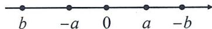

(2) 因为表示数 b 与其相反数的两点相距 20 个单位长度，则表示 b 的点到原点的距离为 10，所以 b 对应的数是 -10.

17. (1) ± 3 -4 (2) ± 3 4

18. $\geqslant$ $\leqslant a = \pm b$

19.(1)3 0 (2)5 2 (3)4 3

20. -4 ±3 21. -3

22. 解: 因为 $\left|x-2\right|+\left|y-98\right|=0$ ,

且 $|x - 2|\geqslant 0,|y - 98|\geqslant 0,$

所以 $\left|x-2\right|=0,\left|y-98\right|=0,$

所以 x=2,y=98, 所以 $xy=2\times98=196$ .

23. A

24. (1) > (2) > (3) < (4) > (5) < (6) =

25. 解: (1) 先求绝对值, $\left|-2.5\right|=2.5$ , $\left|-2\right|=2$ ,

因为 2.5 > 2，即 $\left|-2.5\right| > \left|-2\right|$ ，所以 -2.5 < -2；

(2)先求绝对值， $\left|-\frac{5}{4}\right|=\frac{5}{4},\left|-\frac{6}{5}\right|=\frac{6}{5}$

因为 $\frac{5}{4}>\frac{6}{5}$ ，即 $\left|-\frac{5}{4}\right|>\left|-\frac{6}{5}\right|$ ，所以 $-\frac{5}{4}<-\frac{6}{5}$ ;

(3)先化简， $-\left|-1\frac{1}{3}\right|=-1\frac{1}{3}<0,-\left(-1\frac{1}{3}\right)=1\frac{1}{3}>0,$

所以 $-\left|-1\frac{1}{3}\right|<-\left(-1\frac{1}{3}\right)$ .

26. 解: 在数轴上表示如下,

$$
- 5 - (+ 3. 5) \quad 0 \frac {1}{2} - (- 2) \quad | - 4 |
$$

由“数轴上,左边的数小于右边的数”得,

$$
- 5 <   - (+ 3. 5) <   0 <   \frac {1}{2} <   - (- 2) <   | - 4 |.
$$

27. 解: (1) 因为 $\left|+0.25\right|>\left|-0.2\right|>\left|-0.15\right|>\left|+0.1\right|>\left|-0.05\right|$ ，所以第 4 件样品的大小最符合要求；

(2) 因为 $\left|+0.1\right|=0.1<0.18,\left|-0.15\right|=0.15<0.18,$

$\vert -0.05\vert = 0.05 < 0.18$ ，所以第1,2,4件样品是正品；

因为 $|-0.2|=0.2,0.18<0.2<0.22$ ，所以第3件样品为次品；

因为 $|+0.25|=0.25>0.22$ ，所以第5件样品为废品。

28. 解: (1) 如图,

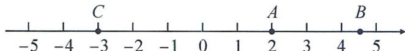

text_image

-5
-4
C
-3
-2
-1
0
1
A
2
3
B
4
5

C 景点在景区大门以西 3 千米处, 即数轴上表示 -3 的点处, 所以 A, C 两景点之间的距离是 $\left|2\right| + \left|-3\right| = 5$ 千米;

(2)能完成此次任务.理由如下:电瓶车一共走的路程为 $|+2|+|2.5|+|-7.5|+|-3|=15$ (千米),

因为 15<16, 所以能完成此次任务.

29. 解: (1) 3, 3, 5, 5;

(2)若表示数 a 的点在表示 3 的点的右侧, 则 a 的值为 8, 若表示数 a 的点在表示 3 的点的左侧, 则 a 的值为 -2. 所以 a=8 或 -2;

(3)结合数轴知表示1和4的两点之间的距离是3,若b在1和4之间,则表示数b的点在1的右侧1个单位长度处,此时b=2.若b在4的左侧,则表示数b的点在1的左侧3个单位长度处,此时b=-2.所以b的值为2或-2.

30. (1)-1 (2)-7 (3)5 (4)①6 ②-1.5

# 3 第二章《有理数的运算》阶段检测卷(一)

1. D 2. C 3. A 4. B 5. B 6. D 7. C 8. D 9. D

10. B 解: 因为点 B 到点 A, C 的距离相等, $b + c > 0$ , $a + c < 0$ , 所以 a < 0, b < 0, c > 0, 且 $|b| < |c|$ , 所以数轴的原点 O 的位置应该在点 B 与点 C 之间且离点 B 近. 故选 B.

11.3 12.-1 13.-1或-5 14.-2011

15.35 解: 根据定义知 -2, 3, 5, 9 的“非负差值运算”为 $[3-(-2)] + [5-(-2)] + [9-(-2)] + (5-3) + (9-3) + (9-5) = 5 + 7 + 11 + 2 + 6 + 4 = 35$ .

16. 解: (1) 原式 = 1.1;

(2) 原式 = 3.

17. 解: (1) 原式 = 11 + 19 - 12 - 6 = 30 - 18 = 12;

(2) 原式 $= \frac{9}{22} + \frac{11}{18} - \frac{21}{22} + \frac{7}{18} = \left(\frac{9}{22} - \frac{21}{22}\right) + \left(\frac{11}{18} + \frac{7}{18}\right)$

$$
= - \frac {6}{1 1} + 1 = \frac {5}{1 1}.
$$

18. 解: $(1)-9+(-8)+9+(-2)+9+8+8+(-8)+29+(-36)+50+(-24)=26$ ,

所以这一天出租车最后停在出发地东 26 千米的地方；

(2) $\left[-9\right|+|-8\right|+|9|+|-2\right|+|9|+|8|+|8|+|-8|+$

$$
\vert 2 9 \vert + \vert - 3 6 \vert + \vert 5 0 \vert + \vert - 2 4 \vert ] \div 1 0 0 \times 7 = 1 4 (\text { 升 }),
$$

所以这一天出租车用油 14 升.

19. 解: (1)(-5) \* 3 = (-5 - 3) - |3 - (-5)| = -8 - 8 = -16;

$$
\begin{array}{l} = (- 2 + 6) - | - 6 + 2 | \\ = 4 - 4 = 0. \\ \end{array}
$$

(2) 因为 $3 \times 4 = (3 - 4) - |4 - 3| = -1 - 1 = -2$ ,

所以 $(3*4)*(-6)=(-2)*(-6)$

20. 解: (1) 因为 B 是原点, AB = 2, BC = 1,

所以点 C 表示 1, 点 A 表示 -2,

所以 $p = -2 + 0 + 1 = -1$ ;

(2) 因为原点 O 在图中数轴上点 C 的右边, 且 CO = 15,

所以点 C 表示 -15，所以 BC = 1，所以点 B 表示 -16，
因为 AB = 2，所以点 A 表示 -18，

所以 $p = -15 + (-16) + (-18) = -49.$

21. 解: (1) 因为 $\left|a+b+2\right|\geqslant0,\left|c+1\right|\geqslant0,\left|a+b+2\right|+\left|c+1\right|=0,$

所以 $a+b+2=0, c+1=0$ ，所以 $a+b=-2, c=-1$ ，
所以 $a+b-c=-2-(-1)=-1;$

(2) 因为 $\left|a\right|=6$ ，所以 $a=\pm6$ ，因为 $\left|b\right|=2$ ，所以 $b=\pm2$ ，

因为 $|a+b|=|a|+|b|$ ，所以a,b同号，

所以 a=6, b=2 或 a=-6, b=-2.

当 $a = 6, b = 2$ 时， $a - b = 4$ ；

当 $a = -6, b = -2$ 时， $a - b = -4$ .

综上所述， $a-b=\pm4$ .

22. 解: (1) $\left|4-(-1)\right|=4+1=5$ . 故答案为 5;

(2) $|5-(-3)|=5+3=8$ . 故答案为 8;

(3) 因为 $\left|x-(-1)\right|=3$ ，所以 x 表示数轴上到 -1 的距离为 3 的点，当 x 在 -1 的左边时 x=-4，当 x 在 -1 的右边时，x=2，所以 x=2 或 x=-4。

23. 解: $(1)+10-2+5-6+12-9+4-14=0$ .

答:守门员最后正好回到球门线上;

(2)第一次10,第二次10-2=8,第三次8+5=13,

第四次 13-6=7，第五次 $7+12=19$ ，第六次 19-9=10，

第七次 $10+4=14$ ，第八次 14-14=0，

19>14>13>10>8>7.

答:守门员离开球门线的最远距离达19米;

(3)第一次 10=10, 第二次 10-2=8<10,

第三次 $8+5=13>10$ ，第四次 13-6=7<10，

第五次 $7+12=19>10$ ，第六次 19-9=10，

第七次 $10+4=14>10$ ，第八次 14-14=0。

答:对方球员有三次挑射破门的机会.

24. 解: (1) - 3.5; 1.5; 5.

由题意知3次游戏中平局1次，甲胜1次，乙胜1次，根据移动规则知甲最终位置为 $-5 + 0.5 + 2 - 1 = -3.5$ 乙最终位置为 $3 - 0.5 + 1 - 2 = 1.5$

此时 A, B 两点间的距离为 1.5 - (-3.5) = 5;

(2)由题意知10次游戏中平局2次,甲胜5次,乙胜3次,
根据移动规则知甲最终位置为 $-5+1+10-3=3$ ,
乙最终位置为 $3-1+5-6=1$ ,

因为 3>1, 所以甲移动到了乙的右边.

# 4 第二章《有理数的运算》阶段检测卷(二)

1. A 2. B 3. A 4. B 5. D 6. C 7. D 8. B

9. A 解: $110\ 111 = 1 \times 2^{5} + 1 \times 2^{4} + 0 \times 2^{3} + 1 \times 2^{2} + 1 \times 2^{1} + 1 \times 2^{0} = 55$ . 故选 A.

10. B 解: 由数轴可知 c<-1<0<a<1<b，所以 a-1<0, b-1>0, b+1>0, c+1<0, a+1>0, c-1<0，所以 $(a-1)(b-1)<0$ ，故 A 选项不符合题意；所以 $(b+1)(c+1)<0$ ，故 B 选项符合题意；所以 $(a+1)(b+1)>0$ ，故 C 选项不符合题意；所以 $(b-1)(c-1)<0$ ，故 D 选项不符合题意。故选 B.

11.20 12. $-\frac{2}{3}$ 13.9 14.14

15.256 382

解:(1)第8个图形中 $a=(-2)^{8}=256$ ;

(2) $b=a-2=256-2=254,c=\frac{a}{-2}=\frac{256}{-2}=-128.$

所以 $b-c=254-(-128)=382.$

16. 解: (1) 原式 = 26;

(2) 原式= $\frac{8}{3}$ .

17. 解: (1) 原式= $\frac{1}{6}\times(-36)-\frac{1}{2}\times(-36)+\frac{5}{12}\times(-36)$

$$
\begin{array}{l} = - 6 + 1 8 - 1 5 \\ = - 3; \\ \end{array}
$$

(2) 原式= $81 \times \frac{4}{9} \times \frac{4}{9} \times \frac{1}{16}$

$$
= 1.
$$

18. 解: 原式 = -1 + $\frac{1}{6} \times (2 - 9)$

$$
\begin{array}{l} = - 1 + \left(- \frac {7}{6}\right) \\ = - \frac {1 3}{6}. \\ \end{array}
$$

19. 解: 依题意, 得 $x = -5, y = \pm 2$ ,

因为 $xy > 0$ ，所以 $x = -5, y = -2$

所以 $xy - \frac{x}{y} = -5\times (-2) - \frac{-5}{-2} = 10 - \frac{5}{2} = \frac{15}{2}$

20. 解: (1) 因为 $\left|a+b\right|+(c-3)^{2}=0$ ,

$$
\mid a + b \mid \geqslant 0, (c - 3) ^ {2} \geqslant 0,
$$

所以 $a+b=0, c-3=0$ ，即 a=-b, c=3；

(2) 因为点 A 在点 B 左侧, A, B 两点间的距离为 2, a = -b, 所以 a = -1, b = 1.

所以 $a^{c}+b^{c}=1^{3}+(-1)^{3}=1-1=0,(a+b)^{c}=(-1+1)^{3}=0.$

所以 $a^{c}+b^{c}=(a+b)^{c}$ .

21. 解: (1) $-11 \times 5 + (-6) \times 12 + 0 \times 10 + 8 \times 6 + 10 \times 10 + 15 \times 5 = -55 - 72 + 0 + 48 + 100 + 75 = 96$ (个), $25 + 96 \div 48 = 27$ (个).

答: 这个班 48 人平均每人垫球 27 个;

(2) $5 \times 11 \times (-1) + 12 \times 6 \times (-1) + 0 + (8 \times 6 + 10 \times 10 + 15 \times 5) \times 2 = -55 - 72 + 446 = 319$ （分）.

答: 这个班垫球总共获得 319 分.

22. 解: (1) ① 当 a > 0 时, $\frac{|a|}{a} = 1$ ; ② 当 a < 0 时, $\frac{a}{|a|} = -1$ ;

(2) 因为 abc<0，所以 a, b, c 中有一个负数，两个正数，或三个负数，当 a, b, c 为一负两正时， $\frac{|a|}{a}+\frac{|b|}{b}+\frac{|c|}{c}=1$ ，当 a, b, c 为三个负数时， $\frac{|a|}{a}+\frac{|b|}{b}+\frac{|c|}{c}=-3$ ;

(3) 因为 $a + b + c = 0, a + c < 0$ ，所以 b > 0，即 b 为正数，所以 $\frac{b + c}{|a|} + \frac{a + c}{|b|} + \frac{a + b}{|c|} = \frac{-a}{|a|} + \frac{-b}{|b|} + \frac{-c}{|c|} = -1 - 1 + 1 = -1.$

23. 解: (1) $4^{3}=13+15+17+19$ ;

(2) 当 k=10 时， $10^{2}-1=99,10^{2}+1=101$ ;

$$
\begin{array}{l} 1 ^ {3} + 2 ^ {3} + 3 ^ {3} + \dots + 9 ^ {3} + 1 0 ^ {3} + 1 1 ^ {3} \tag {3} \\ = 1 + (3 + 5) + (7 + 9 + 1 1) + \dots + (1 1 1 + 1 1 3 + 1 1 5 + 1 1 7 + \\ 1 1 9 + 1 2 1 + 1 2 3 + 1 2 5 + 1 2 7 + 1 2 9 + 1 3 1) \\ = \frac {1}{2} \times 6 6 \times (1 + 1 3 1) \\ = 4 3 5 6. \\ \end{array}
$$

24. 解: (1) 256;

$$
(2) (- 2) ^ {n} + 1;
$$

(3)第①行的第7个数为-128，

第②行的第7个数为-127，

第③行的第7个数为-256，

这三个数的和为 $-128+(-127)+(-256)=-511$ ;

(4)每一行第 n 个数依次为 $x, x + 1, 2x$ ,

则 $x + x + 1 + 2x = -4603$ ，解得 $x = -1151$

所以 $(-2)^{n}=-1\ 151$ ，无解，

故不存在这样的三个数的和为-4603.

# 5 第二章《有理数的运算》单元检测卷

1. A 2. D 3. C 4. C 5. A 6. C 7. D 8. C 9. A 10. A

11.2 12.2.0 13.-9 14.244872

15.2或4 4或5或7或8

解:(1)当 x=y 时, $|x-3|=1$ ,x=2 或 4;

(2) 因为 x, y 均为整数，

所以 $|x - y|$ 与 $|x - 3|$ 也为整数，

因为 $|x-y|+|x-3|=1$ ，

所以 $|x-y|=0$ 且 $|x-3|=1$ 或 $|x-y|=1$ 且 $|x-3|=0$ .

若 $|x-y|=0,|x-3|=1$ ,

则 $x = y = 4$ 或 $x = y = 2$

所以 $x + y = 8$ 或 4;

若 $|x-y|=1,|x-3|=0$ ，则x=3,y=2或4，

所以 $x + y = 5$ 或 7，

综上 $x + y = 4$ 或 5 或 7 或 8.

16. 解: 原式 = -5 - 8 $\frac{1}{3}$ - 25 - 1 $\frac{2}{3}$

$$
= (- 5 - 2 5) + \left(- 8 \frac {1}{3} - 1 \frac {2}{3}\right)
$$

$$
= - 3 0 - 1 0
$$

$$
= - 4 0.
$$

17. 解: (1) -35.6 - (-67.8) = 32.2 (米).

答: A 处比 C 处高 32.2 米;

(2)-122.7-(-67.8)=-54.9(米).

答:B 处比 C 处高 - 54.9 米.

18. 解: 因为 $\left|a\right|=3$ , 所以 $a=\pm3$ , 因为 $\left|b\right|=2$ , 所以 $b=\pm2$ , 因为 $a+b<0$ , 所以 $a=-3, b=\pm2$ ,

所以 $\frac{a}{b} = \frac{-3}{2} = -\frac{3}{2}$ 或 $\frac{a}{b} = \frac{-3}{-2} = \frac{3}{2}$ ,

综上所述， $\frac{a}{b}$ 的值为 $-\frac{3}{2}$ 或 $\frac{3}{2}$ .

19. 解: (1) 原式 $= -4 + (-4) \times \frac{1}{2} \times \frac{1}{2} + 3 = -4 + (-1) + 3 = -2$ ;

(2) 原式 $= -1 - 7 \div (2 - 9) = -1 - 7 \div (-7) = -1 + 1 = 0$ .

20. 解: (1) $\left(-\frac{1}{9}+\frac{1}{4}+\frac{1}{12}\right)\div\left(-\frac{1}{72}\right)$

$$
= \left(- \frac {1}{9} + \frac {1}{4} + \frac {1}{1 2}\right) \times (- 7 2)
$$

$$
= - \frac {1}{9} \times (- 7 2) + \frac {1}{4} \times (- 7 2) + \frac {1}{1 2} \times (- 7 2)
$$

$$
= 8 - 1 8 - 6 = - 1 6;
$$

(2) $\left(-\frac{1}{72}\right)\div\left(-\frac{1}{9}+\frac{1}{4}+\frac{1}{12}\right)$ 与 $\left(-\frac{1}{9}+\frac{1}{4}+\frac{1}{12}\right)\div\left(-\frac{1}{72}\right)$

互为倒数，

由(1)知： $\left(-\frac{1}{9}+\frac{1}{4}+\frac{1}{12}\right)\div\left(-\frac{1}{72}\right)=-16,$

所以 $\left(-\frac{1}{72}\right) \div \left(-\frac{1}{9} + \frac{1}{4} + \frac{1}{12}\right) = -\frac{1}{16}$ .

21. 解: (1) 根据题意可知: $2 \times (-0.5) + 1 \times (-0.4) + 5 \times (-0.2) + 2 \times 0 + 4 \times 0.2 + 2 \times 0.3 + 4 \times 0.6 = 1.4$ (千克),

所以 20 箱苹果的总质量为 $20 \times 15 + 1.4 = 301.4$ (千克);

(2)301.4×(1-10%)×15-301.4×8.5=1507(元).

答:出售这 20 箱苹果能盈利 1507 元.

22. 解: (1) $\left(3 \times \frac{1}{3}\right)^{100} = 1^{100} = 1; 3^{100} \times \left(\frac{1}{3}\right)^{100} = 1.$

故答案为 1,1;

(2) $(a \cdot b)^{n}=a^{n}b^{n},(abc)^{n}=a^{n}b^{n}c^{n}.$

故答案为 $a^n b^n, a^n b^n c^n$ ;

(3) 原式 $= (-0.125)^{99} \times 2^{99} \times 4^{99} \times 8 = [(-0.125) \times 2 \times 4]^{99} \times 8 = (-1)^{99} \times 8 = -1 \times 8 = -8$ .

23. 解: 问题 1, 由表格可知, 购买吉祥物数量最多班级是七(1)班, 购买的数量为 $20 + 7 = 27$ (个), 购买数量最少班级是七(3)班, 购买数量是 20 - 3 = 17 (个), 所以购买吉祥物的数量最多班级比购买数量最少班级多的个数为 27 - 17 = 10 (个);

问题 2, 由题意, 得七(1)班共购买 $20 + 7 = 27$ (个), 共优惠 $21 \div 7 = 3$ (个), 所以实际购买 27 - 3 = 24 (个), 七(3)班共购买 20 - 3 = 17 (个), 共优惠 $14 \div 7 = 2$ (个), 所以实际购买 17 - 2 = 15 (个), 购买费用最多班级比最少班级多 $(24 - 15) \times 40 = 360$ (元);

问题3,因为年段统一购买总数为 $(+7+5-3-1)+20\times4=8+80=88$ （个），若甲店购买共优惠 $77\div7=11$ （个），实际购买88-11=77（个），此时共需费用 $77\times40=3080$ （元），若乙店购买，则总费用为 $20\times40+(88-20)\times40\times80\%=2976$ （元），因为2976<3080，所以选择乙店购买更优惠.

24. 解: (1) $2^{10}-1$ ;

(2) 令 $S=1+5+5^{2}+5^{3}+5^{4}+\cdots+5^{2022}$ ，①

则 $5S=5+5^{2}+5^{3}+5^{4}+5^{5}+\cdots+5^{2023}$ ，②

由②-①，得 $4S = 5^{2023} - 1$ ，所以 $S = \frac{5^{2023} - 1}{4}$

即 $1 + 5 + 5^{2} + 5^{3} + 5^{4} + \dots + 5^{2022} = \frac{5^{2023} - 1}{4}$ ;

(3)根据题意,知第8次生长后,这棵树的枝干共有

$$
S = 1 + 3 + 3 ^ {2} + 3 ^ {3} + 3 ^ {4} + 3 ^ {5} + 3 ^ {6} + 3 ^ {7} + 3 ^ {8},
$$

则 $3S = 3 + 3^{2} + 3^{3} + 3^{4} + 3^{5} + 3^{6} + 3^{7} + 3^{8} + 3^{9}$

所以 $2S = 3^{9} - 1$ ，所以 $S = \frac{3^9 - 1}{2}$

答:第8次生长后,这棵树的枝干共有 $\frac{3^{9}-1}{2}$ 根.

# 6 第二章《有理数的运算》专题卷

1.(1)-7 (2)-21 (3)0.6 (4) $-\frac{1}{6}$ (5)-8

(6)93 (7)13 (8)-135

2. 解: (1) 原式 = 23 - 14 - 35 + 10 = 33 - 49 = -16;

(2) 原式 = -1 + 9 = 8;

(3) 原式 = 4.5 + (-2.5) + 9 $\frac{1}{3} + \left(-15\frac{2}{3}\right) + 2\frac{1}{3} = 2 + 11\frac{2}{3} - 15\frac{2}{3} = 2 - 4 = -2$ ;

(4) 原式 $= 2\frac{1}{2} + 2.5 + 1 - \left| -1\frac{1}{2} \right| = 2\frac{1}{2} + 2.5 + 1 - 1\frac{1}{2} = 4\frac{1}{2}$ .

3.(1)30 (2) $-\frac{3}{2}$ (3)0 (4)14 $\frac{1}{11}$ (5)-3
(6)14 (7)-50 (8)3

4. (1) $-\frac{1}{3}$ (2)6 (3)-4 (4) $-\frac{1}{8}$

5. 解: (1) 原式= $\frac{8}{3}\times\frac{5}{6}\times9=20$ ;

(2) 原式 $= -\frac{9}{2} \times \frac{25}{7} \times \frac{4}{5} \times \frac{7}{5} = -18$ ;  
(3) 原式 $= -\frac{5}{4} \times \frac{5}{4} \times 8 \times \frac{4}{3} = -\frac{50}{3}$ ;  
(4) 原式= $4 \times \frac{7}{5} \times \frac{2}{7} \times \frac{5}{8} = 1$ .

6.(1)4 -8 $\frac{1}{16}$ (2)1 -1 0 (3)-9 -27 -9

7.B 8.C 9.(1)3.142 (2)2.10

10. 解: (1) 原式 = -9 + $\frac{1}{4}$ + 8 + 2 = 1 $\frac{1}{4}$ ;

(2) 原式 $= 1 - \frac{1}{4} \times (-3)^{2} = 1 - \frac{9}{4} = -1\frac{1}{4}$ ;  
(3) 原式 $= -8 \times \frac{9}{4} \times \left(-\frac{1}{6}\right) = 8 \times \frac{9}{4} \times \frac{1}{6} = 3$ ;  
(4) 原式 = -9 × (-2) + 16 ÷ (-8) - 4 = 18 - 2 - 4 = 12.

11. 解: (1) 原式 $=\frac{1}{6}-\frac{2}{7}+2\frac{1}{9}+\frac{5}{6}-\frac{5}{7}-3\frac{2}{9}$ $=1-1-1\frac{1}{9}=-1\frac{1}{9}$ ;

(2) 原式 = -3.82 - 6.18 + 2 $\frac{19}{21} + 2\frac{2}{21} = -10 + 5 = -5$ ;  
(3) 原式 $= \left(\frac{5}{6} - \frac{1}{2} - \frac{7}{12}\right) \times 24 = \frac{5}{6} \times 24 - \frac{1}{2} \times 24 - \frac{7}{12} \times 24$ $= 20 - 12 - 14 = -6$ ;  
(4) 原式 = $(-36) \times \frac{1}{6} - (-36) \times \frac{2}{9} + (-36) \times \frac{5}{12}$ $= -6 + 8 - 15 = -13;$

(5)原式=17.48×37+17.48×19+17.48×44   
(6) 原式 = $(-9) \times 31 \frac{8}{29} - 8 \times 31 \frac{8}{29} + 16 \times 31 \frac{8}{29}$

$$
= 1 7. 4 8 \times (3 7 + 1 9 + 4 4) = 1 7. 4 8 \times 1 0 0 = 1 7 4 8;
$$

$$
= (- 9 - 8 + 1 6) \times 3 1 \frac {8}{2 9} = - 3 1 \frac {8}{2 9}.
$$

12. A

13. 解: 因为 x, y 同号且 $x + y < 0$ , 所以 x < 0, y < 0,

又因为 $x < y, |x| = -x, |y| = -y$

在数轴上表示出 $x, y, |x|, |y|$ 为：

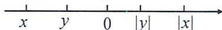

所以 $x < y < |y| < |x|$ .

14. 解: (1)0;

(2)由题意,得 a,b,c 三个有理数都为负数或其中一个为负数,两个为正数;

①a,b,c都为负数即a<0,b<0,c<0时，

原式 $= \frac{a}{-a} +\frac{b}{-b} +\frac{c}{-c} = -1 + (-1) + (-1) = -3;$

②a,b,c有一负两正,不妨设a<0,b>0,c>0,

原式 $= \frac{a}{-a} +\frac{b}{b} +\frac{c}{c} = -1 + 1 + 1 = 1;$

综上， $\frac{a}{|a|}+\frac{b}{|b|}+\frac{c}{|c|}=-3$ 或 1；

(3)由 $a+b+c=0$ ，得 $2a+b+c=(a+b+c)+a=a, a+2b+c=b, a+b+2c=c$ ，又因为 abc<0，所以 a, b, c 中有一负两正，所以原式 $=\frac{a}{|a|}+\frac{b}{|b|}+\frac{c}{|c|}=1$ .

15. 解: $(1)-3 \times 2 + 4 \times 1 - 1 \times 3 + 2 \times 3 - 5 \times 2 = -6 + 4 - 3 + 6 - 10 = -9.$

答:仓库的原料比原来减少9吨;

(2)方案一: $(4+6)\times5+(6+3+10)\times8=50+152=202$ （元）;
方案二: $(6+4+3+6+10)\times6=29\times6=174$ （元）.

因为 174<202, 所以选方案二运费少.

16. 解: (1) -3 - 15 + 19 - 1 + 5 - 12 - 6 + 12 = -1.

答:刘师傅走完第8次里程后,他在A地的西边,离A地有1千米;

(2)刘师傅这天上午行驶的总路程为 $|-3|+|-15|+|+19|+|-1|+|+5|+|-12|+|-6|+|+12|=73$ （千米），

耗油量为 $0.06 \times 73 = 4.38$ (升), $8 - 4.38 = 3.62 > 2$ .

答:刘师傅这天上午中途可以不加油;

(3)由表可知,刘师傅这天上午第3次的里程营业额最高.第3次的营业额为: $15+(19-3)\times2.8=59.8$ (元).

答:刘师傅这天上午最高一次的营业额是59.8元.

# 7 第一章～第二章综合检测卷

1. A 2. C 3. C 4. B 5. D 6. D 7. D 8. B 9. C

10. B 解: 因为 $5.4 \div (4 + 5) = 0.6 \, (\text{cm})$ ，所以 $1.8 \div 0.6 = 3$ ，所以 $-4 + 3 = -1$ 。故选 B.

11.5 3 $\frac{1}{2}$ 12. $>$ 13. $1.246\times 10^{8}$ 14.-3

15. ②③ 解: 因为 a<0, ab<0, 所以 b>0, 因为 $a+b<0$ , 所以 $b(a+b)<0$ , 故①错误; 因为 a<0, b>0, $a+b<0$ , 所以 $|a|>|b|$ , 所以②正确; 因为 b>0, a<0, 所以 a-b<0, 所以 $\frac{|-b|}{b}+\frac{a-b}{|a-b|}-\frac{|a|}{a}=\frac{b}{b}+\frac{a-b}{-(a-b)}-\frac{-a}{a}=1-1+1=1$ , 故③正确; 因为 a-b<0, $|a-b|=6$ , 所以 a-b=-6, 所以 b=a+6, 因为 $|b-c|=2$ , 所以 b-c=2 或 b-c=-2, 所以 $a+6-c=2$ 或 -2, 所以 a-c=-4 或 -8, 所以 $|a-c|=4$ 或 8, 故④错误; 所以正确的有②③.

16. 解: (1) 原式 = $(-3-7)+(12+8)=-10+20=10$ ;

(2) 原式 = -12 - 4 = -16.

17. 解: 原式 = -1 - 0.9 × [2 - (-8)]

$$
\begin{array}{l} = - 1 - 0. 9 \times (2 + 8) \\ = - 1 - 0. 9 \times 1 0 \\ = - 1 - 9 \\ = - 1 0. \\ \end{array}
$$

18. 解: (1) 原式 $=\frac{1}{2} \times 12 - \frac{1}{3} \times 12 + \frac{5}{12} \times 12 = 6 - 4 + 5 = 7$ ;

(2) 原式 $= \left(20 - \frac{1}{9}\right) \times \frac{9}{10} = 20 \times \frac{9}{10} - \frac{1}{9} \times \frac{9}{10} = 18 - \frac{1}{10} = 17 \frac{9}{10}$ .

19. 解: 因为 $\left|a+3\right|\geqslant0,\left(b-2\right)^{2}\geqslant0$ , 且 $\left|a+3\right|+(b-2)^{2}=0$

所以 $|a+3|=0,(b-2)^{2}=0$ ，所以 $a+3=0,b-2=0$ ，

所以 a = -3, b = 2，所以 $a^{b} = (-3)^{2} = 9$ .

20. 解: $(1)-4\times2+4\times1+(-1)\times4+3\times3+(-3)\times2=-8+$ $4-4+9-6=-5$ （吨），

因为-5是负数,表示运出,

所以这天冷库的冷冻食品的质量相比原来是减少了；

(2) $(4\times2+4\times1+1\times4+3\times3+3\times2)\times300=31\times300=9\ 300$ （元）.

答: 总运费为 9300 元.

21. 解: (1) $2 \oplus 3 \oplus 4 = 2 + 3 + 4 - 2 \times \frac{45}{2} = 9 - 45 = -36$ ,

$$
4 \oplus 5 \oplus 6 = 4 + 5 + 6 - 2 \times \frac {4 5}{2} = 1 5 - 4 5 = - 3 0;
$$

故答案为-36,-30;

(2) 原式 $=1+2+3+\cdots+9-8\times\frac{45}{2}=\frac{9\times10}{2}-8\times\frac{45}{2}=45-$ 180=-135.

22. 解: (1) $n=20-1-2-4-6-2=5$ (箱), $10 \times 20 + (-0.5) \times 1 + (-0.25) \times 2 + 0.25 \times 6 + 0.3 \times 5 + 0.5 \times 2 = 203$ (千克).

答:n 的值是 5, 这 20 箱樱桃的总重量是 203 千克;

(2) $25 \times 203 - 200 \times 20 = 1075$ (元).

答:全部售出可获利 1 075 元;

(3) $25 \times 203 \times 60\% + 25 \times 203 \times (1 - 60\%) \times 70\% - 200 \times 20 = 466$ （元）.

答: 是盈利的, 盈利 466 元.

23. 解: (1) 128, -32, -34;

(2)由第二行中的数的规律可设相邻三个数依次为 m, -2m, 4m,
由题知 $m-2m+4m=-96$ ，所以 m=-32.

所以 $-32\times(-2)=64,(-32)\times4=-128,$

即这三个数依次为-32,64,-128;

(3)由(1)中规律得:a=-64,b=16,c=14,

所以 $a-2b+c=-64-2\times16+14=-82.$

24. 解: (1) ① 根据移动过程得 $(-4)+(+1)=-3$ ;

②设向左为负,向右为正,所以机器人跳动过程可以用算式表示为 $-1+2-3+4-5+6-\cdots-2023+2024=(-1+2)+(-3+4)+(-5+6)+\cdots+(-2023+2024)=1\times1012=1012$ ,

所以当它跳 2024 次时, 落在数轴上的点表示的数是 1012;

(2)①因为表示-1的点与表示3的点重合，

所以折痕处的点表示的数为 $\frac{-1+3}{2}=1$ ，

所以表示 7 的点重合的点为 $2 \times 1 - 7 = -5$ ，

所以表示 7 的点与表示 -5 的点重合；

②由①得折痕处的点表示的数为1,因为数轴上点A,B两点之间的距离为2024,且A,B两点经折叠后重合,所以A,B两点到1的距离都是 $2024\div2=1012$ ,所以点A表示1-1012=-1011,点B表示 $1+1012=1013$ ;

(3)当点 $A'$ 在点 B 左侧时, 因为 $A'B=2$ , 点 B 表示的数为 8, 所以点 $A'$ 表示的数为 6, 因为点 C 为折痕, 将数轴向右对折, 若点 A 对应的点 $A'$ 落在数轴上, 所以点 C 表示的数为

$\frac{-17 + 6}{2} = -5.5$ ，当点 $A^{\prime}$ 在点 $B$ 右侧时，因为 $A'B = 2$ ，点 $B$ 表示的数为8，所以点 $A'$ 表示的数为10，因为点 $C$ 为折痕，将数轴向右对折，若点 $A$ 对应的点 $A'$ 落在数轴上，所以点 $C$ 表示的数为 $\frac{-17 + 10}{2} = -3.5$ ，综上所述，点 $C$ 表示的数为-5.5或-3.5.

# 8 第三章《代数式》单元检测卷

1. C 2. A 3. B 4. C 5. D 6. C 7. B 8. C 9. C 10. B

11. $\frac{1}{x} - 1$ 12.2 13. $\frac{2\pi a}{x}$ 14.151

15. 解: 92 $n(n+1)+2$

因为第1个图形中一共有 $1\times(1+1)+2=4$ 个圆，第2个图形中一共有 $2\times(2+1)+2=8$ 个圆，第3个图形中一共有 $3\times(3+1)+2=14$ 个圆，第4个图形中一共有 $4\times(4+1)+2=22$ 个圆；可得第n个图形中圆的个数是 $n(n+1)+2$ ；当n=9时， $n(n+1)+2=9\times10+2=92$ 。故答案为92， $n(n+1)+2$ 。

16. 解: (1) 2x - 1; (2) $\frac{x + y}{x - y}$ .

17. 解: (1) 当 x = -3, y = 2 时,

$$
x y - \frac {2 y}{x} = - 3 \times 2 - \frac {2 \times 2}{- 3} = - 6 + \frac {4}{3} = - \frac {1 4}{3};
$$

(2) 当 $x = 2, y = -\frac{1}{3}$ 时，

$$
x y - \frac {2 y}{x} = 2 \times \left(- \frac {1}{3}\right) - \frac {- \frac {2}{3}}{2} = - \frac {2}{3} + \frac {1}{3} = - \frac {1}{3}.
$$

18. 解: $a \oplus b = \frac{ab}{a^{2} - b^{2}} = \frac{3 \times (-2)}{3^{2} - (-2)^{2}} = -\frac{6}{5}.$

19. 解: (1) 依题意, 得小天支付的费用为 $a + 3 \times (8 - 5) = a + 9$ ;

(2) 当 a=12 时, 费用为 $a+9=12+9=21$ .

答: 当 a=12 时, 小天需要支付 21 元.

20. 解: $(1)g(-3)=-2\times(-3)^{2}-3\times(-3)+1=-2\times9+9+1=-8;$

(2) 因为 $h(x)=mx^{3}+2x^{2}-x-14$ ,

所以 $h\left(\frac{1}{2}\right)=\frac{1}{8}m+\frac{1}{2}-\frac{1}{2}-14=m$ , 解得 m=-16.

21. 解: (1) 剩下铁皮(阴影部分)的面积为 $\frac{1}{2}ah - \frac{1}{2}\pi r^{2}$ ;

(2) 当 $a = 20, h = 15, r = 4$ 时, $\frac{1}{2} ah - \frac{1}{2}\pi r^2 = \frac{1}{2} \times 20 \times 15 - \frac{1}{2} \times 3 \times 4^2 = 150 - 24 = 126(\mathrm{cm}^2)$ .

22. 解: (1) 当 v=40 时, $s=\frac{40^{2}}{200}=8$ , 当 v=50 时, $s=\frac{50^{2}}{200}=12.5$ .

故答案为 8,12.5;

(2) 当 v=120 时, $s=\frac{120^{2}}{200}=72$ .

因为 72<100, 故该种型号汽车在车速为 120 km/h 时的刹车距离在规定的安全距离内.

23. 解: (1) 根据题意可得: 当 x=850 时, 在甲商场没有优惠; 在乙商场有优惠,

费用是 $500+(850-500)\times95\%=832.5$ （元），

故在乙商场买合算；

(2) 当 x > 1000 时: 在甲商场的费用是 $1000 + (x - 1000) \times 90\% = 0.9x + 100$ ;

在乙商场的费用是 $500+(x-500)\times95\%=0.95x+25$ ;

(3) 把 x=1700 代入(2)中的两个代数式:

0.9x+100=0.9×1700+100=1630,

0.95x+25=0.95×1700+25=1640,

因为 1640 > 1630，所以选择甲商场合算。

24. 解: (1) 依题意, 得第 4 个图形中有 9 张三角形卡片, 有 13 张

正方形卡片,总卡片为 22;

第 5 个图形中有 11 张三角形卡片,有 16 个正方形卡片,总卡片为 27.

故答案为 9,13,22,11,16,27;

(2)第 n 个图形中有 $(2n+1)$ 张三角形卡片,有 $(3n+1)$ 张正方形卡片;

(3)①依题意,得 $3n+1=49$ , 解得 n=16,

所以三角形卡片有 $2 \times 16 + 1 = 33$ .

所以当第 n 个图形中有 49 张正方形卡片时，

该图形中有 33 张三角形卡片；

②依题意,得 $s=5n+2$ , s 与 n 不成正比例关系,也不成反比例关系.

# 9 第三章《代数式》专题卷

1. C 
2. A 
3. D 
4. D 
5. C

6. 解: (1) $3a + 2$ ; (2) $2a + \frac{1}{3}b$ ; (3) $a^{2} + b^{2}$ ;

(4) $5x-(b+3)$ .

7. $\frac{1}{a-3}-\frac{1}{a}$ 8. $(2a+ab)$

9. D 解: 因为甲、乙两个品牌的衬衣共 n 件, 其中甲品牌衬衣比乙品牌衬衣多 5 件, 所以甲品牌的衬衣共 $\frac{n+5}{2}$ 件, 乙品牌的衬衣共 $\frac{n-5}{2}$ 件; 所以买这 n 件衬衣共需付款 $120 \times \frac{n+5}{2} + 90 \times \frac{n-5}{2} = 105n + 75$ .

10. A 11. 反比例关系 $n = \frac{300}{m} 300$

12. 解: (1) 当 a = -3, b = -2 时, $m = 2a^{2}b + 3ab - 4 = 2 \times (-3)^{2} \times (-2) + 3 \times (-3) \times (-2) - 4 = -36 + 18 - 4 = -22$ ;

(2) 当 $a = -\frac{3}{2}$ , $b = \frac{1}{3}$ 时, $m = 2a^{2}b + 3ab - 4 = 2 \times \left(-\frac{3}{2}\right)^{2} \times \frac{1}{3} + 3 \times \left(-\frac{3}{2}\right) \times \frac{1}{3} - 4 = -4.$

13. 解: (1) 当 $x = -2, y = \frac{5}{2}$ 时, $x^{2} + y^{2} = (-2)^{2} + \left(\frac{5}{2}\right)^{2} = \frac{41}{4}$ ;

$$
(x + y) ^ {2} = \left(- 2 + \frac {5}{2}\right) ^ {2} = \frac {1}{4};
$$

(2) 当 $x = -2, y = \frac{5}{2}$ 时， $x^2 - y^2 = (-2)^2 - \left(\frac{5}{2}\right)^2 = -\frac{9}{4}$ ;

$$
(x - y) ^ {2} = \left(- 2 - \frac {5}{2}\right) ^ {2} = \frac {8 1}{4}.
$$

14. 解: 当 $x=\frac{1}{2}$ , y=-2 时,

$$
x * y = \frac {x ^ {2} - y ^ {2}}{x y} = \frac {\left(\frac {1}{2}\right) ^ {2} - (- 2) ^ {2}}{\frac {1}{2} \times (- 2)} = \frac {1 5}{4}.
$$

15. B

16. 341 解: 当 n=3 时, 由运算程序, 得 $3^{2}-3-1=9-3-1=5<25$ , 当 n=5 时, 由运算程序, 得 $5^{2}-5-1=25-5-1=19<25$ , 当 n=19 时, 由运算程序, 得 $19^{2}-19-1=341>25$ , 则输出结果为 341. 故答案为 341.

17. 解: (1) $m = x + 2x = 3x$ , $n = 2x + 3$ . 故答案为 3x, $2x + 3$ ;

(2) $y = m + n = 3x + 2x + 3 = 5x + 3 = -5 + 3 = -2.$

18. 解: (1) 他应付的车费用代数式表示为: $3 + 2(x - 2) = (2x - 1)$ 元;

(2) 当 x=4 时, 他应付车费为 $2x-1=2\times4-1=7$ (元).

19. $\frac{n^2 + 1}{n}$ 20. $(n + 2)^2 - n^2 = 4(n + 1)$

21.(2n+1) 解:第①个图中黑色正方形纸片有3张,即 $3=2\times1+1$ ,第②个图中有5张黑色正方形纸片,即 $5=2\times2+1$ ,第

③个图中有7张黑色正方形纸片，即 $7=2\times3+1$ ，第④个图中有9张黑色正方形纸片，即 $9=2\times4+1,\cdots$ ，第n个图中黑色正方形纸片的张数为 $2n+1$ 。

22.(5n+2) 解:第①个“山”字中棋子的颗数为: $7=1\times5+2$ ;第②个“山”字中棋子的颗数为: $12=2\times5+2$ ;第③个“山”字中棋子的颗数为: $17=3\times5+2$ ;第④个“山”字中棋子的颗数为: $22=4\times5+2$ ;…,所以第n个“山”字中棋子的颗数为 $(5n+2)$ 颗.

23. 解: (1) A 方案的费用为 $30 \times 5 + 15x = (15x + 150)$ 元;

B 方案的费用为 $30 \times 0.6(x + 5) = (18x + 90)$ 元；

(2) 当 x=50 时，A 方案购票费用为 $15 \times 50 + 150 = 900$ ，B 方案购票费用为 $18 \times 50 + 90 = 990$ ，因为 900 < 990，所以当学生人数 x=50 时，选择 A 方案更为优惠.

24. 解: (1) 草地的周长为 $(2\pi r + 8r)$ m;

广场空地的面积为 $(ab-\pi r^{2}-\pi x^{2})\ m^{2}$ .

故答案为 $(2\pi r+8r)$ ; $(ab-\pi r^{2}-\pi x^{2})$ ;

(2)共需要花费的费用为 $50(ab-\pi r^{2}-\pi x^{2})$ ,

当 a=80, b=60, r=2x=10 时，

$50(ab - \pi r^2 -\pi x^2) = 50\times (80\times 60 - 3\times 5^2 -3\times 10^2) = 221250.$

答:一共需要花费 221 250 元.

# 10 第四章《整式的加减》单元检测卷

1. B 2. B 3. A 4. B 5. A 6. C 7. B 8. A

9. C 解: 因为第 1 个图形的周长 $C_{1}=5a$ ，第 2 个图形的周长 $C_{2}=8a=5a+3a$ ，第 3 个图形的周长 $C_{3}=11a=5a+3a+3a$ ，…，所以第 n 个图形的周长 $C_{n}=5a+3a(n-1)=3an+2a$ ，所以当 n=2021 时， $C_{2021}=3a\times2021+2a=6065a$ 。故选 C.

10. D 解: ① $-x + (2x + 1) + (3x + 2) + (-4x - 3) = -x + 2x + 1 + 3x + 2 - 4x - 3 = 0$ ，所以存在一种“半负操作”使得结果为单项式，说法错误；② $-x + (-2x - 1) + (3x + 2) + (4x + 3) = 4x + 4, -x + (2x + 1) + (-3x - 2) + (4x + 3) = 2x + 2, -x + (2x + 1) + (3x + 2) + (-4x - 3) = 0, x + (-2x - 1) + (-3x - 2) + (4x + 3) = 0, x + (-2x - 1) + (3x + 2) + (-4x - 3) = -2x - 2, x + (2x + 1) + (-3x - 2) + (-4x - 3) = -4x - 4$ ，所以共5种结果，说法错误.

11.2 5 12.4(x-y) 13. $\frac{a+b}{2}$ 14.12

15. -x-1 16x+1

解:(1)第一次输入 $M=2x+1$ , 得 $\left(2x+1+\frac{x}{2}\right)\times2+N=4x+1$ , 整理得 $5x+2+N=4x+1$ , 解得 N=-1-x; (2)运算原理为 $\left(M+\frac{x}{2}\right)\times2-1-x$ . 第二次输入 $M=4x+1$ , 运算得 $\left(4x+1+\frac{x}{2}\right)\times2-1-x=8x+1$ . 第三次输入 $M=8x+1$ , 运算得 $\left(8x+1+\frac{x}{2}\right)\times2-1-x=16x+1$ . 故第 3 次输出的结果是 $16x+1$ .

16. 解: (1) 原式 = -3x $^{2}$ - 27x;

(2) 原式 $= 2x^{2} - xy + y^{2}$ .

17. 解: (1) 原式 $=8a^{2}b - 5ab^{2} - 6a^{2}b + 8ab^{2} = 2a^{2}b + 3ab^{2}$ ;

(2) 原式 $= 3x^{2} - \left(5x - x + \frac{2}{3} + 2x^{2}\right) = 3x^{2} - 4x - \frac{2}{3} - 2x^{2}$ $= x^{2} - 4x - \frac{2}{3}$ .

18. 解: 原式= $\frac{1}{2}x-2x+\frac{2}{3}y^{2}-\frac{3}{2}x+\frac{1}{3}y^{2}=-3x+y^{2}$ .

当 $x = -\frac{1}{3}, y = -1$ 时，原式 $= -3 \times \left(-\frac{1}{3}\right) + (-1)^2 = 2.$

19. 解: 原式 = 6mn - (2n - 3m + 6mn + 3n - 4) + 2m

$$
= 6 m n - 5 n + 3 m - 6 m n + 4 + 2 m
$$

$$
= 5 m - 5 n + 4
$$

$$
= 5 (m - n) + 4.
$$

当 m-n=-1 时, 原式 = -5+4=-1.

20. 解: (1) 依题意, 得 $2A = (9x^{2} - 2x + 7) + (x^{2} + 3x + 2) = 10x^{2} +$

$x + 9$ ，所以 $A = 5x^{2} + \frac{1}{2} x + \frac{9}{2}$

(2) $2A+B=10x^{2}+x+9+x^{2}+3x+2=11x^{2}+4x+11.$

当 x = -1 时, 原式 = 18.

21. 解: (1) $a + d = b + c$ ;

(2) $b=a+14,c=a+2,d=a+16;$

(3) $a-2b+4c-3d=a-2(a+14)+4(a+2)-3(a+16)=$

-68,所以代数式的值为定值-68.

22. 解: (1) 因为 2-3=-1, 所以 3 与 -1 是关于 2 的平衡数;

因为 $2 - (5 - x) = 2 - 5 + x = x - 3$

所以 5-x 与 x-3 是关于 2 的平衡数；

故答案为-1;x-3;

(2) $A$ 与 $B$ 不是关于 2 的平衡数.

理由: 因为 $A=2x^{2}-3(x^{2}+x)+4$ ,

$$
B = 2 x - \left[ 3 x - \left(4 x + x ^ {2}\right) - 2 \right],
$$

所以 $A + B = 2x^{2} - 3(x^{2} + x) + 4 + 2x - [3x - (4x + x^{2}) - 2]$

$$
= 2 x ^ {2} - 3 x ^ {2} - 3 x + 4 + 2 x - (3 x - 4 x - x ^ {2} - 2)
$$

$= 2x^{2} - 3x^{2} - 3x + 4 + 2x - 3x + 4x + x^{2} + 2 = 6,$

所以 A 与 B 不是关于 2 的平衡数.

23. 解: (1) 由题意可知:

封皮纸的长: $18.5 \times 2 + 2a + m = (m + 2a + 37) \, \text{cm}$ ;

封皮纸的宽:(26+2a)cm.

所以封皮纸的周长:2[(26+2a)+(m+2a+37)]

$$
= (8 a + 2 m + 1 2 6) \mathrm{cm}.
$$

答:包一本课本所用封皮纸的周长是 $(8a+2m+126)$ cm;

(2) 当 m=0.8, a=1 时，

$$
8 a + 2 m + 1 2 6 = 8 \times 1 + 2 \times 0. 8 + 1 2 6 = 1 3 5. 6 (\mathrm{cm});
$$

(3)12 本课本, 厚度都小于 $1 \, cm$ , 即 m < 1,

为适用于所有课本,则考虑 m 取最大临界值,即 m=1.

所以长为 $38+2a$ ，宽为 $26+2a$ ，

则当 $26+2a=25$ 时， $a=-\frac{1}{2}<0$ 不合适，

当 $26+2a=30, a=2$ ，此时 $38+2\times2=42<43$ ，

选用规格为 $30 \, cm \times 43 \, cm$ 合适.

24. 解: (1) 因为 $53 - 32 = 21 \neq 24$ , 所以 5324 不是“递减数”;

(2)由题意,得 $10a+3-31=12$ , 解得 a=4.

答: 这个“递减数”是 4312;

(3)由题意,得 $10a+b-(10b+c)=10c+d$ ,

所以 10a-9b-11c=d，

所以 $100a + 10b + c + 100b + 10c + d$

$$
= 1 0 0 a + 1 0 b + c + 1 0 0 b + 1 0 c + 1 0 a - 9 b - 1 1 c
$$

$$
= 1 1 0 a + 1 0 1 b = 9 9 (a + b) + 1 1 a + 2 b,
$$

因为 $99(a+b)$ 能被 9 整除, 所以 $11a+2b$ 也能被 9 整除,

即 $\frac{11a+2b}{9}=a+\frac{2(a+b)}{9}$ 是整数，且 $a+b$ 为整数.

所以 $a + b$ 能被9整除，

所以当 a=9, b=0 时, 不符合题意, 舍去;

当 a=8 时, b=1, 此时 d=71-11c, 因为 $0 \leqslant d \leqslant 9$ , 只有 c=6

时，d=5，故符合条件的最大值是8165.

答: 最大值是 8165.

# 11 第四章《整式的加减》专题卷

1. $-\frac{1}{7}$ 3 2.-2 -1 3.4 4.13

5. 解: 原式= $(3x^{2}-x^{2})+(2y^{2}-2y^{2})+(-4xy+3xy)$

$$
= 2 x ^ {2} - x y.
$$

6. D  7. D

8. 解: (1) 原式 = 2a - 6b - 6a - 3b = (2a - 6a) - (6b + 3b)

$$
= - 4 a - 9 b;
$$

(2) 原式 $= 4a^{2} + 6ab - 4a^{2} - 7ab + 1$

$$
= - a b + 1.
$$

9. 解: $2x^{2}-(2xy-3y^{2})+2(x^{2}+xy-2y^{2})$

$$
= 2 x ^ {2} - 2 x y + 3 y ^ {2} + 2 x ^ {2} + 2 x y - 4 y ^ {2}
$$

$$
= 4 x ^ {2} - y ^ {2};
$$

当 $x = \frac{3}{2}, y = -2$ 时，

原式 $= 4\times \left(\frac{3}{2}\right)^{2} - (-2)^{2} = 9 - 4 = 5.$

10. 解: 原式= $\frac{1}{2}x^{2}-\frac{1}{3}x^{2}-\frac{4}{3}xy+\frac{2}{3}y^{2}-\frac{3}{2}x^{2}+3xy-y^{2}$

$$
= - \frac {4}{3} x ^ {2} + \frac {5}{3} x y - \frac {1}{3} y ^ {2}.
$$

当 $x = -\frac{1}{2}, y = 3$ 时，

原式 $= -\frac{4}{3} \times \left(-\frac{1}{2}\right)^2 + \frac{5}{3} \times \left(-\frac{1}{2}\right) \times 3 - \frac{1}{3} \times 3^2$

$$
= - \frac {1}{3} - \frac {5}{2} - 3 = - \frac {3 5}{6}.
$$

11. -5 12. 24

13. 解: 原式 = m - 5n + 4mn - 4m + 8n - 12mn

$$
= - 3 m + 3 n - 8 m n
$$

$$
= - 3 (m - n) - 8 m n,
$$

当 $m = n + 2, mn = 3$ 时， $m - n = 2$

原式 $= -3 \times 2 - 8 \times 3 = -30$ .

14. 解: 设 ■ 的值为 a, 则

$$
3 \left(3 x ^ {2} + 4 x y\right) - a \left(2 x ^ {2} + 3 x y - 1\right)
$$

$$
= 9 x ^ {2} + 1 2 x y - 2 a x ^ {2} - 3 a x y + a
$$

$$
= (9 - 2 a) x ^ {2} + (1 2 - 3 a) x y + a.
$$

由于结果不含有 $xy$ ，所以 $12 - 3a = 0.$ 所以 $a = 4$

15. 解: 因为 3M-6N=3(2x²+3kx-2x+13)-6(x²+kx-4)

$$
= (3 k - 6) x + 6 3,
$$

又因为 3M-6N 的值与 x 的值无关，

所以 3k-6=0，所以 k=2。

16. 解： $\left|\begin{array}{l}xy+3x^{2}()-2xy-x^{2}\\ -2x^{2}-3()-5+xy\end{array}\right|$

$$
= (x y + 3 x ^ {2}) - (- 2 x y - x ^ {2}) + (- 2 x ^ {2} - 3) - (- 5 + x y)
$$

$$
= 2 x ^ {2} + 2 x y + 2.
$$

17. $(3n - 1)x^{n}$

18. $n(n + 2)$ 解：观察图形，可知： $a_1 = 2 + 1 = 3 = 1\times 3,a_2 = 2+$ $3 + 2 + 1 = 8 = 2\times 4,a_{3} = 2 + 3 + 4 + 3 + 2 + 1 = 15 = 3\times 5,a_{4} =$ $2 + 3 + 4 + 5 + 4 + 3 + 2 + 1 = 24 = 4\times 6$ ，所以 $a_{n} = n(n + 2)$ ，故答案为 $n(n + 2)$

19. $(n^2 + 4)$

20. $n^2 + 2$ 解: 根据图形可得: 第一个图形为 $2 + 1 = 2 + 1^2 = 3$ 个; 第二个图形为 $2 + 1 + 3 = 2 + 2^2 = 6$ (个); 第三个图形为 $2 + 1 + 3 + 5 = 2 + 3^2 = 11$ (个); 第四个图形为 $2 + 1 + 3 + 5 + 7 = 2 + 4^2 = 18$ (个); 则第 $n$ 个图形为 $2 + 1 + 3 + 5 + 7 + 9 + 11 + 13 + (2n - 1) = (2 + n^2)$ (个).

21. 解: $\left|a-3\right|-\left|a-4\right|=a-3+\left(a-4\right)=2a-7.$

22. 解: 由数轴知 c < b < 0 < a, $|c| > |a|$ ,

所以 $a + c < 0, b - c > 0, 2b - a < 0$

所以原式 $= -a - c - (b - c) + (-2b + a)$

$$
= - a - c - b + c - 2 b + a
$$

$$
= - 3 b.
$$

23. (450+3a) 24. 9b-9a 25. C

26. 解: (1) $S = m \times 2n - 0.5m (2n - n - 0.5n)$

$$
= 2 m n - 0. 2 5 m n
$$

$$
= 1. 7 5 m n;
$$

(2) 因为 $(m - 6)^{2} + |n - 4| = 0, (m - 6)^{2} \geqslant 0, |n - 4| \geqslant 0,$

所以 $m - 6 = 0, n - 4 = 0$ ，所以 $m = 6, n = 4$ .

所以该花坛的面积 $S=1.75 \times 6 \times 4 = 42$ .

27. 解: (1) 甲当月需缴交的水费为 $10 \times 1.6 = 16$ (元), 故答案为 16;

(2)①当 $0 < a \leqslant 20$ 时，丙应缴交水费 = 1.6a（元）；

②当 $20 < a \leqslant 30$ 时，丙应缴交水费 $= 1.6 \times 20 + 2.4 (a - 20) =$ (2.4a-16)元；
③当 a > 30 时，丙应缴交水费 = $1.6 \times 20 + 2.4 \times 10 + 3.2 \times (a - 30) = (3.2a - 40)$ 元.

# 12 第一章～第四章综合检测卷(期中检测卷)

1.C 2.C 3.D 4.C 5.A 6.B 7.D 8.D 9.B

10. C 解: 因为第 1 个图形有 $1+4=5$ 朵梅花, 第 2 个图形有 $4+4=4+2^{2}=8$ 朵梅花, 第 3 个图形有 $4+3^{2}=13$ 朵梅花, …, 所以第 n 个图形中共有梅花的朵数是 $n^{2}+4$ , 则第 7 个图形中共有梅花的朵数是 $7^{2}+4=53$ . 故选 C.

11.2 2 4 12. $1.2 \times 10^{7}$ 13.8 14. $2a + b + c$ 15.①③④

16. 解: (1) 原式 = (-8) + (-1) + 12 = (-9) + 12 = 3;

(2) 原式 $= (-28) - 4 \times \frac{3}{4} = -28 - 3 = -31$ .

17. 解: 原式 = 16 ÷ 4 - 4 = 0.

18. 解: 原式 $= 5a^{2} + 2a - 1 - 12 + 32a - 8a^{2} = -3a^{2} + 34a - 13$ .

19. 解: 原式 $=\frac{1}{3}x - 3x + \frac{3}{5}y^{2} - \frac{4}{3}x + \frac{2}{5}y^{2} = -4x + y^{2}$ .

当 $x = -3, y = \frac{3}{5}$ 时，

原式 $= -4 \times (-3) + \left(\frac{3}{5}\right)^2 = 12 + \frac{9}{25} = 12\frac{9}{25}$ .

20. 解: (1) 根据题意, 得

$$
\begin{array}{l} (2 x ^ {2} - 3 x - 1) - (x ^ {2} - 2 x + 3) \\ = 2 x ^ {2} - 3 x - 1 - x ^ {2} + 2 x - 3 \\ = x ^ {2} - x - 4, \\ \end{array}
$$

由于 $-4\neq2$ ，所以甲减乙不能使实验成功；

(2)根据题意,得丙卡片的代数式为 $2x^{2}-3x-1+x^{2}-2x+3=3x^{2}-5x+2.$

21. 解: $(1)-6\times1-2\times4+0\times3+1\times4+3\times5+4\times3+500\times20=17+10\ 000=10\ 017$ (克);

(2)因为合格标准为 $500 \pm 3g$ ，所以与标准质量差值为 -2,0,1,3 的合格，共 16 袋，合格率为 $\frac{16}{20} \times 100\% = 80\%$ .

22. 解: (1) 依题意, 得 15am = 2160, 得 am = 144, 故 a 与 m 成反比例关系;

(2) 当 m=16 时, a=9, 开工前 6 天, 加工的零件为 $15 \times 6 \times 9 = 810$ , 还剩下 1350 个,

剩下 12 名工人每人每天加工零件为 $1350 \div (10 \times 12) = 11 \frac{1}{4}$ . 故每人每天至少加工 12 个零件, 12 - 9 = 3 (个).

答:剩下的工人要在规定时间里完成这批零件生产任务,每人每天至少要多加工3个零件.

23. 解: (1) $n^{2}$ ;

(2)设第一行第 m 个数是 x，

则有 $x + x - 2 + 2x = 482$ ，解得 $x = 121$

所以 $m^{2}=121$ ，解得 m=11；

(3)这四个数分别为: $n^{2},n^{2}-2,2n^{2},-4(n^{2}-2)$ ，则 $n^{2}+n^{2}-2+2n^{2}-4(n^{2}-2)=-2+8=6.$

24. 解: (1) 因为多项式 $\frac{1}{2}x^{|a|}+(a-2)x+7$ 是关于 x 的二次三项式, 所以 $|a|=2, a-2\neq0$ , 所以 a=-2,

因为 b 是最小的正整数, 所以 b=1.

因为 $|c|=5$ ，且点C在原点的右边，

所以 c=5，所以 $AC=5-(-2)=7$ 。

如图；

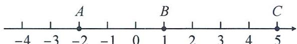

text_image

-4
-3
A
-2
-1
0
B
1
2
3
4
5
C

(2) 因为 $AC = 7, PA + PC = 9$ 表示点 $P$ 到点 $A$ 和点 $C$ 两点的距离之和为 9，当点 $P$ 在点 $A$ 的左边时，设点 $P$ 表示的数为 $x_{1}$ ，

所以 $-2 - x_{1} + 5 - x_{1} = 9$ ，所以 $x_{1} = -3$

当点 P 在 A, C 之间时， $PA + PC = 7 \neq 9$ ，不合，舍去；

当点 P 在点 C 的右边时, 设点 P 表示的数为 $x_{2}$ ,

所以 $x_{2} - 5 + x_{2} - (-2) = 9$ ，所以 $x_{2} = 6$

所以点 P 表示的数为 -3 或 6;

(3)设运动时间为 t 秒, 则 t 秒后点 A 表示的数为 -2-t, 点 B 表示的数为 $1+mt$ , 点 C 表示的数为 $5+4t$ ,

根据题意, 得 $BC - BA = [5 + 4t - (1 + mt)] - [1 + mt - (-2 - t)] = 1 + (3 - 2m)t$ ,

因为 $BC - BA$ 为定值，所以 $3 - 2m = 0$ ，所以 $m = 1.5$

所以 $BC - BA = 1$ 故 $BC - BA$ 为定值1.

# 13 第五章《一元一次方程》阶段检测卷(一)

1. C 2. A 3. B 4. D 5. B 6. B 7. B 8. A 9. C

10. D 解: 设 A 框出的最小数为 x, 由 $x + x + 1 + x + 7 + x + 8 = 68$ , 得 x = 13, 符合题意; 设 B 框出的最小数为 x, 由 $x + x + 8 + x + 16 + x + 24 = 68$ , 得 x = 5, 符合题意; 设 C 框出的最小数为 x, 由 $x + x + 7 + x + 8 + x + 9 = 68$ , 得 x = 11, 符合题意; 设 D 框出的最小数为 x, 由 $x + x + 6 + x + 7 + x + 8 = 68$ , 得 $x = \frac{47}{4}$ , 不符合题意. 选 D.

11. $x + 2 = 3$ （答案不唯一） 12.-1 13. $3x + y = 41$ 14. $\frac{5}{4}$

15. $\frac{8}{3}$ 或 $-\frac{8}{5}$ 解: 由题意知 $a \nabla a = |a + a| + |a - a| = |2a|$ , 当 $a \geqslant 0$ 时, $a \nabla a = 2a$ , 所以 $(a \nabla a) \nabla a = (2a) \nabla a = |2a + a| + |2a - a| = 3a + a = 4a$ , 因为 $(a \nabla a) \nabla a = 8 + a$ , 所以 $4a = 8 + a$ , 解得 $a = \frac{8}{3}$ , 符合题意; 当 $a < 0$ 时, $a \nabla a = -2a$ , 所以 $(a \nabla a) \nabla a = (-2a) \nabla a = |-2a + a| + |-2a - a| = -a - 3a = -4a$ , 因为 $(a \nabla a) \nabla a = 8 + a$ , 所以 $-4a = 8 + a$ , 解得 $a = -\frac{8}{5}$ , 符合题意, 所以 $a = \frac{8}{3}$ 或 $-\frac{8}{5}$ .

16. 解: $3x - 2 = 1 - 2x + 2$ , $3x + 2x = 1 + 2 + 2,$ 5x = 5,
x = 1.

17. 解: $5(2x+1)=15-3(x-1)$ , $10x+5=15-3x+3,$ $10x+3x=15+3-5,$ 13x=13,
x=1.

18. 解: 3x-3=3, 解得 x=2,
依题意, 得 $\frac{2-k}{3}=k+6$ , 解得 k=-4.

19. 解: 设“□”中数字为 x，
依题意, 得 $12(460+x)=21(100x+64)$ ，解得 x=2.
所以“□”中数字为2.

20. 解: (1) 根据题意, 得 $2m + 1 = m + 3$ , 解得 m = 2;
(2) 将 x = 2 代入方程, 得 $5a + 24 = 2 + 2$ , 解得 a = -4,
所以 $(3a^{2}-2a+1)-(2a^{2}-3a-5)=a^{2}+a+6=16+(-4)+6=18.$

21. 解: (1) 因为 3x=4.5, 所以 x=1.5, 因为 4.5-3=1.5, 所以 3x=4.5 是差解方程;

(2) 因为关于 x 的一元一次方程 $6x = m + 2$ 是差解方程，
所以 $m+2-6=\frac{m+2}{6}$ ，解得 $m=\frac{26}{5}$ .

22. 解: 任务 1: 设购买钢笔 4x 支, 笔记本 3x 本,

由题意, 得 $10 \times 4x + 5 \times 3x = 1100$ ,

即 $40x + 15x = 1\ 100$ ，解得 x = 20。

答:购买钢笔80支,笔记本60本.

任务2:因为1100=130×8+60,所以送8张兑换券.

设 a 张券兑换钢笔， $(8-a)$ 张券兑换笔记本，

由题意, 得 $80 + 2a = 60 + 4(8 - a)$ , 解得 a = 2.

答:用 2 张券兑换钢笔.

23. 解: (1) 16, 32;

(2) $c+2;$

(3)由题意可知,这三个数依次为 $x, x+2, \frac{1}{2}x$ ,

则 $x + x + 2 + \frac{1}{2} x = 2562$ ，解得 $x = 1024$

即 $x$ 的值为1024.

24. 解: (1) 因为 $\left|a+7\right|+\left|c-2\right|=0,\left|a+7\right|\geqslant0,\left|c-2\right|\geqslant0,$

所以 $a+7=0, c-2=0$ ，所以 a=-7, c=2。

故答案为：-7,2；

(2)因为点 A 表示的数为 -7，点 B 表示的数为 -3，依题意，动点 P, Q 分别从 A, B 同时出发向右运动，点 P 的速度为 2 个单位长度 /s，点 Q 的速度为 1 个单位长度 /s，设运动时间为 t s，则点 P 表示的数是 $-7 + 2t$ ，点 Q 表示的数是 $-3 + t$ 。

①当点 P 在点 Q 左侧时， $-3+t-(-7+2t)=3$ ，解得 t=1；

②当点 P 在点 Q 右侧时， $-7+2t-(-3+t)=3$ ，解得 t=7。所以经过 1 s 或 7 s 时，P, Q 两点的距离为 3；

(3)由(1)可知,点A表示的数是-7,点C表示的数是2,

所以 $AC=2-(-7)=9$ ，因为 $PA+PC=15$ ，

所以点 P 在点 A 的左侧或点 P 在点 C 的右侧.

设点 P 表示的数为 m，

①当点 P 在点 A 的左侧时, PA = -7 - m, PC = 2 - m,

$-7-m+2-m=15$ , 解得 m=-10;

②当点 P 在点 C 的右侧时， $PA = m - (-7)$ ，PC = m - 2，

$m-(-7)+m-2=15$ , 解得 m=5.

所以点 P 表示的数是 -10 或 5.

# 14 第五章《一元一次方程》阶段检测卷(二)

1. A 2. C 3. A 4. D 5. C 6. A 7. A 8. D 9. D

10. C 解: 设相遇时, 丹丹走了 x km, 则小明行了 $(x+12)$ km,

根据题意, 得 $\frac{x+12}{1}=\frac{x}{\frac{1}{4}}$ , 解得 x=4, 则丹丹的速度为 4 km/h,

$(4+12)\div4=4\ h$ ,所以相遇后经过4 h,丹丹到达A地.故选C.

11. $2(x+15)+3x=155$ 12. 31 13. 11 14. ①②④

15.1 解:由题意,得 $2+6=3+y,3+6=x+y$ , 所以 y=5,9=x+5, 所以 x=4, 所以 y-x=5-4=1.

16. 解: 9y - 3 - 10 = 10y - 14,

$$
9 y - 1 0 y = 3 + 1 0 - 1 4,
$$

$$
- y = - 1,
$$

$$
y = 1.
$$

17. 解: $2(2x-3)-3(x+2)=12$ ,

$$
4 x - 6 - 3 x - 6 = 1 2,
$$

$$
4 x - 3 x = 1 2 + 1 2,
$$

$$
x = 2 4.
$$

18. 解: 设小亮今年的年龄为 x 岁,

依题意, 得 $42 - x + 5 = 3(x + 5)$ , 解得 x = 8.

答: 小亮今年的年龄为 8 岁.

19. 解: 设安排 x 名工人生产甲种部件,

则安排 $(58-x)$ 名工人生产乙种部件，

由题意, 得 $8x \times 3 = 5(58 - x)$ , 解得 x = 10, 所以 58 - x = 48.

答:安排 10 名工人生产甲种部件,安排 48 名工人生产乙种部件.

20. 解: (1) 由表格可知, 单层部分的长度增加 2 cm, 双层部分的长度就减少 1 cm, 则空白处的数据为 $75 - (8 - 0) \div 2 = 71 \, (\text{cm})$ . 故答案为 71;

(2)设背带单层部分的长度为 x cm，则双层部分的长度为 $\frac{150-x}{2}$ cm. $x + \frac{150-x}{2} = 110$ ，解得 x = 70.

答:此时单层部分的长度为 $70 \, cm$ .

21. 解: (1) 2, 3;

(2)设放入小球 x 个,则放入大球 $(10-x)$ 个,

由题意, 得 $2x + 3(10 - x) = 50 - 26$ ,

解得 x=6，所以 10-x=4。

答: 放入小球 6 个, 放入大球 4 个.

22. 解: (1) 设每个足球的价格为 x 元,

则每套队服的价格为 $(x + 50)$ 元，

根据题意, 得 $2(x+50)=3x$ ,

解得 x=100，所以 $x+50=150$ .

答: 每套队服的价格为 150 元, 每个足球的价格为 100 元;

(2)设初、高中年级都购买 y 箱足球，

则到甲商场购买所花的费用为

$$
1 5 0 \times 1 0 0 + 1 0 0 (1 0 y - 1 0) = 1 0 0 0 y + 1 4 0 0 0 (\text {元}),
$$

到乙商场购买所花的费用为

$$
1 5 0 \times 1 0 0 + 1 0 0 \times 1 0 y \times 0. 8 = 1 5 0 0 0 + 8 0 0 y,
$$

根据付费相同, 得 $1\ 000y + 14\ 000 = 15\ 000 + 800y$ ,

解得 y=5.

所以初中年级购买了 5 箱足球, 高中年级也购买了 5 箱足球, 所以学校共买足球 10 箱.

答:学校共买足球 10 箱.

23. 解: (1) $12 \times 2 + (15 - 12) \times 2.5 = 31.5$ (元);

(2)当每月用水量不超过12吨时,每月水费不超过24元;

当每月用水量超过 12 吨但不超过 18 吨时, 每月水费大于 24 元, 但不大于 39 元;

因为 24<36.5<39，所以 3 月份的用水量超过 12 吨，但不超过 18 吨；

设 3 月份的用水量为 x 吨，

根据题意, 得 $12 \times 2 + 2.5(x - 12) = 36.5$ , 解得 x = 17.

答:3月份的用水量为17吨;

(3) 因为 2.5 < 2.7 < 3，所以 8 月份的用水量大于 18 吨，

设8月份的用水量为 $y$ 吨，

根据题意, 得 $12 \times 2 + 6 \times 2.5 + 3(y - 18) = 2.7y$ ,

解得 y=50,2.7×50=135(元).

答:8月份的水费为135元.

24. 解: (1) 由题意可知, 甲的平均速度是 $10 \, km/h$ , 甲骑行的时间为 x h, 则甲骑行的路程为 $10x \, km$ ,

因为乙的平均速度为 $12 \, km/h$ ，甲出发 $20 \, min$ 后乙才出发，所以乙骑行的路程为 $12 \left( x - \frac{1}{3} \right) \, km$ ，即 $(12x - 4) \, km$ .

故答案为 10x;12x-4;

(2)当甲、乙两人相遇时，

可列方程 $10x+(12x-4)=18$ ，解得 x=1。

答: 当甲、乙两人相遇时, x 的值为 1;

(3)根据题意,设两人的相遇点为 C,

此时甲行驶路程为 $10 \times 1 = 110 \, km$ ,

乙行驶路程为 $(12-4\times1)\times1=8(\text{km})$ ,

从相遇点 C 开始, 甲的骑行路程为 $10(x-1)$ 千米,

乙休息 3 min, 即 $\frac{1}{20}$ h, 从相遇点 C 开始, 乙的骑行路程为:

$12\left(x-1-\frac{1}{20}\right)$ km, 即 $\left(12x-\frac{63}{5}\right)$ km,

所以①当乙追上甲前,且甲、乙两人相距 $\frac{1}{3}$ km时,

可得 $10(x - 1) = \left(12x - \frac{63}{5}\right) + \frac{1}{3}$ , 解得 $x = \frac{17}{15}$ ;

②当乙追上甲后,且甲、乙两人相距 $\frac{1}{3}$ km时,

可得 $10(x - 1) + \frac{1}{3} = 12x - \frac{63}{5}$ ，解得 $x = \frac{22}{15}$ .

答: 当甲、乙两人相距 $\frac{1}{3}$ km 时, x 的值为 $\frac{17}{15}$ 或 $\frac{22}{15}$ .

# 15 第五章《一元一次方程》单元检测卷

1. A 
2. D 
3. A 
4. D 
5. B 
6. A 
7. D 
8. C 
9. A

10. D 解: 设 T 字框内处于中间且靠上方的数为 x, 则其余几个数为 $x - 2, x + 2, x + 10$ , 所以这四个数的和为 $4x + 10$ , 分别令 $4x + 10 = 22, 70, 182, 206$ , 解得 x = 3, 15, 43, 49, 因为 49 位于最右列, 不符合题意. 故选 D.

11. $x = 2$ 12.4 13.-5 14.15 15.2 $x = 1$

16. 解: 3x - x = 7 - 3,

$$
2 x = 4,
$$

$$
x = 2.
$$

17. 解: $6-(x+5)=2(x+1)$ ,

$$
6 - x - 5 = 2 x + 2,
$$

$$
- x - 2 x = 5 - 6 + 2,
$$

$$
- 3 x = 1,
$$

$$
x = - \frac {1}{3}.
$$

18. 解: 设原绿地的长、宽增加的长度为 $x \, m$ ,

由题意, 得 $35 + x = 2(15 + x)$ , 解得 x = 5.

所以新的长方形的长为 $35 + x = 40 \, (\text{m})$ .

答:新的长方形绿地的长为 40 m.

19. 解: 把 x=2 代入方程 $8a+x=18$ , 得 $8a+2=18$ , 解得 a=2.

所以方程为 16 - x = 18，解得 x = -2。

故 a 的值为 2, 原方程的解为 x = -2.

20. 解: 设这批玩具共有 x 个, 则:

$x - \frac{1}{4} x - \frac{2}{3}\left(x - \frac{1}{4} x\right) = 180$ ，解得 $x = 720$

答:这批玩具共有720个.

21. 解: 安排 x 名木工加工桌子, 则 $(21 - x)$ 名木工加工椅子,

依题意,列方程,得 $4 \times 5x = (21 - x) \times 8$ ,

解得 x=6，所以 21-6=15。

答:安排6名木工加工桌子,15名木工加工椅子,恰好一天加工的桌子能与椅子配套.

22. 解: (1) 方程 3x - 2x - 13 = 0 的解是 x = 13,

方程①的解为 y=3，因为 $13+3\neq10$ ，

所以方程①不是一元一次方程 3x-2x-13=0 的“友好方程”；

方程②的解为 y = -3 或 y = 3，

因为当 y = -3 时， $-3 + 13 = 10$ ，

所以方程②是一元一次方程 3x-2x-13=0 的“友好方程”；

(2)方程 $x-\frac{2x+a}{3}=a+1$ 的解是 $x=4a+3$ ,

方程 $|y-1|=1$ 的解是 y=0 或 2.

当 y=0 时， $0+4a+3=10$ ，解得 $a=\frac{7}{4}$ ;

当 $y = 2$ 时， $2 + 4a + 3 = 10$ ，解得 $a = \frac{5}{4}$ .

所以 $a=\frac{7}{4}$ 或 $\frac{5}{4}$ .

23. 解: (1) ① 8x + 10, 4x - 10;

②由题意,得 $8x+10=\frac{14}{2}(4x-10)$ , 解得 x=4,

所以 $(4x-10)\div2=(4\times4-10)\div2=3$

所以 1 个乒乓球的质量为 4 克, 1 个一次性纸杯的质量为 3 克;

(2) 乒乓球的个数为 8 个, 一次性纸杯个数为 4 个 + 2 个 10 克的砝码能使天平平衡. 理由如下:

设一次性纸杯个数为 m 个, 则乒乓球的个数为 2m 个,

由题意, 得 $4 \times 2m = 3m + 2 \times 10$ , 解得 m = 4,

所以 2m=8.

所以乒乓球的个数为 8 个,一次性纸杯个数为 4 个 + 2 个 10 克的砝码能使天平平衡.

24. 解: (1) 因为点 A 表示的数是 -12, 点 B 表示的数是 20,

所以 $20-(-12)=20+12=32.$

所以点 A 和点 B 之间的距离为 32;

(2)根据题意,得点 P 表示的数为 $-12+3t$ , 点 Q 表示的数为 2t,
根据题意, 得 $\left|-12+3t-2t\right|=8$ , 所以 $\left|-12+t\right|=8$ ,

解得 t=4 或 20;

(3) 点 P 到点 A 的距离为 3t，点 Q 到点 B 的距离为 $\left|2t-20\right|$ ，根据题意，得 $3t=2\left|2t-20\right|$ ，解得 t=40 或 $\frac{40}{7}$ .

所以当 t=40 时，点 P 对应的数是 $-12+3t=-12+3\times40=108$ ;

当 $t = \frac{40}{7}$ 时，点 $P$ 对应的数是 $-12 + 3t = -12 + 3 \times \frac{40}{7} = \frac{36}{7}$ .

综上所述,点 P 对应的数是 108 或 $\frac{36}{7}$ .

# 16 第五章《一元一次方程》专题卷

1. B 2. D 3. B 4. B 5. D 6. B 7. C 8. A

9. 解: (1) $5x + 3x = 6 + 2$ ,

$$
8 x = 8,
$$

$$
x = 1;
$$

(2)6x-2-2x=10,

$$
4 x = 1 2,
$$

$$
x = 3;
$$

(3) $2(x+5)-(x-3)=12$ ,

$$
2 x + 1 0 - x + 3 = 1 2,
$$

$$
x = - 1;
$$

(4)12-2(2x-5)=3(3-x),

$$
1 2 - 4 x + 1 0 = 9 - 3 x,
$$

$$
- x = - 1 3,
$$

$$
x = 1 3;
$$

(5)12-3(x-1)=2(2x+1)-6x,

$$
1 2 - 3 x + 3 = 4 x + 2 - 6 x,
$$

$$
- 3 x + 2 x = 2 - 1 5,
$$

$$
- x = - 1 3,
$$

$$
x = 1 3;
$$

(6)原方程可化为 $\frac{10x-10}{3}-(2x+4)=1.2,$

$$
1 0 x - 1 0 - 3 (2 x + 4) = 3. 6,
$$

$$
1 0 x - 1 0 - 6 x - 1 2 = 3. 6,
$$

$$
1 0 x - 6 x = 3. 6 + 1 0 + 1 2,
$$

$$
4 x = 2 5. 6,
$$

$$
x = 6. 4.
$$

10. 解: 根据题意, 得 $\frac{k+2}{4}-\frac{2k-1}{6}=1$ , 解得 k=-4,

所以 k 的值为 -4.

11. 解: 解方程 $2(x-1)=6$ , 得 x=4,

所以方程 $\frac{mx-3}{2}+\frac{x+m}{3}=1$ 的解为x=4，

所以 $\frac{4m-3}{2}+\frac{4+m}{3}=1$ ，解得 $m=\frac{1}{2}$ .

12. 解: 设应从第一组调 x 人到第二组, 根据题意, 得

$26 - x = \frac{1}{2} (22 + x)$ ，解得 $x = 10$

答:应从第一组调 10 人到第二组.

13. 解: 设安排 x 名工人制作盒身,

则安排 $(80-x)$ 名工人制作盒底，

根据题意, 得 $2 \times 50x = 150(80 - x)$ , 解得 x = 48,

所以 80-x=80-48=32(人).

答:应安排 48 名工人制作盒身,32 名工人制作盒底才能使每小时制作的盒身与盒底恰好配套.

14. 解: 设甲、乙两站之间的距离为 x 千米,

根据题意, 得 $\frac{x}{180} = \frac{x - 160 \times 2}{240} + 2$ , 解得 x = 480.

答:甲、乙两站之间的距离为480千米.

15. 解: (1) 设甲、乙合作 x 天才能把该工程完成, 根据题意, 得

$\frac{1}{30}(x+20)+\frac{1}{45}x=1$ , 解得 x=6.

答:甲、乙合作6天才能把该工程完成;

(2)设乙工程队每天的费用为 m 元,根据题意,得

$$
2 6 (m + 4 0 0) + 6 m = 2 9 6 0 0,
$$

解得 $m = 600, m + 400 = 1000$ .

甲工程队的总费用为 $26 \times 1000 = 26000$ 元；

乙工程队的总费用为 $6 \times 600 = 3600$ 元.

答:甲、乙工程队的总费用分别为26 000元,3 600元.

16. 解: (1) 设每件服装标价是 x 元,

由题意, 得 $50\%x + 20 = 80\%x - 40$ , 解得 x = 200.

所以每件服装的成本是 $50\% \times 200 + 20 = 120$ (元);

(2)设最多打 y 折，

由题意, 得 $200 \times \frac{y}{10} = 120$ , 解得 y = 6.

所以最多打6折.

17. 解: (1) 250, 690, 790;

(2)设小明买这种商品 x 件，

因为 250<338<690，由(1)知 100<x<300，

则 $100 \times 2.5 + 2.2(x - 100) = 338$ ，解得 x = 140。

答: 小明购买这种商品 140 件.

18. 解: (1) 30x; (360+18x);

选择方式一的付费为 30x 元，

选择方式二的付费为 $(360+18x)$ 元.

故答案为 30x; (360+18x);

(2)设王叔叔游泳 x 次，

由题意, 得 $360 + 18x = 30x$ , 解得 x = 30.

答:若两种付费方式所需费用相等,王叔叔一年的游泳次数为30次;

(3)设王叔叔游泳 x 次，

若按方式一付费,根据题意,得 1512=30x,

解得得 x=50.4(不合题意,舍去),

若按方式二付费,根据题意,得 $1512=360+18x$ , 得 x=64.

答: 王叔叔去年的游泳次数为 64 次, 王叔叔的付费方式为方式二.

# 17 第一章～第五章综合检测卷

1. A 2. B 3. B 4. D 5. D 6. A 7. C 8. B 9. A

10. B 解: 设 $b = a + m$ ，则 $c = a + 2m, d = a + 3m$ ，若 $a + d = 0$ ，则 $a + a + 3m = 2a + 3m = 0, b + c = 2a + 3m = 0$ ，故 A 不正确；因为 $a + d = b + c$ ，所以 $a + d$ 与 $b + c$ 同号或都为 0，所以 $(a + d)(b + c) \geqslant 0$ ，故 B 正确；因为 ad > 0，当 a > 0 时，b, c, d 都为正数，此时 $b + c > 0$ ，故 C 不正确；因为 d - a = 3m, c - b = m，且 m > 0，所以原方程为 3mx = m, $x = \frac{1}{3}$ ，故 D 不正确。故选 B.

11.-5 12. $a^{2}b$ (答案不唯一) 13.(100-6x) 14.27

15. x = -2022 y = -2024

解: 解方程 $\frac{1}{2024}x-1=0$ , 得 x=2024,

由题意, 得 $\frac{1}{2024}x + 1 = 3x + k$ 的解为 x = -2022,

所以关于 $y$ 的方程 $\frac{1}{2024}(y + 2) + 1 = 3(y + 2) + k$ 中，

$$
y + 2 = - 2 0 2 2, \therefore y = - 2 0 2 4.
$$

16. 解: (1) 原式 = -3.5 + 2.5 = -1;

(2) 原式 = -1 - 2 × 9 ÷ 6 = -1 - 3 = -4.

17. 解: (1) $3a + \frac{3}{4}b$ ;

(2) $\frac{1}{2}(a-b)+1.$

18. 解: 原式 $= 2a^{2}b + 6ab^{2} + 2a^{2}b - 6ab^{2} - 3a^{2}b = a^{2}b$ .

当 $a = -1, b = -2$ 时，

原式 $= a^{2}b = (-1)^{2}\times (-2) = -2.$

19. 解: (1) 2x - 7x = 15,

$$
- 5 x = 1 5,
$$

$$
x = - 3;
$$

(2) $2(2x+1)=x+2-6,$

$$
4 x + 2 = x - 4,
$$

$$
4 x - x = - 4 - 2,
$$

$$
3 x = - 6,
$$

$$
x = - 2.
$$

20. 解: 设学校共有 x 个班,

则 12x=18x-72,-6x=-72,x=12,12×12=144(本).

答:这批新书共有144本.

21. 解: (1) $A = x^{2} - 4x + 4 + x^{2} + 10x = 2x^{2} + 6x + 4$ ;

(2) 因为 $3x^{2} + 9x + 2 = 0$ ，所以 $x^{2} + 3x + \frac{2}{3} = 0$

所以 $x^{2} + 3x = -\frac{2}{3}$ 所以 $2x^{2} + 6x = -\frac{4}{3}$

所以 $A = 2x^{2} + 6x + 4 = -\frac{4}{3} + 4 = \frac{8}{3}$ .

即多项式 A 的值为 $\frac{8}{3}$ .

22. 解: (1) 在甲超市实付款为 $500 \times 0.88 = 440$ (元);

在乙超市实付款为 $500 \times 0.9 = 450$ (元).

所以在甲超市购买实付款为 440 元, 在乙超市购买实付款为 450 元;

(2)设当购物总额为 x 元时,两家超市实付款相同,

根据题意, 得 $0.88x = 600 \times 0.9 + 0.8(x - 600)$ ,

解得 x=750.

答: 当购物总额为 750 元时, 两家超市实付款相同.

23. 解: (1)8;

(2)设点 P 表示的数为 x，

①当点 P 在点 A 的左边时， $-2-x+6-x=18$ ，解得 x=-7；

②当点 P 在点 A, B 之间时， $x-(-2)+6-x=18$ ，不符合题意，舍去；

③当点 P 在点 B 右边时， $x-(-2)+x-6=18$ ，解得 x=11；
综上所述，点 P 表示的数为 -7 或 11；

(3)设点 P 运动的时间为 t 秒, 点 P 表示的数为 6-4t, 点 Q 表示的数为 $6+2t$ ,

因为点 P 在点 A 右边, 所以 $6 - 4t + 2 = \frac{1}{2}(6 + 2t + 2)$ ,

解得 $t=\frac{4}{5}$ . 所以点 P 运动的时间为 $\frac{4}{5}$ 秒.

24. 解: (1) 第一次操作后, 剩下的长方形的两边长分别为 a, 1-a;

(2) 因为 $\frac{1}{2}<a<1$ ，所以 1-a<a，

所以第二次操作后,剩下的长方形的两边长分别 $a-(1-a)=2a-1$ 和 1-a,由 $2a-1=1-a$ 得 $a=\frac{2}{3}$ ;

(3)第二次操作后,剩下长方形的两边长分别为1-a和2a-1,

①若 $1-a>2a-1$ ，则第三次操作后，剩下的长方形两边长分别为 $(1-a)-(2a-1)=2-3a$ 和 2a-1，由 $2-3a=2a-1$ ，得 $a=\frac{3}{5}$ ，符合题意；

②若 $1 - a < 2a - 1$ ，则第三次操作后，剩下的长方形两边长分别为 $(2a - 1) - (1 - a) = 3a - 2$ 和 $1 - a$ ，由 $3a - 2 = 1 - a$ ，得 $a = \frac{3}{4}$ ，符合题意；所以 $a = \frac{3}{5}$ 或 $\frac{3}{4}$ .

# 18 第六章《几何图形初步》阶段检测卷(一)

1. D  2. C  3. A  4. A  5. D  6. B  7. B  8. B  9. B

10. A 解: 根据题意, 得 $S_{1}=\frac{2\times(2-1)}{2}=1$ , $S_{2}=\frac{3\times(3-1)}{2}=3$ , $S_{3}=\frac{4\times(4-1)}{2}=6,\cdots\cdots$ , 所以 $S_{2022}=\frac{2022\times2023}{2}$ , $S_{2023}=\frac{2023\times2024}{2}$ , 由此发现, $S_{n}=\frac{n(n+1)}{2}$ , $\frac{1}{S_{n}}=\frac{2}{n(n+1)}=2\left(\frac{1}{n}-\frac{1}{n+1}\right)$ , 所以 $\frac{1}{S_{1}}+\frac{1}{S_{2}}+\frac{1}{S_{3}}+\cdots+\frac{1}{S_{2022}}+\frac{1}{S_{2023}}=2\left(\frac{1}{1}-\frac{1}{2}+\frac{1}{2}-\frac{1}{3}+\cdots+\frac{1}{2022}-\frac{1}{2023}+\frac{1}{2023}-\frac{1}{2024}\right)=2\left(1-\frac{1}{2024}\right)=\frac{2023}{1012}$ . 故选 A.

11. 圆锥 12.6 13.12 14.一

15. ①②③ 解: 因为 AD = BM, 所以 $AD = MD + BD$ , 因为 M 是线段 AD 的中点, 所以 $MD = \frac{1}{2}AD$ , 所以 $AD = \frac{1}{2}AD + BD$ , 所以 AD = 2BD, 所以 $AD + BD = 2BD + BD$ , 即 AB = 3BD, 故①正确; 因为 AC = BD, 所以 $AC + CD = CD + BD$ , 所以 AD = BC, 因为 M, N 分别是线段 AD, BC 的中点, 所以 $AM = \frac{1}{2}AD$ , $BN = \frac{1}{2}BC$ , 所以 AM = BN, 故②正确; 因为 M, N 分别是线段 AD, BC 的中点, 所以 AD = 2MD, BC = 2CN, 因为 AC - BD = AD - BC, 所以 AC - BD = 2MD - 2CN = 2(MC + CD) - 2(DN + CD) = 2(MC - DN), 故③正确. 故答案为①②③.

16. 解: (1) 如图所示;

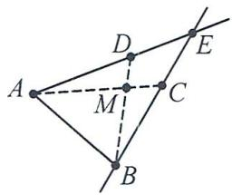

text_image

Geometric diagram with labeled points A, B, C, D, E, and M, showing solid and dashed lines forming triangles and intersecting lines.

(2)供电所 M 应建在 AC 与 BD 的交点处.
理由:两点之间,线段最短.

17. 解: (1) 根据题意, 得 a = -1, b = -3;
(2) 原式 $= 5a^{2} - 5b - 3a^{2} + 3b = 2a^{2} - 2b$ ,

当 $a = -1, b = -3$ 时，

原式 $= 2 \times (-1)^{2} - 2 \times (-3) = 2 + 6 = 8.$

18. 解: 如图所示.

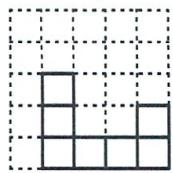  
从正面看

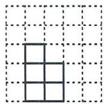  
从左面看

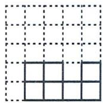  
从上面看

19. 解: 设长方体的高为 $x \, cm$ ,

则长方形的宽为 $(12-2x)$ cm，

依题意, 得 $12 - 2x + 8 + x + 8 = 25$ ,

解得 x=3，所以长方体的高为 3 cm，宽为 6 cm，长为 8 cm，所以长方体的体积为 $8 \times 6 \times 3 = 144 \, (\text{cm}^{3})$ .

20. 解: 因为 AN=9, MN=6,

所以 AM=BN=AN-MN=9-6=3.

因为 P 是 AM 的中点, Q 是 BN 的中点,

所以 $PM=\frac{1}{2}AM=\frac{3}{2},QN=\frac{1}{2}BN=\frac{3}{2},$

所以 $PQ = PM + QN + MN = \frac{3}{2} + \frac{3}{2} + 6 = 9.$

21. 解: 因为 AC=ED, 所以 $AC+CE=ED+CE$ , 即 AE=CD=4.
所以 BD=BC-CD=7-4=3，所以 AC=BD=DE=3，
所以 $AB = AC + BC = 3 + 7 = 10$ .

22. 解: (1) 根据题意, 得 CD = EF - 7 = 54 - 7 = 47 (cm),

$$
A B = C D - 3 = 4 7 - 3 = 4 4 (\mathrm{cm}),
$$

所以 $AF = EF + CD + AB = 54 + 47 + 44 = 145 \, (\text{cm})$ ;

(2)由题意,得 EF=54 cm, 因为 AF=116 cm,
所以 $AE = AF - EF = 116 - 54 = 62 \, (\text{cm})$ ,

因为 C 为 AE 中点，

所以 $AC = CE = \frac{1}{2} AE = 31 \, (\text{cm})$ ,

由(1)知,AB=44 cm,CD=47 cm,

所以 BC=AB-AC=13(cm),

$$
D E = C D - C E = 4 7 - 3 1 = 1 6 (\mathrm{cm}),
$$

所以缩进部分 BC=13 cm, DE=16 cm.

23. 解: (1) 是;

(2) 因为 AB=12 cm，点 C 是线段 AB 的“巧点”，所以 $AC=12\times\frac{1}{3}=4$ cm 或 $AC=12\times\frac{1}{2}=6$ cm 或 $AC=12\times\frac{2}{3}=8$ cm.

故答案为 4 或 6 或 8;

(3)t 秒后,AP=2t,AQ=12-t(0≤t≤6)

点 P 为线段 AQ 的“巧点”时, 存在以下三种情况:

① $AP = \frac{1}{3} AQ$ ，即 $2t = \frac{1}{3}(12 - t)$ ，解得 $t = \frac{12}{7}$

② $AP = \frac{1}{2} AQ$ ，即 $2t = \frac{1}{2}(12 - t)$ ，解得 $t = \frac{12}{5}$

③ $AP = \frac{2}{3} AQ$ ，即 $2t = \frac{2}{3}(12 - t)$ ，解得 $t = 3$

综上所述，t 的值为 $\frac{12}{7}$ 或 $\frac{12}{5}$ 或 3.

24. 解：(1) 因为 $\left|a-2\right|+\left(b-6\right)^{2}=0,\left|a-2\right|\geqslant0,\left(b-6\right)^{2}\geqslant0,$ 所以 a-2=0, b-6=0, 所以 a=2, b=6,

所以 AB=2, CD=6;

(2) 因为运动前 A 点表示的数为 -2, BC = 6,

所以点 B 表示的数是 0，点 C, D 表示的数分别是 6 和 12，
因为 M 为线段 AB 的中点，N 为线段 CD 中点，
所以点 M, N 表示的数分别是 -1 和 9，

t 秒后点 M 表示的数是 $-1+2t$ ，点 N 表示的数是 $9+t$ ，所以 $\left|(-1+2t)-(9+t)\right|=4$ ，解得 t=14 或 6.

答:t=14秒或6秒时,MN=4;

(3) 运动 t 秒后, $MN = |32 - 2t|$ , $BC = |28 - 2t|$ ,

因为 MN=BC，所以 $\left|32-2t\right|=\left|28-2t\right|$ ，解得 t=15。

# 19 第六章《几何图形初步》阶段检测卷(二)

1. B 
2. A 
3. B 
4. A 
5. C 
6. C 
7. A 
8. C 
9. D

10. A 解: 因为 OB, OD 分别平分 $\angle COD, \angle BOE$ , 所以 $\angle COB = \angle BOD = \angle DOE$ , 所以 $\angle COB + \angle BOD = \angle BOD + \angle DOE$ , 即 $\angle COD = \angle BOE$ , 因此①正确; $\angle COE = \angle COB + \angle BOD + \angle DOE = 3\angle BOD$ , 因此②正确; 因为 $\angle AOB = 90^{\circ}$ , 所以 $\angle AOC + \angle BOC = 90^{\circ} = \angle AOC + \angle BOD$ , 因此④正确; 因为 $\angle AOC \neq 2\angle BOC = \angle BOE$ , 因此③不正确. 故选 A.

11.5 12.135 13.37°或83° 14.北偏西67°

15. $105^{\circ}$ 解: 因为 $\angle1=30^{\circ}$ ，所以 $\angle AMA_{1}+\angle DMD_{1}=180^{\circ}-30^{\circ}=150^{\circ}$ 。因为将纸片沿 BM, CM 折叠，使点 A 落在点 $A_{1}$ 处，点 D 落在点 $D_{1}$ 处，所以 MB 平分 $\angle AMA_{1}, MC$ 平分 $\angle DMD_{1}$ ，所以 $\angle BMA_{1}+\angle CMD_{1}=\frac{1}{2}(\angle AMA_{1}+\angle DMD_{1})=75^{\circ}$ ，所以 $\angle BMC=\angle1+\angle BMA_{1}+\angle CMD_{1}=30^{\circ}+75^{\circ}=105^{\circ}$ 。

16. 解: (1) $63^{\circ}22'$ ;

$$
(2) 9 3 ^ {\circ} 3 6 ^ {\prime} 4 8 ^ {\prime \prime}.
$$

17. $\angle COD$ $\angle AOD$ $\angle AOC$

18. 解: 因为 OD 平分 $\angle BOC, \angle COD = 25^{\circ}$ ,
所以 $\angle BOC=2\angle COD=50^{\circ}$ 因为 $\angle AOC+\angle BOC=180^{\circ}$

所以 $\angle AOC = 180^{\circ} - \angle BOC = 180^{\circ} - 50^{\circ} = 130^{\circ}$

19. 解: 设这个角的度数是 $x^{\circ}$ ，则 $90 - x = \frac{1}{2}(180 - x) - 20$ ，

解得 x=40，即这个角的度数是 $40^{\circ}$ .

答:这个角的度数是 $40^{\circ}$ .

20. 解: 因为 $\angle AOB + \angle BOC + \angle AOC = 360^{\circ}$ ,

所以 $\angle AOC = 360^{\circ} - \angle AOB - \angle BOC = 360^{\circ} - 130^{\circ} - 90^{\circ} = 140^{\circ}$

因为 OD 平分 $\angle AOC$ ，所以 $\angle COD = \frac{1}{2} \angle AOC = 70^{\circ}$ .

所以 $\angle BOD = \angle BOC + \angle COD = 160^{\circ}.$

21. 解: (1) 北偏东 $70^{\circ}$ ;

(2) 因为 $\angle AOB = 55^{\circ}$ ， $\angle AOC = \angle AOB$ ，所以 $\angle BOC = 110^{\circ}$ .

因为 $\angle BOD = 180^{\circ}$ ，所以 $\angle COD = 180^{\circ} - 110^{\circ} = 70^{\circ}$

因为 $\angle COD = 70^{\circ}$ ，OE平分∠COD，所以∠COE=35°.

因为 $\angle AOC=55^{\circ}$ ,所以 $\angle AOE=90^{\circ}$ .

22. 解: (1) 因为 $\angle AOB$ 与 $\angle AOC$ 互为“幸运角”,

所以 $\angle AOB+\angle AOC=60^{\circ}$ ,

因为 $\angle AOC=\angle AOB+\angle BOC$ ，所以 $\angle BOC+2\angle AOB=60^{\circ}$ ，

因为 $\angle BOC=10^{\circ}$ ,所以 $\angle AOB=25^{\circ}$ ;

(2) 因为 $\angle AOB$ 与 $\angle AOD$ 互补, 所以 $\angle AOD = 155^{\circ}$ ,

因为 $\angle DOM = 4\angle AOM, \angle DOM + \angle AOM = \angle AOD,$

所以 $5 \angle AOM = \angle AOD = 155^{\circ}$ ,

所以 $\angle AOM=31^{\circ}$ , 所以 $\angle DOM=124^{\circ}$ ,

因为 $\angle AOC = \angle AOB + \angle BOC = 35^{\circ}$

所以 $\angle COM = \angle AOC - \angle AOM = 4^{\circ}.$

23. 解: (1) 因为 $\angle BON : \angle NOC = 3 : 1$ ,

所以 $\angle NOC : \angle BOC = 1 : 4$ ,

又因为 $\angle AOB:\angle BOC = 1:4$ ，所以 $\angle AOB = \angle NOC$

因为 OM 平分 $\angle AOB$ ，所以 $\angle AOB = 2\angle AOM$ ，

所以 $\angle NOC=2\angle AOM$ ，所以k的值为2；

(2) 设 $\angle NOC = \alpha$ ，则 $\angle AOB = \alpha, \angle BON = 3\alpha, \angle BOM = \frac{1}{2}\alpha,$

所以 $\angle MON = \angle BOM + \angle BON = \frac{1}{2}\alpha + 3\alpha = 91^{\circ}$ ,

解得 $\alpha=26^{\circ}$ ,

所以 $\angle AOC = \angle AOB + \angle BOC = \alpha + 4\alpha = 5 \times 26^{\circ} = 130^{\circ}$ .

24. 解: 任务 1: 因为 $\angle ACB = 90^{\circ}, \angle A = 30^{\circ}, \angle B = 60^{\circ}$ ,

所以 $\angle A + \angle B = 90^{\circ},\angle ACM + \angle BCN = 90^{\circ},$

因为 $\angle A = \angle BCN = 30^{\circ}$ ，所以 $\angle BCN + \angle B = 90^{\circ}$

所以与 $\angle BCN$ 互余的角有 $\angle B,\angle ACM$ ;

任务 2: 因为 $\angle BCN : \angle TCN = 2 : 3$ ,

所以可设 $\angle BCN = 2x^{\circ},\angle TCN = 3x^{\circ},$

因为 $\angle ACB = 90^{\circ},\angle BCN = 2x^{\circ}$ ，所以 $\angle ACN = 90^{\circ} + 2x^{\circ}$

因为 CT 是 $\angle ACN$ 的平分线, 所以 $\angle ACN = 2\angle TCN$ ,

所以 $90^{\circ}+2x^{\circ}=2\times3x^{\circ}$ ,

所以 x=22.5，所以 $\angle ACN=90^{\circ}+2x^{\circ}=135^{\circ}$

所以 $\angle ACM = 180^{\circ} - \angle ACN = 180^{\circ} - 135^{\circ} = 45^{\circ}$

任务 3: 当 OD 与 AC 边的夹角为 $42^{\circ}$ 时,

①当 $OD$ 在 $AC$ 下方时，

因为 $\angle CAD=42^{\circ},\angle DAE=90^{\circ}$ ,

所以 $\angle CAE = 90^{\circ} - 42^{\circ} = 48^{\circ}$

因为 $\angle BAC = 30^{\circ}$ ，所以 $\angle BAE = 30^{\circ} + 48^{\circ} = 78^{\circ}$

②当 OD 在 AC 上方时，

因为 $\angle CAD = 42^{\circ},\angle DAE = 90^{\circ},\angle BAC = 30^{\circ},$

所以 $\angle BAE = 30^{\circ} + 42^{\circ} + 90^{\circ} = 162^{\circ}$

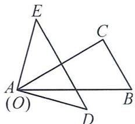

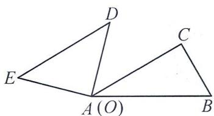

text_image

D
E
C
A (O)
B

当 OE 与 AC 边的夹角为 $42^{\circ}$ 时，

①当 $OE$ 在 $AC$ 下方时，

因为 $\angle CAE=42^{\circ},\angle BAC=30^{\circ}$ ,

所以 $\angle BAE = 42^{\circ} - 30^{\circ} = 12^{\circ}$

所以 $\angle BAD = 12^{\circ} + 90^{\circ} = 102^{\circ}$

②当 OE 在 AC 上方时，

因为 $\angle CAE=42^{\circ},\angle BAC=30^{\circ}$ ,

所以 $\angle BAD = 90^{\circ} - 42^{\circ} - 30^{\circ} = 18^{\circ}$

综上所述,另一条直角边与 AB 边的夹角可能是 $78^{\circ}, 162^{\circ}, 102^{\circ}, 18^{\circ}$ .

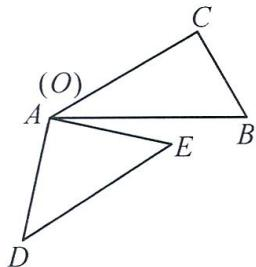

text_image

(O)
A
C
B
E
D

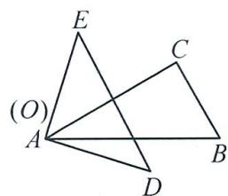

text_image

(O)
A
E
C
B
D

# 20 第六章《几何图形初步》单元检测卷

1. B 2. B 3. B 4. A 5. A 6. B 7. B 8. A 9. C 10. C

11. ①④⑤ 12. $46^{\circ}26'$ 13. $80^{\circ}$ 14.8

15. $64^{\circ}$ 或 $32^{\circ}$ $112^{\circ}$ 或 $80^{\circ}$

解:①当射线 OD 在 $\angle AOB$ 的内部时,

因为 $\angle BOD = \frac{1}{3}\angle COD = 16^{\circ},$

所以 $\angle COD=3\angle BOD=48^{\circ}$ ,

所以 $\angle BOC=\angle BOD+\angle COD=16^{\circ}+48^{\circ}=64^{\circ}$ ,

因为 OC 平分 $\angle AOB$ ，所以 $\angle AOB = 2\angle BOC = 128^{\circ}$ ，

$\angle AOD = \angle AOB - \angle BOD = 112^{\circ};$

②当射线 OD 在 $\angle AOB$ 的外部时，

因为 $\angle BOD = \frac{1}{3}\angle COD = 16^{\circ},$

所以 $\angle COD = 3\angle BOD = 48^{\circ}$

所以 $\angle BOC=\angle COD-\angle BOD=48^{\circ}-16^{\circ}=32^{\circ}$ ,

因为 OC 平分 $\angle AOB$ ，所以 $\angle AOB = 2\angle BOC = 64^{\circ}$ ，

$\angle AOD = \angle AOB + \angle BOD = 80^{\circ}.$

综上所述， $\angle BOC = 64^{\circ}$ 或 $32^{\circ}$ ， $\angle AOD = 112^{\circ}$ 或 $80^{\circ}$ .

16. 解: (1) 原式 = $210^{\circ}37'$ ;

(2) 原式 $=40^{\circ}26' - 6^{\circ}9' = 34^{\circ}17'$ .

17. 解: $\angle BOC = 180^{\circ} - \angle AOB - 2\angle EOD = 98^{\circ}$ .

18. 解: 由题意, 得 a = -3, b = 2, c = 1,

所以 $a+b+c=-3+2+1=0.$

19. 解: 设这个角的度数为 x, 则有 $90^{\circ}-x=\frac{1}{5}(180^{\circ}-x)$ .

解得 $x=67.5^{\circ}$ .

所以这个角的度数为 $67.5^{\circ}$ .

20. 解: 如图所示.

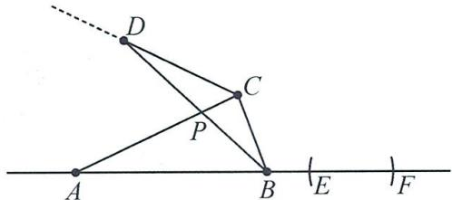

text_image

Geometric diagram with labeled points A, B, C, D, E, F, P and a dashed line, likely from a math problem or proof.

21. 解: (1) $80^{\circ}$ ;

(2) 因为 $\angle AEM + \angle BEN = 180^{\circ} - \angle MEN = 100^{\circ}$ ,

所以 $\angle AEF + \angle BEG = 2(\angle AEM + \angle BEN) = 200^{\circ}$

因为 $\angle AEF + \angle BEG = 180^{\circ} + \angle FEG = 200^{\circ}$

所以 $\angle FEG=20^{\circ}$ .

22. 解: (1) AC = AB - BC = 8.

因为 N 为 AC 的中点, M 为 AB 的中点,

所以 $AM=\frac{1}{2}AB=6,AN=NC=\frac{1}{2}AC=4,$

所以 MN=AM-AN=6-4=2;

(2) 因为 N 为 AC 的中点, M 为 AB 的中点,

所以 $AM=\frac{1}{2}AB, AN=\frac{1}{2}AC,$

所以 $MN = AM - AN = \frac{1}{2} AB - \frac{1}{2} AC = \frac{1}{2}(AB - AC) = \frac{1}{2} BC,$

所以 $BC = 2MN$

23. 解: (1) $\angle AOC = 180^{\circ} - \angle BOC = 180^{\circ} - 40^{\circ} = 140^{\circ}$ .

因为 $\angle AOC$ 与 $\angle COD$ 互补，

所以 $\angle COD = 180^{\circ} - \angle AOC = 180^{\circ} - 140^{\circ} = 40^{\circ}$

因为 OE 平分 $\angle AOC$ ，

所以 $\angle COE = \frac{1}{2}\angle AOC = \frac{1}{2}\times 140^{\circ} = 70^{\circ},$

所以 $\angle DOE = \angle EOC - \angle COD = 70^{\circ} - 40^{\circ} = 30^{\circ}$

(2) 设 $\angle COD = x^{\circ}$ ，则 $\angle EOC = \angle EOD + \angle COD = 48^{\circ} + x^{\circ}$

因为 OE 平分 $\angle AOC$ ，

所以 $\angle AOC=2\angle EOC=2(48^{\circ}+x^{\circ})$ ，

因为 $\angle AOC$ 与 $\angle COD$ 互补，

所以 $\angle AOC + \angle COD = 180^{\circ}$

所以 $2(48+x)+x=180$ ，解得 x=28，

所以 $\angle COD=28^{\circ}$ ,

因为 $\angle AOC+\angle BOC=180^{\circ},\angle AOC+\angle COD=180^{\circ}$ ,

所以 $\angle BOC = \angle COD = 28^{\circ}$

所以 $\angle BOD = \angle BOC + \angle COD = 56^{\circ}.$

24. 解: (1) 因为 $\angle AOB = 120^{\circ}, \angle AOD = 98^{\circ}$ ,

所以 $\angle BOD = \angle AOB - \angle AOD = 120^{\circ} - 98^{\circ} = 22^{\circ}$

因为 $\angle COD=60^{\circ}$ ,

所以 $\angle BOC = \angle COD + \angle BOD = 60^{\circ} + 22^{\circ} = 82^{\circ}$

(2) $\angle AOD$ 与 $\angle BOC$ 互补,理由:

因为 $\angle AOB + \angle COD = 120^{\circ} + 60^{\circ} = 180^{\circ}$

$$
\angle A O B = \angle A O C + \angle B O C, \angle C O D = \angle B O C + \angle B O D,
$$

所以 $\angle AOB + \angle COD = \angle AOC + \angle BOC + \angle BOC + \angle BOD$ $= \angle AOD + \angle BOC = 180^{\circ}$

所以 $\angle AOD$ 与 $\angle BOC$ 互补；

(3) 设 $\angle BOC = n^{\circ}$ ，则 $\angle AOC = \angle AOB + \angle BOC = 120^{\circ} + n^{\circ}$ ， $\angle BOD = \angle COD + \angle BOC = 60^{\circ} + n^{\circ}.$

因为 $\angle EOC = \frac{1}{3}\angle AOC$

所以 $\angle EOC = \frac{1}{3}\angle AOC = 40^{\circ} + \frac{1}{3} n^{\circ}.$

因为 $\angle DOF = \frac{1}{3}\angle BOD$

所以 $\angle DOF = \frac{1}{3} \times (60^{\circ} + n^{\circ}) = 20^{\circ} + \frac{1}{3} n^{\circ}$ ,

所以 $\angle COF = \angle COD - \angle DOF = 40^{\circ} - \frac{1}{3} n^{\circ}$

所以 $\angle EOF = \angle EOC + \angle COF = 40^{\circ} + \frac{1}{3} n^{\circ} + 40^{\circ} - \frac{1}{3} n^{\circ} = 80^{\circ}$

# 21 第六章《几何图形初步》专题卷(一)

1. D 2. C 3. B 4. B 5. C 6. $61^{\circ}41'24''$ $151^{\circ}41'24''$

7.35 解: $(1+2+3+4+5)+(1+2+3+4)+(1+2+3)+(1+2)+1=35.$

8. 解: 直线上有 10 条射线, 线段有 10 条.

9. 解: 直线上有 2n 条射线; 线段有 $\frac{n(n-1)}{2}$ 条.

10. A  11. A  12. C

13. 解: 由线段的和差, 得 $MB + CN = MN - BC = 6 - 1 = 5$ , 由 M, N 分别是 AB, CD 的中点, 得 AB = 2MB, CD = 2CN. $AB + CD = 2(MB + CN) = 2 \times 5 = 10$ , 由线段的和差, 得 $AD = AB + BC + CD = 10 + 1 = 11$ .

14. 解: (1) 画图略, 因为 $BC = \frac{1}{2} AB, AD = \frac{1}{3} AB$ ,

所以 $\frac{BC}{AD}=\frac{\frac{1}{2}AB}{\frac{1}{3}AB}=\frac{3}{2}$ ;

(2) 因为 E 是 BC 的中点, 所以 $BE = \frac{1}{2} BC = \frac{1}{4} AB$ ,

因为 $BD - 3BE = 7$ ，所以 $\frac{1}{3} AB + AB - \frac{3}{4} AB = 7$

解得 $AB = 12$

15. 解: 因为 $\angle AOD = 90^{\circ}, \angle COD = 42^{\circ}$ ,

所以 $\angle AOC = \angle AOD + \angle COD = 90^{\circ} + 42^{\circ} = 132^{\circ}$

因为 $\angle AOD + \angle COD + \angle BOC + \angle AOB = 360^{\circ}$

所以 $\angle AOB = 360^{\circ} - \angle AOD - \angle COD - \angle BOC = 360^{\circ} - 90^{\circ} - 42^{\circ} - 90^{\circ} = 138^{\circ}$

16. 解: 因为 $\angle AOB = \angle AOD - \angle BOD = 110^{\circ} - 70^{\circ} = 40^{\circ}$ .

因为 OB 平分 $\angle AOC$ ，

所以 $\angle BOC = \angle AOB = 40^{\circ}$

所以 $\angle COD = \angle BOD - \angle BOC = 30^{\circ}.$

因为 $\angle COD = 2\angle DOE$

所以 $\angle DOE = \frac{1}{2}\angle COD = 15^{\circ},$

所以 $\angle AOE = \angle AOD + \angle DOE = 110^{\circ} + 15^{\circ} = 125^{\circ}$

17. 解: $AC + BD = AD + CD + BD = AD + BD + CD = AB + CD = 18.$

18. 解: (1) 因为 $\angle AOC + \angle BOD = \angle AOB - \angle COD = 60^{\circ}$ ,

所以 $\angle AOC=60^{\circ}-\angle BOD=60^{\circ}-30^{\circ}=30^{\circ}$ ;

(2) 因为 OE 平分 $\angle BOC$ ，所以 $\angle COE = \frac{1}{2} \angle BOC$ ，

因为 $\angle EOD = \angle COD - \angle COE, \angle COD = 60^{\circ}$ ,

所以 $\angle EOD = 60^{\circ} - \frac{1}{2}\angle BOC$

因为 $\angle AOC = \angle AOB - \angle BOC, \angle AOB = 120^{\circ}$

所以 $\angle AOC = 120^{\circ} - \angle BOC = 2\left(60^{\circ} - \frac{1}{2}\angle BOC\right)$

所以 $\angle AOC=2\angle EOD$ .

19. 解: 设 $AB = 2x \, cm, BC = 5x \, cm, CD = 3x \, cm,$

所以 $AD = AB + BC + CD = 10x \, cm$ ,

因为 M 是 AD 的中点, 所以 AM = MD = 5x cm,

所以 BM=AM-AB=5x-2x=3x cm,

因为 BM=6 cm，所以 3x=6, x=2，

故 CM=MD-CD=5x-3x=2x=2×2=4(cm),

$$
A D = 1 0 x = 1 0 \times 2 = 2 0 (\mathrm{cm}).
$$

20. 解: (1) 设 $\angle BOD = x^{\circ}$ ,

因为 $\angle AOC$ 的度数比 $\angle BOD$ 的度数的3倍多 $10^{\circ}$ , 且 $\angle COD=90^{\circ}$ ,

所以 $x+(3x+10)+90=180$ ，解得 x=20，

所以 $\angle BOD=20^{\circ}$ ;

(2) 因为 OE, OF 分别平分 $\angle BOD, \angle BOC,$

所以 $\angle BOE = \frac{1}{2}\angle BOD, \angle BOF = \frac{1}{2}\angle BOC,$

所以 $\angle EOF = \angle BOF - \angle BOE = \frac{1}{2} (\angle BOC - \angle BOD) = \frac{1}{2}\angle COD = 45^{\circ}.$

21. 解: 因为 AB=12, AC:CD:DB=1:2:3,

所以 $AC=\frac{1}{6}AB=12\times\frac{1}{6}=2,CD=\frac{1}{3}AB=12\times\frac{1}{3}=4,$

$$
D B = \frac {1}{2} A B = 1 2 \times \frac {1}{2} = 6.
$$

因为 $AM=\frac{1}{2}AC, DN=\frac{1}{4}DB,$

所以 $MC = \frac{1}{2} AC = 2 \times \frac{1}{2} = 1, DN = \frac{1}{4} DB = 6 \times \frac{1}{4} = \frac{3}{2}$ .

①当点 N 在点 D 右侧时, 如图 1, $MN = MC + CD + DN = 1 + 4 + \frac{3}{2} = \frac{13}{2}$ ;

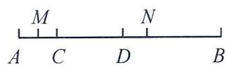  
图1

②当点 N 在点 D 左侧时, 如图 2, $MN = MC + CD - DN = 1 + 4 - \frac{3}{2} = \frac{7}{2}.$

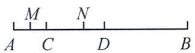  
图2

综上所述,线段 MN 的长为 $\frac{13}{2}$ 或 $\frac{7}{2}$ .

22. 解: 如图 1, 当 OC 与 OA 在 OB 的同侧时,

因为 $\angle BOC=60^{\circ},\angle AOB=40^{\circ}$ ,

所以 $\angle AOC = \angle BOC - \angle AOB = 60^{\circ} - 40^{\circ} = 20^{\circ}$

因为 OD 平分 $\angle AOC$ ，所以 $\angle DOA = \frac{1}{2} \angle AOC = 10^{\circ}$ ;

如图 2, 当 OC 与 OA 在 OB 的异侧时,

因为 $\angle BOC=60^{\circ},\angle AOB=40^{\circ}$ ,

所以 $\angle AOC = \angle BOC + \angle AOB = 60^{\circ} + 40^{\circ} = 100^{\circ}$

因为 OD 平分 $\angle AOC$ ，所以 $\angle DOA = \frac{1}{2} \angle AOC = 50^{\circ}$ ，综上， $\angle DOA$ 的度数为 $50^{\circ}$ 或 $10^{\circ}$ .

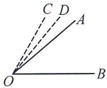  
图1

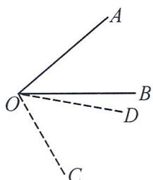

text_image

A
O
B
D
C

图2

# 22 第六章《几何图形初步》专题卷(二)

1. 解: (1) a = -10, b = 2;

(2)①当点 D 在点 B 左侧时, 设 BD = x , 则 AC = 2x ,

所以 $2x + x + n = 12$ ，所以 $x = 4 - \frac{n}{3}$

此时点 $D$ 对应的数为 $2 - \left(4 - \frac{n}{3}\right) = \frac{n}{3} - 2$ ;

②当点 D 在 B 右侧时, 设 BD = x, 则 AC = 2x,

所以 $2x + n - x = 12$ ，所以 $x = 12 - n$

此时点 D 对应的数为 $2+(12-n)=14-n$ .

2. 解: (1) 因为 $(a+8)^{2} + |b-4| = 0$ , $(a+8)^{2} \geqslant 0$ , $|b-4| \geqslant 0$ ,

所以 $a + 8 = 0, b - 4 = 0$ ，所以 $a = -8, b = 4$

因为 $c=a+2b$ ，所以 $c=-8+2\times4=0$ ；

(2)设点 P 表示的数是 -t，点 Q 表示的数是 4-2t，

因为 $AP = 3CQ$ ，所以 $-t - (-8) = 3|4 - 2t|$

解得 $t=\frac{4}{5}$ 或 $t=\frac{20}{7}$ ,

所以当 t 为 $\frac{4}{5}$ 或 $\frac{20}{7}$ 时, AP = 3CQ.

3. 解: (1) 点 A 表示的数为 -100, 点 B 表示的数为 200.

$AB = 200 - (-100) = 300;$

(2)运动 t 秒后 A, P, B 三点所表示的数分别为 $-100 + 10t$ , 30t, $200 + 20t$ ,

因为 0 < t < 10，所以 PB = 200 - 10t, OA = 100 - 10t,

$PA = 30t + 100 - 10t = 20t + 100, OB = 200 + 20t,$

因为 N 为 OB 中点, M 为 AP 中点,

所以 N 表示的数为 $100+10t$ , M 表示的数为 20t-50,

所以 $MN=100+10t-(20t-50)=150-10t$

$OA + PB = 100 - 10t + 200 - 10t = 300 - 20t$

所以 $\frac{OA+PB}{MN}=2.$

4. 解: (1) $\angle COD = \angle AOD + \angle BOC - \angle AOB = 160^{\circ} - 120^{\circ} = 40^{\circ}$ ; (2) 7.5 或 15.

设旋转 $n^{\circ}$ ，对于 $\angle IOM$ ，当 $0 < n < 180$ 时， $\angle IOM = \frac{n^{\circ}}{2}$

对于 $\angle POI$ ，当 $0 < n \leqslant 60$ 时， $\angle POI = 30^{\circ} - \frac{n^{\circ}}{2}$

当 $60 < n < 180$ 时， $\angle POI = \frac{n^{\circ}}{2} - 30^{\circ}$ .

分两种情况：①0<n<60, $\frac{n}{2}=\left(30-\frac{n}{2}\right)\times3,n=45,t=7.5;$

② $60 < n < 180, \frac{n}{2} = \left(\frac{n}{2} - 30\right) \times 3, n = 90, t = 15.$

5. 解: (1) $\angle ACM + \angle BCN = 90^{\circ}$ . 理由如下:

因为点 M, C, N 在同一条直线上, 所以 $\angle MCN = 180^{\circ}$ , 因为 $\angle ACB = 90^{\circ}$ ,

所以 $\angle ACM + \angle BCN = \angle MCN - \angle ACB = 180^{\circ} - 90^{\circ} = 90^{\circ}$

(2) 故答案为 $110^{\circ}, 90^{\circ}, 130^{\circ}, 90^{\circ}, 160^{\circ}, 90^{\circ}, \angle BCN - \angle ACM = 90^{\circ}$ ;

理由如下: 因为 $\angle ACM = \angle ACB - \angle BCM = 90^{\circ} - \angle BCM,$ $\angle BCN=180^{\circ}-\angle BCM,$

所以 $\angle BCN - \angle ACM = 90^{\circ}$

(3) $\angle ACM+\angle BCN=270^{\circ}$ . 理由如下：

因为 $\angle ACM = \angle ACB + \angle BCM = 90^{\circ} + \angle BCM$

$\angle BCN = 180^{\circ} - \angle BCM,$

所以 $\angle ACM + \angle BCN = 270^{\circ}$

6. 解: (1) 因为 OE 是 $\angle BOC$ 的角平分线,

所以 $\angle COE = \angle BOE = \frac{1}{2}\angle BOC$

因为 $\angle COE$ 是 $\angle AOC$ 的差余角，

所以 $\angle AOC - \angle COE = \angle AOC - \frac{1}{2}\angle BOC = 90^{\circ},$

因为 $\angle AOC + \angle BOC = 180^{\circ}$

所以 $\angle BOC=60^{\circ}$ , 所以 $\angle BOE=30^{\circ}$ ;

(2) 因为 $\angle BOC$ 是 $\angle AOE$ 的差余角, 所以 $\angle AOE - \angle BOC = 90^{\circ}$ ,

因为 $\angle AOE + \angle BOE = 180^{\circ}$ ，所以 $\angle BOC + \angle BOE = 90^{\circ}$

(3) $\frac{\angle AOC-\angle BOC}{\angle COE}$ 是定值2.理由如下：

如图3, 因为 $\angle COE$ 是 $\angle AOC$ 的差余角, 所以 $\angle AOC - \angle COE = \angle AOE = 90^{\circ}$ , 所以 $\angle AOC = 90^{\circ} + \angle COE$ , $\angle BOC = 90^{\circ} - \angle COE$ , 所以 $\frac{\angle AOC - \angle BOC}{\angle COE} = \frac{90^{\circ} + \angle COE - 90^{\circ} + \angle COE}{\angle COE} = 2$ ;

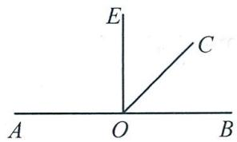

text_image

E
C
A O B

图3

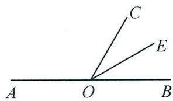

text_image

A
O
B
C
E

图4

如图 4, 因为 $\angle COE$ 是 $\angle AOC$ 的差余角,

所以 $\angle AOC-\angle COE=90^{\circ}$ , 所以 $\angle AOC=90^{\circ}+\angle COE$ ,

$\angle BOC = 180^{\circ} - \angle AOC = 180^{\circ} - (90^{\circ} + \angle COE) = 90^{\circ} - \angle COE,$

所以 $\frac{\angle AOC - \angle BOC}{\angle COE} = \frac{90^{\circ} + \angle COE - 90^{\circ} + \angle COE}{\angle COE} = 2;$

综上所述， $\frac{\angle AOC - \angle BOC}{\angle COE}$ 为定值2.

# 23 第一章～第六章综合检测卷(期末检测卷)

1. C 2. B 3. A 4. A 5. B 6. D 7. B 8. C 9. C

10. C 解: ① 因为 $\angle AOB = \angle COD$ , 所以 $\angle AOB + \angle BOC = \angle COD + \angle BOC$ , 所以 $\angle AOC = \angle BOD$ , 故①正确;

②由题意, 可得 $\angle AOB = 60^{\circ} - 40^{\circ} = 20^{\circ} = \angle COD$ , 因为 $\angle AOC + \angle BOC = 180^{\circ}$ , 所以 $\angle AOB + \angle BOC + \angle BOC = 180^{\circ}$ , 即 $20^{\circ} + \angle BOC + \angle BOC = 180^{\circ}$ , 所以 $\angle BOC = 80^{\circ}$ ,所以 $60^{\circ}+80^{\circ}+20^{\circ}=160^{\circ}$ ，即射线 OD 经过刻度线 160，故②错误；

③因为 $\angle MOC=3\angle COD=3\angle AOB=60^{\circ},\angle MOB=90^{\circ}-60^{\circ}=30^{\circ}$ , 所以 $\angle BOC=90^{\circ}$ , 量角器中数值 0 和 180 标记点分别为点 $E,F$ , 所以 $\angle EOM=\angle FOM=90^{\circ}$ , 所以 $\angle AOE$ 和 $\angle AOM,\angle BOE$ 和 $\angle BOM,\angle COM$ 和 $\angle COF,\angle DOM$ 和 $\angle DOF,\angle BOE$ 和 $\angle COF,\angle BOM$ 与 $\angle COM$ 互为余角, 即共有 6 对角互为余角, 故③正确. 故选 C.

11.3 12.36 13. $2.3 \times 10^{4}$ 14.2021

15.48 96 解:(1)当点 B 为折点时,PB 的 2 倍最长, $PB=\frac{1}{2}\times32=16(\text{cm})$ ,所以 $AB=AP+PB=24\text{ cm}$ ,所以这条绳子的原长为 $2AB=48\text{ cm}$ ;

(2)当点 A 为折点时, 若 AP 的 2 倍最长, $PA = \frac{1}{2} \times 32 = 16 \, (\text{cm})$ , 所以 PB = 2AP = 32, 所以 AB = AP + PB = 48 cm, 所以这条绳子的原长为 2AB = 96 cm; 若 PB 最长, $PA = \frac{1}{2} \times 32 = 16$ , 所以 $AB = 2 \times 16 + 32 \times 2 = 96 \, (\text{cm})$ .

16. 解: (1) 原式 = 6 + 3 + (-16) = -7;

(2) 原式 $= -1 + 18 \div 9 - 4 = -1 + 2 - 4 = -3$ .

17. 解: (1) $x = \frac{1}{2}$ ;

(2)去分母,得 $3(3x-1)-6=2(4x-7)$ ,

$$
9 x - 3 - 6 = 8 x - 1 4,
$$

$$
x = - 5.
$$

18. 解: (1) 因为 $AB = 5 \, cm, BC = 3 \, cm$ ,

所以 $AC = AB + BC = 5 \, cm + 3 \, cm = 8 \, cm;$

(2) 因为 O 是 AC 的中点, 所以 $OA = OC = \frac{1}{2} AC = 4 \, cm$ ,
因为 OB = AB - AO，所以 OB = 5 cm - 4 cm = 1 cm.

19. 解: 原式 $=\frac{1}{2}a-2a+\frac{2}{3}b^{2}-\frac{3}{2}a+\frac{1}{3}b^{2}=-3a+b^{2}$ .

当 $a=\frac{2}{3}$ , b=1 时, 原式 = -1.

20. 解: (1) 由题意, 得 $16(a+0.9)=43.2, 17(a+0.9)+8(b+0.9)=75.5$ , 所以 a=1.8, b=2.8;

(2) $1.8+0.9=2.7,2.8+0.9=3.7,6.00+0.9=6.9,$

设小李家这个月用水 x 吨, 由题意, 得

$2.7 \times 17 + 3.7 \times 13 + (x - 30) \times 6.9 = 156.1$ , 解得 x = 39.

答: 小李家这个月用水 39 吨.

21. 解: (1)(2) 如图所示;

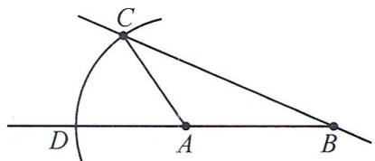

text_image

Geometric diagram showing points A, B, C, D and a curved arc with tangent lines

(3)>. 法一: 因为 AC = AD,

所以 $AC+AB=AD+AB$ ，即 $AC+AB=BD$ 。

根据两点之间线段最短, 得 $BA + AC > BC$ , 所以 BD > BC.

法二:叠合法画图知 BD>BC.

22. 解: (1) 因为 $OD$ 平分 $\angle AOC, \angle AOC = 50^\circ$ ,

所以 $\angle COD = \angle AOD = \frac{1}{2}\angle AOC = \frac{1}{2}\times 50^{\circ} = 25^{\circ},$

因为 $\angle DOE=90^{\circ}$ ,

所以 $\angle COE = \angle DOE - \angle COD = 90^{\circ} - 25^{\circ} = 65^{\circ}$

$$
\angle B O E = 1 8 0 ^ {\circ} - \angle A O D - \angle D O E = 1 8 0 ^ {\circ} - 2 5 ^ {\circ} - 9 0 ^ {\circ} = 6 5 ^ {\circ},
$$

所以 $\angle COE = \angle BOE = 65^{\circ}$

(2)结论:OE 平分∠BOC. 理由如下:设∠AOC=2α,

因为 OD 平分 $\angle AOC, \angle AOC = 2\alpha$ ,

所以 $\angle AOD = \angle COD = \frac{1}{2}\angle AOC = \alpha$

又因为 $\angle DOE = 90^{\circ}$ ，所以 $\angle COE = \angle DOE - \angle COD = 90^{\circ} - \alpha .$

又因为 $\angle BOE = 180^{\circ} - \angle DOE - \angle AOD = 180^{\circ} - 90^{\circ} - \alpha = 90^{\circ} - \alpha$ ，所以 $\angle COE = \angle BOE$ ，即 $OE$ 平分 $\angle BOC$

23. 解: (1) 如图 3, 因为 CA 平分 $\angle DCF$ ,

所以 $\angle ACF = \frac{1}{2}\angle DCF = \frac{1}{2}\times 60^{\circ} = 30^{\circ}.$

所以旋转的角度为 $180^{\circ} - 45^{\circ} - 30^{\circ} = 105^{\circ}$

所以 $t=105\div5=21$ (秒).

答: 当 t 为 21 时, 边 AC 平分 $\angle DCF$ ;

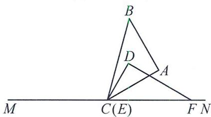

text_image

B
D
A
M
C(E)
F N

图3

(2) ① 如图 4, $\angle ACF - \angle BCD = (\angle DCF - \angle ACD) - (\angle ACB - \angle ACD) = \angle DCF - \angle ACB = 60^{\circ} - 45^{\circ} = 15^{\circ}$ .

又因为 $\angle ACF=3\angle BCD$ ，

所以 $3\angle BCD - \angle BCD = 15^{\circ},\angle BCD = 7.5^{\circ}.$

所以旋转的角度为 $180^{\circ}-60^{\circ}-7.5^{\circ}=112.5^{\circ}$ .

所以 $t = 112.5 \div 5 = 22.5$ （秒）；

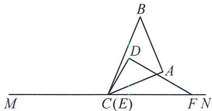

text_image

B
D
A
M
C(E)
F N

图4

②如图 5, $\angle ACF + \angle BCD = (\angle DCF - \angle ACD) + (\angle ACD - \angle ACB) = \angle DCF - \angle ACB = 60^{\circ} - 45^{\circ} = 15^{\circ}$ .

又因为 $\angle ACF = 3\angle BCD$

所以 $3\angle BCD + \angle BCD = 15^{\circ},\angle BCD = 3.75^{\circ}.$

所以旋转的角度为 $180^{\circ} - 60^{\circ} + 3.75^{\circ} = 123.75^{\circ}$

所以 $t=123.75\div5=24.75$ (秒).

答: 当 t 为 22.5 秒或 24.75 秒时, $\angle ACF = 3\angle BCD$ .

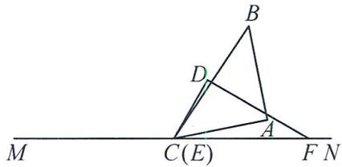

text_image

B
D
M C(E) A F N

图5

24. 解: (1) 点 B, D 表示的数分别为 -4, 4;

(2)①若 $B$ 和 $D$ 重合，则 $-4 + 2t = 4 - t$ ，所以 $t = \frac{8}{3}$

若 $A$ 和 $C$ 重合，则 $(2 + 1)t = 2 - (-8)$ ，所以 $t = \frac{10}{3}$

答案为 $\frac{8}{3},\frac{10}{3};$

② $BC = |2 - t - (-4 + 2t)| = |6 - 3t| = 1,$

所以 $t = \frac{5}{3}$ 或 $\frac{7}{3}$ ; 故 $t = \frac{7}{3}$ 或 $\frac{5}{3}$ ;

③当 $\frac{8}{3}<t<\frac{10}{3}$ 时，线段CD在线段AB内部，

所以 $BC = -4 + 2t - (2 - t) = -6 + 3t$

$$
A D = 4 - t - (- 8 + 2 t) = 1 2 - 3 t,
$$

所以 $BC + AD = -6 + 3t + 12 - 3t = 6.$