# 1 第十三章《三角形》单元检测卷

(测试范围:第13章 时间:120分钟,满分:120分)

# 一、选择题(每小题3分,共30分)

1. 下列长度的三条线段, 不能构成三角形的是()

A. 3,5,7

B.2,3,6

C. 3,3,3

D. 4,4,6

2. 下列生活实物中, 没有应用到三角形的稳定性的是()

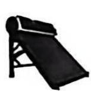

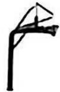

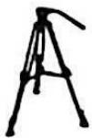

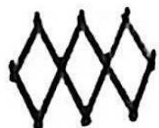

A. 太阳能热水器

B. 篮球架

C. 三脚架

D. 活动衣架

3. 已知三角形的三边长分别为 3,4,x,则 x 的值可以为()

A.8

B. 7

C. 9

D. 6

4. 若 $\triangle ABC$ 的三个内角之比为1:2:3,则 $\triangle ABC$ 一定是()

A. 锐角三角形

B. 直角三角形

C. 钝角三角形

D. 等腰三角形

5. 如图, 在 $\triangle ABC$ 中, $\angle A = 75^{\circ}$ , 若 $\angle ABD = 105^{\circ}$ , 过点 $C$ 作 $CE \parallel BD$ , 则 $\angle ACE$ 的度数为 ( )

A. ${20}^{ \circ  }$

B. ${25}^{ \circ  }$

C. ${30}^{ \circ  }$

D. ${35}^{ \circ  }$

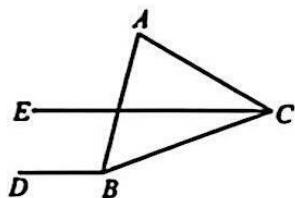  
第5题图

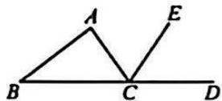  
第6题图

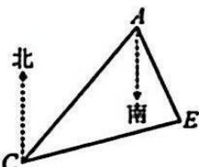  
第7题图

6. 如图, 在 $\triangle ABC$ 中, $CE$ 是外角 $\angle ACD$ 的平分线, 且 $\angle B = 32^{\circ}$ , $\angle DCE = 63^{\circ}$ , 则 $\angle BAC$ 的度数为 ( )

A. ${90}^{ \circ  }$

B. $94^{\circ}$

C. ${104}^{ \circ  }$

D. ${126}^{ \circ  }$

7. 如图, $C$ 处在 $A$ 处的南偏西 $40^{\circ}$ 方向, $E$ 处在 $A$ 处的南偏东 $25^{\circ}$ 方向, $E$ 处在 $C$ 处的北偏东 $80^{\circ}$ 方向, 则 $\angle AEC$ 的度数为 ( )

A. $60^{\circ}$

B. ${70}^{ \circ  }$

C. ${75}^{ \circ  }$

D. ${80}^{ \circ  }$

8. 如图, 在 $\triangle ABC$ 中, $\angle B = 46^{\circ}$ , 三角形的外角 $\angle DAC$ 和 $\angle ACF$ 的平分线交于点 $E$ , 则 $\angle AEC$ 的度数为 ( )

A. ${47}^{ \circ  }$

B. $57^{\circ}$

C. $67^{\circ}$

D. $77^{\circ}$

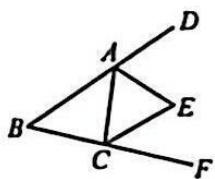  
第8题图

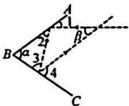  
第9题图

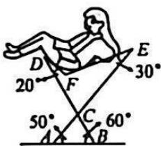  
第10题图

9. 如图, 两面镜子 $AB, BC$ 的夹角为 $\angle \alpha$ , 当光线经过镜子反射后, $\angle 1 = \angle 2, \angle 3 = \angle 4$ . 若 $\angle \alpha = 70^{\circ}$ , 则 $\angle \beta$ 的度数是 ( )

A. ${45}^{ \circ  }$

B. ${40}^{ \circ  }$

C. ${35}^{ \circ  }$

D. ${30}^{ \circ  }$

10. 如图是可调躺椅示意图(数据如图), AE 与 BD 的交点为 C, 且 $\angle CAB, \angle CBA, \angle E$ 保持不变, 为了舒适, 需调整 $\angle D$ 的大小, 使 $\angle EFD = 110^{\circ}$ , 则图中 $\angle D$ 应()

A. 增加 $10^{\circ}$

B. 减少 $10^{\circ}$

C. 增加 $20^{\circ}$

D. 减少 $20^{\circ}$

# 二、填空题(每小题3分,共15分)

11. 若直角三角形的一个锐角为 $40^{\circ}$ , 则另一个锐角的度数是 \_\_\_\_.

12. 若等腰三角形的两边长分别为 3cm 和 8cm, 则它的周长是 \_\_\_\_ cm.

13. 如图, 在 $\triangle ABC$ 中, $CD$ 平分 $\angle ACB$ 交 $AB$ 于点 $D$ , 过点 $D$ 作 $DE \parallel BC$ 交 $AC$ 于点 $E$ . 若 $\angle A = 54^{\circ}, \angle B = 48^{\circ}$ , 则 $\angle CDE$ 的度数为 \_\_\_\_.

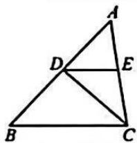  
第13题图

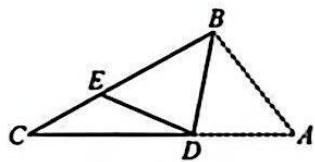  
第14题图

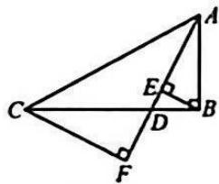  
第15题图

14. 如图, 在 $\triangle ABC$ 中, $\angle ABC = 110^{\circ}$ , 点 $D$ 在 $AC$ 上, 将 $\triangle ABD$ 沿 $BD$ 折叠, 点 $A$ 落在 $BC$ 上的点 $E$ 处, 若 $\angle EDC = 25^{\circ}$ , 则 $\angle C$ 的度数为 \_\_\_\_.

15. 如图, 在 Rt△ABC 中, ∠ABC = 90°, AB = 6, BC = 12, D 为线段 BC 上一点, BE ⊥ AD 于点 E, CF ⊥ AD 于点 F, AD = 8.
(1)△ABC 的面积为 \_\_\_\_ ; (2)BE+CF 的值为 \_\_\_\_.

# 三、解答题(共9题,共75分)

16.(本题6分)求出下列图形中x的值.

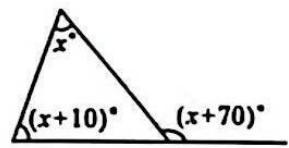

17.(本题6分)如图,在 $\triangle ABC$ 中, $\angle BAC=40^{\circ},\angle B=75^{\circ},AD$ 是 $\triangle ABC$ 的角平分线.求 $\angle ADB$ 的度数.

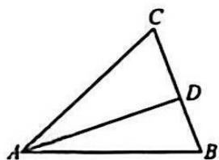

18.(本题6分)如图,在 $\triangle ABC$ 中, $\angle C=\angle ABC=2\angle A$ ,BD是AC边上的高.求 $\angle DBC$ 的度数.

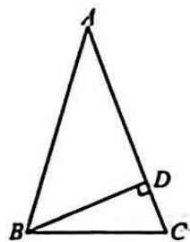

19.(本题8分)在 $\triangle ABC$ 中, $\angle B=2\angle A,\angle C=\angle B+30^{\circ}$ ,求 $\triangle ABC$ 的各内角的度数.

20.(本题8分)如图,在△ABC中,AD是中线,CG,AH是高.

(1)请在图中分别画出线段 AD, CG 和 AH;

(2) 若 ${AB} = {20},{CG} = 6,{AH} = {12}$ ,求 $\bigtriangleup  {ADC}$ 的面积和 ${CD}$ 的长.

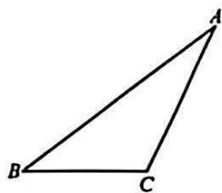

21.(本题8分)如图,在△ABC中,BD是AC边上的高,∠A=70°.

(1)填空: $\angle {ABD}$ 的度数为\_\_\_\_；

(2) 若 $CE$ 平分 $\angle ACB$ 交 $BD$ 于点 $E, \angle BEC = 116^{\circ}$ , 求 $\angle ABC$ 的度数.

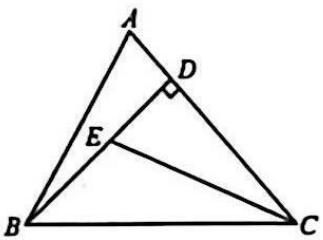

22.(本题10分)在△ABC中,∠B=2∠C,AE是△ABC的角平分线.

(1)如图1,若 $AD \perp BC$ 于点D, $\angle C = 35^{\circ}$ ,求 $\angle DAE$ 的度数;

(2)如图2,若 $EF\perp AE$ 交AC于点F,求证: $\angle C=2\angle FEC.$

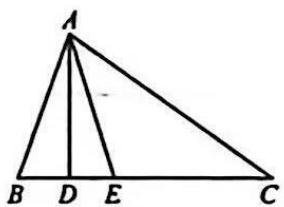  
图1

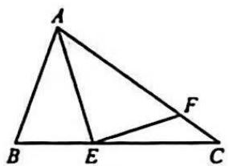  
图2

23.(本题11分)同学们以“三角形的折叠”为主题开展数学活动.

(1)【操作判断】

操作一:折叠三角形纸片,使 BC 与 BA 边在一条直线上,得到折痕 BD;

操作二:折叠三角形纸片,得到折痕 AE,使 B,C,E 三点在一条直线上.

完成以上操作后把纸片展平,如图1,判断∠ABD和∠CBD的大小关系是\_\_\_\_,直线BC,AE的位置关系是\_\_\_\_.

(2)【深入探究】

操作三:折叠三角形纸片,使点 A 落在折痕 AE 上,得到折痕 DF,把纸片展平.

根据以上操作,如图2,判断 $\angle DBF$ 和 $\angle BDF$ 是否相等,并说明理由.

(3)【结论应用】

如图 1, 已知 $\angle ABC = 58^{\circ}, \angle ACB = 48^{\circ}$ ，请直接写出 $\angle BDC$ 的度数.

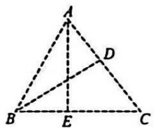  
图1

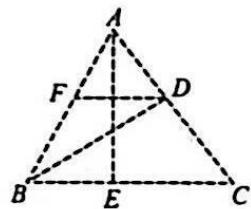  
图2

24.(本题12分)(1)【问题背景】如图1,在△ABC中,∠ACB=90°,AE是角平分线,CD是高,AE,CD相交于点F.求证:∠CFE=∠CEF;

(2)【变式思考】如图 2, 在 $\triangle ABC$ 中, $\angle ACB = 90^{\circ}$ , $CD$ 是 $AB$ 边上的高, 若 $\triangle ABC$ 的外角 $\angle BAG$ 的平分线交 $CD$ 的延长线于点 $F$ , $FA$ 的延长线与 $BC$ 边的延长线交于点 $E$ , 试问 (1) 中的结论还成立吗? 请说明理由;

(3)【探究延伸】如图3,在 $\triangle ABC$ 中, $D$ 为 $AB$ 上一点, $\angle ACD=\angle B$ ,角平分线 $AE$ 交 $CD$ 于点 $F$ . $\triangle ABC$ 的外角 $\angle BAG$ 的平分线所在直线 $MN$ 与 $BC$ 的延长线交于点 $M$ ,若 $\angle M=\alpha$ ,直接写出 $\angle CFE$ 的度数(用含 $\alpha$ 的式子表示).

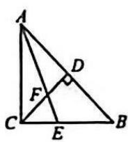  
图1

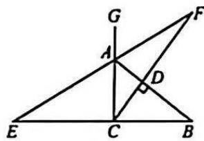  
图2

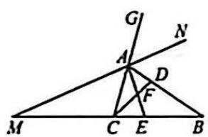  
图3

# 2 第十三章《三角形》专题卷

# 思想方法1 转化思想

1. 如图, 求 $\angle A + \angle B + \angle C + \angle D + \angle E$ 的度数.

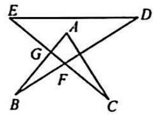

2. 如图是由线段 $AB, CD, DF, BF, CA$ 组成的平面图形, $\angle D = 28^\circ$ , 求 $\angle A + \angle B + \angle C + \angle F$ 的度数.

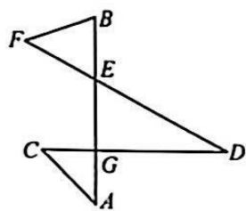

# 思想方法2 方程思想

3. 如图, $BD$ 是 $\triangle ABC$ 的角平分线, $AE \perp BD$ 交 $BD$ 的延长线于点 $E$ , $\angle ABC = 72^{\circ}$ , $\angle C: \angle ADB = 2:3$ , 求 $\angle BAC$ 和 $\angle DAE$ 的度数.

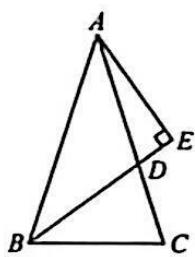

# 思想方法3 分类讨论

4. $\triangle ABC$ 中, $\angle A = 55^{\circ}$ , $BD$ , $CE$ 是它的两条高, 直线 $BD$ , $CE$ 交于点 $O$ , 则 $\angle DOE$ 的度数为 \_\_\_\_.

# 思想方法4 整体思想

5. 如图, 把三角形纸片 $ABC$ 折叠, 使得点 $B$ , 点 $C$ 都与点 $A$ 重合, 折痕分别为 $DE, MN$ , 若 $\angle BAC = 110^{\circ}$ , 则 $\angle DAM$ 的度数为 \_\_\_\_.

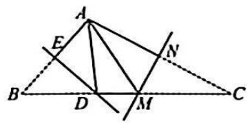

6. 如图, 将 $\triangle ABC$ 沿 $DE$ 折叠, 使点 $A$ 落在点 $A'$ 处, 且 $A'B$ 平分 $\angle ABC, A'C$ 平分 $\angle ACB$ , 若 $\angle BA'C = 120^\circ$ , 求 $\angle 1 + \angle 2$ 的度数.

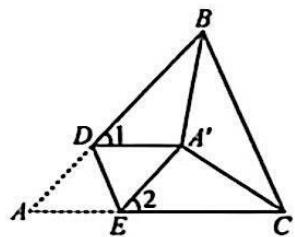

# 思想方法5 特殊到一般

7.(1)如图1,在 $\triangle ABC$ 中,BD平分 $\angle ABC,CE$ 平分 $\angle ACB,BD$ 与 $CE$ 交于点M.若 $MN\perp BC$ 于点N, $\angle BAC=60^{\circ}$ ,则图中 $\angle 1-\angle 2=$ \_\_\_\_;

(2)如图 2, BD 平分 $\angle EBC$ , CE 平分 $\angle BCD$ , BD, CE 交于点 M, 若 $\angle BEC = \alpha$ , $\angle BDC = \beta$ , 则 $\angle BMC =$ \_\_\_\_ . (用含 $\alpha, \beta$ 的代数式表示)

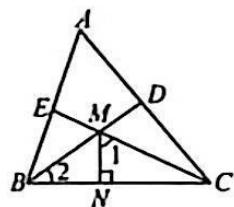  
图1

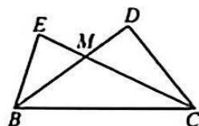  
图2

8. 在 Rt△ABC 中, ∠C=90°, D, E 分别是边 AC, BC 上的点, P 是 AB 上一动点. 记 ∠PDA=∠1, ∠PEB=∠2, ∠DPE=∠α.

(1)如图1,若 $\angle\alpha=60^{\circ}$ ,则 $\angle1+\angle2$ 的度数为\_\_\_\_;

(2)如图2,探索 $\angle\alpha,\angle1,\angle2$ 之间的关系,并说明理由.

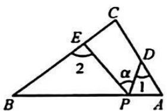  
图1

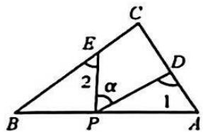  
图2

# 基本模型1 两条内角平分线的夹角

9.【认识模型】(1)如图1,我们把形状像燕尾的凹四边形ABDC称为“燕尾形”,应用三角形外角的性质不难得到结论: $\angle BDC=\angle A+\angle B+\angle C$ .小勤的做法是:延长BD交AC于点G.请按照小勤的做法或者你自己的方法完成上面结论的证明;

【应用模型】(2)应用这个结论我们可以解决同类图形的角度问题.

①如图2,若 $\angle1=20^{\circ},\angle2=30^{\circ},\angle BEC=100^{\circ}$ ,则 $\angle BDC$ 的度数为\_\_\_\_;   
②如图2,若BE平分∠ABD,CE平分∠ACD,BE与CE交于点E,请写出∠BDC,∠BEC和∠BAC三个角之间的关系,并说明理由;

【拓展延伸】(3)如图3,若 $\angle1=\frac{1}{3}\angle ABD,\angle2=\frac{1}{3}\angle ACD$ ,试探究 $\angle BDC,\angle BEC$ 和 $\angle BAC$ 三个角之间的关系为\_\_\_\_（直接写出结果即可）.

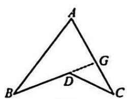  
图1

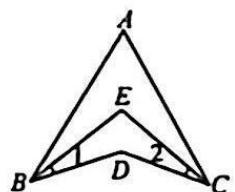  
图2

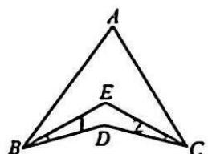  
图3

# 基本模型2 内角与外角平分线的夹角

10.(1)【问题再现】如图1,若 $\angle MON=90^{\circ}$ ,点A,B分别在OM,ON上运动(不与点O重合),BC是 $\angle ABN$ 的平分线,BC的反向延长线交 $\angle BAO$ 的平分线于点D,则 $\angle D$ 的度数为\_\_\_\_;

(2)【问题推广】如图2,若 $\angle MON=\alpha(0^{\circ}<\alpha<180^{\circ})$ .

①(1)中的其余条件不变,则 $\angle D=$ \_\_\_\_ (用含 $\alpha$ 的代数式表示);  
②点 A, B 分别在 OM, ON 上运动(不与点 O 重合), 点 E 是 OB 上一动点, BC 是 $\angle ABN$ 的平分线, BC 的反向延长线与射线 AE 交于点 D, 若 $\angle D = \frac{1}{2}\alpha$ , 则 AE 是 $\triangle OAB$ 的角平分线吗? 请说明理由;

(3)【拓展提升】如图3, 若 $\angle NBC = \frac{1}{m}\angle ABN, \angle DAO = \frac{1}{m}\angle BAO$ , 试探索 $\angle D$ 和 $\angle O$ 的数量关系 (用含 $m$ 的代数式表示), 并说明理由.

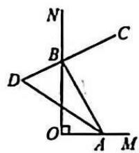  
图1

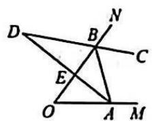  
图2

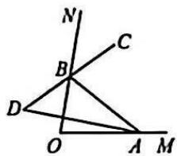  
图3

# 基本模型3 两条外角平分线的夹角

11. 如图 1, AD 是 $\triangle ABC$ 的角平分线, E 是 AD 延长线上一点, $\angle EBC = 90^{\circ} - \frac{1}{2} \angle ABC, \angle ECB = 90^{\circ} - \frac{1}{2} \angle ACB.$

(1)若 $\angle BAC=78^{\circ}$ ,求 $\angle BEC$ 的度数;   
(2)若 $\angle ABC=42^{\circ}$ ,则 $\angle AEC=$ \_\_\_\_;若 $\angle ACB=64^{\circ}$ ,则 $\angle AEB=$ \_\_\_\_;   
(3)如图2,若CF平分∠ACB交AD于点F,求证:CF⊥CE.

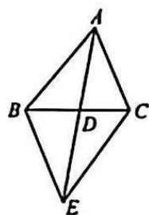  
图1

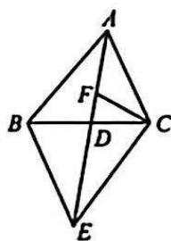  
图2

# 3 第十四章《全等三角形》阶段检测卷(一)

(测试范围:14.1\~14.2 时间:90 分钟,满分:120 分)

# 一、选择题(每小题3分,共30分)

1. 如图, $\triangle ABC \cong \triangle DEF$ , 图中和 $EF$ 相等的线段是( )

A. BC

B. AB

C. CD

D. DE

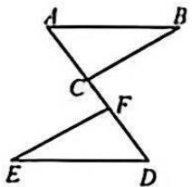  
第1题图

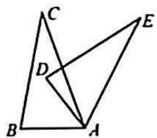  
第2题图

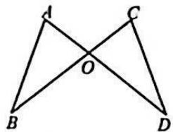  
第4题图

2. 如图, $\triangle ABC \cong \triangle ADE$ , 若 $\angle B = 80^{\circ}, \angle E = 35^{\circ}$ , 则 $\angle C$ 的度数为 ( )

A. ${80}^{ \circ  }$

B. ${35}^{ \circ  }$

C. ${70}^{ \circ  }$

D. ${30}^{ \circ  }$

3. 已知 $\triangle ABC \cong \triangle EDF, AC = 6, AB = 5, BC = 8$ ，则 DE 的长是（）

A. 5

B. 7

C. 8

D. 5 或 8

4. 如图, $AD, BC$ 相交于点 $O$ , 已知 $OA = OC$ , 直接运用“SAS”证明 $\triangle AOB \cong \triangle COD$ , 还要添加一个条件是 ( )

A. AB = CD

B. BO = DO

C. $\angle A = \angle C$

D. $\angle {ABO} = \angle {CDO}$

5. 如图是雨伞在开合过程中某时刻的截面图, 伞骨 $AB = AC, D, E$ 分别是 $AB, AC$ 的中点, $DM, EM$ 是连接弹簧和伞骨的支架, 且 $DM = EM$ , 已知弹簧 $M$ 在向上滑动的过程中, 总有 $\triangle ADM \cong \triangle AEM$ , 其判定依据是 ( )

A. SAS

B. ASA

C. SSS

D. AAS

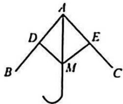  
第5题图

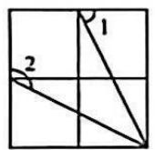  
第6题图

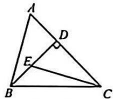  
第7题图

6. 如图是由 4 个相同的小正方形组成的网格图, 则 $\angle 1 + \angle 2$ 的度数是( )

A. ${120}^{ \circ  }$

B. ${150}^{ \circ  }$

C. ${180}^{ \circ  }$

D. ${200}^{ \circ  }$

7. 如图, 在 $\triangle ABC$ 中, $BD \perp AC$ 于点 $D$ , $BD = CD$ , $E$ 是 $BD$ 上一点, $\angle A = \angle CED$ , 若 $AB = 10, AC = 14$ , 则 $\triangle CED$ 的周长为 ( )

A. 24

B. 20

C. 28

D. 34

8. 在 $\triangle ABC$ 中, $\angle B=\angle C=50^{\circ}$ , 将 $\triangle ABC$ 沿图中虚线剪开, 剪下的两个三角形不一定全等的是( )

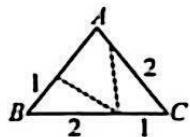  
A

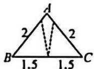  
B

  
C

  
D

9. 在平面直角坐标系中, 点 $A$ 的坐标为 $(-4, 6)$ , 将线段 $OA$ 绕点 $O$ 顺时针旋转 $90^{\circ}$ , 则点 $A$ 的对应点 $A'$ 的坐标为 ( )

A. $(4,6)$

B.(6,4)

C. $(-4,-6)$

D. $(-6,-4)$

10. 如图 1, $\triangle ABC$ 与 $\triangle A_{1}B_{1}C_{1}$ 满足 $\angle A = \angle A_{1}, AC = A_{1}C_{1}, BC = B_{1}C_{1}, \angle C \neq \angle C_{1}$ , 我们称这样的两个三角形为“伪全等三角形”。如图 2, 在 $\triangle ABC$ 中, $AB = AC$ , $\angle B = \angle C$ , 点 $D, E$ 在线段 $BC$ 上, 且 $BE = CD$ , 则图中共有“伪全等三角形”（）

  
图1

  
B

A.1 对

B.2 对

C. 3 对

D. 4 对

# 二、填空题(每小题3分,共15分)

11. 如图, 点 $B, A, D, E$ 在同一直线上, $BA = DE$ , $BC \parallel EF$ , 要使 $\triangle ABC \cong \triangle DEF$ , 则只需添加一个适当的条件是 \_\_\_\_ (只填一个即可).

  
第11题图

  
第12题图

  
第13题图

12. 如图, 若 $AC = AD$ , $\angle C = \angle D = 90^\circ$ , 则 $\triangle ACB \cong \triangle ADB$ 的理由是 \_\_\_\_ (填写字母即可).

13. 如图, 若 $AB = DE$ , $BC = EF$ , $AC = DF$ , $\angle B = 35^{\circ}$ , $\angle D = 70^{\circ}$ , 则 $\angle F$ 的度数是 \_\_\_\_.

14. 如图, 两座建筑物 $AB, CD$ 相距 $160 \mathrm{~m}$ , 小月从点 $B$ 沿 $BC$ 走向点 $C$ , 行走 $t \mathrm{~s}$ 后她到达点 $E$ , 此时她仰望两座建筑物的顶点 $A$ 和 $D$ , 两条视线的夹角正好为 $90^{\circ}$ , 且 $EA = ED$ . 已知建筑物 $AB$ 的高为 $60 \mathrm{~m}$ , 小月行走的速度为 $1 \mathrm{~m} / \mathrm{s}$ , 则小月行走的时间 $t$ 的值为 \_\_\_\_.

  
第14题图

  
第 15 题图

15. 如图, $BC \perp CE$ , $BC=CE$ , $AC \perp CD$ , $AC=CD$ , $DE$ 交 $AC$ 的延长线于点 $M$ , 且 $M$ 为 $DE$ 的中点. (1) $\angle A$ 的度数为 \_\_\_\_; (2) 若 $AB=8$ , 则 $CM$ 的长为 \_\_\_\_.

# 三、解答题(共9题,共75分)

16.(本题6分)如图,已知△ABC≌△DEB,点E在AB上,若DE=9,BC=5,求AE的长.

17.(本题6分)如图,AB=AC,CD⊥AB,BE⊥AC,垂足分别为D,E.求证:BD=CE.

18.(本题6分)如图,E,F是线段AB上两点,AE=BF,AD=BC, $\angle A=\angle B$ .求证: $\angle D=\angle C$ .

19.(本题8分)如图,AB=AD,∠B=∠D,∠BAD=∠CAE.

(1)求证: $\triangle ABC \cong \triangle ADE$ ;

(2)若 ${DE} = 8,{BE} = 5$ ,求 ${CE}$ 的长.

20.(本题8分)如图,小华站在堤岸凉亭A点处,正对他的B点处停有一艘游艇,他想知道凉亭与这艘游艇之间的距离,于是制定了如下方案.

<table><tr><td>课题</td><td>测凉亭与游艇之间的距离</td></tr><tr><td>测量工具</td><td>皮尺等</td></tr><tr><td>测量方案示意图(不完整)</td><td></td></tr><tr><td>测量步骤</td><td>1小华沿堤岸走到电线杆C旁;2再往前走相同的距离,到达D点;3然后他向左转并直行,当自己,电线杆与游艇在一条直线上时停下来,此时小华位于点E处</td></tr><tr><td>测量数据</td><td>AC=20米,CD=20米,DE=8米</td></tr></table>

任务 1: 根据题意将测量方案示意图补充完整；

任务 2:①凉亭与游艇之间的距离是 \_\_\_\_ 米;

②请你说明小华方案正确的理由.

21.(本题8分)如图,AC⊥BC,DC⊥EC,AC=BC,DC=EC,AE与BD交于点F.

(1) 求证: AE = BD;

(2)求∠AFD的度数.

22.(本题10分)如图,在 $\triangle ABC$ 中, $AB=AC,AD$ 为 $\triangle ABC$ 的中线.以点 $A$ 为圆心, $AD$ 的长为半径画弧,与 $AB,AC$ 分别交于点 $E,F$ ,连接 $DE,DF$ .

(1)求证: $\triangle ADE\cong\triangle ADF;$

(2)若 $\angle BAC=80^{\circ}$ ,求 $\angle BDE$ 的度数.

23.(本题11分)如图,AB//CD,M是AD的中点,BM⊥CM,连接BC.

(1)求证:CM 平分∠BCD;

(2)试探究 $BC, CD, AB$ 之间的数量关系.

24.(本题12分)如图,AC=BC,DC=EC, $\angle ACB=\angle DCE=\alpha$ ,
AE 与 BD 交于点 M.

(1)求证:AE=BD;

(2)求∠AMD的度数(用含α的式子表示);

(3)过点 C 作 $CH \perp AE$ 于点 H，若 AM = 13, BM = 7，直接写出 AH 的长为 \_\_\_\_.

# 4 第十四章《全等三角形》阶段检测卷(二)

(测试范围:14.3 时间:90 分钟,满分:120 分)

# 一、选择题(每小题3分,共30分)

1. 如所示图形中, 若 $PE = PF$ , 能判断点 $P$ 在 $\angle EOF$ 的平分线上的是 ( )

  
A

  
B

  
C

  
D

2. 如图, OC 是 $\angle AOB$ 的平分线, P 是 OC 上一点, $PD \perp OA$ 于点 D, PD = 5, 则点 P 到边 OB 的距离为()

A.6

B. 5

C. 4

D. 3

  
第2题图

  
第3题图

  
第4题图

3. 如图, AD 为 $\triangle ABC$ 的角平分线, DE $\perp AB$ 于点 E, DE = 3, F 为 AC 上一动点, 则 DF 的最小值是()

A.1

B. 2

C. 3

D. 4

4. 如图, 在 $\triangle ABC$ 中, $\angle C = 90^{\circ}$ , $AD$ 平分 $\angle BAC$ , $BC = 9$ , $BD = 5$ , 则点 $D$ 到 $AB$ 的距离是( )

A. 8

B. 5

C. 4

D. 3

5. 小明同学只用两把完全相同的长方形直尺就可以作出一个角的平分线。如图，一把直尺压住射线 OB，另一把直尺压住射线 OA 并且与第一把直尺交于点 P，小明说：“射线 OP 就是 $\angle BOA$ 的角平分线。”他这样做的依据是（）

A. 在角的内部, 到角的两边距离相等的点在这个角的平分线上

B. 角平分线上的点到这个角两边的距离相等

C. 三角形的三条高交于一点

D. 三角形三边的垂直平分线交于一点

6. 如图, 在 $\triangle ABC$ 中, $BD$ 平分 $\angle ABC$ 交 $AC$ 于点 $D, DE \perp AB$ 于点 $E$ , 若 $BC = 5, ED = 2$ , 则 $\triangle BCD$ 的面积为 ( )

A. 3

B. 4

C. 5

D. 6

7. 甲、乙、丙、丁四位同学解决以下问题, 其中作图正确的是( )

问题:某旅游景区内有一块三角形绿地 ABC, 如图所示, 先要在道路 AB 边上建一个休息点 M, 使它到 AC 和 BC 两边的距离相等, 在图中确定休息点 M 的位置.

  
甲的作图

  
乙的作图

  
丙的作图

  
丁的作图

A. 甲

B. 乙

C. 丙

D. 丁

8. 如图, 在 $\triangle ABC$ 中, $AD$ 平分 $\angle CAB$ 交 $BC$ 于点 $D$ , $\angle C = 90^\circ$ , $AC + AB = 20$ , $CD = 3$ , 则 $S_{\triangle ABC}$ 的值为 ( )

A. 20

B. 24

C. 30

D. 40

  
第8题图

  
第9题图

  
第10题图

9. 如图, 在平面直角坐标系中, $AD$ 是 Rt $\triangle OAB$ 的角平分线, 点 $D$ 的纵坐标是 $-2, AB = 12$ , 那么 $\triangle ABD$ 的面积为 ( )

A. 48

B. 24

C. 12

D. 36

10. 如图, $OC$ 平分 $\angle AOB$ , 点 $E, F$ 分别在 $OA, OB$ 上, 连接 $CE, CF, EF$ . 若 $\angle OFE = 74^{\circ}, \angle EFC = 53^{\circ}$ , 则 $\angle OCE$ 的度数为 ( )

A. $35^{\circ}$

B. ${36}^{ \circ  }$

C. ${37}^{ \circ  }$

D. ${38}^{ \circ  }$

# 二、填空题(每小题3分,共15分)

11. 如图, 在 Rt△ABC 中, ∠C=90°, BE 是∠ABC 的平分线, ED⊥AB 于点 D, ED=2, AE=3, 则 AC 的长是 \_\_\_\_.

  
第11题图

  
第12题图

  
第13题图

12. 如图, 直线 $AB, CD$ 交于点 $O, ME \perp AB$ 于点 $E, MF \perp CD$ 于点 $F$ , 若 $ME = MF$ , 且 $\angle AOC = 56^{\circ}$ , 则 $\angle MOE$ 的度数为 \_\_\_\_.

13. 如图,三条公路两两相交,现计划修建一个油库,要求油库到这三条公路的距离相等,那么选择油库的位置有\_\_\_\_处.

14. 如图，在 $\triangle ABC$ 中， $\angle A = 90^{\circ}, AB = 3, AC = 4, BC = 5$ ， $\angle ACB, \angle ABC$ 的平分线交于点 $O$ ，过点 $O$ 作 $OQ \perp BC$ 于点 $Q$ ，

则 $OQ$ 的长为

  
第14题图

  
第15题图

15. 如图, 在 $\triangle ABC$ 中, $AC$ 的长为定值, $\angle BAC = 50^{\circ}$ , $M$ 是 $AB$ 的中点, 过点 $M$ 的直线交边 $AC$ 于点 $N$ , 分别作 $BD \perp MN$ , $CE \perp MN$ , 垂足分别为 $D, E$ . 则当 $BD + CE$ 取最大值时, $\angle BMN$ 的度数为 \_\_\_\_.

# 三、解答题(共9题,共75分)

16.(本题6分)如图,点O在∠BAC的平分线上, $BO\perp AC$ , $CO\perp AB$ ,垂足分别为D,E.求证:OB=OC.

17. (本题 6 分) 把两个同样大小的含 $30^{\circ}$ 角的三角尺按照如图 1 所示方式叠合放置, 得到如图 2 的 Rt $\triangle ABC$ 和 Rt $\triangle ABD$ , 设 $M$ 是 $AD$ 与 $BC$ 的交点, 则这时 $MC$ 的长度就等于点 $M$ 到 $AB$ 的距离, 你知道这是为什么吗? 请说明理由.

  
图1

  
图2

18.(本题6分)如图,BE=CF,DE⊥AB交AB的延长线于点E,DF⊥AC于点F,且DB=DC.求证:AD平分∠BAC.

19.(本题8分)如图,AD是△ABC的角平分线,DE⊥AB于点E,DF⊥AC于点F,若DE=3,AC=6,求△ACD的面积.

20.(本题8分)如图,D为△ABC外角∠BCP的平分线上一点,且DA=DB,DM⊥AP于点M,DN⊥BC于点N.

(1)求证: $\triangle ADM\cong\triangle BDN$ ;   
(2) 若 BC=6, DM=2, 求 $\triangle BCD$ 的面积.

21.(本题8分)如图,在Rt△ABC中, $\angle C=90^{\circ}$ .请用直尺和圆规作图,并完成下列解答:

(1)作∠CAB的平分线AP交BC于点P(保留作图痕迹,不写作法);   
(2)在(1)的条件下,在线段AC上作点M,使 $\angle PMC=\angle B$ ,请简要说明作法,并证明 $\angle PMC=\angle B$ .

22.(本题10分)如图,在 $\triangle ABC$ 中, $\angle ABC=60^{\circ},AD,CE$ 为 $\triangle ABC$ 的角平分线, $AD,CE$ 相交于点 $P$ .

(1)求 $\angle CPD$ 的度数；  
(2) 求证: $AC = AE + CD$ .

23.(本题11分)数学课上,王老师开展了一节以角平分线为主题的数学活动.

【作图】(1)请你根据所学知识,作出∠AOB的平分线(保留作图痕迹,不写作法);

(2)请你说说,角平分线的画法是根据是全等三角形判定方法中的\_\_\_\_;

【应用】王老师告诉同学们,利用角平分线作图的原理,我国古代工匠设计出如图的平分角的仪器,其中 $OD=OE,DF=EF$ . 将仪器放置在 $\angle ABC$ 上,使点 $O$ 与顶点 $A$ 重合, $D,E$ 分别在 $AB,AC$ 上,沿 $AF$ 画一条射线 $AP,AP$ 是 $\angle BAC$ 的平分线. 此时所得的四边形 $ADFE$ 被称为“筝形”.

text_image

Geometric diagram showing three labeled triangles with points O, A, D, E, F and connecting lines, likely illustrating a spatial or geometric relationship.

【解惑】(3)王老师让同学们利用课余时间连接筝形 ADFE 的两条对角线,探究这两条对角线 AF, DE 的位置关系,小明认为

它们互相垂直,小方认为没有角的度数无法判定,应该是相交,请你运用三角形的知识,判断谁的说法正确并说明理由.

24.(本题12分)如图,在 $\triangle ABC$ 中,点 $D$ 在 $BC$ 边上, $\angle BAD=100^{\circ}$ , $\angle ABC$ 的平分线交 $AC$ 于点 $E$ ,过点 $E$ 作 $EF\perp AB$ ,垂足为 $F$ ,且 $\angle AEF=50^{\circ}$ ,连接 $DE$ .

(1)填空:∠DAE 的度数是 \_\_\_\_ ;  
(2) 求证: DE 平分 $\angle ADC$ ;  
(3) 若 AB=6, AD=4, CD=8，且 $S_{\triangle ACD}=18$ ，求 $\triangle ABE$ 的面积.

text_image

Geometric diagram with labeled points A, B, C, D, E, F and right angle at F

# 5 第十四章《全等三角形》单元检测卷

(测试范围:第14章 时间:120分钟,满分:120分)

# 一、选择题(每小题3分,共30分)

1. 下列方法中, 不能判定三角形全等的是()

A. SAS

B. SSS

C. ASA

D. AAA

2. 下列说法正确的是( )

A. 两个等边三角形一定全等  
B. 两个直角三角形一定全等  
C. 形状相同的两个三角形全等  
D. 全等三角形的面积一定相等

3. 已知图中的两个三角形全等, 则 $c$ 的值为 ( )

A. 4

B. 5

C. 6

D. 7

  
第3题图

  
第4题图

  
第5题图

4. 如图, 在 Rt△ABC 中, ∠C=90°, ∠B=40°, 以点 A 为圆心, 适当长为半径画弧, 交 AB 于点 E, 交 AC 于点 F; 再分别以点 E, F 为圆心, 大于 $\frac{1}{2} EF$ 的长为半径画弧, 两弧 (所在圆的半径相等) 在 ∠BAC 的内部相交于点 P; 画射线 AP, 与 BC 相交于点 D, 则 ∠ADC 的度数为 ( )

A. ${60}^{ \circ  }$

B. ${65}^{ \circ  }$

C. ${70}^{ \circ  }$

D. ${75}^{ \circ  }$

5. 如图, E, F 是 BD 上两点, BE = DF, $\angle AEF = \angle CFE$ , 那么添加下列一个条件后, 仍无法判定 $\triangle AED \cong \triangle CFB$ 的是()

A. $\angle B = \angle D$

B. ${AD} = {BC}$

C. ${AE} = {CF}$

D. $AD \parallel BC$

6. 一名工作人员不慎将一块三角形模具打碎成了如图所示的四块，他需要去商店再配一块与原来大小和形状完全相同的模具。现只能拿其中两块去配，其中可以配出符合要求的模具的是（）

A. ①③

B.②④

C. ①④

D. ③④

  
第6题图

  
第7题图

  
第8题图

7. 如图, 锐角 $\triangle ABC$ 的高 $AD, BE$ 相交于点 $F$ . 若 $BF = AC, BC = 7$ , $CD = 2$ , 则 $AF$ 的长为 ( )

A. 2

B. 3

C. 4

D. 5

8. 如图, 在 $5 \times 6$ 的正方形网格中, 以 $D, E$ 为顶点作位置不同的格点三角形与 $\triangle ABC$ 全等, 这样的格点三角形最多可以画出 ( )

A.2个

B. 3 个

C. 4 个

D. 5 个

9. 如图, 在四边形 $ABCD$ 中, $AB \parallel DC$ , $E$ 为 $BC$ 的中点, 连接 $DE$ , $AE$ , 延长 $DE$ 交 $AB$ 的延长线于点 $F$ . 若 $AB = 5, CD = 2, AE \perp DE$ , 则 $AD$ 的长为 ( )

A. 6

B. 7

C. 8

D. 9

  
第9题图

  
第10题图

10. 如图, 在 $\triangle ABC$ 中, $AD$ 为 $\triangle BAC$ 的角平分线, $DE \perp AB$ 于点 $E$ , $DF \perp AC$ 于点 $F$ . 若 $\triangle ABC$ 的面积是 $36 \mathrm{~cm}^{2}$ , $AB = 10 \mathrm{~cm}$ , $AC = 8 \mathrm{~cm}$ , 则 $DE$ 的长是 ( )

A. $2.5 \mathrm{~cm}$

B. $3.5 \mathrm{~cm}$

C. $4 \mathrm{~cm}$

D. $5 \mathrm{~cm}$

# 二、填空题(每小题3分,共15分)

11. 如图, 已知 $\triangle ABC \cong \triangle ADE$ . 若 $AB = 8, AC = 3$ , 则 $BE$ 的长为 \_\_\_\_.

  
第11题图

  
第12题图

  
第13题图

12. 如图, 已知点 $B, C, F, E$ 在同一直线上, $\angle 1 = \angle 2, BC = EF$ , 要使 $\triangle ABC \cong \triangle DEF$ , 还需添加一个条件, 这个条件可以是 (只需写出一个即可).  
13. 如图, $AB = AD$ , $BC = DE$ , $\angle ABC = \angle ADE$ , $\angle E = 70^{\circ}$ , 且 $AD \perp BC$ , 则 $\angle DAC$ 的度数为 \_\_\_\_.  
14. 如图, $\angle ACB = 90^{\circ}, AC = BC, BE \perp CE, AD \perp CE$ , 垂足分别是 $E, D$ . 若 $AD = 25, DE = 17$ , 则 $BE$ 的长为 \_\_\_\_.

  
第14题图

  
第15题图

15. 如图, 在四边形 $ABCD$ 中, $\angle A = \angle B = 90^{\circ}, \angle BCD$ 的平分线交 $AB$ 于点 $E, BE = AD$ , 连接 $DE$ . (1) $\angle CED$ 的度数是 \_\_\_\_; (2) 若 $BC - CD = 1$ , 则 $AE$ 的长为 \_\_\_\_.

# 三、解答题(共9题,共75分)

16.(本题6分)如图,AB是∠CAD的平分线,AC=AD,求证:∠C=∠D.

17.(本题6分)如图,AB//CD,E是CD上一点,BE交AD于点F,EF=BF.求证:AF=DF.

18.(本题6分)如图,在四边形ABCD中,AD=BC,AD//BC,E,F是对角线BD上的点,且 $\angle1=\angle2$ .求证:DE=BF.

19.(本题8分)如图,C是线段AB的中点,CD=BE,DA⊥AB,CE⊥AB.求证:∠D=∠E.

20.(本题8分)阅读下列材料,并解决问题.

<table><tr><td>目标</td><td>某校八年级学生到野外活动,为测量一池塘两端A,B的距离.</td></tr><tr><td>图示</td><td>图1 图2 图3</td></tr><tr><td>方案1</td><td>甲:如图1,在平地取一个可直接到达点A,B的点C,连接AC,BC,并分别延长AC,BC至点D,E,使DC=AC,EC=BC,测出DE的长即为A,B的距离.</td></tr><tr><td>方案2</td><td>乙:如图2,过点B作AB的垂线BF,在BF上取C,D两点,使_,过点D作BD的垂线DE,交AC的延长线于点E,测出DE的长即为A,B的距离.</td></tr><tr><td>方案3</td><td>丙:如图3,过点B作BD⊥AB,由点D观测,在AB的延长线上取一点C,使∠BDC=∠_,这时只要测出BC的长即为A,B的距离.</td></tr><tr><td>任务1</td><td>(1)请你分别补全乙、丙两位同学所设计的方案中空缺的部分.乙:_;丙:_.</td></tr><tr><td>任务2</td><td>(2)请你选择其中一种方案进行说明理由.</td></tr></table>

21.(本题8分)如图,在 $\triangle ABC$ 中, $\angle B=50^{\circ},\angle C=20^{\circ}$ ,过点A作 $AE\perp BC$ ,垂足为E,延长EA至点D,使AD=AC,在边AC上截取AF=AB,连接DF.求证:DF=CB.

22.(本题10分)如图,小明和小华住在同一个小区不同单元楼,他们想要测量小华家所在单元楼AB的高度.首先他们在两栋单元楼之间选定一点E,然后小明在自己家阳台C处测得E处的俯角为 $\alpha$ ,小华站在E处测得眼睛F到AB楼端点A的仰角为 $\beta$ ,发现 $\alpha$ 与 $\beta$ 互余,已知EF=1.7米,BE=CD=20米,BD=58米.

(1) 求证: ${AF} = {CE}$ ;   
(2)求单元楼 $AB$ 的高.

23.(本题11分)如图,在Rt△ABC中,∠ACB=90°,△ABC的角平分线AD,BE相交于点P,过点P作PF⊥AD交BC的延长线于点F,交AC于点H.

(1)求∠APB的度数；  
(2) 求证: PF = PA;   
(3)求证:AH+BD=AB.

24.(本题12分)已知A,B分别是y轴,x轴正半轴上的点,且满足OA=2OB,S $_{\triangle AOB}$ =4.

(1) 求 A, B 两点的坐标；  
(2)如图1, $P$ 为第一象限内一点， $\angle PAO$ 与 $\angle PBO$ 的平分线交于点 $Q$ ，且点 $Q$ 在 $AB$ 右侧，求 $\angle P$ 与 $\angle AQB$ 之间的数量关系；  
(3)如图2, $C$ 是 ${AB}$ 上一点,且 ${AC} = {2BC},D$ 是 $x$ 轴负半轴上的一点,连接 ${OC},{DC}$ . 若 ${S}_{\Delta BCD} = {S}_{\Delta AOC}$ ,求点 $D$ 的坐标.

text_image

y
A
Q
P
O
B
x

图1

  
图2

# 6 第十四章《全等三角形》专题卷

# 高频考点一 全等三角形的概念及性质

1. 如图是两个全等三角形, 图中的字母表示三角形的边长, 则 $\angle 1$ 的度数是 \_\_\_\_.

text_image

54°
a
c
60°
b
b
1
c

第1题图

  
第2题图

2. 如图, 点 $B, E, C, F$ 在一条直线上, $\angle A = \angle D$ , $AB = DE$ , $AC = DF$ , $BF = 13$ , $EC = 3$ , 则 $CF$ 的长为 \_\_\_\_.

# 高频考点二 全等三角形的判定

3. 如图, 在 $\triangle ABC$ 和 $\triangle DEF$ 中, $\angle B = \angle DEF$ , $AB = DE$ , 添加下列一个条件后, 仍然不能证明 $\triangle ABC \cong \triangle DEF$ , 这个条件是 ( )

A. $\angle A = \angle D$

B. BC = EF

C. $\angle ACB = \angle F$

D. ${AC} = {DF}$

  
第3题图

  
第5题图

4. 在 $\triangle A_{1}B_{1}C_{1}$ 与 $\triangle A_{2}B_{2}C_{2}$ 中, $B_{1}C_{1} = B_{2}C_{2}$ , 现有两个判断: ① 若 $A_{1}B_{1} = A_{2}B_{2}, A_{1}C_{1} = A_{2}C_{2}$ , 则 $\triangle A_{1}B_{1}C_{1} \cong \triangle A_{2}B_{2}C_{2}$ ; ② 若 $\angle A_{1} = \angle A_{2}, \angle B_{1} = \angle B_{2}$ , 则 $\triangle A_{1}B_{1}C_{1} \cong \triangle A_{2}B_{2}C_{2}$ , 对于上述的两个判断, 下列说法正确的是 ( )

A. ①正确，②错误

B. ①错误，②正确

C. ①, ②都错误

D. ①, ②都正确

5. 如图, $BC = EC$ , $\angle BCE = \angle ACD$ , 要使 $\triangle ABC \cong \triangle DEC$ , 则应添加的一个条件为 \_\_\_\_. (答案不唯一, 只需填一个)

6. 如图, 已知 $AB = DE, BC = EF, \angle B = \angle E$ , 点 $A, F, C, D$ 在同一条直线上.

(1) 求证: $EF \parallel BC$ ;

(2) 若 AD=13, AF=4, 求 CF 的长.

# 高频考点三 全等三角形判定的几种应用

# 类型1 已知一边一角型

7. 如图, 在 $\triangle ABC$ 中, $AD$ 为 $BC$ 边上的中线, $CE \perp AD$ 于点 $E$ , $BF \perp AD$ 交 $AD$ 的延长线于点 $F$ .

(1) 求证: CE = BF;   
(2) $AE+AF=15$ , 求 AD 的长.

# 类型2 已知两边型

8. 如图, $DA \perp AB$ , $CA \perp AE$ , $AC = AD$ , $AB = AE$ . 求证: $DE = BC$ .

# 类型3 已知两角型

9. 如图, $D, E$ 分别是 $AB, AC$ 上的点, $\angle BDC = \angle CEB = 90^{\circ}, BE$ , $CD$ 交于点 $O$ , 且 $AO$ 平分 $\angle BAC$ . 求证: $OB = OC$ .

# 高频考点四 角平分线的性质与判定

# 类型1 作一边的垂线段

10. 如图, $AD$ 是 $\triangle ABC$ 的角平分线, $DF \perp AB$ 于点 $F$ , 若 $AB + AC = 15$ , $S_{\triangle ABC} = 25$ , 求 $DF$ 的长.

# 类型2 作两边的垂线段

11. 如图, $AD$ 是 $\triangle ABC$ 的角平分线, $E, F$ 分别是 $AC, AB$ 上的两点, $CE = BF$ , 求证: $S_{\triangle DCE} = S_{\triangle DBF}$ .

12. 如图, 在四边形 $ABCD$ 中, $AC$ 为 $\angle BAD$ 的平分线, $AB = AD$ , 点 $E, F$ 分别在 $AB, AD$ 上, 且 $AE = DF$ , 请说明四边形 $AECF$ 的面积为四边形 $ABCD$ 面积的一半.

方法技巧一 截长补短法

类型 1 角平线模型→截长补短

13. 如图, 在 $\triangle DBC$ 中, $DB = DC$ , $A$ 为 $\triangle DBC$ 外一点, 且 $\angle BAC = \angle BDC$ , $DM \perp AC$ 于点 $M$ .

(1)求证:AD 平分△ABC 的外角;  
(2)求 $\frac{AC-AB}{AM}$ 的值.

类型 2 半角与倍角模型→截长补短

14. 在四边形 ABCD 中, AB = AD, $\angle B + \angle ADC = 180^{\circ}$ , E, F 分别是直线 BC, CD 上的点, 且 $\angle BAD = 2\angle EAF$ .

(1)如图 1, E, F 分别在边 BC, CD 上,

求证:EF=BE+DF;

  
图1

(2)如图2,当点 $E,F$ 分别在 $BC,CD$ 延长线上时,试探究 $EF$ , $BE,DF$ 之间的数量关系.

  
图2

方法技巧二 中线倍长法

类型1 倍长中点处的线段

15. 如图, E 是 BC 的中点, AB = CD, 求证: $\angle BAE = \angle D$ .

类型 2 倍长三角形的中线

16. 如图, $AD$ 是 $\triangle ABC$ 的中线, $AE \perp AC$ , $AF \perp AB$ , 且 $AE = AC$ , $AF = AB$ , 求证: $AD = \frac{1}{2} EF$ .

方法技巧三 作垂线法

17. 如图, 点 A, B 分别在 x 轴, y 轴上, 且 OA = OB.

(1) $P$ 为动点, 且 $PA \perp PB$ .   
①如图1,当点P在第一象限时,求 $\angle OPA$ 的度数;

  
图1

②如图 2, 当点 P 在第四象限时, 求 $\angle OPA$ 的度数;

text_image

y
B
O
A
x
P

图2

(2)如图3, $BD$ 平分 $\angle ABO$ , 交 $x$ 轴于点 $D$ . 若 $\angle OEB = 45^{\circ}$ , 求证: $AE \perp BE$ .

  
图3

# 7 第十五章《轴对称》阶段检测卷(一)

(测试范围:15.1\~15.2 时间:90分钟,满分:120分)

# 一、选择题(每小题3分,共30分)

1. 现实世界中, 对称现象无处不在, 中国的方块字中有些也具有对称性. 下列汉字是轴对称图形的是()

A. 遇

B. 见

C. 美

D. 好

2. 下列四个图形中, 不是轴对称图形的是()

  
A

  
B

  
C

  
D

3. 如图, 七巧板起源于我国先秦时期, 古算书《周髀算经》中有关于正方形的分割术, 经历代演变而成七巧板, 下列由七巧板拼成的表情图中, 是轴对称图形的为( )

  
A

  
•

  
C

  
D

4. 如图, $\triangle ABC$ 和 $\triangle AB'C'$ 关于直线 $l$ 对称, 下列结论: ① $\triangle ABC \cong \triangle AB'C'$ ; ② $\angle BAC' = \angle B'AC$ ; ③ 直线 $l$ 垂直平分 $CC'$ ; ④ 直线 $BC$ 和 $B'C'$ 的交点不一定在直线 $l$ 上. 其中结论正确的有 ( )

A. 4 个

B. 3 个

C.2个

D. 1 个

  
第4题图

  
第5题图

  
第7题图

5. 如图是 $3 \times 3$ 的正方形网格, 其中已有两个小正方形方格被涂成了黑色, 现在要从编号为①—④的方格中选出一个涂成黑色, 使 3 个黑色小方格组成的图形是轴对称图形, 不能选择的小方格的序号是( )

A. ①

B. ②

C. ③

D. ④

6. 在联欢会上, 有 $A, B, C$ 三名选手站在一个三角形的三个顶点的位置上, 他们在玩抢凳子游戏, 要求在他们中间放一个木凳, 谁先抢到凳子谁获胜, 为使游戏公平, 则凳子应放的最适当的位置是在 $\triangle ABC$ 的 ( )

A. 三边中线的交点

B. 三边垂直平分线的交点

C.三条角平分线的交点

D. 三边上高的交点

7. 如图, 在 $\triangle ABC$ 中, $DE$ 是 $AB$ 的垂直平分线, 分别交 $AB, AC$ 于点 $D, E$ , 连接 $BE$ . 若 $\angle A = 50^{\circ}, \angle C = 60^{\circ}$ , 则 $\angle EBC$ 的度数为 ( )

A. $20^{\circ}$

B. $25^{\circ}$

C. $30^{\circ}$

D. ${35}^{ \circ  }$

8. 小明从平面镜里看到镜子对面电子钟的示数的像如图所示, 这时的时刻应是( )

A. 12:10

B. 21:10

C. 15:01

D. 15:10

  
第8题图

  
第9题图

  
第10题图

9. 剪纸艺术是最古老的中国民间艺术之一, 很多剪纸作品体现了数学中的对称美. 如图, 蝴蝶剪纸是一幅轴对称图形, 将其放在平面直角坐标系中, 若点 $E$ 的坐标为 $(2m, -n)$ , 其关于 $y$ 轴对称的点 $F$ 的坐标为 $(3-n, -m+1)$ , 则 $m-n$ 的值为 ( )

A. 9

B.-1

C. 1

D.-2

10. 如图, 在 $\triangle ABC$ 中, $AB = AC = 6$ , $BC = 4$ , 分别以点 $A$ , 点 $B$ 为圆心, 大于 $\frac{1}{2} AB$ 的长为半径作弧, 两弧交于点 $E, F$ , 过点 $E, F$ 作直线交 $AC$ 于点 $D$ , 连接 $BD$ , 则 $\triangle BCD$ 的周长为 ( )

A.7

B. 8

C. 10

D. 12

# 二、填空题(每小题3分,共15分)

11. 如图, $AB = 8$ , $AC = 10$ , $BC = 6$ , $\triangle ABC$ 与 $\triangle A'B'C'$ 关于直线 $l$ 对称, 则 $B'C'$ 的长为 \_\_\_\_.

  
第11题图

  
第13题图

# 三、解答题(共9题,共75分)

16.(本题6分)如图,四边形ABCD是关于直线AC对称的四边形,其中 $\angle B=45^{\circ},\angle CAD=60^{\circ}$ .

(1)求∠D的度数；  
(2)求∠BCD的度数.

17.(本题6分)已知点 $M(3a-11,5)$ , $N(-2,2b-1)$ .

(1)若点 $M, N$ 关于 $y$ 轴对称，求 $a, b$ 的值；  
(2)若点 M 向左平移 3 个单位长度后与点 N 关于 x 轴对称, 求 a, b 的值.

18.(本题6分)如图,在 $\triangle ABC$ 中,BC=13,MP,NQ分别垂直平分边AB,AC,交BC于点P,Q.求 $\triangle PAQ$ 的周长.

text_image

Geometric diagram of triangle ABC with points M, N, P, Q and right-angle markers at B and C

19.(本题8分)已知A,B两点的坐标分别为 $(-2,1)$ 和 $(2,3)$ .

(1)在图1中分别画出线段 $AB$ 关于 $\pmb{x}$ 轴和 $\pmb{y}$ 轴的对称线段 $A_{1}B_{1}$ 及 $A_{2}B_{2}$ ，并写出相应端点的坐标；

(2)在图2中分别画出线段 $AB$ 关于直线 $x = -1$ 和直线 $y = 2$ 的对称线段 $A_{3}B_{3}$ 及 $A_{4}B_{4}$ , 并写出相应端点的坐标.

  
图1

  
图2

20.(本题8分)如图,在 $\triangle ABC$ 中,D是 $AC$ 上的一点,E,F是 $BC$ 上的两点,将 $\triangle ABE$ 和 $\triangle CDF$ 分别沿 $AE,DF$ 折叠后,得到四边形ADFE.

(1) 求证: $AB + BE = AC$ ;

(2)若 $\angle AED=80^{\circ}$ ,求 $\angle B$ 的度数.

21.(本题8分)如图,在 $\triangle ABC$ 中, $\angle B=40^{\circ},\angle C=50^{\circ}$ .

(1)在图中用尺规作图,作出边 $AB$ 的垂直平分线 $DF$ ,分别交 $BC, AB$ 于点 $D, F$ ,连接 $AD$ ,再作出 $\triangle CAD$ 的角平分线 $AE$ (只保留作图痕迹,不写作法);

(2)在(1)所作的图中,求 $\angle DAE$ 的度数.

22.(本题10分)如图,已知AB垂直平分CD,AB与CD交于点O, AB=CD,点F在AB的垂直平分线上,BF⊥AC于点E.

(1) 求证: $\angle C = \angle BAF$ ;

(2)求证: $\angle AFD=45^{\circ}$ .

text_image

Geometric diagram with labeled points A, B, C, D, E, F, and O, showing intersecting lines and triangles.

23.(本题11分)长方形纸片ABCD,E,F,O分别是边AD,BC,AB上的动点.

【操作】如图1,将 $\triangle AEO$ 和 $\triangle BFO$ 分别沿OE,OF折叠,得到 $\triangle A'EO$ 和 $\triangle B'FO$ ,点A,B的对应点分别为点 $A',B'$ ;

【探究1】如图2,若点 $F$ 与点 $C$ 重合,点 $B'$ 恰好落在线段 $OA'$ 上; (1)求 $\angle EOF$ 的度数; (2)若 $OE = OF, OB = 5, DE = 8$ ,求 $CD$ 的长;

【探究2】(3)如图3,若 $\angle AOE=60^{\circ},\angle A'OB'=20^{\circ}$ ,直接写出 $\angle BOF$ 的度数为\_\_\_\_.

  
图1

  
图2

  
图3

24.(本题12分)如图,在 $\triangle ABC$ 中, $\angle ABC$ 的平分线与 $AC$ 的垂直平分线相交于点 $P$ ,过点 $P$ 作 $PE\perp AB$ ,交 $BA$ 的延长线于点 $E$ .

(1)画出△PBE 关于直线 PB 对称的△PBF；

(2) 求证: $AB + BC = 2BE$ ;

(3)若 ${AB} = 7,{BC} = {23}$ ,求 ${AE}$ 的长.

text_image

Geometric diagram with labeled points A, B, C, E, and P forming triangles and quadrilaterals

# 8 第十五章《轴对称》阶段检测卷(二)

(测试范围:15.3\~综合与实践 时间:90分钟,满分:120分)

# 一、选择题(每小题3分,共30分)

1. 已知一个等腰三角形的顶角等于 $140^{\circ}$ , 则它的底角等于( )

A. ${10}^{ \circ  }$

B. ${20}^{ \circ  }$

C. ${30}^{ \circ  }$

D. ${40}^{ \circ  }$

2. 在 $\triangle ABC$ 中， $\angle A=40^{\circ}$ ， $\angle B=70^{\circ}$ ，则 $\triangle ABC$ 是（）

A. 直角三角形

B. 等腰直角三角形

C. 等边三角形

D. 等腰三角形

3. 若等腰三角形两边长分别是 9cm 和 4cm, 那么它的周长是( )

A. $22 \mathrm{~cm}$

B. 18cm

C. 22cm 或 17cm

D. ${17}\mathrm{\;{cm}}$

4. 已知 $AF$ 是等腰 $\triangle ABC$ 底边 $BC$ 上的高, 若点 $F$ 到直线 $AB$ 的距离为 3 , 则点 $F$ 到直线 $AC$ 的距离为 ( )

A. $\frac{3}{2}$

B. 2

C. 3

D. $\frac{7}{2}$

5. 如图, $\triangle ABC$ 是等腰三角形, $AB = BC$ , $D$ 是 $AB$ 延长线上一点, $DE \parallel BC$ 交 $AC$ 的延长线于点 $E$ . 若 $\angle ABC = 120^{\circ}$ , 则 $\angle E$ 的度数为 ( )

A. ${25}^{ \circ  }$

B. ${30}^{ \circ  }$

C. ${35}^{ \circ  }$

  
第5题图

  
第7题图

  
第8题图

6. 等腰三角形中有一个角是 $80^{\circ}$ , 则另外两个角的度数是( )

A. $50^{\circ}, 50^{\circ}$

B. $20^{\circ}, 80^{\circ}$

C. $70^{\circ}, 40^{\circ}$

D. $80^{\circ}, 20^{\circ}$ 或 $50^{\circ}, 50^{\circ}$

7. 如图, 在 $\triangle ABC$ 中, $\angle BAC = 90^{\circ}, AB = AC$ , 点 $D$ 在 $BC$ 上, 且 $BD = BA$ , 则 $\angle CAD$ 的度数为 ( )

A. ${30}^{ \circ  }$

B. $25^{\circ}$

C. ${22.5}^{ \circ  }$

D. ${21}^{ \circ  }$

8. 如图, 在 $\triangle ABC$ 中, $BO$ 和 $CO$ 分别平分 $\angle ABC$ 和 $\angle ACB$ , 过点 $O$ 作 $DE \parallel BC$ , 分别交 $AB, AC$ 于点 $D, E$ , 若 $BD = 4, CE = 3$ , 则线段 $DE$ 的长为 ( )

A.5

B. 6

C. 7

D. 8

9. 小明用两个全等的等腰三角形设计了一个“蝴蝶”的平面图案, 如图, 其中 $\triangle OAB$ 与 $\triangle ODC$ 都是等腰三角形, 且它们关于直线 $l$ 对称, 点 $E, F$ 分别是底边 $AB, CD$ 的中点, $OE \perp OF$ . 下列推断错误的是 ( )

A. ${OB}\bot {OD}$

B. $\angle {BOC} = \angle {AOB}$

C. OE = OF

D. $\angle BOC + \angle AOD = 180^{\circ}$

10. 如图, 在等边 $\triangle ABC$ 中, $AB = 20 \mathrm{~cm}$ , 有一动点 $M$ 自点 $A$ 向点 $B$ 以 $1 \mathrm{~cm} / \mathrm{s}$ 的速度运动, 动点 $N$ 自点 $B$ 向点 $C$ 以 $2 \mathrm{~cm} / \mathrm{s}$ 的速度运动, 若点 $M, N$ 同时分别从点 $A, B$ 出发. 经过 $t \mathrm{~s}$ 后, $\triangle BMN$ 为直角三角形, 则 $t$ 的值为 ( )

A. 6 或 10

B.4或10

C. 4 或 8

D.6或8

# 二、填空题(每小题3分,共15分)

11. 在△ABC中，若∠A=∠B=60°，AB=3，则AC的长为\_\_\_\_。

12. 如图, 在 $\triangle ABC$ 中, $AB=BC$ , 过点 $A$ 作 $DE \parallel BC$ , 若 $\angle 1=40^{\circ}$ , 则 $\angle C$ 的度数为 \_\_\_\_.

  
第12题图

  
第13题图

  
第14题图

13. 如图, 在 $\triangle ABC$ 中, $AB = AC$ , $\angle A = 36^{\circ}$ , $BD$ 平分 $\angle ABC$ 交 $AC$ 于点 $D$ . 若 $BC = 2$ , 则 $AD$ 的长为 \_\_\_\_.

14. 如图, 在 $\triangle ABC$ 中, $AB = AD = DC$ , $\angle BAD = 28^{\circ}$ , 则 $\angle C$ 的度数为 \_\_\_\_.

15. 如图, 在 $\triangle ABC$ 中, $AB = AC$ , $\angle A = 60^{\circ}$ , 点 $E$ 在边 $AC$ 上, 点 $D$ 在边 $BC$ 的延长线上, 且 $AE = EC = CD$ , 连接 $DE$ 并延长交 $AB$ 于点 $F$ , $EF = 3$ . (1) $\angle AFE$ 的度数是 \_\_\_\_°; (2) $DF$ 的

# 三、解答题(共9题,共75分)

16.(本题6分)如图, $\angle D=\angle C,BC=AD$ ,求证: $\triangle EAB$ 是等腰三角形.

17.(本题6分)如图,上午8时,一条船从A处出发,以18海里/时的速度向正北航行,10时到达B处,从A,B望灯塔C,测得 $\angle NAC=43^{\circ},\angle NBC=86^{\circ}$ ,求从B处到灯塔C的距离.

18.(本题6分)如图,在等边△ABC中,BD是AC边上的高,E是BC延长线上一点,且DB=DE,求∠E的度数.

19.(本题8分)【操作应用】(1)实践小组用四根木条钉成“筝形”仪器,如图1所示,其中AB=AD,BC=DC,相邻两根木条的连接处是可以转动的.连接AC,求证:AC平分∠BAD;

# 【实践拓展】

(2)实践小组尝试使用“筝形”仪器检测教室门框是否水平.如图2,在仪器上的点A处绑一条线绳,线绳另一端挂一个铅锤,仪器上的点B,D紧贴门框上方,观察发现线绳恰好经过点C,即判断门框是水平的.实践小组的判断对吗?请说明理由.

  
图1

  
图2

20.(本题8分)如图,在 $\triangle ABC$ 中, $AB=AC,D$ 为 $BC$ 上的一点, $\angle BAD=20^{\circ}$ .在 $AD$ 的右侧作 $\triangle ADE$ ,使得 $AE=AD,\angle DAE=\angle BAC$ ,连接 $CE,DE$ 交 $AC$ 于点 $O$ .若 $CE//AB$ ,求 $\angle COE$ 的度数.

21.(本题8分)如图,在四边形ABCD中,AD⊥AB,且AD=AB=CD,连接AC.

(1)尺规作图:作∠ADC的平分线DE交AC于点E(保留作图痕迹,不写作法);

(2)在(1)的基础上,若 $AC \perp BC$ , 求证:AC=2BC.

22.(本题10分)在 $\triangle ABC$ 中, $\angle C=3\angle B,AD$ 平分 $\angle BAC$ 交 $BC$ 于点 $D$ .

(1)如图1,若AD=BD,判断△ABC的形状并说明理由;
(2)如图2,若 $DE\perp AD$ 交AB于点E,求证:BE=DE.

  
图1

  
图2

23.(本题11分)如图,等边△ABC中,D是BC延长线上一点,DE⊥AB于点E,与AC相交于点G,EF⊥BC于点F.

(1)求证:AG=2AE;
(2)若 CD=3AE,CF=6,求 AC 的长.

24.(本题12分)已知△ABC为等边三角形，D为AC上一点，F为BC上一点，E为BC延长线上一点.

(1)如图1,若 $DF / / AB$ .求证： $\triangle DCF$ 为等边三角形；  
(2)如图2, $DB = DE$ ，若 $CD = 3,CE = 1$ ，求 $AB$ 的长；  
(3)如图3, $DF = DE$ ，探究 $AD,BF,CE$ 之间的数量关系，并证明.

  
图1

  
图2

  
图3

# 9 第十五章《轴对称》单元检测卷

(测试范围:第15章 时间:120分钟,满分:120分)

# 一、选择题(每小题3分,共30分)

1. 数学中有许多精美的曲线, 以下是“悬链线”“黄金螺旋线”“三叶玫瑰线”和“笛卡尔心形线”. 其中不是轴对称图形的是()

2. 点(2, -8)关于 x 轴对称的点的坐标为()

A. $(2,8)$

B. $(-2,8)$

C. $(-2,-8)$

D. $(2,-8)$

3. 等腰三角形的顶角是 $70^{\circ}$ , 则它的底角是( )

A. $70^{\circ}$ 或 $55^{\circ}$

B. ${70}^{ \circ  }$

C. ${55}^{ \circ  }$

D. ${40}^{ \circ  }$

4. 一个等腰三角形的两边长分别为 $3 \mathrm{~cm}$ 和 $7 \mathrm{~cm}$ , 则此三角形的周长为 ( )

A. $7 \mathrm{~cm}$

B. $17 \mathrm{~cm}$

C. 10 cm 或 13 cm

D. 不确定

5. 如图, 在 $\triangle ABC$ 中, $AB = AC$ , $AD$ 是中线, $E$ 是 $AD$ 上一点, 若 $CE = 5$ , 则 $BE$ 的长为 ( )

A.7

B. 6

C. 5

D. 4

  
第5题图

  
第6题图

  
第7题图

6. 如图, 在 $\triangle ABC$ 中, 边 $AB$ 的垂直平分线分别交 $AC$ , $AB$ 于点 $D, E, AE = 3 \mathrm{~cm}, \triangle BDC$ 的周长为 $8 \mathrm{~cm}$ , 则 $\triangle ABC$ 的周长是 ( )

A. ${14}\mathrm{\;{cm}}$

B. 17 cm

C. ${19}\mathrm{\;{cm}}$

D. ${20}\mathrm{\;{cm}}$

7. 如图, 在 $\triangle ABC$ 中, $\angle B = 32^{\circ}, \angle BCA = 78^{\circ}$ , 依据尺规作图的作图痕迹, $\angle \alpha$ 的度数为 ( )

A. $64^{\circ}$

B. ${71}^{ \circ  }$

C. ${81}^{ \circ  }$

D. $86^{\circ}$

8. 如图, 在 $\triangle ABC$ 中, $\angle B = \angle C$ , 点 $D$ 在 $BC$ 上, $\angle BAD = 50^\circ$ , $AE = AD$ , 则 $\angle EDC$ 的度数为 ( )

A. $15^{\circ}$

B. ${20}^{ \circ  }$

C. ${18}^{ \circ  }$

D. ${25}^{ \circ  }$

  
第8题图

  
第9题图

  
第10题图

9. 如图, 在等腰 $\triangle ABC$ 中, $AB = AC$ , $\angle BAC = 50^{\circ}$ , $AB$ 的垂直平分线与 $\angle BAC$ 的平分线交于点 $O, E, F$ 分别是边 $BC$ , $AC$ 上的点, 若点 $O, C$ 关于直线 $EF$ 对称, 则 $\angle CFE$ 的度数为 ( )

A. ${50}^{ \circ  }$

B. $60^{\circ}$

C. $65^{\circ}$

D. ${75}^{ \circ  }$

10. 如图, 在 $\triangle ABC$ 中, $\angle A = 90^{\circ}, AB = 4, AC = 3, O$ 为 $AB$ 的中点, $M$ 为 $\triangle ABC$ 内一动点, 且 $OM = 2, N$ 为 $OM$ 的中点. 当 $BN + CM$ 最小时, $\angle ACM$ 的度数为 ( )

A. $15^{\circ}$

B. ${30}^{ \circ  }$

C. $45^{\circ}$

D. ${60}^{ \circ  }$

# 二、填空题(每小题3分,共15分)

11. 等边三角形有 \_\_\_\_ 条对称轴.  
12. 已知点 $A(m - 1,3)$ 与点 $B(2,n - 1)$ 关于 $y$ 轴对称, 则 $m + n$ 的值为 \_\_\_\_.  
13.“三等分角”是被称为几何三大难题的三个古希腊作图难题之一,如图所示的“三等分角仪”是利用阿基米德原理做出的.这个仪器由两根有槽的棒 $OA,OB$ 组成,两根棒在 $O$ 点相连并可绕 $O$ 转动, $C$ 点固定, $OC=CD=DE$ ,点 $D,E$ 可在槽中滑动,若 $\angle BDE=96^{\circ}$ ,则 $\angle CDE$ 的度数为 \_\_\_\_.

  
第 13 题图

  
第14题图

  
第15题图

14. 如图, 在一个房间内, 有一个长为 1.6 米的梯子 (图中 CM) 斜靠在墙上, 此时梯子的倾斜角为 $75^{\circ}$ , 如果梯子底端不动, 顶端靠在对面的墙上, 此时梯子的倾斜角为 $45^{\circ}$ , 那么 MN 的长是 \_\_\_\_ 米.  
15. 如图, 在 Rt△ABC 中, ∠BAC=90°, CD 平分∠ACB 交 AB 于点 D, DE 平分∠ADC 交 AC 于点 E, DE∥BC, AE=1. (1) ∠B 的度数为 \_\_\_\_; (2) BC 的长为 \_\_\_\_.

# 三、解答题(共9题,共75分)

16.(本题6分)如图,在 $\triangle ABC$ 中,D是BC上一点,AD=BD, $\angle C=\angle ADC,\angle BAC=57^{\circ}$ ，求 $\angle B$ 的度数.

17.(本题6分)如图,AB=AC=AD,且AD//BC.求证:∠C=2∠D.

18.(本题6分)如图,在△ABC中,AB=AC,在△DBC中,DB=DC,连接AD并延长交BC于点E.求证:BE=CE.

19.(本题8分)如图,BE是△ABC的角平分线,在AB上取点D,使DB=DE.求证:DE//BC.

20.(本题8分)已知△ABC在平面直角坐标系中的位置如图所示.

(1)画出△ABC关于y轴对称的△AB\_{1}C\_{1},并写出B\_{1}的坐标;  
(2)将 $\triangle ABC$ 向右平移6个单位长度,画出平移后的 $\triangle A_{1}B_{2}C_{2}$ ,并写出 $B_{2}$ 的坐标;   
(3)在(1)，(2)的基础上，写出 $\triangle AB_{1}C_{1}$ 与 $\triangle A_{1}B_{2}C_{2}$ 有怎样的位置关系？

text_image

y
A
B
C
O
x

21.(本题8分)如图,在等边△ABC中,点E在AC上,点F在BC的延长线上,且EB=EF.若CE=4,BF=8,求AE的长.

22.(本题10分)如图,在 $\triangle ABC$ 中, $AB=AC,E$ 为 $AC$ 上一点,用尺规作图,在 $BC$ 上作一点 $F$ ,使 $\angle CEF=\frac{1}{2}\angle BAC$ .

(1)作出图形(不写作法和证明);   
(2) $CD \perp AB$ 于点D，EF交CD于点N，若 $\angle BAC = 45^{\circ}$ ，求 $\frac{EN}{CF}$ 的值.

23.(本题11分)等腰三角形是一种常见的几何图形,探究并解答问题.

<table><tr><td>定义</td><td>1.如果一个三角形的三个角分别等于另一个三角形的三个角,那么称这两个三角形互为“等角三角形”;2.从三角形的一个顶点引出一条射线把这个三角形分割成两个小三角形,如果分得的两个小三角形中一个为等腰三角形,另一个与原来三角形是“等角三角形”,我们把这条线段叫做这个三角形的“等角分割线”.</td></tr><tr><td>活动1</td><td>(1)在△ABC中, $\angle A=40^{\circ}$ , $\angle B=60^{\circ}$ ,CD为△ABC的角平分线.求证:CD为△ABC的等角分割线.</td></tr><tr><td>活动2</td><td>(2)在△ABC中, $\angle A=42^{\circ}$ ,CD是△ABC的等角分割线,若△ACD是等腰三角形,请求出∠ACB的度数.</td></tr></table>

24.(本题12分)利用折叠对称可以解决很多数学问题.

(1)如图 1, AD 是△ABC 的高线, ∠C = 2∠B, 若 CD = 2, AC = 5, 求 BC 的长.
小明同学的解法是: 将△ABC 沿 AD 折叠, 则点 C 刚好落在 BC 边上的点 E 处. 请你画出图形并直接写出答案: BC = \_\_\_\_;  
(2)如图 2, $\angle ACB=2\angle B,AD$ 为 $\triangle ABC$ 的外角 $\angle CAF$ 的平分线,交 BC 的延长线于点 D,则线段 AB,AC,CD 有怎样的数量关系?请写出你的猜想并证明;  
(3)如图3,在四边形ABCD中,AC平分∠BAD,AD=8,DC=BC=10.若∠D=2∠B,则AB的长为\_\_\_\_.

  
图1

  
图2

  
图3

# 高频考点一 轴对称与轴对称图形

1. 下列图形中, 不是轴对称图形的是( )

  
A

  
B

  
C

  
D

2. 点 $M(-2,1)$ 关于 $x$ 轴的对称点 $N$ 的坐标是（ ）

A. $(2,1)$

B. $(-2,1)$

C. $(-2,-1)$

D. $(2,-1)$

3. 已知点 A(2b,1), B(-2,a).

(1)若点 A, B 关于 x 轴对称，则 $a = \_\_\_\_$ , $b = \_\_\_\_$ ;

(2)若点 $A, B$ 关于 $y$ 轴对称, 则 $a = \_$ , $b = \_$ .

4. 如图, 在 $4 \times 3$ 正方形网格中, 阴影部分是由 5 个小正方形组成的一个图形, 请你用两种方法分别在下图方格内添涂 2 个小正方形, 使这 7 个小正方形组成的图形是轴对称图形.

  
方法一

  
方法二

# 高频考点二 画轴对称图形

5. 如图, 已知 $\triangle ABC$ 三个顶点的坐标分别为 $A(-1, -1)$ , $B(-4, -2), C(-1, -4)$ .

(1)点 A 关于 y 轴对称的点的坐标是 \_\_\_\_；  
(2)画出 $\triangle ABC$ 关于 $x$ 轴对称的 $\triangle A_{1}B_{1}C_{1}$ ,分别写出点 $A_{1}$ , $B_{1}, C_{1}$ 的坐标;  
(3)求 $\triangle A_{1}B_{1}C_{1}$ 的面积.

text_image

y
x
A
O
B
C

# 10 第十五章《轴对称》专题卷(一)

# 高频考点三 线段的垂直平分线

6. 如图, 在 $\triangle ABC$ 中, $AB$ 边上的垂直平分线 $DE$ 分别交 $AB, BC$ 于点 $E, D$ , 连接 $AD$ . 若 $\triangle ADC$ 的周长为 $7 \mathrm{~cm}, AC = 2 \mathrm{~cm}$ , 则 $BC$ 的长为 ( )

A. $4 \mathrm{~cm}$

B. $5 \mathrm{~cm}$

C. $6 \mathrm{~cm}$

D. $7\mathrm{\;{cm}}$

  
第6题图

  
第7题图

7. 如图, 在 Rt△ABC 中, ∠C=90°, 将△ABC 沿直线 DE 折叠, 点 A 落在边 AB 上的点 F 处. 若 ∠CDF=72°, 则 ∠B 的度数为 \_\_\_\_.

# 高频考点四 等腰三角形的性质

8. 已知等腰三角形的两边长分别为 5 和 6, 则这个等腰三角形的周长为( )

A. 11

B. 16

C. 17

D. 16 或 17

9. 如图, 在 Rt△ABC 中, ∠ACB = 90°, ∠B = 40°, D 为 AB 上一点, 连接 CD, 且 AC = AD. 求 ∠BCD 的度数.

10. 如图, 在 $\triangle ABC$ 中, $AB = AC$ , $AM$ 是 $BC$ 边上的中线, 点 $N$ 在 $AM$ 上. 求证: $NB = NC$ .

# 高频考点五 等腰三角形的判定

11. 如图, 在 $\triangle ABC$ 中, $D$ 是 $BC$ 上一点, $DA$ 平分 $\angle EDC$ , 且 $\angle EAB = \angle EDB, ED = DC$ . 求证: $AB = AC$ .

12. 如图, 在四边形 $ABDC$ 中, $AB = AC$ , $\angle ABD = \angle ACD$ . 求证: $DB = DC$ .

# 高频考点六 等边三角形的判定

13. 如图, $E$ 是等边 $\triangle ABC$ 的高 $AD$ 上一点, $\angle EBF = 60^\circ$ , $\angle BCF = 30^\circ$ . 求证: $\triangle BEF$ 是等边三角形.

14. 如图, 在 $\triangle ABC$ 中, $BD$ 是中线, 延长 $BC$ 到点 $E$ , 使 $CE = CD$ , 若 $DB = DE, \angle E = 30^\circ$ . 求证: $\triangle ABC$ 是等边三角形.

# 高频考点七 等边三角形的性质

15. 如图, 在等边 $\triangle ABC$ 中, 点 $D, E$ 分别在边 $BC, AB$ 上, 且 $BD = AE, AD$ 与 $CE$ 交于点 $F$ .

(1)求证:AD=CE;   
(2)求∠DFC的度数.

16. 如图, $\triangle ABC$ 是等边三角形, 点 $D$ 在 $BC$ 边上, $\triangle ADE$ 是等腰三角形, $AD = AE$ , $\angle DAE = 80^\circ$ . 当 $DE \perp AC$ 时, 求 $\angle BAD$ 和 $\angle EDC$ 的度数.

高频考点八 $30^{\circ}$ 角的直角三角形的性质

17. 如图, 折叠直角三角形纸片的直角, 使点 $C$ 落在斜边 $AB$ 上的点 $E$ 处, 已知 $CD = 1$ , $\angle B = 30^\circ$ , 则 $BD$ 的长是 ( )

A.1

B. 2

C. 3

D. 2.5

18. 如图, 在 $\triangle ABC$ 中, $\angle BAC = 90^{\circ}, \angle B = 30^{\circ}$ , 将 $\triangle ABC$ 绕点 $A$ 顺时针旋转 $60^{\circ}$ 后, 得到 $\triangle AB'C'$ , 且点 $C'$ 落在边 $BC$ 上, $B'C'$ 与 $AB$ 相交于点 $D$ . 求 $\frac{C'D}{B'D}$ 的值.

# 高频考点九 最短路径问题

19.(1)如图1,在直线l的两侧有两点A,B,在直线l上找一点P,使 $PA+PB$ 最短;   
(2)如图2,在直线 $l$ 的同侧有两点 $A, B$ , 在直线 $l$ 上找一点 $P$ , 使 $PA - PB$ 最长;  
(3)如图3,在直线 $l$ 的同侧有两点 $A,B$ , 在直线 $l$ 上找一点 $P$ , 使 $PA + PB$ 最短.

text_image

•A
•B
I
•B
•A
B
I
图1
图2
•A
B
I
图3

# 高频考点十 数学思想方法

# 类型1 方程思想

20. 如图, 在 $\triangle ABC$ 中, 点 $D$ 在边 $BC$ 上, $AB = AD = DC$ , $\angle CAD - \angle BAD = 10^{\circ}$ . 求 $\angle B$ 和 $\angle C$ 的度数.

# 类型2 整体思想

21. 如图, 在 $\triangle ABC$ 中, $\angle C = 88^{\circ}$ , 点 $D, E, F$ 分别在边 $AB, AC$ , $BC$ 上, 且 $AD = AE, BD = BF$ , 连接 $DE, DF$ . 求 $\angle EDF$ 的度数.

# 类型3 分类讨论

22. 在 $\triangle ABC$ 中, $AB = AC$ , $AB$ 边的垂直平分线与 $AC$ 所在的直线相交所得的锐角为 $40^{\circ}$ , 求底角 $\angle B$ 的度数.

# 11 第十五章《轴对称》专题卷(二)

# 方法技巧一 遇等腰→作“三线”(高、中线、角平分线)

1. 如图, 在 $\triangle ABC$ 中, $\angle BAC = 90^{\circ}, AB = AC, D$ 为 $BC$ 的中点, 点 $E, F$ 分别在 $AB, CA$ 的延长线上, 且 $BE = AF$ . 求 $\angle DFE$ 的度数.

text_image

Geometric diagram of triangle EBC with perpendicular line from F to AC at A, and point D on BC

2. 如图, 在 $\triangle ABC$ 中, $AB = AC$ , $D$ 为 $BC$ 上一点, $AD = BD$ , $BE \perp AD$ 于点 $E$ . 求 $\frac{AE}{BC}$ 的值.

# 方法技巧二 常用的数学思想

数学思想1 方程思想

3. 如图, 在等腰 $\triangle ABC$ 中, $AB = AC$ , 点 $D, E$ 分别在边 $AB, AC$ 上, 连接 $CD, DE$ , 且 $\angle BCD = 10^{\circ}, AD = DE = EC$ . 求 $\angle ADC$ 的度数.

# 数学思想2 整体思想

4. 如图, 点 $A$ 是 $BC, CD$ 的垂直平分线的交点, $\angle BAD = 140^{\circ}$ , 求 $\angle BCD$ 的度数.

5. 如图, 在 $\triangle ABC$ 中, $AC = BC$ , 点 $E$ 在边 $AB$ 上, 点 $D$ 在 $AC$ 的延长线上, $CD = CE$ , 连接 $DE, \angle BCE = 30^\circ$ . 求 $\angle BED$ 的度数.

# 数学思想3 分类讨论

6. 在 $\triangle ABC$ 中, $AB=AC$ , $AB$ 的垂直平分线分别交 $AB$ 和射线 $AC$ 于 $D$ , $E$ 两点, 且 $\angle CBE=30^{\circ}$ , 则 $\angle BAC$ 的度数为\_\_\_\_.

# 方法技巧三 构造等腰三角形技巧

# 技巧 1 角平分线+平行线→构等腰

7. 如图, $\angle 1 = \angle 2$ , $AB \parallel CD$ , $E$ 是 $BC$ 的中点. 求证: $AB = AD + CD$ .

# 技巧2 角平分线+垂线 $\rightarrow$ 构等腰

8. 如图, 在 $\triangle ABC$ 中, $D$ 为 $BC$ 的中点, $AE$ 平分 $\angle BAC$ 交 $BC$ 于点 $E$ , $DF \perp AE$ 交 $AC$ 于点 $F$ . 求证: $AF = AB + CF$ .

# 技巧3 $45^{\circ}$ 作垂 $\rightarrow$ 构等腰

9. 如图, 在 Rt△ABC 中, ∠ACB=90°, M 为斜边 AB 的中点, 点 D 在边 BC 上, 且 ∠BDM=45°, BC=4, AC=2. 求 BD 的长.

# 技巧4 中线倍长 $\rightarrow$ 构等腰

10. 如图, $F$ 为 $\triangle ABC$ 的中线 $AD$ 上一点, $CE \parallel AB$ , 连接 $EF, AB = 25, CE = 8, \angle DFE = \angle BAD$ . 求 $EF$ 的长.

# 技巧5 共顶点的半角与倍角 $\rightarrow$ 截长补短

11. 如图, 在 $\triangle ABC$ 中, $CA = CB$ , $\angle ACB = 120^{\circ}$ , $E$ 为 $AB$ 上一点, $\angle DCE = \angle DAE = 60^{\circ}$ . 求证: $AD + DE = BE$ .

# 技巧6 不共顶点的半角与倍角 $\rightarrow$ 截长补短

12. 如图, 在 $\triangle ABC$ 中, $CA = CB$ , $O$ 为 $AB$ 的中点, 点 $E$ 在 $BC$ 的延长线上, 点 $F$ 在 $AC$ 上, $\angle EOF = 2\angle A = 60^\circ$ . 求证: $CF - CE = \frac{1}{2} AC$ .

# 技巧7 同一三角形的半角与倍角 $\rightarrow$ 构等腰

13. 如图, 在 $\triangle ABC$ 中, $AD \perp BC$ 于点 $D$ , $\angle ABC = 2\angle C$ . 求证: $AB + BD = CD$ .

# 方法技巧四 构造等边三角形技巧

# 技巧1 作平行线 $\rightarrow$ 构等边

14. 如图, 在 $\triangle ABC$ 中, $\angle ABC = 60^{\circ}$ , $D$ 为 $AC$ 的中点, $E$ 为 $BC$ 上一点, $\angle DEB = 60^{\circ}$ . 求证: $BE - AB = CE$ .

# 技巧2 截长法构造等边三角形

15. 如图, 在 $\triangle ABC$ 中, $\angle B = 60^{\circ}, D, E$ 分别是 $AB, AC$ 上一点, $AD = AC$ , $\angle AED = 120^{\circ}$ . 求证: $AB = AE + BC$ .

# 技巧3 补短法构造等边三角形

16. 如图, 在 $\triangle ABC$ 中, $\angle ACB = 90^{\circ}, \angle BAC = 60^{\circ}, E$ 为 $AB$ 上一点, $\angle DCE = \angle DAC = 60^{\circ}$ . 若 $AB = 4$ , 求 $AD + AE$ 的值.

# 方法技巧五 构造 $30^{\circ}$ 的直角三角形

17. 如图, 在 $\triangle ABC$ 中, $AB = AC$ , $D$ 是 $BC$ 上一点, $\angle ADC = 60^\circ$ . 若 $AD = 2BD$ , 求 $\frac{BD}{CD}$ 的值.

# 方法技巧六 构造 $45^{\circ}$ 的直角三角形

18. 如图, $OA = OB$ , $\angle BCO = 135^{\circ}$ . 求证: $BC \perp AC$ .

text_image

y
B
C
O
A
x

# 12 八上数学期中检测卷

(测试范围:第13章\~第15章 时间:120分钟,满分:120分)

# 一、选择题(每小题3分,共30分)

1. 下列各组长度的线段中, 能围成三角形的是()

A. 3cm, 4cm, 6cm

B. 8cm, 4cm, 3cm

C. 14cm, 7cm, 6cm

D. 2cm, 3cm, 6cm

2. 如图, 若 $\triangle ABC \cong \triangle DEC$ , 则 $AB$ 的对应边是 ( )

A. DE

B. $CD$

C. $CE$

D. AC

  
第2题图

  
第3题图

  
第6题图

3. 如图, 是一个建筑工地的三角形 $ABC$ 支撑架, 它的上部 $\angle ACB$ 被一个长方形钢架遮挡, 测量得 $\angle A = 60^{\circ}, \angle B = 80^{\circ}$ , 则被遮挡的 $\angle ACB$ 的度数为 ( )

A. ${30}^{ \circ  }$

B. ${40}^{ \circ  }$

C. ${50}^{ \circ  }$

D. ${60}^{ \circ  }$

4. 如图所示的标志中, 是轴对称图形的有( )

  
A. 1 个

  
B. 2 个

  
C. 3 个

  
D. 4 个

5. 已知点 $A$ 的坐标为 $(-1, 2)$ , 则点 $A$ 关于 $y$ 轴对称的点的坐标为 ( )

A. $(-1,-2)$

B. $(2,-1)$

C. $(1,2)$

D. $(2,1)$

6. 如图, 在 $\triangle ABC$ 中, 边 $AC$ 的垂直平分线分别交 $BC, AC$ 于点 $D, E, \triangle ABC$ 的周长为 $34 \mathrm{~cm}, \triangle ABD$ 的周长为 $22 \mathrm{~cm}$ , 则 $AE$ 的长度为 ( )

A. 12 cm

B. 6 cm

C. 4 cm

D. 2 cm

7. 如图, 在 $2 \times 2$ 的正方形网格中, 线段 $AB, CD$ 的端点均在格点上, 则 $\angle 1 + \angle 2$ 的度数为 ( )

A. $45^{\circ}$

B. $60^{\circ}$

C. $90^{\circ}$

D. ${120}^{ \circ  }$

  
第7题图

  
第8题图

  
第9题图

8. 如图, $\angle C = 90^{\circ}, D$ 为 $AB$ 上一点, 且 $BD = BC$ , 过点 $D$ 作 $DE \perp AB$ 交 $AC$ 于点 $E$ , 若 $DE = 2, AC = 5$ , 则 $AE$ 的长是 ( )

A. 4

B. 3

C. 3.5

D. 2.5

9. 如图，在 $\triangle ABC$ 中， $AD$ 平分 $\angle BAC, BD \perp AD$ 于点 $D$ ，连接 $CD$ . 若 $S_{\triangle ABC} = 8$ ，则 $S_{\triangle ACD}$ 的值为（）

A. 6

B. 5

C. 4

D. 3

10. 如图, 在 Rt△ABC 中, AB = 12, ∠ACB = 90°, ∠BAC = 30°, D, E 分别是 AB, AC 上的点, 则 CD + DE 的最小值为( )

A. 6

B. 8

C. 9

D. 10

# 二、填空题(每小题3分,共15分)

11. 如图所示, 这种运动器材设计所应用的几何原理是三角形的 \_\_\_\_.

  
第11题图

  
第12题图

12. 如图, 在 $\triangle ABC$ 中, $\angle A = 80^{\circ}$ , 点 $D$ 在 $BC$ 的延长线上, $\angle ACD = 135^{\circ}$ , 则 $\angle B$ 的度数为 \_\_\_\_.

13. 如图, 已知 $\angle 1 = \angle 2$ , 补充条件 \_\_\_\_, 可以利用“SAS”证明 $\triangle ADB \cong \triangle ADC$ .

14. 在测量一个小口圆形容器的壁厚时, 小明用“X型转动钳”按如图方法进行测量, 其中 $OA = OD$ , $OB = OC$ , 测得 $AB = 5 \mathrm{~cm}$ , $EF = 7 \mathrm{~cm}$ , 圆形容器的壁厚是 $\mathrm{cm}$ .

  
第13题图

  
第14题图

  
第15题图

15. 如图, $\triangle DEF$ 为等边三角形, 分别延长 $FD, DE, EF$ 到点 $A, B, C$ , 使 $DA = EB = FC = DF$ , 连接 $AB, AC, BC$ , 连接 $BF$ 并延长交 $AC$ 于点 $G$ . (1) $\angle GFC$ 的度数为 \_\_\_\_; (2) $\frac{AG}{GC}$ 的值为 \_\_\_\_.

# 三、解答题(共9题,共75分)

16.(本题6分)已知等腰三角形的两边长为5 cm和2 cm,求它的周长.

17.(本题6分)如图,在 $\triangle ABC$ 中, $\angle ABC=82^{\circ},\angle C=58^{\circ},BD\perp AC$ 于点 $D,AE$ 平分 $\angle CAB,BD$ 与 $AE$ 交于点 $F$ ,求 $\angle AFB$ 的度数.

18.(本题6分)如图,点C,A,D在同一条直线上, $AB//CE,\angle B=\angle D,BC=DE.$

(1)求证: $\triangle ABC\cong\triangle CDE$ ;

(2)若 $\angle D=30^{\circ}$ ,求 $\angle BCE$ 的度数.

19.(本题8分)如图,在平面直角坐标系中, $\triangle ABC$ 的顶点坐标分别为A(-2,4),B(-4,1),C(-1,2),直线l与x轴平行且经过点(0,-1).

(1)画出 $\triangle ABC$ 关于y轴对称的 $\triangle A_{1}B_{1}C_{1}$ ;

(2)画出 $\triangle ABC$ 关于直线 $l$ 对称的图形 $\triangle A_{2}B_{2}C_{2}$ .

text_image

y
A
C
B
O
l
x

20.(本题8分)如图,在 $\triangle ABC$ 中, $AB=AC,D$ 是三角形内一点,连接 $AD,BD,CD,\angle BDC=90^{\circ},\angle DBC=45^{\circ}$ .

(1) 求证: $\triangle ABD \cong \triangle ACD$ ;   
(2)求∠ADB的度数.

21.(本题8分)如图,已知在 $\triangle ABC$ 中,AB=AC.

(1)试用直尺和圆规在 $AC$ 上找一点 $D$ , 使 $AD = BD$ (不写作法, 但需保留作图痕迹);  
(2)在(1)中,若 ${BD} = {BC}$ ,求 $\angle A$ 的度数.

22.(本题10分)根据以下素材,探索完成任务.

<table><tr><td colspan="3">荡秋千问题</td></tr><tr><td>素材1</td><td>如图1,小丽与爸妈在公园里荡秋千,开始时小丽坐在秋千的起始位置,且起始位置与地面垂直.</td><td>图1</td></tr><tr><td>素材2</td><td>如图2,小丽从秋千的起始位置A处,两脚在地面上用力一蹬,妈妈在距地面1m高的B处接住她后用力一推,爸爸在C处接住她.若妈妈与爸爸到OA的水平距离BD,CE分别为1.4m和1.8m, $\angle {BOC} = {90}^{ \circ }$ .</td><td>图2</td></tr></table>

<table><tr><td colspan="2">问题解决</td></tr><tr><td>任务1</td><td> $\triangle OBD$ 与 $\triangle COE$ 全等吗?请说明理由;</td></tr><tr><td>任务2</td><td>当爸爸在C处接住小丽时,小丽距离地面有多高?</td></tr></table>

23.(本题11分)如图1,在等边△ABC中,点D在边BC上,点E在边AB上,且BE=CD,连接AD,CE交于点F.

(1)求∠AFE的度数；  
(2)如图2,连接 $BF,P$ 为 $\triangle ABC$ 外一点， $\angle PAC = \angle FBC,$ $\angle PFA = \angle BFE,PF$ 与 $AC$ 交于点 $M$

①若 $AP = 5, FM = 3$ ，求 $MP$ 的长；

②求证: $M$ 为 $AC$ 的中点.

  
图1

  
图2

24.(本题12分)在平面直角坐标系中， $A(0,m)$ ， $B(n,0)$ ，且m,n满足 $(m-2)^{2}+|2m-n-2|=0$ ，点C在AB的垂直平分线上，连接AC,BC.

(1) 直接写出点 A, B 的坐标；  
(2)如图1， $M$ 为AB的中点， $MP\perp BC,CP\perp AC,MP$ 与 $CP$ 相交于点 $P$ .求证： $PC = PM$   
(3)如图2,延长CA交x轴的负半轴于点D,若BC=AD,求 $\triangle BCD$ 的面积.

text_image

y
A
M
O
C
B
x
P

图1

text_image

y
A
C
D
O
B
x

图2

# 13 第十六章《整式的乘法》阶段检测卷(一)

(测试范围:16.1\~16.2 时间:90 分钟,满分:120 分)

# 一、选择题(每小题3分,共30分)

1. 计算 $2^{3} \times 2^{5}$ 的结果是（

A. $2^{8}$

B. $2^{15}$

C. $4^{8}$

D. $4^{15}$

2. 计算 $(-2a^2)^3$ 的结果是（ ）

A. $6a^{6}$

B. $-6a^{5}$

C. $8a^{5}$

D. $-8a^{6}$

3. $2x \cdot 3x^{2}$ 的值是（ ）

A. $5x^{2}$

B. $5x^{3}$

C. $6x^{2}$

D. $6x^{3}$

4. 下列运算正确的是()

A. $a^{\mathrm{J}}\cdot a^{\mathrm{J}} = a^{9}$

B. $a^4 \div a^2 = a^2$

C. $(a^{3})^{2} = a^{5}$

D. $2a^{2}-a^{2}=2$

5. 计算 $x(2x^{2} + 3x - 1)$ 的结果是（ ）

A. $2x^{2} + 3x - 1$

B. $2x^{3} + 3x^{2} - 1$

C. $2x^{3} - 3x^{2} - x$

D. $2x^{3}+3x^{2}-x$

6. 若 $\square \cdot 3xy = 27x^3 y^4$ ，则 $\square$ 内应填的单项式是（）

A. $3x^{3}y^{4}$

B. $9x^{2}y^{2}$

C. $3x^{2}y^{3}$

D. $9x^{2}y^{3}$

7. 若单项式 $-8x^{a}y$ 和 $\frac{1}{4} x^{2}y^{b}$ 的积为 $-2x^{5}y^{6}$ , 则 $ab$ 的值为 ( )

A.-15

B. 2

C. 15

D. 30

8. 计算 $(a \cdot a \cdots a)^{3}$ 的结果是()

A. $a^5$

B. $a^{6}$

C. $a^{a+3}$

D. $a^{3}$

9. 设有边长分别为 $a$ 和 $b (a > b)$ 的 $A$ 类和 $B$ 类正方形纸片、长为 $a$ 宽为 $b$ 的 $C$ 类矩形纸片若干张。如图所示要拼一个边长为 $a + b$ 的正方形，需要 1 张 $A$ 类纸片、1 张 $B$ 类纸片和 2 张 $C$ 类纸片。若要拼一个长为 $3a + b$ 、宽为 $2a + 2b$ 的矩形，则需要 $C$ 类纸片的张数为（）

B. 7   

A. 6

B. 7

C. 8

D. 9

10. 如果 $m = 3^a + 1, n = 2 + 9^a$ ，那么用含 $m$ 的代数式表示 $n$ 为（）

A. $n = 2 + 3m$

B. $n = m^2$

C. $n = (m - 1)^2 + 2$

D. $n = m^2 + 2$

# 二、填空题(每小题3分,共15分)

11. 计算: $|\pi - 2023|^{\circ} =$ \_\_\_\_.

12. 计算: $(x-5)(x+4)=$ \_\_\_\_.

13. $8a^{2}b^{2}c \div$ \_\_\_\_ = -4ab.

14. 已知三角形的面积是 $4a^{2} - 2a^{2}b + ab^{2}$ , 一边长为 $a$ , 则这条边上的高是 \_\_\_\_.

15. 如图, 在数学兴趣活动中, 小吴将两根长度相同的铁丝, 分别做成甲、乙两个长方形, 面积分别为 $S_{1}, S_{2}$ . (1) 乙长方形的另一边长为 \_\_\_\_ (用含 $m$ 的式子表示); (2) $S_{1} - S_{2}$ 的值为 \_\_\_\_.

# 三、解答题(共9题,共75分)

16.(本题6分)计算: $(-2a^{3})^{2}+a^{2}\cdot a^{4}-a^{8}\div a^{2}$

17.(本题6分)计算: $\left[2a^{3}\cdot3a^{5}+(3a^{4})^{2}\right]\div5a^{2}$

18.(本题6分)先化简,再求值: $5a(a^{2}-3a+1)-a^{2}(1-a)$ ,其中a=1.

19.(本题8分)解不等式:(3x+2)(3x-1)>9(x-1)(x+3).

20.(本题8分)有些大数值问题可以通过字母代替数转化成整式问题来解决.

<table><tr><td>主题</td><td>利用整式乘法简化运算</td></tr><tr><td>案例展示</td><td>求6789×6786-6788×6787的值.解:设6786=a,则6789可表示为(a+3),6788可表示为(a+2),6787可表示为(a+1),原式=(a+3)a-(a+2)(a+1)=(a2+3a)-(a2+3a+2)=a2+3a-a2-3a-2=-2.</td></tr><tr><td>解决问题</td><td>求2024×2028-2025×2027的值.解:设2024=a,则2025=_,2027=_,2028=_; (用含a的式子表示)∴原式==_=_=__.</td></tr></table>

21.(本题8分)解答下列问题:

(1)已知 $3^{m} = 5,3^{n} = 2$ ，求 $3^{3m + 2n}$ 的值；  
(2) 若 $3x + 4y = 3$ ，求 $8^x \cdot 16^y$ 的值.

23.(本题11分)(1)如图1,在某住房小区的建设中,为了提高业主的宜居环境,小区准备在一个长为 $(4a+3b)$ m,宽为 $(2a+3b)$ m的长方形草坪上修建一横一竖,宽度均为b m的通道.求通道的面积;

(2)如图2,应小区居民的要求,现欲在原草坪修建一横二竖,宽度均为b m的通道,则剩余草坪的面积是多少平方米?

  
图1

  
图2

22.(本题10分)小明在进行两个多项式的乘法运算时,不小心把乘以 $\frac{x+y}{2}$ 错抄成乘以 $\frac{x}{2}$ ,结果得到 $(x^{2}-xy)$ .

(1)求正确的计算结果；  
(2) 当 $3^{x} \cdot 3^{y} = 81, 2^{x} \div 2^{y} = 8$ 时, 求 (1) 中代数式的值.

24.(本题12分)已知 $x^{2}+x-1=0$ ,求代数式 $x^{3}+2x^{2}+2022$ 的值.

由已知条件得到 $x^{2} = 1 - x, x^{2} + x = 1$ ，再将所求的代数式变形为 $x \cdot x^{2} + 2x^{2} + 2022$ ，然后将其整体代入求值即可。

解： $\because x^{2} + x - 1 = 0,\therefore x^{2} = 1 - x,x^{2} + x = 1,$

$$
\begin{array}{l} \therefore x ^ {3} + 2 x ^ {2} + 2 0 2 2 = x \cdot x ^ {2} + 2 x ^ {2} + 2 0 2 2 = x (1 - x) + 2 x ^ {2} + \\ 2 0 2 2 = x + x ^ {2} + 2 0 2 2 = 1 + 2 0 2 2 = 2 0 2 3. \end{array}
$$

即 $x^{3} + 2x^{2} + 2022 = 2023.$

请你利用以上材料解决下列问题.

(1) 若 $x^{2} + 2x - 1 = 0$ ，求代数式 $x^{3} + 3x^{2} + x$ 的值；  
(2)已知 $x^{2} + x - 2 = 0$ ，求代数式 $x^{3} + 2024x^{2} + 2021x + 2$ 的值；  
(3) 若 $(x - 3)(x + 1) = 2$ ，求代数式 $x^3 - 3x^2 - 3x + 10$ 的值.

# 14 第十六章《整式的乘法》阶段检测卷(二)

(测试范围:16.3 时间:90 分钟,满分:120 分)

# 一、选择题(每小题3分,共30分)

1. 计算 $(x + 4)(x - 4)$ 的结果是（

A. $x^{2} - 4$

B. $x^{2} - 16$

C. $16 - x^{2}$

D. $x^{2} - 8$

2. 计算 $(x - 3)^{2}$ 的结果是（

A. $x^{2} - 9$

B. $x^{2} + 9$

C. $x^{2} - 3x + 9$

D. $x^{2} - 6x + 9$

3. 下列添括号错误的是( )

A. $a + b - c = a - (b + c)$

B. $a - b - c = a + (-b - c)$

C. $a + b + c = a + (b + c)$

D. $a + b - c = a + (b - c)$

4. 若 $(a + 3b)$ (\ ) $= 9b^{2} - a^{2}$ , 则括号内应填的代数式是 ( )

A. $-a - 3b$

B. $a + 3b$

C. $-3b + a$

D. ${3b} - a$

5. 已知 $a^2 + b^2 = 29, ab = 10$ ，则 $(a - b)^2$ 的值为（）

A.9

B. 7

C. 3

D.-3

6. 在下列多项式乘法中, 可以用平方差公式计算的是()

A. $(a - b)(-a + b)$

B. $(-a + b)(-b - a)$

C. $(a + 1)(-a - 1)$

D. $(a^2 - b)(a + b^2)$

7. 下列各式中计算正确的是()

A. $(a - b)^2 = a^2 - b^2$

B. $(a + 2b)^{2} = a^{2} + 2ab + 4b^{2}$

C. $(a + 1)^{2} = a^{2} + a + 1$

D. $(a + b)^2 = a^2 + 2ab + b^2$

8. 计算 $(a + 2b - 1)^{2}$ 的结果是（

A. $a^2 + 4b^2 + 1 + 2a + 4ab - 4b$

B. $a^2 + 4b^2 + 1 - 2a - 4ab - 4b$

C. $a^2 + 4b^2 + 1 + 2a + 4ab + 4b$

D. $a^2 + 4b^2 + 1 - 2a + 4ab - 4b$

9. 计算 $(x + 2 - 3y)(x + 2 + 3y)$ 的结果是（

A. $x^{2} - 9y^{2} + 4x + 4$

B. $x^{2} - 3y^{2} + 2x + 4$

C. $x^{2} - 9y^{2} + 4$

D. $x^{2} - 3y^{2} + 4x + 4$

10. 已知长方形金鱼池的面积为 1 平方米, 周长为 6 米, 以长方形金鱼池相邻两边向外作正方形的小花园, 则两个正方形小花园面积之和是( )平方米.

<table><tr><td colspan="2">小花园</td></tr><tr><td>金鱼池</td><td>小花园</td></tr></table>

A. 4

B. 5

C. 6

D. 7

# 二、填空题(每小题3分,共15分)

11. 计算: $(3x+5)(3x-5)=$ \_\_\_\_.

12. 若 $(7x + a)^{2} = 49x^{2} + bx + 1$ ，则 $b$ 的值为 \_\_\_\_.

13. 已知 $x + \frac{1}{x} = 5$ ，则 $x^2 + \frac{1}{x^2} =$ \_\_\_\_.

14. 计算: $201 \times 199 - 198^{2} =$ \_\_\_\_.

15. 四张长为 $a$ , 宽为 $b (a > b)$ 的长方形纸片, 按如图的方式拼成一个边长为 $(a + b)$ 的正方形, 图中空白部分的面积为 $S_{1}$ , 阴影部分的面积为 $S_{2}$ . (1) $S_{2} =$ \_\_\_\_ (用含 $a, b$ 的式子表示); (2) 若 $S_{1} = S_{2}$ , 则 $\frac{a}{b}$ 的值为 \_\_\_\_.

# 三、解答题(共9题,共75分)

16.(本题6分)计算：

(1) $(2a + 5b)^{2}$ ;

(2) $(3a+4b)(3a-4b)$ .

17.(本题6分)计算: $(2m-n)^{2}-(m+2n)(m-2n)$ .

18.(本题6分)计算:(2a-b-3c)(2a+b-3c).

19.(本题8分)先化简,再求值: $(x+y)^{2}+x(x-2y)$ ,其中x=1,y=-2.

20.(本题8分)阅读例题的解答过程:

例:用简便方法计算: $195\times205$ .

解:195×205

$$
= (2 0 0 - 5) (2 0 0 + 5) \textcircled {1}
$$

$$
= 2 0 0 ^ {2} - 5 ^ {2} \quad ②
$$

$$
= 3 9 9 7 5
$$

请你利用以上材料,解决以下问题.

(1)例题求解过程中,第②步变形依据是\_\_\_\_;

(2)用简便方法计算:99×101.

21.(本题8分)已知m-n=1, $m^{2}+n^{2}=7$ .

(1) 求 $mn$ 的值；  
(2) 求 $m + n$ 的值.

22.(本题10分)如图,两个正方形的边长分别为a,b,如果 $a+b=$ 17,ab=60,求阴影部分的面积.

23.(本题11分)【问题提出】对于任意实数a,b,定义一种新运算： $a\oplus b=(a+1)^{2}+(b+1)^{2}$ ，例如： $2\oplus3=(2+1)^{2}+(3+1)^{2}=25.$

【初步器知】(1)(-2)⊕3=\_\_\_\_,

【变式运用】(2)解不等式： $1 \oplus x - 2 \oplus (x + 1) > 6$

【深度探究】(3)我们知道,实数的加法运算和乘法运算都满足交换律,试问实数a,b的这种新运算⊕是否也满足交换律?请说明理由;

【拓展运用】(4)若实数 a, b 满足 $10a + 10b - 2ab - 34 = 0$ ，求 a ⊕ b 的最小值.

24.(本题12分)数学活动课上,老师准备了若干个如图1的三种纸片,A种纸片是边长为a的正方形,B种纸片是边长为b的正方形,C种纸片是长为b、宽为a的长方形,并用A种纸片一张,B种纸片一张,C种纸片两张拼成如图2的大正方形.

(1)若要拼出一个面积为 $(a + 2b)(3a + b)$ 的长方形，则需要 $A$ 种卡片 \_\_\_\_ 张， $B$ 种卡片 \_\_\_\_ 张， $C$ 种卡片 \_\_\_\_ 张；

text_image

a
A
b
B
b
C
a
图1
b
a
b
a
图2

(2) 观察图 2, 请你写出下列三个代数式: $(a + b)^{2}, a^{2} + b^{2}, ab$ 之间的等量关系:  
(3)根据得出的等量关系,解决如下问题:已知 $(2026-x)^{2}+(x-2025)^{2}=3$ .求 $(2026-x)(x-2025)$ 的值.

# 15 第十六章《整式的乘法》单元检测卷

(测试范围:第16章 时间:120分钟,满分:120分)

# 一、选择题(每小题3分,共30分)

1. 计算 $(-2025)^{\circ}$ 的结果是（ ）

A. 1

B. 0

C.-1

D. -2025

2. 计算 $(-a^2)^3$ 的结果是（ ）

A. $a^5$

B. $-a^{6}$

C. $a^6$

D. $-3a^{2}$

3. 已知 $a^2 \cdot a^x = a^8$ ，那么 $x$ 的值是（ ）

A. 4

B. 5

C. 6

D. 7

4. 计算 $a(a - 4) + 2a$ 的结果是（

A. $a^2 - 2a$

B. $a^{2}$

C. $a^{2}+2a-4$

D. $4a - 2$

5. 下列计算正确的是()

A. $3a^{2} - 2a^{2} = 1$

B. $a^3 \div a^2 = a (a \neq 0)$

C. $a^2 \cdot a^3 = a^6$

D. $(2a)^{3} = 6a^{3}$

6. 若 $(x - 2)(x + 1) = x^2 + mx + n$ ，则 $m + n$ 的值为（）

A.-3

B.-2

C. 1

D. 3

7. 若 $x^{2} + ax + 9 = (x + 3)^{2}$ , 则 $a$ 的值是( )

A.-6

B. 6

C. ±6

D. 12

8. 已知 $(x + 2)(x - 2) - 2x = 1$ ，则 $2x^{2} - 4x + 3$ 的值为（）

A. 13

B. 8

C.-3

D. 5

9. 如图所示, 用观察图形来推导下列哪个式子成立( )

A. $(a + b)^2 = a^2 + 2ab + b^2$

B. $(a - b)^{2} = a^{2} - 2ab + b^{2}$

C. $(a + b)(a - b) = a^2 -b^2$

D. $(a + b)^{2} = a^{2} + ab + b^{2}$

  
第9题图

  
第10题图

10. 如图, 以长方形 $ABCD$ 的各边为边向外作正方形, 若四个正方形周长之和为 24, 面积之和为 12, 则长方形 $ABCD$ 的面积为 ( )

A.4

B. $\frac{3}{2}$

C. 5

D. 6

# 二、填空题(每小题3分,共15分)

11. 计算: $4x^{2} \cdot (3x - 2) =$ \_\_\_\_.

12. 计算: $(5x^{3}y^{2}-10x^{2}y^{3})\div(-5x^{2}y^{2})=$ \_\_\_\_.

13. 计算: $2026^{2} - 2024 \times 2028 =$ \_\_\_\_.

14. 若 $x - \frac{2}{x} = -6$ ，则 $x^2 + \frac{4}{x^2}$ 的值为 \_\_\_\_.

15.有两个正方形 $A, B$ , 现将 $B$ 放在 $A$ 的内部得图甲, 将 $A, B$ 并列放置后构造新的正方形得图乙. 若图甲和图乙中阴影部分的面积分别为 9 和 176, 则 (1) 图乙的面积为 \_\_\_\_; (2) 图甲的面积为 \_\_\_\_.

  
图甲

  
图乙

# 三、解答题(共9题,共75分)

16.(本题6分)计算: $a^{3}\cdot a^{5}+(a^{2})^{4}-3a^{2}\cdot2a^{6}$

17.(本题6分)计算:( $12a^{3}-6a^{2}+3a$ )÷3a;

18.(本题6分)计算:(1)(x+3)(x-2)-x(x-1).

(2) $(x - y)(x + 4y) + 3x(x - y)$ .

19.(本题8分)先化简,再求值: $\left[(2a+b)^{2}-(2a+b)(2a-b)\right]\div2b$ ,其中a=2,b=-1.

20.(本题8分)已知 $m+n=5,mn=3$ .

(1) 求 $m^2 + n^2$ 的值；

(2) 求 $(m - 2)(n - 2)$ 的值.

21.(本题8分)解下列方程与不等式:

(1) $3x(7-x)=15-x(3x-15)$ ;

(2) $(x + 3)(x - 7) - 4 > (x + 5)(x - 1)$ .

22.(本题10分)月历中有很多奥秘,我们可以发现其中某些数满足一定的规律.

<table><tr><td>主题</td><td>探究月历中的奥秘</td></tr><tr><td>活动1:发现规律</td><td>如图1是2024年12月份的月历,用一个正方形任意框出4个数。  $s = (a^2 + d^2) - (b^2 + c^2)$ 图1 图2如图2,将框出的4个数先平方,然后交叉相加,再相减,计算所得的结果s.(1)若框出的4个数中最小的是2,则所得结果是_;(2)若框出的4个数中最小的是12,则所得结果是_.</td></tr><tr><td>活动2:解释规律</td><td>(3)移动正方形方框,设方框中最小的数为a,则另三个数依次是_,_,_,_,判断s的值是否发生变化?</td></tr></table>

text_image

a a b
a b
b b
b a
b a a

  
图1  
图2

24.(本题12分)在我国南宋数学家杨辉(约13世纪)所著的《详解九章算术》(1261年)一书中,用如图的三角形解释二项和的乘方规律,法国数学家帕斯卡于1654年才发现此三角形,比中国晚了几百年,杨辉在注释中提到,在他之前北宋数学家贾宪(1050年左右)也用过这种方法,因此我们称这个三角形为“杨辉三角”或“贾宪三角”.此图揭示了 $(a+b)^{n}$ (n为非负整数)的展开式的项数及各项系数的有关规律:

1
1 1 …… $(a+b)^{1}=a+b$ 2 1 …… $(a+b)^{2}=a^{2}+2ab+b^{2}$

1 3 3 1 …… $(a+b)'=a'+3a^{2}b+3ab^{2}+b'$

1 4 () () 1 …… $(a+b)^{4}=a^{4}+4a^{3}b+6a^{2}b^{2}\cdots\cdots$

(1)补充完整 $(a + b)^{\prime}$ 的展开式， $(a + b)^{\prime} =$   
(2) $(a+b)^{7}$ 的展开式中共有\_\_\_\_项,所有项的系数和为\_\_\_\_;  
(3)利用上面的规律计算: $2^{5}-5\times2^{4}+10\times2^{3}-10\times2^{2}+5\times2-1$ ;  
(4)今天是星期五,过了 $6^{6}$ 天后是星期几?(直接写出答案)

# 16 第十六章《整式的乘法》专题卷

# 高频考点一 幂的运算

1.(1)已知 $2^{x + 3} \cdot 3^{x + 3} = 36^{x - 2}$ , 求 $x$ 的值.

(2)已知 $x^n = 2, y^n = 3$ ，求 $(x^2y)^{2n}$ 的值.

2. 计算 $(2x^{2})^{3} - 3x^{2} \cdot 4x^{4} + 2x^{8} \div x^{2}$ .

# 高频考点二 整式的乘除

3. 先化简, 再求值: $(x + y)(x - y) + y(x + 2y) - y^2$ , 其中 $x = 3$ , $y = -2$ .

4. 解不等式: $2(x-3)(x+5)-(2x-1)(x+7)\leqslant4.$

5. 计算: $(12x^{3}y^{4} + \frac{1}{2}x^{2}y^{2} - 15x^{2}y^{3}) \div (-6xy^{2})$ .

# 高频考点三 运用乘法公式计算

6. 利用乘法公式计算下列各题：

(1) $(a + 3b)(a - 3b)$ ;

(2) $(2a - b)^{2}$ ;

(3) $(-x+y)^{2}$ ;

(4) $(a - b)(a + b)(a^2 + b^2)$ ;

(5) $(a + b - c)^2$ ;

(6) $(a + 2b - 3c)(a - 2b + 3c)$ .

# 高频考点四 简便计算

7. 简便计算：

(1) $99 \times 101$ ;

(2) $399^{2}$ ;

(3) $98 \times 102 - 99^{2}$ ;

(4) $(2 + 1)(2^2 + 1)(2^4 + 1) + 1$ .

# 高频考点五 运用乘法公式求值

8. 先化简, 再求值: $(a + 1)(a - 1) + a^2 + 1$ , 其中 $a = \sqrt{3}$ .

9. 先化简, 再求值: $(x + y)^2 + x (x - 2y)$ , 其中 $x = 1, y = -2$ .

10. 先化简, 再求值: $\left[(2a - b)^2 - (2a + b)(2a - b)\right] \div 2b$ , 其中 $a = -\frac{1}{2}, b = -1$ .

# 高频考点六 乘法公式的灵活运用

11. 已知 $(a + b + 1)(a + b - 1) = 48$ ，求 $a + b$ 的值.

12. 已知 $(m - n)^2 = 12, (m + n)^2 = 2$ ，求 $m^2 + n^2$ 及 $mn$ 的值.

13. 若 $x + y = 3, xy = 1$ ，且 $x > y$ .

(1) 求 $x^{2} + y^{2}$ 的值；

(2) 求 $x - y$ 的值.

14. 已知 $x^{2} + y^{2} = 15, x + y = 5$ ，其中 $x > y$ .

(1) 求 $xy$ 的值；

(2) 求 $x - y$ 的值；

(3) 求 $x^{2} - y^{2}$ 的值.

15. 已知实数 $a$ 满足 $a^2 - 3a + 1 = 0$ . 求下列各式的值：

(1) $a+\frac{1}{a}$ 的值；

(2) $a^{2}+\frac{1}{a^{2}}$ 的值；

(3) $a^{4}+\frac{1}{a^{4}}$ 的值；

(4) $a-\frac{1}{a}$ 的值.

# 高频考点七 配方法的运用

16.【问题情境】老师在讲完乘法公式 $(a \pm b)^2 = a^2 \pm 2ab + b^2$ 的多种运用后，要求同学们运用所学知识求代数式 $x^2 + 4x + 5$ 的最小值.

【方法总结】 $x^{2} + 4x + 5 = x^{2} + 4x + 4 + 1 = (x + 2)^{2} + 1$

$$
\because (x + 2) ^ {2} \geqslant 0,
$$

∴当 x=-2 时， $(x+2)^{2}$ 的值最小，最小值是 $0.(x+2)^{2}+1\geqslant1$ .

∴当 $(x+2)^{2}=0$ 时， $(x+2)^{2}+1$ 的值最小，最小值是1.

所以 $x^{2} + 4x + 5$ 的最小值是1.

【理解运用】依据上述方法,解决下列问题:

(1) 当 $x =$ \_\_\_\_ 时, $x^{2} + 6x - 15$ 有最小值是 \_\_\_\_;

(2)多项式 $-x^{2}+2x+18$ 有最\_\_\_\_（填“大”或“小”）值，该值为\_\_\_\_；

(3)已知 $\triangle ABC$ 的三边长 $a, b, c$ 都是正整数，且满足 $a^2 + b^2 - 2a - 8b + 17 = 0$ ，求 $\triangle ABC$ 的周长.

17.(1)实数 $x, y$ 满足 $x^{2} + y^{2} - 2x + 4y + 5 = 0$ , 求 $x, y$ 的值;

(2)已知 $P = \frac{7}{15} m - 1, Q = m^2 - \frac{8}{15} m$ ( $m$ 为任意实数), 比较 $P$ 与 $Q$ 的大小;

(3)已知 $\triangle ABC$ 的三边 $a, b, c$ 满足 $2a^2 + b^2 + c^2 - 2a(b + c) = 0$ , 请判断 $\triangle ABC$ 的形状, 并说明理由.

# 高频考点八 数形结合与乘法公式

18.【数形结合】(1)用边长分别为 $a, b$ 的两个正方形和长宽分别为 $a, b$ 的两个长方形按如图摆放可拼成一个大正方形，用两种不同的方法可以表示图中阴影部分的面积和.

请你用一个等式表示 $(a + b)^2, a^2 + b^2, ab$ 之间的数量关系 \_\_\_\_；

【尝试运用】(2)根据(1)中的数量关系,解决如下问题:

①已知 $m + n = 6, m^2 + n^2 = 26$ ，求 $m - n$ 的值；

②已知 $(x - 2024)^{2} + (x - 2026)^{2} = 74$ ，求 $(x - 2025)^{2}$ 的值.

# 17 第十七章《因式分解》单元检测卷

(测试范围:第17章 时间:120分钟,满分:120分)

# 一、选择题(每小题3分,共30分)

1. 下列等式从左到右的变形, 属于因式分解的是()

A. $a(x - y) = ax - ay$   
B. $x^{2} + 2x + 1 = x(x + 2) + 1$   
C. $(x + 1)(x + 3) = x^2 +4x + 3$   
D. $x^{2} - x = x(x - 1)$

2. 多项式 $12ab^{3} + 8a^{3}b$ 中各项的公因式是（）

A. $ab$

B. 2ab

C. 4ab

D. $4ab^{2}$

3. 下列各组中的两个代数式, 没有公因式的一组是()

A. $5x$ 和 $x^{2}$

B. 5xy 和 $xy^5$

C. $5x - y$ 和 $x + 5y$

D. $5x - 5y$ 和 $6x - 6y$

4. 下列因式分解正确的是()

A. $x^{2} + 4y^{2} = (x + 2y)^{2}$

B. $x^{2} - 2x + 1 = (x - 1)^{2}$

C. $x^{2} - y^{2} = (x - y)^{2}$

D. $x^{2} - 4y^{2} = (x + 4y)(x - 4y)$

5. 下列多项式不能用公式法分解因式的是()

A. $-x^{2}+y^{2}$

B. $-y^{2}-2xy-x^{2}$

C. $x^{2} - 2xy + y^{2}$

D. $x^{2} + y^{2}$

6. 分解因式 $(2x + 3)^{2} - x^{2}$ 的结果是（

A. $3(x^{2} + 4x + 3)$

B. $3(x^{2} + 2x + 3)$

C. $(3x + 3)(x + 3)$

D. $3(x + 1)(x + 3)$

7. 如果多项式 $x^{2} + 1$ 加上一个单项式后, 能够直接用完全平方公式进行因式分解, 则添加的单项式不可以是 ( )

A. $2x$

B. $-2x$

C. $\frac{1}{4} x^{4}$

D. $-\frac{1}{4}x'$

8. 若 $x + y = 3, xy = 2$ ，则 $x^2y + xy^2$ 的值是（

A. 1.5

B. 6

C. 12

D. 18

9. 小明是一位密码编译爱好者, 在他的密码手册中有这样一条信息: $x - 1, a - b, 5, x^2 + 1, a, x + 1$ , 分别对应下列六个字: 湖, 爱, 我, 数, 学, 北, 现将 $5a(x^2 - 1) - 5b(x^2 - 1)$ 因式分解, 结果呈现的密码信息可能是 ( )

A. 我爱学

B. 爱湖北

C. 湖北数学

D. 我爱湖北

10. 如果一个正整数可以表示为两个连续奇数的平方差, 那么称该正整数为“和谐数”. 如 $8 = 3^{2} - 1^{2}, 16 = 5^{2} - 3^{2}$ , 即 8, 16 均为“和谐数”. 在不超过 2024 的正整数中, 所有“和谐数”之和等于 ( )

A. 255 025

B. 255 024

C. 257 048

D. 257 049

# 二、填空题(每小题3分,共15分)

11. 因式分解: $x^{2} + x =$   
12. 因式分解: $a^2 - 4b^2 =$   
13. 因式分解: $m^{2}-12m+36=$ \_\_\_\_.   
14. $m=2n+7$ ，则 $m^{2}-4mn+4n^{2}$ 的值是 \_\_\_\_.  
15. 已知 $a > 0, b < 0$ ，且 $a^2 - 6ab + 9b^2 - 64 = 0$ . (1) $a - 3b$ 的值为 \_\_\_\_；(2) $a^2 - 3ab - 24b$ 的值为 \_\_\_\_.

# 三、解答题(共9题,共75分)

16.(本题6分)分解因式:

(1) $a^{2}b-ab^{2}$ ;

(2) $2(m-n)^{2}-m(m-n)$ .

17.(本题6分)分解因式:

(1) $x^{2}-9;$

(2) $x^{3}-2x^{2}+x.$

18.(本题6分)分解因式:

(1) $(x + y)^2 - 4xy$ ;

(2) $(a - 4)(a - 6) + 1$ .

19.(本题8分)运用因式分解简便计算:

(1) $101 \times 102^{2} - 101 \times 98^{2}$ ;

(2) $2.13^{2}+2\times2.13\times2.87+2.87^{2}$

20.(本题8分)因式分解可以简化一些复杂的计算.如图,把 $R_{1}$ , $R_{2}$ , $R_{3}$ 三个电阻串联起来,线路AB上的电流为I,电压为U,则 $U=IR_{1}+IR_{2}+IR_{3}$ .当 $R_{1}=19.76,R_{2}=32.41,R_{3}=35.83$ ,I=2.5时,请利用因式分解计算出U的值.

21.(本题8分)图形也是一种重要的数学语言,它直观形象,把几个图形拼成一个新的图形,再通过图形面积的计算,常常可以得到一些有用的信息.

<table><tr><td>主题</td><td>利用图形面积理解因式分解</td></tr><tr><td>素材</td><td>如图1是由1个边长为a的正方形,2个边长为b的正方形,3个邻边为a,b的长方形拼成的大长方形,据此可分解因式 $a^{2}$  $+3ab+2b^{2}=(a+b)(a+2b)$ ;图1</td></tr><tr><td>任务1</td><td>如图2所示,将一张长方形纸板按图中虚线剪成9块,若图中12都是边长为a的正方形,34都是边长为b的正方形,剩下的都是两边长分别为a,b的小长方形。据此可分解因式 $2a^{2}+5ab+2b^{2}=$ ____;图2</td></tr><tr><td>任务2</td><td>若图2中每块小长方形的面积都是4,四个正方形的面积之和为34,则ab的值为____, $a^{2}+b^{2}$ 的值为____,图中所有裁剪线(虚线)部分的长之和为____.</td></tr></table>

22.(本题10分)分解因式:

(1) $-5x^{3} + 10x^{2}y - 5xy^{2}$ ;

(2) $2(2a-b)^{3}-16a+8b.$

23.(本题11分)观察“探究性学习”小组的甲、乙两名同学进行的因式分解：

$$
\begin{array}{l} \text {甲}: x ^ {2} - x y + 4 x - 4 y \\ = (x ^ {2} - x y) + (4 x - 4 y) (\text { 分   成   两   组 }) \\ = x (x - y) + 4 (x - y) (\text {   直接提公因式   }) \\ = (x - y) (x + 4). \\ \end{array}
$$

$$
\text { 乙 }: a ^ {2} - b ^ {2} - c ^ {2} + 2 b c
$$

$$
= a ^ {2} - (b ^ {2} + c ^ {2} - 2 b c) (\text { 分   成   两   组 })
$$

$$
= a ^ {2} - (b - c) ^ {2} (\text {   直接运用公式   })
$$

$$
= (a + b - c) (a - b + c).
$$

请你在他们的解法的启发下,完成下面的因式分解:

(1) $x^{2}-y^{2}+x-y;$   
(2) $x^{2}-2xy+y^{2}-9;$   
(3) $9x^{2}-6xy-16+y^{2}$ .

24.(本题12分)特值法是解决数学问题的一种常用方法,即通过取题中某个未知量为特殊值,从而通过简单的运算,得出最终答案的一种方法.综合实践课上田老师展示了如下例题:

例:已知多项式 $2x^{3}-2x^{2}+m$ 有一个因式是 $x+1$ , 求 m 的值.
解:由题意,设 $2x^{3}-2x^{2}+m=A\cdot(x+1)(A$ 为整式),

由于上式为恒等式,为了方便计算,取 x=-1,

则 $2 \times (-1)^{3} - 2 \times (-1)^{2} + m = 0$ ，解得 $m = \square$ .

(1)“■”表示的值为\_\_\_\_；  
(2)已知多项式 $2x^{3} - x^{2} - x + b$ 有一个因式是 $2x - 1$ ，求 $\pmb{b}$ 的值；  
(3)若多项式 $x^4 + ax^3 + bx - 3$ 有因式 $(x - 1)$ 和 $(x + 2)$ , 求 $a, b$ 的值.

# 高频考点一 提公因式法

# 1. 分解因式：

(1) $2a^{2}-4a$ ;

(2) $x^{2}y+xy^{2}$ ;

(3) $a^{2}+ab-a$ ;

(4) $m(a-3)+2(3-a)$ ;

(5) $-2x^{2}+32x;$

(6) $-3a^{3}b+6a^{2}b^{2}+21ab^{3}$ ;

(7) $m(a-3)+2m^{2}(3-a)$ ;

(8) $9(m+n)^{2}-3(m-n)(m+n)$ ;

(9) $2(m-n)^{2}-m(m-n)$ ;

(10) $4(a-b)(2a-3b)+b^{2}(3b-2a)$ ;

(11) $6x(x-y)^{2}+3(y-x)^{3}$ ;

(12) $12(x-y)^{3}+15x(y-x)^{2}$ .

# 高频考点二 平方差公式法 更多资料，公众号\*满满宝藏箱

# 2. 分解因式：

(1) $a^{2}-9b^{2}$ ;

(2) $a^{4}-16;$

(3) $(x + 2)^{2} - 9$ ;

(4) $(a - b)^2 - 4b^2$ ;

(5) $x^{2}y^{4}-25;$

(6) $36x^{2}-49y^{2}$ ;

(7) $(x - 2)(x + 2) - 5$ ;

(8) $(3x + y)^2 - (x + 2y)^2$ ;

(9) $16(a-b)^{2}-9(a+b)^{2}$ ;

(10) $(x - 2y)^{2} - 4x^{2}$ .

# 高频考点三 完全平方公式法

# 3. 分解因式：

(1) $x^{2}+14x+49;$

(2) $4x^{2}-4xy+y^{2}$ ;

(3) $(m + n)^2 - 4(m + n) + 4$ ;

(4) $(2a - b)^{2} + 8ab$ ;

(5) $-x^{2}-4y^{2}+4xy;$

(6) $\frac{1}{4}+(x+1)(x+2)$ ;

(7) $(x + 3)(x - 1) + 4$

(8) $(m - n)^2 - 6(n - m) + 9$ ;

(9) $(x-2y)^{2}+8xy;$

(10) $(x - 2)^{2} - 4(x - 2)(x + 1) + 4(x + 1)^{2}$ ;

(11) $4(a+b)^{2}-12(ab+b^{2})+9b^{2}$ ;

(12) $(x^{2}-4x+2)(x^{2}-4x+6)+4.$

# 高频考点四 提公因式+公式

# 4. 分解因式：

(1) $x^{3}-4x;$

(2) $m^{3}-6m^{2}+9m$ ;

(3) $3ax^{2}+6axy+3ay^{2}$ ;

(4) $a^{2}(x+y)-b^{2}(x+y)$ ;

(5) $9x^{3}y - xy^{3}$ ;

(6) $27x^{2}y-36xy^{2}+12y^{3}$ ;

(7) $a+2ab+ab^{2}$ ; (8) $a^{3}(x-3)+(3-x)a$ ;

(9) $(4a + b)^2 - 4(a + b)^2$ ;

(10) $x^{2}(x-1)-16(x-1)$ ;

(11) $(2m + 1)^{2} + 2(2m + 1)(m + 2) + (m + 2)^{2}$ .

# 高频考点五 多次使用公式

5. 分解因式：

(1) $4a^{2}b^{2}-(a^{2}+b^{2}-c^{2})^{2}$

(2) $(a^2 + 3a)^2 - (a - 1)^2$ ;

(3) $(x^{2} - 1)^{2} - 6(x^{2} - 1) + 9.$

(4) $x^{4}-8x^{2}y^{2}+16y^{4}.$

(5) $(x^{2} + 4)^{2} - 16x^{2}$ .

(6) $(x^{2} - 2y)^{2} - (1 - 2y)^{2}$ ;

(7) $16m^{4} - 8m^{2}n^{2} + n^{4}$ .

(8) $(a^2 + 4b^2)^2 - 8ab(a^2 + 4b^2) + 16a^2b^2$ .

# 高频考点六十字相乘法

6. 分解因式：

(1) $a^{2}+7a+10;$

(2) $x^{2}-12x+20;$

(3) $a^{2}-6ab+5b^{2}$ ;

(4) $x^{2}-4xy-12y^{2}$ ;

(5) $2x^{2}-x-3;$

(6) $12m^{2}-mn-6n^{2}$ .

高频考点七 因式分解的运用 更多资料，公众号\*满满宝藏箱

7. 已知: 整式 $A = 2m + 1, B = 2m - 1, m$ 为任意有理数. 请通过计算说明: 当 $m$ 是整数时, $A^2 - B^2$ 的值一定能被 4 整除.

8. 阅读材料: 若 $m^{2}-2mn+2n^{2}-8n+16=0$ , 求 m, n 的值.

解： $\because m^2 - 2mn + 2n^2 - 8n + 16 = 0$

$$
\therefore (m ^ {2} - 2 m n + n ^ {2}) + (n ^ {2} - 8 n + 1 6) = 0,
$$

$$
\therefore (m - n) ^ {2} + (n - 4) ^ {2} = 0,
$$

$$
\therefore (m - n) ^ {2} = 0, (n - 4) ^ {2} = 0, \therefore n = 4, m = 4.
$$

根据你的观察,探究下面的问题:

(1)已知 $x^{2} + 4xy + 5y^{2} + 6y + 9 = 0$ ，求 $x - y$ 的值；  
(2)已知 $\triangle ABC$ 的三边长 $a, b, c$ 都是正整数，且满足 $a^2 - 4a + 2b^2 - 4b + 6 = 0$ ，求 $\triangle ABC$ 的周长.

# 19 第十八章《分式》阶段检测卷(一)

更多资料，公众号\*满满宝藏箱

(测试范围:18.1\~18.4 时间:90 分钟,满分:120 分)

# 一、选择题(每小题3分,共30分)

1. 下列式子中, 是分式的是()

A. $\frac{1}{2 - a}$

B. $\frac{x + y}{5}$

C. $-\frac{x}{3}$

D. $\frac{x}{2} + y$

2. 若分式 $\frac{x^2 - 1}{x - 1}$ 的值为0，则 $x$ 的值是（

A.0

B.-1

C. 1

D.0或1

3. 把分式 $\frac{xy}{x + y}$ 中 $x, y$ 的值同时扩大为原来的 2 倍, 则分式的值 ( )

A. 不变

B. 缩小为原来的 $\frac{1}{2}$

C. 扩大为原来的 2 倍

D. 扩大为原来的 4 倍

4. 袁枚的一首诗《苔》在《经典咏流传》的舞台被重新唤醒，“白日不到处，青春恰自来。苔花如米小，也学牡丹开。”若苔花的花粉直径为 0.000 008 4 米，用科学记数法表示为 $8.4 \times 10^{n}$ 米，则 $n$ 的值为（）

A.-6

B. -5

C. 5

D. 6

5. 约分 $\frac{a^2 - 5a}{a - 5}$ 的结果为（ ）

A. $a - 5$

B. $a + 5$

C. 5

D. $a$

6. 下列分式属于最简分式的是()

A. $\frac{(x - 1)^2}{x - 1}$

B. $\frac{x + 1}{1 - x^2}$

C. $\frac{3x}{x^2 + 3}$

D. $\frac{3}{12x}$

7. 计算 $\left(\frac{-n^2}{2m}\right) \cdot \left(\frac{m}{n}\right)^2$ 的结果是（ ）

A. $-\frac{mn}{2}$

B. $\frac{mn}{2}$

C. $-\frac{m}{2}$

D. $\frac{m}{2}$

8. 试卷上一个正确的式子 $\left(\frac{1}{a + b} + \frac{1}{a - b}\right) \div \triangle = \frac{2}{a + b}$ 被小颖不小心滴上墨汁，则被墨汁遮住部分的代数式为（）

A. $\frac{a}{a - b}$

B. $\frac{a - b}{a}$

C. $\frac{a}{a + b}$

D. $\frac{4a}{a^2 - b^2}$

9. 已知 $A$ 为整式, 若计算 $\frac{A}{xy + y^2} - \frac{y}{x^2 + xy}$ 的结果为 $\frac{x - y}{xy}$ , 则 $A =$ ( )

A. $x$

B. $y$

C. $x + y$

D. $x - y$

10. 粗心的小倩在放学回家后, 发现把数学练习册忘在教室了, 担心教室关门, 于是她跑步到学校取了练习册, 再步行回家 (取书时间忽略不计). 已知跑步速度为 $x$ 米/分, 步行速度为 $y$ 米/分, 则她往返一趟的平均速度是 ( )

A. $x$ 米/分

B. $y$ 米/分

C. $\frac{x + y}{2}$ 米/分

D. $\frac{2xy}{x + y}$ 米/分

# 二、填空题(每小题3分,共15分)

11. 若分式 $\frac{1}{x - 4}$ 有意义, 则实数 $x$ 的取值范围是 \_\_\_\_.

12. 计算: $\left(-\frac{y^2}{2x}\right)^3 =$ \_\_\_\_.

13. 计算 $\frac{m}{m+1} + \frac{1}{m+1}$ 的结果是 \_\_\_\_.

14. 对于任意两个非零实数 $a, b$ , 定义新运算“\*”如下: $a * b = \frac{1}{b} - \frac{1}{a}$ , 例如: $3 * 4 = \frac{1}{4} - \frac{1}{3} = -\frac{1}{12}$ . 若 $x * y = 2$ , 则 $\frac{2024xy}{x - y}$ 的值为 \_\_\_\_.

15. 如图, 一个瓶身为圆柱体的玻璃瓶, 底面积为 $s$ , 内装有高 $a$ 厘米的墨水, 将瓶盖盖好后倒置, 墨水水面高为 $h$ 厘米. (1) 墨水瓶的总容积为 \_\_\_\_ 立方厘米; (2) 瓶内的墨水的体积与玻璃瓶容积的比值为 \_\_\_\_.

text_image

不考虑瓶子的厚度
a
b
h

# 三、解答题(共9题,共75分)

16.(本题6分)计算: $\left|-2023\right|+\pi^{0}-\left(\frac{1}{6}\right)^{-1}+\sqrt{16}$ .

17.(本题6分)请从三个代数式 $4x^{2}-y^{2},2xy+y^{2},4x^{2}+4xy+y^{2}$ 中,任选两个构造一个分式,并化简该分式.

18.(本题6分)计算：

(1) $\frac{x}{3y} - \frac{3x}{2y^2}$ ;

(2) $\frac{1}{p - 1} - \frac{1}{p(p - 1)}$ .

19.(本题8分)计算:(1) $\left(\frac{x}{2y}\right)^{2}\cdot\frac{xy}{x^{2}}-\frac{xy}{2xy^{2}}\div\frac{2}{x}$ ;

(2) $a^{-2}b^{3}\cdot(a^{2}b^{-2})^{-2}.$

20.(本题8分)先化简,再求值: $\frac{x^{2}-4}{x^{2}}\cdot\frac{x}{x+2}+\frac{3}{x}$ ,其中x=3.

21.(本题8分)甲地和乙地都种植相同品种的水稻,甲地的种植面积为 $(m^{2}-1)$ 亩,乙地的种植面积为 $(m-1)^{2}$ 亩 $(m>1)$ ,最后两块土地收获的水稻重量都是200 kg.请问甲地每亩水稻的产量是乙地的多少倍?你能根据计算结果直接写出哪一块土地每亩水稻产量更高吗?

22.(本题10分)先化简,再求值: $\frac{2}{x^{2}+x}\div\left(1-\frac{x-1}{x^{2}-1}\right)$ ,其中x是不等式组 $\left\{\begin{aligned}&2(x-1)<x+1,\\ &5x+3\geqslant2x\end{aligned}\right.$ 的整数解.

23.(本题11分)定义:若两个分式的差为2,则称这两个分式属于“友好分式组”.

(1) 下列三组分式：

① $\frac{3a}{a+1}$ 与 $\frac{a}{a+1}$ ;② $\frac{3a}{a-1}$ 与 $\frac{a+2}{a-1}$ ;③ $\frac{5a+2}{2a+1}$ 与 $\frac{a}{2a+1}$ .其中属于“友好分式组”的有\_\_\_\_（只填序号）;

(2) 若 $a, b$ 均为非零实数，且分式 $\frac{3a^2}{a^2 - 4b^2}$ 与 $\frac{a}{a + 2b}$ 属于“友好分式组”，求分式 $\frac{a^2 - 2b^2}{ab}$ 的值.

24.(本题12分)我们比较两个数或代数式的大小时,“作差法”是常用的方法.要比较代数式M,N的大小,只要作出差M-N,若M-N>0,则M>N;若M-N=0,则M=N;若M-N<0,则M<N.

(1) 若 $n > 0$ , 试判断: $\frac{n + 1}{n} - \frac{n + 2}{n + 1}$ \_\_\_\_ 0 (填“>”, “=”或“<”);

(2)已知 $A = \frac{m^2 + 6m + 9}{m^2 - 9}, B = \frac{2m + 1}{2m + 6}$ , 当 $m > -3$ 且 $m \neq 3$ 时, 试比较 $\frac{1}{A}$ 与 $B$ 的大小, 并说明理由;

(3)嘉嘉和琪琪两次购物均买了同一种商品,嘉嘉两次都买了m千克该商品,琪琪两次购买该商品均花费n元,已知第一次购买该商品的价格为a元/千克,第二次购买该商品的价格为b元/千克(a,b是整数,且 $a\neq b$ ).请用作差法比较嘉嘉和琪琪两次所购买商品的平均价格的高低.

# 20 第十八章《分式》阶段检测卷(二)

(测试范围:18.5 时间:90 分钟,满分:120 分)

# 一、选择题(每小题3分,共30分)

1. 下列方程不是分式方程的是()

A. $\frac{2}{1 + x} -\frac{1}{1 + x} = 2$

B. $\frac{x}{5} = \frac{x - 7}{7}$

C. $\frac{1}{x} + x = 1$

D. $\frac{3}{x} = \frac{6}{5}$

2. 把分式方程 $\frac{2}{x + 3} = \frac{1}{x}$ 转化为一元一次方程时, 方程两边需同乘以 ( )

A. $x$

B. $x + 3$

C. $2x$

D. $x(x + 3)$

3. 将方程 $\frac{1}{x - 1} + 3 = \frac{3x}{1 - x}$ 去分母, 两边同乘以 $(x - 1)$ 后的等式为 ( )

A. $1 + 3 = 3x(1 - x)$

B. $1 + 3(x - 1) = -3x$

C. $x - 1 + 3 = -3x$

D. $1 + 3(x - 1) = 3x$

4. 分式方程 $\frac{5}{x + 1} = \frac{3}{x - 1}$ 的解为（ ）

A. $x = 4$

B. $x = 3$

C. $x = 2$

D. $x = 1$

5. 若关于 $x$ 的方程 $\frac{mx + 2}{x} = 8$ 的解是 $x = 1$ , 则 $m$ 的值为 ( )

A. 1

B. 4

C. 6

D. 8

6. 定义新运算“※”: $a \times b = \frac{1}{a} + \frac{1}{b}$ . 若 $2 \times (2x - 1) = 2$ , 则 x 的值为 ( )

A. $\frac{5}{6}$

B. $\frac{5}{4}$

C. $\frac{3}{2}$

D. $-\frac{1}{6}$

7. 某运输公司运输一批货物, 已知大货车比小货车每辆多运输 5 吨货物, 且大货车运输 75 吨货物所用车辆数与小货车运输 50 吨货物所用车辆数相同. 设每辆大货车运货 $x$ 吨, 则所列方程正确的是 ( )

A. $\frac{75}{x - 5} = \frac{50}{x}$

B. $\frac{75}{x} = \frac{50}{x - 5}$

C. $\frac{75}{x + 5} = \frac{50}{x}$

D. $\frac{75}{x} = \frac{50}{x + 5}$

8. 若关于 $x$ 的分式方程 $\frac{x + m}{x - 5} + \frac{1}{5 - x} = 3$ 无解, 则 $m$ 的值为 ( )

A. 4

B.-4

C. 8

D.-8

9. 若分式方程 $\frac{2}{x - 1} = 1 - \frac{m}{x - 1}$ 的解为正数，则 $m$ 的取值范围是（）

A. $m > -3$

B. $m > -3$ 且 $m \neq -2$

C. $m < 3$

D. $m < 3$ 且 $m \neq -2$

10. 已知关于 $x$ 的分式方程 $\frac{1 + ax}{2 - x} - \frac{1}{x - 2} = 3$ 有整数解, 则满足条件的所有整数 $a$ 的和为 ( )

A.-18

B.-17

C.-6

D.-2

# 二、填空题(每小题3分,共15分)

11. 写出一个以 $x = 3$ 为解的分式方程为 \_\_\_\_.

12. 分式方程 $\frac{x}{x - 3} = \frac{x + 1}{x - 1}$ 的解是 \_\_\_\_.

13. 某种型号油电混合动力汽车从甲地开往乙地时, 纯用电行驶, 花充电费 24 元, 沿相同路线返程时用纯燃油行驶, 花燃油费 72 元. 已知每行驶 1 千米, 纯

燃油费用比纯用电费用多 0.6 元. 设每行驶 1 千米纯用电的费用为 x 元, 依题意, 列方程为 \_\_\_\_.

14. 若关于 $x$ 的方程 $\frac{3}{x - 2} - \frac{kx - 1}{x - 2} = 1$ 无解, 则 $k$ 的值为 \_\_\_\_.

15. 对于两个不相等的实数 $a, b$ ，我们规定符号 $\max\{a, b\}$ 表示 $a, b$ 中的较大值，如 $\max\{-3, 4\}=4$ ，按照这个规定，方程 $\max\{\frac{3}{x}, 4 - \frac{2}{x}\} = \frac{3x + 2}{x}$ 的解为 \_\_\_\_.

# 三、解答题(共9题,共75分)更多资料，公众号\*满满宝藏箱

16.(本题6分)解分式方程: $\frac{5+2x}{4+x}=\frac{1}{2}.$

17.(本题6分)解分式方程: $\frac{2}{x^{2}-1}+\frac{x}{x-1}=1.$

18.(本题6分)如图,点A,B在数轴上,它们所对应的数分别是-2和 $\frac{1-x}{2-x}$ ,且点A,B到原点的距离相等,求x的值.

19.(本题8分)当分式 $\frac{x}{x+1}-\frac{2x}{3x+3}$ 的值为1时,求x的值.

20.(本题8分)甲、乙两名学生到离校2.4 km的“人民公园”参加志愿者活动,甲同学步行,乙同学骑自行车,骑自行车的速度是步行速度的4倍,甲出发30 min后乙同学出发,两名同学同时到达,求乙同学骑自行车的速度.

21.(本题8分)如图是一根蜡烛在凸透镜下成像的实验,已知物距u=24 cm,像距v=12 cm,焦距f=6 cm,要想在屏上成清晰的像,u,v,f必须满足关系式: $\frac{1}{u}+\frac{1}{v}=\frac{1}{f}$ .

(1)此时屏上的像是否清楚?

(2)若凸透镜不动,应怎样调整物距才能使所成的像变得清晰?

22.(本题10分)(1)在解分式方程 $\frac{x-1}{x}-\frac{4x}{x-1}=0$ 时,常采用换元法.

令 $\frac{x-1}{x}=y$ ，则原方程可化为\_\_\_\_，

化为整式方程为\_\_\_\_，

解得 y=\_\_\_\_，

$$
\therefore \frac {x - 1}{x} = \underline {{\quad}},
$$

解得 $x =$

经检验: x = \_\_\_\_.

(2)仿照上述换元法解方程: $\frac{x-1}{x+1}-\frac{9x+9}{x-1}=0.$

23.(本题11分)为了提高广大职工对消防知识的学习热情,增强职工的消防意识,某单位工会决定组织消防知识竞赛活动,本次活动拟设一、二等奖若干名,并购买相应奖品.现有经费1275元用于购买奖品,且经费全部用完,已知一等奖奖品单价与二等奖奖品单价之比为4:3.当用600元购买一等奖奖品时,共可购买一、二等奖奖品25件.

(1)求一、二等奖奖品的单价；

(2)若购买一等奖奖品的数量不少于4件且不超过10件,则共有哪几种购买方式?

24.(本题12分)对于非零实数a,b,若关于x的分式 $\frac{(x-a)(x-b)}{x}$ 的值为零,则解得 $x_{1}=a,x_{2}=b$ .又因为 $\frac{(x-a)(x-b)}{x}=\frac{x^{2}-(a+b)x+ab}{x}=x+\frac{ab}{x}-(a+b)$ ,所以关于x的方程 $x+\frac{ab}{x}-(a+b)=0$ 的解为 $x_{1}=a,x_{2}=b$ .

(1)方程 $\frac{x^{2}+2}{x}=5+\frac{2}{5}$ 的解为 $x_{1}=$ \_\_\_\_， $x_{2}=$ \_\_\_\_；

(2)若方程 $x + \frac{3}{x} = 7$ 的解为 $x_{1} = a, x_{2} = b$ ，求 $a^{2} + b^{2}$ 的值；

(3)若关于 $x$ 的方程 $\frac{6}{x} = k - x$ 的解为 $x_{1} = t + 1, x_{2} = t + 2$ , 求 $k^{2} - 4k + 8t$ 的值.

# 一、选择题(每小题3分,共30分)

1. 代数式 $a + b, \frac{a + b}{2}, \frac{2}{a - b}, \frac{a^2}{a}$ 中，分式有（）

A. 0 个

B. 1 个

C. 2 个

D. 3 个

2. 分式 $\frac{1}{1 + x}$ 有意义, 则 $x$ 的取值范围是 ( )

A. $x \neq -1$

B. $x \neq 0$

C. $x \neq 1$

D. $x \neq 2$

3. 若分式 $\frac{x^2 - 1}{x + 1}$ 的值为零，则 $x$ 的值为（ ）

A. 0

B. 1

C.-1

D. ±1

4. 计算 $\frac{3x}{x - 1} - \frac{3}{x - 1}$ 的结果是（

A. 3

B. $x$

C. $\frac{x}{x-1}$

D. $\frac{3}{x^{2}-1}$

5. 在把分式 $\frac{1}{x - 2}, \frac{1}{(x - 2)(x + 3)}, \frac{2}{(x + 3)^2}$ 进行通分的过程中, 错误的是 ( )

A. 最简公分母是 $(x - 2)(x + 3)^{2}$   
B. $\frac{1}{x-2}=\frac{(x+3)^{2}}{(x-2)(x+3)^{2}}$   
C. $\frac{1}{(x - 2)(x + 3)} = \frac{x + 3}{(x - 2)(x + 3)^2}$   
D. $\frac{2}{(x + 3)^2} = \frac{2x - 2}{(x - 2)(x + 3)^2}$

6. 化简 $x^{3} \cdot \left(-\frac{y^{3}}{x}\right)^{2}$ 的结果是（ ）

A. $x y^{6}$

B. $xy^{5}$

C. $x^{2}y^{5}$

D. $x^{2}y^{6}$

7. 分式方程 $\frac{2 - x}{x - 3} + \frac{1}{3 - x} = 1$ 的解为（ ）

A. x=2

B. $x = -2$

C. $x = 1$

D. $x = -1$

8. 某公司承担了制作 500 套校服的任务, 原计划每天制作 $x$ 套, 实际平均每天比原计划多制作了 12 套, 因此提前 4 天完成任务. 根据题意, 下列方程正确的是 ( )

A. $\frac{500}{x}-\frac{500}{x+4}=12$

B. $\frac{500}{x - 5} -\frac{500}{x} = 12$

# 21 第十八章《分式》单元检测卷

(测试范围:第18章 时间:120分钟,满分:120分)

C. $\frac{500}{x} - \frac{500}{x + 12} = 4$

D. $\frac{500}{x-4}+12=\frac{500}{x}$

9. 已知 $\frac{1}{a} + \frac{1}{2b} = 3$ ，则代数式 $\frac{2a - 5ab + 4b}{4ab - 3a - 6b}$ 的值为（）

A. 3

B.-2

C. $-\frac{1}{3}$

D. $-\frac{1}{2}$

10. 定义一种新运算: 当 $a \neq b$ 时, $a \otimes b = \begin{cases} \frac{a - b}{ab} (a > b), \\ \frac{b - a}{ab} (a < b). \end{cases}$ 若 2 ※ x = 4, 则 x 的值为()

A. $\frac{2}{3}$

B. $\frac{2}{9}$

C. $\frac{2}{3}$ 或 $-\frac{2}{7}$

D. $\frac{2}{9}$ 或 $\frac{2}{7}$

# 二、填空题(每小题3分,共15分)

11. 生物学家发现了某种花粉的直径约为 0.000 002 1 毫米, 数据 0.000 002 1 用科学记数法表示为 \_\_\_\_.

12. 计算: $\frac{4}{x-2}+\frac{x^{2}}{2-x}=$ \_\_\_\_.

13. 已知关于 $x$ 的方程 $\frac{1}{ax - 3} = \frac{1}{a - x}$ 的解为 $x = 2$ , 则 $a$ 的值为 \_\_\_\_.

14. 甲同学 2 小时清点完一批图书的一半, 乙同学加入清点另一半图书的工作, 两人合作 1.5 小时清点完另一半图书. 如果乙同学单独清点这批图书需要 $x$ 小时, 根据题意列方程为 \_\_\_\_.

15. 已知方程 $\frac{x}{1 - x} = \frac{mx}{x - 1} - 1$ 无解, 则 $m$ 的值是 \_\_\_\_.

# 三、解答题(共9题,共75分)

16.(本题6分)计算: $\frac{3x+2}{x-1}-\frac{5}{x-1}$ .

17.(本题6分)计算: $\frac{2m}{m^{2}-4}-\frac{1}{m+2}$ .

18.(本题6分)计算: $\frac{2}{x+1}+\frac{2x+6}{x^{2}-1}\div\frac{x+3}{x^{2}-2x+1}.$

19.(本题8分)解方程: $\frac{x+1}{x-2}=\frac{x}{2x-4}+1.$

20.(本题8分)先化简,再求值: $\left(\frac{x^{2}-1}{x^{2}-2x+1}-\frac{1}{x-1}\right)\div\frac{3}{x-1}$ ,其中x=3.

21.(本题8分)已知a>3,代数式: $A=2a^{2}-8,B=3a^{2}+6a$ , $C=a^{3}-4a^{2}+4a.$

(1) 因式分解 A;

(2) 在 $A, B, C$ 中任选两个代数式, 分别作为分子、分母, 组成一个分式, 并化简该分式.

22.(本题10分)有一电脑程序:每按一次按键,屏幕的A区就会自动减去 $m^{2}$ ,同时B区就会自动加上2m,且均显示化简后的结果.已知A,B两区初始显示的分别是4和-8,如图.
例如:第一次按键后,A,B两区分别显示: $4-m^{2},-8+2m$ .
已知 $m\neq1$ ,从初始状态按4次后,若把A区的代数式作分子,B区的代数式作分母得到一个分式,请将这个分式化简.

text_image

A区
4
B区
-8
A区
4-m²
B区
-8+2m

23.(本题11分)利用分式方程解决问题:

<table><tr><td>问题情景</td><td>数学阅读有助于拓展同学们数学视野,培养逻辑思维,提升解决问题的能力.为了提高学生数学素养,我校图书馆拟购《古今数学思想》、《几何原本》等书籍供同学们阅读.</td></tr><tr><td>材料1</td><td>我校数学兴趣小组经过市场调查发现3000元可购买《古今数学思想》的数量比《几何原本》多40套,且《几何原本》的单价是《古今数学思想》单价的1.5倍.</td></tr><tr><td>任务1</td><td>根据题意,数学兴趣小组成员小刚设每套《古今数学思想》的价格为x元,由题意得方程:1;数学兴趣小组成员小明设2,由题意得方程: $1.5 \times \frac{3000}{y} = \frac{3000}{y - 40}$ .</td></tr><tr><td>材料2</td><td>数学兴趣小组成员小强发现自己单位时间内可完成m页《古今数学思想》的阅读或完成(7-m)页《几何原本》的阅读,并且阅读25页《古今数学思想》的所用时间与阅读10页《几何原本》所用时间相同,</td></tr><tr><td>任务2</td><td>求m的值.</td></tr></table>

(1)任务 1 中横线①处应填\_\_\_\_，横线②处应填\_\_\_\_；

(2) 完成任务 2.

24.(本题12分)若两个方程有相同的一个解,则称这两个方程为“相似方程”.

(1)判断方程 $\frac{1}{x-4}+\frac{1}{x}=0$ 与 $\frac{1}{x-1}+\frac{1}{x+1}=\frac{4}{x^{2}-1}$ 是不是“相似方程”?
(2)若方程 $\frac{x}{2x-1}=1-\frac{k}{1-2x}$ 与关于x的分式方程 $\frac{2x}{x-3}+1=\frac{6}{3-x}$ 是“相似方程”，求k的值；

(3)已知关于 $x$ 的方程 $\frac{2}{mx} -\frac{1}{6m} = \frac{1}{3}$ 与 $\frac{1}{x} = \frac{m}{2} -\frac{mx}{2x + 2}$ 是相似方程，求 $m$ 的值.

# 22 第十八章《分式》专题卷

# 高频考点一 分式的概念

1. 在式子① $\frac{2}{x}$ ; ② $\frac{a+b}{5}$ ; ③ $\frac{x}{2-x}$ ; ④ $\frac{m}{\pi+1}$ 中, 是分式的有()

A. 1 个

B. 2 个

C. 3 个

D. 4 个

2. 若分式 $\frac{x + 2}{x - 4}$ 有意义, 则 $x$ 的取值范围为 ( )

A. $x \neq 2$

B. $x \neq -2$

C. $x \neq 4$

D. $x \neq -2$ 且 $x \neq 4$

3. 要使分式 $\frac{a^{2}-4}{a-2}$ 的值为零，则 a 的值为 \_\_\_\_.

# 高频考点二 分式的基本性质

4. 若 x, y 的值均扩大为原来的 2 倍, 则下列分式的值保持不变的是()

A. $\frac{3x}{2y}$

B. $\frac{3x}{2y^2}$

C. $\frac{3x^{2}}{2y}$

D. $\frac{x+y}{xy}$

5. 分式 $-\frac{1}{1-a}$ 可变形为()

A. $\frac{1}{1+a}$

B. $-\frac{1}{1+a}$

C. $\frac{1}{a-1}$

D. $-\frac{1}{a-1}$

6. 不改变分式的值, 将分式的分子与分母中各项系数化为整数, 则

$$
\frac {x + \frac {1}{3} y}{\frac {2}{3} x + \frac {1}{2} y} = \underline {{\quad}}.
$$

# 高频考点三 约分与通分

7. 约分: (1) $\frac{-2mn^{2}}{8m^{5}n^{2}} =$ \_\_\_\_; (2) $\frac{m^{2}-2mn+n^{2}}{m^{2}-n^{2}} =$ \_\_\_\_.   
8. 通分: $\frac{1}{x^{2}-4}$ 与 $\frac{2}{x^{2}-2x}$ .

# 高频考点四 运用分式的基本性质求值

# 类型 1 化简条件求值

9. 已知 $\frac{a}{b} = 2$ ，求 $\frac{a + b}{b}$ 的值。

# 类型2 设参数求值

10. 已知 $x:y:z = 2:3:4$ ，求 $\frac{x + y + z}{x - 2y + 3z}$ 的值.

# 类型3 整体代入求值

11. 已知 $\frac{1}{x} + \frac{1}{y} = 4$ ，求 $\frac{x + y + 2xy}{2x + 2y - 7xy}$ 的值.

# 高频考点五 分式的化简求值

# 类型 1 先通分,再约分

12. 先化简, 再求值: $\left(\frac{m}{m-3}+\frac{7m-4}{9-m^{2}}\right) \div \frac{4-2m}{m+3}$ , 其中 $m^{2}=4$ .

# 类型 2 先约分,再通分

13. 先化简, 再求值: $\frac{1}{x+1}-\frac{3-x}{x^2-6x+9} \div \frac{x^2+x}{x-3}$ , 其中 $x=10$ .

14. 先化简分式 $\frac{a^2 - 9}{a^2 + 6a + 9} \div \frac{a - 3}{a^2 + 3a} - \frac{a - a^2}{a - 1}$ , 然后在 $0, 1, 2, 3$ 中选一个合适的 $a$ 值, 代入求值.

# 类型3 运用乘法分配律

15. 先化简, 再求值: $\left(\frac{3a}{a+1}-\frac{a}{a-1}\right)\cdot\frac{a^{2}-1}{a}$ , 其中 a=7.

# 类型 4 运用整体思想

16. 先化简, 再求值: $\frac{a - 1}{a + 2} \cdot \frac{a^2 - 4}{a^2 - 2a + 1} \div \frac{1}{a^2 - 1}$ , 其中 $a$ 满足 $a^2 - a - 1 = 0$ .

17. 当 $x = \sqrt{2023} + 3$ 时，求 $\left(\frac{x + 3}{x^2 - 3x} - \frac{x - 1}{x^2 - 6x + 9}\right) \div \frac{x - 9}{x}$ 的值.

# 高频考点六 解分式方程

18. 解方程: $\frac{3}{x+2}+1=\frac{x}{x-2}.$

19. 解分式方程: $\frac{x}{x-1}-1=\frac{3}{(x-1)(x+2)}$ .

# 高频考点七 含参数的分式方程

20. 若关于 $x$ 的分式方程 $\frac{2}{x - 1} = \frac{m}{x}$ 有正整数解, 求整数 $m$ 的值.

21. 已知关于 $x$ 的分式方程 $\frac{m}{x + 1} - 1 = \frac{x}{x + 1}$ 的解为非正数, 求 $m$ 的取值范围.

# 高频考点八 实际问题与分式方程

# 类型1 工程问题

22. 为了提高垃圾处理效率, 某垃圾处理厂购进 A, B 两种机器, A 型机器比 B 型机器每天多处理 40 吨垃圾, A 型机器处理 500 吨垃圾所用天数与 B 型机器处理 300 吨垃圾所用天数相等. 问 B 型机器每天处理多少吨垃圾?

23. 在某个生态公园建设工程中, 甲队单独施工 50 天可以完成该项工程, 若甲队施工 23 天之后乙队加入, 两队还需再同时施工 12 天, 才能完成该项工程. 则乙队单独施工完成此项工程需要多少天?

# 类型2 行程问题

24.“青烟威荣”城际铁路正式开通,从烟台到北京的高铁里程比普快里程缩短了81千米,运行时间减少了9小时,已知烟台到北京的普快列车里程约为1026千米,高铁平均时速为普快平均时速的2.5倍.求高铁列车的平均时速.

# 类型 3 利润问题

25. 张老板计划购买 A 型玩具和 B 型玩具进行销售, 若用 1200 元购买 A 型玩具的数量比用 1500 元购买 B 型玩具的数量多 20 个, 且一个 B 型玩具的进价是一个 A 型玩具进价的 1.5 倍.

(1)求 A 型玩具和 B 型玩具的进价分别是多少?

(2)若 A 型玩具的售价为 12 元/个, B 型玩具的售价为 20 元/个, 张老板购进 A, B 型玩具共 75 个, 要使总利润不低于 300 元, 则 A 型玩具最多购进多少个?

# 类型4 方案问题

26. 某搬运公司计划购买 $A, B$ 两种型号的机器搬运货物, 每台 $A$ 型机器比每台 $B$ 型机器每天少搬运 10 吨货物, 且每台 $A$ 型机器搬运 450 吨货物与每台 $B$ 型机器搬运 500 吨货物所需天数相同.

(1)求每台 A 型机器, B 型机器每天分别搬运货物多少吨?

(2)每台 A 型机器售价 1.5 万元, 每台 B 型机器售价 2 万元, 该公司计划采购两种型号机器共 30 台, 满足每天搬运货物不低于 2880 吨, 购买金额不超过 55 万元, 请帮助公司求出最省钱的采购方案.

# 23 八上数学期末检测卷

(测试范围:第13章\~第18章 时间:120分钟,满分:120分)

# 一、选择题(每小题3分,共30分)

1. 在一些美术字中,有的汉字是轴对称图形.下面4个汉字中,可以看作是轴对称图形的是( )

A. 知

B. 物

C. 由

D. 学

2. 要使分式 $\frac{1}{x - 2}$ 有意义, 则 $x$ 应满足 ( )

A. $x \neq 2$

B. $x \neq -2$

C. $x = 2$

D. $x > 2$

3. 点 $(1, -2)$ 关于 y 轴对称的点的坐标是()

A. $(1,-2)$

B. $(2,-1)$

C. $(-1,-2)$

D. $(-1,2)$

4. 下列各式从左到右的变形, 是因式分解的是()

A. $(x-2)(x+2)=x^{2}-4$

B. $x(x+1)=x^{2}+x$

C. $x^{2} + 2x - 3 = x(x + 2) - 3$

D. $y^{2}-3y=y(y-3)$

5. 下列运算正确的是( )

A. 3a - 4a = -1

B. $-2a^{3}\cdot a^{2}=-2a^{5}$

C. $(-3a)^{3}=-9a^{3}$

D. $(a-b)(-a-b)=b^{2}-a^{2}$

6. 为估计池塘两岸 A, B 间的距离, 如图, 小明在池塘一侧选取了一点 O, 测得 OA = 25 m, OB = 20 m, 那么 A, B 间的距离不可能是( )

A. $4 \mathrm{~m}$

B. 10 m

C. 20 m

D. ${30}\mathrm{\;m}$

  
第6题图

  
第8题图

  
第10题图

7. 计算 $\frac{m^2}{m-1} - \frac{2m-1}{m-1}$ 的结果是（ ）

A. $m+1$

B. $m - 1$

C. $m - 2$

D.-m-2

8. 如图, 在 $\triangle ABC$ 中, $AB = AC$ , $\angle BAC = 36^{\circ}$ , 以点 $B$ 为圆心, 以 $BC$ 为半径作弧交 $AB$ 于点 $D$ , 再分别以点 $C, D$ 为圆心, 以大于 $\frac{1}{2}CD$ 长为半径作弧, 两弧相交于点 $E$ , 作射线 $BE$ 交 $AC$ 于点 $F$ , 连接 $DF$ . 以下结论不正确的是 ( )

A. AD = CF

B. BC = AF

C. $\angle ABE = 36^{\circ}$

D. $\angle CFD = 108^{\circ}$

9. 对于正数 $x$ ，规定 $f(x) = \frac{1}{x(x + 1)}$ ，如： $f(2) = \frac{1}{2 \times 3} = \frac{1}{6}$ ，则 $f(1) + f(2) + f(3) + \dots + f(2021)$ 的值为（）

A. $\frac{2020}{2021}$

B. $\frac{2021}{2022}$

C. $\frac{2\ 022}{2\ 023}$

D. 1

10. 如图, 在 $\triangle ABC$ 中, $\angle BAC = 90^{\circ}$ , $BD$ 为 $\triangle ABC$ 的角平分线, $BD = CD$ , $AE \perp BD$ 于点 $E$ . 若 $DE = 1$ , 则 $BE$ 的长为 ( )

A. 2

B. 3

C. 4

D. 5

# 二、填空题(每小题3分,共15分)

11. 点(3,-1)关于 x 轴对称点的坐标为 \_\_\_\_.

12. 约分: $\frac{3n}{6mn}=$ \_\_\_\_.

13. 我国自主研发的北斗三号新信号 22 纳米工艺射频基带一体化导航定位芯片已实现规模化应用. 已知 22 纳米 = 0.000000022 米, 数据 0.000000022 用科学记数法表示为 \_\_\_\_.

14. 如图, $C$ 是线段 $AB$ 上的一点, 以 $AC, BC$ 为边向两边作正方形, 设 $AB = 9$ , 两正方形的面积和 $S_{1} + S_{2} = 45$ , 则图中阴影部分面积为 \_\_\_\_.

  
第14题图

  
第15题图

15. 如图, 将长方形纸片 $ABCD$ 沿对角线 $AC$ 折叠, $AB$ 的对应线段 $AE$ 与 $CD$ 相交于点 $F$ , 连接 $BE$ 交 $CD$ 于点 $G$ , 若 $EG = CG = 1$ . (1) $\angle CBE$ 的度数为 \_\_\_\_; (2) $AB$ 的长为 \_\_\_\_.

# 三、解答题(共9题,共75分)

16.(本题6分)计算：

(1) $(x-2)(x+3)$ ;

(2) $(6ab+5a)\div2a.$

17.(本题6分)分解因式:

(1) $x^{2}-4x+4;$

(2) $3m^{3}n-27mn.$

18.(本题6分)“油纸伞”是汉族古老的传统工艺品之一(如图1), 其制作工艺十分巧妙. 如图2, 伞圈D沿着伞柄AP滑动时, 总有伞骨AB=AC, BD=CD. 问: 伞柄AP是否始终平分同一平面内两条伞骨所成的∠BAC? 请说明理由.

  
图1

  
图2

19.(本题8分)先化简,再求值: $\left(\frac{x+1}{x-2}+1\right)\div\frac{2x^{2}-x}{x^{2}-4}$ ,其中x=-3.

20.(本题8分)如图,在 $\triangle ABC$ 中,点 $D$ 在 $BC$ 上, $AC=CD$ , $\angle B=$ $30^{\circ}$ , $\angle C=20^{\circ}$ .

(1)尺规作图:作 AB 的垂直平分线 EF, 分别交 BC, AB 于点 E, F (不写作法, 保留作图痕迹);  
(2) 连接 $AE$ , 求 $\angle DAE$ 的度数.

21.(本题8分)学校组织研学活动,同学们来到物理实验室,在了解棱镜的特征后,利用工具采集了棱镜的相关数据.

【数据采集】一块光学直角棱镜(如图1)的截面如图2所示为Rt△ABC, AB所在的面为不透光的磨砂面, 其中∠ACB=90°, ∠A=30°, 现有一束单色光线从CB边的点E处垂直射入, 到达AB边的点D, 恰有CD⊥AB, 经过反射后(即∠CDE=∠CDF)从AC边的点F处射出, 光线在棱镜内部经过的路径FD=4.5cm.

【数据应用】已知图中各点都在同一平面内,求这块棱镜的高AC.

  
图1

  
图2

22.(本题10分)某学校计划从商店购进A,B两种商品,购买一个A商品比购买一个B商品多花10元,并且花费600元购买A商品和花费200元购买B商品的数量相等.

(1)求购买一个 A 商品和一个 B 商品各需要多少元；  
(2)根据学校实际情况,该学校需要购买 B 种商品的个数是购买 A 种商品个数的 3 倍还多 11 个.经与商店洽谈,商店决定在该学校购买 A 种商品时给予八折优惠,如果该学校本次购买 A,B 两种商品的总费用不超过 1000 元,那么该学校最多可购买多少个 A 种商品?

23.(本题11分)(1)如图1,AB=AC,点M,N分别在AB,AC上,且AM=AN,连接CM,BN交于点D,求证: $\angle B=\angle C$ ;

(2)如图2,在 $\triangle ABC$ 中, $AB=AC,CM\perp AB$ 于点 $M$ ,点 $N$ 在 $AC$ 上,且 $BC=BN$ ,求证: $MB+AN=AM$ ;   
(3)如图3,在 $\triangle ABC$ 中,点E在边AC上,点F在线段BE上,且AE=EF,连接FC, $\angle ABE=\angle ACF$ .求证:AB=CF.

  
图1

  
图2

  
图3

24.(本题12分)在平面直角坐标系中,已知 $A(a,0)$ , $B(0,b)$ ,a,b满足 $a^{2}-2ab+b^{2}+|2a-26|=0$ .

(1) 求 A, B 两点的坐标；  
(2)如图1,点D在x轴的正半轴上,点C在第一象限,连接OC,CD,BC,CD交AB于点E,满足OC=DC,OC⊥BC,BC=5,DE=7,求点A到OC的距离;  
(3)如图 2, $P(t,t)$ 是第一象限一动点, 连接 PA, 以 AP 为斜边向左作等腰直角 $\triangle APQ$ , 在点 P 运动的过程中, 求 BQ 的最小值.

  
图1

  
图2