# 勤学早好好卷数学八年级上册参考答案

# 1 第十三章《三角形》

# 单元检测卷

1. B 2. D 3. D 4. B 5. C 6. B 7. C

8.C 9.B 10.B

11. $50^{\circ}$ 12.19 13. $39^{\circ}$

14.22.5° 解：∵∠ABC=110°，

$$
\therefore \angle A + \angle C = 1 8 0 ^ {\circ} - 1 1 0 ^ {\circ} = 7 0 ^ {\circ},
$$

由折叠可知， $\angle A=\angle BED$ ，

$$
\because \angle B E D = \angle C + \angle E D C = \angle C + 2 5 ^ {\circ},
$$

$$
\therefore \angle A = \angle C + 2 5 ^ {\circ},
$$

$$
\therefore \angle C + 2 5 ^ {\circ} + \angle C = 7 0 ^ {\circ}, \text { 即 } \angle C = 2 2. 5 ^ {\circ}.
$$

15. 解: (1) $S_{\triangle ABC} = \frac{1}{2} BC \cdot AB$

$$
= \frac {1}{2} \times 1 2 \times 6
$$

$$
= 3 6;
$$

(2)由 $S_{\triangle ABC}=S_{\triangle ABD}+S_{\triangle ACD}$ ,

$$
\text {   得   } S _ {\triangle A B C} = \frac {1}{2} A D \cdot B E + \frac {1}{2} A D \cdot C F
$$

$$
= \frac {1}{2} A D (B E + C F),
$$

$$
\therefore \frac {1}{2} A B \cdot B C = \frac {1}{2} A D (B E + C F),
$$

$$
\therefore 6 \times 1 2 = 8 \cdot (B E + C F),
$$

$\therefore BE+CF=9.$

16. 解: $\because x+70=x+(x+10)$ , 解得 x=60.

17. 解: $\because AD$ 平分 $\angle CAB, \angle BAC = 40^{\circ}$ ,

$$
\therefore \angle D A B = \frac {1}{2} \angle B A C = 2 0 ^ {\circ},
$$

$$
\because \angle B = 7 5 ^ {\circ},
$$

$$
\therefore \angle A D B = 1 8 0 ^ {\circ} - \angle D A B - \angle B
$$

$$
= 1 8 0 ^ {\circ} - 2 0 ^ {\circ} - 7 5 ^ {\circ} = 8 5 ^ {\circ}.
$$

18. 解: $\because \angle C = \angle ABC = 2\angle A$

$$
\therefore \angle C + \angle A B C + \angle A = 5 \angle A = 1 8 0 ^ {\circ},
$$

$$
\therefore \angle A = 3 6 ^ {\circ},
$$

$$
\therefore \angle C = \angle A B C = 2 \angle A = 7 2 ^ {\circ}.
$$

又∵BD是AC边上的高，

$$
\therefore \angle B D C = 9 0 ^ {\circ},
$$

$$
\therefore \angle D B C = 9 0 ^ {\circ} - \angle C = 1 8 ^ {\circ}.
$$

19. 解: 设 $\angle A = x^{\circ}$ ,

$$
\angle B = 2 x ^ {\circ}, \angle C = 2 x ^ {\circ} + 3 0 ^ {\circ},
$$

$$
\text { 由题知 } x + 2 x + 2 x + 3 0 = 1 8 0,
$$

$$
\text { 解得 } x = 3 0.
$$

$$
\therefore \angle A = 3 0 ^ {\circ}, \angle B = 6 0 ^ {\circ}, \angle C = 9 0 ^ {\circ}.
$$

20. 解: (1) 如图所示;

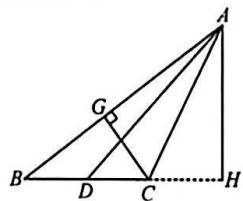

(2) $\because S_{\triangle ABC}=\frac{1}{2}AB\cdot CG$

$$
= \frac {1}{2} B C \cdot A H,
$$

$$
A B = 2 0, C G = 6, A H = 1 2,
$$

$$
\therefore 2 0 \times 6 = 1 2 B C, \therefore B C = 1 0,
$$

∵AD是中线，∴ $CD=\frac{1}{2}BC=5$ ，

$$
\therefore S _ {\triangle A D C} = \frac {1}{2} C D \cdot A H
$$

$$
= \frac {1}{2} \times 5 \times 1 2
$$

$$
= 3 0,
$$

∴△ADC 的面积为 30, CD 的长为 5.

21. 解：(1) $20^{\circ}$ ;

(2)在 $\triangle EDC$ 中，

$$
\because \angle B E C = \angle B D C + \angle D C E,
$$

$$
\text { 且 } \angle B E C = 1 1 6 ^ {\circ}, \angle B D C = 9 0 ^ {\circ},
$$

$$
\therefore \angle D C E = 2 6 ^ {\circ},
$$

∵CE 平分∠ACB，

$$
\therefore \angle D C B = 2 \angle D C E = 5 2 ^ {\circ},
$$

$$
\therefore \angle A B C = 1 8 0 ^ {\circ} - \angle A - \angle A C B = 5 8 ^ {\circ}.
$$

22. 解: (1) $\because \angle C = 35^{\circ}, \angle B = 2\angle C,$

$$
\therefore \angle B = 7 0 ^ {\circ}, \therefore \angle B A C = 7 5 ^ {\circ},
$$

$$
\because A E \text {   平分   } \angle B A C, \therefore \angle E A C = 3 7. 5 ^ {\circ},
$$

$$
\because A D \perp B C, \therefore \angle A D C = 9 0 ^ {\circ},
$$

$$
\therefore \angle D A C = 5 5 ^ {\circ},
$$

$$
\therefore \angle D A E = 5 5 ^ {\circ} - 3 7. 5 ^ {\circ} = 1 7. 5 ^ {\circ};
$$

$$
(2) \text { 设 } \angle C = \alpha , \text { 则 } \angle B = 2 \alpha ,
$$

$$
\therefore \angle B A C = 1 8 0 ^ {\circ} - 3 \alpha ,
$$

$$
\because A E \text {   平分   } \angle B A C,
$$

$$
\therefore \angle E A C = 9 0 ^ {\circ} - \frac {3}{2} \alpha .
$$

$$
\because E F \perp A E, \therefore \angle A E F = 9 0 ^ {\circ},
$$

$$
\therefore \angle A F E = 9 0 ^ {\circ} - (9 0 ^ {\circ} - \frac {3}{2} \alpha) = \frac {3}{2} \alpha ,
$$

$$
\therefore \angle F E C = \angle A F E - \angle C = \frac {3}{2} \alpha - \alpha =
$$

$$
\frac {1}{2} \alpha , \therefore \angle C = 2 \angle F E C.
$$

23. 解: (1) $\angle ABD$ 和 $\angle CBD$ 的大小关系是 $\angle ABD = \angle CBD$ ,

直线 BC, AE 的位置关系是 $BC \perp AE$ .

$$
\text { 故答案为 } \angle A B D = \angle C B D, B C \perp A E;
$$

$$
(2) \angle D B F = \angle B D F. \text { 理由如下: }
$$

$$
\text {   由(1)得   } \angle C B D = \angle F B D,
$$

$$
A E \perp B C, A E \perp D F,
$$

$$
\therefore D F \parallel B C, \therefore \angle C B D = \angle F D B,
$$

$$
\therefore \angle D B F = \angle B D F;
$$

$$
\because \angle A B C = 5 8 ^ {\circ}, \angle A C B = 4 8 ^ {\circ}, \tag {3}
$$

$$
\begin{array}{r l} \therefore \angle B A C & = 1 8 0 ^ {\circ} - \angle A B C - \angle A C B \\ & = 7 4 ^ {\circ}, \end{array}
$$

$$
\because \angle A B D = \angle C B D,
$$

$$
\therefore \angle A B D = \frac {1}{2} \angle A B C = 2 9 ^ {\circ},
$$

$$
\therefore \angle B D C = \angle A B D + \angle B A C = 1 0 3 ^ {\circ}.
$$

24. 解: (1) ∵ ∠ACB = 90°, CD 是高,

$$
\therefore \angle B + \angle C A B = 9 0 ^ {\circ},
$$

$$
\angle A C D + \angle C A B = 9 0 ^ {\circ},
$$

$$
\therefore \angle B = \angle A C D,
$$

$$
\because A E \text {   是角平分线,   } \therefore \angle C A F = \angle D A F,
$$

$$
\because \angle C F E = \angle C A F + \angle A C D,
$$

$$
\angle C E F = \angle D A F + \angle B,
$$

$$
\therefore \angle C E F = \angle C F E;
$$

$$
(2) \angle C E F = \angle C F E \text {   仍然成立，   }
$$

理由如下：

∵AF为∠BAG的角平分线，

$$
\therefore \angle G A F = \angle F A D = \angle E A C.
$$

$$
\because \angle A D F = \angle A C E = 9 0 ^ {\circ},
$$

$$
\therefore \angle C F E + \angle F A D = \angle C E F + \angle E A C =
$$

$$
9 0 ^ {\circ}, \therefore \angle C E F = \angle C F E;
$$

(3) $\angle CFE = 90^{\circ} - a$ . $\because C, A, G$ 三点共

线,AE,AN 为角平分线,

$$
\therefore \angle E A B = \frac {1}{2} \angle C A B,
$$

$$
\angle B A N = \frac {1}{2} \angle B A G,
$$

$$
\therefore \angle E A N = \angle E A B + \angle B A N
$$

$$
= \frac {1}{2} (\angle C A B + \angle B A G)
$$

$$
= \frac {1}{2} \times 1 8 0 ^ {\circ} = 9 0 ^ {\circ},
$$

$$
\therefore \angle M + \angle C E F = 9 0 ^ {\circ},
$$

$$
\text { 设 } \angle A C D = \angle B = x,
$$

$$
\angle C A E = \angle B A E = y,
$$

$$
\angle C F E = \angle A C D + \angle C A E = x + y,
$$

$$
\angle C E F = \angle E A B + \angle B = x + y,
$$

$$
\therefore \angle C F E = \angle C E F,
$$

$$
\because \angle M + \angle C E F = 9 0 ^ {\circ},
$$

$$
\therefore \angle M + \angle C F E = 9 0 ^ {\circ},
$$

$$
\because \angle M = \alpha , \therefore \angle C F E = 9 0 ^ {\circ} - \alpha .
$$

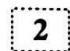

# 第十三章《三角形》专题卷

1. 解: $180^{\circ}$ . 方法一: 利用三角形的外角将 $\angle A + \angle B + \angle C + \angle D + \angle E$ 转化为 $\triangle BFG$ 的内角和;

方法二: 连接 BC, 转化为 $\triangle ABC$ 的内角和.

2. 解: $\because \angle BED = \angle F + \angle B$ ,

$$
\angle C G E = \angle C + \angle A,
$$

$$
\text { 又 } \because \angle B E D = \angle D + \angle E G D,
$$

$$
\therefore \angle F + \angle B = \angle D + \angle E G D,
$$

$$
\text { 又 } \because \angle C G E + \angle E G D = 1 8 0 ^ {\circ},
$$

$$
\therefore \angle C + \angle A + \angle F + \angle B - \angle D = 1 8 0 ^ {\circ},
$$

$$
\text { 又 } \because \angle D = 2 8 ^ {\circ},
$$

$$
\begin{array}{l} \therefore \angle A + \angle B + \angle C + \angle F = 1 8 0 ^ {\circ} + 2 8 ^ {\circ} = \\ 2 0 8 ^ {\circ}. \end{array}
$$

3. 解: 设 $\angle C = 2x$ , 则 $\angle ADB = 3x$ ,

$$
\because B D \text {   平分   } \angle A B C, \angle A B C = 7 2 ^ {\circ},
$$

$$
\therefore \angle A B D = \angle C B D = 3 6 ^ {\circ},
$$

$$
\because \angle A D B = \angle D B C + \angle C,
$$

$$
\therefore 3 x = 3 6 ^ {\circ} + 2 x, \therefore x = 3 6 ^ {\circ},
$$

$$
\therefore \angle C = 7 2 ^ {\circ}; \angle A D B = 1 0 8 ^ {\circ},
$$

$$
\therefore \angle B A C = 1 8 0 ^ {\circ} - 7 2 ^ {\circ} - 7 2 ^ {\circ} = 3 6 ^ {\circ},
$$

$$
\because A E \perp B E, \therefore \angle E = 9 0 ^ {\circ},
$$

$$
\because \angle A D B = \angle E + \angle D A E,
$$

$$
\therefore \angle D A E = 1 0 8 ^ {\circ} - 9 0 ^ {\circ} = 1 8 ^ {\circ}.
$$

4.125°或55°

解:如图,当 $\triangle ABC$ 为锐角三角形时,

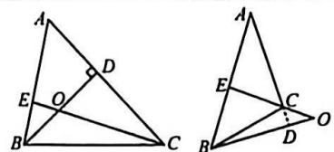

$\because BD\perp AC,\angle A=55^{\circ},$

$\therefore \angle ABD = 90^{\circ} - 55^{\circ} = 35^{\circ}$

∵CE⊥AB.

$\therefore \angle DOE = \angle BEC + \angle ABD = 90^{\circ} + 35^{\circ} = 125^{\circ}$

当△ABC为钝角三角形时。

BD⊥AC的延长线于点D.

同理可得 $\angle DOE = 90^{\circ} - \angle ABD = 90^{\circ} - 35^{\circ} = 55^{\circ}$

当 $\triangle ABC$ 为直角三角形，

$\angle ACB = 90^{\circ}$ 时， $\angle DOE$ 不存在。

故 $\angle DOE$ 的度数为125°或55°.

5.40° 解：∵在△ABC中，∠BAC=110°.

$\therefore \angle B + \angle C = 180^{\circ} - 110^{\circ} = 70^{\circ}$

由折叠可知，

$\angle B = \angle DAE, \angle C = \angle MAN,$

$\therefore \angle DAE + \angle MAN = \angle B + \angle C = 70^{\circ}$

$\therefore \angle DAM = 110^{\circ} - 70^{\circ} = 40^{\circ}.$

6. 解: 连接 $AA'$ , $\because A'B$ 平分 $\angle ABC$ ,

A'C 平分∠ACB.

$\therefore \angle A^{\prime}BC = \frac{1}{2}\angle ABC.$

$\angle A^{\prime}CB = \frac{1}{2}\angle ACB.$

$\because \angle BA^{\prime}C = 120^{\circ}$

$\therefore \angle A^{\prime}BC + \angle A^{\prime}CB = 180^{\circ} - 120^{\circ} = 60^{\circ}$

$\therefore \angle ABC + \angle ACB = 120^{\circ}$

$\therefore \angle BAC = 180^{\circ} - 120^{\circ} = 60^{\circ}$

∵沿 DE 折叠，∴ $\angle DAA'=\angle DA'A$ ，

$\angle EAA' = \angle EA'A$

$\because \angle 1 = \angle DAA' + \angle DA'A = 2\angle DAA'$

$\angle 2 = \angle EAA' + \angle EA'A = 2\angle EAA'$

$\therefore \angle 1 + \angle 2 = 2\angle DAA' + 2\angle EAA' =$

$2\angle BAC = 2\times 60^{\circ} = 120^{\circ}.$

7. 解: (1) $\because \angle BMC = 180^{\circ} - \frac{1}{2} (\angle ABC +$

$\angle ACB) = 180^{\circ} - \frac{1}{2}(180^{\circ} - \angle A) =$

120°.

$\therefore \angle 1 + \angle NMB = 120^{\circ},$

$\angle 2 + \angle NMB = 90^{\circ}$

$\therefore \angle 1 - \angle 2 = 30^{\circ}$

(2) $\frac{\alpha+\beta+180^{\circ}}{3}$ . 设 $\angle EBM = \angle MBC =$

x,∠DCM=∠MCB=y

$\therefore \angle BMC = 180^{\circ} - (x + y) = x + a = y + \beta ,$

$\therefore 2 \angle BMC = (x + y) + (\alpha + \beta)$ ,

$\therefore \angle BMC = \frac{\alpha + \beta + 180^\circ}{3}$ .

8. 解：(1) $150^{\circ}$ ;

(2) 连接 PC, ∵∠1=∠PCD+∠CPD,

$\angle 2 = \angle PCE + \angle CPE,$

$\therefore \angle 1 + \angle 2 = \angle PCD + \angle CPD +$

$\angle PCE + \angle CPE = \angle DPE + \angle ACB,$

$\because \angle ACB = 90^{\circ}, \angle DPE = \angle \alpha,$

$\therefore \angle 1 + \angle 2 = 90^{\circ} + \angle \alpha .$

9. 解: (1) 延长 BD 交 AC 于点 G.

$\because \angle BDC = \angle DGC + \angle C.$

$\angle DGC = \angle A + \angle B,$

$\therefore \angle BDC = \angle A + \angle B + \angle C_{1}$

(2)①由(1)，得 $\angle BDC=\angle BEC+\angle1+\angle2$

$\because \angle 1 = 20^{\circ}, \angle 2 = 30^{\circ}, \angle BEC = 100^{\circ}$

$\therefore \angle BDC = 100^{\circ} + 20^{\circ} + 30^{\circ} = 150^{\circ}.$

故答案为 $150^{\circ}$

② $\angle BDC+\angle BAC=2\angle BEC$ 。

理由如下：

由(1)，得 $\angle BDC=\angle BEC+\angle1+\angle2$ 。

$\angle BEC = \angle BAC + \angle ABE + \angle ACE.$

∵BE 平分∠ABD, CE 平分∠ACD.

$\therefore \angle ABE = \angle 1, \angle ACE = \angle 2,$

$\therefore \angle BDC - \angle BEC = \angle BEC - \angle BAC.$

$\therefore \angle BDC + \angle BAC = 2\angle BEC,$

(3) $2\angle BDC+\angle BAC=3\angle BEC$

理由如下：∵∠1= $\frac{1}{3}$ ∠ABD，

$\angle 2 = \frac{1}{3}\angle ACD,$

$\therefore \angle ABE = \frac{2}{3} \angle ABD.$

$\angle ACE = \frac{2}{3}\angle ACD,$

$\because \angle BEC = \angle BAC + \angle ABE + \angle ACE =$

$\angle BAC + \frac{2}{3}\angle ABD + \frac{2}{3}\angle ACD①.$

$\angle BDC = \angle BAC + \angle ABD + \angle ACD$

②.由②+①.

得 $\angle BDC + \angle BEC = 2\angle BAC + \frac{5}{3}\angle ABD+$

$\frac{5}{3}\angle ACD,$

$\therefore 3 \angle BDC + 3 \angle BEC = 6 \angle BAC +$

$5\angle ABD+5\angle ACD,$

$\therefore 3 \angle BDC + 3 \angle BEC = \angle BAC +$

5(∠BAC+∠ABD+∠ACD),

$\therefore 3 \angle BDC + 3 \angle BEC = \angle BAC +$

5∠BDC，

$\therefore 2 \angle BDC + \angle BAC = 3 \angle BEC.$

10. 解: (1) $45^{\circ}$ ;

(2)① $\frac{1}{2}\alpha,\because AD$ 平分 $\angle OAB,$

BC 平分∠ABN，

$\therefore \angle BAD = \frac{1}{2} \angle OAB,$

$\angle ABC = \frac{1}{2}\angle ABN,$

$\therefore \angle D = \angle ABC - \angle BAD = \frac{1}{2} (\angle ABN -$

$\angle OAB) = \frac{1}{2}\angle O = \frac{1}{2}\alpha$

②是，理由如下：∵BC平分∠ABN，

$\therefore \angle ABC = \frac{1}{2} \angle ABN.$

$\because \angle D = \angle ABC - \angle BAD, \angle D = \frac{1}{2} \alpha,$

$\therefore \frac{1}{2} a = \frac{1}{2}\angle ABN - \angle BAD,$

$\therefore \alpha = \angle ABN - 2\angle BAD,$

$\because \angle O = \angle ABN - \angle OAB, \angle O = \alpha,$

$\therefore \angle OAB = 2\angle BAD,$

∴AE 是△OAB 的角平分线；

(3) $\angle D = \frac{m - 1}{m}\angle O$ ，理由如下：

$\because \angle NBC = \frac{1}{m}\angle ABN,$

$\angle DAO = \frac{1}{m}\angle BAO.$

$\therefore \angle ABC = \frac{m - 1}{m}\angle ABN,$

$\angle BAD = \frac{m - 1}{m}\angle BAO.$

$\therefore \angle D = \angle ABC - \angle BAD$

$= \frac{m - 1}{m} (\angle ABN - \angle BAO)$

$= \frac{m - 1}{m}\angle O.$

11. 解: (1) 延长 AB 至点 F, 延长 AC 至点 G,

$\because \angle EBC = 90^{\circ} - \frac{1}{2}\angle ABC,$

$\angle ECB = 90^{\circ} - \frac{1}{2}\angle ACB,$

$\therefore 2 \angle EBC = 180^{\circ} - \angle ABC.$

$2\angle ECB = 180^{\circ} - \angle ACB$

$\therefore 2\angle EBC = \angle FBC.$

$2\angle ECB = \angle GCB$

∴BE,CE 均为△ABC 的外角平分线，

故易证 $\angle BEC = 90^{\circ} - \frac{1}{2}\angle BAC$

$= 90^{\circ} - \frac{1}{2}\times 78^{\circ}$

=51°;

(2) 易证 $\angle AEC = \frac{1}{2} \angle ABC = 21^{\circ}$ ,

$\angle AEB = \frac{1}{2}\angle ACB = 32^{\circ}$

(3)延长AC至点H，

∵CF 平分∠ACB,CE 平分∠BCH,

$\therefore \angle ECF = \frac{1}{2}\angle ACB + \frac{1}{2}\angle BCH$

$= \frac{1}{2}\times 180^{\circ}$

=90°,

$\therefore CF \perp CE.$

# 3 第十四章《全等三角形》

# 阶段检测卷(一)

1.A 2.B 3.A 4.B

5.C 6.C 7.A 8.D

9.B 解: 过点 A 作 AC ⊥ y 轴于点 C, 过

点 $A'$ 作 $A'B \perp x$ 轴于点 B，则 AC = 4，
CO=6, $\angle ACO=\angle A^{\prime}BO=90^{\circ}$

$\therefore \angle A + \angle AOC = \angle AOC + \angle COA' = 90^\circ .$

$\therefore \angle A = \angle COA' = \angle A'$

$\because AO = A'O,$

$\therefore \triangle AOC \cong \triangle A'OB(AAS)$

$\therefore A^{\prime}B = AC = 4,OB = OC = 6,$

$\therefore A^{\prime}(6,4)$ ，故选B.

10. D 解: 选 D. ∵ AB = AC,

$\angle B = \angle C, BE = CD,$

$\therefore \triangle ABE \cong \triangle ACD(SAS)$ ,

$\therefore AD = AE.$

∵ AB = AB, ∠B = ∠B, AD = AE,
∠BAD≠∠BAE,

∴△ABD 和△ABE 是一对“伪全等三角形”. 同理可得,

△ABD 和△ACD 是一对“伪全等三角

形".△ACD 和△ACE 是一对“伪全等

三角形".△ABE 和△ACE 是一对“伪

全等三角形".所以图中的“伪全等三角形”共有4对.

11. BC = EF (答案不唯一)

12. HL 13.75° 14.100

15. 解: (1) 过点 E 作 EF ⊥ AC, 交 AC 的

延长线于点F.

$\because CD \perp AC, EF \perp AC.$

$\therefore \angle DCM = \angle EFM = 90^{\circ}.$

∵M是DE的中点，∴DM=EM.

$\because \angle DMC = \angle EMF$

$\therefore \triangle DCM \cong \triangle EFM (AAS)$ .

$\therefore CM = FM, CD = FE.$

∵BC⊥CE, EF⊥AC,

$\therefore \angle BCE = 90^{\circ}, \angle CFE = 90^{\circ}$

$\therefore \angle ACB + \angle ECF = 90^{\circ}$

$\angle ECF + \angle FEC = 90^{\circ}$

$\therefore \angle ACB = \angle FEC.$

$\because AC=CD,\therefore AC=FE.$

$\because BC = CE,$

$\therefore \triangle ABC \cong \triangle FCE$ (SAS),

$\therefore \angle A = \angle CFE = 90^{\circ}$

(2)∵△ABC≌△FCE,

$\therefore FC = AB = 8,$

$\therefore CM = FM = \frac{1}{2} FC = 4.$

16. 解：∵△ABC≌△DEB, DE=9, BC=5.

$\therefore AB = DE = 9, BC = BE = 5,$

$\therefore AE = AB - BE = 9 - 5 = 4.$

17. 证明：∵CD⊥AB，BE⊥AC，

$\therefore \angle AEB = \angle ADC = 90^{\circ}$

在△ABE 和△ACD 中，

$\angle A = \angle A$

$\angle AEB = \angle ADC,$

$AB=AC.$

$\therefore \triangle ABE \cong \triangle ACD(AAS)$ ,

$\therefore AE = AD,$

$\because AB = AC, \therefore BD = CE.$

18. 证明：∵AE=BF，∴AF=BE.

又∵AD=BC,∠A=∠B,

$\therefore \triangle DAF \cong \triangle CBE(SAS)$

$\therefore \angle D = \angle C.$

19. 解: (1) ∵ ∠BAD = ∠CAE,

$\therefore \angle BAD + \angle BAE = \angle CAE + \angle BAE.$

即 $\angle BAC = \angle DAE$

在△ABC 和△ADE 中，

$\angle B=\angle D,$

$\left|AB = AD\right|$

$\angle BAC = \angle DAE,$

$\therefore \triangle ABC \cong \triangle ADE(ASA)$

(2)∵△ABC≌△ADE,

$\therefore BC = DE = 8,$

$\because CE=BC-BE,BE=5,$

$\therefore CE = 8 - 5 = 3.$

20. 解: 任务 1: 将测量方案示意图补充完整如图所示;

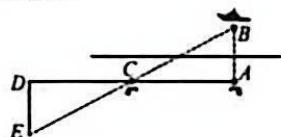

任务2:①由△ABC≌△DEC得AB=

$DE = 8$ （米），故答案为8；

②理由:如图,由题意可知,

AC=20米,CD=20米,DE=8米,

$\angle A = 90^{\circ}, \angle D = 90^{\circ}$

$\therefore \angle ACB = \angle DCE,$

AC=DC,∠A=∠D,

$\therefore \triangle ABC \cong \triangle DEC(ASA)$ .

∴AB=DE=8米，

∴小华的方案是正确的.

21. 解：(1) $\because AC \perp BC, DC \perp EC.$

$\therefore \angle ACB = \angle ECD = 90^{\circ}$

$\therefore \angle ACB + \angle BCE = \angle ECD + \angle BCE.$

$\therefore \angle ACE = \angle BCD.$

在 $\triangle ACE$ 与 $\triangle BCD$ 中，

$AC = BC, \angle ACE = \angle BCD, DC = EC.$

$\therefore \triangle ACE \cong \triangle BCD(SAS)$

$\therefore AE=BD_{1}$

(2)设CE与BD交于点G.

$\because \triangle ACE \cong \triangle BCD, \therefore \angle E = \angle D.$

$\because \angle EFG + \angle FGE + \angle E = 180^{\circ},$

$\angle GCD + \angle CGD + \angle D = 180^{\circ}$

$\angle FGE = \angle CGD$

$\therefore \angle EFG = \angle GCD = 90^{\circ}.$

$\therefore \angle AFD = 90^{\circ}.$

22. 解: (1) ∵ AD 是△ABC 的中线,

$\therefore BD=CD,\because AB=AC,AD=AD,$

$\therefore \triangle ADB \cong \triangle ADC(SSS).$

$\therefore \angle BAD = \angle CAD.$

由作图得 AE=AF.

在△ADE 和△ADF 中。

$AE = AF$

$\angle BAD = \angle CAD.$

$AD = AD.$

$\therefore \triangle ADE \cong \triangle ADF(SAS)$

(2) $\because\angle BAC=80^{\circ},\angle BAD=\angle CAD.$

$\therefore \angle EAD = \frac{1}{2} \angle BAC = 40^{\circ}$

由作图得 AE=AD.

过点 A 作 $AH \perp DE$ 于点 H.

可证△AHE≌△AHD(HL).

$\therefore \angle AED = \angle ADE,$

$\therefore \angle ADE = \frac{1}{2} (180^{\circ} - 40^{\circ}) = 70^{\circ}.$

∵△ADB≌△ADC.

$\therefore \angle ADB = \angle ADC = 90^{\circ}$

$\therefore \angle BDE = 90^{\circ} - \angle ADE = 20^{\circ}$

解:(1)延长BM交CD于点N.

∵AB∥CD,∴∠A=∠D.

∵M是AD的中点，∴AM=DM，

$\because \angle AMB = \angle DMN,$

$\therefore\triangle ABM\cong\triangle DNM.$

$\therefore BM = MN, \because BM \perp CM,$

$\therefore \angle CMB = \angle CMN = 90^{\circ},$

$\therefore\triangle CBM\cong\triangle CNM.$

$\therefore \angle B C M = \angle N C M .$

$\therefore$ CM 平分 $\angle {BCD}$ ；

(2)BC=CD-AB.理由如下：

由(1)得 $\triangle ABM\cong\triangle DNM$ 。

$\triangle CBM \cong \triangle CNM,$

$\therefore AB = DN, BC = CN,$

$\therefore BC = CN = CD - DN = CD - AB.$

24. 解：(1) $\because AC = BC, DC = EC,$

$\angle ACE = \angle BCD = \alpha +\angle BCE,$

$\therefore \triangle ACE \cong \triangle BCD(SAS)$ ,

$\therefore AE=BD;$

(2) $\because\triangle ACE\cong\triangle BCD,\therefore\angle A=\angle B,$

$\therefore \angle ACB = \angle AMB = \alpha ,$

$\because \angle AMD + \angle AMB = 180^{\circ}$

$\therefore \angle AMD = 180^{\circ} - a_{1}$

(3) 连接 CM,

过点 C 作 CG⊥BD 于点 G.

∵△ACE≌△BCD.

$\therefore S_{\triangle ACE} = S_{\triangle BCD}, AE = BD,$

$\therefore CH=CG,$

∴Rt△ACH≌Rt△BCG.

Rt△CHM≌Rt△CGM.

$\therefore MH=MG, AH=BG,$

$\therefore AM + BM = AH + HM + BG - MG$

=2AH.

$\because AM=13,BM=7,$

$\therefore 2AH = 13 + 7 = 20, \therefore AH = 10.$

# 4 第十四章《全等三角形》

# 阶段检测卷(二)

1.D 2.B 3.C 4.C 5.A 6.C 7.C

8.C 解: 过点 D 作 $DE \perp AB$ 于点 E.

∵AD平分∠CAB,∠C=90°.

$\therefore DE = CD = 3.$

$\therefore S_{\triangle ABC} = \frac{1}{2} AC \cdot CD + \frac{1}{2} AB \cdot DE =$

$\frac{1}{2} (AC + AB) \cdot CD = \frac{1}{2} \times 20 \times 3 = 30.$

故选C.

9.C

10.C 解: 过点 C 分别作 OA, OB, EF 的垂线, 垂足分别为 M, N, P.

$\because OC$ 平分 $\angle AOB, \therefore CM = CN.$

$\because \angle OFE = 74^{\circ},\angle EFC = 53^{\circ},$

$\therefore \angle CFB = 180^{\circ} - 74^{\circ} - 53^{\circ} = 53^{\circ}$

$\therefore \angle EFC = \angle CFB, \therefore FC$ 平分 $\angle EFB$ .

$\therefore CP=CN=CM,\therefore EC$ 平分 $\angle AEF$ .

由内外角平分线模型，

$\angle OCE = \frac{1}{2}\angle OFE = 37^{\circ}.$ 故选C.

11.5 12.62° 13.4 14.1

15.140° 解: 过点 A 作 AH⊥MN 于点 H.

∵M是AB的中点，

BD⊥MN.AH⊥MN.

$\therefore AM = BM, \angle BDM = \angle AHM.$

$\because \angle BMD = \angle AMH,$

$\therefore \triangle BMD \cong \triangle AMH(AAS)$

$\therefore AH = BD, \therefore BD + CE = AH + CE.$

∵AH≤AN,CE≤CN.

$\therefore BD + CE \leqslant AN + CN = AC.$

∴当MN⊥AC时.

$BD+CE$ 取最大值,此时,

$\angle BMN = 90^{\circ} + \angle BAC = 90^{\circ} + 50^{\circ} = 140^{\circ}$

16. 证明: 连 AO, ∵ AO 平分∠BAC,

19. 解：∵AD 是△ABC 的角平分线，

$DE \perp AB, DF \perp AC,$

$\therefore DF=DE=3,$

∴△ACD 的面积为 $\frac{1}{2}AC \cdot DF = 9$ .

20. 解: (1) ∵ DM ⊥ AP 于点 M, DN ⊥ BC 于点 N, CD 平分 ∠BCP,

$\therefore \angle AMD = \angle BND = 90^{\circ}, DN = DM.$ 在 Rt△ADM 和 Rt△BDN 中，

$\left\{ \begin{array}{l} DM = DN, \\ AD = BD, \end{array} \right.$

$\therefore Rt\triangle ADM \cong Rt\triangle BDN(HL)$

(2) $\because DN=DM=2,BC=6,$

$\therefore S_{\triangle BCD} = \frac{1}{2} BC \cdot DN = \frac{1}{2} \times 6 \times 2 = 6.$

21. 解: (1) 如图所示;

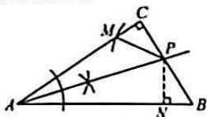

(2)作法:以点 P 为圆心,以 PB 的长为半径画弧交 AC 于点 M,连接 PM,则 $\angle PMC$ 即为所求.证明如下:
过点 P 作 $PN \perp AB$ 于点 N.由作法可知 PM = PB.

∵AP平分∠CAB,PN⊥AB, $PC \perp AC, \therefore PC = PN,$

∴ Rt△PMC≌Rt△PBN(HL),

$\therefore \angle PMC = \angle B.$

22. 解: (1) ∵ AD, CE 分别平分 ∠BAC, ∠ACB,

$\therefore \angle PAC = \frac{1}{2} \angle BAC,$

$\angle ACP = \frac{1}{2}\angle ACB.$

$\because \angle PAC + \angle ACP + \angle APC = 180^{\circ},$

即 $\frac{1}{2}\angle BAC+\frac{1}{2}\angle ACB+\angle APC=$ $180^{\circ}$

$\because \angle BAC + \angle ACB = 180^{\circ} - \angle B = 120^{\circ},$

$\therefore \angle APC = 120^{\circ},$

$\therefore \angle CPD = 180^{\circ} - \angle APC = 60^{\circ};$

(2)过点 P 作 $\angle APC$ 的平分线交 AC 于点 M，则 $\angle APE = \angle APM = \angle CPM = \angle CPD = 60^{\circ}$ ,

则 $\triangle APE\cong\triangle APM,$

$\triangle CPM \cong \triangle CPD$

$\therefore AE = AM, CD = CM,$

$\therefore AC = AM + CM = AE + CD.$

23. 解: (1) 如图 1 所示, 射线 OM 即为所求;

(2)由作图可知:OC=OD,CM=DM,

在 $\triangle COM$ 和 $\triangle DOM$ 中， $\left\{\begin{aligned}OC&=OD,\\ OM&=OM,\\ CM&=DM,\end{aligned}\right.$

$\therefore \triangle COM \cong \triangle DOM(SSS)$

$\therefore \angle COM = \angle DOM,$

∴OM为∠AOB的平分线，

∴角平分线的画法是根据全等三角形的“SSS”判定的；

(3)小明的说法正确,理由如下:

设 $AF$ 与 $DE$ 交于点 $O$ , 如图2所示:

$AD = AE$

在 $\triangle ADF$ 和 $\triangle AEF$ 中 $\left\{\begin{aligned}DF&=DE,\\ AF&=AF,\end{aligned}\right.$

$\therefore \triangle ADF \cong \triangle AEF(SSS)$ ,

$\therefore \angle D A F = \angle E A F,$

在 $\triangle AOD$ 和 $\triangle AOE$ 中，

$\left\{ \begin{array}{l} AD = AE, \\ \angle DAF = \angle EAF, \\ AO = AO, \end{array} \right.$

$\therefore \triangle AOD \cong \triangle AOE(SAS)$ ,

$\therefore \angle AOD = \angle AOE.$

$\because \angle AOD + \angle AOE = 180^{\circ},$

$\therefore \angle AOD = \angle AOE = 90^{\circ},$

∴AF⊥DE,故小明的说法正确.

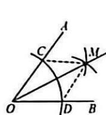  
图1

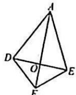  
图2

24. 解：(1) $\because EF \perp AB, \therefore \angle AFE = 90^{\circ}$

$\therefore \angle EAF = 90^{\circ} - \angle AEF = 90^{\circ} - 50^{\circ} =$ $40^{\circ},\because \angle BAD = 100^{\circ},$

$\therefore \angle DAE = 180^{\circ} - 100^{\circ} - 40^{\circ} = 40^{\circ}$

(2) 过点 E 作 EM⊥AD 于点 M， $EN \perp BC$ 于点 N.

∵BE平分∠ABC,EF⊥AB,

$\therefore EF = EN,$

$\because \angle EAF = \angle DAE = 40^{\circ},$

∴AE平分∠DAF，∴FE=EM，

$\therefore EM = EN, \because EM \perp AD, EN \perp CD,$

∴DE 平分∠ADC;

(3)∵△ACD 的面积=△ADE 的面积+△CDE 的面积，

$\therefore \frac{1}{2} AD \cdot EM + \frac{1}{2} CD \cdot EN = 18,$

$\therefore \frac{1}{2}(AD + CD) \cdot EM = 18,$

$\therefore \frac{1}{2} \times (4 + 8) \times EM = 18,$

$\therefore EM = 3, \therefore EF = 3,$

∴△ABE 的面积 = $\frac{1}{2} AB \cdot EF =$

$\frac{1}{2} \times 6 \times 3 = 9.$

# 5 第十四章《全等三角形》单元检测卷

1. D  2. D  3. B  4. B  5. B

6.B 7.B 8.C 9.B 10.C

11.5 12. $CA = FD$ (答案不唯一)

13.20° 14.8

15. 解: (1) 在 CB 上截取 CF = CD, 连接 EF. 则 $\triangle CFE \cong \triangle CDE(SAS)$ ,

$\therefore FE=DE,$

Rt△BEF≌Rt△ADE(HL),

$\therefore \angle CED = \angle CEF,$

$\therefore \angle BEF = \angle ADE,$

$\therefore \angle DEF = \angle A = 90^{\circ},$

$\therefore \angle CED = \frac{1}{2}\angle DEF = 45^{\circ};$

(2)∵△BEF≌△ADE,

$\therefore AE = BF = BC - CD = 1.$

16. 证明：∵AB 是∠CAD 的平分线，

$\therefore \angle CAB = \angle DAB,$

∴在△ABC和△ABD中，

$\vert AC = AD,$

$\angle CAB = \angle DAB,$

$AB = AB$

$\therefore \triangle ABC \cong \triangle ABD(SAS)$

$\therefore \angle C = \angle D.$

17. 证明：∵ AB∥CD，∴ ∠B = ∠FED，

$\because BF = EF, \angle AFB = \angle EFD,$

$\therefore \triangle ABF \cong \triangle DEF(ASA)$ ,

$\therefore AF = DF.$

18. 证明：∵在四边形 ABCD 中，

AD//BC,

$\therefore \angle ADE = \angle CBF.$

在△ADE 和△CBF 中，

$|\Lambda D = BC,$

$\left\{ \begin{array}{l} \angle ADE = \angle CBF, \\ \angle 1 = \angle 2, \end{array} \right.$

$\therefore \triangle ADE \cong \triangle CBF(AAS)$

$\therefore DE=BF.$

19. 证明：∵DA⊥AB, CE⊥AB,

$\therefore \angle CAD = \angle BCE = 90^{\circ},$

∵C是AB的中点，∴AC=BC，

又∵CD=BE，

$\therefore Rt\triangle ACD \cong Rt\triangle CBE(HL)$ ,

$\therefore \angle D = \angle E.$

20. 解: (1) BC = CD, ∠BDA;

(2)选甲:在 $\triangle ABC$ 和 $\triangle DEC$ 中,

$\left\{ \begin{array}{l} AC = DC, \\ \angle ACB = \angle ECD, \end{array} \right.$

$BC = EC$

$\therefore \triangle ABC \cong \triangle DEC(SAS)$ ,

$\therefore AB=ED;$

选乙：∵AB⊥BD，DE⊥BD，

$\therefore \angle B = \angle CDE = 90^{\circ},$

在 $\triangle ABC$ 和 $\triangle EDC$ 中，

$\left\{ \begin{array}{l} \angle ABC = \angle EDC, \\ CB = CD, \\ \angle ACB = \angle ECD, \end{array} \right.$

$\therefore\triangle ABC\cong\triangle EDC(ASA)$ ,

$\therefore AB=ED;$

选丙:在△ABD 和△CBD 中,

$\left\{ \begin{array}{l} \angle ABD = \angle CBD, \\ BD = BD, \\ \angle ADB = \angle CDB, \end{array} \right.$

$\therefore\triangle ABD\cong\triangle CBD(ASA)$ ,

$\therefore AB=BC.$

21. 证明: 在 $\triangle ABC$ 中,

$\angle B = 50^{\circ}, \angle C = 20^{\circ}$

$\therefore \angle CAB = 180^{\circ} - \angle B - \angle C = 110^{\circ}.$

$\because AE \perp BC, \therefore \angle AEC = 90^{\circ}.$

$\therefore \angle D A F = \angle A E C + \angle C = 110^{\circ},$

$\therefore \angle DAF = \angle CAB.$ 在 $\triangle DAF$ 和

$\triangle CAB$ 中， $\left\{ \begin{array}{l}AD = AC,\\ \angle DAF = \angle CAB,\\ AF = AB, \end{array} \right.$

$\therefore \triangle DAF \cong \triangle CAB(SAS)$ .

$\therefore DF=CB.$

22. 解: (1) 过点 F 作 $FG \perp AB$ ，垂足为 G，

由题意，得 $\angle AGF = \angle EDC = 90^{\circ}$ $BG = EF,FG = BE$

$\angle AFG = \beta, \angle CED = \alpha,$

$\because \alpha + \angle ECD = 90^{\circ}, \alpha + \beta = 90^{\circ}$

$\therefore \angle ECD = \beta = \angle AFG,$

$\because BE=CD,\therefore FG=CD,$

$\therefore \triangle AGF \cong \triangle EDC(AAS)$ ,

$\therefore AF=CE_{1}$

(2)∵△AGF≌△EDC,

$\therefore AG = ED = BD - BE = 58 - 20 =$ 38(米),

$\therefore AB = AG + GB = 39.7$ （米）

答:单元楼 AB 的高为 39.7 米.

23. 解: (1) ∵ ∠ACB = 90°,

$\therefore \angle CAB + \angle CBA = 90^{\circ}$

又∵AD,BE分别平分∠BAC,∠ABC,

$\therefore \angle BAD + \angle ABE = \frac{1}{2} (\angle CAB +$

$\angle CBA)=45^{\circ}$

$\therefore \angle APB = 135^{\circ}$

(2) $\because \angle APB = 135^{\circ}$ ,

$\therefore \angle BPD = 45^{\circ}$

又∵PF⊥AD，

$\therefore \angle FPB = 90^{\circ} + 45^{\circ} = 135^{\circ},$

$\therefore \angle APB = \angle FPB,$

$\because \angle ABP = \angle FBP, BP = BP,$

$\therefore \triangle ABP \cong \triangle FBP(ASA)$ ,

$\therefore PA = PF;$

(3)∵△ABP≌△FBP,

$\therefore \angle BAP = \angle F,$

$\because \angle BAP = \angle CAD,$

$\therefore \angle F = \angle CAD,$

又∵∠APH=∠FPD,AP=FP,

$\therefore \triangle APH \cong \triangle FPD(ASA)$ ,

$\therefore AH = FD,$

又∵ $\Lambda B=FB$ ,

$\therefore AB = FD + BD = AH + BD.$

24. 解: (1) $\because S_{\triangle AOB} = \frac{1}{2} AO \cdot OB = 4,$

OA=2OB,

$\therefore OB^{2}=4,\therefore OB=2,OA=4,$

$\therefore A(0,4),B(2,0);$

(2)∵AQ平分∠PAO,

BQ 平分∠PBO,

∴可设∠PAQ=∠OAQ=x，

$\angle PBQ = \angle OBQ = y,$

延长 AQ 交 BP 于点 K。

则 $\angle QKB = \angle PAQ + \angle P = x + \angle P$

$\therefore \angle AQB = \angle QKB + \angle PBQ$

$= x + y + \angle P$

$\therefore x + y = \angle AQB - \angle P.$

又∵在四边形 PAOB 中，

$\angle PAO + \angle PBO + \angle P + \angle AOB =$

$360^{\circ},\therefore 2x + 2y + \angle P + 90^{\circ} = 360^{\circ},$

$\therefore 2 (\angle AQB - \angle P) + \angle P + 90^{\circ} =$

$360^{\circ}, \therefore \angle AQB = 135^{\circ} + \frac{1}{2} \angle P,$

(3)过点C作CM⊥x轴于点M，

CN⊥y轴于点N.

$\because AC = 2BC, \therefore S_{\triangle AOC} = 2S_{\triangle BOC}$

$\therefore \frac{1}{2} OA \cdot CN = 2 \times \frac{1}{2} OB \cdot CM,$

$\therefore \frac{1}{2} \times 4CN = 2 \times \frac{1}{2} \times 2CM,$

$\therefore CM = CN,$

$\because S_{\triangle BCD} = S_{\triangle AOC}$

$\therefore \frac{1}{2} OA \cdot CN = \frac{1}{2} BD \cdot CM,$

$\therefore BD = OA = 4,$

$\therefore OD = 2, \therefore D(-2,0)$ .

# 6 第十四章《全等三角形》专题卷

1.66° 2.5 3.D 4.D 5.AC=CD

6. 解：(1) 略；(2) CF = 5.

7. 解：(1) 略；(2) AD = 7.5.

8. 证明：证△ABC≌△AED.

9. 证明: 在 $\triangle DOB$ 与 $\triangle EOC$ 中,

$\because \angle BDC = \angle CEB = 90^{\circ},$

$\angle DOB = \angle EOC, \therefore \angle B = \angle C,$

又∵AO平分∠BAC，

$\therefore \angle BAO = \angle CAO.$

在 $\triangle ABO$ 与 $\triangle ACO$ 中，

$\angle BAO = \angle CAO.$

$\angle B = \angle C,$

$\Lambda O = \Lambda O.$

$\therefore \triangle ABO \cong \triangle ACO(AAS), \therefore OB = OC.$

10. 解: 作 $DE \perp AC$ 于点 $E$ , 设 $DF = DE = x$ ,

∵△ABC 的面积等于△ABD 与△ACD 的面积之和，

$\therefore \frac{1}{2} AB \cdot x + \frac{1}{2} AC \cdot x = 25,$

∴15x=50,则 $x=\frac{10}{3}$ ,则 $DF=\frac{10}{3}$ .

11. 证明: 作 $DM \perp AB$ 于点 $M$ , 作 $DN \perp$

AC 于点 N，证 DM = DN 即可.

12. 解: 作 CG⊥AB 于点 G,

CH⊥AD于点H，

∵AC为∠BAD的平分线，

$\therefore CG=CH.\because AB=AD,$

$\therefore S_{\triangle ABC} = S_{\triangle ACD} = \frac{1}{2} S_{\text {圆边BABCD}}$

又∵AE=DF,∴ $S_{\triangle AEC}=S_{\triangle CDF}$ ,

$\therefore S_{\text{PDBADT}} = S_{\triangle AIC} + S_{\triangle ACF} = S_{\triangle CDF} +$

$S_{\triangle ACF} = S_{\triangle ACD} = \frac{1}{2} S_{\text{四边形ABCD}}.$

13. 解: (1) 作 $DN \perp AB$ 交 $BA$ 的延长线于点 $N$ , 证 $\triangle DMC \cong \triangle DNB$ .

$\therefore DM=DN,\therefore DA$ 平分 $\angle CAN;$

(2) $\frac{AC - AB}{AM} = 2.$

方法一:(截长法)在 AC 上截取 CF=

AB, 证△DCF≌△DBA, DF=DA,

$AM = MF, AC - AB = 2AM;$

方法二:(间接补短法)作 DN⊥AB 于

点 N，证 $\triangle DCM \cong \triangle DBN$ ，

DM=DN，证CM=BN，

$AM=AN, AC=AM+CM,$

AB=BN-AN,

AC-AB=AM+AN=2AM;

方法三:(补短法)延长 BA 至点 E,使

BE=AC,证△DCA≌△DBE(SAS),

$DE = DA, \angle DAC = \angle E = \angle DAE,$

作 ${DN}\bot {AE}$ 于点 $N$ ,

$\therefore EN=AN=AM,$

$\therefore AC-AB=2AM.$

14. 证明：(1)延长 EB 至点 M，

使 BM=DF，证△ABM≌△ADF，

$\triangle AEM \cong \triangle AEF$ 即可.

(2)EF=BE-DF.在BE上截取BM=

DF, 证 $\triangle ABM \cong \triangle ADF, \triangle AME \cong$

△AFE 即可.

15. 证明: 延长 $AE$ 至点 $F$ , 使得 $FE = AE$ .

连接 CF，证 $\triangle ABE \cong \triangle FCE$ ，

则 AB = CF，

$\because AB=CD,\therefore CD=CF,\angle D=\angle F,$

$\because \angle F = \angle BAE, \therefore \angle BAE = \angle D.$

16. 证明: 延长 AD 至点 G,

使 DG=AD，连接 CG，

易证△ADB≌△GDC，

再证△EAF≌△ACG，

$\therefore EF = AG = 2AD.$

17. 解: (1) ① 过点 O 分别作 OM ⊥ PB 于

点 $M, ON \perp PA$ 交 $PA$ 的延长线于点

N. 设 $\angle ABP = a$ ，则 $\angle BAP = 90^\circ - a$

$\because OA=OB,\therefore\angle ABO=\angle BAO=45^{\circ},$

$\therefore \angle OBM = \angle ABO + \angle ABP = 45^{\circ} + a$

$\angle OAN = 180^{\circ} - \angle BAO - \angle BAP = 45^{\circ} + a,$

$\therefore \angle OBM = \angle OAN,$

又∵∠OMB=∠ONA,OB=OA,

$\therefore \triangle BOM \cong \triangle AON$ ，则 $OM = ON$

∴PO 平分∠APB.

$\therefore \angle OPA = \frac{1}{2}\angle APB = 45^{\circ};$

② $\angle OPA=135^{\circ}$ ,过点O分别作OM⊥PB于点M,ON⊥AP交AP的延长线于点N,

$\because \angle APB = \angle AOB = 90^{\circ},$

$\therefore \angle OAN = \angle OBM,$

又∵∠BMO=∠N=90°,OB=OA,

$\therefore \triangle BOM \cong \triangle AON(AAS)$ ,

$\therefore OM = ON,$

$\therefore PO$ 平分 $\angle BPN, \therefore \angle BPO = 45^{\circ}$ ,

$\therefore \angle OPA = \angle BPA + \angle BPO = 135^{\circ}$

(2)证明:过点O作OM⊥OE交BD于点M,则△OME是等腰直角三角形,

$\therefore \triangle OBM \cong \triangle OAE,$

$\therefore \angle AEO = \angle BMO = 135^{\circ}$

$\therefore \angle AEB = 90^{\circ}, \therefore AE \perp BE.$

# 7 第十五章《轴对称》

# 阶段检测卷(一)

1.C 2.A 3.C 4.B 5.B

6.B 7.A 8.C 9.C 10.C

11.6 12. $(-2, - 1)$

13.81° 解:由翻折可得 $\angle ABE=\angle EBD=\angle DBC,\angle CDB=\angle C'DB=84^{\circ}$ ,

$\because \angle CDB = \angle A + \angle ABD,$

$\therefore \angle ABD = 84^{\circ} - 30^{\circ} = 54^{\circ}$

$\therefore \angle ABC = \frac{3}{2} \angle ABD = 81^{\circ}$ .

14.5 15.2

16. 解：(1)由轴对称的性质，得

$\angle D = \angle B = 45^{\circ}$

(2)由轴对称的性质，

得 $\angle CAB=\angle CAD=60^{\circ}$

$\therefore \angle ACB = \angle ACD = 75^{\circ}$

$\therefore \angle BCD = 150^{\circ}.$

17. 解: (1) 依题意得 $3a - 11 = 2, 2b - 1 = 5$ ,

$\therefore a = \frac{13}{3}, b = 3;$

(2)点 M 向左平移 3 个单位长度后的坐标为 $(3a-14,5)$ ,

∵点 M 向左平移 3 个单位长度后与点 N 关于 x 轴对称，

$\therefore 3a - 14 = -2, 2b - 1 = -5,$

$\therefore a=4,b=-2.$

18. 解: $\because MP$ 和 $NQ$ 分别为 $AB$ ,

AC 的垂直平分线，

$\therefore AP=BP,QA=QC,$

∴△PAQ 的周长 = PA + PQ + QA =
PB + PQ + QC = BC = 13.

19. 解: (1) $A_{1}(-2,-1)$ , $B_{1}(2,-3)$ ,

$A_{1}(2,1), B_{1}(-2,3)$ . 图略；

(2) $A_{1}(0,1),B_{1}(-4,3),A_{1}(-2,3),$ $B_{1}(2,1)$ . 图略.

20. 解: (1) 由题意, 得

AB=AD,BE=DE,CD=DE,

$\therefore BE=DE=CD.$

$\therefore AB+BE=AD+CD=AC$

(2) 由题意, 得 $\triangle CDF \cong \triangle EDF$ , $\triangle ABE \cong \triangle ADE$ .

$\therefore \angle C = \angle DEC, \angle B = \angle ADE,$

$\angle AEB = \angle AED = 80^{\circ}$

$\therefore \angle DEC = \angle C = \angle 180^{\circ} - \angle AEB - \angle AED = 20^{\circ},$

$\therefore \angle C = \angle DEC = 20^{\circ},$

$\therefore \angle B = \angle ADE = \angle C + \angle DEC = 40^{\circ}.$

21. 解: (1) 如图所示;

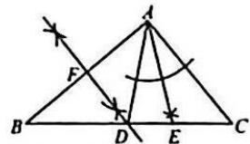

(2)由作图知,AD=BD,

$\angle DAE = \angle CAE,$

$\therefore \angle B = \angle BAD = 40^{\circ},$

$\angle DAE = \frac{1}{2}\angle CAD,\because \angle C = 50^{\circ},$

$\therefore \angle BAC = 180^{\circ} - \angle B - \angle C = 90^{\circ},$

$\therefore \angle CAD = \angle BAC - \angle BAD = 90^{\circ} - 40^{\circ} = 50^{\circ}, \therefore \angle DAE = 25^{\circ}$ .

22. 证明: (1) ∵ 点 F 在 AB 的垂直平分线上,

$\therefore FA=FB,\therefore \angle BAF=\angle B.$

∵AB⊥CD,BF⊥AC,

$\therefore \angle C = \angle B, \therefore \angle C = \angle BAF;$

(2) 连接 AD，

$\therefore \angle B = \angle BAF = \angle C = \angle ADC,$

∵AB=CD,∴△AFB≌△CAD,

$\therefore AF = AD, \angle FAB + \angle DAB = \angle ADC + \angle DAB = 90^{\circ},$

∴△AFD为等腰直角三角形，

$\therefore \angle AFD = 45^{\circ}.$

23. 解: (1) 由折叠, 得 $\angle AOE = \angle A'OE$ , $\angle BOF = \angle B'OF$ ,

$\because \angle AOE + \angle A'OE + \angle BOF + \angle B'OF = 180^\circ,$

$\therefore 2(\angle A^{\prime}OE + \angle B^{\prime}OF) = 180^{\circ},$

$\therefore \angle EOF = \angle A'OE + \angle B'OF = 90^\circ ;$ (2) $\because \angle A = \angle B = 90^\circ ,$

$\because \angle AOE + \angle AEO = \angle AOE +$

$\angle BOC = 90^{\circ}, \therefore \angle AEO = \angle BOC,$ 又 $\because \angle A = \angle B = 90^{\circ}, OE = OF,$

$\therefore \triangle AEO \cong \triangle BOF,$

$\therefore AE=OB=5,AO=BC,$

$\therefore BC = AD = DE + AE = 8 + 5 = 13,$

$\therefore AO=BC=13,$

$\therefore CD=AB=AO+BO=13+5=18;$ (3) $20^{\circ}$ 或 $40^{\circ}$ .

如图 4, $\angle BOF = (180^{\circ} - 2\angle AOE - \angle A'OB') \div 2 = 20^{\circ}$ ;

如图 5, $\angle BOF = [180^{\circ} - (2\angle AOE - \angle A'OB')]\div 2 = 40^{\circ}$ .

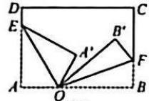

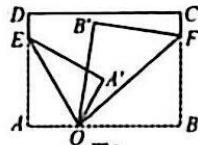  
图4

24. 解: (1) 过点 P 作 $PF \perp BC$ 于点 F, 则 $\triangle PBE$ 与 $\triangle PBF$ 关于直线 PB 对称 (或在 BC 上截取 BF = BE 也可). 图略:

(2) 连接 PA, PC.

∵BP 是∠ABC 的平分线，

$PE \perp AB, PF \perp BC,$

$\therefore PE = PF, \angle PEA = \angle PFC = 90^{\circ}.$

∵点P在AC的垂直平分线上，

$\therefore PA=PC,$

$\therefore Rt\triangle PEA\cong Rt\triangle PFC,$

$\therefore PE=PF,AE=CF.$

$\because PB=PB,PE=PF,$

∴Rt△PBE≌Rt△PBF(HL),

$\therefore BE=BF,$

$\therefore AB + BC = (BE - AE) + (BF +$

$CF) = BE + BF = 2BE;$

(3) $\because BE=BF,$

$\therefore AB+AE=BC-CF.$

∵AB=7,BC=23,

$\therefore 7 + AE = 23 - AE, \therefore AE = 8.$

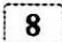

# 第十五章《轴对称》

# 阶段检测卷(二)

1. B 2. D 3. A 4. C 5. B

6.D 7.C 8.C 9.B

10. B 解: ① 当 $\angle BNM = 90^{\circ}$ 时,

$\because \angle B = 60^{\circ}, \therefore \angle BMN = 30^{\circ},$

$\therefore BN=\frac{1}{2}BM,$ 即 $2t=\frac{1}{2}(20-t),$

解得 $t = 4$

②当 $\angle BMN=90^{\circ}$ 时，

$\because \angle B = 60^{\circ},\therefore \angle BNM = 30^{\circ},$

$\therefore BM=\frac{1}{2}BN$ ，即 $20-t=\frac{1}{2}\times2t$ ，

解得 t=10. 综上所述, t=4 或 10.
故选 B.

11.3 12.70° 13.2 14.38°

15. 解：(1) $\because AB = AC, \angle A = 60^{\circ}$ ,

∴△ABC 是等边三角形，

$\therefore \angle ACB = \angle A = 60^{\circ},$

$\because EC = CD,$

$\therefore \angle D = \angle CED = 30^{\circ},$

$\therefore \angle AEF = \angle CED = 30^{\circ},$

$\angle AFE = 180^{\circ} - (\angle A + \angle AEF)$ $= 180^{\circ} - (60^{\circ} + 30^{\circ}) = 90^{\circ}$

(2) $\because AE=CE,\therefore BE\perp AC,$

$\therefore \angle EBF = \angle EBD = 30^{\circ},$

$\therefore BE=2EF=6,$

$\because \angle D = \angle EBD = 30^{\circ},$

$\therefore DE=BE=6,$

$\therefore DF = EF + DE = 9.$

16. 证明：∵∠D=∠C，

$\angle AED = \angle BEC, AD = BC,$

$\therefore \triangle ADE \cong \triangle BCE, \therefore AE = BE,$

∴△EAB 是等腰三角形.

17. 解: 36 海里.

18. 解: $\because \triangle ABC$ 是等边三角形,

$\therefore \angle ABC = 60^{\circ}$

∵BD⊥AC.

$\therefore \angle D B C = \frac{1}{2} \angle A B C = 30^{\circ}$

$\because DB=DE,\therefore\angle E=\angle DBC,$

$\therefore \angle E = 30^{\circ}.$

19. 解: (1) $\because AB = AD,$

$BC = DC, AC = AC,$

$\therefore\triangle ABC\cong\triangle ADC,$

$\therefore \angle BAC = \angle DAC,$

$\therefore AC$ 平分 $\angle BAD_{1}$

(2)实践小组的判断对:理由如下:

∵AC是∠BAD的平分线,AB=AD,

∴AC⊥BD,∵AC是铅锤线，

∴BD 是水平的，∴门框是水平的，

∴实践小组的判断对.

20. 解: $\because \angle DAE = \angle BAC,$

$\therefore \angle BAD = \angle CAE.$

$\because AB = AC, AD = AE,$

$\therefore \triangle ABD \cong \triangle ACE, \therefore \angle B = \angle ACE.$

$\because AB = AC, \therefore \angle B = \angle ACB,$

$\therefore \angle B = \angle ACE = \angle ACB.$

∵CE∥AB,

$\therefore \angle B + \angle ACB + \angle ACE = 180^{\circ},$

$\therefore \angle B = 60^{\circ}$

∴△ABC,△ADE都是等边三角形，

$\therefore \angle ADO = \angle BAC = 60^{\circ}.$

$\because \angle BAD = 20^{\circ}, \therefore \angle DAO = 40^{\circ}$

$\therefore \angle COE = \angle AOD = 180^{\circ} - 60^{\circ} - 40^{\circ}$ $= 80^{\circ}$

21. 解: (1) 如图所示;

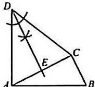

(2) $\because DA=DC,DE$ 平分 $\angle ADC,$

$\therefore AE=EC,DE\perp AC,\therefore AC=2AE.$

∵AD⊥AB, AC⊥CB,

$\therefore \angle AED = \angle DAB = \angle ACB = 90^{\circ},$

$\therefore \angle DAE + \angle BAC = 90^{\circ},$

$\angle BAC + \angle B = 90^{\circ}$

$\therefore \angle DAE = \angle B.$

∵AD=BA,

$\therefore \triangle ADE \cong \triangle BAC$ (AAS),

$\therefore BC = AE, \therefore AC = 2AE = 2BC.$

22. 解: (1) $\triangle ABC$ 为直角三角形.

$\because AD=BD,\angle B=\angle BAD,$

$\because \angle C = 3\angle B$ ，设 $\angle B = a$

$\therefore \angle C = 3\alpha, \angle BAD = \alpha,$

∵AD平分∠BAC,

$\therefore \angle BAC = 2\angle BAD = 2a,$

$\because \angle BAC + \angle B + \angle C = 180^{\circ}$

$\therefore 2a + a + 3a = 180^{\circ}, \therefore a = 30^{\circ}$

$\therefore \angle C = 90^{\circ}, \therefore \triangle ABC$ 为直角三角形；

(2)同(1)设 $\angle B=\alpha$ ，则 $\angle C=3\alpha$ ，

$\therefore \angle BAC = 180^{\circ} - 4a$

$\therefore \angle BAD = \frac{1}{2} \angle BAC = 90^\circ - 2a,$

$\because DE \perp AD, \therefore \angle ADE = 90^{\circ},$

$\therefore \angle AED = 2a$

$\therefore \angle BDE = \angle AED - \angle B = \alpha = \angle B,$

$\therefore BE=DE.$

23. 解：(1) $\because \triangle ABC$ 为等边三角形，

$\therefore AB=BC=AC,$

$\angle A = \angle B = \angle ACB = 60^{\circ}.$

$\because DE \perp AE, \therefore \angle AGE = 30^{\circ},$

$\therefore AG = 2AE$

(2) $\because \angle CGD = 30^{\circ} = \angle AGE,$

$\because \angle ACB = \angle CGD + \angle D.$

$\therefore \angle D = 30^{\circ} = \angle CGD, \therefore CG = CD.$

设 $\Lambda E = x$ ，则 $CD = 3x, CG = 3x$

在 $\mathrm{Rt}\triangle AEG$ 中， $\Lambda G = 2\Lambda E = 2x$

$\therefore AB = BC = AC = 5x$

$\therefore BE = 4x, BF = 5x - 6,$

在 Rt△BEF 中，BE=2BF，

即 $4x = 2(5x - 6)$

解得 $x = 2, \therefore AC = 5x = 10.$

24. 解: (1) $\because DF \parallel AB, \therefore \angle CDF = \angle A = 60^{\circ}, \angle CFD = \angle B = 60^{\circ}$ ,

又∵∠C=60°，

∴△DCF为等边三角形；

(2)过点D作DF//AB交BC于点F.

由(1)知△DCF为等边三角形，

$\therefore DF = DC, \angle DFC = \angle DCF = 60^{\circ}$

$\because DB = DE, \therefore \angle DBE = \angle DEB,$

$\therefore \angle BDF = \angle EDC,$

$\therefore \triangle BDF \cong \triangle EDC(SAS)$ ,

$\therefore BF = CE = 1, \because CF = CD = 3,$

$\therefore AB=BC=4;$

(3) $AD = BF + CE$ .

理由: 过点 D 作 DM//AB 交 BC 于点 M, 由 (2) 知 $\triangle DCM$ 为等边三角形,

$\triangle DFM \cong DEC(SAS)$ ,

$\therefore FM=CE,\because CD=CM,AC=BC,$

$\therefore AD = BM = BF + FM = BF + CE.$

# 9 第十五章《轴对称》

# 单元检测卷

1. B 2. A 3. C 4. B 5. C

6.A 7.C 8.D 9.C

10.C 解:取 OB 的中点 P, 连接 PM,

$\therefore OP = ON, \angle MOP = \angle BON,$ $OM = OB$

$\therefore \triangle OPM \cong \triangle ONB, \therefore PM = BN,$

$\therefore BN + CM = PM + CM \geqslant PC$

∴当P,C,M三点共线时,BN+CM

取得最小值，此时 $\angle ACM = 45^{\circ}$

故选C.

11.3 12.3 13.52° 14.1.6

15. 解：(1) 由题意，得 $\angle ADE = \angle EDC = \angle B, \angle ECD = \angle BCD = \angle EDC$

$\therefore \angle ACB = 2\angle B,$

$\because \angle BAC = 90^{\circ}, \therefore \angle B = 30^{\circ};$

(2) $\because\angle B=\angle BCD,\therefore BD=CD,$

$\because AE=1,\therefore CE=DE=2,$

$\therefore AC = AE + EC = 3, \therefore BC = 6.$

16. 解: $\because AD = BD$ ,

∴可设 $\angle B=\angle BAD=x$ ，

$\therefore \angle C = \angle ADC = 2x,$

$\therefore x + 2x + 57^{\circ} = 180^{\circ}, \therefore x = 41^{\circ}$

$\therefore \angle B = 41^{\circ}.$

17. 证明：∵AD∥BC，∴∠D=∠DBC.

$\because AB=AD,\therefore\angle D=\angle ABD,$

$\therefore \angle ABD = \angle DBC,$

$\therefore\angle ABC=2\angle D.$

∵AB=AC,∴∠ABC=∠C,

$\therefore \angle C = 2\angle D.$

18. 证明：∵AB=AC，

∴点 A 在线段 BC 的垂直平分线上.

$\because DB=DC,$

∴点 D 在线段 BC 的垂直平分线上，

∴AD垂直平分线段BC.

∵AD的延长线交BC于点E.

$\therefore BE=CE.$

19. 证明：∵BD=DE。

$\therefore \angle ABE = \angle DEB.$

∵BE平分∠ABC，

$\therefore \angle ABE = \angle EBC,$

$\therefore \angle DEB = \angle EBC, \therefore DE \parallel BC.$

20. 解：(1) 图略， $B_{1}(3,2)$ ;

(2)图略， $B_{1}(3,2)$ ;

(3)由图可知 $\triangle AB_{1}C_{1}$ 与

$\triangle A_{1}B_{2}C_{2}$ 关于直线 $x = 3$ 对称.

21. 解: 过点 E 作 ED//BC, 交 AB 于点 D, 过点 E 作 EH⊥BF 于点 H, 设 AE = x.

∵△ABC是等边三角形，

$\therefore \angle A = \angle ABC = \angle ACB = 60^{\circ}.$

$\because DE \parallel BC, \therefore \angle ADE = \angle ABC = 60^{\circ}.$

$\angle AED = \angle ACB = 60^{\circ}$

∴△ADE 是等边三角形，

$\therefore AD = AE = DE.$

∵AB=AC,

$\therefore EC = BD = 4, AB = BC = AC = 4 + x.$

$\because \angle ACB = 60^{\circ}, EC = BD = 4,$

$\therefore \angle HEC = 180^{\circ} - \angle ACB - \angle EHC =$

$180^{\circ} - 60^{\circ} - 90^{\circ} = 30^{\circ}$

$\therefore CH=\frac{1}{2}EC=2.$

$\therefore BH = BC - CH = 4 + x - 2 = 2 + x.$

$\because EB = EF, EH \perp BF, BF = 8,$

$\therefore BH = FH = 4,$

$\therefore 2 + x = 4, \therefore x = 2, \therefore AE = 2.$

22. 解: (1) 以点 E 为圆心, EC 为半径画弧与 BC 交于另一点 M. 再分别以 M, C

为圆心，以大于 $\frac{1}{2} MC$ 的长为半径画弧交于点 $T$ ，连接 $ET$ 交 $BC$ 于点 $F$ ，点 $F$ 即为所求；

(2) 连接 EM, 设 EM 与 CD 交于点 G.

$\because EM=EC,AB=AC,$

$\therefore \angle ABC = \angle ACB = \angle EMC,$

∴AB//EM.

$\because CD \perp AB, \angle BAC = 45^{\circ}$

$\therefore EM \perp CD, \angle MEC = \angle BAC = 45^{\circ}$

$\therefore EG=CG.$

$\because EF \perp BC, \therefore \angle EGC = \angle EFC = 90^{\circ},$

$\therefore \angle GEN = \angle MCG.$

$\because \angle EGN = \angle CGM = 90^{\circ},$

$\therefore\triangle EGN\cong\triangle CGM,\therefore EN=CM.$

$\because EM=EC,EF\perp MC,$

$\therefore CM = 2CF, \therefore \frac{EN}{CF} = \frac{CM}{CF} = 2.$

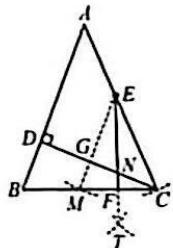

23. 解: (1) 在 $\triangle ABC$ 中, $\angle A = 40^{\circ}$ ,

$\angle B = 60^{\circ}, \therefore \angle ACB = 80^{\circ}$

∵CD为角平分线.

$\therefore \angle ACD = \angle BCD = 40^{\circ}$

$\therefore \angle ACD = \angle A, \therefore CD = DA.$

$\therefore \triangle ADC$ 是等腰三角形；

$\because \angle DCB = \angle A, \angle B = 60^{\circ}$

$\therefore \angle BDC = 80^{\circ},$

$\therefore \angle BDC = \angle ACB,$

∴△BCD 和△BAC 是“等角三角形”，

∴CD为△ABC的等角分割线；

(2)分三种情况：

①当 DA=DC 时，

如答图1， $\angle ACD = \angle A = 42^{\circ}$

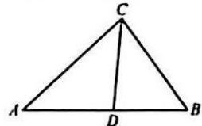  
答图1

∵CD 是△ABC 的等角分割线，

$\therefore \angle ACB = \angle BDC = 42^{\circ} + 42^{\circ} = 84^{\circ}$

②当 DA = AC 时，

如答图 2, $\angle ACD = \angle ADC = 69^{\circ}$ ,

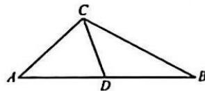  
答图2

∵CD 是△ABC 的等角分割线，

$\therefore \angle BCD = \angle A = 42^{\circ}$

则 $\angle ACB=69^{\circ}+42^{\circ}=111^{\circ}$ ；

③当 AC=DC 时，

$\angle ADC = \angle A = 42^{\circ}$

则 $\angle BDC=180^{\circ}-42^{\circ}=138^{\circ}=\angle ACB$ ，

$\therefore \angle B = 180^{\circ} - 42^{\circ} - 138^{\circ} = 0^{\circ}$ （舍去）

故 $\angle ACB$ 的度数为84°或111°.

24. 解: (1) 画图略. 由折叠的性质可得:

$AC = AE = 5,DE = CD = 2,$

$\angle C = \angle AED.$

$\because \angle C = 2\angle B, \therefore \angle AED = 2\angle B.$

$\because \angle AED = \angle B + \angle BAE,$

$\therefore \angle B = \angle BAE,$

$\therefore BE = AE = 5,$

$\therefore BC = BE + DE + CD = 5 + 2 + 2 = 9;$

(2) $AB+AC=CD$ ,理由如下:

在 AF 上截取 AG = AC，连接 DG.

∵AD平分∠CAF，

$\therefore \angle B = \angle CHB.$

$\because \angle CHB + \angle CHA = 180^{\circ},$

$\therefore \angle B + \angle D = 180^{\circ}.$

$\because \angle D = 2\angle B, \therefore \angle B + 2\angle B = 180^{\circ},$

$\therefore \angle B = 60^{\circ}.\because BC = CH = 10,$

$\therefore \triangle BCH$ 为等边三角形， $\therefore BH = 10$

$\therefore AB = BH + AH = 10 + 8 = 18.$

# 10 第十五章《轴对称》

# 专题卷(一)

1. B 2. C 3. (1)-1 -1 (2)1 1

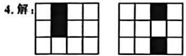  
方法一  
方法二

5. 解: (1)(1,-1);

(2) 点 $A_{1}(-1,1), B_{1}(-4,2)$ ,

$C_1(-1,4)$ ，图略；

(3) $\triangle A_{1}B_{1}C_{1}$ 的面积为：

$$
\frac {1}{2} \times 3 \times 3 = \frac {9}{2}.
$$

6.B 7.54° 8.D

9. 解：∵∠ACB=90°，

$\therefore \angle A = 90^{\circ} - \angle B = 50^{\circ}.$

$\because AC=AD,$

$\therefore \angle ACD = \angle ADC = \frac{180^{\circ} - \angle A}{2} = 65^{\circ},$

$\therefore \angle BCD = 90^{\circ} - 65^{\circ} = 25^{\circ}.$

10. 证明: $\because AB = AC, AM$ 为 $BC$ 边上的中线, $\therefore AM \perp BC$ .

∵M为BC的中点，

∴AM 垂直平分 BC, ∴NB = NC.

11. 证明: 设 AB, DE 交于点 O,

$\because \angle EAB + \angle E = \angle AOD = \angle EDB +$

$\angle B, \angle EAB = \angle EDB,$

$\therefore \angle E = \angle B.$

∵DA 平分∠EDC，

$\therefore\angle ADE=\angle ADC,$

又∵ED=DC,AD=AD,

$\therefore \triangle ADE \cong \triangle ADC(SAS)$ ,

$\therefore \angle E = \angle C, \therefore \angle B = \angle C,$

$\therefore AB=AC.$

12. 证明: 连接 BC, ∵ AB = AC,

$\therefore \angle ABC = \angle ACB,$

$\because \angle ABD = \angle ACD,$

$\therefore \angle ABD - \angle ABC = \angle ACD - \angle ACB,$

即 $\angle DBC = \angle DCB, \therefore DB = DC.$

13. 证明：∵△ABC 是等边三角形，

$\therefore \angle BAC = \angle ABC = 60^{\circ},$

AB=AC=BC.

$\because \angle EBF = 60^{\circ} = \angle ABC,$

$\therefore \angle ABE = \angle FBC.$

∵AD是高，

$\therefore \angle BAE = \angle CAE = 30^{\circ} = \angle BCF,$

$\therefore\triangle ABE\cong\triangle CBF,\therefore BE=BF,$

又∵∠EBF=60°,

∴△BEF 是等边三角形.

14. 证明：∵DB=DE，

$\therefore \angle DBC = \angle E = 30^{\circ},$

$\because CE=CD,\therefore \angle CDE=\angle E=30^{\circ},$

$\therefore \angle BCD = \angle CDE + \angle E = 60^{\circ},$

$\therefore \angle BDC = 90^{\circ},$

∵BD是中线，∴AB=BC，

$\because \angle BCA = 60^{\circ},$

∴△ABC 是等边三角形.

15. 解: (1) ∵ △ABC 为等边三角形，

$\therefore AB=CA,\angle B=\angle CAE=60^{\circ},$

$\because BD=AE,\therefore\triangle ABD\cong\triangle CAE,$

$\therefore AD=CE;$

(2)由(1)知 $\angle BAD=\angle ACE$ .

$\therefore \angle DFC = \angle CAF + \angle ACE = \angle CAF + \angle BAD = 60^{\circ}.$

16. 解: 当 $DE \perp AC$ 时, $\because AD = AE$ ,

$\angle DAE = 80^{\circ}, \therefore \angle ADE = \angle E = 50^{\circ}$

$\angle DAF = \angle EAF = 40^{\circ}$

∵△ABC 是等边三角形，

$\therefore \angle BAC = 60^{\circ},$

$\therefore \angle BAD = 60^{\circ} - 40^{\circ} = 20^{\circ},$

$\because \angle CFD = 90^{\circ}$

$\therefore \angle EDC = 90^{\circ} - \angle C = 90^{\circ} - 60^{\circ} = 30^{\circ}.$

17.B

18. 解： $\because \angle CAC' = 60^\circ, AC = AC'$ ，

$\therefore \triangle AC^{\prime}C$ 为等边三角形，

$\therefore \angle BAC' = 30^{\circ}$ ，又 $\because \angle AC'B' = 60^{\circ}$

$\therefore \angle ADC' = 90^\circ$ ，在 $\triangle ADC'$ 中， $C^{\prime}D =$

$\frac{1}{2} C^{\prime}A$ ，在 $\triangle AB'C'$ 中， $C'A = \frac{1}{2} C'B'$

$\therefore C^{\prime}D = \frac{1}{4} C^{\prime}B^{\prime},\therefore \frac{C^{\prime}D}{B^{\prime}D} = \frac{1}{3}.$

19. 解: 如图所示.

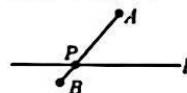  
图1

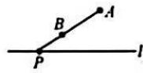  
图2

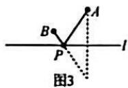

20. 解：∵ AB = AD = DC，

$\therefore \angle B = \angle ADB,$

$\angle C = \angle CAD,$

$\because \angle ADB = \angle C + \angle CAD,$

$\therefore \angle ADB = 2\angle C = 2\angle CAD,$

设 $\angle C=\alpha$ ，则 $\angle B=2\alpha$ ，

$\because \angle CAD - \angle BAD = 10^{\circ},$

$\therefore\angle BAD=\alpha-10^{\circ}$ ，在 $\triangle ABD$ 中，

$\angle BAD + \angle B + \angle ADB = 180^{\circ},$

$\therefore (a - 10^{\circ}) + 2a + 2a = 180^{\circ},$

$\therefore a=38^{\circ},\therefore\angle B=76^{\circ},\angle C=38^{\circ}.$

21. 解: $\because \angle C = 88^{\circ}$ ,

$\therefore \angle A + \angle B = 180^{\circ} - 88^{\circ} = 92^{\circ}$

$\because AD=AE,BD=BF,$

$\therefore \angle ADE = 90^{\circ} - \frac{1}{2}\angle A,$

$\angle BDF = 90^{\circ} - \frac{1}{2}\angle B,$

$\therefore \angle ADE + \angle BDF = 180^{\circ} - \frac{1}{2} (\angle A +$

$\angle B)=134^{\circ}$

$\therefore \angle EDF = 180^{\circ} - 134^{\circ} = 46^{\circ}.$

22. 解: 此题分两种情况:

(1)AB 边的垂直平分线与 AC 边交于点 D，垂足为 E，

$\angle ADE=40^{\circ}$ ，则 $\angle A=50^{\circ}$

∵AB=AC,

$\therefore \angle B = (180^{\circ} - 50^{\circ}) \div 2 = 65^{\circ}$ ;

(2)AB 边的垂直平分线与 CA 的延长

线交于点D，垂足为E，

$\angle ADE = 40^{\circ}$ ，则 $\angle DAE = 50^{\circ}$

$\therefore \angle BAC = 130^{\circ}.\because AB = AC,$

$\therefore \angle B = (180^{\circ} - 130^{\circ})\div 2 = 25^{\circ}.$

故 $\angle B$ 的度数为 $65^{\circ}$ 或 $25^{\circ}$ .

# 11 第十五章《轴对称》

# 专题卷(二)

1. 解: 连接 AD, ED,

$\because AB = AC, \angle BAC = 90^{\circ},$

D 为 BC 的中点，

$\therefore \angle DAC = \angle DBA = 45^{\circ}, AD = BD,$

$\therefore \angle DAF = \angle DBE = 135^{\circ},$

又∵AF=BE,

$\therefore \triangle DAF \cong \triangle DBE(SAS)$ ,

$\therefore DF = DE, \angle ADF = \angle BDE,$

$\therefore \angle FDE = \angle ADB = 90^{\circ},$

$\therefore \angle DFE = \angle DEF = 45^{\circ}.$

2. 解: 过点 A 作 $AN \perp BC$ 于点 N，
则 BN = CN，

$\because AD = BD, \therefore \angle DAB = \angle DBA,$

$\because BE \perp AD, \therefore \angle E = \angle ANB = 90^{\circ},$

又∵AB=BA，

$\therefore \triangle ABN \cong \triangle BAE(AAS)$ ,

$\therefore AE = BN,$

$\therefore AE = BN = \frac{1}{2} BC, \therefore \frac{AE}{BC} = \frac{1}{2}.$

3. 解: 设 $\angle ACD = x$ , 则 $\angle ACB = x + 10^{\circ}$ .

$\because EC = ED, \therefore \angle EDC = \angle ACD = x.$

∵AD=DE

$\therefore \angle A = \angle DEA = \angle EDC + \angle ACD = 2x.$

$\because AB = AC, \therefore \angle B = \angle ACB = x + 10^{\circ}.$

$\therefore 2x + 2(x + 10^{\circ}) = 180^{\circ}$ ，解得 $x = 40^{\circ}$

$\therefore \angle B = 50^{\circ}.$

$\therefore \angle ADC = \angle B + \angle BCD = 50^{\circ} + 10^{\circ} = 60^{\circ}.$

4. 解: 连接 AC. ∵ 点 A 是 BC, CD 的垂直平分线的交点, ∴ AB = AC = AD.

$\therefore \angle B = \angle ACB, \angle D = \angle ACD.$

$\therefore \angle BCD = \angle ACB + \angle ACD = \angle B + \angle D.$

$\because \angle BAD + \angle B + \angle D + \angle BCD = 180^{\circ} \times 2 = 360^{\circ},$

$\therefore 140^{\circ} + 2\angle BCD = 360^{\circ}.$

$\therefore \angle BCD = 110^{\circ}.$

5. 解: 设 $\angle D = x, \because CE = CD,$

$\therefore \angle CED = \angle D = x.$

$\therefore \angle ECA = \angle CED + \angle D = 2x.$

$\because CB=CA,$

$\therefore \angle B = \angle A = \frac{180^{\circ} - \angle ACB}{2} = 75^{\circ} - x.$

$\therefore \angle BED = \angle A + \angle D = 75^{\circ} - x + x = 75^{\circ}.$

6. $40^{\circ}$ 或 $80^{\circ}$ 解: 当点 E 在线段 AC 时, $\angle BAC = 40^{\circ}$ ; 当点 E 在 AC 的延长线上时, $\angle BAC = 80^{\circ}$ . $\therefore \angle BAC$ 的度数为 $40^{\circ}$ 或 $80^{\circ}$ .

7. 证明: 延长 AE, CD 交于点 F,

$\because CD \parallel AB, \therefore \angle F = \angle 2, \because \angle 1 = \angle 2,$

$\therefore \angle 1 = \angle F, \therefore AD = DF,$

$\because CD \parallel AB, \therefore \angle C = \angle B, \angle F = \angle 2,$

又∵E是BC的中点，

$\therefore CE = BE, \therefore \triangle ABE \cong \triangle FCE,$

$\therefore AB = CF = CD + DF = CD + AD.$

8. 证明: 延长 AB, FD 交于点 G,

作 $BH \parallel AC$ 交GF于点H，

易证等腰 $\triangle AFG$ 和等腰 $\triangle BGH$

$\triangle DBH \cong \triangle DCF.$

$\therefore CF = BH = BG, AF = AG.$

$\because \Lambda F = \Lambda G = \Lambda B + BG,$

$\therefore AF = AB + CF.$

9. 解: 过点 B 作 FB // AC, 交直线 DM 于

点 F, AC 的延长线交直线 DM 于点 E,

$\therefore \angle E = \angle F, \angle DBF = \angle DCE = 90^{\circ}$

$\because \angle BDM = 45^{\circ}, \therefore \angle E = \angle F = 45^{\circ}$

$\therefore CD=CE,BD=BF,$

设 $BD = BF = x$ ，则 $CD = CE = 4 - x$

∵M为AB的中点，

$\therefore AM = BM, \because \angle AME = \angle BMF,$

$\therefore \triangle AME \cong \triangle BMF, \therefore AE = BF,$

$\therefore 2 + (4 - x) = x$ ，解得 $x = 3$

即 $BD$ 的长为3.

10. 解: 延长 AD, CE 交于点 G.

∵AD为中线，∴BD=CD，

∵AB//CE,

$\therefore \angle B = \angle DCG, \angle BAD = \angle CGD,$

$\therefore \triangle ABD \cong \triangle GCD.$

$\therefore AB = GC = 25,$

$\because CE = 8, EG = GC - CE,$

$\therefore EG = 25 - 8 = 17$

$\because \angle DFE = \angle BAD,$

$\therefore \angle DFE = \angle CGD,$

$\therefore EF = EG, \therefore EF = 17.$

11. 证明: (截长法) 在 BE 上截取 BF =

AD, 连接 CF.

易证△CBF≌△CAD，

$\triangle CED \cong \triangle CEF, \therefore DE = EF,$

$\therefore AD + DE = BF + EF = BE.$

12. 证明: 连接 CO, 在 CF 上截取 CG =

CO, 连接 OG. 得等边△CGO,

$\therefore \triangle OCE \cong \triangle OGF, \therefore CE = FG,$

$\therefore CF - CE = CF - FG = CG = CO =$

$\frac{1}{2}AC.$

13. 解法一(截长法): 在 $CD$ 上截取 $DE =$

BD, 构造等展 $\triangle ABE$ 和等展 $\triangle AEC$ 即可；

解法二(补短法):延长CB至点E,

使 BE=AB，构造等腰△ABE 和等腰△ACE 即可。

14. 证明: 延长 BA, ED 交于点 F, 过点 A

作 $AG \parallel BE$ ，交EF于点G，则 $\triangle BEF$

和 $\triangle FAG$ 都为等边三角形. 易

$\triangle ADG \cong \triangle CDE, \therefore CE = AG = AF,$

$\therefore BE-AB=BF-AB=AF=CE.$

15. 证明: 在 AB 上截取 BF = BC,

连接 CF.

$\because \angle B = 60^{\circ}, \therefore \triangle CFB$ 为等边三角形，

$\therefore \angle CFB = 60^{\circ}$

$\therefore \angle AFC = 120^{\circ} = \angle AED.$

$\because \angle A = \angle A, AC = AD,$

$\therefore \triangle ACF \cong \triangle ADE, \therefore AF = AE,$

$\therefore AB = AF + BF = AE + BC.$

16. 解: 延长 AD 至点 F, 使 AF = AC,

连接 CF. 则 $\triangle ACF$ 是等边三角形，

$\therefore\triangle DFC\cong\triangle EAC,\therefore DF=AE,$

$\therefore AD + AE = AF = AC = \frac{1}{2} AB = 2.$

17. 解: 过点 A 作 $AH \perp BC$ 于点 H,

$\therefore BH = CH, \because \angle ADC = 60^{\circ},$

$\therefore \angle DAH = 30^{\circ}, \therefore AD = 2DH,$

$\because AD=2BD,\therefore BD=DH,$

$\therefore CH=2BD,\therefore CD=3BD,$

$\therefore \frac{BD}{CD} = \frac{1}{3}.$

18. 证明: 解法一: 过点 O 作 $OG \perp OC$ ,

交 BC 的延长线于点 G.

则 $\triangle AOC \cong \triangle BOG$

$\therefore \angle CBO = \angle CAO.$

$\therefore \angle BCA = \angle BOA = 90^{\circ}, \therefore BC \perp AC.$

解法二：过点 $A$ 作 $AE \perp OC$ 于点 $E$

过点 B 作 $BF \perp OC$ 于点 F，

则 $\triangle OAE\cong\triangle BOF$ 。

$\therefore CF=BF=OE,$

$\therefore OF=CE=AE,\therefore \angle ACE=45^{\circ}$

$\therefore \angle ACB = 90^{\circ}, \therefore BC \perp AC.$

# 12 八上数学期中检测卷

6.B 7.C 8.B

9.C 解:延长 BD, AC 交于点 P,

$\therefore BD = DP$ ，设 $S_{\triangle BCD} = S_{\triangle CDP} = x$

则 $S_{\triangle ADP} = 8 + 2x, \therefore S_{\triangle ADP} = 4 + x,$

$\therefore S_{\triangle ACD} = 4 + x - x = 4.$

10.C 解:作点 C 关于 AB 的对称点 F, 过

点 F 作 $FE' \perp AC$ 于点 $E'$ ，交 AB 于点

$D'$ ，当点 D, E 分别在点 $D'$ , $E'$ 处时，

$CD+DE$ 的值最小.

$\because CF \perp AB, FE' \perp AC,$

$\therefore \angle F = \angle BAC = 30^{\circ},$

$\therefore \angle FD^{\prime}B = \angle CD^{\prime}B = 60^{\circ}$

$\therefore \triangle CD^{\prime}B$ 为等边三角形，

$CD^{\prime} = CB = \frac{1}{2} AB = 6,$

$\therefore FD'=CD'=6.$

$\because \angle CD^{\prime}E^{\prime} = 60^{\circ},\therefore \angle D^{\prime}CE^{\prime} = 30^{\circ},$

$\therefore D^{\prime}E^{\prime} = \frac{1}{2} CD^{\prime} = 3,$

$\therefore FE' = FD' + D'E' = 6 + 3 = 9.$

故 $CD + DE$ 的最小值为9，选C.

11. 稳定性 12. 55°

13. AB = AC 14.1

15. 解: (1) ∵ DE = BE = EF,

$\angle DEF = 60^{\circ}$

$\therefore \angle DBF = \angle EFB = 30^{\circ},$

$\therefore \angle GFC = \angle EFB = 30^{\circ}$

(2) 过点 C 作 $CH \perp BG$ ，交 BG 的延长

线于点 H. $\because \angle GFC = 30^{\circ}$ ,

$\therefore CF = 2CH.\because AD = DF = EF = FC,$

$\therefore AF=2FC=4CH.$

$\because \angle EFB = 30^{\circ}, \angle DFE = 60^{\circ}$

$\therefore \angle AFB = 90^{\circ}, \therefore \angle AFG = 90^{\circ}.$

$\therefore \frac{AG}{GC} = \frac{S_{\triangle AFG}}{S_{\triangle HFC}} = \frac{AF}{HC} = 4.$

16. 解: ① 若腰长为 5 cm, 底边长为 2 cm,

则周长为 12 cm.

②若腰长为2cm，底边长为5cm，

∵2+2<5,

∴不能构成三角形，舍去，

∴周长为12cm.

17. 解：∵∠ABC=82°，∠C=58°，

$\therefore \angle CAB = 40^{\circ},$

∵AE平分∠CAB,∴∠DAF=20°,

∵BD⊥AC于D，∴∠ADB=90°.

$\therefore \angle AFB = \angle ADB + \angle DAF$

$= 90^{\circ} + 20^{\circ} = 110^{\circ}$

18. 解: (1) ∵ AB // CE.

$\therefore \angle BAC = \angle DCE.$

在 $\triangle ABC$ 和 $\triangle CDE$ 中，

$\angle BAC = \angle DCE,$

$\angle B = \angle D,$

$BC = DE$

$\therefore \triangle ABC \cong \triangle CDE(AAS)$

(2)∵△ABC≌△CDE,

$\therefore \angle B = \angle D = 30^{\circ}.$

∵AB//CE.

$\therefore \angle B + \angle BCE = 180^{\circ},$

$\therefore \angle BCE = 180^{\circ} - 30^{\circ} = 150^{\circ}.$

19. 解: (1)(2) 画图略.

20. 解：(1) $\because \angle BDC = 90^{\circ}$

$\therefore \angle DCB = 90^{\circ} - \angle DBC = 45^{\circ},$

$\therefore \angle DBC = \angle DCB,$

$\therefore DB=DC.$

$\because AB=AC,AD=AD,$

$\therefore \triangle ABD \cong \triangle ACD,$

(2) $\because\triangle ABD\cong\triangle ACD.$

$\therefore \angle ADB = \angle ADC$

$= (360^{\circ} - \angle BDC)\div 2$

$$
\therefore \angle A F E = \angle C A D + \angle A C E
$$

$$
= \angle B C E + \angle A C E
$$

$$
= \angle A C B
$$

$$
= 6 0 ^ {\circ};
$$

$$
(2) ① \because \angle B F E = \angle F B C + \angle B C F.
$$

$$
\angle P A F = \angle P A C + \angle C A D,
$$

$$
\angle P A C = \angle F B C, \angle C A D = \angle B C E,
$$

$$
\therefore \angle P A F = \angle B F E.
$$

$$
\because \angle P F A = \angle B F E,
$$

$$
\therefore \angle P A F = \angle P F A,
$$

$$
\therefore P A = P F = 5,
$$

$$
\therefore M P = P F - F M = 5 - 3 = 2,
$$

$$
② \text {延长} A P \text {至点} N, \text {使} A N = F B.
$$

$$
\text { 连接 } C N, F N, \text { 延长 } F P \text { 至点 } G,
$$

$$
\text { 使 } F G = A N \text { ，连接 } A G
$$

$$
\because \angle N A C = \angle F B C, A C = B C,
$$

$$
\therefore \triangle N A C \cong \triangle F B C,
$$

$$
\therefore N C = F C, \angle A C N = \angle B C F,
$$

$$
\therefore \angle A C N + \angle A C E = \angle B C F + \angle A C E.
$$

$$
\therefore \angle F C N = \angle A C B = 6 0 ^ {\circ},
$$

$$
\therefore \triangle N C F \text { 为等边三角形, } \therefore F N = F C.
$$

$$
\because A F = F A, \angle A F G = \angle F A N, G F =
$$

$$
A N, \therefore \triangle A F G \cong \triangle F A N.
$$

$$
\therefore A G = F N = C F.
$$

$$
\angle G A F = \angle N F A = 1 8 0 ^ {\circ} - \angle A F E -
$$

$$
\angle N F C = 6 0 ^ {\circ} = \angle A F E,
$$

$$
\therefore A G \parallel C F, \therefore \angle G = \angle M F C.
$$

$$
\because \angle A M G = \angle C M F,
$$

$$
\therefore \triangle A M G \cong \triangle C M F,
$$

$$
\therefore A M = C M, \therefore M \text {为} A C \text {的中点.}
$$

$$
2 4. \text { 解 }: (1) A (0, 2), B (2, 0);
$$

$$
(2) \text { 连接 } C M.
$$

$$
\because C A = C B, M \text {为} A B \text {的中点，}
$$

$$
\therefore \angle A C M = \angle B C M,
$$

$$
\because M P \perp B C, C P \perp A C,
$$

$$
\therefore \angle A C M + \angle P C M = 9 0 ^ {\circ},
$$

$$
\angle B C M + \angle P M C = 9 0 ^ {\circ},
$$

$$
\therefore \angle P C M = \angle P M C, \therefore P C = P M;
$$

$$
(3) \text {过点} C \text {作} C H \perp x \text {轴于点} H,
$$

$$
\text { 连接 } O C.
$$

$$
\because A C = B C, O A = O B,
$$

$$
\therefore \angle C A B = \angle C B A, \angle O A B = \angle O B A,
$$

$$
\therefore \angle O A C = \angle O B C,
$$

$$
\therefore \angle O A D = \angle H B C,
$$

$$
\because \angle A O D = \angle B H C, A D = B C,
$$

$$
\therefore \triangle A O D \cong \triangle B H C.
$$

$$
\therefore O D = H C, O A = H B,
$$

$$
\because O A = O B, A C = B C,
$$

$$
\therefore O C \text {平分} \angle A O B,
$$

$$
\therefore \angle C O H = 4 5 ^ {\circ},
$$

$$
\triangle O C H \text { 为等腰直角三角形， }
$$

$$
\therefore O H = C H = O B + B H = O B + O A = 4,
$$

$$
\therefore B D = 6, \therefore \triangle B C D \text {   的面积为   } 1 2.
$$

# 13 第十六章《整式的乘法》阶段检测卷(一)

1. A 2. D 3. D 4. B 5. D

6.D 7.C 8.D 9.C

10.C 解： $\because m=3^{*}+1, \therefore 3^{*}=m-1,$

$$
\because n = 2 + 9 ^ {\circ},
$$

$$
\therefore n = 2 + \left(3 ^ {2}\right) ^ {\bullet}
$$

$$
= 2 + (3 ^ {\circ}) ^ {2}
$$

$$
= 2 + (m - 1) ^ {2}.
$$

11.1 12. $x^{2} - x - 20$

13. $(-2abc)$ 14. $8a-4ab+2b^{2}$

15. 解: (1) 设乙长方形的另一边长为 x,

∵两根铁丝的长度相同，

$$
\therefore 2 (m + 5 + m + 3) = 2 (m + 2 + x),
$$

$$
\therefore x = m + 6 _ {1}
$$

$$
(2) S _ {1} = (m + 5) (m + 3)
$$

$$
= m ^ {2} + 8 m + 1 5, S,
$$

$$
= (m + 6) (m + 2)
$$

$$
= m ^ {2} + 8 m + 1 2.
$$

$$
\therefore S _ {1} - S _ {2} = (m ^ {2} + 8 m + 1 5) - (m ^ {2} +
$$

$$
8 m + 1 2) = m ^ {2} + 8 m + 1 5 - m ^ {2} - 8 m -
$$

$$
1 2 = 3.
$$

16. 解: 原式 $= 4a^{4} + a^{4} - a^{4} = 4a^{4}$ .

$$
1 7. \text { 解:原式 } = (6 a ^ {4} + 9 a ^ {4}) \div 5 a ^ {2}
$$

$$
= 1 5 a ^ {3} \div 5 a ^ {2}
$$

$$
= 3 a ^ {4}.
$$

$$
1 8. \text { 解:原式 } = 5 a ^ {3} - 1 5 a ^ {2} + 5 a - a ^ {2} + a ^ {2} =
$$

$$
6 a ^ {3} - 1 6 a ^ {2} + 5 a.
$$

$$
\text { 当 } a = 1 \text { 时   ,   原   式 } = - 5.
$$

$$
9 x ^ {2} - 3 x + 6 x - 2 > 9 (x ^ {2} + 3 x -
$$

$$
x - 3),
$$

$$
9 x ^ {2} + 3 x - 2 > 9 x ^ {2} + 1 8 x - 2 7,
$$

$$
- 1 5 x > - 2 5,
$$

$$
x <   \frac {5}{3}.
$$

$$
2 0. a + 1 \quad a + 3 \quad a + 4
$$

$$
a (a + 4) - (a + 1) (a + 3)
$$

$$
a ^ {2} + 4 a - a ^ {2} - 4 a - 3 - 3
$$

$$
2 1. \text { 解 }: (1) \because 3 ^ {n} = 5, 3 ^ {n} = 2,
$$

$$
\therefore 3 ^ {1 m + 2 n} = (3 ^ {m}) ^ {3} \cdot (3 ^ {n}) ^ {2}
$$

$$
= 5 ^ {3} \times 2 ^ {2}
$$

$$
= 5 0 0;
$$

$$
(2) \because 3 x + 4 y = 3,
$$

$$
\therefore 8 ^ {2} \cdot 1 6 ^ {2} = (2 ^ {3}) ^ {2} \cdot (2 ^ {4}) ^ {2}
$$

$$
= 2 ^ {1 r} \cdot 2 ^ {1 y}
$$

$$
= 2 ^ {1 + 0}
$$

$$
= 2 ^ {3}
$$

$$
= 8.
$$

$$
2 2. \text { 解 }: (1) \text { 由题意,得因式为 } (x ^ {2} - x y) \div
$$

$$
\frac {x}{2} = 2 x - 2 y,
$$

$$
\therefore (2 x - 2 y) \cdot \frac {x + y}{2}
$$

$$
= (x - y) (x + y)
$$

$$
= x ^ {2} + x y - x y - y ^ {2}
$$

$$
= x ^ {2} - y ^ {2},
$$

$$
(2) \because 3 ^ {r} \cdot 3 ^ {r} = 8 1, \therefore 3 ^ {r + r} = 3 ^ {4},
$$

$$
\therefore x + y = 4, 2 ^ {x} \div 2 ^ {y} = 8.
$$

$$
\therefore 2 ^ {r - y} = 2 ^ {1}, \therefore x - y = 3,
$$

$$
\therefore \text { 原式 } = (x + y) (x - y) = 4 \times 3 = 1 2.
$$

$$
2 3. \text { 解 }: (1) S _ {\text { 通口 }} = b (2 a + 3 b) + b (4 a + 3 b) - b ^ {2}
$$

$$
= 2 a b + 3 b ^ {2} + 4 a b + 3 b ^ {2} - b ^ {2}
$$

$$
= (6 a b + 5 b ^ {2}) \mathrm{m} ^ {2}.
$$

$$
\text {   答:通道的面积共有   } (6 a b + 5 b ^ {2}) \mathrm{m} ^ {2};
$$

$$
(2) (4 a + 3 b - 2 b) (2 a + 3 b - b)
$$

$$
= (4 a + b) (2 a + 2 b)
$$

$$
= (8 a ^ {2} + 1 0 a b + 2 b ^ {2}) \mathrm{m} ^ {2}.
$$

$$
\text {   答   :剩余草坪的面积是   } (8 a ^ {2} + 1 0 a b + 2 b ^ {2}) \mathrm{m} ^ {2}.
$$

$$
2 4. \text { 解 }: (1) \because x ^ {2} + 2 x - 1 = 0,
$$

$$
\therefore x ^ {2} = 1 - 2 x, x ^ {2} + 2 x = 1,
$$

$$
\therefore x ^ {1} + 3 x ^ {2} + x
$$

$$
= x (1 - 2 x) + 3 x ^ {2} + x
$$

$$
= x ^ {2} + 2 x
$$

$$
= 1,
$$

$$
(2) \because x ^ {2} + x - 2 = 0,
$$

$$
\therefore x ^ {2} = 2 - x, x ^ {2} + x = 2,
$$

$$
\therefore x ^ {1} + 2 0 2 4 x ^ {1} + 2 0 2 1 x + 2
$$

$$
= x \cdot x ^ {2} + 2 0 2 4 x ^ {2} + 2 0 2 1 x + 2
$$

$$
= x (2 - x) + 2 0 2 4 x ^ {2} + 2 0 2 1 x + 2
$$

$$
= 2 x - x ^ {2} + 2 0 2 4 x ^ {2} + 2 0 2 1 x + 2
$$

$$
= 2 0 2 3 x ^ {2} + 2 0 2 3 x + 2
$$

$$
= 2 0 2 3 \left(x ^ {2} + x\right) + 2
$$

$$
= 2 0 2 3 \times 2 + 2
$$

$$
= 4 0 4 8 _ {1}
$$

$$
(3) \because (x - 3) (x + 1) = 2,
$$

$$
\therefore x ^ {2} - 2 x - 3 = 2,
$$

$$
\therefore x ^ {2} = 2 x + 5.
$$

$$
\text {原式} = x \cdot x ^ {2} - 3 x ^ {2} - 3 x + 1 0
$$

$$
= x (2 x + 5) - 3 (2 x + 5) - 3 x + 1 0
$$

$$
= 2 x ^ {2} + 5 x - 6 x - 1 5 - 3 x + 1 0
$$

$$
= 2 (2 x + 5) - 4 x - 5
$$

$$
= 5.
$$

# 14 第十六章《整式的乘法》 阶段检测卷(二)

1. B 2. D 3. A 4. D 5. A

6.B 7.D 8.D 9.A 10.D

11. $9x^{2} - 25$ 12. $\pm 14$ 13.23

14.795 解: 原式= $(200+1)(200-1)$ -

$198^{2} = 200^{2} - 1 - 198^{2} = (200 + 198)$

(200-198)-1=398×2-1=795.

15. 解: (1) 由题意, 得

$$
S _ {n} = 4 \times \frac {1}{k} (a + b)
$$

$$
2 ^ {b (a + b)}
$$

$$
= 2 b (a + b)
$$

$$
= 2 a b + 2 b ^ {2},
$$

$$
(2) S _ {1} = (a + b) ^ {2} - S _ {2}
$$

$$
= (a + b) ^ {2} - \left(2 a b + 2 b ^ {2}\right)
$$

$$
= a ^ {2} + 2 a b + b ^ {2} - 2 a b - 2 b ^ {2}
$$

$$
= a ^ {2} - b ^ {2},
$$

$$
\because S _ {1} = S _ {2}, \therefore 2 b (a + b) = a ^ {2} - b ^ {2},
$$

$$
\therefore 2 b (a + b) = (a - b) (a + b),
$$

$$
\because a + b > 0, \therefore 2 b = a - b,
$$

$$
\therefore a = 3 b. \therefore \frac {a}{b} = 3.
$$

16. 解: (1) 原式 = $(2a)^{2} + 2 \times 2a \times 5b +$

$$
(5 b) ^ {2} = 4 a ^ {2} + 2 0 a b + 2 5 b ^ {2},
$$

$$
(2) \text { 原式 } = (3 a) ^ {2} - (4 b) ^ {2}
$$

$$
= 9 a ^ {2} - 1 6 b ^ {2}.
$$

17. 解: 原式 $= 4m^{2} - 4mn + n^{2} - (m^{2} - 4n^{2})$

$$
= 4 m ^ {2} - 4 m n + n ^ {2} - m ^ {2} + 4 n ^ {2}
$$

$$
= 3 m ^ {2} - 4 m n + 5 n ^ {2}.
$$

18. 解: 原式= $\left[(2a-3c)-b\right]\left[(2a-3c)+b\right]$

$$
= (2 a - 3 c) ^ {2} - b ^ {2}
$$

$$
= 4 a ^ {2} - 1 2 a c + 9 c ^ {2} - b ^ {2}.
$$

19. 解: 原式 $=x^{2}+2xy+y^{2}+x^{2}-2xy$

$$
= 2 x ^ {2} + y ^ {2},
$$

$$
\because x = 1, y = - 2,
$$

$$
\therefore \text {原式} = 2 \times 1 ^ {2} + (- 2) ^ {2} = 2 + 4 = 6.
$$

20. 解：(1) 平方差公式；

$$
(2) 9 9 \times 1 0 1 = (1 0 0 - 1) (1 0 0 + 1)
$$

$$
= 1 0 0 0 0 - 1
$$

$$
= 9 9 9 9.
$$

21. 解：(1) $\because (m - n)^{2} = m^{2} + n^{2} - 2mn =$

$$
1, m ^ {2} + n ^ {2} = 7, \therefore m n = 3;
$$

(2) $\because(m+n)^{2}=(m-n)^{2}+4mn=13,$

$$
\therefore m + n = \pm \sqrt {1 3}.
$$

22. 解： $S_{\text{圆}} = S_{正方形ABCD} + S_{正方形DEFG} -$

$$
S _ {\triangle A D C} - S _ {\triangle C F E}
$$

$$
= a ^ {2} + b ^ {2} - \frac {1}{2} a ^ {2} - \frac {1}{2} (a + b) b
$$

$$
= \frac {1}{2} (a ^ {2} + b ^ {2} - a b)
$$

$$
= \frac {1}{2} [ (a + b) ^ {2} - 3 a b ].
$$

当 $a + b = 17, ab = 60$ 时，

原式= $\frac{1}{2}\times(17^{2}-3\times60)=\frac{109}{2}$ .

23. 解: (1) 根据题中的新定义,

得 $(-2)\oplus 3 = (-2 + 1)^{2} + (3 + 1)^{2} =$

$$
1 + 1 6 = 1 7,
$$

(2) $1 \oplus x - 2 \oplus (x + 1) > 6$

$$
2 ^ {2} + (x + 1) ^ {2} - \left[ 3 ^ {2} + (x + 2) ^ {2} \right] > 6,
$$

$$
4 + x ^ {2} + 2 x + 1 - (9 + x ^ {2} + 4 x + 4) > 6,
$$

$$
- 2 x - 8 > 6, - 2 x > 1 4, x <   - 7,
$$

(3)实数a,b的这种新运算⊕也满足交换律,理由如下:

$$
a \oplus b = (a + 1) ^ {2} + (b + 1) ^ {2},
$$

$$
b \oplus a = (b + 1) ^ {2} + (a + 1) ^ {2}
$$

$$
= (a + 1) ^ {2} + (b + 1) ^ {2},
$$

$$
\text { 则 } a \oplus b = b \oplus a;
$$

(4)∵实数a,b满足 $10a+10b-2ab-34=0$ ,

$$
\therefore 2 a b = 1 0 (a + b) - 3 4.
$$

$$
a \oplus b = (a + 1) ^ {2} + (b + 1) ^ {2}
$$

$$
= a ^ {2} + 2 a + 1 + b ^ {2} + 2 b + 1
$$

$$
= \left(a ^ {2} + b ^ {2}\right) + 2 (a + b) + 2
$$

$$
= (a + b) ^ {2} + 2 (a + b) + 2 - 2 a b
$$

$$
= (a + b) ^ {2} + 2 (a + b) + 2 -
$$

$$
1 0 (a + b) + 3 4
$$

$$
= (a + b) ^ {2} - 8 (a + b) + 1 6 + 2 0
$$

$$
= (a + b - 4) ^ {2} + 2 0 \geqslant 2 0.
$$

当 $a + b - 4 = 0$ ，即 $a + b = 4$ 时，

$a \oplus b$ 的最小值为 20.

24. 解：(1) $\because(a+2b)(3a+b)=3a^{2}+ab+6ab+2b^{2}=3a^{2}+7ab+2b^{2}$

∴要拼出一个面积为 $(a+2b)(3a+b)$

的长方形,则需要 A 种卡片 3 张,B 种卡片 2 张,C 种卡片 7 张.故答案为 3,2,7;

(2)由图可知:大正方形的面积等于两个长方形的面积加上两个正方形的面积,即 $(a+b)^{2}=a^{2}+b^{2}+2ab$ ;

故答案为 $(a + b)^{2} = a^{2} + b^{2} + 2ab$

(3) $\because(2026-x)^{2}+(x-2025)^{2}=3,$ $2026-x+x-2025=1,$

$$
\therefore [ (2 0 2 6 - x) + (x - 2 0 2 5) ] ^ {2} = 1,
$$

$$
\because [ (2 0 2 6 - x) + (x - 2 0 2 5) ] ^ {2} = (2 0 2 6
$$

$$
- x) ^ {2} + (x - 2 0 2 5) ^ {2} + 2 (2 0 2 6 - x) (x
$$

$$
- 2 0 2 5) = 3 + 2 (2 0 2 6 - x) (x - 2 0 2 5);
$$

$$
\therefore (2 0 2 6 - x) (x - 2 0 2 5) = \frac {1 - 3}{2} = - 1.
$$

# 15 第十六章《整式的乘法》单元检测卷

1. A 2. B 3. C 4. A 5. B

6. A 7. B 8. A 9. A

10. B 解: 设 AB = a, AD = b, 由题意,

得 $8a + 8b = 24, 2a^2 + 2b^2 = 12$ .

即 $a + b = 3, a^2 + b^2 = 6$

$$
\therefore a b = \frac {(a + b) ^ {2} - (a ^ {2} + b ^ {2})}{2} = \frac {9 - 6}{2} =
$$

$$
\frac {3}{2}, \text { 即长方形 } A B C D \text { 的面积为 } \frac {3}{2}.
$$

故选 B.

11. $12x^{3} - 8x^{2}$ 12.-x+2y 13.4

14.40 解： $\because x-\frac{2}{x}=-6.$

$$
\therefore (x - \frac {2}{x}) ^ {2} = 3 6,
$$

$$
\therefore x ^ {2} + \frac {4}{x ^ {2}} - 4 = 3 6, \therefore x ^ {2} + \frac {4}{x ^ {2}} = 4 0.
$$

15. 解: (1) 设正方形 A, B 的边长分别为 a, b (a > b > 0),

$$
\text {仿题意，但} \int (a - b) ^ {2} = 9,
$$

$$
\left| (a + b) ^ {2} - \left(a ^ {2} + b ^ {2}\right) = 1 7 6, \right.
$$

$$
\text { 即 } (a - b) ^ {2} = 9, 2 a b = 1 7 6.
$$

$$
\begin{array}{l} \therefore (a + b) ^ {2} = (a - b) ^ {2} + 4 a b = 9 + 3 5 2 = \\ 3 6 1: \end{array}
$$

$$
(2) \because a > b > 0, \therefore a - b = 3, a + b = 1 9.
$$

$$
\therefore a = 1 1, \therefore a ^ {2} = 1 2 1.
$$

16. 解: 原式 $=a^{4}+a^{8}-6a^{8}=-4a^{8}$

17. 解: 原式 $=4a^{2}-2a+1$ ;

18. 解：(1) 原式 $= x^{2} - 2x + 3x - 6 - x^{2} + x$

$$
= x ^ {2} - x ^ {2} - 2 x + x + 3 x - 6
$$

$$
= 2 x - 6;
$$

$$
(2) \text { 原式 } = x ^ {2} + 4 x y - x y - 4 y ^ {2} + 3 x ^ {2} -
$$

$$
\begin{array}{l} 3 x y = x ^ {2} + 3 x ^ {2} + 4 x y - 3 x y - x y - 4 y ^ {2} = \\ 4 x ^ {2} - 4 y ^ {2}. \end{array}
$$

$$
1 9. \text { 解:原式 } = [ (4 a ^ {2} + 4 a b + b ^ {2}) - (4 a ^ {2} -
$$

$$
\left. b ^ {2}\right) ] \div 2 b = \left(4 a ^ {2} + 4 a b + b ^ {2} - 4 a ^ {2} + b ^ {2}\right) \div
$$

$$
2 b = (4 a b + 2 b ^ {2}) \div 2 b = 2 a + b,
$$

$$
\because \text {   当   } a = 2, b = - 1 \text {   时   }.
$$

$$
\therefore \text {   原式   } = 2 \times 2 + (- 1) = 4 - 1 = 3.
$$

$$
2 0. \text { 解 } _ {1} (1) \because m + n = 5, m n = 3,
$$

$$
\therefore m ^ {2} + n ^ {2} = (m + n) ^ {2} - 2 m n
$$

$$
= 5 ^ {2} - 2 \times 3
$$

$$
= 2 5 - 6
$$

$$
= 1 9;
$$

$$
(2) \because m + n = 5, m n = 3,
$$

$$
\therefore \text { 原式 } = m n - 2 m - 2 n + 4
$$

$$
= m n - 2 (m + n) + 4
$$

$$
= 3 - 2 \times 5 + 4
$$

$$
= 3 - 1 0 + 4
$$

$$
= - 3.
$$

21. 解：(1) $21x-3x^{2}=15-3x^{2}+15x$

$$
6 x = 1 5,
$$

$$
\therefore x = 2. 5;
$$

$$
x ^ {2} - 4 x - 2 1 - 4 > x ^ {2} + 4 x - 5. \tag {2}
$$

$$
- 8 x > 2 0,
$$

$$
x <   - 2. 5.
$$

22. 解：(1)14;

$$
(2) 1 4;
$$

$$
(3) a + 1, a + 7, a + 8,
$$

不变，理由：

$$
s = [ a ^ {2} + (a + 8) ^ {2} ] - [ (a + 1) ^ {2} +
$$

$$
(a + 7) ^ {2} ] = (a ^ {2} + a ^ {2} + 1 6 a + 6 4) - (a ^ {2} +
$$

$$
2 a + 1 + a ^ {2} + 1 4 a + 4 9) = (2 a ^ {2} + 1 6 a +
$$

$$
6 4) - (2 a ^ {2} + 1 6 a + 5 0) = 1 4.
$$

23. 解：(1) $(2a+b)(a+2b)$ ;

$$
(2) \text { 由条件可知 } 2 (2 a + b + a + 2 b) = 5 4,
$$

$$
\therefore 6 (a + b) = 5 4, \therefore a + b = 9.
$$

故答案为0:

(3)由条件可知 5ab=90。

$$
\therefore a b = 1 8 \text {, 由(2)可得} a + b = 9
$$

$$
\therefore a ^ {2} + b ^ {2} = (a + b) ^ {2} - 2 a b = 4 5.
$$

∴图1中一张纸板A和一张纸板B的面积和为 $45\mathrm{cm}^2$

24. 解：(1) 利用“杨辉三角”或“贾宪三角”。

$$
(a + b) ^ {4} = a ^ {4} + 4 a ^ {3} b + 6 a ^ {2} b ^ {2} + 4 a b ^ {3} + b ^ {4};
$$

(2)由“杨辉三角”或“贾宪三角”，可知：

$$
(a + b) \text { 共 } 2 \text { 项   ，   所   有   项   系   数   的   和   为 } 1 +
$$

$$
1 = 2 = 2 ^ {1}: (a + b) ^ {2} \text {共} 3 \text {项，所有项系数}
$$

$$
\text {   的和为   } 1 + 2 + 1 = 4 = 2 ^ {2}; (a + b) ^ {2} \text {   共   } 4
$$

$$
\text { 项 }, \text { 所有项系数的和为 } 1 + 3 + 3 + 1 =
$$

$2x^{2}+y^{2}$ . 当 x=1, y=-2 时，

原式 $= 2 \times 1^{2} + (-2)^{2} = 2 + 4 = 6.$

10. 解: 原式 = $\left[(4a^{2}-4ab+b^{2})-(4a^{2}-\right.$

$$
\left. b ^ {2}\right) ] \div 2 b = \left(4 a ^ {2} - 4 a b + b ^ {2} - 4 a ^ {2} + b ^ {2}\right)
$$

$$
\div 2 b = (- 4 a b + 2 b ^ {2}) \div 2 b = - 2 a + b.
$$

$$
\text {当} a = - \frac {1}{2}, b = - 1 \text {时，}
$$

$$
\text {   原式   } = - 2 \times (- \frac {1}{2}) - 1 = 0.
$$

11. 解： $\because (a+b)^{2}-1=48,(a+b)^{2}=49,$

$$
\therefore a + b = \pm 7.
$$

12. 解： $\because (m+n)^{2}=m^{2}+n^{2}+2mn=2$

$$
(m - n) ^ {2} = m ^ {2} + n ^ {2} - 2 m n = 1 2,
$$

$$
\therefore 2 \left(m ^ {2} + n ^ {2}\right) = 1 4, \therefore m ^ {2} + n ^ {2} = 7,
$$

$$
\therefore 4 m n = (m + n) ^ {2} - (m - n) ^ {2} = - 1 0.
$$

$$
\therefore m n = - 2. 5.
$$

13. 解: (1) $\because x^{2} + y^{2} = (x + y)^{2} - 2xy$ ,

$$
\therefore x ^ {2} + y ^ {2} = 7;
$$

$$
(2) \because (x - y) ^ {2} = (x + y) ^ {2} - 4 x y = 5,
$$

$$
\text { 又 } \because x > y, \therefore x - y = \sqrt {5}.
$$

14. 解：(1) $\because(x+y)^{2}=x^{2}+y^{2}+2xy=25$

$$
\text { 又 } \because x ^ {2} + y ^ {2} = 1 5, \therefore x y = 5;
$$

$$
(2) \because (x - y) ^ {2} = (x + y) ^ {2} - 4 x y,
$$

$$
\therefore (x - y) ^ {2} = 5,
$$

$$
\text { 又 } \because x > y, \therefore x - y = \sqrt {5},
$$

$$
x ^ {2} - y ^ {2} = (x + y) (x - y) = 5 \sqrt {5}. \tag {3}
$$

15. 解: (1) $\because a^{2}-3a+1=0$ ,

$$
\text { 又 } \because a \neq 0, \therefore a - 3 + \frac {1}{a} = 0,
$$

$$
\therefore a + \frac {1}{a} = 3,
$$

$$
(2) a ^ {2} + \frac {1}{a ^ {2}} = (a + \frac {1}{a}) ^ {2} - 2 = 7;
$$

$$
(3) a ^ {4} + \frac {1}{a ^ {4}} = (a ^ {2} + \frac {1}{a ^ {2}}) ^ {2} - 2
$$

$$
= 4 9 - 2
$$

$$
= 4 7 _ {1}
$$

$$
(4) \because (a - \frac {1}{a}) ^ {2} = a ^ {2} + \frac {1}{a ^ {2}} - 2 = 5,
$$

$$
\therefore a - \frac {1}{a} = \pm \sqrt {5}.
$$

16. 解: (1) $x^{2}+6x-15=(x+3)^{2}-24$ ,

$$
\because (x + 3) ^ {2} \geqslant 0,
$$

$$
\therefore (x + 3) ^ {2} - 2 4 \geqslant - 2 4,
$$

∴当x=-3时, $(x+3)^{2}-24$ 的值最小,最小值是-24,

$$
\therefore x ^ {2} + 6 x - 1 5 \text {   的最小值是   } - 2 4.
$$

故答案为-3,-24;

$$
(2) - x ^ {2} + 2 x + 1 8 = - (x - 1) ^ {2} + 1 9,
$$

$$
\because (x - 1) ^ {2} \geqslant 0,
$$

$$
\therefore - (x - 1) ^ {2} + 1 9 \leqslant 1 9,
$$

∴当 x=1 时， $-(x-1)^{2}+19$ 的值最大，最大值是 19.

故答案为:大,19;

$$
(3) \because a ^ {2} + b ^ {2} - 2 a - 8 b + 1 7 = 0,
$$

$$
\therefore (a - 1) ^ {2} + (b - 4) ^ {2} = 0,
$$

$$
\therefore a = 1, b = 4,
$$

∴边长c的范围为4-1<c<4+1.

$\because a, b, c$ 都是正整数，

∴边长c的值为4，

$$
\therefore \triangle A B C \text {   的周长为   } 1 + 4 + 4 = 9.
$$

17. 解：(1) $\because x^{2} + y^{2} - 2x + 4y + 5 = 0$

$$
\therefore (x - 1) ^ {2} + (y + 2) ^ {2} = 0,
$$

又 $\because (x - 1)^{2} \geqslant 0, (y + 2)^{2} \geqslant 0,$

$$
\therefore x = 1, y = - 2.
$$

$$
Q - P = m ^ {2} - m + 1 = (m - \frac {1}{2}) ^ {2} + \tag {2}
$$

$$
\frac {3}{4} > 0, \therefore Q > P _ {1}
$$

(3) $\triangle ABC$ 是等边三角形.理由如下:

$$
\text { 由题意,得 } (a - b) ^ {2} + (a - c) ^ {2} = 0,
$$

$$
\because (a - b) ^ {2} \geqslant 0, (a - c) ^ {2} \geqslant 0,
$$

$$
\therefore a - b = 0, a - c = 0,
$$

$\therefore a = b = c, \therefore \triangle ABC$ 是等边三角形.

解:(1)方法一:阴影部分是两个正方形的面积和为 $a^{2}+b^{2}$ ;

方法二：阴影部分也可以看作边长为

$$
(a + b) \text {   的正方形面积,   减去两个长为   }
$$

$$
a, \text { 宽为 } b \text { 的长方形面积，即 } (a + b) ^ {2} -
$$

$$
2 a b, \text {由两种方法看出} a ^ {2} + b ^ {2} = (a +
$$

$$
b) ^ {2} - 2 a b.
$$

故答案为 $a^2 + b^2 = (a + b)^2 - 2ab$

$$
(2) ① \because m + n = 6,
$$

$$
\therefore (m + n) ^ {2} = 3 6 = m ^ {2} + 2 m n + n ^ {2},
$$

$$
\because m ^ {2} + n ^ {2} = 2 6.
$$

$$
\therefore 2 m n = 1 0, \text { 即 } m n = 5,
$$

$$
\therefore (m - n) ^ {2} = m ^ {2} - 2 m n + n ^ {2} = 2 6 - 1 0 =
$$

$$
1 6, \therefore m - n = \pm 4
$$

$$
② \text { 设 } a = x - 2 0 2 4, b = x - 2 0 2 6.
$$

$$
\mathrm{则} a - b = 2, a ^ {2} + b ^ {2} = (x - 2 0 2 4) ^ {2} + (x -
$$

$$
2 0 2 6) ^ {2} = 7 4,
$$

$$
\therefore a b = \frac {a ^ {2} + b ^ {2} - (a - b) ^ {2}}{2} = 3 5,
$$

$$
\text { 即 } (x - 2 0 2 4) (x - 2 0 2 6) = 3 5,
$$

$$
\therefore [ (x - 2 0 2 5) + 1 ] [ (x - 2 0 2 5) - 1 ] =
$$

$$
(x - 2 0 2 5) ^ {2} - 1 = 3 5,
$$

$$
\therefore (x - 2 0 2 5) ^ {2} = 3 6.
$$

# 17 第十七章《因式分解》

# 单元检测卷

1.D 2.C 3.C 4.B 5.D

6.D 7.D 8.B 9.D

10.C 解:设相邻的两个奇数为 $2n+1,2n$

$$
- 1, \text { 则 } (2 n + 1) ^ {2} - (2 n - 1) ^ {2} = 8 n \leqslant
$$

$$
2 0 2 4, \text {解得} n \leqslant 2 5 3, \therefore n = 2 5 3 \text {时}, 2 n +
$$

$$
1 = 5 0 7, 2 n - 1 = 5 0 5 \text {, 则在不超过 } 2 0 2 4
$$

$$
\text { 的正整数中,所有的“和谐数”之和为: }
$$

$$
3 ^ {2} - 1 ^ {2} + 5 ^ {2} - 3 ^ {2} + \dots + 5 0 7 ^ {2} - 5 0 5 ^ {2} =
$$

$$
5 0 7 ^ {2} - 1 ^ {2} = 2 5 7 0 4 8, \text { 故选   C. }
$$

11. $x(x + 1)$ 12. $(a + 2b)(a - 2b)$

13. $(m-6)^{2}$ 14.49

15. 解: (1) $\because a^{2}-6ab+9b^{2}-64=0$ ,

$$
\therefore (a - 3 b) ^ {2} - 6 4 = 0.
$$

$$
\therefore (a - 3 b + 8) (a - 3 b - 8) = 0,
$$

$$
\because a > 0, b <   0, \therefore a - 3 b + 8 > 0,
$$

$$
\therefore a - 3 b - 8 = 0, \therefore a - 3 b = 8 _ {1}
$$

$$
(2) a ^ {2} - 3 a b - 2 4 b = a (a - 3 b) - 2 4 b =
$$

$$
8 a - 2 4 b = 8 (a - 3 b) = 8 \times 8 = 6 4.
$$

16. 解: (1) 原式 = ab(a - b);

$$
(2) \text {原式} = (m - n) [ 2 (m - n) - m ]
$$

$$
= (m - n) (m - 2 n).
$$

17. 解: (1) 原式 = $(x + 3)(x - 3)$ ;

$$
(2) \text {原式} = x (x ^ {2} - 2 x + 1)
$$

$$
= x (x - 1) ^ {2}.
$$

18. 解: (1) 原式 = $(x - y)^{2}$ ;

$$
(2) \text {原式} = a ^ {2} - 1 0 a + 2 4 + 1
$$

$$
= (a - 5) ^ {2}.
$$

19. 解: (1) 原式 = 101 × (102 $^{2}$ - 98 $^{2}$ )

$$
= 1 0 1 \times (1 0 2 + 9 8) (1 0 2 - 9 8)
$$

$$
= 8 0 8 0 0;
$$

(2) 原式 = $(2.13 + 2.87)^{2} = 25$ .

20. 解： $\because U=IR_{1}+IR_{2}+IR_{3}$

$$
R _ {1} = 1 9. 7 6, R _ {2} = 3 2. 4 1, R _ {3} = 3 5. 8 3,
$$

$$
I = 2. 5,
$$

$$
\therefore U = I R _ {1} + I R _ {2} + I R _ {3}
$$

$$
= I \left(R _ {1} + R _ {2} + R _ {3}\right)
$$

$$
= 2. 5 \times (1 9. 7 6 + 3 2. 4 1 + 3 5. 8 3)
$$

$$
= 2. 5 \times 8 8
$$

$$
= 2 2 0.
$$

21. $(a + 2b)(2a + b)$ 4 17 30

22. 解：(1) 原式 = -5x(x² - 2xy + y²)

$$
= - 5 x (x - y) ^ {2},
$$

$$
(2) \text {原式} = 2 (2 a - b) ^ {3} - 8 (2 a - b)
$$

$$
= 2 (2 a - b) \left[ (2 a - b) ^ {2} - 4 \right]
$$

$$
= 2 (2 a - b) (2 a - b + 2) (2 a -
$$

$$
b - 2).
$$

23. 解：(1) 原式 $= (x + y)(x - y) + (x - y)$

$$
= (x - y) (x + y + 1)
$$

$$
(2) \text {原式} = (x ^ {2} - 2 x y + y ^ {2}) - 9
$$

$$
= (x - y) ^ {2} - 3 ^ {2}
$$

$$
= (x - y + 3) (x - y - 3),
$$

$$
(3) \text {原式} = (9 x ^ {2} - 6 x y + y ^ {2}) - 1 6
$$

$$
= (3 x - y) ^ {2} - 4 ^ {2}
$$

$$
= (3 x - y + 4) (3 x - y - 4).
$$

24. 解: (1) 由 $2 \times (-1)^{3} - 2 \times (-1)^{2} + m =$

$$
0, \therefore m = 4. \text {   故答案为   } 4;
$$

(2)多项式 $2x^{3}-x^{2}-x+b$ 有一个因

$$
\text {式是} 2 x - 1, \text {设} 2 x ^ {3} - x ^ {2} - x + b = A \cdot
$$

$$
(2 x - 1) (A \text {为整式}),
$$

$$
\text { 令 } 2 x - 1 = 0, \text { 即 } x = \frac {1}{2}, \text { 代入式子 },
$$

$$
\text {得} 2 \times \left(\frac {1}{2}\right) ^ {3} - \left(\frac {1}{2}\right) ^ {2} - \frac {1}{2} + b = 0,
$$

$$
\text { 解得 } b = \frac {1}{2};
$$

(3)设 $x^{4}+ax^{3}+bx-3=A\cdot(x-1)$

$$
(x + 2), \text {由于上式是恒等式,为方便计}
$$

$$
\text {   算,   取   } x =
$$

得 $1^{4} + a \times 1^{3} + b \times 1 - 3 = 0$

$$
\text { 即 } a + b = 2, \text { 取 } x = - 2, \text { 得 } (- 2) ^ {4} +
$$

$$
a \times (- 2) ^ {3} + b \times (- 2) - 3 = 0,
$$

$$
\text {即} a + b = 1 2, \quad \left| a + b = 2, \right.
$$

$$
\text { 即 } 8 a + 2 b = 1 3. \left(8 a + 2 b = 1 3, \right.
$$

$$
\therefore \left\{ \begin{array}{l} a = \frac {3}{2}, \\ b = \frac {1}{2}. \end{array} \right.
$$

# 18 第十七章《因式分解》

# 专题卷

1. 解：(1) 原式 = 2a(a - 2);

(2) 原式 = xy(x + y);

(3) 原式 = a (a + b - 1)

(4) 原式= $(a-3)(m-2)$ ;

(5) 原式 = -2x(x-16);

(6) 原式 $= -3ab(a^{2} - 2ab - 7b^{2})$

(7) 原式 $= m(a - 3) - 2m^{2}(a - 3)$

$$
= m (a - 3) (1 - 2 m),
$$

(8)原式=3(m+n)[3(m+n)-(m-n)]

$$
= 3 (m + n) (2 m + 4 n)
$$

$$
= 6 (m + n) (m + 2 n)
$$

(9) 原式 $= 2(m - n)^{2} - m(m - n)$

$$
= (m - n) [ 2 (m - n) - m ]
$$

$$
= (m - n) (m - 2 n)
$$

(10) 原式 = 4(a - b)(2a - 3b) - (2a -

$$
3 b) b ^ {2} = (2 a - 3 b) (4 a - 4 b - b ^ {2})
$$

(11) 原式 $= 6x(x - y)^{2} - 3(x - y)^{2}$

$$
= 3 (x - y) ^ {2} [ 2 x - (x - y) ]
$$

$$
= 3 (x - y) ^ {2} (x + y)
$$

(12) 原式 = 12(x - y) $^{3}$ + 15x(x - y)

$$
= 3 (x - y) ^ {2} [ 4 (x - y) + 5 x ]
$$

$$
= 3 (x - y) ^ {1} (9 x - 4 y).
$$

2. 解: (1) 原式 = $(a + 3b)(a - 3b)$ ;

(2) 原式= $(a^{2}+4)(a+2)(a-2)$ ;

(3) 原式= $(x+5)(x-1)$ ;

(4) 原式= $(a+b)(a-3b)$ ;

(5) 原式= $(xy^{2}+5)(xy^{2}-5)$ ;

(6) 原式= $(6x+7y)(6x-7y)$ ;

(7) 原式= $x^{2}-4-5$

$$
= x ^ {2} - 9 = (x + 3) (x - 3),
$$

(8) 原式= $(3x+y+x+2y)(3x+y-x-$

$$
2 y) = (4 x + 3 y) (2 x - y),
$$

(9) 原式= $\left[4(a-b)-3(a+b)\right]\left[4(a-b)\right]$

$$
b) + 3 (a + b) ] = (a - 7 b) (7 a - b).
$$

(10) 原式= $\left[(x-2y)+2x\right]\left[(x-2y)-\right.$

$$
2 x ] = (3 x - 2 y) (- x - 2 y) =
$$

$$
- (3 x - 2 y) (x + 2 y).
$$

3. 解：(1) 原式 = $(x + 7)^{2}$ ;

(2) 原式= $(2x-y)^{2}$ ;

(3) 原式 $= (m + n - 2)^{2}$ ,

(4) 原式 $= (2a + b)^{2}$ .

(5) 原式 $= - (x^{2} - 4xy + 4y^{2})$

$$
= - (x - 2 y) ^ {2},
$$

$$
(6) \text {原式} = x ^ {2} + 3 x + 2 + \frac {1}{4}
$$

$$
= x ^ {2} + 3 x + \frac {9}{4}
$$

$$
= (x + \frac {3}{2}) ^ {2},
$$

(7) 原式 $= x^{2} - x + 3x - 3 + 4$

$$
= x ^ {2} + 2 x + 1
$$

$$
= (x + 1) ^ {2},
$$

(8)原式= $(m-n)^{2}+6(m-n)+9$

$$
= (m - n + 3) ^ {2},
$$

(9) 原式= $x^{2}-4xy+4y^{2}+8xy$

$$
= x ^ {2} + 4 x y + 4 y ^ {2}
$$

$$
= (x + 2 y) ^ {2}
$$

(10)原式= $\left[(x-2)-2(x+1)\right]^{2}$

$$
= (- x - 4) ^ {2}
$$

$$
= (x + 4) ^ {2},
$$

(11) 原式 $= 4(a + b)^{2} - 12b(a + b) + 9b^{2}$

$$
= [ 2 (a + b) - 3 b ] ^ {2}
$$

$$
= (2 a - b) ^ {2};
$$

(12) 原式 $= (x^{2} - 4x)^{2} + 8(x - 4x) + 16$

$$
= (x ^ {2} - 4 x + 4) ^ {2}
$$

$$
= (x - 2) ^ {4}.
$$

4. 解: (1) 原式 = x(x + 2)(x - 2);

(2) 原式= $m(m-3)^{2}$ ;

(3) 原式 = $3a(x + y)^{2}$

(4) 原式= $(x+y)(a+b)(a-b)$ ;

(5) 原式 = xy(3x + y)(3x - y);

(6) 原式 = 3y(3x - 2y) $^{2}$

(7) 原式 = a(1 + b)²

(8) 原式 = a(x-3)(a+1)(a-1);

(9) 原式 $= (4a + b)^{2} - (2a + 2b)^{2}$

$$
= (4 a + b + 2 a + 2 b) (4 a + b -
$$

$$
2 a - 2 b)
$$

$$
= (6 a + 3 b) (2 a - b)
$$

$$
= 3 (2 a + b) (2 a - b),
$$

(10) 原式 $= (x - 1)(x^2 - 16)$

$$
= (x - 1) (x + 4) (x - 4),
$$

(11) 原式= $\left[(2m+1)+(m+2)\right]^{2}$

$$
= (3 m + 3) ^ {2}
$$

$$
= [ 3 (m + 1) ] ^ {2}
$$

$$
= 9 (m + 1) ^ {2}.
$$

5. 解：(1) $4a^{2}b^{2}-(a^{2}+b^{2}-c^{2})^{2}=[2ab-$

$$
\left. \left(a ^ {2} + b ^ {2} - c ^ {2}\right) \right] \left[ 2 a b + \left(a ^ {2} + b ^ {2} - c ^ {2}\right) \right] =
$$

$$
[ - (a ^ {2} + b ^ {2} - 2 a b) + c ^ {2} ] [ (a + b) ^ {2} - c ^ {2} ] =
$$

$$
[ c ^ {2} - (a - b) ^ {2} ] [ (a + b) ^ {2} - c ^ {2} ] = (c -
$$

$$
a + b) (c + a - b) (a + b - c) (a + b + c).
$$

(2) 原式 $=(a^{2}+3a+a-1)(a^{2}+3a-a+1)$

$$
= (a ^ {2} + 4 a - 1) (a ^ {2} + 2 a + 1)
$$

$$
= (a ^ {2} + 4 a - 1) (a + 1) ^ {2},
$$

(3) 原式= $(x^{2}-1-3)^{2}$

$$
= (x ^ {2} - 4) ^ {2}
$$

$$
= (x + 2) ^ {2} (x - 2) ^ {2}.
$$

(4) 原式 $= (x^{2} - 4y^{2})^{2}$

$$
= (x + 2 y) ^ {2} (x - 2 y) ^ {2}.
$$

(5) 原式= $(x^{2}+4+4x)(x^{2}+4-4x)$

$$
= (x + 2) ^ {2} (x - 2) ^ {2}.
$$

(6) 原式= $(x^{2}-2y+1-2y)(x^{2}-2y-$

$$
1 + 2 y) = (x ^ {2} - 4 y + 1) (x ^ {2} - 1) =
$$

$$
(x ^ {2} - 4 y + 1) (x - 1) (x + 1);
$$

(7) 原式 $= (4m^{2})^{2} - 2 \times 4m^{2} \times n^{2} +$

$$
(n ^ {2}) ^ {2} = (4 m ^ {2} - n ^ {2}) ^ {2} = (2 m + n) ^ {2}
$$

$$
(2 m - n) ^ {2}.
$$

(8) 原式 $= (a^{2} + 4b^{2} - 4ab)^{2}$

$$
= (a - 2 b) ^ {4}.
$$

6. 解：(1) $(a+2)(a+5)$

(2) $(x-2)(x-10)$ ;

(3) $(a-b)(a-5b)$

(4) $(x-6y)(x+2y)$

(5) $(2x-3)(x+1)$ ;

(6) $(3m+2n)(4m-3n)$ .

7. 解: 原式 $=(2m+1)^{2}-(2m-1)^{2}=(2m+$

$$
1 + 2 m - 1) (2 m + 1 - 2 m + 1) = 8 m.
$$

∵m 为整数时,8m 一定能被4整除.

∴当m是整数时, $A^{2}-B^{2}$ 的值一定能

$$
\text {被} 4 \text {整}
$$

8. 解: (1) $\because x^{2}+4xy+5y^{2}+6y+9=0$ .

$$
\therefore (x ^ {2} + 4 x y + 4 y ^ {2}) + (y ^ {2} + 6 y + 9) = 0,
$$

$$
\therefore (x + 2 y) ^ {2} + (y + 3) ^ {2} = 0,
$$

$$
\therefore (x + 2 y) ^ {2} = 0, (y + 3) ^ {2} = 0,
$$

$$
\therefore y = - 3, x = - 2 y = 6, \therefore x - y = 9;
$$

(2) $\because a^{2}-4a+2b^{2}-4b+6=0,$

$$
\therefore (a ^ {2} - 4 a + 4) + 2 (b ^ {2} - 2 b + 1) = 0,
$$

$$
\therefore (a - 2) ^ {2} + 2 (b - 1) ^ {2} = 0,
$$

$$
\therefore (a - 2) ^ {2} = 0, (b - 1) ^ {2} = 0,
$$

$$
\therefore a = 2, b = 1,
$$

∵1<c<3，且c为正整数，∴c=2，

∴△ABC 的周长为 $a + b + c = 2 + 1 +$

$$
2 = 5.
$$

# 19 第十八章《分式》

# 阶段检测卷(一)

1. A 2. B 3. C 4. A 5. D

6.C 7.C 8.A 9.A

10. D 解: 设从学校到家路程为 s 米, 平

$$
\text { 均速度是 } 2 s \div (\frac {s}{x} + \frac {s}{y}) = 2 s \div (\frac {s y}{x y} +
$$

$$
\frac {s x}{x y}) = 2 s \div \frac {s (y + x)}{x y} = \frac {2 x y}{x + y}. \text {   故选   } D.
$$

11. $x \neq 4$ 12. $-\frac{y^4}{8x^3}$ 13.1 14.1012

15. 解: (1) 倒立放置时, 空余部分的体积为 bs 立方厘米,

正立放置时,有墨水部分的体积是 as 立方厘米,

总容积为 $(as+bs)$ 立方厘米，

(2)墨水的体积与玻璃瓶容积的比值为

$$
\frac {a s}{a s + b s} = \frac {a}{a + b}.
$$

$$
② \frac {3 a}{a - 1} - \frac {a + 2}{a - 1} = \frac {2 a - 2}{a - 1} = 2,
$$

$$
③ \frac {5 a + 2}{2 a + 1} - \frac {a}{2 a + 1} = \frac {4 a + 2}{2 a + 1} = \frac {2 (2 a + 1)}{2 a + 1} = 2.
$$

∴属于“友好分式组”的有②③；

$$
(2) \because \left| \frac {3 a ^ {2}}{a ^ {2} - 4 b ^ {2}} - \frac {a}{a + 2 b} \right|
$$

$$
= \left| \frac {3 a ^ {2} - a (a - 2 b)}{(a + 2 b) (a - 2 b)} \right|
$$

$$
= \left| \frac {2 a ^ {2} + 2 a b}{(a + 2 b) (a - 2 b)} \right|.
$$

$\because \frac{3a^{2}}{a^{2}-4b^{2}}$ 与 $\frac{a}{a+2b}$ 属于“友好分式

$$
\text { 组 } ”, \therefore \left| \frac {2 a ^ {2} + 2 a b}{a ^ {2} - 4 b ^ {2}} \right| = 2,
$$

$$
\begin{array}{l} {\therefore 2 a ^ {2} + 2 a b = 2 (a ^ {2} - 4 b ^ {2}) \text {或} 2 a ^ {2} + 2 a b =} \\ {- 2 (a ^ {2} - 4 b ^ {2}),} \end{array}
$$

$$
\begin{array}{l} {\therefore a = - 4 b \text {或} a b = 4 b ^ {2} - 2 a ^ {2},} \\ {\text {把} a = - 4 b \text {代入},} \end{array}
$$

$$
\text {   得   } \frac {a ^ {2} - 2 b ^ {2}}{a b} = \frac {1 6 b ^ {2} - 2 b ^ {2}}{- 4 b ^ {2}} = - \frac {7}{2},
$$

$$
\text { 把 } a b = 4 b ^ {2} - 2 a ^ {2} \text { 代入， }
$$

$$
\text {   得   } \frac {a ^ {2} - 2 b ^ {2}}{a b} = \frac {a ^ {2} - 2 b ^ {2}}{4 b ^ {2} - 2 a ^ {2}} = - \frac {1}{2}.
$$

$$
\text { 综上所述, } \frac {a ^ {2} - 2 b ^ {2}}{a b} \text { 的值为 } - \frac {7}{2} \text { 或 } - \frac {1}{2}.
$$

$$
2 4. \text { 解 }: (1) \text { 原式 } = \frac {(n + 1) ^ {2}}{n (n + 1)} - \frac {n (n + 2)}{n (n + 1)}
$$

$$
= \frac {n ^ {2} + 2 n + 1 - n ^ {2} - 2 n}{n (n + 1)}
$$

$$
= \frac {1}{n (n + 1)},
$$

$$
\because n > 0, \therefore n (n + 1) > 0, \text {则} \frac {1}{n (n + 1)} > 0,
$$

$$
\therefore \frac {n + 1}{n} - \frac {n + 2}{n + 1} > 0. \text {   故答案为   } > 1
$$

$$
\frac {1}{A} - B = \frac {m ^ {2} - 9}{m ^ {2} + 6 m + 9} - \frac {2 m + 1}{2 m + 6}
$$

$$
= \frac {(m + 3) (m - 3)}{(m + 3) ^ {2}} - \frac {2 m + 1}{2 (m + 3)}
$$

$$
= \frac {2 m - 6}{2 (m + 3)} - \frac {2 m + 1}{2 (m + 3)} = \frac {- 7}{2 (m + 3)},
$$

$$
\because m > - 3, \therefore \frac {- 7}{2 (m + 3)} <   0, \therefore \frac {1}{A} <   B;
$$

(3)嘉嘉两次购买商品的平均价格为 $\frac{ma+mb}{2m}=\frac{a+b}{2}$ .

琪琪两次购买商品的平均价格为

$$
\frac {2 n}{\frac {n}{a} + \frac {n}{b}} = \frac {2 a b}{a + b}
$$

$$
\therefore \frac {a + b}{2} - \frac {2 a b}{a + b} = \frac {(a - b) ^ {2}}{2 (a + b)} > 0,
$$

∴嘉嘉两次购买商品的平均价格高于琪琪两次购买商品的平均价格.

# 20 第十八章《分式》 阶段检测卷(二)

1. B 2. D 3. B 4. A 5. C

6.A 7.B 8.B

9.B 解:去分母,得 2=x-1-m,
解得 $x=m+3$ ,

由方程的解为正数，

得 $m + 3 > 0$ ，且 $m + 3 \neq 1$

则 m 的范围为 m > -3 且 $m \neq -2$ .
故选 B.

10.B

11. $\frac{1}{x+2}=\frac{1}{5}$ (答案不唯一)

12. $x = -3$

13. $\frac{24}{x} = \frac{72}{x + 0.6}$

14.2或-1

15. $x = \frac{1}{3}$ 或 $x = 4$ 解：①若 $\frac{3}{x} \geqslant 4 - \frac{2}{x}$ ，

则 $\frac{3}{x}=\frac{3x+2}{x}$ ，解得 $x=\frac{1}{3}$ ，经检验，

$x=\frac{1}{3}$ 是原分式方程的解且符合题意；

②若 $\frac{3}{x}<4-\frac{2}{x}$ ，则 $4-\frac{2}{x}=\frac{3x+2}{x}$ ，解

得 x=4，经检验，x=4 是原分式方程的解且符合题意。综上，方程 $\max\left(\frac{3}{x}\right)$

$4-\frac{2}{x}=\frac{3x+2}{x}$ 的解为 $x=\frac{1}{3}$ 或x=4.

16. 解: 去分母, 得 $2(5+2x)=4+x$ .

去括号，得 $10+4x=4+x$ ，

移项,合并,得 3x=-6,

解得 x = -2.

检验: 当 x = -2 时,

$2(4 + x) = 2 \times (4 - 2) = 4 \neq 0,$

∴原分式方程的解为 x = -2.

17. 解: 两边同乘以 $(x+1)(x-1)$ ，得2+

$x(x + 1) = (x + 1)(x - 1)$

去括号，得 $2+x^{2}+x=x^{2}-1$ 移项，合并，得 x = -3，

检验: 当 x = -3 时, $(x + 1)(x - 1) \neq 0$ .
所以分式方程的解是 x = -3.

18. 解: 由题意, 得 $\frac{1 - x}{2 - x} = 2$ , 解得 $x = 3$ ,

经检验：x=3 是原分式方程的解，
∴x=3.

19. 解: 由题意, 得 $\frac{x}{x+1}-\frac{2x}{3x+3}=1$ .

去分母，得 $3x - 2x = 3x + 3$

移项，合并同类项，得-2x=3，

系数化为1，得 $x = -\frac{3}{2}$

经检验 $x=-\frac{3}{2}$ 是原方程的解，

$$
\therefore x = - \frac {3}{2}.
$$

20. 解: 设甲同学步行的速度为 x km/h, 则乙同学骑自行车的速度为 4x km/h,

由题意，得 $\frac{2.4}{x}-\frac{2.4}{4x}=\frac{30}{60}$ ，解得x=3.6。

经检验，x=3.6 是原方程的解，且符合题意，∴ $4x=4\times3.6=14.4$ .

答:乙同学骑自行车的速度为 14.4 km/h.

21. 解: (1) 将 u=24, v=12 代入

$$
\frac {1}{u} + \frac {1}{v} = \frac {1}{f}. \text {得} \frac {1}{2 4} + \frac {1}{1 2} = \frac {1}{f}.
$$

解方程,得 f=8,

∵8≠6,∴此时屏上的像不清晰；

(2) 将 v=12, f=6 代入 $\frac{1}{u}+\frac{1}{v}=\frac{1}{f}$

得 $\frac{1}{u}+\frac{1}{12}=\frac{1}{6}$ ，解得u=12；

∴将物距调整为 12 cm 才能使所成的像变得清晰.

$$
2 2. (1) y - \frac {4}{y} = 0 \quad y ^ {2} - 4 = 0
$$

$$
\pm 2 \quad 2 \text {   或   } - 2 \quad - 1 \text {   或   } x = \frac {1}{3}
$$

-1 或 $x=\frac{1}{3}$ 均是原分式方程的解

$$
(2) \text { 令 } \frac {x - 1}{x + 1} = y,
$$

则原方程可化为 $y - \frac{9}{y} = 0$ ，

化为整式方程为 $y^{2}-9=0$ ，

解得 $y = \pm 3$ ,

$$
\therefore \frac {x - 1}{x + 1} = 3 \text {或} - 3,
$$

解得 x = -2 或 $x = -\frac{1}{2}$ .

经检验: x = -2 或 $x = -\frac{1}{2}$ 均是原分式方程的解.

23. 解: (1) 设一等奖奖品单价为 4x 元/件, 则二等奖奖品单价为 3x 元/件, 根

据题意，得 $\frac{600}{4x}+\frac{1275-600}{3x}=25$ ，解得

x=15, 经检验 x=15 是方程的解, 且符合题意, 则 4x=60, 3x=45.

答:一、二等奖奖品的单价分别为60元/件、45元/件;

(2)设购买一等奖 m 件, 购买二等奖 n 件. 由题意, 得 $60m + 45n = 1275$ , 即

$n = \frac{85 - 4m}{3}$ , 由题意可知 $4 \leqslant m \leqslant 10$ .

$m,n$ 均为整数，

$$
\therefore \left\{ \begin{array}{l} m = 4, \\ n = 2 3, \end{array} \text {或} \left\{ \begin{array}{l} m = 7, \\ n = 1 9, \end{array} \right. \text {或} \left\{ \begin{array}{l} m = 1 0, \\ n = 1 5. \end{array} \right. \right.
$$

∴共有3种购买方式，即购买一等奖奖品4件、二等奖奖品23件，或购买一等奖奖品7件、二等奖奖品19件，或购买一等奖奖品10件、二等奖奖品15件。

24. 解：(1)5, $\frac{2}{5}$ ;

(2)∵方程 $x+\frac{3}{x}=7$ 的解为 $x_{1}=a$ ,

$$
x _ {2} = b,
$$

$$
\therefore a b = 3, a + b = 7,
$$

$$
\therefore a ^ {2} + b ^ {2} = (a + b) ^ {2} - 2 a b
$$

$$
= 7 ^ {2} - 2 \times 3
$$

$$
= 4 3 _ {1}
$$

(3) $\because\frac{6}{x}=k-x,\therefore x+\frac{6}{x}-k=0,$

∵方程的解为 $x_{1}=t+1,x_{2}=t+2$

$$
\therefore t + 1 + t + 2 = k, (t + 1) (t + 2) = 6.
$$

$$
\therefore k = 2 t + 3, t ^ {2} + 3 t = 4.
$$

∴原式= $(2t+3)^{2}-4(2t+3)+8t$

$$
= 4 t ^ {2} + 1 2 t + 9 - 8 t - 1 2 + 8 t
$$

$$
= 4 t ^ {2} + 1 2 t - 3
$$

$$
= 4 \left(t ^ {2} + 3 t\right) - 3
$$

$$
= 1 3.
$$

# 21 第十八章《分式》单元检测卷

1. C  2. A  3. B  4. A  5. D

6.A 7.A 8.C

9. D 解： $\because \frac{1}{a}+\frac{1}{2b}=\frac{a+2b}{2ab}=3,$

$$
\therefore a + 2 b = 6 a b,
$$

$$
\therefore \text { 原式 } = \frac {2 (a + 2 b) - 5 a b}{4 a b - 3 (a + 2 b)}
$$

$$
= \frac {2 \times 6 a b - 5 a b}{4 a b - 3 \times 6 a b}
$$

$$
= \frac {7 a b}{- 1 4 a b}
$$

$$
= - \frac {1}{2}.
$$

故选 D.

10. B 11.2. $1 \times 10^{-4}$ 12. $-x - 2$

13.1 14. $\left(\frac{1}{4}+\frac{1}{x}\right)\times1.5=\frac{1}{2}$

15.0或-1 解：(1)两边同乘 $(x - 1)$ ，去分母，得 $-x = mx - (x - 1)$ 。去括号，得 $-x = mx - x + 1$ ，移项，合并同类项，得 $mx = -1$

(2) $\because$ 原方程无解, $\therefore m=0$ 或 $-\frac{1}{m}=1$ .

则 $m = 0$ 或 $m = -1$ . 综上, $m$ 的值为 0 或 $-1$ .

16. 解: 原式= $\frac{3x+2-5}{x-1}=\frac{3x-3}{x-1}=3$ .

17. 解: 原式= $\frac{2m-(m-2)}{(m+2)(m-2)}$

$$
= \frac {m + 2}{(m + 2) (m - 2)} = \frac {1}{m - 2}.
$$

18. 解: 原式= $\frac{2}{x+1}+\frac{2(x-1)}{x+1}=\frac{2x}{x+1}$ .

19. 解: $2(x+1)=x+2(x-2)$

$$
2 x + 2 = x + 2 x - 4
$$

$$
x = 6.
$$

检验: 当 x=6 时, $2(x-2)\neq0$ .

∴x=6 是原分式方程的解.

20. 解: 原式 = $\left[\frac{(x+1)(x-1)}{(x-1)^{2}}-\frac{1}{x-1}\right]$

$$
\frac {x - 1}{3} = \left(\frac {x + 1}{x - 1} - \frac {1}{x - 1}\right) \cdot \frac {x - 1}{3} = \frac {x}{x - 1}.
$$

$$
\frac {x - 1}{3} = \frac {x}{3}.
$$

$$
\because x = 3, \therefore \text {原式} = \frac {3}{3} = 1.
$$

21. 解: (1) $A = 2a^{2} - 8 = 2(a^{2} - 4) = 2(a + 2)(a - 2)$ ;

(2)选 A, B 两个代数式, 分别作为分子、分母,

组成一个分式(答案不唯一)，

$$
\frac {2 a ^ {2} - 8}{3 a ^ {2} + 6 a} = \frac {2 (a + 2) (a - 2)}{3 a (a + 2)}
$$

$$
= \frac {2 (a - 2)}{3 a}
$$

$$
= \frac {2 a - 4}{3 a}.
$$

22. 解: 设从初始状态按 4 次后,

A 区显示的结果为：

$$
4 - m ^ {2} - m ^ {2} - m ^ {2} - m ^ {2} = 4 - 4 m ^ {2}
$$

B 区显示的结果为：

$$
- 8 + 2 m + 2 m + 2 m + 2 m = - 8 + 8 m,
$$

根据题意得分式： $\frac{4-4m^{2}}{-8+8m}=$

$$
\frac {4 (1 - m ^ {2})}{- 8 (1 - m)} = \frac {4 (1 + m) (1 - m)}{- 8 (1 - m)} =
$$

$-\frac{1+m}{2}$ ，化简结果为 $-\frac{1+m}{2}$ .

23. 解: (1) $\frac{3000}{x}-\frac{3000}{1.5x}=40$ ;

3 000 元可购买(古今数学思想)的数量为 y 套;

(2)根据题意,得 $\frac{25}{m}=\frac{10}{7-m}$ ,解得m=5.

经检验，m=5 是所列方程的解，且符合题意。

答:m 的值为 5.

24. 解：(1) 由 $\frac{1}{x - 4} + \frac{1}{x} = 0$ ，得 $x = 2$

由 $\frac{1}{x - 1} +\frac{1}{x + 1} = \frac{4}{x^2 - 1}$ .得 $x = 2$

∴两个方程有相同的解,这两个方程是“相似方程”;

(2)由 $\frac{2x}{x-3}+1=\frac{6}{3-x}$ ，得x=-1。

∵两个方程是“相似方程”.

$\therefore \frac{x}{2x - 1} = 1 - \frac{k}{1 - 2x}$ 的解也为 $x = -1$

将 $x = -1$ 代入.

得 $\frac{-1}{-2-1}=1-\frac{k}{1-2\times(-1)}$

即 $\frac{1}{3}=1-\frac{k}{3}$ ，解得k=2；

(3) 解方程 $\frac{2}{mx}-\frac{1}{6m}=\frac{1}{3}$ ，得 $x=\frac{12}{2m+1}$

解方程 $\frac{1}{x} = \frac{m}{2} -\frac{mx}{2x + 2}$ 得 $x = \frac{2}{m - 2}$

∵两个方程是“相似方程”.

$$
\therefore \frac {1 2}{2 m + 1} = \frac {2}{m - 2}, \text { 解得 } m = \frac {1 3}{4}.
$$

经检验 $m=\frac{13}{4}$ 符合题意，

$$
\therefore m \text {   的值为   } \frac {1 3}{4}.
$$

# 22 第十八章《分式》专题卷

1.B 2.C 3.-2 4.A 5.C

6. $\frac{6x + 2y}{4x + 3y}$ 7.(1) $-\frac{1}{4m^{\prime}}$ (2) $\frac{m - n}{m + n}$

8. 解: $\frac{1}{x^2 - 4} = \frac{x}{x(x + 2)(x - 2)}$ .

$$
\frac {2}{x ^ {2} - 2 x} = \frac {2 x + 4}{x (x + 2) (x - 2)}.
$$

9. 解： $\because \frac{a}{b}=2, \therefore a=2b,$

∴原式= $\frac{2b+b}{b}=\frac{3b}{b}=3.$

10. 解: 设 x=2k, y=3k, z=4k,

原式= $\frac{2k+3k+4k}{2k-2\times3k+3\times4k}=\frac{9k}{8k}=\frac{9}{8}.$

11. 解: $\because \frac{1}{x} + \frac{1}{y} = 4, \therefore y + x = 4xy.$

$$
\therefore \text {   原式   } = \frac {(x + y) + 2 x y}{2 (x + y) - 7 x y} = \frac {4 x y + 2 x y}{2 \times 4 x y - 7 x y}
$$

$$
= \frac {6 x y}{x y} = 6.
$$

12. 解: $\left(\frac{m}{m-3}+\frac{7m-4}{9-m^{2}}\right)\div\frac{4-2m}{m+3}$

$$
= \left(\frac {m ^ {2} + 3 m}{m ^ {2} - 9} - \frac {7 m - 4}{m ^ {2} - 9}\right) \cdot \frac {m + 3}{4 - 2 m}
$$

$= \frac{(m - 2)^{2}}{(m + 3)(m - 3)}\cdot \frac{m + 3}{-2(m - 2)}$

$$
= \frac {m - 2}{6 - 2 m}
$$

$\because m^{2}=4,\therefore m=\pm2.$

$$
\because 4 - 2 m \neq 0, \therefore m \neq 2. \text {当} m = - 2 \text {时，}
$$

原式= $\frac{-2-2}{6+4}=-\frac{2}{5}$ .

13. 解: 原式 $=\frac{1}{x+1}+\frac{x-3}{(x-3)^{2}}\cdot\frac{x-3}{x(x+1)}=$

$$
\frac {1}{x + 1} + \frac {1}{x (x + 1)} = \frac {x + 1}{x (x + 1)} = \frac {1}{x}.
$$

当 x=10 时，原式 =0.1。

14. 解: 原式= $\frac{(a+3)(a-3)}{(a+3)^{2}}\cdot\frac{a(a+3)}{a-3}$

$$
\frac {a - a ^ {2}}{a - 1} = a + a = 2 a.
$$

$$
\because a \neq 0, a - 3 \neq 0, a - 1 \neq 0, a + 3 \neq 0.
$$

$\therefore a\neq0,1,3,-3.$ 选 a=2，当 a=2 时，
原式=4.

15. 解: 原式 = $\frac{3a}{a+1} \cdot \frac{(a+1)(a-1)}{a}$

$$
\frac {a}{a - 1} \cdot \frac {(a + 1) (a - 1)}{a} = 3 (a - 1) - (a +
$$

1) = 2a - 4. 当 a = 7 时，原式 = 10.

16. 解: 原式 $=\frac{a-1}{a+2}\cdot\frac{(a+2)(a-2)}{(a-1)^{2}}\cdot(a$

$$
+ 1) (a - 1) = (a - 2) (a + 1)
$$

$$
= a ^ {2} - a - 2.
$$

当 $a^2 - a - 1 = 0$ 时，原式 $= -1$ .

17. 解: 原式 = $\left[\frac{x^{2}-9}{x(x-3)^{2}}-\frac{x^{2}-x}{x(x-3)^{2}}\right]$

$$
\frac {x}{x - 9} = \frac {x - 9}{x (x - 3) ^ {2}} \cdot \frac {x}{x - 9} = \frac {1}{(x - 3) ^ {2}}.
$$

当 $x=\sqrt{2023}+3$ 时，

$$
x - 3 = \sqrt {2 0 2 3}, \therefore \text {原式} = \frac {1}{2 0 2 3}.
$$

18. 解: 两边都乘 $(x+2)(x-2)$ ，得 $3(x-$

2) + (x + 2)(x - 2) = x(x + 2).

去括号，得 $3x-6+x^{2}-4=x^{2}+2x$

移项,合并,得 x=10.

检验: 当 x=10 时, $(x+2)(x-2)\neq0$ ,

故原方程的解为 x=10.

19. 解: $x(x+2)-(x-1)(x+2)=3$

$$
x ^ {2} + 2 x - x ^ {2} - x + 2 = 3.
$$

$$
x = 1.
$$

经检验当 x=1 时，x-1=0。

∴原分式方程无解.

20. 解: 原方程 $\frac{2}{x-1} = \frac{m}{x}$ 可化为整式方程

$$
2 x = m (x - 1),
$$

$$
\therefore x = \frac {m}{m - 2} = 1 + \frac {2}{m - 2},
$$

∵分式方程有正整数解，且m为整数，

∴m-2=1或m-2=2，

∴m=3或m=4，经检验，符合题意.

21. 解: 去分母, 得 m - x - 1 = x,

解得 $x=\frac{m-1}{2}$ .

∵方程的解为非正数，

$\therefore \frac{m - 1}{2} \leqslant 0$ ，解得 $m \leqslant 1$

又∵x+1≠0,∴x≠-1,

$$
\therefore \frac {m - 1}{2} \neq - 1, \therefore m \neq - 1,
$$

∴m 的取值范围是 $m \leqslant 1$ 且 $m \neq -1$ .

22. 解: 设 B 型机器每天处理 x 吨垃圾, 则 A 型机器每天处理 $(x+40)$ 吨垃圾, 根据题意, 得 $\frac{500}{x+40} = \frac{300}{x}$ , 解得 x = 60, 经检验, x = 60 是所列方程的解, 且符合题意.

答: B 型机器每天处理 60 吨垃圾.

23. 解: 设乙队单独施工完成该项工程需要 x 天,

根据题意,得 $\frac{23+12}{50}+\frac{12}{x}=1$ ,

解得 $x = 40$

经检验，x=40 是方程的解，

且符合题意.

答:乙队单独施工完成该项工程需要40天.

24. 解: 设普快的平均时速为 x 千米/小时, 高铁列车的平均时速为 2.5x 千米/小时,

由题意, 得 $\frac{1026}{x}-\frac{1026-81}{2.5x}=9$ ,

解得 x=72，

经检验， $x = 72$ 是原分式方程的解，且符合题意，则 $2.5x = 180$

答:高铁列车的平均时速为 180 千米/小时.

25. 解: (1) 设 A 型玩具的进价为 x 元/个, 则 B 型玩具的进价是 1.5x 元/个.

由题意, 得 $\frac{1200}{x}-\frac{1500}{1.5x}=20$ ,

解得 $x = 10$ ，经检验，

x=10 是原方程的解且符合题意，

∴B型玩具的进价为 $10 \times 1.5 = 15$ (元/个).

答: A 型玩具的进价是 10 元/个, B 型玩具的进价是 15 元/个;

(2)设购买 A 型玩具 m 个,则购进 B 型玩具 $(75-m)$ 个.

根据题意, 得 $(12-10)m+(20-15)$ $(75-m)\geqslant300$ , 解得 $m\leqslant25$ .

答:最多可购进 A 型玩具 25 个.

26. 解: (1) 设每台 A 型机器每天搬运货物 x 吨, 则每台 B 型机器每天搬运货物 $(x+10)$ 吨, 由题意, 得 $\frac{450}{x} = \frac{500}{x+10}$ ,

解得 x=90，经检验，x=90 是原分式方程的解且符合题意，

∴x+10=90+10=100.

答: 每台 A 型机器每天搬运货物 90 吨,
每台 B 型机器每天搬运货物 100 吨;

(2)设购买 A 型机器 m 台, 购买总金额为 w 万元, 由题意, 得

$90m + 100(30 - m) \geqslant 2880,$

1. $5m + 2(30 - m)\leqslant 55$

解得 $10 \leqslant m \leqslant 12$

∴整数 m=10,11,12.

当 $m = 10$ 时，

$w=1.5\times10+60-2\times10=55$ （万元），当 m=11 时，

$w=1.5\times11+60-2\times11=54.5$ （万元），当 m=12 时，

$w = 1.5 \times 12 + 60 - 2 \times 12 = 54$ （万元），

∴购买 A 型机器 12 台, B 型机器 18 台时, 购买总金额最低是 54 万元.

# 23 八上数学期末检测卷

1.C 2.A 3.C 4.D 5.D

6. A 7. B 8. D 9. B

10. B 解: $\because BD = CD$ ,

$\therefore \angle DBC = \angle DCB,$

∵BD为△ABC的角平分线，

$\therefore \angle DBC = \angle ABD,$

$\therefore \angle ABD = \angle DBC = \angle DCB,$

$\because \angle B A C = 90^{\circ}, \therefore \angle A B D = 30^{\circ},$

$\because AE \perp BD,$

$\therefore \angle DAE = 30^{\circ}, \therefore BD = 2AD = 4DE,$

∴BE=3DE=3.故选B.

11.(3,1) 12. $\frac{1}{2m}$ 13. $2.2\times10^{-8}$

14.9 解: 设 AC=b, BC=a,

则 $b^{2} + a^{2} = 45, b + a = 9$

$\therefore (b + a)^{2} = b^{2} + a^{2} + 2ab.$

$\therefore 45 + 2ab = 81, ab = 18,$

$S_{\text{阴影}} = \frac{1}{2} ab = 9.$

15. 解: (1) ∵ EG = CG = 1,

$\therefore \angle GEC = \angle GCE$

$\because CE=BC,\therefore \angle BEC=\angle CBE,$

$\because \angle ABC = 90^{\circ}, AB \parallel CD,$

$\therefore\angle BGC=\angle ABE,$

$\because \angle BGC = \angle GEC + \angle GCE = 2\angle GEC,$

$\therefore \angle ABE = 2\angle GEC,$

$\because \angle ABE + \angle GBC = 90^{\circ},$

$\therefore \angle GBC = 30^{\circ};$

(2) $\because \angle GBC = 30^{\circ}, \angle BCG = 90^{\circ}$ ,

$\therefore BG = 2CG = 2,$

$\because \angle ABE = \angle ABC - \angle GBC = 60^{\circ},$

AE=AB,

∴△ABE 是等边三角形，

$AB = BE = BG + EG = 3.$

16. 解: (1) $x^{2}+x-6$ ; (2) $3b+\frac{5}{2}$ .

17. 解: (1) $(x-2)^{2}$ ;

(2) $3mn(m + 3)(m - 3)$ .

18. 解: AP 平分∠BAC, 理由如下:

在 $\triangle ABD$ 和 $\triangle ACD$ 中，

$AB = AC,$

$\left\{AD = AD,\right.$

$BD=CD,$

$\therefore \triangle ABD \cong \triangle ACD (SSS)$ ,

$\therefore \angle BAD = \angle CAD,$

$\therefore {AP}$ 平分 $\angle {BAC}$ .

19. 解: 原式= $\frac{x+1+x-2}{x-2}\cdot\frac{(x+2)(x-2)}{x(2x-1)}$

$= \frac{2x - 1}{x - 2}\cdot \frac{(x + 2)(x - 2)}{x(2x - 1)}$

$= \frac{x + 2}{x}$

当 $x = -3$ 时，原式 $= \frac{-3 + 2}{-3} = \frac{1}{3}$

20. 解: (1) 如图;

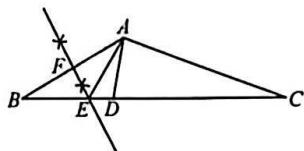

(2)由(1)知,EF垂直平分AB,

$\therefore AE=BE,$

$\therefore \angle BAE = \angle B = 30^{\circ}, \therefore \angle AED = 60^{\circ}$

$\because AC=CD,\therefore\angle DAC=\angle ADC,$

$\because \angle C=20^{\circ},$

$\therefore \angle ADC = \frac{180^{\circ} - 20^{\circ}}{2} = 80^{\circ},$

$\therefore \angle DAE = \angle ADC - \angle AED$

$= 80^{\circ} - 60^{\circ} = 20^{\circ}$

21. 解: $\because \angle ACB = 90^{\circ}, \angle A = 30^{\circ}$

$\therefore\angle B=60^{\circ}.\because CD\perp AB.$

$\therefore \angle CDB = \angle CDA = 90^{\circ},$

$\because \angle A=30^{\circ},\therefore AC=2CD.$

$\because {DE}\bot {BC},$

$\therefore \angle BDE = 30^{\circ}, \angle CDE = \angle CDF = 60^{\circ}$

$\therefore \triangle FCD$ 是等边三角形，

$\therefore CD=DF=4.5\ cm.$

$\therefore AC=2CD=9\ cm.$

22. 解: (1) 设购买一个 B 商品需要 x 元, 则购买一个 A 商品需要 $(x+10)$ 元, 依

题意, 得 $\frac{600}{x+10} = \frac{200}{x}$ , 解得 x = 5. 经检验, x = 5 是原分式方程的解, 且符合题意, $\therefore x + 10 = 15$ .

答:购买一个 A 商品需要 15 元,一个 B 商品需要 5 元;

(2)设该学校可购买 m 个 A 种商品，则可购买 $(3m+11)$ 个 B 种商品，依题意，得 $80\% \times 15m + 5(3m + 11) \leqslant 1000$ ，解得 $m \leqslant 35$ .

答:该学校最多可购买35个A种商品.

23. 解: (1) 由 AB = AC, $\angle A = \angle A$ ,

$AN=AM,$ 得 $\triangle ABN\cong\triangle ACM(SAS),$

则 $\angle B=\angle C;$

(2) 过点 B 作 $BK \perp AC$ 于点 K，

由 $\angle ABC=\angle ACB$ ，

$\angle BMC = \angle BKC = 90^{\circ}, BC = BC,$

得 $\triangle MBC\cong\triangle KCB(AAS)$ ,

$BM = CK = NK$

$AM = AK = AN + NK = AN + MB;$

(3) 在 BE 的延长线上取一点 H, 使得

$EH=EC$ , 连接 AH. 由 AE=EF,

$\angle AEH = \angle FEC, EH = EC,$

得 $\triangle AEH\cong\triangle FEC(SAS)$ ,

$CF = AH, \angle H = \angle ACF = \angle ABE,$

AB=AH, 则 AB=CF.

24. 解: (1) A(13,0), B(0,13);

(2) $\because OC=DC,\therefore\angle COD=\angle CDO,$

$\because \angle COD = \angle OBC = 90^{\circ} - \angle BOC,$

$\therefore \angle OBC = \angle ODC,$

$\therefore \angle OBA + \angle CBE = \angle OAB + \angle AED,$

$\therefore \angle CBE = \angle AED = \angle BEC,$

$\therefore BC = CE = 5,$

$\therefore CD=CE+DE=12$ , 过点 A 作 AH

⊥OC 于点 H, 证△AOH≌△OBC,

$\therefore OC=AH=12.$

∴点 A 到 OC 的距离为 12;

(3) 过点 P 作 $PH \perp OA$ 于点 H,

连接 QH, 过点 Q 作 $QM \perp QH$ 交 PH 于点 M, 证 $\triangle PQM \cong \triangle AQH$ ,

得 $\angle MHQ=45^{\circ}$ ,连接 $OQ$ ,

再证 $\triangle PHQ\cong\triangle OHQ$ ,

得 PQ=OQ=AQ，

∴点 Q 在 OA 的垂直平分线上，

∴BQ 的最小值为 $\frac{13}{2}$ .