# 勤学早系列·名校压轴题·七年级数学上参考答案

# 第一部分 中档题十选填压轴题

# 第一章 有理数

# 重难点突破1 有理数的概念及分类

1.B 2.-0.5

3.-0.7 +0.8 -0.6 +1

4.A 5.D 6.C 7.3

8. 分数: $\frac{2}{15}$ , 2.3, 80%, $-\frac{1}{9}$ , -5.32

负数： $-\frac{1}{9}, -5.32, -\pi, -5$

整数：-5,15,0,5

# 重难点突破 2 数轴、相反数、绝对值

1.C 2.D 3.C

4.(1)-5 (2)8 (3)-2025

(4) $\frac{1}{4}$ (5)-3 (6)-3

5.(1)4 (2)5 (3)-2

解: 因为点 B 与点 D 所表示的数互为相反数, 且它们之间的距离为 8, 所以点 D 所表示的数为 4; 同理点 A 与点 D 所表示的数互为相反数, 且它们之间距离为 10, 所以点 D 表示的数为 5; 点 B 与点 F 所表示的数互为相反数, B, F 两点间距离为 12, 可得 CD 的中点为原点, 可得点 D 表示的数为 2, 它的相反数为 -2.

6.C 7.C

8.(1)±3

(2)5或-5 -8

(3)3 2或-2

9. ±3, ±4

# 重难点突破3 数轴的运用(一)表示有理数

1.C 2.C

3.12 解: -12.2 与 -7.3 之间的整数点有 5 个, 9.5 与 16.2 之间的整数点有 7 个. 故被墨水污染部分的整数点共有 12 个.

4.C 解:(1)当线段 CD 的一个端点与数轴上的一个整点重合时,则另一

个端点也与数轴上的一个整点重合，此时线段 $CD$ 盖住的整点的个数是2024；

(2)当线段 $CD$ 的一个端点不与数轴上的整点重合时, 则另一个端点也不与数轴上的整点重合, 此时线段 $CD$ 盖住的整点的个数是 2023.

5. D 解: 由正方形纸板所在位置知翻转过程中, D 与表示 4 的倍数的点重合.

6. E 解: 由圆所在位置知翻转过程中, C 与表示 6 的倍数 (如 -2022) 的点重合, 所以 -2024 对应点 E.

# 重难点突破4 数轴的应用(二)两点间的距离

1. 解：(1)3,9；(2)2,7；

(3)由题意知,点D表示的数是-5,第1次运动后,点Q表示的数是-7,此时点Q距离D点2个单位长度,第2次运动后,点Q表示的数是-3,此时点Q距离D点2个单位长度,第3次运动后,点Q表示的数是-11,此时点Q距离D点6个单位长度,第4次运动后,点Q表示的数是-12,此时点Q距离D点7个单位长度,所以第4次运动后,点Q与点D的距离最远,此时点Q表示的数是-12.

2. 解: $\because A, B$ 两点表示的数为 1, 3, $\therefore AB=2,$

又∵BC= $\frac{7}{4}$ AB，

$$
\therefore B C = \frac {7}{2}.
$$

当点 C 在点 B 的左侧时，点 C 表示的数为 $-\frac{1}{2}$ ; 当点 C 在点 B 的右侧时，点 C 表示的数为 $\frac{13}{2}$ .

故点 $C$ 表示的数为 $-\frac{1}{2}$ 或 $\frac{13}{2}$

3. 解: (1) ∵ 点 C 为原点, BC = 1,

∴点 B 所对应的数为 -1，

$$
\because A B = 2 B C,
$$

$$
\therefore A B = 2,
$$

∴点 A 所对应的数为 -3；

(2)∵点 B 为原点, AC = 9, AB = 2BC,

∴点 A 对应的数为 -6，点 C 对应的数为 3；

(3)∵原点O到点C的距离为6，

∴点 C 对应的数为 $\pm6$ ，

$$
\therefore A B = O C = 6.
$$

当点 C 对应的数为 6，

$$
\because A B = 6, A B = 2 B C,
$$

$$
\therefore B C = 3,
$$

∴点 B 对应的数为 3，点 A 对应的数为 -3；

当点 $C$ 对应的数为-6，

$$
\because A B = 6, A B = 2 B C,
$$

$$
\therefore B C = 3,
$$

∴点 B 对应的数为 -9，点 A 对应的数为 -15.

综上所述，点 $A$ 对应的数为-3，点 $B$ 对应的数为3或点 $A$ 对应的数为-15，点 $B$ 对应的数为-9.

# 重难点突破5 数轴的应用(三) 动点的位置

1. 解: ① 点 M 距原点 4 个单位长度, 且位于原点的右侧,

所以点 M 表示有理数 4，

$$
\therefore O B = 7 \times 2. 5 - (4 + 2. 5 \times 2) = 8. 5,
$$

所以点 B 在数轴上表示的数为 -8.5;

②点 M 距原点 4 个单位长度, 且位于原点的左侧, 所以 M 表示有理数 -4,

$$
\therefore O B = 7 \times 2. 5 - (2. 5 \times 2 - 4) = 1 6. 5,
$$

所以点 B 在数轴上表示的数为 -16.5.
综上，点 B 在数轴上表示的数为 -8.5 或 -16.5.

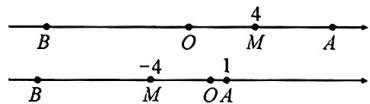

2. 解: $\because A, B$ 所表示的数分别为 -8 和 6, $\therefore AB = 14$ ,

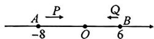

①若 P, Q 相遇前相距 4 个单位长度，则运动时间为 $(14-4) \div (3+1) = 2.5$ 秒，

∴点 Q 对应的数为 6-2.5=3.5;

②若 P, Q 相遇后相距 4 个单位长度，则运动时间为 $(14+4) \div (3+1) = 4.5$ 秒，

∴点 Q 对应的数为 6-4.5=1.5.
综上，点 Q 在数轴上对应的数为 3.5 或 1.5.

3. 解: (1) 因为点 C 为坐标原点, 且点 A 在点 C 点左侧 2 个单位长度处, 所以点 A 所表示的有理数为 -2;

(2)当小明到达 B 地前且小明在 AC 之间, $t=\frac{2-1}{5}=0.2$ 小时;

当小明到达 B 地前且小明在 CB 之间， $t=\frac{2+1}{5}=0.6$ 小时；

当小明从 B 地返回 A 地且小明在 BC 之间, $t=\frac{5+2}{5}=1.4$ 小时;

当小明从 B 地返回 A 地且小明在 CA 之间, $t=\frac{5+4}{5}=1.8$ 小时.

综上所述， $t$ 的值为0.2,0.6,1.4,1.8.

# 重难点突破6 绝对值的非负性

1.3 -5

解: 因为 $\left|x-3\right|\geqslant0,\left|y+5\right|\geqslant0,$

且 $|x - 3| + |y + 5| = 0$

所以 $x - 3 = 0$ 且 $y + 5 = 0$

解得 $x = 3$ 且 $y = -5$ .

2.-4 3

解: 因为 $\left|m+4\right|\geqslant0,\left|n-3\right|\geqslant0,$

且 $3|m + 4| + |n - 3| = 0$

所以 $\dot{m}+4=0$ 且 n-3=0，

解得 $m = -4$ 且 $n = 3$ .

3.2 1

解: 因为 $\left|ab-2\right|$ 与 $\left|b-1\right|$ 互为相反数,

且 $|ab - 2| \geqslant 0, |b - 1| \geqslant 0,$

所以 $|ab - 2| = 0$ 且 $|b - 1| = 0$ ,

解得 $ab = 2$ 且 $b = 1$

所以 a=2, b=1.

4. 解: $\because |a-2| \geqslant 0, |b-3| \geqslant 0,$

$$
\vert c - 1 \vert \geqslant 0,
$$

且 $|a - 2| + |b - 3| + |c - 1| = 0$

$$
\therefore a - 2 = 0 \text {且} b - 3 = 0 \text {且} c - 1 = 0,
$$

$$
\therefore a = 2, b = 3, c = 1,
$$

∴原式=2+6+3=11.

5.B 6.A 7.A

8. 解: $\because |x-10|=10-x$ ,

$$
\therefore 1 0 - x \geqslant 0,
$$

$$
\therefore x \leqslant 1 0,
$$

当 x 取最大值 10 时,20-x 的值最小,最小值为 10.

9. 解: 因为 a, b, c 为整数, $\left|a - b\right| +$

$$
\vert c - a \vert = 1, \vert a - b \vert \geqslant 0, \vert c - a \vert \geqslant 0,
$$

所以 $|a - b| = 0, |c - a| = 1$ 或

$$
\vert a - b \vert = 1, \vert c - a \vert = 0.
$$

当 $|a-b|=0$ 时， $|b-c|=|c-a|=1$ ，

则原式=1+0+1=2;

当 $|c-a|=0$ 时， $|b-c|=|b-a|=1$ ，
则原式 $=0+1+1=2.$

综上， $|c - a| + |a - b| + |b - c|$ 的值为2.

# 重难点突破7 有理数的大小比较

1. B 2. $-\frac{5}{2}$ 3. $<$ 4. maths

5. 解: (1) $\because \left| -\frac{5}{6} \right| = \frac{5}{6} = \frac{25}{30}$ ,

$$
\left| - \frac {4}{5} \right| = \frac {4}{5} = \frac {2 4}{3 0}, \text {且} \frac {2 5}{3 0} > \frac {2 4}{3 0},
$$

$$
\therefore - \frac {5}{6} <   - \frac {4}{5};
$$

(2) $\because-(-21)=21>0,$

$$
+ (- 2 1) = - 2 1 <   0,
$$

$$
\therefore - (- 2 1) > + (- 2 1);
$$

(3) $\because -\left| -7 \frac{2}{3} \right| = -7 \frac{2}{3}$ ,

$$
- \left[ - \left(- 7 \frac {2}{3}\right) \right] = - 7 \frac {2}{3},
$$

$$
\therefore - \left| - 7 \frac {2}{3} \right| = - \left[ - \left(- 7 \frac {2}{3}\right) \right].
$$

6. 解: 在数轴上标出 $-a, -b, -c$ 的位置如下:

$$
\begin{array}{c c c c c c c c} & - a & & - b \\ \hline c & & - 1 & 0 & b & 1 & a \end{array} \quad \begin{array}{c c c c c c c c} & - c \\ \hline \end{array}
$$

因此 $c < -a < -b < b < a < -c$ .

7. 解: 根据 a > 0, b < 0, a < |b|，可将 a, b, -a, -b 在数轴上表示如图所示，

$$
\begin{array}{c c c c c c} \bullet & \bullet & \bullet & \bullet & \bullet \\ b & - a & O & a & - b \end{array}
$$

所以 $b < -a < a < -b$ .

# 重难点突破8 有理数的实际应用

1. 解: (1) 由题意, 知标准质量为 70.7 - 0.7 = 70 (克).

<table><tr><td>第n枚</td><td>1</td><td>2</td><td>3</td><td>4</td><td>5</td><td>6</td></tr><tr><td>质量</td><td>-1.6</td><td>+1.3</td><td>+0.7</td><td>-1.4</td><td>-0.9</td><td>+2</td></tr></table>

(2)小龙制作的点心中超出标准的点心超过 $(1.3+0.7+2)=4$ （克），

不足标准的点心不足 $(1.6+1.4+0.9)=3.9$ （克），

$$
7 0 \times 6 + 4 - 3. 9 = 4 2 0. 1,
$$

$$
\because 4 2 0 - 5 <   4 2 0. 1 <   4 2 0 + 5,
$$

所以小龙制作的这盒点心的实际总

质量是合格的.

2. 解: (1) $16 + 15 - 5 + 10 - 6 + 6 - 8 + 3 - 12 = 19$ ,

即该公交车离开钟楼站时,车上还有19名乘客;

(2)公交车行驶在 A, B 之间时, 车上的乘客人数为 $16 + 15 - 5 = 26$ (名),

公交车行驶在 B, C 之间时, 车上的乘客人数为 $26 + 10 - 6 = 30$ (名),

公交车行驶在 C, D 之间时, 车上的乘客人数为 $30 + 6 - 8 = 28$ (名),

即公交车行驶在西门里与钟楼站之间时，在桥仔口和广济街之间车上的乘客最多；

(3) $(15+10+6+3)\times1=34\times1=34.$

即该公交车在这四个站能收 34 元.

# 中考新方向1 新定义

1.D

2. 解： $\because -\frac{5}{3} > -2$ ，

$$
\therefore \text { ※ } \left(- \frac {5}{3}\right) = \frac {5}{3},
$$

$$
\therefore \text {※} \left(- \frac {5}{3}\right) - 4 = \frac {5}{3} - 4 = - \frac {7}{3},
$$

$$
\because - \frac {7}{3} <   - 2,
$$

$$
\therefore \text {※} \left[ \text {※} \left(- \frac {5}{3}\right) - 4 \right] = \text {※} \left(- \frac {7}{3}\right) =
$$

$$
- \frac {7}{3}.
$$

3. 解: (1) 因为 $AC_{1}=3+2=5, BC_{1}=4-3=1$ ,

所以 $C_{1}$ 不是 A, B 的“联盟点”；

因为 $AC_{2}=2+2=4,BC_{2}=4-2=2,$

所以 $C_{2}$ 是 A, B 的“联盟点”;

因为 $AC_{3}=2, BC_{3}=4-0=4$ ,

所以 $C_{3}$ 是 A, B 的“联盟点”；

(2) 因为点 A 表示数 3, 点 B 表示的数是 30,

所以 AB=30-3=27.

当点 P 在线段 AB 上，

且 $PA = 2PB$ 时，

所以 $PA = \frac{2}{3} AB = 18$

此时点 $P$ 表示的数为21；

当点 $P$ 在线段 $AB$ 上，

且 $2PA = PB$ 时，

所以 $PA=\frac{1}{3}AB=9$ ,

此时点 $P$ 表示的数为12.

综上所述, 点 P 表示的数为 21 或 12.

# 中考新方向 2 新考向

1.C

2.C 解:由图知刻度尺上 6 cm 长对应数轴上 5 个单位长度,所以刻度尺上 1 cm 长对应 $\frac{5}{6}$ 个单位长度,所以刻度尺上 9 cm 长对应数轴上 7.5 个单位长度,所以刻度尺上 9 cm 对应数轴上的数为 -4.5.

3. -1 或 0 解: (1) 若点 $B'$ 在点 $A$ 左边时, 点 $B'$ 表示的数是 -7, 那么 $B'B$ 的长为 12,

因为 $B^{\prime}C=BC$ ，所以 $B^{\prime}C=\frac{12}{2}=6$ ，
所以点 C 表示的数是 -1;

(2)若点 $B^{\prime}$ 在点 $A$ 右边时，点 $B^{\prime}$ 表示的数是-5，那么 $B^{\prime}B$ 的长为10，

因为 $B^{\prime}C=BC$ ，所以 $B^{\prime}C=\frac{10}{2}=5$ ，
所以点 C 表示的数是 0.

4.-2.5 解：∵点 B 表示的数为 7， $A_{2}$ 在 B 的左边，且 $A_{2}, B$ 之间的距离为 3，

∴点 $A_{2}$ 表示的数为 4，

∴点 $A_{1}$ 表示的数为10，

∴点 $A_{1}, A$ 之间的距离为 25，

∴A,C之间的距离为12.5,由平移知折点C表示的数为-2.5.

# 中考新方向 3 新考法

解:(1)因为 $|a+2|\geqslant0,|c-10|\geqslant0$ 且 $|a+2|+|c-10|=0$ ,

所以 $a + 2 = 0$ 且 $c - 10 = 0$

解得 $a = -2, c = 10$

因为 b 为绝对值最小的数，
所以 b=0，

所以 $a = -2, b = 0, c = 10$ ;

(2) 因为 $a = -2, b = 0$ ,

所以沿点 B 折叠纸面时与点 A 重合的点表示的数为 2，

因为 $a = -2, c = 10$

若折叠纸面时点 A 与点 C 重合, 则折叠的点对应的数为 4,

此时与点 B 重合的点表示的数为 8;

(3)因为 $BC = 10$ ，剪开后三部分的长度之比为 $2:2:6$

所以这三条线段的长度分别为2,2,6，若剪下的三条线段从左到右的长度依次为2,2,6，

则点 $D$ 对应的数为 $2 + \frac{2}{2} = 3$

所以点 D, B 之间的距离为 3;

若剪下的三条线段从左到右的长度依次为2,6,2,

则点 $D$ 对应的数为 $2 + \frac{6}{2} = 5$

所以点 $D, B$ 之间的距离为5；

若剪下的三条线段从左到右的长度依次为6,2,2，

则点 $D$ 对应的数为 $6 + \frac{2}{2} = 7$

所以点 D, B 之间的距离为 7.

# 第二章 有理数的运算

# 重难点突破1 有理数的运算(一) 混合运算

1. 解: (1) 原式 = -8 + 10 + 2 + 7

$$
= - 8 + 1 9
$$

$$
= 1 1;
$$

(2) 原式 $= \frac{1}{2} - \frac{2}{3} + \frac{4}{5} - \frac{1}{3}$

$$
= \frac {1}{2} + \frac {4}{5} - \left(\frac {2}{3} + \frac {1}{3}\right)
$$

$$
= \frac {1 3}{1 0} - 1
$$

$$
= \frac {3}{1 0}.
$$

2. 解: (1) 原式 = 6 + (-4)

$$
= 2;
$$

(2) 原式 $= \left(\frac{1}{2} + \frac{3}{4} - \frac{1}{8}\right) \times 24$

$$
= \frac {1}{2} \times 2 4 + \frac {3}{4} \times 2 4 - \frac {1}{8} \times 2 4
$$

$$
= 1 2 + 1 8 - 3
$$

$$
= 2 7.
$$

3. 解: (1) 原式 = -1 × (4 - 9) + 3 ×

$$
\left(- \frac {4}{3}\right)
$$

$$
= - 1 \times (- 5) - 4
$$

$$
= 5 - 4
$$

$$
= 1;
$$

(2) 原式 $= (-8) - \frac{2}{5} \times \frac{1}{2} \times (-4 + 9)$

$$
= (- 8) - \frac {2}{5} \times \frac {1}{2} \times 5
$$

$$
= (- 8) - 1
$$

$$
= - 9.
$$

4. 解: (1) 原式 = 2 × (-27 + 12)

$$
= 2 \times (- 1 5)
$$

$$
= - 3 0;
$$

(2) 原式 $= -8 + (-3) \times 18$

$$
= - 8 - 5 4
$$

$$
= - 6 2;
$$

(3) 原式 $= (-4 + 2) \times (9 + 2)$

$$
= - 2 \times 1 1
$$

$$
= - 2 2;
$$

(4) 原式 $= [16 \div (-4)] \times \left(\frac{1}{4} - 1\right)$

$$
= - 4 \times \left(- \frac {3}{4}\right)
$$

$$
= 3;
$$

(5) 原式 $= 4 - [(-27) \times (-1) - (-1)]$

$$
= 4 - (2 7 + 1)
$$

$$
= - 2 4;
$$

(6) 原式 $= -9 + 2 \times \left[9 + (-3) \times \frac{2}{3}\right]$

$$
= - 9 + 2 \times 7
$$

$$
= 5;
$$

(7) 原式 $= (4 - 8) \times 5 + 0.07$

$$
= - 2 0 + 0. 0 7
$$

$$
= - 1 9. 9 3;
$$

(8) 原式 $= -100 + [16 - (-8) \times 2]$

$$
= - 1 0 0 + 3 2
$$

$$
= - 6 8;
$$

(9) 原式 $= -1 + (-8) \times \frac{1}{4} \times (5 - 9)$

$$
= - 1 + (- 8) \times \frac {1}{4} \times (- 4)
$$

$$
= - 1 + 8 = 7;
$$

(10) 原式 $= -1 + (-4 - 16) \div (-5)$

$$
= - 1 + (- 2 0) \div (- 5)
$$

$$
= - 1 + 4
$$

$$
= 3.
$$

5. 解: (1) 原式 = $7 \div \frac{7}{15} - \frac{1}{3} \times 16$

$$
= 7 \times \frac {1 5}{7} - \frac {1 6}{3}
$$

$$
= 1 5 - \frac {1 6}{3}
$$

$$
= \frac {2 9}{3};
$$

(2) 原式 $= -8 - 5 \times (-3) - 9 - 1$

$$
= - 8 + 1 5 - 9 - 1
$$

$$
= - 3.
$$

# 重难点突破2 有理数的运算(二)技巧运算

1. 解: (1) 原式 = $-\frac{29}{8}-\frac{19}{8}+\left(\frac{37}{12}-\frac{25}{12}\right)$

$$
= - 6 + 1
$$

$$
= - 5;
$$

(2) 原式 $= -2.5 + (-0.5) +$

$$
\left(\frac {5}{6} + \frac {7}{6}\right)
$$

$$
= - 3 + 2
$$

$$
= - 1.
$$

2. 解: (1) 原式 = $\left(-3.25 + 3.75 - \frac{1}{4} + 3\frac{3}{4}\right)$

$$
+ \left(2. 5 - 4 \frac {1}{2}\right)
$$

$$
= 4 - 2
$$

$$
= 2;
$$

(2) 原式 $= \left(17\frac{3}{4} - \frac{3}{4}\right) +$

$$
\left(2 3 \frac {1}{4} - 6 \frac {1}{4}\right) + 8 \frac {1}{2}
$$

$$
= 1 7 + 1 7 + 8 \frac {1}{2}
$$

$$
= 4 2 \frac {1}{2}.
$$

3. 解: (1) 原式 = $\left(\frac{1}{2} + \frac{1}{6} - \frac{5}{12}\right) \times$

$$
(- 3 6)
$$

$$
= - 3 6 \times \frac {1}{2} - 3 6 \times \frac {1}{6} +
$$

$$
3 6 \times \frac {5}{1 2}
$$

$$
= - 1 8 - 6 + 1 5
$$

$$
= - 2 4 + 1 5
$$

$$
= - 9;
$$

(2) 原式 $= -12 \times \frac{9}{4} + 12 \times \frac{3}{2}-$

$$
1 2 \times \frac {7}{6} + 1 2 \times \frac {1 3}{1 2}
$$

$$
= - 2 7 + 1 8 - 1 4 + 1 3
$$

$$
= - 1 0.
$$

4. 解: (1) 原式 = $\left[(-8)-(-5)+4\right]$

$$
\times \left(- 1 2 \frac {9}{1 6}\right)
$$

$$
= 1 \times \left(- 1 2 \frac {9}{1 6}\right)
$$

$$
= - 1 2 \frac {9}{1 6};
$$

(2) 原式 $= 13\frac{8}{13} \times 6 + \left(-7\frac{2}{13}\right) \times$

$$
6 + \left(- 3 6 \frac {6}{1 3}\right) \times 6
$$

$$
= \left(1 3 \frac {8}{1 3} - 7 \frac {2}{1 3} - 3 6 \frac {6}{1 3}\right) \times 6
$$

$$
= (- 3 0) \times 6
$$

$$
= - 1 8 0.
$$

5. 解: $\left(\frac{1}{4} - \frac{5}{12} + \frac{3}{8}\right) \div \left(-\frac{1}{24}\right)$

$$
= \left(\frac {1}{4} - \frac {5}{1 2} + \frac {3}{8}\right) \times (- 2 4)
$$

$$
= \frac {1}{4} \times (- 2 4) - \frac {5}{1 2} \times (- 2 4) + \frac {3}{8} \times
$$

$$
(- 2 4)
$$

$$
= - 6 + 1 0 - 9
$$

$$
= - 5,
$$

所以 $\left(-\frac{1}{24}\right) \div \left(\frac{1}{4} - \frac{5}{12} + \frac{3}{8}\right) =$

$$
- \frac {1}{5}.
$$

6. 解: 设 $\frac{1}{2} + \frac{1}{3} + \cdots + \frac{1}{2024} = m$ ,

$$
\frac {1}{2} + \frac {1}{3} + \dots + \frac {1}{2 0 2 3} = n,
$$

则原式 $= m(1 + n) - (1 + m)n =$

$$
m + m n - n - m n = m - n = \frac {1}{2 0 2 4}.
$$

7. 解: 令 $S=\frac{1}{2024}\times(1+2+3+\cdots+$

$$
4 0 4 6 + 4 0 4 7).
$$

所以 $S=\frac{1}{2024}\times(4047+4046+\cdots+$

$$
3 + 2 + 1),
$$

两式相加，得 $2S = \frac{1}{2024} \times (1 +$

$$
4 0 4 7) \times 4 0 4 7 = 2 \times 4 0 4 7,
$$

所以 S=4 047.

∴原式=4047.

8. 解: 令 $S = 1 + \frac{1}{2} + \frac{1}{2^{2}} + \frac{1}{2^{3}} + \cdots +$

$$
\frac {1}{2 ^ {8}} + \frac {1}{2 ^ {9}},
$$

则 $\frac{1}{2} S = \frac{1}{2} +\frac{1}{2^2} +\frac{1}{2^3} +\dots +\frac{1}{2^8} +$

$$
\frac {1}{2 ^ {9}} + \frac {1}{2 ^ {1 0}},
$$

两式相减，得 $\frac{1}{2} S = 1 - \frac{1}{2^{10}}$

所以 $S = 2 - \frac{1}{2^9}$

# 重难点突破3 有理数的运算(三) 易混易错

1.(1)6 (2)1.8 (3) $\frac{3}{2}$

(4)-6 (5)-1.8 (6) $-\frac{3}{2}$

2.(1)1 (2)-1 (3)256

(4)-256 (5)0.01 (6) $-\frac{16}{81}$

3. 解: (1) 原式 = $6 \times \frac{3}{4} \times \frac{4}{3}$

$$
= 6;
$$

(2) 原式 $= 6 \times \frac{4}{3} \times \frac{4}{3}$

$$
= \frac {3 2}{3};
$$

(3) 原式 $= -49 \times \frac{7}{2} \times \left(-\frac{2}{7}\right) \times \frac{1}{4}$

$$
= \frac {4 9}{4};
$$

(4) 原式 $= -16 - 64 \times \frac{5}{8} \times \left(-\frac{5}{8}\right)$

$$
= - 1 6 + 2 5
$$

$$
= 9.
$$

4. 解: (1) 原式 = $\left(\frac{1}{3}-\frac{5}{6}\right)\times(-12)$

$$
= - 4 + 1 0
$$

$$
= 6;
$$

(2) 原式 $= \left(-\frac{1}{12}\right) \div \left(-\frac{1}{2}\right)$

$$
= \frac {1}{1 2} \times 2
$$

$$
= \frac {1}{6};
$$

(3) 原式 $= -\frac{7}{4} \times \frac{8}{7} + \frac{7}{8} \times \frac{8}{7}+$

$$
\frac {7}{1 2} \times \frac {8}{7}
$$

$$
= - 2 + 1 + \frac {2}{3}
$$

$$
= - \frac {1}{3};
$$

(4) $\left(1\frac{3}{4} -\frac{7}{8} -\frac{7}{12}\right)\div \left(-\frac{7}{8}\right)$

$$
= - 2 + 1 + \frac {2}{3} = - \frac {1}{3},
$$

∴原式=-3.

# 重难点突破4 有理数的运算(四) 整体求值

1. 解: $\because a, b$ 互为相反数, $c, d$ 互为倒数, $m$ 的绝对值等于 4,

$$
\therefore a + b = 0, c d = 1, m ^ {2} = 1 6,
$$

∴原式=16+1+0+(-1) $^{2024}$

$$
= 1 7 + 1 = 1 8.
$$

2. 解: 由题意, 得 $a + b = 0$ , $\frac{b}{a} = -1$ ,

$$
c d = 1, x = \pm 2,
$$

∴当 x=2 时，

原式 $= 1 + (0 - 1)\times 2$

$$
= 1 - 2 = - 1;
$$

当 $x = -2$ 时，

原式 $= 1 + (0 - 1)\times (-2)$

$$
= 1 + 2 = 3.
$$

综上所述,代数式的值为-1或3.

3. 解: $\because a, b$ 互为相反数, $c, d$ 互为倒数, $m$ 是最大的负整数,

$$
\therefore a + b = 0, c d = 1, m = - 1,
$$

$$
\therefore 3 a + \frac {2 0 2 4}{c d} + 3 b - m ^ {2 0 2 5}
$$

$$
= 3 (a + b) + \frac {2 0 2 4}{c d} - m ^ {2 0 2 5}
$$

$$
= 0 + 2 0 2 4 - (- 1)
$$

$$
= 2 0 2 4 + 1 = 2 0 2 5.
$$

4. 解: 由题意, 可知 $a + b = 0$ , cd = 1,

$$
m = 0,
$$

$$
\because (x - 1) ^ {2} \geqslant 0, | y - 2 | \geqslant 0,
$$

且 $(x - 1)^2 + |y - 2| = 0$

$$
\therefore (x - 1) ^ {2} = 0, | y - 2 | = 0,
$$

$$
\therefore x - 1 = 0, y - 2 = 0,
$$

$$
\therefore x = 1, y = 2.
$$

$$
\begin{array}{l} \therefore \text {   原式   } = 5 a + 2 b + 3 b + 2 + 0 \\ = 5 a + 5 b + 2 \\ = 5 (a + b) + 2 \\ = 2. \\ \end{array}
$$

# 重难点突破5 绝对值与分类讨论(一)求值

1. 解: $\because |a|=3,$

$$
\therefore a = \pm 3,
$$

$$
\because | b | = 5,
$$

$$
\therefore b = \pm 5,
$$

$$
\because a > b,
$$

$$
\therefore a = \pm 3, b = - 5.
$$

当 $a = 3, b = -5$ 时，

$$
\therefore a b = 3 \times (- 5) = - 1 5;
$$

当 $a = -3, b = -5$ 时，

$$
\therefore a b = (- 3) \times (- 5) = 1 5.
$$

综上所述，ab 的值为 15 或 -15.

2. 解: $\because x^{2}=9, |y|=4$ ,

$$
\therefore x = \pm 3, y = \pm 4,
$$

$$
\because x y <   0,
$$

$$
\therefore x = 3, y = - 4 \text {或} x = - 3, y = 4;
$$

当 $x = 3, y = -4$ 时，

$$
x + y = 3 - 4 = - 1;
$$

当 $x = -3, y = 4$ 时，

$$
x + y = - 3 + 4 = 1.
$$

∴x+y 的值为±1.

3. 解: $\because |a|=3$ ,

$$
\therefore a = \pm 3,
$$

$$
\because b ^ {2} = 2 5,
$$

$$
\therefore b = \pm 5.
$$

$$
\because a + b > 0,
$$

$$
\therefore a = \pm 3, b = 5.
$$

当 $a = 3, b = 5$ 时， $a - b = 3 - 5 = -2$ ;

当 $a = -3, b = 5$ 时， $a - b = -3 - 5$

$= -8.$ 即 $a - b$ 的值为-2或-8.

4.0或-12

解：∵ $|a-1|=9,|b+2|=6$ ,

$$
\therefore a = - 8 \text {或} 1 0, b = - 8 \text {或} 4,
$$

$$
\because a + b <   0,
$$

$\therefore a=-8,b=-8$ 或 4,

∴当 a=-8, b=-8 时，

$$
a - b = - 8 - (- 8) = 0;
$$

当 $a = -8, b = 4$ 时，

$$
a - b = - 8 - 4 = - 1 2.
$$

综上所述，a-b 的值为 0 或 -12.

5. 解: 由题意, 得 $a = \pm 5, b = \pm 3$ ,

$$
\because | a - b | = b - a,
$$

$$
\therefore b \geqslant a,
$$

$$
\therefore a = - 5, b = \pm 3,
$$

当 $a = -5, b = 3$ 时，

$$
a - b = - 5 - 3 = - 8;
$$

当 $a = -5, b = -3$ 时，

$$
a - b = - 5 - (- 3) = - 5 + 3 = - 2,
$$

由上可得， $a - b$ 的值是-8或-2.

# 重难点突破6 绝对值与分类讨论(二)化简

1. ±2 解: $\because ab > 0,$

$\therefore a > 0, b > 0$ ，此时原式 $= 1 + 1 = 2$ ；或 $a < 0, b < 0$ ，此时原式 $= -1 - 1 = -2$ ，故答案为 $\pm 2$ .

2. A 解: $\because abc < 0, a + b + c = 0$ ,

∴a,b,c中有一负两正.若a>0,
b>0,c<0,则 $\dot{m}=\frac{-3c}{c}-\frac{b}{b}-\frac{2a}{a}=$ -3-1-2=-6; 若 a>0, b<0, c>

0, 则 $m=\frac{3c}{c}-\frac{-b}{b}-\frac{2a}{a}=3+1-2=$ 2; 若 $a < 0, b > 0, c > 0$ ，则 $m = \frac{3c}{c} -$

$$
\frac {b}{b} - \frac {- 2 a}{a} = 3 - 1 + 2 = 4;
$$

$$
\therefore y = 4, z = - 6,
$$

$$
\therefore (y + z) ^ {x} = (- 6 + 4) ^ {3} = - 8.
$$

故选A.

3. 解: (1) 当 a, b, c 均为正数即 a > 0,
b>0,c>0 时,abc>0,

此时原式=1+1+1+1=4;

当 $a, b, c$ 为一个正数两个负数时， $abc > 0$ ，设 $a > 0, b < 0, c < 0$

此时原式=1-1-1+1=0，

综上所述,原式的值为 4 或 0;

$$
(2) \because a + b + c = 0,
$$

$$
\therefore b + c = - a, a + c = - b, a + b = - c.
$$

当 $a, b, c$ 均为正数时， $\frac{a}{|a|} + \frac{b}{|b|}$ $+\frac{c}{|c|} = 3$ （不合题意）；

当 $a, b, c$ 均为负数时， $\frac{a}{|a|} + \frac{b}{|b|}$ + $\frac{c}{|c|} = -3$ （不合题意）；

当 $a, b, c$ 为一正两负时， $\frac{a}{|a|} + \frac{b}{|b|} + \frac{c}{|c|} = -1$ （不合题意）；

当 $a, b, c$ 为两正一负时， $\frac{a}{|a|} + \frac{b}{|b|} + \frac{c}{|c|} = 1$ ，符合题意，

设 $a > 0, b > 0, c < 0$ ，原式 $= \frac{-a}{a} +$

$$
\frac {- b}{b} + \frac {- c}{- c} = - 1 - 1 + 1 = - 1.
$$

# 重难点突破7 探究本质妙解幻方(一) 九宫格

1.3 解：∵正中间的数为0，

∴三个数的和都是 $0 \times 3 = 0$ ，

$$
\therefore x = 3, y + z = 0,
$$

$$
\therefore x - y - z = 3 - 0 = 3.
$$

2.-3

<table><tr><td>-6</td><td>-1</td><td>-8</td></tr><tr><td>-7</td><td>-5</td><td>-3</td></tr><tr><td>-2</td><td>-9</td><td>-4</td></tr></table>

3.4 解：∵将9个数填入空格中，使每行、每列以及两条对角线上的3个数之和相等，

$$
\therefore - 2 + 2 + e = e - 8 + f,
$$

解得 f=8，

$$
\therefore 8 - 2 + c = 2 + c + d,
$$

解得 $d = 4$

4.29

<table><tr><td>12</td><td>3</td><td>b</td></tr><tr><td>1</td><td>c</td><td>13</td></tr><tr><td>m</td><td>11</td><td>2</td></tr></table>

5. 解: (1) $\because 2 + a + 4 = 2 + 8 + 5$ ,

$$
4 + 8 + b = 2 + 5 + 8,
$$

$$
\therefore a = 9, b = 3;
$$

(2)如图所示.

<table><tr><td>9</td><td>2</td><td>7</td></tr><tr><td>4</td><td>6</td><td>8</td></tr><tr><td>5</td><td>10</td><td>3</td></tr></table>

图2

# 重难点突破8 探究本质妙解幻方(二) 特殊型

1.-5或-8

解：∵这8个数字的和是一4，

∴横、竖以及内外两个正方形的4个数字之和都等于-2，

根据题意,得 $-8+5+b+7=-2$ ,

解得 b = -6，

根据内圈正方形的4个数字之和等于-2,得内圈右边的圆圈应填3,

则 $a = 1$ 或-2，

因此， $a + b = -5$ 或-8.

2.2 解: 设 -3 上方圆圈填入 e, 最左边圆圈填入 f, 由上方三角形与中间正方形的数之和相等, 得 $-1 + e +$

$$
d = e + d - 3 + b,
$$

$$
\therefore b = 2,
$$

∵每个三角形的三个顶点上的数之和与中间正方形四个顶点上的数之和相等,都等于a-1,

$$
\therefore 4 (a - 1) - (a - 1) = - 1 - 2 - 3 +
$$

$$
1 + 2 + 3 + 4 + 5 = 9,
$$

即 $a - 1 = 3, a = 4$

$$
\text { 又 } d + c + b = - 3 + 4 + b, d + c = 1,
$$

在所给数字中只能取一2和3，

$$
\therefore c d = - 6,
$$

$$
\therefore a b + c d = 4 \times 2 - 6 = 2.
$$

3.-1 解: 设 C, D, E 表示的数分别为 c, d, e, 根据题意, 得 $6 + 2 + 3 = 4 + 5 + e$ , 解得 e = 2,

$$
\because 2 + 1 + e = 3 + 4 + d,
$$

$$
\therefore d = - 2,
$$

$$
\because 6 + 2 + 3 + c = 6 + 1 + 5 - 2,
$$

$$
\therefore c = - 1.
$$

4.B 解:设第2行第3个数为x,则第3行第2个数为 $(10-4+x+m)-(9+2+m)=x-5$ ,这两个数的差为 $x-(x-5)=5$ ,数字-5,-4,-3,-2,-1,2,3,6,9,10中除去已填的6,10,-4,2,9,-1外,剩下的数为-5,-3,-2,3,其中只有 $3-(-2)=5$ ,

$$
\therefore x = 3, x - 5 = - 2,
$$

∴每条边上四个数之和为 $6+3-2-1=6$ ,

$$
\therefore m = 6 - 1 0 - (- 4) - 3 = - 3.
$$

故选B.

# 重难点突破9 有理数的实际应用(一) 文字类

1. 解: $(1)(+5)+(-3)+(+10)+(-8)+(-6)+(+13)+(-10)=(5+10+13)-(3+8+6+10)=28-27=1$ , 即守门员最后没有回到球门线的位置;

(2)第一次离开球门线5米,第二次离开球门线2米,第三次离开球门线12米,第四次离开球门线4米,第五次离开球门线2米,第六次离开球门线11米,第七次离开球门线1米,则守门员离开球门线的位置最远是12米;

(3)守门员离开球门线位置达10米以上(包括10米)有+12,+11,共2次.

2. 解: (1) + 1500 - 320 - 430 + 2050 - 300 + 250 - 200 - 50 + 300 + 750 - 250 = 3300(米), 5000 - 3300 = 1700(米).

答:他最终没有到达洪林小区,离该小区还差1700米;

(2) $(+1\ 500+320+430+2\ 050+300+250+200+50+300+750+250)\times0.85=6\ 400\times0.85=5\ 440=5.44\times10^{3}$ （毫安时）.

答:他共消耗了 $5.44 \times 10^{3}$ 毫安时电量.

3. 解: $1480 \div 50\% \times 1.5\% \times (28 - 20) = 2960 \times 1.5\% \times 8 = 355.2$ (元).

答:应付行李逾重费 355.2 元.

4. 解: (1) 根据题意, 得 $+8+(-3)+(-5)+(+6)+(-9)+(+10)+(-6)+(-4)+(+4)+(-5)=$ $(8+6+10+4)-(3+5+9+6+4+5)=28-32=-4$ (公里).

答: 将最后一名乘客送到目的地时, 出租车离摩尔城 4 公里, 在摩尔城的西方;

(2)根据题意,得 $0.1 \times (|+8| + |-3| + |-5| + |+6| + |-9| + |+10| + |-6| + |-4| + |+4| + |-5|) = 0.1 \times (8 + 3 + 5 + 6 + 9 + 10 + 6 + 4 + 4 + 5) = 0.1 \times 60 = 6$ (升).

答:这辆出租车这天下午耗油6升;
(3)∵|+8|=8>3,|-3|=3,-5,
=5>3,|+6|=6>3,|-9|=9>3,
|+10|=10>0,|-6|=6>3,
|-4|=4>3,|+4|=4>3,-5=
5>3,

∴这10单的路程均不低于3公里.根据题意,得 $10\times10+1.6\times(60-3\times10)=10\times10+1.6\times30=100+48=148$ (元).

答:小明爸爸这天下午共收了148元.

5. 解: (1) 第一位客人下车位置: -3;
第二位客人下车位置: $(-3)+(-2)$ +7=2,

如图所示,第一位客人在点 B:-3 处下车,第二位客人在点 C:2 处下车;

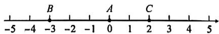

(2) $3+|-5|=8$ (千米).

答:第三位客人乘车走了8千米;

(3)第一位客人共走3千米,付8元,
第二位客人共走7千米,付 $8+1\times$ $(7-4)=8+3=11$ （元）,

第三位客人共走8千米，付 $8+1\times(8-4)=12$ （元），

$$
8 + 1 1 + 1 2 = 3 1 (\text {   元  )   },
$$

∴该出租车司机在这三位客人中共收了31元.

# 重难点突破 10 有理数的实际应用(二) 图表类

1. 解: $(1)+4+(-3)+6+(-8)+9+(-2)+(-7)+1+(-5)=(4+6+9+1)+(-3-8-2-7-5)=20-25=-5.$

答:A 站是洪山广场站;

(2) $|+4|+|-3|+|6|+|-8|+$ $|9|+|-2|+|-7|+|1|+|-5|=$ $4+3+6+8+9+2+7+1+5=45.$ $45 \times 1.2 = 54$ (千米).

答:这次小波志愿服务期间乘坐地铁行进的总路程约为54千米.

2. 解: (1) ① 最多: $50 + 14 = 64$ (单), 最少 50 - 8 = 42 (单), 故答案为 64, 42; ② 由题意, 得 $50 + [(-3) + (+4) + (-5) + (+14) + (-8) + (+7) + (+12)] \div 7 = 50 + 3 = 53$ (单).

答:该外卖小哥这一周平均每天送餐53单;

(2)由题意,得 $(50\times7-3-5-8)\times2+(4+14+7+12)\times5+60\times7=668+185+420=1273$ （元）,

答:该外卖小哥这一周工资收入1273元.

3. 解: (1) 最重的一筐超过 2.5 千克, 最轻的差 3 千克, 2.5 - (-3) = 5.5 (千克).
故最重的一筐比最轻的一筐重 5.5 千克;

(2)列式 $1 \times (-3) + 4 \times (-2) + 2 \times (-1.5) + 3 \times 0 + 1 \times 2 + 8 \times 2.5 = -3 - 8 - 3 + 2 + 20 = 8$ （千克），

故 20 筐白菜总计超过 8 千克；

(3)用(2)的结果列式计算 $2.6 \times (25 \times 20 + 8) = 1320.8 \approx 1321$ (元)，故这 20 筐白菜可卖 1321 元.

4. 解: (1) 因为 $-3-15+16-1+5-12=-10$ (千米), 所以刘师傅在 A 地的西面, 离 A 地有 10 千米;

(2)行驶的总路程: $|-3|+|-15|+$ $|+16|+|-1|+|+5|+|-12|=$ 52(千米),

耗油量为:0.08×52=4.16(升),

因为 8-4.16=3.84>3，

所以不需要加油；

(3)第2次载客收费:10+(15-3)×1.8=31.6(元),

第3次载客收费： $10 + (16 - 3)\times 1.8$ $= 33.4$ （元），

第5次载客收费： $10 + (5 - 3)\times 1.8$ $= 13.6$ （元），

第6次载客收费： $10 + (12 - 3)\times 1.8$ $= 26.2$ （元），

所以总营业额为:31.6+33.4+13.6+26.2=104.8(元).

答:刘师傅这天上午走完6次里程后的营业额为104.8元、

# 重难点突破11 符号推断

1. C 解: 根据数轴上点的位置得 a < b < 0 < c < d, $|c| < |b| < |d| < |a|$ ,

$$
\begin{array}{l} {\therefore a + c <   0, b - a > 0, a c <   0, \frac {b}{d} <   0.} \\ {\text { 故选 } C.} \end{array}
$$

2. D 解: $\because |a| + |b| = |a + b|$ ,

∴a,b满足的关系是a,b同号或a,
b 有一个为0或同时为0,故选D.

3.C 解: 若 $a+b+c=0$ , 知 a, b, c 为两正一负或两负一正或一正一负一为零三种情况.

$$
\because | a | > | b | > | c |,
$$

$\therefore a > 0 \geqslant c > b$ 或 $a < 0 \leqslant c < b$ , 则 C 可能成立, A, B, D 均不可能成立.

4. C 解: 因为 AB = BC, $a + b < 0$ , $b + c > 0$ , $a + c < 0$ ,

所以 $a < 0, b < 0, c > 0, |a| > |c| > |b|$ , 所以数轴上原点 $O$ 的位置应该在点 $B$ 与点 $C$ 之间. 故选 C.

5.C 解:∵a,c异号,

$$
\therefore a <   0 <   c,
$$

$\because a+b$ 为负数，

$\therefore a < b \leqslant 0$ 或 $a < 0 \leqslant b$ 且 $|a| > |b|$ , 只有 C 符合题意.

# 重难点突破 12 有理数 多结论(一) 概念辨析

1.D

2. C 解: 由概念易知①②③正确; ④ $|a|=a$ , 则 $a\geqslant0$ , 错误; ⑤当a=b=0, 不成立, 错误; ⑥若有乘数为0, 则不成立, 错误. ⑦近似数2.60万精确到百位, 错误. 综上所述, 正确的有3个. 故选C.

3. ③⑥

4.B 解：∵0 的相反数是 0，故①正确；如果 $\left|a\right|=\left|b\right|$ ，那么 $a=\pm b$ ，故②错误；如果 $a+b<0$ ，且 ab>0，则 a<0, b<0，

$\therefore 7a + 3b < 0$ ，则 $|7a + 3b| = -7a$ $-3b$ ，故③错误；

$\because m$ 是任意有理数，

∴当 m 为正数时，则 $\left|m\right| + m = 2m > 0$ ;

当 $m = 0$ 时，则 $\mid m\mid +m = 0$

当 $m$ 为负数时， $|m| + m = -m + m = 0$

∴若 m 是任意有理数,那么 $\left|m\right|$ .+m 一定是非负数,故④正确,故选 B.

5. ②④ 解: ① 当 $a \geqslant 0$ 时, $|a| = a$ , 当 a < 0 时, $|a| = -a$ , 因此① 不正确;

②因为 $a^{2}=(-a)^{2}$ ，即互为相反数的两个数的平方相等，因此②正确；

③因为 $a^{2}=b^{2}$ ，则 a=b 或 a=-b，
当 a=b 时， $a^{3}=b^{3}$ ，即 $a^{3}-b^{3}=0$ ，

当 $a = -b$ 时， $a^3 = -b^3$ ，即 $a^3 + b^3 = 0$ ，因此③不正确；④因为 $ab < 0$ 则 $a, b$ 异号，当 $a > 0, b < 0$ ，则 $||a|$

$-|b||=|a-(-b)|=|a+b|$ ; 当 a<0, b>0 时，则 $|a|-|b|=|-a-b|=|a+b|$ ，因此④正确；

⑤若 a=1, b=0，则 a 的倒数为 1，而 b 没有倒数，因此若 a 大于 b，则 a 的倒数小于 b 的倒数，是不正确的，因此⑤不正确。综上所述，正确的有②④。

# 重难点突破13 有理数多结论(二)式子推断

1. A 解: ① 若 $\left|a\right|=a$ ，则 $a \geqslant 0$ ，故该项不正确；

②若 $a, b$ 互为相反数，且 $ab \neq 0$ ，则 $a = -b$ ，则 $\frac{b}{a} = -1$ ，故该项正确；

③若 $a^2 = b^2$ ，则 $a = \pm b$ ，故该项不正确；

④若 $ab = 0$ ，则 $|a - b| = |a| + |b|$ 成立，故该项错误，故正确的个数为1个，故选A.

2. C 解: $\because |a+b+c|=a+b-c$ ,

$$
\begin{array}{l} {\therefore a + b + c = a + b - c \text {或} a + b + c =} \\ {- a - b + c,} \end{array}
$$

$$
\therefore c = 0 \text {或} a + b = 0,
$$

∴①不正确；

$$
\because a + b = 0 \text {或} c = 0,
$$

$$
\therefore (a + b) c = 0, \textcircled {2} \text { 正确 };
$$

当 $a, b$ 互为相反数时， $|c| = -c$

$\therefore c \leqslant 0$ ，即 $c$ 不可能是正数，③正确；当 $c \neq 0$ 时， $a + b = 0$ ，由③知 $c \leqslant 0$ ，

$$
\therefore \quad | a + b + c - 2 | - | 5 - c | =
$$

$$
\vert c - 2 \vert - \vert 5 - c \vert = - c + 2 - 5 + c
$$

$= -3$ ，④正确.所以正确的结论有3个.故选C.

3. ①② 解：∵ |ab| > ab，

$$
\therefore a b <   0,
$$

∴a,b异号.

∴①符合要求；

$$
\because a b <   0,
$$

∴a,b异号.

∴②符合要求；

$$
\because a + b = 0,
$$

$\therefore a, b$ 互为相反数，但不一定异号，

∴③不符合要求；

$$
\because | a b | = - a b,
$$

$$
\therefore a b \leqslant 0,
$$

∴不一定能够推理出 a, b 异号.

∴一定能够推理出 a, b 异号的条件是①②.

4. ①②③ 解:依题意,得 a = -b,

$\therefore a+b=0$ , 故①正确;

$$
\because a ^ {2} = b ^ {2},
$$

$$
\therefore | a | = | b |,
$$

$\therefore a=\pm b$ , 故②正确;

$$
\because a <   b, a + b <   0,
$$

$\therefore a < b < 0$ 或 $a < 0 < b$ 且 $a$ 到原点的距离更远，

$\therefore |a|>|b|$ ，故③正确；

$$
\because - 1 <   a <   0 <   b <   1,
$$

$$
\therefore a <   a b <   0, - 1 <   - b <   0, 0 <   - a b
$$

$<1,-\frac{1}{ab}>1$ ,其中-b<ab,故④错误,故答案为①②③.

5. A 解: ①∵a>0, a+b<0,

$\therefore b < 0$ ，故①正确；

②∵a>0,b<0,

$\therefore b - a < 0$ ，故②错误；

③∵a+b<0,a>0,b<0,

$\therefore | - a| < -b$ ，故③错误；

④ $\frac{b}{a}<-1$ ,故④正确.

∴①④正确.故选A.

6.C 解:根据数轴可得, $a<-1,b>$

3, 且 $1 < |a| < 3 < |b|$ , 则 $-b < a < -a < b$ , 故①正确; $a < -1 < 0, b > 3 > 0$ , 则 $3ab < 0$ ,

$$
\because a ^ {2} + b ^ {2} > 0,
$$

$\therefore \frac{3ab}{a^2 + b^2} < 0$ ，故②错误；

$$
\because a <   0, b > 0,
$$

$$
\therefore | a | + | b | = - a + b = b - a,
$$

$\therefore b - a = |a| + |b|$ ，故③正确；

$$
\because a <   - 1, b > 3,
$$

$$
\therefore a + 1 <   0, b - 3 > 0,
$$

$\therefore (a + 1)(b - 3) < 0$ ，故选项④正确.

∴①③④正确.故选C.

7.B 解： $\because a <   1$

$$
\therefore a - 1 <   0.
$$

$$
\because b <   \cdot 1,
$$

$$
\therefore b - 1 <   0.
$$

$$
\therefore (a - 1) (b - 1) > 0.
$$

∴①正确；

$$
\because b <   - 1,
$$

$\therefore b-(-1)<0.$ 即 $b+1<0.$

$$
\therefore (a - 1) (b + 1) > 0.
$$

∴②正确；

$$
\because a > 0,
$$

$$
\therefore a + 1 > 0,
$$

$$
\text {又} \because b <   - 1,
$$

$$
\therefore b + 1 <   0,
$$

$$
\therefore (a + 1) (b + 1) <   0.
$$

∴③错误.故选B.

8. B 解: ① 如果 ad > 0, 则 a, d 同正或同负,

$\therefore b, c$ 同正或同负，

∴bc>0,①正确；

②如果 $ad < 0$ ，则 $a < 0 < d$ ，但确定不了 $b, c$ 的符号，②不正确；

③如果 $bc > 0$ ，则 $b, c$ 同正或同负，但确定不了 $a, d$ 的符号，③不正确；

④如果 bc<0，则 b<0<c，

$$
\therefore a <   0 <   d,
$$

∴ad<0,④正确，

∴正确的结论是①④.故选B.

9.C 解:①由图知 b<1<a，且 $\left|b\right|<\left|a\right|$ ，则 a>0，而 b 的符号不确定，

∴ab 的符号不确定；

②∵|b|＜|a|且a＞0，

$$
\therefore a + b > 0,
$$

$\therefore a+b$ 一定是正数；

③∵a>b,

$$
\therefore a - b > 0;
$$

④∵|b|＜|a|，

$\therefore a^{2} - b^{2} > 0.$ 综上所述，②③④的结果一定是正数.

10. B 解: 由所给数轴可知, b < 0 < a,
且 $|a|<|b|$ ,

所以 $a+b<0, a-b>0.$

则 $(a + b)(a - b) < 0$ ，故甲的结论正确；

$a < -b$ ，即 $a < |b|$ ，故乙的结论错误；

因为 $b < 0 < a$ ，且 $\vert a\vert < \vert b\vert$

所以 $|a-b|=a-b$ ，

又因为 $|a| + |b| = a - b$ ,

所以 $|a-b|=|a|+|b|$ ，故丙的结论正确；

因为 $a < 3, b < -3$

所以 $|a-3|=-a+3$ ,

$$
\vert b + 3 \vert = - b - 3,
$$

则 $\frac{|a - 3|}{a - 3} +\frac{|b + 3|}{b + 3} = -1 + (-1)$

=-2, 故丁的结论错误.

# 重难点突破14 规律探究(一)数列规律

1. 解: (1) $1 + 3 + 5 + 7 + 9 + 11 = 36 = 6^{2}$ ;

(2) $(n + 1)^{2}$ ;

(3) $51+53+55+\cdots+87+89=(1+$

$3 + 5 + 7 + \dots +87 + 89) - (1 + 3 + 5$

$$
+ 7 + \dots + 4 7 + 4 9) = \left(\frac {8 9 + 1}{2}\right) ^ {2} -
$$

$$
\begin{array}{l} \left(\frac {4 9 + 1}{2}\right) ^ {2} = 4 5 ^ {2} - 2 5 ^ {2} = 2 0 2 5 - 6 2 5 \\ = 1 4 0 0. \end{array}
$$

2.144 解: 当 n=24 时, 从 1,2,3,…, 22,23,24 中, 取两个数的和大于 24, 这两个数分别是:

$\{24,1\},\{24,2\}\cdots\cdots\{24,23\}$ ;

$\{23,2\},\{23,3\}\cdots\cdots\{23,22\}$ ;

$\{22,3\},\{22,4\}\cdots\{22,21\}$ ,

……{14, 11}, {14, 12}, {14, 13}, {13, 12},

$$
\begin{array}{l} \therefore k = 2 3 + 2 1 + 1 9 + \dots \dots + 3 + 1 = \\ 1 4 4. \end{array}
$$

3.10 解:由题意,得第 n 个数为(一2) $^{n}$ ,设最后三个数分别是 $-\frac{1}{2}x,x$ ,

-2x,根据题意,得 $-\frac{1}{2}x+x-2x=768$ ,解得 $x=-2^{9}$ .

$\therefore n=9+1=10.$ 故答案为 10.

4.4051或4048 解：由题知，当 $n$ 为奇数时， $\vert -1 + 0 + 1 - 2 + 3 - 4 + \dots$

$-(n - 3) + n - 2| = 2024, -1 +$

$\frac{n-1}{2}=2\ 024$ , 则 n=4 051; 当 n 为偶数时, $|-1+0+1-2+3-4+\cdots$

$$
+ n - 3 - (n - 2) \mid = 2 0 2 4, \frac {n}{2} =
$$

2024, 则 $n = 4048$ .

综上所述， $n = 4051$ 或4048.

5.55 解:由斐波那契数列的定义可知, $a_{7}=13,a_{8}=21$ ,

$$
\therefore a _ {9} = a _ {7} + a _ {8} = 1 3 + 2 1 = 3 4,
$$

$$
a _ {1 0} = a _ {8} + a _ {9} = 2 1 + 3 4 = 5 5.
$$

# 重难点突破 15 规律探究(二) 数阵规律

1. B 解: 根据题意, 得奇数行为从小到大排列, 偶数行为从大到小排列, 每行 4 个数, 观察第二、三、四列的数的排列规律, 得出第三列数: 3, 11, 19, 27, …,

∴第 m 行第三列的数为 8m-5，

$$
\because 8 \times 2 5 3 - 5 = 2 0 1 9,
$$

∴2023应该在第253行第5列，

$$
\therefore m + n = 2 5 3 + 5 = 2 5 8. \text {   故选   B.   }
$$

2. -128 解: 观察数阵, 发现奇数为正, 偶数为负, 每行最后一个数的绝对值都是平方数, 即第 $n$ 行最后一个数为 $(-1)^{n+1} n^2$ , 所以第 11 行最后一个数是 121, 那么第 12 行, 左起第 7 个数是 $-(121+7) = -128$ .

3.22 3 解: 观察数阵, 发现奇数为负, 偶数为正, 每行最后一个数的绝对值分别为 $1, 3 = 1 + 2, 6 = 1 + 2 + 3, \cdots$ , 则第 $n$ 行最后一个数的绝对值为 $1+$

$$
2 + 3 + \dots + n = \frac {(1 + n) n}{2}.
$$

$$
\because 2 1 \times 2 2 \div 2 = 2 3 1,
$$

..234 排在第 22 行, 左起第 3 个数.

# 重难点突破16 规律探究(三) 周期变化

1. C 解: 因为 $1^{5}$ 的个位数字是 $1,2^{5}$ 的个位数字是 $2,3^{5}$ 的个位数字是 $3,4^{5}$ 的个位数字是 $4,5^{5}$ 的个位数字是 $5,6^{5}$ 的个位数字是 $6,7^{5}$ 的个位数字是 $7,8^{5}$ 个位数字是 $8,9^{5}$ 个位数字是 $9,10^{5}$ 的个位数字是 0，由此可发现： $n^{5}$ 的个位数字与 n 的个位数字相同。所以 a 的个位数字应是 $1+2+3+\cdots\cdots+0+1+2+3+\cdots\cdots+0+1+2+3+\cdots\cdots+9$ 的结果的个位数字，且该结果的个位数字是 5。故选 C。

2. B 解： $\because 1^{2}=1,2^{2}=4,3^{2}=9,4^{2}=16,5^{2}=25,6^{2}=36,7^{2}=49,8^{2}=64,$

$$
\begin{array}{l} 9 ^ {2} = 8 1, 1 0 ^ {2} = 1 0 0, 1 1 ^ {2} = 1 2 1, 1 2 ^ {2} = \\ 1 4 4, 1 3 ^ {2} = 1 6 9, \dots , \end{array}
$$

∴每10个数,末位数字循环一次,

$$
\begin{array}{l} \therefore 1 + 4 + 9 + 6 + 5 + 6 + 9 + 4 + 1 + 0 \\ = 4 5, \end{array}
$$

$$
\because 2 0 0 1 \div 1 0 = 2 0 0 \dots 1,
$$

$$
\therefore 2 0 0 \times 4 5 + 1 = 9 0 0 1;
$$

$$
\because 2 0 0 6 \div 1 0 = 2 0 0 \dots 6,
$$

$$
\begin{array}{l} \therefore 2 0 0 \times 4 5 + 1 + 4 + 9 + 6 + 5 + 6 = \\ 9 0 3 1; \end{array}
$$

$$
\because 2 0 1 1 \div 1 0 = 2 0 1 \dots \dots 1,
$$

$$
\therefore 2 0 1 \times 4 5 + 1 = 9 0 4 6;
$$

$$
\because 2 0 1 9 \div 1 0 = 2 0 1 \dots \dots 9,
$$

$$
\therefore 2 0 1 \times 4 5 + 1 + 4 + 9 + 6 + 5 + 6 + 9
$$

$$
+ 4 + 1 = 9 0 9 0;
$$

$$
\because 2 0 0 6 > 2 0 0 1,
$$

∴n 的最大值为 2006. 故选 B.

3.-3 解:根据题意,可知这列数是1,3,2,-1,-3,-2,1,3,2,…,

发现 1,3,2,-1,-3,-2,6 个数一个循环，

所以 2021÷6=336……5，

所以第 2021 个数与第 5 个数相同，是 -3.

故答案为-3.

4. 解: (1) 令表格中 a 的前后两个数分别为 m 和 n, 因为表格中任意三个相邻格子中所填整数之和相等,

所以 $11 + m + a = m + a + n$ 则 $n = 11$

同理可得， $a = 2,m = b = -7,c = 11.$ 故答案为2，-7,11.

(2)由(1)可知,表格中的数按11,-7,2循环出现,

又因为 $2023 \div 3 = 674 \cdots 1$ ,

所以第 2023 个格子中的数为 11.

# 重难点突破17 规律探究(四) 乘方规律

1. 解: (1) ① $(-2)^{8}=256$ ,

$$
(- 2) ^ {8} - 1 = 2 5 5,
$$

$$
(- 2) ^ {9} + 2 = - 5 1 0,
$$

故答案为 256,255,-510;

②令第二行中连续三个数中的中间一个数为 $(-2)^n - 1$ ，则 $2a - b - c = 2 \times (-2)^{n-1} - 2 - (-2)^n + 1 - (-2)^{n+1} + 1 = 0$ . 故答案为 0;

(2)令被“U”形框框住的下一行的中间数为 $(-2)^{m}-1$ ，则 $(-2)^{m-1}+(-2)^{m-1}-1+(-2)^{m}-1+(-2)^{m+1}+(-2)^{m+1}-1=2045$

整理, 得 $2 \times (-2)^{m+1} - 3 = 2045$ ,
解得 m=9，

所以 $(-2)^{9-1}=256$ ，

$$
(- 2) ^ {9 - 1} - 1 = 2 5 5,
$$

$$
(- 2) ^ {9} - 1 = - 5 1 3,
$$

$$
(- 2) ^ {9 + 1} - 1 = 1 0 2 3,
$$

$$
(- 2) ^ {9 + 1} = 1 0 2 4,
$$

所以被框住的这5个数为256,255,-513,1023,1024;

(3)由(1)知,当n为奇数时,

$$
p = (- 2) ^ {n + 1} + 2, q = (- 2) ^ {n} - 1,
$$

则 $2 \times (-2)^{n+1} + 4 + 3 \times (-2)^n - 3 = 2049$

解得 $n = 11$

当 n 为偶数时, $p=(-2)^{n}$ ,

$$
q = (- 2) ^ {n + 1} + 2,
$$

则 $2 \times (-2)^n + 3 \times (-2)^{n+1} + 6 = 2049$ ,

整理，得 $(-2)^{n} = -\frac{2043}{4}$

此方程无解.

综上所述， $n$ 的值为11.

2. 解: (1) 观察所给数列可知, ① 中的第 n 个数可表示为 $(-2)^{n}$ , ② 中的第 n 个数可表示为 $(-2)^{n-1}$ , ③ 中的第 n 个数可表示为 $3 \times 2^{n-1}$ , 所以第①行第 6 个数是 $(-2)^{6} = 64$ , 第②行第 7 个数是 $(-2)^{7-1} = 64$ , 第③行第 7 个数是 $3 \times (-2)^{7-1} = 192$ . 故答案为 64, 64, 192;

(2) 因为 $2^{11} < 3072 < 2^{12}$ ,

所以 3072 不在第①行和第②行中.
则令 $3 \times 2^{n-1} = 3072$ ,

解得 n=11.

所以 3072 是第③行的第 11 个数.
故答案为③,11;

(3)由题知， $(-2)^{n} + (-2)^{n - 1} + 3\times$ $2^{n - 1} = 32768,$

当 n 为奇数时， $-2^{n} + 2^{n-1} + 3 \times 2^{n-1} = 2^{15}$ ，

解得 n=15;

当 n 为偶数时， $2^{n}-2^{n-1}+3\times2^{n-1}=2^{15}$ ，

解得 n=14.

综上所述， $n$ 的值为14或15.

3. 解: (1) 由题意, 得第①行的第 n 个数为 $(-1)^{n} \times 2^{n-1}$ , 则第 8 个数为 $(-1)^{8} \times 2^{8-1} = 128$ ;

第②的第 $n$ 个数为 $(-1)^{n} \times 2^{n-1} + 2$ ，则第8个数为 $128 + 2 = 130$ ；

第③行的第 $n$ 个数为 $(-1)^{n} \times 2^{n-1} \times 3$ ，则第8个数为 $128 \times 3 = 384$ ；

②第三行的第 $n$ 个数为 $(-1)^{n} \times$

$$
2 ^ {n - 1} \times 3;
$$

(2)①当连续的三个数为负正负时，则有 $(-1)^{n}\times2^{n-1}-(-1)^{n+1}\times2^{n}=1536$ ，解得n=10，这连续的三个数为-256,512,-1024，则最大数与最小数的和为 $512-1024=-512$ ;

②当连续的三个数是正负正时，则有 $(-1)^{n}\times2^{n-1}-(-1)^{n-1}\times2^{n-2}=1536,n$ 不存在，故这三个数中最大数与最小数的和为-512；

(3)由题意,得 $b=a+2,c=3a,d=-6a$ , $\therefore 2a + b + c + d = 2a + (a + 2) + 3a + (-6a) = 2.$

4. 解: (1) $-\frac{1}{2^{7}}=-\frac{1}{128};\frac{(-1)^{n}}{2^{n}}$ ,

故答案为 $-\frac{1}{128}; \frac{(-1)^n}{2^n}$ ;

(2)由题意, 可知 $y=\frac{1}{2}x, z=x+1$ ,

$$
\begin{array}{l} \therefore x - a y + z = x - \frac {1}{2} a x + x + 1 = \\ \left(2 - \frac {1}{2} a\right) x + 1, \\ \end{array}
$$

∵其为定值，

∴ $2-\frac{1}{2}a=0$ , 解得 a=4;

(3)不存在.理由:假设存在这样的一列数,使得这样的一列三个数的和为 $\frac{123}{128}$ ,

则这三个数可设为 $x, \frac{1}{2} x, x + 1$

则 $x + \frac{1}{2} x + x + 1 = \frac{123}{128}$

解得 $x = -\frac{1}{64}$ .

因为 $\left(-\frac{1}{2}\right)^{6}=\frac{1}{64}$ ,

所以不存在这样的一列数,使得这样的一列三个数的和为 $\frac{123}{128}$ .

# 重难点突破 18 数轴与动点(一)无速度型距离问题

1. 解: (1) AB = 4 - (-2) = 6;

(2)设点 $P$ 对应的数为 $\pmb{x}$

则 $PA = -2 - x, PB = 4 - x.$

$$
\because P A + P B = 1 0,
$$

$$
\therefore - 2 - x + 4 - x = 1 0,
$$

解得 $x = -4$

∴点 P 对应的数为 -4.

2. 解: (1) $\because (a+4)^{2} \geqslant 0, |b-12| \geqslant 0,$

且 $(a + 4)^2 + |b - 12| = 0$

$$
\therefore (a + 4) ^ {2} = 0, | b - 1 2 | = 0,
$$

$$
\therefore a = - 4, b = 1 2.
$$

$$
\because C A = C B, \text {则} c + 4 = 1 2 - c,
$$

解得 c=4、

故答案为-4,12,4;

(2)设点 $P$ 在数轴上对应的数为 $x$ 则 $PA = |x - (-4)| = |x + 4|$ ，

$$
P B = | x - 1 2 |.
$$

$$
\because P A = 2 P B,
$$

$$
\therefore | x + 4 | = 2 | x - 1 2 |,
$$

解得 $x=\frac{20}{3}$ 或 x=28.

∴点 P 在数轴上对应的数为 $\frac{20}{3}$ 或 28.

3. 解: (1) 点 A 对应的数为 0-8=-8，
点 B 对应的数为 $-8+32=24$ ;

(2)设点 C 对应的数为 x，

则 $CA = |x - (-8)| = |x + 8|$

$$
C B = | x - 2 4 |.
$$

依题意, 得 CA : CB = 3 : 5,

即 5CA=3CB，

$$
\therefore 5 \vert x + 8 \vert = 3 \vert x - 2 4 \vert ,
$$

解得 x=4 或 -56，

∴点 C 对应的数为 4 或 -56.

# 重难点突破 19 数轴与动点(二) 含速度型距离问题

1. 解: (1) 50, 40, 10;

$$
(2) ① A: - 5 0 + 5 t, B: - 4 0 + 3 t;
$$

$$
② O A = | - 5 0 + 5 t | = | 5 t - 5 0 |,
$$

$$
O B = \left| - 4 0 + 3 t \right| = \left| 3 t - 4 0 \right|,
$$

$$
\begin{array}{l} A B = | - 4 0 + 3 t - (- 5 0 + 5 t) | = \\ | 1 0 - 2 t |; \end{array}
$$

③由题意，得 $|5t - 50| = |3t - 40|$ ，

解得 $t = 5$ 或 $\frac{45}{4}$ .

答:t 的值为 5 或 $\frac{45}{4}$ .

2. 解: (1) $\because |a+20| \geqslant 0, (c-50)^{2} \geqslant 0,$

$$
\text { 且 } | a + 2 0 | + (c - 5 0) ^ {2} = 0,
$$

$$
\therefore | a + 2 0 | = 0, (c - 5 0) ^ {2} = 0,
$$

$$
\therefore a = - 2 0, c = 5 0.
$$

∵b是最小正整数的10倍，

$\therefore b=10.$ 故答案为 -20, 10, 50;

(2)15秒后，点A,B,C表示的数分别为A: $-20+4\times15=40$ ,B: $10+15p$ ,C: $50+2\times15=80$ .

①当 AB = BC 时， $10 + 15p - 40 =$

$80 - (10 + 15p)$ , 解得 $p = \frac{10}{3}$ ;

②当 AC=BC 时，80-40=10+15p
-80, 解得 $p=\frac{22}{3}$ ;

③当 AB = AC 时，40 - (10 + 15p)
=80-40, 解得 $p=-\frac{2}{3}$ (舍去).

综上所述， $p$ 的值为 $\frac{10}{3}$ 或 $\frac{22}{3}$ .

3. 解: (1) $\because |b+4|+(c-20)^{2}=0$ ,

$$
\therefore b + 4 = 0, c - 2 0 = 0,
$$

$$
\therefore b = - 4, c = 2 0;
$$

$$
\because | a | = 1 0,
$$

$\therefore a=10$ 或 $a=-10$ .

∵点 A 在点 B 的左侧，

$$
\therefore a = - 1 0;
$$

(2)设点 Q 运动的时间为 t 秒，

则 $Q: -10 + 5t, P: -4 + 3t$

$$
\therefore P Q = \left| - 1 0 + 5 t - (- 4 + 3 t) \right|
$$

$$
= | - 6 + 2 t | = 5.
$$

解得 $t = \frac{11}{2}$ 或 $t = \frac{1}{2}$ ,

∴点 P 表示的数为 $-\frac{5}{2}$ 或 $\frac{25}{2}$ .

4. 解: (1) $\because AO = 6$ ,

$$
\therefore A B = 5 A O = 3 0,
$$

$$
\therefore O B = 2 4,
$$

∴点 B 表示的数是 -24;

(2)有两种可能：

①当点 $P$ 在点 $B$ 的左边时，

$$
P A = P B + A B,
$$

$$
\because P A = 2 P B,
$$

$$
\therefore P B = A B = 3 0,
$$

$$
\therefore O P = 3 0 + 2 4 = 5 4,
$$

∴ 点 P 运动的时间为 $54 \div 2 = 27$ (秒);

点 $P$ 在数轴上表示的数是-54；

②当点 P 在点 B 的右边时，

$$
P A + P B = A B,
$$

$$
\because P A = 2 P B,
$$

$$
\therefore P B = 1 0.
$$

$$
\therefore O P = 2 4 - 1 0 = 1 4,
$$

∴点 P 运动的时间为 $14 \div 2 = 7$ (秒);

点 P 在数轴上表示的数 -14.

∴经过27秒或7秒钟后，PA=2PB，点P在数轴上表示的数是-54或-14.

5. 解: (1) 由题意, 得 0 < t < 7,

$$
O P = | 2 t - 1 0 |, B Q = 7 - t,
$$

$$
\therefore | 2 t - 1 0 | = 7 - t,
$$

∴t=3或 $t=\frac{17}{3}$ .

综上所述，t 的值为 3 或 $\frac{17}{3}$ 时，点 P 到点 O 的距离与点 Q 到点 B 的距离相等；

(2) $\because AN=PN=\frac{1}{2}AP=t,$

$$
\therefore C N = A C - A N = 2 8 - t,
$$

$$
P C = 2 8 - A P = 2 8 - 2 t,
$$

$$
\therefore 2 C N - P C = 2 (2 8 - t) - (2 8 - 2 t)
$$

$$
= 2 8.
$$

# 重难点突破 20 数轴与动点(三)数轴上的行程问题

1. 解: (1) 依题意, 点 P, Q 表示的数分别为 $-8 + 3t, 4 - t, -8 + 3t = 4 - t$ , 解得 t = 3;

(2)在点 P 返回途中, 点 P, Q 表示的数分别为 $4-(3t-12)$ , 4-t,
由题意, 得 $4-(3t-12)=4-t$ ,
解得 t=6.

2. 解: (1) 设甲, 乙经过 t 秒相遇, 根据题意, 得 $t + 4t = 60$ ,

解得 t=12,-40+t=-28.

答:甲,乙在数轴上表示-28的点相遇;

(2)两种情况:相遇前,设t秒时,甲、乙相距10个单位长度,

根据题意, 得 $t+4t=60-10$ ,

解得 t=10;

相遇后, 设 t 秒时, 甲、乙相距 10 个单位长度, 根据题意, 得

$t+4t-60=10$ , 解得 t=14.

答:10 秒或 14 秒时,甲、乙相距 10 个单位长度;

(3)乙到达 A 点需要 15 秒. 设经过 t 秒, 甲、乙相遇, 则 $-40 + 4(t - 15) = -40 + t$ ,

∴t=20,此时相遇点的数是-40+20=-20.

故甲,乙能在数轴上相遇,相遇点表示的数是-20.

3. 解: ①第一次相遇前, $2t + 3t + 16 = 30$ , 解得 $t = 2.8$ ;

②第一次相遇后， $2t+3t=30+16$ ，
解得 t=9.2;

③第二次相遇前，点 M 还没有到达 B，点 N 返回后，M, N 就相距 16 个单位长度， $3t - 30 + 16 = 2t$ ，解得 t = 14.

④ $2t+3t=90,t=18,t=18$ 时第二次相遇， $t = 20$ 后，点 $N$ 不动，点 $M$ 动， $2t = 30 + 16$ ，解得 $t = 23$

所以 t 为 2.8 或 9.2 或 14 或 23 秒时，点 M 和点 N 之间的距离是 16 个单位长度.

4. 解: (1) 可求点 B 对应的数为 -5.

点 P 对应的数为 6-3t，点 Q 对应的数为 $-5+2t$ ，

$$
\therefore 6 - 3 t = - 5 + 2 t, \text {解得} t = 2. 2,
$$

∴点 P 与 Q 运动 2.2 秒时重合；

(2)运动 t 秒时, 点 P 对应的数为 6 -3t, 点 Q 对应的数为 -5 -2t,

∵点P追上点Q，

$$
\therefore 6 - 3 t = - 5 - 2 t, \text {解得} t = 1 1,
$$

∴当点 P 运动 11 秒时, 点 P 追上点 Q.

5. 解: $\because A, C$ 两点间的距离为 30,

则点 M 一趟所需时间为 15 s，点 N 一趟所需时间为 5 s，

当点 $M$ 从点 $C$ 返回点 $A$ , 点 $N$ 第二次从点 $C$ 返回点 $A$ 的过程中,

点 N 第二次从背后追上点 M，设运动时间为 t s，

在此过程中，点 $M$ 对应的数为24-2 $(t - 15\times 1) = 54 - 2t$

点 N 对应的数为 $24-6(t-5\times4)=144-6t$ ,

∴54-2t=144-6t，解得 t=22.5，
此时点 P 对应的数为 $54-2 \times 22.5 = 9$ ，

∴点 P 对应的数为 9.

# 重难点突破 21 数轴与动点(四) 动点定值问题

1. 解: 不变化.

设运动时间为 $t$ 秒，则 $AM = t$

$$
N O = 1 2 + 2 t,
$$

∵点P是NO的中点，

$$
\therefore P O = 6 + t,
$$

$$
\therefore P O - A M = 6 + t - t = 6,
$$

∴PO-AM 的值没有变化.

2. 解: ∵ 点 A 表示的数是 16, 点 B 表示的数是 -12,

$$
\therefore A B = 1 6 - (- 1 2) = 2 8.
$$

∵动点 P 从点 A 出发以每秒 4 个单位长度的速度沿数轴向左匀速运动，运动时间为 t 秒，

$$
\therefore A P = 4 t,
$$

$$
B P = A B - A P = 2 8 - 4 t.
$$

∵Q为AP的中点，

$$
\therefore A Q = \frac {1}{2} A P = \frac {1}{2} \times 4 t = 2 t,
$$

$$
\therefore B Q = A B - A Q = 2 8 - 2 t,
$$

在点 $P$ 到达点 $B$ 之前，即 $0 < t < 7$ 时， $\frac{BA + BP}{BQ} = \frac{28 + 28 - 4t}{28 - 2t} = \frac{56 - 4t}{28 - 2t}$ $= \frac{4(14 - t)}{2(14 - t)} = 2.$

3. 解: 运动 t 秒后, A, B, C, D 对应的数分别为 $A: -4 + 3t$ , B: 12 - t,

$$
C: 4 + 2 t, D: m t,
$$

$$
\because A B = 4 C D,
$$

$$
\therefore | 4 t - 1 6 | = 4 | (m - 2) t - 4 |,
$$

即 $|t - 4| = |(m - 2)t - 4|$ .

∵与t的取值无关，

$\therefore m - 2 = 1$ ，解得 $m = 3$

∴当 m=3 时，点 D 向右运动.

4. 解: (1) $\because PA = 4t$ ,

$$
\therefore O P = O A + P A = 2 0 + 4 t
$$

∴t秒时,点P:-4t-20,

$$
B P = 2 0 + 4 t + 1 6 = 4 t + 3 6;
$$

(2) 当点 Q 追上点 P 之后, CP = OC + OP = 20 + 20 + 4t = 40 + 4t,

$$
\begin{array}{l} {P Q = C Q - C P = m t - (4 0 + 4 t) =} \\ {(m - 4) t - 4 0,} \end{array}
$$

$$
\therefore C P - \frac {3}{2} P Q = 4 0 + 4 t - \frac {3}{2} (m t -
$$

$$
4 t - 4 0) = \left(- \frac {3}{2} m + 1 0\right) t + 1 0 0.
$$

$\because CP - \frac{3}{2} PQ$ 的值与 $t$ 的值无关，

$$
\therefore - \frac {3}{2} m + 1 0 = 0,
$$

$$
\therefore m = \frac {2 0}{3}.
$$

∴ m 的值为 $\frac{20}{3}$ 时，当点 Q 追上点 P 之后， $CP - \frac{3}{2} PQ$ 的值与 t 的值无关.

5. 解: t 秒后, A: -20 + 4t, B: 10 + t, $C:50+2t$ ,

$$
\begin{array}{l} \therefore A C = 5 0 + 2 t - (- 2 0 + 4 t) = 7 0 - \\ 2 t, \end{array}
$$

$$
\begin{array}{l} A B = \left| 1 0 + t - (- 2 0 + 4 t) \right| \\ = | 3 t - 3 0 |. \\ \end{array}
$$

①0<t<10时,AB=30-3t,

$$
\therefore m \cdot A C + n \cdot A B = 7 0 m - 2 m t +
$$

$$
\begin{array}{l} {3 0 n - 3 n t = - (2 m + 3 n) t + 7 0 m +} \\ {3 0 n,} \end{array}
$$

∵该式子的值不随t的改变而改变，
∴ $2m+3n=0$ ;

② 当 $t \geqslant 10$ 时， $AB = 3t - 30$

$$
\therefore m \cdot A C + n \cdot A B = 7 0 m - 2 m t +
$$

$$
\begin{array}{l} {3 n t - 3 0 n = (3 n - 2 m)   t + 7 0 m -} \\ {3 0 n  ,} \end{array}
$$

∵该式子的值不随t的改变而改变，
∴2m-3n=0.

综上所述， $m$ 和 $n$ 的关系为 $2m + 3n = 0$ 或 $2m - 3n = 0$

6. 解: 依题意, 得 $OM = v_{1}t$ , $BN = v_{2}t$ ,

$$
B M = O M + O B = v _ {1} t + 5,
$$

∵点Q在点B,M之间，

$$
Q M = \frac {1}{2} B M,
$$

$$
\therefore Q M = \frac {1}{2} (v _ {1} t + 5),
$$

$$
\therefore B Q = Q M = \frac {1}{2} (v _ {1} t + 5)
$$

$$
= \frac {1}{2} v _ {1} t + \frac {5}{2},
$$

$$
\therefore Q N = B Q - B N
$$

$$
= \frac {1}{2} v _ {1} t + \frac {5}{2} - v _ {2} t
$$

$$
= \left(\frac {1}{2} v _ {1} - v _ {2}\right) t + \frac {5}{2},
$$

或 $ON = BN - BQ$

$$
= \left(v _ {2} - \frac {1}{2} v _ {1}\right) t - \frac {5}{2}.
$$

∵QN 总为一个固定的值，

$$
\therefore \left(\frac {1}{2} v _ {1} - v _ {2}\right) t = 0,
$$

$$
\because t \neq 0,
$$

$$
\therefore \frac {1}{2} v _ {1} - v _ {2} = 0, \text {即} \frac {1}{2} v _ {1} = v _ {2},
$$

$$
\therefore \frac {v _ {1}}{v _ {2}} = 2.
$$

7. 解: 依题意, 点 P 在数轴上表示的数为 $-15 + t$ ,

点 M 在数轴上表示的数为 $5+2t$ ，
点 N 在数轴上表示的数为 $9+4t$ ，
则 $PM=20+t, MN=2t+4$ ,

$$
\begin{array}{r l} & {\text {则} k \bullet P M - M N = k (2 0 + t) -} \\ & {(2 t + 4) = (k - 2) t + 2 0 k - 4,} \end{array}
$$

$$
\begin{array}{r l} & {\because k \cdot P M - M N \text {为常数},} \\ & {\therefore k - 2 = 0,} \end{array}
$$

解得 $k = 2$ 故答案为2.

# 重难点突破22 数轴与动点（五）动点最值问题

1. 解：(1) ① $|x-1|$ ;

②x=3 或 -1;

$$
(2) ① 4, - 3 \leqslant x \leqslant 1;
$$

②由①得当 $-3 \leqslant x \leqslant 1$ 时， $|x-1|+|x+3|$ 有最小值4，当 $-1 \leqslant y \leqslant 6$ 时， $|y+1|+|y-6|$ 有最小值7，

$$
\because (| x - 1 | + | x + 3 |) (| y + 1 | +
$$

$$
\vert y - 6 \vert) = 2 8,
$$

$$
\therefore - 3 \leqslant x \leqslant 1, - 1 \leqslant y \leqslant 6,
$$

∴当 $x_{最小}=-3, y_{最大}=6$ 时，2y-x

最大, 最大值为 $2 \times 6 - (-3) = 15$ .

2. 解: 依题意, 得 P:4t-2, Q:4-2t,
M:2t-1,

$$
\therefore M B + P Q = \vert 2 t - 1 - 4 \vert + \vert 4 t -
$$

$$
2 + 2 t - 4 \mid = \mid 2 t - 5 \mid + \mid 6 t - 6 \mid ,
$$

①当 $0 < t \leqslant 1$ 时， $MB + PQ = 5 - 2t + 6 - 6t = 11 - 8t$ ，此时 $3 \leqslant 11 - 8t < 11$ ;

②当 $1 < t < \frac{5}{2}$ 时， $MB + PQ = 5 - 2t + 6t - 6 = 4t - 1$ ，此时 $3 < 4t - 1 < 9$ ；

③当 $t \geqslant \frac{5}{2}$ 时， $MB + PQ = 2t - 5 + 6t - 6 = 8t - 11$ ，此时 $8t - 11 \geqslant 9$ .

综上所述, 当 t=1 时, $MB+PQ$ 有最小值, 最小值为 3.

3. 解: 当点 Q 运动的时间为 t 秒时,

$$
P: - 7 + 3 (t + 1) = - 4 + 3 t,
$$

$$
Q: - 2 + 2 t,
$$

∵A:-1,B:2,且线段AT的中点在线段OB(包含端点)上,

$\therefore T$ 表示的数不小于1且不超过5. 若 $-4 + 3t = -2 + 2t$ ，则 $t = 2$

当 $0 \leqslant t < 2$ 时，点 $P$ 在点 $Q$ 的左侧，令 $-2 + 2t = 1$ ，解得 $t = \frac{3}{2}$

∴当 $\frac{3}{2}\leqslant t<2$ 时符合题意；

当 $t = 2$ 时，点 $P, Q$ 重合，此时

$$
\frac {- 1 - 4 + 3 t}{2} = \frac {1 - 4 + 3 \times 2}{2} = \frac {1}{2},
$$

$$
\because 0 <   \frac {1}{2} <   5,
$$

$\therefore t=2$ 符合题意；

当 $t > 2$ 时，点 $Q$ 在点 $P$ 的左侧，令 $-2 + 2t = 5$ ，解得 $t = \frac{7}{2}$

∴当 $2<t \leqslant \frac{7}{2}$ 时符合题意.

综上所述， $t$ 的取值范围为 $\frac{3}{2} \leqslant t \leqslant \frac{7}{2}$ ，

∴ t 的最大值为 $\frac{7}{2}$ ，t 的最小值为 $\frac{3}{2}$ .

# 中考新方向1 新定义

1.11 解: 当 x=3 时, $-2x+1=-2$

$$
\times 3 + 1 = - 5, - 5 <   1 0;
$$

当 $x = -5$ 时， $-2x + 1 = -2\times$ $(-5) + 1 = 11 > 10,$

∴输出的结果为11.

2. B 解: 开始输入 x 的值是 5, 第一次输出结果是 8, 第二次是 4, 第三次是 2, 第四次是 1, 第五次是 4, 第六次是 2, 第七次是 1, 第八次是 4, 第九次是 2, 第十次是 1, …, 故从第二次开始, 每 3 次一循环,

$$
\because (2 0 2 4 - 1) \div 3 = 6 7 4 \dots 1,
$$

∴第2024次输出的结果是4.

故选B.

3. A 解: $\because x \odot y = xy - y^2$ ,

$$
\begin{array}{l} \therefore \frac {1}{2} Ⓞ (- 2) = \frac {1}{2} \times (- 2) - (- 2) ^ {2} \\ = - 1 - 4 = - 5, \text { 故选 } A. \\ \end{array}
$$

4. D 解: 根据题中的新定义得: $(-1 \text{※}2) \text{※}(-4) = [2^{2} - (-1 \times 2)] \text{※}(-4) = 6 \text{※}(-4) = (-4)^{2} - 6 \times (-4) = 16 + 24 = 40$ , 故选 D.

5.4 解: 若 $3 \geqslant m$ ，则 9m = 48，

解得 $m = \frac{48}{9} > 3$ ，不符合题意；

若 $3 < m$ ，则 $3m^{2} = 48$

$$
\therefore m = \pm 4,
$$

$$
\because 3 <   m,
$$

$$
\therefore m = 4.
$$

6.10 解：∵m=[4.1],n=[-5.1],

$$
\therefore m = 4, n = - 6,
$$

$$
\therefore m - n = 4 - (- 6) = 1 0,
$$

$$
\therefore [ m - n ] = 1 0.
$$

# 中考新方向 2 阅读理解

1.6468 解： $\because n \& 5$ 代表“把明文 $n$ 换成图中从它开始顺时针跳过5个数字的那个数字”，明文 $\rightarrow$ 密文， $6 \rightarrow 2, 4 \rightarrow 0, 6 \rightarrow 2, 8 \rightarrow 4$ ，故它对应的明文是6468.

2.C

3. D 解: A. $\because 5^{④}=5\div5\div5\div5=\frac{1}{25}$ ,

$$
(- 5) ^ {④} = (- 5) \div (- 5) \div (- 5) \div
$$

$(-5) = \frac{1}{25}, \therefore 5^{④} = (-5)^{④}$ , 故不符合题意；B.任何非零有理数的圈2次方都等于1，故不符合题意；C.对于任何正整数 $a, a^{\text{④}} = a \div a \div a \div a = \left(\frac{1}{a}\right)^2$ ，故不符合题意；D. $c$ 为奇数时，当 $a$ 为负数时， $a^{\text{⑤}}$ 是负数； $a$ 为正数时， $a^{\text{⑥}}$ 是正数， $c$ 为偶数时， $a^{\text{⑦}}$ 是正数，故符合题意。故选D.

4. 解: (1) $0 - (-1) = 1, 2 - 0 = 2, 1 \div (-1) = 2, 2 - 1 = 1$ , 故答案为 0, 1;

(2)设点 $P$ 对应的数为 $\pmb{x}$ ，当点 $P$ 在点 $M,N$ 之间时，

$$
\because M N = 1 6 - (- 2 0) = 3 6,
$$

∴当 PM=2PN 时，PN=12，

即 $x = 16 - 12 = 4$

当 $PN = 2PM$ 时， $PM = 12$

即 $x = -20 + 12 = -8$

当点 P 在点 N 右侧时, PM=2PN,
即 $x+20=2(x-16)$ ,

解得 $x = 52$

当点 P 在点 M 左侧时, PN=2PM,
即 $16 - x = 2(-20 - x)$ ,

解得 $x = -56$

综上所述，点 $P$ 表示的数可为4， $-8,52,-56.$

# 中考新方向3 进位制

1. A 解: $27=1\times2^{4}+1\times2^{3}+0\times2^{2}+1\times2^{1}+1\times2^{0}=(11011)_{2}$ . 故选 A.

2. B 解: $\because 1025 = 1024 + 1 = 1 \times 2^{10} + 1 = (10000000001)_{2}$ ，有 11 位数，故选 B.

3.C 解:方法一:把1770除8得221余2,即个位;221除8得27余5,即十位;27除8得3余3,即百位;3除8得0,即千位;0不需要再除,所以八进制数为3352,故选C.

方法二： $1770 = 3 \times 8^{3} + 3 \times 8^{2} + 5 \times 8^{1} + 2 = (3352)_{8}$ ，故选C.

4. 解: (1) ① $17 \div 7 = 2 \cdots 3$ ,
则 $17=(23)_{7}$ ;

$$
② 4 3 1 \div 7 ^ {3} = 1 \dots 8 8,
$$

$$
8 8 \div 7 ^ {2} = 1 \dots 3 9,
$$

$$
3 9 \div 7 = 5 \dots 4,
$$

则 $431 = (1154)_7$

(2)①由题意,得 $a=2\times4=8=(11)_{7}$ ,

$$
b = 4 \times 5 = 2 0 = (2 6) _ {7},
$$

故答案为 8;26;

$$
② (3 4) _ {7} \times (2 4) _ {7} = (5 \times 5) \times (3 \times 6)
$$

$$
= 2 5 \times 1 8 = 4 5 0,
$$

$$
4 5 0 \div 7 ^ {3} = 1 \dots 1 0 7, 1 0 7 \div 7 ^ {2} = 2 \dots 9,
$$

$$
9 \div 7 = 1 \dots 2, \text { 则 } 4 5 0 = (1 2 1 2) _ {7},
$$

$$
\therefore (3 4) _ {7} \times (2 4) _ {7} = (1 2 1 2) _ {7};
$$

$$
(3) \because (4 2) _ {n} \times (2 0) _ {n} = (1 3 4 0) _ {n},
$$

$$
\begin{array}{l} \therefore (2 + 4 n) \times (0 + 2 n) = 0 + 4 n + 3 n ^ {2} \\ + n ^ {3}, \end{array}
$$

$$
\therefore 4 n + 8 n ^ {2} = 4 n + 3 n ^ {2} + n ^ {3},
$$

$$
\therefore n ^ {3} - 5 n ^ {2} = 0,
$$

$$
\therefore n ^ {2} (n - 5) = 0, \therefore n = 5.
$$

5. C 解: 依题意, 得 $(1326)_{7}=1\times7^{3}+3\times7^{2}+2\times7+6=510$ . 故选 C.

6.6958 解： $(1B2E)_{16} = 1\times 16^{3} + 11$ $\times 16^{2} + 2\times 16^{1} + 14 = 4096 + 2816$ $+32 + 14 = 6958.$

7. 解: (1) 由题意, $101011 = 1 \times 2^{5} + 0 \times 2^{4} + 1 \times 2^{3} + 0 \times 2^{2} + 1 \times 2^{1} + 1 \times 2^{0} = 43$ ; $2024=2\times8^{3}+0\times8^{2}+2\times8^{1}+4\times8^{0}=2\times512+0\times64+2\times8+4\times1=1024+0+16+4=1044;$

(2)由题意,得 $7c^{2}+0\times c^{1}+2\times c^{0}=569$ , $\therefore c_{1}=-9$ （舍去）， $c_{2}=9$ .

故 $c$ 的值是9；

$$
\begin{array}{l} \therefore m \times 5 ^ {2} + m \times 5 ^ {1} + 1 \times 5 ^ {0} + n \times 4 ^ {2} + \\ n \times 4 ^ {1} + 3 \times 4 ^ {0} = 1 8 4. \\ \therefore 3 m + 2 n = 1 8. \\ \text {又} \because (m 8) _ {9} + (n 5) _ {6} = m \times 9 ^ {1} + 8 \times 9 ^ {0} \\ + n \times 6 ^ {1} + 5 \times 6 ^ {0} = 9 m + 8 + 6 n + 5 = \\ 9 m + 6 n + 1 3 = 3 (3 m + 2 n) + 1 3, \\ \therefore (m 8) _ {9} + (n 5) _ {6} = 3 \times 1 8 + 1 3 = 6 7. \\ \end{array}
$$

(3) $\because (mm1)_{5}+(nn3)_{4}=184,$

8. 解: (1) $(1234)_{5}=1\times5^{3}+2\times5^{2}+3$ $\times5^{1}+4\times5^{0}=125+50+15+4=$ $(194)_{10}$ ;

$(156)_{10}=156=2\times4^{3}+1\times4^{2}+3\times4^{1}+0\times4^{0}=(2130)_{4}$ . 故答案为 194;
2130;

(2) $\overline{(aa8)}_{9}=a\times9^{2}+a\times9^{1}+8\times9^{0}$ $=90a+8,$

$$
(\overline {{b b 1}}) _ {8} = b \times 8 ^ {2} + b \times 8 ^ {1} + 1 \times 8 ^ {0}
$$

$$
= 7 2 b + 1,
$$

$$
\begin{array}{l} \therefore (\overline {{a a 8}}) _ {9} + (\overline {{b b 1}}) _ {8} = 9 0 a + 7 2 b + 9 = \\ 9 9 9: \end{array}
$$

$$
\therefore 1 0 a + 8 b = 1 1 0,
$$

$$
\therefore a = 1 1 - \frac {4}{5} b.
$$

$$
\because 1 \leqslant a \leqslant 9, 1 \leqslant b \leqslant 9,
$$

$$
\therefore a = 7, b = 5,
$$

$$
\therefore a + b = 7 + 5 = 1 2.
$$

9. 解：(1) $(10101)_{2}+(1101)_{2}=(100010)_{2}$ ;

(2) $(10101)_{2}=1\times2^{4}+1\times2^{2}+1=$ 21, $(1101)_{2}=1\times2^{3}+1\times2^{2}+1=$ 13, $(100010)_{2}=1\times2^{5}+1\times2^{1}=34$ ,
因为 $21+13=34$ ,

所以(1)中的计算结果正确.

# 中考新方向4 综合与实践

解:(1)①第一行代表的二进制的数字

为 $(11000)_{2}$ ，

第二行代表的二进制数字为 $(01010)_{2}$ ;

②小辉同学的准考证号为：2410272108；

③将第一行至第五行代表的5个二进制的数字相加得： $24+10+27+21+8=90=(1011010)_{2}=(1122)_{4}$ ;

(2)①图 2 中从左到右五列对应的明码分别是 E YOU;

②如下图所示：

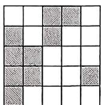

# 第三章 代数式

# 重难点突破1 列代数式(一)

1.C

2. (600m-150n-7 200)

3. $\left(\frac{5x - 4}{8}\right)$

4. $\left(\frac{1}{3} m + 8\right)$

5. (1) $\frac{240}{v + 10}$ $\left(\frac{240}{v} -\frac{240}{v + 10}\right)$

(2) $\left(\frac{240}{v} - 1 - \frac{240 - v}{v + 10}\right)$

6. $\left(\frac{1 - xt}{y}\right)$ 7.D

8.1.037a 解: 定价为 $(1+22\%)a=$ 1.22a（元），减价后的现售价为 $1.22a\times85\%=1.037a$ （元）.

9.B

10. C 解: 设商品原价为 x.

甲超市的售价为 $x(1 - 20\%)(1 - 10\%) = 0.72x$

乙超市的售价为 $x(1-15\%)^{2}=0.7225x$ ;

丙超市的售价为 $x(1 - 30\%) = 70\% x = 0.7x$ ，故到丙超市合算.故选C.

11.C 解: 设该款电子产品的标价为 x 元. 在甲商场购买所需的费用为 $(x-m)\times80\%=(0.8x-0.8m)$ 元; 在乙商场购买所需的费用为 $x\times80\%-m=(0.8x-m)$ 元, $\because m>0$ ,

$$
\therefore 0. 8 x - 0. 8 m > 0. 8 x - m,
$$

∴乙商场比甲商场优惠 20%m 元.
故选 C.

12. 解: (1) 依题意, 得第二次购买的坚果质量为 $(1 + 20\%) \times 2.5x = 3x$ (克);

∵第二次购买 B 种坚果的质量是 A 种坚果质量的 4 倍，

∴第二次购买的 A 种坚果质量为 $3x \cdot \frac{1}{5} = 0.6x$ (克)，

第二次购买的 B 种坚果质量为 $3x \cdot \frac{4}{5} = 2.4x$ (克).

故答案为 $0.6x, 2.4x, 3x$ ;

(2)设 A 种坚果的单价为 a 元，B 种坚果的单价为 b 元，则 $0.6x \cdot a + 2.4x \cdot b = (1 - 10\%) (1.5x \cdot a + x \cdot b)$ ,

整理, 得 a=2b, 所以 $\frac{b}{a}=\frac{1}{2}$ .

故 B 种坚果与 A 种坚果单价的比值是 $\frac{1}{2}$ .

# 重难点突破2 列代数式(二)

1.3600 $mn = 3600$

2. 解: (1) 当 0 < x < 8 时, y 和 x 的关系
式为 $y=\frac{3}{4}x$ ;

(2)当 $x \geqslant 8$ 时， $y$ 与 $x$ 成反比例关系， $y$ 和 $x$ 的关系式为 $y = \frac{48}{x}$ ;

(3)当 $y = 2.4$ 时， $\frac{3}{4} x = 2.4$ ，解得 $x = 3.2$

$\frac{48}{x} = 2.4$ ，解得 $x = 20$

答:此次消毒的有效时间范围是第3.2分钟到第20分钟.

3. $y = \frac{7}{x}$

4. 解: 因为三角形 APD 的面积为长方形 ABCD 面积的一半, 即 $\frac{1}{2}xy = 6$ , 所以 $y = \frac{12}{x}$ , 故 y 与 x 成反比例关系.

5.B 6. $y = \frac{8}{x}$ 7. $L = \frac{150}{F}$

8.10 $\frac{150}{a}$

9. 解：(1)240；

(2) $\frac{240}{v}$ ，反比例；

(3) $240\div5=48$ (吨).

答: 平均每天要卸载 48 吨.

10. 解: (1) $\because 14 \times 18 = 252$ ,

$\therefore y=\frac{252}{x},y$ 与 x 成反比例关系；

(2)已读的页数和剩下的页数不成反比例关系,理由如下:已读页数与剩下的页数的和是定值252,所以已读的页数和剩下的页数不成反比例关系.

# 重难点突破3 代入求代数式的值

1.-1

2. 解：(1) $a^2 + ab - b^2 = 4^2 + 4 \times$

$$
\begin{array}{l} {\left(- \frac {3}{2}\right) - \left(- \frac {3}{2}\right) ^ {2} = 1 6 - 6 - \frac {9}{4} =} \\ {\frac {3 1}{4};} \end{array}
$$

(2) $\frac{a}{b} - ab^2 = 4 \div \left(-\frac{3}{2}\right) -$

$$
\left(- \frac {3}{2}\right) ^ {2} \times 4 = - \frac {8}{3} - 9 = - \frac {3 5}{3}.
$$

3.A 4.25 5.C

6.6 解: 第 1 次输出的结果是 6, 第 2 次输出的结果是 3,

第 3 次输出的结果是 $3+5=8$ ，

第4次输出的结果是 $\frac{1}{2} \times 8 = 4$

第5次输出的结果是 $\frac{1}{2} \times 4 = 2$

第6次输出的结果是 $\frac{1}{2} \times 2 = 1$

第 7 次输出的结果是 $1 + 5 = 6$ ，……，以此类推，从第一次开始，每 6 次输出结果为一个循环，输出结果为 6、3、8、4、2、1 依次出现，

$$
\because 2 0 2 3 \div 6 = 3 3 7 \dots 1,
$$

∴第 2023 次输出的结果为 6. 故答案为 6.

# 重难点突破4 整体求代数式的值

1. -14 解: $\because 2a^{2}-3b+8=1$ ,

$$
\begin{array}{l} \therefore 2 a ^ {2} - 3 b = - 7, \\ \therefore 4 a ^ {2} - 6 b = 2 (2 a ^ {2} - 3 b) \\ = 2 \times (- 7) \\ = - 1 4. \\ \end{array}
$$

故答案为-14.

2.-9 解: 当 $x^{2}-2y=4$ 时,

原式 $= -3(x^{2} - 2y) + 3$

$$
= - 3 \times 4 + 3
$$

$$
= - 9.
$$

故答案为-9.

3.2024

4.1 解：∵4x-8y-1=3，

$$
\therefore x - 2 y = 1,
$$

$$
\therefore 3 - 2 x + 4 y = 3 - 2 (x - 2 y)
$$

$$
= 3 - 2
$$

$$
= 1.
$$

5.9 解: 当 x = -3 时,

$$
a x ^ {3} - b x - 5 = - 2 7 a + 3 b - 5 = - 1 9,
$$

$$
\therefore 2 7 a - 3 b = 1 4,
$$

∴当 x=3 时，

$$
a x ^ {3} - b x - 5 = 2 7 a - 3 b - 5
$$

$$
= (2 7 a - 3 b) - 5
$$

$$
= 1 4 - 5
$$

$$
= 9.
$$

6.-2012 解: 当 x=2 时,

$$
a \times 2 ^ {3} + 2 \times 2 ^ {2} + c \times 2 - 2 = 2 0 2 4,
$$

$$
\therefore 8 a + 2 c = 2 0 1 8,
$$

$x = -2$ 时，

$$
a x ^ {3} + 2 x ^ {2} + c x - 2 = - 8 a - 2 c + 6
$$

$$
= - (8 a + 2 c) + 6
$$

$$
= - 2 0 1 8 + 6
$$

$$
= - 2 0 1 2.
$$

7. 解: $\because$ 当 $x = 1$ 时,

$$
m x ^ {2} + n x + 1 = m + n + 1 = 2 0 2 5,
$$

$$
\therefore m + n = 2 0 2 4,
$$

∴当 x=-1 时，

原式 $= -m - n + 1$

$$
= - (m + n) + 1
$$

$$
= - 2 0 2 4 + 1
$$

$$
= - 2 0 2 3.
$$

8. 解: 根据题意,

$$
f (3) = 3 ^ {5} a + 3 ^ {3} b + 3 \times 3 + c,
$$

$$
f (- 3) = - 3 ^ {5} a - 3 ^ {3} b - 3 \times 3 + c,
$$

$$
\therefore 3 ^ {5} a + 3 ^ {3} b + 3 \times 3 + c - 3 ^ {5} a - 3 ^ {3} b -
$$

$$
3 \times 3 + c = 4,
$$

$$
\therefore 2 c = 4,
$$

$$
\therefore c = 2,
$$

$$
\because f (2) = 2 ^ {5} a + 2 ^ {3} b + 3 \times 2 + 2 = 1 0,
$$

$$
\therefore 2 ^ {5} a + 2 ^ {3} b = 2,
$$

$$
\therefore f (- 2) = - 2 ^ {5} a - 2 ^ {3} b - 6 + 2
$$

$$
= - \left(2 ^ {5} a + 2 ^ {3} b\right) - 4
$$

$$
= - 2 - 4
$$

$$
= - 6.
$$

# 重难点突破5 周长面积问题与代数式求值

1. 解: (1) 由题知, 第 1 道的长为 $2a + 2\pi r = (2a + 6r)$ ;

第2道的长为 $2a + 2\pi (r + 1.25) =$

$$
\left(2 a + 6 r + \frac {1 5}{2}\right);
$$

(2)①由题知, $2a+6r=200$ ,

$\therefore 2\times55+6r=200$ , 解得 r=15,

所以 r 的值为 15;

②由题知,需要铺设混合型塑胶部分的面积为 $55 \times 8 \times 1.25 + \pi \times (15 + 4 \times 1.25)^{2} = 550 + 1200 = 1750(\mathrm{~m}^{2})$ ,

所以 $1750 \times 200 = 350000$ （元），

故学校需付 350 000 元铺设费用.

2. 解: (1) 花台的总面积为: $\pi b^{2}$ , 草坪的面积为: $2ab - \pi b^{2}$ , 总费用为: $100\pi b^{2} + 50(2ab - \pi b^{2}) = 100\pi b^{2} + 100ab - 50\pi b^{2} = (50\pi b^{2} + 100ab)$ 元;

(2) 当 $a = 7, b = 2, \pi$ 取3时，

$$
\begin{array}{l} {5 0 \pi b ^ {2} + 1 0 0 a b = 5 0 \times 3 \times 4 + 1 0 0 \times} \\ {7 \times 2 = 6 0 0 + 1 4 0 0 = 2 0 0 0 (\text {元}).} \end{array}
$$

答:美化这块空地共需 2 000 元.

3. 解: (1) $(4x + 7y)$ , $\left(2xy + \frac{3}{2}y^{2}\right)$ ;

(2)依题意,得 2y=1.2,则 y=0.6,
窗户的总高度为 $1.2 \div 0.6 = 2$ ,

$$
\therefore x = 2 - y = 1. 4,
$$

$$
\begin{array}{l} \therefore L = 4 x + 7 y = 4 \times 1. 4 + 7 \times 0. 6 = \\ 9. 8 (\mathrm{m}), \end{array}
$$

$$
S = 2 x y + \frac {3}{2} y ^ {2} = 2 \times 1. 4 \times 0. 6 +
$$

$$
\frac {3}{2} \times 0. 6 ^ {2} = 2. 2 2 (\mathrm{m} ^ {2}).
$$

# 重难点突破6 实际问题与代数式求值

1. 解: (1) 二月份的产值为 $a(1+x)$ 、三月份的产值为 $a(1+x)^{2}$ ,

第一季度的总产值为 $a + a(1 + x) + a(1 + x)^{2}$ ;

(2) 当 $a = 100, x = 10\%$ 时，

$$
\mathrm{原式} = 1 0 0 + 1 0 0 \times (1 + 1 0
$$

$$
100 \times (1 + 10\%) ^{2}
$$

$$
= 3 3 1 (\text {亿元}).
$$

2. 解: (1) ① 每串冰糖葫芦的山楂个数为 $\frac{40m - c}{a}$ 个；

②当 $m = 4, a = 22, c = 6$ 时，

$$
\frac {4 0 m - c}{a} = \frac {4 0 \times 4 - 6}{2 2} = 7 (\text {个}).
$$

答:每串冰糖葫芦的山楂个数是7个;

(2)根据题意,得 $5x+6y=100$ ,

$\because x$ 和 y 均为正整数，

$$
\therefore x = 2 \text {   时   }, y = 1 5;
$$

$$
x = 8 \text {   时   }, y = 1 0;
$$

$$
x = 1 4 \text {   时   }, y = 5.
$$

∵A款每串卖9元,B款每串卖10元,

∴卖的总钱数为 $9x + 10y$ .

当 x=2, y=15 时，

$$
\begin{array}{l} 9 x + 1 0 y = 9 \times 2 + 1 0 \times 1 5 \\ = 1 6 8 (\text { 元 }); \\ \end{array}
$$

当 $x = 8, y = 10$ 时，

$$
\begin{array}{l} 9 x + 1 0 y = 9 \times 8 + 1 0 \times 1 0 \\ = 1 7 2 (\text { 元 }); \\ \end{array}
$$

当 $x = 14, y = 5$ 时，

$$
\begin{array}{l} 9 x + 1 0 y = 9 \times 1 4 + 1 0 \times 5 \\ = 1 7 6 (\text {元}). \\ \end{array}
$$

∵176>172>168,

∴当 x=14 时, 卖的钱最多, 为 176 元. 故答案为 14, 176.

3. 解: (1) 由题意可得, 燃油车每千米的行驶费用为 $\frac{50 \times 7.66}{a} = \frac{383}{a}$ 元,

新能源车每千米的行驶费用为 $\frac{100\times0.53}{b}=\frac{53}{b}$ 元.

故答案为 $\frac{383}{a},\frac{53}{b};$

(2)根据题意,可得 $\frac{383}{a}-\frac{53}{b}=0.5$ ,
且 a=b，解得 b=660，

∴新能源车每千米的行驶费用为 $53\div660\approx0.08$ （元）.

# 重难点突破7 代数式与数式规律

1. $19x^{10}$ $(2n - 1)x^{n}$   
2. $-9x^{9} (-1)^{n}nx^{n}$

$$
(- 1) ^ {n + 1} (n + 1) x ^ {n + 1}
$$

3. $-\frac{6}{37} (-1)^{n + 1}\cdot \frac{n}{n^2 + 1}$   
4. $\frac{13}{243}$ $\frac{3n - 2}{3^n}$

5. A 解: 由题意得, 这组数据的和为

$$
\begin{array}{l} 2 ^ {1 0 0} + 2 ^ {1 0 1} + 2 ^ {1 0 2} + \dots + 2 ^ {1 9 9} + 2 ^ {2 0 0} \\ = 2 ^ {1 0 0} (1 + 2 + \dots + 2 ^ {9 9} + 2 ^ {1 0 0}) = 2 ^ {1 0 0} \\ (1 + 2 ^ {1 0 1} - 2) = 2 ^ {1 0 0} (2 ^ {1 0 1} - 1) = 2 ^ {1 0 0} \\ (2 ^ {1 0 0} \times 2 - 1). \\ \end{array}
$$

$$
\because 2 ^ {1 0 0} = S,
$$

∴原式= $S(S \times 2 - 1) = 2S^{2} - S$ .

故选A.

6. $2n \times (2n + 2) + 1 = (2n + 1)^{2}$   
7.(1) $6+\frac{13}{6}=\frac{25}{6}+4$

(2) $n+\frac{2n+1}{n}=\frac{(n-1)^{2}}{n}+4$

8. $(-2)^{n}$ $b = a + 5$ $d = a + b + c$

解:方格中左上角的数字依次为-2,4,-8,16,…,所以第n个方格中左上角的数字为 $(-2)^{n}$ ;

每个方格左下角的数字是左上角数

字的一半,所以第 n 个方格中左下角的数字可表示为 $\frac{(-2)^{n}}{2}$ ;

每个方格右上角的数字比左上角的数字大5,所以第n个方格中右上角的数字可表示为 $(-2)^{n}+5$ .

又因为 $0 = -2 + (-1) + 3, 15 = 4 + 2 + 9, -15 = -8 + (-4) + (-3), \cdots$ ，所以 $d = a + b + c.$

# 重难点突破.8 代数式与图形规律

1. D 2. $3n + 1$ 3. $2n + 2$   
4. 解：(1) $1+4+4+4=1+4\times3=13$ ;

(2) $1+4+4+\cdots+4=1+4\times n=$ $4n+1,$

故答案为 $4n+1$ ;

(3)根据规律可知 $4n+1=2025$ ,
解得 n=506.

5. $(n+1)^{2}-1$ 解: 第1幅图中“•”的个数为3, 即 $a_{1}=3=2^{2}-1$ ;

第2幅图中“ $\bullet$ ”的个数为8，即 $a_{2} = 8 = 3^{2} - 1$ ；

第3幅图中“ $\bullet$ ”的个数为15，即 $a_{3} = 15 = 3 + 5 + 7 = 4^{2} - 1$ ；

第 4 幅图中“•”的个数为 24，即 $\alpha_{4}=24=3+5+7+9=5^{2}-1;\cdots,$

所以第 n 幅图中“•”的个数为 $a_{n}=3+5+7+\cdots+2n+1=(n+1)^{2}-1$ .

6. $4+n(n+1)$ 解: 第1个图形中小圆个数为 $(4+2)$ 个, 第2个图形中小圆个数为 $(4+6)$ 个, 第3个图形中小圆个数为 $(4+12)$ 个, ……, 第n个图形中小圆个数为 $4+n(n+1)$ 个.

7. $2(n+1)+(n-1)^{2}$ 解:图1中,棋子数量为 $4=2\times2+0^{2}$ ;图2中,棋子数量为 $7=2\times3+1^{2}$ ;图3中,棋子数量为 $12=2\times4+2^{2}$ ;…,以此类推,图n中,棋子数量为 $2(n+1)+(n-1)^{2}$ .

8.11 解: 第 n 个图案中“★”的个数为 $1 + 2 + 3 + \cdots + n = \frac{n(n+1)}{2}$ 个，“◎”的个数为 3n 个.

所以 $\frac{n(n + 1)}{2} = 2 \times 3n$

解得 n=0 或 11，

又因为 $n$ 为正整数，

所以 n=11.

故答案为11.

9.D 解:由题意,得 $a_{1}=2=1\times2$ ,

$$
a _ {2} = 6 = 2 \times 3, a _ {3} = 1 2 = 3 \times 4,
$$

$$
a _ {4} = 2 0 = 4 \times 5, \dots , \text {则} a _ {n} = n (n + 1),
$$

$$
\text {则} \frac {n}{a _ {1}} + \frac {n}{a _ {2}} + \frac {n}{a _ {3}} + \dots + \frac {n}{a _ {2 0 2 3}} = \frac {n}{1 \times 2}
$$

$$
+ \frac {n}{2 \times 3} + \frac {n}{3 \times 4} + \dots + \frac {n}{2 0 2 3 \times 2 0 2 4}
$$

$$
= n \left(1 - \frac {1}{2} + \frac {1}{2} - \frac {1}{3} + \frac {1}{3} - \frac {1}{4} + \dots \right.
$$

$$
\left. + \frac {1}{2 0 2 3} - \frac {1}{2 0 2 4}\right) = n \left(1 - \frac {1}{2 0 2 4}\right) =
$$

$\frac{2023n}{2024}$ . 故选 D:

# 中考新方向 1 阅读理解

1. 解: (1) $5 - 2x + 4y = 5 - 2(x - 2y)$

$$
= 5 - 6 = - 1;
$$

$$
2 0 2 4 - 6 x + 3 x ^ {2} = 2 0 2 4 + 3 \left(x ^ {2} - \right.
$$

$$
2 x) = 2 0 2 7;
$$

(2) 当 $x = 2$ 时, $ax^3 + bx + 4 = 8a + 2b + 4 = 11$ ,

$$
\therefore 8 a + 2 b = 7,
$$

∴当 x = -2 时，

$$
a x ^ {3} + b x + 3 = - 8 a - 2 b + 3
$$

$$
= - (8 a + 2 b) + 3
$$

$$
= - 7 + 3
$$

$$
= - 4;
$$

$$
\begin{array}{l} (3) \because 3 m - 4 n = - 3, m n = - 1, \\ \therefore 6 (m - n) - 2 (n - m n) \\ = 6 m - 6 n - 2 n + 2 m n \\ = 6 m - 8 n + 2 m n \\ = 2 (3 m - 4 n) + 2 m n \\ = 2 \times (- 3) + 2 \times (- 1) \\ = - 8. \\ \end{array}
$$

2. 解: (1) 当 x=1 时, $a_{0}=4\times1=4$ ;

(2) 当 $x = 2$ 时，得 $a_{6} + a_{5} + a_{4} + a_{3}$

$$
+ a _ {2} + a _ {1} + a _ {0} = 4 \times 2 = 8;
$$

(3) 当 $x = 0$ 时, 得 $a_{6} - a_{5} + a_{4} - a_{3}$

$$
+ a _ {2} - a _ {1} + a _ {0} = 0, \quad ①
$$

由(2)得 $a_6 + a_5 + a_4 + a_3 + a_2 + a_1 + a_0 = 8$ ，②

①+②，得 $2a_{6} + 2a_{4} + 2a_{2} + 2a_{0} = 8$

$$
\begin{array}{l} \therefore 2 \left(a _ {6} + a _ {4} + a _ {2}\right) = 8 - 2 \times 4 = 0, \\ \therefore a _ {6} + a _ {4} + a _ {2} = 0. \\ \end{array}
$$

# 中考新方向2 综合与实践

解:(1)从第一块地砖开始往后,每增加一块正六边形地砖,正方形地砖会增加5块,三角形地砖会增加4块,故答案为5;4;

(2)若铺设这条小路共用去 $a$ 块正六边形地砖，

则正方形地砖的数量为 $(5a + 1)$ 块；三角形地砖的数量为 $(4a + 2)$ 块.

故答案为 $(5a + 1);(4a + 2)$

(3)由(2)可知,若铺设这条小路共用去a块正六边形地砖,

则正方形地砖的数量为 $(5a + 1)$ 块，

因为 $80 \, cm = 0.8 \, m$ ,

所以每块正方形地砖的面积为 $0.8 \times 0.8 = 0.64(m^{2})$ ,

所以创意地砖的面积为 $0.64(5a+1)$ $=(3.2a+0.64)\mathrm{m}^{2}$ ,

当 $a = 25$ 时，创意地砖的面积为 $3.2 \times 25 + 0.64 = 80.64(\mathrm{m}^2)$ ，

所以需要 $80.64 \times 26 = 2096.64 \approx 2097$ (元).

答:需要 2 097 元.

# 第四章 整式的加减

# 重难点突破1 整式的加减(一)化简后求值

1. 解: 原式 $=\frac{3}{2}x - 2x + \frac{2}{3}y^{2} - \frac{5}{2}x$

$$
+ \frac {5}{3} y ^ {2}
$$

$$
= \frac {3}{2} x - \frac {5}{2} x - 2 x + \frac {2}{3} y ^ {2}
$$

$$
+ \frac {5}{3} y ^ {2}
$$

$$
= - 3 x + \frac {7}{3} y ^ {2}.
$$

当 $x = 2, y = -3$ 时，

原式 $= -3 \times 2 + \frac{7}{3} \times (-3)^{2}$

$$
= - 6 + \frac {7}{3} \times 9
$$

$$
= - 6 + 2 1
$$

$$
= 1 5.
$$

2. 解: 原式 $= 5a^{3} - a^{2} + 3a - 3a^{3} + 2a^{2}$

$$
- a - 2 a ^ {3} - 2 a + 2 0 2 0
$$

$$
= 5 a ^ {3} - 3 a ^ {3} - 2 a ^ {3} + 2 a ^ {2} -
$$

$$
a ^ {2} + 3 a - 2 a - a + 2 0 2 0
$$

$$
= a ^ {2} + 2 0 2 0.
$$

当 $a = 2$ 时，

原式 $= 2^{2} + 2020$

$$
= 4 + 2 0 2 0
$$

$$
= 2 0 2 4.
$$

3. 解: 原式 $=3x^{2}-\left(5x-\frac{1}{2}x+3+2x^{2}\right)$

$$
= 3 x ^ {2} - 5 x + \frac {1}{2} x - 3 - 2 x ^ {2}
$$

$$
= x ^ {2} - \frac {9}{2} x - 3,
$$

当 $x = -\frac{1}{2}$ 时，

原式 $= \left(-\frac{1}{2}\right)^2 -\frac{9}{2}\times \left(-\frac{1}{2}\right) - 3$

$$
= \frac {1}{4} + \frac {9}{4} - 3
$$

$$
= - \frac {1}{2}.
$$

4. 解: 原式 $= a^{2}b - 2ab^{2} - (3a^{2}b -$

$$
2 a b) + 2 (a ^ {2} b - a b)
$$

$$
= a ^ {2} b - 2 a b ^ {2} - 3 a ^ {2} b + 2 a b
$$

$$
+ 2 a ^ {2} b - 2 a b
$$

$$
= - 2 a b ^ {2}.
$$

当 $a = 2, b = -3$ 时，

原式 $= -2 \times 2 \times (-3)^{2}$

$$
= - 3 6.
$$

5. 解: 原式 = $3x^{2}y - (2x^{2}y - 6xy +$

$$
3 x ^ {2} y - x y)
$$

$$
= 3 x ^ {2} y - 2 x ^ {2} y + 6 x y -
$$

$$
3 x ^ {2} y + x y
$$

$$
= - 2 x ^ {2} y + 7 x y.
$$

当 $x = -\frac{1}{2}, y = 2$ 时，

原式 $= -2 \times \left(-\frac{1}{2}\right)^{2} \times 2 + 7 \times$

$$
\left(- \frac {1}{2}\right) \times 2
$$

$$
= - 8.
$$

# 重难点突破2 整式的加减(二)条件型求值

1. 解: 因为 $x^{2}y^{a+1}$ 是关于 x, y 的五次单项式，

所以 $2 + a + 1 = 5$ ，解得 $a = 2$

原式 $= 5a^{2} - (a^{3} + 5a^{2} - 2a) + 2(a^{3}$

$$
- 3 a)
$$

$$
= 5 a ^ {2} - a ^ {3} - 5 a ^ {2} + 2 a + 2 a ^ {3} -
$$

$$
6 a
$$

$$
= a ^ {3} - 4 a.
$$

当 $a = 2$ 时，原式 $= 2^{3} - 4 \times 2 = 0$ .

2. 解：∵ $\left|a-3\right|+(b+2)^{2}=0$ ,

$$
\therefore a - 3 = 0, b + 2 = 0,
$$

$$
\therefore a = 3, b = - 2,
$$

$\therefore$ 原式 $= 3a^{2}b - 4ab^{2} - 2a^{2}b + 4ab^{2}$

$$
= a ^ {2} b
$$

$$
= 3 ^ {2} \times (- 2)
$$

$$
= 9 \times (- 2)
$$

$$
= - 1 8.
$$

3. 解: 原式 = $3x^{2}y - (2x^{2}y - 2xy +$

$$
x ^ {2} y - 4 x ^ {2}) - x y
$$

$$
= 3 x ^ {2} y - 2 x ^ {2} y + 2 x y -
$$

$$
x ^ {2} y + 4 x ^ {2} - x y
$$

$$
= 4 x ^ {2} + x y.
$$

由题意，得 $x = 2, y = 3$

当 $x = 2, y = 3$ 时，

原式=4×4+6=22.

4. 解: $3m^{2} - [7m - (4m - 3) - 2m^{2}] =$

$$
3 m ^ {2} - 7 m + (4 m - 3) + 2 m ^ {2} = 3 m ^ {2} -
$$

$$
7 m + 4 m - 3 + 2 m ^ {2} = 5 m ^ {2} - 3 m - 3.
$$

由题意, 得 a-2b=0, 3ac=-1, d=0 或 1,

①当 d=0 时， $m=4a-8b-3ac+$

$$
d ^ {2} = 4 (a - 2 b) - 3 a c + d ^ {2} = 0 + 1 + 0
$$

$$
= 1.
$$

原式 $= 5m^{2} - 3m - 3 = 5 - 3 - 3 = -1$

②当 d=1 时， $m=4a-8b-3ac+$

$$
d ^ {2} = 4 (a - 2 b) - 3 a c + d ^ {2} = 0 + 1 + 1
$$

$$
= 2.
$$

原式 $= 5m^{2} - 3m - 3$

$$
= 5 \times 2 ^ {2} - 3 \times 2 - 3
$$

$$
= 1 1.
$$

综上所述,原式的值为-1或11.

# 重难点突破3 整式的加减(三) 连续化简

1. 解: 当 k = -1 时, $A = -2x^{2} + 2x +$

$1, B = -2(x^{2} - x + 2)$ , 由 $C + 2A =$

B, 得 C = B - 2A = -2(x² - x + 2)

$$
- 2 (- 2 x ^ {2} + 2 x + 1) = - 2 x ^ {2} + 2 x -
$$

$$
4 + 4 x ^ {2} - 4 x - 2 = 2 x ^ {2} - 2 x - 6.
$$

2. 解: 由题意, 得

$$
A = 1 2 x ^ {2} y + 2 x y + 5 - (3 x ^ {2} y - 5 x y
$$

$$
+ x + 7)
$$

$$
= 1 2 x ^ {2} y + 2 x y + 5 - 3 x ^ {2} y + 5 x y
$$

$$
- x - 7
$$

$$
= 9 x ^ {2} y + 7 x y - x - 2;
$$

$$
C = A - (2 A - 3 B)
$$

$$
= A - 2 A + 3 B
$$

$$
= 3 B - A
$$

$$
= 3 \left(3 x ^ {2} y - 5 x y + x + 7\right) - \left(9 x ^ {2} y \right.
$$

$$
+ 7 x y - x - 2)
$$

$$
= 9 x ^ {2} y - 1 5 x y + 3 x + 2 1 - 9 x ^ {2} y
$$

$$
- 7 x y + x + 2
$$

$$
= - 2 2 x y + 4 x + 2 3.
$$

3. 解: (1) 2A - (2B - C - A)

$$
= 3 A - 2 B + C
$$

$$
= 3 \left(x ^ {2} + x y + 3 y\right) - 2 \left(x ^ {2} - x y\right) +
$$

$$
(- 5 x y + 1)
$$

$$
= 3 x ^ {2} + 3 x y + 9 y - 2 x ^ {2} + 2 x y - 5 x y
$$

$$
+ 1
$$

$$
= 3 x ^ {2} - 2 x ^ {2} + 3 x y + 2 x y - 5 x y + 9 y
$$

$$
+ 1
$$

$$
= x ^ {2} + 9 y + 1;
$$

(2) $\because(x+2)^{2}+|y-3|=0,$

$$
\therefore x + 2 = 0, y - 3 = 0,
$$

解得 x = -2, y = 3,

$$
\begin{array}{l} \therefore 2 A - (2 B - C - A) = x ^ {2} + 9 y + 1 \\ = (- 2) ^ {2} + 9 \times \\ 3 + 1 \\ = 4 + 2 7 + 1 \\ = 3 2. \\ \end{array}
$$

4. 解：(1) $\because A = x^{2} - 2xy + 2y^{2} + 1$

$$
\begin{array}{l} B = 2 A - 3, C = A + B, \\ \therefore A + B + C = A + 2 A - 3 + A + B \\ = A + 2 A - 3 + A + 2 A \\ - 3 \\ = 6 A - 6 \\ = 6 \left(x ^ {2} - 2 x y + 2 y ^ {2} + \right. \\ 1) - 6 \\ = 6 x ^ {2} - 1 2 x y + 1 2 y ^ {2} + \\ 6 - 6 \\ = 6 x ^ {2} - 1 2 x y + 1 2 y ^ {2}; \\ \end{array}
$$

(2) 当 $x = -3, y = \frac{1}{2}$ 时，

$$
\begin{array}{l} A + B + C = 6 \times (- 3) ^ {2} - 1 2 \times \frac {1}{2} \times \\ (- 3) + 1 2 \times \left(\frac {1}{2}\right) ^ {2} \\ = 5 4 + 1 8 + 3 \\ = 7 5. \\ \end{array}
$$

# 重难点突破4 整式的加减(四)化简绝对值

1. $b + c$ 解：由数轴图可知， $a < 0 < c < b, |a| < b, a - c < 0,$

$$
\begin{array}{l} \therefore | a + b | + | a - c | = a + b + [ - (a \\ - c) ] \\ = a + b - a + c \\ = b + c. \\ \end{array}
$$

故答案为 $b + c$

2. 解: (1) ∵ 从数轴可知 b < c < 0 < a, $|b|=|a|>|c|$ ,

$$
\therefore a + b = 0, a + c > 0, b - c <   0,
$$

故答案为 $= , > , < ;$

$$
\begin{array}{l} \because a + b = 0, a + c > 0, b - c <   0 \tag {2} \\ \therefore | a + b | + | a + c | - | b | - | b - c | \\ = a + b + (a + c) + b + (b - c) \\ = a + b + a + c + b + b - c \\ = b. \\ \end{array}
$$

3. 解: (1) 由 a, b, c 三点在数轴上的位置可知, -1 < c < 0, 1 < a < b < 2,

$$
\because c <   0, b > 0, a > 0,
$$

$\therefore c - b < 0, c + 1 > 0, a + c > 0$ ，故答案为 $<, >, >$ ;

(2) $\because c-b<0,c+a>0,c+1>0,$

∴ 原式 = b - c + 2c + 2 - a - c = b - a + 2.

4. 解：(1)由数轴可得 $-2 < b < c < 0 < 2 < a$ ，则 $a + b > 0, c - a < 0, b + 2 > 0.$ 故答案为>，<，>；

$$
\begin{array}{l} (2) \because a + b > 0, c - a <   0, b + 2 > 0, \\ \therefore 3 | a + b | - 2 | c - a | - | b + 2 | \\ = 3 a + 3 b + 2 (c - a) - (b + 2) \\ = 3 a + 3 b + 2 c - 2 a - b - 2 \\ = a + 2 b + 2 c - 2. \\ \end{array}
$$

# 重难点突破5 整式的加减(五)缺项求值

1. 解：因为多项式 $2a^{2}b - a^{3}b^{2} + 3a^{m - 1}b^{n}$ 合并同类项后只有两项，所以 $3a^{m - 1}b^n$ 与 $2a^2 b$ 为同类项或 $3a^{m - 1}b^n$ 与 $-a^3 b^2$ 为同类项.

①当 $3a^{m - 1}b^n$ 与 $2a^2 b$ 为同类项时， $m - 1 = 2, n = 1,$

解得 m=3, n=1, $m+n=4$ ;

②当 $3a^{m - 1}b^n$ 与 $-a^3 b^2$ 为同类项时， $m - 1 = 3,n = 2$

解得 $m = 4, n = 2, m + n = 6$ .

综上所述， $m+n$ 的值为 6 或 4.

2. 解: (1) 设 $\square$ 的值为 $a$ , 则

$$
\begin{array}{l} 3 \left(3 x ^ {2} + 4 x y\right) - a \left(2 x ^ {2} + 3 x y - 1\right) \\ = 9 x ^ {2} + 1 2 x y - 2 a x ^ {2} - 3 a x y + a \\ = (9 - 2 a) x ^ {2} + (1 2 - 3 a) x y + a. \\ \end{array}
$$

因为结果不含有 $y$

所以 $12 - 3a = 0$

所以 $a = 4$ ，故答案为4；

$$
\begin{array}{l} 3 (3 x ^ {2} + 4 x y) - 4 (2 x ^ {2} + 3 x y - 1) \tag {2} \\ = 9 x ^ {2} + 1 2 x y - 8 x ^ {2} - 1 2 x y + 4 \\ = x ^ {2} + 4. \\ \end{array}
$$

所以该题的正确答案为 $x^{2} + 4$

3. 解: (1) $A = \left(-\frac{14}{5}x^{2} + 4x\right) -$

$$
\begin{array}{l} \left(\frac {1}{5} x ^ {2} + 3 x\right) \\ = - \frac {1 4}{5} x ^ {2} + 4 x - \frac {1}{5} x ^ {2} - \\ 3 x \\ = - 3 x ^ {2} + x, \\ \end{array}
$$

即 $A = -3x^{2} + x$

$$
\begin{array}{l} (2) A + t (5 x - 1) = - 3 x ^ {2} + x + \\ \iota (5 x + 1) = - 3 x ^ {2} + x + 5 t x + \iota = \\ - 3 x ^ {2} + (5 t + 1) x + t, \\ \end{array}
$$

∵式子 $A+t(5x-1)$ 不含一次项 (t 为常数)，

$$
\therefore 5 t + 1 = 0,
$$

$$
\therefore t = - \frac {1}{5}.
$$

# 重难点突破6 整式的加减(六) 无关与定值

1. 解：(1) $(2x-3)m+2m^{2}-4x=2mx$

$$
\begin{array}{l} - 3 m + 2 m ^ {2} - 4 x = (2 m - 4) x + 2 m ^ {2} \\ - 3 m, \end{array}
$$

因为原式的值与 $x$ 的取值无关，

所以 $2m - 4 = 0$ ，解得 $m = 2$

$$
\begin{array}{l} (2) 3 A + 6 B = 3 \left[ 2 x ^ {2} - (1 - 3 n) x \right] + \\ 6 \left(- x ^ {2} + n x - 1\right) = 3 \left(2 x ^ {2} - x + \right. \\ 3 n x) + 6 \left(- x ^ {2} + n x - 1\right) = 6 x ^ {2} - 3 x \\ + 9 n x - 6 x ^ {2} + 6 n x - 6 = (- 3 + 9 n + \\ 6 n) x - 6 = (1 5 n - 3) x - 6, \\ \end{array}
$$

$$
\begin{array}{l} 3 n x) + 6 \left(- x ^ {2} + n x - 1\right) = 6 x ^ {2} - 3 x \\ + 9 n x - 6 x ^ {2} + 6 n x - 6 = (- 3 + 9 n + \\ 6 n) x - 6 = (1 5 n - 3) x - 6, \\ \end{array}
$$

因为 $3A + 6B$ 的值与 $\pmb{x}$ 无关，

所以 15n-3=0，即 $n=\frac{1}{5}$ .

2.11 解: $mx^{2}+nx+5+7x-2x^{2}+$

$$
m x = (m - 2) x ^ {2} + (n + m + 7) x + 5,
$$

因为多项式 $mx^2 + nx + 5 + 7x - 2x^2 + mx$ 的值与 $x$ 的取值无关，

所以 $m - 2 = 0$ ，且 $n + m + 7 = 0$

所以 $m = 2, n = -9$

所以 $m - n = 2 + 9 = 11$

故答案为11.

3. 解: (1) 因为 $M = x^{2} + xy + 2y - 2$ , $N=2x^{2}-2xy+x-4,$

$$
\begin{array}{l} \text {所以} 2 M - N = 2 (x ^ {2} + x y + 2 y - 2) \\ - (2 x ^ {2} - 2 x y + x - 4) = 2 x ^ {2} + 2 x y \\ + 4 y - 4 - 2 x ^ {2} + 2 x y - x + 4 = 4 x y \\ + 4 y - x; \\ \end{array}
$$

(2) 当 $x = -2, y = -4$ 时，

$$
2 M - N = 4 x y + 4 y - x = 4 \times (- 2)
$$

$$
\begin{array}{l} \times (- 4) + 4 \times (- 4) - (- 2) = 3 2 - \\ 1 6 + 2 = 1 8; \end{array}
$$

$$
\begin{array}{l} (3) 2 M - N = 4 x y + 4 y - x = (4 y - \\ 1) x + 4 y, \end{array}
$$

因为 $2M - N$ 的值与 $\pmb{x}$ 的取值无关，

所以 $4y - 1 = 0$ ，所以 $y = \frac{1}{4}$

4. 解: (1) 因为 $\left|a+1\right| + (b-2)^{2} = 0$ , $\left|a+1\right|\geqslant0,\left(b-2\right)^{2}\geqslant0,$

所以 $a+1=0, b-2=0$ ,

解得 $a = -1, b = 2$

因为 $A = 2a^{2} - 5ab + 3b$

$$
B = 4 a ^ {2} + 6 a b + 8 a,
$$

$$
\begin{array}{l} \text {所以} 2 A - 3 B = 2 (2 a ^ {2} - 5 a b + 3 b) - \\ 3 \left(4 a ^ {2} + 6 a b + 8 a\right) = 4 a ^ {2} - 1 0 a b + 6 b \\ - 1 2 a ^ {2} - 1 8 a b - 2 4 a = - 8 a ^ {2} - 2 8 a b \\ + 6 b - 2 4 a = - 8 \times 1 - 2 8 \times (- 1) \times \\ 2 + 1 2 + 2 4 = 8 4; \\ \end{array}
$$

(2) 因为 $2A - B = 4a^2 - 10ab + 6b -$

$$
\begin{array}{l} 4 a ^ {2} - 6 a b - 8 a = - 1 6 a b - 8 a + 6 b = \\ (- 1 6 b - 8) a + 6 b, \end{array}
$$

且整式 $2A - B$ 的值与 $\pmb{a}$ 无关，

所以 $-16b - 8 = 0$ ，解得 $b = -\frac{1}{2}$

5. 解: (1) $\because (x-1)^{2} + |y-2| = 0$ ,

$$
\therefore x - 1 = 0, y - 2 = 0,
$$

解得 $x = 1, y = 2$ .

$$
\because 4 A - (2 A + B) = 4 A - 2 A - B =
$$

$$
2 A - B = 2 (2 x ^ {2} - 4 x y + 7 y + 3) -
$$

$$
(x ^ {2} - x y + 1) = 4 x ^ {2} - 8 x y + 1 4 y +
$$

$$
6 - x ^ {2} + x y - 1 = 4 x ^ {2} - x ^ {2} - 8 x y +
$$

$$
\begin{array}{l} x y + 1 4 y + 6 - 1 = 3 x ^ {2} - 7 x y + 1 4 y \\ + 5. \end{array}
$$

∴当 x=1, y=2 时，

$$
4 A - (2 A + B) = 2 A - B = 3 x ^ {2} -
$$

$$
7 x y + 1 4 y + 5 = 3 \times 1 ^ {2} - 7 \times 1 \times 2 +
$$

$$
1 4 \times 2 + 5 = 2 2;
$$

(2)由(1)可知 $4A - (2A + B) = 3x^{2}$

$$
\begin{array}{l} - 7 x y + 1 4 y + 5 = 3 x ^ {2} + (1 4 - 7 x) y \\ + 5, \end{array}
$$

∵4A-(2A+B)的值与y的取值无关，

∴14-7x=0, 解得 x=2,

当 x=2 时， $4A-(2A+B)=3x^{2}+5=3\times2^{2}+5=17.$

6. 解: (1) 2A - B = 2 ( $x^{3} + 2x + 3$ ) -

$$
(2 x ^ {3} - x y + 2) = 2 x ^ {3} + 4 x + 6 - 2 x ^ {3}
$$

$$
+ x y - 2 = 4 x + x y + 4;
$$

$$
2 A - B = 4 x + x y + 4 = x (4 + y) \tag {2}
$$

$$
+ 4,
$$

因为无论 x 取任何数时,2A-B 的结果都为定值,

所以 $4 + y = 0$ ，即 y = -4。

# 重难点突破7 整式的加减(七)规律探究

1. 解: (1) 单项式的系数依次为 1, -3, 5,

$$
- 7, 9, - 1 1, \dots , (- 1) ^ {n + 1} (2 n - 1),
$$

y 的指数依次为 1,2,3,4,5,6,…,n; 故第 7 个单项式是 $13x^{2}y^{7}$ ; 第 8 个单项式是 $-15x^{2}y^{8}$ ;

(2)由(1)可得出第 $n$ 个单项式为 $(-1)^{n + 1}(2n - 1)x^{2}y^{n}$ ，它的系数为 $(-1)^{n + 1}(2n - 1)$ ，次数为 $n + 2$

2.5 解: 设第一步完成后, 自左向右三堆牌的张数分别为 a, a, a, 第二步完成后, 自左向右三堆牌的张数分别为 $a - 2, a + 2, a$ , 第三步完成后, 自左向右三堆牌的张数分别为 $a - 2, a + 3, a - 1$ , 第四步完成后, 中间一堆牌

的张数为 $a + 3 - (a - 2) = a + 3 - a$ $+2 = 5$ （张).故答案为5.

3. 解: (1) 第 3 次操作后得到的整式串为: $-m + n, -m, -n, m - n, m;$

(2)根据规律,每次操作后所得整式串的第一项依次为 $-n,-m,-m+n,n,m,m-n,-n,\cdots;$

所以整式串的第一项每6次操作为一个循环, $20\div6=3\cdots2$ ,

所以第20次操作后得到的整式串的第一项与第2次操作后得到的整式串的第一项相同，故答案为一 $m$ ；

(3)每次操作后所得整式串的和依次为 $2m-2n, m-2n, -n, 0, m, 2m-n, 2m-2n, \cdots;$

所以整式串的和每6次操作作为一个循环, $100\div6=16\cdots4$ ,

所以第 100 次操作后得到的整式串的和与第 4 次操作后得到的整式串的和相同，

故第 100 次操作后得到的整式串的和为 0.

# 重难点突破8 整式的应用(一)作差法

1. 解: (1)2,-3;8,-1;

$$
(2) >;
$$

$$
\begin{array}{l} (3) A - B = 4 a ^ {2} - 5 a + 2 - (3 a ^ {2} - 5 a \\ - 3) = 4 a ^ {2} - 5 a + 2 - 3 a ^ {2} + 5 a + 3 = \\ a ^ {2} + 5, \\ \end{array}
$$

因为 $a^2 \geqslant 0$

所以 $a^2 + 5 > 0$ ，即 $A - B > 0$

$$
\therefore A > B.
$$

2. A 解: 由题意, 得进货成本为 $40m + 60n$ , 销售额为 $\frac{m+n}{2} \times (40+60) = 50m + 50n$ ,

$$
5 0 (m + n) - (4 0 m + 6 0 n) = 5 0 m +
$$

$$
5 0 n - 4 0 m - 6 0 n = 1 0 (m - n),
$$

因为 $m > n$ ，所以 $10(m - n) > 0$

所以这家商店盈利. 故选 A.

3. 解: (1) 依题意, 得 $C_{A}=2(a+2b-c+3a-b)=8a+2b-2c$ ,

$$
\begin{array}{l} C _ {B} = 2 (2 a + b - 2 c + a + b + c) = 6 a \\ + 4 b - 2 c; \end{array}
$$

(2)依题意,得 $C_{A}-C_{B}=(8a+2b-2c)-(6a+4b-2c)=2a-2b=2(a-b)$ ,

$$
\because a > b,
$$

$\therefore 2(a-b)>0$ , 即 $C_{A}>C_{B}$ ;

(3) $C_A + C_B = (8a + 2b - 2c) +$

$$
(6 a + 4 b - 2 c) = 1 4 a + 6 b - 4 c.
$$

$$
\because a = 2 c, b + 2 a = 1 0,
$$

$$
\therefore \text {   原式   } = 1 4 a + 6 b - 2 a = 1 2 a + 6 b =
$$

$$
6 (2 a + b) = 6 0.
$$

故答案为60.

# 重难点突破9 整式的应用(二) 数字问题

1.D 解: 原式 $=2(100a+10b+c)-(100c+10b+a)-(100a+10c+b)=99a+9b-108c=9(11a+b-12c)$ ,

∵9(11a+b-12c)是9的倍数，

∴原式一定是9的倍数.故选D.

2. A 解: 设原来的三位数为 $100a + 10b + c$ ，则新数可表示为 $100c + 10b + a$ ，

$$
\therefore 1 0 0 c + 1 0 b + a - (1 0 0 a + 1 0 b + c)
$$

$$
= 9 9 c - 9 9 a = 9 9 (c - a),
$$

∴结果一定为99的整数倍,选项中只有297是99的整数倍.故选A.

3. 解: (1) 3m - 2 = 7m - 4,

解得 $m=\frac{1}{2}$ .

因为 $m$ 不是整数，

所以 3274 不是“m 倍数”。

$2m - 9 = 6m - 1$ ，解得 $m = -2$

所以 2961 是“-2 倍数”，m 为 -2；

(2)x 为三位数,个位数字为 7,

由题意, 得 a=0, d=7,

因为 x 为“-2 倍数”，

所以 $-2\times0-b=-2c-7$ ，

整理, 得 $b=2c+7$

这个三位数为 $100b + 10c + 7 = 100(2c + 7) + 10c + 7 = 210c + 707 = 7(30c + 101)$ .

$30c + 101$ 是整数. 所以这个三位数 $x$ 能被7整除.

# 重难点突破 10 整式的应用(三) 月历与数阵

1.B 解: A 选项, 设最上面的数为 x, 则其他四个数为 $x + 7, x + 8, x + 14, x + 15$ , 根据题意, 得 $5x + 44 = 121, x$ 无整数解, 故不合题意;

B选项,设左上的数为 x, 则其他四个数为 $x+2, x+7, x+8, x+9$ ,

根据题意, 得 $5x + 26 = 121$ , 解得 x = 19, 覆盖的五个数分别为 19, 26, 27, 28, 21, 故符合题意;

C选项,设左上的数为 x,则其他四个数为 $x + 1, x + 8, x + 15, x + 16$ ，根据题意，得 $5x + 40 = 121, x$ 无整数解，故不合题意；

D选项,设左上的数为 x, 则其他四个数为 $x+1, x+2, x+8, x+15$ , 根据题意, 得 $5x+26=121$ ,

解得 x=19，但 $19+15=34$ ，月历中不存在这个数，故不合题意。故选 B.

2. 解: (1) 设方框中中间的数为 x, 方框中的所有 9 个数之和为 9x,

故 $9x = 81$ ，则 $x = 9$ ，此时成立，则方框中最小的数为1；

(2)设斜框中第二排第二个数为 $x$ ，同理可求斜框中所有9个数之和为 $9x$ .

当 9x=81 时，x=9，则斜框中最小的数为 x-7=2；

(3)设斜框中第二排第二个数为 $x$ ，同理可求斜框中所有9个数之和为 $9x$ .

故 $9x = 7182$ ，则 $x = 798.$ 且 $798 \div 2 = 399$ ，则798是第399个偶数，它位于第50行第7列.

则斜框中第一行最后一个数不存在，故不可能.

3. ①③④ 解: 设正中间的数为 x, 则另外四个数分别为 x-8, x-6, $x+6, x+8$ ,

所以这五个数的和是 $x - 8 + x - 6$ $+x + x + 6 + x + 8 = 5x.$

①由 5x=64 得, $x=12\frac{4}{5}$ , 不是自然数, 故①符合题意;

②由 5x=120 得, x=24, 所以这五个数分别为 16, 18, 24, 30, 32, 不符合题意;

③由 5x=250 得, x=50, $50\div7=7\cdots1$ , 则 50 是第 8 行第 1 个数, 则符合题意;

④由 5x=465 得, x=93, 这五个数分别为 85, 87, 93, 99, 101,

101 不在数阵中, 故④符合题意.

故答案为①③④.

4. 解: (1) 由图中关系可得:

当 a=1, S 取最小值, m=9;

当 $d = 2009$ 时 $S$ 取得最大值， $m = 2001$ ；

(2)根据图中关系, 可知 a=m-8, $b=m-6,c=m+6,d=m+8.$

故 $a + b + c + d = m - 8 + m - 6+$ $m + 6 + m + 8 = 4m$

(3)由(2)题可知 $a+b+c+d=4m=240$ ，解得 m=60；

(4) 不能. 设和等于 588 时, $4m = 588$ , 解得 $m = 147$ ,

因为 $m$ 为7的倍数时在最右列，故不符合要求，

所以四数的和不能为 588.

# 重难点突破 11 整式的应用(四) 神奇的幻方

1.12 解:由图 2 第一行知,各行,各列及对角线上的三个数的和为 $x+26$ , 故第二行中间的数为 $x-y+4$ , 第三行从左至右的三个数依次为 $4, y+16, x-y+6$ ,

所以 $20 + 4 + x - y + 4 = 26 + x$

解得 y=2;

$$
x + x - y + 4 + x - y + 6 = 2 6 + x,
$$

解得 $x = 10$ 所以 $x + y = 12$

2.B 解:由题意,得 $x-7+(-2)=-4+A$ , 解得 A=x-5, $x-7+A=-4+B$ , 解得 B=2x-8, 则 $x-7+(x+5)+(-4)=-2+A+B$ , 解得 x=9, 所以 $A-B=(x-5)-(2x-8)=x-5-2x+8=-x+3=-9+3=-6$ . 故选 B.

3. 解: 设图中空格里的代数式分别为 A, B, C, D,

<table><tr><td>m+3n</td><td>m-4n</td><td>m+n</td></tr><tr><td>m-2n</td><td>m</td><td>m+2n</td></tr><tr><td>m-n</td><td>m+4n</td><td>m-3n</td></tr></table>

由题意,得对角线上的三个数的和为 $m+3n+m+m-3n=3m$ ,

$$
\begin{array}{l} \therefore C = 3 m - (m + 3 n) - (m - n) = \\ m - 2 n; \end{array}
$$

$$
\begin{array}{l} { D = 3 m - (m - n) - (m - 3 n) = m +} \\ { 4 n  ;} \end{array}
$$

$$
B = 3 m - (m - n) - \dot {m} = m + n;
$$

$$
A = 3 m - (m + 4 n) - m = m - 4 n.
$$

4. B 解:根据题意,得 $3E=A+B+C$ ,

$$
\therefore 3 E = a + 2 a - 1 + 9 a + 7,
$$

$$
\therefore E = 4 a + 2,
$$

$$
\therefore I = B + C - E = 2 a - 1 + 9 a + 7 -
$$

$$
(4 a + 2) = 7 a + 4,
$$

$$
\therefore F = A + B - I = a + 2 a - 1 - (7 a
$$

$$
+ 4) = - 4 a - 5. \text {   故选   B.   }
$$

# 重难点突破12 整式的应用(五) 周长问题

1. 解: (1) 由图可得花圃的长为 $(2a -$

2x)米,宽为 $(a-x)$ 米,

所以篱笆的总长度为

$$
\begin{array}{l} {(2 a - 2 x) + 2 (a - x) = 2 a - 2 x + 2 a} \\ {- 2 x = (4 a - 4 x) \text {米};} \end{array}
$$

(2) 把 a=11, x=1 代入 4a-4x，得 $4a-4x=4\times11-4\times1=40$ （米）.

答:所用篱笆的总长度为 40 米.

2. 解: (1) 由题意, 得 AB = AD = CD = $BC=(a-b)\mathrm{cm}$ ,

$$
\begin{array}{l} {C G = G F = E F = C E = a - b - 2 b =} \\ {(a - 3 b) \mathrm{cm},} \end{array}
$$

所以 $AH = AD + DH = a - b + a - 3b = (2a - 4b) \, \text{cm}$ ,

所以半圆的直径 AH 为 $(2a-4b)$ cm;

(2) 因为 $AM = HN = a \mathrm{~cm}$ ,

$$
M N = A H = (2 a - 4 b) \mathrm{cm},
$$

所以半圆周长为 $\frac{1}{2}\pi \cdot AH = \frac{1}{2}\pi (2a - 4b) = (\pi a - 2\pi b)\mathrm{cm},$

所以 $AM + MN + HN + \frac{1}{2}\pi \cdot AH$

$$
\begin{array}{l} = 2 a + 2 a - 4 b + \pi a - 2 \pi b = (4 + \pi) a \\ - (4 + 2 \pi) b, \end{array}
$$

因为 $\pi \approx 3$

所以原式 $= (7a - 10b)\mathrm{cm}$ 所以窗户外框的总长为 $(7a - 10b)\mathrm{cm}$

3.32 解: 设小长方形的长为 x, 宽为 y, 则阴影部分的周长为

$$
\begin{array}{l} 2 (8 - x + 2 y) + 2 (x + 8 - 2 y) = \\ 1 6 - 2 x + 4 y + 2 x + 1 6 - 4 y = 3 2. \\ \end{array}
$$

故答案为32.

4.100 解: 设长方形 B 的长为 x，则宽为 $\frac{b}{2}-x$ ，因为 A 是边长为 18 的正方形，

所以长方形 E 的长为 $\frac{b}{2}-x+18$ ,
设长方形 D 的长为 y，

则宽为 $\frac{d}{2} - y$

所以长方形 E 的宽为 y-18，

因为大长方形周长为 100，

所以长方形 D 的宽, 长方形 E 的长, 长方形 E 的宽, 长方形 B 的长之和为 50,

所以 $\frac{d}{2} - y + \left(\frac{b}{2} - x + 18\right) + (y - 18) + x = 50,$

所以 $b+d=100$ . 故答案为 100.

5. $2a + 2b$ 解: 设右下角阴影部分图形的长与宽分别为 $x$ 和 $y$ ,

则左上角阴影部分图形的周长与右下角阴影部分图形的周长的差为：

$$
\begin{array}{l} 2 (c + y - a + 2 a + b + x - c) - \\ 2 (x + y) = 2 a + 2 b + 2 x + 2 y - 2 x - \\ 2 y = 2 a + 2 b. \\ \end{array}
$$

故答案为 $2a + 2b$ .

6.46 解: 设 1 号正方形的边长为 x, 2 号正方形的边长为 y, 则 3 号正方形的边长为 $x + y$ , 4 号正方形的边长为 $2x + y$ , 5 号长方形的长为 $3x + y$ , 宽为 y - x, 由图 1 中长方形的周长为 36, 可得 $x + y + y + y + 3x + y = 18$ , 即 $x + y = \frac{9}{2}$ , 如图, 图 2 中长方形的周长为 55,

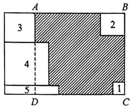

text_image

A
3
4
5
D
B
2
1
C

$$
\begin{array}{l} \therefore A B + 2 (x + y) + 2 x + y + y - x = \\ \frac {5 5}{2}, \therefore A B = \frac {5 5}{2} - 3 x - 4 y, \\ \end{array}
$$

根据题意,得阴影部分的周长为四边形 ABCD 的周长,

$$
\begin{array}{l} \therefore 2 (A B + A D) = 2 \left(\frac {5 5}{2} - 3 x - 4 y + x + \right. \\ \left. y + 2 x + y + y - x\right) = 2 \left(\frac {5 5}{2} - x - y\right) = \\ 5 5 - 2 (x + y) = 5 5 - 9 = 4 6. \\ \end{array}
$$

故答案为46.

7. 解: (1) $(y-12)$ ;

(2) 阴影 A 的较短边为 $x - 2 \times 4 = x - 8$ ,

阴影 B 的较短边为 $x-(y-12)=x-y+12$ ,

所以阴影 $A$ 的一条较短边和阴影 $B$ 的一条较短边之和为

$$
x - 8 + x - y + 1 2 = (2 x - y + 4);
$$

(3)阴影 A 的较长边为 y-12，阴影 B 的较长边为 $3 \times 4 = 12$ ，

阴影 A 的周长为 $2(y-12+x-8)=2(x+y-20)$ ,

阴影 B 的周长为 $2(12+x-y+12)=2(x-y+24)$ ,

所以阴影 A 和阴影 B 的周长之和为 $2(x+y-20)+2(x-y+24)=$ $2(2x+4)=4x+8,$

因为 x 为定值, 所以阴影 A 和阴影 B 的周长之和为定值.

# 重难点突破 13 整式的应用(六) 面积问题

1. 解: (1) 能射进阳光的部分的面积为

$$
a b - \frac {1}{4} \pi \times \left(\frac {b}{2}\right) ^ {2} \times 2 = a b - \frac {1}{8} \pi b ^ {2};
$$

(2)能射进阳光的部分的面积为

$$
a b - \pi \times \left(\frac {b}{4}\right) ^ {2} = a b - \frac {1}{1 6} \pi b ^ {2};
$$

(3) $ab - \frac{1}{16}\pi b^2 -\left(ab - \frac{1}{8}\pi b^2\right) = \frac{1}{16}$ $\pi b^{2} > 0,$

故图 2 设计射进阳光的部分的面积更大, 大 $\frac{1}{16}\pi b^{2}$ .

2. 解: (1) 第一个纸盒的表面积为 $1.5a \times 2c \times 2 + 2c \times 2b \times 2 + 1.5a \times 2b \times 2 = (6ac + 6ab + 8bc) \, \text{cm}^2$ ;

第二个纸盒的表面积为 $(2ac+2ab+2bc)\mathrm{cm}^{2}$ ;

所以做这两个纸盒共用纸板 $6ac + 6ab + 8bc + 2ac + 2ab + 2bc = (8ab + 8ac + 10bc) \, cm^{2}$ .

答:做这两个纸盒共用纸板 $(8ab+8ac+10bc)\mathrm{cm}^{2}$ ;

(2) $6ac + 6ab + 8bc - (2ac + 2ab + 2bc) = 6ac + 6ab + 8bc - 2ac - 2ab - 2bc = (4ac + 4ab + 6bc)\mathrm{cm}^2.$

答: 做大纸盒比做小纸盒多用纸板 $(4ac + 4ab + 6bc)$ cm $^{2}$ ;

(3) 因为 $a = 4 \mathrm{~cm}, b = 2 \mathrm{~cm}, 8ab + 8ac + 10bc = 220$ ，即 $8 \times 4 \times 2 + 8 \times 4 \times c + 10 \times 2 \times c = 220$

52c=156，得 c=3，将 $a=4\ cm, b=2\ cm, c=3\ cm$ 代入 $4ac+4ab+6bc$ 得： $4\times4\times3+4\times4\times2+6\times2\times3=48+32+36=116(\mathrm{cm}^{2})$ .

答: 做大纸盒比做小纸盒多用纸板 $116 \, cm^{2}$ .

3. $2m + n$ 解: 由题知,

$$
\begin{array}{l} m = a ^ {2} + b ^ {2} - \frac {1}{2} b ^ {2} - \frac {1}{2} a (a + b) \\ = \frac {1}{2} a ^ {2} + \frac {1}{2} b ^ {2} - \frac {1}{2} a b, \\ n = b ^ {2} - a ^ {2} - 2 \times \frac {1}{2} b (b - a) \\ = a b - a ^ {2}, \\ \end{array}
$$

所以 $2m = a^2 + b^2 - ab$

则 $2m + n = a^2 + b^2 - ab + ab - a^2$ $= b^2$

即大正方形 ABCD 的面积为 $2m + n$ . 故答案为 $2m + n$ .

4. $3a + b$ 解: 图中共有 6 个长方形, 设长方形 ABFE 的面积为 $x$ , 则长方形 MNCD 的面积为 $a - x - b$ , 长方形 ABNM 的面积为 $x + b$ , 长方形 EFCD 的面积为 $a - x$ , $\therefore$ 所有长方形面积的和为 $x + b + (a - x - b) + (x + b) + (a - x) + a = 3a + b$ .

故答案为 $3a + b$

5.B 解:设长方形 ABCD 的长为 m，
所以 $C_{1}=2(m-4a+4a)=2m$ ，

$$
C _ {2} = 2 (m - 3 a + 4 a) = 2 (m + a),
$$

$$
S _ {1} = 4 a (m - 4 a), S _ {2} = 4 a (m - 3 a).
$$

所以 $C_{1} + C_{2} = 2m + 2m + 2a =$ $4m+2a,$

$$
\begin{array}{l} C _ {1} - C _ {2} = 2 m - 2 m - 2 a = - 2 a, \\ S _ {1} + S _ {2} = 4 a m - 1 6 a ^ {2} + 4 a m - 1 2 a ^ {2} \\ = 8 a m - 2 8 a ^ {2}, \\ S _ {1} - S _ {2} = 4 a m - 1 6 a ^ {2} - 4 a m + 1 2 a ^ {2} \\ = - 4 a ^ {2}. \\ \end{array}
$$

因为 $a$ 是定值，

所以 $C_{1}-C_{2}, S_{1}-S_{2}$ 一定为定值.
故选 B.

# 重难点突破 14 整式的应用(七) 数量关系

1. 解: (1) 由题知, 第二组有 $\frac{1}{2}(3m + 4n + 2) + 6 = \left(\frac{3}{2}m + 2n + 7\right)$ 人,

第三组有 $47 - (3m + 4n + 2) - \left(\frac{3}{2} m + 2n + 7\right) = \left(38 - \frac{9}{2} m - 6n\right)$ 人；

(2) 当 $m = 2, n = 1$ 时，第一组有 $3m + 4n + 2 = 3 \times 2 + 4 \times 1 + 2 = 12$ （人），

第二组有 $\frac{3}{2}m+2n+7=\frac{3}{2}\times2+2\times1+7=12$ （人），

第三组有 47-12-12=23(人).

2. 解: (1) ∵ 该纸箱厂计划用 20 张白板纸制作某种型号的长方体纸箱, 按 A 种方法剪裁的白板纸有 x 张, 按 B 种方法剪裁的白板纸有 y 张,

∴按 C 种方法剪裁的白板纸有(20-x-y)张.故答案为(20-x-y);

(2)根据题意,得裁出的侧面有 $4x + 3y + 2(20 - x - y) = 4x + 3y + 40 - 2x - 2y = (2x + y + 40)$ (个);

裁出的底面有 $2y + 4(20 - x - y) = 2y + 80 - 4x - 4y = (80 - 4x - 2y)$ （个），

$\therefore$ 裁出的侧面与底面一共有 $2x + y + 40 + (80 - 4x - 2y) = (120 - 2x - y)$ （个）；

（3）根据题意，得 $\frac{2x + y + 40}{4} = \frac{80 - 4x - 2y}{2}$

$$
\therefore 2 x + y = 2 4,
$$

当 x=8 时， $y=24-2x=24-2\times8$ $=8,20-x-y=20-8-8=4,$

$$
\therefore \frac {2 x + y + 4 0}{4} = \frac {2 4 + 4 0}{4} = 1 6,
$$

∴可以按 A 种方法剪裁的白板纸有 8 张，按 B 种方法剪裁的白板纸有 8 张，按 C 种方法剪裁的白板纸有 4 张（裁法不唯一），可以做成 16 个纸箱。故答案为 16。

3. 解: (1) ① 因为 A 市有 240 吨, 运了 x 吨到 C,

所以从 A 市运往 D 市场的柑橘重量为 $(240 - x)$ 吨；

②因为 D 市场需 300 吨.

所以从 B 市运往 D 市场的柑橘重量为 $300-(240-x)=(60+x)$ 吨.

故答案为①(240-x)，②(60+x)；

(2)总运费为 $20x + 30(240 - x) + 24(200 - x) + 32(60 + x) = (13920 - 2x)$ 元.

4. 解: (1) ①由题意, 得 $x_{1}=10-b+$ $a-b=10+a-2b;$

$$
\begin{array}{l} x _ {2} = x _ {1} - (a + b) + 2 b = x _ {1} - a + b \\ = 1 0 + a - 2 b - a + b = 1 0 - b; \end{array}
$$

②当 a=6, b=4 时， $x_{1}=10+6-8$ =8,

$$
x _ {2} = 1 0 - 4 = 6, x _ {3} = 1 0,
$$

所以 $x_{2}<x_{1}<x_{3}$ ;

(2)由(1)可知 $x_{1}=x_{3}+a-2b, x_{2}=x_{3}-b$ ,

因为通过路段 $AB, EH$ 的车辆数相同，

所以 $a - 2b = 0$

因为通过路段 $CD$ 的车辆比路段 $EH$ 的车辆少15辆，

所以 $x_{3}-(x_{3}-b)=15$ ，即 b=15，
因为 a-2b=0，

所以 $a - 30 = 0$ ，所以 $a = 30$

# 重难点突破15 整式的应用(八) 分段计费

1. 解: (1) ①由题意, 得收费金额为 12a + (18 - 12) × 1.5a = 12a + 9a = 21a (元), 故答案为 21a;

②由题意,得收费金额为 $12a + (20 - 12) \times 1.5a + (26 - 20) \times 2a = 12a + 12a + 12a = 36a$ (元).

故答案为 36a；

③根据题意,得收费金额为

$$
\begin{array}{l} 1 2 a + (2 0 - 1 2) \times 1. 5 a + (n - 2 0) \times \\ \begin{array}{l} {2 a = 1 2 a + 1 2 a + 2 n a - 4 0 a = (2 n -} \\ {1 6) a (\text {   元  )   ; }} \end{array} \\ \end{array}
$$

(2) 因为 a=1.5，该用户上月水费为 60 元，

所以 $(2n-16)\times1.5=60$ ,

解得 n=28.

所以 $n$ 的值为28.

2. 解: (1) $20 \times 2 + 20 \times 0.5 + (20 - 15) = 55$ (元).

答: 小东需付车费 55 元;

(2) 当 $0 < a \leqslant 15$ 时, 应付车费: $2a + 0.5b$ (元),

当 a>15 时, 应付车费: $2a+0.5b+(a-15)=3a+0.5b-15$ (元).

答: 当 $0 < a \leqslant 15$ 时, 应付车费 $(2a + 0.5b)$ 元, 当 a > 15 时, 应付车费 $(3a + 0.5b - 15)$ 元;

(3)设小王的行车时长比小张的行车时长多 x 分钟，

当他们的里程都大于15时, $3\times2+3+6=0.5x$ ,解得x=30,

当他们的里程都不大于15时， $3 \times 2 + 6 = 0.5x$ ，解得 $x = 24$

故答案为24或30.

3. 解: (1) 当 $n \leqslant 100$ 时, 买 n 本笔记本所需钱数为 2.5n,

当 $n > 100$ 时，买 $n$ 本笔记本所需的钱数为 $2n$

故答案为 2.5n, 2n;

$$
(2) 5 0 + 5 2 = 1 0 2 > 1 0 0,
$$

$$
1 0 2 \times 2 = 2 0 4 (\text {元}),
$$

$$
5 2 \times 2. 5 + 5 0 \times 2. 5 = 2 5 5 (\text { 元 }),
$$

$$
2 5 5 - 2 0 4 = 5 1 (\text { 元 }).
$$

答:一起购买省钱,可省51元;

(3)设第一次购买 x 本, 则第二次购买 $(200-x)$ 本.

$$
2. 5 x + 2 (2 0 0 - x) = 2. 2 \times 2 0 0,
$$

解得 $x = 80$

$$
2 0 0 - x = 2 0 0 - 8 0 = 1 2 0.
$$

答:第一次购买 80 本,第二次购买 120 本.

4. 解: (1) 由题意, 得 $250 \times 20 + 50 (x - 20) = (50x + 4000)$ 元;

(2)由题意,得 $0.9(250 \times 20 + 50x)$

$$
= (4 5 x + 4 5 0 0) \text {   元   };
$$

(3) 当 x=30 时, 方案一需付款 $50 \times 30 + 4000 = 5500$ (元),

方案二需付款 $45 \times 30 + 4\ 500 =$ 5 850(元),

方案三: 按方案一先买 20 台饮水机获赠 20 个桶, 再以方案二买 30 - 20 = 10 个桶,

此时共需付款 $250 \times 20 + 0.9 \times 50 \times 10 = 5450$ （元），

因为 5 450 < 5 500 < 5 850，

所以方案三最省钱.

答:先按方案一买 20 台饮水机获赠 20 个桶,再以方案二买 10 个桶最省钱,需要 5450 元.

# 中考新方向 1 新定义

1. -3 解: 因为 $\left[5+\frac{5}{2}k-k^{2}, k,1\right]$ 是 “唯一根数组”,

所以 $k^2 = 4\left(5 + \frac{5}{2} k - k^2\right) \times 1$

$$
k ^ {2} = 2 0 + 1 0 k - 4 k ^ {2},
$$

$$
1 0 k - 5 k ^ {2} = - 2 0,
$$

即 $2k - k^2 = -4$

所以 $2k - k^2 + 1 = -4 + 1 = -3$ .

故答案为-3.

2.B 解:根据题意,得 $x^{2}+2(x-a)+x^{2}+3(x-a)+\cdots+x^{2}+n(x-a)=9x^{2}+bx+540$ , 则 n=10,

$$
\therefore x ^ {2} + 2 (x - a) + x ^ {2} + 3 (x - a) +
$$

$$
x ^ {2} + 4 (x - a) + x ^ {2} + 5 (x - a) + \dots
$$

$$
+ x ^ {2} + 1 0 (x - a) = 9 x ^ {2} + (2 + 3 + 4
$$

$$
\begin{array}{l} {+ 5 \dots + 9 + 1 0) (x - a) = 9 x ^ {2} + 5 4 x} \\ {- 5 4 a,} \end{array}
$$

$$
\therefore 9 x ^ {2} + 5 4 x - 5 4 a = 9 x ^ {2} + b x + 5 4 0,
$$

$$
\therefore b = 5 4, - 5 4 a = 5 4 0,
$$

解得 a = -10, b = 54.

故选B.

3. 解: (1) 根据题意, 得 $px + q - x - 1$ $+3\left(-\frac{2}{3}x+\frac{1}{3}\right)=2,$

即 $(p-1-2)x+q-1+1=2$ ,

$\because$ 整式 $A_{1} = px + q, A_{2} = x + 1,$

$A_{3}=-\frac{2}{3}x+\frac{1}{3}$ 为常数2的“相关整式”，

$$
\therefore p - 1 - 2 = 0, q - 1 + 1 = 2,
$$

解得 p=3, q=2;

(2)根据题意,得 $k_{1}(x+3)+k_{2}(2x+6)+k_{3}(mx+7)=0$ ,

$$
\begin{array}{l} \therefore (k _ {1} + 2 k _ {2} + m k _ {3}) x + 3 k _ {1} + 6 k _ {2} + \\ 7 k _ {3} = 0, \end{array}
$$

$$
\therefore k _ {1} + 2 k _ {2} + m k _ {3} = 0, 3 k _ {1} + 6 k _ {2} +
$$

$$
7 k _ {3} = 0,
$$

$$
\therefore m = \frac {7}{3}.
$$

# 中考新方向 2 整体思想

1. -77 解: 由题意, 得 $p + q + 1 = 20$ ,

则 $p + q = 19$

当 $x = -2$ 时，

$$
\begin{array}{l} - p x ^ {2} + 2 q x - 1 = - 4 p - 4 q - 1 \\ = - 4 (p + q) - 1 \\ = - 4 \times 1 9 - 1 \\ = - 7 7, \\ \end{array}
$$

故答案为-77.

2. 解: (1) $2(a - b)^{2}$ ;

(2) 因为 $x - 2y = 3$

所以 $3x - 6y - 5 = 3(x - 2y) - 5 =$

$$
3 \times 3 - 5 = 9 - 5 = 4;
$$

(3) 因为 $xy + x = -6, y - xy = -2$ ,

所以 $xy + x + y - xy = -6 + (-2)$

$$
= - 8,
$$

所以 $x + y = -8$ .

$$
2 [ x + (x y - y) ^ {2} ] - 3 [ (x y - y) ^ {2} -
$$

$$
y ] - x y = 2 x + 2 (x y - y) ^ {2} - 3 (x y -
$$

$$
y) ^ {2} + 3 y - x y = 2 x - (x y - y) ^ {2} + 3 y
$$

$$
- x y = 2 x + 2 y - (x y - y) ^ {2} + y -
$$

$$
x y = 2 (x + y) - (y - x y) ^ {2} + y - x y
$$

$$
= 2 \times (- 8) - (- 2) ^ {2} + (- 2) =
$$

$$
- 2 2.
$$

3. 解：(1) $3(a + b)^{3} - 6(a + b)^{3} +$

$$
2 (a + b) ^ {3} = (3 - 6 + 2) (a + b) ^ {3} =
$$

$$
- (a + b) ^ {3};
$$

(2) $x^{2} - 2y = 4,3x^{2} - 6y - 23 =$

$$
3 (x ^ {2} - 2 y) - 2 3 = 3 \times 4 - 2 3 = - 1 1;
$$

(3) $(a - c) + (2b - d) - (2b - c) =$

$$
a - c + 2 b - d - 2 b + c = a - d.
$$

因为 $a - 2b = 3,2b - c = -5,c - d$

$$
= 1 0,
$$

所以 $(a - 2b) + (2b - c) + (c - d) =$

$$
a - 2 b + 2 b - c + c - d = a - d,
$$

所以 $a - d = (a - 2b) + (2b - c) +$

$$
(c - d) = 3 + (- 5) + 1 0 = 8,
$$

所以 $a - d = 8$

即 $(a - c) + (2b - d) - (2b - c) = 8.$

# 中考新方向3 综合与实践

解:(1) $\because DF=2FC,$

$$
\therefore 3 F C = 6,
$$

$$
\therefore F C = 2,
$$

$$
\therefore D F = 2 \times 2 = 4 (\mathrm{dm}).
$$

甲面积是 $\frac{1}{2} \times 6x = 3x(\mathrm{dm}^2)$ ,

乙面积是 $\frac{1}{2} \times 2(6 - x) = (6 - x)(\mathrm{dm}^2)$ ,

丙面积是 $\frac{1}{2} \times 6 \times 4 = 12(\mathrm{dm}^2)$

丁面积是 $6^{2} - 3x - (6 - x) - 12 = (18 - 2x)(\mathrm{dm}^{2})$

故答案为 $3x,(6-x),12,(18-2x)$ ;

(2)根据题意,得 $2 \times 3x + 5(6 - x) + 3 \times 12 + 2(18 - 2x) = 96$ ,

整理, 得 $-3x + 102 = 96$ , 解得 x = 2,

∴ BE 的长是 2 dm;

(3)根据题意,得 $2 \times 3x + 2m(6 - x) +$

$$
\frac {1}{2} m \dot {\times} 1 2 + (1 8 - 2 x) n = (6 - 2 m -
$$

$$
2 n) x + 1 8 m + 1 8 n.
$$

∵每块正方形装饰品的材料费用不变，

$$
\therefore 6 - 2 m - 2 n = 0,
$$

$$
\therefore m + n = 3,
$$

$$
\begin{array}{r l} & {\therefore 1 8 m + 1 8 n = 1 8 (m + n) = 1 8 \times 3 =} \\ & {5 4 (\text {元}).} \end{array}
$$

答:m,n 满足的数量关系为 $m+n=3$ , 每块正方形装饰品的材料费用为 54 元.

# 第五章 一元一次方程

# 重难点突破1 解一元一次方程(一)去括号与去分母

1. 解: (1) 去分母, 得 $2(x-1)-(x+2)$

$$
= 3 (3 x - 1) - 6,
$$

去括号，得 $2x - 2 - x - 2 = 9x - 3 - 6$

移项, 得 2x - x - 9x = -3 - 6 + 2 + 2,

合并同类项, 得 -8x = -5,

系数化为1,得 $x=\frac{5}{8}$ ;

(2)去分母,得 $4(x+4)-3(x+1)=$ 24-(5x-7),

去括号，得 $4x + 16 - 3x - 3 = 24 - 5x + 7$

移项，得 $4x - 3x + 5x = 24 + 7 - 16 + 3$

合并同类项，得 $6x = 18$

系数化为1,得 $x = 3$

2. 解: (1) 去括号, 得 $\frac{1}{2}x - \frac{1}{4}x - \frac{1}{4} =$

$$
\frac {2}{3} x - \frac {2}{3},
$$

去分母，得 $6x - 3x - 3 = 8x - 8$

移项、合并同类项，得 $-5x = -5$

系数化为 1, 得 x=1;

(2) 去括号, 得 $\frac{1}{4} x - 1 + 6 = \frac{7}{3} + \frac{2}{3} x$ ,

去分母，得 $3x + 60 = 28 + 8x$

移项, 得 3x-8x=28-60,

合并同类项,得-5x=-32,

系数化为1,得 $x=\frac{32}{5}$ .

3. 解: (1) 原方程变形为 $\frac{20x-8}{5}-$

$$
\frac {3 0 x - 1 5}{2} = 3 - 1 0 x,
$$

去分母, 得 $2(20x-8)-5(30x-15)=10(3-10x)$ ,

去括号, 得 $40x - 16 - 150x + 75 =$ 30-100x,

移项, 得 $40x - 150x + 100x = 30 + 16 - 75$ ,

合并同类项,得-10x=-29,

系数化为1,得 $x=\frac{29}{10}$ ;

(2)整理,得 $\frac{5x+9}{5}+\frac{x-5}{3}=\frac{1+2x}{3}$ ,

去分母, 得 $3(5x+9)+5(x-5)=5(1+2x)$ ,

去括号, 得 $15x + 27 + 5x - 25 = 5 + 10x$ ,

移项、合并同类项，得 $10x = 3$

系数化为 1, 得 $x=\frac{3}{10}$ .

# 重难点突破2 解一元一次方程(二) 含绝对值的方程

1. 解: 当 $x \geqslant 1$ 时, $x + 2(x - 1) = 4$ ,

解得 $x = 2$

当 $x < 1$ 时， $x - 2(x - 1) = 4$

解得 $x = -2$

综上所述, 原方程的解为 x=2 或 x=-2.

2. 解: (1) $\because x \geqslant 1$ ,

$$
\therefore x - 1 \geqslant 0, 2 x + 4 > 0,
$$

∴原方程可化为 $x-1+2x+4=9$ ,
解得 x=2.

∴原方程的解是 x=2;

(2) $\because x\leqslant-2,$

$$
\therefore x - 1 <   0, 2 x + 4 \leqslant 0,
$$

∴原方程可化为 1-x-2x-4=9，
解得 x = -4.

∴原方程的解是 x = -4.

3. 解: 如图, 设点 A 表示的数为 -6, 点 B 表示的数为 2, 点 P 表示的数为 x, A, B 两点之间的距离记作 AB,

则 $|x-2|+|x+6|=12$ 的几何意义是点P到A,B两点距离之和为12.

如图1, 当点 $P$ 在点 $A, B$ 之间时,

$$
P A + P B = A B = 8 \neq 1 2, \text {   无解   };
$$

$$
\begin{array}{c c c} A & P & B \\ - 6 & x & 2 \end{array}
$$

图1

如图 2, 当点 P 在点 A 的左侧时, $PA + PB = -6 - x + 2 - x = -2x - 4 = 12$ , 解得 x = -8;

$$
\begin{array}{c c c} P & A \\ \hline x & - 6 & B \\ \hline \end{array}
$$

图2

如图3, 当点 $P$ 在点 $B$ 的右侧时, $PA + PB = x + 6 + x - 2 = 2x + 4 = 12$ , 解得 $x = 4$ ;

$$
\begin{array}{c c c} A & B & P \\ - 6 & 2 & x \end{array}
$$

图3

综上所述,原方程的解为 $x=\neg8$ 或 x=4.

4. 解: 由绝对值的意义, 设 $\left|x\right|=a(a>0)$ , $x=\pm a$ ,

∴方程 $|x|=a(a>0)$ 有两个解；

方程 $|x| = a (a = 0)$ 只有一个解；

方程 $|x|=a(a<0)$ 无解.

∵方程 $2||x-1|-3|=m$ 只有三个解，

$$
\therefore | x - 1 | = 0 \text {或} 6,
$$

$$
\begin{array}{l} {\therefore m = 2 \mid 0 - 3 \mid = 6   \text {或}   m = 2 \mid 6 - 3 \mid} \\ {= 6.} \end{array}
$$

5. 解: (1) $\because a \otimes b \otimes c = |a - |b - c||$ ,

$$
x \text { ⊗ } 1 \text { ⊗ } 0 = 3,
$$

$$
\therefore | x - | 1 - 0 | | = 3,
$$

$$
\therefore | x - 1 | = 3,
$$

$$
\therefore x - 1 = 3 \text {或} - 3,
$$

$$
\therefore x = 4 \text {或} - 2.
$$

故答案为4或-2；

$$
(2) \because a \otimes 3 \otimes x = 1 0 1 1,
$$

$$
\therefore | a - | 3 - x | | = 1 0 1 1,
$$

$$
\begin{array}{r l} & {\therefore | 3 - x | = a - 1   0 1 1 \text {或} | 3 - x | =} \\ & {a + 1   0 1 1,} \end{array}
$$

∵原方程存在三个不等解，

$$
\therefore a - 1   0 1 1 = 0   \text {或}   a + 1   0 1 1 = 0,
$$

$$
\because | 3 - x | \geqslant 0, a + 1 0 1 1 > a - 1 0 1 1,
$$

$$
\therefore a - 1 0 1 1 = 0,
$$

$$
\therefore a = 1 0 1 1,
$$

$\therefore |3 - x| = 0$ 或 $|3 - x| = 1011 + 1011,$

∴x=3或2025或-2019.

答:a 的值为 1011, 方程的解为 3 或 2025 或 -2019.

# 重难点突破3 方程的

# 解(一) 整体思想

1. C 解: 若将 $y+2$ 看作整体, 则两方

程形式完全相同,根据方程的解的定义得 $y+2=-1$ , 所以 y=-3.

2. $m = 3$ 或 $m = \frac{3}{2}$

解: 若将 m-1 看作整体, 则两方程形式完全相同, 根据方程的解的定义得 m-1=2 或 $m-1=\frac{1}{2}$ .

解得 m=3 或 $m=\frac{3}{2}$ .

3. $y = 1$ 解： $\because$ 关于 $x$ 的一元一次方程 $\frac{1}{2025} x + 3 = 2x + b$ 的解为 $x = 2$

$$
\therefore y + 1 = 2, \text {解得} y = 1,
$$

故答案为 y=1.

4. $y = 2023$ 解：关于 $y$ 的方程 $\frac{1}{2024} y + 2024 + \frac{1}{2024} = 2y + m + 2$ ，整理，

得 $\frac{1}{2024}(y+1)+2024=2(y+1)+m$ ，∴若将 $y+1$ 看作整体，根据方程的解的定义，得 $y+1=2024$ ，解得 $y=2023$ 。

5. $x = 2025$ 解： $\frac{1}{2025} x + 2028 = 3x - m + \frac{1}{2025}$ 可变为 $\frac{1}{2025}(x - 1)$

$$
+ 2 0 2 5 = 3 (x - 1) - m,
$$

∵方程 $\frac{1}{2025}x+2025=3x-m$ 的
解是 x=2024,

∴方程 $\frac{1}{2025}(x-1)+2025=3(x-1)-m$ 中的x-1=2024，

即此方程的解是 $x = 2024 + 1 = 2025$ ，故答案为 $x = 2025$

6. $x = 4$ 或 $x = -2$ 或 $x = 1$

解:方程 $(|x-1|-2)^{2}+|x-1|-4=0$ 可化为方程 $(|x-1|-2)^{2}+(|x-1|-2)-2=0$ ,

若将 $(|x - 1| - 2)$ 看作整体，则两方程形式完全相同，

根据方程的解的定义得 $|x - 1| - 2 = 1$ 或 $|x - 1| - 2 = -2$

解得 $x = 4$ 或 $x = -2$ 或 $x = 1$ .

# 重难点突破4 方程的解（二）知解求值

1. D 解: 由题意可知, x = -1 是方程 $\frac{2+mx}{3}=x-1$ 的解，

将 $x = -1$ 代入方程 $\frac{2 + mx}{3} = x - 1,$

得 $\frac{2 - m}{3} = -1 - 1$ ，解得 $m = 8$

故选D.

2. D 解: 由条件可知 a-2b-6=0，
即 a-2b=6，

$$
\therefore 2 a - 4 b + 1 = 2 (a - 2 b) + 1 = 2 \times
$$

$$
6 + 1 = 1 3,
$$

故选D.

3. 解: $x - \frac{2 - ax}{6} = \frac{x}{3} - 2$ ,

则 $6x - (2 - ax) = 2x - 12$

$$
\begin{array}{l} {\text {故} 6 x - 2 + a x = 2 x - 1 2, (4 + a) x =} \\ {- 1 0,} \end{array}
$$

∵方程无解,则 $4+a=0$ ,

$$
\therefore a = - 4.
$$

4. $a + c = 0$

解：∵方程ax-2c=2a-cx，

$$
\therefore a x + c x = 2 a + 2 c,
$$

$$
(a + c) x = 2 (a + c),
$$

∵方程有无数个解，

$$
\therefore a + c = 0.
$$

5. -7 解: $\frac{3x}{2} + \frac{ax + 2}{3} = b$ ,

$$
9 x + 2 (a x + 2) = 6 b,
$$

$$
9 x + 2 a x + 4 = 6 b,
$$

$$
9 x + 2 a x = 6 b - 4,
$$

$$
(9 + 2 a) x = 6 b - 4,
$$

∵关于 x 的方程 $\frac{3x}{2} + \frac{ax + 2}{3} = b$ 有无数个解，

$$
\therefore 9 + 2 a = 0 \text {且} 6 b - 4 = 0,
$$

$$
\therefore 2 a = - 9 \text {且} 3 b = 2,
$$

$$
\therefore 2 a + 3 b = - 9 + 2 = - 7.
$$

6. -30 解: 把 x=2 代入关于 x 的方程, 得 $\frac{6k+m}{2}=1+\frac{2-nk}{3}$ ,

整理，得 $(18 + 2n)k = 10 - 3m$

$\because$ 无论 $k$ 为何值，它的解总是 $x = 2$ ， $\therefore$ 无论 $k$ 为何值， $(18 + 2n)k = 10-$ $3m$ 恒成立，

$$
\therefore 1 8 + 2 n = 0, 1 0 - 3 m = 0,
$$

解得 $n = -9, m = \frac{10}{3}$ ,

$$
\therefore m n = \frac {1 0}{3} \times (- 9) = - 3 0.
$$

7. 解: ∵ 不论 k 取什么数, 关于 x 的方程 $\frac{2kx + a}{3} - \frac{x - bk}{6} = 1 (a, b \text{ 是常数})$ 的解总是 x = 1,

$$
\therefore \frac {2 k + a}{3} - \frac {1 - b k}{6} = 1,
$$

$$
\therefore 4 k + 2 a - 1 + b k = 6,
$$

$$
\therefore (4 + b) k = 7 - 2 a,
$$

$$
\therefore 4 + b = 0, 7 - 2 a = 0,
$$

$$
\therefore a = \frac {7}{2}, b = - 4,
$$

$$
\therefore a - b = \frac {7}{2} - (- 4) = \frac {1 5}{2}.
$$

8.8 解: $\frac{ax - 1}{2} = x + 1, ax - 1 = 2x +$

$$
2, a x - 2 x = 3, (a - 2) x = 3, x =
$$

$$
\frac {3}{a - 2},
$$

由题意, 得 $a - 2 = \pm 1$ 或 $\pm 3$ ,

$\therefore a = 3$ 或1或5或-1，

∴所有满足条件的整数 a 的和为

$$
3 + 1 + 5 + (- 1) = 8.
$$

9. 解: $x - \frac{2 - ax}{6} = \frac{x}{3} - 2$ ,

则 $6x - (2 - ax) = 2x - 12$

故 $6x - 2 + ax = 2x - 12$

$$
(4 + a) x = - 1 0,
$$

解得 $x = -\frac{10}{4 + a}$

$\because -\frac{10}{4 + a}$ 是非负整数，

$$
\therefore 4 + a = - 1, - 2, - 5, - 1 0
$$

$\therefore a = -5$ 或 $-6, -9, -14$ 时，方程的解都是非负整数，则 $-5 - 6 - 9 - 14 = -34.$

# 重难点突破5 方程的

# 解(三) 解的关联

1. 解: 由题意, 得 $x = m + 1$ ,

把 $x = m + 1$ 代入方程 $2x + 4 = 3m$ 得 $2(m + 1) + 4 = 3m$

解得 $m = 6$

2. 解: 解方程 $\frac{x-4}{3}-8=-\frac{x+2}{2}$ ,

得 $x = 10$

把 $x = 10$ 代入 $4x - (3a - 5) = 6x + 2a - 5$ ，得 $40 - 3a + 5 = 60 + 2a - 5$ 解得 $a = -2$

$$
\begin{array}{l} \therefore a - \frac {1}{a} = - 2 - \left(- \frac {1}{2}\right) = - 2 + \\ \frac {1}{2} = - \frac {3}{2}. \end{array}
$$

3. 解: 解方程 $\frac{1}{2}(1-x)=k+1$ , 得 x=-1-2k,

解 $\frac{2}{5}(3x+2)=\frac{k}{10}+\frac{3}{2}(x-1)$ ，得 $x=\frac{23-k}{3}$ ,

根据题意,得 $(-1-2k)+\frac{23-k}{3}=0$ ,

解得 $k = \frac{20}{7}$ .

4. 解: 解方程 $2x + 3 = x + k$ , 得 x = k - 3,

解方程 $x - 3 = 5k$ ，得 $x = 5k + 3$

∵这两个方程的解的和为6，

$\therefore k - 3 + 5k + 3 = 6$ ，解得 $k = 1$

5. 解: 解方程 $5m + 3x = x + 1$ , 得 $x = \frac{1 - 5m}{2}$ ,

解方程 $m + 2x = 3m$ ，得 $x = m$

依题意, 得 $\frac{1-5m}{2}-m=2$ ,

解得 $m = -\frac{3}{7}$ .

# 重难点突破6 实际问题

# 与一元一次方程(一)

# 总分问题

1.3 解: 设在第 2 根绳子上的打结数是 x 个,

根据题意, 得 $5 \times 5 + 5x + 3 = 43$ ,

解得 x=3，

∴在第2根绳子上的打结数是3个，故答案为3.

2. 解: 设 2022 年的产值是 x 万元, 则 2023 年的产值是 1.5x 万元, 2024 年的产值是 $2 \times 1.5x = 3x$ 万元,

根据题意, 得 $x + 1.5x + 3x = 550$ ,
解得 x=100,

$$
\therefore 3 x = 3 \times 1 0 0 = 3 0 0 (\text {   万元   }).
$$

答:2024年的产值是300万元.

3. 解: 设新工艺的废水排放量是 $x \, m^{3}$ ，则旧工艺的废水排放量是 $(2x - 40) \, \text{m}^{3}$ ，根据题意，得 $2x - 40 - 100 = x + 80$ ，解得 x = 220，

$$
\therefore x + 8 0 = 2 2 0 + 8 0 = 3 0 0 \left(\mathrm{m} ^ {3}\right).
$$

答:环保限制的最大废水排放量是 $300\ m^{3}$ .

4. 解: 设这批树苗共有 x 棵,

根据题意，得 $\frac{x + 16}{6} = \frac{x - 24}{5}$

解得 x=224.

答:这批树苗共有224棵.

5. 解: 设女儿现在的年龄为 x，则父亲现在的年龄为 $(96 - x)$ 岁，

依题意, 得 $2x - \frac{4}{5}(96 - x) = (96 - x) - x$ , 解得 x = 36.

答:女儿现在的年龄为36岁.

# 重难点突破7 实际问题

# 与一元一次方程(二)

# 配套问题

1.B

2. 解: 设甲种零件应制作 x 天, 则乙种零件应制作 $(30 - x)$ 天,

依题意, 得 $500x = 250(30 - x)$ ,

解得 $x = 10$

$$
3 0 - x = 3 0 - 1 0 = 2 0 (\text { 天 }).
$$

答:甲种零件应制作 10 天,乙种零件应制作 20 天.

3. 解: 设 $x \, m^{3}$ 木材制作桌面, 则 (12 - x) $m^{3}$ 木材制作桌腿.

由题意, 得 $4 \times 20x = 400(12 - x)$ .

解得 $x = 10.12 - 10 = 2(\mathrm{m}^3)$

答:用 $10 \, m^{3}$ 木材制作桌面, $2 \, m^{3}$ 木材作桌腿, 才能制作尽可能多的桌子.

4. A

5. 解: (1) 设有 x 名工人加工甲种零件, 则有 $(50 - x)$ 名工人加工乙种零件, 则 30x = 20(50 - x),

解得 x=20.

答:应安排20名工人加工甲种零件;
(2)设有y名工人加工甲种零件,则有 $(50-y)$ 名工人加工乙种零件,则 $2\times30y=7\times20\times(50-y)$ ,

解得 $y = 35, \therefore 50 - y = 15$

∴总费用为 $30 \times 35 \times 10 + 20 \times 15 \times 12 = 14\ 100$ .

答: 这 50 名工人一天所得加工费一共是 14 100 元.

# 重难点突破8 实际问题

# 与一元一次方程(三)

# 调配问题

1. B 解: ∵要从乙队借调 x 名工人到甲队,

∴借调后甲队有 $(15+x)$ 名工人,乙队有 $(25-x)$ 名工人.

根据题意, 得 $15 + x = 3(25 - x)$ .

故选B.

2. 解: 设宣传组原有 x 人, 则劳动组原有 $(120 - x)$ 人,

根据题意, 得 $x+2=\frac{1}{2}(120-x-2)$ ,

解得 x=38.

答:宣传组原有 38 人.

3. 解: 设甲队有 m 人, 则乙队有 $(m + 10)$ 人,

根据题意, 得 $2(m-5)=m+10+5$ ,
解得 m=25,

$$
\therefore 2 5 + (2 5 + 1 0) = 6 0 (\text {人}).
$$

答:七(1)班的学生人数为60人.

4. B 解: 因为调往甲处 x 人,

所以调往乙处 $(19-x)$ 人，

根据题意, 得 $2(10+\dot{x})=16+19-x$ . 故选 B.

5. $35 + x = 2[15 + (10 - x)]$ 5

解: 因为支援打扫卫生的人数有 x 人, 所以支援拔草的人数有 $(10-x)$ 人, 依题意, 得 $35 + x = 2[15 + (10 - x)]$ , 解得 x = 5.

# 重难点突破9 实际问题与一元一次方程(四)行程问题

1. 解: 设 A, B 两地相距 x 千米, 则相遇时, 甲行了 $\frac{3}{5}x$ 千米, 乙行了 $\frac{2}{5}x$ 千米, 根据题意, 得

$$
\frac {\frac {2}{5} x}{3 \times (1 + \frac {1}{5})} = \frac {\frac {3}{5} x - 2 6}{2 \times \left(1 + \frac {2}{5}\right)},
$$

解得 $x = 90$

答: A, B 两地相距 90 千米.

2. 解: (1) $(x+20)$ , $\frac{2}{3}x$ , $\frac{1}{2}(x+20)$ ;

(2)设大客车的速度为 x 千米/时，则小汽车的速度为 $(x+20)$ 千米/时，
由题意，得 $\frac{2}{3}x=\frac{1}{2}(x+20)$ ,

解得 $x = 60$

$$
\therefore x + 2 0 = 8 0.
$$

答:大客车的速度为 60 千米/时, 小汽车的速度为 80 千米/时.

3. $(x - 15) \times 3.5 = (x + 15) \times 2$

4. 解: 设无风时飞机的航速是 x 千米/时, 依题意, 得 $2.8 \times (x + 24) = 3 \times (x - 24)$ , 解得 x = 696.

答:无风时飞机的航速是696千米/时.

5. 解: 设火车的速度是 x 米/秒,
根据题意, 得 800 - 40x = 60x - 800,
解得 x = 16.

答:火车的速度是16米/秒.

# 重难点突破10 实际问题与一元一次方程(五)工程问题

1.2 解: 设这次小峰打扫了 x h, 则

$\frac{x}{4} + \frac{3 - x}{2} = 1$ ，解得 $x = 2$ 。故答案为2.

2.12 解: 设这项工程一共用了 x 天, 由题意, 得 $\frac{1}{16}x + \frac{1}{24}(x - 6) = 1$ , 解得 x = 12. 故答案为 12.

3. 解：(1) ① $\left(1-6\times\frac{1}{20}-6\times\frac{1}{30}\right)\div\frac{1}{30}$ $=\left(1-\frac{3}{10}-\frac{1}{5}\right)\times30=15$ (天)，

∴乙工程队单独完成剩余工程还要15天；

② $\frac{32000}{20} = 1600$ （元），

$$
\frac {3 0 0 0 0}{3 0} = 1 0 0 0 (\text {元}),
$$

$$
\begin{array}{l} {1 6 0 0 \times 6 + 1 0 0 0 \times (6 + 1 5) =} \\ {3 0 6 0 0 (\text {元}),} \end{array}
$$

∴完成工程所需的总费用是30600元；

(2)由(1)知,乙工程队每天费用比甲工程队低,要使工程所需的总费用最少,乙需做24天,

设甲工程队做 x 天，则 $\frac{1}{20}x + \frac{1}{30} \times 24 = 1$ ，解得 x = 4，

∴甲工程队做4天,乙工程队做24天,工程所需的总费用最少;

$$
\begin{array}{l} \because 4 \times 1 6 0 0 + 2 4 \times 1 0 0 0 = 6 4 0 0 + \\ 2 4 0 0 0 = 3 0 4 0 0 (\text {元}), \end{array}
$$

∴工程所需的总费用最少是30 400元.

4. 解: (1) 设每个房间需要粉刷的墙面面积为 $x \, m^{2}$ ,

则 $\frac{8x - 40}{6} = \frac{4x + 40}{6} + 20$

解得 x=50.

答:每个房间需要粉刷的墙面面积为 $50\ m^{2}$ ;

(2) $\because x=50,$

∴由(1)可知 $\frac{8x-40}{6}=60$ ,

$$
\frac {4 x + 4 0}{6} = 4 0.
$$

答:每名师傅每天能粉刷墙面 $60 \, m^{2}$ ，每名徒弟每天能粉刷墙面 $40 \, m^{2}$ ;

(3)设徒弟一天的工钱是 $y$ 元，

则 $\frac{36\times 50}{60} (y + 40) = \frac{36\times 50}{40} y,$

解得 $y = 80$

答:一名徒弟一天的工钱是80元.

5. 解: (1) 设乙工程队单独粉刷要 x 天, 由题意, 得 $240x = 160(x + 20)$ , 解得 $x = 40, 240 \times 40 = 9600$ (间).

答: 这个小区共有 9 600 个房间;

(2)设甲工程队的工作时间为 y 天，则乙工程队的工作时间 $(2y+4)$ 天，由题意，得 $160y + 240y + 240(1 + 25\%) \times (2y + 4 - y) = 9600$ ，

解得 $y = 12$

$$
2 y + 4 = 2 \times 1 2 + 4 = 2 8 (\text {天}).
$$

答:乙工程队共粉刷 28 天;

(3)方案一:由甲工程队单独完成,所需时间为 $40+20=60$ (天),

费用为 $60 \times 1600 = 96000$ (元);

方案二:由乙工程队单独完成需要40天,

费用为 $40 \times 2600 = 104000$ (元);

方案三: 按(2)问方式完成, 时间为28天,

费用为 $12 \times (1600 + 2600) + (28 - 12) \times 2600 = 92000$ (元)，

$$
\begin{array}{l} {\because 2 8 <   4 0 <   6 0, \text {且} 9 2   0 0 0 <   9 6   0 0 0 <  } \\ {1 0 4   0 0 0,} \end{array}
$$

∴方案三最合适，

答:选择方案三既省时又省钱。

# 重难点突破11 实际问题与一元一次方程(六)积分问题

1.6 解: 设该队共胜了 x 场, 则 $3x + (10 - x) = 22$ , 解得 x = 6. 故答案为 6.

2.9 解:由题意,负一场得1分,胜一场得2分.

设七年级(5)班胜了 $x$ 场，

则 $2x + (14 - x) = 23$ ，解得 $x = 9$

故答案为9.

3. 解: (1) $(11-1)\times3+1\times2=32$ (分).
故答案为 32;

(2)设公安队积2分取胜的场次为 $x$ 场，则积3分取胜的场次为 $3x$ 场，负场数为 $(11 - x - 3x)$ 场，

根据题意, 得 $2x + 3 \times 3x + 2 = 24$ ,
解得 x=2，

$$
\therefore 1 1 - x - 3 x = 1 1 - 2 - 3 \times 2 = 3 (\text { 场 }).
$$

答:公安队负场的场数为 3 场;

(3)设科技队积3分的胜场数为y场，则积2分的胜场数为 $(10-y)$ 场，

当科技队负场积分为0分时， $3y + 2(10 - y) = 28$

解得 y=8(不合题意,舍去);

当科技队负场积分为1分时， $3y + 2(10 - y) + 1 = 28$ ，解得 $y = 7$

科技队积 3 分的胜场数为 7 场，

$$
\begin{array}{r l} & {\therefore \text {   工商队总积分为   } 3 (y - 1) + 2 [ 8 -} \\ & {(y - 1) ] + 3 = 3 \times (7 - 1) + 2 \times} \\ & {[ 8 - (7 - 1) ] + 3 = 2 5 (\text {   分   }).} \end{array}
$$

故答案为7,25.

4. A 解: 依题意, 答对一题得 5 分, 答错一题得 -1 分, 设参赛学生 F 答对 x 题, 则参赛学生 F 得 $5x - (20 - x) = (6x - 20)$ 分. 当 6x - 20 = 52 时, x = 12, 符合题意; 当 6x - 20 = 65 时, $x = \frac{85}{6}$ , 不合题意; 当 6x - 20 = 78 时, $x = \frac{49}{3}$ , 不合题意; 当 6x - 20 = 93 时, $x = \frac{113}{6}$ , 不合题意. 故选 A.

5. 解: (1) 根据题意, 得每答对一道题得 $100 \div 20 = 5$ (分),

答错一道题扣 $5 \times 19 - 94 = 1$ (分).
故答案为 5,1;

(2)设参赛者 D 答对了 x 道题,则答错了 $(20-x)$ 道题,

根据题意, 得 $5x - (20 - x) = 88$ ,
解得 x=18.

答: 参赛者 D 答对了 18 道题.

6. 解: (1) 答对一题得 $100 \div 20 = 5$ (分), 答错一题扣 $5 \times 19 - 92 = 3$ (分).

设参赛者 E 答对了 x 道题, 则答错了 $(20 - x)$ 道题,

根据题意, 得 $5x - 3(20 - x) = 68$ ,
解得 x=16.

答: 参赛者 E 答对了 16 道题;

(2) 参赛者 F 答对的题所得的分数不可能是答错题所扣分数的 4 倍. 理由如下:

假设参赛者 $F$ 答对的题所得的分数是答错题所扣分数的4倍，

设他答对了 $y$ 道题, 则答错了(20-y)道题,

根据题意, 得 $5y=4\times3(20-y)$ ,

解得 $y=\frac{240}{17}$ ,

又∵答对题目数需为整数，

$$
\therefore y = \frac {2 4 0}{1 7} \text {舍去，}
$$

$\therefore$ 假设不成立.

即参赛者 $F$ 答对的题所得的分数不可能是答错题所扣分数的4倍.

# 重难点突破12 实际问题与一元一次方程(七)古典问题

1. A 2. C 3. B 4. B 5. C

$$
\frac {y + 3}{8} = \frac {y - 4}{7}
$$

7.B 8.B 9.D 10.B

# 重难点突破13 实际问题与一元一次方程(八)利润问题

1. 解: 设购进了甲种商品 y 件, 则购进乙种商品 $(40-y)$ 件, 依题意, 得

$$
\begin{array}{l} {8 0 y + 1 0 0 (4 0 - y) = 3 4 4 0,} \\ {\text { 解得 } y = 2 8,} \end{array}
$$

$$
4 0 - y = 4 0 - 2 8 = 1 2,
$$

$$
\begin{array}{l} 2 8 (1 0 0 - 8 0) + 1 2 (1 2 5 - 1 0 0) = 5 6 0 \\ + 3 0 0 = 8 6 0. \end{array}
$$

答: 这 40 件商品全部售出后可获利 860 元.

2.100 解: 设这件夹克衫的成本价是 x 元, 由题意, 得 $80\% \times (1 + 70\%)x - x = 36$ , 解得 x = 100,

∴这件夹克衫的成本价是100元.
故答案为100.

3.50 解: 设这种书包的进价为 x 元, 根据题意, 得 $(1 + 50\%)x \times 80\% - x = 10$ , 解得 x = 50, 则这种书包的进价为 50 元. 故答案为 50.

4.80 解: 设这件衣服原价是 x 元, 根据题意, 得 $100 - x = 25\% x$ , 解得 x = 80, 故答案为 80.

5.108 解: 设进价是 x 元, 则 $(1 + 10\%)x = 132 \times 0.9$ , 解得 x = 108.

则该物品的进价是108元.故答案为108.

6. 盈利 10 元 解: 设这件商品的成本价为 x 元, 根据题意, 得 $80\% \times (1 + 30\%)x = 260$ , 解得 x = 250,

$$
\therefore 2 6 0 - x = 2 6 0 - 2 5 0 = 1 0 (\text {   元   }),
$$

∴售出这件商品,商店盈利10元.故答案为盈利10元.

7. D 解: 设盈利 50% 的衣服的进价为 x, 亏损 30% 的衣服的进价为 y,

根据题意, 得 210 - x = 50% x,

$$
210 - y = -30\% y,
$$

解得 x=140, y=300;

$$
\because 2 1 0 \times 2 - (1 4 0 + 3 0 0) = - 2 0 (\text {元}),
$$

∴亏损了20元,故选D.

# 重难点突破14 实际问题与一元一次方程(九)分段计费

1. 解: (1) $0.5 \times 150 = 75, 180 \times 0.5 +$

$$
0. 6 \times (2 5 0 - 1 8 0) = 1 3 2,
$$

故答案为 75,132;

(2)设12月用电量为 $x$ 千瓦时，由题意，当用电量为400千瓦时时，电费222元；

当用电量为180千瓦时时，电费90元， $\therefore 181 \leqslant x \leqslant 400, 180 \times 0.5 + (x - 180) \times 0.6 = 150$

解得 x=280，即他家 12 月的用电量为 280 千瓦时.

2. 解: (1) 61.75, (3.15t-17), (3.84t-39.77);

(2) $25 \times 2.47 + (33 - 25) \times 3.15 =$ 86.95(元),

$$
\because 6 1. 7 5 <   6 8. 0 5 <   8 6. 9 5,
$$

∴10月份的用水量处于第二级.

根据题意, 得 3.15t-17=68.05,
解得 t=27.

答:小明家10月份的用水量为27 m³;

(3) 设用水较少的月份用水量为 $x \, m^{3}$ ，则用水较多的月份用水量为 $(64 - x) \, \mathrm{m}^{3}$ ，

当 $0 < x \leqslant 25$ 时， $2.47x + 3.84(64 - x) - 39.77 = 169.67$

解得 $x = \frac{3632}{137}$ （不合题意，舍去）；

当 $25 < x < 31$ 时， $3.15x - 17 + 3.84(64 - x) - 39.77 = 169.67$

解得 $x = 28$

$$
\therefore 6 4 - x = 6 4 - 2 8 = 3 6 (\mathrm{m} ^ {3});
$$

当 $31 \leqslant x < 32$ 时, $3.15x - 17 + 3.15(64 - x) - 17 = 167.6 \neq 169.67$ , 舍去.

答: 这两个月的用水量 $28 \, m^{3}$ , $36 \, m^{3}$ .

3. 解:(1)设 A 种商品每件进价为 x 元,
∵A 种商品每件售价为 60 元, 利润率为 50%,

$$
\therefore 60 - x = 50 \% x,
$$

解得 x=40，

$$
(80 - 50)\div 50\times 100\% = 60\% .
$$

故答案为 40;60%;

(2)若没有优惠促销,设小明在该商场购买同样商品要付 a 元,分两种情况讨论:

①当打折前一次性购物总金额超过400元,但不超过600元时,则0.9a=531,解得a=590;

②当打折前一次性购物总金额超过600元，则 $600\times0.8+(a-600)\times0.75=531$ ，解得a=668。

答:若没有优惠促销,小明在该商场购买同样商品要付590或668元.

4. 解: (1) $\frac{60-40}{40}=50\%$ ;

$$
\frac {80}{1 + 60\%} = 50 (\text{元}).
$$

故答案为 50%, 50;

(2)设该商场购进 A 种商品 x 件, 则购进 B 种商品 $(50-x)$ 件,

根据题意, 得 $40x + 50(50 - x) = 2300$ ,
解得 x = 20.

答:该商场购进 A 种商品 20 件;

(3)设小华此次购物打折前的总金额为 y 元，

当 $500 < y \leqslant 800$ 时， $0.9y = 675$ ，

解得 y=750;

当 $y > 800$ 时， $800 \times 0.8 + 0.7 (y - 800) = 675$ ，解得 $y = 850$ .

答: 小华此次购物打折前的总金额为750或850元.

# 重难点突破15 实际问题与一元一次方程(十)方案问题

1. 解: (1) 当 x=23 时,

方式一付费为 $23 \times 9 = 207$ ，

方式二付费为 $100+23\times5=215$ ，

$$
\because 2 0 7 <   2 1 5,
$$

∴当 x=23 时，应选择方式一较合算；
当 x=27 时，

方式一付费为 $27 \times 9 = 243$ ，

方式二付费为 $100+27\times5=235$ ,
∵235<243,

∴当 x=27 时,应选择方式二较合算;

(2)根据题意,得 $9x=100+5x$ ,
解得 x=25,

∴x 的值为 25;

(3)若小明选择方式一,则 9x=270,
解得 x=30,

若小明选择方式二, 则 $100 + 5x = 270$ , 解得 x = 34,

$$
\because 3 4 > 3 0,
$$

∴小明应选择方式二,才能使得游泳次数比较多.

2. 解: (1) 设王老师编一个小中国结需用绳 x m, 编一个大中国结需用绳 $(x+1)\mathrm{m}$ ,

根据题意, 得 $3(x+1)+7x=33$ ,
解得 x=3，

$$
\therefore x + 1 = 3 + 1 = 4 (\mathrm{m}).
$$

答: 王老师编一个大中国结需用绳 4 m, 一个小中国结需用绳 3 m;

(2)两种方案所需费用分别为

方案一: $(1\times4+0.5\times2)m+(1\times3+0.5\times1)(500-m)-220=(1.5m+1530)$ 元;

方案二： $(1\times 4 + 0.5\times 2)\times 0.9m+$ $(1\times 3 + 0.5\times 1)\times 0.9(500 - m) =$ $(1.35m + 1575)$ 元.

当 $1.5m + 1530 = 1.35m + 1575$ 时， $m = 300.$

$$
\because 1. 5 > 1. 3 5,
$$

∴当 $0 \leqslant m < 300$ 时，选择方案一更实惠；当 m = 300 时，选择两方案所需费用相同；当 $300 < m \leqslant 500$ 时，选择方案二更实惠.

3. 解: (1) $10 \times 400 \times 90\% + 80 \times 90\% \times x = 72x + 3600$ (元),

$10 \times 400 + 80 \times (x - 10) = 80x + 3200$ （元），故答案为 $(72x + 3600)$ ， $(80x + 3200)$ ;

(2)依题意,得 $72x + 3600 = 80x + 3200$ , 解得 x = 50,

故当 x 为 50 时, 两种优惠方案所需付款相同;

(3) 当 x=20 时, 只到甲平台购买需付款: $72x+3600=72\times20+3600=5040$ 元,

只到乙平台购买需付款:80x+3 200=80×20+3 200=4 800元,

到乙平台购买10套西装,平台送10条领带,再到甲平台购买10条领带需付款 $400\times10+80\times90\%\times10=4720$ 元,

因为 4 720 < 8 400 < 5 040，

所以当 x=20 时, 到乙网购平台购买 10 套西装, 再到甲网购平台购买 10 条领带更省钱, 需付款为 4720 元.

4. 解: (1) 若在 A 商店购买, 则需付款 $150 \times 40 + 30 (x - 40) = (4800 + 30x)$ 元,

若在 B 商店购买, 则需付款 $150 \times 90\% \times 40 + 30 \times 90\% x = (5400 + 27x)$ 元;

(2)根据题意,得 $4800 + 30x = 5400 + 27x$ , 解得 x = 200.

答: 学校购买跳绳 200 根时, 在 A 商店购买和在 B 商店购买付一样的钱;

(3)方案一:全部在 A 商店购买需付款 $4\ 800 + 30 \times 100 = 7\ 800$ (元);

方案二: 全部在 B 商店购买需付款 $5400 + 27 \times 100 = 8100$ (元);

方案三: 若在 A 商店购买 40 个足球, 送 40 根跳绳,

在 B 商店购买 60 根跳绳需付款 150 × 40 + 30 × 90% × 60 = 7620（元），7620 < 7800 < 8100.

答: 在 A 商店购买 40 个足球, 送 40 根跳绳, 在 B 商店购买 60 根跳绳, 学校付的钱最少.

# 重难点突破16 实际问题与一元一次方程(十一)月历问题

1. D 解: 设该“十”字型中正中间的数为 x,

根据题意, 得 $x-7+x-1+x+x+1+x+7=115$ ,

解得 x=23，

∴该“十”字型中正中间的数为23.故选D.

2. A 解: 设四个数中最小的数为 $x(x$ 为正整数), 则其他 3 个数分别为 $x+1, x+7, x+8$ ,

A. $x + x + 1 + x + 7 = 41$ ,

解得 x=11，符合题意；

B. $x+x+1+x+8=41$ ,

解得 $x=\frac{32}{3}$ ，不符合题意；

C. $x + x + 7 + x + 8 = 41$ ,

解得 $x=\frac{26}{3}$ ，不符合题意；

D. $x+1+x+7+x+8=41$ ,

解得 $x = \frac{25}{3}$ ，不符合题意.

故选A.

3. C 解: 设“凹”型框中左上角的数字为 x,

则这5个数的和为 $x + (x + 2) + (x + 7) + (x + 8) + (x + 9) = 5x + 26$

令 $5x+26=31$ ，得 x=1，故选项 A 不符合题意；

令 $5x + 26 = 56$ ，得 x = 6，故选项 B 不符合题意；

令 $5x+26=67$ ，得 $x=\frac{41}{5}$ ，故选项 C
符合题意；

令 $5x + 26 = 126$ ，得 $x = 20$ ，故选项D不符合题意.故选C.

4. B 解: 设框住的九个数中最小的数为 x,

∴框住的九个数的和为 $x + x + 1 + x + 2 + x + 7 + x + 9 + x + 13 + x + 14 + x + 16 + x + 17 = 9x + 79$ .

A. $9x + 79 = 88$ , 解得 x = 1,∴框住的九个数的和可能是88,选项A不合题意;

$$
9 x + 7 9 = 9 7, \text { 解得 } x = 2,
$$

$$
\therefore x + 1 7 = 2 + 1 7 = 1 9,
$$

∵19 在第一列,舍去,

∴框住的九个数的和不可能是97，选项B符合题意；

$$
9 x + 7 9 = 1 3 3, \text { 解得 } x = 6,
$$

∴框住的九个数的和可能是133,选项C不合题意;

$$
9 x + 7 9 = 2 0 5, \text { 解得 } x = 1 4,
$$

∴框住的九个数的和可能是205,选项D不合题意.故选B.

# 重难点突破17 实际问题与一元一次方程(十二)幻方问题

1. D 解: ∵ 每一横行, 每一竖列以及两条斜对角线上的数之和都相等,

$$
\therefore a = 4 + 5 - 7 = 2,
$$

$$
\because a + 5 = x + 1,
$$

$$
\therefore x = 2 + 5 - 1 = 6 \text {, 故选D.}
$$

2. D 解: ∵ 最左下角的数为 $6 + 20 - 22 = 4$ ,

∴最中间的数为 $x+6-4=x+2$ ，或 $x+6+20-22-y=x-y+4$ ，最右下角的数为 $6+20-(x+2)=24-x$ ，或 $x+6-y=x-y+6$ ，

$$
\begin{array}{l} {\therefore 2 4 - x = x - y + 6 \text {且} x + 2 = x -} \\ {y + 4,} \end{array}
$$

$$
\therefore x = 1 0, y = 2,
$$

$$
\therefore x + y = 1 2. \text {   故选   } D.
$$

3. B 解: ∵ 第三列和对角线上的三个数之和相等,

∴第二行第二个空格中的数为 $20 + a - x$ ;

∵第一列和对角线上的三个数之和相等，

∴第二行第一个空格中的数为 $40 + a - 2x$ .

由题意, 得 $x + 3a + 20 = 40 + a - 2x + 20 + a - x + a$ ,

即 $x + 20 = 60 - 3x$ ，解得 $x = 10$

∴x 的值是 10. 故选 B.

4.3 解: 空格中相应位置的数为 m, n, p, q,

由题意, 得 $m+n+a=a+p+q=$ $m+6+p=n+q+0,$

$$
\begin{array}{l} {\therefore m + n + a + a + p + q = m + 6 +} \\ {p + n + q + 0, \text {即} 2 a = 6,} \end{array}
$$

解得 a=3.

故答案为3.

<table><tr><td>m</td><td>n</td><td>a</td></tr><tr><td>6</td><td>q</td><td></td></tr><tr><td>p</td><td>0</td><td></td></tr></table>

# 重难点突破18 实际问题与一元一次方程(十三)图形问题

1. A 解: 设小长方形较短的一边长为 a, 则较长的一边长为 m-3a,

$$
\therefore S _ {\Lambda} = (m - 3 a) (n - 3 a),
$$

$$
S _ {B} = 3 a (n - m + 3 a),
$$

根据题意, 得 $(m - 3a)(n - 3a) =$

$$
3 a (n - m + 3 a),
$$

$$
\begin{array}{l} \therefore m n - 3 a m - 3 a n + 9 a ^ {2} = 3 a n - \\ 3 a m + 9 a ^ {2}, \end{array}
$$

$$
\therefore m n = 6 a n,
$$

$\therefore a=\frac{m}{6}$ . 故选 A.

2. A 解: 设小长方形卡片的长为 3m, 则宽为 m,

由图 2 可知大长方形的宽为 5m，长为 $(5m+5)$ ，

则 $2[m + (5m + 5)] + 2 \times 4m = \frac{25}{22} \times$

$$
\begin{array}{r l} & {\left[ 2 \times 5 m + 2 \times (5 m + 5 - 3 m) + 2 \times \right.} \\ & {\left. (5 m + 5 - 6 m) \right], \text {解得} m = 2,} \end{array}
$$

∴盒子底部长方形的面积为 $5m \times (5m + 5) = 10 \times 15 = 150$ .

3. C 解: 设两个相同的小正方形边长为 x,

由图可知， $5a+5a+3a-AD=2x$ ，

$$
\because A D = 5 0,
$$

$$
\therefore 2 x = 1 3 a - 5 0,
$$

$$
\because 3 a + 3 a + 5 a - C D = 2 x,
$$

$$
\therefore 1 1 a - C D = 1 3 a - 5 0,
$$

$$
\therefore C D = 5 0 - 2 a,
$$

∴①的周长为 $2[(50-2a-3a)+(50-3a)]=200-16a$ ;

②的周长为 $2[(50 - 5a) + (50 - 2a - 5a)] = 200 - 24a$

$\therefore$ 阴影部分的周长为 $200 - 16a + 200 - 24a = 400 - 40a.$ 故选C.

4. B 解: 设瓶子的底面积为 $x \, cm^{2}$ ,
由题意, 得 $20x = 2000 - 5x$ ,
解得 x = 80,

∴瓶子的底面积为 $80 \, cm^{2}$ 故选 B.

# 重难点突破19 实际问题与一元一次方程(十四)二次购物

1. 解: 如果每次购买都是 100 把,

$\therefore 200 \times 8 \times 0.9 = 1440$ (元) $\neq 1504$ (元), $\therefore$ 一次购买多于100把，另一次购买少于100把，

设一次邮购折扇 $x(x > 100)$ 把，则另一次邮购折扇 $(200 - x)$ 把，

$$
\begin{array}{r l} & \therefore 0. 9 \times 8 x + 8 \times (1 + 1 0 \%) (2 0 0 - \\ & x) = 1 5 0 4, \end{array}
$$

$$
\therefore x = 1 6 0, \therefore 2 0 0 - x = 4 0.
$$

答:两次邮购的折扇分别是160把和40把.

2. 解: (1) 设应安排 x 名工人包装甲商品, 则安排 $(21 - x)$ 名工人包装乙商品, 根据题意, 得

$$
2 \times 1 2 0 x = 1 8 0 (2 1 - x),
$$

解得 x=9，

$$
\therefore 2 1 - x = 2 1 - 9 = 1 2 (\text { 名 }).
$$

答:应安排9名工人包装甲商品,12名工人包装乙商品;

(2)设超市购进 y 件乙商品,则购进 $(2y-30)$ 件甲商品,根据题意,得 $24(2y-30)+30y=6\ 300$ ,

解得 y=90，

$$
\therefore (3 0 - 2 4) (2 y - 3 0) + (4 0 - 3 0) y
$$

$$
\begin{array}{l} = (3 0 - 2 4) \times (2 \times 9 0 - 3 0) + (4 0 - \\ 3 0) \times 9 0 = 1 8 0 0 (\text {元}). \end{array}
$$

答:超市将这批商品全部售出一共可获利润1800元.

# 重难点突破20 实际问题与一元一次方程(十五)促销方案

1. 解: (1) $\because 96 \div (1 + 20\%) = 80$ (元), $96 \div (1 - 20\%) = 120$ (元),

∴甲商品每件进价为80元,乙商品每件进价为120元.

故答案为 80,120;

(2)设小明此次购买了 $m$ 件，

①若购买商品超过400元，但不超过800元，

由题意, 得 $96m \times 0.9 = 691.2$ ,

解得 m=8;

②若购买商品超过800元，

由题意, 得 $96m \times 0.8 = 691.2$ ,

解得 m=9;

∴小明此次购买了8件或9件乙商品.

2. 解: (1) $40 \times 40 \times 0.9 + 30 \times 10 \times 0.9 = 1440 + 270 = 1710$ (元);

$$
4 0 \times 4 0 + (3 0 - 2 0) \times 1 0 = 1 7 0 0 (\text {元}).
$$

故答案为 1710, 1700;

(2) 设订购魔方的数量是 $x$ 个时，在甲、乙两家商店购买魔方和数独棋的总费用相同，

根据题意，得 $(40\times40+10x)\times0.9=40\times40+(x-20)\times10$

解得 x=40.

答: 当订购魔方的数量是 40 个时, 在甲、乙两家商店购买魔方和数独棋的总费用相同;

(3)学校单独在甲商店或者乙商店购买,设计购魔方的数量是x个,

依题意,在甲商店订购的总费用是 $40\times40\times0.9+x\times10\times0.9=9x+1\ 440$ ,

在乙商店订购的总费用是 $40 \times 40 + (x - 20) \times 10 = 10x + 1400$

$$
1 0 x + 1 4 0 0 - (9 x + 1 4 4 0) = x - 4 0,
$$

∴当 x>40 时，x-40>0，在甲商店订购省钱；

当 $x = 40$ 时，甲、乙两家商店购买魔方和数独棋的总费用相同，

当 x<40 时，x-40<0，在乙商店订购省钱.

# 重难点突破21 实际问题与一元一次方程(十六)整数解问题

1.12 解: 设李明默想的一位数为 m，出生年份为 n，

则 $(2m + 5)\times 50 + 1774 - n = 612$

整理, 得 $n=100m+1\ 412$ ,

$\because m$ 是一位整数, n 是整数,

∴符合题意的值为 m=6, n=2012，则 2024-2012=12，即李明 2024 年的年龄是 12 岁，故答案为 12.

2. 解: (1) 科技小组每次活动的时间为 20.5 - 19 = 1.5(h),

体育小组每次活动的时间为(20.5-1.5×7)÷5=2(h);

故答案为 1.5,2;

(2)设小杰参加科技小组 x 次，

则 $1.5x = 2 \times 2(14 - x)$ ，

解得 $x=\frac{112}{11}$ ,

$\because x$ 应为自然数，

∴小杰说话不属实；

(3)设小晴参加科技小组 a 次, 参加体育小组活动 b 次, $1.5a + 2b = 8.5$ ,

整理，得 $3a + 4b = 17$

$\because a,b$ 都为自然数，

$$
\therefore a = 3, b = 2.
$$

故小晴共参加小组活动的次数为 $3 + 2 = 5$ ，故答案为5.

# 重难点突破22 实际问题与一元一次方程(十七)批量销售

1. 解:(1)设盈利的那件衣服的进价为 x 元,由题意,得 $x(1+25\%)=60$ , 解得 x=48;

设亏损的那件衣服的进价为 y 元，
由题意，得 $y(1-25\%)=60$ ，

解得 $y = 80$

$$
\because (6 0 + 6 0) - (4 8 + 8 0) = - 8,
$$

∴卖这两件衣服总的是亏损，

故答案为亏损；

(2)设降价之前销售的衬衫数量为m件时,销售完这批衬衫正好达到盈利20%的预期目标,

由题意, 得 $120m + 120 \times (1 - 40\%) \times (500 - m) - 80 \times 500 = 80 \times 500 \times 20\%$ , 解得 m = 250.

答:降价之前销售的衬衫数量为250件时,销售完这批衬衫正好达到盈利20%的预期目标.

2. 解: (1) 去年总产油量为 $2500x \times 40\% = 1000x \, (\text{kg})$ ，今年种植面积为 $(x - 5)$ 公顷，

总产油量为 $(2500 + 300)(x - 5)\times$ $(40\% +10\%) = 1400(x - 5)\mathrm{kg},$

故答案为 1 000x, (x-5), 1 400(x-5);

(2)根据今年所产油菜籽的总产油量比去年提高了 $5000\mathrm{kg}$ , 得

$$
1 4 0 0 (x - 5) - 1 0 0 0 x = 5 0 0 0,
$$

解得 $x = 30$

$$
\therefore x - 5 = 3 0 - 5 = 2 5,
$$

答: A 村去年种植油菜的面积是 30 公顷, 今年种植油菜的面积是 25 公顷;

(3)由(1)知，A村去年制作压榨菜籽油 $1000\times30=30000(kg)$ ，

今年制作压榨菜籽油 30 000 + 5 000 = 35 000 (kg),

根据题意, 得 35 000(20+a-15)-30 000×(20-15)=130 000,

解得 a=3.

答:a 的值为 3.

# 中考新方向 1 新定义

1. D 解: 由题意, 得 $(x-4)-2(x+1)=2$ , 解得 x=-8. 故选 D.

2. $-\frac{1}{5}$ 解:由题意,得 $\frac{x-1}{3}+\frac{x+5}{6}=\frac{x-1+x+5}{3+6}$ ,解得 $x=-\frac{1}{5}$ ,故答案为 $-\frac{1}{5}$ .

3. 解: (1) 由条件可知 $x = -\frac{m}{3}$ ,

$$
\because 4 x - 2 = x + 1 0,
$$

$$
\therefore x = 4,
$$

∵关于 x 的方程 $3x + m = 0$ 与方程 $4x - 2 = x + 10$ 是“美好方程”，

$$
\therefore - \frac {m}{3} + 4 = 1, \text {解得} m = 9;
$$

(2)由条件可知另一个方程的解为 $1 - n$

又∵两个方程解的差为8，

$$
\therefore n - (1 - n) = 8 \text {或} 1 - n - n = 8,
$$

$$
\therefore n = - \frac {7}{2} \text {或} n = \frac {9}{2}.
$$

4. 解: (1) ∵ 方程 4x-1=0 与方程 x-m=0 互为“反对方程”，

$$
\therefore m = 4;
$$

(2)∵关于 x 的方程 $4x+2m+1=0$ 与方程 $5x-(3n-2)=0$ 互为“反对方程”，

$$
\therefore 3 n - 2 = 4, - (2 m + 1) = 5,
$$

解得 $n = 2, m = -3$ .

# 中考新方向 2 阅读理解

1. 解: (1) 设 $0.05555\cdots=x$ ,

则 $0.005\ 555\cdots=\frac{1}{10}x$ ,

可列方程为 $\frac{1}{10} x + 0.05 = x$

解得 $x = \frac{5}{90} = \frac{1}{18}$

故答案为 $\frac{1}{18}$ ;

(2)①设 $0.621 = x$ ,
由 $0.621=0.621\ 621\ 621\cdots$ 可知，

$$
1 0 0 0 x = 6 2 1. 6 2 1 6 2 1 \dots ,
$$

则 1 000x - x = 621，

解得 $x=\frac{621}{999}=\frac{23}{37}$ ,

即 $0.\dot{6}2\dot{1}=\frac{23}{37}$ ,

故答案为 $\frac{23}{37}$ ;

②设 $0.\dot{2}3\dot{5}=x$ ，

由 $0.235=0.235\ 235\ 235\cdots$ 可知，

$$
1 0 0 0 x = 2 3 5. 2 3 5 2 3 5 \dots ,
$$

则 1 000x - x = 235，

解得 $x=\frac{235}{999}$ ,

所以 $1 + 0.235 = 1 + \frac{235}{999} = \frac{1234}{999}$

故答案为 $\frac{1234}{999}$

2. 解: (1) 根据阅读材料可知:

关于 x 的方程 $x^{3} + x = 4^{3} + 4$ 的解为 x = 4. 故答案为 x = 4;

(2)关于 $x$ 的方程 $x^{3} + x = a^{3} + a$ 它的解是 $x = a$ ，故答案为 $x = a$

把 $x = a$ 代入等式左边 $= a^3 + a =$ 右边；

(3) $(x - 1)^{3} + x = (a + 1)^{3} + a + 2$

整理，得 $(x - 1)^{3} + (x - 1) = (a + 1)^{3} + (a + 1)$

所以 $x - 1 = a + 1$ ，解得 $x = a + 2$

# 中考新方向3 综合与实践

1. 解: (任务 1) 设该用户 12 月份的用水量为 x 吨, 则该用户 12 月份需缴污水处理费 x 元,

$$
\because 1 4 \times 3 = 4 2 (\text {   元   }),
$$

$$
1 4 \times 3 + (2 1 - 1 4) \times 5 = 7 7 (\text {元}),
$$

$$
4 2 <   6 7 <   7 7,
$$

$$
\therefore 1 4 <   x <   2 1.
$$

$$
\therefore 1 4 \times 3 + 5 (x - 1 4) = 6 7,
$$

解得 x=19.

答:该用户12月份需缴污水处理费19元;

(任务 2) 根据题意, 得当 $0 < a \leqslant 14$ 时, 应缴水费 4a 元;

当 $14 < a \leqslant 21$ 时，应缴水费 $14 \times 4 + 6(a - 14) = (6a - 28)$ 元；

当 $x > 21$ 时，应缴水费 $14 \times 4 + (21 - 14) \times 6 + 11(a - 21) = (11a - 133)$ 元.

答:应缴水费为 $\left\{\begin{aligned}&4a(0<a\leqslant14)\\ &6a-28(14<a\leqslant21)\text{元;}\\ &11a-133(a>21)\end{aligned}\right.$

(任务 3) 设该用户 5 月份的用水量为 y 吨, 则该用户 6 月份的用水量为 $(42-y)$ 吨,

当 $0 < y \leqslant 14$ 时， $4y + 11(42 - y) - 133 = 210$ ，解得 $y = 17$

$$
\therefore 4 2 - y = 4 2 - 1 7 = 2 5 (\text {   吨   });
$$

当 $14 < y < 21$ 时， $6y - 28 + 11(42 -$

$y) - 133 = 210$ ，解得 $y = \frac{91}{5}$

$$
\therefore 4 2 - y = 4 2 - \frac {9 1}{5} = \frac {1 1 9}{5} (\text {吨}).
$$

答:该用户 5,6 月份各用水 17,25 吨或 $\frac{91}{5}, \frac{119}{5}$ 吨.

2. 解: 任务一: 设裁切 A 型底座 m 个, B 型底座 n 个,

$$
\therefore 4 5 m + 1 2 0 n = 7 2 0,
$$

$$
\therefore m = \frac {7 2 0 - 1 2 0 n}{4 5},
$$

$$
\therefore m = 1 6 - \frac {8 n}{3},
$$

$\because m,n$ 为正整数.

$$
\therefore n = 0 \text {   时   }, m = 1 6;
$$

$$
n = 3 \text {   时   }, m = 8;
$$

$$
n = 6 \text {   时   }, m = 0;
$$

∴方法二:裁切 A 型底座 8 个和 B 型底座 3 个;

方法三:裁切 A 型底座 0 个和 B 型底座 6 个. 故答案为:8,3;0,6;

任务二: $\frac{11 \times 720}{45 + 120} = 48$ (组).

∴该工厂购进11块该型号物料，能制作成48组底座；

任务三: 设用 y 块物料, 每张裁切 A 型底座 0 个和 B 型底座 6 个,

根据题意,得 $(70-6)\div8=8$ ,

$$
\therefore 3 \times 8 + 6 y = 7 0 - 4, \text {解得} y = 7,
$$

$$
\therefore 8 + 7 = 1 5 (\text { 块 }).
$$

答:需要购买该型号物料15块,用其中8块物料,每张裁切A型底座8个和B型底座3个,用7块物料,每张裁切A型底座0个和B型底座6个(方法不唯一).

# 第六章 几何图形初步

# 重难点突破1 平面图形与立体图形

1.B

2. B 解: 看得见的线是实线, 看不见的线是虚线. 故选 B.

3.B

4. D 解: A 处 1 个, B, C 处上方最多都为 2 个, D, E 两处上方最多为

B E A C D

3个，∴n最大为 $1+2+2+3+3=$ 11,n 的最小值为 $1+1+2+1+3=$ 8. 故选 D.

5. A 解: 图中 4 个位置可以再接一个

正方形后是一个正方体的展开图. 故选 A.

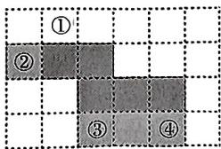

text_image

①
②
③
④

6.-12 解:由题意,得 $x+6$ 与 x-3 是相对面,y+2 与 y-2 是相对面,A 与 -8x 是相对面,

$$
\therefore x + 6 + x - 3 = 0,
$$

$$
\therefore x = - \frac {3}{2},
$$

$$
\therefore A = 8 \times \left(- \frac {3}{2}\right) = - 1 2.
$$

7. D 解: 由图 1 可知: 1 和 4 是相对面, 3 和 5 是相对面, 2 和 6 是相对面, 因为这两幅图是同一个正方体的表面展开图, 所以字母 A 表示的数是 6. 故选 D.

8.7 解: 和数字 1 相邻的面所标的数为 2,5,4,6,

∴数字1和数字3相对；

∴和数字4相邻的面所标的数字为1,2,3,6,

∴数字4和数字5相对，

∴数字1和5对面的数字的和是7.

9.B

10. 解: (1) $6 \times (1 + 2 + 3) \cdot a^{2} = 36a^{2}$ 故该物体的表面积为 $36a^{2}$ ;

$$
\begin{array}{l} {(2) 6 \times (1 + 2 + 3 + \dots + 2 0) \cdot a ^ {2} =} \\ {1 2 6 0 a ^ {2},} \end{array}
$$

故该物体的表面积为 $1260a^{2}$ .

# 重难点突破 2 直线、射线、线段(一)

1. A

2. 两点确定一条直线

3. 两点之间, 线段最短

4.20 解: 一条线段内有 5 个点, 一共有 $1+2+3+4=10$ 条线段, 有 $10\times2$ 种不同车票.

5. C 解: 10 条不同的直线最多有 $\frac{9 \times 10}{2} = 45$ 个不同的交点, 4 条不同的直线最多有 $\frac{3 \times 4}{2} = 6$ 个不同的交点.

∴这10条直线的公共点个数最多有45-6-(6-1)=34.故选C.

6.B 解:根据题意,得 $S_{1}=\frac{2\times(2-1)}{2}$

$$
= 1, S _ {2} = \frac {3 \times (3 - 1)}{2} = 3,
$$

$$
S _ {3} = \frac {4 \times (4 - 1)}{2} = 6, \dots ,
$$

由此发现, $S_{n}=\frac{n(n+1)}{2}$ ,

$$
\frac {1}{S _ {n}} = \frac {2}{n (n + 1)} = 2 \left(\frac {1}{n} - \frac {1}{n + 1}\right),
$$

$$
\therefore \frac {1}{S _ {1}} + \frac {1}{S _ {2}} + \frac {1}{S _ {3}} + \dots + \frac {1}{S _ {2 0 2 1}} + \frac {1}{S _ {2 0 2 2}}
$$

$$
= 2 \left(\frac {1}{1} - \frac {1}{2} + \frac {1}{2} - \frac {1}{3} + \dots + \frac {1}{2 0 2 1} \right.
$$

$$
- \frac {1}{2 0 2 2} + \frac {1}{2 0 2 2} - \frac {1}{2 0 2 3}) =
$$

$2\left(1-\frac{1}{2023}\right)=\frac{4044}{2023}.$ 故选 B.

# 重难点突破3 直线、射线、线段(二)

1. 解: (1)

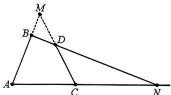

text_image

Geometric diagram with labeled points A, B, C, D, M, N and line segments forming triangles and a dashed extension

图1

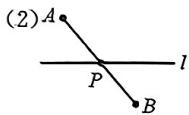  
图2

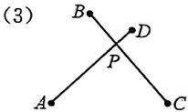  
图3

2. 解: (1)(2) 如图所示;

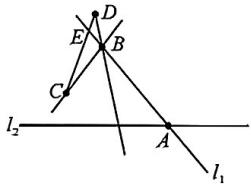

text_image

D
E
B
C
l₂
A
l₁

(3)16

3. 解：(1)，(2) 如图所示；

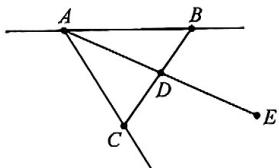

text_image

Geometric diagram with labeled points A, B, C, D, E and connecting lines forming triangles and intersections

(3)图中的线段有8条,射线有6条.

4. 解: (1)(3) 如图所示;

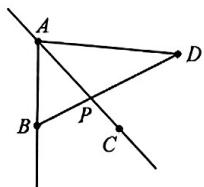

(2) $AB + AD > BD$

两点之间线段最短

(4)6 $\frac{n(n - 1)}{2}$

# 重难点突破4 线段计算(一) 直接计算

1. 解: $\because D$ 为 $AE$ 的中点,

$$
\therefore A D = D E.
$$

$$
\because A D = 2 B E, A B = 3 0,
$$

$$
\therefore B E = \frac {1}{5} A B = 6,
$$

∵C为AB的中点，

$$
\therefore C B = A C = \frac {1}{2} A B = 1 5,
$$

$$
\therefore C E = C B - B E = 9.
$$

2. 解: $\because B$ 是 $CD$ 的中点,

$$
\therefore B C = B D = 4 \mathrm{cm}.
$$

∵E是BC的中点，

$$
\therefore E C = \frac {1}{2} B C = 2 \mathrm{cm}
$$

$$
\because A E = 4 E C,
$$

$$
\therefore A E = 2 \times 4 \mathrm{cm} = 8 \mathrm{cm},
$$

$$
\therefore A C = A E + E C = 8 + 2 = 1 0 (\mathrm{cm}).
$$

故 $AC$ 的长是 $10 \mathrm{~cm}$ .

3. 解: $AC = AB + BC = 10 \, cm$ ,

∵D为AC的中点，

$$
\therefore D C = \frac {1}{2} A C = 5 \mathrm{cm},
$$

$$
\therefore D B = D C - B C = 5 - 4 = 1 (\mathrm{cm}).
$$

4. 解：∵ AC = 18, AC = 2BC,

$$
\therefore B C = 9.
$$

∵E为BC的中点，

$$
\therefore C E = \frac {1}{2} B C = 4. 5.
$$

$$
\because D E = 1 1,
$$

$$
\therefore C D = D E - C E = 6. 5,
$$

$$
\therefore A D = A C - C D = 1 1. 5.
$$

# 重难点突破5 线段计算(二)方程思想

1. B 解: 设 AC = 2x,

$$
\because A C: C D = 2: 3,
$$

$$
\therefore C D = 3 x,
$$

$$
C E = C D + D E = 3 x + 3,
$$

∵E为CB的中点，

$$
\therefore B E = C E = 3 x + 3,
$$

$$
A B = A C + C E + B E = 3 0 \mathrm{cm},
$$

$$
2 x + (3 x + 3) + (3 x + 3) = 3 0,
$$

解得 $x = 3$

$$
\therefore A C = 2 \times 3 = 6 (\mathrm{cm}),
$$

$$
C E = 3 \times 3 + 3 = 1 2 (\mathrm{cm}),
$$

$$
\therefore A E = A C + C E = 6 + 1 2 = 1 8 (\mathrm{cm}).
$$

选B.

2. 解: 设 CE = x.

$$
\because E C = \frac {1}{4} C B,
$$

$$
\therefore C B = 4 x, B E = 5 x.
$$

∵E是线段AB的中点，

$$
\therefore A E = E B = 5 x, A B = 1 0 x,
$$

$$
\therefore A C = 6 x = 1 8 \text {, 解 得} x = 3
$$

$$
\therefore A B = 1 0 x = 3 0.
$$

3. 解: 设 MC = x,

$$
\because M C = \frac {1}{2} C D = \frac {3}{4} A B.
$$

$$
\therefore C D = 2 M C = 2 x,
$$

$$
\dot {A} B = \frac {4}{3} M C = \frac {4}{3} x.
$$

$$
\therefore M D = M C + C D = x + 2 x = 3 x.
$$

∵M为AD的中点，

$$
\therefore A D = 2 M D = 6 x, A M = M D = 3 x,
$$

$$
\therefore B M = A M - A B = 3 x - \frac {4}{3} x = \frac {5}{3} x,
$$

$$
\therefore B C = B M + M C = \frac {5}{3} x + x = 8,
$$

解得 $x = 3$

$$
\therefore A D = 6 x = 6 \times 3 = 1 8.
$$

4. 解: 设 CE = x.

$$
\because B C = 4 C E,
$$

$$
\therefore B C = 4 x,
$$

$$
\therefore E B = C E + B C = 5 x.
$$

∵F为BC的中点，

$$
\therefore C F = B F = \frac {1}{2} B C = 2 x,
$$

$$
\therefore E F = E C + C F = 3 x.
$$

∵E为AB的中点，

$$
\therefore A E = E B = 5 x,
$$

$$
\therefore A C = A E + C E = 6 x.
$$

$$
\because A C = 6,
$$

$$
\therefore 6 x = 6,
$$

$$
\therefore x = 1,
$$

$$
\therefore E F = 3 x = 3.
$$

5. 解: 设 BC = x，则 AB = 4x.

∵D为AC的中点，

$$
\therefore A D = D C.
$$

$$
\because D B = 6,
$$

$$
\therefore A D = A B - D B = 4 x - 6,
$$

$$
D C = B D + B C = 6 + x,
$$

$$
\therefore 4 x - 6 = 6 + x,
$$

$$
\therefore x = 4,
$$

$$
\therefore A B = 4 x = 1 6 \mathrm{cm}.
$$

6. 解: 设 CM = x，则 CN = CM + MN

$$
= x + 1.
$$

∵N为CB的中点，

$$
\therefore N B = C N = x + 1.
$$

$$
\therefore M B = M N + N B = x + 2.
$$

∵M是AB的中点，

$$
\therefore A M = M B = x + 2,
$$

$$
\therefore A B = A M + M B = 2 x + 4.
$$

$$
\because A B = 4 C M,
$$

$$
\therefore 2 x + 4 = 4 x,
$$

$$
\therefore x = 2,
$$

$$
\therefore A B = 8.
$$

7. 解: 设 CD = x,

$$
\because B D = 2 C D,
$$

$$
\therefore B D = 2 x,
$$

$$
\because E C = 3 C D = 3 x,
$$

$$
\therefore B E = E C + C D + D B = 3 x + x +
$$

$$
2 x = 6 x,
$$

$$
\therefore A E = A D - E D = 1 0 - 4 x,
$$

∵E为AB的中点，

$$
\therefore A E = B E = 6 x,
$$

$$
\therefore 1 0 - 4 x = 6 x,
$$

$$
\therefore x = 1,
$$

$$
\therefore C D = 1.
$$

8. 解: 设 DC = x cm, 则 CE = 2x cm,

$$
B E = A B - A D - D C - C E = (3 8 -
$$

$$
3 x) \mathrm{cm}.
$$

$$
\because C E: E B = 3: 5,
$$

$$
\therefore 3 E B = 5 C E,
$$

即 $3(38 - 3x) = 5 \times 2x$

解得 $x = 6$

$$
\therefore A C = A D + D C = 3 0 + 6 = 3 6 (\mathrm{cm}).
$$

# 重难点突破6 线段

# 计算(三) 设参计算

1. $\frac{2}{3}$ 解: 设 $BC = a$ ,

$$
\therefore A B = 3 a,
$$

$$
\therefore A D = \frac {3}{2} a,
$$

$$
\therefore \frac {B C}{A D} = \frac {2}{3}.
$$

2. 解: $BD = BC$ . 理由如下: 设 $BC = x$ ,

$$
\because B C = \frac {1}{3} A B,
$$

$$
\therefore A B = 3 x,
$$

$$
\therefore A C = 4 x.
$$

∵D是线段AC的中点，

$$
\therefore A D = C D = \frac {1}{2} A C = 2 x,
$$

$$
\therefore B D = C D - B C = x,
$$

$$
\therefore B D = B C.
$$

3. 解: 当点 E 在线段 DB 上时,

设 $DE = x$ ，则 $EB = 5x, DB = 6x.$

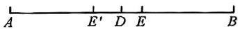

∵D是AB的中点，

$$
\therefore A D = D B = 6 x,
$$

$$
\therefore A E = 7 x,
$$

$$
\therefore \frac {A E}{E B} = \frac {7}{5};
$$

当点 $E'$ 在 $BD$ 的延长线上时，

设 $DE^{\prime} = x$ ，则 $E^{\prime}B = 5x$

$$
\therefore D B = 4 x,
$$

∵D是AB的中点，

$$
\therefore A D = D B = 4 x,
$$

$$
\therefore A E ^ {\prime} = 3 x,
$$

$$
\therefore \frac {A E ^ {\prime}}{E ^ {\prime} B} = \frac {3}{5}.
$$

故 $\frac{AE}{EB} = \frac{7}{5}$ 或 $\frac{3}{5}$ .

4. 解: $\because D$ 为线段 $AC$ 的中点,

$$
\therefore \text { 设 } A D = D C = m.
$$

$$
\because A B = 5 C E,
$$

∴设 CE=n, AB=5n.

∵E为BD的中点，

$$
\therefore D E = E B = m + n,
$$

$$
\therefore A B = 3 m + 2 n = 5 n.
$$

$$
\therefore m = n.
$$

$$
\because A D = m, B E = m + n = 2 m,
$$

$$
\therefore 2 A D = B E.
$$

5. 解: 设 BC = x, CE = y,

则 $AC = 2BC = 2x$

$$
\therefore \dot {A} B = 3 x,
$$

$$
\because A B = 2 D E,
$$

$$
\therefore D E = \frac {3}{2} x,
$$

$$
\therefore A E = A C + C E = 2 x + y,
$$

$$
B E = B C - C E = x - y,
$$

$$
\therefore A D = A E - D E = 2 x + y - \frac {3}{2} x =
$$

$$
\frac {1}{2} x + y.
$$

$$
\because \frac {A D + E C}{B E} = \frac {3}{2},
$$

$$
\therefore 2 A D + 2 E C = 3 B E,
$$

$$
\therefore x + 2 y + 2 y = 3 (x - y),
$$

化简，得 $y = \frac{2}{7} x$

$$
\therefore C D = D E - C E = \frac {3}{2} x - \frac {2}{7} x = \frac {1 7}{1 4} x.
$$

$$
\because A B = 3 x,
$$

$$
\therefore x = \frac {1}{3} A B,
$$

$$
\therefore C D = \frac {1 7}{4 2} A B.
$$

6.1 解: 设 CD = x, BD = y, 则 AB =

$$
3 C D = 3 x, A D = 3 x - y, B C = x + y,
$$

∵P,Q分别为AD,BC的中点，

$$
\therefore P D = \frac {1}{2} A D = \frac {3}{2} x - \frac {1}{2} y,
$$

$$
B Q = \frac {1}{2} B C = \frac {x}{2} + \frac {y}{2},
$$

$$
\therefore P C = P D - C D = \frac {3}{2} x - \frac {1}{2} y -
$$

$$
x = \frac {x}{2} - \frac {y}{2}.
$$

$$
Q D = B Q - B D = \frac {x}{2} + \frac {y}{2} - y =
$$

$$
\frac {x}{2} - \frac {y}{2},
$$

$$
\therefore \frac {P C}{Q D} = 1.
$$

7. 解: 设 AB = 4x, MN = y, 则 AM =

$$
\frac {1}{4} A B = x, M B = 3 x,
$$

①当点 N 在线段 AB 上时, 如图 1,

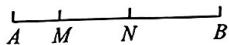  
图1

$$
A N = A M + M N = x + y,
$$

$$
B N = M B - M N = 3 x - y,
$$

$$
\because A N - B N = \frac {2}{3} M N,
$$

$$
\therefore (x + y) - (3 x - y) = \frac {2}{3} y,
$$

化简，得 $y = \frac{3}{2} x$

$$
\therefore \frac {M N}{A B} = \frac {y}{4 x} = \frac {3}{8};
$$

②当点 N 在线段 AB 的延长线上时, 如图 2,

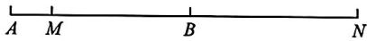  
图2

$$
A N = A M + M N = x + y,
$$

$$
B N = M N - M B = y - 3 x,
$$

$$
\because A N - B N = \frac {2}{3} M N,
$$

$$
\therefore (x + y) - (y - 3 x) = \frac {2}{3} y,
$$

化简，得 $y = 6x$

$$
\therefore \frac {M N}{A B} = \frac {y}{4 x} = \frac {3}{2}.
$$

综上, $\frac{MN}{AB}$ 的值为 $\frac{3}{8}$ 或 $\frac{3}{2}$ .

8. $\frac{4}{3}$ 解: 如图,

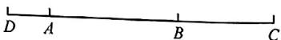

$$
\because A B: C D = 4: 9,
$$

∴设 AB=4k，则 CD=9k，

$$
\because A D = \frac {1}{3} B D,
$$

$$
\therefore A D = \frac {1}{2} A B = 2 k,
$$

$$
\therefore B C = C D - A D - A B = 3 k,
$$

$$
\because A B = t B C,
$$

$$
\therefore 4 k = t \cdot 3 k,
$$

$$
\therefore t = \frac {4}{3}.
$$

# 重难点突破7 线段计算(四) 单中点

1. A 解：∵AB=20,BD=8,

$$
\therefore A D = A B - B D = 2 0 - 8 = 1 2,
$$

∵C是线段AD的中点，

$$
\therefore C D = \frac {1}{2} A D = 6,
$$

$$
\therefore B C = C D + B D = 6 + 8 = 1 4. \text {   选   } A.
$$

2. 解: $\because AC = BC = \frac{1}{2} AB = 12 \mathrm{~cm}$ ,

$$
C D = \frac {1}{3} A C = 4 \mathrm{cm},
$$

$$
D E = \frac {3}{5} A B = 1 4. 4 \mathrm{cm},
$$

$$
\therefore C E = D E - C D = 1 0. 4 \mathrm{cm}.
$$

3. 解: $\because C$ 为 $AB$ 的中点, $\frac{AD}{DB} = \frac{2}{3}$ ,

$$
\therefore A C = \frac {1}{2} A B, A D = \frac {2}{5} A B,
$$

$$
\therefore C D = A C - A D = \frac {1}{2} A B - \frac {2}{5} A B
$$

$$
= \frac {1}{1 0} A B = 2,
$$

$$
\therefore A B = 2 0.
$$

$$
\because A E = 2 E B,
$$

$$
\therefore A E = \frac {2}{3} A B,
$$

$$
\therefore D E = A E - A D = \frac {2}{3} A B - \frac {2}{5} A B
$$

$$
= \frac {4}{1 5} A B = \frac {1 6}{3}.
$$

4. 解: $\because A: -15, B: 9,$

$$
\therefore A B = 9 - (- 1 5) = 2 4.
$$

∵C为AD的中点，

$$
\therefore A C = C D.
$$

设 $AC = 5x$ ，则 $CD = 5x$

$$
\because C D: B D = 5: 2,
$$

$$
\therefore D B = 2 x,
$$

$$
\therefore A B = A C + C D + D B = 1 2 x.
$$

$$
\because A B = 2 4,
$$

$$
\therefore 1 2 x = 2 4,
$$

$$
\therefore x = 2,
$$

$$
\therefore A C = 1 0,
$$

∵点 A 表示的数为 -15, $-15+10$

$$
= - 5,
$$

∴点 C 表示的数为 -5.

# 重难点突破8 线段计算(五) 双中点

1. 解：∵AD=20 cm, BC=12 cm,

$$
\begin{array}{l} \therefore A B + C D = A D - B C = 2 0 - 1 2 = \\ 8 \mathrm{cm}, \end{array}
$$

$\because M$ 是 $AB$ 的中点, $N$ 是 $CD$ 的中点,

$$
\therefore B M = \frac {1}{2} A B, C N = \frac {1}{2} C D.
$$

$$
\therefore M N = B M + B C + C N = \frac {1}{2} A B +
$$

$$
B C + \frac {1}{2} C D = B C + \frac {1}{2} (A B + C D)
$$

$$
= 1 2 + 4 = 1 6 (\mathrm{cm}).
$$

2.2 解: $\because Q$ 是 $BC$ 的中点,

$$
\therefore B Q = C Q = 2,
$$

$$
\therefore B D = B Q - D Q = 2 - 1 = 1,
$$

$$
\therefore A D = A B - B D = 1 1 - 1 = 1 0.
$$

∵P是AD的中点，

$$
\therefore P D = \frac {1}{2} A B = 5,
$$

$$
\therefore P C = P D - C Q - Q D = 5 - 2 - 1 = 2.
$$

3.24 解: 设 BD = x,

$$
\because B D = \frac {1}{3} A B = \frac {1}{4} C D,
$$

$$
\therefore A B = 3 B D = 3 x, C D = 4 B D = 4 x,
$$

∵E,F分别是AB,CD的中点,

$$
\therefore A E = \frac {1}{2} A B = 1. 5 x,
$$

$$
C F = \frac {1}{2} C D = 2 x,
$$

$$
\because A D = A B - B D = 2 x,
$$

$$
\therefore A C = A D + D C = 6 x,
$$

$$
E F = A C - A E - C F = 6 x - 1. 5 x -
$$

$$
2 x = 2. 5 x = 2 0,
$$

$$
\therefore x = 8, A B = 3 x = 2 4.
$$

4. 解: $\because D, E$ 分别为 $AC, AB$ 的中点,

$$
\therefore A E = \frac {1}{2} A B, A D = \frac {1}{2} A C,
$$

$$
\because D E = A E - A D,
$$

$$
\therefore D E = \frac {1}{2} A B - \frac {1}{2} A C = \frac {1}{2} (A B -
$$

$$
A C) = \frac {1}{2} B C = 6 \mathrm{cm}.
$$

# 重难点突破9 线段计算(六) 整体思想

1.26 解: $AB + AD + AC + CB + CD$

$$
+ D B = A B + (A D + D B) + (A C +
$$

$CB) + CD = 3AB + CD = 26.$ 故图中所有线段的和为26.

2. 解： $\because |a+4|+(b-2)^{2}=0$ ，

$$
\vert a + 4 \vert \geqslant 0, (b - 2) ^ {2} \geqslant 0,
$$

$$
\therefore a + 4 = 0, b - 2 = 0,
$$

解得 $a = -4, b = 2$

$$
\therefore O A = 4, O B = 2,
$$

$$
\therefore A P = A O + O B + B P = 6 + B P,
$$

∵点M为PA的中点，

$$
\therefore P M = \frac {1}{2} (6 + B P) = 3 + \frac {1}{2} B P
$$

∵点 N 为 PB 上靠近 B 点的三等分点，

$$
\therefore B N = \frac {1}{3} B P.
$$

$$
\therefore \frac {1}{2} P M - \frac {3}{4} B N = \frac {1}{2} \times
$$

$$
\left(3 + \frac {1}{2} B P\right) - \frac {3}{4} \times \frac {1}{3} B P = \frac {3}{2}.
$$

3. 解: CD 的长不会发生改变,

∵点 D 是 BN 的中点, 点 C 是 AM 的中点,

$$
\therefore B D = D N = \frac {1}{2} B N,
$$

$$
M C = A C = \frac {1}{2} A M,
$$

$$
\therefore C D = C A + A B + B D
$$

$$
= \frac {1}{2} A M + \frac {1}{2} B N + A B
$$

$$
= \frac {1}{2} (A M + B N) + A B
$$

$$
= \frac {1}{2} (M N - A B) + A B
$$

$$
= \frac {1}{2} (M N + A B)
$$

$$
= 1 1.
$$

4. 解: $AC + BD = AB - CD = 12 - 9 = 3$ ,

$$
A M + B N = \frac {1}{3} (A D + B C)
$$

$$
= \frac {1}{3} (A C + C D + C D + B D)
$$

$$
= \frac {1}{3} (A B + C D)
$$

$$
= 7,
$$

$$
\therefore M N = A B - (A M + B N)
$$

$$
= 1 2 - 7
$$

$$
= 5.
$$

# 重难点突破10 线段计算(七) 分类讨论

1. 解：∵ AC = 2BC, AB = 24,

$$
\therefore B C = 8, A C = 1 6.
$$

∵点 C 是线段 DE 的三等分点，
DE=16，

$$
① C D = \frac {2}{3} D E = \frac {3 2}{3},
$$

$$
\therefore A D = A C - C D = 1 6 - \frac {3 2}{3} = \frac {1 6}{3};
$$

$$
② C D = \frac {1}{3} D E = \frac {1 6}{3},
$$

$$
C E = \frac {2}{3} D E = \frac {3 2}{3} > 8,
$$

$\therefore CE>BC$ , 不合题意, 舍去.

故 AD 的长为 $\frac{16}{3}$ .

2. 解: 如图 1, 当点 C 在 AB 之间时, 由题意知,

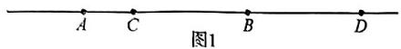

点 $D$ 在点 $B$ 的右侧，

此时 $CD = BC + BD = 10 - 3 + 7 =$ 14；

如图2, 当点 C 在点 A 的左侧时,

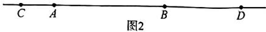

①若点 D 在点 B 的右侧, 则 CD = AC + AB + BD = 20;  
②若点 D 在点 B 的左侧, 则 CD = AC + AD = 3 + 10 - 7 = 6;

故 $CD$ 的长为14或20或6.

3. 解: ①如图 1, 当点 D 在线段 BA 的延长线上时,

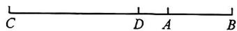  
图1

设 AB=3x，

$$
\because B D = \frac {3}{2} A B, A B: C D = 3: 8,
$$

$$
\therefore B D = 4. 5 x, C D = 8 x,
$$

$$
\begin{array}{l} \therefore A D = B D - A B = 4. 5 x - 3 x = \\ 1. 5 x, \end{array}
$$

$$
\begin{array}{l} \therefore A C = C D + A D = 8 x + 1. 5 x = \\ 9. 5 x, \end{array}
$$

$$
\because A B = t A C,
$$

$$
\therefore t = \frac {A B}{A C} = \frac {3 x}{9 . 5 x} = \frac {6}{1 9};
$$

②如图2,当点D在线段AB的延长线上时,设AB=3x,

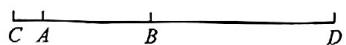  
图2

$$
\because B D = \frac {3}{2} A B, A B: C D = 3: 8,
$$

$$
\therefore B D = 4, 5 x, C D = 8 x,
$$

$$
\therefore A C = C D - A B - B D = 8 x - 3 x -
$$

$$
4. 5 x = 0. 5 x,
$$

$$
\because A B = t A C, t = \frac {A B}{A C} = \frac {3 x}{0 . 5 x} = 6.
$$

综上可知， $t$ 的值为 $\frac{6}{19}$ 或6.

# 重难点突破11 线段计算(八)作图计算

1. 解：(1) 如图， $\frac{BC}{AD}=\frac{\frac{1}{2}AB}{\frac{1}{3}AB}=\frac{3}{2}$ ;

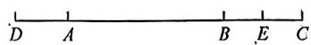

(2) 设 AB = 6x，则 BC = 3x，AD = 2x，BD = 8x，

∵E是BC的中点，

$$
\therefore B E = C E = \frac {1}{2} B C = 1. 5 x,
$$

$$
\because B D - 4 B E = 2,
$$

$$
\therefore 8 x - 4 \times 1. 5 x = 2,
$$

$$
\therefore x = 1,
$$

$$
\therefore A C = A B + B C = 9 x = 9.
$$

2. 解：(1) 如图；

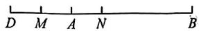

(2) 设 $AD = x \, cm$ ，则 $BD = AB + AD = (2 + x) \, cm$ ，

∵N是BD的中点，

$$
\therefore D N = \frac {1}{2} B D = \left(1 + \frac {1}{2} x\right) \mathrm{cm},
$$

∵M是AD的中点，

$$
\therefore D M = \frac {1}{2} A D = \frac {1}{2} x \mathrm{cm},
$$

$$
\therefore M N = D N - D M
$$

$$
= 1 + \frac {1}{2} x - \frac {1}{2} x
$$

$$
= 1 (\mathrm{cm}).
$$

3. 解: (1) 画图略;

$$
\because C B = \frac {4}{3} A B,
$$

$$
\therefore A C = \frac {1}{3} A B,
$$

$$
\therefore \frac {A C}{B A} = \frac {1}{3};
$$

(2) $\because AB=9\ cm,\frac{AC}{BA}=\frac{1}{3},$

$$
\therefore B C = 1 2 \mathrm{cm}, A C = 3 \mathrm{cm},
$$

设运动时间为 $t$ s, 当点 $D$ 在线段 $AB$ 上运动时, $BD = 3t \mathrm{~cm}$ , $AE = t \mathrm{~cm}$ ,

$$
\therefore A D = \text { AB } - B D = (9 - 3 t) \mathrm{cm},
$$

$$
C E = A C - A E = (3 - t) \mathrm{cm},
$$

$$
\therefore \frac {A D}{C E} = \frac {9 - 3 t}{3 - t} = 3.
$$

# 重难点突破12 线段计算(九)构建数轴

1.4 或 16 解: 如图, 以 A 为原点, 向

右为正方向,建立数轴,点 B 表示的数为 10,

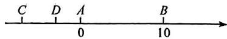

设点 C 表示的数为 m, CD 的长为 x, 则点 D 表示的数为 $m + x$ ,

∵M为AD的中点，

∴点 M 表示的数为 $\frac{0+m+x}{2}$ ,

∵N为BC的中点，

∴点 N 表示的数为 $\frac{10+m}{2}$ ,

$$
\therefore M N = \left| \frac {m + x}{2} - \frac {1 0 + m}{2} \right|
$$

$$
= \left| \frac {x - 1 0}{2} \right|
$$

$$
= 3,
$$

解得 $x = 4$ 或 $x = 16$

∴CD 的长为 4 或 16.

2. 解: 以点 A 为原点, 建立数轴,

则 $O:12,B:18,P:2t,Q:18+t$

当 $2t=18+t$ ，即 t=18 时，运动停止，

$$
\because 2 O P - O Q = 6,
$$

$$
\therefore 2 \vert 2 t - 1 2 \vert - (6 + t) = 6,
$$

当 $t \leqslant 6$ 时， $2(12 - 2t) - (6 + t) = 6$

解得 $t = \frac{12}{5}$ ;

当 $t > 6$ 时， $2(2t - 12) - (6 + t) = 6$ 解得 $t = 12$ .

$$
\therefore t = \frac {1 2}{5} \text {或} 1 2.
$$

3. 解: 以点 A 为原点, 水平向右为正方向建立数轴,

$$
A: 0, B: b, C: c, P: p (p > c > b),
$$

则 $E: \frac{p}{2}, F: \frac{b + c}{2}$ ,

$$
\therefore E F = \left| \frac {b + c}{2} - \frac {p}{2} \right|, A C = c,
$$

$$
B P = p - b,
$$

$$
\therefore | A C - B P | = | c - (p - b) |
$$

$$
= | c + b - p |,
$$

$$
\therefore \frac {E F}{| A C - B P |} = \frac {1}{2}.
$$

# 重难点突破13 线段计算(十) 动点问题

1. 解: 设运动时间为 t s. OP = t,

$$
2 0 \leqslant t \leqslant 8 0, A P = t - 2 0,
$$

∵F为AB的中点,E为OP的中点,

$$
\therefore A F = \frac {1}{2} A B = 3 0,
$$

$$
\therefore O F = O A + A F = 5 0,
$$

$$
O E = \frac {t}{2} \leqslant 4 0,
$$

∴点 E 在点 F 的左侧.

$$
\therefore E F = O F - O E = 5 0 - \frac {t}{2},
$$

$$
\begin{array}{l} \therefore \frac {O B - A P}{E F} = \frac {8 0 - (t - 2 0)}{5 0 - \frac {t}{2}} \\ = \frac {1 0 0 - t}{\frac {1 0 0 - t}{2}} = 2. \\ \end{array}
$$

2. 解: (1) 设 AC = a，则 PD = 2AC = 2a，由题知 PC = t，BD = 2t，

$$
\begin{array}{l} \therefore A B = A C + C P + P D + D B = \\ 3 a + 3 t, A P = A C + C P = a + t, \\ \therefore \frac {A B}{A P} = \frac {3 a + 3 t}{a + t} = 3; \\ \end{array}
$$

(2) 设 $AP = a$ ，由 (1) 知， $PB = 2a$ ，

$$
\therefore P N = B N = a, B C = 2 a + t, B D = 2 t,
$$

$$
\therefore C D = (2 a + t) - 2 t = 2 a - t,
$$

$$
\therefore B M = \frac {2 a - t}{2} + 2 t = \frac {2 a + 3 t}{2},
$$

$$
M N = \frac {2 a + 3 t}{2} - a = \frac {3}{2} t, A C = a - t,
$$

$$
\because 3 A C = 2 M N,
$$

∴3(a-t)=3t, 解得 a=2t,

$$
\therefore C D = 2 \times 2 t - t = 3 t,
$$

$$
A B = 3 a = 6 t,
$$

$$
\therefore \frac {A B}{C D} = \frac {6 t}{3 t} = 2.
$$

3. 解: 以点 O 为原点, 水平向右为正方向建立数轴, O:0, C:-8,

$$
A: 1 6, B: 2 0, P: - 8 + 2 t, Q: 3 t,
$$

$$
E: \frac {- 8 + 2 t + 1 6}{2} = t + 4, F: \frac {3 t + 2 0}{2},
$$

$$
A Q = 1 6 - 3 t \left(t \leqslant \frac {1 6}{3}\right),
$$

$$
\begin{array}{l} B P = | 2 0 - (- 8 + 2 t) | \\ = | 2 8 - 2 t | \\ = 2 8 - 2 t, \\ \end{array}
$$

$$
E F = \left| \frac {3 t + 2 0}{2} - (t + 4) \right|
$$

$$
= 6 + \frac {1}{2} t,
$$

$$
\begin{array}{l} \therefore \frac {B P - A Q}{E F} = \frac {2 8 - 2 t - (1 6 - 3 t)}{6 + \frac {1}{2} t} \\ = \frac {1 2 + t}{6 + \frac {1}{2} t} \\ = 2. \\ \end{array}
$$

4. $\frac{3}{2}$ 或 $\frac{39}{5}$ 或 33

解：∵AB=24,AC=15,

$$
\therefore B C = A B - A C = 9.
$$

①当 C 为 PQ 的中点时, PC = CQ, $15-3t=9+t$ , 解得 $t=\frac{3}{2}$ ;  
②当 P 为 CQ 的中点时, PC = PQ,
3t-15=24+t-3t, 解得 $t=\frac{39}{5}$ ;  
③当 Q 为 PC 的中点时, PQ = CQ, $9+t=3t-(24+t)$ , 解得 t=33.

综上所述， $t=\frac{3}{2}$ 或 $\frac{39}{5}$ 或33.

5.2或18 解:设点A表示的数为0,则点B表示的数为6,当运动时间为t秒时,点C表示的数为 $6+t$ ,点D表示的数为 $6+2+t$ ,点M表示的数为2t.

∵点 N 是线段 BD 的中点，

∴点 N 表示的数为 $\frac{6+6+2+t}{2}=$ $7+\frac{t}{2}$ ,

$$
\therefore M N = \left| 7 + \frac {t}{2} - 2 t \right| = \left| 7 - \frac {3}{2} t \right|,
$$

$$
D N = 6 + 2 + t - \left(7 + \frac {t}{2}\right) = 1 + \frac {t}{2},
$$

根据题意,得 $\left|7-\frac{3}{2}t\right|=2\left(1+\frac{t}{2}\right)$ ,

即 $7 - \frac{3}{2} t = 2 + t$ 或 $\frac{3}{2} t - 7 = 2 + t$ 解得 $t = 2$ 或 $t = 18$

∴线段 CD 运动 2 或 18 秒时, MN = 2DN.

6. 解: 以 A 为坐标原点, 水平向右作为正方向建立数轴,

$$
A \quad B \quad P C E \quad Q F \quad D
$$

$$
A: 0, B: 5, C: 1 5, D: 6 0, P: 5 + t,
$$

$$
Q: 1 5 + 4 t, E: \frac {1 5 + 4 t}{2}, F: \frac {6 5 + t}{2},
$$

$$
\therefore P E = \left| \frac {1 5 + 4 t}{2} - (5 + t) ^ {\prime} \right|
$$

$$
= \frac {5}{2} + t,
$$

$$
\therefore Q F = \left| 1 5 + 4 t - \frac {6 5 + t}{2} \right|
$$

$$
= \left| \frac {7 t - 3 5}{2} \right|,
$$

$$
\because P E = Q F,
$$

$$
\therefore \left| \frac {7 t - 3 5}{2} \right| = \frac {5}{2} + t,
$$

$$
\therefore \frac {7 t - 3 5}{2} = \frac {5}{2} + t \text {或} - \frac {7 t - 3 5}{2} =
$$

$$
\frac {5}{2} + t, \quad .
$$

$$
\therefore t = 8 \text {或} \frac {1 0}{3}.
$$

# 重难点突破14 角的计算（一）单位换算与方向角

1. 解: (1) 原式 = $(48^{\circ} + 67^{\circ}) + (39' + 33')$

$$
\begin{array}{l} = 1 1 5 ^ {\circ} 7 2 ^ {\prime} \\ = 1 1 6 ^ {\circ} 1 2 ^ {\prime}; \\ \end{array}
$$

(2) 原式 $= 115^{\circ}70' - 21^{\circ}17'$

$$
= 9 4 ^ {\circ} 5 3 ^ {\prime};
$$

(3) 原式 $= 105^{\circ}85'$

$$
= 1 0 6 ^ {\circ} 2 5 ^ {\prime};
$$

(4)原式=75°24′-136°160′÷4

$$
= 7 5 ^ {\circ} 2 4 ^ {\prime} - 3 4 ^ {\circ} 4 0 ^ {\prime}
$$

$$
= 7 4 ^ {\circ} 8 4 ^ {\prime} - 3 4 ^ {\circ} 4 0 ^ {\prime}
$$

$$
= 4 0 ^ {\circ} 4 4 ^ {\prime};
$$

(5)原式= $28^{\circ}17'-15^{\circ}54'$

$$
= 1 2 ^ {\circ} 2 3 ^ {\prime};
$$

(6)原式=90°-78°19'40"

$$
= 1 1 ^ {\circ} 4 0 ^ {\prime} 2 0 ^ {\prime \prime}.
$$

2. 解：∵48.37°=48°+0.37×60'

$$
= 4 8 ^ {\circ} + 2 2 ^ {\prime} + 0. 2 \times 6 0 ^ {\prime \prime}
$$

$$
= 4 8 ^ {\circ} + 2 2 ^ {\prime} + 1 2 ^ {\prime \prime}
$$

$$
= 4 8 ^ {\circ} 2 2 ^ {\prime} 1 2 ^ {\prime \prime},
$$

$$
\therefore 4 8 ^ {\circ} 2 2 ^ {\prime} 1 3 ^ {\prime \prime} > 4 8. 3 7 ^ {\circ}.
$$

3.D 4.A 5.B

# 重难点突破15 角的计算（二）角的和差

1. 解: ∵ 射线 OE 平分 ∠BOC,

$$
\therefore \angle C O E = \frac {1}{2} \angle B O C = 7 0 ^ {\circ}.
$$

$\because \angle COD$ 是直角，

$$
\therefore \angle D O E = \angle C O D - \angle C O E
$$

$$
= 9 0 ^ {\circ} - 7 0 ^ {\circ}
$$

$$
= 2 0 ^ {\circ}
$$

2. 解: $\because \angle COD = \frac{1}{3} \angle BOD$ ,

$$
\angle C O D = 1 5 ^ {\circ},
$$

$$
\therefore \angle B O D = 3 \angle C O D = 4 5 ^ {\circ},
$$

$$
\therefore \angle B O C = \angle B O D - \angle C O D = 3 0 ^ {\circ}.
$$

∵OB平分∠AOC，

$$
\therefore \angle A O C = 2 \angle B O C = 6 0 ^ {\circ},
$$

$$
\therefore \angle A O D = \angle A O C + \angle C O D = 7 5 ^ {\circ}.
$$

3. B 解：∵ $\angle AOC + \angle COD + \angle BOD = 180^{\circ}$ ,

$$
\therefore \angle C O D = 1 8 0 ^ {\circ} - (\angle A O C +
$$

$$
\angle B O D) = 1 8 0 ^ {\circ} - (5 8 ^ {\circ} + 7 4 ^ {\circ}) = 4 8 ^ {\circ},
$$

$$
\therefore \angle A O D = \angle A O C + \angle C O D = 5 8 ^ {\circ}
$$

$$
+ 4 8 ^ {\circ} = 1 0 6 ^ {\circ}, \angle B O C = \angle B O D +
$$

$$
\angle C O D = 7 4 ^ {\circ} + 4 8 ^ {\circ} = 1 2 2 ^ {\circ},
$$

$$
\therefore \angle A O D + \angle B O C = 1 0 6 ^ {\circ} + 1 2 2 ^ {\circ} =
$$

$228^{\circ}$ . 故选 B.

4. 解： $\because \angle BAC = 90^{\circ}, \angle CAD = 130^{\circ}$

$$
\angle D A E = 3 0 ^ {\circ},
$$

$$
\begin{array}{l} \therefore \angle C A E = \angle C A D + \angle D A E = \\ 1 6 0 ^ {\circ}, \end{array}
$$

$$
\angle B A D = 3 6 0 ^ {\circ} - \angle B A C - \angle C A D = 1 4 0 ^ {\circ}.
$$

∵AM平分∠CAE,AN平分∠BAD,

$$
\therefore \angle M A E = \angle C A M = \frac {1}{2} \angle C A E =
$$

$$
8 0 ^ {\circ}, \angle D A N = \angle B A N = \frac {1}{2} \angle B A D
$$

$$
= 7 0 ^ {\circ},
$$

$$
\therefore \angle C A N = \angle B A C + \angle B A N =
$$

$$
\begin{array}{l} {1 6 0 ^ {\circ}, \angle M A D = \angle C A D - \angle C A M =} \\ {5 0 ^ {\circ},} \end{array}
$$

$$
\begin{array}{l} \therefore \angle M A N = \angle M A D + \angle D A N = \\ 1 2 0 ^ {\circ}. \end{array}
$$

# 重难点突破16 角的计算

# （三）直接设元

1. 解: 设 $\angle COD = x$ ,

$$
\therefore \angle B O D = 2 \angle C O D = 2 x,
$$

$$
\angle A O C = 2 \angle B O D = 4 x,
$$

$$
\therefore \angle A O B = \angle A O C + \angle C O D +
$$

$$
\angle B O D = 7 x.
$$

$$
\because \angle A O B = 7 0 ^ {\circ},
$$

$$
\therefore 7 x = 7 0 ^ {\circ},
$$

$$
\therefore x = 1 0 ^ {\circ},
$$

$$
\therefore \angle C O D = 1 0 ^ {\circ}.
$$

2. 解: 设 $\angle BOE = x$ .

$\because {OE}$ 平分 $\angle {BOD}$ ,

$$
\therefore \angle B O D = 2 x, \angle E O D = x.
$$

$$
\because \angle C O D = \angle B O D + \angle B O C = 9 0 ^ {\circ},
$$

$$
\therefore \angle B O C = 9 0 ^ {\circ} - 2 x.
$$

∵OF 平分∠AOE，

$$
\angle A O E + \angle B O E = 1 8 0 ^ {\circ},
$$

$$
\therefore \angle F O E = \frac {1}{2} \angle A O E = \frac {1}{2} (1 8 0 ^ {\circ} -
$$

$$
x) = 9 0 ^ {\circ} - \frac {1}{2} x,
$$

$$
\therefore \angle F O D = \angle F O E - \angle E O D = 9 0 ^ {\circ}
$$

$$
- \frac {1}{2} x - x = 9 0 ^ {\circ} - \frac {3}{2} x,
$$

$$
\because \angle B O C + \angle F O D = 1 1 7 ^ {\circ},
$$

$$
\therefore 9 0 ^ {\circ} - 2 x + 9 0 ^ {\circ} - \frac {3}{2} x = 1 1 7 ^ {\circ},
$$

$$
\therefore x = 1 8 ^ {\circ},
$$

$$
\therefore \angle B O E = 1 8 ^ {\circ}.
$$

3. $10^{\circ}$ 解: 设 $\angle COF = \alpha$ , 则 $\angle FOE =$

$$
\angle C O E - \angle C O F = 1 2 0 ^ {\circ} - \alpha .
$$

$$
\because \angle F O E = 2 \angle A O F,
$$

$$
\therefore \angle A O F = \frac {1}{2} \angle F O E = 6 0 ^ {\circ} - \frac {1}{2} \alpha .
$$

$$
\begin{array}{l} \because \angle A O F + \angle F O E + \angle B O E = \\ 1 8 0 ^ {\circ}, \end{array}
$$

$$
\therefore 6 0 ^ {\circ} - \frac {1}{2} \alpha + 1 2 0 ^ {\circ} - \alpha + \angle B O E =
$$

$180^{\circ}$ , 即 $\angle BOE = \frac{3}{2} \alpha$ .

$\because \angle FOE$ 比 $\angle BOE$ 的余角大 $35^{\circ}$

$$
\therefore 1 2 0 ^ {\circ} - \alpha = 9 0 ^ {\circ} - \frac {3}{2} \alpha + 3 5 ^ {\circ},
$$

解得 $\alpha=10^{\circ}$ ,

$$
\therefore \angle C O F = 1 0 ^ {\circ}.
$$

4. 解: (1) 设 $\angle AOB = x$ ,

依题意, 得 $180^{\circ}-x=10(90^{\circ}-x)$ ,

解得 $x = 80^{\circ}$

$$
\therefore \angle A O B = 8 0 ^ {\circ};
$$

(2) 设 $\angle BOD = y$ ，则 $\angle AOC = 3y$ .

∵OD 平分∠BOC，

$$
\therefore \angle B O C = 2 \angle B O D = 2 y.
$$

由题意, 得 $3y + 2y + 80^{\circ} = 360^{\circ}$ ,

解得 $y=56^{\circ}$ ,

$$
\therefore \angle A O D = \angle A O B + \angle B O D = 8 0 ^ {\circ}
$$

$$
+ 5 6 ^ {\circ} = 1 3 6 ^ {\circ}.
$$

# 重难点突破17 角的计算（四）间接设元

1. $60^{\circ}$ 解： $\because OB, OC$ 为锐角 $\angle AOD$ 的三等分线，

$$
\therefore \angle A O B = \angle B O C = \angle C O D,
$$

设 $\angle AOB = \angle BOC = \angle COD = x$

$$
\therefore \angle A O B + \angle B O C + \angle C O D +
$$

$$
\angle A O C + \angle A O D + \angle B O D
$$

$$
= x + x + x + 2 x + 3 x + 2 x
$$

$$
= 1 0 x = 2 0 0 ^ {\circ},
$$

$$
\therefore x = 2 0 ^ {\circ}, \therefore \angle A O D = 3 x = 6 0 ^ {\circ}.
$$

故答案为 $60^{\circ}$

2. 解：设 $\angle BOE = \angle AOF = x$ ，则

$$
\angle B O C = 6 x,
$$

$$
\therefore \angle E O C = 6 x - x = 5 x,
$$

又∵∠EOC：∠FOC=5：4，

$$
\therefore \angle F O C = 4 x,
$$

$$
\because \angle A O B = \angle B O E + \angle E O C +
$$

$$
\angle F O C + \angle A O F = 1 1 0 ^ {\circ},
$$

$$
\therefore x + 5 x + 4 x + x = 1 1 0 ^ {\circ},
$$

解得 $x = 10^{\circ}$

$$
\therefore \angle E O F = \angle E O C + \angle F O C = 5 x
$$

$$
+ 4 x = 9 x = 9 0 ^ {\circ}.
$$

3. 解：设 $\angle AOC = \angle COD = x$ ，则

$$
\angle B O D = 1 8 0 ^ {\circ} - 2 x.
$$

$$
\because \angle C O E = 8 0 ^ {\circ},
$$

$$
\therefore \angle D O E = \angle C O E - \angle C O D =
$$

$$
8 0 ^ {\circ} - x.
$$

$$
\because \angle B O D = 3 \angle D O E,
$$

$$
\therefore 1 8 0 ^ {\circ} - 2 x = 3 (8 0 ^ {\circ} - x),
$$

解得 $x = 60^{\circ},\therefore \angle AOC = 60^{\circ},$

$$
\therefore \angle B O E = 1 8 0 ^ {\circ} - \angle A O C - \angle C O E
$$

$$
= 4 0 ^ {\circ}.
$$

4. 解: 设 $\angle COE = 2x$ .

∵OE 平分∠BOC，

$$
\therefore \angle B O E = \angle C O E = 2 x.
$$

$$
\because \angle A O C: \angle C O E = 5: 2,
$$

$$
\therefore \angle A O C = 5 x,
$$

$$
\therefore \angle A O B = \angle A O C + \angle B O C = 9 x =
$$

$$
9 0 ^ {\circ},
$$

$$
\therefore x = 1 0 ^ {\circ},
$$

$$
\therefore \angle A O D = \angle A O C + \angle C O D = 5 \times
$$

$$
1 0 ^ {\circ} + 9 0 ^ {\circ} = 1 4 0 ^ {\circ}.
$$

# 重难点突破18 角的计算

# (五) 整体求角

1. B 解: $\angle AOC + \angle DOB = \angle DOC$

$$
+ \angle A O D + \angle D O B = \angle D O C +
$$

$\angle AOB = 180^{\circ}$ .故选B.

2. 解: $\angle AOD + \angle BOC = \angle AOC +$

$$
\angle C O D + \angle B O C = \angle C O D +
$$

$$
\angle A O B = 6 0 ^ {\circ} + 1 2 0 ^ {\circ} = 1 8 0 ^ {\circ}.
$$

3. 解: 设 $\angle AOC = \alpha$ ,

$$
\because \angle A O B + \angle A O C = 1 8 0 ^ {\circ},
$$

$$
\therefore \angle A O B = 1 8 0 ^ {\circ} - \alpha .
$$

$$
\angle B O C = \angle A O B - \angle A O C
$$

$$
= (1 8 0 ^ {\circ} - \alpha) - \alpha
$$

$$
= 1 8 0 ^ {\circ} - 2 \alpha .
$$

∵OF 平分∠BOC，

$$
\therefore \angle B O F = \frac {1}{2} \angle B O C = 9 0 ^ {\circ} - \alpha .
$$

$$
\therefore \angle A O F = \angle A O B - \angle B O F =
$$

$$
(1 8 0 ^ {\circ} - \alpha) - (9 0 ^ {\circ} - \alpha) = 9 0 ^ {\circ}.
$$

4. 解: 设 $\angle COF = x$ ,

$$
\therefore \angle D O F = \angle C O D + \angle C O F =
$$

$$
6 0 ^ {\circ} + x.
$$

∵OF 平分∠BOD，

$$
\therefore \angle B O F = \angle D O F = 6 0 ^ {\circ} + x.
$$

$$
\therefore \angle A O C = 3 6 0 ^ {\circ} - \angle A O B - \angle B O C
$$

$$
= 3 6 0 ^ {\circ} - 9 0 ^ {\circ} - (6 0 ^ {\circ} + 2 x)
$$

$$
= 2 1 0 ^ {\circ} - 2 x,
$$

$\because OE$ 平分 $\angle AOC$ ,

$$
\therefore \angle E O C = \frac {1}{2} \angle A O C = 1 0 5 ^ {\circ} - x,
$$

$$
\therefore \angle E O F = \angle E O C + \angle C O F
$$

$$
= 1 0 5 ^ {\circ} - x + x
$$

$$
= 1 0 5 ^ {\circ}.
$$

# 重难点突破19 角的计算

# (六) 三角板

1. B 解: A. $18^{\circ}=90^{\circ}-72^{\circ}$ ，则 $18^{\circ}$ 角能画出；

B. $55^{\circ}$ 不能写成 $36^{\circ}, 72^{\circ}, 45^{\circ}, 90^{\circ}$ 的和或差的形式，不能画出；

C. $63^{\circ}=90^{\circ}-72^{\circ}+45^{\circ}$ ，则 $63^{\circ}$ 可以画出；

D. $117^{\circ} = 72^{\circ} + 45^{\circ}$ , 则 $117^{\circ}$ 角能画出. 故选 B.

2. A 解: $\angle CBE = \angle ABC - \angle ABE = 45^{\circ}$ ,

$$
\angle C B G = \angle E B G - \angle C B E = 4 5 ^ {\circ},
$$

$$
\angle F B G = \angle F B H - \angle G B H = 6 0 ^ {\circ},
$$

$$
\therefore \angle F B C = \angle F B G - \angle C B G = 6 0 ^ {\circ}
$$

$$
- 4 5 ^ {\circ} = 1 5 ^ {\circ}. \text {   故选   } A.
$$

3. B 解: $\because BM$ 为 $\angle ABC$ 的平分线,

$$
\begin{array}{l} \therefore \angle C B M = \frac {1}{2} \angle A B C = \frac {1}{2} \times 6 0 ^ {\circ} = \\ 3 0 ^ {\circ}, \end{array}
$$

∵BN为∠CBE的平分线，

$$
\therefore \angle C B N = \frac {1}{2} \angle E B C = \frac {1}{2} \times (6 0 ^ {\circ} +
$$

$$
9 0 ^ {\circ}) = 7 5 ^ {\circ},
$$

$$
\therefore \angle M B N = \angle C B N - \angle C B M = 7 5 ^ {\circ}
$$

$$
- 3 0 ^ {\circ} = 4 5 ^ {\circ}. \text {   故选   B.   }
$$

4.67.5° 解:由题可得, $\angle ABC=45^{\circ}$ ,

$$
\angle D B E = 6 0 ^ {\circ}, \angle A B D = 1 8 0 ^ {\circ},
$$

$$
\therefore \angle C B E = 7 5 ^ {\circ},
$$

又∵BM为∠CBE的平分线,BN为∠DBE的平分线,

$$
\therefore \angle M B E = 3 7. 5 ^ {\circ}, \angle E B N = 3 0 ^ {\circ},
$$

$$
\therefore \angle M B N = 6 7. 5 ^ {\circ}
$$

# 重难点突破20 角的计算

# (七) 角的折叠

1. B 解: 设 $\angle BFC'$ 的度数为 $\alpha$ ，则 $\angle EFC' = 65^{\circ} + \alpha$ .

由折叠可得， $\angle EFC = \angle EFC' = 65^\circ + \alpha$

$$
\text {又} \because \angle E F B + \angle E F C = 1 8 0 ^ {\circ},
$$

$$
\therefore 6 5 ^ {\circ} + 6 5 ^ {\circ} + \alpha = 1 8 0 ^ {\circ},
$$

$$
\therefore \alpha = 5 0 ^ {\circ},
$$

$\therefore \angle BFC'$ 的度数为 $50^{\circ}$ . 故选 B.

2.C 解: 设 $\angle BAD' = x$ ,

则 $\angle CAE = 2\angle BAD' = 2x$

$$
\angle D A E = \angle D ^ {\prime} A E = \angle C A E +
$$

$$
\angle C A D ^ {\prime} = 2 x + 1 5 ^ {\circ}.
$$

$$
\begin{array}{l} \because \angle D A E + \angle E A D ^ {\prime} + \angle B A D ^ {\prime} = \\ 9 0 ^ {\circ}, \end{array}
$$

$$
\therefore 2 (2 x + 1 5 ^ {\circ}) + x = 9 0 ^ {\circ},
$$

解得 $x = 12^{\circ}$

$\therefore \angle DAE = 2x + 15^{\circ} = 39^{\circ}$ 故选C.

3. $8^{\circ}$ 解：由折叠知， $\angle BAE = \angle B'AE$ $\angle DAF = \angle D'AF,$

∵四边形 ABCD 是长方形，

$$
\therefore \angle B A D = 9 0 ^ {\circ},
$$

$$
\because \angle B A E + \angle E A F + \angle D A F =
$$

$$
\angle B A D, \angle E A F = 4 1 ^ {\circ},
$$

$$
\begin{array}{l} {\therefore \angle B A E + \angle D A F = \angle B A D -} \\ {\angle E A F = 4 9 ^ {\circ},} \end{array}
$$

$$
\begin{array}{l} \because \angle E A B ^ {\prime} + \angle D ^ {\prime} A F = \angle E A F + \\ \angle B ^ {\prime} A D ^ {\prime}, \end{array}
$$

$$
\therefore \angle B ^ {\prime} A D ^ {\prime} = \angle E A B ^ {\prime} + \angle D ^ {\prime} A F -
$$

$$
\angle E A F
$$

$$
= \angle B A E + \angle D A F -
$$

$$
\angle E A F
$$

$$
= 4 9 ^ {\circ} - 4 1 ^ {\circ}
$$

$$
= 8 ^ {\circ}.
$$

4. $21^{\circ}$ 解: 由翻折的性质可知, $\angle BAD = \angle B'AD$ , $\angle CAE = \angle C'AE$ ,

设 $\angle BAD = x^{\circ}$

$$
\because \angle B ^ {\prime} A C ^ {\prime} = 1 8 ^ {\circ},
$$

$$
\begin{array}{l} {\therefore \angle D A C ^ {\prime} = \angle B A D - \angle B ^ {\prime} A C ^ {\prime} =} \\ {x ^ {\circ} - 1 8 ^ {\circ},} \end{array}
$$

$$
\therefore \angle B A C ^ {\prime} = 2 x ^ {\circ} - 1 8 ^ {\circ}.
$$

$$
\begin{array}{l} {\therefore \angle C ^ {\prime} A E = [ 6 0 ^ {\circ} - (2 x - 1 8) ^ {\circ} ] \div} \\ {2 = 3 9 ^ {\circ} - x ^ {\circ},} \end{array}
$$

$$
\because \angle D A C ^ {\prime} + \angle C ^ {\prime} A E = \angle D A E,
$$

$$
\therefore \angle D A E = 3 9 ^ {\circ} - x ^ {\circ} + x ^ {\circ} - 1 8 ^ {\circ} = 2 1.
$$

# 重难点突破21 角的计算

# (八) 角平分线

1. 解: $\because \angle AOC = 2\angle COD$

$$
\angle A O C = 7 2 ^ {\circ},
$$

$$
\therefore \angle C O D = 3 6 ^ {\circ},
$$

$$
\begin{array}{l} \therefore \angle A O D = \angle A O C + \angle C O D = \\ 1 0 8 ^ {\circ}. \end{array}
$$

∵OB平分∠AOD，

$$
\therefore \angle A O B = \frac {1}{2} \angle A O D = 5 4 ^ {\circ},
$$

$$
\therefore \angle B O C = \angle A O C - \angle A O B = 7 2 ^ {\circ}
$$

$$
- 5 4 ^ {\circ} = 1 8 ^ {\circ}.
$$

2. 解： $\because \angle AOC = 3\angle COD = 45^{\circ}$ ，

$$
\therefore \angle C O D = 1 5 ^ {\circ},
$$

$$
\therefore \angle A O D = \angle A O C + \angle C O D = 6 0 ^ {\circ},
$$

$$
\therefore \angle B O D = 1 8 0 ^ {\circ} - \angle A O D = 1 2 0 ^ {\circ}.
$$

$\because OE$ 平分 $\angle BOD$ ，

$$
\therefore \angle D O E = \frac {1}{2} \angle B O D = 6 0 ^ {\circ},
$$

$$
\therefore \angle C O E = \angle C O D + \angle D O E = 1 5 ^ {\circ}
$$

$$
+ 6 0 ^ {\circ} = 7 5 ^ {\circ}.
$$

3. 解：(1) $\because \angle AOB = 60^{\circ}, \angle AOD = 100^{\circ}$ ,

$$
\therefore \angle B O D = \angle A O D - \angle A O B = 4 0 ^ {\circ}.
$$

$\because OC$ 平分 $\angle BOD$ ,

$$
\therefore \angle B O C = \frac {1}{2} \angle B O D = 2 0 ^ {\circ},
$$

$$
\therefore \angle A O C = \angle A O B + \angle B O C = 8 0 ^ {\circ};
$$

(2) $\because {OC}$ 平分 $\angle {BOD}$ ,

$$
\therefore \angle B O C = \frac {1}{2} \angle B O D,
$$

$$
\therefore \angle A O C = \angle A O B + \angle B O C
$$

$$
= \angle A O B + \frac {1}{2} \angle B O D
$$

$$
= \angle A O B + \frac {1}{2} (\angle A O D -
$$

$$
\angle A O B)
$$

$$
= \frac {1}{2} (\angle A O D + \angle A O B)
$$

$$
= 8 0 ^ {\circ}.
$$

4. 解: (1) $\because \angle EOD = 20^{\circ}$ ,

$$
\angle C O D = 6 0 ^ {\circ},
$$

$$
\therefore \angle C O E = \angle C O D - \angle E O D = 4 0 ^ {\circ}.
$$

$\because OE$ 平分 $\angle BOC$ ,

$$
\therefore \angle B O C = 2 \angle C O E = 8 0 ^ {\circ},
$$

$$
\therefore \angle A O C = \angle A O B - \angle B O C = 4 0 ^ {\circ};
$$

(2) 设 $\angle DOE = x$ ，则 $\angle COE = \angle COD - \angle DOE = 60^{\circ} - x$ .

∵OE 平分∠BOC，

$$
\begin{array}{r l} & {\therefore \angle B O C = 2 \angle C O E = 2 (6 0 ^ {\circ} - x) =} \\ & {1 2 0 ^ {\circ} - 2 x,} \end{array}
$$

$$
\therefore \angle A O C = \angle A O B - \angle B O C = 1 2 0 ^ {\circ}
$$

$$
- (1 2 0 ^ {\circ} - 2 x) = 2 x,
$$

$$
\therefore \angle A O C = 2 \angle D O E.
$$

5. 解：∵ $\angle AOM : \angle MOC = 1 : 7$ , $\angle AOM=20^{\circ}$

$$
\begin{array}{l} \therefore \angle M O C = 7 \angle A O M = 7 \times 2 0 ^ {\circ} = \\ 1 4 0 ^ {\circ}. \end{array}
$$

又∵OM平分∠AOB，

$$
\therefore \angle B O M = \angle A O M = 2 0 ^ {\circ},
$$

$$
\begin{array}{r l} & {\therefore \angle B O C = \angle M O C - \angle B O M =} \\ & {1 4 0 ^ {\circ} - 2 0 ^ {\circ} = 1 2 0 ^ {\circ}.} \end{array}
$$

∵ON 平分∠BOC，

$$
\therefore \angle B O N = \frac {1}{2} \angle B O C = 6 0 ^ {\circ},
$$

$$
\begin{array}{l} \therefore \angle M O N = \angle M O B + \angle B O N = \\ 8 0 ^ {\circ}. \end{array}
$$

6. 解: (1) 设 $\angle AOE = 4x$ .

$$
\because \angle B O D: \angle A O E = 5: 4,
$$

$$
\therefore \angle B O D = 5 x.
$$

$\because OE$ 平分 $\angle AOC$ ,

$$
\therefore \angle A O C = 2 \angle A O E = 8 x = 6 4 ^ {\circ},
$$

$$
\therefore x = 8 ^ {\circ},
$$

$$
\begin{array}{l} \therefore \angle B O D = 5 x = 4 0 ^ {\circ}, \\ \therefore \angle B O C = 2 \angle B O D = 8 0 ^ {\circ}, \\ \begin{array}{l} \therefore \angle A O B = \angle A O C + \angle B O C = \\ 1 4 4 ^ {\circ}; \end{array} \\ \end{array}
$$

$\because OD$ 平分 $\angle BOC$ ,

(2) $\because \angle COD = \frac{1}{2} \angle BOC,$

$$
\angle C O E = \frac {1}{2} \angle A O C,
$$

$$
\therefore \angle D O E = \angle C O D + \angle C O E
$$

$$
= \frac {1}{2} (\angle B O C + \angle A O C)
$$

$$
= \frac {1}{2} \angle A O B.
$$

7. 解: (1) $\because \angle AOM = 20^{\circ}, OM$ 平分 $\angle AOB$ ,

$$
\therefore \angle A O B = 2 \angle A O M = 4 0 ^ {\circ},
$$

$$
\therefore \angle A O C = \angle A O B + \angle B O C = 4 0 ^ {\circ}
$$

$$
+ 4 0 ^ {\circ} = 8 0 ^ {\circ};
$$

(2) $\angle COD + \angle AOB = \angle AOD - \angle BOC = 118^{\circ} - 40^{\circ} = 78^{\circ}$ .

∵OM平分∠AOB,ON平分∠COD,

$$
\therefore \angle C O N + \angle B O M = \frac {1}{2} (\angle C O D +
$$

$$
\angle A O B) = 3 9 ^ {\circ},
$$

$$
\therefore \angle M O N = \angle B O C + (\angle C O N +
$$

$$
\angle B O M) = 7 9 ^ {\circ}.
$$

8. 解: 设 $\angle AOB = x$ , 则 $\angle BOD = 160^{\circ} - x$ ,

∵OM平分∠AOC,ON平分∠BOD,

$$
\therefore \angle C O M = \frac {1}{2} \angle A O C
$$

$$
= \frac {1}{2} (x + 3 8 ^ {\circ}),
$$

$$
\angle B O N = \frac {1}{2} \angle B O D
$$

$$
= \frac {1}{2} (1 6 0 ^ {\circ} - x),
$$

$$
\therefore \angle M O N = \angle B O N - \angle B O M
$$

$$
= \angle B O N - (\angle B O C -
$$

$$
\angle C O M)
$$

$$
= \frac {1}{2} (1 6 0 ^ {\circ} - x) -
$$

$$
\left[ 3 8 ^ {\circ} - \frac {1}{2} (3 8 ^ {\circ} + x) \right]
$$

$$
= 6 1 ^ {\circ}.
$$

# 重难点突破22 角的计算（九）设参求角

1. 解: 设 $\angle BOC = 2x$ .

$$
\because \angle A O B = 5 0 ^ {\circ}, \angle C O D = 2 0 ^ {\circ},
$$

$$
\therefore \angle A O D = 7 0 ^ {\circ} + 2 x,
$$

∵OP 平分∠AOD，

$$
\therefore \angle D O P = \frac {1}{2} \angle A O D = 3 5 ^ {\circ} + x.
$$

$\because OQ$ 平分 $\angle BOC$

$$
\therefore \angle C O Q = \frac {1}{2} \angle B O C = x,
$$

$$
\therefore \angle P O Q = \angle D O P - \angle C O Q -
$$

$$
\angle C O D = 3 5 ^ {\circ} + x - x - 2 0 ^ {\circ} = 1 5 ^ {\circ}.
$$

2. 解: 设 $\angle BOC = x$ , 则 $\angle AOD = 360^{\circ}$

$$
- \angle A O B - \angle C O D - \angle B O C = 1 8 0 ^ {\circ}
$$

$$
- x.
$$

$$
\because \angle B O E = \frac {1}{4} \angle B O C,
$$

$$
\angle D O F = \frac {3}{4} \angle A O D,
$$

$$
\therefore \angle B O E = \frac {1}{4} x,
$$

$$
\angle A O F = \frac {1}{4} \angle A O D = \frac {1}{4} (1 8 0 ^ {\circ} - x)
$$

$$
= 4 5 ^ {\circ} - \frac {1}{4} x,
$$

$$
\therefore \angle E O F = \angle A O F + \angle A O B +
$$

$$
\angle B O E = \frac {1}{4} x + 9 0 ^ {\circ} + 4 5 ^ {\circ} - \frac {1}{4} x =
$$

135°.

3.105 解: 设 $\angle BOD = x$ , 如图 1,

∵ON 平分∠COB,OM 平分∠AOD,

$$
\therefore \angle N O B = \angle C O N = \frac {1}{2} \angle B O C =
$$

$$
\frac {1}{2} (4 5 ^ {\circ} + x),
$$

$$
\angle M O D = \angle M O A = \frac {1}{2} \angle A O D =
$$

$$
\frac {1}{2} (6 0 ^ {\circ} + x),
$$

$$
\therefore \angle M O N = \alpha = \angle N O B + \angle M O D
$$

$$
- \angle B O D = \frac {1}{2} (4 5 ^ {\circ} + 6 0 ^ {\circ});
$$

如图 2, ∵ ON 平分 ∠COB, OM 平分 ∠AOD,

$$
\therefore \angle N O B = \angle C O N = \frac {1}{2} \angle B O C =
$$

$$
\frac {1}{2} (4 5 ^ {\circ} - x),
$$

$$
\angle M O D = \angle M O A = \frac {1}{2} \angle A O D =
$$

$$
\frac {1}{2} (6 0 ^ {\circ} - x),
$$

$$
\therefore \angle M O N = \beta = \angle N O B + \angle M O D
$$

$$
+ \angle B O D = \frac {1}{2} (4 5 ^ {\circ} + 6 0 ^ {\circ}),
$$

$$
\therefore \alpha + \beta = 4 5 ^ {\circ} + 6 0 ^ {\circ} = 1 0 5 ^ {\circ}.
$$

4. 解: $\because ON$ 是 $\angle MOC$ 的四点分线,

∴设 $\angle NOC=x$ ，

则 $\angle MOC = 4x, \angle AON = \angle AOC -$

$$
\angle N O C = 2 0 ^ {\circ} - x,
$$

$$
\therefore 4 \angle A O N + \angle C O M = 4 (2 0 ^ {\circ} - x)
$$

$$
+ 4 x = 8 0 ^ {\circ}.
$$

5. 解: 设 $\angle DAC = x$ , 则 $\angle 1 = \angle DAE$

$$
- \angle D A C = 9 0 ^ {\circ} - x,
$$

$$
\angle 2 = \angle B A C - \angle D A C = 6 0 ^ {\circ} - x,
$$

$$
\therefore \angle 1 - \angle 2 = (9 0 ^ {\circ} - x) - (6 0 ^ {\circ} - x)
$$

$$
= 3 0 ^ {\circ}.
$$

6. A 解: 设 $\angle DOE = x, \angle COF = y.$

$\because OE$ 平分 $\angle AOC, OF$ 平分 $\angle BOD,$

$$
\therefore \angle A O C = 2 \angle C O E = 2 (x + 5 0 ^ {\circ}) =
$$

$$
2 x + 1 0 0 ^ {\circ}, \angle B O F = \angle D O F = y +
$$

$$
5 0 ^ {\circ},
$$

$$
\therefore 2 x + 1 0 0 ^ {\circ} + y + y + 5 0 ^ {\circ} + 9 0 ^ {\circ} =
$$

$$
3 \dot {6} 0 ^ {\circ},
$$

$$
\therefore x + y = 6 0 ^ {\circ},
$$

$$
\therefore \angle E O F = 5 0 ^ {\circ} + x + y = 1 1 0 ^ {\circ},
$$

选A.

7. 解: 设 $\angle COD = 2x, \angle AOE = y,$

则 $\angle EOF = \frac{7}{2}\angle COD = 7x$

$$
\angle D O E = 3 \angle A O E = 3 y,
$$

$$
\therefore \angle B O F = 1 2 0 ^ {\circ} - 7 x - y,
$$

$$
\therefore \angle E O C = \angle D O E - \angle C O D = 3 y
$$

$$
- 2 x.
$$

$$
\because \angle C O F = 3 \angle B O F,
$$

$$
\therefore \angle C O B = 4 \angle B O F = 4 (1 2 0 ^ {\circ} - 7 x
$$

$$
- y)
$$

$$
\because \angle A O B = \angle A O E + \angle E O C +
$$

$$
\angle C O B,
$$

$$
\therefore y + 3 y - 2 x + 4 (1 2 0 ^ {\circ} - 7 x - y) =
$$

$$
1 2 0 ^ {\circ},
$$

$$
\therefore x = 1 2 ^ {\circ},
$$

$$
\therefore \angle E O F = 7 x = 8 4 ^ {\circ}.
$$

# 重难点突破23 角的计算（十）设参探究角度关系

1. 解: 设 $\angle AOC = x$ , 则 $\angle BOD = 80^{\circ} - x$ ,

$$
\therefore \angle A O C - \angle B O D = 2 x - 8 0 ^ {\circ}.
$$

∵OF 平分∠AOB;OE 平分∠COD,

$$
\therefore \angle A O F = \frac {1}{2} \angle A O B = 7 0 ^ {\circ},
$$

$$
\angle C O E = \frac {1}{2} \angle C O D = 3 0 ^ {\circ},
$$

$$
\begin{array}{l} \therefore \angle A O E = \angle A O C + \angle C O E = x + \\ 3 0 ^ {\circ}, \end{array}
$$

$$
\begin{array}{l} \therefore \angle E O F = \angle A O E - \angle A O F = x - \\ 4 0 ^ {\circ}, \end{array}
$$

$$
\therefore \angle A O C - \angle B O D = 2 \angle E O F.
$$

2. 解: 设 $\angle AOC = x$ , 则 $\angle AOP = 90^{\circ} - x$ ,

$$
\therefore \angle D O B = \angle A O B - \angle A O C -
$$

$$
\angle C O D = 1 2 0 ^ {\circ} - 6 0 ^ {\circ} - x = 6 0 ^ {\circ} - x,
$$

$$
\begin{array}{l} \therefore \angle B O Q = \angle D O Q - \angle D O B = 9 0 ^ {\circ} \\ - (6 0 ^ {\circ} - x) = 3 0 ^ {\circ} + x. \\ \therefore \angle A O P + \angle B O Q = 9 0 ^ {\circ} - x + 3 0 ^ {\circ} \\ + x = 1 2 0 ^ {\circ}. \\ \end{array}
$$

3. 解: (1) $\because \angle AOC = 52^{\circ}$ .

$$
\therefore \angle B O C = 1 8 0 ^ {\circ} - \angle A O C = 1 2 8 ^ {\circ}.
$$

∵OE 平分∠BOC，

$$
\therefore \angle C O E = \frac {1}{2} \angle B O C = 6 4 ^ {\circ},
$$

$$
\therefore \angle D O E = 9 0 ^ {\circ} - \angle C O E = 2 6 ^ {\circ};
$$

$$
(2) \angle A O C = 2 \angle D O E.
$$

设 $\angle COE = x$

∵OE 平分∠BOC，

$$
\therefore \angle B O C = 2 \angle C O E = 2 x.
$$

$$
\because \angle A O B = 1 8 0 ^ {\circ},
$$

$$
\begin{array}{l} {\therefore \angle A O C = 1 8 0 ^ {\circ} - \angle B O C = 1 8 0 ^ {\circ} -} \\ {2 x.} \end{array}
$$

$$
\because \angle C O D = 9 0 ^ {\circ},
$$

$$
\therefore \angle D O E = 9 0 ^ {\circ} - x,
$$

$$
\therefore \angle A O C = 2 \angle D O E.
$$

# 重难点突破24 角的计算（十一）分类讨论

1. $140^{\circ}$ 或 $100^{\circ}$ 解：设 $\angle BOC = x$ ，则 $\angle AOC = 2x$

依题意, 得 $90^{\circ}-2x=x-30^{\circ}$ ,

解得 $x = 40^{\circ}$

$$
\therefore \angle A O C = 8 0 ^ {\circ}.
$$

$$
\because \angle A O C = 4 \angle A O D,
$$

$$
\therefore \angle A O D = 2 0 ^ {\circ}.
$$

当 $OD$ 在 $\angle AOB$ 的外部时， $\angle DOB = \angle AOD + \angle AOC + \angle BOC = 140^{\circ}$ ；

当 $OD$ 在 $\angle AOB$ 的内部时， $\angle DOB = \angle AOC + \angle BOC - \angle AOD = 100^{\circ}$ .

综上所述， $\angle DOB$ 的度数为 $140^{\circ}$ 或 $100^{\circ}$ .

2. $60^{\circ}$ 或 $57^{\circ}$

解:(1)当 $\angle AOC=\frac{1}{3}\angle AOB$ 时,如图1,图中锐角有: $\angle AOD,\angle AOC,\angle AOB,\angle DOC,\angle DOB,\angle COB$ ,共6个.

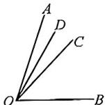  
图1

设 $\angle AOD = x$

∵OD平分∠AOC，

$$
\therefore \angle A O C = 2 x, \angle D O C = x,
$$

$$
\begin{array}{l} \angle A O B = 6 x, \angle B O C = 4 x, \\ \therefore \angle B O D = \angle B O C + \angle C O D = 5 x, \\ \therefore \angle A O D + \angle A O C + \angle A O B + \\ \angle D O C + \angle D O B + \angle C O B = x + 2 x \\ + 6 x + x + 5 x + 4 x = 1 9 x = 1 9 0 ^ {\circ}, \\ \therefore x = 1 0 ^ {\circ}, \\ \therefore \angle A O B = 6 x = 6 0 ^ {\circ}; \\ \end{array}
$$

(2) 当 $\angle AOC = \frac{2}{3} \angle AOB$ 时, 如图 2, 图中锐角有: $\angle AOD, \angle AOC, \angle AOB, \angle DOC, \angle DOB, \angle COB$ , 共 6 个.

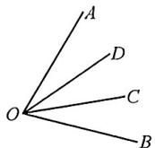  
图2

设 $\angle AOD = x$

∵OD 平分∠AOC，

$$
\therefore \angle A O C = 2 x, \angle D O C = x,
$$

$$
\angle A O B = 3 x, \angle B O C = x,
$$

$$
\therefore \angle B O D = \angle B O C + \angle C O D = 2 x,
$$

$$
\therefore \angle A O D + \angle A O C + \angle A O B +
$$

$$
\angle D O C + \angle D O B + \angle C O B = x +
$$

$$
2 x + 3 x + x + 2 x + x = 1 0 x = 1 9 0 ^ {\circ},
$$

$$
\therefore x = 1 9 ^ {\circ},
$$

$$
\therefore \angle A O B = 3 x = 5 7 ^ {\circ}.
$$

综合以上两种情况， $\angle AOB = 60^{\circ}$ 或 $57^{\circ}$ .

3. 解: 如图 1, 当 OD 在 $\angle AOB$ 内部时, $\angle BOC = \angle AOB - \angle AOC = 70^{\circ}$ .

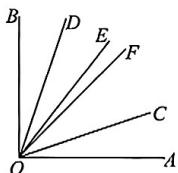  
图1

∵射线 OE 平分∠BOC，

$$
\therefore \angle E O C = \frac {1}{2} \angle B O C = 3 5 ^ {\circ}.
$$

∵射线 OF 平分∠COD，

$$
\therefore \angle F O C = \frac {1}{2} \angle C O D = 2 5 ^ {\circ},
$$

$$
\therefore \angle E O F = \angle E O C - \angle F O C = 1 0 ^ {\circ};
$$

如图 2, 当 OD 在 $\angle AOB$ 外部时, $\angle BOC = \angle AOB - \angle AOC = 70^{\circ}.$

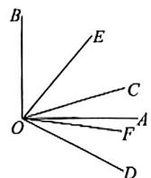  
图2

∵射线 OE 平分∠BOC，

$$
\therefore \angle E O C = \frac {1}{2} \angle B O C = 3 5 ^ {\circ}.
$$

∵射线 OF 平分∠COD，

$$
\therefore \angle F O C = \frac {1}{2} \angle C O D = 2 5 ^ {\circ},
$$

$$
\therefore \angle E O F = \angle E O C + \angle F O C = 6 0 ^ {\circ}.
$$

故 $\angle EOF$ 的度数是 $10^{\circ}$ 或 $60^{\circ}$ .

# 重难点突破25 几何多结论(一) 线段多结论

1. D 解: $\because AM = MD = \frac{1}{2} AD, CN =$

$$
B N = \frac {1}{2} B C.
$$

$$
\because A D = B M,
$$

$$
\therefore A D = M D + B D = \frac {1}{2} A D + B D,
$$

$$
\therefore A D = 2 B D,
$$

$$
\therefore A D + B D = 2 B D + B D = 3 B D,
$$

即 $AB = 3BD$ ，故①符合题意；

$$
\because A C = B D,
$$

$$
\therefore A D = B C,
$$

∴AM=BN,故②符合题意;

$$
\because A C - B D = A D - C D - B D = A D
$$

$$
- (C D + B D) = A D - B C,
$$

$$
\therefore A C - B D = 2 M D - 2 C N = 2 (M C
$$

$$
+ C D - C D - D N) = 2 (M C - D N),
$$

故③符合题意；

$$
\begin{array}{l} \because 2 M N = 2 M C + 2 C N, M C = M D - \\ C D, \end{array}
$$

$$
\therefore 2 M N = 2 (M D - C D) + 2 C N =
$$

$$
2 (M D + C N - C D) = 2 M D + 2 C N -
$$

$$
2 C D = A D - C D + B C - C D = A C +
$$

$$
B D = A B - C D \text {, 故} ④ 符 合 题 意.
$$

故选D.

2. C 解: ① 在直线 CD 上以 B, C, D, E 四点为端点的线段 BC, BD, BE, CE, CD, DE 共 6 条, 故 ① 正确; ② 图中互补的角就是分别以 C, D 为顶点的两对补角, 即 $\angle BCA$ 和 $\angle ACD$ 互补, $\angle ADE$ 和 $\angle ADC$ 互补, 故 ② 错误; ③ 由 $\angle BAE = 110^{\circ}$ , $\angle DAC = 40^{\circ}$ , 根据图形可以求出 $\angle BAC + \angle DAE + \angle DAC + \angle BAE + \angle BAD + \angle CAE = 110^{\circ} + 110^{\circ} + 110^{\circ} + 40^{\circ} = 370^{\circ}$ , 故 ③ 正确; ④ 当点 F 在线段 CD 上, 则点 F 到点 B, C, D, E 的距离之和最小, 其最小值为 $FB + FE + FD + FC = 15$ , 故 ④ 正确. 故选 C.

3. ①③④ 解: $AE = AC + CE = AC +$ $\frac{1}{2} (AF - AC) = \frac{1}{2} (AC + AF)$ , 故

①正确； $BE = BD + DE = BD + CE$

$$
- C D = \frac {1}{2} A D + \frac {1}{2} C F - C D =
$$

$$
\frac {1}{2} (A D + C F) - C D = \frac {1}{2} (A F +
$$

$CD) - CD = \frac{1}{2} (AF - CD)$ , 故 ② 错

误，③正确； $BC = AC - AB = AC -$

$$
\frac {1}{2} A D = A C - \frac {1}{2} (A C + C D) =
$$

$\frac{1}{2} (AC - CD)$ ，④正确.故答案为 $①③④$

# 重难点突破26 几何多结论(二)角度多结论

1. ①③④ 解： $\angle EAF = \frac{1}{2} (\angle BAD$

$+\angle DAC)=\frac{1}{2}\angle BAC=45^{\circ}$ ，①符

合题意；

$ED:DF = 2:3,$ 不能得到 $\angle EAD$ ：

$\angle FAD=2:3,②$ 不符合题意；

∵F为CD的中点，

$$
\therefore 2 D F = D C,
$$

$$
\because B C = 2 E F,
$$

$$
\therefore B D + C D = 2 D E + 2 D F,
$$

$$
\therefore B D + 2 D F = 2 D E + 2 D F,
$$

即 $BD = 2DE$

$\therefore BE = DE$ ，故结论③正确，符合题意；

以 $A$ 为顶点的所有角的和为

$$
(\angle B A E + \angle E A C) + (\angle B A D +
$$

$$
\angle D A C) + (\angle B A F + \angle F A C) +
$$

$$
\angle B A C + (\angle E A D + \angle D A F) +
$$

$\angle EAF = 10\angle EAF$ ，结论④正确，符合题意.故正确的结论为 $①③④$

2. C 解: $\angle MON = \frac{1}{2} (\angle AOC + \angle BOC) = 90^{\circ}$ , ① 正确;

②互补的角有9对，②错误；

③ $\because \angle BOP = \angle MON = 90^{\circ},$

$$
\angle B O N = \angle C O N = \angle P O M,
$$

$\therefore \angle COM = \angle PON, ③正确;$

④∵∠COM=∠PON,∠COM=

$$
\angle A O M,
$$

$$
\therefore \angle A O M = \angle P O N,
$$

$$
\therefore \angle P O C = \angle C O N - \angle P O N =
$$

$\angle BON - \angle AOM$ ，故④正确.

故选C.

3. C 解: $\angle ECF + \angle DCH = \angle FCD$

$$
+ \angle D C H + \angle D C E = \frac {1}{2} \angle A C B +
$$

$$
\angle D C E = 1 8 0 ^ {\circ}, \textcircled {1} \text { 对 };
$$

② $\angle HCB + \angle BCG = \frac{1}{2} (\angle DCB +$

$$
\angle B C E) = \frac {1}{2} \angle D C E = 4 5 ^ {\circ},
$$

$$
\therefore \angle H C B = 4 5 ^ {\circ} - \angle B C G,
$$

$$
\text { 又 } \because \angle F C H = 9 0 ^ {\circ},
$$

$$
\therefore \angle A C F + \angle H C B = 9 0 ^ {\circ},
$$

$$
\therefore \angle A C F + 4 5 ^ {\circ} - \angle B C G = 9 0 ^ {\circ},
$$

$\therefore \angle ACF - \angle BCG = 90^{\circ} - 45^{\circ} =$ $45^{\circ}$ ，②对；

③互余的角有9对，故③错误；

④ $\because \angle ACF = \angle DCF, \angle FCH = 90^{\circ}, \angle HCG = 45^{\circ},$

$$
\therefore \angle D C G + \angle A C F = \angle D C G +
$$

$$
\angle D C F = \angle D C F + \angle D C H +
$$

$$
\angle H C G = \angle F C H + \angle H C G = 1 3 5 ^ {\circ},
$$

④对.

故选C.

# 重难点突破27 角的旋转(一) 单线旋转

1.3 解： $\because \angle BOB_{1} = 6^{\circ}t$

$$
\therefore \angle A O B _ {1} = 1 5 0 ^ {\circ} + 6 ^ {\circ} t,
$$

$\because OE \text{ 平分 } \angle AOB_{1},$

$$
\therefore \angle A O E = \frac {1}{2} \angle A O B _ {1} = 7 5 ^ {\circ} + 3 ^ {\circ} t,
$$

$$
\because \angle C _ {1} O B _ {1} = 1 8 0 ^ {\circ} - \angle B O B _ {1} = 1 8 0 ^ {\circ}
$$

$$
- 6 ^ {\circ} t,
$$

$$
\therefore \angle C _ {1} O F = \frac {1}{3} \angle C _ {1} O B _ {1} = 6 0 ^ {\circ} - 2 ^ {\circ} t,
$$

$$
\because | \angle C _ {1} O F - \angle A O E | = 3 0 ^ {\circ},
$$

$$
\therefore | 7 5 ^ {\circ} + 3 ^ {\circ} t - 6 0 ^ {\circ} + 2 ^ {\circ} t | = 3 0 ^ {\circ},
$$

$\therefore 5^{\circ}t + 15^{\circ} = 30^{\circ}$ ，解得 $t = 3$

2. 解: ① 当 $0 \leqslant t \leqslant 12$ 时, 如图 1,

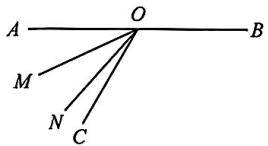  
图1

设 $\angle AOM = x$ ，则 $\angle COM = \angle AOC$

$$
- \angle A O M = 6 0 ^ {\circ} - x,
$$

∵射线 ON 是 $\angle MOC$ 的四等分线，
且 $3\angle CON = \angle MON$ ，

$$
\therefore \angle C O N = \frac {1}{4} \angle C O M = \frac {1}{4} \times (6 0 ^ {\circ}
$$

$$
- x) = 1 5 ^ {\circ} - \frac {1}{4} x,
$$

$$
\therefore \angle A O N = \angle A O C - \angle C O N = 6 0 ^ {\circ}
$$

$$
- \left(1 5 ^ {\circ} - \frac {1}{4} x\right) = \frac {1}{4} x + 4 5 ^ {\circ},
$$

$$
\begin{array}{l} \therefore \angle B O M = 1 8 0 ^ {\circ} - \angle A O M = 1 8 0 ^ {\circ} - \\ x, \end{array}
$$

$$
\therefore 4 \angle A O N + \angle B O M = 4 \times (\frac {1}{4} x +
$$

$$
4 5 ^ {\circ}) + 1 8 0 ^ {\circ} - x = x + 1 8 0 ^ {\circ} + 1 8 0 ^ {\circ} - x
$$

$$
= 3 6 0 ^ {\circ};
$$

②当 $12 < t \leqslant 36$ 时，如图2，

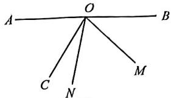

text_image

A
O
B
C
N
M

图2

设 $\angle BOM = y$ ，则 $\angle COM = \angle BOC$ $-\angle BOM = 120^{\circ} - y,$

∵射线 ON 是 $\angle MOC$ 的四等分线，
且 $3\angle CON = \angle MON$ ，

$$
\therefore \angle C O N = \frac {1}{4} \angle C O M = \frac {1}{4} \times (1 2 0 ^ {\circ}
$$

$$
- y) = 3 0 ^ {\circ} - \frac {1}{4} y,
$$

$$
\therefore \angle A O N = \angle A O C + \angle C O N = 6 0 ^ {\circ}
$$

$$
+ 3 0 ^ {\circ} - \frac {1}{4} y = 9 0 ^ {\circ} - \frac {1}{4} y,
$$

$$
\therefore 4 \angle A O N + \angle B O M = 4 \times (9 0 ^ {\circ} -
$$

$$
\frac {1}{4} y) + y = 3 6 0 ^ {\circ} - y + y = 3 6 0 ^ {\circ};
$$

综上所述， $4\angle AON + \angle BOM$ 的值为 $360^{\circ}$ .

# 重难点突破28 角的旋转(二) 双线旋转

1. 解: 设运动时间为 t，则 $\angle AOB = 4t^{\circ}$ ， $\angle MOK=12t^{\circ}$ ,

$\because \angle MON = 120^{\circ}, \angle NOB$ 的余角是 $\angle MON$ 的补角的 $\frac{5}{6}$ ,

$$
\therefore \angle N O B = 9 0 ^ {\circ} - [ \frac {5}{6} \times (1 8 0 ^ {\circ} -
$$

$$
\left. 1 2 0 ^ {\circ}) \right] = 4 0 ^ {\circ},
$$

$$
\angle B O M = 1 2 0 ^ {\circ} - 4 0 ^ {\circ} = 8 0 ^ {\circ},
$$

当 $OK$ 在 $OB$ 上方时， $0 \leqslant t \leqslant \frac{80}{12}$ ，

即 $0 \leqslant t \leqslant \frac{20}{3}$ ,

则 $\angle BOK = (80 - 12t)^{\circ}$

$$
\angle A O B = 4 t ^ {\circ},
$$

$\because \angle BOK$ 是 $\angle AOB$ 的“伴随角”，

∴80-12t= $\frac{1}{2}\times4t$ , 解得 $t=\frac{40}{7}$ ;

当 $OK$ 在 $OB$ 下方时， $\frac{20}{3} < t\leqslant 10$ ，则

$$
\angle B O K = (1 2 t - 8 0) ^ {\circ}, \angle A O B = 4 t,
$$

∵∠BOK 是∠AOB 的“伴随角”，

$$
\therefore 1 2 t - 8 0 = \frac {1}{2} \times 4 t,
$$

解得 t=8;

综上所述,运动时间为 $\frac{40}{7}$ 秒或8秒.

2. 解: ON 与 OA 重合时, $t = 90 \div 10 = 9(s)$ ,

当 $OM$ 与 $OA$ 重合时， $t = 180^{\circ} \div 15 = 12(\mathrm{s})$

如图1，当 $0 < t \leqslant 9$ 时， $\angle AON = 90^{\circ} - 10t^{\circ}, \angle AOM = 180^{\circ} - 15t^{\circ}$ ，

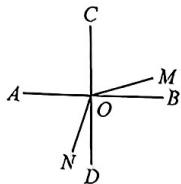  
图1

由 $\angle AOM = 3\angle AON - 60^{\circ}$ ，可得 $180^{\circ} - 15t^{\circ} = 3(90^{\circ} - 10t^{\circ}) - 60^{\circ},$

解得 t=2;

如图 2, 当 9 < t < 12 时, $\angle AON = 10t^{\circ} - 90^{\circ}, \angle AOM = 180^{\circ} - 15t^{\circ}$ ,

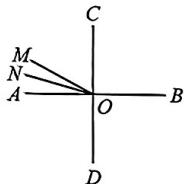  
图2

由 $\angle AOM = 3\angle AON - 60^{\circ}$ ，可得 $180^{\circ} - 15t^{\circ} = 3(10t^{\circ} - 90^{\circ}) - 60^{\circ},$

解得 $t=\frac{34}{3}$ ;

综上所述，当 $\angle AOM = 3\angle AON-$ $60^{\circ}$ 时， $t$ 的值为2或 $\frac{34}{3}$

# 重难点突破 29 角的旋转(三) 平角突变

1. $\frac{15}{2}$ 或 15 或 45

解:如图 1,0<t<30 时,

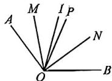  
图1

有 $\angle MON = \frac{1}{2}\angle AOB = \frac{1}{2}\times 120^{\circ}$ $= 60^{\circ}$

$$
\angle P O N = \frac {1}{2} \times 6 0 ^ {\circ} = 3 0 ^ {\circ},
$$

$$
\angle M O I = \frac {1}{2} \angle A O I = \frac {1}{2} \times (6 t) ^ {\circ} = (3 t) ^ {\circ},
$$

$$
\begin{array}{r l} \angle P O I & = \angle P O M - \angle M O I = \\ | (3 0 - 3 t) ^ {\circ} |. \end{array}
$$

$$
\because \angle M O I = 3 \angle P O I,
$$

$$
\therefore 3 t = 3 \mid 3 0 - 3 t \mid ,
$$

解得 $t=\frac{15}{2}$ 或 15.

如图 2, 当 30 < t < 50 时,

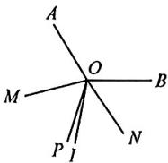  
图2

$$
\begin{array}{r l} & {\angle M O N = \frac {1}{2} (3 6 0 ^ {\circ} - \angle A O B) =} \\ & {\frac {1}{2} \times 2 4 0 ^ {\circ} = 1 2 0 ^ {\circ},} \end{array}
$$

$$
\because \angle M O I = 3 \angle P O I,
$$

$$
\therefore 1 8 0 - 3 t = 3 \left| 6 0 - \frac {6 t - 1 2 0}{2} \right|,
$$

解得 $t = 30$ （舍弃）或45，

综上所述,满足条件的 t 的值为 $\frac{15}{2}$ s 或 15 s 或 45 s.

2. 解: 分两种情况:

①如图 1, $\angle COC' = 10^{\circ}t$ , $\angle DOD' = 30^{\circ}t$ ,

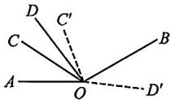  
图1

$$
\therefore 3 0 ^ {\circ} t + 2 0 ^ {\circ} - 1 0 ^ {\circ} t = 1 2 0 ^ {\circ},
$$

解得 t=5;

②如图 2, $\angle COC' = 10^{\circ}t$ ,

$$
\angle D O D ^ {\prime} = 3 6 0 ^ {\circ} - 3 0 ^ {\circ} t,
$$

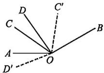  
图2

$\therefore (360^{\circ} - 30^{\circ}t - 20^{\circ}) + 10^{\circ}t = 120^{\circ},$ 解得 $t = 11$

综上所述， $t = 5$ 或11.

# 重难点突破30 角的旋转(四)整体旋转

1. 解: 当射线 OB 在 $\angle EOD$ 内部时,

$$
\begin{array}{l} \because \angle A O B = 4 5 ^ {\circ}, \angle C O D = 6 0 ^ {\circ}, \\ \angle E O A = \alpha , \\ \therefore \angle B O D = 1 8 0 ^ {\circ} - 4 5 ^ {\circ} - 6 0 ^ {\circ} - \alpha = 7 5 ^ {\circ} \\ - \alpha , \\ \therefore \alpha = 4 (7 5 ^ {\circ} - \alpha), \\ \end{array}
$$

解得 $\alpha=60^{\circ}$ .

当射线 OB 在 $\angle DOC$ 内部时, 如下图.

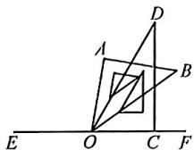

设 $\angle DOB = x$ ，则 $\angle AOE = 4x$

$$
\begin{array}{l} \because 1 8 0 ^ {\circ} - (\angle A O B + \angle D O C - x) = \\ 4 x, \end{array}
$$

$$
\therefore 1 8 0 ^ {\circ} - 4 5 ^ {\circ} - 6 0 ^ {\circ} + x = 4 x,
$$

$$
\therefore x = 2 5 ^ {\circ},
$$

$$
\therefore \alpha = 4 \times 2 5 ^ {\circ} = 1 0 0 ^ {\circ}.
$$

∴满足条件的 $\alpha$ 的值为 $60^{\circ}$ 或 $100^{\circ}$ .

2. 解: ① 当 ON 位于直线 AB 上方时,

$$
\angle A O N = (1 2 0 - 1 0 t) ^ {\circ},
$$

$$
\angle C O M = (1 5 0 - 1 0 t) ^ {\circ}
$$

又 $\angle AON = \angle COM$ ，即 $(120 - 10t)^{\circ}$ $= (150 - 10t)^{\circ}$ ，无解；

②当 ON 位于直线 AB 下方, OM 位于 $\angle BOC$ 内部时,

$$
\angle C O M = (1 5 0 - 1 0 t) ^ {\circ},
$$

$$
\angle A O N = (1 0 t - 1 2 0) ^ {\circ}
$$

又 $\angle AON = \angle COM$

即 $(150-10t)^{\circ}=(10t-120)^{\circ}$ ,

解得 t=13.5;

③当 ON 位于直线 AB 下方, OM 位于 $\angle AOC$ 内部时,

$$
\angle C O M = (1 0 t - 1 5 0) ^ {\circ},
$$

$$
\angle A O N = (1 0 t - 1 2 0) ^ {\circ},
$$

$$
\because \angle A O N = \angle C O M,
$$

∴10t-150=10t-120,无解；

④OM 和 ON 均位于直线 AB 下方时， $\angle COM=(10t-150)^{\circ}$

$$
\angle A O N = (1 0 t - 1 2 0) ^ {\circ},
$$

又 $\angle AON=\angle COM$ ，即 $(10t-150)^{\circ}$ $=(10t-120)^{\circ}$ ，无解.

综上，当 $t = 13.5\mathrm{s}$ 时， $\angle AON =$ $\angle COM.$

3. 解: $\angle MON$ 的度数不会发生改变, $\angle MON=30^{\circ}$ , 理由如下:

∵旋转 t 秒后， $\angle AOD=150^{\circ}-5t^{\circ}$ ， $\angle AOC = 120^{\circ} - 5t^{\circ}, \angle BOD = 120^{\circ} - 5t^{\circ}$

$\because OM, ON$ 分别平分 $\angle AOC, \angle BOD,$

$$
\therefore \angle A O M = \frac {1}{2} \angle A O C = \frac {1}{2} (1 2 0 ^ {\circ} - 5 t ^ {\circ}),
$$

$$
\angle D O N = \frac {1}{2} \angle B O D = \frac {1}{2} (1 2 0 ^ {\circ} - 5 t ^ {\circ}),
$$

$$
\therefore \angle M O N = \angle A O D - \angle A O M -
$$

$$
\angle D O N = 1 5 0 ^ {\circ} - 5 t ^ {\circ} - \frac {1}{2} (1 2 0 ^ {\circ} -
$$

$$
5 t ^ {\circ}) - \frac {1}{2} (1 2 0 ^ {\circ} - 5 t ^ {\circ}) = 3 0 ^ {\circ}.
$$

4. 解: 当 BD 未追上 AB 时,

$$
\begin{array}{l} {\angle A B D = 6 0 ^ {\circ} - (1 5 ^ {\circ} - 5 ^ {\circ}) t = 6 0 ^ {\circ} -} \\ {1 0 ^ {\circ} t,} \end{array}
$$

$$
\angle A B E = 6 0 ^ {\circ} - (6 0 ^ {\circ} - 1 0 ^ {\circ} t) = 1 0 ^ {\circ} t,
$$

若 $\angle ABD = 2\angle ABE$ ，如图3，

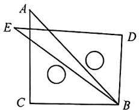

text_image

A
E
D
C
B

图3

$\therefore 60^{\circ} - 10^{\circ}t = 2\times 10^{\circ}t$ ，解得 $t = 2$ 若 $\angle ABE = 2\angle ABD$ ，如图4，

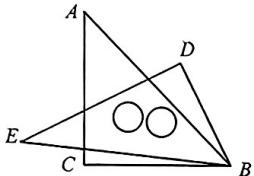

text_image

Geometric diagram with labeled points A, B, C, D, E and two overlapping circles inside triangle ABC

图4

$\therefore 10^{\circ}t = 2(60^{\circ} - 10^{\circ}t)$ ，解得 $t = 4$ 当BD追上AB后， $\angle ABD = 15^{\circ}t-$ $(5^{\circ}t + 60^{\circ}) = 10^{\circ}t - 60^{\circ},\angle ABE =$ $10^{\circ}t,$

若 $\angle ABE = 2\angle ABD$ 时，如图5，

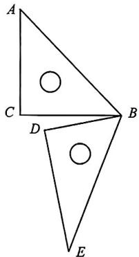

text_image

A
C
D
B
E

图5

$\therefore 10^{\circ}t = 2(10^{\circ}t - 60^{\circ})$ ，解得 $t = 12$ 故 $t$ 的值为2或4或12.

# 中考新方向 1 新定义

1. 解: (1) 点 C;

(2)①当点 M 在线段 AC 上，

∵E为线段AC中点,EC=5cm,

$$
\therefore A C = 2 C E = 1 0 \mathrm{cm},
$$

$$
\because C M = 2 \mathrm{cm},
$$

$$
\therefore A M = A C - C M = 8 \mathrm{cm},
$$

$$
\because B C + C M = A M,
$$

$$
\therefore B C = A M - C M = 8 - 2 = 6 (\mathrm{cm});
$$

②当点 M 在线段 BC 上，

∵E为线段AC中点,EC=5cm,

$$
\therefore A C = 2 C E = 1 0 \mathrm{cm},
$$

$$
\therefore B M = A C + C M = 1 2 \mathrm{cm},
$$

$$
\therefore B C = B M + C M = 1 2 + 2 = 1 4 \mathrm{cm},
$$

所以 BC=6 cm 或 14 cm.

2. 解: (1) 是;

(2)∵射线 PM 是∠FPN 的奇妙线，

∴PM 在∠FPN 的内部，

∴ PF 在 $\angle NPM$ 的外部；

①如图3，当 $\angle NPM = 2\angle FPM$ 时，

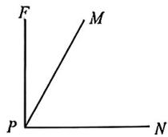  
图3

$$
\begin{array}{l} \angle F P M = \frac {1}{2} \angle N P M = \frac {1}{2} \times 6 0 ^ {\circ} = \\ 3 0 ^ {\circ}, \end{array}
$$

$$
\therefore \angle F P N = \angle N P M + \angle F P M = 6 0 ^ {\circ}
$$

$$
+ 3 0 ^ {\circ} = 9 0 ^ {\circ},
$$

$$
\therefore t = 9 0 \div 3 = 3 0 (\mathrm{s});
$$

②如图4，当 $\angle FPN = 2\angle MPN$ 时，

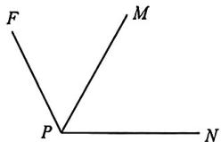

text_image

F
M
P
N

图4

$$
\because \angle F P N = 2 \times 6 0 ^ {\circ} = 1 2 0 ^ {\circ},
$$

$$
\therefore t = 1 2 0 \div 3 = 4 0 (\mathrm{s});
$$

③如图5，当 $\angle FPM = 2\angle NPM$ 时，

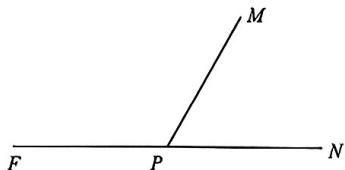

text_image

M
F P N

图5

$$
\because \angle F P M = 2 \times 6 0 ^ {\circ} = 1 2 0 ^ {\circ},
$$

$$
\therefore \angle F P N = \angle N P M + \angle F P M = 6 0 ^ {\circ}
$$

$$
+ 1 2 0 ^ {\circ} = 1 8 0 ^ {\circ},
$$

$$
\therefore t = 1 8 0 \div 3 = 6 0 (\mathrm{s});
$$

当 $t$ 为30或40或60时，射线PM是 $\angle FPN$ 的奇妙线.

# 中考新方向2 实践操作

解:(1)图①③④都有5个小正方形,且通过折叠正好可以折叠成一个无盖的正方体盒子,图②中有6个小正方形,无盖的正方体盒子有5个面,故图②不能折叠成一个无盖的正方体盒子.答案为①③④;

(2)正方形硬纸板的4个角上剪去相同的小正方形,制作一个无盖的长方体纸

盒，如图所示；

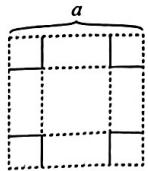

(3)若制作的无盖长方体纸盒的底面边长为 $x\mathrm{cm}$ ,

(I)这个纸盒的底面积是 $x^{2} \mathrm{~cm}^{2}$ , 高是 $\frac{a - x}{2} \mathrm{~cm}$ ;

(Ⅱ)∵当底面边长 x=6 cm 时, 制作的无盖长方体纸盒的容积为 $108 \, cm^{3}$ , $\therefore 6^{2} \times \frac{a-6}{2}=108$ , 解得 a=12, 当底面边长 x=2 cm 时, 纸盒的容积为 $2^{2} \times \frac{12-2}{2}=20 \, (\text{cm}^{3})$ ;

(4)∵该纸盒的相对两个面上的代数式的和相等，

$$
\therefore 2 t + 1 = 5 + t - \frac {m}{3},
$$

$$
\therefore t = 4 - \frac {m}{3},
$$

$\because t$ 为正整数, $m$ 为正整数,

∴m=3或6或9.

# 中考新方向3 综合与实践

解:(1)∵BC为4cm,B是AC中点,
∴AB=BC=4cm,

$$
\therefore C D = 4 A B = 1 6 \mathrm{cm};
$$

(2)①表盘分为12格，一格的度数为 $360^{\circ}\div12=30^{\circ}$ ，时针一分钟所走的度数为 $30^{\circ}\div60=0.5^{\circ}$ ，从10:00到10:30，时针30分钟走的度数为 $30\times0.5^{\circ}=15^{\circ}$ ，

∴10:30 分针和时针的夹角的度数为 $4 \times 30^{\circ} + 15^{\circ} = 135^{\circ}$ ;

②由①知： $\angle EOC=135^{\circ}$

$$
\therefore \angle B O E = 1 8 0 ^ {\circ} - 1 3 5 ^ {\circ} = 4 5 ^ {\circ},
$$

当 $OF$ 在 $\angle EOB$ 内部时，

$$
\angle B O F = \angle B O E - \angle E O F = 2 5 ^ {\circ};
$$

当 $OF$ 在 $\angle EOB$ 外部时，

$$
\angle B O F = \angle B O E + \angle E O F = 6 5 ^ {\circ};
$$

综上， $\angle BOF = 25^{\circ}$ 或 $\angle BOF = 65^{\circ}$

(3)设经过时间为 t 分钟, $\angle EOF$ 的度数是 $25^{\circ}$ ,

∵分针与时针的速度差为 $6^{\circ}-0.5^{\circ}=$ 5.5°,

$$
\therefore \angle E O N = | 1 3 5 ^ {\circ} - 5. 5 t |,
$$

∵OF 平分∠EON，

$$
\therefore \angle E O F = \frac {| 1 3 5 ^ {\circ} - 5 . 5 t |}{2} = 2 5 ^ {\circ},
$$

① $\frac{135^{\circ}-5.5t}{2}=25^{\circ}$ ，解得 $t=\frac{170}{11}$ ，  
② $\frac{5.5t-135^{\circ}}{2}=25^{\circ}$ ，解得 $t=\frac{370}{11}$ ，

故答案为 $\frac{170}{11}$ 或 $\frac{370}{11}$ .

# 第二部分 大综合

# 一、数轴大综合

# 大综合1 数轴与动

# 点(一) 行程问题

1. 解: (1) 设运动时间为 t 秒, $4t + 6t = 55 - (-5)$ , 解得 t = 6,

因此点 C 对应的数为 $-5 + 4 \times 6 = 19$ ;

(2) 设运动时间为 t 秒, $6t - 4t = 55 - (-5)$ , 解得 t = 30,

点 D 对应的数为 $-5 - 4 \times 30 = -125$ ;

(3)①相遇前 PQ=20 时，

设运动时间为 t 秒, $4t + 6t = 55 - (-5) - 20$ , 解得 t = 4,

因此点 $Q$ 对应的数为 $-5 + 4 \times 4 = 11$ ,

②相遇后 PQ=20 时，

设运动时间为 t 秒, $4t + 6t = 55 - (-5) + 20$ , 解得 t = 8,

因此点 $Q$ 对应的数为 $-5 + 4 \times 8 = 27$ ,

故点 $Q$ 对应的数为11或27.

# 大综合2 数轴与动

# 点(二) 距离问题

2. 解: (1) 根据题意, 得 $AB = |-1 - 3| = 4$ , 因为点 P 到 A, B 两点之间的距离相等,

所以点 P 到点 A 的距离为 2，则点 P 对应的数为 $-1+2=1$ ;

(2)设点 P 对应的数为 x，

则 $|x + 1| + |x - 3| = 6.$

①当 $-1 \leqslant x \leqslant 3$ 时， $x + 1 - (x - 3) = 6$ ，方程无解；

②当 x>3 时， $x+1+x-3=6$ ，

解得 x=4;

③当 x<-1 时， $-x-1-x+3=6$ ，
解得 x = -2.

综上所述，点 $P$ 对应的数为4或一2；

(3) 设运动时间为 t 秒.

①当点 A 点 B 相向而行时, A: -1

$$
+ 2 t, B: 3 - 0. 5 t,
$$

则 $\left|(-1+2t)-(3-0.5t)\right|=3$ ，

解得 $t=\frac{14}{5}$ 或 $t=\frac{2}{5}$ ,

点 $B$ 对应的数为 $3 - \frac{1}{2} \times \frac{14}{5} = \frac{8}{5}$ 或

$$
3 - \frac {1}{2} \times \frac {2}{5} = \frac {1 4}{5};
$$

②当点 A, B 同时向右运动时，

$$
A: - 1 + 2 t, B: 3 + 0. 5 t,
$$

则 $\left|(-1+2t)-(3+0.5t)\right|=3$ ,

解得 $t=\frac{14}{3}$ 或 $t=\frac{2}{3}$ ,

点 $B$ 表示的数为 $3 + \frac{1}{2} \times \frac{14}{3} = \frac{16}{3}$ 或

$$
3 + \frac {1}{2} \times \frac {2}{3} = \frac {1 0}{3};
$$

③当点 A, B 同时向左运动时，

因为 AB=4，点 A 的运动速度大于点 B 的运动速度，不能满足题意。

综上所述，点 $B$ 对应的数为 $\frac{8}{5}$ 或 $\frac{14}{5}$ 或 $\frac{16}{3}$ 或 $\frac{10}{3}$ .

# 大综合3 数轴与动点(三)中点问题

3. 解: (1) $\because 2xy^{b-9}$ 与 $3x^{a+7}y$ 的和是单项式,

$$
\therefore a + 7 = 1, b - 9 = 1,
$$

$$
\therefore a = - 6, b = 1 0;
$$

(2) 当运动时间为 t 秒时, M: -6 + 2t, N: 3t;

$$
\therefore N B = \left| 1 0 - 3 t \right|, O M = \left| 6 - 2 t \right|,
$$

$$
\because N B = 3 O M,
$$

$$
\therefore | 1 0 - 3 t | = 3 | 6 - 2 t |,
$$

∴解得 $t=\frac{8}{3}$ 或 $t=\frac{28}{9}$ ;

(3)当运动时间为 t 秒时, M: -6 + 2t, N: 3t, R: 10 - 2t.

若点 N 是线段 MR 的中点，则 $3t - (-6 + 2t) = 10 - 2t - 3t$ ,

解得 $t = \frac{2}{3}$ ;

若点 R 是线段 MN 的中点，则 10-2t- $(-6+2t)=3t-(10-2t)$ ,

解得 $t=\frac{26}{9}$ ;

若点 $M$ 是线段 $RN$ 的中点，则 $-6 + 2t - (10 - 2t) = 3t - (-6 + 2t)$ ，

解得 $t=\frac{22}{3}$ .

综上所述， $t$ 的值为 $\frac{2}{3}$ 或 $\frac{26}{9}$ 或 $\frac{22}{3}$ .

# 大综合4 数轴与动点（四）动点定值

4. 解: (1) $\because |a+8| \geqslant 0, (b-12)^{2} \geqslant 0,$

$$
\text {且} \vert a + 8 \vert + (b - 1 2) ^ {2} = 0,
$$

$$
\therefore a + 8 = 0, b - 1 2 = 0,
$$

$$
\therefore a = - 8, b = 1 2;
$$

(2)法一:设点 Q 表示的数为 x.

分两种情况：

①当点 $Q$ 在线段 $AB$ 上时，

$$
\because A Q = 3 Q B,
$$

∴ $x+8=3(12-x)$ ，解得x=7；

② 当点 $Q$ 在线段 $AB$ 的延长线上时，

$$
\because A Q = 3 Q B,
$$

∴ $x + 8 = 3(x - 12)$ ，解得 x = 22。

综上所述，点 $Q$ 表示的数为7或22；  
法二：设点 $Q$ 表示的数为 $x$

由题意, 得 $\left|x+8\right|=3\left|x-12\right|$ .

解得 $x = 22$ 或 $x = 7$ .

综上所述，点 $Q$ 表示的数为7或22；

(3)由题意,得 $Q: -8 + 5t; M: -8 + 3t; N: 12 - t$ ,

$$
\therefore Q M = | 2 t | = 2 t, Q N = | 6 t - 2 0 |.
$$

①当 $0 < t \leqslant \frac{10}{3}$ 时， $QN = |6t - 20| = 20 - 6t$

此时 $3QM + QN = 6t + 20 - 6t = 20$ $\therefore 3QM + QN$ 为定值，

$3QM - QN = 6t - (20 - 6t) = 12t -$ 20不为定值；

② 当 $t > \frac{10}{3}$ 时，QN = |6t - 20| = 6t - 20，

此时 $3QM - QN = 6t - (6t - 20) = 20$

∴3QM-QN为定值，

$3QM + QN = 6t + (6t - 20) = 12t -$ 20不为定值.

综上所述，①当 $0 < t \leqslant \frac{10}{3}$ 时， $3QM +$

QN 为定值；② 当 $t > \frac{10}{3}$ 时，3QM - QN 为定值.

5. 解: (1) 依题意, 得 a-2=0, 6-b=2,

$$
\therefore a = 2, b = 4,
$$

$$
\therefore A B = 2, D C = 4.
$$

∵点 B 为线段 AC 的三等分点，

$$
\therefore B C = 4,
$$

$$
\therefore A C = A B + B C = 6,
$$

$$
\therefore A D = A C + C D = 1 0,
$$

∴数轴上点 B 表示的数为 2，点 C表示的数为 6, 点 D 表示的数为 10.
故答案为 2, 6, 10;

(2)①当点 P 在点 B 的左侧时, PA + PB < PC + PD 与条件不符;  
②当点 P 在点 C 的右侧时， $PA + PB > PC + PD$ 也与条件不符；  
③当点 P 在线段 BC 上时, 设点 P 表示的数为 x.

$$
\because P A + P B = P C + P D,
$$

$$
\therefore x - 0 + x - 2 = 6 - x + 1 0 - x,
$$

解得 $x = \frac{9}{2}$

∴点 P 表示的数为 $\frac{9}{2}$ ;

(3)设运动前点 A, C 表示的数分别为 m, n，运动时间为 t 秒，则运动后 A: $m + 5t$ ; B: $m + 2 + 5t$ ; C: $n + 3t$ ; D: $n + 4 + 3t$ .

∵M是线段AD的中点，N是线段BC的中点，

$$
\begin{array}{l} \therefore M: \frac {1}{2} (m + 5 t + n + 4 + 3 t) = \\ \frac {1}{2} (m + n) + 4 t + 2, \\ \end{array}
$$

$$
\begin{array}{l} N: \frac {1}{2} (m + 2 + 5 t + n + 3 t) = \frac {1}{2} (m \\ + n) + 4 t + 1, \\ \end{array}
$$

$$
\therefore M N = \left[ \frac {1}{2} (m + n) + 4 t + 2 \right] -
$$

$$
\left[ \frac {1}{2} (m + n) + 4 t + 1 \right] = 1.
$$

# 大综合5 数轴与动点(五) 动点最值

6. 解: (1) $\because (a-12)^{2} \geqslant 0, |b+8| \geqslant 0,$

$$
(a - 1 2) ^ {2} + | b + 8 | = 0,
$$

$$
\therefore a - 1 2 = 0, b + 8 = 0,
$$

$$
\therefore a = 1 2, b = - 8,
$$

∴点 A 表示的数为 12, 点 B 表示的数为 -8;

(2)由已知,得运动 t 秒后 P:12-4t; Q:-8+3t; N:12-2t; M:-8+ $\frac{3}{2}t$ .

① $\because OM = ON$ ，则 $\left| -8 + \frac{3}{2}t \right| =$ $|12-2t|$ , 解得 t=8 或 $\frac{40}{7}$ ;

② $\because \frac{1}{2} PQ + MN = \frac{1}{2} |12 - 4t + 8-$ $3t\mid +\left|12 - 2t + 8 - \frac{3}{2} t\right| =$ $\left|10 - \frac{7}{2} t\right| + \left|20 - \frac{7}{2} t\right|$

∴当 $\frac{20}{7}\leqslant t\leqslant\frac{40}{7}$ 时,取最小值10;

③当 $0 < t < \frac{8}{3}$ 时， $OP = 3OQ$ ，则 $12 - 4t = 3(8 - 3t)$ ，

解得 $t=\frac{12}{5}$ (符合题意);

当 $\frac{8}{3}<t<3$ 时，OP=3OQ，则12-4t=3(3t-8)，

解得 $t=\frac{36}{13}$ (符合题意);

当 $3 < t < \frac{7}{2}$ 时， $OP = 3OQ$ ，则 $4t - 12 = 3(7 - 2t)$ ，

解得 $t=\frac{33}{10}$ (符合题意);

当 $\frac{7}{2}<t\leqslant5$ 时，OP=3OQ，则4t-12=3(2t-7)，

解得 $t=\frac{9}{2}$ (符合题意).

综上所述， $t=\frac{12}{5}$ 或 $\frac{36}{13}$ 或 $\frac{33}{10}$ 或 $\frac{9}{2}$

# 大综合6 数轴与动点(六) 动线段问题

7. 解: (1) M: -8-4 = -12; P: -20 = -22. 故答案为 -12, -22;

(2) 当 $t \leqslant 12$ 时, $Q: -20 + 3t$ ,

$$
P: - 2 2 + 3 t, M: - 1 2 + t,
$$

$$
\therefore C Q = 1 6 - (- 2 0 + 3 t) = 3 6 - 3 t,
$$

$$
\begin{array}{l} P M = | - 2 2 + 3 t - (- 1 2 + t) | = | - \\ 1 0 + 2 t |, \end{array}
$$

$$
\therefore 3 6 - 3 t = \left| - 1 0 + 2 t \right|,
$$

解得 $t = \frac{46}{5}$ 或 $t = 26$ （舍），

此时 $-12 + t = -12 + \frac{46}{5} = -\frac{14}{5}$ ;

当 $12 < t \leqslant 24$ 时， $Q: 16 - 3(t - 12) = 52 - 3t, P: 14 - 3(t - 12) = 50 - 3t, M: -12 + t,$

$$
\therefore C Q = 1 6 - (5 2 - 3 t) = 3 t - 3 6,
$$

$$
\begin{array}{l} {P M = | 5 0 - 3 t - (- 1 2 + t) | = | 6 2 -} \\ {4 t |,} \end{array}
$$

$$
\therefore 3 t - 3 6 = | 6 2 - 4 t |,
$$

解得 t=14 或 t=26(舍)，

此时 $-12 + t = -12 + 14 = 2$

∴当 CQ=PM 时，点 M 表示的数是 $-\frac{14}{5}$ 或 2；

(3) 当 PQ 从点 A 向 C 运动时, t=4 时, PQ 与 MN 开始有重合部分, 有

重合部分时， $Q$ 表示的数为 $-8+\frac{3}{2} (t - 4)$ ，点 $P$ 表示的数为 $-10+\frac{3}{2} (t - 4)$ ，点 $M$ 表示的数为 $-8+\frac{1}{2} (t - 4)$ ，点 $N$ 表示的数为 $-4+\frac{1}{2} (t - 4)$ ，若线段 $PQ$ 和 $MN$ 重合部分长度为1，则 $-8 + \frac{3}{2} (t - 4) - \left[-8 + \frac{1}{2} (t - 4)\right] = 1$ ，或 $-4+\frac{1}{2} (t - 4) - \left[-10 + \frac{3}{2} (t - 4)\right] = 1,$ 解得 $t = 5$ 或 $t = 9$ ，由 $-10 + \frac{3}{2} (t-$ $4) = -4 + \frac{1}{2} (t - 4)$ ，得 $t = 10$

∴当 t=10 时，PQ 与 MN 的重合部分消失，恢复原来的速度，此时点 Q 表示的数是 1，再过 $(16-1)\div3=5$ （秒），点 Q 到达点 C，此时 t=15，则点 M 表示的数是 $-12+4+\frac{10-4}{2}+5=0$ ，点 N 表示的数是 4；

当 $PQ$ 从点 $C$ 向 $A$ 运动时，

∴点 P, N 重合时, $4 + t - 15 = 14 - 3(t - 15)$ , 解得 $t = \frac{35}{2}$ ,

此时点 P, N 对应的数为 $\frac{13}{2}$ , Q 为 $\frac{17}{2}$ , M 为 $\frac{5}{2}$ , 当 $t = \frac{35}{2}$ 时, PQ 与 MN 开始有重合部分, 有重合部分后,

$$
Q: \frac {1 7}{2} - \frac {3}{2} \left(t - \frac {3 5}{2}\right),
$$

$$
P: \frac {1 3}{2} - \frac {3}{2} \left(t - \frac {3 5}{2}\right),
$$

$$
M: \frac {5}{2} + \frac {1}{2} \left(t - \frac {3 5}{2}\right),
$$

$$
N: \frac {1 3}{2} + \frac {1}{2} \left(t - \frac {3 5}{2}\right),
$$

若线段 PQ 和 MN 重合部分长度为 1,

$$
\begin{array}{l} \frac {1 3}{2} + \frac {1}{2} (t - \frac {3 5}{2}) - \left[ \frac {1 3}{2} - \frac {3}{2} \right. \\ \left(t - \frac {3 5}{2}\right) \biggr ] = 1 \text {或} \frac {1 7}{2} - \frac {3}{2} \left(t - \frac {3 5}{2}\right) - \\ \left[ \frac {5}{2} + \frac {1}{2} \left(t - \frac {3 5}{2}\right) \right] = 1, \\ \end{array}
$$

解得 t=18 或 t=20，

$\therefore t$ 的值是5或9或18或20.

# 大综合7 数轴与动点(七) 新定义

8. 解: (1) 由题意, 得 $a + 6 = 0$ , 且 $b - 2$

$$
= 0, \text { 解得 } a = - 6, b = 2;
$$

(2)线段MN的长度不发生变化.理由：∵动点P从点A出发，以每秒3个单位长度的速度向右移动t秒，
∴AP=3t,

$\therefore BP=|2-(-6)-3t|=|8-3t|$ ,
又∵M为PA的中点，N为PB的中点，

$$
\therefore M P = \frac {3 t}{2}, P N = \frac {| 8 - 3 t |}{2},
$$

当 $0 < t \leqslant \frac{8}{3}$ 时，

$$
M N = M P + P N = \frac {3 t}{2} + \frac {8 - 3 t}{2} = 4;
$$

当 $t > \frac{8}{3}$ 时，

$$
M N = M P - P N = \frac {3 t}{2} - \frac {3 t - 8}{2} = 4.
$$

综上,线段 MN 的长度不变;

(3)①∵m=1,n-m=2,

∴n=3,点P表示的数为 $-6+1=-5$ ,

由数轴的特征： $-5 + 3 = -2, -5 - 3$ $= -8$

∴点 P 的“关联点”Q 在数轴上对应的数为 -2 或 -8；

②根据题意, $m=3t,n=m+2=$ $3t+2,AB=2-(-6)=8,$

$P$ 表示的数是 $3t - 6$ ，分两种情况：

当点 Q 在点 P 的左侧时, AP = 3t, $PQ=3t+2,a=-6,$

∴点 Q 表示的数是 -6-2=-8，

$$
\because B Q = 2 B P,
$$

$$
\therefore 2 - (- 8) = 2 \left| 8 - 3 \bar {t} \right|,
$$

∴t=1 或 $t=\frac{13}{3}$ ;

当点 Q 在点 P 的右侧时, AP = 3t, $PQ=3t+2,$

∴Q表示的数是6t-4，

$$
\therefore B Q = | 6 t - 4 - 2 | = | 6 t - 6 |,
$$

$$
B P = | 3 t - 6 - 2 | = | 3 t - 8 |,
$$

$$
\because B Q = 2 B P,
$$

$$
\therefore | 6 t - 6 | = 2 | 3 t - 8 |,
$$

$$
\therefore t = \frac {1 1}{6},
$$

$\therefore BQ = 2BP$ 时， $t$ 的值为1或 $\frac{13}{3}$ 或 $\frac{11}{6}$ .

# 大综合8 数轴与动点(八) 实践操作

9. 解: (1) $AC = |8 - (-2)| = 10$ , 刻度

尺上的数字 0 对齐数轴上的点 A，点 C 对齐刻度 6.0 cm，

∴在图2中刻度尺上,AC=6 cm, $6 \div 10 = 0.6 \, cm$ ,

数轴上的 1 个单位长度对应刻度尺上的 0.6 cm,

$1 \div 0.6 = \frac{5}{3}$ , 刻度尺上的 $1 \mathrm{~cm}$ 对应数轴上的 $\frac{5}{3}$ 个单位长度,

故答案为 10,6,0.6, $\frac{5}{3}$ ;

(2)∵点 B 对齐刻度 1.2 cm,

$$
\therefore b = - 2 + 1. 2 \div 0. 6 = 0.
$$

$$
\because C Q = 2 A B, A B = \vert - 2 - 0 \vert = 2,
$$

设点 $Q$ 在数轴上对应的数为 $x$ ，则 $CQ = |8 - x|$

$\therefore |8 - x| = 4$ ，解得 $x = 4$ 或 $x = 12$ 点 $Q$ 所表示的数为4或12，

∴ b 的值是 0，点 Q 所表示的数为 4 或 12；

$$
\begin{array}{l} (3) \because A M = A B + B M = 2 + 5 t, k \cdot \\ M N = k (B C + C N - B M) = k (8 + 3 t \\ - 5 t) = k (8 - 2 t), \\ \end{array}
$$

$$
\therefore A M - k \cdot M N = 2 + 5 t - k (8 - 2 t)
$$

$$
= 2 - 8 k + (5 + 2 k) t.
$$

∵AM-k·MN 的值不会随 t 的变化而改变，

∴ $5 + 2k = 0$ , 解得 $k = -\frac{5}{2}$ ,

∴当 $k = -\frac{5}{2}$ 时， $AM - k \cdot MN$ 的值不会随 t 的变化而变化.

# 二、线段大综合

# 大综合1 线段与定点 ——定关系求值

1. 解: (1) ①∵C 是线段 AB 的中点,

$$
\therefore A C = B C = \frac {1}{2} A B = 1 5,
$$

$\because CD = \frac{1}{4} BD$ ，即 $BD = 4CD$

$$
\because B D = C D + B C, B C = 1 5,
$$

$$
\therefore 4 C D = C D + 1 5,
$$

$$
\therefore C D = 5;
$$

②设 $BE = x$ ，则 $AD = 2x$

∵D是线段AE的中点，

$$
\therefore A D = D E = 2 x,
$$

$$
\because A B = A D + D E + B E,
$$

$\therefore 2x + 2x + x = 30$ ，解得 $x = 6$ 即 $BE = 6$

$$
\therefore C E = B C - B E = 1 5 - 6 = 9;
$$

(2)根据题意,当D点在C点的左侧时,作图如下:

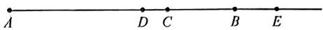

∵D是线段AE的中点，

$$
\therefore A D = D E = \frac {1}{2} A E,
$$

$$
\because A C = 2 B C = 8 C D,
$$

$$
\therefore A D = A C - C D = 7 C D,
$$

$$
\therefore D E = A D = 7 C D,
$$

$$
\therefore B E = D E - B D = 2 C D,
$$

$$
\therefore B D = D E - B E = 5 C D,
$$

$$
\therefore A B = A D + B D = 1 2 C D,
$$

$$
\therefore A B = 6 B E;
$$

根据题意,当 D 点在 C 点的右侧时,
作图如下:

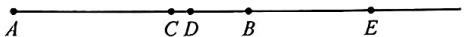

∵D是线段AE的中点，

$$
\therefore A D = D E = \frac {1}{2} A E,
$$

$$
\because A C = 2 B C = 8 C D,
$$

$$
\therefore B D = B C - C D = 3 C D,
$$

$$
\because C E = D E + C D = 1 0 C D,
$$

$$
\therefore B E = C E - B C = 6 C D,
$$

∴AB=12CD，则 AB=2BE.

综上所述， $AB = 2BE$ 或 $AB = 6BE$

# 大综合2 线段与动点(一) 动点定值

2. 解: (1) $\because |m-4|+(n-8)^{2}=0$ ,

$$
\therefore m - 4 = 0, n - 8 = 0,
$$

$$
\therefore m = 4, n = 8,
$$

$$
\therefore A B = 4, C D = 8;
$$

(2)设点 B 表示的数是 x，点 C 表示的数是 y，

∵M,N分别为AB,CD中点,

∴点 M 表示的数是 x-2，点 N 表示的数是 $y+4$ ，

运动后点 M 表示的数是 $x-2+24$ $=x+22$ ，点 N 表示的数是 $y+4+6$ $=y+10$ ,

$$
\because M N = 4,
$$

$$
\therefore | x + 2 2 - y - 1 0 | = 4,
$$

$$
\therefore x - y = - 8 \text {或} x - y = - 1 6,
$$

$$
\therefore B C = | x + 2 4 - (y + 6) |
$$

$$
= | x - y + 1 8 |,
$$

∴BC=10或2.

故点 M 运动到点 C 或点 D 处, 此时 BC=2 或 10;

(3) 运动 t 秒后, $MN = |30 - 4t|$ ,
AD=|36-4t|,

当 $0 \leqslant t < 7.5$ 时， $MN + AD = 66 - 8t$ ，
当 $7.5 \leqslant t \leqslant 9$ 时， $MN + AD = 6$ ，

当 $t > 9$ 时， $MN + AD = 8t - 66$

∴当 $7.5 \leqslant t \leqslant 9$ 时， $MN + AD$ 为定值.

# 大综合3 线段与动

# 点(二) 定值求参

3. 解：(1) $\because |a - 6| \geqslant 0, (b - 3)^2 \geqslant 0$ ，且

$$
\vert a - 6 \vert + (b - 3) ^ {2} = 0,
$$

$$
\therefore a - 6 = 0, b - 3 = 0,
$$

$$
\therefore a = 6, b = 3;
$$

(2)①以点 A 为原点, 水平向右建立数轴, 则点 B 对应的数为 6, 点 C 对应的数为 21, 点 D 对应的数为 24, 则 t 秒后点 A, B, C, D 对应的数分别为 $2t, 6 + 2t, 21 - t, 24 - t$ ,

当 $CB = 2$ 或 $AD = 2$ 时满足题意，即 $6 + 2t - (21 - t) = 2$ 或 $24 - t - 2t = 2$ ，解得 $t = \frac{17}{3}$ 或 $t = \frac{22}{3}$

∴运动 $\frac{17}{3}$ 秒或 $\frac{22}{3}$ 秒时,线段AB,CD
重合的长度为2;

②当点 B 和 C 重合时，以点 A 为原点，水平向右建立数轴，则点 B 对应的数为 6，点 C 对应的数为 6，点 D 对应的数为 9，则 t 秒后点 A, B, C, D 对应的数分别为 $2t, 6 + 2t, 6 + 2.5t, 9 + 2.5t$ ，

$$
\begin{array}{l} {\therefore A C = (6 + 2. 5 t) - 2 t = 6 + 0. 5 t,} \\ {B D = (9 + 2. 5 t) - (6 + 2 t) = 3 +} \\ {0. 5 t,} \end{array}
$$

$$
\begin{array}{l} \therefore 2 A C + m \cdot B D = 2 (6 + 0. 5 t) + m \\ (3 + 0. 5 t) = (0. 5 m + 1) t + 1 2 + 3 m, \end{array}
$$

∵2AC+m·BD为定值n，

$$
\therefore 0. 5 m + 1 = 0,
$$

解得 $m = -2$

则 $n = 12 + 3m = 12 + 3 \times (-2) = 6.$

# 大综合4 线段与动

# 点(三) 整体思想

4. 解: (1) 由题意知 BE = 3AD,

∵整个运动过程中始终满足 CE = 3CD，

$$
\therefore B C + B E = 3 (A C + A D),
$$

$$
\begin{array}{l} \therefore B C = 3 A C, A B = A C + B C = \\ 4 A C, \end{array}
$$

$$
\therefore \frac {A C}{A B} = \frac {1}{4};
$$

(2) 设 AC = m，则 AB = 4m，设点 D 的运动速度为 a 个单位长度 / s，运动

时间为 $ts$ ，则点 $M$ 的运动速度为3a个单位长度/s，

$$
\therefore A D = a t, B M = 3 a t,
$$

∵P,Q分别是AM,CM的中点，

$$
\begin{array}{l} {\therefore P M = A P = \frac {1}{2} A M, C Q = M Q =} \\ {\frac {1}{2} C M;} \end{array}
$$

①当点 M 在点 C 的右侧时, 如图 3,

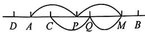  
图3

此时 $AM = 4m - 3at, CM = 3m - 3at$

$$
\begin{array}{l} \therefore P Q = P M - Q M = \frac {1}{2} A M - \frac {1}{2} C M \\ = \frac {m}{2}, \\ \end{array}
$$

$$
\because C M = 4 P Q,
$$

∴ $3m - 3at = 4 \times \frac{1}{2}m$ ，解得 $t = \frac{m}{3a}$ ，

$$
\therefore A D = a t = \frac {m}{3},
$$

$$
\text {又} \because A B = 4 m,
$$

$$
\therefore \frac {A D}{A B} = \frac {1}{1 2};
$$

②当点 M 在线段 AC 上时, 如图 4,

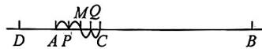  
图4

此时 $AM = 4m - 3at$

$$
C M = 3 a t - 3 m,
$$

$$
\therefore P Q = P M + Q M = \frac {1}{2} A M + \frac {1}{2} C M
$$

$$
= \frac {m}{2},
$$

$$
\because C M = 4 P Q,
$$

$$
\therefore - 3 m + 3 a t = 4 \times \frac {1}{2} m,
$$

解得 $t=\frac{5m}{3a}$ (此时 AM=-m<0, 不合题意, 舍去);

③当点 M 在点 A 的左侧时, 如图 5,

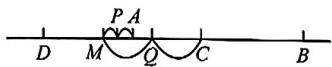  
图5

此时 $AM = 3at - 4m, CM = 3at - 3m$

$$
\begin{array}{l} \therefore P Q = Q M - A P = \frac {1}{2} C M - \frac {1}{2} A M \\ = \frac {m}{2}, \\ \end{array}
$$

$$
\because C M = 4 P Q,
$$

$$
\therefore - 3 m + 3 a t = 4 \times \frac {1}{2} m,
$$

解得 $\iota=\frac{5m}{3a}$ ,

$$
\therefore A D = a t = \frac {5 m}{3},
$$

$$
\therefore \frac {A D}{A B} = \frac {5}{1 2}.
$$

.综上所述, $\frac{AD}{AB}$ 的值为 $\frac{1}{12}$ 或 $\frac{5}{12}$ .

# 三、角度大综合

# 大综合1 角度探究(一)角度关系

1. 解: (1) $\angle DOF = \angle AOF - \angle AOD$ $=3\alpha-\alpha=2\alpha;$

(2) 在图 1 中, $\angle EOF = \angle DOE - \angle DOF = \beta_{\mathrm{r}} - 2\alpha, \angle EOC = \angle AOC - \angle AOD - \angle DOE = 90^{\circ} - \alpha - \beta,$

在图2中， $\angle EOF = \angle DOF - \angle DOE = 2\alpha -\beta ,\angle EOC = \angle AOD$ $+\angle DOE - \angle AOC = \alpha +\beta -90^{\circ},$

故答案为 $\beta - 2\alpha, 90^{\circ} - \alpha - \beta, 2\alpha - \beta, \alpha + \beta - 90^{\circ}$ ;

(3)当 $\angle DOE$ 等于 $60^{\circ}$ 时， $\frac{\angle EOF}{\angle EOC}$ 值与 $\alpha$ 无关，理由：

当 $\angle DOE = 60^{\circ}$ 时，在图1中，

$$
\angle E O F = \beta - 2 \alpha = 6 0 ^ {\circ} - 2 \alpha ,
$$

$$
\angle E O C = 9 0 ^ {\circ} - \alpha - \beta = 3 0 ^ {\circ} - \alpha ,
$$

$$
\frac {\angle E O F}{\angle E O C} = \frac {6 0 ^ {\circ} - 2 \alpha}{3 0 ^ {\circ} - \alpha} = 2;
$$

在图2中， $\angle EOF = 2\alpha -\beta = 2\alpha -$ $60^{\circ},\angle EOC = \alpha +\beta -90^{\circ} = \alpha -30^{\circ},$

$$
\frac {\angle E O F}{\angle E O C} = \frac {2 \alpha - 6 0 ^ {\circ}}{\alpha - 3 0 ^ {\circ}} = 2.
$$

综上所述，当 $\angle DOE$ 等于 $60^{\circ}$ 时， $\frac{\angle EOF}{\angle EOC}$ 的值始终为2，与 $\alpha$ 大小无关.

# 大综合2 角度探究(二)动线定角

2. 解: (1) 设 $\angle BOC = x$ , 则 $\angle AOC = 2x, \angle AOB = 180^{\circ} - x$ ,

$$
\because \angle A O B = \angle B O C + \angle A O C = 3 x,
$$

∴ $3x = 180^{\circ} - x$ ，解得 $x = 45^{\circ}$ ，

$$
\therefore \angle A O B = 3 x = 1 3 5 ^ {\circ};
$$

(2) $\angle AOB + \angle COD = 2\angle EOF$ ，理由如下：

∵OE,OF 分别平分∠AOD,∠BOC,

$$
\therefore \angle E O D = \frac {1}{2} \angle A O D,
$$

$$
\angle C O F = \frac {1}{2} \angle B O C,
$$

$$
\because \angle A O B - \angle C O D = \angle A O D +
$$

$$
\angle B O C, \angle E O F = \frac {1}{2} (\angle A O D +
$$

$$
\angle B O C) + \angle C O D,
$$

$$
\therefore \angle E O F = \frac {1}{2} (\angle A O B - \angle C O D)
$$

$$
+ \angle C O D = \frac {1}{2} \angle A O B + \frac {1}{2} \angle C O D,
$$

即 $\angle AOB + \angle COD = 2\angle EOF$

(3) $\angle AOD - \angle BOC$ 的值不发生变化. 理由如下:

设 $\angle BOC = \alpha$

$$
\therefore \angle A O B = 9 0 ^ {\circ} - \alpha , \angle A O D = 1 8 0 ^ {\circ}
$$

$$
- 5 0 ^ {\circ} - (9 0 ^ {\circ} - \alpha) = 4 0 ^ {\circ} + \alpha ,
$$

$$
\begin{array}{l} \therefore \angle A O D - \angle B O C = 4 0 ^ {\circ} + \alpha - \alpha = \\ 4 0 ^ {\circ}. \end{array}
$$

∴∠AOD-∠BOC的值不发生变化,恒等于40°.

# 大综合3 角度探究(三)

# 特殊到一般

3. 解：(1) $40^{\circ}, 90^{\circ}, \frac{\angle MON}{\angle AOB} = \frac{90^{\circ}}{120^{\circ}} = \frac{3}{4}$ ;

(2) 不变, 理由: $\because OM$ 平分 $\angle AOC$ , $ON$ 平分 $\angle BOD$ ,

$$
\begin{array}{l} \therefore \angle C O M = \frac {1}{2} \angle A O C = \frac {1}{2} (2 m ^ {\circ} - \\ \angle B O C), \end{array}
$$

$$
\begin{array}{l} \angle B O N = \frac {1}{2} \angle B O D = \frac {1}{2} (m ^ {\circ} - \\ \angle B O C), \end{array}
$$

$$
\therefore \angle M O N = \angle C O M + \angle B O C +
$$

$$
\angle B O N = \frac {3}{2} m ^ {\circ},
$$

$$
\therefore \frac {\angle M O N}{\angle A O B} = \frac {3}{4};
$$

(3) $30^{\circ}$ 或 $54^{\circ}$ 或 $126^{\circ}$ . 设 $\angle BOC = x$ ,
分三种情况讨论：

如图4，

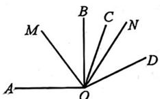  
图4

$$
\angle B O M = \angle C O M - \angle B O C
$$

$$
= \frac {1}{2} \angle A O C - \angle B O C
$$

$$
= 4 5 ^ {\circ} - \frac {1}{2} x,
$$

$$
\angle C O N = \angle B O N - \angle B O C
$$

$$
= \frac {1}{2} \angle B O D - \angle B O C
$$

$$
= 2 2. 5 ^ {\circ} - \frac {1}{2} x,
$$

$$
\therefore 4 5 ^ {\circ} - \frac {1}{2} x = 4 \left(2 2. 5 ^ {\circ} - \frac {1}{2} x\right),
$$

$$
\therefore x = 3 0 ^ {\circ}, \angle B O C = 3 0 ^ {\circ};
$$

如图 5，

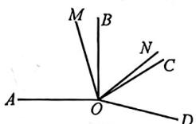  
图5

$$
\angle B O M = \angle A O B - \angle A O M
$$

$$
= 4 5 ^ {\circ} - \frac {1}{2} x,
$$

$$
\angle C O N = \angle B O C - \angle B O N
$$

$$
= \frac {1}{2} x - 2 2. 5 ^ {\circ},
$$

$$
\therefore 4 5 ^ {\circ} - \frac {1}{2} x = 4 \left(\frac {1}{2} x - 2 2. 5 ^ {\circ}\right),
$$

$$
\therefore x = 5 4 ^ {\circ}, \angle B O C = 5 4 ^ {\circ};
$$

如图6，

  
图6

$$
\angle B O M = \angle A O B + \angle A O M
$$

$$
= 9 0 ^ {\circ} + \frac {1}{2} \angle A O C = 9 0 ^ {\circ} +
$$

$$
\frac {1}{2} (3 6 0 ^ {\circ} - \angle A O B - \angle B O C)
$$

$$
= 2 2 5 ^ {\circ} - \frac {1}{2} x,
$$

$$
\angle C O N = \angle B O C - \angle B O N
$$

$$
= \frac {1}{2} x - 2 2. 5 ^ {\circ},
$$

$$
\therefore 2 2 5 ^ {\circ} - \frac {1}{2} x = 4 \left(\frac {1}{2} x - 2 2. 5 ^ {\circ}\right),
$$

$$
\therefore x = 1 2 6 ^ {\circ}, \angle B O C = 1 2 6 ^ {\circ}.
$$

综上所述， $\angle BOC$ 的度数为 $30^{\circ}$ 或 $54^{\circ}$ 或 $126^{\circ}$ .

# 大综合4 角度探究(四) 定值求参

4. 解: (1) $\because \angle AOB + \angle AOC = 180^{\circ}$ ,

$$
\angle A O C = 7 0 ^ {\circ},
$$

$$
\begin{array}{l} \therefore \angle A O B = 1 8 0 ^ {\circ} - \angle A O C = 1 8 0 ^ {\circ} - \\ 7 0 ^ {\circ} = 1 1 0 ^ {\circ}. \end{array}
$$

$\because \angle BOC = \angle AOB - \angle AOC = 110^{\circ}$ $-70^{\circ} = 40^{\circ},OF$ 平分 $\angle BOC,OE$ 平分 $\angle AOB$

$$
\therefore \angle A O E = \frac {1}{2} \angle A O B = \frac {1}{2} \times 1 1 0 ^ {\circ} =
$$

$$
5 5 ^ {\circ}, \angle B O F = \frac {1}{2} \angle B O C = \frac {1}{2} \times 4 0 ^ {\circ}
$$

$$
= 2 0 ^ {\circ},
$$

$$
\therefore \angle A O F = \angle A O B - \angle B O F = 9 0 ^ {\circ},
$$

$$
\therefore \angle E O F = \angle A O F - \angle A O E = 9 0 ^ {\circ}
$$

$$
- 5 5 ^ {\circ} = 3 5 ^ {\circ};
$$

(2) 设 $\angle AOC = \alpha$

$$
\because \angle A O B + \angle A O C = 1 8 0 ^ {\circ},
$$

$$
\therefore \angle A O B = 1 8 0 ^ {\circ} - \alpha ,
$$

$$
\angle B O C = \angle A O B - \angle A O C
$$

$$
= (1 8 0 ^ {\circ} - \alpha) - \alpha
$$

$$
= 1 8 0 ^ {\circ} - 2 \alpha .
$$

∵OF 平分∠BOC，

$$
\therefore \angle B O F = \frac {1}{2} \angle B O C = \frac {1}{2} (1 8 0 ^ {\circ} -
$$

$$
2 \alpha) = 9 0 ^ {\circ} - \alpha .
$$

$$
\therefore \angle A O F = \angle A O B - \angle B O F =
$$

$$
(1 8 0 ^ {\circ} - \alpha) - (9 0 ^ {\circ} - \alpha) = 9 0 ^ {\circ};
$$

(3) $\because\angle AOF=90^{\circ}$ ，射线OQ绕点O从OF开始以每秒 $4^{\circ}$ 的速度逆时针旋转，

$$
\therefore \angle Q O F = 4 t ^ {\circ}.
$$

∵射线 OP 绕点 O 从 OA 开始以每秒 $8^{\circ}$ 的速度逆时针旋转，

$$
\therefore \angle A O P = 8 t ^ {\circ}.
$$

当 $OP$ 在 $\angle AOF$ 内部时，

$$
\angle Q O F = 2 \angle P O F \text {   时,   } 4 t = 2 (9 0 - 8 t),
$$

解得 t=9;

当 OP 旋转到 $\angle AOF$ 外部时， $\angle POF = 8t - 90$ ，此时 $4t = 2(8t - 90)$ 。解得 t = 15。

综上所述，t 的值为 9 或 15.

# 大综合5 角度探究(五) 平角突变

5. 解: (1) $\angle BOC = 30^{\circ}, \angle AOB = 150^{\circ}$ ;

$$
(2) \because \angle A O B = 1 5 0 ^ {\circ}, \angle B O C = 3 0 ^ {\circ},
$$

$$
\therefore \angle A O C = 1 5 0 ^ {\circ} - 3 0 ^ {\circ} = 1 2 0 ^ {\circ},
$$

$$
\therefore \angle P O C = \angle A O C - (1 5 t) ^ {\circ} = 1 2 0 ^ {\circ}
$$

$$
- (1 5 t) ^ {\circ}, \angle Q O C = \angle B O C - (3 t) ^ {\circ}
$$

$$
= 3 0 ^ {\circ} - (3 t) ^ {\circ},
$$

$$
\therefore 1 2 0 ^ {\circ} - (1 5 t) ^ {\circ} = 2 \left[ 3 0 ^ {\circ} - (3 t) ^ {\circ} \right],
$$

解得 $t=\frac{20}{3}$ ,

∴t 的值是 $\frac{20}{3}$ ;

(3) 当 $0 < t \leqslant 10$ 时, 如图 3,

text_image

E
A
M
C
O
B

图3

此时 $\angle AOC = 120^{\circ} - (12t)^{\circ}$

$$
\angle A O E = (1 5 t) ^ {\circ},
$$

$\because {OM}$ 平分 $\angle {AOC}$ ,

$$
\therefore \angle A O M = 6 0 ^ {\circ} - (6 t) ^ {\circ},
$$

$$
\therefore 6 0 ^ {\circ} - (6 t) ^ {\circ} - (1 5 t) ^ {\circ} = 5 0 ^ {\circ} \text {或} (1 5 t) ^ {\circ}
$$

$$
- [ 6 0 ^ {\circ} - (6 t) ^ {\circ} ] = 5 0 ^ {\circ},
$$

解得 $t=\frac{10}{21}$ 或 $t=\frac{110}{21}$ ;

当 $10 < t \leqslant 20$ 时，如图4，

  
图4

此时 $\angle AOE = 150^{\circ} - 15^{\circ}(t - 10) =$

$$
3 0 0 ^ {\circ} - (1 5 t) ^ {\circ}, \angle A O C = 1 2 ^ {\circ} (t - 1 0),
$$

$$
\angle A O M = 6 ^ {\circ} (t - 1 0),
$$

$$
\therefore 3 0 0 ^ {\circ} - (1 5 t) ^ {\circ} + 6 ^ {\circ} (t - 1 0) = 5 0 ^ {\circ},
$$

解得 $t = \frac{190}{9}$ （大于20，舍去）；

当 $20 < t \leqslant 25$ 时，如图5，

text_image

A
E
O
B
M
C

图5

$$
\angle A O E = 1 5 ^ {\circ} (t - 2 0), \angle A O C = 1 2 ^ {\circ}
$$

$$
(t - 1 0), \angle A O M = 6 ^ {\circ} (t - 1 0),
$$

$$
\therefore 1 5 ^ {\circ} (t - 2 0) + 6 ^ {\circ} (t - 1 0) = 5 0 ^ {\circ},
$$

解得 $t=\frac{410}{21}$ ,

$\because t=\frac{410}{21}<20,$ 不符合题意，舍去，

∴t 的值为 $\frac{10}{21}$ 或 $\frac{110}{21}$ .

# 大综合6 角度探究(六)三角板的旋转

6. 解: (1) $\because \angle AOB + \angle AOD +$

$$
\angle D O C = 1 8 0 ^ {\circ}, \angle A O B = 6 0 ^ {\circ},
$$

$$
\angle D O C = 4 5 ^ {\circ},
$$

$$
\therefore \angle A O D = 1 8 0 ^ {\circ} - \angle A O B -
$$

$$
\angle D O C = 1 8 0 ^ {\circ} - 6 0 ^ {\circ} - 4 5 ^ {\circ} = 7 5 ^ {\circ};
$$

(2)由题意,得 $\angle AOD=(2t+75)^{\circ}$ , $\angle BOC=(180-2t)^{\circ}$ ,

∵ OF 为 $\angle BOC$ 的角平分线, OG 为 $\angle AOD$ 的角平分线,

$$
\therefore \angle B O F = \frac {1}{2} \angle B O C = (9 0 - t) ^ {\circ},
$$

$$
\angle D O G = \frac {1}{2} \angle A O D = \left(t + \frac {7 5}{2}\right) ^ {\circ},
$$

$$
\because \angle D O G = 2 \angle B O F,
$$

$$
\therefore t + \frac {7 5}{2} = 2 (9 0 - t),
$$

解得 $t=\frac{95}{2}$ ;

(3)①当 $0 < t \leqslant 30$ 时，如图3，

text_image

A
G
M B O C N
F

图3

$$
\angle A O C = (1 2 0 + 2 t) ^ {\circ},
$$

$$
\angle F O G = \frac {(7 5 + 2 t) ^ {\circ}}{2} + \frac {(1 8 0 - 2 t) ^ {\circ}}{2}
$$

$$
+ 4 5 ^ {\circ} = 1 7 2. 5 ^ {\circ}.
$$

$$
\because 3 \angle A O C - 2 \angle F O G = 1 0 5 ^ {\circ},
$$

$$
\therefore 3 (2 t + 1 2 0) ^ {\circ} - 2 \times 1 7 2. 5 ^ {\circ} = 1 0 5 ^ {\circ},
$$

解得 t=15;

②当 $30 < t \leqslant 52.5$ 时，如图4，

text_image

A
G
M B O N
F C D

图4

则 $\angle AOC = \angle AOB + \angle BOC = 60^{\circ}$

$$
+ 1 8 0 ^ {\circ} - 2 t ^ {\circ} = (2 4 0 - 2 t) ^ {\circ},
$$

$$
\because 3 \angle A O C - 2 \angle F O G = 1 0 5 ^ {\circ},
$$

$$
\therefore 3 (2 4 0 - 2 t) ^ {\circ} - 2 \times 1 7 2. 5 ^ {\circ} = 1 0 5 ^ {\circ},
$$

解得 $t = 45$

③当 52.5 < t ≤ 90 时，如图 5，

text_image

A
B
M
O
N
G
F
C'
D

图5

则 $\angle FOG = 7.5^{\circ}$

$$
\therefore 3 (2 4 0 - 2 t) ^ {\circ} - 2 \times 7. 5 ^ {\circ} = 1 0 5 ^ {\circ},
$$

解得 t=100(不符合题意,舍);

④当 $90 < t < 120$ 时，如图6，

text_image

Geometric diagram with labeled points and lines, showing triangle relationships and intersections

图6

则 $\angle AOC = 60^{\circ} - (2t - 180)^{\circ} = (240$

$$
- 2 t) ^ {\circ},
$$

$$
/ A O D = (6 0 + 1 8 0 + 4 5 - 2 t) ^ {\circ} =
$$

$$
(2 8 5 - 2 t) ^ {\circ}, \angle B O C = (2 t - 1 8 0) ^ {\circ},
$$

∵ OF 为 $\angle BOC$ 的角平分线, OG 为 $\angle AOD$ 的角平分线,

$$
\therefore \angle B O F = \frac {1}{2} \angle B O C = (t - 9 0) ^ {\circ},
$$

$$
\angle A O G = \frac {1}{2} \angle A O D = \left(\frac {2 8 5}{2} - t\right) ^ {\circ},
$$

$$
\therefore \angle F O G = \angle A O B - \angle B O F -
$$

$$
\angle A O G = \left(\frac {1 5}{2}\right) ^ {\circ},
$$

$$
\because 3 \angle A O C - 2 \angle F O G = 1 0 5 ^ {\circ},
$$

$$
\therefore 3 (2 4 0 - 2 t) ^ {\circ} - 2 \times \left(\frac {1 5}{2}\right) ^ {\circ} = 1 0 5 ^ {\circ},
$$

解得 t=100.

综上所述， $t$ 的值为15或45或100.

# 大综合7 角度探究(七) 新定义

7. 解: (1) 15; $2\alpha$ ; $\angle AOB$ 与 $\angle COD$ 或 $\angle AOC$ 与 $\angle EOD$ ;

(2) $\angle AOC$ 是 $\angle DOE$ 的“倍角”，理由如下：设 $\angle BOC = \beta$

∵OE 平分∠BOC，

$$
\therefore \angle E O B = \angle E O C = \frac {1}{2} \beta ,
$$

$$
\because \angle A O B = 1 2 0 ^ {\circ}, \angle C O D = 6 0 ^ {\circ},
$$

$$
\therefore \angle A O C = \angle A O B + \angle B O C
$$

$$
= 1 2 0 ^ {\circ} + \beta ,
$$

$$
\angle D O E = \angle D O C + \angle C O E
$$

$$
= 6 0 ^ {\circ} + \frac {1}{2} \beta ,
$$

$$
\therefore \angle A O C = 2 \angle D O E,
$$

即 $\angle AOC$ 是 $\angle DOE$ 的“倍角”；

(3) ① $\angle AOC$ 是 $\angle DOE$ 的“倍补角”，理由如下：设 $\angle AOD = \theta$

$$
\therefore \angle A O C = 6 0 ^ {\circ} + \theta ,
$$

$$
\angle B O C = 1 8 0 ^ {\circ} - \theta ,
$$

∵OE 平分∠BOC，

$$
\therefore \angle C O E = \frac {1}{2} \angle B O C = 9 0 ^ {\circ} - \frac {1}{2} \theta ,
$$

$$
\therefore \angle D O E = 1 5 0 ^ {\circ} - \frac {1}{2} \theta ,
$$

$$
\therefore 2 (1 8 0 ^ {\circ} - \angle D O E) = 2 \left(1 8 0 ^ {\circ} - 1 5 0 ^ {\circ} \right.
$$

$$
\left. + \frac {1}{2} \theta\right) = 6 0 ^ {\circ} + \theta ,
$$

$$
\therefore \angle A O C = 2 (1 8 0 ^ {\circ} - \angle D O E),
$$

即 $\angle AOC$ 是 $\angle DOE$ 的“倍补角”；② $60 \leqslant n \leqslant 180.$