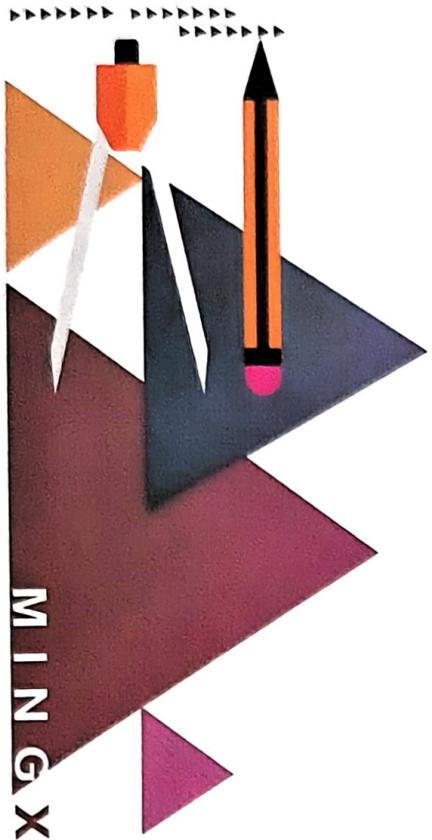

<details>
<summary>natural_image</summary>

Abstract geometric illustration with colored triangles and a pencil, no text or symbols present
</details>

# 名校 压轴题

主编 ● 刘春林

YAZHOUTI

数学

七年级上 RJ

免费视频讲解  


# 数学

# 七年级上

班级：\_\_\_\_

姓名：\_\_\_\_

# 第一部分 中档题+选填压轴题

# 第一章 有理数

重难点突破1 有理数的概念及分类 …… 1

重难点突破2 数轴、相反数、绝对值 2

重难点突破3 数轴的运用(一)表示有理数 3

重难点突破4 数轴的应用(二)两点间的距离 · …… 4

重难点突破5 数轴的应用（三）动点的位置 … 5

重难点突破6 绝对值的非负性 …… 6

重难点突破7 有理数的大小比较 …… 7

重难点突破8 有理数的实际应用 …… 8

中考新方向 1 新定义 …… 9

中考新方向 2 新考向 …… 10

中考新方向 3 新考法 …… 11

# 第二章 有理数的运算

重难点突破 1 有理数的运算(一) 混合运算 …… 12

重难点突破2 有理数的运算(二)技巧运算 …… 14

重难点突破3 有理数的运算(三) 易混易错 …… 16

重难点突破4 有理数的运算(四)整体求值 …… 17

重难点突破5 绝对值与分类讨论(一)求值 18

重难点突破6 绝对值与分类讨论(二)化简 …… 19

重难点突破7 探究本质妙解幻方(一)九宫格 20

重难点突破8 探究本质妙解幻方(二)特殊型 21

重难点突破 9 有理数的实际应用(一) 文字类 …… 22重难点突破10 有理数的实际应用(二)图表类 24

重难点突破11 符号推断 26

重难点突破 12 有理数多结论(一) 概念辨析 …… 27

重难点突破 13 有理数多结论(二)式子推断 …… 28

重难点突破 14 规律探究(一) 数列规律 …… 30

重难点突破 15 规律探究(二)数阵规律 …… 31

重难点突破 16 规律探究(三)周期变化 …… 32

重难点突破 17 规律探究(四)乘方规律 …… 33

重难点突破 18 数轴与动点(一)无速度型距离问题 …… 35

重难点突破19 数轴与动点（二）含速度型距离问题 36

重难点突破 20 数轴与动点(三)数轴上的行程问题 · …… 38

重难点突破21 数轴与动点（四）动点定值问题 …… 40

重难点突破22 数轴与动点（五）动点最值问题 …… 43

中考新方向 1 新定义 …… 44

中考新方向 2 阅读理解 …… 45

中考新方向3 进位制 46

中考新方向 4 综合与实践 …… 49

# 第三章 代数式

重难点突破1 列代数式(一) 50

重难点突破 2 列代数式(二) …… 52

重难点突破3 代入求代数式的值 …… 54

重难点突破4 整体求代数式的值 55

重难点突破5 周长面积问题与代数式求值 56

重难点突破6 实际问题与代数式求值 57

重难点突破 7 代数式与数式规律 …… 58

重难点突破8 代数式与图形规律 …… 59

中考新方向 1 阅读理解 …… 61

中考新方向 2 综合与实践 …… 62

# 第四章 整式的加减

重难点突破1 整式的加减(一)化简后求值 63

重难点突破 2 整式的加减(二) 条件型求值 …… 64

重难点突破3 整式的加减（三）连续化简 65

重难点突破4 整式的加减（四）化简绝对值 66

重难点突破5 整式的加减（五）缺项求值 67

重难点突破6 整式的加减(六)无关与定值 68

重难点突破 7 整式的加减(七) 规律探究 …… 70

重难点突破8 整式的应用(一)作差法 …… 71

重难点突破 9 整式的应用(二) 数字问题 …… 72

重难点突破10 整式的应用（三）月历与数阵 …… 73

重难点突破11 整式的应用（四）神奇的幻方 …… 75

重难点突破 12 整式的应用(五) 周长问题 …… 76

重难点突破 13 整式的应用(六) 面积问题 …… 78

重难点突破 14 整式的应用(七)数量关系 …… 80

重难点突破 15 整式的应用(八) 分段计费 …… 82

中考新方向 1 新定义 84

中考新方向 2 整体思想 85

中考新方向 3 综合与实践 86

# 第五章 一元一次方程

重难点突破1 解一元一次方程(一)去括号与去分母 87

重难点突破2 解一元一次方程(二) 含绝对值的方程 88

重难点突破3 方程的解(一)整体思想 89

重难点突破 4 方程的解(二) 知解求值 …… 90

重难点突破 5 方程的解(三) 解的关联 …… 92重难点突破6 实际问题与一元一次方程(一) 总分问题 93

重难点突破 7 实际问题与一元一次方程(二) 配套问题 …… 94

重难点突破8 实际问题与一元一次方程(三)调配问题 95

重难点突破 9 实际问题与一元一次方程(四)行程问题 …… 96

重难点突破10 实际问题与一元一次方程(五) 工程问题 97

重难点突破11 实际问题与一元一次方程(六) 积分问题 99

重难点突破 12 实际问题与一元一次方程(七) 古典问题 …… 101

重难点突破 13 实际问题与一元一次方程(八) 利润问题 …… 103

重难点突破 14 实际问题与一元一次方程(九) 分段计费 …… 104

重难点突破 15 实际问题与一元一次方程(十) 方案问题 …… 106

重难点突破 16 实际问题与一元一次方程(十一)月历问题 …… 108

重难点突破 17 实际问题与一元一次方程(十二) 幻方问题 …… 109

重难点突破 18 实际问题与一元一次方程(十三) 图形问题 …… 110

重难点突破 19 实际问题与一元一次方程(十四)二次购物 …… 111

重难点突破 20 实际问题与一元一次方程(十五)促销方案 …… 112

重难点突破 21 实际问题与一元一次方程(十六)整数解问题 …… 113

重难点突破 22 实际问题与一元一次方程(十七) 批量销售 …… 114

中考新方向 1 新定义 …… 115

中考新方向 2 阅读理解 …… 116

中考新方向 3 综合与实践 …… 117

# 第六章 几何图形初步

重难点突破1 平面图形与立体图形 …… 119

重难点突破2 直线、射线、线段（一） 121

重难点突破3 直线、射线、线段（二） 122

重难点突破4 线段计算(一) 直接计算 …… 123

重难点突破5 线段计算(二)方程思想 124重难点突破6 线段计算(三)设参计算 126

重难点突破7 线段计算(四) 单中点 128

重难点突破8 线段计算(五) 双中点 129

重难点突破 9 线段计算(六) 整体思想 …… 130

重难点突破 10 线段计算(七) 分类讨论 …… 131

重难点突破11 线段计算(八)作图计算 132

重难点突破 12 线段计算(九) 构建数轴 …… 133

重难点突破 13 线段计算(十) 动点问题 …… 134

重难点突破 14 角的计算(一) 单位换算与方向角 …… 136

重难点突破 15 角的计算(二)角的和差 …… 137

重难点突破 16 角的计算(三) 直接设元 …… 138

重难点突破 17 角的计算(四)间接设元 …… 139

重难点突破 18 角的计算(五) 整体求角 …… 140

重难点突破 19 角的计算(六)三角板 …… 141

重难点突破 20 角的计算(七)角的折叠 …… 142

重难点突破 21 角的计算(八)角平分线 …… 143

重难点突破 22 角的计算(九) 设参求角 …… 145

重难点突破 23 角的计算(十) 设参探究角度关系 …… 147

重难点突破 24 角的计算(十一) 分类讨论 …… 148

重难点突破 25 几何多结论(一) 线段多结论 …… 149

重难点突破 26 几何多结论(二) 角度多结论 …… 150

重难点突破 27 角的旋转(一) 单线旋转 …… 151

重难点突破 28 角的旋转(二) 双线旋转 …… 152

重难点突破 29 角的旋转(三) 平角突变 …… 153

重难点突破30 角的旋转(四)整体旋转 154

中考新方向 1 新定义 …… 156

中考新方向 2 实践操作 …… 157

中考新方向 3 综合与实践 …… 158

# 第二部分 大综合

# 一、数轴大综合

大综合1 数轴与动点(一)行程问题 159

大综合2 数轴与动点（二）距离问题 160

大综合3 数轴与动点（三）中点问题 161

大综合4 数轴与动点（四）动点定值 162

大综合5 数轴与动点(五) 动点最值 164

大综合6 数轴与动点(六) 动线段问题 165

大综合7 数轴与动点(七)新定义 166

大综合8 数轴与动点(八) 实践操作 167

# 二、线段大综合

大综合1 线段与定点——定关系求值 168

大综合2 线段与动点(一) 动点定值 …… 169

大综合 3 线段与动点(二) 定值求参 …… 170

大综合4 线段与动点(三)整体思想 171

# 三、角度大综合

大综合 1 角度探究(一) 角度关系 …… 172

大综合2 角度探究(二) 动线定角 …… 173

大综合3 角度探究(三) 特殊到一般 174

大综合4 角度探究(四)定值求参 …… 175

大综合5 角度探究(五) 平角突变 176

大综合6 角度探究(六)三角板的旋转 …… 177

大综合 7 角度探究(七) 新定义 …… 178

# 参考答案

(单独成册)

# 第一部分 中档题+选填压轴题

# 第一章 有理数

# 重难点突破 1 有理数的概念及分类

# 类型一 正、负数的应用

1.(2024 光谷实验月考)某次数学测试的平均成绩是 75 分, 小王得了 80 分, 记作 +5 分, 小李的成绩记作 -8 分, 表示得了( )

A. 63 分

B. 67 分

C. 72 分

D. 83 分

2. (2025 洪山区模拟) 一袋小麦标准质量是 $50 \mathrm{~kg}$ , 若一袋小麦质量比标准质量多 $0.6 \mathrm{~kg}$ 记作 + $0.6 \mathrm{~kg}$ , 则某袋小麦质量为 $49.5 \mathrm{~kg}$ 记作 \_\_\_\_ kg.

3. (2024 武汉外校期中) 小琪陪爸爸一起去购买月饼, 爸爸买了一盒某品牌月饼 (共计 6 枚), 回家后她仔细地看了标签和包装盒上的有关说明, 然后把 6 枚月饼的质量称重后统计列表如下 (单位: 克):

<table><tr><td>第n枚</td><td>1</td><td>2</td><td>3</td><td>4</td><td>5</td><td>6</td></tr><tr><td>原始质量</td><td>79.3</td><td>80.2</td><td>80.8</td><td>79.6</td><td>79.4</td><td>81</td></tr><tr><td>相对质量</td><td>___</td><td>+0.2</td><td>___</td><td>-0.4</td><td>___</td><td>___</td></tr></table>

小琪为简化运算,选取了一个恰当的标准质量,依据这个标准质量,她把超出的部分记为正,不足的部分记为负,请把上表补充完整.

# 类型二 有理数的概念及分类

4.(2024 光谷未来月考)下列说法错误的是()

A. 有理数包括正数与负数

B. 所有的正整数都是整数

C. 零既不是正整数, 也不是负整数

D. 整数和分数统称为有理数

5.(2024 江夏一中月考)下列说法正确的是()

A. 零是最小的有理数

B. 负分数不是有理数

C. 一个整数不是正数就是负数

D. 一个分数不是正数就是负数

6. (2024 武珞路中学月考)下列一组数: $-8, 2.6, 0, -(-5.5), -(+3), -|-10$ , $|-6$ . 其中是负数的有( )

A. 5 个

B. 4 个

C. 3 个

D. 2 个

7. (2024 华美实验月考)在有理数 $5, -2, -0.3, 0.57, \frac{1}{4}, -\frac{1}{5}, -1 \frac{1}{6}, 102, -17, 0$ 中, 属于非负整数的有 \_\_\_\_ 个.
(西湖月考)把下列各数填入它所属的集合内:

8.(2024东西湖)

15, $-\frac{1}{9}$ , -5, $\frac{2}{15}$ , 0, -5.32, 2.3, -π, 80%, 5.

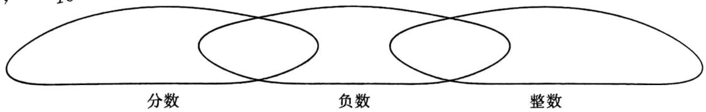

<details>
<summary>text_image</summary>

分数
负数
整数
</details>

# 重难点突破2 数轴、相反数、绝对值

# 类型一 数轴

1. (2024 黄陂区月考) 把有理数 $a, b$ 在数轴上表示如图所示, 那么下列说法正确的是 ( )

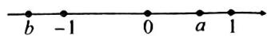

A. $b > 0$

B. $a <   0$

C. $a > b$

D. $b > a$

2. (2025 光谷实验月考) 点 $A, B, C$ 在数轴上的位置如图所示, 若点 $B$ 表示的数为 0 , 点 $A, C$ 分别表示有理数 $a, c$ , 则下列说法中, 正确的是 (

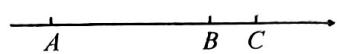

A. $a > - c$

B. $-a < c$

C. $-a < -c$

D. $-a > -c$

# 类型二 相反数

3.(2024 洪山区月考)下列各组数中互为相反数的是()

A. $-\frac{1}{2}$ 与-2

B.-1 与 $-(+1)$

C. $-(-3)$ 与 -3

D. 2 与 $|-2|$

4. 化简：

(1) $-(+5)=$ \_\_\_\_；

(2) $-(-8)=$ \_\_\_\_；

(3) $-\left|-2025\right|=\underline{\hspace{2cm}}$ ;

(4) $-\left[-\left(+\frac{1}{4}\right)\right]=$ \_\_\_\_；

(5) $-[-(-3)]=$ \_\_\_\_;

(6) $-\left|-(-3)\right|=$ \_\_\_\_.

5. 如图所示, 相邻两点之间的距离为 2 个单位长度, 观察图形, 回答下列问题:

(1)若点 B 与点 D 所表示的数互为相反数,则点 D 所表示的数为 \_\_\_\_;

(2)若点 A 与点 D 所表示的数互为相反数,则点 D 所表示的数为 \_\_\_\_;

(3)若点 B 与点 F 所表示的数互为相反数,则点 D 所表示的数的相反数为 \_\_\_\_.

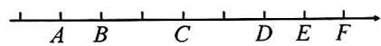

# 类型三 绝对值

6.（2024 新洲区期中）如图，检测 4 个足球，其中超过标准质量的克数记为正数，不足标准质量的克数记为负数，从轻重的角度看，最接近标准的是（）

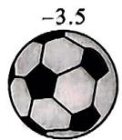  
A

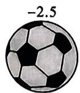  
B

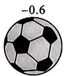  
C

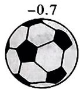  
D

7.(2024青山区月考)当 $|x|=-x$ 时,则x一定是()

A. 负数

B. 正数

C. 负数或 0

D. 0

8. 填空：

(1) 若 $\left|x\right|=3$ ，则 x= \_\_\_\_；  
(2) 若 $|x| = 5, |y| = 8$ ，且 $x > y$ ，则 $x =$ ， $y =$ ；  
(3) 若 $|x| = 3, |y| = 2$ ，且 $x > y$ ，则 $x =$ ， $y =$ \_\_\_\_.

9.(2025 黄石期中)绝对值大于 2.1 而不大于 4.1 的所有整数是 \_\_\_\_.

# 重难点突破 3 数轴的运用(一) 表示有理数

# 类型一 由数找点据点定数

1. (2024 武汉三寄) 若 $a = -1 \frac{2}{3}$ , 则有理数 $a$ 在数轴上对应的点的位置是 ( )

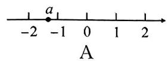

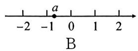

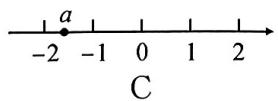

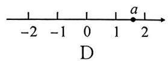

2. (2024 武钢实验学校) 如图, $A, B, C, D$ 四个点将数轴上 -6 与 5 两点间的线段五等分, 这四个等分点位置最靠近原点的是( )

A. 点 $A$

B. 点 $B$

C. 点 $C$

D. 点 $D$

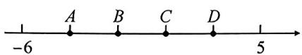  
第2题图

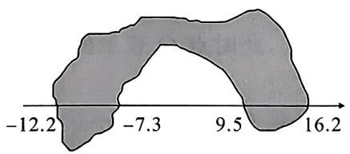

<details>
<summary>text_image</summary>

-12.2
-7.3
9.5
16.2
</details>

第3题图

# 类型二 整数点问题

3.(2025 江汉区四校联考)某同学在做数学作业时,不小心将墨水洒在所画的数轴上,如图,被墨水污染部分的整数点有\_\_\_\_个.

4. (2024 二中广雅) 数轴上表示整数的点称为整点. 某数轴的单位长度为 $1 \mathrm{~cm}$ , 若在这条数轴上任意画一条长 $2023 \mathrm{~cm}$ 的线段 $C D$ , 则线段 $C D$ 盖住的整点的个数是( )

A. 2023

B. 2024

C. 2023 或 2024

D. 2022 或 2023

# 类型三 规律点问题

5.(2024 水果湖一中月考)正方形纸板 ABCD 在数轴上的位置如图所示, 点 A, D 对应的数分别为 1 和 0, 若正方形纸板 ABCD 绕着顶点顺时针方向在数轴上连续翻转, 则在数轴上与 2024 对应的点是( )

A. $A$

B. $B$

C. $C$

D. $D$

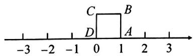

<details>
<summary>text_image</summary>

-3 -2 -1 0 1 2 3
C B
D A
</details>

第5题图

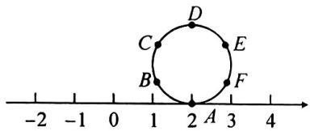

<details>
<summary>text_image</summary>

-2
-1
0
1
2
A
3
4
B
C
D
E
F
</details>

第6题图

6.(2025 武穴实验期中)如图,周长为 6 个单位长度的圆的六个等分点分别为 A, B, C, D, E, F, 点 A 落在 2 的位置,将圆在数轴上沿负方向滚动,那么落在数轴上 -2024 的点是 \_\_\_\_.

# 重难点突破 4 数轴的应用(二)两点间的距离

# 类型一 知点求距离

1. (2025 光谷未来月考) 如图, 在一条数轴上, 从左往右的点 $A, B, C$ 表示的数分别是 $-3, b, 6$ .

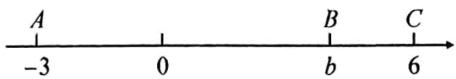

(1)点 A 到原点的距离是 \_\_\_\_ ,A,C 两点之间的距离是 \_\_\_\_ ;   
(2)已知点 B 和点 C 之间的距离是 2, 一动点 P 从点 B 出发向左平移 5 个单位长度, 此时点 P 到点 A 的距离是 , 点 P 到点 C 的距离是 ;  
(3)已知点 D 在点 A 的左侧距离 A 点 2 个单位长度,一动点 Q 从点 D 出发,沿数轴运动,右表是小俊记录的点 Q 运动的情况(沿数轴向右运动记为正,向左运动记为负,例如“-2”表示向左运动 2 个单位长度,“+4”表示向右运动 4 个单位长度),在第几次运动后点 Q 与点 D 的距离最远,此时点 Q 表示的数是多少?

<table><tr><td>第1次</td><td>第2次</td><td>第3次</td><td>第4次</td></tr><tr><td>-2</td><td>+4</td><td>-8</td><td>-1</td></tr></table>

# 类型二 知距离求点

2. (2025 七一华源)已知 $A, B, C$ 是数轴上的三个点. 点 $A, B$ 表示的数分别是 1, 3, 如图所示, 若 $BC = \frac{7}{4} AB$ , 求点 $C$ 表示的数.

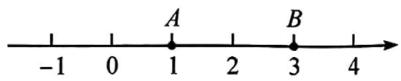

3. (2024 六中上智) 如图, 在一条不完整的数轴上从左到右依次有三个点 $A, B, C$ , 其中 $AB = 2BC$ .

(1)若点 C 为原点, BC=1, 则点 A 对应的数为 \_\_\_\_ , 点 B 对应的数为 \_\_\_\_ ;  
(2) 若点 B 为原点, AC = 9, 求点 A, C 对应的数;  
(3)若原点 O 到点 C 的距离为 6, 且 OC = AB, 求点 A, B 对应的数.

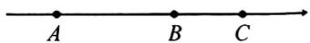

# 重难点突破 5 数轴的应用(三) 动点的位置

# 类型一 知时间 $\rightarrow$ 求距离 $\rightarrow$ 定位置

1.(2024二中广雅)一动点M从数轴上距离原点4个单位长度的位置向右运动2s,到达点A后立即返回,向左运动7s到达点B.若动点M的运动速度为每秒2.5个单位长度,求此时点B在数轴上所表示的数.

# 类型二 求时间 $\rightarrow$ 定距离 $\rightarrow$ 定位置

2. (2024 南湖中学月考) 数轴上两点 $A, B$ 所表示的数分别为 $-8$ 和 $6, P, Q$ 分别是数轴上两动点, 点 $P$ 以每秒 3 个单位长度的速度从点 $A$ 向点 $B$ 运动, 同时点 $Q$ 以每秒 1 个单位长度的速度从点 $B$ 向点 $A$ 运动. 若 $PQ = 4$ , 求点 $Q$ 在数轴上对应的数.

# 类型三 知位置 $\rightarrow$ 算距离 $\rightarrow$ 求时间

3. (2025 经开外校) 如图, 相距 $5 \mathrm{~km}$ 的 $A, B$ 两地间有一条笔直的马路, $C$ 地位于 $A, B$ 两地之间且距 $A$ 地 $2 \mathrm{~km}$ , 小明同学骑自行车从 $A$ 地出发沿马路以每小时 $5 \mathrm{~km}$ 的速度向 $B$ 地匀速运动, 当到达 $B$ 地后立即以原来的速度返回, 到达 $A$ 地时停止运动, 设运动时间为 $t$ (小时), 小明的位置为点 $P$ .

(1)以点 C 为坐标原点, 以从点 A 到点 B 为正方向, 用 1 个单位长度表示 1 km 画数轴, 指出点 A 所表示的有理数;  
(2) 当小明距离 C 地 1 km 时, 直接写出所有满足条件的 t 值.

A C P B

# 重难点突破6 绝对值的非负性

# 类型一 求值

1.(2024江汉区期中)已知 $|x-3|+|y+5|=0$ ，则x=\_\_\_\_，y=\_\_\_\_。  
2.(2025江汉区期中)若 $3|m + 4| + |n - 3| = 0$ ，则 $m = \_\_\_\_ , n = \_\_\_\_ .$   
3.(2024鄂州市月考)若 $|ab-2|$ 与 $|b-1|$ 互为相反数,则a=\_\_\_\_,b=\_\_\_\_.   
4. (2024 七一华源) 若 $|a - 2| + |b - 3| + |c - 1| = 0$ ，求 $a + 2b + 3c$ 的值.

# 类型二 求最值

5.(2024宜昌月考)式子 $|x-1|+2$ 取最小值时,x等于()

A. 0

B. 1

C. 2

D. 3

6.（2025 武汉三寄）如果 $x$ 为有理数，式子 $\left|x + 1\right| - 2025$ 存在最小值，则这个最小值是（

A. -2 025

B. -2 024

C. -2 023

D. -2 022

7.(2025 江岸期中)若 a 是任意的有理数,则式子 2024- $|a-2024|$ 的最大值是()

A. 2024

B. 4 048

C. $a$

D. -a

8. (2024 武钢实验月考) 若 $|x - 10| = 10 - x$ ，求 $20 - x$ 的最小值.

9.（2024宁波模拟）设 $a, b, c$ 为整数，且 $|a - b| + |c - a| = 1$ ，求 $|c - a| + |a - b| + |b - c|$ 的值.

# 重难点突破7 有理数的大小比较

# 类型一 用性质比大小

1.(2024 洪山区月考)下列大小比较正确的是()

A. $-2 < -2\frac{1}{2} < \frac{2}{3}$

B. $-2\frac{1}{2} < -2 < \frac{2}{3}$

C. $\frac{2}{3} < -2 < -2\frac{1}{2}$

D. $\frac{2}{3} < -2\frac{1}{2} < -2$

2. (2024 汉阳区期中) 在 $\frac{2}{9}, 0.29, -2, -\frac{5}{2}, 1.2, \frac{4}{25}, 25\%$ 这七个数中, 最小的数是 \_\_\_\_.

3.(2024 江汉区期中)用“＞”、“＜”、“＝”号填空: $-\frac{22}{7}$ \_\_\_\_ -3.14.

4.（2025潜江市期中）有5张卡片，卡片正面分别写有五个数，背面分别写有五个字母，如下表：

将卡片正面的数由小到大排列,然后将卡片翻转使背面朝上,卡片上的字母组成的单词是\_\_\_\_.

<table><tr><td>正面</td><td>-3</td><td>| -1/2 |</td><td>-|8|</td><td>-(-2)</td><td>0</td></tr><tr><td>反面</td><td>a</td><td>h</td><td>m</td><td>s</td><td>t</td></tr></table>

5.(2024 北京市中考)比较下列各组数的大小.

(1) $-\frac{5}{6}$ 与 $-\frac{4}{5}$ ;

(2) $-(-21)$ 与 $+(-21)$ ;

(3) $-\left|-7\frac{2}{3}\right|$ 与 $-\left[-\left(-7\frac{2}{3}\right)\right]$ .

# 类型二 用数轴比大小

6.(2024青山区月考)已知a,b,c在数轴上的位置如图.请在如下数轴上标出-a,-b,-c的位置,并用“<”号将a,b,c,-a,-b,-c连接起来.

c -1 0 b 1 a

7.(2025 硒口区月考)已知 a>0, b<0, a<|b|，请将 a, b, -a, -b 按从小到大顺序排列.

# 重难点突破8 有理数的实际应用

1.(2024 汉阳区月考)某校七年级利用劳动实践课开展创意点心制作比赛活动,小龙制作了一盒精美点心(共计6枚),现在他把6枚点心质量称重后统计列表如下(单位:克):

<table><tr><td>第n枚</td><td>1</td><td>2</td><td>3</td><td>4</td><td>5</td><td>6</td></tr><tr><td>质量</td><td>68.4</td><td>71.3</td><td>70.7</td><td>68.6</td><td>69.1</td><td>72</td></tr></table>

(1)为了简化运算,小龙依据比赛的标准质量,他把超出部分记为正,不足部分记为负,列出下表(数据不完整),请你把表格补充完整:

<table><tr><td>第n枚</td><td>1</td><td>2</td><td>3</td><td>4</td><td>5</td><td>6</td></tr><tr><td>质量</td><td>-1.6</td><td></td><td>+0.7</td><td></td><td>-0.9</td><td></td></tr></table>

(2)按照比赛说明上标记,一盒点心的总质量合格标准为 $(420\pm5)$ 克,那么,小龙制作的这盒点心的实际总质量是合格的,你知道为什么吗?请说明理由.

2. (2024 武钢实验) 学习完《有理数》, 老师布置的实践性作业是“发现身边的数学, 用数学的眼光看世界, 请同学们根据所学知识, 设计一个问题并解答”. 为了高质量地完成实践作业, 小勤和其他 7 位组员一起, 利用周末去观察记录经过西大街的某路公交车, 他们 8 人主要观察统计相邻的 A. 西门里, B. 桥仔口, C. 广济街, D. 钟楼四个车站, 车到 A 站前车上有 16 人, 沿路上下的乘客人数如下表所示:

<table><tr><td></td><td>A</td><td>B</td><td>C</td><td>D</td></tr><tr><td>上车的人数</td><td>15</td><td>10</td><td>6</td><td>3</td></tr><tr><td>下车的人数</td><td>5</td><td>6</td><td>8</td><td>12</td></tr></table>

(1)该公交车离开钟楼站时,车上还有多少乘客?   
(2)公交车行驶在西门里站与钟楼站之间时,在哪两站之间车上的乘客最多?  
(3)若每人乘坐这辆公交车需要刷卡1元(假设全部都是刷卡,没有老年卡与学生卡),问该公交车在这四个站能收多少钱?

# 中考新方向1 新定义

# 类型一 定义新符号

1. (2025 株洲市期末) 定义: $\| x\|$ 表示有理数 $x$ 到离它最近的整数的距离, 如 $\| -2 \| = 0, \| 1.7 \| = 0.3$ , $\| -3.2 \| = 0.2$ . 下列说法错误的是 ( )

A. $\| -3.5\| = 0.5$

B. $\| 5.9\| = 0.1$

C. $0 \leqslant \|x\| \leqslant 0.5$

D. $\| x\|$ 可能是0.6

2. (2024 无锡市期中) $a$ 为有理数, 定义运算符号“※”: 当 $a > -2$ 时, $\text{※} a = -a$ , 当 $a < -2$ 时, $\text{※} a = a$ , 当 $a = -2$ 时, $\text{※} a = 0$ , 根据这种运算, 求 $\text{※}\left[\text{※}\left(-\frac{5}{3}\right) - 4\right]$ 的值.

# 类型二 定义数量关系

3. (2024 华宜寄)对于数轴上的 $A, B, C$ 三点, 给出如下定义: 若其中一个点与其它两个点的距离恰好满足 2 倍的数量关系, 则称该点是其它两个点的“联盟点”. 例如: 数轴上点 $A, B, C$ 所表示的数分别为 1, 3, 4, 此时点 $B$ 是点 $A, C$ 的“联盟点”.

(1)若点 A 表示数 -2，点 B 表示的数是 4，下列各数 3, 2, 0 所对应的点分别为 $C_{1}, C_{2}, C_{3}$ ，其中是点 A, B 的“联盟点”的是 \_\_\_\_；

(2)若点 $A$ 表示数3，点 $B$ 表示的数是30，点 $P$ 在线段 $AB$ 上，且点 $P$ 是点 $A, B$ 的“联盟点”，求此时点 $P$ 表示的数.

# 中考新方向2 新考向

# 类型一 数轴与刻度尺

1. (2025 宜昌期末) 将一把刻度尺按如图所示的方式放在数轴上 (数轴的单位长度是 \(1 \mathrm{\~cm}\)), 刻度尺上的 “\(1 \mathrm{\~cm}\)” 和 “\(7 \mathrm{\~cm}\)” 分别对应数轴上 “\(-1.2 \mathrm{\~cm}\)” 和 “\(x \mathrm{\~cm}\”), 则 \(x\) 的值为 ( )

A. 2.8

B. 3.8

C. 4.8

D. 6

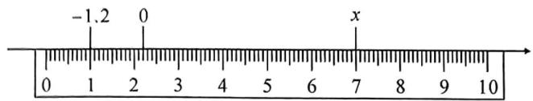

<details>
<summary>text_image</summary>

-1.2
0
x
0 1 2 3 4 5 6 7 8 9 10
</details>

第1题图

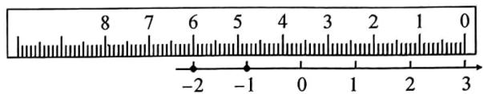

<details>
<summary>text_image</summary>

8 7 6 5 4 3 2 1 0
-2 -1 0 1 2 3
</details>

第2题图

2.（2024东湖高新区期中）如图，将刻度尺倒放在数轴上，刻度尺上 $6\mathrm{cm}$ 和 $0\mathrm{cm}$ 分别对应数轴上的数一2和3，那么刻度尺上 $9\mathrm{cm}$ 对应数轴上的数为（ ）

A. -5

B.-5.4

C. -4.5

D. -3.6

# 类型二 折叠数轴

3. (2024 金华模拟) 数轴上 $A, B$ 两点表示的数分别为 $-6, 5, C$ 是线段 $AB$ 上的一个动点, 以点 $C$ 为折点, 将数轴向左对折, 点 $B$ 的对应点落在数轴上的点 $B'$ 处. 若 $B'A=1$ , 则点 $C$ 表示的数是 \_\_\_\_.

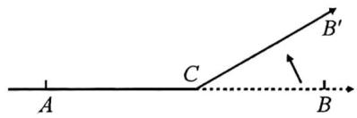

<details>
<summary>text_image</summary>

A
C
B'
B
</details>

4. (2024 一初慧泉) 如图 1, 在一条可以折叠的数轴上有点 $A, B, C$ , 其中点 $A$ , 点 $B$ 表示的数分别为 -15 和 7, 现以点 $C$ 为折点, 将数轴向右对折, 点 $A$ 对应的点 $A_{1}$ 落在点 $B$ 的右边, 如图 2, 再以点 $B$ 的折点, 将数轴向左折叠, 点 $A_{1}$ 对应的点 $A_{2}$ 落在点 $B$ 的左边. 若点 $A_{2}, B$ 之间的距离为 3 , 则点 $C$ 表示的数为 \_\_\_\_.

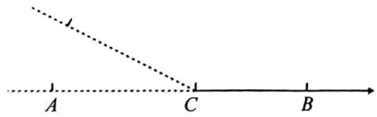

<details>
<summary>text_image</summary>

A
C
B
</details>

图1

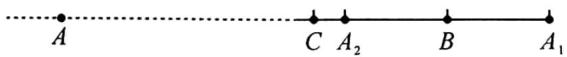  
图2

# 中考新方向 3 新考法

(2025 华科附中)数轴是一个非常重要的数学工具, 它使数和数轴上的点建立起对应关系, 揭示了数与点之间的内在联系, 是“数形结合”的基础. 如图 1, 在数轴上点 $A$ 表示数 $a$ , 点 $B$ 表示数 $b$ , 点 $C$ 表示数 $c$ , 其中 $b$ 为绝对值最小的数, $a$ 与 $c$ 满足 $|a + 2| + |c - 10| = 0$ .

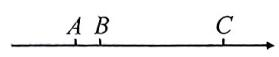  
图1

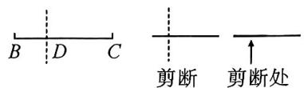

<details>
<summary>text_image</summary>

B D C
剪断 剪断处
</details>

图2

(1) 填空: $a = \_\_\_\_ , b = \_\_\_\_ , c = \_\_\_\_ ;$   
(2)若沿点 B 折叠纸面,使点 B 左侧部分和右侧部分重合,则与点 A 重合的点表示的数为 \_\_\_\_ ;若折叠纸面,使点 A 与点 C 重合,则与点 B 重合的点表示的数为 \_\_\_\_ ;  
(3)如图2,在数轴上剪下点 $B$ 到点 $C$ 的部分(不考虑宽度)并把这部分沿点 $D$ 所在的位置折叠,然后把重叠部分某处剪开,得到三部分,若这三部分的长度之比为 $2:2:6$ ,求点 $D,B$ 之间的距离.

# 第二章 有理数的运算

# 重难点突破1 有理数的运算(一) 混合运算

# 类型一 加减混合

1. (2024 洪山区期中) 计算：

(1) $(-8)+10+2-(-7)$ ;

(2) $\frac{1}{2} + \left(-\frac{2}{3}\right) + \frac{4}{5} + \left(-\frac{1}{3}\right)$ .

# 类型二 加减乘除混合

2.（2024武昌区期中）计算：

(1) $3 \times 2 + (-28) \div 7$ ;

(2) $\left(\frac{1}{2} + \frac{3}{4} - \frac{1}{8}\right) \div \frac{1}{24}$ .

# 类型三 加减乘除乘方混合

3.(2024 江岸区期中)计算：

(1) $-1^{4}\times[4-(-3)^{2}]+3\div\left(-\frac{3}{4}\right);$

(2) $(-2)^{3} - \frac{2}{5} \div 2 \times [-2^{2} + (-3)^{2}]$ .

4. 计算：

(1) $2\times\left[(-3)^{3}-4\times(-3)\right]$ ;

(2) $(-2)^{3} + (-3)\times [(-4)^{2} + 2];$

(3) $(-2^{2} + 2)\times \left[(-3)^{2} - (-3)\div \frac{3}{2}\right];$

(4) $\left[-2\right]^4 \div (-4)\times \left[\left(-\frac{1}{2}\right)^2 - 1\right]$ ;

(5) $(-2)^{2} - [(-3)^{3} \times (-1^{2}) - (-1)^{3}]$ ;

(6) $-3^{2}+2\times\left[(-3)^{2}+(-3)\div1\frac{1}{2}\right]$ ;

(7) $[4 + (-2)^{3}] \times 5 - (-0.28) \div 4$ ;

(8) $-10^{2}+[-4)^{2}-(1-3^{2})\times2]$ ;

(9) $(-1)^{2023} + (-2)^{3} \div 4 \times [5 - (-3)^{2}]$ ;

(10) $-1^{2024} + \left[\frac{2}{3} \times (-6) - (-4)^{2}\right] \div (-5)$ .

# 类型四 含绝对值混合

5.(2024 江汉区期中)计算：

(1) $|-7|\div\left(\frac{2}{3}-\frac{1}{5}\right)-\frac{1}{3}\times(-4)^{2}$ ;

(2) $-2^{3}-|4-9|\times(-3)-(-3)^{2}-(-1)^{2024}.$

# 重难点突破 3 有理数的运算(三) 易混易错

类型一 $-(-a)$ 与一 $|-a|$ 易混易错

1. 填空：

(1) $-(-6)=$ \_\_\_\_；

(2) $-(-1.8)=$ \_\_\_\_；

(3) $-\left(-\frac{3}{2}\right)=$ \_\_\_\_;

(4) $-|-6|=$ \_\_\_\_；

(5) $-|-1.8|=$ \_\_\_\_；

(6) $-\left|-\frac{3}{2}\right|=$ \_\_\_\_.

类型二 $(-a)^{2n}$ 与 $-a^{2n}$ 易混易错

2. 填空：

(1) $(-1)^{10}=$ \_\_\_\_;

(2) $-1^{10}=$ \_\_\_\_;

(3) $(-4)^{4} =$

(4) $-4^{4}=$ \_\_\_\_；

(5) $(-0.1)^{2}=$ \_\_\_\_;

(6) $-\left(\frac{2}{3}\right)^{4}=$ \_\_\_\_.

类型三 $a \times b \times \frac{1}{b}$ 与 $a \div b \times \frac{1}{b}$ 易混易错

3. 计算：

(1) $-6\times\left(-\frac{3}{4}\right)\times\frac{4}{3};$

(2) $-6\div\left(-\frac{3}{4}\right)\times\frac{4}{3};$

(3) $(-49)\times 3\frac{1}{2}\times \left(-\frac{2}{7}\right)\div (-2)^{2};$

(4) $-\left|-2^{4}\right|+(-64)\div1\frac{3}{5}\times\left(-\frac{5}{8}\right).$

类型四 $(a\pm b)\div c$ 与 $c\div (a\pm b)$ 易混易错

4. 计算：

(1) $\left(\frac{1}{3}-\frac{5}{6}\right)\div\left(-\frac{1}{12}\right)$ ;

(2) $\left(-\frac{1}{12}\right)\div\left(\frac{1}{3}-\frac{5}{6}\right)$ ;

(3) $\left(1\frac{3}{4}-\frac{7}{8}-\frac{7}{12}\right)\div\left(-\frac{7}{8}\right)$ ;

(4) $\left(-\frac{7}{8}\right)\div\left(1\frac{3}{4}-\frac{7}{8}-\frac{7}{12}\right).$

# 重难点突破 4 有理数的运算(四) 整体求值

# 类型一 直接整体代入

1. (2024 新洲区期中) 已知 $a, b$ 互为相反数, $c, d$ 互为倒数, $m$ 的绝对值等于 4, 求 $m^2 + cd + a + b + (-cd)^{2024}$ 的值.

2. (2024 武昌区期中) 已知 $a$ 和 $b$ 互为相反数 $(a \neq 0)$ , $c$ 和 $d$ 互为倒数, $x$ 的绝对值等于 2, 求 $cd + \left(a + b + \frac{b}{a}\right)x$ 的值.

# 类型二 先化简,再整体代入

3. (2024 江岸区期中) 已知 $a, b$ 互为相反数, $c, d$ 互为倒数, $m$ 是最大的负整数, 求代数式 $3a + \frac{2024}{cd} + 3b - m^{2025}$ 的值.

4. (2024 汉阳区期中)已知 $a, b$ 互为相反数, $c, d$ 互为倒数, $m$ 是绝对值最小的数, 且 $(x - 1)^{2} + |y - 2| = 0$ . 求 $5a + 2b + 3cdb + xy + \frac{m}{4cd}$ 的值.

# 重难点突破5 绝对值与分类讨论(一)求值

# 类型一 根据大小关系分类

1. (2024 盐城市期中) 已知 $|a| = 3, |b| = 5$ ，若 $a > b$ ，求 $ab$ 的值.

# 类型二 根据积的符号分类

2.(2024青山区期中)若 $x^{2}=9,|y|=4$ ，且 xy<0。求 $x+y$ 的值。

# 类型三 根据和差符号分类

3.(2024江汉区期中)已知 $|a|=3,b^{2}=25$ ，且 $a+b>0$ ，求a-b的值.

4.(2024天门市模拟)已知 $|a-1|=9,|b+2|=6$ ，且 $a+b<0$ ，则a-b的值为\_\_\_\_。  
5.(2024武昌区期中)已知 $|a|=5,|b|=3$ ，且 $|a-b|=b-a$ ，求a-b的值.

# 重难点突破6 绝对值与分类讨论(二)化简

# 类型一 根据积的符号分类讨论

1. 已知 $ab > 0$ ，则 $\frac{a}{|a|} + \frac{b}{|b|}$ 的值为 \_\_\_\_.

# 类型二 根据和与积的符号分类讨论

2. (2024 江岸区期中)已知 $m = \frac{3|a + b|}{c} - \frac{|a + c|}{b} - \frac{2|b + c|}{a}$ , 且 $abc < 0, a + b + c = 0$ , 则 $m$ 的值在分类讨论化简后共有 $x$ 种不同的结果, 若在这些不同的 $m$ 值中, 最大的为 $y$ , 最小的为 $z$ , 则 $(y + z)^x$ 的值为 ( )

A.-8

B. 16

C. -1

D. 1

# 类型三 根据绝对值的和的值分类讨论

3.(2024 武汉十一初)已知对于非零有理数 $x$ , 当 $x > 0$ 时, $\frac{|x|}{x} = \frac{x}{x} = 1$ ; 当 $x < 0$ 时, $\frac{|x|}{x} = \frac{-x}{x} = -1$ . 请根据上面的知识解答下面的问题:

(1)已知 a, b, c 是非零有理数，满足 abc > 0，求 $\frac{a}{|a|} + \frac{b}{|b|} + \frac{c}{|c|} + \frac{abc}{|abc|}$ 的值；  
(2)已知 $a, b, c$ 是非零有理数，满足 $a + b + c = 0$ ，且 $\frac{a}{|a|} + \frac{b}{|b|} + \frac{c}{|c|} = 1$ ，求 $\frac{b + c}{|a|} + \frac{a + c}{|b|} + \frac{a + b}{|c|}$ 的值.

# 重难点突破 7 探究本质妙解幻方(一) 九宫格

# 类型一 中心数已知

1. (2024 高新区期中) 幻方起源于中国, 是我国古代数学杰作之一, 小明同学玩幻方游戏, 将 -4, -3, -2, -1, 0, 1, 2, 3, 4 填入如图的 9 个空格中, 使每一横行的三个数的和与每一竖列的三个数的和及两条斜对角线的三个数的和都相等, 则 $x - y - z$ 的值是 \_\_\_\_.

<table><tr><td>x</td><td>y</td><td></td></tr><tr><td></td><td>0</td><td></td></tr><tr><td>1</td><td>z</td><td>-3</td></tr></table>

2. (2024 浦东区月考) 幻方是一种将数字填在正方形格子中, 使每行、每列、每条对角线上的三个数之和相等的方法. 幻方历史悠久, 是中国传统游戏. 如图是一个 $3 \times 3$ 的幻方的一部分, 则 $a + b =$ \_\_\_\_.

<table><tr><td>-6</td><td>a</td><td>-8</td></tr><tr><td></td><td>-5</td><td></td></tr><tr><td>b</td><td>-9</td><td></td></tr></table>

# 类型二 中心数未知

3. (2024 武昌区期中)如图, 将 9 个数填入空格中, 使每行、每列以及两条对角线上的 3 个数之和相等, 则 $d$ 的值为 \_\_\_\_.

<table><tr><td>-2</td><td>a</td><td>b</td></tr><tr><td>2</td><td>c</td><td>d</td></tr><tr><td>e</td><td>-8</td><td>f</td></tr></table>

4. (2024 岳阳市期中)在图中的九个方格中, 每行, 每列, 每条对角线上的三个数的和都相等, 则 $a + b + c + d =$ \_\_\_\_.

<table><tr><td>12</td><td>a</td><td>b</td></tr><tr><td>1</td><td>c</td><td>d</td></tr><tr><td>m</td><td>11</td><td>n</td></tr></table>

5.(2024 武昌区联考)若在一个 $3 \times 3$ 的方格中填写了9个不同的数字(正整数),且使得每行、每列及每条对角线上的三个数字之和均相等,则称这个 $3 \times 3$ 的方格为“三阶幻方”.

(1)如图1是一个三阶幻方,则 $a =$ , $b =$

(2)在图 2 中空格处填上合适的数字,使它构成一个三阶幻方.

<table><tr><td>4</td><td>a</td><td>2</td></tr><tr><td>b</td><td>5</td><td>7</td></tr><tr><td>8</td><td></td><td></td></tr></table>

图1

<table><tr><td>9</td><td>2</td><td>7</td></tr><tr><td></td><td></td><td></td></tr><tr><td>5</td><td></td><td>3</td></tr></table>

图2

# 重难点突破 8 探究本质妙解幻方(二) 特殊型

# 类型一 环形

1. (2024 华宜寄月考) 爱动脑筋的小明同学设计了如图所示的“幻方”游戏图, 将 1, -2, 3, -4, 5, -6, 7, -8 分别填入图中的圆圈内, 使得横、竖以及内外两个正方形的 4 个数字之和都相等, 他已经将 -4, 5, 7, -8 这四个数填入了圆圈, 则图中 $a + b$ 的值为 \_\_\_\_.

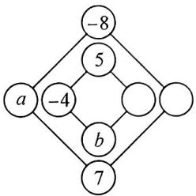

<details>
<summary>flowchart</summary>

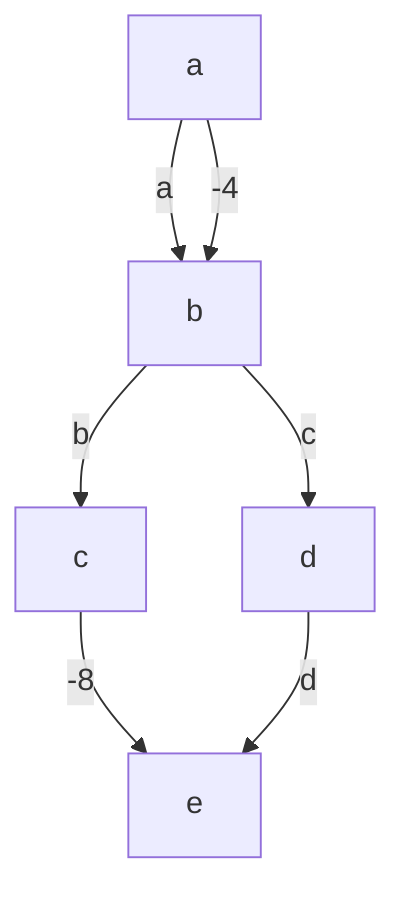
</details>

2. 中国古代数学书《数术拾遗》是最早记载有关幻方的文字。如图是一个简单的幻方模型，将 -1, -2, -3, 1, 2, 3, 4, 5 分别填入图中的圆圈内，使得每个三角形的三个顶点上的数之和都与中间正方形四个顶点上的数之和相等。若已经将 -1, -3 这两个数填入了圆圈，则 $ab + cd$ 的值是 \_\_\_\_.

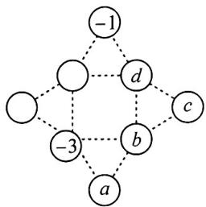

<details>
<summary>flowchart</summary>

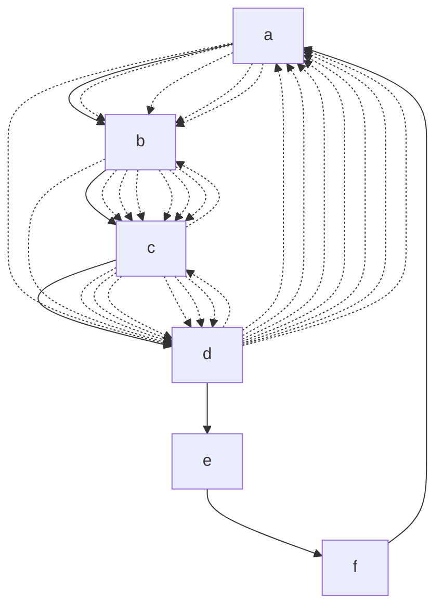
</details>

# 类型二 五角星形

3. (2024 扬州市期末)如图, 五条线段 $AC, BD, CE, DA, EB$ 分别交于点 $F, G, H, I, J$ , 图中的 10 个点分别表示一个有理数, 且五条线段上 4 个点表示的数的和都相等, 已知 $F, G, H, I, J$ , $A$ 表示的数分别是 1, 2, 3, 4, 5, 6, 则点 $C$ 表示的数为 \_\_\_\_.

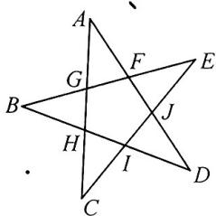

<details>
<summary>text_image</summary>

Geometric diagram with labeled points and intersecting lines, likely from a math problem or proof
</details>

4.（2024 洪山区期中）请将数字 -5, -4, -3, -2, -1, 2, 3, 6, 9, 10 填入图中，使每条边上四个数之和都相等。则 m 的值为（）

A.-5

B. -3

C.-2

D. 3

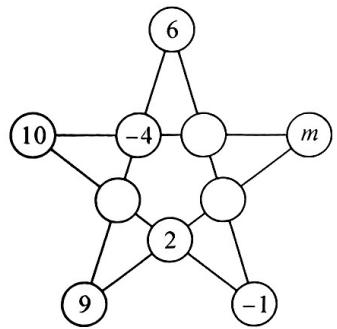

<details>
<summary>flowchart</summary>

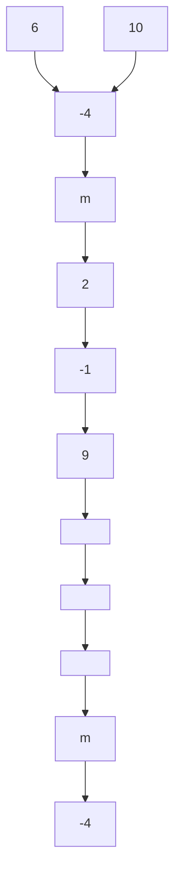
</details>

# 重难点突破 9 有理数的实际应用(一) 文字类

# 类型一 有理数加减的实际应用

1.（2024 武汉三寄月考）某足球守门员练习折返跑，从球门线位置出发，向前跑记为正，向后跑记为负，他的练习记录如下（单位：米）：+5，-3，+10，-8，-6，+13，-10.

(1)守门员最后是否回到了球门线位置?  
(2)守门员离开球门线位置最远是多少米?   
(3)守门员离开守门员位置达到10米以上(包括10米)的次数是多少?

2.（2024 洪山区期中）某快递站一名快递员以配送中心为基地，分别向东、西两方向各个小区送货，向东最远的洪林小区距离配送中心 5000 米，规定向东走为正，某一趟行程记录如下（单位：米）：+1500，-320，-430，+2050，-300，+250，-200，-50，+300，+750，-250。

(1)他最终有没有到达洪林小区？如果没有，那么他离该小区还差多少米？  
(2)送货时,这名快递员全程都使用电动三轮车,且每米要消耗电动三轮车的电量0.85毫安时,问他共消耗了多少毫安时电量?(将结果用科学记数法表示.)

# 类型二 有理数混合运算的实际应用

3.(2024 汉阳区期中)民航部门规定:乘坐飞机的旅客,携带行李超过 20 kg 的部分,每千克要按飞机票原价的 1.5% 另行支付行李逾重费,妈妈从武汉乘飞机去乌鲁木齐,购买了五折机票,付钱 1480 元,她携带了 28 kg 的行李,应付行李逾重费多少元?

4.(2024 新洲区期中)小明的爸爸开出租车,一天下午以新洲摩尔城为出发地在东西方向行驶,规定向东走为正,向西走为负,行车里程(单位:公里),依先后次序记录如下:+8,-3,-5,+6,-9,+10,-6,-4,+4,-5.

(1)将最后一名乘客送到目的地时,出租车离摩尔城多远?在摩尔城的什么方向?  
(2)若出租车每公里耗油量为0.1升,则这辆出租车这天下午耗油多少升?  
(3)规定出租车的收费标准是3公里内付起步价10元,超过3公里的部分每公里加付1.6元,那么小明爸爸这天下午共收了多少钱?

5. (2025 武珞路中学月考) 在一条南北方向的公路上, 有一辆出租车停在 $A$ 地, 乘车的第一位客人向南走 3 千米下车; 该车继续向南开, 又走了 2 千米后, 此时上来第二位客人, 第二位客人乘车向北走 7 千米下车, 此时恰好有第三位客人上车, 先向北走 3 千米, 又调头向南走, 结果下车时出租车恰好到了 $A$ 地.

(1)如果以 $A$ 地为原点,向北方向为正方向,用 1 个单位长度表示 1 千米,在数轴上表示出第一位客人和第二位客人下车的位置;  
(2)第三位客人乘车走了多少千米?   
(3)规定出租车的收费标准是4千米内付8元,超过4千米的部分每千米加付1元(不足1千米按1千米算),那么该出租车司机在这三位客人中共收了多少钱?

# 重难点突破 10 有理数的实际应用(二) 图表类

# 类型一 图文信息

1. (2024 洪山区期中) 如图为武汉市地铁 2 号线行程表的一部分, 国庆节期间, 学生小波从虎泉站出发, 在地铁上参加志愿服务活动. 如果规定向东为正, 向西为负, 当天小波的乘车站数按先后顺序依次记录如下: +4, -3, +6, -8, +9, -2, -7, +1, -5. 当小波从 A 站出站时, 结束本次志愿服务活动.

(1)请通过计算说明 A 站是哪一站?  
(2)若相邻两站之间的平均距离为1.2千米,问这次小波志愿服务期间乘坐地铁行进的总路程约为多少千米?

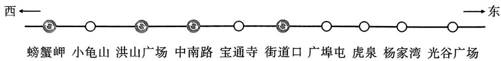

<details>
<summary>text_image</summary>

西←
螃蟹岬 小龟山 洪山广场 中南路 宝通寺 街道口 广埠屯 虎泉 杨家湾 光谷广场
→东
</details>

# 类型二 表格信息

2. (2024 江岸区期中) 外卖送餐为我们生活带来了许多便利, 某学习小组调查了一名外卖小哥一周的送餐情况, 规定标准送餐量为 50 单, 送餐量超过 50 单 (送一次外卖称为一单) 的部分记为 “+”, 低于 50 单的部分记为 “-”, 如表是该外卖小哥一周的送餐量:

<table><tr><td>星期</td><td>一</td><td>二</td><td>三</td><td>四</td><td>五</td><td>六</td><td>日</td></tr><tr><td>送餐量(单位:单)</td><td>-3</td><td>+4</td><td>-5</td><td>+14</td><td>-8</td><td>+7</td><td>+12</td></tr></table>

(1)①该外卖小哥这一周送餐量最多的一天送了单,最少的一天送了单;

②求该外卖小哥这一周平均每天送餐多少单？

(2)外卖小哥每天的工资由底薪60元加上送单补贴构成,送单补贴的方案如下:每天送餐量不超过50单的部分,每单补贴2元;超过50单的部分,每单补贴5元.求该外卖小哥这一周工资收入多少元?

3.(2024高新区期中)有20筐白菜,以每筐25千克为标准,超过或不足的千克数分别用正、负数来表示,记录如下:

<table><tr><td>与标准质量的差值(单位:千克)</td><td>-3</td><td>-2</td><td>-1.5</td><td>0</td><td>1</td><td>2.5</td></tr><tr><td>筐数</td><td>1</td><td>4</td><td>2</td><td>3</td><td>2</td><td>8</td></tr></table>

(1)20筐白菜中,最重的一筐比最轻的一筐重多少千克?  
(2)与标准重量比较,20筐白菜总计超过或不足多少千克?  
(3)若白菜每千克售价2.6元,则出售这20筐白菜可卖多少元?(结果保留整数)

4. (2024东西湖区期中)出租车司机刘师傅某天上午从 $A$ 地出发, 在东西方向的公路上行驶营运, 如表是每次行驶的里程(单位: 千米)(规定向东走为正, 向西走为负; $\times$ 表示空载, $\bigcirc$ 表示载有乘客, 且乘客都不相同).

<table><tr><td>次数</td><td>1</td><td>2</td><td>3</td><td>4</td><td>5</td><td>6</td></tr><tr><td>里程</td><td>-3</td><td>-15</td><td>+16</td><td>-1</td><td>+5</td><td>-12</td></tr><tr><td>载客</td><td>×</td><td>○</td><td>○</td><td>×</td><td>○</td><td>○</td></tr></table>

(1)刘师傅走完第6次里程后,他在A地的什么方向?离A地有多少千米?   
(2)已知出租车每千米耗油约0.08升,刘师傅开始营运前油箱里有8升油,若少于3升,则需要加油,请通过计算说明刘师傅这天上午中途是否可以不加油;  
(3)已知载客时 3 千米以内收费 10 元,超过 3 千米后每千米收费 1.8 元,问刘师傅这天上午走完 6 次里程后的营业额为多少元?

# 重难点突破11 符号推断

# 类型一 根据运算法则推断符号

1. 如图, $A, B, C, D$ 四个点在数轴上表示的数分别为 $a, b, c, d$ , 则下列结论中错误的是 ( )

A. $a + c < 0$

B. $b - a > 0$

C. ${ac} > 0$

D. $\frac{b}{d} < 0$

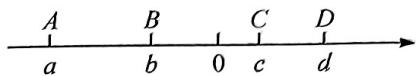

2.(2024 光谷实验周练)若 $\left|a\right|+\left|b\right|=\left|a+b\right|$ ，则 a, b 关系是()

A. $a, b$ 的绝对值相等

B. $a, b$ 异号

C. $a + b$ 的和是非负数

D. $a, b$ 同号或其中至少一个为零

# 类型二 根据绝对值推断符号

3.(2024邵阳市模拟)如果 $a+b+c=0$ ，且 $|a|>|b|>|c|$ 。则下列说法中可能成立的是()

A. b 为正数, c 为负数

B. c 为正数, b 为负数

C. c 为正数, a 为负数

D. $c$ 为负数, $a$ 为负数

# 类型三 根据式子推断点的位置

4. 如图, 数轴上 $A, B, C$ 三点所表示的数分别为 $a, b, c$ , 且 $AB = BC$ . 如果有 $a + b < 0, b + c > 0$ , $a + c < 0$ , 那么该数轴原点 $O$ 的位置应该在 ( )

A. 点 $A$ 的左边

B. 点 $A$ 与 $B$ 之间

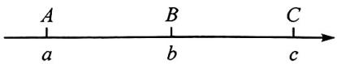

C. 点 $B$ 与 $C$ 之间

D. 点 $C$ 的右边

5.(2024 汉阳区期末)在数轴上表示有理数 a, b, c 的点如图所示, 若 a, c 异号, $a + b$ 为负数, 则下列说法成立的是()

A. $b+c$ 为负数

B. $|b|$ 比 $|c|$ 小

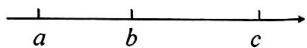

C. $|a|$ 比 $|b|$ 大

D. abc 为负数

# 重难点突破12 有理数多结论(一) 概念辨析

# 类型一 根据有理数的概念及运算法则辨析

1. (2024 利川市期中) 下列说法: ① 最大的负整数是 -1; ② 数轴上表示数 2 和 -2 的点到原点的距离相等; ③ 当 $a \leqslant 0$ 时, $|a| = -a$ 成立; ④ $a + 5$ 一定比 $a$ 大; ⑤ $(-2)^{3}$ 和 $-2^{3}$ 相等. 其中说法正确的个数是 ( )

A. 2 个

B. 3 个

C. 4 个

D. 5 个

2.（2024钟祥市期中）下列说法:①任意有理数都可以用数轴上的点来表示;②一个数的绝对值越大,表示它的点在数轴上离原点越远;③若 $a^{3}+b^{3}=0$ ,则 $a+b=0$ ;④若 $|a|=a$ ,则a>0;
⑤若 $a + b = 0$ , 则 $\frac{b}{a} = -1$ ; ⑥几个有理数相乘, 如果负乘数的个数是奇数个, 那么积为负数;
⑦近似数 2.60 万精确到百分位. 其中说法正确的个数是()

A. 1 个

B. 2 个

C. 3 个

D. 4 个

3. (2024 七一华源)下列说法: ①若 $a, b$ 互为相反数, 则 $\frac{a}{b} = -1$ ; ② $|a| - a \leqslant 0$ ; ③倒数等于它本身的数只有 $\pm 1$ ; ④ $-\frac{2^5}{3}$ 的底数为 $\frac{2}{3}$ ; ⑤ $20200$ 精确到千位为 $2 \times 10^{4}$ ; ⑥ 若 $abc > 0$ , 则 $\frac{|a|}{a} + \frac{b}{|b|} + \frac{|c|}{c}$ 的值为 3 或 -1. 其中说法一定正确的是 \_\_\_\_ (填序号).

# 类型二 根据有理数的运算结果辨析

4. (2024 二中广雅) 下列结论: ① 如果一个数与它的相反数相等, 那么这个数一定是 0; ② 如果 $|a| = |b|$ , 那么 $a = b$ ; ③ 如果 $a + b < 0$ , 且 $ab > 0$ , 那么 $|7a + 3b| = 7a - 3b$ ; ④ 如果 $m$ 是任意有理数, 那么 $|m| + m$ 一定是非负数. 其中结论一定正确的有 ( )

A. 1 个

B. 2 个

C. 3 个

D. 4 个

5.(2024江汉区期中)已知a,b为有理数,下列结论:①|a|>a;②互为相反数的两个数的平方相等;③若 $a^{2}=b^{2}$ ,则 $a^{3}-b^{3}=0$ ;④若ab<0,则 $|a+b|=||a|-|b||$ ;⑤若a大于b,则a的倒数小于b的倒数.其中结论正确的是\_\_\_\_(填序号).

# 重难点突破 13 有理数多结论(二)式子推断

# 类型一 文字信息

1. (2024 黄石市期中)下列说法: ① 若 $|a| = a$ , 则 $a = 0$ ; ② 若 $a, b$ 互为相反数, 且 $ab \neq 0$ , 则 $\frac{b}{a} = -1$ ; ③ 若 $a^2 = b^2$ , 则 $a = b$ ; ④ 若 $|a - b| = |a| + |b|$ , 则 $ab < 0$ . 其中说法正确的有 ( )

A. 1 个

B. 2 个

C. 3 个

D. 4 个

2. (2024 洪山区期中) 若有理数 $a, b, c$ 满足 $|a + b + c| = a + b - c$ , 以下结论: ① $c = 0$ ; ② $(a + b)c = 0$ ; ③ 当 $a, b$ 互为相反数时, $c$ 不可能是正数; ④ 当 $c \neq 0$ 时, $|a + b + c - 2| - |5 - c| = -3$ . 其中结论正确的个数是 ( )

A. 1

B. 2

C. 3

D. 4

3. (2024 江汉区期中)已知 $a, b$ 为有理数, 下列条件: ① $|ab| > ab$ ; ② $ab < 0$ ; ③ $a + b = 0$ ; ④ $|ab| = -ab$ . 其中一定能够推理出 $a, b$ 异号的条件是 \_\_\_\_ (填序号).

4. (2024 黄陂、江夏、蔡甸期中)已知有理数 $a, b$ , 下列说法: ①若 $\frac{a}{b} = -1$ , 则 $a + b = 0$ ; ②若 $a^2 = b^2$ , 则 $a = \pm b$ ; ③若 $a < b, a + b < 0$ , 则 $|a| > |b|$ ; ④若 $-1 < a < 0 < b < 1$ , 则 $a < ab < -b < -ab < -\frac{1}{ab}$ . 其中一定正确的结论有 \_\_\_\_ (填序号).

# 类型二 数轴信息

5. (2024 仙桃、潜江、天门期中)已知 $a, b$ 是有理数, 若 $a$ 在数轴上的对应点的位置如图所示, $a + b < 0$ , 以下结论: ① $b < 0$ ; ② $b - a > 0$ ; ③ $| - a | > - b$ ; ④ $\frac{b}{a} < -1$ . 则所有正确的结论是 ( )

A. ①④

B. ①③

C. ②③

D. ②④

0 a

6.(2024青山区期中)如图,数轴上A,B两点分别表示有理数a,b.则以下结论正确的个数有()

$$
① - b <   a <   - a <   b; ② \frac {3 a b}{a ^ {2} + b ^ {2}} > 0; ③ b - a = | a | + | b |; ④ (a + 1) (b - 3) <   0.
$$

A. 1 个

B. 2 个

C. 3 个

D. 4 个

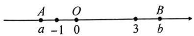

7. (2024 汉阳区期中)如图, 数轴上 $A, B$ 两点所表示的数分别为 $a, b$ . 下列各式: ① $(a - 1)(b - 1) > 0$ ; ② $(a - 1)(b + 1) > 0$ ; ③ $(a + 1)(b + 1) > 0$ . 其中式子正确的序号是( )

A. ②③

B. ①②

C. ①③

D. ①②③

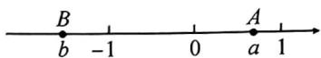

8. (2024 德州市期中)有理数 $a, b, c, d$ 在数轴上的对应点的位置如图所示. 下列结论: ① 如果 $ad > 0$ , 则一定会有 $bc > 0$ ; ② 如果 $ad < 0$ , 则一定会有 $bc < 0$ ; ③ 如果 $bc > 0$ , 则一定会有 $ad > 0$ ; ④ 如果 $bc < 0$ , 则一定会有 $ad < 0$ . 其中结论正确的是 ( )

A. ①③

B. ①④

C. ②③

D. ②④

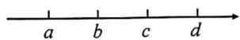

9. (2024 南京市期末)如图, 数轴上 $A, B$ 两点所表示的数分别为 $a, b$ . 下列各式: ① $ab$ ; ② $a + b$ ; ③ $a - b$ ; ④ $a^2 - b^2$ . 其中计算结果一定是正数的有( )

A. 1 个

B. 2 个

C. 3 个

D. 4 个

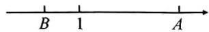

10. (2024 高新区期中) $A, B$ 两点在数轴上的位置如图所示, 其对应的数分别是 $a$ 和 $b$ , 对于以下结论: 甲: $(a + b)(a - b) < 0$ ; 乙: $a > |b|$ ; 丙: $|a - b| = |a| + |b|$ ; 丁: $\frac{|a - 3|}{a - 3} + \frac{|b + 3|}{b + 3} = 0$ . 其中结论正确的是 ( )

A. 甲和乙

B. 甲和丙

C. 丙和丁

D. 乙和丁

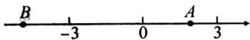

6.(2024青山区期中)如图,数轴上A,B两点分别表示有理数a,b.则以下结论正确的个数有()

$$
① - b <   a <   - a <   b; ② \frac {3 a b}{a ^ {2} + b ^ {2}} > 0: ③ b - a = | a | + | b |; ④ (a + 1) (b - 3) <   0.
$$

A. 1 个

B. 2 个

C. 3 个

D. 4 个

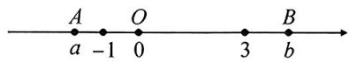

7. (2024 汉阳区期中)如图, 数轴上 $A, B$ 两点所表示的数分别为 $a, b$ . 下列各式: ① $(a - 1)(b - 1) > 0$ ; ② $(a - 1)(b + 1) > 0$ ; ③ $(a + 1)(b + 1) > 0$ . 其中式子正确的序号是( )

A. ②③

B. ①②

C. ①③

D. ①②③

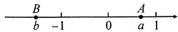

8. (2024 德州市期中)有理数 $a, b, c, d$ 在数轴上的对应点的位置如图所示. 下列结论: ① 如果 $ad > 0$ , 则一定会有 $bc > 0$ ; ② 如果 $ad < 0$ , 则一定会有 $bc < 0$ ; ③ 如果 $bc > 0$ , 则一定会有 $ad > 0$ ; ④ 如果 $bc < 0$ , 则一定会有 $ad < 0$ . 其中结论正确的是 ( )

A. ①③

B. ①④

C. ②③

D. ②④

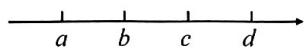

9.(2024 南京市期末)如图,数轴上 A,B 两点所表示的数分别为 a,b. 下列各式:①ab;② $a+b$ ; ③a-b;④ $a^{2}-b^{2}$ . 其中计算结果一定是正数的有()

A. 1 个

B. 2 个

C. 3 个

D. 4 个

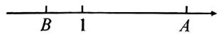

10.(2024高新区期中)A,B两点在数轴上的位置如图所示,其对应的数分别是a和b,对于以下结论:甲:(a+b)(a-b)<0;乙:a>|b|;丙:|a-b|=|a|+|b|;丁: $\frac{|a-3|}{a-3}+\frac{|b+3|}{b+3}=0$ .其中结论正确的是()

A. 甲和乙

B. 甲和丙

C. 丙和丁

D. 乙和丁

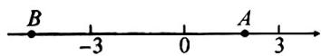

# 重难点突破 14 规律探究(一) 数列规律

# 类型一 等差数列

1. 利用下图可以探究下列各式的值，如 $1+3=4=2^{2}$ ， $1+3+5=9=3^{2}$ ， $1+3+5+7=16=4^{2}$ ， $1+3+5+7+9=25=5^{2}$ ，….

(1)请写出第5个等式：\_\_\_\_；  
(2)请猜想 $1+3+5+7+9+\cdots+(2n-1)+(2n+1)=$ （用含 n 的式子表示）；  
(3)请用上述规律计算: $51+53+55+\cdots+87+89$ (写出计算过程).

9 ※ ※ ※ ※ ※
7 ※ ※ ※ ※ ※
5 ※ ※ ※ ※ ※
3 ※ ※ ※ ※ ※ ※
1 ※ ※ ※ ※ ※ ※

2. (2024 武昌区期中) 在综合实践活动中, 数学兴趣小组对 1 到 $n$ 这 $n$ 个自然数中, 任取两数之和大于 $n$ 的取法种数 $k$ 进行了探究. 发现: 当 $n=2$ 时, 只有 $\{1,2\}$ 一种取法, 即 $k=1$ ; 当 $n=3$ 时, 有 $\{1,3\}$ 和 $\{2,3\}$ 两种取法, 即 $k=2$ ; 当 $n=4$ 时, 可得 $k=4; \cdots$ ; 若 $n=24$ , 则 $k$ 的值为 \_\_\_\_.

# 类型二 等比数列

3. 按照一定规律排列的 n 个数 -2, 4, -8, 16, -32, 64, …, 若最后三个数的和为 768, 则 n = \_\_\_\_

# 类型三 等和数列

4.（2024青山区期中）给定一列数，我们把这列数中的第一个数记为 $a_1$ ，第二个数记为 $a_2$ ，第三个数记为 $a_3$ ，依此类推，第 $n$ 个数记为 $a_{n}$ （ $n$ 为正整数），规定运算： $\sum_{i=1}^{n} a_{i} = a_{1} + a_{2} + a_{3} + \cdots + a_{n}$ . 已知一列数 $-1, 0, 1, -2, 3, -4, 5, -6, 7, -8, 9, -10, \cdots$ . 若存在正整数 $n$ 使等式 $\left|\sum_{i=1}^{n} a_{i}\right| = 2024$ 成立，则 $n =$ \_\_\_\_.

# 类型四 斐波那契数列

5.(2024江汉区期中)有这样一列数:1,1,2,3,5,8,13,21,…,即第一项 $a_{1}=1$ ,第二项 $a_{2}=1$ ,第三项 $a_{3}=2$ ,第四项 $a_{4}=3,\cdots$ ,可以发现从第三项开始,每一项都是它前面两项的和,该数列称为斐波那契数列,又称黄金分割数列,因数学家莱昂纳多·斐波那契以兔子繁殖为例子而引入,故又称“兔子数列”,依次规律 $a_{10}$ 的值为\_\_\_\_.

# 重难点突破15 规律探究(二)数阵规律

# 类型一 蛇形阵

1. 将正奇数按下表排成 5 列：

<table><tr><td></td><td>第1列</td><td>第2列</td><td>第3列</td><td>第4列</td><td>第5列</td></tr><tr><td>第1行</td><td></td><td>1</td><td>3</td><td>5</td><td>7</td></tr><tr><td>第2行</td><td>15</td><td>13</td><td>11</td><td>9</td><td></td></tr><tr><td>第3行</td><td></td><td>17</td><td>19</td><td>21</td><td>23</td></tr><tr><td>...</td><td>...</td><td>...</td><td>27</td><td>25</td><td></td></tr></table>

若 2023 在第 m 行第 n 列, 则 $m + n = (\quad)$

A. 257

B. 258

C. 508

D. 509

# 类型二 行尾平方阵

2. 有一列数 $1, -2, 3, -4, 5, \cdots$ , 分别按如图的方式排列: 第一行 1 个数, 从第二行起每一行都比上一行多两个数. 那么第 12 行, 左起第 7 个数是 \_\_\_\_.

$$
\begin{array}{c c c c c c} & & 1 & & \\ & - 2 & 3 & - 4 & \\ 5 & - 6 & 7 & - 8 & 9 \\ - 1 0 & 1 1 & - 1 2 & 1 3 & - 1 4 & 1 5 & - 1 6 \\ & \dots & \dots & \dots \end{array}
$$

# 类型三 行尾二阶等差求和阵

3. 有一列数 -1, 2, -3, 4, -5, …, 分别按如图的方式排列: 第一行 1 个数, 从第二行起每一行都比上一行多一个数. 请问 234 排在第 \_\_\_\_ 行, 左起第 \_\_\_\_ 个数.

$$
\begin{array}{c c c c c} & & - 1 & & \\ & & 2 & - 3 & \\ & & 4 & - 5 & 6 \\ & - 7 & 8 & - 9 & 1 0 \\ - 1 1 & 1 2 & - 1 3 & 1 4 & - 1 5 \\ & \dots & \dots & \dots \end{array}
$$

# 重难点突破 16 规律探究(三) 周期变化

# 类型一个位数字周期循环

1. (2024 武昌区期中) 发现规律解决问题是常见解题策略之一. 已知数 $a = 1^{5} + 2^{5} + 3^{5} + 4^{5} + 5^{5} + \cdots + 29^{5}$ , 则数 $a$ 个位上的数字为 ( )

A. 3

B. 4

C. 5

D. 6

2.(2024 七一华源)观察下列等式: $1^{2} = 1, 2^{2} = 4, 3^{2} = 9, 4^{2} = 16, 5^{2} = 25, \cdots$ , 若 $1^{2} + 2^{2} + 3^{2} + 4^{2} + 5^{2} + \cdots + n^{2}$ 的个位数字是 $1 (0 < n \leqslant 2020$ , 且 $n$ 为整数), 下列选项中, $n$ 的最大值是( )

A. 2001

B. 2006

C. 2011

D. 2019

# 类型二 排列位置周期循环

3. 有一列数: $1, 3, 2, -1, -3, \cdots$ , 其规律是: 从第二个数开始, 每一个数都是其前后两个数之和, 根据此规律, 则第 2021 个数是 \_\_\_\_.

4.（2024 武昌区联考）如表，从左边第一个格子开始向右数，在每个小格子中都填入一个整数，使得其中任意三个相邻格子中所填整数之和都相等.

<table><tr><td>11</td><td></td><td>a</td><td></td><td>b</td><td>2</td><td></td><td>-7</td><td></td><td>c</td><td>...</td><td></td></tr></table>

(1) 填空: $a = \_\_\_\_ , b = \_\_\_\_ , c = \_\_\_\_ ;$

(2)第 2023 个格子中的数为 \_\_\_\_.

# 重难点突破 17 规律探究(四)乘方规律

# 类型一 列等差

1.(2024 江岸区期中)观察下面有规律排列的三行数:

第一行数：-2，4，-8，16，-32，64…，第二行数：-3，3，-9，15，-33，63…，

第三行数：6，-6，18，-30，66，-126…，

(1)①请直接写出每行的第8个数分别是\_\_\_\_，\_\_\_\_，\_\_\_\_；
②第二行数中，任意连续的三个数分别记为a,b,c，则 $2a-b-c=$ \_\_\_\_；  
(2)用如图所示的“U”形框在第一行和第二行数中平移,任意圈住5个数,使得5个数的和为2045,求圈住的这5个数;  
(3)取每行数的第 $n$ 个数, 这 3 个数中最大的数记为 $p$ , 最小的数记为 $q$ , 若 $2p + 3q = 2049$ , 直接写出 $n$ 的值 \_\_\_\_.

# 类型二 列等比

2.(2024 江汉区期中)观察下面三行数:

-2, 4, -8, 16, -32, …①
1, -2, 4, -8, 16, …②
3, 6, 12, 24, 48, …③

(1)第①行第6个数是\_\_\_\_；第②行第7个数是\_\_\_\_；第③行第7个数是\_\_\_\_；  
(2)已知 3072 是其中的数,则它是第 \_\_\_\_ 行的第 \_\_\_\_ 个数;  
(3)取每行的第 n 个数,若这三个数的和是 32768,求 n 的值.

# 类型三 列等差到列等比

3.(2024 武昌区联考)观察下列三行数:

$$
\begin{array}{l} ① - 1, 2, \boxed {- 4,} 8, - 1 6, \dots \\ ② \quad 1, 4, \left| - 2, \right| 1 0, - 1 4, \dots \\ ③ - 3, 6, \boxed {- 1 2, 2 4,} - 4 8. \dots \\ \end{array}
$$

(1)请直接写出：

①第一行第8个数为\_\_\_\_，第二行第8个数为\_\_\_\_，第三行第8个数为\_\_\_\_；  
②第三行的第 n 个数为 \_\_\_\_；

(2)第一行连续三个数中最大数与最小数的差为 1536, 求这三个数中最大数与最小数的和;  
(3)用如图的“L”形框圈起4个数,从上到下分别记为a,b,c,d,求 $2a+b+c+d$ 的值.

# 类型四 列等比到列等差

4.(2024 洪山区期中)观察下面三行数:

$$
\begin{array}{l} - \frac {1}{2}, \quad \frac {1}{4}, \quad - \frac {1}{8}, \quad \frac {1}{1 6}, \quad - \frac {1}{3 2}, \dots ; \quad ① \\ - \frac {1}{4}, \quad \frac {1}{8}, \quad - \frac {1}{1 6}, \quad \frac {1}{3 2}, \quad - \frac {1}{6 4}, \dots ; \quad ② \\ \frac {1}{2}, \quad \frac {5}{4}, \qquad \frac {7}{8}, \quad \frac {1 7}{1 6}, \qquad \frac {3 1}{3 2}, \dots ; \quad ③ \\ \end{array}
$$

(1)第一行的第7个数可以表示为\_\_\_\_，第一行的第 $n$ 个数可以表示为\_\_\_\_；  
(2)取每一行的第 $n$ 个数,从上到下依次记作 $x, y, z$ ,对于任意的正整数 $n$ 均有 $x - ay + z$ 为一个定值,则 $a =$ \_\_\_\_;  
(3)是否存在这样的一列数,使得这样的一列三个数的和为 $\frac{123}{128}$ ? 若存在,求出这一列数;若不存在,说明理由.

# 重难点突破 18 数轴与动点(一)无速度型距离问题

# 类型一 距离和差

1.【阅读材料】在数轴上点 A 表示的数为 a，点 B 表示的数为 b，则点 A 到点 B 的距离记为 AB，即 $AB = |a - b|$ . 若 a > b，则 AB = a - b；若 a < b，则 AB = b - a.

【问题探究】如图, 点 A, B 在数轴上表示的数分别为 -2, 4.

(1) 求 AB 的长；  
(2) $P$ 为数轴上点 $A$ 左边的一点, 且 $PA + PB = 10$ , 求点 $P$ 在数轴上对应的数.

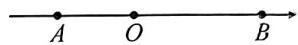

# 类型二 距离倍分

2. (2024 青山区期中) 已知 $A, B, C$ 三点在数轴上对应的数分别为 $a, b, c$ , 且 $a, b$ 满足: $(a + 4)^{2} + |b - 12| = 0$ . 点 $C$ 到 $A, B$ 两点的距离相等. 规定: 两点间的距离可用这两点的字母表示, 如点 $A$ 与点 $C$ 之间的距离表示为 $AC$ .

(1) $a = \_\_\_\_ , b = \_\_\_\_ , c = \_\_\_\_ ;$   
(2) $P$ 是数轴上一点, 若 $PA = 2PB$ , 求点 $P$ 在数轴上对应的数.

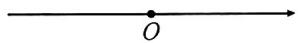

# 类型三 距离比值

3.(2025 光谷实验)在数轴上,点 A 在原点 O 的左边,到原点的距离为 8,点 B 在原点右边,从点 A 走到点 B 要经过 32 个单位长度.

(1) 求 A, B 两点所对应的数；  
(2) 若 $C$ 也是数轴上的一点, 点 $C$ 到点 $A$ 的距离与点 $C$ 到点 $B$ 的距离之比为 $3:5$ , 求点 $C$ 对应的数.

# 重难点突破 19 数轴与动点(二) 含速度型距离问题

# 类型一 距离关系求时间

1. (2024 江汉区期中) 如图, 数轴上, $O$ 为原点, 点 $A, B$ 对应的数分别为 $-50, -40$ , 记点 $A$ 与原点的距离为 $OA$ , 点 $B$ 与原点的距离为 $OB, A, B$ 两点之间的距离为 $AB$ .

(1) 直接写出: OA = \_\_\_\_, OB = \_\_\_\_, AB = \_\_\_\_;   
(2) 点 A, B 同时出发沿数轴正方向匀速运动, 点 A 的速度为 5 个单位长度每秒, 点 B 的速度为 3 个单位长度每秒, 当运动时间为 t s 时,

①直接写出点 A, B 在数轴上对应的数, A: \_\_\_\_, B: \_\_\_\_ (用含 t 的式子表示);  
②直接写出:OA=\_\_\_\_,OB=\_\_\_\_,AB=\_\_\_\_(用含t的式子表示);  
③若 A, B 两点分别与原点的距离相等, 求 t 的值.

A B O

# 类型二 距离关系求速度

2.(2024武昌区联考)已知有理数a,b,c在数轴上对应的点分别为A,B,C,其中b是最小的正整数的10倍,a,c满足 $|a+20|+(c-50)^{2}=0$ .

(1) 填空: $a = \_\_\_\_ , b = \_\_\_\_ , c = \_\_\_\_ ;$   
(2)现将点 A, B, C 分别以每秒 4 个, p (p > 0) 个, 2 个单位长度的速度在数轴上同时向右运动, 当运动时间为 15 秒时, A, B, C 三点中恰好有一点到另外两点的距离相等, 求出 p 的值?

  
备用图

# 类型三 距离关系求点

3. (2024 黄陂、江夏、蔡甸期中) 如图, 数轴上 $A, B, C$ 三点对应的数 $a, b, c$ 满足 $|a| = 10$ , $|b + 4| + (c - 20)^2 = 0$ . 点 $P$ 从点 $A$ 出发以每秒 3 个单位长度的速度沿数轴向右运动.

(1)直接写出 $a, b, c$ 的值；  
(2) 点 $P$ 运动 2 秒后, 另一动点 $Q$ 从点 $A$ 出发, 以每秒 5 个单位长度的速度沿数轴向右运动, 当点 $P$ 与点 $Q$ 的距离为 5 个单位长度时, 求点 $P$ 表示的数.


4. (2024 武昌区期中) 如图, 在以点 $O$ 为原点的数轴上, 点 $A$ 表示的数是 6 , 点 $B$ 在原点的左侧,且 $AB = 5AO$ (点 $A$ 与点 $B$ 之间的距离记作 $AB$ ).

(1) 点 B 表示的数为 \_\_\_\_；  
(2)若动点 $P$ 从点 $O$ 出发, 以每秒 2 个单位长度的速度匀速向左运动, 问经过几秒钟后 $PA = 2PB$ ? 并求出此时点 $P$ 在数轴上对应的数.


<details>
<summary>text_image</summary>

B
O
A
6
</details>

# 类型四 距离关系求值

5. 如图, 在数轴上, 点 $A$ 表示的数为 $-10$ , 点 $B$ 表示的数为 11, 点 $C$ 表示的数为 18. 动点 $P$ 从点 $A$ 出发, 沿数轴正方向以每秒 2 个单位长度的速度匀速运动; 同时, 动点 $Q$ 从点 $C$ 出发, 沿数轴负方向以每秒 1 个单位长度的速度匀速运动. 设运动时间为 $t$ 秒.

(1)在点 $Q$ 出发后到达点 $B$ 之前, 当 $t$ 为何值时, 点 $P$ 到点 $O$ 的距离与点 $Q$ 到点 $B$ 的距离相等;  
(2)在点 $P$ 向右运动的过程中， $N$ 为数轴上一动点，且到 $A, P$ 两点的距离相等。在点 $P$ 到达点 $C$ 之前，求 $2CN - PC$ 的值。


<details>
<summary>text_image</summary>

A → P O B Q C
-10 0 11 18
</details>

# 重难点突破 20 数轴与动点(三) 数轴上的行程问题

# 类型一 相遇问题

1. 已知数轴上的原点为 $O$ ，点 $A, B$ 对应的数分别为 $-8$ 和 $4$ ，动点 $P$ 从点 $A$ 出发，以每秒 3 个单位长度的速度沿数轴正方向运动，同时，动点 $Q$ 从点 $B$ 出发，以每秒 1 个单位长度的速度沿数轴负方向运动，设点 $P$ 的运动时间为 $t$ 秒。

(1) 当 P, Q 两点相遇时, 求 t 的值;  
(2) 若点 $P$ 到达点 $B$ 后按原速度立即返回, 在返回途中他们再次相遇, 求此时 $t$ 的值.


2. 已知数轴上有 $A, B$ 两点, 分别代表 $-40, 20$ , 两只电子蚂蚁甲, 乙分别从 $A, B$ 两点同时出发, 甲沿 $AB$ 方向以 1 个单位长度/秒的速度向右运动, 甲到达点 $B$ 处时运动停止, 乙沿 $BA$ 方向以 4 个单位长度/秒的速度向左运动.

(1)甲,乙在数轴上的哪个点相遇?  
(2)多少秒时,甲、乙相距10个单位长度?   
(3)若乙到达 A 点后立刻掉头并保持速度不变,则甲到达 B 点前,甲,乙还能在数轴上相遇吗?若能,求出相遇点所对应的数;若不能,请说明理由.


3. (2024 武昌区期中) 如图, 在以点 $O$ 为原点的数轴上, 点 $A$ 表示的数是 6 , 点 $B$ 表示的数为 -24 . 若动点 $M$ 从点 $A$ 出发, 以 2 个单位长度/秒的速度向点 $B$ 匀速运动, 同时点 $N$ 从点 $B$ 出发, 以 3 个单位长度/秒的速度向点 $A$ 运动; 当点 $M$ 到达点 $B$ 后, 立即以原速返回, 到达点 $A$ 停止运动, 当点 $N$ 到达点 $A$ 立即以原速返回, 到达点 $B$ 停止运动, 设点 $M$ 的运动时间为 $t$ 秒, 求 $t$ 为多少时, 点 $M$ 和点 $N$ 之间的距离是 16 个单位长度?


# 类型二 追击问题

4. 如图, 已知数轴上点 $A$ 表示的数为 6, $B$ 是数轴上在 $A$ 左侧的一点, 且 $A, B$ 两点间的距离为 11, 动点 $P$ 从点 $A$ 出发, 以每秒 3 个单位长度的速度沿数轴向左匀速运动, 设运动时间为 $t (t > 0)$ 秒.

(1) 动点 $Q$ 从点 $B$ 出发, 以每秒 2 个单位长度的速度沿数轴向右匀速运动, 若 $P, Q$ 两点同时出发, 求点 $P$ 与 $Q$ 运动多少秒时重合?  
(2) 动点 $Q$ 从点 $B$ 出发, 以每秒 2 个单位长度的速度沿数轴向左匀速运动, 若 $P, Q$ 两点同时出发, 当点 $P$ 运动多少秒时, 点 $P$ 追上点 $Q$ ?

B O A

5. 点 $A, C$ 在数轴上表示的数为 $-6, 24$ . 若点 $M, N$ 的速度分别为 2 个单位长度/秒, 6 个单位长度/秒, 分别同时从 $A, C$ 两点出发, 都在 $A, C$ 两点之间作往返运动, 当点 $N$ 第二次从背后追上点 $M$ 时正好在点 $P$ , 求点 $P$ 对应的数.

# 重难点突破 21 数轴与动点(四) 动点定值问题

# 类型一 动点求定值

1. (2025 武昌区期中) 数轴上点 $A$ 表示的数为 -8, 点 $B$ 表示的数为 12, 点 $M$ 从点 $A$ 出发向右运动, 速度为每秒 1 个单位长度, 同时点 $N$ 从点 $B$ 出发向右运动, 速度为每秒 2 个单位长度, $O$ 为数轴原点, 设线段 $NO$ 的中点为 $P$ . 问: $PO - AM$ 的值是否变化? 若不变, 求其值; 若变化, 请说明理由.

2. (2025 江汉区期末)如图, 已知数轴上点 $A$ 表示的数为 16, $B$ 表示的数为 -12, 动点 $P$ 从点 $A$ 出发以每秒 4 个单位长度的速度沿数轴向左匀速运动, $Q$ 为 $AP$ 的中点, 在点 $P$ 到达点 $B$ 之前, 求 $\frac{BA + BP}{BQ}$ 的值.

# 类型二 动点定关系求速度

3. (2024 青山区期中)已知 $A, B, C$ 三点在数轴上对应的数分别为 $-4, 12, 4$ , 点 $A$ 以 3 个单位长度/秒的速度向右运动, 点 $B$ 以 1 个单位长度/秒的速度向左运动, 点 $C$ 以 2 个单位长度/秒的速度向右运动, 点 $D$ 从原点出发以 $m$ 个单位长度/秒的速度运动. 点 $A, B, C, D$ 同时出发, 设运动时间为 $t$ 秒, 在运动过程中, 若总有 $AB = 4CD$ 成立, 求 $m$ 的值及点 $D$ 的运动方向.

o

4. (2024 硕口区期中) 如图, 点 $A, B, C$ 在数轴上对应的数分别是一 20, 16, 20, 点 $A, B$ 之间的距离记为 $AB$ . 点 $P$ 从点 $A$ 出发, 沿着数轴负方向匀速运动, 同时, 点 $Q$ 从点 $C$ 出发, 沿数轴负方向匀速运动, 点 $P$ 和点 $Q$ 的速度分别为 4 个单位长度/秒和 $m (m > 4)$ 个单位长度/秒. 设点 $P$ 运动的时间为 $t$ 秒.

(1)t 秒时, 点 P 表示的数为 \_\_\_\_, 点 B, P 之间的距离为 \_\_\_\_ (用含 t 的式子表示);  
(2) 当点 $Q$ 追上点 $P$ 之后, $CP - \frac{3}{2} PQ$ 的值与 $t$ 的值无关, 求 $m$ 的值.


# 类型三 区间定值求参数关系

5. (2024 武昌区联考) 数轴上点 $A, B, C$ 对应的数分别为 $-20, 10, 50$ . 现将点 $A, B, C$ 分别以每秒 4 个, 1 个, 2 个单位长度的速度在数轴上同时向右运动, 设运动时间为 $t$ 秒. 当点 $A$ 在点 $C$ 左侧时 (不考虑点 $A$ 与点 $B$ 重合), 是否存在常数 $m, n$ , 使得 $m \cdot AC + n \cdot AB$ 的值在一定时间范围内不随 $t$ 的改变而改变? 若存在, 求出 $m, n$ 的关系; 若不存在, 请说明理由.


备用图

# 类型四 动点定值求速度比

6. (2024 江岸区期中) 若 $x, y$ 分别表示点 $A, B$ 在数轴上对应的数, $O$ 为原点, 当 $x = -3, y = 5$ 时, 点 $M, N$ 分别从点 $O, B$ 同时出发, 分别以 $v_{1}, v_{2}$ 的速度沿数轴负方向运动 (点 $M$ 在点 $O, A$ 之间, 点 $N$ 在点 $O, B$ 之间), 运动时间为 $t$ , 点 $M$ 运动到点 $A$ 时, 点 $N$ 立即停止运动, 点 $Q$ 为点 $B, M$ 之间的一点, 且点 $Q$ 到点 $M$ 的距离是点 $B$ 到点 $M$ 距离的一半 (即 $QM = \frac{1}{2} BM$ ). 若在运动过程中, 点 $Q$ 到点 $N$ 的距离 $QN$ 总为一个固定的值, 求 $\frac{v_{1}}{v_{2}}$ 的值.


# 类型五 动点定值求系数

7. (2025 七一华源)如图, 动点 $A, B, C$ 分别从数轴上表示 $-30, 10, 18$ 的点的位置沿数轴正方向运动, 速度分别为 2 个单位长度/秒, 4 个单位长度/秒, 8 个单位长度/秒, 线段 $OA$ 的中点为 $P$ , 线段 $OB$ 的中点为 $M$ , 线段 $OC$ 的中点为 $N$ . 若 $k \cdot PM - MN$ 为常数, 求 $k$ 的值.


# 重难点突破 22 数轴与动点(五) 动点最值问题

# 类型一 绝对值型最值

1.【探究与发现】用符号“AB”表示 A, B 两点的距离，点 A, B 在数轴上分别对应的数为 a, b，则 $AB = |a - b|$ .

(1)若数轴上两点 A, B 表示的数为 x, 1.

①AB=\_\_\_\_（用含x的式子表示）；②若AB=2，则x的值为\_\_\_\_；

【理解与应用】(2)若 x, y 分别表示点 A, B 在数轴上对应的数.

① $|x-1|+|x+3|$ 的最小值为\_\_\_\_，此时x的取值范围是\_\_\_\_；  
②已知 $(|x-1|+|x+3|)(|y+1|+|y-6|)=28$ ，求2y-x的最大值.

2. (2024 高新区期中) $A, B$ 两点在数轴上表示的数分别为 $m, n$ , 用符号“ $AB$ ”表示 $A, B$ 两点的距离, 且 $AB = |m - n|$ . 如图, 若 $m = -2, n = 4$ , 点 $P$ 从点 $A$ 出发以 4 个单位长度/秒的速度向右运动, 同时 $Q$ 点从 $B$ 出发以 2 个单位长度/秒的速度向左运动, 设运动时间为 $t$ 秒, $M$ 为数轴上一点, 且 $MP = MO$ , 当 $t$ 为何值时, $MB + PQ$ 有最小值, 并求出这个最小值.

$$
\begin{array}{c c c} A \longrightarrow P & \\ - 2 & 0 & Q \longleftarrow B \\ \hline & 4 \end{array}
$$

# 类型二 区间最值

3. (2024 洪山区期中)如图, 在数轴上有 $A, B, M$ 三点, 分别表示有理数 $-1, 2, 3$ . 到 $A, B$ 两点的距离相等的点称为 $AB$ 的中点, 其表示的数可以记作 $\frac{a + b}{2}, A, B$ 之间的距离表示为 $AB = |a - b|$ . 动点 $P$ 从表示 $-7$ 的点出发, 以 3 个单位长度/秒的速度向右运动, 动点 $Q$ 从表示 $-2$ 的点出发, 以 2 个单位长度/秒的速度向右运动. 点 $P$ 比点 $Q$ 先出发 1 秒, 设点 $Q$ 运动的时间为 $t$ 秒, 若线段 $PQ$ 上至少存在一点 $T$ 与点 $A$ 构成线段, 当线段 $AT$ 的中点在线段 $OB$ (包含端点)上, 求 $t$ 的最大值和最小值.

$$
\begin{array}{c c c c c c c c c c c c c c c} & P & & & & & & & Q & A & O & B & M \\ \hline & - 8 & - 7 & - 6 & - 5 & - 4 & - 3 & - 2 & - 1 & 0 & 1 & 2 & 3 & 4 & 5 & 6 & 7 \end{array}
$$

# 中考新方向 1 新定义

# 类型一 新程序

1. (2024 江汉区期中) 如图是一个“数值转换机”, 按下面的运算过程输入一个数 $x$ , 若输入的数为 $x = 3$ , 则输出的结果为 \_\_\_\_.


<details>
<summary>flowchart</summary>


</details>

2.(2024武昌区期中)有一数值转换器,原理如图,若开始输入x的值是5,可发现第一次输出的结果是8,第二次输出的结果是4,…,请你探索第2024次输出的结果是()

A. 8

B. 4

C. 2

D. 1


<details>
<summary>flowchart</summary>


</details>

# 类型二 新运算

3.(2024 武汉三寄)规定 $x \odot y = xy - y^{2}$ ，则 $\frac{1}{2} \odot (-2) = (\quad)$

A.-5

B. 3

C.-3

D. 1

4.（2024恩施市期中）定义一种新运算： $a\ast b = b^2 -ab$ ，如： $2\ast 3 = 3^{2} - 2\times 3 = 3$ ，则计算 $(-1\ast 2)$ ※(-4)的结果为（

A.-3

B. 8

C. 15

D. 40

5. (2024 汉阳区期中) 对 $a, b$ 定义运算“\*”如下: $a * b = \begin{cases} a^2b, & (a \geqslant b) \\ ab^2, & (a < b) \end{cases}$ 已知 $3 * m = 48$ , 则有理数 $m =$ \_\_\_\_.

6.(2024 洪山区期中)规定[a]表示不超过 a 的最大整数,例如: $[2.5]=2,[-2.3]=-3$ ,若 m=[4.1],n=[-5.1],则[m-n]的值为 \_\_\_\_.

# 中考新方向 2 阅读理解

1. (2024 武昌区期中) 现将 10 个数字按如图所示排成一个圈, 并设置了一种数字信息的加密规则: 加密钥匙为 “n & 5”, 它代表把明文 n 换成图中从它开始顺时针跳过 5 个数字的那个数字. 例如明文是 3, 对应的密文是 9. 若收到的密文是 2024, 那么通过解密, 它对应的明文是 \_\_\_\_. (明文是 0\~9 之间的数字)


<details>
<summary>flowchart</summary>


</details>

2. (2024 七一华源) $a$ 是不为 2 的有理数, 我们把 $\frac{2}{2 - a}$ 称为 $a$ 的“哈利数”, 如 3 的“哈利数”是 $\frac{2}{2 - 3} = -2, -2$ 的“哈利数”是 $\frac{2}{2 - (-2)} = \frac{1}{2}$ . 已知 $a_1 = 3, a_2$ 是 $a_1$ 的“哈利数”, $a_3$ 是 $a_2$ 的“哈利数”, $a_4$ 是 $a_3$ 的“哈利数”, $\cdots$ , 依此类推, 则 $a_{2023} = (\quad)$

A. 3

B.-2

C. $\frac{1}{2}$

D. $\frac{4}{3}$

3. (2024 二中广雅)类比有理数的乘方,我们把求若干个相同的有理数(均不等于0)的除法运算叫做除方,例如: $2 \div 2 \div 2$ 记作 $2^{③}$ ,读作“2 的圈 3 次方”,把 $(-3) \div (-3) \div (-3) \div (-3)$ 记作 $(-3)^{④}$ ,读作“-3 的圈 4 次方”,一般地,把 $a \div a \div \cdots a \div a$ ( $c$ 个 $a, c$ 为正整数,且 $a \neq 0$ )记作 $a^{⑥}$ ,读作“ $a$ 的圈 $c$ 次方”.关于除方,下列说法错误的是()

A. $5^{④} = (-5)^{④}$

B. 任何非零有理数的圈 2 次方都等于 1

C. 对于任何正整数 $a, a^{④} = \left(\frac{1}{a}\right)^2$

D. c 为奇数时, $a^{\circledcirc}$ 是负数; c 为偶数时, $a^{\circledcirc}$ 是正数

4. 对于数轴上的 $A, B, C$ 三点, 给出如下定义: 若其中一个点与其它两个点的距离恰好满足 2 倍的数量关系, 则称该点是其它两个点的“倍分点”.

(1)若点 A 表示的数为 -1, 点 C 表示的数为 2, 下列各数 $-\frac{5}{2}, 0, 1, \frac{9}{2}$ 中, 其中是点 A, C 的“倍分点”的是 \_\_\_\_;

(2)已知点 $M$ 表示的数为 $-20$ , 点 $N$ 表示的数为 $16, P$ 为数轴上一个动点. 若点 $P$ 是点 $M, N$ 的“倍分点”, 求此时点 $P$ 表示的数.

# 中考新方向3 进位制

# 类型一 十进制 $\rightarrow n$ 进制

1. (2024 黄陂、江夏、蔡甸期中) 二进制就是逢二进一, 其各数位上的数字为 0 或 1, 例如十进制数 5 可以写成二进制数 101, 因为 $5 = 4 + 1 = 1 \times 2^{2} + 0 \times 2^{1} + 1 \times 2^{0} = (101)_{2}$ (规定当 $a \neq 0$ 时, $a^{0} = 1$ ); 13 可以写成二进制数 1101, 因为 $13 = 8 + 4 + 1 = 1 \times 2^{3} + 1 \times 2^{2} + 0 \times 2^{1} + 1 \times 2^{0} = (1101)_{2}$ . 按此方式, 十进制数 27 化为二进制数为 ( )

A. 11011

B. 10101

C. 11001

D. 11010

2. (2024 一初慧泉) 计算机利用的是二进制数, 它共有两个数码 0, 1. 将一个十进制数转化为二进制, 只需把该数写成若干个 $2^{n}$ 的数的和, 依次写出 1 或 0 即可. 如 $19 = 16 + 2 + 1 = 1 \times 2^{4} + 0 \times 2^{3} + 0 \times 2^{2} + 1 \times 2^{1} + 1 = (10011)_{2}$ 为二进制下的五位数, 则十进制 1025 是二进制下的 ( )

A. 10 位数

B. 11 位数

C. 12 位数

D. 13 位数

3.(2024天津市模拟)与十进制数1770对应的八进制数是()

A. 3 350

B. 3 351

C. 3 352

D. 3 540

4.（2024江汉区期中）我们知道，在七进制中，数 $(a_{n}\dots a_{3}a_{2}a_{1})_{7} = a_{1} + a_{2}\times 7 + a_{3}\times 7^{2} + \dots +a_{n}\times$ $7^{n - 1}$ ，比如(2315) $_{7} = 5 + 1\times 7 + 3\times 7^{2} + 2\times 7^{3}$ ，即(2315) $_{7} = 845$

(1)将十进制中的数转换成七进制的数：

①17=(\_\_\_\_) $_{7}$ ; ②431=(\_\_\_\_) $_{7}$ ;

(2)仿照十进制中的乘法口诀表制作七进制的乘法口诀表如下(表中数皆为七进制数):

①表中 $a=(\_)_{7}, b=(\_)_{7}$ ;

②利用七进制乘法口诀表计算： $(34)_7\times (24)_7$

$$
= (\underline {{\quad}}) _ {7};
$$

(3)在几进制中,等式 $(42)_{n}\times(20)_{n}=(1\ 340)_{n}$ 成立?直接写出n的值.

<table><tr><td></td><td>1</td><td>2</td><td>3</td><td>4</td><td>5</td><td>6</td></tr><tr><td>1</td><td>1</td><td>2</td><td>3</td><td>4</td><td>5</td><td>6</td></tr><tr><td>2</td><td></td><td>4</td><td>6</td><td>a</td><td>13</td><td>15</td></tr><tr><td>3</td><td></td><td></td><td>12</td><td>15</td><td>21</td><td>24</td></tr><tr><td>4</td><td></td><td></td><td></td><td>22</td><td>b</td><td>33</td></tr><tr><td>5</td><td></td><td></td><td></td><td></td><td>34</td><td>42</td></tr><tr><td>6</td><td></td><td></td><td></td><td></td><td></td><td>51</td></tr></table>

# 类型二 $n$ 进制 $\rightarrow$ 十进制

5. 我国古代《易经》一书中记载, 远古时期, 人们通过在绳子上打结来记录数量, 即“结绳计数”. 如图, 一位母亲在从右到左依次排列的绳子上打结, 满七进一, 用来记录孩子自出生后的天数, 由图可知, 孩子自出生后的天数是( )

A. 84

B. 336

C. 510

D. 1326


6.(2024北京市模拟)在计算机科学和数字电子技术中,经常会遇到十六进制和十进制之间的转换.十进制是我们平常所使用的基数为10的计数制.而十六进制数由0-9和A-F这16个数字组成,其中A-F分别代表十进制的10-15.例如:十六进制数1A3F表示的十进制数为 $1\times16^{3}+10\times16^{2}+3\times16^{1}+15=4\ 096+2\ 560+48+15=6\ 719$ .则十六进制数1B2E表示十进制数为\_\_\_\_.

7. (2024 青山区期中)生活中我们使用的数是十进制数,有时候也会用到其它进制数,如计算机使用的数是二进制数,二进制数可以转化为十进制数.如二进制数 1101 换算成十进制数是 $1 \times 2^{3} + 1 \times 2^{2} + 0 \times 2^{1} + 1 \times 2^{0} = 13$ , 其中规定: $a^{0} = 1 (a \neq 0)$ 为与十进制进行区分, 我们常把用 $x$ 进制表示的数 $b$ 写成 $(b)_{x}$ . 第十四届国际数学教育大会 (ICME-14) 在中国上海举行, 会徽的主题图案有着丰富的数学元素, 展现了我国古代数学的文化魅力, 其右下方的“卦”是用我国古代的计数符号写出的八进制数 3745, 八进制是以 8 作为进位基数的数字系统, 有 $0 \sim 7$ 共 8 个基本数字, 八进制数 3745 换算成十进制数是 $3 \times 8^{3} + 7 \times 8^{2} + 4 \times 8^{1} + 5 \times 8^{0} = 2021$ , 表示 ICME-14 的举办年份.

(1)把下列进制表示的数转化为十进制表示的数：

$$
(1 0 1 0 1 1) _ {2} = \underline {{\quad}}; (2 0 2 4) _ {8} = \underline {{\quad}};
$$

(2)小聪根据自己的班级702设计了一个 $C(C$ 为正整数)进制数 $(702)_c$ ，换算成十进制数是569，求 $c$ 的值；  
(3) 若 $(mm1)_5 + (nn3)_4 = 184$ ，求 $(m8)_9 + (n5)_6$ 化为十进制表示的数.


<details>
<summary>text_image</summary>

S
IOME-14
</details>

# 类型三 进制数互化

8. (2024 洪山区期中)中国是最早使用十进制计数法,且认识到进位制的国家. 英国著名科学史学家李约瑟教授曾对中国商代计数法予以很高评价: “如果没有这种十进制,就几乎不可能出现我们现在这个统一化的世界了.”所谓进位制, 就是人们规定的一种进位方法. 对于任何一种进制 -X 进制, 就表示某一位置上的数运算时是逢 X 进一位, 十进制是逢十进一, 十六进制是逢十六进一, 二进制就是逢二进一, 以此类推, X 进制就是逢 X 进位. 为与十进制进行区分, 我们常把用 X 进制表示的数 a 写成 $(a)_X$ . 类比于十进制我们可以知道: X 进制表示的数 $(1111)_X$ 中, 右起第一位上的 1 表示 $1 \times X^0$ , 第二位上的 1 表示 $1 \times X^1$ , 第三位上的 1 表示 $1 \times X^2$ , 第四位上的 1 表示 $1 \times X^3$ , 故 $(1111)_X = 1 \times X^3 + 1 \times X^2 + 1 \times X^1 + 1 \times X^0$ , 即: $(1111)_X$ 转化为十进制表示的数 $X^3 + X^2 + X^1 + X^0$ . 如: $(1111)_2 = 1 \times 2^3 + 1 \times 2^2 + 1 \times 2^1 + 1 \times 2^0 = 15$ . 根据材料, 完成以下问题:

(1) $(1234)_5 = (\quad)$ $_{10}$ ; (156) $_{10} = (\quad)$ $_{4}$ ;   
(2)若一个九进制数与一个八进制数之和为 $(999)_{10}$ . 则称这两个数互为“长长久久数”. 若 $(\overline{aa8})_9$ 与 $(\overline{bb1})_8$ 互为“长长久久数”, 求出 $a + b$ 的值.

# 类型四 二进制数加法运算

9. (2024 武钢实验)【阅读理解】二进制数的加法运算是一种基本的数学运算, 它和十进制数的加法原理类似, 只是运算的基数不同. 在二进制数的加法运算中, 我们需要将两个二进制数按位相加, 并且需要考虑进位的情况. 首先, 让我们回顾一下二进制数的基本规则: $0 + 0 = 0; 0 + 1 = 1$ ; $1 + 1 = 10$ (二进制进位). 举个例子, 我们来计算二进制数 $(1011)_2$ 和 $(110)_2$ 的加法: $(1011)_2 + (110)_2$ . 从最低位开始相加, $1 + 0 = 1$ , 没有进位; $1 + 1 = 10$ , 这里需要进位; $1 + 0 = 1$ , 没有进位; $1 + 1 = 10$ , 这里也需要进位, 最终的结果是 $(10001)_2$ .

# 【学以致用】

(1) 计算: $(10101)_{2} + (1101)_{2}$ ;   
(2)请将二进制数 $(10101)_2,(1101)_2$ ，及(1)中所得结果转化为十进制数，验算(1)中的计算结果是否正确？

# 中考新方向4 综合与实践

(2024 硚口区期中)二维码在日常生活中应用广泛,使用若干个与二进制相对应的几何图形来表示数值(黑色代表 1, 白色代表 0). 如图 1 是小明同学的准考证号的二维码的简易编码, 其中第一行代表二进制的数字 $(11000)_2$ , 转换成十进制数为 24; 同理第二行至第五行代表二进制的数字分别转换成十进制的两位数, 依次组合到一起就是小明同学的准考证号 2412072813.

(1) 图 2 是小辉同学的准考证号的二维码的简易编码.

①直接写出第一行、第二行分别代表二进制的数字；

②直接写出小辉同学的准考证号；

③若将第一行至第五行代表的 5 个二进制的数字相加, 直接写出用二进制数与四进制数分别表示这 5 个数字的和.

(2)二维码不仅能储存数字信息,还能通过代码将数字信息转换成字母语言信息.

将大写英文 26 个字母作为明码, 它对应数字暗码如下表:

<table><tr><td>明码</td><td>A</td><td>B</td><td>C</td><td>D</td><td>E</td><td>F</td><td>G</td><td>H</td><td>I</td><td>J</td><td>K</td><td>L</td><td>M</td></tr><tr><td>暗码</td><td>1</td><td>2</td><td>3</td><td>4</td><td>5</td><td>6</td><td>7</td><td>8</td><td>9</td><td>10</td><td>11</td><td>12</td><td>13</td></tr><tr><td>明码</td><td>N</td><td>O</td><td>P</td><td>Q</td><td>R</td><td>S</td><td>T</td><td>U</td><td>V</td><td>W</td><td>X</td><td>Y</td><td>Z</td></tr><tr><td>暗码</td><td>14</td><td>15</td><td>16</td><td>17</td><td>18</td><td>19</td><td>20</td><td>21</td><td>22</td><td>23</td><td>24</td><td>25</td><td>26</td></tr></table>

若二维码的简易编码所对应的数值 $m$ 小于27，则设 $27 - m$ 的值为二维码的简易编码所对应的暗码，若二维码的简易编码所对应的数值 $m$ 大于或等于27，则二维码的简易编码所对应的明码为空格，如图1中第一列所对应的二进制的数字10010转换成十进制数18，则暗码为 $27 - m = 27 - 18 = 9$ ，则对应的明码为“I”，第二列中所对应的二进制的数字11011转换成十进制数27，则此时二维码的简易编码所对应的明码为空格.

①直接写出图2中从左到右五列对应的明码分别是什么？  
②请在图3中画出一个明码为“LUCKY”的 $5 \times 5$ 的二维码.


<details>
<summary>natural_image</summary>

Grid pattern with shaded squares and white background (no text or symbols)
</details>

图1


<details>
<summary>natural_image</summary>

Grid pattern with shaded squares and white cells, no text or symbols present
</details>

图2


<details>
<summary>natural_image</summary>

Grid pattern with shaded squares and white cells, no text or symbols present
</details>

图3

# 第三章 代数式

# 重难点突破1 列代数式(一)

# 类型一 和差倍分

1. (2024 七一华源)两位数, 十位数字是 $x$ , 个位数字比十位数字的 2 倍少 3, 这个两位数是( )

A. $x(2x - 3)$

B. $x(2x + 3)$

C. ${12x} - 3$

D. ${12x} + 3$

2. (2024 砺口区期中) 某果园引入了 $m$ 个采摘机器人, 这些机器人被分为两组, 每组的工作效率不同. 第一组有 $n$ 个机器人, 每个机器人 8 秒采摘一个苹果; 第二组包含剩余的机器人, 每个机器人 6 秒采摘一个苹果. 同时, 果园内还有 10 名熟练的采摘工人, 他们每个人 5 秒采摘一个苹果. 若机器人与工人同时工作 1 小时, 则这 $m$ 个机器人比这 10 名工人多采摘的苹果是 \_\_\_\_ 个.  
3. (2024 六初月考) 将某工厂 5 台 A 型机器一天生产的产品装入同样规格的包装箱内, 装满 8 箱后还剩余 4 个产品. 若每台 A 型机器一天可生产 $x$ 个产品, 则每个包装箱可装 \_\_\_\_ 个产品.  
4. (2024 南湖月考)某校开设了选修课程。参加“学科类选修课程”有 $m$ 人, 参加“体音美选修课程”的人数比“学科类选修课程”的人数多 9 人, 参加“科技类选修课程”的人数比“体音美选修课程”人数的 $\frac{1}{3}$ 多 5 人, 则参加“科技类选修课程”的人数为 \_\_\_\_ 人。

# 类型二 行程问题

5. 甲、乙两地之间公路全长 $240 \mathrm{~km}$ , 汽车从甲地开往乙地, 原计划行驶速度为 $v \mathrm{~km} / \mathrm{h}$ .

(1)若汽车速度增加 $10 \, km/h$ ;那么汽车从甲地到乙地需要行驶 \_\_\_\_ 小时;汽车比原计划早到 \_\_\_\_ 小时;  
(2)若出发的第1小时以 $v \mathrm{~km} / \mathrm{h}$ 匀速行驶, 1小时后速度增加 $10 \mathrm{~km} / \mathrm{h}$ 继续行驶至乙地, 汽车比原计划早到 \_\_\_\_ 小时.

# 类型三 工程问题

6. 一项工程, 甲的工作效率是 $x$ , 乙的工作效率是 $y$ , 甲先做 $t$ 小时后, 余下的工程由乙单独完成所需时间为 \_\_\_\_ 小时.  
7. 某工厂计划生产 $n$ 个零件, 原计划每天生产 $a$ 个零件, 实际每天比原计划多生产 $b$ 个零件, 则实际生产所用的天数比原计划少( )

A. $\left(\frac{n}{a} -\frac{n}{b}\right)$ 天

B. $\left(\frac{n}{b} -\frac{n}{a}\right)$ 天

C. $\left(\frac{n}{a + b} -\frac{n}{a}\right)$ 天

D. $\left(\frac{n}{a} -\frac{n}{a + b}\right)$ 天

# 类型四 销售与增长率

8.(2024江汉期中)一种商品每件成本a元,原来按成本增加22%定出价格,现在由于库存积压减价,按原价的85%出售,现售价是\_\_\_\_元.

9.(2024鄂州市模拟)受季节影响,某商品每件售价按原价降低a%再降价6元后的售价是100元,那么该商品每件原售价可表示为()

A. $\frac{94}{1 - a\%}$

B. $\frac{106}{1 - a\%}$

C. $94(1 - a\%)$

D. $106(1 - a\%)$

10. (2024 武珞路中学期中) 甲、乙、丙三家超市为了促销一种定价相同的商品, 甲超市先降价 $20\%$ , 后又降价 $10\%$ ; 乙超市连续两次降价 $15\%$ ; 丙超市一次性降价 $30\%$ . 顾客到哪家超市购买这种商品更合算( )

A. 甲

B. 乙

C. 丙

D. 一样

11. (2024 武汉三区期中) 国庆节期间, 甲、乙两家商场对同一款标价相同的电子产品进行让利促销: 甲商场规定购买一件该产品按原价优惠 $m$ 元后再打八折; 乙商场规定购买一件该产品按原价打八折后再优惠 $m$ 元. 站在消费者的角度, 下列说法正确的是( )

A. 在两家商场购买都一样

B. 甲商场比乙商场优惠 $20\% m$ 元

C. 乙商场比甲商场优惠 $20 \% m$ 元

D. 无法确定哪家购买更优惠

12. (2024 江汉区期中)春节期间,聪聪两次去超市购买 $A, B$ 两种不同单价的坚果,第一次购买 $A$ 种坚果的质量比 $B$ 种坚果的质量多 $50\%$ ,第二次购买 $B$ 种坚果的质量是 $A$ 种坚果质量的 4 倍,第二次购买坚果的总质量比第一次购买坚果的总质量多 $20\%$ .

(1)设第一次购买 B 种坚果的质量为 x 克,请用含 x 的代数式填表:

<table><tr><td></td><td>A种坚果质量/克</td><td>B种坚果质量/克</td><td>总质量/克</td></tr><tr><td>第一次</td><td>1.5x</td><td>x</td><td>2.5x</td></tr><tr><td>第二次</td><td>___</td><td>___</td><td>___</td></tr></table>

(2)若第二次购买坚果的总费用比第一次购买坚果的总费用少 $10\%$ (两次购买 $A, B$ 两种坚果的单价不变), 求 $B$ 种坚果与 $A$ 种坚果单价的比值.

# 重难点突破 2 列代数式(二)

# 类型一 表格问题

1. (2024 硚口区期中)糖果厂生产一批水果糖. 把这些水果糖平均分装在若干袋子里, 每袋装的颗数和总袋数如下表所示:

<table><tr><td>每袋装的颗数</td><td>10</td><td>12</td><td>18</td><td>20</td><td>24</td><td>...</td></tr><tr><td>总袋数</td><td>360</td><td>300</td><td>200</td><td>180</td><td>150</td><td>...</td></tr></table>

这批水果糖共有\_\_\_\_颗；用 n 表示总袋数，m 表示每袋装的颗数，用式子表示 n 与 m 的关系是

2.(2024 新洲区期中)某学校采用药熏消毒法对教室进行消毒,已知从消毒开始,室内每立方米空气的含药量 y(单位:mg)和时间 x(单位:min)成比例关系(y 随 x 变化而变化的数据如表),请根据表中的信息,解答下列问题:

<table><tr><td>x/min</td><td>0</td><td>2</td><td>4</td><td>6</td><td>8</td><td>10</td><td>12</td><td>16</td><td>24</td><td>...</td></tr><tr><td>y/mg</td><td>0</td><td>1.5</td><td>3</td><td>4.5</td><td>6</td><td>4.8</td><td>4</td><td>3</td><td>2</td><td>...</td></tr></table>

(1) 当 0 < x < 8 时, y 与 x 成什么比例关系? 写出 y 和 x 的关系式;  
(2) 当 $x \geqslant 8$ 时, y 与 x 成什么比例关系? 写出 y 和 x 的关系式;  
(3)研究表明,当每立方米空气的含药量不低于2.4 mg时,消毒才有效果,那么此次消毒的有效时间范围是第几分钟到第几分钟?

# 类型二 图形问题

3. (2024 武钢实验学校) 如图, 某校为推进校园劳动课程建设, 准备在校园内规划一片蔬菜基地, 其中蔬菜基地以墙体为背面, 总面积为 $28 \mathrm{~m}^{2}$ , 并用栅栏围成四个长宽均相等的小蔬菜


<details>
<summary>text_image</summary>

y m
x m
</details>

基地,每个小蔬菜基地都是一边长为 $x \mathrm{~m}$ , 另一边长为 $y \mathrm{~m}$ 的长方形, 依题意, 得 $y$ 与 $x$ 的关系式为 \_\_\_\_.

4.(2024宜昌市模拟)如图,在长方形ABCD中,AB=3,BC=4,动点P从B点出发向点C移动.记PA=x,点D到直线PA的距离为y,求y与x的关系式,并判断y与x成什么比例关系?


<details>
<summary>text_image</summary>

A
y
x
B
P
C
D
</details>

# 类型三 学科融合

5. (2024 七一华源) 近视眼镜的镜片是凹透镜, 研究发现, 近视眼的度数 $y$ (度) 与镜片焦距 $x$ (m) 的关系式满足 $y = \frac{100}{x}$ , 小明原来佩戴 400 度近视眼镜, 经过一段时间的矫正治疗, 复查验光时, 所配的镜片焦距调整为 $0.4 \mathrm{~m}$ , 则小明的眼镜度数 ( )

A. 下降了 250 度

B. 下降了 150 度

C. 上涨了 250 度

D. 上涨了 150 度

6. 如图, 根据小孔成像的原理, 当像距 (小孔到像的距离) 和物高 (蜡烛火焰高度) 不变时, 火焰的像高 $y$ (单位: $\mathrm{cm}$ ) 与物距 (蜡烛到小孔的距离) $x$ (单位: $\mathrm{cm}$ ) 成反比例关系, 当 $x = 5$ 时, $y = 1$ . 6. 则 $y$ 关于 $x$ 的关系式是


<details>
<summary>text_image</summary>

像
y
小孔
x
蜡烛
</details>

7. (2024 江汉区月考)某杠杆装置如图,杆的一端吊起一桶水,阻力臂保持不变,在使杠杆平衡的情况下,小明通过改变动力臂 $L$ ,测量出相应的动力 $F$ 数据如表:(动力 $\times$ 动力臂 $=$ 阻力 $\times$ 阻力臂)

<table><tr><td>动力臂(L/m)</td><td>...</td><td>0.5</td><td>1.0</td><td>1.5</td><td>2.0</td><td>2.5</td><td>...</td></tr><tr><td>动力(F/N)</td><td>...</td><td>300</td><td>150</td><td>100</td><td>75</td><td>60</td><td>...</td></tr></table>


<details>
<summary>text_image</summary>

助力臂
阻力
动力臂
动力
</details>

请根据表中数据规律探求,动力臂 L 与动力 F 的关系式是

# 类型四 实际问题

8. (2024 武昌区联考) 某工厂分给三个车间相同质量的煤, 丙车间烧完分得的煤所用的时间最长. 已知甲车间每天烧煤 5 吨, 烧完分得的煤用了 30 天. 乙车间烧完分得的煤用了 15 天, 每天烧煤 \_\_\_\_ 吨; 丙车间每天烧煤 $a$ 吨, 烧完分得的煤需要 \_\_\_\_ 天.

9. 码头工人每天往一艘轮船上装载 30 吨货物, 装载完毕恰好用了 8 天时间.

(1)这批货物共有 \_\_\_\_ 吨；  
(2)轮船到达目的地后开始卸货,平均卸货速度为 v 吨/天,则卸货的天数 t=\_\_\_\_天,v 与 t 之间是\_\_\_\_关系;  
(3)由于遇到紧急情况,要求船上的货物5天卸载完毕,求平均每天要卸载多少吨?

10.（2024 东湖高新期中）甲、乙、丙三名同学阅读同一本书，已知甲读完这本书用了 14 天，每天读 18 页，乙读完这本书用了 x 天，每天读 y 页，请解答下列问题：

(1) $y$ 与 $x$ 的关系是 $y = \_$ ， $y$ 与 $x$ 成 $\_$ 关系；  
(2)若丙用甲的速度阅读 $t$ 天, 则丙已读的页数和剩下的页数成反比例关系吗? 请说明理由.

# 重难点突破3 代入求代数式的值

# 类型一 代入求值

(2025 河北中考改) 若 a = -3，则 $\frac{a^{2} + 12a + 36}{a^{2} + 6a}$ 的值为 \_\_\_\_.

2. (2024 江汉区模拟) 当 $a = 4, b = -\frac{3}{2}$ 时, 求下列代数式的值.

1) $a^{2}+ab-b^{2}$ ;

(2) $\frac{a}{b}-ab^{2}.$

# 类型二 公式求值

3. (2025 硒口区模拟) 摄氏度与华氏度是两种常用的温度计量单位, 它们之间的转换关系满足方程 $F = \frac{9}{5} C + 32$ , 其中 $F$ 表示华氏度 $(^{\circ} \mathrm{F})$ , $C$ 表示摄氏度 $(^{\circ} \mathrm{C})$ , 那么将 $25^{\circ} \mathrm{C}$ 转换为华氏度为 ( )

A. $77^{\circ} \mathrm{F}$

B. $82^{\circ} \mathrm{F}$

C. $86^{\circ} \mathrm{F}$

D. $91^{\circ} \mathrm{F}$

4. (2025 普陀区三模)体质指数“BMI”是衡量人体胖瘦程度的标准, 其计算公式为 $\mathrm{BMI} = \frac{m}{h^2} (m$ 表示体重, 单位: 公斤; $h$ 表示身高, 单位: 米). 已知某位成年人身高 1.6 米, 体重 64 公斤, 则该成年人的 BMI 值为 \_\_\_\_.

# 类型三 程序求值

5.（2025高新区期末）按如图所示的运算程序，当输入的 $a_1 = 3$ 时， $a_{2025}$ 输出的值是（


<details>
<summary>flowchart</summary>

```mermaid
graph LR
    A["输入a₁=3"] --> B{a₂=1-1/a₁}
    B --> C{a₃=1-1/a₂}
    C --> D{aₙ=1-1/a_{n-1}}
    D --> E["输出aₙ"]
```
</details>

6.(2024青山区期末)有一个数值转换机,原理如图所示,若开始输入的x的值是1,可发现第1次输出的结果是6,第2次输出的结果是3,…,依次继续下去,第2023次输出的结果是\_\_\_\_.


<details>
<summary>flowchart</summary>


</details>

# 重难点突破4 整体求代数式的值

# 类型一 变换系数整体代入

1. (2024 洪山区期中) 如果代数式 $2a^{2} - 3b + 8$ 的值为 1, 那么代数式 $4a^{2} - 6b$ 的值为 \_\_\_\_.  
2.(2024 武汉三区)若 $x^{2}-2y=4$ ，则代数式 $3-3x^{2}+6y$ 的值为 \_\_\_\_.  
3.(2024 武昌区期中)若 a-b=8，则代数式 $-\frac{1}{8}a+\frac{1}{8}b+2025$ 的值为 \_\_\_\_.  
4. 若代数式 $4x - 8y - 1$ 的值为 3, 则代数式 $3 - 2x + 4y$ 的值为 \_\_\_\_.

# 类型二 变换条件整体代入

5. (2024 江岸区期中) 当 $x = -3$ 时, 代数式 $ax^3 - bx - 5$ 的值等于 $-19$ , 则当 $x = 3$ 时, 此代数式的值为 \_\_\_\_.  
6. (2024 高新区期中) 已知代数式 $ax^3 + 2x^2 + cx - 2$ , 当 $x = 2$ 时的值为 2024, 则当 $x = -2$ 时, 原代数式的值为 \_\_\_\_.  
7. (2024 碎口区模拟) 已知当 $x = 1$ 时, $mx^2 + nx + 1 = 2025$ , 求当 $x = -1$ 时, 代数式 $-mx^2 + nx + 1$ 的值.  
8. (2025 新洲区期末) 历史上, 数学家欧拉最先把关于 $x$ 的多项式用符号 $f(x)$ 的形式来表示. 例如: 当 $x = -1$ 时, 多项式 $f(x) = x^2 + 2x - 3$ 的值记为 $f(-1)$ , 则 $f(-1) = (-1)^2 + 2 \times (-1) - 3 = -4$ . 已知 $f(x) = ax^5 + bx^3 + 3x + c$ , 若 $f(3) + f(-3) = 4$ , 且 $f(2) = 10$ , 求 $f(-2)$ 的值.

# 重难点突破5 周长面积问题与代数式求值

# 类型一 周长

1. (2025 江汉区期末改) 如图是某校田径运动场的平面图, 最中间是长方形, 长为 $a \mathrm{~m}$ , 两端为两个半圆, 半径为 $r \mathrm{~m}$ , 每条跑道的宽为 $1.25 \mathrm{~m}$ , 共四个跑道. 若每个跑道按内侧边线的总长度计算路程, 请解答下列问题 ( $\pi$ 取 3):

(1)第1道的长为 m; 第2道的长为 ;

(2)已知 a=55，且第1道的总长度为 200 m，

①求 r 的值；

②如果所有跑道及两端的半圆铺设混合型塑胶, 混合型塑胶跑道造价为 200 元/ $m^{2}$ , 则学校需付多少铺设费用?


<details>
<summary>text_image</summary>

a
r
1
2
3
4
</details>

# 类型二 面积

2. (2024东西湖区期中)如图是某居民小区的一块长为 $a$ 米, 宽为 $2b$ 米的长方形空地, 为了美化环境, 准备在这个长方形空地的四个顶点处修建一个半径为 $b$ 米的扇形花台, 已知在花台内种花, 其余种草. 如果建造花台及种花的费用为每平方米 100 元, 种草的费用为每平方米 50 元.

(1)求美化这块空地共需多少元？（用含有 $a, b, \pi$ 的式子表示）

(2) 当 $a = 7, b = 2, \pi$ 取3时, 美化这块空地共需多少元?


<details>
<summary>text_image</summary>

a
2b
</details>

3. (2024 高新区期末) 张华家自建楼房, 设计的窗户形状如图所示, 其上部是一个半圆形, 下部的两扇门是大小一样的两个小长方形, 且每扇门的长为 $x(\mathrm{m})$ , 宽为 $y(\mathrm{m})$ , 窗框和门框都是铝合金材料 (图中实线部分), 窗户全部装玻璃 (图中空白部分, 本题中 $\pi$ 取 3).

(1)用含 $x, y$ 的式子表示: 制作这扇窗户总共需要铝合金材料的长 $L = \_\_\_\_\_m$ , 这扇窗户的采光面积 $S = \_\_\_\_\_m^2$ (窗框和门框忽略不计);

(2)为了使窗户看起来比较美观,窗户的总宽度与总高度的比值设计成0.6.若窗户的总宽度为1.2m,求L和S的值.


<details>
<summary>text_image</summary>

总高度
x
2y
</details>

# 重难点突破6 实际问题与代数式求值

1. 某经济开发区今年一月份的工业产值达 $a$ 亿元, 假设二月、三月产值一直增长, 设月平均增长率是 $x$ .

(1)第一季度的总产值是\_\_\_\_亿元；  
(2) 当 $a = 100, x = 10\%$ 时, 求第一季度的总产值.

2. (2024 青山区期中)冰糖葫芦是我国传统小吃,一串冰糖葫芦山楂的个数是由签子的长短来决定的,一般是 5-10 个,这个数量可是有寓意的,串 5 个代表五福临门,6 个代表六六大顺,7 个代表七星高照,8 个代表八方来财,9 个代表九九同心,10 个代表十全十美.

(1)若有 $m$ 盘山楂, 每盘 40 个, 按每串冰糖葫芦的山楂个数相等的规定, 穿了 $a$ 串冰糖葫芦, 还剩余 $c$ 个山楂.

①直接写出每串冰糖葫芦的山楂个数(用含 m, a, c 的代数式表示);  
②当 m=4, a=22, c=6 时，求每串冰糖葫芦的山楂个数；

(2)若用100个山楂恰好制作成代表五福临门的A款x串和代表六六大顺的B款y串(两款都有,且没有剩余山楂),其中A款每串卖9元,B款每串卖10元,能全部卖完.当x=\_\_\_\_时,卖的钱最多,为\_\_\_\_元.

3.（2024 硚口区期末）两款汽车进行了测评，其中一款为燃油车，另一款为新能源车。相关数据如下表：

<table><tr><td>燃油车</td><td>新能源车</td></tr><tr><td>油箱容积:50升</td><td>电池容量:100千瓦时</td></tr><tr><td>油价:7.66元/升</td><td>电价:0.53元/千瓦时</td></tr><tr><td>加满油后行驶的最大路程为a千米</td><td>充满电后行驶的最大路程为b千米</td></tr></table>

(1)燃油车每千米的行驶费用为\_\_\_\_元,新能源车每千米的行驶费用为\_\_\_\_元;
(用含 a,b 的式子表示)  
(2)若燃油车每千米的行驶费用比新能源车多0.5元,且a=b,求新能源车每千米的行驶费用.(结果精确到0.01)

# 重难点突破7 代数式与数式规律

# 类型一 数式规律

1. 观察关于 x 的式子: $x, 3x^{2}, 5x^{3}, 7x^{4}, 9x^{5}, 11x^{6}, \cdots$ , 则第 10 个式子是 \_\_\_\_ ; 第 n 个式子是 \_\_\_\_.

2 有一串代数式: $-x,2x^{2},-3x^{3},4x^{4},\cdots,-19x^{19},20x^{20},\cdots$ ,则第9个代数式是\_\_\_\_; 第n个代数式是\_\_\_\_,第 $n+1$ 个代数式是\_\_\_\_.

3（2024 七一华源）有一列数： $\frac{1}{2}, -\frac{2}{5}, \frac{3}{10}, -\frac{4}{17}, \cdots$ ，按照该列数的规律，第 6 个数是 \_\_\_\_，第 $n$ 个数是 \_\_\_\_.

4. (2024 二中广雅)一列数: $\frac{1}{3}, \frac{4}{9}, \frac{7}{27}, \frac{10}{81}, \cdots$ , 第 5 个数为 \_\_\_\_, 则第 $n$ 个数为 \_\_\_\_.

5.（2024 新洲区期中）观察等式： $2+2^{2}=2^{3}-2$ ; $2+2^{2}+2^{3}=2^{4}-2$ ; $2+2^{2}+2^{3}+2^{4}=2^{5}-2$ ; …已知按一定规律排列的一组数： $2^{100}, 2^{101}, 2^{102}, \cdots, 2^{199}, 2^{200}$ ，若 $2^{100}=S$ ，用含 S 的式子表示这组数据的和是（）

A. $2S^{2} - S$

B. $2S^{2} + S$

C. $2S^{2} - 2S$

D. $2S^{2} - 2S - 2$

# 类型二 等式规律

6. (2024 硒口区月考) 观察算式找规律: ① $2 \times 4 + 1 = 3^{2}$ ; ② $4 \times 6 + 1 = 5^{2}$ ; ③ $6 \times 8 + 1 = 7^{2}$ ; ④ $8 \times 10 + 1 = 9^{2}, \cdots$ , 第 $n$ 个式子是 \_\_\_\_.

7. 观察下列等式：

第1个等式: $1+3=4$ ;第2个等式: $2+\frac{5}{2}=\frac{1}{2}+4$ ;第3个等式: $3+\frac{7}{3}=\frac{4}{3}+4$ ;第4个等式: $4+\frac{9}{4}=\frac{9}{4}+4;\cdots$

(1)请写出第6个等式：\_\_\_\_；(2)第n个等式：\_\_\_\_。

8. (2024 经开区期末)下列各方格中的四个数之间都有相同的规律, 根据此规律, 第 $n$ 个图形中 $a =$ \_\_\_\_ ; $b$ 与 $a$ 的关系为 \_\_\_\_ ; $a, b, c, d$ 的关系为 \_\_\_\_.

<table><tr><td>-2</td><td>3</td></tr><tr><td>-1</td><td>0</td></tr></table>

<table><tr><td>4</td><td>9</td></tr><tr><td>2</td><td>15</td></tr></table>

<table><tr><td>-8</td><td>-3</td></tr><tr><td>-4</td><td>-15</td></tr></table>

<table><tr><td>16</td><td>21</td></tr><tr><td>8</td><td>45</td></tr></table>

<table><tr><td>a</td><td>b</td></tr><tr><td>c</td><td>d</td></tr></table>

# 重难点突破8 代数式与图形规律

# 类型一 平移型

1. (2024 江汉区期中) 下列图案由边长相等的黑、白两色正方形按一定的规律拼接而成, 依此规律, 第 $n$ 个图形中白色正方形的个数为( )


A. $4n + 1$


<details>
<summary>natural_image</summary>

Grid pattern with alternating black and white squares (no text or symbols)
</details>

B. $4 n - 1$


<details>
<summary>natural_image</summary>

Grid pattern with alternating black and white squares (no text or symbols)
</details>

C. ${3n} - 2$

D. $3n + 2$

2. (2024 碎口区期中) 下列图形是由正方形和相同大小的圆按照一定规律摆放而成, 按此规律, 则第 $n$ 个图形中圆的个数为 \_\_\_\_.


...

3.(2024 新洲区期中)如图,下列图形是由一些小正方形和实心圆按一定规律排列而成的,第1个图形中实心圆的个数为 $S_{1}=4$ ,第2个图形中实心圆的个数为 $S_{2}=6,\cdots$ ,则第 $n$ 个图形中实心圆的个数为 $S_{n}=$ \_\_\_\_. (用含 $n$ 的代数式表示)


...

4. 如图是由一些火柴棒搭成的图案：

(1)摆第1个图案用5根火柴棒,摆第3个图案用\_\_\_\_根火柴棒;  
(2) 按照这种方式摆下去, 摆第 n 个图案用 \_\_\_\_ 根火柴棒;  
(3)计算一下摆 2025 根火柴棒时,是第几个图案?

  
第1个

  
第2个

  
第3个

5. (2024 青山区模拟) 如图所示, 将形状、大小完全相同的“•”和线段按照一定的规律摆成下列图形, 第一幅图形中“•”的个数为 $a_{1}$ , 第二幅图形中的“•”个数为 $a_{2}$ , 第三幅图形中“•”的个数为 $a_{3}, \cdots$ , 以此类推, 则 $a_{n}$ 的值为 \_\_\_\_.

  
第1幅图

  
第2幅图

  
第3幅图

  
第4幅图

# 类型二 分类计数型

6.(2024高新区期中)将一些同样大小的小圆按如图所示的规律摆放,则第n个图形中小圆个数为\_\_\_\_个.


<details>
<summary>text_image</summary>

第1个图
第2个图
第3个图
第4个图
</details>

7. (2024 福州区期中) 将一些完全相同的棋子按如图所示的规律摆放, 图 1 中有 4 颗棋子, 图 2 中有 7 颗棋子, 图 3 中有 12 颗棋子, …, 按此规律, 则第 $n$ 个图中棋子的颗数是 \_\_\_\_.


<details>
<summary>text_image</summary>

图1
图2
图3
图4
</details>

8. (2024 汉阳区期中)如图,每个图案按规律摆放,按此规律摆放到第 $n$ 个图案,若第 $n$ 个图案中的 “★”个数正好等于第 $n$ 个图案中“◎”的个数的 2 倍,则正整数 $n$ 的值为 \_\_\_\_.


<details>
<summary>text_image</summary>

第1个图案
第2个图案
第3个图案
第4个图案
</details>

9. (2024 华宜寄月考) 如图, 将形状大小完全相同的 ★ 按照一定规律摆成下列图形, 第 1 个图中 ★ 的个数为 $a_{1}$ , 第 2 个图中 ★ 的个数为 $a_{2}$ , 第 3 个图中 ★ 的个数为 $a_{3}, \cdots$ , 以此类推, 第 $n$ 个图中 ★ 的个数为 $a_{n}$ , 则 $\frac{n}{a_{1}} + \frac{n}{a_{2}} + \frac{n}{a_{3}} + \cdots + \frac{n}{a_{2023}}$ 的值为 ( )


<details>
<summary>text_image</summary>

第1个
第2个
第3个
第4个
...
</details>

A. $\frac{2022}{2023}$

B. $\frac{2022n}{2023}$

C. $\frac{2023}{2024}$

D. $\frac{2023n}{2024}$

# 中考新方向 1 阅读理解

# 类型一 整体求值

1.【问题呈现】“整体思想”是数学解题中一种重要的思想方法,它在代数式的化简与求值中应用极为广泛.若代数式 $x^{2}+x+3$ 的值为7,则代数式 $2x^{2}+2x-3$ 的值为

【阅读理解】小勤的方法:由题意得, $x^{2}+x+3=7$ ,则 $x^{2}+x=4$ ,所以 $2x^{2}+2x-3=2(x^{2}+x)-3=2\times4-3=5$ ,所以代数式 $2x^{2}+2x-3$ 的值为5.

【方法运用】(1)已知 x-2y=3，那么代数式 $5-2x+4y$ 的值是 \_\_\_\_；

若 $x^{2} - 2x = 1$ ，则代数式 $2024 - 6x + 3x^2$ 的值为

(2)当 $x = 2$ 时，代数式 $ax^3 + bx + 4$ 的值为11，当 $x = -2$ 时，求代数式 $ax^3 + bx + 3$ 的值；

【拓展延伸】(3)若 3m-4n=-3,mn=-1. 求 6(m-n)-2(n-mn)的值.

# 类型二 特值法求值

2.【阅读思考】特殊值法是数学中通过设题中某个未知量为特殊值,从而通过简单的运算,得出最终答案的一种方法.例如:已知 $a_{4}x^{4}+a_{3}x^{3}+a_{2}x^{2}+a_{1}x+a_{0}=6x$ ,则:

(1) 取 $x = 0$ 时, 直接可以得到 $a_0 = 0$ ;  
(2) 取 $x = 1$ 时, 可以得到 $a_{4} + a_{3} + a_{2} + a_{1} + a_{0} = 6$ ;  
(3) 取 $x = -1$ 时, 可以得到 $a_4 - a_3 + a_2 - a_1 + a_0 = -6$ ;  
(4) 把(2)，(3) 的结论相加，就可以得到 $2a_{4} + 2a_{2} + 2a_{0} = 0$ ，结合(1) $a_{0} = 0$ 的结论，从而得出 $a_{4} + a_{2} = 0$ .

【尝试运用】已知 $a_6(x - 1)^6 + a_5(x - 1)^5 + a_4(x - 1)^4 + a_3(x - 1)^3 + a_2(x - 1)^2 + a_1(x - 1) + a_0 = 4x$ .

求:(1) $a_{0}$ 的值;

(2) $a_{6}+a_{5}+a_{4}+a_{3}+a_{2}+a_{1}+a_{0}$ 的值；  
(3) $a_{6}+a_{4}+a_{2}$ 的值.

# 中考新方向2 综合与实践

【观察思考】某公园中的一条小路使用正六边形、正方形、正三角形三种地砖按照如图方式铺设.

【规律总结】(1)从第一块地砖开始往后,每增加一块正六边形地砖,正方形地砖会增加\_\_\_\_块,正三角形地砖会增加\_\_\_\_块;

(2)若铺设这条小路共用去 $a$ 块正六边形地砖, 则正方形地砖的数量为 \_\_\_\_ 块, 三角形地砖的数量为 \_\_\_\_ 块 (用含 $a$ 的代数式表示);

【问题解决】(3)为了增加道路的趣味性,计划将所有的正方形地砖换成形状相同的创意地砖,已知每块正方形地砖的边长为80 cm,若铺设这条小路共用去a块正六边形地砖,求创意地砖的面积为多少?若a=25,且每平方米创意地砖的成本为26元,则需要多少元(精确到个位)?


<details>
<summary>natural_image</summary>

Geometric pattern composed of interconnected polygons forming a symmetrical design (no text or symbols)
</details>

# 第四章 整式的加减

# 重难点突破 1 整式的加减(一) 化简后求值

# 类型一 去单层括号

1. (2024 青山区期中) 先化简, 再求值: $\frac{3}{2} x - 2\left(x - \frac{1}{3} y^2\right) + 5\left(-\frac{1}{2} x + \frac{1}{3} y^2\right)$ , 其中 $x = 2, y = -3$ .

2. (2025 高新区期末) 先化简, 再求值: $5a^{3} - 2\left(\frac{1}{2} a^{2} - \frac{3}{2} a + \frac{3}{2} a^{3}\right) + \frac{1}{3}(6a^{2} - 3a - 6a^{3}) - 2a + 2020$ , 请你从 2 或 -2 中选取一个 $a$ 的值代入进行计算.

# 类型二 去多重括号

3. 先化简, 再求值: $3x^{2} - \left[5x - \left(\frac{1}{2} x - 3\right) + 2x^{2}\right]$ , 其中 $x = -\frac{1}{2}$ .

4.（2025黄陂区期末）先化简，再求值： $a^2 b - [2ab^2 +(3a^2 b - 2ab) - 2(a^2 b - ab)]$ ，其中 $a = 2$ $b = -3.$

5. 先化简, 再求值: $3x^{2}y - [2x^{2}y - 3(2xy - x^{2}y) - xy]$ , 其中 $x = -\frac{1}{2}, y = 2$ .

# 重难点突破 2 整式的加减(二) 条件型求值

# 类型一 整式的概念与求值

1. 已知 $x^{2}y^{a + 1}$ 是关于 $x, y$ 的五次单项式，求整式 $5a^{2} - [(a^{3} + 5a^{2} - 2a) - 2(a^{3} - 3a)]$ 的值.

# 类型二 非负数性质与求值

2.（2024武昌区期中）已知 $|a - 3| + (b + 2)^2 = 0$ ，求 $(3a^{2}b - 4ab^{2}) - (2a^{2}b - 4ab^{2})$ 的值.

3. (2024 二中广雅) 已知 $x, y$ 满足 $(x - 2)^2 + |x + y - 5| = 0$ ，先化简，再求值： $3x^2y - [2x^2y - (2xy - x^2y) - 4x^2] - xy$ .

# 类型三 有理数的概念与求值

4. (2024 江夏区) 已知 $a$ 与 $-2b$ 互为相反数, $-a$ 与 $-3c$ 互为负倒数, $d$ 是任何正偶数次幂都等于本身的数. 设 $m = 4a - 8b - 3ac + d^2$ , 求 $3m^2 - [7m - (4m - 3) - 2m^2]$ 的值.

# 重难点突破3 整式的加减(三) 连续化简

# 类型一 确定字母表示的整式

1. 在七年级活动课上, 有三位同学各拿一张卡片, 卡片上分别为 $A, B, C$ 三个关于 $x$ 的多项式, 三张卡片如下. 其中多项式 $C$ 是未知的.

<table><tr><td> $A = -2x^{2} - (k-1)x + 1$ </td><td> $B = -2(x^{2} + kx + 2)$ </td><td>C</td></tr></table>

若 $k = -1, C + 2A = B$ ，求多项式 $C$ .

2. 已知三个多项式 $A, B$ 和 $C$ , 其中 $B = 3x^{2}y - 5xy + x + 7$ . 若多项式 $A$ 与多项式 $B$ 的和为 $12x^{2}y + 2xy + 5, C = A - (2A - 3B)$ . 求多项式 $A$ 和 $C$ .

# 类型二 连续化简后求值

3. (2024 新洲区期中) 已知多项式 $A = x^{2} + xy + 3y$ , $B = x^{2} - xy$ , $C = -5xy + 1$ .

(1) 将多项式 A, B, C 代入代数式 $2A - (2B - C - A)$ 并化简；  
(2)若 $(x + 2)^{2} + |y - 3| = 0$ ，求(1)中代数式的值.

4.(1)多项式 A 是 $x^{2}-2xy+2y^{2}+1$ ，多项式 B 比多项式 A 的 2 倍少 3，多项式 C 是多项式 A 与多项式 B 的和，求 $A+B+C$ ;

(2)在(1)的条件下,若 $x=-3,y=\frac{1}{2}$ , 求 $A+B+C$ 的值.

# 重难点突破 4 整式的加减(四) 化简绝对值

1. (2024 洪山区期中)有理数数 $a, b, c$ 在数轴上的位置如图所示, 化简式子 $|a + b| + |a - c|$ 的结果为


2. (2024 新洲区期中) 有理数 $a, b, c$ 在数轴上的对应点的位置如图所示, 且表示数 $a$ 的点、表示数 $b$ 的点到原点的距离相等.

(1) $a+b$ \_\_\_\_ 0, $a+c$ \_\_\_\_ 0, $b-c$ \_\_\_\_ 0; (填“<”, “>”或“=”)

(2)化简： $|a+b|+|a+c|-|b|-|b-c|$ .


3.(2024 武昌区联考)有理数 a, b, c 在数轴上的对应点如图所示.

(1) $c-b$ \_\_\_\_ 0, $c+1$ \_\_\_\_ 0, $a+c$ \_\_\_\_ 0; (填“<”, “>”或“=”)

(2)化简： $|c-b|+2|c+1|-|a+c|$ .


4.(2024东西湖区期中)有理数a,b,c在数轴上的位置如图所示.

(1) $a+b$ \_\_\_\_ 0, c-a \_\_\_\_ 0, b+2 \_\_\_\_ 0; (填“<”, “>”或“=”)

(2)化简: $3|a+b|-2|c-a|-|b+2|$ .


# 重难点突破5 整式的加减（五）缺项求值

# 类型一 隐同类项

1. 已知 $m, n$ 为正整数，若多项式 $2a^2 b - a^3 b^2 + 3a^{m-1}b^n$ 合并同类项后只有两项，求 $m + n$ 的值.

# 类型二 不含某项

2. 王明在准备化简 $3(3x^{2} + 4xy) - \blacksquare (2x^{2} + 3xy - 1)$ 时, 一不小心将墨水滴在了作业本上, 使得 $(2x^{2} + 3xy - 1)$ 前面的系数看不清了, 于是王明就打电话询问李老师, 李老师对王明说: “该题的正确答案的结果里不含有 $y$ .”请帮王明解决如下问题:

(1) ■ 的值为 ;  
(2)求出该题的正确答案.

# 类型三 不含特征项

3.(2024 洪山区期中)已知多项式 $\frac{1}{5} x^2 + 3x$ 与多项式 $A$ 的和为 $-\frac{14}{5} x^2 + 4x$ . 式子 $A + t(5x - 1)$ 不含一次项 ( $t$ 为常数).

(1)求多项式 $A$ ;  
(2) 求 $t$ 的值.

# 重难点突破 6 整式的加减(六) 无关与定值

# 类型一 先合并后消项

1.【知识回顾】学习整式求值时,我们会经常遇到这样一类问题:“代数式 $ax-y+6+3x-5y-1$ 的值与x的取值无关,求a的值”.通常的解题方法是:该代数式看作关于x的多项式,其他字母看作系数,再合并同类项,因为代数式的值与x的取值无关,所以含x项的系数为0,因为原式= $(a+3)x-6y+5$ ,所以 $a+3=0$ ,则a=-3.

# 【理解应用】

(1)若关于 x 的多项式 $(2x-3)m+2m^{2}-4x$ 的值与 x 的取值无关，则 m 的值为 \_\_\_\_；  
(2)已知整式 $A = 2x^{2} - (1 - 3n)x, B = -x^{2} + nx - 1$ ，且 $3A + 6B$ 的值与 $x$ 的取值无关，求常数 $n$ 的值.

2. 已知 $m, n$ 为常数，且多项式 $mx^2 + nx + 5 + 7x - 2x^2 + mx$ 的值与 $x$ 的取值无关，则 $m - n$ 的值为 \_\_\_\_.

# 类型二 先化简后定参

3. 已知多项式 $M = x^{2} + xy + 2y - 2, N = 2x^{2} - 2xy + x - 4$ .

(1)化简 $2M - N$ ；  
(2) 当 $x = -2, y = -4$ 时, $2M - N$ 的值是 \_\_\_\_;  
(3) 若 $2M - N$ 的值与 $x$ 的取值无关, 求 $y$ 的值.

4. 已知 $A=2a^{2}-5ab+3b, B=4a^{2}+6ab+8a.$

(1) 若 $\left|a+1\right|+\left(b-2\right)^{2}=0$ ，求 2A-3B 的值；  
(2)若整式 2A-B 的值与 a 无关, 求 b 的值.

5.(2024 江岸区期中)已知代数式 $A=2x^{2}-4xy+7y+3$ , $B=x^{2}-xy+1$ .

(1)求 $4A-(2A+B)$ 的值, 其中 $(x-1)^{2}+|y-2|=0$ ;  
(2) 若 $4A - (2A + B)$ 的值与 $y$ 的取值无关, 求 $4A - (2A + B)$ 的值.

精品教辅\*关注公众号
凡-扬爸爸讲数学

# 类型三 定值问题

6.(2025 洪山区期末)化简求值:已知 $A=x^{3}+2x+3$ , $B=2x^{3}-xy+2$ .

(1) 求 2A - B;   
(2)若无论 x 取任何数时,2A-B 的结果都为定值,求 y 的值.

# 重难点突破 7 整式的加减(七) 规律探究

# 类型一 单项式规律

1. 观察下列按一定规律排列的单项式: $x^{2}y, -3x^{2}y^{2}, 5x^{2}y^{3}, -7x^{2}y^{4}, 9x^{2}y^{5}, -11x^{2}y^{6}, \cdots$ , 回答下列问题:

(1)直接写出:第7个单项式是\_\_\_\_;第8个单项式是\_\_\_\_;   
(2) 写出第 $n$ ( $n$ 为正整数) 个单项式, 并指出它的系数和次数.

# 类型二 游戏规律

2.（2024东西湖区期中）在新年联欢会上，小明和小亮表演了一个扑克牌游戏，小明背对着小亮，让小亮把一副扑克牌按下列四个步骤操作：

第一步,把部分扑克牌分发为左、中、右三堆、每堆不少于2张牌、且各堆牌的张数相同;

第二步,从左边一堆中拿出两张,放入中间一堆;

第三步,从右边一堆中拿出一张,放入中间一堆;

第四步,从中间一堆中拿出与左边一堆张数相等的牌放入左边一堆.

这时小明准确说出了中间一堆牌现有的张数,这个张数是\_\_\_\_.

# 类型三 循环规律

3.(2025 武昌区期末)已知一列有序整式串:m-n,m,对其进行如下操作:

第1次操作:将第一个整式与第二个整式的差作为新整式串的第一项,得到一个新的整式串: -n,m-n,m;第2次操作:将第1次操作后得到的新整式串中的第一个整式与第二个整式的差作为新整式串的第一项,得到新的整式串:-m,-n,m-n,m;…,依此方法进行操作.根据所得的规律,回答下列问题:

(1)直接写出第3次操作后得到的整式串：\_\_\_\_；  
(2)第20次操作后得到的整式串的第一项为\_\_\_\_；  
(3)求第100次操作后得到的整式串的和.

# 重难点突破8 整式的应用(一)作差法

# 类型一 比较大小

1. 已知 A, B 是两个整式, $A = 4a^{2} - 5a + 2$ , $B = 3a^{2} - 5a - 3$ .

(1)尝试计算:当 a=0 时, A=\_\_\_\_, B=\_\_\_\_; 当 a=2 时, A=\_\_\_\_, B=\_\_\_\_;  
(2)大胆猜测:小军猜测:无论a为何值,A B始终成立;(填“>”、“<”或“=”)   
(3)小心验证:请证明小军猜测的结论.

# 类型二 应用

2. 某商店在甲批发市场以每包 $m$ 元的价格进了 40 包茶叶, 又在乙批发市场以每包 $n$ 元 $(m > n)$ 的价格进了同样的 60 包茶叶. 如果以每包 $\frac{m + n}{2}$ 元的价格全部卖出这种茶叶, 那么这家商店 ( )

A. 盈利了

B. 亏损了

C. 不盈不亏

D.盈亏不能确定

3.(2024 江夏、黄陂、蔡甸区期中)对于两个有理数 a, b 的大小比较, 有下面的方法:

若 $a - b > 0$ ，则 $a > b$ ；若 $a - b = 0$ ，则 $a = b$ ；若 $a - b < 0$ ，则 $a < b$ ，我们把这种比较两个数大小的方法叫做“作差法”.

(1)分别求出图1中长方形 $A$ 的周长 $C_A$ 和图2中长方形 $B$ 的周长 $C_B$ ;  
(2) 若 $a > b$ , 请用“作差法”比较 $C_A, C_B$ 的大小;  
(3) 若 $a = 2c, b + 2a = 10$ ，直接写出图1与图2中长方形的周长之和为


<details>
<summary>text_image</summary>

a+2b-c
3a-b A
</details>

图1

  
图2

# 重难点突破 9 整式的应用(二) 数字问题

# 类型一 整除问题

1. (2024 江岸区期中) 若一个两位数的十位, 个位上的数字分别为 $a, b$ , 则通常这个两位数可表示为 $\overline{ab}$ , 于是 $\overline{ab} = 10a + b$ , 类似的方法也可以表示三位数或四位数. 则 $2\overline{abc} - \overline{cba} - \overline{acb}$ 一定是 ( ) 的倍数

A. 2

B. 6

C. 5

D. 9

2. (2025 武昌区期末)一个三位数, 将它的百位数字和个位数字交换后得到一个新数, 用新的三位数减去原来的三位数. 甲, 乙, 丙, 丁四位同学计算的结果分别是 297, 397, 461, 567, 四个结果中有且只有一个正确, 则四位同学中计算正确的是( )

A. 甲

B. 乙

C. 丙

D.丁

# 类型二 特征数问题

3. 定义: 对于一个正整数 $x = 1000a + 100b + 10c + d$ (其中 $a, b, c, d$ 均为小于 10 的自然数), 若 $ma - b = mc - d, m$ 为整数, 我们称 $x$ 为“ $m$ 倍数”. 例如: 对于数 5923, 由于 $2 \times 5 - 9 = 2 \times 2 - 3$ , 所以称 5923 为“2 倍数”; 对于数 1940, 由于 $-3 \times 1 - 9 = -3 \times 4 - 0$ , 所以称 1940 为“-3 倍数”; 对于数 2548, 因为 $\frac{3}{2} \times 2 - 5 = \frac{3}{2} \times 4 - 8$ , 而 $\frac{3}{2}$ 不是整数, 所以 2548 不是“ $m$ 倍数”.

(1) 判断 3274 和 2961 是否为“m 倍数”，若是，求 m 的值；  
(2)若一个三位数 $x$ 为“-2倍数”，且个位数字为7，判断这个三位数是否能被7整除，并说明理由.

# 重难点突破10 整式的应用(三) 月历与数阵

# 类型一 月历问题

1. 如图所示的是 2023 年 11 月份的月历, 用以下形状的四个阴影图形依次分别覆盖月历中的 5 个数字, 若覆盖的 5 个数字之和为 121, 则可能是以下哪一个形状覆盖的结果()

  
A

  
B

  
C

  
D

<table><tr><td></td><td></td><td></td><td>1</td><td>2</td><td>3</td><td>4</td></tr><tr><td>5</td><td>6</td><td>7</td><td>8</td><td>9</td><td>10</td><td>11</td></tr><tr><td>12</td><td>13</td><td>14</td><td>15</td><td>16</td><td>17</td><td>18</td></tr><tr><td>19</td><td>20</td><td>21</td><td>22</td><td>23</td><td>24</td><td>25</td></tr><tr><td>26</td><td>27</td><td>28</td><td>29</td><td>30</td><td></td><td></td></tr></table>

2.【提出问题】观察图1中的某月月历,小华任意移动阴影部分的方框(始终保证方框中有9个数),如方框中中间的数为x,则方框中的其它8个数分别为x-8,x-7,x-6,x-1,x+1,x+6,x+7,x+8,所以方框中的所有9个数之和为9x.

【解决问题】(1)在图1中的某月月历,小丽任意移动图1中的方框(始终保证方框中有9个数),使得方框中的9个数之和为81,可能吗?如果可能,求出方框中最小的数;如果不可能,说明理由;

(2)在图1中的某月月历,小丽任意移动图2中的斜框(始终保证斜框中有9个数),使得斜框中的9个数之和为81,可能吗?如果可能,求出斜框中最小的数;如果不可能,说明理由;

【拓展延伸】(3)将1000个偶数按每行8个如图3排列,小刚任意移动图2中的斜框(始终保证斜框中有9个数),使得斜框中的9个数之和为7182,可能吗?如果可能,求出斜框中最小的数;如果不可能,说明理由.

<table><tr><td>日</td><td>一</td><td>二</td><td>三</td><td>四</td><td>五</td><td>六</td></tr><tr><td></td><td>1</td><td>2</td><td>3</td><td>4</td><td>5</td><td>6</td></tr><tr><td>7</td><td>8</td><td>9</td><td>10</td><td>11</td><td>12</td><td>13</td></tr><tr><td>14</td><td>15</td><td>16</td><td>17</td><td>18</td><td>19</td><td>20</td></tr><tr><td>21</td><td>22</td><td>23</td><td>24</td><td>25</td><td>26</td><td>27</td></tr><tr><td>28</td><td>29</td><td>30</td><td>31</td><td></td><td></td><td></td></tr></table>

图1


<details>
<summary>natural_image</summary>

Simple geometric diagram of a parallelogram with nine marked 'X' symbols inside (no text or labels)
</details>

图2


<details>
<summary>heatmap</summary>

| 2 | 4 | 6 | 8 | 10 | 12 | 14 | 16 |
|---|---|---|---|---|---|---|---|
| 18 | 20 | 22 | 24 | 26 | 28 | 30 | 32 |
| 34 | 36 | 38 | 40 | 42 | 44 | 46 | 48 |
| 50 | 52 | 54 | 56 | 58 | 60 | 62 | 64 |
| 66 | 68 | 70 | 72 | 74 | 76 | 78 | 80 |
...
</details>

图3

# 类型二 数阵问题

3. 把 1～100 这 100 个自然数按如图 1 所示的数阵排列,用形如图 2 的框架框住数阵中的五个数,并计算框架框住的五个数之和,现给出以下四个数:①64;②120;③250;④465. 其中不可能是这个框架框住的五个数之和的是\_\_\_\_。(填序号)


<details>
<summary>text_image</summary>

1 2 3 4 5 6 7
8 9 10 11 12 13 14
15 16 17 18 19 20 21
22 23 24 25 26 27 28
......
</details>

图1

  
图2

4. 将整数 1, 2, 3, …, 2009 按下列方式排列成数表, 用斜十字框“×”框出任意的 5 个数 (如图), 如果用 a, b, m, c, d (m 处于斜十字中心, a < b < m < c < d) 表示类似“×”形框中的 5 个数.

(1)记 $S = a + b + c + d + m$ ，若 $S$ 最小，则 $m$ 的值为 \_\_\_\_；若 $S$ 最大，则 $m$ 的值为 \_\_\_\_；  
(2)用等式表示 $a, b, c, d, m$ 这5个数之间的关系并说明理由；  
(3) 若 $a + b + c + d = 240$ , 求 $m$ 的值;  
(4) 框出的五个数中, $a, b, c, d$ 的和能等于 588 吗? 若能, 求出 $m$ 的值; 若不能, 请说明理由.


# 重难点突破11 整式的应用（四）神奇的幻方

# 类型一 数字幻方

1. 幻方是古老的数学问题, 我国古代的《洛书》中记载了最早的幻方——九宫格. 将 9 个数填入幻方的空格中, 要求每一横行, 每一竖列以及两条对角线上的 3 个数之和相等, 例如图 1 就是一个幻方, 图 2 是一个未完成的幻方, 则 x 与 y 的和是 \_\_\_\_。

<table><tr><td>4</td><td>9</td><td>2</td></tr><tr><td>3</td><td>5</td><td>7</td></tr><tr><td>8</td><td>1</td><td>6</td></tr></table>

图1

<table><tr><td>x</td><td>6</td><td>20</td></tr><tr><td>22</td><td></td><td>y</td></tr><tr><td></td><td></td><td></td></tr></table>

图2

2. 幻方是古老的数学问题, 将 9 个数填入幻方的空格中, 每一横行、每一竖列以及两条对角线上的 3 个数之和都相等. 图 1 就是一个幻方, 图 2 是一个未完成的幻方, 则 $A - B$ 的值为 ( )

A.-5

B.-6

C. 10

D. 12

<table><tr><td>2</td><td>7</td><td>6</td></tr><tr><td>9</td><td>5</td><td>1</td></tr><tr><td>4</td><td>3</td><td>8</td></tr></table>

图1

<table><tr><td>x-7</td><td>x+5</td><td>-4</td></tr><tr><td>2</td><td>A</td><td>B</td></tr><tr><td></td><td></td><td></td></tr></table>

图2

# 类型二 整式幻方

3. (2024 武昌区拼搏联盟期中) 若在一个 $3 \times 3$ 的方格中填写了 9 个不同的数 (正整数), 且使得每行、每列及每条对角线上的三个数字之和均相等, 则称这个 $3 \times 3$ 的方格为 “三阶幻方”. 已知 $m, n$ 为正整数, 且 $m > 4n$ , 在图中的方格中填写适当的代数式, 使它能构成一个三阶幻方.

<table><tr><td>m+3n</td><td></td><td></td></tr><tr><td></td><td>m</td><td>m+2n</td></tr><tr><td>m-n</td><td></td><td>m-3n</td></tr></table>

4. (2024东西湖区期中)图1是我国古代传说中的“洛书”, 图2是洛书的数字表示. 相传, 大禹时, 洛阳西洛宁县洛河中浮出神龟, 背驮“洛书”, 献给大禹. 大禹依此治水成功, 遂划天下为九州. 又依此定九章大法, 治理社会、流传下来收入《尚书》中, 名《洪范》, 《易·系辞上》说: “河出图. 洛出书, 圣人则之”. 洛书是一个三阶幻方, 就是将已知的9个数填入 $3 \times 3$ 的方格中. 使每一横行、每一竖列以及两条斜对角线上的数字之和都相等. 图3中: 若 $A = a$ , $B = 2a - 1$ , $C = 9a +$ 7,则整式 F 是( )

A. $-4a + 5$

B. -4a - 5

C. $-5a - 4$

D. $-5a + 4$


<details>
<summary>chemical</summary>

Molecular structure diagram showing a chain with substituents and a central cross-shaped unit
</details>

图1

<table><tr><td>4</td><td>9</td><td>2</td></tr><tr><td>3</td><td>5</td><td>7</td></tr><tr><td>8</td><td>1</td><td>6</td></tr></table>

图2

<table><tr><td>A</td><td>B</td><td>C</td></tr><tr><td>D</td><td>E</td><td>F</td></tr><tr><td>G</td><td>H</td><td>I</td></tr></table>

图3

# 重难点突破 12 整式的应用(五) 周长问题

# 类型一 求总长

1. 如图, 某公园有一块长为 $2a$ 米, 宽为 $a$ 米的长方形土地 (其中一面靠墙), 现将三面留出宽都是 $x$ 米的小路, 余下的部分用篱笆围成花圃 (阴影部分) 种植花草.

(1)用整式表示所用篱笆的总长度；  
(2) 当 a=11, x=1 时, 求所用篱笆的总长度.


<details>
<summary>text_image</summary>

墙
花圃
x
x
a
2a
</details>

2.（2024武昌区期末）如图，有一扇窗户，其上部是半圆形，下部由正方形ABCD、正方形CEFG和三个宽相等的长方形构成， $AM = a\mathrm{cm},HP = PF = EN = b\mathrm{cm}.$

(1)用含 a, b 的式子表示半圆的直径 AH;  
(2) 若 $\pi$ 取 3, 用含 $a, b$ 的式子表示窗户的外框的总长.


<details>
<summary>text_image</summary>

A
O I
G
C
B
M
D
H
P
F
E
N
</details>

# 类型二 整体求

3. (2025 江汉区期末)如图, 把 6 个形状、大小完全相同的小长方形摆放在长方形 ABCD 中. 若 AB = 8 , 则阴影部分的周长是 \_\_\_\_.


<details>
<summary>text_image</summary>

C
B
D
A
</details>

4. 如图, 把一个周长为 100 的大长方形分割为五个四边形, 其中 $A$ 是边长为 18 的正方形, $B, C$ , $D, E$ 都是长方形, $B, D$ 的周长分别用 $b, d$ 表示, 则 $b + d$ 的值为 \_\_\_\_.


# 类型三 叠合型周长

5. (2024 砾口区期中) 如图, 在一个长方形中从左至右依次放置四个正方形, 其边长分别为 $a, a, b$ , $c$ , 且 $a < b < c$ , 则图中左上角阴影部分图形周长与右下角阴影部分图形周长的差是 \_\_\_\_.


<details>
<summary>natural_image</summary>

Abstract geometric composition with overlapping gray and white rectangles (no text or symbols)
</details>

6. 将图 1 中周长为 36 的长方形纸片剪成 1 号, 2 号, 3 号, 4 号正方形和 5 号长方形, 并将它们按图 2 的方式放入周长为 55 的长方形中, 则没有被覆盖的图形 (图 2 中的阴影部分) 的周长为 \_\_\_\_.

  
图1


<details>
<summary>text_image</summary>

3
2
4
5
1
</details>

图2

# 类型四 定值问题

7. 如图, 长为 $y$ , 宽为 $x$ 的大长方形被分割为 7 小块, 除阴影 $A, B$ 外其余 5 块是形状、大小完全相同的小长方形, 其较短的边长为 4.

(1)小长方形的较长边为\_\_\_\_；(用代数式表示)  
(2)求阴影 A 的一条较短边和阴影 B 的一条较短边之和；(用含 x, y 的式子表示)  
(3) 若 $x$ 为定值, 判断阴影 $A$ 和阴影 $B$ 的周长值之和是否为定值, 说明理由.


<details>
<summary>text_image</summary>

4
A
B
x
y
</details>

# 重难点突破 13 整式的应用(六) 面积问题

# 类型一 求组合图形的面积

1. 小明房间窗户的装饰物如图 1 所示, 它由两个相同的四分之一圆组成.

(1)用代数式表示图 1 窗户能射进阳光的部分的面积(窗框面积忽略不计);  
(2)为了更加美观,小明重新设计了房间窗户的装饰物,如图2所示,请用代数式表示图2窗户能射进阳光的部分的面积(窗框面积忽略不计);  
(3) 比较(1)和(2)中哪种设计射进阳光的部分的面积更大, 大多少?


<details>
<summary>text_image</summary>

b
a
</details>

图1


<details>
<summary>text_image</summary>

b
a
</details>

图2

# 类型二 求表面积

2.（2025 汉阳区期末）做大、小两个长方体纸盒，长、宽、高的尺寸如图所示（单位：cm）.

(1)做这两个纸盒共用纸板多少平方厘米?   
(2) 做大纸盒比做小纸盒多用纸板多少平方厘米?   
(3) 若 $a = 4 \mathrm{~cm}, b = 2 \mathrm{~cm}$ , 做这两个纸盒共用纸板 $220 \mathrm{~cm}^{2}$ , 则做大纸盒比做小纸盒多用纸板多少平方厘米?


<details>
<summary>text_image</summary>

2c
2b
</details>

1.5a


# 类型三 割补求面积

3. (2024 江岸区期中)两个边长分别为 $a, b (a < b)$ 的正方形按如图两种方式放置, 图 1 中阴影部分的面积为 $m$ , 图 2 中阴影部分的面积为 $n$ , 则用 $m, n$ 的代数式表示大正方形 $ABCD$ 的面积为 \_\_\_\_.


<details>
<summary>text_image</summary>

A
D
E G
a
F B C
b
</details>

图1


<details>
<summary>text_image</summary>

A
b
G
a
B
F
C
D
</details>

图2

# 类型四 求面积和

4. (2024 江汉区期中) 如图, 在长方形 $ABCD$ 中, $AB \parallel EF$ , $MN \parallel CD$ , 长方形 $ABCD$ 的面积记为 $a$ , 长方形 $EFNM$ 的面积记为 $b$ , 图中所有长方形面积的和是 \_\_\_\_. (用含 $a, b$ 的代数式表示)


<details>
<summary>text_image</summary>

A E M D
B F N C
</details>

# 类型五 面积定值

5. 如图 1, 小长方形纸片的长为 $4a$ , 宽为 $a$ , 将 7 张小长方形纸片按图 2 所示的方式不重叠的放在长方形 $ABCD$ 内, 未被覆盖的部分恰好被分割为两个长方形, 它们的周长与面积分别记为 $C_1$ , $C_2$ , $S_1$ , $S_2$ , 当 $a$ 的值一定时, 下列四个式子: ① $C_1 + C_2$ ; ② $C_1 - C_2$ ; ③ $S_1 + S_2$ ; ④ $S_1 - S_2$ . 其中一定为定值的式子的个数为 ( )

A. 1

B. 2

C. 3

D. 4

  
图1


<details>
<summary>text_image</summary>

A
C₁ S₁
D
B
C₂ S₂
C
</details>

图2

# 重难点突破 14 整式的应用(七) 数量关系

# 类型一 和差倍分问题

1. 为了增强学生体质, 加强体育锻炼, 学校组织了春季运动会. 开幕式七年级(4)班有 47 名同学分成三组进行列队表演, 第一组有 $(3m + 4n + 2)$ 人, 第二组比第一组的一半多 6 人.

(1)求第三组的人数(用含 $m, n$ 的式子表示):  
(2)计算当 $m = 2, n = 1$ 时，三组分别有多少人？

# 类型二 配套问题

2. (2024 秋洪山区期中)某纸箱厂计划用 20 张白板纸制作某种型号的长方体纸箱. 如图, 每张白板纸有 $A, B, C$ 三种剪裁方法, 其中 $A$ 种裁法: 裁成 4 个侧面; $B$ 种裁法: 裁成 3 个侧面与 2 个底面; $C$ 种裁法: 裁成 2 个侧面与 4 个底面. 已知四个侧面和两个底面恰好能做成一个纸箱. 设按 $A$ 种方法剪裁的白板纸有 $x$ 张, 按 $B$ 种方法剪裁的白板纸有 $y$ 张. (阴影部分为废料)

<table><tr><td>侧面</td><td></td><td></td><td></td></tr></table>

$A$ 种裁法

<table><tr><td rowspan="2">侧面</td><td rowspan="2"></td><td rowspan="2"></td><td>底面</td></tr><tr><td></td></tr></table>

$B$ 种裁法

<table><tr><td rowspan="2">侧面</td><td rowspan="2"></td><td>底面</td><td></td></tr><tr><td></td><td></td></tr></table>

$C$ 种裁法

(1) 按 $C$ 种方法剪裁的白板纸有 张; (用含 $x, y$ 的式子表示)  
(2)将 20 张白板纸剪裁完后, 裁出的侧面与底面一共有多少个? (用含 $x, y$ 的式子表示, 结果要化简)  
(3)请直接写出一种剪裁方案(三种裁法都要有),使得20张白纸板裁出的侧面和底面恰好可以全部配套做成长方体纸箱.并计算出可以做成一个纸箱.

# 类型三 调运问题

3. A, B 两市盛产柑橘, 国庆期间, A 市有柑橘 240 吨, B 市有柑橘 260 吨, 现将这些柑橘全部运到 C, D 两个市场. C 市场需 200 吨, D 市场需 300 吨. 从 A 市运往 C, D 两个市场的费用分别为 20 元/吨和 30 元/吨, 从 B 市运往 C, D 两个市场的费用分别为 24 元/吨和 32 元/吨. 设从 A 市运往 C 市场的柑橘重量为 $x$ 吨.

(1)请用含 $x$ 的式子表示：

①从 A 市运往 D 市场的柑橘重量为 吨；

②从 B 市运往 D 市场的柑橘重量为 吨；

(2)求整个运输所需的总费用(用含 x 的式子表示).

# 类型四 生活情境

4. 如图, 这是某新建的交通环岛的简化模型 (因路段 $FG$ 还未完成施工, 禁止车辆从 $FG$ 驶进或驶出环岛), 试通车前环岛上没有车辆, 试通车期间该交通环岛的进出机动车辆数如图所示, 已知试通车期间从路口 $DE$ 驶入了 $x_{3}$ 辆机动车, 图中箭头方向表示车辆的行驶方向, 图中 $x_{1}, x_{2}, x_{3}$ 分别表示该时段单位时间内通过路段 $AB, CD, EH$ 的所有机动车辆数.

(1) 若 $x_{3} = 10$ .

①用含 a, b 的代数式表示 $x_{1}, x_{2}$ ;

②当 a=6, b=4 时，比较 $x_{1}, x_{2}, x_{3}$ 的大小关系；

(2)若该时段内,通过路段 AB,EH 的车辆数相同,且通过路段 CD 的车辆比路段 EH 的车辆少 15 辆,分别求 a,b 的值.


<details>
<summary>flowchart</summary>


</details>

# 重难点突破 15 整式的应用(八) 分段计费

# 类型一 阶梯水费

1. 某市居民使用自来水按如下标准收费: 若每户用水不超过 $12 \mathrm{~m}^{3}$ , 按 $a$ 元 $/\mathrm{m}^{3}$ 收费; 若超过 $12 \mathrm{~m}^{3}$ , 但不超过 $20 \mathrm{~m}^{3}$ , 则超过部分按 $1.5 a$ 元 $/\mathrm{m}^{3}$ 收费; 若超过 $20 \mathrm{~m}^{3}$ , 超过部分按 $2 a$ 元 $/\mathrm{m}^{3}$ 收费.

(1) 按要求填空: ① 用户用水量为 $18 \mathrm{~m}^{3}$ 时, 收费金额为 \_\_\_\_ 元;

②用户用水量为 $26 \, m^{3}$ 时, 收费金额为 \_\_\_\_ 元;

③用户用水量为 $n \, \text{m}^{3}(n>20)$ ，求收费金额；

(2) 若 $a = 1.5$ , 则当该用户上月水费为 60 元时, 求 $n$ 的值.

# 类型二 打车计费

2. (2024 江岸区期中) 现有一种新型网约车是一种全无人自动驾驶的网约车, 已经在全国多个城市开放运营. 某城市的新型网约车的计价规则如表:

<table><tr><td>计费项目</td><td>里程费</td><td>时长费</td><td>远途费</td></tr><tr><td>单价</td><td>2元/公里</td><td>0.5元/分钟</td><td>1元/公里</td></tr></table>

（注：车费由里程费、时长费、远途费三部分构成，其中里程费按行车的实际里程计算，时长费按行车的实际时间计算，远途费的收取方式为：行车里程15公里以内（含15公里）不收远途费，超过15公里的，超出部分每公里加收1元。）

(1)若小东乘坐新型网约车,行车里程为20公里,行车时间为20分钟,则需付车费多少元?  
(2)若小明乘坐新型网约车,行车里程为 a 公里,行车时间为 b 分钟(a,b 为整数),请分别计算当 $0 < a \leqslant 15$ 和当 a > 15 时,小明应付车费多少元?(用含 a,b 的式子表示,并化简)  
(3)小王和小张各自乘坐新型网约车,小王比小张的行车里程少 3 公里,行程结束后反而多付了 6 元,两人计费项目也相同(远途费为 0 时视为没有这个计费项目),那么这两辆新型网约车的行车时长相差\_\_\_\_分钟.(直接写出答案)

# 类型三 按量计费

3. 一种笔记本售价为 2.5 元/本, 如果买 100 本以上 (不含 100 本), 售价为 2 元/本. 请回答下面的问题:

(1)当 $n \leqslant 100$ 时, 买 $n$ 本笔记本需 元; 当 $n > 100$ 时, 买 $n$ 本笔记本需 元;  
(2)如果两班分别需要购买50本,52本,怎样购买可省钱?可以省多少钱?  
(3)如果两次共购买200本笔记本(第二次比第一次多),平均每个笔记本为2.2元/本,两次分别购买多少本?

# 类型四 方案选择

4. 某饮水机厂生产一种饮水机和饮水机桶, 饮水机每台定价 250 元, 饮水机桶每个定价 50 元, 厂家开展促销活动期间, 可以同时向客户提供两种优惠方案. 方案一: 买一台饮水机送一个饮水机桶; 方案二: 饮水机和饮水机桶都按定价的 $90\%$ 付款, 现某客户到该饮水机厂购买饮水机 20 台, 饮水机桶 $x$ 个 $(x > 20)$ .

(1)若该客户按方案一购买,求客户需付款多少元(用含 x 的式子表示);  
(2)若该客户按方案二购买,求客户需付款多少元(用含 x 的式子表示);  
(3)当 $x = 30$ 时,你能给出一种更为省钱的购买方案吗?试写出你的购买方法,并计算出所需的钱数.

# 中考新方向1 新定义

# 类型一 定义新运算

1. 定义: 使等式 $b^{2} = 4ac$ 成立的有理数 $a, b, c$ 为“唯一根数组”, 记作【 $a, b, c$ 】. 例如: $2^{2} = 4 \times \frac{1}{3} \times 3$ , 因此【 $\frac{1}{3}, 2, 3$ 】是“唯一根数组”. 若【 $5 + \frac{5}{2}k - k^{2}, k, 1$ 】是“唯一根数组”, 则 $2k - k^{2} + 1$ 的值为 \_\_\_\_.

# 类型二 代数恒等式

2. (2024 硕口区期中) 在数学中, 为了书写简便, 18 世纪数学家欧拉就引进了求和符号“∑”. 如 $\sum_{k=1}^{n} k = 1 + 2 + 3 + \cdots + (n - 1) + n$ , $\sum_{k=2}^{5} k^2 = 2^2 + 3^2 + 4^2 + 5^2$ , $\sum_{k=3}^{6} (x + k) = (x + 3) + (x + 4) + (x + 5) + (x + 6)$ . 若 $\sum_{k=2}^{n} [x^2 + k(x - a)] = 9x^2 + bx + 540$ , 则常数 $a, b$ 的值分别是 ( )

A. 10,54

B. -10,54

C. 10,55

D. -10,55

# 类型三 定义新概念

3. (2025 江汉区期末) $n$ 个关于 $x$ 的一次整式 $A_{1}, A_{2}, \cdots, A_{n}$ , 存在不等于零的数 $k_{1}, k_{2}, \cdots, k_{n}$ , 使 $k_{1} A_{1} + k_{2} A_{2} + \cdots + k_{n} A_{n} = a$ , 其中 $a$ 是常数, 我们称这 $n$ 个一次整式为常数 $a$ 的“相关整式”. 例如: 对于一次整式 $x - 4, -3 x + 8, -x - 1$ , 存在 $k_{1} = 1, k_{2} = -1, k_{3} = 4$ , 使 $(x - 4) - (-3 x + 8) + 4(-x - 1) = -16$ , 我们就称一次整式 $x - 4, -3 x + 8, -x - 1$ 为常数-16的“相关整式”.

(1)若整式 $A_{1} = px + \dot{q}, A_{2} = x + 1, A_{3} = -\frac{2}{3} x + \frac{1}{3}$ 为常数2的“相关整式”，其中 $k_{1} = 1, k_{2} = -1, k_{3} = 3$ ，求 $p, q$ 的值；  
(2)若整式 $A_{1} = x + 3, A_{2} = 2x + 6, A_{3} = mx + 7$ 为常数0的“相关整式”，直接写出 $m$ 的值.

# 中考新方向 2 整体思想

# 类型一 整体求值

1. 已知当 $x = 1$ 时, 多项式 $px^2 + qx + 1$ 的值为 20 , 则当 $x = -2$ 时, 多项式 $-px^2 + 2qx - 1$ 的值为 \_\_\_\_.

# 类型二 整体合并

2. 阅读材料: “整体思想”是数学解题中一种非常重要的数学思想方法. 若把 $(a + b)$ 看成一个整体, 则 $4(a + b) - 2(a + b) + (a + b) = (4 - 2 + 1)(a + b) = 3(a + b)$ . 仿照上面的方法, 回答下列问题:

(1)把 $(a - b)^2$ 看成一个整体, 直接写出合并 $3(a - b)^2 - 6(a - b)^2 + 5(a - b)^2$ 的结果为 \_\_\_\_；  
(2)已知 x-2y=3，求 3x-6y-5 的值；  
(3)已知 $xy + x = -6, y - xy = -2$ ，求 $2[x + (xy - y)^2] - 3[(xy - y)^2 - y] - xy$ 的值.

# 类型三 整体构造

3.(2024 武昌区联考)阅读材料:我们知道, $4x-2x+x=(4-2+1)x=3x$ ,类似地,我们把 $(a+b)$ 看成一个整体,则 $4(a+b)-2(a+b)+(a+b)=(4-2+1)(a+b)=3(a+b)$ .“整体思想”是中学教学解题中的一种重要的思想方法,它在多项式的化简与求值中应用极为广泛.

尝试应用：

(1)把 $(a+b)^{3}$ 看成一个整体,合并 $3(a+b)^{3}-6(a+b)^{3}+2(a+b)^{3}$ 的结果是\_\_\_\_;  
(2) 若 $x^{2} - 2y = 4$ ，求 $3x^{2} - 6y - 23$ 的值；  
(3) 若 $a - 2b = 3, 2b - c = -5, c - d = 10$ ，求 $(a - c) + (2b - d) - (2b - c)$ 的值.

# 中考新方向3 综合与实践

【素材】制作一款如图所示边长为 $6 \, dm$ 的正方形 ABCD 装饰品，装饰品由四个三角形组成，分别采用甲，乙，丙，丁四种材料制作，点 E 在 BC 上，点 F 在 DC 上，且 DF = 2FC，设 BE 的长为 x dm.

【任务一】(1)请用含 x 的代数式分别表示下列各量：

甲面积是 $\mathrm{dm}^2$ ；乙面积是 $\mathrm{dm}^2$ ；

丙面积是 $\mathrm{dm}^2$ ；丁面积是 $\mathrm{dm}^2$ ；

【任务二】(2)已知甲,乙,丙,丁四种材料单价分别为 2 元/ $\mathrm{dm}^{2}$ ,5 元/ $\mathrm{dm}^{2}$ ,3 元/ $\mathrm{dm}^{2}$ ,2 元/ $\mathrm{dm}^{2}$ .若每块正方形装饰品的材料费用为 96 元,求 $BE$ 的长;

【任务三】(3)若甲,乙,丙,丁四种材料单价分别为 2 元/ $\mathrm{dm}^{2}$ , 2m 元/ $\mathrm{dm}^{2}$ , $\frac{1}{2} m$ 元/ $\mathrm{dm}^{2}$ , n 元/ $\mathrm{dm}^{2}$ (m,n 为常数). 要使每块正方形装饰品的材料费用不变,直接写出 m,n 满足的数量关系以及每块正方形装饰品的材料费用.


<details>
<summary>text_image</summary>

A
丙
丁
甲
乙
B
E
C
D
F
</details>

# 第五章 一元一次方程

# 重难点突破 1 解一元一次方程(一) 去括号与去分母

# 类型一 多分母

1. 解下列方程：

(1)(2025 高新区期末) $\frac{x - 1}{3} - \frac{x + 2}{6} = \frac{3x - 1}{2} - 1$ ;

(2)(2025 洪山区、江夏区期末) $\frac{x + 4}{3} - \frac{x + 1}{4} = 2 - \frac{5x - 7}{12}$ .

# 类型二 多重括号

2. 解下列方程：

(1)(2025 六中上智) $\frac{1}{2}\left[x-\frac{1}{2}(x+1)\right]=\frac{2}{3}(x-1)$ ;

(2) $\frac{3}{4}\left[\frac{4}{3}\left(\frac{1}{4} x - 1\right) + 8\right] = \frac{7}{3} + \frac{2}{3} x.$

# 类型三 含小数

3. 解下列方程：

(1)(2025二中广雅) $\frac{2x - 0.8}{0.5} -\frac{3x - 1.5}{0.2} = \frac{0.3 - x}{0.1}$

(2)(2025 武珞路中学) $\frac{0.5x + 0.9}{0.5} + \frac{x - 5}{3} = \frac{0.01 + 0.02x}{0.03}$ .

# 重难点突破 2 解一元一次方程(二) 含绝对值的方程

# 类型一 含单个绝对值的方程

1.(2025 七一华源)解方程: $x+2|x-1|=4$ .

# 类型二 含两个绝对值的方程

2.(1)当 $x \geqslant 1$ 时, 解方程 $\left|x - 1\right| + \left|2x + 4\right| = 9$ ;  
(2) 当 $x \leqslant -2$ 时, 解方程 $|x - 1| + |2x + 4| = 9$ .

3. 解方程 $|x - 2| + |x + 6| = 12$ .

# 类型三 含双重绝对值的方程

4. (2024 青山) 已知关于 $x$ 的绝对值方程 $2||x - 1| - 3| = m$ 有且只有三个解, 求 $m$ 的值.

5.(2025武昌区期末)对于有理数a,b,c,我们规定: $a\otimes b\otimes c=|a-|b-c||$ ;

例如 $1 \otimes 2 \otimes 3 = |1 - |2 - 3|| = |1 - 1| = 0$ .

【知识运用】(1)若 $x \otimes 1 \otimes 0 = 3$ ，则 x = \_\_\_\_；

【知识迁移】(2)若关于 x 的方程 $a \otimes 3 \otimes x = 1011$ 有且只有三个不相等的解, 求 a 的值及相应方程的解.

# 重难点突破3 方程的解(一)整体思想

# 类型一 同形换元

1. 已知关于 $x$ 的一元一次方程 $x + 6 = 2x + a$ 的解为 $x = -1$ , 那么关于 $y$ 的一元一次方程 $(y + 2) + 6 = 2(y + 2) + a$ 的解为（）

A. $y = -1$

B. $y = 1$

C. $y = -3$

D. $y = 3$ .

2. 若 $x = 2, x = \frac{1}{2}$ 都是方程 $x + \frac{1}{x} = \frac{5}{2}$ 的解，则方程 $(m - 1) + \frac{1}{m - 1} = \frac{5}{2}$ 的解是 \_\_\_\_.

3.(2025 江岸区期末)已知关于 x 的一元一次方程 $\frac{1}{2025}x + 3 = 2x + b$ 的解为 x = 2，则关于 y 的一元一次方程 $\frac{1}{2025}(y + 1) + 3 = 2(y + 1) + b$ 的解为 \_\_\_\_.

# 类型二 变形换元

4.(2024 洪山区期末)如果关于 x 的方程 $\frac{1}{2024}x + 2024 = 2x + m$ 的解 x = 2024，则关于 y 的方程 $\frac{1}{2024}y + 2024 + \frac{1}{2024} = 2y + m + 2$ 的解是 \_\_\_\_.

5. (2025 江汉区期末)已知方程 $\frac{1}{2025} x + 2025 = 3x - m$ 的解是 $x = 2024$ , 则方程 $\frac{1}{2025} x + 2028 = 3x - m + \frac{1}{2025}$ 的解是 \_\_\_\_.

6. 若 $x = 1, x = -2$ 均是方程 $x^{2} + x - 2 = 0$ 的解，则方程 $(|x - 1| - 2)^{2} + |x - 1| - 4 = 0$ 的解为 \_\_\_\_.

# 重难点突破 4 方程的解(二) 知解求值

# 类型一 知解求值

1.(2025华科附中期末)关于x的方程 $\frac{2+mx}{3}=x-1$ 的解为x=-1,那么m的值是()

A.-2

B. 3

C. 6

D. 8

2.(2025六中上智)若 x=3 是关于 x 的方程 a-2b-2x=0 的解,则代数式 $2a-4b+1$ 的值为 ( )

A. 7

B. 11

C. 12

D. 13

# 类型二 无解求值

3. 已知关于 $x$ 的方程 $x - \frac{2 - ax}{6} = \frac{x}{3} - 2$ 无解，求 $a$ 的值.

# 类型三 多解求值

4. 若关于 $x$ 的方程 $ax - 2c = 2a - cx$ 有无数个解, 则 $a, c$ 之间满足的关系式为 \_\_\_\_.

5.(2025武珞路中学)若关于x的方程 $\frac{3x}{2}+\frac{ax+2}{3}=b$ 有无数个解,则 $2a+3b$ 的值为\_\_\_\_.

# 类型四 定解求值

6.(2024东湖高新期末)已知m,n为常数,关于x的方程 $\frac{3kx+m}{2}=1+\frac{x-nk}{3}$ ,无论k为何值,它的解总是x=2,则mn的值为\_\_\_\_.

7. (2025 二中广雅) 已知不论 $k$ 取什么数, 关于 $x$ 的方程 $\frac{2kx + a}{3} - \frac{x - bk}{6} = 1 (a, b$ 是常数) 的解总是 $x = 1$ , 求 $a - b$ 的值.

# 类型五 整数解求值

8. (2024 重庆市模拟)已知关于 $x$ 的一元一次方程 $\frac{ax - 1}{2} = x + 1$ 的解为整数, 则所有满足条件的整数 $a$ 的和为 \_\_\_\_.

9.(2025 南湖中学)已知关于 x 的方程 $x - \frac{2 - ax}{6} = \frac{x}{3} - 2$ 有非负整数解, 求整数 a 的所有可能值的和.

# 重难点突破5 方程的解(三)解的关联

# 类型一 解相等

1. (2025 武汉三寄) 关于 $x$ 的方程 $2x + 4 = 3m$ 和 $x - 1 = m$ 有相同的解, 求 $m$ 的值.

2. (2025 武珞路中学) 如果方程 $\frac{x - 4}{3} - 8 = -\frac{x + 2}{2}$ 的解与方程 $4x - (3a - 5) = 6x + 2a - 5$ 的解相同, 求式子 $a - \frac{1}{a}$ 的值.

# 类型二 解相反

3.(2025七一华源)已知关于 $x$ 的方程 $\frac{1}{2} (1 - x) = k + 1$ 的解与方程 $\frac{2}{5} (3x + 2) = \frac{k}{10} +\frac{3}{2} (x - 1)$ 的解互为相反数，求 $k$ 的值.

# 类型三 解之和

4. (2025 六中上智) 已知关于 $x$ 的方程 $2x + 3 = x + k$ 与 $x - 3 = 5k$ , 若这两个方程的解的和为 6, 求 $k$ 的值.

# 类型四 解之差

5.(2024衡阳市模拟)已知关于 $x$ 的方程 $5m + 3x = x + 1$ 的解比关于 $x$ 的方程 $m + 2x = 3m$ 的解大2,求 $m$ 的值.

# 重难点突破 6 实际问题与一元一次方程(一) 总分问题

# 类型一 部分量之和等于总量

1. (2025 六中上智)我国古代《易经》一书中记载,远古时期人们通过在绳子上打结来记录数量,即“结绳计数”.如图,一位妇人在从右到左依次排列的绳子上打结,满五进一,用来记录采集到的野果的个数.她一共采集到了 43 个野果,则在第 2 根绳子上的打结数是\_\_\_\_个.


<details>
<summary>text_image</summary>

第3根 第2根 第1根
</details>

2.(2025东西湖区期末)某工厂的产值连续增长,2023年是2022年的1.5倍,2024年是2023年的2倍,这三年的总产值为550万元.求2024年的产值是多少万元?

# 类型二 表示同一量式子相等

3.(2025 洪山区、江夏区期末)随着社会的发展和时代的进步,人们的生活水平也显著提高,而环境保护却面临着很严峻的问题,保护环境人人有责.某制药厂制造一批药品,若用旧工艺,则废水排放量要比环保限制的最大量还多 $100 \mathrm{~m}^{3}$ ;若用新工艺,则废水排放量比环保限制的最大量少 $80 \mathrm{~m}^{3}$ .若旧工艺的废水排放量比新工艺的废水排放量的 2 倍少 $40 \mathrm{~m}^{3}$ ,求环保限制的最大废水排放量是多少立方米?

4.(2025二中广雅)七年级(1)班在植树节开展“把绿色种在春天里”活动.全班同学去种一批树苗,若每个人种6棵,则少16棵树苗;若每个人种5棵,则剩下24棵树苗未种.这批树苗共有多少棵?

5.(2025 恩施市期末)父亲和女儿现在年龄之和是96岁,当父亲的年龄是女儿现在年龄的2倍的时候,女儿年龄是父亲现在年龄的 $\frac{4}{5}$ ,求女儿现在的年龄.

# 重难点突破 7 实际问题与一元一次方程(二) 配套问题

# 类型一 “1:n”型

1.(2025一初慧泉)某车间有90名工人生产螺丝与螺母,平均每人每天生产50个螺丝或80个螺母,每天生产的螺丝和螺母按1:2配套,如果有m人生产螺丝,根据题意可列方程为()

A. $80m = 2 \times 50 \times (90 - m)$

B. $2 \times 50m = 80 \times (90 - m)$

C. $2 \times 80m = 50 \times (90 - m)$

D. $50m = 2 \times 80 \times (90 - m)$

2.(2024青山区期末)某车间每天能制作甲种零件500只,或者制作乙种零件250只,甲、乙两种零件各一只配成一套产品,现在要在30天内制作最多的成套产品,则甲、乙两种零件各应制作多少天?

3. (2024 碎口区期末)制作一张桌子要用一个桌面和 4 条桌腿, $1 \mathrm{~m}^{3}$ 木材可制作 20 个桌面, 或者制作 400 条桌腿, 现有 $12 \mathrm{~m}^{3}$ 木材, 应怎样计划用料才能制作尽可能多的桌子?

# 类型二 “ $m: n$ ”型

4. (2025 开发区期末)某车间 38 名工人生产螺钉和螺母, 每人每天平均生产螺钉 120 个或螺母 200 个, 3 个螺母与 2 个螺钉配套, 怎样安排工人使每天的产品刚好配套? 设安排 $x$ 名工人生产螺钉, 则下列方程正确的是( )

A. $3 \times 120x = 2 \times 200(38 - x)$

B. $2 \times 120x = 3 \times 200(38 - \dot{x})$

C. $3 \times 200x = 2 \times 120(38 - x)$

D. $2 \times 200x = 3 \times 120(38 - x)$

5.(2025大冶市期末)某工厂一车间有50名工人,某月接到加工两种轿车零件的生产任务.每个工人每天能加工甲种零件30个,或加工乙种零件20个.

(1)若一辆轿车只需要甲零件1个和乙零件1个使每天能配套生产轿车,问应安排多少工人加工甲种零件?

(2)若一辆轿车需要甲零件7个和乙零件2个使每天能配套生产轿车,若加工一个甲种零件加工费为10元,加工一个乙种零件加工费为12元,且50名工人正好使得每天加工零件能配套生产轿车,求这50名工人一天所得加工费一共多少元?

# 重难点突破8 实际问题与一元一次方程(三)调配问题

# 类型一 内部调整

1.(2025 七一中学)深圳市对市区主干道进行绿化,现有甲、乙两个施工队,甲队有15名工人,乙队有25名工人,现计划有变,需要从乙队借调x名工人到甲队,使甲队人数是乙队人数的3倍,则根据题意列出方程正确的是()

A. $3(15 + x) = 25 - x$

B. $15 + x = 3(25 - x)$

C. $3(15 - x) = 25 + x$

D. $15 - x = 3(25 + x)$

2. (2025 六中上智)某校开展以“垃圾分类”为主题的实践活动, 将参与的 120 名学生分成宣传组和劳动组. 在实践过程中, 发现宣传组人手不足, 因此从劳动组调给宣传组 2 人, 则此时宣传组的人数是劳动组人数的一半. 请问宣传组原有多少人?

3. 为了准备“迎新”汇演, 七(1)班学生分成甲乙两队进行几天排练. 其中甲队队长对乙队队长说: 你们调 5 人来我们队, 则我们的人数和你们的人数相同; 乙队队长跟甲队队长说: 你们调 5 人来我们队, 则我们的人数是你们的人数的 2 倍. 求七(1)班的学生人数.

# 类型二 外部支援

4.(2025华宜寄)学校组织义务劳动,已知在甲处有10人,在乙处有16人,现调19人去支援,使在乙处的人数是在甲处人数的2倍.设应调往甲处x人,则可列方程为()

A. $10 + x = 2(16 + 19 - x)$

B. $2(10+x)=16+19-x$

C. $10 + 19 - x = 2(16 + x)$

D. $2(10 + 19 - x) = 16 + x$

5.(2024济南市期末)某班在一次美化校园的劳动中,先安排35人打扫卫生,15人拔草,后又增派10人去支援,结果打扫卫生的人数是拔草人数的2倍.若设支援打扫卫生的同学有x人,则根据题意列出方程为\_\_\_\_;x的值为\_\_\_\_.

# 重难点突破 9 实际问题与一元一次方程(四) 行程问题

# 类型一 相遇(追及)问题

1. (2024 汉阳区期中) 甲、乙两人分别从 $A, B$ 两地同时出发, 相向而行, 出发时甲和乙的速度比是 $3: 2$ , 相遇后甲的速度提高 $\frac{1}{5}$ , 乙的速度提高 $\frac{2}{5}$ , 当甲到达 $B$ 地时, 乙离 $A$ 地还有 26 千米, 问 $A, B$ 两地相距多少千米?

2. (2025 江岸区期末)某校七年级学生从学校乘大客车去实践基地开展研学活动. 小李同学因事迟到 $\frac{1}{6}$ 小时才赶到学校, 他立即坐上爸爸的小汽车从学校出发, 沿相同的路线用了半小时在路上追上了大客车. 已知小汽车的速度比大客车的速度每小时多 20 千米, 分别求大客车、小汽车的速度.

(1)若设大客车的速度为 $x$ 千米/时, 则小汽车的速度为 \_\_\_\_ 千米/时, 小汽车追上大客车时, 大客车从学校出发已行驶的路程可表示为 \_\_\_\_ 千米, 小汽车从学校出发已行驶的路程可表示为 \_\_\_\_ 千米;

(2)请列方程求大客车、小汽车的速度.

# 类型二 顺逆流问题

3. (2025 华科附中期末)长江上有 $A, B$ 两个港口, 一艘轮船从 $A$ 到 $B$ 顺水航行要用时 $2 \mathrm{~h}$ , 从 $B$ 到 $A$ (航线相同)逆水航行要用时 $3.5 \mathrm{~h}$ . 已知水流的速度为 $15 \mathrm{~km} / \mathrm{h}$ , 求轮船在静水中的航行速度是多少? 若设轮船在静水中的航行速度为 $x \mathrm{~km} / \mathrm{h}$ , 则可列方程为 \_\_\_\_.

4.(2025 襄阳市期末)在风速为 24 km/h 的条件下,一架飞机顺风从 A 机场飞到 B 机场要用 2.8 h,它逆风飞行同样的航线要用 3 h.求无风时这架飞机在这一航线的平均航速.

# 类型三 桥隧问题

5.(2025 七一中学)已知某座桥长800米,现有一列火车从桥上通过,测得火车从开始上桥到完全通过共用了1分钟,这列火车完全在桥上的时间为40秒,求火车的速度.

# 重难点突破 10 实际问题与一元一次方程(五) 工程问题

# 类型一 工作量为“1”

1. (2025 硒口区、蔡甸区期末) 星期天, 妈妈做饭, 小峰和爸爸进行一次家庭卫生大扫除. 根据这次大扫除的任务量, 若小峰单独完成, 需 $4 \mathrm{~h}$ ; 若爸爸单独完成, 需 $2 \mathrm{~h}$ . 当天, 小峰先单独打扫了一段时间后, 去参加篮球训练, 接着由爸爸单独完成剩余的打扫任务. 小峰和爸爸这次一共打扫了 $3 \mathrm{~h}$ , 则这次小峰打扫的时间是 \_\_\_\_ h.

2. (2025 宜昌市期末)某自来水公司为保障居民供水及道路安全, 经排查, 决定改造丹阳路一段面临老化的地下管线. 此改造工程若由甲工程队单独完成需要 16 天, 由乙工程队单独完成需要 24 天. 计划由甲, 乙两队一起合作完成此工程, 但在实际工作中, 甲队全程参与, 乙队因工作调动中途离开了 6 天, 则此工程一共用了 \_\_\_\_ 天.

3.(2025 洪山区、江夏区期末)为了加快推进武汉新城的建设,一项工程,若甲工程队独做,需 20 天完成,共需费用 32 000 元;若乙工程队独做,需 30 天完成,共需费用 30 000 元.

(1)若由甲、乙两个工程队合做6天后,剩余工程由乙工程队单独完成.

①求乙工程队单独完成剩余工程还要多少天？

②求完成工程所需的总费用是多少元？

(2)若工期要求不超过24天,如何安排施工,可使工程所需的总费用最少?最少是多少?

# 类型二 工作量具体

4.（2025黄冈市期末）有一些相同的房间需要粉刷，一天6名师傅去粉刷8个房间，结果有 $40\mathrm{m}^2$ 墙面没来得及粉刷；同样时间内6名徒弟除了粉刷了4个房间，还多粉刷了另外的 $40\mathrm{m}^2$ 墙面.每名师傅比徒弟每天多粉刷 $20\mathrm{m}^2$ 的墙面.

(1)求每个房间需要粉刷的墙面面积；  
(2)求每名师傅和徒弟每天分别能粉刷的墙面面积；  
(3)已知一名师傅一天的工钱比一名徒弟一天的工钱多40元,现有36间房需要粉刷,全部请徒弟粉刷与全部请师傅粉刷工钱一样,求一名徒弟一天的工钱是多少?

5.（2025二中广雅）某小区建完之后，需要做内墙粉刷装饰，现有甲、乙两个工程队都想承包这项工程，已知甲工程队每天能粉刷160个房间，乙工程队每天能粉刷240个房间，且单独粉刷这些墙面甲工程队比乙工程队要多用20天，在粉刷的过程中，该开发商要付甲工程队每天费用1600元，付乙工程队每天费用2600元.

(1)求这个小区共有多少个房间?  
(2)为了尽快完成这项工程,先由甲、乙两个工程队按原粉刷速度合作一段时间后,甲工程队停工了,而乙工程队每天的粉刷速度提高 $25\%$ ,并由乙工程队单独完成剩余部分,且乙工程队的全部工作时间是甲工程队的工作时间的 2 倍还多 4 天,求乙工程队共粉刷多少天?  
(3)经开发商研究,制定如下方案:方案一:由甲工程队单独完成;方案二:由乙工程队单独完成;方案三:按(2)问方式完成:请你通过计算帮开发商选择一种既省时又省钱的粉刷方案.

# 类型二 工作量具体

4.（2025黄冈市期末）有一些相同的房间需要粉刷，一天6名师傅去粉刷8个房间，结果有 $40\mathrm{m}^2$ 墙面没来得及粉刷；同样时间内6名徒弟除了粉刷了4个房间，还多粉刷了另外的 $40\mathrm{m}^2$ 墙面.每名师傅比徒弟每天多粉刷 $20\mathrm{m}^2$ 的墙面.

(1)求每个房间需要粉刷的墙面面积；  
(2)求每名师傅和徒弟每天分别能粉刷的墙面面积；  
(3)已知一名师傅一天的工钱比一名徒弟一天的工钱多40元,现有36间房需要粉刷,全部请徒弟粉刷与全部请师傅粉刷工钱一样,求一名徒弟一天的工钱是多少?

5.（2025二中广雅）某小区建完之后，需要做内墙粉刷装饰，现有甲、乙两个工程队都想承包这项工程，已知甲工程队每天能粉刷160个房间，乙工程队每天能粉刷240个房间，且单独粉刷这些墙面甲工程队比乙工程队要多用20天，在粉刷的过程中，该开发商要付甲工程队每天费用1600元，付乙工程队每天费用2600元.

(1)求这个小区共有多少个房间?  
(2)为了尽快完成这项工程,先由甲、乙两个工程队按原粉刷速度合作一段时间后,甲工程队停工了,而乙工程队每天的粉刷速度提高 $25\%$ ,并由乙工程队单独完成剩余部分,且乙工程队的全部工作时间是甲工程队的工作时间的 2 倍还多 4 天,求乙工程队共粉刷多少天?  
(3)经开发商研究,制定如下方案:方案一:由甲工程队单独完成;方案二:由乙工程队单独完成;方案三:按(2)问方式完成:请你通过计算帮开发商选择一种既省时又省钱的粉刷方案.

# 重难点突破 11 实际问题与一元一次方程(六) 积分问题

# 类型一 球赛积分

1.(2025 广水市期末)在某年全国足球中超联赛的前 10 场比赛中,某队保持连续不败,共积 22 分,按比赛规则,胜一场得 3 分,平一场得 1 分,则该队共胜了 \_\_\_\_ 场.

2.(2025 江汉区期末)某学校七年级共有 8 个班举行篮球赛,以积分形式记总成绩,其中 3 个班的积分信息如下表:

<table><tr><td>班级</td><td>比赛场次</td><td>胜场</td><td>负场</td><td>积分</td></tr><tr><td>七年级(2)班</td><td>14</td><td>10</td><td>4</td><td>24</td></tr><tr><td>七年级(5)班</td><td>14</td><td></td><td></td><td>23</td></tr><tr><td>七年级(8)班</td><td>14</td><td>0</td><td>14</td><td>14</td></tr></table>

由表格信息可知,七年级(5)班共胜\_\_\_\_场.

3.(2025 新洲区期末)在某市“新年杯”排球比赛中,参赛队伍为12支,比赛采取单循环方式,五局三胜制,积分规则如下:比赛中以3:0或者3:1取胜的球队积3分,负队积0分;而在比赛中以3:2取胜的球队积2分,负队积1分.前四名队伍积分榜部分信息如下表所示:

<table><tr><td>球队</td><td>场次</td><td>胜场</td><td>负场</td><td>总积分</td></tr><tr><td>教体</td><td>11</td><td>11</td><td>0</td><td></td></tr><tr><td>科技</td><td>11</td><td>10</td><td>1</td><td>28</td></tr><tr><td>工商</td><td>11</td><td>8</td><td>3</td><td></td></tr><tr><td>公安</td><td>11</td><td></td><td></td><td>24</td></tr></table>

(1)教体队 11 场胜场中仅有一场以 $3:2$ 取胜, 则教体队的总积分为 \_\_\_\_ 分;  
(2)公安队积3分取胜的场次是积2分取胜的场次的3倍,且负场总积分为2分,总积分见上表,求公安队负场的场数;   
(3)科技队积 3 分的胜场数为奇数,则科技队积 3 分的胜场数为 \_\_\_\_ 场;工商队积 3 分的胜场数比科技队积 3 分的胜场数少 1 场,且工商队负场总积分为 3 分,则工商队总积分为 \_\_\_\_ 分.

# 类型二 答题积分

4. (2025 砺口区、蔡甸区期末) 学校组织知识竞赛, 共设 20 道选择题, 各题分值相同, 每题必答. 如表记录了 3 个参赛学生的得分情况, 则参赛学生 $F$ 的得分可能为( )

<table><tr><td>参赛学生</td><td>答对题数</td><td>答错题数</td><td>得分</td></tr><tr><td>A</td><td>20</td><td>0</td><td>100</td></tr><tr><td>C</td><td>18</td><td>2</td><td>88</td></tr><tr><td>E</td><td>10</td><td>10</td><td>40</td></tr></table>

A. 52

B. 65

C. 78

D. 93

5.(2025青山区期末)某校组织知识竞赛,共设20道选择题,各题分值相同,每题必答.下表记录了3名参赛同学的得分情况:

<table><tr><td>参赛者</td><td>答对题数</td><td>答错题数</td><td>得分</td></tr><tr><td>A</td><td>20</td><td>0</td><td>100</td></tr><tr><td>B</td><td>19</td><td>1</td><td>94</td></tr><tr><td>C</td><td>10</td><td>10</td><td>40</td></tr></table>

(1)每答对一道题得\_\_\_\_分,答错一道题扣\_\_\_\_分;

(2) 参赛者 $D$ 得了 88 分, 他答对了多少道题?

6.(2025 武昌区期末)某电视台组织知识竞赛,共设 20 道选择题,各题分值相同,每题必答.如表记录了 4 个参赛者的得分情况,根据表中的信息解答下列问题:

<table><tr><td>参赛者</td><td>答对题数</td><td>答错题数</td><td>得分</td></tr><tr><td>A</td><td>20</td><td>0</td><td>100</td></tr><tr><td>B</td><td>19</td><td>1</td><td>92</td></tr><tr><td>C</td><td>15</td><td>5</td><td>60</td></tr><tr><td>D</td><td>14</td><td>6</td><td>52</td></tr></table>

(1) 参赛者 $E$ 得 68 分, 求他答对了几道题?

(2) 参赛者 $F$ 说他答对的题所得的分数是答错题所扣分数的 4 倍, 你认为可能吗? 请你利用所学的一元一次方程知识来说明你的理由.

# 重难点突破12 实际问题与一元一次方程(七)古典问题

# 类型一 行程问题

1. (2025 硜口区、蔡甸区期末) 我国元朝朱世杰所著的《算学启蒙》中记载: “良马日行二百四十里, 鸳马日行一百五十里. 鸳马先行一十二日, 问良马几何追及之.” 意思是: “跑得快的马每天走 240 里, 跑得慢的马每天走 150 里, 慢马先走 12 天, 快马几天可以追上慢马?” 若设快马 $x$ 天可以追上慢马, 则可列方程为( )

A. $150(12+x)=240x$

B. $240(12 + x) = 150x$

C. $150(x - 12) = 240x$

D. $240(x - 12) = 150x$

2. (2024 武昌区期末) 在我国古代数学著作《九章算术》中记载了一道有趣的数学问题: “今有凫 (凫: 野鸭) 起南海, 七日至北海; 雁起北海, 九日至南海. 今凫雁俱起, 问何日相逢?” 意思是: 野鸭从南海起飞, 7 天飞到北海; 大雁从北海起飞, 9 天飞到南海. 野鸭与大雁从南海和北海同时起飞, 经过几天相遇. 设野鸭与大雁从南海和北海同时起飞, 经过 $x$ 天相遇, 根据题意, 下面所列方程正确的是( )

A. $(9 - 7)x = 1$

B. $(9+7)x=1$

C. $\left(\frac{1}{7} +\frac{1}{9}\right)x = 1$

D. $\left(\frac{1}{7} -\frac{1}{9}\right)x = 1$

3. (2024 黄陂区、新洲区、蔡甸区期末)《九章算术》是中国传统数学最重要的著作,奠定了中国传统数学的基本框架,它的代数成就主要包括开方术、正负术和方程术,其中方程术是其最高的代数成就.《九章算术》中有这样一个问题:“今有善行者行一百步,不善行者行六十步.今不善行者先行一百步,善行者追之,问几何步及之?”译文:“相同时间内,走路快的人走100步,走路慢的人只走60步.若走路慢的人先走100步,走路快的人要走多少步才能追上?(注:步为长度单位)”.设走路快的人要走x步才能追上,根据题意可列出的方程是()

A. $x = 100 - \frac{60}{100} x$

B. $x = 100 + \frac{60}{100} x$

C. $\frac{100}{60} x = 100 + x$

D. $\frac{100}{60} x = 100 - x$

# 类型二 总分问题

4. (2025 黄冈市期末)我国古代数学著作《孙子算经》中有这样一个问题: 今有雉、兔同笼, 上有三十五头, 下有九十四足. 问: 雉、兔各几何? 译文为: 现在鸡、兔同在一个笼子里, 上有 35 个头, 下有 94 只脚. 问: 鸡、兔各多少只? 设兔 $x$ 只, 根据题意, 可列出的方程是( )

A. $4(35 - x) + 2x = 94$

B. $2(35 - x) + 4x = 94$

C. $4(94 - x) + 2x = 35$

D. $2(94 - x) + 4x = 35$

5.(2025 武昌区期末)《孙子算经》中有这样一道题:用一根绳子去量一根木头,绳子还剩余 4.5 尺;将绳子对折再量这根木头,则木头还剩余 1 尺,问木头长多少尺?若设木头长为 x 尺,则所列方程正确的是()

A. $(x + 4.5) - 2x = 1$

B. $2x - (x + 4,5) = 1$

C. $x - \frac{x + 4.5}{2} = 1$

D. $\frac{x + 4.5}{2} - x = 1$

# 类型三 盈亏问题

6. (2025 高新区期末)我国古代数学名著《九章算术》中, 记载有这样一道题: “今有共买物, 人出八, 盈三; 人出七, 不足四. 问人数、物价各几何?” 意思是: 现有几个人共买一件物品, 每人出 8 钱, 多出 3 钱; 每人出 7 钱, 还差 4 钱. 假设物价是 $y$ 钱, 则所列方程是 \_\_\_\_.

7. (2025 江岸区期末)《孙子算经》中记载: 今有三人共车, 二车空; 二人共车, 九人步, 问人与车各几何? 该题意思是: 今有若干人乘车, 若每 3 人乘一车, 最终剩余 2 辆车; 若每 2 人乘一车, 最终剩余 9 个人无车可乘, 问有多少人, 多少辆车? 若设有 $x$ 辆车, 则可列方程为 ( )

A. $3(x+2)=2x-9$

B. $3(x - 2) = 2x + 9$

C. $\frac{x}{3} + 2 = \frac{x - 9}{2}$

D. $\frac{x}{3} - 2 = \frac{x + 9}{2}$

8. (2025 江汉区期末)我国古代著作《增删算法统宗》中记载了一首古算诗: “林下牧童闹如簇, 不知人数不知竹, 每人六竿多十四, 每人八竿恰齐足.” 其大意是: 牧童们在树下拿着竹竿玩耍, 不知有多少人和竹竿, 每人分 6 竿, 多 14 竿; 每人分 8 竿, 恰好用完. 设共有 $x$ 根竹竿, 根据题意, 列方程得( )

A. $\frac{x + 14}{6} = \frac{x}{8}$

B. $\frac{x - 14}{6} = \frac{x}{8}$

C. $\frac{x}{6} + 14 = \frac{x}{8}$

D. $\frac{x}{6} - 14 = \frac{x}{8}$

9. (2025 青山区期末)《九章算术》中有这样一个问题: “以绳测井, 若将绳三折测之, 绳多四尺; 若将绳四折测之, 绳多一尺, 问绳长井深各几何?” 其大意为: 用绳子测量水井的深度, 如果将绳子折成三等份, 那么每等份井外余绳四尺; 如果将绳子折成四等份, 那么每等份井外余绳一尺. 问绳长和井深各多少尺? 设井深为 $x$ 尺, 依题意可列方程为( )

A. $\frac{x}{3} - 4 = \frac{x}{4} - 1$

B. $\frac{x}{3} + 4 = \frac{x}{4} + 1$

C. $3x + 4 = 4x + 1$

D. $3(x + 4) = 4(x + 1)$

# 类型四 物价问题

10. (2024 东西湖区期末)某人工作一年的报酬是年终给他一件衣服和 10 枚银币,但他干满了 7 个月就决定不再继续干了,结账时,给了他一件衣服和 2 枚银币,这件衣服值多少枚银币?设这件衣服值 $x$ 枚银币,则下列方程正确的是()

A. $\frac{x + 10}{7} = \frac{x + 2}{12}$

B. $\frac{x + 10}{12} = \frac{x + 2}{7}$

C. $x + 10 = 7(x + 2)$

D. $12(x + 10) = 7(x + 2)$

# 重难点突破 13 实际问题与一元一次方程(八) 利润问题

# 类型一 售价、进价与利润

1. (2025 六中上智)在元旦期间,我市某商场从厂家购进了甲,乙两种商品共 40 件,进价分别为 80 元/件和 100 元/件,所用资金恰好为 3440 元. 在销售时,甲种商品的售价为每件 100 元,乙种商品的售价为每件 125 元. 求这 40 件商品全部售出后可获利多少元? (获利=售价-进价)

# 类型二 折扣与利润

2.(2025 洪山区、江夏区期末)一件夹克衫先按成本价提高 70% 标价,再将标价打 8 折出售,获利 36 元,则这件夹克衫的成本价是 \_\_\_\_ 元.

3.(2025 七一中学)春节来临,各大商场都设计了促进消费增加利润的促销措施.“物美”商场把一类双肩背的书包按进价提高 $50 \%$ 进行标价,然后再打出8折的优惠价,这样商场每卖出一个书包就可盈利10元,则这种书包的进价是\_\_\_\_元.

# 类型三 折扣与利润率

4.(2025大冶市期末)一商店在某一时间以100元的价格卖出一件衣服,盈利25%,则这件衣服原价是\_\_\_\_元.

5.(2025二中广雅)某物品的标价为132元,若以9折出售,仍可获利10%,则该物品的进价是\_\_\_\_元.

# 类型四 盈利与亏损

6.(2025青山区期末)“双十二”期间,商店将一件商品按成本价提高30%后标价,再打八折销售,售价为260元,售出这件商品,商店的盈亏情况是\_\_\_\_。(填盈利或亏损多少元)

7. 已知某商店有两件进价不同的衣服都卖了 210 元, 其中一件盈利 50%, 另一件亏损 30%, 在这两件衣服的买卖中, 这家商店盈亏情况是( )

A. 盈利 10 元

B. 亏损 10 元

C.盈利20元

D. 亏损 20 元

# 重难点突破 14 实际问题与一元一次方程(九) 分段计费

# 类型一 分段收费

1.(2025恩施期末)某市居民用电电费实行梯度价格表如下.

<table><tr><td>月用电(单位:千瓦时统计为整数)</td><td>单价(单位:元)</td></tr><tr><td>180及以内</td><td>0.5</td></tr><tr><td>181-400(含181,400)</td><td>0.6</td></tr><tr><td>401及以上</td><td>0.8</td></tr></table>

(1)若月用电 150 千瓦时,应交电费 元,若月用电 250 千瓦时,应交电费 元;  
(2)若居民小王家12月应交电费150元，请计算他家12月的用电量。

2.(2025 江汉期末)武汉市中心城区供水计价标准如下表：

<table><tr><td>收费方式</td><td>月用水量 $t/m^{3}$ </td><td>费用/(元/ $m^{3}$ )</td></tr><tr><td>第一级</td><td>月用水量不超过25 $m^{3}$ </td><td>2.47</td></tr><tr><td>第二级</td><td>月用水量超过25 $m^{3}$ 且不超过33 $m^{3}$ 的部分</td><td>3.15</td></tr><tr><td>第三级</td><td>月用水量超过33 $m^{3}$ 的部分</td><td>3.84</td></tr></table>

设小明家某月用水量为 $t\mathrm{m}^3 (t$ 为正整数），思考并解决如下问题：

(1)若月用水量在第一级,最大缴费金额是\_\_\_\_元;若月用水量在第二级,用含t的式子表示水费是\_\_\_\_元;若月用水量在第三级,用含t的式子表示水费是\_\_\_\_元;  
(2)若小明家10月份的水费是68.05元,求小明家10月份的用水量:   
(3)若小明家有两个月水费一共是169.67元,用水量一共是 $64\ m^{3}$ ,直接分别写出这两个月的用水量.

# 类型二 分段优惠

3.(2025东湖开发区期末)某商场经销的A,B两种商品,A种商品每件售价为60元,利润率为50%;B种商品每件进价为50元,售价为80元.

(1)A种商品每件进价为\_\_\_\_元,每件B种商品利润率为\_\_\_\_;   
(2)在“春节”期间,该商场对 A,B 两种商品进行如下的优惠促销活动:

<table><tr><td>打折前一次性购物总金额</td><td>优惠措施</td></tr><tr><td>少于等于400元</td><td>不优惠</td></tr><tr><td>超过400元,但不超过600元</td><td>按总售价打九折</td></tr><tr><td>超过600元</td><td>其中600元部分打八折优惠,超过600元的部分打七五折优惠</td></tr></table>

按上述优惠条件,小明一次性购买 A,B 商品优惠后的付款总额为 531 元,若没有优惠促销,小明在该商场购买同样商品要付多少元?

4.(2025 黄陂区期末)某商场经销 A, B 两种商品, A 种商品每件进价 40 元, 售价 60 元; B 种商品每件售价 80 元, 利润率为 60%.

(1)每件 A 种商品利润率为 \_\_\_\_ , B 种商品每件进价为 \_\_\_\_ 元;  
(2)若该商场同时购进 $A, B$ 两种商品共50件，恰好总进价为2300元，则该商场购进 $A$ 种商品多少件？  
(3)在“元旦”期间，该商场对 $A, B$ 两种商品进行如下的优惠促销活动：

<table><tr><td>打折前一次性购物总金额</td><td>优惠措施</td></tr><tr><td>不超过500元</td><td>不优惠</td></tr><tr><td>超过500元,但不超过800元</td><td>按总售价打九折</td></tr><tr><td>超过800元</td><td>其中800元部分打八折优惠,超过800元的部分打七折优惠</td></tr></table>

按上述优惠条件,若小华一次性购买 A,B 商品实际付款 675 元,求小华此次购物打折前的总金额.

# 重难点突破 15 实际问题与一元一次方程(十) 方案问题

# 类型一 会员消费

1. (2025 七一华源) 某游泳馆每年夏季推出两种游泳付费方式：

方式一：不购买会员证，每次游泳付费9元；

方式二：先购买会员证，每张会员证100元，只限本人当年使用，凭证游泳每次再付费5元。小明计划今年夏季游泳的次数为 $x$ 次。

(1)通过计算说明,当x=23和x=27时,应选择哪种付费方式较合算?

(2) 小明通过计算发现, 两种付费方式一样, 求 x 的值;

(3) 小明计划今年夏季游泳的费用为 270 元, 问应选择哪种付费方式, 使得游泳次数较多?

# 类型二 方案选择

2. (2025 青山区期末)在中国传统文化中, 红色的中国结象征着喜庆和繁荣, 常常被赋予吉祥、幸福、团圆、美满等美好的祝愿. 劳动课上, 王老师带领同学们编中国结. 已知编一个大中国结比编一个小中国结需要多用 $1 \mathrm{~m}$ 的绳. 王老师编 3 个大中国结和 7 个小中国结, 共计用绳 $33 \mathrm{~m}$ .

(1) 求王老师编一个大中国结和一个小中国结各需用绳多少米？

(2) 王老师打算在七年级开展“编中国结献爱心”的活动。计划号召七年级同学们编 500 个中国结，其中大中国结 m 个，并按照 1 个大中国结配 2 个流苏，1 个小中国结配 1 个流苏的方式，配好后进行义卖。将义卖的收入全部捐献给山区的孩子们。王老师去某商店采购绳子和流苏，其中绳子 1 元/米，流苏 0.5 元/个。店老板给出两种优惠方案：

方案一:超过1000元减220元.

方案二：一次性购物达到1000元，全场打九折。

请帮王老师分析该如何选择优惠方案。


<details>
<summary>natural_image</summary>

Two identical traditional Chinese lanterns with intricate geometric and floral patterns (no text or symbols)
</details>

# 类型三 打折赠送

3.(2025 广水市期末)甲乙两家网购平台以同样的定价出售同样的西装和领带,西装每套定价400元,领带每条定价80元.在开展促销活动期间,甲平台向客户提供优惠方案:西装和领带都按定价的90%付款;乙平台向客户提供优惠方案:买一套西装送一条领带.现某客户要到这两家平台购买西装10套,领带x条(x>10,x为整数).

(1)若该客户到甲平台购买,需付款\_\_\_\_元(用含x的代数式表示);若该客户到乙平台购买,需付款\_\_\_\_元(用含x的代数式表示);  
(2)x 为何值时,两种优惠方案所需付款相同?   
(3) 若 $x = 20$ , 你能否找到其他更为省钱的购买方案吗? 如果能, 请你写出购买方案, 并计算出此方案所需费用.

# 类型四 分开购买

4.(2025六中上智)学校准备购买40个足球和 $x(x>40)$ 根跳绳,经市场调查后发现,足球每个定价150元,跳绳每根定价30元.现有A,B两家商店提出了各自的优惠方案.

A 商店: 买一个足球送一根跳绳; B 商店: 足球和跳绳都按定价的 90% 付款.

(1)直接用含 $x$ 的式子表示:若在 A 商店购买,则需付款\_\_\_\_元;若在 B 商店购买,则需付款\_\_\_\_元;  
(2)学校购买跳绳多少根时,在 A 商店购买和在 B 商店购买付一样的钱?  
(3) 若 $x = 100$ ，请直接写出一种购买方案，使学校所付的钱最少。

# 重难点突破 16 实际问题与一元一次方程(十一) 月历问题

# 类型一 按规律计算

1.（2025华中科大附中）如图是2024年1月的月历，任意选取“十”字型中的五个数（如图中阴影部分），若移动“十”字型后所得五个数之和为115，那么该“十”字型中正中间的号数为（ ）

A.20

B.21

C. 22

D. 23

<table><tr><td>一</td><td>二</td><td>三</td><td>四</td><td>五</td><td>六</td><td>日</td></tr><tr><td>1</td><td>2</td><td>3</td><td>4</td><td>5</td><td>6</td><td>7</td></tr><tr><td>8</td><td>9</td><td>10</td><td>11</td><td>12</td><td>13</td><td>14</td></tr><tr><td>15</td><td>16</td><td>17</td><td>18</td><td>19</td><td>20</td><td>21</td></tr><tr><td>22</td><td>23</td><td>24</td><td>25</td><td>26</td><td>27</td><td>28</td></tr><tr><td>29</td><td>30</td><td>31</td><td></td><td></td><td></td><td></td></tr></table>

# 类型二 按整数取舍

2.(2025 七一华源)在某月的月历中圈出相邻的3个数,其和为41.则这3个数的位置可能是()


3.(2025武珞路中学)如图,表中给出的是某月的月历,任意选取“凹”型框中的5个数(如阴影部分所示).请你运用所学的数学知识来研究,这5个数的和不可能是()

A. 31

B. 56

C. 67

D. 126

<table><tr><td>日</td><td>一</td><td>二</td><td>三</td><td>四</td><td>五</td><td>六</td></tr><tr><td></td><td></td><td></td><td>1</td><td>2</td><td>3</td><td>4</td></tr><tr><td>5</td><td>6</td><td>7</td><td>8</td><td>9</td><td>10</td><td>11</td></tr><tr><td>12</td><td>13</td><td>14</td><td>15</td><td>16</td><td>17</td><td>18</td></tr><tr><td>19</td><td>20</td><td>21</td><td>22</td><td>23</td><td>24</td><td>25</td></tr><tr><td>26</td><td>27</td><td>28</td><td>29</td><td>30</td><td>31</td><td></td></tr></table>

# 类型三 按位置取舍

4.(2025 洪山区、江夏区期末)2025 年 1 月的月历如表,表中用阴影框住了 9 个数,若将阴影框上下左右移动,按照同样的方式可框住九个数,则框住的九个数的和不可能得到的数是()

A. 88

B. 97

C.133

D. 205

<table><tr><td>日</td><td>一</td><td>二</td><td>三</td><td>四</td><td>五</td><td>六</td></tr><tr><td></td><td></td><td></td><td>1</td><td>2</td><td>3</td><td>4</td></tr><tr><td>5</td><td>6</td><td>7</td><td>8</td><td>9</td><td>10</td><td>11</td></tr><tr><td>12</td><td>13</td><td>14</td><td>15</td><td>16</td><td>17</td><td>18</td></tr><tr><td>19</td><td>20</td><td>21</td><td>22</td><td>23</td><td>24</td><td>25</td></tr><tr><td>26</td><td>27</td><td>28</td><td>29</td><td>30</td><td>31</td><td></td></tr></table>

# 重难点突破 17 实际问题与一元一次方程(十二) 幻方问题

# 类型一 知中心数

1.(2025二中广雅)幻方是古老的数学问题,我国古代的《洛书》中记载了最早的幻方一九宫格,把1-9这9个数填入 $3\times3$ 方格中,使每一横行,每一竖列以及两条斜对角线上的数之和都相等.如图是一个未完成的“幻方”,则其中x的值是()

A.3

B.4

C.5

D.6

<table><tr><td>x</td><td>1</td><td>b</td></tr><tr><td>7</td><td>5</td><td></td></tr><tr><td>a</td><td></td><td>4</td></tr></table>

# 类型二 逐一突破

2.(2025高新区期末)幻方是古老的数学问题,我国古代的《洛书》中记载了最早的幻方——九宫格.将9个数填入幻方的空格中,要求每一横行、每一竖列以及两条对角线上的3个数之和相等,例如图1就是一个幻方.图2是一个未完成的幻方,则x与y的和是()

A.9

B.10

C.11

D. 12

  
B1

  
图2

# 类型三 设参消参

3.(2025武昌区期末)幻方起源于中国,我国古代的《洛书》中记载了最早的幻方.将9个数填入幻方的空格中,要求每一横行、每一竖列以及两条对角线上的3个数之和相等,例如图1就是一个幻方.图2是一个未完成的幻方,则x的值是()

A.9

B. 10

C.11

D.12

  
图1

  
图2

4.(2025 新洲区期末)如图,在 $3 \times 3$ 的九个格子中填入 9 个数,当每行、每列及每条对角线的 3 个数之和相等时,我们把这张图称为三阶幻方.下面的这张三阶幻方中,填了两个数,则 a 所表示的数为 \_\_\_\_.


# 重难点突破 18 实际问题与一元一次方程(十三) 图形问题

# 类型一 知面积关系列方程

1.(2025一初慧泉)将6块形状、大小完全相同的小长方形,放入长为m,宽为n的长方形中,当两块阴影部分A,B的面积相等时,小长方形较短的一边长为()

A. $\frac{m}{6}$

B. $\frac{m}{4}$

C. $\frac{n}{6}$

D. $\frac{n}{4}$


<details>
<summary>text_image</summary>

B
A
m
n
</details>

# 类型二 知周长关系列方程

2. 把八张形状大小完全相同的小长方形卡片按两种不同的方式, 先后不重叠地放在同一个底面为长方形的盒子底部(如图 1、图 2), 盒子底面未被卡片覆盖的部分用阴影表示. 已知盒子底部长方形的长比宽大 5, 图 1 与图 2 阴影部分周长之比为 $25:22$ , 则盒子底部长方形的面积为 ( )

A. 150

B. 176

C. 204

D. 234


<details>
<summary>natural_image</summary>

Abstract geometric pattern with shaded and unshaded rectangles (no text or symbols)
</details>

图1


<details>
<summary>natural_image</summary>

Geometric pattern composed of shaded and unshaded rectangles (no text or symbols)
</details>

图2

# 类型三 用边长关系列方程

3. (2025 武汉三寄)如图, 已知长方形 $ABCD, AD = 50$ , 将三个完全相同的长为 $5a$ , 宽 $3a$ 的长方形放入其中, 其中他们的重叠部分是两个相同的正方形, 则阴影部分①的周长与阴影部分②的周长之和为( )

A. $200 + 20a$

B. 200-20a

C. $400 - 40a$

D. 400


<details>
<summary>text_image</summary>

A
①
B
C
D
②
</details>

# 类型四 用等积变换列方程

4. (2025 六中上智) 如图, 一个瓶子的容积是 $2L$ ( $1L = 1000 \text{ cm}^3$ ), 瓶内装有一些水. 当瓶子正放时, 瓶内的水的高度为 $20 \text{ cm}$ , 倒放时, 空余部分的高度为 $5 \text{ cm}$ , 则瓶子的底面积为 ( )

A. $50 \mathrm{~cm}^{2}$

B. $80~\mathrm{cm}^2$

C. $100 \mathrm{~cm}^{2}$

D. $200 \mathrm{~cm}^{2}$


<details>
<summary>text_image</summary>

20
5
</details>

# 重难点突破 19 实际问题与一元一次方程(十四)二次购物

# 类型一 知总价求数量

1. (2025 碌口区、蔡甸区期末)我市将 5 月 21 日设立为“人才日”，以最大诚意礼遇人才，让人才与城市“双向奔赴”。活动主办方分两次共邮购了 200 把绘有西游文化的折扇作为当天一项活动的纪念品。折扇单价为 8 元，其中邮费和优惠方式如表所示：

<table><tr><td>邮购数量</td><td>1~99</td><td>100以上(含100)</td></tr><tr><td>邮寄费用</td><td>总价的10%</td><td>免费邮寄</td></tr><tr><td>折扇价格</td><td>不优惠</td><td>打九折</td></tr></table>

若两次邮购折扇共花费1504元，求两次邮购的折扇各多少把？

# 类型二 知总价求利润

2.(2025武昌区期末)请完成下面商品从包装到销售的问题：

(1)某包装车间有21名工人,每人每天可以包装120个甲商品或180个乙商品,按照1个甲商品搭配2个乙商品装箱,要使每天包装的甲商品和乙商品刚好配套,应安排包装甲商品和乙商品的工人各多少名?

(2)某社区超市用6300元购进甲、乙两种商品,其中甲商品的件数比乙商品件数的2倍少30件,两种商品的进价和售价如表:

<table><tr><td></td><td>甲</td><td>乙</td></tr><tr><td>进价(元/件)</td><td>24</td><td>30</td></tr><tr><td>售价(元/件)</td><td>30</td><td>40</td></tr></table>

求超市将这批商品全部售出一共可获利润多少元？

# 重难点突破 20 实际问题与一元一次方程(十五)促销方案

# 类型一 根据实付款算购买量

1. (2025 华科附中期末) 某超市为清库存, 以每件 96 元的价格销售甲、乙两种商品. 已知销售一件甲商品盈利 20%, 销售一件乙商品亏损 20%.

(1)甲商品每件进价为 \_\_\_\_ 元,乙商品每件进价为 \_\_\_\_ 元;

(2) 在元旦期间，超市所有商品有优惠促销活动，方案如下：

①购买商品不超过400元，不优惠；  
②购买商品超过400元，但不超过800元，按照售价九折优惠：  
③购买商品超过800元时，按照售价的八折优惠：

按照以上优惠条件,若小明一次性购买乙商品实际付款691.2元,则小明此次购买了多少件乙商品?

# 类型二 根据购买量设计方案

2.(2025 粮道街中学月考)学校计划订购数学益智玩具魔方和数独棋,经调查发现,同一款式的魔方和数独棋在甲、乙两家商店标价均相同,其中魔方每个标价10元,数独棋每个标价40元.两家商店分别展开了不同的促销活动,优惠方式如下:甲商店:魔方和数独棋都按9折出售.乙商店:买两个数独棋送一个魔方.学校计划订购数独棋40个,魔方若干(多于20)个,单独在甲商店或者乙商店购买.

(1)若订购魔方的数量是30个,如果在甲商店订购的总费用是\_\_\_\_元,在乙商店购买魔方和数独棋的总费用是\_\_\_\_元;   
(2) 当订购魔方的数量是多少个时，在甲、乙两家商店购买魔方和数独棋的总费用相同？  
(3)根据魔方的购买数量,设计一种省钱的订购方案.

# 重难点突破 21 实际问题与一元一次方程(十六) 整数解问题

# 类型一 运用整数解推断年龄

1. (2025东西湖区期末)魔术师请李明默想一个一位数,然后把这个数乘2,再加5,再乘50,再加1774,最后再减去自己的出生年份,把运算的结果告诉他,他就能知道李明默想的那个一位数和李明2024年的年龄.若李明运算的结果是612,则李明2024年的年龄是\_\_\_\_岁.(注:年龄只考虑出生年份,不考虑月份,如2000年1月-12月出生的人,2024年都是24岁)

# 类型二 运用整数解计算次数

2. 为满足不同学生个性化课后服务需求, 某初中开展了丰富多彩的小组活动. 下表是几位同学某学期参加的课外兴趣小组活动时间统计表, 其中同一兴趣小组每次活动时间相同:

<table><tr><td></td><td>参与小组活动总时间/h</td><td>科技小组活动次数</td><td>体育小组活动次数</td></tr><tr><td>小新</td><td>20.5</td><td>7</td><td>5</td></tr><tr><td>王华</td><td>19</td><td>6</td><td>5</td></tr><tr><td>小晴</td><td>8.5</td><td></td><td></td></tr></table>

(1)科技小组每次活动的时间为\_\_\_\_h,体育小组每次活动的时间为\_\_\_\_h(直接写出):

(2)在一次聊天中,小杰说他参加科技小组和体育小组活动共14次,且参加科技小组的活动时长刚好是参加体育小组活动时长的两倍.请你通过计算,判断小杰的话是否属实?

(3) 小晴共参加小组活动 次(直接写出结果).

# 重难点突破 22 实际问题与一元一次方程(十七) 批量销售

# 类型一 根据利润率定销售量

1. (2025 十堰市期末)【课本再现】(1)一商店在某一时间以每件 60 元的价格卖出两件衣服,其中一件盈利 25%,另一件亏损 25%,卖这两件衣服总的是\_\_\_\_(填“盈利”、“亏损”或“不盈不亏”).

【拓展应用】(2)某校七年级社会实践小组去商场调查商品销售情况,了解到该商场以每件80元的价格购进了某品牌衬衫500件,并以每件120元的价格销售了一部分,因市场原因,为回笼资金,商场准备采取促销措施,将剩下的衬衫在原售价的基础上每件降价40%销售,并全部销售完.请你帮商场计算一下,降价之前销售的衬衫数量为多少时,销售完这批衬衫正好达到盈利20%的预期目标?

# 类型二 根据总盈利定销售价

2.“丰收1号”油菜籽的平均每公顷产量为 $2500\mathrm{kg}$ , 含油率为 $40\%$ . “丰收2号”油菜籽比“丰收1号”的平均每公顷产量提高了 $300\mathrm{kg}$ , 含油率提高了10个百分点. A村去年种植“丰收1号”油菜, 今年改种“丰收2号”油菜, 虽然种植面积比去年减少5公顷, 但是所产油菜籽的总产油量比去年提高了 $5000\mathrm{kg}$ .

(1)分析:根据问题中的数量关系,用含x的式子填表:

<table><tr><td></td><td>种植面积/公顷</td><td>每公顷产量/kg</td><td>含油率</td><td>总产油量/kg</td></tr><tr><td>去年</td><td>x</td><td>2 500</td><td>40%</td><td>_</td></tr><tr><td>今年</td><td>_</td><td>2 500+300</td><td>40%+10%</td><td>_</td></tr></table>

(2)求 A 村去年和今年种植油菜的面积各是多少公顷?  
(3)去年和今年 A 村将所产的油全部制作成压榨菜籽油,然后都以每千克 15 元的价格卖给批发商,批发商将去年菜籽油按照每千克 20 元定价,且全部售出.由于销售火爆,批发商今年比去年每千克提高了 a 元定价,也全部售出,且今年比去年多盈利 13 万元,求 a 的值.

# 中考新方向 1 新定义

# 类型一 根据新定义运算列方程

1. (2025 广水市期末) 定义一种新运算“ $\oplus$ ”: $a \oplus b = a - 2b$ , 若 $(x - 4) \oplus (x + 1) = 2$ , 则 $x$ 的值为 ( )

A.4

B. -4

C.8

D. -8

2.(2025宜昌市期末)当m,n取某些数时,可使等式 $\frac{m}{3}+\frac{n}{6}=\frac{m+n}{3+6}$ 成立,使得该等式成立的一对数m,n,我们称为“3-6数对”,记为(m,n).若 $(x-1,x+5)$ 为“3-6数对”,则x的值为\_\_\_\_.

# 类型二 根据新定义方程求参数

3.（2025 监利市期末）定义：如果两个一元一次方程的解之和为 1，我们就称这两个方程为“美好方程”。例如：方程 $4x = 8$ 和 $x + 1 = 0$ 为“美好方程”。

(1) 若关于 x 的方程 $3x + m = 0$ 与 $4x - 2 = x + 10$ 是“美好方程”，求 m 的值：  
(2) 若“美好方程”的两个方程解的差为 8，其中一个解为 n，求 n 的值.

4.（2025南湖中学）定义：关于 $x$ 的方程 $ax - b = 0$ 与方程 $bx - a = 0(a,b$ 均为不等于0的常数）互为“反对方程”。例如：方程 $2x - 3 = 0$ 与方程 $3x - 2 = 0$ 互为“反对方程”。

(1)【定义理解】若方程 $4x - 1 = 0$ 与方程 $x - m = 0$ 互为“反对方程”，则 $m =$   
(2)【知识应用】若关于 x 的方程 $4x + 2m + 1 = 0$ 与方程 $5x - (3n - 2) = 0$ 互为“反对方程”，求 m, n 的值.

# 中考新方向2 阅读理解

# 类型一 阅读理解得方法

1. 阅读理解】任何一个无限循环小数都可以写成分数 $\frac{p}{q}(p,q$ 是整数， $q\neq0)$ 的形式，以0.7为例，设 $0.\dot{7}=x$ ，由 $0.\dot{7}=0.777\cdots$ 可知， $10x=7.777\cdots$ ，所以 $10x-x=7$ ，解方程得 $x=\frac{7}{9}$ ，于是 $=\frac{7}{9}$ .

【解决问题】(1)仿照上面的求解过程,将0.05写成分数形式是\_\_\_\_;

【应用延伸】(2)①将0.621写成分数形式是\_\_\_\_；

②将 1.235 写成分数形式是 \_\_\_\_。

# 类型二 理解规律解方程

2.(2024抚州市中考)【阅读理解】关于x的方程 $x^{1}+x=1^{1}+1$ 的解是x=1;

$x^{3}+x=2^{3}+2$ 的解是 $x=2;x^{3}+x=(-2)^{3}+(-2)$ 的解是 $x=-2;\cdots$

【初步运用】(1)观察上述方程以及解的特征,直接写出关于x的方程 $x^{3}+x=4^{3}+4$ 的解为

【归纳猜想】(2)比较关于 x 的方程 $x^{3}+x=a^{3}+a$ 与上面各式的关系，猜想它的解是 \_\_\_\_，并验证猜想的结论；

【变式运用】(3)利用第(2)问的结论,解关于x的方程 $(x-1)^{3}+x=(a+1)^{3}+a+2$

# 中考新方向 3 综合与实践

1. (2025经开区期末)根据以下素材,探索未完成的任务.

<table><tr><td colspan="3">水费、用水量是多少?</td></tr><tr><td>素材1</td><td colspan="2">为增强公民节水意识,合理利用水资源,我市2023年采用“阶梯收费”。</td></tr><tr><td>素材2</td><td colspan="2">第一阶梯(用水量≤14吨):水费为4元/吨,其中自来水为3元/吨,污水处理费为1元/吨。第二阶梯(14吨&lt;用水量≤21吨):水费为6元/吨,其中自来水为5元/吨,污水处理费为1元/吨。第三阶梯(用水量&gt;21吨):水费为11元/吨,其中自来水为10元/吨,污水处理费为1元/吨。</td></tr><tr><td rowspan="4">素材3</td><td colspan="2">如某用户2023年2月份用水15吨,则各种费用如下:</td></tr><tr><td>自来水费</td><td>14×3+(15-14)×5=47(元)</td></tr><tr><td>污水处理费</td><td>15×1=15(元)</td></tr><tr><td>水费</td><td>14×4+(15-14)×6=62(元)</td></tr><tr><td colspan="3">问题解决</td></tr><tr><td>任务1</td><td>确定污水处理费</td><td>已知某用户2023年12月份所缴水费中,自来水费为67元,求该用户12月份需缴污水处理费多少元?</td></tr><tr><td>任务2</td><td>确定水费</td><td>某用户2023年11月用水a吨,则应缴水费多少元?</td></tr><tr><td>任务3</td><td>确定用水量</td><td>如果该用户2023年5,6月份共用水42吨(6月份用水量超过5月份用水量),共缴水费210元,则该用户5,6月份各用水多少吨?</td></tr></table>

2.（2024 贺州市中考）广西贺州文化旅游形象大使“麒大宝”萌出圈，它是以贺州麒麟尊为原型，并融入了贺州当地文化的典型色彩。某景区计划在景区内放置两种不同型号的“麒大宝”形象雕塑，雕塑下方是 30 cm 高的长方体底座。

<table><tr><td colspan="3">如何设计底座裁切方案?</td></tr><tr><td>素材1</td><td>经测量,这两种型号的底座尺寸分别为60cm×45cm,60cm×120cm.如图是A,B两种型号底座的尺寸示意图.</td><td> 60cn A型 B型</td></tr><tr><td>素材2</td><td colspan="2">因景区需要,某工厂配合制作A,B两款雕塑底座.工厂现在只需在市场上购进相应型号的长方体物料,然后根据要求进行裁切、加工,即可制作这两种底座.已知该物料长为720cm,宽为60cm,高为30cm.(裁切时不计损耗)</td></tr><tr><td colspan="3">我是裁切师</td></tr><tr><td>任务一</td><td>拟定裁切方案</td><td>若要不造成物料浪费,请你设计出一块物料的所有裁切方法:方法一:裁切A型底座16个和B型底座0个.方法二:裁切A型底座_个和B型底座_个.方法三:裁切A型底座_个和B型底座_个.</td></tr><tr><td>任务二</td><td>确定搭配数量</td><td>若1个A型底座与1个B型底座为一组,该工厂购进11块该型号物料,能制作成多少组底座?</td></tr><tr><td>任务三</td><td>解决实际问题</td><td>现需要制作70组底座,该工厂仓库现有6个A型底座和4个B型底座,还需要购买该型号物料多少块(恰好全部用完)?并给出一种裁切方案.</td></tr></table>

# 第六章 几何图形初步

# 重难点突破 1 平面图形与立体图形

# 类型一 从不同方向看

1. (2025东西湖区期末)鲁班锁起源于我国古代建筑中的榫卯结构. 图2是六根鲁班锁(图1)中的一个构件, 从上面看这个构件, 可以得到的图形是()

  
图1

  
前面  
图2

  
A

  
B

  
C

  
D

2. 如图, 从前面看到的几何体的形状为( )

  
前面

  
A

  
B

  
C

  
D

3. 由几个相同的小正方体堆成一个几何体,从上面看得到的平面图形如图所示,小正方形内的数字表示该位置上的小正方体的个数,则从左边看这个几何体的形状为( )


  
A

  
B

  
C

  
D

4.（2024 武汉外校）如图，是从不同的方向看由一些大小相同的小正方体组成的简单几何体得到的平面图形，若组成这个几何体的小正方体的个数为 $n$ ，则 $n$ 不可能是（ ）

A. 9

B. 10

C. 11

D. 12

  
从正面看

  
从上面看

# 类型二 正方体的展开图

5. (2024 一初慧泉)有 5 个大小一样的正方形制成如图所示的拼接图形(阴影部分),请你在图中的拼接图形上再接一个正方形,使新拼接成的图形折叠后能成为一个封闭的正方体盒子,你不能选择图中①,②,③,④中的( )位置接正方形.

A. ①

B. ②

C. ③

D. ④


<details>
<summary>text_image</summary>

Grid puzzle with numbered cells in shaded cells, likely for logic or pattern recognition
</details>

# 类型三 正方体的相对面

6.(2025东西湖区期末)如图是一个正方体的展开图,如果正方体相对的两个面所标注的值均互为相反数,则字母A所标注的代数式的值等于\_\_\_\_.


<details>
<summary>text_image</summary>

x-3
A y+2 -8x y-2
x+6
</details>

7.（2025鄂州期末）一个正方体的每一个面上各写有一个固定的数，图1，图2分别是它的不同表面展开图，则字母 $A$ 表示的数是（ ）

A. 1

B. 2

C. 4

D. 6


<details>
<summary>text_image</summary>

1 2
3 4 5
6
</details>

图1


<details>
<summary>text_image</summary>

5
2
A
1
</details>

图2

8. (2024 监利市期末)正方体木块的六个面分别标有数字 1, 2, 3, 4, 5, 6, 如图是从不同方向观察这个正方体木块看到的数字情况, 数字 1 和 5 对面的数字的和是 \_\_\_\_.

  
①

  
②

  
③

# 类型四 立体图形的展开图

9.（2025 硚口期末）如图，已知 BC 是圆柱底面的直径，AB 是圆柱的高，过点 A, C 嵌有一圈路径最短的金属丝，所得的圆柱侧面展开图是（）


  
A

  
B

  
C

  
D

# 类型五 几何体的表面积

10. (2025 华宜寄)棱长为 $a$ 的正方体, 摆放成如图所示的形状.

(1)如果这一物体摆放三层,试求该物体的表面积;  
(2)依图中摆放方法类推,如果该物体摆放了上下20层,求该物体的表面积.


<details>
<summary>natural_image</summary>

3D isometric arrangement of six cubes forming a stepped structure (no text or symbols)
</details>

# 重难点突破 2 直线、射线、线段(一)

# 类型一 认识直线、射线、线段

1.(2025 江岸区期末)下列几何图形与相应语言描述相符的是()

  
图1

  
图2

  
图3

  
图4

A. 如图 1, 直线 a, b 相交于点 A

C. 如图 3, 延长射线 $A B$

B. 如图 2, 直线 CD 与线段 AB 没有公共点

D. 如图 4, 点 A 在直线 MN 上

# 类型二 直线、射线、线段的性质

2. (2025 江汉区期末)用两个钉子就可以把木条固定在墙上,用到的数学原理是 \_\_\_\_.  
3. (2024 武汉三寄) 数学源于生活, 寓于生活, 用于生活. 在修建公路时, 有时需将弯曲的道路改直, 其依据是 \_\_\_\_.

# 类型三 计数

4. (2024 七一华源)某高铁线路为往返于 $A$ 市和 $E$ 市, 全长 106 千米, 全线共设 $A, B, C, D, E$ 五个车站, 任意两站之间的距离都不相等, 高铁集团要为乘客准备 \_\_\_\_ 种不同车票.  
5.（2024 砺口区期末）同一平面内 10 条不同的直线，其中有 4 条直线，它们之间无公共点，另外还有 4 条直线，它们有一个共同的公共点，则这 10 条直线的公共点个数最多是（）

A. 31

B. 33

C. 34

D. 35

6.2 条直线最多有 $S_{1}$ 个交点，3 条直线最多有 $S_{2}$ 个交点，按照规律依此类推，2023 条直线最多有 $S_{2022}$ 个交点，则 $\frac{1}{S_{1}} + \frac{1}{S_{2}} + \frac{1}{S_{3}} + \cdots + \frac{1}{S_{2021}} + \frac{1}{S_{2022}}$ 的值为（）

A. $\frac{2023}{1012}$

B. $\frac{4044}{2023}$

C. $\frac{4045}{2023}$

D. $\frac{2021}{1011}$

# 重难点突破3 直线、射线、线段（二）

1.（2024七一华源）作图题：如图，已知四点 $A, B, C, D$ ，按要求完成下面作图：

(1)在图1中:①画线段AB与线段CD,CD与AB的延长线交于点M;

②画射线 AC，连接 DB 并反向延长 DB 交 AC 于点 N；

(2)如图2,一条笔直的公路两侧分别有A,B两个村庄.现在要在公路l上建一座发电厂,向A,B两个村庄供电,为使所用的电线最短,请在图2中画出供电厂P的位置;

(3)如图3,若要向4个村庄A,B,C,D供电,使供电厂到4个村庄所用线路最少,请在图3中画出供电厂P的位置.


<details>
<summary>text_image</summary>

B
D
A
C
图1
</details>


<details>
<summary>text_image</summary>

A
l
B
B
D
A
C
图2
图3
</details>

2. (2024 东湖高新期末) 如图, 直线 $l_{1}, l_{2}$ 交于点 $A$ , 点 $B$ 在直线 $l_{1}$ 上, 按要求完成下列问题:

(1)在图 1 中作射线 $D B$ ，作直线 $B C$ ；  
(2)在图1中作线段 $CD$ ，与直线 $l_{1}$ 交于点 $E$ ；  
(3)如图2,两条直线相交,把一个平面分成4部分,三条直线相交,最多可以将平面分成7部分,那么5条直线相交,最多可将平面分成\_\_\_\_部分.


<details>
<summary>text_image</summary>

D
B
C
l₂
A
l₁
</details>

图1


  
图2

3. 如图, 在平面内有 $A, B, C$ 三点.

(1)画直线 AB, 射线 AC, 线段 BC;

A B

(2) 在线段 $BC$ 上任取一点 $D$ (不同于 $B, C$ 两点), 连接 $AD$ , 并延长 $AD$ 至点 $E$ , 使 $DE = AD$ ;

(3)数一数,此时图中共有多少条线段?多少条射线?

C

4.（2025高新区期末）如图，在同一平面内有四个点 $A, B, C, D$ ，请按要求完成下列问题。（注此题作图不要求写出画法和结论）

(1)画直线 AC，画射线 AB；
(2)我们容易判断出线段 $AB + AD$ 与 BD 的大小关系是 \_\_\_\_，
理由是 \_\_\_\_；

(3)在平面内找一点 $P$ ，使得 $P$ 点到 $A,B,C,D$ 四个点的距离之和最小，画出点 $P$ ；

B•
C•

(4)在如图中,经过A,B,C,D四个点能够作出\_\_\_\_条直线,若平面内有n个点,最多作出\_\_\_\_条直线.

# 重难点突破4 线段计算(一) 直接计算

# 类型一 知整体求部分

1. (2025 江汉期末) 如图, 点 $A, B, C, D$ 在同一条直线上, $E$ 使线段 $AB$ 上一点, $C, D$ 分别是线段 $AB, AE$ 的中点. 若 $AD = 2BE$ , $AB = 30$ , 求线段 $CE$ 的长.


# 类型二 知部分求整体

2. 如图, $D, B, E$ 是线段 $AC$ 上的点, 且 $B$ 是 $CD$ 的中点, $E$ 是 $BC$ 的中点, $AE = 4EC$ . 若 $DB = 4 \mathrm{~cm}$ , 求线段 $AC$ 的长.


# 类型三 知部分求部分

3.(2024二中广雅)如图,点B在线段AC上,点D在线段AB上.若 $AB=6\ cm,BC=4\ cm,D$ 为线段AC的中点,求线段DB的长.


4.(2025 荆州期末)如图,已知点 C,D 在线段 AB 上,AC=2BC,E 为 BC 的中点,若 AC=18,DE=11,求 AD 的长.


# 重难点突破 5 线段计算(二) 方程思想

# 类型一 利用线段长度列方程

1. (2025 高新区期末) 如图, 点 $C, D, E$ 在线段 $AB$ 上, 且 $AC: CD = 2:3, E$ 为 $CB$ 的中点. 若 $DE = 3 \mathrm{~cm}, AB = 30 \mathrm{~cm}$ , 则 $AE$ 的长为 ( )

A. $20 \mathrm{~cm}$

B. $18 \mathrm{~cm}$

C. $16 \mathrm{~cm}$

D. $14 \mathrm{~cm}$


2. (2025 孝感市期末)如图, $E$ 是线段 $AB$ 的中点, $C$ 是线段 $EB$ 上一点, $AC = 18$ . 若 $EC = \frac{1}{4} CB$ . 求 $AB$ 的长.


3. 如图, 已知 $B, M, C$ 依次为线段 $AD$ 上的三点, $M$ 为 $AD$ 的中点, $MC = \frac{1}{2} CD = \frac{3}{4} AB$ . 若 $BC = 8$ , 求 $AD$ 的长.


4. (2025 光谷实验) 如图, $E$ 是线段 $AB$ 的中点, $C$ 是 $EB$ 上一点, 且 $BC = 4CE$ , $AC = 6$ . 若 $F$ 为 $CB$ 的中点, 求 $EF$ 的长.


# 类型二 利用线段关系列方程

5. (2024 一初慧泉)如图, 已知线段 $AB$ , 延长 $AB$ 到点 $C$ , 使 $BC = \frac{1}{4} AB$ , $D$ 为 $AC$ 的中点, 若 $BD = 6 \mathrm{~cm}$ , 求 $AB$ 的长.


6. (2024 东湖高新期末) 如图, 点 $C$ 在线段 $AB$ 上, $M$ 是 $AB$ 的中点, $N$ 是 $CB$ 的中点, $MN = 1$ , $AB = 4CM$ , 求 $AB$ 的长.


7. 如图, $C$ 为线段 $AB$ 上一点 $(AC > BC)$ , 点 $D$ 在线段 $BC$ 上, $BD = 2CD$ , $E$ 为 $AB$ 的中点, $AD = 10$ , 当 $EC = 3CD$ 时, 求 $CD$ 的长.


8. 如图, $AB = 68 \mathrm{~cm}, AD = 30 \mathrm{~cm}$ , 点 $E$ 在线段 $DB$ 上, 若 $DC:CE = 1:2, CE:EB = 3:5$ , 求 $AC$ 的长.


# 重难点突破 6 线段计算(三) 设参计算

# 类型一 设单参

1. (2024 二中广雅)延长线段 $AB$ 至点 $C$ , 使 $BC = \frac{1}{3} AB$ , 反向延长 $AB$ 至点 $D$ , 使 $AD = \frac{1}{2} AB$ , 则 $\frac{BC}{AD}$ 的值为 \_\_\_\_.

2. (2025 汉阳区期末) 已知线段 $AB$ , 延长 $AB$ 至点 $C$ , 使 $BC = \frac{1}{3} AB, D$ 是线段 $AC$ 的中点. 试探究线段 $BD, BC$ 间的数量关系, 并说明理由.


3.(2024六中上智)如图,D是线段AB的中点,E为线段AB上一点,EB=5DE.求 $\frac{AE}{EB}$ 的值.


# 类型二 设双参

4. (2024 大冶市期末) 如图, $C$ 为线段 $AB$ 上一点, $D, E$ 分别为线段 $AC, BD$ 的中点. 若 $AB = 5CE$ , 且点 $E$ 在点 $C$ 的右侧, 试探究 $AD$ 与 $BE$ 之间的数量关系.


5. 如图, 点 $D, C, E$ 在线段 $AB$ 上, $AC = 2BC$ , $AB = 2DE$ , 点 $E$ 在线段 $AB$ 上移动, 且满足关系式 $\frac{AD + EC}{BE} = \frac{3}{2}$ , 求线段 $CD$ , $AB$ 之间的数量关系.


6. 如图, 点 $C, D$ 在线段 $AB$ 上, $P, Q$ 分别是 $AD, BC$ 的中点, 若 $AB = 3CD$ , 则 $\frac{PC}{QD}$ 的值为 \_\_\_\_.


7. 已知点 $M$ 在线段 $AB$ 上. 若 $AM = \frac{1}{4} AB, N$ 是直线 $AB$ 上一点, 且 $AN - BN = \frac{2}{3} MN$ , 求 $\frac{MN}{AB}$ 的值.

# 类型三 设参求参

8. (2024 七一华源)已知线段 $AB$ , 延长 $AB$ 至点 $C$ , 使 $AB = tBC$ , 反向延长 $AB$ 至点 $D$ , 使 $AD = \frac{1}{3} BD$ , 若 $AB: CD = 4:9$ , 则 $t$ 的值为 \_\_\_\_.

# 重难点突破 7 线段计算(四) 单中点

# 类型一 线段单中点

1. (2025 东西湖期末) 如图, $C, D$ 是线段 $AB$ 上的两点, 且 $C$ 是线段 $AD$ 的中点. 若 $AB = 20$ , $BD = 8$ , 则 $BC$ 的长为 ( )

A. 14

B. 13

C. 12

D. 11


2. 如图, $C$ 是线段 $AB$ 的中点, $D, E$ 分别是线段 $AC, CB$ 上的点, 且 $AD = \frac{2}{3} AC$ , $DE = \frac{3}{5} AB$ . 若 $AB = 24 \mathrm{~cm}$ , 求线段 $CE$ 的长.


3. (2024 六中上智) 如图, $C$ 为线段 $AB$ 的中点, $D, E$ 是线段 $AB$ 上不同的两点, $AE = 2EB$ , $\frac{AD}{DB} = \frac{2}{3}$ , 若 $CD = 2$ , 求 $DE$ 的长.


# 类型二 数轴上的单中点

4. (2024 武汉外校) 如图, 在数轴上点 $A, B$ 对应的数分别为 $-15, 9, D$ 为 $AB$ 上一点, $C$ 为 $AD$ 的中点, 且 $CD: BD = 5: 2$ , 求点 $C$ 表示的数.


# 重难点突破 8 线段计算(五) 双中点

# 类型一 直接计算

1. (2024 南湖中学) 如图, 点 $B, C$ 在线段 $AD$ 上, $AB = CD$ , $AD = 20 \mathrm{~cm}$ , $BC = 12 \mathrm{~cm}$ . 若 $M$ 是 $AB$ 的中点, $N$ 是 $CD$ 的中点, 求 $MN$ 的长.


2. (2024 咸宁市模拟) 如图, 点 $C, D$ 在线段 $AB$ 上, $P, Q$ 分别是 $AD, BC$ 的中点, 若 $AB = 11$ , $CQ = 2, DQ = 1$ , 则 $PC =$ \_\_\_\_.


# 类型二 方程计算

3. 如图, 已知线段 $AB$ 和 $CD$ 的公共部分 $BD = \frac{1}{3} AB = \frac{1}{4} CD$ , $E$ , $F$ 分别为线段 $AB$ , $CD$ 的中点, $EF = 20$ , 则 $AB$ 的长为 \_\_\_\_.


# 类型三 整体计算

4. (2025 阳新期末) 如图, 已知点 $C$ 为 $AB$ 上一点, $BC = 12 \mathrm{~cm}, D, E$ 分别为 $AC, AB$ 的中点, 求 $DE$ 的长.


# 重难点突破9 线段计算(六) 整体思想

# 类型一 整体求和

1. (2024 咸宁市模拟) 如图, $C, D$ 为线段 $AB$ 的上两点, $AB = 8$ , $CD = 2$ , 则图中所有线段长度的和为 \_\_\_\_.


# 类型二 整体求差

2. (2024 华宜寄) 如图, 点 $A$ 在数轴上对应的数为 $a$ , 点 $B$ 对应的数为 $b$ , 且 $|a + 4| + (b - 2)^{2} = 0$ . 若点 $P$ 是点 $B$ 右侧一点, 点 $M$ 为 $PA$ 的中点, 点 $N$ 为 $PB$ 上靠近 $B$ 点的三等分点, 当点 $P$ 在点 $B$ 的右侧运动时, 求 $\frac{1}{2} PM - \frac{3}{4} BN$ 的值.


# 类型三 整体求长

3. (2024 江岸区期末) 如图, 已知线段 $MN = 20$ , $AB = 2$ , 线段 $AB$ 在线段 $MN$ 上运动 (点 $A$ 不超过点 $M$ , 点 $B$ 不超过点 $N$ ), 点 $C$ 和点 $D$ 分别是 $AM$ , $BN$ 的中点. 线段 $AB$ 运动时, 试判断线段 $CD$ 的长度是否发生变化? 如果不变, 请求出 $CD$ 的长度, 如果变化, 请说明理由.


4. (2025 新洲区期末)如图, 已知 $C, D$ 是线段 $AB$ 上两点, $M, N$ 两点分别是线段 $AD, BC$ 上的点, 且 $AM = \frac{1}{3} AD$ , $BN = \frac{1}{3} BC$ , 若 $AB = 12, CD = 9$ , 求线段 $MN$ 的长.


# 重难点突破10 线段计算(七) 分类讨论

# 类型一 分点位置不确定

1. (2024 华宜寄期末) 已知点 $C$ 在线段 $AB$ 上, $AC = 2BC$ , 点 $D, E$ 分别在线段 $AC, CB$ 上. 若 $AB = 24, DE = 16$ . 点 $C$ 是线段 $DE$ 的三等分点, 求 $AD$ 的长.


# 类型二 点与点的位置不确定

2. (2024 六中上智) 已知线段 $AB = 10$ , 点 $C, D$ 在直线 $AB$ 上 (点 $C, D$ 不重合), $AC = 3, BD = 7$ , 求线段 $CD$ 的长.

3. (2025 洪山区期末) 已知线段 $AB$ , 反向延长线段 $AB$ 至点 $C$ , 使 $AB = tAC (t > 0)$ , $D$ 为直线 $AB$ 上一点, 且 $BD = \frac{3}{2} AB$ , 若 $AB: CD = 3:8$ , 求 $t$ 的值.

# 重难点突破 11 线段计算(八)作图计算

# 类型一 画图求长

1. (2025 江岸区期末) 如图, 延长线段 $AB$ 至点 $C$ , 使 $BC = \frac{1}{2} AB$ , 反向延长 $AB$ 至点 $D$ , 使 $AD = \frac{1}{3} AB$ .

(1)依题意画出图形,则 $\frac{BC}{AD}=$ \_\_\_\_ (直接写出结果);  
(2) 若 $E$ 为 $BC$ 的中点, 且 $BD - 4BE = 2$ , 求 $AC$ 的长.


2. (2024 光谷实验) 如图, 已知线段 $AB = 2 \mathrm{~cm}, D$ 是线段 $AB$ 的反向延长线上一点, $M$ 是线段 $AD$ 的中点, $N$ 是 $BD$ 的中点.

(1)依题意画出图形；  
(2)求线段 $MN$ 的长.


# 类型二 画图求比值

3.(2024 武汉外校)如图,已知线段 AB,延长线段 BA 至点 C,使 $CB=\frac{4}{3}AB$ .

(1)请根据题意将图形补充完整.直接写出 $\frac{AC}{AB}$ 的值\_\_\_\_；  
(2)设 $AB = 9\mathrm{cm}$ , 点 $D$ 从点 $B$ 出发, 点 $E$ 从点 $A$ 出发, 分别以 $3\mathrm{cm / s}, 1\mathrm{cm / s}$ 的速度沿直线 $AB$ 向左运动. 当点 $D$ 在线段 $AB$ 上运动时, 求 $\frac{AD}{CE}$ 的值.


# 重难点突破12 线段计算（九）构建数轴

# 类型一 求长度

1. 如图, 已知 $AB = 10$ , 线段 $CD$ 在直线 $AB$ 上运动, (点 $C$ 在点 $D$ 的左边), $M$ 为 $AD$ 的中点, $N$ 为 $BC$ 的中点, 若 $MN = 3$ , 则 $CD$ 的长为 \_\_\_\_.


# 类型二 求时间

2. (2025 东西湖期末)如图, 直线 $l$ 上有 $A, B$ 两点, $O$ 线段 $AB$ 上的一点, $OA = 12$ , $OB = 6$ . 若动点 $P, Q$ 分别从点 $A, B$ 同时出发向右运动, 点 $P$ 的速度为 $2 \mathrm{~cm} / \mathrm{s}$ , 点 $Q$ 的速度为 $1 \mathrm{~cm} / \mathrm{s}$ . 设运动时间为 $t \mathrm{~s}$ . 当点 $P, Q$ 重合时, $P, Q$ 两点停止运动. 当 $t$ 为何值时, $2OP - OQ = 6$ .


# 类型三 求比值

3. 如图, 一条直线上依次有 $A, B, C$ 三个点. 点 $P$ 在线段 $BC$ 的延长线上运动时, $E$ 是 $AP$ 的中点, $F$ 是 $BC$ 的中点 $(E, F$ 不重合). 求 $\frac{EF}{|AC - BP|}$ 的值.


# 重难点突破 13 线段计算(十) 动点问题

# 类型一 动点定值

1. (2024 卓刀泉中学) 如图, $A$ 为线段 $OB$ 上一点, $OA = 20 \mathrm{~cm}, AB = 60 \mathrm{~cm}$ , 点 $P$ 从点 $O$ 出发, 沿 $OB$ 方向以 $1 \mathrm{~cm} / \mathrm{s}$ 的速度匀速运动, 当点 $P$ 运动到线段 $AB$ 上时, 分别取 $OP$ 和 $AB$ 的中点 $E, F$ , 求 $\frac{OB - AP}{EF}$ 的值.

$$
O (P) \quad A \quad B
$$

2. (2024 二中广雅)如图, $P$ 是定长线段 $AB$ 上一定点, 点 $C$ 从点 $P$ , 点 $D$ 从点 $B$ 同时出发分别以每秒 1 厘米, 每秒 2 厘米的速度沿直线 $AB$ 向左运动. 点 $C$ 在线段 $AP$ 上运动, 点 $D$ 在线段 $BP$ 上运动. 若任一时刻, 总有 $PD = 2AC$ . 设它们运动的时间为 $t$ 秒.

(1) 判断 $\frac{AB}{AP}=$ \_\_\_\_，并说明理由；  
(2)在 C, D 两点运动过程中, M, N 分别是 $\dot{CD}$ , PB 的中点, 当 3AC = 2MN 时, 求 $\frac{AB}{CD}$ 的值.

$$
A \quad C \quad P \quad D \quad B
$$

3. (2024 武珞路中学) 如图, 点 $C, O, A, B$ 依次在同一条直线上, $OC = 8$ , $OA = 16$ , $AB = 4$ . 若动点 $P, Q$ 分别从 $C, O$ 两点同时出发, 向右运动, 当点 $Q$ 运动到点 $A$ 时, $P, Q$ 停止运动. 在运动过程中, $E$ 为线段 $AP$ 的中点, $F$ 为线段 $BQ$ 的中点, 若动点 $P$ 的速度为每秒 2 个单位长度, 动点 $Q$ 的速度为每秒 3 个单位长度, 求 $\frac{BP - AQ}{EF}$ 的值.

$$
\begin{array}{c c c c} \hline & & & \\ C & O & & A \\ \hline \end{array} B
$$

# 类型二 定关系求参

4. (2024 武珞路中学) 如图, 点 $A, B, C$ 在直线 $l$ 上, 已知 $A, B$ 两点间的距离为 24 个单位长度, 点 $C$ 位于 $A, B$ 两点之间, 且到点 $A$ 的距离为 15 个单位长度, 点 $P, Q$ 分别从 $A, B$ 两点同时出发, 沿直线 $l$ 向右运动, 点 $P$ 的速度是 3 个单位长度/s, 点 $Q$ 的速度是 1 个单位长度/s, 设运动时间为 $t \mathrm{~s}$ , 在运动过程中, 当点 $P, Q, C$ 这三点中恰好有一点是以另外两点为端点的线段的中点时, 满足条件的 $t$ 值为 \_\_\_\_.


5. (2024 深圳市期末)如图, 直线 $l$ 上线段 $AB = 6$ , 线段 $CD = 2$ (点 $A$ 在点 $B$ 的左侧, 点 $C$ 在点 $D$ 的左侧. 若线段 $CD$ 的端点 $C$ 从点 $B$ 开始以 1 个单位/秒的速度向右运动, 同时点 $M$ 从点 $A$ 开始以 2 个单位/秒的速度向右运动. $N$ 是线段 $BD$ 的中点, 则线段 $CD$ 运动 \_\_\_\_ 秒时, $MN = 2DN$ .


6. (2024 江汉区联考) 如图, 线段 $AD = 60$ , $B$ , $C$ 是线段 $AD$ 上的点, $AB = 5$ , $BC = 10$ , 点 $P$ , $Q$ 分别从 $B$ , $C$ 出发向点 $D$ 运动, 运动速度分别为每秒移动 1 个单位和每秒移动 4 个单位, 当点 $Q$ 到达点 $D$ 时停止运动. 设运动时间为 $t$ 秒, $E$ 为 $AQ$ 的中点, $F$ 为 $PD$ 的中点. 若 $PE = QF$ , 求 $t$ 的值.


# 重难点突破14 角的计算(一) 单位换算与方向角

# 类型一 单位换算

1. (2024 六中上智) 计算：

(1) $48^{\circ}39' + 67^{\circ}33'$ ;

(2) $48^{\circ}39' + 67^{\circ}31' - 21^{\circ}17'$ ;

(3) $21^{\circ}17'\times5;$

(4) $75^{\circ}24' - 138^{\circ}40' \div 4;$

(5) $28^{\circ}17'-31^{\circ}48'\div2;$

(6) $90^{\circ}-39^{\circ}9^{\prime}50^{\prime\prime}\times2.$

2.（2024 七一华源）比较 $48^{\circ}22'13''$ 与 $48.37^{\circ}$ 的大小.

# 类型二 方向角

3. (2025 黄陂区期末)如图, 某海域有三个小岛 $A, B, O$ , 在小岛 $O$ 处观测到小岛 $A$ 在它的北偏东 $70^{\circ}$ 的方向上, 观测到小岛 $B$ 在它的南偏西 $15^{\circ}$ 的方向上, 则 $\angle AOB$ 的度数是 ( )

A. $85^{\circ}$

B. ${105}^{ \circ  }$

C. ${115}^{ \circ  }$

D. $125^{\circ}$


<details>
<summary>text_image</summary>

北
西 —— O —— A 东
南
</details>

第3题图


<details>
<summary>text_image</summary>

北
西 —— O —— 东
南
A
B
</details>

第4题图


<details>
<summary>text_image</summary>

北
西——O——东——南
A
B
</details>

第5题图

4.(2025江岸区期末)A,B两个海上观测站的位置如图所示,A在灯塔O的北偏东40°方向上, $\angle AOB=110^{\circ}$ ,则B在灯塔O的()

A. 南偏东 $30^{\circ}$ 方向

B. 南偏东 $40^{\circ}$ 方向

C. 南偏西 $50^{\circ}$ 方向

D. 东偏南 $30^{\circ}$ 方向

5.(2025武昌区期末)如图,OA位于东北方向, $\angle AOB=150^{\circ}$ ,则OB的方向是()

A. 西偏南 $15^{\circ}$

B. 南偏西 $75^{\circ}$

C. 南偏西 $60^{\circ}$

D. 西偏南 $30^{\circ}$

# 重难点突破 15 角的计算(二)角的和差

# 类型一 知整体求部分

1. (2024 光谷实验) 如图, $\angle BOC = 140^{\circ}$ , 射线 $OE$ 平分 $\angle BOC$ , $\angle COD$ 是直角. 求 $\angle DOE$ 的度数.


<details>
<summary>text_image</summary>

C
E
D
O
B
</details>

# 类型二 知部分求整体

2. (2024 华宜寄) 如图, $OB$ 是 $\angle AOC$ 的平分线, $\angle COD = \frac{1}{3} \angle BOD$ , $\angle COD = 15^{\circ}$ , 求 $\angle AOD$ 的度数.


<details>
<summary>text_image</summary>

A
B
C
D
O
</details>

# 类型三 知部分求部分

3. (2025 华科附中期末) 如图, $O$ 是直线 $AB$ 上一点, $\angle AOC = 58^{\circ}, \angle BOD = 74^{\circ}$ , 则 $\angle AOD + \angle BOC$ 等于( )

A. ${218}^{ \circ  }$

B. ${228}^{ \circ  }$

C. ${238}^{ \circ  }$

D. ${254}^{ \circ  }$


<details>
<summary>text_image</summary>

C
D
A O B
</details>

4. (2024 十一初) 如图, $\angle BAC = 90^{\circ}$ , $\angle CAD = 130^{\circ}$ , $\angle DAE = 30^{\circ}$ , 分别作 $\angle CAE$ , $\angle BAD$ 的角平分线 $AM, AN$ . 求 $\angle CAN, \angle MAN$ 的度数.


<details>
<summary>text_image</summary>

C
M
A
B
D
E
N
</details>

# 重难点突破 16 角的计算(三) 直接设元

# 类型一 利用显性关系列方程

1. 如图, $OC, OD$ 为 $\angle AOB$ 内部的两条射线, $\angle AOC = 2\angle BOD$ , $\angle BOD = 2\angle COD$ , $\angle AOB = 70^{\circ}$ . 求 $\angle COD$ 的度数.


<details>
<summary>text_image</summary>

A
C
D
O
B
</details>

2. (2024 二中广雅) 如图, $O$ 为直线 $AB$ 上的一点, 且 $\angle COD$ 为直角, $OE$ 平分 $\angle BOD$ , $OF$ 平分 $\angle AOE$ , $\angle BOC + \angle FOD = 117^{\circ}$ , 求 $\angle BOE$ 的度数.


<details>
<summary>text_image</summary>

F
D
E
A
O
B
C
</details>

# 类型二 利用隐性关系列方程

3. (2024 青山区期末) 如图, $O$ 是直线 $AB$ 上的一点, $\angle COE = 120^{\circ}, \angle FOE = 2\angle AOF$ . 当 $\angle FOE$ 比 $\angle BOE$ 的余角大 $35^{\circ}$ 时, $\angle COF$ 的度数为 \_\_\_\_.


<details>
<summary>text_image</summary>

F
C
E
A
O
B
</details>

4.(2024 恩施市期末)如图,已知∠AOB 的补角等于它的余角的 10 倍.

(1)求 $\angle AOB$ 的度数；  
(2) 若 $OD$ 平分 $\angle BOC, \angle AOC = 3\angle BOD$ , 求 $\angle AOD$ 的度数.


<details>
<summary>text_image</summary>

A
O
B
C
D
</details>

# 重难点突破 17 角的计算(四)间接设元

# 类型一 利用显性关系列方程

1. (2024 武钢实验) 如图, 射线 $OB, OC$ 为锐角 $\angle AOD$ 的三等分线, 若图中所有锐角度数之和为 $200^{\circ}$ , 则 $\angle AOD$ 的度数为 \_\_\_\_.


<details>
<summary>text_image</summary>

D
C
B
O
A
</details>

2. (2024 重庆市期末)如图所示, $OE, OC, OF$ 分别是 $\angle BOC, \angle AOB, \angle AOC$ 内部的一条射线. 若 $\angle AOB = 110^{\circ}, \angle BOE = \angle AOF = \frac{1}{6} \angle BOC$ , 且 $\angle EOC: \angle FOC = 5:4$ . 求 $\angle EOF$ 的度数.


<details>
<summary>text_image</summary>

B
E
C
O
F
A
</details>

3.(2025武昌区期末)如图,点O在直线AB上,OC平分∠AOD,∠BOD=3∠DOE,∠COE=80°.求∠BOE的度数.


<details>
<summary>text_image</summary>

C
D
E
A
O
B
</details>

# 类型二 设份数

4. (2025 青山区期末) 如图, $\angle AOB = \angle COD = 90^{\circ}$ , 射线 $OE$ 平分 $\angle BOC$ . 若 $\angle AOC: \angle COE = 5: 2$ , 求 $\angle AOD$ 的度数.


<details>
<summary>text_image</summary>

A
C
E
O
B
D
</details>

# 重难点突破 18 角的计算(五) 整体求角

# 类型一 整体求角

1. 如图, 将一副三角板叠放在一起, 使直角的顶点重合于 $O$ , 则 $\angle AOC + \angle DOB$ 的度数为 ( )

A. ${90}^{ \circ  }$

B. ${180}^{ \circ  }$

C. ${160}^{ \circ  }$

D. ${120}^{ \circ  }$


<details>
<summary>text_image</summary>

Geometric diagram with labeled points O, A, B, C, D and intersecting lines forming triangles and a quadrilateral
</details>

2. 如图, $\angle AOB = 120^{\circ}$ , 过点 $O$ 作射线 $OC$ , 将射线 $OC$ 逆时针旋转 $60^{\circ}$ 得到射线 $OD$ , 求 $\angle AOD + \angle BOC$ 的值.


<details>
<summary>text_image</summary>

B
D
O
C
A
</details>

# 类型二 整体求角

3.(2025 碎口区期末)如图,在钝角 $\angle AOB$ 内作射线 $OC$ ,满足 $\angle AOB+\angle AOC=180^{\circ}$ , $OF$ 平分 $\angle BOC$ .求 $\angle AOF$ 的度数.


<details>
<summary>text_image</summary>

B
F
C
O
A
</details>

4. 如图, $\angle AOB = 90^{\circ}$ , $\angle COD = 60^{\circ}$ , $\angle COD$ 的两边 $OC$ , $OD$ 都在 $\angle AOB$ 的外部, $OE$ 平分 $\angle AOC$ , $OF$ 平分 $\angle BOD$ . 求 $\angle EOF$ 的度数.


<details>
<summary>text_image</summary>

C
F
D
O
B
E
A
</details>

# 重难点突破 19 角的计算(六)三角板

# 类型一 用三角板拼角

1.(2025 黄石市期末)如图是一副特制的三角板,用它们可以画出一些特殊角.在下列选项中,不能画出的角度是()

A. ${18}^{ \circ  }$

B. ${55}^{ \circ  }$

C. $63^{\circ}$

D. ${117}^{ \circ  }$


<details>
<summary>text_image</summary>

36°
45°
72°
90°
45°
72°
</details>

# 类型二 用三角板算角

2. 如图, 将三个三角板直角顶点重叠在一起, 公共的直角顶点为点 $B$ , 若 $\angle ABE = 45^{\circ}, \angle GBH = 30^{\circ}$ , 那么 $\angle FBC$ 的度数为 ( )

A. ${15}^{ \circ  }$

B. ${30}^{ \circ  }$

C. ${45}^{ \circ  }$

D. $60^{\circ}$


<details>
<summary>text_image</summary>

Geometric diagram with labeled points A, B, C, E, F, G, H and intersecting lines forming triangles and quadrilaterals
</details>

3. 把一副三角尺 ABC 与 BDE 按如图所示的方式拼在一起, 其中 A, D, B 三点在同一直线上, BM 为 $\angle ABC$ 的平分线, BN 为 $\angle CBE$ 的平分线, 则 $\angle MBN$ 的度数是()

A. $30^{\circ}$

B. $45^{\circ}$

C. $55^{\circ}$

D. $60^{\circ}$


<details>
<summary>text_image</summary>

Geometric diagram with labeled points A, B, C, D, E, M, N forming triangles and intersecting lines
</details>

4. 把一副三角尺 ABC 与 BDE 按如图所示的方式拼在一起, 其中 A, B, D 三点在同一直线上, BM 为 $\angle CBE$ 的平分线, BN 为 $\angle DBE$ 的平分线, 则 $\angle MBN$ 的度数为 \_\_\_\_.


<details>
<summary>text_image</summary>

C
M
E
N
A
B
D
</details>

# 重难点突破 20 角的计算(七)角的折叠

# 类型一 一次折叠

1. (2025 黄陂区期末) 如图, 将三角形纸片 $ABC$ 沿 $EF$ 折叠, 点 $C$ 落在 $C'$ 处. 若 $\angle BFE = 65^\circ$ , 则 $\angle BFC'$ 的度数为 ( )

A. ${45}^{ \circ  }$

B. ${50}^{ \circ  }$

C. ${55}^{ \circ  }$

D. ${60}^{ \circ  }$


<details>
<summary>text_image</summary>

Geometric diagram of triangle ABC with internal points E, F, C and auxiliary lines, labeled for mathematical analysis.
</details>

2. (2024 武珞路中学) 如图, 把长方形纸片 $ABCD$ 的一角沿 $AE$ 折叠, 点 $D$ 的对应点 $D'$ 落在 $\angle BAC$ 内部. 若 $\angle CAE = 2\angle BAD'$ , 且 $\angle CAD' = 15^\circ$ , 则 $\angle DAE$ 的度数为 ( )

A. ${12}^{ \circ  }$

B. ${24}^{ \circ  }$

C. $39^{\circ}$

D. ${45}^{ \circ  }$


<details>
<summary>text_image</summary>

Geometric diagram of a square with labeled points A, B, C, D, E, and D', showing internal diagonals and segments.
</details>

# 类型二 二次折叠

3. (2025 华科附中期末) 将一张长方形纸片 ABCD 按如图所示方式折叠, AE, AF 为折痕, 点 B, D 折叠后的对应点分别为 $B', D'$ . 若 $\angle EAF = 41^\circ$ , 则 $\angle B'AD'$ 的度数为 \_\_\_\_.


<details>
<summary>text_image</summary>

Geometric diagram with labeled points A, B, C, D, E, F, and B', showing triangles and a rectangle divided by dashed lines.
</details>

4. (2025 武昌区期末) 将一张等边三角形纸片 ABC 按如图所示方式折叠, AD, AE 为折痕, 点 B, C 折叠后的对应点分别为 $B', C'$ , 若 $\angle B'AC' = 18^\circ$ , 则 $\angle DAE$ 的度数为 \_\_\_\_.


<details>
<summary>text_image</summary>

Geometric diagram of a triangular pyramid with labeled vertices and internal points, used for spatial geometry problems.
</details>

# 重难点突破 21 角的计算(八)角平分线

# 类型一 单角平分线

1. (2024 光谷实验) 如图, 已知 $\angle AOC = 2\angle COD$ , $OB$ 平分 $\angle AOD$ , 且 $\angle AOC = 72^{\circ}$ , 求 $\angle BOC$ 的度数.


<details>
<summary>text_image</summary>

A
B
C
D
O
</details>

2. (2024 二中广雅) 如图, 点 $A, O, B$ 在一条直线上, $\angle AOC = 3\angle COD = 45^{\circ}$ , $OE$ 平分 $\angle BOD$ . 求 $\angle COE$ 的度数.


<details>
<summary>text_image</summary>

D
C
45°
A O B
E
</details>

3.(2025 武汉外校期末)如图,已知∠AOB 和∠AOD,OC 平分∠BOD.

(1) 若 $\angle AOB = 60^{\circ}, \angle AOD = 100^{\circ}$ , 求 $\angle AOC$ 的度数;  
(2)若 $\angle AOB+\angle AOD=160^{\circ}$ ,求 $\angle AOC$ 的度数.


<details>
<summary>text_image</summary>

D
C
B
O
A
</details>

4. 如图, $\angle AOB = 120^{\circ}$ , $\angle COD$ 在 $\angle AOB$ 内, 且 $\angle COD = 60^{\circ}$ , $OE$ 平分 $\angle BOC$ .

(1) 若 $\angle EOD = 20^{\circ}$ , 求 $\angle AOC$ 的度数;  
(2)试说明 $\angle AOC=2\angle DOE$ .


<details>
<summary>text_image</summary>

A
C
E
D
B
O
</details>

# 类型二 双角平分线

5. 如图, $OM$ 平分 $\angle AOB$ , $ON$ 平分 $\angle BOC$ , $\angle AOM: \angle MOC = 1:7$ , 且 $\angle AOM = 20^{\circ}$ . 求 $\angle MON$ 的度数.


<details>
<summary>text_image</summary>

A
M
O
B
C
N
</details>

6.(2024任家路中学)如图,OD,OE分别是∠BOC和∠AOC的平分线.

(1) 若 $\angle BOD: \angle AOE = 5:4, \angle AOC = 64^{\circ}$ , 求 $\angle AOB$ 的度数;  
(2) 判断 $\angle DOE$ 与 $\angle AOB$ 的数量关系.


<details>
<summary>text_image</summary>

D
C
B
E
O
A
</details>

7.（2024 武汉三寄）如图，OB, OC 是 $\angle AOD$ 内部的两条射线，OM 平分 $\angle AOB$ ，ON 平分 $\angle COD$ ， $\angle BOC = 40^{\circ}$ .

(1)若 $\angle AOM=20^{\circ}$ ,求 $\angle AOC$ 的度数;   
(2)若 $\angle AOD=118^{\circ}$ ,求 $\angle MON$ 的度数.


<details>
<summary>text_image</summary>

D N C B M
O A
</details>

8.(2024 七一华源)如图, $\angle AOD=160^{\circ},OB,OC$ 是 $\angle AOD$ 内的射线,若 $\angle BOC=38^{\circ},OM$ 平分 $\angle AOC,ON$ 平分 $\angle BOD$ ,当射线OB在 $\angle AOM$ 内时,求 $\angle MON$ 的度数.


<details>
<summary>text_image</summary>

D
O
N
C
M
B
A
</details>

# 重难点突破 22 角的计算(九) 设参求角

# 类型一 设单参求角

1. 如图, $\angle AOB = 50^{\circ}, \angle COD = 20^{\circ}$ . OP 平分 $\angle AOD, OQ$ 平分 $\angle BOC$ , 求 $\angle POQ$ 的大小.


<details>
<summary>text_image</summary>

D
C Q B P
O
A
</details>

2. (2025 汉川市期末) 如图, $\angle AOB = \angle COD = 90^{\circ}$ , 射线 $OA, OB$ 在 $\angle COD$ 的外部. 过点 $O$ 作射线 $OE, OF$ , 满足 $\angle BOE = \frac{1}{4} \angle BOC, \angle DOF = \frac{3}{4} \angle AOD$ . 求 $\angle EOF$ 的度数.


<details>
<summary>text_image</summary>

A
F
O
B
E
C
D
</details>

3. 一副三角板 AOB 与 COD 如图 1 摆放, 且 $\angle A = \angle C = 90^{\circ}, \angle AOB = 60^{\circ}, \angle COD = 45^{\circ}$ , ON 平分 $\angle COB, OM$ 平分 $\angle AOD$ . 将三角板 COD 绕点 O 顺时针旋转 (从图 1 到图 2). 设图 1, 图 2 中的 $\angle NOM$ 的度数分别为 $\alpha, \beta$ , 则 $\alpha + \beta =$ \_\_\_\_ 度.


<details>
<summary>text_image</summary>

Geometric diagram of quadrilateral ABCD with internal points M, N and connecting lines
</details>

图1


<details>
<summary>text_image</summary>

Geometric diagram of a square with labeled points O, A, B, C, D, M, and N, showing radii and diagonals.
</details>

图2

# 类型二 设单参求角的和差

4. (2024 东西湖期末) 如图, $\angle AOB = 40^{\circ}, \angle AOC = 20^{\circ}$ , $OM$ 在 $\angle AOB$ 的内部, $ON$ 是 $\angle MOC$ 的四等分线, 且 $3\angle CON = \angle NOM$ . 求 $4\angle AON + \angle COM$ 的值.


<details>
<summary>text_image</summary>

C
N
A
M
O
B
</details>

5. 如图, 在桌面上放置一副三角板 (忽略厚度), 直角 $(\angle DAE)$ 与 $60^{\circ}$ 角 $(\angle BAC)$ 的顶点重合, 三角板 $ADE$ 可绕着点 $A$ 旋转. 在旋转过程中, 保持 $AD$ 在 $\angle BAC$ 内部, 求 $\angle 1 - \angle 2$ 的度数.


<details>
<summary>text_image</summary>

A
1
2
B
D
C
E
</details>

# 类型三 设双参求角

6. 如图, $\angle AOB = 90^{\circ}, \angle COD = 50^{\circ}, OE$ 平分 $\angle AOC, OF$ 平分 $\angle BOD$ , 则 $\angle EOF$ 的大小为 ( )

A. ${110}^{ \circ  }$

B. ${105}^{ \circ  }$

C. ${100}^{ \circ  }$

D. ${95}^{ \circ  }$


<details>
<summary>text_image</summary>

C
F
D
O
B
E
A
</details>

7. (2025 华科附中期末) 如图, $\angle AOB = 120^{\circ}$ , 在 $\angle AOB$ 内部作 $\angle COD$ , $OE$ 在 $\angle AOC$ 内, $OF$ 在 $\angle BOD$ 内, 且 $\angle DOE = 3\angle AOE$ , $\angle COF = 3\angle BOF$ , $\angle EOF = \frac{7}{2}\angle COD$ , 求 $\angle EOF$ 的度数.


<details>
<summary>text_image</summary>

A
E
C
D
F
O
B
</details>

# 重难点突破23 角的计算(十)设参探究角度关系

# 类型一 角的和差

1. (2024 孝感市期末) 如图, $\angle AOB = 140^{\circ}$ , $\angle COD$ 在 $\angle AOB$ 的内部, 且 $\angle COD = 60^{\circ}$ , $OE$ 平分 $\angle COD$ , $OF$ 平分 $\angle AOB$ . 若 $40^{\circ} < \angle AOC < 70^{\circ}$ , 探究 $\angle EOF$ 与 $\angle AOC - \angle BOD$ 的数量关系.


<details>
<summary>text_image</summary>

A
C
F
E
D
O
B
</details>

2. (2025 襄阳市期末改) 如图, $\angle AOB = 120^{\circ}$ , $\angle COD$ 在 $\angle AOB$ 的内部, 且 $\angle COD = 60^{\circ}$ , 作 $\angle COP = 90^{\circ}, \angle DOQ = 90^{\circ}$ , 试探究 $\angle AOP$ 与 $\angle BOQ$ 的数量关系.


<details>
<summary>text_image</summary>

A
C
D
P
O
B
Q
</details>

# 类型二 角的倍分

3. (2024 汉阳三寄) 将三角板 $COD$ 的直角顶点 $O$ 放置在直线 $AB$ 上.

(1)若按照图1的方式摆放,且 $\angle AOC=52^{\circ}$ ,OE平分 $\angle BOC$ ,求 $\angle DOE$ 的度数;   
(2)若按照图 2 的方式摆放,射线 OE 平分∠BOC.请写出∠AOC 与∠DOE 的数量关系,并说明理由.


<details>
<summary>text_image</summary>

Geometric diagram showing triangle ABC with extended line AB to point O, and points D, E, and O labeled
</details>

图1


<details>
<summary>text_image</summary>

Geometric diagram showing triangle OBC with points D, E and intersecting lines
</details>

图2

# 重难点突破 24 角的计算(十一) 分类讨论

# 类型一 一次讨论

1. (2024 武汉澳新) 如图, 已知 $\angle AOC = 2\angle BOC$ , $\angle AOC$ 的余角比 $\angle BOC$ 小 $30^{\circ}$ , 过点 $O$ 作射线 $OD$ , 使 $\angle AOC = 4\angle AOD$ , 则 $\angle DOB$ 的度数为 \_\_\_\_.


<details>
<summary>text_image</summary>

A
O
C
B
</details>

2. (2024 高新区期末) 射线 OC 为锐角 $\angle AOB$ 的三等分线, 射线 OD 平分 $\angle AOC$ , 此时图中所有锐角度数之和为 $190^{\circ}$ , 则 $\angle AOB$ 的度数为 \_\_\_\_.

# 类型二 二次讨论

3. 已知 $\angle AOB = 90^{\circ}$ , 射线 $OC$ 在 $\angle AOB$ 内部, 且 $\angle AOC = 20^{\circ}, \angle COD = 50^{\circ}$ , 射线 $OE, OF$ 分别平分 $\angle BOC, \angle COD$ , 求 $\angle EOF$ 的度数.

# 重难点突破 25 几何多结论(一) 线段多结论

1. (2024 二中广雅) 如图, $C, D$ 是线段 $AB$ 上两点, $M, N$ 分别是线段 $AD, BC$ 的中点. 下列结论: ① 若 $AD = BM$ , 则 $AB = 3BD$ ; ② 若 $AC = BD$ , 则 $AM = BN$ ; ③ $AC - BD = 2(MC - ND)$ ; ④ $2MN = AB - CD$ . 其中结论正确的是 ( )

A. ①②③

B. ③④

C. ①②④

D. ①②③④


2. 如图, 点 $C, D$ 在线段 $BE$ 上. 下列说法: ①在直线 $CD$ 上以 $B, C, D, E$ 为端点的线段共有 6 条; ②图中有 4 对互为补角的角; ③若 $\angle BAE = 110^{\circ}, \angle DAC = 40^{\circ}$ , 则以 $A$ 为顶点的所有小于平角的角的度数和为 $370^{\circ}$ ; ④若 $BC = 4, CD = 3, DE = 5$ , 点 $F$ 是线段 $BE$ 上任意一点 (包含端点), 则点 $F$ 到点 $B, C, D, E$ 的距离之和的最小值为 15. 其中说法正确的是 ( )

A. ①②③

B. ①②④

C. ①③④

D. ②③④


3. (2025 经开区期末)如图, 点 $A, B, C, D, E, F$ 都在同一直线上, $B$ 是线段 $AD$ 的中点, $E$ 是线段 $CF$ 的中点. 下列结论: ① $AE = \frac{1}{2}(AC + AF)$ ; ② $BE = \frac{1}{2}AF$ ; ③ $BE = \frac{1}{2}(AF - CD)$ ; ④ $BC = \frac{1}{2}(AC - CD)$ . 其中结论正确的是 \_\_\_\_ (填序号).


# 重难点突破26 几何多结论（二）角度多结论

1. (2025 硕口区期末)如图, $A$ 为直线 $m$ 外一点, $B, E, D, F, C$ 为直线 $m$ 上顺次排列的五个点, 连接 $AB, AE, AD, AF, AC$ . 下列四个结论: ① 若 $\angle BAC = 90^{\circ}$ , $AE$ 平分 $\angle BAD$ , $AF$ 平分 $\angle CAD$ , 则 $\angle EAF = 45^{\circ}$ ; ② 若 $ED:DF = 2:3$ , 则 $\angle EAD: \angle FAD = 2:3$ ; ③ 若 $F$ 为 $CD$ 的中点, $BC = 2EF$ , 则 $BE = DE$ ; ④ 若 $AE$ 平分 $\angle BAD$ , $AF$ 平分 $\angle CAD$ , 则图中以 $A$ 为顶点的所有角的和为 $10\angle EAF$ . 其中正确的结论是 \_\_\_\_ (填序号).


<details>
<summary>text_image</summary>

A
B E D F C m
</details>

2. (2025 武昌区期末)如图, $O$ 是直线 $AB$ 上一点, 射线 $OC$ 在直线 $AB$ 上方, $OM$ 平分 $\angle AOC$ , $ON$ 平分 $\angle BOC$ , $\angle AOP = 90^{\circ}$ . 下列说法: ① $\angle MON = 90^{\circ}$ ; ② 图中互补的角共有 6 对; ③ $\angle COM = \angle PON$ ; ④ $\angle POC = \angle BON - \angle AOM$ . 其中正确的有( )

A. 1 个

B. 2 个

C. 3 个

D. 4 个


<details>
<summary>text_image</summary>

C
P
N
M
A
O
B
</details>

3. (2025 洪山区期末) 如图, $C$ 为直线 $AB$ 上一点, $\angle DCE$ 为直角, $CF$ 平分 $\angle ACD$ , $CH$ 平分 $\angle BCD$ , $CG$ 平分 $\angle BCE$ , 以下结论: ① $\angle ECF$ 与 $\angle DCH$ 互补; ② $\angle ACF - \angle BCG = 45^{\circ}$ ; ③ 图中互余的角有 7 对; ④ $\angle DCG + \angle ACF = 135^{\circ}$ . 其中正确的结论个数有 ( )

A. 1 个

B. 2 个

C. 3 个

D. 4 个


<details>
<summary>text_image</summary>

F
D
H
A
C
B
G
E
</details>

# 重难点突破 27 角的旋转(一) 单线旋转

1. 已知 $\angle AOB = 150^{\circ}, C_{1}$ 为射线 $OB$ 的反向延长线上一点, 将射线 $OB$ 绕点 $O$ 顺时针以 $6^{\circ} / \mathrm{s}$ 的速度旋转, 旋转后 $OB$ 对应射线为 $OB_{1}$ , 旋转时间为 $t$ 秒 $(0 < t \leqslant 5)$ , $OE$ 平分 $\angle AOB_{1}, OF$ 为 $\angle C_{1}OB_{1}$ 的三等分线, $\angle C_{1}OF = \frac{1}{3} \angle C_{1}OB_{1}$ . 若 $|\angle C_{1}OF - \angle AOE| = 30^{\circ}$ , 直接写出 $t$ 的值为


<details>
<summary>text_image</summary>

A
C₁ O B
</details>

2. 已知 $O$ 为直线 $AB$ 上一点, 射线 $OC$ 位于直线 $AB$ 的下方, $\angle BOC = 120^{\circ}$ , 点 $M$ 在射线 $OA$ 上, 把射线 $OM$ 绕点 $O$ 从 $OA$ 开始以 5 度/秒的速度逆时针旋转至 $OB$ 结束. 在旋转过程中, 设旋转动时间为 $t$ 秒, 射线 $ON$ 是 $\angle MOC$ 的四等分线, 且 $3\angle CON = \angle MON$ , 请求出在旋转过程中 $4\angle AON + \angle BOM$ 的值.


<details>
<summary>text_image</summary>

A
O
B
C
</details>

# 重难点突破 28 角的旋转(二) 双线旋转

1. 已知 $\angle AOB$ , 过点 $O$ 作射线 $OK$ , 如果 $\angle BOK = \frac{1}{2} \angle AOB$ , 则称 $\angle BOK$ 是 $\angle AOB$ 的“伴随角”. 如图 1, 不难发现 $\angle AOB$ 的“伴随角”有两个, $\angle BOK_{1}$ 和 $\angle BOK_{2}$ 都是 $\angle AOB$ 的“伴随角”. 如图 2, 已知 $\angle MON = 120^{\circ}, \angle NOB$ 的余角是 $\angle MON$ 的补角的 $\frac{5}{6}$ . 射线 $OK$ 和 $OA$ 分别从 $OM$ 和 $OB$ 同时出发, 绕点 $O$ 按顺时针方向旋转, 射线 $OK$ 的速度为每秒 $12^{\circ}$ , 射线 $OA$ 的速度为每秒 $4^{\circ}$ , 两条射线相遇时停止. 在旋转过程中 $\angle BOK$ 能否成为 $\angle AOB$ 的“伴随角”? 若能, 请求出符合条件的旋转时间; 若不能, 请说明理由.


<details>
<summary>text_image</summary>

K₁
B
K₂
O
A
</details>

图1


<details>
<summary>text_image</summary>

M
K
B
A
O
N
</details>

图2

2. 如图, 两条直线 $AB, CD$ 相交于点 $O$ , 且 $\angle AOC = \angle AOD$ , 射线 $OM$ (与射线 $OB$ 重合) 绕点 $O$ 逆时针方向旋转, 速度为每秒 $15^{\circ}$ , 射线 $ON$ (与射线 $OD$ 重合) 绕点 $O$ 顺时针方向旋转, 速度为每秒 $10^{\circ}$ . 两射线 $OM, ON$ 同时运动, 运动时间为 $t$ 秒 (本题出现的角均指不大于平角的角). 当 $0 < t < 12$ 时, 若 $\angle AOM = 3\angle AON - 60^{\circ}$ , 试求出 $t$ 的值.


<details>
<summary>text_image</summary>

C
M
A
O
B(M)
N
D(N)
</details>

# 重难点突破 29 角的旋转(三) 平角突变

1. 已知 $\angle AOB = 120^{\circ}$ (本题中的角均大于 $0^{\circ}$ 且小于 $180^{\circ}$ ). 射线 $O$ I 从 $OA$ 的位置出发绕点 $O$ 以每秒 $6^{\circ}$ 的速度顺时针旋转, 旋转时间为 $t$ 秒 ( $0 < t < 50$ 且 $t \neq 30$ ), 射线 $OM$ 平分 $\angle AOI$ , 射线 $ON$ 平分 $\angle BOI$ , 射线 $OP$ 平分 $\angle MON$ . 若 $\angle MOI = 3\angle POI$ , 则 $t$ 的值为 \_\_\_\_.


<details>
<summary>natural_image</summary>

Simple geometric line diagram showing angle AOB with no text or symbols
</details>

2. 已知 $\angle COD$ 在 $\angle AOB$ 的内部, $\angle AOB = 150^{\circ}, \angle COD = 20^{\circ}, \angle AOC = 30^{\circ}$ , 射线 $OD$ 以每秒 $30^{\circ}$ 的速度绕点 $O$ 顺时针旋转, 同时射线 $OC$ 绕点 $O$ 以每秒 $10^{\circ}$ 的速度顺时针旋转, 当与射线 $OB$ 重合后, $OC, OD$ 停止运动. 设射线 $OD, OC$ 运动的时间是 $t$ 秒, 当 $\angle COD = 120^{\circ}$ 时, 求 $t$ 的值.


<details>
<summary>text_image</summary>

D
C
B
A
O
</details>

# 重难点突破 30 角的旋转(四) 整体旋转

# 类型一 单角旋转

1. (2025 荆州市期末) 把一副三角板拼在一起, 边 $OA, OC$ 放在直线 $EF$ 上, 其中 $\angle AOB = 45^{\circ}$ , $\angle COD = 60^{\circ}$ . 三角板 $COD$ 固定不动, 将三角板 $AOB$ 绕点 $O$ 顺时针旋转一个角度, 在转动过程中, 三角板 $AOB$ 一直在直线 $EF$ 上方, 设 $\angle EOA = \alpha$ . 若 $\angle AOE = 4\angle BOD$ , 求 $\alpha$ .


<details>
<summary>text_image</summary>

A
B
D
α
E O C F
</details>


<details>
<summary>text_image</summary>

Geometric diagram showing a right triangle with an inscribed triangle and labeled points E, O, C, D, F
</details>

备用图

2. 如图, 点 $O, M$ 在直线 $AB$ 上, $\angle AOC = 30^{\circ}, \angle MON = 60^{\circ}$ , 将 $\angle MON$ 绕着点 $O$ 以 $10^{\circ} / \mathrm{s}$ 的速度逆时针旋转, 设旋转时间为 $t \mathrm{~s}(0 \leqslant t \leqslant 30)$ . 在 $\angle MON$ 绕着点 $O$ 逆时针旋转的过程中, 当 $t$ 为何值时, $\angle AON = \angle COM$ ?


<details>
<summary>text_image</summary>

C
N
A O M B
</details>

# 类型二 双角旋转

3. 如图, 已知 $\angle AOC = \angle BOD = 120^{\circ}, \angle BOC = 90^{\circ}$ . 若 $\angle AOB$ 绕点 $O$ 以每秒 $5^{\circ}$ 的速度逆时针旋转, 同时 $\angle COD$ 绕点 $O$ 以每秒旋转 $10^{\circ}$ 的速度逆时针旋转, 设旋转的时间为 $t$ 秒 ( $0 < t < 18$ ), $OM$ 平分 $\angle AOC, ON$ 平分 $\angle BOD$ . 在旋转的过程中, $\angle MON$ 的度数是否发生改变? 若不变, 求出其值; 若改变, 说明理由.


<details>
<summary>text_image</summary>

A
B
O
C
D
</details>

4. 含有 $45^{\circ}$ 的直角三角板 $ABC$ 和含有 $30^{\circ}$ 的直角三角板 $BDE$ 按如图1放置, $AB$ 和 $BE$ 重合. 如图2, 在三角板 $BDE$ 绕着点 $B$ 以每秒 $15^{\circ}$ 的速度按逆时针方向旋转的同时, 三角板 $ABC$ 也绕着点 $B$ 以每秒 $5^{\circ}$ 的速度按逆时针方向旋转, 设旋转时间为 $t$ 秒 $(0 < t \leqslant 18)$ . 在两个三角板旋转的过程中, $t$ 为何值时, $\angle ABD$ 与 $\angle ABE$ 中其中一个角是另一个角的两倍.


<details>
<summary>text_image</summary>

A(E)
C
B
D
</details>

图1


<details>
<summary>text_image</summary>

A
E
D
C
B
</details>

图2

# 中考新方向 1 新定义

1. (2024一初慧泉)如图,有公共端点 $C$ 的两条线段 $AC$ , $BC$ 组成一条折线 $A - C - B$ ,若该折线 $A - C - B$ 上一点 $D$ 把这条折线分成相等的两部分,我们把这个点 $D$ 叫做这条折线 $A - C - B$ 的“折中点”.

(1) 若 AC = BC，折线 A - C - B 的“折中点”D 与点 \_\_\_\_ 重合（填 A, B, C）；  
(2)已知 M 为折线 A-C-B 的“折中点”，E 为线段 AC 中点，EC=5 cm，CM=2 cm，则 BC 的长为 \_\_\_\_.


<details>
<summary>text_image</summary>

C
D
A
B
</details>

2. 如图 1, 已知射线 OC 在 $\angle AOB$ 的内部, 若 $\angle AOB, \angle AOC$ 和 $\angle BOC$ 三个角中有一个角的度数是另一个角度数的两倍, 则称射线 OC 是 $\angle AOB$ 的奇妙线.

(1)一个角的平分线\_\_\_\_这个角的奇妙线；(填“是”或“不是”)  
(2)如图 2, $\angle MPN = 60^{\circ}$ . 若射线 $PF$ 从 $PN$ 位置开始, 以每秒旋转 $3^{\circ}$ 的速度绕点 $P$ 按逆时针方向旋转, 当 $\angle FPN$ 首次等于 $180^{\circ}$ 时停止旋转, 设旋转的时间为 $t(s)$ . 当 $t$ 为何值时, 射线 $PM$ 是 $\angle FPN$ 的奇妙线?


<details>
<summary>text_image</summary>

A
O
C
B
</details>

图1


<details>
<summary>text_image</summary>

M
P
N
</details>

图2

# 中考新方向 2 实践操作

【问题情境】某综合实践小组进行废物再利用的环保小卫士行动,他们准备用废弃的纸张制作装垃圾的无盖纸盒.

# 【初步感知】

(1)如果准备制作一个无盖的正方体形纸盒,如图中的哪些图形经过折叠能围成无盖正方体形纸盒? (填序号)

  
①

  
②

  
③

  
④

  
图1

  
图2

【操作探究】如图1, 小明准备在边长为 $a \mathrm{~cm}$ 的正方形硬纸板的4个角上剪去相同的小正方形, 制作一个无盖的长方体纸盒.

(2) 若 $\alpha = 4 \, cm$ ，剪去的小正方形的边长为 $1 \, cm$ ，请你在图 1 中画出示意图，用实线表示剪切线，虚线表示折痕；  
(3)若制作的无盖长方体纸盒的底面边长为 $x \mathrm{~cm}$ ,

(I)这个纸盒的底面积是 $\mathrm{cm}^2$ ，高是 $\mathrm{cm}$ （用含 $a, x$ 的代数式表示）；  
(Ⅱ)已知当底面边长 $x = 6 \mathrm{~cm}$ 时, 制作的无盖长方体纸盒的容积为 $108 \mathrm{~cm}^{3}$ , 则当底面边长 $x = 2 \mathrm{~cm}$ 时, 纸盒的容积为 $\mathrm{cm}^{3}$ ;  
(4) 思考片刻后, 小明将正方形硬纸板按图 2 方式裁剪, 也制作了一个无盖的长方体纸盒. 已知 $A, B, C, D$ 四个面上分别标有代数式 $2t, 5 + t, 1, -\frac{m}{3}$ , 若该纸盒的相对两个面上的代数式的和相等, 且 $t$ 为正整数, 求正整数 $m$ 的值.

# 中考新方向3 综合与实践

生活处处有数学, 就看你是否有数学的眼光. 同学们都见过机械手表吧, 让我们一起去探索其中隐含的数学知识. 爱钻研的琪琪发现将图 1 所示的手表, 理解成图 2 的数学模型 (点 $A$ 和点 $D$ 是表带的两端, 点 $A, B, C, D$ 在同一条线段上), 可以产生下面的数学问题.

(1)已知表盘直径 BC 为 4 cm, CD = 4AB, 若 B 是 AC 中点, 则表带 CD = \_\_\_\_ cm;

(2)在某个时刻,分针 ON 指向表盘上的数字“6”(此时 ON 与 OC 重合).时针为 OE,表盘显示时间为是 10:30,如图 3 所示.

①10:30 时分针和时针的夹角为度；

②作射线 $OF$ , 使 $\angle EOF = 20^{\circ}$ , 求此时 $\angle BOF$ 的度数;

(3)如图4所示,自10:30之后,若射线OF始终是∠EON的角平分线(分针还是ON),在一小时以内,经过\_\_\_\_分钟后,∠EOF的度数是25°.(直接写出结果)


<details>
<summary>natural_image</summary>

Black and white illustration of a wristwatch with black strap and wrist strap (no text or symbols visible)
</details>

图1


<details>
<summary>text_image</summary>

A B O C D
</details>

图2


<details>
<summary>text_image</summary>

3
12 O 6
A B E C(N) D
9
</details>

图3


<details>
<summary>text_image</summary>

3
12 O 6
A B C(N) D
9
</details>

图4

# 第二部分 大综合

# 一、数轴大综合

# 大综合1 数轴与动点(一) 行程问题

1. (2024 贵港市期中) 如图, $A, B$ 分别为数轴上的两点, 点 $A$ 对应的数为 -5 , 点 $B$ 对应的数为 55 , 现有一动点 $P$ 以 6 个单位长度/秒的速度从点 $B$ 出发, 同时另一动点 $Q$ 恰好以 4 个单位长度/秒的速度从点 $A$ 出发:

(1)若点 P 向左运动,同时点 Q 向右运动,在数轴上的点 C 相遇,求点 C 对应的数;  
(2)若点 $P$ 向左运动,同时点 $Q$ 向左运动,在数轴上的点 $D$ 相遇,求点 $D$ 对应的数;  
(3)若点 $P$ 向左运动, 同时点 $Q$ 向右运动, 当点 $P$ 与点 $Q$ 之间的距离为 20 个单位长度时, 求此时点 $Q$ 所对应的数.


# 大综合2 数轴与动点（二）距离问题

2. (2024 孝感市期中) 已知 $A, B$ 两点在数轴上分别表示有理数 $a, b, A, B$ 两点之间的距离表示为 $AB$ , 在数轴上 $A, B$ 两点之间的距离 $AB = |a - b|, A, B$ 两点对应的数分别为 $-1, 3, P$ 为数轴上一动点.

(1)若点 P 到 A, B 两点之间的距离相等, 则点 P 对应的数为 \_\_\_\_;  
(2)若点 P 到 A, B 两点的距离之和为 6, 则点 P 对应的数为 \_\_\_\_;  
(3) 现在点 $A$ 以 2 个单位长度/秒的速度运动, 同时点 $B$ 以 0.5 个单位长度/秒的速度运动, $A$ 和 $B$ 的运动方向不限, 当点 $A$ 与点 $B$ 之间的距离为 3 个单位长度时, 求点 $B$ 所对应的数.

# 大综合3 数轴与动点(三)中点问题

3.(2025 洪山区期末)如图,数轴上点 A 表示的数为 a, 点 B 表示的数为 b, 且 $2xy^{b-9}$ 与 $3x^{a+7}y$ 的和是单项式. 点 M, N 分别从点 A, 原点 O 同时出发, 都向右运动, 点 M 的速度是每秒 2 个单位长度, 点 N 的速度是每秒 3 个单位长度, 运动时间为 t 秒.

(1) $a = \_\_\_\_ , b = \_\_\_\_ ;$   
(2) 若 $NB = 3OM$ , 求运动时间 $t$ ;  
(3)动点 R 从 B 点出发,以每秒 2 个单位长度的速度沿直线 AB 向左运动,若 M,N,R 三点同时出发,当 t 为何值时,M,N,R 三个点中恰好有一个点是另外两个点所在的线段的中点?请直接写出 t 的值为 \_\_\_\_ 秒.


# 大综合4 数轴与动点（四）动点定值

4.（2025高新区期末）如图， $A,B$ 为数轴上的两个点，点 $A$ 对应的数记为 $a$ ，点 $B$ 对应的数记为 $b$ ，且 $a,b$ 满足 $\vert a + 8\vert +(b - 12)^{2} = 0.$ 解答下列问题：

(1) $a = \underline{\hspace{2cm}}$ , $b = \underline{\hspace{2cm}}$ ;   
(2)若数轴上点 Q 满足 QA=3QB，求点 Q 对应的数；  
(3)点 $Q$ , 点 $M$ , 点 $N$ 是数轴上的动点, 点 $Q$ 从点 $A$ 出发, 沿数轴以 5 个单位/秒的速度向右移动, 点 $M$ 从点 $A$ 出发, 以 3 个单位/秒的速度沿数轴向右移动, 同时点 $N$ 从点 $B$ 出发, 沿数轴以 1 个单位/秒的速度向左移动, 设运动时间为 $t (t > 0)$ 秒, 在三个点移动的过程中, $3QM + QN$ 或 $3QM - QN$ 是否为定值? 若是, 请求 $t$ 的取值范围; 若不是, 请说明理由.


5.(2025 江岸区期末)已知线段 AB=a，线段 CD=b，且 a,b 满足多项式 $(a-2)x^{3}+3x^{6-b}+8x-3$ 是关于 x 的二次三项式。已知线段 AB, CD 在数轴上运动，O 为原点，点 A 在点 B 的左侧，点 C 在点 D 的左侧。运动过程中线段两端点重合记该线段长为 0。

(1)如图1,点A与原点O重合时,且点B为线段AC的三等分点(点B靠近点A),则在数轴上点B表示的数为\_\_\_\_,点C表示的数为\_\_\_\_,点D表示的数为\_\_\_\_;  
(2)在(1)的条件下,在数轴正半轴上是否存在点 P,使得 $PA + PB = PC + PD$ ? 若存在,求出点 P 表示的数;若不存在,请说明理由;  
(3)如图2,点A与原点O不重合时,线段AB以每秒5个单位长度的速度沿数轴向正方向运动,同时线段CD以每秒3个单位长度的速度沿数轴向正方向运动,M始终是线段AD的中点,点N始终是线段BC的中点,请判断线段MN的长是否为定值,并说明理由.


<details>
<summary>text_image</summary>

(O)A B C D
图1
O A B C D
图2
</details>

# 大综合 5 数轴与动点(五) 动点最值

6.（2025 硕口区、蔡甸区期末）如图，数轴上点 A 表示的数为 a，点 B 表示的数为 b，且 a, b 满足 $(a-12)^{2}+|b+8|=0$ .

(1)直接写出 A, B 两点表示的数；  
(2) 动点 $P$ 从点 $A$ 出发以每秒 4 个单位长度的速度沿数轴向左匀速运动, 同时动点 $Q$ 从点 $B$ 出发以每秒 3 个单位长度的速度沿数轴向右匀速运动, 设运动时间为 $t$ 秒, $M, N$ 分别为 $BQ, AP$ 的中点.  
①当 ${OM} = {ON}$ 时,求 $t$ 的值；  
②当 t 取何值或何范围时, $\frac{1}{2}PQ+MN$ 取最小值? 直接写出这个最小值以及 t 的取值或取值范围;  
③当动点 P 到达原点 O 后, 动点 Q 改变运动方向与速度, 立即以每秒 2 个单位长度的速度沿数轴向左匀速运动, 其中 $0 < t \leqslant 5$ . 若 OP = 3OQ, 直接写出 t 的值.


<details>
<summary>text_image</summary>

B
O
A
B
O
A
(备用图)
</details>

# 大综合 6 数轴与动点(六) 动线段问题

7.(2024武昌区期中)如图,数轴上有A,B,C三个点,分别表示数-20,-8,16,有两条动线段PQ和MN(点Q与点A重合,点N与点B重合,且点P在点Q的左边,点M在点N的左边),PQ=2,MN=4,线段MN以每秒1个单位的速度从点B开始向右匀速运动,同时线段PQ以每秒3个单位的速度从点A开始向右匀速运动,当点Q运动到点C时,线段PQ立即以相同的速度返回;当点Q回到点A时,线段PQ,MN同时停止运动.设运动时间为t秒(整个运动过程中,线段PQ和MN保持长度不变).

(1)两线段运动前,点 M 表示的数为 \_\_\_\_ ,点 P 表示的数为 \_\_\_\_ ;  
(2)在整个运动过程中,当 CQ=PM 时,求点 M 表示的数;  
(3)在整个运动过程中,当两条线段有重合部分时,速度均变为原来的一半,当重合部分消失后,速度恢复,请直接写出当线段 PQ 和 MN 重合部分长度为 1 时所对应的 t 的值.


<details>
<summary>text_image</summary>

P A(Q) M B(N) C
-20 -8 0 16
</details>

# 大综合 7 数轴与动点(七) 新定义

8.(2024 江夏区期末)数轴上 A, B 两个点表示的数分别是 a, b，且满足 $\left|a+6\right|+(b-2)^{2}=0$ ，动点 P 从点 A 出发，以每秒 3 个单位长度的速度向右移动 t 秒.

(1)直接写出 $a = \_\_\_\_$ , $b = \_\_\_\_$ ;  
(2)如图,若 M 为 PA 的中点,N 为 PB 的中点,试判断在点 P 运动的过程中,线段 MN 的长度是否发生变化?请说明理由;  
(3)对于数轴上的点 P, Q, 给出如下定义: 记点 P 到点 A 的距离为 m, 点 Q 到点 P 的距离为 n, 如果 n - m = 2, 那么称点 Q 是点 P 的“关联点”.

①若 m=1 ，直接写出点 P 的“关联点”Q 在数轴上对应的数为 \_\_\_\_ ；

②若点 Q 是点 P 的“关联点”，且 BQ=2BP，试求 t 的值.


  
备用图

# 大综合8 数轴与动点(八) 实践操作

9. (2024 荆门市期末) 如图 1, A, B, C 是数轴上从左到右排列的三个点, 分别对应的数为 -2, b, 8. 某同学将刻度尺按如图 2 放置, 使刻度尺上的数字 0 对齐数轴上的点 A, 发现点 B 对齐刻度 1.2 cm, 点 C 对齐刻度 6.0 cm. 我们把数轴上点 A 到点 C 的距离表示为 AC, 点 A 到点 B 的距离表示为 AB.

(1)在图1的数轴上, $AC =$ \_\_\_\_个单位长度;在图2的刻度尺上, $AC =$ \_\_\_\_cm; 数轴上的1个单位长度对应刻度尺上的\_\_\_\_cm;刻度尺上的 $1\mathrm{cm}$ 对应数轴上的\_\_\_\_个单位长度;  
(2) 若 $Q$ 是数轴上一点, 且满足 $CQ = 2AB$ , 请通过计算, 求 $b$ 的值及点 $Q$ 所表示的数;  
(3) 点 $M, N$ 分别从 $B, C$ 出发, 同时向右匀速运动, 点 $M$ 的运动速度为 5 个单位长度/秒, 点 $N$ 的速度为 3 个单位长度/秒, 设运动的时间为 $t$ 秒 $(0 < t < 4)$ . 在点 $M, N$ 的运动过程中, 若 $AM - k \cdot MN$ 的值不会随 $t$ 的变化而改变, 请直接写出符合条件的 $k$ 的值.

  
图1


<details>
<summary>text_image</summary>

A B C
0 1 2 3 4 5 6 , 7
</details>

图2

  
备用图

# 二、线段大综合

# 大综合1 线段与定点——定关系求值

1. (2024 江汉区期末) 已知点 $A, B, C, D, E$ 在同一直线上.

(1) $C$ 是线段 $AB$ 的中点, $D$ 是线段 $AC$ 上的点, $AB = 30$ .

①如图1，若 $CD = \frac{1}{4} BD$ ，求线段 $CD$ 的长；

②如图 2, E 是线段 AB 上的点, D 是线段 AE 的中点. 若 AD = 2BE, 求线段 CE 的长;

(2) $C$ 是线段 $AB$ 上一点, $D$ 是线段 $AE$ 的中点. 若 $AC = 2BC = 8CD$ , 直接写出 $BE$ 与 $AB$ 的数量关系.

  
图1

  
图2

# 大综合2 线段与动点（一）动点定值

2. (2025 经开区期末) 如图, 直线 $l$ 上有两条可以左右移动的线段: $AB = m, CD = n$ , 且 $m, n$ 满足 $|m - 4| + (n - 8)^2 = 0, M, N$ 分别为 $AB, CD$ 中点.

(1)求线段 AB, CD 的长;  
(2)线段 $AB$ 以每秒4个单位长度向右运动, 线段 $CD$ 以每秒1个单位长度也向右运动. 若运动6秒后, $MN = 4$ , 求此时线段 $BC$ 的长;  
(3) 若 $BC = 24$ , 将线段 $CD$ 固定不动, 线段 $AB$ 以每秒 4 个单位速度向右运动, 在线段 $AB$ 向右运动的某一个时间段 $t$ 内, 始终有 $MN + AD$ 为定值. 求出这个定值, 并直接写出 $t$ 在哪一个时间段内.


<details>
<summary>text_image</summary>

A M B C N D l
</details>

# 大综合3 线段与动点（二）定值求参

3.（2025青山区期末）如图，点 $A, B, C, D$ 是同一直线上从左到右依次排列的四点， $AB = a$ ， $CD = b$ ，且 $a, b$ 满足 $|a - 6| + (b - 3)^2 = 0, BC = 15$ .

(1) $a = \_\_\_\_,\ b = \_\_\_\_;$   
(2)线段 AB 以 2 个单位长度/秒的速度向右匀速运动, 同时线段 CD 以 1 个单位长度/秒的速度向左匀速运动.

①求运动多少秒时,线段 AB,CD 重合的长度为 2;  
②当点 B 和 C 重合时, 线段 CD 立即以原来 2.5 倍的速度向右运动, 线段 AB 的运动状态不变, 若线段 CD 向右运动过程中, 式子 $2AC + m \cdot BD$ 的值为定值 n, 请求 m 和 n 的值.


  
备用图

# 大综合4 线段与动点（三）整体思想

4. 整体思想就是从问题的整体性质出发, 突出对问题的整体结构的分析, 把握它们之间的关联, 进行有目的、有意识的整体处理, 整体思想在代数和几何中都有很广泛的应用.

(1)如图 1, C 是线段 AB 上一定点, 点 D 从点 A, 点 E 从点 B 同时出发分别沿直线 AB 向左, 向右匀速运动, 若点 E 的运动速度是点 D 运动速度的 3 倍, 且整个运动过程中始终满足 CE = 3CD, 求 $\frac{AC}{AB}$ 的值;

(2)如图2,在(1)的条件下,若点M从点B出发沿直线AB向左运动,运动速度是点D速度的3倍.在点D,M运动过程中,P,Q分别是AM,CM的中点,若运动到某一时刻,恰好CM=4PQ,求此时 $\frac{AD}{AB}$ 的值.

  
图1

  
图2

# 三、角度大综合

# 大综合1 角度探究(一)角度关系

1. (2025 经开区期末) 已知 $\angle AOB = 120^{\circ}$ , 射线 $OC, OD, OE, OF$ 在 $\angle AOB$ 内部且不与 $OC$ 重合, $\angle AOC = 90^{\circ}, \angle AOF = 3\angle AOD = 3\alpha$ .

(1) $\angle DOF =$ \_\_\_\_ (用 $\alpha$ 表示);  
(2) 设 $\angle DOE = \beta$ ,

如图1，当 $0^{\circ} < \alpha < 30^{\circ}$ 时， $\angle EOF = \_$ ， $\angle EOC = \_$ ；

如图2，当 $30^{\circ} < \alpha < 40^{\circ}$ 时， $\angle EOF =$ \_\_\_\_， $\angle EOC =$ \_\_\_\_；

(3) 求当 $\angle DOE$ 等于多少度时, $\frac{\angle EOF}{\angle EOC}$ 值与 $\alpha$ 无关, 并说明理由.


<details>
<summary>text_image</summary>

A
D
F
E
C
B
O
</details>

图1


<details>
<summary>text_image</summary>

C
E
F
B
D
A
O
</details>

图2

# 大综合 2 角度探究(二) 动线定角

2. (2024 武珞路中学月考)(1)如图 1, 已知 $\angle AOC = 2\angle BOC$ , $\angle AOB$ 与 $\angle BOC$ 互补. 求 $\angle AOB$ 的度数;

(2)如图2,在 $\angle AOC$ 的内部作射线 $OD,OE,OF$ 分别为 $\angle AOD$ 和 $\angle BOC$ 的平分线,当 $OD$ 绕点 $O$ 在 $\angle AOC$ 的内部转动时,请写出 $\angle AOB,\angle COD$ 和 $\angle EOF$ 之间的等量关系,并说明理由;   
(3)如图 3, $\angle AOC = 90^{\circ}$ , 点 $P$ 在 $BO$ 的延长线上, 若 $\angle POD = 50^{\circ}$ , 将 $\angle AOC$ 绕点 $O$ 顺时针旋转, 使点 $A, C$ 分别在射线 $OB$ 的上、下两侧, 在旋转的过程中, 那么 $\angle AOD - \angle BOC$ 的值是否发生变化? 请说明理由.

  
图1


<details>
<summary>text_image</summary>

E
D
A
C
F
O
B
</details>

图2


<details>
<summary>text_image</summary>

Geometric diagram showing intersecting lines with labeled points A, B, C, D, and O
</details>

图3

# 大综合3 角度探究(三) 特殊到一般

3. (2024 砺口区期末)【问题提出】如图 1, $\angle AOB = 2m^{\circ}$ , $\angle COD = m^{\circ} (m < 90)$ , $OC$ 在 $\angle AOB$ 内, $OD$ 在 $\angle AOB$ 外, $OM$ 平分 $\angle AOC$ , $ON$ 平分 $\angle BOD$ , 试探究 $\angle MON$ 和 $\angle AOB$ 的数量关系.

【问题探究】(1)先将问题特殊化. 如图 2, 若 $m=60$ , $\angle BOC=40^{\circ}$ . 直接写出 $\angle COM$ 的度数为 \_\_\_\_, $\angle MON$ 的度数为 \_\_\_\_; $\frac{\angle MON}{\angle AOB}$ 的值为 \_\_\_\_;

(2)再探究一般情形,如图1, $\frac{\angle MON}{\angle AOB}$ 的值是否发生变化,说明理由;

题拓展】(3)如图 3, $\angle AOB = 90^{\circ}, \angle COD = 45^{\circ}$ , 在 $\angle COD$ 绕着点 $O$ 旋转一周的过程中, $OM$ 平分 $\angle AOC, ON$ 平分 $\angle BOD$ , 当 $\angle BOM = 4\angle CON$ 时, 直接写出 $\angle BOC$ 的度数.


<details>
<summary>text_image</summary>

M
C
B
N
D
A
O
</details>

图1


<details>
<summary>text_image</summary>

A
M
C
B
N
D
O
</details>

图2


<details>
<summary>text_image</summary>

M
B
A
O
N
C
D
图3
</details>

图3

# 大综合4 角度探究(四) 定值求参

4.(2025 硕口区、蔡甸区期末)如图 1, 在钝角 $\angle AOB$ 内作射线 $OC$ , 满足 $\angle AOB + \angle AOC = 180^{\circ}$ , $OF, OE$ 分别平分 $\angle BOC, \angle AOB$ .

(1) 若 $\angle AOC = 70^{\circ}$ , 直接写出 $\angle AOB, \angle AOF, \angle EOF$ 的大小;  
(2)求 $\angle AOF$ 的大小；  
(3)如图2,射线 $OQ$ 绕点 $O$ 从 $OF$ 开始以每秒 $4^{\circ}$ 的速度逆时针旋转,同时射线 $OP$ 绕点 $O$ 从 $OA$ 开始以每秒 $8^{\circ}$ 的速度逆时针旋转,设射线 $OP$ 旋转时间为 $t$ 秒 $(0 < t < 45)$ ,若 $\angle QOF = 2\angle POF$ ,直接写出 $t$ 的值.


<details>
<summary>text_image</summary>

B
F
C
E
O
A
</details>

图1


<details>
<summary>text_image</summary>

F
O
A
</details>

图2

# 大综合5 角度探究(五) 平角突变

5. 已知 $\angle AOB$ ，射线 $OC$ 在 $\angle AOB$ 内部， $\angle AOB$ 与 $\angle BOC$ 互补，且 $\angle AOB = 5\angle BOC$ ；

(1) 求 $\angle BOC, \angle AOB$ 的度数；  
(2)如图1,射线 $OP$ 绕着点 $O$ 从 $OA$ 开始以 $15^{\circ}$ /秒顺时针旋转至 $OC$ 停止转动,射线 $OQ$ 绕着 $O$ 点从 $OB$ 开始以 $3^{\circ}$ /秒逆时针旋转至 $OC$ 停止转动,运动时间为 $t$ 秒,当 $\angle POC = 2\angle QOC$ 时,求 $t$ 的值;  
(3)如图2,射线OC绕点O逆时针以每秒 $12^{\circ}$ 的速度旋转,OM平分 $\angle AOC$ ,同时,射线OE从OA的位置出发往返于 $\angle AOB$ 内,速度为每秒 $15^{\circ}$ ,设旋转时间为t秒,且 $0 < t \leqslant 25$ ,当 $\angle EOM = 50^{\circ}$ 时,t的值为


<details>
<summary>text_image</summary>

A(P)
O
B(Q)
C
</details>

图1


<details>
<summary>text_image</summary>

A(E)
O
B
C
</details>

图2

# 大综合 6 角度探究(六)三角板的旋转

6.(2025青山区期末)如图,将一副三角尺的两个角的顶点重叠在点O处,其中 $\angle AOB=60^{\circ}$ , $\angle DOC=45^{\circ}$ ,两条直角边落在直线MN上.将三角尺OCD从图1的位置绕O点以2度/秒的速度顺时针旋转t秒(0<t<120).在旋转过程中,若OF为 $\angle BOC$ 的角平分线,OG为 $\angle AOD$ 的角平分线.

(1)如图1,求 $\angle AOD$ 的度数;  
(2)如图2,三角尺OCD旋转过程中,若 $0<t<\frac{105}{2}$ ,当 $\angle DOG=2\angle BOF$ 时,求t的值;  
(3)三角尺OCD旋转过程中，当 $t =$ 秒时， $3\angle AOC - 2\angle FOG = 105^{\circ}.$


<details>
<summary>text_image</summary>

A
M B O C N
D
</details>

图1


<details>
<summary>text_image</summary>

A
G
M B O N
D
C
F
图3
</details>

图2


<details>
<summary>text_image</summary>

A
M B O N
</details>

备用图

# 大综合7 角度探究(七)新定义

7. (2025 江岸区期末) 若 $\angle A = 2\angle B$ ，则称 $\angle A$ 是 $\angle B$ 的“倍角”，若 $\angle A = 2(180^{\circ} - \angle B)$ ，则称 $\angle A$ 是 $\angle B$ 的“倍补角”。已知 $\angle AOB = 120^{\circ}$ ， $\angle COD = 60^{\circ}$ ， $\angle COD$ 的边 $OC$ 与 $\angle AOB$ 的边 $OA$ 重合时，开始转动 $\angle COD$ ，在转动过程中射线 $OE$ 始终平分 $\angle BOC$ 。

(1)如图1,当 $\angle COD$ 绕点O顺时针旋转一个角,且 $\angle COD$ 在 $\angle AOB$ 的内部时,若 $\angle AOC=30^{\circ}$ ,则 $\angle EOD=$ \_\_\_\_°;若 $\angle EOD=\alpha$ ,则 $\angle AOC=$ \_\_\_\_°(用含α的式子表示);写出图1中的一组存在“倍角”关系的角\_\_\_\_;

(2)如图2,当 $\angle COD$ 绕点 $O$ 顺时针旋转 $m^{\circ}$ (120<m<180),且 $\angle COD$ 在 $\angle AOB$ 的外部时,请判断 $\angle AOC$ 是否为 $\angle DOE$ 的“倍角”,并说明理由;

(3)①如图 3, 当 $\angle COD$ 绕点 $O$ 逆时针旋转一个小于 $180^{\circ}$ 的角, 且射线 $OC$ 已经过射线 $OB$ 的反向延长线时, 请判断 $\angle AOC$ 是否为 $\angle DOE$ 的“倍补角”, 并说明理由;

②如图3,若 $\angle COD$ 绕点 $O$ 逆时针旋转 $n^{\circ}(0\leqslant n\leqslant 360)$ ,当 $\angle AOC$ 是 $\angle DOE$ 的“倍补角”时,请直接写出 $n$ 的取值范围\_\_\_\_.


<details>
<summary>text_image</summary>

E
D
B
C
O
A
</details>

图1


<details>
<summary>text_image</summary>

A
O
B
E
C
D
</details>

图2


<details>
<summary>text_image</summary>

A
O
B
E
D
C
</details>

图3

# 图书在版编目(CIP)数据

学八斗、名校压轴题 七年级数学 上 RJ / 刘春林主编. -- 延吉：延边大学出版社，2022.4(2025.8 重印)

ISBN 978-7-230-03075-5

I. ①学… II. ①刘… III. ①中学数学课—初中—教学参考资料 IV. ①G634

中国版本图书馆 CIP 数据核字(2022)第058234号

# 学八斗. 名校压轴题 七年级数学上 RJ

主 编:刘春林

责任编辑：段军伟

封面设计:谭影

出版发行:延边大学出版社

社 址:吉林省延吉市公园路977号

邮编:133002

网址:http://www.ydcbs.com

E-mail: ydcbs@ydcbs.com

电话:0433-2732435

印刷: 汉川市诚信印务有限责任公司

开 本:880mm×1230mm 1/16

印 张:14.5

字 数:290 千字

版 次:2022年4月第1版

印 次:2025年8月第4次印刷

书号:ISBN 978-7-230-03075-5

定 价:64,80元

# 刷名校压轴题

# 上重点高中

盗版必究，举报热线

027-85897936


<details>
<summary>text_image</summary>

ISBN 978-7-230-03075-5
9 787230 030755>
定价：64.80元
</details>