# 启东中学

附夹册、夹卷

# 作业本

七年级数学上R

数学学科编写组 编

学霸微专题

基础题卡

运算题卡

# “五维” 学习法

# 基本功担当

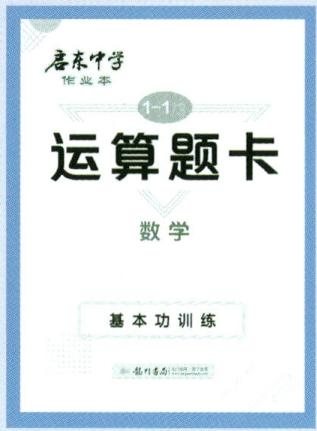

text_image

唐东中学
作业本
1-13
运算题卡
数学
基本功训练

# 运算题卡

难度系数:

基本功训练
计算不失分

# 基础担当

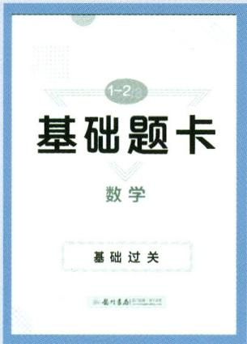

text_image

1-2
基础题卡
数学
基础过关

# 基础题卡

难度系数:

基础过关 小题满分

# 能力担当

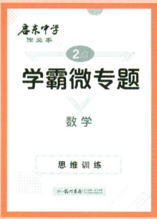

text_image

启东中学
作业本
2/3
学霸微专题
数学
思维训练
机械工业出版社

# 学霸微专题

难度系数:

思维训练 高分秘籍

# 进步担当

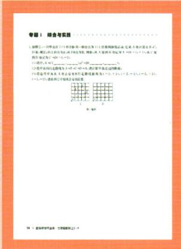

text_image

专题 1 综合考试题
1. 如图 3-4 对称点 (2) 将每一点的点 (2) 在直线内指定点, 它在每个点之间有 0 分, 则每一点的点的值为 0.05, 0.07, 0.09, 0.11, 0.13, 0.15, 0.17, 0.19, 0.21, 0.23, 0.25, 0.27, 0.29, 0.31, 0.33, 0.35, 0.37, 0.39, 0.41, 0.43, 0.45, 0.47, 0.49, 0.51, 0.53, 0.55, 0.57, 0.59, 0.61, 0.63, 0.65, 0.67, 0.69, 0.71, 0.73, 0.75, 0.77, 0.79, 0.81, 0.83, 0.85, 0.87, 0.89, 0.91, 0.93, 0.95, 0.97, 0.99, 1.01, 1.03, 1.05, 1.07, 1.09, 1.11, 1.13, 1.15, 1.17, 1.19, 1.21, 1.23, 1.25, 1.27, 1.29, 1.31, 1.33, 1.35, 1.37, 1.39, 1.41, 1.43, 1.45, 1.47, 1.49, 1.51, 1.53, 1.55, 1.57, 1.59, 1.61, 1.63, 1.65, 1.67, 1.69, 1.71, 1.73, 1.75, 1.77, 1.79, 1.81, 1.83, 1.85, 1.87, 1.89, 1.91, 1.93, 1.95, 1.97, 1.99, 2.01, 2.03, 2.05, 2.07, 2.09, 2.11, 2.13, 2.15, 2.17, 2.19, 2.21, 2.23, 2.25, 2.27, 2.29, 2.31, 2.33, 2.35, 2.37, 2.39, 2.41, 2.43, 2.45, 2.47, 2.49, 2.51, 2.53, 2.55, 2.57, 2.59, 2.61, 2.63, 2.65, 2.67, 2.69, 2.71, 2.73, 2.75, 2.77, 2.79, 2.81, 2.83, 2.85, 2.87, 2.89, 2.91, 2.93, 2.95, 2.97, 2.99, 3.
(例: x = -x + x - x)
(例: y = -y + y - y)
(例: z = -z + z - z)
(例: w = w + w - w)
(例: x = x + x - x)
(例: y = y + y - y)
(例: z = z + z - z)
(例: x = x + x + x)
(例: y = y + y - y)
(例: z = z + z - z)
(例: x = x + x + x)
(例: y = x + x + x)
(例: z = x + x + x)
(例: x = x + x + x)
(例: y = x + x + x)
(例: z = x + x + x)
(例: x = x + x + x)
(例: y = x + x + x)
(例: z = x + x + x)
(例: x = x + x + x)
(例: y = x + x + x)
(例: z = x + x + x)

# 专题卡

难度系数:

高频考点 专项突破

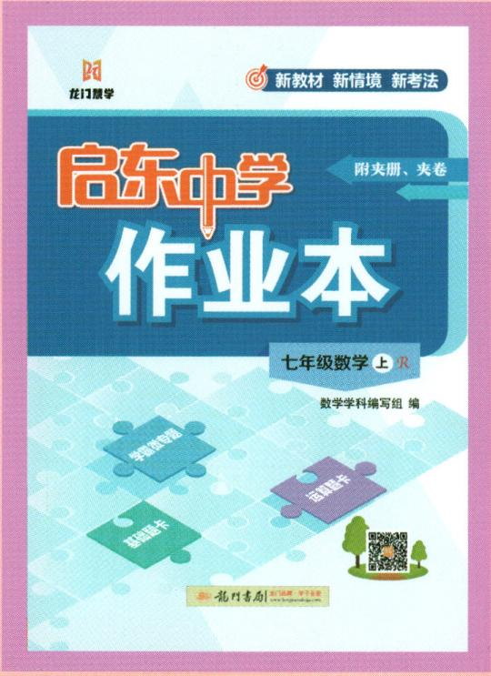

text_image

龙门中学
新教材 新情境 新考法
启东中学
附夹册、夹卷
作业本
七年级数学 上 2R
数学学科编写组 编
学生成专题
英语题卡
英语题卡
孔丹书局 | 赵口编 空子主编
www.longonebook.com

# 学习担当

# 启东中学作业本

难度系数:

日常作业必备

助力学习提优

# 京东中学 作业本

七年级数学上 $\mathcal{R}$

数学学科编写组 编

本册主编:余中梅 吴林

# 版权所有 侵权必究

举报电话:010-64031958

咨询热线:010-64034160

# 图书在版编目(CIP)数据

启东中学作业本. 七年级数学. 上: R / 数学学科编写组编. -- 北京: 龙门书局, 2021.4 (2025.5 重印)

ISBN 978-7-5088-6004-6

I. ①启... II. ①数... III. ①中学数学课 - 初中 - 习题集 IV. ①G634

中国版本图书馆 CIP 数据核字(2021)第 065376 号

责任编辑:万京晨 肖志华 / 责任校对:孙聪明

责任印制:冯岩 / 封面设计:霍影影

龍門書局 出版

北京东黄城根北街 16 号

邮政编码:100717

www.longmenshuju.com

三河市聚河金源印刷有限公司 印刷

科学出版社总发行 各地书店经销

\*

2021年4月第一版 开本:A4(880×1230)

2025年5月第四次修订版 印张:23 1/4

2025年5月第九次印刷 字数:566 000

定价：59.80元

(如有印装质量问题,我社负责调换)

# 策划者语

很多同学都有一个困惑,平时练了很多题,考试的时候还是无从下手,到底是什么原因呢?究其根本是没有将所学的知识彻底掌握。那么,怎样才能将所学的知识融会贯通呢?同学们不妨试试龙门书局研发的“五维学习法”。

“五维学习法”源于一线老师教学和学生学习需求,从练好运算题、基础题、中档题、思维题和常考题五种题型开始,夯实运算能力、打牢基本功、提升能力、拓展思维以及查缺补漏,多维度、分层次帮助同学们学好数学。

# 第一维 练运算

运算能力是数学的基本功。想提高运算能力,是没有捷径可走的,就如武术中的练拳、站桩一样,唯有不断地强化训练,形成肌肉记忆才能提高。本书中的《运算题卡》,精选运算题目,同学们可以通过强化训练,达到提升运算能力的目的。

# 第二维 练基础

扎实的基础是学好数学的基石。数学是一门系统性和应用性很强的学科,很多知识都是环环相扣的,如果基础不牢固,就不能灵活运用,还会影响后面的学习。为了让同学们很好地掌握基础知识,本书中的《基础题卡》定位基础题,选择了一些数据简单、考法简单的题,帮助同学们在课堂上迅速掌握知识、打好基础。

# 第三维 练作业

系统地做作业是提升能力的关键。有了基本功,我们还要练好“组合拳”。本书中同步作业,是在充分调研各地学情、考情的基础上,由各地名师共同参与编写、审核的。内容包含同步课时作业、复习课等。“同步课时作业”能够帮助同学们理解、吃透教材内容;“复习课”在适当的时候加深对知识的记忆,温故知新。

# 第四维 练思维

适当的思维训练是拓展思维的必要因素。能否“一招制敌”，取决于是否拥有“必杀技”。同样，同学们能否拿到高分，思维题起决定性的作用，而思维题的训练不能靠考前一两个月的突击，只能靠平时不断地积累解题经验。本书中的《学霸微专题》，精选压轴题，为学有余力的同学“开小灶”，通过一点一滴的积累，拓展数学思维，为冲刺名校做准备。

# 第五维 练专题

专项训练是巩固所学、融会贯通的捷径。专门训练某一部位的肌肉, 可以让身体变得更加协调。同理, 将重点、难点、高频考点等作为一个个小专题训练, 同学们不仅能够将这些专题知识掌握得更牢, 还会对整个知识架构更加清楚, 以便解决一些综合性问题。本书同步作业部分根据学情和考情, 整理了一些小专题, 这些小专题聚焦数学的一些基本图形、常见辅助线作法、中考热点等问题, 归纳了一些数学思想方法和解题通法, 培养同学们用一种方法解决一类题目的能力, 为解答一些综合性习题做好铺垫。

本书是龙门书局教研团队在“五维学习法”的基础上,经过章章推敲、题题把关、反复修改而成。希望可以给同学们提供一定的帮助,“启东”伴你共同成长。

# 本书编委会

晁生辉 陈锋 陈新合 陈兴林 陈月红

崔恒刘 邓同义 丁不点 董春岩 樊永飞

高波 高俊元 顾和桂 顾为云 韩加军

纪 宁 姜海勇 蒋 帆 李金光 李明珈

李业法 刘海兵 刘静 刘万成 陆亚彬

吕宝库 马俊勤 马士荣 倪 俊 庞如兰

彭世平 邵艳玲 施利红 史佳钰 宋海芝

宋虎林 唐海容 万广磊 王聪 王国富

王伟 王一寒 王云峰 吴林 谢海燕

徐朗千 徐正清 许斌 薛莺 杨丽雪

余琦 余荣 余中华 余中梅 张丽

张丽丽 张庆坤 张伟 赵书爽 郑敏

朱凤娟 朱宁

# 目录

# 第一章 有理数

作业 1 正数和负数(1) …… 1

作业 2 正数和负数(2) …… 2

作业 3 有理数的概念 …… 4

作业4 数轴 6

作业 5 相反数 8

作业6 绝对值 10

作业 7 有理数的大小比较 …… 12

专题 1 综合与实践 …… 14

小结与思考 …… 16

# 第二章 有理数的运算

作业 8 有理数的加法(1) …… 18

作业 9 有理数的加法(2) …… 20

作业 10 有理数的减法(1) …… 22

作业 11 有理数的减法(2) …… 24

作业 12 有理数的乘法(1) …… 26

作业 13 有理数的乘法(2) …… 28

作业 14 有理数的乘法(3) …… 30

作业 15 有理数的除法(1) …… 32

作业 16 有理数的除法(2) …… 34

周练 1 （测试范围:2.1-2.2） …… 36

专题 2 有理数运算的实际应用 …… 38

作业 17 有理数的乘方(1) …… 40

作业 18 有理数的乘方(2) …… 42

作业 19 科学记数法 …… 44

作业20 近似数 45

专题 3 综合与实践 …… 46

小结与思考 48

# 第三章 代数式

作业 21 列代数式表示数量关系(1) …… 50

作业 22 列代数式表示数量关系(2) …… 52

作业 23 列代数式表示数量关系(3) …… 54

作业 24 代数式的值(1) …… 56

作业 25 代数式的值(2) …… 58

专题 4 规律探究 …… 60

专题 5 综合与实践 …… 62

小结与思考 …… 64

# 第四章 整式的加减

作业 26 整式(1) …… 66

作业 27 整式(2) …… 68

作业 28 整式的加法与减法(1) …… 70

作业 29 整式的加法与减法(2) …… 72

作业 30 整式的加法与减法(3) …… 74

专题 6 整式加减的实际应用 …… 76

专题 7 综合与实践 …… 78

小结与思考 80

# 第五章 一元一次方程

作业 31 从算式到方程(1) …… 82

作业 32 从算式到方程(2) …… 84作业33 等式的性质 86

作业 34 解一元一次方程(1) …… 88

作业 35 解一元一次方程(2) …… 90

作业 36 解一元一次方程(3) …… 92

作业 37 解一元一次方程(4) …… 94

专题8 新定义问题中的一元一次方程 …… 96

周练 2 （测试范围:5.1—5.2） 98

作业 38 实际问题与一元一次方程(1) …… 100

作业 39 实际问题与一元一次方程(2) …… 102

作业 40 实际问题与一元一次方程(3) …… 104

作业 41 实际问题与一元一次方程(4) …… 106

专题 9 古代文化中的数学问题 …… 108

专题10 综合与实践 …… 110

小结与思考 111

# 第六章 几何图形初步

作业 42 立体图形与平面图形(1) …… 114

作业 43 立体图形与平面图形(2) …… 116

作业 44 立体图形与平面图形(3) …… 118

作业 45 点、线、面、体 …… 120

作业 46 直线、射线、线段(1) …… 122

作业 47 直线、射线、线段(2) …… 124

作业 48 直线、射线、线段(3) …… 126

专题 11 与线段中点有关的计算 …… 128

周练 3 （测试范围:6.1-6.2）…… 130

作业 49 角的概念 …… 132

作业 50 角的比较与运算 …… 134

作业 51 余角和补角 …… 136

专题 12 与角平分线有关的计算与推理 …… 138

专题13 综合与实践 …… 140

小结与思考 141

# 检测卷

第一章检测卷 143

第二章检测卷 147

第三章检测卷 …… 151

第四章检测卷 155

第五章检测卷 159

第六章检测卷 163

期末冲刺小卷(1) …… 167

期末冲刺小卷(2)……169

期末冲刺小卷(3)……171

期末冲刺小卷(4) …… 173

期末冲刺小卷(5)…… 175

期末冲刺小卷(6) 177

期末检测卷 179

# 附夹册：

夹册 1 《运算题卡 基础题卡》(单独成册)

夹册 2 《学霸微专题》(单独成册)

夹册 3 《参考答案》(单独成册)

# 作业 1 正数和负数 (1)

# 基础过关

1. 在 -5, -2.3, 0, 0.89, -4 $\frac{1}{3}$ 这五个数中, 负数共有 ( )

A. 2 个

B. 3 个

C. 4 个

D. 5 个

2.(2024 秋・南通期中)如果零上 $3^{\circ}$ C 记作 + $3^{\circ}$ C, 那么零下 $2^{\circ}$ C 记作 ( )

A. $-2^{\circ} \mathrm{C}$

B. ${2}^{ \circ  }\mathrm{C}$

C. ${5}^{ \circ  }\mathrm{C}$

D. $- {5}^{ \circ  }\mathrm{C}$

3.(2024·连云港)如果公元前121年记作-121年,那么公元2024年应记作\_\_\_\_年.

4.(2024春·黄浦区期中)若把高出海平面6米记作+6米,则低于海平面8.9米应记为\_\_\_\_米.

# 能力提升

5. 下列对 0 的描述, 错误的是 ( )

A. 0 是偶数

B. 0 是自然数

C. 0 既可以是正数,也可以是负数

D. 0 不是正数

6.《九章算术》中注有“今两算得失相反,要令正负以名之”,意思是:今有两数若其意义相反,则分别叫作正数与负数.若收入80元记作+80元,则-60元表示()

A. 收入 60 元

B. 收入 20 元

C. 支出 60 元

D. 支出 20 元

7. 在 90%, +8, 0, -2025, -0.7, + $\frac{2}{3}$ , 3.14 中, 正数有 \_\_\_\_ 个.

8. 古人讲“五十而知天命”. 若以 50 岁为基准, 如果马骥 56 岁记为 +6 岁, 那么张明 47 岁应记为 \_\_\_\_ 岁.

9.(2024 秋・南通月考)若某次数学考试平均成绩为 85 分,规定高于平均成绩记为正.已知某学生的成绩记作 -3 分,则该学生的实际得分为\_\_\_\_分.

# 拓展延伸

10. 将一列数 -1, 2, -3, 4, -5, 6, … 按如图所示方式进行排列，则 -2025 应排在（）

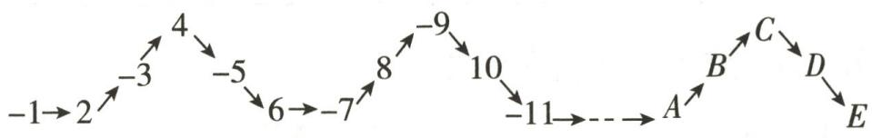

flowchart

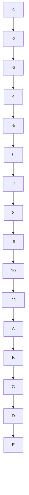

第10题图

A. $B$ 位置

B. $C$ 位置

C. $D$ 位置

D. $E$ 位置

# 作业 2 正数和负数 (2)

# 基础过关

1. 下列结论正确的是 ( )

A. 不大于 0 的数一定是负数

B. 海拔 0 米表示没有高度

C. 0 是正数与负数的分界

D. 不是正数的数一定是负数

2.(2024·碑林区模拟)为计数方便,某果园以每筐水果25kg为标准,超过的千克数记作正数,不足的千克数记作负数. -3kg表示的实际质量是 ( )

A. $3 \mathrm{~kg}$

B. $22 \mathrm{~kg}$

C. 25kg

D. $28 \mathrm{~kg}$

3.(2024春·长宁区期中)如果把增加16%记作16%,那么表示减少8%.

4. 等高线指的是地形图上高度相等的相邻各点所连成的闭合曲线, 等高线上标注的数字为该等高线的海拔. 吐鲁番盆地最低点的等高线标注为 $-155 \mathrm{~m}$ , 表示此处的高度 \_\_\_\_ 海平面 $155 \mathrm{~m}$ . (填“高于”或“低于”)

5. 如果把一个物体向右移动 $10 \mathrm{~m}$ 记作移动 $+10 \mathrm{~m}$ , 那么这个物体又移动了 $-8 \mathrm{~m}$ 是什么意思? 如何描述这时物体的位置?

# 能力提升

6.(2024 秋·靖江月考)一种袋装食品标准净重为 200g,质监人员为了解该种食品每袋的净重与标准的误差,把食品净重 205g 记为 +5g,那么食品净重 198g 就记为 ( )

A. +196g

B. $+ 2 \mathrm{~g}$

C. $-8\mathrm{g}$

D. $-2 \mathrm{~g}$

7. 某项科学研究以 45 分钟为 1 个时间单位, 并记每天上午 10 时为 0, 10 时以前记为负, 10 时以后记为正, 如 9:15 记为 -1, 10:45 记为 +1, 依此类推, 上午 7:45 应记为 ( )

A. 3

B.-3

C. -2.15

D.-7.45

8. 某年, 一些国家的服务出口额与上一年相比的增长率如下表:

<table><tr><td>美国</td><td>德国</td><td>英国</td><td>中国</td></tr><tr><td>-2.5%</td><td>-0.3%</td><td>-3.2%</td><td>2.8%</td></tr></table>

这一年上述四国中服务出口额增长的国家是 （）

A. 美国

B. 德国

C. 英国

D. 中国

9. 小明的爸爸存折上原有 1000 元, 近一段时间的存取情况 (存入为正, 取出为负) 如下: -240 元, +350 元, +220 元, -130 元, -470 元, 小明的爸爸存折中现有 \_\_\_\_ 元. (不计利息)

10. 某公交车上原有 10 人, 经过三个站点时乘客上下车的情况如下 (上车为正, 下车为负): $(+2, -3), (+8, -5), (+1, -6)$ , 此时车上的人数为 \_\_\_\_.

11. 学校对七年级男生进行引体向上的测试,以能做 7 个为标准,超过的次数用正数表示,不足的次数用负数表示,其中 8 人的成绩如下:0,1,-3,-2,3,0,-1,2.

(1)这8人中有几人达标?

(2)达标率是多少?

12. 现测得四名同学的身高如下: 156cm, 158cm, 153cm, 157cm.

(1)求这四名同学的平均身高:

(2)以计算的平均身高为标准,用正数表示超出部分,用负数表示不足部分,这四名同学的身高各应怎样表示?

(3)在(2)的条件下,若甲同学的身高记作+10cm,则他的实际身高是多少? 甲同学比这四名同学中最矮的同学高多少厘米?

# 拓展延伸

13. 下表是国外几个城市与北京的时差。(带正号的数表示同一时刻比北京时间早的时间数)

(1)如果现在北京时间是8时,那么现在纽约时间是多少?东京时间是多少?

(2)如果有一场火箭队客场作战芝加哥公牛队的篮球比赛,你希望比赛时间安排在什么时候,既不影响你上学学习,又能和爸爸、妈妈一起通过电视直播收看这场比赛?

<table><tr><td>城市</td><td>纽约</td><td>巴黎</td><td>东京</td><td>芝加哥</td></tr><tr><td>时差/时</td><td>-13</td><td>-7</td><td>+1</td><td>-14</td></tr></table>

# 作业 3 有理数的概念

# 基础过关

1. 下列各数中, 正整数是

A. 3

B. 2.1

C. 0

D.-2

2.(2024·白云区模拟)下列四个数中,属于负整数的是()

A.-2.5

B.-3

C. 0

D. 6

3.(2024 秋·宜兴月考)下列说法正确的是 ( )

A. 0 是正数

B. 0 是负数

C. 0 是整数

D. 0 是分数

4.(2024秋·杭州月考)下列说法正确的是

A. 所有的整数都是正数

B. 整数和分数统称有理数

C. 0 是最小的有理数

D. 0 既可以是正整数,也可以是负整数

5.有下列有理数: -2,4,-70%, -6,0,-0.3,-20.其中负整数有

6. 在有理数 +3, 7.5, -0.05, 0, -2024, $\frac{2}{3}$ 中, 非负数有 \_\_\_\_ 个.

7.(2024 秋·南海区月考)把下面的有理数填入它们属于的集合内:

$$
- 3, 1 2, - 4, 2, 0, 1, - 8 \frac {1}{4}, 3. 1 4, \frac {5}{8}.
$$

正数集合: {\_\_\_\_…}; 负数集合: {\_\_\_\_…};

整数集合: {\_\_\_\_…}; 分数集合: {\_\_\_\_…}.

8. 如图, 把下列各数填入它们属于的集合内:

$$
- 1 9, \frac {2 3}{7}, 3. 1 4 1 5 9, 1 0 3, - \frac {4}{5}, - 1 2 \frac {1}{3}, 2 6 \%, 0. 2.
$$

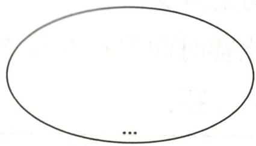

natural_image

Simple oval shape with a small dot at the bottom center (no text or symbols)

正数集合

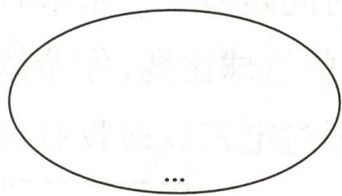

natural_image

Simple oval shape with a small dot at the bottom center, no text or symbols present.

负数集合

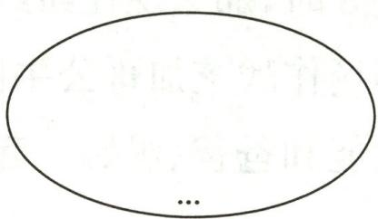

natural_image

Simple oval shape with a small dot at the bottom center, no text or symbols present.

整数集合

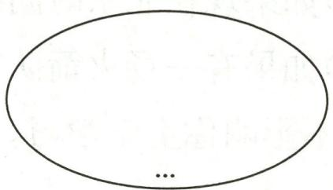

natural_image

Simple oval shape with a small dot at the bottom center (no text or symbols)

分数集合  
第8题图

# 能力提升

9. 在 $-\frac{1}{3}, \frac{22}{7}, 0, -1, 0.12, 14, -2, -1.5$ 这些数中，正有理数有 $m$ 个，非负整数有 $n$ 个，分数有 $k$ 个，则 $m - n + k$ 的值为 （）

A. 3

B. 4

C. 6

D. 5

10.有下列说法:①最小的自然数为1;②最大的负整数是-1;③没有最小的负数;④最小的整数是0;⑤最小非负整数为0.其中正确的说法有 ( )

A. 2 个

B. 3 个

C. 4 个

D. 5 个

11. 在有理数 -4,500,0,-2.67,5 $\frac{3}{4}$ 中,整数有\_\_\_\_,负整数有\_\_\_\_.

12. 一列有理数按如下规律排列: $-\frac{3}{2}, \frac{2}{3}, -\frac{5}{4}, \frac{4}{5}, -\frac{7}{6}, \frac{6}{7}, \cdots$ . 观察上述规律填空:

(1)第7个数是\_\_\_\_,第12个数是\_\_\_\_;

(2)第2025个数是\_\_\_\_。

13. 如图, 已知 A 是整数集合, B 是正数集合, C 是分数集合, D 是 A 和 B 的重叠部分, E 是 B 和 C 的重叠部分.

(1)D 是 \_\_\_\_ 集合, E 是 \_\_\_\_ 集合;

(2)有下列各数:10,-0.72,-98,25, $\frac{8}{3}$ ,63%, -3.14,0,200%,4.1010010001. 请将它们填入图中相应的集合里.

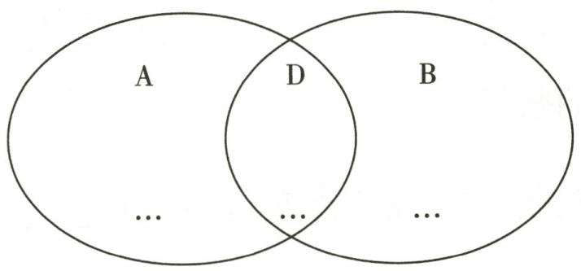

text_image

A
D
B
...
...
...

①

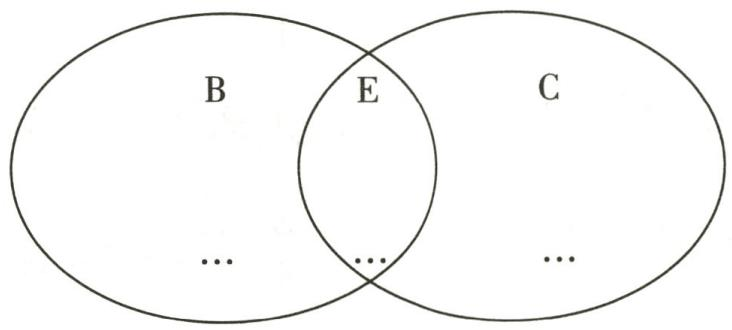

text_image

B
E
C
...
...
...

②   
第13题图

# 拓展延伸

14. 黑板上有 10 个有理数, 小明说: “其中有 6 个正数.” 小红说: “其中有 6 个整数.” 小华说: “其中正分数的个数与负分数的个数相等.” 小林说: “负数的个数不超过 3.” 请你根据四位同学的叙述判断这 10 个有理数中共有几个负整数.

# 作业 4 数轴

# 基础过关

1.下面是四位同学画的数轴,其中正确的是()

A. $\frac{1}{1}$ $\frac{1}{2}$ $\frac{1}{3}$ $\frac{1}{4}$ $\frac{1}{5}$

B. $-1$ 0 1 2 3

C. $\frac{1}{-1}$ -2 0 1 2

D. $\frac{1}{-2}$ -1 0 1 2

2.(2024·河南)如图,数轴上点 P 表示的数是 ( )

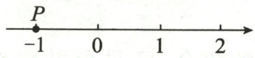

A.-1

B. 0

C. 1

D. 2

3.(2024 秋·苏州期中)数轴上表示-2024 的点到原点的距离为 ( )

A. $-\frac{1}{2024}$

B. $\frac{1}{2024}$

C.-2024

D. 2024

4. 若数轴上的点 $A$ 到原点的距离是 4, 则点 $A$ 表示的数为 ( )

A. 4

B.-4

C. 4 或 -4

D. 2 或 -2

5. 位于数轴的正半轴且与原点距离为 5 个单位长度的数是 \_\_\_\_.

6. 在数轴上表示数 -5, 3.5, $-\frac{3}{4}$ , 100, $-3\frac{1}{2}$ , -2025 的点中, 在原点左边的点有 \_\_\_\_ 个.

7. 画一条数轴, 并标出表示下列各数的点.

$$
0, - 1 \frac {1}{4}, - 2. 1, + 0. 2 5, 1 \frac {3}{4}.
$$

8. 如图, 点 $A, B$ 在数轴上, 点 $C$ 表示的数是 -3.5 , 点 $D$ 表示的数是 +2 .

(1) 点 A, B 分别表示什么数?

(2)在数轴上表示出点 C 和点 D;

(3)在点 A, B, C, D 所表示的数中, 哪些是负数?

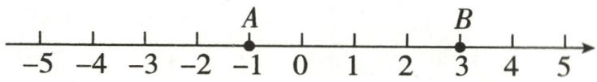  
第8题图

# 能力提升

9.(2024 秋·建邺区期中)若数轴上点 A 表示的数是 -4, 则与点 A 相距 5 个单位长度的点表示的数是 ( )

A. ±4

B. ±5

C.-1或9

D. 1 或 -9

10. 数轴上表示整数的点称为整点. 某数轴的单位长度为 $1 \mathrm{~cm}$ , 若在这个数轴上任意画出一条长 $5.1 \mathrm{~cm}$ 的线段 $C D$ , 则线段 $C D$ 盖住的整点个数是 \_\_\_\_.

11. 如图, 数轴上有 $A, B, C$ 三个点, 请回答问题.

(1) $A, B, C$ 三点表示的数分别是 $\quad$ , $\quad$ , $\quad$ ;

(2) 将点 B 向左平移 3 个单位长度后, 求点 B 所表示的数;

(3) 将点 $A$ 向右平移 4 个单位长度后, 求点 $A$ 所表示的数.

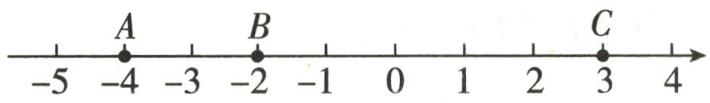  
第11题图

# 拓展延伸

12.(2024 秋·江都区月考)如图,数轴上有三个点 A, B, C, 它们所表示的数分别为 -3, -2, 2.

(1) $B, C$ 两点间的距离是 , 将点 $A$ 向 \_\_\_\_ 平移 \_\_\_\_ 个单位长度到达点 $C$ ;

(2)若点 D 与点 B 的距离是 8, 则点 D 表示的数是 \_\_\_\_;

(3)若将数轴折叠,使点 A 与点 C 重合,则点 B 与数 表示的点重合.

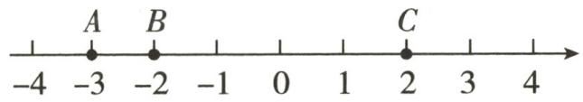  
第12题图

# 作业 5 相反数

# 基础过关

1.(2024·青海)-2024的相反数是 ( )

A. -2024

B. 2024

C. $\frac{1}{2024}$

D. $-\frac{1}{2024}$

2.(2024 秋·东西湖区期中)一个数的相反数是它本身,则该数为 ( )

A. 0

B. 1

C.-1

D. 不存在

3. 在 $-1, +(-2), -(-3), -(+4)$ 中, 负数的个数是 ( )

A. 1

B. 2

C. 3

D. 4

4. 化简: (1) $-(+6)=$ \_\_\_\_; (2) $-(-1.3)=$ \_\_\_\_; (3) $-(+4)=$ \_\_\_\_;

(4) $+(-2)=$ \_\_\_\_.

5. 如图, 数轴上 $A, B$ 两点表示的数互为相反数, 且点 $A$ 与点 $B$ 之间的距离为 4 个单位长度, 则点 $A$ 表示的数是 \_\_\_\_.

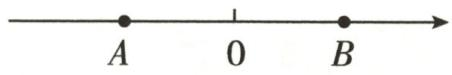  
第5题图

6. 化简下列各式:

(1)+(-7);

(2) $-(+1.4)$ ;

(3) $+(+2.5)$ ;

(4) $-\left[+(-5)\right]$ ;

(5) $-[-(-2.8)]$ ;

(6) $-(-6)$ ;

(7) $-[-(+6)]$ ;

(8)+[-(+6)];

(9) $-\left[-\left(-\frac{2}{3}\right)\right].$

# 能力提升

7.(2024 秋·杭州期中)下列各对数中,互为相反数的是 ( )

A. +(-2.5)和-2 $\frac{1}{2}$

B. $-\left(+4\frac{1}{3}\right)$ 和 $+\left(-4\frac{1}{3}\right)$

C. $-(-1.8)$ 和 $+(-1.8)$

D. $-(-2)$ 和 $+(+2)$

8.(2024 秋·昌平区期中)化简- $\{-[-[+(-1)]\}$ 的结果为()

A. 1

B.-1

C. ±1

D. -3

9. 有理数 $a, b, c, d$ 在数轴上对应点的位置如图所示, 其中有一对互为相反数, 它们是 ( )

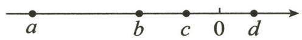

# 第9题图

A. $a$ 与 $d$

B. $b$ 与 $d$

C. $c$ 与 $d$

D. $a$ 与 $c$

10. (2024 秋・襄都区月考)在数轴上, 若点 $A, B$ 分别表示互为相反数的两个数, 并且这两个点的距离是 7 , 点 $A$ 在原点的左侧, 则点 $A$ 表示的数为 \_\_\_\_.

11.(1)化简下列各式: ①-(-2); ②+ $\left(-\frac{1}{5}\right)$ ; ③-[-(-4)]; ④-[-(+3.5)]; ⑤- $\{-[-(-5)]\}$ ; ⑥- $\{-[-(+5)]\}$ ;

(2)若+5前面有2026个负号,则化简后的结果是多少? 若-5前面有2025个负号,则化简后的结果是多少? 你能总结出什么规律?

12. 如图, 已知 $A, B, C, D$ 四个点在一条没有标明原点的数轴上.

(1)若点 $A$ 和点 $C$ 表示的数互为相反数, 则原点为 $\quad$ ;

(2)若点 B 和点 D 表示的数互为相反数,则原点为 ;

(3)若点 $A$ 和点 $D$ 表示的数互为相反数, 请在数轴上标出原点的位置.

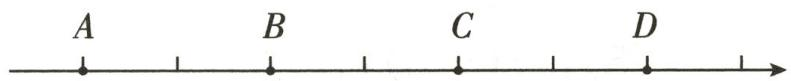  
第12题图

# 拓展延伸

13. 已知表示数 $a$ 的点在数轴上的位置如图所示.

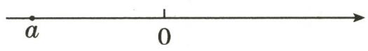  
第 13 题图

(1)在数轴上标出表示数 $a$ 的相反数的点的位置;

(2)若表示数 $a$ 的点与表示其相反数的点相距 20 个单位长度, 则 $a$ 是多少?

(3)在(2)的条件下,若表示数 b 的点与表示数 a 的相反数的点相距 5 个单位长度,求数 b 的值.

# 基础过关

1.(2024·成都)-5的绝对值是 ( )

A. 5

B. - 5

C. $\frac{1}{5}$

D. $- \frac{1}{5}$

2.(2024秋·海州区期中)下面各数中,绝对值最小的是()

A.-3

B.-1

C. +3

D. 0

3. 下列各式正确的是 ( )

A. $-\vert-5\vert=5$

B. $-(-5)=-5$

C. $\left| {-5}\right|  =  - 5$

D. $-(-5)=5$

4.(2024·邗江区一模)绝对值等于2的数是()

A.-2

B. $\frac{1}{2}$

C. 2

D. ±2

5.(2024秋·吴江区月考)当 $|x|=-x$ 时,则x一定是()

A. 负数

B. 正数

C. 负数或 0

D. 0

6. 化简下列各式:

(1) $\left|-\frac{2}{3}\right|$ ;

(2) $-\left|-1\frac{2}{3}\right|$ ;

(3) $-\left|-(-0.7)\right|$ ;

(4) $-\vert+2.5\vert$ ;

(5) $|-(-3)|$ ;

(6) $-\left|-(+2025)\right|$ .

7. 计算：

(1)2025-|-2023|;

(2) $2-\left|-\frac{4}{5}\right|$ ;

(3) $|-4|+|+3|$ ;

(4) $\left|-\frac{4}{3}\right|-\left|\frac{1}{3}\right|$ ;

(5) $\left|-\left(+\frac{1}{2}\right)\right|+|-0.3|$ ;

(6) $|-16|+|-24|+|-30|$ ;

(7) $\left| -3\frac{1}{3} \right| \div \left| -1\frac{1}{4} \right| \times |-12|$ .

# 能力提升

8. 如图, 数轴上有 $M, N, P, Q$ 四个点, 其中所对应的数的绝对值最大的点是 ( )

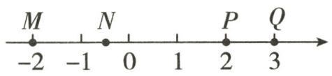  
第8题图

A. 点 Q

B. 点 $P$

C. 点 $N$

D. 点 M

9.(2024秋·杭州月考)下列各数中,一定互为相反数的是()

A. -(-1)和1

B. $|-2|$ 和 $|+2|$

C. $-(-3)$ 和 $-|-3|$

D. m 和 $\left|-m\right|$

10. 已知 $a = -8, |a| = |b|$ , 则 $b$ 的值为 ( )

A.-8

B. +8

C. ±8

D. 0

11. 下列结论成立的是 ( )

A. 若 $|a|=a$ , 则 a>0

B. 若 $|a| = |b|$ ，则 $a = b$ 或 $a = -b$

C. 若 $|a| > a$ ，则 $a \leq 0$

D. 若 $|a| > |b|$ ，则 $a > b$

12.(2024秋·嵊州期中)若 $|a-5|+|b-4|=0$ ,则a-b= \_\_\_\_.

13. 已知 $|a| = 2, |b| = 2$ ，且 $b > a$ ，求 $a, b$ 的值。

14.(1)当 $a$ 等于什么值时,式子 $\vert a\vert + 12$ 的值最小? 最小值是多少?

(2)当 $a$ 等于什么值时,式子 $12 - |a|$ 的值最大? 最大值是多少?

# 拓展延伸

15. 已知 $|0| = |0|$ , $|1| = |1|$ , $|1| = |-1|$ , $|2| = |2|$ , $|2| = |-2|$ , $\cdots$ , $|n| = |n|$ , $|n| = |-n|$ .

(1)如果 $|a|=|4|$ ，那么a是什么数？

(2)如果 a, b 表示任意有理数, 且 $\left|a\right| = \left|b\right|$ , 那么 a 与 b 有什么关系?

(3)若(2)中的有理数 a, b 在数轴上对应的两个点之间的距离是 6, 求 a, b 的值.

# 作业 7 有理数的大小比较

# 基础过关

1.(2024·内江)下列四个数中,最大的数是()

A.-2

B. 0

C.-1

D. 3

2.(2024·南通二模)在-4,-3,-2,-1四个数中,比-2大的数是()

A.-4

B. -3

C.-2

D. -1

3.(2024秋·江阴月考)比-3.14大的负整数有()

A. 2 个

B. 3 个

C. 4 个

D. 5 个

4. 下列结论正确的是 ( )

A. 0 是最小的正整数

B. 0 是最大的负整数

C. 没有最大的负整数

D. 绝对值最小的数是 0

5. 比较大小: (1) $-(+2)$ \_\_\_\_ | -2 |; (2) $\frac{3}{5}$ \_\_\_\_ $-\frac{4}{5}$ . (均填“>”“<”或“=”)

6.(2024秋·江都区月考)如果甲地海拔高度为-50米,乙地海拔高度为-65米,那么甲地比乙地\_\_\_\_。(填“高”或“低”)

7. 比较下列各组数的大小:

(1) $-\frac{7}{12}$ 与 $-\frac{5}{6}$ ;

(2) $-\frac{3}{11}$ 与-0.3;

(3) $-\frac{4}{9}$ 与 $-\frac{3}{7}$ ;

(4) $-\frac{7}{8}$ 与 $-\frac{8}{9}$ ;

(5) $-\vert-9\vert$ 与 $-(-9)$ ;

(6) $-\left|-\frac{2}{3}\right|$ 与 $-\frac{3}{4}$ .

8.(2024 秋·海淀区期中)如图,数轴上点 A 表示的数是 -4,点 B 表示的数是 3.

(1)在图中所示的数轴上标出原点 O;

(2)在图中所示的数轴上表示下列各数,并将它们按从小到大的顺序用“<”连接起来.

-3,0,-1,2.5.

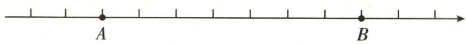  
第8题图

# 能力提升

9.(2024 秋·房山区期中)如图,数轴上点 A 表示的数为 a, 点 B 表示的数为 b. 把 a, -a, b, -b 按照从小到大的顺序排列, 正确的是 ( )

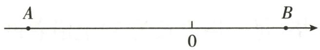  
第9题图

A. $a < - b < - a < b$

B. $a < -b < b < -a$

C. $-b < a < -a < b$

D. $-b < a < b < -a$

10. 绝对值大于 1.5 且小于 3 的整数是 \_\_\_\_.

11. 某汽车配件厂生产一批零件,从中随机抽取 6 件进行检验,比标准直径长的毫米数记为正数,比标准直径短的毫米数记为负数,检查记录如下表:

<table><tr><td>序号</td><td>1</td><td>2</td><td>3</td><td>4</td><td>5</td><td>6</td></tr><tr><td>误差/毫米</td><td>+0.5</td><td>-0.15</td><td>0.1</td><td>0</td><td>-0.1</td><td>0.2</td></tr></table>

(1)哪 3 件零件的质量相对好一些？请用学过的绝对值知识来说明理由；

(2)若规定与标准直径误差小于或等于0.1毫米的为优等品,在0.1\~0.3毫米(不含0.1毫米和0.3毫米)范围内的为合格品,大于或等于0.3毫米的为次品,则这6件产品中优等品、合格品和次品分别有几件?

# 拓展延伸

12.(1)在如图①所示的数轴上分别表示出-(-1),|-4|,+(-2.5).

(2)有理数 m, n 在数轴上的对应点如图②所示.

①在图②上分别表示出数 - n 和 $\left|m\right|$ ;

②把 m, n, -n, |m| 这四个数用“<”连接.

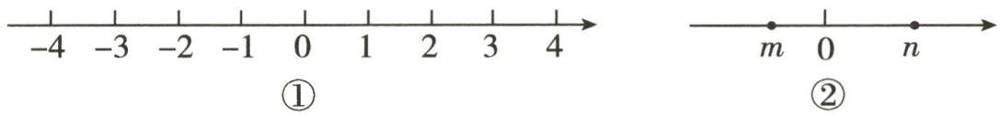

text_image

-4 -3 -2 -1 0 1 2 3 4
①
m 0 n
②

第12题图

# 专题1 综合与实践

1. 如图①, 一只甲虫在 $5 \times 5$ 的方格 (每一格边长为 1) 上沿着网格线运动. 它从 $A$ 处出发去 $B, C, D$ 处, 规定: 向上向右为正, 向下向左为负. 例如, 从 $A$ 处到 $B$ 处记为 $A \rightarrow B(+1, +3)$ ; 从 $C$ 处到 $D$ 处记为 $C \rightarrow D(+1, -2)$ .

(1)填空: $A \rightarrow C$ (\_\_\_\_, \_\_\_\_); $C \rightarrow B$ (\_\_\_\_, \_\_\_\_);   
(2)若甲虫的行走路线为 $A \rightarrow B \rightarrow C \rightarrow D \rightarrow A$ , 请计算甲虫走过的距离;  
(3)若这只甲虫从 A 处去 Q 处的行走路线依次为 $(+3, +1)$ , $(+2, -1)$ , $(-2, +3)$ , $(-1, -2)$ , 请在图②中标出点 Q 的位置.

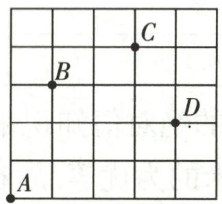

text_image

A
B
C
D

①

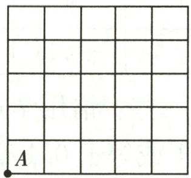

text_image

A

②   
第1题图

2. (2024 秋·建宁县期中)“江上往来人,但爱鲈鱼美。”李师傅根据当地人的饮食喜好,投资养殖一批鲈鱼,经过一个季度的养殖,随机测了 20 条鲈鱼的质量(单位:g),记录数据如下表:

<table><tr><td>序号</td><td>1</td><td>2</td><td>3</td><td>4</td><td>5</td><td>6</td><td>7</td><td>8</td><td>9</td><td>10</td></tr><tr><td>称重</td><td>456</td><td>438</td><td>443</td><td>463</td><td>456</td><td>450</td><td>438</td><td>443</td><td>456</td><td>450</td></tr><tr><td>序号</td><td>11</td><td>12</td><td>13</td><td>14</td><td>15</td><td>16</td><td>17</td><td>18</td><td>19</td><td>20</td></tr><tr><td>称重</td><td>446</td><td>456</td><td>450</td><td>446</td><td>443</td><td>443</td><td>456</td><td>443</td><td>463</td><td>456</td></tr></table>

(1)若这批鲈鱼经过一个季度的成长,合格质量为 $450g \pm 10g$ , 则抽查的 20 条鲈鱼中, 合格率是多少?

(2)若以 450g 为标准质量,运用正负数知识,通过计算说明抽查的 20 条鲈鱼的总质量是否符合“标准总质量”,总质量超过或不足“标准总质量”多少克?

# 小结与思考

总分:100 分 时间:40 分钟 成绩评定:

# 一、选择题（每题5分，共25分）

1. 下列计算结果为 6 的是 ( )

A. $-(+6)$

B. +(-6)

C. $-(-6)$

D. $-\vert-6\vert$

2.(2024·通辽)某地区某日最高气温是零上8℃,记作+8℃,最低气温是零下3℃,应该记作()

A. $-3^{\circ} \mathrm{C}$

B. $+3^{\circ} \mathrm{C}$

C. $- {5}^{ \circ  }\mathrm{C}$

D. $+5^{\circ} \mathrm{C}$

3.(2024 秋·海门区期中)下列各数中,互为相反数的是 ( )

A. + (+3) 与 3

B. $-(-3)$ 与-3

C. $-(+3)$ 与-3

D. +(-3)与-3

4. 如图, 四个有理数在数轴上的对应点分别为点 $M, N, P, Q$ . 若点 $M, N$ 表示的有理数互为相反数, 则图中表示绝对值最小的数的点是 ( )

A. 点 $M$

B. 点 $P$

C. 点 $N$

D. 点 $Q$

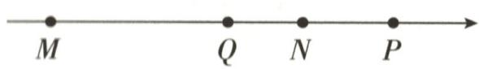  
第4题图

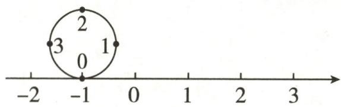

text_image

2
3 1
0
-1 -2 0 1 2 3

第5题图

5.(2024 秋·惠州期中)如图,圆的周长为 4 个单位长度,在该圆的四等分点处分别标有 0,1,2,3,先让圆上表示数字 0 的点与数轴上表示 -1 的点重合,再将圆沿着数轴向右滚动,则圆上与数轴上表示 2024 的点重合的是 ( )

A. 0

B. 1

C. 2

D. 3

# 二、填空题(每题5分,共25分)

6. 绝对值大于 1 且小于 4 的整数有 \_\_\_\_ 个.  
7.(2024秋·南通期中)比较大小: -3 \_\_\_\_ -3 $\frac{1}{4}$ . (填“>”或“<”)   
8. 某大米包装袋上标注着“净含量: $25 \, kg \pm 0.25 \, kg$ ”, 则每袋大米的净含量最少是 \_\_\_\_ kg.   
9. 如图, 在数轴上, 点 $A$ 表示的数为 $-1$ , 点 $B$ 表示的数为 4 , 点 $C$ 在点 $A$ 的左边, 且点 $A$ 到点 $B$ 与点 $A$ 到点 $C$ 的距离相等, 则点 $C$ 表示的数为 \_\_\_\_.

$$
- 6 \quad - 5 \quad - 4 \quad - 3 \quad - 2 \quad - 1 \quad - 0 \quad 1 \quad 2 \quad 3 \quad 4 \quad 5
$$

第9题图

10. 若 a, b 各表示一个有理数，且 $\left|a\right|=3,\left|b\right|=\left|-4\right|$ ，则在数轴上，数 a 与数 b 对应点之间的距离为 \_\_\_\_.

# 三、解答题(共50分)

11.(10分)把下列各数在如图所示的数轴上表示出来,并用“<”把它们连接起来.

$$
- (- 1), 0, 2. 5, - 2, - 1 \frac {1}{2}.
$$

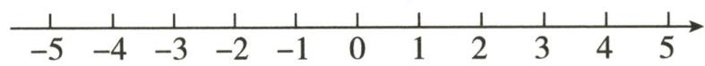  
第11题图

12.(12 分)把下列有理数填入它们属于的集合内:

$$
- 7, - 0. 5, - \frac {1}{3}, 0, - 98 \%, 8. 7, 1 9 9 9.
$$

负整数集合: { … };

非负数集合: { … };

正分数集合: { … } ;

负分数集合: { …}.

13.(14分)邮递员骑摩托车从邮局出发,先向东骑行2km到达A村,继续向东骑行3km到达B村,然后向西骑行9km到达C村,最后回到邮局.

(1)以邮局为原点,以向东方向为正方向,用1个单位长度表示1km,请你在数轴上表示出A,B,C三个村庄的位置;

(2)C村离A村有多远?

(3)如果摩托车行驶 1km 平均耗油 0.03L,那么这次摩托车共耗油多少升?

14. (14 分) 下表是今年雨季某条河流河水一星期的水位变化情况(上星期日的水位刚好为警戒水位).

<table><tr><td>星期</td><td>一</td><td>二</td><td>三</td><td>四</td><td>五</td><td>六</td><td>日</td></tr><tr><td>水位变化/米</td><td>+0.20</td><td>+0.81</td><td>-0.35</td><td>+0.03</td><td>+0.28</td><td>-0.36</td><td>-0.01</td></tr></table>

注: 正号表示水位比前一天上升, 负号表示水位比前一天下降.

(1)这个星期哪一天河流的水位最高？哪一天河流的水位最低？它们位于警戒水位之上还是之下？与警戒水位的距离分别是多少米？

(2)与上个星期日相比,这个星期日河流的水位是上升了还是下降了?

# 作业 8 有理数的加法(1)

# 基础过关

1.(2024·广东)计算-5+3的结果是 ( )

A.-2

B.-8

C. 2

D. 8

2. 下列各式运算正确的是 ( )

A. $(-7) + (-7) = 0$

B. $\left(-\frac{1}{3}\right)+\left(-\frac{1}{2}\right)=-\frac{1}{6}$

C. $0+(-9)=9$

D. $\left(-\frac{1}{10}\right)+\left(+\frac{1}{10}\right)=0$

3.(2024 秋·镇江期中)某天早晨的气温是 $-3^{\circ}C$ ，中午的气温比早晨上升了 $8^{\circ}C$ ，中午的气温是（）

A. ${4}^{ \circ  }\mathrm{C}$

B. ${5}^{ \circ  }\mathrm{C}$

C. ${6}^{ \circ  }\mathrm{C}$

D. ${7}^{ \circ  }\mathrm{C}$

4. 计算：

(1) $100+(-20)=$ \_\_\_\_；

(2) $(-8)+8=$ \_\_\_\_;

(3) $(-20)+(-15)=$ \_\_\_\_；

(4) $(-2)+0=$ \_\_\_\_；

(5)(-6.5)+(+1.5)=\_\_\_\_;

(6) $0+(-5)=$ \_\_\_\_；

(7) $\frac{3}{5}+\left(-\frac{4}{5}\right)=$ \_\_\_\_；

(8) $2\frac{3}{4}+(-1\frac{1}{2})=$ \_\_\_\_.

5. 若一个数是 5, 另一个数比 5 的相反数大 2, 则这两个数的和为 \_\_\_\_.

6. 一艘潜水艇所在高度是 -60 米, 一条鲨鱼在潜水艇上方 15 米, 则鲨鱼所在高度是 \_\_\_\_ 米.

7. 若 a, b 互为相反数，则 $\left|a + b + 1\right| =$ \_\_\_\_.

8. 计算：

(1) $\left(+\frac{3}{5}\right)+\left(-\frac{7}{12}\right);$

(2) $\left(-3\frac{2}{3}\right)+\left(-\frac{1}{6}\right);$

(3) $(-0.25)+\left(+\frac{3}{4}\right);$

(4) $(+1.579)+(-0.874)$ ;

(5) $\left(-\frac{3}{4}\right)+\left|-\frac{2}{3}\right|;$

(6) $-\vert-4.2\vert+ \vert-8.7\vert.$

# 能力提升

9.(2024 秋·镇江月考)如果两个有理数的和是负数,则这两个数()

A. 都是负数

B. 一定是一正一负

C. 一定是 0 和负数

D. 至少一个是负数

10. 在《九章算术注》中用不同颜色的算筹(小棍形状的记数工具)分别表示正数和负数(白色为正,黑色为负). 若图①表示的是+21-32=-11的计算过程,则图②表示的过程是在计算()

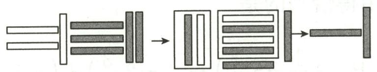

flowchart

①

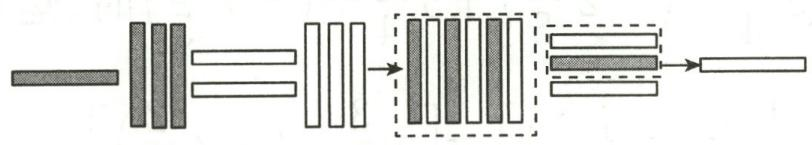

flowchart

②

# 第10题图

A. $(-13) + (+23) = 10$

B. $(-31) + (+32) = 1$

C. $(+13) + (+23) = 36$

D. $(+13) + (-23) = -10$

11.(2024 秋・东台月考)下列说法正确的是 ( )

A. 若 $a + b > 0$ ，则 $a > 0, b > 0$

B. 若 $a + b < 0$ , 则 $a < 0, b < 0$

C. 若 $a + b > a$ ，则 $a + b > b$

D. 若 $|a| = |b|$ ，则 $a = b$ 或 $a + b = 0$

12. 列式计算：

(1) - 105 的绝对值加上 12 的相反数的和是多少?

(2)-15的相反数加上-27的和是多少?

13. 为了增强青少年的国防意识, 某校组织航模比赛. 某班航模兴趣小组周末在学校操场进行训练, 其中一次飞机模型离地面高度达到 0.5 米后, 连续四次升降的数据如下表所示.

(1)将表格补充完整；

(2)飞机模型连续完成四个升降动作后,离地面的高度是多少米?

<table><tr><td>高度变化</td><td>记作</td></tr><tr><td>上升5.5米</td><td>+5.5米</td></tr><tr><td>下降2.8米</td><td>-2.8米</td></tr><tr><td>上升1.5米</td><td>_米</td></tr><tr><td>下降1.7米</td><td>_米</td></tr></table>

# 拓展延伸

14.(1)已知 $|a|=5,|b|=3$ ,求 $a+b$ 的值;

(2)已知 $|a|=5,a+b=-2$ ,求b的值;

(3)已知 $|a|=5,|b|=3,a<b$ ,求 $a+b$ 的值.

# 作业 9 ) 有理数的加法(2)

# 基础过关

1. 计算 $(-5) + 6 + (-3)$ 的结果等于

A. 2

B. 8

C.-2

D.-8

2. 计算 $3\frac{1}{4} + \left(-2\frac{3}{5}\right) + 5\frac{3}{4} + \left(-7\frac{2}{5}\right)$ 时, 运算律用得恰当的是 ( )

A. $\left[3\frac{1}{4} +\left(-2\frac{3}{5}\right)\right] + \left[5\frac{3}{4} +\left(-7\frac{2}{5}\right)\right]$

B. $\left(3\frac{1}{4}+5\frac{3}{4}\right)+\left[(-2\frac{3}{5})+(-7\frac{2}{5})\right]$

C. $\left[3\frac{1}{4}+\left(-7\frac{2}{5}\right)\right]+\left[\left(-2\frac{3}{5}\right)-5\frac{3}{4}\right]$

D. $\left[(-2\frac{3}{5})-5\frac{3}{4}\right]+\left(3\frac{1}{4}+7\frac{2}{5}\right)$

3.(2024 秋・苏州期中)绝对值不大于 3 的所有整数的和是 ( )

A. 0

B.-1

C. 1

D. 6

4. 若 a 为最大的负整数, b 为最小的正整数, c 为 -5 的绝对值, 则 $a + b + c$ 的值为 \_\_\_\_.

5. 用适当的方法计算下列各题：

(1) $(+7)+(-21)+(-7)+(+23)$ ;

(2) $12+(-8)+11+(-2)+(-12)$ ;

(3)0.125+2 $\frac{1}{4}$ + $\left(-2\frac{1}{8}\right)$ +(-0.25);

(4) $(-13.2)+\left(-\frac{5}{6}\right)+\left(+4\frac{1}{5}\right)+\left(+\frac{5}{6}\right).$

6.(2024 秋·连云港期中)某水果店以每箱 200 元的价格从水果批发市场购进 20 箱樱桃,若以每箱净重 10 千克为标准,超过的千克数记为正数,不足的千克数记为负数,称重的记录如下表:

<table><tr><td>与标准质量的差值/千克</td><td>-0.5</td><td>-0.25</td><td>0</td><td>0.25</td><td>0.3</td><td>0.5</td></tr><tr><td>箱数</td><td>1</td><td>2</td><td>4</td><td>6</td><td>n</td><td>2</td></tr></table>

(1) 求 n 的值及这 20 箱樱桃的总质量;

(2)若水果店打算以每千克25元销售这批樱桃,全部售出可获利多少元?

# 能力提升

7.(2024 秋·南通月考)如果三个数的和为零,那么这三个数一定是 ( )

A. 两个正数, 一个负数

B. 两个负数, 一个正数

C. 三个都是零

D. 其中两个数之和等于第三个数的相反数

8. 粮库六天内粮食进、出库的吨数记录如下表: (“+”表示进库, “-”表示出库)

<table><tr><td>时间</td><td>第一天</td><td>第二天</td><td>第三天</td><td>第四天</td><td>第五天</td><td>第六天</td></tr><tr><td>进、出库质量/吨</td><td>+25</td><td>+8</td><td>-12</td><td>+34</td><td>-36</td><td>22</td></tr></table>

(1)在这六天中,进库或出库的粮食质量最多的是\_\_\_\_吨;

(2)经过这六天,粮库里的粮食是增多还是减少了?请通过计算说明;

(3)经过这六天,仓库管理员结算时发现粮库里还存有 480 吨粮食,那么六天前粮库里存粮多少吨?

# 拓展延伸

9. 阅读下面例题的计算方法.

计算: $-5\frac{5}{6}+(-9\frac{2}{3})+17\frac{3}{4}+(-3\frac{1}{2})$ .

解: 原式= $\left[(-5)+\left(-\frac{5}{6}\right)\right]+\left[(-9)+\left(-\frac{2}{3}\right)\right]+\left(17+\frac{3}{4}\right)+\left[(-3)+\left(-\frac{1}{2}\right)\right]$

$$
\begin{array}{l} = [ (- 5) + (- 9) + 1 7 + (- 3) ] + \left[ \left(- \frac {5}{6}\right) + \left(- \frac {2}{3}\right) + \frac {3}{4} + \left(- \frac {1}{2}\right) \right] \\ = 0 + \left(- 1 \frac {1}{4}\right) \\ = - 1 \frac {1}{4}. \\ \end{array}
$$

上面这种解题方法叫作拆项法. 用这种方法解决下面的问题.

计算: $\left(-2000\frac{5}{6}\right)+\left(-1999\frac{2}{3}\right)+4000\frac{2}{3}+\left(-1\frac{1}{2}\right)$ .

# 作业 10 有理数的减法(1)

# 基础过关

1.(2024·天津)计算3-(-3)的结果等于()

A.-6

B. 0

C. 3

D. 6

2.(2024·杭州模拟) $|-3|-(-2)=$ ( )

A.-1

B. 5

C. 1

D.-5

3.(2024·长沙)“玉兔号”是我国首辆月球车,它和着陆器共同组成“嫦娥三号”探测器。“玉兔号”月球车能够耐受月球表面的最低温度是-180℃,最高温度是150℃,则它能够耐受的温差是()

A. $-180^{\circ}\mathrm{C}$

B. ${150}^{ \circ  }\mathrm{C}$

C. ${30}^{ \circ  }\mathrm{C}$

D. ${330}^{ \circ  }\mathrm{C}$

4. 填空: (1) -3 -6 = \_\_\_\_; (2) 35 -47 = \_\_\_\_; (3) (-5) -(-9) = \_\_\_\_;

(4)(-3)-\_\_\_\_=1;

(5) -7=-2;

(6)-5-\_\_\_\_=0.

5. 计算: (1) 2 - | -3 | = \_\_\_\_; (2) (-1.2) - 2 $\frac{1}{8}$ = \_\_\_\_;

(3) $-\frac{1}{2}-(-1)=$ \_\_\_\_；

(4) $|-14|-+12=$ \_\_\_\_.

6. 已知 A 地的海拔是 51m, B 地的海拔是 -14m, C 地的海拔是 -105m, 则 A, B, C 三地中, 地势最高的地方比地势最低的地方高 \_\_\_\_ m.

7. 计算：

(1)4.8-(-5.6);

(2) $\left(-4\frac{1}{2}\right)-5\frac{3}{4};$

(3) $2\frac{3}{4}-10\frac{2}{3}$ ;

(4) $|-1.8|-|-6.2|$ ;

(5) $\left(-3\frac{1}{4}\right)-\left(+2\frac{1}{2}\right);$

(6) $-\left|-3\frac{3}{4}\right|-\left(-2\frac{1}{4}\right).$

# 能力提升

8.(2024 秋·宁波期中)规定[x]表示不超过 x 的整数中最大的整数,如[5.34]=5,[-1.24]=-2,则[4.6]-[-π]的结果为()

A. 1.46

B. 1

C. 8

D. 7

9. 用“＞”“＜”或“＝”填空：

(1) 若 a > b，则 a - b \_\_\_\_ 0；

(2)若 a<b，则 a-b \_\_\_\_ 0;

(3)若 a=b，则 a-b \_\_\_\_ 0；

(4) 若 a<0, b<0，则 $a-(-b)$ \_\_\_\_ 0.

10.(2024秋·崇川区月考)已知 $|x|=3,|y|=1$ ,且 $x+y<0$ ,则x-y的值是\_\_\_\_.

11. 计算：

(1) $-\left|-3\frac{3}{4}\right|-\left(+2\frac{1}{2}\right);$

(2) $-(-3.5)-(-4.2)$ ;

(3) $\left(+\frac{7}{10}\right)-\left(-\frac{7}{15}\right);$

(4)(-5.3)-(-2.3).

12.(2024 秋·松江区期中)苏州河青浦段上周末的水位为 3.44 米,下表是本周内水位的变化情况(“+”表示水位比前一天上升,“-”表示水位比前一天下降).

<table><tr><td>星期</td><td>一</td><td>二</td><td>三</td><td>四</td><td>五</td><td>六</td><td>日</td></tr><tr><td>水位变化/米</td><td>+0.03</td><td>-0.55</td><td>+0.25</td><td>+0.20</td><td>+0.30</td><td>-0.45</td><td>+0.05</td></tr></table>

哪天的水位最高？本周日的水位是多少米？

# 拓展延伸

13.(2024 秋·普陀区期中)观察如图所示流程图,根据输入数据,计算输出数据.

(1)如果输入的数据是 $\frac{2}{3}$ , 计算输出的结果;  
(2)如果输入的数据是 $-\frac{5}{6}$ , 计算输出的结果.

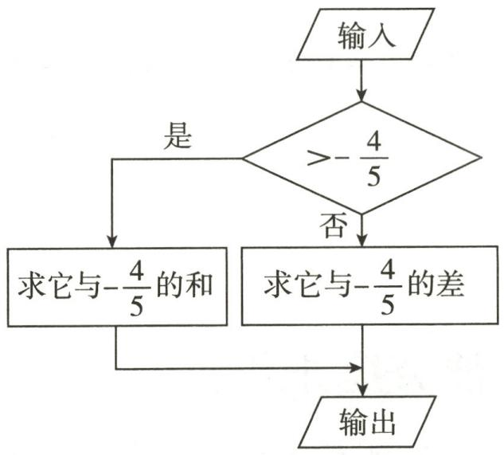

flowchart

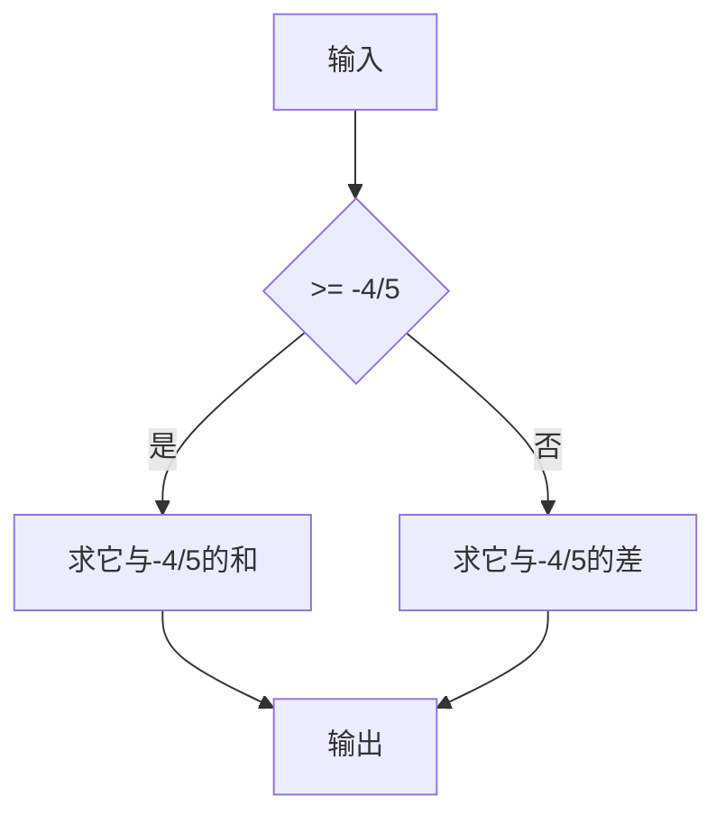

第13题图

# 作业 11 有理数的减法(2)

# 基础过关

1.(2024 秋·南通期中)将式子 $(-15)+(+3)-(-7)-(+4)$ 省略括号和加号后变形正确的是()

A. $-15 + 3 + 7 - 4$

B. $-15 - 3 + 7 - 4$

C. $-15 + 3 + 7 + 4$

D. $-15 + 3 - 7 - 4$

2.(2024秋·西湖区期中)若a是最大的负整数,b是绝对值最小的数,c表示的数在原点左侧且距离原点3个单位长度,则 $a+b-c$ 的值为()

A. 2

B.-2

C. 4

D. -4

3. 计算: (1) 12 - 18 + (-3) = \_\_\_\_; (2) (-1.6) + (-2.4) - (-7.7) = \_\_\_\_.

4. 算式 8-7+3-6 可以读作 \_\_\_\_，或读作 \_\_\_\_。

5. 一艘潜水艇原停在海平面以下 800 米处, 先上浮 150 米, 又下潜 200 米, 这时这艘潜水艇在海平面以下 \_\_\_\_ 米处.

6. 计算：

(1) $10-(-6)+8-(+2)$ ;

(2) $9-(-3)+(-8)+7;$

(3)-1.25-(-3.5)+(-2.75);

(4) $(-20)+(+3)-(-5)-(+7)$ ;

(5) $(-17)-(-46)-(+13)+(-16)$ ;

(6) $3\frac{3}{7}-\left(2.4-1\frac{4}{7}\right)+(-1.6).$

# 能力提升

7.(2024秋·靖江月考)小王为了了解本地气温的变化情况,记录了某日12时的气温是-4℃,14时气温升高了3℃,到20时气温又降低了5℃,则20时的气温为()

A. $- {6}^{ \circ  }\mathrm{C}$

B. $- {8}^{ \circ  }\mathrm{C}$

C. $-1^{\circ} \mathrm{C}$

D. ${13}^{ \circ  }\mathrm{C}$

8.(2024 秋·邳州期中)如图是中国古代“洛书”的一部分,洛书中用实心点或空心点的个数表示数字,纵、横、斜三条线上的三个数字,其和皆相等,则右下角代表的数是\_\_\_\_.

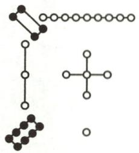  
第8题图

9. 计算：

(1) $-0.5+\left(+3\frac{1}{4}\right)-2.75-\left(-7\frac{1}{2}\right);$

(2) $-18+(+9)-(-6)+(-3)$ ;

(3) $4\frac{2}{5}-\left(-9\frac{3}{5}\right)-7\frac{1}{4}-1\frac{3}{4};$

(4) $\left(-\frac{1}{2}\right)-\left(-3\frac{1}{4}\right)-\left(-2\frac{3}{4}\right)-\left(+5\frac{1}{2}\right).$

10.(1)已知 $|a|=1,|b|=2,|c|=3$ ，且a>b>c，求 $a-b+c$ 的值；

(2)已知有理数 $a, b, c$ 满足 $|a - 1| + |b - 3| + |3c - 1| = 0$ , 求 $a + b - c$ 的值.

# 拓展延伸

11. (2024 秋・工业园区月考)小颖大学暑假期间在某玩具厂勤工俭学. 厂里规定每周工作 6 天,每人每天需生产 A 种玩具 30 个, 每周生产 180 个. 下表是小颖某周实际的生产情况(增产记为正, 减产记为负).

<table><tr><td>星期</td><td>一</td><td>二</td><td>三</td><td>四</td><td>五</td><td>六</td></tr><tr><td>增减产值/个</td><td>+9</td><td>-7</td><td>-4</td><td>+8</td><td>-1</td><td>+6</td></tr></table>

(1)根据记录的数据可知,小颖星期二生产玩具\_\_\_\_个;

(2)根据记录的数据可知,小颖本周实际生产玩具\_\_\_\_个;

(3)该厂规定:每生产一个玩具可得工资5元,若超额完成任务,则超过部分每个另奖励3元,少生产一个则扣减2元;工资采用“每日计件工资制”或“每周计件工资制”.小颖这一周选择哪种工资形式更合算?请说明理由.

# 作业 12 有理数的乘法(1)

# 基础过关

1.(2024·陕西)-3的倒数是 （）

A. $-\frac{1}{3}$

B. $\frac{1}{3}$

C. -3

D. 3

2.(2024·吉林)若 $(-3)\times\square$ 的运算结果为正数,则□内的数字可以为()

A. 2

B. 1

C. 0

D. -1

3. 用正负数表示气温的变化量, 上升为正, 下降为负. 某登山队攀登一座山峰, 每登高 $1 \mathrm{~km}$ 气温的变化量为 $-6^{\circ} \mathrm{C}$ , 则攀登 $2 \mathrm{~km}$ 后, 气温的变化量为 ( )

A. $12^{\circ}$ C

B. $-12^{\circ} \mathrm{C}$

C. ${6}^{ \circ  }\mathrm{C}$

D. $- {6}^{ \circ  }\mathrm{C}$

4. 计算: (1) $3 \times \left(-\frac{2}{3}\right)=$ \_\_\_\_; (2) $(-3.14) \times 0=$ \_\_\_\_;

(3) $\left(-\frac{1}{10}\right)\times(-5)=$ \_\_\_\_;

(4) $-\frac{1}{2}\times\left(-\frac{2}{7}\right)=$ \_\_\_\_.

5. $-\frac{7}{3}$ 的倒数是\_\_\_\_, -0.25 的倒数是\_\_\_\_, $-2\frac{1}{2}$ 的相反数的倒数是\_\_\_\_, 0.6 的倒数的相反数是\_\_\_\_.

6. 计算：

(1) $(-6)\times(+8)$ ;

(2) $(-0.36)\times\left(-\frac{2}{9}\right);$

(3)(+4)×(-2.5);

(4) $(-0.125)\times(-8)$ ;

(5)0×(-13.52);

(6) $\frac{1}{4}\times\left(-\frac{8}{9}\right).$

7. 计算：

(1) $\left|-2\frac{1}{3}\right|\times\left(-\frac{3}{7}\right);$

(2) $(-0.3)\times\left(-1\frac{3}{7}\right);$

(3) $\left(-2\frac{2}{3}\right)\times\left(-2\frac{1}{4}\right);$

(4) $\left(-288\frac{2}{5}\right)\times0;$

(5) $\left(-2\frac{7}{16}\right)\times(-8);$

(6) $\left(+20\frac{1}{4}\right)\times\left(-20\frac{4}{9}\right).$

# 能力提升

8.(2024秋·鼓楼区期中)若 $a+b<0,ab>0$ ,则下列说法一定正确的是()

A. $a > 0, b < 0$

B. $a > 0, b > 0$

C. $a <   0,b <   0$

D. $a <   0,b > 0$

9. 下列说法正确的是 ( )

A. 小数的倒数一定是整数

B. 小数的倒数一定是小数

C. 正数的倒数一定是负数

D. 负数的倒数一定是负数

10. 下列说法正确的是 ( )

A. 一个数乘0的积是其本身

B. 一个数乘 1 的积是其绝对值

C. 一个数乘 -1 的积是其相反数

D. 一个数乘 -2 的积是负数

11. 若 a, b 互为倒数，则 ab-2 的值为 \_\_\_\_.

12.(2024秋·滨湖区期中)在有理数3,-3,0,4,-5中,任选两个数相乘,最大的积为a,则a的值为\_\_\_\_.

13. 在数轴上, 点 $A, B$ 分别表示有理数 $a, b$ , 已知点 $A$ 到原点的距离为 3 , 点 $B$ 到原点的距离为 7 ,且 $ab < 0$ , 求 $a + b$ 的值.

14. 在汛期, 已知某河某天的水位, 如果水位每天上升 2 厘米, 那么 3 天后的水位比某天高多少厘米?

规定:把某天的水位记为0厘米,水位上升记为正,下降记为负;为区分时间,某天记为0,某天之后记为正,之前记为负.

用算式表示为 $(+2)\times(+3)=+6$ （厘米）.

(1)如果水位每天下降 2 厘米,那么 3 天前的水位比某天高多少厘米?请用算式表示.

(2)算式 $(-2)\times(+3)=-6$ 表示的意义是什么？请写下来.

# 拓展延伸

15. 若 $a, b, c$ 是有理数, $|a| = 4$ , $|b| = 9$ , $|c| = 6$ , 且 $ab < 0$ , $bc > 0$ , 求 $a - b - (-c)$ 的值.

# 基础过关

1.(2024秋·柯桥区期中)算式 $\frac{3}{8}\times37\times\frac{8}{3}=37\times\left(\frac{3}{8}\times\frac{8}{3}\right)$ 中运用了()

A. 乘法交换律

B. 乘法结合律

C. 乘法分配律

D. 乘法交换律和乘法结合律

2.(2024秋·南海区月考)利用乘法分配律计算 $\left(-100\frac{98}{99}\right)\times99$ 时,下列变形正确的是()

A. $\left(100-\frac{1}{99}\right)\times99$

B. $-\left(100-\frac{98}{99}\right)\times99$

C. $-\left(100+\frac{98}{99}\right)\times99$

D. $\left(100-\frac{98}{99}\right)\times99$

3. 计算: (1) $\left(-9\frac{5}{6}\right)\times12=$ \_\_\_\_; (2) $24\times\left(\frac{1}{3}+\frac{1}{4}-\frac{1}{6}\right)=$ \_\_\_\_.

4. 计算：

(1) $(-5)\times19\times(-2)$ ;

(2) $(-8)\times\left(-\frac{4}{3}\right)\times(-1.25)\times\frac{5}{4};$

(3) $\left(-\frac{1}{2}-\frac{1}{3}+\frac{3}{4}-\frac{4}{5}\right)\times(-60)$ ;

(4) $-\frac{3}{4}\times\left(8-1\frac{1}{3}-\frac{14}{15}\right).$

# 能力提升

5.(2024 秋・新吴区期中)观察如图,它的计算过程可以解释\_\_\_\_这一运算规律.()

A. 加法交换律

B. 乘法结合律

C. 乘法交换律

D. 乘法分配律

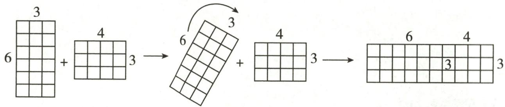

text_image

3
6 + 4 3 → 6 + 3
4 3 → 6 4 3

第5题图

6. 计算: $\left(\frac{1}{100} - 1\right) \times \left(\frac{1}{99} - 1\right) \times \left(\frac{1}{98} - 1\right) \times \cdots \times \left(\frac{1}{3} - 1\right) \times \left(\frac{1}{2} - 1\right) =$ \_\_\_\_.

7. 化繁为简是数学中常用的思想方法. 用简便方法计算 $\left(-\frac{3}{2}\right) \times \left(-\frac{11}{15}\right) - \frac{3}{2} \times \left(-\frac{13}{15}\right) - \frac{3}{2} \times$ $\left(-\frac{14}{15}\right)$ 时, 用运算律对题目进行变形, 使运算量减小, 达到简化运算的目的. 请将过程补充完整: 原式 $= \left(-\frac{3}{2}\right) \times \left[\left(-\frac{11}{15}\right) + \left(-\frac{13}{15}\right) + \_\_\_\_\right] = \_\_\_\_\ = \_\_\_\_.$

8. 用简便方法计算:

(1) $(-370)\times \left(-\frac{1}{4}\right) + 0.25\times 24.5 + \left(-5\frac{1}{2}\right)\times (-25\%)$ ;

(2) $(-8)\times(-12)\times(-0.125)\times\left(-\frac{1}{3}\right)\times(-0.001)$ ;

(3) $(-5)\times\frac{3}{13}+(-5)\times\left(-\frac{2}{13}\right)-5\times\frac{1}{13}+0.125\times\left(-\frac{14}{13}\right)\times(-8).$

9. (2024 秋·茂名期中)在学习了有理数的乘法后,老师给出这样一道题目: 计算 $49 \frac{24}{25} \times (-5)$ . 两名同学的解法如下:

小明: 原式= $-\frac{1249}{25}\times5=-\frac{1249}{5}=-249\frac{4}{5}$ ;

小军: 原式= $\left(50-\frac{1}{25}\right)\times(-5)=50\times(-5)-\frac{1}{25}\times(-5)=-249\frac{4}{5}$ .

(1)对于上述两种解法,你认为谁的解法较好?

(2)请你用最合适的方法计算: $199\frac{15}{16}\times(-8)$ .

(1)对于上述两种解法,你认为谁的解法较好?
(2)请你用最合适的方法计算: $199\frac{15}{16}\times(-8)$ .

# 拓展延伸

10. 已知 a, b 为有理数, 现规定一种新运算“※”: a ※ b = ab - 1.

(1)(-4)※8= ;

(2)求 $(-4)\times3+(-4)\times5$ 的值;

(3)新运算“a※b=ab-1”是否满足分配律？若不满足，请举出一个反例。

(1) $(-4)\text{※}8=$ \_\_\_\_；
(2)求 $(-4)\text{※}3+(-4)\text{※}5$ 的值；
(3)新运算“ $a\text{※}b=ab-1$ ”是否满足分配律？若不满足，请举出一个反例。

# 作业 14 有理数的乘法(3)

# 基础过关

1. 计算 $(-2) \times (-3) \times (-4)$ 的结果为 （）

A. 12

B.-12

C. 24

D. -24

2.(2024 秋·惠城区月考)下列各式中,结果是正数的是()

A. $2 \times (-3) \times 4$

B. $2 \times 3 \times (-4)$

C. $2 \times (-3) \times (-4)$

D. $(-2)\times(-3)\times(-4)$

3.(2024 秋·南海区月考)若 $(-6)\times4\times\square$ 的运算结果为正数,则□内的数可以为()

A. 2

B. 1

C. 0

D.-1

4. 计算: (1) $(-2)\times3\times(-1)=$ \_\_\_\_; (2) $(-4)\times5\times(-0.25)=$ \_\_\_\_.

5.(2024 秋・淮安月考)绝对值大于 2 而小于 5 的所有整数的积是

6. 计算：

(1) $(-2)\times4\times(-5)$ ;

(2) $(-6)\times(-25)\times(-0.04)$ ;

(3) $-0.75\times(-0.4)\times1\frac{2}{3};$

(4) $0.6 \times \left(-\frac{3}{4}\right) \times \left(-\frac{5}{6}\right) \times 0.$

7. 已知 a, b 为有理数, 现规定一种新运算“\*”: $a * b = 4ab$ . 例如, $2 * 3 = 4 \times 2 \times 3 = 24$ .

(1)求 $3 \times (-4)$ 的值;

(2)求 $(-2)*(6*3)$ 的值.

# 能力提升

8.(2024 秋·南通月考)若 5 个有理数之积为正数,则这 5 个乘数中负乘数的个数可能是 ( )

A. 2

B. 4

C. 2 或 4

D. 2 或 4 或没有

9. 如图是一个数值转换机, 若输入的 a 值为 3, 则输出的结果为 ( )

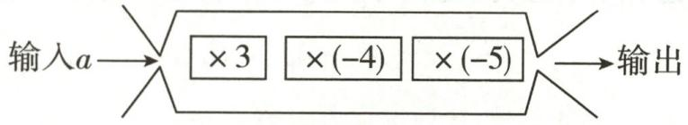

flowchart

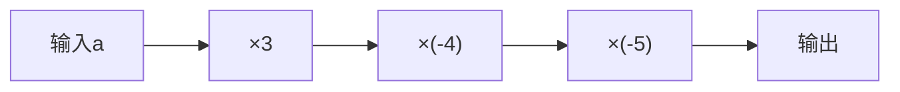

第9题图

A. -180

B. 180

C. -120

D. 120

10. 计算: (1) $\left(-\frac{3}{7}\right)\times\left(-\frac{1}{2}\right)\times\left(-\frac{8}{15}\right)=$ \_\_\_\_; (2) $(-0.13)\times\frac{1}{13}\times(-100)=$ \_\_\_\_.

11. 如果四个整数 a, b, c, d 各不相等，且 $a \times b \times c \times d = 21$ ，那么 $a + b + c + d$ 的值是 \_\_\_\_.

12. 计算：

(1) $(-8)\times9\times(-1.25)\times\left(-\frac{1}{9}\right);$

(2) $(-5)\times6\times\left(-\frac{4}{5}\right)\times\frac{1}{4};$

(3) $(-0.25)\times\left(-\frac{7}{9}\right)\times4\times(-18)$ ;

(4) $-3\times\frac{5}{6}\times\left(-\frac{9}{5}\right)\times\left(-\frac{1}{4}\right);$

(5) $\frac{3}{7}\times\left(-\frac{4}{5}\right)\times\frac{7}{12}\times\frac{5}{8};$

(6) $-\frac{5}{4} \times \frac{8}{15} \times \frac{3}{2} \times \left(-\frac{4}{5}\right) \times 0 \times (-1)$ .

13. $K_{m}^{n}$ 表示从整数 m 开始由小到大的连续 n 个整数的积, 例如, $K_{4}^{2}=4\times5=20$ , $K_{-3}^{3}=(-3)\times(-2)\times(-1)=-6$ .

(1)求 $K_{-10}^{3}$ 的值;

(2) 当 $K_{-5}^{n}$ 的值最大时, 求 n 的值.

# 拓展延伸

14. 已知 a, b, c 为有理数.

(1) 如果 ab > 0, $a + b > 0$ , 试确定 a, b 的正负;

(2) 如果 $ab > 0, abc > 0, bc < 0$ , 试确定 $a, b, c$ 的正负.

# 作业 15 有理数的除法(1)

# 基础过关

1.(2024·崇川区模拟)计算 $(-6)\div3=$ ( )

A. 2

B.-2

C. $\frac{1}{2}$

D. $-\frac{1}{2}$

2. 把 $\left(-\frac{3}{4}\right) \div \left(-\frac{2}{3}\right)$ 转化为乘法的是 （）

A. $\left(-\frac{3}{4}\right)\times\frac{2}{3}$

B. $\left(-\frac{3}{4}\right)\times\frac{3}{2}$

C. $\left(-\frac{3}{4}\right)\times\left(-\frac{2}{3}\right)$

D. $\left(-\frac{3}{4}\right)\times\left(-\frac{3}{2}\right)$

3.(2024 秋・扬州月考)下列运算中,结果正确的是 ( )

A. $-7 \div 7 = 1$

B. $7 \div \left(-\frac{1}{7}\right) = -\frac{1}{49}$

C. $-36 \div (-9) = 4$

D. $\left(-\frac{3}{10}\right)\div\left(-\frac{3}{5}\right)=2$

4. 计算: (1) $0 \div (-1000) =$ \_\_\_\_ ; (2) $(-48) \div (-6) =$ \_\_\_\_ ; (3) $12 \div \left(-\frac{1}{4}\right) =$ \_\_\_\_ .

5. 化简: (1) $\frac{-3}{-5} =$ \_\_\_\_; (2) $-\frac{-2}{-7} =$ \_\_\_\_; (3) $-\frac{42}{-7} =$ \_\_\_\_; (4) $-\frac{13}{52} =$ \_\_\_\_.

6. 计算：

(1) $(-27)\div9;$

(2) $-0.125\div\frac{8}{3}$ ;

(3) $(-0.91)\div(-0.013)$ ;

(4) $\left(-3\frac{3}{8}\right)\div(-2.25).$

7. 列式计算：

(1)一个数的 $3\frac{2}{5}$ 倍是 -17，求这个数； (2)一个数与 $3\frac{2}{7}$ 的积是 $-6\frac{4}{7}$ ，求这个数.

# 能力提升

8. 若有理数 $a$ 与 $b$ 的商为 $-1$ , 则下列说法正确的是 ( )

A. $a + b = 0$

B. $a - b = 0$

C. $a + b = 1$

D. a-b=1

9.(2024秋·东莞月考)若ab<0,则 $\frac{a}{b}$ 的值()

A. 是正数

B. 是负数

C. 是非正数

D.是非负数

10. 计算: (1)(2024 春·松江区期中) $-2 \frac{1}{10} \div (-0.6) =$ \_\_\_\_ ;

(2)(2024 春·杨浦区期中) $(-7)\div\left(-1\frac{2}{5}\right)=$ \_\_\_\_.

11.(2024秋·青浦区期中)在数字6,-4,5,1,-2中抽取两个数相除,所得的商最小是

12. 与 $(-5) \div \frac{1}{5} \times (-5)$ 的结果相等的算式有 \_\_\_\_. (填序号)

① $(-5)\times5\times(-5)$ ;② $(-5)\times(-5)\div\frac{1}{5}$ ;③ $(-5)\div\left[\frac{1}{5}\times(-5)\right]$ ;④ $(-5)\div\left[\frac{1}{5}\div(-5)\right]$ .

13. 计算：

(1) $1\frac{3}{7}\times(-1.4)\div\left(-2\frac{1}{3}\right);$

(2) $-2.5\div\frac{5}{8}\times\left(-\frac{1}{4}\right);$

(3) $(-18)\div(-6)\div\left(-1\frac{1}{2}\right);$

(4) $\left(-2\frac{1}{2}\right)\div(-5)\times\left(-3\frac{1}{3}\right);$

(5) $\left(-\frac{3}{4}\right)\times\left(-\frac{1}{2}\right)\div\left(-2\frac{1}{4}\right);$

(6) $(-81)\div2\frac{1}{4}\times\left(-\frac{4}{9}\right).$

# 拓展延伸

14. 阅读回答问题.

计算: $\left(-\frac{5}{2}\right)\div(-15)\times\left(-\frac{1}{15}\right)$ .

解: 原式 $= -\frac{5}{2} \div \left[ (-15) \times \left( -\frac{1}{15} \right) \right]$ ①

$$
= - \frac {5}{2} \div 1 \quad ②
$$

$$
= - \frac {5}{2}. \quad ③
$$

(1)上述的解法是否正确？答：\_\_\_\_。若有错误，在哪一步？答：\_\_\_\_（填序号）；错误的原因是\_\_\_\_。

(2) 正确的结果是 \_\_\_\_.

# 作业 16 有理数的除法(2)

# 基础过关

1.(2024·潮州模拟)计算 $2-(-3)\times4$ 的结果是 ( )

A. 20

B. -10

C. 14

D. -20

2. 计算 $-3 \times 2 - 8 \div (-2)$ 的结果是 ( )

A. 2

B.-2

C.-10

D. 7

3. 计算: (1) $(-4+2)\div(-1)=$ \_\_\_\_; (2) $-8+4\div(-2)=$ \_\_\_\_.

4. 计算：

(1) $2 \times (-7) - 6 \times (-9)$ ;

(2) $(-28)\div(+7)-(-3)\times(-2)$ ;

(3) $42\times\left(-\frac{2}{3}\right)+\left(-\frac{3}{4}\right)\div(-0.25)$ ;

(4) $\frac{2}{3}\times(-6)-\left(-\frac{10}{7}\right)\div\left(-\frac{5}{21}\right).$

5. 计算：

(1) $2\frac{1}{4}\times\left(-\frac{6}{7}\right)\div\left(\frac{1}{2}-2\right)$ ;

(2) $\left(3-3\frac{2}{3}\right)\div4\times\frac{1}{2};$

(3) $-3\frac{1}{3}\div\left(-\frac{4}{45}\right)\div\left(-6\frac{3}{4}\right)\div\left(-3\frac{1}{3}\right);$

(4) $3\frac{1}{7}\times\left(3\frac{1}{7}-7\frac{1}{3}\right)\times\frac{7}{22}\div1\frac{1}{21};$

(5) $-\frac{5}{4}\times\frac{4}{5}\div\frac{4}{5}\times\left(-\frac{5}{4}\right);$

(6) $\left(-\frac{7}{8}\right)\div\left(\frac{7}{8}-\frac{7}{12}\right)-\left(\frac{7}{12}-\frac{7}{8}\right)\div\frac{7}{8}.$

# 能力提升

6.(2024秋·福田区期中)定义新运算“\*”: $a*b=1-3ab$ ,如 $5*(-1)=1-3\times5\times(-1)=16$ .
请利用此定义计算 $2*\left[(-1)*3\right]=$ ( )

A. -61

B. -59

C. 59

D. 61

7. (2024 秋·金山区期中)程序框图的算法思路源于我国古代数学名著《九章算术》中的“更相减损术”. 执行如图所示的程序框图, 如果第一次输入的数是 40 , 那么最后输出的结果为 ( )

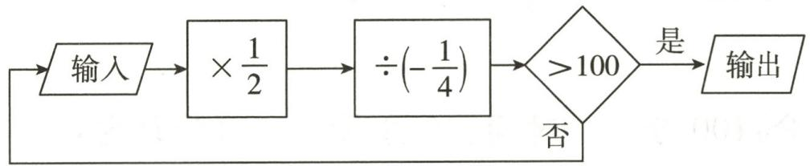

flowchart

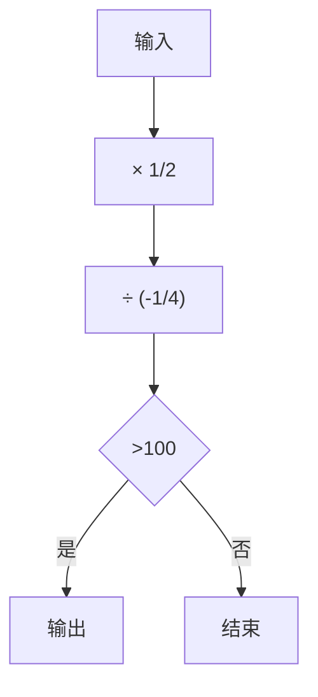

第 7 题图

A. 80

B. 160

C. 320

D. 640

8. 计算：

(1) $\left(\frac{5}{12}-\frac{7}{9}-\frac{2}{3}\right)\div\left(-\frac{1}{36}\right);$

(2) $25\div\frac{2}{3}-25\times\left(-\frac{1}{2}\right);$

(3) $\left(-28\frac{7}{8}\right)\div7;$

(4) $\frac{4}{5} \times \left(-\frac{5}{13}\right) - \frac{3}{5} \div \left(-\frac{13}{5}\right) - \frac{5}{13} \times \left(-1\frac{3}{5}\right)$ .

9. 某地区高山的温度从山脚开始每升高 $100 \, m$ 降低 $0.6^{\circ}C$ ，现测得山脚的温度是 $4^{\circ}C$ .

(1)求离山脚 1200m 高的地方的温度;  
(2)若山上某处的温度为 $-5^{\circ}C$ ，求此处距山脚的高度.

# 拓展延伸

10. 阅读材料, 解决问题:

计算: $50 \div \left( \frac{1}{3} - \frac{1}{4} + \frac{1}{12} \right)$ .

解法一: 原式= $50\div\frac{1}{3}-50\div\frac{1}{4}+50\div\frac{1}{12}=50\times3-50\times4+50\times12=550.$

解法二: 原式= $50\div\left(\frac{4}{12}-\frac{3}{12}+\frac{1}{12}\right)=50\div\frac{2}{12}=50\times6=300.$

解法三: 原式的倒数为 $\left(\frac{1}{3}-\frac{1}{4}+\frac{1}{12}\right)\div50=\left(\frac{1}{3}-\frac{1}{4}+\frac{1}{12}\right)\times\frac{1}{50}=\frac{1}{3}\times\frac{1}{50}-\frac{1}{4}\times\frac{1}{50}+\frac{1}{12}\times\frac{1}{50}=$ $\frac{1}{300}$ ，故原式=300.

(1)上述得出的结果不同,肯定有错误的解法,你认为解法\_\_\_\_是错误的.  
(2)请你选择合适的解法计算: $\left(-\frac{1}{84}\right)\div\left(\frac{1}{6}-\frac{3}{14}+\frac{2}{3}-\frac{2}{7}\right)$ .

# 周练 1 （测试范围：2.1-2.2）

总分:100 分 时间:40 分钟 成绩评定:

# 一、选择题(每题6分,共24分)

1.(2024 秋·高邮期中)下列各组数中,互为倒数的是 ( )

A. 2 和 -2

B. 3 和 $-\frac{1}{3}$

C.-3和 $-\frac{1}{3}$

D. 0 和 0

2.(2024 秋·海珠区期中)下列化简正确的是 ( )

A. $\frac{-13}{-3} = -4$

B. $-\frac{10}{5} = -2$

C. $\frac{-75}{0}=0$

D. $\frac{-18}{12} = \frac{3}{2}$

3.(2024 秋·顺德区期中)有理数 a, b 对应的点在数轴上的位置如图所示, 则 ( )

A. $a > 0$

B. $a + b > 0$

C. $a - b < 0$

D. ${ab} > 0$

4. 如图是一个数值转换机, 按图中的运算过程输入一个数 $x$ . 若输入的数 $x = -1$ , 则输出的结果为 ( )

A. 15

B. 13

C. 11

D. -5

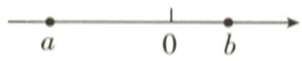  
第3题图

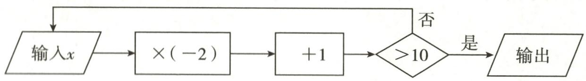

flowchart

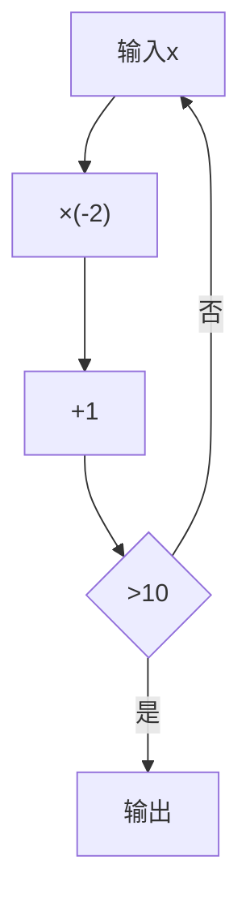

第4题图

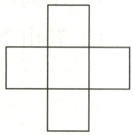  
第8题图

# 二、填空题(每题6分,共24分)

5.(2024秋·如东县期中)计算 $\left|-\frac{3}{4}\right|\times(-4)$ 的结果为\_\_\_\_.  
6. 把 8-(+11)-(-20)+(-19)改写成省略加号和括号的形式:  
7.(2024秋·江都区期中)已知a是最大的负整数,b是最小的正整数,c是绝对值最小的数,则 $a+c-b=$   
8. (2024·陕西) 小华探究“幻方”时, 提出了一个问题: 如图, 将 $0, -2, -1, 1, 2$ 这五个数分别填在五个小正方形内, 使横向三个数之和与纵向三个数之和相等, 则填入中间位置的小正方形内的数可以是 \_\_\_\_. (写出一个符合题意的数即可)

# 三、解答题(共52分)

9.(20分)计算:

(1) $32+(-18)+18-29;$

(2) $-63\div7+45\div(-9)$ ;

(3) $\frac{6}{19} \div \left(-1\frac{1}{2}\right) \times \frac{19}{24}$ ;

(4) $\left[1\frac{1}{24} -\left(\frac{3}{8} +\frac{1}{6} -\frac{3}{4}\right)\times 24\right]\div (-5).$

10.(10 分)根据下列语句列式并计算:

(1)40 加上 -25 的和乘 -3 所得的积;

(2)32 与 6 的商减去 $-\frac{1}{3}$ 所得的差.

11. (10 分) 若 $a, b$ 是有理数, 定义一种新运算“☆”: $a \star b = 5 - 2ab$ . 如 $(-1) \star 2 = 5 - 2 \times (-1) \times 2 = 9$ . 根据上述关于“☆”的运算法则, 完成下列计算:

(1)(-4)☆(-6);

(2) $\left[3\star(-3)\right]\star(-4).$

12. (12 分)(2024 秋・黄埔区期中)近几年我国纯电动力汽车产量大幅增加,品牌众多,广受大众欢迎. 小明家新换了一辆纯电汽车,汽车连续 7 天每天行驶的路程如下表所示,以 $50 \mathrm{~km}$ 为标准, 超过的记为“+”, 不足的记为“-”, 刚好 $50 \mathrm{~km}$ 的记为“0”.

<table><tr><td>时间</td><td>第一天</td><td>第二天</td><td>第三天</td><td>第四天</td><td>第五天</td><td>第六天</td><td>第七天</td></tr><tr><td>路程/km</td><td>-8</td><td>-10</td><td>-14</td><td>0</td><td>+24</td><td>+31</td><td>+35</td></tr></table>

(1)第三天纯电汽车行驶的路程是\_\_\_\_km;

(2)若纯电汽车行驶 1km 平均耗电费用为 0.5 元,小明家的纯电汽车这 7 天消耗的电费为多少元?

# 专题 2 有理数运算的实际应用

# 类型一 有理数加减的实际应用

1. 某童装店用 400 元购进 8 套儿童服装, 并以一定的价格出售完. 如果每套儿童服装以 65 元的价格为标准, 超出的记作正数, 不足的记作负数, 8 套服装的售价 (单位: 元) 记录如下:

$$
+ 2, - 3, + 2, + 1, - 2, - 1, 0, - 3.
$$

(1)8 套儿童服装中,最贵的一套比最便宜的一套贵多少元?

(2)8套儿童服装一共赚了多少元?

2. (2024 秋·崇川区月考)科技改变生活,当前网络销售日益盛行.小明把自家种的柚子放到网上销售,计划每天销售 100 千克,但实际每天的销售量与计划销售量相比有增减,超过计划量的记为正,不足计划量的记为负.下表是第一周柚子的销售情况:

<table><tr><td>星期</td><td>一</td><td>二</td><td>三</td><td>四</td><td>五</td><td>六</td><td>日</td></tr><tr><td>超过或不足计划量情况/千克</td><td>+4</td><td>-5</td><td>-3</td><td>+9</td><td>-7</td><td>+12</td><td>+5</td></tr></table>

(1)小明第一周销售柚子,最多的一天比最少的一天多销售多少千克?

(2)若按 10 元/千克进行销售,平均运费为 4 元/千克,则小明第一周销售柚子一共收入多少元?

# 类型二 绝对值的实际应用

3.(2024 秋·恩平期中)在某次抗洪抢险中,解放军战士乘加满油的冲锋舟沿东西方向的河流抢救灾民,早晨从 A 地出发,晚上到达 B 地,约定向东为正方向,当天的航行记录(单位:千米)如下:

$$
+ 1 4, - 9, + 8, - 7, + 1 3, - 6, + 1 2, - 5.
$$

(1)请你确定 B 地相对于 A 地的方位;

(2)若冲锋舟航行1千米平均耗油0.5升,油箱容量为28升,求冲锋舟当天救灾过程中至少还需补充多少升油.

4. 某检修小组乘车从 A 地出发, 在东西方向的马路上检修线路, 如果规定向东行驶为正, 向西行驶为负, 一天中五次行驶记录如下表.

<table><tr><td>次数</td><td>第一次</td><td>第二次</td><td>第三次</td><td>第四次</td><td>第五次</td></tr><tr><td>行驶记录/千米</td><td>-3</td><td>8</td><td>-9</td><td>+10</td><td>-2</td></tr></table>

(1)在第 次记录时距离 A 地最远；

(2)收工时距离 A 地 \_\_\_\_ 千米；

(3)如果汽车行驶1千米平均耗油0.4升,每升汽油6.5元,那么检修小组工作一天需汽油费多少元?

# 类型三 有理数混合运算的实际应用

5. 有 20 袋大米, 以每袋 25 千克为标准, 超过或不足的千克数分别用正负数来表示, 记录如下表:

<table><tr><td>与标准质量的差值/千克</td><td>-2</td><td>-1.5</td><td>-1</td><td>0</td><td>0.5</td><td>1.5</td><td>2.5</td></tr><tr><td>袋数</td><td>1</td><td>2</td><td>3</td><td>5</td><td>4</td><td>3</td><td>2</td></tr></table>

(1)20 袋大米中,最重的一袋比最轻的一袋重多少千克?  
(2)与标准质量比较,20袋大米总计超过多少千克或不足多少千克?  
(3)若大米每千克的售价为6元,则这20袋大米可以卖多少元?

6.(2024 秋・启东期中)外卖送餐为我们生活带来了许多便利.某学习小组调查了一名外卖小哥一周的送餐情况,规定送餐量超过 50 单(送一次外卖称为一单)的部分记为“+”,低于 50 单的部分记为“-”,下表是该外卖小哥一周的送餐量:

<table><tr><td>星期</td><td>一</td><td>二</td><td>三</td><td>四</td><td>五</td><td>六</td><td>日</td></tr><tr><td>送餐量/单</td><td>-3</td><td>+4</td><td>-5</td><td>+14</td><td>-8</td><td>+7</td><td>+12</td></tr></table>

(1)该外卖小哥这一周送餐量最多的一天比最少的一天多送单;  
(2)该外卖小哥这一周平均每天送餐多少单?  
(3)外卖小哥每天的工资由底薪60元加上送单补贴构成,送单补贴的方案如下:每天送餐量不超过50单的部分,每单补贴2元;超过50单但不超过60单的部分,每单补贴4元;超过60单的部分,每单补贴6元.该外卖小哥这一周工资收入是多少元?

# 作业 17 有理数的乘方(1)

# 基础过关

1.(2024 秋·崇川区月考) $-3^{4}$ 的意义是 ( )

A. 4 个 - 3 相乘

B. 4 个 - 3 相加

C.-3乘4

D. $3^{4}$ 的相反数

2.(2024秋·江海区期中)下列四个数中,化简后结果为正的是()

A. $(-3)^{2}$

B. $-3^{2}$

C. $(-3)^{3}$

D. $-|-3|$

3. 有下列各数: $-(+2), -3^{2}, \left(-\frac{1}{3}\right)^{4}, -\frac{2^{2}}{5}, -(-1)^{2025}, -|-3|$ . 其中负数的个数是 ( )

A. 2

B. 3

C. 4

D. 5

4. 比较 $(-9)^{3}$ 和 $-9^{3}$ ，下列说法正确的是（）

A. 它们底数相同,指数也相同

B. 它们底数不相同, 指数也不相同

C. 它们所表示的意义相同,但运算结果不相同

D. 虽然它们底数不同,但运算结果相同

5.(2024 秋·镇江期中)下列各组数中,相等的是 ( )

A. $(-7)^{2}$ 与 $-7^{2}$

B. $|-7|^{2}$ 与 $-7^{2}$

C. $(-7)^{3}$ 与 $-7^{3}$

D. $|-7|^{3}$ 与 $-7^{3}$

6. 比较大小(填“＞”“＜”或“＝”):

(1) $2^{4}$ \_\_\_\_ $4^{2}$ ;

(2) $-3^{2}$ \_\_\_\_ $(-2)^{3}$ ;

(3) $\left(-\frac{1}{3}\right)^{2}$ \_\_\_\_ $\left(-\frac{1}{2}\right)^{3}$ .

7. 平方后等于 $\frac{4}{9}$ 的数是\_\_\_\_；立方后等于 -125 的数是\_\_\_\_。

8. 计算：

(1) $(-5)^{4}$ ;

(2) $-5^{4}$ ;

(3) $\left(-\frac{4}{3}\right)^{3}$ ;

(4) $-\frac{2^{3}}{5}$ ;

(5) $(-1)^{2025}$ .

9. 计算：

(1) $(-3)^{2},(-3)^{3},[-(-3)]^{5};$

(2) $-3^{2},-3^{3},-(-3)^{5}.$

# 能力提升

10.(2024秋·端州区期中)有下列有理数: $(-1)^{2},(-1)^{3},-(-1),|-1|,-|-1|,-1^{4}$ .其中结果等于1的有()

A. 1 个

B. 2 个

C. 3 个

D. 4 个

11.(2024秋·惠州期中)已知 $|x|=5,y^{2}=9$ ，且 $x+y<0$ ，则x-y的值等于()

A. 2 或 -2

B. 8 或 2

C. -8 或 8

D.-2或-8

12. 若 $(a - 2)^{2} + |b + 1| = 0$ ，则 $(a + b)^{2025}$ 的值是 （）

A. -1

B. 0

C. 1

D. 2025

13.《庄子》中记载:“一尺之棰,日取其半,万世不竭。”这句话的意思是一尺长的木棍,每天截取它的一半,永远也截不完。若按此方式截一根长为1的木棍,第5天截取的木棍的长度是()

A. $1 - \frac{1}{2^{5}}$

B. $1-\frac{1}{2^{4}}$

C. $\frac{1}{2^{5}}$

D. $\frac{1}{2^4}$

14. 已知 $|x| = 5, y^2 = 16$ ，且 $x + y > 0$ ，那么 $x - y =$ \_\_\_\_.

15. 如果 $x^n = y$ , 那么我们记为 $(x, y) = n$ . 例如, 若 $3^2 = 9$ , 则 $(3, 9) = 2$ .

(1)根据上述规定,填空:(2,8)=\_\_\_\_, $\left(-\frac{1}{3},\frac{1}{81}\right)=$ \_\_\_\_;

(2) 若 $(4, a)=2$ , $(b, 8)=3$ , 求 $(b, a)$ 的值.

16. 当细菌繁殖时,每隔一段时间,一个细菌就分裂成两个.

(1)一个细菌在分裂 n 次后,数量变为\_\_\_\_个;

(2)一种细菌每 12 分钟分裂一次,如果现在盘子里有 1000 个这样的细菌,那么 1 小时后,盘子里有\_\_\_\_个细菌;

(3)在(2)的条件下,2小时后盘子里细菌的数量是1小时后的多少倍?

# 拓展延伸

17. 根据乘方的意义可得 $2^{4} = 2 \times 2 \times 2 \times 2; 3^{4} = 3 \times 3 \times 3 \times 3; (2 \times 3)^{4} = (2 \times 3) \times (2 \times 3) \times (2 \times 3) \times (2 \times 3) = (2 \times 2 \times 2 \times 2) \times (3 \times 3 \times 3 \times 3)$ , 即 $(2 \times 3)^{4} = 2^{4} \times 3^{4}$ . 观察上面的计算过程, 完成以下问题:

(1) 计算 $2^{2025} \times 3^{2025} =$ \_\_\_\_ ; 猜想 $a^{n} \cdot 5^{n} =$ \_\_\_\_ .

(2)根据上述提供的信息,计算 $(-0.125)^{2024}\times8^{2025}$ .

# 作业 18 有理数的乘方(2)

# 基础过关

1.(2024·宁波模拟)计算 $(-2)^{3}+3^{2}$ 的值是()

A. 1

B. 3

C. 15

D. 17

2. 下列四个式子中, 计算结果最小的是 ( )

A. $(-3-2)^{2}$

B. $(-3) \times (-2)^{2}$

C. $-3^{2}\div(-2)^{2}$

D. $-3^{2}-2^{3}$

3. 要使算式 $-1^{4}\Box\left[2^{3}-(-3)^{3}\right]$ 的计算结果最大, □里填入的运算符号应是 ( )

A. +

B. —

C. ×

D. ÷

4. 计算: (1) $(-1)^{2} + |-5| =$ \_\_\_\_; (2) $(-2)^{2} + (-2) \times 2 =$ \_\_\_\_.

5. 计算: $(1) - 1^{2024} + (-1)^{2025} =$ \_\_\_\_； $(2) - 2^{4} + (3 - 7)^{2} - 2 \times (-1)^{2} =$ \_\_\_\_；

(3) $(-2)^{2}\times5-(-2)^{3}\div4=$ \_\_\_\_.

6. 计算：

(1) $(-3)^{2}+4^{2}-(-5)^{2}$ ;

(2) $3^{2}\times\left(-\frac{1}{3}\right)^{3}-2\div\left(-\frac{1}{2}\right)^{3}$ ;

(3) $\left(-1\frac{1}{5}\right)^{2}\div\frac{3}{5}\times\left(-\frac{5}{12}\right);$

(4) $4+(-2)^{3}\times5-(-0.28)\div4;$

(5) $(-3)^{2}\div\left(\frac{3}{2}\right)^{2}+\left(-4\frac{1}{2}\right)\times\frac{1}{3};$

(6) $-3^{2}-35+(-7)+18\times\left(-\frac{1}{3}\right)^{2}$ .

# 能力提升

7. 若 m, n 互为相反数, p, q 互为倒数, t 的绝对值等于 4, 则 $\left(\frac{m+n}{200}\right)^{2026}-(-pq)^{2025}+t^{3}$ 的值是 ( )

A.-63

B. 65

C.-63或65

D. 63 或 -65

8. 用“▲”定义一种新运算: 对于任何有理数 a 和 b, 规定 $a \triangle b = ab + b^{2}$ . 如 $2 \triangle 3 = 2 \times 3 + 3^{2} = 15$ , 则 -4 ▲ 2 的值为 ( )

A.-8

B. 8

C.-4

D. 4

9. (2024 秋·海珠区期中)我们平常使用的数是十进制数, 如 1354 这个数可以写成 $1 \times 10^{3} + 3 \times 10^{2} + 5 \times 10^{1} + 4 \times 10^{0}, a^{0} = 1 (a \neq 0)$ . 除十进制数外, 还有其他进制数, 其他进制数都可以和十进制数互相转化. 例如, 二进制数 1011 转化成十进制数为 $1 \times 2^{3} + 0 \times 2^{2} + 1 \times 2^{1} + 1 \times 2^{0} = 8 + 2 + 1 = 11$ . 由此可知, 二进制数 10011 转化成十进制数为 \_\_\_\_.

10. 计算：

(1) $-2^{2}\times\left(-\frac{1}{2}\right)^{3}-|-2|^{3}+\left(-\frac{1}{2}\right);$

(2) $(-3)^{2}\div2\frac{1}{4}\times\left(-\frac{2}{3}\right)+4+2^{2}\times\left(-\frac{8}{3}\right);$

(3) $\left(\frac{5}{6}-\frac{3}{4}\right)\times12\div(-2^{2})+|-1|$ ;

(4) $-2^{4}-(-2)^{2}-3^{2}\div\left(-1\frac{1}{2}\right);$

(5) $-2^{5}\div(-4)\times\left(\frac{1}{2}\right)^{2}-12\times(-15+2^{4})^{3}$ ;

(6) $2\frac{2}{9}\times\left(-1\frac{1}{2}\right)^{3}-(-1.2)^{2}\div0.4^{2}.$

11. 观察下面三行数.

-2, 4, -8, 16, -32, 64, …;

1, 7, -5, 19, -29, 67, …;

5,-1, 11,-13, 35,-61,….

(1)第一行数按什么规律排列?

(2)第二、三行数与第一行数分别有什么关系？

(3)取每行的第10个数,计算这三个数的和.

# 拓展延伸

12. 观察式子并计算.

(1) 填空: $2^{2} - 2 - 1 = \_$ ; $2^{3} - 2^{2} - 2 - 1 = \_$ ; $2^{4} - 2^{3} - 2^{2} - 2 - 1 = \_$ ; $2^{5} - 2^{4} - 2^{3} - 2^{2} - 2 - 1 = \_$ .

(2)猜想: $2^{2025}-2^{2024}-2^{2023}-\cdots-2^{3}-2^{2}-2-1=$

(3)试根据上面的猜想求 $2^{12} - 2^{11} - 2^{10} - 2^{9} - 2^{8} - 2^{7} - 2^{6}$ 的值.

# 作业 19 科学记数法

# 基础过关

1.(2024·陕西)2024年6月2日6时23分,嫦娥六号着陆器在月球背面预定着陆区域成功着陆.月球与地球之间的距离约为380000千米,将数据380000用科学记数法表示为()

A. $0.38 \times 10^{6}$

B. $3.8 \times 10^{5}$

C. $38 \times 10^{4}$

D. $3.8 \times 10^{6}$

2. 用科学记数法表示: (1) -320000 = \_\_\_\_ ; (2) $0.003758 \times 10^{10} =$

3.(2024·资阳)2024年政府工作报告提出,今年发展主要预期目标是:国内生产总值增长5%左右;城镇新增就业1200万人以上……将数据1200万用科学记数法表示为\_\_\_\_.

4. 写出下列用科学记数法表示的数的原数：

(1) $2.05 \times 10^{5} =$ \_\_\_\_;

(2) $-3.26\times10^{8}=$ \_\_\_\_；

(3) $-1\times10^{6}=$ \_\_\_\_；

(4) $5.005 \times 10^{2} =$ \_\_\_\_.

# 能力提升

5.(2024·通辽模拟)中国信息通信研究院测算,2020—2025年,我国5G商用带动的信息消费规模将超过8万亿元,直接带动经济总产出达10.6万亿元.其中数据10.6万亿用科学记数法表示为()

A. $10.6 \times 10^{4}$

B. $1.06 \times 10^{13}$

C. $10.6 \times 10^{13}$

D. $1.06 \times 10^{8}$

6.(2024 秋·南通期中)2023 年十一黄金周,我国文旅消费潜力得到极大释放,国内旅游出游人数为 8.26 亿人次.数据 8.26 亿用科学记数法表示为 \_\_\_\_.

7. 用科学记数法表示下列各数：

(1)32000=\_\_\_\_;

(2)10430000=\_\_\_\_;

(3)80亿=\_\_\_\_;

(4)2895.8=

8. 比较大小: (填“＞”“＝”或“＜”)

(1) $3.14 \times 10^{7}$ \_\_\_\_ $3.14 \times 10^{8}$ ;

(2) $8.999 \times 10^{12}$ \_\_\_\_ 7.201×10 $^{13}$ ;

(3) $5.266 \times 10^{8}$ \_\_\_\_ $4.01 \times 10^{8}$ ;

(4) $-2.25\times10^{6}$ \_\_\_\_ $-8.25\times10^{5}$ .

# 拓展延伸

9. 规定: $0.1 = \frac{1}{10} = 10^{-1}$ ; $0.01 = \frac{1}{100} = 10^{-2}$ ; $0.001 = \frac{1}{1000} = 10^{-3}$ .

(1)你能用 10 的指数的形式表示 0.0001 和 0.00001 吗?

(2)你能将 0.001768 表示成 $a \times 10^{n}$ 的形式吗？（其中 $1 \leqslant a < 10, n$ 为负整数）

# 基础过关

1.(2024秋·杭州期中)据人民网消息,2024年国庆假期,我国国内旅游出游约7.65亿人次.其中近似数“7.65亿”精确到的数位是()

A. 百分位

B. 十分位

C. 千万位

D. 百万位

2.(2024秋·苏州期中)用四舍五入法按要求对0.05019分别取近似数,其中错误的是()

A. 0.1(精确到十分位)

B. 0.05(精确到百分位)

C. 0.05(精确到 0.001)

D. 0.0502(精确到 0.0001)

3. 用四舍五入法按要求取近似数：

(1)2367890(精确到十万位);

(2)20000(精确到千位);

(3)0.03095(精确到千分位).

# 能力提升

4.(2024 秋·南通月考)小何测量身高后,用四舍五入法得知其身高约为 1.68 米,则他的身高测量值不可能是 ( )

A. 1.684

B. 1.675

C. 1.679

D. 1.685

5. 下列说法正确的是 （）

A. 近似数 3.6 与 3.60 精确度相同

B. 数 2.9954 精确到百分位为 3.00

C. 近似数 $1.3 \times 10^{4}$ 精确到十分位

D. 近似数 3.61 万精确到百分位

6. 有下列说法: ①近似数 5.20 与 5.2 的精确度一样; ②近似数 $2.0 \times 10^{3}$ 与 2000 的意义完全一样; ③0.35 万与 $3.5 \times 10^{3}$ 的精确度不同. 其中不正确的有 \_\_\_\_. (填序号)

7. 下列各数精确到什么位？请分别指出来。

(1)0.016;

(2)1680;

(3)1.20;

(4)2.49万.

# 拓展延伸

8. 车工小王加工生产了两根原轴, 当他把轴交给质检员验收时, 质检员说: “不合格, 作废!” 小王不服气地说: “要求原轴长精确到 $2.60 \mathrm{~m}$ , 我的一根长 $2.56 \mathrm{~m}$ , 另一根长 $2.62 \mathrm{~m}$ , 怎么不合格?”

(1)要求原轴长精确到 $2.60 \mathrm{~m}$ , 则原轴长的范围是多少?

(2)你认为是小王加工的原轴不合格,还是质检员故意刁难?

# 专题 3 综合与实践

1. (2024 秋·盐都区期中) 进位制是一种记数方式, 可以用有限的数字符号代表所有的数值. 可使用数字符号的数目称为基数, 基数为 $n$ , 即可称 $n$ 进位制, 简称 $n$ 进制. 对于任意一个用 $n$ 进位制表示的数, 通常使用 $n$ 个阿拉伯数字 $0 \sim (n - 1)$ 进行计数, 特点是逢 $n$ 进一. 现在我们通常用的是十进制数. (十进制数不用标角标, 其他要标角标)

(1)类比十进制的计数原理: $12035 = 1 \times 10^{4} + 2 \times 10^{3} + 0 \times 10^{2} + 3 \times 10^{1} + 5 \times 10^{0}$ , 把一个五进制数转化为十进制数的方法为: $(234)_{5} = 2 \times 5^{2} + 3 \times 5^{1} + 4 \times 5^{0} = 69$ . 请你将以下两个数转化为十进制数: $(10101)_{3} =$ \_\_\_\_, $(257)_{8} =$ \_\_\_\_;  
(2)把一个十进制数转化为二进制数,一般按照“除以 2 取余数”的方法,一直除到商为 0 余数为 1 止;再将余数从下向上倒序写,就是结果.例如,将十进制数 13 转化为二进制数:

$$
\begin{array}{l} 1 3 \div 2 = 6 \dots 1, \\ 6 \div 2 = 3 \dots 0, \\ 3 \div 2 = 1 \dots 1, \\ 1 \div 2 = 0 \dots 1, \\ \end{array}
$$

所以 $13=(1101)_{2}$ .

请你仿照以上方法,将十进制数 22 转化成二进制数;

(3)二进制的四则运算与十进制的四则运算原理相同,不同的是十进制的数位有十个数码0,1,2,3,4,5,6,7,8,9,满十进一,而二进制的数位有两个数码0和1,满二进一.

二进制的加法运算法则如下：

$$
0 + 0 = 0, 0 + 1 = 1, 1 + 0 = 1, 1 + 1 = (1 0) _ {2}.
$$

请你根据上面的加法运算法则和所学的竖式计算相关知识,计算 $(10010)_{2}+(111)_{2}$ .

2. 进位制是人们为了计数和运算方便而约定的计数系统, 约定逢十进一就是十进制, 逢二进一就是二进制. 也就是说逢几进一, 就是几进制, 几进制的基数就是几. 规定当 $a \neq 0$ 时, $a^0 = 1$ .

日常生活中,我们用十进制来表示数,表示十进制的数要用10个数码:0,1,2,3,4,5,6,7,8,9.如 $168=1\times10^{2}+6\times10^{1}+8\times10^{0}$ .

计算机中采用的是二进制, 只要用到两个数码: 0, 1. 如十进制中的 $168 = 1 \times 2^{7} + 0 \times 2^{6} + 1 \times 2^{5} + 0 \times 2^{4} + 1 \times 2^{3} + 0 \times 2^{2} + 0 \times 2^{1} + 0 \times 2^{0}$ 表示的是二进制的 10101000.

(1)十进制数 36 改写成二进制数是\_\_\_\_；

(2)类比二进制数的算法,求八进制数3750所表示的十进制数;

(3)有一种密钥破解方式,先将二进制数转成十进制数 x 后,再按以下规定获得密码:当 x 为奇数时,破解公式为 $\frac{|3-x|}{2}$ ; 当 x 为偶数时,破解公式为 $2x+5$ . 按上述规定,请将二进制明码 101101101 译成密码.

总分:100 分

时间:40 分钟

成绩评定：\_\_\_\_

# 一、选择题(每题5分,共25分)

1.(2024春·靖江月考)一个数的倒数是-2024,则这个数是()

A. 2024

B. -2024

C. $\frac{1}{2024}$

D. $-\frac{1}{2024}$

2. 预计到 2025 年我国铁路营业里程将达到 165000 千米, 将数据 165000 用科学记数法表示为 ( )

A. $1.65 \times 10^{6}$

B. $1.65 \times 10^{5}$

C. $16.5 \times 10^{5}$

D. $0.165 \times 10^{6}$

3.(2024 秋·南通期中)下列运算中,结果为正数的是()

A. $1 - |-2|$

B. $1 - (-2)$

C. $1 \times (-2)$

D. $1 \div (-2)$

4.(2024秋·通州区期中)如果有理数x,y满足xy>0,那么 $\frac{|x|}{x}+\frac{|y|}{y}$ 的值为()

A.-2

B. 2

C. 2 或 -2

D.-1或2

5. 求 $1+2+2^{2}+2^{3}+\cdots+2^{2025}$ 的值, 可令 $S=1+2+2^{2}+2^{3}+\cdots+2^{2025}$ , 则 $2S=2+2^{2}+2^{3}+2^{4}+\cdots+2^{2026}$ , 因此 $2S-S=2^{2026}-1$ . 仿照以上推理, 计算出 $1+3+3^{2}+3^{3}+\cdots+3^{2025}$ 的值为 ( )

A. $3^{2025} - 1$

B. $3^{2026} - 1$

C. $\frac{3^{2025} - 1}{2}$

D. $\frac{3^{2026} - 1}{2}$

# 二、填空题(每题5分,共25分)

6.(2024 秋・南通期中)用四舍五入法将 5.278 精确到十分位,所得近似数为 \_\_\_\_.

7.(2024秋·浦东新区期中)若a,b互为相反数,则 $2024+a+b=$ \_\_\_\_.

8.(2024秋·松江区期中)如果a,b互为倒数,c是最大的负整数,那么 $-\frac{3}{4}ab+c^{2024}$ 的值为\_\_\_\_.

9.(2024秋·杭州月考)如果a,b满足 $(a+3)^{2}+|b-2|=0$ ,那么 $a^{b}=$ \_\_\_\_.

10. 如图, 在数轴上有一点 $A$ , 将点 $A$ 向右移动 1 个单位长度得到点 $B$ , 将点 $B$ 向右移动 2 个单位长度得到点 $C$ , 点 $A, B, C$ 分别表

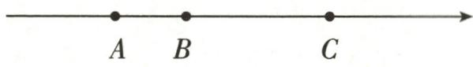  
第10题图

示有理数 a, b, c. 若 a, b, c 三个数的乘积为负数, 且这三个数的和与其中的一个数相等, 则 a 的值为 \_\_\_\_.

# 三、解答题(共50分)

11.(20分)计算:

(1) $12-(-18)+(-7)-15;$

(2) $-0.25+\frac{5}{6}+\frac{2}{3}-0.5;$

(3) $\frac{11}{5} \times \left(\frac{1}{3} - \frac{1}{2}\right) \times \frac{3}{11} \div \frac{5}{4}$ ;

(4) $-4^{2}-(-1)^{10}\times|-3|\div\frac{3}{16}.$

12.(15 分)观察下列三组数:

第一组：-1,-4,-9,-16,-25,…;

第二组:1,8,27,64,125,…;

第三组: -2, -16, -54, -128, -250, ...

(1)分别写出三组数中的第7个数；  
(2)第三组数的第100个数除以第一组数的第100个数,商是多少?  
(3)取每组数的第10个数,计算这三个数的和.

13.(15 分)(2024 秋・延庆区期中)有 10 袋大米,以每袋 25kg 为质量标准,超过的千克数记作正数,不足的千克数记作负数,称后的记录如下表:

<table><tr><td>编号</td><td>1</td><td>2</td><td>3</td><td>4</td><td>5</td><td>6</td><td>7</td><td>8</td><td>9</td><td>10</td></tr><tr><td>质量/kg</td><td>24.9</td><td>24.8</td><td>25.1</td><td>25.2</td><td>24.8</td><td>b</td><td>24.7</td><td>25.2</td><td>24.7</td><td>c</td></tr><tr><td>差值</td><td>a</td><td>-0.2</td><td>0.1</td><td>0.2</td><td>-0.2</td><td>0</td><td>-0.3</td><td>0.2</td><td>-0.3</td><td>0.4</td></tr></table>

(1) $a = \_\_\_\_ , b = \_\_\_\_ , c = \_\_\_\_ ;$   
(2)请你计算这 10 袋大米的总质量;   
(3)某超市的配送范围为延庆城区及周边 10km 以内,若订单的质量在 40kg 及以内,只收取 6 元基础运费;超出 40kg 的部分按照每千克 0.2 元加收续重运费(不足 1 千克,按 1 千克收费).若将这 10 袋大米配送到某学校食堂(该食堂在超市的配送范围内),则运费是多少元?

# 作业 21 列代数式表示数量关系 (1)

# 基础过关

1. 在 $x, 1, x^2 - 2, \pi R^2, S = \frac{1}{2} ab$ 中，代数式的个数为 （）

A. 6

B. 5

C. 4

D. 3

2. 代数式 $-7x$ 的意义可以是 （）

A.-7与 $x$ 的和

B.-7与 $x$ 的差

C.-7与x的积

D.-7与x的商

3.(2024秋·长安区期中)下列式子中,符合代数式书写的是()

A. $\frac{2x-y}{3}$

B. $1 \frac{1}{3} x^{2}$

C. ${xy} \div  3$

D. $x \times y$

4.(2024秋·南通期中)代数式 $2(x-1)$ 的正确含义是()

A. 2 乘 $x$ 减 1

B. 2 与 $x$ 的积减去 1

C. $x$ 与1的差的2倍

D. $x$ 的 2 倍减去 1

5.(2024秋·南通期中)代数式“5a-8”的意义是

6. 今年小丽 a 岁, 数学老师的年龄比小丽年龄的 3 倍小 2 岁, 小丽数学老师今年 \_\_\_\_ 岁.

7. 用代数式表示：

(1) 比 a 的一半大 3 的数;

(2)a 与 b 的差的 c 倍;

(3) $a$ 与 $b$ 的倒数的和；

(4)a 与 b 的和的平方的相反数.

8. 说出下列各代数式的意义：

(1) $2a+5;$

(2) $2(a+5)$ ;

(3) $a^{2}+b^{2}$ ;

(4) $(a+b)^{2}$ .

# 能力提升

9.(2024 秋·杭州期中)将一个三位数 a 放在一个两位数 b 前面组成一个五位数,则这个五位数可以用代数式表示为 ( )

A. ${ab}$

B. ${1000a} + {100b}$

C. ${100a} + {1000b}$

D. ${100a} + b$

10. 若 $x$ 表示某件物品的原价, 则代数式 $(1 + 10\%)$ $x$ 表示的意义是 ( )

A. 该物品打九折后的售价

B. 该物品价格上涨 $10\%$ 后的售价

C. 该物品价格下降 $10\%$ 后的售价

D. 该物品价格上涨 $10 \%$ 时上涨的钱数

11. 下列赋予 $3a$ 实际意义的例子中错误的是 （）

A. 若葡萄的价格是 3 元/千克, 则 $3a$ 表示买 $a$ 千克葡萄的金额  
B. 若 a 表示一个等边三角形的边长, 则 3a 表示这个等边三角形的周长  
C. 如果在校平均一天的生活费用为 a 元, 那么 3a 表示在校 3 天的生活费用  
D. 如果步行的速度为 a 米/分, 那么 3a 表示步行 3 米所用的时间

12. (2024 秋・常州期中) 小明去超市买文具, 铅笔每支 $m$ 元, 练习本每本 $n$ 元. 小明买 3 支铅笔和 5 本练习本一共需要 \_\_\_\_ 元.  
13.(2024春·东阳月考)如图,在一块长为 $a \mathrm{~m}$ 、宽为 $b \mathrm{~m}$ 的长方形草地上,有一条弯曲的柏油马路,马路的任何地方水平宽度都是 $2 \mathrm{~m}$ ,则马路的面积为 $\mathrm{m}^{2}$ .  
14. 列代数式表示下列数量关系：

(1)有理数 a 与 6 的和;  
(2) 比 -5 小 x 的数;  
(3)某校买书25本,每本a元,该校应付多少元?   
(4)容量是60升的铁桶贮满油,取出 $(x+1)$ 升后,桶内还剩多少升油?

15. 已知 x 表示一个三位数, y 表示一个两位数, 用代数式表示:

(1)这两个数的乘积;   
(2)用 x, y 组成一个五位数, 并把 x 放在 y 的右边.

# 拓展延伸

16. 家乐超市出售一种商品, 其原价为 $a$ 元, 现有三种调价方案:

方案 A: 先提价 20%, 再降价 20%;

方案 B: 先降价 20%, 再提价 20%;

方案 C: 先提价 15%, 再降价 15%.

问这三种调价方案的结果是否一样？最后是不是都恢复到了原价？

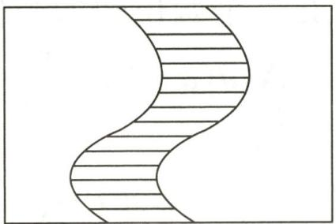

natural_image

Abstract curved line pattern with horizontal stripes, no text or symbols present

第13题图

# 基础过关

1.(2024 秋·无锡期中)用代数式表示“m 的 3 倍与 n 的差的平方”,正确的是()

A. $(3m-n)^{2}$

B. $3(m - n)^{2}$

C. $3 m - n^{2}$

D. $(m-3n)^{2}$

2.(2024 秋·如东县期中)下列用文字叙述代数式“ $\frac{1}{x}-3$ ”的意义中,表述错误的是 ( )

A. $x$ 的倒数与3的差

B. 比 x 的倒数小 3 的数

C. 比 $x$ 的倒数大 3 的数

D. 1 除以 $x$ 的商与 3 的差

3. 一个两位数的个位数字比十位数字小 2, 如果十位数字用 $a$ 表示, 那么这个两位数是 ( )

A. $a(a+2)$

B. $a(a-2)$

C. ${11a} + 2$

D. ${11a} - 2$

4. 填空：

(1)一个两位数,十位数字为a,个位数字为b,这个两位数可以表示为

(2)某件商品原价 b 元, 先打八折, 再降价 10 元, 现在的售价是 \_\_\_\_ 元;

(3)某同学参加了7.5千米健康跑项目,他从起点开始以平均每分钟x千米的速度跑了10分钟,此时他离健康跑终点的路程为\_\_\_\_千米.

5. 用代数式表示：

(1)a 与 b 的平方和;

(2) 比 a 与 6 的和的 2 倍大 -2 的数；

(3)(2024 秋·南通期中)某银行一年定期存款的利率是 1.1%, 存入 a 元钱, 一年后所得利息;

(4)a 的平方与 b 的平方的 4 倍的差.

# 能力提升

6.(2024 秋·江阴期中)某商品原价是每件 m 元,销售时每件先加价 15 元,再降价 10%,则实际每件的售价是()

A. $(10\%m+15)$ 元

B. $[(1 - 10\%)m + 15]$ 元

C. 10%(m+15)元

D. $(1 - 10\%) (m + 15)$ 元

7.(2024 秋·玄武区期中)某电厂有煤 m 吨,计划每天用煤 a 吨,实际每天用煤节约了 b 吨,节约后可多用 ( )

A. $\left(\frac{m}{a} -\frac{m}{b}\right)$ 天

B. $\left(\frac{m}{b}-\frac{m}{a}\right)$ 天

C. $\left(\frac{m}{a-b}-\frac{m}{a}\right)$ 天

D. $\left(\frac{m}{a}-\frac{m}{a-b}\right)$ 天

8.(2024 秋·江阴期中)某船在相距 $s \mathrm{~km}$ 的 A, B 两个码头之间航行, 若该船在静水中的速度是 $50 \mathrm{~km} / \mathrm{h}$ , 水流速度是 $a \mathrm{~km} / \mathrm{h}$ , 则该船从 A 到 B 顺水行驶的时间比从 B 到 A 逆水行驶的时间少 ( )

A. $\left(\frac{s}{50 + a} -\frac{s}{50 - a}\right)\mathrm{h}$

B. $\left(\frac{2s}{50 + a} -\frac{2s}{50 - a}\right)\mathrm{h}$

C. $\left(\frac{s}{50-a}-\frac{s}{50+a}\right)$ h

D. $\left(\frac{2s}{50 - a} -\frac{2s}{50 + a}\right)\mathrm{h}$

9. 商品的原价是 a 元, 每次降价 4%, 经过两次降价后的价格是

10. 教师节当天, 出租车司机小王在东西向的街道上免费接送老师, 规定向东为正, 向西为负. 当天出租车的行程(单位: 千米)记录如下: +5, +4, -8, +10, +3, -6, +7, -11.

(1)将最后一名老师送到目的地时,小王在出发点的什么方向?距出发点多少千米?

(2)若汽车行驶1千米平均耗油0.2升,则当天耗油多少升?若汽油价格为a元/升,则小王当天油费是多少元?

11. 用字母表示阴影部分的面积(可以不化简).

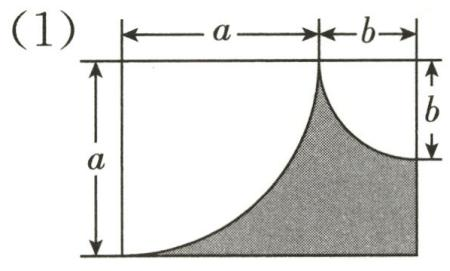

text_image

(1)
a
b
a
b

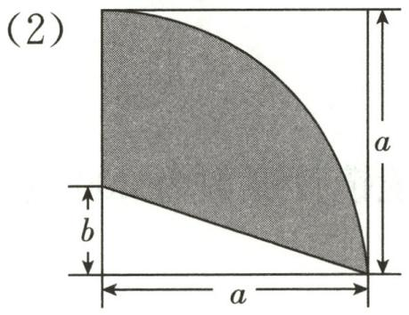

text_image

(2)
a
b
a

# 拓展延伸

12. 如图所示的图形是由边长为 1 的正方形按照某种规律排列而成的.

(1)推测第4个图形中,正方形的个数为\_\_\_\_,周长为\_\_\_\_;  
(2)推测第 $n$ 个图形中,正方形的个数为 ,周长为 ;(用含 $n$ 的代数式表示)  
(3)这些图形中,任意一个图形的周长记为 a,它所含正方形个数记为 b,则 a,b 之间满足的数量关系为 \_\_\_\_. (用含 a,b 的等式表示)

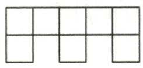  
第1个图形

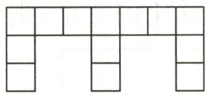  
第2个图形

natural_image

Pure geometric shape composed of rectangles and lines without any text, numbers, or symbols

第3个图形

● ● ● ● ● ●

第12题图

# 基础过关

1. 面积是 $160 \mathrm{~m}^{2}$ 的长方形, 长 $y \mathrm{~m}$ , 宽 $x \mathrm{~m}$ , 用式子表示 $y$ 与 $x$ 的关系为 ( )

A. $y = 160x$

B. $y=\frac{160}{x}$

C. $y=160+x$

D. y=160-x

2.(2024 秋·海淀区月考)下面每组的两个量中,成反比例关系的是()

A. 圆柱的体积一定,它的底面积和高  
B. 长方形的周长一定,长和宽  
C. 练习本的单价一定, 购买的本数和总价   
D. 汽车行驶的速度一定,行驶的时间和距离

3.(2024秋·珠海期中)路程一定,时间与速度成\_\_\_\_比例关系.(填“正”或“反”)

4. 老王要把一篇 24000 字的社会调查报告录入电脑, 则其录入的时间 $t$ (分) 与录入文字的平均速度 $v$ (字/分) 之间的关系式为 $t = \_ (v > 0)$ .  
5. 某蓄水池排水管的平均排水量为每小时 $8 ~m^{3}$ ，6 h 可以将满池水全部排空。现在排水量为平均每小时 $Q ~m^{3}$ ，那么将满池水排空需要 t h，则 t 与 Q 之间的关系式为 \_\_\_\_。  
6. 近视眼镜镜片的度数 $y$ (度)与镜片焦距 $x$ (m)成反比例. 已知 400 度近视眼镜镜片的焦距为 0.25m.

(1) 求 y 与 x 的关系式;  
(2)已知王老师的近视眼镜镜片度数为 200 度,求该镜片的焦距.

# 能力提升

7.(2024 秋·如东县期中)下列各对相关联的量中,成反比例关系的是 ( )

A. 圆锥的体积为 $6m^{3}$ ，圆锥的底面积与高  
B. 小新跳高的高度和他的身高  
C. 某车间每天能加工 60 个零件, 加工零件的总个数与加工天数  
D. 计划用 100 元购买苹果和香蕉两种水果, 购买苹果的金额与购买香蕉的金额

8.(2024 秋·启东期中)下表中 x 和 y 两个量成反比例关系,则“△”处应填\_\_\_\_.

<table><tr><td>x</td><td>7</td><td> $\bigtriangleup$ </td></tr><tr><td>y</td><td>5</td><td>14</td></tr></table>

9. 某商场销售一批散装坚果, 进价为每千克 30 元. 销售时售货员发现坚果的日销量与每千克的利润正好成反比例关系, 且价格调整为每千克 50 元时, 日销量为 80 千克, 那么每日该坚果的销量 $y$ (千克) 与每千克的价格 $x$ (元) 之间的关系式为 \_\_\_\_.

10. 某厂从 2021 年开始投入技改资金, 经技术改进后, 其产品的生产成本不断降低, 具体数据如下表:

<table><tr><td>年度</td><td>2021</td><td>2022</td><td>2023</td><td>2024</td></tr><tr><td>投入技改资金x/万元</td><td>2.5</td><td>3</td><td>4</td><td>4.5</td></tr><tr><td>产品成本y/(万元/件)</td><td>7.2</td><td>6</td><td>4.5</td><td>4</td></tr></table>

请你认真分析表中数据,解决下列问题:

(1)产品成本是怎么样随着投入技改资金变化而变化的?   
(2)用式子表示 y 与 x 的关系, y 与 x 成什么关系?

11. 为寻求合适的销售价格,商场对新进的一种商品进行了一周的试销,发现这种商品每天的销售量 $y$ (千克)与销售价格 $x$ (元/千克)之间成反比例关系.已知第一天以 220 元/千克的价格销售了 80 千克.

(1)用式子表示 y 与 x 的关系;  
(2)每天的销售量 $y$ (千克)如何随着销售价格 $x$ (元/千克)变化的?

# 拓展延伸

12. 一辆汽车往返于甲、乙两地之间, 如果汽车以 50 千米/时的平均速度从甲地出发, 经过 6 小时可达乙地.

(1)甲、乙两地相距多远?   
(2)若汽车的平均速度为 v 千米/时,汽车行驶的时间为 t 小时.

①用式子表示 v 与 t 的关系, v 与 t 成什么关系?  
②如果汽车的平均速度 v 提高,那么从甲地到乙地所需的时间将怎样变化?

# 作业 24 代数式的值(1)

# 基础过关

1. 当 $a = -2$ 时, 代数式 $a^2 - 2a$ 的值是 ( )

A.-8

B. -4

C. 8

D. 4

2. 下列代数式满足表中条件的是 ( )

<table><tr><td>x</td><td>0</td><td>1</td><td>2</td><td>3</td></tr><tr><td>代数式的值</td><td>-3</td><td>-1</td><td>1</td><td>3</td></tr></table>

A.-x-3

B. $x^{2}+2x-3$

C. $2 x - 3$

D. $x^{2} - 2x - 3$

3.(2024 秋·江阴期中)已知 a, b 只有符号不同, c, d 互为倒数, 则代数式 $2(a+b)-3cd$ 的值为 ( )

A. 2

B.-1

C.-3

D. 0

4.(1)若 x=1，则 3x-2=\_\_\_\_；

(2) 若 $a^{2}-3b=1$ ，则 $2a^{2}-6b+2023=$ \_\_\_\_.

5. 已知一个三角形的底边长为 $a$ , 底边上的高为 $h$ , 则它的面积 $S =$ \_\_\_\_ ; 若 $S = 8, h = 5$ , 则 $a =$ \_\_\_\_.

6. 当 a = -1, b = -3, c = 5 时，求下列代数式的值：

(1) $b^{2}-4ac;$

(2) $(a + b - c)^{2}$ .

# 能力提升

7. 若 $x - 2y = 3$ ，则代数式 $2(x - 2y)^{2} + 4y - 2x + 1$ 的值为 （）

A. 7

B. 13

C. 19

D. 25

8.(2024 秋·如东县期中)无论 m 取何值时,代数式 m-2 的值总是 ( )

A. 比 -2 大

B. 比 -2 小

C. 比 m 大

D. 比 m 小

9.(2024秋·西城区期中)如果 $|a+2|+(b-1)^{2}=0$ ,那么代数式 $(a+b)^{2024}$ 的值是()

A. 1

B.-1

C. ±1

D. 2021

10. 根据下表中的数据, 可得 $a^{b}$ 的值为 \_\_\_\_.

<table><tr><td>x</td><td>-1</td><td>0</td><td>b</td></tr><tr><td>3x-1</td><td>-4</td><td>a</td><td>8</td></tr></table>

11. 小王在计算 $25 + x$ 时, 将“+”误写成“-”, 结果得数为 15 , 则 $25 + x$ 的值应为

12. 某轮船出租公司规定,所出租的轮船行驶第 1 千米的费用是 25 元,以后每增加 1 千米,费用增加 5 元. 现在某人租船行驶 s 千米 (s 为整数, $s \geqslant 1$ ), 所需费用可表示为 \_\_\_\_ 元; 当 s=6 时,所需费用为 \_\_\_\_ 元.

13.(2024秋·江阴期中)从2025年1月起,国家将实施一项重要的新政策,即渐进式延迟退休.有人研究出针对教师退休年龄的计算公式为:女教师退休年龄= $55+\frac{3\times(55+X-Y)}{12}$ ,男教师退休年龄= $60+\frac{3\times(60+X-Y)}{12}$ ,其中X代表教师出生年份,Y代表政策起始年份.按照国家政策规定,此公式计算结果可以为小数.

(1)计算 1973 年出生的男教师的退休年龄；

(2)同一年出生的男教师与女教师的退休年龄之差为多少?

# 拓展延伸

14. 观察下列表格中两个代数式及其相应的值, 回答问题.

<table><tr><td>x</td><td>...</td><td>-2</td><td>-1</td><td>0</td><td>1</td><td>2</td><td>...</td></tr><tr><td>-2x+5</td><td>...</td><td>9</td><td>7</td><td>5</td><td>3</td><td>a</td><td>...</td></tr><tr><td>2x-7</td><td>...</td><td>-11</td><td>-9</td><td>-7</td><td>-5</td><td>b</td><td>...</td></tr></table>

# 【初步感知】

(1)根据表中信息可知: $a = \_\_\_\_ , b = \_\_\_\_ ;$

# 【归纳规律】

(2)代数式 $-2x+5$ 的值的变化规律是 x 的值每增加 1, $-2x+5$ 的值就减少 2. 类似地,代数式 2x-7 的值的变化规律是 \_\_\_\_ ;

# 【问题解决】

(3)请直接写出一个含 $x$ 的代数式, 要求 $x$ 的值每增加 1 , 代数式的值就减少 5 , 且当 $x = 0$ 时, 代数式的值为 -7 .

# 基础过关

1. 一个数值转换机, 若输入 $x$ , 则输出 $3(x - 1)$ , 下面给出了四种转换步骤, 其中不正确的是 ( )

A. 先减去 1, 再乘 3

B. 先乘 3, 再减去 1

C. 先乘 3, 再减去 3

D. 先加上 -1, 再乘 3

2. 如图, 阴影部分的面积为 ( )

A. $ab - \frac{1}{8}\pi a^2$

B. $ab - \frac{1}{2}\pi a^2$

C. $ab - \pi a^{2}$

D. $ab - \frac{1}{4}\pi a^2$

  
第2题图

  
第3题图

3. 按照如图所示的操作步骤, 若输入的 $x$ 值为 $-3$ , 则输出的 $y$ 值为 \_\_\_\_.

4. 用字母表示阴影部分的面积.

text_image

(1)
← x →
a
b

text_image

(2)
R
R

# 能力提升

5. 已知摄氏温度(℃)与华氏温度(℉)之间的转换关系为 $t_{C}=\frac{5}{9}(t_{F}-32)$ 或 $t_{F}=32+\frac{9}{5}t_{C}(t_{C}$ 表示摄氏温度, $t_{F}$ 表示华氏温度). 某天纽约的最高气温是64.4℃, 上海的最高气温是18℃, 则这一天两地的最高气温相比,

A. 上海高

B. 纽约高

C. 一样高

D. 无法比较

6.(2024 秋·浦东新区期末)在如图所示流程图中,若输入 19,则输出 ( )

A.-7

B. $\frac{17}{3}$

C. $-\frac{17}{3}$

D. 7

flowchart

第6题图

flowchart

第7题图

7.(2024秋·虹口区期中)在如图所示的运算流程图中,如果输出的数y=9,那么输入的数x的值为\_\_\_\_.

8. 如图, 某长方形广场的长为 $a \mathrm{~m}$ , 宽为 $b \mathrm{~m}$ , 中间有一个圆形花坛, 半径为 $c \mathrm{~m}$ .

(1)用整式表示图中阴影部分的面积;  
(2)若 a=100, b=50, c=10, 求阴影部分的面积. ( $\pi$ 取 3.14)

text_image

cm
bm
am

第8题图

9. 小芳房间窗户如图所示, 其中上方的装饰物由两个四分之一圆和一个半圆组成 (它们的半径相同), 已知长方形窗户的长为 $a$ , 宽为 $b$ .

(1)装饰物所占的面积是多少?   
(2)窗户中能射进阳光的面积是多少？（窗框面积忽略不计）

  
第9题图

10. 某窗户的形状如图所示, 其中上部是半径为 $x \mathrm{~cm}$ 的半圆形, 下部是长为 $y \mathrm{~cm}$ 的长方形.

(1)用含 x, y 的式子表示窗户的面积 S;  
(2) 当 x=40, y=120 时, 求窗户的面积 S.

text_image

x
y

第10题图

# 拓展延伸

11.(2024 秋·南通期中)如图,在一块边长为 a 的正方形 ABCD 土地上,修建两个大小相同的长方形场地(图中的阴影部分).

(1)长方形场地 EFNM 的长 EM=\_\_\_\_，宽 EF=\_\_\_\_；(均用含 a, b 的代数式表示)  
(2) 当 a=60, b=9 时, 求阴影部分的面积.

text_image

A
E
F
b
b
b
M
N
B
a
C
D
b
b

第11题图

# 专题 4 规律探究

# 类型一 数或式中的规律

1. 已知下列一组数: $1, \frac{3}{4}, \frac{5}{9}, \frac{7}{16}, \frac{9}{25}, \cdots$ , 则第 n 个数为 ( )

A. $\frac{n}{2n - 1}$

B. $\frac{n^{2}-4}{n^{2}}$

C. $\frac{2n - 1}{n^{2}}$

D. $\frac{2n + 1}{n^2}$

2.(2024 秋·闵行区期中)找规律: $a, 4a^{3}, 9a^{5}, 16a^{7}, \cdots$ . 若 $n$ 为正整数, 则第 $n$ 个式子是 ( )

A. $2^{n}a^{n + 2}$

B. $n^2 a^{n + 1}$

C. $n^2 a^{n + 2}$

D. $n^2 a^{2n - 1}$

3.(2024秋·东台期中)观察下列算式: $2^{1}=2,2^{2}=4,2^{3}=8,2^{4}=16,2^{5}=32,2^{6}=64,2^{7}=128$ , $2^{8}=256,\cdots$ .用你发现的规律写出 $2^{2024}$ 的末位数字: \_\_\_\_.

4. 观察下面三行数：

$$
- 3, 9, - 2 7, 8 1, - 2 4 3, \dots ;
$$

$$
- 5, 7, - 2 9, 7 9, - 2 4 5, \dots ;
$$

$$
1, - 3, 9, - 2 7, 8 1, \dots .
$$

(1)第一行数的第 n 个数是 \_\_\_\_；

(2)第二、三行的数与第一行对应的数分别有什么关系？

(3)取每行第6个数计算它们的和.

# 类型二 等式中的规律

5.(2024 秋·启东期中)对于数 133, 规定第一次操作为 $1^{3} + 3^{3} + 3^{3} = 55$ , 第二次操作为 $5^{3} + 5^{3} = 250$ . 按此规律操作下去, 则第 2024 次操作后得到的数是 ( )

A. 250

B. 133

C. 55

D. 24

6. 已知下列等式: $2^{2}-1^{2}=3$ ; $3^{2}-2^{2}=5$ ; $4^{2}-3^{2}=7$ , $\cdots$ .

(1)请仔细观察前三个等式的规律,写出第9个等式:

(2)请你找出规律,第n个等式为\_\_\_\_; (用含n的代数式表示)

(3)利用(2)中发现的规律计算: $1+3+5+\cdots+101$ .

# 类型三 图形中的规律

7. 用圆圈按如图所示的规律拼图案, 其中第 1 个图案中有 2 个圆圈, 第 2 个图案中有 5 个圆圈, 第 3 个图案中有 8 个圆圈, 第 4 个图案中有 11 个圆圈, …, 按此规律排列下去, 第 7 个图案中圆圈的个数为 ( )

A. 14

B. 20

text_image

第1个 第2个 第3个 第4个 ......

第7题图

text_image

C. 23
第1个 第2个 第3个 第4个 第5个 ......
D. 26

第8题图

8.(2024 秋·南通期中)如图,根据图形变化的规律,第 20 个图形中灰色小正方形的个数是 \_\_\_\_.

9. (2024 秋·新吴区月考) 如图, 第 1 个长方形是由两个同样的小正方形组成的, 之后的长方形都是由大小不等的正方形按照一定规律组成的, 其中, 第 1 个长方形的周长为 6 , 第 2 个长方形的周长为 10 , 第 3 个长方形的周长为 ${16},\cdots$ , 则第 6 个长方形的周长为 \_\_\_\_.

text_image

第1个
第2个
第3个
第4个
……

第9题图

10. (2024 秋・西城区期中)化学中把仅有碳和氢两种元素组成的有机化合物称为碳氢化合物, 又叫烃. 如图, 这是部分碳氢化合物的结构式, 第 1 个结构式中有 1 个 C 和 4 个 H, 分子式是 $\mathrm{CH}_{4}$ ; 第 2 个结构式中有 2 个 C 和 6 个 H, 分子式是 $\mathrm{C}_{2} \mathrm{H}_{6}$ ; 第 3 个结构式中有 3 个 C 和 8 个 H, 分子式是 $\mathrm{C}_{3} \mathrm{H}_{8}; \cdots$ . 按照此规律, 回答下列问题:

chemical

Structural formula of methane molecule with hydrogen atoms and labeled as '第3个'

  
第10题图

(1)第6个结构式的分子式是\_\_\_\_；  
(2)第 n 个结构式的分子式是\_\_\_\_；  
(3)试通过计算说明分子式是 $C_{2024}H_{4048}$ 的化合物是否属于上述的碳氢化合物；  
(4)请你根据找到的规律再写出一个新的碳氢化合物.

# 专题5 综合与实践

1. 某商场销售一种茶具和茶碗, 茶具每套定价 200 元, 茶碗每只定价 20 元, “双十一”期间商场决定开展促销活动, 活动期间向客户提供两种优惠方案: 方案一, 买一套茶具送一只茶碗; 方案二, 茶具和茶碗都打九五折销售. 现在某客户要到商场购买茶具 30 套, 茶碗 $x (x > 30)$ 只.

(1)若客户按方案一购买,需要付款\_\_\_\_元;若客户按方案二购买,需要付款\_\_\_\_元.
(用含 x 的代数式表示)  
(2) 当 $x = 50$ 时, 若顾客只能选择其中一种方案购买, 试通过计算说明哪种购买方案比较省钱.  
(3)若顾客只有 6380 元,能否买到 30 套茶具和 50 只茶碗? 若能,请写出购买方案;若不能,请说明理由.

2.(2024 秋·广陵区期中)如图,用三角形和六边形按如图所示的规律拼图案.

  
第1个图案

  
第2个图案

  
第3个图案

# 第2题图

(1)第3个图案中,三角形有\_\_\_\_个,六边形有\_\_\_\_个;

(2)第5个图案中,三角形有\_\_\_\_个,六边形有\_\_\_\_个;

(3)第 $n(n$ 为正整数)个图案中,三角形有\_\_\_\_个,六边形有\_\_\_\_个;

(4)是否存在某个符合上述规律的图案,其中有100个三角形和50个六边形?如果存在,指出是第几个图案;如果不存在,请说明理由.

# 小结与思考

总分:100 分

时间:40 分钟

成绩评定：\_\_\_\_

# 一、选择题(每题6分,共24分)

1.(2024秋·闵行区期中)下列各式中,不是代数式的是()

A. vt

B. 5

C. $\frac{2-x}{6}$

D. $2x+y=1$

2. 无论 $a$ 取何值, 下列代数式的值一定是正数的是 ( )

A. $a + 2$

B. $|a+2|$

C. $a^{2} + 2$

D. $-a^{2}+2$

3. 某产品的成本为 $a$ 元, 按成本加价四成作为定价销售, 因季节原因按定价的六折出售, 降价后的售价为 ( )

A. (60% - 40%) a 元

B. 60%×40%a元

C. $(1+40\%) \times 60\% a$ 元

D. $(1 + 40\%)(1 - 60\%)a$ 元

4. (2024 秋·镇江月考) 把有理数 $a$ 代入 $|a + 4| - 10$ 得到 $a_1$ , 称为第一次操作; 再将 $a_1$ 作为 $a$ 的值代入得到 $a_2$ , 称为第二次操作; $\cdots$ . 若 $a = -12$ , 经过第 2024 次操作后得到的结果是 ( )

A.-2

B. - 6

C.-8

D. -10

# 二、填空题(每题6分,共24分)

5.(2024 秋·盐城期中)“a 的 2 倍与 5 的和”用代数式表示是\_\_\_\_。

6. 如图, 阴影部分的面积用含 $x$ 的式子可表示为 $\mathrm{m}^{2}$ .

text_image

xm
3m
xm
2m

第6题图

flowchart

第7题图

7. 如图, 若开始输入的 $x$ 的值为 $\frac{3}{4}$ , 按此程序运算, 最后输出的结果为 \_\_\_\_.

8. 已知 $(2x - 1)^{5} = a_{0} + a_{1}x + a_{2}x^{2} + a_{3}x^{3} + a_{4}x^{4} + a_{5}x^{5}$ .

(1) 当 x=0 时, $a_{0}=$ \_\_\_\_;

(2) $a_{1}+a_{2}+a_{3}+a_{4}+a_{5}=$ \_\_\_\_.

# 三、解答题(共52分)

9.(12分)如图,用3个小正方形、2个中正方形、1个大正方形和缺了一个角的长方形,恰好拼成一个大长方形.根据图中数据,解答下列问题:

(1)用含 $x$ 的代数式表示: $a = \_\_\_\_ \mathrm{cm}, b = \_\_\_\_ \mathrm{cm}$ ;

(2) 当 $x = 3$ 时, 求大长方形的周长 (可以不化简).

text_image

2cm
2cm
xcm
b
a

第9题图

10.(20 分)某公司将农副产品从公司运往市场销售,记汽车行驶的时间为 th,平均速度为 vkm/h (汽车行驶速度不超过 100km/h),v 随 t 的变化而变化.t 与 v 的几组对应值如下表:

<table><tr><td>t/h</td><td> $\frac{60}{19}$ </td><td> $\frac{10}{3}$ </td><td> $\frac{60}{17}$ </td><td> $\frac{15}{4}$ </td><td>4</td></tr><tr><td>v/(km/h)</td><td>95</td><td>90</td><td>85</td><td>80</td><td>75</td></tr></table>

(1)公司到市场的距离是多少千米?   
(2)汽车的平均速度 v 怎样随着行驶时间 t 的变化而变化?  
(3)用式子表示 v 与 t 之间的关系, v 与 t 成什么关系?

11.(20 分)(2024 秋·邳州期中)如图,这些图案是由边长相同的小正方形组成的,其中部分小正方形被有规律地涂成灰色.

  
第1个图案

natural_image

Geometric pattern of interlocking diamond shapes with shaded squares (no text or symbols)

第2个图案

natural_image

Geometric pattern of interlocking diamond shapes with shaded squares (no text or symbols)

第3个图案

● ● ● ● ● ●

第11题图

(1)填写表格：

<table><tr><td>序号</td><td>第3个图案</td><td>第4个图案</td><td>第5个图案</td><td>...</td></tr><tr><td>白色小正方形的数量</td><td>____</td><td>____</td><td>____</td><td>...</td></tr></table>

(2)第 $n$ 个图案中白色小正方形的数量为\_\_\_\_；（用含 $n$ 的代数式表示）  
(3)求第 100 个图案中共有多少个小正方形(两种颜色小正方形的数量之和).

# 作业 26 整式(1)

# 基础过关

1.(2024秋·无锡期中)在式子 $\frac{1}{x},x+y,0,-a,-3x^{2}y,\frac{x+1}{3}$ 中,单项式有()

A. 5 个

B. 4 个

C. 3 个

D. 2 个

2. 下列关于单项式 $-2x^{2}y$ 的说法中, 正确的是 ( )

A. 系数为 2, 次数为 2

B. 系数为 2, 次数为 3

C. 系数为 -2, 次数为 2

D. 系数为 -2, 次数为 3

3. 观察一组单项式: $-4,7a, -10a^{2}, 13a^{3}, \cdots$ . 根据规律, 第 7 个单项式是 ( )

A. $-19a^{7}$

B. ${19}{a}^{7}$

C. $22a^{6}$

D. $-22a^{6}$

4.(1)单项式-5ab的系数为\_\_\_\_；

(2)单项式 $-\frac{\pi}{2}m^{2}n^{2}$ 的系数是\_\_\_\_.

5.(2024 秋·如东期中)写出一个只含一个字母,且系数为 2 ,次数为 3 的单项式:

6. 在表格中写出下列各单项式的系数和次数：

<table><tr><td>单项式</td><td> $3a^{2}$ </td><td>-4.5h</td><td> $3xy^{2}$ </td><td> $-5t^{2}$ </td><td>-0.7vt</td></tr><tr><td>系数</td><td></td><td></td><td></td><td></td><td></td></tr><tr><td>次数</td><td></td><td></td><td></td><td></td><td></td></tr></table>

7. 列出单项式, 并指出它们的系数和次数:

(1)某班女生人数为 a, 男生人数是女生人数的 $\frac{3}{4}$ , 则该班男生人数是多少?

(2)某班学生按每行 m 人、每列 n 人排列座次且坐满,则该班的学生人数是多少?

# 能力提升

8. 下列关于单项式 $-\frac{2^{3}xy^{4}}{7}$ 的说法正确的是 ( )

A. 系数是 $-\frac{2}{7}$ , 次数是 8

B. 系数是 $\frac{2}{7}$ , 次数是 8

C. 系数是 $-\frac{2^3}{7}$ , 次数是 5

D. 系数是 $\frac{2^3}{7}$ , 次数是 5

9.(2024·海门区二模)若单项式 $-3x^{2}y$ 的系数是m,次数是n,则mn的值为\_\_\_\_.

10. 请将下列单项式按要求分类: (填序号)

$$
① \frac {1}{2} a b ^ {2}; ② - x ^ {3} y ^ {2}; ③ 3 a ^ {2} b ^ {3}; ④ - 2 x y z; ⑤ 8 a ^ {2} b c ^ {2}; ⑥ \frac {5}{3} a b ^ {2}.
$$

次数为 5 的单项式: \_\_\_\_； 次数为 3 的单项式: \_\_\_\_；

系数为正数的单项式：\_\_\_\_；系数为负数的单项式：\_\_\_\_。

11. 写出满足下列条件的单项式：

(1)所有系数是2,且只含字母x和y的五次单项式;

(2)系数是-5,含a,b两个字母,且a的指数是2,单项式的次数是6;

(3)系数是 $-\frac{9}{2}$ ，次数是3，含x,y两个字母，且y的指数是2.

12. 超市出售某种商品,标价为每件 $a$ 元,有如下三种销售方案:

方案 A: 先打九五折, 再打九五折;

方案 B: 先提价 50%, 再打六折;

方案 C: 先提价 30%, 再降价 30%.

求售价最低的方案.

# 拓展延伸

13. 观察下列单项式: $-x, 3x^{2}, -5x^{3}, 7x^{4}, \cdots, -37x^{19}, 39x^{20}, \cdots$ , 写出第 n 个单项式. 为解答这个问题, 特提供下面的解题思路.

(1)这组单项式的系数依次为多少,系数的绝对值的规律是什么?

(2)这组单项式的次数的规律是什么?

(3)根据上面的归纳,你可以猜想出第n个单项式是什么?

(4)请你根据猜想,写出第2024个和第2025个单项式.

# 基础过关

1. 多项式 $3x^{2} - 2x + 1$ 的各项分别是 （）

A. 3,2,1

B. $x^{2}, x, 1$

C. $3x^{2}, 2x, 1$

D. $3x^{2}, - 2x,1$

2.(2024秋·朝阳区期中)对于多项式 $x^{2}y-3xy-4$ ，下列说法正确的是()

A. 二次项系数是 3

B. 常数项是 4

C. 次数是 3

D. 项数是 2

3.(2024 秋·萧山区期中)已知一个代数式是三次四项式,则这个代数式可以是 ( )

A. $x^{2}+xy-5y+2$

B. $3 x + x^{2} y - 3 y + 6$

C. $x^{3} + 5x + 1$

D. $6xy^{3} + 3x^{3} + 7x - 5$

4. 填表:

<table><tr><td>多项式</td><td> $-2x^{2}y-3x+2y-5$ </td><td> $x^{5}-2x^{3}y^{3}+3x+2^{7}$ </td><td> $\frac{4xy-1}{5}$ </td></tr><tr><td>项</td><td></td><td></td><td></td></tr><tr><td>次数</td><td></td><td></td><td></td></tr><tr><td>常数项</td><td></td><td></td><td></td></tr></table>

5. 把下列各代数式的序号填入相应的括号中：

$$
① a ^ {2} b + a b ^ {2}; ② \frac {3}{5} x - x ^ {2} + 1; ③ \frac {a + b}{2}; ④ - \frac {x y ^ {2}}{3}; ⑤ 0; ⑥ - x + \frac {3}{y}; ⑦ a ^ {2} + a b + b ^ {2}.
$$

(1)单项式: { };

(2)多项式: {

(3)整式: { };

(4)三次多项式: { }。

6.(1)当x=2时,求 $2x^{2}+x$ 的值;

(2) 当 $a = -1, b = -3$ 时, 求多项式 $a^2 + 4ab + 4b^2$ 的值.

# 能力提升

7. 若 $x - 3y = -4$ ，则 $(x - 3y)^2 + 2x - 6y - 10$ 的值为 （）

A. 14

B. 2

C. -18

D.-2

8.(2024 秋·高邮期中)若多项式 $4x^{|m|}-(m-2)x+7$ 是关于 x 的二次三项式, 则 m 的值为 \_\_\_\_.

9.(2024秋·江阴期中)如果关于x的两个多项式 $-2x^{3}+ax^{2}-4x+b$ 与 $cx^{3}-dx+1$ 恒等,那么

$$
a + b - c + d = \underline {{\quad}}.
$$

10. 根据如图所示的流程图计算.

(1)若输入 x 的值为 -1, 则输出 y 的值为 \_\_\_\_;  
(2)若输入 x 的值为 7, 则输出 y 的值为 \_\_\_\_.

11. 小王购买了一套一居室, 他准备将房子的地面铺上地砖, 地面结构 (单位: m) 如图所示, 根据图中所给的数据解答下列问题:

(1)用含 m, n 的代数式表示地面的总面积;  
(2)已知 n=1.5, 且客厅面积是卫生间面积的 8 倍, 如果铺 $1m^{2}$ 地砖的平均费用为 200 元, 那么铺地砖的总费用为多少元?

flowchart

第10题图

text_image

2
m
2
厨房
卫生间
客厅
卧室
3
6
n

第11题图

12. 精品书店想在甲、乙两家网店中选一家购买贺年卡,已知两家网店的贺年卡的质量相同,请阅读相关信息回答问题.

甲网店:贺年卡1元/张,运费8元,超过30张每张贺年卡打6折;

乙网店:贺年卡0.8元/张,运费8元,超过30张免运费.

(1)假若精品书店想购买 x 张贺年卡,那么在甲、乙两家网店分别需要花多少钱? (用含有 x 的式子表示)  
(2)精品书店打算购买300张贺年卡,选择哪家网店更省钱?

# 拓展延伸

13. 已知 $(2x - 1)^{7} = a_{0} + a_{1}x + a_{2}x^{2} + a_{3}x^{3} + a_{4}x^{4} + a_{5}x^{5} + a_{6}x^{6} + a_{7}x^{7}$ .

(1)求 $a_{0}-a_{1}+a_{2}-a_{3}+a_{4}-a_{5}+a_{6}-a_{7}$ 的值；  
(2)求 $a_{0}+a_{2}+a_{4}+a_{6}$ 的值.

# 作业 28 整式的加法与减法(1)

# 基础过关

1.(2024·内江)下列单项式中, $ab^{3}$ 的同类项是()

A. $3ab^{3}$

B. $2a^{2}b^{3}$

C. $-a^{2}b^{2}$

D. $a^3 b$

2.(2024·常州)计算 $2a^{2}-a^{2}$ 的结果是 ( )

A. 2

B. $a^2$

C. $3a^{2}$

D. ${2a}^{4}$

3. 合并同类项: (1) $3a^{2}-2a^{2}=$ \_\_\_\_; (2) $3a^{2}+5a^{2}-a^{2}=$ \_\_\_\_.

4. 已知单项式 $-6a^{m+1}b^{4}$ 与 $2a^{3}b^{2n}$ 是同类项，则 $m^{3}-n^{2}$ 的值为 \_\_\_\_.

5. 合并同类项：

(1) $-3y+0.75y-0.25y;$

(2) $2x^{2}y-3x^{2}y+5x^{2}y;$

(3) $2a^{2}-3ab+4b^{2}-5ab-6b^{2}$ ;

(4) $-ab^{3}+2a^{3}b+3ab^{3}-4a^{3}b;$

(5) $3x^{2}-3x^{2}-y^{2}+5y+x^{2}-5y+y^{2}$ ;

(6) $\frac{1}{4}a^{2}b-0.4ab^{2}-\frac{1}{2}a^{2}b+\frac{2}{5}ab^{2}.$

6. 先化简, 再求值:

(1) $5ab-\frac{9}{2}a^{2}b+\frac{1}{2}a^{2}b-\frac{11}{4}ab-a^{2}b-5$ ，其中a=1,b=-2；

(2) $2a^{2}-3ab+b^{2}-a^{2}+ab-2b^{2}$ ，其中 $a^{2}-b^{2}=2,ab=-3.$

# 能力提升

7.(2024 秋·苏州期中)下列各式中,计算正确的是 ( )

A. $6a + a = 6a^{2}$

B. ${3ab} + {2ab} = 5{a}^{2}{b}^{2}$

C. $3x^{2} - 2x^{2} = x^{2}$

D. ${4x} - {2x} = 2$

8. 若将 $(x-y)$ 看成一个因式, 则化简 $(x-y)^{2}-3(x-y)-4(x-y)^{2}+5(x-y)$ 的结果是 ( )

A. $2(x - y)^{2} - 3(x - y)$

B. $2(x - y) - 3(x - y)^{2}$

C. $(x - y) - 3(x - y)^{2}$

D. $2(x - y)^{2} - (x - y)$

9. 若关于 $x, y$ 的多项式 $2x^{2} + 3mxy - y^{2} - xy - 5$ 化简后是二次三项式, 则 $m =$ \_\_\_\_.

10.(2024秋·苏州月考)若多项式 $3x^{3}-6x^{2}+2x-4$ 与多项式 $4x^{3}+2ax^{2}-x+5$ 的和不含关于x的二次项,则a的值是\_\_\_\_.

11. 化简下列各式:

(1) $7x^{2}-5x-3+2x-6x^{2}+8;$

(2) $2a^{2}-3a-3a^{2}+5a;$

(3) $5x^{2}+x+3+4x-8x^{2}-2;$

(4) $-3x^{2}y+2x^{2}y+3xy^{2}-2xy^{2};$

(5) $3x^{2}+2xy-4y^{2}-3xy+3y^{2}-2x^{2}$ ;

(6) $4ab^{2}-3a^{2}b+3ab^{2}-5a^{2}b.$

12. 有这样一道题: 求多项式 $7a^{3} - 6a^{3}b + 3a^{2}b + 3a^{3} + 6a^{3}b - 3a^{2}b - 10a^{3} + 1$ 的值, 其中 $a = 99.01, b = -123.89$ . 有一位同学把 $a = 99.01$ 抄成了 $a = -99.01, b = -123.89$ 抄成了 $b = 123.89$ , 结果也正确. 为什么?

# 拓展延伸

13.(2024 秋·莲湖区期中)如图,这是一套住宅的建筑平面图(单位:m).

(1)这套住宅的建筑面积为 $\mathrm{m}^{2}$ ; (用含 $x, y$ 的代数式表示)

(2)该套住宅的销售价格为每平方米1.5万元,当 $x = 6, y = 4$ 时,求该套住宅的总价.

text_image

4
x
3
y
5
x
x

第13题图

# 基础过关

1. 将整式 $-(x - 1)$ 去括号, 结果正确的是

( )

A. x-1

B. $x+1$

C. -x-1

D. $- x + 1$

2.(2024秋·海门区期中)下列各式添括号正确的是

( )

A. $a-b+c=a-(b+c)$

B. $a - b - c = a - (b - c)$

C. $a+b-c=a-(b+c)$

D. $a+b-c=a+(b-c)$

3. 去括号：

(1) $a-(-b+c-2d)=$ \_\_\_\_;

(2) $(x-y)+(-2m-n)=$ \_\_\_\_;

(3) $(x-y)-(-3m-n)=$ \_\_\_\_;

(4) $-(a+2b)-(-c-4d)=$ \_\_\_\_;

(5) $(a-4b)-(-3c+d)=$ \_\_\_\_;

(6) $-(a-2b)+(-c-5d)=$ \_\_\_\_.

4. 化简：

(1) $(2x-5y)-(3x-5y+1)$ ;

(2) $2(2-7x)-3(6x+5)$ ;

(3) $3(a^{2}-2ab)-2(-3ab+b^{2})$ ;

(4) $\frac{1}{2}x-\left(2x-\frac{2}{3}y^{2}\right)+\left(-\frac{3}{2}x+\frac{1}{3}y^{2}\right);$

(5) $2(2b-3a)+3(2a-3b)$ ;

(6) $4a^{2}+2(3ab-2a^{2})-(7ab-1)$ .

# 能力提升

5.(2024秋·苏州月考)下列各式从左到右的变形中,正确的是()

A. $x-(y-z)=x-y-z$

B. $x+2(y-z)=x+2y-z$

C. $x+2y-2z=x-2(y-z)$

D. $-(x-y+z)=-x+y-z$

6.(2024秋·启东期中)若关于x,y的多项式 $x^{2}+ax-y+b$ 与多项式 $bx^{2}-3x+6y-3$ 的差的值与字母x的取值无关,则代数式 $3(a^{2}-2ab-7)-(4a^{2}+ab+b^{2})$ 的值为\_\_\_\_.

7. 某轮船在静水中的速度是 $50 \, km/h$ ，水流速度是 $a \, km/h$ 。若该轮船顺水航行 $2 \, h$ ，逆水航行 $1.5 \, h$ ，则该轮船共航行 \_\_\_\_ km。

8. 定义新运算: $a \times b = 3a - 2b$ , 则 $[(x + y) \times (x - y)] \times 3x =$

9. 已知有理数 $a, b, c$ 在数轴上对应点的位置如图所示，

化简： $|b-c|-2|c-a|+|b+c|=$ \_\_\_\_.

  
第9题图

10. 化简：

(1) $3x^{2}+[2x-(-5x^{2}+4x)+2]-1;$

(2) $(9a-2b)-[8a-(5b-2c)]+2c;$

(3) $9a-\{3a-\left[4a-(7a-3)\right]\}$ ;

(4) $4m^{2}-\left[5m^{2}-2(m^{2}-2m)-3(2m^{2}+3m)\right]$ .

11. 已知 $A=2a+3ab-1, B=2a+ab-1.$

(1) 计算 A - 2B;

(2)若 A-2B 的值与 a 的值无关, 求 b 的值.

12. 小杰准备完成题目: 化简( $\blacksquare x^{2}+6x+9$ )-(6x+4x $^{2}$ -7), 发现系数“■”印刷不清楚.

(1)他把“■”猜成3,请你化简 $(3x^{2}+6x+9)-(6x+4x^{2}-7)$ ;

(2)他妈妈说:“你猜错了,我看到该题的标准答案是常数.”通过计算说明原题中的“■”是多少.

# 拓展延伸

13. (2024 秋·苏州期中) 某同学做一道数学题, 已知两个多项式 $A, B$ , 其中 $B = 2x^{2}y - 3xy + 2x + 5$ , 试求 $A + B$ . 这位同学把 $A + B$ 误看成 $A - B$ , 结果求出的答案为 $4x^{2}y + xy - x - 4$ .

(1)请你帮这位同学求出 $A + B$ 的正确答案;

(2)若 A-3B 的值与 x 的取值无关, 求 y 的值.

# 作业 30 整式的加法与减法 (3)

# 基础过关

1. 已知 $a - b = 3, c + d = 2$ ，则 $(b + c) - (a - d)$ 的值为 （）

A. 1

B.-1

C. -5

D. 5

2. 已知 $a^{2} + b^{2} = 6, ab = -2$ ，则代数式 $(4a^{2} + 3ab - b^{2}) - (7a^{2} - 5ab + 2b^{2})$ 的值为（）

A. -34

B.-14

C.-2

D. 2

3.(2024秋·扬中期中)若x-2y=3,则代数式(3x-y)-(x+3y)+1的值为

4.(2024 秋·静安区月考)如果 $2a - b + 3 = 0$ , 那么 $2(2a + b) - 4b$ 的值为 \_\_\_\_.

5. 先化简, 再求值:

(1) $3(x^{2}+2x-2)-2(3x+1)$ ，其中x=-2；

(2) $a^{2}+(5a^{2}-2a)-2(a^{2}-3a)$ ，其中 $a=-\frac{3}{4}$ ;

(3) $3(a^{2}b-2ab^{2}-1)-2(2a^{2}b-3ab^{2})+1$ ，其中a=3,b=-2;

(4) $3(a^{2}b+a-2b)-2(a^{2}b+a)-(a^{2}b-5b-1)$ ，其中a-b=5.

6. 某市出租车的收费标准为: 3 千米及以内, 起步价为 12.5 元; 超过 3 千米的部分, 每千米加收 2.4 元 (不足 1 千米按 1 千米计算). 某乘客乘坐出租车行驶 $x(x$ 为整数) 千米.

(1)用含有 x 的代数式表示该乘客付的车费；

(2)如果该乘客乘坐出租车行驶10千米,应付车费多少元?

# 能力提升

7.(2024秋·芜湖期中)已知 $A=ax^{2}-3x+by-1$ , $B=3-2y-\frac{3}{2}x+x^{2}$ .若无论x,y为何值时，A-2B的值始终不变，则 $b^{a}$ 的值为()

A. 16

B.-16

C. -4

D. 4

8. 甲、乙、丙三人有相同数量的小球。如果甲给乙2颗，丙给甲5颗，然后乙再给丙一些球，且所给的数量与丙还有的球数量相同，那么乙最后剩\_\_\_\_颗球。

9.(2024秋·济宁期末)已知 P=2xy-2x-1, Q=x+xy-2, 若无论 x 取何值, 代数式 2P-3Q 的值都等于 4, 则 y= \_\_\_\_.

10. 先化简, 再求值:

(1)已知 $(x-2)^{2}+|y+1|=0$ ，求 $5xy^{2}-[2x^{2}y-(2x^{2}y-3xy^{2})]$ 的值；

(2)已知 $a - b = 5, -ab = 3$ ，求 $(7a + 4b + ab) - 6\left(\frac{5}{6} b + a - ab\right)$ 的值；

(3)已知 $A=2x^{2}-3xy+y^{2}$ , $B=-y^{2}+x^{2}$ , $C=x^{2}+xy$ , 求多项式 $A-2B+3C$ 的值, 其中 x=-1, y=-2.

11. 已知 $A = 2x^{2} + 3xy - 2x - 1, B = x^{2} + xy - 1$ .

(1)化简 3A-6B;

(2)当 $x = -1, y = 2$ 时, 求 $3A - 6B$ 的值:

(3)若 $3A - 6B$ 的取值与 $\gamma$ 无关,求 $3A - 6B$ 的值.

# 拓展延伸

12. 如图, 约定: 上方相邻两个整式之和等于这两个整式下方箭头共同指向的整式. 请根据约定, 求整式 $M$ 和整式 $P$ .

flowchart

第12题图

# 专题 6 整式加减的实际应用

# 类型一 整式加减在图形问题中的应用

1.(2024秋·嵩县期末)如图,长方形的长为a,宽为2b.

(1)用含 a, b 的代数式表示图中阴影部分的面积 S;  
(2) 当 $a = 5 \mathrm{~cm}, b = 2 \mathrm{~cm}$ 时, 求阴影部分的面积 $S$ 的值. (π取3.14)

text_image

2b
a

第1题图

2. 如图是由长为 4、宽为 3 的长方形与边长为 $x (x < 3)$ 的正方形拼成的图形.

(1) 当 x=2 时, 求阴影部分的面积;  
(2)用含 x 的代数式表示图中阴影部分的面积,并化简.

text_image

x
x
3
4

第2题图

3.(2024秋·海门区期中)如图,在长方形中剪下两个大小相同的正方形(有关线段的长如图所示),留下一个“T”形图形(阴影部分).

(1)用含 x, y 的代数式表示“T”形图形的面积, 并化简;  
(2)已知 y=3x=12m，在“T”形区域铺上单价为 20 元/m $^{2}$ 的草坪，请计算草坪的造价.

text_image

2x
y
y
x
y

第3题图

# 类型二 整式加减在经济问题中的应用

4.(2024秋·通州区期中)某超市在“双十一”期间对顾客实行优惠,规定如下:

<table><tr><td>一次性购物</td><td>优惠办法</td></tr><tr><td>少于300元</td><td>不予优惠</td></tr><tr><td>大于或等于300元但小于500元</td><td>九折优惠</td></tr><tr><td>大于或等于500元</td><td>其中500元部分给予九折优惠,超过500元部分给予八折优惠</td></tr></table>

(1)若张老师一次性购物 750 元,则他实际付款多少元?  
(2)若张老师在该超市一次性购物 x 元,则当 x 大于或等于 500 元时,他实际付款多少元? (用含 x 的代数式表示)  
(3)若张老师两次购物货款合计900元,第一次购物的货款为m元(300<m<400),则张老师两次购物实际共付款多少元?(用含m的代数式表示)

5.(2024 秋·苏州期中)为响应国家节能减排的号召,鼓励人们节约用电,保护能源,某市实施用电“阶梯价格”收费制度.收费标准如下表:

<table><tr><td>居民每月用电量</td><td>单价/(元/千瓦时)</td></tr><tr><td>不超过50千瓦时的部分</td><td>0.5</td></tr><tr><td>超过50千瓦时但不超过200千瓦时的部分</td><td>0.6</td></tr><tr><td>超过200千瓦时的部分</td><td>0.8</td></tr></table>

下表是小刚家上半年的用电情况(以200千瓦时为标准,超出200千瓦时的记为正,低于200千瓦时的记为负).

<table><tr><td>一月份</td><td>二月份</td><td>三月份</td><td>四月份</td><td>五月份</td><td>六月份</td></tr><tr><td>-50</td><td>+30</td><td>-26</td><td>-45</td><td>+36</td><td>+25</td></tr></table>

根据上述数据,解答下列问题:

(1)小刚家用电最多的是\_\_\_\_月份,实际用电量为\_\_\_\_千瓦时;  
(2)小刚家一月份应缴纳电费 元；  
(3)若小刚家七月份用电量为 $x$ 千瓦时,求他家七月份应缴纳的电费。(用含 $x$ 的代数式表示)

# 专题 7 综合与实践

1.(2024 秋·丰满区期末)图①是 2024 年 12 月的月历.

<table><tr><td>日</td><td>一</td><td>二</td><td>三</td><td>四</td><td>五</td><td>六</td></tr><tr><td>1</td><td>2</td><td>3</td><td>4</td><td>5</td><td>6</td><td>7</td></tr><tr><td>8</td><td>9</td><td>10</td><td>11</td><td>12</td><td>13</td><td>14</td></tr><tr><td>15</td><td>16</td><td>17</td><td>18</td><td>19</td><td>20</td><td>21</td></tr><tr><td>22</td><td>23</td><td>24</td><td>25</td><td>26</td><td>27</td><td>28</td></tr><tr><td>29</td><td>30</td><td>31</td><td></td><td></td><td></td><td></td></tr></table>

①

<table><tr><td>日</td><td>一</td><td>二</td><td>三</td><td>四</td><td>五</td><td>六</td></tr><tr><td></td><td></td><td></td><td></td><td></td><td></td><td></td></tr><tr><td></td><td></td><td></td><td></td><td></td><td></td><td></td></tr><tr><td></td><td></td><td></td><td></td><td></td><td></td><td></td></tr><tr><td></td><td></td><td></td><td></td><td></td><td></td><td></td></tr></table>

②   
第1题图

(1)如图①,如果某周二对应的日期用 $x (3 \leqslant x \leqslant 24$ ,且 $x$ 为整数)表示,那么这周三对应的日期可以表示为 ,下周一对应的日期可以表示为 ;(用含 $x$ 的代数式表示)  
(2)如图②,若用 a 表示阴影部分(5 天)中最中间一天的日期,用 S 表示这 5 天的日期之和,求 S 与 a 之间的关系式.

2. (2024 秋·聊城期中)数学课上,老师让同学们探究图形的周长和面积问题.

text_image

a
游泳池
b
①

text_image

1
小路
a 花草
2
游泳池
1
b
②

text_image

小游泳池
大游泳池
小游泳池
a
b
③

第2题图

【基础巩固】(1)图①是某校园的游泳池的平面示意图,尺寸如图所示,需在游泳池的四周铺设草坪,宽均为2.已知外围长方形场地的宽为a,长为b,用含a,b的代数式表示游泳池的周长.

【深入探究】(2)根据需要,该长方形场地的长、宽不变,学校对游泳池的位置和长、宽做了调整,且长方形场地内又开辟了一块长方形花草地,其余部分(阴影部分)为小路,如图②,用含a,b的代数式表示小路的面积.

【拓展探究】(3)聪明的小康设计出了更加美丽的游泳池图案,已知两个小游泳池的直径相等,如图③所示.根据图中尺寸,用含a,b的代数式分别表示3个游泳池的周长和面积.(面积不要求化简,保留π)

# 小结与思考

总分:100 分

时间:40 分钟

成绩评定：\_\_\_\_

# 一、选择题(每题5分,共20分)

1.(2024·广安)下列对代数式-3x的意义表述正确的是()

A.-3与 $x$ 的和

B.-3与x的差

C.-3与 $x$ 的积

D.-3与 $x$ 的商

2. 下列说法正确的是 ( )

A. $x + y$ 是二次单项式

B. $m^{2}$ 的次数是 2, 系数是 0

C. $-2\pi ab$ 的系数是-2

D. $3^{2}$ 是单项式

3.(2024 秋·南通期中)下列各组式子中,属于同类项的是 ( )

A. $ab^{2}$ 与 $a^2 b$

B. $xy$ 与 $-2y$

C. $2^{3}$ 与 $3^{2}$

D. $5mn$ 与 $6mn^{2}$

4.(2024秋·通州区期中)下列去括号正确的是

A. $- x - (3x - y) = -x - 3x + y$

B. $- x - (3x - y) = -x - 3x - y$

C. $-x-(3x-y)=-x+3x+y$

D. $-x - (3x - y) = -x + 3x - y$

# 二、填空题(每题5分,共20分)

5. 写出一个系数为 2, 次数为 3 的单项式: \_\_\_\_.

6. 在化简整式 $4x^{6} - nx^{4}y^{3} - mx^{6} - 5x^{4}y^{3} + 10$ 时发现, 字母 $m, n$ 取任意有理数, 整式的结果都为 10 , 则 $m + n$ 的值为 \_\_\_\_.

7. 某校利用课后服务开展了主题为“书香满校园”的读书活动。现需购买甲、乙两种读本共 100 本供学生阅读，其中甲种读本的价格为 10 元/本，乙种读本的价格为 8 元/本，设购买甲种读本 x 本，则购买乙种读本的费用为 \_\_\_\_ 元。

8. 如图, 把四张大小相同的长方形卡片 (图①) 按图②、图③两种方式放在一个长方形 (长比宽多 $2 \mathrm{~cm}$ ) 纸板上, 纸板未被卡片覆盖的部分用阴影表示, 若记图②中阴影部分的周长为 $C_{1}$ , 图③中阴影部分的周长为 $C_{2}$ , 则 $C_{1}$ 比 $C_{2}$ 大 \_\_\_\_ cm.

  
①

  
②

  
③   
第8题图

# 三、解答题(共60分)

9.(16分)化简下列各式:

(1) $3a^{2}+2a+2-6a^{2}-1-5a;$

(2) $3(2x^{2}-y)-(5x^{2}+x-3y)-x^{2}$ ;

(3) $(4a^{2}b - 3ab) + (5a^{2}b + 4ab)$ ;

(4) $3x^{2}-\left[5x-\left(\frac{3}{2}x-3\right)+2x^{2}\right]$ .

10.(12 分)先化简,再求值:

(1)已知 $a^2 - 2a - 1 = 0$ , 求 $(4a^2 + a - 5) - 3(a + a^2)$ 的值;

(2)已知 $(a - 2)^{2} + \left|b + \frac{1}{2}\right| = 0$ ，求 $3a^{2}b - [2a^{2} - (ab^{2} - 3a^{2}b) - 4ab^{2}]$ 的值.

11.(12分)已知 $M=3x^{2}-2xy-3,N=4x^{2}-2xy+1$ .

(1) 当 $x = -1, y = \frac{5}{4}$ 时, 求 $4M - (2M + 3N)$ 的值;

(2)试判断 M, N 的大小关系, 并说明理由.

12. (20 分)(2024 秋・丹徒区期中)学校举办诗歌颂祖国活动,需要定制一批奖品颁发给表现突出的同学,每份奖品包含一个纪念徽章和一个纪念品.现有两家供应商可以提供纪念徽章设计、制作和纪念品制作业务,报价如下:

<table><tr><td></td><td>纪念徽章设计费</td><td>纪念徽章制作费</td><td>纪念品费用</td></tr><tr><td>甲供应商</td><td>300元</td><td>3元/个</td><td>18元/个</td></tr><tr><td>乙供应商</td><td>免设计费</td><td>6元/个</td><td>不超过100个时,单价是20元/个;超过100个时,其中100个单价仍是20元/个,超出部分打九折</td></tr></table>

(1)若学校需要定制20份奖品,则选甲供应商需要支付\_\_\_\_元,选乙供应商需要支付\_\_\_\_元;

(2)现学校需要定制 $x(x > 100)$ 份奖品. 若选择甲供应商, 需要支付的费用为\_\_\_\_元; 若选择乙供应商, 需要支付的费用为\_\_\_\_元; (均用含 $x$ 的代数式表示, 结果需化简)

(3)如果学校需要定制 150 份奖品,请你通过计算说明选择哪家供应商比较省钱.

# 作业 31 从算式到方程（1）

# 基础过关

1. 下列是方程的是 （）

A. $5x^{2}+5$

B. $2x+3y=5$

C. $2x+3\neq-5$

D. $4x+3>1$

2. 下列式子不是方程的是 （）

A. $2 x = 0$

B. $2x + 3y = 0$

C. $5x + 7$

D. $3\left( {{2x} - 2}\right)  = {12}$

3.(2024·衢州一模)今有三人共车,二车空;二人共车,九人步.问人与车各几何?(选自《孙子算经》)现假设有x辆车,可得方程()

A. $3(x-2)=2x+9$

B. ${3x} - 2 = {2x} + 9$

C. 3x-2=2(x+9)

D. $3(x-2)=2(x+9)$

4. 若 x 的 3 倍与 5 的和比 x 少 2, 请列出方程: \_\_\_\_.

5. 下列各式中哪些是方程？如果是方程，请你指出未知数是什么。

(1)5-12=-7;

(2) $-\frac{2}{13}x+7=x-3;$

(3) $-3x+y=4-6x;$

(4) $7y-2(y-3)=5.$

6. 根据下列条件, 列出关于 x 的方程:

(1)12 与 $x$ 的差等于 $x$ 的 2 倍；

(2) $y$ 的 $\frac{1}{3}$ 与 1 的和等于 4;

(3)x 的 20% 与 15 的差的一半等于 -2;

(4)x 的 3 倍比 x 的一半多 15.

7. 根据条件, 设出未知数, 列出方程:

(1)小华的年龄是21岁,小华的年龄比小强年龄的2倍小5岁,求小强的年龄;

(2)一本书,小明第一天读了全部的 $\frac{1}{2}$ 还多6页,第二天读了65页,两天一共读了143页,求这本书一共有多少页.

# 能力提升

8. 下列各式: ①x=0; ②2x>3; ③ $x^{2}+x-2=0$ ; ④ $\frac{1}{x}+2=0$ ; ⑤3x-2; ⑥x-y=0 中, 是方程的有 ( )

A. 3 个

B. 4 个

C. 5 个

D. 6 个

9. 甲、乙两人分别从相距 30 千米的 A, B 两地骑车相向而行, 甲骑车的速度是 10 千米/时, 乙骑车的速度是 8 千米/时, 甲先出发 1 小时后, 乙骑车出发, 乙出发后 x 小时两人相遇, 则可列方程为 \_\_\_\_.

10. 根据题意列出方程(只列方程).

(1)某数的 40% 比它的相反数的 $\frac{1}{2}$ 还少 $\frac{1}{2}$ ;

(2)某长方形的周长是10,长与宽之比为3:2,则长和宽各是多少?

(3)从正方形的铁皮上截去一个 2cm 宽的长方形条,余下的面积是 $80cm^{2}$ ,那么原来的正方形铁皮的边长是多少?

(4)某校七年级学生外出参观,如果每辆汽车坐 45 人,那么有 15 名学生没有座位;如果每辆汽车坐 60 人,那么空出一辆汽车,求一共有多少辆汽车.

11. 我国明代数学家程大位曾提出过这样一个有趣的问题: 有一个人赶着一群羊在前面走, 另一个人牵着一只羊跟在后面. 后面的人问赶羊的人: “你这群羊有一百只吗?” 赶羊的人回答: “我如果再得这么一群羊, 再得这么一群羊的一半, 又得这群羊的四分之一, 把你牵的羊也给我, 恰好有一百只.” 请问这群羊有多少只? 请设未知数, 列出方程 (只列方程).

# 拓展延伸

12. 根据下列问题, 设未知数, 列出方程, 不用求解.

甲、乙两人在 $400 \mathrm{~m}$ 的环形跑道上练习跑步, 甲每秒跑 $6 \mathrm{~m}$ , 乙每秒跑 $7.5 \mathrm{~m}$ .

(1)若两人同时同地背向而行,则几秒后第一次相遇?

(2)若两人同时同地同向而行,则几秒后第一次相遇?

# 作业 32 从算式到方程（2）

# 基础过关

1.(2024 春・嘉定区期末)下列式子属于一元一次方程的是 ( )

A. $x - 5x = 11$

B. $3 x - 5 = y$

C. $x^{2} - 4 = 0$

D. $\frac{x}{5} > 1$

2. 下列方程中, 解为 $x = 4$ 的是 ( )

A. $x - 1 = 4$

B. ${4x} = 1$

C. $4 x - 1 = 3 x + 3$

D. $2(x - 1) = 1$

3.(2024秋·杭州期中)已知x=2是关于x的方程 $3x+a=0$ 的一个解,则a的值是()

A.-6

B. -3

C. -4

D. -5

4. 请你写出一个解为 x = -3 的一元一次方程, 你写出的方程是 \_\_\_\_.

5.(2024秋·常州期中)若x=3是关于x的方程2x-10=4a的解,则a=

6. 若关于 x 的方程 $(m-7)x+9=0$ 是一元一次方程，则 m 的取值范围是 \_\_\_\_.

7. 检验后面括号中的数是不是方程的解.

(1)2x=10-3x(x=0,x=2,x=3);

(2) $(x-2)(x+1)=0(x=-1,x=1,x=2).$

8. 根据下列条件列出方程, 并指出它是否为一元一次方程.

(1)x 的 3 倍与 x 的一半的差是 5;

(2)3 与 x 的倒数的和是 1;

(3)x 的平方与 y 的和是 9.

# 能力提升

9.(2024秋·南通期中)下列式子:①x=1;② $x+1=0$ ;③l=0;④ $x+x^{2}=0$ 中,是一元一次方程的有()

A. 1 个

B. 2 个

C. 3 个

D. 4 个

10. 如果关于 $x$ 的方程 $(m + 2)x = 1$ 无解, 那么 $m$ 的取值范围是 ( )

A. $m =  - 2$

B. $m \neq -2$

C. $m > - 2$

D. $m <  - 2$

11.(2024 秋·杭州期中)若 $(m-3)x^{|m-2|}+6=0$ 是关于x的一元一次方程,则m的值为\_\_\_\_.

12. 已知关于 $x$ 的方程 $ax + b = c$ 的解是 $x = 1$ , 则 $|c - a - b - 1| =$ \_\_\_\_.

13. 已知关于 $x$ 的一元一次方程 $\frac{1}{2025} x - 1 = b$ 的解为 $x = 3$ , 那么关于 $x$ 的一元一次方程 $\frac{1}{2025} (x + 1) - 1 = b$ 的解为 $x = \_$ .

14.【阅读理解】 $|x|$ 的几何意义是在数轴上数 x 对应的点与原点的距离, 即 $|x|=|x-0|$ .

①解方程 $|x|=2$ ，容易看出，在数轴上与原点距离为2的点表示的数为 $\pm2$ ，即该方程的解为 $x=\pm2$ 。  
②在方程 $|x-1|=2$ 中，x的值就是数轴上到1对应的点的距离为2的点表示的数，所以该方程的解是x=3或x=-1。

【学以致用】(1)求方程 $|x|=5$ 的解；

(2)求方程 $|x-2|=3$ 的解.

# 拓展延伸

15. 观察下列关于 $x$ 的方程及其解的特征.

$2x-\frac{x+1}{2}=1$ 的解为 x=1;

$3x-\frac{x+2}{3}=2$ 的解为 x=1;

$4x-\frac{x+3}{4}=3$ 的解为 x=1;

...

根据观察得到的规律,解答下列问题.

(1)方程 $11x - \frac{x + 10}{11} = 10$ 的解为 \_\_\_\_；  
(2)猜想方程 $100x - \frac{x + 99}{100} = 99$ 的解,并证明;  
(3) 按此规律排列的第 2025 个方程为 \_\_\_\_.

# 基础过关

1.(2024 秋·房山区期中)若 m=n, 则下列等式不一定成立的是 ( )

A. ${ma} = {na}$

B. $\frac{m}{a} = \frac{n}{a}$

C. $m+a=n+a$

D. $m - a = n - a$

2.(2024 秋·南通期中)若 x=y, 则下列各式正确的是 ( )

A. 2x=y+2

B. $x + {2a} = y + a$

C. x-2=2-y

D. $-\frac{1}{3}x+1=-\frac{1}{3}y+1$

3. 由 $2x - 16 = 3x + 5$ 得 $2x - 3x = 5 + 16$ , 此变形是在原方程的两边同时加上了

4. 如果 y 是未知数, 解方程 my=3.5 时, 方程两边同时乘 -4, 使未知数的系数变为 1, 那么 m= \_\_\_\_.

5. 指出下列各等式变形的依据.

(1)由 3=x-2, 得 $3+2=x$ ;

(2)由-3x=6,得x=-2;

(3)由 $3x-2=2x+1$ ，得 $3x-2x=2+1$ 。

6. 利用等式的性质解下列方程.

(1) $x+25=95;$

(2)x-12=-4;

(3)0.3x=12;

(4) $\frac{2}{3}x=-3.$

# 能力提升

7.(2024 秋·杭州期中)下列利用等式的性质变形,错误的是()

A. 如果 $-2x = -2y$ , 那么 $x = y$

B. 如果 $x^{2} = 5x$ , 那么 $x = 5$

C. 如果 a=b，那么 a-6=b-6

D. 如果 $\frac{a}{c^2 + 1} = \frac{b}{c^2 + 1}$ , 那么 $a = b$

8. 已知等式 $3a = 2b + 5$ , 则下列等式中不一定成立的是 ( )

A. $3 a - 5 = 2 b$

B. $3 a + 1 = 2 b + 6$

C. $a=\frac{2}{3}b+\frac{5}{3}$

D. $3ac = 2bc + 5$

9. 如图, $\bigcirc$ , $\square$ , $\triangle$ 分别表示三种不同的物体, 前两架天平保持平衡, 如果要使第三架天平也保持平衡, 那么第三架天平的右边应放的物体是 ( )

text_image

Three illustrated balance scales showing circles, squares, and triangles with a question mark indicating the unknown weight.

第9题图

A.

B.

C. □□□□

D.

10. 若 $3x^{2}-4x-5=7$ ，则 $x^{2}-\frac{4}{3}x=$ \_\_\_\_.

11. 有下列说法: ①由 $a = b$ , 得 $5 - 2a = 5 - 2b$ ; ②由 $a = b$ , 得 $ac = bc$ ; ③由 $a = b$ , 得 $\frac{a}{c} = \frac{b}{c}$ ; ④由 $\frac{a}{2c} = \frac{b}{3c}$ , 得 $3a = 2b$ ; ⑤由 $a^2 = b^2$ , 得 $a = b$ . 其中正确的是 \_\_\_\_. (填序号)

12. 在下列各题的横线上填上适当的数或整式, 使所得结果仍是等式, 并说明是根据等式的哪一条性质以及是怎样变形的.

(1)如果 $-\frac{x}{10}=\frac{y}{5}$ ，那么x=\_\_\_\_，根据\_\_\_\_；

(2)如果 $-2x=2y$ ,那么 $x=$ \_\_\_\_,根据\_\_\_\_;

(3)如果 $\frac{2}{3}x=4$ ,那么 $x=$ \_\_\_\_,根据\_\_\_\_;

(4)如果 $x=3x+2$ ，那么 $x-$ \_\_\_\_ =2，根据 \_\_\_\_.

13. 利用等式的性质, 解下列方程.

(1)2x-2=5;

(2) $3=2x+1;$

(3) $\frac{1}{3}x+3=-6;$

(4) $5x+1=2x+10.$

# 拓展延伸

14.(2024秋·兴化期中)若a-b>0,则a>b;若a-b=0,则a=b;若a-b<0,则a<b,这是利用“作差法”比较两个数或两个代数式值的大小.

(1)试比较代数式 $5m^{2}-4m+2$ 与 $4m^{2}-4m-7$ 的值之间的大小关系；

(2)已知代数式 $3a + 2b$ 与 $2a + 3b$ 的值相等,试用等式的性质比较 $a, b$ 的大小关系;

(3)已知 $\frac{1}{2} m - \frac{1}{3} n - 1 = \frac{1}{2} n - \frac{1}{3} m$ ，试用等式的性质比较 $m, n$ 的大小关系.

# 作业 34 解一元一次方程(1)

# 基础过关

1. 下列合并正确的是

( )

A. 由 $-3x + 2x = 1$ ，得 x = 1

B. 由 $x + 2x + 3x = 9$ ，得 $5x = 9$

C. 由 $-x + 2x - 3x = 5$ , 得 $-4x = 5$

D. 由 $\frac{1}{2} x + \frac{1}{3} x - x = 2$ ，得 $-\frac{1}{6} x = 2$

2. 若 x 的 3 倍比 x 大 6, 则 x 的值为 \_\_\_\_; 若 y 的 3 倍比 y 小 6, 则 y 的值为 \_\_\_\_.

3. 解下列方程.

(1)5x-2x=9;

(2)26m-1.5m-2.5m=3;

(3) $-3x+0.5x=10;$

(4)2.5y+10y-6y=15-21.5.

4.(2024春·浦东新区期中)某中学六年级三个班的同学分别向贫困地区的希望小学捐赠图书,已知三个班学生捐赠图书的册数之比为 $5:6:7$ ,如果他们共捐了198册,那么这三个班各捐了多少册?

# 能力提升

5. 在排成每行七天的月历表中取一个 $3 \times 3$ 的方块, 如图, 若方块中所有日期之和为 207, 则 $n$ 的值为 ( )

A. 23

B. 21

C. 15

D. 12

第5题图

6.(2024 春·松江区期中)书架上有文学、科技、艺术三类书,其本数的比例为 5:2:4.若科技书增加 60 本,则现在这三类书的总量为 500 本,则艺术书有\_\_\_\_本.

7. 有一列数, 按一定的规律排列成 $\frac{1}{3}, -1, 3, -9, 27, -81, \cdots$ . 若其中某三个相邻数的和是 $-567$ , 则这三个数中第一个数是 \_\_\_\_.

8. 解下列方程.

(1) $x - 2x = 3 + 5$ ;

(2) $\frac{2}{3}x-\frac{5}{3}x=7;$

(3) $\frac{x}{3}+\frac{7x}{3}=-4;$

(4)2.5x-3.2x=2.4+0.4.

9. 甲、乙两车分别从相距 $605 \mathrm{~km}$ 的 A, B 两地出发, 甲车的速度为 $60 \mathrm{~km} / \mathrm{h}$ , 乙车的速度为 $50 \mathrm{~km} / \mathrm{h}$ , 两车同时出发, 相向而行. 求经过多少小时两车相遇后相距 $55 \mathrm{~km}$ .

10. 列方程解决实际问题: 五个完全相同的小长方形拼成如图所示的大长方形, 大长方形的周长是 $32 \mathrm{~cm}$ , 求小长方形的面积.

  
第10题图

# 拓展延伸

11. 如图, 甲船逆水航行, 静水速度为 28 海里/时; 乙船顺水航行, 静水速度为 12 海里/时. 已知两船相距 60 海里, 水流速度为 3 海里/时, 两船同时出发, 相向而行.

(1)两船同时航行1小时,求此时两船之间的距离;   
(2)在(1)的情况下,两船再继续航行1小时,求此时两船之间的距离;   
(3)两船从开始航行到两船相距12海里,需要多长时间?

text_image

距离；
下游
甲船
乙船
上游

第 11 题图

# 基础过关

1.(2024·海南)若代数式 x-3 的值为 5, 则 x 等于 ( )

A. 8

B.-8

C. 2

D. -2

2.(2024秋·江都区期中)若关于x的一元一次方程 $2x+m=1$ 的解为x=-1,则m的值为()

A.-2

B.-1

C. 3

D. 5

3. 解方程 $-3x + 5 = 2x - 1$ 时, 移项正确的是 ( )

A. ${3x} - {2x} =  - 1 + 5$

B. $-3x - 2x = 5 - 1$

C. 3x-2x=-1-5

D. $-3x - 2x = -1 - 5$

4. 填空：

(1) 若 2x=12-5x，则 $2x+$ \_\_\_\_ =12；

(2)若 $\frac{x}{3}+2=x$ ，则x-\_\_\_\_=2；

(3) 若 8-3y=2y-5，则(\_\_\_\_)y=-5-8；

(4)若 10-4x=4,则 =6.

5. 一个长方形的周长为 26, 若这个长方形的长减少 1, 宽增加 2, 就可以成为一个正方形, 则这个长方形的面积为 \_\_\_\_.

6. 解下列方程.

(1) $-\frac{2}{3}x-1=5;$

(2) $x-3=2x+1;$

(3) $3x+4=4x-5;$

(4)2-3x=5-2x;

(5)2x-7=5x+1;

(6) $-\frac{1}{2}x+1=3+x.$

7. 为了改善办学条件, 某校购置了笔记本电脑和台式电脑共 100 台, 台式电脑的台数比笔记本电脑台数的 2 倍少 5, 问购置的笔记本电脑有多少台?

# 能力提升

8.(2024秋·常州期中)已知关于x的一元一次方程2023x-3=4x+3b的解为x=3,则关于y的一元一次方程2023(1-y)+3=4(1-y)-3b的解为()

A. $y = -2$

B. $y = -4$

C. $y = 2$

D. $y = 4$

9. 华氏温度(°F)与摄氏温度(°C)之间的转换关系是 $t_{F}=32+1.8t_{C}(t_{F}$ 表示华氏温度, $t_{C}$ 表示摄氏温度). 下列与华氏温度 $212^{\circ}F$ 接近的是 ()

A. 水沸腾的温度

B. 人体的温度

C. 舒适的室温

D. 水结冰的温度

10.(2024 秋·西城区期中)小丽同学在做作业时,不小心将方程 $2(x-3)-■=x+1$ 中的一个常数污染了,在询问老师后,老师告诉她方程的解是 x=9 ,请问这个被污染的常数■是 ( )

A. 4

B. 3

C. 2

D. 1

11. (2024 秋·浦东新区期中) 我们知道, 无限循环小数都可以转化为分数. 例如, 将 0.3 转化为分数时, 可设 $x = 0.3$ , 则 $10x = 3.3$ , 所以 $10x = 3 + x$ , 解得 $x = \frac{1}{3}$ , 即 $0.3 = \frac{1}{3}$ . 仿此方法, 将 $0.5$ 化成分数是 \_\_\_\_.

12. 解下列方程.

(1) $3x-\frac{1}{2}=\frac{3}{2}x+2;$

(2) $4x-5x+3=5-7x;$

(3)2x-1=3x-1;

(4) $\frac{1}{2}a+3=4a-4;$

(5) $\frac{x}{3}-3.2=10-\frac{5}{3}x;$

(6) $19-\frac{x}{3}=\frac{3}{2}x-3.$

13. 某校组织七年级学生到江姐故里研学旅行. 若租用同型号客车 4 辆, 还剩 30 人没有座位; 若租用该型号客车 5 辆, 还空 10 个座位. 求该型号客车的载客量.

# 拓展延伸

14.(2024 秋·江都区月考)如图,数轴上 A,B 两点表示的数分别为 -15,5.

(1)点 $P$ 是数轴上任意一点, 且 $PA = PB$ , 则点 $P$ 表示的数是

(2)点 $M, N$ 分别是数轴上的两个动点, 点 $M$ 从点 $A$ 出发以每秒 3 个单位长度的速度向右运动, 同时, 点 $N$ 从原点 $O$ 出发以每秒 2 个单位长度的速度向右运动.

①经过几秒,点 M,N 分别到原点 O 的距离相等?

②经过几秒, $M, N$ 两点运动到使得 $M$ 点到 $A$ 点的距离是 $B$ 点到 $N$ 点距离的 2 倍, 并写出此时点 $M$ 表示的数.

  
第 14 题图

# 作业 36 解一元一次方程(3)

# 基础过关

1. 解方程 $2 - 3(2 - 3x) = 2$ ，去括号正确的是 （）

A. 2-6-9x=2

B. $2 - 6 - 3x = 2$

C. $2 - 6 + {9x} = 2$

D. $2 - 6 + {3x} = 2$

2. 代数式 $2x + 3$ 与 $-5x - 6$ 的值互为相反数, 则 $x$ 等于 ( )

A. 4

B. 1

C. -4

D.-1

3. 去括号: 2(x-3)=\_\_\_\_; -2(x-y+2z)=\_\_\_\_.

4. 若式子 2(x-2)与式子 3(4x-1)+9 的值相等, 则 x 的值为 \_\_\_\_.

5. 解下列方程.

(1)3-(4x-2)=6;

(2)6-3x=2(4-x);

(3)12-3(x-2)=4x+4;

(4) $2(x+2)+1=7-2(x-1)$ ;

(5) $50\%(y-1)=30\%(y+1)+0.1;$

(6) $3x-2(x+2)=2+3(5-2x)$ .

6. 列方程求解.

(1) 当 $x$ 取何值时, 式子 $3 (2 - x)$ 和 $2 (3 + x)$ 的值相等?

(2) 当 $y$ 取何值时, 式子 $2(3y + 4)$ 的值比 $5(2y - 7)$ 的值大 3?

# 能力提升

7. 球赛入场券有 10 元、15 元两种票价, 老师用 480 元买了 40 张入场券, 其中票价为 10 元的比票价为 15 元的多\_\_\_\_张.

8. 一天, 妙妙去问奶奶的年龄, 奶奶说: “我若是你现在这么大, 你还要 35 年才出生; 你若是我现在这么大, 我就 118 岁啦!” 请问奶奶现在的年龄是\_\_\_\_岁.

9.(2024春·黄浦区期中)a,b,c,d是有理数,现规定一种运算: \( \begin{pmatrix}a&b\\c&d\end{pmatrix}=ad-bc \) ,那么当
 \( \begin{pmatrix}5 & 4 \\(1-x) & 2\end{pmatrix}=8 \) 时,x=\_\_\_\_.

10. 解方程.

(1) $15-(7-5x)=2x+(5-3x)$ ;

(2) $4y - 3(20 - y) = 6y - 7(11 - y)$ ;

(3) $4(2-x)-12x=24-3(x+1)$ ;

(4) $6(1-x)-5(x-2)=2(2x+3).$

11. 小红在一家文具店买了一种大笔记本 4 个和一种小笔记本 6 个, 共用了 62 元. 已知她买的这种大笔记本的单价比这种小笔记本的单价多 3 元, 求该文具店中这种大笔记本的单价.

# 拓展延伸

12.(2024秋·杭州期中)数学实验室:如图,点A,B在数轴上分别表示有理数a,b,A,B两点之间的距离表示为AB,在数轴上A,B两点之间的距离 $AB=|a-b|$ .利用数形结合思想回答下列问题:

(1)数轴上数 x 对应的点到原点的距离为 4, x 对应的点可能在原点的左边 4 个单位长度处, 此时 x 的值为 \_\_\_\_, x 对应的点也可能在原点的右边 4 个单位长度处, 此时 x 的值为 ;

(2)x 与 3 对应的两点之间的距离可表示为\_\_\_\_，结合上面的理解，若 $\left|x-3\right|=2$ ，则 x=；

(3)若点 $A$ 表示的数是 $-1$ , 点 $B$ 与点 $A$ 间的距离是 5 ,且点 $B$ 在点 $A$ 的右侧, 动点 $P, Q$ 分别从点 $A, B$ 同时出发沿数轴正方向运动, 点 $P$ 的运动速度是每秒 3 个单位长度, 点 $Q$ 的运动速度是每秒 1 个单位长度, 求运动几秒后, $PQ = 1$ ? (请写出必要的求解过程)

  
第12题图

# 基础过关

1.(2024秋·东台期中)解方程 $\frac{x-1}{2}=1-\frac{2x+1}{6}$ ，去分母后正确的是()

A. $3(x-1)=1-(2x+1)$

B. $3(x-1)=6-(2x+1)$

C. 3x-1=1-(2x+1)

D. $3(x-1)=6-2x+1$

2. 如果 $\frac{a + 3}{4}$ 的值比 $\frac{2a - 3}{7}$ 的值大 1, 那么 $2 - a$ 的值为 \_\_\_\_.

3. 解下列方程.

(1) $\frac{3x+1}{2}=\frac{4x+2}{5};$

(2) $\frac{x+2}{4}-\frac{2x-3}{6}=1;$

(3) $\frac{3x-1}{4}-1=\frac{5x-7}{6}$ ;

(4) $\frac{x - 1}{0.2} - \frac{2x + 1}{0.5} = 1.$

4. (2024·新城区模拟)光明中学从某商店购买了若干件文具,准备分配给九年级各班.若每班分5件,就会剩余7件;若每班分6件,就会少5件.求学校这次共购买了多少件文具.

# 能力提升

5. 将方程 $\frac{x}{0.3} = 1 + \frac{1.2 - 0.3x}{0.2}$ 中的分母化为整数, 正确的是 ( )

A. $\frac{10x}{3} = 10 + \frac{12 - 3x}{2}$

B. $\frac{x}{3} = 10 + \frac{1.2 - 0.3x}{0.2}$

C. $\frac{10x}{3} = 1 + \frac{12 - 3x}{2}$

D. $\frac{x}{3} = 1 + \frac{1.2 - 0.3x}{2}$

6. 练习册中有一方程 $\frac{x - \square}{2} = x + 3$ , 其中一个数被污渍盖住了, 书后该方程的答案为 $x = -7$ , 那么■处的数应是 ( )

A. -5

B. -1

C. 1

D. 5

7. 解下列方程.

(1) $x-\frac{x-1}{3}=7-\frac{x+3}{5};$

(2) $\frac{1}{2}(4x-3)-2=\frac{x+1}{3}+2;$

(3) $x+\frac{2(x-3)}{3}=6-\frac{x-7}{6};$

(4) $\frac{4x-1.5}{0.5}-\frac{0.5x-0.3}{0.02}=\frac{2}{3}.$

8. 已知关于 $x$ 的方程 $\frac{m + x}{3} - \frac{x - 3}{2} = 1$ 的解比方程 $\frac{1}{3}(x - 5) = 4$ 的解小7, 求 $m$ 的值.

9. (2024·蚌埠模拟)甲、乙两港口相距 80km, 一艘轮船从甲港口逆流向乙港口航行的速度为 48km/h, 水流的速度为 2km/h. 现计划在甲、乙两港口之间修建一个丙港口, 若该轮船从甲港口航行到丙港口所用的时间与从乙港口航行到丙港口所用的时间相同, 求甲港口与丙港口之间的距离.

# 拓展延伸

10. 已知关于 $x$ 的一元一次方程 $2x + 10 - 3m = 0$ 的解与关于 $x$ 的一元一次方程 $\frac{x + 1}{2} + \frac{2(n + 1)}{3} = 1$ 的解互为相反数, 求代数式 $\frac{9}{2} m - 4n - 1$ 的值.

# 专题 8 新定义问题中的一元一次方程

# 类型一 符号型

1. 定义一种新运算“※”: $a \times b = ab - a + b$ . 例如 $3 \times 1 = 3 \times 1 - 3 + 1 = 1$ , $(2a) \times 2 = (2a) \times 2 - 2a + 2 = 2a + 2$ .

(1)计算 5※(-1)的值为 \_\_\_\_；  
(2)已知 $(2m)\otimes3=2\otimes m$ ,求m的值.

2. 定义一种新运算“ $\oplus$ ”: $m \oplus n = 3n - 2m + 1$ , 例如 $4 \oplus (-5) = 3 \times (-5) - 2 \times 4 + 1 = -22$ .

(1)求 $(-3)\oplus2$ 的值;  
(2)已知 $(3x-1)\oplus(x+3)=6$ ，请根据上述运算，求x的值.

3.(2024 秋·东城区期中)对于有理数 a, b, 定义了一种新运算“⊗”,

具体为 $a \otimes b = \begin{cases} 2a - b (a \geqslant b), \\ a - \frac{2}{3}b (a < b). \end{cases}$

(1) 计算：

①2⊗1;②(-4)⊗(-3).

(2) 若 $x = 2$ 是关于 $x$ 的一元一次方程 $3 \otimes m = -1 + 3x$ 的解, 求 $m$ 的值.

# 类型二 名称型

4. 我们规定, 若关于 $x$ 的一元一次方程 $ax = b$ 的解为 $x = b - a$ , 则称该方程为“奇异方程”. 例如: $2x = 4$ 的解为 $x = 2 = 4 - 2$ , 则方程 $2x = 4$ 是“奇异方程”. 请根据上述规定解答下列问题:

(1)方程 $5x = -8$ “奇异方程”。(填“是”或“不是”)  
(2)若 $a = 3$ , 有符合要求的“奇异方程”吗? 若有, 求出 $b$ 的值; 若没有, 请说明理由.

5.(2024 秋·亭湖区期中)定义:如果两个一元一次方程的解之和为 2,我们就称这两个方程是 “成双方程”.例如:方程 $2x - 1 = 2$ 和 $2x - 1 = 0$ 是“成双方程”.

(1)请判断方程 $4x - (x + 5) = 1$ 与方程 $-2y - y = 3$ 是否是“成双方程”；  
(2)若关于 x 的方程 $\frac{x}{2} + m = 0$ 与方程 $3x - 2 = x + 4$ 是“成双方程”，求 m 的值.

6.(2024秋·江都区期中)我们规定,关于x的一元一次方程ax=b的解为x=b-a,则称该方程是“差解方程”,例如:3x=4.5的解为x=4.5-3=1.5,则方程3x=4.5就是“差解方程”,请根据上述规定解答下列问题:

# 【定义理解】

(1)判断:方程 2x=4 差解方程;(填“是”或“不是”)  
(2)若关于 $x$ 的一元一次方程 $4 x = m$ 是“差解方程”, 求 $m$ 的值;

# 【知识应用】

(3)已知关于 $x$ 的一元一次方程 $4 x = a b + a$ 是“差解方程”, 求 $3 (a b + a)$ 的值;  
(4)已知关于 x 的一元一次方程 $4x = mn + m$ 和 $-2x = mn + n$ 都是“差解方程”，求代数式 $3(mn + m) - 9(mn + n)^{2}$ 的值.

# 周练 2 （测试范围：5.1—5.2）

总分:100 分 时间:40 分钟 成绩评定:

# 一、选择题(每题6分,共18分)

1.(2024秋·高邮期中)下列说法正确的是()

A. 若 $a = b$ , 则 $am = bm$

B. 若 $a^2 = b^2$ ，则 $a = b$

C. 若 a=b，则 $a+2=b+3$

D. 若 $a = b$ , 则 $\frac{a}{c} = \frac{b}{c}$

2. 下列解方程的变形过程正确的是 ( )

A. 由 $3x = 2x - 1$ 移项得 $3x + 2x = -1$   
B. 由 $4 + 3x = 2x - 1$ 移项得 $3x - 2x = 1 - 4$   
C. 由 $\frac{3x - 1}{2} = 1 + \frac{2x + 1}{3}$ 去分母得 $3(3x - 1) = 1 + 2(2x + 1)$   
D. 由 $4 - 2(3x - 1) = 1$ 去括号得 $4 - 6x + 2 = 1$

3.(2024 秋・常州期中)如图所示的数阵由 77 个偶数排成,小颖用一平行四边形框出四个数(如图),如果计算出框出的四个数的和是 436,那么这四个数中最小的数是 ( )

other

| 2 | 4 | 6 | 8 | 10 | 12 | 14 |
|---|---|---|---|---|---|---|
| 16 | 18 | 20 | 22 | 24 | 26 | 28 |
| 30 | 32 | 34 | 36 | 38 | 40 | 42 |
| ......<ecel><ecel><ecel><ecel><ecel><ecel><ecel><nl>
<fcel>142 | 144 | 146 | 148 | 150 | 152 | 154 |

第3题图

A. 100

B. 102

C. 104

D. 106

# 二、填空题(每题6分,共30分)

4. 已知 $x = 1$ 是关于 $x$ 的方程 $3x - m = x + 2n$ 的一个解, 则整式 $m + 2n + 2023$ 的值为 \_\_\_\_.  
5. 若 3(x-1) 与 x-2 的绝对值相等, 则 x 的值为 \_\_\_\_.  
6. 已知 $x = 4$ 是关于 $x$ 的方程 $ax - 5 = 9x - a$ 的解, 那么关于 $y$ 的方程 $a(y - 1) - 5 = 9(y - 1) - a$ 的解是 $y = \_$ .  
7. 规定一种新的运算: $a * b = 2 - a - b$ , 则 $\frac{2x - 1}{3} * \frac{1 + x}{2} = 1$ 的解是 \_\_\_\_.  
8.(2024 秋·宝山区期中)如图是一个计算流程图,若输出结果是 2,则输入 x 的值为 \_\_\_\_.

flowchart

第8题图

# 三、解答题(共52分)

9.(16分)解下列方程.

(1) $\frac{3x}{4}-2=\frac{1}{3}x+1;$

(2) $5(x-5)-2(x-12)=2;$

(3) $\frac{3x+5}{4}-\frac{4x-2}{3}=1;$

(4) $\frac{2}{7}(3x+7)=2-\frac{3}{2}x.$

10.(10分)关于x的方程 $mx+\frac{7}{3}=x+\frac{4}{3}$ 有正整数解,求整数m的值.

11.(12分)(2024秋·江都区期中)小明在解关于x的方程 $\frac{2x-1}{3}=\frac{x+a}{2}-1$ 时,由于在去分母的过程中等号右边的-1漏乘6,所以得到方程的解为x=-2.求a的值及方程的正确解.

12.(14分)(2024春·海淀区期末)已知 $ax^{2}+bx+c$ 是关于x的多项式,记为 $P(x)$ .

我们规定: $P(x)$ 的导出多项式为 $2ax + b$ , 记为 $Q(x)$ .

例如: 若 $P(x)=3x^{2}-2x+1$ , 则 $P(x)$ 的导出多项式 $Q(x)=2\times3x-2=6x-2$ .

根据以上信息,解答下列问题:

(1) 若 $P(x)=x^{2}-4x$ ，则 $Q(x)=$ \_\_\_\_；

(2) 若 $P(x)=2x^{2}+4(2x-1)$ ，求关于 x 的方程 $Q(x)=3x$ 的解；

(3)已知 $P(x)=ax^{2}-3x+2$ 是关于 x 的二次多项式, $Q(x)$ 为 $P(x)$ 的导出多项式, 若关于 x 的方程 $Q(x)=-x$ 的解为正整数, 求整数 a 的值.

# 作业 38 实际问题与一元一次方程(1)

# 基础过关

1. 用白铁皮做罐头盒, 每张铁皮可制盒身 14 个或盒底 32 个, 一个盒身与两个盒底配成一套罐头盒. 现有 300 张白铁皮, 假设用 $x$ 张制作盒身, 用 $(300 - x)$ 张制作盒底, 可以正好制成整套罐头盒. 根据题意, 可列出方程为 ( )

A. $14x=2\times32(300-x)$

B. $2 \times 14 x = 32 (300 - x)$

C. $32x=2\times14(300-x)$

D. $2 \times 32x = 14(300 - x)$

2.(2024春·嘉定区期末)有一所寄宿制学校,开学安排宿舍时,如果每间宿舍安排住4人,将会空出5间宿舍;如果每间宿舍安排住3人,就有100人没床位.设学校住宿的学生人数为x,则以下列出的方程中正确的是()

A. $\frac{x}{4} - 5 = \frac{x + 100}{3}$

B. $\frac{x}{4}+5=\frac{x+100}{3}$

C. $\frac{x}{4}+5=\frac{x-100}{3}$

D. $\frac{x}{4} - 5 = \frac{x - 100}{3}$

3. 一项工程甲单独做需要 12 天完成, 乙单独做需要 8 天完成, 现由甲先做 3 天, 然后甲、乙再合作, 求完成这项工程所用的时间. 若设完成此项工程共用 $x$ 天, 则可列的方程是 \_\_\_\_.

4. 一项任务, 甲单独做需 7.5 小时完成, 乙单独做需 6 小时完成. 先由甲、乙两人一起做 1 小时, 然后剩下的部分由乙单独做, 还需多长时间完成任务?

5. 某车间有 44 名工人, 每人每天可以生产 1200 个螺柱或 2000 个螺母. 1 个螺柱需要配 2 个螺母, 为使每天生产的螺柱和螺母刚好配套, 应安排生产螺柱和螺母的工人各多少名?

# 能力提升

6. 甲、乙两人给一片花园浇水, 甲单独做需要 4 小时完成浇水任务, 乙单独做需要 6 小时完成浇水任务. 现由甲、乙两人合作, 完成浇水任务需要 ( )

A. 2.4 小时

B. 3.2 小时

C. 5 小时

D. 10 小时

7.(2024春·青浦区期末)一种正方体模具框架由金属棒和卡扣组装而成(一条棱用一根金属棒,一个顶点用一个卡扣).某车间18名工人负责加工材料,一个工人每天可加工金属棒300根或卡扣100个.请问如何分配工作,可使一天生产的金属棒和卡扣刚好配套?

8. 整理一批图书, 由一人做要 40 小时完成, 现计划由一部分人先做 4 小时, 然后增加 2 人与他们一起做 8 小时, 完成这项工作. 假设这些人的工作效率相同, 具体应先安排多少人工作?

# 拓展延伸

9. 某市有甲、乙两个工程队, 现有一小区需要进行小区改造, 甲工程队单独完成这项工程需要 20 天, 乙工程队单独完成这项工程所需的时间比甲工程队多 10 天.

(1)现在若甲工程队先施工 5 天,剩余部分再由甲、乙两个工程队合作,还需要多少天才能完成?  
(2)已知甲工程队每天的施工费用为 4000 元,乙工程队每天的施工费用为 2000 元,若该工程总费用政府拨款 70000 元(恰好全部用完),则甲、乙两个工程队各需要施工多少天?

# 基础过关

1.(2024 秋·闵行区期中)一件商品按成本提高 40% 后标价,再打 8 折(标价的 80%)销售,售价为 240 元.设这件商品的成本价为 x 元,根据题意,下面所列的方程正确的是()

A. $x \cdot 40\% \cdot 80\% = 240$

B. 40% · x=240×80%

C. $240 \times 40\% \times 80\% = x$

D. $(1+40\%) \cdot x \cdot 80\% = 240$

2. 六一儿童节这天, 某幼儿园用 100 元给小朋友买了甲、乙两种不同的玩具共 30 个, 单价分别是 2 元和 4 元, 则该幼儿园购买甲、乙两种玩具的个数分别是 \_\_\_\_、\_\_\_\_。

3. 某人利用网络直播销售甲、乙两种商品, 预计用 4600 元购进一批商品, 其中乙种商品比甲种商品的 3 倍少 30 件, 甲、乙两种商品的单价分别为 20 元/件、30 元/件. 求这批商品中甲、乙两种商品各有多少件.

4.(2024春·崇明区期中)已知一件衣服的进价为100元,恰巧赶上五一促销,商家以标价的八折出售,打折卖出后,商家仍获利20%,这件衣服的标价为多少元?

5.(2024春·杨浦区期末)某品牌电视的进价为1000元,售价为1400元,后由于出现了数字电视,商场准备打折出售,若盈利率为12%,则商场打几折?

# 能力提升

6.(2024·江油开学)某服装店同时以300元的价钱出售两件不同进价的衣服,其中一件赚了20%,而另一件亏损了20%.则卖出这两件衣服的盈亏情况是()

A. 不盈不亏

B. 亏损

C. 盈利

D. 无法确定

7. 某件商品的进价为 250 元, 按标价的九折销售时, 利润率为 $15.2\%$ , 则这件商品的标价是 \_\_\_\_ 元.

8. 苹果的进价是每千克 3.8 元, 销售中估计有 5% 的苹果正常损耗. 为避免亏本, 商家应该把售价定为至少每千克 \_\_\_\_ 元.

9. 工艺品商场按标价销售某种工艺品时, 每件可获利 45 元; 按标价的八五折销售该工艺品 8 件与将标价降低 35 元销售该工艺品 12 件所获的利润相等. 该工艺品每件的进价、标价分别是多少元?

10. 某商店现对 A, B 两种商品开展促销活动, 活动方案如下:

<table><tr><td>商品</td><td>A</td><td>B</td></tr><tr><td>标价/元</td><td>200</td><td>400</td></tr><tr><td>每件商品的出售价格/元</td><td>按标价降价20%</td><td>按标价降价a%</td></tr></table>

(1)商品 B 降价后的价格为 \_\_\_\_ 元；(用含 a 的式子表示)

(2)小明购买 A 商品 20 件, B 商品 10 件, 共花费 6000 元, 试求 a 的值.

# 拓展延伸

11. 小王在某网店选中 A, B 两款玩具, 决定从该网店进货并销售这两款玩具, 这两款玩具的进货价和销售价如下表:

<table><tr><td rowspan="2">价格</td><td colspan="2">类别</td></tr><tr><td>A款玩具</td><td>B款玩具</td></tr><tr><td>销售价/(元/个)</td><td>56</td><td>42</td></tr><tr><td>进货价/(元/个)</td><td>40</td><td>30</td></tr></table>

(1)第一次小王用 1700 元购进了 A, B 两款玩具共 50 个, 求两款玩具各购进多少个?

(2)在(1)的情况下,小王第二次进货时,决定购进两款玩具共80个,当他这两次购进的玩具全部售完后,获得的利润为1780元,则他第二次进货时,A款玩具购进了多少个?

# 作业 40 实际问题与一元一次方程(3)

# 基础过关

1. 小明要代表班级参加学校举办的消防知识竞赛, 共有 25 道题, 规定答对一道题得 6 分, 答错或不答一道题扣 2 分, 若小明得了 94 分, 则小明答对的题数是 ( )

A. 17 道

B. 18 道

C. 19 道

D. 20 道

2.(2024春·北林区期末)某足球队在足球联赛中共赛22场,得39分,若胜一场得3分,平一场得1分,负一场得0分,已知该球队共负7场,则该球队共胜\_\_\_\_场.

3. 某惯性飞镖游戏的靶盘如图所示. 珍珍玩了两局, 每局投 10 次飞镖, 若投到边界, 则不计入次数, 需重新投. 计分规则如下表:

<table><tr><td>投中位置</td><td>A区</td><td>B区</td><td>脱靶</td></tr><tr><td>一次计分/分</td><td>3</td><td>1</td><td>-2</td></tr></table>

在第一局中,珍珍投中 A 区 4 次,B 区 2 次,脱靶 4 次.

(1)求珍珍第一局的得分;

(2)第二局,珍珍投中 A 区 k 次,B 区 3 次,其余全部脱靶.若本局得分比第一局高了 13 分,求 k 的值.

text_image

A区
B区

第3题图

# 能力提升

4. 某学校举行了以“历史知识知多少”为主题的知识竞赛,一共有 25 道题,满分 100 分,每道题答对得 4 分,答错扣 1 分,不答得 0 分.若某参赛同学有 1 道题没有作答,最后他的成绩为 86 分,则该参赛同学一共答对了\_\_\_\_道题.

5. 七年级举行了一次法律知识竞赛, 共 30 道题, 答对一道题得 4 分, 不答或答错一道题扣 2 分.

(1)小红参加了这次竞赛,成绩是96分,请问小红在竞赛中答对了多少道题?

(2)小明也参加了这次竞赛,考完后他说:“这次竞赛我一定能拿到110分.”请问小明有没有可能拿到110分?试用方程的知识来说明理由.

6. 某校七年级组织数学知识竞赛, 共设 20 道选择题, 各题分值相同, 每题必答. 下表记录了 3 个参赛者的得分情况.

<table><tr><td>参赛者</td><td>答对题数</td><td>答错题数</td><td>得分</td></tr><tr><td>A</td><td>20</td><td>0</td><td>120</td></tr><tr><td>B</td><td>19</td><td>1</td><td>112</td></tr><tr><td>C</td><td>18</td><td>2</td><td>104</td></tr></table>

(1)观察表格数据并填空,参赛者答对1道题得\_\_\_\_分,答错1道题得\_\_\_\_分;   
(2)若参赛者D得80分,他答对了几道题?   
(3)参赛者 E 说他得了 68 分,你认为可能吗?为什么?

# 拓展延伸

7.(2024秋·鼓楼区期中)下面是2024年1月的月历表:

<table><tr><td>日</td><td>一</td><td>二</td><td>三</td><td>四</td><td>五</td><td>六</td></tr><tr><td></td><td>1</td><td>2</td><td>3</td><td>4</td><td>5</td><td>6</td></tr><tr><td>7</td><td>8</td><td>9</td><td>10</td><td>11</td><td>12</td><td>13</td></tr><tr><td>14</td><td>15</td><td>16</td><td>17</td><td>18</td><td>19</td><td>20</td></tr><tr><td>21</td><td>22</td><td>23</td><td>24</td><td>25</td><td>26</td><td>27</td></tr><tr><td>28</td><td>29</td><td>30</td><td>31</td><td></td><td></td><td></td></tr></table>

(1)在表中用优美的 U 形框“☐☐”框住五个数,其中最小的数为 1 ,求 U 形框中的五个数之和;  
(2)在表中移动 U 形框的位置,若 U 形框框住的五个数之和为 68,求这五个数中最大的数.

# 作业 41 实际问题与一元一次方程(4)

# 基础过关

1. 为了提倡节约用水,采用“阶梯水价”收费办法:每户用水不超过5立方米,每立方米的水费为x元,超过5立方米,超过部分每立方米加收2元.小张家今年3月份用水11立方米,共缴水费56元,根据题意列出关于x的方程,正确的是()

A. $5x+6(x-2)=56$

B. $5x+6(x+2)=56$

C. $11(x+2)=56$

D. ${11}\left( {x + 2}\right)  - 6 \times  2 = {56}$

2. 某城市按以下规定收取每月煤气费:用煤气量如果不超过 60 立方米,按每立方米 0.8 元收费;如果超过 60 立方米,超过部分按每立方米 1.2 元收费.已知某用户 4 月份的煤气费平均每立方米 0.88 元,那么 4 月份该用户应交煤气费 ( )

A. 60 元

B. 66 元

C. 75 元

D. 78 元

3. 下表为某市居民每月用水收费标准, 设用户用水量为 x 立方米.

<table><tr><td>用水量/立方米</td><td>单价/(元/立方米)</td></tr><tr><td>x≤30</td><td>a</td></tr><tr><td>超出30的部分</td><td>a+1.02</td></tr></table>

(1)某用户用水 10 立方米,共缴水费 29.8 元,求 a 的值;

(2)在(1)的前提下,该用户10月份缴水费109.4元,请问该用户10月份用水多少立方米?

4. 小明到书店购买书, 售货员告诉他, 如果用 20 元办会员卡, 可享受八折优惠.

(1)在什么情况下,办会员卡与不办会员卡买书的费用一样?

(2)当小明买标价共计200元的书时,怎么买合算,能省多少钱?

# 能力提升

5. 某超市推出如下优惠方案：

(1)一次性购物不超过 100 元不享受优惠；  
(2)一次性购物超过100元,但不超过300元一律九折;  
(3)一次性购物超过 300 元一律八折.

兰兰两次购物分别付款 80 元、252 元. 如果兰兰一次性购买和上两次相同的物品应付款 （）

A. 288 元

B. 288 元或 332 元

C. 332 元

D. 288 元或 316 元

6. 一种蔬菜在某市场上的批发价格如下表.

<table><tr><td>购买数量</td><td>不超过20千克</td><td>20千克以上但不超过40千克</td><td>40千克以上</td></tr><tr><td>价格</td><td>5元/千克</td><td>4元/千克</td><td>3元/千克</td></tr></table>

已知小明两次购买了此种蔬菜共 70 千克(第二次购买数量多于第一次).

(1)若第一次购买 15 千克,第二次购买 55 千克,则两次总费用为 \_\_\_\_ 元;  
(2)若两次购买此种蔬菜的总费用为 236 元,求第一次、第二次分别购买此种蔬菜多少千克?

7. 下表是两种“5G 优惠套餐”计费方式。(月费固定收, 主叫不超时、流量不超量不再收费, 主叫超时部分及上网超流量部分分别加收超时费和超流量费)

<table><tr><td>计费方式</td><td>月费/元</td><td>主叫/分</td><td>流量/GB</td><td>接听</td><td>超时/(元/分)</td><td>超流量/(元/GB)</td></tr><tr><td>方式一</td><td>49</td><td>200</td><td>50</td><td>免费</td><td>0.20</td><td>3</td></tr><tr><td>方式二</td><td>69</td><td>250</td><td>65</td><td>免费</td><td>0.15</td><td>2</td></tr></table>

(1)若某月小郭主叫通话时间为 300 分钟,上网流量为 70GB,则她按方式一计费需\_\_\_\_元,按方式二计费需\_\_\_\_元.  
(2)若上网流量为 54GB, 是否存在某主叫通话时间 t(分), 使得按方式一和方式二的计费相等? 若存在, 请求出 t 的值; 若不存在, 请说明理由.

# 拓展延伸

8. 为了缓解用电紧张, 某电力公司制定了新的用电收费标准, 李明根据电力公司制定的收费标准, 绘制了计算程序转换机示意图(如图).

(1) 李明家 10 月份用电 190 千瓦时, 则应缴纳电费元;  
(2)李明家6月份用电 $x(x > 210)$ 千瓦时,则李明家6月份应缴纳电费\_\_\_\_元(用含 $x$ 的代数式表示,并化成最简形式);  
(3) 李明家 12 月份缴纳电费 265 元, 求李明家 12 月份的用电量.

flowchart

第8题图

# 专题 9 古代文化中的数学问题

# 类型一 匹配问题

1. 某数学兴趣小组研究我国古代《算法统宗》里这样一首诗: 我问开店李三公, 众客都来到店中,一房五客多五客, 一房七客一房空. 诗中后两句的意思是: 如果每一间客房住 5 人, 那么有 5 人无房住; 如果每一间客房住 7 人, 那么就空出一间房. 求该店有客房多少间, 房客多少人.

2.《孙子算经》是我国传统数学的重要著作之一,其中记载的“荡杯问题”非常有趣.原题是今有妇人河上荡杯,津吏问曰:“杯何以多?”妇人曰:“有客.”津吏曰:“客几何?”妇人曰:“两人共饭,三人共羹,四人共肉,凡用杯六十五.不知客几何?”

大意:一名妇人在河边洗碗,河官问:“洗多少碗?有多少客?”妇人答:“洗65只碗,客人两人共用一只饭碗,三人共用一只汤碗,四人共用一只肉碗.问:有多少客人用餐?”请解答上述问题.

# 类型二 销售问题

3.《九章算术》中有这样一个问题,原文如下:“今有共买物,人出八,盈三;人出七,不足四.问人数、物价各几何?”大意为:几人一起去购买某物品,若每人出8钱,则多了3钱;若每人出7钱,则少了4钱.问有多少人?物品的价格是多少钱?(注:“钱”为中国古代的货币单位)

4. (2024·全椒县一模)我国古代名著《张邱建算经》中记载: “今有清酒一斗直粟八斗, 酬酒一斗直粟二斗, 今持粟两斛, 得酒四斗, 问清、酗酒各几何?” 大意: 现在一斗清酒价值 8 斗谷子, 一斗酗酒价值 2 斗谷子, 现在拿 20 斗谷子, 共换了 4 斗酒, 问清酒、酗酒各有几斗?

# 类型三 行程问题

5. 我国元代数学家朱世杰所撰写的《算学启蒙》中有这样一道题: “良马日行二百四十里, 弯马日行一百五十里, 弯马先行一十二日, 问良马几何追及之.” 译文: 良马平均每天能跑 240 里, 弯马平均每天能跑 150 里. 现驽马出发 12 天后良马从同一地点出发沿同一路线追它, 问良马多少天能够追上驽马?

6. 中国古代数学著作《算法统宗》中有这样一道题: “三百七十八里关, 初日健步不为难, 次日脚痛减一半, 六朝才得到其关。”其大意是: 有人要去某关口, 路程为 378 里, 第一天健步行走, 从第二天起, 由于脚痛, 每天走的路程都为前一天的一半, 一共走了六天才到达目的地。请你求出此人第六天行走的路程。

# 类型四 其他问题

7. (2024·瑶海区三模)我国古代名著《增删算法统宗》中有一题:“林下牧童闹如簇,不知人数不知竹.每人六竿多十四,每人八竿恰齐足.”其大意是:“牧童们在树下拿着竹竿高兴地玩耍,不知有多少人和竹竿.每人6竿,多14竿;每人8竿,恰好用完.”请用列方程的方法求出这个问题中的牧童人数.

8. (2024·亳州一模)《孙子算经》是一本十分著名的中国古代数学典籍, 其中有这样一道题, 原文如下: 今有木, 不知长短, 引绳度之, 余绳四尺五寸; 屈绳量之, 不足一尺, 问: 木长几何? 大意为: 用一根绳子去量一根长木, 绳子还剩余 4.5 尺, 将绳子对折再量此长木, 长木还剩余 1 尺, 问: 木长多少尺? 请用方程解答上述问题.

# 专题 10 综合与实践

# 1. 综合与实践

如图①,用一根质地均匀的 30cm 的木杆和一些等质量的小物体做下面的实验,并记录每一次支点到木杆左、右两边悬挂重物的距离:

text_image

5cm
30cm
①

text_image

xcm
lcm
②

第1题图

①在木杆正中间拴绳作为支点,将木杆吊起来使其左右平衡;  
②在木杆两边各悬挂一重物,看左右是否保持平衡;  
③在木杆左边小物体下加挂一重物,然后把这两个重物一起向右移动,直至左右平衡;  
④在木杆左边继续加挂重物,并重复以上操作和记录如下表.

<table><tr><td>木杆左边悬挂重物的个数</td><td>支点到木杆左边悬挂重物的距离</td><td>木杆右边悬挂重物的个数</td><td>支点到木杆右边悬挂重物的距离</td></tr><tr><td>1</td><td>15cm</td><td>1</td><td>15cm</td></tr><tr><td>2</td><td>7.5cm</td><td>1</td><td>15cm</td></tr><tr><td>3</td><td>5cm</td><td>1</td><td>15cm</td></tr><tr><td>......</td><td>......</td><td>1</td><td>15cm</td></tr><tr><td>n</td><td>......</td><td>1</td><td>15cm</td></tr></table>

(1)根据以上的实验记录数据规律,在右边悬挂重物个数不变的情况下,若木杆左边悬挂6个重物时,左边重物到支点的距离为\_\_\_\_cm;  
(2)如图②,在木杆右边悬挂一重物,支点左边悬挂 $n$ 个重物,并使左右平衡.设木杆长为 $l\mathrm{cm}$ , 支点到木杆左边悬挂重物处的距离为 $x\mathrm{cm}$ , 把 $n,l$ 作为已知数, 列出关于 $x$ 的一元一次方程.

总分:100 分

时间:40 分钟

成绩评定：\_\_\_\_

# 一、选择题(每题5分,共25分)

1.(2024 秋・滨湖区期中)下列方程是一元一次方程的是 ( )

A. $x + {2y} = 1$

B. $x^{2} = 4$

C. $\frac{1}{x}=1$

D. $m - 2 = 1$

2. 已知等式 $2m = 3n$ , 则下列等式变形正确的是 ( )

A. $4 m = 9 n$

B. $2 m - 3 = 3 n + 2$

C. $2 m + 3 = 3 n + 3$

D. $m = \frac{2}{3} n$

3. 下列方程变形中, 正确的是 ( )

A. 方程 $3x + 4 = 4x - 5$ , 移项得 $3x - 4x = 5 - 4$   
B. 方程 $-\frac{3}{2} x = 4$ ，系数化为 1 得 $x = 4 \times \left(-\frac{3}{2}\right)$   
C. 方程 $3-2(x+1)=5$ ，去括号得 3-2x-2=5  
D. 方程 $\frac{x - 1}{2} - 1 = \frac{3x + 1}{3}$ , 去分母得 $3(x - 1) - 1 = 2(3x + 1)$

4. (2024·烟台)《周髀算经》是中国现存最早的数理天文著作。书中记载这样一道题：“今有女子不善织，日减功迟。初日织五尺，末日织一尺，今三十日织讫。问织几何？”意思是：现有一个不擅长织布的女子，织布的速度越来越慢，并且每天减少的数量相同，第一天织了五尺布，最后一天仅织了一尺布，30天完工，问一共织布的数量为

A. 45 尺

B. 88 尺

C. 90 尺

D. 98 尺

5.(2024秋·南京期末)某衣服店正举办新年特惠活动,如图为活动说明,小华打算在该店同时购买一件羽绒服及一件大衣,且他有一张购买所有商品定价皆打8折的折价券.小华计算后发现,使用折价券比参加特惠活动少花费50元,则这两件衣服的定价之差为()

# 新年特惠活动

任选两件衣服第二件打六折

活动说明：

①两件衣服的定价不同时,以低价者打折;  
②此活动不得与折价券同时使用.

# 第5题图

A. 100 元

B. 150 元

C. 200 元

D. 250 元

# 二、填空题(每题5分,共25分)

6. 若 x=1 是关于 x 的方程 $(m+2)x-5=0$ 的解，则 m 的值是 \_\_\_\_.  
7. 方程 $\frac{x}{2} + \frac{m}{3} = x - 4$ 与方程 $\frac{x - 6}{2} = -6$ 的解相等，则 m = \_\_\_\_.  
8. 若代数式 $1 - 8x$ 与 $9x - 4$ 的值互为相反数, 则 $x =$ \_\_\_\_.

9. 如图, 在一个三角形三个顶点和中心处的每个“○”中各填有一个式子, 如果图中任意三个“○”中的式子之和均相等, 那么 $a$ 的值为 \_\_\_\_.

10. (2024 秋·吉安期中)如图, 在数轴上 $A$ 点表示数 $-3, B$ 点表示数 $1, C$ 点表示数 9. 若点 $A 、$ 点 $B$ 和点 $C$ 分别以每秒 2 个单位长度、1 个单位长度和 4 个单位长度的速度在数轴上同时向左运动. 若 $t$ 秒后, $A, B, C$ 三点中恰有一点为另外两点的中点, 则 $t$ 的值为 \_\_\_\_.

  
第10题图

flowchart

第9题图

# 三、解答题(共50分)

11.(16分)解下列方程.

(1) $4(x-1)+5=3(x+2)$ ;

(2) $\frac{x - 4}{2} -(3x + 4) = -\frac{15}{2}$ ;

(3) $\frac{2x - 3}{0.5} = \frac{2x}{3} - 1$ ;

(4) $1+\frac{x-2}{6}=\frac{3x+7}{4}.$

12.(10分)若 M, N 代表两个整式, 其中 $M=2a^{2}-3$ , N 与 M 的和为 $5a^{2}+2a$ .

(1)求整式 N;

(2) 若 a 是方程 $2(x-1)+3=x$ 的解, 求整式 N 的值.

13.(10分)(2024春·海淀区月考)九年级准备观看话剧《老舍五则》,票价每张50元,一班班主任问售票员买团体票是否可以优惠,售票员说:“30人以上的团体票有两种优惠方案可选择,方案一:全体人员可打8折;方案二:若打9折,有4人可以免票.”一班班主任思考一会儿说:“我们班无论选择哪种方案要付的钱是一样的.”求一班学生的人数x(x>30).

14.(14 分)为推进全民健身设施建设,某体育中心准备扩建一块运动场地.现有甲、乙两个工程队参与施工,具体信息如下表:

信息一：

<table><tr><td>工程队</td><td>每天的施工面积/ $m^{2}$ </td><td>每天的施工费用/元</td></tr><tr><td>甲</td><td> $x+300$ </td><td>3600</td></tr><tr><td>乙</td><td>x</td><td>2200</td></tr></table>

信息二:甲工程队 3 天的施工面积比乙工程队 4 天的施工面积多 $300 \mathrm{~m}^{2}$ .

(1)求 x 的值;

(2)该工程计划先由甲工程队单独施工若干天,再由乙工程队单独继续施工,两队共施工 22 天,且完成的施工面积为 $15000 \mathrm{~m}^{2}$ . 该段时间内体育中心需要支付多少施工费用?

# 第六章 几何图形初步

# 作业 42 立体图形与平面图形(1)

# 基础过关

1.(2024·河源一模)下面几何体中,是长方体的为()

  
A

  
B

  
C

  
D

2. 下列几何体中, 面的个数最少的为 ( )

  
A

  
B

  
C

  
D

3.(2024 秋·清远期中)如图所示的几何体中,含有曲面的是()

A. ①②

B.①③

C. ②③

D. ②④

  
①

  
②

  
③

  
④

text_image

A
D
B
C

第6题图  
第3题图

4. 一个棱锥由 7 个面围成, 那么这个棱锥共有 \_\_\_\_ 条侧棱, \_\_\_\_ 个顶点.  
5. 正方体是由 \_\_\_\_ 个面围成的, 有 \_\_\_\_ 个顶点, 每个顶点处有 \_\_\_\_ 条棱.  
6. 如图所示的多面体有 \_\_\_\_ 条棱.

# 能力提升

7. 如图所示的图形属于柱体的个数是 （）

A. 2

B. 3

C. 4

D. 5

  
第7题图

  
第8题图

8. 如图是由 \_\_\_\_、\_\_\_\_、\_\_\_\_三种几何体组成的物体。

9. 如图, 是圆柱的有\_\_\_\_\_, 是棱柱的有\_\_\_\_\_. (填序号)

  
①

  
②

  
③

  
④

  
⑤

  
⑥

  
⑦

  
......   
第1层  
...   
第2层  
...   
第3层  
第9题图  
第10题图

10. 用棱长相同的小正方体摆成如图所示的几何体, 第 1 层有 1 个正方体, 第 2 层有 3 个正方体, 第 3 层有 6 个正方体, 按图中摆放的方法类推, 第 10 层有 \_\_\_\_ 个正方体.

11.8 个立体图形如图所示.

  
①

  
②

  
③

  
④

  
⑤

  
⑥

  
⑦

  
⑧   
第11题图

(1)找出与图形①具有相同特征的图形,并指出相同的特征是什么;  
(2)找出其他具有相同特征的图形,并指出相同的特征是什么.

12. 如图是一个“粮仓”的示意图. 请根据图中数据求出“粮仓”的容积. $\left(V_{\text {圆柱}} = \pi r^{2} h, V_{\text {圆锥}} = \frac{1}{3} \pi r^{2} h\right)$

text_image

4
6
7

第12题图

# 拓展延伸

13. 如图, 四个几何体分别是三棱柱、四棱柱、五棱柱和六棱柱, 三棱柱有 5 个面, 9 条棱, 6 个顶点. 观察图形, 填空.

(1)四棱柱有\_\_\_\_个面，\_\_\_\_条棱，\_\_\_\_个顶点；  
(2)六棱柱有\_\_\_\_个面，\_\_\_\_条棱，\_\_\_\_个顶点；  
(3)由此猜想, $n$ 棱柱有\_\_\_\_个面, \_\_\_\_条棱, \_\_\_\_个顶点.

  
三棱柱

  
四棱柱

  
五棱柱

  
六棱柱  
第 13 题图

# 作业 43 立体图形与平面图形(2)

# 基础过关

1. 下列四个几何体中,从上面看是三角形的是

( )

  
A

  
B

  
C

  
D

2. 如图所示的圆柱从前面看得到的平面图形可能是

( )

  
第2题图

  
A

  
B

  
C

  
D

3.(2024 秋·顺德区期中)如图是由几个相同的小立方块搭成的几何体,从前面看得到的平面图形是 ( )

  
前面  
第3题图

  
A

  
B

  
C

  
D

4. 如图是从不同方向看某个立体图形所得到的平面图形, 则这个立体图形是 ( )

A. 三棱柱

B. 三棱锥

C. 圆柱

D. 圆锥

  
从前面看

  
从左面看

  
从上面看  
第4题图

  
①长方体

  
②圆锥

  
③正方体

  
④圆柱   
第5题图

5. 分别从前面、上面、左面观察如图所示的物体, 得到的平面图形完全相同的是 \_\_\_\_. (填序号)  
6. 如图是一个几何体分别从前面看、从左面看、从上面看得到的平面图形, 根据图中的数据, 求该几何体的体积. (结果保留 $\pi$ )

  
从前面看

  
从左面看

  
从上面看  
第6题图

# 能力提升

7. 榫卯是我国古代建筑、家具广泛应用的一种结构方式, 它通过两个构件上凹凸部位相结合来将不同构件组合在一起, 如图①就是一组榫卯构件. 若将 b 号构件按图②方式摆放, 则从左面看该几何体得到的平面图形是 ( )

  
①

text_image

前面

②   
第7题图

  
A

  
B

  
C

  
D

8. 如图是由一些棱长为 $1 \mathrm{~cm}$ 的正方体搭建成的几何体分别从前面、左面和上面看到的平面图形.

  
从前面看

  
从左面看

  
从上面看  
第8题图

(1)该几何体是由多少个正方体搭建成的?  
(2)求该几何体的体积;   
(3)求该几何体的表面积(包含底面).

# 拓展延伸

9. 如图, 在平整的地面上, 用多个棱长都为 $2 \mathrm{~cm}$ 的小正方体堆成一个几何体.

(1)共有\_\_\_\_个小正方体；  
(2)求这个几何体的表面积;  
(3)如果现在你还有一些棱长都为 2cm 的小正方体,要求从上面看和从左面看得到的图形都保持不变,最多可以再添加\_\_\_\_个小正方体.

  
第9题图

# 作业 44 立体图形与平面图形(3)

# 基础过关

1. 下面四个几何体中, 从上面看是正方形的是 ( )

  
A

  
B

  
C

  
D

2.(2024·中山模拟)小红想设计制作一个圆柱形的礼品盒,下列展开图中设计正确的是（）

  
A

  
B

  
C

  
D

3.(2024秋·福田区期中)下列图形是正方体的展开图的是()

  
A

  
B

  
C

  
D

4. 有下列几何体: ①圆柱; ②圆锥; ③球; ④正方体; ⑤棱柱. 其中, 展开图中有圆的是 \_\_\_\_. (填序号)

5. 如图是几个立体图形的展开图, 请写出各立体图形的名称.

  
①

  
②

  
③

  
④   
第5题图

# 能力提升

6. 下列四张正方形硬纸片分别将阴影部分剪去后, 再沿虚线折叠, 其中可以围成一个封闭长方体包装盒且无重叠部分的是 ( )

  
A

  
B

  
C

  
D

7. 一个无盖的长方体包装盒展开后如图所示(单位: cm), 则其容积为 \_\_\_\_ cm $^{3}$ . (包装盒壁厚度忽略不计)

text_image

15
20
26

第7题图

text_image

a 1
3 -2 c+1
1+b

第8题图

8. 如图是一个正方体的展开图, 若该正方体相对两个面上的数相等, 则 $a + b + c =$

9. (2024 秋・南海区期中)(1)如图是由 7 个小正方体(每个小正方体的棱长都是 1)所堆成的几何体. 请画出这个几何体从前面、左面、上面三个方向看到的平面图形;

(2)如果在这个几何体上再添加一些小正方体,并保持从左面看和从上面看得到的平面图形不变,最多可以再添加\_\_\_\_个小正方体.

  
前面

  
从前面看

  
从左面看

  
从上面看  
第9题图

# 拓展延伸

10. 在学习《展开与折叠》这一课时,老师让同学们将准备好的正方体或长方体沿某些棱剪开,展开成平面图形. 其中,阿中同学不小心多剪了一条棱,把一个长方体纸盒剪成了图①、图②两部分. 根据你所学的知识,回答下列问题.

natural_image

Pure geometric L-shaped line drawing with no text, numbers, or symbols

①

  
②

text_image

4
7
8

③   
第 10 题图

(1)阿中共剪开了几条棱?   
(2)现在阿中想将剪断的图②重新粘贴到图①上去,而且经过折叠以后,仍然可以还原成一个长方体纸盒,他有几种粘贴方法?请在图①上画出粘贴后的图形(画出一种即可).  
(3)已知图③是阿中剪开的图①的某些数据(单位:cm),求这个长方体纸盒的体积.

# 作业 45 点、线、面、体

# 基础过关

1. 在朱自清的《春》中描写春雨“像牛毛、像花针、像细丝, 密密地斜织着”的语句, 这里把雨看成了线, 这说明了 ( )

A. 点动成线

B. 线动成面

C. 面动成体

D. 以上都不对

2. 如图所示的立体图形是由哪个平面图形绕轴旋转一周得到的？（）

  
第2题图

  
A

  
B

  
C

  
D

3. 下列图形旋转一周, 能得到如图所示的几何体的是 ( )

  
第3题图

  
A

  
B

  
C

  
D

4. 将图中的图形按要求分类.

(1) 按柱、锥、球划分；  
(2) 按组成面的曲或平划分.

  
①

  
②

  
③

  
④

  
⑤

  
⑥

  
⑦   
第4题图

# 能力提升

5. 下列四个选项绕直线旋转一周可以得到如图所示的立体图形的是 ( )

  
第5题图

  
A

  
B

  
C

  
D

6. 将如图所示的长方形绕它的对角线所在直线旋转一周, 形成的几何体是 ( )

  
第6题图

  
A

  
B

  
C

  
D

7. 国扇文化有着深厚的文化底蕴,历来中国有“制扇王国”之称. 打开折扇时,随着扇骨的移动形成了一个扇面,这种现象可以用数学原理解释为 \_\_\_\_.

8.(2024 秋·罗湖区期中)已知一个直角三角形的两直角边长分别是 3 和 4, 将这个直角三角形绕它的直角边所在直线旋转一周, 可以得到圆锥, 则圆锥的体积是 \_\_\_\_. ( $V_{圆锥} = \frac{1}{3}\pi r^{2}h$ , 结果保留 $\pi$ )

9. 小明学习了“面动成体”之后, 他用一个边长分别为 $3 \mathrm{~cm}, 4 \mathrm{~cm}$ 和 $5 \mathrm{~cm}$ 的直角三角形, 绕其中一条边所在直线旋转一周, 得到了一个几何体.

(1)请画出可能得到的几何体的简图;  
(2)分别计算出这些几何体的体积.

# 拓展延伸

10. 如图, 有一个长 $6 \mathrm{~cm}$ 、宽 $4 \mathrm{~cm}$ 的长方形纸板, 现要求以其一组对边中点所在直线为轴旋转 $180^{\circ}$ , 可按两种方案进行操作.

方案一:以较长的一组对边中点所在直线为轴旋转,如图①.

方案二:以较短的一组对边中点所在直线为轴旋转,如图②.

(1)上述操作形成的几何体是\_\_\_\_，说明的事实是\_\_\_\_；  
(2)请通过计算说明按哪种方案得到的几何体的体积较大.

text_image

4cm
6cm
①
②

第 10 题图

# 作业 46 直线、射线、线段(1)

# 基础过关

1.(2024·新华区一模)下列各图中,表示“射线AB”的是()

  
A

  
B

  
C

  
D

2. 如图, 下列说法不正确的是 ( )

A. 直线 $MN$ 与直线 $NM$ 是同一条直线  
C. 射线 $PM$ 与射线 $PN$ 是同一条射线

B. 射线 $PM$ 与射线 $MP$ 是同一条射线  
D. 线段 $MN$ 与线段 $NM$ 是同一条线段

  
第2题图

  
①

  
②

  
③

  
④   
第3题图

3. 下列几何图形与相应语言描述相符的是 ( )

A. 如图①, 延长线段 $AB$ 到点 $C$   
B. 如图②, 点 B 在射线 CA 上  
C. 如图③, 直线 $AB$ 的延长线与直线 $CD$ 的延长线相交于点 $P$   
D. 如图④, 射线 CD 和线段 AB 没有交点

4. 如图, 图中有 条线段, 它们是 ; 可用图中字母表示且以 $A$ 点为端点的射线是 ; 图中的直线是 .

  
第4题图

  
第5题图

5. 如图, 经过刨平的木板上的两个点, 能弹出一条笔直的墨线, 而且只能弹出一条墨线, 能解释这一实际应用的数学知识是

6. 如图, 在平面内有 A, B, C 三点.

(1)画直线 AC, 线段 BC, 射线 AB;  
(2) 在线段 BC 上任取一点 D (不同于点 B, C), 连接线段 AD;  
(3)数数看,此时图中线段的条数.

  
第6题图

# 能力提升

7.(2024 秋·桃城区期中)两条相交直线与另一条直线在同一平面内,它们的交点个数是()

A. 1

B. 2

C. 3 或 2

D. 1 或 2 或 3

8. 如图。(1)点 B 在直线 AD \_\_\_\_，点 E 在直线 \_\_\_\_ 上；

(2)点 C 在直线 AD \_\_\_\_ , 点 F 是直线 \_\_\_\_ 和 \_\_\_\_ 的交点;

(3)经过点 C 的直线共有 \_\_\_\_ 条, 它们分别是 \_\_\_\_.

text_image

Geometric diagram with labeled points A, B, C, D, E, F and intersecting lines forming triangles and quadrilaterals

第8题图

9. 一列火车往返于 A, B 两个城市, 中途经过 C, D, E, F 4 个站点 (共 6 个站点), 不同的车站往返需要不同的车票.

(1)共有多少种不同的车票?

(2)一列火车往返甲、乙两个城市,如果共有 $n(n \geqslant 3)$ 个站点(包括甲、乙两个城市的站点),那么有多少种不同的车票?

# 拓展延伸

10.(1)实验观察:观察图①,由点A和点B可确定\_\_\_\_条直线;观察图②,由不在同一直线上的三点A,B,C最多能确定\_\_\_\_条直线;动手画一画图③中经过A,B,C,D四点中任意两点的所有直线,最多可画\_\_\_\_条直线.

(2)探索归纳:在同一平面内,任意五个点最多能确定\_\_\_\_条直线,任意 $n(n \geqslant 2)$ 个点最多能确定\_\_\_\_条直线.

(3)解决问题:某班40名同学在毕业后的一次聚会中,若每两人握一次手问好,那么共握\_\_\_\_次手.

text_image

A
B
①
A
B
C
②
A
B
C
③
D

第10题图

# 作业 47 直线、射线、线段(2)

# 基础过关

1. 用圆规比较两条线段 $A'B'$ 和 $AB$ 的长短(如图), 下列结论正确的是 ( )

A. $A^{\prime}B^{\prime} > AB$

B. $A^{\prime} B^{\prime} = A B$

C. ${A}^{\prime }{B}^{\prime } < {AB}$

D. 不确定

  
第1题图

  
第2题图

  
第3题图

2. 如图, 下列关系式中与图不符合的是 ( )

A. ${AD} - {CD} = {AB} + {BC}$

B. ${AC} - {BC} = {AD} - {BD}$

C. $AC - BC = AC + BD$

D. ${AD} - {AC} = {BD} - {BC}$

3. 如图, $D$ 是线段 $AC$ 上一点, $C$ 是线段 $AB$ 的中点, 则下列等式不成立的是 ( )

A. ${AD} + {BD} = {AB}$

B. ${BD} - {CD} = {CB}$

C. ${AB} = {2AC}$

D. $AD=\frac{1}{2}AC$

4. 填空: (1) ∵ AB = CD, CD = DE, ∴ \_\_\_\_ = \_\_\_\_ ( ) ;

(2)∵AB=3cm,CD=3cm,∴\_\_\_\_=\_\_\_\_();

(3)∵AB=3cm,AB=CD,∴\_\_\_\_=\_\_\_\_( ).

5. 如图, 已知线段 $a, b$ , 画一条线段使它的长等于 $a + b$ .

a b

第5题图

6. 如图, $C, D$ 是线段 $AB$ 上不与点 $A, B$ 重合的两个动点, 且点 $C$ 在点 $D$ 的左侧.

(1)图①中,共有\_\_\_\_条线段;

(2)如图②,若 AB=7,CD=1,M,N 分别是线段 AC,DB 的中点,求 MN 的长.

text_image

A C D B
①
A M C D N B
②

第6题图

# 能力提升

7. 已知线段 $AB = 10 \mathrm{~cm}$ , 直线 $AB$ 上有一点 $C$ , 且 $BC = 4 \mathrm{~cm}, M$ 是线段 $AC$ 的中点, 则 $AM$ 的长为 ( )

A. $7 \mathrm{~cm}$

B. $3 \mathrm{~cm}$

C. $3 \mathrm{~cm}$ 或 $7 \mathrm{~cm}$

D. $7 \mathrm{~cm}$ 或 $9 \mathrm{~cm}$

8. 如图, 点 $B$ 是线段 $AC$ 上的点, 点 $D$ 是线段 $BC$ 的中点, 若 $AB = 4 \mathrm{~cm}, AC = 10 \mathrm{~cm}$ , 则 $CD =$ \_\_\_\_ cm.

  
第8题图

  
第9题图

9. 如图, $C, D$ 是线段 $AB$ 上的两点 (点 $C$ 在点 $D$ 的左侧), $E, F$ 分别是线段 $AD$ 和 $BC$ 的中点, 若 $AB = 10, CD = 2$ , 则线段 $EF$ 的长为 \_\_\_\_.

10. 如图, $B$ 是线段 $AC$ 上一点, $D$ 是 $AB$ 的三等分点 (点 $D$ 靠近点 $A$ ), $E$ 是 $BC$ 的中点, 若 $BE = \frac{1}{5} AC = 3 \mathrm{~cm}$ , 求 $DE$ 的长.

  
第10题图

11. 如图①, C, D 是线段 AB 上的两点, AB = 24, CD = 8, BD = 3AC.

(1)求线段 $AC$ 的长；  
(2)如图②,若 M 为 AC 的中点,点 N 在线段 BD 上,且 $DN=\frac{1}{3}AD$ ,求线段 MN 的长.

  
①

  
②   
第11题图

# 拓展延伸

12. 如图①, 点 $C$ 在线段 $AB$ 上, $M, N$ 分别是线段 $AC, BC$ 的中点, 且满足 $AC = a, BC = b$ .

(1) 若 $a=4cm, b=6cm$ ，求线段 MN 的长；  
(2)若点 C 为线段 AB 上任意一点,其他条件不变,你能猜想出线段 MN 的长度吗? 直接写出你的猜想结果;  
(3)若点 C 在线段 AB 的延长线上, 其他条件不变, 你能猜想出线段 MN 的长度吗? 请在图②中画出图形, 写出你的猜想并说明理由.

  
①

  
②   
第12题图

# 作业 48 直线、射线、线段(3)

# 基础过关

1. 如图, 点 $A, B$ 在直线 $l$ 上, 点 $C$ 是直线 $l$ 外一点, 可知 $CA + CB > AB$ , 其依据是 ( )

A. 两点之间, 线段最短

B. 两点确定一条直线

C. 两点之间, 直线最短

D. 直线比线段长

text_image

C
l A B

第1题图

  
第2题图

  
第3题图

2. 如图, 把一根绳子对折成线段 $AB$ , 从点 $P$ 处把绳子剪断, 已知 $AP = \frac{1}{2} PB$ , 若剪断后的各段绳子中最长的一段为 $40 \mathrm{~cm}$ , 则绳子的原长为 ( )

A. $30 \mathrm{~cm}$

B. 60cm

C. $120 \mathrm{~cm}$

D. 60cm 或 120cm

3. 如图, $AB = 12, C$ 为 $AB$ 的中点, 点 $D$ 在线段 $AC$ 上, 且 $AD: CB = 1: 3$ , 则 $DB$ 的长度为 ( )

A. 4

B. 6

C. 8

D. 10

4. 如图, 已知 $AB = 20$ , $C$ 为线段 $AB$ 的中点, $D$ 为线段 $BC$ 上一点, $E$ 为线段 $BD$ 的中点, 且 $EB = 3$ , 求线段 $CD$ 的长.

  
第4题图

5. 如图, 线段 $AB = 20$ , $BC = 15$ , $M$ 是线段 $AC$ 的中点.

(1)求线段 AM 的长;  
(2) 在线段 $CB$ 上取一点 $N$ , 使得 $CN:NB=2:3$ , 求线段 $MN$ 的长.

  
第5题图

# 能力提升

6. 已知线段 AB=5, C 为直线 AB 上一点, 且 AC: BC=3:2, D 为线段 AC 的中点, 则线段 BD 的长为 ( )

A. 3.5

B. 3.5 或 7.5

C. 3.5 或 2.5

D. 2.5 或 7.5

7. 如图, $C, D$ 为线段 $AB$ 上的两点, $AC = \frac{1}{2} CD = \frac{1}{2} DB$ , $E$ 是线段 $DB$ 的中点, 若 $AB = 10 \mathrm{~cm}$ , 则 $CE$ 的长是 ( )

text_image

A. 8cm
B. 7cm
A C D E B

第7题图

  
第8题图

text_image

D. 5cm
A M B C N D

第9题图

8. (2024 春·嘉定区期末)如图, $M$ 是线段 $AC$ 的中点, $B$ 是线段 $MC$ 上一点, 若 $\frac{AB}{BC} = \frac{3}{2}, MB = 10$ , 则 $AC = \_$ .

9. 如图, $A, B, C, D$ 四点在同一条直线上. 若线段 $AD$ 被点 $B, C$ 分成了 $1: 2: 3$ 三部分, $M, N$ 分别是线段 $AB, CD$ 的中点, 且 $MN = 8 \mathrm{~cm}$ , 则 $AD =$ \_\_\_\_ cm.

10. 已知 $A, B, C, D$ 四点在同一直线上, 点 $D$ 在线段 $AB$ 上.

(1)如图,若线段 $AB = 24, C$ 是线段 $AB$ 的中点, $CD = \frac{1}{3} BD$ , 求线段 $CD$ 的长度;

(2)若线段 AB=21a, C 是线段 AB 上一点, 且满足 AC=2BC, AD: BD=3:4, 求线段 CD 的长度 (用含 a 的式子表示).

  
第 10 题图

# 拓展延伸

11. 如图, 线段 $AB = 20 \mathrm{~cm}, C$ 为 $AB$ 的中点, 点 $P$ 从点 $A$ 出发, 以 $2 \mathrm{~cm} / \mathrm{s}$ 的速度沿线段 $AB$ 向右运动, 到点 $B$ 停止; 点 $Q$ 从点 $B$ 出发, 以 $1 \mathrm{~cm} / \mathrm{s}$ 的速度沿线段 $AB$ 向左运动, 到点 $A$ 停止. 若 $P, Q$ 两点同时出发, 当其中一点停止运动时, 另一点也随之停止. 设点 $P$ 的运动时间为 $x (x > 0) \mathrm{~s}$ .

(1) $AC =$ \_\_\_\_ cm.

(2)是否存在某一时刻,使得 $C, P, Q$ 这三点中,有一点恰为另外两点所连线段的中点?若存在,求出所有满足条件的 $x$ 的值;若不存在,请说明理由.

  
第11题图

# 专题 11 与线段中点有关的计算

# 类型一 单中点模型

1. 如图, $C$ 为线段 $AB$ 的中点, 点 $D$ 在线段 $BC$ 上, 且 $AD = 7$ , $BD = 5$ , 求 $CD$ 的长.

  
第1题图

2. 如图, $C$ 为线段 $AB$ 的中点, 延长线段 $AB$ 到点 $D$ , 使得 $BD = \frac{1}{3} AB$ . 若 $AD = 8$ , 求线段 $CD$ 的长.

  
第2题图

# 类型二 双中点模型

3. 如图, 已知线段 $AB = 12 \mathrm{~cm}, C, D$ 在线段 $AB$ 上, 且 $CD = 2 \mathrm{~cm}$ , 若 $E$ 是线段 $AC$ 的中点, $F$ 是线段 $BD$ 的中点, 求线段 $EF$ 的长度.

  
第3题图

4. 如图, 已知 $C$ 为线段 $AB$ 上一点, $AC = 12 \mathrm{~cm}, CB = 8 \mathrm{~cm}, D, E$ 分别是线段 $AC, AB$ 的中点.

(1) 求 AD 的长度;  
(2) 求 DE 的长度;  
(3) 若 M 在直线 AB 上, 且 MB = 6cm, 求 AM 的长度.

  
第 4 题图

5. 如图①, 已知点 $B, C$ 在线段 $AD$ 上.

(1)图①中共有 条线段.

(2)①若 AB>CD，比较线段的长短:AC BD; (填“＞”“＝”或“＜”)

②如图②, 若 $AD = 20, BC = 16, M$ 是线段 $AB$ 的中点, $N$ 是线段 $CD$ 的中点, 求线段 $MN$ 的长度.

text_image

A B C D
①
M N
A B C D
②

第5题图

# 类型三 分类讨论模型

6. 已知线段 $AB = 8 \mathrm{~cm}$ , 在直线 $AB$ 上有一点 $C$ , 且 $AC = 4 \mathrm{~cm}, M$ 是线段 $BC$ 的中点, 求线段 $BM$ 的长.

7. A, B, C 三点在同一条直线上, 且线段 AB = 9cm, M 为线段 AB 的中点, 线段 BC = 3cm, N 为线段 BC 的中点, 求线段 MN 的长.

8. 如图, 线段 $AB = 10, C$ 为线段 $AB$ 的延长线上一点, $D$ 是线段 $AC$ 的中点, 且点 $D$ 不与点 $B$ 重合.

(1)当 $BC = 6$ 时,求线段 $BD$ 的长;

(2)若线段 BD=4, 求线段 BC 的长.

text_image

A D B C
A B
备用图

第8题图

# 周练 3 （测试范围：6.1—6.2）

总分:100 分

时间:40 分钟

成绩评定：\_\_\_\_

# 一、选择题(每题6分,共24分)

1. 若圆柱如图方式摆放, 则从前面看这个几何体, 得到的平面图形是

( )

  
A

  
B

  
C

  
D

  
第1题图

  
第2题图

  
第3题图

  
第4题图

2.(2024 秋·裕华区期中)如图,M,P,N 是直线 l 上从左至右的三个点,下列说法错误的是()

A. 点 $P$ 在直线 $MN$ 上

B. 点 $P$ 在线段 $MN$ 上

C. 点 $N$ 在线段 $MP$ 上

D. 点 $N$ 在射线 $MP$ 上

3. 如图, 已知线段 $a, b (a > b)$ , 画一条线段 $AD$ , 使 $AD = 2a - b$ , 正确的画法是 ( )

  
A

  
B

  
C

  
D

4. 如图, 已知 B, M, C 依次为线段 AD 上的三点, M 为 AD 的中点, $MC = \frac{1}{2} CD = \frac{3}{4} AB$ , 若 BC = 8, 则线段 AD 的长为 ( )

A. 18

B. 20

C. 22

D. 24

# 二、填空题(每题6分,共24分)

5. (2024 秋·东乡区期中)“力箭一号”(ZK-1A)运载火箭在酒泉卫星发射中心采用“一箭六星”的方式,成功将六颗卫星送入预定轨道,首次飞行任务圆满成功.若把卫星看成点,则卫星在预定轨道飞行留下的痕迹体现了\_\_\_\_的数学事实.

6. 如图, $A, B$ 是河 $l$ 两侧的两个村庄, 现要在河 $l$ 上修建一个抽水站, 使它到 $A, B$ 两个村庄的距离之和最小. 数学老师说: “连接 $AB$ , 则线段 $AB$ 与 $l$ 的交点 $C$ 即为抽水站的位置.” 其理由是 \_\_\_\_.

text_image

A
l
C
B

第6题图

  
第7题图

7. 如图, $C$ 是线段 $AB$ 的中点, 点 $D$ 在线段 $CB$ 上, $E$ 是线段 $DB$ 的中点. 若 $AB = 14$ , $EB = 2$ , 则 $CD$ 的长为 \_\_\_\_.

8.(2024春·杨浦区期末)已知点A,B,C在同一直线上,AB=20cm,BC= $\frac{1}{3}$ AC,若P为AB的中点,Q为BC的中点,则PQ=\_\_\_\_cm.

# 三、解答题(共52分)

9.(14分)如图,已知四点A,B,C,D,请用尺规画图.(保留画图痕迹)

(1)画直线 $AB$ ;  
(2)画射线 AC;   
(3) 连接 BC 并延长 BC 到点 E, 使得 $CE = AB + BC$ ;  
(4)在线段 BD 上取点 P, 使 $PA + PC$ 的值最小.

text_image

A
D
B
C

第9题图

10.(16分)如图,E是线段AB的中点,C是线段EB上一点,且EC:CB=1:4,AC=12cm.

(1)求 $AB$ 的长;  
(2) 若 F 为线段 CB 的中点, 求 EF 的长.

  
第 10 题图

11.(22分)如图,C是线段AB上一点,AB=12cm,AC=4cm,P,Q两点分别从点A,C出发,以1cm/s,2cm/s的速度沿直线AB向右运动,运动的时间为ts.

(1)当 $t = 1$ 时, ${CP} =$ \_\_\_\_ cm, ${QB} =$ \_\_\_\_ cm;   
(2)当运动时间为多长时, $PQ=\frac{1}{2}AB?$   
(3)当运动时间为多长时,BQ=AP?

text_image

A P C Q B

第11题图

# 作业 49 角的概念

# 基础过关

1.0.25°等于 （）

A. $90^{\prime}$

B. $60^{\prime}$

C. $15^{\prime}$

D. $360'$

2. 下列能用 $\angle 1, \angle O, \angle MON$ 三种方法表示同一个角的是 ( )

  
A

  
B

text_image

M
1
O
N

C

text_image

M
1
O
N

D

3. 下列关于角的说法: ①角是由两条射线组成的图形; ②角的边越长, 角越大; ③在角的一边延长线上取一点 $D$ ; ④角可以看作是由一条射线绕着它的端点旋转而形成的图形. 其中, 正确的个数是 ( )

A. 1

B. 2

C. 3

D. 4

4. 如图, 点 $A$ 在点 $O$ 的正西方向, 点 $B$ 在点 $O$ 的南偏东 $30^{\circ}$ 方向上, 若点 $C$ 与点 $A, B$ 在同一平面内, 且点 $C$ 在点 $O$ 北偏东 $40^{\circ}$ 方向上, 则 $\angle BOC$ 的度数为 ( )

A. ${100}^{ \circ  }$

B. $110^{\circ}$

C. ${120}^{ \circ  }$

D. ${150}^{ \circ  }$

text_image

北
西 —— A —— O —— 东
南
B

第4题图

text_image

北
B
A
30°
西
O
东
南

第5题图

5. 如图, $OA$ 是北偏东 $30^{\circ}$ 的一条射线, 若 $\angle AOB = 90^{\circ}$ , 则 $OB$ 的方向角是

6. 观察图形,解答下列问题.

(1) 写出能用一个字母表示的角；

(2)写出以点 B 为顶点的角；

(3)图中共有几个角(小于平角)?

  
第6题图

# 能力提升

7. 若 $\angle A=20^{\circ}18'$ ， $\angle B=20^{\circ}15'30''$ ， $\angle C=20.25^{\circ}$ ，则（）

A. $\angle A > \angle B > \angle C$

B. $\angle B > \angle A > \angle C$

C. $\angle A > \angle C > \angle B$

D. $\angle C > \angle A > \angle B$

8. 已知 $\alpha, \beta$ 都是钝角, 有四名同学分别计算 $\frac{1}{6} (\alpha + \beta)$ , 却得到了四个不同的结果, 分别为 $26^{\circ}, 50^{\circ}$ , $72^{\circ}, 90^{\circ}$ , 老师批改作业时发现其中有正确的结果, 那么计算正确的结果是 ( )

A. ${26}^{ \circ  }$

B. ${50}^{ \circ  }$

C. ${72}^{ \circ  }$

D. ${90}^{ \circ  }$

9.如图,下面说法正确的是 ( )

A. 小红家在广场东偏北 $60^{\circ}$ 方向上, 距离 300 米处  
B. 广场在学校南偏东 $35^{\circ}$ 方向上, 距离 200 米处  
C. 广场在小红家东偏北 $30^{\circ}$ 方向上, 距离 300 米处  
D. 学校在广场北偏西 $35^{\circ}$ 方向上, 距离 200 米处

text_image

100米
小红家
30°
广场
60°
35°
55°
学校
北
东

第9题图

10. 计算：

(1) 将 $24.29^{\circ}$ 化为度、分、秒的形式； (2) 将 $36^{\circ} 40' 30''$ 化为度的形式。

11. 某酒店服务大厅的墙上的时钟(冬令时)如图所示,请你分别写出每个钟面上时针和分针形成的夹角的度数.

  
温哥华

  
纽约

  
伦敦

  
莫斯科

  
北京

  
东京  
第11题图

# 拓展延伸

12. 在已知角内画射线, 画 1 条射线, 如图①, 图中共有\_\_\_\_个角; 画 2 条射线, 如图②, 图中共有\_\_\_\_个角; 画 3 条射线, 如图③, 图中共有\_\_\_\_个角; 画 $n$ 条射线, 图中共有\_\_\_\_个角.

natural_image

Simple geometric lines forming three angles (no text or symbols)

①

natural_image

Simple geometric lines radiating from a common point (no text or symbols)

②

natural_image

Pure geometric lines radiating from a common vertex (no text or symbols)

③   
第12题图

# 作业 50 角的比较与运算

# 基础过关

1. 如图, 若 $\angle AOB = \angle COD$ , 那么

( )

A. $\angle 1 > \angle 2$

B. $\angle 1 < \angle 2$

C. $\angle 1 = \angle 2$

D. $\angle 1 \neq \angle 2$

text_image

A
D
B
1
2
O
C

第1题图

  
第2题图

text_image

A
B
O

第3题图

text_image

D
E
A
B
C

第4题图

2. 如图, 下列式子不成立的是

( )

A. $\angle {AOC} = \angle {AOB} + \angle {BOC}$

B. $\angle {AOC} = \angle {AOD} - \angle {COD}$

C. $\angle {AOC} = \angle {AOB} + \angle {BOD} - \angle {BOC}$

D. $\angle {AOC} = \angle {AOD} - \angle {BOD} + \angle {BOC}$

3. 如图, 把一副三角板叠合在一起, 则 $\angle AOB$ 的度数是

( )

A. ${15}^{ \circ  }$

B. $20^{\circ}$

C. ${30}^{ \circ  }$

D. ${70}^{ \circ  }$

4. 如图, 点 $A, B, C$ 在同一条直线上, $BD$ 平分 $\angle ABE$ , $\angle EBC = 40^{\circ}$ , 则 $\angle ABD$ 的度数为

( )

A. ${50}^{ \circ  }$

B. $65^{\circ}$

C. ${70}^{ \circ  }$

D. ${75}^{ \circ  }$

5. 计算: (1) $180^{\circ}-52^{\circ}18'$ = \_\_\_\_;

(2) $52^{\circ}45'-32^{\circ}46'$ =\_\_\_\_;

(3) $20^{\circ}45' + 19^{\circ}15' =$ \_\_\_\_;

(4) $58^{\circ}42'21''-33^{\circ}39'24''=$ \_\_\_\_.

6. 计算.

(1) $40^{\circ}26' + 30^{\circ}30'30'' \div 6;$

(2) $13^{\circ}53'\times3-32^{\circ}5'31''$ .

7. 如图, $\angle AOB = 150^{\circ}$ , $OC$ 平分 $\angle AOB$ , $\angle AOD = 90^{\circ}$ , 求 $\angle COD$ 的度数.

  
第7题图

# 能力提升

8. 如图, $O$ 是直线 $AB$ 上一点, $OD$ 和 $OE$ 分别平分 $\angle AOC$ 和 $\angle BOC$ , $\angle BOC = 50^{\circ}$ , 则 $\angle AOD$ 的度数是 ( )

A. ${50}^{ \circ  }$

B. ${60}^{ \circ  }$

C. ${65}^{ \circ  }$

D. ${70}^{ \circ  }$

text_image

D
C
E
A
O
B

第8题图

9. 如图, $OA$ 的方向是北偏东 $15^{\circ}, OB$ 的方向是北偏西 $40^{\circ}$ , 若 $\angle AOC = \angle AOB$ , 则 $OC$ 的方向是 \_\_\_\_.

text_image

北
D
15°
A
B
40°
C
西
O
东

第9题图

text_image

D
C
B O A

第10题图

10. 如图, $O$ 为直线 $AB$ 上一点, 射线 $OC,OD$ 同时从射线 $OA$ 位置出发, 分别以 $10^{\circ} / \mathrm{s}, 20^{\circ} / \mathrm{s}$ 的速度绕点 $O$ 按逆时针方向匀速旋转, 设运动的时间为 $t(\mathrm{s})$ , 其中 $0 < t < 36$ . 记射线 $OB, OC, OD$ 中的一条射线首次平分另外两条射线组成的角的时刻为 $t_{1}(\mathrm{s})$ , 射线 $OB, OC, OD$ 中的一条射线最后一次平分另外两条射线组成的角的时刻为 $t_{2}(\mathrm{s})$ , 则 $t_{2} - t_{1} =$ \_\_\_\_.

11. 如图, $P$ 为直线 $AB$ 上一点, $PC$ , $PD$ 为 $\angle APB$ 的三等分线, $PM$ , $PN$ 分别为 $\angle BPC$ , $\angle APD$

的平分线,求 $\angle MPN$ 的度数.

  
第11题图

12. 如图, $\angle AOB$ 是平角, $\angle AOC = 30^{\circ}$ , $\angle BOD = 60^{\circ}$ , $OM$ , $ON$ 分别是 $\angle AOC$ , $\angle BOD$ 的平分线.

(1)猜想 OC 与 OD 的位置关系,并说明理由;

(2)求∠MON的度数.

text_image

C
M
A
O
D
N
B

第12题图

# 拓展延伸

13. 将一副三角板的直角顶点重合按图①方式摆放, 图②是依据图①作出的几何图形, 试依据图②回答下列问题:

(1)若 $\angle ACB=150^{\circ}$ ,求 $\angle ACE$ 的度数;   
(2)设 $\angle BCD=\alpha,\angle ACE=\beta$ ,试探究 $\alpha,\beta$ 之间的数量关系,并说明理由;   
(3)请探究 $\angle ACB$ 与 $\angle DCE$ 之间有何数量关系？直接写出你的结论。

text_image

E
D
A
β
α
C
B

①

text_image

A
E
D
β
α
C
B

②   
第 13 题图

# 作业 51 余角和补角

# 基础过关

1. 已知 $\angle A = 25^{\circ}$ , 则它的余角是 ( )

A. ${25}^{ \circ  }$

B. $65^{\circ}$

C. ${155}^{ \circ  }$

D. ${90}^{ \circ  }$

2. 若 $\angle A=53^{\circ}17'$ ，则它的补角的大小为 （）

A. $36^{\circ} 43'$

B. $36^{\circ} 73'$

C. $126^{\circ} 43'$

D. ${126}^{ \circ  }{73}^{\prime }$

3. 将一副三角尺按不同的位置摆放, 下列摆放方式中, $\angle \alpha$ 与 $\angle \beta$ 互余的是 ( )

  
A

  
B

  
C

  
D

4. (1) 若 $\angle A + \angle B = 90^{\circ}, \angle B + \angle C = 90^{\circ}$ , 则 $\angle A$ \_\_\_\_ $\angle C$ (填“<”“>”或“=”), 理由是\_\_\_\_；

(2)若 $\angle1+\angle3=180^{\circ},\angle2+\angle4=180^{\circ}$ ,且 $\angle1=\angle4$ ,则 $\angle2$ \_\_\_\_ $\angle3$ (填“<”“>”或“=”),理由是\_\_\_\_.

5. 如图, $\angle EDC = \angle CDF = 90^{\circ}, \angle 1 = \angle 2.$

(1) $\angle ADF$ 与 $\angle BDE$ 有什么关系? $\angle ADC$ 与 $\angle BDC$ 有什么关系?

(2)图中哪些角互为余角,哪些角互为补角?

text_image

E D F
1 2
A C B

第5题图

6. 如图, 已知 $\angle AOC = \frac{1}{5} \angle AOB$ , $OD$ 平分 $\angle BOC$ , 且 $\angle DOC$ 与 $\angle AOC$ 互余. 求 $\angle AOB$ 的度数.

text_image

B
O
A
C

第6题图

# 能力提升

7. 如图, $\angle AOB = \angle COD = \angle EOF = 90^{\circ}$ , 则 $\angle 1, \angle 2, \angle 3$ 之间的数量关系为 ( )

A. $\angle 1 + \angle 2 + \angle 3 = 90^{\circ}$

B. $\angle 1 + \angle 2 - \angle 3 = 90^{\circ}$

C. $\angle 2 + \angle 3 - \angle 1 = 90^{\circ}$

D. $\angle 1 - \angle 2 + \angle 3 = 90^{\circ}$

text_image

A
3
2
O
1
C
B
E
D
F

第7题图

8. 已知 $\angle AOB = 70^{\circ}$ , $\angle BOC$ 与 $\angle AOB$ 互补, 且 $OF$ 平分 $\angle AOB$ , $OE$ 平分 $\angle BOC$ , 则 $\angle EOF =$ \_\_\_\_.

9. 如图, $\angle AOC$ 与 $\angle BOC$ 互为补角, $\angle BOC$ 与 $\angle BOD$ 互为余角, 且 $\angle BOC = 4\angle BOD$ .

(1)求 $\angle BOC$ 的度数;   
(2)若 $OE$ 平分 $\angle AOC$ , 求 $\angle BOE$ 的度数.

text_image

E
C
A O B
D

第9题图

10. 如图, $O$ 是直线 $A B$ 上一点, $O C$ 为任意一条射线, $O D$ 平分 $\angle B O C$ , $O E$ 平分 $\angle A O C$ .

(1)指出图中 $\angle AOD$ 的补角, $\angle BOE$ 的补角;  
(2)若 $\angle BOC=68^{\circ}$ ,求 $\angle COD$ 和 $\angle EOC$ 的度数;   
(3) $\angle {COD}$ 与 $\angle {EOC}$ 具有怎样的数量关系？

  
第10题图

# 拓展延伸

11. 如图, 将一个直角三角尺 $OAB$ 的直角顶点 $O$ 落在直线 $CD$ 上, $OE$ 平分 $\angle AOD$ .

(1)如图①,当点 $A,B$ 在 $CD$ 的同侧时,若 $\angle AOC = 58^{\circ}$ ,求 $\angle BOE$ 的度数;  
(2)如图②,当点 $A,B$ 在 $CD$ 的异侧时,若 $\angle AOE = 2\angle BOD$ ,求 $\angle AOC$ 的度数.

text_image

A
E
B
C
O
D

①

text_image

A
E
C O D

②   
第11题图

# 专题 12 与角平分线有关的计算与推理

# 类型一 单角平分线模型

1. 如图, 点 $O$ 在直线 $AB$ 上, $\angle COE = 90^{\circ}$ , $OF$ 平分 $\angle AOE$ .

(1)若 $\angle COF=57^{\circ}$ ,求 $\angle BOE$ 的度数;   
(2)若 $\angle COF=\alpha$ ,则 $\angle BOE=$ \_\_\_\_.(用含 $\alpha$ 的式子表示)

text_image

E
F
A
O
B
C

第1题图

2. 如图, 点 O 在直线 AB 上, 已知 $\angle1=30^{\circ}$ .

(1)若 $\angle COE=90^{\circ}$ ,则 $\angle 2=$ \_\_\_\_°;   
(2)若 $\angle COE=2\angle 2$ ,求 $\angle 2$ 的度数;   
(3)在(2)的条件下,若 ${OD}$ 平分 $\angle {BOE}$ ,求 $\angle {COD}$ 的度数.

text_image

E
1
O
2
A
B
D
C

第2题图

# 类型二 双角平分线模型

3. 如图, 点 $O$ 在直线 $AB$ 上, $OD$ , $OE$ 分别是 $\angle AOC$ , $\angle BOC$ 的平分线.

(1) 若 $\angle BOC = 72^{\circ}20'$ ，求 $\angle 1, \angle 2, \angle DOE$ 的度数；  
(2)若 $\angle BOC=\alpha$ ,求 $\angle DOE$ 的度数.

text_image

D
C
2
1
E
A
O
B

第3题图

4. 如图, 已知 $\angle COD$ 在 $\angle AOB$ 的内部.

(1) 若 OM, ON 分别平分 $\angle AOC, \angle BOD$ , 试说明 $\angle MON = \frac{1}{2} (\angle AOB + \angle COD)$ ;  
(2) 若 $OM, ON$ 分别平分 $\angle AOD, \angle BOC$ , 试探究 $\angle MON, \angle AOB, \angle COD$ 之间的数量关系.

text_image

A
C
D
O
B
A
C
D
O
B
备用图

第4题图

5. 如图, 已知 $O$ 为直线 $A D$ 上一点, $O B$ 是 $\angle A O C$ 内部的一条射线且满足 $\angle A O B$ 与 $\angle A O C$ 互补, $O M, O N$ 分别为 $\angle A O C, \angle A O B$ 的平分线.

(1) $\angle COD$ 与 $\angle AOB$ 相等吗？请说明理由；  
(2)若 $\angle AOB=30^{\circ}$ ,求 $\angle MON$ 的度数;   
(3)若 $\angle MON=\alpha$ ,求 $\angle AOC$ 的度数.(用含 $\alpha$ 的式子表示)

  
第5题图

# 类型三 分类讨论模型

6. 如图①, 在 $\angle AOB$ 的内部画射线 $OC$ , 射线 $OC$ 把 $\angle AOB$ 分成两个角, 分别为 $\angle AOC$ 和 $\angle BOC$ , 若这两个角中有一个角是另外一个角的 2 倍, 则称射线 $OC$ 为 $\angle AOB$ 的“3 等分线”.

(1)若 $\angle AOB=90^{\circ}$ ,射线OC为 $\angle AOB$ 的“3等分线”,则 $\angle AOC$ 的度数为\_\_\_\_;   
(2)如图②, $\angle AOB = 60^{\circ}$ , 过点 $O$ 在 $\angle AOB$ 外部作射线 $OP$ , 若 $OA, OP, OB$ 三条射线中, 一条射线恰好是以另外两条射线为边的角的“3等分线”, 求 $\angle AOP (\angle AOP \leqslant 180^{\circ})$ 的度数.

text_image

A
C
O
B
①
A
O
B
②

第6题图

# 专题 13 综合与实践

1.【问题背景】学校运动场如图①,两端是半圆形,中间是正方形,若其周长是257米,则中间正方形的边长是多少米? (π取3.14)

【分析与解答】(1)某小组采取合作学习的方式探究此问题,以下是该小组三位同学的对话:甲:“把运动场进行平移变换(如图②),则圆的周长+正方形的边长×2=运动场的周长.”乙:“圆的周长可以看作是正方形边长的3.14倍.”丙:“我们可以用方程的思想来解决问题!”亲爱的同学,请你帮助他们完成解答.

【拓展延伸】(2)学校计划在此运动场内部修建一条宽是5米的塑胶跑道(图③中阴影部分),每平方米塑胶跑道的造价是80元,一共需要多少元?

  
①

  
②

  
③   
第1题图

2. 据国际田联《田径场地设施标准手册》，400 米标准跑道由两条平行的直道和两条半径相等的弯道组成，有 8 条跑道，每条跑道均宽 1.2 米，直道长 87 米；弯道是半圆形，环形跑道第一圈（最内圈）弯道的半径为 35.00 米到 38.00 米之间。

某校据国际田联标准和学校场地实际情况,建成第一圈弯道的半径为 36 米的标准跑道. 小王

同学计算了各圈的长(π取3.14).第一圈长: $87\times2+2\pi(36+1.2\times0)\approx400$ (米);第二圈长: $87\times2+2\pi(36+1.2\times1)\approx408$ (米);第三圈长: $87\times2+2\pi(36+1.2\times2)\approx415$ (米);……

请问：

(1)第三圈半圆形弯道长比第一圈半圆形弯道长多多少米？小王计算的第八圈长是多少？

(2)小王紧靠第一圈边线逆时针跑步、邓教练紧靠第三圈边线顺时针骑自行车(均以所靠边线长计路程),在如图所示的起跑线同时出发,经过20秒两人在直道第一次相遇.若邓教练的平均速度是小王平均速度的2倍,求他们的平均速度各是多少?

(注:在同侧直道,过两人所在点的直线与跑道边线垂直时,称两人直道相遇)

text_image

起跑线
足球场

第2题图

# 小结与思考

总分:100 分

时间:40 分钟

成绩评定：\_\_\_\_

# 一、选择题（每题5分，共20分）

1. 若 $\angle A=27.4^{\circ}$ , 则 $\angle A$ 的余角的度数为 ( )

A. ${63.6}^{ \circ  }$

B. $62^{\circ} 36'$

C. ${153.6}^{ \circ  }$

D. ${152}^{ \circ  }{36}^{\prime }$

2.(2024 秋·高州期中)下列图形中可以折成正方体的是 ( )

  
A

  
B

  
C

  
D

3. 如图, $C, D$ 是线段 $A B$ 上的两点, $D$ 是线段 $A C$ 的中点. 若 $A B = 10 \mathrm{~cm}, B C = 4 \mathrm{~cm}$ , 则线段 $D B$ 的长为 ( )

A. $2\mathrm{\;{cm}}$

B. $3 \mathrm{~cm}$

C. $6 \mathrm{~cm}$

D. $7 \mathrm{~cm}$

  
第3题图

  
第4题图

4. 如图, 已知 $O$ 为直线 $AB$ 上一点, 将直角三角板 $MON$ 的直角顶点放在点 $O$ 处, 若 $OC$ 是 $\angle MOB$ 的平分线, 则下列结论正确的是 ( )

A. $\angle {AOM} = 3\angle {NOC}$

B. $\angle A O M = 2 \angle N O C$

C. $2 \angle A O M = 3 \angle N O C$

D. $3 \angle A O M = 5 \angle N O C$

# 二、填空题(每题8分,共32分)

5. 时钟在 14 点 30 分时, 钟面上时针与分针夹角的度数为 \_\_\_\_.  
6. 已知一个角的补角比这个角的三倍多 $20^{\circ}$ , 则这个角的度数为  
7. 如图, 甲从 $A$ 点出发向北偏东 $70^{\circ}$ 方向走到点 $B$ , 乙从点 $A$ 出发向正南方向走到点 $C$ , 则 $\angle BAC$ 的度数是 $\_ \_ \_ \_ \_ \_ \_ \_ \_ \_ \_ \_ \_ \_ \_ \_ \_ \_ \_ \_ \_ \_ \_ \_ \_ \_ \_ \_ \_ \_ \_ \_ \_ \_ \_ \_ \_ \_ \_ \_ \_ \_ \_ \_ \_ \_ \_ \_ \_ \_ \_ .$

text_image

北
70°
东
A
B
C

第7题图

  
第8题图

8. 如图, $B, C$ 点把线段 $MN$ 分成三部分, 其比为 $MB: BC: CN = 2:3:4$ , $P$ 是线段 $MN$ 的中点, $PC = 1 \mathrm{~cm}$ , 则 $MN$ 的长为 \_\_\_\_.

# 三、解答题(共48分)

9.(10 分)如图,在同一平面内有四个点 A,B,C,D,请按要求完成下列问题。(不要求写出作法和结论)

(1)作射线 AC;   
(2)作直线 BD 与射线 AC 相交于点 O;  
(3) 分别作线段 AB, AD;  
(4)我们容易判断出线段 $AB+AD$ 与 BD 的数量关系是 \_\_\_\_，理由是 \_\_\_\_。

A.

•D

B.

•C

第9题图

10.(10分)如图,已知A,B,C,D四点在同一直线上,点D在线段AB上,C是线段AB的中点.

(1)若线段 AB=18, BD=2CD, 求线段 AD 的长度;

A C D B

(2) 若 $AD: BD = 3:2$ , 且 $CD = 2$ , 求线段 $AB$ 的长度.

第10题图

11.(14分)如图①,将一张长为60cm,宽为40cm的长方形纸片,在四个角上分别剪去边长为xcm的小正方形,将剩下部分折成如图②所示的一个无盖长方体盒子.

(1) 若 x=5，则将剩下部分折成的无盖长方体盒子的体积为 \_\_\_\_ cm $^{3}$ ;  
(2)若将剩下部分折成的无盖长方体盒子的底面的长是宽的2倍,求该盒子的体积.

natural_image

Pure geometric shape with dashed border, no text or symbols present

①

  
②   
第11题图

12.(14分)如图,点A,O,B在同一条直线上,射线OD平分∠BOC,设∠AOD= $\alpha(135^{\circ}<\alpha<180^{\circ})$ .

(1) 当 $\alpha=150^{\circ}$ 时, 求 $\angle AOC$ 的度数;  
(2)若在 $\angle AOD$ 的内部画射线 $OE$ ,使 $\angle BOE=90^{\circ}$ ,求证: $\angle DOE$ 与 $\angle DOC$ 互余;   
(3)画射线 OE, 若 $\angle DOE$ 与 $\angle DOC$ 互余, 求 $\angle BOE$ 的度数. (用含 $\alpha$ 的代数式表示)

  
备用图  
第12题图

把知识海洋装入你的胸膛，

荡漾你的激情，

淘洗你的智慧；

把知识海洋装入你的胸膛，

让理想的帆远航，

让学习的桨划向成功……

natural_image

Illustration of an open book with an upward arrow, surrounded by colorful books and decorative leaves (no text or symbols)

# 紧扣学情考情

# 突破重点难点

# 提升学科素养

text_image

状元共享课堂
1251007225184
龍門書局

text_image

中国环境标识
CHINA ENVIRONMENTAL LABELLING

绿色印刷产品

text_image

龍門書局

关注龙门书局公众号

www.longmenshuju.com   

text_image

ISBN 978-7-5088-6004-6
0 3 >
9 7 8 7 5 0 8 8 6 0 0 4 6

定价：59.80 元