1-2/3

# 基础题卡

# 数学

# 七年级（上）R

基础过关

# 目录

基础题卡 1 正数和负数(1) …… 1

基础题卡 2 正数和负数(2) …… 2

基础题卡3 有理数的概念 …… 3

基础题卡 4 数轴 …… 4

基础题卡 5 相反数 …… 5

基础题卡 6 绝对值(1) …… 6

基础题卡 7 绝对值(2) …… 7

基础题卡 8 有理数的加法(1) …… 8

基础题卡 9 有理数的加法(2) …… 9

基础题卡 10 有理数的减法(1) …… 10

基础题卡 11 有理数的减法(2) …… 11

基础题卡 12 有理数的乘法(1) …… 12

基础题卡 13 有理数的乘法(2) …… 13

基础题卡 14 有理数的乘法(3) …… 14

基础题卡 15 有理数的除法(1) …… 15

基础题卡 16 有理数的除法(2) …… 16

基础题卡 17 有理数的乘方(1) …… 17

基础题卡 18 有理数的乘方(2) …… 18

基础题卡 19 科学记数法 …… 19

基础题卡 20 近似数 …… 20

基础题卡 21 代数式(1) …… 21

基础题卡 22 代数式(2) …… 22

基础题卡 23 代数式(3) …… 23

基础题卡 24 代数式的值 …… 24

基础题卡 25 整式(1) …… 25

基础题卡 26 整式(2) …… 26

基础题卡 27 整式的加减(1) …… 27

基础题卡 28 整式的加减(2) …… 28

基础题卡 29 整式的加减(3) …… 29

基础题卡 30 从算式到方程(1) …… 30

基础题卡 31 从算式到方程(2) …… 31

基础题卡 32 从算式到方程(3) …… 32

基础题卡 33 解一元一次方程(1) …… 33

基础题卡 34 解一元一次方程(2) …… 34

基础题卡 35 解一元一次方程(3) …… 35

基础题卡 36 解一元一次方程(4) …… 36

基础题卡 37 实际问题与一元一次方程(1) 37

基础题卡 38 实际问题与一元一次方程(2) 38

基础题卡 39 实际问题与一元一次方程(3)
…… 39

基础题卡 40 实际问题与一元一次方程(4) 40

基础题卡 41 立体图形与平面图形(1) …… 41

基础题卡 42 立体图形与平面图形(2) …… 42

基础题卡 43 点、线、面、体 …… 43

基础题卡 44 直线、射线、线段(1) …… 44

基础题卡 45 直线、射线、线段(2) …… 45

基础题卡 46 直线、射线、线段(3) …… 46

基础题卡 47 角的概念 …… 47

基础题卡 48 角的比较与运算 …… 48

基础题卡 49 余角和补角 …… 49

(答案见《参考答案》第46\~54页)

# 基础题卡 1 正数和负数(1)

# 新知梳理

1. 正数: 比 \_\_\_\_ 大的数; 负数: 在正数前面加上 \_\_\_\_ 的数; \_\_\_\_ 既不是正数, 也不是负数.

2. 如果一个问题中出现相反意义的量, 我们可以用\_\_\_\_数和\_\_\_\_数分别表示它们.

# 课堂小练

1. 向东行进 $-100 \mathrm{~m}$ 表示的意义是 （）

A. 向东行进 $100 \mathrm{~m}$

B. 向南行进 $100 \mathrm{~m}$

C. 向北行进 100m

D. 向西行进 $100 \mathrm{~m}$

2. 在 -2,0,2,-3 这四个数中, 正数是

A.-2

B. 0

C. 2

D.-3

3. 如果温度上升 $3^{\circ}C$ ，记作 $+3^{\circ}C$ ，那么温度下降 $2^{\circ}C$ ，记作（）

A. $-2^{\circ} \mathrm{C}$

B. $+2^{\circ} \mathrm{C}$

C. $+3^{\circ} \mathrm{C}$

D. $- {3}^{ \circ  }\mathrm{C}$

4. 规定一个物体向上移动 1m, 记作 +1m, 则这个物体向下移动了 2m, 可记作 ( )

A. $-2 \mathrm{~m}$

B. $2 \mathrm{~m}$

C. $3 \mathrm{~m}$

D. -1m

5. 某种食品保存的温度是 $(-10 \pm 2)^{\circ} \mathrm{C}$ , 以下几个温度中, 不适合储存这种食品的是 ( )

A. $- {6}^{ \circ  }\mathrm{C}$

B. $- {8}^{ \circ  }\mathrm{C}$

C. $-10^{\circ}\mathrm{C}$

D. $- {12}^{ \circ  }\mathrm{C}$

6. 指出其中哪些是正数, 哪些是负数.

$$
+ 8. 5, - 3 \frac {2}{5}, 0. 3 5, 0, 3. 1 4, 1 2, - 9, 0. 3, - 2, \pi , 10 \%
$$

正数有\_\_\_\_；

负数有

7. 用正数或负数表示下面各组具有相反意义的量.

(1)如果节约水 30 吨记为 +30 吨,那么浪费水 20 吨记为 \_\_\_\_ 吨;  
(2)如果运出货物7吨记作-7吨,那么+100吨表示

8.一种食盐包装袋上标有(500±5)克,表示这种食盐的质量最多不超过\_\_\_\_克,最少不少于\_\_\_\_克.

9. 某公交车上原有 10 名乘客, 经过两个站点时乘客上、下车的情况如下 (上车为正, 下车为负): (+2, -3), (+8, -5), 则此时车上的乘客人数为 \_\_\_\_.

# 基础题卡2 正数和负数(2)

# 新知梳理

1.0 是正数与负数的 \_\_\_\_. $0^{\circ}$ C 是一个确定的温度, 海拔 0m 是一个确定的海拔. 0 已不只是表示“\_\_\_\_”.

2. 正数和负数能表示具有\_\_\_\_的量,具体描述的词一般是反义词,如上升与下降,增加与减少,盈利与亏损,收入与支出等.

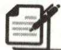

# 课堂小练

1. (2023·广西)若零下 2 摄氏度记为 $-2^{\circ} \mathrm{C}$ , 则零上 2 摄氏度记为

A. $- {2}^{ \circ  }\mathrm{C}$

B. $0^{\circ} \mathrm{C}$

C. +2°C

D. +4°C

2.(2023秋·涪城区月考)中国是最早采用正负数来表示相反意义的量的国家,如果盈利50元,记作+50元,那么亏损30元,记作()

A. +30 元

B.-20元

C.-30元

D. +20 元

3. 下列结论中正确的是

A. 0 既是正数, 又是负数

B. 0 是最小的正数

C. 0 是最大的负数

D. 0 既不是正数, 也不是负数

4. 在下列选项中, 具有相反意义的量是 ( )

A. 向东走 3 千米与向北走 3 千米

B. 收入 100 元与支出 50 元

C. 气温上升 $3^{\circ}$ C 与上升 $7^{\circ}$ C

D. 5 个老人与 5 个小孩

5. 如果“盈利 6%”记作 +6%, 那么 -3% 表示 ( )

A. 亏损 $3\%$

B. 亏损 $9 \%$

C. 盈利 3%

D. 少赚 $3 \%$

6.(2023秋·游仙区月考)若火箭发射点火前5秒记为-5秒,那么火箭发射点火后10秒应记为\_\_\_\_.

7. (2023 秋·金牛区校级期中)某种零件,标明要求是 $\varphi(20 \pm 0.02) \mathrm{mm}$ ( $\varphi$ 表示直径,单位: mm),经检查,一个零件的直径是 $19.9 \mathrm{~mm}$ ,该零件 \_\_\_\_ (填“合格”或“不合格”).

8.(2023 秋·龙泉驿区期中)下表是国外城市与北京的时差(带正号的数表示同一时刻比北京时间早的时数).

<table><tr><td>城市</td><td>纽约</td><td>巴黎</td><td>东京</td><td>多伦多</td></tr><tr><td>(冬令时)时差/时</td><td>-13</td><td>-7</td><td>+1</td><td>-13</td></tr></table>

如果现在东京时间是 16:00,那么纽约时间是\_\_\_\_。(以上均为 24 小时制)

# 基础题卡3 有理数的概念

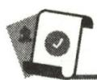

# 新知梳理

有理数的分类:

(1)有理数 $\left\{\begin{array}{l}0\\ \end{array}\right.$

(2)有理数 $\left\{\begin{array}{l} 整数  \\  分数 \end{array}\right.$

# 课堂小练

1. 下列各数是负整数的是 ( )

A. -1

B. 2

C. 5

D. $-\frac{1}{2}$

2. 有下列分类: ①有理数; ②整数; ③非负数. 其中, -20 是 ( )

A. ①②

B. ①③

C. ①②③

D. ①③

3. 下列叙述中, 不正确的是 ( )

A. 0 不是正数, 也不是负数

B. 0 是整数,也是有理数

C. 0 不是负数, 是有理数

D. 0 不是有理数, 是整数

4. 数字 0 （）

A. 是正数

B. 是负数

C. 不是有理数

D. 是整数

5.有五个数:①-5;② $\frac{22}{7}$ ;③1.3;④0;⑤ $-\frac{2}{3}$ .其中属于分数的是()

A. ②⑤

B. ②③

C. ②③⑤

D. ①⑤

6. 在有理数 -0.5, -5, $\frac{5}{3}$ 中, 属于分数的共有 \_\_\_\_ 个.

7. 把下列各数填到相应的横线上：

$$
+ 2 0 3, 0, + 6. 4, - 9, - \frac {5}{7}, 2. 6, - 0. 1
$$

正整数：{ … }；

非正数：{ …};

有理数: { … }。

# 基础题卡4 数轴

# 新知梳理

1. 数轴: 规定了 \_\_\_\_、\_\_\_\_ 和 \_\_\_\_ 的直线叫数轴.  
2. 数轴的画法: 先画一条\_\_\_\_, 在直线上任取一点作\_\_\_\_, 用数 0 表示; 一般选取原点向右为\_\_\_\_, 并用箭头表示; 根据需要, 取适当的长度作\_\_\_\_。  
3. 一般地, 设 $a$ 是一个正数, 则数轴上表示数 $a$ 的点在原点的 \_\_\_\_ 边, 与原点的距离是 \_\_\_\_ 个单位长度; 表示数 $-a$ 的点在原点的 \_\_\_\_ 边, 与原点的距离是 \_\_\_\_ 个单位长度.

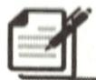

# 课堂小练

1. 下列是四位同学画的数轴,你认为正确的是 ( )

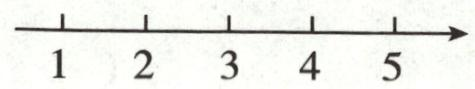  
A

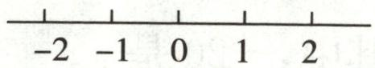  
B

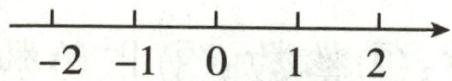  
C

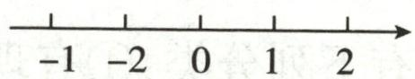  
D

2. 点 A, B, C, D 在数轴上的位置如图, 其中表示 -2 的点是 ( )

A. $A$

B. $B$

C. $C$

D. D

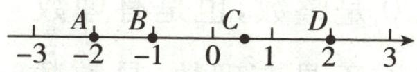  
第2题图

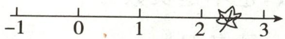  
第3题图

3. 在如图所示的数轴上, 被叶子盖住的点表示的数可能是 ( )

A.-1.3

B. 1.3

C. 3.1

D. 2.3

4. 在数轴上到原点距离等于 3 的数是 ( )

A. 3

B.-3

C. 3 或 -3

D. 无法确定

5. 在数轴上与 -2 对应的点距离 3 个单位长度的点表示的数是 ( )

A. 1

B. 5

C.-5

D. 1 或 -5

6. 将点 $A$ 向右移动 4 个单位长度, 如果终点表示的数是 2 , 那么点 $A$ 表示的数是

7. 请画出一条数轴, 然后在数轴上标出下列各数.

$$
- 3, + 1, 2 \frac {1}{2}, - 1. 5, 4.
$$

# 基础题卡5 相反数

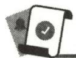

# 新知梳理

1. 相反数: 只有\_\_\_\_不同的两个数, 互为相反数, 在数轴上, 互为相反数的两个数对应的点到\_\_\_\_的距离相等.  
2. 一般地, 设 $a$ 是一个正数, 数轴上与原点的距离是 $a$ 的点有 \_\_\_\_ 个, 它们分别在正、负半轴上, 表示 \_\_\_\_ 和 \_\_\_\_, 我们说这两点关于原点对称.  
3. 在任意一个数前面添上“\_\_\_\_”号, 新的数就表示原数的相反数.

# 课堂小练

1. 下列各组数中, 互为相反数的是 ( )

A. 2 和 -2

B. -2 和 $\frac{1}{2}$

C. -2 和 $-\frac{1}{2}$

D. $\frac{1}{2}$ 和 2

2. 一个数的相反数是它本身, 则该数为 ( )

A. 0

B. 1

C. -1

D. 不存在

3. 如图, 表示互为相反数的两个点是 ( )

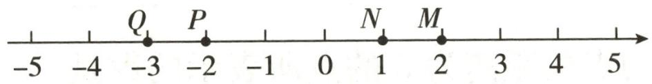

text_image

-5
-4
Q
-3
P
-2
-1
0
N
1
M
2
3
4
5

第3题图

A. $M$ 与 $Q$

B. $N$ 与 $P$

C. $M$ 与 $P$

D. $N$ 与 $Q$

4. \_\_\_\_的相反数是-0.7;1的相反数是\_\_\_\_;0的相反数是\_\_\_\_.

5. 若 $a = +2.3$ , 则 $-a =$ \_\_\_\_; 若 $a = -\frac{1}{3}$ , 则 $-a =$ \_\_\_\_.

6.(1)-(-8)的相反数是\_\_\_\_；(2)若-x=9,则x=\_\_\_\_.

7. 化简：

(1) $-(+3)$ ;

(2) $+(-1.5)$ ;

(3) $+(+5)$ ;

(4) $-(-12)$ ;

(5) $-[-(+3.2)]$ ;

(6) $-[-(-3.2)]$ .

# 基础题卡6 绝对值(1)

# 新知梳理

1. 一般地, 数轴上表示数 $a$ 的点与\_\_\_\_的距离叫作数 $a$ 的绝对值, 记作\_\_\_\_, 读作\_\_\_\_.  
2. 一个正数的绝对值是\_\_\_\_，一个负数的绝对值是\_\_\_\_，0 的绝对值是\_\_\_\_。

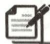

# 课堂小练

1. (2023·哈尔滨) $-\frac{1}{10}$ 的绝对值是

A. $\frac{1}{10}$

B. 10

C. $-\frac{1}{10}$

D.-10

2.(1)式子|-5.7|表示的意义是\_\_\_\_；

(2) $|-2|$ 表示-2对应的点与原点的距离是\_\_\_\_个单位长度,记作\_\_\_\_;  
(3) $|-1.5|=$ ， $|-10|=$ ， $|+2|=$ ， $-|+2.5|=$ 。

3. $-5\frac{1}{2}$ 的绝对值是\_\_\_\_，绝对值为2的数是\_\_\_\_。

4. 在数轴上到表示数 3 的点的距离为 5 的点所表示的数是

5. 绝对值相等的两个数在数轴上对应的两点之间的距离为 6, 则这两个数为

6.(1)绝对值小于3.2的整数是\_\_\_\_；

(2)使 $|x|=5$ 成立的x的值是\_\_\_\_.

7. 计算下列各式：

(1) $|-18|+|-6|$ ;

(2) $|-36|-|-24|$ ;

(3) $\left|-3\frac{1}{3}\right|\times\left|-\frac{3}{4}\right|$ ;

(4) $\left|-0.75\right|\div\left|-\frac{1}{4}\right|$ ;

(5) $\left|-\frac{4}{7}\right|-\left|-\frac{1}{7}\right|$ ;

(6) $|-2024|-|2024|$ .

# 基础题卡 7 绝对值(2)

# 新知梳理

有理数大小的比较方法：

(1) 利用数轴比较大小:

在数轴上表示有理数,它们从左到右的顺序就是从\_\_\_\_到\_\_\_\_的顺序,即\_\_\_\_边的数总小于\_\_\_\_边的数.

(2)利用正、负数的性质比较异号两数及其与0的大小:

正数 0,0 负数,正数 负数.(填“大于”或“小于”)

(3)利用绝对值比较两个负数的大小:

两个负数,绝对值大的反而\_\_\_\_.

# 课堂小练

1. 下列温度比 $-2^{\circ}C$ 低的是 ( )

A. $- {3}^{ \circ  }\mathrm{C}$

B. $- {1}^{ \circ  }\mathrm{C}$

C. ${1}^{ \circ  }\mathrm{C}$

D. ${3}^{ \circ  }\mathrm{C}$

2. 下列有理数中, 比 0 小的数是 ( )

A.-2

B. 1

C. 2

D. 3

3. 在数轴上表示 -2, 0, 6.3, $\frac{1}{5}$ 的点中, 在原点右边的点有 ( )

A. 0 个

B. 1 个

C. 2 个

D. 3 个

4. 下列四个数中, 在 -2 到 0 之间的数是 ( )

A.-1

B. 1

C. -3

D. 3

5. 不小于 -3 而小于 4 的整数有 \_\_\_\_ 个.

6. 比较下列各组数的大小.

(1)5 和 0; (2) $-\frac{1}{2}$ 和 0; (3)2 和 -3; (4)-6 和 -2; (5)-3,1.5 和 0.

7. 比较下列各组数的大小.

(1) $\left|\frac{3}{5}\right|$ 与 $\left|\frac{2}{5}\right|$ ;

(2) $-|-3|$ 与 $|-(-3)|$ ;

(3) $-\frac{5}{8}$ 与 $-\frac{7}{11}$ .

# 基础题卡8 有理数的加法(1)

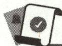

# 新知梳理

1. 同号两数相加, 取\_\_\_\_的符号, 并把绝对值\_\_\_\_.

2. 异号两数相加, 取绝对值\_\_\_\_的加数的符号, 并用较大的绝对值\_\_\_\_较小的绝对值; 互为相反数的两数相加, 和为\_\_\_\_.

3. 一个数同 0 相加, 仍得 \_\_\_\_.

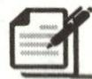

# 课堂小练

1. 下面的数中, 与 -3 的和为 0 的是 ( )

A. 3

B. -3

C. $\frac{1}{3}$

D. $-\frac{1}{3}$

2. 温度从 $-2^{\circ}C$ 上升 $3^{\circ}C$ 后是 ( )

A. ${1}^{ \circ  }\mathrm{C}$

B. $-2^{\circ}C$

C. ${3}^{ \circ  }\mathrm{C}$

D. ${5}^{ \circ  }\mathrm{C}$

3. 下列运算中, 正确的是 ( )

A. $(+6)+(-13)=+7$

B. $(+6) + (-13) = -19$

C. $(+9.05) + (-9.05) = 18.1$

D. $(-3.75)+\frac{3}{4}=-3$

4.(1)+4与2的和符号取\_\_\_\_号； (2)-4和-2的和符号取\_\_\_\_号；

(3)+4 与 -2 的和符号取 \_\_\_\_ 号；

(4)-4 和 2 的和符号取 \_\_\_\_ 号.

5. 填空: (1)(-3)+()=-12; (2)( )+(-5)=7; (3)( )+0=-8.

6. 计算：

(1) $(-7)+(-4)=$ \_\_\_\_；

(2) $3+(-12)=$ \_\_\_\_；

(3) $(-12)+2=$ \_\_\_\_；

(4)(-7)+(-7)=\_\_\_\_.

7. 计算：

(1) $\left(-5\frac{3}{4}\right)+7\frac{2}{5};$

(2) $\left(-\frac{2}{7}\right)+\left(-2\frac{1}{3}\right);$

(3) $(-3.51)+(+2.83)$ ;

(4) $\left(-3\frac{5}{6}\right)+0;$

(5) $\left(-3\frac{1}{4}\right)+6.75;$

(6) $\left(-3\frac{2}{7}\right)+\left(-2\frac{5}{7}\right).$

# 基础题卡9 有理数的加法(2)

# 新知梳理

1. 加法运算律：

(1)加法交换律: $a+b=$ \_\_\_\_ ;   
(2)加法结合律: $(a+b)+c=$ \_\_\_\_.

2. 根据加法运算律填空：

(1) \_\_\_\_ +(-10)= \_\_\_\_ +20;   
(2) \( 8+(-5)+(-4)=8+[\_\_\_\+\_\_\]

# 课堂小练

1. 计算：

(1) $(+5) + (+7) + (-7) + (-5)$ ; (2) $(-2.5) + (-3.7) + (+2.5) + (-0.5) + 4$ .

2. 用简便方法计算：

(1)0.125+ $\left(+3\frac{1}{4}\right)+\left(-3\frac{1}{8}\right)+\left(+\frac{7}{8}\right)+(-0.25)$ ;   
(2) $\left(+\frac{3}{17}\right)+(-3.36)+\left(+7.36\right)+\left(+\frac{14}{17}\right)$ ;   
(3) $(-3.75)+2.85+\left(-1\frac{1}{4}\right)+\left(-\frac{1}{2}\right)+3.15+(-2.5).$

3. 10筐橘子,以每筐 $30 \mathrm{~kg}$ 为标准, 超过的千克数记为正数, 不足的千克数记为负数, 称重的记录如下: $+4, -4, +2, 0, -3, -4, +3, -7, +3, +1$ . 称得的总质量与总标准质量相比, 超过或缺少多少千克? 10筐橘子实际共重多少千克?

# 基础题卡 10 有理数的减法(1)

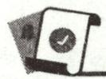

# 新知梳理

1. 有理数减法法则: 减去一个数, 等于加上这个数的 \_\_\_\_, 即 $a - b = a +$ \_\_\_\_.  
2. 在下列括号内填上适当的数：

(1) $(-7)-(-4)=(-7)+$ \_\_\_\_ ;

(2) $(-6)-3=(-6)+$ \_\_\_\_ ;

(3)0-(-3.5)=0+\_\_\_\_;

(4)2026-(+2025)=2026+

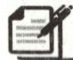

# 课堂小练

1. 计算 2-7 的结果是 ( )

A.-5

B. 5

C. -9

D. 9

2. 下列计算正确的是 ( )

A. $-3 - (-2) = -5$

B. $5-(-3)=1$

C. -3-|-3|=0

D. $5 - \left| + 4\right|  = 1$

3. 差是 -7.2, 被减数是 0.8, 减数是 ( )

A.-8

B. 8

C. 6.4

D. -6.4

4. 计算：

(1)-5-6=\_\_\_\_;

(2)(-4)-(-8)=\_\_\_\_;

(3) $|-7|-|-9|=$ \_\_\_\_；

(4)-7-(-5)= \_\_\_\_.

5. 计算：

(1) $(-5)-(-3)$ ;

(2)0-(-7);

(3)(+25)-(-13);

(4)-10-(+6);

(5) $\frac{2}{3}-\left(-\frac{1}{2}\right)$ ;

(6)3- $\left[(-3)-10\right]$ .

6. 已知两个数的和为 $-2\frac{1}{4}$ ，其中一个数为 $-1\frac{3}{4}$ ，求另一个数。

# 基础题卡 11 有理数的减法(2)

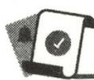

# 新知梳理

1. 以省略加号和括号的形式进行有理数加减混合运算时, 可以通过有理数的减法法则将减法转化为\_\_\_\_法, 统一成只有加法运算的\_\_\_\_的形式. 省略括号的代数和通常有两种读法: 一种是按代数和所表示的意义读; 另一种是按运算意义读.

2. 有理数加减混合运算方法：

(1)相加后可以得到\_\_\_\_的加数,可先进行相加;  
(2)分母相等或易于\_\_\_\_的分数,可先行相加;   
(3)可以互相消去得\_\_\_\_的,可先行相加;   
(4)正数和负数可以分别\_\_\_\_后再相加.

# 课堂小练

1. 式子 $-6 - (-4) + (+7) - (-3)$ 写成和的形式为 （）

A. $-6 + (+4) + (+7) + (-3)$

B. $-6 + (-4) + (+7) + (-3)$

C. $-6 + (+4) + (+7) + (+3)$

D. $-6+(-4)+(+7)+(+3)$

2. 式子 $-20 + 3 - 5 + 7$ 的正确读法是 （）

A. 负 20, 加 3, 减 5, 加 7 的和

B. 负 20 加 3 减负 5 加正 7

C. 负 20 加 3 减 5 加 7

D. 负 20 加正 3 减负 5 加正 7

3. 计算：

(1) $-7+(-3)-10-(-16)$ ;

(2) $(-16)+10+(-5)-17;$

(3) $23+(-17)+6+(-22)$ ;

(4) $(-2)+3+1+(-3)+2+(-4).$

4. 运用运算律进行简便运算：

(1) $(-1.3)+2.6+(-0.7)+(-0.6)+3;$

(2) $\left(-3\frac{1}{4}\right)+18\frac{13}{15}+\left(-2\frac{2}{3}\right)+4\frac{2}{3}+1\frac{1}{4}.$

# 基础题卡 12 有理数的乘法(1)

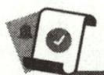

# 新知梳理

1. 有理数乘法法则:两数相乘,同号得\_\_\_\_,异号得\_\_\_\_,且积的绝对值\_\_\_\_乘数的绝对值的积;任何数与0相乘,都得\_\_\_\_.

2. 倒数: 乘积是\_\_\_\_的两个数互为倒数, 0 \_\_\_\_ 倒数, 倒数等于本身的数只有 \_\_\_\_.

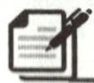

# 课堂小练

1. $-\frac{3}{5}$ 的倒数是 （）

A. $\frac{5}{3}$

B. $-\frac{5}{3}$

C. $\frac{3}{5}$

D. $-\frac{3}{5}$

2. 计算 $4 \times (-3)$ 的结果是 （）

A.-7

B. 12

C. 1

D.-12

3. 请你填一填：

(1) $(+8)\times(+3)=$ \_\_\_\_; $(-8)\times(-3)=$ \_\_\_\_.

观察两个式子的结果,发现:两数相乘,同号得\_\_\_\_,并把\_\_\_\_.

(2) $(-8)\times(+3)=$ \_\_\_\_; $(+8)\times(-3)=$ \_\_\_\_.

观察两个式子的结果,发现:两数相乘,异号得\_\_\_\_,并把\_\_\_\_.

(3) $(+8)\times0=$ \_\_\_\_; $(-8)\times0=$ \_\_\_\_.

观察两个式子的结果, 发现: 任何数与 0 相乘, 都得 \_\_\_\_.

4. 计算：

(1) $6 \times (-9)$ ;

(2) $(-4)\times6;$

(3) $(-6)\times(-1)$ ;

(4) $(-6)\times0;$

(5) $\frac{2}{3}\times\left(-\frac{9}{4}\right);$

(6) $\left(-\frac{1}{3}\right)\times\frac{1}{4}.$

# 基础题卡 13 有理数的乘法(2)

# 新知梳理

1. 乘法运算律: (1) 交换律: ab = \_\_\_\_; (2) 结合律: (ab)c = \_\_\_\_;

(3)分配律: $a(b+c)=$ \_\_\_\_.

2. $\left[\frac{7}{3}\times(-2)\right]\times\left(-\frac{1}{2}\right)=\frac{7}{3}\times\left[(\_ )\times(\_ )\right]$

# 课堂小练

1. $-6 \times \left( \frac{1}{12} - 1 \frac{2}{3} + \frac{5}{24} \right) = -\frac{1}{2} + 10 - \frac{5}{4}$ , 这步运算运用了 ( )

A. 加法结合律

B. 乘法结合律

C. 乘法交换律

D. 乘法分配律

2. 观察算式 $(-4) \times \frac{1}{7} \times (-25) \times 28$ , 在解题过程中, 能使运算变得简便的运算律是 ( )

A. 乘法交换律

B. 乘法结合律

C. 乘法交换律、结合律

D. 乘法对加法的分配律

3. 下列计算 $(-55) \times 99 + (-44) \times 99 - 99$ 的步骤正确的是 ( )

A. 原式 $= 99 \times (-55 - 44)$

B. 原式 $= 99 \times (-55 - 44 + 1)$

C. 原式 $= 99 \times (-55 - 44 - 1)$

D. 原式 $= 99 \times (-55 - 44 - 99)$

4. 计算 $(-2.5)\times0.37\times1.25\times(-4)\times(-8)$ 的值为 \_\_\_\_.

5. 计算：

(1) $(-12)\times(-37)\times\frac{5}{6};$

(2) $6\times(-10)\times0.1\times\frac{1}{3};$

(3) $\left(\frac{7}{60}-\frac{1}{12}\right)\times60;$

(4) $5\frac{7}{18}\times18.$

# 基础题卡 14 有理数的乘法(3)

# 新知梳理

1. 几个不为 0 的数相乘, 负的乘数的个数是偶数时, 积为\_\_\_\_; 负的乘数的个数是奇数时, 积为\_\_\_\_; 几个数相乘, 如果其中有乘数为 0 , 那么积为\_\_\_\_ .

2. 计算 $(-1) \times 2 \times (-3) \times 4 \times (-5) \times 6 \times (-7)$ 的结果的符号为

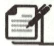

# 课堂小练

1. 下列计算结果为负数的是 ( )

A. $(-3) \times 4 \times (-5)$

B. $(-3)\times4\times0$

C. $(-3)\times4\times(-5)\times(-1)$

D. $3 \times (-4) \times (-5)$

2. 计算 $-2 \times \frac{3}{4} \times 0.5$ 的结果是 ( )

A. $\frac{3}{4}$

B. $-\frac{4}{3}$

C. $-\frac{3}{4}$

D. $\frac{4}{3}$

3. 在数 5, -6, 3, -2, 2 中, 任意取 3 个不同的数相乘, 其中乘积最大的是 ( )

A. 30

B. 48

C. 60

D. 90

4. 计算 $(-2)\times3\times(-1)$ 的结果是 \_\_\_\_.

5. $-6 \times 0 \times 1000 =$ \_\_\_\_.

6. 计算: $(1-2)\times(2-3)\times(3-4)\times\cdots\times(101-102)=$ \_\_\_\_.

7. 计算：

(1) $(-2)\times3\times4\times(-1)$ ;

(2) $(-5)\times(-3)\times4\times(-2)$ ;

(3) $(-2)\times(-2)\times(-2)\times(-2)$ ;

(4) $(-3)\times(-3)\times(-3)\times(-3)\times(-3)$

# 基础题卡 15 有理数的除法(1)

# 新知梳理

1.(1)除以一个不等于0的数,等于乘这个数的

(2)两数相除,同号得\_\_\_\_,异号得\_\_\_\_,且商的绝对值等于\_\_\_\_; 0除以任何一个不等于0的数,都得\_\_\_\_.

2. 有理数的乘除混合运算通常先把除法转化为\_\_\_\_，然后确定积的\_\_\_\_，最后求出结果。

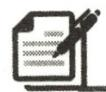

# 课堂小练

1. 计算 $(-6) \div 2$ 的结果等于 （）

A. -4

B. -3

C. 3

D. -12

2. 计算 $12 \div \left(-\frac{1}{3}\right) =$ （ ）

A. 4

B. -4

C. 36

D. -36

3. 计算 $(-6) \div (-2)$ 的结果是 （）

A. 3

B.-3

C. 4

D. -4

4. 把 $\left(-\frac{3}{4}\right)\div\left(-\frac{2}{3}\right)$ 转化为乘法是 ( )

A. $\left(-\frac{3}{4}\right) \times \frac{2}{3}$

B. $\left(-\frac{3}{4}\right)\times\frac{3}{2}$

C. $\left(-\frac{3}{4}\right)\times\left(-\frac{2}{3}\right)$

D. $\left(-\frac{3}{4}\right)\times\left(-\frac{3}{2}\right)$

5. 化简：

(1) $\frac{-72}{-8}$ ;

(2) $\frac{-\frac{1}{3}}{0.2}$ ;

(3) $\frac{0.2}{-\frac{1}{3}}$ ;

(4) $\frac{0}{-76}.$

6. 计算：

(1) $(-18)\div6;$

(2) $(-63)\div(-7)$ ;

(3) $1 \div (-9)$ ;

(4) $0 \div (-8)$ ;

(5)(-6.5)÷0.13;

(6) $\left(-\frac{6}{5}\right)\div\left(-\frac{2}{5}\right).$

# 基础题卡 16 有理数的除法(2)

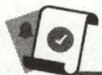

# 新知梳理

1. 有理数的乘除混合运算步骤: (1) 将除法运算转化为 \_\_\_\_ 运算; (2) 确定积的 \_\_\_\_ ; (3) 通过约分求出结果.  
2. 有理数的加减乘除混合运算,应先算\_\_\_\_,再算\_\_\_\_,同级运算按从\_\_\_\_到\_\_\_\_的顺序计算,如果有括号,那么先做\_\_\_\_内的运算.

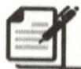

# 课堂小练

计算：

(1) $-4\times\frac{1}{2}\div\left(-\frac{1}{2}\right)\times2;$

(2) $36\div4\times\left(-\frac{1}{4}\right)\div\left(-\frac{3}{2}\right)$ ;

(3) $(-35)\div\frac{5}{8}\times\left(-\frac{3}{4}\right)\div\frac{2}{3};$

(4) $-2.5 \div \frac{5}{16} \times \left(-\frac{1}{8}\right) \div (-4)$ ;

(5) $3 \times (-4) - (-28) \div 7;$

(6) $-66\times4-(-2.5)\div(-0.1)$ ;

(7) $(-48)\div8-(-5)\times(-6)$ ;

(8) $\left(-\frac{6}{5}\right)\div\left(-1\frac{1}{2}\right)-\left(-\frac{3}{4}\right)\times1\frac{3}{5}.$

# 基础题卡 17 有理数的乘方(1)

# 新知梳理

1. 求 n 个\_\_\_\_乘数的\_\_\_\_的运算, 叫作乘方, 乘方的结果叫作\_\_\_\_. 在 $a^{n}$ 中, a 叫作 \_\_\_\_, n 叫作 \_\_\_\_.

2. 正数的任何次幂都是\_\_\_\_；负数的偶次幂是\_\_\_\_，负数的奇次幂是\_\_\_\_；0 的任何正整数次幂都是\_\_\_\_。

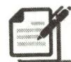

# 课堂小练

1. 对乘积 $(-3) \times (-3) \times (-3) \times (-3)$ 的记法正确的是 ( )

A. $- {3}^{4}$

B. $(-3)^{4}$

C. $-(+3)^{4}$

D. $-(-3)^{4}$

2. 平方得 4 的数是

A. 2

B. -2

C. 2 或 -2

D. 不存在

3. 对于 $(-2)^{4}$ 与 $-2^{4}$ ，下列说法正确的是 ( )

A. 它们的意义相同

B. 它们的结果相等

C. 它们的意义不同, 结果相等

D. 它们的意义不同,结果不相等

4. 下列计算正确的是

A. $(-3)^{2} = 6$

B. $- {3}^{2} =  - 9$

C. $(-3)^{2} = -9$

D. $(-1)^{2025} = -2025$

5. 一个数的平方等于它本身, 这个数是 ( )

A. 1

B. 0

C. 0 或 1

D. 1 或 -1

6.有下列各数： $-\vert-2\vert,-(-2),(-2)^{2},-2^{2}$ .其中负数有()

A. 1 个

B. 2 个

C. 3 个

D. 4 个

7. 计算 $(-2)^{11}+(-2)^{10}$ 的值是

A. -2

B. $(-2)^{21}$

C. 0

D. $- {2}^{10}$

8. 下列各式中, 值最小的是

A. $(-2)^{2}$

B. $-(-2)$

C. $-2^{2}\times(-1)^{2}$

D. $- 2 - {1}^{2}$

9. $-\left(\frac{2}{3}\right)^{2}$ 的底数是\_\_\_\_，指数是\_\_\_\_，计算的结果是\_\_\_\_。

10. 计算: $\frac{2^{3}}{3} =$ \_\_\_\_; $\left(\frac{2}{3}\right)^{3} =$ \_\_\_\_; $\left(-\frac{2}{3}\right)^{3} =$ \_\_\_\_; $-\frac{(-2)^{3}}{3} =$ \_\_\_\_.

# 基础题卡18 有理数的乘方(2)

# 新知梳理

1. 做有理数加、减、乘、除、乘方的混合运算时,应注意以下运算顺序:

(1)先\_\_\_\_,再\_\_\_\_,最后加减;   
(2)同级运算,从\_\_\_\_到\_\_\_\_进行;   
(3)如有括号,先做\_\_\_内的运算,按小括号、中括号、大括号依次进行.

2. 计算 $2 \times (-3)^{3} - 4 \div (-2) + 15$ 时, 先算\_\_\_\_, 再算\_\_\_\_法和\_\_\_\_法, 最后算\_\_\_\_法和\_\_\_\_法, 最后的结果为\_\_\_\_。

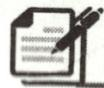

# 课堂小练

计算：

(1) $-2^{3}\div\frac{4}{9}\times\left(-\frac{2}{3}\right)^{2}$ ;

(2) $8-3\times2^{3}-(-3\times2)^{2}$ ;

(3) $-\frac{3}{5}\times\left(-3^{2}\times\frac{1}{3}-2\right)\div6;$

(4) $(-1)^{3}-\frac{1}{4}\times[2-(-3)^{2}]$ ;

(5) $-4^{2}\div(-2)^{3}-\frac{4}{9}\times\left(-\frac{3}{2}\right)^{2};$

(6) $24\div(-2)^{3}-9\times\left(-\frac{1}{3}\right)^{2}$ ;

(7) $-(-1)+3^{2}\div(1-4)\times2;$

(8) $-(3-5)+(-3)^{2}\times(1-2^{2})$ .

# 基础题卡 19 科学记数法

# 新知梳理

1. 把一个大于 10 的数表示成\_\_\_\_的形式(其中 a 大于或等于 1, 且 a 小于 10, n 是正整数), 这种记数法叫作科学记数法. 指数 n 等于原数的整数位数 \_\_\_\_.

2.(1)31000000=3.1×10 $^{( )}$ 中,小括号内填\_\_\_\_;

(2) $-7400000000=-7.4\times10^{()}$ 中,小括号内填\_\_\_\_.

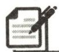

# 课堂小练

1. 火星具有和地球相近的环境,与地球最近时的距离约为 55000000km. 将数 55000000
用科学记数法表示为

A. $0.55 \times 10^{8}$

B. $5. 5 \times 10^{7}$

C. $5.5 \times 10^{6}$

D. $55 \times 10^{6}$

2. 港珠澳大桥主体工程的主梁钢板用量达 420000 吨, 这相当于 10 座鸟巢体育场或 60 座埃菲尔铁塔钢材用量, 那么埃菲尔铁塔的钢材用量用科学记数法表示约为 ( )

A. $7 \times 10^{4}$ 吨

B. $7 \times 10^{3}$ 吨

C. $70 \times 10^{3}$ 吨

D. $0.7 \times 10^{4}$ 吨

3. 据统计某市财政总收入达 105.6 亿元,用科学记数法表示 105.6 亿为 ( )

A. $1.056 \times 10^{10}$

B. $1.06 \times 10^{10}$

C. $1.06 \times 10^{11}$

D. $1.056 \times 10^{11}$

4. 一种计算机每秒可做 $4 \times 10^{9}$ 次运算, 它工作 $5 \times 10^{2}$ 秒, 可做\_\_\_\_次运算.

5. 用科学记数法表示下列各数：

(1)1382000000=\_\_\_\_;

(2)-100000=\_\_\_\_;

(3)13 亿=\_\_\_\_;

(4) $345 \times 10^{6}=$ \_\_\_\_.

6. 写出以下用科学记数法表示的数的原数:

(1) $3.726 \times 10^{6} =$ \_\_\_\_；

(2) $-3.058\times10^{7}=$ \_\_\_\_.

7. 比较大小: (填“＞”“＝”或“＜”)

(1) $3.14 \times 10^{7}$ \_\_\_\_ 3. $14 \times 10^{8}$ ;

(2) $8.999 \times 10^{12}$ \_\_\_\_ 7.201×10 $^{13}$ ;

(3) $5.266 \times 10^{8}$ \_\_\_\_ 4.01×10 $^{8}$ ;

(4) $-2.25\times10^{6}$ \_\_\_\_ $-8.25\times10^{5}$ .

# 基础题卡 20 近似数

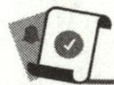

# 新知梳理

1. 与实际完全符合的数是准确数;与实际接近,但与实际数还有差别的数是  
2. 近似数与准确数的接近程度, 用 \_\_\_\_ 表示.  
3.1.705 精确到十分位是\_\_\_\_；315.95 精确到个位是\_\_\_\_。

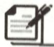

# 课堂小练

1. 用四舍五入法将 0.00519 精确到千分位是 ( )

A. 0.0052

B. 0.005

C. 0.0051

D. 0.00519

2. 下列近似数中, 精确到千位的是 ( )

A. 1.3万

B. 21.010 万

C. 1018

D. 15.28

3. 用四舍五入法将 2.896 精确到 0.01, 所得到的近似数为 \_\_\_\_.  
4.199.53 精确到个位是\_\_\_\_。  
5.5.614 精确到百分位是 \_\_\_\_.   
6. 用四舍五入法对 1.549 取近似数(精确到十分位)是\_\_\_\_。  
7.(1)近似数 2.780 精确到\_\_\_\_位；

(2)近似数 $6.4 \times 10^{5}$ 精确到 \_\_\_\_ 位；  
(3)近似数 2.30 万精确到 \_\_\_\_ 位；  
(4)近似数 3.5 万精确到 \_\_\_\_ 位.

8.3.14159 的近似值是\_\_\_\_。(精确到百分位)  
9. 用四舍五入法得到 a 的近似数为 4.60, 则 a 的取值范围是 \_\_\_\_.  
10. 下列各数精确到什么位？请分别指出来。

(1)0.016;

(2)1980;

(3)1.70;

(4)3.47万.

11. 用四舍五入法对下列各数取近似数：

(1)9.23456(精确到0.0001);

(2)567899(精确到百位).

# 基础题卡 21 代数式(1)

# 新知梳理

1. 用运算符号把数或表示的数的字母连接起来的式子, 称为 \_\_\_\_.

2. 书写代数式的注意要点：

(1)在含有字母的式子中如果出现乘号,通常将数放在字母前,乘号写作“·”或
\_\_\_\_;  
(2)在代数式中遇到除法运算时,一般改写成\_\_\_\_的形式;  
(3)实际问题含有单位时,若运算结果是加或减,用括号把列式括起来,再写单位.

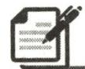

# 课堂小练

1. 比 $a$ 小 3 的数表示为 （）

A. $a - 3$

B. $a + 3$

C. ${3a}$

D. $- {3a}$

2. $a, b$ 两数差的平方是 （）

A. $a - b^{2}$

B. $a^2 - b$

C. $a^2 - b^2$

D. $(a - b)^{2}$

3. 某企业今年 1 月份产值为 $x$ 万元, 2 月份的产值比 1 月份减少了 $10\%$ , 则 2 月份的产值是 ( )

A. $(1 - 10\%)x$ 万元

B. $(1-10\%x)$ 万元

C. $(x - 10\%)$ 万元

D. $(1+10\%)x$ 万元

4. 某阶梯教室第一排有 m 个座位, 后面每一排都比前面一排多 4 个座位, 则第 n 排座位数是 ( )

A. $m + 4$

B. $m + {4n}$

C. $n+4(m-1)$

D. $m + 4(n - 1)$

5. 十位数字是 m，个位数字是 n 的两位整数是 \_\_\_\_.

6. 买一个足球需要 m 元, 买一个篮球需要 n 元, 买 4 个足球和 7 个篮球共需要 \_\_\_\_ 元.

7. 某校去年招收七年级新生 $x$ 人, 今年比去年增加 $20\%$ , 用式子表示今年该校七年级新生人数为 \_\_\_\_.

8. 如果练习本每本 a 元, 铅笔每支 b 元, 那么代数式 $8a + 3b$ 表示的意义是 \_\_\_\_.

9. 用代数式表示:

(1) $a$ 与 $b$ 的差;  
(2)m 的 2 倍与 n 的一半的和;  
(3)x 与 y 两数的平方差.

# 基础题卡 22 代数式(2)

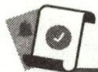

# 新知梳理

1. 在解决一些数学问题与实际问题时,往往需要先把问题中的数量关系用含有数、字母和运算符号的式子表示出来,也就是要\_\_\_\_。  
2. 用字母表示数, 字母可以和数一样参与运算, 从而可以用\_\_\_\_把数量或数量关系简明地表示出来, 更具有一般性.

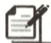

# 课堂小练

1.“x 的 3 倍与 y 的 $\frac{1}{3}$ 的和”用代数式可表示为 （）

A. $3 y + \frac { 1 } { 3 } x$

B. $3x + \frac{1}{3}(x + y)$

C. $3x + \frac{1}{3}y$

D. $3x+y+\frac{1}{3}$

2.(2024·红花岗区一模)某快递公司的收费标准如下:5千克及以内收费a元,超过5千克的部分每千克按3元收费.小天寄8千克的包裹需要支付()

A. $(a+24)$ 元

B. $(15+a)$ 元

C. $(9+a)$ 元

D. $(5a + 3)$ 元

3.(2024·包河区一模)某公司今年2月份的利润为x万元,3月份比2月份减少了7%,4月份比3月份增加了8%,则该公司4月份的利润为\_\_\_\_万元.()

A. $(x-7\%)(x+8\%)$

B. $(x-7\%+8\%)$

C. $(1-7\%+8\%)x$

D. $(1 - 7\%) (1 + 8\%) x$

4. 冬天天气寒冷, 羽绒服的销量很火爆. 已知一件羽绒服的标价为 $a$ 元, 现将标价打 8.5 折出售, 则现在的售价为 \_\_\_\_ 元. (用含 $a$ 的代数式表示)

5. 用代数式表示：

(1)个位数字为 a，十位数字为 b 的两位数；  
(2)x,y 两数的差的平方;   
(3)a,b 两数的平方差;  
(4)某商品的原价是 a 元, 提价 10% 后的价格.

# 基础题卡 23 代数式(3)

# 新知梳理

1. 两个相关联的量,一个量变化,另一个量也随着变化,且这两个量的乘积一定,这两个量就叫作成反比例的量,它们之间的关系叫作  
2. 如果用字母 $x$ 和 $y$ 表示两个相关联的量, 用 $k$ 表示它们的积 ( $k$ 是一个确定的值, 且 $k \neq 0$ ), 反比例关系可以用 \_\_\_\_ 或 \_\_\_\_ 来表示, 其中 $k$ 叫作 \_\_\_\_.

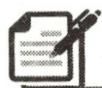

# 课堂小练

1. $x$ 和 $y$ 是反比例关系的是 （）

A. $y = \frac{1}{{x}^{2}}$

B. ${xy} = 8$

C. $y=\frac{2}{x+5}$

D. $y = \frac{3}{x} + 5$

2. 下面每个选项中的两种量成反比例关系的是 ( )

A. $x$ 和 $y$ 互为倒数

B. 圆柱的高一定, 体积和底面积

C. 被减数一定, 减数和差

D. 除数一定, 商和被除数

3. 如果 x 与 y 满足 $xy + 1 = 0$ ，则 y 与 x 成 \_\_\_\_ 比例关系，比例系数为 \_\_\_\_.  
4. 如图, 用方砖铺地时, 若地面很大, 而方砖的数量有限, 当铺成的地面为长方形时, 长方形的宽 $x$ 与长 $y$ 成关系.  
5. 已知 $y$ 与 $x$ 之间的对应值如下表所示:

<table><tr><td>x</td><td>...</td><td>1</td><td>2</td><td>3</td><td>4</td><td>5</td><td>6</td><td>...</td></tr><tr><td>y</td><td>...</td><td>6</td><td>3</td><td>2</td><td>1.5</td><td>1.2</td><td>1</td><td>...</td></tr></table>

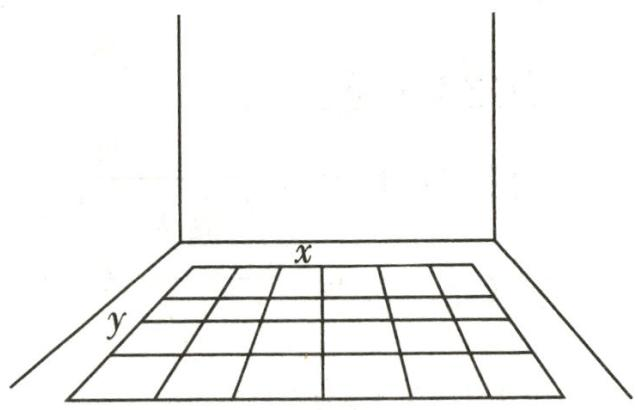

text_image

x
y

第4题图

y 与 x 之间的关系式为 \_\_\_\_，则 y 与 x 成 \_\_\_\_ 比例关系，比例系数为 \_\_\_\_。

6. 判断下列各题中的两个量是否成反比例关系, 并说明理由:

(1)某农场的粮食总产量为 1500t,该农场人数 y(人)与平均每人占有的粮食量 x(t);  
(2) 加油机显示器上显示某一种油的单价为每升 4.75 元, 加油总价 $y$ (元)与加油量 $x$ (L);  
(3)小明完成 $100 \mathrm{~m}$ 赛跑时, 所用时间 $t(\mathrm{~s})$ 与他跑步的平均速度 $v(\mathrm{m} / \mathrm{s})$ .

# 基础题卡24 代数式的值

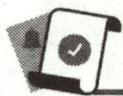

# 新知梳理

一般地,用数值代替代数式中的字母,按照代数式中的运算关系计算得出的结果,叫作\_\_\_\_.当字母取不同的数值时,代数式的值一般也\_\_\_\_.

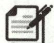

# 课堂小练

1.(2024·文昌模拟)当 x=-1 时,代数式 $x+4$ 的值为 ( )

A. 5

B.-3

C. 3

D. -5

2.(2023 秋·青龙县期末)当 x=-1, y=3 时, 代数式 $x^{3}-2y$ 的值为 ( )

A.-7

B. -5

C. 4

D. 7

3.(2023 秋·路桥区期末)如果 $2xy + x = 8$ ，那么 $2xy + x - 3$ 的值为（）

A.-1

B. 1

C. - 5

D. 5

4.(2023秋·高安期末)已知 $a+b=2$ ，则 $2a+2b-5$ 的值为\_\_\_\_。

5.(2023 秋·句容期末)按照如图所示的操作步骤,若输入值为 -1,则输出值为 \_\_\_\_.

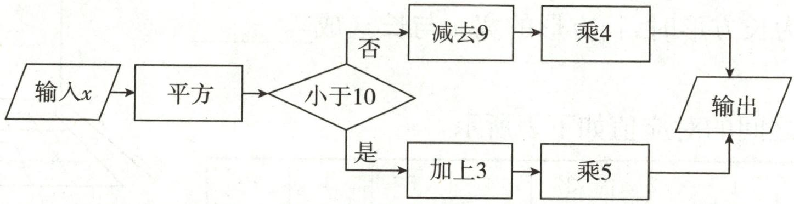

flowchart

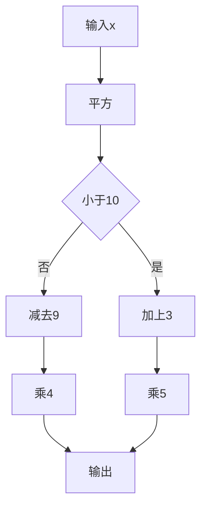

第5题图

6. 当 a=11, b=-5, c=-3 时, 求下列代数式的值:

(1) $a - c$ ;

(2)b-c;

(3) $a - b - c$ ;

(4)c-a-b.

7. 已知 a = -7, b = -2，求 $(a + b)^{2}$ , $a^{2} + 2ab + b^{2}$ 的值，并比较大小.

8. 已知 a, b 互为倒数, c, d 互为相反数, m 为最大的负整数, 求 $\frac{m}{3} + ab + \frac{c + d}{4m}$ 的值.

# 基础题卡 25 整式(1)

# 新知梳理

(1)单项式:由数或字母的\_\_\_\_组成的式子叫作单项式,单独的一个\_\_\_\_或一个\_\_\_\_也是单项式.  
(2)单项式的系数:单项式中的 因数叫作单项式的系数.  
(3)单项式的次数:一个单项式中, 字母的指数的叫作单项式的次数.

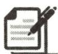

# 课堂小练

1. 下列式子中, 是单项式的是 ( )

A. $-\frac{1}{2} x^{3} y z^{2}$

B. $x + y$

C. $-m^{2}-n^{2}$

D. $\frac{1}{2x}$

2. 单项式 $-5xy^{2}$ 的系数与次数分别是 ( )

A. 5,3

B.-5,2

C. 3, -5

D.-5,3

3. 下列单项式是二次单项式的是 ( )

A. ${xy}$

B. ${2x}$

C. $x^{2}y$

D. $x^{2}y^{2}$

4. 单项式 $-\frac{1}{2}a^{3}b$ 的系数为 \_\_\_\_，次数为 \_\_\_\_。  
5. 一个单项式满足下列两个条件: ①系数是 -2; ②次数是 3. 写出一个满足上述条件的单项式: \_\_\_\_.  
6. 用整式填空：

(1)某品牌汽车去年销售 a 辆,预计今年销售量增长 15%,那么今年比去年可多销售 \_\_\_\_ 辆;

(2)一支圆珠笔的价钱是 $y$ 元, 小明买 5 支需要花费 \_\_\_\_ 元;  
(3)一个正方形的边长为 $a \mathrm{~cm}$ , 那么它的面积是 $\mathrm{cm}^{2}$ .

7. 指出下列各单项式的系数和次数：

(1) $3xy$ ;

(2)-xy;

(3) $-7x^{2}y^{3}$ ;

(4) $-2a^{2}b^{4}c$ .

# 基础题卡 26 整式(2)

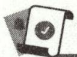

# 新知梳理

1. 多项式的有关概念：

(1)多项式:几个\_\_\_\_叫作多项式.   
(2)多项式的项:多项式中的每个叫作多项式的项,有几项就是几项式.  
(3)常数项:多项式中\_\_\_\_叫作常数项.   
(4)多项式的次数:多项式里, 的次数,叫作这个多项式的次数.

2. 整式的概念: \_\_\_\_ 与 \_\_\_\_ 统称整式.

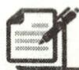

# 课堂小练

1. 在式子 $2a + b, \frac{a + b^2}{r}, -7, -\frac{1}{4} a^2 bc, \frac{a + b}{2}$ 中，多项式的个数是 （）

A. 2

B. 3

C. 4

D. 5

2. 多项式 $x^{2} - 2xy^{3} - \frac{1}{2} y - 1$ 是 （）

A. 三次四项式

B. 三次三项式

C. 四次四项式

D. 四次三项式

3. 多项式 $-x^{2}-\frac{1}{2}x-1$ 的各项分别是 ( )

A. $-x^{2}, \frac{1}{2} x, 1$

B. $-x^{2},-\frac{1}{2}x,-1$

C. $x^{2},\frac{1}{2}x,1$

D. $x^{2},-\frac{1}{2}x,-1$

4. 多项式 $x^{4} - 2x^{3} + 3x - 5$ 的次数和常数项分别是 （）

A. 4 和 5

B. 1 和 5

C. 1 和 -5

D. 4 和 -5

5. 在式子 $x^{2} + 5, -1, x^{2} - 3x + 2, \pi, \frac{5}{x}, x^{2} + \frac{1}{x + 1}$ 中，整式有 （）

A. 3 个

B. 4 个

C. 5 个

D. 6 个

6. 多项式 $3x^{3}y + 2x^{2}y - 4xy^{2} + 2y - 1$ 中的最高次项是 \_\_\_\_.

7. 用整式填空：

(1)身高由 $x\mathrm{m}$ 增加 $0.12\mathrm{m}$ 后是 \_\_\_\_ m.

(2)某工厂上月的利润为 m 万元,本月的利润比上月的 3 倍还多 10 万元,则本月的利润为 \_\_\_\_ 万元.

# 基础题卡 27 整式的加减(1)

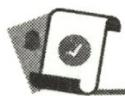

# 新知梳理

1. 同类项: 所含字母\_\_\_\_, 并且\_\_\_\_的指数也相同的项叫作同类项. 几个常数项也是同类项.  
2. 合并同类项: 把多项式中的同类项合并成\_\_\_\_, 叫作合并同类项.  
3. 合并同类项法则: 只把同类项的\_\_\_\_相加, 结果作为系数, 不变.

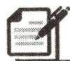

# 课堂小练

1. 下列单项式中, 与 $3a^{4}b$ 是同类项的为 ( )

A. $3 a ^ { 4 }$

B. $3ab$

C. $a^4 b$

D. $3a^{3}b^{2}$

2. 下列各组是同类项的为 ( )

A. $2x^{3}$ 与 $3x^{2}$

B. 12ax 与 8bx

C. $x^{4}$ 与 $a^4$

D. $2^{3}$ 与 $-3$

3. $4a - a$ 的计算结果是 （）

A. 3

B. ${3a}$

C. 4

D. ${4a}$

4. 与 $-2x^{2}y$ 合并同类项后得到 $5x^{2}y$ 的是 （）

A. $-3x^{2}y$

B. $3x^{2}y$

C. $7 y x^{2}$

D. $7xy^{2}$

5. 合并同类项: $-3x + 2x =$ \_\_\_\_; $5m - m - 8m =$ \_\_\_\_.  
6. 合并同类项: $3a - \frac{1}{2} a =$ \_\_\_\_; $-x^{2} - x^{2} =$ \_\_\_\_.  
7. 合并同类项：

(1) $3x^{3}+x^{3}$ ;

(2) $xy^{2}-xy^{2}$ ;

(3)3x-8x-9x;

(4)2x-7y-5x+11y-1.

8. 合并同类项 $2x^{2} + xy + 3y^{2} - x^{2} + xy - 2y^{2}$ , 并求当 $x = 2, y = 1$ 时, 代数式的值.

# 基础题卡 28 整式的加减(2)

# 新知梳理

1. 去括号法则：

(1)括号外的乘数为正数时,去括号后原括号内各项的符号与原来的符号\_\_\_\_;   
(2)括号外的乘数为负数时,去括号后原括号内各项的符号与原来的符号

2. 去括号：

(1) $-(3m+4n)=$ \_\_\_\_；

(2) $-2(-2a+b)=$ \_\_\_\_.

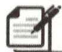

# 课堂小练

1. 下列去括号正确的是

( )

A. $-(a+b-c)=-a+b-c$

B. $-2(a+b-3c)=-2a-2b+6c$

C. $-(-a-b-c)=-a+b+c$

D. $-(a-b-c)=-a+b-c$

2. $-(m - n)$ 去括号得

( )

A. $m - n$

B. $-m - n$

C. $-m + n$

D. $m+n$

3. $(a-b+c)-(x-y)$ 去括号的结果是

( )

A. $-a+b-c+x-y$

B. $a-b+c-x+y$

C. $a-b+c-x-y$

D. $a + b - c - x + y$

4. $-[a - (b - c)]$ 去括号应得

( )

A. $-a+b-c$

B. $-a-b+c$

C.-a-b-c

D. $-a+b+c$

5. 填空：

(1) $a-(-b+c-d)=$ \_\_\_\_ ;   
(2) $(x-y)+(-m-n)=$ \_\_\_\_ ;   
(3) $(x-y)-(-m-n)=$ \_\_\_\_ ;   
(4) $-(a+b)-(-c-d)=$ \_\_\_\_ ;   
(5) $(a-b)-(-c+d)=$ \_\_\_\_ ;   
(6) $-(a-b)+(-c-d)=$ \_\_\_\_.

6. 先化简, 再求值:

(1)4x-2x-(x-3)，其中 $x=\frac{1}{2}$ ;  
(2) $2(a^{2}-ab)-3(2a^{2}-ab)$ ，其中a=-2,b=3.

# 基础题卡 29 整式的加减(3)

# 新知梳理

1. 几个整式相加减,如果有括号就先\_\_\_\_,然后再\_\_\_\_.   
2. 化简 $3(a+b)-2(a-2b)$ 的最后结果是 \_\_\_\_.

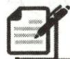

# 课堂小练

1. 合并同类项：

(1) $x+(4x-2)$ ;

(2) $(2x-3y)+(7x+4y)$ ;

(3) $3(2x^{2}+5y)+2(-5x^{2}-3y)$ ;

(4) $2x-3(x+1)$ ;

(5)-5a-1-(3a-7);

(6) $(3a^{2}-7a)-2(a^{2}-3a+2)$ ;

(7) $-5+(x^{2}+3x)-(-9+6x^{2})$ ;

(8) $2y-(3x^{2}-4y)+3(x^{2}-y).$

2. 一个多项式加上 $3a^{2} + ab - 3b^{2}$ 得 $4a^{2} - ab - 5b^{2}$ , 求这个多项式.

3. 已知 $A = 2a^{2} - a, B = -5a + 1$ , 当 $a = -\frac{1}{2}$ 时, 求 $3A - 2B + 1$ 的值.

# 基础题卡 30 从算式到方程(1)

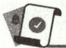

# 新知梳理

1. 先设出字母表示未知数,然后根据问题中的相等关系,列出一个含有未知数的等式,这样的等式叫作

2. 分析实际问题中的数量关系, 利用其中的相等关系列出\_\_\_\_, 是用数学解决实际问题的一种方法.

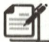

# 课堂小练

1. 下列各式中, 是方程的为 ( )

A. 4x-1=2x+2

B. x - 2

C. $1+2=3$

D. $0 > x + 1$

2. 比某数的相反数大 2 的数是 8, 设某数为 $x$ , 可列方程为 ( )

A. $- x + 2 = 8$

B. -2x=8

C. -x=2+8

D. $x - 2 = 8$

3. 下列各式中, 是方程的为 ( )

①2x-1=5;②4+8=12;③5y+8;④2x+3y=0;⑤ $2x^{2}+x=1$ ;⑥ $2x^{2}-5x-1$ .

A. ①②④⑤

B.①②⑤

C. ①④⑤

D. 6 个都是

4. 一个笼子里放着几只鸡与几只兔, 数了数一共有 14 个头, 44 只脚. 问鸡兔各有几只. 设鸡有 $x$ 只, 可得方程 ( )

A. $2x + 4(14 - x) = 44$

B. $4x + 2(14 - x) = 44$

C. $4x + 2(x - 14) = 44$

D. $2x+4(x-14)=44$

5. 某数的一半比它本身的 $\frac{2}{3}$ 大 12. 设这个数为 $x$ , 可列方程为 \_\_\_\_.

6.3 年前,父亲的年龄是儿子年龄的 4 倍,3 年后父亲的年龄是儿子年龄的 3 倍,求父子今年各是多少岁.设 3 年前儿子的年龄为 $x$ 岁,则列出的方程为 \_\_\_\_.

7. 根据下列条件, 列出方程:

(1)x 的 3 倍减 5, 等于 x 的 2 倍加 1;

(2)x 的 30% 加 2 的和的一半, 等于 x 的 20% 减 5;

(3)七年级学生的人数为 n, 其中男生占 45%, 女生有 110 人;

(4)某种商品每件的进价为 a 元, 售价为进价的 1.1 倍, 现每件又降价 10 元, 现售价为每件 210 元.

# 基础题卡 31 从算式到方程(2)

# 新知梳理

1. 一元一次方程: 只含有\_\_\_\_未知数, 且含有未知数的式子都是\_\_\_\_. 未知数的次数都是\_\_\_\_, 这样的方程叫作一元一次方程.  
2. 使方程左、右两边的值相等的 \_\_\_\_ 的值, 叫作方程的解.

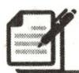

# 课堂小练

1. 下列方程是关于 $x$ 的一元一次方程的是 （）

A. $x = 5$

B. $2{x}^{2} = 3$

C. ${3x} + {5y} = {19}$

D. $5x^{2}-7=5x$

2. 如果 $\frac{1}{3} x^{2 - n} - 1 = 0$ 是关于 $x$ 的一元一次方程, 那么 $n$ 的值为 ( )

A. 0

B. 1

C. $\frac{1}{2}$

D. $\frac{3}{2}$

3. 若 $x = -1$ 是方程 $2x + m - 6 = 0$ 的解, 则 $m$ 的值是 ( )

A. -4

B. 4

C.-8

D. 8

4.(2023秋·大冶期末)方程 $2+\blacktriangle=3x$ 中▲处的数字被墨水盖住了,已知方程的解是 x=2,那么▲处的数字是 ( )

A. -4

B. -3

C. 4

D. 2

5. 根据下列问题, 设未知数并列出方程, 然后判断方程是不是一元一次方程.

(1)从 60cm 的木条上截去 2 段同样长的木条,还剩下 10cm 长的短木条,截下的每段木条长为多少?  
(2)小红对小敏说:“我是6月份出生的,我的年龄的2倍加上10,正好是我出生的那个月的总天数,你猜我几岁?”  
(3)小明步行的速度是 5 千米/时,有一天他从家去学校,走了全程的 $\frac{1}{3}$ 后,改乘速度为 20 千米/时的公共汽车到校,结果比全程步行的时间快了 15 分钟,小明家离学校多远?

6. 判断下列方程的解是正数、负数、还是 0.

(1) $4x = -16$ ;

(2) $-3x = 18$ ;

(3) $-9x=-36;$

(4) $-5x=0.$

# 基础题卡 32 从算式到方程(3)

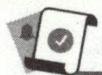

# 新知梳理

等式的性质：

性质 1: 等式两边加(或减) \_\_\_\_ (或式子), 结果仍相等, 即如果 a = b, 那么 $a \pm c =$ \_\_\_\_.

性质2:等式两边乘\_\_\_\_,或除以\_\_\_\_的数,结果仍相等,即如果a=b,

那么 ac=\_\_\_\_; 如果 $a=b(c\neq0)$ ，那么 $\frac{a}{c}=$ \_\_\_\_.

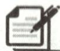

# 课堂小练

1. 根据等式的性质, 下列变形错误的是 ( )

A. 若 $a = b$ ，则 $ac = bc$

B. 若 $a = b$ , 则 $\frac{a}{c} = \frac{b}{c}$

C. 若 a=b，则 $a+3=b+3$

D. 若 $a = b$ ，则 $a - 3 = b - 3$

2.(2023 秋·义乌期末)已知 $2a=b+1$ , 那么下列等式中不成立的是 ()

A. $2a+1=b+2$

B. 2a-b=1

C. $a=\frac{1}{2}b+\frac{1}{2}$

D. ${4a} = {2b} + 1$

3. 根据等式的性质填空, 并说明依据:

(1)如果 2x=5-3x,那么 $2x+$ =5;( )

(2)如果 0.2x=10,那么 x=\_\_\_\_;()

(3)如果 5x-7=8,那么 $5x=8+$ ;( )

(4)如果 5x=15,那么 x=\_\_\_\_;()

(5)如果 $\frac{1}{2}x=1$ ，那么x=\_\_\_\_。（）

4. 利用等式的性质解下列方程：

(1) $x+7=26;$

(2) $-\frac{1}{3}x=20;$

(3) $-x-5=4;$

(4) $-3x-5=4x+9.$

# 基础题卡 33 解一元一次方程(1)

# 新知梳理

1. “合并同类项”的依据是\_\_\_\_\_\_\_\_；“系数化为 1”的依据是\_\_\_\_。  
2. 基本的相等关系: 总量 = 各部分量的 \_\_\_\_.  
3. 解方程 $-7x + 2x = 9 - 4$ 的步骤: (1) 合并同类项, 得 \_\_\_\_; (2) 系数化为 1, 得 \_\_\_\_.

# 课堂小练

1. 解下列方程:

(1)4x-3x=5;

(2) $\frac{2x}{3}+\frac{8x}{3}=12;$

(3) $-4x+0.5x=7;$

(4)6x-1.3x=0.8×8+3.

2. 夏季天气炎热, 某空调厂家研究决定多生产 A, B, C 三种型号的空调共 2000 台, 其中 A, B, C 三种型号的空调多生产的数量比为 $1:6:3$ , A, B, C 三种型号的空调各多生产多少台?

3. 有一列数, 按一定规律排列为 $1, -4, 16, -64, 256, -1024, \cdots$ , 其中有三个相邻的数的和是 $-13312$ , 这三个数分别是多少?

# 基础题卡 34 解一元一次方程(2)

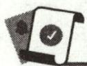

# 新知梳理

1. 移项: 把等式一边的某项\_\_\_\_后移到另一边, 叫作移项. 移项的依据是\_\_\_\_. 在等号同侧的移动不是移项, 移项要改变符号.  
2. 解方程时, 通常把含有未知数的项移到方程的\_\_\_\_, 不含未知数的项 (常数项) 移到方程的\_\_\_\_, 然后再\_\_\_\_, 最后将系数化为 1.  
3. 基本的相等关系: 表示同一个量的两个不同的式子 \_\_\_\_.

# 课堂小练

1. 解方程:

(1)5x=3x-4;

(2) $-x=-\frac{2}{5}x+1;$

(3) $3x-1=x+3;$

(4) $3x+2=3.5x-1;$

(5) $x-3=\frac{3}{2}x+1;$

(6) $\frac{1}{4}x=-\frac{1}{2}x+0.75.$

2. 跑得快的马每天行 240 千米, 跑得慢的马每天行 150 千米, 慢马先行 12 天, 快马几天可以追上慢马?

3. 学校在植树活动中种了杨树和杉树两种树, 已知种植杨树的棵数比总数的一半多 56 棵, 杉树的棵数比总数的 $\frac{1}{3}$ 少 14 棵. 两种树各种植多少棵?

# 基础题卡 35 解一元一次方程(3)

# 新知梳理

1. 解含有括号的一元一次方程的一般步骤：

(1) \_\_\_\_ ; (2) \_\_\_\_ ; (3) \_\_\_\_ ; (4) 系数化为 1.

2. 顺水速度=静水速度\_\_\_\_水速,逆水速度=静水速度\_\_\_\_水速.

3. 在匀速运动中, 路程 = 时间 × \_\_\_\_ ; 相遇时间 = 路程 ÷ \_\_\_\_ ; 追及时间 = 路程 ÷ \_\_\_\_.

# 课堂小练

1. 解方程:

(1) $3(x-2)+1=-2;$

(2) $x+5=2(x-1)$ ;

(3)4x-3(8-x)=4;

(4) $5(x-5)-2(12-x)=0;$

(5) $x-(2-2x)=8+x;$

(6) $\frac{3}{2}\left[\frac{2}{3}(2x - 1) - 2\right] - x = 2.$

2. 周末小新去爬山, 他上山花了 0.8 小时, 下山时按原路返回, 用了 0.5 小时, 已知他下山的平均速度比上山的平均速度快 1.5 千米/时, 求小新上山时的平均速度.

3. 一艘轮船在 A, B 两个港口之间航行, 顺流需要 4 小时, 逆流需要 5 小时. 已知水流速度是每小时 2 千米, 求轮船在静水中的速度.

# 基础题卡 36 解一元一次方程(4)

# 新知梳理

1. 去分母: 方程两边都乘各分母的\_\_\_\_\_, 不要漏乘不含分母的项; 当分子是多项式时应加括号; 如果分母中有小数, 要先化小数为\_\_\_\_\_.

2. 解含分母的一元一次方程的一般步骤：

(1)\_\_\_\_；(2)去括号；(3)移项；(4)合并同类项；(5)系数化为1.

# 课堂小练

1. 解下列一元一次方程：

(1) $\frac{2x-1}{6}=\frac{5x+1}{8};$

(2) $x-\frac{x-1}{2}=2;$

(3) $1-\frac{x-1}{2}=\frac{2x+1}{3};$

(4) $\frac{x + 15}{5} = \frac{1}{2} -\frac{x - 7}{3}$

2. 对于方程 $\frac{x}{2} - \frac{x - 1}{3} = 1$ ，某同学的解法如下：

解:方程两边同乘6,得3x-2(x-1)=6, ①

去括号, 得 3x-2x-2=6, ②

合并同类项, 得 x-2=1, ③

解得 x=3，④

∴原方程的解为 x=3. ⑤

(1)上述解答过程中从第\_\_\_\_（填序号）步开始出现错误；

(2)请写出正确的解答过程.

# 基础题卡 37 实际问题与一元一次方程(1)

# 新知梳理

在解决工程问题的应用题时,常常把总工作量看作1.

(1)基本关系:工作量=\_\_\_\_×工作时间.  
(2)相等关系:工作量=人均效率×人数×\_\_\_\_;各部分工作量之和等于\_\_\_\_.

# 课堂小练

1. 某车间每天能生产甲种零件 120 个或乙种零件 100 个, 甲、乙两种零件分别取 3 个、2 个才能配成一套. 现要在 18 天内生产最多的成套产品, 应怎样安排生产甲、乙两种零件的天数?  
2. 某车间有 32 名工人生产螺母和螺钉, 每人每天平均生产螺钉 1500 个或螺母 5000 个,一个螺钉要配两个螺母. 为了使每天的产品刚好配套, 应该分配多少名工人生产螺钉?  
3. 某中学的操场修整由学生自己动手完成. 若让七年级学生单独干, 则需 7.5 小时完成; 若让八年级学生单独干, 则需 5 小时完成. 现让七、八年级学生一起干 1 小时后, 再让八年级学生单独干完剩余部分, 修整操场共用了多长时间?

# 基础题卡 38 实际问题与一元一次方程(2)

# 新知梳理

1. 一件商品进价、销售价、利润之间的关系：

2. 利润率与成本(进价)、利润之间的关系：

3. 将一件商品打八折销售的含义是 ; 打七五折销售的含义是

4.400元的商品打九五折是 元,打八折是 元.

# 课堂小练

1. 某商店将某种布鞋按成本加价 40 元作为标价, 又以标价的八折优惠卖出, 结果每双布鞋仍可获利 24 元, 这种布鞋的成本价为多少元?

2. 某商场将某种商品按原标价的八折出售, 此时商品的利润率是 $10\%$ . 已知商品的进价为 1200 元, 那么此商品的原价是多少元?

3. 小明去文具店购买 2B 铅笔, 店主说: “如果多买一些, 给你打八五折.” 小明测算了一下, 如果买 100 支, 比按原价购买可以便宜 27 元, 求每支铅笔的原价.

# 基础题卡 39 实际问题与一元一次方程(3)

# 新知梳理

1. 球赛积分问题:

(1) 比赛总场数 = 胜场数 + 平场数 + ;  
(2) 比赛总积分 = + 平场积分 + 负场积分.

2. 某篮球赛的积分方法是胜一场积 2 分, 负一场积 1 分. 某球队参加了 12 场比赛, 其中胜 7 场, 负 5 场, 则该球队共积 \_\_\_\_ 分.

# 课堂小练

1. 为丰富校园文化生活, 某学校在元旦之前组织了一次百科知识竞赛. 竞赛规则如下: 竞赛试题形式为选择题, 共 50 道题, 答对一题得 3 分, 不答或答错一题倒扣 1 分. 小明代表班级参加了这次竞赛, 请解决下列问题:

(1)如果小明最后得分为 142 分,那么他答对了多少道题?  
(2)小明的最后得分可能为136分吗？请说明理由。

2. 某学校组织知识竞赛,共设 20 道选择题,各题分值相同,每题必答,下表记录了 4 名参赛者的得分情况:

<table><tr><td>参赛者</td><td>答对题数</td><td>答错题数</td><td>得分</td></tr><tr><td>A</td><td>20</td><td>0</td><td>100</td></tr><tr><td>B</td><td>19</td><td>1</td><td>94</td></tr><tr><td>C</td><td>14</td><td>6</td><td>64</td></tr><tr><td>D</td><td>10</td><td>10</td><td>40</td></tr></table>

(1)参赛者 W 得了 76 分,他答错了几道题?  
(2)参赛者 M 说他得了 72 分,你认为可能吗?请说明理由.

# 基础题卡 40 实际问题与一元一次方程(4)

# 新知梳理

分段计费问题：

(1)找到合适的分段点；  
(2)用 表示出每个分段的费用；  
(3)根据各分段费用之和等于,列出一元一次方程.

# 课堂小练

1. 海洋馆的门票价格规定如下表：

<table><tr><td>购票人数</td><td>1~50</td><td>51~100</td><td>100以上</td></tr><tr><td>门票单价/元</td><td>60</td><td>55</td><td>50</td></tr></table>

某校七年级一、二两班共102人去海洋馆,其中一班人数较多.经计算,如果两班都以班为单位分别购买与实际人数相同的票,则一共应付5850元.

(1)两班各有多少名学生?  
(2)如果两班作为一个团体购票,可以节省多少钱?

2. 某单位每月计划用水 300 吨, 计划用水每吨收费 3 元, 超计划部分每吨按 4 元收费.

(1)某月该单位用水 260 吨, 水费是 \_\_\_\_ 元; 若用水 350 吨, 则水费是 \_\_\_\_ 元.  
(2)设用水量为 x 吨, 填表:

<table><tr><td>用水量x/吨</td><td>小于或等于300吨</td><td>大于300吨</td></tr><tr><td>水费/元</td><td></td><td></td></tr></table>

(3)若某月该单位缴纳水费 1300 元,则该单位这个月用水多少吨?

# 基础题卡 41 立体图形与平面图形(1)

# 新知梳理

1. 对于各种各样的物体,数学中关注的是它们的 、 和 关系.  
2. 从实物中抽象出的各种图形统称为  
3. 有些几何图形的各部分不都在同一平面内, 它们是\_\_\_\_; 有些几何图形的各部分都在同一平面内, 它们是\_\_\_\_.

# 课堂小练

1. 下列图形中, 属于平面图形的是 ( )

A. 长方体

B. 圆柱

C. 圆

D. 球

2. 如图, 这些几何体中, 既有平面又有曲面的有 ( )

  
第2题图

A. 1 个

B. 2 个

C. 3 个

D. 4 个

3. 下面关于五棱柱的说法错误的是 ( )

A. 有 15 条棱

B. 有 10 个顶点

C. 有 15 个顶点

D. 有 7 个面

4. 如图, 观察图中的立体图形, 分别写出它们的名称.

  
第4题图

# 基础题卡 42 立体图形与平面图形(2)

# 新知梳理

1. 从不同方向看立体图形,通常是从\_\_\_\_、\_\_\_\_和\_\_\_\_三个方向看.  
2. 有些立体图形是由一些\_\_\_\_图形围成的, 将它们的表面适当展开, 就可以展开成平面图形.

# 课堂小练

1. 下列几何体中, 从前面看和从上面看得到的图形都是长方形的是 ( )

  
A

  
B

  
C

  
D

2. 如图是从三个方向看某个几何体得出的平面图形, 该几何体是 ( )

A.棱柱

B. 圆柱

C. 圆锥

D. 球

  
从前面看

  
从左面看

  
从上面看  
第2题图

natural_image

Geometric line drawing of three connected polygons forming a Y-shape (no text or symbols)

第3题图

text_image

3
2
4

第4题图

3. 能展开成如图所示的平面图形的几何体是   
4. 如图是一个长方体从前面、左面和上面看得到的图形, 根据图中数据计算这个长方体的表面积是 \_\_\_\_.  
5. 如图, 第二行的哪个几何体的表面能展开成第一行的平面图形? 请对应连线.

  
第5题图

# 基础题卡 43 点、线、面、体

# 新知梳理

1. 点动成\_\_\_\_，线动成\_\_\_\_，面动成\_\_\_\_。  
2. 几何图形都是由\_\_\_\_、\_\_\_\_、\_\_\_\_、\_\_\_\_组成的, 面与面相交得\_\_\_\_, 线与线相交得\_\_\_\_.  
3. 粉笔在黑板上画出线条或写出字,体现了\_\_\_\_的数学原理.

# 课堂小练

1. “汽车上雨刷器的运动过程”能说明的数学知识是 （）

A. 点动成线

B. 线动成面

C. 面动成体

D. 面与面交于线

2. 下列几何体中, 不能由一个平面图形经过旋转运动形成的是 ( )

A. 圆柱体

B. 圆锥体

C. 球体

D. 长方体

3. 如图, 将平面图形绕直线 l 旋转一周, 得到的立体图形是 ( )

  
第3题图

  
A

  
B

  
C

  
D

4. 如图, 这是将一个平面图形绕虚线 $l$ 旋转一周得到的, 则这个图形的是 ( )

  
第4题图

  
A

  
B

  
C

  
D

5. 将如图所示的直角三角形绕其一边所在直线旋转一周, 不能得到的几何体是 ( )

  
第5题图

  
A

  
B

  
C

  
D

# 基础题卡 44 直线、射线、线段(1)

# 新知梳理

1. 经过一点有 \_\_\_\_ 条直线, 经过两点有且只有 \_\_\_\_ 条直线.  
2. 当两条不同的直线有一个公共点时, 就称这两条直线\_\_\_\_, 这个公共点叫作它们的\_\_\_\_. 平面上三条直线两两相交, 最多有\_\_\_\_个交点, 最少有\_\_\_\_个交点.  
3. 射线和线段都是\_\_\_\_的一部分, 直线、射线和线段都可以用\_\_\_\_个大写字母或一个小写字母来表示.

# 课堂小练

1. 下列直线的表示正确的是 ( )

A. 直线 $ab$

B. 直线 $Ab$

C. 直线 A

D. 直线 a

2. 如图, 在直线 $l$ 上依次有 $A, B, C$ 三点, 则图中的线段共有 ( )

A. 4 条

B. 3 条

C. 2 条

D. 1 条

3. 如图, 点 A, B, C 都在直线 a 上, 下列说法错误的是 ( )

A. 点 $A$ 在射线 $BC$ 上

B. 点 C 在直线 AB 上

C. 点 A 在线段 BC 上

D. 点 C 在射线 AB 上

  
第2题图

  
第3题图

text_image

A
B C

第4题图

4. 直线 AB, BC, CA 的位置关系如图所示, 有下列语句: ①点 B 在直线 BC 上; ②直线 AB 经过点 C; ③直线 AB, BC, CA 两两相交; ④点 B 是直线 AB, BC 的交点. 其中正确的是 \_\_\_\_. (填序号)

5. 如图, 平面内有 A, B, C, D 四点, 按下列语句画图:

(1)画直线 AB, 射线 BD, 线段 BC;

(2)连接 AC, 交射线 BD 于点 E.

A.

B

c

第5题图

# 基础题卡 45 直线、射线、线段(2)

# 新知梳理

1. 比较线段长短的方法：

(1)叠合法:将两条线段的一个端点\_\_\_\_,另一个端点落在重合端点的\_\_\_\_.  
(2)度量法:用刻度尺量各自的\_\_\_\_,再按\_\_\_\_比较长短,线段的长短关系和它的\_\_\_\_的大小关系是一样的.

2. 点 M 把线段 AB 分成 \_\_\_\_，点 M 叫作线段 AB 的中点。

# 课堂小练

1. 如图, 用圆规比较两条线段 AB 和 $A^{\prime}B^{\prime}$ 的长短, 其中正确的是 ( )

A. ${A}^{\prime }{B}^{\prime } > {AB}$

B. $A^{\prime} B^{\prime} = A B$

C. ${A}^{\prime }{B}^{\prime } < {AB}$

D. 没有刻度尺, 无法确定

text_image

A B
A' B'

第1题图

  
第2题图

text_image

A
a
B
b
C
a
②

第4题图

2. 如图, 点 $A, B, C, D$ 在同一条直线上, 如果 $AB = CD$ , 那么 $AC$ 与 $BD$ 的大小关系为 ( )

A. ${AC} > {BD}$

B. ${AC} < {BD}$

C. ${AC} = {BD}$

D. 不能确定

3. 已知 AB=6，下面四个选项中能确定点 C 是线段 AB 中点的是（）

A. $AC + BC = 6$

B. ${AC} = {BC} = 3$

C. ${BC} = 3$

D. ${AB} = {2AC}$

4. 如图①, 已知线段 a, b, 则图②中线段 AB 表示的是 ( )

A. $a - b$

B. $a + b$

C. $a - 2b$

D. ${2a} - b$

5. 如图, 点 $C$ 在线段 $AB$ 的延长线上, 且 $BC = 2AB$ , $D$ 是线段 $AC$ 的中点. 若 $AB = 4 \mathrm{~cm}$ , 求线段 $BD$ 的长.

  
第5题图

# 基础题卡 46 直线、射线、线段(3)

# 新知梳理

两点的所有连线中，\_\_\_\_最短；连接两点的线段的\_\_\_\_，叫作这两点间的距离。

# 课堂小练

1. 如图, 如果把原来的弯曲河道改直, 关于两地间河道长度的说法正确的是 ( )

A. 变长了

B. 变短了

C. 无变化

D. 是原来的 2 倍

text_image

A
B

第1题图

  
第4题图

2. 下列说法中正确的有 ( )

①射线比直线短一半；②两点之间所有连线中，线段最短；③过两点有且只有一条直线.

A. 1 个

B. 2 个

C. 3 个

D. 0 个

3. 下列说法中, 正确的是 ( )

A. 两点间的距离是连接两点的线段的长度

B. 连接两点的线段, 叫作两点间的距离

C. 两点间的距离就是两点间的线段

D. 两点间的线的长度, 叫作两点间的距离

4. 如图, $D$ 是线段 $AB$ 的中点, $C$ 是线段 $AD$ 的中点, 若 $AB = 16 \mathrm{~cm}$ , 则线段 $CD = (\quad)$

A. $2\mathrm{\;{cm}}$

B. $4 \mathrm{~cm}$

C. $8 \mathrm{~cm}$

D. $16 \mathrm{~cm}$

5. 已知点 A, B, C 在同一条直线上，且线段 AB = 5, BC = 4，则 A, C 两点间的距离是 \_\_\_\_.

6. 如图, 在直线 $l$ 上顺次有 $A, B, C$ 三点, $AB = 4 \mathrm{~cm}, AB > BC, O$ 是线段 $AC$ 的中点, 且 $OB = \frac{1}{2} \mathrm{~cm}$ , 求 $B, C$ 两点之间的距离.

text_image

l
A O B C

第6题图

# 基础题卡 47 角的概念

# 新知梳理

1. 有公共端点的 组成的图形叫作角, 角也可以看作是一条射线绕着它的端点而形成的图形.

2. 角的表示方法: (1) 三个 字母, 顶点必须写在 ; (2) 一个大写字母; (3) 一个数字或希腊字母.

3. 角的度量与单位：

1 周角 = \_\_\_\_°; 1 平角 = \_\_\_\_°; 1° = \_\_\_\_'; 1' = \_\_\_\_.

# 课堂小练

1. $\angle ABC$ 可以表示下面的

  
A

  
B

  
C

  
D

2. 如图, 下列说法不正确的是

A. $\angle 1$ 与 $\angle AOB$ 是同一个角

C. $\angle \beta  = \angle {BOC}$

B. $\angle AOC$ 也可以用 $\angle O$ 表示

D. 图中有三个角

3. 如图, 图中包含的小于平角的角有

A. 5 个

B. 6 个

C. 7 个

D. 8 个

text_image

C
B
β
1
O
A

第2题图

text_image

A
B C D

第3题图

text_image

北
西
A
60°
东
南
B

第5题图

4. 把 $10^{\circ}36''$ 用度表示为

A. ${10.6}^{ \circ  }$

B. ${10.001}^{ \circ  }$

C. ${10.01}^{ \circ  }$

D. ${10.1}^{ \circ  }$

5. A, B 两栋教学楼的位置如图所示, 那么 B 教学楼在 A 教学楼的 \_\_\_\_ 位置.

# 基础题卡48 角的比较与运算

# 新知梳理

1. 角的比较方法有两种：\_\_\_\_ 和 \_\_\_\_。  
2. 从一个角的顶点出发, 把这个角分成两个\_\_\_\_的角的射线, 叫作这个角的平分线.

# 课堂小练

1. 两个锐角的和不可能是 ( )

A. 锐角

B. 直角

C. 钝角

D. 平角

2. 如图, $OC$ 是 $\angle AOB$ 的平分线, 若 $\angle BOC = 36^{\circ}$ , 则 $\angle AOB$ 的度数为 ( )

A. ${72}^{ \circ  }$

B. ${60}^{ \circ  }$

C. ${54}^{ \circ  }$

D. $36^{\circ}$

text_image

A
C
O
B

第2题图

text_image

B
P
O
A

第3题图

text_image

A
D
1
B
2
O
C

第4题图

text_image

C
1
O
2
D
A
B

第5题图

3. 如图, OP 是 $\angle AOB$ 的平分线, 下列说法错误的是 ( )

A. $\angle AOB = 2\angle AOP$

B. $\angle BOP = \frac{1}{2}\angle AOB$

C. $\angle AOB = \frac{1}{2} \angle AOP$

D. $\angle {AOP} = \angle {BOP}$

4. 如图, 已知 $\angle AOB = \angle COD$ , 则 ( )

A. $\angle 1 > \angle 2$

B. $\angle 1 = \angle 2$

C. $\angle 1 < \angle 2$

D. $\angle 1$ 与 $\angle 2$ 的大小无法比较

5. 如图, 已知 $O$ 是直线 $AB$ 上一点, $OD$ 平分 $\angle BOC$ , $\angle 2 = 80^{\circ}$ , 则 $\angle 1$ 的度数是 \_\_\_\_.

6. 如图, 已知 $OC$ 是 $\angle AOB$ 内部的一条射线, $\angle AOC = 30^{\circ}$ , $OM$ 是 $\angle COB$ 的平分线. 当 $\angle COM = 40^{\circ}$ 时, 求 $\angle AOB$ 的度数.

解: 因为 OM 是 $\angle COB$ 的平分线, 所以 $\angle COB =$ \_\_\_\_.

因为 $\angle COM=40^{\circ}$ , 所以 \_\_\_\_.

因为 $\angle AOC=30^{\circ}$ ,所以 $\angle AOB=\angle AOC+\_\_\_\_=110^{\circ}$ .

text_image

B
M
C
O
A

第6题图

# 基础题卡 49 余角和补角

# 新知梳理

1. 如果两个角的和等于 $90^{\circ}$ (直角), 就说这两个角互为\_\_\_\_; 如果两个角的和等于 $180^{\circ}$ (平角), 就说这两个角互为\_\_\_\_.  
2. 同角(或等角)的余角\_\_\_\_；同角(或等角)的补角\_\_\_\_。  
3. 已知 $\angle 1 = 25^{\circ}$ , 则 $\angle 1$ 的余角的度数为 \_\_\_\_, $\angle 1$ 的补角的度数为 \_\_\_\_.  
4. 若 $\angle1+\angle2=90^{\circ}, \angle3+\angle4=90^{\circ}$ , 且 $\angle1=\angle3$ , 则 $\angle2$ 与 $\angle4$ 的关系为

# 课堂小练

1. $45^{\circ}$ 的余角是

( )

A. ${45}^{ \circ  }$

B. ${90}^{ \circ  }$

C. ${135}^{ \circ  }$

D. ${180}^{ \circ  }$

2. 若一个角为 $75^{\circ}$ , 则它的补角的度数为

( )

A. ${35}^{ \circ  }$

B. ${45}^{ \circ  }$

C. ${105}^{ \circ  }$

D. ${115}^{ \circ  }$

3. 若 $\angle \alpha$ 与 $\angle \beta$ 互为补角, 则下列式子成立的是

( )

A. $\angle \alpha - \angle \beta = 180^{\circ}$

B. $\angle \alpha + \angle \beta = 90^{\circ}$

C. $\angle \alpha - \angle \beta = 90^{\circ}$

D. $\angle \alpha + \angle \beta = 180^{\circ}$

4. 如图, $\angle 1$ 和 $\angle 2$ 都是 $\angle \alpha$ 的余角, 则下列关系不正确的是

( )

A. $\angle 1 + \angle \alpha = 90^{\circ}$

B. $\angle 2 + \angle \alpha = 90^{\circ}$

C. $\angle 1 = \angle 2$

D. $\angle 1 + \angle 2 = 90^{\circ}$

text_image

1
α
2

第4题图

text_image

Geometric diagram with labeled points A, B, C, D, and O forming triangles and quadrilaterals

第5题图

text_image

A
D
C
O
B

第7题图

5. 如图, 将两块相同的直角三角板的直角顶点重合. 若 $\angle AOC = 15^{\circ}$ , 则 $\angle BOD$ 的度数是 ( )

A. ${15}^{ \circ  }$

B. ${25}^{ \circ  }$

C. ${75}^{ \circ  }$

D. ${85}^{ \circ  }$

6. 如果 $\angle AOB + \angle BOC = 180^{\circ}$ , 且 $\angle BOC$ 与 $\angle COD$ 互补, 那么 $\angle AOB$ 与 $\angle COD$ 的关系是 ( )

A. 互余

B.互补

C. 相等

D. 不能确定

7. 如图, 将一副直角三角板叠在一起, 使直角顶点重合于点 $O$ . 若 $\angle AOB = 155^{\circ}$ , 则 $\angle COD =$ ( )

A. ${155}^{ \circ  }$

B. ${65}^{ \circ  }$

C. ${45}^{ \circ  }$

D. ${25}^{ \circ  }$

8. 一个角的补角为 $144^{\circ}$ , 那么这个角的余角是

( )

A. ${36}^{ \circ  }$

B. $44^{\circ}$

C. $54^{\circ}$

D. ${126}^{ \circ  }$

9. 已知一个锐角的余角是这个锐角的补角的 $\frac{1}{4}$ , 求这个角的度数.

10. 如图, 已知 $O$ 为直线 $AB$ 上一点, 射线 $OD$ 和 $OE$ 分别平分 $\angle AOC$ 和 $\angle BOC$ , 图中哪些角互为余角? 请说明理由.

text_image

D
C
E
A
O
B

第10题图

11. 如图, $\angle AOB = 120^{\circ}$ , $OF$ 平分 $\angle AOB$ , $2\angle 1 = \angle 2$ .

(1) 判断 $\angle 1$ 与 $\angle 2$ 互余吗？试说明理由。

(2) $\angle2$ 与 $\angle AOB$ 互补吗？试说明理由.

text_image

B
F
2
O
1
A
E

第11题图