2/3

# 学霸微专题

# 数学

# 七年级（上）R

思维训练

# 目录

学霸微专题 1 正、负数中的规律 …… 1

学霸微专题 2 数轴上动点运动的规律 …… 2

学霸微专题 3 “数”和“形”结合理解相反数
…… 3

学霸微专题 4 |x-a| 的化简 …… 4

学霸微专题 5 $\left|m\right|=\left|n\right|$ 与 $\left|m\right|+\left|n\right|=0\cdots5$

学霸微专题 6 化带分数为整数和真分数 … 6

学霸微专题 7 “标准数”中的应用 …… 7

学霸微专题 8 数轴上两点间的距离 …… 8

学霸微专题 9 |a-b| 的化简 …… 9

学霸微专题 10 巧用运算律 …… 10

学霸微专题 11 拆项法 …… 11

学霸微专题 12 $\frac{|x|}{x}$ 的化简…… 12

学霸微专题 13 倒数法的运用 …… 13

学霸微专题 14 错位相减法 …… 14

学霸微专题 15 二进制与十进制 …… 15

学霸微专题 16 程序图的运算 …… 16

学霸微专题 17 整体代入求值 …… 17

学霸微专题 18 提价与降价 …… 18

学霸微专题 19 数与式规律 …… 19

学霸微专题 20 图形规律 …… 20

学霸微专题 21 求几何图形的周长或面积 …
…… 21

学霸微专题 22 等式的性质 …… 22

学霸微专题 23 含绝对值的方程 …… 23

学霸微专题 24 新定义方程 …… 24

学霸微专题 25 商品盈利问题 …… 25

学霸微专题 26 日历中的方程 …… 26

学霸微专题 27 球队积分问题 …… 27

学霸微专题 28 方案选择问题 …… 28

学霸微专题 29 正方体的展开图 …… 29

学霸微专题 30 线段、角的数量 …… 30

学霸微专题 31 与中点有关的说理 …… 31

学霸微专题 32 与角平分线有关的说理 … 32

(答案见《参考答案》第54\~64页)

# 学霸微专题1 正、负数中的规律

# 【方法提示】

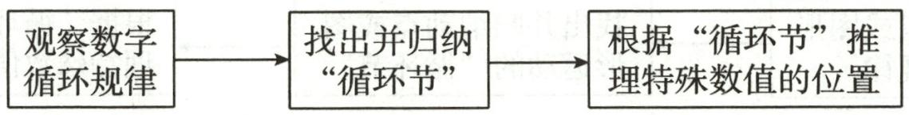

flowchart

1. 将正整数按如图所示的位置顺序排列: 根据排列规律, 2025 应在 处. (填 A, B, C, D)

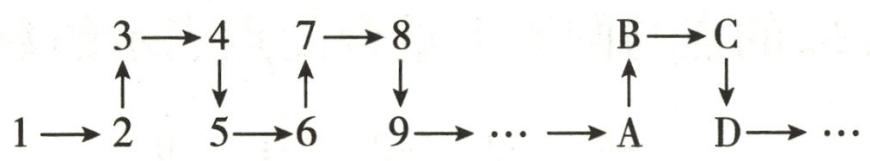

flowchart

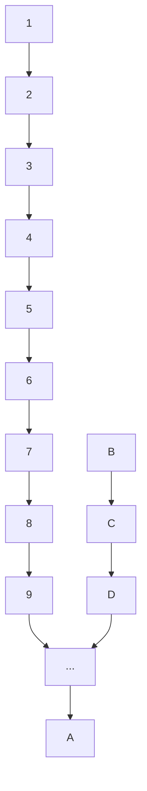

第1题图

2. 将一列有理数 -1, 2, -3, 4, -5, 6, … 按如图所示有序排列。根据图中的排列规律可知，“峰 1”中峰顶的位置 (C 的位置) 是有理数 4，那么“峰 6”中 C 的位置是有理数 \_\_\_\_，2024 应排在 A, B, C, D, E 中 \_\_\_\_ 的位置。

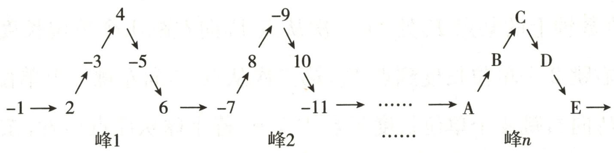

flowchart

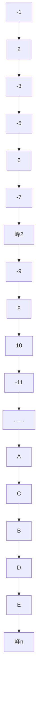

第2题图

3. 我们已经学习了偶数 0,2,4,6,8,…,以及奇数 1,3,5,7,9,…,现在我们学过了负数,也知道了负偶数 -2,-4,-6,-8,…,以及负奇数 -1,-3,-5,-7,….如图是我们将这些负偶数与负奇数按如图所示规律排列,观察它们的规律,发现 -201 在第\_\_\_\_列.

<table><tr><td>第一列</td><td>第二列</td><td>第三列</td><td>第四列</td><td>第五列</td></tr><tr><td></td><td>-1</td><td>-2</td><td>-3</td><td>-4</td></tr><tr><td>-8</td><td>-7</td><td>-6</td><td>-5</td><td></td></tr><tr><td></td><td>-9</td><td>-10</td><td>-11</td><td>-12</td></tr><tr><td>-16</td><td>-15</td><td>-14</td><td>-13</td><td></td></tr><tr><td></td><td></td><td>......</td><td></td><td></td></tr></table>

第3题图

# 学霸微专题2 数轴上动点运动的规律

# 【方法提示】

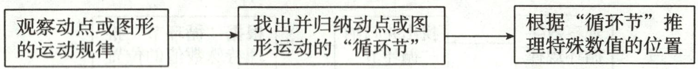

flowchart

1. 如图, 圆的周长为 4 个单位长度, 在该圆的 4 等分点处分别标上数字 0, 1, 2, 3, 先让圆周上表示数字 0 的点与数轴上表示 -1 的点重合, 再将数轴按逆时针方向环绕在该圆周上, 则数轴上表示 -2124 的点与圆周上重合的点表示的数字是 ( )

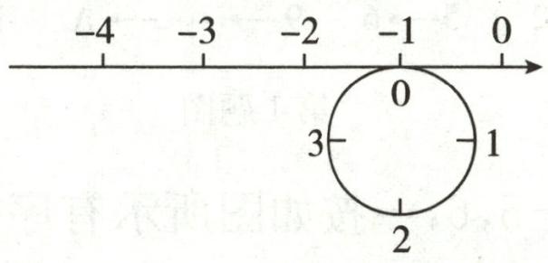

text_image

-4
-3
-2
-1
0
0
3
-1
2

第1题图

A. 0

B. 1

C. 2

D. 3

2. 一只小球落在数轴上的某点 $P_{0}$ 处, 第一次从点 $P_{0}$ 向左跳 1 个单位长度到点 $P_{1}$ , 第二次从点 $P_{1}$ 向右跳 2 个单位长度到点 $P_{2}$ , 第三次从点 $P_{2}$ 向左跳 3 个单位长度到点 $P_{3}$ , 第四次从点 $P_{3}$ 向右跳 4 个单位长度到点 $P_{4}, \cdots$ . 若小球从原点出发, 按以上规律跳了 6 次时, 它落在数轴上的点 $P_{6}$ 所表示的数是\_\_\_\_; 若小球按以上规律跳了 $2 n$ 次时, 它落在数轴上的点 $P_{2 n}$ 所表示的数恰好是 $n + 2$ , 则这只小球的初始位置点 $P_{0}$ 所表示的数是\_\_\_\_.

3. 已知在纸面上画有一条数轴, 现折叠纸面.

(1)若表示-1的点与表示1的点重合,则表示3的点与表示数\_\_\_\_的点重合.  
(2)若表示-1的点与表示3的点重合,回答以下问题:

①表示6的点与表示数\_\_\_\_的点重合；  
②若数轴上 A, B 两点之间的距离为 d (点 A 在点 B 的左侧, d > 0), 且 A, B 两点经折叠后重合, 则用含 d 的式子表示点 B 在数轴上表示的数是 \_\_\_\_.

# 学霸微专题3 “数”和“形”结合理解相反数

# 【方法提示】

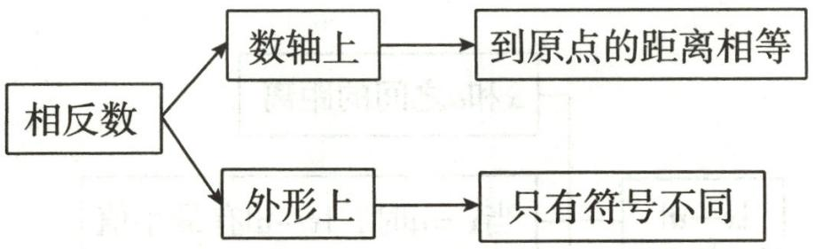

flowchart

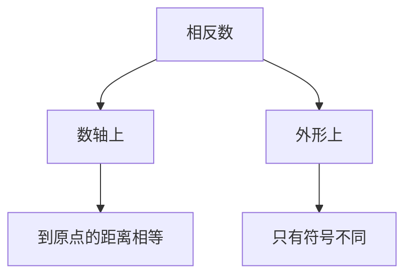

1. 如图, 数轴的单位长度为 1. 请回答下列问题:

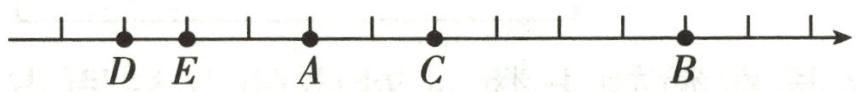  
第1题图

(1)如果点 A, B 表示的数互为相反数,那么点 C 表示的数是多少?  
(2)如果点 $D, B$ 表示的数互为相反数,那么点 $C, D$ 表示的数分别是多少?

2. 根据相反数的定义化简下列各式, 并回答问题:

①-(-7);②+(-7);③-[-(-7)];④-[-(+7)];   
⑤- $\{-[-(-7)]\}$ ;⑥- $\{-[-(+7)]\}$ .

(1) 当 +7 前面有 2024 个负号时, 化简后的结果是多少?  
(2)当-7前面有2023个负号时,化简后的结果是多少?你能总结出什么规律?

3. 用直尺画数轴时, 数轴上的点 $A, B, C$ 分别代表数 $a, b, c$ , 已知 $AB = 8, BC = 3$ , 如图所示, 设 $p = a + b + c$ .

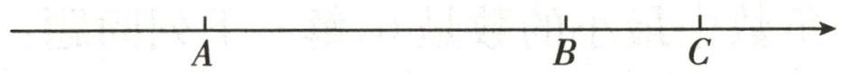  
第3题图

(1)若点 A 所表示的数是 -1, 则点 C 所表示的数是 \_\_\_\_;  
(2)若点 A, B 所表示的数互为相反数, 则点 C 所表示的数是\_\_\_\_, 此时 p 的值为 \_\_\_\_;  
(3)若数轴上点 C 到原点的距离为 4, 求 p 的值.

# 学霸微专题4 $|x - a|$ 的化简

# 【方法提示】

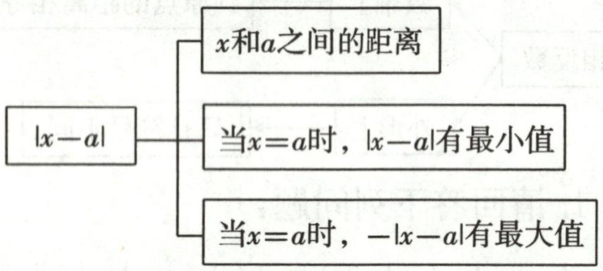

flowchart

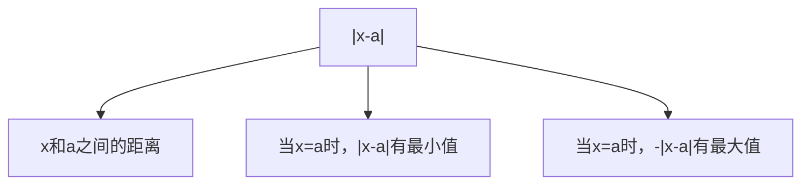

1. 我们知道 $|x|$ 的几何意义是在数轴上数 $x$ 对应的点与原点的距离, 即 $|x| = |x - 0|$ . 这个结论可以推广为 $|x - y|$ 表示在数轴上数 $x, y$ 对应点之间的距离.

①解方程 $|x|=2$ ，容易看出，在数轴上与原点距离为2的点表示的数为 $\pm2$ ，即该方程的解为 $x=\pm2$ 。  
②在方程 $|x-1|=2$ 中，x的值就是数轴上与表示1的点的距离为2的点表示的数，显然x=3或x=-1。

根据上面的阅读材料,解答下列问题:

(1)求方程 $|x|=7$ 的解；  
(2)求方程 $|x-2023|=3$ 的解；  
(3)已知 $|x|\leqslant3,|y|\geqslant4$ ,你能求出x,y的取值范围吗?

2. 根据 $|x|$ 是非负数, 且非负数中最小的数是 0 , 解答下列问题:

(1)当 x 取何值时， $|x-2025|$ 有最小值，这个最小值是多少？  
(2) 当 x 取何值时, 2025-|x-1| 有最大值, 这个最大值是多少?

# 学霸微专题 5 | m | = | n | 与 | m | + | n | = 0

【方法提示】若 $|m| = |n|$ ，则 $m = n$ 或 $m = -n$ ；若 $|m| + |n| = 0$ ，则 $m = n = 0$ 。

1. 已知 $|a - 3|$ 与 $|2b - 4|$ 互为相反数.

(1)求 a 与 b 的值;  
(2)若 $|x|=2a+4b$ ,求x的相反数.

2. 已知 $\left|a-\frac{1}{2}\right|+\left|b+\frac{1}{3}\right|+\left|c+\frac{2}{5}\right|=0$ ，求 $a-|b|+(-c)$ 的值.

3. 已知 a 是最大的负整数的相反数， $|b+4|=2$ ，且 $|c-5|+|d+3|=0$ 。

(1) 求 a, b, c, d 的值;  
(2) 计算 $a - b - c + d$ 的值.

# 学霸微专题6 化带分数为整数和真分数

# 【方法提示】

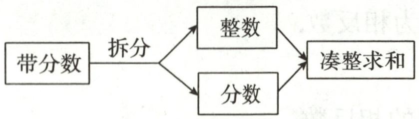

flowchart

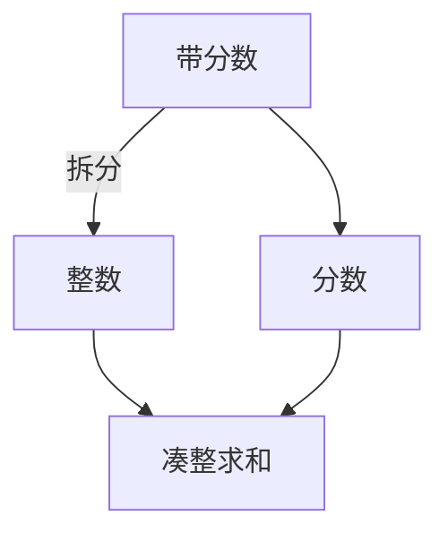

1. 计算: $1 \frac{9}{10} + 2 \frac{8}{10} + 3 \frac{7}{10} + \cdots + 8 \frac{2}{10} + 9 \frac{1}{10}.$

2. 计算: $\frac{1}{2} + \frac{5}{6} + \frac{11}{12} + \frac{19}{20} + \frac{29}{30} + \cdots + \frac{9701}{9702} + \frac{9899}{9900}$ .

3.(2024 秋·拱墅区月考)阅读下面的解题过程,并用解题过程中的解题方法解决问题.

示例: 计算: $\left(-1\frac{5}{6}\right)+\left(-2\frac{2}{3}\right)+9\frac{3}{4}+\left(-3\frac{1}{2}\right)$ .

解: 原式= $\left[(-1)+\left(-\frac{5}{6}\right)\right]+\left[(-2)+\left(-\frac{2}{3}\right)\right]+\left(9+\frac{3}{4}\right)+\left[(-3)+\left(-\frac{1}{2}\right)\right]$

$$
= [ (- 1) + (- 2) + 9 + (- 3) ] + \left[ \left(- \frac {5}{6}\right) + \left(- \frac {2}{3}\right) + \frac {3}{4} + \left(- \frac {1}{2}\right) \right] = 3 + \left(- \frac {5}{4}\right) = \frac {7}{4}.
$$

以上解题方法叫拆项法.

请你利用拆项法计算下面式子的值.

$$
\left(- 2 0 2 4 \frac {5}{6}\right) + \left(- 2 0 2 2 \frac {2}{3}\right) + \left(- 1 \frac {1}{2}\right) + \left(- \frac {5}{6}\right) + 4 0 4 6 \frac {3}{4}.
$$

# 学霸微专题 7 “标准数”中的应用

【方法提示】“标准数”和“正负数能表示相反意义的量”→简化运算

1. 某仓库在一周的货品运输中, 进出库情况如下表. (进库为正, 出库为负, 单位: 吨)

<table><tr><td>星期一</td><td>星期二</td><td>星期三</td><td>星期四</td><td>星期五</td><td>星期六</td><td>星期日</td><td>合计</td></tr><tr><td>+26</td><td>-16</td><td>+42</td><td>-30</td><td></td><td>-25</td><td>-9</td><td>+6</td></tr></table>

表中星期五的进出库数被墨水涂污了.

(1)请你算出星期五的进出库数；  
(2)如果进出库的装卸费都是每吨10元,那么这一周要付多少元装卸费?

2. 下列是水位监测员小刘在汛期某一周每天同一时间统计的长江某监测点水位高低的变化情况。(单位: 米, 用正数记水位比 155 米的上升数, 用负数记水位比 155 米的下降数)

<table><tr><td>星期</td><td>一</td><td>二</td><td>三</td><td>四</td><td>五</td><td>六</td><td>日</td></tr><tr><td>水位变化</td><td>-10</td><td>-8.65</td><td>-6.02</td><td>+1.02</td><td>+3</td><td>+4.47</td><td>-10</td></tr></table>

(1)星期三这个监测点的实际水位是多少?  
(2)若水位每上升1米,蓄水量将增加7.2亿立方米,则根据数据显示,星期六的蓄水量比星期四的蓄水量增加了多少亿立方米?

# 学霸微专题8 数轴上两点间的距离

# 【方法提示】

$$
\frac {A}{a} \xrightarrow [ b ]{B} \text {或} \frac {b}{B} \xrightarrow [ A ]{a} A B = | a - b |
$$

# 1.【方法引入】

数轴上两点之间的距离可以用这两个点表示的数通过减法运算得到.

如图, 点 A, B 间的距离为 $2-(-1)=3$ ;

点 B, C 间的距离为 $(-1)-(-3)=2$ ;

点 A, C 间的距离为 $2-(-3)=5$ .

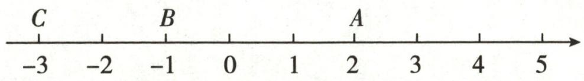

text_image

C
-3 -2 -1 0 1 2 3 4 5
B
A

第1题图

# 【方法应用】

数轴上点 P, Q 表示的数分别为 -5 和 4, 求点 P, Q 间的距离;

数轴上点 M, N 表示的数分别为 -9 和 -2, 求点 M, N 间的距离.

# 【方法拓展】

数轴上的两个点之间的距离为 6, 其中一个点表示的数为 3, 求另一个点表示的数.

2.【阅读】|4-1|表示4与1两数在数轴上所对应的两点之间的距离；|4+1|可以看作|4-(-1)|，表示4与-1两数在数轴上所对应的两点之间的距离.

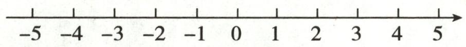  
第2题图

(1) $|4-(-1)|=$ \_\_\_\_;

(2)结合数轴(如图)找出所有符合条件的整数 x, 使得 $\left|x+1\right|=4$ , 则 x=\_\_\_\_;

(3)利用数轴分析,若 x 是整数,且满足 $\left|x-2\right|+\left|x+5\right|=7$ , 请求出满足条件的所有 x 的值的和.

# 学霸微专题9 $|a - b|$ 的化简

【方法提示】当 $a \geqslant b$ 时， $|a - b| = a - b$ ; 当 a < b 时， $|a - b| = b - a$ .

# 1.【阅读思考】

根据绝对值的运算性质可知,一个正数的绝对值是其本身,一个负数的绝对值是其相反数,0 的绝对值是 0 ,由此可知,求一个算式整体的绝对值,可先判断整体的正负性,再求它的绝对值,最后化简.

例如： $|7+8|=7+8,\quad|5-7|=-(5-7)=7-5,\quad|7-4|=7-4.$

【牛刀小试】(1)根据上述材料,把下列各式去掉绝对值符号,不要算出最后结果:

$$
\vert 3 - 1 0 \vert = \underline {{\quad}}, \left| \frac {3}{1 4} - \frac {3}{1 7} \right| = \underline {{\quad}};
$$

【拓展延伸】(2) $\left|\frac{1}{101}-\frac{1}{100}\right|+\left|\frac{1}{102}-\frac{1}{101}\right|+\left|\frac{1}{103}-\frac{1}{102}\right|+\cdots+\left|\frac{1}{1000}-\frac{1}{999}\right|$

2.【信息提取】在有些情况下,不需要计算出结果也能把绝对值符号去掉.

例如： $\left|\frac{1}{2}-1\right|=1-\frac{1}{2},\left|\frac{1}{3}-\frac{1}{2}\right|=\frac{1}{2}-\frac{1}{3},\left|\frac{1}{4}-\frac{1}{3}\right|=\frac{1}{3}-\frac{1}{4},\cdots$

# 【初步体验】

(1)根据上面的规律,把下列式子写成去掉绝对值符号的形式(不要计算出结果):

$$
\left| \frac {1}{1 9} - \frac {1}{1 8} \right| = \underline {{\quad}};
$$

# 【拓广应用】

(2) 计算 $\left|\frac{1}{2}-1\right|+\left|\frac{1}{3}-\frac{1}{2}\right|+\left|\frac{1}{4}-\frac{1}{3}\right|+\left|\frac{1}{5}-\frac{1}{4}\right|$ ;

(3)计算 $\left|\frac{1}{2}-1\right|+\left|\frac{1}{3}-\frac{1}{2}\right|+\left|\frac{1}{4}-\frac{1}{3}\right|+\cdots+\left|\frac{1}{2023}-\frac{1}{2022}\right|$ .

# 学霸微专题 10 巧用运算律

# 【方法提示】

(1)乘法交换律

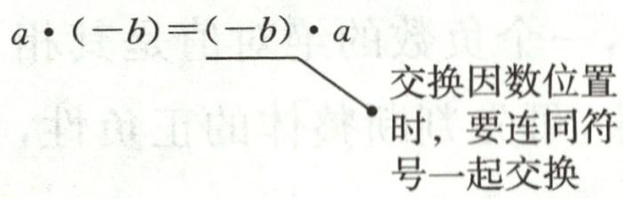

text_image

a • (-b) = (-b) • a
交换因数位置
时，要连同符
号一起交换

(2)乘法结合律

$$
(a \bullet b) \bullet c = a \bullet (b \bullet c)
$$

(3) 分配律

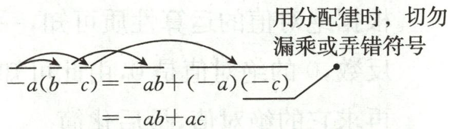

text_image

用分配律时，切勿
漏乘或弄错符号
-a(b-c)=-ab+(-a)(-c)
=-ab+ac

1. 学了有理数的运算后,老师给同学们出了一道题.

计算: $19 \frac{17}{18} \times (-9)$ , 下面是两位同学的解法:

小方: 原式= $-\frac{359}{18}\times9=-\frac{3231}{18}=-179\frac{1}{2}$ ;

小杨: 原式= $\left(19+\frac{17}{18}\right)\times(-9)=-19\times9-\frac{17}{18}\times9=-179\frac{1}{2}$ .

(1)两位同学的解法中,谁的解法较好?   
(2)是否还有更好的解法,请你写出一种更好的解法.

2. 计算：

(1) $-29\times588+28\times588;$   
(2) $-2023\times\frac{3}{7}+2023\times\left(-\frac{6}{7}\right)+2023\times\frac{2}{7}.$

# 学霸微专题 11 拆项法

【方法提示】根据乘法的运算法则和拆项法简化计算.

1. 观察下列各式：

① $\frac{1}{2}\times\frac{2}{3}=\frac{1}{3}$ ;② $\frac{1}{2}\times\frac{2}{3}\times\frac{3}{4}=\frac{1}{4}$ ;③ $\frac{1}{2}\times\frac{2}{3}\times\frac{3}{4}\times\frac{4}{5}=\frac{1}{5}$ ;……

(1)猜想 $\frac{1}{2}\times\frac{2}{3}\times\frac{3}{4}\times\cdots\times\frac{49}{50}=$ \_\_\_\_；  
(2)根据上面的规律,计算:

$$
\left(\frac {1}{1 0 0} - 1\right) \times \left(\frac {1}{9 9} - 1\right) \times \left(\frac {1}{9 8} - 1\right) \times \dots \times \left(\frac {1}{2} - 1\right).
$$

2. 阅读下列材料, 然后回答问题.

观察下列等式: $\frac{1}{1\times2}=1-\frac{1}{2},\frac{1}{2\times3}=\frac{1}{2}-\frac{1}{3},\frac{1}{3\times4}=\frac{1}{3}-\frac{1}{4},\cdots$

将以上三个等式相加得

$$
\begin{array}{l} \frac {1}{1 \times 2} + \frac {1}{2 \times 3} + \frac {1}{3 \times 4} \\ = 1 - \frac {1}{2} + \frac {1}{2} - \frac {1}{3} + \frac {1}{3} - \frac {1}{4} \\ = 1 - \frac {1}{4} \\ = \frac {3}{4}. \\ \end{array}
$$

(1)猜想并写出: $\frac{1}{n(n+1)} =$ \_\_\_\_.

(2)直接写出下列各式的结果.

① $\frac{1}{1\times2}+\frac{1}{2\times3}+\frac{1}{3\times4}+\cdots+\frac{1}{2022\times2023}=$ \_\_\_\_；  
② $\frac{1}{1\times2}+\frac{1}{2\times3}+\frac{1}{3\times4}+\cdots+\frac{1}{n(n+1)}=$ \_\_\_\_.   
(3)探究并计算: $\frac{1}{2 \times 4} + \frac{1}{4 \times 6} + \frac{1}{6 \times 8} + \cdots + \frac{1}{2022 \times 2024}$ .

# 学霸微专题 12 $\frac{|x|}{x}$ 的化简

【方法提示】当 $a > 0$ 时， $|a| = a$ ，则 $\frac{|a|}{a} = \frac{a}{a} = 1$ ；当 $a < 0$ 时， $|a| = -a$ ，则 $\frac{|a|}{a} = \frac{-a}{a} = -1$ 。

1. 已知 $x, y, z$ 都是不为 0 的有理数，且满足 $xyz > 0, x + y + z < 0$ .

(1) 判断: x, y, z 中有 \_\_\_\_ 个正数;  
(2) 求 $\frac{|x|}{x} + \frac{|y|}{y} + \frac{|z|}{z} + \frac{|xyz|}{xyz}$ 的值.

2. 已知对于非零有理数 $x$ ，当 $x > 0$ 时， $\frac{|x|}{x} = \frac{x}{x} = 1$ ，当 $x < 0$ 时， $\frac{|x|}{x} = \frac{-x}{x} = -1$ .

请根据上面的知识解答下面的问题:

(1)已知 a, b 是非零有理数, 满足 ab < 0, 求 $\frac{|a|}{a} + \frac{|b|}{b}$ 的值;  
(2)已知 a, b, c 是非零有理数, 当 abc < 0, 求 $\frac{|a|}{a} + \frac{|b|}{b} + \frac{|c|}{c}$ 的值;  
(3)已知 a, b, c 是非零有理数, 满足 $a + b + c = 0$ 且 abc < 0, 求 $\frac{|a|}{b + c} + \frac{|b|}{a + c} + \frac{|c|}{a + b}$ 的值.

# 学霸微专题 13 倒数法的运用

# 【方法提示】

$$
\boxed {\text {设} B = \frac {1}{A}} \longrightarrow \boxed {\text {化简} B = \frac {1}{A}} \longrightarrow \boxed {A = \frac {1}{B}}
$$

1. 小华在课外书中看到这样一道题：

计算: $\frac{1}{36}\div\left(\frac{1}{4}+\frac{1}{12}-\frac{7}{18}-\frac{1}{36}\right)+\left(\frac{1}{4}+\frac{1}{12}-\frac{7}{18}-\frac{1}{36}\right)\div\frac{1}{36}.$

她发现,这个算式反映的是前后两部分的和,而这两部分之间存在着某种关系,利用这种关系,她顺利地解答了这道题.

(1)前后两部分之间存在着什么关系?  
(2)先计算哪部分比较简便？并请计算比较简便的那部分；  
(3)利用(1)中的关系,直接写出另一部分的结果;  
(4)根据以上分析,求出原式的结果.

2. 计算: $\left(-\frac{1}{30}\right) \div \left(\frac{2}{3} - \frac{1}{10} + \frac{1}{6} - \frac{2}{5}\right)$ .

解法1: 原式 $= \left(-\frac{1}{30}\right) \div \left[\left(\frac{2}{3} + \frac{1}{6}\right) + \left(-\frac{1}{10} - \frac{2}{5}\right)\right] = \left(-\frac{1}{30}\right) \div \left(\frac{5}{6} - \frac{1}{2}\right) = -\frac{1}{30} \times 3 = -\frac{1}{10}$ . 解法2: 原式的倒数为 $\left(\frac{2}{3} - \frac{1}{10} + \frac{1}{6} - \frac{2}{5}\right) \div \left(-\frac{1}{30}\right) = \left(\frac{2}{3} - \frac{1}{10} + \frac{1}{6} - \frac{2}{5}\right) \times (-30) = \frac{2}{3} \times$ $(-30) - \frac{1}{10} \times (-30) + \frac{1}{6} \times (-30) - \frac{2}{5} \times (-30) = -20 + 3 - 5 + 12 = -10,$

故原式 $= -\frac{1}{10}$

请阅读上述材料,选择合适的方法计算: $\left(-\frac{1}{42}\right)\div\left(\frac{1}{6}-\frac{3}{14}+\frac{2}{3}-\frac{2}{7}\right)$ .

# 学霸微专题 14 错位相减法

【方法提示】用错位相减法化简等积数列.

1. 阅读下面材料：

计算 $1+5+5^{2}+5^{3}+\cdots+5^{99}+5^{100}$ .

观察发现,上式从第二项起,每一项都是它前面一项的5倍,如果将上式各项都乘5,所得新算式中除个别项外,其余与原式中的项相同,于是两式相减,易于计算.

解: 设 $S=1+5+5^{2}+5^{3}+\cdots+5^{99}+5^{100}$ ，①

则 $5S=5+5^{2}+\cdots+5^{100}+5^{101}$ ，②

②-①得 $4S = 5^{101} - 1$ ，则 $S = \frac{5^{101} - 1}{4}$

上面的计算方法称为“错位相减法”，如果一列数，从第二项起每一项与前一项之比都相等（本例中都等于5），那么这列数的求和问题，均可用错位相减法来解决。

下面请你观察算式 $1+\frac{1}{2}+\frac{1}{2^{2}}+\frac{1}{2^{3}}+\cdots+\frac{1}{2^{2000}}$ 是否具备上述规律？若是，请你尝试用错位相减法计算。

2. 阅读材料：

求值: $1+2+2^{2}+2^{3}+2^{4}+\cdots+2^{20}$ .

解: 设 $S=1+2+2^{2}+2^{3}+2^{4}+\cdots+2^{20}$ ①, 将等式两边同时乘 2 得

$$
2 S = 2 + 2 ^ {2} + 2 ^ {3} + 2 ^ {4} + \dots + 2 ^ {2 0} + 2 ^ {2 1} (2),
$$

②-①, 得 $S=2^{21}-1$ ,

即 $S=1+2+2^{2}+2^{3}+2^{4}+\cdots+2^{20}=2^{21}-1.$

请你仿照此法计算：

(1) $1+2+2^{2}+2^{3}+\cdots+2^{100}$ ;

(2) $1+3+3^{2}+3^{3}+3^{4}+\cdots+3^{n}$ . (n为正整数)

# 学霸微专题15 二进制与十进制

【方法提示】二进制(110101) $_{2}$ =1×2 $^{5}$ +1×2 $^{4}$ +0×2 $^{3}$ +1×2 $^{2}$ +0×2 $^{1}$ +1×2 $^{0}$ .

1.【阅读材料】我们常用的数是十进制数,如 $4657 = 4 \times 10^{3} + 6 \times 10^{2} + 5 \times 10^{1} + 7 \times 10^{0}$ , 要用 10 个数码(又叫数字):0,1,2,3,4,5,6,7,8,9. 在电子计算机中用的二进制,只要两个数码:0 和 1,如二进制中 $110 = 1 \times 2^{2} + 1 \times 2^{1} + 0 \times 2^{0}$ 等于十进制中的数 6,110101 $= 1 \times 2^{5} + 1 \times 2^{4} + 0 \times 2^{3} + 1 \times 2^{2} + 0 \times 2^{1} + 1 \times 2^{0}$ 等于十进制中的数 53.(注意:对于任何非零数 $a$ 都有 $a^{0} = 1$ , 即 $2^{0} = 1$ )

【解决问题】二进制中的数 101011 等于十进制中的哪个数?

【应用拓展】我国古代《易经》一书中记载,远古时期,人们通过在绳子上打结来记录数量,即“结绳记数”.如图,一位妇女在从右到左依次排列的绳子上打结,满六进一,用来记录采集到的野果数量.由图可知,她一共采集到的野果数量为\_\_\_\_.

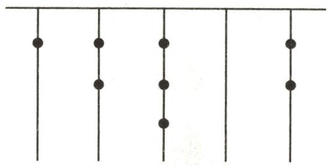

natural_image

Pure diagram of vertical lines with dots at intersections (no text or symbols)

第1题图

2. 信息①: 在数学中: $2^{0} = 1, (-97.5)^{0} = 1, 10^{0} = 1, \left(-\frac{47}{53}\right)^{0} = 1$ . 除了零, 任何数的零次幂都为 1, 即 $a^{0} = 1 (a \neq 0)$ .

信息②:在生活中,十进制数 9527 可以表示为:

$$
9 5 2 7 _ {(\text {十进制})} = 9 0 0 0 + 5 0 0 + 2 0 + 7 = 9 \times 1 0 ^ {3} + 5 \times 1 0 ^ {2} + 2 \times 1 0 ^ {1} + 7 \times 1 0 ^ {0}.
$$

信息③:计算机中采用的是二进制,即只需要0和1两个符号就可以表示数.十进制数都可以改写成2的n次幂的降幂(指数由高次依次降到零次)式子从而转化为二进制数如: $19_{(十进制)}=16+2+1$ 转化为 $1\times2^{4}+0\times2^{3}+0\times2^{2}+1\times2^{1}+1\times2^{0}=10011_{(二进制)}$ (根据以上信息,请参照示例步骤完成下列两个十进制数与二进制数之间的相互转化过程):

示例: $413_{(十进制)}=256+128+16+8+4+1=$

$$
\begin{array}{l} = 1 \times 2 ^ {8} + 1 \times 2 ^ {7} + 0 \times 2 ^ {6} + 0 \times 2 ^ {5} + 1 \times 2 ^ {4} + 1 \times 2 ^ {3} + 1 \times 2 ^ {2} + 0 \times 2 ^ {1} + 1 \times 2 ^ {0} \\ = 1 1 0 0 1 1 1 0 1 _ {(\text {二进制})}. \\ \end{array}
$$

(1) $12_{(\text{十进制})}=$ \_\_\_\_，转化为二进制数=\_\_\_\_；

(2)1110101(二进制)=\_\_\_\_，转化为十进制数=\_\_\_\_。

# 学霸微专题16 程序图的运算

【方法提示】根据程序图的运算顺序计算,再根据输出条件判断是否循环计算.

1. 如图, 某同学设计了一种计算程序流程图, 按要求完成下列任务:

(1) 当输入 x 的值为 -3 时, 求输出 y 的值;  
(2)若输出 y 的值为 380, 直接写出输入 x 的值为 \_\_\_\_;  
(3)若输入 x 的值为 0, 求输出 y 的值.

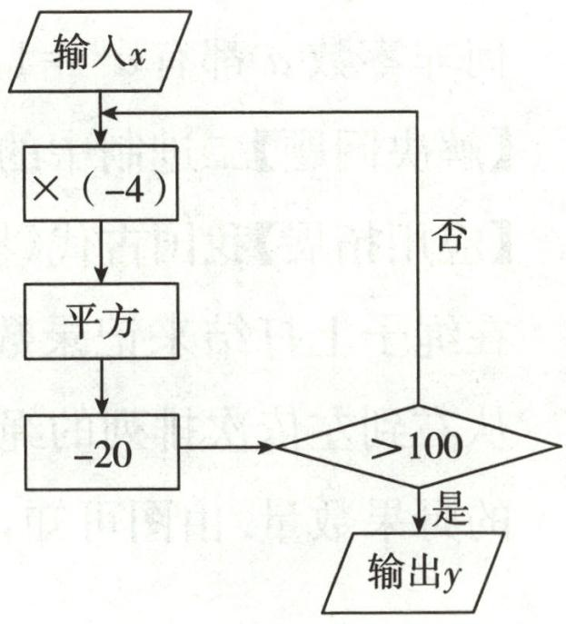

flowchart

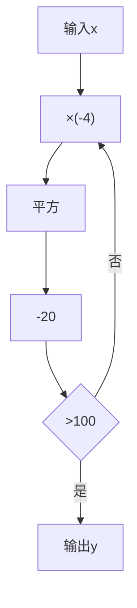

第1题图

2. 如图是一组“数值转换机”的示意图.

(1)请填写下表;

<table><tr><td>输入</td><td>-2</td><td>0</td><td>2.5</td></tr><tr><td>图1的输出</td><td></td><td></td><td></td></tr><tr><td>图2的输出</td><td></td><td></td><td></td></tr></table>

(2) 写出图①输出的代数式；

(3)写出图②的运算过程.

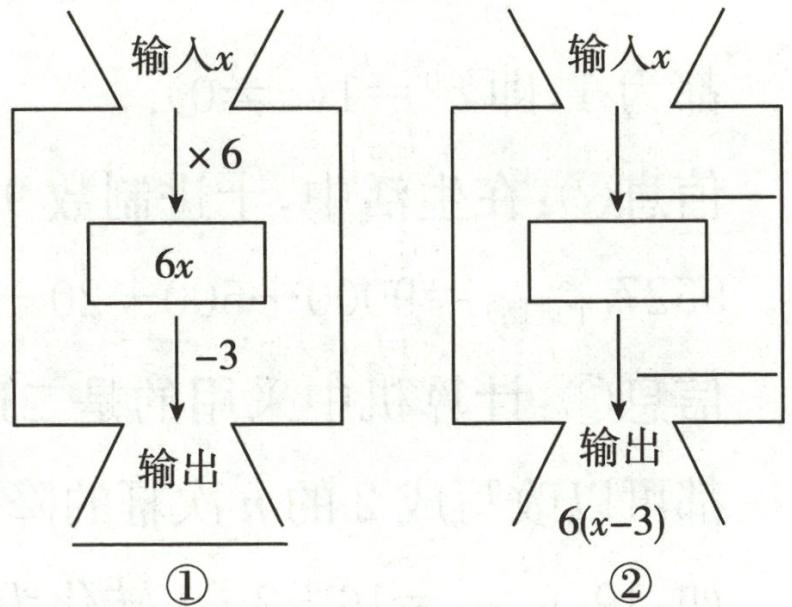

flowchart

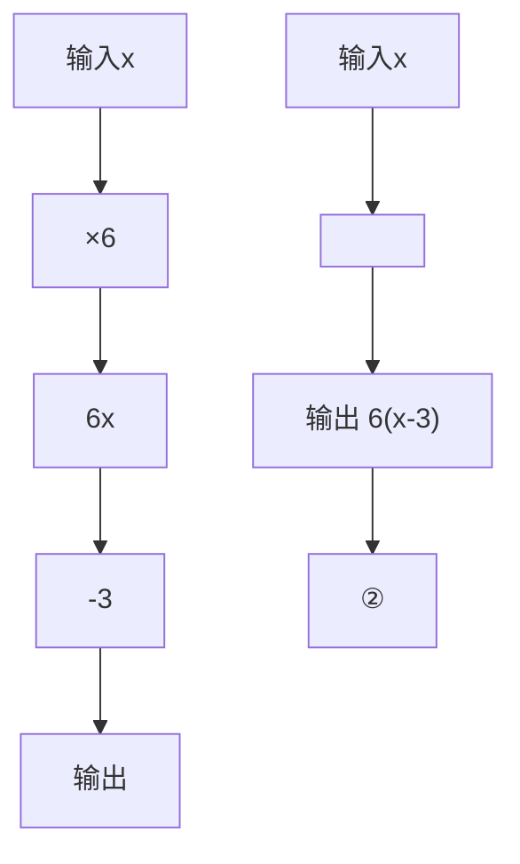

第2题图

# 学霸微专题17 整体代入求值

【方法提示】根据去括号和添括号法则将代数式的值整体代入运算,例: $ax+by=m\rightarrow1-2ax-2by=1-2(ax+by)=1-2m.$

1. 数学课本上有这样一道题“如果代数式 $5a + 3b$ 的值为 -4，那么代数式 $2(a + b) + 4(2a + b)$ 的值是多少？”小明同学的解题过程如下：

解: 原式=2a+2b+8a+4b=10a+6b=2(5a+3b), 因为 $5a+3b=-4$ , 所以原式=2×(-4)=-8.

小明同学把 $5a+3b$ 作为一个整体进行代入求值, 像这样的求解方法称为“整体思想”, 这是数学解题中的一种重要思想方法.

请仿照上面的解题方法,完成下面的问题:

(1)已知 x-3y=8，则 $5-x+3y=$ \_\_\_\_；

(2)已知 a-2b=-3，求 $2(a-b)-\frac{1}{2}(a+2b)+3$ 的值.

2. 小颖同学在学习整式的加减时遇到这样一道题: “如果代数式 $3a + 2b$ 的值为 $-4$ , 那么代数式 $3(a + b) + 3(2a + b)$ 的值是多少?” 这个问题中, $a$ 和 $b$ 的值不能单独求出来, 于是聪明的小颖同学想到了把 $3a + 2b$ 作为一个整体求解, 得到如下的解题过程: 原式 $= 9a + 6b = 3(3a + 2b) = 3 \times (-4) = -12$ .

“整体思想”是中学数学解题的一种重要思想方法,请仿照上面的解题方法,完成下面的问题:

# 【简单应用】

(1)已知 $m^{2}+m=2$ ，求 $m^{2}+m+2023$ 的值；

# 【联系推广】

(2)已知 2p-q=-3，求 $5(p-q)-9p+7q+5$ 的值；

# 【拓展提高】

(3)已知 $2x^{2}-3xy-y^{2}=3, -x^{2}+5xy-6y^{2}=-2$ ，求 $4x^{2}-13xy+11y^{2}$ 的值.

# 学霸微专题 18 提价与降价

【方法提示】原价 $a$ 元, 提价 $m\%$ 和降价后 $n\%$ 的价格分别为 $(1 + m\%) a$ 元、 $(1 - n\%) a$ 元.

1. 某商店出售一种商品, 其原价为 $a$ 元, 有如下两种调价方案: 方案一是先提价 $15\%$ , 在此基础上又降价 $15\%$ ; 方案二是先降价 $15\%$ , 在此基础上又提价 $15\%$ .

(1)用这两种方案调价后的价格分别是多少？结果是否一样？调价后的结果是不是都恢复到了原价？

(2)两种调价方案改为:方案一是先提价 25%,在此基础上又降价 25%;方案二是先降价 25%,在此基础上又提价 25%,这时结果怎样?

(3)你能总结出什么结论呢?

2. 某果园的苹果远近闻名. 为了控制苹果的质量, 该果园制定了苹果的品质标准, 将种植的苹果分成了 10 个等级, 1 级苹果的品质最好, 2 级次之, 以此类推, 第 10 级品质最差. 苹果的销售价格制定如下: 第 5 级售价为 80 元/箱, 从第 5 级起, 品质每提升 1 级, 每箱的售价将提升 6 元; 品质每下降 1 级, 每箱的售价将降低 4 元.

(1)3 级苹果的售价为 \_\_\_\_ 元/箱;7 级苹果的售价为 \_\_\_\_ 元/箱;

(2)若苹果的等级为 $a$ , 请用含 $a$ 的代数式表示该等级苹果的价格;

(3)超市老板小明计划在该果园购进1级苹果100箱.因为小明是果园的老客户,果园的负责人给出如下两种优惠方案:

方案一:降价5%,并减免全部运费;

方案二:降价8%,但需收运费300元.

请你帮小明计算一下,若购买100箱,选哪种优惠方案更加合算?

# 学霸微专题 19 数与式规律

# 【方法提示】

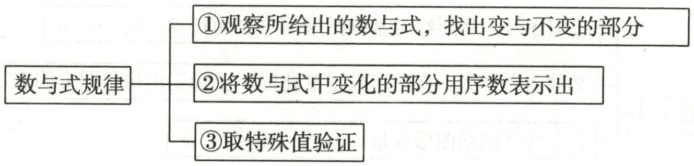

flowchart

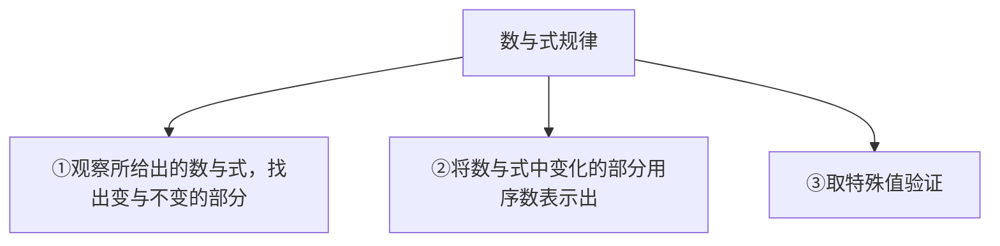

1. 仔细观察下列等式:

第1个: $5^{2}-1^{2}=8\times3$ ;

第2个: $9^{2}-5^{2}=8\times7$ ;

第3个: $13^{2}-9^{2}=8\times11$ ;

第 4 个: $17^{2}-13^{2}=8\times15;\cdots$

(1)请写出第6个等式：\_\_\_\_；  
(2)请写出第 n 个等式: \_\_\_\_；  
(3)运用上述规律,计算: $8\times7+8\times11+\cdots+8\times399+8\times403$ .

2. 观察下列等式:

第1个等式: $a_{1}=\frac{1}{1\times2}=1-\frac{1}{2}$ ; 第2个等式: $a_{2}=\frac{1}{2\times3}=\frac{1}{2}-\frac{1}{3}$ ;

第 3 个等式: $a_{3} = \frac{1}{3 \times 4} = \frac{1}{3} - \frac{1}{4}$ ; 第 4 个等式: $a_{4} = \frac{1}{4 \times 5} = \frac{1}{4} - \frac{1}{5}; \cdots$ .

解答下列问题:

(1)按以上规律写出第5个等式: $a_{5}=\frac{1}{5\times6}=$ \_\_\_\_；  
(2)求 $a_{1}+a_{2}+\cdots+a_{2025}$ 的值；  
(3)求 $\frac{1}{2\times4}+\frac{1}{4\times6}+\frac{1}{6\times8}+\cdots+\frac{1}{98\times100}$ 的值.

# 学霸微专题 20 图形规律

# 【方法提示】

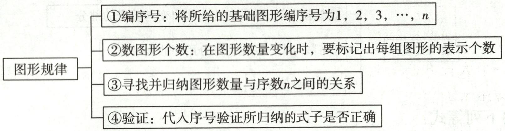

flowchart

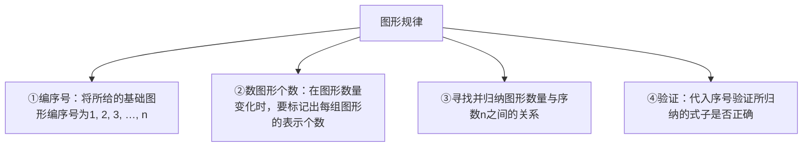

1. 在数学活动中, 小明遇到了求式子 $\frac{1}{2} + \frac{1}{2^2} + \frac{1}{2^3} + \cdots + \frac{1}{2^n}$ 的值的问题. 他和同伴讨论设计了如图所示的几何图形来求式子的值. 已知图中大正方形的面积为 1 , 每一个小图形中的数字表示这个小图形的面积.

(1)图中阴影部分的面积为\_\_\_\_；(用乘方的形式表示)  
(2)利用图形求 $\frac{1}{2}+\frac{1}{2^{2}}+\frac{1}{2^{3}}+\frac{1}{2^{4}}+\frac{1}{2^{5}}$ 的值；  
(3)直接写出 $\frac{1}{2} +\frac{1}{2^2} +\frac{1}{2^3} +\dots +\frac{1}{2^n}$ 的值.(结果用含 $n$ 的式子表示)

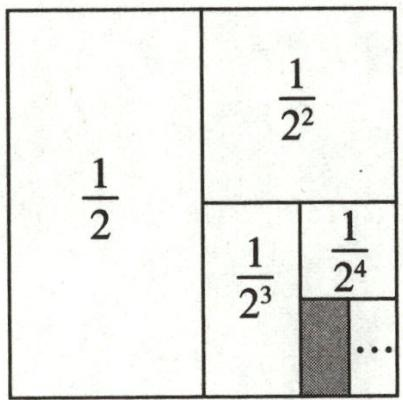

text_image

1/2
1/2²
1/2³
1/2⁴
...
...

第1题图

2. 如图, 用火柴棒按图中的方式搭图形.

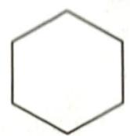  
①

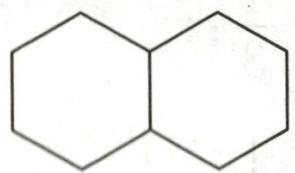  
②

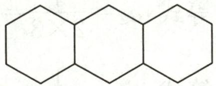  
③

<table><tr><td>图形标号</td><td>1</td><td>2</td><td>3</td><td>4</td><td>5</td></tr><tr><td>火柴棒根数</td><td>6</td><td>11</td><td>16</td><td>a</td><td>b</td></tr></table>

第2题图

按上述信息填空：

(1) $a = \_\_\_\_ , b = \_\_\_\_ ;$   
(2)按照这种方式搭下去,搭第 n 个图形需要火柴棒的根数为\_\_\_\_; (用含 n 的代数式表示)  
(3) 按照这种方式搭下去, 用 (2) 中的代数式求搭第 2025 个图形需要火柴棒的根数.

# 学霸微专题 21 求几何图形的周长或面积

# 【方法提示】

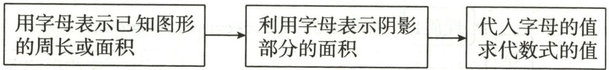

flowchart

1. 如图, 在一个大长方形场地分割出如图所示的“L”形场地(阴影部分), 请根据图中所给的数据, 解决下列问题:

(1)用含 x, y 的代数式表示阴影部分的周长并化简；

(2) 若 x=3 米, y=2 米, 要给阴影部分场地围上围栏, 围栏每米 12 元, 请计算围栏的造价.

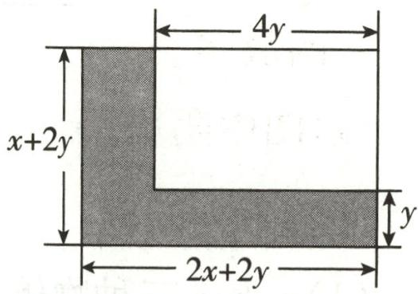

text_image

4y
x+2y
2x+2y
y

第1题图

2. 如图, 长为 $a$ 、宽为 $b$ 的大长方形被分割成七部分, 除阴影部分 $\mathrm{P}, \mathrm{Q}$ 外, 其余五部分为形状和大小完全相同的小长方形 $\mathrm{M}$ , 其中小长方形 $\mathrm{M}$ 的宽为 3.

(1)求小长方形 M 的长; (用含 a 的代数式表示)

(2) 若 b=15.3, 你能求出阴影部分 P 与 Q 的周长之和吗? 若能, 请求出来; 若不能, 请说明理由.

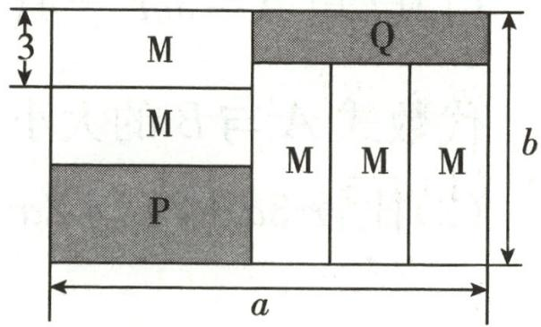

text_image

M
Q
M M M
P
a
b

第2题图

# 学霸微专题 22 等式的性质

# 【方法提示】

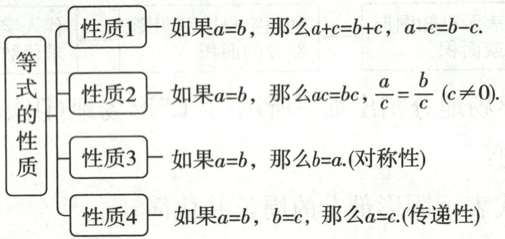

flowchart

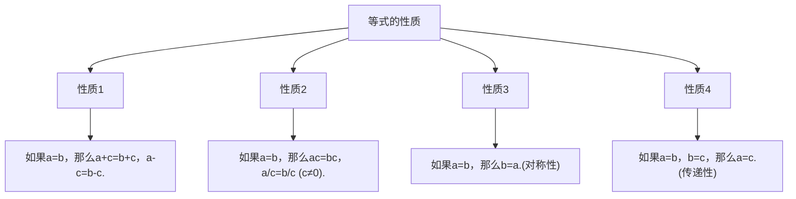

1. a, b, c 三种物体的质量如图所示.

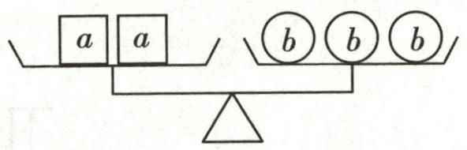

text_image

a a
b b b

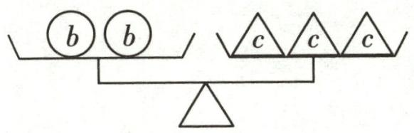

text_image

b b
c c c

第1题图

回答下列问题：

(1)a,b,c三种物体就单个而言哪个最重?   
(2)若天平一边放一些物体 a, 另一边放一些物体 c, 要使天平平衡, 天平两边至少应该分别放几个物体 a 和物体 c?

2. 根据等式的性质可知: 若 a-b>0, 则 a>b; 若 a-b=0, 则 a=b; 若 a-b<0, 则 a<b.
这是利用“作差法”比较两个数或两个代数式值的大小.

(1)已知 $A=5m^{2}-4\left(\frac{7}{4}m-\frac{1}{2}\right)$ ， $B=7(m^{2}-m)+3$ ，请你运用前面介绍的方法比较代数式 A 与 B 的大小；  
(2) 比较 $3a + 2b$ 与 $2a + 3b$ 的大小.

# 学霸微专题 23 含绝对值的方程

【方法提示】若 $|x - a| = b$ ，则 $x - a = b$ 或 $x - a = -b$ ，所以 $x = a + b$ 或 $x = a - b$ .

1. 根据绝对值的定义, 若 $|x|=4$ , 则 $x=4$ 或 $-4$ ; 若 $|y|=a$ , 则 $y=a$ 或 $-a$ . 我们可以根据这样的结论, 解一些简单的绝对值方程, 如解方程: $|2x+4|=5$ .

解:方程 $|2x+4|=5$ 可化为 $2x+4=5$ 或 $2x+4=-5$ .

当 $2x + 4 = 5$ 时， $2x = 1$ ，解得 $x = \frac{1}{2}$ ；

当 $2x + 4 = -5$ 时， $2x = -9$ ，解得 $x = -\frac{9}{2}$ .

故方程 $|2x+4|=5$ 的解为 $x=\frac{1}{2}$ 或 $x=-\frac{9}{2}$ .

(1)解方程: $|3x - 2| = 4$ ;

(2)已知 $|a+b+4|=16$ ，求 $a+b$ 的值.

2. 我们把绝对值符号内含有未知数的方程叫作含有绝对值的方程. 如 $|x| = 3, |-2x + 1| = 2, \cdots$ 都是含有绝对值的方程. 怎样求含有绝对值的方程的解呢? 基本思路是把含有绝对值的方程转化为不含有绝对值的方程.

解方程: $x+3|x|=4.$

解: 当 $x \geqslant 0$ 时, 原方程可化为 $x + 3x = 4$ , 解得 x = 1, 符合题意;

当 x<0 时, 原方程可化为 x-3x=4, 解得 x=-2, 符合题意.

所以原方程的解为 x=1 或 x=-2.

根据以上材料解决下列问题:

(1)若 $|x-2|=2-x$ ，则x的取值范围是\_\_\_\_；

(2)解方程: $x+2|x-1|=4.$

# 学霸微专题 24 新定义方程

# 【方法提示】

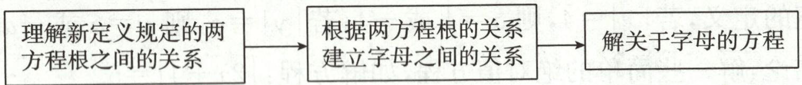

flowchart

1. 如果两个方程的解相差 1, 那么称解较大的方程为另一个方程的“后移方程”. 例如, 方程 $x - 2 = 0$ 是方程 $x - 1 = 0$ 的“后移方程”.

(1)方程 $2x+1=0$ \_\_\_\_ (填“是”或“不是”)方程 $2x+3=0$ 的“后移方程”;  
(2)若关于 x 的方程 $3x + m + n = 0$ 是关于 x 的方程 $3x + m = 0$ 的“后移方程”，求 n 的值；  
(3)当 $a \neq 0$ 时, 如果方程 $ax + b = 0$ 是方程 $ax + c = 0$ 的“后移方程”, 用等式表示 $a, b, c$ 满足的数量关系: \_\_\_\_.

2. 如果两个一元一次方程的解之和为 1, 我们就称这两个方程互为“美好方程”. 例如, 方程 $4x = 8$ 和方程 $x + 1 = 0$ 互为“美好方程”.

(1)请判断方程 $4x - (x + 5) = 1$ 与方程 $-2y - y = 3$ 是否互为“美好方程”；  
(2)若关于 x 的方程 $3x + m = 0$ 与方程 $4x - 2 = x + 10$ 互为“美好方程”，求 m 的值；  
(3)若关于 x 的方程 $\frac{1}{2025}x + 3 = 2x + k$ 和 $\frac{1}{2025}x + 1 = 0$ 互为“美好方程”，求关于 y 的方程 $\frac{1}{2025}(y + 1) + 3 = 2y + k + 2$ 的解.

# 学霸微专题25 商品盈利问题

【方法提示】商品经营中的盈利与亏损方面的数量关系：

①利润=实际售价-进价(或成本),进价(或成本)=实际售价-利润;   
②利润率= $\frac{利润}{进价(成本)}\times100\%$ , 利润=进价(或成本)×利润率;  
③售价= $(1+$ 利润率 $)\times$ 进价；  
④打 n 折, 即按标价的 $\frac{n}{10}$ 销售.

1. 七年级实践小组去商场调查,了解到商场以每件80元的价格购进了200件棉服,并以每件120元的价格销售了一部分,为回笼资金,商场将剩下的棉服在原售价的基础上每件降价40%销售,并全部销售完毕.已知销售这批棉服的总利润是5600元,请你算一算,降价前一共售出多少件?

2. 某超市第一次用 7000 元购进甲、乙两种商品, 其中甲商品的件数是乙商品的 2 倍, 甲、乙两种商品的进价和售价如下表:

<table><tr><td></td><td>甲</td><td>乙</td></tr><tr><td>进价/(元/件)</td><td>40</td><td>60</td></tr><tr><td>售价/(元/件)</td><td>50</td><td>80</td></tr></table>

(1)该超市第一次购进甲、乙两种商品各多少件？第一次获得的总利润为多少元？  
(2)该超市第一次购进的甲、乙两种商品售完后,第二次又以第一次的进价购进甲、乙两种商品,其中甲种商品的件数不变,乙种商品的件数是第一次的3倍.甲种商品按原价销售,乙种商品打折销售,第二次两种商品都售完以后获得的总利润比第一次获得的总利润少20%,第二次乙种商品是按原价打几折销售的?

# 学霸微专题 26 日历中的方程

【方法提示】日历中的数量关系如下：

<table><tr><td></td><td>a-7</td><td></td></tr><tr><td>a-1</td><td>a</td><td>a+1</td></tr><tr><td></td><td>a+7</td><td></td></tr></table>

1. 下表是某年 10 月的月历, 观察月历, 回答问题:

<table><tr><td>星期日</td><td>星期一</td><td>星期二</td><td>星期三</td><td>星期四</td><td>星期五</td><td>星期六</td></tr><tr><td></td><td></td><td>1</td><td>2</td><td>3</td><td>4</td><td>5</td></tr><tr><td>6</td><td>7</td><td>8</td><td>9</td><td>10</td><td>11</td><td>12</td></tr><tr><td>13</td><td>14</td><td>15</td><td>16</td><td>17</td><td>18</td><td>19</td></tr><tr><td>20</td><td>21</td><td>22</td><td>23</td><td>24</td><td>25</td><td>26</td></tr><tr><td>27</td><td>28</td><td>29</td><td>30</td><td>31</td><td></td><td></td></tr></table>

(1)小艳国庆假期外出旅行三天,三天日期之和是12,小艳是星期几出发的?

(2)“十字形”阴影覆盖其中五个方格,设“十字形”阴影覆盖的最小数为 x, 五个数之和为 S. S 的值能否等于 75? 若能,求出 x 的值;若不能,请说明理由.

2. 如图, 图①是某年 10 月的月历.

(1)如图①所示,用一个框竖着框住三个数,若被框住的三个数的和为60,则竖框中第一行的数为\_\_\_\_.

(2)如图①所示,若在月历中任意画一个十字框, 框住五个数,设这五个数分别为 a,b,c,d,e,具体见图②,若 $a+b+c+d=48$ ,求 e 的值.

(3)在月历中画的十字框如图②,是否存在e的值,使得 $a+b+c+d=100$ ?请说明理由.

<table><tr><td>日</td><td>一</td><td>二</td><td>三</td><td>四</td><td>五</td><td>六</td></tr><tr><td>1</td><td>2</td><td>3</td><td>4</td><td>5</td><td>6</td><td>7</td></tr><tr><td>8</td><td>9</td><td>10</td><td>11</td><td>12</td><td>13</td><td>14</td></tr><tr><td>15</td><td>16</td><td>17</td><td>18</td><td>19</td><td>20</td><td>21</td></tr><tr><td>22</td><td>23</td><td>24</td><td>25</td><td>26</td><td>27</td><td>28</td></tr><tr><td>29</td><td>30</td><td>31</td><td></td><td></td><td></td><td></td></tr></table>

①

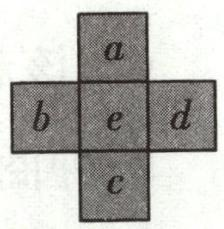

②

第2题图

# 学霸微专题27 球队积分问题

【方法提示】根据比赛总场数(总题数)以及胜负(对错)得分列方程求解.

1. 下表为某篮球比赛过程中部分球队的积分榜。(篮球比赛没有平局)

<table><tr><td>球队</td><td>比赛场次</td><td>胜场</td><td>负场</td><td>积分</td></tr><tr><td>A</td><td>12</td><td>10</td><td>2</td><td>22</td></tr><tr><td>B</td><td>12</td><td>9</td><td>3</td><td>21</td></tr><tr><td>C</td><td>12</td><td>7</td><td>5</td><td>19</td></tr><tr><td>D</td><td>11</td><td>6</td><td>5</td><td>17</td></tr><tr><td>E</td><td>11</td><td></td><td></td><td>13</td></tr></table>

(1)观察积分榜,可知球队胜一场积分,负一场积分;

(2)根据积分规则,请求出 E 队已经进行了的 11 场比赛中胜、负各多少场;

(3)若此次篮球比赛共17轮(每个球队各有17场比赛),D队希望最终积分达到30分,你认为有可能实现吗?请说明理由.

2. 下表是某次篮球联赛积分榜的一部分(无平局).

<table><tr><td>球队</td><td>比赛场次</td><td>胜场</td><td>负场</td><td>积分</td></tr><tr><td>飞龙</td><td>14</td><td>10</td><td>4</td><td>24</td></tr><tr><td>猎豹</td><td>14</td><td>9</td><td>5</td><td>23</td></tr><tr><td>小牛</td><td>14</td><td>7</td><td>7</td><td>21</td></tr><tr><td>猛虎</td><td>14</td><td>0</td><td>14</td><td>14</td></tr><tr><td>...</td><td>...</td><td>...</td><td>...</td><td>...</td></tr><tr><td colspan="5">备注:积分=胜场积分+负场积分</td></tr></table>

(1)根据积分榜,你知道胜一场、负一场各积多少分吗?为什么?

(2)联赛中还有一支队伍,领队说该队伍在比赛中获得胜场和负场的积分一样.请你判断该领队的说法是否成立,并说明理由.

# 学霸微专题 28 方案选择问题

【方法提示】结合有理数运算和方程求出所有方案的费用,加以比较.

1. 某超市为了回馈广大新老客户,元旦期间决定实行优惠活动.

优惠一:非会员购物所有商品价格可获九折优惠;

优惠二:交纳 200 元会费成为该超市的会员,所有商品价格可获八折优惠.

(1)若用 $x$ (元)表示商品价格,请你用含 $x$ 的式子分别表示两种优惠活动所付的钱数;

(2)当购买商品为多少元时,两种优惠后所付钱数相同?

(3)若某人计划在该超市购买一台价格为 2700 元的电脑,请分析选择哪种优惠更省钱.

2. 为进一步加强同学们“学党史、知党情、跟党走”的信念, 培养学生的民族精神和爱国主义情怀, 某学校组织开展“观看红色电影, 点燃红色初心”的教育活动. 电影票价格如下表:

<table><tr><td>购票张数</td><td>1~50张(包括50张)</td><td>50~100张(包括100张)</td><td>100张以上</td></tr><tr><td>每张票的价格</td><td>20元</td><td>16元</td><td>免10张门票,其余每张16元</td></tr></table>

该校七年级两个班共 105 名学生去看电影, 其中七(1)班有 40 多人, 不足 50 人; 七(2)班有 a 人.

(1)如果两个班联合起来作为一个团体购票,一共应付\_\_\_\_元;如果两个班都以班级为单位购票,一共应付\_\_\_\_元(用含a的代数式表示);

(2)如果两个班都以班级为单位购票,一共付了1860元,那么七(2)班有多少名学生?

(3)在(2)的条件下,如果七(1)班单独组织去看电影,作为组织者,你应如何购票才最省钱?

# 学霸微专题 29 正方体的展开图

# 【方法提示】

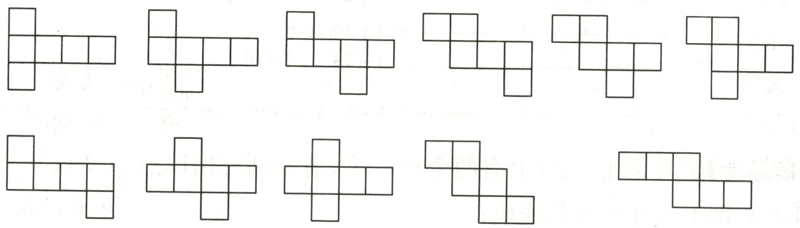

1. 如图①所示, 将正方体纸盒沿某些棱剪开, 使其六个面连在一起, 然后铺平可以得到它的展开图.

(1)下列平面图形中,是正方体展开图的是

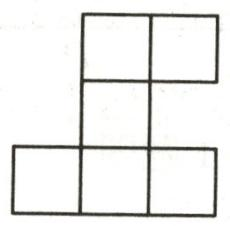  
A

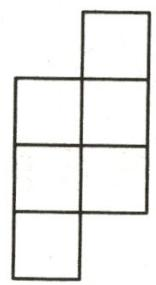  
B

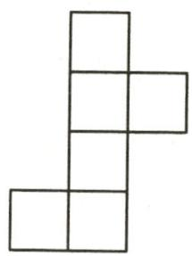  
C

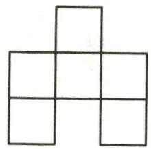  
D

(2)在如图②所示的方格中,画一个与(1)中呈现的类型不一样的正方体的展开图(用阴影表示);  
(3)正方体纸盒的剪裁线如图①中的实线所示,请将其展开图画在图③的方格图中(用阴影表示).

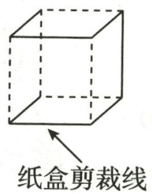  
①

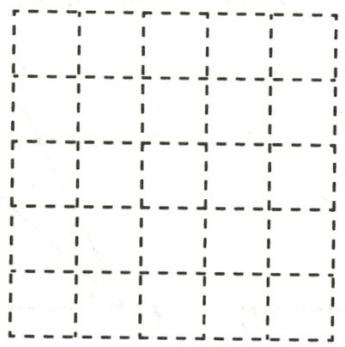

natural_image

Grid of dashed lines forming a 4x4 pattern (no text or symbols)

②

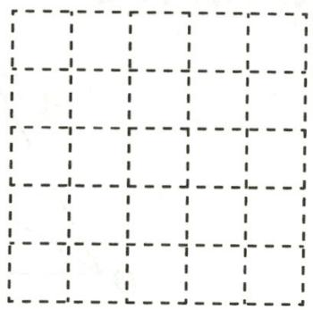

natural_image

Grid of dashed lines forming a 4x4 pattern (no text or symbols)

③   
第1题图

# 学霸微专题 30 线段、角的数量

# 【方法提示】

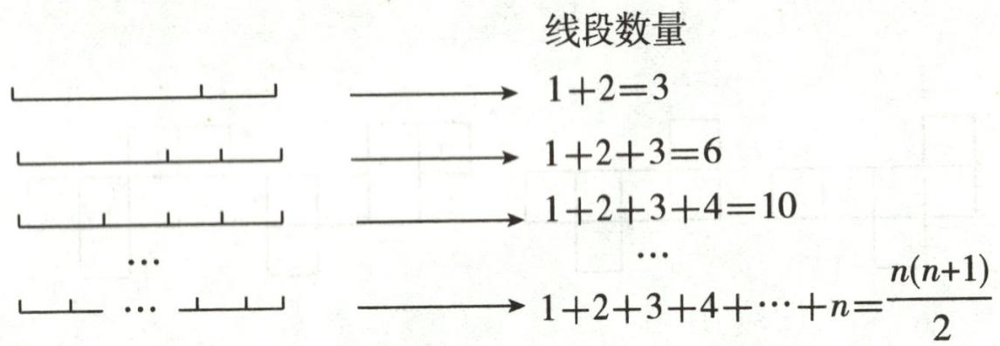

text_image

线段数量
→ 1+2=3
→ 1+2+3=6
→ 1+2+3+4=10
...
→ 1+2+3+4+⋯+n=n(n+1)/2

1.(1)【观察思考】如图,线段AB上有两个点C,D,请分别写出以点A,B,C,D为端点的线段,并计算图中共有多少条线段;

(2)【模型构建】如果线段上有 m 个点(包括线段的两个端点),则该线段上共有多少条线段?请说明你结论的正确性;

(3)【拓展应用】8位同学参加班上组织的象棋比赛,比赛采用单循环制(即每两位同学之间都要进行一场比赛),那么一共要进行多少场比赛?

  
第1题图

2.(2024秋·阜阳期中)解答下列各题:

(1)如图,在 $\angle AOB$ 中,以O为顶点引射线,补充完整下表:

<table><tr><td>∠AOB内射线的条数</td><td>1</td><td>2</td><td>3</td><td>4</td></tr><tr><td>角的总个数</td><td>___</td><td>___</td><td>___</td><td>___</td></tr></table>

(2)若 $\angle AOB$ 内射线的条数是 $n$ ,请用含 $n$ 的式子表示上面的结论;  
(3)若 $\angle AOB$ 内射线的条数是2025,则角的总个数是多少?

text_image

A
C
O
B

text_image

A
C
D
O
B

text_image

A
C
D
E
O
B

  
第2题图

# 学霸微专题31 与中点有关的说理

【方法提示】如图，M,N 分别是 AC,BC 的中点，则 $MN=\frac{a+b}{2}$ .

text_image

A
M
a+b
2
C
N
B
a
b

1. 如图, 已知线段 $AB = 90 \mathrm{~cm}, C$ 是线段 $AB$ 上任意一点 (不与点 $A, B$ 重合).

text_image

A
C
B

第1题图

(1)若 M, N 分别是 AC, BC 的中点, 求 MN 的长度;  
(2) 若 $AM=\frac{1}{3}AC, BN=\frac{1}{3}BC$ , 求 MN 的长;  
(3)在(2)的条件下,若 $BC = 30\mathrm{cm}$ 且点 $G$ 在直线 $AB$ 上, $GB = 15\mathrm{cm}$ , 求 $MG$ 的长度.

2. 如图, M, N 分别是 AC, CB 的中点.

(1)若点 C 在线段 AB 上, AC=12cm, CB=9cm, 求线段 MN 的长度.  
(2)若点 C 为线段 AB 上任意一点,且满足 $AC + CB = a \, cm$ , 其他条件不变,你能猜想出 MN 的长度吗? 请你用一句简洁的话描述你发现的结论.  
(3)若点 C 在线段 AB 的延长线上,且满足 AC-CB=bcm,M,N 分别为 AC,CB 的中点,你能猜想出线段 MN 的长度吗?请画出图形,写出你的结论,并说明理由.

  
第2题图

# 学霸微专题32 与角平分线有关的说理

【方法提示】如图, OC 是 $\angle AOB$ 内的一条射线, OM, ON 分别平分 $\angle AOC, \angle BOC$ , 则 $\angle MON = \frac{\angle AOC + \angle BOC}{2}$ .

text_image

A
M
C
N
O
B

1.(1)如图①,已知 O 为直线 AD 上一点, $\angle AOC$ 与 $\angle AOB$ 互补,OM,ON 分别为 $\angle AOC$ 与 $\angle AOB$ 的平分线,若 $\angle MON=40^{\circ}$ ,求 $\angle AOC$ 与 $\angle AOB$ 的度数;

(2)如图②, $\angle AOB: \angle BOC = 3:2, OD$ 是 $\angle BOC$ 的平分线, $OE$ 是 $\angle AOC$ 的平分线,且 $\angle BOE = 12^{\circ}$ , 求 $\angle DOE$ 的度数.

text_image

C
M
B
N
D
O
A
①

text_image

C
D
B
E
O
A
②

第1题图

2. O 为直线 AB 上一点, 在直线 AB 同侧任作射线 OC, OD, 使得 $\angle COD = 90^{\circ}$ .

(1)如图①, 过点 O 作射线 OE, 使 OE 为 $\angle AOD$ 的平分线, 当 $\angle COE = 25^{\circ}$ 时, 求 $\angle BOD$ 的度数;  
(2)如图②,过点 O 作射线 OE, 当 OE 恰好为 $\angle AOC$ 的平分线时, 另作射线 OF, 使得 OF 平分 $\angle BOD$ , 求 $\angle EOF$ 的度数;  
(3) 过点 O 作射线 OE, 当 OC 恰好为 $\angle AOE$ 的平分线时, 另作射线 OF, 使得 OF 平分 $\angle COD$ , 当 $\angle EOF = 10^{\circ}$ 时, 求 $\angle BOD$ 的度数.

text_image

E
C
D
A
O
B
①

text_image

C
D
E
F
A
O
B
②

第2题图

natural_image

Abstract grayscale graphic with diagonal gradient and two small circles (no text or symbols)

natural_image

Simple line drawing of a paperclip and zigzag lines on a plain background (no text or symbols)

natural_image

Grid of 16 evenly spaced gray hexagons on white background (no text or symbols)

