# 参考答案

# 第一章 有理数

# 作业 1 正数和负数(1)

1. B 2. A 3. +2024 4. -8.9 5. C 6. C 7.4

8.-3 9.82 10.C

# 作业 2 正数和负数(2)

1. C 2. B 3. $-8\%$ 4. 低于

5. 解: 把这个物体又向左移动了 8m, 物体在出发点右边距离出发点 2m 的地方.

6. D  7. B  8. D  9. 730  10. 7

11. 解: (1) 因为成绩记录为正数或 0 的达标, 该 8 人的成绩中有 3 个正数和 2 个 0, 所以有 5 人达标.

(2) $\frac{5}{8}\times100\%=62.5\%$ .

答:达标率是62.5%.

12. 解: (1) $(156 + 158 + 153 + 157) \div 4 = 156 \, (\text{cm})$ .

答:这四名同学的平均身高为 156cm.

(2)若以 156cm 为标准,这四名同学的身高分别记作 0, 2,-3,1.

(3)156+10=166(cm).

166-153=13(cm).

答:甲同学的实际身高为 166cm,甲同学比这四名同学中最矮的同学高 13cm.

13. 解: (1) $8 + 24 - 13 = 19$ (时), $8 + 1 = 9$ (时).

答:现在纽约时间是19时,东京时间是9时.

(2)我希望比赛时间安排在6时到7时,这样我们就能在20时到21时观看比赛.(合理即可)

# 作业 3 有理数的概念

1. A 2. B 3. C 4. B 5. -2, -6, -20 6. 4

7. 解: 正数集合: $\left\{12,2,1,3.14,\frac{5}{8},\cdots\right\}$ ;

负数集合： $\left\{-3,-4,-8\frac{1}{4},\cdots\right\}$ ;

整数集合： $\left\{-3,12,-4,2,0,1,\cdots\right\}$ ;

分数集合： $\left\{-8\frac{1}{4},3.14,\frac{5}{8},\cdots\right\}$

8. 解: 如答图所示.

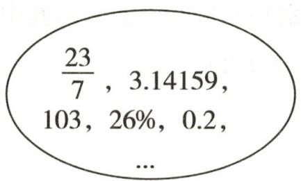

text_image

23/7, 3.14159,
103, 26%, 0.2,
...

正数集合

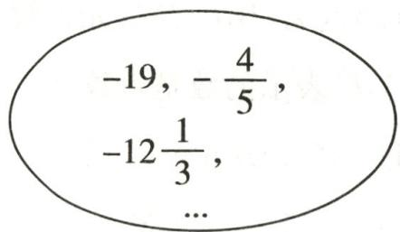

text_image

-19, -\frac{4}{5},
-12\u0frac{1}{3},
...

负数集合

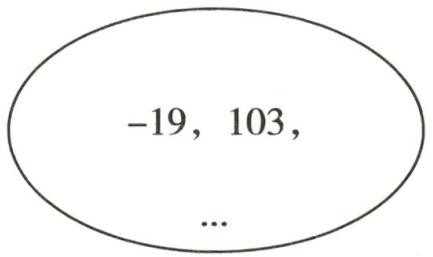

text_image

-19, 103,
...

整数集合

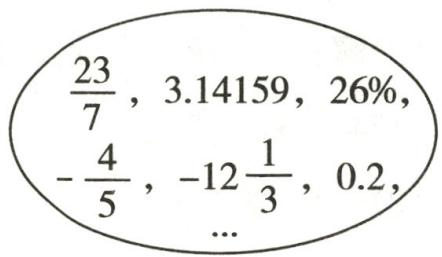

text_image

23/7, 3.14159, 26%,
-4/5, -121/3, 0.2,
...

分数集合  
第8题答图

9. D 10. B

11.-4,500,0 -4

12. (1) $-\frac{9}{8}$ $\frac{12}{13}$ (2) $-\frac{2027}{2026}$

13.(1)正整数 正分数

(2)解:如答图所示.

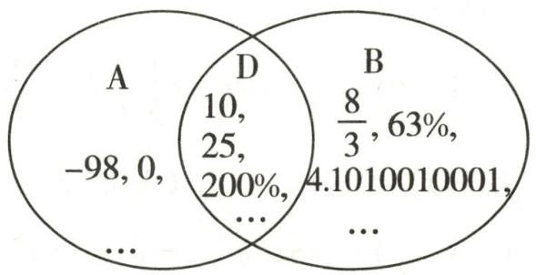

other

| Set | Count |
|---|---|
| A only | 10 |
| A ∩ B | 25 |
| A ∩ D | 200% |
| B only | 8/3 |
| B ∩ A | 4.10×100×10001 |

①

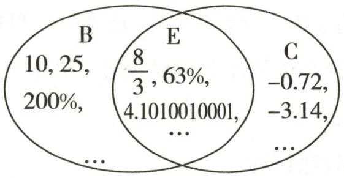

other

| Set | Count | Percentage (%) |
|---|---|---|
| B | 10, 25, 200%, ... |  |
| E | 8/3, 63%, 4.1010010001, ... |  |
| C | -0.72, -3.14, ... |  |

②   
第13题答图

14. 解: 有 1 个负整数.

# 作业 4 数轴

1. D  2. A  3. D  4. C  5. 5  6. 4

7. 解: 如答图所示.

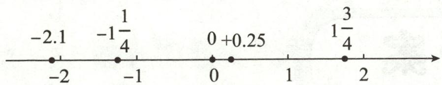

text_image

-2.1
-1\u00bd/4
-2
-1
0 +0.25
1\u00bd/4
1
2

第7题答图

8. 解: (1) 由数轴可得, 点 A 表示的数是 -1, 点 B 表示的数是 3.

(2)在数轴上表示出点 C 和点 D, 如答图所示.

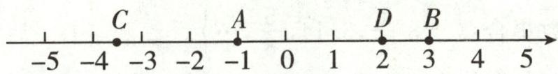

text_image

-5
-4
C
-3
-2
A
-1
0
1
D
2
B
3
4
5

第8题答图

(3) 点 A, B, C, D 表示的数分别是 -1, 3, -3.5, 2, 其中点 A, C 表示的数是负数.

9.D 10.5或6

11.(1)-4 -2 3

(2) 解: 点 B 所表示的数是 -5.  
(3) 解: 点 A 所表示的数为 0.

12.(1)4 右 5

(2)-10或6

(3)1

# 作业5 相反数

1. B 2. A 3. C

4.(1)-6 (2)1.3 (3)-4 (4)-2 5.-2

6.(1)-7 (2)-1.4 (3)2.5 (4)5 (5)-2.8

(6)6 (7)6 (8)-6 (9) $-\frac{2}{3}$

7.C 8.B 9.C 10.-3.5

11. 解: (1) ①-(-2)=2; ②+ $\left(-\frac{1}{5}\right)=-\frac{1}{5}$ ;

③ $-[-(-4)]=-4$ ;④ $-[-(+3.5)]=3.5;$   
⑤ $-\left\{-[-(-5)]\right\}=5$ ;⑥ $-\left\{-[-(+5)]\right\}=-5.$

(2)化简后的结果是+5;化简后的结果是+5.总结规律:一个数的前面有奇数个负号,化简的结果等于它的相反数;有偶数个负号,化简的结果等于它本身.

12.(1)B (2)C

(3) 解: 如答图所示.

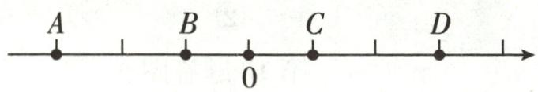  
第12题答图

13. 解: (1) 如答图所示.

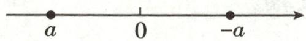  
第13题答图

(2)由题意得 a = -10.   
(3)由(2)可得-a=10.

当表示数 b 的点在表示数 -a 的点的右边时，

$$
b = 1 0 + 5 = 1 5;
$$

当表示数 b 的点在表示数 -a 的点的左边时，

$$
b = 1 0 - 5 = 5.
$$

故 $b$ 的值是5或15.

# 作业6 绝对值

1. A 2. D 3. D 4. D 5. C

6.(1) $\frac{2}{3}$ (2)-1 $\frac{2}{3}$ (3)-0.7 (4)-2.5 (5)3

(6)-2025

7.(1)2 (2) $1\frac{1}{5}$ (3)7 (4)1 (5)0.8 (6)70 (7)32

8. A 9. C 10. C 11. B 12. I

13. 解: 因为 $\left|a\right|=2$ , 所以 $a=\pm2$ .

因为 $|b|=2$ ，所以 $b=\pm2$ 。

因为 b > a，所以 a = -2, b = 2。

14. 解: (1) 因为 $|a| \geqslant 0$ , 所以 $|a| + 12 \geqslant 12$ ,

所以当 a=0 时， $|a|+12$ 的值最小，最小值是 12.

(2) 因为 $\left|a\right|\geqslant0$ ，所以 $-\left|a\right|\leqslant0$ ，所以 $12-\left|a\right|\leqslant12$ ，

所以当 a=0 时， $12-|a|$ 的值最大，最大值是 12.

15. 解: (1) 根据题意, 相等或互为相反数的两个数的绝对值相等, 所以 $\left|a\right| = \left|4\right| = \left|-4\right|$ , 所以 a 的值为 4 或 -4.

(2)a 与 b 相等或互为相反数.

(3) $a = -3, b = 3$ 或 $a = 3, b = -3$ .

# 作业 7 有理数的大小比较

1. D  2. D  3. B  4. D

5.(1)< (2)> 6.高

7. 解: (1) $-\frac{7}{12} > -\frac{5}{6}$ . (2) $-\frac{3}{11} > -0.3$ .

(3) $-\frac{4}{9}<-\frac{3}{7}.$ (4) $-\frac{7}{8}>-\frac{8}{9}.$

(5) $-|-9|<-(-9)$ . (6) $-\left|-\frac{2}{3}\right|>-\frac{3}{4}$

8. 解: (1) 原点 O 的位置如答图所示.

(2) 把各数表示在数轴上, 如答图所示.

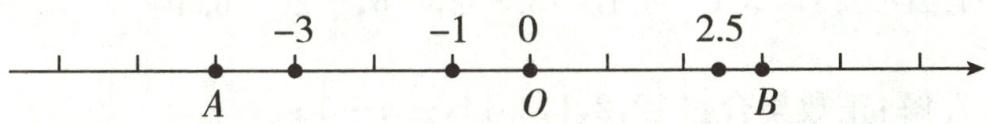

text_image

-3
-1 0
2.5
A O B

第8题答图

用“<”连接各数为-3<-1<0<2.5.

9. B 10. ±2

11. 解: (1) 因为 $\left|+0.5\right|=0.5,\left|-0.15\right|=0.15,\left|0.1\right|=$

$$
0. 1, | 0 | = 0, | - 0. 1 | = 0. 1, | 0. 2 | = 0. 2,
$$

又 0<0.1<0.15<0.2<0.5,

所以序号为 3,4,5 的零件的质量相对好一些.

(2)由绝对值可得,优等品有3件,合格品有2件,次品有1件.

12. 解: (1) 如答图①所示.

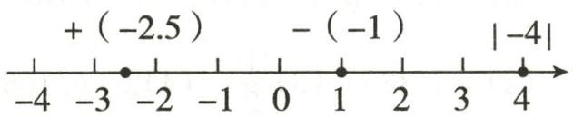

text_image

+ (-2.5) - (-1) |-4|
-4 -3 -2 -1 0 1 2 3 4

第 12 题答图①

(2)①如答图②所示.

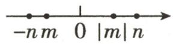  
第 12 题答图②

$$
② - n <   m <   | m | <   n.
$$

# 专题1 综合与实践

1.(1)+3 +4 -2 -1

(2) 解: 因为甲虫的行走路线为 $A \rightarrow B \rightarrow C \rightarrow D \rightarrow A$ ,

所以甲虫走过的距离为 $1+3+2+1+1+2+2+4=16$ .

(3)解:点Q的位置如答图所示.

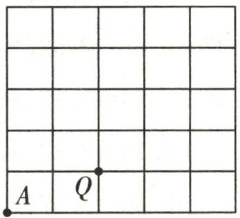

text_image

A Q

第1题答图

2. 解: (1) $450 + 10 = 460 \, (\text{g})$ , $450 - 10 = 440 \, (\text{g})$ .

由表格可知,抽查的20条鲈鱼中,有16条质量合格,所以合格率是 $\frac{16}{20}\times100\%=80\%$ .

(2)以 450g 为标准质量, 超过的部分用正数表示, 不足的部分用负数表示, 这 20 条鲈鱼的质量记为 (单位: g): +6,

$$
- 1 2, - 7, + 1 3, + 6, 0, - 1 2, - 7, + 6, 0, - 4, + 6, 0, - 4,
$$

$$
- 7, - 7, + 6, - 7, + 1 3, + 6.
$$

$$
(+ 6) \times 6 + 1 3 \times 2 + (- 7) \times 5 + (- 4) \times 2 + (- 1 2) \times 2 + 0 \times 3
$$

$$
= 3 6 + 2 6 - 3 5 - 8 - 2 4
$$

$$
= - 5 (\mathrm{g}).
$$

答:抽查的20条鲈鱼的总质量不足“标准总质量”,不足“标准总质量”5g.

# 小结与思考

1. C  2. A  3. B  4. D  5. B

6.4 7.> 8.24.75 9.-6 10.1或7

11. 解: 各数在数轴上表示如答图所示.

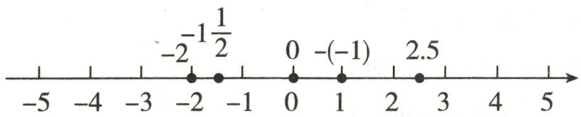

text_image

-2-1\u00bd/2
-2
-2
0
-(-1)
0
1
2.5
2.5

第 11 题答图

用“<”连接各数为-2<-1 $\frac{1}{2}$ <0<-(-1)<2.5.

12. 解: 负整数集合: $\{-7, \cdots\}$ .

非负数集合： $\{0,8.7,1999,\cdots\}$ .

正分数集合: $\{8.7,\cdots\}$ .

负分数集合： $\left\{-0.5,-\frac{1}{3},-98\%,\cdots\right\}$ .

13. 解: (1) 在数轴上表示出 A, B, C 三个村庄的位置如答图.

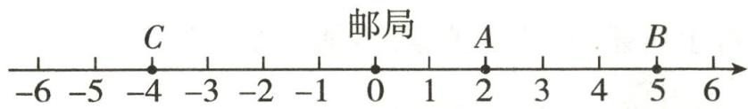

text_image

C
邮局
A
B
-6 -5 -4 -3 -2 -1 0 1 2 3 4 5 6

第 13 题答图

(2) $2+4=6(km)$ .

答:C 村离 A 村有 6km 远.

(3) $2+3+9+4=18(km)$ ,

$$
1 8 \times 0. 0 3 = 0. 5 4 (\mathrm{L}).
$$

答:这次摩托车共耗油 0.54L.

14. 解: (1) 设警戒水位为 0 米, 则星期一河流的水位为 +0.20 米, 星期二河流的水位为 +1.01 米, 星期三河流的水位为 +0.66 米, 星期四河流的水位为 +0.69 米, 星期五河流的水位为 +0.97 米, 星期六河流的水位为 +0.61 米, 星期日河流的水位为 +0.60 米, 所以星期二河流的水位最高, 位于警戒水位之上 1.01 米; 星期一河流的水位最低, 位于警戒水位之上 0.20 米.

(2)与上个星期日相比,这个星期日河流的水位是上升了.

# 第二章 有理数的运算

# 作业 8 有理数的加法(1)

1. A 
2. D 
3. B

4.(1)80 (2)0 (3)-35 (4)-2 (5)-5 (6)-5

(7) $-\frac{1}{5}$ (8) $\frac{5}{4}$

5.2 6.-45 7.1

8. (1) $\frac{1}{60}$ (2) $-\frac{23}{6}$ (3) $\frac{1}{2}$ (4) 0.705 (5) $-\frac{1}{12}$ (6) 4.5

9. D 10. A 11. D

12. 解: (1) $|-105|+(-12)=105+(-12)=93$ .

(2) $-(-15)+(-27)=15+(-27)=-12.$

13.(1)+1.5 -1.7

(2) 解: $0.5 + 5.5 = 6$ (米),

6-2.8=3.2(米),

3.2+1.5=4.7(米),

4.7-1.7=3(米).

答:离地面的高度是3米.

14. 解: (1) 由 $\left|a\right|=5,\left|b\right|=3$ 得 $a=\pm5,b=\pm3$ ,

所以 a=5, b=3，或 a=5, b=-3，或 a=-5, b=3，或 a=-5, b=-3.

当 a=5, b=3 时, $a+b=8$ ;

当 a=5, b=-3 时, $a+b=2$ ;

当 a=-5, b=3 时, $a+b=-2$ ;

当 a=-5, b=-3 时, $a+b=-8$ .

综上所述， $a+b$ 的值是 $\pm8$ 或 $\pm2$ .

(2)由 $|a|=5$ ,得 $a=\pm5$ .

当 $a = 5, a + b = -2$ 时， $b = -7$ ；

当 $a = -5, a + b = -2$ 时， $b = 3$ .

综上所述，b 的值是 -7 或 3.

(3)由 $|a|=5,|b|=3$ 得 $a=\pm5,b=\pm3.$

因为 a<b，所以 a=-5, b=3，或 a=-5, b=-3.

当 a=-5, b=3 时, $a+b=-2$ ;

当 a=-5, b=-3 时, $a+b=-8$ .

综上所述， $a+b$ 的值是 -2 或 -8.

# 作业 9 有理数的加法(2)

1. C  2. B  3. A  4. 5

5.(1)2 (2)1 (3)0 (4)-9

6. 解: (1) 20 - 1 - 2 - 4 - 6 - 2 = 5 (箱),

$$
1 0 \times 2 0 + (- 0. 5) \times 1 + (- 0. 2 5) \times 2 + 0. 2 5 \times 6 + 4 \times 0 +
$$

$0.3 \times 5 + 0.5 \times 2 = 203$ (千克).

答:n 的值是 5, 这 20 箱樱桃的总质量是 203 千克.

(2) $25 \times 203 - 200 \times 20 = 1075$ (元).

答:全部售出可获利 1075 元.

7. D

8.(1)36

(2) 解: $25 + (+8) + (-12) + (+34) + (-36) + 22 = 41$ (吨).

答:粮库里的粮食增多了41吨.

(3) 解: 480 - 41 = 439 (吨).

答:六天前粮库里存粮 439 吨.

9. 解: 原式= $\left(-2000-\frac{5}{6}\right)+\left(-1999-\frac{2}{3}\right)+\left(4000+\frac{2}{3}\right)+$

$$
\left(- 1 - \frac {1}{2}\right) = (- 2 0 0 0 - 1 9 9 9 + 4 0 0 0 - 1) + \left(- \frac {5}{6} - \frac {1}{2}\right) +
$$

$$
\left(- \frac {2}{3} + \frac {2}{3}\right) = 0 - 1 \frac {1}{3} + 0 = - 1 \frac {1}{3}.
$$

# 作业 10 有理数的减法(1)

1. D  2. B  3. D

4.(1)-9 (2)-12 (3)4 (4)(-4) (5)5 (6)(-5)

5.(1)-1 (2)-3.325 (3) $\frac{1}{2}$ (4)2 6.156

7.(1)10.4 (2)-10 $\frac{1}{4}$ (3) $-\frac{95}{12}$ (4)-4.4

(5) $-5\frac{3}{4}$ (6) $-\frac{3}{2}$

8. C 9. (1) > (2) < (3) = (4) < 10. -4 或 -2

11. 解: (1) 原式 = -3 $\frac{3}{4}$ - 2 $\frac{1}{2}$ = -6 $\frac{1}{4}$ .

(2) 原式 = 3.5 + 4.2 = 7.7.

(3) 原式= $\frac{7}{10}+\frac{7}{15}=1\frac{1}{6}$ .

(4) 原式 = -5.3 + 2.3 = -3.

12. 解: “+”表示水位比前一天上升, “-”表示水位比前一天下降, 则

周一的水位是 $3.44 + 0.03 = 3.47$ (米)，

周二的水位是 3.47-0.55=2.92(米)，

周三的水位是 $2.92+0.25=3.17$ （米），

周四的水位是 $3.17 + 0.20 = 3.37$ (米)，

周五的水位是 $3.37 + 0.30 = 3.67$ (米)，

周六的水位是 3.67-0.45=3.22(米)，

周日的水位是 $3.22 + 0.05 = 3.27$ (米).

答:本周五的水位最高,本周日的水位是3.27米.

13. 解: (1) 因为 $\frac{2}{3} > -\frac{4}{5}$ ,

所以 $\frac{2}{3} +\left(-\frac{4}{5}\right) = -\left(\frac{4}{5} -\frac{2}{3}\right) = -\frac{2}{15}.$

答: 输出的结果是 $-\frac{2}{15}$ .

(2) 因为 $\left|-\frac{5}{6}\right|=\frac{5}{6}=\frac{25}{30},\left|-\frac{4}{5}\right|=\frac{4}{5}=\frac{24}{30}$ ,

又 $\frac{25}{30}>\frac{24}{30}$ ，所以 $-\frac{5}{6}<-\frac{4}{5}$ ，

所以 $-\frac{5}{6}-\left(-\frac{4}{5}\right)=-\frac{5}{6}+\frac{4}{5}=-\frac{1}{30}.$

答: 输出的结果是 $-\frac{1}{30}$ .

# 作业 11 有理数的减法(2)

1. A 2. A 3. (1) -9 (2) 3.7

4.8减7加3减6 正8、负7、正3、负6的和 5.850

6. 解: (1) 原式 = 10 + 6 + 8 - 2 = 24 - 2 = 22.

(2) 原式 = 9 + 3 - 8 + 7 = 19 - 8 = 11.

(3) 原式 = -1.25 - 2.75 + 3.5 = -4 + 3.5 = -0.5.

(4) 原式 = -20 + 3 + 5 - 7 = -27 + 8 = -19.

(5) 原式 = -17 - 13 - 16 + 46 = -46 + 46 = 0.

(6) 原式 $= \left(3\frac{3}{7} + 1\frac{4}{7}\right) - (2.4 + 1.6) = 5 - 4 = 1.$

7.A 8.6

9. 解: (1) 原式 = -0.5 + 3.25 - 2.75 + 7.5 = (7.5 - 0.5) +

(3.25-2.75)=7+0.5=7.5.

(2) 原式 = -9 + 6 + (-3) = -6.

(3) 原式 $= 4\frac{2}{5} + 9\frac{3}{5} + \left(-7\frac{1}{4} - 1\frac{3}{4}\right) = 14 - 9 = 5.$

(4) 原式 $= -\frac{1}{2} + 3\frac{1}{4} + 2\frac{3}{4} - 5\frac{1}{2} = \left(-\frac{1}{2} - 5\frac{1}{2}\right) +$

$\left(3\frac{1}{4}+2\frac{3}{4}\right)=-6+6=0.$

10. 解: (1) 因为 $\left|a\right|=1,\left|b\right|=2,\left|c\right|=3,$

所以 $a=\pm1, b=\pm2, c=\pm3.$

因为 $a > b > c$

所以 a=1, b=-2, c=-3 或 a=-1, b=-2, c=-3.

当 $a = 1, b = -2, c = -3$ 时， $a - b + c = 0$ ;

当 a=-1, b=-2, c=-3 时, $a-b+c=-2$ .

综上可知， $a - b + c$ 的值是0或-2.

(2) 因为 $\left|a-1\right|+\left|b-3\right|+\left|3c-1\right|=0$ ,

所以 a-1=0, b-3=0, 3c-1=0,

所以 $a = 1, b = 3, c = \frac{1}{3}$ , 所以 $a + b - c = \frac{11}{3}$ .

11.(1)23

(2)191

(3)解:若选择“每日计件工资制”,小颖这一周的工资总额是

$5 \times 191 + (9 + 8 + 6) \times 3 - (7 + 4 + 1) \times 2 = 1000$ （元）；

若选择“每周计件工资制”，小颖这一周的工资总额是 $5 \times 191 + (191 - 180) \times 3 = 988$ （元）.

因为 988<1000，

所以小颖本周应选择“每日计件工资制”更合算.

# 作业 12 有理数的乘法(1)

1. A 
2. D 
3. B

4. (1)-2 (2)0 (3) $\frac{1}{2}$ (4) $\frac{1}{7}$

5. $-\frac{3}{7}$ -4 $\frac{2}{5}$ $-\frac{5}{3}$

6.(1)-48 (2)0.08 (3)-10 (4)1 (5)0 (6)- $\frac{2}{9}$

7.(1)-1 (2) $\frac{3}{7}$ (3)6 (4)0 (5)19 $\frac{1}{2}$ (6)-414

8.C 9.D 10.C 11.-1 12.15

13. 解: 由题意可知 $\left|a\right|=3,\left|b\right|=7$ , 故 $a=\pm3, b=\pm7$ .

因为 ab<0，所以 a 和 b 异号.

当 $a = 3, b = -7$ 时， $a + b = 3 + (-7) = -4$ ;

当 a=-3, b=7 时, $a+b=-3+7=4$ .

综上所述， $a + b$ 的值为 $\pm 4$

14. 解: (1) 根据题意, 得 $(-2) \times (-3) = 6$ .

答:3 天前的水位比某天高 6 厘米.

(2)算式 $(-2)\times(+3)=-6$ 表示的意义是:水位每天下降2厘米,那么3天后的水位比某天高-6厘米.

15. 解: 因为 $\left|a\right|=4,\left|b\right|=9,\left|c\right|=6,$

所以 $a=\pm4, b=\pm9, c=\pm6.$

因为 $ab < 0, bc > 0$

所以 a=4, b=-9, c=-6 或 a=-4, b=9, c=6.

当 $a = 4, b = -9, c = -6$ 时，

$$
a - b - (- c) = 4 - (- 9) + (- 6) = 7;
$$

当 $a = -4, b = 9, c = 6$ 时，

$$
a - b - (- c) = - 4 - 9 + 6 = - 7.
$$

综上可知， $a - b - (-c)$ 的值为 $\pm 7$

# 作业 13 有理数的乘法(2)

1. D 2. C 3. (1) - 118 (2) 10

4. 解: (1) 原式 = (-5) × (-2) × 19 = 190.

(2) 原式 $= -8 \times 1.25 \times \frac{4}{3} \times \frac{5}{4} = -\frac{50}{3}$ .

(3) 原式 = 30 + 20 - 45 + 48 = 53.

(4) 原式 = -6 + 1 + 0.7 = -4.3.

5. D 6. $-\frac{1}{100}$

7. $\left(-\frac{14}{15}\right)\quad\left(-\frac{3}{2}\right)\times\left(-\frac{38}{15}\right)\quad\frac{19}{5}$

8. 解: (1) 原式 = $370 \times \frac{1}{4} + \frac{1}{4} \times 24 \frac{1}{2} + 5 \frac{1}{2} \times \frac{1}{4} = \frac{1}{4} \times$

$$
\left(3 7 0 + 2 4 \frac {1}{2} + 5 \frac {1}{2}\right) = \frac {1}{4} \times 4 0 0 = 1 0 0.
$$

(2) 原式 $= -\left(8 \times \frac{1}{8} \times 12 \times \frac{1}{3} \times 0.001\right) = -0.004.$

(3) 原式 $= -5 \times \left(\frac{3}{13} - \frac{2}{13} + \frac{1}{13}\right) + \frac{14}{13} = -\frac{10}{13} + \frac{14}{13} = \frac{4}{13}$ .

9. 解: (1) 小军的解法较好.

(2) $199\frac{15}{16}\times(-8)$

$$
= \left(2 0 0 - \frac {1}{1 6}\right) \times (- 8)
$$

$$
= 2 0 0 \times (- 8) - \frac {1}{1 6} \times (- 8)
$$

$$
= - 1 6 0 0 + \frac {1}{2}
$$

$$
= - 1 5 9 9 \frac {1}{2}.
$$

10.(1)-33

(2) 解: 原式 = -4 × 3 - 1 + (-4) × 5 - 1 = -13 - 21 = -34.  
(3) 解: 新运算“ $a \times b = ab - 1$ ”不满足分配律,

如 $(-4)\times(3+5)\neq(-4)\times3+(-4)\times5.$

因为 $(-4)\times(3+5)=(-4)\times8=-4\times8-1=-33,$

$(-4)$ ※3+(-4)※5=-4×3-1+(-4)×5-1= -34,所以不满足分配律.

# 作业14 有理数的乘法(3)

1. D 2. C 3. D 4. (1)6 (2)5 5. 144   
6. 解: (1) 原式 = 2 × 4 × 5 = 40.

(2) 原式 = -6 × 25 × 0.04 = -6.  
(3) 原式 $= -\frac{3}{4} \times \left(-\frac{2}{5}\right) \times \frac{5}{3} = \frac{1}{2}$ .  
(4) 原式 = 0.

7. 解: (1) $3 \times (-4) = 4 \times 3 \times (-4) = -48$ .

(2) $(-2)*(6*3)=(-2)*(4\times6\times3)=(-2)*72=$ $4\times(-2)\times72=-576.$

8. D 9. B 10. (1) $-\frac{4}{35}$ (2) 1 11. 4 或 -4

12. 解: (1) 原式 = -8 × 1.25 × 9 × $\frac{1}{9}$ = -10.

(2) 原式 $= (-5) \times \left(-\frac{1}{5}\right) \times 6 = 1 \times 6 = 6.$   
(3) 原式 $= -\frac{1}{4} \times \frac{7}{9} \times 4 \times 18 = -14.$   
(4) 原式 $= -\frac{5}{2} \times \frac{9}{5} \times \frac{1}{4} = -\frac{9}{8}$ .  
(5) 原式 $= \left(\frac{3}{7} \times \frac{7}{12}\right) \times \left(-\frac{4}{5} \times \frac{5}{8}\right) = \frac{1}{4} \times \left(-\frac{1}{2}\right) = -\frac{1}{8}$ .  
(6) 原式 = 0.

13. 解: $(1)K_{-10}^{3}=(-10)\times(-9)\times(-8)=-720.$

(2) $K_{-5}^{1}=-5,K_{-5}^{2}=(-5)\times(-4)=20,$

$$
K _ {- 5} ^ {3} = (- 5) \times (- 4) \times (- 3) = - 6 0,
$$

$$
K _ {- 5} ^ {4} = (- 5) \times (- 4) \times (- 3) \times (- 2) = 1 2 0,
$$

$$
K _ {- 5} ^ {5} = (- 5) \times (- 4) \times (- 3) \times (- 2) \times (- 1) = - 1 2 0,
$$

当 $n \geqslant 6$ 时, $K_{-5}^{n} = 0$ ,

所以 $K_{-5}^{n}$ 的最大值是 120，此时 n=4。

14. 解: (1) 因为 ab > 0, 所以 a, b 同号,

又 $a + b > 0$ ，所以 $a, b$ 都为正数.

(2) 因为 ab > 0，所以 a, b 同号，

又 abc>0, 所以 c>0.

因为 bc<0，所以 b,c 异号，所以 b<0，所以 a<0。

所以 a, b 为负数, c 为正数.

# 作业 15 有理数的除法(1)

1. B 2. D 3. C 4. (1)0 (2)8 (3)-48   
5.(1) $\frac{3}{5}$ (2) $-\frac{2}{7}$ (3)6 (4) $-\frac{1}{4}$   
6.(1)-3 (2) $-\frac{3}{64}$ (3)70 (4) $\frac{3}{2}$   
7. 解: (1) $-17 \div 3 \frac{2}{5} = -17 \times \frac{5}{17} = -5.$

答: 这个数是 -5.

(2) $-6\frac{4}{7}\div3\frac{2}{7}=-\frac{46}{7}\times\frac{7}{23}=-2.$

答: 这个数是 -2.

8. A 9. B 10. (1) $\frac{7}{2}$ (2)5 11. -4 12. ①②④   
13.(1) $\frac{6}{7}$ (2)1 (3)-2 (4) $-\frac{5}{3}$ (5) $-\frac{1}{6}$ (6)16   
14.(1)不正确 ① 运算顺序不对(或在同级运算中,没有按照从左到右的顺序进行)

(2) $-\frac{1}{90}$

# 作业 16 有理数的除法(2)

1. C 2. B 3. (1)2 (2)-10   
4.(1)40 (2)-10 (3)-25 (4)-10   
5.(1) $\frac{9}{7}$ (2) $-\frac{1}{12}$ (3) $\frac{5}{3}$ (4)-4 (5) $\frac{25}{16}$ (6)-2 $\frac{2}{3}$   
6.B 7.B   
8. 解: (1) 原式= $\left(\frac{5}{12}-\frac{7}{9}-\frac{2}{3}\right)\times(-36)=-15+28+24$

$$
= 3 7.
$$

(2) 原式 $= 25 \times \frac{3}{2} + 25 \times \frac{1}{2} = 25 \times \left(\frac{3}{2} + \frac{1}{2}\right) = 50.$

(3) 原式 $= \left(-28 - \frac{7}{8}\right) \times \frac{1}{7} = -4 - \frac{1}{8} = -4\frac{1}{8}$ .

(4) 原式 $= -\frac{4}{5} \times \frac{5}{13} + \frac{3}{5} \times \frac{5}{13} + \frac{5}{13} \times \frac{8}{5}$

$$
= \frac {5}{1 3} \times \left(- \frac {4}{5} + \frac {3}{5} + \frac {8}{5}\right) = \frac {7}{1 3}.
$$

9. 解: (1) $4 - (1200 \div 100) \times 0.6 = -3.2(^{\circ}\mathrm{C})$ .

答:离山脚1200m高的地方的温度为 $-3.2^{\circ}C$ .

(2) $[4-(-5)]\div0.6\times100=1500(m).$

答:此处距山脚的高度为 1500m.

10.(1)一

(2)解:解法不唯一,如原式= $\left(-\frac{1}{84}\right)\div\left(\frac{1}{6}+\frac{2}{3}-\frac{3}{14}-\frac{2}{7}\right)=\left(-\frac{1}{84}\right)\div\left(\frac{5}{6}-\frac{1}{2}\right)=\left(-\frac{1}{84}\right)\times3=-\frac{1}{28}.$

# 周练 1 (测试范围:2.1-2.2)

1. C  2. B  3. C  4. C

5.-3 6.8-11+20-19 7.-2 8.0(答案不唯一)

9. 解: (1) 原式 = 32 + (-18 + 18) - 29 = 32 - 29 = 3.

(2) 原式 $= -9 + (-5) = -14$ .

(3) 原式 $= -\frac{6}{19} \times \frac{2}{3} \times \frac{19}{24} = -\frac{1}{6}$ .

(4) 原式 $= \left[1\frac{1}{24} - (9 + 4 - 18)\right] \div (-5)$

$$
= \left(1 \frac {1}{2 4} + 5\right) \div (- 5) = - \frac {5}{2 4} - 1 = - 1 \frac {5}{2 4}.
$$

10. 解: (1) $[40+(-25)] \times (-3) = 15 \times (-3) = -45$ .

(2) $32\div6-\left(-\frac{1}{3}\right)=\frac{16}{3}+\frac{1}{3}=\frac{17}{3}.$

11. 解: (1) 原式 = 5 - 2 × (-4) × (-6) = -43.

(2) 原式= $\left[5-2\times3\times(-3)\right]\star(-4)$

$$
= 2 3 \star (- 4) = 5 - 2 \times 2 3 \times (- 4) = 1 8 9.
$$

12. (1)36

(2) 解: $\left[50\times7+(-8-10-14+0+24+31+35)\right]\times0.5=204$ (元).

答: 小明家的纯电汽车这 7 天消耗的电费为 204 元.

# 专题 2 有理数运算的实际应用

1. 解: (1) $65 + 2 - (65 - 3) = 5$ (元).

答:最贵的一套比最便宜的一套贵5元.

(2)+2+(-3)+(+2)+(+1)+(-2)+(-1)+0+
(-3)=-4(元),

$65 \times 8 - 4 - 400 = 116$ (元).

答:8套儿童服装一共赚了116元.

2. 解: (1) 12-(-7)=19(千克).

答:最多的一天比最少的一天多销售 19 千克.

(2) $4-5-3+9-7+12+5+100\times7=715$ （千克）， $715\times(10-4)=4290$ （元）.

答: 小明第一周销售柚子一共收入 4290 元.

3. 解: (1) (+14) + (-9) + (+8) + (-7) + (+13) + (-6) + (+12) + (-5) = 20(千米).

答: B 地在 A 地的正东方向, 距 A 地 20 千米.

(2) $|+14|+|-9|+|+8|+|-7|+|+13|+|-6|+$ $|+12|+|-5|=74$ (千米),

$74 \times 0.5 = 37$ (升), $37 - 28 = 9$ (升).

答:冲锋舟当天救灾过程中至少还需补充9升油.

4.(1)四 (2)4

(3) 解: $\left|-3\right|+\left|8\right|+\left|-9\right|+\left|+10\right|+\left|-2\right|=32$ (千米), $32 \times 0.4 \times 6.5 = 83.2$ (元).

答:检修小组工作一天需汽油费83.2元.

5. 解: (1) 2.5 - (-2) = 4.5 (千克).

答:最重的一袋比最轻的一袋重4.5千克.

(2) $(-2)\times1+(-1.5)\times2+(-1)\times3+0\times5+0.5\times4+$ $1.5 \times 3 + 2.5 \times 2 = 3.5$ (千克).

答:20 袋大米总计超过 3.5 千克.

(3) $6\times(25\times20+3.5)=3021$ (元).

答: 这 20 袋大米可以卖 3021 元.

6.(1)22

(2) 解: $50 + [(-3) + (+4) + (-5) + (+14) + (-8) + (+7) + (+12)] \div 7 = 53$ (单).

答:该外卖小哥这一周平均每天送餐 53 单.

(3) 解: $(50 \times 7 - 3 - 5 - 8) \times 2 + (4 + 7 + 10 \times 2) \times 4 + (4 + 2) \times 6 + 60 \times 7 = 1248$ (元).

答:该外卖小哥这一周工资收入是1248元.

# 作业 17 有理数的乘方(1)

1. D  2. A  3. C  4. D  5. C

6.(1)= (2)< (3)> 7.± $\frac{2}{3}$ -5

8.(1)625 (2)-625 (3) $-\frac{64}{27}$ (4) $-\frac{8}{5}$ (5)-1

9. 解: $(1)(-3)^{2}=9, (-3)^{3}=-27, [-(-3)]^{5}=3^{5}=243.$

(2) $-3^{2}=-9,-3^{3}=-27,-(-3)^{5}=-(-243)=243.$

10.C 11.D 12.C 13.C 14.1或9

15.(1)3 4

(2) 解: 因为 $a=4^{2}=16, b^{3}=8$ ,

所以 b=2，所以 $(b,a)=(2,16)$ .

因为 $2^{4}=16$ ，所以 $(b,a)=4$ 。

16.(1) $2^{n}$ (2)32000

(3) 解: 2 小时后盘子里细菌的数量是 1 小时后的 $\frac{2^{10}}{2^{5}} = 2^{5} = 32$ 倍.

17. (1) $6^{2025}$ $(5a)^{n}$

(2) 解: $(-0.125)^{2024} \times 8^{2025}$

$$
= \left(- \frac {1}{8}\right) ^ {2 0 2 4} \times 8 ^ {2 0 2 4} \times 8
$$

$$
= \left(- \frac {1}{8} \times 8\right) ^ {2 0 2 4} \times 8
$$

$$
= (- 1) ^ {2 0 2 4} \times 8
$$

$$
= 1 \times 8
$$

$$
= 8.
$$

# 作业 18 有理数的乘方(2)

1. A 2. D 3. A

4.(1)6 (2)0 5.(1)-2 (2)-2 (3)22

6. 解: (1) 原式 = 9 + 16 - 25 = 0.

(2) 原式 $= -9 \times \frac{1}{27} - 2 \times (-8) = -\frac{1}{3} + 16 = 15 \frac{2}{3}$ .

(3) 原式= $\frac{36}{25}\times\frac{5}{3}\times\left(-\frac{5}{12}\right)=-1.$

(4) 原式 = $4 + (-8) \times 5 + 0.07 = 4 + (-40) + 0.07 = -35.93$ .

(5) 原式 $= 9 \div \frac{9}{4} - \frac{9}{2} \times \frac{1}{3} = 9 \times \frac{4}{9} - \frac{3}{2} = \frac{5}{2}$ .

(6) 原式 = -9 - 35 - 7 + 2 = -49.

7.C 8.C 9.19

10. 解: (1) 原式 $= -4 \times \left(-\frac{1}{8}\right) - 8 - \frac{1}{2} = \frac{1}{2} - 8 - \frac{1}{2} = -8.$

(2) 原式 $= 9 \times \frac{4}{9} \times \left(-\frac{2}{3}\right) + 4 + 4 \times \left(-\frac{8}{3}\right) = -\frac{8}{3} - \frac{32}{3} + 4 = -\frac{28}{3}$ .

(3) 原式 $= (10 - 9) \div (-4) + 1 = -\frac{1}{4} + 1 = \frac{3}{4}$ .

(4) 原式 = -16 - 4 + 9 × $\frac{2}{3}$ = -14.

(5) 原式 $= 32 \times \frac{1}{4} \times \frac{1}{4} - 12 \times (-15 + 16)^{3} = 2 - 12 = -10.$

(6) 原式 $= -\frac{20}{9} \times \frac{27}{8} - \frac{36}{25} \times \frac{25}{4} = -\frac{15}{2} - 9 = -16 \frac{1}{2}$ .

11. 解: (1) 第一行数是 $-2, (-2)^{2}, (-2)^{3}, (-2)^{4}, \cdots$ .

(2)第二行数等于第一行相应的数加3,即

$$
- 2 + 3, (- 2) ^ {2} + 3, (- 2) ^ {3} + 3, (- 2) ^ {4} + 3, \dots .
$$

第三行数等于第一行相应的数的相反数加3,即

$$
- (- 2) + 3, - (- 2) ^ {2} + 3, - (- 2) ^ {3} + 3, - (- 2) ^ {4} +
$$

$$
3, \dots .
$$

(3) $(-2)^{10}+[-(-2)^{10}+3]+[-(-2)^{10}+3]=1030.$

12.(1)1 1 1 1 (2)1

(3) 解: $2^{12} - 2^{11} - 2^{10} - 2^9 - 2^8 - 2^7 - 2^6$

$$
= (2 ^ {1 2} - 2 ^ {1 1} - 2 ^ {1 0} - \dots - 2 ^ {3} - 2 ^ {2} - 2 - 1) + (2 ^ {5} + 2 ^ {4} + 2 ^ {3} +
$$

$$
2 ^ {2} + 2 + 1)
$$

$$
= 1 + (3 2 + 1 6 + 8 + 4 + 2 + 1) = 6 4.
$$

# 作业 19 科学记数法

1. B 2. (1) $-3.2 \times 10^{5}$ (2) $3.758 \times 10^{7}$ 3. $1.2 \times 10^{7}$

4.(1)205000 (2)-326000000 (3)-1000000 (4)500.5

5. B 6.8. $26 \times 10^{8}$

7.(1) $3.2 \times 10^{4}$ (2) $1.043 \times 10^{7}$ (3) $8 \times 10^{9}$

(4)2. $8958 \times 10^{3}$

8. (1) < (2) < (3) > (4) <

9. 解: (1) 0.0001 = $10^{-4}$ , 0.00001 = $10^{-5}$ .

(2)0.001768=1.768×10 $^{-3}$ .

# 作业20 近似数

1. D 2. C

3.(1) $2.4\times10^{6}$ (2) $2.0\times10^{4}$ (3)0.031

4. D 5. B 6. ①②③

7. 解: (1) 0.016 精确到千分位. (2) 1680 精确到个位.

(3)1.20 精确到百分位. (4)2.49 万精确到百位.

8. 解: (1) 小王把 2.60m 看成了 2.6m, 近似数 2.6m 的要求是精确到 0.1m; 而近似数 2.60m 的要求是精确到 0.01m, 所以原轴长精确到 2.60m 时, 要求加工完原轴长的范围是 2.595\~2.605m (含 2.595m, 不含 2.605m).

(2)由(1)知原轴长的范围是2.595\~2.605m(含2.595m,不含2.605m),故长为2.56m与2.62m的原轴不合格.

# 专题3 综合与实践

1.(1)91 175

(2) 解: 十进制数 22 转化成二进制数:

$$
2 2 \div 2 = 1 1 \dots 0,
$$

$$
1 1 \div 2 = 5 \dots 1,
$$

$$
5 \div 2 = 2 \dots 1,
$$

$$
2 \div 2 = 1 \dots 0,
$$

$$
1 \div 2 = 0 \dots 1,
$$

所以 $22=(10110)_{2}$ .

(3) 解: $(10010)_{2}+(111)_{2}=(11001)_{2}$ .

2.(1)100100

(2) 解: 八进制数 3750 所表示的十进制数为:

$$
3 \times 8 ^ {3} + 7 \times 8 ^ {2} + 5 \times 8 ^ {1} + 0 \times 8 ^ {0} = 1 5 3 6 + 4 4 8 + 4 0
$$

$$
= 2 0 2 4.
$$

(3) 解: 二进制数 101101101 转成十进制数为:

$$
1 \times 2 ^ {8} + 0 \times 2 ^ {7} + 1 \times 2 ^ {6} + 1 \times 2 ^ {5} + 0 \times 2 ^ {4} + 1 \times 2 ^ {3} + 1 \times 2 ^ {2} +
$$

$$
0 \times 2 ^ {1} + 1 \times 2 ^ {0} = 2 5 6 + 6 4 + 3 2 + 8 + 4 + 1 = 3 6 5.
$$

因为 365 为奇数, 所以密码为 $\frac{|3-x|}{2} = \frac{|3-365|}{2} = 181$ .

# 小结与思考

1. D 
2. B 
3. B 
4. C 
5. D

6.5.3 7.2024 8. $\frac{1}{4}$ 9.9 10. $-\frac{1}{2}$

11. 解: (1) 原式 = 12 + 18 - 7 - 15 = 30 - 22 = 8.

(2) 原式 $= -\frac{3}{12} + \frac{10}{12} + \frac{8}{12} - \frac{6}{12} = \frac{9}{12} = \frac{3}{4}$ .

(3) 原式 $= \frac{11}{5} \times \left(-\frac{1}{6}\right) \times \frac{3}{11} \times \frac{4}{5} = -\frac{2}{25}$ .

(4) 原式 $= -16 - 1 \times 3 \times \frac{16}{3} = -16 - 16 = -32$ .

12. 解: (1) 分别为 -49, 343, -686.

(2) $-100^{3}\times2\div(-100^{2})=200.$

(3) $-10^{2}+10^{3}+(-10^{3})\times2=-1100.$

13.(1)-0.1 25 25.4

(2) 解: $25 \times 10 + (-0.1 - 0.2 + 0.1 + 0.2 - 0.2 + 0 -$

$$
0. 3 + 0. 2 - 0. 3 + 0. 4)
$$

$$
= 2 5 0 - 0. 2
$$

$$
= 2 4 9. 8 (\mathrm{kg}).
$$

答:这10袋大米的总质量为249.8kg.

(3) 解: 10 袋大米的总质量为 249.8kg, 按 250kg 计算.

$$
6 + (2 5 0 - 4 0) \times 0. 2 = 4 8 (\text {   元   }).
$$

答:运费是48元.

# 第三章 代数式

# 作业 21 列代数式表示数量关系(1)

1. C 
2. C 
3. A 
4. C

5. $a$ 的5倍与8的差 6.3a-2

7. 解: (1) $\frac{1}{2}a + 3$ . (2) $c(a - b)$ .

(3) $a+\frac{1}{b}.$ (4) $-(a+b)^{2}.$

8. 解: (1) $2a + 5$ 表示 a 的 2 倍与 5 的和.

(2) $2(a+5)$ 表示a与5的和的2倍.

(3) $a^{2}+b^{2}$ 表示a的平方与b的平方的和.

(4) $(a+b)^{2}$ 表示 a 与 b 的和的平方.

9. D 10. B 11. D 12. $3m + 5n$ 13. $2b$

14. 解: (1) $a + 6$ . (2) -5 - x. (3) 25a 元.

(4) $[60-(x+1)]$ 升.

15. 解: (1) ${xy}$ .

(2)1000y+x.

16. 解: 根据题意, 得方案 A 的调价结果是 $a(1+20\%)$ (1-20%) = 0.96a(元);

方案 B 的调价结果是 $a(1-20\%)(1+20\%)=0.96a$ (元); 方案 C 的调价结果是 $a(1+15\%)(1-15\%)=0.9775a$ (元). 由上可得, 三种调价方案的结果不都一样, 最后都没有恢复到原价.

# 作业 22 列代数式表示数量关系(2)

1. A 
2. C 
3. D

4.(1) $10a+b$ (2)0.8b-10 (3)7.5-10x

5. 解: $(1)a^{2}+b^{2}$ . $(2)2(a+6)+(-2)$ .

(3)1.1%a. (4) $a^{2}-4b^{2}$ .

6. D 7. C 8. C 9. $a(1 - 4\%)^2$

10. 解: (1) 根据题意, 得 +5 + (+4) + (-8) + (+10) + (+3) + (-6) + (+7) + (-11) = 4 (千米).

答: 小王在出发点的东边, 距出发点 4 千米.

(2)根据题意,得 $5+4+8+10+3+6+7+11=54$ (千米), $54\times0.2=10.8$ (升),

10.8×a=10.8a(元).

答:当天耗油 10.8 升,小王当天油费为 10.8a 元.

11. 解: (1) $S_{\text{阴影}} = a(a + b) - \frac{1}{4} \pi a^{2} - \frac{1}{4} \pi b^{2}$ .

(2) $S_{阴影}=\frac{1}{4}\pi a^{2}-\frac{1}{2}ab.$

12.(1)23 48 (2) $5n+3$ $10n+8$ (3) $a=2b+2$

# 作业 23 列代数式表示数量关系(3)

1. B 2. A 3. 反 4. $\frac{24000}{v}$ 5. $t = \frac{48}{Q}$

6. 解: (1) 设 y 与 x 的关系式为 $y = \frac{k}{x}$ .

因为 400 度近视眼镜镜片的焦距为 0.25m,

所以 $k=0.25\times400=100$ ，

所以 $y$ 与 $x$ 的关系式为 $y = \frac{100}{x}$ .

(2) $\frac{100}{200}=0.5(m).$

答:该镜片的焦距为0.5m.

7. A 8.2.5 9. $y = \frac{1600}{x - 30}$

10. 解: (1) 产品成本随着投入技改资金的增加而减少.

(2) 因为 $2.5 \times 7.2 = 3 \times 6 = 4 \times 4.5 = 4.5 \times 4 = 18$ ,

所以 $xy = 18$ ，即 $y = \frac{18}{x}$

所以 y 与 x 成反比例关系.

11. 解: (1) 由题意可设 $y=\frac{k}{x}$ .

因为第一天以 220 元/千克的价格销售了 80 千克，

所以 $k=220\times80=17600$ ,

所以 y 与 x 的关系式为 $y=\frac{17600}{x}$ .

(2) 每天的销售量 $y$ (千克) 随着销售价格 $x$ (元/千克) 的增大而减小.

12. 解: (1) $50 \times 6 = 300$ (千米).

答:甲、乙两地相距300千米.

(2)① $v=\frac{300}{t}$ ，v与t成反比例关系.

②路程不变,速度提高,则所需时间将会减少.

# 作业 24 代数式的值(1)

1. C 2. C 3. C

4.(1)1 (2)2025 5. $\frac{1}{2}ah$ 3.2

6. 解: (1) 当 a = -1, b = -3, c = 5 时,

$$
b ^ {2} - 4 a c = (- 3) ^ {2} - 4 \times (- 1) \times 5 = 9 + 2 0 = 2 9.
$$

(2) 当 a = -1, b = -3, c = 5 时，

$$
(a + b - c) ^ {2} = (- 1 - 3 - 5) ^ {2} = 8 1.
$$

7. B 8. D 9. A 10. -1 11. 35 12. $5s + 20$ 50

13. 解: (1) 当 X=1973, Y=2025 时,

$$
6 0 + \frac {3 \times (6 0 + 1 9 7 3 - 2 0 2 5)}{1 2} = 6 2.
$$

答:该男教师的退休年龄是62岁.

(2) $60+\frac{3\times(60+X-Y)}{12}-\left[55+\frac{3\times(55+X-Y)}{12}\right]=$

$$
5 + \frac {3 \times (6 0 + X - Y - 5 5 - X + Y)}{1 2} = 6. 2 5.
$$

答:同一年出生的男教师与女教师的退休年龄之差是6.25岁.

14.(1)1 -3

(2)x 的值每增加 1,2x-7 的值就增加 2

(3) 解: -5x-7.

# 作业 25 代数式的值(2)

1. B 2. D 3. -4

4. 解: (1) 阴影部分的面积为 ab - bx.

(2)阴影部分的面积为 $R^{2}-\frac{1}{4}\pi R^{2}$ .

5.C 6.A 7.18或17

8. 解: (1) $S_{\text{阴影}} = (ab - \pi c^{2}) \, \text{m}^{2}$ .

(2) 当 $a = 100, b = 50, c = 10$ 时，

$$
S _ {\text {阴影}} = a b - \pi c ^ {2} = 1 0 0 \times 5 0 - 3. 1 4 \times 1 0 ^ {2} = 4 6 8 6 (\mathrm{m} ^ {2}).
$$

9. 解: (1) 装饰物所占的面积为 $\pi\left(\frac{b}{4}\right)^{2}=\frac{\pi}{16}b^{2}$ .

(2)能射进阳光的面积为 $ab - \frac{\pi}{16}b^{2}$ .

10. 解: (1) 由题图可得, $S = \left( \frac{1}{2} \pi x^{2} + 2xy \right) \text{cm}^{2}$ .

(2) 当 $x = 40, y = 120$ 时，

$$
S = \frac {1}{2} \pi \times 4 0 ^ {2} + 2 \times 4 0 \times 1 2 0 = (8 0 0 \pi + 9 6 0 0) \mathrm{cm} ^ {2}.
$$

11.(1)a-2b $\frac{1}{2}(a-3b)$

(2) 解: 当 a=60, b=9 时,

$$
\begin{array}{l} 2 \times (a - 2 b) \times \frac {1}{2} (a - 3 b) \\ = (a - 2 b) (a - 3 b) \\ = (6 0 - 2 \times 9) \times (6 0 - 3 \times 9) \\ = 4 2 \times 3 3 \\ = 1 3 8 6. \\ \end{array}
$$

答:阴影部分的面积和是1386.

# 专题 4 规律探究

1.C 2.D 3.6

4. (1) $(-3)^{n}$

(2) 解: 第二行的数是第一行对应的数减去 2 得到的, 第三行的数是第一行对应的数除以 -3 得到的.

(3) 解: 由(1)(2) 可得, 第一行的第 6 个数为 $(-3)^{6}$ , 第二行的第 6 个数为 $(-3)^{6}-2$ , 第三行的第 6 个数为 $(-3)^{5}$ ,

$$
\begin{array}{l} (- 3) ^ {6} + (- 3) ^ {6} - 2 + (- 3) ^ {5} = 7 2 9 + 7 2 9 - 2 + (- 2 4 3) \\ = 1 2 1 3. \\ \end{array}
$$

5. A

6.(1) $10^{2}-9^{2}=19$

(2) $(n + 1)^{2} - n^{2} = 2n + 1$

(3) 解: 因为当 $2n+1=101$ 时, n=50,

所以 $1+3+5+\cdots+101$

$$
= 1 + 2 ^ {2} - 1 ^ {2} + 3 ^ {2} - 2 ^ {2} + \dots + 5 1 ^ {2} - 5 0 ^ {2}
$$

$$
= 5 1 ^ {2} = 2 6 0 1.
$$

7. B 8.30 9.68

10. (1) $C_{6}H_{14}$

(2) $\mathrm{C}_n\mathrm{H}_{2n + 2}$

(3) 解: 当 n=2024 时, $2n+2=4050$ ,

所以分子式是 $C_{2024}H_{4048}$ 的化合物不属于上述的碳氢化合物.

(4)解: $C_{11}H_{24}$ (答案不唯一).

# 专题 5 综合与实践

1.(1)20x+5400 19x+5700

(2)解:方案一更省钱.理由如下:

若按方案一购买,需花费 $20 \times 50 + 5400 = 6400$ (元);

若按方案二购买,需花费 $19 \times 50 + 5700 = 6650$ (元).

因为 6400<6650，

所以按方案一购买更省钱.

(3)解:能.购买方案如下:

先按方案一购买茶具 30 套和 30 只茶碗,余下的 20 只茶碗按方案二购买,

需花费 $200 \times 30 + (50 - 30) \times 20 \times 0.95 = 6380$ (元).

2.(1)8 3

(2)12 5

(3) $2n+2$ n

(4) 解: 不存在. 理由如下:

令 $2n+2=100$ ，解得 n=49，

即第 49 个图案中,三角形的个数为 100.

又第 50 个图案中有 50 个六边形, 且 $49 \neq 50$ ,

所以不存在某个符合上述规律的图案,其中有100个三角

形和 50 个六边形.

# 小结与思考

1. D  2. C  3. C  4. C

5. $2a + 5$ 6. $x^{2} + 3x + 6$ 7. 13

8.(1)-1 (2)2

9.(1) $x+2$ $2x+2$

$$
\begin{array}{l} 2 (x + 2) + (x + 2) + 2 x + 2 ] = 2 \times (3 \times 3 + 2 \times 5 + 5 + 2 \times 3 \\ + 2) = 6 4 (\mathrm{cm}). \\ \end{array}
$$

(2) 解: 大长方形的周长为 $2(3x + 2a + a + b) = 2[3x +$

10. 解: (1) $\frac{60}{19} \times 95 = 4 \times 75 = 300 \, (\text{km})$ ,

答:公司到市场的距离是 300km.

(2)汽车的平均速度 v 随着行驶时间 t 的增大而减小.

(3) $v=\frac{300}{t}$ ,v与t成反比例关系.

11.(1)11 14 17

(2) $3n + 2$

(3)解:根据所给图形可知,

第 1 个图案中所有小正方形的个数为 $9=1\times5+4$ ;

第 2 个图案中所有小正方形的个数为 $14=2\times5+4$ ;

第 3 个图案中所有小正方形的个数为 $19=3\times5+4$ ;

所以第 n 个图案中所有小正方形的个数为 $(5n+4)$ .
当 n=100 时, $5n+4=504$ .

即第 100 个图案中所有小正方形的个数为 504.

# 第四章 整式的加减

# 作业 26 整式(1)

1. C 
2. D 
3. D

4. (1) - 5 (2) $-\frac{\pi}{2}$

5. $2x^{3}$ (答案不唯一)

6. 解: 填表如下.

<table><tr><td>单项式</td><td> $3a^{2}$ </td><td>-4.5h</td><td> $3xy^{2}$ </td><td> $-5t^{2}$ </td><td>-0.7vt</td></tr><tr><td>系数</td><td>3</td><td>-4.5</td><td>3</td><td>-5</td><td>-0.7</td></tr><tr><td>次数</td><td>2</td><td>1</td><td>3</td><td>2</td><td>2</td></tr></table>

7. 解: (1) 该班男生人数为 $\frac{3}{4}a$ . 系数是 $\frac{3}{4}$ , 次数是 1.

(2)该班学生人数为 mn. 系数是 1, 次数是 2.

8. C 9. -9 10. ②③⑤ ①④⑥ ①③⑤⑥ ②④

11. 解: (1) $2xy^{4}$ , $2x^{2}y^{3}$ , $2x^{3}y^{2}$ , $2x^{4}y$ .

(2) $-5a^{2}b^{4}.$   
(3) $-\frac{9}{2}xy^{2}.$

12. 解: 方案 A 的售价为 $0.95 \times 0.95a = 0.9025a$ (元).

方案 B 的售价为 $(1+50\%) \times 0.6a = 0.9a$ (元).

方案 C 的售价为 $(1+30\%)(1-30\%)a=0.91a$ (元).

因为 a>0，所以 0.91a>0.9025a>0.9a。

所以方案 B 的售价最低.

13. 解: (1) 这组单项式的系数依次为 $-1, 3, -5, 7, \cdots, -37, 39, \cdots$ ，系数为奇数且奇次项系数为负数，偶次项系数为正数，故第 n 个单项式的系数的符号是 $(-1)^{n}$ ，系数的绝对值的规律是 $1, 3, 5, 7, \cdots, 2n-1, \cdots$ .

(2)这组单项式的次数的规律是从1开始的连续自然数.

(3)第 n 个单项式是 $(-1)^{n}(2n-1)x^{n}$ .

(4)第2024个单项式是 $4047x^{2024}$ ，第2025个单项式是 $-4049x^{2025}$ .

# 作业 27 整式(2)

1. D 2. C 3. B

4. 解: 填表如下.

<table><tr><td>多项式</td><td> $-2x^{2}y-3x+2y-5$ </td><td> $x^{5}-2x^{3}y^{3}+3x+2^{7}$ </td><td> $\frac{4xy-1}{5}$ </td></tr><tr><td>项</td><td> $-2x^{2}y,-3x,2y,-5$ </td><td> $x^{5},-2x^{3}y^{3},3x,2^{7}$ </td><td> $\frac{4xy}{5},-\frac{1}{5}$ </td></tr><tr><td>次数</td><td>3</td><td>6</td><td>2</td></tr><tr><td>常数项</td><td>-5</td><td> $2^{7}$ </td><td> $-\frac{1}{5}$ </td></tr></table>

5.(1)④⑤ (2)①②③⑦

(3)①②③④⑤⑦ (4)①

6. 解: (1) 当 x=2 时, $2x^{2}+x=2\times2^{2}+2=2\times4+2=10$ .

(2) 当 a = -1, b = -3 时，

原式 $= (-1)^{2} + 4 \times (-1) \times (-3) + 4 \times (-3)^{2} = 49.$

7. D 8. -2 9. 7 10. (1)2 (2) $\frac{5}{2}$

11. 解: (1) 总面积为 $2n + 6m + 3 \times (2 + 2) + 2 \times (6 - 3) = (2n + 6m + 18)\mathrm{m}^{2}$ .

(2) 因为当 n=1.5 时, 客厅面积是卫生间面积的 8 倍, 所以 $6m=8\times2n=24$ ,

$$
\begin{array}{l} 2 \times 1. 5 + 2 4 + 1 8 = 4 5 (\mathrm{m} ^ {2}). \\ 2 0 0 \times 4 5 = 9 0 0 0 (\text {元}). \end{array}
$$

答:铺地砖的总费用为 9000 元.

12. 解: (1) 当 x 不超过 30 时,

在甲网店需要花 $(x+8)$ 元；

在乙网店需要花 $(0.8x+8)$ 元.

当 $x$ 超过30时，

在甲网店需要花 $(0.6x+8)$ 元；

在乙网店需要花 0.8x 元.

(2)当 $x = 300$ 时，

在甲网店买需要 $0.6 \times 300 + 8 = 188$ (元),

在乙网店买需要 $0.8 \times 300 = 240$ (元).

因为 188<240，

所以选择甲网店更省钱.

13. 解: (1) 将 x = -1 代入原式, 得

$$
(- 2 - 1) ^ {7} = a _ {0} - a _ {1} + a _ {2} - a _ {3} + a _ {4} - a _ {5} + a _ {6} - a _ {7},
$$

所以 $a_0 - a_1 + a_2 - a_3 + a_4 - a_5 + a_6 - a_7 = (-3)^7 = -2187.$

(2) 将 $x = 1$ 代入原式, 得

$$
(2 - 1) ^ {7} = a _ {0} + a _ {1} + a _ {2} + a _ {3} + a _ {4} + a _ {5} + a _ {6} + a _ {7},
$$

所以 $a_{0}+a_{1}+a_{2}+a_{3}+a_{4}+a_{5}+a_{6}+a_{7}=1.$ ①

由(1)得 $a_0 - a_1 + a_2 - a_3 + a_4 - a_5 + a_6 - a_7 = -2187.$ ②

①+②，得 $2(a_0 + a_2 + a_4 + a_6) = -2186$

所以 $a_0 + a_2 + a_4 + a_6 = -1093.$

# 作业28 整式的加法与减法(1)

1. A 2. B 3. (1) $a^2$ (2) $7a^{2}$ 4. 4

5.(1)-2.5y (2) $4x^{2}y$ (3) $2a^{2}-8ab-2b^{2}$

(4) $2ab^{3}-2a^{3}b$ (5) $x^{2}$ (6) $-\frac{1}{4}a^{2}b$

6. 解: (1) 原式= $\frac{9}{4}ab-5a^{2}b-5$ .

当 $a = 1, b = -2$ 时，原式 $= -\frac{9}{2} + 10 - 5 = \frac{1}{2}$ .

(2) 原式 $= a^{2} - b^{2} - 2ab$ .

因为 $a^{2}-b^{2}=2,ab=-3$ ，所以原式= $2+6=8$ 。

7. C 8. B 9. $\frac{1}{3}$ 10. 3

11. 解: (1) 原式 = $x^{2} - 3x + 5$ .

(2) 原式 $= (2 - 3)a^{2} + (-3 + 5)a = -a^{2} + 2a.$

(3) 原式 $= (5 - 8)x^{2} + (1 + 4)x + 3 - 2 = -3x^{2} + 5x + 1$ .

(4) 原式 $= (-3 + 2)x^{2}y + (3 - 2)xy^{2} = -x^{2}y + xy^{2}$ .

(5) 原式 $= (3 - 2)x^{2} + (2 - 3)xy + (-4 + 3)y^{2} = x^{2} - xy - y^{2}$ .

(6) 原式 $= 4ab^{2} + 3ab^{2} - 3a^{2}b - 5a^{2}b = 7ab^{2} - 8a^{2}b.$

12. 解: $7a^{3}-6a^{3}b+3a^{2}b+3a^{3}+6a^{3}b-3a^{2}b-10a^{3}+1$

$$
\begin{array}{l} = (7 a ^ {3} + 3 a ^ {3} - 1 0 a ^ {3}) + (- 6 a ^ {3} b + 6 a ^ {3} b) + (3 a ^ {2} b - 3 a ^ {2} b) + 1 \\ = 1. \\ \end{array}
$$

因为这个多项式的值与 a, b 的值无关, 所以 a, b 的值抄错后, 答案仍然是 1.

13. (1) $x^{2}+xy+5x+12$

(2) 解: 当 x=6, y=4 时,

$$
x ^ {2} + x y + 5 x + 1 2 = 6 ^ {2} + 6 \times 4 + 5 \times 6 + 1 2 = 1 0 2,
$$

1. $5 \times 102 = 153$ (万元).

答:该套住宅的总价为 153 万元.

# 作业 29 整式的加法与减法(2)

1. D 
2. D

3. (1) $a + b - c + 2d$ (2) $x - y - 2m - n$ (3) $x - y + 3m + n$

(4) $-a - 2b + c + 4d$

(5) $a - 4b + 3c - d$

(6) $-a+2b-c-5d$

4. 解: (1) 原式 = 2x - 5y - 3x + 5y - 1 = -x - 1.

(2) 原式 = 4 - 14x - 18x - 15 = -32x - 11.  
(3) 原式 $= 3a^{2} - 6ab + 6ab - 2b^{2} = 3a^{2} - 2b^{2}$ .  
(4) 原式 $= \frac{1}{2} x - 2x + \frac{2}{3} y^2 - \frac{3}{2} x + \frac{1}{3} y^2 = -3x + y^2$ .  
(5) 原式 = 4b - 6a + 6a - 9b = -5b.  
(6) 原式 $= 4a^{2} + 6ab - 4a^{2} - 7ab + 1 = -ab + 1$ .

5. D 6. -10 7. 0.5a+175 8. 15y-3x 9. -2a

10. 解: (1) 原式 $=3x^{2}+2x+5x^{2}-4x+2-1=8x^{2}-2x+1$ .

(2) 原式 = 9a - 2b - 8a + 5b - 2c + 2c = a + 3b.  
(3) 原式 $= 9a - \{3a - [4a - 7a + 3]\} = 9a - \{3a - 4a + 7a - 3\} = 9a - 3a + 4a - 7a + 3 = 3a + 3.$   
(4) 原式 $= 4m^{2} - [5m^{2} - 2m^{2} + 4m - 6m^{2} - 9m] = 4m^{2} - 5m^{2} + 2m^{2} - 4m + 6m^{2} + 9m = 7m^{2} + 5m.$

11. 解: (1) 因为 $A=2a+3ab-1$ , $B=2a+ab-1$ ,

所以 $A - 2B = (2a + 3ab - 1) - 2(2a + ab - 1)$

$$
\begin{array}{l} = 2 a + 3 a b - 1 - 4 a - 2 a b + 2 \\ = a b - 2 a + 1. \\ \end{array}
$$

(2)由(1)知 $A-2B=(b-2)a+1$ .

因为 A-2B 的值与 a 的值无关，

所以 b-2=0，解得 b=2。

12. 解: (1) $(3x^{2}+6x+9)-(6x+4x^{2}-7)$

$$
\begin{array}{l} = 3 x ^ {2} + 6 x + 9 - 6 x - 4 x ^ {2} + 7 \\ = - x ^ {2} + 1 6. \\ \end{array}
$$

(2)设“■”是a，

则原式 $= (ax^{2} + 6x + 9) - (6x + 4x^{2} - 7)$

$$
= a x ^ {2} + 6 x + 9 - 6 x - 4 x ^ {2} + 7
$$

$$
= (a - 4) x ^ {2} + 1 6.
$$

因为标准答案是常数，

所以 $a - 4 = 0$ ，解得 $a = 4$

故原题中的“■”是4.

13. 解: (1) 由题意可得, $A - B = 4x^{2}y + xy - x - 4$ ,

所以 $A = 4x^{2}y + xy - x - 4 + (2x^{2}y - 3xy + 2x + 5)$

$$
\begin{array}{l} = 4 x ^ {2} y + x y - x - 4 + 2 x ^ {2} y - 3 x y + 2 x + 5 \\ = 6 x ^ {2} y - 2 x y + x + 1, \\ \end{array}
$$

所以 $A+B=6x^{2}y-2xy+x+1+(2x^{2}y-3xy+2x+5)$

$$
\begin{array}{l} = 6 x ^ {2} y - 2 x y + x + 1 + 2 x ^ {2} y - 3 x y + 2 x + 5 \\ = 8 x ^ {2} y - 5 x y + 3 x + 6. \\ \end{array}
$$

(2) $A - 3B = 6x^{2}y - 2xy + x + 1 - 3(2x^{2}y - 3xy + 2x + 5)$

$$
= 6 x ^ {2} y - 2 x y + x + 1 - 6 x ^ {2} y + 9 x y - 6 x - 1 5
$$

$$
= 7 x y - 5 x - 1 4
$$

$$
= (7 y - 5) x - 1 4.
$$

因为 $A - 3B$ 的值与 $x$ 的取值无关，

所以 7y-5=0, 解得 $y=\frac{5}{7}$ .

# 作业 30 整式的加法与减法(3)

1. B 2. A 3. 7 4. -6

5. 解: (1) 原式 $=3x^{2}+6x-6-6x-2=3x^{2}-8$ ,

当 x=-2 时, 原式 $=3 \times (-2)^{2}-8=4$ .

(2) 原式 $=a^{2}+5a^{2}-2a-2a^{2}+6a=4a^{2}+4a$ ,

当 $a = -\frac{3}{4}$ 时，原式 $= 4 \times \frac{9}{16} + 4 \times \left(-\frac{3}{4}\right) = -\frac{3}{4}$ .

(3) 原式 $= 3a^{2}b - 6ab^{2} - 3 - 4a^{2}b + 6ab^{2} + 1 = -a^{2}b - 2$

当 a=3, b=-2 时, 原式 =18-2=16.

(4) 原式 $= 3a^{2}b + 3a - 6b - 2a^{2}b - 2a - a^{2}b + 5b + 1 = a - b + 1$ .

当 a-b=5 时, 原式 $=5+1=6$ .

6. 解: (1) 当 $x \leqslant 3$ 时, y = 12.5;

当 $x > 3$ 时， $y = 12.5 + (x - 3) \times 2.4 = 5.3 + 2.4x.$

(2) 当 x=10 时, $y=5.3+2.4\times10=29.3$ ,

答:应付车费 29.3 元.

7. A 8.7 9.7

10. 解: (1) 因为 $(x-2)^{2}+|y+1|=0$ , 所以 x=2, y=-1.

原式 $= 5xy^{2} - 2x^{2}y + 2x^{2}y - 3xy^{2} = 2xy^{2}$

当 x=2, y=-1 时，原式 $=2\times2\times(-1)^{2}=4\times1=4$ .

(2) 原式=7a+4b+ab-5b-6a+6ab=a-b+7ab.

因为 $-ab = 3$ ，所以 $ab = -3$

当 $a - b = 5, ab = -3$ 时，

原式=5+7×(-3)=-16.

(3) $A-2B+3C=(2x^{2}-3xy+y^{2})-2(-y^{2}+x^{2})+$

$$
\begin{array}{l} 3 (x ^ {2} + x y) \\ = 2 x ^ {2} - 3 x y + y ^ {2} + 2 y ^ {2} - 2 x ^ {2} + 3 x ^ {2} + 3 x y \\ = 3 x ^ {2} + 3 y ^ {2}. \\ \end{array}
$$

当 $x = -1, y = -2$ 时，

原式=3×1+3×4=3+12=15.

11. 解: (1) 因为 $A=2x^{2}+3xy-2x-1$ , $B=x^{2}+xy-1$ ,

所以 $3A-6B=3(2x^{2}+3xy-2x-1)-6(x^{2}+xy-1)$

$$
\begin{array}{l} = 6 x ^ {2} + 9 x y - 6 x - 3 - 6 x ^ {2} - 6 x y + 6 \\ = 3 x y - 6 x + 3. \\ \end{array}
$$

(2) 当 $x = -1, y = 2$ 时，

原式= $3\times(-1)\times2-6\times(-1)+3=-6+6+3=3.$

(3) 因为 $3A - 6B = 3xy - 6x + 3, 3A - 6B$ 的取值与 $y$ 无关，

所以 x=0，此时 3A-6B=3。

12. 解: 由题意, 得 $M = (2x - 5) - (-x^{2} + 3x - 1)$

$$
\begin{array}{l} = 2 x - 5 + x ^ {2} - 3 x + 1 \\ = x ^ {2} - x - 4, \\ \end{array}
$$

$$
\begin{array}{l} N = (3 x ^ {2} + 2 x + 1) + (- 4 x ^ {2} + 3 x - 5) \\ = 3 x ^ {2} + 2 x + 1 - 4 x ^ {2} + 3 x - 5 \\ = - x ^ {2} + 5 x - 4, \\ \end{array}
$$

$$
P = (2 x - 5) + N
$$

$$
= (2 x - 5) + (- x ^ {2} + 5 x - 4)
$$

$$
= 2 x - 5 - x ^ {2} + 5 x - 4
$$

$$
= - x ^ {2} + 7 x - 9.
$$

综上可得， $M=x^{2}-x-4, P=-x^{2}+7x-9.$

# 专题6 整式加减的实际应用

1. 解: (1) 因为长方形的长为 a, 宽为 2b,

所以 $S_{阴影}=2ab-\pi b^{2}$ .

(2) 当 $a=5cm, b=2cm$ 时，

$$
S _ {\text { 阴影 }} = 2 \times 5 \times 2 - 3. 1 4 \times 4 = 7. 4 4 (\mathrm{cm} ^ {2}),
$$

即阴影部分的面积 S 的值是 $7.44 \, cm^{2}$ .

2. 解: (1) 当 x=2 时, 阴影部分的面积为

$$
\begin{array}{l} 2 \times 2 + 4 \times 3 - \frac {1}{2} \times 2 \times 2 - \frac {1}{2} \times 3 \times (2 + 4) - \frac {1}{2} \times 4 \times (3 - 2) \\ = 4 + 1 2 - 2 - 9 - 2 = 3. \\ \end{array}
$$

(2)阴影部分的面积为

$$
\begin{array}{l} x ^ {2} + 4 \times 3 - \frac {1}{2} x ^ {2} - \frac {1}{2} \times 3 \times (x + 4) - \frac {1}{2} \times 4 \times (3 - x) \\ = x ^ {2} + 1 2 - \frac {1}{2} x ^ {2} - \frac {3}{2} x - 6 - 6 + 2 x \\ = \frac {1}{2} x ^ {2} + \frac {1}{2} x. \\ \end{array}
$$

3. 解: (1)“T”形图形的面积为 $2x(y+x+y)+xy$

$$
\begin{array}{l} = 2 x y + 2 x ^ {2} + 2 x y + x y \\ = 2 x ^ {2} + 5 x y. \\ \end{array}
$$

(2) 因为 $y = 3x = 12\mathrm{m}$ ,

所以 x=4m, y=12m.

所以草坪的造价为 $(2\times4^{2}+5\times4\times12)\times20=5440$ （元）.

4. 解: (1) 750 > 500, 750 - 500 = 250 (元),

$$
5 0 0 \times 0. 9 + 2 5 0 \times 0. 8 = 6 5 0 (\text {   元   }).
$$

答:他实际付款 650 元.

(2) 当 $x \geqslant 500$ 元时, 其中 500 元部分给予九折优惠, 超过 500 元部分给予八折优惠,

$$
5 0 0 \times 0. 9 + (x - 5 0 0) \times 0. 8 = 0. 8 x + 5 0.
$$

答:他实际付款 $(0.8x+50)$ 元.

(3)张老师第一次实际付款为0.9m，

张老师第二次实际付款为 $(900-m)\times0.8+50=720+50-0.8m=770-0.8m,$

$$
0. 9 m + 7 7 0 - 0. 8 m = 7 7 0 + 0. 1 m.
$$

答: 张老师两次购物实际共付款 $(770+0.1m)$ 元.

5.(1)五 236

(2)85

(3) 解: 当 $0 < x \leqslant 50$ 时, 电费为 0.5x 元;

当 $50 < x \leqslant 200$ 时，电费为 $0.5 \times 50 + (x - 50) \times 0.6 = 25 + 0.6x - 30 = (0.6x - 5)$ 元；

当 $x > 200$ 时，电费为 $0.5 \times 50 + 0.6 \times 150 + (x - 200) \times 0.8 = 25 + 90 + 0.8x - 160 = (0.8x - 45)$ 元.

# 专题7 综合与实践

1.(1) $x+1$ $x+6$

(2)解:由题图可得,

$$
S = (a - 7) + (a - 1) + a + (a + 1) + (a + 7)
$$

$$
= a - 7 + a - 1 + a + a + 1 + a + 7
$$

$$
= 5 a,
$$

即 S 与 a 之间的关系式为 S=5a.

2. 解: (1) 这个游泳池的宽为 a-4, 长为 b-4,

所以周长为 $2(a-4+b-4)=2(a+b-8)=2a+2b-16.$

(2)将阴影部分分成一个长为 b-2，宽为 1 的小长方形和一个长为 a，宽为 2 的小长方形，

所以小路的面积为 $(b-2)\times1+2a=2a+b-2.$

(3)由题意可得大游泳池的直径为 a，每个小游泳池的直径为 $\frac{b-a}{2}$ ，

所以3个游泳池的周长为 $2\pi \times \frac{a}{2} + 2 \times 2\pi \times \frac{b - a}{4} = a\pi + (b - a)\pi = b\pi,$

3个游泳池的面积为 $\pi \times \left(\frac{a}{2}\right)^2 + 2 \times \pi \times \left(\frac{b - a}{4}\right)^2$ .

# 小结与思考

1. C  2. D  3. C  4. A

5. $2x^{3}$ (答案不唯一)

6.-1 7.8(100-x) 8.4

9. 解: (1) 原式 $= -3a^{2} - 3a + 1$ .

(2) 原式 $= 6x^{2} - 3y - 5x^{2} - x + 3y - x^{2} = -x$ .

(3) 原式 $= 4a^{2}b - 3ab + 5a^{2}b + 4ab = 9a^{2}b + ab.$

(4) 原式 $= 3x^{2} - \left(5x - \frac{3}{2} x + 3 + 2x^{2}\right) = 3x^{2} - 5x+$

$$
\frac {3}{2} x - 3 - 2 x ^ {2} = x ^ {2} - \frac {7}{2} x - 3.
$$

10. 解: (1) 原式 $=4a^{2} + a - 5 - 3a - 3a^{2} = a^{2} - 2a - 5$ .

因为 $a^{2}-2a-1=0$ ，所以 $a^{2}-2a=1$ 。

原式=1-5=-4.

(2)因为 $(a - 2)^{2}$ 和 $\left|b + \frac{1}{2}\right|$ 的值都是非负数，

所以 $a - 2 = 0, b + \frac{1}{2} = 0$ ，所以 $a = 2, b = -\frac{1}{2}$ .

原式 $= 3a^{2}b - (2a^{2} - ab^{2} + 3a^{2}b - 4ab^{2})$

$$
= 3 a ^ {2} b - 2 a ^ {2} + a b ^ {2} - 3 a ^ {2} b + 4 a b ^ {2}
$$

$$
= 5 a b ^ {2} - 2 a ^ {2}.
$$

将 $a = 2, b = -\frac{1}{2}$ 时，

原式 $= 5 \times 2 \times \frac{1}{4} - 2 \times 4 = 2.5 - 8 = -5.5.$

11. 解: (1) $4M - (2M + 3N) = 4M - 2M - 3N = 2M - 3N.$

因为 $M=3x^{2}-2xy-3, N=4x^{2}-2xy+1,$

所以原式 $= 2(3x^{2} - 2xy - 3) - 3(4x^{2} - 2xy + 1)$

$$
= 6 x ^ {2} - 4 x y - 6 - 1 2 x ^ {2} + 6 x y - 3
$$

$$
= - 6 x ^ {2} + 2 x y - 9,
$$

当 $x = -1, y = \frac{5}{4}$ 时，

原式 $= -6 \times (-1)^{2} + 2 \times (-1) \times \frac{5}{4} - 9$

$$
= - 6 - \frac {5}{2} - 9 = - \frac {3 5}{2}.
$$

(2) $N > M$ . 理由如下:

$$
N - M = (4 x ^ {2} - 2 x y + 1) - (3 x ^ {2} - 2 x y - 3)
$$

$$
= 4 x ^ {2} - 2 x y + 1 - 3 x ^ {2} + 2 x y + 3
$$

$$
= x ^ {2} + 4.
$$

因为无论 x 为何值, $x^{2}\geqslant0$ ,

所以 $x^{2} + 4\geqslant 4$

所以 N>M.

12.(1)720 520

(2) $21x+300$ $24x+200$

(3)解:当x=150时,

甲供应商: $21x + 300 = 21 \times 150 + 300 = 3450$ ,

乙供应商: $24x+200=24\times150+200=3800.$

因为 3450<3800，

所以选择甲供应商比较省钱.

# 第五章 一元一次方程

# 作业 31 从算式到方程(1)

1. B 2. C 3. A 4. $3x + 5 = x - 2$

5. 解: (1) 5 - 12 = -7, 不是方程;

(2) $-\frac{2}{13}x+7=x-3$ , 是方程, 未知数是 x;

(3) $-3x+y=4-6x$ , 是方程, 未知数是 x, y;

(4) $7y-2(y-3)=5$ , 是方程, 未知数是 y.

6. 解: (1) 12 - x = 2x;

(2) $\frac{1}{3}y+1=4;$

(3) $\frac{1}{2}(20\%x-15)=-2;$

(4) $3x-\frac{1}{2}x=15.$

7. 解: (1) 设小强的年龄为 x 岁, 列方程为 2x - 5 = 21;

(2)设这本书一共有 x 页, 列方程为 $\frac{1}{2}x + 6 + 65 = 143$ .

8. B 9. $10 + 10x + 8x = 30$

10. 解: (1) 设该数为 x, 则它的相反数为 -x,

根据题意, 得 $\frac{1}{2}(-x)-40\%x=\frac{1}{2}$ .

(2)设长方形的长为 y，则宽为 $\frac{2}{3}y$ ，

根据题意,得 $2\left(y+\frac{2}{3}y\right)=10.$

(3)设原来的正方形铁皮的边长是 $a\mathrm{cm}$ , 则剩余部分的宽为 $(a - 2)\mathrm{cm}$ ,

根据题意, 得 $a(a-2)=80$ .

(4)设一共有 x 辆汽车, 列方程为 $45x + 15 = 60(x - 1)$ .

11. 解: 设这群羊有 x 只, 根据题意, 得

$$
x + x + \frac {1}{2} x + \frac {1}{4} x + 1 = 1 0 0.
$$

12. 解: (1) 设 xs 后第一次相遇, 根据题意, 得

$$
(6 + 7. 5) x = 4 0 0.
$$

(2)设 xs 后第一次相遇,根据题意,得

$$
(7. 5 - 6) x = 4 0 0.
$$

# 作业 32 从算式到方程(2)

1. A 
2. C 
3. A

4. $x + 3 = 0$ （答案不唯一） 5.-1 6. $m \neq 7$

7. 解: (1)x=2 是方程的解, x=0, x=3 不是方程的解.

(2)x=-1,x=2是方程的解，x=1不是方程的解.

8. 解: (1) $3x - \frac{1}{2}x = 5$ , 是一元一次方程.

(2) $3+\frac{1}{x}=1$ ,不是一元一次方程.

(3) $x^{2}+y=9$ ,不是一元一次方程.

9.C 10.A 11.1 12.1 13.2

14. 解: (1) 方程 $|x|=5$ 中, x 的值就是数轴上到原点的距离为 5 的点表示的数, 为 $\pm5$ ,

即方程 $|x|=5$ 的解是x=5或x=-5.

(2)方程 $|x-2|=3$ 中，x的值就是数轴上到2对应的点的距离为3的点表示的数，

所以 $|x-2|=3$ 的解就是x=5或x=-1.

15.(1)x=1

(2) 解: 方程 $100x - \frac{x + 99}{100} = 99$ 的解为 x = 1.

证明: $100x-\frac{x+99}{100}=99$ ,

$$
1 0 0 0 0 x - x - 9 9 = 9 9 0 0,
$$

$$
9 9 9 9 x = 9 9 9 9,
$$

$$
x = 1.
$$

(3)2026x- $\frac{x+2025}{2026}=2025$

# 作业 33 等式的性质

1. B 2. D 3. 16 - 3x 4. $-\frac{1}{4}$

5. 解: (1) 由 3 = x - 2, 得 $3 + 2 = x$ , 变形的依据为等式的性质 1.

(2)由-3x=6,得x=-2,变形的依据为等式的性质2.

(3)由 $3x-2=2x+1$ ，得 $3x-2x=2+1$ ，变形的依据为等式的性质 1.

6. 解: (1) 方程两边同时减去 25,

得 $x + 25 - 25 = 95 - 25$

解得 x=70.

(2)方程两边同时加上12,

得 $x - 12 + 12 = -4 + 12$

解得 x=8.

(3)方程两边同时除以0.3，

得 $0.3x \div 0.3 = 12 \div 0.3$

解得 x=40.

(4)方程两边同时乘 $\frac{3}{2}$ ，得

$$
\frac {2}{3} x \times \frac {3}{2} = - 3 \times \frac {3}{2},
$$

解得 $x=-\frac{9}{2}$ .

7. B 8. D 9. D 10. 4 11. ①②④

12.(1)-2y 等式的性质 2,两边都乘-10

(2)-y 等式的性质 2, 两边都乘 $-\frac{1}{2}$ 或两边都除以 -2

(3)6 等式的性质 2, 两边都乘 $\frac{3}{2}$

(4)3x 等式的性质 1, 两边都减去 3x

13.(1) $x=\frac{7}{2}$ (2)x=1 (3)x=-27 (4)x=3

14. 解: (1) $(5m^{2}-4m+2)-(4m^{2}-4m-7)=5m^{2}-4m+2-4m^{2}+4m+7=m^{2}+9.$

因为不论 m 为何值,都有 $m^{2}+9>0$ .

所以 $5m^{2}-4m+2>4m^{2}-4m-7.$

(2) 因为 $3a + 2b = 2a + 3b$ ,

所以等式两边同时减去 $2a+3b$ ，得 $3a+2b-(2a+3b)=0$ ，整理得 a-b=0，即 a=b。

(3)因为 $\frac{1}{2} m - \frac{1}{3} n - 1 = \frac{1}{2} n - \frac{1}{3} m,$

根据等式的性质两边同时乘6，

得 3m-2n-6=3n-2m,

整理得 5m-5n=6，即 $5(m-n)=6$ ，

所以 $m-n=\frac{6}{5}>0$ ，即 m>n.

# 作业 34 解一元一次方程(1)

1. D 2. 3 -3

3. 解: (1) 5x - 2x = 9,

合并同类项, 得 3x=9,

系数化为 1, 得 x=3.

(2)26m-1.5m-2.5m=3,

合并同类项, 得 22m=3,

系数化为1,得 $m=\frac{3}{22}$ .

(3) $-3x+0.5x=10,$

合并同类项,得-2.5x=10,

系数化为 1, 得 x = -4.

(4)2.5y+10y-6y=15-21.5,

合并同类项, 得 6.5y = -6.5,

系数化为 1, 得 y = -1.

4. 解: 因为三个班学生捐赠图书的册数之比为 5:6:7,

所以设三个班分别捐了 5x 册、6x 册、7x 册.

根据题意, 得 $5x + 6x + 7x = 198$ ,

解得 x=11，

则 5x=55,6x=66,7x=77.

答:三个班各捐了55册、66册、77册.

5. A 6.160 7. -81

8.(1)x=-8 (2)x=-7 (3) $x=-\frac{3}{2}$ (4)x=-4

9. 解: 设经过 xh 两车相遇后相距 55km, 根据题意, 得

$60x+50x=605+55$ , 解得 x=6.

答:经过 6h 两车相遇后相距 55km.

10. 解: 设小长方形的宽为 $x \, cm$ ，则长为 $3 \, x \, cm$ .

根据题意, 得 $3x + 3x + 2x = 32 \times \frac{1}{2}$ , 解得 x = 2,

所以小长方形的长为 6cm, 宽为 2cm,

所以小长方形的面积是 $6 \times 2 = 12 \, (\text{cm}^{2})$ .

11. 解: (1) 由题意, 得 $60 - [(28 - 3) \times 1 + (12 + 3) \times 1] = 20$ (海里).

答:两船同时航行 1 小时,此时两船之间的距离是 20 海里.

(2) $(28-3)\times2+(12+3)\times2=80$ (海里),

由于 60 < 80，

所以两船相距 80-60=20(海里).

答:在(1)的情况下,两船再继续航行1小时,此时两船之间的距离是20海里.

(3)设需要 x 小时.

①相遇前相距12海里,则

$$
[ (2 8 - 3) + (1 2 + 3) ] x = 6 0 - 1 2,
$$

解得 x=1.2.

②相遇后相距 12 海里, 则

$$
[ (2 8 - 3) + (1 2 + 3) ] x = 6 0 + 1 2,
$$

解得 x=1.8.

综上所述,两船从开始航行到两船相距12海里,需要1.2小时或1.8小时.

# 作业 35 解一元一次方程(2)

1. A 
2. C 
3. D

4.(1)5x (2) $\frac{x}{3}$ (3)-3-2 (4)4x 5.40

6. 解: (1) 移项, 得 $-\frac{2}{3}x = 5 + 1$ ,

合并同类项, 得 $-\frac{2}{3}x=6$ ,

系数化为 1, 得 x = -9.

(2)移项,得 $x-2x=1+3$ ,

合并同类项,得-x=4,

系数化为 1, 得 x = -4.

(3)移项,得 3x-4x=-5-4,

合并同类项,得-x=-9,

系数化为 1, 得 x=9.

(4)移项,得2x-3x=5-2,

合并同类项,得-x=3,

系数化为1,得x=-3.

(5)移项,得 2x-5x=1+7,

合并同类项,得-3x=8,

系数化为1,得 $x=-\frac{8}{3}$ .

(6)移项,得 $-\frac{1}{2}x-x=3-1$ ,

合并同类项, 得 $-\frac{3}{2}x=2$ ,

系数化为1,得 $x=-\frac{4}{3}$ .

7. 解: 设购置的笔记本电脑有 x 台,

根据题意, 得 $x+2x-5=100$ ,

解得 x=35.

答:购置的笔记本电脑有 35 台.

8. D  9. A  10. C  11. $\frac{5}{9}$

12. 解: (1) $3x - \frac{3}{2}x = 2 + \frac{1}{2}$ ，即 $\frac{3}{2}x = \frac{5}{2}$ ，解得 $x = \frac{5}{3}$ .

(2) $-x+7x=5-3$ , 即 6x=2, 解得 $x=\frac{1}{3}$ .

(3)2x-3x=-1+1, 解得 x=0.

(4) $\frac{1}{2}a-4a=-4-3$ , 即 $-\frac{7}{2}a=-7$ , 解得 a=2.

(5)2x=13.2, 解得 x=6.6.

(6) $-\frac{x}{3}-\frac{3}{2}x=-3-19$ , 即 $-\frac{11}{6}x=-22$ , 解得 x=12.

13. 解: 设该型号客车的载客量为 x 人,

根据题意, 得 $4x + 30 = 5x - 10$ ,

解得 x=40.

答:该客车的载客量为 40 人.

14.(1)-5

(2) 解: 当运动时间为 t 秒时, 点 M 表示的数是 $-15 + 3t$ , 点 N 表示的数是 2t.

①根据题意得： $|-15+3t-0|=2t$ ，

即 $15 - 3t = 2t$ 或 $3t - 15 = 2t$

解得:t=3 或 t=15.

答:经过 3 秒或 15 秒, 点 M, N 分别到原点 O 的距离相等.

②根据题意得： $-15+3t-(-15)=2|5-2t|$ ，

即 3t=10-4t 或 3t=4t-10，

解得: $t=\frac{10}{7}$ 或t=10,

当 $t=\frac{10}{7}$ 时， $-15+3t=-15+3\times\frac{10}{7}=-\frac{75}{7}$ ;

当 t=10 时， $-15+3t=-15+3\times10=15$ .

答:经过 $\frac{10}{7}$ 秒或10秒,点M,N两点运动到使得M点到A点的距离是B点到N点距离的2倍,此时点M表示的数为 $-\frac{75}{7}$ 或15.

# 作业 36 解一元一次方程(3)

1. C 2. D 3. $2x - 6 - 2x + 2y - 4z$ 4. -1

5. 解: (1) 去括号, 得 $3 - 4x + 2 = 6$ ,

移项, 得 -4x = 6 - 3 - 2,

合并同类项,得-4x=1,

系数化为1,得 $x=-\frac{1}{4}$ .

(2)去括号,得6-3x=8-2x,

移项,得 $-3x+2x=8-6$ ,

合并同类项,得-x=2,

系数化为 1, 得 x = -2.

(3)去括号,得 $12-3x+6=4x+4$ ,

移项,得-3x-4x=4-12-6,

合并同类项,得-7x=-14,

系数化为 1, 得 x=2.

(4)去括号,得 $2x+4+1=7-2x+2$ ,

移项, 得 $2x + 2x = 7 + 2 - 4 - 1$ ,

合并同类项, 得 4x=4,

系数化为 1, 得 x=1.

(5)去括号,得 0.5y-0.5=0.3y+0.3+0.1,

移项, 得 0.5y-0.3y=0.3+0.1+0.5,

合并同类项, 得 0.2y=0.9,

系数化为 1, 得 y=4.5.

(6)去括号,得 3x-2x-4=2+15-6x,

移项、合并同类项，得 7x=21，

系数化为 1, 得 x=3.

6. 解: (1) 根据题意, 得 $3(2-x)=2(3+x)$ ,

去括号, 得 $6-3x=6+2x$ ,

移项、合并同类项，得-5x=0，

系数化为1,得x=0.

(2)根据题意,得 $2(3y+4)-5(2y-7)=3$ ,

去括号, 得 $6y+8-10y+35=3$ ,

移项、合并同类项，得-4y=-40，

系数化为 1, 得 y=10.

7.8 8.67 9.0.5

10. 解: (1) 去括号, 得 $15 - 7 + 5x = 2x + 5 - 3x$ ,

移项、合并同类项，得 6x = -3，

解得 $x=-\frac{1}{2}$ .

(2)去括号,得 $4y-60+3y=6y-77+7y$ ,

移项、合并同类项，得 6y=17，

解得 $y=\frac{17}{6}$ .

(3)去括号,得8-4x-12x=24-3x-3,

移项、合并同类项，得-13x=13，

解得 x = -1.

(4)去括号,得 $6-6x-5x+10=4x+6$ ,

移项、合并同类项，得-15x=-10，

系数化为 1, 得 $x=\frac{2}{3}$ .

11. 解: 设该文具店中这种大笔记本的单价是 x 元, 则小笔记本的单价是 $(x-3)$ 元.

根据题意, 得 $4x+6(x-3)=62$ , 解得 x=8.

答:该文具店中这种大笔记本的单价为8元.

12.(1)-4 4

(2) $|x-3|$ 5或1

(3)解:因为点 A 表示的数是 -1, 点 B 与点 A 间的距离是 5, 且点 B 在点 A 的右侧, 所以点 B 表示的数是 4.

设运动时间为 $t$ 秒，

因为点 P, Q 分别从点 A, B 同时出发沿数轴正方向运动, 点 P 的运动速度是每秒 3 个单位长度, 点 Q 的运动速度是每秒 1 个单位长度,

所以点 P 表示的数为 $-1+3t$ ，点 Q 表示的数为 $4+t$ 。

①当点 P 在点 Q 的左侧时，

$4+t-(-1+3t)=1$ , 解得: t=2;

②当点 P 在点 Q 的右侧时，

$-1+3t-(4+t)=1$ , 解得: t=3.

所以运动 2 秒或 3 秒后, PQ=1.

# 作业 37 解一元一次方程(4)

1.B 2.-3

3. 解: (1) 去分母, 得 $5(3x+1)=2(4x+2)$ ,

去括号, 得 $15x+5=8x+4$ ,

移项, 得 15x-8x=4-5,

合并同类项, 得 7x = -1,

系数化为1,得 $x=-\frac{1}{7}$ .

(2)方程两边同乘12,得 $12\times\frac{x+2}{4}-12\times\frac{2x-3}{6}=12$ ,

整理, 得 $3(x+2)-2(2x-3)=12$ ,

去括号, 得 $3x+6-4x+6=12$ ,

移项、合并同类项，得-x=0，

系数化为 1, 得 x=0.

(3)去分母,得 $3(3x-1)-12=2(5x-7)$ ,

去括号, 得 9x-3-12=10x-14,

移项, 得 9x-10x=-14+15,

合并同类项,得-x=1,

系数化为 1, 得 x = -1.

(4) 整理, 得 $\frac{10x-10}{2}-\frac{20x+10}{5}=1$ ,

去分母, 得 5x-5-4x-2=1,

移项, 得 $5x - 4x = 1 + 5 + 2$ ,

合并同类项, 得 x=8.

4. 解: 设学校这次共购买了 x 件文具, 根据题意, 得

$$
\frac {x - 7}{5} = \frac {x + 5}{6},
$$

解得 x=67.

答:学校这次共购买了67件文具.

5.C 6.C

7.(1)x=7 (2)x=3.5 (3)x=5 (4) $x=\frac{2}{3}$

8. 解: 解方程 $\frac{1}{3}(x-5)=4$ , 得 x=17,

即方程 $\frac{m+x}{3}-\frac{x-3}{2}=1$ 的解是x=10.

把 x=10 代入方程, 得 $\frac{m+10}{3}-\frac{10-3}{2}=1$ ,

去分母, 得 $2(m+10)-21=6$ ,

去括号, 得 $2m+20-21=6$ ,

解得 $m = 3.5$

9. 解: 设甲港口与丙港口之间的距离为 xkm.

因为逆流的航行速度为 $48 \, km/h$ ，水流的速度为 $2 \, km/h$ ，所以顺流的速度为 $48 + 2 + 2 = 52 \, (\text{km/h})$ .

根据题意, 得 $\frac{x}{48} = \frac{80 - x}{52}$ ,

解得 x=38.4.

答:甲港口与丙港口之间的距离为 38.4km.

10. 解: 解方程 $2x + 10 - 3m = 0$ , 得 $x = \frac{3m - 10}{2}$ .

解方程 $\frac{x+1}{2}+\frac{2(n+1)}{3}=1$ ，得 $x=-\frac{1+4n}{3}$ .

由题意, 得 $\frac{3m-10}{2}-\frac{1+4n}{3}=0$ ,

去分母, 得 $3(3m-10)-2(1+4n)=0$ ,

去括号, 得 9m-30-2-8n=0,

故 $9m - 8n = 32$

则 $\frac{9}{2} m - 4n - 1 = \frac{1}{2}(9m - 8n) - 1 = \frac{1}{2}\times 32 - 1 = 15.$

# 专题8 新定义问题中的一元一次方程

1. (1)-11

(2)解:因为 $(2m)\times3=2\times m$ ,

所以 $6m-2m+3=2m-2+m$ ,

解得 m = -5.

2. 解: (1)(-3) ⊕ 2

$$
= 3 \times 2 - 2 \times (- 3) + 1
$$

$$
= 6 - (- 6) + 1
$$

$$
= 1 3.
$$

(2) $(3x-1)\oplus(x+3)=6,$

$$
3 (x + 3) - 2 (3 x - 1) + 1 = 6,
$$

去括号, 得 $3x+9-6x+2+1=6$ ,

移项, 得 3x-6x=6-9-2-1,

合并同类项,得-3x=-6,

系数化为 1, 得 x=2.

3. 解: (1) ① 因为 2 > 1,

所以 $2 \otimes 1 = 2 \times 2 - 1 = 3.$

②因为-4<-3，

所以 $(-4)\otimes(-3)$

$$
\begin{array}{l} = - 4 - \frac {2}{3} \times (- 3) \\ = - 4 + 2 \\ = - 2. \\ \end{array}
$$

(2)由题意得 $3 \otimes m = -1 + 6$ ,

即 $3 \otimes m = 5$ .

当 $3 \geqslant m$ 时, $3 \times 2 - m = 5$ , 解得 m = 1;

当 m>3 时， $3-\frac{2}{3}m=5$ ，解得 m=-3（舍去）.

综上所述,m 的值为 1.

4.(1)不是

(2) 解: 有. 因为 a=3, 所以 x=b-3,

所以 $b-3=\frac{b}{3}$ ，所以 $b=\frac{9}{2}$ ，

即当 $b=\frac{9}{2}$ 时,ax=b是“奇异方程”.

5. 解: (1) 方程 $4x - (x + 5) = 1$ 与方程 -2y - y = 3 不是“成双方程”.

理由: 解方程 $4x-(x+5)=1$ , 得 x=2.

解方程-2y-y=3, 得 y=-1.

因为 $x+y=2+(-1)=1\neq2$ ,

所以方程 $4x-(x+5)=1$ 与方程 -2y-y=3 不是“成双方程”.

(2)由 $\frac{x}{2}+m=0$ ,得x=-2m,

解方程 3x-2=x+4, 得 x=3.

根据题意,得 $-2m+3=2$ ,

解得: $m=\frac{1}{2}$ .

6.(1)是

(2) 解: 由题意可知 x = m - 4, 由一元一次方程可知 $x = \frac{m}{4}$ , 所以 $m - 4 = \frac{m}{4}$ , 解得 $m = \frac{16}{3}$ .

(3) 解: 因为方程 $4x = ab + a$ 是“差解方程”,

所以 $x=ab+a-4$ ,

解方程 $4x=ab+a$ ，得 $x=\frac{ab+a}{4}$ ，

所以 $ab+a-4=\frac{ab+a}{4}$ ,

所以 $3ab+3a=16$ ，即 $3(ab+a)=16$ 。

(4) 解: 因为一元一次方程 $4x = mn + m$ 是“差解方程”，所以 $x = mn + m - 4$ .

解一元一次方程 $4x=mn+m$ 得 $x=\frac{mn+m}{4}$ ,

所以 $mn+m-4=\frac{mn+m}{4}$ ,

整理得 $3(mn+m)=16.$

因为一元一次方程-2x=mn+n是“差解方程”，

所以 $x=mn+n+2$ ,

解一元一次方程 $-2x = mn + n$ ，得 $x = -\frac{mn + n}{2}$

所以 $mn + n + 2 = -\frac{mn + n}{2}$

整理, 得 $9(mn+n)^{2}=16$ ,

所以 $3(mn+m)-9(mn+n)^{2}$

$$
= 1 6 - 1 6
$$

$$
= 0.
$$

# 周练 2 （测试范围:5.1-5.2）

1. A 2. D 3. A

4.2025 5. $\frac{1}{2}$ 或 $\frac{5}{4}$ 6.5 7. $x=\frac{5}{7}$ 8.5或1.6

9. 解: (1) $\frac{3x}{4}-2=\frac{1}{3}x+1$ ,

去分母, 得 9x-24=4x+12,

移项, 得 9x-4x=12+24,

合并同类项, 得 5x=36,

解得 x=7.2.

(2) $5(x-5)-2(x-12)=2,$

去括号, 得 $5x - 25 - 2x + 24 = 2$ ,

移项, 得 5x-2x=2+25-24,

合并同类项, 得 3x=3,

解得 $x = 1$

(3) $\frac{3x+5}{4}-\frac{4x-2}{3}=1,$

去分母, 得 $3(3x+5)-4(4x-2)=12$ ,

去括号, 得 $9x+15-16x+8=12$ ,

移项, 得 9x-16x=12-15-8,

合并同类项,得-7x=-11,

解得 $x=\frac{11}{7}$ .

(4) $\frac{2}{7}(3x+7)=2-\frac{3}{2}x,$

去分母, 得 $4(3x+7)=28-21x$ ,

去括号, 得 $12x + 28 = 28 - 21x$ ,

移项、合并同类项，得 33x=0，

解得 x=0.

10. 解: 由 $mx + \frac{7}{3} = x + \frac{4}{3}$ ，解得 $x = \frac{1}{1 - m}$ .

因为 x 是正整数, 则 1-m 是 1 的正因数,

故 1-m=1, 解得 m=0.

11. 解: 按照小明的解法可得去分母后为

$$
2 (2 x - 1) = 3 (x + a) - 1,
$$

将 x = -2 代入方程, 得

$$
2 \times (- 2 \times 2 - 1) = 3 (- 2 + a) - 1,
$$

即-10=-7+3a, 解得 a=-1.

将 $a = -1$ 代入方程，得 $\frac{2x - 1}{3} = \frac{x - 1}{2} - 1,$

去分母, 得 $2(2x-1)=3(x-1)-6$ ,

整理, 得 4x-3x=-9+2,

解得:x=-7.

12. (1) $2x - 4$

(2) 解: 因为 $P(x)=2x^{2}+4(2x-1)=2x^{2}+8x-4$ ,

所以它的导出多项式 $Q(x)=2\times2x+8=4x+8.$

因为 $Q(x)=3x$ ,

所以 $4x+8=3x$ ,

解得 x = -8，

所以关于 x 的方程 $Q(x)=3x$ 的解为 x=-8.

(3) 解: 因为 $P(x)=ax^{2}-3x+2$ ,

所以它的导出多项式 $Q(x)=2 \cdot ax+(-3)=2ax-3.$

因为 $Q(x) = -x$ ,

所以 2ax-3=-x，即 $(2a+1)x=3$ 。

因为关于 x 的方程 $Q(x) = -x$ 的解为正整数，

所以 $2a+1 \neq 0$ ，

所以 $x=\frac{3}{2a+1}$ ,

故 $2a+1$ 的值为 1 或 3, 所以 a 的值为 0 或 1.

# 作业 38 实际问题与一元一次方程(1)

1. B 2. C 3. $\frac{x}{12} + \frac{x - 3}{8} = 1$

4. 解: 设还需 x 小时完成任务.

根据题意,得 $\left(\frac{1}{7.5}+\frac{1}{6}\right)\times1+\frac{x}{6}=1$ ,

解得 $x=\frac{21}{5}$ .

答: 还需 $\frac{21}{5}$ 小时完成任务.

5. 解: 设应安排生产螺柱的工人 x 名, 安排生产螺母的工人 $(44 - x)$ 名.

根据题意, 得 $2 \times 1200x = 2000(44 - x)$ ,

解得: x=20, 则 44-x=24.

答:安排生产螺柱的工人20名,安排生产螺母的工人24名.

6. A

7. 解: 设安排 x 名工人加工金属棒, 则安排 $(18 - x)$ 名工人加工卡扣.

根据题意,得 $\frac{300x}{12}=\frac{100(18-x)}{8}$ ,

解得:x=6,则18-x=18-6=12.

答:应安排6名工人加工金属棒,12名工人加工卡扣,可使一天生产的金属棒和卡扣刚好配套.

8. 解: 设应先安排 x 人工作.

根据题意,得 $\frac{4x}{40}+\frac{8(x+2)}{40}=1$ ,

解得 x=2.

答:应先安排 2 人工作.

9. 解: (1) 由题意可得乙队单独完成这项工程需要 $20 + 10 = 30$ (天).

设还需要 $x$ 天才能完成，

根据题意,得 $\frac{5+x}{20}+\frac{x}{30}=1$ ,

解得 x=9.

答:还需要9天才能完成.

(2)设甲工程队需要施工 y 天, 则乙工程队需要施工 $\frac{1-\frac{y}{20}}{\frac{1}{30}}=\left(30-\frac{3}{2}y\right)$ 天.

根据题意, 得 $4000y + 2000\left(30 - \frac{3}{2}y\right) = 70000$ ,

解得 y=10，

$30-\frac{3}{2}\times10=15$ (天).

答:甲工程队需要施工10天,乙工程队需要施工15天.

# 作业 39 实际问题与一元一次方程(2)

1. D 
2. 10 
20

3. 解: 设甲种商品有 x 件, 则乙种商品有 $(3x - 30)$ 件.

根据题意, 得 $20x + 30(3x - 30) = 4600$ ,

解得 x=50，则 $3x-30=3\times50-30=120$ .

答: 这批商品中甲种商品有 50 件, 乙种商品有 120 件.

4. 解: 设这件衣服的标价为 x 元.

根据题意,得 $0.8x-100=100\times20\%$ ,

解得:x=150.

答:这件衣服的标价为 150 元.

5. 解: 设商场打了 x 折, 根据题意, 得

$$
1400 \times \frac{x}{10} - 1000 = 1000 \times 12\% ,
$$

解得:x=8.

答:商场打了八折.

6.B 7.320 8.4

9. 解: 设该工艺品每件的进价是 x 元, 则标价是 $(45 + x)$ 元, 根据题意, 得

$$
8 (4 5 + x) \times 0. 8 5 - 8 x = (4 5 + x - 3 5) \times 1 2 - 1 2 x,
$$

解得x=155.

$$
\therefore 4 5 + x = 2 0 0.
$$

答:该工艺品每件的进价为155元,标价为200元.

10.(1)400(1-a%)或400-4a

(2) 解: 根据题意, 得

$$
20 \times 200 \times 0.8 + 10 \times 400 \times (1 - a\%) = 6000,
$$

解得 a=30，故 a 的值为 30。

11. 解: (1) 设购进 A 款玩具 x 个, 则购进 B 款玩具 (50 - x) 个.

根据题意, 得 $40x + 30(50 - x) = 1700$ ,

解得:x=20,则50-20=30(个).

答:购进 A 款玩具 20 个,购进 B 款玩具 30 个.

(2)设第二次购进 A 款玩具 y 个,则购进 B 款玩具(80-y)个,则:

第一次购进的利润为 $(56-40)\times20+(42-30)\times30=$ $320+360=680$ （元）；

第二次购进的利润为 $(56-40)y+(42-30)(80-y)=4y+960$ （元）.

根据题意, 得 $680 + 4y + 960 = 1780$ ,

解得:y=35.

答:他第二次进货时,A款玩具购进了35个.

# 作业 40 实际问题与一元一次方程(3)

1.B 2.12

3. 解: (1) 由题意可得 $4 \times 3 + 2 \times 1 + 4 \times (-2) = 6$ (分).

答:珍珍第一局的得分为6分.

(2)由题意可得 $3k+3\times1+(10-k-3)\times(-2)=6+13$ ,
解得 k=6.

答:k 的值为 6.

4.22

5. 解: (1) 设小红在竞赛中答对了 x 道题, 则不答或答错了 $(30 - x)$ 道题.

根据题意得 4x-2(30-x)=96，

解得 x=26.

答: 小红在竞赛中答对了 26 道题.

(2)小明不可能拿到110分.理由如下：

设小明在竞赛中答对了 y 道题, 则不答或答错了 $(30-y)$ 道题.

根据题意得 $4y-2(30-y)=110$ ,

解得 $y=\frac{85}{3}$ .

因为 y 为整数, 故小明不可能拿到 110 分.

6.(1)6 -2

(2) 解: 设参赛者 D 答对了 x 道题.

根据题意, 得 $6x-2(20-x)=80$ , 解得 x=15.

答:他答对了 15 道题.

(3) 解: 不可能. 理由: 设参赛者 E 答对了 m 道题.

根据题意, 得 6m-2(20-m)=68,

解得 $m=\frac{27}{2}$ ，又 m 为整数，故不可能.

7. 解: (1) 根据题意得: $1 + 3 + 8 + 10 + 16 = 38$ .

答: U 形框中的五个数之和为 38.

(2)设框住五个数中最小的数为 x，则另外四个数分别为 $x+2, x+7, x+9, x+15$ .

根据题意得: $x+x+2+x+7+x+9+x+15=68$ ,

解得: x=7, 则 $x+15=7+15=22$ .

答:这五个数中最大的数是22.

# 作业 41 实际问题与一元一次方程(4)

1. B 2. B

3. 解: (1) 由题意, 得 10a=29.8, 解得 a=2.98.

答:a 的值为 2.98.

(2)因为用水30立方米时,水费为 $30\times2.98=89.4$ (元),则89.4<109.4,所以x>30,

所以 $30 \times 2.98 + (x - 30) \times (2.98 + 1.02) = 109.4$ ,

解得 x=35.

答:该用户10月份用水35立方米.

4. 解: (1) 设买标价共计 x 元的书时, 办会员卡与不办会员卡买书的费用一样, 则

$20+0.8x=x$ , 解得 x=100.

答: 当买标价共计 100 元的书时, 办会员卡与不办会员卡买书的费用一样.

(2) $200\times0.8+20=180$ （元），200-180=20（元）.

答: 当小明买标价共计 200 元的书时, 办会员卡合算, 能省 20 元.

5. D

6.(1)240

(2) 解: 设第一次购买 x 千克, 则第二次购买 $(70 - x)$ 千克.

①若第一次购买不超过20千克,则第二次购买了40千克以上.

由题意得 $5x+3(70-x)=236$ ，解得 x=13。

70-13=57(千克).

所以第一次购买此种蔬菜 13 千克, 第二次购买此种蔬菜 57 千克.

②若第一次购买 20 千克以上但不超过 40 千克,第二次购买也为 20 千克以上但不超过 40 千克.

由题意得 $4x+4(70-x)=236$ ，方程无解。

③若第一次购买 20 千克以上但不超过 40 千克,第二次购买 40 千克以上,

由题意得 $4x+3(70-x)=236$ ，解得 x=26，

70-26=44(千克).

所以第一次购买此种蔬菜 26 千克, 第二次购买此种蔬菜 44 千克.

答:第一次购买此种蔬菜 13 千克,第二次购买此种蔬菜 57 千克或第一次购买此种蔬菜 26 千克,第二次购买此种蔬菜 44 千克.

7.(1)129 86.5

(2)解:存在.当 $0\leqslant t\leqslant200$ 时, $49+(54-50)\times3=61\neq69$ ,
所以此时不存在这样的 t.

当 $200 < t \leqslant 250$ 时， $49 + (t - 200) \times 0.2 + (54 - 50) \times 3 = 69$ ，解得 $t = 240$ .

当 t>250 时， $49+(t-200)\times0.2+(54-50)\times3=69+(t-250)\times0.15$ ，

解得 t=210, 不合题意, 舍去.

故若上网流量为 54GB, 当主叫通话时间为 240 分钟时, 两

种方式的计费相等.

8.(1)95 (2)0.8x-63

(3) 解: 设李明家 12 月份的用电量为 y 千瓦时.

因为 $210 \times 0.5 = 105$ (元)，

105<265,所以 y>210,

则 0.8y-63=265，

解得 $y = 410$

答:李明家12月份的用电量为410千瓦时.

# 专题 9 古代文化中的数学问题

1. 解: 设该店有客房 x 间. 根据题意, 得

$5x+5=7(x-1)$ ，解得 x=6，

$5x+5=5\times6+5=35.$

答:该店有客房6间,房客35人.

2. 解: 设有 x 位客人用餐.

根据题意,得 $\frac{1}{2}x+\frac{1}{3}x+\frac{1}{4}x=65$ ,

解得 x=60.

答:有 60 位客人用餐.

3. 解: 设有 x 人. 根据题意, 得

$8x-3=7x+4$ , 解得 x=7,

所以 8x-3=53.

答:有 7 人,物品的价格是 53 钱.

4. 解: 设清酒有 x 斗, 则酗酒有 $(4 - x)$ 斗.

根据题意, 得 $8x + 2(4 - x) = 20$ , 解得 x = 2,

所以 4-x=2.

答:清酒有2斗,醐酒有2斗.

5. 解: 设良马 x 天能够追上驽马.

根据题意, 得 $240x = 150 \times (12 + x)$ ,

解得 $x = 20$

答:良马20天能够追上驽马.

6. 解: 设此人第六天行走的路程为 x 里, 则第五天行走的路程为 2x 里, 依此往前推, 第一天行走的路程为 32x 里.

根据题意, 得 $x+2x+4x+8x+16x+32x=378$ ,

解得 x=6.

答: 此人第六天行走的路程为 6 里.

7. 解: 设这个问题中的牧童人数为 x.

根据题意, 得 $6x+14=8x$ ,

解得:x=7.

答:这个问题中的牧童人数为7.

8. 解: 设绳子长 x 尺, 则木长 $(x - 4.5)$ 尺.

根据题意, 得: $x - 4.5 - \frac{1}{2}x = 1$ ,

解得 x=11，则 x-4.5=11-4.5=6.5.

答:木长6.5尺.

# 专题10 综合与实践

1.(1)2.5

(2) 解: $nx=\frac{l}{2}$ .

# 小结与思考

1. D  2. C  3. C  4. C  5. D

6.3 7.-21 8.3 9.1 10.1或4或16

11. 解: (1) 去括号, 得 $4x - 4 + 5 = 3x + 6$ ,

移项、合并同类项，得 4x-3x=5，解得 x=5。

(2)去分母,得 $x-4-2(3x+4)=-15$ ,

去括号, 得 x-4-6x-8=-15,

移项, 得 $x-6x=-15+4+8$ ,

合并同类项, 得 -5x = -3, 解得 $x = \frac{3}{5}$ .

(3)去分母,得 $6(2x-3)=2x-3$ ,

去括号, 得 12x-18=2x-3,

移项、合并同类项，得 10x=15，解得 $x=\frac{3}{2}$ .

(4)去分母,得 $12+2(x-2)=3(3x+7)$ ,

去括号, 得 $12+2x-4=9x+21$ ,

移项, 得 2x-9x=21-12+4, 解得 $x=-\frac{13}{7}$ .

12. 解: (1) $N = (5a^{2} + 2a) - (2a^{2} - 3)$

$$
= 5 a ^ {2} + 2 a - 2 a ^ {2} + 3
$$

$$
= 3 a ^ {2} + 2 a + 3,
$$

故整式 N 为 $3a^{2}+2a+3$ .

(2)由 $2(x-1)+3=x$ 得, $2x-2+3=x$ ,

解得 x = -1.

因为 a 是方程 $2(x-1)+3=x$ 的解，

所以 a = -1，

所以 $3a^{2}+2a+3=3\times(-1)^{2}+2\times(-1)+3=4.$

故整式 N 的值为 4.

13. 解: 根据题意, 得 $0.8 \times 50x = 0.9 \times 50(x - 4)$ ,

解得:x=36.

答:一班有 36 名学生.

14. 解: (1) 根据题意, 得 $3(x+300)-4x=300$ ,

解得: x=600,

经检验,x=600 是所列方程的解,且符合题意.

答:x 的值为 600.

(2)设甲工程队单独施工 m 天, 则乙工程队单独施工 $(22-m)$ 天.

根据题意,得 $(600+300)m+600(22-m)=15000$ ,

解得:m=6.

设该段时间内体育中心需要支付 w 元施工费用, 则 $w = 3600m + 2200(22 - m) = 1400m + 48400$ ,

当 m=6 时, 施工费用= $1400\times6+48400=56800$ （元）.

答:该段时间内体育中心需要支付 56800 元施工费用.

# 第六章 几何图形初步

# 作业 42 立体图形与平面图形(1)

1. D  2. B  3. D  4. 6  7  5. 6  8  3  6. 12

7. C 8. 圆柱 长方体 三棱柱

9.③④ ②⑤⑥ 10.55

11. 解: (1) 与图形①具有相同特征的图形有③④⑤, 相同的特征是它们都是柱体.

(2)图形②⑥⑦是具有相同特征的图形,相同的特征是它们都是锥体.

12. 解: 根据圆柱和圆锥的体积公式, 得

$$
\begin{array}{l} V _ {\mathrm{粮仓}} = V _ {\mathrm{圆柱}} + V _ {\mathrm{圆锥}} \\ = \pi \times \left(\frac {6}{2}\right) ^ {2} \times 4 + \frac {1}{3} \pi \times \left(\frac {6}{2}\right) ^ {2} \times (7 - 4) \\ = 3 6 \pi + 9 \pi \\ = 4 5 \pi . \\ \end{array}
$$

答:“粮仓”的容积为 $45\pi$ .

13.(1)6 12 8 (2)8 18 12 (3) $n+2$ 3n 2n

# 作业 43 立体图形与平面图形(2)

1. D  2. B  3. D  4. A  5. ③

6. 解: 该几何体是圆柱.

由题图可知该圆柱的底面圆的直径为2,高为3,

所以该几何体的底面积为 $\pi \times (2 \div 2)^{2} = \pi$ .

所以该几何体的体积为 $\pi \times 3 = 3\pi$ .

7.D

8. 解: (1) 搭建成该几何体的正方体的个数如答图所示.

$2+1+3+1+1+2=10$ （个）.

所以该几何体是由 10 个正方体搭建成的.

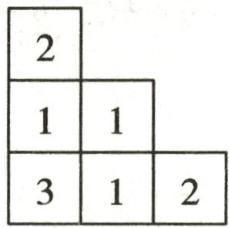  
从上面看  
第8题答图

(2)该几何体的体积为 $1 \times 1 \times 1 \times 10 = 10 \, (\text{cm}^{3})$ .   
(3) $S=2\times(6+6+6)+4=40(cm^{2})$ .

所以该几何体的表面积为 $40cm^{2}$ .

9.(1)10

(2) 解: 从前面看、从左面看和从上面看的平面图形如答图.

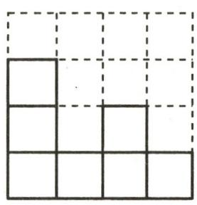  
从前面看

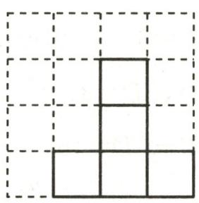

natural_image

Simple geometric diagram of four connected squares on a grid (no text or symbols)

从左面看

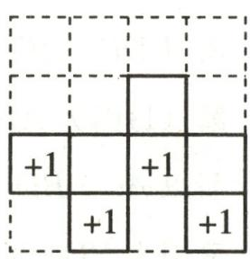  
从上面看  
第9题答图

因此从前面看到的图形的面积为 $2 \times 2 \times 7 = 28 \, (\text{cm}^{2})$ ,

从左面看到的图形的面积为 $2 \times 2 \times 5 = 20 \, (\text{cm}^{2})$ ,

从上面看到的图形的面积为 $2 \times 2 \times 7 = 28 \, (\text{cm}^{2})$ ,

所以该几何体的表面积为 $(28+20+28)\times2+2\times2\times4=$ $168(\mathrm{cm}^{2})$ .

(3)5

# 作业 44 立体图形与平面图形(3)

1. D  2. C  3. A  4. ①②

5. 解: ①正方体 ②圆柱 ③长方体 ④三棱柱

6. D 7.800 8.0

9.(1)解:如答图所示.

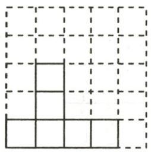  
从前面看

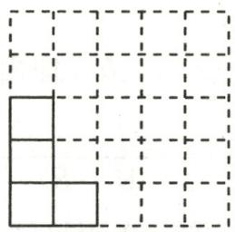  
从左面看

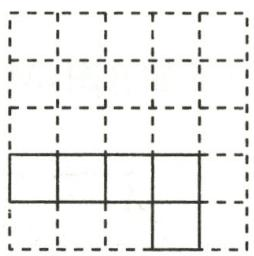  
从上面看  
第9题答图

(2)6

10. 解: (1) 总共 12 条棱, 其中有 4 条未剪开, 故阿中共剪开了 8 条棱.

(2)有4种粘贴方法.如答图.

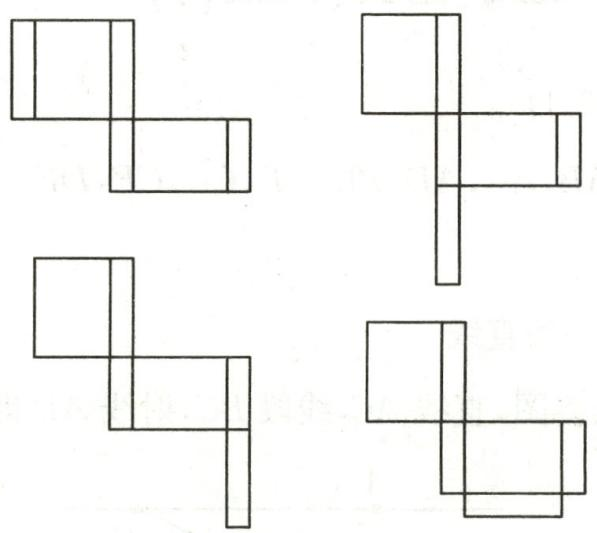

natural_image

Abstract geometric line drawing composed of interconnected squares (no text or symbols)

第10题答图

(3)设长方体的高为 $x\mathrm{cm}$ , 则宽为 $(4 - x)\mathrm{cm}$ , 长为 $[7 - (4 - x)] = (3 + x)\mathrm{cm}$ .

根据题意,得 $4+(3+x)=8$ , 解得 x=1,

故这个长方体纸盒的体积为 $(3+1)\times(4-1)\times1=$ $12(\mathrm{cm}^{3})$ .

# 作业 45 点、线、面、体

1. A 
2. A 
3. A

4. 解: (1) 柱体有①③④⑤⑦. 锥体有②. 球体有⑥.

(2)组成的面有曲面的是②⑥⑦，

组成的面全是平面的是①③④⑤.

5. A 6. B 7. 线动成面 $8.12\pi$ 或 $16\pi$

9. 解: (1) 几何体简图如答图所示(单位: cm).

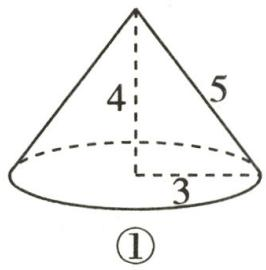

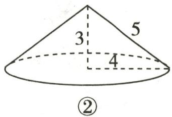

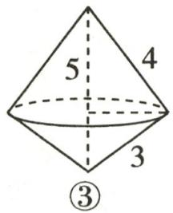  
第9题答图

(2)如答图①,以4cm长的边所在直线为轴,体积为

$$
\frac {1}{3} \times \pi \times 3 ^ {2} \times 4 = 1 2 \pi (\mathrm{cm} ^ {3});
$$

如答图②,以 3cm 长的边所在直线为轴,体积为

$$
\frac {1}{3} \times \pi \times 4 ^ {2} \times 3 = 1 6 \pi (\mathrm{cm} ^ {3});
$$

如答图③,以 5cm 长的边所在直线为轴,体积为

$$
\frac {1}{3} \times \pi \times \left(\frac {1 2}{5}\right) ^ {2} \times 5 = 9. 6 \pi (\mathrm{cm} ^ {3}).
$$

10.(1)圆柱 面动成体

(2) 解: 方案一: $\pi \times 3^{2} \times 4 = 36\pi \, (\text{cm}^{3})$ ,

方案二： $\pi \times 2^{2}\times 6 = 24\pi (\mathrm{cm}^{3})$

因为 $36\pi > 24\pi$

所以按方案一得到的几何体的体积较大.

# 作业 46 直线、射线、线段(1)

1. B 2. B 3. D

4.8 线段 $AB, AC, AD, BD, BE, CD, CE, DE$ 射线 $AB$ 直线 $AB$

5. 两点确定一条直线

6. 解: (1) 如答图, 直线 AC, 线段 BC, 射线 AB 即为所求.

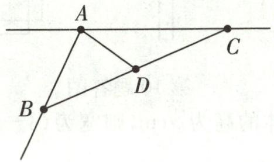

text_image

A
B
D
C

第6题答图

(2)如答图,线段AD即为所求.

(3)答图中线段的条数为6.

7.D

8.(1)上 DC 和 AF (2)外 AE BC

(3)3 直线 $AC, BC, DC$

9. 解: (1) 两站之间的往返车票各一种, 即两种, 则 6 个站点的车票共有 $6 \times 5 = 30$ (种).

(2)n个站点需要 $n(n-1)$ 种不同的车票.

10.(1)1 3 6 画一画如答图所示.

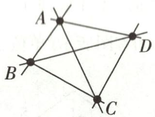  
第10题答图

(2)10 $\frac{n(n - 1)}{2}$ (3)780

# 作业 47 直线、射线、线段(2)

1. A 2. C 3. D

4.(1)AB DE 等量代换

(2)AB CD 等量代换

(3)CD 3cm 等量代换

5. 解: 如答图, 作线段 AB = a, BC = b, 则线段 AC 的长等于 $a + b$ .

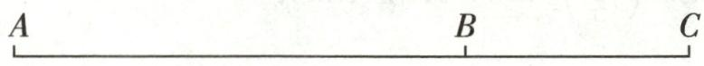  
第5题答图

6.(1)6

(2) 解: 因为 M, N 分别是线段 AC, DB 的中点,

所以 $AM=MC=\frac{1}{2}AC, DN=NB=\frac{1}{2}DB,$

所以 $MN = MC + CD + DN = \frac{1}{2} AC + CD + \frac{1}{2} DB =$

$$
\frac {1}{2} (A C + C D + D B) + \frac {1}{2} C D = \frac {1}{2} A B + \frac {1}{2} C D = \frac {1}{2} \times 7 +
$$

$$
\frac {1}{2} = 4.
$$

7.C 8.3 9.4

10. 解: 因为 $BE=\frac{1}{5}AC=3cm$ ,

所以 AC=5BE=15cm.

因为 E 是 BC 的中点，

所以 BC=2BE=6cm,

则 AB=AC-BC=15-6=9(cm)，

又因为 D 是 AB 的三等分点(点 D 靠近点 A),

所以 $BD=\frac{2}{3}AB=6cm,$

所以 $DE=BD+BE=6+3=9$ (cm).

11. 解: (1) 因为 AB=24, CD=8,

所以 $AC + BD = AB - CD = 16$ ,

又因为 BD=3AC,

所以 4AC=16, 即 AC=4.

(2) 因为 $DN=\frac{1}{3}AD=\frac{1}{3}(AC+CD)=\frac{1}{3}\times(4+8)=4$ ,

又因为 M 为 AC 的中点, 所以 $AM = CM = \frac{1}{2} AC = 2$ .

所以 $MN=MC+CD+DN$

$$
\begin{array}{l} = 2 + 8 + 4 \\ = 1 4. \\ \end{array}
$$

12. 解: (1) 因为 M, N 分别是线段 AC, BC 的中点,

所以 $MC=\frac{1}{2}AC, CN=\frac{1}{2}BC,$

所以 $MN = MC + CN = \frac{1}{2} AC + \frac{1}{2} BC = \frac{1}{2}\times 4 + \frac{1}{2}\times 6$

$$
= 5 (\mathrm{cm}),
$$

所以线段 MN 的长为 5cm.

(2) $MN=\frac{1}{2}(a+b).$   
(3)如答图, $MN=\frac{1}{2}(a-b)$ .理由如下:

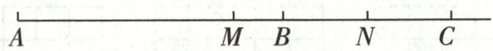  
第 12 题答图

$$
M N = M C - N C = \frac {1}{2} A C - \frac {1}{2} B C = \frac {1}{2} a - \frac {1}{2} b = \frac {1}{2} (a - b).
$$

# 作业 48 直线、射线、线段(3)

1. A 2. D 3. D

4. 解: 设 CD = x, 因为 EB = 3, E 为线段 BD 的中点,

所以 $BD = 2EB = 6$

因为 C 为线段 AB 的中点，

所以 $AC=\frac{1}{2}AB=10.$

因为 $AC + CD + DB = AB$ ,

即 $10 + x + 6 = 20$ ，解得 x = 4。

所以线段 $CD$ 的长为4.

5. 解: (1) $\because AB=20, BC=15,$

$$
\therefore A C = A B - B C = 2 0 - 1 5 = 5.
$$

又∵M是线段AC的中点，

$$
\therefore A M = \frac {1}{2} A C = \frac {1}{2} \times 5 = \frac {5}{2},
$$

即线段 AM 的长是 $\frac{5}{2}$ .

(2) $\because BC=15,CN:NB=2:3,$

$$
\therefore C N = \frac {2}{5} B C = \frac {2}{5} \times 1 5 = 6.
$$

又∵MC=AM= $\frac{5}{2}$ ,

$$
\therefore M N = M C + C N = \frac {1 7}{2},
$$

即线段 $MN$ 的长是 $\frac{17}{2}$ .

6.C 7.C 8.100 9.12

10. 解: (1) 因为线段 AB = 24, C 是线段 AB 的中点,

所以 $AC=BC=\frac{1}{2}AB=12.$

因为 $CD=\frac{1}{3}BD,$

所以 $CD=\frac{1}{4}BC=\frac{1}{4}\times12=3.$

(2) 因为点 D 在线段 AB 上, AB = 21a, AD : BD = 3 : 4,

所以 AD=9a, BD=12a.

因为 AB=21a, AC=2BC,

所以 AC=14a, BC=7a,

所以 $CD = AC - AD = 14a - 9a = 5a.$

故线段 $CD$ 的长度为 $5a$ .

11. (1) 10

(2)解:存在.

依题意得:AP=2xcm,BQ=xcm.

由(1)可知:AC=BC=10cm.

分三种情况讨论：

(i) 当 C 为 PQ 的中点时, PC = QC, 如答图①.

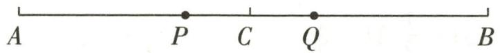  
第11题答图①

因为 $PC = AC - AP = (10 - 2x) \, \text{cm}, QC = BC - BQ = (10 - x) \, \text{cm}$ ,

所以 10-2x=10-x,

解得: x=0 (不合题意, 舍去).

(ii) 当 P 为 CQ 的中点时, PC = PQ, 如答图②.

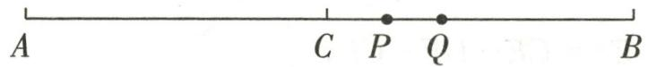  
第 11 题答图②

因为 PC=AP-AC=(2x-10)cm,

所以 BP=AB-AP=(20-2x)cm,

所以 PQ=BP-BQ=20-2x-x=(20-3x)cm,

所以 2x-10=20-3x，

解得:x=6.

(iii)当 $Q$ 为 $PC$ 的中点时， $PC = 2CQ$ ，如答图③.

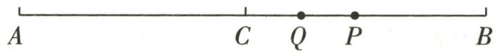  
第 11 题答图③

因为 $PC = AP - AC = (2x - 10) \, \text{cm}, CQ = BC - BQ = (10 - x) \, \text{cm}$ ,

所以 2x-10=2(10-x)，

解得:x=7.5.

综上所述: 当 x=6 或 7.5 时, C, P, Q 三点中, 有一点恰为另外两点所连线段的中点.

# 专题11 与线段中点有关的计算

1. 解: 因为 AD=7, BD=5,

所以 $AB=AD+BD=12.$

因为 C 为线段 AB 的中点，

所以 $BC=\frac{1}{2}AB=6.$

因为 $CD = BC - BD$

所以 $CD = 6 - 5 = 1$

2. 解: 因为 $BD=\frac{1}{3}AB$ ,

所以 $AD=\frac{4}{3}AB,$

所以 $AB=\frac{3}{4}AD=\frac{3}{4}\times8=6$ ,

所以 $BD = AD - AB = 8 - 6 = 2.$

因为 C 为线段 AB 的中点，

所以 $CB=\frac{1}{2}AB=3$ ,

所以 $CD=CB+BD=3+2=5.$

3. 解: 因为 E 是线段 AC 的中点, F 是线段 BD 的中点,

所以 $AE=CE=\frac{1}{2}AC, BF=DF=\frac{1}{2}BD.$

因为 AB=12cm, CD=2cm,

所以 $CE+DF=\frac{1}{2}(AC+BD)=\frac{1}{2}(AB-CD)=5(\text{cm})$ .

因为 $EF=CE+DF+CD,$

所以 EF=7cm.

4. 解: (1) 由线段中点的性质, 得 $AD = \frac{1}{2} AC = 6cm$ .

(2)由线段的和差,得 $AB=AC+BC=12+8=20(\text{cm})$ ,

由线段中点的性质, 得 $AE=\frac{1}{2}AB=10cm$ ,

由线段的和差, 得 DE = AE - AD = 10 - 6 = 4(cm).

(3) 当点 M 在点 B 的右侧时, $AM = AB + MB = 20 + 6 = 26 \, (\text{cm})$ ;

当点 M 在点 B 的左侧时, AM = AB - MB = 20 - 6 = 14(cm).

所以 AM 的长度为 26cm 或 14cm.

5.(1)6

(2)①>

②解: 因为 AD=20, BC=16,

所以 $AB + CD = AD - BC = 4.$

因为 M 是线段 AB 的中点, N 是线段 CD 的中点,

所以 $BM=\frac{1}{2}AB, CN=\frac{1}{2}CD,$

所以 $BM + CN = \frac{1}{2}(AB + CD) = \frac{1}{2} \times 4 = 2,$

所以 $MN = BM + CN + BC = 2 + 16 = 18.$

6. 解: ① 当点 C 在线段 AB 上时, BC = AB - AC = 8 - 4 = 4(cm).

因为 M 是线段 BC 的中点，

所以 $BM=\frac{1}{2}BC=\frac{1}{2}\times4=2(\text{cm})$ .

②当点 C 在线段 AB 的反向延长线上时, $BC = AB + AC = 8 + 4 = 12 \, (\text{cm})$ ,

因为 M 是线段 BC 的中点，

所以 $BM=\frac{1}{2}BC=\frac{1}{2}\times12=6(\text{cm})$ .

综上,线段 BM 的长为 2cm 或 6cm.

7. 解: ① 当点 C 在线段 AB 上时, 如答图①.

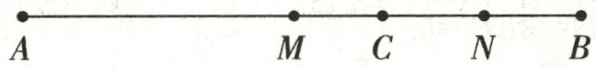

# 第7题答图①

因为 M 为线段 AB 的中点, N 为线段 BC 的中点,

所以 $BM=\frac{1}{2}AB, BN=\frac{1}{2}BC,$

因为 AB=9cm, BC=3cm,

所以 BM=4.5cm, BN=1.5cm,

所以 MN=BM-BN=3(cm).

②点 C 在线段 AB 的延长线上时, 如答图②.

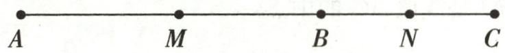

# 第 7 题答图②

因为 M 为线段 AB 的中点, N 为线段 BC 的中点,

所以 $BM=\frac{1}{2}AB, BN=\frac{1}{2}BC,$

因为 AB=9cm, BC=3cm,

所以 BM=4.5cm, BN=1.5cm,

所以 $MN=BM+BN=6(cm)$ .

综上,线段 MN 的长为 3cm 或 6cm.

8. 解: (1) 因为 AB=10, BC=6,

所以 $AC=AB+BC=16.$

因为 D 是线段 AC 的中点，

所以 $AD=\frac{1}{2}AC=8$ ,

所以 BD=AB-AD=10-8=2.

(2)当点 D 在点 B 的右侧时,如答图①, $AD=AB+BD=10+4=14$ .

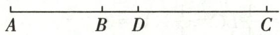

# 第8题答图①

因为 D 是线段 AC 的中点，

所以 AD=CD=14，

所以 $BC=BD+CD=4+14=18.$

当点 D 在点 B 的左侧时, 如答图②, AD = AB - BD = 10 - 4 = 6.

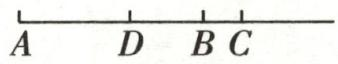

# 第8题答图②

因为 D 是线段 AC 的中点，

所以 AD=CD=6，

所以 BC=CD-BD=6-4=2.

综上所述,线段 BC 的长为 18 或 2.

# 周练 3 (测试范围:6.1-6.2)

1. B 2. C 3. C 4. A 5. 点动成线

6. 两点之间, 线段最短 7.3 8.7.5 或 15

9. 解: (1)(2)(3)(4) 如答图所示.

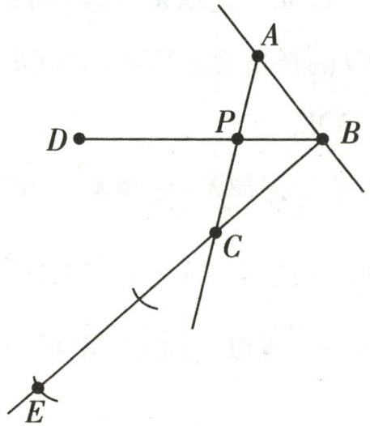

text_image

A
D
P
B
C
E

第9题答图

10. 解: (1) 设 EC 的长为 x.

因为 EC:CB=1:4,

所以 BC=4x，

又因为 $BE=BC+CE,$

所以 BE=5x.

又因为 E 为线段 AB 的中点，

所以 $AE=BE=\frac{1}{2}AB,$

所以 AE=5x.

又因为 $AC = AE + EC, AC = 12cm,$

所以 6x=12, 解得: x=2,

所以 AB=10x=20cm.

(2)在(1)的条件下,因为F为线段CB的中点,

所以 $CF=\frac{1}{2}BC=2x$ ,

又因为 $EF = EC + CF$ ,

所以 EF=3x=6cm.

11.(1)3 6

(2) 解: 因为 AP = t, AQ = 4 + 2t, PQ = AQ - AP,

$PQ=\frac{1}{2}AB$ ,所以 $(4+2t)-t=\frac{1}{2}\times12$ ,

解得 t=2.

所以当运动时间为 2s 时, $PQ = \frac{1}{2} AB$ .

(3) 解: 因为 AP=t, BQ=|8-2t|, BQ=AP,

所以 $t = |8 - 2t|$ ，解得 $t = 8$ 或 $t = \frac{8}{3}$ .

所以当运动时间为 8s 或 $\frac{8}{3}$ s 时, BQ = AP.

# 作业 49 角的概念

1. C 2. C 3. A 4. B 5. 北偏西 $60^{\circ}$ 或西偏北 $30^{\circ}$

6. 解: (1) 能用一个字母表示的角是 $\angle A, \angle C$ .

(2)以点 B 为顶点的角有 $\angle ABD, \angle ABC, \angle CBD.$

(3)图中共有9个角.

7. A 
8. B 
9. C

10. 解: (1) $24.29^{\circ}=24^{\circ}17'24''$ ; (2) $36^{\circ}40'30''=36.675^{\circ}$ .

11. 解: 温哥华: $30^{\circ} \times 5 = 150^{\circ}$ , 纽约: $30^{\circ} \times 4 = 120^{\circ}$ ,

伦敦: $30^{\circ}\times1=30^{\circ}$ ，莫斯科: $30^{\circ}\times4=120^{\circ}$

北京: $30^{\circ}\times3=90^{\circ}$ ，东京: $30^{\circ}\times2=60^{\circ}$ .

12.3 6 10 $\frac{(n + 1)(n + 2)}{2}$

# 作业 50 角的比较与运算

1.C 2.C 3.A 4.C

5.(1) $127^{\circ}42'$ (2) $19^{\circ}59'$ (3) $40^{\circ}$ (4) $25^{\circ}2'57''$

6. 解: (1) 原式 $=40^{\circ}26' + 5^{\circ}5'5'' = 45^{\circ}31'5''$ .

(2) 原式 $= 41^{\circ}39' - 32^{\circ}5'31'' = 9^{\circ}33'29''$ .

7. 解: 因为 OC 平分 $\angle AOB$ , 所以 $\angle AOC = \frac{1}{2} \angle AOB = 75^{\circ}$ ,

所以 $\angle COD=\angle AOD-\angle AOC=90^{\circ}-75^{\circ}=15^{\circ}$ .

8. C 9. 北偏东 $70^{\circ}$ 或东偏北 $20^{\circ}$ 10.24

11. 解: 因为 $\angle APB$ 是平角, 所以 $\angle APB = 180^{\circ}$ .

又因为 $PC, PD$ 为 $\angle APB$ 的三等分线，

所以 $\angle APD = \angle DPC = \angle BPC = \frac{1}{3}\angle APB = 60^{\circ}.$

又因为 PM, PN 分别为 $\angle BPC, \angle APD$ 的平分线，

所以 $\angle MPC = \frac{1}{2}\angle BPC = 30^{\circ},\angle NPD = \frac{1}{2}\angle APD =$ $30^{\circ}$

所以 $\angle MPN = \angle MPC + \angle CPD + \angle NPD = 30^{\circ} + 60^{\circ}+$ $30^{\circ} = 120^{\circ}$

12. 解: (1) $OC \perp OD$ , 理由如下:

$$
\begin{array}{l} \angle A O C + \angle C O D + \angle D O B = 1 8 0 ^ {\circ}, \angle A O C = 3 0 ^ {\circ}, \\ \angle B O D = 6 0 ^ {\circ}, \end{array}
$$

所以 $\angle COD=90^{\circ}$ ,则 $OC\perp OD$ .

(2) 因为 OM 平分 $\angle AOC, \angle AOC = 30^{\circ}$ ,

所以 $\angle COM = \frac{1}{2}\angle AOC = \frac{1}{2}\times 30^{\circ} = 15^{\circ}.$

同理, $\angle DON=30^{\circ}$ .

因为 $\angle MON = \angle COM + \angle COD + \angle DON, \angle COD = 90^{\circ}$ ,

所以 $\angle MON = 15^{\circ} + 90^{\circ} + 30^{\circ} = 135^{\circ}$

13. 解: (1) 因为 $\angle BCE = 90^{\circ}, \angle ACB = 150^{\circ}$ ,

所以 $\angle ACE=\angle ACB-\angle BCE=150^{\circ}-90^{\circ}=60^{\circ}$ .

(2) $\alpha=\beta$ , 理由如下:

因为 $\angle BCE=\angle ACD=90^{\circ}$ ,

所以 $\angle BCE - \angle DCE = \angle ACD - \angle DCE,$

所以 $\angle BCD=\angle ACE,$

所以 $\alpha=\beta.$

(3) $\angle ACB + \angle DCE = 180^{\circ}.$

# 作业51 余角和补角

1. B 2. C 3. A

4.(1)= 同角的余角相等

(2)= 等角的补角相等

5. 解: (1) $\because \angle 1 = \angle 2, \angle 1 + \angle ADF = 180^{\circ}, \angle 2 + \angle BDE = 180^{\circ}, \therefore \angle ADF = \angle BDE.$

$$
\because \angle E D C = \angle C D F = 9 0 ^ {\circ},
$$

$$
\therefore \angle 1 + \angle A D C = 9 0 ^ {\circ}, \angle 2 + \angle B D C = 9 0 ^ {\circ}.
$$

$$
\because \angle 1 = \angle 2,
$$

$$
\therefore \angle A D C = \angle B D C.
$$

(2) $\because\angle EDC=\angle CDF=90^{\circ},\angle1=\angle2,$

∴互为余角的有∠1和∠ADC,∠1和∠BDC,∠2和∠ADC,∠2和∠BDC;

互为补角的有 $\angle 1$ 和 $\angle ADF, \angle 2$ 和 $\angle ADF, \angle EDC$ 和 $\angle CDF, \angle 2$ 和 $\angle EDB, \angle 1$ 和 $\angle EDB$ .

6. 解: 设 $\angle AOC = x^{\circ}$ .

因为 $\angle AOC=\frac{1}{5}\angle AOB,$

所以 $\angle AOB=5x^{\circ}$ ,

所以 $\angle BOC = \angle AOB - \angle AOC = 4x^{\circ}$

因为 OD 平分 $\angle BOC$ ,

所以 $\angle BOD = \angle COD = 2x^{\circ}$

因为 $\angle COD$ 与 $\angle AOC$ 互余，

所以 $2x + x = 90$ ，解得 x = 30，

所以 $\angle AOB=5\times30^{\circ}=150^{\circ}$ .

7. D 8. $20^{\circ}$ 或 $90^{\circ}$

9. 解: (1) 因为 $\angle BOC$ 与 $\angle BOD$ 互为余角,

所以 $\angle BOC+\angle BOD=90^{\circ}$ .

因为 $\angle BOC = 4\angle BOD$

所以 $\angle BOC=\frac{4}{5}\times90^{\circ}=72^{\circ}$ .

(2) 因为 $\angle AOC$ 与 $\angle BOC$ 互为补角，

所以 $\angle AOC+\angle BOC=180^{\circ}$ ,

所以 $\angle AOC=180^{\circ}-\angle BOC=180^{\circ}-72^{\circ}=108^{\circ}$ .

因为 OE 平分 $\angle AOC$ ,

所以 $\angle COE = \frac{1}{2}\angle AOC = \frac{1}{2}\times 108^{\circ} = 54^{\circ},$

所以 $\angle BOE = \angle COE + \angle BOC = 54^{\circ} + 72^{\circ} = 126^{\circ}$

10. 解: (1) $\angle AOD$ 的补角为 $\angle BOD, \angle COD; \angle BOE$ 的补角为 $\angle AOE, \angle COE.$

(2) 因为 $OD$ 平分 $\angle BOC, \angle BOC = 68^{\circ}$ , 所以 $\angle COD = \frac{1}{2} \angle BOC = \frac{1}{2} \times 68^{\circ} = 34^{\circ}$ .

因为 $\angle BOC=68^{\circ}$ , 所以 $\angle AOC=180^{\circ}-\angle BOC=180^{\circ}-68^{\circ}=112^{\circ}$ .

因为 OE 平分 $\angle AOC$ ，所以 $\angle EOC = \frac{1}{2} \angle AOC = \frac{1}{2} \times 112^{\circ} = 56^{\circ}$ .

(3) 因为 OD 平分 $\angle BOC, OE$ 平分 $\angle AOC,$

所以 $\angle COD = \frac{1}{2}\angle BOC,\angle EOC = \frac{1}{2}\angle AOC,$

所以 $\angle COD + \angle EOC = \frac{1}{2} (\angle BOC + \angle AOC) = \frac{1}{2} \times 180^{\circ} = 90^{\circ}$ .

11. 解: (1) 因为 $\angle AOC = 58^{\circ}, \angle AOB = 90^{\circ}$ ,

所以 $\angle AOD = 180^{\circ} - 58^{\circ} = 122^{\circ},\angle BOD = 180^{\circ} - 58^{\circ}-$ $90^{\circ} = 32^{\circ}.$

因为 OE 平分 $\angle AOD$ ,

所以 $\angle DOE = \frac{1}{2}\angle AOD = 61^{\circ},$

所以 $\angle BOE = \angle DOE - \angle BOD = 61^{\circ} - 32^{\circ} = 29^{\circ}$

(2) 因为 $\angle AOE = 2\angle BOD$ ,

所以设 $\angle BOD=\alpha,\angle AOE=2\alpha.$

因为 OE 平分 $\angle AOD$ ,

所以 $\angle AOD=2\angle AOE=4\alpha.$

因为 $\angle AOB=90^{\circ}$ ,

所以 $\alpha+4\alpha=90^{\circ}$ ，解得 $\alpha=18^{\circ}$ ，

所以 $\angle AOD = 4\alpha = 4\times 18^{\circ} = 72^{\circ}$

所以 $\angle AOC=180^{\circ}-72^{\circ}=108^{\circ}$ .

# 专题 12 与角平分线有关的计算与推理

1.(1)解:因为 $\angle COE=90^{\circ},\angle COF=57^{\circ}$ ,

所以 $\angle EOF = 90^{\circ} - 57^{\circ} = 33^{\circ}$

因为 OF 平分 $\angle AOE$ ,

所以 $\angle AOE=2\angle EOF=66^{\circ}$ ,

所以 $\angle BOE = 180^{\circ} - 66^{\circ} = 114^{\circ}$

(2) $2\alpha$

2.(1)60

(2) 解: 因为 $\angle1 + \angle BOE = 180^{\circ}, \angle1 = 30^{\circ}$ ,

所以 $\angle BOE = 180^{\circ} - \angle 1 = 180^{\circ} - 30^{\circ} = 150^{\circ}$

又因为 $\angle COE = 2\angle 2$

所以 $\angle BOE = 3\angle 2$

所以 $\angle 2 = \frac{1}{3}\angle BOE = \frac{1}{3}\times 150^{\circ} = 50^{\circ}.$

(3)解:因为OD平分 $\angle BOE,\angle BOE=150^{\circ}$ ,

所以 $\angle BOD = \frac{1}{2}\angle BOE = \frac{1}{2}\times 150^{\circ} = 75^{\circ},$

因为 $\angle 2 = 50^{\circ}$

所以 $\angle COD = \angle BOD - \angle 2 = 75^{\circ} - 50^{\circ} = 25^{\circ}$

3. 解: (1) 因为 OD, OE 分别是 $\angle AOC, \angle BOC$ 的平分线,

所以 $\angle 1 = \angle BOE = \frac{1}{2}\angle BOC = 36^{\circ}10^{\prime},$

$$
\angle 2 = \angle A O D = \frac {1}{2} \angle A O C = \frac {1}{2} (1 8 0 ^ {\circ} - \angle B O C) = \frac {1}{2} \times
$$

$(180^{\circ}-72^{\circ}20^{\prime})=53^{\circ}50^{\prime},$

所以 $\angle DOE = \angle 1 + \angle 2 = 36^{\circ}10' + 53^{\circ}50' = 90^{\circ}$

(2) 因为 $OD, OE$ 分别是 $\angle AOC, \angle BOC$ 的平分线，

所以 $\angle DOE = \frac{1}{2}\angle AOC + \frac{1}{2}\angle BOC = \frac{1}{2} (\angle AOC +$

$$
\angle B O C) = \frac {1}{2} \times 1 8 0 ^ {\circ} = 9 0 ^ {\circ}.
$$

4. 解: (1) ∵ OM 平分 ∠AOC, ON 平分 ∠BOD,

$$
\begin{array}{l} \therefore \angle C O M = \frac {1}{2} \angle A O C, \angle D O N = \frac {1}{2} \angle B O D. \\ \therefore \angle M O N = \angle C O M + \angle C O D + \angle D O N \\ = \frac {1}{2} (\angle A O C + \angle B O D) + \angle C O D \\ = \frac {1}{2} (\angle A O B - \angle C O D) + \angle C O D \\ = \frac {1}{2} (\angle A O B + \angle C O D). \\ \end{array}
$$

(2)∵OM平分∠AOD,ON平分∠BOC,

$$
\begin{array}{l} \therefore \angle D O M = \frac {1}{2} \angle A O D, \angle C O N = \frac {1}{2} \angle B O C. \\ \therefore \angle M O N = \angle D O M + \angle C O N - \angle C O D \\ = \frac {1}{2} (\angle A O D + \angle B O C) - \angle C O D \\ = \frac {1}{2} (\angle A O B + \angle C O D) - \angle C O D \\ = \frac {1}{2} (\angle A O B - \angle C O D). \\ \end{array}
$$

5. 解: (1) 相等. 理由如下:

∵∠AOC与∠AOB互补，

$$
\begin{array}{l} \therefore \angle A O C + \angle A O B = 1 8 0 ^ {\circ}, \\ \because \angle A O C + \angle C O D = 1 8 0 ^ {\circ}, \\ \therefore \angle C O D = \angle A O B. \\ \end{array}
$$

(2) $\because\angle AOB$ 与 $\angle AOC$ 互补, $\angle AOB=30^{\circ}$ ,

$$
\therefore \angle A O C = 1 8 0 ^ {\circ} - 3 0 ^ {\circ} = 1 5 0 ^ {\circ}.
$$

∵OM为∠AOC的平分线，

$$
\therefore \angle A O M = 7 5 ^ {\circ}.
$$

∵ON为∠AOB的平分线，

$$
\therefore \angle A O N = 1 5 ^ {\circ},
$$

$$
\therefore \angle M O N = \angle A O M - \angle A O N = 7 5 ^ {\circ} - 1 5 ^ {\circ} = 6 0 ^ {\circ}.
$$

(3) $\because\angle MON=\alpha,$

$$
\begin{array}{l} \therefore \angle A O M - \angle A O N = \alpha , \\ \therefore \frac {1}{2} \angle A O C - \frac {1}{2} \angle A O B = \alpha , \\ \therefore \angle A O C - \angle A O B = 2 \alpha , \\ \therefore \angle A O C - (1 8 0 ^ {\circ} - \angle A O C) = 2 \alpha , \\ \therefore 2 \angle A O C = 1 8 0 ^ {\circ} + 2 \alpha , \\ \therefore \angle A O C = 9 0 ^ {\circ} + \alpha . \\ \end{array}
$$

6.(1) $30^{\circ}$ 或 $60^{\circ}$

(2)解:①当OA在∠BOP的内部时,如答图①.

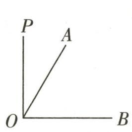  
①

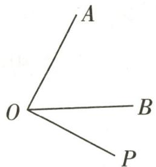  
②   
第6题答图

根据“3等分线”的定义可得 $\angle AOP = \frac{1}{2}\angle AOB = 30^{\circ}$ 或 $\angle AOP = 2\angle AOB = 120^{\circ}.$

②当 OB 在 $\angle AOP$ 的内部时, 如答图②.

根据“3等分线”的定义可得 $\angle BOP = \frac{1}{2}\angle AOB = 30^{\circ}$ 或 $\angle BOP = 2\angle AOB = 120^{\circ},$

此时 $\angle AOP = 30^{\circ} + 60^{\circ} = 90^{\circ}$ 或 $\angle AOP = 120^{\circ} + 60^{\circ} =$ $180^{\circ}$

综上所述， $\angle AOP$ 的度数是 $30^{\circ}$ 或 $90^{\circ}$ 或 $120^{\circ}$ 或 $180^{\circ}$ .

# 专题 13 综合与实践

1. 解: (1) 设正方形的边长为 x 米.

由题意得, $2x+3.14x=257$ ,解得x=50,

所以中间正方形的边长为 50 米.

(2)两侧环形的总面积为 $3.14 \times (50 \div 2)^{2} - 3.14 \times (50 \div 2 - 5)^{2} = 706.5$ (平方米)，

两条直道的总面积为 $5 \times 50 \times 2 = 500$ (平方米)，

所以一共需要的钱数为 $(500+706.5)\times80=96520$ 元.

2. 解: (1) 由题意得: 415 - 400 = 15 (米),

$$
8 7 \times 2 + 2 \pi (3 6 + 1. 2 \times 7) \approx 4 5 3 (\text { 米 }).
$$

答:第三圈半圆形弯道长比第一圈半圆形弯道长多15米, 小王计算的第八圈长约为453米.

(2)设小王的平均速度为 x 米/秒,则邓教练的平均速度为 2x 米/秒.

根据题意, 得 $20(x+2x)=400+\frac{15}{2}$ ,

解得 $x=\frac{163}{24}$ ，则 $2x=\frac{163}{12}$ .

答: 小王的平均速度为 $\frac{163}{24}$ 米/秒, 邓教练的平均速度为 $\frac{163}{12}$ 米/秒.

# 小结与思考

1. B  2. B  3. D  4. B

5.105° 6.40° 7.110 8.18cm

9. 解: (1)(2)(3) 如答图所示.

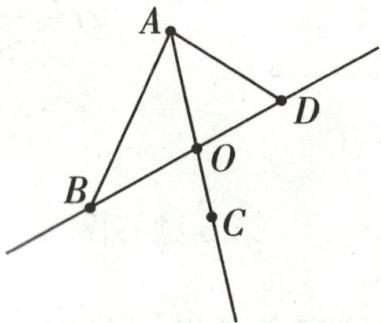

text_image

Geometric diagram with labeled points A, B, C, D, and O on intersecting lines and triangles

第 9 题答图

(4) $AB+AD>BD$ 两点之间,线段最短

10. 解: (1) 因为线段 AB=18, C 是线段 AB 的中点,

所以 $AC=BC=\frac{1}{2}AB=9.$

因为 BD=2CD,

所以 $CD=\frac{1}{3}BC=\frac{1}{3}\times9=3$ ,

所以 $AD=AC+CD=9+3=12.$

(2) 因为 AD:BD=3:2,

所以设 AD=3x, BD=2x,

所以 AB=5x，

所以 AC=AD-CD=3x-2, BC=BD+CD=2x+2.

因为 C 是线段 AB 的中点，

所以 AC=BC,

所以 $3x-2=2x+2$ ，解得 x=4，

所以 $AB=5\times4=20.$

11.(1)7500

(2)解:由题意知,无盖长方体盒子的长为 $(60-2x)$ cm,
宽为 $(40-2x)$ cm,则

$60-2x=2(40-2x)$ ，解得 x=10，

所以 60-2x=40,40-2x=20.

$40 \times 20 \times 10 = 8000 \, (\text{cm}^3)$ .

答:该盒子的体积为 $8000 \, cm^{3}$ .

12.(1)解:因为 $\angle AOD=\alpha=150^{\circ}$ ,

所以 $\angle BOD=180^{\circ}-\angle AOD=30^{\circ}$ .

因为 OD 平分 $\angle BOC$ ,

所以 $\angle DOC=\angle BOD=30^{\circ}$ ,

所以 $\angle AOC = \angle AOD - \angle DOC = 150^{\circ} - 30^{\circ} = 120^{\circ}$

(2)证明:因为在 $\angle AOD$ 的内部画射线 $OE$ , $\angle BOE=90^{\circ}$ , 所以 $\angle BOD+\angle DOE=90^{\circ}$ .

因为 OD 平分 $\angle BOC$ ,

所以 $\angle DOC=\angle BOD,$

所以 $\angle DOC+\angle DOE=90^{\circ}$ ,

所以∠DOE与∠DOC互余.

(3)解:当射线 OE 在 $\angle AOD$ 的内部时,如答图①.

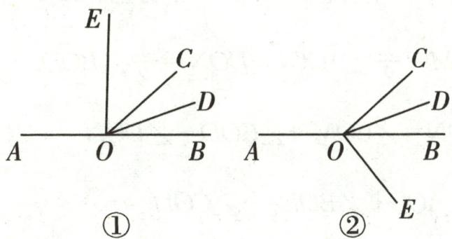

text_image

E
C
D
A O B
①
A O B
②
C
D
E

第12题答图

因为 OD 平分 $\angle BOC$ ，所以 $\angle DOC = \angle BOD$ 。

因为 $\angle DOE+\angle DOC=90^{\circ}$ ,

所以 $\angle DOE+\angle BOD=90^{\circ}$ ，所以 $\angle BOE=90^{\circ}$

当射线 OE 在／AOD 的外部时, 如答图②.

因为 $/AOD = \alpha$ , 所以 $/BOD = 180^\circ - \alpha$ .

因为射线 OD 平分 $\angle BOC$ ,

所以 $\angle BOC=2\angle BOD=2(180^{\circ}-\alpha)$ .

因为 $\angle DOE+\angle DOC=90^{\circ}$ , 即 $\angle EOC=90^{\circ}$ ,

所以 $\angle BOE=90^{\circ}-2(180^{\circ}-\alpha)=2\alpha-270^{\circ}$ .

所以/BOE=90°或/BOE=2α-270°.

# 检测卷

# 第一章检测卷

1. B 2. B 3. A 4. C 5. B 6. D 7. B 8. C 9. C

10. A

11.2025 12.> 13.4

14.2(答案不唯一)

15.2 16.6 17.1或-11

18.1752或1753

19. 解: (1) 正数集合: $\left\{\frac{22}{7}, 2023, +1.88, \cdots\right\}$ ;

(2)负数集合： $\left\{-4,-\left|-\frac{4}{3}\right|,-3.14,-(+5),\cdots\right\}$ ;

(3)整数集合: $\{-4,0,2023,-(+5),\cdots\}$ .

20. 解: 如答图所示.

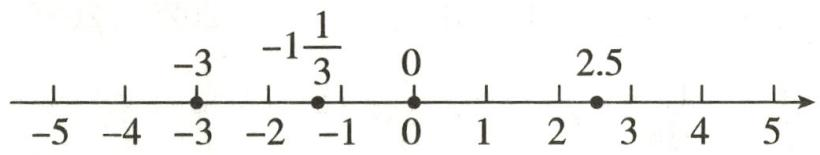

text_image

-5
-4
-3
-3
-2
-1
-1 1/3
-1
0
0
1
2
2.5
3
4
5

第20题答图

故-3<-1 $\frac{1}{3}$ <0<2.5.

21. 解: 因为 $\left|a\right|=2,\left|b\right|=3$ , 所以 $a=\pm2, b=\pm3$ .

又因为 b<a，所以 a=2, b=-3 或 a=-2, b=-3.

22. 解: 最接近标准质量的球是④号. 理由如下:

因为各数的绝对值分别为 10,8,12,5,

且 5<8<10<12，

所以最接近标准质量的球是④号.

23.(1)2

(2)①-3

②解:由题意可得,A,B两点距离对称点的距离为9÷2=4.5,

由表示-2的点与表示4的点重合可知,对称点是表示1的点,

又因为点 A 在点 B 的左侧，

所以点 A 表示的数为 -3.5，点 B 表示的数为 5.5。

24. 解: (1) 如答图所示.

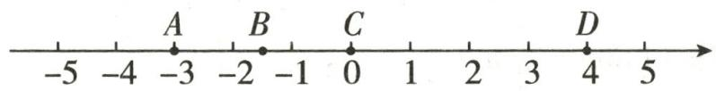

text_image

-5
-4
A
-3
B
-2
-1
C
0
1
2
3
D
4
5

第24题答图

由数轴可得 $-3 < -1\frac{1}{2} < 0 < 4.$

(2) $B, C$ 两点间的距离为 $\left| -1\frac{1}{2} \right| = \frac{3}{2}, A, D$ 两点间的

距离为 $3+4=7$ .

(3)因为把数轴的原点取在点 B 处，

也就是在原数轴上将各点向右平移 $1\frac{1}{2}$ 个单位长度，所以平移后点 $A$ 表示的数是 $-1\frac{1}{2}$ ，点 $B$ 表示的数是0，点 $C$ 表示的数是 $1\frac{1}{2}$ ，点 $D$ 表示的数是 $5\frac{1}{2}$ .

# 第二章检测卷

1. B 2. B 3. A 4. B 5. D 6. B 7. C 8. C 9. D

10. C

11. $-\frac{3}{4}$ 12.3.14 13.0 14.2或-6 15.-10

16.4 17.-80 120 18.3.5或6.5

19. 解: (1)(+8)+(-10)-(-2)-3

$$
\begin{array}{l} = 8 - 1 0 + 2 - 3 \\ = - 3. \\ \end{array}
$$

(2) $-6\div\frac{2}{3}\times\left(-\frac{5}{9}\right)$

$$
\begin{array}{l} = 6 \times \frac {3}{2} \times \frac {5}{9} \\ = 5. \\ \end{array}
$$

(3) $24\times\left(\frac{2}{3}-\frac{3}{4}-\frac{1}{6}\right)$

$$
\begin{array}{l} = 2 4 \times \frac {2}{3} - 2 4 \times \frac {3}{4} - 2 4 \times \frac {1}{6} \\ = 1 6 - 1 8 - 4 \\ = - 6. \\ \end{array}
$$

(4) $(-2)^{3}+(4-7)\div3+5$

$$
\begin{array}{l} = (- 8) + (- 3) \div 3 + 5 \\ = (- 8) + (- 1) + 5 \\ = - 4. \\ \end{array}
$$

20. 解: 因为 a, b 互为倒数, c, d 互为相反数, $|m| = 3$ ,

所以 $ab = 1, c + d = 0, m = \pm 3,$

所以当 $m = 3$ 时， $\frac{ab}{3} + m + \frac{c + d}{4}$

$$
\begin{array}{l} = \frac {1}{3} + 3 + \frac {0}{4} \\ = \frac {1}{3} + 3 + 0 \\ = \frac {1 0}{3}; \\ \end{array}
$$

当 $m = -3$ 时， $\frac{ab}{3} + m + \frac{c + d}{4}$

$$
= \frac {1}{3} + (- 3) + \frac {0}{4}
$$

$$
\begin{array}{l} = \frac {1}{3} + (- 3) + 0 \\ = - \frac {8}{3}. \\ \end{array}
$$

综上可得, $\frac{ab}{3}+m+\frac{c+d}{4}$ 的值是 $\frac{10}{3}$ 或 $-\frac{8}{3}$ .

21. 解: (1) 根据题中的新定义, 得

原式= $2 \times 5 + 3 \times 6 = 28$ .

(2)根据题中的新定义,得

原式=4⊙(2×5+3×3)

$$
\begin{array}{l} = 4 \odot 1 9 \\ = 2 \times 4 + 3 \times 1 9 \\ = 8 + 5 7 \\ = 6 5. \\ \end{array}
$$

22. 解: (1) 因为 $\left|x\right|=3, \left|y\right|=7$ ,

所以 $x=\pm3, y=\pm7.$

因为 $xy < 0$

所以 x=3, y=-7 或 x=-3, y=7.

当 x=3, y=-7 时， $x+y=3+(-7)=-4$ ;

当 x=-3, y=7 时， $x+y=-3+7=4$ .

综上可知， $x+y$ 的值为 -4 或 4.

(2) 因为 $\left|x-y\right|=x-y$ ,

所以 x-y 为非负数，即 $x=\pm3, y=-7$ .

当 x=3, y=-7 时， $2x+y=2\times3+(-7)=-1$ ;

当 $x = -3, y = -7$ 时， $2x + y = 2 \times (-3) + (-7) = -13$ .

综上可知, $2x+y$ 的值为-1或-13.

23. 解: (1) $17 + (-9) + 7 + (-15) + (-3) + 11 + (-6) + (-8) + 5 + 16 = 15$ (千米).

答:养护小组最后到达的地方在出发点的北方,距出发点15千米.

(2)第一次17千米，

第二次 $17+(-9)=8$ (千米)，

第三次 $8+7=15$ (千米)，

第四次 $15+(-15)=0$ (千米),

第五次 $0+(-3)=-3$ (千米),

第六次 $-3+11=8$ （千米），

第七次 $8+(-6)=2$ (千米),

第八次 $2+(-8)=-6$ (千米)，

第九次 $-6+5=-1$ （千米），

第十次 $-1+16=15$ (千米).

答:最远处距离出发点 17 千米.

(3) $(17+|-9|+7+|-15|+|-3|+11+|-6|+$

$$
\vert - 8 \vert + 5 + 1 6) \times 0. 5 = 9 7 \times 0. 5 = 4 8. 5 (\text { 升 }).
$$

答: 这天汽车共耗油 48.5 升.

24.(1)①21-7 ② $\frac{7}{17}-\frac{7}{18}$

(2) 解: $\left|\frac{1}{5}-\frac{150}{557}\right|+\left|\frac{150}{557}-\frac{1}{2}\right|-\left|-\frac{1}{2}\right|$

$$
\begin{array}{l} = \frac {1 5 0}{5 5 7} - \frac {1}{5} + \frac {1}{2} - \frac {1 5 0}{5 5 7} - \frac {1}{2} \\ = \left(\frac {1 5 0}{5 5 7} - \frac {1 5 0}{5 5 7}\right) + \left(\frac {1}{2} - \frac {1}{2}\right) - \frac {1}{5} \\ = - \frac {1}{5}. \\ \end{array}
$$

(3) 解: $\left|\frac{1}{3}-\frac{1}{2}\right|+\left|\frac{1}{4}-\frac{1}{3}\right|+\left|\frac{1}{5}-\frac{1}{4}\right|+\cdots+$

$$
\left| \frac {1}{2 0 2 6} - \frac {1}{2 0 2 5} \right|
$$

$$
= \frac {1}{2} - \frac {1}{3} + \frac {1}{3} - \frac {1}{4} + \frac {1}{4} - \frac {1}{5} + \dots + \frac {1}{2 0 2 5} - \frac {1}{2 0 2 6}
$$

$$
= \frac {1}{2} - \frac {1}{2 0 2 6}
$$

$$
= \frac {1 0 1 3 - 1}{2 0 2 6}
$$

$$
= \frac {5 0 6}{1 0 1 3}.
$$

25.(1)① $\frac{1}{2}$ ② $-\frac{1}{27}$ ③-8

(2)这个有理数的倒数的(n-2)次方

(3) 解: $24 \div 2^{3} + (-8) \times 2^{③}$

$$
= 2 4 \div 8 + (- 8) \times \frac {1}{2}
$$

$$
= 3 - 4
$$

$$
= - 1.
$$

# 第三章检测卷

1. B 2. A 3. B 4. B 5. B 6. C 7. B 8. C 9. C

10. B

11. $\frac{1}{m} + 7$ 12. $60a$ 13. $10n + m$ 14. $\frac{1}{2} a - 6$

15.5 16.220 17.0.9a-50 18.24 $\frac{531}{760}$

19. 解: (1) $3m + \frac{1}{2}n$ .

(2) $(a-b)^{2}-(a+b)^{2}$

20. 解: (1) 把 a = -1, b = -3 代入, 得

$$
a ^ {2} + 2 a b + b ^ {2} = (- 1) ^ {2} + 2 \times (- 1) \times (- 3) + (- 3) ^ {2}
$$

$$
= 1 + 6 + 9
$$

$$
= 1 6.
$$

(2) 把 $a = -4, b = 2$ 代入，得

$$
\begin{array}{l} \frac {a ^ {2} - 2 b}{a - b} = \frac {(- 4) ^ {2} - 2 \times 2}{- 4 - 2} \\ = \frac {1 6 - 4}{- 6} \\ = - 2. \\ \end{array}
$$

21. 解: (1) 因为 $v=\frac{1463}{t}$ ，所以 v 与 t 成反比例关系.

(2) 因为 y=3x，所以 y 与 x 不成反比例关系.  
(3) 因为 $y=\frac{1000}{x}$ ，所以 y 与 x 成反比例关系.  
(4) 因为 $m = pt$ , 所以 $m$ 与 $t$ 不成反比例关系.

22. 解: (1) 根据题意, 长方形广场的面积为 $abm^{2}$ ,

草地的面积为 $4 \times \frac{1}{4} \pi r^{2} = \pi r^{2} (\mathrm{~m}^{2})$ ,

所以广场空地的面积为 $(ab-\pi r^{2})\mathrm{m}^{2}$ .

(2) 当 a=300, b=200, r=10 时，

$$
a b - \pi r ^ {2} = 3 0 0 \times 2 0 0 - 1 0 0 \pi = 6 0 0 0 0 - 1 0 0 \pi (\mathrm{m} ^ {2}).
$$

所以广场空地的面积为 $(60000-100\pi)\mathrm{m}^{2}$ .

23. 解: (1) $S_{阴影} = S_{三角形} - S_{半圆} = \frac{1}{2} ah - \frac{1}{2} \pi r^{2}$ .

(2) 当 $a = 8, h = 6, r = 3$ 时，

$$
\begin{array}{l} S _ {\mathrm{阴影}} = \frac {1}{2} a h - \frac {1}{2} \pi r ^ {2} \\ = \frac {1}{2} \times 8 \times 6 - \frac {1}{2} \pi \times 3 ^ {2} \\ = 2 4 - \frac {9}{2} \pi \\ = \frac {4 8 - 9 \pi}{2}. \\ \end{array}
$$

24. 解: (1) 当 x=15 时,

$$
y = \frac {4}{5} \times (2 2 0 - 1 5) = 1 6 4 (\text {   次   }).
$$

答:一个 15 岁的少年在运动时所能承受的每分钟心跳的最高次数大约是 164.

(2)他没有危险.理由如下:

当 $x = 50$ 时， $y = \frac{4}{5} \times (220 - 50) = 136$ （次）.

因为他 30 秒心跳的次数是 60, 所以他每分钟心跳的最高次数约是 120.

因为 136>120, 所以他没有危险.

25.(1)9.6a+12 10a

(2)解:因为35>5,

将 a=35 代入 $9.6a+12$ ，得

$$
9. 6 a + 1 2 = 9. 6 \times 3 5 + 1 2 = 3 4 8 (\text {   元   }).
$$

将 $a = 35$ 代入 $10a$ ，得

$$
1 0 a = 1 0 \times 3 5 = 3 5 0 (\text {   元   }).
$$

因为 $348 < 350$

所以选择方式一购买更省钱.

26.(1)46

(2) 解: $7 \times 8^{1} + 2 = 58$

(3) 解: 由于满五进一, 类似于五进制数, 题图表示的五进制数为 132, 转化为十进制数为 $1 \times 5^{2} + 3 \times 5^{4} + 2 = 42$ .

所以孩子出生 42 天.

# 第四章检测卷

1. B 2. A 3. C 4. B 5. B 6. C 7. D 8. A 9. B

10. D

11.6 12.2 13. $-2x^{2}y$ (答案不唯一) 14.7

15.2-x 16.-2 17. $x^{2} - 9$ 18.12 3

19. 解: (1) 原式 = $(2 - 1 + 3)ab = 4ab$ .

(2) 原式 $= 3a^{2} - 5a - 2 + 1 - a^{2} = 2a^{2} - 5a - 1$ .

20. 解: (1) 原式 $=2x^{3}-x-(4x^{3}-x+9)=2x^{3}-x-4x^{3}+$

$$
x - 9 = - 2 x ^ {3} - 9.
$$

当 $x = -\frac{1}{2}$ 时，

原式 $= -2 \times \left(-\frac{1}{8}\right) - 9 = \frac{1}{4} - 9 = -\frac{35}{4}$ .

(2) 原式 $= x^{2} - 2x^{2} + 4 + 2x^{2} - 2y = (x^{2} - 2x^{2} + 2x^{2}) -$

$$
2 y + 4 = x ^ {2} - 2 y + 4.
$$

当 x=-1, y=2 时，原式 $=(-1)^{2}-2\times2+4=1$ .

21. 解: 由题意知,

$$
\begin{array}{l} (3 x ^ {2} - 2 x + 1) - (x ^ {2} - 6 x) \\ = 3 x ^ {2} - 2 x + 1 - x ^ {2} + 6 x \\ = 2 x ^ {2} + 4 x + 1. \\ \end{array}
$$

22. 解: 因为 $A=2x^{2}-x+1$ , A-2B=-x-1,

所以 $2x^{2}-x+1-2B=-x-1$ ,

所以 $2B=2x^{2}-x+1+x+1=2x^{2}+2$ ,

所以 $B=x^{2}+1$ ，

所以 $B+A=(x^{2}+1)+(2x^{2}-x+1)$

$$
= x ^ {2} + 1 + 2 x ^ {2} - x + 1
$$

$$
= 3 x ^ {2} - x + 2.
$$

当 x=-1 时， $B+A=3\times(-1)^{2}-(-1)+2=6.$

23. 解: (1) 因为 $B=2x^{2}+3x-4$ , $A+2B=5x^{2}+8x-10$ ,

所以 $2B=2(2x^{2}+3x-4)=4x^{2}+6x-8$ ,

所以 $A=(5x^{2}+8x-10)-(4x^{2}+6x-8)$

$$
= 5 x ^ {2} + 8 x - 1 0 - 4 x ^ {2} - 6 x + 8
$$

$$
= x ^ {2} + 2 x - 2,
$$

所以 $A - 2B$

$$
\begin{array}{l} = (x ^ {2} + 2 x - 2) - (4 x ^ {2} + 6 x - 8) \\ = x ^ {2} + 2 x - 2 - 4 x ^ {2} - 6 x + 8 \\ = - 3 x ^ {2} - 4 x + 6. \\ \end{array}
$$

(2) 因为 $x$ 是最大的负整数，

所以 $x = -1$

所以 $A - 2B = -3 \times (-1)^{2} - 4 \times (-1) + 6 = 7$ .

24. 解: (1) 由题图可知, A 种造型的长方形窗框有 2 个长, 3 个宽,

则 4 个 A 型窗框所需材料为 $4 \times (2y + 3x) = (8y + 12x)$ 米；

B种造型的长方形窗框有3个长,2个宽,

则 5 个 B 型窗框所需材料为 $5 \times (3y + 2x) = (15y + 10x)$ 米，

所以 4 个 A 型窗框和 5 个 B 型窗框一共需要材料为 $8y + 12x + 15y + 10x = (22x + 23y)$ 米.

(2) A 种造型更节约材料. 理由如下:

1个A型窗框所需材料为 $(2y + 3x)$ 米，

1个B型窗框所需材料为 $(3y + 2x)$ 米.

$$
(3 y + 2 x) - (2 y + 3 x) = y - x.
$$

因为 $y > x$ ，所以 $y - x > 0$

所以 $(3y + 2x) - (2y + 3x) > 0$

所以 $3y + 2x > 2y + 3x.$

25.(1)3

(2) 解: $2(mn-3m)-3(2n-mn)$

$$
= 2 m n - 6 m - 6 n + 3 m n
$$

$$
= 5 m n - 6 (m + n).
$$

当 $m + n = 2, mn = -4$ 时，

原式 $= 5 \times (-4) - 6 \times 2$

$$
= - 3 2.
$$

(3) 解: 已知 $a^{2} + 2ab = -5$ , $ab - 2b^{2} = -3$ .

$$
2 a ^ {2} + \frac {1 1}{3} a b + \frac {2}{3} b ^ {2}
$$

$$
= \frac {1}{3} (6 a ^ {2} + 1 1 a b + 2 b ^ {2})
$$

$$
= \frac {1}{3} [ 6 (a ^ {2} + 2 a b) - (a b - 2 b ^ {2}) ].
$$

当 $a^2 + 2ab = -5, ab - 2b^2 = -3$ 时，

原式= $\frac{1}{3}\times[6\times(-5)-(-3)]=-9.$

26. (1) $\left(1, \frac{1}{3}\right)$

(2) 解: 因为 $(k, -3)$ 是“有趣数对”,

所以 $k - (-3) = 2 \times k \times (-3)$ ,

所以 $k + 3 = -6k$

即 7k = -3，

所以 $k=-\frac{3}{7}$ .

(3) 解: $8\left[3mn-\frac{1}{2}m-2(mn-1)\right]-4(3m^{2}-n)+12m^{2}$

$$
= 8 \left(3 m n - \frac {1}{2} m - 2 m n + 2\right) - 1 2 m ^ {2} + 4 n + 1 2 m ^ {2}
$$

$$
= 2 4 m n - 4 m - 1 6 m n + 1 6 - 1 2 m ^ {2} + 4 n + 1 2 m ^ {2}
$$

$$
= 8 m n - 4 m + 4 n + 1 6.
$$

因为 $(m,n)$ 是“有趣数对”，

所以 m-n=2mn.

所以原式=8mn-4(m-n)+16

$$
= 8 m n - 4 \times 2 m n + 1 6
$$

$$
= 8 m n - 8 m n + 1 6
$$

$$
= 1 6.
$$

# 第五章检测卷

1. A 2. A 3. D 4. C 5. C 6. A 7. B 8. C 9. A

10. C

11. $3a+5=4a$ 12. -3 13. 5 14. $2+4x=86$ 15. 160

16.1 17.1 18. $-\frac{3}{4}$ 或 $\frac{9}{2}$

19. 解: (1) 去括号, 得 $3x + 6 = 4x - 8$ ,

移项, 得 3x-4x=-8-6,

合并同类项,得-x=-14,

系数化为 1, 得 x=14.

(2)去括号,得 $2y+4-12y+3=9-9y$ ,

移项, 得 $2y-12y+9y=9-4-3$ ,

合并同类项,得-y=2,

系数化为 1, 得 y = -2.

(3)去分母,得 $3(x-4)-(1-x)=2x$ ,

去括号, 得 3x-12-1+x=2x,

移项, 得 $3x + x - 2x = 12 + 1$ ,

合并同类项, 得 2x=13,

系数化为 1, 得 $x=\frac{13}{2}$ .

(4)去分母,得 $6x-2(3x+2)=6-3(x-2)$ ,

去括号, 得 6x-6x-4=6-3x+6,

移项、合并同类项，得 3x=16，

系数化为 1, 得 $x=\frac{16}{3}$ .

20. 解: 将 y=4 代入方程 $\frac{y+8}{3}-m=5(y-m)$ ，得 m=4。

再将 $m = 4$ 代入方程 $(3m - 2)x + m - 5 = 0$ ，得 $x = \frac{1}{10}$

21. 解: 把 $x=\frac{5}{2}$ 代入方程 $2(x+3)-mx-1=3(5-x)$ ，得 $2\times\left(\frac{5}{2}+3\right)-\frac{5}{2}m-1=3\times\left(5-\frac{5}{2}\right)$ ，解得 m=1。

把 $m = 1$ 代入方程 $\frac{x + 3}{3} -\frac{mx - 1}{6} = \frac{5 - x}{2}$ ，得

$$
\frac {x + 3}{3} - \frac {x - 1}{6} = \frac {5 - x}{2},
$$

去分母, 得 $2(x+3)-x+1=3(5-x)$ ,

去括号, 得 $2x+6-x+1=15-3x$ ,

移项、合并同类项，得 4x=8，

系数化为 1, 得 x=2.

故方程的正确解为 x=2.

22. 解: (1) 因为 $y_{1}=y_{2}$ ，所以 $-x+3=2x-3$ ，

移项、合并同类项，得 3x=6，

系数化为1,得x=2.

所以当 x=2 时， $y_{1}=y_{2}$ .

(2) 因为 $y_{1}$ 的值比 $y_{2}$ 的值的 2 倍大 8,

所以 $(-x+3)-2(2x-3)=8$ ,

去括号, 得 $-x+3-4x+6=8$ ,

移项、合并同类项，得 5x=1，

系数化为 1, 得 x=0.2.

所以当 x=0.2 时， $y_{1}$ 的值比 $y_{2}$ 的值的 2 倍大 8.

23. 解: 设安排 x 名工人生产甲种部件, 则安排 $(58 - x)$ 名工人生产乙种部件,

根据题意, 得 $8x \times 3 = 5(58 - x)$ , 解得 x = 10.

所以 58-x=48.

答:安排 10 名工人生产甲种部件,安排 48 名工人生产乙种部件.

24. 解: (1) 一元一次方程 $\frac{1}{2}x = 1$ 不是“合并式方程”. 理由如下:

一元一次方程 $\frac{1}{2} x = 1$ 的解为 $x = 2$ ，而 $\frac{1}{2} + 1 = \frac{3}{2} \neq 2$ 与“合并式方程”的定义不符，

所以一元一次方程 $\frac{1}{2}x=1$ 不是“合并式方程”.

(2)根据题意,得 $x=\frac{m+1}{5}=5+m+1$ ,

解得 $m = -\frac{29}{4}$ .

25. 解: 设小张送出了 a 单外卖, 则小李也送出了 a 单外卖.

根据题意, 得 $4000 + 3a - 4a = 2500$ ,

解得 a=1500.

答:小张送出了1500单外卖.

26.(1)11 4或-2

(2)3

(3)解:当点 A 在点 B 的左侧时,

由题意知 $3 + 0.5t - (-1 + 2t) = 3$ ，解得 $t = \frac{2}{3}$

故点 A 表示的数是 $-1 + \frac{4}{3} = \frac{1}{3}$ ;

当点 A 在点 B 的右侧时，

$-1+2t-(3+0.5t)=3$ , 解得 $t=\frac{14}{3}$ ,

故点 A 表示的数是 $-1 + \frac{28}{3} = \frac{25}{3}$ .

综上所述,点 A 所表示的数是 $\frac{1}{3}$ 或 $\frac{25}{3}$ .

# 第六章检测卷

1. C  2. B  3. C  4. B  5. A  6. C  7. D  8. B  9. D

10. C $11.42^{\circ}15'$ 12. 点动成线

13. 两点之间线段最短

14.1或5 15. $108^{\circ}$

16. 南偏东 $62^{\circ}$ 或东偏南 $28^{\circ}$

17. $140^{\circ}$ 或 $20^{\circ}$ 18.2或6

19. 解: (1) 原式 = $180^{\circ} - 89^{\circ}59'60'' = 180^{\circ} - 90^{\circ} = 90^{\circ}$ .

(2) 原式 $= 24^{\circ}30'76'' + 20^{\circ} + (137 \div 3)'$

$$
\begin{array}{l} = 4 4 ^ {\circ} 3 0 ^ {\prime} 7 6 ^ {\prime \prime} + 4 5 ^ {\prime} + 1 2 0 ^ {\prime \prime} \div 3 \\ = 4 4 ^ {\circ} 7 5 ^ {\prime} 7 6 ^ {\prime \prime} + 4 0 ^ {\prime \prime} \\ = 4 5 ^ {\circ} 1 6 ^ {\prime} 5 6 ^ {\prime \prime}. \\ \end{array}
$$

20. 解: (1) 如答图, 直线 AB, 射线 AC, 线段 BC 即为所求.

(2)如答图,线段AD,DE即为所求.

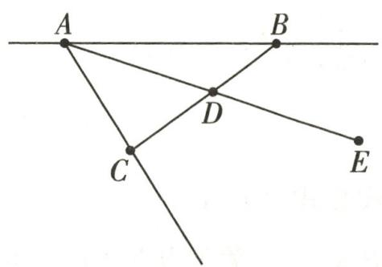

text_image

A
B
D
C
E

第20题答图

21. 解: (1) ∵ ∠AOB 是平角, ∠AOC=40°, ∠BOD=60°,

$$
\begin{array}{r l} & {\therefore \angle C O D = \angle A O B - \angle A O C - \angle B O D = 1 8 0 ^ {\circ} - 4 0 ^ {\circ} -} \\ & {6 0 ^ {\circ} = 8 0 ^ {\circ}.} \end{array}
$$

∵OM,ON分别是∠AOC,∠BOD的平分线,

$$
\therefore \angle M O C = \frac {1}{2} \angle A O C = 2 0 ^ {\circ}, \angle N O D = \frac {1}{2} \angle B O D = 3 0 ^ {\circ}.
$$

$$
\therefore \angle M O N = \angle M O C + \angle C O D + \angle N O D = 2 0 ^ {\circ} + 8 0 ^ {\circ} +
$$

$$
3 0 ^ {\circ} = 1 3 0 ^ {\circ}.
$$

(2)能. 过程如下:

∵OM,ON分别是∠AOC,∠BOD的平分线，

$$
\therefore \angle M O C + \angle N O D = \frac {1}{2} \angle A O C + \frac {1}{2} \angle B O D =
$$

$$
\frac {1}{2} (\angle A O C + \angle B O D) = \frac {1}{2} \times (1 8 0 ^ {\circ} - 8 0 ^ {\circ}) = 5 0 ^ {\circ}.
$$

$$
\therefore \angle M O N = \angle M O C + \angle N O D + \angle C O D = 5 0 ^ {\circ} +
$$

$$
8 0 ^ {\circ} = 1 3 0 ^ {\circ}.
$$

22.(1)证明:因为 $AB=\frac{1}{4}BM=\frac{1}{5}AN$ ,

所以 BM=4AB, AN=5AB,

则 BN=AN-AB=4AB,

所以 BM=BN.

(2) 解: 设 AB = x，则 BM = 4x, AN = 5x,

所以 BN=4x, MN=BM+BN=8x.

又因为 C, D 分别是 BM, AN 的中点，

所以 $CD = BC + BD = BC + (AD - AB) = \frac{1}{2} BM +$

$$
\left(\frac {1}{2} A N - A B\right),
$$

所以 $2x+(2.5x-x)=14$ ，解得 x=4，

则 MN=8x=32.

23.(1)F

(2) 解: 由题意可知, 这个长方体的长为 x, 宽为 y, 高为 2, 因此表面积为 $(xy + 2x + 2y) \times 2 = 2xy + 4x + 4y$ ,

体积为 2xy.

(3) 解: 由题意可知, $B + D = C + E$ ,

所以 $E=B+D-C$

$$
= \left(\frac {1}{2} a ^ {2} b - 3\right) - \frac {1}{2} (a ^ {2} b - 6) - (a ^ {3} - 1)
$$

$$
= \frac {1}{2} a ^ {2} b - 3 - \frac {1}{2} a ^ {2} b + 3 - a ^ {3} + 1
$$

$$
= 1 - a ^ {3},
$$

即 E 代表的代数式为 $1-a^{3}$ .

24. 解: (1) ∵ 点 P 是点 M 关于点 N 的“半距点”,

$$
\therefore P N = \frac {1}{2} M N.
$$

①如答图①, $\because MN=6cm$ , 点 $P_{1}$ 是点 M 关于点 N 的 “半距点”, $\therefore P_{1}N=\frac{1}{2}MN=3(cm)$ ,

$$
\therefore M P _ {1} = M N - P _ {1} N = 3 (\mathrm{cm}).
$$

②如答图②，∵MN=6cm，点 $P_{2}$ 是点M关于点N的“半距点”，∴ $P_{2}N=\frac{1}{2}MN=3(cm)$ ，

$$
\therefore M P _ {2} = M N + P _ {2} N = 9 (\mathrm{cm}).
$$

综上,MP 的长为 3cm 或 9cm.

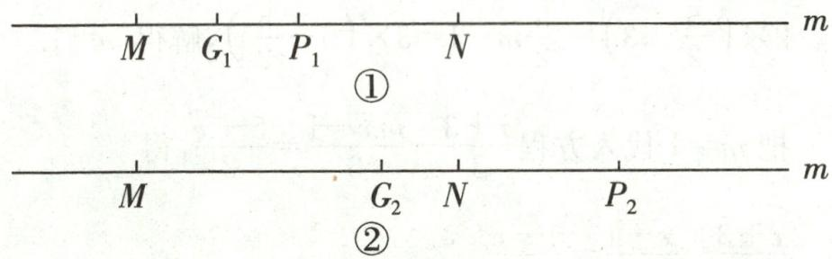

text_image

M G₁ P₁ N
①
M G₂ N P₂
②

第 24 题答图

(2)①如答图①, $G_{1}$ 是线段 $MP_{1}$ 的中点,

$$
\therefore M G _ {1} = \frac {1}{2} M P _ {1} = \frac {3}{2} (\mathrm{cm}),
$$

$$
\therefore G _ {1} N = M N - M G _ {1} = 6 - \frac {3}{2} = \frac {9}{2} (\mathrm{cm}).
$$

②如答图②, $G_{2}$ 是线段 $MP_{2}$ 的中点,

$$
\therefore M G _ {2} = \frac {1}{2} M P _ {2} = \frac {9}{2} (\mathrm{cm}),
$$

$$
\therefore G _ {2} N = M N - M G _ {2} = 6 - \frac {9}{2} = \frac {3}{2} (\mathrm{cm}).
$$

综上,线段 GN 的长为 $\frac{9}{2}$ cm 或 $\frac{3}{2}$ cm.

# 期末冲刺小卷(1)

1. C  2. D  3. A  4. C  5. >  6. $45^{\circ}$ 7. 28  8. $25^{\circ}$ 9. 21

10. 解: (1) 原式 $=115^{\circ}70' = 116^{\circ}10'$ .

(2) 原式 $= \frac{11}{5} \times \left(-\frac{5}{6}\right) \times \frac{9}{11} \div \frac{9}{4} = -\frac{3}{2} \times \frac{4}{9} = -\frac{2}{3}$ .

11. 解: 原式 $= -4a^{2} + a - 1$ ,

把 a = -1 代入得，

原式 $= -4 \times (-1)^{2} + (-1) - 1 = -6.$

12. 解: (1)①当购进 A 和 B 两种型号手机时,

设购进 A 型号手机 a 台, 则购进 B 型号手机 $(50-a)$ 台, 根据题意得 $1500a + 2100(50 - a) = 90000$ , 解得 a = 25, 故可购进 A 型号手机 25 台, 购进 B 型号手机 25 台.

②当购进 B 和 C 两种型号手机时，

设购进 B 型号手机 b 台, 则购进 C 型号手机 $(50-b)$ 台,
根据题意得 $2100b+2500(50-b)=90000$ ,

解得 b=87.5>50，故舍去。

③当购进 A 和 C 两种型号手机时，

设购进 C 型号手机 c 台, 则购进 A 型号手机 $(50-c)$ 台, 根据题意得 $1500(50-c)+2500c=90000$ , 解得 c=15, 故可购进 C 型号手机 15 台, 购进 A 型号手机 35 台.

故有两种进货方案.

方案一: 可购进 A 型号手机 25 台, 购进 B 型号手机 25 台;

方案二: 可购进 C 型号手机 15 台, 购进 A 型号手机 35 台.

(2)方案一的利润: $25 \times (1650 - 1500) + 25 \times (2300 - 2100) = 8750$ (元), 捐款数额: $8750 \times 50\% = 4375$ (元);

方案二的利润: $15 \times (2750 - 2500) + 35 \times (1650 - 1500) = 9000$ (元), 捐款数额: $9000 \times 50\% = 4500$ (元).

因为 4375<4500，

故选择方案二,即购进 C 型号手机 15 台,购进 A 型号手机 35 台,可以使捐款最多.

13. 解: (1) ① 因为 $\angle COD = 90^{\circ}, \angle DOE = 15^{\circ}$ ,

所以 $\angle COE = \angle COD - \angle DOE = 90^{\circ} - 15^{\circ} = 75^{\circ}$

又因为 OE 平分 $\angle BOC$ ,

所以 $\angle BOC=2\angle COE=150^{\circ}$ ,

所以 $\angle AOC = 180^{\circ} - \angle BOC = 180^{\circ} - 150^{\circ} = 30^{\circ}$

②因为 $\angle COD=90^{\circ},\angle DOE=\alpha,$

所以 $\angle COE = \angle COD - \angle DOE = 90^{\circ} - \alpha .$

又因为 OE 平分 $\angle BOC$ ,

所以 $\angle BOC = 2\angle COE = 180^{\circ} - 2\alpha$

所以 $\angle AOC=180^{\circ}-\angle BOC=180^{\circ}-(180^{\circ}-2\alpha)=2\alpha.$

(2) $\angle DOE=\frac{1}{2}\angle AOC$ ,理由如下:

因为 OE 平分 $\angle BOC$ ,

所以 $\angle COE = \frac{1}{2}\angle BOC = \frac{1}{2}(180^{\circ} - \angle AOC) = 90^{\circ} -$ $\frac{1}{2}\angle AOC.$

又因为 $\angle COD = 90^{\circ}$

所以 $\angle DOE = 90^{\circ} - \angle COE = 90^{\circ} - \left(90^{\circ} - \frac{1}{2}\angle AOC\right) =$ $\frac{1}{2}\angle AOC.$

# 期末冲刺小卷(2)

1. A 2. C 3. B 4. C 5. A

6.-1或5 7.3 8.220 9.4 10.2m-n

11. 解: (1) 去括号, 得 $3x - 2x + 2 = 9 - 4x - 12$ ,

移项, 得 $3x - 2x + 4x = 9 - 12 - 2$ ,

合并同类项, 得 5x = -5,

系数化为 1, 得 x = -1.

(2)方程两边同时乘4,得 $2(x+1)=12+(2-x)$ ,

去括号, 得 $2x+2=12+2-x$ ,

移项, 得 $2x + x = 12 + 2 - 2$ ,

合并同类项, 得 3x=12,

系数化为 1, 得 x=4.

12. 解: 原式 $=4x^{2}y-(6xy-12xy+6-x^{2}y-1)$

$$
\begin{array}{l} = 4 x ^ {2} y - (- 6 x y - x ^ {2} y + 5) \\ = 4 x ^ {2} y + 6 x y + x ^ {2} y - 5 \\ = 5 x ^ {2} y + 6 x y - 5. \\ \end{array}
$$

当 $x = 2, y = -\frac{1}{2}$ 时，

原式 $= 5 \times 4 \times \left(-\frac{1}{2}\right) + 6 \times 2 \times \left(-\frac{1}{2}\right) - 5 = -21.$

13. 解: $(1) + 18 - 5 - 2 + 3 + 10 - 9 + 12 - 3 - 7 - 15 =$ 2(千米),

故将最后一名乘客送到目的地后,出租车位于出发地东边2千米的位置.

(2)因为每一次营运,起步价都是10元,再加上七次超过3千米部分的收费即可,即 $10\times10+(18+5+10+9+12+7+15-7\times3)\times2=100+110=210$ (元).

答:该出租车司机上午的营业额是210元.

14. 解: 设每箱装 x 件产品, 根据题意得 $\frac{6x+8}{4}-2=\frac{7x+6}{5}$ ,
解得 x=12.

答:每箱装12件产品.

15. 解: (1) 因为 C 为线段 AB 的中点, 且 AB = 10cm,

所以 $AC=BC=\frac{1}{2}AB=\frac{1}{2}\times10=5(\text{cm})$ .

因为 M 为线段 AC 的中点, N 为线段 BC 的中点,

所以 $MC=\frac{1}{2}AC=\frac{5}{2}(cm)$ , $NC=\frac{1}{2}BC=\frac{5}{2}(cm)$ ,

所以 $MN=MC+NC=5(cm)$ .

(2) 因为 $AC:BC=3:2$ ，且 AB=a，

所以 $AC=\frac{3}{5}AB=\frac{3}{5}a, BC=\frac{2}{5}AB=\frac{2}{5}a.$

因为 M 为线段 AC 的中点, N 为线段 BC 的中点,

所以 $MC=\frac{1}{2}AC=\frac{3}{10}a, NC=\frac{1}{2}BC=\frac{1}{5}a,$

所以 $MN = MC + NC = \frac{3}{10}a + \frac{1}{5}a = \frac{1}{2}a.$

# 期末冲刺小卷(3)

1. B 2. C 3. B 4. B 5. A

6.92°15′ 7.5 8.5 9.2 10.100

11. 解: (1) 原式= $\frac{3}{2}\times\left(3\times\frac{4}{9}-1\right)+\frac{1}{2^{4}}\times(-2^{3})=\frac{3}{2}\times$

$$
\frac {1}{3} - \frac {1}{2} = 0.
$$

(2) 原式 $= 5a^{2} - 2a - 3ab + b^{2} - 5a^{2} + 3ab = -2a + b^{2}$ .

12. 解: $\because \frac{AD}{BD} = \frac{2}{3}, \therefore$ 设 AD = 2x, BD = 3x.

∵D是线段AC的中点,∴AC=2AD=4x.

$$
\because B C = A B - A C = 2,
$$

∴2x+3x-4x=2, 解得 x=2,

$$
\therefore A B = 5 x = 1 0.
$$

13. 解: (1) 设该民宿有客房 x 间,

根据题意, 得 $8(x-1)=6x+6$ , 解得 x=7,

则 $6x+6=6\times7+6=48.$

答:该民宿有客房7间,户外旅行者有48人.

(2)若每间客房住5人,则48名户外旅行者至少需客房10间,需付费 $200\times10=2000$ (元).

若一次性订客房 12 间, 则需付费 $200 \times 12 \times 0.8 = 1920$ (元) < 2000 (元).

答:这些户外旅行者再次一起入住,他们选择一次性订客房12间较合算.

14.(1) $15^{\circ}$

(2) 解: $\angle AOC = 2\angle DOE$ . 理由如下:

$\because \angle COD$ 是直角, $OE$ 平分 $\angle BOC$ ,

$$
\therefore \angle C O E = \angle B O E = 9 0 ^ {\circ} - \angle D O E,
$$

$$
\therefore \angle A O C = 1 8 0 ^ {\circ} - \angle B O C = 1 8 0 ^ {\circ} - 2 \angle C O E = 1 8 0 ^ {\circ} -
$$

$$
2 (9 0 ^ {\circ} - \angle D O E) = 2 \angle D O E.
$$

(3) 解: $\angle AOC = 360^{\circ} - 2\angle DOE$ . 理由如下:

∵OE平分∠BOC,

$$
\therefore \angle B O E = \angle C O E,
$$

$$
\therefore \angle A O C = 1 8 0 ^ {\circ} - \angle B O C = 1 8 0 ^ {\circ} - 2 \angle C O E = 1 8 0 ^ {\circ} -
$$

$$
2 (\angle D O E - 9 0 ^ {\circ}) = 3 6 0 ^ {\circ} - 2 \angle D O E.
$$

# 期末冲刺小卷(4)

1.B 2.C 3.C 4.D 5.B

6.2023 7.1 8.100° 9.64 $2^{2t+6}$ 10.10

11.(1)x=-2 (2)x=3

12. 解: 原式 $=15x^{2}y-5xy^{2}-xy^{2}-3x^{2}y=12x^{2}y-6xy^{2}$ ,
当 x=1,y=-1 时，

原式 $= 12 \times 1^{2} \times (-1) - 6 \times 1 \times (-1)^{2} = -18.$

13. 解: (1) $3 + 1 - 2 + 9 - 8 + 2 - 4 + 5 - 3 + 2 = 5 \, (\text{km})$ , $20 \times 10 + 5 = 205 \, (\text{km})$ .

答: 小明家这 10 天轿车行驶的路程为 205km.

(2) $205\times(30\div10)\div100\times7\times8=344.4$ （元）.

答:估计小明家一个月(按 30 天算)的汽油费用为 344.4 元.

14. 解: 设这个月人均额定工作量是 x 件.

依题意列方程得 $(3x-1)\div4=(5x+7)\div6-2$ ,

解得 x=7.

答: 这个月人均额定工作量是 7 件.

15.(1) $\angle AOC + \angle DOE = 90^{\circ}$

(2) 解: $\because \angle AOC = 60^{\circ}, \angle COE = 90^{\circ}$ ,

$$
\therefore \angle A O E = \angle A O C + \angle C O E = 1 5 0 ^ {\circ}.
$$

∵OF平分∠AOE,∴∠AOF= $\frac{1}{2}$ ∠AOE=75°,

$$
\therefore \angle C O F = \angle A O F - \angle A O C = 7 5 ^ {\circ} - 6 0 ^ {\circ} = 1 5 ^ {\circ}.
$$

(3) 解: $\because \angle AOC = \alpha, \angle COE = 90^{\circ}$ ,

$$
\therefore \angle A O E = \angle C O E - \angle A O C = 9 0 ^ {\circ} - \alpha .
$$

∵OF平分∠AOE,

$$
\therefore \angle A O F = \frac {1}{2} \angle A O E = 4 5 ^ {\circ} - \frac {1}{2} \alpha ,
$$

$$
\therefore \angle C O F = \angle A O C + \angle A O F = \alpha + 4 5 ^ {\circ} - \frac {1}{2} \alpha = 4 5 ^ {\circ} + \frac {1}{2} \alpha .
$$

# 期末冲刺小卷(5)

1. B 2. D 3. B 4. C 5. B

6. > 7. $-\frac{1}{4}$ 8.互补

9.1或4或16 10.7 11.(1)x=6 (2)x=4

12. 解: (1) ∵ ∠AOB 是直角, ∠BOC = 60°,

$$
\therefore \angle A O C = \angle A O B + \angle B O C = 1 5 0 ^ {\circ}.
$$

∵OE平分∠AOC,∴∠EOC= $\frac{1}{2}$ ∠AOC=75°.

$\because OF$ 平分 $\angle BOC, \therefore \angle FOC = \frac{1}{2} \angle BOC = 30^{\circ}.$

$$
\therefore \angle E O F = \angle E O C - \angle F O C = 7 5 ^ {\circ} - 3 0 ^ {\circ} = 4 5 ^ {\circ}.
$$

(2) $\because\angle BOE=20^{\circ},\angle AOB$ 是直角，

$$
\therefore \angle A O E = \angle A O B - \angle B O E = 7 0 ^ {\circ}.
$$

∵OE平分∠AOC,∴∠EOC=∠AOE=70°,

$$
\therefore \angle B O C = \angle E O C - \angle B O E = 7 0 ^ {\circ} - 2 0 ^ {\circ} = 5 0 ^ {\circ}.
$$

13. 解: (1) 设这批衣服每件的进价为 x 元, 则原售价是 1.4x 元, 根据题意, 得

1. $4x \times 60 + 0.5 \times 1.4x \times 40 - 100x = 6000$ , 解得 x = 500.

答:这批衣服每件的进价为 500 元.

(2)设银行一年定期的利率是y,根据题意得

$100 \times 500y \times 1 = 1500$ , 解得 $y = 3\%$ .

答:银行一年定期的利率是3%.

14. 解: (1) 根据点 M, N 的运动速度可知, 当点 M, N 运动 1s 时, BN = 3cm, PM = 1cm.

因为 $AM+MP+PN+BN=AB$ ，且 PN=3AM，

所以 $AM+1+3AM+3=12$ ，

所以 AM=2cm, 所以 AP=3cm.

(2)线段 $AP$ 的长度不发生变化.

根据点 M, N 的运动速度可知, BN = 3PM.

因为 $AM+MP+PN+BN=AB$ ，且 PN=3AM，

所以 $4AM+4PM=12$ ，

所以 $AP = AM + PM = 3 \, (\text{cm})$ .

(3) 当点 Q 在线段 AB 上时, 如答图.

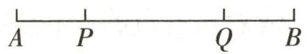  
第14题答图

因为 $AQ=AP+PQ, AQ=PQ+BQ,$

所以 AP=BQ=3cm,

所以 PQ=AB-AP-BQ=12-3-3=6(cm);

当点 $Q'$ 在线段 $AB$ 的延长线或反向延长线上时，

因为 $AQ=PQ+BQ,$

所以点 Q 在线段 AB 的延长线上，

又因为 $AQ=AP+PQ$ ，所以 $BQ=AP=3cm$ ，

所以 $PQ=PB+BQ=AB-AP+BQ=AB=12(cm)$ .

综上所述,线段 PQ 的长为 6cm 或 12cm.

# 期末冲刺小卷(6)

1. D  2. D  3. C  4. A  5. C

6.5. $146\times10^{9}$ 7.4 8. $-\frac{4}{3}$ 9.30 $7n+2$ 10.5

11. 解: (1) 去分母, 得 $7(1-2x)=3(3x+17)-21$ ,

去括号, 得 $7-14x=9x+51-21$ ,

移项、合并同类项，得-23x=23，

系数化为 1, 得 x = -1.

(2) 原式 $= -\frac{15}{17} \times (-6 + 14 - 9) = -\frac{15}{17} \times (-1) = \frac{15}{17}$ .

12. 解: (1) 2.5 - (-3) = 5.5 (千克).

答:最重的一箱比最轻的一箱重 5.5 千克.

(2) $(-3\times1)+(-2\times4)+(-1.5\times2)+(0\times3)+(1\times$

2) + (2.5×8) = -3 - 8 - 3 + 0 + 2 + 20 = 8 (千克).

答:与标准质量比较,这20箱橘子总计超过8千克.

(3) $(25\times20+8)\times2.5=508\times2.5=1270$ （元）.

答:出售这 20 箱橘子可卖 1270 元.

13. 解: (1) 计费方式 A 每月话费为 $20 + 0.2 \times 75 = 35$ (元), 计费方式 B 每月话费为 $0.4 \times 75 = 30$ (元).

$$
\because 3 5 > 3 0,
$$

∴若每月通话时间为75分钟,应选择计费方式B.

(2) 计费方式 A 每月话费为 $20 + 0.2 \times 200 = 60$ (元)，计费方式 B 每月话费为 $0.4 \times 200 = 80$ (元).

$$
\because 6 0 <   8 0,
$$

∴若每月通话时间为200分钟,应选择计费方式A.

(3)设当每月通话时间为 x 分钟时,选择两种计费方式费用相同,

依题意, 得 $20+0.2x=0.4x$ , 解得 x=100.

∴当 $0 \leqslant x < 100$ 时，选择计费方式 B 更合算；当 x = 100 时，计费方式 A 和计费方式 B 费用相同；当 x > 100 时，选择计费方式 A 更合算.

# 期末检测卷

1. A 2. D 3. D 4. D 5. D 6. B 7. D 8. A 9. D

10. > 11. 两点之间, 线段最短 $12. -\frac{1}{2}$ 13. 165

14.2024 15.29 16.5 17.5或-1

18. 解: (1) 原式 $=36 \times \left(\frac{1}{2} - \frac{1}{3}\right) = 18 - 12 = 6$ .

(2) 原式 $= -1 - \frac{1}{6} \times (2 - 9) = -1 - \frac{1}{6} \times (-7) = \frac{1}{6}$ .

(3) 原式 $= 2x^{2} - 10xy + 18xy - 3x^{2} = -x^{2} + 8xy.$

(4) 原式 $= 6a^{2} + 8a - 4 - 4a^{2} + 3a = 2a^{2} + 11a - 4.$

19. 解: (1) $\because A = x - \frac{1}{2}y + 2, B = \frac{3}{4}x - y - 1,$

$$
\begin{array}{l} \therefore A - 2 B = x - \frac {1}{2} y + 2 - 2 \left(\frac {3}{4} x - y - 1\right) = - \frac {1}{2} x + \\ \frac {3}{2} y + 4. \end{array}
$$

(2) $\because3y-x=2,\therefore x-3y=-2,$

$$
\therefore A - 2 B = - \frac {1}{2} x + \frac {3}{2} y + 4 = - \frac {1}{2} (x - 3 y) + 4 =
$$

$$
- \frac {1}{2} \times (- 2) + 4 = 5.
$$

20.(1)x=3 (2)x=-23

21.(1)不是

(2) 解: 当 BC=2AC 时, $AC=\frac{16}{3}cm$ ;

当 AC=2BC 时, $AC=\frac{32}{3}cm$ .

22. 解: (1) $(-2)\otimes3=(-2)\times3^{2}+2\times(-2)\times3+(-2)=$

-32.

(2)由题意得 $\frac{a+1}{2}\times9+2\times\frac{a+1}{2}\times3+\frac{a+1}{2}=8$ ,
解得a=0.

(3)由题意得 $2x^{2}+4x+2=m,4x=n,$

$$
\therefore m - n = 2 x ^ {2} + 2 > 0, \therefore m > n.
$$

23.(1) $x^{2}\quad\frac{a-x}{2}$

(2)①16 $\frac{81}{2}$

②先随着 x 的增大而增大, 后随着 x 的增大而减小

(3)①y a-2y

②解:由题图②可知A与C相对,B与D相对,

由题意得 $2(m+2)+(-3)=m+6$ ,

解得 $m=5,\therefore m$ 的值为 5.

24. 解: (1) 依题意得 $4x + 3(x - 0.5) = 12.5$ , 解得 x = 2, 故 2 - 0.5 = 1.5 (时).

答:科技小组每次活动时间为1.5小时.

(2)根据题意得 $3 \times 2 + 1.5a = 10.5$ ，解得 a = 3，

∴a 的值为 3.

(3)∵九年级课外兴趣小组活动总时间为9.5小时，

$$
\therefore 2 m + 1. 5 n = 9. 5.
$$

$\because m$ 与 n 是自然数，

∴m=1,n=5或m=4,n=1,

∴ $m+n=6$ 或 $m+n=5$ .

25.(1)解:OC是∠AOB的“分余线”,理由如下:

$$
\because \angle A O B = 7 0 ^ {\circ}, \angle A O C = 5 0 ^ {\circ},
$$

$$
\therefore \angle B O C = \angle A O B - \angle A O C = 7 0 ^ {\circ} - 5 0 ^ {\circ} = 2 0 ^ {\circ},
$$

$$
\therefore \angle B O C + \angle A O B = 2 0 ^ {\circ} + 7 0 ^ {\circ} = 9 0 ^ {\circ},
$$

∴ OC 是 $\angle AOB$ 的“分余线”.

(2) $60^{\circ}$

(3) 解: 设 $\angle AOC = 2x$ ,

∵OM为∠AOC的平分线，

$$
\therefore \angle C O M = \frac {1}{2} \angle A O C = x.
$$

$$
\because \angle A O B = 1 5 5 ^ {\circ},
$$

$$
\therefore \angle B O C = \angle A O B - \angle A O C = 1 5 5 ^ {\circ} - 2 x.
$$

∵ON 为∠BOC 的“分余线”，OC 为∠MON 的“分余线”，分情况讨论：

$$
① \angle B O N + \angle B O C = 9 0 ^ {\circ}, \angle M O C + \angle M O N = 9 0 ^ {\circ},
$$

$$
\therefore \angle B O N = 9 0 ^ {\circ} - (1 5 5 ^ {\circ} - 2 x) = 2 x - 6 5 ^ {\circ},
$$

$$
\therefore \angle M O N = \angle B O M - \angle B O N = 1 5 5 ^ {\circ} - x - (2 x - 6 5 ^ {\circ}) =
$$

$220^{\circ} - 3x.$

∴ $x+220^{\circ}-3x=90^{\circ}$ ，解得 $x=65^{\circ}$ .

此时 $\angle BOC=25^{\circ}$ ，不符合题意，舍去。

② $\angle BON+\angle BOC=90^{\circ},\angle CON+\angle MON=90^{\circ},$

$$
\therefore \angle B O N = 2 x - 6 5 ^ {\circ}.
$$

$$
\because \angle C O N = \angle B O C - \angle B O N = 1 5 5 ^ {\circ} - 2 x - (2 x - 6 5 ^ {\circ}) =
$$

$$
2 2 0 ^ {\circ} - 4 x,
$$

∴ $220^{\circ}-4x+220^{\circ}-3x=90^{\circ}$ ，解得 $x=50^{\circ}$

$$
\therefore \angle A O C = 2 x = 5 0 ^ {\circ} \times 2 = 1 0 0 ^ {\circ}.
$$

③ $\angle CON+\angle BOC=90^{\circ},\angle MOC+\angle MON=90^{\circ},$

$$
\therefore \angle C O N = 9 0 ^ {\circ} - \angle B O C = 9 0 ^ {\circ} - (1 5 5 ^ {\circ} - 2 x) = 2 x - 6 5 ^ {\circ},
$$

$$
\therefore \angle M O N = \angle M O C + \angle C O N = x + 2 x - 6 5 ^ {\circ} = 3 x - 6 5 ^ {\circ},
$$

$\therefore x + 3x - 65^{\circ} = 90^{\circ}$ ，解得 $x = 38.75^{\circ}$

$$
\therefore \angle A O C = 2 x = 3 8. 7 5 ^ {\circ} \times 2 = 7 7. 5 ^ {\circ}.
$$

④ $\angle CON+\angle BOC=90^{\circ},\angle CON+\angle MON=90^{\circ}$

$\therefore \angle CON = 2x - 65^{\circ}$ ，且 $\angle MON = \angle BOC$

$$
\therefore \angle M O C = \angle B O N.
$$

$$
\because \angle B O N = (1 5 5 ^ {\circ} - 2 x) - (2 x - 6 5 ^ {\circ}) = 2 2 0 ^ {\circ} - 4 x,
$$

∴ $x=220^{\circ}-4x$ , 解得 $x=44^{\circ}$ ,

$$
\therefore \angle A O C = 2 x = 4 4 ^ {\circ} \times 2 = 8 8 ^ {\circ}.
$$

综上所述, 满足条件的 $\angle AOC$ 的度数为 $100^{\circ}$ 或 $77.5^{\circ}$ 或 $88^{\circ}$ .

# 运算题卡

# 运算题卡1 相反数的有关计算

1. (1) $-\frac{4}{7}$ (2) 0 (3) -0.5 (4) 2 (5) $\frac{4}{3}$ (6) 5.1

2.(1)9 (2)-7.08 (3)5 (4)-0.4 (5)-10

(6) $\frac{2}{3}$ (7)66 (8)-3

3.(1)-1 (2)3.5 (3)2 (4)4 (5)-16 (6)25 $\frac{12}{13}$

(7)7.953 (8) $-\frac{9}{10}$

# 运算题卡2 绝对值的有关计算

1.(1)5 (2)9 (3)0 (4)0.5 (5) $\frac{5}{17}$ (6) $\frac{4}{7}$

2.(1)30 (2)10 (3)1 (4)1.1 (5)1 (6)20

(7)4.5 (8)10 (9)0 (10) $\frac{1}{5}$

# 运算题卡3 有理数的加法运算(口算十计算)

1.(1)-12 (2)-0.8 (3)2 (4)0 (5)0

(6)-6 (7)0.6 (8) $-\frac{1}{6}$ (9)-4 (10)8

(11)-1.4 (12)2 (13)-3.6 (14)- $\frac{1}{5}$

(15)-4.6 (16)7.5

2.(1) $-11\frac{6}{7}$ (2)-2.06 (3)-19.71 (4)-10 $\frac{4}{5}$

(5) $-\frac{1}{10}$ (6) $\frac{19}{12}$

# 运算题卡4 有理数的加法运算(3个数或4个数)

(1)-2.8 (2)18 (3)4.5 (4)16 (5)-49.5 (6)0

(7)-5 (8)29 (9)-4 (10)-3 $\frac{1}{8}$

# 运算题卡5 有理数的加法运算(4个数十恰当方法)

(1)3 (2)5 (3)-16 (4)-1 $\frac{1}{7}$ (5)0 (6) $-\frac{3}{7}$

(7)16 (8)-6 (9)-8 (10)-50

# 运算题卡6 有理数的减法运算(口算十计算)

1.(1)2 (2)-7 (3)12 (4)-2 (5)-8.4 (6)2.5

(7)-6 (8)-9 (9)-16 (10)-6 (11)6 (12)-31

(13) $\frac{1}{5}$ (14) $\frac{1}{6}$ (15) $\frac{3}{4}$ (16) $-2\frac{2}{3}$

2.(1)-20 (2) $\frac{5}{2}$ (3) $\frac{17}{6}$ (4) $\frac{77}{15}$ (5) $\frac{5}{6}$ (6) $\frac{9}{10}$

# 运算题卡7 有理数的减法运算(4个数十运算律)

(1)3 (2)8 (3)-1.5 (4)-1 (5)-3 (6) $\frac{1}{2}$ (7)50

(8)10 (9)-14 (10) $4\frac{1}{3}$

# 运算题卡8 有理数的加减混合运算(1)

(1)7 (2)-3 $\frac{11}{12}$ (3)-2 (4)15 (5)-11 (6)-8

(7)-9.3 (8) $\frac{11}{3}$ (9)13 (10)-6.8 (11)-14

(12)-30

# 运算题卡9 有理数的加减混合运算(2)

(1)22 (2)20 (3)0.1 (4)5 (5)-34 (6)3 (7)8.9

(8)0 (9)0 (10)-50

# 运算题卡10 有理数的加减混合运算(3)

(1)-18 (2)-3 (3)-5.4 (4)-37

(5)-3 (6)3.1 (7)6 (8)-0.6 (9) $\frac{99}{100}$

# 运算题卡11 有理数的乘法运算

(1)-28 (2)27 (3)0 (4)6 (5)0.2 (6) $-\frac{9}{5}$

(7)-147 (8) $\frac{51}{2}$ (9)-6.72 (10)2.436 (11)-14

(12)-5 (13) $\frac{1}{3}$ (14) $\frac{21}{8}$ (15)-4

# 运算题卡12 有理数的乘法运算律

(1)-8500 (2)0 (3)11 (4)24 (5)5

(6)-27 (7)-2499 (8) $\frac{220}{27}$

(9) 解: $\left(1 + \frac{1}{2}\right) \times \left(1 + \frac{1}{4}\right) \times \left(1 + \frac{1}{6}\right) \times \cdots \times \left(1 + \frac{1}{20}\right) \times$

$$
\left(1 - \frac {1}{3}\right) \times \left(1 - \frac {1}{5}\right) \times \left(1 - \frac {1}{7}\right) \times \dots \times \left(1 - \frac {1}{2 1}\right)
$$

$$
= \frac {3}{2} \times \frac {5}{4} \times \frac {7}{6} \times \dots \times \frac {2 1}{2 0} \times \frac {2}{3} \times \frac {4}{5} \times \frac {6}{7} \times \dots \times \frac {2 0}{2 1}
$$

$$
= \left(\frac {3}{2} \times \frac {2}{3}\right) \times \left(\frac {5}{4} \times \frac {4}{5}\right) \times \left(\frac {7}{6} \times \frac {6}{7}\right) \times \dots \times \left(\frac {2 1}{2 0} \times \frac {2 0}{2 1}\right)
$$

$$
= 1 \times 1 \times 1 \times \dots \times 1 = 1.
$$

# 运算题卡13 有理数的除法运算

1.(1)-3 (2)4 (3)0 (4) $\frac{5}{2}$

2.(1)-3 (2)4 (3)-9 (4)5 (5)0 (6)-2 (7)24

(8)-15 (9) $-\frac{32}{5}$ (10)7

# 运算题卡14 有理数的乘除混合运算

(1)1 (2) $\frac{4}{3}$ (3) $-\frac{16}{5}$ (4)2 (5) $\frac{30}{7}$ (6) $\frac{8}{15}$ (7) $\frac{9}{2}$

(8) $-\frac{56}{9}$ (9) $-\frac{1}{3}$ (10) $-\frac{2}{25}$

# 运算题卡 15 有理数的乘方运算

1.(1)-1 (2)1 (3)0.01 (4)9 (5)-9 (6)-9

(7) $-\frac{1}{8}$ (8)10000 (9) $\frac{1}{36}$ (10)0 (11)-1

(12)-0.000001 (13) $-\frac{3}{2}$ (14) $\frac{81}{16}$ (15)-64

2.(1)-16 (2)1 (3)-0.5 (4)-10 (5)3 (6)-8

(7)-12 (8) $\frac{4}{3}$

# 运算题卡16 有理数的混合运算(1)

(1)-3 (2)0 (3)25 (4) $\frac{1}{6}$ (5) $\frac{5}{9}$ (6)-13 $\frac{1}{8}$

(7)-9 (8)47 (9)-1 (10)-14

# 运算题卡 17 有理数的混合运算(2)

(1)-2.5 (2)32 (3)-4 (4)-1.5 (5) $1\frac{1}{4}$ (6)-4

(7) $-\frac{7}{6}$ (8) $-\frac{9}{25}$

# 运算题卡18 有理数的混合运算(3)

1.(1)74 (2)29 (3)-11 (4)8 (5)1 (6)2 (7) $\frac{9}{16}$

(8)-1

2.(1)25 (2)-4.1 (3) $\frac{15}{17}$ (4)-25 (5) $-\frac{51}{50}$

(6)-90

# 运算题卡19 流程图

1.-9 2.(1)3x (2)1 3.4 4.3

5. 解: (1) $\because x = -2, y = 3, \therefore x < y,$

$$
\therefore m = | x | - 3 y = | - 2 | - 3 \times 3 = - 7.
$$

(2)由题意知 m=y.

当 $x > y$ ，即 $y < 4$ 时，有 $y = |x| + 3y$

$$
\therefore y = 4 + 3 y, \therefore y = - 2.
$$

当 $x \leqslant y$ ，即 $y \geqslant 4$ 时，有 $y = |x| - 3y$

$\therefore y=4-3y,\therefore y=1$ （不合题意，舍去）.

综上，y 的值为 -2.

# 运算题卡20 求代数式的值

1. 1 2. $\frac{1}{3}$ 3. 64 4. 7 5. (1)9 (2)7

# 运算题卡21 合并同类项(1)

(1) $7a^{2}-9a$ (2)3xy (3) $2a+7b$ (4)-3x+4y-1

(5) $-a - 2ab$ (6) $2a^{2} + 7b^{2} + ab$ (7) $m^2 + 2mn^2$

(8) $m^{2}n+4mn^{2}+mn$ (9)-3ab (10) $3ab^{2}+4$

# 运算题卡 22 合并同类项(2)

(1) $ab^{2}-\frac{23}{4}a^{2}b$ (2) $x^{2}+2xy^{2}+4y^{2}$ (3) $6x^{2}y-xy-7xy^{2}$

(4) $-\frac{2}{3}m^{2}n-\frac{1}{3}mn^{2}$ (5) $-\frac{1}{6}xy-\frac{9}{10}x^{2}$ (6) $\frac{9}{5}xy^{2}$

(7) $-\frac{2}{3}x^{2}y+xy$ (8) $\frac{3}{2}a^{3}b-\frac{1}{2}a^{2}b-ab^{2}$

(9) $11(n - m)^{2} - (n - m)$ (10) $-5(a - 3b)^{3} + 6(a - 3b)^{2}$

# 运算题卡23 去括号与添括号

1.(1) $4a-2b+6c$ (2) $-5a+2x-3$ (3) $3x+4y-7z-3$

(4) $-3a^{3}-2x^{2}+5x+1$

2. (1) $x^{2}-2xy+y^{2}$ (2)-b+c (3) $4y^{2}-3x^{2}$ (4) $3p+1$

3. (1) $-a+2$ (2) $-11x+8y$ (3) $-2x^{2}-4x-7$

(4) $-2a^{2}-3a+6$ (5) $4a^{2}-6a-3$ (6) $7a^{2}b-10ab^{2}$

(7) $a^{2}-a-3$ (8) $\frac{9}{2}a^{2}b-12ab^{2}$

# 运算题卡 24 整式加减——化简(1)

(1) $5a+13b$ (2)4a-b (3) $-11a^{2}+6b$ (4)xy

(5) $3a^{2}b-ab^{2}$ (6) $-a+2b$ (7) $-3a^{2}+34a-13$

(8)4 (9) $-2x^{2}-4xy+7y$ (10)x-8y-1

# 运算题卡 25 整式加减——化简(2)

(1) $-4ab+5b$ (2) $19ab-15ab^{2}-2a^{2}b$ (3) $3x^{2}y-7xy^{2}$

(4) $-2x^{2}+7xy-24$ (5) $-3a^{2}+5b^{2}$ (6)5a-6

(7) $5x^{2}-3x-3$ (8) $-2a^{2}-4a$ (9)0 (10)2-7a

# 运算题卡 26 整式加减——化简求值

解:(1)原式化简为 $12a^{2}b-6ab^{2}$ ，代入求值得 $\frac{2}{3}$ .

(2)原式化简为 $-10a^{2}-6a+6$ ，代入求值得-22.

(3)原式化简为 $9ab^{2}-4a^{2}b$ ,

$$
\because (a + 2) ^ {2} + (b + 1) ^ {2} = 0,
$$

$\therefore a=-2,b=-1$ ,代入求值得原式=-2.

(4) 原式化简为 $8abc - 8ab^{2}$ ,

$$
\because | a - 1 | + | b - 2 | + c ^ {2} = 0,
$$

$\therefore a=1,b=2,c=0$ ,代入求值得原式=-32.

(5)原式化简为 $10(a+b)-2ab$ ，代入求值得 50.  
(6)原式化简为 $2(m^{2}+3mn)+5$ ，代入求值得15.

# 运算题卡 27 整式加减——多项式加减

解:(1) $(5x^{2}y-2xy^{2})+(-2xy^{2}+4x^{2}y)=9x^{2}y-4xy^{2}$ .

(2) $(3x^{2}+x-5)-(4-x+7x^{2})=-4x^{2}+2x-9.$   
(3) $(2x^{2} + xy + 3y^{2}) - (x^{2} - xy) = x^{2} + 2xy + 3y^{2}$ .   
(4) $(2a^{2} - 4ab + b^{2}) - (-3a^{2} + 2ab - 5b^{2}) = 5a^{2} - 6ab + 6b^{2}$ .   
(5) $M-2N=5x^{2}-4x+3.$   
(6) $2A - 3B = 5x^{2} + 11xy + 2y^{2}$ .

# 运算题卡 28 移项

(1)x=2 (2)x=-27 (3)x=1.6   
(4)x=3 (5)x=-16 (6)x=27   
(7) $x=\frac{1}{3}$ (8) $x=\frac{7}{8}$ (9) $x=\frac{3}{20}$   
(10) $x = -\frac{1}{4}$

# 运算题卡 29 移项、合并同类项

(1) $x = -2$ (2) $x = 2$ (3) $x = 4$ (4) $x = -24$   
(5)x=14 (6)x=2 (7)x=1   
(8)x=-8 (9) $x=\frac{11}{9}$ (10)y=0.5

# 运算题卡 30 去括号(1)

(1)x=-3 (2)x=5 (3)x=-2 (4)x=3 (5) $x=\frac{1}{2}$   
(6)x=2 (7) $x=-\frac{7}{5}$ (8)x=2 (9)x=-3   
(10) $x = -\frac{2}{3}$ (11) $x = -2$ (12) $x = -1$

# 运算题卡 31 去括号(2)

(1) $x=\frac{3}{2}$ (2)x=2 (3)x=9 (4)y=11 (5)x=1   
(6)x=1 (7)x=-20 (8)x=1 (9)x=-3   
(10) $x = -\frac{3}{7}$

# 运算题卡 32 去分母(1)

(1)x=3.5 (2)x=6 (3)x=1 (4)y=-4 (5)x=1

(6)x=-3 (7)x=-16 (8) $x=-\frac{19}{7}$ (9) $x=\frac{12}{5}$   
(10)x=-1

# 运算题卡33 去分母(2)

(1) $x=\frac{11}{7}$ (2)x=-2.5 (3) $x=-\frac{10}{7}$ (4)x=12   
(5) $x = -7$ (6) $x = -\frac{2}{7}$ (7) $x = 5$ (8) $y = -2$   
(9) $x = \frac{11}{5}$ (10) $x = \frac{7}{18}$

# 运算题卡34 解一元一次方程

(1)x=4 (2)x=-27 (3) $x=\frac{19}{5}$ (4)x=-2   
(5) $x=\frac{7}{5}$ (6)x=18 (7) $t=-\frac{21}{4}$ (8) $x=-\frac{1}{4}$

# 运算题卡35 两方程解的讨论

1. 解: 解方程 $3x + 2a - 1 = 0$ , 得 $x = -\frac{2a - 1}{3}$ ;

解方程 x-2a=0，得 x=2a。

∵方程 $3x+2a-1=0$ 的解与方程 x-2a=0 的解互为相反数，∴ $2a+\left(-\frac{2a-1}{3}\right)=0$ ，解得 $a=-\frac{1}{4}$ .

2. 解: 解方程 $3 + 4x = 2(3 - x)$ ，得 $x = \frac{1}{2}$ .

$\because$ 关于 $x$ 的方程 $\frac{x + m}{3} = x - \frac{m}{2}$ 与方程 $3 + 4x = 2(3 - x)$ 的解互为倒数， $\therefore x = 2$ 是方程 $\frac{x + m}{3} = x - \frac{m}{2}$ 的解，

∴把 x=2 代入方程 $\frac{x+m}{3}=x-\frac{m}{2}$ ，得 $\frac{2+m}{3}=2-\frac{m}{2}$ ，
解得 $m=\frac{8}{5}$ .

3. 解: 解方程 $2(x-3)+1=5$ , 得 x=5,

由题意得 $3x-6=2x+a$ 的解是 x=5-1=4，

把 x=4 代入 $3x-6=2x+a$ ，得 $3\times4-6=2\times4+a$ ，
解得 a = -2.

4. 解: 方程 $x + m - 3 = 0$ 的解为 x = 3 - m,

方程 $\frac{x}{2} + 2m = 2x - 1$ 的解为 $x = \frac{2}{3}(2m + 1)$ ,

根据题意得 $3-m+\frac{2}{3}(2m+1)=4$ ,

去分母, 得 $9-3m+4m+2=12$ ,

移项、合并同类项, 得 m=1.

5. 解: 解方程 $m + \frac{x}{3} = 4$ , 得 x = 12 - 3m.

解方程 $\frac{x-m}{3}-\frac{2x-4}{4}=\frac{x}{6}-1$ ，得x=6-m.

根据题意得 $2(6-m)=12-3m$ ，解得 m=0。

6. 解: 解方程 $2(x-1)=3(x+2)$ ，得 x=-8。

∵关于 x 的方程 $2(x+1)-m=-2(m-2)$ 的解比方程 $2(x-1)=3(x+2)$ 的解大 3,

∴方程 $2(x+1)-m=-2(m-2)$ 的解为 x=-5，

把 x=-5 代入 $2(x+1)-m=-2(m-2)$ ,

得-8-m=-2m+4, 解得 m=12.

# 运算题卡36 角度的换算与计算

1.(1)57 19 12 (2)27.24 (3)12.3 (4)100 $\frac{5}{3}$

2.(1) $79^{\circ}13'$ (2) $24^{\circ}50'$ (3) $131^{\circ}20'20''$ (4) $116^{\circ}27'$

(5) $166^{\circ}16'20''$ (6) $22.5^{\circ}$ (7) $52^{\circ}41'$ (8) $79^{\circ}55'45''$

(9) $106^{\circ}21'7''$ (10) $138^{\circ}57'$

# 基础题卡

# 基础题卡1 正数和负数(1)

# 新知梳理

1.0 负号 0 2.正负

# 课堂小练

1. D  2. C  3. A  4. A  5. A

6. +8.5, 0.35, 3.14, 12, 0.3, $\pi$ , $10\%$

$$
- 3 \frac {2}{5}, - 9, - 2
$$

7.(1)-20 (2)运进货物100吨 8.505 495 9.12

# 基础题卡2 正数和负数(2)

# 新知梳理

1. 分界 没有

2. 相反意义

# 课堂小练

1. C  2. C  3. D  4. B  5. A

6.+10秒 7.不合格 8.2:00

# 基础题卡3 有理数的概念

# 新知梳理

(1) 正有理数 负有理数

# 课堂小练

1. A 2. A 3. D 4. D 5. C 6. 2

7. 正整数: $\{+203,\cdots\}$

非正数： $\left\{0,-9,-\frac{5}{7},-0.1,\cdots\right\}$

有理数： $\left\{+203,0,+6.4,-9,-\frac{5}{7},2.6,-0.1,\cdots\right\}$

# 基础题卡4 数轴

# 新知梳理

1. 原点 正方向 单位长度

2. 直线 原点 正方向 单位长度 3. 右 a 左 a

# 课堂小练

1. C 2. A 3. D 4. C 5. D 6. -2

7. 解: 如答图.

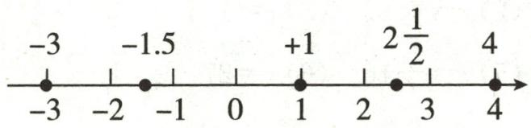

text_image

-3
-1.5
+1
2½
4
-3
-2
-1
0
1
2
3
4

第7题答图

# 基础题卡5 相反数

# 新知梳理

1. 符号 原点 2. 两 $a - a$ 3.

# 课堂小练

1. A 2. A 3. C

4.0.7 -1 0 5.-2.3 $\frac{1}{3}$ 6.(1)-8 (2)-9

7.(1)-3 (2)-1.5 (3)5 (4)12 (5)3.2 (6)-3.2

# 基础题卡6 绝对值(1)

# 新知梳理

1. 原点 $|a|$ a 的绝对值

2. 它本身 它的相反数 0

# 课堂小练

1. A

2.(1)-5.7对应的点到原点的距离

(2)2 | -2|

(3)1.5 10 2 -2.5

3.5 $\frac{1}{2}$ ±2 4.-2或8 5.3与-3

6.(1)0,±1,±2,±3 (2)±5

7.(1)24 (2)12 (3) $\frac{5}{2}$ (4)3 (5) $\frac{3}{7}$ (6)0

# 基础题卡7 绝对值(2)

# 新知梳理

(1) 小 大 左 右 (2) 大于 大于 大于 (3) 小

# 课堂小练

1. A 2. A 3. C 4. A 5. 7

6.(1)5>0 (2) $-\frac{1}{2}<0$ (3)2>-3 (4)-6<-2

(5)-3<0<1.5

7.(1) $\left|\frac{3}{5}\right|>\left|\frac{2}{5}\right|$ (2)-|-3|<-(-3)|

(3) $-\frac{5}{8}>-\frac{7}{11}$

# 基础题卡8 有理数的加法(1)

# 新知梳理

1.相同 相加 2.较大 减去 0 3.这个数

# 课堂小练

1. A 
2. A 
3. D

4.(1)正 (2)负 (3)正 (4)负

5.(1)-9 (2)12 (3)-8

6.(1)-11 (2)-9 (3)-10 (4)-14

7.(1) $1\frac{13}{20}$ (2) $-2\frac{13}{21}$ (3)-0.68 (4) $-3\frac{5}{6}$

(5)3.5 (6)-6

# 基础题卡9 有理数的加法(2)

# 新知梳理

1. (1) $b + a$ (2) $a + (b + c)$

2.(1)20 -10 (2)(-5) (-4)

# 课堂小练

1.(1)0 (2)-0.2

2. (1) $\frac{7}{8}$ (2)5 (3)-2

3. 解: 缺少 5kg, 实际共重 295kg.

# 基础题卡10 有理数的减法(1)

# 新知梳理

1. 相反数 $(-b)$

2.(1)+4 (2)(-3) (3)(+3.5) (4)(-2025)

# 课堂小练

1. A 
2. D 
3. B

4.(1)-11 (2)4 (3)-2 (4)-2

5.(1)-2 (2)7 (3)38 (4)-16 (5) $\frac{7}{6}$ (6)16

6. 解: $-2\frac{1}{4}-\left(-1\frac{3}{4}\right)=-\frac{1}{2}$ .

# 基础题卡11 有理数的减法(2)

# 新知梳理

1. 加 和

2.(1)整数 (2)通分 (3)零 (4)结合

# 课堂小练

1.C 2.C

3.(1)-4 (2)-28 (3)-10 (4)-3

4.(1)3 (2) $18\frac{13}{15}$

# 基础题卡 12 有理数的乘法(1)

# 新知梳理

1. 正 负 等于 0 2.1 没有 ±1

# 课堂小练

1. B 2. D

3.(1)24 24 正 绝对值相乘

(2)-24 -24 负 绝对值相乘

(3)0 0 0

4.(1)-54 (2)-24 (3)6 (4)0 (5) $-\frac{3}{2}$ (6) $-\frac{1}{12}$

# 基础题卡 13 有理数的乘法(2)

# 新知梳理

1.(1)ba (2) $a(bc)$ (3) $ab+ac$ 2.-2 $-\frac{1}{2}$

# 课堂小练

1. D  2. C  3. C  4. -37

5. 解: (1) 原式 $=12 \times 37 \times \frac{5}{6} = 12 \times \frac{5}{6} \times 37 = 10 \times 37 = 370.$

(2) 原式 $= -6 \times \frac{1}{3} \times (10 \times 0.1) = -2 \times 1 = -2$ .

(3) 原式= $\frac{7}{60}\times60-\frac{1}{12}\times60=7-5=2.$

(4) 原式 $= \left(5 + \frac{7}{18}\right) \times 18 = 5 \times 18 + \frac{7}{18} \times 18 = 90 + 7 = 97$ .

# 基础题卡 14 有理数的乘法(3)

# 新知梳理

1. 正数 负数 0 2. 正

# 课堂小练

1. C  2. C  3. C  4. 6  5. 0  6. -1

7. 解: (1) 原式 = + (2 × 3 × 4 × 1) = 24.

(2) 原式 $= -(5 \times 3 \times 4 \times 2) = -120$ .  
(3) 原式= $+ (2 \times 2 \times 2 \times 2) = 16.$   
(4) 原式 = -(3 × 3 × 3 × 3 × 3) = -243.

# 基础题卡 15 有理数的除法(1)

# 新知梳理

1.(1)倒数

(2) 正 负 被除数的绝对值除以除数的绝对值的商 0

2. 乘法 符号

# 课堂小练

1. B 2. D 3. A 4. D

5. 解: (1) $\frac{-72}{-8}=9$ .

(2) $\frac{-\frac{1}{3}}{0.2} = \frac{-\frac{1}{3}}{\frac{1}{5}} = -\frac{5}{3}$ .

(3) $\frac{0.2}{-\frac{1}{3}}=\frac{\frac{1}{5}}{-\frac{1}{3}}=-\frac{3}{5}.$

(4) $\frac{0}{-76}=0.$

6.(1)-3 (2)9 (3) $-\frac{1}{9}$ (4)0 (5)-50 (6)3

# 基础题卡16 有理数的除法(2)

# 新知梳理

1.(1)乘法 (2)符号

2. 乘除 加减 左 右 括号

# 课堂小练

解:(1)原式 $=-2\times(-2)\times2=8.$   
(2) 原式 $= 9 \times \left(-\frac{1}{4}\right) \times \left(-\frac{2}{3}\right) = \frac{3}{2}$ .  
(3) 原式= $35 \times \frac{8}{5} \times \frac{3}{4} \times \frac{3}{2} = 63$ .  
(4) 原式 $= -\frac{5}{2} \times \frac{16}{5} \times \frac{1}{8} \times \frac{1}{4} = -\frac{1}{4}$ .  
(5) 原式 = -12 + 4 = -8.  
(6) 原式 = -264 - 25 = -289.  
(7) 原式 = -6 - 30 = -36.  
(8) 原式 $= -\frac{6}{5} \times \left(-\frac{2}{3}\right) + \frac{3}{4} \times \frac{8}{5} = \frac{4}{5} + \frac{6}{5} = 2.$

# 基础题卡17 有理数的乘方(1)

# 新知梳理

1. 相同 积 幂 底数 指数

2. 正数 正数 负数 0

# 课堂小练

1. B 2. C 3. D 4. B 5. C 6. B 7. D 8. C

9. $\frac{2}{3}$ 2 $-\frac{4}{9}$ 10. $\frac{8}{3}$ $\frac{8}{27}$ $-\frac{8}{27}$ $\frac{8}{3}$

# 基础题卡18 有理数的乘方(2)

# 新知梳理

1.(1)乘方 乘除 (2)左右 (3)括号

2. 乘方 乘除减加 -37

# 课堂小练

解:(1)原式= $-8\times\frac{9}{4}\times\frac{4}{9}=-8.$

(2) 原式 $=8-3 \times 8-(-6)^{2}=8-24-36=-52.$   
(3) 原式 $= -\frac{3}{5} \times (-3 - 2) \div 6 = -\frac{3}{5} \times (-5) \div 6 = \frac{1}{2}$ .  
(4) 原式 $= -1 - \frac{1}{4} \times (2 - 9) = -1 + \frac{7}{4} = \frac{3}{4}$ .  
(5) 原式 $= -16 \div (-8) - \frac{4}{9} \times \frac{9}{4} = 1$ .  
(6)原式= $24\div(-8)-9\times\frac{1}{9}=-4.$   
(7) 原式 $=1+9\div(-3)\times2=1-3\times2=1-6=-5.$   
(8) 原式 $= -(-2) + 9 \times (1 - 4) = 2 + 9 \times (-3) = 2 - 27 = -25.$

# 基础题卡 19 科学记数法

# 新知梳理

1. $a \times 10^{n}$ 减去12.(1)7 (2)9

# 课堂小练

1. B 2. B 3. A $4.2 \times 10^{12}$

5.(1) $1.382 \times 10^{9}$ (2) $-1 \times 10^{5}$

(3) $1.3 \times 10^{9}$ (4) $3.45 \times 10^{8}$

6.(1)3726000 (2)-30580000

7.(1)< (2)< (3)> (4)<

# 基础题卡 20 近似数

# 新知梳理

1. 近似数 2. 精确度 3. 1.7 316

# 课堂小练

1. B 2. A

3.2.90 4.200 5.5.61 6.1.5

7.(1)千分 (2)万 (3)百 (4)千

8.3.14 9.4.595≤a<4.605

10. 解: (1) 0.016 精确到千分位. (2) 1980 精确到个位.

(3)1.70 精确到百分位. (4)3.47 万精确到百位.

11. 解: (1) 9.23456≈9.2346.

(2) $567899 \approx 5.679 \times 10^{5}$ .

# 基础题卡 21 代数式(1)

# 新知梳理

1. 代数式 2.(1)省略不写 (2)分数

# 课堂小练

1. A 2. D 3. A 4. D

5. $10m + n$ 6. $4m + 7n$ 7.1.2x

8. 买 8 本练习本和 3 支铅笔需要的钱数

9.(1)a-b (2) $2m+\frac{1}{2}n$ (3) $x^{2}-y^{2}$

# 基础题卡 22 代数式(2)

# 新知梳理

1. 列代数式 
2. 代数式

# 课堂小练

1. C  2. C  3. D  4. 0.85a

5. 解: (1) $10b + a$ . (2) $(x - y)^{2}$ .

(3) $a^{2}-b^{2}$ . (4) $(1+10\%)a$ 元.

# 基础题卡 23 代数式(3)

# 新知梳理

1. 反比例关系

2. $xy = k$ $y = \frac{k}{x}$ 比例系数

# 课堂小练

1. B 2. A 3. 反 -1 4. 反比例

5. $xy = 6$ 或 $y = \frac{6}{x}$ 反 6

6. 解: (1) 由平均数, 得 $x=\frac{1500}{y}$ , 即 $y=\frac{1500}{x}$ , y 与 x 成反比例关系.

(2)由单价乘加油量等于加油总价,得 y=4.75x,y 与 x 不成反比例关系.

(3)由路程与时间的关系, 得 $t=\frac{100}{v}$ , t 与 v 成反比例关系.

# 基础题卡 24 代数式的值

# 新知梳理

代数式的值 不同

# 课堂小练

1. C  2. A  3. D  4. -1  5. 20

6. 解: (1) a - c = 11 - (-3) = 11 + 3 = 14.

(2) $b-c=(-5)-(-3)=(-5)+3=-2.$

(3) $a - b - c = 11 - (-5) - (-3) = 11 + 5 + 3 = 19.$

(4) $c-a-b=(-3)-11-(-5)=\left[(-3)+(-11)\right]+$

$5=(-14)+5=-9.$

7. 解: 将 a = -7, b = -2 代入,

$$
(a + b) ^ {2} = (- 7 - 2) ^ {2} = 9 ^ {2} = 8 1,
$$

$$
a ^ {2} + 2 a b + b ^ {2} = (- 7) ^ {2} + 2 \times (- 7) \times (- 2) + (- 2) ^ {2} = 4 9 +
$$

$$
2 8 + 4 = 8 1,
$$

则 $(a+b)^{2}=a^{2}+2ab+b^{2}=81.$

8. 解: 因为 a, b 互为倒数, c, d 互为相反数, m 为最大的负整数, 所以 ab = 1, $c + d = 0$ , m = -1,

所以原式 $= \frac{-1}{3} + 1 + 0 = \frac{2}{3}$ .

故 $\frac{m}{3} + ab + \frac{c + d}{4m}$ 的值为 $\frac{2}{3}$ .

# 基础题卡 25 整式(1)

# 新知梳理

(1)积 数 字母 (2)数字 (3)所有 和

# 课堂小练

1. A 
2. D 
3. A

4. $-\frac{1}{2}$ 4 5. $-2x^{3}$ (答案不唯一)

6.(1)0.15a或15%a (2)5y (3) $a^{2}$

7. 解: (1) 系数为 3, 次数为 2.

(2)系数为-1,次数为2.

(3)系数为-7,次数为5.

(4)系数为-2,次数为7.

# 基础题卡26 整式(2)

# 新知梳理

1.(1)单项式的和 (2)单项式

(3)不含字母的项 (4)次数最高的项

2. 单项式 多项式

# 课堂小练

1. A 2. C 3. B 4. D 5. B 6. $3x^{3}y$

7.(1) $x+0.12$ (2) $3m+10$

# 基础题卡 27 整式的加减(1)

# 新知梳理

1.相同 相同字母 2.一项 3.系数 字母连同它的指数课堂小练

1. C  2. D  3. B  4. C

5. -x -4m 6.2.5a $-2x^{2}$

7. 解: (1) 原式 $=4x^{3}$ . (2) 原式 =0.

(3) 原式 = -14x. (4) 原式 = -3x + 4y - 1.

8. 解: 原式 $=x^{2}+2xy+y^{2}$ .

当 x=2, y=1 时，

原式 $=2^{2}+2\times2\times1+1^{2}=4+4+1=9.$

# 基础题卡28 整式的加减(2)

# 新知梳理

1.(1)相同 (2)相反 2.(1)-3m-4n (2)4a-2b

# 课堂小练

1. B  2. C  3. B  4. A

5.(1) $a+b-c+d$ (2)x-y-m-n

(3) $x-y+m+n$ (4) $-a-b+c+d$

(5) $a-b+c-d$ (6) $-a+b-c-d$

6. 解: (1) 原式 = x + 3.

当 $x=\frac{1}{2}$ 时, 原式 $=\frac{7}{2}$ .

(2) 原式 $= -4a^{2} + ab$ .

当 a = -2, b = 3 时，原式 = -22.

# 基础题卡 29 整式的加减(3)

# 新知梳理

1. 去括号 合并同类项 2. $a + 7b$

# 课堂小练

1. 解: (1) 原式 = $x + 4x - 2 = 5x - 2$ .

(2) 原式 = 2x - 3y + 7x + 4y = 9x + y.

(3) 原式 $=6x^{2}+15y-10x^{2}-6y=-4x^{2}+9y.$

(4) 原式 = 2x - 3x - 3 = -x - 3.

(5) 原式 = -5a - 1 - 3a + 7 = -8a + 6.

(6) 原式 $=3a^{2}-7a-2a^{2}+6a-4=a^{2}-a-4.$

(7) 原式 $= -5 + x^{2} + 3x + 9 - 6x^{2} = -5x^{2} + 3x + 4.$

(8) 原式= $2y-3x^{2}+4y+3x^{2}-3y=3y$ .

2. 解: $4a^{2}-ab-5b^{2}-(3a^{2}+ab-3b^{2})=a^{2}-2ab-2b^{2}$

3. 解: $3A - 2B + 1 = 3(2a^{2} - a) - 2(-5a + 1) + 1 = 6a^{2} -$

$$
3 a + 1 0 a - 2 + 1 = 6 a ^ {2} + 7 a - 1.
$$

当 $a = -\frac{1}{2}$ 时，原式 $= 6a^{2} + 7a - 1 = 6 \times \left(-\frac{1}{2}\right)^{2} + 7 \times$

$$
\left(- \frac {1}{2}\right) - 1 = \frac {3}{2} - \frac {7}{2} - 1 = - 3.
$$

# 基础题卡30 从算式到方程(1)

# 新知梳理

1. 方程 2. 方程

# 课堂小练

1. A 2. A 3. C 4. A

5. $\frac{1}{2}x-12=\frac{2}{3}x$ 6. $4x+6=3(x+6)$

7. 解: (1) 3x - 5 = 2x + 1.

(2) $\frac{0.3x+2}{2}=0.2x-5.$

(3) $n = 45\% n + 110.$

(4)1. 1a-10=210.

# 基础题卡 31 从算式到方程(2)

# 新知梳理

1. 一个 整式 1 2. 未知数

# 课堂小练

1. A  2. B  3. D  4. C

5. 解: (1) 设截下的每段木条长为 $x \, cm$ . 根据题意, 得 60 - 2x = 10, 是一元一次方程.

(2)设小红的年龄为 x 岁. 根据题意, 得 $2x + 10 = 30$ , 是一元一次方程.

(3)设小明家离学校 x 千米. 根据题意, 得 $\frac{\frac{1}{3}x}{5} + \frac{\frac{2}{3}x}{20} = \frac{x}{5} - \frac{15}{60}$ , 是一元一次方程.

6. 解: (1) 4x = -16 的解是负数.

(2)-3x=18 的解是负数.

(3) $-9x=-36$ 的解是正数.

(4) - 5x = 0 的解是 0.

# 基础题卡32 从算式到方程(3)

# 新知梳理

同一个数 $b \pm c$ 同一个数 同一个不为 0 $bc \frac{b}{c}$

# 课堂小练

1. B 
2. D

3.(1)3x 根据等式的性质 1, 等式两边加 3x, 结果仍相等

(2)50 根据等式的性质 2, 等式两边除以 0.2, 结果仍相等   
(3)7 根据等式的性质 1, 等式两边加 7, 结果仍相等   
(4)3 根据等式的性质 2, 等式两边除以 5, 结果仍相等   
(5)2 根据等式的性质 2, 等式两边乘 2, 结果仍相等

4. (1) x=19 (2) x=-60 (3) x=-9 (4) x=-2

# 基础题卡 33 解一元一次方程(1)

# 新知梳理

1. 乘法分配律 等式的性质 2   
2. 和 3.(1)-5x=5 (2)x=-1

# 课堂小练

1.(1)x=5 (2)x=3.6 (3)x=-2 (4)x=2   
2. 解: 设 A, B, C 三种型号的空调分别多生产 x 台、6x 台、3x 台.

根据题意, 得 $x+6x+3x=2000$ , 解得 x=200.

所以 6x=1200,3x=600.

答: A, B, C 三种型号的空调分别多生产 200 台、1200 台、600 台.

3. 解: 设相邻三个数中的第一个数为 x, 那么第二个数为 -4x, 第三个数为 16x.

根据题意, 得 $x-4x+16x=-13312$ , 解得 x=-1024.

所以-4x=4096,16x=-16384.

答:这三个数分别是-1024,4096,-16384.

# 基础题卡34 解一元一次方程(2)

# 新知梳理

1. 变号 等式的性质 1 2. 左边 右边 合并  
3. 相等

# 课堂小练

1. 解: (1) 移项, 得 5x - 3x = -4,

合并同类项, 得 2x = -4,

系数化为1,得x=-2.

(2)移项,得 $-x+\frac{2}{5}x=1$ ,

合并同类项, 得 $-\frac{3}{5}x=1$ ,

系数化为1,得 $x=-\frac{5}{3}$ .

(3)移项,得 $3x - x = 3 + 1$ ,

合并同类项, 得 2x=4,

系数化为 1, 得 x=2.

(4)移项,得 3x-3.5x=-1-2,

合并同类项,得-0.5x=-3,

系数化为 1, 得 x=6.

(5)移项,得 $x-\frac{3}{2}x=1+3$ ,

合并同类项, 得 $-\frac{1}{2}x=4$ ,

系数化为 1, 得 x = -8.

(6)移项,得 $\frac{1}{4}x+\frac{1}{2}x=\frac{3}{4}$ ,

合并同类项, 得 $\frac{3}{4}x = \frac{3}{4}$ ,

系数化为1,得x=1.

2. 解: 设快马 x 天可以追上慢马.

根据题意, 得 $240x = 150x + 12 \times 150$ , 解得 x = 20.

答:快马 20 天可以追上慢马.

3. 解: 设一共种植 x 棵树, 则杨树种植 $\left(\frac{1}{2}x+56\right)$ 棵, 杉树种植 $\left(\frac{1}{3}x-14\right)$ 棵.

根据题意,得 $\frac{1}{2}x+56+\frac{1}{3}x-14=x$ ,解得x=252.

所以 $\frac{1}{2} x + 56 = \frac{1}{2} \times 252 + 56 = 182$

$$
\frac {1}{3} x - 1 4 = \frac {1}{3} \times 2 5 2 - 1 4 = 7 0.
$$

答:杨树种植 182 棵,杉树种植 70 棵.

# 基础题卡 35 解一元一次方程(3)

# 新知梳理

1.(1)去括号 (2)移项 (3)合并同类项  
2. + - 3. 速度 速度和 速度差

# 课堂小练

1. 解: (1) 去括号, 得 $3x - 6 + 1 = -2$ ,

移项, 得 $3x = -2 + 6 - 1$ ,

合并同类项, 得 3x=3,

系数化为 1, 得 x=1.

(2)去括号,得 $x+5=2x-2$ ,

移项、合并同类项，得-x=-7，

系数化为 1, 得 x=7.

(3)去括号,得 $4x-24+3x=4$ ,

移项, 得 $4x + 3x = 4 + 24$ ,

合并同类项,得 7x=28,

系数化为1,得x=4.

(4)去括号,得 $5x-25-24+2x=0$ ,

移项、合并同类项，得 7x=49，

系数化为1,得x=7.

(5)去括号,得 $x-2+2x=8+x$ ,

移项、合并同类项,得2x=10,

系数化为1,得x=5.

(6)去括号,得2x-1-3-x=2,

移项、合并同类项，得x=6.

2. 解: 设小新上山时的平均速度为 x 千米/时, 则下山时的平均速度为 $(x+1.5)$ 千米/时.

根据题意,得 $0.8x=0.5(x+1.5)$ , 解得 x=2.5.

答:小新上山时的平均速度为2.5千米/时.

3. 解: 设轮船在静水中的速度为 x 千米/时, 则顺流的速度为 $(x+2)$ 千米/时, 逆流的速度为 $(x-2)$ 千米/时.

根据题意, 得 $4(x+2)=5(x-2)$ , 解得 x=18.

答:轮船在静水中的速度为18千米/时.

# 基础题卡 36 解一元一次方程(4)

# 新知梳理

1. 最小公倍数 整数 2.(1)去分母

# 课堂小练

1.(1)x=-1 (2)x=3 (3)x=1 (4) $x=-\frac{5}{16}$

2.(1)②

(2) 解: 正确的解答过程如下:

去分母, 得 $3x-2(x-1)=6$ ,

去括号, 得 $3x - 2x + 2 = 6$ ,

移项、合并同类项，得 x=4。

# 基础题卡 37 实际问题与一元一次方程(1)

# 新知梳理

(1)工作效率 (2)时间 工作总量

# 课堂小练

1. 解: 设安排生产甲种零件 x 天, 则生产乙种零件 (18 - x) 天.

根据题意, 得 $\frac{120x}{3} = \frac{100(18 - x)}{2}$ ,

解得 x=10.

所以 18-x=18-10=8.

答:安排生产甲种零件 10 天,生产乙种零件 8 天.

2. 解: 设为了使每天的产品刚好配套, 应该分配 x 名工人生产螺钉, 则分配 $(32 - x)$ 名工人生产螺母.

根据题意, 得 $1500x \times 2 = 5000(32 - x)$ , 解得 x = 20.

答:应该分配 20 名工人生产螺钉.

3. 解: 设八年级学生单独干完剩余部分用了 x 小时.

根据题意,得 $\left(\frac{1}{7.5}+\frac{1}{5}\right)+\frac{1}{5}x=1$ ,解得 $x=\frac{10}{3}$ .

所以 $x+1=\frac{13}{3}$ .

答:修整操场共用了 $\frac{13}{3}$ 小时.

# 基础题卡38 实际问题与一元一次方程(2)

# 新知梳理

1. 销售价—进价=利润

2. 利润率=利润÷成本×100%

3. 销售价×80% 销售价×75%

4.380 320

# 课堂小练

1. 解: 设这种布鞋的成本价为 x 元.

根据题意, 得 $0.8 \times (x + 40) = x + 24$ , 解得 x = 40.

答:这种布鞋的成本价为 40 元.

2. 解: 设此商品的原价是 x 元. 根据题意, 得

$80\% x = 1200 \times (1 + 10\%)$ ，解得 $x = 1650$ .

答: 此商品的原价是 1650 元.

3. 解: 设每支铅笔的原价是 x 元.

根据题意, 得 $100x - 100 \times 0.85x = 27$ , 解得 x = 1.8.

答:每支铅笔的原价是1.8元.

# 基础题卡 39 实际问题与一元一次方程(3)

# 新知梳理

1.(1) 负场数 (2) 胜场积分 2.19

# 课堂小练

1. 解: (1) 设小明答对了 x 道题.

根据题意, 得 $3x-(50-x)=142$ , 解得 x=48.

答: 小明答对了 48 道题.

(2) 小明的最后得分不可能为 136 分. 理由如下:

设小明答对了 $y$ 道题，

根据题意, 得 $3y-(50-y)=136$ , 解得 y=46.5.

因为46.5不是整数，

所以小明的最后得分不可能为 136 分.

2. 解: 依题意, 答对一道题得 5 分, 答错一道题倒扣 1 分.

(1)设他答错了x道题.

根据题意,得 $(20-x)\times5-x\times1=76$ ,解得x=4.

答:他答错了4道题.

(2) 不可能. 设他答对了 y 道题.

根据题意, 得 $y \times 5 - (20 - y) \times 1 = 72$ , 解得 $y = \frac{46}{3}$ .

因为 $y$ 为非负整数，

所以他不可能得 72 分.

# 基础题卡 40 实际问题与一元一次方程(4)

# 新知梳理

(2) 含 x 的代数式 (3) 总费用

# 课堂小练

1. 解: (1) 设一班有 x 名学生, 则二班有 $(102 - x)$ 名学生.

根据题意, 得 $55x + 60(102 - x) = 5850$ , 解得 x = 54.

所以 102-x=48.

答:一班有 54 名学生,二班有 48 名学生.

(2)5850-102×50=750(元).

答:如果两班作为一个团体购票,可以节省750元.

2.(1)780 1100 (2)3x 4x-300

(3) 解: 设该单位这个月用水 x 吨.

①当 $x \leqslant 300$ 时，3x = 1300，解得 $x = \frac{1300}{3}$ ，不合题意，
舍去；

②当 $x > 300$ 时，

$300 \times 3 + 4(x - 300) = 1300$ , 解得 x = 400.

答:该单位这个月用水 400 吨.

# 基础题卡41 立体图形与平面图形(1)

# 新知梳理

1. 形状 大小 位置 2. 几何图形

3. 立体图形 平面图形

# 课堂小练

1. C 
2. B 
3. C

4. 球 圆锥 正方体 圆柱 长方体

# 基础题卡 42 立体图形与平面图形(2)

# 新知梳理

1. 前面 左面 上面 2. 平面

# 课堂小练

1.B 2.B 3.三棱柱 4.52

5. 解: 如答图.

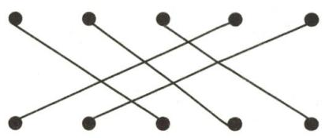  
第 5 题答图

# 基础题卡 43 点、线、面、体

# 新知梳理

1. 线面体 2. 点线面体线点

3. 点动成线

# 课堂小练

1. B  2. D  3. D  4. D  5. A

# 基础题卡 44 直线、射线、线段(1)

# 新知梳理

1. 无数 一

2. 相交 交点 三一

3. 直线 两

# 课堂小练

1. D 
2. B 
3. C 
4. ①③④

5. 解: (1) 如答图, 直线 AB, 射线 BD, 线段 BC 即为所求.

text_image

A
B
E
C
D

第5题答图

(2)如答图,线段AC,点E即为所求.

# 基础题卡 45 直线、射线、线段(2)

# 新知梳理

1.(1)重合 同侧 (2)长度 长度 长度

2. 两条相等的线段

# 课堂小练

1. C  2. C  3. B  4. D

5. 解: 因为 AB=4cm, BC=2AB, 所以 BC=8cm,

所以 $AC=AB+BC=12cm.$

因为 D 是线段 AC 的中点, 所以 $AD=\frac{1}{2}AC=6cm$ ,

所以 BD=AD-AB=2cm.

# 基础题卡 46 直线、射线、线段(3)

# 新知梳理

线段 长度

# 课堂小练

1.B 2.B 3.A 4.B 5.1或9

6. 解: 因为 $AB = 4 \, cm, OB = \frac{1}{2} \, cm,$

所以 OA=AB-OB=3.5cm.

因为 O 是线段 AC 的中点, 所以 AC=2OA=7cm,

所以 BC=AC-AB=7-4=3(cm)，

故 B, C 两点之间的距离为 3cm.

# 基础题卡 47 角的概念

# 新知梳理

1. 两条射线 旋转 2.(1) 大写 中间

3.360 180 60 60

# 课堂小练

1. C 2. B 3. C 4. C 5. 南偏东 $30^{\circ}$ (或东偏南 $60^{\circ}$ )

# 基础题卡48 角的比较与运算

# 新知梳理

1. 度量法 叠合法 2. 相等

# 课堂小练

1. D  2. A  3. C  4. B  5. ${20}^{ \circ  }$

6. $2 \angle C O M \angle C O B = 80^{\circ} \angle C O B$

# 基础题卡 49 余角和补角

# 新知梳理

1. 余角 补角 2. 相等 相等

3. $65^{\circ}$ $155^{\circ}$ 4. $\angle2=\angle4$

# 课堂小练

1. A 2. C 3. D 4. D 5. A 6. C 7. D 8. C

9. 解: 设这个角的度数为 x, 则它的余角为 $90^{\circ}-x$ , 补角为 $180^{\circ}-x$ .

根据题意, 得 $90^{\circ}-x=\frac{1}{4}(180^{\circ}-x)$ , 解得 $x=60^{\circ}$ .

故这个角的度数是 $60^{\circ}$

10. 解: $\angle AOD$ 和 $\angle BOE$ 互为余角, $\angle AOD$ 和 $\angle COE$ 互为余角, $\angle COD$ 和 $\angle COE$ 互为余角, $\angle COD$ 和 $\angle BOE$ 互为余角. 理由如下:

因为射线 OD 和 OE 分别平分 $\angle AOC$ 和 $\angle BOC$ ,

所以 $\angle COD=\angle AOD=\frac{1}{2}\angle AOC,$

$$
\angle C O E = \angle B O E = \frac {1}{2} \angle C O B.
$$

因为 $\angle AOC+\angle COB=180^{\circ}$ ,

所以 $\angle AOD + \angle BOE = \angle AOD + \angle COE = \angle COD + \angle COE = \angle COD + \angle BOE = 90^{\circ}$ ,

所以∠AOD和∠BOE互为余角，∠AOD和∠COE互为余角，∠COD和∠COE互为余角，∠COD和∠BOE互为余角.

11. 解: (1) $\angle1$ 与 $\angle2$ 互余. 理由如下:

因为 $\angle AOB=120^{\circ},OF$ 平分 $\angle AOB,$

所以 $\angle 2 = \frac{1}{2}\angle AOB = 60^{\circ}.$

因为 $2\angle1=\angle2$ ，所以 $\angle1=30^{\circ}$ ，

所以 $\angle1+\angle2=90^{\circ}$ ，即 $\angle1$ 与 $\angle2$ 互余.

(2) $\angle2$ 与 $\angle AOB$ 互补.理由如下:

因为 $\angle 2 + \angle AOB = 60^{\circ} + 120^{\circ} = 180^{\circ}$

所以 $\angle2$ 与 $\angle AOB$ 互补.

# 学霸微专题

# 学霸微专题1 正、负数中的规律

1. D 点拨: 规律: 在 A 位置的数被 4 除余 2, 在 B 位置的数被 4 除余 3, 在 C 位置的数被 4 整除, 在 D 位置的数被 4 除余 1; 由 $2025 \div 4 = 506 \cdots 1$ , ∴ 2025 应在 D 处.

2. -29 C 点拨:根据题图规律,可得“峰 n”中峰顶的位置的有理数的绝对值为 5n-1,∴“峰 6”中 C 的位置的有理数绝对值为 29,故“峰 6”中 C 的位置是有理数 -29;由 $(2024+1)\div5=405$ ,得 2024 为“峰 405”中 C 位置的有理数.

3. 二 点拨: 每 8 个数字一个循环, 余数为 0, 在第一列; 余数为 1, 在第二列; 余数为 2, 在第三列; 余数为 3, 在第四列; 余数为 4, 在第五列; 余数为 5, 在第四列; 余数为 6, 在第三列; 余数为 7, 在第二列; 又 $\because 201 \div 8 = 25 \cdots 1$ , 故 -201 在第二列.

# 学霸微专题 2 数轴上动点运动的规律

1. B 点拨:根据题意,4个数为一个周期,依次为0,3,2,1, $2124\div4=531$ ,故数轴上表示-2124的点与圆周上表示数字1的点重合.

2.3 2

3.(1)-3 (2)①-4 ② $\frac{1}{2}d+1$

# 学霸微专题3 “数”和“形”结合理解相反数

1. 解: (1) 点 C 表示的数是 -1.

(2) 点 C 表示的数是 0.5, 点 D 表示的数是 -4.5.

2. 解: ①-(-7)=7;

②+(-7)=-7;   
③ $-[-(-7)]=-7;$   
④ $-[-(+7)]=7;$   
⑤ $-\left\{-[-(-7)]\right\}=7;$   
⑥ $-\left\{-[-(+7)]\right\}=-7.$

(1) 当 +7 前面有 2024 个负号时, 化简后的结果是 +7.  
(2) 当 -7 前面有 2023 个负号时, 化简后的结果是 +7.

总结规律:一个数的前面有奇数个负号,化简后的结果等于它的相反数;有偶数个负号,化简后的结果等于它本身.

3.(1)10 (2)7 7

(3) 解: ∵ 点 C 到原点的距离为 4, ∴ c = 4 或 c = -4.

$$
\because A B = 8, B C = 3,
$$

∴当c=4时，b=4-3=1，a=1-8=-7，

当 c=-4 时, b=-4-3=-7, a=-7-8=-15,

$\therefore p = a + b + c = -7 + 1 + 4 = -2$ 或 $p = -15 - 7 - 4 = -26.$

# 学霸微专题4 $|x - a|$ 的化简

1. 解: (1) 因为在数轴上与原点距离为 7 的点表示的数为 $\pm7$ , 所以方程 $|x|=7$ 的解为 $x=\pm7$ .

(2)因为在方程 $|x-2023|=3$ 中,x的值是数轴上与表示2023的点的距离为3的点表示的数,

所以方程 $|x-2023|=3$ 的解是x=2026或x=2020.

(3)能. $-3\leqslant x\leqslant3,y\geqslant4$ 或 $y\leqslant-4$ .

2. 解: (1) 当 x=2025 时, $\left|x-2025\right|$ 有最小值, 这个最小值是 0.

(2) 当 x=1 时, $2025-|x-1|$ 有最大值, 这个最大值是 2025.

# 学霸微专题5 $|m| = |n|$ 与 $|m| + |n| = 0$

1. 解: (1) 因为 $\vert a-3\vert$ 与 $\vert 2b-4\vert$ 互为相反数,

所以 $|a-3|+|2b-4|=0$ ,

所以 a-3=0,2b-4=0,

解得 a=3, b=2.

(2) 因为 a=3, b=2,

所以 $|x|=2a+4b=2\times3+4\times2=6+8=14$ ,

所以 $x = \pm 14$

所以 x 的相反数为 -14 或 14.

2. 解: 因为 $\left|a-\frac{1}{2}\right|+\left|b+\frac{1}{3}\right|+\left|c+\frac{2}{5}\right|=0,$

$$
\left| a - \frac {1}{2} \right| \geqslant 0, \left| b + \frac {1}{3} \right| \geqslant 0, \left| c + \frac {2}{5} \right| \geqslant 0,
$$

所以 $a - \frac{1}{2} = 0, b + \frac{1}{3} = 0, c + \frac{2}{5} = 0,$

所以 $a=\frac{1}{2}, b=-\frac{1}{3}, c=-\frac{2}{5}$ ,

所以 $a - |b| + (-c)$

$$
\begin{array}{l} = \frac {1}{2} - \left| - \frac {1}{3} \right| + \left[ - \left(- \frac {2}{5}\right) \right] \\ = \frac {1}{2} - \frac {1}{3} + \frac {2}{5} \\ = \frac {1 7}{3 0}. \\ \end{array}
$$

3. 解: (1) 因为 a 是最大的负整数的相反数,

所以 $a = 1$

因为 $|b+4|=2$ ，

所以 $b + 4 = 2$ 或 $b + 4 = -2$

所以 b=-2 或 b=-6.

因为 $|c-5|+|d+3|=0$ ，

所以 $c - 5 = 0, d + 3 = 0$

解得 c=5, d=-3,

所以 a=1, b=-2 或 -6, c=5, d=-3.

$$
\begin{array}{l} (2) a - b - c + d = 1 - (- 2) - 5 + (- 3) \\ = 1 + 2 - 5 - 3, \\ = - 5 \\ \end{array}
$$

或 $a - b - c + d = 1 - (-6) - 5 + (-3)$

$$
= 1 + 6 - 5 - 3,
$$

$$
= - 1,
$$

所以 $a - b - c + d$ 的值为-5或-1.

# 学霸微专题6 化带分数为整数和真分数

1. 解: 原式 = $(1 + 2 + 3 + \cdots + 8 + 9) + \left( \frac{9}{10} + \frac{8}{10} + \frac{7}{10} + \cdots + \right.$

$$
\begin{array}{l} \left. \frac {2}{1 0} + \frac {1}{1 0}\right) \\ = 4 5 + \frac {4 5}{1 0} \\ = 4 9 \frac {1}{2}. \\ \end{array}
$$

2. 解: 原式 = $1 - \frac{1}{1 \times 2} + 1 - \frac{1}{2 \times 3} + 1 - \frac{1}{3 \times 4} + \cdots + 1 -$

$$
\begin{array}{l} \frac {1}{9 8 \times 9 9} + 1 - \frac {1}{9 9 \times 1 0 0} \\ = 9 9 - \left(1 - \frac {1}{2}\right) - \left(\frac {1}{2} - \frac {1}{3}\right) - \left(\frac {1}{3} - \frac {1}{4}\right) - \dots - \left(\frac {1}{9 8} - \right. \\ \left. \frac {1}{9 9}\right) - \left(\frac {1}{9 9} - \frac {1}{1 0 0}\right) \\ = 9 9 - \left(1 - \frac {1}{2} + \frac {1}{2} - \frac {1}{3} + \frac {1}{3} - \frac {1}{4} + \frac {1}{4} - \frac {1}{5} + \dots + \frac {1}{9 8} \right. \\ - \frac {1}{9 9} + \frac {1 1}{9 9} - \frac {1}{1 0 0}) \\ = 9 9 - \left(1 - \frac {1}{1 0 0}\right) \\ = 9 9 - 1 + \frac {1}{1 0 0} \\ = 9 8 \frac {1}{1 0 0}. \\ \end{array}
$$

3. 解: $\left(-2024\frac{5}{6}\right)+\left(-2022\frac{2}{3}\right)+\left(-1\frac{1}{2}\right)+\left(-\frac{5}{6}\right)+$

$$
4 0 4 6 \frac {3}{4}
$$

$$
= \left[ (- 2 0 2 4) + \left(- \frac {5}{6}\right) \right] + \left[ (- 2 0 2 2) + \left(- \frac {2}{3}\right) \right] +
$$

$$
\left[ (- 1) + \left(- \frac {1}{2}\right) \right] + \left(- \frac {5}{6}\right) + \left(4 0 4 6 + \frac {3}{4}\right)
$$

$$
= \left[ (- 2 0 2 4) + (- 2 0 2 2) + (- 1) + 4 0 4 6 \right] + \left[ \left(- \frac {5}{6}\right) + \right.
$$

$$
\left(- \frac {2}{3}\right) + \left(- \frac {1}{2}\right) + \left(- \frac {5}{6}\right) + \frac {3}{4} ]
$$

$$
= - 1 + \left(- \frac {2 5}{1 2}\right)
$$

$$
= - \frac {3 7}{1 2}.
$$

# 学霸微专题7 “标准数”中的应用

1. 解: (1) 周五的进出库数为 +6 - (+26) - (-16) - (+42)

$$
\begin{array}{l} - (- 3 0) - (- 2 5) - (- 9) \\ = 6 - 2 6 + 1 6 - 4 2 + 3 0 + 2 5 + 9 \\ = + 1 8 (\text { 吨 }). \\ \end{array}
$$

答: 星期五的进出库数为 +18 吨.

(2)这一周的装卸费为 $(26+16+42+30+18+25+9)\times$

$$
1 0 = 1 6 6 \times 1 0 = 1 6 6 0 (\text {元}).
$$

答:这一周要付 1660 元装卸费.

2. 解: (1) 由题意可得, 星期三这个监测点的实际水位为 155 - 6.02 = 148.98 (米).

(2)根据数据知,星期六的水位为 $155+4.47=159.47$ (米), 星期四的水位为 $155+1.02=156.02$ (米).

∵(159.47-156.02)×7.2=24.84(亿立方米)，

∴星期六的蓄水量比星期四的蓄水量增加了24.84亿立方米.

# 学霸微专题8 数轴上两点间的距离

1. 解:【方法应用】∵数轴上点 P, Q 表示的数分别为 -5 和 4,

∴点 P, Q 间的距离为 $4-(-5)=9$ .

∵数轴上点 M, N 表示的数分别为 -9 和 -2,

∴点 M, N 间的距离为 $(-2)-(-9)=-2+9=7$ .

【方法拓展】设另一个点表示的数为 m.

由题可得 $|m - 3| = 6$

解得 m=9 或 -3，

即另一个点表示的数为 9 或 -3.

2. (1)5

(2)-5 或 3 点拨: $\because |x+1|=4, \therefore x+1=4$ 或 $x+1=-4, \therefore x=-1+4=3$ 或 x=-1-4=-5.

(3) 解: $\left|x-2\right|+\left|x+5\right|$ 表示数轴上数 x 对应的点到 2 和 -5 对应的点之间的距离之和等于 7.

∵2 和 -5 对应的点之间的距离为 7，

∴当 x 对应的点在 -5 和 2 对应的点之间时， $|x-2|+|x+5|=7$ .

$\because x$ 为整数，

$$
\therefore x = - 5, - 4, - 3, - 2, - 1, 0, 1, 2,
$$

$$
\therefore - 5 - 4 - 3 - 2 - 1 + 0 + 1 + 2 = - 1 2.
$$

# 学霸微专题9 $|a - b|$ 的化简

1.(1)10-3 $\frac{3}{14}-\frac{3}{17}$

(2) 解: $\left|\frac{1}{101}-\frac{1}{100}\right|+\left|\frac{1}{102}-\frac{1}{101}\right|+\left|\frac{1}{103}-\frac{1}{102}\right|+\cdots$

$$
+ \left| \frac {1}{1 0 0 0} - \frac {1}{9 9 9} \right|
$$

$$
= - \left(\frac {1}{1 0 1} - \frac {1}{1 0 0}\right) - \left(\frac {1}{1 0 2} - \frac {1}{1 0 1}\right) - \left(\frac {1}{1 0 3} - \frac {1}{1 0 2}\right) - \dots -
$$

$$
\left(\frac {1}{1 0 0 0} - \frac {1}{9 9 9}\right)
$$

$$
= \frac {1}{1 0 0} - \frac {1}{1 0 1} + \frac {1}{1 0 1} - \frac {1}{1 0 2} + \frac {1}{1 0 2} - \frac {1}{1 0 3} + \dots + \frac {1}{9 9 9} - \frac {1}{1 0 0 0}
$$

$$
= \frac {1}{1 0 0} - \frac {1}{1 0 0 0}
$$

$$
= \frac {9}{1 0 0 0}.
$$

2. (1) $\frac{1}{18} - \frac{1}{19}$

$$
\begin{array}{l} = 1 - \frac {1}{2} + \frac {1}{2} - \frac {1}{3} + \frac {1}{3} - \frac {1}{4} + \frac {1}{4} - \frac {1}{5} \\ = 1 - \frac {1}{5} \\ = \frac {4}{5}. \\ \end{array}
$$

(2) 解: $\left|\frac{1}{2} - 1\right| + \left|\frac{1}{3} - \frac{1}{2}\right| + \left|\frac{1}{4} - \frac{1}{3}\right| + \left|\frac{1}{5} - \frac{1}{4}\right|$

$$
\begin{array}{l} \frac {1}{2 0 2 2} \\ = 1 - \frac {1}{2} + \frac {1}{2} - \frac {1}{3} + \frac {1}{3} - \frac {1}{4} + \dots + \frac {1}{2 0 2 2} - \frac {1}{2 0 2 3} \\ = 1 - \frac {1}{2 0 2 3} \\ = \frac {2 0 2 2}{2 0 2 3}. \\ \end{array}
$$

(3) 解: $\left|\frac{1}{2}-1\right|+\left|\frac{1}{3}-\frac{1}{2}\right|+\left|\frac{1}{4}-\frac{1}{3}\right|+\cdots+\left|\frac{1}{2023}-\right.$

# 学霸微专题10 巧用运算律

1. 解: (1) 小杨的解法较好.

$$
\begin{array}{l} = \left(2 0 - \frac {1}{1 8}\right) \times (- 9) \\ = 2 0 \times (- 9) - \frac {1}{1 8} \times (- 9) \\ = - 1 8 0 + \frac {1}{2} \\ = - 1 7 9 \frac {1}{2}. \\ \end{array}
$$

(2) $19 \frac{17}{18} \times (-9)$

2. 解: (1) $-29 \times 588 + 28 \times 588$

$$
= 5 8 8 \times (- 2 9 + 2 8)
$$

$$
= 5 8 8 \times (- 1)
$$

$$
= - 5 8 8.
$$

$$
\begin{array}{l} = 2 0 2 3 \times \left(- \frac {3}{7} - \frac {6}{7} + \frac {2}{7}\right) \\ = 2 0 2 3 \times (- 1) \\ = - 2 0 2 3. \\ \end{array}
$$

(2) $-2023\times\frac{3}{7}+2023\times\left(-\frac{6}{7}\right)+2023\times\frac{2}{7}$

# 学霸微专题11 拆项法

1. (1) $\frac{1}{50}$

(2) 解: 原式 $= -\frac{99}{100} \times \left(-\frac{98}{99}\right) \times \left(-\frac{97}{98}\right) \times \cdots \times \left(-\frac{1}{2}\right)$

$$
= - \frac {1}{1 0 0}.
$$

2.(1) $\frac{1}{n}-\frac{1}{n+1}$

(2)① $\frac{2022}{2023}$ ② $\frac{n}{n+1}$

$$
\begin{array}{l} = 1 - \frac {1}{2} + \frac {1}{2} - \frac {1}{3} + \frac {1}{3} - \frac {1}{4} + \dots + \frac {1}{2 0 2 2} - \frac {1}{2 0 2 3} \\ = 1 - \frac {1}{2 0 2 3} \\ = \frac {2 0 2 2}{2 0 2 3}. \\ \end{array}
$$

点拨:① $\frac{1}{1\times2}+\frac{1}{2\times3}+\frac{1}{3\times4}+\cdots+\frac{1}{2022\times2023}$

$$
\begin{array}{l} = 1 - \frac {1}{2} + \frac {1}{2} - \frac {1}{3} + \frac {1}{3} - \frac {1}{4} + \dots + \frac {1}{n} - \frac {1}{n + 1} \\ = 1 - \frac {1}{n + 1} \\ = \frac {n + 1 - 1}{n + 1} \\ = \frac {n}{n + 1}. \\ \end{array}
$$

② $\frac{1}{1\times 2} +\frac{1}{2\times 3} +\frac{1}{3\times 4} +\dots +\frac{1}{n(n + 1)}$

$$
\begin{array}{l} = \frac {1}{2} \times \left(\frac {1}{2} - \frac {1}{4} + \frac {1}{4} - \frac {1}{6} + \frac {1}{6} - \frac {1}{8} + \dots + \frac {1}{2 0 2 2} - \right. \\ \left. \frac {1}{2 0 2 4}\right) \\ = \frac {1}{2} \times \left(\frac {1}{2} - \frac {1}{2 0 2 4}\right) \\ = \frac {1}{2} \times \frac {1 0 1 2 - 1}{2 0 2 4} \\ = \frac {1 0 1 1}{4 0 4 8}. \\ \end{array}
$$

(3) 解: $\frac{1}{2 \times 4} + \frac{1}{4 \times 6} + \frac{1}{6 \times 8} + \cdots + \frac{1}{2022 \times 2024}$

# 学霸微专题 12 $\frac{|x|}{x}$ 的化简

1.(1)1 点拨:∵xyz>0,x+y+z<0,

∴x,y,z中有1个正数,2个负数.

(2)解:∵x,y,z中有1个正数,2个负数,

∴可设 x>0, y<0, z<0,

$$
\therefore \frac {| x |}{x} + \frac {| y |}{y} + \frac {| z |}{z} + \frac {| x y z |}{x y z}
$$

$$
\begin{array}{l} = \frac {x}{x} + \frac {- y}{y} + \frac {- z}{z} + \frac {x y z}{x y z} \\ = 1 - 1 - 1 + 1 \\ = 0. \\ \end{array}
$$

2. 解: (1) $\because ab < 0, \therefore a, b$ 异号,

不妨设 a>0, b<0,

$$
\therefore \frac {| a |}{a} + \frac {| b |}{b} = \frac {a}{a} + \frac {- b}{b} = 1 - 1 = 0.
$$

(2) $\because abc<0,\therefore a,b,c$ 中负数的个数为奇数.

①当 a, b, c 中有两个正数，一个负数时，不妨设 a > 0, b > 0, c < 0,

$$
\therefore \frac {| a |}{a} + \frac {| b |}{b} + \frac {| c |}{c} = \frac {a}{a} + \frac {b}{b} + \frac {- c}{c} = 1 + 1 - 1 = 1,
$$

②当 $a, b, c$ 均为负数时，有 $a < 0, b < 0, c < 0, \therefore \frac{|a|}{a} + \frac{|b|}{b} + \frac{|c|}{c} = -1 - 1 - 1 = -3.$

故 $\frac{|a|}{a}+\frac{|b|}{b}+\frac{|c|}{c}$ 的值为1或-3.

(3) $\because a+b+c=0,$

$$
\therefore b + c = - a, a + c = - b, a + b = - c.
$$

$$
\because a b c <   0,
$$

$\therefore a,b,c$ 中有两个正数,一个负数.

不妨设 a>0, b>0, c<0,

$$
\therefore \frac {| a |}{b + c} + \frac {| b |}{a + c} + \frac {| c |}{a + b}
$$

$$
= \frac {a}{- a} + \frac {b}{- b} + \frac {- c}{- c}
$$

$$
= - 1 - 1 + 1
$$

$$
= - 1,
$$

故 $\frac{|a|}{b+c}+\frac{|b|}{a+c}+\frac{|c|}{a+b}$ 的值为-1.

# 学霸微专题13 倒数法的运用

1. 解: (1) 前后两部分互为倒数.

(2)先计算后一部分比较简便.

$$
\begin{array}{l} \left(\frac {1}{4} + \frac {1}{1 2} - \frac {7}{1 8} - \frac {1}{3 6}\right) \div \frac {1}{3 6} = \left(\frac {1}{4} + \frac {1}{1 2} - \frac {7}{1 8} - \frac {1}{3 6}\right) \times 3 6 = \\ 9 + 3 - 1 4 - 1 = - 3. \\ \end{array}
$$

(3)因为前后两部分互为倒数,所以 $\frac{1}{36}\div\left(\frac{1}{4}+\frac{1}{12}-\frac{7}{18}-\frac{1}{36}\right)=-\frac{1}{3}.$

(4)根据以上分析,可知原式 $=-\frac{1}{3}+(-3)=-3\frac{1}{3}.$

2. 解: 原式的倒数为 $\left(\frac{1}{6}-\frac{3}{14}+\frac{2}{3}-\frac{2}{7}\right)\div\left(-\frac{1}{42}\right)=$

$$
\left(\frac {1}{6} - \frac {3}{1 4} + \frac {2}{3} - \frac {2}{7}\right) \times (- 4 2) = - 7 + 9 - 2 8 + 1 2 =
$$

-14, ∴ 原式 = $-\frac{1}{14}$ .

# 学霸微专题 14 错位相减法

1. 解: 此式具备上述规律.

设 $S=1+\frac{1}{2}+\frac{1}{2^{2}}+\frac{1}{2^{3}}+\cdots+\frac{1}{2^{2000}}$ ，①

则 $\frac{1}{2}S=\frac{1}{2}+\frac{1}{2^{2}}+\frac{1}{2^{3}}+\frac{1}{2^{4}}+\cdots+\frac{1}{2^{2001}}$ ，②

①-②得 $\frac{1}{2}S=1-\frac{1}{2^{2001}}$ ,

解得 $S=2-\frac{1}{2^{2000}}$ .

2. 解: (1) 设 $S=1+2+2^{2}+2^{3}+\cdots+2^{100}$ ，①

将等式两边同时乘2，

得 $2S=2+2^{2}+2^{3}+2^{4}+\cdots+2^{101}$ ，②

②-①, 得 $S=2^{101}-1$ ,

即 $S=1+2+2^{2}+2^{3}+\cdots+2^{100}=2^{101}-1.$

(2)设 $S=1+3+3^{2}+3^{3}+3^{4}+\cdots+3^{n}$ ，①

将等式两边同时乘 3, 得

$$
3 S = 3 + 3 ^ {2} + 3 ^ {3} + 3 ^ {4} + 3 ^ {5} + \dots + 3 ^ {n + 1}, \tag {②}
$$

②-①, 得 $3S-S=3^{n+1}-1$ ,

即 $2S=3^{n+1}-1$ ，

故 $S=1+3+3^{2}+3^{3}+3^{4}+\cdots+3^{n}=\frac{3^{n+1}-1}{2}.$

# 学霸微专题 15 二进制与十进制

1.【解决问题】解：∵ $101011=1\times2^{5}+0\times2^{4}+1\times2^{3}+0\times2^{2}+1\times2^{1}+1\times2^{0}=43$ ，∴二进制中的数101011等于十进制中的43.

【应用拓展】1838 点拨: $1 \times 6^{4} + 2 \times 6^{3} + 3 \times 6^{2} + 0 \times 6^{1} + 2 \times 6^{0} = 1838$ (个), 故她一共采集到的野果数量为 1838.

2.(1) $1\times2^{3}+1\times2^{2}+0\times2^{1}+0\times2^{0}$ $1100_{(二进制)}$

(2) $1 \times 2^{6} + 1 \times 2^{5} + 1 \times 2^{4} + 0 \times 2^{3} + 1 \times 2^{2} + 0 \times 2^{1} + 1 \times 2^{0}$ 117

# 学霸微专题16 程序图的运算

1.(1)解:当 x=-3 时, 输出 y 的值= $\left[-3\times(-4)\right]^{2}-20=124.$

(2)5或-5 点拨：∵380+20=400，±20的平方为400，
∴ $x=20\div(-4)=-5$ 或 $x=(-20)\div(-4)=5.$

(3) 解: 当 x=0 时, $[0 \times (-4)]^{2}-20=-20<100$ ,

$$
[ (- 2 0) \times (- 4) ] ^ {2} - 2 0 = 6 3 8 0 > 1 0 0,
$$

∴此时输出 y 的值为 6380.

2. (1)

<table><tr><td>输入</td><td>-2</td><td>0</td><td>2.5</td></tr><tr><td>图1的输出</td><td>-15</td><td>-3</td><td>12</td></tr><tr><td>图2的输出</td><td>-30</td><td>-18</td><td>-3</td></tr></table>

(2)解:如答图①所示.

flowchart

①

flowchart

②   
第2题答图

(3)解:如答图②所示.

# 学霸微专题 17 整体代入求值

1.(1)-3 点拨:因为 x-3y=8,

所以 $5-x+3y=5-(x-3y)=5-8=-3.$

(2) 解: 因为 a-2b=-3,

所以 $2(a - b) - \frac{1}{2} (a + 2b) + 3 = 2a - 2b - \frac{1}{2} a - b + 3 =$

$$
\frac {3}{2} (a - 2 b) + 3 = \frac {3}{2} \times (- 3) + 3 = - \frac {3}{2}.
$$

2. 解: (1) 因为 $m^{2} + m = 2$ ,

所以 $m^{2}+m+2023=2+2023=2025.$

(2) 因为 $2p - q = -3$

所以 $5(p - q) - 9p + 7q + 5$

$$
\begin{array}{l} = 5 p - 5 q - 9 p + 7 q + 5 \\ = - 4 p + 2 q + 5 \\ = - 2 (2 p - q) + 5 \\ = - 2 \times (- 3) + 5 \\ = 1 1. \\ \end{array}
$$

(3) 因为 $2x^{2} - 3xy - y^{2} = 3, -x^{2} + 5xy - 6y^{2} = -2,$

所以 $4x^{2} - 13xy + 11y^{2}$

$$
\begin{array}{l} = 2 x ^ {2} - 3 x y - y ^ {2} + 2 x ^ {2} - 1 0 x y + 1 2 y ^ {2} \\ = 2 x ^ {2} - 3 x y - y ^ {2} - 2 \left(- x ^ {2} + 5 x y - 6 y ^ {2}\right) \\ = 3 - 2 \times (- 2) \\ = 3 + 4 \\ = 7. \\ \end{array}
$$

# 学霸微专题18 提价与降价

1. 解: (1) 方案一调价后的价格是

$$
a (1 + 15\%) (1 - 15\%) = 0.9775a \text{(元)},
$$

方案二调价后的价格是

$$
a (1 - 15 \%) (1 + 15 \%) = 0.9775 a (\text {元}),
$$

$$
0. 9 7 7 5 a = 0. 9 7 7 5 a,
$$

即方案一调价后的价格是 0.9775a 元, 方案二调价后的价格是 0.9775a 元, 结果一样, 调价后的结果都没有恢复到原价.

(2)方案一调价后的价格是

$$
a (1 + 25\%) (1 - 25\%) = 0.9375a \text{(元)},
$$

方案二调价后的价格是

$$
a (1 - 25\%) (1 + 25\%) = 0.9375a \text{(元)},
$$

$$
0. 9 3 7 5 a = 0. 9 3 7 5 a,
$$

即方案一调价后的价格和方案二调价后的价格结果一样.

(3)在原价基础上,先提价百分之多少,在此基础上再降价同样的百分数,与先降价百分之多少,在此基础上再提价同样的百分数,最后结果一样,但不能恢复到原价.

2.(1)92 72

点拨:3级苹果的售价为: $80+6\times(5-3)=92$ (元/箱);

7级苹果的售价为:80-4×(7-5)=72(元/箱).

(2) 解: 当 $1 \leqslant a < 5$ 时, 苹果的价格为: $80 + 6(5 - a) = (-6a + 110)$ 元/箱;

当 a=5 时, 苹果的价格为 80 元/箱;

当 $5 < a \leqslant 10$ 时, 苹果的价格为: $80 - 4(a - 5) = (-4a + 100)$ 元/箱.

(3) 解: 1 级苹果的单价为 104 元/箱.

方案一的费用: $104 \times (1 - 5\%) \times 100 = 9880$ (元);

方案二的费用: $104 \times (1 - 8\%) \times 100 + 300 = 9868$ (元).

因为 9868<9880，

所以选择方案二更加合算.

# 学霸微专题 19 数与式规律

1. (1) $25^{2} - 21^{2} = 8 \times 23$

(2) $(4n + 1)^{2} - (4n - 3)^{2} = 8(4n - 1)$

(3) 解: $8 \times 7 + 8 \times 11 + \cdots + 8 \times 399 + 8 \times 403$

$$
= (9 ^ {2} - 5 ^ {2}) + (1 3 ^ {2} - 9 ^ {2}) + \dots + (4 0 1 ^ {2} - 3 9 7 ^ {2}) + (4 0 5 ^ {2} - 4 0 1 ^ {2})
$$

$$
= 9 ^ {2} - 5 ^ {2} + 1 3 ^ {2} - 9 ^ {2} + \dots + 4 0 1 ^ {2} - 3 9 7 ^ {2} + 4 0 5 ^ {2} - 4 0 1 ^ {2}
$$

$$
= 4 0 5 ^ {2} - 5 ^ {2}
$$

$$
\begin{array}{l} = 1 6 4 0 2 5 - 2 5 \\ = 1 6 4 0 0 0. \\ \end{array}
$$

2. (1) $\frac{1}{5}-\frac{1}{6}$

(2) 解: 由(1)中的发现可知:

第 $n$ 个等式为 $a_{n} = \frac{1}{n(n + 1)} = \frac{1}{n} -\frac{1}{n + 1}(n$ 为正整数）.

当 $n = 2025$ 时，

$$
a _ {2 0 2 5} = \frac {1}{2 0 2 5 \times 2 0 2 6} = \frac {1}{2 0 2 5} - \frac {1}{2 0 2 6},
$$

所以 $a_{1}+a_{2}+\cdots+a_{2025}$

$$
\begin{array}{l} = 1 - \frac {1}{2} + \frac {1}{2} - \frac {1}{3} + \frac {1}{3} - \frac {1}{4} + \dots + \frac {1}{2 0 2 5} - \frac {1}{2 0 2 6} \\ = 1 - \frac {1}{2 0 2 6} \\ = \frac {2 0 2 5}{2 0 2 6}. \\ \end{array}
$$

(3) 解: 原式= $\frac{1}{2}\times\left(\frac{1}{2}-\frac{1}{4}\right)+\frac{1}{2}\times\left(\frac{1}{4}-\frac{1}{6}\right)+\frac{1}{2}\times$

$$
\begin{array}{l} \left(\frac {1}{6} - \frac {1}{8}\right) + \dots + \frac {1}{2} \times \left(\frac {1}{9 8} - \frac {1}{1 0 0}\right) \\ = \frac {1}{2} \times \left(\frac {1}{2} - \frac {1}{4} + \frac {1}{4} - \frac {1}{6} + \frac {1}{6} - \frac {1}{8} + \dots + \frac {1}{9 8} - \frac {1}{1 0 0}\right) \\ = \frac {1}{2} \times \left(\frac {1}{2} - \frac {1}{1 0 0}\right) \\ = \frac {1}{2} \times \frac {4 9}{1 0 0} \\ = \frac {4 9}{2 0 0}. \\ \end{array}
$$

# 学霸微专题 20 图形规律

1.(1) $\frac{1}{2^{5}}$ 点拨:由所给图形可知,

图中阴影部分的面积为 $\frac{1}{2^4}$ 的一半，

所以图中阴影部分的面积为 $\frac{1}{2} \times \frac{1}{2^4} = \frac{1}{2^5}$ .

(2)解:由所给图形可知,

$$
\frac {1}{2} + \frac {1}{2 ^ {2}} + \frac {1}{2 ^ {3}} + \frac {1}{2 ^ {4}} + \frac {1}{2 ^ {5}} + \frac {1}{2 ^ {5}} = 1,
$$

所以 $\frac{1}{2} +\frac{1}{2^2} +\frac{1}{2^3} +\frac{1}{2^4} +\frac{1}{2^5} = 1 - \frac{1}{2^5} = \frac{31}{32}.$

(3) 解: 由所给图形可知,

$$
\frac {1}{2} + \frac {1}{2 ^ {2}} + \frac {1}{2 ^ {3}} + \dots + \frac {1}{2 ^ {n}} + \frac {1}{2 ^ {n}} = 1,
$$

所以 $\frac{1}{2} +\frac{1}{2^2} +\frac{1}{2^3} +\dots +\frac{1}{2^n} = 1 - \frac{1}{2^n}.$

2.(1)21 26 (2)5n+1

点拨:(1)搭第1个图形需要火柴棒的根数为 $6=1\times5+1$ ;

搭第2个图形需要火柴棒的根数为 $11 = 2 \times 5 + 1$

搭第3个图形需要火柴棒的根数为 $16 = 3 \times 5 + 1$ ；

● ● ● ● ● ●

所以搭第 n 个图形需要火柴棒的根数为 $n \times 5 + 1 = 5n + 1$ .

当 n=4 时， $a=5\times4+1=21$ ;

当 n=5 时, $b=5\times5+1=26$ .

(2)由(1)知,搭第n个图形需要火柴棒的根数为 $(5n+1)$ .

(3) 解: 当 n=2025 时, $5n+1=10126$ .

所以搭第 2025 个图形需要火柴棒的根数为 10126.

# 学霸微专题21 求几何图形的周长或面积

1. 解: (1) 阴影部分的周长为 $2[(2x+2y)+(x+2y)]=6x+8y$ .

(2) 当 $x = 3$ 米, $y = 2$ 米时,

$$
6 x + 8 y = 6 \times 3 + 8 \times 2 = 3 4 (\text { 米 }), 1 2 \times 3 4 = 4 0 8 (\text { 元 }).
$$

答:围栏的造价为 408 元.

2. 解: (1) 因为小长方形 M 的宽为 3, 大长方形的长为 a, 所以小长方形 M 的长为 $a - 3 \times 3 = a - 9$ .

(2)能.理由如下:

由图可得阴影部分 P 的长为 a-9，宽为 b-6.

阴影部分 Q 的长为 9, 宽为 $b-(a-9)=b-a+9$ .

所以阴影部分 P 和 Q 的周长之和为

$$
2 (a - 9 + b - 6) + 2 (9 + b - a + 9)
$$

$$
= 2 a - 1 8 + 2 b - 1 2 + 1 8 + 2 b - 2 a + 1 8
$$

$$
= 4 b + 6,
$$

所以阴影部分 P 与 Q 的周长之和与 a 的值无关.

当 b=15.3 时， $4b+6=4\times15.3+6=67.2$

答: 当 b=15.3 时, 阴影部分 P 与 Q 的周长之和为 67.2.

# 学霸微专题 22 等式的性质

1. 解: (1) 根据题图知 2a=3b, 2b=3c.

所以 $a = \frac{3}{2} b, b = \frac{3}{2} c$ ，所以 $a = \frac{9}{4} c$ .

因为 $\frac{9}{4}c>\frac{3}{2}c>c,$

所以 a > b > c，

所以 $a, b, c$ 三种物体就单个而言， $a$ 最重.

(2)由(1)知, $a=\frac{9}{4}c$ ,所以4a=9c,

所以要使天平平衡,天平两边至少应该分别放 4 个物体 a 和 9 个物体 c.

2. 解: (1) 因为 $A=5m^{2}-4\left(\frac{7}{4}m-\frac{1}{2}\right)$ , $B=7(m^{2}-m)+3$ ,

所以 $A - B = \left[5m^{2} - 4\left(\frac{7}{4} m - \frac{1}{2}\right)\right] - [7(m^{2} - m) + 3]$

$$
\begin{array}{l} = 5 m ^ {2} - 4 \left(\frac {7}{4} m - \frac {1}{2}\right) - 7 (m ^ {2} - m) - 3 \\ = 5 m ^ {2} - 7 m + 2 - 7 m ^ {2} + 7 m - 3 \\ = - 2 m ^ {2} - 1. \\ \end{array}
$$

因为不论 m 为何值， $-2m^{2}-1<0$ 恒成立，

所以 A-B<0，即 A<B.

(2) $(3a+2b)-(2a+3b)=3a+2b-2a-3b=a-b.$

当 a > b 时, a - b > 0, 此时 $3a + 2b > 2a + 3b$ ;

当 a=b 时, a-b=0, 此时 $3a+2b=2a+3b$ ;

当 a<b 时, a-b<0, 此时 $3a+2b<2a+3b$ .

# 学霸微专题 23 含绝对值的方程

1. 解: (1) 方程 $\left|3x-2\right|=4$ 可化为

$3x - 2 = 4$ 或 $3x - 2 = -4$

解得 x=2 或 $x=-\frac{2}{3}$ .

故方程 $|3x - 2| = 4$ 的解为 $x = 2$ 或 $x = -\frac{2}{3}$ .

(2) 因为 $\left|a+b+4\right|=16$ ,

所以 $a+b+4=16$ 或 $a+b+4=-16$ ,

解得 $a+b=12$ 或 $a+b=-20$ .

2. (1) $x \leqslant 2$

(2) 解: $x+2|x-1|=4$ ,

当 $x - 1 \geqslant 0$ ，即 $x \geqslant 1$ 时， $x + 2(x - 1) = 4$

整理, 得 3x-2=4, 解得 x=2;

当 x-1<0，即 x<1 时， $x+2(1-x)=4$ ，

整理, 得 $-x+2=4$ , 解得 x=-2.

所以原方程的解为 x=2 或 x=-2.

# 学霸微专题 24 新定义方程

1.(1)是 点拨:方程 $2x+1=0$ 的解是 $x=-\frac{1}{2}$ ，方程 $2x+$

3=0 的解是 $x=-\frac{3}{2}$ . 因为 $\left(-\frac{1}{2}\right)-\left(-\frac{3}{2}\right)=-\frac{1}{2}+$ $\frac{3}{2} = 1$ ，所以方程 $2x + 1 = 0$ 是方程 $2x + 3 = 0$ 的“后移

方程”.

(2) 解: 方程 $3x + m + n = 0$ 的解为 $x = -\frac{m + n}{3}$ ,

方程 $3x+m=0$ 的解为 $x=-\frac{m}{3}$ .

根据题意,得 $-\frac{m+n}{3}-\left(-\frac{m}{3}\right)=1$ ,解得n=-3.

(3) $a+b-c=0$ 点拨:方程 $ax+b=0$ 的解为 $x=-\frac{b}{a}$ ,方程 $ax+c=0$ 的解为 $x=-\frac{c}{a}$ .

根据题意,得 $-\frac{b}{a}-\left(-\frac{c}{a}\right)=1$ ,即 $\frac{c-b}{a}=1$ ,

整理得 $a+b-c=0$ .

2. 解: (1) 方程 $4x - (x + 5) = 1$ 与方程 -2y - y = 3 互为“美好方程”. 理由如下:

解方程 $4x-(x+5)=1$ 得 x=2,

解方程-2y-y=3得y=-1.

因为 $x+y=2-1=1$ ，

所以方程 $4x-(x+5)=1$ 与方程 -2y-y=3 互为“美好方程”.

(2)关于 $x$ 的方程 $3x + m = 0$ 的解为 $x = -\frac{m}{3}$ ,

方程 4x-2=x+10 的解为 x=4.

因为关于 x 的方程 $3x + m = 0$ 与方程 $4x - 2 = -x + 10$ 互为“美好方程”，

所以 $-\frac{m}{3}+4=1$ , 解得 m=9.

(3)方程 $\frac{1}{2025}x+1=0$ 的解为x=-2025.

因为关于 x 的方程 $\frac{1}{2025}x+1=0$ 与 $\frac{1}{2025}x+3=2x+k$ 互为“美好方程”，

所以关于 $x$ 的方程 $\frac{1}{2025} x + 3 = 2x + k$ 的解为 $x = 2026$ .

因为关于 $y$ 的方程 $\frac{1}{2025}(y + 1) + 3 = 2y + k + 2$ 就是$\frac{1}{2025}(y+1)+3=2(y+1)+k,$

所以 $y+1=x=2026$ ，解得 y=2025。

所以关于 y 的方程 $\frac{1}{2025}(y+1)+3=2y+k+2$ 的解为 y=2025.

# 学霸微专题 25 商品盈利问题

1. 解: 设降价前一共售出 x 件, 则降价后售出 $(200 - x)$ 件.

根据题意,得

$$
(120 - 80)x + [120 \times (1 - 40\%) - 80](200 - x) = 5600,
$$

解得 x=150.

答:降价前一共售出 150 件.

2. 解: (1) 设第一次购进乙种商品 x 件, 则购进甲种商品 2x 件.

根据题意, 得 $40 \times 2x + 60x = 7000$ , 解得 x = 50,

则 $2x=2\times50=100$ ，

$$
(5 0 - 4 0) \times 1 0 0 + (8 0 - 6 0) \times 5 0 = 2 0 0 0 (\text { 元 }).
$$

答:该超市第一次购进甲种商品100件,乙种商品50件;第一次获得的总利润为2000元.

(2)设第二次乙种商品是按原价打 y 折销售的.

根据题意,得 $(50-40)\times100+\left(80\times\frac{y}{10}-60\right)\times50\times3=$ $2000\times(1-20\%)$ ,

解得 y=8.

答:第二次乙种商品是按原价打8折销售的.

# 学霸微专题26 日历中的方程

1. 解: (1) 设小艳出发的日期是 x, 则另外两天的日期分别是 $(x+1)$ , $(x+2)$ .

根据题意, 得 $x + x + 1 + x + 2 = 12$ ,

解得 x=3.

答: 小艳是星期四出发的.

(2) S 的值能等于 75. 理由如下:

假设 S 的值能等于 75,

因为“十字形”阴影覆盖的最小数为 x，

所以“十字形”阴影覆盖的另外四个数分别为 $(x+7)$ ， $(x+6)$ ， $(x+8)$ ， $(x+14)$ 。根据题意，得

$$
x + (x + 7) + (x + 6) + (x + 8) + (x + 1 4) = 7 5,
$$

解得 x=8.

因为 10 月 8 日是星期二, 在第三列, 此时能形成“十字形”阴影,

所以 x=8 符合题意，

所以假设成立, 即 S 的值能等于 75.

2.(1)13

点拨:设中间的数为 x, 则另外两个数分别为 $x-7, x+7$ .
根据题意, 得 $x-7+x+x+7=60$ , 解得 x=20, 所以 x-7=20-7=13, $x+7=20+7=27$ , 故这三个数分别为 13, 20, 27.

(2) 解: 根据题意, 得 a = e - 7, b = e - 1, c = e + 7, d = e + 1,

所以 $a+b+c+d=(e-7)+(e-1)+(e+7)+(e+1)=4e=48$ ,

解得 e=12.

所以 e 的值为 12.

(3) 解: 不存在 e 的值, 使得 $a + b + c + d = 100$ . 理由如下, 假设存在, 根据题意, 得 4e = 100,

解得 e=25，

所以 $c=e+7=25+7=32.$

因为 32>31, 所以假设不成立,

即不存在 e 的值, 使得 $a + b + c + d = 100$ .

# 学霸微专题 27 球队积分问题

1.(1)2 1

(2) 解: 设 E 队胜 x 场, 则负 $(11 - x)$ 场.

根据题意, 得 $2x+11-x=13$ , 解得 x=2.

答:E 队胜 2 场,负 9 场.

(3) 解: 不可能实现. 理由如下:

因为 D 队前 11 场得 17 分，

所以设后 6 场胜 x 场, 则负 $(6-x)$ 场.

根据题意, 得 $2x+6-x=30-17$ , 解得 x=7.

因为 7>6, 所以不可能实现.

2. 解: (1) 由猛虎队的积分知, 负一场积 1 分.

设胜一场积 x 分. 根据题意, 得

$7x+7=21$ , 解得 x=2.

答: 胜一场积 2 分, 负一场积 1 分.

(2)该领队的说法不成立.理由如下:

设该队胜了 m 场, 则该队负了 $(14-m)$ 场.

根据题意, 得 $2m=(14-m)\times1$ , 解得 $m=\frac{14}{3}$ .

因为 m 必须是整数, 所以该领队的说法不成立.

# 学霸微专题28 方案选择问题

1. 解: (1) 优惠一的付费为 0.9x 元,

优惠二的付费为 $(200+0.8x)$ 元.

(2)根据题意,得

0.9x=200+0.8x, 解得 x=2000.

答: 当购买商品为 2000 元时, 两种优惠所付钱数相同.

(3)优惠一的付费为 $0.9x=0.9 \times 2700=2430$ ,

优惠二的付费为 $200+0.8x=200+0.8\times2700=2360$ .

因为 2430>2360, 故选择优惠二更省钱.

2.(1)1520 2100-4a

(2) 解: 根据题意, 得 2100 - 4a = 1860, 解得 a = 60.

答:七(2)班有60名学生.

(3) 解: 由(2) 可知, 七(1) 班有 105 - 60 = 45 (名) 学生.

$$
4 5 \times 2 0 = 9 0 0 (\text {   元   }), 5 1 \times 1 6 = 8 1 6 (\text {   元   }).
$$

因为 816<900, 所以直接购买 51 张票最省钱.

# 学霸微专题 29 正方体的展开图

1. (1)C

(2)解:如答图①所示.

(3)解:如答图②所示.

natural_image

Geometric grid pattern with shaded squares and a small circle at center (no text or symbols)

①

natural_image

Geometric grid pattern with shaded squares forming an L-shape (no text or symbols)

②   
第1题答图

# 学霸微专题 30 线段、角的数量

1. 解: (1) 以点 A 为左端点, 向右的线段有线段 AB、线段 AC、线段 AD;

以点 C 为左端点, 向右的线段有线段 CD、线段 CB;

以点 D 为左端点的线段有线段 DB.

一共有 $3+2+1=6$ (条) 线段.

(2)一共有 $\frac{m(m-1)}{2}$ 条线段.理由如下:

设线段上有 $m$ 个点，该线段上共有线段 $x$ 条，

则 $x=(m-1)+(m-2)+(m-3)+\cdots+3+2+1$ ,

倒序排列 $x=1+2+3+\cdots+(m-3)+(m-2)+(m-1)$ ,

$$
\therefore 2 x = \underbrace {m + m + \cdots + m} _ {(m - 1) \text {个} m} = m (m - 1),
$$

$$
\therefore x = \frac {m (m - 1)}{2}.
$$

(3)把8位同学看作直线上的8个点,每两位同学之间的一场比赛看作一条线段,

直线上 8 个点所构成的线段条数就等于比赛的场数.

因此一共要进行 $\frac{8\times(8-1)}{2}=28$ （场）比赛.

2. 解: (1) 填表如下:

<table><tr><td>∠AOB内射线的条数</td><td>1</td><td>2</td><td>3</td><td>4</td></tr><tr><td>角的总个数</td><td>3</td><td>6</td><td>10</td><td>15</td></tr></table>

(2) 若 $\angle AOB$ 内射线的条数是 n，则角的总个数为 $\frac{1}{2}(n+1)(n+2)$ .

(3) 当 n=2025 时，

$$
\frac {1}{2} (n + 1) (n + 2) = \frac {1}{2} \times 2 0 2 6 \times 2 0 2 7 = 2 0 5 3 3 5 1.
$$

即角的总个数为 2053351.

# 学霸微专题31 与中点有关的说理

1. 解: (1) ∵ M, N 分别是 AC, BC 的中点,

$$
\therefore M C = \frac {1}{2} A C, C N = \frac {1}{2} B C,
$$

$$
\therefore M N = M C + C N = \frac {1}{2} A C + \frac {1}{2} B C = \frac {1}{2} A B.
$$

$$
\because A B = 9 0 \mathrm{cm},
$$

$$
\therefore M N = 9 0 \times \frac {1}{2} = 4 5 (\mathrm{cm}).
$$

(2) $\because AM=\frac{1}{3}AC,BN=\frac{1}{3}BC,$

$$
\therefore M C = \frac {2}{3} A C, C N = \frac {2}{3} B C,
$$

$$
\therefore M N = M C + C N = \frac {2}{3} A C + \frac {2}{3} B C = \frac {2}{3} A B.
$$

$$
\because A B = 9 0 \mathrm{cm},
$$

$$
\therefore M N = \frac {2}{3} \times 9 0 = 6 0 (\mathrm{cm}).
$$

(3) $\because AB = 90\mathrm{cm}, BC = 30\mathrm{cm}$ ,

$$
\therefore A C = A B - B C = 9 0 - 3 0 = 6 0 (\mathrm{cm}).
$$

$$
\because A M = \frac {1}{3} A C,
$$

$$
\therefore A M = \frac {1}{3} \times 6 0 = 2 0 (\mathrm{cm}),
$$

$$
\therefore M B = 9 0 - 2 0 = 7 0 (\mathrm{cm}).
$$

当点 $G$ 在线段 $AB$ 上时，

$$
M G = M B - G B = 7 0 - 1 5 = 5 5 (\mathrm{cm});
$$

当点 G 在线段 AB 的延长线上时，

$$
M G = M B + G B = 7 0 + 1 5 = 8 5 (\mathrm{cm}).
$$

综上可知, MG 的长度为 55cm 或 85cm.

2. 解: (1) ∵ M, N 分别是 AC, CB 的中点,

$$
\therefore C M = \frac {1}{2} A C, N C = \frac {1}{2} B C.
$$

$$
\because A C = 1 2 \mathrm{cm}, C B = 9 \mathrm{cm},
$$

$$
\therefore C M = 6 \mathrm{cm}, N C = \frac {9}{2} \mathrm{cm},
$$

$$
\therefore M N = C M + N C = 6 + \frac {9}{2} = 1 0. 5 (\mathrm{cm}).
$$

(2) $\because M,N$ 分别是AC,CB的中点,

$$
\therefore C M = \frac {1}{2} A C, N C = \frac {1}{2} B C,
$$

$$
\begin{array}{l} \therefore M N = C M + N C = \frac {1}{2} (A C + C B). \\ \because A C + C B = a \mathrm{cm}, \\ \therefore M N = \frac {a}{2} \mathrm{cm}. \\ \end{array}
$$

(3)画出图形如答图. $MN = \frac{b}{2}\mathrm{cm}$ , 理由如下:

∵M,N分别是AC,CB的中点,

$$
\therefore C M = \frac {1}{2} A C, N C = \frac {1}{2} B C.
$$

$$
\because M N = C M - C N,
$$

$$
\therefore M N = \frac {1}{2} (A C - C B).
$$

$$
\because A C - C B = b \mathrm{cm},
$$

$$
\therefore M N = \frac {b}{2} \mathrm{cm}.
$$

  
第2题答图

# 学霸微专题32 与角平分线有关的说理

1. 解: (1) 设 $\angle AOB = x$ .

因为 $\angle AOC$ 与 $\angle AOB$ 互补，

所以 $\angle AOC=180^{\circ}-x$ .

由题意, 得 $\angle AOM - \angle AON = \angle MON$ ,

即 $\frac{1}{2}(180^{\circ}-x)-\frac{1}{2}x=40^{\circ}$ ，解得 $x=50^{\circ}$

$$
\therefore \angle A O B = 5 0 ^ {\circ}, \angle A O C = 1 3 0 ^ {\circ}.
$$

(2)设 $\angle AOB=3y,\angle BOC=2y,$

则 $\angle AOC=\angle AOB+\angle BOC=5y.$

∵OE 是∠AOC 的平分线，

$$
\therefore \angle A O E = \frac {1}{2} \angle A O C = \frac {5}{2} y,
$$

$$
\therefore \angle B O E = \angle A O B - \angle A O E = 3 y - \frac {5}{2} y = \frac {1}{2} y.
$$

$\because\angle BOE=12^{\circ},\therefore\frac{1}{2}y=12^{\circ}$ ，解得 $y=24^{\circ}$ .

∵OD 是∠BOC 的平分线，

$$
\therefore \angle B O D = \frac {1}{2} \angle B O C = y = 2 4 ^ {\circ},
$$

$$
\therefore \angle D O E = \angle B O D + \angle B O E = 2 4 ^ {\circ} + 1 2 ^ {\circ} = 3 6 ^ {\circ}.
$$

2. 解: (1) ∵ $\angle COD = 90^{\circ}$ , $\angle COE = 25^{\circ}$ ,

$$
\therefore \angle D O E = \angle C O D - \angle C O E = 9 0 ^ {\circ} - 2 5 ^ {\circ} = 6 5 ^ {\circ}.
$$

∵OE为∠AOD的平分线，

$$
\therefore \angle A O D = 2 \angle D O E = 1 3 0 ^ {\circ},
$$

$$
\therefore \angle B O D = 1 8 0 ^ {\circ} - \angle A O D = 5 0 ^ {\circ}.
$$

(2) $\because\angle COD=90^{\circ},$

$$
\therefore \angle A O C + \angle B O D = 1 8 0 ^ {\circ} - \angle C O D = 9 0 ^ {\circ}.
$$

∵OE为∠AOC的平分线,OF平分∠BOD,

$$
\begin{array}{l} \therefore \angle E O C = \frac {1}{2} \angle A O C, \angle D O F = \frac {1}{2} \angle B O D, \\ \therefore \angle E O F = \angle C O D + \angle E O C + \angle D O F \\ = 9 0 ^ {\circ} + \frac {1}{2} (\angle A O C + \angle B O D) \\ = 9 0 ^ {\circ} + \frac {1}{2} \times 9 0 ^ {\circ} \\ = 1 3 5 ^ {\circ}. \\ \end{array}
$$

(3)分两种情况：

当 OF 在 $\angle EOD$ 的内部时, 如答图①.

text_image

C
E
F
D
A
O
B

第2题答图①

$\because\angle COD=90^{\circ},OF$ 平分 $\angle COD,$

$$
\therefore \angle C O F = \frac {1}{2} \angle C O D = 4 5 ^ {\circ},
$$

$$
\therefore \angle C O E = \angle C O F - \angle E O F = 4 5 ^ {\circ} - 1 0 ^ {\circ} = 3 5 ^ {\circ}.
$$

$\because OC$ 平分 $\angle AOE, \therefore \angle AOC = \angle COE = 35^{\circ},$

$$
\begin{array}{l} \therefore \angle B O D = 1 8 0 ^ {\circ} - \angle A O C - \angle C O D = 1 8 0 ^ {\circ} - 3 5 ^ {\circ} - 9 0 ^ {\circ} = \\ 5 5 ^ {\circ}. \end{array}
$$

当 OF 在 $\angle EOD$ 的外部时, 如答图②.

text_image

C
F
E
D
A
O
B

第2题答图②

$\because \angle COD=90^{\circ}, OF$ 平分 $\angle COD,$

$$
\therefore \angle C O F = \frac {1}{2} \angle C O D = 4 5 ^ {\circ},
$$

$$
\therefore \angle C O E = \angle C O F + \angle E O F = 4 5 ^ {\circ} + 1 0 ^ {\circ} = 5 5 ^ {\circ}.
$$

$\because OC$ 平分 $\angle AOE, \therefore \angle AOC = \angle COE = 55^{\circ},$

$$
\begin{array}{l} \therefore \angle B O D = 1 8 0 ^ {\circ} - \angle A O C - \angle C O D = 1 8 0 ^ {\circ} - 5 5 ^ {\circ} - \\ 9 0 ^ {\circ} = 3 5 ^ {\circ}. \end{array}
$$

综上所述， $\angle BOD$ 的度数为 $55^{\circ}$ 或 $35^{\circ}$ .