# 检测卷

# 第一章检测卷

总分:100 分 时间:90 分钟 成绩评定:

# 一、选择题(每题2分,共20分)

1.(2024·达州)有理数2024的相反数是

A. 2024

B. -2024

C. $\frac{1}{2024}$

D. $-\frac{1}{2024}$

2. $-\frac{1}{10}$ 的绝对值是

A.-10

B. $\frac{1}{10}$

C. $-\frac{1}{10}$

D. 10

3. 如果向东走 7 步记作 +7 步, 那么向西走 5 步记作

A.-5步

B.-2步

C.+12步

D. +5 步

4.(2024·浙江)以下四个城市中某天中午12时气温最低的城市是

<table><tr><td>北京</td><td>济南</td><td>太原</td><td>郑州</td></tr><tr><td>0°C</td><td>-1°C</td><td>-2°C</td><td>3°C</td></tr></table>

A. 北京

B. 济南

C. 太原

D. 郑州

5. 某种食品的标准质量是“9kg±0.5kg”，以下几个包装中，质量不标准的是

A. 8.8kg

B. 9.6kg

C. $9.1 \mathrm{~kg}$

D. 8.6kg

6. 用 $-a$ 表示的数一定是

A. 正数

B. 负数

C. 正数或负数

D. 都不对

7.(2024秋·吴江区月考)下列各组有理数大小比较中,正确的是

A. $1 < - 1$

B. $-(-0.3)<\left|-\frac{1}{3}\right|$

C. $-\frac{8}{21} < -\frac{3}{7}$

D. $-(-5)<0$

8.(2024 秋·杨浦区期中)下列说法正确的是

A. 如果两个数的和为负数,那么这两个数一正一负,且负数的绝对值较大

B. 如果两个数的差为正数,那么这两个数一定都为正数

C. 如果两个负数相加,那么它们的和一定小于每一个加数

D. 如果两个有理数相加,那么它们的和一定大于每一个加数

9. 数轴上点 P 表示的数为 -3，与点 P 距离为 4 个单位长度的点表示的数为 \_\_\_\_ （）

A. 1

B. -7

C. 1 或 -7

D. 1 或 7

10.(2024 秋·玄武区月考)等边三角形 ABC 在数轴上的位置如图所示, 点 A, C 对应的数分别为 0 和 -1. 若 $\triangle ABC$ 绕顶点沿顺时针方向在数轴上连续翻转, 翻转 1 次后, 点 B 所对应的数为 1, 则连续翻转若干次后, 数 2025 对应的点为 ( )

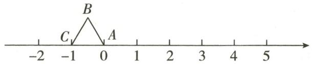  
第10题图

A. 点 A

B. 点 $B$

C. 点 C

D. 不确定

# 二、填空题(每题3分,共24分)

11. 计算: $|-2025| =$ \_\_\_\_.  
12.(2024秋·大兴区期中)比较大小: $-\frac{3}{7}$ \_\_\_\_ $-\frac{2}{3}$ .(填“＞”“＜”或“＝”)   
13. 数轴上表示 -1.2 的点与表示 2.5 的点之间有 \_\_\_\_ 个整数点.  
14. 已知 $\left|2-a\right|=a-2$ ，请写一个满足条件的 a 的值：\_\_\_\_。  
15. 当 $x =$ \_\_\_\_ 时, 式子 $|x - 2| + 2027$ 有最小值.  
16. 若 $\left|m-2\right|+\left|n-4\right|=0$ ，则 $m+n=$ \_\_\_\_.  
17.(2024秋·南开区期中)在数轴上,点A表示的数是-5,从点A出发,沿数轴移动6个单位长度到达点B,则点B所表示的数为\_\_\_\_.  
18. 数轴上表示整数的点称为整点, 某数轴的单位长度是 1 厘米, 若在这个数轴上随意画出一条长为 1752.1 厘米的线段 AB, 则线段 AB 能盖住的整点的个数是 \_\_\_\_.

# 三、解答题(共56分)

19.(12 分)把下列各数分别填入它们所属的集合内:

$$
- 4, - \left| - \frac {4}{3} \right|, 0, \frac {2 2}{7}, - 3. 1 4, 2 0 2 3, - (+ 5), + 1. 8 8.
$$

(1)正数集合: $\{\_\_\_\_\cdots\}$ ;   
(2)负数集合: {\_\_\_\_…};   
(3)整数集合: {\_\_\_\_…}.

20.(8分)在数轴上表示下列各数:0,-3,-1 $\frac{1}{3}$ ,2.5,并按从小到大的顺序用“<”把这些数连接起来.

21.(8分)已知 $|a|=2,|b|=3$ ,且b<a,求a,b的值.

22.(8分)如图,检测4个篮球,其中质量超过标准质量的部分记为正数,不足标准质量的部分记为负数.从轻重的角度看,最接近标准质量的球是几号?并说明理由.

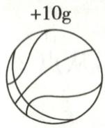  
①

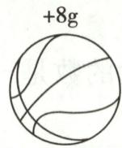  
②

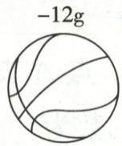  
③

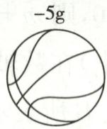  
④

第22题图

23.(10分)已知在纸面上有一数轴(如图),折叠纸面.

(1)若表示1的点与表示-1的点重合,则表示-2的点与表示\_\_\_\_的点重合.  
(2)若表示-2的点与表示4的点重合,回答以下问题:

①表示 5 的点与表示 \_\_\_\_ 的点重合；

②若数轴上 A, B 两点之间的距离为 9 (点 A 在点 B 的左侧), 且 A, B 两点经折叠后重合, 求 A, B 两点表示的数分别是多少.

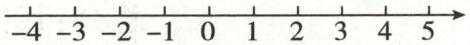

第23题图

24.(10分)如图,数轴上的点A,B,C,D分别表示-3,-1 $\frac{1}{2}$ ,0,4.

(1)在数轴上标出 A, B, C, D 四个点，并用“<”将四个数连接起来；  
(2) $B, C$ 两点间的距离是多少? $A, D$ 两点间的距离是多少?  
(3)点 A, B, C, D 的位置不动, 现在把数轴的原点取在点 B 处, 其余都不变, 那么点 A, B, C, D 分别表示什么数?

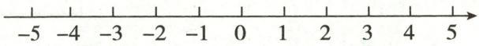

第24题图

# 第二章检测卷

总分:100 分 时间:90 分钟 成绩评定:

# 一、选择题（每题2分，共20分）

1.(2024 秋・鼓楼区期中)比 0 小 3 的数是 ( )

A. 0

B.-3

C. 3

D. ±3

2. 将 $-3-(+6)-(-5)+(-2)$ 改写成省略括号和加号的形式是 ( )

A.-3+6-5-2

B. $-3-6+5-2$

C.-3-6-5-2

D. $-3-6+5+2$

3. 下列计算正确的是 （）

A. $1 - 3 = -2$

B. $-3+2=-5$

C. $3 \times (-2) = 6$

D. $(-4)\div(-2)=\frac{1}{2}$

4.(2024·广东)2024年6月6日,嫦娥六号在距离地球约384000千米外上演“太空牵手”,完成月球轨道的交会对接.数据384000用科学记数法表示为()

A. $3.84 \times 10^{4}$

B. $3.84 \times 10^{5}$

C. $3.84 \times 10^{6}$

D. $38.4 \times 10^{5}$

5.(2024 秋·珠海期中)若“ $\odot$ ”表示一种新运算,规定: $a \odot b = a \times b - a$ , 则 $(-1) \odot (-5)$ 的值是 ( )

A.-5

B.-6

C. 5

D. 6

6. 有理数 $a, b$ 在数轴上的位置如图所示, 则下列结论正确的是 ( )

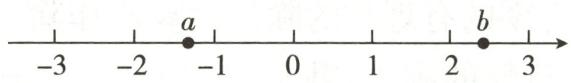  
第6题图

A. $a > b$

B. $a + b > 0$

C. $a - b > 0$

D. $|a|>|b|$

7. 已知 $a = -3 \times 2^2, b = (-3 \times 2)^2, c = -(3 \times 2)^2$ . 下列大小关系中, 正确的是 ( )

A. $a > b > c$

B. $b > c > a$

C. $b > a > c$

D. $c > a > b$

8.(2024秋·句容月考)在计算 $\left(\frac{1}{4}-\frac{5}{12}-\frac{7}{6}\right)\times(-24)$ 时,运用下列哪种运算律可以避免通分()

A. 乘法交换律

B. 乘法结合律

C. 乘法分配律

D. 加法结合律

9. 小明和小红利用温差测量某山峰的高度. 小明在山顶测得的温度是 $-1^{\circ}C$ , 小红同一时间在山脚测得的温度是 $11^{\circ}C$ . 已知该地区高度每增加 100 米, 气温大约下降 $0.8^{\circ}C$ , 则这座山峰的高度大约是 ( )

A. 800 米

B. 1250 米

C. 1200 米

D. 1500 米

10. 同学们都熟悉“幻方”游戏, 现将“幻方”游戏稍作改进变成“幻圆”游戏. 将 -1, 2, -3, 4, -5, 6, -7, 8 分别填入如图所示的圆圈内, 使横、竖以及内外两圈上的 4 个数字之和都相等, 则 $a + b$ 的值为 ( )

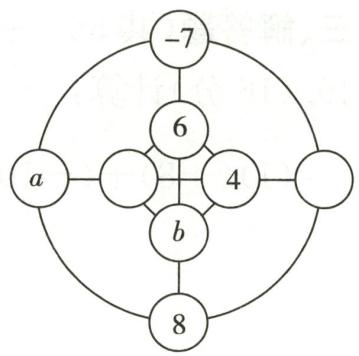

flowchart

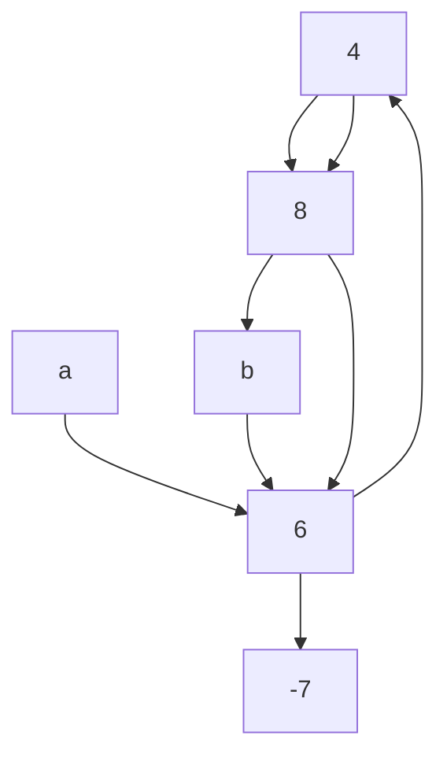

第10题图

A. 1 或 -1

B.-1或-4

C.-3或-6

D. 1 或 -8

# 二、填空题(每题3分,共24分)

11.(2024秋·淮安月考)-1 $\frac{1}{3}$ 的倒数是\_\_\_\_.   
12. 将 $\pi$ 四舍五入精确到百分位是 \_\_\_\_.  
13. 计算: $(-1)^{2025}-(-1)=$ \_\_\_\_.   
14. 数轴上与表示 -2 的点距离 4 个单位长度的点表示的数是 \_\_\_\_.  
15. 小明在写作业时不慎将一滴墨水滴在数轴上, 根据如图所示的数轴, 请你计算墨迹盖住的所有整数的和为 \_\_\_\_.

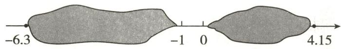  
第15题图

16. 如图所示的是一个计算程序. 若开始输入 x = -2, 则最后输出的结果是 \_\_\_\_.

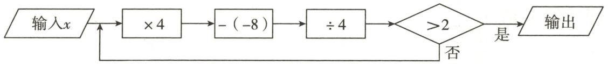

flowchart

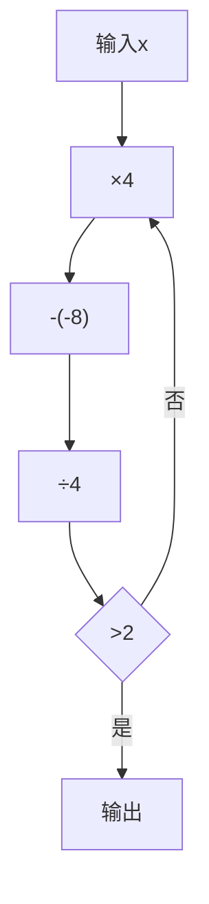

第16题图

17. 数学活动课上, 王老师在 6 张卡片上写了 6 个不同的数(如图).

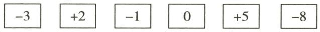  
第17题图

如果从中任意抽取 3 张,使这 3 张卡片上的数之积最小,最小的积为\_\_\_\_;使这 3 张卡片上的数字之积最大,最大的积为\_\_\_\_.

18. 如图, 已知数轴上有 $A, B, C, D, E, F$ 六个点, 点 $C$ 在原点位置, 点 $B$ 表示的数为 $-4$ , 已知下表中 $A - B, B - C, D - C, E - D, F - E$ 的含义均为前一个点所表示的数与后一个点所表示的数的差, 比如 $B - C$ 为 $-4 - 0 = -4$ .

<table><tr><td>A-B</td><td>B-C</td><td>D-C</td><td>E-D</td><td>F-E</td></tr><tr><td>10</td><td>-4</td><td>-1</td><td>x</td><td>2</td></tr></table>

若点 A 与点 F 的距离为 1.5, 则 x 的值为 \_\_\_\_.

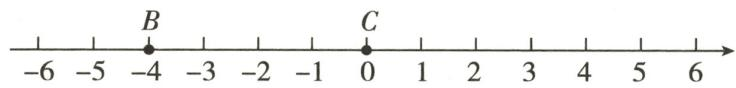  
第18题图

# 三、解答题(共56分)

19.(16分)计算:

(1) $(+8) + (-10) - (-2) - 3$ ;

(2) $-6\div\frac{2}{3}\times\left(-\frac{5}{9}\right);$

(3) $24\times\left(\frac{2}{3}-\frac{3}{4}-\frac{1}{6}\right)$ ;

(4) $(-2)^{3}+(4-7)\div3+5.$

20.(6分)已知a,b互为倒数,c,d互为相反数, $|m|=3$ ,求 $\frac{ab}{3}+m+\frac{c+d}{4}$ 的值.

21.(6分)“ $\odot$ ”表示一种新的运算: $a \odot b = 2a + 3b$ .

(1) 求 $5 \odot 6$ 的值；

(2) 求 $4 \odot (5 \odot 3)$ 的值.

22.(6分)已知 $|x|=3,|y|=7.$

(1) 若 $xy < 0$ , 求 $x + y$ 的值;

(2) 若 $\left|x-y\right|=x-y$ ，求 $2x+y$ 的值.

23.(6分)某高速公路养护小组乘车沿南北向公路巡视维护,如果约定向北为正,向南为负,当天汽车的行驶记录(单位:千米)如下:

$$
+ 1 7, - 9, + 7, - 1 5, - 3, + 1 1, - 6, - 8, + 5, + 1 6.
$$

(1)养护小组最后到达的地方在出发点的哪个方向？距出发点多远？  
(2)养护过程中,最远处距离出发点有多远?   
(3)如果汽车行驶1千米的平均耗油量为0.5升,那么这天汽车共耗油多少升?

24.(8分)(2024秋·扬州月考)在有些情况下,不需要计算出结果也能把绝对值符号去掉.例如, $|6+7|=6+7;|6-7|=7-6;|7-6|=7-6;|-6-7|=6+7.$

(1)根据上面的规律,把下列各式写成去掉绝对值符号的形式:  
① $|7-21|=$ \_\_\_\_；② $\left|\frac{7}{17}-\frac{7}{18}\right|=$ \_\_\_\_.   
(2)用合理的方法计算: $\left|\frac{1}{5}-\frac{150}{557}\right|+\left|\frac{150}{557}-\frac{1}{2}\right|-\left|-\frac{1}{2}\right|$ .  
(3)用简便方法计算： $\left|\frac{1}{3}-\frac{1}{2}\right|+\left|\frac{1}{4}-\frac{1}{3}\right|+\left|\frac{1}{5}-\frac{1}{4}\right|+\cdots+\left|\frac{1}{2026}-\frac{1}{2025}\right|$

25.(8分)求若干个相同的不为零的有理数的除法运算叫作除方.如 $2\div2\div2$ , $(-3)\div(-3)\div(-3)\div(-3)$ 等.类比有理数的乘方,我们把 $2\div2\div2$ 记作 $2^{③}$ ,读作“2的圈3次方”; $(-3)\div(-3)\div(-3)\div(-3)$ 记作 $(-3)^{④}$ ,读作“-3的圈4次方”.

一般地, 把 $a \div a \div a \div \cdots \div a$ (a≠0) 记作 $a^{①}$ , 读作“a 的圈 n 次方”.

(1)直接写出计算结果:① $2^{③}=$ \_\_\_\_;② $(-3)^{⑤}=$ \_\_\_\_;③ $\left(-\frac{1}{2}\right)^{⑤}=$ \_\_\_\_.   
(2)我们知道,有理数的减法运算可以转化为加法运算,除法运算可以转化为乘法运算,请尝试将有理数的除方运算转化为乘方运算,归纳如下:一个非零有理数的圈 n 次方等于 \_\_\_\_.  
(3) 计算: $24 \div 2^{3} + (-8) \times 2^{③}$ .

# 第三章检测卷

总分:100 分 时间:90 分钟 成绩评定:

# 一、选择题(每题2分,共20分)

1.(2024 秋·盐城期中)下列各式中,最符合代数式书写规范的是()

A. $2 \frac{1}{2} n$

B. $\frac{b}{a}$

C. 3x-1 个

D. $a \times 3$

2.(2024秋·杭州期中)“m与n的差的平方”用代数式表示为()

A. $(m - n)^{2}$

B. $m^2 - n^2$

C. $m - n^{2}$

D. $m^2 - n$

3.(2024秋·姑苏区期中)七年级(3)班男生有x人,比女生少2人,则这个班的女生人数是()

A. $x - 2$

B. $x+2$

C. ${2x} - 2$

D. $2x+2$

4.(2024秋·海州区期中)今年小丽a岁,张老师的年龄比小丽的年龄的3倍小2岁.5年后,张老师的年龄是()

A. $(a + 5)$ 岁

B. $(3a+3)$ 岁

C. $(3a+5)$ 岁

D. (3a-2)岁

5.下列关系中,成反比例关系的是()

A. 圆的面积 $S$ 与半径 $r$ 的关系  
B. 三角形的面积一定, 底边 a 与这边上的高 h 的关系  
C. 人的年龄与身高的关系  
D. 小明从家到学校, 剩下的路程 s 与速度 v 的关系

6. 若 $a$ 表示一个四位数, $b$ 表示一个三位数, 如果把 $a$ 放在 $b$ 的左边组成一个五位数, 那么这个五位数可以表示为 ( )

A. ${1000a} + {10b}$

B. $a + {1000b}$

C. 1000a+b

D. $a + b$

7. 若代数式 a-b 的值为 2, 求代数式 $2a-2b+3$ 的值时, 不必知道 a 与 b 的值, 可直接求出 2a-2b 的值, 然后再加上 3 即可, 这种解法体现的数学思想是 ( )

A. 转化思想

B. 整体思想

C. 数形结合思想

D. 类比思想

8.(2024秋·南通期中)某公司今年8月份的利润为x万元,9月份的利润比8月份减少了9%,10月份的利润比9月份增加了10%,则该公司10月份的利润为()

A. $(x - 9\%) (x + 10\%)$ 万元

B. $(x-9\%+10\%)$ 万元

C. $(1 - 9\%) (1 + 10\%) x$ 万元

D. $(1 - 9\% + 10\%) x$ 万元

9.如图是某计算程序,若输入 x=2,则输出的结果 y 的值为 ( )

A. 25

B. 27

C. 29

D. 31

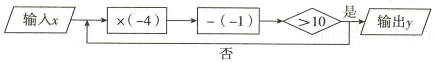

flowchart

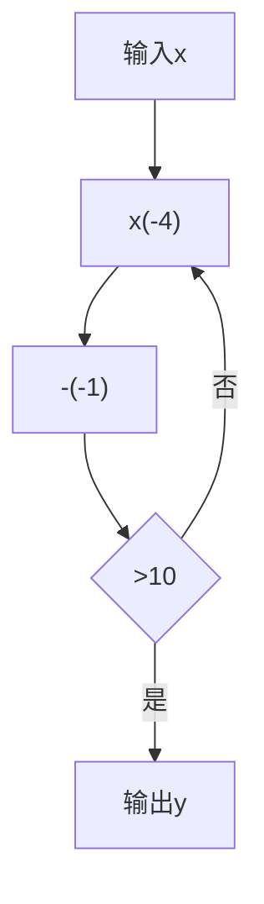

第9题图

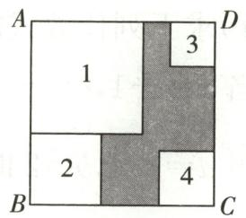  
第10题图

10. 如图, 一个大正方形的四个角落分别放置了四张大小不同的正方形纸片, 其中 1 号、2 号两张正方形纸片既不重叠也无空隙. 已知 1 号正方形边长为 $a, 2$ 号正方形边长为 $b$ , 则阴影部分的周长是 ( )

A. $2a+2b$

B. $4a+2b$

C. $2 a + 4 b$

D. $3a + 3b$

# 二、填空题(每题2分,共16分)

11. 用代数式表示“m 的倒数与 7 的和”: \_\_\_\_.  
12. 一种商品每件盈利 a 元, 售出 60 件共盈利 \_\_\_\_ 元. (用含 a 的代数式表示)  
13. 一个两位数的个位数字为 m，十位数字为 n，则这个两位数表示为 \_\_\_\_.  
14. 甲数比乙数的一半少 6, 如果乙数为 $a$ , 那么用含 $a$ 的代数式表示甲数为 \_\_\_\_.  
15. 已知 $x + y = 3$ ，则代数式 $2x + 2y - 1$ 的值是 \_\_\_\_.

16.(2024秋·江南区月考)如图,把 $R_{1},R_{2},R_{3}$ 三个电阻串联起来,线路AB上的电流为I,电压为U,则 $U=IR_{1}+IR_{2}+IR_{3}$ .当 $R_{1}=19.7,R_{2}=32.4,R_{3}=35.9,I=2.5$ 时,U的值为\_\_\_\_.

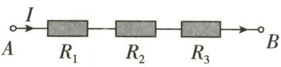  
第16题图

[NO TEXT]

第1幅图

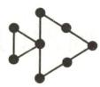

第2幅图

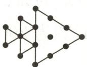

第3幅图

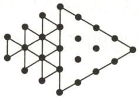

第4幅图

第18题图

17. 某商品原价是每件 $a$ 元, 第一次降价打九折, 第二次降价每件又减 50 元, 则第二次降价后的售价为每件 \_\_\_\_ 元. (用含 $a$ 的代数式表示)  
18.(2024 秋·苏州月考)如图,将形状、大小完全相同的“·”和线段按照一定规律摆成图形,第1幅图中“·”的个数为 $a_{1}$ , 第2幅图中“·”的个数为 $a_{2}$ , 第3幅图中“·”的个数为 $a_{3}$ , 以此类推,则 $a_{4}$ 的值为 \_\_\_\_, $\frac{1}{a_{1}} + \frac{1}{a_{2}} + \frac{1}{a_{3}} + \cdots + \frac{1}{a_{18}}$ 的值为 \_\_\_\_.

# 三、解答题(共64分)

19.(6分)用代数式表示:

(1)m 的 3 倍与 n 的一半的和;  
(2) $a$ 与 $b$ 两数差的平方减去它们和的平方.

20.(6 分)求下列代数式的值:

(1) 当 a = -1, b = -3 时, 求代数式 $a^{2} + 2ab + b^{2}$ 的值;  
(2) 当 $a = -4, b = 2$ 时, 求代数式 $\frac{a^2 - 2b}{a - b}$ 的值.

21.(8分)判断下面各题中的两个量是否成反比例关系,并说明理由:

(1)一段铁路全程为 1463km, 某列车的平均速度 $v(\mathrm{km/h})$ 与全程运行的时间 $t(\mathrm{h})$ ;  
(2)等边三角形的周长 y 与边长 x;  
(3)某小区要种植一块面积为 $1000 \, m^{2}$ 的长方形草坪, 草坪的长 $y(\mathrm{~m})$ 与宽 $x(\mathrm{~m})$ ;  
(4)工作效率 p 一定, 工作总量 m 与工作时间 t.

22.(8分)如图,某长方形广场的四角都有一块半径相同的扇形草地,若扇形的半径为rm,长方形的长为am,宽为bm.

(1)请用代数式表示广场空地的面积;  
(2)若长方形的长为 300m, 宽为 200m, 扇形的半径为 10m, 求广场空地的面积.

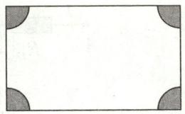  
第22题图

23.(8分)如图,在一个底为a、高为h的三角形铁皮上剪去一个半径为r的半圆.

(1)用含 a, h, r 的代数式表示剩下铁皮(阴影部分)的面积 S;  
(2) 当 a=8, h=6, r=3 时, 请求出 S 的值.

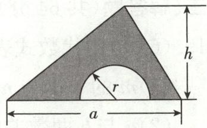  
第23题图

24.(8分)人在运动时,心跳速率通常和人的年龄有关,如果用x表示一个人的年龄,用y表示正常情况下这个人在运动时所能承受的每分钟心跳的最高次数,经研究y与x满足关系式 $y=\frac{4}{5}(220-x)$ .

(1)正常情况下,一个15岁的少年在运动时所能承受的每分钟心跳的最高次数是多少?  
(2)一个50岁的人运动时,30秒钟心跳的次数为60,他有危险吗?请说明你的理由.

25.(10分)某中学附近的水果超市新进了一批百香果,为了促销这种百香果,特推出如下两种销售方式.

方式一:不超过5千克,每千克售价12元,超出5千克的部分,打8折;

方式二:每千克售价10元.

(1)顾客购买 $a(a > 5)$ 千克百香果,按照方式一购买需要\_\_\_\_元;按照方式二购买需要\_\_\_\_元.(请用含 $a$ 的代数式表示)  
(2)于老师决定买 35 千克百香果,通过计算说明用哪种方式购买更省钱.

26.(10分)(2024秋·思明区月考)生活中常用的十进制用0\~9这十个数字来表示数,满十进一,如 $212=2\times10^{2}+1\times10+2$ .计算机常用二进制来表示字符代码,它用0和1两个数来表示数,满二进一.如二进制数10000转化为十进制数: $1\times2^{4}+0\times2^{3}+0\times2^{2}+0\times2^{1}+0=16$ .其他进制也有类似的算法.

(1)【发现】根据以上信息,将二进制数 101110 转化为十进制数是\_\_\_\_;  
(2)【迁移】将八进制数 72 转化为十进制数；  
(3)【应用】在我国远古时期,人们通过在绳子上打结来记录数量,即结绳计数.如图所示是远古时期一位母亲记录孩子出生后的天数,在从右向左依次排列的不同绳子上打结,满五进一,根据图示,求孩子出生的天数.

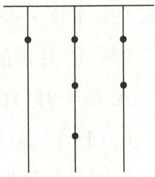  
第26题图

# 第四章检测卷

总分:100 分 时间:90 分钟 成绩评定:

# 一、选择题(每题2分,共20分)

1.(2024 秋·镇江期中)单项式 $-\frac{3}{2}x^{2}y^{3}$ 的系数和次数分别为()

A.-3,5

B. $-\frac{3}{2},5$

C.-3,6

D. $-\frac{3}{2},6$

2.(2024 秋・宿城区期中)多项式 $2xy-3xy^{2}-1$ 的次数及常数项分别是 ( )

A. 3, -1

B. 2, -1

C. 5,1

D. 2,1

3.(2024·徐汇区二模)下列单项式中,与单项式 $2a^{2}b^{3}$ 是同类项的是()

A. $-ab^{4}$

B. $2a^{3}b^{2}$

C. $3b^{3}a^{2}$

D. $-2a^{2}b^{2}c$

4.(2024秋·浦东新区期中)在代数式 $1,3x^{2}+1,\frac{1}{2}x^{2}y^{2},\frac{2}{x+y},\frac{x+y}{2}$ 中,单项式有()

A. 1 个

B. 2 个

C. 3 个

D. 4 个

5.(2024秋·通州区期中)下列运算正确的是()

A. $a + {2b} = {3ab}$

B. $5a^{2}b - 5ba^{2} = 0$

C. $3a^{2} - 4a^{2} = -1$

D. $a^3 + 3a^2 = 4a^5$

6. 下面去括号的过程正确的是 ( )

A. $m + 2(a - b) = m + 2a - b$

B. 3x-2(4y-1)=3x-8y-2

C. $(a - b) - (c - d) = a - b - c + d$

D. $-5(x-y-z)=-5x+5y-5z$

7. 把多项式 $x^{3} - xy^{2} + x^{2}y + x^{4} - 3$ 按 $x$ 的降幂排列, 正确的是 ( )

A. $x^{4} + x^{3} + x^{2}y - 3 - xy^{2}$

B. $-xy^{2}+x^{2}y+x^{4}+x^{3}-3$

C. $-3 - xy^{2} + x^{2}y + x^{3} + x^{4}$

D. $x^{4} + x^{3} + x^{2}y - xy^{2} - 3$

8.(2024秋·虹口区期中)设 $A=-x^{2}+3x+1$ , $B=-2x^{2}+3x-1$ .已知x为任意有理数,那么A-B的值()

A. 一定为正

B. 一定为 0

C. 一定为负

D. 不能确定

9. 已知 $a^2 - ab = 20, ab - b^2 = -12$ ，则 $a^2 - b^2$ 和 $a^2 - 2ab + b^2$ 的值分别为 （）

A. -8 和 32

B. 8 和 32

C. -32 和 32

D. 8 和 -32

10. (2024 秋・西湖区期中) 如图, 小明计划将正方形菜园 ABCD 分割成三个长方形①②③和一个正方形④. 若长方形②与③的周长和为 30m, 则正方形 ABCD 与正方形④的周长和为 ( )

A. ${30}\mathrm{\;m}$

B. $40 \mathrm{~m}$

C. $55 \mathrm{~m}$

D. 60m

# 二、填空题(每题3分,共24分)

11. 单项式 $-3x^{2}y^{4}$ 的次数是

12.(2024秋·浦东新区期中)若代数式 $3x^{n+1}+x^{2}+1$ 是三次三项式,则n= \_\_\_\_.

13. 某单项式的系数为 -2, 只含字母 $x, y$ , 且次数是 3, 写出一个符合条件的单项式: \_\_\_\_.

14. 若 $4a^{2}b^{2n+1}$ 与 $a^{m}b^{3}$ 是同类项，则 $3m+n=$ \_\_\_\_.

15.(2024秋·普陀区期中)计算: $2x+3-(3x+1)=$ \_\_\_\_.

16. 若关于 x, y 的多项式 $my^{3} + nx^{2}y + 2y^{3} - x^{2}y + y$ 中不含三次项，则 mn = \_\_\_\_.

17. 小明在计算多项式 M 加上 $x^{2}-2x+9$ 时, 因误认为加上 $x^{2}+2x+9$ , 得到答案 $2x^{2}+2x$ , 则 M 应是 \_\_\_\_.

18. 如图所示的运算程序中, 若开始输入 $x$ 的值为 36 , 我们发现第 1 次输出的结果为 18 , 第 2 次输出的结果为 9 , 则第 3 次输出的结果为 \_\_\_\_ ; 第 2025 次输出的结果为 \_\_\_\_.

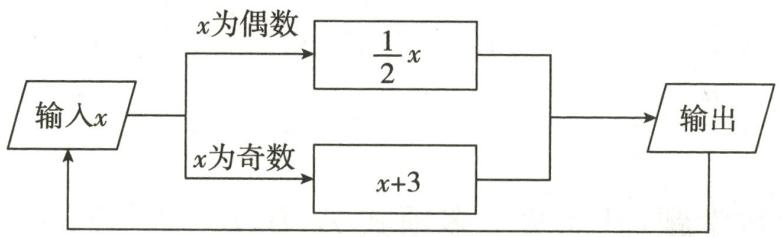

flowchart

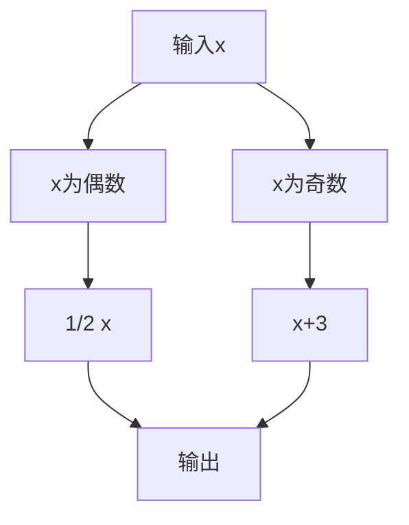

第18题图

# 三、解答题(共56分)

19.(6分)化简:

(1) $2ab - ab + 3ab$ ;

(2) $3a^{2}-(5a+2)+(1-a^{2})$ .

20.(6分)先化简,再求值:

(1) $(2x^{3} - x) - [4x^{3} - (x - 9)]$ ，其中 $x = -\frac{1}{2}$

(2) $x^{2}-(2x^{2}-4)+2(x^{2}-y)$ ，其中x=-1,y=2.

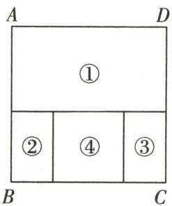  
第10题图

21.(4分)已知一个多项式与 $x^{2}-6x$ 的和是 $3x^{2}-2x+1$ ，求这个多项式.

22.(8分)(2024秋·浦东新区期中)已知 $A=2x^{2}-x+1$ ,A-2B=-x-1,求 $B+A$ ,并求当x=-1时 $B+A$ 的值.

23.(8分)某同学做一道数学题:已知两个多项式 A, B, $B=2x^{2}+3x-4$ , 试求 A-2B. 这位同学把 A-2B 误看成 $A+2B$ , 结果求出的答案为 $5x^{2}+8x-10$ .

(1)请你帮这位同学求出 A-2B 的正确答案;

(2) 若 x 是最大的负整数, 求 A-2B 的值.

24.(8分)(2024秋·宜兴期中)如图是用相同材料做成的A,B两种造型的长方形窗框,已知窗框的长都是y米,宽都是x米(y>x).

(1)若某用户需4个A型窗框,5个B型窗框,一共需要材料多少米(接缝忽略不计)?

(2)制作这两种造型的长方形窗框各一个,哪种造型更节约材料?请说明理由.

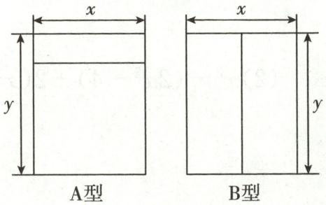

text_image

x
y
A型
x
y
B型

第24题图

25.(8分)有这样一道题:如果代数式 $5a+3b$ 的值为 -4,那么代数式 $2(a+b)+4(2a+b)$ 的值是多少?爱动脑筋的吴同学是这样解的:原式= $2a+2b+8a+4b=10a+6b$ .我们把 $5a+3b$ 看成一个整体,把式子 $5a+3b=-4$ 两边乘2得 $10a+6b=-8$ .

整体思想是中学数学解题中的一种重要思想方法,它在多项式的化简与求值中应用极为广泛,仿照上面的解题方法,完成下面的问题:

(1)已知 $a^{2}-2a=1$ ，则 $2a^{2}-4a+1=$ \_\_\_\_；  
(2)已知 $m+n=2, mn=-4$ , 求 $2(mn-3m)-3(2n-mn)$ 的值;  
(3)已知 $a^{2}+2ab=-5, ab-2b^{2}=-3$ ，求代数式 $2a^{2}+\frac{11}{3}ab+\frac{2}{3}b^{2}$ 的值.

26.(8分)我们规定:使得a-b=2ab成立的一对数a,b为“有趣数对”,记为(a,b).例如,因为 $2-0.4=2\times2\times0.4,(-1)-1=2\times(-1)\times1$ ,所以数对(2,0.4),(-1,1)都是“有趣数对”.

(1)数对 $\left(1,\frac{1}{3}\right)$ ，(1.5,3)， $\left(-\frac{1}{2},-1\right)$ 中，是“有趣数对”的为\_\_\_\_；  
(2) 若 $(k, -3)$ 是“有趣数对”，求 k 的值；  
(3)若 $(m, n)$ 是“有趣数对”，求代数式 $8\left[3mn - \frac{1}{2} m - 2(mn - 1)\right] - 4(3m^2 - n) + 12m^2$ 的值.

# 第五章检测卷

总分:100 分 时间:90 分钟 成绩评定:

# 一、选择题(每题2分,共20分)

1.(2024春·杨浦区期中)下列各式中,是一元一次方程的是()

A. $x = 0$

B. $2 x - 1$

C. 2x - y = 0

D. ${ax} = b$

2.(2024秋·高邮期中)下列说法正确的是()

A. 若 $a = b$ , 则 $am = bm$

B. 若 $a^2 = b^2$ ，则 $a = b$

C. 若 $a = b$ ，则 $a + 2 = b + 3$

D. 若 $a = b$ , 则 $\frac{a}{c} = \frac{b}{c}$

3. 已知关于 $x$ 的方程 $5x + 3k = 21$ 与 $5x + 3 = 0$ 的解相同, 则 $k$ 的值是 ( )

A.-10

B. 7

C.-9

D. 8

4. 解方程 $1 - 2(2x - 1) = x$ ，以下去括号正确的是 （）

A. $1 - 4x - 2 = x$

B. $1-4x+1=x$

C. $1 - 4x + 2 = x$

D. $1-4x+2=-x$

5. 解方程 $\frac{2x + 1}{3} - \frac{10x + 1}{6} = 1$ 时, 去分母正确的是 ( )

A. $2x+1-(10x+1)=1$

B. $4x+1-10x+1=6$

C. $4x + 2 - {10x} - 1 = 6$

D. $2(2x+1)-(10x+1)=1$

6. 定义“※”的运算: $a \times b = ab + 2a$ . 若 $(3 \times x) + (x \times 3) = 14$ , 则 $x$ 等于 ( )

A. 1

B. 2

C.-1

D.-2

7.(2024春·长宁区期中)小杰妈妈去银行存款,银行一年定期储蓄的年利率是1.5%,小杰妈妈两年后取出的本利和共61800元.设她存入银行的本金为x元,那么下列方程中,正确的是()

A. $1.5\% \times 2x = 61800$

B. $x+1.5\%\times2x=61800$

C. $(1 + 1.5\%) \times 2x = 61800$

D. $2(1+1.5\%x)=61800$

8. 如图, 小刚将一张正方形纸片剪去一个宽为 $5 \mathrm{~cm}$ 的长条后, 再从剩下的长方形纸片上剪去一个宽为 $6 \mathrm{~cm}$ 的长条. 若两次剪下的长条面积正好相等, 则剪下的两个长条的面积之和为 ( )

A. ${215}{\mathrm{\;{cm}}}^{2}$

B. $250 \mathrm{~cm}^{2}$

C. ${300}{\mathrm{\;{cm}}}^{2}$

D. $320 \mathrm{~cm}^{2}$

9. 学校组织知识竞赛, 共设 20 道选择题, 各题分值相同, 每题必答. 下表记录了 3 个参赛者的得分情况, 则参赛者 F 的得分可能为 ( )

<table><tr><td>参赛者</td><td>答对题数</td><td>答错题数</td><td>得分</td></tr><tr><td>A</td><td>20</td><td>0</td><td>100</td></tr><tr><td>C</td><td>18</td><td>2</td><td>88</td></tr><tr><td>E</td><td>10</td><td>10</td><td>40</td></tr></table>

A. 58

B. 62

C. 78

D. 93

10. 某省居民生活用电实施阶梯电价,年用电量分为三个阶梯. 阶梯电费计价方式如下:

<table><tr><td>阶梯档次</td><td>年用电量</td><td>电价</td></tr><tr><td>第一阶梯</td><td>2400千瓦时及以下部分</td><td>0.52元/千瓦时</td></tr><tr><td>第二阶梯</td><td>2401千瓦时至4800千瓦时部分</td><td>0.57元/千瓦时</td></tr><tr><td>第三阶梯</td><td>4801千瓦时及以上部分</td><td>0.82元/千瓦时</td></tr></table>

小聪家去年 12 月份用电量为 500 千瓦时,电费为 319 元,则小聪家去年全年用电量为 ( )

A. 5250 千瓦时

B. 5164 千瓦时

C. 4936 千瓦时

D. 4850 千瓦时

# 二、填空题(每题3分,共24分)

11.(2024 秋·南通期中)“比 a 的 3 倍大 5 的数等于 a 的 4 倍”用等式表示为 \_\_\_\_.

12. 已知 2x-1 与 4-x 的值互为相反数, 那么 x 的值是 \_\_\_\_.

13. 若 x = -2 是关于 x 的方程 $2x + a = 1$ 的解，则 a 的值为 \_\_\_\_.

14. 一种长方形餐桌的四周可坐 6 人用餐, 现把若干张这样的餐桌按如图所示的方式进行拼接, 那么多少张这样的餐桌拼在一起可供 86 人用餐? 若设需要这样的餐桌 $x$ 张, 则可列方程为 \_\_\_\_.

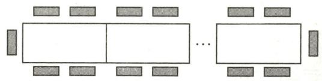  
第14题图

15.《诗经》是我国第一部诗歌总集,共分为《风》《雅》《颂》三部分,其中《颂》和《风》的篇数之和为200篇,且《颂》的篇数恰好是《风》篇数的 $\frac{1}{4}$ ,则《风》有\_\_\_\_篇.

16. 已知 $a, b$ 为定值, 且不论 $k$ 为何值, 关于 $x$ 的一元一次方程 $\frac{kx + 2a}{2} - \frac{x - bk}{6} = \frac{1}{2}$ 的解总是 1 , 则 $6a + b =$ \_\_\_\_.

17. 任意四个有理数 $a, b, c, d$ 可以组成两个有理数对 $(a, b)$ 与 $(c, d)$ . 我们规定: $(a, b) \otimes (c, d) = ac - bd$ . 例如, $(1, 2) \otimes (3, 4) = 1 \times 3 - 2 \times 4 = -5$ . 若有理数对 $(2x, -3) \otimes (1, x + 1) = 8$ , 则 $x$ 的值是 \_\_\_\_.

18. 点 A, B, C 为数轴上的三点, 若点 C 到点 A 的距离是点 C 到点 B 的距离的 3 倍, 称点 C 是 [A, B] 的三倍点. 若点 M, N 为数轴上的两点, 点 M 所表示的数为 -6, 点 N 所表示的数为 1, 点 P 所表示的数为 x. 若点 P 是 [M, N] 的三倍点, 则点 P 表示的数 x = \_\_\_\_.

# 三、解答题(共56分)

19.(8分)解下列方程:

(1) $3x+6=4(x-2)$ ;

(2) $2(y+2)-3(4y-1)=9(1-y)$ ;

(3) $\frac{x - 4}{2} - \frac{1 - x}{6} = \frac{x}{3}$ ;

(4) $x-\frac{3x+2}{3}=1-\frac{x-2}{2}.$

20.(4分)若 y=4 是关于 y 的方程 $\frac{y+8}{3}-m=5(y-m)$ 的解, 求关于 x 的方程 $(3m-2)x+m-5=0$ 的解.

21.(4分)聪聪在对关于x的方程 $\frac{x+3}{3}-\frac{mx-1}{6}=\frac{5-x}{2}$ 去分母时,错误地得到了方程 $2(x+3)-mx-1=3(5-x)$ ,因而求得的解是 $x=\frac{5}{2}$ ,试求m的值,并求方程的正确解.

22.(6分)已知 $y_{1}=-x+3, y_{2}=2x-3.$

(1) 当 x 取何值时, $y_{1}=y_{2}$ ?  
(2) 当 x 取何值时, $y_{1}$ 的值比 $y_{2}$ 的值的 2 倍大 8?

23.(6分)某车间有58名工人,每人每天可以生产8个甲种部件或5个乙种部件.1个甲种部件和3个乙种部件配成一套,为使每天生产的甲种部件和乙种部件刚好配套,生产甲种部件和乙种部件的工人各安排多少名?

24.(8分)已知a,b为有理数,且 $a\neq0$ ,若关于x的一元一次方程ax=b的解为 $x=a+b$ ,则此方程为“合并式方程”.例如,方程 $3x=-\frac{9}{2}$ 的解为 $x=-\frac{3}{2}$ ,因为 $3+\left(-\frac{9}{2}\right)=-\frac{3}{2}$ ,所以方程 $3x=-\frac{9}{2}$ 为“合并式方程”.请根据上述定义解答下列问题:

(1) 判断一元一次方程 $\frac{1}{2}x=1$ 是不是“合并式方程”，并说明理由；  
(2)若关于 x 的一元一次方程 $5x=m+1$ 是“合并式方程”，求 m 的值.

25.(6分)(2024秋·南海区期中)某团外卖骑手分为专职和兼职两种,专职骑手月工资4000元保底,每送一单外卖可再得3元;兼职骑手没有保底工资,每送一单外卖可得4元.小张是一名专职骑手,小李是一名兼职骑手.若10月小张和小李送出的外卖单数相同,且小张比小李多收入2500元,小张送出了多少单外卖?

26.(14分)同学们都知道, $|3-(-2)|$ 表示3与-2差的绝对值,实际上也可以理解为3与-2在数轴上所对应的两个点之间的距离.利用数形结合思想回答下列问题:

(1) $|6-(-5)|=$ \_\_\_\_，若 $|x-1|=3$ ，则x=\_\_\_\_；  
(2)若 x 表示有理数,则 $\left|x+1\right|+\left|x-2\right|$ 的最小值为 \_\_\_\_;  
(3)已知数轴上 A, B 两点所表示的数分别为 -1, 3, 若点 A, B 分别以每秒 2 个单位长度和 0.5 个单位长度的速度同时向右移动, 当点 A 与点 B 之间的距离为 3 个单位长度时, 求点 A 所表示的数.

# 第六章检测卷

总分:100 分 时间:90 分钟 成绩评定:

# 一、选择题(每题2分,共20分)

1. ${150}^{\prime } =$

( )

A. ${25}^{ \circ  }$

B. ${15}^{ \circ  }$

C. $2.5^{\circ}$

D. ${1.5}^{ \circ  }$

2. 某几何体如图所示, 则从前面观察这个图形, 得到的平面图形是 ( )

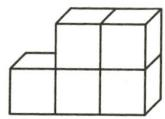  
第2题图

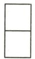  
A

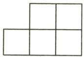  
B

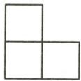  
C

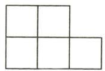  
D

3.(2024春·泰山区期中)如图,下列说法不正确的是()

A. 点 $A$ 在直线 $BD$ 外  
B. 点 $C$ 在直线 $AB$ 上  
C. 射线 $AC$ 与射线 $BC$ 是同一条射线  
D. 直线 $AC$ 和直线 $BD$ 相交于点 $B$

4. 下列四个图中, 能表示线段 $x = a + c - b$ 的是 ( )

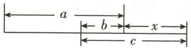  
A

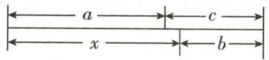  
B

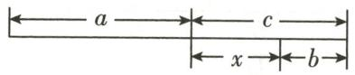  
C

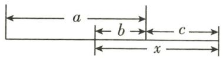  
D

5.如图,时针与分针所成的角的度数是 ( )

A. ${75}^{ \circ  }$

B. $65^{\circ}$

C. ${55}^{ \circ  }$

D. ${45}^{ \circ  }$

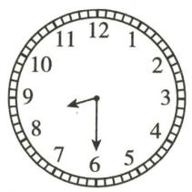  
第5题图

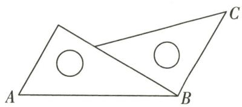  
第6题图

6. 把两块三角板按如图所示的方式拼在一起, 那么 $\angle ABC$ 的度数是 ( )

A. $75^{\circ}$

B. ${105}^{ \circ  }$

C. $120^{\circ}$

D. ${135}^{ \circ  }$

7. 如图, 点 $B, C, D$ 在线段 $AE$ 上, 若 $AE = 12 \mathrm{~cm}, BD = \frac{1}{3} AE$ , 则图中所有线段长度之和为 ( )

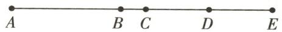  
第7题图

A. $50 \mathrm{~cm}$

B. $52 \mathrm{~cm}$

C. 54cm

D. $56 \mathrm{~cm}$

8. 如果 $\angle \alpha$ 和 $\angle \beta$ 互补, 且 $\angle \alpha > \angle \beta$ , 则下列表示 $\angle \beta$ 的余角的式子中: ① $90^{\circ} - \angle \beta$ ; ② $\angle \alpha - 90^{\circ}$ ; ③ $180^{\circ} - \angle \alpha$ ; ④ $\frac{1}{2} (\angle \alpha - \angle \beta)$ , 正确的是 ( )

A. ①②③④

B.①②④

C. ①②③

D. ①②

9. 已知点 C 在直线 AB 上, 若 AC=4cm, BC=6cm, E, F 分别为线段 AC, BC 的中点, 则 EF 的长为 ( )

A. $5 \mathrm{~cm}$

B. $3\mathrm{cm}$

C. 5cm 或 3cm

D. $5 \mathrm{~cm}$ 或 $1 \mathrm{~cm}$

10. 将一张纸如图所示折叠后压平, 点 F 在线段 BC 上, EF, GF 为两条折痕, 若 $\angle B'FC' = \alpha$ , 则 $\angle EFG$ 的度数是 ( )

A. ${45}^{ \circ  } + \alpha$

B. $2 \alpha - 90^{\circ}$

C. $90^{\circ} - \frac{1}{2}\alpha$

D. ${90}^{ \circ  } + \frac{1}{2}\alpha$

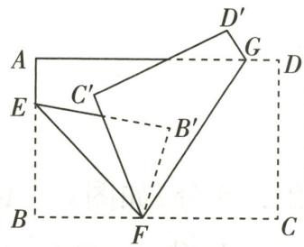  
第10题图

# 二、填空题(每题3分,共24分)

11. $137^{\circ}45'$ 的补角是  
12. 子弹从枪膛中射出去的轨迹可看成一条线, 这说明了\_\_\_\_的数学道理.  
13. 小明同学捡到一片沿直线被折断了的银杏叶(如图), 他发现剩下的银杏叶的周长比原银杏叶的周长要小, 能正确解释这一现象的数学知识是

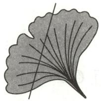  
第13题图

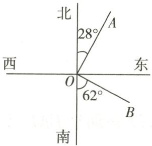  
第16题图

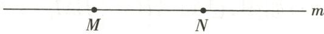  
第18题图

14. 点 C 在射线 AB 上, 若 AB=3, BC=2, 则 AC 的长度为 \_\_\_\_.  
15. 若两个角互补, 且度数之比为 $3:2$ , 则较大角的度数为 \_\_\_\_.  
16. 如图, 射线 $OA$ 表示的方向是北偏东 $28^{\circ}$ , 射线 $OB$ 表示的方向是  
17. 在同一平面内, $\angle AOB = 30^{\circ}$ , 射线 $OC$ 在 $\angle AOB$ 的外部, $OD$ 平分 $\angle AOC$ , 若 $\angle BOD = 40^{\circ}$ , 则 $\angle AOC$ 的度数为 \_\_\_\_.  
18. 定义: 在直线 $l$ 上的三点 $A, B, C$ , 若满足 $\frac{CA}{CB} = \frac{1}{2}$ , 则称点 $C$ 是点 $A$ 关于点 $B$ 的“半距点”. 如图, 若 $M, N, P$ 三点在同一直线 $m$ 上, 且点 $P$ 是点 $M$ 关于点 $N$ 的“半距点”, $MN = 6 \mathrm{~cm}$ , 则 $PM = \_ \_ \_ \_ \_ \mathrm{cm}$ .

# 三、解答题（共56分）

19.(6分)计算:(1) $180^{\circ}-(75^{\circ}44'8''+14^{\circ}15'52'')$ ;

(2) $12^{\circ}15'38''\times2+62^{\circ}17'\div3.$

20.(6分)尺规作图:如图,在平面内有A,B,C三点.

(1)画直线 AB, 射线 AC, 线段 BC.

(2) 在线段 BC 上任取一点 D (不同于点 B, C), 连接 AD, 并延长 AD 至点 E, 使 DE = AD.

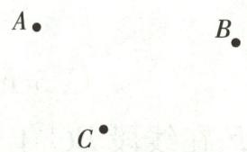  
第20题图

21.(8分)如图, $\angle AOB$ 是平角,OM,ON分别是 $\angle AOC,\angle BOD$ 的平分线.

(1) 若 $\angle AOC = 40^{\circ}, \angle BOD = 60^{\circ}$ ，求 $\angle MON$ 的度数.

(2)若只给条件“ $\angle COD=80^{\circ}$ ”,你能求出 $\angle MON$ 的度数吗?如果能,请给出过程;如果不能,请说明理由.

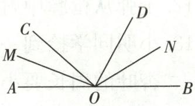  
第21题图

22.(8分)如图,已知 $AB=\frac{1}{4}BM=\frac{1}{5}AN$ , 点 C, D 分别是 BM, AN 的中点, 且 CD=14.

(1) 求证: BM = BN;

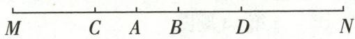

(2)求 $MN$ 的长.

第22题图

23.(14分)如图是一个长方体的展开图,一共标有A,B,C,D,E,F六个面,MN=2,NO=x,OP=y,请根据要求回答:

(1)如果 A 面在长方体的底部,那么\_\_\_\_面会在上面;   
(2)求这个长方体的表面积和体积;(用含x和y的式子表示)  
(3) 若 $A = a^{3} + \frac{1}{2}a^{2}b + 3$ , $B = \frac{1}{2}a^{2}b - 3$ , $C = a^{3} - 1$ , D = $-\frac{1}{2}(a^{2}b - 6)$ ，且相对两个面上式子的和都相等，求 E 代表的代数式.

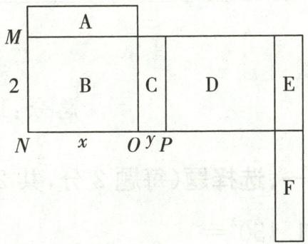

text_image

M
A
2
B
C
D
E
N
x
O
y
P
F

第23题图

24.(14分)直线 l 上的三个点 E, F, O, 若满足 $FO = \frac{1}{2} EF$ , 则称点 O 是点 E 关于点 F 的“半距点”. 如图①, $BC = \frac{1}{2} AB$ , 此时点 C 就是点 A 关于点 B 的一个“半距点”. 如图②, 若 M, N, P 三个点在同一条直线 m 上, 且点 P 是点 M 关于点 N 的“半距点”, MN = 6cm.

(1)求 MP 的长;  
(2)若点 G 也是直线 m 上一点,且 G 是线段 MP 的中点,求线段 GN 的长.

text_image

A
B
C
l
①
M
N
②
m

第24题图

# 期末冲刺小卷(1)

总分:100 分 时间:40 分钟 成绩评定:

# 一、选择题（每题5分，共20分）

1.(2024·南通)2024年5月,财政部下达1582亿资金,支持地方进一步巩固和完善城乡统一、重在农村的义务教育经费保障机制.将“1582亿”用科学记数法表示为()

A. $158.2 \times 10^{9}$

B. $15.82 \times 10^{10}$

C. $1.582 \times 10^{11}$

D. $1.582 \times 10^{12}$

2. 下列运算正确的是 ( )

A. $-2(a-b)=-2a-b$

B. $-2(a-b)=-2a+b$

C. $-2(a - b) = -2a - 2b$

D. $-2(a - b) = -2a + 2b$

3. 如图, $AB:BC:CD=3:2:4,E,F$ 分别是线段 $AB,CD$ 的中点, 且 $EF=22\mathrm{cm}$ , 则线段 $BC$ 的长为 ( )

A. $8 \mathrm{~cm}$

B. $9 \mathrm{~cm}$

C. $11 \mathrm{~cm}$

D. $12 \mathrm{~cm}$

  
第3题图

  
第4题图

  
第8题图

  
第9题图

4. 如图, 在某年 11 月的月历表中用框数器“☐☐”框出 8, 10, 16, 22, 24 五个数, 它们的和为 80, 若将“☐☐”在图中换个位置框出五个数, 则它们的和可能是 ( )

A. 42

B. 63

C. 90

D. 125

# 二、填空题(每题5分,共25分)

5. 比较大小: $-\frac{7}{4}$ \_\_\_\_ $-2\frac{1}{4}$ .

6. 一个角的补角是它本身的 3 倍, 则这个角的度数为 \_\_\_\_.

7. 如果有四个不同的正整数 m, n, p, q 满足 $(7 - m)(7 - n)(7 - p)(7 - q) = 4$ ，那么 $m + n + p + q$ 的值为 \_\_\_\_.

8. 如图, 已知 $\angle AOB = 90^{\circ}, \angle BOC = 40^{\circ}$ , $OM$ 平分 $\angle AOC$ , 则 $\angle MOB$ 的度数为 \_\_\_\_.

9. 在如图所示的三阶幻方中, 填写了一些数、式子和汉字 (其中每个式子或汉字都表示一个数), 若每一横行, 每一竖列, 以及每条对角线上的 3 个数之和都相等, 则 “诚实守信” 这四个字表示的数之和是 \_\_\_\_.

# 三、解答题(共55分)

10.(12 分)计算:

(1) $48^{\circ}39' + 67^{\circ}31'$ ;

(2) $\frac{11}{5} \times \left(-\frac{1}{3} - \frac{1}{2}\right) \times \frac{9}{11} \div \left(-\frac{3}{2}\right)^2.$

11.(10分)先化简,再求值: $2a^{2}-5a+2-6a^{2}+6a-3$ ,其中a=-1.

12.(14 分)为了支持国货,某手机卖场本月计划用 9 万元购进某国产品牌手机,从卖场获知该品牌 3 种不同型号的手机进价及售价如下表:

<table><tr><td>手机型号</td><td>A</td><td>B</td><td>C</td></tr><tr><td>进价/(元/部)</td><td>1500</td><td>2100</td><td>2500</td></tr><tr><td>售价/(元/部)</td><td>1650</td><td>2300</td><td>2750</td></tr></table>

若该手机卖场同时购进两种不同型号的手机共 50 台,9 万元刚好用完.

(1)请你确定该手机卖场的进货方案,并说明理由;

(2)该卖场老板准备把这批手机销售利润的 50% 捐给公益组织,在同时购进两种不同型号手机的方案中,为了使捐款最多,你选择哪种方案?

13.(19分)点 O 是直线 AB 上一点, $\angle COD$ 是直角, OE 平分 $\angle BOC$ .

(1)①如图①,若 $\angle DOE=15^{\circ}$ ,求 $\angle AOC$ 的度数;

②如图②,若 $\angle DOE=\alpha$ ,求 $\angle AOC$ 的度数.(用含 $\alpha$ 的式子表示)

(2)将图①中的∠COD绕点O按顺时针方向旋转至图②所示的位置.探究∠DOE与∠AOC之间的数量关系,写出你的结论,并说明理由.

  
①

  
②   
第13题图

总分:100 分 时间:40 分钟 成绩评定:

# 一、选择题(每题5分,共25分)

1. 计算 $\left(\frac{11}{12} - \frac{7}{6} + \frac{3}{4} - \frac{13}{24}\right) \times (-24)$ 的结果是 （）

A. 1

B.-1

C. 10

D.-10

2.以下等式变形不正确的是 （）

A. 由 $x + 2 = y + 2$ ，得到 $x = y$

B. 由 $2a - 3 = b - 3$ ，得到 $2a = b$

C. 由 $am = an$ ，得到 $m = n$

D. 由 $m = n$ , 得到 $2am = 2an$

3. 现定义运算“\*”，对于任意有理数 $a$ 与 $b$ ，满足 $a * b = \begin{cases} 3a - b, & a \geqslant b, \\ a - 3b, & a < b, \end{cases}$ 譬如， $5 * 3 = 3 \times 5 - 3 = 12, \frac{1}{2} * 1 = \frac{1}{2} - 3 \times 1 = -\frac{5}{2}$ . 若有理数 $x$ 满足 $x * 3 = 12$ ，则 $x$ 的值为 （）

A. 4

B. 5

C. 21

D. 5 或 21

4. 如图, 四个数在数轴上的对应点分别为点 M, P, N, Q. 若点 M, N 表示的数互为相反数, 则图中表示正数的点的个数是 ( )

A. 1

B. 2

C. 3

D. 4

5. 一副三角板按如图方式摆放, 且 $\angle 1$ 的度数比 $\angle 2$ 的度数小 $20^{\circ}$ , 则 $\angle 1$ 的度数为 ( )

A. $35^{\circ}$

B. ${30}^{ \circ  }$

C. ${25}^{ \circ  }$

D. ${20}^{ \circ  }$

  
第4题图

  
第5题图

  
第9题图

text_image

A
D
C
E
O
B

第10题图

# 二、填空题(每题5分,共25分)

6. 数轴上 A, B 两点之间的距离为 3, 若点 A 表示数 2, 则点 B 表示的数为 \_\_\_\_.  
7. 若多项式 $2y - x^{2}$ 的值为 2，则多项式 $2x^{2} - 4y + 7$ 的值为 \_\_\_\_.  
8. 某种商品换季处理, 若按标价的六五折出售, 每件将亏损 25 元, 而按标价的八折出售, 每件将盈利 20 元, 则这种商品的进价是 \_\_\_\_ 元/件.  
9. 如图是一个正方体的表面展开图, 将展开图折叠成正方体后, 相对面上两个数之和为 5, 则 $x + y =$ \_\_\_\_.  
10. 如图, $\angle COD$ 在 $\angle AOB$ 内部, $OE$ 平分 $\angle BOD$ . 若 $\angle AOB = m^{\circ}$ , $\angle COD = n^{\circ}$ , 则 $2\angle AOE + \angle BOC =$ \_\_\_\_°. (用含 $m, n$ 的代数式表示)

# 三、解答题(共50分)

11.(12 分)解方程:

(1) $3x - 2(x - 1) = 9 - 4(x + 3)$ ;

(2) $\frac{x+1}{2}=3+\frac{2-x}{4}.$

12.(8分)先化简,再求值: $4x^{2}y-\left[6xy-3(4xy-2)-x^{2}y-1\right]$ ,其中 $x=2,y=-\frac{1}{2}$ .

13.(10分)某出租车一天上午从A地出发沿着东西向的大街营运,向东为正,向西为负,行驶里程(单位:千米)依先后次序记录如下:+18,-5,-2,+3,+10,-9,+12,-3,-7,-15.

(1) 将最后一名乘客送到目的地后, 求此时出租车相对出发地的位置;  
(2)不超过3千米时,按起步价收费10元,超过3千米的部分,每千米收费2元(不足1千米的按1千米计算),则该出租车司机上午的营业额是多少?

14.(8分)用A型机器和B型机器生产同样的产品,已知4台A型机器一天生产的产品装满6箱还剩8件,5台B型机器一天生产的产品装满7箱还剩6件,每台B型机器比每台A型机器一天少生产2件产品,求每箱装多少件产品.

15.(12分)直线 l 上有 A, B, C 三点, 点 A 在点 B 的左侧, M 为线段 AC 的中点, N 为线段 BC 的中点.

(1)如图,若 C 为线段 AB 的中点,且 AB=10cm,求线段 MN 的长;  
(2) 若 AC: BC = 3: 2，且 AB = a，求线段 MN 的长。（用含 a 的代数式表示）

  
第15题图

# 期末冲刺小卷(3)

总分:100 分 时间:40 分钟 成绩评定:

# 一、选择题(每题5分,共25分)

1. 已知 $2a = b + 1$ ，则下列等式中不成立的是 （）

A. $2 a - 1 = b$

B. $2a+3=b+3$

C. $a=\frac{b}{2}+\frac{1}{2}$

D. $4a=2b+2$

2.(2024·河南)据统计,2023年我国人工智能核心产业规模达5784亿元.数据“5784亿”用科学记数法表示为()

A. $5784 \times 10^{8}$

B. $5.784 \times 10^{10}$

C. $5.784 \times 10^{11}$

D. $0.5784 \times 10^{12}$

3. 把方程 $\frac{x}{2} - \frac{x - 1}{3} = 1$ 去分母后, 正确的是 ( )

A. $3x-2(x-1)=1$

B. $3x - 2(x - 1) = 6$

C. $3x - 2x - 2 = 6$

D. $3x+2x-2=6$

4. 小明在操场上从 A 处出发, 先沿南偏东 $40^{\circ}$ 方向走到 B 处, 再沿南偏东 $60^{\circ}$ 方向走到 C 处, 则 $\angle ABC$ 的度数为 ( )

A. ${170}^{ \circ  }$

B. $160^{\circ}$

C. ${120}^{ \circ  }$

D. ${100}^{ \circ  }$

5. 正整数按如图所示的规律排列, 则第九行、第十列的数是 ( )

A. 90

B. 86

C. 92

D. 108

第一列 第二列 第三列 第四列 第五列

text_image

第一行 1 2 5 10 17 ......
第二行 4 ← 3 6 11 18 ......
第三行 9 ← 8 ← 7 12 19 ......
第四行 16 ← 15 ← 14 ← 13 20 ......
第五行 25 ← 24 ← 23 ← 22 ← 21 ......
......

第5题图

  
第1个图案

  
第2个图案

  
第3个图案  
第10题图

# 二、填空题（每题5分，共25分）

6. 计算: $57^{\circ}28' + 34^{\circ}47' =$ \_\_\_\_.

7. 当 k= \_\_\_\_ 时, 多项式 $x^{2}+(k-1)xy-3y^{3}-4xy-6$ 中不含 xy 项.

8. 足球比赛的记分为胜一场得 3 分, 平一场得 1 分, 负一场得 0 分, 一队打了 14 场比赛, 负 5 场, 共得 19 分, 那么这个队胜了 \_\_\_\_ 场.

9. 定义: 如果两个一元一次方程的解互为相反数, 我们就称这两个方程为“兄弟方程”. 例如, 方程 $2x = 4$ 和 $3x + 6 = 0$ 为“兄弟方程”. 若关于 $x$ 的方程 $2x + 3m - 2 = 0$ 和 $3x - 5m + 4 = 0$ 是“兄弟方程”, 则 $m$ 的值为 \_\_\_\_.

10. 如图, 每一个图案均由边长为 1 的小正方形按照一定的规律堆叠而成, 照此规律, 第 10 个图案中小正方形的个数为 \_\_\_\_.

# 三、解答题(共50分)

11.(12 分)计算:

(1) $1\frac{1}{2}\times\left[3\times\left(-\frac{2}{3}\right)^{2}-1\right]+\frac{1}{2^{4}}\div\left(-\frac{1}{2}\right)^{3}$ ; (2) $5a^{2}-2a-3ab+b^{2}-(5a^{2}-3ab)$ .

12.(10分)如图,C,D是线段AB上的两点,D是线段AC的中点,若 $BC=2,\frac{AD}{BD}=\frac{2}{3}$ ,求线段AB的长.

  
第12题图

13.(12分)若干名户外旅行者去住民宿,如果每间客房住6人,那么有6人无房可住;如果每间客房住8人,那么就恰好空出1间客房.

(1)求该民宿有客房多少间,户外旅行者有多少人;

(2)假设对民宿进行改造后,房间数大大增加,现每间客房收200元,且每间客房最多入住5人,一次性订房12间及以上(含12间),房价按8折优惠.若这些户外旅行者再次一起入住,他们如何订房较合算?

14.(16分)O是直线AB上一点, $\angle COD$ 是直角,OE平分 $\angle BOC$ .

(1)如图①,若 $\angle AOC=30^{\circ}$ ,则 $\angle DOE$ 的度数为\_\_\_\_;

(2)将图①中的∠COD绕顶点O顺时针旋转至图②的位置,其他条件不变,探究∠AOC和∠DOE度数之间的数量关系,写出你的结论,并说明理由;

(3)将图①中的∠COD绕顶点O逆时针旋转至图③的位置,其他条件不变,探究∠AOC和∠DOE度数之间的数量关系,写出你的结论,并说明理由.

  
①

  
②

  
③   
第14题图

# 期末冲刺小卷(4)

总分:100 分 时间:40 分钟 成绩评定:

# 一、选择题(每题5分,共25分)

1.(2024秋·赣榆区期中)在 $-(-6)$ ， $-|-6|$ ， $(-6)^{2}$ ， $-(-6)^{2}$ 中，负数的个数为（）

A. 1

B. 2

C. 3

D. 4

2. 下列关于单项式 $-4x^{5}y^{6}$ 的说法正确的是 ( )

A. 它的系数是 4

B. 它的次数是 5

C. 它的次数是 11

D. 它的次数是 15

3.(2024 秋·海淀区期中)甲厂的年产值为 7450 万元,比乙厂的年产值的 5 倍还多 420 万元,若设乙厂的年产值为 x 万元,下列所列方程中正确的是()

A. $5(x+420)=7450$

B. $5(x-420)=7450$

C. $5x + 420 = 7450$

D. $5 x - 420 = 7450$

4. 已知 a, b 为有理数, $ab \neq 0$ , 且 $M = \frac{2|a|}{a} + \frac{3b}{|b|}$ . 当 a, b 取不同的值时, M 的值等于 ( )

A. ±5

B. 0 或 $\pm 1$

C. 0 或 $\pm 5$

D. ±1 或 ±5

5. 如图, 点 B, D 在线段 AC 上, $BD = \frac{1}{3} AB = \frac{1}{4} CD$ , E 是线段 AB 的中点, F 是线段 CD 的中点, 若 EF = 5, 则线段 AB 的长为 ( )

  
第5题图

A. 5

B. 6

C. 7

D. 8

# 二、填空题(每题5分,共25分)

6. 计算: $0.583 \times 202.3 + 2.036 \times 202.3 + 7.381 \times 202.3 =$ \_\_\_\_.

7. 若 a, b 互为相反数, c, d 互为倒数, 则 $a + cd + b$ 的值为 \_\_\_\_.

8. 若 $\angle A$ 与 $\angle B$ 互为补角, 并且 $\angle B$ 度数的一半比 $\angle A$ 的度数小 $30^{\circ}$ , 则 $\angle B$ 的度数为 \_\_\_\_.

9. 某种细菌每 30 秒由 1 个分裂成 2 个, 经过 3 分钟, 1 个细菌分裂成 \_\_\_\_ 个细菌, 这些细菌再继续分裂 t 分钟后共分裂成 \_\_\_\_ 个.

10. 如图, 下列各正方形中的四个数之间具有相同的规律, 根据此规律, 第 $n$ 个正方形中, $d = 2564$ , 则 $n$ 的值为 \_\_\_\_.

  
第1个

  
第2个

  
第3个

  
第4个

  
第 $n$ 个

第10题图

# 三、解答题(共50分)

11.(12 分)解下列方程:

(1)8x-4=6x-8;

(2) $\frac{x+1}{2}-2=\frac{x-3}{4}.$

12.(8分)先化简,再求值: $5(3x^{2}y-xy^{2})-(xy^{2}+3x^{2}y)$ ,其中x=1,y=-1.

13.(8分)小明家买了一辆轿车,他连续10天记录了他家轿车每天行驶的路程,以20km为标准,超过或不足部分分别用正数、负数表示,得到的数据如下(单位:km):

$$
+ 3, + 1, - 2, + 9, - 8, + 2, - 4, + 5, - 3, + 2.
$$

(1)请计算小明家这 10 天轿车行驶的路程;

(2)若该轿车每行驶 100km 耗用汽油 7L,且汽油的价格为每升 8 元,请估计小明家一个月(按 30 天算)的汽油费用.

14.(10分)甲组有4名工人,他们12月份完成的总工作量比这个月人均额定工作量的3倍少1件.乙组有6名工人,他们12月份完成的总工作量比这个月人均额定工作量的5倍多7件.如果甲组工人这个月实际完成的人均工作量比乙组工人这个月实际完成的人均工作量少2件,那么这个月人均额定工作量是多少件?

15.(12分) $O$ 为直线 $A D$ 上一点, 以点 $O$ 为顶点作 $\angle C O E = 90^{\circ}$ , 射线 $O F$ 平分 $\angle A O E$ .

(1)如图①, $\angle AOC$ 与 $\angle DOE$ 的数量关系为\_\_\_\_；

(2)如图①,若 $\angle AOC=60^{\circ}$ ,请求出 $\angle COF$ 的度数;

(3)若将图①中的∠COE绕点O旋转至图②的位置，OF依然平分∠AOE，若∠AOC= $\alpha$ ，请求出∠COF的度数.

text_image

A
O
D
①
②

第15题图

# 期末冲刺小卷(5)

总分:100 分 时间:40 分钟 成绩评定:

# 一、选择题（每题5分，共25分）

1. 下列说法正确的是 ( )

A. 负数没有倒数

B. -1 的倒数是 -1

C. 任何有理数都有倒数

D. 正数的倒数比自身小

2. 如图, 该图形经过折叠可以围成一个正方体, 折好以后, 与“感”字相对的字是 ( )

A. 数

B. 学

C. 抽

D. 象

  
第2题图

  
第3题图

  
第4题图

3. 如图, 已知有理数 $a, b, c$ 在数轴上对应的点分别为 $A, B, C$ , 则下列不等式错误的是 ( )

A. $c < b < a$

B. ac > ab

C. ${cb} > {ab}$

D. $c+b<a+b$

4. 如图, 点 $C$ 在线段 $AB$ 上, $D$ 是线段 $AC$ 的中点. 若 $CB = 2, CD = 3CB$ , 则线段 $AB$ 的长是 ( )

A. 6

B. 10

C. 14

D. 18

5. 已知 $3x^{2}-4xy+7y^{2}=2m-17, x^{2}+5xy+6y^{2}=m+12$ ，则式子 $\frac{1}{2}x^{2}-7xy-\frac{5}{2}y^{2}$ 的值为（）

A. -41

B. $-\frac{41}{2}$

C. $-\frac{7}{2}$

D. $\frac{7}{2}$

# 二、填空题(每题5分,共25分)

6.(2024秋·龙湾区月考)比较大小: $-\left(+\frac{2}{3}\right)$ \_\_\_\_- $\left|-\frac{5}{6}\right|$ .(填“＞”“＜”或“＝”)   
7. 若多项式 $x^{2}-4kxy+5y^{2}-xy+9$ 不含 xy 项，则 k= \_\_\_\_.  
8. 如图, $\angle AOB = \angle COD = 90^{\circ}$ , 则 $\angle 1$ 与 $\angle 2$ 的关系是

  
第8题图

  
第9题图

9. 如图, 点 $A, B, C$ 在数轴上对应的数分别为 $-3, 1, 9$ . 它们分别以每秒 2 个单位长度、1 个单位长度和 4 个单位长度的速度在数轴上同时向左做匀速运动, 设同时运动的时间为 $t$ 秒. 若 $A, B, C$ 三点中, 有一点恰为另外两点所连线段的中点, 则 $t$ 的值为 \_\_\_\_.

10. 规定如下两种运算: $x \otimes y = 2xy + 1$ ; $x \oplus y = x + 2y - 1$ . 例如: $2 \otimes 3 = 2 \times 2 \times 3 + 1 = 13$ ; $2 \oplus 3 = 2 + 2 \times 3 - 1 = 7$ . 若 $a \otimes (4 \oplus 5)$ 的值为 79, 则 $3a + 2[3a - 2(2a - 1)]$ 的值是 \_\_\_\_.

# 三、解答题(共50分)

11.(12 分)解下列方程:

(1) $4(2x-3)-(5x-1)=7;$

(2) $\frac{x-1}{3}-1=\frac{4-x}{2}.$

12.(10分)如图,已知∠AOB是直角,∠BOC在∠AOB的外部,且OF平分∠BOC,OE平分∠AOC.

  
第12题图

(1) 当 $\angle BOC = 60^{\circ}$ 时, 求 $\angle EOF$ 的度数;  
(2)当 $\angle BOE=20^{\circ}$ 时,求 $\angle BOC$ 的度数.

13.(12分)一家服装店购进100件衣服,加价40%后作为售价.售出了60件后,剩下的40件按售价打对折售完,结果盈利6000元.

(1)这批衣服每件的进价为多少元?   
(2)售完全部衣服后,店主将与购进这批衣服的货款等额的钱(不包括盈利部分)存入银行,存期一年,得到的利息为1500元,那么银行一年定期的利率为多少?

14.(16分)如图,P是线段AB上一点,AB=12cm,M,N两点分别从点P,B出发,以1cm/s,3cm/s的速度同时向左运动(点M在线段AP上,点N在线段BP上),运动时间为ts.

  
第14题图

(1) 当点 M, N 运动 1s 时, PN = 3AM, 求 AP 的长.  
(2)若点 M, N 运动到任一时刻时, 总有 PN=3AM, 线段 AP 的长度是否变化? 若不变, 请求出线段 AP 的长; 若变化, 请说明理由.  
(3)在(2)的条件下， $Q$ 是直线 $AB$ 上一点，且 $AQ = PQ + BQ$ ，求线段 $PQ$ 的长.

# 期末冲刺小卷(6)

总分:100 分 时间:40 分钟 成绩评定:

# 一、选择题(每题6分,共30分)

1. 结果不等于 $-2\frac{1}{3}$ 的算式是

A. $-2-\frac{1}{3}$

B. $-\left(2+\frac{1}{3}\right)$

C. $(-2)+\left(-\frac{1}{3}\right)$

D. $- 2 + \frac{1}{3}$

2. 在下面的图形中, 不是正方体的展开图的是

  
A

  
B

  
C

  
D

3. 如图, 时针与分针之间所成的角是

A. ${60}^{ \circ  }$

B. ${90}^{ \circ  }$

C. ${105}^{ \circ  }$

D. ${120}^{ \circ  }$

  
第3题图

$$
\begin{array}{c c c c c c c c c} & & 1 \\ & & 2 & 3 & 4 \\ & & 3 & 4 & 5 & 6 & 7 \\ & & 4 & 5 & 6 & 7 & 8 & 9 & 1 0 \\ 5 & 6 & 7 & 8 & 9 & 1 0 & 1 1 & 1 2 & 1 3 \\ & & \dots \end{array}
$$

第5题图

4. 甲、乙、丙三家超市同时促销某种定价一样的相同商品, 甲超市直接一次性降价 $30\%$ ; 乙超市先降价 $20\%$ , 再降价 $10\%$ ; 丙超市两次降价 $15\%$ . 顾客要买这种商品, 到哪家超市购买最合算? ( )

A. 甲

B. 乙

C. 丙

D. 三家都一样

5. 将正整数按如图所示的方式有规律地排列, 第 2 行最后一个数是 4, 第 3 行最后一个数是 7, 第 4 行最后一个数是 10, …. 按此规律, 若 2022 是第 m 行第 n 个数, 则 m, n 的值分别是 ( )

A. m=674, n=1346

B. $m = 674, n = 1347$

C. m=675, n=1348

D. m=675, n=1349

# 二、填空题(每题6分,共30分)

6.(2024·徐州)2024年“五一”假期,某市实现旅游总收入51.46亿元.将5146000000用科学记数法表示为\_\_\_\_.  
7. 已知 m-n=2, mn=-1，则 $3(mn-n)-(mn-3m)$ 的值为 \_\_\_\_.  
8. 我们称使 $\frac{a}{2} + \frac{b}{3} = \frac{a + b}{2 + 3}$ 成立的一对数 a, b 为“相伴数对”，记为 $(a, b)$ ，如：当 a = b = 0 时，等式成立，记为 $(0, 0)$ 。若 $(a, 3)$ 是“相伴数对”，则 a 的值为 \_\_\_\_。

9. 用完全一样的火柴棒按如图所示的方法拼成“金鱼”形状的图形, 则按照这样的方法拼成第 4 个图形需要\_\_\_\_根火柴棒, 拼成第 $n$ 个图形 ( $n$ 为正整数) 需要\_\_\_\_(用含 $n$ 的代数式表示) 根火柴棒.

  
第1个图形

  
第2个图形

  
第3个图形

  
第10题图  
第9题图

10. 如图, 在边长为 $9 \mathrm{~cm}$ 的正方形 $ABCD$ 中, 放置两张大小相同的正方形纸板, 边 $EF$ 在 $AB$ 上, 点 $K, I$ 分别在 $BC, CD$ 上, 若区域 I 的周长比区域 II 与区域 III 的周长之和还大 $6 \mathrm{~cm}$ , 则正方形纸板的边长为 \_\_\_\_ cm.

# 三、解答题(共40分)

11.(10 分)方程与计算:

(1) $\frac{1-2x}{3}=\frac{3x+17}{7}-1;$

(2) $-6\times\left(-\frac{15}{17}\right)+14\times\left(-\frac{15}{17}\right)-9\times\left(-\frac{15}{17}\right).$

12.(15 分)有 20 箱橘子,以每箱 25 千克为标准,超过的千克数用正数表示,不足的千克数用负数表示,结果记录如下表:

<table><tr><td>与标准质量的差值/千克</td><td>-3</td><td>-2</td><td>-1.5</td><td>0</td><td>1</td><td>2.5</td></tr><tr><td>箱数</td><td>1</td><td>4</td><td>2</td><td>3</td><td>2</td><td>8</td></tr></table>

(1)20 箱橘子中, 最重的一箱比最轻的一箱重多少千克?  
(2)与标准质量比较,这20箱橘子总计超过或不足多少千克?  
(3)若橘子每千克售价2.5元,则出售这20箱橘子可卖多少元?

13.(15分)右表是手机的两种计费方式:

<table><tr><td>计费方式</td><td>A</td><td>B</td></tr><tr><td>月租费</td><td>20元</td><td>0元</td></tr><tr><td>本地通话费</td><td>0.2元/分</td><td>0.4元/分</td></tr></table>

(1)若每月通话时间为75分钟,应该选择哪种计费方式?  
(2)若每月通话时间为200分钟,应该选择哪种计费方式?  
(3)请你为用户设计一个方案,使用户能合理选择计费方式.

# 期末检测卷

总分:100 分

时间:90 分钟

成绩评定：\_\_\_\_

# 一、选择题(每题2分,共18分)

1.有一些数：3，-3.14，0，+2.3， $-\frac{1}{2}$ ，-2，其中负分数有 （）

A. 2 个

B. 3 个

C. 4 个

D. 5 个

2. 将 141178 万用科学记数法表示为 ( )

A. $1.41178 \times 10^{8}$

B. $0.141178 \times 10^{9}$

C. 14. ${1178} \times  {10}^{8}$

D. 1. $41178 \times 10^{9}$

3. 在下列代数式中, 次数为 3 的单项式是 ( )

A. $3xy$

B. $x^{3} + y^{3}$

C. $x^{3}y$

D. $xy^{2}$

4. 如图, 点 C 为线段 AB 上一点, AB = 5, BC = 2, 则 AC = ()

A. 7

B. 6

C. 4

D. 3

  
第4题图

5. 下列变形中, 运用等式的性质变形不正确的是 ( )

A. 若 x=y，则 $x+3=y+3$

B. 若 $x = y$ ，则 $-4x = -4y$

C. 若 $x = y$ , 则 $ax = ay$

D. 若 $x = y$ , 则 $\frac{x}{a} = \frac{y}{a}$

6.(2024·安州区二模)下面几个几何体,从前面看到的平面图形是圆的是()

  
A

  
B

  
C

  
D

7. 要使多项式 $2x^{2} - 2(7 + 3x - 2x^{2}) + mx^{2}$ 化简后不含 $x$ 的二次项, 则 $m$ 的值是 ( )

A. 2

B. 0

C.-2

D.-6

8. 按如图所示的运算程序, 若输入 m 的值是 -2, 则输出的结果是 ( )

flowchart

第8题图

A. 7

B. 3

C.-1

D.-5

9. 找出如图所示的图形的变化规律, 第 2019 个图形中黑色正方形有 ( )

flowchart

第9题图

A. 2019 个

B. 3027 个

C. 3028 个

D. 3029 个

# 二、填空题(每题3分,共24分)

10. 比较大小: $38^{\circ}25'$ \_\_\_\_ 38. $25^{\circ}$ . (填“>”“<”或“=”)

11. 如图, 蒙蒙同学用剪刀沿直线将一张圆形纸片剪掉一部分, 发现剩下的部分的周长比原来圆形纸片的周长要小, 这其中的道理是

  
第11题图

  
第13题图

12. 若多项式 $x^{2}-2kx-x+7$ 化简后不含 x 的一次项，则 k 的值为 \_\_\_\_.  
13. 如图, 一副三角板按如图所示的方式摆放, 则 $\angle 1$ 的补角的度数为 \_\_\_\_。  
14. 已知 x, a, b 为互不相等的三个有理数，且 a > b，若式子 $\left|x - a\right| + \left|x - b\right|$ 的最小值为 2，则 $2022 + a - b$ 的值为 \_\_\_\_.  
15. 某篮球常规赛比赛中,每场比赛都要分出胜负,每队胜 1 场得 2 分,负 1 场得 1 分,今年某队在全部 38 场比赛中得到 67 分,那么这个队今年胜了\_\_\_\_场.  
16. 小斌在解方程 $\frac{1}{3}(x - \frac{x-1}{2}) = 1 - \frac{x-5}{5}$ 时, 墨水把其中一个数字污染成了“■”, 他翻阅了答案知道这个方程的解为 x = 5, 于是他推算被污染了的数字“■”是 \_\_\_\_.  
17. 有如下定义: 数轴上有三个点, 若其中一个点与其他两个点的距离恰好满足 3 倍的数量关系, 则称该点是其他两个点的“关键点”. 已知点 $A$ 表示数 -4 , 点 $B$ 表示数 8 , $M$ 为数轴上一个动点. 若点 $M$ 在线段 $AB$ 上, 且点 $M$ 是点 $A, B$ 的“关键点”, 则此时点 $M$ 表示的数是 \_\_\_\_.

# 三、解答题(共58分)

18.(8分)计算与化简.

(1) $(-6)^{2}\times\left(\frac{1}{2}-\frac{1}{3}\right)$ ;

(2) $-1^{4}-\frac{1}{6}\times[2-(-3)^{2}]$ ;

(3) $2(x^{2}-5xy)-3(-6xy+x^{2})$ ;

(4) $2(3a^{2}+4a-2)-(4a^{2}-3a)$ .

19.(6分)已知 $A=x-\frac{1}{2}y+2,B=\frac{3}{4}x-y-1.$

(1)求 $A - 2B$ ;   
(2)若 $3y - x$ 的值为 2, 求 $A - 2B$ 的值.

20.(4分)解方程.

(1) $3(2x-1)=15;$

(2) $\frac{x-7}{3}-\frac{1+x}{2}=1.$

21.(6分)线段上一点把这条线段分成两条线段,若分成的两条线段中有一条线段的长度是另外一条线段长度的2倍,则称这个点是这条线段的“倍点”.

(1)线段的中点这条线段的“倍点”；（填“是”或“不是”）  
(2) 若 AB=16cm，点 C 是线段 AB 的“倍点”，求 AC 的长.

22.(8分)用“⊗”定义一种新运算:对于任意有理数a和b,规定 $a\otimes b=ab^{2}+2ab+a$ .

如： $1 \otimes 3 = 1 \times 3^{2} + 2 \times 1 \times 3 + 1 = 16.$

(1)求 $(-2)\otimes3$ 的值；  
(2)若 $\frac{a+1}{2}\otimes3=8$ ,求a的值;   
(3) 若 $2 \otimes x = m, \left(\frac{1}{4}x\right) \otimes 3 = n$ (其中 x 为有理数), 试比较 m, n 的大小.

23.(8分)如图①,在边长为 $a\mathrm{cm}$ 的正方形硬纸板的4个角上剪去相同的小正方形,这样可制作一个无盖的长方体纸盒,设底面边长为 $x\mathrm{cm}$ .

(1)这个纸盒的底面积是\_\_\_\_cm $^{2}$ ,高是\_\_\_\_cm.(用含a,x的代数式表示)  
(2)x的部分取值及相应的纸盒容积如下表所示:

<table><tr><td>x/cm</td><td>1</td><td>2</td><td>3</td><td>4</td><td>5</td><td>6</td><td>7</td><td>8</td><td>9</td></tr><tr><td>纸盒容积/cm3</td><td></td><td>m</td><td></td><td></td><td></td><td>72</td><td></td><td></td><td>n</td></tr></table>

①请通过表格中的数据计算: m=\_\_\_\_, n=\_\_\_\_;  
②猜想: 当 x 逐渐增大时, 纸盒容积的变化情况是 \_\_\_\_.

(3)若将正方形硬纸板按图②方式裁剪,亦可制作一个无盖的长方体纸盒.

①若为该纸盒制作一个长方形盖子,则该长方形的两边长分别是\_\_\_\_cm,\_\_\_\_cm;

(用含 a, y 的代数式表示)

②已知 A, B, C, D 四个面上分别标有整式 $2(m+2)$ , m, -3, 6, 且该纸盒的相对两个面上的整式的和相等, 求 m 的值.

  
①

  
②   
第23题图

24.(8分)下表是某校七～九年级某月课外兴趣小组活动时间统计表,其中各年级同一兴趣小组每次活动时间相同,文艺小组每次活动时间比科技小组每次活动时间多0.5小时.设文艺小组每次活动时间为x小时,请根据表中信息完成下列问题.

<table><tr><td></td><td>课外兴趣小组活动总时间/时</td><td>文艺小组活动次数</td><td>科技小组活动次数</td></tr><tr><td>七年级</td><td>12.5</td><td>4</td><td>3</td></tr><tr><td>八年级</td><td>10.5</td><td>3</td><td>a</td></tr><tr><td>九年级</td><td>9.5</td><td>m</td><td>n</td></tr></table>

(1)科技小组每次活动时间为多长时间?  
(2)求八年级科技小组活动次数 a 的值;  
(3) 求 $m+n$ 的值.

25.(10分)定义:从 $\angle\alpha(45^{\circ}<\alpha<90^{\circ})$ 的顶点出发,在 $\angle\alpha$ 的内部作一条射线,若该射线将 $\angle\alpha$ 分得的两个角中有一个角与 $\angle\alpha$ 互为余角,则称该射线为 $\angle\alpha$ 的“分余线”.

(1)如图①, $\angle AOB=70^{\circ},\angle AOC=50^{\circ}$ ,请判断 OC 是否为 $\angle AOB$ 的“分余线”,并说明理由;  
(2)若 OC 平分 $\angle AOB$ ，且 OC 为 $\angle AOB$ 的“分余线”，则 $\angle AOB=$ \_\_\_\_；  
(3)如图②, $\angle AOB=155^{\circ}$ ,在 $\angle AOB$ 的内部作射线OC,OM,ON,使OM为 $\angle AOC$ 的平分线,ON为 $\angle BOC$ 的“分余线”.当OC为 $\angle MON$ 的“分余线”时,求 $\angle AOC$ 的度数.

  
第25题图