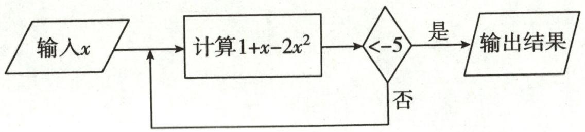
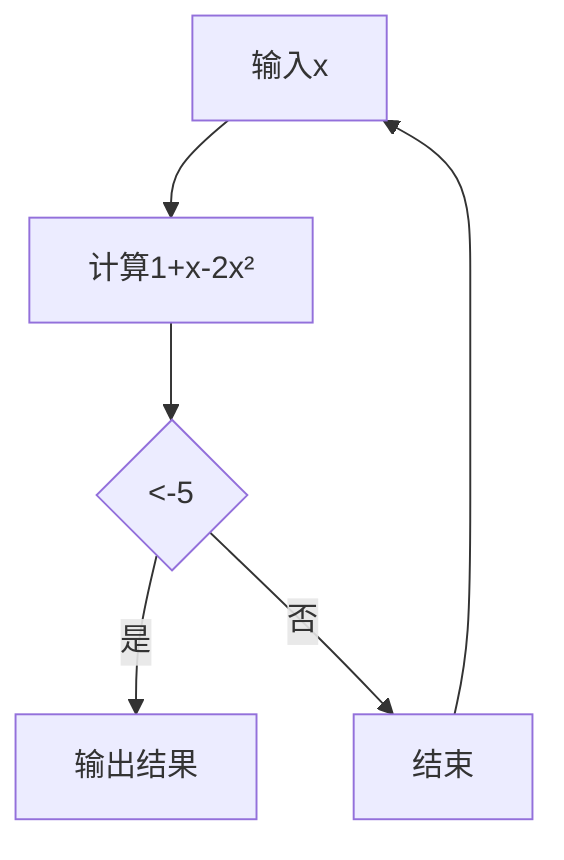
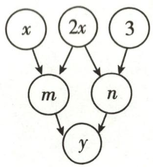
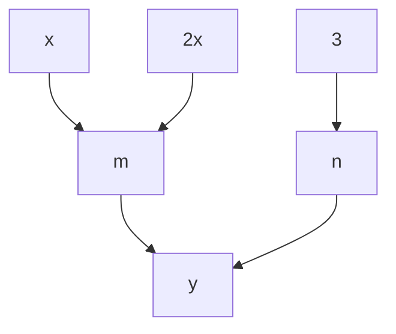
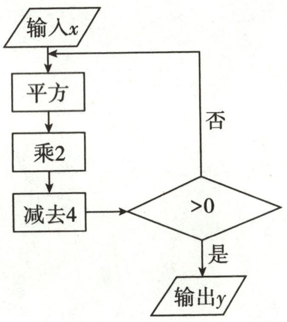
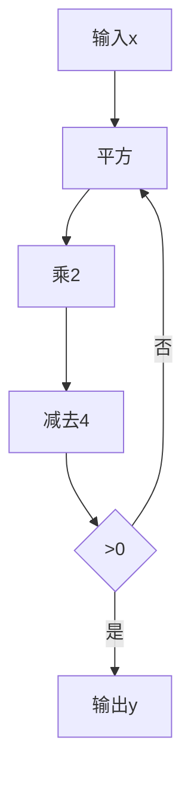
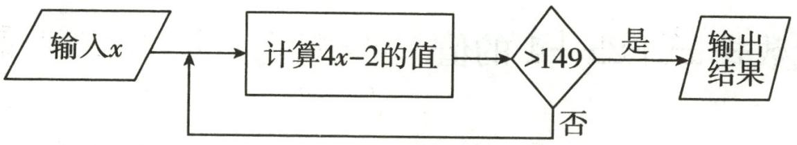
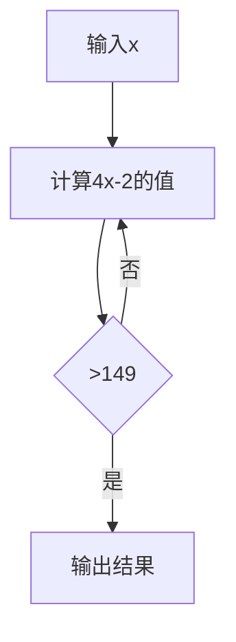
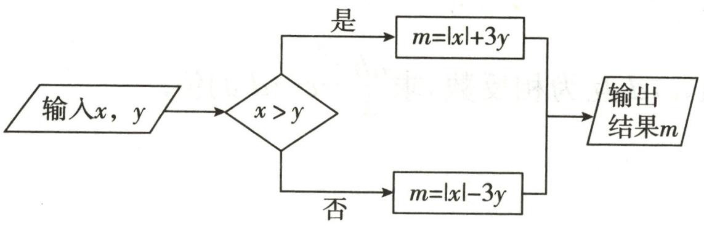
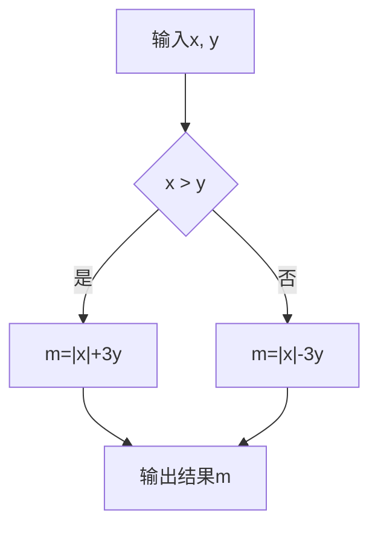

1-1/3

# 运算题卡

# 数学

# 七年级（上）R

基本功训练

# 目录

运算题卡 1 相反数的有关计算 …… 1

运算题卡 2 绝对值的有关计算 …… 2

运算题卡 3 有理数的加法运算(口算+计算) …… 3

运算题卡 4 有理数的加法运算(3 个数或 4 个数) …… 4

运算题卡 5 有理数的加法运算(4个数+恰当方法) …… 5

运算题卡 6 有理数的减法运算(口算+计算) …… 6

运算题卡 7 有理数的减法运算(4 个数+运算律) …… 7

运算题卡 8 有理数的加减混合运算(1)……8

运算题卡 9 有理数的加减混合运算(2)…… 9

运算题卡 10 有理数的加减混合运算(3)…… 10

运算题卡 11 有理数的乘法运算 …… 11

运算题卡 12 有理数的乘法运算律 …… 12

运算题卡 13 有理数的除法运算 …… 13

运算题卡 14 有理数的乘除混合运算 …… 14

运算题卡 15 有理数的乘方运算 …… 15

运算题卡 16 有理数的混合运算(1)…… 16

运算题卡 17 有理数的混合运算(2)…… 17

运算题卡 18 有理数的混合运算(3)…… 18

运算题卡 19 流程图 …… 20

运算题卡 20 求代数式的值 …… 22

运算题卡 21 合并同类项(1)…… 23

运算题卡 22 合并同类项(2)…… 24

运算题卡 23 去括号与添括号 …… 25

运算题卡 24 整式加减——化简(1)…… 26

运算题卡 25 整式加减——化简(2)…… 27

运算题卡 26 整式加减——化简求值 …… 28

运算题卡 27 整式加减——多项式加减 …… 29

运算题卡 28 移项 …… 30

运算题卡 29 移项、合并同类项…… 31

运算题卡 30 去括号(1)…… 32

运算题卡 31 去括号(2)…… 33

运算题卡 32 去分母(1)…… 34

运算题卡 33 去分母(2)…… 35

运算题卡 34 解一元一次方程 …… 36

运算题卡 35 两方程解的讨论 …… 37

运算题卡 36 角度的换算与计算 …… 38

(答案见《参考答案》第42\~46页)

# 运算题卡1 相反数的有关计算

# 1. 求下列各数的相反数：

(1) $\frac{4}{7}$ ;

(2)0;

(3)0.5;

(4)-2;

(5) $-\frac{4}{3}$ ;

(6)-5.1.

# 2. 化简下列各数:

(1) $-(-9)$ ;

(2) $+(-7.08)$ ;

(3) $+(+5)$ ;

(4) $-(+0.4)$ ;

(5) $-[-(-10)]$ ;

(6) $+\left[-\left(-\frac{2}{3}\right)\right];$

(7) $-[-(+66)]$ ;

(8) $-\left\{-[-(+3)]\right\}$ .

# 3. 求下列各数的相反数：

(1) $-(-1)$ ;

(2) $-(+3.5)$ ;

(3) $-(+2)$ ;

(4) $+(-4)$ ;

(5) $-(-16)$ ;

(6) $-\left(+25\frac{12}{13}\right);$

(7) $+(-7.953)$ ;

(8) $-\left[-\left(+\frac{9}{10}\right)\right].$

# 运算题卡2 绝对值的有关计算

1. 求下列各有理数的绝对值：

(1)+5;

(2)-9;

(3)0;

(4)-0.5;

(5) $\frac{5}{17}$ ;

(6) $-\frac{4}{7}.$

2. 计算：

(1) $|-12|+|18|$ ;

(2) $|-5.7|+|4.3|$ ;

(3) $|-2024|-|2023|$ ;

(4) $|2.375|-|1.275|$ ;

(5) $\left|-0.75\right|+\left|+\frac{1}{4}\right|;$

(6) $\left|-5\frac{1}{3}\right|+\left|-14\frac{2}{3}\right|$ ;

(7) $|+5|+|-2.9|-|-3.4|$ ;

(8) $|+5|+|-10|\div|-2|$ ;

(9) $\left|+\frac{1}{3}\right|+\left|-\frac{1}{6}\right|-\left|-\frac{1}{2}\right|$ ;

(10) $\left|-\frac{3}{4}\right|\times\left|-\frac{4}{15}\right|$ .

# 运算题卡 3 有理数的加法运算(口算+计算)

# 1. 口算：

(1) $(-3)+(-9)=$   
(2) $(-4.7)+3.9=$   
(3) $(-4)+6=$   
(4) $(-4)+4=$   
(5) $6+(-6)=$   
(6) $0+(-6)=$   
(7) $(-0.9)+1.5=$   
(8) $\frac{1}{2} + \left(-\frac{2}{3}\right) =$   
(9) $(-10)+6=$   
(10) $(+12) + (-4) =$   
(11) $(-2.6) + (+1.2) =$   
(12) $(-3.2) + (+5.2) =$   
(13) $(-0.9) + (-2.7) =$   
(14) $\frac{2}{5} + \left(-\frac{3}{5}\right) =$   
(15) $(-6.9) + 2.3 =$   
(16) $(-1.5)+9=$

# 2. 计算：

(1) $(-12)+\frac{1}{7};$

(2)3.14+(-5.2);

(3) $(-4.1)+(-15.61)$ ;

(4) $(-9.2)+\left(-1\frac{3}{5}\right);$

(5) $\frac{3}{10}+\left(-\frac{2}{5}\right)$ ;

(6) $\left(-1\frac{3}{4}\right)+3\frac{1}{3}.$

# 运算题卡 4 有理数的加法运算(3 个数或 4 个数)

计算：

(1) $(-2.8)+(-3.6)+3.6;$

(2) $(-23)+(+58)+(-17)$ ;

(3) $(-0.5)+2\frac{3}{4}+2\frac{1}{4};$

(4) $22+(-4)+(-2)$ ;

(5) $(-3)+7\frac{1}{2}+(-54)$ ;

(6) $13+(-12)+17+(-18)$ ;

(7) $(-2.4)+(-3.7)+(-4.6)+5.7;$

(8) $\left(-\frac{1}{3}\right)+13+\left(-\frac{2}{3}\right)+17;$

(9) $(-3.14)+(+4.96)+(+2.14)+(-7.96)$ ;

(10) $-\left(-3\frac{7}{12}\right)+\left(-1\frac{1}{4}\right)+\left(-2\frac{7}{12}\right)+(+1.25)-4\frac{1}{8}.$

# 运算题卡 5 有理数的加法运算(4 个数十恰当方法)

1. 用加法的运算律计算下列各题:

(1) $(-8)+10+2+(-1)$ ;

(2) $(-27)+(-32)+(-8)+72;$

(3) $(-27)+(-14)+(+17)+(+8)$ ;

(4) $\left(-\frac{3}{7}\right)+\left(+\frac{3}{5}\right)+\left(+\frac{2}{7}\right)+\left(-1\frac{3}{5}\right);$

(5) $(-1.5)+4\frac{1}{4}+2.75+\left(-5\frac{1}{2}\right);$

(6) $\frac{1}{2} + \left(-\frac{2}{3}\right) + \frac{4}{7} + \left(-\frac{1}{2}\right) + \left(-\frac{1}{3}\right)$ ;

(7) $(-2)+7\frac{1}{3}+\left(-\frac{4}{3}\right)+12;$

(8) $4\frac{1}{3}+(-5.5)+\left(-1\frac{1}{3}\right)+\left(-3\frac{1}{2}\right);$

(9) $(+0.56)+(-0.9)+(+0.44)+(-8.1)$ ;

(10) $(+1)+(-2)+(+3)+(-4)+\cdots+(+99)+(-100).$

# 运算题卡 6 有理数的减法运算(口算+计算)

# 1. 口算：

(1) $(-3)-(-5)=$   
(2)0-7=   
(3)7.2-(-4.8)=   
(4) $|-1|-3=$   
(5)-2.5-5.9=   
(6)1.9-(-0.6)=   
(7)2-8=   
(8)-3-6=   
(9)(-8)-8=   
(10)0-6=   
(11)0-(-6)=   
(12)16-47=   
(13) $\left(-\frac{2}{5}\right)-\left(-\frac{3}{5}\right)=$   
(14) $\frac{1}{2}-\frac{1}{3}=$   
(15) $0-\left(-\frac{3}{4}\right)=$   
(16) $(-2)-\left(+\frac{2}{3}\right)=$

# 2. 计算：

(1) $-13-|-7|$ ;

(2) $3\frac{1}{4}-0.75;$

(3) $3\frac{7}{12}-\frac{3}{4}$ ;

(4) $10\frac{1}{3}-\frac{26}{5}$ ;

(5) $\left(-\frac{1}{2}\right)-\left(-1\frac{1}{3}\right)$ ;

(6) $\left(-2\frac{7}{10}\right)-\left(-3\frac{3}{5}\right).$

# 运算题卡 7 有理数的减法运算(4 个数十运算律)

# 1. 计算：

(1) $(-3)-\left(+\frac{1}{3}\right)+5-\left(-1\frac{1}{3}\right);$

(2) $(-12)-5+(-14)-(-39)$ ;

(3) $0.25 + \left(-\frac{1}{8}\right) - \frac{3}{4} - \left| -\frac{7}{8} \right|$ ;

(4) $\frac{5}{6}+\left(-2\frac{1}{2}\right)-\left(-1\frac{1}{6}\right)-(+0.5)$ ;

(5) $5\frac{3}{4}-\left(-4\frac{2}{3}\right)-5.75+\left(-7\frac{2}{3}\right)$ ;

(6) $\frac{2}{9} - (-1\frac{5}{6}) + (-1\frac{2}{9}) - \frac{1}{3}$ ;

(7) $(-301)+125+301+(-75)$ ;

(8)(-8)-(-15)+(-9)-(-12);

(9) $-\frac{31}{3}-\left(-\frac{58}{7}\right)+\left(-\frac{9}{7}\right)-\left(+\frac{32}{3}\right);$

(10) $\left(-4\frac{7}{9}\right)-\left(-3\frac{1}{6}\right)-\left(+\frac{2}{9}\right)+\left(6\frac{1}{6}\right).$

# 运算题卡8 有理数的加减混合运算(1)

计算：

(1) $(+5)-7-(-4)+(-5)+10;$

(2) $\left(-\frac{1}{2}\right)+\left(+\frac{4}{3}\right)-\frac{7}{4}+(-3)$ ;

(3)8- $(+11)-(-20)+(-19)$ ;

(4)12-(-7)-(+6)+(-9)+(+11);

(5) $(+5)-(-3)+(-7)-(+12)$ ;

(6)(-8)-(-10)+(-6)-(+4);

(7) $(-3.5)+(-6)-(+4.8)-(-5)$ ;

(8) $\frac{7}{3}+\left(-\frac{5}{2}\right)-\left(-\frac{23}{6}\right)$ ;

(9) $(-0.5)-\left(-3\frac{1}{4}\right)+2.75-\left(-7\frac{1}{2}\right);$

(10) $(-3) + (-6) - (+4.8) - (-7)$ ;

(11) $(-9)-(+6)+(-1)-(-2)$ ;

(12) $(-35)+(-22)-(-35)-8.$

# 运算题卡9 有理数的加减混合运算(2)

计算：

(1) $10-(-6)+8-(+2)$ ;

(2)-17+(-6)+23-(-20);

(3)4.7-(-8.9)-7.5+(-6);

(4) $-27 + (-32) + (-8) + 72$ ;

(5) $-7 + (-33) - 10 - (-16)$ ;

(6)12-(-18)+(-7)-20;

(7) $2\frac{2}{3}+6.3-\left(\frac{5}{3}-1\frac{3}{5}\right)$ ;

(8) $\frac{5}{6} + \left(-\frac{3}{4}\right) - (+0.25) - \left(-\frac{1}{6}\right)$ ;

(9) $5.6+\left(-7\frac{3}{5}\right)-(-8.3)-\left(+\frac{53}{10}\right)-1$ ; (10) $1-3+5-7+9-11+\cdots+97-99$ .

# 运算题卡 10 有理数的加减混合运算(3)

计算：

(1) $(-7)+21+(-27)-5;$

(2) $18+(-12)+(-21)-(-12)$ ;

(3)0.35+(-0.6)+0.25-(+5.4);

(4)-20-(-14)-|-18|-13;

(5)1.125- $\left(+3\frac{3}{4}\right)-\left(+\frac{1}{8}\right)-0.25;$

(6)+5.7+(-8.4)+(-4.2)-(-10);

(7) $1\frac{1}{3}-1\frac{1}{5}+\frac{5}{3}-(-0.6)-\left(-3\frac{3}{5}\right)$ ;

(8) $\frac{2}{5}-\left|-1\frac{1}{2}\right|-\left(+2\frac{1}{4}\right)-(-2.75)$ ;

(9) $\left|1-\frac{1}{2}\right|+\left|\frac{1}{2}-\frac{1}{3}\right|+\left|\frac{1}{3}-\frac{1}{4}\right|+\cdots+\left|\frac{1}{99}-\frac{1}{100}\right|$

# 运算题卡11 有理数的乘法运算

计算：

(1) $(-4)\times(+7)$ ;

(2) $(-3)\times(-9)$ ;

(3) $\left(-99\frac{3}{5}\right)\times0;$

(4) $(-9)\times\left(-\frac{2}{3}\right);$

(5) $(-0.45)\times\left(-\frac{4}{9}\right);$

(6) $\left(-2\frac{2}{5}\right)\times\left(+\frac{3}{4}\right);$

(7) $-7\times21;$

(8) $(-10.2)\times\left(-2\frac{1}{2}\right);$

(9) $(+5.6)\times (-1.2)$ ;

(10) $(-3.48)\times(-0.7)$ ;

(11) $1\frac{3}{4}\times(-8)$ ;

(12) $(-4)\times (+1.25)$ ;

(13) $\left(-1\frac{2}{3}\right)\times\left(-\frac{1}{5}\right);$

(14) $(-0.7) \times \left(-\frac{15}{4}\right)$ ;

(15) $\left(+1\frac{2}{3}\right)\times \left(-2\frac{2}{5}\right).$

# 运算题卡12 有理数的乘法运算律

计算：

(1) $(-85)\times(-25)\times(-4)$ ;

(2) $(-125)\times(-25)\times4\times0\times(-8)$ ;

(3) $\left(\frac{7}{9}-\frac{5}{6}+\frac{3}{4}-\frac{7}{18}\right)\times36;$

(4) $\left(\frac{1}{6}-\frac{3}{4}+\frac{1}{12}\right)\times(-48)$ ;

(5) $(-5)\times(-7)+5\times(-6)$ ;

(6) $4\times\left(-3\frac{6}{7}\right)-3\times\left(-3\frac{6}{7}\right)-6\times3\frac{6}{7}$ ;

(7) $99\frac{24}{25}\times(-25)$ ;

(8) $\left(-1\frac{5}{17}\right)\times\left(-3\frac{1}{8}\right)\times\left(+\frac{8}{15}\right)\times\left(+3\frac{7}{9}\right)$ ;

(9) $\left(1+\frac{1}{2}\right)\times\left(1+\frac{1}{4}\right)\times\left(1+\frac{1}{6}\right)\times\cdots\times\left(1+\frac{1}{20}\right)\times\left(1-\frac{1}{3}\right)\times\left(1-\frac{1}{5}\right)\times\left(1-\frac{1}{7}\right)\times\cdots\times\left(1-\frac{1}{21}\right).$

# 运算题卡 13 有理数的除法运算

# 1. 化简：

(1) $\frac{-27}{9}$ ;

(2) $\frac{-24}{-6}$ ;

(3) $\frac{0}{-8}$ ;

(4) $\frac{-3}{-\frac{6}{5}}.$

# 2. 计算：

(1) $(-24) \div 8$ ;

(2) $(-36)\div(-9)$ ;

(3) $(+4.5)\div(-0.5)$ ;

(4) $(-6.5)\div(-1.3)$ ;

(5) $0\div\left(-\frac{5}{23}\right)$ ;

(6) $(-2.5)\div\frac{5}{4};$

(7) $-9\div\left(-\frac{3}{8}\right)$ ;

(8) $\frac{5}{12} \div \left(-\frac{1}{36}\right)$ ;

(9) $1\div\left(-\frac{5}{32}\right)$ ;

(10) $(-15.4)\div\left(-\frac{11}{5}\right).$

# 运算题卡14 有理数的乘除混合运算

计算：

(1) $-2.5\div\frac{5}{8}\times\left(-\frac{1}{4}\right);$

(2) $25\div(-5)\times\frac{1}{5}\div\left(-\frac{3}{4}\right);$

(3) $12\times\left(-\frac{4}{3}\right)\div5;$

(4) $-2\frac{1}{5}\times2\frac{3}{11}\div\left(-2\frac{1}{2}\right);$

(5) $(-2.1)\div\frac{7}{10}\times\left(-\frac{10}{7}\right);$

(6) $-8\div(-4)\times\frac{4}{15};$

(7) $(-3)\times6\div(-2)\times\frac{1}{2};$

(8) $\left(-\frac{4}{7}\right)\div\left(-\frac{3}{14}\right)\times\left(-\frac{7}{3}\right);$

(9) $(-3)\div\left(1\frac{3}{4}\right)\times0.75\times\left|-2\frac{1}{3}\right|\div9;$

(10) $2\frac{1}{5}\times\left|\frac{1}{3}-\frac{1}{2}\right|\times\frac{3}{11}\div\left(-1\frac{1}{4}\right).$

# 运算题卡15 有理数的乘方运算

# 1. 口算：

(1) $(-1)^{5} =$

(2) $(-1)^{2024} =$

(3) $(-0.1)^{2}=$

(4) $(-3)^{2} =$

(5) $-(-3)^{2}=$

(6) $-3^{2}=$

(7) $\left(-\frac{1}{2}\right)^{3}=$

(8) $10^{4}=$

(9) $\left(-\frac{1}{6}\right)^{2}=$

(10) $0^{2024}=$

(11) $-(-1)^{4}=$

(12) $(-0.01)^{3} =$

(13) $\frac{-3^2}{6} =$

(14) $\left(\frac{3}{2}\right)^{4}=$

(15) $-\left[+(-2)\right]^{6}=$

# 2. 计算：

(1) $-2^{2}\times(-2)^{2}$ ;

(2) $-3^{3}\times\left(-\frac{1}{3}\right)^{3}$ ;

(3) $(-2)^{2023}\times(0.5)^{2024}$ ;

(4) $(-2)^{3}\div4\times(-1)^{100}\times5;$

(5) $(-1)^{2023}\div\frac{8}{3}\times(-2)^{3}$ ;

(6) $-2^{3}\div\frac{4}{9}\times\left(-\frac{2}{3}\right)^{2}$ ;

(7) $-3^{2}\times(-8)\div3\div(-2)$ ;

(8) $(-3)^{2} \div \left(1\frac{1}{2}\right)^{2} \times \frac{1}{3}$ .

# 运算题卡 16 有理数的混合运算(1)

计算：

(1) $-5+8-12+6;$

(2) $2-[-(-2)-(-4)]$ ;

(3) $7-(-6)+(-4)\times(-3)$ ;

(4) $\frac{3}{2} \times \left(-\frac{1}{2}\right) \div \left(-4\frac{1}{2}\right)$ ;

(5) $\frac{4}{3}\times\left(-\frac{1}{6}\right)-\frac{5}{3}\div\left(-\frac{15}{7}\right);$

(6) $-3\times(-2)^{2}-1+\left(-\frac{1}{2}\right)^{3}$ ;

(7) $-3^{2}+(-12)\times\left|-\frac{1}{2}\right|-6\div(-1);$

(8) $-2^{3}\div\left(-\frac{1}{6}\right)-\frac{1}{4}\times(-2)^{2}$ ;

(9) $-4^{2}\times\left|\frac{1}{2}-1\right|-(-5)+2;$

(10) $25\div\frac{5}{6}\times\left(-\frac{2}{5}\right)+(-2)\times(-1)^{2024}$

# 运算题卡 17 有理数的混合运算(2)

计算：

(1) $-4^{2}+2\times(-3)^{2}-(-6)\div\left(-\frac{4}{3}\right);$

(2) $\left[(-3)^{2}-(-0.75)\times\frac{8}{3}-19\right]\times(-4)$ ;

(3) $-1^{4}+(-2)\div\left(-\frac{1}{3}\right)-|-9|$ ;

(4) $(-1)^{10} \div 2 + \left(-\frac{1}{2}\right)^3 \times 16$ ;

(5) $\left[1\frac{1}{4} -\left(\frac{3}{8} +\frac{1}{6} -\frac{3}{4}\right)\times 24\right]\div 5;$

(6) $-3^{2} \div 3 - \left[ (-2) \times \left( -\frac{3}{4} \right) + \left( -\frac{1}{2} \right) \right]^{3}$ ;

(7) $\left[1 - \left(1 - 0.5 \times \frac{1}{3}\right)\right] \times [2 - (-3)^2]$ ;

(8) $16\div(-2)^{3}\div\frac{(-5)^{2}}{2}\times(-4)+(-1)^{2023}.$

# 运算题卡18 有理数的混合运算(3)

1. 计算：

(1) $(-3)^{2}\times2^{3}-(-4)\div2;$

(2) $4\times\left(-\frac{3}{2}\right)^{2}-5\div\frac{1}{2}\times(-2)$ ;

(3) $-3^{2}\div3-\frac{2}{3}\times12;$

(4) $\left(-\frac{1}{2}\right)^{2}\times2^{3}-(-1)^{3}\times6;$

(5) $(-2)^{2}+(4-7)\div\frac{3}{2}-|-1|$ ;

(6) $-2^{2}\div(-4)-3\times(-1)^{2}-(-4)$ ;

(7) $-3^{2}\div(-2)^{3}\times\left|-1\frac{1}{3}\right|\times6\div(-2)^{4};$

(8) $-\left(\frac{2}{3}\right)^{2}\times18-2\times\left(-\frac{1}{5}\right)\div\frac{2}{5}+|-8|\times0.5^{2}+1\frac{7}{9}\times\left(-1\frac{1}{2}\right)^{2}.$

2. 用合适的方法计算下列各题:

(1) $25 \times \frac{3}{4} - (-25) \times \frac{1}{2} + 25 \div (-4)$ ;

(2) $7 \times 2.6 + 7 \times 1.5 - 4.1 \times 8;$

(3) $-6\times\left(-\frac{15}{17}\right)+14\times\left(-\frac{15}{17}\right)-9\times\left(-\frac{15}{17}\right);$

(4) $\left(3\frac{1}{8}\right)^{12} \times \left(\frac{8}{25}\right)^{11} \times (-2)^{3}$ ;

(5) $48\frac{24}{25}\div(-48)$ ;

(6) $\left(-\frac{5}{8}\right)\times(-4)^{2}-0.25\times(-5)\times(-4)^{3}.$

# 运算题卡 19 流程图

1. 如图是一个计算机程序, 若开始输入 $x = -1$ , 则最后输出的结果是

flowchart

第1题图

2. 示例: ④ ③ 即 4+3=7.
⑦

约定:上方相邻两数之和等于这两数下方箭头共同指向的数.

如图,(1)用含x的式子表示m=\_\_\_\_;

(2) 当 y = -2 时, n = \_\_\_\_.

flowchart

第2题图

3. 根据如图所示的程序计算, 若输入 $x$ 的值为 1 , 则输出 $y$ 的值为

flowchart

第3题图

4. 按如图所示的程序计算, 如果输入 x 的值是正整数, 输出的结果是 150, 那么满足条件的 x 的值有 \_\_\_\_ 个.

flowchart

第4题图

5. 如图是一个运算程序.

flowchart

第5题图

(1) 若 $x = -2, y = 3$ , 求 $m$ 的值;  
(2) 若 $x = 4$ , 输出结果 $m$ 的值与输入 $y$ 的值相同, 求 $y$ 的值.

# 运算题卡20 求代数式的值

1. 已知 $x = -2$ ，求代数式 $x^{2} + 2x + 1$ 的值。

2. 已知 $a, b$ 互为倒数, $c, d$ 互为相反数, 求 $\frac{ab}{3} - c - d$ 的值.

3. 已知 $a = 3, b = -2, c = -5$ ，求代数式 $b^2 - 4ac$ 的值。

4. 已知代数式 $x + 2y$ 的值是 3, 求代数式 $2x + 4y + 1$ 的值.

5. 已知 $a = 5, b = -3, c = -1$ ，求下列各式的值：

(1) $a - b - c$ ;

(2) $a-(b-c)$ .

# 运算题卡21 合并同类项(1)

合并同类项：

(1) $3a^{2}-2a+4a^{2}-7a;$

(2) $xy + 7xy - 5xy;$

(3) $-5a-2b+7a+9b;$

(4)2x-7y-5x+11y-1;

(5) $-3a + 2ab - 4ab + 2a$ ;

(6) $4a^{2}+3b^{2}+2ab-2a^{2}+4b^{2}-ab;$

(7) $\frac{1}{2} m^2 - 3mn^2 + 4n^2 + \frac{1}{2} m^2 + 5mn^2 - 4n^2$ ;

(8) $-5m^{2}n+4mn^{2}-2mn+6m^{2}n+3mn;$

(9) $7a^{2}-2ab+b^{2}-5a^{2}-b^{2}-2a^{2}-ab;$

(10) $7ab - 3a^{2}b^{2} + 7 + 8ab^{2} + 3a^{2}b^{2} - 3 - 7ab - 5ab^{2}$ .

# 运算题卡 22 合并同类项(2)

合并同类项：

(1) $\frac{1}{4} ab^2 - 5a^2 b - \frac{3}{4} a^2 b + 0.75ab^2$ ;

(2) $\frac{1}{2} x^{2} - 3xy^{2} + 4y^{2} + \frac{1}{2} x^{2} + 5xy^{2}$ ;

(3) $2x^{2}y-2xy-4xy^{2}+xy+4x^{2}y-3xy^{2}$ ;

(4) $\frac{1}{3}m^{2}n-\frac{1}{2}mn^{2}-nm^{2}+\frac{1}{6}n^{2}m;$

(5) $\left(-\frac{1}{3}xy\right)+\left(-\frac{2}{5}x^{2}\right)-\frac{1}{2}x^{2}-\left(-\frac{1}{6}xy\right);$

(6) $-\frac{1}{5}xy^{2}-3x^{2}y+xy^{2}+2x^{2}y+3xy^{2}+x^{2}y-2xy^{2};$

(7) $\frac{1}{3} x^{2}y - \frac{1}{2} xy^{2} + \frac{1}{2} xy^{2} + xy - x^{2}y;$

(8) $2a^{3}b-\frac{1}{2}a^{3}b-a^{2}b+\frac{1}{2}a^{2}b-ab^{2}$ ;

(9) $3(n-m)^{2}-7(n-m)+8(n-m)^{2}+6(n-m)$ ;

(10) $-3(a-3b)^{3}+2(3b-a)^{2}+4(a-3b)^{2}+2(3b-a)^{3}.$

# 运算题卡 23 去括号与添括号

# 1. 去括号：

(1) $4a-2(b-3c)=(\quad)$ ;   
(2) $-5a+\frac{1}{2}(4x-6)=(\_\_\_\_$ );   
(3) $3x+[4y-(7z+3)]=(\_\_\_$ );   
(4) $-3a^{3}-[2x^{2}-(5x+1)]=(\underline{\hspace{2cm}})$ .

# 2. 添括号：

(1) $2-x^{2}+2xy-y^{2}=2-($ \_\_\_\_ );   
(2) $a-(b-c+d)=a-d+(\underline{\hspace{3cm}})$ ;   
(3) $5x+3x^{2}-4y^{2}=5x-(\quad)$ ;   
(4) $-3p+3q-1=3q-(\quad)$ .

# 3. 去括号并合并同类项：

(1) $a-(2a-2)$ ;

(2) $-(5x+y)-3(2x-3y)$ ;

(3) $2x^{2}-(7+x)-x(3+4x)$ ;

(4) $-(3a^{2}-2a+1)+(a^{2}-5a+7)$ ;

(5) $a^{2}-3\left[a^{2}-2(a^{2}-a)+1\right]$ ;

(6) $3a^{2}b-2[ab^{2}-2(a^{2}b-2ab^{2})]$ ;

(7) $5a^{2}-[3a-(2a-3)+4a^{2}]$ ;

(8) $2(a^{2}b-3ab^{2})-3\left(2ab^{2}-\frac{5}{6}a^{2}b\right).$

# 运算题卡 24 整式加减——化简(1)

# 化简下列各式：

(1) $3(a+5b)-2(b-a)$ ;

(2) $3a - (2b - a) + b$ ;

(3) $2(2a^{2}+9b)+3(-5a^{2}-4b)$ ;

(4) $(2xy-y)-(-y+yx)$ ;

(5) $5(a^{2}b-3ab^{2})-2(a^{2}b-7ab^{2})$ ;

(6) $(-2ab+3a)-2(2a-b)+2ab;$

(7) $(5a^{2}+2a-1)-4(3-8a+2a^{2})$ ;

(8) $2(a-1)-(2a-3)+3;$

(9) $(x^{2}-xy+y)-3(x^{2}+xy-2y)$ ;

(10) $2(2x-3y)-(3x+2y+1)$ .

# 运算题卡 25 整式加减——化简(2)

# 化简下列各式:

(1) $(-2ab+3b)-2(-b)-2ab;$

(2) $5(ab-3ab^{2})-2(a^{2}b-7ab)$ ;

(3) $3(2x^{2}y-xy^{2})-(4xy^{2}+3x^{2}y)$ ;

(4) $-3(2x^{2}-xy)+4(x^{2}+xy-6)$ ;

(5) $2a^{2}+9b^{2}+(-5a^{2}-4b^{2})$ ;

(6) $a+[2a-2-(4-2a)]$ ;

(7) $3x^{2}-[7x-(4x-3)-2x^{2}]$ ;

(8) $-(3a^{2}-4ab)+[a^{2}-2(2a+2ab)]$ ;

(9) $2a^{2}b+2ab^{2}-[2(a^{2}b-1)+2ab^{2}+2]$ ;

(10) $1-3(2ab+a)+[1-2(2a-3ab)]$ .

# 运算题卡 26 整式加减——化简求值

先化简,再求值:

(1) $5(3a^{2}b-ab^{2})-(ab^{2}+3a^{2}b)$ ，其中 $a=\frac{1}{2},b=\frac{1}{3}$ ;

(2) $(3a^{2}-8a)+(2a^{3}-13a^{2}+2a)-2(a^{3}-3)$ ，其中a=-2；

(3)已知 $(a+2)^{2}+(b+1)^{2}=0$ ，求 $5ab^{2}-[2a^{2}b-(4ab^{2}-2a^{2}b)]$ 的值；

(4) $5abc-2a^{2}b+[3abc-2(4ab^{2}-a^{2}b)]$ ，其中a,b,c满足 $|a-1|+|b-2|+c^{2}=0$ ;

(5)已知 $a+b=7, ab=10$ ，求代数式 $(5ab+4a+7b)+(6a-3ab)-(4ab-3b)$ 的值；

(6)已知 $m^2 + 3mn = 5$ ，求 $5m^2 - [+5m^2 - (2m^2 - mn) - 7mn - 5]$ 的值.

# 运算题卡 27 整式加减——多项式加减

(1)求 $5x^{2}y-2xy^{2}$ 与 $-2xy^{2}+4x^{2}y$ 的和；

(2)求 $3x^{2} + x - 5$ 与 $4 - x + 7x^{2}$ 的差；

(3)若两个多项式的和是 $2x^{2} + xy + 3y^{2}$ , 一个多项式是 $x^{2} - xy$ , 求另一个多项式;

(4) 若 $2a^{2} - 4ab + b^{2}$ 与一个多项式的差是 $-3a^{2} + 2ab - 5b^{2}$ , 求这个多项式;

(5)已知 $M=3x^{2}+2x-1$ , $N=-x^{2}-2+3x$ , 求 M-2N;

(6)已知 $A=x^{2}+xy+y^{2}, B=-3xy-x^{2}$ ，求 2A-3B.

# 运算题卡 28 移项

# 解方程:

(1)2x-1=3;

(2) $-\frac{1}{3}x-5=4;$

(3) $5x+1=9;$

(4) $2x+1=7;$

(5) $-\frac{1}{2}x-2=6;$

(6) $-\frac{2}{3}x+3=-15;$

(7) $\frac{5}{6}-x=\frac{1}{2};$

(8) $x-\frac{1}{2}=\frac{3}{8};$

(9) $\frac{3}{5}+2x=\frac{9}{10};$

(10)4x-3=-4.

# 运算题卡 29 移项、合并同类项

# 解方程:

(1) $5x+21=7-2x;$

(2) $-\frac{1}{2}x=-\frac{3}{2}x+2;$

(3) $2x - 1 = x + 3;$

(4) $\frac{1}{2}x-6=\frac{3}{4}x;$

(5) $x - 2 = 5 + \frac{1}{2} x;$

(6)8x-3=5x+3;

(7) $2x+3=11-6x;$

(8) $4x-3=\frac{9}{2}x+1;$

(9) $3+8x=14-x;$

(10) $5y+5=9-3y.$

# 运算题卡 30 去括号(1)

# 解方程:

(1) $4(2x+1)=-20;$

(2) $3(2x-1)=5x+2;$

(3) $4x+2(5-x)=6;$

(4)4x-6=3(5-x);

(5) $2+x=-5(x-1)$ ;

(6)3x-2=2(4x-6);

(7) $2(x-1)-5=7x;$

(8) $5x+2=3(x+2)$ ;

(9) $5(1+x)=2x-4;$

(10) $3-(x+2)=5(x+1)$ ;

(11) $2(x-1)-2=4x;$

(12)4-3(2-x)=5x.

# 运算题卡 31 去括号(2)

# 解方程:

(1) $4x+3(2x-1)=12;$

(2)3x-2=10-2(x+1);

(3)4x-3(20-x)=3;

(4) $5(y+8)=5-6(7-2y)$ ;

(5)3-x=6x-2(x+1);

(6) $3(2x+1)=5-4(x-2)$ ;

(7) $\frac{1}{6}(3x-6)=\frac{2}{5}x-3;$

(8) $3x - (5x - 2) = 2(x - 1)$ ;

(9) $1+3(x-1)=7x-2(x-2)$ ;

(10) $4\left(x+\frac{1}{2}\right)+9=5-3(x-1).$

# 运算题卡 32 去分母(1)

解方程:

(1) $\frac{x+1}{3}+2=x;$

(2) $\frac{x-6}{12}-\frac{x}{3}=-2;$

(3) $\frac{x+1}{2}-1=\frac{1-x}{3};$

(4) $\frac{y+2}{4}-1=\frac{2y-1}{6}$ ;

(5) $\frac{x+7}{4}-\frac{x-1}{3}=x+1;$

(6) $\frac{2x+1}{3}-\frac{5x-1}{6}=1;$

(7) $\frac{2x+1}{5}+1=\frac{3x-4}{10};$

(8) $3-\frac{2x-1}{3}=\frac{4-3x}{5}-x;$

(9) $\frac{x-1}{2}-2=\frac{2-3x}{4}$ ;

(10) $\frac{x}{2}-\frac{5x+8}{6}=1+\frac{2x-4}{3}.$

# 运算题卡 33 去分母(2)

# 解方程：

(1) $\frac{1-x}{2}=\frac{2x-4}{3};$

(2) $\frac{2x-1}{2}-\frac{10x+1}{4}=3;$

(3) $\frac{3x + 2}{2} -\frac{x - 5}{3} = 1;$

(4) $2+\frac{x-2}{5}=\frac{x}{3};$

(5) $\frac{x - 3}{3} = x - \frac{3x - 1}{6}$ ;

(6) $x-\frac{1-x}{3}=\frac{x+2}{6}-1;$

(7) $\frac{x - 2}{3} - \frac{1 + x}{2} = -2$ ;

(8) $\frac{1-y}{3}-y=3-\frac{y+2}{2};$

(9) $\frac{1}{2}\left[x - \frac{1}{2} (x - 1)\right] = \frac{2}{3} (x - 1)$ ;

(10) $\frac{2x-1}{3}-\frac{10x-1}{6}=\frac{2x+1}{4}-1.$

# 运算题卡34 解一元一次方程

解方程:

(1) $5(3-2x)-12(5-2x)=11;$

(2) $(2x-1)+3(4x-7)-5(3x+2)+5=0;$

(3) $2-\frac{x-5}{6}=x-\frac{x+1}{3}$ ;

(4) $\frac{1-x}{3}-x=3-\frac{x+2}{4}$ ;

(5) $\frac{0.1x + 0.1}{0.3} - \frac{0.3x - 0.5}{0.4} = 1$ ;

(6) $\frac{x-3}{0.15}-\frac{x+4}{0.2}=-10;$

(7) $\frac{3}{4}\left[\frac{4}{3}\left(\frac{1}{2} t - \frac{1}{4}\right) - 8\right] = \frac{3}{2} t - 1;$

(8) $\frac{3}{2}\left[2\left(x - \frac{1}{2}\right) + \frac{2}{3}\right] = 5x.$

# 运算题卡35 两方程解的讨论

1. 已知方程 $3x + 2a - 1 = 0$ 的解与方程 $x - 2a = 0$ 的解互为相反数, 求 $a$ 的值.

2. 若关于 $x$ 的方程 $\frac{x + m}{3} = x - \frac{m}{2}$ 与方程 $3 + 4x = 2(3 - x)$ 的解互为倒数, 求 $m$ 的值.

3. 已知关于 $x$ 的方程 $3x - 6 = 2x + a$ 的解比方程 $2(x - 3) + 1 = 5$ 的解小 1, 求 $a$ 的值.

4. 若关于 $x$ 的方程 $x + m - 3 = 0$ 和 $\frac{x}{2} + 2m = 2x - 1$ 的解的和为 4, 求 $m$ 的值.

5. 已知关于 $x$ 的方程 $m + \frac{x}{3} = 4$ 的解是关于 $x$ 的方程 $\frac{x - m}{3} - \frac{2x - 4}{4} = \frac{x}{6} - 1$ 的解的 2 倍, 求 $m$ 的值.

6. 已知关于 $x$ 的方程 $2(x + 1) - m = -2(m - 2)$ 的解比方程 $2(x - 1) = 3(x + 2)$ 的解大 3, 求 $m$ 的值.

# 运算题卡36 角度的换算与计算

# 1.度、分、秒转化：

(1)57.32°=\_\_\_\_°\_\_\_\_'\_\_\_\_";   
(3) $12^{\circ}18' =$ \_\_\_\_°;

(2) $27^{\circ}14'24''=$ \_\_\_\_°;   
(4) $6000''=$ \_\_\_\_' = \_\_°.

# 2. 计算：

(1) $42^{\circ}48' + 36^{\circ}25'$ ;

(2) $18^{\circ}20' + 6^{\circ}30'$ ;

(3) $180^{\circ}-48^{\circ}39'40''$ ;

(4) $38^{\circ}49'\times3;$

(5) $33^{\circ}15'16''\times5;$

(6) $180^{\circ}\div8$ ;

(7) $56^{\circ}17' + 12^{\circ}45' - 16^{\circ}21'$ ;

(8) $131^{\circ}28' - 51^{\circ}32'15''$ ;

(9) $58^{\circ}38'27''+47^{\circ}42'40''$ ;

(10) $34^{\circ}25'\times3+35^{\circ}42'$ .