# 启东中学 附夹册、 作业本

附夹册、夹卷

八年级数学上R

数学学科编写组 编

学霸微专题

基础题卡

运算题卡

# 版权所有 侵权必究

举报电话:010-64031958

咨询热线:010-64034160

# 图书在版编目(CIP)数据

启东中学作业本. 八年级数学. 上: R / 数学学科编写组编. -- 北京: 龙门书局, 2005.4 (2025.4 重印)

ISBN 978-7-5088-0243-5

I. ①启... II. ①数... III. ①数学课-初中-习题 IV. ①G634

中国版本图书馆 CIP 数据核字(2005)第 028476 号

责任编辑:万京晨 肖志华 / 责任校对:耿巍巍

责任印制:冯岩 / 封面设计:霍影影

龍門書局 出版

北京东黄城根北街 16 号

邮政编码:100717

www.longmenshuju.com

航远印刷有限公司 印刷

科学出版社总发行 各地书店经销

\*

2005年5月第一版 开本：A4(880×1230)

2025年4月第二十次修订版 印张:23 1/2

2025年4月第六十三次印刷 字数:588 000

定价：59.80元

(如有印装质量问题,我社负责调换)

# “五维” 学习法

# 基本功担当

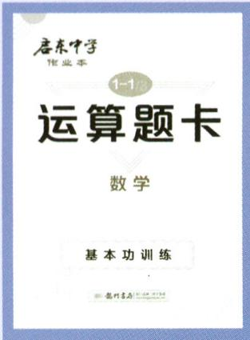

text_image

启东中学
作业本
1-1
运算题卡
数学
基本功训练

# 运算题卡

难度系数:

基本功训练

计算不失分

# 基础担当

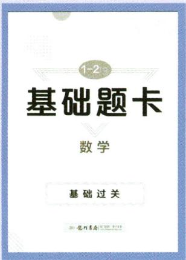

text_image

1-2
基础题卡
数学
基础过关

# 基础题卡

难度系数:

基础过关 小题满分

# 能力担当

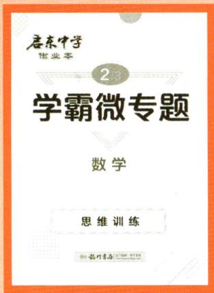

text_image

启东中学
作业本
2/3
学霸微专题
数学
思维训练

# 学霸微专题

难度系数:

思维训练 高分秘籍

# 进步担当

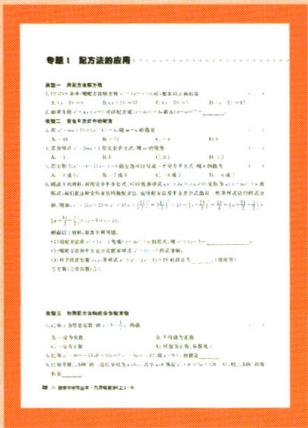

text_image

专题1 配方法的应用

第一部分 本题式应用
1. 以2015年-2016年为基数，计算公式：(x,y) = (x+1)^2 + (y-1)^2 - (z-1)^2
2. 由正方形形的三角形构成，求函数为(-x, y)。
3. 在二元格中，当x ≥ 0时，y ≥ 0，则函数为(-x, y)。
4. 在正方形形的三角形中，y = x^2 + (y - 1)^2 - (z - 1)^2。
5. 在正方形形的三角形中，y = x^2 + (y - 1)^2 - (z - 1)^2。
6. 在正方形形的三角形中，y = x^2 + (y - 1)^2 - (z - 1)^2。
7. 在正方形形的三角形中，y = x^2 + (y - 1)^2 - (z - 1)^2。
8. 在正方形形的三角形中，y = x^2 + (y - 1)^2 - (z - 1)^2。
9. 在正方形形的三角形中，y = x^2 + (y - 1)^2 - (z - 1)^2。
10. 在正方形形的三角形中，y = x^2 + (y - 1)^2 - (z - 1)^2。
11. 在正方形形的三角形中，y = x^2 + (y - 1)^2 - (z - 1)^2。
12. 在正方形形的三角形中，y = x^2 + (y - 1)^2 - (z - 1)^2。
13. 在正方形形的三角形中，y = x^2 + (y - 1)^2 - (z - 1)^2。
14. 在正方形形的三角形中，y = x^2 + (y - 1)^2 - (z - 1)^2。
15. 在正方形形的三角形中，y = x^2 + (y - 1)^2 - (z - 1)^2。
16. 在正方形形的三角形中，y = x^2 + (y - 1)^2 - (z - 1)^2。
17. 在正方形形的三角形中，y = x^2 + (y - 1)^2 - (z - 1)^2。
18. 在正方形形的三角形中，y = x^2 + (y - 1)^2 - (z - 1)^2。
19. 在正方形形的三角形中，y = x^2 + (y - 1)^2 - (z - 1)^2。
20. 在正方形形的三角形中，y = x^2 + (y - 1)^2 - (z - 1)^2。
21. 在正方形形的三角形中，y = x^2 + (y - 1)^2 - (z - 1)^2。
22. 在正方形形的三角形中，y = x^2 + (y - 1)^2 - (z - 1)^2。
23. 在正方形形的三角形中，y = x^2 + (y - 1)^2 - (z - 1)^2。
24. 在正方形形的三角形中，y = x^2 + (y - 1)^2 - (z - 1)^2。
25. 在正方形形的三角形中，y = x^2 + (y - 1)^2 - (z - 1)^2。
26. 在正方形形的三角形中，y = x^2 + (y - 1)^2 - (z - 1)^2。
27. 在正方形形的三角形中，y = x^2 + (y - 1)^2 - (z - 1)^2。
28. 在正方形形的三角形中，y = x^2 + (y - 1)^2 - (z - 1)^2。
29. 在正方形形的三角形中，y = x^2 + (y - 1)^2 - (z - 1)^2。
30. 在正方形形的三角形中，y = x^2 + (y - 1)^2 - (z - 1)^2。
31. 在正方形形的三角形中，y = x^2 + (y - 1)^2 - (z - 1)^2。
32. 在正方形形的三角形中，y = x^2 + (y - 1)^2 - (z - 1)^2。
33. 在正方形形的三角形中，y = x^2 + (y - 1)^2 - (z - 1)^2。
34. 在正方形形的三角形中，y = x^2 + (y - 1)^2 - (z - 1)^2。
35. 在正方形形的三角形中，y = x^2 + (y - 1)^2 - (z - 1)^2。
36. 在正方形形的三角形中，y = x^2 + (y - 1)^2 - (z - 1)^2。
37. 在正方形形的三角形中，y = x^2 + (y - 1)^2 - (z - 1)^2。
38. 在正方形形的三角形中，y = x^2 + (y - 1)^2 - (z - 1)^2。
39. 在正方形形的三角形中，y = x^2 + (y - 1)^2 - (z - 1)^2。
40. 在正方形形的三角形中，y = x^2 + (y - 1)^2 - (z - 1)^2。
41. 在正方形形的三角形中，y = x^2 + (y - 1)^2 - (z - 1)^2。
42. 在正方形形的三角形中，y = x^2 + (y - 1)^2 - (z - 1)^2。
43. 在正方形形的三角形中，y = x^2 + (y - 1)^2 - (z - 1)^2。
44. 在正方形形的三角形中，y = x^2 + (y - 1)^2 - (z - 1)^2。
45. 在正方形形的三角形中，y = x^2 + (y - 1)^2 - (z - 1)^2。
46. 在正方形形的三角形中，y = x^2 + (y - 1)^2 - (z - 1)^2。
47. 在正方形形的三角形中，y = x^2 + (y - 1)^2 - (z - 1)^2。
48. 在正方形形的三角形中，y = x^2 + (y - 1)^2 - (z - 1)^2。
49. 在正方形形的三角形中，y = x^2 + (y - 1)^2 - (z - 1)^2。
50. 在正方形形的三角形中，y = x^2 + (y - 1)^2 - (z - 1)^2。
51. 在正方形形的三角形中，y = x^2 + (y - 1)^2 - (z - 1)^2。
52. 在正方形形的三角形中，y = x^2 + (y - 1)^2 - (z - 1)^2。
53. 在正方形形的三角形中，y = x^2 + (y - 1)^2 - (z - 1)^2。
54. 在正方形形的三角形中，y = x^2 + (y - 1)^2 - (z - 1)^2。
55. 在正方形形的三角形中，y = x^2 + (y - 1)^2 - (z - 1)^2。
56. 在正方形形的三角形中，y = x^2 + (y - 1)^2 - (z - 1)^2。
57. 在正方形形的三角形中，y = x^2 + (y - 1)^2 - (z - 1)^2。
58. 在正方形形的三角形中，y = x^2 + (y - 1)^2 - (z - 1)^2。
59. 在正方形形的三角形中，y = x^2 + (y - 1)^2 - (z - 1)^2。
60. 在正方形形的三角形中，y = x^2 + (y - 1)^2 - (z - 1)^2。
61. 在正方形形的三角形中，y = x^2 + (y - 1)^2 - (z - 1)^2。
62. 在正方形形的三角形中，y = x^2 + (y - 1)^2 - (z - 1)^2。
63. 在正方形形的三角形中，y = x^2 + (y - 1)^2 - (z - 1)^2。
64. 在正方形形的三角形中，y = x^2 + (y - 1)^2 - (z - 1)^2。
65. 在正方形形的三角形中，y = x^2 + (y - 1)^2 - (z - 1)^2。
66. 在正方形形的三角形中，y = x^2 + (y - 1)^2 - (z - 1)^2。
67. 在正方形形的三角形中，y = x^2 + (y - 1)^2 - (z - 1)^2。
68. 在正方形形的三角形中，y = x^2 + (y - 1)^2 - (z - 1)^2。
69. 在正方形形的三角形中，y = x^2 + (y - 1)^2 - (z - 1)^2。
70. 在正方形形的三角形中，y = x^2 + (y - 1)^2 - (z - 1)^<ecel><nl>

# 专题卡

难度系数:

高频考点 专项突破

text_image

龙门中学
新教材 新情境 新考法
启东中学
附夹册、夹卷
作业本
八年级数学上R
数学学科编写组 编
学英语教程
运科思卡
基础思卡
盈科思卡
盈科思卡
盈科思卡
盈科思卡
盈科思卡
盈科思卡
盈科思卡
盈科思卡
盈科思卡
盈科思卡
盈科思卡
盈科思卡
盈科思卡
盈科思卡
盈科思卡
盈科思卡
盈科思卡
盈科思卡
盈科思卡
盈科思卡
盈利教育出版社

# 学习担当

# 启东中学作业本

难度系数:

日常作业必备

助力学习提优

# 启东中学 作业本

八年级数学上 R

数学学科编写组 编

本册主编:余中梅 吴林

龍門書局

北京

# 策划者语

很多同学都有一个困惑,平时练了很多题,考试的时候还是无从下手,到底是什么原因呢?究其根本是没有将所学的知识彻底掌握。那么,怎样才能将所学的知识融会贯通呢?同学们不妨试试龙门书局研发的“五维学习法”。

“五维学习法”源于一线老师教学和学生学习需求,从练好运算题、基础题、中档题、思维题和常考题五种题型开始,夯实运算能力、打牢基本功、提升能力、拓展思维以及查缺补漏,多维度、分层次帮助同学们学好数学。

# 第一维 练运算

运算能力是数学的基本功。想提高运算能力,是没有捷径可走的,就如武术中的练拳、站桩一样,唯有不断地强化训练,形成肌肉记忆才能提高。本书中的《运算题卡》,精选运算题目,同学们可以通过强化训练,达到提升运算能力的目的。

# 第二维 练基础

扎实的基础是学好数学的基石。数学是一门系统性和应用性很强的学科,很多知识都是环环相扣的,如果基础不牢固,就不能灵活运用,还会影响后面的学习。为了让同学们很好地掌握基础知识,本书中的《基础题卡》定位基础题,选择了一些数据简单、考法简单的题,帮助同学们在课堂上迅速掌握知识、打好基础。

# 第三维 练作业

系统地做作业是提升能力的关键。有了基本功,我们还要练好“组合拳”。本书中同步作业,是在充分调研各地学情、考情的基础上,由各地名师共同参与编写、审核的。内容包含同步课时作业、复习课等。“同步课时作业”能够帮助同学们理解、吃透教材内容;“复习课”在适当的时候加深对知识的记忆,温故知新。

# 第四维 练思维

适当的思维训练是拓展思维的必要因素。能否“一招制敌”，取决于是否拥有“必杀技”。同样，同学们能否拿到高分，思维题起决定性的作用，而思维题的训练不能靠考前一两个月的突击，只能靠平时不断地积累解题经验。本书中的《学霸微专题》，精选压轴题，为学有余力的同学“开小灶”，通过一点一滴的积累，拓展数学思维，为冲刺名校做准备。

# 第五维 练专题

专项训练是巩固所学、融会贯通的捷径。专门训练某一部位的肌肉,可以让身体变得更加协调。同理,将重点、难点、高频考点等作为一个个小专题训练,同学们不仅能够将这些专题知识掌握得更牢,还会对整个知识架构更加清楚,以便解决一些综合性问题。本书同步作业部分根据学情和考情,整理了一些小专题,这些小专题聚焦数学的一些基本图形、常见辅助线作法、中考热点等问题,归纳了一些数学思想方法和解题通法,培养同学们用一种方法解决一类题目的能力,为解答一些综合性习题做好铺垫。

本书是龙门书局教研团队在“五维学习法”的基础上,经过章章推敲、题题把关、反复修改而成。希望可以给同学们提供一定的帮助,“启东”伴你共同成长。

# 本书编委会

晁生辉 陈锋 陈新合 陈兴林 陈月红

崔恒刘 邓同义 丁不点 董春岩 樊永飞

高波 高俊元 顾和桂 顾为云 韩加军

纪 宁 姜海勇 蒋 帆 李金光 李明珈

李业法 刘海兵 刘静 刘万成 陆亚彬

吕宝库 马俊勤 马士荣 倪 俊 庞如兰

彭世平 邵艳玲 施利红 史佳钰 宋海芝

宋虎林 唐海容 万广磊 王聪 王国富

王伟 王一寒 王云峰 吴林 谢海燕

徐朗千 徐正清 许斌 薛莺 杨丽雪

余琦 余荣 余中华 余中梅 张丽

张丽丽 张庆坤 张伟 赵书爽 郑敏

朱凤娟 朱宁

# 目录

# 第十三章 三角形

作业1 三角形的概念 …… 1

作业2 三角形的边 2

作业 3 三角形的中线、角平分线、高 …… 4

作业 4 三角形的内角(一) …… 6

作业 5 三角形的内角(二) …… 8

作业6 三角形的外角 …… 10

专题1 三角形与角平分线 …… 12

周练 1(测试范围:13.1\~13.2) …… 14

专题 2 求角常用的数学思想方法 …… 16

专题3 综合与实践 …… 18

章末复习课 …… 20

# 第十四章 全等三角形

作业 7 全等三角形及其性质 …… 22

作业 8 三角形全等的判定(一) …… 24

作业 9 三角形全等的判定(二) …… 26

作业 10 三角形全等的判定(三) …… 28

专题4 全等三角形的基本类型 …… 30

周练 2(测试范围:SSS,SAS,ASA,AAS) …… 32

作业 11 三角形全等的判定(四) …… 34

专题5 与中点有关的问题 …… 36

专题6 与线段和差有关的问题 …… 38

作业 12 角的平分线的性质(一) …… 40

作业 13 角的平分线的性质(二) …… 42

专题 7 与角平分线有关的问题 …… 44

周练 3(测试范围:14.2\~14.3) 46

专题8 综合与实践 48

章末复习课 …… 50

# 第十五章 轴对称

作业 14 轴对称及其性质 …… 52

作业 15 线段的垂直平分线(一) …… 54

作业 16 线段的垂直平分线(二) …… 56

作业 17 画轴对称的图形(一) …… 58

作业 18 画轴对称的图形(二) …… 60

作业 19 等腰三角形(一) …… 62

作业 20 等腰三角形(二) …… 64

专题 9 利用平行线构造等腰三角形 …… 66

作业 21 等边三角形 …… 68

作业 22 含 $30^{\circ}$ 角的直角三角形的性质 …… 70

专题10 利用三线合一作辅助线 72

专题 11 与等腰三角形有关的基本图形 …… 74

专题 12 等腰三角形共顶点 …… 76

周练 4(测试范围:15.1\~15.3) 78

专题 13 综合与实践 …… 80

章末复习课 82

# 第十六章 整式的乘法

作业23 同底数幂的乘法 84

作业 24 幂的乘方与积的乘方 …… 86

作业 25 整式的乘法(一) 88

作业 26 整式的乘法(二) 90

作业 27 整式的乘法(三) 92

作业 28 整式的乘法(四) 94

作业 29 平方差公式 …… 96

作业 30 完全平方公式(一) 98

作业 31 完全平方公式(二) …… 100

周练 5(测试范围:16.1\~16.3) …… 102

专题 14 综合与实践 …… 104

章末复习课 106

# 第十七章 因式分解

作业 32 用提公因式法分解因式(一) …… 108

作业 33 用提公因式法分解因式(二) …… 110

作业 34 用公式法分解因式(一) …… 112

作业 35 用公式法分解因式(二) …… 114

作业 36 综合运用提公因式法和公式法 …… 116

专题 15 因式分解的热点题型 …… 118

专题 16 综合与实践 …… 120

章末复习课 122

# 第十八章 分式

作业 37 从分数到分式 …… 124

作业 38 分式的基本性质(一) …… 126

作业 39 分式的基本性质(二) …… 128

作业 40 分式的乘法与除法(一) …… 130

作业 41 分式的乘法与除法(二) …… 132

作业 42 分式的加法与减法(一) …… 134

作业 43 分式的加法与减法(二) …… 136

作业 44 整数指数幂 …… 138

作业 45 分式方程(一) …… 140

作业 46 分式方程(二) …… 142

作业 47 分式方程(三) …… 144

专题 17 分式方程的应用 …… 146

专题 18 综合与实践 …… 148

章末复习课 149

# 检测卷

第十三章检测卷 151

第十四章检测卷 155

第十五章检测卷 159

第十六章检测卷 163

第十七章检测卷 167

第十八章检测卷 171

期末检测卷 175

附夹册:

夹册 1 《运算题卡 基础题卡》(单独成册)

夹册 2 《学霸微专题》(单独成册)

夹册 3 《参考答案》(单独成册)

# 作业 1 三角形的概念

# 基础过关

1. 观察下列图形, 是三角形的是 ( )

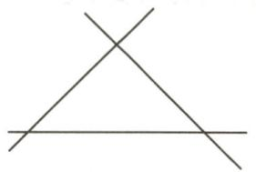  
A

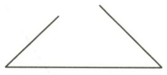  
B

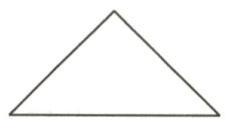  
C

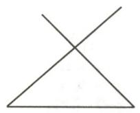  
D

2. 观察如图所示的图形, 回答下列问题:

(1) $\angle ABC$ 是 $\triangle ABC$ 的\_\_\_\_；  
(2)图中以线段 AE 为边的三角形有 \_\_\_\_；  
(3)图中共有\_\_\_\_个三角形,它们分别是\_\_\_\_.

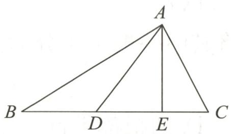

text_image

A
B D E C

第2题图

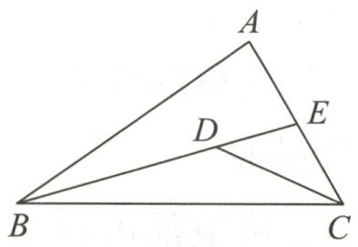

text_image

A
D
E
B
C

第4题图

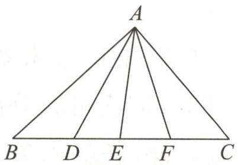

text_image

A
B D E F C

第5题图

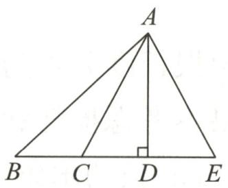

text_image

A
B C D E

第6题图

# 能力提升

3.(2024·南通海安期中)下列说法正确的是 ( )

A. 所有的等腰三角形都是锐角三角形  
B. 等边三角形属于等腰三角形  
C. 不存在既是钝角三角形又是等腰三角形的三角形  
D. 一个三角形里有两个锐角, 则一定是锐角三角形

4. (2024 秋·南京鼓楼区期中) 如图, 若有一条公共边的两个三角形称为一对“共边三角形”, 则图中以 $BC$ 为公共边的“共边三角形”有 ( )

A. 2 对

B. 3 对

C. 4 对

D. 6 对

5.(2024 秋・海淀区期末)如图,在 $\triangle ABC$ 的 $BC$ 边上取三个点 $D,E,F$ ,连接 $AD,AE,AF$ ,则 $BC$ 边上有 条线段,以 $A$ 为顶点的角有 个,图中共有 个三角形.

# 拓展延伸

6. 如图, 试回答下列问题:

(1)图中有\_\_\_\_个三角形,其中直角三角形是\_\_\_\_;  
(2)以线段 $AC$ 为公共边的三角形是  
(3)以线段 $CD$ 为边的三角形是 $\_\_\_\_ , BD$ 边所对的角是 $\_\_\_\_ .$

# 作业 2 三角形的边

# 基础过关

1.(2024春·江阴期末)下列长度的三条线段能组成三角形的是()

A. 2,4,7

B. 3,5,8

C. 5,12,13

D. $1,7,9$

2.(2024 秋·南充期末)如图,人字梯中间一般会设计一“拉杆”,这样做所蕴含的数学原理是()

A. 三角形的稳定性

B. 两点确定一条直线

C. 垂线段最短

D. 两点之间线段最短

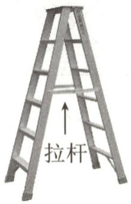  
第2题图

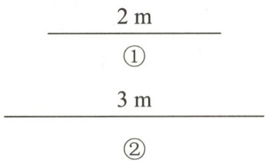

text_image

2 m
①
3 m
②

第6题图

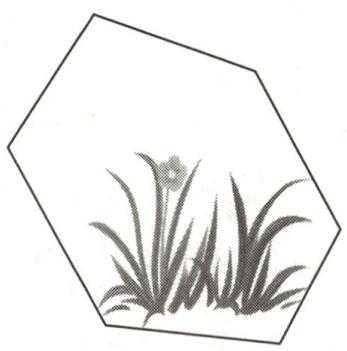

natural_image

Black-and-white line drawing of a flowering plant with leaves and a single flower, enclosed in a hexagon (no text or symbols)

第7题图

3.(2024 秋·临澧县期末)已知在△ABC 中,AB=2,BC=6,则边 AC 的长可能是 ( )

A. 3

B. 4

C. 5

D. 8

4. 用两根长度分别为 $3 \mathrm{~cm}$ 和 $5 \mathrm{~cm}$ 的细木条做一个三角形框架, 需要将其中一根木条分为两段, 如果不考虑损耗和接头部分, 那么可以分成两段的是 ( )

A. $3 \mathrm{~cm}$ 长的木条

B. $5 \mathrm{~cm}$ 长的木条

C. 两根都可以

D. 两根都不行

5.(2014·包头)长为9,6,5,4的四根木条,选其中三根组成三角形,选法有()

A. 1 种

B. 2 种

C. 3 种

D. 4 种

6.(2024 春·宁德期末)如图,①②是两根细直木棒,现需要将其中一根截成两段,首尾相接搭成一个三角形框架,则下列说法正确的是()

A. 截①②都可以

B. 截①②都不可以

C. 只有截①可以

D. 只有截②可以

# 能力提升

7. 小李家有一个六边形置物架已经变形(如图),需通过增加木条使其固定,工人师傅至少需要加固木条的数量为 ( )

A. 2

B. 3

C. 4

D. 5

8. 已知 $a, b, c$ 是三角形的三边长, 那么代数式 $a^2 - 2ab + b^2 - c^2$ 的值 ( )

A. 大于零

B. 等于零

C. 小于零

D. 不能确定

9. 如图, 在 $\triangle ABC$ 中, $AB = 10 \mathrm{~cm}, AC = 6 \mathrm{~cm}, D$ 是 $BC$ 的中点, $E$ 点在边 $AB$ 上, $\triangle BDE$ 与四边形 $ACDE$ 的周长相等.

(1)求线段 $AE$ 的长;

(2)若图中所有线段长度的和是 $53 \, cm$ ，求 $BC + \frac{1}{2} DE$ 的值.

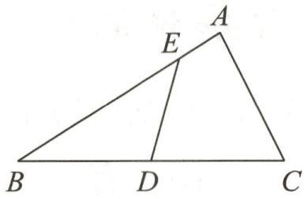

text_image

A
E
B D C

第9题图

10. 已知 $a, b, c$ 是 $\triangle ABC$ 的三边长, $a = 4$ , $b = 6$ , 设三角形的周长是 $x$ .

(1)直接写出 c 及 x 的取值范围.

(2)若 x 是小于 18 的偶数，

①求 c 的长；

②判断 $\triangle ABC$ 的形状.

11. 用一条长 $24 \mathrm{~cm}$ 的细绳围成一个等腰三角形.

(1)如果腰长是底边长的2倍,那么各边的长是多少?

(2)能围成有一边长为 $6 \mathrm{~cm}$ 的等腰三角形吗？为什么？

(3)若等腰三角形的腰长为 $a \mathrm{~cm}$ , 求 $a$ 的取值范围.

12. 已知 $\triangle ABC$ 的三边长分别是 a, b, c.

(1)若 $a = 5, b = 6, \triangle ABC$ 的周长是小于18的偶数, 求 $c$ 的长;

(2)化简： $|a+b-c|-|c-a-b|$ .

# 拓展延伸

13. 如图, 在 $\triangle ABC$ 中, 点 $D$ 在边 $AB$ 上, 连接 $CD$ , 点 $O$ 在 $CD$ 上, 连接 $BO$ , 求证: $AB + AC > OB + OC$ .

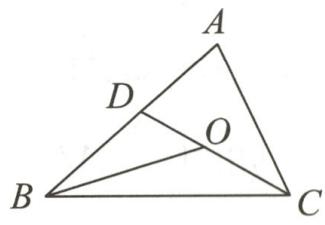  
第13题图

# 作业 3 三角形的中线、角平分线、高

# 基础过关

1. 如图, 在 $\triangle ABC$ 中, $\angle C > \angle B$ , $AE$ 是中线, $AD$ 是角平分线, $AF$ 是高, 则下列说法中错误的是 ( )

A. ${BE} = {CE}$

B. $\angle BAC = 2\angle BAD$

C. $\angle AFB = \angle AFC$

D. $S_{\triangle ABD} = S_{\triangle ACD}$

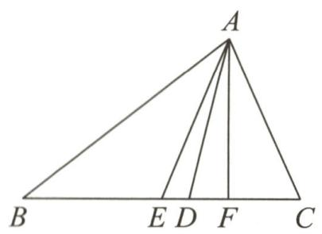

text_image

A
B E D F C

第1题图

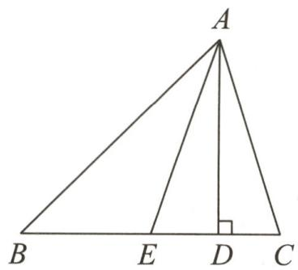

text_image

A
B E D C

第2题图

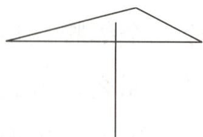  
第3题图

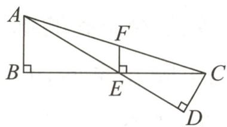  
第4题图

2. 如图, 在 $\triangle ABC$ 中, $AD$ 是高, $AE$ 是中线, 若 $AD = 3$ , $S_{\triangle ABC} = 6$ , 则 $BE$ 的长为 ( )

A. 1

B. $\frac{3}{2}$

C. 2

D. 4

3. 如图, 小朋用铅笔可以支起一张质地均匀的三角形卡片, 则他支起的这个点应是三角形的 ( )

A.三条中线的交点

B.三条高的交点

C. 三条角平分线的交点

D. 任意一点

4. 如图, $AB$ 是 $\triangle ACE$ 的 \_\_\_\_ 边上的高; 在 $\triangle AEC$ 中, $CD$ 是 \_\_\_\_ 边上的高, $CD$ 还是 $\triangle$ 的高; $EF$ 是 $\triangle$ 的 \_\_\_\_ 边上的高.

5. 如图, 已知 $\triangle ABC$ .

(1)画出 $\triangle ABC$ 的中线 $AD$ 和角平分线 $CE$ ;

(2)画出 $\triangle ABC$ 的高 $AM, CN$ .

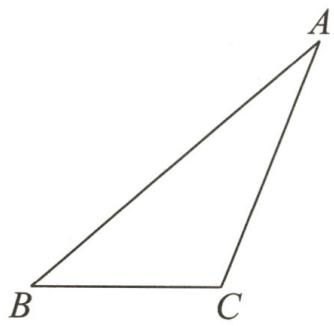

natural_image

Simple geometric diagram of a triangle labeled A, B, and C (no additional text or symbols)

第5题图

# 能力提升

6. 如图, $\triangle ABC$ 中, $\angle 1 = \angle 2, G$ 为 $AD$ 的中点, 连接 $BG$ 并延长, 交 $AC$ 于点 $E, F$ 为 $AB$ 上一点, 且 $CF \perp AD$ 于点 $H$ . 下列说法, 其中正确的有 \_\_\_\_ 个.

①BG 是 $\triangle ABD$ 的中线；②AD 既是 $\triangle ABC$ 中 $\angle BAC$ 的平分线，也是 $\triangle ABE$ 中 $\angle BAE$ 的平分线；③CH 既是 $\triangle ACD$ 中 AD 边上的高，也是 $\triangle ACH$ 中 AH 边上的高.

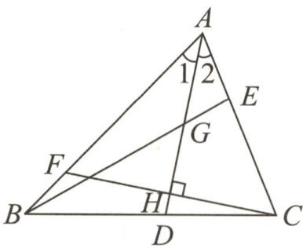

text_image

A
1 2
E
G
F
B
H
D
C

第6题图

7. 在 $\triangle ABC$ 中, $AC=5\ \text{cm}$ , $AD$ 是 $\triangle ABC$ 的中线, 若 $\triangle ABD$ 的周长与 $\triangle ADC$ 的周长相差2 $\text{cm}$ , 则 $BA=$ \_\_\_\_ cm.

8. 如图, $D, E, F$ 分别是 $B C, A D, C E$ 的中点, $\triangle A B C$ 的面积是 $16 \mathrm{~cm}^{2}$ , 则 $\triangle B E F$ 的面积是 \_\_\_\_ $\mathrm{cm}^{2}$ .

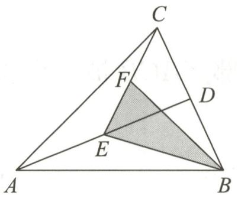

text_image

C
F
D
E
A
B

第8题图

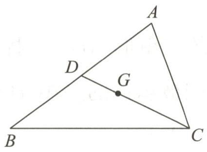

text_image

A
D
G
B
C

第10题图

9. 在锐角 $\triangle ABC$ 中, $AB = 12$ , $AC = 10$ , $BE$ , $CD$ 分别是 $\triangle ABC$ 的边 $AC$ , $AB$ 上的高, 且 $BE = 6$ , 则 $CD$ 的长是 \_\_\_\_.

10.(2024·泰州姜堰期中)如图,G是△ABC的重心.

(1) $\frac{AD}{AB}=$ \_\_\_\_；(2)若DG=2，则CD的长是\_\_\_\_。

11.(2024·徐州期中)如图,D是∠ABC的平分线上的一点,过点D作EF∥BC,DG∥AB.

(1) 若 $AD \perp BD, \angle BED = 130^{\circ}$ ，求 $\angle BAD$ 的度数；

(2)连接 EG, 交 BD 于点 O, DO 是 $\triangle DEG$ 的角平分线吗? 请说明理由.

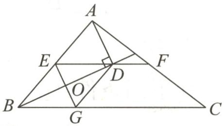

text_image

Geometric diagram of triangle ABC with internal points D, E, F, G, O and perpendicular lines, labeled with vertices and intersection points.

第 11 题图

# 拓展延伸

12. 如图, $\triangle ABC$ 中, $\angle C = 90^{\circ}, AC = 8 \mathrm{~cm}, BC = 6 \mathrm{~cm}, AB = 10 \mathrm{~cm}$ . 若动点 $P$ 从点 $C$ 开始, 按 $C \rightarrow A \rightarrow B \rightarrow C$ 的路径运动, 且速度为每秒 $2 \mathrm{~cm}$ . 设运动的时间为 $t \mathrm{~s}$ .

(1)当 $t$ 为何值时, $CP$ 把 $\triangle ABC$ 的周长分成相等的两部分?

(2)当 $t$ 为何值时, $CP$ 把 $\triangle ABC$ 的面积分成相等的两部分?

(3)当 t 为何值时, $\triangle BCP$ 的面积为 $12 \, cm^{2}$ ?

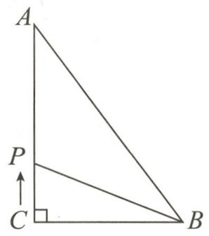

text_image

A
P
C
B

第12题图

# 作业 4 三角形的内角（一）

# 基础过关

1. 如图是一个建筑工地的三角形 $ABC$ 支撑架, 它的上部 $\angle ACB$ 被一个长方形钢架遮挡, 测量得 $\angle A = 60^{\circ}, \angle B = 80^{\circ}$ , 则被遮挡的 $\angle ACB$ 的度数为 ( )

A. ${30}^{ \circ  }$

B. ${40}^{ \circ  }$

C. ${50}^{ \circ  }$

D. ${60}^{ \circ  }$

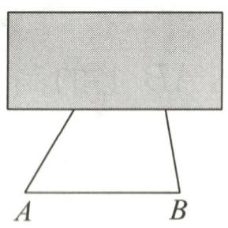  
第1题图

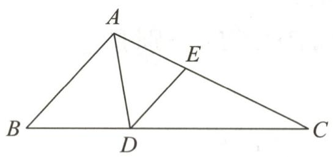

text_image

A
E
B
D
C

第2题图

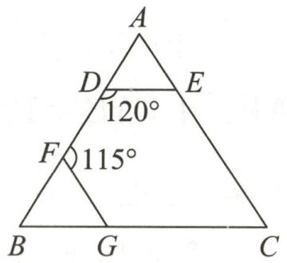

text_image

A
D
E
120°
F
115°
B
G
C

第 4 题图

2. (2023 秋·成都期末)如图, 在 $\triangle ABC$ 中, $AD$ 平分 $\angle BAC$ 交边 $BC$ 于点 $D$ , $DE \parallel AB$ 交边 $AC$ 于点 $E$ . 若 $\angle B = 48^{\circ}, \angle C = 26^{\circ}$ , 则 $\angle ADE$ 的大小为 ( )

A. ${42}^{ \circ  }$

B. $52^{\circ}$

C. ${53}^{ \circ  }$

D. ${54}^{ \circ  }$

3. 在下列条件: ① $\angle A + \angle B = \angle C$ , ② $\angle A : \angle B : \angle C = 5 : 3 : 2$ , ③ $\angle A = 90^{\circ} - \angle B$ , ④ $\angle A = 2 \angle B = 3 \angle C$ 中, 能确定 $\triangle ABC$ 是直角三角形的有 ( )

A. 1 个

B. 2 个

C. 3 个

D. 4 个

4. 如图, 在 $\triangle ABC$ 中, 若 $DE \parallel BC$ , $FG \parallel AC$ , $\angle BDE = 120^{\circ}$ , $\angle DFG = 115^{\circ}$ , 则 $\angle C =$ \_\_\_\_°.

5. 小明想探究三角形内角和的度数, 下面是他的探究过程, 请你帮他把探究过程补充完整.
如图, 在 $\triangle ABC$ 的边 $BC$ 上任取一点 $E$ , 作 $DE \parallel AC$ 交 $AB$ 于点 $D$ , 作 $EF \parallel AB$ 交 $AC$ 于点 $F$ .

∵ DE∥AC, AB∥EF,

∴∠1=\_\_\_\_，∠3=\_\_\_\_。（\_\_\_\_）

∵ AB∥ EF,

∴∠4=\_\_\_\_.(\_\_\_\_)

∵ DE∥AC,

∴∠4=\_\_\_\_，(\_\_\_\_)

∴∠2=\_\_\_\_.(\_\_\_\_)

$\because \angle1+\angle2+\angle3=180^{\circ},$

$\therefore \angle A + \angle B + \angle C =$

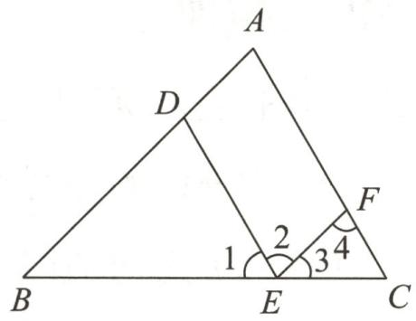

text_image

A
D
F
1
2
3
4
B
E
C

第5题图

# 能力提升

6. 如图, 在 $\triangle ABC$ 中, $AD \perp BC$ , $AE$ 平分 $\angle BAC$ , 若 $\angle BAE = 30^{\circ}$ , $\angle CAD = 20^{\circ}$ , 则 $\angle B$ 的度数为 \_\_\_\_.

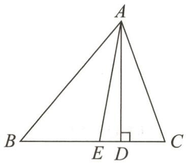

text_image

A
B E D C

第6题图

7. 如图, $\triangle ABC$ 中, $D$ 为 $AC$ 边上一点, 过点 $D$ 作 $DE \parallel AB$ , 交 $BC$ 于点 $E, F$ 为 $AB$ 边上一点, 连接 $DF$ 并延长, 交 $CB$ 的延长线于点 $G$ , 且 $\angle DFA = \angle A$ .

(1)求证:DE 平分∠CDF;  
(2)若 $\angle C=80^{\circ},\angle ABC=60^{\circ}$ ,求 $\angle G$ 的度数.

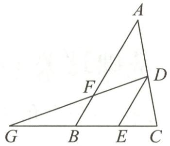

text_image

A
F
D
G
B
E
C

第7题图

8. 如图, 在 $\triangle ABC$ 中, $\angle ACB = 90^{\circ}$ , $AE$ 是角平分线, $CD$ 是高, $AE, CD$ 相交于点 $F$ .

(1)若 $\angle DCB=40^{\circ}$ ,求 $\angle CEF$ 的度数;   
(2) 求证: $\angle CEF = \angle CFE$ .

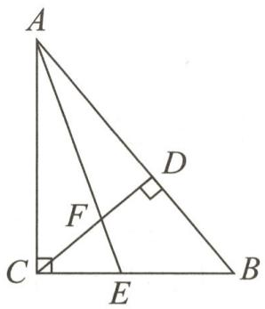

text_image

A
D
F
C
E
B

第8题图

# 拓展延伸

9. 在 $\triangle ABC$ 中, $\angle A=n^{\circ}$ , $\angle ABC$ , $\angle ACB$ 的平分线交于点O.

(1)如图①,求 $\angle BOC$ 的度数.(用含 $n$ 的代数式表示)  
(2)如图②, 过点 O 作直线 DE // BC, 分别交边 AB, AC 于点 D, E, 则 $\angle DOB + \angle EOC =$ (用含 n 的代数式表示)

(3) 将直线 DE 绕点 O 旋转.

①如图③, 直线 $DE$ 与 $AB, AC$ 的交点分别在线段 $AB$ 和 $AC$ 上, 试探索 $\angle DOB, \angle EOC, \angle A$ 三者之间的数量关系, 并说明你的理由;  
②如图④, 直线 DE 与 AB 的交点在线段 AB 上, 与 AC 的交点在 AC 的延长线上, 则 $\angle DOB$ , $\angle EOC$ , $\angle A$ 三者之间的数量关系为 \_\_\_\_.

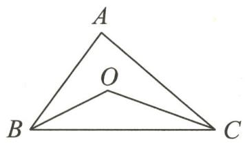  
①

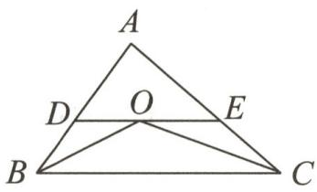  
②

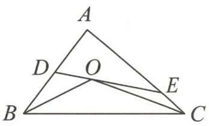  
③

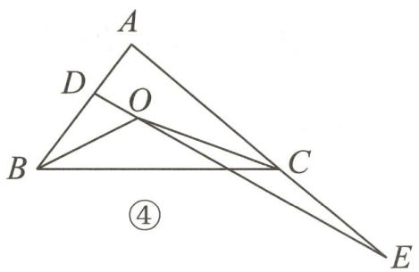

text_image

A
D
O
B
C
④
E

第9题图

# 模型积累

【模型 1】角平分线与高的夹角

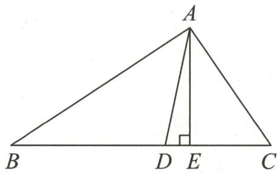

text_image

A
B D E C

【条件】AD, AE 分别是 $\triangle ABC$ 的角平分线和高.

【结论】 $\angle DAE = \frac{1}{2} (\angle C - \angle B)$

【模型 2】双垂直的夹角

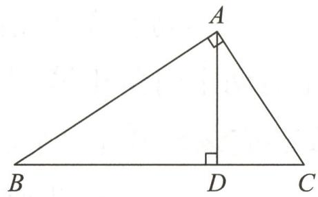

text_image

A
B D C

【条件】 $\angle BAC=90^{\circ},AD\perp BC$ 于点D.

【结论】 $\angle BAD = \angle C, \angle DAC = \angle B.$

【模型 3】双内角平分线的夹角

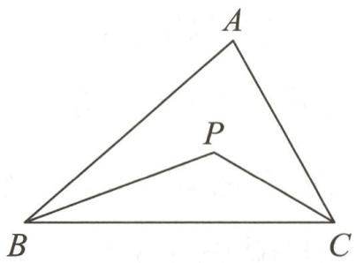

text_image

A
P
B
C

【条件】BP 平分∠ABC, CP 平分∠ACB.

【结论】 $\angle P = 90^{\circ} + \frac{1}{2}\angle A.$

# 作业 5 三角形的内角（二）

# 基础过关

1. 在一个直角三角形中, 一个锐角是 $40^{\circ}$ , 另一个锐角是 ( )

A. ${70}^{ \circ  }$

B. ${50}^{ \circ  }$

C. ${30}^{ \circ  }$

D. ${10}^{ \circ  }$

2.(2024秋·阳泉期中)如图,在Rt△ABC中,∠ACB=90°,CD⊥AB于点D.若∠A=35°,则∠BCD的度数为()

A. ${40}^{ \circ  }$

B. $35^{\circ}$

C. ${30}^{ \circ  }$

D. ${25}^{ \circ  }$

3.(2023 春·南京期末)直角三角形中两个锐角的差为 $20^{\circ}$ , 则较小的锐角度数是 \_\_\_\_。

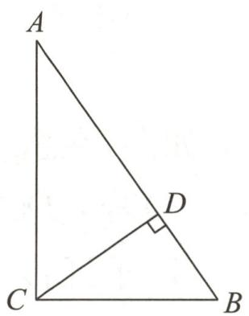

text_image

A
D
C
B

第2题图

4. 如图, 在 Rt△ABC 中, ∠ACB=90°, CD 是边 AB 上的高, ∠1=32°, 求 ∠2, ∠B, ∠A 的度数.

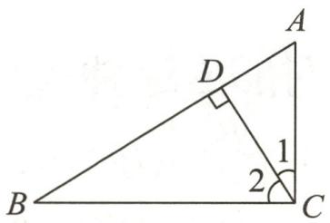

text_image

A
D
1
2
B
C

第4题图

# 能力提升

5.具备下列条件的 $\triangle ABC$ 中,不是直角三角形的是 ( )

A. $\angle A + \angle B = \angle C$

B. $\angle A - \angle B = \angle C$

C. $\angle A: \angle B: \angle C = 1:2:3$

D. $\angle A = \angle B = 3\angle C$

6. 如图, $\triangle ABC$ 与 $\triangle CDE$ 均为直角三角形, $AB$ 交 $CD$ 于点 $F$ , $\angle ACB = \angle CDE = 90^\circ$ , $\angle B = 30^\circ$ , $\angle E = 45^\circ$ , $\angle ECB = \alpha$ , 则 $\angle CFB =$ ( )

A. $\alpha + 90^{\circ}$

B. $\alpha + 45^{\circ}$

C. ${105}^{ \circ  } - \alpha$

D. ${180}^{ \circ  } - \alpha$

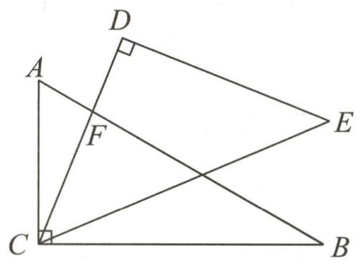

text_image

Geometric diagram with labeled points A, B, C, D, E, F and right-angle markers at C and D

第6题图

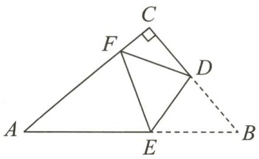

text_image

Geometric diagram of triangle ABC with points D, E, F and auxiliary lines, including a right angle at C.

第7题图

7. 有一道题：“如图, 在 $\triangle ABC$ 中, $\angle C=90^{\circ}$ , 将 $\triangle ABC$ 沿 $DE$ 折叠, 使得点 $B$ 落在边 $AC$ 上的点 $F$ 处, 若 $\angle CFD=60^{\circ}$ , 且 $\triangle AEF$ 中有两个内角相等, 求 $\angle A$ 的度数。”嘉嘉的答案是 $\angle A=40^{\circ}$ , 淇淇说: “嘉嘉考虑得不全面, $\angle A$ 还应该有另外一个值。”下列判断正确的是 ( )

A. 淇淇说得不对, $\angle A$ 就是 $40^{\circ}$

B. 淇淇说得对, 且 $\angle A$ 的另一个值是 $50^{\circ}$

C. 淇淇说得对, 且 $\angle A$ 的另一个值是 $55^{\circ}$

D. 两人都不对, $\angle A$ 应有三个不同值

8. 在直角三角形 $ABC$ 中, $\angle A: \angle B: \angle C = 2: m: 4$ , 则 $m$ 的值是

9.(2024 春·泰州期中)若三角形中一个内角的度数是另一个内角度数的 2 倍,我们把这样的三角形称为“和谐三角形”.已知直角 $\triangle ABC$ 是“和谐三角形”,则该三角形两个锐角的度数分别为\_\_\_\_.

10. 如图, 在 $\triangle ABC$ 中, $\angle BAC = 90^{\circ}, AD \perp BC$ 于点 $D, BE$ 平分 $\angle ABC, AD, BE$ 相交于点 $F$ .

(1)若 $\angle CAD=36^{\circ}$ ,求 $\angle AEF$ 的度数;

(2)试说明: $\angle AEF=\angle AFE.$

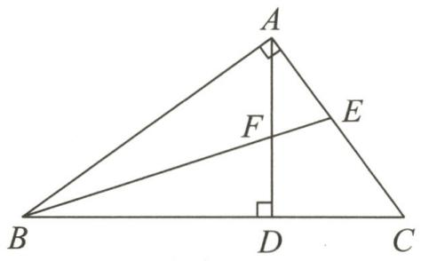

text_image

A
F
E
B
D
C

第10题图

# 拓展延伸

11.(2024春·建湖县期中)【定义】如果两个角的差为 $36^{\circ}$ , 就称这两个角互为“黄金角”, 其中一个角叫作另一个角的“黄金角”.

例如: $\alpha = 76^{\circ}, \beta = 40^{\circ}, \alpha - \beta = 36^{\circ}$ , 则 $\alpha$ 和 $\beta$ 互为“黄金角”, 即 $\alpha$ 是 $\beta$ 的“黄金角”, $\beta$ 也是 $\alpha$ 的“黄金角”.

(1)已知∠1和∠2互为“黄金角”，且∠1＞∠2，若∠1和∠2互余，则∠1=\_\_\_\_。

(2)如图①,在 $\triangle ABC$ 中, $\angle ACB=90^{\circ}$ ,过点 $C$ 作 $AB$ 的平行线 $CM$ , $\angle ABC$ 的平分线分别交 $AC$ , $CM$ 于 $D$ , $E$ 两点.

(1)若 $\angle A>\angle BEC$ ,且 $\angle A$ 和 $\angle BEC$ 互为“黄金角”,则 $\angle A=$ \_\_\_\_;

②如图②, 过点 $C$ 作 $AB$ 的垂线, 垂足为 $F, BD$ 与 $CF$ 相交于点 $N$ . 若 $\angle DCN$ 与 $\angle CDN$ 互为 “黄金角”, 求 $\angle A$ 的度数.

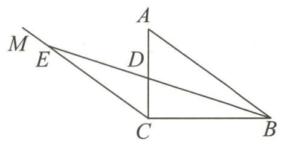

text_image

M
E
A
D
C
B

①

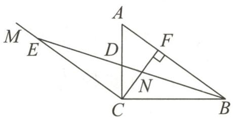

text_image

Geometric diagram with labeled points and right angle at F, showing triangle ABC with perpendiculars and a right angle at F.

②   
第11题图

# 作业 6 三角形的外角

# 基础过关

1.(2024·浙江模拟)将一副直角三角板按如图所示方式摆放,若AB//EF,则∠1= ( )

A. ${45}^{ \circ  }$

B. ${50}^{ \circ  }$

C. $60^{\circ}$

D. $75^{\circ}$

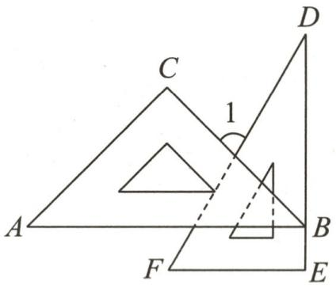

text_image

A
C
D
1
B
F
E

第1题图

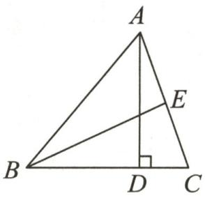  
第2题图

2. 如图, $\triangle ABC$ 中, $AD$ , $BE$ 分别是 $\triangle ABC$ 的高和角平分线, 若 $\angle C = 70^{\circ}$ , $\angle AEB = 95^{\circ}$ , 则 $\angle BAD =$ \_\_\_\_.  
3. 在 $\triangle ABC$ 中, $\angle A=60^{\circ}$ , 高 $BE, CF$ 所在的直线相交于点 $O$ , 且点 $O$ 不与点 $B, C$ 重合, 则 $\angle BOC=$ \_\_\_\_°.  
4. 如图, 在 $\triangle ABC$ 中, $\angle 1 = \angle 2 = \angle 3$ .

(1)证明: $\angle BAC=\angle DEF;$   
(2)若 $\angle BAC=70^{\circ},\angle DFE=50^{\circ}$ ,求 $\angle ABC$ 的度数.

text_image

A
1
E
D
F
3
B
2
C

第4题图

# 能力提升

5.(2024 春·姜堰区月考)如图, $\angle ABD,\angle ACD$ 的平分线交于点P,若 $\angle A=50^{\circ},\angle D=10^{\circ}$ ,则 $\angle P$ 的度数为()

A. ${15}^{ \circ  }$

B. ${20}^{ \circ  }$

C. ${25}^{ \circ  }$

D. ${30}^{ \circ  }$

text_image

A
B
C
D
P

第5题图

text_image

Geometric diagram with labeled points A, B, C, D, E forming triangles and a line

第6题图

6. 如图, $BE$ 是 $\triangle ABC$ 的外角 $\angle CBD$ 的平分线, 且 $BE$ 交 $AC$ 的延长线于点 $E$ . 若 $\angle A = 30^{\circ}, \angle E = 20^{\circ}$ , 则 $\angle ACB$ 的度数是 ( )

A. ${50}^{ \circ  }$

B. ${60}^{ \circ  }$

C. ${70}^{ \circ  }$

D. ${80}^{ \circ  }$

7. 如图, 在 $\triangle ABC$ 中, 在 $AB$ 上存在一点 $D$ , 使得 $\angle ACD = \angle B$ , $\triangle ABC$ 的角平分线 $AE$ 交 $CD$ 于点 $F$ . $\triangle ABC$ 的外角 $\angle BAG$ 的平分线所在的直线 $MN$ 与 $BC$ 的延长线交于点 $M$ , 若 $\angle M = 35^\circ$ , 则 $\angle CFE = \_\_\_\_\^\circ$ .

text_image

Geometric diagram with labeled points and lines, including triangle ABC and intersecting segments

第7题图

text_image

A
E
F
B
D
C

第8题图

8. 如图, $\triangle ABC$ 中, $\angle B = 50^{\circ}$ , 点 $D, E$ 分别在边 $BC, AB$ 上, $DE \parallel AC$ , $\angle EDC$ 的平分线与 $\angle BAC$ 的平分线交于点 $F$ , 则 $\angle AFD =$ \_\_\_\_ 度.

9. 如图, $AD$ 是 $\triangle ABC$ 的角平分线, $\angle ACB > \angle B, P$ 为线段 $AD$ 上一点, $PE \perp AD$ 交 $BC$ 的延长线于点 $E$ .

(1) 若 $\angle B = 30^{\circ}, \angle ACB = 80^{\circ}$ ，求 $\angle E$ 的度数；

(2)试猜想 $\angle E$ 与 $\angle B,\angle ACB$ 之间的数量关系,并证明你的结论.

text_image

A
1 2
P
3
B D C E

第9题图

# 拓展延伸

10. 在 $\triangle ABC$ 中, $BD$ 平分 $\angle ABC$ 交 $AC$ 于点 $D,E$ 是线段 $AC$ 上的动点(不与点 $D$ 重合), 过点 $E$ 作 $EF \parallel BC$ 交射线 $BD$ 于点 $F,\angle CEF$ 的平分线所在直线与射线 $BD$ 交于点 $G$ .

(1)如图,点E在线段AD上运动.

①若 $\angle ABC=40^{\circ}, \angle C=60^{\circ}$ ,则 $\angle BGE$ 的度数是\_\_\_\_;

②若 $\angle A=70^{\circ}$ ,则 $\angle BGE$ 的度数是\_\_\_\_;

③探究 $\angle BGE$ 与 $\angle A$ 之间的数量关系,并说明理由.

(2)若点 $E$ 在线段 $DC$ 上运动, $\angle BGE$ 与 $\angle A$ 之间的数量关系与 (1)③中的数量关系是否相同? 若不相同, 请直接写出 $\angle BGE$ 与 $\angle A$ 之间的数量关系, 无需说明理由.

text_image

Geometric diagram with labeled points A, B, C, D, E, F, G forming intersecting triangles and lines

  
(备用图)  
第10题图

# 专题 1 三角形与角平分线

# 类型一 三角形双角平分线的夹角

1. 如图, 在 $\triangle ABC$ 中, $BD, CD$ 分别平分 $\angle ABC$ , $\angle ACB$ , $BG$ , $CG$ 分别平分 $\triangle ABC$ 的两个外角 $\angle EBC$ , $\angle FCB$ , 则 $\angle D$ 和 $\angle G$ 的数量关系为 ( )

A. $\angle D = \frac{1}{2}\angle G$

B. $\angle D + \angle G = 180^{\circ}$

C. $\angle D + \frac{1}{2}\angle G = 90^{\circ}$

D. $\angle D = 90^{\circ} + \frac{1}{2}\angle G$

text_image

A
D
B
C
E
F
G

第1题图

text_image

A
1
O
2
B
C
D
E

第2题图

2. 如图, 在 $\triangle ABC$ 中, $BO, CO$ 分别平分 $\angle ABC, \angle ACB$ , 交于点 $O, CE$ 为外角 $\angle ACD$ 的平分线, $BO$ 的延长线交 $CE$ 于点 $E$ , 记 $\angle BAC = \angle 1, \angle BEC = \angle 2$ , 则以下结论: ① $\angle 1 = 2\angle 2$ , ② $\angle BOC = 3\angle 2$ , ③ $\angle BOC = 90^{\circ} + \angle 1$ , ④ $\angle BOC = 90^{\circ} + \angle 2$ 中, 正确的是 ( )

A. ①②③

B. ①③④

C. ①④

D. ①②④

3. 如图①, $\triangle ABC$ 的外角平分线 $BF, CF$ 交于点 $F$ .

(1) 若 $\angle A = 50^{\circ}$ ，则 $\angle F$ 的度数为 \_\_\_\_.

(2) 过点 F 作直线 MN, 分别交射线 AB, AC 于点 M, N, 并将直线 MN 绕点 F 旋转.

①如图②, 当直线 $MN$ 与线段 $BC$ 没有交点时, 若设 $\angle MFB = \alpha$ , $\angle NFC = \beta$ , 试探索 $\angle A$ 与 $\alpha, \beta$ 之间满足的数量关系, 并说明理由.  
②当直线 $MN$ 与线段 $BC$ 有交点时, 试问①中 $\angle A$ 与 $\alpha, \beta$ 之间的数量关系是否仍然成立? 若成立, 请说明理由; 若不成立, 请求出三者之间满足的数量关系.

text_image

Geometric diagram showing intersecting lines and a triangle with labeled vertices A, B, C, D, E, F

①

text_image

Geometric diagram with labeled points and lines, showing triangle ABC and intersecting segments

②   
第3题图

# 类型二 燕尾形或蝶形(八字形)双角平分线的夹角

4.(2024 春·仪征期末)如图是可调躺椅示意图(数据如图),AE 与 BD 的交点为 C,且 $\angle CAB$ 、 $\angle CBA$ 、 $\angle D$ 的大小保持不变.为了舒适,需调整 $\angle E$ 的大小,使 $\angle EFD=110^{\circ}$ ,则图中 $\angle E$ 应()

text_image

D
20°
F
E
30°
50°
C
60°
A
B

第4题图

A. 增加 $10^{\circ}$

B. 减少 $10^{\circ}$

C. 增加 $20^{\circ}$

D. 减少 $20^{\circ}$

5.(1)如图①, $\angle BAD$ 的平分线 $AE$ 与 $\angle BCD$ 的平分线 $CE$ 交于点 $E$ , $AB \parallel CD$ , $\angle D = 40^{\circ}$ , $\angle B = 30^{\circ}$ , 求 $\angle E$ 的大小.

(2)如图②, $\angle BAD$ 的平分线 $AE$ 与 $\angle BCD$ 的平分线 $CE$ 交于点 $E$ , $\angle D = m^{\circ}$ , $\angle B = n^{\circ}$ , 求 $\angle E$ 的大小.

(3)如图③, $\angle BAD$ 的平分线 $AE$ 与 $\angle BCD$ 的平分线 $CE$ 交于点 $E$ , 则 $\angle E$ 与 $\angle D, \angle B$ 之间是否仍存在某种等量关系? 若存在, 请写出你的结论, 并给出证明; 若不存在, 请说明理由.

text_image

D
C
E
B
A

①

text_image

D
C
E
B
A

②

text_image

E
D
C
B
A

③   
第 5 题图

# 模型积累

【模型1】双外角平分线的夹角

text_image

A
B
C
M
N
P

【条件】BP 平分∠MBC,
CP 平分∠NCB.

【结论】 $\angle P = 90^{\circ} - \frac{1}{2}\angle A.$

【模型 2】一内角一外角平分线的夹角

text_image

A
P
B
C
D

【条件】BP 平分∠ABC,
CP 平分∠ACD.

【结论】 $\angle P = \frac{1}{2}\angle A.$

【模型 3】燕尾形双角平分线的夹角

text_image

A
P
D
B
C

【条件】BP 平分∠ABD, CP 平分∠ACD.

【结论】 $\angle P = \frac{1}{2} (\angle A + \angle D)$

【模型 4】蝶形(8 字形)双角平分线的夹角

text_image

A
B
P
C
D

【条件】BP 平分∠ABC, DP 平分∠ADC.

【结论】 $\angle P = \frac{1}{2} (\angle A + \angle C)$

# 周练 1（测试范围：13.1～13.2）

总分:100 分 时间:45 分钟 成绩评定:

# 一、选择题(每小题6分,共18分)

1. 一副直角三角板按如图所示方式放置, 点 $A$ 在 $DE$ 上, 点 $F$ 在 $BC$ 上, 若 $\angle EAB = 35^{\circ}$ , 则 $\angle DFC$ 的度数为 ( )

A. $95^{\circ}$

B. ${100}^{ \circ  }$

C. ${115}^{ \circ  }$

D. ${120}^{ \circ  }$

text_image

Geometric diagram with labeled points A, B, C, D, E, F and intersecting lines forming triangles and quadrilaterals

第1题图

text_image

A
D
F
E
G
B
C

第3题图

text_image

A
C E D B

第4题图

2. 一个等腰三角形的两边长分别是 3 和 7, 则它的周长为 ( )

A. 17

B. 15

C. 13

D. 13 或 17

3. (2024 春·湖州期中)如图, $\triangle ABC$ 的角平分线 $CD 、 BE$ 相交于点 $F$ , $\angle A = 90^{\circ}, EG \parallel BC$ , 且 $CG \perp EG$ 于点 $G$ , 有下列结论: ① $\angle CEG = 2 \angle DCB$ ; ② $CA$ 平分 $\angle BCG$ ; ③ $\angle ADC = \angle GCD$ ; ④ $\angle DFB = \frac{1}{2} \angle CGE$ . 其中正确的结论是 ( )

A. ①③

B. ②④

C. ①③④

D. ①②③④

# 二、填空题(每小题8分,共32分)

4. 如图, 在 $\triangle ABC$ 中, $\angle BAC = 100^{\circ}$ , $AD \perp BC$ 于点 $D$ , $AE$ 平分 $\angle BAC$ , 交 $BC$ 于点 $E$ . 若 $\angle C = 30^{\circ}$ , 则 $\angle DAE$ 的度数为 \_\_\_\_.

5. 用一根长 $13 \mathrm{~cm}$ 的细铁丝围成一个三角形, 其中三边的长 (单位: $\mathrm{cm}$ ) 分别为整数 $a, b, c$ , 且 $a > b > c$ , 则 $a$ 最大为 \_\_\_\_.

6. 如图, 在①②③中, $\angle A = 42^{\circ}, \angle 1 = \angle 2, \angle 3 = \angle 4$ , 则 $\angle O_{1} + \angle O_{2} + \angle O_{3} =$

  
①

text_image

A
O₂
1
2
3
4
B
C
D

②

text_image

A
B
C
1
2
3
4
D
O₃
E

③

text_image

Geometric diagram with labeled points A, B, C, D, E, F, and O, showing solid and dashed lines forming triangles and quadrilaterals.

第7题图  
第6题图

7. 如图, 将 $\triangle ABC$ 沿 $DE 、 EF$ 翻折, 顶点 $A, B$ 均落在点 $O$ 处, 且 $EA$ 与 $EB$ 重合于线段 $EO$ 处, 若 $\angle CDO + \angle CFO = 100^{\circ}$ , 则 $\angle C$ 的度数为 \_\_\_\_.

# 三、解答题(共50分)

8.(15分)如图,在 $\triangle ABC$ 中, $AD$ 是角平分线, $E$ 为边 $AB$ 上一点,连接 $DE$ , $\angle EAD=\angle EDA$ ,过点 $E$ 作 $EF\perp BC$ ,垂足为 $F$ .

(1)求证: $DE \parallel AC$ ;

(2)若 $\angle DEF=40^{\circ},\angle B=35^{\circ}$ ,求 $\angle BAC$ 的度数.

text_image

A
E
B F D C

第8题图

9. (15 分)如图,有一块直角三角板 XYZ 放置在△ABC 上,恰好三角板 XYZ 的两条直角边 XY, XZ 分别经过点 B, C. 在△ABC 中,∠A=30°.

(1) $\angle ABC+\angle ACB=$ °;

(2)求 $\angle ABX+\angle ACX$ 的值.

text_image

A
X
B
C
Y
Z

第9题图

10.(20分)(2024·镇江丹阳期末)△ABC中,BD是角平分线,E是AB边上的一动点.

【初步探索】如图①, 当点 E 与点 A 重合时, $\angle BED$ 的平分线交 BD 于点 O.

(1)若 $\angle BAC=50^{\circ},\angle ABC=60^{\circ}$ ,则 $\angle EOD=$

(2)若 $\angle C=m^{\circ}$ ,则 $\angle EOD=$ $^{\circ}$ . (用含m的代数式表示)

【变式拓展】当点 E 与点 A 不重合时, 连接 ED, 设 $\angle ADE = \alpha, \angle ACB = \beta.$

(1)如图②, $\angle {BED}$ 的平分线交 ${BD}$ 于点 $O$ .

①当 $\alpha=50^{\circ},\beta=80^{\circ}$ 时， $\angle EOD=$

②用含 $\alpha, \beta$ 的代数式表示 $\angle EOD=$

(2)如图③, $\angle ACB$ 的平分线与 $BD$ 相交于点 $O$ , 与 $\angle AED$ 的平分线所在的直线相交于点 $F$ (点 $F$ 与点 $E$ 不重合), 求 $\angle F$ 与 $\angle COD$ 之间的数量关系. (用含 $\alpha, \beta$ 的代数式表示)

text_image

A (E)
D
O
B
C

①

  
②

text_image

A
F
D
E
O
B
C

③   
第 10 题图

# 专题 2 求角常用的数学思想方法

# 类型一 方程思想

1. (2024 春·湖州期末)如图, 在 $\triangle ABC$ 中, $\angle A: \angle ABC: \angle ACB = 3:4:5$ , $BD, CE$ 分别是边 $AC, AB$ 上的高, 且 $BD, CE$ 相交于点 $H$ , 求 $\angle BHC$ 的度数.

text_image

A
E
H
D
B
C

第1题图

2. 如图, $\angle B = \angle C$ , 点 $D$ 在 $BC$ 边上, $\angle BAD = 30^{\circ}$ , 在 $AC$ 边上取一点 $E$ 使 $AE = AD$ , 求 $\angle EDC$ 的度数.

text_image

A
B D C
E

第2题图

# 类型二 转化思想

3.(1)如图①是一个五角星,你会求 $\angle A+\angle B+\angle C+\angle D+\angle E$ 的值吗?

(2)当图①中的点 A 向下移到 BE 上时(如图②),五个角的和(即 $\angle CAD + \angle B + \angle C + \angle D + \angle E$ )有无变化?说明你的结论的正确性.  
(3)把图②中的点 C 向上移动到 BD 上时(如图③),五个角的和(即 $\angle CAD + \angle B + \angle ACE + \angle D + \angle E$ )有无变化?说明你的结论的正确性.

text_image

A
B
F
G
C
D
E

①

text_image

B
A
E
C
D

②

text_image

Geometric diagram with labeled points A, B, C, D, E and intersecting lines forming triangles

③   
第3题图

# 类型三 整体思想

4. 如图, 在 $\triangle ABC$ 中, 点 $D, E$ 分别在边 $AB, AC$ 上, 如果 $\angle A = 60^{\circ}$ , 那么 $\angle 1 + \angle 2$ 的大小为 \_\_\_\_.

text_image

C
E 1
2
A D B

第4题图

5.(1)如图①,将 $\triangle ABC$ 纸片沿 $DE$ 折叠,使点 $A$ 落在四边形 $BCDE$ 内点 $A'$ 的位置,则 $\angle A$ , $\angle A'DC$ , $\angle A'EB$ 之间的数量关系为\_\_\_\_\_\_\_\_;

(2)如图②,若将(1)中“点 $A$ 落在四边形 $BCDE$ 内点 $A'$ 的位置”变为“点 $A$ 落在四边形 $BCDE$ 外点 $A'$ 的位置”,则此时 $\angle A, \angle A'DC, \angle A'EB$ 之间的数量关系为 ;

(3)如图③,将四边形 ABCD 纸片( $\angle C=90^{\circ}$ , AB 与 CD 不平行)沿 EF 折叠,若 $\angle D^{\prime}EC=115^{\circ}$ , $\angle A^{\prime}FB=45^{\circ}$ , 求 B 的度数;

(4)在图③中作出 $\angle D'EC, \angle A'FB$ 的平分线EG, FH, 试判断射线EG与FH的位置关系, 当点E在DC边上向点C移动时(不与点C重合), $\angle D'EC, \angle A'FB$ 的大小随之改变(其他条件不变), 上述EG与FH的位置关系会改变吗? 为什么?

  
①

  
②

  
③   
第 5 题图

# 类型四 从特殊到一般的思想

6.【问题呈现】(1)如图①,在 $\triangle ABC$ 中, $\angle C>\angle B,AE$ 平分 $\angle BAC,AD\perp BC$ 于点 $D$ ,猜想 $\angle B$ , $\angle C,\angle EAD$ 之间的数量关系;

【变式应用】(2)在图②中, $\angle B = 35^{\circ}, \angle C = 75^{\circ}$ , 其余条件不变, 若把“ $AD \perp BC$ 于点 $D$ ”改为“ $F$ 是线段 $AE$ 上一点, $FD \perp BC$ 于点 $D$ ”, 求 $\angle DFE$ 的度数, 并写出 $\angle DFE$ 与 $\angle B, \angle C$ 之间的数量关系;

【思维发散】(3)交换 B, C 两个字母的位置, 在图③中, 若把(2)中的“点 F 在线段 AE 上”改为 “F 是 EA 延长线上一点”, 其余条件不变, 当 $\angle ABC = 88^{\circ}, \angle C = 24^{\circ}$ 时, $\angle F$ 的度数为

【能力提升】(4)在图④中,若点 F 在 AE 的延长线上, $FD \perp BC$ 于点 D,设 $\angle B = x, \angle C = y$ ,其余条件不变,分别作出 $\angle CAE$ 和 $\angle EDF$ 的平分线,交于点 P,试用含 x,y 的代数式表示 $\angle P$ ,则 $\angle P =$

  
第6题图

# 专题 3 综合与实践

1. 阅读教材第 18 页阅读与思考, 解决下列问题:

李明疑惑为何已通过测量三角形内角得出内角和为 $180^{\circ}$ , 还需证明. 刘老师指出观察有误差、试验受干扰且考察对象难具一般性, 仅靠观察试验, 结论未必正确, 即便无误差, 所验证的三角形也是有限个, 无法涵盖所有, 所以需推理论证.

问题:(1)在 $\triangle ABC$ 中, $\angle A=2\angle B,\angle C=90^{\circ}$ ,求 $\angle A$ 和 $\angle B$ 的度数;

(2)小王测量了 20 个直角三角形的内角和都是 $180^{\circ}$ , 就断言所有三角形的内角和都是 $180^{\circ}$ , 结合材料说明其结论是否合理;  
(3)用平行线知识证明三角形的内角和为 $180^{\circ}$ (画出示意图辅助证明);  
(4)除了材料中的方法,还有哪些方法可以证明三角形的内角和为 $180^{\circ}$ ?

2. 阅读教材第 19 页数学活动, 解决下列问题:

某老师提供了若干根等长的磁力棒.

(1)若用磁力棒在平面上搭等边三角形,每增加一个等边三角形,至少需要增加几根磁力棒?搭 n 个平面等边三角形至少共需要多少根磁力棒?  
(2)已知用 3 根磁力棒可搭成一个平面等边三角形,用 6 根磁力棒可搭成一个正四面体(有 4 个等边三角形).现有 12 根磁力棒,若考虑搭立体图形,最多能得到多少个等边三角形?请说明搭建思路.

3. 阅读教材第 23 页综合与实践, 解决下列问题:

在“确定匀质薄板的重心位置”综合与实践活动中：

匀质薄板重心的位置在生活和工程中有着重要的应用,比如运动员调整身体重心改变方向,建筑的重心必须在一定范围内等.我们可以通过探究简单平面图形的重心,进而研究组合图形的重心.

任务一:简单平面图形重心的探究

(1)请用物理实验的方法,设计一个方案来确定线段的重心位置,并说明原理;  
(2)已知平行四边形的重心是其两条对角线的交点,现有一个底为6厘米,高为4厘米的大平行四边形匀质薄板,若在其内部挖去一个底为2厘米,高为2厘米的小平行四边形(小平行四边形的一边与大平行四边形的一边重合,且对应边平行),请尝试分析剩余部分薄板的重心位置可能会如何变化(不要求精确计算).

任务二:组合图形重心的计算

由一个长 8 厘米、宽 6 厘米的长方形和一个腰长 5 厘米的等腰直角三角形组成的匀质薄板(三角形的一条直角边与长方形的长重合).

(1)分别确定长方形和等腰直角三角形的重心位置；  
(2)建立合适的平面直角坐标系,设长方形的重心坐标为 $A(x_{1},y_{1})$ , 等腰直角三角形的重心坐标为 $B(x_{2},y_{2})$ , 组合图形的重心坐标为 $C(x,y)$ . 若已知长方形的面积为 $S_{1}$ , 等腰直角三角形的面积为 $S_{2}$ , 总面积为 $S=S_{1}+S_{2}$ , 请写出 x 与 $x_{1}, x_{2}, y$ 与 $y_{1}, y_{2}$ 满足的数量关系 (用含 $S_{1}, S_{2}, S$ 的代数式表示).

# 章末复习课

# 一、选择题

1. 已知三角形的两边长分别为 1 和 4, 第三边长为整数, 则该三角形的周长为 ( )

A. 7

B. 8

C. 9

D. 10

2. 如图, $\triangle ABC$ 的边 $BC$ 上的高是 ( )

A. 线段 $AF$

B. 线段 ${DB}$

C. 线段 CF

D. 线段 BE

text_image

A
D
E
F
B
C

第2题图

text_image

Geometric diagram with labeled points and a circle, likely from a math problem or proof

第3题图

text_image

A
P
B
C

第4题图

text_image

Geometric diagram with labeled points A, B, C, D, E, F forming triangles and intersecting lines

第5题图

3.(2024 春·泰兴期末)将一副直角三角板如图放置,已知 $\angle B=60^{\circ},\angle D=45^{\circ}$ ,当 $DE\perp AB$ 时, $\angle AGF$ 的度数为()

A. $85^{\circ}$

B. $75^{\circ}$

C. ${60}^{ \circ  }$

D. ${45}^{ \circ  }$

4.(2024·扬州高邮期末)△ABC在正方形网格中的位置如图所示,点A,B,C,P均在格点上,则点P是△ABC的()

A.三条垂直平分线的交点

B. 三条内角平分线的交点

C. 重心

D. 无法确定

5. 如图, $\triangle ABC$ 中, $\angle ABC = 3\angle C$ , 点 $D, E$ 分别在边 $BC, AC$ 上, $\angle EDC = 24^{\circ}, \angle ADE = 3\angle AED, \angle ABC$ 的平分线与 $\angle ADE$ 的平分线交于点 $F$ , 则 $\angle F$ 的度数是 ( )

A. $54^{\circ}$

B. ${60}^{ \circ  }$

C. $66^{\circ}$

D. ${72}^{ \circ  }$

# 二、填空题

6.(2024秋·余杭区期中)如图, $\triangle ABC$ 中, $\angle ACB=90^{\circ},CD\perp AB$ 于点D, $\angle CAD=40^{\circ},\angle CEA=70^{\circ}$ ，则 $\angle EAB=$ \_\_\_\_.

text_image

Geometric diagram of triangle ABC with points D and E on sides AB and AC, respectively, and line segments CE and AD drawn.

第6题图

text_image

D
C
β
F
α
B
A
E

第7题图

text_image

B
D 1 A'
A 2
E C

第8题图

7. 小明把一副直角三角板按如图方式摆放, 其中 $\angle C = \angle F = 90^{\circ}, \angle A = 45^{\circ}, \angle D = 30^{\circ}$ , 则 $\angle \alpha + \angle \beta =$ \_\_\_\_°.

8. 如图, 将 $\triangle ABC$ 纸片沿 $DE$ 折叠, 使点 $A$ 落在点 $A'$ 处, 且 $BA'$ 平分 $\angle ABC$ , $CA'$ 平分 $\angle ACB$ , 若 $\angle 1 + \angle 2 = 112^\circ$ , 则 $\angle BA'C$ 的度数为

# 三、解答题

9. 如图, $\triangle ABC$ 中, $AD \perp BC$ 于点 $D$ , $BE$ 是 $\angle ABC$ 的平分线, 若 $\angle DAC = 30^{\circ}, \angle BAC = 80^{\circ}$ .

(1)求 $\angle EBC$ 的度数;  
(2)求 $\angle AOB$ 的度数.

text_image

A
E
O
B
D
C

第9题图

10.(2024春·泰兴期末)如图, $\triangle ABC$ 的顶点在正方形网格的格点上,请按要求画图并回答问题:

(1)请画图,找出 $\triangle ABC$ 的重心点P;  
(2)请在 $\triangle ABC$ 的边上找一点 $D$ ,使它与点 $A,B,C$ 中的任意两点组成的三角形的面积是  
$\triangle ABC$ 面积的 $\frac{1}{2}$ .

text_image

A
B
C

第10题图

11. 如图, $CE$ 平分 $\angle ACD, F$ 为 $CA$ 的延长线上一点, $FG \parallel CE$ 交 $AB$ 于点 $G$ , $\angle ACD = 100^{\circ}$ , $\angle AGF = 20^{\circ}$ , 求 $\angle B$ 的度数.

text_image

Geometric diagram with labeled points A, B, C, D, E, F, G forming intersecting lines and triangles

第11题图

12. 如图, 已知锐角 $\angle EAF$ , 点 $B, C$ 分别在射线 $AE, AF$ 上.

(1)如图①,若 $\angle EAF=56^{\circ}$ ,连接 $BC$ , $\angle ABC=\alpha$ , $\angle ACB=\beta$ , $\angle CBE$ 的平分线与 $\angle BCF$ 的平分线交于点 $P$ ,则 $\alpha+\beta=$ \_\_\_\_°, $\angle P=$ \_\_\_\_°;  
(2)若点 $Q$ 在 $\angle EAF$ 的内部 (点 $Q$ 不在线段 $BC$ 上), 连接 $BQ, QC, \angle EAF = 56^{\circ}, \angle CQB = 104^{\circ}$ , $BM, CN$ 分别平分 $\angle QBE$ 和 $\angle QCF$ , 且 $BM$ 与 $CN$ 交于点 $D$ , 求 $\angle BDC$ 的度数;  
(3)如图②, $G$ 是线段 $CB$ 的延长线上一点, 过点 $G$ 作 $GH \perp AE$ 于点 $H$ , $\angle EAF$ 与 $\angle CGH$ 的平分线交于点 $O$ , 请直接写出 $\angle ACG$ 与 $\angle AOG$ 的数量关系, 并说明理由.

text_image

F
C
P
A
B
E

①

text_image

Geometric diagram with labeled points and lines, including triangle ABC and perpendicular from O to line GE

②

text_image

F
C
A B E

(备用图)  
第12题图

# 作业 7 全等三角形及其性质

# 基础过关

1. 如图, 已知 $\triangle CAD \cong \triangle CBE$ , 若 $\angle A = 20^{\circ}, \angle C = 60^{\circ}$ , 则 $\angle CEB$ 的度数为 ( )

A. ${80}^{ \circ  }$

B. ${90}^{ \circ  }$

C. ${100}^{ \circ  }$

D. ${110}^{ \circ  }$

text_image

C
E D
A B

第1题图

text_image

A
D
B E C F

第2题图

text_image

Geometric diagram with labeled points A, B, C, D, E, F, G forming triangles and quadrilaterals

第3题图

2. 如图, 已知 $\triangle ABC \cong \triangle DEF$ , 点 $B, E, C, F$ 依次在同一条直线上. 若 $BC = 8, CE = 5$ , 则 $CF$ 的长为 \_\_\_\_.  
3.(2024春·姑苏区月考)如图, $\triangle ABC\cong\triangle ADE$ , BC的延长线分别交AD, ED于点F, G, $\angle E=115^{\circ}$ , $\angle B=28^{\circ}$ , $\angle DAC=50^{\circ}$ , 则 $\angle DGF=$ \_\_\_\_°.   
4. 如图, 已知 $\triangle ABF \cong \triangle CDE$ .

(1) 若 $\angle B = 30^{\circ}, \angle DCF = 40^{\circ}$ ，求 $\angle EFC$ 的度数；  
(2) 若 BD=10, EF=2, 求 BF 的长.

text_image

A
B
F
E
D
C

第4题图

# 能力提升

5.有下列说法:①形状相同的两个图形是全等图形;②两个面积相等的正方形是全等形;③全等三角形的面积相等;④若 $\triangle ABC \cong \triangle DEF$ , $\triangle DEF \cong \triangle MNP$ ,则 $\triangle ABC \cong \triangle MNP$ .其中正确的有()

A. 0 个

B. 1 个

C. 2 个

D. 3 个

6. 如图, 两个全等的直角三角形重叠在一起, 将其中的一个三角形沿着 $BC$ 的方向平移到 $\triangle DEF$ 的位置, $AB = 10$ , $DO = 4$ , 平移距离为 6 , 则阴影部分的面积为 \_\_\_\_.

text_image

A
D
O
B
E
C
F

第6题图

text_image

y
B
A O x
A' B'
x

第7题图

7. 如图, 在平面直角坐标系中, $\triangle OAB$ 的顶点坐标分别是 $A(-6,0), B(0,4), \triangle OA'B' \cong \triangle AOB$ , 若点 $A'$ 在 $x$ 轴上, 则点 $B'$ 的坐标是 \_\_\_\_.  
8. 如图, $\triangle ADF \cong \triangle BCE$ , $\angle B = 32^{\circ}$ , $\angle F = 28^{\circ}$ , $BC = 5 \mathrm{~cm}$ , $CD = 1 \mathrm{~cm}$ .

(1)求∠1的度数;   
(2)求 AC 的长.

text_image

E
F
A
D
C
B

第8题图

# 拓展延伸

9. 如图, $A, D, E$ 三点在同一条直线上, 且 $\triangle BAD \cong \triangle ACE$ .

(1)求证: $BD = CE + DE$ ;   
(2)当 $\angle BAC$ 满足什么条件时, $BD \parallel CE$ ? 并说明理由.

text_image

A
D
B
C
E

第9题图

# 作业 8 三角形全等的判定（一）

# 基础过关

1. 数学课上老师布置了“测量酸奶瓶内部底面的直径”的探究任务, 小熙想到了以下方案: 如图, 用图钉将两根吸管 $AD, BC$ 的中点 $O$ 固定, 只要测得 $C, D$ 之间的距离, 就可知道直径 $AB$ 的长度. 此方案依据的数学定理或基本事实是 ( )

A. 边边边

B. 全等三角形的对应角相等

C. 边角边

D. 三角形的稳定性

  
第1题图

text_image

A
D
O
B
C

第2题图

text_image

D
C
E
O
F
A
B

第3题图

text_image

A
1
2
B D E C

第 5 题图

2. 如图, $AC$ 和 $BD$ 相交于 $O$ 点, 若 $OA=OD$ , 用“SAS”证明 $\triangle AOB \cong \triangle DOC$ 还需 ( )

A. ${AB} = {DC}$

B. ${OB} = {OC}$

C. $\angle A = \angle D$

D. $\angle {AOB} = \angle {DOC}$

3. 如图, 线段 $AC, BD$ 相交于点 $O$ , 且 $AO=OC, BO=OD, DE=BF, CE=9 \text{ cm}$ , 则 $AF$ 的长为 \_\_\_\_ cm.

4. 如图, 在 $\triangle ABC$ 中, $\angle B = 50^{\circ}, \angle C = 20^{\circ}$ . 过点 $A$ 作 $AE \perp BC$ , 垂足为 $E$ , 延长 $EA$ 至点 $D$ , 使

AD=AC. 在边 AC 上截取 AF=AB, 连接 DF. 求证: DF=CB.

text_image

Geometric diagram with labeled points A, B, C, D, E, F and a right angle at E

第4题图

# 能力提升

5. 如图, $AD = AE$ , $BE = CD$ , $\angle 1 = \angle 2 = 110^{\circ}$ , $\angle BAE = 60^{\circ}$ , 则 $\angle CAE$ 为 ( )

A. ${20}^{ \circ  }$

B. ${30}^{ \circ  }$

C. ${40}^{ \circ  }$

D. ${50}^{ \circ  }$

6. 如图, 点 $A, B, C, D$ 在同一条直线上, $AB = CD = \frac{1}{3} BC$ , $AE = DF$ , $AE \parallel DF$ .

(1)求证: $\triangle AEC\cong\triangle DFB;$

(2) 若 $S_{\triangle AEC}=6$ ，求四边形 BECF 的面积.

text_image

Geometric diagram with labeled points A, B, C, D, E, F forming triangles and a rhombus

第6题图

7. 如图, 已知 $\triangle ABC 、 \triangle ADE$ 都是等腰直角三角形, 连接 $BD, CE$ .

(1)求证: $\triangle BAD\cong\triangle CAE;$   
(2)若延长 $BD$ 交 $CE$ 于点 $F$ , 试判断 $BF$ 与 $CE$ 的位置关系, 并说明理由.

text_image

Geometric diagram of triangle ABC with points D and E, showing perpendicular from A to BC at D and forming right angles at A and E.

第7题图

# 拓展延伸

8. 如图, 在 $\triangle ABC$ 中, $AB = CB$ , $\angle ABC = 90^{\circ}$ , $D$ 为 $AB$ 的延长线上一点, 点 $E$ 在 $BC$ 边上, 且

BE=BD, 连接 AE, DE, DC.

(1)求证: $\triangle ABE\cong\triangle CBD;$   
(2)若 $\angle CAE=30^{\circ}$ ,求 $\angle EDC$ 的度数.

text_image

A
B
E
C
D

第8题图

# 模型积累

【模型】手拉手型或旋转型

text_image

A
B C D E

text_image

Geometric diagram with labeled points A, B, C, D, E forming intersecting triangles and lines

【条件】 $AB = AD, AC = AE, \angle BAD = \angle CAE.$

【结论】 $\triangle ABC \cong \triangle ADE$ .

# 作业 9 三角形全等的判定（二）

# 基础过关

1. 如图, 点 $E, F$ 在 $BC$ 上, $BE = CF$ , $\angle B = \angle C$ , 添加一个条件, 不能证明 $\triangle ABF \cong \triangle DCE$ 的是 ( )

A. $\angle A = \angle D$

B. $\angle {AFB} = \angle {DEC}$

C. ${AB} = {DC}$

D. ${AF} = {DE}$

text_image

A
D
B E
F C

第1题图

text_image

A
E
B
D
C
F

第2题图

text_image

A
D	E
B	C

第3题图

2. 如图, 在 Rt△ABC 中, ∠BAC=90°, AB=AC, D 为 BC 上一点, 连接 AD. 过点 B 作 BE⊥AD 于点 E, 过点 C 作 CF⊥AD 交 AD 的延长线于点 F. 若 BE=4, CF=1, 则 EF 的长度为 \_\_\_\_.

3. 如图, $D, E$ 两点分别在 $AB, AC$ 上, $AB = AC$ , 要使 $\triangle ABE \cong \triangle ACD$ , 只需添加一个条件, 这个条件可以是 \_\_\_\_.

4. (2024·鼓楼区模拟)如图, 在四边形 $ABCD$ 中, $AB \parallel CD$ , 在 $BD$ 上取两点 $E, F$ , 使 $DF = BE$ , 连接 $AE, CF$ . 若 $AE \parallel CF$ , 试说明 $\triangle ABE \cong \triangle CDF$ .

text_image

A
E
F
D
C
B

第4题图

5. 如图, 已知 $AD$ 是 $\triangle ABC$ 的中线, 过点 $C, B$ 分别作 $AD$ 的垂线, 垂足分别为 $F, E$ , 请完成以下问题.

(1) 求证: CF = BE;   
(2)若 $\triangle ACF$ 的面积为28, $\triangle CFD$ 的面积为12,求 $\triangle ABE$ 的面积.

text_image

A
F
B
D
E
C

第5题图

# 能力提升

6. 如图, 在 $\triangle ACB$ 中, $\angle ACB = 90^{\circ}, AC = BC$ , 点 $C$ 的坐标为 $(-2,0)$ , 点 $A$ 的坐标为 $(-6,3)$ , 则点 $B$ 的坐标为 \_\_\_\_.

7. 如图①, 点 $B, F, C, E$ 在同一条直线上, $AB \parallel ED$ , $AC \parallel FD$ , $AD$ 交 $BE$ 于点 $O$ .

(1)已知\_\_\_\_，求证：AD平分CF.

请在下列三个条件中,选择一个补充到上面的横线上,并完成解答.

你选择的条件是\_\_\_\_。(填序号)①AB=DE;②AC=DF;③BF=EC.

(2)若将 $\triangle DEF$ 的边 $EF$ 沿 $BE$ 方向移动,使 $BF=EC$ ,如图②,则(1)中的结论是否仍然成立?

若成立,请证明;若不成立,请说明理由.

text_image

A
B
C O
x
y

第6题图

text_image

A
B F O C E
①
D

text_image

A
B C O F E
②
D

第7题图

# 拓展延伸

8.(1)如图①,在 $\triangle ABC$ 中,点 $D,E,F$ 分别在边 $BC,AB,AC$ 上, $\angle B=\angle FDE=\angle C,BE=DC$ .
求证: $DE=DF$ ;

(2)如图②,在 $\triangle ABC$ 中, $BA=BC$ , $\angle B=45^{\circ}$ . 点 $D,F$ 分别是边 $BC,AB$ 上的动点,且 $AF=2BD$ . 以 $DF$ 为腰向右侧作等腰 $\triangle DEF$ ,使得 $DE=DF$ , $\angle EDF=45^{\circ}$ . 连接 $CE$ . 探究线段 $DC,BD,BF$ 之间的数量关系,并直接写出 $\angle ECD$ 的度数.

  
①

  
②   
第8题图

# 模型积累

【模型1】一线三直角

text_image

Geometric diagram of quadrilateral ABCD with right angles at A and E, showing right angles at D and E.

①

text_image

A
E
B
D
C

②

【条件】 $AB = AC, \angle D = \angle BAC = \angle AEC = 90^{\circ}$

【结论】 $\triangle ABD \cong \triangle CAE$ ，图①中， $DE = BD + CE$ ，

图②中， $DE = CE - BD.$

【模型 2】一线三等角

text_image

A
B D C
E

①

text_image

Geometric diagram with labeled points A, B, C, D, E, F forming triangles and intersecting lines

②

【条件】 $\angle B = \angle ADE = \angle C$

【条件】 $\angle ABC = \angle ADE = \angle CFE$ ，

$AD = DE.$

$AB = BC.$

【结论】 $\triangle ABD \cong \triangle DCE$ .

【结论】 $\triangle ABD \cong \triangle BCF$ .

# 作业 10 三角形全等的判定（三）

# 基础过关

1.(2024·玉环三模)如图,AB=BD,BC=BE,要使△ABE≌△DBC,需添加条件()

A. ${AE} = {DC}$

B. $DC = AC$

C. $\angle D = \angle E$

D. ${AB} = {BE}$

text_image

Geometric diagram with labeled points A, B, C, D, E forming intersecting triangles and lines

第1题图

text_image

D F B
O
A E C

第2题图

text_image

A
B D C

第3题图

text_image

A
D
E
F
B
C

第4题图

text_image

A
B E C F
D

第5题图

2. 如图, $AB, CD, EF$ 相交于点 $O$ , 且被点 $O$ 平分, $DF = CE$ , $BF = AE$ , 则图中全等三角形的对数为 ( )

A. 1

B. 2

C. 3

D. 4

3. 如图, $AB = AC$ , $BD = DC$ , 则下列结论不正确的是 ( )

A. $\angle B = \angle C$

B. $\angle ADB = 90^{\circ}$

C. $\angle B = 2 \angle BAD$

D. ${AD}$ 平分 $\angle {BAC}$

4. 如图, 点 $E, F$ 在 $AC$ 上, $AD = BC$ , $DF = BE$ , 要使 $\triangle ADF \cong \triangle CBE$ , 只需添加一个条件, 则这个条件可以是 \_\_\_\_.

5. 如图, 在 $\triangle ABC$ 和 $\triangle DEF$ 中, 点 $B, C, E, F$ 在同一条直线上, $AB = DE$ , $AC = DF$ , $BE = CF$ , $\angle A = 85^\circ$ , $\angle DEF = 25^\circ$ , 则 $\angle F$ 的度数为 \_\_\_\_.

6.(2024·杭州期末)如图,点 A, D, B, E 在同一条直线上, AC = EF, AD = BE, BC = DF. 求证: $\angle ABC = \angle EDF$ .

text_image

C
F
A
D
B
E

第6题图

# 能力提升

7. 如图, 已知 $\angle ABC$ , 以点 $B$ 为圆心, 适当长为半径作弧, 分别交 $AB$ , $BC$ 于点 $P, D$ ; 作一条射线 $FE$ , 以点 $F$ 为圆心, $BD$ 长为半径作弧 $l$ , 交 $EF$ 于点 $H$ ; 以点 $H$ 为圆心, $PD$ 长为半径作弧, 交弧 $l$ 于点 $Q$ ; 作射线 $FQ$ . 这样可得 $\angle QFE = \angle ABC$ , 其依据是 \_\_\_\_.

  
第7题图

8. 如图, 已知 $AD = CB$ , $AB = CD$ . 求证: $\angle A = \angle C$ .

text_image

D
C
A
B

第8题图

9. 如图, $AB = CD$ , $DE = BF$ , $AE = CF$ .

(1)求证: $\triangle ABE\cong\triangle CDF;$   
(2) 判断 AE 与 CF 的位置关系, 并说明理由.

text_image

A
B
E
F
D
C

第9题图

10. 如图, 在 $\triangle ABC$ 中, $AC = BC$ , $D$ 是 $AB$ 上一点, $AE \perp CD$ 于点 $E$ , $BF \perp CD$ 交 $CD$ 的延长线于点 $F$ , 若 $CE = BF$ , $AE = EF + BF$ , 试判断直线 $AC$ 与 $BC$ 的位置关系, 并说明理由.

text_image

C
E
A
D
F
B

第10题图

11. 小春在做数学作业时,遇到这样一个问题:如图, $AB = CD$ , $BC = AD$ , 请说明 $\angle A = \angle C$ . 小春动手测量了一下,发现 $\angle A$ 确实等于 $\angle C$ , 但她不能说明其中的道理,你能帮助她吗?

text_image

A
C
O
B
D

第11题图

# 拓展延伸

12. 如图, $AB = AC$ , $AD = AE$ , $BD = CE$ , $BD$ 分别与 $CE$ , $AC$ 相交于点 $O, F$ . 求证: $\angle CAB = \angle EAD = \angle BOC$ .

text_image

Geometric diagram with labeled points A, B, C, D, E, F, O forming intersecting triangles and quadrilaterals

第12题图

# 专题 4 全等三角形的基本类型

# 类型一 平移型

1. 如图, 点 $A, D, B, E$ 在同一条直线上, 且 $AC \parallel DF$ , $AD = BE$ , 添加一个条件, 不能推导出 $\triangle ABC \cong \triangle DEF$ 的是 ( )

text_image

A
D
B
E
C
F

第1题图

A. $BC = EF$

B. $BC \parallel EF$

C. $AC = DF$

D. $\angle C = \angle F$

2. 如图, 点 $A, D, C, F$ 在同一条直线上, $AB \parallel DE$ , $AC = DF$ , $AB = DE$ .

(1)求证: $\triangle ABC\cong\triangle DEF;$

(2)若 $\angle A=55^{\circ},\angle E=88^{\circ}$ ,求 $\angle F$ 的度数.

text_image

B
E
A
D
C
F

第2题图

# 类型二 对称型

3. 如图, $\angle DAC = \angle BAC$ , 下列条件中, 不能判定 $\triangle ABC \cong \triangle ADC$ 的是 ( )

A. $DC = BC$

B. ${AB} = {AD}$

C. $\angle D = \angle B$

D. $\angle {DCA} = \angle {BCA}$

4. 如图, AC 与 BD 相交于点 E, $\angle A = \angle D$ , EB = EC.

text_image

A
B
C
D

第3题图

(1)求证: $\triangle ABC\cong\triangle DCB;$

(2) 若 $CE = CD, \angle 1 = 40^{\circ}$ , 求 $\angle 3$ 的度数.

text_image

A
D
E
3
1
2
B
C

第4题图

# 类型三 旋转型

5. 如图, 在 $\triangle ABC$ 和 $\triangle ADE$ 中, 延长 $BC$ 交 $DE$ 于点 $F$ , $BC=DE$ , $AC=AE$ , $\angle ACF+\angle AED=180^\circ$ . 求证: $AB=AD$ .

text_image

Geometric diagram with labeled points A, B, C, D, E, F forming triangles and a quadrilateral

第5题图

6. 如图, 已知 ${AB} = {AD},{AC} = {AE},\angle {BAD} = \angle {CAE}$ ,求证: $\bigtriangleup  {ABC} \cong   \bigtriangleup  {ADE}$ .

text_image

Geometric diagram with labeled points A, B, C, D, E, F, G forming triangles and intersecting lines

第6题图

7.(1)如图①,在 Rt△ABC 中,AC=BC,∠ACB=90°,BD⊥CD 于点 D,AE⊥CD 于点 E.求证: AE=CD;
(2)如图②,在 Rt△ABC 中,AC=BC,∠ACB=∠CDB=90°,CD=5,求△ACD 的面积.

text_image

Geometric diagram of triangle ABC with perpendiculars from points D and E to base BC, labeled with vertices A, B, C, D, E.

①

text_image

Geometric diagram of triangle ABC with point D on side AB and line segment DC drawn

②   
第7题图

8. 通过对“K 字”模型或“一线三等角”模型的研究学习, 解决下列问题:

【模型呈现】如图①, $\angle BAD = 90^{\circ}, AB = AD$ , 过点 $B$ 作 $BC \perp AC$ 于点 $C$ , 过点 $D$ 作 $DE \perp AC$ 于点 $E$ . 求证: $BC = AE$ ;

【模型应用】如图②, $AE \perp AB$ 且 $AE = AB, BC \perp CD$ 且 $BC = CD$ , 请按照图中所标注的数据, 计算图中实线所围成的图形的面积为 \_\_\_\_ ;

【深入探究】如图③, $\angle BAD = \angle CAE = 90^{\circ}, AB = AD, AC = AE$ , 连接 $BC, DE$ , 且 $BC \perp AF$ 于点 $F, DE$ 与直线 $AF$ 交于点 $G$ . 若 $BC = 21, AF = 12$ , 则 $\triangle ADG$ 的面积为 \_\_\_\_.

text_image

B
C A E
D

①

text_image

E
6
B
3
P A G C H
D
4

②

text_image

Geometric diagram of a square with labeled vertices and intersecting diagonals, including perpendicular lines and a right angle at A.

③   
第8题图

# 周练 2（测试范围：SSS，SAS，ASA，AAS）

总分:100 分 时间:45 分钟 成绩评定:

# 一、选择题(每小题5分,共25分)

1. 如图, $P$ 是 $AB$ 上任一点, $\angle ABC = \angle ABD$ , 从下列各条件中选择一个, 不一定能推出 $\triangle APC \cong \triangle APD$ 的是 ( )

A. $BC = BD$

B. $\angle ACB = \angle ADB$

C. $AC = AD$

D. $\angle CAB = \angle DAB$

text_image

A
P
C
B
D

第1题图

text_image

A
O
B'
B
A'

第2题图

  
第3题图

2. 如图, 将两根钢条 $AA'$ , $BB'$ 的中点 $O$ 连在一起, 使 $AA'$ , $BB'$ 可以绕着点 $O$ 自由旋转, 就做成了一个测量工件, 则 $A'B'$ 的长等于内槽宽 $AB$ 的长, 判定 $\triangle OAB \cong \triangle OA'B'$ 的理由是 ( )

A. SSS

B. SAS

C. AAS

D. ASA

3. 已知 $\triangle ABC$ 的六个元素如图所示, 则甲、乙、丙三个三角形中一定与 $\triangle ABC$ 全等的是 ( )

A. 甲和乙

B. 甲和丙

C. 乙和丙

D. 只有丙

4. 如图, $AC = BC$ , $AE = CD$ , $AE \perp CD$ , $BD \perp CD$ , $AE = 7$ , $BD = 2$ , 则 $DE$ 的长是 ( )

A. 7

B. 5

C. 3

D. 2

text_image

Geometric diagram of triangle ABC with perpendiculars from points D and E to sides AB and AC, respectively.

第4题图

text_image

A
D
F
B
C
E

第5题图

text_image

A
D
C 1 B 2

第6题图

text_image

Geometric diagram showing a right triangle ABC with perpendiculars from points A and E to sides BC and CD, respectively.

第7题图

text_image

E
A B C D
F

第8题图

5. 如图, $BD = BC$ , $BE = CA$ , $\angle DBE = \angle C = 62^{\circ}$ , $\angle BDE = 75^{\circ}$ , 则 $\angle AFE$ 的度数等于 ( )

A. $148^{\circ}$

B. ${140}^{ \circ  }$

C. ${135}^{ \circ  }$

D. ${128}^{ \circ  }$

# 二、填空题(每小题5分,共20分)

6.(2024春·泰兴市期末)如图,在 $2\times2$ 的正方形网格中,线段AB,CD的端点均在格点上,则 $\angle1+\angle2=$ \_\_\_\_°.

7. 如图, $BA \perp AC$ , $CD \parallel AB$ , $BC = DE$ , 且 $BC \perp DE$ , 若 $AB = 5$ , $CD = 8$ , 则 $AE =$ \_\_\_\_.

8. 如图, $AE \parallel DF$ , $AE = DF$ . 添加下列条件中的一个: ① $AB = CD$ ; ② $EC = BF$ ; ③ $\angle E = \angle F$ ;

④ $EC \parallel BF$ . 其中能证明 $\triangle ACE \cong \triangle DBF$ 的是 \_\_\_\_. (只填序号)

9. 如图, 在 $\triangle ABC$ 中, $BC = 4\sqrt{2}$ , 直线 $l$ 经过边 $AB$ 的中点 $D$ , 与 $BC$ 交于点 $M$ , 分别过点 $A, C$ 作直线 $l$ 的垂线, 垂足为 $E, F$ , 则 $AE + CF$ 的最大值为 \_\_\_\_.

text_image

l
E
A
D
F
C
M
B

第9题图

# 三、解答题(共55分)

10.(12 分)如图,在 $\triangle ABC$ 中,点 $D$ 在边 $BC$ 上, $CD=AB,DE\parallel AB,\angle DCE=\angle A$ .求证:

$$
D E = B C.
$$

text_image

Geometric diagram with labeled points A, B, C, D, E forming triangles and intersecting lines

第10题图

11.(13分)如图,AD=BD,CD=ED, $\angle1=\angle2$ .

(1)求证: $\triangle ADE\cong\triangle BDC;$

(2) 求证: $\angle3 = \angle1$ .

text_image

A
1
2
3
B
E
C
D

第11题图

12.(15分)如图,AB=AD,请添加一个条件(不添加任何辅助线),得到 $\angle B=\angle D$ .

下面是两位同学的思路：

小明: 可以添加 $\angle BAC = \angle DAC$ . 因为要得到 $\angle B = \angle D$ , 只要证明 $\triangle ABC \cong \triangle ADC$ . 而题目已经给出了 $AB = AD$ 和公共边 $AC$ , 添加 $\angle BAC = \angle DAC$ , 可得到 $\triangle ABC \cong \triangle ADC$ ;

小华: 可以添加 $\angle ACB = \angle ACD$ . 思路与小明的相同.

(1)根据添加条件,能得出 $\angle B=\angle D$ 的同学是\_\_\_\_,其得到 $\triangle ABC \cong \triangle ADC$ 的依据是\_\_\_\_;

(2)请你添加一个不同的条件,并写出得到 $\angle B=\angle D$ 的思路.

text_image

A
B
C
D

第12题图

13.(15分)如图,在 $\triangle ABC$ 中,D为AB上一点,E为AC的中点,连接DE并延长至点F,使得 $CF \parallel AB$ .

(1)求证: $\triangle AED \cong \triangle CEF$ ;

(2)连接 BE, 若 BE 平分 / ABC, CA 平分 / BCF, 且 / ABE = 25°, 求 / A 的度数.

text_image

Geometric diagram with labeled points A, B, C, D, E, F forming intersecting triangles and lines

第 13 题图

# 作业 11 三角形全等的判定（四）

# 基础过关

1. 如图, 已知 $AB = AC$ , $AD = AE$ , $AF \perp BC$ 于点 $F$ , 则图中全等三角形共有 ( )

A. 1 对

B. 2 对

C. 3 对

D. 4 对

text_image

A
B D F E C

第1题图

  
第2题图

text_image

A
D
B
C

第3题图

text_image

A
B
C
D

第4题图

2. 如图, $DA \perp AB$ , $CB \perp AB$ , 垂足分别为 $A, B, BD = AC$ . 根据这些条件不能推出的结论是 ( )

A. $AD \parallel BC$

B. ${AD} = {BC}$

C. $AC$ 平分 $\angle DAB$

D. $\angle C = \angle D$

3. 如图, 已知 $\angle A = \angle D = 90^{\circ}$ , 要用 “HL” 证明 $\triangle ABC \cong \triangle DCB$ , 应添加条件: \_\_\_\_; 要用 “AAS” 证明 $\triangle ABC \cong \triangle DCB$ , 应添加条件: \_\_\_\_.

4. 如图, $AB \perp BC$ , $AD \perp DC$ , 垂足分别为 $B, D$ , 只需添加一个条件即可证明 $\triangle ABC \cong \triangle ADC$ , 这个条件可以是 \_\_\_\_. (写出一个即可)

5. 如图, $AB = CD$ , $AE \perp BC$ , $DF \perp BC$ , 垂足分别为 $E, F, CE = BF$ . 求证: $AE = DF$ .

text_image

C
D
F
E
A
B

第5题图

# 能力提升

6. 如图, 点 $D$ 在 $BC$ 上, $DE \perp AB$ 于点 $E$ , $DF \perp BC$ 交 $AC$ 于点 $F$ , $BD = CF$ , $BE = CD$ . 若 $\angle AFD = 145^{\circ}$ , 则 $\angle EDF =$ \_\_\_\_.

text_image

A
F
E
B
D
C

第6题图

text_image

A
E
B
D
C

第7题图

text_image

A
C
P
B
Q
M
N

第9题图

7. 如图, 在 $\triangle ABC$ 中, $\angle A = 90^{\circ}, D$ 为 $BC$ 上一点, $AB = BD$ , 过点 $D$ 作 $ED \perp BC$ , 交 $AC$ 于点 $E$ , 若 $AC = 8, CD = 4$ , 则 $\triangle CDE$ 的周长是 \_\_\_\_.

8. 有下列结论: ①一锐角和斜边对应相等的两个直角三角形全等; ②一锐角和一直角边对应相等的两个直角三角形全等; ③两个锐角对应相等的两个直角三角形全等; ④有一条直角边和斜边上的高对应相等的两个直角三角形全等. 其中正确的是 \_\_\_\_. (填序号)

9. 如图, $CA \perp BC$ , 垂足为 $C, AC = 2 \mathrm{~cm}, BC = 6 \mathrm{~cm}$ , 射线 $BM \perp BQ$ , 垂足为 $B$ , 动点 $P$ 从点 $C$ 出发以 $2 \mathrm{~cm} / \mathrm{s}$ 的速度沿射线 $CQ$ 运动, 点 $N$ 在射线 $BM$ 上, 随着点 $P$ 的运动而运动, 满足 $PN = AB$ , 当点 $P$ 运动 \_\_\_\_ s 时, $\triangle BCA$ 与以点 $P, N, B$ 为顶点的三角形全等.

10. 如图, $\angle C = \angle D = 90^{\circ}$ , $BC$ 与 $AD$ 交于点 $E$ , $AD = BC$ . 求证: $AC = BD$ .

text_image

C
D
E
A
B

第10题图

11. 如图, $AB = AC$ , $DE = DF$ , $DE \perp AB$ , 垂足为 $E$ , $DF \perp AC$ , 垂足为 $F$ . 求证: (1) $AE = AF$ ; (2) $DB = DC$ .

text_image

D
B
E
A
F
C

第11题图

12. 如图, $DE \perp AB$ 于点 $E$ , $DF \perp AC$ 于点 $F$ , 若 $BD = CD$ , $BE = CF$ .

(1)求证: $\triangle ADE \cong \triangle ADF;$

(2)已知 AC=18, AB=12, 求 BE 的长.

text_image

Geometric diagram of triangle ABC with perpendiculars from points D and E to sides AC and BC, labeled with points A, B, C, D, E, F, and right-angle symbols.

第12题图

# 拓展延伸

13. 观察与类比:

(1)如图①,在 $\triangle ABC$ 中, $\angle ACB=90^{\circ}$ .点 $D$ 在 $\triangle ABC$ 外,连接 $AD$ ,作 $DE\perp AB$ 于点 $E$ ,延长 $DE$ 交 $BC$ 于点 $F$ , $AD=AB$ , $AE=AC$ ,连接 $AF$ .求证: $DF=BC+CF$ ;

(2)如图②, $AB = AD$ , $AC = AE$ , $\angle ACB = \angle AED = 90^{\circ}$ , 延长 $BC$ 交 $DE$ 于点 $F$ , 写出 $DF$ , $BC$ , $CF$ 之间的数量关系, 并证明你的结论.

text_image

Geometric diagram with labeled points A, B, C, D, E, F and right-angle markers at A and C

①

text_image

Geometric diagram with labeled points A, B, C, D, E, F and right-angle markers at A and E

②   
第13题图

# 专题 5 与中点有关的问题

# 类型一 将中点处的线段倍长,构造全等三角形

# 1.【阅读理解】

(1)如图①,在 $\triangle ABC$ 中,若 $AB=9,AC=5$ ,求 $BC$ 边上的中线 $AD$ 的取值范围.可以用如下方法:延长 $AD$ 至点 $E$ ,使 $DE=AD$ ,连接 $BE$ .

在 $\triangle ABE$ 中,利用三角形的三边关系可得 $AD$ 的取值范围是\_\_\_\_;

# 【问题解决】

(2)如图②,在 $\triangle ABC$ 中,D是BC边的中点, $DE \perp DF$ 于点D,DE交AB于点E,DF交AC于点F,连接EF.求证: $BE+CF>EF$ .

text_image

C
D
A
B
E

①

  
②   
第1题图

2. 如图, 在 $\triangle ABC$ 和 $\triangle ADE$ 中, $AB = AC$ , $AD = AE$ , $\angle BAC + \angle EAD = 180^{\circ}$ , 连接 $BE, CD, F$ 为 $BE$ 的中点, 连接 $AF$ . 求证: $CD = 2AF$ .

text_image

Geometric diagram of quadrilateral ABCD with internal points E, F, A and connecting lines forming triangles and diagonals

第2题图

3. 如图, $AD$ 是 $\triangle ABC$ 的中线, 点 $E$ 在 $BC$ 的延长线上, $CE = AB$ , $\angle BAC = \angle BCA$ , 连接 $AE$ . 求证: $AE = 2AD$ .

text_image

A
B D C E

第3题图

# 类型二 过线段的两端点向中点处的线段作垂线构造全等三角形

4. 如图, $AB \perp AC$ , $AB = AC$ , $D$ 是 $AB$ 上一点, $CE \perp CD$ , $CE = CD$ , 连接 $BE$ 交 $AC$ 于点 $F$ , 求证:

$F$ 是 $BE$ 的中点.

text_image

Geometric diagram with labeled points A, B, C, D, E, F and right-angle markers at A, B, C, D, F

第 4 题图

5. 如图, $A, B, C$ 三点共线, $D, C, E$ 三点共线, $\angle A = \angle DBC, EF \perp AC$ 于点 $F, AE = BD$ .

(1)求证:C 是 DE 的中点;  
(2) 求证: AB = 2CF.

text_image

A
B
F
D C E

第5题图

6.(1)如图①,在 $\triangle ABC$ 中, $\angle B=60^{\circ}$ , $\angle C=80^{\circ}$ ,AD平分 $\angle BAC$ .求证:AD=AC;   
(2)如图②,在 $\triangle ABC$ 中,点 $E$ 在 $BC$ 边上,中线 $BD$ 与 $AE$ 相交于点 $P,AP=BC$ .

求证:PE=BE.

text_image

A
B D C

①

text_image

A
D
P
B
E
C

②   
第6题图

# 模型积累

【模型1】倍长中线

text_image

A
B
D
C
E

【条件】D 为 BC 的中点.

【方法】延长 AD 至点 E，使 DE = AD.

【结论】 $\triangle ADB \cong \triangle EDC$ .

【模型2】作单垂线

text_image

Geometric diagram showing triangle ABC with perpendiculars from points D and E to line BC, labeled with vertices A, B, C, D, E.

【条件】 $BD = CD, CA \perp AD.$

【方法】作 $BE \perp AD$ .

【结论】 $\triangle ADC \cong \triangle EDB$ .

【模型3】作双垂线

text_image

A
F
B
D
C
E

【条件】D 为 BC 的中点.

【方法】作 $CF \perp AD, BE \perp AD$ .

【结论】 $\triangle BDE \cong \triangle CDF$ .

# 专题 6 与线段和差有关的问题

1. 如图, 点 $E$ 在四边形 $ABCD$ 的边 $AD$ 上, $\angle BAE = \angle BCE = \angle ACD = 90^{\circ}$ , 且 $BC = CE$ , 求证:

$$
A D = A E + A B.
$$

text_image

A
B
E
C
D

第1题图

2. 如图, 在四边形 $ABCD$ 中, $AD \parallel BC$ , $DE = EC$ , 连接 $AE$ 并延长交 $BC$ 的延长线于点 $F$ , 连接 $BE$ .

(1) 求证: AE = EF;   
(2) 若 $BE \perp AF$ ，求证: BC = AB - AD.

text_image

A
D
E
B
C
F

第2题图

3.(2024·郓城县模拟)如图, $\angle BAD=\angle CAE=90^{\circ},AB=AD,AE=AC,AF\perp CB$ ,垂足为F.

(1)求证: $\triangle ABC\cong\triangle ADE;$   
(2) 求证: $CD = 2BF + DE$ .

text_image

Geometric diagram with labeled points A, B, C, D, E, F forming triangles and quadrilaterals

第3题图

4. 如图, 已知 $AP \parallel BC$ , $\angle PAB$ 的平分线与 $\angle CBA$ 的平分线相交于点 $E$ , 连接 $CE$ 并延长, 交 $AP$ 于点 $D$ . 求证: $AD + BC = AB$ .

text_image

P
D
E
C
A
B

第4题图

5. 如图, 在四边形 $ABDC$ 中, $AC = AB$ , $DC = DB$ , $\angle BAC = 60^{\circ}$ , $\angle CDB = 120^{\circ}$ , $E$ 是 $AC$ 上一点, $F$ 是 $AB$ 的延长线上一点, 且 $CE = BF$ , 连接 $AD, DF, DE$ .

(1) 求证: ① DE = DF; ② / ADB = 60°.

(2)若点 $G$ 在 $AB$ 上, 且 $\angle EDG = 60^{\circ}$ , 连接 $EG$ , 猜想 $CE, EG, BG$ 之间的数量关系, 并说明理由.

text_image

C
E
D
A
G
B
F

第5题图

6.【问题提出】在一次课上,老师出了这样一道题:如图①,在四边形ABCD中, $AB=AD,\angle BAD=120^{\circ},\angle B=\angle ADC=90^{\circ},E,F$ 分别是BC,CD上的点,且 $\angle EAF=60^{\circ}$ ,试探究图①中线段BE,EF,FD之间的数量关系.小亮同学认为:延长FD到点G,使DG=BE,连接AG,先证明 $\triangle ABE\cong\triangle ADG$ ,再证明 $\triangle AEF\cong\triangle AGF$ ,则可得到BE,EF,FD之间的数量关系是\_\_\_\_.

【探索延伸】如图②, 在四边形 $ABCD$ 中, $AB = AD$ , $\angle B + \angle D = 180^{\circ}$ , $E, F$ 分别是 $BC, CD$ 上的点, $\angle EAF = \frac{1}{2} \angle BAD$ , 上述结论是否仍然成立? 请说明理由.

【结论运用】如图③,台风中心位于小岛(O处)北偏西 $30^{\circ}$ 的 A 处,台风中心风力 12 级,每远离台风中心 40 千米,风力就会减弱一级.某货轮位于小岛南偏东 $70^{\circ}$ 的 B 处,并且台风中心和货轮到小岛的距离相等,如果台风中心向正东方向以 40 海里/时的速度前进,同时该货轮沿北偏东 $50^{\circ}$ 方向以 60 海里/时的速度前进,2 小时后,它们分别到达 E,F 处,且 $\angle EOF = 70^{\circ}$ ,问此时该货轮受到台风影响的最大风力有几级? (1 海里=1.852 千米)

text_image

Geometric diagram with labeled points and right angles, showing triangle ABC with auxiliary lines and right-angle markers.

①

text_image

Geometric diagram with labeled points A, B, C, D, E, F forming triangles and quadrilaterals

②

text_image

北
A
E
30°
O
70°
50°
东
F
B

③   
第6题图

# 作业 12 角的平分线的性质（一）

# 基础过关

1. 如图, 已知点 $P, D, E$ 分别在 $OC, OA, OB$ 上, 有下列推理:

①∵OC平分∠AOB,∴PD=PE;   
②∵OC平分∠AOB,PD⊥OA,PE⊥OB,∴PD=PE;  
③∵PD⊥OA,PE⊥OB,∴PD=PE.

其中正确的有 （）

A. 0 个

text_image

A
D
C
P
O
E
B

第1题图

B. 1 个

text_image

C
D
A
E
B

第2题图

C. 2 个

text_image

B
O
C
A

第3题图

D. 3 个

text_image

D
C
E
F
A
G
B

第4题图

2. 如图, $AD$ 是 $\triangle ABC$ 的角平分线, $DE \perp AB$ 于点 $E$ , $S_{\triangle ABC} = 9$ , $DE = 2$ , $AB = 5$ , 则 $AC$ 的长是 ( )

A. 2

B. 3

C. 4

D. 5

3. 如图, $\triangle ABC$ 的三边 $AB, BC, CA$ 的长分别是 20, 30, 40, 其三条角平分线将 $\triangle ABC$ 分为三个三角形, 则 $S_{\triangle ABO}: S_{\triangle BCO}: S_{\triangle CAO}$ 等于 ( )

A. $1: 1: 1$

B. $1: 2: 3$

C. 2:3:4

D. 3:4:5

4. 如图, 在 $\triangle ABC$ 中, 以点 $C$ 为圆心, 任意长为半径作弧, 分别交 $AC, BC$ 于点 $D, E$ ; 分别以点 $D, E$ 为圆心, 大于 $\frac{1}{2} DE$ 的长为半径作弧, 两弧交于点 $F$ ; 作射线 $CF$ 交 $AB$ 于点 $G$ . 若 $AC = 9, BC = 6$ , $\triangle BCG$ 的面积为 8 , 则 $\triangle ACG$ 的面积为

5. 如图, $\angle B = \angle C = 90^{\circ}, E$ 为 $BC$ 上一点, $AE$ 平分 $\angle BAD, DE$ 平分 $\angle CDA$ .

(1)求 $\angle AED$ 的度数;(2)求证:E是BC的中点.

text_image

D
C
E
A
B

第5题图

# 能力提升

6. 如图, $\triangle ABC$ 中, $AD$ 为 $\angle BAC$ 的平分线, 作 $BD \perp AD$ 于点 $D$ , $\triangle ABC$ 的面积为 8 , 则 $\triangle ACD$ 的面积为 ( )

A. 3

B. 4

C. 5

D. 6

text_image

A
B
C
D

第6题图

7. 如图, Rt△ABC 中, ∠ACB=90°, △ABC 的角平分线 AD, BE 相交于点 P, 过点 P 作 PF⊥AD 交 BC 的延长线于点 F, 交 AC 于点 H, 则下列结论: ①∠APB=135°; ②PF=PA; ③AH+BD=AB; ④S四边形ABDE= $\frac{3}{2}$ S△ABP. 其中正确的有 ( )

A. 1 个

B. 2 个

C. 3 个

D. 4 个

text_image

A
E
H
P
F
C
D
B

第7题图

text_image

A
B
C M E
D

第8题图

8. 如图, $B, C, E$ 三点在同一条直线上, $CD$ 平分 $\angle ACE, DB = DA, DM \perp BE$ 于点 $M$ , 若 $AC = 2$ , $BC = \frac{3}{2}$ , 则 $CM$ 的长为 \_\_\_\_.

9. 如图, 铁路 $OA$ 和铁路 $OB$ 交于 $O$ 处, 河道 $AB$ 与两条铁路分别交于 $A$ 处和 $B$ 处, 试在河道 $AB$ 上修建一座水厂 $M$ , 要求水厂 $M$ 到铁路 $OA, OB$ 的距离相等, 问水厂 $M$ 应建在什么位置?

text_image

O
A
B

第9题图

10. 如图, 在四边形 $ABCD$ 中, $AC$ 平分 $\angle DAB$ , $\angle ADC + \angle B = 180^\circ$ . 求证: $BC = DC$ .

text_image

D
C
A
B

第10题图

# 拓展延伸

11. 在 $\triangle ABC$ 中, $D$ 是 $BC$ 边上的点(不与点 $B,C$ 重合), 连接 $AD$ .

(1)如图①,当D是BC边的中点时, $S_{\triangle ABD}:S_{\triangle ACD}=$ \_\_\_\_；  
(2)如图②,当 $AD$ 是 $\angle BAC$ 的平分线时,若 $AB = m, AC = n$ , 求 $S_{\triangle ABD}: S_{\triangle ACD}$ 的值; (用含 $m, n$ 的式子表示)  
(3)如图③, $AD$ 平分 $\angle BAC$ , 延长 $AD$ 到点 $E$ , 使得 $DE = AD$ , 连接 $BE$ , 如果 $AC = 2$ , $AB = 4$ , $S_{\triangle BDE} = 6$ , 那么 $S_{\triangle ABC} =$ \_\_\_\_.

text_image

A
B D C

①

text_image

A
B
D
C

②

text_image

C
E
D
A
B

③   
第11题图

# 作业 13 角的平分线的性质（二）

# 基础过关

1. 已知 $\triangle ABC$ , 两个完全一样的三角板如图方式摆放, 它们的一组对应直角边分别在 $AB, AC$ 上, 且这组对应直角边所对的顶点重合于点 $M$ , 点 $M$ 一定在 ( )

A. $\angle A$ 的平分线上

B. AC 边的高上

C. BC 边的垂直平分线上

D. $AB$ 边的中线上

text_image

B
M
A
C

第1题图

text_image

A
O
B
C

第2题图

2. 如图, 在 $\triangle ABC$ 中, $O$ 是 $\triangle ABC$ 内一点, 且点 $O$ 到 $\triangle ABC$ 三边的距离相等, 若 $\angle A = 70^{\circ}$ , 则 $\angle BOC$ 的度数为 ( )

A. $125^{\circ}$

B. ${135}^{ \circ  }$

C. ${55}^{ \circ  }$

D. ${35}^{ \circ  }$

3. 如图, $PC \perp OA$ 于点 $C$ , $PD \perp OB$ 于点 $D$ , $PC = PD$ , $Q$ 是 $OP$ 上一点, $QE \perp OA$ 于点 $E$ , $QF \perp OB$ 于点 $F$ . 求证: $QE = QF$ .

text_image

Geometric diagram showing triangle OAB with perpendiculars from point P to sides, labeled points O, A, B, C, D, E, F, Q, and right-angle symbols.

第 3 题图

# 能力提升

4. 如图, 在 $\triangle ABC$ 中, $P, O$ 分别是 $BC, AC$ 上的点, 作 $PR \perp AB, PS \perp AC$ , 垂足分别是 $R, S$ , 若 $AO = PO, PR = PS$ , 有三个结论: ① $AS = AR$ , ② $OP \parallel AR$ , ③ $\triangle BRP \cong \triangle CSP$ , 其中正确的是 ( )

A. ①③

B. ②③

C. ①②

D. ①②③

text_image

B
R
P
A
O
S
C

第4题图

text_image

Geometric diagram with labeled points A, B, C, D, E, and P, showing intersecting lines and triangles.

第5题图

text_image

C E D
N M
A F B

第6题图

5. 如图, $\triangle ABC$ 中, $\angle ABC = 48^{\circ}$ , $\angle ACB = 84^{\circ}$ , 点 $D, E$ 分别在 $BA, BC$ 的延长线上, $BP$ 平分 $\angle ABC, CP$ 平分 $\angle ACE$ , 连接 $AP$ , 则 $\angle PAC$ 的度数为 \_\_\_\_.

6. 如图, 已知 $EF \perp CD$ , $EF \perp AB$ , $MN \perp AC$ , $M$ 是 $EF$ 的中点, 只需添加 \_\_\_\_, 就可使 $CM$ , $AM$ 分别为 $\angle ACD$ 和 $\angle CAB$ 的平分线.

7. 在△ABC中, AD平分∠BAC, 交BC于点D, DE⊥AB, DF⊥AC, 垂足分别为E, F, 连接EF, AD与EF交于点O, 则AD与EF的关系是\_\_\_\_。

8. 如图, $DE \perp AB$ , 交 $AB$ 的延长线于点 $E$ , $DF \perp AC$ 于点 $F$ , 且 $DB = DC$ , $BE = CF$ , 求证: $AD$ 是 $\angle BAC$ 的平分线.

text_image

Geometric diagram of triangle ABC with perpendiculars from E and D to sides AC and BC, labeled points A, B, C, D, E, F, and right-angle symbols.

第8题图

9. 如图, $\triangle ABC$ 的外角 $\angle ACD$ 的平分线 $CP$ 与内角 $\angle ABC$ 的平分线 $BP$ 交于点 $P$ , 连接 $AP$ .

(1)延长 BA 至点 E, 求证: AP 平分 $\angle CAE$ ;

(2)若 $\angle BPC=40^{\circ}$ ,求 $\angle CAP$ 的度数.

text_image

Geometric diagram with labeled points A, B, C, D, E, and P, showing intersecting lines and triangles.

第9题图

# 拓展延伸

10. 如图, $AB = AC$ , $AD = AE$ , $\angle CAB = \angle EAD$ , $F$ 为 $BD$ 和 $CE$ 的交点.

(1)求证: $BD = CE$ ;

(2) 连接 AF, 求证: FA 平分 $\angle BFE$ .

text_image

Geometric diagram with labeled points A, B, C, D, E, F forming triangles and intersecting lines

第10题图

# 模型积累

【模型1】作单垂线

text_image

A
E
B
D
C

【条件】AD 平分 $\angle BAC, \angle C = 90^{\circ}$ ，作 $DE \perp AB$ .

【结论】(1) $DE = DC$ ;

(2) $\triangle ADE \cong \triangle ADC$ .

【模型 2】作双垂线

text_image

A
E
F
B
D
C

【条件】AD 平分 $\angle BAC$ ，作 $DE \perp AB, DF \perp AC.$

【结论】(1) $DE = DF$ ; (2) $\triangle ADE \cong \triangle ADF$ ;

(3) $\frac{S_{\triangle ABD}}{S_{\triangle ACD}} = \frac{AB}{AC} = \frac{BD}{DC}$ .

# 专题 7 与角平分线有关的问题

# 类型一 利用角平分线直接找全等三角形

1. 如图, 在 $\triangle ABC$ 中, $\angle ACB = 90^{\circ}, CD \perp AB$ 于点 $D, AO$ 平分 $\angle BAC$ , 交 $CD$ 于点 $O, E$ 为 $AB$ 上一点, 且 $AE = AC$ , 求证: $OE \parallel BC$ .

text_image

C
O
A
D
E
B

第1题图

# 类型二 利用“角平分线+垂直”构造全等三角形

2. 如图, 在 $\triangle AOB$ 中, $OA = OB$ , $\angle AOB = 90^{\circ}$ , $BD$ 平分 $\angle ABO$ 交 $OA$ 于点 $D$ , $AE \perp BD$ , 交 $BD$ 的延长线于点 $E$ . 求证: $BD = 2AE$ .

text_image

Geometric diagram of triangle ABO with perpendiculars from point D and E to base BD, labeled with points A, B, O, D, E.

第2题图

# 类型三 利用角平分线在角两边截取两条相等的线段构造全等三角形

3. 如图, 在 $\triangle ABC$ 中, $\angle ABC = 60^{\circ}$ , $AD, CE$ 分别平分 $\angle BAC$ , $\angle ACB$ , 且两线交于点 $O$ .

(1)求 $\angle AOC$ 的度数;   
(2) 求证: $AC = AE + CD$ .

text_image

A
E
O
B
D
C

第3题图

4. 如图, $P$ 是 $\angle BAC$ 的平分线 $AD$ 上一点, $AC > AB$ , 求证: $PC - PB < AC - AB$ .

text_image

B.
A
P
C
D
B

第4题图

# 类型四 利用角平分线作垂线构造直角三角形全等

5. 如图, 在四边形 $ABCD$ 中, $BC > DA$ , $AD = DC$ , $BD$ 平分 $\angle ABC$ , $DH \perp BC$ 于点 $H$ .

求证:(1) $\angle DAB+\angle C=180^{\circ}$ ;

(2) $BH=\frac{1}{2}(AB+BC).$

text_image

A
D
B
H
C

第5题图

# 类型五 由全等三角形的对应高相等证明两角相等

6. 如图, $CA = CB$ , $CD = CE$ , $\angle ACB = \angle DCE$ , $AD$ , $BE$ 交于点 $H$ , 连接 $CH$ .

求证:(1) $\triangle ACD\cong\triangle BCE;$

(2) $HC$ 平分 $\angle AHE$ .

text_image

Geometric diagram with labeled points A, B, C, D, E, H and intersecting lines forming triangles and a quadrilateral

第6题图

# 模型积累

【模型】角平分线+垂直

text_image

A
D
B
E
C

【条件】BD 平分 $\angle ABC, BD \perp AD.$

【结论】(1) $\triangle ABD \cong \triangle EBD$ ; (2) $AD = DE$ .

text_image

Geometric diagram of triangle ABC with points D and E, showing perpendiculars and a right angle at D.

【条件】BD 平分 $\angle ABC, BD \perp CD.$

【结论】(1) $\triangle BDE \cong \triangle BDC$ ; (2) $ED = DC$ .

# 周练 3（测试范围：14.2～14.3）

总分:100 分 时间:45 分钟 成绩评定:

# 一、选择题（每小题5分，共20分）

1. 如图, 已知 $\angle ABC = \angle BAD$ , 添加下列条件不能判定 $\triangle ABC \cong \triangle BAD$ 的是 ( )

A. AC = BD

B. $\angle CAB = \angle DBA$

C. $\angle C = \angle D$

D. $BC = AD$

text_image

D
C
A
B

第1题图

text_image

A
D
C
S₁
S₂
B

第3题图

text_image

A
B
E
C
D

第 4 题图

2. 根据下列条件不能画出唯一 $\triangle ABC$ 的是 （）

A. AB=5, BC=6, AC=7

B. $AB = 5, BC = 6, \angle B = 45^{\circ}$

C. AB=5, AC=4, $\angle C=90^{\circ}$

D. $AB = 5, AC = 4, \angle B = 45^{\circ}$

3. 如图, 在 $\triangle ABC$ 中, $AB = 3BC$ , $BD$ 平分 $\angle ABC$ 交 $AC$ 于点 $D$ , 若 $\triangle ABD$ 的面积为 $S_{1}, \triangle BCD$ 的面积为 $S_{2}$ , 则关于 $S_{1}$ 与 $S_{2}$ 之间的数量关系, 下列说法正确的是 ( )

A. $S_{1} = 4 S_{2}$

B. $S_{1} = 3 S_{2}$

C. $S_{1} = 2 S_{2}$

D. $S_{1} = S_{2}$

4. 如图, 在五边形 $ABCDE$ 中, $AB = AE = 4$ , $BC = 3$ , $DE = 2$ , $\angle ABC = \angle AED = 90^\circ$ , $\angle DAC = \frac{1}{2} \angle BAE$ , 则五边形 $ABCDE$ 的面积等于 ( )

A. 16

B. 20

C. 24

D. 26

# 二、填空题(每小题6分,共30分)

5. 如图, 在 $\triangle ABC$ 中, $CD$ 是 $AB$ 边上的高, $BE$ 平分 $\angle ABC$ 交 $CD$ 于点 $E$ , $BC = 5$ , $DE = 2$ , $\triangle BCE$ 的面积等于 \_\_\_\_.

text_image

A
D
E
B
C

第 5 题图

text_image

A
2
1
B
D
C
E

第6题图

text_image

C
B
A F E D

第7题图

6. 如图, 点 $D$ 在 $BC$ 上, $AB = AD$ , $\angle C = \angle E$ , $\angle BAD = \angle CAE$ . 若 $\angle 1 + \angle 2 = 108^{\circ}$ , 则 $\angle ABC$ 的度数是 \_\_\_\_.

7. 如图, $AB \perp CD$ , 且 $AB = CD, E, F$ 是 $AD$ 上两点, $CF \perp AD, BE \perp AD$ . 若 $CF = 8, BE = 6, AD = 10$ , 则 $EF$ 的长为 \_\_\_\_.

8. 如图, 在 Rt△ABC 中, ∠B=90°, 以点 A 为圆心, 适当长为半径画弧, 分别交 AB, AC 于点 D, E, 再分别以点 D, E 为圆心, 大于 $\frac{1}{2} DE$ 的长为半径画弧, 两弧交于点 F, 作射线 AF 交边 BC 于点 G, 若 BG=1, AC=4, 则 △ACG 的面积是 \_\_\_\_.

text_image

C
G
F
E
B
D
A

第8题图

text_image

Geometric diagram with labeled points A, B, C, D, E and intersection point F, showing triangles and a right angle at C.

第9题图

9. 如图, 在 $\triangle ABC$ 和 $\triangle CDE$ 中, $\angle ACB = \angle DCE = 90^{\circ}, AC = BC, CD = CE$ . 连接 $BD, AE$ , 交于点 $F$ , 连接 $CF$ . 以下四个结论: ① $BD = AE$ ; ② $BD \perp AE$ ; ③ $\angle AEC + \angle DBC = 45^{\circ}$ ; ④ $FC$ 平分 $\angle BFE$ , 其中正确的是 \_\_\_\_. (填序号)

# 三、解答题(共50分)

10.(25分)如图,点D,E分别在AB,AC上, $\angle ADC=\angle AEB=90^{\circ}$ ,BE,CD相交于点O,连接AO,OB=OC.求证: $\angle1=\angle2$ .小虎同学的证明过程如下:

证明：∵∠ADC=∠AEB=90°，

$$
\therefore \angle D O B + \angle B = \angle E O C + \angle C = 9 0 ^ {\circ}.
$$

$$
\because \angle D O B = \angle E O C,
$$

∴∠B=∠C.……第一步

又 $OA = OA, OB = OC,$

∴△ABO≌△ACO，……第二步

∴∠1=∠2. ……第三步

text_image

A
1 2
D E
O
B C

第10题图

(1)小虎同学的证明过程中,第\_\_\_\_步出现错误;   
(2)请写出正确的证明过程.

11.(25 分)已知 $\triangle ABC$ 和 $\triangle ADE$ 均为等腰三角形,且 $\angle BAC=\angle DAE,AB=AC,AD=AE$ .

(1)如图①,若点 E 在 BC 上,求证: $BC = BD + BE$ ;  
(2)如图②,若点 E 在 CB 的延长线上,求证:BC=BD-BE.

  
①

text_image

Geometric diagram with labeled points A, B, C, D, E and intersecting lines forming triangles and a quadrilateral

②   
第11题图

# 专题8 综合与实践

1. 阅读教材第 54 页《公理化方法》，解决下列问题：

在数学的发展历程中,公理化方法有着举足轻重的地位. 公理化方法是从尽可能少的基本概念和一组不加证明的原始命题(公理或公设)出发,应用严格的逻辑推理,推导出其余的命题,使某一数学分支成为演绎系统的一种方法. 古希腊数学家欧几里得运用公理化方法,从 5 个公理、5 个公设和一些基本定义出发,建立了“几何大厦”——欧氏几何.

在欧氏几何中,第五公设为:同一平面内一条直线和另外两条直线相交,如果在某一侧的两个内角的和小于 $180^{\circ}$ ,那么这两条直线无限延长后在这一侧相交.后来,数学家们对第五公设进行了探索,诞生了非欧几何.不同几何体系中三角形内角和有所不同:欧氏几何中,三角形的内角和等于 $180^{\circ}$ ;双曲几何中,三角形的内角和小于 $180^{\circ}$ ;球面几何中,三角形的内角和大于 $180^{\circ}$ .

(1)在欧氏几何中,我们学习过三角形内角和定理的证明,其证明过程是基于一些公理、定理以及已有的定义,通过逻辑推理得出的.请写出欧氏几何中证明三角形内角和为 $180^{\circ}$ 的一种方法.(要求简单说明思路)  
(2)小明说:“既然不同几何体系中三角形内角和不一样,那欧氏几何中的三角形内角和定理就不正确了.”你同意小明的观点吗?请结合材料说明理由.  
(3)公理化方法对数学发展有着重要意义.请你结合材料,简要阐述公理化方法的作用.

2. 阅读教材第 56 页数学活动中的活动 1, 解决下列问题:

如图①,正方形被划分为 16 个全等三角形,将其中若干个三角形涂灰,且满足下列条件:

(1)涂灰部分的面积是原正方形面积的一半；  
(2) 涂灰部分是轴对称图形.

如图②是一种涂法,请在图④—⑥中分别设计另外三种涂法.[在所设计的图案中,若涂灰部分全等,则认为是同一种涂法,如图②与图③]

  
①

  
②

  
③

  
④

  
⑤

  
⑥   
第2题图

# 章末复习课

# 一、选择题

1. 如图, $\triangle ABC \cong \triangle DBE$ , $\angle ABC = 80^{\circ}$ , $\angle D = 65^{\circ}$ , 则 $\angle C$ 的度数为 ( )

A. ${20}^{ \circ  }$

B. ${25}^{ \circ  }$

C. ${30}^{ \circ  }$

D. $35^{\circ}$

text_image

Geometric diagram with labeled points A, B, C, D, E and intersecting lines forming triangles and quadrilaterals

第1题图

text_image

C
B
D
A

第3题图

2. 下列说法错误的是 ( )

A. 全等三角形的对应边相等

B. 全等三角形的对应角相等

C. 三边分别相等的两个三角形全等

D. 三角分别相等的两个三角形全等

3. 如图, 在四边形 $ABCD$ 中, 对角线 $AC$ 平分 $\angle BAD, AD > AB$ , 下列结论正确的是 ( )

A. $AD - AB = CD - BC$

B. ${AD} - {AB} > {CD} - {BC}$

C. $AD - AB <   CD - BC$

D. $AD - AB$ 与 $CD - BC$ 的大小关系无法确定

# 二、填空题

4. 如图, 在 Rt△ABC 和 Rt△EDF 中, ∠BAC = ∠DEF = 90°, ∠B = ∠D, 在不添加任何辅助线的情况下, 请你添加一个条件: , 使 Rt△ABC 和 Rt△EDF 全等.

text_image

B D
A E C F

第4题图

text_image

Geometric diagram of triangle ABC with internal points D, E, F and connecting line segments

第5题图

text_image

y
P
B
A
O
x

第6题图

5. 如图, 在 $\triangle ABC$ 中, $S_{\triangle ABC} = 21$ , $\angle BAC$ 的平分线 $AD$ 交 $BC$ 于点 $D$ , $E$ 为 $AD$ 的中点. 连接 $BE$ , $F$ 为 $BE$ 上一点, 且 $BF = 2EF$ , 连接 $DF$ . 若 $S_{\triangle DEF} = 2$ , 则 $AB: AC =$ \_\_\_\_.

6. 如图, 在平面直角坐标系中, 将直角三角形的直角顶点放在点 $P(2, 2)$ 处, 两直角边分别与坐标轴交于点 $A, B$ , 则 $OA + OB$ 的值为 \_\_\_\_.

# 三、解答题

7. 如图, 在 $\triangle ABC$ 和 $\triangle BAD$ 中, $\angle 1 = \angle 2$ , $\angle 3 = \angle 4$ . 求证: $AC = BD$ .

text_image

D
C
3
4
A
1
2
B

第7题图

8. 如图, $AC \perp CF$ 于点 $C, DF \perp CF$ 于点 $F, AB$ 与 $DE$ 交于点 $O$ , 且 $EC = BF, AB = DE$ , 求证:

$$
A E = D B.
$$

text_image

A
O
D
C E B F

第8题图

9. 如图, 在 $\triangle ABC$ 中, $D$ 是边 $BC$ 的中点, 连接 $AD$ 并延长到点 $E$ , 使 $DE = AD$ , 连接 $CE$ .

(1)求证: $\triangle ABD\cong\triangle ECD;$   
(2)若 $\triangle ABD$ 的面积为5,求 $\triangle ACE$ 的面积.

text_image

A
B
D
C
E

第9题图

10. 如图, 在 $\triangle ABC$ 中, $\angle ACB = 90^{\circ}, CE \perp AB$ 于点 $E, AD = AC, AF$ 平分 $\angle CAB$ 交 $CE$ 于点 $F$ , 连接 $DF$ 并延长, 交 $AC$ 于点 $G$ .

(1)若/B=40°,求/ADF的度数;   
(2) 求证: FG = FE.

text_image

A
E
G
F
D
C
B

第10题图

# 作业 14 轴对称及其性质

# 基础过关

1. 下列图案中是轴对称图形的是 ( )

  
A

  
B

  
C

  
D

2. 下列图形: ①角, ②线段, ③等腰三角形, ④直角三角形, ⑤圆, ⑥正五角星, 其中轴对称图形的个数是 ( )

A. 5

B. 4

C. 3

D. 2

3. 如图, 由正六边形和正三角形组成的图形为轴对称图形, 该图形的对称轴的条数为 ( )

A. 1

B. 2

C. 3

D. 4

  
第3题图

  
第4题图

text_image

A
B
C
D

第5题图

4. 从平面镜里看到背后墙上电子钟的示数如图所示, 这时的正确时间是 ( )

A. $21: 05$

B. $21: 15$

C. $20: 15$

D. $20: 12$

5. 如图, 四边形 $ABCD$ 是轴对称图形, 直线 $AC$ 是它的对称轴, 若 $\angle BAC = 65^{\circ}, \angle B = 50^{\circ}$ , 则 $\angle BCD$ 的大小为 \_\_\_\_.

6. 如图, 两个四边形关于直线 $l$ 对称, $\angle C = 90^{\circ}$ , 试写出 $a, b$ 的长度, 并求出 $\angle G$ 的度数.

text_image

a
B 4 cm
A 80° C
D
l
b E 5 cm
135° F
G

第6题图

# 能力提升

7. 如图, 将 $\triangle ABC$ 沿直线 $DE$ 折叠后, 使得点 $B$ 与点 $A$ 重合, 已知 $AC = 10 \mathrm{~cm}$ , $\triangle ADC$ 的周长为 $34 \mathrm{~cm}$ , 则 $BC$ 的长为 ( )

A. $14 \mathrm{~cm}$

B. $20 \mathrm{~cm}$

C. $44 \mathrm{~cm}$

D. $24 \mathrm{~cm}$

text_image

A
E
B
D
C

第7题图

text_image

A
P
O
B

第8题图

text_image

M
A B C D
N

第9题图

8. 如图, $\angle AOB = 45^{\circ}$ , 点 $P$ 在 $\angle AOB$ 的内部, $OP = 4$ , 如果点 $P_{1}$ 与点 $P$ 关于 $OB$ 对称, 点 $P_{2}$ 与点 $P$ 关于 $OA$ 对称, 那么以 $P_{1}, O, P_{2}$ 三点为顶点的三角形面积是 ( )

A. 4

B. 8

C. 16

D. 无法确定

9. 如图, 桌面上有 $M, N$ 两个球, 若要将 $M$ 球射向桌面的任意一边, 使一次反弹后击中 $N$ 球, 则 $A, B, C, D$ 四个点中, 可以瞄准的是点 \_\_\_\_.

10. 如图, 在三角形纸片 $ABC$ 中, $\angle A = 90^{\circ}, \angle B = 65^{\circ}$ , 现将该纸片沿 $DE$ 折叠, 使点 $A, B$ 分别落在点 $A', B'$ 处. 其中, 点 $B'$ 在纸片的内部, 点 $D, E$ 分别在边 $AC, BC$ 上. 若 $\angle B'EC = 15^{\circ}$ , 则 $\angle A'DC =$ \_\_\_\_.

text_image

B
E
D
A
B'
C
A'

第10题图

11. 如图, $P$ 为 $\angle AOB$ 内一点, 分别作出点 $P$ 关于射线 $OA, OB$ 的对称点 $P_{1}, P_{2}$ , 连接 $P_{1}P_{2}$ , 交 $OA$ 于点 $M$ , 交 $OB$ 于点 $N$ , 则 $\triangle PMN$ 的周长等于图中哪条线段的长? 说明理由.  

text_image

P₂
N
B
P
O
M
A
P₁

第11题图

# 拓展延伸

12. 如图, 直线 $l, m$ 相交于点 $O, P$ 为这两条直线外一点, 且 $OP = 2.8$ . 若点 $P$ 关于直线 $l, m$ 的对称点分别是点 $P_{1}, P_{2}$ . 若 $d$ 表示 $P_{1}, P_{2}$ 两点间的距离, 求 $d$ 的最大整数值.

text_image

m
l
O
P₁
P
P₂

第12题图

# 作业 15 线段的垂直平分线（一）

# 基础过关

1.(2024春·南山区期末)如图,三座商场分别坐落在点A,B,C处,现要规划一个地铁站,使得该地铁站到三座商场的距离相等,则该地铁站应建在()

A. 三角形三条中线的交点处

B. 三角形三条高所在直线的交点处

C. 三角形三条角平分线的交点处

D. 三角形三边的垂直平分线的交点处

text_image

A
B
C

第1题图

text_image

M
C
D
A
E
N
B

第2题图

text_image

Geometric diagram showing triangle ABC with points D and E on sides BC and AB, respectively, and line segment DE drawn.

第4题图

2. 如图, 已知点 $D$ 在 $AB$ 的中垂线 $MN$ 上, 如果 $AC = 5$ , $BC = 3$ , 那么 $\triangle BDC$ 的周长是 ( )

A. 8

B. 7

C. 6

D. 无法确定

3. 下列命题的逆命题是真命题的是 ( )

A. 若 a > 0, b > 0，则 $a + b > 0$

B. 直角都相等

C. 同位角相等, 两直线平行

D. 三角形的外角和为 $360^{\circ}$

4. 如图, $\triangle ABC$ 中, 边 $AB$ 的垂直平分线分别交 $BC$ , $AB$ 于点 $D, E, AE = 3 \mathrm{~cm}$ , $\triangle ADC$ 的周长为 $9 \mathrm{~cm}$ , 则 $\triangle ABC$ 的周长是 \_\_\_\_ cm.

5. 如图, 在 Rt△ABC 中, ∠ACB=90°, DE 是 AB 的垂直平分线, 交 BC 于点 E, 连接 CD, AE.

(1)若 $\triangle ABC$ 的周长是14,AD的长是3,求 $\triangle AEC$ 的周长;

(2)若 $\angle B=30^{\circ}$ ,求证:点E在线段CD的垂直平分线上.

text_image

Geometric diagram of triangle ABC with intersecting lines and labeled points D, E, and intersection point C

第5题图

# 能力提升

6. 如图, 在 $\triangle ABC$ 中, $DE$ 是 $AC$ 的垂直平分线, 交 $BC$ 于点 $D$ , 交 $AC$ 于点 $E$ , $\triangle ABD$ 的周长为 $35 \mathrm{~cm}, AE = 12 \mathrm{~cm}$ , 则 $\triangle ABC$ 的周长为 ( )

A. $47 \mathrm{~cm}$

B. $59 \mathrm{~cm}$

C. $49 \mathrm{~cm}$

D. $82 \mathrm{~cm}$

text_image

A
B
D
C
E

第6题图

7. 如图, 在 $\triangle ABC$ 中, $BC$ 的垂直平分线 $MN$ 交 $AB$ 于点 $D$ , 若 $BD = 3, AD = 2$ , 则 $AC$ 的长度 $x$ 的取值范围为 \_\_\_\_.

text_image

M
A
D
B
C
N

第7题图

text_image

A
E
B
D
C

第8题图

8. 如图, 在 $\triangle ABC$ 中, $BC$ 边上的垂直平分线 $DE$ 交边 $BC$ 于点 $D$ , 交边 $AB$ 于点 $E$ . 若 $\triangle EDC$ 的周长为 $24$ , $\triangle ABC$ 与四边形 $AEDC$ 的周长之差为 $12$ , 则线段 $DE$ 的长为 \_\_\_\_.

9. 如图, 四边形 $ABCD$ 中, $CE$ 垂直平分 $AD$ 于点 $E$ , $CF$ 垂直平分 $AB$ 于点 $F$ . 求证: $CD=CB$ .

text_image

Geometric diagram of a quadrilateral ABCD with perpendiculars from vertices to base AB, labeled with points A, B, C, D, E, F and right-angle symbols.

第9题图

10.(2024春·雨花区期末)如图,在 $\triangle ABC$ 中, $\angle BAC>90^{\circ}$ ,AB的垂直平分线分别交AB,BC于点E,F,AC的垂直平分线分别交AC,BC于点M,N,直线EF,MN交于点P.

(1)求证:点 P 在线段 BC 的垂直平分线上;

(2)已知 $\angle FAN=56^{\circ}$ ,求 $\angle FPN$ 的度数.

text_image

Geometric diagram with labeled points and intersecting lines, likely from a math problem or proof

第10题图

# 拓展延伸

11. 如图, 在 $\triangle ABC$ 中, $\angle CAB$ 的平分线 $AD$ 与 $BC$ 的垂直平分线 $DE$ 交于点 $D$ , 过点 $D$ 作 $DM \perp$

AB 于点 M, DN ⊥ AC, 交 AC 的延长线于点 N. 求证: BM = CN.

text_image

A
M
B
E
C
N
D

第11题图

# 作业 16 线段的垂直平分线（二）

# 基础过关

1. 如图, 在 $\triangle ABC$ 中, 分别以点 $A, B$ 为圆心, 大于 $\frac{1}{2} AB$ 的长为半径画弧, 两弧相交于点 $E, F$ , 连接 $AE, BE$ , 作直线 $EF$ 交 $AB$ 于点 $M$ , 连接 $CM$ , 则下列判断不正确的是 ( )

A. ${AB} = {2CM}$

B. $EF \perp AB$

C. ${AE} = {BE}$

D. ${AM} = {BM}$

text_image

A
E
M
C
F
B

第1题图

text_image

C
E
B
D
A

第2题图

2. 如图, $DE$ 是 $AC$ 的垂直平分线, $AB = 12 \mathrm{~cm}, BC = 10 \mathrm{~cm}$ , 则 $\triangle BCD$ 的周长为 ( )

A. $16 \mathrm{~cm}$

B. $22 \mathrm{~cm}$

C. $25 \mathrm{~cm}$

D. $26 \mathrm{~cm}$

3. 如图, 在 $\triangle ABC$ 中, $\angle B = 48^{\circ}$ , 请用尺规作图, 在 $\triangle ABC$ 内部求作一点 $P$ , 使 $PB = PC$ 且 $\angle PBC = 24^{\circ}$ . (保留作图痕迹, 不写作法)

natural_image

Simple geometric triangle diagram labeled A, B, C (no additional text or symbols)

第3题图

# 能力提升

4. 如图, 已知 $\triangle ABC (AB < BC < AC)$ , 用尺规在 $AC$ 上确定一点 $P$ , 使 $PB + PC = AC$ , 则下列选项中, 一定符合要求的作图痕迹是 ( )

  
第4题图

  
A

  
B

  
C

  
D

5.(2024 春·青浦区期末)如图,在 $\triangle ABC$ 中, $AC=8\ \text{cm}$ ,ED垂直平分 $AB$ . 如果 $\triangle EBC$ 的周长是14 cm,那么 $BC$ 的长为\_\_\_\_cm.

text_image

C
E
A
D
B

第5题图

6. 请仅用无刻度的直尺完成下列作图, 不写作法, 保留作图痕迹.

(1)如图①,在四边形ABCD中, $AB=AD,\angle B=\angle D,BC=CD$ ,画出四边形ABCD的对称轴m;
(2)如图②,在四边形ABCD中, $AD\parallel BC,\angle A=\angle D$ ,画出BC边的垂直平分线n.

text_image

A
B
C
D

①

  
②   
第6题图

7. 如图, 在 $\triangle ABC$ 中, $AD$ 是 $\angle BAC$ 的平分线, $AD$ 的垂直平分线交 $AB$ 于点 $E$ , 交 $CB$ 的延长线于点 $F$ , 连接 $DE, AF$ .

(1) 判断 DE 与 AC 的位置关系, 并证明你的结论;  
(2) 求证: $\angle C = \angle EAF.$

text_image

Geometric diagram with labeled points A, B, C, D, E, F and right angle at E

第7题图

# 拓展延伸

8. 请按要求完成下面问题.

(1)如图①, $AB = AC$ , 这两条线段一定关于 $\angle BAC$ 的所在的直线对称, 请画出该直线; (2)如图②, 已知线段 $AB$ 和点 $C$ , 求作线段 $CD$ , 使它与线段 $AB$ 成轴对称, 且点 $A$ 与点 $C$ 是对称点, 对称轴是线段 $AC$ 的;  
(3)如图③,任意位置(不成轴对称)的两条线段 AB, CD, AB = CD. 你能利用从(1)(2)中获得的启示,对其中一条线段作两次轴对称使它们重合吗? 如果能,请画出图形并简要描述作图步骤;如果不能,请说明理由.

  
①

C.   
  
②

  
③

  
第8题图

# 作业 17 画轴对称的图形（一）

# 基础过关

1. 室内墙壁上挂着一面平面镜, 小明在平面镜内看到他背后的时钟如图所示, 则这时的实际时间是 \_\_\_\_.

  
第1题图

text_image

C D
A B

第2题图

2. (2024·甘肃)围棋起源于中国,古代称为“弈”.如图是两位同学的部分对弈图,轮到白方落子,观察棋盘,白方如果落子于点\_\_\_\_的位置,则所得的对弈图是轴对称图形.(填写A,B,C,D中的一处即可,A,B,C,D位于棋盘的格点上)

3. 在如图所示的图形中, 画出 $\triangle A'B'C'$ , 使 $\triangle A'B'C'$ 与 $\triangle ABC$ 关于直线 $l$ 对称.

  
①

  
②

  
③   
第3题图

# 能力提升

4. 如图, 设 $L_{1}$ 和 $L_{2}$ 是镜面平行相对且间距为 $30 \mathrm{~cm}$ 的两面镜子, 把一个小球 $A$ 放在 $L_{1}$ 和 $L_{2}$ 之间, 小球在镜 $L_{1}$ 中的像为 $A^{\prime}, A^{\prime}$ 在镜 $L_{2}$ 中的像为 $A^{\prime \prime}$ , 则 $AA^{\prime \prime}$ 等于 ( )

A. $10 \mathrm{~cm}$

B. $20 \mathrm{~cm}$

C. $40 \mathrm{~cm}$

D. $60 \mathrm{~cm}$

text_image

L₁
A
L₂

第4题图

  
第5题图

5. 如图, 在 $3 \times 3$ 的正方形网格中, 格线的交点称为格点, 以格点为顶点的三角形称为格点三角形, 则与图中的格点三角形成轴对称的格点三角形一共有 \_\_\_\_ 个.

6. 如图是由三个相同的小正方形组成的图形, 请你用四种不同的方法在图中补画一个相同的小正方形, 使补画后的四个小正方形组成的图形是轴对称图形.

  
第6题图

7. 如图, $\triangle ABC$ 是钝角三角形.

(1)作出 $\triangle ABC$ 中 $BC$ 边上的高 $AD$ ;  
(2)以 ${AD}$ 所在直线为对称轴,作出与 $\bigtriangleup  {ABC}$ 成轴对称的图形 $\bigtriangleup  A{B}^{\prime }{C}^{\prime }$ .

natural_image

Simple geometric diagram of triangle ABC with labeled vertices (no additional text or symbols)

第7题图

8. 如图, 在边长为 1 个单位长度的小正方形组成的网格中, 点 $A, B, C$ 在小正方形的顶点上.

(1)在图中画出与 $\triangle ABC$ 关于直线 $l$ 成轴对称的图形 $\triangle AB^{\prime}C^{\prime}$ ;   
(2) $\triangle ABC$ 的面积为\_\_\_\_。

text_image

l
A
C
B

第8题图

# 拓展延伸

9. 如图是 $4 \times 4$ 的正方形网格, 其中有两个小正方形是涂灰的, 请再选择三个小正方形涂灰, 使整个涂灰的图形成为轴对称图形. 请补全图形, 并且画出对称轴 (如图例), 要求所画的四种方案不能重复.

text_image

图例

第9题图

# 作业 18 画轴对称的图形（二）

# 基础过关

1. 在平面直角坐标系 $xOy$ 中, 点 $P(-3,5)$ 关于 $y$ 轴的对称点在 ( )

A. 第一象限

B. 第二象限

C. 第三象限

D. 第四象限

2. 若点 $P$ 关于 $x$ 轴的对称点为 $P_{1}(2a + b, - a + 1)$ , 关于 $y$ 轴的对称点为 $P_{2}(4 - b, b + 2)$ , 则点 $P$ 的坐标为

A. (9,3)

B. $(-9,3)$

C. $(9,-3)$

D. $(-9,-3)$

3. 如图, 点 $P(-2,1)$ 与点 $Q(a,b)$ 关于直线 $l: y = -1$ 对称, 则 $a + b$ 的值是

text_image

P
-2 -1 O x
l
-1
y
1
x
-1

第 3 题图

text_image

y
6
5
A 4 B
3
2
1
D 1 C
-3 -2 -1 O 1 2 3 4 5 6 x
-1

第 5 题图

4. 在平面直角坐标系中, 点 $A(a, -3)$ 向左平移 3 个单位长度得到点 $A'$ . 若点 $A$ 和点 $A'$ 关于 $y$ 轴对称, 则 $a$ 的值为 \_\_\_\_.

5. 如图所示.

(1)A,B两点关于\_\_\_\_轴对称.

(2) $A, D$ 两点的横坐标相等, 线段 $AD$ \_\_\_\_ $y$ 轴, 线段 $AD$ \_\_\_\_ $x$ 轴; 若点 $P$ 是直线 $AD$ 上任意一点, 则点 $P$ 的横坐标为 \_\_\_\_.

(3)线段 AB 与 CD 的位置关系是\_\_\_\_; 若 Q 是直线 AB 上任意一点, 则点 Q 的纵坐标为\_\_\_\_.

6. 已知点 $A(2a - b, 5 + a), B(2b - 1, -a + b)$ .

(1)若点 A, B 关于 x 轴对称, 求 a, b 的值;

(2) 若点 A, B 关于 y 轴对称, 求 $(4a + b)^{2026}$ 的值.

# 能力提升

7. 在平面直角坐标系中, 有一个轴对称图形 (只有一条对称轴), 其中点 $A(1, -2)$ 和点 $A'(-3, -2)$ 是这个图形上的一组对称点. 若此图形上另有一点 $B\left(-\frac{5}{2}, 3\right)$ , 则点 $B$ 的对称点的坐标是 \_\_\_\_.

8. 若点 $M(m - 3, 2m - 1)$ 关于 $x$ 轴的对称点在第三象限, 则 $m$ 的取值范围是 \_\_\_\_.

9. 如图, 在平面直角坐标系中, 对在第一象限的 $\triangle ABC$ 进行循环往复的轴对称变换. 若原来点 $A$ 的坐标是 $(a, b)$ , 则经过第 99 次变换后所得点 $A$ 的坐标是 \_\_\_\_.

text_image

y
A
B
C
O
x

  
第1次关于 $x$ 轴对称

  
第2次关于y轴对称

  
第3次关于 $x$ 轴对称

  
第4次关于y轴对称  
第9题图

10. 如图, 在平面直角坐标系中, $\triangle ABC$ 各顶点的坐标分别为 $A(1,2), B(2,-2), C(4,-1)$ .

(1)在图中作 $\triangle A^{\prime}B^{\prime}C^{\prime}$ ,使 $\triangle A^{\prime}B^{\prime}C^{\prime}$ 与 $\triangle ABC$ 关于 $y$ 轴对称;   
(2)写出点 $A', B', C'$ 的坐标；  
(3)求 $\triangle ABC$ 的面积.

text_image

y
4
3
2
A
1
O 1 2 3 4 x
-1
B
-2
-3
-4

第10题图

# 拓展延伸

11. 已知 $\triangle ABC$ 在平面直角坐标系中的位置如图所示, 直线 $l$ 过点 $M(3,0)$ 且平行于 $y$ 轴.

(1)作出 $\triangle ABC$ 关于 $y$ 轴对称的图形 $\triangle A_{1}B_{1}C_{1}$ ,并写出 $\triangle A_{1}B_{1}C_{1}$ 各顶点的坐标;   
(2)如果点 P 的坐标是 $(-a,0)$ ，其中 a>0，点 P 关于 y 轴的对称点是 $P_{1}$ ，点 $P_{1}$ 关于直线 l 的对称点是 $P_{2}$ ，求 $P_{1}P_{2}$ 的长；（用含 a 的式子表示）  
(3)在(2)的条件下,通过计算加以判断, $PP_{2}$ 的长会不会随着点P位置的变化而变化.

text_image

y
l
A
B
C
O
M
x

第11题图

# 基础过关

1. 下列说法错误的是

( )

A. 等腰三角形两腰上的高相等

B. 等腰三角形两腰上的中线相等

C. 等腰三角形两底角的平分线相等

D. 等腰三角形中的高、中线和角平分线重合

2. (2024·石家庄一模)对于题目:“在 $\triangle ABC$ 中, $AB=AC$ , $\angle ABC=70^{\circ}$ ,分别以点 $A,B$ 为圆心, $AB$ 长为半径的两条弧相交于点 $P$ ,求 $\angle APC$ 的度数”,嘉嘉求解的结果是 $\angle APC=80^{\circ}$ . 淇淇说:“嘉嘉的解答正确但不全面, $\angle APC$ 还有另一个不同的值.”则下列判断中,正确的是()

A. 淇淇说得对, $\angle APC$ 的另一个值是 $40^{\circ}$

B. 淇淇说得不对, $\angle APC$ 只能等于 $80^{\circ}$

C. 嘉嘉求的结果不对, $\angle APC$ 应等于 $85^{\circ}$

D. 两人都不对, $\angle APC$ 应有 3 个不同的值

3. 等腰三角形一腰上的高与另一腰的夹角为 $30^{\circ}$ ，则底角的度数为 \_\_\_\_.

4. 如图, 在 $\triangle ABC$ 中, $AB = AC$ , 点 $D, E$ 分别在边 $BC, AB$ 上, $AD = DE$ . 如果 $\angle CAD = 60^{\circ}, \angle BDE = 15^{\circ}$ , 那么 $\angle C$ 的度数是 \_\_\_\_.

5. 如图, 在 $\triangle ABC$ 中, $AB = AC$ , $AD$ 为 $\triangle ABC$ 的角平分线. 以点 $A$ 为圆心, $AD$ 长为半径画弧, 与 $AB, AC$ 分别交于点 $E, F$ , 连接 $DE, DF$ .

text_image

A
E
B D C

第 4 题图

(1)求证: $\triangle ADE\cong\triangle ADF;$

(2)若 $\angle BAC=80^{\circ}$ ,求 $\angle BDE$ 的度数.

text_image

A
E
B
D
C
F

第5题图

# 能力提升

6. 如图, 在 $\triangle ABC$ 中, $AB = AC$ , $\angle BAC = 50^{\circ}$ , $\angle BAC$ 的平分线与 $AB$ 的垂直平分线交于点 $O$ . 若沿 $EF$ 折叠后点 $C$ 与点 $O$ 重合, 则 $\angle CEF$ 的度数是 ( )

A. $60^{\circ}$

B. $55^{\circ}$

C. ${50}^{ \circ  }$

D. ${45}^{ \circ  }$

text_image

Geometric diagram of triangle ABC with points D, E, F and perpendicular line from D to AB at O, including a dashed auxiliary line CE.

第6题图

text_image

A
D
E
B
C

第7题图

text_image

A
E
B
D
C

第8题图

7. 如图, 在 $\triangle ABC$ 中, $AB = AC$ , 点 $D, E$ 分别在 $AB, AC$ 边上, $DB = DE = AE$ , $BE = BC$ , 则 $\angle BAC$ 的度数为 \_\_\_\_.

8. 如图, 在 $\triangle ABC$ 中, $AB = AC$ , $\angle ABC = 30^{\circ}$ , $D, E$ 分别为 $BC$ , $AB$ 边上的动点, 且 $\angle ADE = 45^{\circ}$ . 若 $\triangle ADE$ 为等腰三角形, 则 $\angle DAC$ 的大小为 \_\_\_\_.

9. 如图, 在 $\triangle ABC$ 中, $AB = AC$ , $BD \perp AC$ 于点 $D$ , 求证: $\angle A = 2\angle CBD$ .

text_image

A
B
C
D

第9题图

10. 如图, 在 $\triangle ABC$ 中, $AB = AC$ , 点 $D$ 在边 $BC$ 上, 且 $AD = AE$ .

(1)若 $\angle BAC=90^{\circ},\angle BAD=30^{\circ}$ ,求 $\angle EDC$ 的度数;   
(2)若 $\angle BAC=\alpha(\alpha>30^{\circ}),\angle BAD=30^{\circ}$ ,求 $\angle EDC$ 的度数;   
(3)直接写出 $\angle EDC$ 与 $\angle BAD$ 之间的数量关系.

text_image

A
B D C
E

第10题图

# 拓展延伸

11. 如图①, 用两条线段(虚线)将一个顶角为 $36^{\circ}$ 的等腰三角形分成了三个小等腰三角形, 并标出了三个小等腰三角形顶角的度数.

(1)请你仿照图①的方法,在图②中,用两种不同的分割方法将顶角为 $45^{\circ}$ 的等腰三角形分成三个小等腰三角形.  
(2)在 $\triangle ABC$ 中, $\angle B=30^{\circ}$ ,请用线段 $AD$ 和 $DE$ (点 $D$ 在 $BC$ 边上,点 $E$ 在 $AC$ 边上)将 $\triangle ABC$ 分成三个小等腰三角形,且 $AD=BD,DE=CE$ .

①试仿照图①,在图③中画出示意图;

②求 $\angle C$ 的所有可能度数.

  
①

②   

  
③   
第11题图

# 作业 20 等腰三角形（二）

# 基础过关

1. 生物小组的同学想用 $18 \, m$ 长的篱笆围成一个等腰三角形区域作为苗圃. 如果苗圃的一边长是 $4 \, m$ , 那么苗圃的另外两边长分别是 ( )

A. 4 m, 4 m

B. 4 m, 10 m

C. 7 m, 7 m

D. 7 m, 7 m 或 4 m, 10 m

2. 如图, 在 $\triangle ABC$ 中, $AB=BC$ , $BO$ , $CO$ 分别平分 $\angle ABC$ 和 $\angle ACB$ , 过点 $O$ 作 $DE \parallel BC$ , 分别交边 $AB$ , $AC$ 于点 $D$ , $E$ . 如果 $\triangle ABC$ 的周长为 14, $\triangle ADE$ 的周长为 9, 那么 $AC$ 的长为 \_\_\_\_.

text_image

A
D O E
B C

第2题图

3. 如图, 在 $\triangle ABC$ 中, $BC = 8$ , $\angle B = 2\angle C$ , $D$ 为边 $AC$ 的垂直平分线与边 $BC$ 的交点, 且 $BD = AB - 2$ .

(1) 求证: AB = AD;

(2)求 CD 的长.

text_image

A
C D B

第3题图

# 能力提升

4. 如图, 已知 $\triangle ABC$ , 给出下列四组条件: ① 在 $\triangle ABC$ 中, $AB = AC$ ; ② 在 $\triangle ABC$ 中, $\angle B = 56^{\circ}$ , $\angle BAC = 68^{\circ}$ ; ③ 在 $\triangle ABC$ 中, $AD \perp BC$ , $AD$ 平分 $\angle BAC$ ; ④ 在 $\triangle ABC$ 中, $AD \perp BC$ , $AD$ 平分边 $BC$ . 其中能判定 $\triangle ABC$ 是等腰三角形的共有 ( )

A. 1 组

B. 2 组

C. 3 组

D. 4 组

text_image

A
B D C

第4题图

  
第5题图

5.(2024春·青山区期末)如图,在3×3的网格中,以AB为一边,点P在格点处,使△ABP为等腰三角形的点P有()

A. 5 个

B. 3 个

C. 2 个

D. 1 个

6. 在 $\triangle ABC$ 中, $\angle BAC=90^{\circ}, \angle C=30^{\circ}$ . 用无刻度的直尺和圆规在 $BC$ 边上找一点 $D$ , 使 $\triangle ACD$ 为等腰三角形, 在如图所示的作法中, 正确的有 \_\_\_\_ 个.

text_image

Geometric diagram showing triangle ABC with points D and A, and a right angle at A.

text_image

B
D
A
C

text_image

B
D
A
C

text_image

B
D
A
C

第6题图

7. 如图, 在 $\triangle ABC$ 中, $AD$ 平分 $\angle BAC$ , $BD \perp AD$ 于点 $D$ , 过点 $D$ 作 $DE \parallel AC$ 交 $AB$ 于点 $E$ .

求证: E 为 AB 的中点.

text_image

Geometric diagram of triangle ABC with points D and E, showing perpendiculars from A to BC and D.

第 7 题图

8. 已知在 $\triangle ABC$ 中, $\angle C = 3\angle B$ , $AD$ 平分 $\angle BAC$ 交 $BC$ 于点 $D$ .

(1)如图①,若 $AE \perp BC$ 于点 E, $\angle C = 75^{\circ}$ , 求 $\angle DAE$ 的度数;  
(2)如图②,若 $DF \perp AD$ 交 AB 于点 F,求证: BF = DF.

text_image

A
B D E C

①

text_image

Geometric diagram of triangle ABC with points D, F, and right angle at D

②   
第8题图

# 拓展延伸

9. 在 $\triangle ABC$ 中, $AB = AC (AB < BC)$ , 在 $BC$ 上截取 $BD = AB$ , 连接 $AD$ . 在 $\triangle ABC$ 的外部作 $\angle ABE = \angle DAC$ , 且 $BE$ 交 $DA$ 的延长线于点 $E$ .

(1)如图①,当 $\angle ABC=$ \_\_\_\_°时, $AE=AC$ .   
(2)如图②.

①求证:BE=DE;   
②延长 $AD$ 到点 $F$ , 使 $DF = AE$ , 连接 $BF, CF$ . 补全图形, 猜想 $\angle BFE$ 与 $\angle AFC$ 的数量关系,

并加以证明.

  
①

  
②

  
备用图  
第9题图

# 专题 9 利用平行线构造等腰三角形

# 类型一 作“平行线”构造等腰三角形

基本图形:如图,若 AB=AC,DE∥AC,则△BDE 为等腰三角形.

text_image

A
D
B
C
E

1. 如图, $CE$ 是 $\triangle ABC$ 的角平分线, $EF \parallel BC$ 交 $AC$ 于点 $F$ , 求证: $\triangle FEC$ 是等腰三角形.

text_image

A
E
F
B
C

第1题图

2. 如图①, 在 $\triangle ABC$ 中, $AB = AC$ , $\angle BAC = 45^{\circ}$ , $BD \perp AC$ , $P$ 为边 $AB$ 上一点 (不与点 $A, B$ 重合), $PM \perp BC$ , 垂足为 $M$ , 交 $BD$ 于点 $N$ .

(1)试猜想 PN 与 BM 之间的数量关系,并证明.   
(2)若 $P$ 为边 $AB$ 延长线上一点, $PM \perp BC$ 所在直线,垂足为 $M$ ,交 $DB$ 的延长线于点 $N$ ,请在图②中画出图形,并判断(1)中的结论是否成立.若成立,请证明;若不成立,请写出你的猜想并证明.

text_image

A
P
D
B
M
C
N

①

text_image

A
B
C
D

②   
第2题图

# 类型二 利用“角平分线+平行线”构造等腰三角形

方法技巧:有角平分线时,常过角平分线上一点作角的一边的平行线,从而构造等腰三角形.
基本图形:如图,若 $\angle1=\angle2,AC\parallel OB$ ,则 $\triangle OAC$ 为等腰三角形.

3. 如图, $I$ 为 $\triangle ABC$ 的三个内角的平分线的交点, $AC = 4$ , $BC = 6$ , $AB = 5$ . 将 $\angle ACB$ 平移, 使其顶点与点 $I$ 重合, 则图中阴影部分的周长为 \_\_\_\_.

text_image

A
I
C
B

第3题图

text_image

Geometric diagram with labeled points A, B, C, D, E, F, B', C' and intersecting lines forming triangles and quadrilaterals

第4题图

4. 如图, 在 $\triangle ABC$ 中, $D, E$ 分别是 $AB, AC$ 边上的点, $\triangle ADC \cong \triangle ADC'$ , $\triangle AEB \cong \triangle AEB'$ , 且 $C'D \parallel EB' \parallel BC$ , $BE$ 与 $CD$ 交于点 $F$ . 若 $\angle BAC = 40^\circ$ , 则 $\angle BFC$ 的大小是 \_\_\_\_.  
5. 如图, 在 $\triangle ABC$ 中, $AD$ 平分 $\angle BAC$ , $E$ 是 $BC$ 上一点, $BE = CD$ , $EF \parallel AD$ 交 $AB$ 于点 $F$ , 交 $CA$ 的延长线于点 $P$ , $CH \parallel AB$ 交 $AD$ 的延长线于点 $H$ .

(1)求证: $\triangle APF$ 是等腰三角形;  
(2)猜想 $AB$ 与 $PC$ 的数量关系,并证明你的猜想.

text_image

Geometric diagram with labeled points and lines, likely from a math problem or proof

第5题图

6. 如图, 在 Rt△ABC 中, ∠BCA = 90°, ∠BAC = α, BM // AC, ∠BAC 的平分线交 BM 于点 F, ∠ABF 的平分线交 AF 于点 E, 连接 EC.

(1) 求证: AE = EF;   
(2) 当 BE = AC 时, 请求出 $\alpha$ 的值.

text_image

M F
B
E
C
A

第6题图

# 作业 21 等边三角形

# 基础过关

1. 如图, 已知 $\triangle ABD$ 是等边三角形, $BC = DC$ , 点 $E$ 在 $AD$ 上, $CE$ 交 $BD$ 于点 $F$ , $AE = EC$ . 若 $\angle CBD = 2\angle DCE$ , 则 $\angle DCE$ 的度数为 ( )

A. ${40}^{ \circ  }$

B. ${20}^{ \circ  }$

C. ${30}^{ \circ  }$

D. ${15}^{ \circ  }$

text_image

A
B
C
D
E
F

第1题图

text_image

A
O
B
C
D

第2题图

text_image

A
B C

第3题图

2. 如图, 已知 $O$ 是等边三角形 $ABC$ 内一点, $D$ 是线段 $BO$ 延长线上一点, 且 $OD = OA$ . 如果 $\angle AOB = 120^{\circ}$ , 那么 $\angle BDC$ 的度数为 \_\_\_\_.  
3. 如图, 已知等边三角形 $ABC$ 的边长为 $5, D$ 为直线 $BC$ 上一点, $BD = 1$ , $DE \parallel AB$ 交直线 $AC$ 于点 $E$ , 则 $DE$ 的长为 \_\_\_\_.  
4. 如图, 已知 $\triangle ABC$ 是等边三角形, $D$ 为 $AC$ 边上一点, $\angle 1 = \angle 2$ , $BD = CE$ .

(1) 求证: $\triangle ABD \cong \triangle ACE$ ;   
(2)求证: $\triangle ADE$ 是等边三角形.

text_image

A
E
1
D
2
B
C

第4题图

# 能力提升

5. 如图, 在等边三角形 $ABC$ 中, $D, E$ 分别为 $AB, AC$ 边上的动点, $BD = 2AE$ , 连接 $DE$ , 以 $DE$ 为边在 $\triangle ABC$ 内作等边三角形 $DEF$ , 连接 $CF$ . 当点 $D$ 从点 $A$ 向点 $B$ 运动 (不运动到点 $B$ ) 时, $\angle ECF$ 的大小变化情况是 ( )

A. 不变

B. 变小

C. 变大

D. 先变大后变小

text_image

B
D
F
A E C

第5题图

natural_image

Simple geometric triangle diagram labeled A, B, C at vertices (no additional text or symbols)

第6题图

6. 如图, 已知 $\triangle ABC$ 为等边三角形, $AB = 10$ , 点 $M$ 在 $AB$ 边所在的直线上, 点 $N$ 在 $AC$ 边所在的直线上, 且 $MN = MC$ . 若 $AM = 16$ , 则 $CN$ 的长为 \_\_\_\_.

7. 已知 $\triangle ABC$ 是等边三角形, $D$ 是边 $AB$ 上一点, $E$ 是 $CB$ 延长线上一点, $DC = DE$ .

(1)如图①,若D是AB的中点,求证:BE=AD;   
(2)如图②,若 D 是 AB 上任意一点(不与点 A,B 重合),BE=AD 还成立吗?请说明理由.

text_image

A
D
E B C

①

text_image

A
D
E B C

②   
第7题图

8.(2024 春·上海期末)如图,B 是线段 AE 上一点,AB=3BE,△ABC 与△BDE 都是等边三角形,连接 AD,CE 交于点 P,过点 B 作 BG⊥AD,BH⊥CE,垂足分别为 G,H,连接 GH. 如果 △ABC 的面积是 S,AD 的长是 a,求 GH 的长.(用含字母 S 和 a 的代数式表示)

text_image

C
G P D
A B E

第8题图

# 拓展延伸

9. $\triangle ABC$ 为等边三角形, $D$ 为射线 $BC$ 上一点, $\angle ADE = 60^{\circ}$ , $DE$ 与 $\triangle ABC$ 的外角平分线交于点 $E$ .

(1)如图①,若点 D 在边 BC 上,求证: $CA=CD+CE$ ;  
(2)如图②,若点 D 在边 BC 的延长线上,写出 CA, CD, CE 之间的数量关系并证明.

text_image

A
B D C E

①

text_image

A
B C D E

②   
第9题图

# 模型积累

【模型】共顶点的双等边三角形

text_image

A
E
D
B
C

text_image

Geometric diagram with labeled points A, B, C, D, E and shaded triangle ABC

【条件】如图, $\triangle ABC,\triangle ADE$ 都是等边三角形.

【结论】 $\triangle ABD \cong \triangle ACE.$

# 作业 22 含 $30^{\circ}$ 角的直角三角形的性质

# 基础过关

1. 如图, 在 $\triangle ABC$ 中, $\angle C = 90^{\circ}, \angle B = 30^{\circ}, AC = 3$ , 则 $AB$ 的长为 ( )

A. 1.5

B. 3

C. 6

D. 9

text_image

A
C
B

第1题图

text_image

Geometric diagram of triangle ABC with points D, E, B', and perpendicular line from C to AB at D

第2题图

text_image

A
D
C
E
B

第3题图

2. 如图, 在 Rt△ABC 中, ∠C=90°, BC<AC. 点 D, E 分别在边 AB, BC 上, 连接 DE, 将 △BDE 沿 DE 折叠, 点 B 的对应点为点 B'. 若点 B' 刚好落在边 AC 上, ∠CB'E=30°, CE=3, 则 BC 的长为 \_\_\_\_.  
3. 如图, 在 $\triangle ABC$ 中, $\angle C = 90^{\circ}, \angle A = 30^{\circ}$ , 边 $AB$ 的垂直平分线 $DE$ 交 $AC$ 于点 $D$ , 交 $AB$ 于点 $E$ . 若 $CD = 10 \mathrm{~cm}$ , 则 $AD = \quad \mathrm{cm}$ .  
4. 如图, $\triangle ABC$ 是等边三角形, $BD$ 是中线, 延长 $BC$ 至点 $E$ , 使 $CE=CD, DF \perp BE$ , 垂足为 $F$ .

(1) 求证: CE = 2CF;   
(2) 若 CF=2，求 $\triangle ABC$ 的周长.

text_image

A
D
B
F
C
E

第4题图

# 能力提升

5.(2024 春·威海期末)如图,在 $\triangle ABC$ 中, $\angle ABC=60^{\circ},AB=3,BC=6$ ,点 $E$ 在 $BA$ 的延长线上,点 $D$ 在 $BC$ 边上,且 $ED=EC$ .若 $AE=5$ ,则 $BD$ 的长等于()

A. 3

B. $\frac{3}{2}$

C. 2

D. $\frac{5}{2}$

text_image

E
A
B
D
C

第5题图

text_image

Geometric diagram of triangle ABC with perpendiculars and labeled points

第6题图

text_image

O
M
P
A
B
P'

第 7 题图

6.(2024春·沈阳月考)如图,在 Rt△ABC 中,∠C=90°,∠B=30°,以点 A 为圆心,适当长为半径作弧,在边 AB,AC 上截取 AD,AE;然后分别以点 D,E 为圆心,以大于 $\frac{1}{2}DE$ 的长为半径作弧,两弧在 ∠CAB 内交于点 F;作射线 AF 交 BC 于点 G.若 BG=2,P 为边 AB 上一动点,则 GP 的最小值为 \_\_\_\_.  
7. 如图, $\angle AOB = 15^{\circ}, P$ 是 $OA$ 上一点, 点 $P$ 与点 $P'$ 关于 $OB$ 对称, 作 $P'M \perp OA$ 于点 $M, OP = 4$ , 则 $MP'$ 的长为 \_\_\_\_.

8. 如图, $\triangle ABC$ 为等边三角形, $AE=CD$ , $AD$ , $BE$ 相交于点 $P$ .

(1)求证: $\triangle ABE \cong \triangle CAD;$   
(2)求 $\angle BPD$ 的度数;  
(3) 若 $BQ \perp AD$ 于点 Q, PQ = 6, PE = 2, 求 AD 的长.

text_image

A
P
E
Q
B
D
C

第8题图

# 拓展延伸

9. 已知 $\triangle ABC$ 为等边三角形, $AD$ 为 $\triangle ABC$ 的角平分线, 动点 $E$ 在直线 $AD$ 上 (不与点 $A$ 重合), 连接 $BE$ . 以 $BE$ 为一边在 $BE$ 的下方作等边三角形 $BEF$ , 连接 $CF$ .

(1)如图①,若点 E 在线段 AD 上,且 DE=BD,则 $\angle CBF$ 的度数是 \_\_\_\_.  
(2)如图②,若点 E 在 AD 的反向延长线上,且直线 AE,CF 交于点 M.

①求∠AMC的度数；  
②若 $\triangle ABC$ 的边长为8,P,Q为直线 $CF$ 上的两个动点,且 $PQ=10$ ,连接 $BP,BQ$ . $\triangle BPQ$ 的面积是否为定值?若是,请求出这个定值;若不是,请说明理由.

text_image

A
E
B
D
C
F

①

text_image

Geometric diagram with labeled points and lines, showing triangle EFE intersecting with line BM at point D

②   
第9题图

# 模型积累

【模型 1】三个含 $30^{\circ}$ 角的直角三角形

text_image

C
A D B

【条件】如图， $\angle A=30^{\circ}, \angle ACB=\angle CDB=90^{\circ}$ .

【结论】AB=2BC=4BD,AD=3DB,AC=2CD.

【模型 2】作高构造含 $30^{\circ}$ 角的直角三角形

text_image

C
A D B

【条件】如图, $\angle A=30^{\circ}$ .

【方法】作 $CD \perp AB$ 于点 $D$ .

【结论】AC=2CD.

【模型 3】利用 $15^{\circ}$ 角构造含 $30^{\circ}$ 角的直角三角形

text_image

A
D
C
B

【条件】如图， $\angle C=90^{\circ}, \angle A=15^{\circ}$ .

【方法】取 $DB = AD$ .

【结论】 $AD = DB = 2BC.$

# 专题 10 利用三线合一作辅助线

# 类型一 等腰三角形中有底边中点时,常作底边上的中线

1. 如图, 在 $\triangle ABC$ 中, $AB = AC$ , $D$ 是 $BC$ 的中点, $E, F$ 分别是 $AB, AC$ 上的点, 且 $AE = AF$ .

求证: DE = DF.

text_image

A
E
F
B
D
C

第1题图

2. 如图, 在 $\triangle ABC$ 中, $\angle ACB = 90^{\circ}$ , $\angle A = \angle B$ , $D$ 是 $AB$ 的中点, 点 $E$ 在边 $AC$ 上, 点 $F$ 在边 $BC$ 上, 且 $AE = CF$ . 求证: $DE = DF$ .

text_image

A
E
D
C
F
B

第2题图

3. 如图, 在 $\triangle ABC$ 中, $\angle B = \angle C$ , 过 $BC$ 的中点 $D$ 作 $DE \perp AB$ , $DF \perp AC$ , 垂足分别为 $E, F$ .

(1) 求证: DE = DF;   
(2)若 $\angle BDE=40^{\circ}$ ,求 $\angle BAC$ 的度数.

text_image

A
E
F
B
D
C

第3题图

4. 如图, 在 $\triangle ABC$ 中, $AB = AC$ , 点 $D, E, F$ 分别在 $BC, AB, AC$ 上, 且 $BD = CF$ , $BE = CD$ , $G$ 是 $EF$ 的中点. 求证: $DG \perp EF$ .

text_image

A
G
E
F
B
D
C

第4题图

# 类型二 等腰三角形常作底边上的高

5.(2024 春·邗江期末)如图,点 D,E 在 $\triangle ABC$ 的边 BC 上,AD=AE,BD=CE.

求证:AB=AC.

text_image

A
B D E C

第5题图

6. 如图, 在 $\triangle ABC$ 中, $AC = 2AB$ , $AD$ 平分 $\angle BAC$ 交 $BC$ 于点 $D, E$ 是 $AD$ 上一点, 连接 $BE, EC$ , 且 $EA = EC$ . 求证: $EB \perp AB$ .

text_image

B
D
E
A
C

第6题图

7. 小明遇到这样一个问题:

如图①, 在 $\triangle ABC$ 中, $\angle ACB=90^{\circ}$ , 点 $D$ 在 $AB$ 上, 且 $BD=BC$ , 求证: $\angle ABC=2\angle ACD$ .

小明发现,除了直接用角度计算的方法外,还可以用下面的方法:如图②,作 $BE \perp CD$ ,垂足为

E, 证明 $\angle ABC = 2 \angle ACD$ .

请从以上两种方法中任选一种,加以证明.

text_image

C
A D B

①

text_image

C
E
A D B

②   
第7题图

# 模型积累

【模型】“三线合一”

text_image

A
1 2
B D C

①【条件】若 AB=AC, AD⊥BC.

【结论】BD=CD, $\angle1=\angle2$ .

②【条件】若 AB=AC,BD=CD.

【结论】 $\angle 1 = \angle 2, AD \perp BC.$

③【条件】若 AB=AC, $\angle1=\angle2$ .

【结论】 $AD \perp BC, BD = CD.$

# 专题 11 与等腰三角形有关的基本图形

# 类型一 构造“一线三等角”型

1. 如图, 在 $\triangle ABC$ 中, $\angle ABC = 45^{\circ}, \angle C = 22.5^{\circ}, BD \perp CA$ , 交 $CA$ 的延长线于点 $D$ . 若 $AC = 8 \mathrm{~cm}$ , 则 $BD =$ \_\_\_\_ cm.

text_image

D
A
B
C

第1题图

natural_image

Geometric diagram of a quadrilateral ABCD with diagonal AC, no text or labels present

第2题图

2. 如图, 在四边形 $ABCD$ 中, $AB=AD$ , $\angle BAD=\angle BCD=90^{\circ}$ , 连接 $AC$ . 若 $AC=\sqrt{6}$ , 则四边形 $ABCD$ 的面积为 \_\_\_\_.

3. 如图, 在 $\triangle ABC$ 中, $AB=BC$ , $AB \perp BC$ , $B(0,2)$ , $C(2,-2)$ , 求点 $A$ 的坐标.

text_image

y
B
A
O
x
C

第3题图

4. 如图, 在 $\triangle ABC$ 中, $AB = AC$ , $\angle BAC = 90^{\circ}$ , $D$ 为 $BC$ 上一点, 过点 $D$ 作 $DE \perp AD$ , 且 $DE = AD$ , 连接 $BE$ , 求 $\angle DBE$ 的度数.

text_image

A
B
C
D
E

第4题图

5. 如图, 在 $\triangle ABC$ 中, $\angle BAC = 90^{\circ}$ , $AB = AC$ , $D$ 是 $AC$ 边上一点, 连接 $BD, EC \perp AC$ , 垂足为 $C$ , 且 $AE = BD$ , $AE$ 交线段 $BC$ 于点 $F$ .

(1)在图中画出符合题意的图形,并证明 CE=AD;

(2)当 $\angle CFE=\angle ADB$ 时,求证:BD平分 $\angle ABC$ .

text_image

C
D
A
B

第5题图

# 类型二 构造双等边三角形

6. 如图, $\triangle ABC$ 是等边三角形, $D, E$ 分别为 $AB, BC$ 边上的点, $DE = EF$ , $\angle DEF = 60^{\circ}$ .

(1)如图①,若点 F 在 AC 边上,求证:AD=CF;  
(2)如图②,O是BC的中点,点H在 $\triangle ABC$ 内, $\angle BHC=120^{\circ}$ ,点M,N分别在CH,BH上, $MO\perp NO$ ,若 $\angle CAM=\alpha$ ,直接写出 $\angle BAN$ 的度数(用含 $\alpha$ 的式子表示).

text_image

A
D
F
B E C

①

text_image

A
H
N
B
O
C
M

②   
第6题图

7. 如图, 已知 $AB = AC$ , 直线 $m$ 经过点 $A$ , 点 $D, E$ 是直线 $m$ 上的两个动点, 连接 $BD, CE$ .

(1)如图①,若 $\angle BAC=90^{\circ},BD\perp DE,CE\perp DE$ ,求证: $DE=BD+CE$ ;   
(2)如图②,若 $\angle BAC=\angle BDA=\angle AEC$ ,则(1)中的结论 $DE=BD+CE$ 还成立吗?请说明理由;  
(3)如图③,在(2)的条件下,F为∠BAC的平分线上的一点,且△ABF和△ACF均为等边三角形,试判断△DEF的形状,并说明理由.

text_image

B
C
D
A
E
m

①

text_image

B
D A E m
C

②

text_image

F
B
C
D
A
E
m

③   
第7题图

# 模型积累

【模型1】“一线三等角”型

text_image

Geometric diagram showing triangle ABC with perpendiculars from A to line DE and BC to point B, labeled with points A, B, C, D, E.

text_image

A
E
B
D
C

【条件】如图,AB=AC,AB⊥AC.

【方法】过斜边的两端点 B, C 分别向过点 A 的直线作垂线.

【结论】 $\triangle ABD \cong \triangle CAE.$

【模型 2】共顶点的双等边三角形

text_image

A
D
B
C
E

【条件】如图, $\triangle ABC$ 是等边三角形.

【方法】作等边三角形 DBE.

【结论】 $\triangle ABD \cong \triangle CBE, CB$ 平分 $\angle DCE$ .

# 专题 12 等腰三角形共顶点

# 类型一 双等边三角形共顶点

1. 如图, 以 $\triangle ABC$ 的边 $AB, AC$ 为边, 向外作等边三角形 $ABD$ 和等边三角形 $ACE$ , 连接 $BE, CD$ , 相交于点 $F$ .

(1)求证: $\triangle DAC\cong\triangle BAE;$   
(2) 求证: BE = DC;   
(3)求／DFE的度数.

text_image

Geometric diagram with labeled points A, B, C, D, E, F and intersecting lines forming triangles and quadrilaterals

第1题图

2.(1)如图①,已知△ABC为等边三角形,D为边BC上一动点(不与点B,C重合),以AD为边向右侧作等边三角形ADE,连接CE,求证:△ABD≌△ACE;  
(2)如图②,若点 D 在边 BC 的延长线上,随着动点 D 的位置不同,猜想并证明 AB 与 CE 的位置关系及线段 EC,AC,CD 之间的数量关系.

  
①

  
②   
第2题图

# 类型二 双等腰直角三角形共顶点

3. 如图, 分别以 $\triangle ABC$ 的边 $AB, AC$ 为边向外作等腰直角三角形 $ABD$ 和等腰直角三角形 $ACE$ , $\angle BAD = 90^{\circ}, \angle CAE = 90^{\circ}$ .

(1)如图①,连接 BE,CD,求证:BE=CD;   
(2)如图②,连接 DE,求证: $S_{\triangle ABC}=S_{\triangle ADE}$ .

text_image

Geometric diagram with labeled points A, B, C, D, E and intersecting lines forming triangles and quadrilaterals

①

text_image

D
A
E
B
C

②   
第3题图

4. 已知 $\triangle ACD$ 和 $\triangle BCE$ 都是等腰直角三角形, $\angle ACD = \angle BCE = 90^{\circ}$ .

【初步探索】(1)如图①,摆放 $\triangle ACD$ 和 $\triangle BCE$ (点 $A,C,B$ 在同一条直线上,点 $E$ 在 $CD$ 上),连接 $AE,BD$ ,判断线段 $AE$ 与 $BD$ 的数量关系和位置关系;

【拓展延伸】(2)如图②,摆放 $\triangle ACD$ 和 $\triangle BCE$ ,连接 $AE,BD$ ,(1)中的结论是否仍然成立?请说明理由.

text_image

D
E
A C B
①

text_image

D
E
A
C
B
②

第 4 题图

# 类型三 一般双等腰三角形共顶点

5. 如图①, 在 $\triangle ABC$ 和 $\triangle ADE$ 中, $AB = AC$ , $AD = AE$ , $\angle BAC = \angle DAE$ , 连接 $BD, CE, BD$ 和 $CE$ 相交于点 $F$ , 若 $\triangle ABC$ 不动, 将 $\triangle ADE$ 绕点 $A$ 任意旋转一个角度.

(1)求证: $\triangle BAD\cong\triangle CAE;$   
(2)如图①,若 $\angle BAC=\angle DAE=90^{\circ}$ ,判断线段BD与CE的关系,并说明理由;   
(3)如图②,若 $\angle BAC=\angle DAE=60^{\circ}$ ,求 $\angle BFC$ 的度数;   
(4)如图③,若 $\angle BAC=\angle DAE=\alpha$ ,直接写出 $\angle BFC$ 的度数(不需要说明理由).

text_image

C
F D
B A E
①

text_image

C
B
A
F
D
E
②

text_image

C
F
E
B
A
D
③

第5题图

# 模型积累

【模型】三角形旋转后得到共顶点的等腰三角形

text_image

Geometric diagram of a quadrilateral with labeled vertices A, B, C, D, E and internal diagonals

text_image

Geometric diagram with labeled points A, B, C, D, E and solid/dashed lines indicating spatial relationships

text_image

Geometric diagram with labeled points A, B, C, D, E and solid/dashed lines forming triangles and quadrilaterals

【条件】 $\triangle ABC \cong \triangle ADE$ .

【方法】绕三角形一顶点旋转.

【结论】 $\angle BAD=\angle CAE;\triangle ABD,\triangle ACE$ 为等腰三角形；旋转 $90^{\circ}$ 得两个等腰直角三角形；旋转 $60^{\circ}$ 得两个等边三角形.

# 周练 4（测试范围：15.1～15.3）

总分:100 分 时间:45 分钟 成绩评定:

# 一、选择题(每小题5分,共20分)

1. 如图, 四个图案具有一个共有的性质, 则下面四个数字中, 满足上述性质的是 ( )

A. 6

B. 7

C. 8

D. 9

  
第1题图

text_image

B
E
D
F
C
A

第2题图

text_image

A
B D E C
F

第3题图

2. 如图, 在等腰三角形 $ABC$ 中, $AB = AC$ , $\angle BAC = 40^{\circ}$ , 中线 $AD$ 与角平分线 $CE$ 交于点 $F$ , 则 $\angle CFD$ 的度数为 ( )

A. ${25}^{ \circ  }$

B. ${35}^{ \circ  }$

C. ${45}^{ \circ  }$

D. ${55}^{ \circ  }$

3. 如图, 在 $\triangle ABC$ 中, $E$ 是 $BC$ 上一点, $AE = AB$ , $EF$ 垂直平分 $AC$ , $AD \perp BC$ 于点 $D$ . 若 $\triangle ABC$ 的周长为 $18 \mathrm{~cm}, AC = 7 \mathrm{~cm}$ , 则 $DC$ 的长为 ( )

A. $4.5 \mathrm{~cm}$

B. $5 \mathrm{~cm}$

C. 5.5 cm

D. $6 \mathrm{~cm}$

4.(2024 春·牡丹区期末)如图,在正方形网格内,A,B两点都在小正方形的顶点上,如果点 C 也是图中小正方形的顶点,且△ABC 是等腰三角形,那么点 C 的个数为 ( )

A. 1

B. 2

C. 3

D. 4

text_image

A
B

第4题图

text_image

A
F
B
D
C
E

第7题图

  
第8题图

text_image

A
M
B P C
N

第9题图

# 二、填空题(每小题6分,共30分)

5. 若点 $P(m - 1,5)$ 与点 $Q(3,2 - n)$ 关于 $y$ 轴对称, 则 $m + n$ 的值是

6. 已知等腰三角形的两边长分别为 $x$ 和 $y$ , 且 $x$ 和 $y$ 满足 $|x - 3| + (y - 1)^2 = 0$ , 则这个等腰三角形的周长为 \_\_\_\_.

7. 如图, 在 $\triangle ABC$ 中, $AB = AC$ , $AD \perp BC$ 于点 $D$ , $DE \perp AC$ 于点 $E$ , $CF \perp AB$ 于点 $F$ . 若 $DE = 4$ , 则 $CF$ 的长为 \_\_\_\_.

8. 如图, 在 $\triangle ABC$ 中, $AD$ 平分 $\angle BAC, CD \perp AD$ . 若 $\angle ABC$ 与 $\angle ACD$ 互补, $CD = 5$ , 则 $BC$ 的长为 \_\_\_\_.

9. 如图, 在锐角三角形 $ABC$ 中, $\angle A = 30^{\circ}, BC = 3, S_{\triangle ABC} = 8, P$ 是边 $BC$ 上的一动点, 点 $P$ 关于直线 $AB, AC$ 的对称点分别是 $M, N$ , 连接 $MN$ , 则 $MN$ 的最小值为 \_\_\_\_.

# 三、解答题(共50分)

10.(15分)如图,在 $\triangle ABC$ 中,边 $AB,AC$ 的垂直平分线分别交 $BC$ 于点 $D,E$ .

(1) 若 BC=10，求 $\triangle ADE$ 的周长；  
(2)若 $\angle BAC=128^{\circ}$ ,求 $\angle DAE$ 的度数.

text_image

A
M
B D E N C

第10题图

11.(15分)如图,在 $\triangle ABC$ 中, $\angle A=45^{\circ}$ ,点 $D$ 在 $AB$ 边上, $BC=CD,DE\perp AC,BF\perp AC$ ,垂足分别为 $E,F$ .

(1)求证: $\triangle DCE\cong\triangle CBF;$   
(2) 若 AB = AC，求证： $DE = \frac{1}{2}DB.$

text_image

A
E
F
C
D
B

第 11 题图

12.(20分)在 $\triangle ABD$ 中, $AD=BD$ , 点 $C,E$ 分别在 $BD,AD$ 上, 且 $AB=AC$ , 连接 $BE$ , 交 $AC$ 于点 $F$ .

(1)如图①,AH是△ABC底边上的中线,且∠BAH=∠ABE.

①求证:BC=2AE;   
②如果 $\triangle BCF$ 为等腰三角形,求 $\angle BAC$ 的度数.  
(2)如图②,连接 $CE$ 并延长,交 $BA$ 的延长线于点 $G$ ,如果 $CE \perp BD$ , $AE=CD$ ,求证: $EG=AD$ .

text_image

A
E
F
B H C D

①

text_image

Geometric diagram of triangle GBD with internal points A, E, F and connecting lines forming smaller triangles and intersecting segments.

②   
第12题图

# 专题 13 综合与实践

1. 阅读教材第 86 页“探究与发现”, 解决下列问题:

在初中数学综合与实践课上,老师带领同学们探究三角形中边与角之间的不等关系.

【探究过程回顾】

如图①, 在 $\triangle ABC$ 中, 若 $AB > AC$ , 将 $\triangle ABC$ 折叠, 使边 $AC$ 落在 $AB$ 上, 点 $C$ 落在 $AB$ 上的 $D$ 点, 折痕交 $BC$ 于点 $E$ , 可得 $\angle C = \angle ADE$ , 且 $\angle ADE > \angle B$ , 所以 $\angle C > \angle B$ , 即证明了在一个三角形中, 大边所对的角较大.

【新的探究任务】

(1)请仿照上述方法,借助图②说明“在一个三角形中,如果两个角不等,那么它们所对的边也不等,大角所对的边较大”;  
(2)在 $\triangle ABC$ 中,已知 $BC=8,AB=5,AC=6$ ,请判断 $\angle A,\angle B,\angle C$ 的大小关系,并说明理由;   
(3)在 $\triangle DEF$ 中,已知 $\angle D=30^{\circ},\angle E=60^{\circ},\angle F=90^{\circ}$ ,请指出三边 $DE,EF,DF$ 的大小关系,并说明理由.

text_image

A
D(C)
B	E	C

①

natural_image

Simple geometric triangle diagram labeled A, B, C at vertices (no additional text or symbols)

②   
第1题图

2. 阅读教材第 94 页“综合与实践”, 解决下列问题:

(1)如图①,直线 l 同侧有 A,B 两个公园,某施工队要在直线 l 上建一个材料供应点 P,使得从 A 公园经 P 点到 B 公园的路径最短.

①请在图①中画出点 P 的位置,并详细说明作图依据;

②若在直线 l 上选取另一点 Q(点 Q 与点 P 不重合),试通过说理的方式证明 $AP + PB < AQ + QB$ .

(2)如图②,A,B是两条平行街道(街道宽度忽略不计)两侧的两个小区,现在要在两条街道上分别设取件点N,M,使得A小区居民经N到M再到B小区的路径最短.请画出M,N的位置,并阐述作图思路.

text_image

A
B
l₁
l₂
①
②

第2题图

# 章末复习课

# 一、选择题

1.(2024·历城区模拟)二十四节气是中国劳动人民独创的文化遗产,能反映季节的变化,指导农事活动.下面四幅作品分别代表“立春”“芒种”“白露”“大雪”,其中是轴对称图形的是()

  
A

  
B

  
C

  
D

2. 在 Rt△ABC 中, ∠C=90°, ∠A=30°, BC=2, 则 AB 的长是 ( )

A. 1

B. 2

C. 4

D. 8

3. 如图, 在 $2 \times 2$ 的方格纸中有一个以格点为顶点的 $\triangle ABC$ , 则与 $\triangle ABC$ 成轴对称且以格点为顶点的三角形共有 ( )

A. 3 个

B. 4 个

C. 5 个

D. 6 个

  
第3题图

text_image

A
B M C
N

第 4 题图

text_image

Geometric diagram with labeled points A, B, C, D, E, F and line segments forming triangles and a trapezoid

第5题图

4.(2024·山海关区一模)如图,在 $\triangle ABC$ 中, $AB=AC,M$ 为 $BC$ 边上一点,且 $AM=AN$ ,则 $\angle BAM$ 与 $\angle NMC$ 的关系一定成立的是()

A. $\angle BAM = \angle NMC$

B. $\angle {BAM} + \angle {NMC} = \angle {BAC}$

C. $\angle BAM + \angle NMC = \angle B$

D. $\angle BAM = 2 \angle NMC$

5. 如图, $\angle A = 15^{\circ}, AB = BC = CD = DE = EF$ , 则 $\angle EDF$ 的度数是 ( )

A. ${90}^{ \circ  }$

B. ${75}^{ \circ  }$

C. ${60}^{ \circ  }$

D. ${45}^{ \circ  }$

# 二、填空题

6. 如图, 在 $\triangle ABC$ 中, 边 $AB$ 的垂直平分线分别交 $BC, AB$ 于点 $D, E, AE = 5 \mathrm{~cm}$ , $\triangle ADC$ 的周长为 $12 \mathrm{~cm}$ , 则 $\triangle ABC$ 的周长是 \_\_\_\_ cm.

text_image

Geometric diagram showing triangle ABC with perpendicular lines and labeled points D, E, and right angle at E

第6题图

text_image

Geometric diagram of triangle ABC with perpendicular lines and right angles at point O

第7题图

text_image

A
C
D
l₁
B
1
l₂

第8题图

7. 如图, 在 $\triangle ABC$ 中, 边 $AB, AC$ 的垂直平分线交于点 $O$ . 若 $\angle BOC = 80^{\circ}$ , 则 $\angle A$ 的度数为  
8. 含 $30^{\circ}$ 角的直角三角板与直线 $l_{1}, l_{2}$ 的位置关系如图所示, 已知 $l_{1} \parallel l_{2}, \angle 1 = 60^{\circ}$ , 有以下三个结论: ① AC = 2BC; ② $\triangle BCD$ 为正三角形; ③ AD = BD. 其中正确的是 \_\_\_\_. (填序号)

# 三、解答题

9. 为了解决某地区两个村庄的村民子女就近入学问题, 某企业捐资助学, 计划新建一所学校. 如图, $AB, AC$ 表示两条公路, 点 $M, N$ 表示两个村庄, 学校的位置需满足三个条件: ①到两条公路的距离相等; ②到两个村庄的距离相等; ③在 $\angle BAC$ 的内部. 请运用尺规作图确定学校的位置, 不写作法, 保留作图痕迹并写明结论.

text_image

B
N
A
M
C

第9题图

10. 如图, 已知 $\triangle ABC$ 为等腰直角三角形, $AC = BC = 4$ , $\angle BCD = 15^{\circ}$ , $P$ 为射线 $CD$ 上的动点, 求 $|PA - PB|$ 的最大值.

text_image

A
P
C
B
D

第10题图

11. 如图, 在平面直角坐标系中, 点 $A$ 的坐标为 $(1,0)$ , 以线段 $OA$ 为边在第四象限内作等边三角形 $AOB$ , $C$ 为 $x$ 轴正半轴上一动点 $(OC > 1)$ , 连接 $BC$ , 以线段 $BC$ 为边在第四象限内作等边三角形 $CBD$ , 连接 $DA$ 并延长, 交 $y$ 轴于点 $E$ .

(1) $\triangle OBC$ 与 $\triangle ABD$ 全等吗？证明你的结论；  
(2)当点 C 运动到什么位置时,以 A, E, C 为顶点的三角形是等腰三角形?

text_image

y
E
A
C
O
x
B
D

第11题图

# 作业 23 同底数幂的乘法

# 基础过关

1. 计算 $(-x^{2})(-x)^{2}$ 的结果是 （）

A. 0

B. $-x^{4}$

C. $x^{4}$

D. $x^{22}$

2. 化简 $a^4 \cdot (-a)^3$ 的结果是 （）

A. $a^{12}$

B. $-a^{12}$

C. $a^7$

D. $-a^{7}$

3. 计算: (1) $a^{3} \cdot (-a^{2}) =$ \_\_\_\_; (2) $m^{2} \cdot m^{3} \cdot m^{4} =$ \_\_\_\_;

(3) $b^{m}\cdot b^{m-1}=$ \_\_\_\_; (4) $x\cdot x^{m-n+1}\cdot x^{2m+n}=$ \_\_\_\_.

4. 已知 $x^{m}=5, x^{n}=125$ ，则 $x^{m+n}$ 的值为 \_\_\_\_.

5. 计算：

(1) $10^{3}\times10+100\times10^{2}$ ;

(2) $10 \times 10^{4} \times 10^{5} + 10^{3} \times 10^{7}$ ;

(3) $(-x)^{2}\cdot(-x)^{3}+2x\cdot(-x)^{4};$

(4) $4a^{2}\cdot a^{10}+2a^{3}\cdot a^{9}-5a\cdot a^{4}\cdot a^{7}.$

# 能力提升

6. 代数式 $5^{5} + 5^{5} + 5^{5} + 5^{5} + 5^{5}$ 化简的结果是 （）

A. $5^{2}$

B. $5^{5}$

C. $5^{6}$

D. $5 + 5^{5}$

7. 电子文件的大小常用 B, KB, MB, GB 等作为单位, 其中 $1 \mathrm{GB} = 2^{10} \mathrm{MB}, 1 \mathrm{MB} = 2^{10} \mathrm{KB}, 1 \mathrm{KB} = 2^{10} \mathrm{B}$ . 某视频文件的大小约为 $1 \mathrm{GB}, 1 \mathrm{GB}$ 等于 ( )

A. $2^{30} \mathrm{~B}$

B. $8^{30} \mathrm{~B}$

C. $8 \times 10^{10} \mathrm{~B}$

D. $2 \times 10^{30} \mathrm{~B}$

8. 已知 $x + y - 4 = 0$ ，则 $2^{x} \cdot 2^{y}$ 的值为 \_\_\_\_.

9. 规定 $a * b = 2^{a} \times 2^{b}$ ，例如： $1 * 2 = 2^{1} \times 2^{2} = 2^{3} = 8$ ，若 $2 * (x + 1) = 64$ ，则 x 的值为 \_\_\_\_.

10. 计算：

(1) $(a - b + c)^{3}(b - a - c)^{5}(a - b + c)^{6}$ ;

(2) $(m - n)^{3} \cdot (n - m)^{4} \cdot (n - m)^{5}$ ;

(3) $x^{3}\cdot x^{5}\cdot x^{7}-x^{2}\cdot x^{4}\cdot x^{9};$

(4) $x^{4}\cdot(-x)^{5}+(-x)^{4}\cdot x^{5}.$

11. 如果 $y^{m-n} \cdot y^{3n+1} = y^{13}$ ，且 $x^{m-1} \cdot x^{4-n} = x^6$ ，求 $2m+n$ 的值.

12. 已知 1 平方千米的土地上, 一年内从太阳得到的能量相当于燃烧 $1.3 \times 10^{8}$ 千克煤所产生的能量, 那么 960 万平方千米的土地上, 一年内从太阳得到的能量相当于燃烧多少千克煤所产生的能量?

# 拓展延伸

13. 如果 $a^c = b$ , 那么我们规定 $(a, b) = c$ , 例如: 因为 $2^3 = 8$ , 所以 $(2, 8) = 3$ .

(1)根据上述规定,填空:(3,27)=\_\_\_\_, (4,256)=\_\_\_\_, (2,2)=\_\_\_\_;

(2) 记 $(3,5)=a,(3,6)=b,(3,30)=c$ ，求证： $a+b=c$ .

# 作业 24 幂的乘方与积的乘方

# 基础过关

1. 下列运算一定正确的是 ( )

A. $a^5 - a^3 = a^2$

B. $a^3 \cdot a^5 = a^8$

C. $(a^{3})^{5} = a^{8}$

D. $a^3 + a^5 = a^8$

2.(2024·宿迁滨湖新区期中)已知 $x+y-2=0$ ，则 $4^{x}\cdot2^{2y}$ 的值是()

A. 16

B. 4

C. $\frac{1}{4}$

D. 8

3. 下列运算正确的是 ( )

A. $a^2 \cdot a = a^2$

B. $(a^{3})^{2} = a^{5}$

C. $(ab)^{5} = a^{5}b^{5}$

D. $(-3a)^{3}=-9a^{3}$

4. 计算: (1) (2023·常德) $(a^{2}b)^{3}=$ \_\_\_\_; (2) $(-3xy^{2}z^{3})^{4}=$ \_\_\_\_; (3) $(x^{n+1}y^{n-1})^{2}=$ \_\_\_\_.

5. 计算：

(1) $\left[(a-b)^{2}\right]^{3}$ ;

(2) $4a^{4}-(-a^{2})^{2}+(a^{2})^{3}$ ;

(3) $a^{6}\cdot a^{2}-(2a^{2})^{4};$

(4) $(-x)^{2}\cdot x^{4}+(-2x^{2})^{3}.$

# 能力提升

6. 已知 $x^{a} = 3, x^{b} = 4$ ，则 $x^{3a + 2b}$ 的值为 （）

A. $\frac{27}{16}$

B. $\frac{27}{8}$

C. 432

D. 216

7. 已知 $2^{a} = 3, 2^{b} = 6, 2^{c} = 12$ ，则有下列 $a, b, c$ 的关系：① $b = a + 1$ ，② $c = a + 2$ ，③ $a + c = 2b$ ，④ $b + c = 2a + 3$ ，其中正确的有 （）

A. 1 个

B. 2 个

C. 3 个

D. 4 个

8. $2^{33}, 4^{18}, 8^{10}$ 的大小关系是 \_\_\_\_ (用“>”连接).

9. 计算: $4^{2023} \times (-0.25)^{2023} =$ \_\_\_\_ .

10. 计算下列各式:

(1) $x \cdot (-x)^{2}(-x)^{3}$ ;

(2) $(-2x^{2})^{3}+x^{2}\cdot x^{4}-(-3x^{3})^{2};$

(3) $2x^{4}+x^{2}+(x^{3})^{2}-5x^{6}$ ;

(4) $a \cdot a^{2} \cdot a^{3} + (-2a^{3})^{2} - (-a)^{6}.$

11. 已知 $n$ 为正整数, 且 $a^{2n} = \frac{1}{2}$ , 求 $(4a^{3n})^2 - 32(a^3)^{4n}$ 的值.

# 拓展延伸

12. 阅读下列解题过程:

比较 $2^{100}$ 与 $3^{75}$ 的大小.

解: 因为 $2^{100}=(2^{4})^{25},3^{75}=(3^{3})^{25}$ ，又因为 $2^{4}=16,3^{3}=27$ ，且 16<27，所以 $2^{100}<3^{75}$ .

根据上述解答,请比较 $3^{100}$ 与 $5^{60}$ 的大小.

# 基础过关

1. 计算 $3x^{2} \cdot 5x^{5}$ 的结果是 （）

A. ${15}{x}^{3}$

B. ${15}{x}^{5}$

C. ${15}{x}^{7}$

D. $15x^{10}$

2. 下列计算错误的有 ( )

① $(3xy^{2})^{3}=27x^{3}y^{6}$ ; ② $(-a^{2m})^{3}=a^{6m}$ ; ③ $x^{12}\div x^{4}=x^{3}$ ; ④ $2x^{3}\cdot3x^{4}=6x^{12}$ .

A. 1 个

B. 2 个

C. 3 个

D. 4 个

3. 计算 $(-3ab)\cdot2a^{2}b$ 的结果为 \_\_\_\_.

4. 用科学记数法表示: $(4 \times 10^{8}) \times (-8 \times 10^{3}) =$ \_\_\_\_.

5. 计算：

(1) $4x \cdot (-2x^{2}y)$ ;

(2) $3a^{2}b\cdot(-2ab)^{3}$ ;

(3) $(-3a^{2}b^{3})\cdot(-2ab^{3}c)$ ;

(4) $(2x^{3}y)^{2}\cdot x^{3}y+(-14x^{6})\cdot(-xy)^{3};$

(5) $(-2a^{2})^{3}+2a^{2}\cdot a^{4};$

(6) $\left(-\frac{1}{2}x^{n}y\right)^{2}\cdot4xy^{2}.$

# 能力提升

6.(2024·河池二模)下列运算正确的是 ( )

A. $2 a + 3 b = 6 a b$

B. $a^2 \cdot a = a^2$

C. $(a^{2})^{3} = a^{5}$

D. $3a^{3} \cdot (-4a^{2}) = -12a^{5}$

7. 已知 $-2x^{m}y^{2}$ 与 $4x^{2}y^{n-1}$ 的积与 $-x^{4}y^{3}$ 是同类项，则 mn 为（）

A. 2

B. 3

C. 4

D. 5

8. 若 $\square \times 3xy = 3x^{2}y$ , 则 $\square$ 内应填的单项式是 ( )

A. ${xy}$

B. $3xy$

C. $x$

D. $3 x$

9. 计算: $2(a^{2})^{3} \cdot (-3a^{2}b) =$ \_\_\_\_.

10. 某长方体的长为 $4 \times 10^{7} \mathrm{~cm}$ , 宽为 $3 \times 10^{5} \mathrm{~cm}$ , 高为 $2 \times 10^{9} \mathrm{~cm}$ , 则该长方体的体积是 \_\_\_\_ $\mathrm{cm}^{3}$ .

11. 计算下列各式:

(1) $3x^{5}+(2x^{2})^{2}\cdot x-2x^{3}\cdot x^{2};$

(2) $2x^{3}\cdot(-x)^{5}-x^{5}\cdot(-x)^{3}$ ;

(3) $3a^{2}b\cdot\left(-\frac{2}{3}a^{4}b^{2}\right)+(a^{2}b)^{3}$ ;

(4) $3ab \cdot (-a^{2}b) + \frac{3}{2}a \cdot (2a^{2}b^{2})$ ;

(5) $(-x)^{2}\cdot x^{3}-2x^{3}\cdot(-x)^{2}-x\cdot x^{4};$

(6) $(-2x^{2}y)^{3}-(4x^{2})^{2}\cdot(-x)^{2}\cdot(-y)^{3};$

(7) $(-2a^{2}b)^{2}\cdot\left(-\frac{1}{2}abc\right)\cdot\frac{3}{5}a^{3}c^{3};$

(8) $2(2a^{3})^{2}\cdot a^{3}-(-3a^{3})^{3}+(5a)^{2}\cdot a^{7}.$

12. 市环保局将一个长 $2 \times 10^{6}$ 分米、宽 $4 \times 10^{4}$ 分米、高 $8 \times 10^{2}$ 分米的长方体废水池中的满池废水注入正方体贮水池净化, 请你想一想, 能否恰好有一个正方体贮水池将这些废水刚好装满? 若有, 求出正方体贮水池的棱长; 若没有, 请说明理由.

# 拓展延伸

13. 若 $x^{3m} = 4, y^{3n} = 5$ , 求 $(x^{2m})^3 + (y^n)^6 - x^{2m} \cdot y^n \cdot x^{4m} \cdot y^{5n}$ 的值.

# 作业 26 整式的乘法（二）

# 基础过关

1. 下列运算正确的是

( )

A. $2a(a-1)=2a^{2}-a$

B. $a(a+3b)=a^{2}+3ab$

C. $-3(a+b)=-3a+3b$

D. $a(-a + 2b) = -a^2 - 2ab$

2. 若计算 $(x^{2} + ax + 5) \cdot (-2x) - 6x^{2}$ 的结果中不含 $x^{2}$ 项, 则 $a$ 的值为

( )

A. -3

B. $-\frac{1}{3}$

C. 0

D. 3

3.(2024·常州期中)若三角形的底边长为 $2n$ ,对应的高为 $2n-1$ ,则此三角形的面积为 ( )

A. $2n^{2}-2n$

B. $2n^{2}-n$

C. $4n^{2}-2n$

D. $4n^{2}-n$

4. 如果 $m^{2}-2m-2=0$ ，那么代数式 $3m(m-2)+2$ 的值是 \_\_\_\_.

5. 计算 $2x^{2}y \cdot \left(\frac{1}{2} - 3xy + y^{3}\right)$ 的结果是 \_\_\_\_.

6. 计算下列各式:

(1) $(-3y)(4x^{2}y-2xy)$ ;

(2) $x(x+4y)-2x\cdot3y;$

(3) $\left(\frac{2}{3}ab^{2}-2ab\right)\cdot\frac{1}{2}ab;$

(4) $-\frac{1}{2}x^{2}y\cdot\left(\frac{2}{3}y^{2}-\frac{1}{3}x+\frac{1}{4}\right);$

(5) $(-3a)\left(5a^{2}-\frac{4}{3}a+1\right)-(2a)^{3};$

(6) $3a^{2}(a^{3}b^{2}-2a)-4a(-a^{2}b)^{2}$

# 能力提升

7. 已知 $a + b = 4, b - c = -3$ , 则代数式 $ac + b (c - a - b)$ 的值是

( )

A. 12

B.-12

C. 7

D. -7

8. 若 $-x^{3}(x^{2}+ax+1)+3x^{4}$ 中不含有 x 的四次项，则 a 的值为 \_\_\_\_.

9. 计算 $(2a^{2}b^{3})^{2}\cdot(-5ab^{2}+3a^{3}b)=$ \_\_\_\_.

10. 已知 $2m - 3n = -5$ , 则 $m(n - 4) - n(m - 6)$ 的值为

11. 计算：

(1) $(a^{2})^{3}\cdot(a^{2}-2ab+1)$ ;

(2) $6x(-x^{2}-xy+y^{2})(-xy)$ ;

(3) $2x^{2}y(3-x^{4}y)-(5x^{3}y)^{2}$ ;

(4) $-2a^{2}\cdot\left(\frac{1}{2}ab+b^{2}\right)-5a(a^{2}b-ab^{2})$ ;

(5) $(-2xy^{2})^{2}\cdot\left(\frac{1}{4}y^{2}-\frac{1}{2}x^{2}-\frac{3}{2}xy\right);$

(6) $3a(2a^{2} - 4a + 3) - 2a^{2}(3a - 4)$ .

12. 已知等式 $x(ax^{3} + x^{2} + b) + 3x - 2c = x^{3} + 5x + 4$ 对于任意 $x$ 恒成立, 求 $a + b + c$ 的值.

# 拓展延伸

13.(2024春·崂山区月考)一条防洪堤坝,其横断面是梯形,上底长a m,下底长(a+2b)m,坝高2a m.

(1)求防洪堤坝的横断面面积 S;

(2)如果防洪堤坝长 $100 \, m$ ，那么这段防洪堤坝的体积是多少立方米？

# 作业 27 整式的乘法（三）

# 基础过关

1.(2024 春·娄底月考)若 $(x+2y)(2x-my-1)$ 的结果中不含 xy 项,则 m 的值为()

A. 4

B. -4

C. 2

D. -2

2.(2024·扬州月考)如果 $2(5-a)(6+a)=100$ ，那么 $a^{2}+a+1$ 的值为

A. 19

B. -19

C. 69

D. -69

3. 如果 $(x-1)(x+2)=x^{2}+mx+n$ ，那么 $m+n=$ \_\_\_\_.

4. 计算：

(1) $(x-2y)(x+y)$ ;

(2) $(-2x+1)(-3x+5)$ ;

(3) $(x+y)(x^{2}-xy+y^{2})$ ;

(4) $2x(x-2)+(x-1)(x+5)$ .

5.(1)先化简,再求值: $2x(x-3)-(x-2)(x+1)$ ,其中x=-2;

(2)已知 $a^{2}+3ab=5$ ，求 $(a+b)(a+2b)-2b^{2}$ 的值.

# 能力提升

6. 若 $M = (x - 2)(x - 5), N = (x - 3)(x - 4)$ , 则 $M$ 与 $N$ 的大小关系为 ( )

A. $M > N$

B. $M = N$

C. $M <   N$

D. 由 $x$ 的取值而定

7. (2024 春·天河区月考)已知在 $(x+a)(x+b)=x^{2}+mx-16$ 中, a, b 为整数, 则 m 的值一共有 \_\_\_\_ 种可能.

8. 若关于 $x$ 的多项式 $2x + a$ 与 $-x^{2} + bx - 2$ 的乘积展开式中没有二次项, 且常数项为 20 , 求 $a, b$ 的值.

9.(2024 春·安庆期中)如图,现有一块长 $(4a+b)$ 米,宽 $(a+2b)$ 米的长方形地块,规划将阴影部分进行绿化,中间预留部分是边长为a米的正方形.

(1)求绿化的面积 S(用含 a, b 的代数式表示,并化简);  
(2) 若 a=2, b=3，绿化成本为 100 元/平方米，则完成绿化共需要多少元？

text_image

4a + b
a
a + 2b

第9题图

# 拓展延伸

10. 甲、乙两人同时计算一道整式乘法题: $(2x + a) \cdot (3x + b)$ . 甲由于抄错了第一个多项式中 $a$ 的符号, 即把 $+a$ 抄成了 $-a$ , 得到的结果为 $6x^{2} + 11x - 10$ , 乙由于抄漏了第二个多项式中 $3x$ 的系数, 即把 $3x$ 抄成了 $x$ , 得到的结果为 $2x^{2} - 9x + 10$ , 请你计算出这道整式乘法题的正确结果.

# 作业 28 整式的乘法（四）

# 基础过关

1. 下列运算正确的是 ( )

A. $a^2 \cdot a^3 = a^6$

B. $a^2 + a^3 = a^8$

C. $(-2a)^{2} = -4a^{2}$

D. $a^6 \div a^4 = a^2$

2. 若 $8^{x} = 21, 2^{y} = 3$ ，则 $2^{3x - y}$ 的值是 （）

A. 7

B. 18

C. 24

D. 63

3. 计算: (1) $(-a)^{3} \div (-a^{2}) =$ \_\_\_\_; (2) $(xy)^{5} \div (xy)^{3} =$ \_\_\_\_.

4. 当式子 $(x+2)^{0}$ 无意义时，x= \_\_\_\_.

5. 计算: (1) $(6x^{2}y-2xy^{2})\div2xy=$ \_\_\_\_ ;

(2) $\left(\frac{2}{3}a^{4}b^{7}-\frac{1}{9}a^{2}b^{6}\right)\div\left(-\frac{1}{3}ab^{3}\right)^{2}=$ \_\_\_\_.

6. 计算：

(1) $(-x)^{6}\div(-x)^{3}$ ;

(2) $(-2)^{2}-1^{2024}+(\pi-3.14)^{0}$ ;

(3) $(x^{2}y)^{3}\div x^{2}y;$

(4) $(x^{3})^{2} \div (x^{2})^{2}$ ;

(5) $(-a^{3}\cdot a^{2})^{3}\div a^{10}$ ;

(6) $(12m^{3} - 6m^{2} + 3m)\div (-3m).$

# 能力提升

7. 小亮在计算 $(6x^{3}y - 3x^{2}y^{2}) \div 3xy$ 时, 错把括号内的减号写成了加号, 那么正确结果与错误结果的乘积是 ( )

A. $2x^{2}-xy$

B. $2x^{2}+xy$

C. $4x^{4} - x^{2}y^{2}$

D. 无法计算

8. 一个长方形的面积为 $4a^{2} - 6ab + 2a$ ，它的长为 $2a$ ，则宽为 （）

A. $2 a - 3 b$

B. ${4a} - {6b}$

C. $2 a - 3 b + 1$

D. $4a - 6b + 2$

9.(2024·宿迁月考)已知 $4a-3b+7=0$ ，则 $3^{2}\times9^{2a+1}\div27^{b}=$ \_\_\_\_.

10. 一颗人造地球卫星的速度是 $2.88 \times 10^{7} \mathrm{~m} / \mathrm{h}$ , 一架喷气式飞机的速度是 $1.2 \times 10^{6} \mathrm{~m} / \mathrm{h}$ , 这颗人造地球卫星的速度是这架喷气式飞机的速度的 \_\_\_\_ 倍.

11. 已知实数 $a, b, c$ 满足 $2^{a} = 5, 2^{b} = 10, 2^{c} = 80$ , 则 $2019a - 4039b + 2020c$ 的值为 \_\_\_\_.

12. 计算:

(1) $(16x^{4}y^{5}+8x^{3}y-4xy^{3})\div4xy;$

(2) $12a^{6}b^{4}\div3a^{3}b^{4}+a^{2}\cdot(-5a)$ ;

(3) $-a^{3}\cdot(-b)^{2}+(-2a^{3}b^{2})^{2}\div(-2a^{3}b^{2})$ ;

(4) $(-2x^{3}y^{2}-3x^{2}y^{2}+2xy)\div2xy.$

13. 已知 $a^{m}=2, a^{n}=5$ .

(1)求 $a^{m+n}$ 的值；(2)求 $a^{3m-4n}$ 的值.

14. 爱动脑筋的丽丽与娜娜在做数学小游戏,两人各报一个整式,丽丽报的整式 $A$ 作被除式,娜娜报的整式 $B$ 作除式,要求商式必须为 $-3xy$ (即 $A \div B = -3xy$ ).

(1)若丽丽报的整式是 $x^{3}y - 6xy^{2}$ , 则娜娜报的整式是什么?

(2)若娜娜报的整式是 $x^{3}y - 6xy^{2}$ , 则丽丽能报一个整式吗? 若能, 是个什么整式? 说说你的理由.

# 拓展延伸

15. 课堂上老师出了这样一道题: $(2x - 3)^{x + 3} - 1 = 0$ , 求 $x$ 的值.

小明的解答如下：∵ $(2x-3)^{x+3}-1=0$ ，

$$
\therefore (2 x - 3) ^ {x + 3} = 1.
$$

$$
\because (2 x - 3) ^ {0} = 1,
$$

$$
\therefore x + 3 = 0,
$$

$$
\therefore x = - 3.
$$

问小明的解答过程正确吗？如果不正确，请求出正确的结果。

# 作业 29 平方差公式

# 基础过关

1. $(1 + y)(1 - y) =$ （）

A. $1+y^{2}$

B. $-1-y^{2}$

C. $1 - y^{2}$

D. $-1+y^{2}$

2.(2024春·顺德区月考)下列多项式乘法中,可以用平方差公式计算的是()

A. $(x + 2y)(2x - y)$

B. $(x^{2} + y)(x^{2} - y)$

C. $(-x+y)(x-y)$

D. $(x + y)(y + x)$

3.(1) $(x+2y)(-x+2y)=$ \_\_\_\_；

(2) $(-1 - 3x)$ (\_\_\_\_) $= 1 - 9x^{2}$ ;

(3) $(-a+2b)$ (\_\_\_\_) $=a^{2}-4b^{2}$ ;

(4) $(-2a^{2}-5b)$ (\_\_\_\_)= $4a^{4}-25b^{2}$ .

4. 若 $a^{2}-2a-1=0$ ，则代数式 $(a+2)(a-2)-2a$ 的值为 \_\_\_\_.

5. 计算：

(1) $(3y+2x)(2x-3y)$ ;

(2) $(x-2y^{2})(-2y^{2}-x)$ ;

(3) $\left(4x^{2}y-\frac{1}{2}\right)\left(4x^{2}y+\frac{1}{2}\right)$ ;

(4) $(5a^{2}b - 2cd^{2})(5a^{2}b + 2cd^{2})$

# 能力提升

6. 若 $(a^2 + b^2 + 1)(a^2 + b^2 - 1) = 35$ ，则 $a^2 + b^2 =$ （）

A. 3

B. 6

C. ±3

D. ±6

7. 一个正整数若能表示为两个正整数的平方差, 则称这个正整数为“创新数”, 例如, $27 = 6^{2} - 3^{2}$ , $63 = 8^{2} - 1^{2}$ , 故 27, 63 都是“创新数”, 下列各数中, 不是“创新数”的是 ( )

A. 31

B. 41

C. 16

D. 54

8. 计算 $3(2^{2}+1)(2^{4}+1)\cdots(2^{32}+1)+1$ 的结果的个位数字是 ( )

A. 4

B. 6

C. 2

D. 8

9. 如图①, 在边长为 $a$ 的正方形中剪去一个边长为 $b$ 的小正方形 $(a > b)$ , 把剩下部分沿图①中的虚线剪开后重新拼成一个梯形 (如图②), 利用这两个图形的面积, 可以验证的乘法公式是 ( )

  
①

  
②   
第9题图

A. $(a-b)^{2}=a^{2}-2ab+b^{2}$

B. $(a + b)^{2} = a^{2} + 2ab + b^{2}$

C. $a(a+b)=a^{2}+ab$

D. $(a + b)(a - b) = a^{2} - b^{2}$

10.(2024春·成都期中)若 $(x-3)(x+m)=x^{2}-nx-3$ ，则n=\_\_\_\_。

11. 观察下列各式的规律: $1 \times 3 = 2^{2} - 1; 3 \times 5 = 4^{2} - 1; 5 \times 7 = 6^{2} - 1; 7 \times 9 = 8^{2} - 1 \cdots$ 将发现的规律用含 $n$ 的式子表示为 \_\_\_\_.

12. 计算：

(1) $\left(x-\frac{1}{2}\right)\left(x+\frac{1}{2}\right)\left(x^{2}+\frac{1}{4}\right);$

(2) $(x^{4}+y^{4})(x^{2}+y^{2})(x+y)(x-y);$

(3) $30\frac{1}{3}\times29\frac{2}{3}$ ;

(4) $2023^{2}-2022\times2024.$

13. 化简下列各式:

(1) $(2a+1)^{2}-(1-2a)^{2}$ ;

(2) $(a + 1)^{2}(a - 1)^{2}(a^{2} + 1)^{2}$ .

14. 先化简, 再求值: $(2-a)(2+a)-2a(a+3)+3a^{2}$ , 其中 $a=-\frac{1}{3}$ .

# 拓展延伸

15. 观察下列等式:

$$
4 \times 1 = 2 ^ {2} - 0 ^ {2};
$$

$$
4 \times 2 = 3 ^ {2} - 1 ^ {2};
$$

$$
4 \times 3 = 4 ^ {2} - 2 ^ {2};
$$

$$
4 \times 4 = 5 ^ {2} - 3 ^ {2};
$$

● ● ● ● ● ●

(1)请将2020写成两个整数的平方差的形式: $2020=(\quad)^{2}-(\quad)^{2}$ ;

(2)用含有字母 $n (n \geqslant 1$ , 且 $n \in \mathbf{N}^{*}$ ) 的等式表示这一规律是 \_\_\_\_, 并用已学的知识验证这一规律;

(3)相邻两个整数的平方差一定是4的倍数吗？说说你的理由。

# 作业 30 完全平方公式（一）

# 基础过关

1. 计算 $(a - 1)^2$ 的结果是 （）

A. $a^2 + 1$

B. ${a}^{2} - 1$

C. $a^{2} - 2a + 1$

D. ${2a} - 2$

2. 已知 $2a^{2} - a - 3 = 0$ ，则 $(2a + 3)(2a - 3) + (2a - 1)^{2}$ 的值是 （）

A. 6

B.-5

C. -3

D. 4

3. 填空: (1) $\left(\frac{3}{5} x + \_\_\_\_\right)^2 = \frac{9}{25} x^2 + 6xy + 25y^2$ ; (2) $m^2 - 8m + \_\_\_\_$ = $(m - \_\_\_\_$ ) $^2$ .

4. 计算: (1) $(a - 2b)^{2} =$ \_\_\_\_; (2) $\left(\frac{1}{2} m - \frac{1}{3} n\right)^{2} =$ \_\_\_\_.

5. 利用完全平方公式计算：

(1) $\left(-x-\frac{1}{2}y\right)^{2}$ ;

(2) $\left(\frac{1}{2}a-3b\right)\left(3b-\frac{1}{2}a\right);$

(3)99. $8^{2}$ ;

(4) $101^{2}+99^{2}$ .

# 能力提升

6. 边长为 $a$ 的正方形 $ABCD$ 与边长为 $b$ 的正方形 $DEFG$ 按如图所示的方式摆放, 点 $A, D, G$ 在同一直线上. 已知 $a + b = 12, ab = 22$ , 则图中阴影部分的面积为 ( )

A. 28

B. 39

C. 61

D. 68

text_image

B
C
E F
A
D G

第6题图

text_image

y
x

第7题图

7. 将长、宽分别为 $x, y$ 的四个完全一样的长方形, 拼成如图所示的两个正方形, 则这个图形可以用来解释的代数恒等式是 ( )

A. $(x + y)^{2} = x^{2} + 2xy + y^{2}$

B. $(x - y)^{2} = x^{2} - 2xy + y^{2}$

C. $(x + y)(x - y) = x^{2} - y^{2}$

D. $(x + y)^{2} - (x - y)^{2} = 4xy$

8. 计算：

(1) $(x-2y)^{2}-x(x-4y)$ ;

(2) $x(x+2)+(x+1)^{2}-4x;$

(3) $(3x+y)^{2}+(x+y)(x-y)$ ;

(4) $(x+2y)^{2}+(x-2y)(x+2y)+x(x-4y).$

9. 先化简, 再求值:

(1) $(2x-3y)(2x+3y)-(2x-y)^{2}$ ，其中 x=3,y=1;

(2) $5a(a-2)-(2a-3)(2a+3)-(a+1)^{2}$ ，其中 $a=-\frac{1}{3}$ .

10.(2024春·耒阳期末)已知 $(x-y)^{2}=4,(x+y)^{2}=64$ ,求下列各代数式的值:

(1) $x^{2}+y^{2}$ ;

(2) $xy$ .

# 拓展延伸

11.(2024春·南京期末)已知a-c-b=-10,(a-b)c=-12,求 $(a-b)^{2}+c^{2}$ 的值.

# 作业 31 完全平方公式（二）

# 基础过关

1. 运用乘法公式计算 $(x + 2y - 1)(x - 2y + 1)$ 时, 下列变形正确的是 ( )

A. $[x - (2y + 1)]^2$

B. $[x + (2y - 1)][x - (2y - 1)]$

C. $[(x - 2y) + 1][(x - 2y) - 1]$

D. $[x + (2y + 1)]^2$

2. 计算 $(x+y+3)(x-y-3)=$ \_\_\_\_.

3. 计算：

(1) $(3x-1)^{2}-(2x+5)^{2}$ ;

(2) $(m + n)^{2}(m - n)^{2}$ ;

(3) $(a + b)(a - b)(a^2 - b^2)$ ;

(4) $2(a+3)^{2}-4(a+3)(a-3)+3(a-2)^{2}$ ;

(5) $(2a + 1)^{2} - (1 - 2a)^{2}$ ;

(6) $(a + 1)^{2}(a - 1)^{2}(a^{2} + 1)^{2}$ .

# 能力提升

4. 若代数式 $x^{2} - 4x + a$ 可化为 $(x - b)^{2} - 1$ ，则 $a + b$ 是 （）

A. 5

B. 4

C. 3

D. 2

5. 在多项式 $4x^{2} + 1$ 中添加一个单项式使其成为一个整式的完全平方式, 则添加的单项式不可以是 ( )

A. $4 x$

B. $2 x$

C. -4x

D. ${4x}^{4}$

6. 如图, 两个正方形的边长分别为 a, b, 已知 $a + b = 7$ , ab = 9, 则阴影部分的面积为 ( )

A. 10

B. 11

C. 12

D. 13

text_image

a
b

第6题图

7. 计算：

(1) $(a+2b-3c)^{2}$ ;

(2) $(2x - 3y + z)(2x + 3y - z)$ ;

(3) $(m + n + 2)(m + n - 2) - m(m + 4n)$ .

8.(1)已知: $x^{2}+2y^{2}-2xy+4y+4=0$ ,求 $x^{2}+y^{2}$ 的值;

(2)已知等腰三角形 ABC 的三边长分别为 a, b, c，其中 a, b 满足 $a^{2} + b^{2} + 45 = 12a + 6b$ ，求 $\triangle ABC$ 的周长.

# 拓展延伸

9. 阅读材料: 若 $a + b = 3, ab = 1$ , 求 $a^{2} + b^{2}$ 的值.

解: 因为 $a+b=3$ , 所以 $(a+b)^{2}=9$ , 即: $a^{2}+2ab+b^{2}=9$ ,

又因为 ab=1，所以 $a^{2}+b^{2}=7$ 。

根据上面的解题思路与方法,解决下列问题:

(1) 若 $x + y = 8, x^{2} + y^{2} = 40$ ，求 xy 的值；  
(2)若 $(4-x)x=5$ ，则 $(4-x)^{2}+x^{2}=$ \_\_\_\_；  
(3)如图,已知正方形 ABCD 的边长为 x,E,F 分别是 AD,DC 上的点,且 AE=1,CF=2,长方形 EMFD 的面积是 12,分别以 MF,DF 为边作正方形 MFRN 和正方形 GFDH,则 x 的值为

\_\_\_\_

text_image

N
1 E
A
H
D
M G
F
2
x
B
C
R

第9题图

# 周练 5（测试范围：16.1～16.3）

总分:100 分 时间:45 分钟 成绩评定:

# 一、选择题(每小题6分,共24分)

1. 下列计算正确的是 ( )

A. $a^3 \cdot a^2 = a^6$

B. $(-ab^{3})^{2} = ab^{6}$

C. $(x - y)(-x - y) = x^{2} - y^{2}$

D. ${b}^{8} \div  {b}^{2} = {b}^{6}$

2. 已知 $a^2 + b^2 = 5, ab = -2$ ，则 $(a + b)^2$ 的值为 （）

A. 1

B. 9

C. 3

D. -1

3. 若 $(x^{2} - mx + 1)(x - 2)$ 的积中不含 $x$ 的二次项, 则 $m$ 的值是 ( )

A.-1

B. -2

C. 1

D. 2

4. 我们知道, 借助图形可以验证公式, 下列图形可以用来验证平方差公式 $(a + b)(a - b) = a^{2} - b^{2}$ 的是 ( )

  
A

  
B

  
C

  
D

# 二、填空题(每小题6分,共24分)

5. 已知 $a^{x}=4, a^{y}=2$ ，则 $a^{x-y}=$ \_\_\_\_.  
6. 计算: $(3ab^{2})^{2} =$ \_\_\_\_; $(a^{3} - a^{2})\div a =$ \_\_\_\_; $(2a - 3)(a + 1) =$ \_\_\_\_.  
7. 已知 $2^{x} = m, 32^{y} = n, x, y$ 为正整数, 则 $2^{3x + 10y} =$ \_\_\_\_ (用含 $m, n$ 的式子表示).  
8.(2024春·成都期末)若m-n=-100,则 $m^{2}-n^{2}+200n=$

# 三、解答题(共52分)

9.(8分)化简：

(1) $-12x^{2}y^{3}\div(-3xy^{2})\left(-\frac{1}{3}xy\right);$

(2) $2(a^{2})^{3}-a^{2}\cdot a^{4}+(2a^{4})^{3}+a^{2}$ ;

(3) $x^{3}\cdot x-3x^{5}\div x+(-2x^{2})^{2}$ ;

(4) $(16x^{4}y^{5}+8x^{3}y-4xy^{3})\div4xy.$

10.(8 分)计算下列各式:

(1) $(3x-2y)(6x-4y)$ ;

(2) $(a+b)(3a-2b)-b(a-b)$ ;

(3) $(y+2)(y-2)-(y-1)(y+5)$ ;

(4) $(a-b)(a^{2}+ab+b^{2})$ .

11.(12分)已知 $2^{a}=3,2^{b}=5,2^{c}=75.$

(1)求 $2^{2a}$ 的值;

(2) 求 $2^{c-b+a}$ 的值.

12. (12 分) 先化简, 再求值: $(2x + y)^{2} - (2x + y)(2x - y) - 2y(x + y)$ , 其中 $x = \left(\frac{1}{2}\right)^{2023}, y = 2^{2022}$ .

13.(12分)(2024春·姜堰区期末)如图,长方形ABCD的面积为 $S_{1}$ ,三角形EFG的面积为 $S_{2}$ (m>2).

(1)分别求出 $S_{1}$ 与 $S_{2}$ 的值 (结果用含 $m$ 的代数式表示, 并化为最简形式).  
(2)若一个正方形的边长为 $3m + 4$ , 设该正方形的面积为 $S_{3}$ , 试探究: $S_{3}$ 与 $3(S_{1} + S_{2})$ 的差是否是定值? 若是定值, 请求出该值; 若不是定值, 请说明理由.

text_image

2m+4
A
D
m-2
S₁
B
C

text_image

E
S₂
m-2
F
G
2m+4

第 13 题图

# 专题 14 综合与实践

1. 阅读教材第 118 页阅读与思考, 解决下列问题:

“杨辉三角”(如图)的构造法则为:两腰上的数都是1,其余每个数均为它上方左右两数之和.事实上,这个三角形给出了 $(a+b)^{n}(n=0,1,2,3,\cdots)$ 的展开式(按a的次数由大到小的顺序排列)的系数规律.例如,在三角形中第三行的三个数1,2,1,恰好对应 $(a+b)^{2}=a^{2}+2ab+b^{2}$ 展开式中各项的系数;第四行的四个数1,3,3,1,恰好对应 $(a+b)^{3}=a^{3}+3a^{2}b+3ab^{2}+b^{3}$ 展开式中各项的系数;等等.

根据上面的规律,请你解答下列问题.

(1) 计算: $(a+b)^{0}=$ ; $(a+b\neq0)$   
(2) 若 $(a+b)^{4}=a^{4}+ma^{3}b+na^{2}b^{2}+4ab^{3}+b^{4}$ (m, n 是常数)，则 m= \_\_\_\_，n= \_\_\_\_；  
(3) 若 $(a+b)^{5}=a^{5}+xa^{4}b+10a^{3}b^{2}+ya^{2}b^{3}+5ab^{4}+b^{5}$ (x, y 是常数)，则 x=\_\_\_\_，y=\_\_\_\_；  
(4)求式子 $7^{5} - 5 \times 7^{4} \times 5 + 10 \times 7^{3} \times 5^{2} + 10 \times 7^{2} \times (-125) + 5 \times 7 \times (-5)^{4} - 5^{5}$ 的值.

flowchart

第1题图

2. 阅读教材第 119 页数学活动 1, 解决下列问题:

如图是某月的月历.

<table><tr><td>一</td><td>二</td><td>三</td><td>四</td><td>五</td><td>六</td><td>日</td></tr><tr><td>1</td><td>2</td><td>3</td><td>4</td><td>5</td><td>6</td><td>7</td></tr><tr><td>8</td><td>9</td><td>10</td><td>11</td><td>12</td><td>13</td><td>14</td></tr><tr><td>15</td><td>16</td><td>17</td><td>18</td><td>19</td><td>20</td><td>21</td></tr><tr><td>22</td><td>23</td><td>24</td><td>25</td><td>26</td><td>27</td><td>28</td></tr><tr><td>29</td><td>30</td><td></td><td></td><td></td><td></td><td></td></tr></table>

第2题图

(1)选取如图所示的 $2 \times 2$ 方框部分, 将每个方框中 4 个位置上的数交叉相乘, 再相减. 对于图中选取的方框, 计算 $5 \times 13 - 6 \times 12$ , 再选择几个类似的部分试一试, 能得出什么规律?  
(2)请利用整式的运算对上述规律加以证明.  
(3)若在月历中选取的方框的大小为 $3 \times 3$ , 是否还有类似的规律?

3. 阅读教材第 119 页数学活动 2, 解决下列问题:

(1)计算下列两组数的积(每组中两个数的和为定值),你能发现结果有什么规律吗?

① $20 \times 20, 25 \times 15, 27 \times 13, 33 \times 7;$   
② $40 \times 40, 43 \times 37, 54 \times 26, 61 \times 19.$   
(2)你能利用所学知识解释你发现的规律吗?  
(3)用 12 米长的绳子围成一个长方形,长方形的最大面积是多少? 此时长方形的两条邻边有什么关系? 你能得出更一般的结论吗?

# 章末复习课

# 一、选择题

1.(2024·浙江)下列式子运算正确的是 ( )

A. $x^{3} + x^{2} = x^{5}$

B. $x^{3} \cdot x^{2} = x^{6}$

C. $(x^{3})^{2} = x^{9}$

D. $x^{6} \div x^{2} = x^{4}$

2.(2024春·泰兴市期末)若(⊗)(1-x)=x²-1,则⊗等于()

A. $x - 1$

B. $x + 1$

C. -x-1

D. $1 - x$

3.(2024·扬州)下列等式中,不正确的是()

A. $(-b - c)(-b + c) = b^2 - c^2$

B. $(x - y)^{2} = (y - x)^{2}$

C. $(x + y)(x - y) = x^{2} - y^{2}$

D. $(x - 4)(x + 4) = x^{2} - 4$

# 二、填空题

4. 若 $x + y = 3, x - y = 7$ ，则 $x^{2} - y^{2}$ 的值为 \_\_\_\_.  
5.(2024春·宝应县期末)计算: $220^{2}-219\times221=$ \_\_\_\_.   
6. 化简 $(a-2)(a+2)-a(a-1)$ 的结果等于 \_\_\_\_.  
7.(2024春·龙泉驿区月考)计算:(3+2a)(-3+2a)=

# 三、解答题

8. 先化简, 再求值:

(1)(2024·陕西) $(x+y)^{2}+x(x-2y)$ ，其中x=1,y=-2；  
(2)(2024·通辽)(2a+b)(2a-b)-(a+b)(4a-b)，其中 $a=-\sqrt{2}$ ，b=2。

9.(2024 春·涟水县期中)若 $a^{m}=a^{n}$ (a>0 且 $a\neq1,m,n$ 是正整数), 则 m=n. 利用此结论解决下面的问题:

(1)如果 $2^{x}=2^{5}$ ，那么 x=\_\_\_\_；  
(2)如果 $8^{x}=2^{7}$ ，求 x 的值；  
(3)如果 $3^{x+2}-3^{x+1}=54$ ，求 x 的值.

10.(2024 春·泰兴市期中)小桐计算 $(2a-b)^{2}-(3a+b)^{2}+5a(a-b)$ 的过程如下:

解: 原式= $(4a^{2}-4ab+b^{2})-(9a^{2}+6ab+b^{2})+5a^{2}-5ab$ ……第①步

$$
= 4 a ^ {2} - 4 a b + b ^ {2} - 9 a ^ {2} - 6 a b - b ^ {2} + 5 a ^ {2} - 5 a b \quad \dots \dots \text {第②步}
$$

$$
= (4 a ^ {2} - 9 a ^ {2} + 5 a ^ {2}) - (4 a b - 6 a b + 5 a b) + (b ^ {2} - b ^ {2}) \quad \dots \dots \text {第③步}
$$

$$
= - 3 a b. \quad \dots \dots \text {第} ④ \text {步}
$$

(1)小桐计算的第①步运用的乘法公式是\_\_\_\_\_\_\_\_\_;（填“完全平方公式”或“平方差公式”）

(2)计算过程的第\_\_\_\_步开始出现错误;

(3)请你给出正确的计算过程.

11.(2024春·秦淮区月考)阅读下面的材料:

$$
\frac {1}{2} \times \frac {3}{2} = (1 - \frac {1}{2}) \times (1 + \frac {1}{2}) = 1 - \frac {1}{2 ^ {2}};
$$

$$
\frac {2}{3} \times \frac {4}{3} = \left(1 - \frac {1}{3}\right) \times \left(1 + \frac {1}{3}\right) = 1 - \frac {1}{3 ^ {2}}; \dots \dots
$$

利用上面材料中的方法解答下列各题:

(1)① $\frac{3}{4}\times\frac{5}{4}=\left(1-\frac{1}{4}\right)\times\left(1+\frac{1}{4}\right)=$ \_\_\_\_；② $\frac{6}{7}\times\frac{8}{7}=$ \_\_\_\_ = \_\_\_\_；

(2) 计算: $\left(1 - \frac{1}{5}\right) \times \left(1 + \frac{1}{5}\right) \times \left(1 + \frac{1}{5^2}\right) \times \left(1 + \frac{1}{5^4}\right) + \frac{1}{5^8}$ .

# 作业 32 用提公因式法分解因式（一）

# 基础过关

1. 下列从左边到右边的变形, 属于因式分解的是 ( )

A. $(x+2)(x-2)=x^{2}-4$

B. $x^{2}+4x+4=x(x+4)$

C. $x^{2}-2x+1=(x-1)^{2}$

D. $m(x - y) = mx - my$

2. 若 $x^{2} + ax = x(x + 4)$ , 则 $a$ 的值为 ( )

A. 2

B. 3

C. 4

D. 8

3. 下列各组中的两个代数式, 没有公因式的一组是 ( )

A. 5xy 和 $xy^{5}$

B. 5x - y 和 $x + 5y$

C. $5 x - 5 y$ 和 $6 x - 6 y$

D. $5 x$ 和 $15 y$

4. $2a^{2}$ 与 $4ab$ 的公因式为 \_\_\_\_； $3a^{3}b^{3}-3a^{2}b^{2}-9a^{2}b$ 中各项的公因式是 \_\_\_\_.

5. 已知实数 a, b 满足 $a + b = 6$ , ab = 7，则 $a^{2}b + ab^{2}$ 的值为 \_\_\_\_.

6. 因式分解：

(1) $8mn+2$ ;

(2) $a^{2}+5a;$

(3) $4xy^{3}+8x^{2}z-13xy^{2}z.$

# 能力提升

7.(2024·苏州姑苏区月考)计算: $(-2)^{2023}+(-2)^{2024}$ 的结果是()

A. $-2^{2023}$

B. $2^{2024}$

C. $2^{2023}$

D. 2

8.(2024春·定海区期末)如图,根据拼图过程,写出一个多项式的因式分解:

text_image

x
x
x
2
4
x
4
2
→
x
4
x
2

第8题图

9. 如果把多项式 $x^{2}-3x+n$ 分解因式得 $(x-1)(x+m)$ ，那么 m=\_\_\_\_，n=\_\_\_\_。

10. 已知 $x + 5y = 6$ ，求 $x^{2} + 5xy + 30y$ 的值.

11. 解答下面问题:

(1)若多项式 $x^{2}-px-6$ 分解因式的结果中有因式 x-3，则实数 p=  
(2)已知二次三项式 $2x^{2} + 3x - k$ 有一个因式是 $2x + 5$ , 求另一个因式及 $k$ 的值.

12.“对任意自然数 $n(n>0)$ , $2^{n+4}-2^{n}$ 是 30 的倍数。”请你判断一下这个说法的正确性，并说明理由.

13. 利用因式分解简便计算：

(1) $23.7 \times 0.125 + 76.3 \times \frac{1}{8}$ ;

(2) $49 \times 19.99 + 52 \times 19.99 - 19.99.$

# 拓展延伸

14. 两个小朋友的年龄分别为 $x$ 岁, $y$ 岁, 且 $x^{2} + xy = 99$ , 你知道他们的年龄吗? 请说一说你是如何知道的.

# 作业 33 用提公因式法分解因式（二）

# 基础过关

1.(2024秋·滨海新区期末)把 $5(a-b)+m(b-a)$ 提公因式后一个因式是a-b,则另一个因式是()

A. 5-m

B. $5 + m$

C. $m - 5$

D. $- m - 5$

2. 把多项式 $x^{2}y^{5}-xy^{n}z$ 因式分解时, 提取的公因式是 $xy^{5}$ , 则 n 的值可能为 ( )

A. 6

B. 4

C. 3

D. 2

3.(2024 秋·西城区期末)已知等式: $x(y - 1)+$ \_\_\_\_=(y-1)(x+3), 若横线上所填的式子记为 A, 则 A= \_\_\_\_.

4. 若实数 a, b 满足 $a + b = 5$ , $a^{2}b + ab^{2} = -15$ , 则 ab 的值是 \_\_\_\_.

5.(2024·福田区二模)如图,长方形的长、宽分别为a,b,且a比b大3,面积为7,则 $a^{2}b-ab^{2}$ 的值为\_\_\_\_.

6. 对下列多项式进行因式分解：

(1) $2x^{2}y^{3}-4x^{3}y^{2}-6xy;$

(2) $-6a^{3}-10a^{2}-2a;$

第5题图

(3) $3m(x+y)-9n(x+y)$ ;

(4) $(x-3)^{2}+3x-9.$

# 能力提升

7.(2024 春·西安期末)如图是甲、乙两位同学因式分解 $-x^{2}+x$ 的结果,下列判断正确的是()

甲同学: 原式 = -x(x-1)

乙同学: 原式= $x(1-x)$

# 第7题图

A. 甲、乙的结果都正确

B. 甲、乙的结果都不正确

C. 只有甲的结果正确

D. 只有乙的结果正确

8. 已知 $M=a^{2}-2a, a=\sqrt{7}+1$ ，则 M 的值为 \_\_\_\_.

9. 已知 $(2x-21)(3x-7)-(3x-7)(x-13)$ 可分解因式为 $(3x+a)(x+b)$ ，其中 a, b 均为整数，则 $a+3b$ 的值为 \_\_\_\_.

10. 因式分解: (1) $b^{2}(x-3)+b(x-3)=$ \_\_\_\_ ;

(2) $4x(n-m)+20y(m-n)^{2}=$

(3) $x(b+c-a)-y(b+c-a)-(a-b-c)=$ \_\_\_\_ ;

(4) $x^{2}+xy-xz-yz=$ \_\_\_\_.

11. 因式分解:

(1) $4x^{2}y^{3}+8x^{2}y^{2}z-12xy^{2}z;$

(2) $-14abc - 7ab + 49ab^{2}c$ ;

(3) $2m(a-b)-3n(b-a)$ ;

(4) $6a(m-n)^{2}-8(n-m)^{3}$ .

12.(1)因式分解:(x-y)(3x-y)+2x(3x-y).

(2)设 y=kx，是否存在实数 k，使得上式的化简结果为 $x^{2}$ ？若存在，请求出所有满足条件的 k 的值；若不存在，请说明理由。

# 拓展延伸

13. 阅读下列因式分解的过程, 再回答所提出的问题:

$$
1 + x + x (x + 1) + x (x + 1) ^ {2} = (1 + x) [ 1 + x + x (x + 1) ] = (1 + x) ^ {2} (1 + x) = (1 + x) ^ {3}.
$$

(1)上述分解因式的方法是\_\_\_\_；

(2)分解因式 $1+x+x(x+1)+x(x+1)^{2}+\cdots+x(x+1)^{2025}$ 的结果是 \_\_\_\_；

(3)利用(2)中结论计算: $5+5^{2}+5^{3}+\cdots+5^{2025}$ .

# 作业 34 用公式法分解因式（一）

# 基础过关

1.(2024·宁波模拟)下列各式中,能用平方差公式分解因式的是()

A. $x^{2} + 4y^{2}$

B. $-x^{2}+4y^{2}$

C. $x^{2}-2y+1$

D. $-x^{2}-4y^{2}$

2.(2024·杭州)分解因式 $9x^{2}-y^{2}$ 的结果是 ( )

A. $(9x+y)(9x-y)$

B. $9(x+y)(x-y)$

C. $(3x+y)(3x-y)$

D. $3(x+y)(x-y)$

3. 已知 $a - b = 2$ ，则 $a^2 - b^2 - 4b$ 的值为 （）

A. 5

B. 4

C. 2

D. 1

4. 因式分解: (1) $a^{2} - 16b^{2} =$ \_\_\_\_; (2) $\frac{1}{4} x^{2} - 4y^{2} =$ \_\_\_\_;

(3) $a^{2}-9b^{2}=$ \_\_\_\_；

(4) $x^{2}y-y^{3}=$ \_\_\_\_.

5. 对下列多项式进行因式分解：

(1) $\frac{1}{4}ax^{2}-9ay^{2}$ ;

(2) $-32x^{4}+2x^{2}$ ;

(3) $4(2m+n)^{2}-9(m-2n)^{2}$ ;

(4) $9a^{2}-(2a-3b)^{2}$ ;

(5) $x^{3}y-xy^{3}$ ;

(6) $x^{3}-4xy^{2}$ .

# 能力提升

6. 已知 $a, b, c$ 是三角形的三条边长, 那么代数式 $(a - b)^2 - c^2$ 的值 ( )

A. 大于 0

B. 等于 0

C. 小于 0

D. 无法确定大小

7. 化简 $(a + b + c)^2 - (a - b + c)^2$ 的结果为 （）

A. $4ab + 4bc$

B. $4ac$

C. $2ac$

D. $4ab - 4bc$

8.(2024·合肥期末)已知△ABC的三边长分别为a,b,c,且满足 $a^{2}-b^{2}=ac-bc$ ,则△ABC一定是()

A. 等腰三角形

B. 等边三角形

C. 锐角三角形

D. 直角三角形

9. 分解因式: $(a+b)^{2}-b^{2}=$ \_\_\_\_; $a^{4}-1=$ \_\_\_\_.

10. 若 $m^{2}=n+2024, n^{2}=m+2024 (m \neq n)$ ，则代数式 $m^{3}-2mn+n^{3}$ 的值是 \_\_\_\_.

11. 因式分解:

(1) $(a-2)x^{2}+9(2-a)$ ;

(2) $(p - 2q)^{2} - (2p - q)^{2}$ ;

(3) $25(m+n)^{2}-9(m-n)^{2}$ ;

(4) $81a^{4}-b^{4}$ .

12. 利用因式分解简便计算：

(1) $1.95^{2}-2.95^{2}$ ;

(2) $\frac{1000^2}{252^2 - 248^2}$ .

13. 证明: 当 n 为整数时, $(n+14)^{2}-n^{2}$ 能被 28 整除.

# 拓展延伸

14. 根据以下 10 个乘积, 回答问题:

$$
1 1 \times 2 9, 1 2 \times 2 8, 1 3 \times 2 7, 1 4 \times 2 6, 1 5 \times 2 5, 1 6 \times 2 4, 1 7 \times 2 3, 1 8 \times 2 2, 1 9 \times 2 1, 2 0 \times 2 0.
$$

(1)试将以上各乘积分别写成“□ $^{2}$ －○ $^{2}$ ”（两数平方差）的形式，并写出其中一个的思考过程；  
(2)请你将以上 10 个乘积按照结果从小到大的顺序排列起来.

# 作业 35 用公式法分解因式（二）

# 基础过关

1.(2024·宁波模拟)下列多项式能直接用完全平方公式进行因式分解的是()

A. $4x^{2}-4x+1$

B. $x^{2} + 2 x - 1$

C. $x^{2} + xy + 2y^{2}$

D. $9 + x^{2} - 4x$

2. 已知 $x^{2} + mx + 4$ 是完全平方式, 则 $m$ 的值为 ( )

A. 2

B. ±2

C. 4

D. ±4

3. 因式分解: (1) $(a - b)^{2} + 4ab =$ \_\_\_\_; (2) $x(x + 4) + 4 =$ \_\_\_\_.

4. 将下列各式因式分解：

(1) $x^{2}+8x+16;$

(2) $(x+y)^{2}-8(x+y)+16;$

(3) $y^{2}-y+\frac{1}{4};$

(4) $-6a+9a^{2}+1.$

# 能力提升

5. 三角形的三边长分别为 $a, b, c$ , 如果 $a, b, c$ 满足 $a^2 - 2ab + c^2 - 2bc + 2b^2 = 0$ , 那么这个三角形是 ( )

A. 等边三角形

B. 直角三角形

C. 等腰三角形

D. 等腰直角三角形

6. 有两块总面积相等的场地, 左边的场地为正方形, 由四部分构成, 各部分的面积数据如图所示. 右边的场地为长方形, 长为 $2(a + b)$ , 则宽为 ( )

<table><tr><td> $a^{2}$ </td><td>ab</td></tr><tr><td>ab</td><td> $b^{2}$ </td></tr></table>

  
第6题图

A. $\frac{1}{2}$

B. 1

C. $\frac{1}{2} (a + b)$

D. $a + b$

7. 已知 $a = \frac{1}{20} x + 20, b = \frac{1}{20} x + 19, c = \frac{1}{20} x + 21$ , 那么代数式 $a^2 + b^2 + c^2 - ab - bc - ac$ 的值是 ( )

A. 4

B. 3

C. 2

D. 1

8.(2024·南通如东期末)若 $4x^{2}-kx+1$ 能用完全平方公式分解因式,则 k= \_\_\_\_.

9. 利用因式分解计算: $800^{2}-1600\times798+798^{2}=$ \_\_\_\_.

10. 已知 $a + b = 8, a^{2}b^{2} = 4$ ，则 $\frac{a^{2} + b^{2}}{2} - ab =$ \_\_\_\_.

11. 已知: $a = 6m - 4n + 13, b = -m^2 - n^2$ , 且 $a \leqslant b$ , 则 $m^n$ 的值等于 \_\_\_\_.

12. 将下列各式因式分解:

(1) $16-8(x+y)^{2}+(x+y)^{4}$ ;

(2) $(x+y)^{2}-4(x+y-1)$ ;

(3) $m^{4}-8m^{2}+16;$

(4) $(x^{2}+16y^{2})^{2}-64x^{2}y^{2}.$

# 拓展延伸

13. 配方法是数学中非常重要的一种思想方法, 是指将一个式子或将一个式子的某一部分通过恒等变形化为完全平方式或几个完全平方式的和的方法, 这种方法常被用到代数式的变形中, 并结合非负数的意义来解决问题.

定义:若一个整数能表示成 $a^{2}+b^{2}(a,b$ 为整数)的形式,则称这个数是“完美数”.

例如,5是“完美数”,因为 $5=1^{2}+2^{2}$ ,所以5是“完美数”.

解决问题:(1)已知29是“完美数”,请将它写成 $a^{2}+b^{2}(a,b$ 为整数)的形式;

(2) 若 $x^{2}-4x+5$ 可配方成 $(x-m)^{2}+n(m,n$ 为常数) 的形式, 求 mn 的值;

(3)已知 $S=x^{2}+4y^{2}+4x-12y+k$ (x,y 是整数, k 是常数), 要使 S 是“完美数”, 试求出 k 的值.

# 作业 36 综合运用提公因式法和公式法

# 基础过关

1. 将多项式 $3x^{2} - 6x + 3$ 分解因式, 下列结果正确的是 ( )

A. $3(x^{2} - 2x)$

B. $3x(x - 2)$

C. $3(x^{2}-2x+1)$

D. $3(x - 1)^{2}$

2. 下列各式中不是多项式 $a^2 b - 4b$ 的因式的是 ( )

A. $b$

B. $a + 2$

C. $a - 2$

D. $a - 4$

3. 已知 $xy = -\frac{1}{2}$ , $x + y = 5$ , 则 $2x^{3}y + 4x^{2}y^{2} + 2xy^{3} =$ \_\_\_\_.

4. 把下列各式因式分解：

(1) $-3ax^{2}+18axy-27ay^{2};$

(2) $3x(x-4)+12;$

(3) $-2a^{3}+12a^{2}-18a;$

(4) $ax^{2}-16ay^{2}$ .

# 能力提升

5. 已知 $x - y = -4$ ，则多项式 $\frac{1}{2} x^2 - xy + \frac{1}{2} y^2$ 的值为 （）

A. 4

B. 6

C. 8

D. 10

6.(2024秋·永春县月考)某课外密码研究小组接收到一条密文: $8x(m^{2}-n^{2})-8y(m^{2}-n^{2})$ .已知密码手册的部分信息如表所示:

<table><tr><td>密文</td><td>...</td><td>m-n</td><td>m+n</td><td>x-y</td><td>x+y</td><td>8</td><td>x</td><td>...</td></tr><tr><td>明文</td><td>...</td><td>我</td><td>爱</td><td>中</td><td>华</td><td>大</td><td>地</td><td>...</td></tr></table>

把密文 $8x(m^{2} - n^{2}) - 8y(m^{2} - n^{2})$ 用因式分解解码后，明文可能是 （）

A. 中华大地

B. 爱我中华

C. 爱大中华

D. 我爱中大

7. 多项式 $4(x^{2} + 1) + (x + 1)^{2}(x - 3) + (x - 1)^{3}$ 等于下列哪个选项 （）

A. $2 x (x - 1)^{2}$

B. $2x(x + 1)(x - 1)$

C. $x(x+1)(x-1)$

D. $2(x - 1)^{2}(x + 1)$

8.(2024秋·越秀区期中)若 $a+b=3,ab=2,x+y=-2$ ,则 $a^{3}b+2a^{2}b^{2}+ab^{3}-x-y+2024$ 的值为\_\_\_\_.

9. 如图①, 在一个棱长为 $a$ 的正方体中挖去一个棱长为 $b$ 的小正方体 $(a > b)$ , 将剩余部分进行切割得到如图②所示的三个长方体. 通过计算剩余部分的体积, 可对多项式 $a^{3} - b^{3}$ 进行因式分解, 即 $a^{3} - b^{3} =$ \_\_\_\_.

  
①

  
②   
第9题图

10. 把下列各式因式分解：

(1) $8a^{4}-2a^{2}b^{2}$ ;

(2) $4x^{3}y-4x^{2}y^{2}+xy^{3}$ ;

(3) $m^{2}(n-2)+25(2-n)$ ;

(4) $(a^{2}+b^{2}-c^{2})^{2}-4a^{2}b^{2}$ ;

(5) $45am^{2}-20ax^{2}+20axy-5ay^{2}$ ;

(6) $4a^{2}+4a-4a^{2}b-b-4ab+1.$

11. 操作与思考: 一张边长为 $a$ 的正方形桌面, 因为实际需要, 要将正方形边长增加 $b$ , 从而得到一个更大的正方形, 木工师傅设计了如图所示的方案.

(1)请用数学式子表示图中的等量关系：\_\_\_\_。

(2)请你利用(2)中的结论计算 $2 \times 20.18^{2} + 80.72 \times 19.82 + 2 \times 19.82^{2}$ .

text_image

a
b
a
①
②
b
③
④

第11题图

# 拓展延伸

12. 八年级课外兴趣小组活动时,老师提出了如下问题:将 $2a - 3ab - 4 + 6b$ 因式分解.

【观察】经过小组合作交流,小明得到了如下的解决方法:

解法一: 原式= $(2a-3ab)-(4-6b)=a(2-3b)-2(2-3b)=(2-3b)(a-2)$ .

解法二: 原式= $(2a-4)-(3ab-6b)=2(a-2)-3b(a-2)=(a-2)(2-3b)$ .

【类比】(1)请用分组分解法将 $x^{2} - a^{2} + x + a$ 因式分解；

【挑战】(2)请用分组分解法将 $ax + a^{2} - 2ab - bx + b^{2}$ 因式分解；

(3)若 $a^2 + b^2 = 9, a - b = 2$ , 请用分组分解法先将 $a^4 - 2a^3b + 2a^2b^2 - 2ab^3 + b^4$ 因式分解, 再求值.

# 专题 15 因式分解的热点题型

# 类型一 求未知数

1.(1)若 $x^{2}+2x-3=(x-a)(x-b)$ ，则 ab= \_\_\_\_.

(2) 若 $x^{2} + mx - 10 = (x + 2)(x - 5)$ ，则 m = \_\_\_\_.  
(3)若 $x^{2}-mx+25$ 可以用完全平方公式进行因式分解,则 m 的值为 \_\_\_\_.  
(4)若 $x^{2}+5x+m=(x+n)^{2}$ ，则 m, n 的值分别为 \_\_\_\_，\_\_\_\_。  
(5)如果二次三项式 $x^{2} - 2(m + 1)x + 25$ 是一个完全平方式,那么 $m$ 的值是

# 类型二 简便计算

2. 利用因式分解计算：

(1) $3^{2025}-3^{2024}$ ;

(2) $121\times0.13+12.1\times0.9-12\times1.21;$

(3) $202^{2}+98^{2}+202\times196$ ;

(4) $\left(1-\frac{1}{2^{2}}\right)\left(1-\frac{1}{3^{2}}\right)\cdots\left(1-\frac{1}{100^{2}}\right).$

# 类型三 有关求值的问题

3. 已知 $2a - 3 = b, 4a^2 - 3ab + b^2 = 11$ ，则 $2a^2b - ab^2$ 的值为 （）

A. 3

B. 6

C. 8

D. 11

4.(1)已知 $4m+n=40,2m-3n=5$ , 求 $(m+2n)^{2}-(3m-n)^{2}$ 的值;

(2)已知 $a^2 + 2a + b^2 - 6b + 10 = 0$ ，求 $3a + 2b$ 的值.

# 类型四 三角形问题

5. 已知 $\triangle ABC$ 的三边长 $a, b, c$ 都是正整数, 且满足 $2a^{2} + b^{2} - 4a - 6b + 11 = 0$ , 求 $\triangle ABC$ 的周长.

# 类型五 整除问题

6. 求证: $N=5^{2}\cdot3^{2n+1}\cdot2^{n}-3^{n}\cdot6^{n+2}$ 能被 13 整除.

# 类型六 看错的问题

7. 两名同学将关于 $x$ 的二次三项式 $x^{2} + ax + b$ 分解因式, 一名同学因看错了一次项系数而分解成 $(x - 1)(x - 9)$ , 另一名同学因看错了常数项而分解成 $(x - 2)(x - 4)$ . 请将原多项式分解因式.

# 类型七 十字相乘法

8. 把下列各式分解因式:

(1) $x^{2}-2x-15;$

(2) $x^{2}+3x-10;$

(3) $y^{2}+10y+21;$

(4) $x^{2}-9x+18;$

(5) $2x^{2}+5x+2;$

(6) $6y^{2}-13y+6;$

(7) $5x^{2}+6x-8;$

(8) $2x^{2}-5x-12.$

# 专题 16 综合与实践

1. 阅读教材第 133 页阅读与思考, 解决下列问题:

在初中数学综合与实践课上,探究关于 $x^{2}+(p+q)x+pq$ 型式子的因式分解.

问题 1: 请详细阐述 $(x+p)(x+q)=x^{2}+(p+q)x+pq$ 是如何利用多项式乘法法则推导得出的.

问题 2:用十字相乘法将下列多项式分解因式:

(1) $m^{2}+9m+20;$

(2) $n^{2}-3n-10;$

(3) $a^{2}+5a-24;$

(4) $b^{2}-8b+15.$

问题 3: 已知一个长方形的面积为 $x^{2} + 6x + 8$ ，其中长方形的长和宽均为整式，求该长方形的长和宽。（用含 x 的式子表示）

2. 阅读教材第 134 页数学活动 1, 解决下列问题:

【观察思考】观察个位上的数字是5的自然数的平方(任意一个个位数字为5的自然数 $n\overline{5}$ 可用代数式 $10n+5$ 来表示,其中n为正整数),会发现一些有趣的规律.请你仔细观察,探索其规律,并归纳猜想出一般结论.

# 【规律发现】

第1个等式: $15^{2}=(1\times2)\times100+25$ ;

第 2 个等式: $25^{2}=(2\times3)\times100+25$ ;

第 3 个等式: $35^{2}=(3 \times 4) \times 100+25; \cdots$

# 【规律应用】

(1)写出第4个等式：\_\_\_\_；第5个等式：\_\_\_\_；  
(2)写出你猜想的第 n 个等式: \_\_\_\_；(用含 n 的等式表示)  
(3)根据以上规律计算 $2025^{2}$ 的值,并写出计算过程.

3. 阅读教材第 134 页数学活动 2, 解决下列问题:

利用因式分解生成密码: 先将确定的多项式分解因式, 再对因式赋值生成正整数或 0 的因式码, 将因式码按从小到大的顺序排列就可以形成密码. 例如, 多项式 $x^{2}y - 4y$ , 将其分解因式为 $y(x + 2)(x - 2)$ . 若取 $x = 15, y = 12$ , 则有 $y = 12, x + 2 = 17, x - 2 = 13$ , 其中 12, 17, 13 分别为因式码, 将这三个因式码按从小到大的顺序排列就形成密码 121317. 当然也可取另外一些适当的数, 得出新的密码.

(1)已知多项式 $9x^{2} - y^{2}$ , 当 $x = 7, y = 4$ 时, 用上述材料中的方法生成的密码是什么?  
(2)已知多项式 $16p^{4} - q^{4}$ , 用上述方法生成密码, 若密码的前两个因式码为 5, 15, 你能求出 $p, q$ 的值以及第三个因式码吗? ( $p, q$ 均为正数)  
(3)自己写一个可以用平方差公式因式分解的多项式,并按照上述方法生成一个密码(给出相应字母取值).

# 章末复习课

# 一、选择题

1. 下列等式由左边至右边的变形中, 属于因式分解的是 ( )

A. $x^{2} + 3x - 1 = x(x + 3) - 1$

B. $(x + 2)(x - 2) = x^{2} - 4$

C. $a^2 - 9 = (a + 3)(a - 3)$

D. $a^2 + 4a + 4 = (a + 4)^2$

2. 计算: $(-2)^{100} + (-2)^{99}$ 的值是 ( )

A. $-2^{100}$

B. $-2^{99}$

C. $2^{100}$

D. $2^{99}$

3. 关于 $x$ 的代数式 $2x^{2} + mx - 15$ 分解因式得 $(x - 3)(nx + 5)$ , 则 $n^{m}$ 的值为 ( )

A. 1

B. 0.5

C.-1

D.-2

4. 对任意整数 $n, (2n - 1)^{2} - 25$ 都能 （）

A. 被 3 整除

B. 被 4 整除

C. 被 5 整除

D. 被 6 整除

5. 小明将 $(2023x + 2024)^{2}$ 展开后得到 $a_{1}x^{2} + b_{1}x + c_{1}$ ; 小亮将 $(2024x - 2023)^{2}$ 展开后得到 $a_{2}x^{2} + b_{2}x + c_{2}$ , 若两人计算过程无误, 则 $c_{1} - c_{2}$ 的值为 ( )

A. 2023

B. 2024

C. 4047

D. 1

# 二、填空题

6. 多项式 $3a^{3}m - 6a^{2}m + 12am$ 的公因式是 \_\_\_\_.

7. 若多项式 $4x^{2} - mxy + 9y^{2}$ 能用完全平方公式因式分解, 则 $m$ 的值是

8. 已知 $x^{2}-2x+1+|x-y+3|=0$ ，则 x= \_\_\_\_，y= \_\_\_\_.

9. 阅读材料: 一个四位自然数 $N = \overline{abcd} (a, b, c, d$ 为数位上的数字且均不为 0), 把这个四位数分成两个两位数 $\overline{ab}$ 和 $\overline{cd}$ , 若 $\overline{ab} + \overline{cd} = 60$ , 则称该数为“60”数. 例如: 四位数 4218, 把它分成两个两位数 42 和 18, 因为 $42 + 18 = 60$ , 所以 4218 为“60”数. 四位数 5324, 把它分成两个两位数 53 和 24, 因为 $53 + 24 = 77 \neq 60$ , 所以 5324 不是“60”数. 根据材料, 最小的“60”数是 \_\_\_\_. 已知 $N = \overline{abcd}$ 是一个“60”数, 去掉它的千位数字后得到一个三位数 $\overline{bcd}$ , 去掉它的个位数字后得到一个三位数 $\overline{abc}$ , 若 $\overline{bcd}$ 与 $\overline{abc}$ 的和能被 11 整除, 则满足条件的 $N$ 的最大值为 \_\_\_\_.

# 三、解答题

10. 分解因式:

(1) $a^{3}-6a^{2}+9a;$

(2) $x^{2}(x-3)+4(3-x)$ ;

(3) $x^{3}-4x^{2}+4x;$

(4) $a^{4}-3a^{2}-4.$

11. 已知 $A = a^{2} - b^{2} - 2b - 1$ , 当 $a = 2025, b = 2023$ 时, 求 $A$ 的值.

12. 已知 $\triangle ABC$ 的三边长分别是 $a, b, c$ .

(1) 当 $b^{2} + 2ab = c^{2} + 2ac$ 时, 试判断 $\triangle ABC$ 的形状;  
(2) 判断式子 $a^{2}-b^{2}+c^{2}-2ac$ 的值的符号.

13.【阅读材料】如果一个多项式不是完全平方式,我们常做如下的变形:先添加一个适当的项,使式子中出现完全平方式,再减去这个项,使整个式子的值不变,这种方法叫作配方法.配方法是一种重要的解决问题的数学方法,利用配方法可以将多项式进行因式分解,还能解决一些与非负数有关的问题或求式子的最大值、最小值.

例如： $x^{2}+2x-3=(x^{2}+2x+1)-4=(x+1)^{2}-4.$

请仿照上例解决以下问题:

(1)因式分解: $m^{2}-4m-5$ ;   
(2)证明:对于任意实数 x, y, 多项式 $x^{2}-6xy+10y^{2}-4y+6$ 的值总为正数.

# 作业 37 从分数到分式

# 基础过关

1. 下列式子是分式的是 ( )

A. $\frac{x}{2}$

B. $\frac{x}{x + 1}$

C. $x + y$

D. $\frac{x}{\pi}$

2.(2024春·衡阳期末)有下列各式: $\frac{x}{3x+1}$ ; $\frac{x}{2}$ ; $\frac{x}{3}+y$ ; $\frac{2x-y}{x+2}$ ; $\frac{x}{\pi}$ . 其中, 分式共有()

A. 1 个

B. 2 个

C. 3 个

D. 4 个

3.(2024·温州三模)当 x=1 时,下列分式无意义的是 ( )

A. $\frac{1}{x - 1}$

B. $\frac{x + 1}{x}$

C. $\frac{x - 1}{x}$

D. $\frac{x + 1}{x^2}$

4. 若代数式 $\frac{5}{x - 2}$ 有意义, 则实数 $x$ 的取值范围是

5. 当 $x =$ \_\_\_\_ 时, 分式 $\frac{x - 2}{3 - x}$ 的值为零.

6. 下列分式中的字母满足什么条件时分式有意义?

(1) $\frac{3}{2x-1};$

(2) $\frac{3x-2}{4x^{2}-1}.$

# 能力提升

7. 对于分式 $\frac{|x| - 2}{x - 2}$ , 下列说法正确的是 ( )

A. 当 x=0 时, 分式无意义

B. 当 $x=\pm2$ 时，分式有意义

C. 当 $x=\pm2$ 时, 分式的值为 0

D. 当 $x = -2$ 时, 分式的值为 0

8. 对于分式 $\frac{x - n}{x - m} (m, n$ 为常数), 若当 $x \geqslant 0$ 时, 该分式总有意义; 当 $x = 0$ 时, 该分式的值为负数, 则 $m, n$ 与 0 的大小关系正确的是 ( )

A. $m < 0 < n$

B. $0 < m < n$

C. $n <   0 <   m$

D. $0 < n < m$

9. 写出一个 x 取任意实数时, 一定有意义的分式: \_\_\_\_.

10. 如果分式 $\frac{2 - |x|}{x - 2}$ 的值为 0, 那么 $x$ 的值是 \_\_\_\_.

11. 一组按规律排列的式子: $\frac{b^{2}}{a}, -\frac{b^{5}}{a^{2}}, \frac{b^{8}}{a^{3}}, -\frac{b^{11}}{a^{4}}, \cdots (ab \neq 0)$ , 则第 $n$ 个式子是 \_\_\_\_.

12. 对于分式 $\frac{2x+a}{3x-1}$ , 当 $x = -\frac{a}{2}$ 时, 有下列说法: ① 分式的值一定为 0; ② 分式一定有意义; ③ 当 $a = -\frac{2}{3}$ 时, 分式无意义. 其中正确的是 \_\_\_\_. (填序号)

13. 解决下列问题:

(1) 当 x 取什么值时, 分式 $\frac{x+1}{3x-2}$ 有意义?

(2) 当 $x$ 取什么值时, 分式 $-\frac{1}{5 - x}$ 的值为负数?

(3)当 y 取什么值时, 分式 $\frac{-y^{2}}{1+y^{2}}$ 的值为负数?

(4) 当 $x$ 取什么值时, 分式 $\frac{x^2 - 1}{x + 1}$ 的值为 0?

14. 求证: 无论 x 取何值, 分式 $\frac{x^{2}-3x-4}{x^{2}-4x+6}$ 一定有意义.

# 拓展延伸

15. 对于分式 $\frac{2x - a}{3x + b}$ , 当 $x = -1$ 时, 分式无意义; 当 $x = 4$ 时, 分式的值为 0. 试求 $\frac{a}{b}$ 的值.

# 基础过关

1. 下列式子从左到右变形正确的是 （）

A. $\frac{m^2}{n^2} = \frac{m}{n}$

B. $\frac{m}{-n} = -\frac{m}{n}$

C. $\frac{m + 1}{n} = \frac{m}{n} + 1$

D. $\frac{n+5}{n+1} = 5$

2. 如果把分式 $\frac{x + y}{xy}$ 中的 $x, y$ 同时扩大为原来的 3 倍, 那么该分式的值 ( )

A. 缩小为原来的 $\frac{1}{3}$

B. 扩大为原来的 3 倍

C. 缩小为原来的 $\frac{1}{9}$

D. 不变

3. 下列各式从左到右的变形一定正确的是 ( )

A. $\frac{b}{a} = \frac{b + c}{a + c}$

B. $\frac{b}{a} = \frac{bc}{ac}$

C. $\frac{b}{a}=\frac{b^{2}}{a^{2}}$

D. $\frac{bn}{an}=\frac{b}{a}$

4. 在括号中填上恰当的式子:

(1) $\frac{3a}{5xy}=\frac(\quad)}{10axy}\quad(axy\neq0);$

(2) $\frac{a+2}{a^{2}-4}=\frac{1}{(\quad)}(a\neq\pm2);$

(3) $\frac{x+y}{2}=\frac{(\quad)}{2x-2y}(x\neq y);$

(4) $\frac{a^{2}-2ab+b^{2}}{a-b}=\frac{a^{2}-b^{2}}{(\quad)}\quad(a+b\neq0\text{ 且 }a-b\neq0).$

5. 下列等式,从左到右是如何运用分式的基本性质变形的?

(1) $\frac{1}{a + b} = \frac{a + b}{a^2 + 2ab + b^2}$ ;

(2) $\frac{2x(x - y)^7}{4y(y - x)^6} = \frac{x(x - y)}{2y}$ ;

(3) $\frac{(a + b)^2}{a^2 - b^2} = \frac{a + b}{a - b}$ ;

(4) $\frac{3}{a + b} = \frac{9a(a + b)}{3a(a + b)^2}$ .

# 能力提升

6. 如果将分式 $\frac{x^2 + y^2}{x + y}$ 中的 $x$ 和 $y$ 都扩大到原来的 4 倍, 那么分式的值 ( )

A. 不变

B. 扩大到原来的 4 倍

C. 扩大到原来的 8 倍

D. 扩大到原来的 16 倍

7. 不改变分式的值, 使分式 $\frac{1 - 2x}{-x^2 + 3x - 3}$ 的分子、分母中的最高次项的系数都是正数, 则分式可化为 ( )

A. $\frac{2x - 1}{x^2 + 3x - 3}$

B. $\frac{2x-1}{x^{2}-3x+3}$

C. $\frac{2x+1}{x^{2}+3x-3}$

D. $\frac{2x + 1}{x^2 + 3x + 3}$

8. 不改变分式 $\frac{0.5x - 1}{0.3x + 2}$ 的值, 把它的分子和分母中各项的系数都化为整数, 结果为 ( )

A. $\frac{0.5x - 1}{3x + 2}$

B. $\frac{5x - 10}{0.3x + 2}$

C. $\frac{5x - 1}{3x + 2}$

D. $\frac{5x - 10}{3x + 20}$

9.(2024·通州区期末)若 $\frac{1}{x}+\frac{1}{y}=2$ ,则 $\frac{2x-xy+2y}{3x+5xy+3y}=$ \_\_\_\_.

10. 不改变分式的值, 把下列各式中分子和分母的各项系数化为整数:

(1) $\frac{0.2x - 0.5y}{0.7x + 0.3y} =$

(2) $\frac{\frac{1}{2}a-\frac{2}{3}b}{a}=$ \_\_\_\_；

(3) $\frac{x+\frac{1}{3}y}{\frac{2}{5}x-\frac{1}{2}y}=$ \_\_\_\_.

11. 不改变分式的值, 使下列分式的分子与分母均按 $x$ 降幂排列, 并使分子、分母的最高次项的系数都是正数.

(1) $\frac{-x^{2}-3}{4-x}$ ;

(2) $\frac{x+4}{x-3-x^{2}}$ ;

(3) $-\frac{x^{2}-x+2}{3x^{2}-5x^{3}-2}.$

12. 不改变分式的值,使下列分式的分子和分母都不含“一”号.

(1) $\frac{-3y}{2x}$ ;

(2) $\frac{4b}{-3a}$ ;

(3) $\frac{-5b}{-3a};$

(4) $-\frac{-2x}{y}.$

# 拓展延伸

13.(2024春·景德镇期末)已知b>a>0.

(1)分式 $\frac{a}{b}$ 的分子、分母都加1,所得的分式 $\frac{a+1}{b+1}$ 的值\_\_\_\_(填“增大”“不变”或“减小”);

(2)将分式 $\frac{a}{b}$ 的分子、分母都加c,所得的分式 $\frac{a+c}{b+c}$ 的值会如何变化?说说你的理由.

# 作业 39 分式的基本性质（二）

# 基础过关

1. 下列分式为最简分式的是 ( )

A. $\frac{x^{2} - 4}{x + 2}$

B. $\frac{a^2 + b^2}{2ab}$

C. $\frac{y - x}{x - y}$

D. $\frac{5x}{x^2 - 3x}$

2. 下列约分结果正确的是 ( )

A. $\frac{8x}{12x^2y} = \frac{8}{12xy}$

B. $\frac{a+m}{b+m}=\frac{a}{b}$

C. $\frac{x^2 - y^2}{x - y} = x - y$

D. $\frac{-m^2 + 2m - 1}{m - 1} = -m + 1$

3. 分式 $\frac{1}{6x^2}$ 与 $-\frac{1}{3xy}$ 的最简公分母是 （）

A. $6x^{3}y$

B. $6x^{2}y$

C. ${18}{x}^{2}y$

D. $18x^{3}y$

4.(2024春·秦淮区期末) $\frac{2}{3x^{2}y}$ 与 $\frac{1}{4xy^{2}}$ 的最简公分母是\_\_\_\_.

5. 约分：

(1) $\frac{12xy}{18x^{3}y^{2}};$

(2) $\frac{2m - 8}{m^2 - 16}$ ;

(3) $\frac{6x^{2}-12xy+6y^{2}}{3x-3y}$ ;

(4) $\frac{a^3 - 4ab^2}{a^2 - 4ab + 4b^2}$ .

6. 已知 $x+2y-1=0$ ，求代数式 $\frac{2x+4y}{x^{2}+4xy+4y^{2}}$ 的值.

# 能力提升

7.有下列约分过程:① $\frac{x}{3x^{2}}=\frac{1}{3x}$ ;② $\frac{a+m}{b+m}=\frac{a}{b}$ ;③ $\frac{2}{2+a}=\frac{1}{1+a}$ ;④ $\frac{2+xy}{xy+2}=1$ ;⑤ $\frac{a^{2}-1}{a+1}=a-1$ ;

⑥ $\frac{-(x-y)}{(x-y)^{2}}=-\frac{1}{x-y}$ .其中正确的有()

A. 2 个

B. 3 个

C. 4 个

D. 5 个

8.有下列分式: ① $\frac{a+2}{a^{2}-4}$ ; ② $\frac{5xy}{x^{2}-xy}$ ; ③ $\frac{14a}{21(a-b)}$ ; ④ $\frac{x+3}{x^{2}-6x+9}$ ; ⑤ $\frac{a^{2}+b^{2}}{a^{2}-b^{2}}$ . 其中最简分式是 \_\_\_\_. (填序号)  
9. 已知 $\frac{x}{6} = \frac{y}{4} = \frac{z}{3} (x, y, z$ 均不为零)，则 $\frac{x + 3y}{3y - 2z} =$ \_\_\_\_.  
10. 约分: (1) $\frac{3x^{2}+12x}{x^{2}-16}=$ \_\_\_\_; (2) $\frac{4y^{2}-x^{2}}{-x^{2}+4xy-4y^{2}}=$ \_\_\_\_.   
11. 已知 $\frac{x}{y} = \frac{1}{3}$ ，则 $\frac{x + 3y}{2x} =$ \_\_\_\_ ， $\frac{x^{2} + 4xy - y^{2}}{x^{2} + y^{2}} =$ \_\_\_\_ .

12. 通分:

(1) $\frac{1}{3x^{2}},\frac{5}{12xy};$

(2) $\frac{1}{x-1},\frac{1}{x^{2}-1},\frac{1}{x^{2}+x};$

(3) $\frac{x}{x-y},\frac{y}{x^{2}+2xy+y^{2}},\frac{2}{y^{2}-x^{2}};$

(4) $\frac{x}{x^{2}-1},\frac{2}{x^{2}-2x+1}.$

13. 先化简, 再求值: $\frac{3x^{2}-xy}{9x^{2}-6xy+y^{2}}$ , 其中 $x=\frac{4}{3}, y=-\frac{2}{3}$ .

# 拓展延伸

14. (2024 春·雅安期末)我们知道, 分数可分为真分数和假分数, 假分数都可化为带分数. 如 $\frac{8}{3} = \frac{6 + 2}{3} = 2 + \frac{2}{3} = 2\frac{2}{3}$ . 我们定义: 在分式中, 对于只含有一个字母的分式, 当分子的次数大于或等于分母的次数时, 我们称之为“假分式”; 当分子的次数小于分母的次数时, 我们称之为“真分式”. 如 $\frac{x - 1}{x + 1}, \frac{x^2 + 2x - 2}{x + 1}$ 这样的分式是假分式; $\frac{3}{x + 1}, \frac{2x}{x^2 + 1}$ 这样的分式是真分式. 类似地, 假分式也可以化为带分式. 如 $\frac{x - 1}{x + 1} = \frac{x + 1 - 2}{x + 1} = 1 - \frac{2}{x + 1}, \frac{x^2 + 3}{x + 1} = \frac{x^2 - 1 + 4}{x + 1} = \frac{(x + 1)(x - 1) + 4}{x + 1} = x - 1 + \frac{4}{x + 1}$ .

解决下列问题:

(1)分式 $\frac { 1 } { 2 x }$ 是\_\_\_\_（填“真”或“假”）分式；

(2)将假分式 $\frac{x^{2}-1}{x+2}$ 化为带分式；

(3)若 x 为整数, 分式 $\frac{2x^{2}-3x-1}{x+2}$ 的值为整数, 求所有符合条件的 x 的值.

# 基础过关

1. 计算 $\left(\frac{3y}{-2x}\right)^2 \cdot \left(\frac{2x}{3y}\right)^3$ 的结果是 （）

A. $\frac{x}{3y}$

B. $-\frac{x}{3y}$

C. $\frac{2 x}{3 y}$

D. $-\frac{2x}{3y}$

2. 若 $\frac{\square}{x + y} \div \frac{x}{y^2 - x^2}$ 的结果为整式, 则“□”中的式子可能是 ( )

A. $y - x$

B. $y + x$

C. $2 x$

D. $\frac{1}{x}$

3. 计算: (1) $\frac{a}{b^2} \cdot \left(-\frac{b}{a^2}\right)=$ \_\_\_\_; (2) $(xy - x^2) \cdot \frac{xy}{x - y}=$ \_\_\_\_;

(3) $\frac{a^2 - 1}{a^2 + 2a} \div \frac{a - 1}{a} =$ \_\_\_\_；

(4) $\frac{1}{x-1}\cdot\frac{x^{2}-2x+1}{x+1}=$ \_\_\_\_.

4.(2024春·雁塔区月考)化简: $\frac{a}{a+1}\div\frac{a^{2}}{a^{2}-1}=$ \_\_\_\_.

5. 计算：

(1) $\left(-\frac{a}{b^{2}c}\right)\cdot\frac{bc^{2}}{a};$

(2) $\frac{x+2}{x-3}\cdot\frac{x^{2}-6x+9}{x^{2}-4};$

(3) $\frac{y^{2}}{6x}\div\frac{1}{3x^{2}};$

(4) $(a^{2}-a)\div\frac{a}{a-1}.$

6. 先化简, 再求值: $\frac{4}{x^2 - 4} \div \frac{2}{x - 2}$ , 其中 $x = 1$ .

# 能力提升

7. 关于式子 $\frac{x^2 + 2x + 1}{x^2 - 1} \div \frac{x}{x - 1}$ , 下列说法正确的是 ( )

A. 当 $x = 1$ 时, 其值为 2

B. 当 $x = -1$ 时, 其值为 0

C. 当 -1 < x < 0 时, 其值为正数

D. 当 $x < -1$ 时, 其值为正数

8. 下列计算正确的是 ( )

A. $(-a)^{3} = a^{3}$

B. $2a^{2} + a^{3} = 3a^{5}$

C. $a^6 \div a^3 = a^2$

D. $\left(-\frac{b^{2}}{2a}\right)^{3}=-\frac{b^{6}}{8a^{3}}$

9. 计算: (1) $\frac{2}{m^2 - m} \div \frac{1}{m - 1} =$ \_\_\_\_; (2) $\frac{x^2 - 2x + 1}{x^2 - 1} \div \frac{x^2 - x}{x + 1} =$ \_\_\_\_.

10. 陈老师设计了接力游戏, 规则是: 每人只能看到前一人给的式子, 并进行相应计算, 再将结果传递给下一人, 若结果已是最简, 游戏结束. 过程如图所示.

text_image

老师
x²-2x÷x²/x-1/1-x
甲
x²-2x/x-1·1-x/x²
乙
x²-2x/x-1·x-1/x²
丙
x(x-2)/x-1·x-1/x²
丁
x-2/2

第10题图

整个游戏过程，负责的那一步出现了错误.

11. 计算：

(1) $\frac{m^{2}-2m+1}{1+4m+4m^{2}}\div\frac{2-2m}{2m+1};$

(2) $\frac{a^2 - 3a}{a^2 + a} \div \frac{a - 3}{a^2 - 1} \cdot \frac{a + 1}{a - 1}$ .

12.(1)先化简,再求值: $\frac{x^{2}-9}{x^{2}+6x+9}\cdot\frac{3x^{3}+9x^{2}}{x^{2}-3x}$ ,其中 $x=-\frac{1}{3}$ ;

(2)已知 $\frac{a}{2} = \frac{b}{3} \neq 0$ , 求代数式 $\frac{5a - 2b}{a^2 - 4b^2} \cdot (a - 2b)$ 的值.

13.(2024 春·杭州月考)老师在黑板上书写了一道题目的正确计算过程,随后用手遮住了其中一部分,如图所示:

$$
\cdot \frac {x ^ {2} - 1}{x ^ {2} - 2 x + 1} \div \frac {x}{x + 1} = \frac {x + 1}{x - 1}.
$$

第 13 题图

(1)求被手遮住部分的代数式；

(2)等式左边代数式的值能等于0吗？请说明理由.

# 拓展延伸

14. 先化简 $(xy^{2} + x^{2}y) \cdot \frac{x}{x^{2} + 2xy + y^{2}} \div \frac{2xy}{x^{2} - y^{2}}$ ，再选取一组你喜爱的 $x, y$ 的值代入求值。

# 作业 41 分式的乘法与除法（二）

# 基础过关

1. 化简 $\frac{m^2 - n^2}{m^2} \div \frac{m - n}{m}$ 的结果是 （）

A. $\frac{m}{m - n}$

B. $\frac{m}{m + n}$

C. $\frac{m - n}{m}$

D. $\frac{m+n}{m}$

2. 计算 $(a^2 b)^3 \div \frac{a}{b^2}$ 的结果是 （）

A. $a^5 b^5$

B. $a^4 b^5$

C. $ab^{5}$

D. $a^5 b^6$

3.(2024·青山区三模)计算 $\frac{x^{2}-2xy+y^{2}}{x^{2}}\div\frac{x-y}{x}$ 的结果为\_\_\_\_.

4. 当 x=2, y=-3 时，式子 $\frac{x^{2}-y^{2}}{x}\cdot\frac{x}{x^{2}+2xy+y^{2}}$ 的值为 \_\_\_\_.

5. 计算：

(1) $\left(-\frac{2b^{2}}{a^{3}}\right)^{3}$ ;

(2) $\left(-\frac{y}{x^{2}}\right)^{3}\cdot\left(-\frac{x}{2y}\right)^{2};$

(3) $\left(\frac{c^{3}}{a^{2}b}\right)^{2}\div\left(\frac{c^{4}}{a^{3}b}\right)^{2}\div\left(\frac{a}{c}\right)^{4};$

(4) $\left(\frac{a-b}{ab}\right)^{2}\cdot\left(\frac{-a}{b-a}\right)^{3}\cdot(a^{2}-b^{2}).$

# 能力提升

6.(2024春·淮安期末)若代数式 $\frac{x-2}{x^{2}-4x+4}\div\frac{1}{x+6}$ 的值为F,则F的整数值有()

A. 0 个

B. 7 个

C. 8 个

D. 无数个

7.(2024春·朝阳区期中)化简 $\frac{a^{2}-9}{a}\cdot\frac{1}{a-3}$ 的结果为\_\_\_\_.

8. 计算：

(1) $\frac{a^{2}-16}{a^{2}+2a-8}\div(a-2)\cdot\frac{a^{2}+4-4a}{a-2};$

(2) $(xy - x^{2})^{2} \div \frac{(x - y)^{2}}{xy} \cdot \frac{x - y}{x^{2}};$

(3) $\frac{6 - 5x + x^2}{x^2 - 16} \div \frac{x - 3}{4 - x} \cdot \frac{x^2 + 5x + 4}{4 - x^2}$ ;

(4) $\left(-\frac{2x}{y^{2}}\right)^{3}\cdot\left(\frac{2y}{x}\right)^{2}\div\left(-\frac{2y}{x}\right).$

9. 按要求化简 $(a-1)\div\frac{a^{2}-1}{a+1}\cdot\frac{a+1}{ab^{2}}$ ，并选择你喜欢的整数 a, b 代入求值.

小聪计算这一题的过程如下：

解: 原式= $(a-1)\div\frac{(a+1)(a-1)}{ab^{2}}\cdots①$

$$
= (a - 1) \cdot \frac {a b ^ {2}}{(a + 1) (a - 1)} \dots ②
$$

$$
= \frac {a b ^ {2}}{a + 1} \dots ③
$$

当 a=1, b=1 时，原式 $=\frac{1}{2}.\cdots④$

以上过程有两处关键性错误,第一次出错在第\_\_\_\_步(填序号),原因是\_\_\_\_;还有第\_\_\_\_步出错(填序号),原因是\_\_\_\_.请你写出此题的正确解答过程.

10. 先化简, 再求值: $\left(\frac{a+b}{2ab^2}\right)^3 \div \left(\frac{a^2-b^2}{ab^3}\right)^2 \div \left[\frac{1}{2(a-b)}\right]^2$ , 其中 $a = -\frac{1}{2}, b = \frac{2}{3}$ .

11. 已知 $x - 3y = 0$ , 求 $\frac{2x + y}{x^2 - 2xy + y^2} \cdot (x - y)$ 的值.

# 拓展延伸

12. 在学习了分式的乘、除法之后, 老师给出了这样一道题: 计算 $\left(a + \frac{1}{a}\right)\left(a^{2} + \frac{1}{a^{2}}\right)\left(a^{4} + \frac{1}{a^{4}}\right)\left(a^{8} + \frac{1}{a^{8}}\right) \cdot (a^{2} - 1)$ , 同学们都无从下手. 小明将 $a^{2} - 1$ 变形为 $a\left(a - \frac{1}{a}\right)$ , 然后用平方差公式很轻松地得出结论. 猜一猜他是怎么做的?

# 作业 42 分式的加法与减法（一）

# 基础过关

1. 化简 $\frac{a - 1}{a} + \frac{1}{a}$ 的结果是 （）

A. 0

B. 1

C. $a$

D. $a - 2$

2. 若 $x = 1 + \frac{1}{y}, y = 1 + \frac{1}{x}$ , 则 $y$ 等于 ( )

A. $x - 1$

B. $x + 1$

C.-x

D. $x$

3. 已知 $\frac{1}{b} - \frac{2}{a} = 1$ , 则 $\frac{2a + 3ab - 4b}{4ab - 3a + 6b}$ 的值为 \_\_\_\_.

4. 计算：

(1) $\frac{1}{2x^2y} + \frac{2}{3x^2} - \frac{3}{4xy^2}$ ;

(2) $\frac{a^{2}+2}{a+1}-\frac{3}{1+a};$

(3) $\frac{m}{m-1}-\frac{3m-1}{m^{2}-1};$

(4) $\frac{x}{x^{2}-4}-\frac{1}{2x-4}.$

# 能力提升

5.(2024·武汉模拟)已知实数 a, b, c 满足 $a + b = ab = c$ ，有下列结论: ① 若 $c \neq 0$ ，则 $\frac{2a - 3ab + 2b}{5a + 7ab + 5b} = -\frac{1}{12}$ ; ② 若 a = 3，则 $b + c = 6$ ; ③ 若 $c \neq 0$ ，则 $(1 - a)(1 - b) = \frac{1}{a} + \frac{1}{b}$ ; ④ 若 c = 4，则 $a^{2} + b^{2} = 8$ 。其中正确的有

A. 1 个

B. 2 个

C. 3 个

D. 4 个

6. 已知 $\frac{1}{a} + \frac{2}{b} = 1$ , 且 $a \neq -b$ , 则 $\frac{ab - a}{a + b}$ 的值为 \_\_\_\_.

7. 照相机成像应用了一个重要原理,用公式 $\frac{1}{f} = \frac{1}{u} + \frac{1}{v} (v \neq f)$ 表示,其中 $f$ 表示照相机镜头的焦距, $u$ 表示物体到镜头的距离, $v$ 表示胶片(像)到镜头的距离. 已知 $f, v$ , 则 $u =$ \_\_\_\_.

8. 计算：

(1) $a-b+\frac{b^{2}}{a+b};$

(2) $\frac{2x^2}{x - y} - \frac{x^2 - 4xy}{y - x} + \frac{2y^2 - x^2}{x - y}$ ;

(3) $\frac{3}{2x + 4} - \frac{6}{4 - x^2} + \frac{9}{2x - 4}$ ;

(4) $\frac{1}{x + 1} + \frac{1}{x^2 - 1} + \frac{1}{1 - x}$ .

# 拓展延伸

9. 定义: 若两个分式 $A$ 与 $B$ 满足 $|A - B| = 3$ , 则称 $A$ 与 $B$ 这两个分式互为“美妙分式”.

(1)有下列三组分式:① $\frac{1}{a+1}$ 与 $\frac{4}{a+1}$ ;② $\frac{4a}{a+1}$ 与 $\frac{a-3}{a+1}$ ;③ $\frac{a}{2a-1}$ 与 $\frac{7a-3}{2a-1}$ .其中互为“美妙分式”的是\_\_\_\_(填序号);

(2)求分式 $\frac{a}{2a+1}$ 的“美妙分式”；

(3)若分式 $\frac{4a^{2}}{a^{2}-b^{2}}$ 与 $\frac{a}{a+b}$ 互为“美妙分式”，且a,b均为不等于0的实数，求分式 $\frac{2a^{2}-b^{2}}{ab}$ 的值.

# 作业 43 分式的加法与减法（二）

# 基础过关

1. 若分式 $\frac{x^2 + 1}{x - 1} \square \frac{2x}{x - 1}$ 的运算结果为 $x - 1$ , 则在“□”中添加的运算符号为 ( )

A. +

B. —

C. ×

D. ÷

2. 计算：

(1) $\frac{x^{2}-1}{x+2}\div(x+1)$ ;

(2) $\frac{m^{2}-9}{m^{2}+6m+9}\div\left(1-\frac{m}{m+3}\right);$

(3) $1-\frac{a-2}{a}\div\frac{a^{2}-4}{a^{2}+a};$

(4) $\frac{m}{m^2 - 1} \div \frac{m^2 - m}{m^2 - 2m + 1}$ .

3. 先化简, 再求值: $\left(\frac{x^2 - 2}{x - 2} - x\right) \div \frac{x - 1}{x^2 - 4x + 4}$ , 其中 $x = -\frac{1}{2}$ .

# 能力提升

4. 化简 $\frac{a^2 - 4}{a^2 + 2a + 1} \div \frac{a^2 - 4a + 4}{(a + 1)^2} - \frac{2}{a - 2}$ 的结果为 （）

A. $\frac{a + 2}{a - 2}$

B. $\frac{a - 4}{a - 2}$

C. $\frac{a}{a - 2}$

D. $a$

5. 已知代数式 $\frac{x}{x+1}$ , 第一次操作将 $\frac{x}{x+1}$ 作为新的 $x$ 代入 $\frac{x}{x+1}$ 中, 化简后得到新的式子记为 $F_{1}=\frac{x}{2x+1}$ ; 第二次操作将 $\frac{x}{2x+1}$ 作为新的 $x$ 代入 $F_{1}$ 中, 化简后得到新的式子记为 $F_{2}=\frac{x}{4x+1}$ ; 第三次操作将 $\frac{x}{4x+1}$ 作为新的 $x$ 代入 $F_{2}$ 中, 化简后得到新的式子 $F_{3} \cdots\cdots$ 以此类推重复上述操作, 有下列结论: ① $F_{3}=\frac{x}{6x+1}$ ; ② 若 $\frac{1}{2}<x<1$ , 则 $87<\frac{1}{F_{2}}+\frac{1}{F_{4}}+\frac{1}{F_{6}}<90$ ; ③ 不存在整数 $x$ , 使得 $\frac{F_{2}}{F_{5}}$ 的值为负整数. 其中, 正确的有 ( )

A. 0 个

B. 1 个

C. 2 个

D. 3 个

6.(2024·北京模拟)若 $3ab-3b^{2}-2=0$ ，则代数式 $\left(1-\frac{2ab-b^{2}}{a^{2}}\right)\div\frac{a-b}{a^{2}b}$ 的值为 \_\_\_\_.

7. 计算：

(1) $\left(a-1+\frac{1}{a-3}\right)\div\frac{a^{2}-4}{a-3};$

(2) $\left(1+\frac{1}{x}\right)\div\left(2x-\frac{1+x^{2}}{x}\right);$

(3) $\left(\frac{a}{a-2}-\frac{4}{a^{2}-2a}\right)\div\frac{a+2}{a};$

(4) $\frac{x^2 + 2x + 1}{2x - 6} \div \left(1 + \frac{4}{x - 3}\right)$ .

8. 先化简, 再求值: $\frac{x^{2}-x}{x^{2}+2x+1} \div \left(\frac{2}{x+1}-\frac{1}{x}\right)$ , 化简后, 从 $-2 < x < 3$ 的范围内选择一个你喜欢的整数作为 $x$ 的值代入求值.

9. 已知 $\frac{A}{x - 1} - \frac{B}{2 - x} = \frac{2x - 6}{(x - 1)(x - 2)}$ ，求 $A, B$ 的值.

# 拓展延伸

10. (2024 春·扬州期末) 如果两个分式 $M$ 与 $N$ 的和为常数 $k$ , 且 $k$ 为正整数, 则称 $M$ 与 $N$ 互为 “和整分式”, 常数 $k$ 称为 “和整值”. 如分式 $M = \frac{x}{x + 1}, N = \frac{1}{x + 1}, M + N = \frac{x + 1}{x + 1} = 1$ , 则 $M$ 与 $N$ 互为 “和整分式”, “和整值” $k = 1$ .

(1)已知分式 $A = \frac{x - 1}{x - 4}, B = \frac{x - 7}{x - 4}, A$ 与 $B$ 是否互为“和整分式”？若不是，请说明理由；若是，请求出“和整值” $k$ .  
(2)已知分式 $C=\frac{4x-4}{x-2}$ , $D=\frac{G}{x^{2}-4}$ , C 与 D 互为“和整分式”, 且“和整值”k=4, 若 x 为正整数, 分式 D 的值也为正整数.

①求 $G$ 所代表的代数式;

②求 $x$ 的值.

# 基础过关

1.(2024春·张店区期末)下列运算正确的是 ( )

A. $(-3)^{0} = 1$

B. $2^{3} \times 2^{2} = 2^{6}$

C. $3^{-1} = -3$

D. $2^{6} \div 2^{2} = 2^{3}$

2. 某芯片采用了最新的 0.000000007 米工艺制程. 数据 0.000000007 用科学记数法表示为 ( )

A. $7 \times 10^{-9}$

B. $7 \times 10^{-4}$

C. $0.7 \times 10^{-9}$

D. $0.7 \times 10^{-8}$

3.(2024·武进区一模)计算: $(-1)^{2}+\left(\frac{1}{3}\right)^{-1}=$ \_\_\_\_.

4. 当 $a \neq 0$ 时, $a^{0} =$ \_\_\_\_ ; 当 $a \neq 0$ , p 为正整数时, $a^{-p} =$ \_\_\_\_ .

5. 计算下列各式, 并把结果化为只含有正整数指数幂的形式.

(1) $(a^{-3}bc^{2})^{-2}$ ;

(2) $(x^{-3}y)^{-2}\cdot (x^{2}y^{-2})^{2};$

(3) $2xy^{2}z\div(-4x^{-3}yz^{-1})$ ;

(4) $(2ab^{2})^{-2}\cdot(a^{-2}b)^{-1}.$

# 能力提升

6. 已知 $a = \left(\frac{1}{2}\right)^{-3}, b = (-2)^2, c = (\pi - 2027)^0$ ，则 $a, b, c$ 的大小关系是 （）

A. $b < a < c$

B. $b < c < a$

C. $c < b < a$

D. $a < b < c$

7. 计算: (1) $a^{2} \cdot a^{-3}=$ \_\_\_\_ ;

(2) $(x^{-3}y^{-4}z)^{2}=$ \_\_\_\_ ;   
(3) $(-2ab-3)^{2}\cdot(a^{-1}b)^{-2}=$ \_\_\_\_ ;   
(4) $(m^{-2}n^{-3})^{-5}\cdot(m^{2}\cdot n^{-1})^{4}=$ \_\_\_\_.（结果只含有正整数指数）

8. 已知 $m + m^{-1} = 3$ ，则 $m^{4} + m^{-4} =$ \_\_\_\_.

9. 计算：

(1) $\left(\frac{2}{3}\right)^{-1}-\left(-\frac{\pi}{2}\right)^{0}\times(-1)^{2024}+\left(-\frac{1}{2}\right)^{2};$ (2) $(a^{-1}+b^{-1})^{-1}\div(a^{-2}-b^{-2})^{-1}.$

10. 已知 $3^{10} = m^5 = \left(\frac{1}{3}\right)^n$ ，求 $m + n$ 的值.

11. 比较 $2023^{-2024}$ 与 $2024^{-2023}$ 的大小, 我们可以采用“从特殊到一般”的思想方法.

(1)通过计算比较下列各式中两数的大小:(填“＞”“＜”或“＝”)

① $1^{-2}$ \_\_\_\_ $2^{-1}$ ，② $2^{-3}$ \_\_\_\_ $3^{-2}$ ，③ $3^{-4}$ \_\_\_\_ $4^{-3}$ ，④ $4^{-5}$ \_\_\_\_ $5^{-4}$ ;

(2)由(1)可以猜测 $n^{-(n+1)}$ 与 $(n+1)^{-n}$ ( $n$ 为正整数)的大小关系:

当 $n$ \_\_\_\_时， $n^{-(n+1)}>(n+1)^{-n}$ ；当 $n$ \_\_\_\_时， $n^{-(n+1)}<(n+1)^{-n}$ ；

(3)根据上面的猜想,则有 $2023^{-2024}$ \_\_\_\_ 2024 $^{-2023}$ (填“>”“<”或“=”).

# 拓展延伸

12. 阅读下面的解题过程:

已知 $x + x^{-1} = 3$ ，求 $x^{3} + x^{-3}$ 的值.

解： $\because (x + x^{-1})^2 = x^2 + x^{-2} + 2 = 9, \therefore x^2 + x^{-2} = 7,$

$$
\therefore x ^ {3} + x ^ {- 3} = \left(x ^ {2} + x ^ {- 2}\right) \left(x + x ^ {- 1}\right) - \left(x + x ^ {- 1}\right) = 7 \times 3 - 3 = 1 8.
$$

根据上述解题过程,解答问题:已知 $x + x^{-1} = 3$ , 求 $x^{5} + x^{-5}$ 的值.

# 作业 45 分式方程（一）

# 基础过关

1. 有下列关于 $x$ 的方程: ① $\frac{x}{2} - \frac{x - 1}{5} = 10$ ; ② $\frac{x}{600} = \frac{400}{x - 30}$ ; ③ $\frac{x}{4} + 1 = \frac{5}{2} x$ ; ④ $\frac{a}{2x} = \frac{1}{x}$ . 其中是分式方程的有 ( )

A. 1 个

B. 2 个

C. 3 个

D. 4 个

2. 分式方程 $\frac{x}{x - 1} - 3 = \frac{k}{1 - x}$ 去分母后, 正确的是 ( )

A. $x - 3 = k$

B. $x - 3 = -k$

C. $x - 3(x - 1) = k$

D. $x - 3(x - 1) = -k$

3. 方程 $\frac{2}{x} = \frac{1}{x + 1}$ 的解为 （）

A. $x = -2$

B. $x = 2$

C. $x = -4$

D. $x = 4$

4. 解下列方程:

(1) $\frac{3-x}{4+x}=\frac{1}{2};$

(2) $\frac{2}{x-1}=\frac{1}{x}.$

# 能力提升

5. 定义一种运算: 当 a > b 时, $a * b = \frac{ab}{a - b}$ ; 当 a < b 时, $a * b = \frac{ab}{b - a}$ . 若 $x * 3 = 2$ , 则 x 的值是 ( )

A. - 6

B. $\frac{6}{5}$

C.-6或 $\frac{6}{5}$

D.-6或 $\frac{2}{5}$

6. 已知 $x=\frac{y}{1-y}(y\neq1)$ ，若用含 x 的式子表示 y，则 y= \_\_\_\_.

7. 当 $a =$ \_\_\_\_时, 方程 $\frac{ax}{a + 1} - \frac{2}{x - 1} = 1$ 的解与方程 $\frac{x + 4}{x} = 3$ 的解相同.

8. 解下列方程:

(1) $\frac{2}{x}+1=\frac{x}{x-1};$

(2) $\frac{2+x}{2-x}+\frac{16}{x^{2}-4}=-1;$

(3) $\frac{5}{x^{2}+x}-\frac{1}{x^{2}-x}=0;$

(4) $\frac{3}{x + 3} + \frac{2x}{x^2 - 9} = \frac{1}{x - 3}$ .

9. 使等式 $x + \frac{3}{x} = 1 + 3$ 成立的 $x$ 的值为 $x = 1$ 或 $x = 3$ ; 使等式 $x + \frac{3}{x} = 2 + \frac{3}{2}$ 成立的 $x$ 的值为 $x = 2$ 或 $x = \frac{3}{2}$ ; 使等式 $x + \frac{3}{x} = 4 + \frac{3}{4}$ 成立的 $x$ 的值为 $x = 4$ 或 $x = \frac{3}{4}$ .

(1)使等式 $x+\frac{3}{x}=\frac{5}{2}+\frac{6}{5}$ 成立的 x 的值为 \_\_\_\_；  
(2)求使等式 $m+\frac{7-2m}{m-2}=\frac{28}{3}$ 成立的 m 的值.

10. 小丁和小迪分别解方程 $\frac{x}{x - 2} - \frac{x - 3}{2 - x} = 1$ ，过程如下：

小丁

解:去分母,得 $x-(x-3)=x-2$ ,

去括号, 得 $x - x + 3 = x - 2$ ,

合并同类项, 得 3 = x - 2,

解得 $x = 5$

∴原方程的解是 x=5.

小迪

解:去分母,得 $x+(x-3)=1$ ,

去括号, 得 $x + x - 3 = 1$ ,

合并同类项, 得 2x-3=1,

解得 $x = 2.$

检验: 当 x=2 时, x-1=0, ∴ 原方程无解.

你认为小丁和小迪的解法是否正确？写出你的解答过程。

# 拓展延伸

11. 我们把形如 $x + \frac{mn}{x} = m + n (m, n$ 不为零), 且两个解分别为 $x_{1} = m, x_{2} = n$ 的方程称为“十字分式方程”. 例如, $x + \frac{6}{x} = 5$ 为“十字分式方程”, 可化为 $x + \frac{2 \times 3}{x} = 2 + 3$ , $\therefore x_{1} = 2, x_{2} = 3$ . 再如, $x + \frac{7}{x} = -8$ 为“十字分式方程”, 可化为 $x + \frac{(-1) \times (-7)}{x} = (-1) + (-7)$ , $\therefore x_{1} = -1, x_{2} = -7$ . 应用上面的结论解答下列问题:

(1) 若 $x + \frac{10}{x} = -7$ 为“十字分式方程”，则 $x_{1} =$ \_\_\_\_ ， $x_{2} =$ \_\_\_\_ ;

(2)若“十字分式方程” $x-\frac{4}{x}=-5$ 的两个解分别为 $x_{1}=a,x_{2}=b$ ，求 $\frac{b}{a}+\frac{a}{b}+1$ 的值；

(3)若关于 $x$ 的“十字分式方程” $x - \frac{3k - 2k^2}{x - 1} = 3k - 2$ 的两个解分别为 $x_1, x_2 (k > 3, x_1 > x_2)$ , 求 $\frac{x_1 + 4}{x_2}$ 的值.

# 作业 46 分式方程（二）

# 基础过关

1. 若关于 $x$ 的分式方程 $\frac{1}{x - 2} + \frac{a - 2}{2 - x} = 1$ 的解为正数, 则 $a$ 的取值范围为 ( )

A. $a <   1$

B. $a <   5$

C. $a <   1$ 且 $a\neq -1$

D. $a <   5$ 且 $a\neq 3$

2. 定义一种运算“⊗”: $a \otimes b = \frac{b}{a - b} (a \neq b)$ ，如 $1 \otimes 3 = \frac{3}{1 - 3} = -\frac{3}{2}$ ，则方程 $2 \otimes x = \frac{1}{x - 2} + 1$ 的解是（）

A. $x = - 1$

B. $x = \frac{1}{2}$

C. $x = \frac{3}{2}$

D. $x = 2$

3.(2024春·雁塔区月考)已知关于x的分式方程 $\frac{x+2}{x+3}=\frac{m}{x+3}$ 无解,则m的值是()

A. $m = -3$

B. $m =  - 2$

C. $m = -1$

D. $m = 0$

4. 解下列方程:

(1) $\frac{2x}{x-1}-1=\frac{4}{x-1};$

(2) $\frac{x}{2x-5}=1-\frac{5}{5-2x};$

(3) $\frac{1}{x - 1} + \frac{2}{x - 2} = \frac{3}{x - 3}$ ;

(4) $\frac{1}{x^{2}+5x-6}=\frac{1}{x^{2}+x+6}.$

5. 已知关于 $x$ 的分式方程 $\frac{x}{x - 1} - 2 = \frac{m}{1 - x}$ .

(1) 当 m=1 时, 求方程的解;

(2)若方程的解为非负数,求 m 的取值范围.

# 能力提升

6. 若分式方程 $\frac{1}{x - 2} - \frac{1 + k}{2 - x} = 1$ 无解, 则 $k$ 的值为 ( )

A. 2

B. -2

C. 1

D. -1

7. 若关于 $x$ 的方程 $\frac{x+m}{x-2}-3=\frac{x-1}{2-x}$ 的解为非负数, 则 $m$ 的取值范围是 \_\_\_\_.

8. 若关于 $x$ 的方程 $\frac{2m + x}{x - 3} - 1 = \frac{2}{x}$ 无解, 则 $m$ 的值是 \_\_\_\_.

9. 若关于 $x$ 的方程 $\frac{ax + 3}{x - 1} + 1 = \frac{3x - 4}{1 - x}$ 的解为正整数, 则满足条件的整数 $a$ 的值为

10. 解下列方程:

(1) $\frac{x}{x + 2} + \frac{8}{4 - x^2} = \frac{x + 2}{x - 2}$ ;

(2) $\frac{x}{x - 2} - 1 = \frac{4}{x^2 - 4x + 4}$ ;

(3) $\frac{7}{x^2 - x} - \frac{1}{x^2 + x} = \frac{3}{x^2 - 1}$ ;

(4) $\frac{1}{x^2 - x} = \frac{1}{2x - x^2} - \frac{4}{x^2 - 3x + 2}$ .

11. 若关于 $x$ 的分式方程 $\frac{mx}{x - 2} = \frac{4}{x - 2} + 1$ 无解, 求 $m$ 的值.

# 拓展延伸

12.(2024春·滁州期末)已知关于x的分式方程 $\frac{4x-a}{x-2}-\frac{2a}{2-x}=5.$

(1) 当 a = -3 时, 求方程的根;

(2)若该方程的解是非负数,且满足 $a - 1 \leqslant 0$ , 求所有满足条件的偶数 $a$ 的值之和.

# 作业 47 分式方程（三）

# 基础过关

1. 小明上个月在某文具店正好用 20 元钱买了几本笔记本,本月再去买时,恰遇此文具店搞优惠酬宾活动,同样的笔记本,每本比上个月便宜 1 元,结果小明只比上个月多用了 4 元钱,却比上个月多买了 2 本.若设他上个月买了 x 本笔记本,则根据题意可列方程为 ( )

A. $\frac{24}{x + 2} -\frac{20}{x} = 1$

B. $\frac{20}{x} - \frac{24}{x + 2} = 1$

C. $\frac{24}{x} - \frac{20}{x + 2} = 1$

D. $\frac{20}{x + 2} -\frac{24}{x} = 1$

2. 胜利乡决定对一段长 7000 米的公路进行修建改造。根据需要,该工程在实际施工时增加了施工人员,每天修建的公路比原计划增加了 $40\%$ ,结果提前 5 天完成了任务。设原计划每天修建 $x$ 米,那么下面所列方程中正确的是 ( )

A. $\frac{7000}{x} + 5 = \frac{7000}{(1 + 40\%)x}$

B. $\frac{7000}{x} = \frac{7000}{(1 - 40\%)x} -5$

C. $\frac{7000}{x} - 5 = \frac{7000}{(1 + 40\%)x}$

D. $\frac{7000}{x} = \frac{7000}{(1 - 40\%)x} +5$

3. 翠翠家去年龙虾的总产量是 4800 kg, 今年龙虾的总产量是 6000 kg, 且去年与今年的养殖面积相同, 平均亩产量去年比今年少 60 kg, 求今年龙虾的平均亩产量.

# 能力提升

4. 某服装商预测一种应季衬衫能畅销市场, 就用 4000 元购进一批这种衬衫, 面市后果然供不应求, 该服装商又用 9000 元购进了第二批这种衬衫, 所购数量是第一批购进数量的 2 倍, 但单价贵了 5 元, 则该服装商第一批购进这种衬衫的单价是 \_\_\_\_ 元.

5. 随着中国网民的规模突破 10 亿, 博物馆美育不断向线上拓展. 敦煌研究院顺势推出数字敦煌文化大使“伽瑶”, 受到广大敦煌文化爱好者的好评. 某工厂计划制作 3000 个“伽瑶”玩偶摆件,为了尽快完成任务, 实际平均每天完成的数量是原计划的 1.5 倍, 结果提前 5 天完成任务, 问原计划平均每天制作多少个摆件?

6. 为推进全民健身设施建设, 某体育中心准备扩建一块运动场地. 现有甲、乙两个工程队参与施工, 具体信息如下:

信息一

<table><tr><td>工程队</td><td>每天的施工面积/ $m^{2}$ </td><td>每天的施工费用/元</td></tr><tr><td>甲</td><td> $x+300$ </td><td>3600</td></tr><tr><td>乙</td><td> $x$ </td><td>2200</td></tr></table>

信息二

<table><tr><td>甲工程队施工1800m2所需天数与乙工程队施工1200m2所需天数相同.</td></tr></table>

(1) 求 x 的值;

(2)该工程计划先由甲工程队单独施工若干天,再由乙工程队单独继续施工,两队共施工 22 天,且完成的施工面积不少于 $15000 \mathrm{~m}^{2}$ ,这段时间内该体育中心至少需要支付多少施工费用?

# 拓展延伸

7.(2024春·淮北期末)地摊经济、小店经济是就业岗位的重要来源.某经营者购进了A型和B型两种玩具,已知用600元购进A型玩具的数量比用180元购进B型玩具的数量多64个,且A型玩具单价是B型玩具单价的1.2倍.

(1)A,B两种型号玩具的单价各是多少元?

根据题意,甲、乙两名同学分别列出如下方程:

甲: $\frac{600}{1.2x} = \frac{180}{x} + 64$ 乙: $\frac{600}{x} = \frac{180}{x - 64} \times 1.2$

请指出甲、乙所列方程中的 x 表示什么, 再帮助甲同学完成剩下的解题过程;

(2)该经营者第二次进货恰好用了1150元,由于场地存放限制,要求总数量不超过200个,则最多可购进B型玩具多少个?

# 专题 17 分式方程的应用

# 类型一 行程问题

1. 某学校开展了社会实践活动,活动地点距离学校 12 km,甲、乙两名同学骑自行车同时从学校出发,甲的速度是乙的 1.2 倍,结果甲比乙早到 10 min,求乙骑自行车的速度.

2. 下面是学习分式方程的应用时,老师板书的问题和两名同学所列的方程.

# 18.5 分式方程

甲、乙两个工程队，甲队修路 400 m 与乙队修路 600 m 所用的时间相等，且乙队每天比甲队多修 20 m. 求甲队每天修路的长度.

冰冰: $\frac{400}{x}=\frac{600}{x+20}$

庆庆: $\frac{600}{y}-\frac{400}{y}=20$

根据以上信息,解答下列问题.

(1)冰冰同学所列方程中的 x 表示 \_\_\_\_, 庆庆同学所列方程中的 y 表示 \_\_\_\_；  
(2)从两个方程中任选一个,写出它的等量关系;  
(3)解(2)中你所选择的方程,并回答老师提出的问题.

# 类型二 利润问题

3. 国庆节前, 某超市为了满足人们的购物需求, 计划购进甲、乙两种水果进行销售. 经了解, 乙种水果的进价比甲种水果的进价贵 5 元/千克, 售价如下表所示:

<table><tr><td>水果种类</td><td>甲</td><td>乙</td></tr><tr><td>售价/(元/千克)</td><td>30</td><td>36</td></tr></table>

已知用 1200 元购进甲种水果的质量与用 1500 元购进乙种水果的质量相同.

(1)求甲、乙两种水果的进价；

(2)若超市购进这两种水果共150千克,其中甲种水果的质量不低于乙种水果质量的2倍,则超市应如何进货才能获得最大利润? 最大利润是多少?

# 类型三 工程问题

4. 某工厂急需生产一批健身器械共 500 台, 送往销售点出售. 当生产 150 台后, 接到通知, 要求提前完成任务, 因而接下来的时间, 每天生产的台数提高到原来的 1.4 倍, 一共用 8 天刚好完成任务.

(1)原来每天生产健身器械多少台?

(2)某运输公司的大货车数量不足 10 辆,小货车数量充足,计划同时使用大、小货车一次完成这批健身器械的运输.已知每辆大货车一次可以运输健身器械 50 台,每辆大货车需要的费用为 1500 元;每辆小货车一次可以运输健身器械 20 台,每辆小货车需要的费用为 800 元.在运输总费用不超过 16000 元的前提下,请写出所有符合题意的运输方案.哪种运输方案的费用最低,最低运输费用是多少?

# 专题 18 综合与实践

1. 阅读教材第 157 页“阅读与思考”，解决下列问题：

在初中数学综合与实践课上,同学们对“容器中的水能倒完吗”这一问题进行探究.

问题 1:

(1)请根据分式的减法法则推导 $\frac{1}{n(n+1)}=\frac{1}{n}-\frac{1}{n+1}$ ;

(2)仿照“阅读与思考”中的化简方法,化简 $\frac{1}{1\times3}+\frac{1}{3\times5}+\frac{1}{5\times7}+\cdots+\frac{1}{(2n-1)(2n+1)}$ .

问题 2:

(1)若容器中有 2 L 水,按照“阅读与思考”中的倒水方法(即第 1 次倒出 2 L 的 $\frac{1}{2}$ , 第 2 次倒出的水量是 $2 \times \frac{1}{2} \mathrm{~L}$ 的 $\frac{1}{3}$ , 第 3 次倒出的水量是 $2 \times \frac{1}{3} \mathrm{~L}$ 的 $\frac{1}{4}, \cdots\cdots$ 第 $n$ 次倒出的水量是 $2 \times \frac{1}{n} \mathrm{~L}$ 的 $\left(\frac{1}{n+1}\right)$ , 求倒 $n$ 次后倒出的总水量; (用含 $n$ 的式子表示)

(2) 判断按照上述倒水方法容器中的 2 L 水能否倒完, 并说明理由.

2. 阅读教材第 170 页数学活动, 解决下列问题:

提出问题: 当 x > 0 时, 如何求代数式 $x^{2} + \frac{1}{x^{2}}$ 的最大值或最小值?

分析问题:前面我们刚刚学过配方的相关知识,例如 $x^{2}+6x+10=x^{2}+6x+9+1=(x+3)^{2}+1$ ,所以当 x=-3 时,此多项式有最小值 1.

解决问题:

(1)实践操作:填写下表.

<table><tr><td>x</td><td>...</td><td> $\frac{1}{3}$ </td><td> $\frac{1}{2}$ </td><td>1</td><td>2</td><td>3</td><td>4</td><td>...</td></tr><tr><td> $x^{2}+\frac{1}{x^{2}}$ </td><td>...</td><td></td><td></td><td></td><td></td><td></td><td></td><td>...</td></tr></table>

(2)观察猜想:当 x=\_\_\_\_时, $x^{2}+\frac{1}{x^{2}}$ 有最\_\_\_\_值(填“大”或“小”),是\_\_\_\_.

(3)推理论证:利用配方法求 $x^{2}+\frac{1}{x^{2}}(x>0)$ 的最大(或最小)值.

(4)综合应用:求代数式 $x^{2}-6x+\frac{1}{(x-3)^{2}}+10(x>3)$ 的最大(或最小)值,并求出此时 x 的值.

# 章末复习课

# 一、选择题

1. 下列分式中, 是最简分式的是 ( )

A. $\frac{2b}{3ab}$

B. $\frac{1 - x}{x - 1}$

C. $\frac{a^2 - 1}{a - 1}$

D. $\frac{x}{x^2 + 1}$

2. 在人体血液中, 红细胞的直径为 $0.00077 \mathrm{~cm}$ , 数 0.00077 用科学记数法表示为 ( )

A. $7.7 \times 10^{-4}$

B. $0.77 \times 10^{-5}$

C. $7.7 \times 10^{-5}$

D. $77 \times 10^{-3}$

3. 下列变形正确的是

A. $\frac{a}{b} = \frac{a^2}{b^2}$

B. $\frac{3}{4a} = \frac{3b}{4ab}$

C. $-\frac{1}{a - b} = \frac{1}{-a - b}$

D. $\frac{a^2 - 1}{a^2 + 2a + 1} = \frac{a - 1}{a + 1}$

4. 对于两个不相等的实数 $a, b$ , 我们规定符号 $\max \{a, b\}$ 表示 $a, b$ 中的较大值, 如: $\max \{2, 4\} = 4$ . 按照这个规定, 方程 $\max \left\{-\frac{1}{x}, \frac{1}{x}\right\} = \frac{2}{3 - x}$ 的解为 ( )

A. $x = 1$

B. $x = -3$

C. x=1 或 x=-3

D. $x = 1$ 或 $x = 3$

# 二、填空题

5. 要使分式 $\frac{3}{x - 2}$ 有意义, $x$ 的取值应满足 \_\_\_\_.

6. 解分式方程 $\frac{x}{2x-1}-3=\frac{2}{1-2x}$ 时, 去分母后得 \_\_\_\_.

7. 已知 $\frac{1}{x} + \frac{1}{y} = \frac{4}{x + y}$ ，则 $\frac{y}{x} + \frac{x}{y}$ 的值为 \_\_\_\_.

# 三、解答题

8. 化简下列各式:

(1) $\left(1-\frac{1}{x-2}\right)\div\frac{x^{2}-3x}{x^{2}-4};$

(2) $\frac{4a + 4b}{5ab} \cdot \frac{15a^2b}{a^2 - b^2}$ ;

(3) $\left(x-y+\frac{y^{2}}{x+y}\right)\cdot\frac{x+y}{x};$

(4) $\frac{1}{a - 1} - \frac{1}{a^2 + a} \div \frac{a^2 - 1}{a^2 + 2a + 1}$ .

9. 解下列分式方程:

(1) $\frac{x-3}{2x-5}-\frac{3}{5-2x}=2;$

(2) $\frac{x+1}{x-1}-\frac{2}{1-x^{2}}=1.$

10. 春节前夕, 某超市用 6000 元购进了一批箱装饮料, 上市后很快售完, 接着又用 8800 元购进第二批这种箱装饮料. 已知第二批购进的箱装饮料每箱的进价比第一批每箱的进价多 20 元, 且数量是第一批数量的 $\frac{4}{3}$ 倍.

(1)求第一批购进的箱装饮料每箱的进价是多少元;

(2)若两批箱装饮料按相同的标价出售,为加快销售,超市决定最后的10箱饮料按八折出售,如果两批箱装饮料全部售完利润率不低于36%(不考虑其他因素),那么每箱饮料的标价至少是多少元?

11. 关于 $x$ 的方程 $\frac{x}{1} + \frac{1}{x} = 2$ 的解是 $x = 1$ ; 关于 $x$ 的方程 $\frac{x}{2} + \frac{2}{x} = 2$ 的解是 $x = 2$ ; 关于 $x$ 的方程 $\frac{x}{3} + \frac{3}{x} = 2$ 的解是 $x = 3$ ; 关于 $x$ 的方程 $-\frac{x}{2} - \frac{2}{x} = 2$ (即 $\frac{x}{-2} + \frac{-2}{x} = 2$ ) 的解是 $x = -2$ .

(1)请观察上述方程与方程的解的特征,猜想关于 x 的方程 $\frac{x}{m} + \frac{m}{x} = 2 (m \neq 0)$ 的解是什么? 并利用方程的解的概念进行验证;

(2) $\frac{x}{10}+\frac{10}{x}=2$ 的解是x=\_\_\_\_, $\frac{2x+1}{9}+\frac{9}{2x+1}=2$ 的解是x=\_\_\_\_;

(3)根据阅读材料,解关于 x 的方程 $x^{2}+\frac{1}{x^{2}-a}=2+a(a>-1)$ .

把知识海洋装入你的胸膛，

荡漾你的激情，

淘洗你的智慧；

把知识海洋装入你的胸膛，

让理想的帆远航，

让学习的桨划向成功……

natural_image

Illustration of an open book with a rising orange arrow, surrounded by colorful books and decorative leaves (no text or symbols)

# 紧扣学情考情

# 突破重点难点

# 提升学科素养

text_image

状元共享课堂
1251005678694
龍門書局

text_image

中国环境论坛
CHINA ENVIRONMENTAL LABELLING

绿色印刷产品

text_image

银行
書局

关注龙门书局公众号

www.longmenshuju.com   

text_image

ISBN 978-7-5088-0243-5
1 5 >
9 7 8 7 5 0 8 8 0 2 4 3 5

定价：59.80 元