1-2/3

# 基础题卡

# 数学

# 八年级（上）R

基础过关

# 目录

基础题卡 1 三角形的概念 …… 3

基础题卡 2 三角形的中线、角平分线、高 …… 4

基础题卡 3 三角形的内角 …… 5

基础题卡 4 三角形的外角 …… 6

基础题卡 5 全等三角形 …… 7

基础题卡 6 三角形全等的判定(一) 8

基础题卡 7 三角形全等的判定(二) …… 9

基础题卡 8 三角形全等的判定(三) …… 10

基础题卡 9 三角形全等的判定(四) …… 11

基础题卡 10 角的平分线(一) …… 12

基础题卡 11 角的平分线(二) …… 13

基础题卡 12 轴对称及其性质 …… 14

基础题卡 13 线段的垂直平分线 …… 15

基础题卡 14 画对称轴 …… 16

基础题卡 15 画轴对称的图形(一) …… 17

基础题卡 16 画轴对称的图形(二) …… 18

基础题卡 17 等腰三角形(一) …… 19

基础题卡 18 等腰三角形(二) …… 20

基础题卡 19 等边三角形(一) …… 21

基础题卡 20 等边三角形(二) …… 22

基础题卡 21 综合与实践 最短路径问题 …… 23

基础题卡 22 同底数幂的乘法 …… 24

基础题卡 23 幂的乘方与积的乘方 …… 25

基础题卡 24 整式的乘法(一) …… 26

基础题卡 25 整式的乘法(二) …… 27

基础题卡 26 整式的乘法(三) …… 29

基础题卡 27 整式的乘法(四) …… 30

基础题卡 28 平方差公式 …… 31

基础题卡 29 完全平方公式(一) …… 32

基础题卡 30 完全平方公式(二) …… 33

基础题卡 31 用提公因式法分解因式 …… 34

基础题卡 32 用公式法分解因式(一) …… 35

基础题卡 33 用公式法分解因式(二) …… 36

基础题卡 34 从分数到分式 …… 37

基础题卡 35 分式的基本性质(一) …… 38

基础题卡 36 分式的基本性质(二) …… 39

基础题卡 37 分式的乘法与除法(一) …… 40

基础题卡 38 分式的乘法与除法(二) …… 41

基础题卡 39 分式的加法与减法(一) …… 42

基础题卡 40 分式的加法与减法(二) …… 43

基础题卡 41 整数指数幂 44

基础题卡 42 分式方程(一) …… 45

基础题卡 43 分式方程(二) …… 46

基础题卡 44 分式方程应用题(一) …… 47

基础题卡 45 分式方程应用题(二) …… 48

(答案见《参考答案》第 55～64 页)

# 基础题卡1 三角形的概念

# 新知梳理

1. 的三条线段首尾顺次相接所组成的图形叫作三角形.

2. 三角形按边的相等关系分类如下：

三角形\$\left\{\begin{array}{l}\text { 三边都不相等的三角形 } \\ \text { 等腰三角形 }\end{array}\right.\$ \$\frac{}{\text { 等边三角形 }}\$

3. 三角形两边的和\_\_\_\_；三角形两边的差\_\_\_\_。

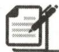

# 课堂小练

1. 给出下列说法: ①等边三角形是等腰三角形; ②三角形按边的相等关系分类可分为等腰三角形、等边三角形和不等边三角形; ③三角形按角的大小分类可分为锐角三角形、直角三角形和钝角三角形. 其中, 正确的有 ( )

A. 1 个

B. 2 个

C. 3 个

D. 0 个

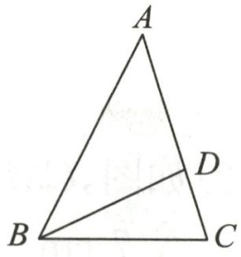

text_image

A
B
C
D

2. 如图, 图中三角形的个数是

A. 1

B. 2

C. 3

D. 4

第2题图

3. 下列长度的三条线段能组成三角形的是

A. 2,4,7

B. 3,5,8

C. 5,12,13

D. 1,7,9

4. 已知三角形的三边长分别为 2, x, 2，则 x 可能是 ( )

A. 5

B. 1

C. 6

D. 4

5. 若等腰三角形的两条边长分别为 5 和 11, 则这个等腰三角形的周长为 \_\_\_\_.

6.(1)如图,图中有几个三角形?用符号表示这些三角形.

(2)下列长度的三条线段能否组成三角形?

①3,4,8;②5,6,11;③5,6,10.

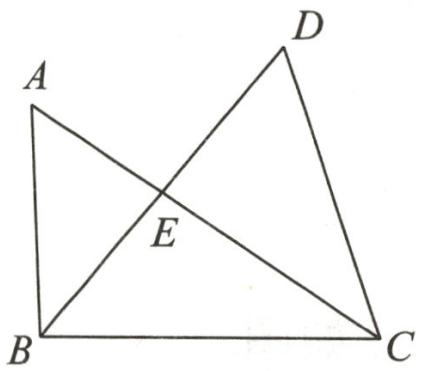

text_image

A
D
E
B
C

第6题图

7. 若三角形三条边的长分别为 2, x-1,3, 求 x 的取值范围.

# 基础题卡 2 三角形的中线、角平分线、高

# 新知梳理

1. 从三角形的顶点向它所对的边所在直线画垂线, 所得线段叫作三角形的 \_\_\_\_.  
2. 连接三角形的顶点和它所对的边的中点, 所得线段叫作三角形的 \_\_\_\_. 三角形三条中线的交点叫作三角形的 \_\_\_\_.  
3. 画三角形的一个角的平分线,与这个角所对的边相交,所得线段叫作三角形的  
4. 三角形是具有\_\_\_\_的图形,而四边形没有稳定性.

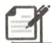

# 课堂小练

1. 如图, 在 $\triangle ABC$ 中, 边 $AB$ 上的高是 ( )

A. ${AF}$

B. BE

C. $CE$

D. ${BD}$

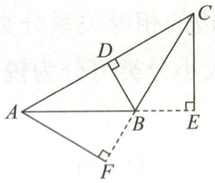

text_image

Geometric diagram with labeled points A, B, C, D, E, F and right-angle markers, likely from a math problem or proof.

第1题图

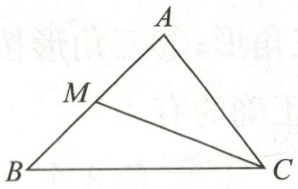

text_image

A
M
B
C

第2题图

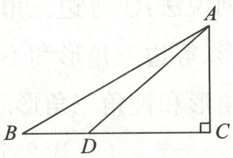

text_image

A
B D C

第3题图

2. 如图, CM 是 $\triangle ABC$ 的中线, AB = 10 cm, 则 BM 的长为 ( )

A. $7 \mathrm{~cm}$

B. 6 cm

C. $5 \mathrm{~cm}$

D. $4 \mathrm{~cm}$

3. 如图, 点 $D$ 在线段 $BC$ 上, $AC \perp BC$ , $AB = 8 \mathrm{~cm}$ , $AD = 6 \mathrm{~cm}$ , $AC = 4 \mathrm{~cm}$ , 则在 $\triangle ABD$ 中, $BD$ 边上的高是 \_\_\_\_ cm.

4. 如图, 以 $AD$ 为高的三角形共有 \_\_\_\_ 个.

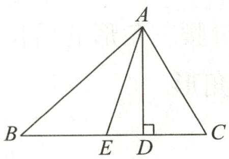

text_image

A
B E D C

第4题图

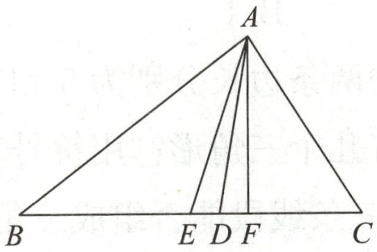

text_image

A
B E D F C

第5题图

5. 如图.

(1)若 ${AD}$ 是 $\bigtriangleup  {ABC}$ 的角平分线,则 $\angle$ \_\_\_\_= $\angle$ \_\_\_\_= $\frac{1}{2}\angle$ \_\_\_\_；  
(2)若AE是△ABC的中线,则\_\_\_\_=\_\_\_\_= $\frac{1}{2}$ \_\_\_\_;   
(3)若 AF 是△ABC 的高,则 $\angle$ = $\angle$ = $90^{\circ}$ .

6. 若 BD 是△ABC 的中线, AC = 10 cm, 则 CD = \_\_\_\_ cm, $S_{\triangle ABC} : S_{\triangle BCD} =$ \_\_\_\_.

# 基础题卡3 三角形的内角

# 新知梳理

1. 三角形三个内角的和等于  
2. 直角三角形的两个锐角 \_\_\_\_；有两个角 \_\_\_\_ 的三角形是直角三角形。

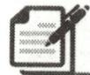

# 课堂小练

1. 若三角形有两个内角的和是 $90^{\circ}$ ，则这个三角形是（）

A. 钝角三角形

B. 直角三角形

C. 锐角三角形

D. 不能确定

2. 在 $\triangle ABC$ 中, 若 $\angle A=70^{\circ}, \angle B=60^{\circ}$ , 则 $\angle C$ 的度数为 ( )

A. ${50}^{ \circ  }$

B. ${60}^{ \circ  }$

C. $70^{\circ}$

D. ${80}^{ \circ  }$

3.(2024春·江都区期末)如图,在 $\triangle ABC$ 中, $AD$ 是 $\triangle ABC$ 的高线, $AE$ 是 $\triangle ABC$ 的角平分线.若 $\angle B=60^{\circ}, \angle C=40^{\circ}$ ,则 $\angle DAE$ 的度数为\_\_\_\_.

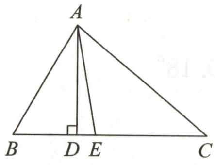

text_image

A
B D E C

第3题图

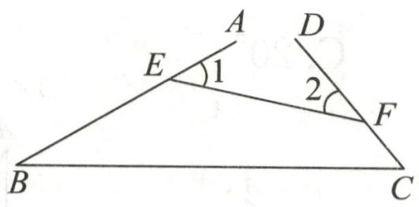

text_image

A
D
E
1
2
F
B
C

第4题图

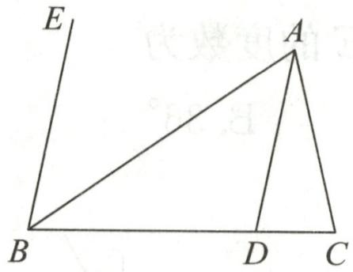

text_image

E
A
B
D
C

第5题图

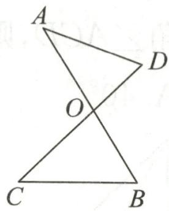

text_image

A
O
C
B
D

第7题图

4. 如图, 点 $E, F$ 分别在 $AB, CD$ 上, $\angle B = 30^{\circ}, \angle C = 50^{\circ}$ , 则 $\angle 1 + \angle 2$ 的度数为  
5. 如图, 分别过 $\triangle ABC$ 的顶点 $A, B$ 作 $AD \parallel BE$ . 若 $\angle CAD = 25^{\circ}, \angle EBC = 80^{\circ}$ , 则 $\angle ACB$ 的度数为  
6. 在 $\triangle ABC$ 中, 若 $\angle A=80^{\circ}$ , $BO$ 平分 $\angle ABC$ , $CO$ 平分 $\angle ACB$ , 则 $\angle BOC$ 的度数为  
7. 如图, 已知 $AB, CD$ 相交于点 $O$ , 且 $\angle A = 38^{\circ}, \angle B = 58^{\circ}, \angle C = 44^{\circ}$ , 则 $\angle D$ 的度数是  
8. 已知 $\triangle ABC$ 的三个内角分别是 $\angle A, \angle B, \angle C$ , 若 $\angle A = 60^{\circ}, \angle C = 2\angle B$ , 则 $\angle C$ 的度数是  
9.(2023·崇川区期末)如图,AD是△ABC的高,∠DAC=∠C,∠B=65°,求∠BAC的度数.

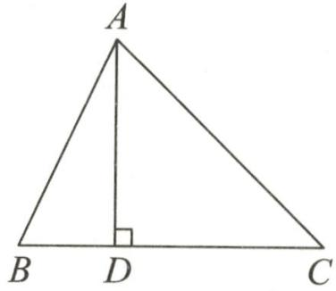

text_image

A
B D C

第9题图

# 基础题卡4 三角形的外角

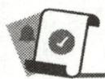

# 新知梳理

1. 叫作三角形的外角.  
2. 三角形的外角等于 \_\_\_\_ 的两个内角的和.

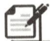

# 课堂小练

1. 如果将一副三角板按如图的方式叠放,那么∠1的度数为 ( )

A. ${105}^{ \circ  }$

B. ${120}^{ \circ  }$

C. ${75}^{ \circ  }$

D. ${45}^{ \circ  }$

2. 如图, $\angle 1 = \angle 2 = 150^{\circ}$ , 则 $\angle 3$ 的度数为 ( )

A. ${30}^{ \circ  }$

B. ${150}^{ \circ  }$

C. ${120}^{ \circ  }$

D. ${60}^{ \circ  }$

3. 如图, 在 $\triangle ABC$ 中, $\angle ABC = 40^{\circ}$ , $\angle ACD = 76^{\circ}$ , $BE$ 平分 $\angle ABC$ , $CE$ 平分 $\triangle ABC$ 的外角 $\angle ACD$ , 则 $\angle E$ 的度数为 ( )

A. ${40}^{ \circ  }$

B. ${36}^{ \circ  }$

C. ${20}^{ \circ  }$

D. ${18}^{ \circ  }$

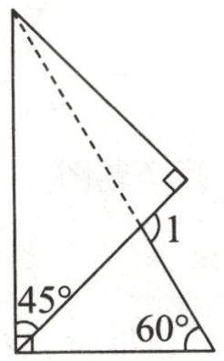

text_image

45°
60°
1

第1题图

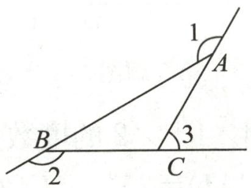

text_image

1
A
B
2
3
C

第2题图

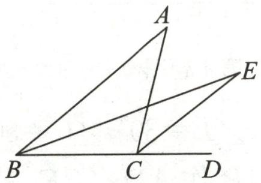

text_image

Geometric diagram with labeled points A, B, C, D, E and connecting lines forming triangles and a quadrilateral

第3题图

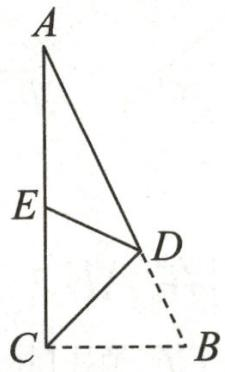  
第4题图

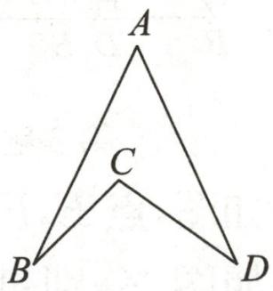

text_image

A
C
B
D

第5题图

4. 如图, 在 $\triangle ABC$ 中, $\angle ACB = 90^{\circ}$ , 点 $D$ 在边 $AB$ 上, 将 $\triangle BCD$ 沿着直线 $CD$ 翻折, 点 $B$ 的对应点 $E$ 恰好落在边 $AC$ 上. 如果 $\angle A = 25^{\circ}$ , 那么 $\angle ADE$ 的度数为 \_\_\_\_.  
5. 如图, $\angle A = 50^{\circ}, \angle B = 20^{\circ}, \angle D = 30^{\circ}$ , 则 $\angle BCD$ 的度数为 \_\_\_\_.  
6. 如图, 在 $\triangle ABC$ 中, $CD$ 是角平分线, $\angle A = 30^{\circ}, \angle CDB = 65^{\circ}$ , 求 $\angle B$ 的度数.

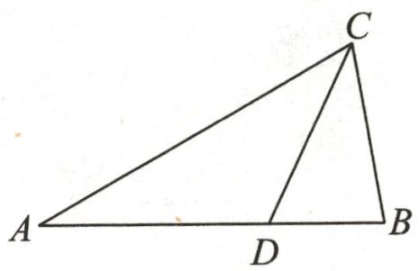

text_image

A
D
B
C

第6题图

# 基础题卡5 全等三角形

# 新知梳理

1. 能够 \_\_\_\_ 的两个三角形叫作全等三角形.  
2. 全等三角形的性质: 全等三角形的对应边 \_\_\_\_ , 全等三角形的对应角 \_\_\_\_ .

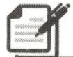

# 课堂小练

1. 如图, $\triangle AOC \cong \triangle BOD$ , 点 $A$ 与点 $B$ 是对应点, 那么下列结论错误的是 ( )

A. ${AB} = {CD}$

B. $AC = BD$

C. ${AO} = {BO}$

D. $\angle A = \angle B$

2. 下列说法错误的是 ( )

A. 全等三角形的对应边相等  
B. 全等三角形的面积相等  
C. 全等三角形的对应角相等  
D. 全等三角形的角平分线相等

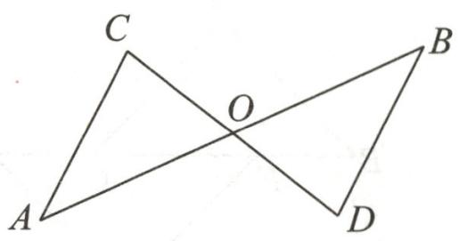

text_image

C
O
A
B
D

第1题图

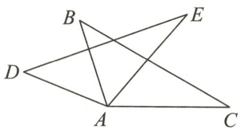

text_image

Geometric diagram with labeled points A, B, C, D, E forming intersecting triangles and lines

第4题图

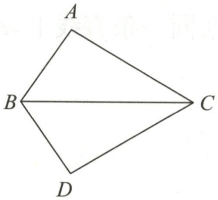

text_image

A
B
C
D

第5题图

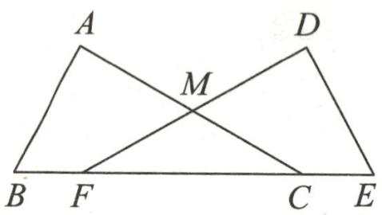

text_image

A
D
M
B F C E

第6题图

3. 已知△ABC≌△DEF，且△DEF的周长为12. 若 AB=5, BC=4，则 AC 的长为  
4. 如图, $\triangle ABC \cong \triangle ADE$ , $\angle B = 42^{\circ}$ , $\angle C = 30^{\circ}$ , $\angle BAD = 50^{\circ}$ , 则 $\angle BAE$ 的度数为  
5.(2024 春·河源期末)如图,已知 $\triangle ABC \cong \triangle DBC$ , $\angle ABC = 55^{\circ}$ , $\angle ACD = 60^{\circ}$ , 那么 $\angle D$ 的度数为\_\_\_\_.  
6. 如图, $\triangle ABC \cong \triangle DEF$ , 点 $B, F, C, E$ 在同一条直线上, $AC, DF$ 交于点 $M$ , $\angle ACB = 30^{\circ}$ , 则 $\angle AMF$ 的度数是 \_\_\_\_.  
7. 如图, $\triangle ACF \cong \triangle ADE$ , $AC = 6$ , $AF = 2$ , 求 $CE$ 的长.

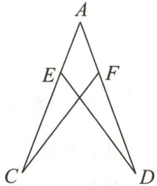

text_image

A
E
F
C
D

第7题图

8. 如图, 已知 $\triangle ABC \cong \triangle DEB$ , 点 $E$ 在 $AB$ 上, $AC$ 与 $BD$ 交于点 $F$ , $AB = 6$ , $BC = 3$ ,

$$
\angle C = 5 5 ^ {\circ}, \angle D = 2 5 ^ {\circ}.
$$

(1)求 AE 的长;  
(2)求 $\angle AED$ 的度数.

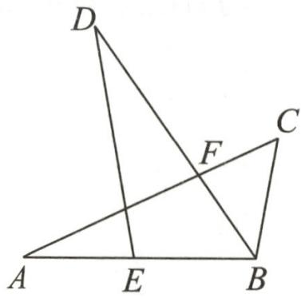

text_image

Geometric diagram with labeled points A, B, C, D, E, F forming triangles and intersecting lines

第8题图

# 基础题卡6 三角形全等的判定(一)

# 新知梳理

1. 两边和它们的夹角 \_\_\_\_ 的两个三角形全等(可以简写成“\_\_\_\_”或“\_\_\_\_”).

2. 符号语言：

如图,在 $\triangle ABC$ 和 $\triangle DEF$ 中,

$$
\left\{ \begin{array}{l} A B = \underline {{\quad}}, \\ \underline {{\quad}} = \underline {{\quad}}, \\ \underline {{\quad}} = E F, \end{array} \right.
$$

$$
\therefore \triangle A B C \cong \triangle D E F (\quad).
$$

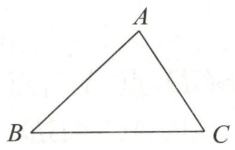

text_image

A
B C

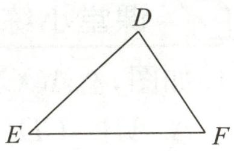

text_image

D
E
F

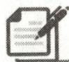

# 课堂小练

1. 如图, 点 $B, F, C, E$ 在同一条直线上, $AB = DE$ , $BF = CE$ , $AB \parallel DE$ , 求证: $AC = DF$ .

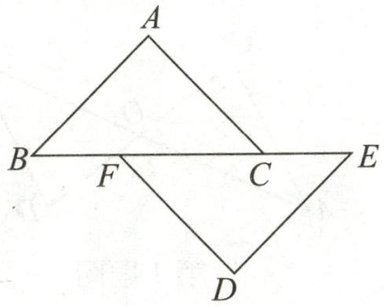

text_image

A
B   F   C   E
D

第1题图

2. 如图, $AB = AD$ , $AC = AE$ , $\angle BAE = \angle DAC$ . 求证: $\angle C = \angle E$ .

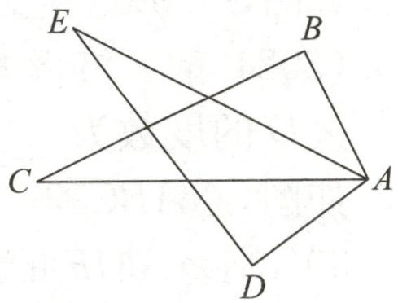

text_image

E
B
C
A
D

第2题图

3. (2024 春·成都期末)某数学兴趣小组的同学测量一个小口圆形容器内径时遇到了困难, 小组同学们借用学过的三角形全等的知识合作制作了特制工具测量器. 如图所示, 将等长的钢条 $AD$ 和 $BC$ 的中点 $O$ 焊接在一起, 制作了一把“X”形卡钳. 根据“X”形卡钳的制作原理能判断 $\triangle ABO \cong \triangle DCO$ , 从而测量出 $AB$ 的长, 就等于内径 $CD$ 的长. 请

写出 $\triangle ABO \cong \triangle DCO$ 的理由.

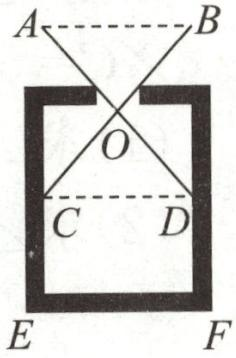  
第3题图

# 基础题卡7 三角形全等的判定(二)

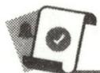

# 新知梳理

1.(1)两角和\_\_\_\_分别相等的两个三角形全等(可以简写成“\_\_\_\_”或“\_\_\_\_”). (2)两角\_\_\_\_且其中\_\_\_\_的两个三角形全等(可以简写成“\_\_\_\_”或“\_\_\_\_”).

2. 符号语言：

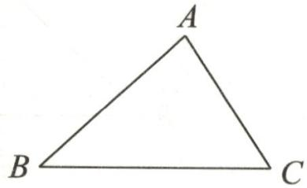

text_image

A
B
C

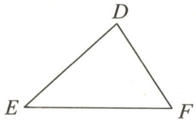

text_image

D
E
F

(1)如图,在 $\triangle ABC$ 和 $\triangle DEF$ 中,

$$
\left\{ \begin{array}{l} \angle A = \underline {{\quad}}, \\ \underline {{\quad}} = \underline {{\quad}}, \\ \underline {{\quad}} = \angle E, \end{array} \right.
$$

$$
\therefore \triangle A B C \cong \triangle D E F (\quad).
$$

(2)如图,在 $\triangle ABC$ 和 $\triangle DEF$ 中,

$$
\left\{ \begin{array}{l} \angle A = \underline {{\quad}}, \\ \underline {{\quad}} = \angle E, \\ \underline {{\quad}} = \underline {{\quad}}, \end{array} \right.
$$

$$
\therefore \triangle A B C \cong \triangle D E F (\quad).
$$

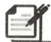

# 课堂小练

1. 如图, 已知 $O$ 是 $AB$ 的中点, $\angle A = \angle B$ , 求证: $\triangle AOC \cong \triangle BOD$ .

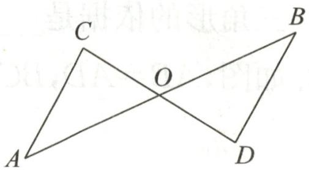

text_image

C
O
A
B
D

第1题图

2. 如图, $AB \perp BC$ , $AD \perp DC$ , $\angle 1 = \angle 2$ . 求证: $CB = CD$ .

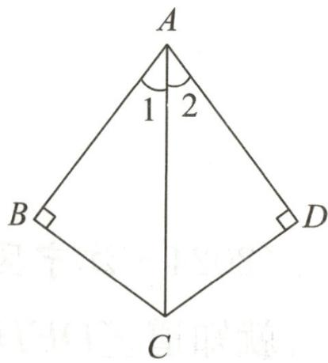

text_image

A
1 2
B
C
D

第2题图

3. 如图, 两车从路段 $AB$ 的两端同时出发, 沿平行路线以相同的速度行驶, 相同时间后分别到达 $C, D$ 两地. $C, D$ 两地到路段 $AB$ 的距离相等吗? 为什么?

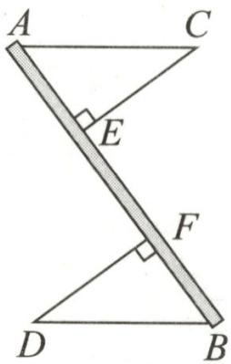

text_image

A
C
E
F
D
B

第3题图

# 基础题卡 8 三角形全等的判定(三)

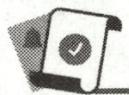

# 新知梳理

1. 三边 \_\_\_\_ 的两个三角形全等(可以简写成“\_\_\_\_”或“\_\_\_\_”).

2. 符号语言：

如图,在 $\triangle ABC$ 和 $\triangle DEF$ 中,

$$
\left\{ \begin{array}{l} A B = \underline {{\quad}}, \\ \underline {{\quad}} = \underline {{\quad}}, \\ \underline {{\quad}} = E F, \end{array} \right.
$$

$$
\therefore \triangle A B C \cong \triangle D E F (\quad).
$$

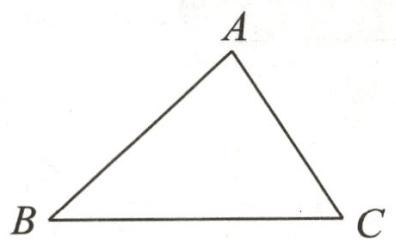

natural_image

Simple geometric triangle labeled ABC with vertices marked (no additional text or symbols)

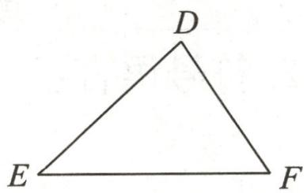

text_image

D
E F

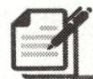

# 课堂小练

1. 如图是一个平分角的仪器, 其中 $AB = AD$ , $BC = DC$ . 将点 $A$ 放在一个角的顶点, $AB$ 和 $AD$ 沿着这个角的两边放下, 利用全等三角形的性质就能说明射线 $AC$ 是这个角的平分线, 这里判定 $\triangle ABC$ 和 $\triangle ADC$ 是全等三角形的依据是 \_\_\_\_.

2. 如图, $AB = AD$ , $BC = CD$ . 求证: $\angle B = \angle D$ .

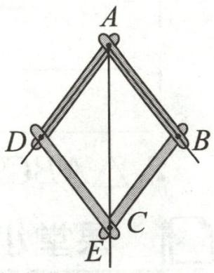

text_image

A
D
B
C
E

第1题图

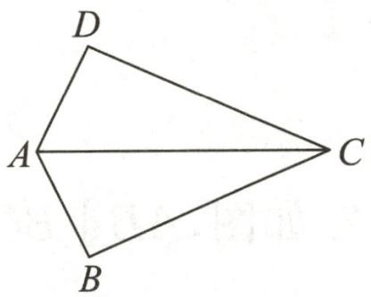

text_image

D
A
C
B

第2题图

3. (2024·江宁区模拟)如图是小明制作的风筝,他根据 $DE = DF, EH = FH$ ,不用测量,就知道 $\angle DEH = \angle DFH$ . 小明是通过全等三角形的知识得到的结论,请帮他说明理由.

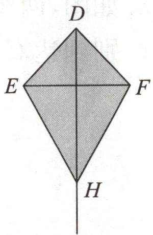

text_image

D
E
F
H

第3题图

# 基础题卡9 三角形全等的判定(四)

# 新知梳理

1. \_\_\_\_和一直角边\_\_\_\_的两个直角三角形全等(可以简写成“\_\_\_\_”或“\_\_\_\_”).

2. 符号语言：

如图,在 Rt△ABC 和 Rt△DEF 中,

$$
\left\{ \begin{array}{l} A B = \underline {{\quad}}, \\ \underline {{\quad}} = D F, \end{array} \right.
$$

$$
\therefore \mathrm{Rt} \triangle A B C \cong \mathrm{Rt} \triangle D E F (\quad).
$$

text_image

A
B C
D
E F

# 课堂小练

1. 如图, 点 $A, E, F, B$ 在同一条直线上, $CA \perp AB$ , $DB \perp AB$ , $AE = FB$ , $CF = DE$ .

求证: $\angle AFC=\angle BED.$

text_image

C
D
A E F B

第1题图

2.(朝阳区期末)如图,AB=CD,BE⊥AC于点E,DF⊥AC于点F,AF=CE.

(1)求证: $\triangle ABE\cong\triangle CDF;$

(2) 求证: $AB \parallel CD$ .

text_image

A
B
E
F
D
C

第2题图

3. 如图, $AB \perp EF$ 于点 $B$ , $CD \perp EF$ 于点 $D$ , $BE = DF$ . 若要用“HL”判定 Rt△ABF ≅ Rt△CDE, 请写出需要添加的条件, 并说明理由.

text_image

A
F
D
B
E
C

第3题图

# 基础题卡 10 角的平分线(一)

# 新知梳理

1. 角的平分线上的点到 \_\_\_\_ 相等.

2. 符号语言：

如图，∵∠AOC=∠BOC,PD⊥OA,PE⊥OB,

∴ = \_\_\_\_.

text_image

A
D
C
P
O
E
B

# 课堂小练

1. 如图是利用尺规作 $\angle AOB$ 的平分线 $OC$ 的作法, 在用尺规作角平分线时, 用到的三角形全等的判定方法是 ( )

A. SSS

B. SAS

C. ASA

D. AAS

2. 如图, 点 $P$ 在 $\angle AOB$ 的平分线上, 点 $P$ 到 $OA$ 边的距离 $PC = 10$ , $Q$ 是 $OB$ 边上的任意一点. 下列选项正确的是 ( )

A. $P Q < 10$

B. $P Q > 10$

C. $P Q \geqslant 10$

D. ${PQ} \leq  {10}$

text_image

A
C
O
B

第1题图

text_image

A
C
P
O
Q
B

第2题图

text_image

C
M
D
P
A
N
B

第3题图

3. 如图, 在 Rt△ABC 中, ∠C=90°, 以顶点 A 为圆心, 以适当长为半径画弧, 分别交 AC, AB 于点 M, N, 再分别以点 M, N 为圆心, 以大于 $\frac{1}{2}MN$ 的长为半径画弧, 两弧交于点 P, 作射线 AP 交边 BC 于点 D. 若 CD=3, AB=8, 则 △ABD 的面积是 \_\_\_\_.

4. 如图, $BD$ 是 $\triangle ABC$ 中 $\angle ABC$ 的平分线, $DE \perp AB$ 于点 $E$ , $DF \perp BC$ 于点 $F$ . 若 $DE = 3$ , $AB = 7$ , $BC = 9$ , 求 $\triangle ABC$ 的面积.

text_image

A
E
D
B
F
C

第4题图

5. 如图, $\triangle ABC$ 的外角 $\angle ACD$ 的平分线 $CF$ 与 $\angle ABC$ 的平分线 $BG$ 相交于点 $O$ .

求证: 点 O 到三边 AB, BC, AC 的距离相等.

text_image

A
F
O
G
B
C
D

第5题图

# 基础题卡 11 角的平分线(二)

# 新知梳理

1. 角的内部到 \_\_\_\_ 的点在角的平分线上.

2. 符号语言：

text_image

A
D
C
P
O
E
B

如图,∵PD⊥OA,PE⊥OB,\_\_\_\_=\_\_\_\_,

∴点 P 在 $\angle AOB$ 的平分线上.

# 课堂小练

1. 两把相同的长方形直尺按如图所示方式摆放, 记两把直尺的接触点为 $P$ , 其中一把直尺边缘和射线 $OA$ 重合, 另一把直尺的下边缘与射线 $OB$ 重合, 连接 $OP$ 并延长. 若 $\angle BOP = 25^{\circ}$ , 则 $\angle AOP$ 的度数为 ( )

text_image

A
10
8
7
6
5
4
3
2
1
0
P
O
2
3
4
5
6
7
8
9
10
B

第1题图

A. ${12.5}^{ \circ  }$

B. ${25}^{ \circ  }$

C. ${37.5}^{ \circ  }$

D. ${50}^{ \circ  }$

2. 阅读并理解下面的证明过程, 在括号内填写推理依据.

已知:如图,AM,BN,CP分别是 $\triangle ABC$ 的三条角平分线.

求证:AM,BN,CP交于一点.

证明:如图,设 AM,BN 交于点 O,过点 O 分别作 $OD \perp BC$ , $OE \perp AC$ , $OF \perp AB$ , 垂足分别为 D,E,F.

∵O是∠BAC的平分线AM上的一点(\_\_\_\_),

$$
\therefore O E = O F (\quad).
$$

同理,OD=OF,

$$
\therefore O D = O E (\underline {{\quad}}).
$$

∵CP 是∠ACB 的平分线(\_\_\_\_),

∴点 O 在 CP 上( ).

因此,AM,BN,CP交于一点.

text_image

A
F
P
E
N
O
B
MD
C

第2题图

# 基础题卡 12 轴对称及其性质

# 新知梳理

1. 如果一个平面图形沿一条直线折叠，\_\_\_\_，这个图形就叫作轴对称图形，这条直线就是它的对称轴。  
2. 把一个图形沿着某一条直线折叠，\_\_\_\_，那么就说这两个图形关于这条直线成轴对称。  
3. ,叫作这条线段的垂直平分线.   
4. 无论是成轴对称的两个图形, 还是轴对称图形, 其对称轴都是 \_\_\_\_.

# 课堂小练

1. 现实世界中,对称现象无处不在,中国的汉字中有些也具有对称性.下列汉字是轴对称图形的是 ( )

A

B

C

D

2. 如图, 若 $\triangle ABC$ 与 $\triangle DEF$ 关于直线 $l$ 对称, $BE$ 交 $l$ 于点 $O$ , 则下列说法不一定正确的是 ( )

A. $AB \parallel EF$

B. ${AC} = {DF}$

C. ${AD}\bot  l$

D. ${BO} = {EO}$

text_image

A
l
D
B
O
E
C
F

第2题图

text_image

A
B C' D C
小睿

text_image

A
B
C'
D
C
小轩

text_image

A
B(C') D C
小涌

第3题图

3. 在一次数学实践活动课上, 学生进行折纸活动, 如图是小睿、小轩、小涌三位同学的折纸示意图 (点 $C$ 的对应点是 $C'$ ), 分析他们的折纸情况, 下列说法正确的是 ( )

A. 小睿折出的是 $BC$ 边上的中线

B. 小轩折出的是 $\triangle ABC$ 中 $\angle BAC$ 的平分线

C. 小涌折出的是 $\triangle ABC$ 中 $BC$ 边上的高

D. 上述说法都错误

4. 如图, $\triangle ABC$ 和 $\triangle ADE$ 关于直线 $MN$ 对称, $BC$ 与 $DE$ 的交点 $F$ 在直线 $MN$ 上.

(1)图中点 C 的对应点是点 \_\_\_\_，∠B 的对应角是 \_\_\_\_；  
(2)若 DE=5, BF=2, 则 CF 的长为 \_\_\_\_;  
(3)若 $\angle BAC=108^{\circ},\angle BAE=30^{\circ}$ ,求 $\angle EAF$ 的度数.

text_image

C
D
M
F
A
N
E
B

第4题图

# 基础题卡13 线段的垂直平分线

# 新知梳理

1. 线段的垂直平分线的性质:

2. 线段的垂直平分线的判定：\_\_\_\_。

3. 符号语言：

text_image

P
A	C	B
l

性质：

∵直线 l 垂直平分 AB，

∴ = \_\_\_\_.

判定：

∵ \_\_\_\_ = \_\_\_\_,

∴点 P 在 AB 的垂直平分线上.

# 课堂小练

1. 点 $P$ 到 $\triangle ABC$ 的三个顶点的距离相等, 则点 $P$ 是 $\triangle ABC$ 的交点 ( )

A.三条高

B. 三条角平分线

C. 三边的垂直平分线

D.三条中线

2. 如图, $BA$ 平分 $\angle CBD$ , $AB$ 平分 $\angle CAD$ . 求证: $AB$ 垂直平分 $CD$ .

text_image

B
D
C
A

第2题图

3. 如图, Rt△ABC 中, ∠ACB=90°, D 是 AB 上一点, BD=BC, 过点 D 作 AB 的垂线交 AC 于点 E, 连接 BE, CD. 求证: BE 垂直平分 CD.

text_image

Geometric diagram of triangle ABC with perpendiculars from points D and E to sides, labeled with points A, B, C, D, E, F, and right-angle symbols.

第3题图

# 基础题卡 14 画对称轴

# 新知梳理

轴对称图形任意一对对应点所连线段的\_\_\_\_就是其对称轴.

# 课堂小练

1. 如图, $\triangle ABC$ 与 $\triangle A'B'C'$ 关于直线 $l$ 成轴对称, 请作出对称轴 $l$ . (保留作图痕迹, 不用写作图步骤)

text_image

C
A
B
C'
A'
B'

第1题图

2. 如图, 两个四边形成轴对称.

(1)如何画出它们的对称轴 l?   
(2)若 AC 与 BD 交于点 O,你能作出点 O 关于直线 l 的对称点 $O'$ 吗?

natural_image

Simple geometric diagram of a quadrilateral labeled ABCD (no additional text or symbols)

text_image

A'
D'
C'
B'

第2题图

3. 如图, 画出下列轴对称图形的对称轴.

  
①

  
②   
第3题图

# 基础题卡 15 画轴对称的图形(一)

# 新知梳理

由一个平面图形可以得到与它关于一条直线对称的图形, 这个图形与原图形的完全相同; 新图形上的每一点都是原图形上的某一点关于直线的对称点.

# 课堂小练

1. 如图, 在 $4 \times 4$ 的正方形网格中, $\triangle ABC$ 的顶点都在小正方形的格点上, 这样的三角形称为格点三角形, 在网格中画出与 $\triangle ABC$ 成轴对称的格点三角形. (画出 4 种)

text_image

B
A
C

text_image

B
A
C

text_image

B
A
C

text_image

B
C
A

第1题图

2. 分别在下面正方形网格中按要求画图.

(1)在图①中画出以 MN 为轴对折后的图形;   
(2)在图②中画出向右平移两格后的图形.

text_image

M
N

①

natural_image

Geometric pattern with a black triangle on a white grid, no text or symbols present

②   
第2题图

3. 如图是 $5 \times 5$ 的正方形网格, 每个小正方形的边长均为 1 , 点 $A, B$ 均在格点上. 只用直尺在图中画一个锐角 $\triangle ABE$ , 使它是轴对称图形, 且点 $E$ 在格点上.

text_image

A
B

第3题图

# 基础题卡 16 画轴对称的图形(二)

# 新知梳理

1. 点 $(x,y)$ 关于 x 轴对称的点的坐标为 \_\_\_\_.  
2. 点 $(x,y)$ 关于 y 轴对称的点的坐标为 \_\_\_\_.

# 课堂小练

1. 点(3,5)关于 y 轴对称的点是 ( )

A. $(3,-5)$

B. $(-3,5)$

C. $(-3,-5)$

D. 以上都不是

2. 在平面直角坐标系中, 点 $P(3,5)$ 关于 $x$ 轴对称的点的坐标是 ( )

A. (3,5)

B. $(3,-5)$

C. $(-3,5)$

D. $(-3,-5)$

3. 平面内点 $A(-1,2)$ 和点 $B(-1,6)$ 的对称轴是 （）

A. $x$ 轴

B. $y$ 轴

C. 直线 y=4

D. 直线 $x = -1$

4. 如图, 已知点 A, B, C, D, E.

(1)点\_\_\_\_和点\_\_\_\_关于x轴对称；  
(2)点\_\_\_\_和点\_\_\_\_关于y轴对称；  
(3)点 A 和点 D 关于直线 l 对称,请画出直线 l.

text_image

y
A
B
C
O
x
D
E

第4题图

text_image

y
7
6
C
4
A
3
2
1
B
-8 -7 -6 -5 -4 -3 -2 -1 0 1 2 3 4 5 6 7 x
-1
-2
-3

第5题图

5.(2024·复兴区模拟)在平面直角坐标系 $xOy$ 中, $\triangle ABC$ 的位置如图所示.

(1)写出各顶点的坐标: $A(\_ \_ \_ \_, \_ \_ \_ \_), B(\_ \_ \_ \_, \_ \_ \_ \_), C(\_ \_ \_ \_, \_ \_ \_$ ;   
(2)顶点 C 关于 y 轴对称的点 $C'$ 的坐标为(\_\_\_\_, \_\_\_\_);  
(3)顶点 B 关于直线 x = -1 的对称点的坐标为(\_\_\_\_，\_\_\_\_).

# 基础题卡 17 等腰三角形(一)

# 新知梳理

1. 等腰三角形的两个底角 \_\_\_\_.  
2. 等腰三角形的\_\_\_\_相互重合.

# 课堂小练

1. 如图, 已知在 $\triangle ABC$ 中, $AB = AC$ , $\angle A = 40^{\circ}$ , $AB$ 的垂直平分线交 $AC$ 于点 $D$ , 交 $AB$ 于点 $E$ , 连接 $BD$ , 则 $\angle DBC$ 的度数为 ( )

A. ${30}^{ \circ  }$

B. ${32}^{ \circ  }$

C. ${34}^{ \circ  }$

D. ${36}^{ \circ  }$

text_image

A
D
E
B
C

第1题图

text_image

A
B D C

第3题图

text_image

A
B D C

第6题图

2. 等腰三角形一腰上的高与另一腰的夹角为 $60^{\circ}$ ，则顶角的度数为（）

A. ${30}^{ \circ  }$

B. $30^{\circ}$ 或 $150^{\circ}$

C. $60^{\circ}$ 或 $150^{\circ}$

D. $60^{\circ}$ 或 $120^{\circ}$

3. 如图, 在 $\triangle ABC$ 中, $AB = AC$ , $D$ 是边 $BC$ 的中点, 若 $\angle C = 70^{\circ}$ , 则 $\angle BAD =$ \_\_\_\_°.  
4. 如果等腰三角形的一个内角为 $70^{\circ}$ ，则其底角的度数是 \_\_\_\_.  
5. 等腰三角形的一个外角是 $80^{\circ}$ ，则其底角是 \_\_\_\_ 度。  
6. 如图, 已知 $\triangle ABC$ 中, $AB = AC$ , $AD$ 是 $\angle BAC$ 的平分线, 如果 $\triangle ABD$ 的周长为 12, $\triangle ABC$ 的周长为 16, 那么 $AD$ 的长是 \_\_\_\_.  
7. 如图, 在 $\triangle ABC$ 中, $AB$ 的垂直平分线 $EF$ 交 $BC$ 于点 $E$ , 交 $AB$ 于点 $F$ , $D$ 为线段 $CE$ 的中点, $BE = AC$ .

(1)求证: $AD \perp BC$ ; (2)若 $\angle BAC = 75^{\circ}$ , 求 $\angle B$ 的度数.

text_image

A
F
B
E
D
C

第7题图

# 基础题卡 18 等腰三角形(二)

# 新知梳理

如果一个三角形有两个角相等,那么

# 课堂小练

1. (2024 春·宿豫区期末)如图, 已知 $AB \parallel CD$ , $AC$ 平分 $\angle DAB$ . 求证: $\triangle ADC$ 是等腰三角形.

text_image

D
C
A
B

第1题图

2. 如图, $BD, CE$ 是 $\triangle ABC$ 的高, 且 $BD=CE$ . 求证: $\triangle ABC$ 是等腰三角形.

text_image

A
E
D
B
C

第2题图

3. 如图, 在 $\triangle ABC$ 中, $AD$ 平分 $\angle BAC$ , $BD=CD$ , $DE \perp AB$ 于点 $E$ , $DF \perp AC$ 于点 $F$ . 求证: $AB=AC$ .

text_image

A
E
F
B
D
C

第3题图

4. 如图, 在 $\triangle ABC$ 中, $E$ 为 $AB$ 上一点, 连接 $CE, EC = BC$ , 过点 $C$ 作 $CD = AC$ , 且 $\angle 1 = \angle 2$ , 连接 $DE$ . 若 $\angle B = 75^{\circ}$ , 求 $\angle 3$ 的度数.

text_image

D
1
C
2
A
3
E
B

第4题图

# 基础题卡 19 等边三角形(一)

# 新知梳理

1. 等边三角形是三边都 \_\_\_\_ 的特殊的等腰三角形.  
2. 等边三角形的性质: 等边三角形的三个角都\_\_\_\_, 并且每一个角都等于 $60^{\circ}$ .  
3. 等边三角形的判定: 三个角都 \_\_\_\_ 的三角形是等边三角形; 有一个角是 $60^{\circ}$ 的 \_\_\_\_ 是等边三角形.

# 课堂小练

1. 等边三角形对称轴的条数是 ( )

A. 1

B. 2

C. 3

D. 4

2. 下列说法不正确的是 ( )

A. 三边相等的三角形是等边三角形  
B. 三个角相等的三角形是等边三角形  
C. 有一个角是 $60^{\circ}$ 的三角形是等边三角形  
D. 顶角为 $60^{\circ}$ 的等腰三角形是等边三角形

3. 如图, $D, E, F$ 分别是等边三角形 $ABC$ 各边上的点, 且 $AD = BE = CF$ , 则 $\triangle DEF$ 是 ( )

A. 等边三角形

B. 腰和底边不相等的等腰三角形

C. 直角三角形

D. 不等边三角形

4. (2024·黑龙江三模)如图, 直线 $m \parallel n$ , $\triangle ABC$ 是等边三角形, 顶点 $B$ 在直线 $n$ 上, 直线 $m$ 交 $AB$ 于点 $E$ , 交 $AC$ 于点 $F$ . 若 $\angle 1 = 140^{\circ}$ , 求 $\angle 2$ 的度数.

text_image

A
1
D	E	F	m
2	C
B	n

text_image

A
D
F
B
E
C

第3题图  
第4题图

5. 如图, 在等边三角形 $ABC$ 的 $AC$ 边上取中点 $D$ , 连接 $BD$ , 在 $BC$ 的延长线上取一点 $E$ , 使 $CE=CD$ . 求证: $\angle ABD=\angle E$ .

text_image

A
D
B
C
E

第 5 题图

# 基础题卡 20 等边三角形(二)

# 新知梳理

在直角三角形中,如果一个锐角等于 $30^{\circ}$ ,那么它所对的直角边等于

# 课堂小练

1. 如图, 小明沿倾斜角 $\angle ABC = 30^{\circ}$ 的山坡从山脚 $B$ 点步行到山顶 $A$ , 共走了 $500 \mathrm{~m}$ , 则山的高度 $AC$ 是 \_\_\_\_.

text_image

A
30°
B
C

第1题图

text_image

Geometric diagram with labeled points A, B, C, D, E and shaded triangle EDE

第2题图

2. 如图, 在 $\triangle ABC$ 中, $\angle A = 30^{\circ}, AB = BC$ , 点 $D, E$ 分别在边 $AB, AC$ 上, 若沿直线 $DE$ 折叠, 点 $A$ 恰好与点 $B$ 重合, 且 $CE = 6$ , 则 $\angle EBC =$ \_\_\_\_°, $AC =$ \_\_\_\_.

3. 如图, 在等边 $\triangle ABC$ 中, $M$ 是 $BC$ 的中点, $MN \perp AB$ , 垂足为 $N$ , 连接 $AM$ , 求证: $AM = 2MN$ .

text_image

C
M
A
N
B

第3题图

4. (2024 春·锦江区期末)如图, 在等边 $\triangle ABC$ 中, $BD$ 平分 $\angle ABC$ , 点 $E$ 是 $BC$ 延长线上一点, 且 $CE=CD$ , 连接 $DE$ , 求 $\angle BDE$ 的度数.

text_image

A
D
B
C
E

第4题图

5. 如图, 在 $\triangle ABC$ 中, $\angle C = 90^{\circ}, \angle B = 30^{\circ}$ , $DE$ 是 $AB$ 的垂直平分线, 垂足为 $E, DE$ 交 $BC$ 于点 $D$ , 连接 $AD$ .

(1) 求证: DC = DE;   
(2) 若 $CD = 3$ , 求 $BD$ 的长.

text_image

A
E
C
D
B

第5题图

# 基础题卡 21 综合与实践 最短路径问题

# 新知梳理

在解决最短路径问题时,我们通常利用\_\_\_\_、平移等变换把已知问题转化为容易解决的问题,从而作出最短路径的选择.

# 课堂小练

1. 已知点 A, 点 B 都在直线 l 的上方, 试用尺规作图在直线 l 上求作一点 P, 使得 $PA + PB$ 的值最小, 则下列作法中正确的是 ( )

text_image

A
B
P
l

A

text_image

A
P
B
l

B

text_image

A
B
P
l

C

text_image

A
B
P
l

D

2. 平行河岸两侧各有一城镇 P, Q, 根据发展规划, 要修建一条公路连接 P, Q 两城镇. 已知相同长度造桥总价远大于陆上公路造价, 为了尽量减少总造价, 应该选择方案 ( )

text_image

P
Q

A

text_image

P
Q

B

text_image

P
Q

C

text_image

P
Q

D

3. 如图, 在 $\triangle ABC$ 中, $AB = AC = 5$ , $S_{\triangle ABC} = 12$ , $AD$ 是 $\triangle ABC$ 的中线, $F$ 是 $AD$ 上的动点, $E$ 是 $AC$ 边上的动点, 则 $CF + EF$ 的最小值为 ( )

A. 3

B. $\frac{6}{5}$

C. $\frac{12}{5}$

D. $\frac{24}{5}$

text_image

A
F
E
B
D
C

第3题图

text_image

C
C₁
D
A
B
A₁

第4题图

4. 如图, 等边三角形 $ABC$ 的边长为 $5, A, B, A_{1}$ 三点在同一条直线上, 且 $\triangle ABC \cong \triangle A_{1}BC_{1}$ . 若 $D$ 为线段 $BC_{1}$ 上一动点, 则 $AD + CD$ 的最小值是 \_\_\_\_.

# 基础题卡 22 同底数幂的乘法

# 新知梳理

同底数幂相乘,底数\_\_\_\_,指数\_\_\_\_. 即 $a^{m} \cdot a^{n} =$ \_\_\_\_ (m,n都是正整数).

# 课堂小练

1. 计算 $a^3 \cdot a^3$ 的结果是 （）

A. $a^5$

B. $a^6$

C. $a^9$

D. $2a^{3}$

2. 已知 $a^m = 6, a^n = 2$ ，则 $a^{m+n}$ 的值等于 （）

A. 8

B. 3

C. 64

D. 12

3. 计算 $x^{2} \cdot (-x)^{3}$ 的结果是 （）

A. $-x^{5}$

B. $-x^{6}$

C. $x^{5}$

D. $x^{4}$

4. 计算 $a^2 \cdot a^3 \cdot a^4$ 的结果是 （）

A. $a^6$

B. $a^7$

C. $a^8$

D. $a^{9}$

5. 计算 $(a+b)^{3}(a+b)^{4}$ 的结果为 \_\_\_\_.  
6. 如果 $3^{m}=8,3^{n}=12$ ，那么 $3^{m+n}$ 的值为 \_\_\_\_.  
7. 若 $x^{2} \cdot x^{4} \cdot (\quad) = x^{16}$ ，则括号内的代数式是 \_\_\_\_.  
8. 计算: $10^{5} \times (-10)^{4} \times 10^{6} =$ \_\_\_\_.  
9. 计算下列各式, 结果用幂的形式表示:

(1) $2^{3}\times2^{4}\times2^{5}$ ;

(2) $y \cdot y^{2} \cdot y^{5}$ ;

(3) $10^{6}\times10^{4}$ ;

(4) $-x^{5}\cdot x^{3}$ ;

(5) $a \cdot a^{4}$ ;

(6) $-y^{4}\cdot y^{4}.$

10. 计算: $a \cdot a^{2} \cdot (-a)^{3} \cdot (-a)^{4}$ .

# 基础题卡 23 幂的乘方与积的乘方

# 新知梳理

1. 幂的乘方, 底数\_\_\_\_, 指数\_\_\_\_. 即 $(a^{m})^{n} =$ \_\_\_\_ (m, n 都是正整数).  
2. 积的乘方, 等于把积的每一个因式分别\_\_\_\_, 再把所得的幂\_\_\_\_.

即 $(ab)^{n}=a^{()}b^{()}$ (n是正整数).

# 课堂小练

1. 计算 $(a^{2} \cdot a^{3})^{2}$ 的结果是

A. $a^{7}$

B. $a^8$

C. $a^{10}$

D. $a^{12}$

2. 下列运算正确的是

A. $(a^4)^2 = a^6$

B. $(3x^{2})^{3}=3x^{6}$

C. $a^3 + a^3 = a^6$

D. $a^3 \cdot a^2 = a^5$

3. 若 $2^{m}=a,3^{m}=b$ ，则 $6^{m}$ 等于

A. $a + b$

B. a-b

C. ab

D. $a^b$

4. 计算 $2^{2025} \times \left(-\frac{1}{2}\right)^{2024}$ 的结果是 （）

A. 2

B.-2

C. $\frac{1}{2}$

D. $-\frac{1}{2}$

5. 计算: $(-2x^{2})^{3} =$

A. $-6x^{6}$

B. $-8x^{5}$

C. $8x^{6}$

D. $-8x^{6}$

6. 化简 $(-x^{3})^{2}$ 的结果是 \_\_\_\_.

7. 若 $a^{3}=b, b^{4}=m$ ，则 m 为 \_\_\_\_.

8. 计算 $(-ab^{2})^{2}$ 的结果是 \_\_\_\_.

9. 计算 $(-2x^{2}y)^{3}$ 的结果是 \_\_\_\_.

10. $\left(\frac{1}{3}\right)^{12}\times3^{12}=$ \_\_\_\_.

11. 计算 $a^{2} \cdot (-a^{2})^{3}$ 的结果是 \_\_\_\_.

12. 计算下列各式:

(1) $(2x^{2})^{4}-x\cdot x^{3}\cdot x^{4};$

(2) $(m^4)^2 + (m^3)^2 - m(m^2)^2 \cdot m^3$ .

# 基础题卡 24 整式的乘法(一)

# 新知梳理

单项式的乘法法则:一般地,单项式与单项式相乘,把它们的\_\_\_\_\_\_\_\_、\_\_\_\_分别相乘作为积的因式,对于只在一个单项式里含有的字母,则\_\_\_\_作为积的一个因式.

# 课堂小练

1. 计算 $2a^{3} \cdot 5a^{3}$ 的结果是 （）

A. ${10}{a}^{6}$

B. ${10}{a}^{9}$

C. $7a^{3}$

D. $7a^{6}$

2. 计算 $2x^{2}y \cdot (-3xy^{2})$ 的结果是 （）

A. $-6x^{2}y^{2}$

B. $5x y^{3}$

C. $6x^{3}y^{3}$

D. $-6x^{3}y^{3}$

3. 已知单项式 $3x^{2}y^{3}$ 与 $-2xy^{2}$ 的积为 $mx^{3}y^{n}$ , 那么 $m - n =$ （）

A.-11

B. 5

C. 1

D.-1

4. 计算: $2x \cdot 5x^{2} =$ \_\_\_\_ .

5. 化简: $(2x)^{3} \cdot (-3xy^{2}) =$ \_\_\_\_.

6. 计算: $2ab \cdot (\underline{\quad}) = -6a^{2}bc.$

7. 计算下列各式：

(1) $(-5a^{2}b)(-3a)$ ;

(2) $(2x)^{3}(-5xy^{2})$ ;

(3) $(-3a^{3})^{2}-2a^{2}\cdot a^{4};$

(4) $(2x^{2})^{3}-2x^{2}\cdot x^{3}+2x^{5};$

(5) $(2\times 10^{3})\times (1.5\times 10^{4})\times (6\times 10^{4})$ ；(6) $(2x^{3}y)^{2}\cdot x^{3}y + (-14x^{6})\cdot (-xy)^{3}$ .

# 基础题卡 25 整式的乘法(二)

# 新知梳理

一般地,单项式与多项式相乘,就是用\_\_\_\_\_\_去乘多项式的\_\_\_\_\_\_,再把所得的积\_\_\_\_\_\_.

# 课堂小练

1. 下列运算中, 正确的是 ( )

A. $-x(xy-y)=-x^{2}$

B. $2xy^{2}(-x^{2}+2y^{2}+1)=-2x^{3}y^{2}+2y^{2}+1$

C. $(3b^{2} - 2a) \cdot c = 3b^{2} - 2ac$

D. $b^{2}(2ab^{2} - c) = 2ab^{4} - b^{2}c$

2. 若 $\square \cdot xy = 3x^{2}y + 2xy$ , 则 $\square$ 内应填的式子是 ( )

A. $3x+2$

B. $x + 2$

C. $3xy + 2$

D. ${xy} + 2$

3. 计算: $2a(a^{2} + 2b) =$ ( )

A. $a^3 + 4ab$

B. $2a^{3}+2ab$

C. $2 a + 4 a b$

D. $2a^{3}+4ab$

4. 计算 $a(2a-1)$ 的结果等于 \_\_\_\_.

5. 若 b-a=3, ab=1，则 $3a-3b(a+1)=$ \_\_\_\_.

6. 已知 $ab^{2} = -3$ ，则 $-ab(a^{2}b^{5} - ab^{3} - b) =$ \_\_\_\_.

7. 计算：

(1) $3a \cdot (a-4)$ ;

(2) $a(a-b)+ab;$

(3) $2(a^{2}-3)-(2a^{2}-1)$ ;

(4) $2x(3x^{2}+4x-5)$ ;

(5) $9x(-x^{2}+2x+4)(-xy)$ ;

(6) $2a^{2}b\left(\frac{1}{2}a^{2}b-ab^{2}\right).$

8. 在 $(2x^{2}-3x)(x^{2}+ax+b)$ 的结果中， $x^{3}$ 的系数为-5， $x^{2}$ 的系数为-6，求a,b的值.

9.(1)计算: $\left(\frac{1}{2}a^{2}b-1\right)\cdot(-2a)=$ \_\_\_\_；

(2)化简 $2x-x(x-1)$ 的结果是 \_\_\_\_；  
(3)若一个直角三角形的两条直角边的长分别为 $3m$ 和 $4m - 1$ , 则该直角三角形的面积为 \_\_\_\_;  
(4)当 x 的值为 \_\_\_\_ 时， $\left(\frac{1}{3}\right)^{x} \cdot (27^{x}-3^{x})=80.$

# 基础题卡 26 整式的乘法(三)

# 新知梳理

一般地,多项式与多项式相乘,先用\_\_\_\_乘\_\_\_\_,再把所得的积\_\_\_\_.

# 课堂小练

1. 要使多项式 $(2x + p)(x - 2)$ 不含 $x$ 的一次项, 则 $p$ 的值为 ( )

A.-4

B. 4

C.-1

D. 1

2. 若 $(x+3)(x+n)=x^{2}+mx-15$ ，则 $m+n$ 的值为（）

A.-5

B.-2

C.-7

D. 3

3. 计算: $(2x+1)(x-2)=$ \_\_\_\_.

4. 已知: $(2x + 1)(x - 3) = 2x^{2} - px - 3$ , 则 $p$ 的值为 \_\_\_\_.

5. 计算：

(1) $(x+2)(x-3)$ ;

(2) $(x+2)(2x-3)$ ;

(3) $(x - y)(x^{2} + xy + y^{2})$ ;

(4) $(a+b+1)(2a-b)$ .

6. 若 $(2x-2)(x+3)=2x^{2}+ax+b$ ，求 $a+b$ 的值.

7.(1)运用多项式乘法,计算下列各题:

① $(x+3)(x+4)=$ \_\_\_\_; ② $(x+3)(x-4)=$ \_\_\_\_;   
③ $(x-3)(x+4)=$ \_\_\_\_; ④ $(x-3)(x-4)=$ \_\_\_\_.

根据发现的规律,你能直接写出 $(x+a)(x+b)$ 的结果吗?

(2)请运用发现的规律进行以下运算：

① $(x+5)(x+7)$ ;

② $(a-3)(a+5)$ .

# 基础题卡 27 整式的乘法(四)

# 新知梳理

1. 同底数幂的除法法则: 同底数幂相除, 底数\_\_\_\_, 指数\_\_\_\_.

用字母表示: $a^{m}\div a^{n}=a^{( \quad )}(a\neq0,m,n$ 都是正整数, $m>n)$ .

2. 任何 \_\_\_\_ 的数的 0 次幂都等于 \_\_\_\_. 规定: $a^{0} = 1$ (\_\_\_\_).

3. 单项式除以单项式的法则：

单项式相除,把系数与同底数幂\_\_\_\_\_\_作为\_\_\_\_\_,对于只在被除式里含有的字母,则连同它的\_\_\_\_\_\_作为商的一个\_\_\_\_\_.

4. 多项式除以单项式, 先把这个多项式的 \_\_\_\_ 除以这个单项式, 再把 \_\_\_\_.

# 课堂小练

1. 计算: $x^{5} \div x^{2}$ 等于 ( )

A. $x^{2}$

B. $x^{3}$

C. $2 x$

D. ${3x}$

2. 已知 $a \neq 0$ , 下列运算中正确的是

A. $3a + 2a^{2} = 5a^{3}$

B. $6a^{3} \div 2a^{2} = 3a$

C. $(3a^{3})^{2} = 6a^{6}$

D. $3a^{3} \div 2a^{2} = 5a^{5}$

3. 计算: $4x^{2} \div 2x =$ \_\_\_\_ .

4. 计算：

(1) $2^{13}\div2^{7}$ ;

(2) $a^{11}\div a^{5}$ ;

(3) $(-x)^{7}\div(-x)$ ;

(4) $6^{2m+1}\div6^{m}.$

5. 计算：

(1) $2a^{6}b^{3}\div a^{3}b^{2}$ ;

(2) $-12x^{3}y^{4}z^{2}\div(-4x^{2}y^{2}z)$ ;

(3) $-\frac{1}{4}a^{6}b^{4}c\div2a^{3}c;$

(4) $a^{4}+(-2a^{2})^{3}-a^{8}\div a^{4}.$

# 基础题卡 28 平方差公式

# 新知梳理

1. 平方差公式的文字语言: \_\_\_\_与\_\_\_\_的积,等于这两个数的平方差.  
2. 平方差公式的符号语言: (a \_\_\_\_ b) (a \_\_\_\_ b) = a( ) - b( ).

# 课堂小练

1. 下列不能运用平方差公式运算的是 ( )

A. $(a + b)(b - a)$

B. $(a + b)(a - b)$

C. $(a + b)(-a - b)$

D. $(a - b)(-a - b)$

2.(2024·成都)下列计算正确的是 ( )

A. $(3x)^{2} = 3x^{2}$

B. $3x + 3y = 6xy$

C. $(x + y)^{2} = x^{2} + y^{2}$

D. $(x + 2)(x - 2) = x^{2} - 4$

3. 化简 $(a+b)(a-b)-2b^{2}$ 的结果为 \_\_\_\_.  
4. 计算: $(-m-n)(m-n)=$ \_\_\_\_.  
5. 计算：

(1) $(3x+7y)(3x-7y)$ ;

(2) $(0.2x-0.3)(0.2x+0.3)$ ;

(3) $(mn-3n)(mn+3n)$ ;

(4) $(-2x+3y)(-2x-3y)$ ;

(5) $\left(-\frac{1}{4}x-2y\right)\left(-\frac{1}{4}x+2y\right);$

(6) $(5m - n)(-5m - n)$ .

6. 用简便方法计算.

(1) $113 \times 107$ ;

(2) $123^{2}-124\times122.$

# 基础题卡 29 完全平方公式(一)

# 新知梳理

完全平方公式：

(1) $(a+b)^{2}=$ ;(2) $(a-b)^{2}=$

即:两个数的\_\_\_\_（\_\_\_\_）的平方,等于\_\_\_\_，\_\_\_\_（\_\_\_\_）
它们的\_\_\_\_.

# 课堂小练

1.(2024 春·仪征期末)若 $a + b = -2$ , ab = -3, 则代数式 $a^{2} - ab + b^{2}$ 的值是 \_\_\_\_.

2. 计算：

(1) $(3x+1)^{2}$ ;

(2) $(2x-3y)^{2}$ ;

(3) $(-4-a)^{2}$ ;

(4) $-x^{2}+(2x+3)^{2}.$

3. 用完全平方公式进行计算：

(1) $9.9^{2}$ ;

(2) $202^{2}$ ;

(3) $\left(29\frac{1}{2}\right)^{2}$ .

4. 已知 $x + y = 6, xy = 5$ ，求下列各式的值：

(1) $(x-y)^{2}$ ;

(2) $x^{2}+y^{2}.$

# 基础题卡 30 完全平方公式(二)

# 新知梳理

添括号法则: 添括号时, 如果括号前面是正号, 括到括号里的各项都 \_\_\_\_; 如果括号前面是负号, 括到括号里的各项都 \_\_\_\_.

# 课堂小练

1. 已知 $(a + b)^2 = 36, (a - b)^2 = 16$ ，则代数式 $a^2 + b^2$ 的值为 （）

A. 36

B. 26

C. 20

D. 16

2. $(a - b + c)(-a + b - c)$ 等于

A. $-(a-b+c)^{2}$

B. $c^2 -(a - b)^2$

C. $(a - b)^{2} - c^{2}$

D. $c^2 - a + b^2$

3. 若 $(x+2)^{2}=x^{2}+ax+4$ ，则 a 的值是 \_\_\_\_.

4. 若 $m(m-2)=3$ ，则 $(m-1)^{2}$ 的值是 \_\_\_\_.

5. 计算下列各式:

(1) $(x-2y+1)^{2}$ ;

(2) $(a + b + 1)^{2}$ ;

(3) $m(m+2)-(m-1)^{2}$ ;

(4) $(2x + 3y)^{2} - (2x - 3y)^{2}$ .

6.(1) $(-2x+3y-1)(-2x-3y+1)$ ;

(2) $(x + y + z)(x - y - z)$ .

7. 已知 $a + b = 10, ab = -8$ ，求下列各式的值.

(1) $a^{2}+b^{2}$ ;

(2) $a^{3}b+2a^{2}b^{2}+ab^{3}.$

# 基础题卡 31 用提公因式法分解因式

# 新知梳理

1. 把一个多项式化成了几个\_\_\_\_的\_\_\_\_的形式, 像这样的式子变形叫作这个多项式的\_\_\_\_, 也叫作把这个多项式\_\_\_\_。  
2. 多项式 $ma + mb + mc$ 中, 各项都含有一个公共的因式 \_\_\_\_, 我们把 \_\_\_\_ 叫作这个多项式各项的 \_\_\_\_.

# 课堂小练

1. 将多项式 $-6a^{3}b^{2}-3a^{2}b^{2}$ 因式分解时, 应提取的公因式是 ( )

A. $-3a^{2}b^{2}$

B. -3ab

C. $-3a^{2}b$

D. $-3a^{3}b^{3}$

2. 若 $x - y = 2, xy = 3$ ，则 $x^{2}y - xy^{2}$ 的值为 （）

A. 1

B.-1

C. 6

D.-6

3. 把下列各式因式分解.

(1) $15a^{2}b^{4}+5a^{2}b^{2}$ ;

(2) $2m^{3}-4m^{2}$ ;

(3) $x^{2}y-5xy+2y;$

(4) $-4m^{3}-16m^{2}-2m.$

4. 因式分解：

(1) $a(x-3)+2b(x-3)$ ;

(2) $a(x-y)+b(y-x);$

(3) $3a(a-b)-9y(b-a)$ ;

(4) $6(m-n)^{3}-12(n-m)^{2}$ .

# 基础题卡 32 用公式法分解因式(一)

# 新知梳理

利用平方差公式进行因式分解: $a^{()} - b^{()} = (a \_ b)(a \_ b)$ .

# 课堂小练

1. 下列多项式能用平方差公式因式分解的是 ( )

A. $x^{2} + y^{2}$

B. $-x^{2}+y^{2}$

C. $-x^{2}-y^{2}$

D. $x^{2} + 2y^{2}$

2. 已知 $a + b = 7, a - b = 3$ ，则 $a^{2} - b^{2}$ 的值为 \_\_\_\_.

3. 用平方差公式因式分解：

(1) $36 - x^{2}$ ;

(2) $-a^{2}+b^{2}$ ;

(3) $x^{2}-16y^{2}$ ;

(4)0. $49p^{2}-144$ ;

(5) $(x+2)^{2}-9;$

(6) $(x + a)^{2} - (y + b)^{2}$ .

4. 简便计算：

(1) $19.5^{2}-0.5^{2}$ ;

(2) $9 \times 1.2^{2} - 16 \times 1.4^{2}$ .

5. 因式分解: $x^{4} - 1$ .

# 基础题卡 33 用公式法分解因式(二)

# 新知梳理

利用完全平方公式进行因式分解：

(1) $= (a + b)^{2}$ ; (2) $= (a - b)^{2}$ .

# 课堂小练

1. 下列各式能用完全平方公式进行因式分解的是 （）

A. $m^2 - m - 1$

B. $-2m+m^{2}+1$

C. $1 - 2m - m^{2}$

D. $m^2 - 2m - 1$

2. 已知 $9x^{2} + mxy + 16y^{2}$ 能运用完全平方公式因式分解, 则 $m$ 的值为 ( )

A. 12

B. ±12

C. 24

D. ±24

3. 因式分解: $x^{2} + 4y^{2} - 4xy =$ ; $(a + b)^{2} - 4ab =$ .

4. 若 $x^{2}+mx+\frac{9}{4}=\left(x-\frac{3}{2}\right)^{2}$ ，则 m= \_\_\_\_.

5. 因式分解：

(1) $x^{2}+4x+4;$

(2) $1+t+\frac{t^{2}}{4}$ ;

(3) $-2ab-a^{2}-b^{2}$ ;

(4) $x^{4}-8x^{2}y^{2}+16y^{4}.$

6. 因式分解:

(1) $x(x-1)-x+1;$

(2) $2x(2x-y)+y(y-2x)$ ;

(3) $y(2y+1)-y(y-1)+1;$

(4) $x(x+10)-2(3x-2).$

7. 计算: $1.234^{2} + 0.766^{2} + 2.468 \times 0.766$ .

# 基础题卡34 从分数到分式

# 新知梳理

1. 称为分式.   
2. 分式有意义的条件是\_\_\_\_，分式无意义的条件是\_\_\_\_，分式的值为0的条件是\_\_\_\_。

# 课堂小练

1. 下列各式: $\frac{x^2}{3} + 1, \frac{5 + y}{-2}, \frac{a - b}{a + b}, \frac{1}{x}$ 中, 属于分式的共有 ( )

A. 1 个

B. 2 个

C. 3 个

D. 4 个

2. x 满足什么条件时, 下列分式有意义?

(1) $\frac{1}{3x}$ ;

(2) $\frac{1}{3-x};$

(3) $\frac{x-5}{3x+5};$

(4) $\frac{1}{x^{2}-16}.$

3. 当 x 取何值时, 下列分式的值等于零?

(1) $\frac{2x-3}{x+2}$ ;

(2) $\frac{x}{x-1}.$

4. 当 $x$ 为何值时, 分式 $\frac{x^2 - 4}{x + 1}$ 的值是 0?  
5. 当 x = -1 时, 求分式 $\frac{x - 1}{2x^{2} + 1}$ 的值.  
6. 根据以下叙述列式:

(1)甲车用 $v(\mathrm{km/h})$ 的速度跑完 A, B 两地的路程用了 1 小时, 乙车每小时比甲车慢 5 km, 乙车跑完 A, B 两地的路程需要几小时?  
(2)某批发商以 $a$ (元/个)的价格,共花600元购进一批畅销商品,然后以比进价每个高5元的价格全部卖出,该批发商共赚多少元?

# 基础题卡 35 分式的基本性质(一)

# 新知梳理

分式的基本性质：\_\_\_\_。

# 课堂小练

1.(2024春·工业园区期末)下列式子从左到右变形一定正确的是()

A. $\frac{a}{b} = \frac{a^2}{b^2}$

B. $\frac{a}{b} = \frac{a + 1}{b + 1}$

C. $\frac{a}{b} = \frac{a - 1}{b - 1}$

D. $\frac{a^{2}}{ab}=\frac{a}{b}$

2. 下列各式正确的是 ( )

A. $\frac{2ab}{4a^2c} = \frac{b}{2c}$

B. $\frac{a+b}{ab}=\frac{1+b}{b}$

C. $\frac{x - 3}{x^2 - 9} = \frac{1}{x + 3}$

D. $\frac{-x+y}{2}=-\frac{x+y}{2}$

3. 将分式 $\frac{xy}{2x + y}$ 中的 $x, y$ 的值都变为原来的 2 倍, 则该分式的值 ( )

A. 变为原来的 2 倍

B. 变为原来的 4 倍

C. 不变

D. 变为原来的一半

4. 若 $\frac{2(x-1)}{3(x-1)}=\frac{2}{3}$ 成立，则 x 的取值范围是 \_\_\_\_.

5. 在括号内填上使等式成立的分子或分母.

(1) $\frac{x}{3y}=\frac{(\quad)}{6xy^{2}};$

(2) $\frac{2x^{2}y}{xy^{3}}=\frac{(\quad)}{y^{2}};$

(3) $\frac{-2x}{1 - 2x} = \frac{()}{2x^2 - x}$ ;

(4) $\frac{x - y}{5y} = \frac{(y - x)^2}{(\quad)}$ .

6. 不改变分式的值, 使下列分式的分子和分母都不含“一”:

(1) $\frac{-5y}{-x^{2}};$

(2) $\frac{-a}{2b}$ ;

(3) $\frac{4m}{-3n};$

(4) $-\frac{-x}{2y}.$

7. 不改变分式的值, 使下列各分式的分子、分母的最高次项的系数都是正数.

(1) $\frac{2 - a}{a^2 - 4}$ ;

(2) $\frac{x-x^{2}}{2x-x^{2}-1}.$

8. 不改变分式的值, 把下列各分式的分子与分母中的各项系数都化为整数.

(1) $\frac{0.5x-0.2y}{0.3x+2y}$ ;

(2) $\frac{a+\frac{1}{4}b}{\frac{4}{3}a-2b}.$

# 基础题卡 36 分式的基本性质(二)

# 新知梳理

1. 约分: 把一个分式的分子与分母的 \_\_\_\_ 约去, 叫作分式的约分.  
2. 分子与分母没有公因式的分式, 叫作 \_\_\_\_.  
3. 把几个异分母的分式分别化成与原来的分式相等的\_\_\_\_的分式,叫作分式的通分.

# 课堂小练

1. 下列分式中, 是最简分式的是 ( )

A. $\frac{4xy}{x^2}$

B. $\frac{x^{2} - 1}{1 + x}$

C. $\frac{x^{2} + 1}{x - 1}$

D. $\frac{4}{2x - 6}$

2.(2024 春·玄武区期中)对下列分式约分,正确的是 ( )

A. $\frac{a^6}{a^4} = a$

B. $\frac{x+y}{x-y}=-1$

C. $\frac{2ab^5}{6a^2b^3} = \frac{1}{3}$

D. $\frac{m + n}{m^2 + mn} = \frac{1}{m}$

3. 分式 $\frac{3}{4a}$ 与 $\frac{1}{3ab}$ 的最简公分母是 （）

A. $a$

B. ${12ab}$

C. ${12}{a}^{2}b$

D. $a^2 b$

4. 化简下列分式:

(1) $\frac{-2ac^2}{14a^2bc}$ ;

(2) $\frac{4 - a^2}{a^2 - 2a}$ ;

(3) $\frac{x^{2}-16}{2x+8}.$

5. 通分:

(1) $\frac{1}{3x^2}, \frac{5}{12xy}$ ;

(2) $\frac{1}{x^2 + x}, \frac{1}{x^2 - x}$ .

6. 通分:

(1) $\frac{1}{x},\frac{x}{x+1},\frac{2}{3x};$

(2) $\frac{1}{x^2 - 6x + 9}, \frac{2}{x^2 - 9}, \frac{1}{3x - 9}$ .

# 基础题卡 37 分式的乘法与除法(一)

# 新知梳理

1. 分式的乘法法则：\_\_\_\_。

用式子表示为: $\frac{a}{b}\cdot\frac{c}{d}=$ \_\_\_\_.

2. 分式的除法法则：\_\_\_\_。

用式子表示为: $\frac{a}{b}\div\frac{c}{d}=$ \_\_\_\_.

# 课堂小练

1. 计算 $\left(-\frac{1}{2} x\right)^2 \cdot \frac{4}{x}$ 的结果是 （）

A.-x

B. $x$

C. $2 x$

D. $x^{3}$

2. 化简 $\frac{1}{x - 1} \div \frac{1}{x^2 - 1}$ 的结果是 ( )

A. $\frac{1}{x + 1}$

B. $x - 1$

C. $x+1$

D. $x$

3. 化简 $\frac{a + 1}{a^2 - a} \div \frac{a + 1}{a^2 - 2a + 1}$ 的结果是 （）

A. $\frac{a + 1}{a}$

B. $\frac{a}{a - 1}$

C. $\frac{1}{a - 1}$

D. $\frac{a - 1}{a}$

4. 计算：

(1) $\frac{x}{y^{2}}\div\frac{x^{2}}{y^{3}};$

(2) $\left(-\frac{n}{m}\right)\div\frac{n}{m^{2}+m};$

(3) $\frac{x^2 - 1}{2x} \cdot \frac{4x^2}{x + 1}$ ;

(4) $\frac{x-y}{y}\cdot\frac{y}{x(x-y)}$ ;

(5) $\frac{x-y}{y+x}\cdot\frac{x+y}{x(y-x)}$ ;

(6) $\frac{1}{a-2}\div\frac{a}{a^{2}-4};$

(7) $\frac{8x^{2}}{x^{2}-2x+1}\div\frac{4x}{x-1};$

(8) $\frac{9y^{2}-x^{2}}{x^{2}-2xy+y^{2}}\div\frac{x-3y}{2x^{2}-2xy}.$

# 基础题卡 38 分式的乘法与除法(二)

# 新知梳理

1. 分式乘方的运算法则：\_\_\_\_，字母表达式为\_\_\_\_。  
2. 分式混合运算的顺序：\_\_\_\_。

# 课堂小练

1. 化简 $a \div b \cdot \frac{1}{b}$ 的结果是 （）

A. $\frac{a}{b^2}$

B. $a$

C. $ab^{2}$

D. ab

2. 计算: $(-ab) \div \frac{2b^2}{a} =$ \_\_\_\_; $\frac{a}{6b} \cdot \left(\frac{3b}{a}\right)^2 =$ \_\_\_\_; $x^2 \div \left(\frac{2x}{y}\right)^2 =$ \_\_\_\_.  
3. 计算：

(1) $\frac{4a^2b}{3cd^2} \cdot \frac{5c^2d}{4ab^2} \div \frac{2abc}{3d}$ ;

(2) $\frac{81-a^{2}}{a^{2}+6a+9}\div\frac{a-9}{2a+6}\cdot\frac{a+3}{a+9};$

(3) $\frac{x^2}{y} \div \frac{-y}{x} \cdot \left(\frac{y}{x}\right)^2$ .

4. 计算：

(1) $\left(\frac{10c}{-a^{2}b}\right)^{3}$ ;

(2) $\left(\frac{-3a}{4b^2}\right)^2 \div 6a^2 b$ ;

(3) $\left(\frac{y^{3}}{x}\right)^{2}\cdot\left(\frac{-x}{2y^{2}}\right)^{3}.$

5. 计算下列各式:

(1) $\left(\frac{-a^{2}}{b}\right)\cdot\left(\frac{c}{-a}\right)^{2}\div\left(-\frac{c^{2}}{b}\right);$

(2) $\left(\frac{a^2b}{-cd}\right)^3 \div \frac{2a}{d^3} \cdot \left(\frac{c}{2a}\right)^2$ .

# 基础题卡 39 分式的加法与减法(一)

# 新知梳理

1. 同分母分式相加减的运算法则：\_\_\_\_。

用式子表示为 $\frac{a}{c}\pm\frac{b}{c}=$ \_\_\_\_.

2. 异分母分式相加减的运算法则：\_\_\_\_。

用式子表示为 $\frac{a}{b}\pm\frac{c}{d}=$ \_\_\_\_.

# 课堂小练

1. 化简 $\frac{x}{x - 1} + \frac{x}{1 - x}$ 的结果是 （）

A. 0

B.-1

C. 1

D. $x$

2. 化简 $\frac{2a}{a^2 - 1} - \frac{1}{a - 1}$ 的结果是 （）

A. $\frac{1}{a + 1}$

B. $\frac{1}{a-1}$

C. $\frac{a-1}{a+1}$

D. 1

3. 计算 $\frac{2x}{x^2 - y^2} - \frac{1}{x - y}$ 的结果为 \_\_\_\_.

4. 若 $2xy = x - y \neq 0$ ，则 $\frac{1}{x} - \frac{1}{y}$ 的值为 \_\_\_\_.

5. 某学生化简 $\frac{1}{x + 1} + \frac{2}{x^2 - 1}$ 时出现了错误, 解答过程如下:

原式 $= \frac{1}{(x + 1)(x - 1)} +\frac{2}{(x + 1)(x - 1)}$ （第一步）

$$
\begin{array}{l} = \frac {1 + 2}{(x + 1) (x - 1)} (\text {   第二步   }) \\ = \frac {3}{x ^ {2} - 1}. (\text { 第   三   步 }) \\ \end{array}
$$

该学生解答过程是从第\_\_\_\_步开始出错的,其错误原因是\_\_\_\_。

6. 计算：

(1) $\frac{y}{x-y}-\frac{2xy}{x^{2}-y^{2}};$

(2) $\frac{x+1}{x-1}-\frac{4x}{x^{2}-1}.$

7.(2024 春·新城区期末)计算:

(1) $\frac{3m - n}{(m - n)^2} - \frac{m + n}{(n - m)^2}$ ;

(2) $\frac{m}{m - n} - \frac{n}{m + n} + \frac{2mn}{m^2 - n^2}$ .

# 基础题卡 40 分式的加法与减法(二)

# 1. 计算：

(1) $\frac{2}{a - 1} \div \frac{2a - 4}{a^2 - 1} + \frac{1}{2 - a}$ ;

(2) $\frac{a + 1}{a - 3} - \frac{a - 3}{a + 2} \div \frac{a^2 - 6a + 9}{a^2 - 4}$ ;

(3) $\frac{a - 1}{a} \div \left(a - \frac{1}{a}\right)$ ;

(4) $\left(\frac{3}{x+1}-\frac{1}{x+1}\right)\div\frac{2}{x+1};$

(5) $\left(\frac{4a+1}{a-2}+a\right)\div\frac{a^{2}-1}{a-2};$

(6) $\left(\frac{3x}{x-2}-\frac{x}{x+2}\right)\div\frac{x}{x^{2}-4};$

(7) $\left(\frac{1}{x}-1\right)\div\frac{x^{2}-1}{x};$

(8) $\left(x+\frac{1}{x}+2\right)\div\left(x-\frac{1}{x}\right);$

(9) $\left(\frac{a^{2}}{a-1}-a-1\right)\div\frac{2a}{a^{2}-1};$

(10) $\left(a-1+\frac{1}{a+1}\right)\div\frac{a^{2}+2a}{a+1}.$

2.(2024春·淮安期末)(1)已知 $\frac{x}{x^{2}+1}=\frac{1}{2}$ ,求 $\frac{x^{2}}{x^{4}+1}$ 的值;

(2)已知 $\frac{x}{x^2 - x + 1} = \frac{1}{7}$ , 求 $\frac{x^2}{x^4 - x^2 + 1}$ 的值;

(3)已知 $\frac{xy}{x + y} = 2, \frac{yz}{y + z} = \frac{4}{3}, \frac{zx}{z + x} = \frac{4}{3}$ , 求 $\frac{xyz}{xy + yz + zx}$ 的值.

# 基础题卡 41 整数指数幂

# 新知梳理

一般地, 当 n 是正整数时, $a^{-n}=$ \_\_\_\_ ( $a\neq0$ ).

# 课堂小练

1. 下列各数中, 最小的是 ( )

A. $|-2|$

B. $\left(\frac{1}{2}\right)^{-2}$

C. $(-3)^{0}$

D. $-2^{2}$

2. 若代数式 $(x - 1)^{-1}$ 有意义, 则 $x$ 应满足 ( )

A. $x = 0$

B. $x \neq 0$

C. $x \neq 1$

D. $x = 1$

3. 已知 1 纳米= $10^{-9}$ 米, 某种植物花粉的直径为 35000 纳米, 那么这种植物花粉的直径为 ( )

A. $3.5 \times 10^{-5}$ 米

B. $3.5 \times 10^{4}$ 米

C. $3.5 \times 10^{-9}$ 米

D. $3.5 \times 10^{-6}$ 米

4. 计算: $-9^{-2}=$ \_\_\_\_.

5. 若 $a^{-1}=9$ ，则 a= \_\_\_\_.

6.(2024 春·仪征期末)已知 $3^{m}=\frac{1}{27}$ ，则 m= \_\_\_\_.

7. $a^{-2}\cdot a^{-1}=$ \_\_\_\_.

8. 用科学记数法表示下列各数：

(1)0.00003;

(2)-0.0000064;

(3)0.0000000357;

(4)0.000302.

9. 计算(结果仍用科学记数法表示): $(-3.5 \times 10^{-13}) \times (-4 \times 10^{-7})$ .

# 基础题卡 42 分式方程(一)

# 新知梳理

1. 分母中含 \_\_\_\_ 的方程叫作分式方程.  
2. 解分式方程的一般步骤：

(1)在方程的两边都乘\_\_\_\_，约去分母，化成\_\_\_\_；  
(2)解这个整式方程;  
(3)把整式方程的解代入\_\_\_\_,如果最简公分母的值不为0,那么整式方程的解是原分式方程的解;否则,这个解不是\_\_\_\_的解.

# 课堂小练

1. 下列各式中是分式方程的是

A. $\frac{1}{x}$

B. $x^{2} + 1 = y$

C. $\frac{x}{2} + 1 = 0$

D. $\frac{1}{x-1}=2$

2. 方程 $\frac{2}{x - 3} = \frac{1}{x - 2}$ 的解为 （）

A. $x = 2$

B. $x = 1$

C. $x = 0$

D. $x = -1$

3. 某公司承担了制作 300 个道路交通指引标志的任务, 原计划 $x$ 天完成, 实际平均每天多制作了 5 个, 因此提前 10 天完成任务. 根据题意, 下列方程正确的是 ( )

A. $\frac{300}{x - 5} -\frac{300}{x} = 10$

B. $\frac{300}{x-10}-\frac{300}{x}=5$

C. $\frac{300}{x}-\frac{300}{x-5}=10$

D. $\frac{300}{x - 10} + 5 = \frac{300}{x}$

4.(2024春·台儿庄区期末)将方程 $\frac{1}{x-1}+3=\frac{3x}{1-x}$ 去分母,两边同乘(x-1)后的式子为()

A. $1+3=3x(1-x)$

B. $1+3(x-1)=-3x$

C. $x-1+3=-3x$

D. $1 + 3(x - 1) = 3x$

5. 解下列分式方程.

(1) $\frac{3}{x}=\frac{5}{x-2};$

(2) $\frac{9}{3+x}=\frac{6}{3-x};$

(3) $\frac{2}{x-3}-\frac{1}{x}=0;$

(4) $\frac{1}{x - 1} = \frac{4}{x^2 - 1}$ ;

(5) $\frac{x}{x - 3} + 1 = \frac{1}{x - 3}$ ;

(6) $\frac{2}{x + 1} = \frac{3}{2x + 2} + 1.$

# 基础题卡 43 分式方程(二)

1.(2024春·榆林期末)关于x的分式方程 $\frac{x-3}{x-1}=\frac{m}{x-1}$ 有增根,则m的值是()

A.-2

B. 3

C.-3

D. 2

2. 若关于 $x$ 的方程 $\frac{2x + a}{x + 2} = -1$ 的解是负数, 则 $a$ 的取值范围是 ( )

A. $a <   - 2$

B. a > -2 且 $a \neq 4$

C. a > -2 且 $a \neq 0$

D. $a \neq  0$

3. 用换元法解方程 $\frac{x^2 + 1}{4x} + \frac{4x}{x^2 + 1} = 2$ 时, 如果设 $\frac{x^2 + 1}{4x} = y$ , 那么原方程可化为关于 $y$ 的整式方程是 \_\_\_\_.

4. 解下列分式方程:

(1) $\frac{1+x}{2-x}-3=\frac{1}{x-2};$

(2) $\frac{x}{x-1}-1=\frac{3x}{4x-4};$

(3) $\frac{x}{x-2}-\frac{1-x}{x^{2}-4}=1;$

(4) $\frac{x}{x - 1} - 1 = \frac{3}{(x - 1)(x + 2)}$ ;

(5) $\frac{x-1}{x+3}-2=\frac{x}{3-x};$

(6) $\frac{2}{3} + \frac{x}{3x - 1} = \frac{1}{9x - 3}$ .

# 基础题卡 44 分式方程应用题(一)

1. 师徒两人分别加工 1200 个零件, 已知师傅每天加工零件的个数是徒弟每天加工零件个数的 1.5 倍, 结果师傅比徒弟少用 10 天完成任务, 求徒弟每天加工多少个零件.

2. 一项工程, 若由甲队单独做, 刚好能如期完成; 若由乙队单独做, 要比规定时间多用 5 天才能完成; 若甲、乙两队合作 4 天, 余下的工程由乙队单独做, 也正好如期完成. 这项工程预期几天完成?

3. 甲、乙两个工程队均参与某筑路工程, 先由甲队筑路 $40 \mathrm{~km}$ , 再由乙队完成剩下的筑路工程 $60 \mathrm{~km}$ . 已知甲、乙两个工程队平均每天筑路长度之比为 $4:5$ , 甲队比乙队少筑路 10 天, 求乙队平均每天筑路多少千米.

4.(2024·拱墅区二模)某书店分别用 400 元和 500 元两次购进同一种书,第二次购进的数量比第一次多 10 本,且两次进价相同,则该书店第一次购进多少本?

# 基础题卡 45 分式方程应用题(二)

1. 某种型号油电混合动力汽车从 A 地到 B 地, 纯用燃油行驶时, 所需费用为 76 元; 纯用电行驶时, 所需费用为 26 元, 已知每行驶 1 千米, 纯用燃油费用比纯用电费用多 0.5 元, 求纯用电行驶时每千米的费用.

2. 某地至北京的高铁里程约为 600 km, 甲、乙两人从此地出发, 分别乘坐高铁 A 与高铁 B 前往北京. 已知 A 车的平均速度比 B 车的平均速度慢 50 km/h, A 车的行驶时间比 B 车的行驶时间多 20%, B 车的行驶时间为几小时?

3.(2024 春·大观区期末)某超市分别用 1200 元购进 A,B 两种糖果,因为 A 糖果的进价是 B 糖果的 1.5 倍,所以购进的 A 糖果的质量比 B 糖果少 20 千克.

(1)如果该超市将这两种糖果的销售利润定为 $10\%$ ，那么两种糖果每千克的售价分别是多少元？

(2)如果将这两种糖果混合在一起出售,总盈利不变(即仍为10%),那么混合后的糖果单价应定为多少元?