2/3

# 学霸微专题

# 数学

# 八年级（上）R

思维训练

# 目录

学霸微专题 1 三角形的三边关系问题
…… 1

学霸微专题 2 与三角形中线有关的面积问题…… 2

学霸微专题 3 利用整体思想求角度 … 3

学霸微专题 4 利用设参法求角度…… 4

学霸微专题 5 利用分类讨论思想求角度
…… 5

学霸微专题 6 三角形中的双角平分线
问题…… 6

学霸微专题 7 由线段中点构造全等 … 8

学霸微专题 8 半角模型…… 9

学霸微专题 9 三垂直模型 …… 10

学霸微专题 10 对角互补模型…… 11

学霸微专题 11 与角平分线有关的截长
补短问题 …… 12

学霸微专题 12 角平分线上延长垂线段的问题 …… 13

学霸微专题 13 对称点问题…… 14

学霸微专题 14 设参法求等腰三角形的角度…… 15

学霸微专题 15 根据等腰三角形的边分类讨论的问题 …… 16

学霸微专题 16 根据等腰三角形的角分类讨论的问题 …… 17

学霸微专题 17 一线三等角模型…… 18

学霸微专题 18 双等腰直角三角形的问题…… 19

学霸微专题 19 双等边三角形的问题
…… 20

学霸微专题 20 构造含 $30^{\circ}$ 角的直角三角形的问题…… 21

学霸微专题 21 线段的最值和路径问题
…… 22

学霸微专题 22 线段和差的最值问题
…… 23

学霸微专题 23 整体思想求值问题 … 24

学霸微专题 24 巧用平方差公式…… 25

学霸微专题 25 巧用配方法…… 26

学霸微专题 26 “ $a \pm b, ab, a^{2} + b^{2}$ ”互化技巧…… 27

学霸微专题 27 因式分解的方法补充
…… 28

学霸微专题 28 分式的和差拆分问题
…… 29

学霸微专题 29 “ $x \pm \frac{1}{x}$ ”型变形技巧
…… 30

学霸微专题 30 分式的规律探究问题
…… 31

(答案见《参考答案》第 65\~80 页)

# 学霸微专题1 三角形的三边关系问题

# 【方法指导】

三条线段 $a, b, c$ 构成三角形需要满足下列情形之一：

(1) $a+b>c,b+c>a,a+c>b;$   
(2) 若 $a \leqslant b \leqslant c$ ，则 $a + b > c$ ;  
(3) $|a-b|<c<a+b.$

1. (2024 春·秦淮区月考)周长为 30, 各边互不相等且都是整数的三角形共有\_\_\_\_个.
2. △ABC 的两条高的长度分别为 4 和 12, 若第三条高的长度也为整数, 求第三条高的长度.

3. 已知 a, b, c 是 $\triangle ABC$ 的三边长.

(1)化简： $|a-b-c|+|b-c-a|+|c-a-b|$ ;  
(2)若 $\triangle ABC$ 为等腰三角形,且周长为18,a=4,求b,c的值;   
(3)若 $b = a + 2, c = a + 5$ ，且△ABC的周长不超过37，求a的取值范围.

# 学霸微专题2 与三角形中线有关的面积问题

# 【方法指导】

同底(等底)同高(等高)的两个三角形的面积相等,同高(等高)的两个三角形的面积之比等于底的比.

1. (2024·沭阳县模拟)如图, 在 $\triangle ABC$ 中, 点 $D,E,F$ 分别为 $BC,AD,CE$ 的中点, 且 $S_{\triangle ABC}=4cm^{2}$ , 则阴影部分的面积为\_\_\_\_cm².

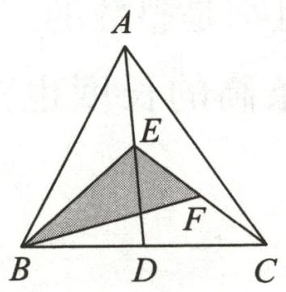

text_image

A
E
F
B D C

第1题图

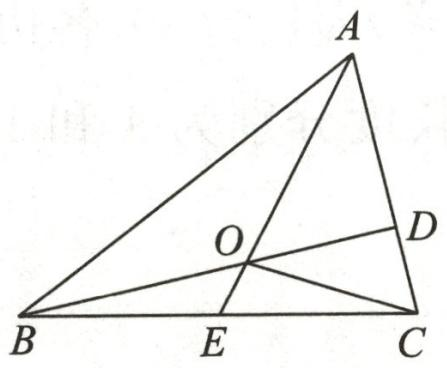

text_image

Geometric diagram of triangle ABC with internal points O, D, E and connecting line segments

第2题图

2. 如图, 在 $\triangle ABC$ 中, 点 $D$ 在边 $AC$ 上且 $AD = 2CD$ , $E$ 是 $BC$ 的中点, 且 $AE, BD$ 相交于点 $O$ . 若 $\triangle BOE$ 的面积为 2 , 则 $\triangle AOD$ 的面积为 \_\_\_\_.  
3. 如图, 已知 $AD, AE$ 分别是 $\triangle ABC$ 的高和中线, $AB = 6 \mathrm{~cm}, AC = 8 \mathrm{~cm}, BC = 10 \mathrm{~cm}$ , $\angle BAC = 90^{\circ}$ .

(1)求 ${AD}$ 的长；  
(2)求 $\triangle ABE$ 的面积;  
(3)求 $\triangle ACE$ 和 $\triangle ABE$ 的周长差.

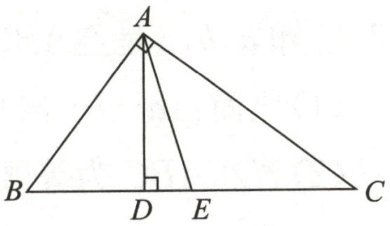

text_image

A
B D E C

第3题图

# 学霸微专题3 利用整体思想求角度

# 【方法指导】

善于用“集成”的眼光,把某些式子或图形看成一个整体,有意识地进行整体运算和整体处理.

1. 如图, 在 $\triangle ABC$ 中, $\angle 1 = \angle 2$ , $\angle ABC = 70^{\circ}$ , 则 $\angle BDC$ 的度数是 ( )

A. ${110}^{ \circ  }$

B. $115^{\circ}$

C. ${120}^{ \circ  }$

D. $130^{\circ}$

2.(2024春·天宁区期中)阅读下列材料并解答问题:

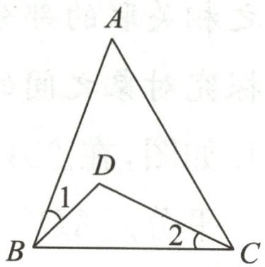

text_image

A
D
1
B
2
C

第1题图

在一个三角形中,如果一个内角 $\alpha$ 的度数是另一个内角度数的 3 倍,那

么这样的三角形我们称为“优雅三角形”，其中 $\alpha$ 称为“优雅角”。例如，一个三角形三个内角的度数分别是 $30^{\circ}, 90^{\circ}, 60^{\circ}$ ，这个三角形就是“优雅三角形”，其中“优雅角”为 $90^{\circ}$ 。反之，若一个三角形是“优雅三角形”，那么这个三角形的三个内角中一定有一个内角 $\alpha$ 的度数是另一个内角度数的 3 倍。

(1)一个“优雅三角形”的一个内角为 $120^{\circ}$ , 若“优雅角”为锐角, 则这个“优雅角”的度数为 \_\_\_\_.  
(2)如图①,已知 $\angle MON=60^{\circ}$ ,在射线 $OM$ 上取一点 $A$ ,过点 $A$ 作 $AB\perp OM$ 交 $ON$ 于点 $B$ ,以 $A$ 为端点画射线交线段 $OB$ 于点 $C$ (点 $C$ 不与点 $O,B$ 重合).若 $\triangle AOC$ 是“优雅三角形”,求 $\angle ACB$ 的度数.   
(3)如图②,在 $\triangle ABC$ 中,点 $D$ 在边 $BC$ 上, $DE$ 平分 $\angle ADB$ 交 $AB$ 于点 $E,F$ 为线段 $AD$ 上一点,且 $\angle AFE+\angle ADC=180^{\circ},\angle FED=\angle C$ .若 $\triangle ADC$ 是“优雅三角形”,求 $\angle C$ 的度数.

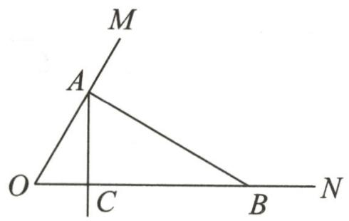

text_image

M
A
O
C
B
N

①

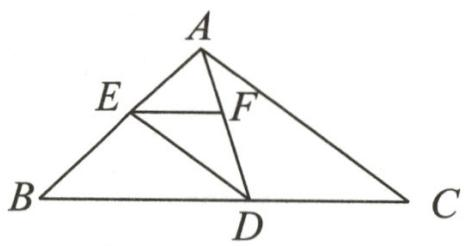

text_image

A
E
F
B
D
C

②   
第2题图

# 学霸微专题4 利用设参法求角度

# 【方法指导】

当问题中未知量较多时,为了便于探究对象之间的数量关系,将与之相关联的部分未知元素用字母表示出来,在运算过程中充当桥梁找出探究对象之间的数量关系.

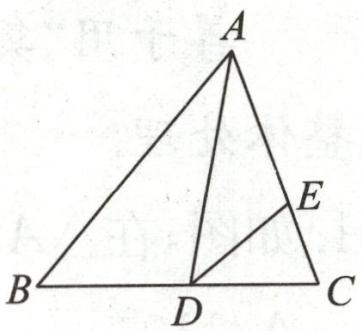

text_image

A
B
D
C
E

第1题图

1. 如图, 在 $\triangle ABC$ 中, $AD$ 是 $\triangle ABC$ 的角平分线, $\angle C - \angle B = 20^{\circ}$ , $DE$ 平分 $\angle ADC$ , $\angle AED = 110^{\circ}$ , 则 $\angle BAC$ 的度数为 \_\_\_\_.

2. (2024 春·仪征期末)在综合与实践课上,老师让同学们以“三角板与平行线”为主题开展数学活动. 已知直线 $AB, CD, AB \parallel CD$ , 在直角三角板 $EFG$ 中, $\angle FEG = 90^\circ$ , $\angle EGF = 60^\circ$ .

(1)小明将三角板按如图①方式摆放, 点 G 在 CD 上, 边 GF 与 AB 交于点 H, 若 $\angle FHA = 80^{\circ}$ , 则 $\angle EGD$ 的度数是 \_\_\_\_;  
(2)小亮将三角板按如图②方式摆放,点 F,G 分别在 AB,CD 上, $\angle FEG$ 的平分线与 $\angle FGC$ 的平分线交于点 M,若 $\angle EGD=4\angle BFE$ ,求 $\angle M$ 的度数;  
(3)小颖将图②中的三角板进行适当转动,点 $F, G$ 仍然分别在 $A B, C D$ 上,如图③,再将 $\angle D G E$ 沿边 $G E$ 翻折,边 $G D$ 的对应边 $G N$ 与 $A B$ 交于点 $N$ ,小颖给出下列两个结论:

① $\angle CGN+\angle BFE$ 的值不变;② $\frac{\angle CGN}{\angle BFE}$ 的值不变.

其中只有一个是正确的,你认为哪个是正确的?请说明理由.

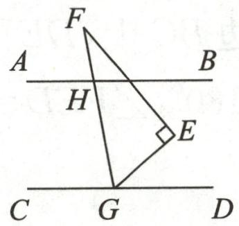

text_image

F
A	B
H
E
C	G	D

①

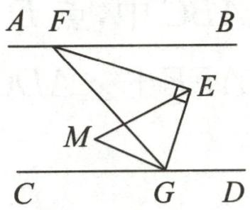

text_image

A F B
M E
C G D

②

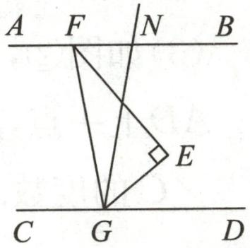

text_image

A F N B
C G D

③   
第2题图

# 学霸微专题5 利用分类讨论思想求角度

# 【方法指导】

当问题指代不明确,可能存在多种情况时,按不同情况分类,再逐一研究解决.

1. 已知 $\triangle ABC$ 中, $\angle A = 40^{\circ}$ , $\angle B$ 和 $\angle C$ 都不是直角, 高 $BD$ 和 $CE$ 所在直线相交于点 $H$ , 则 $\angle BHC$ 的度数为 \_\_\_\_.

2. (2024 春·房山区期末)在平面内, 对于 $\angle P$ 和 $\angle Q$ , 给出如下定义: 若存在一个常数 $t$ ( $t > 0$ ), 使得 $\angle P + t \angle Q = 180^{\circ}$ , 则称 $\angle Q$ 是 $\angle P$ 的“ $t$ 系数补角”. 例如, $\angle P = 80^{\circ}$ , $\angle Q = 20^{\circ}$ , 有 $\angle P + 5 \angle Q = 180^{\circ}$ , 则 $\angle Q$ 是 $\angle P$ 的“5 系数补角”.

(1)若 $\angle P=90^{\circ}$ ,在 $\angle 1=60^{\circ}$ , $\angle 2=45^{\circ}$ , $\angle 3=30^{\circ}$ 中, $\angle P$ 的“3系数补角”是   
(2)在平面内, $AB \parallel CD$ ,E为直线AB上一点,F为直线CD上一点.

①如图①，G为平面内一点，连接GE,GF, $\angle DFG=50^{\circ}$ ，若 $\angle BEG$ 是 $\angle EGF$ 的“6系数补角”，求 $\angle BEG$ 的大小；  
②如图②, 连接 $EF$ . 若 $H$ 为平面内一动点 (点 $H$ 不在直线 $AB, CD, EF$ 上), $\angle EFH$ 与 $\angle FEH$ 两个角的平分线交于点 $M$ . 若 $\angle BEH = \alpha, \angle DFH = \beta, \angle N$ 是 $\angle EMF$ 的 “2 系数补角”, 写出 $\angle N$ 大小的所有情况 (用含 $\alpha$ 和 $\beta$ 的代数式表示), 并写出求解过程.

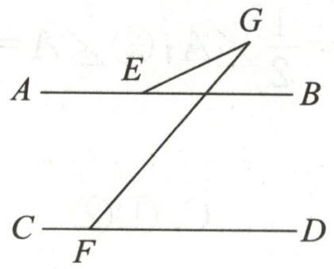

text_image

A
E
G
B
C
F
D

①

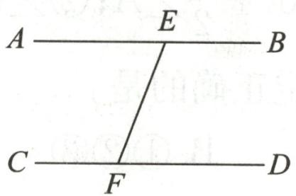

text_image

A
E
B
C
F
D

②

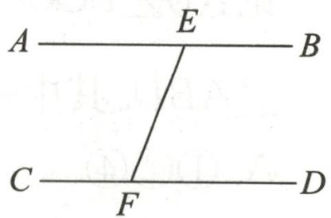

text_image

A
E
B
C
F
D

备用图  
第2题图

# 学霸微专题6 三角形中的双角平分线问题

# 【方法指导】

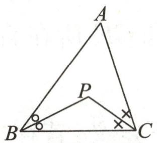

text_image

A
P
B
C

①

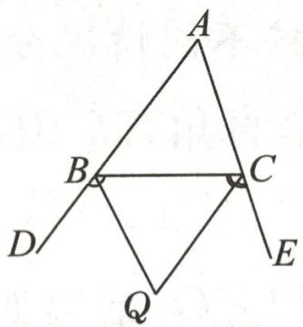

text_image

Geometric diagram with labeled points A, B, C, D, E, Q and right-angle markers at B and C

②

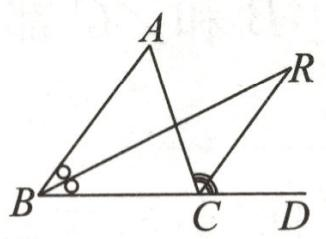  
③

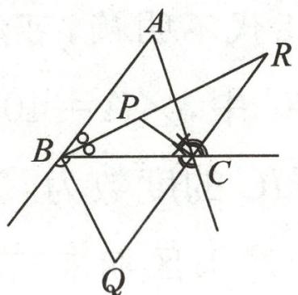

text_image

Geometric diagram with labeled points A, B, C, P, Q, R and intersecting lines and a right angle at C

④

(1)如图①,双内角平分线: $\angle P=90^{\circ}+\frac{1}{2}\angle A.$   
(2)如图②, 双外角平分线: $\angle Q = 90^{\circ} - \frac{1}{2} \angle A$ .   
(3)如图③,一个内角的平分线和一个外角的平分线: $\angle R=\frac{1}{2}\angle A.$   
(4)如图④,三个角之间的关系: $\angle {BPC} + \angle Q = {180}^{ \circ  },\angle {BPC} = {90}^{ \circ  } + \angle R,\angle Q + \angle R$ $= {90}^{ \circ  }$ .

1. 如图, 在 $\triangle ABC$ 中, $\angle ABC$ 与 $\angle ACB$ 的平分线交于点 $O$ , $\angle ACB$ 的外角平分线所在的直线与 $\angle ABC$ 的平分线相交于点 $D$ , 与 $\angle ABC$ 的外角平分线相交于点 $E$ , 有下列结论: ① $\angle BOC = 90^{\circ} + \frac{1}{2} \angle A$ ; ② $\angle D = \frac{1}{2} \angle A$ ; ③ $\angle A = \frac{2}{3} \angle E$ ; ④ $\angle E + \angle DCF = 90^{\circ} + \angle ABD$ . 其中一定正确的是 ( )

A. ①②④

B. ①②③

C. ①②

D. ①②③④

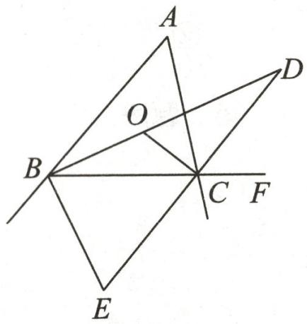

text_image

Geometric diagram with labeled points A, B, C, D, E, F, and O, showing intersecting lines and triangles.

第1题图

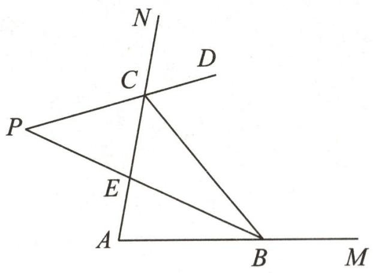

text_image

N
C
D
P
E
A
B
M

第2题图

2. (2024 春·泰兴期末)如图, 点 $B, C$ 分别在 $A M$ , $A N$ 上运动 (不与点 $A$ 重合), $C D$ 是 $\angle B C N$ 的平分线, $C D$ 的反向延长线交 $\angle A B C$ 的平分线于点 $P$ . 有下列条件: ① $\angle A B C + \angle A C B$ ; ② $\angle A$ ; ③ $\angle N C D - \angle A B P$ ; ④ $\angle A B C$ 的值. 其中, 不能求 $\angle P$ 大小的是 ( )

A. ①

B. ②

C. ③

D. ④

3. 聪聪对下面的问题进行了深入的研究,他的研究过程如下:

# 【问题再现】

(1)如图①,在 $\triangle ABC$ 中, $\angle ABC$ , $\angle ACB$ 的平分线交于点 $P$ , $\angle A=40^{\circ}$ ,则 $\angle BPC$ 的度数是\_\_\_\_;

# 【问题解决】

(2)如图②,在 $\triangle ABC$ 中, $\angle ABC$ , $\angle ACB$ 的平分线交于点 $P$ ,将 $\triangle ABC$ 沿 $DE$ 折叠使得点 $A$ 与点 $P$ 重合,若 $\angle1+\angle2=100^{\circ}$ ,求 $\angle BPC$ 的度数;

# 【问题推广】

(3)如图③,在 $\triangle ABC$ 中, $\angle BAC$ 的平分线与 $\triangle ABC$ 的外角 $\angle CBM$ 的平分线交于点P,过点B作 $BH\perp AP$ 于点H,若 $\angle ACB=82^{\circ}$ ,求 $\angle PBH$ 的度数;

# 【拓展提升】

(4)如图④,在四边形 $BCDE$ 中, $EB \parallel CD$ , 点 $F$ 在射线 $DE$ 上运动 (点 $F$ 不与 $E, D$ 两点重合), 连接 $BF, CF, \angle EBF, \angle DCF$ 的平分线交于点 $Q$ , 若 $\angle EBF = \alpha, \angle DCF = \beta$ , 直接写出 $\angle Q$ 和 $\alpha, \beta$ 之间的数量关系.

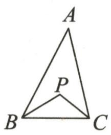  
①

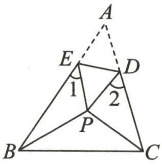

text_image

A
E
1
D
2
P
B
C

②

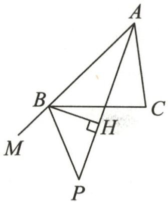

text_image

Geometric diagram with labeled points A, B, C, M, P, and H, showing triangle ABC and perpendicular from B to line PM at H.

③

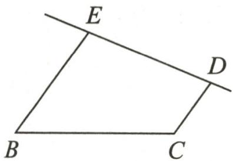

text_image

E
B
C
D

④   
第3题图

# 学霸微专题7 由线段中点构造全等

# 【方法指导】

当题目中已知某线段的中点时,通过倍长过中点的线段或者过线段的两个端点向过中点的线段作垂线段可以构造全等三角形,从而将题目中的已知和未知条件集中到同一对全等三角形中.

1. 如图, 在 $\triangle ABC$ 中, $\angle ACB = 90^{\circ}$ , $AC = BC$ , $D$ 为 $CB$ 的延长线上一点, $AE = AD$ , 延长 $AC$ 交 $BE$ 于点 $P$ , 且 $BP = PE$ . 若 $\frac{BD}{BC} = \frac{2}{3}$ , 则 $\frac{AC}{PC}$ 的值为 \_\_\_\_.

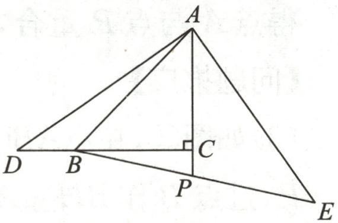

text_image

A
D B C
P E

第1题图

2. 如图, Rt△ABC 中, ∠ACB=90°, D 是 AC 边上一点, CD=CB, 过点 B 作 BE⊥AB 且 BE=AB, 连接 DE 交 BC 的延长线于点 F, 求证: DF=EF.

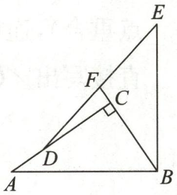

text_image

E
F
C
D
A
B

第2题图

3.(2024 春·驻马店月考)如图,在四边形 ABCD 中, $AD \parallel BC$ ,E 为 CD 的中点,连接 AE,BE,延长 AE 交 BC 的延长线于点 F.

(1) $\triangle DAE$ 和 $\triangle CFE$ 全等吗？说明理由；  
(2) 若 $AB = BC + AD$ ，求证： $BE \perp AF$ ;  
(3)在(2)的条件下,若 EF=6,CE=5, $\angle D=90^{\circ}$ ,求点 E 到 AB 的距离.

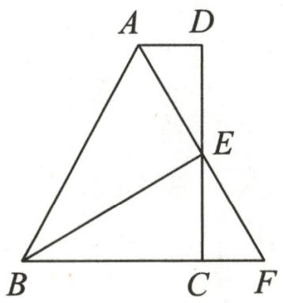

text_image

A D
B C F
E

第3题图

# 学霸微专题8 半角模型

# 【方法指导】

当题目中出现半角、相等的线段、对角互补等条件时,可以通过旋转变换的方法构造出两对全等三角形,进而解决问题.

1. 如图, 在四边形 $ABCD$ 中, $AB=AD$ , $\angle BAD=120^{\circ}$ , $\angle B=\angle ADC=90^{\circ}$ , $E,F$ 分别是 $BC,CD$ 上的点, 且 $\angle EAF=60^{\circ}$ , $BE=2$ , $EF=5$ , 则 $DF=$ \_\_\_\_.

2. 在等边 $\triangle ABC$ 的两边 $AB, AC$ 所在直线上分别有两点 $M, N, D$ 为 $\triangle ABC$ 外一点, 且 $\angle MDN = 60^{\circ}, \angle BDC = 120^{\circ}, BD = CD$ .

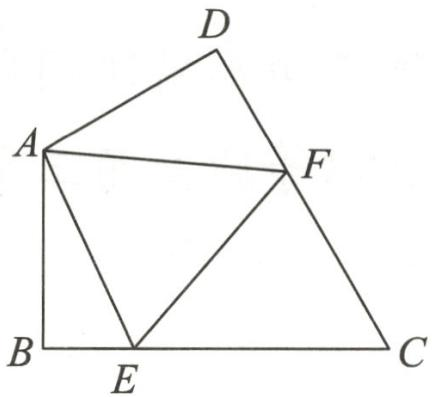

text_image

Geometric diagram of quadrilateral ABCD with internal points E, F and connecting segments

第1题图

(1)如图,点 $M, N$ 在边 $A B, A C$ 上,试猜想 $B M, C N$ 与 $M N$ 之间的数量关系,并加以证明; (2)当点 $M, N$ 在 $A B, C A$ 的延长线上时,若等边 $\triangle A B C$ 的周长为 $l, A N$ 的长为 $n$ ,则 $\triangle A M N$ 的周长为 (用含 $l, n$ 的代数式表示).

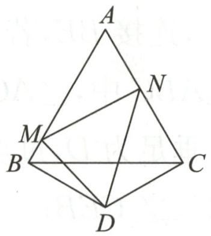

text_image

A
M
B
C
D
N

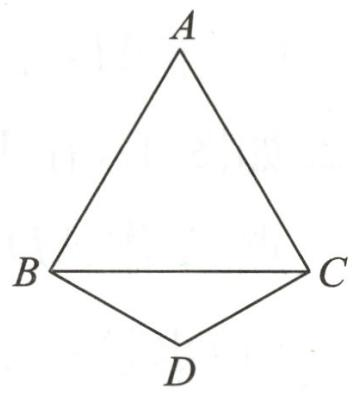

text_image

A
B
C
D

(备用图)  
第2题图

3. (2024 春·雁塔区月考)(1)如图①, 在四边形 $ABCD$ 中, $AB=AD$ , $\angle B=\angle D=90^{\circ}$ , $E,F$ 分别是边 $BC,CD$ 上的点, 且 $\angle EAF=\frac{1}{2}\angle BAD$ . 求证: $EF=BE+FD$ .

(2)如图②,在四边形 $ABCD$ 中, $AB=AD$ , $\angle B+\angle D=180^{\circ}$ , $E,F$ 分别是边 $BC,CD$ 上的点,且 $\angle EAF=\frac{1}{2}\angle BAD$ , (1)中的结论是否仍然成立?  
(3)如图③,在四边形ABCD中, $AB=AD,\angle B+\angle ADC=180^{\circ},E,F$ 分别是边BC,CD延长线上的点,且 $\angle EAF=\frac{1}{2}\angle BAD,(1)$ 中的结论是否仍然成立?若成立,请证明;若不成立,请写出它们之间的数量关系,并证明.

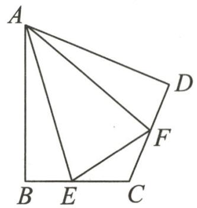

text_image

A
B E C
D
F

①

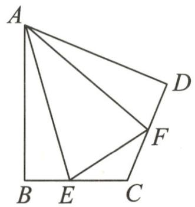

text_image

A
D
F
B E C

②

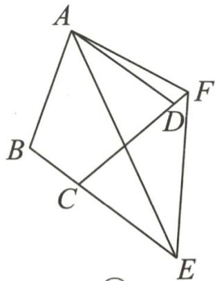

text_image

Geometric diagram with labeled points A, B, C, D, E, F forming intersecting triangles and quadrilaterals

③   
第3题图

# 学霸微专题9 三垂直模型

# 【方法指导】

当题目中出现共一个端点、相等且垂直的线段时,通常可以根据以下情形来构造全等三角形解决问题.其中情形三也属于“一线三等角”模型的特例,三垂直模型经常出现在以等腰直角三角形和正方形为背景的几何题中.

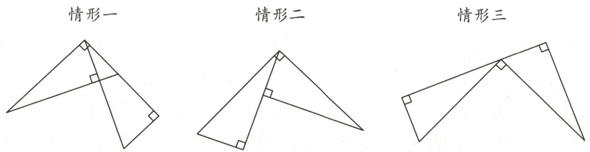

1. 已知, 如图, Rt△ABC 中, ∠ACB = 90°, AC = BC, D 为 BC 上一点, CE⊥AD 于点 E, 连接 BE, 若 CE = 2, 则 S△BEC = \_\_\_\_.

2. 如图①, 在 Rt△ABC 中, ∠ACB = 90°, AC = BC, 直线 l 经过点 C, 过点 A 作 AD ⊥ l, 垂足为 D, 过点 B 作 BE ⊥ l, 垂足为 E.

(1) 求证: $\triangle ADC \cong \triangle CEB$ ;

(2) 若 AD=5, DE=13, 求 BE 的长;

(3)如图②,延长 AD 至点 F,连接 CF,过点 C 作 $CG \perp CF$ ,且 CG = CF,连接 BG 交直线 l 于点 H,若 $S_{\triangle CGH} = 30, CD = 10$ ,则 AF=

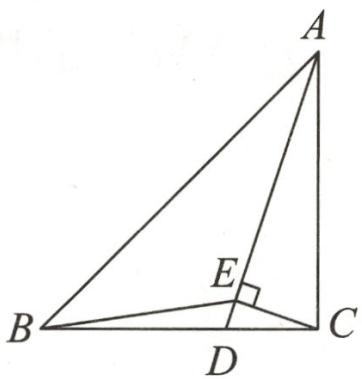

text_image

A
B
E
C
D

第1题图

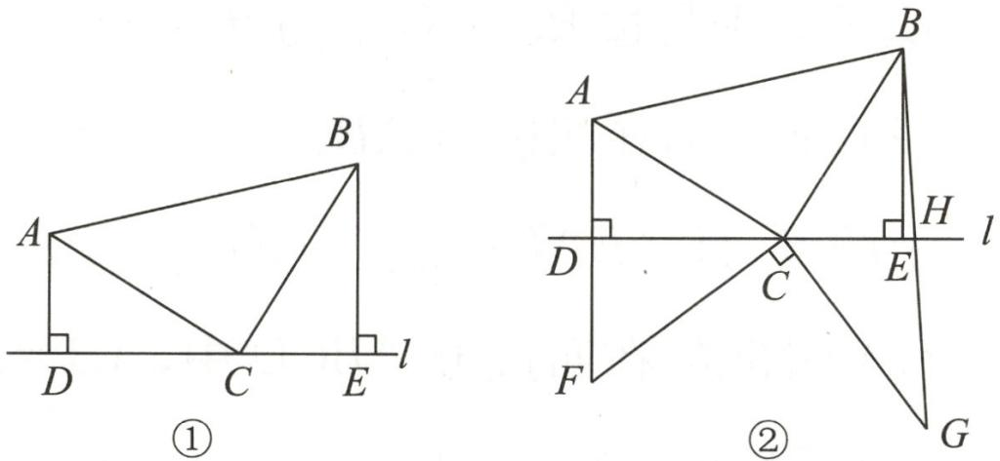  
第2题图

# 学霸微专题10 对角互补模型

# 【方法指导】

如图,在四边形 $ABCD$ 中, $\angle BAD + \angle BCD = 180^{\circ}$ , $DE \perp BC$ 于点 $E$ . 下列结论: ① $BD$ 平分 $\angle ABC$ ; ② $AD = CD$ ; ③ $AB + BC = 2BE$ ; ④ $BC - AB = 2EC$ . 若已知其中一个结论, 可推出其余三个结论成立, 即“知一推三”.

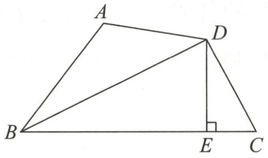

text_image

A
D
B
E
C

1. 如图, $AD$ 是 $\triangle ABC$ 的角平分线, $DF \perp AB$ , 垂足为 $F$ , $DE = DG$ , $\triangle ADG$ 和 $\triangle AED$ 的面积分别为 60 和 38, 则 $\triangle EDF$ 的面积为 \_\_\_\_.

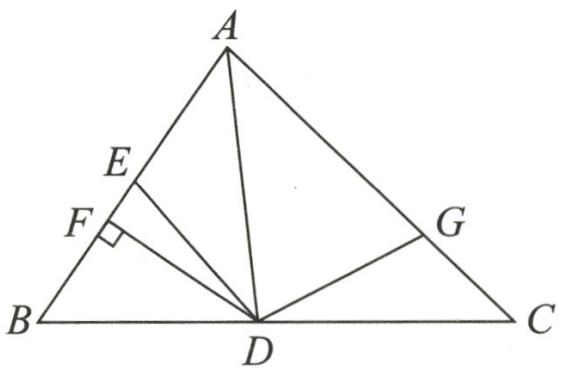

text_image

A
E
F
G
B
D
C

第1题图

2.(2024春·佛山月考)如图,在四边形ABCD中,AB=AD,CA平分∠BCD,AE⊥BC于点E.求证:BE+CD=CE.

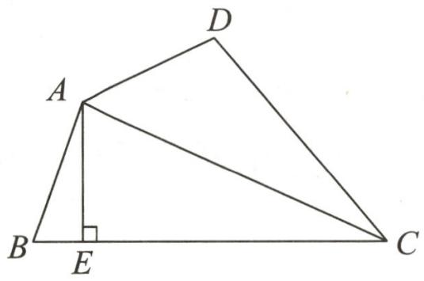

text_image

A
B
E
C
D

第2题图

# 学霸微专题 11 与角平分线有关的截长补短问题

# 【方法指导】

在角的两边上通过截长补短得到相等的线段,并根据角的对称性可以得到全等三角形.

1. 如图, 在 $\triangle ABC$ 中, $\triangle ABC$ 的外角平分线 $AD$ 与 $BC$ 的延长线交于点 $D, P$ 是 $AD$ 上异于点 $A$ 的任意一点, 连接 $PB, PC$ . 设 $PB = m, PC = n, AB = c, AC = b$ , 则 $m + n$ 与 $b + c$ 的大小关系是 ( )

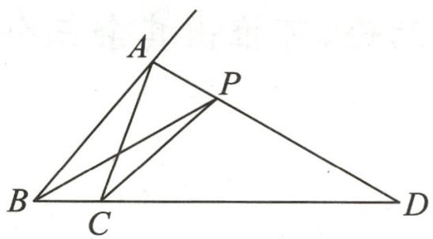

text_image

Geometric diagram of triangle ABC with points D, A, B, C, P and connecting lines forming smaller triangles

第1题图

A. $m+n>b+c$

B. $m+n<b+c$

C. $m+n=b+c$

D. 无法确定

2. 如图, 在 $\triangle ABC$ 中, $\angle BAC = 60^{\circ}$ , $\angle C = 40^{\circ}$ , $AP$ 平分 $\angle BAC$ 交 $BC$ 于点 $P$ , $BQ$ 平分 $\angle ABC$ 交 $AC$ 于点 $Q$ , 求证: $AB + BP = BQ + AQ$ .

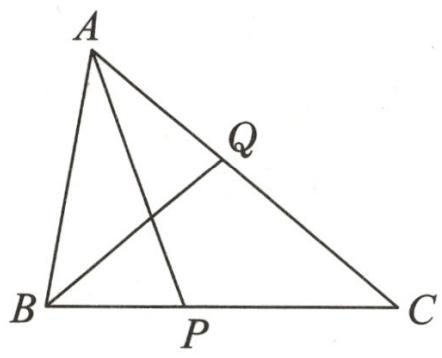

text_image

A
Q
B
P
C

第2题图

3. 已知 $\triangle ABC$ 中, $AB = AC$ , $BE$ 平分 $\angle ABC$ 交边 $AC$ 于点 $E$ .

(1)如图①,当 $\angle BAC=108^{\circ}$ 时,证明: $BC=AB+CE$ .   
(2)如图②,当 $\angle BAC=100^{\circ}$ 时,(1)中的结论还成立吗?若不成立,是否有其他两条线段之和等于BC;若有,请写出结论并完成证明.

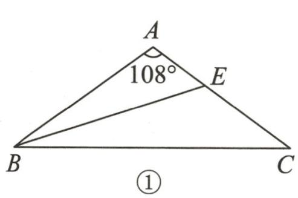

text_image

A
108°
E
B
C
①

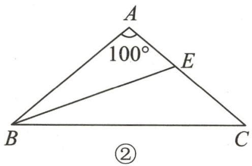

text_image

A
100°
E
B
C
②

第3题图

# 学霸微专题 12 角平分线上延长垂线段的问题

# 【方法指导】

当图中有垂直于角平分线的垂线段时,可以通过延长垂线段,构造全等三角形.

1. 如图, 已知 $\triangle ABC$ 的面积为 $8 \mathrm{~cm}^{2}$ , $BP$ 为 $\angle ABC$ 的平分线, $AP$ 垂直 $BP$ 于点 $P$ , 则 $\triangle BCP$ 的面积为 ( )

A. $3.5 \mathrm{~cm}^{2}$

B. $3.9 \mathrm{~cm}^{2}$

C. $4 \mathrm{~cm}^{2}$

D. $4.2 \mathrm{~cm}^{2}$

2.(2024春·高州市月考)如图, $\triangle ABC$ 中, $\angle C=90^{\circ},AD$ 是 $\triangle ABC$ 的角平分线, $DE\perp AB$ 于点E,AD=BD.

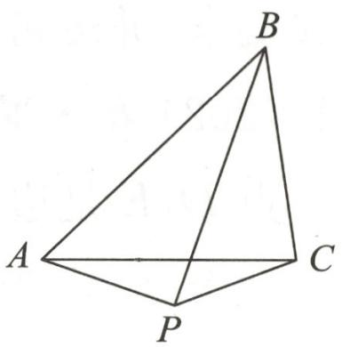

natural_image

Geometric diagram of a tetrahedron with vertices labeled A, B, C, and P (no text or symbols beyond labels)

第1题图

(1) 求证: AC = BE; (2) 求 $\angle B$ 的度数.

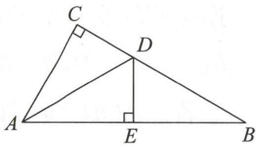

text_image

C
D
A
E
B

第2题图

3.(1)观察与发现:小明将三角形纸片 ABC(AC>AB)沿过点 A 的直线折叠,使得 AB 落在 AC 边上,折痕为 AD,展平纸片(如图①);在第一次折叠的基础上,第二次折叠该三角形纸片,使点 A 和点 D 重合,折痕为 EF,展平纸片后得到△AEF(如图②).小明认为△AEF 是等腰三角形,你同意他的结论吗?请说明理由.
(2)模型与运用:如图③,在△ABC中,∠BAC=90°,AB=AC,BE平分∠ABC交AC于点E,过点C作CD⊥BE,交BE的延长线于点D.若CD=4,求△BCE的面积.

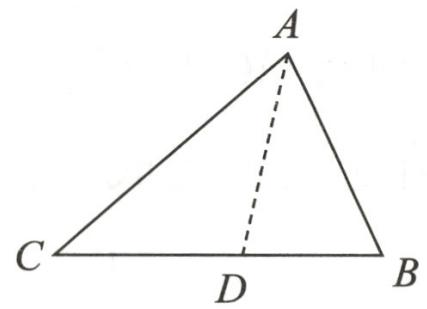

text_image

A
C D B

①

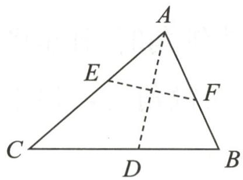

text_image

A
E
F
C
D
B

②

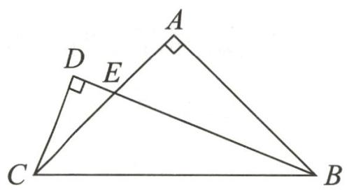

text_image

Geometric diagram showing triangle ABC with points D and E on sides, and right angles at A and C.

③   
第3题图

# 学霸微专题 13 对称点问题

# 【方法指导】

当题目中出现对称点的条件时,通常连接对称点或把对称轴上的点和两个对称点连接起来,并运用轴对称和线段垂直平分线的性质来解决问题.

1. (2024 春·罗湖区期末)如图, 在 $\triangle ABC$ 中, $AB = AC$ , $\angle A = 90^\circ$ , 点 $D, E$ 是边 $AB$ 上的两个定点, 点 $M, N$ 分别是边 $AC, BC$ 上的两个动点. 当四边形 DEMN 的周长最小时, $\angle DNM + \angle EMN$ 的大小是 ( )

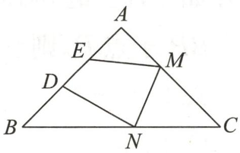

text_image

A
E
M
D
B
N
C

第1题图

A. ${45}^{ \circ  }$

B. ${90}^{ \circ  }$

C. ${75}^{ \circ  }$

D. ${135}^{ \circ  }$

2. 如图, 点 $P$ 在 $\angle AOB$ 的内部, 点 $C$ 和点 $P$ 关于 $OA$ 对称, 点 $P$ 和点 $D$ 关于 $OB$ 对称, 连接 $CD$ 交 $OA$ 于点 $M$ , 交 $OB$ 于点 $N$ , 连接 $OP, PM, PN$ .

(1)①若 $\angle AOB=60^{\circ}$ ,求 $\angle COD$ 的度数;

②若 $\angle AOB=n^{\circ}$ ,则 $\angle COD=$ \_\_\_\_°.(用含n的代数式表示)

(2) 若 $CD = 4$ , 则 $\triangle PMN$ 的周长为 \_\_\_\_.

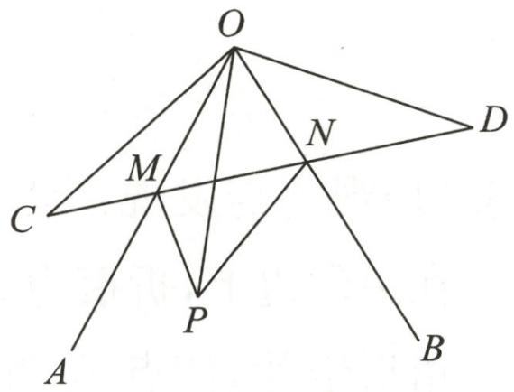

text_image

O
M
N
C
P
A
B
D

第2题图

3. 如图, 在 $\triangle ABC$ 中, $\angle ABC = 45^{\circ}$ , 点 $A$ 关于直线 $BC$ 的对称点为点 $P$ , 连接 $PB$ 并延长, 过点 $C$ 作 $CD \perp AC$ , 交射线 $PB$ 于点 $D$ .

(1)如图①,当 $\angle ACB$ 为钝角时,补全图形,判断 $AC$ 与 $CD$ 的数量关系为

(2)如图②,当 $\angle ACB$ 为锐角时,(1)中的结论是否仍成立?请说明理由.

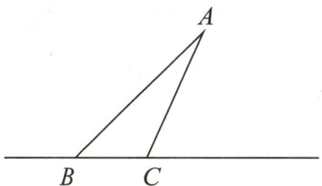

text_image

A
B C

①

text_image

A
B C

②   
第3题图

# 学霸微专题 14 设参法求等腰三角形的角度

# 【方法指导】

在等腰三角形中运用等边对等角,建立角之间的关系,一般来说,设小角表示大角,运用三角形的内角和定理计算或列方程.

1. 如图, 已知在四边形 $ABCD$ 内, $DB = DC$ , $\angle DCA = 60^{\circ}$ , $\angle DAC = 78^{\circ}$ , $\angle CAB = 24^{\circ}$ , 则 $\angle ACB$ 的度数为 \_\_\_\_.

2. 如图, 在 $\triangle ABC$ 中, $AB = AC$ , 点 $D, E$ 分别在 $BC, AC$ 的延长线上, $AD = AE, \angle CDE = 30^\circ$ .

(1)如果设 $\angle B=x^{\circ}$ ,用含x的代数式表示 $\angle E$ ,并说明理由;

(2)求∠BAD的度数.

natural_image

Geometric diagram of a tetrahedron with vertices labeled A, B, C, D (no text or symbols beyond labels)

第1题图

text_image

A
B
C
D
E

第2题图

3. 如图, $\triangle ABC$ 是等腰三角形, $AB = AC$ , $0^{\circ} < \angle BAC < 60^{\circ}$ , 分别在 $AB$ 的右侧, $AC$ 的左侧作等边三角形 $ABD$ 和等边三角形 $ACE$ , $BD$ 与 $CE$ 相交于点 $F$ .

(1) 求证: BF = CF.

(2)作射线 $AF$ 交 $BC$ 于点 $G$ , 交射线 $DC$ 于点 $H$ .

①补全图形,当 $\angle BAC=40^{\circ}$ 时,求 $\angle AHD$ 的度数.

②当 $\angle BAC$ 的度数在给定范围内发生变化时, $\angle AHD$ 的度数是否也发生变化? 若不变,请直接写出 $\angle AHD$ 的度数;若变化,请给出 $\angle AHD$ 的度数的变化范围.

text_image

A
E
F
B
C
D

第3题图

# 学霸微专题 15 根据等腰三角形的边分类讨论的问题

# 【方法指导】

腰和底不明时,往往需要分类讨论,分类讨论求边长时,一定别忘记三角形的三边关系.另外,无图时可能多解.两定点一动点构成等腰三角形的个数问题,基本方法是“两圆一直线”.

1. 如图, 已知 Rt△OAB, ∠OAB = 60°, ∠AOB = 90°, O 点与平面直角坐标系的原点重合, 若点 P 在 x 轴上, 且 △APB 是等腰三角形, 则满足条件的点 P 的个数是 ( )

A. 1

B. 2

C. 3

D. 4

text_image

y
A
B
O
x

第1题图

text_image

A
B

第2题图

2. (2024 春·酒泉期末)如图, 在由边长为 1 的小正方形组成的 $5 \times 5$ 的网格中, 点 $A, B$ 在小方格的顶点上, 要在小方格的顶点处确定一点 $C$ , 连接 $AC$ 和 $BC$ , 使 $\triangle ABC$ 是等腰三角形, 则方格图中满足条件的点 $C$ 有 \_\_\_\_ 个.

3. 如图, $M, N$ 是 $\angle AOB$ 的边 $OA$ 上的两个点 $(OM < ON)$ , $\angle AOB = 30^{\circ}$ , $OM = a$ , $MN = 4$ . 若边 $OB$ 上有且只有 1 个点 $P$ , 满足 $\triangle PMN$ 是等腰三角形, 求 $a$ 的取值范围.

text_image

A
M
N
O
B

第 3 题图

# 学霸微专题 16 根据等腰三角形的角分类讨论的问题

# 【方法指导】

顶角和底角不明时,往往需要根据三角形三个内角两两相等分类讨论,分类讨论前注意先排除两角显然不相等的情形.

1. 在 $\triangle ABC$ 中, $\angle BAC=40^{\circ}$ , $D$ 是边 $AB$ 上的一点, 将 $\triangle BCD$ 沿直线 $CD$ 翻折, 使点 $B$ 落在边 $AC$ 上的点 $E$ 处. 如果 $\triangle ADE$ 是等腰三角形, 那么 $\angle ABC=$ \_\_\_\_°.  
2. 在 $\triangle ABC$ 中, $AB=AC$ .

(1)如图①,若 $\angle BAD=40^{\circ}$ ,AD是 $\triangle ABC$ 的中线,AD=AE,求 $\angle EDC$ 的度数;  
(2)如图②,若 $\angle BAD=70^{\circ}$ ,AD是 $\triangle ABC$ 的中线,AD=AE,则 $\angle EDC=$ \_\_\_\_°;  
(3)思考,通过以上两题,你发现∠BAD与∠EDC之间有什么数量关系?用式子表示为\_\_\_\_;  
(4)如图③,如果 $AD$ 不是 $\triangle ABC$ 的中线, $AD = AE$ , 是否仍有上述关系? 请说明理由.

text_image

A
B
D
C
E

①

text_image

A
E
B
D
C

②

text_image

A
B
D
C
E

③   
第2题图

3. 如图, $O$ 是等边 $\triangle ABC$ 内一点, $\angle AOB = 110^{\circ}, \angle BOC = \alpha$ , 将 $\triangle BOC$ 绕点 $C$ 沿顺时针方向旋转 $60^{\circ}$ , 得到 $\triangle ADC$ , 连接 $OD$ .

(1)求证: $\triangle COD$ 是等边三角形;  
(2) 当 $\alpha=150^{\circ}$ 时, 试判断 $\triangle AOD$ 的形状, 并说明理由;  
(3)探索:当 $\alpha$ 为多少度时, $\triangle AOD$ 是等腰三角形.

text_image

A
110°
O
α
B
C
D

第3题图

# 学霸微专题 17 一线三等角模型

# 【方法指导】

顶点在一条直线上的三个等角所构成的图形称为“一线三等角”模型, 一线三等角模型通常出现在以等腰三角形为背景的几何题中.

1. 如图, 在 $\triangle ABC$ 中, $AB = AC = 12$ , 点 $E$ 在边 $AC$ 上, $AE$ 的垂直平分线交 $BC$ 于点 $D$ , 连接 $AD, DE$ . 若 $\angle ADE = \angle B, CD = 3BD$ , 则 $CE =$ \_\_\_\_.

text_image

A
B
D
C
E

第1题图

2. 如图, 在 $\triangle ABC$ 中, $AB = AC = 2$ , $\angle B = 40^{\circ}$ , 点 $D$ 在线段 $BC$ 上运动 (不与点 $B, C$ 重合), 连接 $AD$ , 作 $\angle ADE = 40^{\circ}$ , $DE$ 交线段 $AC$ 于点 $E$ .

(1) 当 $\angle BDA = 115^{\circ}$ 时， $\angle BAD =$ \_\_\_\_ $^{\circ}$ ;  
(2)当 $DC$ 为多少时, $\triangle ABD \cong \triangle DCE$ ;  
(3)在点 D 运动的过程中, $\triangle ADE$ 的形状也在改变,判断当 $\angle BDA$ 等于多少度时, $\triangle ADE$ 是等腰三角形.

text_image

A
40° 40°
B D C
E

第2题图

# 学霸微专题 18 双等腰直角三角形的问题

# 【方法指导】

两个等腰直角三角形的直角顶点重合时,可以利用四条直角边构造全等三角形来解决问题.

1. 如图, $AB = AD$ , $AC = AE$ , $\angle BAD = \angle CAE = 90^{\circ}$ , $AH \perp BC$ 于点 $H$ , $HA$ 的延长线交 $DE$ 于点 $G$ . 给出下列结论: ① $DG = EG$ ; ② $BC = 2AG$ ; ③ $AH = AG$ ; ④ $S_{\triangle ABC} = S_{\triangle ADE}$ . 其中正确的结论为 ( )

text_image

D
G
A
E
B
H
C

第1题图

A. ①②③

B. ①②④

C. ②③④

D. ①②③④

2. 两个大小不同的等腰直角三角板如图①所示放置, 图②是由它抽象出的几何图形, 点 $B, C, E$ 在同一条直线上, 连接 $D C$ .

(1)请找出图②中的全等三角形,并给予证明;

(2)证明: $DC \perp BE$ .

text_image

①
→
A
B
C
D
E
②

第2题图

3. 如图①, $\triangle ABC$ 与 $\triangle DEF$ 都是等腰直角三角形, $\angle ACB = \angle EDF = 90^{\circ}$ , $AB, EF$ 的中点均为点 $O$ , 连接 $CD$ .

(1) 求证: CD = BF;

(2)如图②,在 $\triangle DEF$ 绕点 $O$ 顺时针旋转的过程中,探究 $BF$ 与 $CD$ 之间的数量关系和位置关系,并证明.

text_image

B
E
D
O
F
C
A

①

text_image

Geometric diagram with labeled points A, B, C, D, E, F, and O, showing intersecting lines forming triangles and quadrilaterals.

②   
第3题图

# 学霸微专题 19 双等边三角形的问题

# 【方法指导】

两个等边三角形的一个顶点重合时,可以利用过公共顶点的四条边构造全等三角形来解决问题.

1. 如图, 已知点 $A$ 在 $x$ 轴的负半轴上, 以 $OA$ 为边在第二象限内作等边 $\triangle AOB$ , 点 $M, N$ 分别为 $OB, OA$ 边上的动点, 以 $MN$ 为边在 $x$ 轴上方作等边 $\triangle MNE$ , 连接 $OE$ , 当 $\angle EMO = 45^{\circ}$ 时, $\angle MEO$ 的度数为 \_\_\_\_.

text_image

y
B
M
E
A
NO
x

第1题图

2. 如图①, 已知 $\angle AOB = 120^{\circ}$ , OC 平分 $\angle AOB$ . 将直角三角板如图

放置,使直角顶点 D 在 OC 上, $60^{\circ}$ 角的顶点 E 在 OB 上,斜边与 OA 交于点 F(与点 O 不重合),连接 DF.

(1)如图②,若 $DE \perp OB$ , 求证: $\triangle DEF$ 为等边三角形;  
(2)如图③,求证: $OD=OE+OF.$

text_image

Geometric diagram with labeled points and intersecting lines, likely from a math problem or proof

①

text_image

Geometric diagram with labeled points and lines, including triangle ABC and intersecting segments

②

text_image

Geometric diagram with labeled points and lines, including triangle ABC and intersecting segments

③   
第2题图

# 学霸微专题 20 构造含 $30^{\circ}$ 角的直角三角形的问题

# 【方法指导】

当出现 $30^{\circ}, 15^{\circ}, 60^{\circ}$ 角时, 常常可以构造含 $30^{\circ}$ 角的直角三角形, 并根据边之间的数量关系来解决问题.

1. 如图, 在 $\triangle ABC$ 中, $AB = AC$ , $D$ , $E$ 是 $\triangle ABC$ 内的两点, $AD$ 平分 $\angle BAC$ , $\angle EBC = \angle E = 60^\circ$ , 若 $BE = 6$ , $DE = 2$ , 则 $BC$ 的长度是 ( )

A. 6

B. 8

C. 9

D. 10

text_image

A
E
D
B
C

第1题图

text_image

A
M
N
P
C
D
B

第2题图

2. 如图, 在 $\triangle ABC$ 中, $\angle C = 90^{\circ}, \angle B = 30^{\circ}$ , 以点 $A$ 为圆心, 任意长为半径画弧分别交 $AB, AC$ 于点 $M, N$ , 再分别以点 $M, N$ 为圆心, 大于 $\frac{1}{2} MN$ 的长为半径画弧, 两弧交于点 $P$ , 连接 $AP$ 并延长交 $BC$ 于点 $D$ . 给出下列结论: ① $AD$ 是 $\angle BAC$ 的平分线; ② $\angle ADC = 60^{\circ}$ ; ③ 点 $D$ 在线段 $AB$ 的垂直平分线上; ④ $S_{\triangle DAC}: S_{\triangle ABC} = 1:3$ . 其中正确结论的个数是 ( )

A. 1

B. 2

C. 3

D. 4

3. 如图, 在 $\triangle ABC$ 中, $\angle C = 30^{\circ}, D$ 是 $AC$ 的中点, $DE \perp AC$ 交 $BC$ 于点 $E$ , 点 $O$ 在 $ED$ 上, $OA = OB, OD = 2, OE = 4$ , 求 $BE$ 的长.

text_image

C
D O E
A B

第3题图

# 学霸微专题 21 线段的最值和路径问题

# 【方法指导】

求定点到动点的距离的最小值时,首先要找出动点的运动路径,并根据垂线段最短和两点之间线段最短来得到答案.如果动点是由另一个动点变换而来的,可以把定点反向变换为另一个定点,从而将问题转化为另一个定点和原动点之间的距离问题.

1. (2023 秋·东城区期末)如图, 在 Rt△ABC 中, ∠ACB = 90°, ∠ABC = 30°, AC = 6, D 是线段 AB 上一个动点, 以 BD 为边在△ABC 外作等边△BDE. 若 F 是 DE 的中点, 当 CF 取最小值时, △BDE 的周长为 \_\_\_\_.

text_image

A
C
D
B
F
E

第1题图

text_image

Geometric diagram of triangle ABC with internal points D, E, O and connecting line segments

第2题图

2. 如图, 在 $\triangle ABC$ 中, $AB = AC = 8$ , $\angle C = 30^{\circ}$ , $D$ 是 $BC$ 边上的一个动点, 连接 $AD$ , 以 $AD$ 为边作 $\triangle ADE$ , 使 $AD = AE$ , $\angle AED = \angle C$ . $O$ 为 $AC$ 的中点, 连接 $OE$ , 则线段 $OE$ 的最小值为 \_\_\_\_.

3. 如图, 在 Rt△ABC 中, ∠B=90°, ∠ACB=30°, BC=√3, 点 D 在边 BC 上, 连接 AD, 在 AD 的右侧作等边三角形 ADE, 连接 EC.

(1) 求证: DE = CE;   
(2) 若点 D 在 BC 的延长线上, 其他条件不变, 直接写出 DE, CE 之间的数量关系 (不必证明);  
(3)当点 D 从点 B 出发沿着线段 BC 运动到点 C 时, 求点 E 的运动路径长.

text_image

Geometric diagram of quadrilateral ABCD with diagonal BD and perpendicular from A to BC, labeled with points A, B, C, D, E.

text_image

A
B
C

(备用图)  
第3题图

# 学霸微专题 22 线段和差的最值问题

# 【方法指导】

求两条线段和差的最值时,通常根据轴对称的性质将线段串连,并根据两点之间线段最短来解决问题.

1. (2024·黑龙江二模)如图, 在边长为 2 的等边三角形 $ABC$ 中, $D$ 是 $BC$ 的中点, 点 $E$ 在线段 $AD$ 上, 连接 $BE$ , 在 $BE$ 的下方作等边三角形 $BEF$ , 连接 $DF$ , 则 $\triangle BDF$ 周长的最小值为 \_\_\_\_.

2.【了解概念】如图①, 已知 $A, B$ 为直线 $MN$ 同侧的两点, $P$ 为直线 $MN$ 上的一点, 连接 $AP, BP$ , 若 $\angle APM = \angle BPN$ , 则称点 $P$ 为点 $A, B$ 关于直线 $MN$ 的“等角点”.

text_image

A
E
B
D
C
F

第1题图

【理解运用】(1)如图②,在 $\triangle ABC$ 中, $D$ 为 $BC$ 上一点,点 $D,E$ 关于直线 $AB$ 对称,连接 $EB$ 并延长至点 $F$ ,判断点 $B$ 是否为点 $D,F$ 关于直线 $AB$ 的“等角点”,并说明理由;【拓展提升】(2)如图②,在(1)的条件下,若 $\angle A=70^{\circ},AB=AC,Q$ 是射线 $EF$ 上一点,且点 $D,Q$ 关于直线 $AC$ 的“等角点”为点 $C$ ,请利用尺规在图②中确定点 $Q$ 的位置,并求出 $\angle BQC$ 的度数;

(3)如图③,在 $\triangle ABC$ 中, $\angle ABC$ , $\angle BAC$ 的平分线交于点 $O$ ,点 $O$ 到 $AC$ 的距离为1,直线 $l$ 垂直平分边 $BC$ ,点 $P$ 为点 $O,B$ 关于直线 $l$ 的“等角点”,连接 $OP,BP$ ,当 $\angle ACB=60^{\circ}$ 时, $OP+BP$ 的值为\_\_\_\_.

  
①

text_image

M
F
B
E
D
A
C
N

②

text_image

A
l
O
P
B
C

③   
第2题图

# 学霸微专题 23 整体思想求值问题

# 【方法指导】

将已知条件中的等式或变形后的等式,整体代入求值.

1. 已知 $n$ 为正整数, 且 $x^{2n} = 3$ , 求下列各式的值:

(1) $x^{n-3}\cdot x^{3(n+1)}$ ; (2) $5(x^{3n})^{2}-2(-x^{2})^{2n}$ .

2. 阅读下面材料,并解决问题.

已知 $x^{2}y=3$ ，求 $2xy(x^{5}y^{2}-3x^{3}y-4x)$ 的值.

分析:考虑到满足 $x^{2}y=3$ 的 x,y 的可能值较多,不可以逐一代入求解,故考虑整体思想,将 $x^{2}y=3$ 整体代入.

解: $2xy(x^{5}y^{2}-3x^{3}y-4x)=2x^{6}y^{3}-6x^{4}y^{2}-8x^{2}y=2(x^{2}y)^{3}-6(x^{2}y)^{2}-8x^{2}y=2\times 3^{3}-6\times3^{2}-8\times3=-24.$

请你用上述方法解决问题:已知 ab=3, 求 $(2a^{3}b^{2}-3a^{2}b+4a)\cdot(-2b)$ 的值.

# 学霸微专题24 巧用平方差公式

# 【方法指导】

运用平方差公式对算式进行适当变形,可以使计算更简便.

1. 如果一个正整数可以表示为两个连续奇数的平方差,那么称该正整数为“和谐数”(如 $8 = 3^{2} - 1^{2}, 16 = 5^{2} - 3^{2}$ , 即 8,16 均为“和谐数”), 在不超过 2023 的正整数中, 所有的 “和谐数”之和为 ( )

A. 255054

B. 255064

C. 250554

D. 255024

2.(2024春·秦都区月考)先阅读下列材料,然后解答问题:

某同学在计算 $3(4+1)(4^{2}+1)$ 时, 把 3 写成 $(4-1)$ 后发现可以连续运用平方差公式计算. 即 $3(4+1)(4^{2}+1)=(4-1)(4+1)(4^{2}+1)=(4^{2}-1)(4^{2}+1)=16^{2}-1$ . 很受启发, 后来再求 $(2+1)(2^{2}+1)(2^{4}+1)(2^{8}+1)\cdots(2^{2048}+1)$ 的值时, 又改造此法, 将乘积式前面乘 1, 且把 1 写成 $(2-1)$ ,

即 $(2 + 1)(2^{2} + 1)(2^{4} + 1)(2^{8} + 1)\dots (2^{2048} + 1)$

$$
\begin{array}{l} = (2 - 1) (2 + 1) \left(2 ^ {2} + 1\right) \left(2 ^ {4} + 1\right) \left(2 ^ {8} + 1\right) \dots \left(2 ^ {2 0 4 8} + 1\right) \\ = (2 ^ {2} - 1) (2 ^ {2} + 1) (2 ^ {4} + 1) (2 ^ {8} + 1) \dots (2 ^ {2 0 4 8} + 1) = (2 ^ {4} - 1) (2 ^ {4} + 1) (2 ^ {8} + 1) \dots (2 ^ {2 0 4 8} + 1) \\ = (2 ^ {2 0 4 8} - 1) (2 ^ {2 0 4 8} + 1) = 2 ^ {4 0 9 6} - 1. \\ \end{array}
$$

问题：

(1)请借鉴该同学的经验,计算: $\frac{3}{2}\left(1+\frac{1}{2^{2}}\right)\left(1+\frac{1}{2^{4}}\right)\left(1+\frac{1}{2^{8}}\right)+\frac{1}{2^{15}}$ ;   
(2)借用上述的方法,再逆用平方差公式计算:

$\left(1 - \frac{1}{2^2}\right)\left(1 - \frac{1}{3^2}\right)\left(1 - \frac{1}{4^2}\right)\left(1 - \frac{1}{5^2}\right)\dots \left(1 - \frac{1}{n^2}\right). (n$ 为自然数，且 $n \geqslant 2)$

3. 若 $x \neq y$ ，且 $x^{2} - 4x + y = 0, y^{2} - 4y + x = 0$ ，求 $x^{3} + 2xy + y^{3}$ 的值.

# 学霸微专题 25 巧用配方法

# 【方法指导】

当式子中已含 $a^2, b^2$ 时，可配上 $\pm 2ab$ ；当式子中已含 $a^2, \pm 2ab$ 时，可配上 $b^2$ .

1. 已知实数 $a, b$ 满足 $a - b^2 = 4$ , 则代数式 $3a - a^2 - b^2$ 的最大值为 ( )

A.-4

B.-5

C. 4

D. 5

2.(2023·南通如东期末)已知实数a,b满足条件: $a^{2}+4b^{2}-a+4b+\frac{5}{4}=0$ ,则-ab的平方根是\_\_\_\_.

3. 阅读与思考: 先添加一个适当的项, 使式子中出现完全平方式, 再减去这个项, 使整个式子的值不变, 这种方法叫作配方法. 配方法是一种重要的解决问题的数学方法.

例如： $x^{2}-6x+10=(x^{2}-6x+9)+10-9=(x-3)^{2}+1.$

(1)【解决问题】补全下列完全平方式：

① $x^{2}-2x+$ \_\_\_\_，②\_\_\_\_+4y+1；  
(2)【变式训练】试说明:无论 x 取何值,代数式 $x^{2}-12x+37$ 的值是正数;  
(3)【深入研究】若 $M=2x^{2}+4x+5+y^{2}$ ， $N=x^{2}+6x+4$ ，比较 M, N 的大小；  
(4)【拓展应用】关于 x, y 的二元一次方程组 $\left\{\begin{aligned}x+my+1=0,\\ (m+1)x+ny=0\end{aligned}\right.$ 和 $\left\{\begin{aligned}2x-y=m-n,\\ x+y=2m+n\end{aligned}\right.$ 的解相同，求 $m+2n$ 的值.

# 学霸微专题 26 “ $a \pm b, ab, a^{2} + b^{2}$ ”互化技巧

# 【方法指导】

flowchart

1. 已知实数 $a, b$ 满足 $a^{2} + b^{2} = 3 + ab$ , 则 $(2a - 3b)^{2} + (a + 2b)(a - 2b)$ 的最大值为  
2. 已知 m-n=4, mn=-3, 求 $(m^{2}-4)(n^{2}-4)$ 的值.

3. 如图, 正方形 $ABCD$ 的边长为 $a$ , 点 $E$ 在 $AB$ 边上, 四边形 $EFGB$ 也是正方形, 它的边长为 $b (a > b)$ , 连接 $AF, CF, AC$ .

(1)用含 a, b 的代数式表示 GC= ;  
(2)若两个正方形的面积之和为60,即 ${a}^{2} + {b}^{2} = {60}$ ,又 ${ab} = {20}$ ,求线段 ${GC}$ 的长；  
(3) 若 $a = 8, \triangle AFC$ 的面积为 $S$ , 则 $S =$

text_image

A
D
F
E
G
B
C

第3题图

# 学霸微专题27 因式分解的方法补充

# 【方法指导】

分组分解法:以四项式为例,通常有“二二分”和“三一分”两种分法。“二二分”通常是分别提公因式或用平方差公式,然后可以产生新的公因式,再提取完成分解;“三一分”通常是其中三项为一组可以用完全平方公式,再用平方差公式完成分解.

十字相乘法:分解二次三项式,尝试十字相乘法.分解二次项及常数项,交叉相乘做加法;叉乘和是一次项,十字相乘分解它.

1. 已知 m, n 均为正整数且满足 mn-3m-2n-24=0，则 $m+n$ 的最大值是（）

A. 16

B. 22

C. 34

D. 36

2. 已知实数 $m, n, p, q$ 满足 $m + n = p + q = 4, mp + nq = 6$ , 则 $(m^2 + n^2)pq + mn(p^2 + q^2) =$ \_\_\_\_.

3. 用分组分解法或十字相乘法因式分解：

(1) $ax+bx+3a+3b;$

(2) $4a^{2}-b^{2}+6a-3b;$

(3) $ma^{2}+na^{2}-mb^{2}-nb^{2}$ ;

(4) $x^{2}-4y^{2}+12yz-9z^{2}$ ;

(5) $x^{2}-2xy-8y^{2}$ ;

(6) $2x^{2}+5xy+3y^{2}$ ;

(7) $5a^{2}b^{2}+23ab-10;$

(8) $4x^{4}-13x^{2}y^{2}+9y^{4}$

# 学霸微专题 28 分式的和差拆分问题

# 【方法指导】

分式化简计算时,分式拆分和因式分解是常用的工具.

1. 定义: 如果一个分式能化成一个整式与一个分子为常数的分式的和的形式, 那么称这个分式为“和谐分式”. 下列式子中, 属于“和谐分式”的是 (填序号).

① $\frac{x+1}{x}$ ; ② $\frac{2+x}{2}$ ; ③ $\frac{x+2}{x+1}$ ; ④ $\frac{y^{2}+1}{y^{2}}$ .

2.(2024春·武进区期中)阅读下列材料,解决问题:

在处理分数和分式问题时,有时由于分子比分母大,或者分子的次数高于分母的次数,在实际运算时往往难度比较大,这时我们可以考虑逆用分数(分式)的加减法,将假分数(分式)拆分成一个整数(或整式)与一个真分数(或分式)的和(或差)的形式,通过对简单式的分析来解决问题,我们称为分离整数法,此法在处理分式或整除问题时颇为有效,现举例说明.

材料 1: 将分式 $\frac{x^{2}-x+3}{x+1}$ 拆分成一个整式与一个分式 (分子为整数) 的和的形式.

解: $\frac{x^{2}-x+3}{x+1}=\frac{x(x+1)-2(x+1)+5}{x+1}=\frac{x(x+1)}{x+1}-\frac{2(x+1)}{x+1}+\frac{5}{x+1}=x-2+\frac{5}{x+1}$ .

这样,分式 $\frac{x^{2}-x+3}{x+1}$ 就拆分成一个整式x-2与一个分式 $\frac{5}{x+1}$ 的和的形式.

材料2:已知一个能被11整除的个位与百位相同的三位整数 $100x+10y+x$ ，且 $1\leqslant x\leqslant4$ ，求y与x的函数关系式.

解： $\because \frac{101x+10y}{11}=\frac{99x+11y+2x-y}{11}=9x+y+\frac{2x-y}{11}$ ,

又∵1≤x≤4,0≤y≤9,∴-7≤2x-y≤8,还要使 $\frac{2x-y}{11}$ 为整数,

∴2x-y=0, 即 y=2x.

(1)将分式 $\frac{x^{2}+6x-3}{x-1}$ 拆分成一个整式与一个分子为整数的分式的和的形式,则结果为
\_\_\_\_;

(2)已知整数 x 使分式 $\frac{2x^{2}+5x-20}{x-3}$ 的值为整数, 则满足条件的整数 x= \_\_\_\_;

(3)已知一个六位整数20xy17能被33整除,求满足条件的x,y的值.

# 学霸微专题 29 “ $x \pm \frac{1}{x}$ ”型变形技巧

# 【方法指导】

flowchart

1. 已知 $x > 0$ ，且 $x^{2} + \frac{1}{x^{2}} - 2(x + \frac{1}{x}) - 1 = 0$ ，则 $\left(x - \frac{1}{x}\right)^{2}$ 的值为 \_\_\_\_.

2. 已知 $a^2 - 3a + 1 = 0$ ，求下列各式的值：

(1) $a^{2}+\frac{1}{a^{2}}$ ;(2) $a-\frac{1}{a}$ ;(3) $a^{4}+\frac{1}{a^{4}}$ .

3.(2024 春·鼓楼区期中)观察下列方程以及解的特征:

① $x+\frac{1}{x}=2+\frac{1}{2}$ 的解为 $x_{1}=2,x_{2}=\frac{1}{2}$ ;  
② $x+\frac{1}{x}=3+\frac{1}{3}$ 的解为 $x_{1}=3,x_{2}=\frac{1}{3}$ ;  
③ $x+\frac{1}{x}=4+\frac{1}{4}$ 的解为 $x_{1}=4,x_{2}=\frac{1}{4}$ ;

...

(1)猜想关于 $x$ 的方程 $x + \frac{1}{x} = m + \frac{1}{m}$ 的解, 并利用“方程解的概念”进行验证.  
(2)利用(1)的结论解下列分式方程:

① $y^{3}+\frac{1}{y^{3}}=\frac{65}{8};$   
② $x+\frac{1}{4x-8}=\frac{a^{2}+4a+1}{2a}.$

# 学霸微专题30 分式的规律探究问题

# 【方法指导】

通过多次运算找出结果的变化规律,是解决规律探究问题的关键.

1.(2023秋·烟台期中)观察下面的变形规律: $\frac{1}{1\times2}=\frac{1}{1}-\frac{1}{2};\frac{1}{2\times3}=\frac{1}{2}-\frac{1}{3};\frac{1}{3\times4}=\frac{1}{3}-\frac{1}{4};\cdots$

解答下面的问题:

(1)若 n 为正整数,仿照上述规律,请你猜想 $\frac{1}{n(n+1)}=$ \_\_\_\_；  
(2)说明你猜想的正确性；  
(3)计算: $\frac{1}{1\times2}+\frac{1}{2\times3}+\frac{1}{3\times4}+\cdots+\frac{1}{2015\times2016}=$ \_\_\_\_；  
(4)解关于 $n$ 的分式方程: $\frac{1}{1 \times 2} + \frac{1}{2 \times 3} + \frac{1}{3 \times 4} + \cdots + \frac{1}{n(n+1)} = \frac{n+7}{n+9}$ .

2. 阅读两位同学的探究交流过程：

a. 小明在做分式运算时发现一个等式, 并对它进行了证明:

$$
\frac {x + 2}{x + 3} - \frac {x + 1}{x + 2} = \frac {1}{x + 2} - \frac {1}{x + 3}; \textcircled {1}
$$

b. 小明尝试写出了符合这个特征的其他几个等式:

$$
\frac {x + 3}{x + 4} - \frac {x + 2}{x + 3} = \frac {1}{x + 3} - \frac {1}{x + 4}; \tag {②}
$$

$$
\frac {x + 4}{x + 5} - \frac {x + 3}{x + 4} = \frac {1}{x + 4} - \frac {1}{x + 5}; \tag {③}
$$

$$
\frac {x + 5}{x + 6} - \frac {x + 4}{x + 5} = \frac {1}{x + 5} - \frac {1}{x + 6}; \tag {④}
$$

● ● ● ● ● ●

c. 小明邀请同学小亮根据上述规律写出第⑤个等式和第⑨个等式(用含 n 的式子表示, n 为正整数);  
d. 小亮对第 $n$ 个等式进行了证明.

解答下列问题:

(1)第⑤个等式是\_\_\_\_；  
(2)第⑨个等式是\_\_\_\_；  
(3)请你证明第⑨个等式成立.

natural_image

Close-up of a textured, elongated object with two small circular features on the right side (no text or symbols visible)

natural_image

Pure electrical circuit lines without any symbols

natural_image

Grid of uniform gray circular patterns on white background (no text or symbols)

