# 参考答案

# 第十三章 三角形

# 作业 1 三角形的概念

1. C

2.(1)内角 (2) $\triangle ABE,\triangle ADE,\triangle ACE$ (3)6 $\triangle ABE,$

$$
\triangle A D E, \triangle A C E, \triangle A B D, \triangle A C D, \triangle A B C
$$

3.B 4.B 5.10 10 10

6.(1)6 $\triangle ABD, \triangle ACD, \triangle ADE$

(2) $\triangle ABC,\triangle ACD,\triangle ACE$ (3) $\triangle ACD\angle BAD$

# 作业 2 三角形的边

1. C  2. A  3. C  4. B  5. C  6. D  7. B  8. C

9. 解: (1) ∵ △BDE 与四边形 ACDE 的周长相等,

$$
\therefore B D + D E + B E = A C + A E + C D + D E.
$$

$$
\because B D = D C, \therefore B E = A E + A C.
$$

设 AE=x cm，则 $BE=(10-x)\mathrm{cm}$ ，

由题意得, $10-x=x+6$ ,

解得 $x=2,\therefore AE=2\ cm.$

(2)题图中共有8条线段，

它们的和为 $AE + EB + AB + AC + DE + BD + CD + BC$

$$
= 2 A B + A C + 2 B C + D E = 5 3 (\mathrm{cm}).
$$

$$
\therefore 2 B C + D E = 5 3 - (2 A B + A C) = 5 3 - (2 \times 1 0 + 6) = 2 7 (\mathrm{cm}),
$$

$$
\therefore B C + \frac {1}{2} D E = \frac {2 7}{2} (\mathrm{cm}).
$$

10. 解: (1) 因为 a=4, b=6, 所以 2<c<10.

故三角形的周长 x 的取值范围为 12 < x < 20.

(2)①因为 x 为小于 18 的偶数，

所以 x=16 或 x=14.

当 x 为 16 时, c=6;

当 x 为 14 时, c=4.

②当 c=6 时, b=c, $\triangle ABC$ 为等腰三角形;

当 c=4 时, a=c, $\triangle ABC$ 为等腰三角形.

综上， $\triangle ABC$ 是等腰三角形.

11. 解: (1) 设底边长为 $x \mathrm{~cm}$ .

∵腰长是底边长的2倍,∴腰长为2x cm,

∴ $2x + 2x + x = 24$ , 解得 $x = \frac{24}{5}$ ,

$$
\therefore 2 x = 2 \times \frac {2 4}{5} = \frac {4 8}{5},
$$

∴各边长分别为 $\frac{48}{5}$ cm, $\frac{48}{5}$ cm, $\frac{24}{5}$ cm.

(2)①当6cm为底边长时,腰长= $\frac{24-6}{2}=9$ (cm).   
②当 6 cm 为腰长时, 底边长 =24-6-6=12(cm),

∵6+6=12,∴不能构成三角形,故舍去.

∴能围成有一边长为 $6 \, cm$ 的等腰三角形, 另两边长分别为 $9 \, cm, 9 \, cm$ .

(3)由题意得: $\left\{\begin{aligned}a+a&>24-2a,\\ 24-2a&>0,\end{aligned}\right.$

解得:6<a<12.

12. 解: (1) ∵ a, b, c 是△ABC 的三边长, a = 5, b = 6, ∴ 1 < c < 11.

∵△ABC 的周长是小于 18 的偶数，

∴1<c<7,∴c=3或5.

(2) $|a+b-c|-|c-a-b|=a+b-c+c-a-b=0.$

13. 证明: 在 $\triangle BOD$ 中, $DO+BD>OB$ ,

$$
\therefore D O + B D + O C > O C + O B, \therefore D B + D C > O C + O B.
$$

在 $\triangle ACD$ 中, $AC+AD>CD$ ,

$$
\therefore A C + A D + B D > C D + B D,
$$

$$
\therefore A B + A C > C D + B D, \therefore A B + A C > O B + O C.
$$

# 作业 3 三角形的中线、角平分线、高

1. D 2. C 3. A 4. EC AE ADC 或 ECD EFC EC

5. 解: (1) 如答图①所示. (2) 如答图②所示.

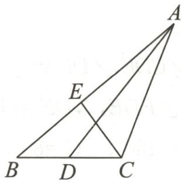

text_image

Geometric diagram of triangle ABC with internal points D, E and intersecting lines

①

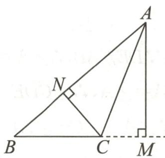

text_image

Geometric diagram of triangle ABC with perpendiculars from A and B to sides BC and AC, labeled points A, B, C, M, N, and right-angle symbols.

②   
第5题答图

6.3 7.3 或 7 8.4 9.5 10.(1) $\frac{1}{2}$ (2)6

11. 解: (1) $\because EF \parallel BC, \angle BED = 130^{\circ}$ ,

$$
\therefore \angle E B C = 5 0 ^ {\circ},
$$

又∵BD平分∠EBC,

$$
\therefore \angle E B D = \angle D B C = 2 5 ^ {\circ},
$$

又∵AD⊥BD,∴∠BDA=90°,

$$
\therefore \angle B A D = 9 0 ^ {\circ} - 2 5 ^ {\circ} = 6 5 ^ {\circ}.
$$

(2) DO 是 $\triangle DEG$ 的角平分线.

理由：∵EF∥BC, DG∥AB,

$$
\therefore \angle E D B = \angle D B G, \angle E B D = \angle G D B.
$$

∵BD平分∠ABC,∴∠EBD=∠GBD,

$\therefore \angle GDB = \angle EDB, \therefore DB$ 平分 $\angle EDG,$

∴DO 是△DEG 的角平分线.

12. 解: (1) $\because AC=8\ cm, BC=6\ cm, AB=10\ cm,$

∴△ABC 的周长=8+6+10=24(cm)，

∴当 CP 把 $\triangle ABC$ 的周长分成相等的两部分时，点 P 在 AB 边上，此时 $CA + AP = BP + BC = 12 \, cm$ ，

$$
\therefore 2 t = 1 2, t = 6.
$$

(2) 当点 P 在 AB 的中点处时, CP 把 $\triangle ABC$ 的面积分成相等的两部分, 此时 $CA + AP = 8 + 5 = 13 \, (\text{cm})$ ,

$$
\therefore 2 t = 1 3, t = 6. 5.
$$

(3)分两种情况：

①当点 P 在 AC 边上时，∵ $\triangle BCP$ 的面积 = 12 cm²，

$$
\therefore \frac {1}{2} \times 6 \times C P = 1 2 (\mathrm{cm} ^ {2}), \therefore C P = 4 \mathrm{cm},
$$

$$
\therefore 2 t = 4, t = 2.
$$

②当点 P 在 AB 边上时，∵ $\triangle BCP$ 的面积 = 12 cm² = $\triangle ABC$ 面积的一半，∴ P 为 AB 的中点，∴ 2t = 13, t = 6.5.

故 t 为 2 或 6.5 时, $\triangle BCP$ 的面积为 $12 \, cm^{2}$ .

# 作业 4 三角形的内角(一)

1. B  2. C  3. C  4. 55

5. $\angle C$ $\angle B$ 两直线平行, 同位角相等

∠A 两直线平行,同位角相等

∠2 两直线平行,内错角相等

∠A 等量代换

$$
1 8 0 ^ {\circ}
$$

6. $50^{\circ}$

7.(1)证明:∵DE∥AB,∴∠A=∠CDE,∠DFA=∠FDE.

$\because \angle DFA = \angle A, \therefore \angle CDE = \angle FDE, \therefore DE$ 平分 $\angle CDF$ .

(2) 解: $\because \angle A + \angle C + \angle ABC = 180^{\circ}, \angle C = 80^{\circ}$ ,

$$
\angle A B C = 6 0 ^ {\circ}, \therefore \angle A = 1 8 0 ^ {\circ} - 6 0 ^ {\circ} - 8 0 ^ {\circ} = 4 0 ^ {\circ}.
$$

$$
\because \angle D F A = \angle A, \therefore \angle G F B = \angle D F A = 4 0 ^ {\circ}.
$$

$$
\because \angle A B C = 6 0 ^ {\circ}, \therefore \angle G B F = 1 2 0 ^ {\circ},
$$

$$
\therefore \angle G = 1 8 0 ^ {\circ} - \angle G F B - \angle G B F = 1 8 0 ^ {\circ} - 4 0 ^ {\circ} - 1 2 0 ^ {\circ} = 2 0 ^ {\circ}.
$$

8.(1)解:∵CD是高, $\angle DCB=40^{\circ},\therefore\angle B=50^{\circ}$ .

又∵∠ACB=90°,∴∠BAC=40°.

又∵AE是角平分线，

$$
\therefore \angle B A E = \angle C A E = \frac {1}{2} \angle B A C = 2 0 ^ {\circ},
$$

$$
\therefore \angle C E F = 9 0 ^ {\circ} - 2 0 ^ {\circ} = 7 0 ^ {\circ}.
$$

(2)证明：∵CD⊥AB，

$$
\therefore \angle C F E = \angle A F D = 9 0 ^ {\circ} - \angle D A F = 9 0 ^ {\circ} - 2 0 ^ {\circ} = 7 0 ^ {\circ},
$$

$$
\therefore \angle C E F = \angle C F E.
$$

9.(1)解:∵∠ABC,∠ACB的平分线交于点O,

$$
\therefore \angle O B C = \frac {1}{2} \angle A B C, \angle O C B = \frac {1}{2} \angle A C B,
$$

$$
\therefore \angle B O C = 1 8 0 ^ {\circ} - \angle O B C - \angle O C B
$$

$$
= 1 8 0 ^ {\circ} - \left(\frac {1}{2} \angle A B C + \frac {1}{2} \angle A C B\right)
$$

$$
= 1 8 0 ^ {\circ} - \frac {1}{2} (1 8 0 ^ {\circ} - \angle A)
$$

$$
= 9 0 ^ {\circ} + \frac {1}{2} \angle A
$$

$$
= 9 0 ^ {\circ} + \frac {1}{2} n ^ {\circ}.
$$

(2) $90^{\circ}-\frac{1}{2}n^{\circ}$

(3)①解: $\angle DOB + \angle EOC = 90^{\circ} - \frac{1}{2} \angle A.$

理由：∵∠BOC=90°+ $\frac{1}{2}$ ∠A,

$$
\therefore \angle D O B + \angle E O C = 1 8 0 ^ {\circ} - \angle B O C = 1 8 0 ^ {\circ} -
$$

$$
\left(9 0 ^ {\circ} + \frac {1}{2} \angle A\right) = 9 0 ^ {\circ} - \frac {1}{2} \angle A.
$$

② $\angle DOB - \angle EOC = 90^{\circ} - \frac{1}{2}\angle A$

# 作业 5 三角形的内角(二)

1.B 2.B 3.35

4. 解: 在 Rt△ABC 中, ∠ACB=90°, ∠1=32°,

$$
\therefore \angle 2 = 9 0 ^ {\circ} - \angle 1 = 9 0 ^ {\circ} - 3 2 ^ {\circ} = 5 8 ^ {\circ}.
$$

∵CD是边AB上的高，

$$
\therefore \angle B D C = \angle A D C = 9 0 ^ {\circ},
$$

$$
\therefore \angle A = 9 0 ^ {\circ} - \angle 1 = 9 0 ^ {\circ} - 3 2 ^ {\circ} = 5 8 ^ {\circ}, \angle B = 9 0 ^ {\circ} - \angle 2 = 9 0 ^ {\circ}
$$

$$
- 5 8 ^ {\circ} = 3 2 ^ {\circ}.
$$

5. D 6. C 7. B 8. 2 或 6 9. 45°, 45°或 30°, 60°

10.(1)解:∵AD⊥BC,∴∠ABD+∠BAD=90°.

$$
\because \angle B A C = 9 0 ^ {\circ}, \therefore \angle B A D + \angle C A D = 9 0 ^ {\circ},
$$

$$
\therefore \angle A B D = \angle C A D = 3 6 ^ {\circ}.
$$

∵BE平分∠ABC,∴∠ABE= $\frac{1}{2}$ ∠ABC=18°,

$$
\therefore \angle A E F = 9 0 ^ {\circ} - \angle A B E = 7 2 ^ {\circ}.
$$

(2)证明：∵BE平分∠ABC，∴∠ABE=∠CBE.

$$
\because \angle A B E + \angle A E F = 9 0 ^ {\circ}, \angle C B E + \angle B F D = 9 0 ^ {\circ},
$$

$$
\therefore \angle A E F = \angle B F D,
$$

$$
\because \angle A F E = \angle B F D, \therefore \angle A E F = \angle A F E.
$$

11.(1) $63^{\circ}$

(2)① $54^{\circ}$

②解:设 $\angle DCN=x$ .

∵∠DCN与∠CDN互为“黄金角”，

$$
\therefore \angle C D N = x + 3 6 ^ {\circ} \text {或} \angle C D N = x - 3 6 ^ {\circ}.
$$

当 $\angle CDN=x+36^{\circ}$ 时，

$$
\because \angle A C B = 9 0 ^ {\circ},
$$

$$
\begin{array}{l} \therefore \angle C B N = 9 0 ^ {\circ} - \angle C D N \\ = 9 0 ^ {\circ} - (x + 3 6 ^ {\circ}) \\ = 5 4 ^ {\circ} - x. \\ \end{array}
$$

∵BE平分∠ABC,∴∠ABC=2∠CBD=108°-2x.

$$
\because C F \perp A B, \therefore \angle A = 9 0 ^ {\circ} - \angle D C N = 9 0 ^ {\circ} - x.
$$

$$
\because \angle A + \angle A B C = 9 0 ^ {\circ}, \therefore 9 0 ^ {\circ} - x + 1 0 8 ^ {\circ} - 2 x = 9 0 ^ {\circ},
$$

解得 $x=36^{\circ},\therefore\angle A=90^{\circ}-36^{\circ}=54^{\circ}.$

当 $\angle CDN=x-36^{\circ}$ 时，

$$
\because \angle A C B = 9 0 ^ {\circ},
$$

$$
\therefore \angle C B D = 9 0 ^ {\circ} - \angle C D N
$$

$$
= 9 0 ^ {\circ} - (x - 3 6 ^ {\circ})
$$

$$
= 1 2 6 ^ {\circ} - x.
$$

∵BE平分∠ABC,∴∠ABC=2∠CBN=252°-2x.

$$
\because C F \perp A B, \therefore \angle A = 9 0 ^ {\circ} - \angle D C N = 9 0 ^ {\circ} - x.
$$

$$
\because \angle A + \angle A B C = 9 0 ^ {\circ},
$$

$$
\therefore 9 0 ^ {\circ} - x + 2 5 2 ^ {\circ} - 2 x = 9 0 ^ {\circ},
$$

解得 $x=84^{\circ}$ ,

$$
\therefore \angle A = 9 0 ^ {\circ} - 8 4 ^ {\circ} = 6 ^ {\circ}.
$$

综上所述， $\angle A=54^{\circ}$ 或 $\angle A=6^{\circ}$ .

# 作业 6 三角形的外角

1. D 2. 40 3. 60 或 120

4.(1) 证明: $\because \angle BAC = \angle 1 + \angle CAE, \angle DEF = \angle 3 +$

$$
\angle C A E, \angle 1 = \angle 3, \therefore \angle B A C = \angle D E F.
$$

(2) 解: $\because \angle ABC = \angle 2 + \angle ABD, \angle 1 = \angle 2,$

$$
\therefore \angle A B C = \angle 1 + \angle A B D = \angle E D F.
$$

由(1)可知 $\angle DEF=\angle BAC=70^{\circ}$ ,

$$
\therefore \angle A B C = \angle 1 + \angle A B D = \angle E D F = 1 8 0 ^ {\circ} - \angle D E F -
$$

$$
\angle D F E = 1 8 0 ^ {\circ} - 7 0 ^ {\circ} - 5 0 ^ {\circ} = 6 0 ^ {\circ}, \therefore \angle A B C = 6 0 ^ {\circ}.
$$

5.B 6.C 7.55 8.155

9. 解: (1) $\because \angle B + \angle ACB + \angle BAC = 180^{\circ}, \angle B = 30^{\circ}$ ,

$$
\angle A C B = 8 0 ^ {\circ}, \therefore \angle B A C = 1 8 0 ^ {\circ} - 3 0 ^ {\circ} - 8 0 ^ {\circ} = 7 0 ^ {\circ}.
$$

∵AD平分∠BAC,∴∠1=∠2=35°,

$$
\therefore \angle 3 = \angle 1 + \angle B = 3 5 ^ {\circ} + 3 0 ^ {\circ} = 6 5 ^ {\circ}.
$$

$$
\because P E \perp A D, \therefore \angle 3 + \angle E = 9 0 ^ {\circ}, \therefore \angle E = 9 0 ^ {\circ} - 6 5 ^ {\circ} = 2 5 ^ {\circ}.
$$

(2) $\angle ACB - \angle B = 2\angle E.$

证明： $\because \angle B + \angle ACB + \angle BAC = 180^{\circ}$

$$
\therefore \angle B A C = 1 8 0 ^ {\circ} - \angle B - \angle A C B.
$$

∵AD平分∠BAC,

$$
\therefore \angle 1 = \angle 2 = \frac {1}{2} \angle B A C = \frac {1}{2} (1 8 0 ^ {\circ} - \angle B - \angle A C B),
$$

$$
\therefore \angle 3 = \angle 1 + \angle B = \angle 2 + \angle B = \frac {1}{2} (1 8 0 ^ {\circ} - \angle B -
$$

$$
\angle A C B) + \angle B = 9 0 ^ {\circ} + \frac {1}{2} \angle B - \frac {1}{2} \angle A C B.
$$

$$
\because P E \perp A D, \therefore \angle 3 + \angle E = 9 0 ^ {\circ}, \therefore 9 0 ^ {\circ} + \frac {1}{2} \angle B -
$$

$\frac{1}{2}\angle ACB + \angle E = 90^{\circ}$ ，即 $\angle ACB - \angle B = 2\angle E.$

10.(1)① $50^{\circ}$ ② $55^{\circ}$

③解：∵∠ABC+∠C=180°-∠A,EF∥BC,

$$
\therefore \angle C = \angle D E F, \therefore \angle A B C + \angle D E F = 1 8 0 ^ {\circ} - \angle A.
$$

∵BD平分∠ABC,EG平分∠CEF,

$$
\therefore \angle C B D = \frac {1}{2} \angle A B C, \angle F E G = \frac {1}{2} \angle D E F,
$$

$$
\therefore \angle C B D + \angle F E G = \frac {1}{2} \angle A B C + \frac {1}{2} \angle D E F = \frac {1}{2} \times
$$

$(180^{\circ}-\angle A)=90^{\circ}-\frac{1}{2}\angle A.$

$$
\because E F \parallel B C, \therefore \angle E F G = \angle C B D,
$$

$$
\therefore \angle E F G + \angle F E G = 9 0 ^ {\circ} - \frac {1}{2} \angle A,
$$

$$
\therefore \angle B G E = \angle E F G + \angle F E G = 9 0 ^ {\circ} - \frac {1}{2} \angle A.
$$

(2) 解: 不相同. $\angle BGE = \frac{1}{2} \angle A.$

# 专题1 三角形与角平分线

1. B 2. C

3.(1) $65^{\circ}$

(2) 解: ① $\alpha + \beta - \frac{1}{2} \angle A = 90^{\circ}$ . 理由: 由 (1) 可知 $\angle BFC = 90^{\circ} -$

$$
\frac {1}{2} \angle A, \angle M F B = \alpha , \angle N F C = \beta .
$$

$$
\because \angle B F C + \angle M F B + \angle N F C = 1 8 0 ^ {\circ},
$$

$$
\therefore \alpha + \beta + 9 0 ^ {\circ} - \frac {1}{2} \angle A = 1 8 0 ^ {\circ}, \therefore \alpha + \beta - \frac {1}{2} \angle A = 9 0 ^ {\circ}.
$$

②不成立.如答图.

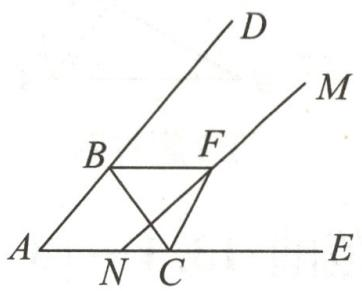

text_image

Geometric diagram with labeled points and intersecting lines, likely from a math problem or proof

第3题答图

由(1)可知 $\angle BFC=90^{\circ}-\frac{1}{2}\angle A,\angle MFB=\alpha,\angle NFC=\beta.$

$$
\because \angle B F N + \angle N F C = \angle B F C, \therefore \angle B F N = 9 0 ^ {\circ} - \frac {1}{2} \angle A - \beta .
$$

$$
\because \angle B F N + \angle M F B = 1 8 0 ^ {\circ}, \therefore 9 0 ^ {\circ} - \frac {1}{2} \angle A - \beta + \alpha = 1 8 0 ^ {\circ},
$$

$$
\therefore \alpha - \beta - \frac {1}{2} \angle A = 9 0 ^ {\circ}.
$$

4. B

5. 解: (1) ∵ CE 平分 ∠BCD, AE 平分 ∠BAD,

$$
\therefore \angle E C D = \angle E C B = \frac {1}{2} \angle B C D, \angle E A D = \angle E A B =
$$

$$
\frac {1}{2} \angle B A D.
$$

$$
\because \angle D + \angle E C D = \angle E + \angle E A D, \angle B + \angle E A B = \angle E
$$

$$
+ \angle E C B,
$$

$$
\therefore \angle D + \angle E C D + \angle B + \angle E A B = \angle E + \angle E A D + \angle E +
$$

$$
\angle E C B, \therefore \angle D + \angle B = 2 \angle E, \therefore \angle E = \frac {1}{2} (\angle D + \angle B).
$$

$$
\because \angle D = 4 0 ^ {\circ}, \angle B = 3 0 ^ {\circ},
$$

$$
\therefore \angle E = \frac {1}{2} \times (4 0 ^ {\circ} + 3 0 ^ {\circ}) = 3 5 ^ {\circ}.
$$

(2)由(1)同理易得, $\angle E=\frac{1}{2}(\angle D+\angle B)$ ,

$$
\because \angle D = m ^ {\circ}, \angle B = n ^ {\circ}, \therefore \angle E = \frac {m ^ {\circ} + n ^ {\circ}}{2}.
$$

(3) 存在. $\angle E = \frac{\angle B - \angle D}{2}$ .

证明如下:延长 BC 交 AD 于点 F,如答图.

$$
\because \angle B F D = \angle B + \angle B A D,
$$

$$
\therefore \angle B C D = \angle B F D + \angle D = \angle B + \angle B A D + \angle D.
$$

∵CE平分∠BCD,AE平分∠BAD,∴∠ECD=∠ECB=

$$
\frac {1}{2} \angle B C D, \angle E A D = \angle E A B = \frac {1}{2} \angle B A D.
$$

$$
\because \angle E + \angle E C B = \angle B + \angle E A B,
$$

$$
\therefore \angle E = \angle B + \angle E A B - \angle E C B = \angle B + \angle E A B -
$$

$$
\frac {1}{2} \angle B C D = \angle B + \angle E A B - \frac {1}{2} (\angle B + \angle B A D + \angle D) =
$$

$\frac{1}{2} (\angle B - \angle D)$ ，即 $\angle E = \frac{\angle B - \angle D}{2}$

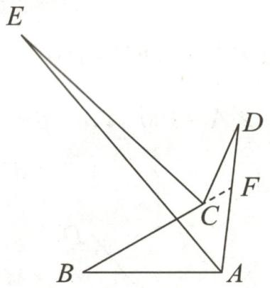

text_image

Geometric diagram with labeled points A, B, C, D, E, F and intersecting lines forming triangles and a quadrilateral

第5题答图

# 周练 1(测试范围:13.1\~13.2)

1. B 2. A 3. C 4. $10^{\circ}$ 5. 6 6. 201 7. $40^{\circ}$

8.(1)证明:∵AD平分∠BAC,∴∠BAD=∠CAD.

$$
\because \angle E A D = \angle E D A, \therefore \angle E D A = \angle C A D, \therefore D E / / A C.
$$

(2) 解: $\because EF \perp BD, \therefore \angle EFD = 90^\circ$ ,

$$
\therefore \angle E D F = 1 8 0 ^ {\circ} - \angle D E F - \angle E F D = 5 0 ^ {\circ},
$$

$$
\therefore \angle B E D = 1 8 0 ^ {\circ} - \angle B - \angle B D E = 9 5 ^ {\circ}.
$$

$$
\because D E \parallel A C, \therefore \angle B A C = \angle B E D = 9 5 ^ {\circ}.
$$

9.(1)150

(2) 解: $\because \angle X = 90^{\circ}, \therefore \angle XBC + \angle XCB = 90^{\circ}$ ,

$$
\therefore \angle A B X + \angle A C X = 1 5 0 ^ {\circ} - 9 0 ^ {\circ} = 6 0 ^ {\circ}.
$$

10.【初步探索】

(1)55 (2) $\left(90-\frac{1}{2}m\right)$

# 【变式拓展】

(1)①75 ② $90^{\circ}-\frac{1}{2}\beta+\frac{1}{2}\alpha$

(2) 解: 设 CF 交 DE 于点 G.

∵ BO, CO 分别平分 ∠ABC, ∠ACB,

$$
\therefore \angle O B C = \frac {1}{2} \angle A B C, \angle O C B = \frac {1}{2} \angle A C B.
$$

$$
\because \angle C O D = \angle O B C + \angle O C B
$$

$$
= \frac {1}{2} \angle A B C + \frac {1}{2} \angle A C B
$$

$$
= \frac {1}{2} (\angle A B C + \angle A C B)
$$

$$
= \frac {1}{2} (1 8 0 ^ {\circ} - \angle A)
$$

$$
= 9 0 ^ {\circ} - \frac {1}{2} \angle A,
$$

$$
\therefore \angle A = 1 8 0 ^ {\circ} - 2 \angle C O D.
$$

∵EF平分∠AED,∴∠FEG= $\frac{1}{2}$ ∠AED.

$$
\because \angle F = 1 8 0 ^ {\circ} - \angle F E G - \angle F G E, \angle F G E = \angle D G C,
$$

$$
\angle D G C = \angle A D E - \angle A C G = \angle A D E - \frac {1}{2} \angle A C B,
$$

$$
\therefore \angle F = 1 8 0 ^ {\circ} - \frac {1}{2} \angle A E D - \angle A D E + \frac {1}{2} \angle A C B
$$

$$
= 1 8 0 ^ {\circ} - \frac {1}{2} (1 8 0 ^ {\circ} - \angle A - \angle A D E) - \angle A D E + \frac {1}{2} \angle A C B
$$

$$
= 9 0 ^ {\circ} + \frac {1}{2} \angle A - \frac {1}{2} \angle A D E + \frac {1}{2} \angle A C B
$$

$$
= 9 0 ^ {\circ} + \frac {1}{2} (1 8 0 ^ {\circ} - 2 \angle C O D) - \frac {1}{2} \alpha + \frac {1}{2} \beta
$$

$$
= 1 8 0 ^ {\circ} - \angle C O D - \frac {1}{2} \alpha + \frac {1}{2} \beta .
$$

# 专题 2 求角常用的数学思想方法

1. 解: 在 $\triangle ABC$ 中, $\angle A : \angle ABC : \angle ACB = 3 : 4 : 5$ ,

故设 $\angle A=3x,\angle ABC=4x,\angle ACB=5x.$

在 $\triangle ABC$ 中， $\angle A+\angle ABC+\angle ACB=180^{\circ}$

$$
\therefore 3 x + 4 x + 5 x = 1 8 0 ^ {\circ},
$$

解得 $x=15^{\circ},\therefore\angle A=3x=45^{\circ}.$

∵BD,CE分别是边AC,AB上的高,

$$
\therefore \angle A D B = 9 0 ^ {\circ}, \angle B E C = 9 0 ^ {\circ},
$$

∴在 $\triangle ABD$ 中， $\angle ABD=180^{\circ}-\angle ADB-\angle A=180^{\circ}-$

$$
9 0 ^ {\circ} - 4 5 ^ {\circ} = 4 5 ^ {\circ},
$$

$$
\therefore \angle B H C = \angle A B D + \angle B E C = 4 5 ^ {\circ} + 9 0 ^ {\circ} = 1 3 5 ^ {\circ}.
$$

2. 解: 设 $\angle EDC = x$ .

由三角形的外角性质得, $\angle ADE + x = \angle B + \angle BAD$ ,

$$
\angle A E D = \angle C + x.
$$

$$
\because A E = A D, \therefore \angle A D E = \angle A E D,
$$

$$
\therefore \angle C + x + x = \angle B + \angle B A D.
$$

$$
\because \angle B = \angle C,
$$

∴ $x=\frac{1}{2}\angle BAD=\frac{1}{2}\times30^{\circ}=15^{\circ}$ ，即 $\angle EDC=15^{\circ}$ .

3. 解: (1) 如答图, 连接 CD.

在 $\triangle ACD$ 中,根据三角形内角和定理,得出 $\angle A+\angle2+\angle3+\angle ACE+\angle ADB=180^{\circ}$ .

$$
\begin{array}{l} \because \angle 1 = \angle B + \angle E = \angle 2 + \angle 3, \\ \therefore \angle A + \angle B + \angle A C E + \angle A D B + \angle E \\ = \angle A + \angle B + \angle E + \angle A C E + \angle A D B \\ = \angle A + \angle 2 + \angle 3 + \angle A C E + \angle A D B = 1 8 0 ^ {\circ}. \\ \end{array}
$$

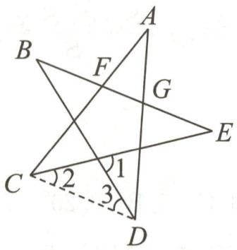

text_image

A
B
F
G
E
C
2
1
3
D

第3题答图

(2)无变化. 理由:

根据平角的定义,得出 $\angle BAC+\angle CAD+\angle DAE=180^{\circ}$ .

$$
\because \angle B A C = \angle C + \angle E, \angle E A D = \angle B + \angle D,
$$

$$
\begin{array}{r l} & {\therefore \angle C A D + \angle B + \angle C + \angle D + \angle E = \angle B A C + \angle C A D +} \\ & {\angle E A D = 1 8 0 ^ {\circ}.} \end{array}
$$

(3)无变化. 理由:

$$
\because \angle A C B = \angle C A D + \angle D, \angle E C D = \angle B + \angle E,
$$

$$
\begin{array}{l} {\therefore \angle C A D + \angle B + \angle A C E + \angle D + \angle E = \angle A C B +} \\ {\angle A C E + \angle E C D = 1 8 0 ^ {\circ}.} \end{array}
$$

4. $240^{\circ}$

5.(1) $2\angle A=\angle A^{\prime}DC+\angle A^{\prime}EB$

(2) $2\angle A=\angle A^{\prime}DC-\angle A^{\prime}EB$

(3)解:如答图①,延长 BA,CD 交于点 Q,延长 $ED'$ , $FA'$ 交于点 $Q'$ , ∴折叠后的 $\triangle EFQ$ 与 $\triangle EFQ'$ 重合.

由(2)的结论可得: $2\angle Q=\angle D^{\prime}EC-\angle A^{\prime}FB$ ,而 $\angle D^{\prime}EC=115^{\circ},\angle A^{\prime}FB=45^{\circ}$ ,

$$
\therefore 2 \angle Q = 1 1 5 ^ {\circ} - 4 5 ^ {\circ} = 7 0 ^ {\circ}, \therefore \angle Q = 3 5 ^ {\circ}.
$$

$$
\because \angle C = 9 0 ^ {\circ}, \therefore \angle B = 9 0 ^ {\circ} - 3 5 ^ {\circ} = 5 5 ^ {\circ}.
$$

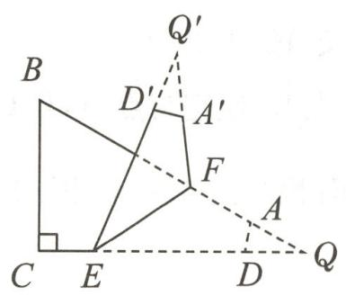

text_image

B
D'
Q'
A'
F
A
C
E
D
Q

①

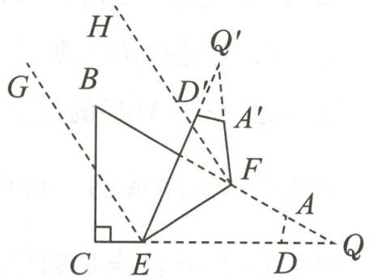

text_image

H
G
B
D'
Q'
A'
F
A
C
E
D
Q

②   
第5题答图

(4) 解: $EG \parallel FH$ , 不会改变. 理由:

如答图②,EG平分∠D'EC,FH平分∠A'FB,

$$
\therefore \angle D ^ {\prime} E G = \angle C E G = \frac {1}{2} \angle D ^ {\prime} E C, \angle A ^ {\prime} F H = \angle B F H =
$$

$$
\frac {1}{2} \angle A ^ {\prime} F B.
$$

由折叠可得: $\angle Q^{\prime}EF=\angle QEF,\angle Q^{\prime}FE=\angle QFE.$

由(2)的结论可得: $\angle D^{\prime}EC-\angle A^{\prime}FB=2\angle Q,$

即 $\angle D^{\prime}EC=\angle A^{\prime}FB+2\angle Q,\therefore\angle D^{\prime}EG=\angle A^{\prime}FH+\angle Q,$

$$
\therefore \angle D ^ {\prime} E G + \angle D ^ {\prime} E F + \angle B F E + \angle B F H = \angle A ^ {\prime} F H +
$$

$$
\angle Q + \angle Q E F + \angle B F H + \angle B F E,
$$

$$
\therefore \angle F E G + \angle H F E = \angle Q + \angle Q E F + \angle Q ^ {\prime} F E,
$$

$$
\therefore \angle F E G + \angle H F E = \angle Q + \angle Q E F + \angle Q F E = 1 8 0 ^ {\circ},
$$

$$
\therefore E G \parallel F H.
$$

6.(1)解：∵ $\angle BAC = 180^{\circ} - \angle B - \angle C, \angle BAE =$

$$
\frac {1}{2} \angle B A C, \angle B A D = 9 0 ^ {\circ} - \angle B,
$$

$$
\therefore \angle E A D = \angle B A D - \angle B A E = 9 0 ^ {\circ} - \angle B - \frac {1}{2} (1 8 0 ^ {\circ} -
$$

$$
\angle B - \angle C) = 9 0 ^ {\circ} - \angle B - 9 0 ^ {\circ} + \frac {1}{2} \angle B + \frac {1}{2} \angle C =
$$

$$
\frac {1}{2} (\angle C - \angle B), \therefore \angle E A D = \frac {1}{2} (\angle C - \angle B).
$$

(2)解:如答图,过点A作 $AG\perp BC$ 于点G.

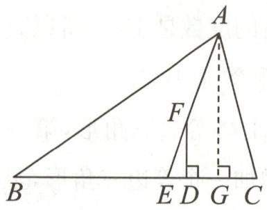

text_image

A
F
B
E D G C

第6题答图

$$
\because F D \perp B C, A G \perp B C,
$$

$$
\therefore F D \parallel A G, \therefore \angle D F E = \angle E A G.
$$

$$
\because \angle B = 3 5 ^ {\circ}, \angle C = 7 5 ^ {\circ},
$$

由(1)同理可得: $\angle EAG = \frac{1}{2} (\angle C - \angle B) = \frac{1}{2} (75^{\circ} - 35^{\circ}) = 20^{\circ}$ ,

$$
\therefore \angle D F E = \angle E A G = 2 0 ^ {\circ}.
$$

(3)32

(4) $\frac{1}{4}(3y-x)$

# 专题 3 综合与实践

1. 解: (1) 因为三角形的内角和为 $180^{\circ}$ ，在 $\triangle ABC$ 中， $\angle C = 90^{\circ}$ ，所以 $\angle A + \angle B = 180^{\circ} - 90^{\circ} = 90^{\circ}$ .

把 $\angle A=2\angle B$ 代入 $\angle A+\angle B=90^{\circ}$ ,得 $2\angle B+\angle B=90^{\circ}$ ,即 $3\angle B=90^{\circ}$ ,解得 $\angle B=30^{\circ}$ ,则 $\angle A=2\angle B=2\times30^{\circ}=60^{\circ}$ .

(2)小王的结论不合理.他只测量了20个直角三角形,而三角形包含多种类型,数量是无限的.他考察的只是有限个三角形,不能代表所有三角形,仅通过这些测量得出所有三角形的内角和都是 $180^{\circ}$ 的结论缺乏说服力.

(3)如答图,画△ABC,过点A作直线EF//BC.

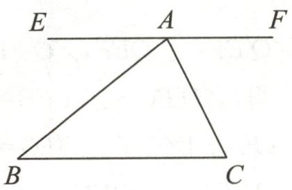

text_image

E A F
B C

第1题答图

证明:已知: $\triangle ABC.$

求证: $\angle BAC+\angle B+\angle C=180^{\circ}$ .

证明: 因为 $EF \parallel BC$ , 根据两直线平行, 内错角相等,

所以 $\angle B = \angle EAB, \angle C = \angle FAC.$

又因为 $\angle EAB+\angle BAC+\angle FAC=180^{\circ}$ (平角定义), 所以 $\angle BAC+\angle B+\angle C=180^{\circ}$ , 即三角形的内角和为 $180^{\circ}$ .

(4)剪拼法(方法不唯一)

操作过程:①任意剪出一个三角形,比如 $\triangle ABC$ ;

②把三角形的三个角 $\angle A,\angle B,\angle C$ 分别剪下来；

③将这三个角的顶点拼在一起,可以发现能够拼成一个平角.

原理: 因为平角的度数是 $180^{\circ}$ ，所以直观地表明了三角形的三个内角之和等于 $180^{\circ}$ .

2. 解: (1) 在平面上搭等边三角形, 第一个三角形用 3 根磁力棒, 之后每增加一个等边三角形, 至少需要增加 2 根磁力棒(与前一个三角形共用一条边).

搭 n 个平面等边三角形时, 第一个三角形用 3 根, 后面 $(n-1)$ 个三角形每个用 2 根, 则至少共需要 $3+2(n-1)=2n+1$ 根磁力棒.

(2)最多能得到10个等边三角形.

搭建思路:先用6根磁力棒搭一个正四面体,得到4个等边三角形;再用另外3根磁力棒在这个正四面体的基础上,以正四面体的其中一个面为公共面,再搭一个正四面体.这样两个正四面体共有 $4+4-1=7$ 个面;再用剩余3根磁力棒以其中一个面为公共面,再搭一个正四面体,总共能得到 $7+3=10$ 个等边三角形.

3. 解: 任务一:

(1)方案:取一条质地均匀的线段,用细线将线段悬挂起来,轻轻转动线段,当线段静止时,标记出细线与线段的交点A;再换一个位置悬挂线段,重复上述操作,得到交点B.线段AB的中点就是该线段的重心.

原理:根据二力平衡,当线段静止时,重力和细线的拉力在同一条直线上,两次悬挂确定的两条竖直线的交点(即线段的中点)就是重力的等效作用点,也就是重心.

(2)因为挖去的小平行四边形在大平行四边形的内部,且两者都是匀质的,剩余部分薄板的重心会向与挖去部分

相对的方向移动. 由于挖去部分在大平行四边形内的位置不同, 剩余部分薄板的重心移动的具体方向和距离也有所不同, 但总体趋势是向未挖去部分的方向偏移.

任务二：

(1)长方形的重心是两条对角线的交点;等腰直角三角形的重心是三条中线的交点(重心在三角形内部,大约在距离直角顶点 $\frac{2}{3}$ 的直角边中线长度处).

(2) $x = \frac{S_1x_1 + S_2x_2}{S},y = \frac{S_1y_1 + S_2y_2}{S}.$

# 章末复习课

1. C  2. A  3. B  4. C  5. B  6. $20^{\circ}$ 7. 285  8. $118^{\circ}$

9. 解: (1) $\because AD \perp BC, \therefore \angle ADC = 90^{\circ},$

∴△ADC 是直角三角形.

$$
\because \angle D A C = 3 0 ^ {\circ}, \therefore \angle C = 9 0 ^ {\circ} - \angle D A C = 6 0 ^ {\circ}.
$$

$$
\because \angle B A C = 8 0 ^ {\circ}, \therefore \angle A B C = 1 8 0 ^ {\circ} - \angle B A C - \angle C = 4 0 ^ {\circ}.
$$

∵BE是∠ABC的平分线，∴ $\angle EBC=\frac{1}{2}\angle ABC=20^{\circ}$

(2) $\because\angle BAC=80^{\circ},\angle DAC=30^{\circ},$

$$
\therefore \angle B A D = \angle B A C - \angle D A C = 5 0 ^ {\circ}.
$$

由(1)可知 $\angle EBC=20^{\circ}$ ,

∵BE是∠ABC的平分线，∴∠ABO=∠EBC=20°，

在 $\triangle AOB$ 中， $\angle AOB=180^{\circ}-\angle BAO-\angle ABO=110^{\circ}$ .

10. 解: (1) 如答图①, 点 P 即为所求.

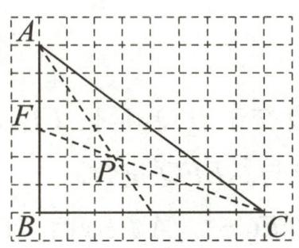

text_image

A
F
P
B
C

①

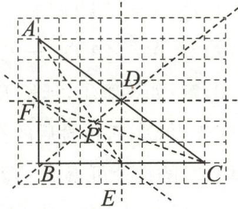

text_image

A
F
P
B
C
D
E

②   
第10题答图

(2)如答图②,找到 AB, BC 的中点 F, E, 连接 AE, CF 交于点 P, 连接 BP, 延长 BP 交 AC 于点 D.

依题意,在 $\triangle ABC$ 的边上找一点 $D$ ,使它与点 $A,B,C$ 中的任意两点组成的三角形的面积是 $\triangle ABC$ 面积的 $\frac{1}{2}$ ,则点 $D,E,F$ 均满足题意.

11. 解: $\because CE$ 平分 $\angle ACD$ ,

$$
\therefore \angle A C E = \frac {1}{2} \angle A C D = \frac {1}{2} \times 1 0 0 ^ {\circ} = 5 0 ^ {\circ}.
$$

$$
\because F G \parallel C E, \therefore \angle A F G = \angle A C E = 5 0 ^ {\circ}.
$$

在 $\triangle AFG$ 中， $\angle BAC=\angle AFG+\angle AGF=50^{\circ}+20^{\circ}=70^{\circ}$

又 $\angle ACB = 180^{\circ} - \angle ACD = 180^{\circ} - 100^{\circ} = 80^{\circ}$

$$
\therefore \angle B = 1 8 0 ^ {\circ} - \angle B A C - \angle A C B = 1 8 0 ^ {\circ} - 7 0 ^ {\circ} - 8 0 ^ {\circ} = 3 0 ^ {\circ}.
$$

12.(1)124 62

(2)解:①当点Q在BC的右侧时,如答图①.

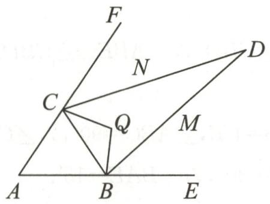

text_image

F
N
C
Q
M
A
B
E
D

第 12 题答图①

$$
\because \angle A C Q + \angle A B Q = 3 6 0 ^ {\circ} - (\angle E A F + \angle C Q B) = 3 6 0 ^ {\circ}
$$

$$
- (5 6 ^ {\circ} + 1 0 4 ^ {\circ}) = 2 0 0 ^ {\circ},
$$

$$
\therefore \angle F C Q + \angle Q B E = 3 6 0 ^ {\circ} - (\angle A C Q + \angle A B Q) = 1 6 0 ^ {\circ}.
$$

∵BM,CN分别平分∠QBE,∠QCF,

$$
\therefore \angle D C Q + \angle Q B D = \frac {1}{2} (\angle F C Q + \angle Q B E) = 8 0 ^ {\circ}.
$$

$$
\because \angle Q C B + \angle C B Q = 1 8 0 ^ {\circ} - \angle C Q B = 7 6 ^ {\circ},
$$

$$
\therefore \angle D C B + \angle D B C = 8 0 ^ {\circ} + 7 6 ^ {\circ} = 1 5 6 ^ {\circ},
$$

$$
\therefore \angle B D C = 1 8 0 ^ {\circ} - (\angle D C B + \angle D B C) = 1 8 0 ^ {\circ} - 1 5 6 ^ {\circ} = 2 4 ^ {\circ}.
$$

②当点 Q 在 BC 的左侧时, 如答图②.

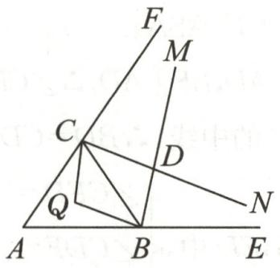

text_image

Geometric diagram with labeled points and lines, including triangle ABC and intersecting segments

第 12 题答图②

$$
\because \angle A C B + \angle A B C = 1 8 0 ^ {\circ} - \angle E A F = 1 2 4 ^ {\circ},
$$

$$
\therefore \angle A C Q + \angle A B Q = 1 2 4 ^ {\circ} - 7 6 ^ {\circ} = 4 8 ^ {\circ},
$$

$$
\therefore \angle F C Q + \angle Q B E = 3 6 0 ^ {\circ} - 4 8 ^ {\circ} = 3 1 2 ^ {\circ},
$$

$$
\therefore \angle D C Q + \angle Q B D = \frac {1}{2} (\angle F C Q + \angle Q B E) = 1 5 6 ^ {\circ},
$$

$$
\therefore \angle B D C = 3 6 0 ^ {\circ} - 1 5 6 ^ {\circ} - 1 0 4 ^ {\circ} = 1 0 0 ^ {\circ}.
$$

综上所述， $\angle BDC$ 的度数为 $24^{\circ}$ 或 $100^{\circ}$ .

(3)解: $\angle AOG-\frac{1}{2}\angle ACG=45^{\circ}$ . 理由如下:如答图③.

∵AO,GO分别是∠FAE和∠CGH的平分线，

$$
\therefore \angle C A O = \frac {1}{2} \angle E A F, \angle C G O = \frac {1}{2} \angle C G H.
$$

$$
\because \angle 1 = \angle C A O + \angle A C G = \angle C G O + \angle A O G,
$$

$$
\therefore \frac {1}{2} \angle E A F + \angle A C G = \frac {1}{2} \angle C G H + \angle A O G,
$$

即 $\angle AOG - \angle ACG = \frac{1}{2} (\angle EAF - \angle CGH)$

$$
\because \angle A B C = \angle G B H,
$$

$$
\therefore \angle E A F = 1 8 0 ^ {\circ} - \angle A C G - \angle A B C = 1 8 0 ^ {\circ} - \angle A C G -
$$

$$
\angle G B H, \angle C G H = 9 0 ^ {\circ} - \angle G B H,
$$

$$
\therefore \angle A O G - \angle A C G = \frac {1}{2} (9 0 ^ {\circ} - \angle A C G),
$$

$$
\therefore \angle A O G - \frac {1}{2} \angle A C G = 4 5 ^ {\circ}.
$$

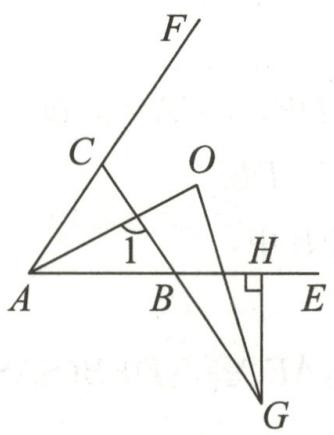

text_image

F
C
O
1
A
B
H
E
G

第 12 题答图③

# 第十四章 全等三角形

# 作业 7 全等三角形及其性质

1.C 2.3 3.87

4. 解: (1) ∵ △ABF ≌ △CDE, ∠B = 30°, ∴ ∠D = ∠B = 30°.

$$
\because \angle D C F = 4 0 ^ {\circ}, \therefore \angle E F C = \angle D C F + \angle D = 4 0 ^ {\circ} + 3 0 ^ {\circ} = 7 0 ^ {\circ}.
$$

(2) $\because \triangle ABF \cong \triangle CDE, \therefore BF = DE,$

$\therefore BF - EF = DE - EF$ ，即 $BE = DF$

$$
\because B D = 1 0, E F = 2, \therefore B E = (1 0 - 2) \div 2 = 4,
$$

$$
\therefore B F = B E + E F = 6.
$$

5. D 6.48 7. (6, -4)

8. 解: (1) ∵ △ADF ≌ △BCE, ∠F = 28°, ∴ ∠E = ∠F = 28°.

$$
\because \angle B = 3 2 ^ {\circ}, \therefore \angle 1 = \angle B + \angle E = 3 2 ^ {\circ} + 2 8 ^ {\circ} = 6 0 ^ {\circ}.
$$

(2) $\because\triangle ADF\cong\triangle BCE,BC=5\ cm,\therefore AD=BC=5\ cm.$

$$
\text { 又 } C D = 1 \mathrm{cm}, \therefore A C = A D + C D = 6 \mathrm{cm}.
$$

9.(1)证明：∵△BAD≌△ACE，∴BD=AE,AD=CE,

$$
\therefore B D = A E = A D + D E = C E + D E.
$$

(2) 解: 当 $\angle BAC = 90^{\circ}$ 时, $BD \parallel CE$ . 理由如下:

$$
\because \angle B A C = 9 0 ^ {\circ}, \therefore \angle B A E + \angle C A E = 9 0 ^ {\circ}.
$$

$$
\because \triangle B A D \cong \triangle A C E, \therefore \angle A B D = \angle C A E, \angle A D B = \angle A E C,
$$

$$
\therefore \angle A B D + \angle B A D = 9 0 ^ {\circ}, \therefore \angle A D B = 9 0 ^ {\circ},
$$

$$
\therefore \angle B D E = 9 0 ^ {\circ}, \angle A E C = \angle A D B = 9 0 ^ {\circ},
$$

$$
\therefore \angle B D E = \angle A E C, \therefore B D \parallel C E.
$$

# 作业 8 三角形全等的判定(一)

1. C 
2. B 
3. 9

4. 证明: 在 $\triangle ABC$ 中, $\angle B=50^{\circ}, \angle C=20^{\circ}$ ,

$$
\therefore \angle C A B = 1 8 0 ^ {\circ} - \angle B - \angle C = 1 1 0 ^ {\circ}.
$$

$$
\because A E \perp B C, \therefore \angle A E C = 9 0 ^ {\circ},
$$

$$
\therefore \angle D A F = \angle A E C + \angle C = 1 1 0 ^ {\circ}, \therefore \angle D A F = \angle C A B.
$$

在 $\triangle DAF$ 和 $\triangle CAB$ 中，

$$
\begin{array}{l} \left\{ \begin{array}{l} A D = A C, \\ \angle D A F = \angle C A B, \therefore \triangle D A F \cong \triangle C A B (\mathrm{SAS}). \\ A F = A B, \end{array} \right. \\ \therefore D F = C B. \\ \end{array}
$$

5. A

6.(1)证明:∵AE∥DF,∴∠A=∠D.

$$
\because A B = C D, \therefore A C = D B.
$$

在 $\triangle AEC$ 和 $\triangle DFB$ 中，

$$
\left\{ \begin{array}{l} A E = D F, \\ \angle A = \angle D, \therefore \triangle A E C \cong \triangle D F B (\mathrm{SAS}). \\ A C = D B, \end{array} \right.
$$

(2) 解: 如答图, 在 $\triangle AEC$ 中, 以 AC 为底作高 EH,

$$
\therefore S _ {\triangle A E C} = \frac {1}{2} E H \cdot A C, S _ {\triangle B C E} = \frac {1}{2} E H \cdot B C.
$$

$$
\because A B = C D = \frac {1}{3} B C, \therefore A C = \frac {4}{3} B C.
$$

又 $S_{\triangle AEC} = 6, \therefore S_{\triangle BEC} = \frac{3}{4} S_{\triangle AEC} = 4.5.$

$$
\because \triangle A E C \cong \triangle D F B, \therefore \angle A C E = \angle D B F, E C = F B.
$$

在 $\triangle BEC$ 和 $\triangle CFB$ 中，

$$
\left\{ \begin{array}{l} E C = F B, \\ \angle B C E = \angle C B F, \therefore \triangle B E C \cong \triangle C F B (\mathrm{SAS}), \\ B C = C B, \end{array} \right.
$$

$$
\therefore S _ {\triangle B E C} = S _ {\triangle C F B}, \therefore S _ {\text {四边形} B E C F} = 2 S _ {\triangle B E C} = 9.
$$

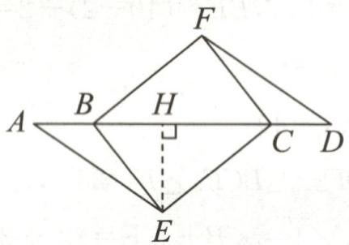

text_image

F
B H
A C D
E

第6题答图

7.(1)证明:∵△ABC、△ADE都是等腰直角三角形,

$$
\therefore A B = A C, A D = A E, \angle B A C = \angle D A E = 9 0 ^ {\circ},
$$

$$
\therefore \angle B A C - \angle D A C = \angle D A E - \angle D A C,
$$

即 $\angle BAD = \angle CAE.$

在 $\triangle BAD$ 和 $\triangle CAE$ 中，

$$
\left\{ \begin{array}{l} A B = A C, \\ \angle B A D = \angle C A E, \therefore \triangle B A D \cong \triangle C A E (\mathrm{SAS}). \\ A D = A E, \end{array} \right.
$$

(2) 解: $BF \perp CE$ . 理由如下: 如答图.

$$
\because \triangle B A D \cong \triangle C A E, \therefore \angle A B D = \angle A C E,
$$

$$
\therefore \angle D B C + \angle B C F = \angle D B C + \angle A C B + \angle A B D = 4 5 ^ {\circ} +
$$

$$
4 5 ^ {\circ} = 9 0 ^ {\circ}, \therefore \angle B F C = 9 0 ^ {\circ}, \therefore B F \perp C E.
$$

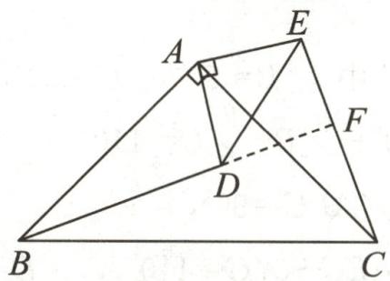

text_image

Geometric diagram of triangle ABC with points D, E, F and perpendicular line from A to AB at D

第7题答图

8.(1)证明：∵∠ABC=90°,D为AB的延长线上一点，

$$
\therefore \angle A B E = \angle C B D = 9 0 ^ {\circ}.
$$

在 $\triangle ABE$ 和 $\triangle CBD$ 中，

$$
\left\{ \begin{array}{l} A B = C B, \\ \angle A B E = \angle C B D, \therefore \triangle A B E \cong \triangle C B D. \\ B E = B D, \end{array} \right.
$$

(2) 解: $\because AB=CB, \angle ABC=90^{\circ}, \therefore \angle CAB=45^{\circ}$ ,

又∵∠CAE=30°,∴∠BAE=15°.

由(1)知 $\triangle ABE\cong\triangle CBD,\therefore\angle BCD=\angle BAE=15^{\circ}$ ,

$$
\therefore \angle B D C = 9 0 ^ {\circ} - 1 5 ^ {\circ} = 7 5 ^ {\circ},
$$

又∵BE=BD,∠DBE=90°,∴∠BDE=45°,

$$
\therefore \angle E D C = 7 5 ^ {\circ} - 4 5 ^ {\circ} = 3 0 ^ {\circ}.
$$

# 作业 9 三角形全等的判定(二)

1. D 2.3 3. $\angle B = \angle C$ (答案不唯一)

4. 证明：∵ AB∥CD，∴ ∠ABE=∠CDF.

$$
\because A E \parallel C F, \therefore \angle A E B = \angle C F D.
$$

在 $\triangle ABE$ 和 $\triangle CDF$ 中， $\left\{\begin{aligned}\angle ABE&=\angle CDF,\\ BE&=DF,\\ \angle AEB&=\angle CFD,\end{aligned}\right.$

$$
\therefore \triangle A B E \cong \triangle C D F (\mathrm{ASA}).
$$

5.(1)证明：∵CF⊥AD,BE⊥AD,∴∠CFD=∠BED=90°.

∵AD是△ABC的中线，∴BD=CD.

在 $\triangle CFD$ 和 $\triangle BED$ 中， $\left\{\begin{aligned}\angle CFD&=\angle BED,\\ \angle CDF&=\angle BDE,\\ CD&=BD,\end{aligned}\right.$

$$
\therefore \triangle C F D \cong \triangle B E D (\text { AAS }), \therefore C F = B E.
$$

(2) 解: $\because S_{\triangle ACF}=28, S_{\triangle CFD}=12,$

$$
\therefore S _ {\triangle A C D} = S _ {\triangle A C F} + S _ {\triangle C F D} = 4 0.
$$

$$
\because B D = C D, \therefore S _ {\triangle A B D} = S _ {\triangle A C D} = 4 0.
$$

由(1)得: $\triangle CFD\cong\triangle BED,\therefore S_{\triangle CFD}=S_{\triangle BED}=12,$

$$
\therefore S _ {\triangle A B E} = S _ {\triangle A B D} + S _ {\triangle B E D} = 4 0 + 1 2 = 5 2.
$$

6.(1,4)

7. 解: (1) 选择①: ∵ AB // ED, AC // FD,

$$
\therefore \angle B = \angle E, \angle A C B = \angle D F E.
$$

$$
\because A B = D E, \therefore \triangle A C B \cong \triangle D F E (\text { A   A   S }), \therefore A C = D F.
$$

$$
\because A C \parallel D F, \therefore \angle O A C = \angle O D F, \angle O F D = \angle O C A,
$$

$\therefore\triangle OAC\cong\triangle ODF(ASA),\therefore OF=OC,$ 即 AD 平分 CF.

选择②:∵AC∥FD,

$$
\therefore \angle O A C = \angle O D F, \angle O C A = \angle O F D.
$$

$$
\because A C = D F, \therefore \triangle O A C \cong \triangle O D F (\text { ASA }),
$$

$\therefore OF=OC,$ 即 AD 平分 CF.

选择③:∵AB∥ED,AC∥FD,

$$
\therefore \angle B = \angle E, \angle A C B = \angle D F E.
$$

$\because BF=EC,\therefore BF+CF=EC+CF,$ 即 BC=EF,

$$
\begin{array}{l} \therefore \triangle A C B \cong \triangle D F E (\mathrm{ASA}), \therefore A C = D F. \\ \because A C \parallel D F, \therefore \angle O A C = \angle O D F, \angle O F D = \angle O C A, \\ \therefore \triangle O A C \cong \triangle O D F (\mathrm{ASA}), \therefore O F = O C, \text {即} A D \text {平分} C F. \\ \end{array}
$$

(2)(1)中的结论仍然成立.证明如下：

$$
\because A B \parallel E D, A C \parallel F D, \therefore \angle B = \angle E, \angle A C F = \angle D F C,
$$

$$
\therefore 1 8 0 ^ {\circ} - \angle A C F = 1 8 0 ^ {\circ} - \angle D F C, \text { 即 } \angle A C B = \angle D F E.
$$

$$
\because B F = E C, \therefore B F - C F = E C - C F \text {, 即} B C = E F,
$$

$$
\therefore \triangle A C B \cong \triangle D F E (\mathrm{ASA}), \therefore A C = D F.
$$

$$
\because A C \parallel D F, \therefore \angle O A C = \angle O D F, \angle O F D = \angle O C A,
$$

$$
\therefore \triangle O A C \cong \triangle O D F (\mathrm{ASA}), \therefore O C = O F, \text {即} A D \text {平分} C F.
$$

8.(1)证明:∵∠EDF+∠FDC=∠B+∠BED,∠EDF=∠B,

$$
\therefore \angle F D C = \angle B E D.
$$

在 $\triangle EBD$ 和 $\triangle DCF$ 中， $\left\{\begin{aligned}\angle B&=\angle C,\\ BE&=CD,\\ \angle BED&=\angle CDF,\end{aligned}\right.$

$$
\therefore \triangle E B D \cong \triangle D C F (\mathrm{ASA}), \therefore D E = D F.
$$

(2) 解: $\because AB = BC, \therefore AF + BF = BD + DC.$

$$
\because A F = 2 B D, \therefore 2 B D + B F = B D + D C,
$$

$$
\therefore B D + B F = D C.
$$

在 CD 上截取 DM=BF，连接 EM.

$$
\because \angle B = 4 5 ^ {\circ}, \angle E D F = 4 5 ^ {\circ},
$$

同(1)可得: $\angle BFD=\angle EDM.$

$$
\because D F = D E, \therefore \triangle B D F \cong \triangle M E D (\mathrm{SAS}),
$$

$$
\therefore B D = M E, M D = B F, \angle B = \angle D M E = 4 5 ^ {\circ}.
$$

$$
\because C D = B D + B F = D M + C M, \therefore C M = B D,
$$

$$
\therefore E M = C M, \therefore \angle M C E = \angle M E C.
$$

$$
\because \angle E M D = 4 5 ^ {\circ}, \therefore \angle E C D = \angle M E C = 2 2. 5 ^ {\circ}.
$$

# 作业 10 三角形全等的判定(三)

1. A 2. C 3. C

4. AF=CE(答案不唯一). 5.70°

6. 证明: $\because AD = BE, \therefore AB = DE$ .

在 $\triangle ACB$ 和 $\triangle EFD$ 中， $\left\{\begin{aligned}AC&=EF,\\ BC&=DF,\\ AB&=ED,\end{aligned}\right.$

$$
\therefore \triangle A C B \cong \triangle E F D (\text { SSS }), \therefore \angle A B C = \angle E D F.
$$

7. SSS

8. 证明: 连接 BD.

在 $\triangle ABD$ 与 $\triangle CDB$ 中， $\left\{\begin{aligned}AD&=CB,\\ AB&=CD,\\ BD&=DB,\end{aligned}\right.$

$$
\therefore \triangle A B D \cong \triangle C D B (\text { SSS }), \therefore \angle A = \angle C.
$$

9.(1)证明:∵DE=BF,

∴DE-EF=BF-EF, 即 DF=BE.

在 $\triangle ABE$ 和 $\triangle CDF$ 中， $\left\{\begin{aligned}AB&=CD,\\ BE&=DF,\\ AE&=CF,\end{aligned}\right.$

$$
\therefore \triangle A B E \cong \triangle C D F (\mathrm{SSS}).
$$

(2) 解: $AE \parallel CF$ .

理由：∵△ABE≌△CDF，∴∠AEB=∠DFC.

$$
\because \angle A E B + \angle A E F = \angle D F C + \angle E F C = 1 8 0 ^ {\circ},
$$

$$
\therefore \angle A E F = \angle E F C, \therefore A E / / C F.
$$

10. 解: $AC \perp BC$ . 理由如下:

$$
\because A E = E F + B F, C E = B F, \therefore A E = E F + C E = C F.
$$

在 $\triangle ACE$ 和 $\triangle CBF$ 中， $\left\{\begin{aligned}AC&=CB,\\ AE&=CF,\\ CE&=BF,\end{aligned}\right.$

$$
\therefore \triangle A C E \cong \triangle C B F, \therefore \angle B C F = \angle C A E.
$$

$$
\because A E \perp C D, \therefore \angle A E C = 9 0 ^ {\circ}, \therefore \angle C A E + \angle A C E = 9 0 ^ {\circ},
$$

$$
\therefore \angle A C B = \angle B C F + \angle A C E = \angle C A E + \angle A C E = 9 0 ^ {\circ},
$$

$$
\therefore A C \perp B C.
$$

11. 解: 能. 连接 BD.

∵ 在 $\triangle ABD$ 和 $\triangle CDB$ 中, AB = CD, AD = CB, BD = DB, ∴ $\triangle ABD \cong \triangle CDB(SSS)$ , ∴ $\angle A = \angle C$ .

12. 证明: $\because AB = AC, AD = AE, BD = CE,$

$$
\therefore \triangle A B D \cong \triangle A C E (\text { S   S   S }), \therefore \angle B A D = \angle C A E, \angle C = \angle B.
$$

$$
\therefore \angle B A D - \angle C A D = \angle C A E - \angle C A D,
$$

即 $\angle CAB = \angle EAD,$

$$
\because \angle B O C = 1 8 0 ^ {\circ} - \angle C - \angle O F C = 1 8 0 ^ {\circ} - \angle B - \angle A F B =
$$

$$
\angle C A B, \therefore \angle C A B = \angle E A D = \angle B O C.
$$

# 专题 4 全等三角形的基本类型

1. A

2.(1)证明:∵AB∥DE,∴∠BAC=∠EDF.

在 $\triangle ABC$ 和 $\triangle DEF$ 中， $\left\{\begin{aligned}AC&=DF,\\ \angle BAC&=\angle EDF,\\ AB&=DE,\end{aligned}\right.$

$$
\therefore \triangle A B C \cong \triangle D E F (\mathrm{SAS}).
$$

(2) 解: 由(1) 可知, $\angle EDF = \angle A = 55^{\circ}$ .

$$
\because \angle E = 8 8 ^ {\circ},
$$

$$
\therefore \angle F = 1 8 0 ^ {\circ} - \angle E D F - \angle E = 3 7 ^ {\circ}.
$$

3. A

4.(1)证明:∵EB=EC,∴∠1=∠2,

在 $\triangle ABC$ 和 $\triangle DCB$ 中， $\left\{\begin{aligned}\angle A&=\angle D,\\ \angle 2&=\angle 1,\\ BC&=CB,\end{aligned}\right.$

$$
\therefore \triangle A B C \cong \triangle D C B (\mathrm{AAS}).
$$

(2) 解: $\because EB=EC, \therefore \angle1=\angle2=40^{\circ},$

$$
\therefore \angle C E D = \angle 1 + \angle 2 = 8 0 ^ {\circ},
$$

$$
\because C E = C D, \therefore \angle D = \angle C E D = 8 0 ^ {\circ},
$$

$$
\therefore \angle 3 = 1 8 0 ^ {\circ} - 8 0 ^ {\circ} - 8 0 ^ {\circ} = 2 0 ^ {\circ}.
$$

5. 证明: $\because \angle ACB + \angle ACF = \angle ACF + \angle AED = 180^{\circ}$ ,

$$
\therefore \angle A C B = \angle A E D.
$$

在 $\triangle ABC$ 和 $\triangle ADE$ 中， $\left\{\begin{aligned}BC&=DE,\\ \angle ACB&=\angle AED,\\ AC&=AE,\end{aligned}\right.$

$$
\therefore \triangle A B C \cong \triangle A D E (\mathrm{SAS}), \therefore A B = A D.
$$

6. 证明: $\because \angle BAD = \angle CAE$ ,

$$
\therefore \angle B A D + \angle D A C = \angle C A E + \angle D A C,
$$

即 $\angle BAC = \angle DAE$

在 $\triangle ABC$ 和 $\triangle ADE$ 中， $\left\{\begin{aligned}AB&=AD,\\ \angle BAC&=\angle DAE,\\ AC&=AE,\end{aligned}\right.$

$$
\therefore \triangle A B C \cong \triangle A D E (\mathrm{SAS}).
$$

7.(1)证明：∵AE⊥CD,BD⊥CD,∴∠AEC=∠CDB=90°,

$$
\therefore \angle E A C + \angle A C E = 9 0 ^ {\circ}.
$$

$$
\because \angle A C B = 9 0 ^ {\circ}, \therefore \angle A C E + \angle D C B = 9 0 ^ {\circ},
$$

$$
\therefore \angle E A C = \angle D C B.
$$

在 $\triangle ACE$ 和 $\triangle CBD$ 中， $\left\{\begin{aligned}\angle EAC&=\angle DCB,\\ \angle AEC&=\angle CDB=90^{\circ},\\ AC&=CB,\end{aligned}\right.$

$$
\therefore \triangle A C E \cong \triangle C B D (\mathrm{AAS}), \therefore A E = C D.
$$

(2) 解: 过点 A 作 $AE \perp CD$ 于点 E, 如答图.

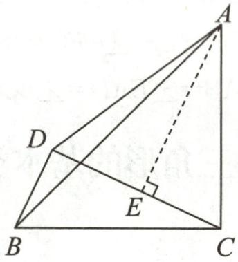

text_image

Geometric diagram of triangle ABC with points D and E, showing perpendicular lines and a right angle at E.

第 7 题答图

由(1)可知: $\triangle ACE\cong\triangle CBD(AAS),\therefore CD=AE=5,$

$$
\therefore S _ {\triangle A C D} = \frac {1}{2} C D \cdot A E = \frac {1}{2} \times 5 \times 5 = \frac {2 5}{2}.
$$

8.【模型呈现】证明：∵∠BAD=90°，∴∠BAC+∠DAE=90°.

$$
\because B C \perp A C, D E \perp A C, \therefore \angle A C B = \angle D E A = 9 0 ^ {\circ},
$$

$$
\therefore \angle B A C + \angle A B C = 9 0 ^ {\circ}, \therefore \angle A B C = \angle D A E.
$$

在 $\triangle ABC$ 和 $\triangle DAE$ 中， $\left\{\begin{aligned}\angle ABC&=\angle DAE,\\ \angle ACB&=\angle DEA,\\ BA&=AD,\end{aligned}\right.$

$$
\therefore \triangle A B C \cong \triangle D A E (\mathrm{AAS}), \therefore B C = A E.
$$

【模型应用】50

【深入探究】63

# 周练 2(测试范围:SSS,SAS,ASA,AAS)

1. C  2. B  3. C  4. B  5. A

6.90 7.3 8.①③④ $9.4\sqrt{2}$

10. 证明: $\because DE \parallel AB, \therefore \angle EDC = \angle B.$

在 $\triangle CDE$ 和 $\triangle ABC$ 中， $\left\{\begin{aligned}\angle EDC&=\angle B,\\ CD&=AB,\\ \angle DCE&=\angle A,\end{aligned}\right.$

$$
\therefore \triangle C D E \cong \triangle A B C (\mathrm{ASA}), \therefore D E = B C.
$$

11. 证明: (1) $\because \angle 1 = \angle 2, \therefore \angle 1 + \angle BDE = \angle 2 + \angle BDE,$

$$
\therefore \angle B D C = \angle A D E.
$$

在 $\triangle ADE$ 和 $\triangle BDC$ 中， $\left\{\begin{aligned}AD&=BD,\\ \angle ADE&=\angle BDC,\\ ED&=CD,\end{aligned}\right.$

$$
\therefore \triangle A D E \cong \triangle B D C.
$$

(2)设 AE 与 BD 相交于点 O.

$$
\because \triangle A D E \cong \triangle B D C, \therefore \angle D A E = \angle D B C.
$$

$$
\because \angle D A E + \angle 1 + \angle A O D = \angle D B C + \angle 3 + \angle B O E =
$$

$$
1 8 0 ^ {\circ}, \angle A O D = \angle B O E, \therefore \angle 3 = \angle 1.
$$

12.(1)小明 SAS

(2) 解: 添加条件 BC = DC.

因为要得到 $\angle B=\angle D$ , 只要证明 $\triangle ABC\cong\triangle ADC$ . 而题目已经给出了 $AB=AD$ 和公共边 $AC$ , 添加 $BC=DC$ , 根据“SSS”可得到 $\triangle ABC\cong\triangle ADC$ .

13.(1)证明:∵E为AC的中点,∴AE=CE.

$$
\because C F \parallel A B, \therefore \angle A = \angle A C F.
$$

在 $\triangle AED$ 和 $\triangle CEF$ 中， $\left\{\begin{aligned}\angle A&=\angle ACF,\\ AE&=CE,\\ \angle AED&=\angle CEF,\end{aligned}\right.$

$$
\therefore \triangle A E D \cong \triangle C E F (\mathrm{ASA}).
$$

(2) 解: $\because BE$ 平分 $\angle ABC, \angle ABE = 25^{\circ}$ ,

$$
\therefore \angle A B C = 2 \angle A B E = 5 0 ^ {\circ}.
$$

$$
\because C F \parallel A B, \therefore \angle A B C + \angle B C F = 1 8 0 ^ {\circ}, \angle A = \angle A C F,
$$

$$
\therefore \angle B C F = 1 8 0 ^ {\circ} - \angle A B C = 1 3 0 ^ {\circ},
$$

∵CA平分∠BCF,

$$
\therefore \angle A C F = \frac {1}{2} \angle B C F = 6 5 ^ {\circ},
$$

$$
\therefore \angle A = 6 5 ^ {\circ}.
$$

# 作业 11 三角形全等的判定(四)

1. D 2. C

3. AB = DC (或 AC = DB) $\angle ACB = \angle DBC$ (或 $\angle ABC = \angle DCB$ )

4. AB=AD(答案不唯一)

5. 证明：∵AE⊥BC,DF⊥BC,∴∠DFC=∠AEB=90°,

又∵CE=BF,∴CE-EF=BF-EF,即CF=BE.

在 Rt△DFC 和 Rt△AEB 中， $\left\{\begin{aligned}CD&=BA,\\ CF&=BE,\end{aligned}\right.$

$$
\therefore \mathrm{Rt} \triangle D F C \cong \mathrm{Rt} \triangle A E B (\mathrm{HL}), \therefore A E = D F.
$$

6.55 7.12 8.①②④ 9.0或2或4或6

10. 证明: 连接 AB.

在 Rt△ABC 和 Rt△BAD 中， $\left\{\begin{aligned}AB&=BA,\\ BC&=AD,\end{aligned}\right.$

$$
\therefore \mathrm{Rt} \triangle A B C \cong \mathrm{Rt} \triangle B A D (\mathrm{HL}), \therefore A C = B D.
$$

11. 证明: (1) 如答图, 连接 AD.

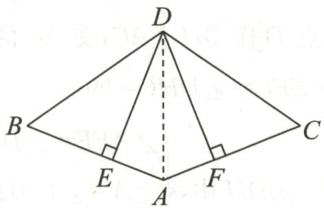

text_image

D
B
E
A
F
C

第11题答图

$$
\because D E \perp A B, D F \perp A C, \therefore \angle D E A = \angle D F A = 9 0 ^ {\circ}.
$$

在 Rt△ADE 和 Rt△ADF 中，

$$
\left\{ \begin{array}{l} A D = A D, \\ D E = D F, \end{array} \therefore \mathrm{Rt} \triangle A D E \cong \mathrm{Rt} \triangle A D F (\mathrm{HL}), \therefore A E = A F. \right.
$$

(2) $\because AB=AC,AE=AF,\therefore BE=CF.$

在 $\triangle BDE$ 和 $\triangle CDF$ 中，

$$
\left\{ \begin{array}{l} D E = D F, \\ \angle D E B = \angle D F C, \therefore \triangle B D E \cong \triangle C D F (\mathrm{SAS}), \\ B E = C F, \end{array} \right.
$$

$$
\therefore D B = D C.
$$

12.(1)证明:∵DE⊥AB于点E,DF⊥AC于点F,

$$
\therefore \angle E = \angle D F C = \angle D F A = 9 0 ^ {\circ}.
$$

在 Rt△EBD 与 Rt△FCD 中，

$$
\left\{ \begin{array}{l} B D = C D, \\ B E = C F, \end{array} \right. \therefore \mathrm{Rt} \triangle E B D \cong \mathrm{Rt} \triangle F C D (\mathrm{HL}), \therefore D E = D F.
$$

在 Rt△AED 与 Rt△AFD 中，

$$
\left\{ \begin{array}{l} A D = A D, \\ D E = D F, \end{array} \therefore \mathrm{Rt} \triangle A E D \cong \mathrm{Rt} \triangle A F D (\mathrm{HL}). \right.
$$

(2) 解: $\because Rt\triangle AED \cong Rt\triangle AFD, \therefore AE = AF,$

$$
\therefore A F = A B + B E = 1 2 + B E.
$$

$$
\because A C = A F + F C, \therefore A C = A B + B E + F C,
$$

$$
\therefore 1 8 = 1 2 + B E + C F.
$$

$$
\because B E = C F, \therefore 1 8 = 1 2 + 2 B E, \therefore B E = 3.
$$

13.(1)证明:∵ $DE\perp AB,\angle ACB=90^{\circ}$ ,

$$
\therefore \angle A E D = \angle A E F = \angle A C B = 9 0 ^ {\circ}.
$$

在 Rt△ACF 与 Rt△AEF 中， $\left\{\begin{aligned}AF&=AF,\\ AC&=AE,\end{aligned}\right.$

$$
\therefore \mathrm{Rt} \triangle A C F \cong \mathrm{Rt} \triangle A E F (\mathrm{HL}), \therefore C F = E F.
$$

在 Rt△ADE 与 Rt△ABC 中， $\left\{\begin{aligned}AD&=AB,\\ AE&=AC,\end{aligned}\right.$

$$
\therefore \mathrm{Rt} \triangle A D E \cong \mathrm{Rt} \triangle A B C (\mathrm{HL}), \therefore D E = B C,
$$

$$
\because D F = D E + E F, \therefore D F = B C + C F.
$$

(2) 解: $BC = CF + DF$ . 证明如下:

如答图,连接 AF.

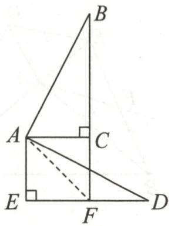

text_image

Geometric diagram with labeled points A, B, C, D, E, F and right-angle markers, likely from a math problem or proof.

第13题答图

在 Rt△ABC 与 Rt△ADE 中， $\left\{\begin{aligned}AB&=AD,\\ AC&=AE,\end{aligned}\right.$

$$
\therefore \mathrm{Rt} \triangle A B C \cong \mathrm{Rt} \triangle A D E (\mathrm{HL}), \therefore B C = D E.
$$

$$
\because \angle A C B = 9 0 ^ {\circ}, \therefore \angle A C F = 9 0 ^ {\circ} = \angle A E D.
$$

在 Rt△ACF 与 Rt△AEF 中， $\left\{\begin{aligned}AF&=AF,\\ AC&=AE,\end{aligned}\right.$

$$
\therefore \mathrm{Rt} \triangle A C F \cong \triangle A E F (\mathrm{HL}), \therefore C F = E F.
$$

$$
\because D E = E F + D F, \therefore B C = C F + D F.
$$

# 专题 5 与中点有关的问题

1.(1)2<AD<7

(2)证明:如答图,延长 FD 至点 N,使 DN=DF,连接 BN,EN.

在 $\triangle FDC$ 和 $\triangle NDB$ 中， $\left\{\begin{aligned}FD&=ND,\\ \angle FDC&=\angle NDB,\\ CD&=BD,\end{aligned}\right.$

$$
\therefore \triangle F D C \cong \triangle N D B (\mathrm{SAS}), \therefore F C = B N.
$$

$$
\because D F = D N, D E \perp D F, \therefore E F = E N.
$$

在 $\triangle EBN$ 中， $BE+BN>EN,\therefore BE+CF>EF.$

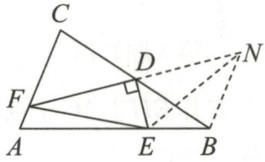

text_image

Geometric diagram with labeled points and right angles, showing triangle ABC with auxiliary lines and a right angle at D.

第1题答图

2. 证明: 延长 AF 至点 G, 使 FG = AF, 连接 BG, 如答图.

∵F为BE的中点,∴EF=BF.

在 $\triangle AFE$ 和 $\triangle GFB$ 中， $\left\{\begin{aligned}AF&=GF,\\ \angle AFE&=\angle GFB,\\ EF&=BF,\end{aligned}\right.$

$$
\therefore \triangle A F E \cong \triangle G F B (\mathrm{SAS}), \therefore \angle E A F = \angle G, A E = B G,
$$

$$
\therefore A E \parallel B G, \therefore \angle G B A + \angle B A E = 1 8 0 ^ {\circ}.
$$

$$
\because \angle B A C + \angle E A D = 1 8 0 ^ {\circ}, \therefore \angle D A C + \angle B A E = 1 8 0 ^ {\circ},
$$

$$
\therefore \angle G B A = \angle D A C. \because A D = A E, \therefore B G = A D.
$$

在 $\triangle GBA$ 和 $\triangle DAC$ 中， $\left\{\begin{aligned}AB&=CA,\\ \angle GBA&=\angle DAC,\\ BG&=AD,\end{aligned}\right.$

$$
\therefore \triangle G B A \cong \triangle D A C (\mathrm{SAS}), \therefore A G = C D.
$$

$$
\because A G = 2 A F, \therefore C D = 2 A F.
$$

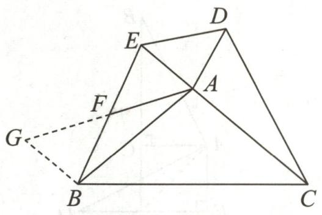

text_image

Geometric diagram with labeled points A, B, C, D, E, F, G and connecting lines, including a dashed extension to point G.

第2题答图

3. 证明: 如答图, 延长 AD 至点 M, 使 DM = AD, 连接 CM.

∵AD是△ABC的中线，∴DB=CD.

在 $\triangle ABD$ 和 $\triangle MCD$ 中， $\left\{\begin{aligned}BD&=CD,\\ \angle ADB&=\angle MDC,\\ AD&=MD,\end{aligned}\right.$

$$
\therefore \triangle A B D \cong \triangle M C D (\mathrm{SAS}), \therefore M C = A B, \angle B = \angle M C D.
$$

$$
\because A B = C E, \therefore C M = C E. \because \angle B A C = \angle B C A,
$$

$$
\therefore \angle B + \angle B A C = \angle M C D + \angle B C A, \text {   即   } \angle A C E = \angle A C M.
$$

在 $\triangle ACM$ 和 $\triangle ACE$ 中， $\left\{\begin{aligned}AC&=AC,\\ \angle ACM&=\angle ACE,\\ CM&=CE,\end{aligned}\right.$

$$
\therefore \triangle A C M \cong \triangle A C E (\mathrm{SAS}), \therefore A M = A E.
$$

$$
\because A M = 2 A D, \therefore A E = 2 A D.
$$

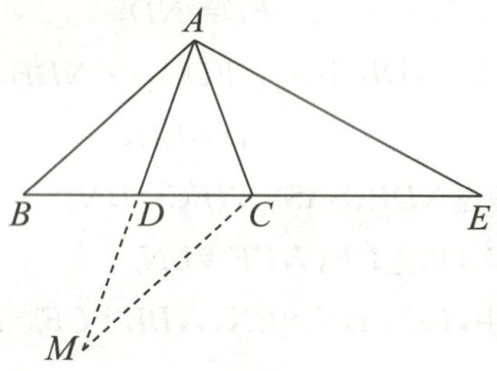

text_image

A
B D C E
M

第3题答图

4. 证明: 如答图, 过点 E 作 $EH \perp AC$ 于点 H,

$$
\therefore \angle E H C = \angle E H F = 9 0 ^ {\circ}.
$$

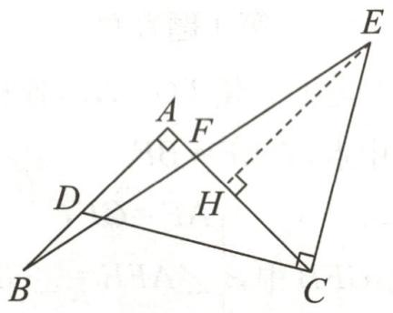

text_image

Geometric diagram with labeled points A, B, C, D, E, F, H and right-angle markers at D and C

第4题答图

$$
\because A B \perp A C, \therefore \angle D A C = 9 0 ^ {\circ}, \angle A D C + \angle A C D = 9 0 ^ {\circ}.
$$

$$
\because C E \perp C D, \therefore \angle E C H + \angle A C D = 9 0 ^ {\circ},
$$

$$
\therefore \angle E C H = \angle C D A.
$$

在 $\triangle HEC$ 和 $\triangle ACD$ 中， $\left\{\begin{aligned}\angle EHC&=\angle CAD=90^{\circ},\\\angle ECH&=\angle CDA,\\CE&=DC,\end{aligned}\right.$

$$
\therefore \triangle H E C \cong \triangle A C D (\mathrm{AAS}), \therefore E H = A C.
$$

$$
\because A B = A C, \therefore E H = A B.
$$

在 $\triangle ABF$ 和 $\triangle HEF$ 中， $\left\{\begin{aligned}\angle BAF&=\angle EHF=90^{\circ},\\\angle AFB&=\angle HFE,\\BA&=EH,\end{aligned}\right.$

$$
\therefore \triangle A B F \cong \triangle H E F (\mathrm{AAS}),
$$

$\therefore EF=BF,\therefore F$ 是 BE 的中点.

5. 证明: (1) 过点 D 作 $DH \perp AC$ , 交 AC 的延长线于点 H, 如答图, $\therefore \angle EFC = \angle DHC = 90^{\circ}$ .

在 $\triangle AEF$ 和 $\triangle BDH$ 中， $\left\{\begin{aligned}\angle AFE&=\angle BHD=90^{\circ},\\\angle A&=\angle DBH,\\AE&=BD,\end{aligned}\right.$

$$
\therefore \triangle A E F \cong \triangle B D H (\mathrm{AAS}), \therefore E F = D H.
$$

在 $\triangle EFC$ 和 $\triangle DHC$ 中， $\left\{\begin{aligned}\angle FCE&=\angle HCD,\\ \angle EFC&=\angle DHC=90^{\circ},\\ EF&=DH,\end{aligned}\right.$

$$
\therefore \triangle E F C \cong \triangle D H C (\mathrm{AAS}), \therefore C E = C D,
$$

∴C 是 DE 的中点.

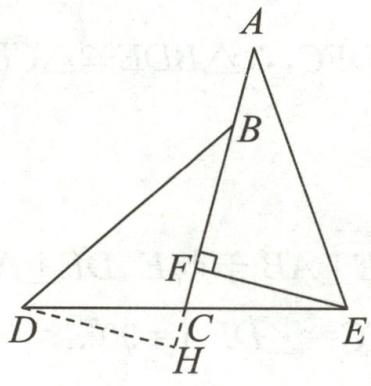

text_image

A
B
F
D
C
H
E

第5题答图

(2)由(1)得, $\triangle AEF\cong\triangle BDH,\triangle EFC\cong\triangle DHC,$

$$
\therefore A F = B H, C F = C H,
$$

$$
\therefore A B + B F = B F + F H, F H = 2 F C,
$$

$$
\therefore A B = F H = 2 C F.
$$

6. 证明: (1) 在 $\triangle ABC$ 中, $\angle B = 60^{\circ}, \angle C = 80^{\circ}$ ,

$$
\therefore \angle B A C = 1 8 0 ^ {\circ} - 6 0 ^ {\circ} - 8 0 ^ {\circ} = 4 0 ^ {\circ}.
$$

∵AD平分∠BAC,∴∠BAD= $\frac{1}{2}$ ∠BAC=20°,

$$
\therefore \angle A D C = \angle B + \angle B A D = 6 0 ^ {\circ} + 2 0 ^ {\circ} = 8 0 ^ {\circ},
$$

$$
\because \angle C = 8 0 ^ {\circ}, \therefore \angle C = \angle A D C, \therefore A D = A C.
$$

(2)如答图,过点A作 $AF \parallel BC$ 交BD的延长线于点F,

$$
\therefore \angle F = \angle D B C, \angle F A D = \angle C,
$$

由题意知 $AD = CD$

$$
\therefore \triangle A D F \cong \triangle C D B (\mathrm{AAS}), \therefore A F = B C,
$$

$$
\because A P = B C, \therefore A P = A F, \therefore \angle A P F = \angle F,
$$

$$
\because \angle A P F = \angle B P E, \angle F = \angle D B C,
$$

$$
\therefore \angle B P E = \angle P B E, \therefore P E = B E.
$$

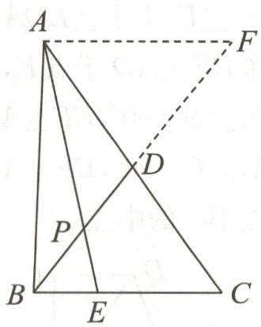

text_image

A
F
D
P
B
E
C

第6题答图

# 专题6 与线段和差有关的问题

1. 证明: $\because \angle BAE = \angle BCE = \angle ACD = 90^{\circ}$ ,

$$
\therefore \angle B A C + \angle D A C = 9 0 ^ {\circ}, \angle C D A + \angle D A C = 9 0 ^ {\circ},
$$

$$
\therefore \angle B A C = \angle E D C, \text {   同理   }, \angle B C A = \angle E C D.
$$

在 $\triangle ABC$ 和 $\triangle DEC$ 中， $\left\{\begin{aligned}\angle BAC&=\angle EDC,\\ \angle BCA&=\angle ECD,\\ BC&=EC,\end{aligned}\right.$

$$
\therefore \triangle A B C \cong \triangle D E C, \therefore A B = D E.
$$

$$
\because A D = A E + E D, \therefore A D = A E + A B.
$$

2. 证明: (1) $\because AD \parallel BC, \therefore \angle DAE = \angle F, \angle ADE = \angle FCE.$

又∵DE=CE,∴△ADE≌△FCE(AAS),∴AE=EF.

(2)由 AE=EF, BE⊥AF, 易证得 AB=BF.

$$
\because \triangle A D E \cong \triangle F C E, \therefore A D = C F,
$$

$$
\therefore A B = B F = B C + C F = B C + A D, \therefore B C = A B - A D.
$$

3. 证明: (1) ∵ ∠BAD = ∠CAE = 90°,

$$
\therefore \angle B A C + \angle C A D = 9 0 ^ {\circ}, \angle C A D + \angle D A E = 9 0 ^ {\circ},
$$

$$
\therefore \angle B A C = \angle D A E.
$$

在 $\triangle BAC$ 和 $\triangle DAE$ 中， $\left\{\begin{aligned}AB&=AD,\\ \angle BAC&=\angle DAE,\\ AC&=AE,\end{aligned}\right.$

$$
\therefore \triangle B A C \cong \triangle D A E (\mathrm{SAS}).
$$

(2)如答图,延长BF到点G,使得FG=FB.

$$
\because A F \perp B G, \therefore \angle A F G = \angle A F B = 9 0 ^ {\circ},
$$

在 $\triangle AFB$ 和 $\triangle AFG$ 中， $\left\{\begin{aligned}BF&=GF,\\ \angle AFB&=\angle AFG,\\ AF&=AF,\end{aligned}\right.$

$$
\therefore \triangle A F B \cong \triangle A F G (\mathrm{SAS}), \therefore A B = A G, \angle A B F = \angle G,
$$

$$
\because \triangle B A C \cong \triangle D A E,
$$

$$
\therefore A B = A D, \angle C B A = \angle E D A, C B = E D,
$$

$$
\therefore A G = A D, \angle A B F = \angle C D A, \therefore \angle G = \angle C D A,
$$

由题意可知 $\angle GCA = \angle E = \angle DCA = 45^{\circ}$

在 $\triangle CGA$ 和 $\triangle CDA$ 中， $\left\{\begin{aligned}\angle GCA&=\angle DCA,\\ \angle CGA&=\angle CDA,\\ AG&=AD,\end{aligned}\right.$

$$
\therefore \triangle C G A \cong \triangle C D A (A A S), \therefore C G = C D,
$$

$$
\because C G = C B + B F + F G = C B + 2 B F = D E + 2 B F,
$$

$$
\therefore C D = 2 B F + D E.
$$

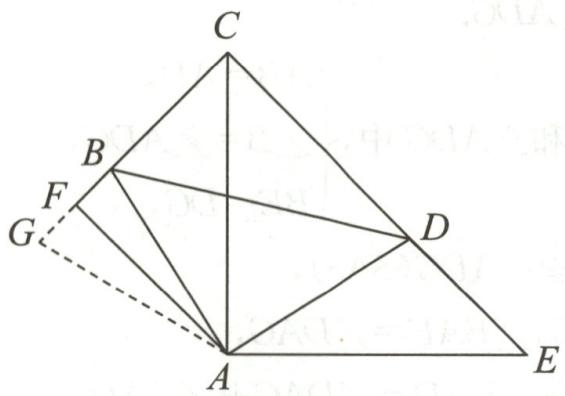

text_image

Geometric diagram with labeled points A, B, C, D, E, F, G and connecting lines, including a dashed extension from G to A.

第3题答图

4. 证明: 在 AB 上截取 AF = AD, 连接 EF.

∵AE平分∠PAB,∴∠DAE=∠FAE.

在 $\triangle DAE$ 和 $\triangle FAE$ 中， $\left\{\begin{aligned}AD&=AF,\\ \angle DAE&=\angle FAE,\\ AE&=AE,\end{aligned}\right.$

$$
\therefore \triangle D A E \cong \triangle F A E (\mathrm{SAS}), \therefore \angle A F E = \angle A D E.
$$

$$
\because A D \parallel B C, \therefore \angle A D E + \angle C = 1 8 0 ^ {\circ}.
$$

$$
\because \angle A F E + \angle E F B = 1 8 0 ^ {\circ}, \therefore \angle E F B = \angle C.
$$

∵BE平分∠ABC,∴∠EBF=∠EBC.

在 $\triangle BEF$ 和 $\triangle BEC$ 中， $\left\{\begin{aligned}\angle EFB&=\angle C,\\ \angle EBF&=\angle EBC,\\ BE&=BE,\end{aligned}\right.$

$$
\therefore \triangle B E F \cong \triangle B E C (\mathrm{AAS}), \therefore B F = B C,
$$

$$
\therefore A D + B C = A F + B F = A B.
$$

5.(1)证明:①在四边形ABDC中, $\angle BAC=60^{\circ},\angle CDB=120^{\circ}$ .

$$
\because \angle B A C + \angle A B D + \angle C D B + \angle C = 3 6 0 ^ {\circ},
$$

$$
\therefore \angle A B D + \angle C = 1 8 0 ^ {\circ},
$$

$$
\text { 又 } \because \angle A B D + \angle D B F = 1 8 0 ^ {\circ},
$$

$$
\therefore \angle C = \angle D B F.
$$

在 $\triangle CDE$ 和 $\triangle BDF$ 中,CE=BF, $\angle C=\angle DBF,DC=DB,$

$$
\therefore \triangle C D E \cong \triangle B D F (\mathrm{SAS}). \therefore D E = D F.
$$

②在 $\triangle ACD$ 和 $\triangle ABD$ 中,AC=AB,DC=DB,AD=AD,

$$
\therefore \triangle A C D \cong \triangle A B D (\text { S   S   S }), \therefore \angle A D C = \angle A D B.
$$

$$
\text { 又 } \because \angle C D B = 1 2 0 ^ {\circ}, \therefore \angle A D B = 6 0 ^ {\circ}.
$$

(2) 解: $EG = GB + CE$ . 理由如下:

$$
\because \angle C D B = 1 2 0 ^ {\circ}, \angle E D G = 6 0 ^ {\circ},
$$

$$
\therefore \angle C D E + \angle B D G = 6 0 ^ {\circ}.
$$

由(1)知 $\triangle CDE\cong\triangle BDF,\therefore\angle CDE=\angle FDB.$

$$
\therefore \angle G D F = \angle B D G + \angle B D F = \angle C D E + \angle B D G = 6 0 ^ {\circ},
$$

$$
\text { 又 } \because \angle E D G = 6 0 ^ {\circ}, \therefore \angle E D G = \angle G D F.
$$

在 $\triangle EDG$ 和 $\triangle FDG$ 中，DE=DF， $\angle EDG=\angle FDG$ ，

$$
D G = D G, \therefore \triangle E D G \cong \triangle F D G (\text { SAS }).
$$

$$
\therefore E G = G F = G B + B F = G B + C E.
$$

6.【问题提出】 $EF=BE+FD$

【探索延伸】解: 结论仍然成立.

理由:如答图①,延长 FD 到点 G,使 DG=BE,连接 AG.

$$
\begin{array}{l} \because \angle B + \angle A D C = 1 8 0 ^ {\circ}, \angle A D G + \angle A D C = 1 8 0 ^ {\circ}, \\ \therefore \angle B = \angle A D G. \\ \end{array}
$$

在 $\triangle ABE$ 和 $\triangle ADG$ 中， $\left\{\begin{aligned}AB&=AD,\\ \angle B&=\angle ADG,\\ BE&=DG,\end{aligned}\right.$

$$
\begin{array}{l} \therefore \triangle A B E \cong \triangle A D G (\text { SAS }), \\ \therefore A E = A G, \angle B A E = \angle D A G, \\ \therefore \angle B A E + \angle E A D = \angle D A G + \angle E A D, \\ \therefore \angle B A D = \angle E A G. \\ \because \angle E A F = \frac {1}{2} \angle B A D, \therefore \angle E A F = \angle G A F. \\ \end{array}
$$

在 $\triangle AEF$ 和 $\triangle AGF$ 中， $\left\{\begin{aligned}AE&=AG,\\ \angle EAF&=\angle GAF,\\ AF&=AF,\end{aligned}\right.$

$$
\therefore \triangle A E F \cong \triangle A G F (\text { SAS }),
$$

$$
\therefore E F = F G = D G + F D = B E + D F.
$$

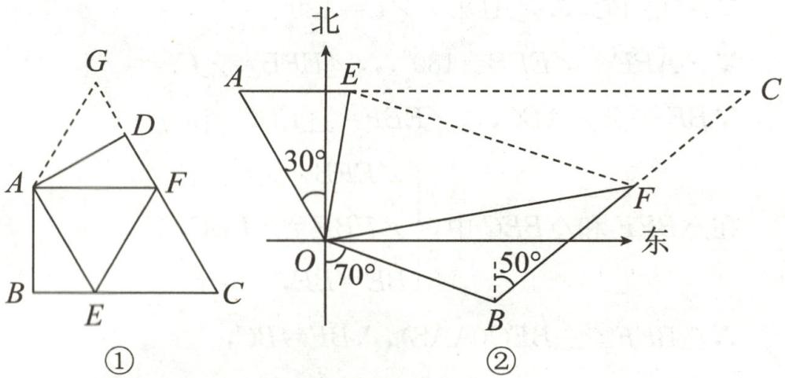

text_image

G
D
A
F
B
E
C
①
北
30°
O
70°
50°
东
②

第6题答图

【结论运用】解: 如答图②, 延长 AE, BF, 交于点 C, 连接 EF.

$$
\because \angle A O B = 3 0 ^ {\circ} + 9 0 ^ {\circ} + (9 0 ^ {\circ} - 7 0 ^ {\circ}) = 1 4 0 ^ {\circ}, \angle E O F = 7 0 ^ {\circ},
$$

$$
\therefore \angle E O F = \frac {1}{2} \angle A O B.
$$

$$
\because O A = O B,
$$

$$
\angle O A C + \angle O B C = (9 0 ^ {\circ} - 3 0 ^ {\circ}) + (7 0 ^ {\circ} + 5 0 ^ {\circ}) = 1 8 0 ^ {\circ},
$$

∴符合【探索延伸】中的条件，∴EF=AE+BF仍然成立.

$$
E F = 2 \times 4 0 + 2 \times 6 0 = 2 0 0 (\text {海里}),
$$

$$
2 0 0 \times 1. 8 5 2 = 3 7 0. 4 (\text {千米}),
$$

∴此时该货轮受到台风影响的最大风力级数为

$$
1 2 - \frac {3 7 0 . 4}{4 0} = 2. 7 4 (\text {级}).
$$

答:此时该货轮受到台风影响的最大风力有2.74级.

# 作业 12 角的平分线的性质(一)

1. B  2. C  3. C  4. 12

5.(1)解:∵∠B=∠C=90°,∴DC∥AB,

$$
\therefore \angle B A D + \angle C D A = 1 8 0 ^ {\circ}.
$$

∵AE平分∠BAD,DE平分∠CDA,

$$
\therefore \angle E A D = \frac {1}{2} \angle B A D, \angle E D A = \frac {1}{2} \angle C D A,
$$

$$
\therefore \angle E A D + \angle E D A = \frac {1}{2} (\angle B A D + \angle C D A) = 9 0 ^ {\circ},
$$

$$
\therefore \angle A E D = 1 8 0 ^ {\circ} - (\angle E A D + \angle E D A) = 9 0 ^ {\circ}.
$$

(2)证明:过点 E 作 $EF \perp AD$ 于点 F, 如答图.

$$
\because A E \text {平分} \angle B A D, \angle B = 9 0 ^ {\circ}, E F \perp A D, \therefore E F = E B.
$$

$$
\because D E \text {平分} \angle C D A, \angle C = 9 0 ^ {\circ}, E F \perp A D, \therefore E F = E C.
$$

∴EB=EC, 即 E 是 BC 的中点.

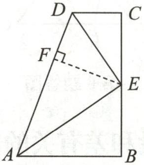

text_image

D
C
F
E
A
B

第5题答图

6. B 7. C 8. $\frac{1}{4}$

9. 解: 如答图, 作 $\angle AOB$ 的平分线 OM, 交 AB 于点 M, M 为水厂位置.

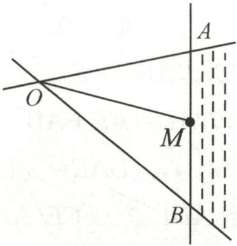

text_image

O
A
M
B

第 9 题答图

10. 证明: 如答图, 过点 C 作 $CE \perp AB$ , 垂足为 E, 作 $CF \perp AD$ , 交 AD 的延长线于点 F.

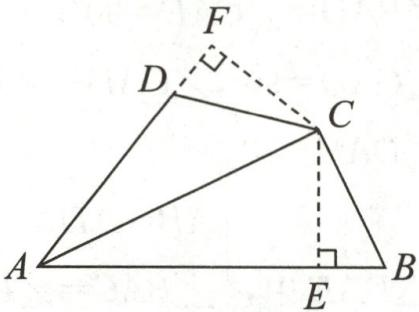

text_image

Geometric diagram of quadrilateral ABCD with perpendiculars from D to AB and BC, labeled points A, B, C, D, E, F, and right-angle symbols.

第 10 题答图

$$
\because A C \text {平分} \angle D A B, \therefore C E = C F.
$$

$$
\because \angle A D C + \angle B = 1 8 0 ^ {\circ}, \angle A D C + \angle C D F = 1 8 0 ^ {\circ},
$$

$$
\therefore \angle B = \angle C D F. \text {又} \because \angle C E B = \angle C F D = 9 0 ^ {\circ},
$$

$$
\therefore \triangle C E B \cong \triangle C F D. \therefore B C = D C.
$$

11.(1)1:1

(2) 解: 如答图, 过点 D 作 $DE \perp AB$ 于点 E, $DF \perp AC$ 于点 F.

∵AD为∠BAC的平分线，∴DE=DF.

$$
\because A B = m, A C = n,
$$

$$
\therefore S _ {\triangle A B D}: S _ {\triangle A C D} = \left(\frac {1}{2} A B \cdot D E\right): \left(\frac {1}{2} A C \cdot D F\right) = \frac {m}{n}.
$$

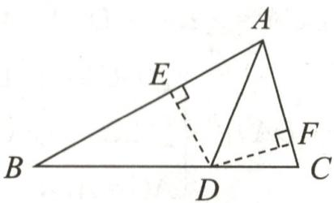

text_image

A
E
B
D
C
F

第 11 题答图

(3)9

# 作业 13 角的平分线的性质(二)

1. A 2. A

3. 证明：∵PC⊥OA, PD⊥OB, PC=PD,

$$
\therefore \angle A O P = \angle B O P.
$$

$$
\because Q E \perp O A, Q F \perp O B, \therefore Q E = Q F.
$$

4. C 5. $66^{\circ}$ 6. $ME = MN$ (答案不唯一)

7. AD 垂直平分 EF

8. 证明：∵ DE⊥AB, DF⊥AC, ∴∠BED=∠CFD=90°.

在 Rt△BDE 和 Rt△CDF 中， $\left\{\begin{aligned}BD&=CD,\\ BE&=CF,\end{aligned}\right.$

$$
\therefore \mathrm{Rt} \triangle B D E \cong \mathrm{Rt} \triangle C D F, \therefore D E = D F,
$$

∴AD 是 $\angle BAC$ 的平分线.

9.(1)证明:如答图,过点 P 作 $PN \perp BD$ 于点 N, $PM \perp BE$ 于点 M, $PF \perp AC$ 于点 F.

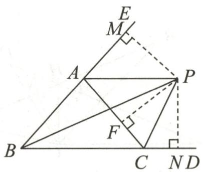

text_image

Geometric diagram with labeled points and perpendicular lines, likely from a math problem or proof

第9题答图

∵∠ACD的平分线CP与∠ABC的平分线BP交于点P，

$\therefore PM=PN, PN=PF, \therefore PM=PF,$ 而 PA=PA,

$$
\therefore \mathrm{Rt} \triangle A M P \cong \mathrm{Rt} \triangle A F P (\mathrm{HL}), \therefore \angle P A E = \angle P A F,
$$

∴AP平分∠CAE.

(2) 解: 设 $\angle ABC = 2\alpha, \angle ACD = 2\beta.$

∵∠ACD的平分线CP与∠ABC的平分线BP交于点P,

$\therefore \beta = \alpha + \angle BPC$ ，而 $\beta = \frac{2\alpha + \angle BAC}{2}$ ，

$$
\therefore \angle B A C = 2 \angle B P C = 8 0 ^ {\circ}, \therefore \angle C A P = \frac {1 8 0 ^ {\circ} - 8 0 ^ {\circ}}{2} = 5 0 ^ {\circ}.
$$

10. 证明: (1) $\because \angle C A B = \angle E A D$ ,

$$
\therefore \angle C A B + \angle D A C = \angle E A D + \angle D A C,
$$

$$
\therefore \angle D A B = \angle E A C.
$$

$$
\text { 又 } \because A B = A C, A D = A E,
$$

$$
\therefore \triangle D A B \cong \triangle E A C, \therefore B D = C E.
$$

(2) 过点 A 作 $AN \perp EC$ 于点 N，过点 A 作 $AM \perp BD$ 于点 M，如答图，

$$
\therefore S _ {\triangle D A B} = \frac {1}{2} \cdot D B \cdot A M, S _ {\triangle E A C} = \frac {1}{2} \cdot E C \cdot A N,
$$

由(1)已证明 $\triangle DAB\cong\triangle EAC,BD=CE,$

$$
\therefore S _ {\triangle D A B} = S _ {\triangle E A C},
$$

$$
\therefore \frac {1}{2} \cdot D B \cdot A M = \frac {1}{2} \cdot E C \cdot A N, \therefore A M = A N.
$$

在 Rt△ANF 和 Rt△AMF 中， $\left\{\begin{aligned}AF&=AF,\\ AN&=AM,\end{aligned}\right.$

$$
\therefore \mathrm{Rt} \triangle A N F \cong \mathrm{Rt} \triangle A M F (\mathrm{HL}), \therefore \angle A F N = \angle A F M,
$$

∴FA 平分∠BFE.

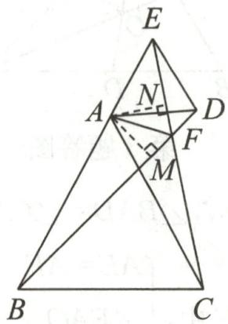

text_image

Geometric diagram of triangle ABC with internal points D, E, F, M, N and perpendicular lines marked

第10题答图

# 专题 7 与角平分线有关的问题

1. 证明：∵AO平分∠BAC，∴∠CAO=∠EAO.

在 $\triangle AOC$ 和 $\triangle AOE$ 中， $\left\{\begin{aligned}AC&=AE,\\ \angle CAO&=\angle EAO,\\ AO&=AO,\end{aligned}\right.$

$$
\therefore \triangle A O C \cong \triangle A O E (\mathrm{SAS}), \therefore \angle A C D = \angle A E O.
$$

在 $\triangle ABC$ 中， $\angle ACB=90^{\circ},CD\perp AB,$

$$
\therefore \angle A C D + \angle B C D = \angle B C D + \angle B = 9 0 ^ {\circ},
$$

$$
\therefore \angle A C D = \angle B, \therefore \angle A E O = \angle B, \therefore O E / / B C.
$$

2. 证明: 如答图, 延长 BO, AE 交于点 F.

∵BD平分∠ABO,AE⊥BD,

$$
\therefore \angle 1 = \angle 2, \angle A E B = \angle F E B = 9 0 ^ {\circ}.
$$

在 $\triangle ABE$ 和 $\triangle FBE$ 中， $\left\{\begin{aligned}\angle1&=\angle2,\\ BE&=BE,\\ \angle AEB&=\angle FEB,\end{aligned}\right.$

$$
\therefore \triangle A B E \cong \triangle F B E, \therefore A E = E F.
$$

$$
\because \angle A O B = 9 0 ^ {\circ}, \angle A E D = 9 0 ^ {\circ}, \angle A D E = \angle B D O,
$$

$$
\therefore \angle 2 = \angle O A F.
$$

$$
\because \angle A O B = 9 0 ^ {\circ}, \therefore \angle D O B = \angle F O A = 9 0 ^ {\circ}.
$$

在 $\triangle OBD$ 和 $\triangle OAF$ 中， $\left\{\begin{aligned}\angle2&=\angle FAO,\\ BO&=AO,\\ \angle BOD&=\angle AOF,\end{aligned}\right.$

$$
\therefore \triangle O B D \cong \triangle O A F, \therefore B D = A F.
$$

$$
\because A E = E F, \therefore B D = 2 A E.
$$

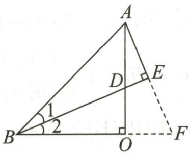

text_image

A
D
E
B
1
2
O
F

第2题答图

3.(1)解:∵∠ABC=60°,AD,CE分别平分∠BAC,∠ACB,

$$
\therefore \angle O A C + \angle O C A = \frac {1}{2} (\angle B A C + \angle B C A) = \frac {1}{2} (1 8 0 ^ {\circ} -
$$

$$
\angle B) = 6 0 ^ {\circ}, \therefore \angle A O C = 1 2 0 ^ {\circ}.
$$

(2)证明:如答图,在AC上截取AF=AE,连接OF.

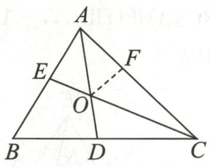

text_image

A
E
F
O
B
D
C

第3题答图

∵AD平分∠BAC,∴∠BAD=∠CAD.

在 $\triangle AOE$ 和 $\triangle AOF$ 中， $\left\{\begin{aligned}AE&=AF,\\ \angle EAO&=\angle FAO,\\ AO&=AO,\end{aligned}\right.$

$$
\therefore \triangle A O E \cong \triangle A O F (\mathrm{SAS}), \therefore \angle A O E = \angle A O F.
$$

由(1)知 $\angle AOC=120^{\circ},\therefore\angle AOE=60^{\circ}$ ,

$$
\therefore \angle A O F = \angle C O D = 6 0 ^ {\circ} = \angle C O F.
$$

∵CE平分∠ACB,∴∠FCO=∠DCO.

在 $\triangle COF$ 和 $\triangle COD$ 中， $\left\{\begin{aligned}\angle FOC&=\angle DOC,\\ CO&=CO,\\ \angle FCO&=\angle DCO,\end{aligned}\right.$

$$
\therefore \triangle C O F \cong \triangle C O D (\mathrm{ASA}), \therefore C F = C D,
$$

$$
\therefore A C = A F + C F = A E + C D.
$$

4. 证明: 如答图, 在 AC 上截取 AE, 使 AE = AB, 连接 PE.

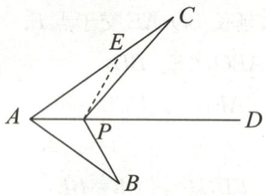

text_image

Geometric diagram with labeled points A, B, C, D, E, and P, showing triangle relationships and dashed lines.

第4题答图

∵AD是∠BAC的平分线，∴∠BAD=∠CAD.

在 $\triangle AEP$ 和 $\triangle ABP$ 中， $\left\{\begin{aligned}AE&=AB,\\ \angle EAP&=\angle BAP,\\ AP&=AP,\end{aligned}\right.$

$$
\therefore \triangle A E P \cong \triangle A B P (\mathrm{SAS}), \therefore P E = P B.
$$

在 $\triangle PCE$ 中， $PC - PE <   CE,$

$$
\therefore P C - P E <   A C - A E, \therefore P C - P B <   A C - A B.
$$

5. 证明: (1) 如答图, 过点 D 作 $DE \perp AB$ , 交 BA 的延长线于点 E.

∵BD平分∠ABC,DH⊥BC,∴DH=DE.

在 Rt△ADE 和 Rt△CDH 中， $\left\{\begin{aligned}DA&=DC,\\ DE&=DH,\end{aligned}\right.$

$$
\therefore \mathrm{Rt} \triangle A D E \cong \mathrm{Rt} \triangle C D H (\mathrm{HL}), \therefore \angle C = \angle D A E.
$$

$$
\because \angle D A B + \angle D A E = 1 8 0 ^ {\circ}, \therefore \angle D A B + \angle C = 1 8 0 ^ {\circ}.
$$

(2)在 Rt△BDE 和 Rt△BDH 中， $\left\{\begin{aligned}BD&=BD,\\ DE&=DH,\end{aligned}\right.$

$$
\therefore \mathrm{Rt} \triangle B D E \cong \mathrm{Rt} \triangle B D H (\mathrm{HL}), \therefore B E = B H.
$$

$$
\because \mathrm{Rt} \triangle A D E \cong \mathrm{Rt} \triangle C D H, \therefore A E = C H,
$$

$$
\therefore A B + B C = A B + B H + C H = B E + B H = 2 B H,
$$

$$
\therefore B H = \frac {1}{2} (A B + B C).
$$

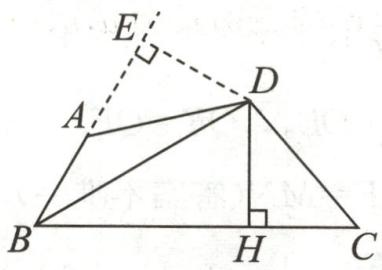

text_image

Geometric diagram with labeled points A, B, C, D, E, H and right angle at H, showing triangles and dashed auxiliary lines.

第5题答图

6. 证明: (1) $\because \angle ACB = \angle DCE, \therefore \angle ACD = \angle BCE.$

在 $\triangle ACD$ 和 $\triangle BCE$ 中， $\left\{\begin{aligned}CA&=CB,\\ \angle ACD&=\angle BCE,\\ CD&=CE,\end{aligned}\right.$

$$
\therefore \triangle A C D \cong \triangle B C E (\text { SAS }).
$$

(2)如答图,过点 C 作 $CM \perp AD$ 于点 M, $CN \perp BE$ 于点 N.

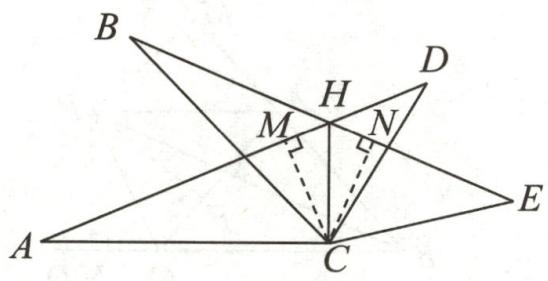

text_image

Geometric diagram with labeled points A, B, C, D, E, H, M, N and right-angle markers, likely from a math problem or proof.

第6题答图

$$
\because \triangle A C D \cong \triangle B C E, \therefore \angle C A M = \angle C B N,
$$

在 $\triangle ACM$ 和 $\triangle BCN$ 中, $\left\{\begin{aligned}\angle CAM&=\angle CBN,\\\angle AMC&=\angle BNC=90^{\circ},\\AC&=BC,\end{aligned}\right.$

$$
\therefore \triangle A C M \cong \triangle B C N, \therefore C M = C N.
$$

又 $CM \perp AH, CN \perp HE, \therefore HC$ 平分 $\angle AHE.$

# 周练 3(测试范围:14.2\~14.3)

1. A 
2. D 
3. B 
4. B

5.5 6.72° 7.4 8.2 9.①②④

10.(1)二

(2)证明：∵∠ADC=∠AEB=90°,

$$
\therefore \angle B D C = \angle C E B = 9 0 ^ {\circ}.
$$

在 $\triangle DOB$ 和 $\triangle EOC$ 中， $\left\{\begin{aligned}\angle BDO&=\angle CEO,\\ \angle DOB&=\angle EOC,\\ OB&=OC,\end{aligned}\right.$

$$
\therefore \triangle D O B \cong \triangle E O C (\mathrm{AAS}), \therefore O D = O E.
$$

在 Rt△ADO 和 Rt△AEO 中， $\left\{\begin{aligned}OA&=OA,\\ OD&=OE,\end{aligned}\right.$

$$
\therefore \mathrm{Rt} \triangle A D O \cong \mathrm{Rt} \triangle A E O (\mathrm{HL}), \therefore \angle 1 = \angle 2.
$$

11. 证明: (1) ∵ ∠BAC = ∠DAE,

$$
\therefore \angle B A C - \angle B A E = \angle D A E - \angle B A E,
$$

即 $\angle DAB = \angle EAC.$

又∵AB=AC,AD=AE,

$$
\therefore \triangle D A B \cong \triangle E A C (\mathrm{SAS}), \therefore B D = C E,
$$

$$
\therefore B C = B E + C E = B D + B E.
$$

(2) $\because\angle BAC=\angle DAE,$

$$
\therefore \angle B A C + \angle E A B = \angle D A E + \angle E A B,
$$

即 $\angle DAB = \angle EAC.$

又∵AB=AC,AD=AE,

$$
\therefore \triangle D A B \cong \triangle E A C (\mathrm{SAS}), \therefore B D = C E,
$$

$$
\therefore B C = C E - B E = B D - B E.
$$

# 专题8 综合与实践

1. 解: (1) 证明思路: 过三角形的一个顶点作其对边的平行线. 例如, 如答图, 过 $\triangle ABC$ 的顶点 $A$ 作直线 $EF \parallel BC$ , 根据两直线平行, 内错角相等, 可得 $\angle B = \angle EAB$ , $\angle C = \angle FAC$ , 又因为 $\angle EAB + \angle BAC + \angle FAC = 180^\circ$ (平角的定义), 所以 $\angle B + \angle BAC + \angle C = 180^\circ$ , 即三角形内角和为 $180^\circ$ .

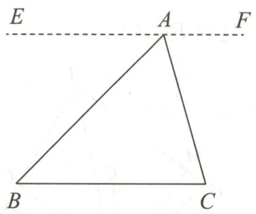

text_image

E
A
F
B
C

第1题答图

(2)不同意.理由:欧氏几何是在其特定的公理、公设和基本定义的基础上,通过严格逻辑推理建立起来的演绎系统.在欧氏几何的体系中,三角形内角和等于 $180^{\circ}$ 是经过严谨证明的定理,是正确的.不同的几何体系有着不同的公理、公设等基础,所以三角形内角和情况不同,但不能因此说欧氏几何中的三角形内角和定理不正确.

(3)公理化方法的作用有:可以将知识整理在一个严密的系统中,使数学分支成为演绎系统;能够从基本概念和原始命题出发,推导出众多的结论,形成公理体系;推动了数学的发展,如欧几里得的《原本》是历史上第一个数学公理化体系,为数学发展奠定基础,后续数学家基于对公理化方法的探索又诞生了非欧几何等新的几何体系,促进了数学的不断进步.

2. 解: 如答图①, ②, ③. (答案不唯一)

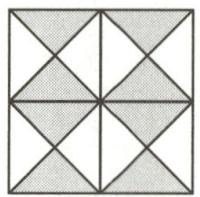  
①

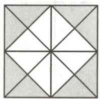  
②

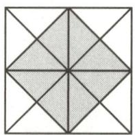  
③   
第2题答图

# 章末复习课

1. D 
2. D 
3. B

4. AB=ED(答案不唯一) 5.4:3 6.4

7. 证明：∵∠1=∠2，∠3=∠4，

∴ $\angle1+\angle3=\angle2+\angle4$ ，即 $\angle DAB=\angle CBA.$

在 $\triangle ADB$ 和 $\triangle BCA$ 中， $\left\{\begin{aligned}\angle2&=\angle1,\\ AB&=BA,\\ \angle DAB&=\angle CBA,\end{aligned}\right.$

$\therefore\triangle ADB\cong\triangle BCA(ASA),\therefore AC=BD.$

8. 证明: $\because AC \perp CF, DF \perp CF, \therefore \angle ACB = \angle DFE = 90^{\circ}$ .

$\because EC=BF,\therefore EC+EB=BF+EB,$ 即 CB=FE.

在 Rt△ACB 与 Rt△DFE 中， $\left\{\begin{aligned}AB&=DE,\\ CB&=FE,\end{aligned}\right.$

$\therefore Rt\triangle ACB\cong Rt\triangle DFE(HL),\therefore AC=DF.$

在 $\triangle ACE$ 与 $\triangle DFB$ 中， $\left\{\begin{aligned}AC&=DF,\\ \angle ACE&=\angle DFB,\\ CE&=FB,\end{aligned}\right.$

$\therefore \triangle ACE \cong \triangle DFB(SAS), \therefore AE = DB.$

9.(1)证明:∵D是BC的中点,∴BD=CD.

在 $\triangle ABD$ 与 $\triangle ECD$ 中，

$$
\left\{ \begin{array}{l} B D = C D, \\ \angle A D B = \angle E D C, \therefore \triangle A B D \cong \triangle E C D (\mathrm{SAS}). \\ A D = E D, \end{array} \right.
$$

(2) 解: 在 $\triangle ABC$ 中, D 是边 BC 的中点, $\therefore S_{\triangle ABD} = S_{\triangle ADC}$ ,

$$
\because \triangle A B D \cong \triangle E C D, \therefore S _ {\triangle A B D} = S _ {\triangle E C D}.
$$

$$
\because S _ {\triangle A B D} = 5, \therefore S _ {\triangle A C E} = S _ {\triangle A C D} + S _ {\triangle E C D} = 5 + 5 = 1 0,
$$

∴△ACE 的面积为 10.

10.(1)解:∵AF平分∠CAB,∴∠CAF=∠DAF.

在 $\triangle ACF$ 和 $\triangle ADF$ 中， $\left\{\begin{aligned}AC&=AD,\\ \angle CAF&=\angle DAF,\\ AF&=AF,\end{aligned}\right.$

$$
\therefore \triangle A C F \cong \triangle A D F (\mathrm{SAS}), \therefore \angle A C F = \angle A D F.
$$

$$
\because \angle A C B = 9 0 ^ {\circ}, C E \perp A B,
$$

$$
\therefore \angle A C E + \angle C A E = 9 0 ^ {\circ}, \angle C A E + \angle B = 9 0 ^ {\circ},
$$

$$
\therefore \angle A C F = \angle B, \therefore \angle A D F = \angle B = 4 0 ^ {\circ}.
$$

(2)证明:由(1)知 $\angle ADF=\angle B,\therefore DF\parallel BC.$

$$
\because B C \perp A C, \therefore F G \perp A C.
$$

又 $FE \perp AB, AF$ 平分 $\angle CAB, \therefore FG = FE.$

# 第十五章 轴对称

# 作业 14 轴对称及其性质

1. C 2. A 3. C 4. A 5. $130^{\circ}$

6. 解: ∵ 两个四边形关于直线 l 对称,

∴四边形 ABCD 与四边形 FEHG 全等，

$$
\therefore \angle H = \angle C = 9 0 ^ {\circ}, \angle A = \angle F = 8 0 ^ {\circ},
$$

$$
a = 5 \mathrm{cm}, b = 4 \mathrm{cm}. \because \angle E = 1 3 5 ^ {\circ},
$$

$$
\therefore \angle G = 3 6 0 ^ {\circ} - \angle H - \angle E - \angle F = 5 5 ^ {\circ}.
$$

7. D 8. B 9. D 10. 65

11. 解: $\triangle PMN$ 的周长等于 $P_{1}P_{2}$ 的长. 理由: 由对称性可知, $NP_{2}=NP, MP_{1}=MP, \therefore \triangle PMN$ 的周长 = NP + NM + MP = $NP_{2} + NM + MP_{1} = P_{1}P_{2}$ .

12. 解: 连接 $OP_{1}, OP_{2}$ . ∵ 点 P 关于直线 l, m 的对称点分别是点 $P_{1}, P_{2}, \therefore OP_{1} = OP = 2.8, OP_{2} = OP = 2.8$ . 当点 $O, P_{1}, P_{2}$ 不在同一直线上时, 根据三角形的三边关系可知 $P_{1}P_{2} < 2.8 + 2.8 = 5.6$ ; 当点 $O, P_{1}, P_{2}$ 在同一直线上时, $P_{1}P_{2} = 2.8 + 2.8 = 5.6$ . 综上, $d \leqslant 5.6$ . ∴ d 的最大整数值为 5.

# 作业 15 线段的垂直平分线(一)

1. D  2. A  3. C  4. 15

5.(1)解:∵DE是AB的垂直平分线,

$$
\therefore A E = B E, A D = B D. \because A D = 3, \therefore A B = 6.
$$

∵△ABC 的周长是 14, ∴AC+BC=8.

$$
\therefore C _ {\triangle A E C} = A C + C E + A E = A C + B C = 8,
$$

∴△AEC的周长为8.

(2)证明：∵AE=BE, ∴∠BAE=∠B=30°.

$$
\because \angle A C B = 9 0 ^ {\circ}, \therefore \angle B A C = 6 0 ^ {\circ},
$$

$$
\therefore \angle B A E = \angle C A E = 3 0 ^ {\circ}.
$$

$$
\because \angle A D E = \angle A C E = 9 0 ^ {\circ}, A E = A E,
$$

$$
\therefore \triangle A D E \cong \triangle A C E (\text { AAS }), \therefore D E = C E,
$$

即点 E 在线段 CD 的垂直平分线上.

6. B 7. $1 < x < 5$ 8.6

9. 证明: 连接 AC, 如答图.

∵CE垂直平分AD于点E,∴CD=AC.

∵CF垂直平分AB于点F,∴AC=BC,∴CD=CB.

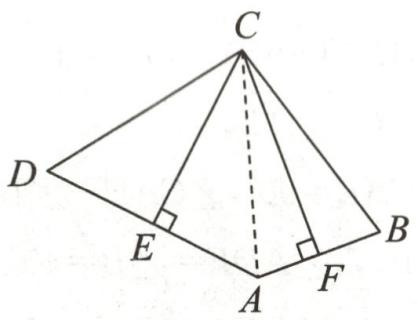

text_image

Geometric diagram of a triangular pyramid with labeled vertices and perpendiculars from vertex A to sides BC and D.

第9题答图

10.(1)证明:如答图,连接BP,AP,PC.

由题意知 PA=PB, PA=PC,

$$
\therefore P B = P C,
$$

∴点 P 在线段 BC 的垂直平分线上.

(2) 解: 由题意知 FA = FB, NA = NC, $\angle AEP = \angle AMP = \angle BEF = \angle CMN = 90^{\circ}$ ,

$$
\therefore \angle A B C + \angle B F E = \angle A C B + \angle M N C = 9 0 ^ {\circ},
$$

设 $\angle ABC=\alpha,\angle ACB=\beta,$

$$
\therefore \angle A B C = \angle B A F = \alpha , \angle A C B = \angle C A N = \beta , \angle B F E =
$$

$$
9 0 ^ {\circ} - \alpha , \angle M N C = 9 0 ^ {\circ} - \beta ,
$$

$$
\begin{array}{l} \therefore \angle P F N = \angle B F E = 9 0 ^ {\circ} - \alpha , \angle P N F = \angle M N C = 9 0 ^ {\circ} \\ - \beta , \end{array}
$$

$$
\because \angle A B C + \angle A C B + \angle C A B = 1 8 0 ^ {\circ}, \angle F A N = 5 6 ^ {\circ},
$$

$$
\therefore 2 \alpha + 2 \beta + 5 6 ^ {\circ} = 1 8 0 ^ {\circ},
$$

$$
\therefore \alpha + \beta = 6 2 ^ {\circ},
$$

$$
\because \angle P F N + \angle P N F + \angle F P N = 1 8 0 ^ {\circ},
$$

$$
\therefore 9 0 ^ {\circ} - \alpha + 9 0 ^ {\circ} - \beta + \angle F P N = 1 8 0 ^ {\circ},
$$

$$
\therefore \angle F P N = 1 8 0 ^ {\circ} - 1 8 0 ^ {\circ} + (\alpha + \beta) = 6 2 ^ {\circ}.
$$

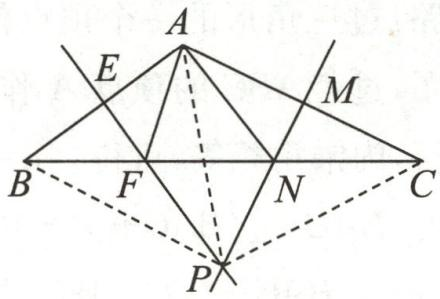

text_image

Geometric diagram with labeled points and lines, likely from a math problem or proof

第10题答图

11. 证明: 如答图, 连接 BD, CD.

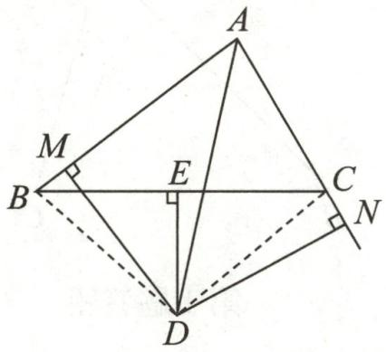

text_image

Geometric diagram of a quadrilateral with labeled points and perpendicular lines, including right-angle markers at M and D.

第 11 题答图

∵AD平分∠BAC,DM⊥AB,DN⊥AC,

$$
\therefore D M = D N.
$$

∵ DE 垂直平分 BC, ∴ BD = CD,

$$
\therefore \mathrm{Rt} \triangle B D M \cong \mathrm{Rt} \triangle C D N (\mathrm{HL}), \therefore B M = C N.
$$

# 作业 16 线段的垂直平分线(二)

1. A 2. B

3. 解: 如答图, 点 P 即为所求.

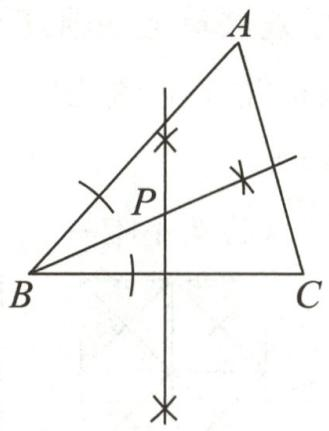

text_image

A
P
B
C

第 3 题答图

4.C 5.6

6. 解: (1) 如答图①, 直线 m 即为所求.

(2)如答图②,直线 n 即为所求.

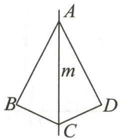  
①

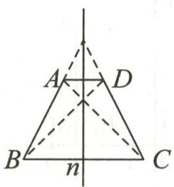  
②

# 第6题答图

7.(1)解: $DE \parallel AC$ . 理由如下:

∵AD是∠BAC的平分线，∴∠CAD=∠BAD.

∵EF垂直平分AD,∴AE=DE,∴∠BAD=∠EDA,

$$
\therefore \angle C A D = \angle E D A, \therefore D E \parallel A C.
$$

(2)证明:∵EF垂直平分AD,∴EA=ED,FA=FD.

在 $\triangle AEF$ 和 $\triangle DEF$ 中， $\left\{\begin{aligned}EA&=ED,\\ EF&=EF,\\ FA&=FD,\end{aligned}\right.$

$$
\therefore \triangle A E F \cong \triangle D E F (\text { SSS }), \therefore \angle E A F = \angle E D F.
$$

$$
\because D E \parallel A C, \therefore \angle C = \angle E D F, \therefore \angle C = \angle E A F.
$$

8.(1)平分线 如答图①,作∠BAC的平分线所在的直线a,则a即为所求.(画对称轴方法不唯一)

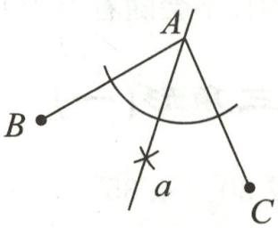  
第8题答图①

(2)垂直平分线 如答图②,线段 CD 即为所求.

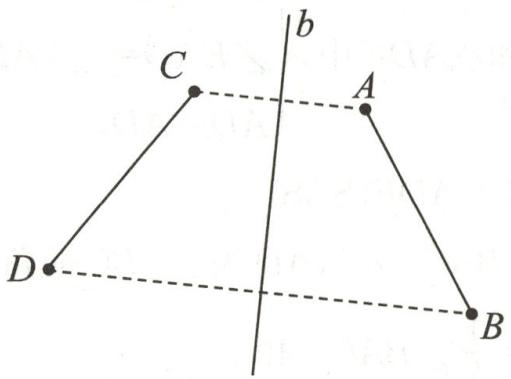

text_image

C
b
A
D
B

第8题答图②

(3)解:能.如答图③所示,连接BD;作线段BD的垂直平分线c,即为对称轴;作点C关于直线c的对称点E;连接BE;作 $\angle ABE$ 的平分线所在直线d,即为对称轴.故线段CD经过两次轴对称可与线段AB重合.(方法不唯一)

text_image

A
d
E
c
B
C
D

第8题答图③

# 作业 17 画轴对称的图形(一)

1.5:10 2.A或C

3. 解: 如答图.

  
①

text_image

A
l
(A')
B
C (C')
B'

②

  
③   
第3题答图

4. D 5. 6

6. 解: 如答图所示.

natural_image

Pure geometric diagram of three connected squares with a vertical dashed line dividing them (no text or symbols)

  
第6题答图

7. 解: (1) 如答图, AD 即为所求.

(2)如答图, $\triangle AB^{\prime}C^{\prime}$ 即为所求.

text_image

A
C' B' D B C

第7题答图

8.(1)解:如答图, $\triangle AB^{\prime}C^{\prime}$ 即为所求.

(2)3

text_image

l
A
C
C'
B
B'

第8题答图

9. 解: 如答图所示. (答案不唯一)

  
第9题答图

# 作业 18 画轴对称的图形(二)

1. A 2. D 3. -5 4. 1. 5

5.(1)y (2)// ⊥ -2 (3)AB//CD 3

6. 解: (1) ∵ 点 A, B 关于 x 轴对称,

$\therefore \left\{ \begin{array}{l} 2a - b = 2b - 1, \\ 5 + a = -(-a + b), \end{array} \right.$ 解得 $\left\{ \begin{array}{l} a = -8, \\ b = -5. \end{array} \right.$

(2)∵点A,B关于y轴对称,

$\therefore \left\{ \begin{array}{l} 2a - b = -(2b - 1), \\ 5 + a = -a + b, \end{array} \right.$ 解得 $\left\{ \begin{array}{l} a = -1, \\ b = 3, \end{array} \right.$

$$
\therefore (4 a + b) ^ {2 0 2 6} = [ 4 \times (- 1) + 3 ] ^ {2 0 2 6} = 1.
$$

7. $\left(\frac{1}{2},3\right)$ 8. $\frac{1}{2}<m<3$ 9. $(-a,b)$

10. 解: (1) 如答图所示.

text_image

y
4
3
2
A'
A
1
O
-5 -4 -3 -2 -1 1 2 3 4 x
C'
B'
B
C
-1
-2
-3
-4

第10题答图

(2)由(1)可知,点 $A', B', C'$ 的坐标分别为 $A'(-1,2)$ , $B'(-2,-2)$ , $C'(-4,-1)$ .

(3) $S_{\triangle ABC} = 3 \times 4 - \frac{1}{2} \times 4 \times 1 - \frac{1}{2} \times 2 \times 1 - \frac{1}{2} \times 3 \times 3 = \frac{9}{2}$ .

即 $\triangle ABC$ 的面积为 $\frac{9}{2}$ .

11. 解: (1) 如答图①, $\triangle A_{1}B_{1}C_{1}$ 即为所求, $\triangle A_{1}B_{1}C_{1}$ 各顶点的坐标分别为 $A_{1}(0,4)$ , $B_{1}(2,2)$ , $C_{1}(1,1)$ .

text_image

y
A(A₁)
l
B₁
B
C
C₁
O
M
x

第 11 题答图①

(2)如答图②,当0<a≤3时,

∵点P与点 $P_{1}$ 关于y轴对称, $P(-a,0),\therefore P_{1}(a,0)$ .
设 $P_{2}(x_{1},0)$ ，又∵点 $P_{1}$ 与点 $P_{2}$ 关于直线 l 对称，

$\therefore\frac{x_{1}+a}{2}=3$ , 即 $x_{1}=6-a,\therefore P_{2}(6-a,0)$ ,

$$
\therefore P _ {1} P _ {2} = 6 - a - a = 6 - 2 a.
$$

text_image

y
l
P 1 P₁ M
O 1 P₂ x

②

text_image

y
l
P 1 P₂ M
O 1 P₁ x

③   
第11题答图

如答图③, 当 a > 3 时,

∵点P与点 $P_{1}$ 关于y轴对称， $P(-a,0),\therefore P_{1}(a,0)$ .
设 $P_{2}(x_{2},0)$ ，又∵点 $P_{1}$ 与点 $P_{2}$ 关于直线 l 对称，

$\therefore\frac{x_{2}+a}{2}=3$ , 即 $x_{2}=6-a,\therefore P_{2}(6-a,0)$ ,

$$
\therefore P _ {1} P _ {2} = a - (6 - a) = 2 a - 6.
$$

综上所述,当 $0 < a \leqslant 3$ 时, $P_{1}P_{2}$ 的长为 6 - 2a;

当 a > 3 时, $P_{1}P_{2}$ 的长为 2a - 6.

(3) 当 $0 < a \leqslant 3$ 时, $PP_{2} = PP_{1} + P_{1}P_{2} = 2a + 6 - 2a = 6$ ;
当 a > 3 时， $PP_{2}=PP_{1}-P_{1}P_{2}=2a-(2a-6)=6.$

综上可知, $PP_{2}$ 的长不会随着点P位置的变化而变化.

# 作业 19 等腰三角形(一)

1. D 2. A 3. $60^{\circ}$ 或 $30^{\circ}$ 4. $35^{\circ}$

5.(1)证明:∵AD是△ABC的角平分线,∴∠BAD=∠CAD.
由作图知:AE=AF.

在 $\triangle ADE$ 和 $\triangle ADF$ 中， $\left\{\begin{aligned}AE&=AF,\\ \angle EAD&=\angle FAD,\\ AD&=AD,\end{aligned}\right.$

$$
\therefore \triangle A D E \cong \triangle A D F (\text { SAS }).
$$

(2)解: $\because \angle BAC=80^{\circ}, AD$ 为 $\triangle ABC$ 的角平分线,

$$
\therefore \angle E A D = \frac {1}{2} \angle B A C = 4 0 ^ {\circ}.
$$

由作图知:AE=AD,∴ $\angle AED=\angle ADE$ ,

$$
\therefore \angle A D E = \frac {1}{2} \times (1 8 0 ^ {\circ} - 4 0 ^ {\circ}) = 7 0 ^ {\circ}.
$$

∵AB=AC,AD为△ABC的角平分线，

$$
\therefore A D \perp B C. \therefore \angle B D E = 9 0 ^ {\circ} - \angle A D E = 2 0 ^ {\circ}.
$$

6. C 7. $45^{\circ}$ 8. $30^{\circ}$ 或 $75^{\circ}$ 或 $52.5^{\circ}$

9. 证明: 过点 A 作 $AE \perp BC$ 于点 E, 如答图.

text_image

A
B
E
C
D

第9题答图

$$
\because A B = A C, \therefore \angle B A C = 2 \angle C A E.
$$

$$
\because B D \perp A C, \therefore \angle B D C = \angle A E C = 9 0 ^ {\circ},
$$

$$
\therefore \angle C B D = 9 0 ^ {\circ} - \angle C, \angle C A E = 9 0 ^ {\circ} - \angle C,
$$

$$
\therefore \angle C B D = \angle C A E, \therefore \angle B A C = 2 \angle C B D.
$$

10. 解: (1) $\because \angle BAC = 90^{\circ}, AB = AC,$

$$
\therefore \angle B = \angle C = \frac {1}{2} (1 8 0 ^ {\circ} - \angle B A C) = 4 5 ^ {\circ},
$$

$$
\therefore \angle A D C = \angle B + \angle B A D = 4 5 ^ {\circ} + 3 0 ^ {\circ} = 7 5 ^ {\circ}.
$$

$$
\because \angle D A C = \angle B A C - \angle B A D = 9 0 ^ {\circ} - 3 0 ^ {\circ} = 6 0 ^ {\circ}, A D = A E,
$$

$$
\therefore \angle A D E = \angle A E D = \frac {1}{2} (1 8 0 ^ {\circ} - \angle D A C) = 6 0 ^ {\circ},
$$

$$
\therefore \angle E D C = \angle A D C - \angle A D E = 7 5 ^ {\circ} - 6 0 ^ {\circ} = 1 5 ^ {\circ}.
$$

(2)同(1)得 $\angle B=\angle C=\frac{1}{2}(180^{\circ}-\angle BAC)=90^{\circ}-\frac{1}{2}\alpha,$

$$
\begin{array}{l} \therefore \angle A D C = \angle B + \angle B A D = 9 0 ^ {\circ} - \frac {1}{2} \alpha + 3 0 ^ {\circ} = 1 2 0 ^ {\circ} - \\ \frac {1}{2} \alpha . \end{array}
$$

$$
\because \angle D A C = \angle B A C - \angle B A D = \alpha - 3 0 ^ {\circ}, A D = A E,
$$

$$
\therefore \angle A D E = \angle A E D = \frac {1}{2} (1 8 0 ^ {\circ} - \angle D A C) = 1 0 5 ^ {\circ} - \frac {1}{2} \alpha ,
$$

$$
\begin{array}{l} \therefore \angle E D C = \angle A D C - \angle A D E = (1 2 0 ^ {\circ} - \frac {1}{2} \alpha) - \\ (1 0 5 ^ {\circ} - \frac {1}{2} \alpha) = 1 5 ^ {\circ}. \end{array}
$$

(3) $\angle EDC = \frac{1}{2}\angle BAD.$

11. 解: (1) 如答图①.

text_image

45°
90°
135°
45°

第 11 题答图①

(2)①如答图②所示.

text_image

A
30°
2x
E
30°
2x
x
B
D
C

text_image

A
30°
2x
E
30°
B
D
x
x
C

第 11 题答图②

②当 AD=AE 时， $2x+x=30^{\circ}+30^{\circ}$ ，解得 $x=20^{\circ}$ ；
当 AD=DE 时， $30^{\circ}+30^{\circ}+2x+x=180^{\circ}$ ，解得 $x=40^{\circ}$ .
综上可知， $\angle C$ 的度数是 $20^{\circ}$ 或 $40^{\circ}$ .

# 作业 20 等腰三角形(二)

1.C 2.4

3.(1)证明:∵D为边AC的垂直平分线与边BC的交点,

$$
\begin{array}{l} \therefore D C = A D, \therefore \angle C = \angle C A D, \\ \therefore \angle A D B = \angle C + \angle C A D = 2 \angle C = \angle B, \therefore A B = A D. \\ \end{array}
$$

(2) 解: $\because AB=AD, CD=AD, BD=AB-2, BC=8,$

$$
\therefore C D + C D - 2 = 8, \therefore C D = 5.
$$

4. D 
5. A 
6. 3

7. 证明：∵AD平分∠BAC，∴∠BAD=∠CAD.

$$
\because D E \parallel A C, \therefore \angle E D A = \angle C A D, \therefore \angle E D A = \angle B A D,
$$

$$
\therefore E A = E D. \because B D \perp A D, \therefore \angle A D B = 9 0 ^ {\circ},
$$

$$
\therefore \angle A D E + \angle B D E = 9 0 ^ {\circ}, \angle D A B + \angle A B D = 9 0 ^ {\circ}.
$$

$$
\therefore \angle A B D = \angle B D E, \therefore E B = E D.
$$

∴EB=EA, 即 E 为 AB 的中点.

8.(1)解:∵∠C=3∠B,∠C=75°,∴∠B=25°,

$$
\therefore \angle B A C = 1 8 0 ^ {\circ} - \angle B - \angle C = 8 0 ^ {\circ}.
$$

∵AD平分∠BAC,∴∠BAD= $\frac{1}{2}$ ∠BAC=40°,

$$
\begin{array}{l} \therefore \angle A D E = \angle B A D + \angle B = 6 5 ^ {\circ}. \\ \because A E \perp B C, \therefore \angle A E D = 9 0 ^ {\circ}, \\ \therefore \angle D A E = 9 0 ^ {\circ} - \angle A D E = 9 0 ^ {\circ} - 6 5 ^ {\circ} = 2 5 ^ {\circ}. \\ \end{array}
$$

(2)证明:设 $\angle B=\alpha$ ,则 $\angle C=3\alpha$ ,

$$
\therefore \angle B A C = 1 8 0 ^ {\circ} - \angle B - \angle C = 1 8 0 ^ {\circ} - 4 \alpha .
$$

∵AD平分∠BAC,

$$
\therefore \angle B A D = \frac {1}{2} \angle B A C = \frac {1}{2} (1 8 0 ^ {\circ} - 4 \alpha) = 9 0 ^ {\circ} - 2 \alpha .
$$

$$
\begin{array}{l} \because D F \perp A D, \therefore \angle A D F = 9 0 ^ {\circ}, \\ \therefore \angle A F D = 9 0 ^ {\circ} - \angle B A D = 9 0 ^ {\circ} - (9 0 ^ {\circ} - 2 \alpha) = 2 \alpha . \\ \because \angle A F D = \angle B + \angle B D F, \therefore \angle B D F = \alpha = \angle B, \\ \therefore B F = D F. \\ \end{array}
$$

9.(1)36

(2)①证明：∵AB=AC，∴∠ABC=∠C.

$$
\begin{array}{l} \because \angle D B E = \angle C B A + \angle A B E, \angle B D E = \angle D A C + \angle C, \\ \angle A B E = \angle D A C, \\ \therefore \angle D B E = \angle B D E, \therefore B E = D E. \\ \end{array}
$$

②解:补全的图形如答图所示, $\angle BFE=\angle AFC.$

text_image

F
C
D
G
B
A
E

第9题答图

证明如下: 过点 B 作 $BG \perp EF$ 于点 G, 如答图.

$$
\because D F = A E, \therefore A E + A D = D F + A D, \text { 即 } D E = A F.
$$

$$
\because B E = D E, \therefore B E = A F.
$$

在 $\triangle ABE$ 和 $\triangle CAF$ 中， $\left\{\begin{aligned}BE&=AF,\\ \angle ABE&=\angle CAF,\\ AB&=CA,\end{aligned}\right.$

$$
\therefore \triangle A B E \cong \triangle C A F (\mathrm{SAS}), \therefore \angle E = \angle A F C.
$$

$$
\because B A = B D, B G \perp E F, \therefore D G = A G.
$$

$$
\because D F = A E, \therefore D G + D F = A G + A E, \text { 即 } F G = E G.
$$

$$
\because B G \perp E F \text {   于点   } G, \therefore B E = B F, \therefore \angle B F E = \angle E,
$$

$$
\therefore \angle B F E = \angle A F C.
$$

# 专题 9 利用平行线构造等腰三角形

1. 证明：∵CE 是△ABC 的角平分线，∴∠FCE=∠BCE.

$$
\because E F \parallel B C, \therefore \angle F E C = \angle B C E,
$$

$$
\therefore \angle F C E = \angle F E C, \therefore F E = F C,
$$

∴△FEC 是等腰三角形.

2. 解: (1) PN = 2BM. 证明如下:

如答图①,作 $PF \parallel AC$ 交 BC 于点 F,交 BD 于点 E.

$$
\because B D \perp A C, P F \parallel A C, \therefore P F \perp B D, \angle B P E = \angle A = 4 5 ^ {\circ},
$$

$$
\therefore \angle B E P = 9 0 ^ {\circ}, \angle P B E = \angle B P E = 4 5 ^ {\circ}, \therefore B E = P E.
$$

$$
\because P M \perp B C, \therefore \angle P M B = \angle P E N = 9 0 ^ {\circ}.
$$

$$
\because \angle B N M = \angle P N E, \therefore \angle N P E = \angle E B F.
$$

$$
\because \angle P E N = \angle B E F = 9 0 ^ {\circ},
$$

$$
\therefore \triangle P E N \cong \triangle B E F (\mathrm{ASA}), \therefore P N = B F.
$$

$$
\because A B = A C, \therefore \angle A B C = \angle C.
$$

$$
\because P F \parallel A C, \therefore \angle P F B = \angle C,
$$

$$
\therefore \angle P F B = \angle P B F, \therefore P B = P F.
$$

$$
\because P M \perp B F, \therefore B M = M F, \therefore P N = 2 B M.
$$

text_image

A
P
E
D
B M F C
N

①

text_image

Geometric diagram of triangle ABC with auxiliary lines and labeled points E, F, M, N, P, D

②   
第2题答图

(2)结论成立.证明如下:

如答图②,作 $PE \parallel AC$ 交 CM 的延长线于点 E,交 DN 的延长线于点 F.

$$
\because P F \parallel A C, B D \perp A C, \therefore B F \perp E P.
$$

$$
\therefore \angle A B D = \angle P B F = \angle B P F = 4 5 ^ {\circ}, \therefore B F = P F.
$$

$$
\because \angle E + \angle E B F = 9 0 ^ {\circ}, \angle E + \angle E P M = 9 0 ^ {\circ},
$$

$$
\therefore \angle E B F = \angle E P M.
$$

$$
\because \angle E F B = \angle N F P, B F = P F,
$$

$$
\therefore \triangle B F E \cong \triangle P F N (\mathrm{ASA}), \therefore B E = P N.
$$

$$
\because \angle E = \angle C = \angle A B C = \angle P B E, \therefore P E = P B.
$$

$$
\because P M \perp E B, \therefore E M = B M, \therefore P N = 2 B M.
$$

3.5 4.100°

5.(1)证明:如答图.∵EF∥AD,∴∠1=∠4,∠2=∠P.

$$
\because A D \text {   平分   } \angle B A C, \therefore \angle 1 = \angle 2,
$$

$$
\therefore \angle 4 = \angle P, \therefore A F = A P \text { ,   即 } \triangle A P F \text {   是等腰三角形.   }
$$

(2) 解: AB = PC. 证明如下:

$$
\because C H \parallel A B, \therefore \angle 5 = \angle B, \angle H = \angle 1.
$$

$$
\because E F \parallel A D, \therefore \angle 1 = \angle 3, \therefore \angle H = \angle 3.
$$

在 $\triangle BEF$ 和 $\triangle CDH$ 中， $\left\{\begin{aligned}\angle B&=\angle5,\\ \angle3&=\angle H,\\ BE&=CD,\end{aligned}\right.$

$$
\therefore \triangle B E F \cong \triangle C D H (\text { AAS }), \therefore B F = C H.
$$

$$
\because A D \text {   平分   } \angle B A C, \therefore \angle 1 = \angle 2, \therefore \angle 2 = \angle H,
$$

$$
\therefore A C = C H, \therefore A C = B F.
$$

$$
\because A B = A F + B F, P C = A P + A C, \therefore A B = P C.
$$

text_image

P
4
A
F
1
2
3
B
E
D
C
5
H

第 5 题答图

6.(1)证明:∵BM//AC,AF平分∠BAC,

$$
\therefore \angle A F B = \angle F A C = \angle F A B, \therefore A B = B F.
$$

$$
\because B E \text {   平分   } \angle A B F, \therefore A E = E F.
$$

(2) 解: 如答图, 设 BC 与 AE 相交于点 D.

text_image

M F
B
E
D
C
A

第6题答图

由(1)可知 $BE \perp AF.$

在 $\triangle ACD$ 和 $\triangle BED$ 中， $\left\{\begin{aligned}\angle ADC&=\angle BDE,\\ \angle ACD&=\angle BED,\\ AC&=BE,\end{aligned}\right.$

$$
\therefore \triangle A C D \cong \triangle B E D (\mathrm{AAS}),
$$

$$
\therefore \angle C A D = \angle E B D, A D = B D. \therefore \angle B A D = \angle D B A.
$$

$$
\because A F \text {   平分   } \angle B A C, \therefore \angle C A D = \angle B A D.
$$

$$
\therefore \angle C B A = \angle B A D = \angle C A D.
$$

$$
\because B C \perp A C, \therefore \angle C A D = \angle B A D = \angle C B A = 3 0 ^ {\circ},
$$

$$
\therefore \angle B A C = 6 0 ^ {\circ} \text {, 即} \alpha = 6 0 ^ {\circ}.
$$

# 作业 21 等边三角形

1. B 2. $60^{\circ}$ 3.4或6

4. 证明: (1) ∵ △ABC 是等边三角形,

$$
\therefore A B = A C, \angle B A C = 6 0 ^ {\circ}.
$$

在 $\triangle ABD$ 和 $\triangle ACE$ 中， $\left\{\begin{aligned}AB&=AC,\\ \angle1&=\angle2,\\ BD&=CE,\end{aligned}\right.$

$$
\therefore \triangle A B D \cong \triangle A C E (\mathrm{SAS}).
$$

(2) $\because\triangle ABD\cong\triangle ACE,$

$$
\therefore A D = A E, \angle C A E = \angle B A D = 6 0 ^ {\circ},
$$

∴△ADE 是等边三角形.

5.A 6.4或36

7.(1)证明:∵△ABC是等边三角形,

$$
\therefore \angle A B C = \angle A C B = 6 0 ^ {\circ}, A C = B C.
$$

∵D是AB的中点，

$$
\therefore \angle C D B = 9 0 ^ {\circ}, \angle D C B = \frac {1}{2} \angle A C B = 3 0 ^ {\circ}.
$$

$$
\because D C = D E, \therefore \angle E = \angle D C B = 3 0 ^ {\circ}.
$$

$$
\because \angle E D B = \angle A B C - \angle E = 3 0 ^ {\circ},
$$

$$
\therefore \angle E D B = \angle E = 3 0 ^ {\circ}, \therefore B E = B D.
$$

$$
\because B D = A D, \therefore B E = A D.
$$

(2) 解: BE = AD 还成立. 理由如下:

过点 D 作 $DF \parallel CB$ ，交 AC 于点 F，如答图.

text_image

A
D
F
E B C

第7题答图

∵△ABC 是等边三角形，

$$
\therefore \angle A B C = \angle A C B = \angle A = 6 0 ^ {\circ},
$$

$$
\therefore \angle A B E = 1 8 0 ^ {\circ} - \angle A B C = 1 2 0 ^ {\circ}.
$$

$$
\because D F \parallel B C, \therefore \angle A D F = \angle A B C = 6 0 ^ {\circ}, \angle A F D = \angle A C B = 6 0 ^ {\circ},
$$

$$
\therefore \angle C F D = 1 8 0 ^ {\circ} - \angle A F D = 1 2 0 ^ {\circ}, \therefore \angle A B E = \angle C F D = 1 2 0 ^ {\circ}.
$$

$$
\because \angle A = \angle A D F = \angle A F D = 6 0 ^ {\circ},
$$

∴△ADF 是等边三角形, ∴AD=DF.

$$
\because D E = D C, \therefore \angle E = \angle D C E.
$$

$$
\because D F \parallel B C, \therefore \angle D C B = \angle F D C, \therefore \angle E = \angle F D C,
$$

$$
\therefore \triangle D B E \cong \triangle C F D (\text { AAS }), \therefore B E = D F, \therefore B E = A D.
$$

8. 解: $\because \triangle ABC$ 和 $\triangle BDE$ 都是等边三角形,

$$
\therefore A B = C B, \angle A B C = 6 0 ^ {\circ}, B D = B E, \angle D B E = 6 0 ^ {\circ},
$$

$$
\therefore \angle C B D = 1 8 0 ^ {\circ} - \angle A B C - \angle D B E = 6 0 ^ {\circ},
$$

$$
\therefore \angle A B D = \angle A B C + \angle C B D = 1 2 0 ^ {\circ}, \angle C B E = \angle C B D +
$$

$$
\angle D B E = 1 2 0 ^ {\circ}, \text { 即 } \angle A B D = \angle C B E.
$$

在 $\triangle ABD$ 和 $\triangle CBE$ 中， $\left\{\begin{aligned}AB&=CB,\\ \angle ABD&=\angle CBE,\\ BD&=BE,\end{aligned}\right.$

$$
\therefore \triangle A B D \cong \triangle C B E (\mathrm{SAS}),
$$

$$
\therefore \angle B A D = \angle B C E, A D = C E = a.
$$

$$
\because B G \perp A D, B H \perp C E, \therefore \angle A G B = \angle C H B = 9 0 ^ {\circ}.
$$

在 $\triangle ABG$ 和 $\triangle CBH$ 中, $\left\{\begin{aligned}\angle AGB&=\angle CHB=90^{\circ},\\\angle BAG&=\angle BCH,\\AB&=CB,\end{aligned}\right.$

$$
\therefore \triangle A B G \cong \triangle C B H (\mathrm{AAS}),
$$

$$
\therefore B G = B H, \angle A B G = \angle C B H,
$$

$$
\therefore \angle A B C + \angle C B G = \angle C B D + \angle D B H.
$$

$$
\because \angle A B C = \angle C B D = 6 0 ^ {\circ}, \therefore \angle C B G = \angle D B H,
$$

$$
\therefore \angle G B H = \angle G B D + \angle D B H = \angle G B D + \angle C B G =
$$

$$
\angle C B D = 6 0 ^ {\circ},
$$

∴△BGH为等边三角形，∴GH=BH=BG，

$$
\therefore S _ {\triangle C B E} = \frac {1}{2} C E \cdot B H = \frac {1}{2} a \cdot G H.
$$

∵AB=3BE, $\triangle ABC$ 的面积是S,

$\therefore S_{\triangle ABC} = 3S_{\triangle CBE}$ ，即 $S = 3\times \frac{1}{2} a\cdot GH,\therefore GH = \frac{2S}{3a}.$

9.(1)证明:如答图①,在CA上截取CM=CD,连接DM.

$\because \triangle ABC$ 是等边三角形, $\therefore \angle ACB=60^{\circ}$ ,

$\therefore \triangle CDM$ 是等边三角形，

$$
\therefore M D = C D = C M, \angle C M D = \angle C D M = 6 0 ^ {\circ},
$$

$$
\therefore \angle A M D = 1 2 0 ^ {\circ}.
$$

$$
\because \angle A D E = 6 0 ^ {\circ}, \therefore \angle A D E = \angle M D C,
$$

$$
\therefore \angle A D M = \angle E D C.
$$

∵DE与△ABC的外角平分线交于点E，

$$
\therefore \angle A C E = 6 0 ^ {\circ}, \therefore \angle D C E = 1 2 0 ^ {\circ} = \angle A M D.
$$

在 $\triangle ADM$ 和 $\triangle EDC$ 中， $\left\{\begin{aligned}\angle ADM&=\angle EDC,\\ MD&=CD,\\ \angle AMD&=\angle ECD,\end{aligned}\right.$

$$
\therefore \triangle A D M \cong \triangle E D C (\text { ASA }), \therefore A M = C E,
$$

$$
\therefore C A = C M + A M = C D + C E.
$$

text_image

Geometric diagram with labeled points A, B, C, D, E and line segments, including a dashed line segment BM intersecting the base.

①

text_image

Geometric diagram with labeled points A, B, C, D, E, M and intersecting lines forming triangles and a line segment

②   
第9题答图

(2) 解: CA = CE - CD. 证明如下:

如答图②, 在 AC 的延长线上截取 CM=CD, 连接 DM.

$\because \triangle ABC$ 是等边三角形, $\therefore \angle ACB=60^{\circ}$ ,

$\therefore \angle DCM=60^{\circ}, \therefore \triangle CDM$ 是等边三角形，

$$
\therefore M D = C D = C M, \angle C M D = \angle C D M = 6 0 ^ {\circ}.
$$

∵DE与△ABC的外角平分线交于点E，

$$
\therefore \angle A C E = \angle D C E = 6 0 ^ {\circ}, \therefore \angle E C D = \angle A M D.
$$

$$
\because \angle A D E = 6 0 ^ {\circ}, \therefore \angle A D E = \angle C D M,
$$

$$
\therefore \angle A D M = \angle E D C.
$$

在 $\triangle ADM$ 和 $\triangle EDC$ 中， $\left\{\begin{aligned}\angle ADM&=\angle EDC,\\ MD&=CD,\\ \angle AMD&=\angle ECD,\end{aligned}\right.$

$$
\therefore \triangle A D M \cong \triangle E D C (\mathrm{ASA}), \therefore A M = E C,
$$

$$
\therefore C A = A M - C M = C E - C D.
$$

# 作业 22 含 $30^{\circ}$ 角的直角三角形的性质

1.C 2.9 3.20

4.(1)证明:∵△ABC为等边三角形,∴∠ACB=60°.

$$
\begin{array}{l} \because D F \perp B E, \therefore \angle D F C = 9 0 ^ {\circ}, \angle F D C = 9 0 ^ {\circ} - \angle A C B = 3 0 ^ {\circ}, \\ \therefore D C = 2 C F. \because C E = C D, \therefore C E = 2 C F. \\ \end{array}
$$

(2) 解: $\because CF = 2$ , 由 (1) 知 $CE = 2CF$ , $\therefore DC = 2CF = 4$ .

∵△ABC为等边三角形,BD是中线,

$$
\therefore A B = B C = A C = 2 D C = 8,
$$

∴△ABC 的周长=AB+AC+BC=8+8+8=24.

5.C 6.1 7.2

8.(1)证明:∵△ABC是等边三角形,

$$
\therefore \angle B A C = \angle C = 6 0 ^ {\circ}, A B = C A.
$$

在 $\triangle ABE$ 和 $\triangle CAD$ 中， $\left\{\begin{aligned}AB&=CA,\\ \angle BAE&=\angle C,\\ AE&=CD,\end{aligned}\right.$

$$
\therefore \triangle A B E \cong \triangle C A D (\mathrm{SAS}).
$$

(2) 解: $\because \triangle ABE \cong \triangle CAD, \therefore \angle ABE = \angle CAD,$

$$
\therefore \angle A B E + \angle B A P = \angle C A D + \angle B A P,
$$

即 $\angle BPD = \angle BAC = 60^{\circ}.$

(3) 解: $\because BQ \perp AD, \therefore \angle BQP = 90^{\circ}$ ,

$$
\therefore \angle P B Q = 3 0 ^ {\circ}, \therefore B P = 2 P Q = 1 2,
$$

$$
\therefore B E = B P + P E = 1 2 + 2 = 1 4.
$$

$$
\because \triangle A B E \cong \triangle C A D, \therefore A D = B E = 1 4.
$$

9.(1) $15^{\circ}$

(2)解:①∵△ABC,△BEF都是等边三角形,

$$
\therefore \angle A B C = \angle E B F = 6 0 ^ {\circ}, B A = B C, B E = B F,
$$

$$
\therefore \angle A B E = \angle C B F, \therefore \triangle A B E \cong \triangle C B F (\mathrm{SAS}),
$$

$$
\therefore \angle B A E = \angle B C F.
$$

$\because \angle BAC = 60^{\circ}, AD$ 平分 $\angle BAC,$

$$
\therefore \angle B A D = \frac {1}{2} \angle B A C = 3 0 ^ {\circ}, \therefore \angle B A E = \angle B C F = 1 5 0 ^ {\circ},
$$

$$
\therefore \angle D C M = 1 8 0 ^ {\circ} - 1 5 0 ^ {\circ} = 3 0 ^ {\circ}.
$$

$$
\because \angle C D M = 9 0 ^ {\circ}, \therefore \angle A M C = 9 0 ^ {\circ} - 3 0 ^ {\circ} = 6 0 ^ {\circ}.
$$

② $\triangle BPQ$ 的面积是定值,定值为20.求解如下:

过点 B 作 $BH \perp CM$ 于点 H, 如答图.

在 Rt△CBH 中，CB=8，∠BCH=30°，

$$
\therefore B H = \frac {1}{2} B C = 4,
$$

∴△BPQ的面积= $\frac{1}{2}PQ\cdot BH=\frac{1}{2}\times10\times4=20.$

text_image

Geometric diagram with labeled points and lines, likely from a math problem or proof

第9题答图

# 专题10 利用三线合一作辅助线

1. 证明: 如答图, 连接 AD.

∵AB=AC,D是BC的中点,∴∠EAD=∠FAD.

在 $\triangle AED$ 和 $\triangle AFD$ 中， $\left\{\begin{aligned}AE&=AF,\\ \angle EAD&=\angle FAD,\\ AD&=AD,\end{aligned}\right.$

$$
\therefore \triangle A E D \cong \triangle A F D (\mathrm{SAS}), \therefore D E = D F.
$$

text_image

A
E
F
B
D
C

第1题答图

text_image

A
E
D
C
F
B

第2题答图

2. 证明: 如答图, 连接 DC.

$$
\because \angle A = \angle B, \therefore B C = A C.
$$

$\because \angle BCA=90^{\circ},\therefore \triangle ABC$ 是等腰直角三角形.

∵D为AB的中点，

$\therefore BD=CD=AD,CD$ 平分 $\angle BCA,CD\perp AB.$

$$
\because \angle A + \angle A C D = \angle A C D + \angle F C D = 9 0 ^ {\circ}, \therefore \angle A = \angle F C D.
$$

在 $\triangle ADE$ 和 $\triangle CDF$ 中， $\left\{\begin{aligned}AE&=CF,\\ \angle A&=\angle FCD,\\ AD&=CD,\end{aligned}\right.$

$$
\therefore \triangle A D E \cong \triangle C D F (\mathrm{SAS}), \therefore D E = D F.
$$

3.(1)证明:如答图,连接AD.

$$
\because \angle B = \angle C, \therefore A B = A C.
$$

∵D为BC的中点，∴∠BAD=∠CAD.

在 $\triangle ADE$ 和 $\triangle ADF$ 中， $\left\{\begin{aligned}\angle EAD&=\angle FAD,\\ \angle DEA&=\angle DFA,\\ AD&=AD,\end{aligned}\right.$

$$
\therefore \triangle A D E \cong \triangle A D F (\text { A   A   S }), \therefore D E = D F.
$$

text_image

A
E
F
B
D
C

第3题答图

(2) 解: $\because \angle BDE = 40^{\circ}, \therefore \angle B = 50^{\circ}, \therefore \angle C = 50^{\circ}$ ,

$$
\therefore \angle B A C = 1 8 0 ^ {\circ} - \angle B - \angle C = 8 0 ^ {\circ}.
$$

4. 证明: 如答图, 连接 ED, DF.

$$
\because A B = A C, \therefore \angle B = \angle C.
$$

在 $\triangle BED$ 和 $\triangle CDF$ 中， $\left\{\begin{aligned}BE&=CD,\\ \angle B&=\angle C,\\ BD&=CF,\end{aligned}\right.$

$$
\therefore \triangle B E D \cong \triangle C D F (\mathrm{SAS}), \therefore D E = D F.
$$

∵G是EF的中点,∴DG⊥EF.

text_image

A
G
E
F
B
D
C

第4题答图

5. 证明: 如答图, 过点 A 作 $AF \perp BC$ 于点 F.

$$
\because A D = A E, \therefore D F = E F.
$$

$$
\because B D = C E, \therefore B D + D F = C E + E F, \text {即} B F = C F.
$$

$$
\because A F \perp B C, \therefore A B = A C.
$$

text_image

A
B D F E C

第5题答图

6. 证明: 如答图, 作 $EF \perp AC$ 于点 $F$ .

text_image

B
D
E
A
F
C

第6题答图

$$
\because E A = E C, \therefore A F = F C = \frac {1}{2} A C.
$$

$$
\because A C = 2 A B, \therefore A F = A B.
$$

∵AD平分∠BAC,∴∠BAD=∠CAD.

在 $\triangle BAE$ 和 $\triangle FAE$ 中， $\left\{\begin{aligned}AB&=AF,\\ \angle BAE&=\angle FAE,\\ AE&=AE,\end{aligned}\right.$

$$
\therefore \triangle B A E \cong \triangle F A E (\mathrm{SAS}), \therefore \angle A B E = \angle A F E = 9 0 ^ {\circ},
$$

$$
\therefore E B \perp A B.
$$

7. 证明: (方法 1) $\because \angle ACB = 90^{\circ}, \therefore \angle BCD = 90^{\circ} - \angle ACD.$

$$
\text { 又 } \because B C = B D, \therefore \angle B C D = \angle B D C,
$$

$$
\begin{array}{l} {\therefore \angle A B C = 1 8 0 ^ {\circ} - 2 \angle B C D = 1 8 0 ^ {\circ} - 2 (9 0 ^ {\circ} - \angle A C D) =} \\ {2 \angle A C D.} \end{array}
$$

(方法 2) $\because\angle ACB=90^{\circ}$ ,

$$
\therefore \angle A C D + \angle B C E = 9 0 ^ {\circ}, \angle C B E + \angle B C E = 9 0 ^ {\circ},
$$

$$
\therefore \angle A C D = \angle C B E.
$$

$$
\text { 又 } \because B C = B D, B E \perp C D,
$$

$$
\therefore \angle A B C = 2 \angle C B E, \therefore \angle A B C = 2 \angle A C D.
$$

# 专题 11 与等腰三角形有关的基本图形

1.4 2.3

3. 解: 如答图, 作 $CM \perp y$ 轴于点 M.

$$
\because B (0, 2), C (2, - 2), \therefore C M = B O = O M = 2, \therefore B M = 4.
$$

在 Rt△AOB 和 Rt△BMC 中， $\left\{\begin{aligned}AB&=BC,\\ BO&=CM,\end{aligned}\right.$

$$
\therefore \mathrm{Rt} \triangle A O B \cong \mathrm{Rt} \triangle B M C (\mathrm{HL}), \therefore A O = B M = 4,
$$

∴点 A 的坐标为 $(-4,0)$ .

text_image

y
B
A
O
x
M
C

第3题答图

4. 解: 如答图, 作 $AM \perp BC$ 于点 M, 作 $EN \perp BC$ 于点 N,

$$
\therefore \angle E N D = 9 0 ^ {\circ}.
$$

$$
\because A B = A C, \angle B A C = 9 0 ^ {\circ}, A M \perp B C,
$$

$$
\therefore A M = M B = C M, \angle A M D = 9 0 ^ {\circ}.
$$

$$
\because A D \perp D E, \therefore \angle A D E = 9 0 ^ {\circ},
$$

$$
\therefore \angle A D M + \angle E D N = 9 0 ^ {\circ}, \angle E D N + \angle N E D = 9 0 ^ {\circ},
$$

$$
\therefore \angle M D A = \angle N E D.
$$

$$
\because A D = D E, \therefore \triangle A M D \cong \triangle D N E (\text { A   A   S }),
$$

$$
\therefore D M = E N, D N = A M = B M,
$$

$$
\therefore D N - M N = B M - N M, \text {即} D M = B N,
$$

$$
\therefore B N = E N, \therefore \angle D B E = \angle B E N = 4 5 ^ {\circ}.
$$

text_image

A
B N M D C
E

第 4 题答图

5.(1)解:画出图形如答图.

text_image

Geometric diagram with labeled points A, B, C, D, E, F and right-angle markers at C and D

第5题答图

证明: 在 Rt△ACE 和 Rt△BAD 中, $\left\{\begin{aligned}AE&=BD,\\ AC&=BA,\end{aligned}\right.$

$$
\therefore \mathrm{Rt} \triangle A C E \cong \mathrm{Rt} \triangle B A D (\mathrm{HL}), \therefore C E = A D.
$$

(2)证明：∵Rt△ACE≌Rt△BAD,∴∠E=∠ADB.

$$
\because \angle C F E = \angle A D B, \therefore \angle C F E = \angle E.
$$

$$
\because \angle A C E + \angle D A B = 1 8 0 ^ {\circ}, \therefore C E / / A B, \therefore \angle E = \angle F A B.
$$

$$
\because \angle C F E = \angle A F B, \therefore \angle B A F = \angle A F B.
$$

$$
\because \angle A D B = \angle E = \angle E A B, \therefore A E \perp B D,
$$

$$
\therefore \angle E A B + \angle A B D = 9 0 ^ {\circ}, \angle A F B + \angle F B D = 9 0 ^ {\circ},
$$

$$
\therefore \angle A B D = \angle F B D, \therefore B D \text {   平分   } \angle A B C.
$$

6.(1)证明:如答图①,连接DF.

text_image

A
D
F
B E C

①

text_image

A
H
N
B
O
M
C
G
Q

②

# 第6题答图

$$
\because D E = E F, \angle D E F = 6 0 ^ {\circ},
$$

∴△DEF 是等边三角形，∴DF=EF.

$\because \triangle ABC$ 是等边三角形, $\therefore \angle A = \angle C = 60^{\circ}$ .

$$
\because \angle A F E = \angle A F D + \angle D F E = 6 0 ^ {\circ} + \angle A F D, \angle A F E =
$$

$$
\angle C + \angle F E C = 6 0 ^ {\circ} + \angle F E C,
$$

$$
\therefore \angle A F D = \angle F E C. \text {   又   } \angle A = \angle C, D F = E F,
$$

$$
\therefore \triangle A D F \cong \triangle C F E (\text { AAS }), \therefore A D = C F.
$$

(2) 解: 如答图②, 延长 MO 到点 G, 使 OG = OM, 连接 NG, BG, NM, 作 $\angle ACQ = \angle ABN$ , 且使 CQ = BN, 连接 MQ, AQ.

$$
\because M O \perp N O, O M = O G, \therefore N G = M N.
$$

$$
\because M O = O G, B O = O C, \angle M O C = \angle B O G,
$$

$$
\therefore \triangle B O G \cong \triangle C O M (\mathrm{SAS}),
$$

$$
\therefore B G = C M, \angle G B O = \angle O C M,
$$

$$
\therefore B G \parallel C M, \therefore \angle N B G = 1 8 0 ^ {\circ} - \angle B H C = 6 0 ^ {\circ}.
$$

$$
\because \angle B H C = 1 2 0 ^ {\circ}, \therefore \angle H B C + \angle H C B = 6 0 ^ {\circ}.
$$

∵△ABC是等边三角形，∴∠ABC=∠ACB=∠BAC=60°，

$$
\therefore \angle A B H + \angle H B C = 6 0 ^ {\circ}, \angle A C H + \angle H C B = 6 0 ^ {\circ},
$$

$$
\therefore \angle A B H = \angle H C B, \angle H B C = \angle A C H.
$$

$$
\because \angle A C Q = \angle A B N, A B = A C, B N = C Q,
$$

$$
\therefore \triangle A C Q \cong \triangle A B N (\mathrm{SAS}), \therefore A N = A Q, \angle B A N = \angle C A Q.
$$

$$
\because \angle A C B = \angle A C H + \angle B C H = 6 0 ^ {\circ}, \angle A B N = \angle B C H =
$$

$$
\angle A C Q, \therefore \angle M C Q = \angle A C M + \angle A C Q = \angle A C H +
$$

$$
\angle B C H = 6 0 ^ {\circ} = \angle N B G, \text {   又   } B N = C Q, B G = C M,
$$

$$
\therefore \triangle B N G \cong \triangle C Q M (\text { SAS }), \therefore N G = M Q.
$$

$$
\because N G = N M, \therefore M Q = M N.
$$

$$
\because A N = A Q, A M = A M, \therefore \triangle N A M \cong \triangle Q A M (\text { S   S   S }),
$$

$$
\therefore \angle N A M = \angle M A Q = \angle C A M + \angle C A Q = \angle C A M
$$

$$
+ \angle B A N.
$$

$$
\because \angle N A M + \angle C A M + \angle B A N = 6 0 ^ {\circ},
$$

$$
\therefore \angle C A M + \angle B A N = 3 0 ^ {\circ}.
$$

$$
\because \angle C A M = \alpha , \therefore \angle B A N = 3 0 ^ {\circ} - \alpha .
$$

7.(1)证明： $\because \angle BAC = 90^{\circ}, \therefore \angle BAD + \angle CAE = 90^{\circ}$ .

$$
\because B D \perp A D, \therefore \angle B D A = 9 0 ^ {\circ},
$$

$$
\therefore \angle B A D + \angle A B D = 9 0 ^ {\circ}, \therefore \angle A B D = \angle C A E.
$$

$$
\because C E \perp D E, \therefore \angle C E A = 9 0 ^ {\circ}, \therefore \angle A D B = \angle C E A.
$$

$$
\because A B = A C, \therefore \triangle A D B \cong \triangle C E A (\mathrm{AAS}).
$$

$$
\therefore A D = C E, B D = A E.
$$

$$
\because D E = D A + A E, \therefore D E = B D + C E.
$$

(2)解:(1)中的结论 $DE=BD+CE$ 仍然成立.理由如下:

$$
\begin{array}{l} \because \angle D A B + \angle B A C + \angle C A E = 1 8 0 ^ {\circ}, \angle C A E + \angle A C E + \\ \angle A E C = 1 8 0 ^ {\circ}, \end{array}
$$

$$
\therefore \angle D A B + \angle B A C + \angle C A E = \angle C A E + \angle A C E + \angle A E C.
$$

$$
\because \angle B A C = \angle A E C, \therefore \angle D A B = \angle A C E.
$$

$$
\because A B = A C, \angle B D A = \angle A E C,
$$

$$
\therefore \triangle A D B \cong \triangle C E A (\mathrm{AAS}), \therefore A D = C E, B D = A E.
$$

$$
\because D E = D A + A E, \therefore D E = B D + C E.
$$

(3)解: $\triangle DFE$ 是等边三角形.理由如下:

$$
\because \triangle A D B \cong \triangle C E A, \therefore \angle D B A = \angle E A C, B D = E A.
$$

∵△ABF 和△ACF 均为等边三角形，

$$
\therefore B F = A B = A F = A C = C F, \angle A B F = \angle C A F = 6 0 ^ {\circ},
$$

$$
\therefore \angle A B F + \angle D B A = \angle C A F + \angle E A C,
$$

$$
\therefore \angle D B F = \angle E A F, \therefore \triangle F D B \cong \triangle F E A (\text { SAS }),
$$

$$
\therefore D F = E F, \angle D F B = \angle E F A.
$$

$$
\because \angle D F B + \angle D F A = 6 0 ^ {\circ}, \therefore \angle E F A + \angle D F A = 6 0 ^ {\circ},
$$

即 $\angle DFE=60^{\circ},\therefore\triangle DFE$ 是等边三角形.

# 专题 12 等腰三角形共顶点

1.(1)证明：∵△ABD和△ACE都为等边三角形，

$$
\therefore A D = A B, A E = A C, \angle D A B = \angle E A C = 6 0 ^ {\circ},
$$

$$
\therefore \angle D A B + \angle B A C = \angle E A C + \angle B A C,
$$

即 $\angle DAC = \angle BAE.$

在 $\triangle DAC$ 和 $\triangle BAE$ 中， $\left\{\begin{aligned}AD&=AB,\\ \angle DAC&=\angle BAE,\\ AC&=AE,\end{aligned}\right.$

$$
\therefore \triangle D A C \cong \triangle B A E (\mathrm{SAS}).
$$

(2)证明:由(1)知 $\triangle DAC\cong\triangle BAE,\therefore BE=DC.$

(3) 解: 由(1)知 $\triangle DAC \cong \triangle BAE, \therefore \angle ACD = \angle AEB,$

$$
\text { 则 } \angle D F E = \angle F E C + \angle F C E = \angle F E C + \angle A C D + \angle A C E
$$

$$
= \angle F E C + \angle A E B + \angle A C E = \angle A E C + \angle A C E = 1 2 0 ^ {\circ}.
$$

2.(1)证明:∵△ABC和△ADE是等边三角形,

$$
\therefore A B = A C, A D = A E, \angle B A C = \angle D A E = 6 0 ^ {\circ},
$$

$\therefore \angle BAC - \angle DAC = \angle DAE - \angle DAC,$ 即 $\angle BAD = \angle CAE.$

在 $\triangle ABD$ 和 $\triangle ACE$ 中， $\left\{\begin{aligned}AB&=AC,\\ \angle BAD&=\angle CAE,\\ AD&=AE,\end{aligned}\right.$

$\therefore \triangle ABD \cong \triangle ACE(SAS).$

(2) 解: $AB \parallel CE, EC = AC + CD.$ 证明如下:

由(1)得 $\triangle ABD\cong\triangle ACE$ ,

$$
\therefore \angle B = \angle A C E = 6 0 ^ {\circ}, C E = B D.
$$

$$
\because \angle B = \angle B A C, \therefore \angle B A C = \angle A C E, \therefore A B \parallel C E.
$$

$$
\because C E = B D, A C = B C,
$$

$$
\therefore C E = B D = B C + C D = A C + C D.
$$

3. 证明: (1) ∵ △ABD 和 △ACE 都是等腰直角三角形,

$$
\therefore A B = A D, A C = A E, \angle B A D = \angle C A E = 9 0 ^ {\circ},
$$

$\therefore \angle BAD + \angle BAC = \angle CAE + \angle BAC$ ，即 $\angle CAD = \angle EAB.$

在 $\triangle CAD$ 和 $\triangle EAB$ 中， $\left\{\begin{aligned}AC&=AE,\\ \angle CAD&=\angle EAB,\\ AD&=AB,\end{aligned}\right.$

$$
\therefore \triangle C A D \cong \triangle E A B (\text { SAS }), \therefore B E = C D.
$$

(2)如答图,作 $DG \perp EA$ 交 EA 的延长线于点 G, $BH \perp AC$ 于点 H, 则 $\angle AGD = \angle AHB = 90^{\circ}$ .

$$
\because \angle C A E = 9 0 ^ {\circ}, \therefore \angle C A G = 9 0 ^ {\circ} = \angle B A D,
$$

$$
\therefore \angle D A G = \angle B A H.
$$

在 $\triangle ADG$ 和 $\triangle ABH$ 中， $\left\{\begin{aligned}\angle AGD&=\angle AHB,\\ \angle DAG&=\angle BAH,\\ AD&=AB,\end{aligned}\right.$

$$
\therefore \triangle A D G \cong \triangle A B H (\text {   AAS   }), \therefore D G = B H.
$$

$$
\because S _ {\triangle A B C} = \frac {1}{2} A C \cdot B H, S _ {\triangle A D E} = \frac {1}{2} A E \cdot D G,
$$

$$
\therefore S _ {\triangle A B C} = S _ {\triangle A D E}.
$$

text_image

Geometric diagram of a tetrahedron with labeled vertices and internal points, showing dashed and solid edges.

第 3 题答图

4. 解: (1) 如答图①, 延长 AE 交 BD 于点 F.

在 $\triangle ACE$ 和 $\triangle DCB$ 中， $\left\{\begin{aligned}AC&=DC,\\ \angle ACE&=\angle DCB,\\ CE&=CB,\end{aligned}\right.$

$$
\therefore \triangle A C E \cong \triangle D C B (\text { SAS }),
$$

$$
\therefore A E = B D, \angle C A E = \angle C D B.
$$

$$
\because \angle C D B + \angle D B C = 9 0 ^ {\circ}, \therefore \angle C A E + \angle D B C = 9 0 ^ {\circ},
$$

$$
\therefore \angle A F B = 9 0 ^ {\circ}, \therefore A E \perp B D.
$$

(2)(1)中的结论仍然成立, $AE=BD,AE\perp BD$ .理由如下:

如答图②,延长 AE 交 BD 于点 M,交 CD 于点 G.

$$
\because \angle A C D = \angle B C E = 9 0 ^ {\circ},
$$

$$
\therefore \angle A C D - \angle E C D = \angle B C E - \angle E C D, \text {   即   } \angle A C E = \angle D C B.
$$

在 $\triangle ACE$ 和 $\triangle DCB$ 中， $\left\{\begin{aligned}AC&=DC,\\ \angle ACE&=\angle DCB,\\ CE&=CB,\end{aligned}\right.$

$$
\therefore \triangle A C E \cong \triangle D C B (\text { SAS }), \therefore A E = B D, \angle C A E = \angle C D B.
$$

$$
\because \angle C A E + \angle A G C = 9 0 ^ {\circ}, \angle A G C = \angle D G M,
$$

$$
\therefore \angle C D B + \angle D G M = 9 0 ^ {\circ}, \therefore \angle A M D = 9 0 ^ {\circ}, \therefore A E \perp B D.
$$

text_image

D
E
F
A
C
B

①

text_image

Geometric diagram of a tetrahedron with labeled vertices A, B, C, D, E, G, M and internal points connected by solid and dashed lines.

②   
第4题答图

5.(1)证明:∵∠BAC=∠DAE,

$$
\therefore \angle B A C + \angle C A D = \angle D A E + \angle C A D,
$$

即 $\angle BAD = \angle CAE.$

在 $\triangle BAD$ 和 $\triangle CAE$ 中， $\left\{\begin{aligned}AB&=AC,\\ \angle BAD&=\angle CAE,\\ AD&=AE,\end{aligned}\right.$

$$
\therefore \triangle B A D \cong \triangle C A E (\mathrm{SAS}).
$$

(2) 解: $BD \perp CE$ 且 BD = CE. 理由如下:

由(1)知 $\triangle BAD\cong\triangle CAE$ ,

$$
\therefore \angle A B D = \angle A C E, B D = C E.
$$

$$
\because \angle B A C = 9 0 ^ {\circ},
$$

$$
\therefore \angle C B F + \angle B C F = \angle A B C + \angle A C B = 9 0 ^ {\circ},
$$

$$
\therefore \angle B F C = 9 0 ^ {\circ}, \therefore B D \perp C E.
$$

(3) 解: 由(2)得 $\angle CBF + \angle BCF = \angle ABC + \angle ACB$ ,

$$
\therefore \angle B F C = \angle B A C. \because \angle B A C = 6 0 ^ {\circ}, \therefore \angle B F C = 6 0 ^ {\circ}.
$$

(4) 解: $\angle BFC = \alpha.$

# 周练 4(测试范围:15.1\~15.3)

1.C 2.D 3.C 4.C

5.-5 6.7 7.8 8.10 9. $\frac{16}{3}$

10. 解: (1) 在 $\triangle ABC$ 中, AB, AC 的垂直平分线分别交 BC 于点 D, E, $\therefore AD = BD, AE = CE$ .

$\because BC=10,\therefore\triangle ADE$ 的周长为 $AD+DE+AE=BD+DE+EC=BC=10.$

(2) $\because AD=BD,AE=CE,\therefore\angle B=\angle BAD,\angle C=\angle CAE.$

$$
\because \angle B A C = 1 2 8 ^ {\circ},
$$

$$
\therefore \angle B + \angle C = 1 8 0 ^ {\circ} - \angle B A C = 1 8 0 ^ {\circ} - 1 2 8 ^ {\circ} = 5 2 ^ {\circ},
$$

$$
\therefore \angle B A D + \angle C A E = \angle B + \angle C = 5 2 ^ {\circ},
$$

$$
\therefore \angle D A E = \angle B A C - (\angle B A D + \angle C A E) = 1 2 8 ^ {\circ} - 5 2 ^ {\circ} = 7 6 ^ {\circ}.
$$

11. 证明: (1) $\because DE \perp AC, BF \perp AC$ ,

$$
\begin{array}{l} \therefore \angle D E C = \angle C F B = 9 0 ^ {\circ}, \angle B F A = 9 0 ^ {\circ}. \\ \because \angle A = 4 5 ^ {\circ}, \therefore \angle A B F = 4 5 ^ {\circ}. \\ \because B C = C D, \therefore \angle D B C = \angle B D C. \\ \because \angle D B C = \angle A B F + \angle F B C, \angle B D C = \angle A + \angle D C E, \\ \therefore \angle F B C = \angle D C E. \\ \end{array}
$$

在 $\triangle DCE$ 和 $\triangle CBF$ 中， $\left\{\begin{aligned}\angle DEC&=\angle CFB,\\ \angle ECD&=\angle FBC,\\ CD&=BC,\end{aligned}\right.$

$$
\therefore \triangle D C E \cong \triangle C B F (\text { AAS }).
$$

(2) 过点 C 作 $CH \perp BD$ 于点 H, 如答图.

$$
\because B C = C D, \therefore \angle B C H = \angle D C H, B H = D H.
$$

$$
\because A B = A C, \therefore \angle A B C = \angle A C B.
$$

$$
\because \angle F B C = \angle D C E, \therefore \angle B C D = \angle A B F = 4 5 ^ {\circ},
$$

$$
\therefore \angle D C H = 2 2. 5 ^ {\circ}, \angle B D C = (1 8 0 ^ {\circ} - 4 5 ^ {\circ}) \div 2 = 6 7. 5 ^ {\circ},
$$

$$
\therefore \angle A C D = \angle B D C - \angle A = 6 7. 5 ^ {\circ} - 4 5 ^ {\circ} = 2 2. 5 ^ {\circ},
$$

$$
\therefore \angle A C D = \angle D C H.
$$

$$
\because D E \perp A C, C H \perp B D, \therefore D E = D H, \therefore D E = \frac {1}{2} D B.
$$

text_image

B
H
D
A E F C

第11题答图

12.(1)①证明:∵AD=BD,∴∠EAB=∠HBA.

在 $\triangle ABH$ 和 $\triangle BAE$ 中， $\left\{\begin{aligned}\angle BAH&=\angle ABE,\\ AB&=BA,\\ \angle ABH&=\angle BAE,\end{aligned}\right.$

$$
\therefore \triangle A B H \cong \triangle B A E (\mathrm{ASA}), \therefore B H = A E.
$$

∵AH 是△ABC 底边上的中线,AB=AC,

$$
\therefore B H = C H, \therefore B C = 2 B H = 2 A E.
$$

②解: 当 BF=BC 时, $\triangle BCF$ 为等腰三角形,

$$
\therefore \angle B F C = \angle B C F, \therefore \angle A B C = \angle B F C = \angle B C F.
$$

∵AH 是△ABC 底边上的中线,AB=AC,

$$
\therefore \angle B A H = \angle C A H, \therefore \angle B A H = \angle A B E = \angle C A H,
$$

$$
\therefore \angle B F C = \angle B A H + \angle A B E + \angle C A H = 3 \angle B A H.
$$

$$
\because \angle B C F = 9 0 ^ {\circ} - \angle C A H = 9 0 ^ {\circ} - \angle B A H,
$$

$$
\therefore 3 \angle B A H = 9 0 ^ {\circ} - \angle B A H, \therefore 2 \angle B A H = 4 5 ^ {\circ},
$$

即 $\angle BAC = 45^{\circ}$

当 $BC = CF$ 时， $\triangle BCF$ 为等腰三角形，

$$
\therefore \angle B F C = \angle C B F = 3 \angle B A H,
$$

$$
\therefore \angle A B C = \angle A C B = 4 \angle B A H,
$$

$$
\therefore 5 \angle B A H = 9 0 ^ {\circ}, \therefore \angle B A H = 1 8 ^ {\circ}, \therefore \angle B A C = 2 \times 1 8 ^ {\circ} = 3 6 ^ {\circ}.
$$

由题意易知 $BF \neq FC$ .

综上所述， $\angle BAC$ 的度数为 $45^{\circ}$ 或 $36^{\circ}$ .

(2)证明:如答图,作 $\triangle ABC$ 底边上的中线AH.

$$
\because A B = A C, \therefore A H \perp B D, \therefore \angle B A H = \angle C A H.
$$

text_image

Geometric diagram with labeled points and lines, including triangle ABC and auxiliary constructions

第12题答图

$$
\because C E \perp B D, \therefore A H \parallel C E,
$$

$$
\therefore \angle B A H = \angle G, \angle C A H = \angle A C G,
$$

$$
\therefore \angle A C G = \angle G, \therefore A C = A G.
$$

$$
\because \angle G A E = 1 8 0 ^ {\circ} - \angle D A B = 1 8 0 ^ {\circ} - \angle A B D = 1 8 0 ^ {\circ} -
$$

$$
(9 0 ^ {\circ} - \angle B A H) = 9 0 ^ {\circ} + \angle B A H = 9 0 ^ {\circ} + \angle C A H,
$$

$$
\angle A C D = \angle A C E + \angle E C D = \angle C A H + 9 0 ^ {\circ},
$$

$$
\therefore \angle G A E = \angle A C D.
$$

在 $\triangle GAE$ 和 $\triangle ACD$ 中， $\left\{\begin{aligned}AG&=CA,\\ \angle GAE&=\angle ACD,\\ AE&=CD,\end{aligned}\right.$

$$
\therefore \triangle G A E \cong \triangle A C D (\mathrm{SAS}), \therefore E G = A D.
$$

# 专题13 综合与实践

1. 解: (1) 设在 $\triangle ABC$ 中, $\angle C > \angle B$ .

如答图, 在 $\angle C$ 内部作 $\angle BCD = \angle B, CD$ 交 AB 于点 D.
根据等角对等边, 可得 BD = CD.

在 $\triangle ACD$ 中, $AD+CD>AC$ .

因为 BD=CD, AB=AD+BD, 所以 AB>AC.

即证明了在一个三角形中,如果两个角不等,那么它们所对的边也不等,大角所对的边较大.

text_image

A
D
B
C

第1题答图

(2) 因为 BC=8, AB=5, AC=6, 且 BC>AC>AB,
所以 $\angle A>\angle B>\angle C.$

(3) 因为 $\angle F = 90^{\circ}, \angle E = 60^{\circ}, \angle D = 30^{\circ}$ , 且 $\angle F > \angle E > \angle D$ , 所以 $DE > DF > EF$ .

2. 解: (1) ① 如答图 ①, 作点 A 关于直线 l 的对称点 $A'$ , 连接 $A'B$ , 与直线 l 的交点即为点 P.

text_image

A
B
l
P
A'

第2题答图①

依据: 因为点 A 与 $A'$ 关于直线 l 对称, 所以直线 l 是线段 $AA'$ 的垂直平分线. 根据垂直平分线的性质, 垂直平分线上的点到线段两端的距离相等, 即 $PA = PA'$ , 那么 $AP + PB = A'P + PB$ , 又因为两点之间线段最短, 所以 $A'B$ 最短, 即此时 $AP + PB$ 最小.

②如答图②,连接 $A^{\prime}Q$ .

因为点 A 与 $A'$ 关于直线 l 对称, 所以 $AQ = A'Q$ .

在 $\triangle A^{\prime}QB$ 中,根据三角形三边关系“两边之和大于第三边”,可得 $A^{\prime}P+PB<A^{\prime}Q+QB$ .

因为 $AP = A'P, AQ = A'Q$ ，所以 $AP + PB < AQ + QB.$

text_image

A
B
l
P
Q
A'

第2题答图②

(2)如答图③,将点A沿垂直于街道的方向平移,平移距离为两条街道间的距离,得到点 $A'$ ,连接 $A'B$ ,与街道 $l_{2}$ 交于点M,过点M作街道 $l_{2}$ 的垂线,与街道 $l_{1}$ 交于点N.

在 $AN + MN + MB$ 中， $MN$ 是街道宽度，为定值，当 $AN + BM$ 值最小时，路径最短。根据“两点之间，线段最短”知， $A'M + MB$ 最短，又 $AN = A'M$ ，所以 $AN + MN + MB$ 最短。

text_image

A
A'
N
l₁
l₂
M
B

第 2 题答图③

# 章末复习课

1. D  2. C  3. C  4. D  5. C

6.22 7.40° 8.②③

9. 解: 点 P 为线段 MN 的垂直平分线与 $\angle BAC$ 的平分线的交点, 则点 P 到点 M, N 的距离相等, 到 AB, AC 的距离也相等, 如答图.

text_image

B
D
N
F
A
P
M
E
C

第9题答图

10. 解: 如答图, 作点 A 关于 CD 的对称点 $A'$ , 连接 $A'B$ 交 CD 于点 P, 则点 P 就是使 $|PA-PB|$ 的值最大的点, $|PA-PB|=A'B$ , 连接 $A'C$ .

∵△ABC为等腰直角三角形,AC=BC=4,

$$
\therefore \angle C A B = \angle A B C = 4 5 ^ {\circ}, \angle A C B = 9 0 ^ {\circ}.
$$

$$
\because \angle B C D = 1 5 ^ {\circ}, \therefore \angle A C D = 7 5 ^ {\circ}, \therefore \angle A ^ {\prime} C D = 7 5 ^ {\circ},
$$

$$
\therefore \angle A C A ^ {\prime} = 1 5 0 ^ {\circ}.
$$

$$
\because A C = A ^ {\prime} C, \therefore A ^ {\prime} C = B C, \angle C A ^ {\prime} A = \angle C A A ^ {\prime} = 1 5 ^ {\circ}.
$$

$$
\because \angle A C B = 9 0 ^ {\circ}, \therefore \angle A ^ {\prime} C B = 6 0 ^ {\circ},
$$

$\therefore\triangle A^{\prime}BC$ 是等边三角形， $\therefore A^{\prime}B=BC=4.$

故 $|PA-PB|$ 的最大值为4.

text_image

Geometric diagram with labeled points A, B, C, D, P and dashed lines forming triangles and a quadrilateral

第 10 题答图

11. 解: (1) $\triangle OBC \cong \triangle ABD$ . 证明如下:

∵△AOB,△CBD都是等边三角形，

$$
\therefore O B = A B, C B = D B, \angle A B O = \angle D B C,
$$

$$
\therefore \angle O B C = \angle A B D.
$$

在 $\triangle OBC$ 和 $\triangle ABD$ 中， $\left\{\begin{aligned}OB&=AB,\\ \angle OBC&=\angle ABD,\\ CB&=DB,\end{aligned}\right.$

$$
\therefore \triangle O B C \cong \triangle A B D (\text { SAS }).
$$

(2) $\because\triangle OBC\cong\triangle ABD,\therefore\angle BOC=\angle BAD=60^{\circ}.$

$$
\text { 又 } \because \angle O A B = 6 0 ^ {\circ}, \therefore \angle O A E = 1 8 0 ^ {\circ} - 6 0 ^ {\circ} - 6 0 ^ {\circ} = 6 0 ^ {\circ},
$$

$$
\therefore \angle E A C = 1 2 0 ^ {\circ}, \angle O E A = 3 0 ^ {\circ},
$$

∴当以 A, E, C 为顶点的三角形是等腰三角形时, AE 和 AC 是腰.

∵在 Rt△AOE 中，OA=1，∠OEA=30°，

$$
\therefore A E = 2, \therefore A C = A E = 2, \therefore O C = 1 + 2 = 3,
$$

∴当点 C 的坐标为 $(3,0)$ 时，以 A, E, C 为顶点的三角形是等腰三角形.

# 第十六章 整式的乘法

# 作业 23 同底数幂的乘法

1. B 2. D 3. (1) $-a^5$ (2) $m^9$ (3) $b^{2m-1}$ (4) $x^{3m+2}$ 4. 625

5. 解: (1) $2 \times 10^{4}$ . (2) $2 \times 10^{10}$ . (3) $x^{5}$ . (4) $a^{12}$ .

6.C 7.A 8.16 9.3

10. 解: (1) $-(a-b+c)^{14}$ . (2) $-(n-m)^{12}$ .

(3)0. (4)0.

11. 解: 由题意得, $y^{m+2n+1}=y^{13}$ , $x^{m-n+3}=x^{6}$ ,

$$
\therefore m + 2 n + 1 = 1 3, m - n + 3 = 6 \text {, 解得} m = 6, n = 3,
$$

$$
\therefore 2 m + n = 2 \times 6 + 3 = 1 5.
$$

12. 解: $(960 \times 10^{4}) \times (1.3 \times 10^{8}) = 1.248 \times 10^{15}$ (千克).

13.(1)3 4 1

(2)证明：∵(3,5)=a,(3,6)=b,(3,30)=c,

$$
\therefore 3 ^ {a} = 5, 3 ^ {b} = 6, 3 ^ {c} = 3 0, \therefore 3 ^ {a} \times 3 ^ {b} = 3 0,
$$

$$
\therefore 3 ^ {a} \times 3 ^ {b} = 3 ^ {c}, \therefore a + b = c.
$$

# 作业 24 幂的乘方与积的乘方

1. B 2. A 3. C

4. (1) $a^{6}b^{3}$ (2) $81x^{4}y^{8}z^{12}$ (3) $x^{2n+2}y^{2n-2}$

5. 解: (1) 原式 $=(a-b)^{6}$ . (2) 原式 $=3a^{4}+a^{6}$ .

(3) 原式 $=a^{8}-16a^{8}=-15a^{8}$ .

(4) 原式 $= x^{2} \cdot x^{4} + (-8x^{6}) = x^{6} + (-8x^{6}) = -7x^{6}$ .

6. C 7. D 8. $4^{18} > 2^{33} > 8^{10}$ 9. -1

10. 解: (1) 原式 = -x · x² · x³ = -x⁶.

(2) 原式 $= -8x^{6} + x^{6} - 9x^{6} = -16x^{6}$ .

(3) 原式 $= 2x^{4} + x^{2} + x^{6} - 5x^{6} = -4x^{6} + 2x^{4} + x^{2}$ .

(4) 原式 $= a^{6} + 4a^{6} - a^{6} = 4a^{6}$ .

11. 解: $\because n$ 为正整数, 且 $a^{2n}=\frac{1}{2}$ ,

$$
\therefore (4 a ^ {3 n}) ^ {2} - 3 2 (a ^ {3}) ^ {4 n} = 1 6 a ^ {6 n} - 3 2 a ^ {1 2 n} = 1 6 (a ^ {2 n}) ^ {3} -
$$

$$
3 2 (a ^ {2 n}) ^ {6} = 1 6 \times \left(\frac {1}{2}\right) ^ {3} - 3 2 \times \left(\frac {1}{2}\right) ^ {6} = 1 6 \times \frac {1}{8} - 3 2 \times
$$

$$
\frac {1}{6 4} = 2 - \frac {1}{2} = \frac {3}{2}.
$$

12. 解: $\because 3^{100} = (3^{5})^{20} = 243^{20}, 5^{60} = (5^{3})^{20} = 125^{20}$ ,

又 $243 > 125, \therefore 3^{100} > 5^{60}$ .

# 作业 25 整式的乘法(一)

1. C 2. C 3. $-6a^{3}b^{2}$ 4. $-3.2\times 10^{12}$

5.(1) $-8x^{3}y$ (2) $-24a^{5}b^{4}$ (3) $6a^{3}b^{6}c$

(4) $18x^{9}y^{3}$ (5) $-6a^{6}$ (6) $x^{2n+1}y^{4}$

6. D 7. C 8. C 9. $-6a^{8}b$ 10. $2.4\times 10^{22}$

11. 解: (1) 原式 $=3x^{5}+4x^{5}-2x^{5}=5x^{5}$ .

(2) 原式 $= -2x^{8} + x^{8} = -x^{8}$ .

(3) 原式 $= -2a^{6}b^{3} + a^{6}b^{3} = -a^{6}b^{3}$ .

(4) 原式 $= -3a^{3}b^{2} + 3a^{3}b^{2} = 0$ .

(5) 原式 $= x^{5} - 2x^{5} - x^{5} = -2x^{5}$ .

(6) 原式 $= -8x^{6}y^{3} - 16x^{4} \cdot x^{2} \cdot (-y)^{3} = -8x^{6}y^{3} + 16x^{6}y^{3} = 8x^{6}y^{3}$ .

(7) 原式 $= -\frac{6}{5} a^{8} b^{3} c^{4}$ .

(8) 原式 $= 2 \times 4a^{6} \cdot a^{3} + 27a^{9} + 25a^{2} \cdot a^{7} = 8a^{9} + 27a^{9} + 25a^{9} = 60a^{9}$ .

12. 解: 有. ∵ 长方体废水池的容积为 $(2 \times 10^{6}) \times (4 \times 10^{4}) \times (8 \times 10^{2}) = 64 \times 10^{12}$ (立方分米), $64 \times 10^{12} = (4 \times 10^{4})^{3}$ , ∴ 正方体贮水池的棱长为 $4 \times 10^{4}$ 分米.

13. 解: $(x^{2m})^{3}+(y^{n})^{6}-x^{2m}\cdot y^{n}\cdot x^{4m}\cdot y^{5n}=x^{6m}+y^{6n}-x^{6m}\cdot y^{6n}=(x^{3m})^{2}+(y^{3n})^{2}-(x^{3m}y^{3n})^{2}=4^{2}+5^{2}-(4\times5)^{2}=16+25-400=-359.$

# 作业 26 整式的乘法(二)

1. B 2. A 3. B 4. 8 5. $x^{2}y - 6x^{3}y^{2} + 2x^{2}y^{4}$

6. 解: (1) 原式 = -12x^{2}y^{2} + 6xy^{2}.

(2) 原式= $x^{2}+4xy-6xy=x^{2}-2xy$ .

(3) 原式= $\frac{1}{3}a^{2}b^{3}-a^{2}b^{2}$ .

(4) 原式 $= -\frac{1}{3} x^{2} y^{3} + \frac{1}{6} x^{3} y - \frac{1}{8} x^{2} y.$

(5) 原式 $= -15a^{3} + 4a^{2} - 3a - 8a^{3} = -23a^{3} + 4a^{2} - 3a.$

(6) 原式 $= -a^{5}b^{2} - 6a^{3}$ .

7. A 8.3 9. $-20a^{5}b^{8} + 12a^{7}b^{7}$ 10.10

11. 解: (1) 原式 $=a^{8}-2a^{7}b+a^{6}$ .

(2) 原式 $= 6x^{4}y + 6x^{3}y^{2} - 6x^{2}y^{3}$ .

(3) 原式 $= 6x^{2}y - 27x^{6}y^{2}$ .

(4) 原式 $= -6a^{3}b + 3a^{2}b^{2}$ .

(5) 原式 $= x^{2}y^{6} - 2x^{4}y^{4} - 6x^{3}y^{5}$ .

(6) 原式 $= -4a^{2} + 9a$ .

12. 解: 由题意得 $ax^{4} + x^{3} + (b + 3)x - 2c = x^{3} + 5x + 4$ ,

$$
\therefore a = 0, b + 3 = 5, - 2 c = 4.
$$

$$
\therefore a = 0, b = 2, c = - 2.
$$

$$
\therefore a + b + c = 0.
$$

13. 解: (1) $S = \frac{1}{2} \times 2a \times (a + a + 2b) = a \times (2a + 2b) = (2a^{2} + 2ab)(m^{2})$ .

(2) $(2a^{2}+2ab)\times100=(200a^{2}+200ab)(m^{3})$ .

答:这段防洪堤坝的体积是 $(200a^{2}+200ab)m^{3}$ .

# 作业 27 整式的乘法(三)

1. A 2. B 3. -1

4. (1) $x^{2}-xy-2y^{2}$ (2) $6x^{2}-13x+5$

(3) $x^{3}+y^{3}$ (4) $3x^{2}-5$

5. 解: (1) 原式 $=2x^{2}-6x-(x^{2}-x-2)=2x^{2}-6x-x^{2}+x+2=x^{2}-5x+2$ ,

当 x=-2 时, 原式= $(-2)^{2}-5\times(-2)+2=4+10+2=16.$

(2) $\because a^{2}+3ab=5,\therefore(a+b)(a+2b)-2b^{2}=a^{2}+2ab+ab+2b^{2}-2b^{2}=a^{2}+3ab=5.$

6.C 7.5

8. 解: $(2x+a)(-x^{2}+bx-2)$

$$
= - 2 x ^ {3} + (2 b - a) x ^ {2} + (- 4 + a b) x - 2 a.
$$

∵展开式中没有二次项,且常数项为20,

$$
\therefore 2 b - a = 0, - 2 a = 2 0,
$$

$$
\therefore a = - 1 0, b = - 5.
$$

9. 解: (1) 绿化的面积是 $(4a + b)(a + 2b) - a^{2} = (3a^{2} + 9ab + 2b^{2})$ 平方米.

(2) 当 $a = 2, b = 3$ 时, $100(3a^2 + 9ab + 2b^2) = 100(3 \times 2^2 + 9 \times 2 \times 3 + 2 \times 3^2) = 8400$ (元),

即当 a=2, b=3 时, 完成绿化共需要 8400 元.

10. 解: $(2x-a)\cdot(3x+b)=6x^{2}+2bx-3ax-ab=6x^{2}+(2b-3a)x-ab,\therefore2b-3a=11$ ①,

$(2x+a)\cdot(x+b)=2x^{2}+2bx+ax+ab=2x^{2}+(2b+a)x+ab,\therefore2b+a=-9$ ②,

由①和②组成方程组 $\left\{\begin{aligned}&2b-3a=11,\\ &2b+a=-9,\end{aligned}\right.$

解得 $\left\{\begin{aligned}a&=-5,\\ b&=-2,\end{aligned}\right.$

$\therefore(2x-5)\cdot(3x-2)=6x^{2}-4x-15x+10=6x^{2}-19x+10.$

# 作业 28 整式的乘法(四)

1. D 2. A 3. (1)a (2) $x^{2}y^{2}$ 4.-2

5.(1)3x-y (2) $6a^{2}b-1$

6. 解: (1) 原式 $= -x^{3}$ . (2) 原式 $= 4 - 1 + 1 = 4$ .

(3) 原式 $= x^{4}y^{2}$ . (4) 原式 $= x^{2}$ .

(5) 原式 $= -a^{5}$ . (6) 原式 $= -4m^{2} + 2m - 1$ .

7. C  8. C  9. $\frac{1}{27}$ 10. 24  11. 4041

12. 解: (1) 原式 $=4x^{3}y^{4}+2x^{2}-y^{2}$ .

(2) 原式 $= 4a^{3} - 5a^{3} = -a^{3}$ .

(3) 原式 $= -a^{3} \cdot b^{2} + 4a^{6}b^{4} \div (-2a^{3}b^{2}) = -a^{3}b^{2} - 2a^{3}b^{2} = -3a^{3}b^{2}$ .

(4) 原式 $= -x^{2}y - \frac{3}{2}xy + 1$ .

13. 解: (1) $\because a^{m}=2, a^{n}=5, \therefore a^{m+n}=a^{m} \cdot a^{n}=2 \times 5=10.$

(2) $\because a^{m}=2,a^{n}=5,$

$$
\therefore a ^ {3 m - 4 n} = a ^ {3 m} \div a ^ {4 n} = (a ^ {m}) ^ {3} \div (a ^ {n}) ^ {4} = 2 ^ {3} \div 5 ^ {4} = \frac {8}{6 2 5}.
$$

14. 解: (1) $\because A = x^{3}y - 6xy^{2}$ ,

$$
\therefore B = (x ^ {3} y - 6 x y ^ {2}) \div (- 3 x y) = - \frac {1}{3} x ^ {2} + 2 y.
$$

(2)能.理由如下:

$$
A = (x ^ {3} y - 6 x y ^ {2}) (- 3 x y) = - 3 x ^ {4} y ^ {2} + 1 8 x ^ {2} y ^ {3}.
$$

15. 解: 不正确.

$$
\because (2 x - 3) ^ {x + 3} - 1 = 0, \therefore (2 x - 3) ^ {x + 3} = 1,
$$

∴ $x+3=0$ 或 2x-3=1 或 2x-3=-1 且 $x+3$ 为偶数，解得 x=-3 或 x=2 或 x=1.

# 作业 29 平方差公式

1. C 2. B

3. (1) $4y^{2}-x^{2}$ (2) $-1+3x$

(3) $-a - 2b$ (4) $-2a^{2} + 5b$

4.-3

5.(1) $4x^{2}-9y^{2}$ (2) $4y^{4}-x^{2}$

(3) $16x^{4}y^{2}-\frac{1}{4}$ (4) $25a^{4}b^{2}-4c^{2}d^{4}$

6. B 7. D 8. B 9. D 10. 2

11. $(2n-1)(2n+1)=(2n)^{2}-1$

12. 解: (1) 原式= $\left(x^{2}-\frac{1}{4}\right)\left(x^{2}+\frac{1}{4}\right)=x^{4}-\frac{1}{16}$ .

(2) 原式 $= (x^{4} + y^{4})(x^{2} + y^{2})(x^{2} - y^{2})$ $= (x^{4} + y^{4})(x^{4} - y^{4}) = x^{8} - y^{8}$ .

(3) 原式= $\left(30+\frac{1}{3}\right)\times\left(30-\frac{1}{3}\right)$ $=900-\frac{1}{9}=899\frac{8}{9}.$

(4) 原式 $= 2023^{2} - (2023 - 1) \times (2023 + 1)$ $= 2023^{2} - 2023^{2} + 1 = 1.$

13. 解: (1) 原式 = $\left[(2a+1)+(1-2a)\right]\left[(2a+1)-(1-2a)\right]=2\times4a=8a.$

(2) 原式 $= [(a + 1)(a - 1)]^2 (a^2 + 1)^2$ $= (a^2 - 1)^2 (a^2 + 1)^2$ $= [(a^2 - 1)(a^2 + 1)]^2$ $= (a^4 - 1)^2$ $= a^8 - 2a^4 + 1.$

14. 解: $(2-a)(2+a)-2a(a+3)+3a^{2}=4-a^{2}-2a^{2}-6a+3a^{2}=4-6a$ ,

当 $a = -\frac{1}{3}$ 时，原式 $= 4 - 6 \times \left(-\frac{1}{3}\right) = 4 + 2 = 6.$

15.(1)506 504

(2) $4n=(n+1)^{2}-(n-1)^{2}$

证明:右边= $(n+1)^{2}-(n-1)^{2}=n^{2}+2n+1-n^{2}+2n-1=4n=$ 左边.

(3) 解: 不是 4 的倍数. 理由: 设相邻的两个整数分别为

$$
a, a + 1.
$$

根据题意可知： $(a+1)^{2}-a^{2}=2a+1$ ，

化简结果为奇数,故不是4的倍数.

# 作业 30 完全平方公式(一)

1. C 2. D 3. (1) $5y$ (2) 16 4

4. (1) $a^{2}-4ab+4b^{2}$ (2) $\frac{1}{4}m^{2}-\frac{1}{3}mn+\frac{1}{9}n^{2}$

5. 解: (1) 原式= $\left(x+\frac{1}{2}y\right)^{2}=x^{2}+xy+\frac{1}{4}y^{2}$ .

(2) 原式 $= -\left(\frac{1}{2} a - 3b\right)\left(\frac{1}{2} a - 3b\right) = -\left(\frac{1}{2} a - 3b\right)^2 = -\frac{1}{4} a^2 + 3ab - 9b^2.$

(3) 原式 $= (100 - 0.2)^{2} = 100^{2} - 2 \times 100 \times 0.2 + 0.2^{2} = 10000 - 40 + 0.04 = 9960.04.$

(4) 原式 $= (100 + 1)^{2} + (100 - 1)^{2} = 100^{2} + 2 \times 100 + 1^{2} + 100^{2} - 2 \times 100 + 1^{2} = 2 \times 10000 + 2 = 20002.$

6. B 7. D

8. 解: (1) 原式 $= x^{2} - 4xy + 4y^{2} - x^{2} + 4xy = 4y^{2}$ .

(2) 原式 $= x^{2} + 2x + x^{2} + 2x + 1 - 4x = 2x^{2} + 1$ .

(3) 原式 $=9x^{2}+6xy+y^{2}+x^{2}-y^{2}=10x^{2}+6xy.$

(4) 原式 $= x^{2} + 4xy + 4y^{2} + x^{2} - 4y^{2} + x^{2} - 4xy = 3x^{2}$ .

9. 解: (1) 原式 $=4x^{2}-9y^{2}-(4x^{2}-4xy+y^{2})=4x^{2}-9y^{2}-4x^{2}+4xy-y^{2}=4xy-10y^{2}$ ,

将 x=3, y=1 代入得, 原式 $=4 \times 3 \times 1 - 10 \times 1^{2} = 12 - 10 = 2.$

(2) 原式 $= 5a^{2} - 10a - (4a^{2} - 9) - (a^{2} + 2a + 1) = 5a^{2} - 10a - 4a^{2} + 9 - a^{2} - 2a - 1 = -12a + 8,$

当 $a = -\frac{1}{3}$ 时，原式 $= -12 \times \left(-\frac{1}{3}\right) + 8 = 4 + 8 = 12.$

10. 解: $(1)(x-y)^{2}+(x+y)^{2}=x^{2}-2xy+y^{2}+x^{2}+2xy+y^{2}=2x^{2}+2y^{2}=4+64=68,\therefore x^{2}+y^{2}=34.$

(2) $(x+y)^{2}-(x-y)^{2}=4xy=64-4=60,\therefore xy=15.$

11. 解: $(a - b)^2 + c^2$

$$
\begin{array}{l} = [ (a - b) - c ] ^ {2} + 2 (a - b) c = (- 1 0) ^ {2} + 2 \times (- 1 2) \\ = 1 0 0 - 2 4 = 7 6. \\ \end{array}
$$

# 作业 31 完全平方公式(二)

1. B 2. $x^{2} - y^{2} - 6y - 9$

3. 解: (1) 原式 $=9x^{2}-6x+1-(4x^{2}+20x+25)$

$$
\begin{array}{l} = 9 x ^ {2} - 6 x + 1 - 4 x ^ {2} - 2 0 x - 2 5 \\ = 5 x ^ {2} - 2 6 x - 2 4. \\ \end{array}
$$

(2) 原式 $= [(m + n)(m - n)]^2 = (m^2 - n^2)^2$ $= m^4 - 2m^2n^2 + n^4$ .

(3) 原式 $= (a^{2} - b^{2})(a^{2} - b^{2}) = a^{4} - 2a^{2}b^{2} + b^{4}$ .

(4) 原式 $= 2(a^{2} + 6a + 9) - 4(a^{2} - 9) + 3(a^{2} - 4a + 4)$

$$
= 2 a ^ {2} + 1 2 a + 1 8 - 4 a ^ {2} + 3 6 + 3 a ^ {2} - 1 2 a + 1 2
$$

$$
= a ^ {2} + 6 6.
$$

$$
\begin{array}{l} = 2 \times 4 a = 8 a. \\ = [ (a ^ {2} - 1) (a ^ {2} + 1) ] ^ {2} \\ = (a ^ {4} - 1) ^ {2} = a ^ {8} - 2 a ^ {4} + 1. \\ \end{array}
$$

(5) 原式= $\left[(2a+1)+(1-2a)\right]\left[(2a+1)-(1-2a)\right]$

(6) 原式 $= [(a + 1)(a - 1)(a^2 + 1)]^2$

4. A 
5. B 
6. B

7. 解: (1) 原式 $= a^{2} + 4b^{2} + 9c^{2} + 4ab - 6ac - 12bc$ .

(2) 原式 $= [2x - (3y - z)][2x + (3y - z)] = 4x^{2} - (3y - z)^{2} = 4x^{2} - (9y^{2} - 6yz + z^{2}) = 4x^{2} - 9y^{2} + 6yz - z^{2}$ .

(3) 原式 $= m^{2} + 2mn + n^{2} - 4 - m^{2} - 4mn = n^{2} - 2mn - 4.$

8. 解: (1) $x^{2} + 2y^{2} - 2xy + 4y + 4 = 0$ ,

$$
(x ^ {2} - 2 x y + y ^ {2}) + (y ^ {2} + 4 y + 4) = 0,
$$

$$
(x - y) ^ {2} + (y + 2) ^ {2} = 0.
$$

$$
\because (x - y) ^ {2} \geqslant 0, (y + 2) ^ {2} \geqslant 0, \therefore x - y = 0, y + 2 = 0,
$$

$$
\therefore x = y = - 2, \therefore x ^ {2} + y ^ {2} = 8.
$$

(2) $a^{2}+b^{2}+45=12a+6b,$

$$
(a ^ {2} - 1 2 a + 3 6) + (b ^ {2} - 6 b + 9) = 0,
$$

$$
(a - 6) ^ {2} + (b - 3) ^ {2} = 0.
$$

$$
\because (a - 6) ^ {2} \geqslant 0, (b - 3) ^ {2} \geqslant 0, \therefore a - 6 = 0, b - 3 = 0,
$$

$\therefore a=6,b=3.$ $\because \triangle ABC$ 为等腰三角形，

$\therefore c=6,\therefore\triangle ABC$ 的周长是15.

9.(1)解: $\because x+y=8,\therefore(x+y)^{2}=x^{2}+2xy+y^{2}=64,$

又 $x^{2}+y^{2}=40,\therefore2xy=24,xy=12.$

(2)6 (3)5

# 周练 5(测试范围:16.1\~16.3)

1. D  2. A  3. B  4. B  5. 2

6. $9a^{2}b^{4}$ $a^2 - a$ $2a^{2} - a - 3$ 7. $m^{3}n^{2}$ 8.10000

9. 解: (1) 原式 $=4xy\left(-\frac{1}{3}xy\right)=-\frac{4}{3}x^{2}y^{2}$ .

(2) 原式 $= 2a^{6} - a^{6} + 8a^{12} + a^{2} = a^{6} + 8a^{12} + a^{2}$ .  
(3) 原式 $= x^{4} - 3x^{5} \div x + 4x^{4} = x^{4} - 3x^{4} + 4x^{4} = 2x^{4}$ .  
(4) 原式 $= 4x^{3}y^{4} + 2x^{2} - y^{2}$ .

10. 解: (1) 原式 $=18x^{2}-24xy+8y^{2}$ .

(2) 原式 $= 3a^{2} - 2ab + 3ab - 2b^{2} - ab + b^{2} = 3a^{2} - b^{2}$ .  
(3) 原式 $= y^{2} - 4 - y^{2} - 4y + 5 = -4y + 1$ .  
(4) 原式 $= a^{3} + a^{2}b + ab^{2} - a^{2}b - ab^{2} - b^{3} = a^{3} - b^{3}$ .

11. 解: (1) $2^{2a}=(2^{a})^{2}=3^{2}=9$ .

(2) $2^{c-b+a}=2^{c}\div2^{b}\times2^{a}=75\div5\times3=45.$

12. 解: $(2x+y)^{2}-(2x+y)(2x-y)-2y(x+y)$

$$
= 4 x ^ {2} + 4 x y + y ^ {2} - 4 x ^ {2} + y ^ {2} - 2 x y - 2 y ^ {2} = 2 x y,
$$

当 $x=\left(\frac{1}{2}\right)^{2023}$ ， $y=2^{2022}$ 时，原式 $= 2 \times \left(\frac{1}{2}\right)^{2023} \times 2^{2022} = 2 \times \frac{1}{2} \times \left(\frac{1}{2}\right)^{2022} \times 2^{2022} =$

$$
2 \times \frac {1}{2} \times \left(\frac {1}{2} \times 2\right) ^ {2 0 2 2} = 2 \times \frac {1}{2} \times 1 ^ {2 0 2 2} = 2 \times \frac {1}{2} \times 1 = 1.
$$

13. 解: (1) $S_{1}=(2m+4)(m-2)=2m^{2}-8$ ,

$$
S _ {2} = \frac {1}{2} (2 m + 4) (m - 2) = m ^ {2} - 4.
$$

(2)不是定值. 理由:

$$
S _ {3} = (3 m + 4) ^ {2} = 9 m ^ {2} + 2 4 m + 1 6,
$$

$$
S _ {3} - 3 \left(S _ {1} + S _ {2}\right) = 9 m ^ {2} + 2 4 m + 1 6 - 3 \left(2 m ^ {2} - 8 + m ^ {2} - 4\right)
$$

$=24m+52$ , 不是定值.

# 专题14 综合与实践

1. (1) 1

(2)4 6

(3)5 10

(4) 解: 由(3)可得 $(a+b)^{5}=a^{5}+5a^{4}b+10a^{3}b^{2}+10a^{2}b^{3}+5ab^{4}+b^{5}$ ,

$$
\therefore 7 ^ {5} - 5 \times 7 ^ {4} \times 5 + 1 0 \times 7 ^ {3} \times 5 ^ {2} + 1 0 \times 7 ^ {2} \times (- 1 2 5) + 5 \times 7 \times
$$

$$
(- 5) ^ {4} - 5 ^ {5}
$$

$$
= 7 ^ {5} + 5 \times 7 ^ {4} \times (- 5) + 1 0 \times 7 ^ {3} \times (- 5) ^ {2} + 1 0 \times 7 ^ {2} \times
$$

$$
(- 5) ^ {3} + 5 \times 7 \times (- 5) ^ {4} + (- 5) ^ {5}
$$

$$
= [ 7 + (- 5) ] ^ {5}
$$

$$
= 2 ^ {5}
$$

$$
= 3 2.
$$

2. 解: (1) $5 \times 13 - 6 \times 12 = 65 - 72 = -7$ . 再选取其他 $2 \times 2$ 方框, 如 $1 \times 9 - 2 \times 8 = -7, 18 \times 26 - 19 \times 25 = -7, 22 \times 30 - 23 \times 29 = -7$ . 发现规律: 结果都为 -7.

(2)设月历中 $2 \times 2$ 方框左上角的数为 n，则右上角的数为 $n+1$ ，左下角的数为 $n+7$ ，右下角的数为 $n+8$ 。

$$
\begin{array}{l} n (n + 8) - (n + 1) (n + 7) = n ^ {2} + 8 n - (n ^ {2} + 7 n + n + 7) = \\ n ^ {2} + 8 n - n ^ {2} - 8 n - 7 = - 7. \end{array}
$$

(3)设月历中 $3 \times 3$ 方框左上角的数为 n.

则这9个数分别为：

第一行: $n,n+1,n+2;$

第二行: $n+7,n+8,n+9;$

第三行: $n+14,n+15,n+16.$

交叉相乘再相减, $n(n+16)-(n+2)(n+14)=n^{2}+16n$

$$
- (n ^ {2} + 1 6 n + 2 8) = n ^ {2} + 1 6 n - n ^ {2} - 1 6 n - 2 8 = - 2 8.
$$

结论: 当方框大小为 $3 \times 3$ 时, 也有类似规律, 即月历中 $3 \times 3$ 方框中 4 个角上的数, 按交叉相乘再相减的方式运算, 结果为固定值 -28, 和 $2 \times 2$ 方框结果为固定值 -7 一样, 都是一个固定的差值, 不过固定值与方框大小有关.

3. 解: (1) ① $20 \times 20 = 400, 25 \times 15 = 375, 27 \times 13 = 351,$ $33 \times 7 = 231;$

$$
② 4 0 \times 4 0 = 1 6 0 0, 4 3 \times 3 7 = 1 5 9 1, 5 4 \times 2 6 = 1 4 0 4, 6 1 \times 1 9
$$

$$
= 1 1 5 9.
$$

规律:两个数的和一定时,这两个数的差越小,它们的积越大.

(2)设两个数的和为 m，差为 n，积为 y，则其中一个数为 $\frac{m+n}{2}$ ，另一个数为 $\frac{m-n}{2}$ ，则 $y=\frac{m+n}{2}\cdot\frac{m-n}{2}=\frac{m^{2}-n^{2}}{4}$ ，因为 m 为定值，所以 n 越大，y 越小，当 n=0 时，y 有最大值 $\frac{m^{2}}{4}$ ，即两个数相等时积最大，随着两数差的增大，积逐渐减小。

(3)设长方形的长为 x 米, 则宽为 $(6 - x)$ 米, 面积为 $x(6 - x) = -x^{2} + 6x = -(x - 3)^{2} + 9$ .

所以当 x=3 时, 长方形的面积最大, 为 9 平方米, 此时长方形的两条邻边相等, 为正方形.

一般结论:①当两个正数的和一定时,这两个数相等时它们的乘积最大;②当长方形的周长固定时,长和宽相等时,面积最大.

# 章末复习课

1. D  2. C  3. D  4. 21  5. 1  6. a-4  7. ${4a}^{2} - 9$

8. 解: (1) 原式 $= x^{2} + 2xy + y^{2} + x^{2} - 2xy = 2x^{2} + y^{2}$ ,

当 $x = 1, y = -2$ 时，

原式 $= 2 \times 1^{2} + (-2)^{2} = 6$ .

(2) 原式 $= 4a^{2} - b^{2} - (4a^{2} - ab + 4ab - b^{2})$

$$
= 4 a ^ {2} - b ^ {2} - 4 a ^ {2} + a b - 4 a b + b ^ {2}
$$

$$
= - 3 a b.
$$

当 $a=-\sqrt{2}$ , b=2 时, 原式 $=3\sqrt{2}\times2=6\sqrt{2}$ .

9. (1)5

(2) 解: $8^{x}=(2^{3})^{x}=2^{3x}=2^{7},\therefore3x=7,\therefore x=\frac{7}{3}.$

(3) 解: $3^{x+2}-3^{x+1}=3^{x+1}(3-1)=2\cdot3^{x+1}=54$ ,

$$
\therefore 3 ^ {x + 1} = 2 7 = 3 ^ {3}, \therefore x + 1 = 3, \therefore x = 2.
$$

10.(1)完全平方公式

(2)③

(3) 解: 原式 $= (4a^{2} - 4ab + b^{2}) - (9a^{2} + 6ab + b^{2}) + 5a^{2}$

$$
\begin{array}{l} - 5 a b \\ = 4 a ^ {2} - 4 a b + b ^ {2} - 9 a ^ {2} - 6 a b - b ^ {2} + 5 a ^ {2} - 5 a b \\ = (4 a ^ {2} - 9 a ^ {2} + 5 a ^ {2}) - (4 a b + 6 a b + 5 a b) + (b ^ {2} - b ^ {2}) \\ = - 1 5 a b. \\ \end{array}
$$

11.(1)① $1-\frac{1}{4^{2}}$

② $\left(1-\frac{1}{7}\right)\times\left(1+\frac{1}{7}\right)$ $1-\frac{1}{7^{2}}$

(2) 解: $\left(1-\frac{1}{5}\right)\times\left(1+\frac{1}{5}\right)\times\left(1+\frac{1}{5^{2}}\right)\times\left(1+\frac{1}{5^{4}}\right)+\frac{1}{5^{8}}$

$$
= \left(1 - \frac {1}{5 ^ {2}}\right) \times \left(1 + \frac {1}{5 ^ {2}}\right) \times \left(1 + \frac {1}{5 ^ {4}}\right) + \frac {1}{5 ^ {8}}
$$

$$
\begin{array}{l} = \left(1 - \frac {1}{5 ^ {4}}\right) \times \left(1 + \frac {1}{5 ^ {4}}\right) + \frac {1}{5 ^ {8}} \\ = 1 - \frac {1}{5 ^ {8}} + \frac {1}{5 ^ {8}} \\ = 1. \\ \end{array}
$$

# 第十七章 因式分解

# 作业 32 用提公因式法分解因式(一)

1. C 2. C 3. B 4. $2a$ $3a^{2}b$ 5.42

6.(1)2(4mn+1) (2)a(a+5)

(3) $x(4y^{3} + 8xz - 13y^{2}z)$

7. C 8. $x^{2}+6x+8=(x+4)(x+2)$ 9. -2 2

10. 解: $x^{2}+5xy+30y=x(x+5y)+30y=6x+30y=6(x+$

$$
5 y) = 6 \times 6 = 3 6.
$$

11.(1)1

(2) 解: 设另一个因式为 $x + n$ , 则 $2x^{2} + 3x - k = (2x + 5) \cdot$

$$
(x + n) = 2 x ^ {2} + (2 n + 5) x + 5 n,
$$

$\therefore \left\{ \begin{array}{l} 2n + 5 = 3, \\ -k = 5n, \end{array} \right.$ 解得 $\left\{ \begin{array}{l} n = -1, \\ k = 5, \end{array} \right.$

∴另一个因式为 x-1, k 的值为 5.

12. 解: 这个说法是正确的. 理由如下:

$$
2 ^ {n + 4} - 2 ^ {n} = 2 ^ {4} \times 2 ^ {n} - 2 ^ {n} = 2 ^ {n} (2 ^ {4} - 1) = 1 5 \times 2 ^ {n}.
$$

$\because n$ 为大于0的自然数， $\therefore 2^{n}$ 为偶数，

∴ $15\times2^{n}$ 是30的倍数,即 $2^{n+4}-2^{n}$ 是30的倍数.

13. 解: (1) 原式 = 0.125 × (23.7 + 76.3) = 0.125 × 100 = 12.5.

(2) 原式 = 19.99 × (49 + 52 - 1) = 19.99 × 100 = 1999.

14. 解: 由题意得 $x(x+y)=99=9\times11$ ,

又 $x, y$ 是两个小朋友的年龄数，

$$
\therefore x = 9, x + y = 1 1, \therefore x = 9, y = 2,
$$

∴他们的年龄分别为9岁和2岁.

# 作业 33 用提公因式法分解因式(二)

1. A 2. A 3. 3y-3 4. -3 5. 21

6. 解: (1) 原式 = 2xy(xy $^{2}$ - 2x $^{2}$ y - 3).

(2) 原式 $= -2a(3a^{2} + 5a + 1)$ .

(3) 原式=3(x+y)(m-3n).

(4) 原式 = x(x - 3).

7. A 8. 6 9. -31

10.(1) $b(x-3)(b+1)$ (2) $4(n-m)(x+5ny-5my)$

(3) $(x - y + 1)(b + c - a)$ (4) $(x + y)(x - z)$

11. 解: (1) 原式 $=4xy^{2}(xy+2xz-3z)$ .

(2) 原式 $= -7ab(2c + 1 - 7bc)$ .

(3) 原式= $(a-b)(2m+3n)$ .

(4) 原式 $= 2(m - n)^{2}(3a + 4m - 4n)$ .

12. 解: (1) 原式 = $(3x - y)(x - y + 2x) = (3x - y)^{2}$ .

(2) 存在. 将 $y = kx$ 代入上式得

$$
(3 x - k x) ^ {2} = [ (3 - k) x ] ^ {2} = (3 - k) ^ {2} x ^ {2}.
$$

令 $(3 - k)^{2} = 1$

则 $3-k=\pm1$ ,

解得 k=4 或 k=2.

13.(1)提公因式法

(2) $(1 + x)^{2026}$

(3) 解: 原式= $\frac{1}{4}\times4\times(5+5^{2}+5^{3}+\cdots+5^{2025})$

$$
\begin{array}{l} = \frac {1}{4} \times (4 \times 5 + 4 \times 5 ^ {2} + 4 \times 5 ^ {3} + \dots + 4 \times 5 ^ {2 0 2 5}) \\ = \frac {1}{4} \times (1 + 4 + 4 \times 5 + 4 \times 5 ^ {2} + 4 \times 5 ^ {3} + \dots + 4 \times 5 ^ {2 0 2 5}) \\ - \frac {5}{4} \\ = \frac {(1 + 4) ^ {2 0 2 6}}{4} - \frac {5}{4} \\ = \frac {5 ^ {2 0 2 6} - 5}{4}. \\ \end{array}
$$

# 作业 34 用公式法分解因式(一)

1.B 2.C 3.B

4. (1) $(a + 4b)(a - 4b)$ (2) $\left(\frac{1}{2} x + 2y\right)\left(\frac{1}{2} x - 2y\right)$

(3) $(a+3b)(a-3b)$ (4) $y(x+y)(x-y)$

5. 解: (1) 原式= $a\left(\frac{1}{2}x+3y\right)\left(\frac{1}{2}x-3y\right)$ .

(2) 原式= $2x^{2}(1+4x)(1-4x)$ .  
(3) 原式= $(7m-4n)(m+8n)$ .  
(4) 原式 $= (5a - 3b)(a + 3b)$ .  
(5) 原式= $xy(x+y)(x-y)$ .  
(6) 原式 $= x(x + 2y)(x - 2y)$ .

6.C 7.A 8.A

9. $a(a+2b)$ $(a^{2}+1)(a+1)(a-1)$ 10. -2024

11. 解: (1) 原式 = $(a - 2)(x^{2} - 9)$

$$
= (a - 2) (x - 3) (x + 3).
$$

(2) 原式 $= (p - 2q + 2p - q)[(p - 2q) - (2p - q)]$

(3) 原式 $= [5(m + n) + 3(m - n)][5(m + n) - 3(m - n)]$

(4) 原式 $= (9a^{2} + b^{2})(9a^{2} - b^{2})$

$$
\begin{array}{l} = - 3 (p - q) (p + q). \\ = 4 (4 m + n) (m + 4 n). \\ = (9 a ^ {2} + b ^ {2}) (3 a + b) (3 a - b). \\ \end{array}
$$

12. 解: (1) 原式 = $(1.95 - 2.95) \times (1.95 + 2.95) = -4.9$ .

(2) 原式= $\frac{1000^{2}}{(252-248)\times(252+248)}=\frac{1000^{2}}{2000}=500.$

13. 证明: $(n + 14)^2 - n^2 = [(n + 14) + n][(n + 14) - n] =$

$(2n + 14)\times 14 = 28(n + 7)$ ，又 $n$ 为整数， $\therefore (n + 14)^{2} - n^{2}$

能被 28 整除.

14. 解: (1) $11 \times 29 = 20^{2} - 9^{2}$ ; $12 \times 28 = 20^{2} - 8^{2}$ ;

$$
1 3 \times 2 7 = 2 0 ^ {2} - 7 ^ {2}; 1 4 \times 2 6 = 2 0 ^ {2} - 6 ^ {2};
$$

$$
1 5 \times 2 5 = 2 0 ^ {2} - 5 ^ {2}; 1 6 \times 2 4 = 2 0 ^ {2} - 4 ^ {2};
$$

$$
1 7 \times 2 3 = 2 0 ^ {2} - 3 ^ {2}; 1 8 \times 2 2 = 2 0 ^ {2} - 2 ^ {2};
$$

$$
1 9 \times 2 1 = 2 0 ^ {2} - 1 ^ {2}; 2 0 \times 2 0 = 2 0 ^ {2} - 0 ^ {2}.
$$

例如： $11\times 29$ .假设 $11\times 29 = \square^2 -\bigcirc^2$

$$
\because \square^ {2} - \bigcirc^ {2} = (\square + \bigcirc) (\square - \bigcirc),
$$

∴可以令□-○=11,□+○=29,

解得□=20,○=9,故 $11 \times 29 = 20^{2} - 9^{2}$ .

或 $11 \times 29 = (20 - 9) \times (20 + 9) = 20^2 - 9^2$ .

(2)这10个乘积按照结果从小到大的顺序排列依次是

$$
1 1 \times 2 9 <   1 2 \times 2 8 <   1 3 \times 2 7 <   1 4 \times 2 6 <   1 5 \times 2 5 <   1 6 \times 2 4
$$

$$
<   1 7 \times 2 3 <   1 8 \times 2 2 <   1 9 \times 2 1 <   2 0 \times 2 0.
$$

# 作业 35 用公式法分解因式(二)

1. A 2. D 3. (1) $(a + b)^{2}$ (2) $(x + 2)^{2}$

4. 解: (1) 原式 $=(x+4)^{2}$ . (2) 原式 $=(x+y-4)^{2}$ .

(3) 原式 $= \left(y - \frac{1}{2}\right)^2$ . (4) 原式 $= (3a - 1)^2$ .

5.A 6.C 7.B 8.±4 9.4 10.28或36 11.9

12. 解: (1) 原式= $\left[(x+y)^{2}-4\right]^{2}=(x+y+2)^{2}(x+y-2)^{2}$ .

(2) 原式 $= (x + y)^{2} - 4(x + y) + 4 = (x + y - 2)^{2}$ .

(3) 原式 $= (m^{2} - 4)^{2} = (m + 2)^{2}(m - 2)^{2}$ .

(4) 原式 $= (x^{2} + 16y^{2} + 8xy)(x^{2} + 16y^{2} - 8xy) =$

$$
(x + 4 y) ^ {2} (x - 4 y) ^ {2}.
$$

13. 解: (1) ∵ 29 是“完美数”, ∴ $29 = 5^{2} + 2^{2}$ .

(2) $\because x^{2}-4x+5=(x^{2}-4x+4)+1=(x-2)^{2}+1,$

又∵ $x^{2}-4x+5=(x-m)^{2}+n,$

$$
\therefore m = 2, n = 1,
$$

$$
\therefore m n = 2 \times 1 = 2.
$$

(3) $S=x^{2}+4y^{2}+4x-12y+k=x^{2}+4x+4+4y^{2}-12y$

$+9+k-13=(x+2)^{2}+(2y-3)^{2}+k-13,\because x,y$ 是整数，∴ $x+2,2y-3$ 也是整数，

要使 S 是“完美数”，则 $k-13=0,\therefore k=13.$

# 作业 36 综合运用提公因式法和公式法

1. D  2. D  3. -25

4. 解: (1) 原式 $= -3a(x^{2} - 6xy + 9y^{2}) = -3a(x - 3y)^{2}$ .

(2) 原式 $= 3x^{2} - 12x + 12 = 3(x^{2} - 4x + 4) = 3(x - 2)^{2}$ .

(3) 原式 $= -2a(a^{2} - 6a + 9) = -2a(a - 3)^{2}$ .

(4) 原式 $= a(x^{2} - 16y^{2}) = a(x + 4y)(x - 4y)$ .

5.C 6.D 7.B 8.2044

9. $(a - b)(a^2 + ab + b^2)$

10. 解: (1) 原式 $=2a^{2}(4a^{2}-b^{2})=2a^{2}(2a-b)(2a+b)$ .

(2) 原式 $= xy(4x^{2} - 4xy + y^{2}) = xy(2x - y)^{2}$ .

(3) 原式 $= m^{2}(n - 2) - 25(n - 2) = (n - 2)(m^{2} - 25) =$

$$
(n - 2) (m + 5) (m - 5).
$$

(4) 原式 $= (a^{2} + b^{2} - c^{2} + 2ab)(a^{2} + b^{2} - c^{2} - 2ab)$

$$
= [ (a + b) ^ {2} - c ^ {2} ] [ (a - b) ^ {2} - c ^ {2} ]
$$

$$
= (a + b + c) (a + b - c) (a - b + c) (a - b - c).
$$

(5) 原式 $= 45am^{2} - 5a(4x^{2} - 4xy + y^{2})$

$$
= 5 a [ 9 m ^ {2} - (2 x - y) ^ {2} ]
$$

$$
= 5 a (3 m - 2 x + y) (3 m + 2 x - y).
$$

(6) 原式 $= (4a^{2} + 4a + 1) - b(4a^{2} + 4a + 1)$

$$
= (2 a + 1) ^ {2} (1 - b).
$$

11.(1) $(a+b)^{2}=a^{2}+2ab+b^{2}$

(2) 解: 原式 $=2 \times 20.18^{2} + 2 \times 2 \times 20.18 \times 19.82 + 2 \times 19.82^{2}$

$$
= 2 \times (2 0. 1 8 + 1 9. 8 2) ^ {2}
$$

$$
= 2 \times 4 0 ^ {2}
$$

$$
= 3 2 0 0.
$$

12. 解: (1) $x^{2}-a^{2}+x+a$

$$
= (x ^ {2} - a ^ {2}) + (x + a)
$$

$$
= (x + a) (x - a) + (x + a)
$$

$$
= (x + a) (x - a + 1).
$$

(2) $ax+a^{2}-2ab-bx+b^{2}$

$$
= (a ^ {2} - 2 a b + b ^ {2}) + (a x - b x)
$$

$$
= (a - b) ^ {2} + (a - b) x
$$

$$
= (a - b) (a - b + x).
$$

(3) $a^{4}-2a^{3}b+2a^{2}b^{2}-2ab^{3}+b^{4}$

$$
= (a ^ {4} + 2 a ^ {2} b ^ {2} + b ^ {4}) - (2 a ^ {3} b + 2 a b ^ {3})
$$

$$
= (a ^ {2} + b ^ {2}) ^ {2} - 2 a b (a ^ {2} + b ^ {2})
$$

$$
= (a ^ {2} + b ^ {2}) (a ^ {2} - 2 a b + b ^ {2})
$$

$$
= (a ^ {2} + b ^ {2}) (a - b) ^ {2}.
$$

当 $a^2 + b^2 = 9, a - b = 2$ 时，

原式=9×4=36.

# 专题 15 因式分解的热点题型

1.(1)-3 (2)-3 (3)±10 (4) $\frac{25}{4}$ $\frac{5}{2}$ (5)4或-6

2. 解: (1) 原式 $=3^{2024} \times (3 - 1) = 2 \times 3^{2024}$ .

(2) 原式=12.1×1.3+12.1×0.9-1.2×12.1=12.1×

(1.3+0.9-1.2)=12.1×1=12.1.

(3) 原式 $= 202^{2} + 98^{2} + 2 \times 202 \times 98 = (202 + 98)^{2}$

$$
= 9 0 0 0 0.
$$

(4) 原式 $= \left(1 - \frac{1}{2}\right)\left(1 + \frac{1}{2}\right)\left(1 - \frac{1}{3}\right)\left(1 + \frac{1}{3}\right) \times \cdots \times$

$$
\left(1 - \frac {1}{1 0 0}\right) \left(1 + \frac {1}{1 0 0}\right)
$$

$$
\begin{array}{l} = \frac {1}{2} \times \frac {3}{2} \times \frac {2}{3} \times \frac {4}{3} \times \dots \times \frac {9 9}{1 0 0} \times \frac {1 0 1}{1 0 0} \\ = \frac {1}{2} \times \frac {1 0 1}{1 0 0} \\ = \frac {1 0 1}{2 0 0}. \\ = \frac {1}{2} \times \frac {3}{2} \times \frac {2}{3} \times \frac {4}{3} \times \dots \times \frac {9 9}{1 0 0} \times \frac {1 0 1}{1 0 0} \\ = \frac {1}{2} \times \frac {1 0 1}{1 0 0} \\ = \frac {1 0 1}{2 0 0}. \\ \end{array}
$$

3. B

4. 解: (1) 原式 = $\left[(m+2n)+(3m-n)\right]\left[(m+2n)-(3m-\right.$

$$
n) ] = - (4 m + n) (2 m - 3 n) = - 2 0 0.
$$

(2) $\because a^{2}+2a+b^{2}-6b+10=0,\therefore a^{2}+2a+1+b^{2}-6b+9=0,$

$$
\therefore (a + 1) ^ {2} + (b - 3) ^ {2} = 0, \therefore a + 1 = 0, b - 3 = 0,
$$

$$
\therefore a = - 1, b = 3, \therefore 3 a + 2 b = - 3 + 2 \times 3 = 3.
$$

5. 解: $\because 2a^{2} + b^{2} - 4a - 6b + 11 = 0$ ,

$$
\therefore 2 a ^ {2} - 4 a + 2 + b ^ {2} - 6 b + 9 = 0, \therefore 2 (a - 1) ^ {2} + (b - 3) ^ {2} = 0,
$$

则 $a - 1 = 0, b - 3 = 0$ ，解得 $a = 1, b = 3$ .

由三角形的三边关系可知,2<c<4.

$\because a,b,c$ 都是正整数, $\therefore c=3$ ,

∴△ABC 的周长为 $1+3+3=7$ .

6. 证明: $N = 5^{2} \cdot 3^{2n + 1} \cdot 2^{n} - 3^{n} \cdot 6^{n + 2}$

$$
\begin{array}{l} = 5 ^ {2} \cdot (3 ^ {2 n} \cdot 3) \cdot 2 ^ {n} - 3 ^ {n} \cdot (6 ^ {n} \cdot 6 ^ {2}) \\ = 7 5 \cdot 3 ^ {2 n} \cdot 2 ^ {n} - 3 6 \cdot 3 ^ {n} \cdot 6 ^ {n} \\ = 7 5 \cdot 1 8 ^ {n} - 3 6 \cdot 1 8 ^ {n} \\ = 3 9 \cdot 1 8 ^ {n} \\ = 1 3 \times 3 \cdot 1 8 ^ {n}, \\ \end{array}
$$

$\because 3 \cdot 18^{n}$ 是整数，

∴N能被13整除.

7. 解: 由题意知常数项为 $(-1) \times (-9) = 9$ ，一次项系数为 -4 - 2 = -6，

故原多项式为 $x^{2} - 6x + 9$

分解因式可得 $x^{2}-6x+9=(x-3)^{2}$ .

8.(1) $(x+3)(x-5)$ (2) $(x+5)(x-2)$   
(3) $(y+3)(y+7)$ (4) $(x-3)(x-6)$   
(5) $(x+2)(2x+1)$ (6) $(2y-3)(3y-2)$   
(7) $(x + 2)(5x - 4)$ (8) $(x - 4)(2x + 3)$

# 专题16 综合与实践

1. 解: 问题 1: 根据多项式乘法法则 $(a+b)(c+d)=ac+ad$

$+bc+bd$ , 对于 $(x+p)(x+q)$ , 其中 a=x, b=p, c=x,

$d = q$ ，则 $(x + p)(x + q) = x\cdot x + x\cdot q + p\cdot x + p\cdot q = x^2$

$$
+ q x + p x + p q = x ^ {2} + (p + q) x + p q.
$$

问题 2:

(1)对于 $m^{2}+9m+20$ ，将二次项系数1分解为 $1\times1$ ，常数项20分解为 $4\times5$ ，因为 $4+5=9$ （一次项系数），所以 $m^{2}+9m+20=(m+4)(m+5)$ .  
(2)对于 $n^2 - 3n - 10$ ，将二次项系数1分解为 $1 \times 1$ ，常数项-10分解为 $2 \times (-5)$ ，且 $2 + (-5) = -3$ （一次项系

数), 所以 $n^{2}-3n-10=(n+2)(n-5)$ .

(3)对于 $a^2 + 5a - 24$ ，将二次项系数1分解为 $1 \times 1$ ，常数项-24分解为 $8 \times (-3)$ ，且 $8 + (-3) = 5$ （一次项系数），所以 $a^2 + 5a - 24 = (a + 8)(a - 3)$ .  
(4)对于 $b^{2}-8b+15$ ，将二次项系数1分解为 $1\times1$ ，常数项15分解为 $(-3)\times(-5)$ ，且 $(-3)+(-5)=-8$ （一次项系数），所以 $b^{2}-8b+15=(b-3)(b-5)$ .

问题3:对于 $x^{2}+6x+8$ ，将二次项系数1分解为 $1\times1$ ，常数项8分解为 $2\times4$ ，且 $2+4=6$ （一次项系数），所以 $x^{2}+6x+8=(x+2)(x+4)$ .

因为长方形面积等于长乘宽，

所以该长方形的长为 $x + 4$ ，宽为 $x + 2$

2. (1) $45^{2}=(4\times5)\times100+25$ $55^{2}=(5\times6)\times100+25$

(2) $(10n + 5)^{2} = 100n(n + 1) + 25$   
(3) 解: $2025^{2}=202\times203\times100+25=4100625.$

3. 解: (1) $9x^{2}-y^{2}=(3x+y)(3x-y)$ .

当 $x = 7, y = 4$ 时， $3x + y = 3 \times 7 + 4 = 25, 3x - y = 3 \times 7 - 4 = 17.$

将因式码 17,25 按从小到大的顺序排列,生成的密码是 1725.

(2) $16p^{4}-q^{4}=(4p^{2}+q^{2})(2p+q)(2p-q).$

由已知得 $2p - q = 5, 2p + q = 15$

解方程组 $\left\{ \begin{array}{l} 2p - q = 5, \\ 2p + q = 15 \end{array} \right.$ 得 $\left\{ \begin{array}{l} p = 5, \\ q = 5. \end{array} \right.$

将 $p = 5, q = 5$ 代入 $4p^2 + q^2$ ，可得 $4p^2 + q^2 = 125$ .

∴第三个因式码为125.

(3)(答案不唯一)如多项式 $25a^{2}-9b^{2}$ ，因式分解得 $25a^{2}-9b^{2}=(5a+3b)(5a-3b)$ .

当 $a = 2, b = 1$ 时， $5a + 3b = 5 \times 2 + 3 \times 1 = 13, 5a - 3b = 5 \times 2 - 3 \times 1 = 7.$

生成的密码是713.

# 章末复习课

1. C  2. D  3. B  4. B  5. C  6. 3am  7. ±12

8.1 4 9.1149 4317

10. 解: (1) 原式 $=a(a^{2}-6a+9)=a(a-3)^{2}$ .

(2) 原式 $= x^{2}(x - 3) - 4(x - 3) = (x - 3)(x^{2} - 4) = (x - 3)(x + 2)(x - 2)$ .  
(3) 原式 $= x(x^{2} - 4x + 4) = x(x - 2)^{2}$ .  
(4) 原式 $= (a^{2} + 1)(a^{2} - 4) = (a^{2} + 1)(a + 2)(a - 2)$ .

11. 解: $A=a^{2}-b^{2}-2b-1=a^{2}-(b^{2}+2b+1)=a^{2}-(b+1)^{2}=(a+b+1)(a-b-1)$ .

当 $a = 2025, b = 2023$ 时，

$$
A = (a + b + 1) (a - b - 1) = (2 0 2 5 + 2 0 2 3 + 1) \times (2 0 2 5 -
$$

$$
2 0 2 3 - 1) = 4 0 4 9 \times 1 = 4 0 4 9.
$$

12. 解: (1) $b^{2}+2ab=c^{2}+2ac$ 可变为 $b^{2}-c^{2}=2ac-2ab$ ,

$$
(b + c) (b - c) = 2 a (c - b), \therefore (b + c + 2 a) (b - c) = 0,
$$

$\because a,b,c$ 为 $\triangle ABC$ 的三边长, $\therefore b+c+2a>0$ ,

$\therefore b-c=0,\therefore b=c,\therefore\triangle ABC$ 是等腰三角形.

$$
a ^ {2} - b ^ {2} + c ^ {2} - 2 a c = (a - c) ^ {2} - b ^ {2} = (a - c + b) (a - c - b). \tag {2}
$$

$\because a,b,c$ 为 $\triangle ABC$ 的三边长，

$$
\therefore a - c + b > 0, a - c - b <   0,
$$

$$
\therefore a ^ {2} - b ^ {2} + c ^ {2} - 2 a c <   0.
$$

13.(1)解: $m^{2}-4m-5=(m^{2}-4m+4)-9=(m-2)^{2}-9=$

$$
(m - 2 + 3) (m - 2 - 3) = (m + 1) (m - 5).
$$

(2) 证明: $x^{2} - 6xy + 10y^{2} - 4y + 6$

$$
= x ^ {2} - 6 x y + 9 y ^ {2} + y ^ {2} - 4 y + 4 + 2
$$

$$
= (x - 3 y) ^ {2} + (y - 2) ^ {2} + 2
$$

$$
\because (x - 3 y) ^ {2} \geqslant 0, (y - 2) ^ {2} \geqslant 0,
$$

$$
\therefore (x - 3 y) ^ {2} + (y - 2) ^ {2} + 2 \geqslant 2,
$$

∴多项式 $x^{2}-6xy+10y^{2}-4y+6$ 的值总为正数.

# 第十八章 分式

# 作业 37 从分数到分式

1. B 2. B 3. A 4. $x \neq 2$ 5. 2

6. 解: (1) $x \neq \frac{1}{2}$ . (2) $x \neq \pm \frac{1}{2}$ .

7. D 8. A 9. $\frac{x + 1}{x^2 + 1}$ (答案不唯一)

10.-2 11. $\frac{(-1)^{n+1}b^{3n-1}}{a^{n}}$ 12.③

13. 解: (1) $x \neq \frac{2}{3}$ . (2) x < 5. (3) $y \neq 0$ . (4) x = 1.

14. 证明：∵ $x^{2}-4x+6=(x-2)^{2}+2>0$ ,

∴无论 x 取何值, 分式 $\frac{x^{2}-3x-4}{x^{2}-4x+6}$ 一定有意义.

15. 解: ∵ 对于分式 $\frac{2x-a}{3x+b}$ ，当 x=-1 时，分式无意义，

$\therefore -3+b=0$ , 解得 b=3.

∵当x=4时,分式的值为0,

∴2×4-a=0, 解得 a=8.

$$
\therefore \frac {a}{b} = \frac {8}{3}.
$$

# 作业 38 分式的基本性质(一)

1. B 
2. A 
3. D

4.(1) $6a^{2}$ (2)a-2 (3) $x^{2}-y^{2}$ (4) $a+b$

5. 解: (1) 分子、分母同乘 $a + b$ .

(2) 分子、分母同除以 $2(x-y)^{6}$ .

(3) 分子、分母同除以 $(a+b)$ .

(4) 分子、分母同乘 $3a(a+b)$ .

6. B 7. B 8. D 9. $\frac{3}{11}$

10.(1) $\frac{2x-5y}{7x+3y}$ (2) $\frac{3a-4b}{6a}$ (3) $\frac{30x+10y}{12x-15y}$

11. 解: (1) $\frac{x^{2}+3}{x-4}$ . (2) $-\frac{x+4}{x^{2}-x+3}$ . (3) $\frac{x^{2}-x+2}{5x^{3}-3x^{2}+2}$ .

12. 解: (1) 原式 $= -\frac{3y}{2x}$ . (2) 原式 $= -\frac{4b}{3a}$ .

(3) 原式= $\frac{5b}{3a}$ . (4) 原式= $\frac{2x}{y}$ .

13.(1)增大

(2) 解: 由题意, $c \neq -b$ .

$$
\frac {a + c}{b + c} - \frac {a}{b} = \frac {b (a + c) - a (b + c)}{b (b + c)}
$$

$$
= \frac {a b + b c - a b - a c}{b (b + c)}
$$

$$
= \frac {c (b - a)}{b (b + c)}.
$$

$$
\because b > a > 0, \therefore b - a > 0.
$$

当 c=0 时， $\frac{a+c}{b+c}=\frac{a}{b}$ ;

当 c>0 时， $c(b-a)>0, b(b+c)>0,$

$\therefore\frac{c(b-a)}{b(b+c)}>0,$ 即 $\frac{a+c}{b+c}-\frac{a}{b}>0,\therefore\frac{a+c}{b+c}>\frac{a}{b};$

当-b<c<0时, $c(b-a)<0,b(b+c)>0$ ,

$\therefore \frac{c(b - a)}{b(b + c)} < 0$ ，即 $\frac{a + c}{b + c} - \frac{a}{b} < 0, \therefore \frac{a + c}{b + c} < \frac{a}{b}$ .

当 $c < -b < 0$ 时， $c(b - a) < 0, b(b + c) < 0$

$\therefore \frac{c(b - a)}{b(b + c)} > 0$ ，即 $\frac{a + c}{b + c} - \frac{a}{b} > 0, \therefore \frac{a + c}{b + c} > \frac{a}{b}$ .

综上可知, 当 c>0 或 c<-b<0 时, $\frac{a+c}{b+c}$ 的值变大; 当 c=0 时, $\frac{a+c}{b+c}$ 的值不变; 当 -b<c<0 时, $\frac{a+c}{b+c}$ 的值变小.

# 作业 39 分式的基本性质(二)

1. B 2. D 3. B 4. $12x^{2}y^{2}$

5. 解: (1) 原式= $\frac{2}{3x^{2}y}$ . (2) 原式= $\frac{2}{m+4}$ .

(3) 原式 = 2x - 2y. (4) 原式 = $\frac{a^{2} + 2ab}{a - 2b}$ .

6. 解: $\because x+2y-1=0, \therefore x+2y=1,$

$$
\therefore \frac {2 x + 4 y}{x ^ {2} + 4 x y + 4 y ^ {2}} = \frac {2 (x + 2 y)}{(x + 2 y) ^ {2}} = \frac {2}{x + 2 y} = \frac {2}{1} = 2.
$$

7. C 8. ④⑤ 9. 3

10.(1) $\frac{3x}{x-4}$ (2) $\frac{x+2y}{x-2y}$ 11.5 $\frac{2}{5}$

12. 解: (1) $\frac{1}{3x^{2}} = \frac{4y}{12x^{2}y}, \frac{5}{12xy} = \frac{5x}{12x^{2}y}.$

(2) $\frac{1}{x - 1} = \frac{x(x + 1)}{x(x + 1)(x - 1)},\frac{1}{x^2 - 1} = \frac{x}{x(x + 1)(x - 1)},$

$$
\frac {1}{x ^ {2} + x} = \frac {x - 1}{x (x + 1) (x - 1)}.
$$

$$
\begin{array}{l} \frac {y}{x ^ {2} + 2 x y + y ^ {2}} = \frac {y (x - y)}{(x - y) (x + y) ^ {2}}, \\ \frac {2}{y ^ {2} - x ^ {2}} = - \frac {2 (x + y)}{(x - y) (x + y) ^ {2}}. \\ \end{array}
$$

(3) $\frac{x}{x-y}=\frac{x(x+y)^{2}}{(x-y)(x+y)^{2}}$ ,

(4) $\frac{x}{x^{2}-1}=\frac{x(x-1)}{(x-1)^{2}(x+1)}$ ,

$$
\frac {2}{x ^ {2} - 2 x + 1} = \frac {2 (x + 1)}{(x - 1) ^ {2} (x + 1)}.
$$

13. 解: 原式= $\frac{x}{3x-y}$ .

当 $x = \frac{4}{3}, y = -\frac{2}{3}$ 时，原式 $= \frac{2}{7}$ .

14.(1)真

(2) 解: $\frac{x^{2}-1}{x+2}=\frac{x^{2}-4+3}{x+2}=\frac{(x+2)(x-2)+3}{x+2}$

$$
= x - 2 + \frac {3}{x + 2}.
$$

(3) 解: 原式 = 2x - 7 + $\frac{13}{x + 2}$ .

∵分式的值为整数，∴ $x+2=\pm1$ 或 $\pm13$ ，

∴x=-1或-3或11或-15.

# 作业 40 分式的乘法与除法(一)

1.C 2.C

3. (1) $-\frac{1}{ab}$ (2) $-x^{2}y$ (3) $\frac{a+1}{a+2}$ (4) $\frac{x-1}{x+1}$ 4. $\frac{a-1}{a}$

5. 解: (1) 原式 = $-\frac{abc^{2}}{ab^{2}c} = -\frac{c}{b}$ .

(2) 原式 $= \frac{x + 2}{x - 3} \cdot \frac{(x - 3)^2}{(x + 2)(x - 2)} = \frac{x - 3}{x - 2}$ .  
(3) 原式 $= \frac{y^2}{6x} \cdot 3x^2 = \frac{xy^2}{2}$ .  
(4) 原式 $= a(a - 1) \cdot \frac{a - 1}{a} = (a - 1)^2$ .

6. 解: 原式= $\frac{4}{(x+2)(x-2)}\cdot\frac{x-2}{2}=\frac{2}{x+2}$ .
当 x=1 时，原式= $\frac{2}{1+2}=\frac{2}{3}$ .

7. D 8. D 9. (1) $\frac{2}{m}$ (2) $\frac{1}{x}$ 10. 乙、丁

11. 解: (1) 原式= $\frac{(m-1)^{2}}{(1+2m)^{2}}\cdot\frac{2m+1}{-2(m-1)}=-\frac{m-1}{2(1+2m)}=\frac{1-m}{2+4m}$ .

(2) 原式= $\frac{a(a-3)}{a(a+1)}\cdot\frac{(a+1)(a-1)}{a-3}\cdot\frac{a+1}{a-1}=a+1.$

12. 解: (1) 原式 $=\frac{(x+3)(x-3)}{(x+3)^{2}}\cdot\frac{3x^{2}(x+3)}{x(x-3)}=3x.$ 当 $x=-\frac{1}{3}$ 时，原式 $=3\times\left(-\frac{1}{3}\right)=-1.$

(2) 原式 $= \frac{5a - 2b}{(a + 2b)(a - 2b)} \cdot (a - 2b) = \frac{5a - 2b}{a + 2b}$ .

$$
\because \frac {a}{2} = \frac {b}{3} \neq 0, \therefore a = \frac {2}{3} b.
$$

把 $a = \frac{2}{3} b$ 代入，原式 $= \frac{5\times\frac{2}{3}b - 2b}{\frac{2}{3}b + 2b} = \frac{1}{2}.$

13. 解: (1) 设被手遮住部分的代数式为 $A$ ,

则 $A=\frac{x+1}{x-1}\cdot\frac{x}{x+1}\div\frac{x^{2}-1}{x^{2}-2x+1}=\frac{x}{x-1}\cdot\frac{x-1}{x+1}$ $=\frac{x}{x+1}.$

(2)等式左边代数式的值不能等于0.理由如下：

若等式左边代数式的值为 0，则 $\frac{x+1}{x-1}=0$ ，即 $x+1=0$ ，
解得 x = -1,

当 x=-1 时, $x+1=0$ ,分式无意义,

∴等式左边代数式的值不能等于0.

14. 解: 原式 = $xy(x + y) \cdot \frac{x}{(x + y)^{2}} \cdot \frac{(x + y)(x - y)}{2xy} = \frac{x(x - y)}{2} = \frac{x^{2} - xy}{2}$ .

$$
\because x y \neq 0, x + y \neq 0, x - y \neq 0,
$$

∴当 x=2,y=1 时,原式=1.(x,y 的取值不唯一)

# 作业 41 分式的乘法与除法(二)

1. D 2. A 3. $\frac{x - y}{x}$ 4. -5

5. 解: (1) 原式 = $-\frac{8b^{6}}{a^{9}}$ .

(2) 原式 $= \left(-\frac{y^3}{x^6}\right) \cdot \frac{x^2}{4y^2} = -\frac{y}{4x^4}$ .  
(3) 原式 $= \frac{c^6}{a^4b^2} \cdot \frac{a^6b^2}{c^8} \cdot \frac{c^4}{a^4} = \frac{c^2}{a^2}$ .

(4) 原式 $= \frac{(a - b)^2}{a^2b^2} \cdot \frac{-a^3}{-(a - b)^3} \cdot (a - b)(a + b) = \frac{a(a + b)}{b^2}$ .

6. B 7. $\frac{a + 3}{a}$

8. 解: (1) 原式= $\frac{(a+4)(a-4)}{(a+4)(a-2)}\cdot\frac{1}{a-2}\cdot\frac{(a-2)^{2}}{a-2}=\frac{a-4}{a-2}$ .

(2) 原式 $= x^{2}(x - y)^{2} \cdot \frac{xy}{(x - y)^{2}} \cdot \frac{x - y}{x^{2}}$ $= xy(x - y) = x^{2}y - xy^{2}$ .  
(3) 原式 $= \frac{(x - 2)(x - 3)}{(x + 4)(x - 4)} \cdot \frac{4 - x}{x - 3} \cdot \frac{(x + 1)(x + 4)}{(2 + x)(2 - x)}$ $= \frac{x + 1}{x + 2}$ .  
(4) 原式 $= -\frac{8x^3}{y^6} \cdot \frac{4y^2}{x^2} \cdot \left(-\frac{x}{2y}\right) = \frac{16x^2}{y^5}$ .

9. ① 运算顺序错误 ④ a=1 时, 原式无意义正确的解答过程如下:

原式 $= (a - 1)\cdot \frac{a + 1}{(a + 1)(a - 1)}\cdot \frac{a + 1}{ab^2} = \frac{a + 1}{ab^2}.$

当 $a = 2, b = 2$ 时，原式 $= \frac{3}{8}$ . (a, b 的取值不唯一)

10. 解: 原式 $= \frac{(a + b)^3}{8a^3b^6} \div \frac{(a + b)^2(a - b)^2}{a^2b^6} \div \frac{1}{4(a - b)^2}$

$$
= \frac {(a + b) ^ {3}}{8 a ^ {3} b ^ {6}} \cdot \frac {a ^ {2} b ^ {6}}{(a + b) ^ {2} (a - b) ^ {2}} \cdot 4 (a - b) ^ {2}
$$

$$
= \frac {a + b}{2 a}.
$$

当 $a = -\frac{1}{2}, b = \frac{2}{3}$ 时，原式 $= \frac{-\frac{1}{2} + \frac{2}{3}}{2 \times \left(-\frac{1}{2}\right)} = -\frac{1}{6}$ .

11. 解: 原式= $\frac{2x+y}{(x-y)^{2}}\cdot(x-y)=\frac{2x+y}{x-y}$ .

$$
\because x - 3 y = 0, \therefore x = 3 y.
$$

原式 $= \frac{6y + y}{3y - y} = \frac{7y}{2y} = \frac{7}{2}.$

12. 解: 原式= $a\left(a-\frac{1}{a}\right)\left(a+\frac{1}{a}\right)\left(a^{2}+\frac{1}{a^{2}}\right)\left(a^{4}+\frac{1}{a^{4}}\right)$

$$
\left(a ^ {8} + \frac {1}{a ^ {8}}\right)
$$

$$
= a \left(a ^ {2} - \frac {1}{a ^ {2}}\right) \left(a ^ {2} + \frac {1}{a ^ {2}}\right) \left(a ^ {4} + \frac {1}{a ^ {4}}\right) \left(a ^ {8} + \frac {1}{a ^ {8}}\right)
$$

$$
= a \left(a ^ {4} - \frac {1}{a ^ {4}}\right) \left(a ^ {4} + \frac {1}{a ^ {4}}\right) \left(a ^ {8} + \frac {1}{a ^ {8}}\right)
$$

$$
= a \left(a ^ {8} - \frac {1}{a ^ {8}}\right) \left(a ^ {8} + \frac {1}{a ^ {8}}\right)
$$

$$
= a \left(a ^ {1 6} - \frac {1}{a ^ {1 6}}\right)
$$

$$
= a ^ {1 7} - \frac {1}{a ^ {1 5}}.
$$

# 作业 42 分式的加法与减法(一)

1. B  2. D  3. 5

4. 解: (1) 原式= $\frac{6y}{12x^{2}y^{2}}+\frac{8y^{2}}{12x^{2}y^{2}}-\frac{9x}{12x^{2}y^{2}}=\frac{6y+8y^{2}-9x}{12x^{2}y^{2}}$ .

(2) 原式 $= \frac{a^2 + 2 - 3}{a + 1} = \frac{(a + 1)(a - 1)}{a + 1} = a - 1.$

(3) 原式 $= \frac{m}{m - 1} - \frac{3m - 1}{(m + 1)(m - 1)} = \frac{m(m + 1) - (3m - 1)}{(m + 1)(m - 1)}$

$$
= \frac {m ^ {2} - 2 m + 1}{(m + 1) (m - 1)} = \frac {(m - 1) ^ {2}}{(m + 1) (m - 1)} = \frac {m - 1}{m + 1}.
$$

(4) 原式 $= \frac{x}{(x + 2)(x - 2)} - \frac{1}{2(x - 2)} = \frac{2x - (x + 2)}{2(x + 2)(x - 2)}$

$$
= \frac {x - 2}{2 (x + 2) (x - 2)} = \frac {1}{2 x + 4}.
$$

5. D 6.1 7. $\frac{fv}{v-f}$

8. 解: (1) 原式= $\frac{(a-b)(a+b)}{a+b}+\frac{b^{2}}{a+b}=\frac{a^{2}-b^{2}+b^{2}}{a+b}=\frac{a^{2}}{a+b}$ .

(2) 原式= $\frac{2x^{2}+x^{2}-4xy+2y^{2}-x^{2}}{x-y}$

$$
= \frac {2 (x - y) ^ {2}}{x - y} = 2 x - 2 y.
$$

(3) 原式= $\frac{3(x-2)+12+9(x+2)}{2(x+2)(x-2)}$

$$
= \frac {1 2 (x + 2)}{2 (x + 2) (x - 2)} = \frac {6}{x - 2}.
$$

(4) 原式 $= \frac{x - 1 + 1 - (x + 1)}{x^2 - 1} = \frac{1}{1 - x^2}$ .

9.(1)②③

(2)解:设分式 $\frac{a}{2a+1}$ 的“美妙分式”为A,则 $\left|A-\frac{a}{2a+1}\right|=3$ ,
所以 $A=\frac{a}{2a+1}+3$ 或 $A=\frac{a}{2a+1}-3$ .

当 $A=\frac{a}{2a+1}+3$ 时， $A=\frac{a}{2a+1}+3=\frac{a}{2a+1}+\frac{6a+3}{2a+1}=\frac{7a+3}{2a+1};$

当 $A = \frac{a}{2a + 1} -3$ 时， $A = \frac{a}{2a + 1} -3 = \frac{a}{2a + 1} -\frac{6a + 3}{2a + 1} =$ $\frac{-5a - 3}{2a + 1} = -\frac{5a + 3}{2a + 1}.$

故 $\frac{a}{2a + 1}$ 的“美妙分式”为 $\frac{7a + 3}{2a + 1}$ 或 $-\frac{5a + 3}{2a + 1}$ .

(3)解:由题意可得 $\left|\frac{4a^{2}}{a^{2}-b^{2}}-\frac{a}{a+b}\right|=3,$

即 $\left|\frac{3a^2 + ab}{a^2 - b^2}\right| = 3.$

所以 $\frac{3a^2 + ab}{a^2 - b^2} = 3$ 或 $\frac{3a^2 + ab}{a^2 - b^2} = -3.$

当 $\frac{3a^{2}+ab}{a^{2}-b^{2}}=3$ 时，化简得 $3b^{2}+ab=0$ ，即 $b(3b+a)=0$ ，
因为 a, b 均不等于 0，所以 $3b + a = 0$ ，即 a = -3b，

所以 $\frac{2a^2 - b^2}{ab} = \frac{18b^2 - b^2}{-3b^2} = \frac{17b^2}{-3b^2} = -\frac{17}{3}$

当 $\frac{3a^{2}+ab}{a^{2}-b^{2}}=-3$ 时，化简得 $6a^{2}-3b^{2}+ab=0$ ，

即 $ab = -(6a^2 - 3b^2)$ ，

所以 $\frac{2a^2 - b^2}{ab} = \frac{2a^2 - b^2}{-(6a^2 - 3b^2)} = \frac{2a^2 - b^2}{-3(2a^2 - b^2)} = -\frac{1}{3}$ .

综上可知， $\frac{2a^2 - b^2}{ab}$ 的值为 $-\frac{17}{3}$ 或 $-\frac{1}{3}$

# 作业 43 分式的加法与减法(二)

1. B

2. 解: (1) 原式= $\frac{(x+1)(x-1)}{x+2} \cdot \frac{1}{x+1} = \frac{x-1}{x+2}$ .

(2) 原式= $\frac{(m+3)(m-3)}{(m+3)^{2}}\div\frac{m+3-m}{m+3}=\frac{m-3}{m+3}\cdot\frac{m+3}{3}=$ $\frac{m-3}{3}.$

$$
\begin{array}{l} = 1 - \frac {a - 2}{a} \cdot \frac {a (a + 1)}{(a + 2) (a - 2)} = 1 - \frac {a + 1}{a + 2} = \frac {a + 2 - (a + 1)}{a + 2} \\ = \frac {1}{a + 2}. \\ \end{array}
$$

(3) 原式 $= 1 - \frac{a - 2}{a} \div \frac{(a + 2)(a - 2)}{a(a + 1)}$

(4) 原式 $= \frac{m}{(m - 1)(m + 1)}: \frac{m(m - 1)}{(m - 1)^2} = \frac{m}{(m - 1)(m + 1)}$ .

$$
\frac {(m - 1) ^ {2}}{m (m - 1)} = \frac {1}{m + 1}.
$$

3. 解: 原式 = $\frac{x^{2}-2-x(x-2)}{x-2}$ · $\frac{(x-2)^{2}}{x-1} = \frac{2x-2}{x-2}$

$$
\frac {(x - 2) ^ {2}}{x - 1} = \frac {2 (x - 1)}{x - 2} \cdot \frac {(x - 2) ^ {2}}{x - 1} = 2 (x - 2) = 2 x - 4.
$$

当 $x = -\frac{1}{2}$ 时，原式 $= 2 \times \left(-\frac{1}{2}\right) - 4 = -1 - 4 = -5.$

4. C 5. C 6. $\frac{2}{3}$

7. 解: (1) 原式= $\left[\frac{(a-1)(a-3)}{a-3}+\frac{1}{a-3}\right]\div\frac{(a+2)(a-2)}{a-3}$

$$
= \left(\frac {a ^ {2} - 4 a + 3}{a - 3} + \frac {1}{a - 3}\right) \cdot \frac {a - 3}{(a + 2) (a - 2)}
$$

$$
= \frac {(a - 2) ^ {2}}{a - 3} \cdot \frac {a - 3}{(a + 2) (a - 2)}
$$

$$
= \frac {a - 2}{a + 2}.
$$

(2) 原式= $\frac{x+1}{x}\div\frac{2x^{2}-1-x^{2}}{x}$

$$
= \frac {x + 1}{x} \cdot \frac {x}{(x + 1) (x - 1)}
$$

$$
= \frac {1}{x - 1}.
$$

(3) 原式= $\left[\frac{a}{a-2}-\frac{4}{a(a-2)}\right]\cdot\frac{a}{a+2}$

$$
= \frac {(a + 2) (a - 2)}{a (a - 2)} \cdot \frac {a}{a + 2}
$$

$$
= 1.
$$

(4) 原式 $= \frac{(x + 1)^2}{2(x - 3)} \div \frac{x - 3 + 4}{x - 3}$

$$
= \frac {(x + 1) ^ {2}}{2 (x - 3)} \cdot \frac {x - 3}{x + 1}
$$

$$
= \frac {x + 1}{2}.
$$

8. 解: 原式 $=\frac{x(x-1)}{(x+1)^{2}}\div\frac{2x-(x+1)}{x(x+1)}=\frac{x(x-1)}{(x+1)^{2}}\cdot\frac{x(x+1)}{x-1}$

$$
= \frac {x ^ {2}}{x + 1}.
$$

$\because x\neq-1,x\neq0,x\neq1,\therefore$ 当x=2时,原式 $=\frac{4}{3}.$

9. 解: $\because \frac{A}{x-1}-\frac{B}{2-x}=\frac{2x-6}{(x-1)(x-2)}$ ,

$$
\therefore \frac {A}{x - 1} + \frac {B}{x - 2} = \frac {2 x - 6}{(x - 1) (x - 2)},
$$

$$
\therefore \frac {A (x - 2) + B (x - 1)}{(x - 1) (x - 2)} = \frac {2 x - 6}{(x - 1) (x - 2)},
$$

$$
\therefore \frac {A x - 2 A + B x - B}{(x - 1) (x - 2)} = \frac {2 x - 6}{(x - 1) (x - 2)},
$$

$$
\therefore \frac {(A + B) x - (2 A + B)}{(x - 1) (x - 2)} = \frac {2 x - 6}{(x - 1) (x - 2)},
$$

∴ $\left\{\begin{aligned}A+B=2,\\ 2A+B=6,\end{aligned}\right.$ 解得 $\left\{\begin{aligned}A=4,\\ B=-2.\end{aligned}\right.$

10. 解: (1) $\because A=\frac{x-1}{x-4}, B=\frac{x-7}{x-4}$ ,

$$
\therefore A + B = \frac {x - 1}{x - 4} + \frac {x - 7}{x - 4} = \frac {2 x - 8}{x - 4} = \frac {2 (x - 4)}{x - 4} = 2.
$$

∴A与B互为“和整分式”，“和整值”k=2.

(2)①∵C= $\frac{4x-4}{x-2}$ ,D= $\frac{G}{x^{2}-4}$ ,

$$
\begin{array}{l} \therefore C + D = \frac {4 x - 4}{x - 2} + \frac {G}{x ^ {2} - 4} \\ = \frac {(4 x - 4) (x + 2)}{(x + 2) (x - 2)} + \frac {G}{(x + 2) (x - 2)} \\ = \frac {4 x ^ {2} + 4 x - 8 + G}{(x + 2) (x - 2)}. \\ \end{array}
$$

∵C与D互为“和整分式”且“和整值”k=4，

$$
\therefore \frac {4 x ^ {2} + 4 x - 8 + G}{(x + 2) (x - 2)} = 4,
$$

即 $4x^{2}+4x-8+G=4(x^{2}-4)$ ,

$$
\therefore G = - 4 x - 8.
$$

②∵D= $\frac{G}{x^{2}-4}=\frac{-4x-8}{x^{2}-4}=\frac{-4(x+2)}{(x+2)(x-2)}=-\frac{4}{x-2}$ ,

且若 x 为正整数, 分式 D 的值也为正整数,

∴x-2=-1或x-2=-2或x-2=-4;

∴x=1(x=0 和 x=-2 舍去).

# 作业 44 整数指数幂

1. A 2. A 3. 4 4. 1 $\frac{1}{a^p}$

5. 解: (1) 原式= $\frac{a^{6}}{b^{2}c^{4}}$ . (2) 原式= $\frac{x^{10}}{y^{6}}$ .

(3) 原式 $= -\frac{1}{2} x^{4}yz^{2}$ . (4) 原式 $= \frac{1}{4b^{5}}$ .

6. C

7. (1) $\frac{1}{a}$ (2) $\frac{z^2}{x^6y^8}$ (3) $\frac{a^2(2ab + 3)^2}{b^2}$ (4) $m^{18}n^{11}$

8.47

9. 解: (1) 原式= $\frac{3}{2}-1\times1+\frac{1}{4}=\frac{3}{4}$ .

(2) 原式 $= \frac{1}{\frac{1}{a} + \frac{1}{b}} \div \frac{1}{\frac{1}{a^2} - \frac{1}{b^2}} = \frac{ab}{b + a} \div \frac{a^2 b^2}{b^2 - a^2}$

$$
= \frac {a b}{b + a} \cdot \frac {(b + a) (b - a)}{a ^ {2} b ^ {2}} = \frac {b - a}{a b}.
$$

10. 解: $\because 3^{10} = (3^2)^5 = m^5, \therefore m = 9$ .

$$
\because 3 ^ {1 0} = \left(\frac {1}{3}\right) ^ {n} = 3 ^ {- n}, \therefore n = - 1 0.
$$

$$
\therefore m + n = 9 - 1 0 = - 1.
$$

11.(1)①＞ ②＞ ③＜ ④＜

$$
(2) \leqslant 2 > 2 (3) <
$$

12. 解: $\because x + x^{-1} = 3, \therefore (x + x^{-1})^{2} = x^{2} + x^{-2} + 2 = 9,$

$$
\therefore x ^ {2} + x ^ {- 2} = 7,
$$

$$
\therefore x ^ {3} + x ^ {- 3} = \left(x ^ {2} + x ^ {- 2}\right) \left(x + x ^ {- 1}\right) - \left(x + x ^ {- 1}\right) = 7 \times 3 -
$$

$$
3 = 1 8.
$$

$$
\therefore x ^ {5} + x ^ {- 5} = \left(x ^ {3} + x ^ {- 3}\right) \left(x ^ {2} + x ^ {- 2}\right) - \left(x + x ^ {- 1}\right) = 1 8 \times
$$

$$
7 - 3 = 1 2 3.
$$

# 作业 45 分式方程(一)

1. B 2. D 3. A

4. 解: (1) 方程两边乘 $2(4+x)$ ，得 $2(3-x)=4+x$ ，

解得 $x=\frac{2}{3}$ .

检验: 当 $x=\frac{2}{3}$ 时, $2(4+x)\neq0$ ,

∴原分式方程的解为 $x=\frac{2}{3}$ .

(2)方程两边乘 $x(x-1)$ ，得2x=x-1，

解得 x = -1.

检验: 当 x = -1 时, $x(x - 1) \neq 0$ ,

∴原分式方程的解为 x = -1.

5. B 6. $\frac{x}{1+x}(x\neq-1)$ 7. -3

8. 解: (1) 方程两边乘 $x(x-1)$ , 得

$2(x-1)+x(x-1)=x^{2}$ ，解得 x=2。

检验: 当 x=2 时, $x(x-1) \neq 0$ ,

∴原分式方程的解为 x=2.

(2)原方程变形为 $\frac{2 + x}{-(x - 2)} +\frac{16}{(x + 2)(x - 2)} = -1,$

方程两边乘 $(x+2)(x-2)$ ，得

$$
- (x + 2) ^ {2} + 1 6 = - (x + 2) (x - 2),
$$

解得 x=2.

检验: 当 x=2 时, $(x+2)(x-2)=0$ ,

因此 x=2 不是原分式方程的解.

∴原分式方程无解.

(3)原方程变形为 $\frac{5}{x(x+1)}-\frac{1}{x(x-1)}=0,$

两边乘 $x(x+1)(x-1)$ ，得 $5(x-1)-(x+1)=0$ ，

解得 $x=\frac{3}{2}$ .

检验: 当 $x=\frac{3}{2}$ 时, $x(x+1)(x-1)\neq0$ ,

∴原分式方程的解为 $x=\frac{3}{2}$ .

(4)方程两边乘 $(x+3)(x-3)$ ，得 $3(x-3)+2x=x+3$ ，

解得 x=3.

检验: 当 x=3 时, $(x+3)(x-3)=0$ ,

因此 x=3 不是原分式方程的解.

∴原分式方程无解.

9.(1) $x=\frac{5}{2}$ 或 $x=\frac{6}{5}$

(2) 解: $\because m + \frac{7 - 2m}{m - 2} = \frac{28}{3}, \therefore \frac{m^{2} - 2m}{m - 2} + \frac{7 - 2m}{m - 2} = \frac{28}{3},$

$$
\therefore \frac {m ^ {2} - 4 m + 7}{m - 2} = \frac {2 8}{3}, \therefore \frac {(m - 2) ^ {2} + 3}{m - 2} = \frac {2 8}{3},
$$

$$
\therefore m - 2 + \frac {3}{m - 2} = 9 + \frac {1}{3}, \therefore m - 2 = 9 \text {或} m - 2 = \frac {1}{3},
$$

∴m=11或 $m=2\frac{1}{3}$ .

10. 解: 小丁和小迪的解法都不正确. 正确解答过程如下:

$$
\frac {x}{x - 2} - \frac {x - 3}{2 - x} = 1,
$$

方程两边乘 x-2，得 $x+x-3=x-2$ ，

解得 x=1.

检验: 当 x=1 时, $x-2 \neq 0$ ,

∴原分式方程的解是 x=1.

11.(1)-2 -5

(2) 解: $\because$ “十字分式方程” $x - \frac{4}{x} = -5$ 的两个解分别为 $x_{1} = a, x_{2} = b$ ,

$$
\therefore a b = - 4, a + b = - 5,
$$

$$
\therefore \frac {b}{a} + \frac {a}{b} + 1 = \frac {b ^ {2} + a ^ {2}}{a b} + 1 = \frac {(a + b) ^ {2} - 2 a b}{a b} + 1
$$

$$
= \frac {(a + b) ^ {2}}{a b} - 2 + 1 = \frac {(- 5) ^ {2}}{- 4} - 1 = - \frac {2 9}{4}.
$$

(3) 解: 关于 x 的“十字分式方程” $x - \frac{3k - 2k^{2}}{x - 1} = 3k - 2$ 可化为

$$
x - 1 + \frac {k (2 k - 3)}{x - 1} = k + 2 k - 3.
$$

当 k>3 时,2k-3-k=k-3>0.

∵关于 x 的“十字分式方程” $x-\frac{3k-2k^{2}}{x-1}=3k-2$ 的两个解分别为 $x_{1}, x_{2} (k>3, x_{1}>x_{2})$ ,

$$
\therefore x _ {1} - 1 = 2 k - 3, x _ {2} - 1 = k, \therefore x _ {1} = 2 k - 2, x _ {2} = k + 1,
$$

$$
\therefore \frac {x _ {1} + 4}{x _ {2}} = \frac {2 k - 2 + 4}{k + 1} = \frac {2 k + 2}{k + 1} = \frac {2 (k + 1)}{k + 1} = 2.
$$

# 作业 46 分式方程(二)

1. D 
2. B 
3. C

4. 解: (1) 方程两边乘 x-1, 得 $2x-x+1=4$ ,

解得 x=3.

检验: 当 x=3 时, $x-1 \neq 0$ .

∴原分式方程的解为 x=3.

(2)方程两边乘 2x-5, 得 $x=2x-5+5$ ,

解得 x=0.

检验: 当 x=0 时, $2x-5 \neq 0$ .

∴原分式方程的解为 x=0.

(3)方程两边乘 $(x-1)(x-2)(x-3)$ ，得

$$
(x - 2) (x - 3) + 2 (x - 1) (x - 3) = 3 (x - 1) (x - 2),
$$

解得 $x=\frac{3}{2}$ .

检验: 当 $x=\frac{3}{2}$ 时, $(x-1)(x-2)(x-3)\neq0$ .

∴原分式方程的解为 $x=\frac{3}{2}$ .

(4)方程两边乘 $(x^{2}+5x-6)(x^{2}+x+6)$ ，得

$$
x ^ {2} + x + 6 = x ^ {2} + 5 x - 6, \text { 解得 } x = 3.
$$

检验: 当 x=3 时, $(x^{2}+5x-6)(x^{2}+x+6)\neq0$ .

∴原分式方程的解为 x=3.

5. 解: (1) 当 m=1 时, $\frac{x}{x-1}-2=\frac{1}{1-x}$ ,

即 $\frac{x}{x-1}-\frac{1}{1-x}=2.$

方程两边乘 x-1，得 $x+1=2(x-1)$ ，解得 x=3。

检验: 当 x=3 时, $x-1 \neq 0$ .

∴原分式方程的解为 x=3.

(2)方程变形为 $\frac{x}{x-1}+\frac{m}{x-1}=2.$

方程两边乘 x-1，得 $x+m=2(x-1)$ ，解得 $x=m+2$ 。

∵分式方程有解且解为非负数，∴ $x\neq1$ 且 $x\geq0$ ，

即 $m+2\neq1$ 且 $m+2\geqslant0$ ，解得 $m\geqslant-2$ 且 $m\neq-1$ 。

6. B 7. $m \geqslant -5$ 且 $m \neq -3$

8. $-\frac{1}{2}$ 或 $-\frac{3}{2}$ 9.-3

10. 解: (1) 方程两边乘 $(x+2)(x-2)$ ，得

$x(x-2)-8=(x+2)^{2}$ ，解得 x=-2。

检验: 当 x = -2 时, $(x + 2)(x - 2) = 0$ .

因此 x = -2 不是原分式方程的解.

∴原分式方程无解.

(2)方程两边乘 $(x-2)^{2}$ ，得 $x(x-2)-(x-2)^{2}=4$ ，
解得 x=4.

检验: 当 x=4 时, $(x-2)^{2}\neq0$ .

∴原分式方程的解为 x=4.

(3)原方程可化为 $\frac{7}{x(x-1)}-\frac{1}{x(x+1)}=\frac{3}{(x+1)(x-1)}$ ,
方程两边乘 $x(x-1)(x+1)$ ，得 $7(x+1)-(x-1)=3x$ 解得 $x=-\frac{8}{3}$ .

检验: 当 $x = -\frac{8}{3}$ 时, $x(x-1)(x+1) \neq 0$ .

∴原分式方程的解为 $x=-\frac{8}{3}$ .

(4)原方程可化为 $\frac{1}{x(x-1)}=\frac{-1}{x(x-2)}-\frac{4}{(x-1)(x-2)}$ ,
方程两边乘 $x(x-1)(x-2)$ ，得 $x-2=-(x-1)-4x$ 解得 $x=\frac{1}{2}$ .

检验: 当 $x=\frac{1}{2}$ 时, $x(x-1)(x-2)\neq0$ .

∴原分式方程的解为 $x=\frac{1}{2}$ .

11. 解: 去分母, 得 $mx = 4 + x - 2$ ,

整理, 得 $(m-1)x=2$ .

∵关于 x 的分式方程 $\frac{mx}{x-2}=\frac{4}{x-2}+1$ 无解，

$$
\therefore m - 1 = 0 \text {或} x = 2.
$$

当 x=2 时, $2(m-1)=2$ , 解得 m=2;

当 $m - 1 = 0$ 时， $m = 1$ .

综上可知， $m$ 的值为2或1.

12. 解: (1) 把 a = -3 代入, 得 $\frac{4x + 3}{x - 2} - \frac{6}{x - 2} = 5$ ,

去分母, 得 $4x + 3 - 6 = 5x - 10$ ,

解得 x=7.

检验: 当 x=7 时, $x-2 \neq 0$ .

∴原分式方程的解为 x=7.

(2) 将分式方程整理, 得 $\frac{4x-a}{x-2} + \frac{2a}{x-2} = 5$ ,

去分母, 得 $4x - a + 2a = 5x - 10$ ,

解得 $x=a+10.$

∵该方程的解是非负数,且满足 $a-1\leqslant0$ ,

$$
\therefore \left\{ \begin{array}{l} a + 1 0 \geqslant 0, \\ a + 1 0 \neq 2, \\ a - 1 \leqslant 0, \end{array} \right.
$$

解得 $-10 \leqslant a \leqslant 1$ 且 $a \neq -8$ .

∴偶数 a 的值为 -10, -6, -4, -2, 0,

∴所有满足条件的偶数 a 的值之和为 $-10+(-6)+(-4)+(-2)+0=-22$ .

# 作业 47 分式方程(三)

1. B 2. C

3. 解: 设今年龙虾的平均亩产量为 x kg, 则去年龙虾的平均亩产量为 $(x-60)$ kg.

根据题意, 得 $\frac{6000}{x} = \frac{4800}{x - 60}$ , 解得 x = 300.

经检验,x=300 是所列方程的解,且符合题意.

答:今年龙虾的平均亩产量为 300 kg.

4.40

5. 解: 设原计划平均每天制作 x 个摆件.

根据题意, 得 $\frac{3000}{x}-\frac{3000}{1.5x}=5$ , 解得 x=200.

经检验,x=200 是原方程的解,且符合题意.

答:原计划平均每天制作 200 个摆件.

6. 解: (1) 根据题意, 得 $\frac{1800}{x+300} = \frac{1200}{x}$ , 解得 x = 600.

经检验,x=600 是所列方程的解,且符合题意.

答:x 的值为 600.

(2)设甲工程队单独施工 m 天, 则乙工程队单独施工 $(22-m)$ 天.

根据题意,得 $(600+300)m+600(22-m)\geqslant15000$ ,
解得 $m \geqslant 6$ .

设这段时间内该体育中心需要支付 w 元的施工费用，则 $w=3600m+2200(22-m)$ ，即 $w=1400m+48400$ 。

∵1400>0,∴w随m的增大而增大，

∴当 m=6 时，w 取得最小值，最小值为 $1400 \times 6 + 48400 = 56800$ .

答:这段时间内该体育中心至少需要支付 56800 元的施工费用.

7. 解: (1) 甲所列方程中的 x 表示 B 型玩具的单价, 乙所列方程中的 x 表示 A 型玩具的数量.

$\frac{600}{1.2x}=\frac{180}{x}+64$ , 解得 x=5.

经检验,x=5 是原方程的根,且符合题意.

所以 1.2x=1.2×5=6.

答: A, B 两种型号的玩具的单价分别为 6 元/个和 5 元/个.

(2)由(1)知 A,B 两种型号玩具的单价分别为 6 元/个和 5 元/个.

设购进 B 型玩具 m 个.

根据题意, 得 $\frac{1150-5m}{6}+m\leqslant200$ , 解得 $m\leqslant50$ .

答:最多购进 B 型玩具 50 个.

# 专题17 分式方程的应用

1. 解: 设乙骑自行车的速度为 x km/min, 则甲骑自行车的速度为 1.2x km/min.

根据题意, 得 $\frac{12}{x}-10=\frac{12}{1.2x}$ , 解得 x=0.2.

经检验,x=0.2 是原分式方程的解.

答:乙骑自行车的速度为 0.2 km/min.

2.(1)甲队每天修路的长度 甲队修路 400 m 所需的时间（或乙队修路 600 m 所需的时间）

(2) 解: 冰冰同学所列方程的等量关系: 甲队修路 400 m 所用的时间 = 乙队修路 600 m 所用的时间或庆庆同学所列方程的等量关系: 乙队每天修路的长度 - 甲队每天修路的长度 = 20 m.

(3)解:选冰冰同学所列的方程: $\frac{400}{x}=\frac{600}{x+20}$ ,

解得 x=40.

经检验,x=40 是所列分式方程的解,且符合题意.

∴甲队每天修路的长度为 40 m.

或选庆庆同学所列的方程: $\frac{600}{y}-\frac{400}{y}=20$ ,

解得 y=10.

经检验,y=10 是所列分式方程的解,且符合题意.

$$
\therefore \frac {4 0 0}{y} = 4 0.
$$

∴甲队每天修路的长度为 40 m.

3. 解: (1) 设甲种水果的进价为 x 元/千克, 则乙种水果的进价为 $(x+5)$ 元/千克.

由题意得 $\frac{1200}{x}=\frac{1500}{x+5}$ ，解得x=20。

经检验,x=20 是原方程的解,且符合题意,则 $x+5=25$ .
答:甲种水果的进价为20元/千克,乙种水果的进价为25元/千克.

(2)设购进甲种水果 m 千克, 则购进乙种水果 $(150-m)$ 千克, 利润为 y 元.

由题意得 $y=(30-20)m+(36-25)(150-m)=-m+$ 1650.

∵甲种水果的质量不低于乙种水果质量的2倍，

∴ $m \geqslant 2(150 - m)$ ，解得 $m \geqslant 100$ ，

∴当 m=100 时，y 取得最大值， $y_{最大}=-100+1650=$ 1550，则 150-m=50.

答:购进甲种水果 100 千克,乙种水果 50 千克才能获得最大利润,最大利润为 1550 元.

4. 解: (1) 设原来每天生产健身器械 x 台, 则提高工作效率后每天生产健身器械 1.4x 台.

依题意得 $\frac{150}{x}+\frac{500-150}{1.4x}=8$ , 解得 x=50.

经检验,x=50 是原方程的解,且符合题意.

答:原来每天生产健身器械50台.

(2)设同时使用 m 辆大货车, n 辆小货车.

∵同时使用大、小货车一次完成这批健身器械的运输，

$$
\therefore 5 0 m + 2 0 n \geqslant 5 0 0, \therefore n \geqslant 2 5 - \frac {5}{2} m.
$$

又∵该运输公司的大货车数量不足10辆,且运输总费用不超过16000元,

$$
\therefore \left\{ \begin{array}{l} m <   1 0, \\ 1 5 0 0 m + 8 0 0 n \leqslant 1 6 0 0 0, \end{array} \right.
$$

$$
\text {即} \left\{ \begin{array}{l l} m <   1 0, \\ 1 5 0 0 m + 8 0 0 \left(2 5 - \frac {5}{2} m\right) \leqslant 1 6 0 0 0, \end{array} \right.
$$

解得 $8 \leqslant m < 10$ .

又∵m为整数,∴m可以为8,9.

当 $m = 8$ 时， $n \geqslant 25 - \frac{5}{2} m = 25 - \frac{5}{2} \times 8 = 5.$

当 $m = 9$ 时， $n \geqslant 25 - \frac{5}{2} m = 25 - \frac{5}{2} \times 9 = \frac{5}{2}$ ，

又∵n为整数，∴n的最小值为3.

∴共有2种运输方案.

方案 1: 使用 8 辆大货车, 5 辆小货车.

方案 2: 使用 9 辆大货车, 3 辆小货车.

方案 1 所需运输费用为 $1500 \times 8 + 800 \times 5 = 16000$ (元),

方案 2 所需运输费用为 $1500 \times 9 + 800 \times 3 = 15900$ (元).

$$
\because 1 6 0 0 0 > 1 5 9 0 0,
$$

∴运输方案2的费用最低,最低运输费用是15900元.

# 专题18 综合与实践

1. 解: 问题 1:

(1) $\frac{1}{n} - \frac{1}{n + 1} = \frac{n + 1}{n(n + 1)} - \frac{n}{n(n + 1)} = \frac{n + 1 - n}{n(n + 1)} =$

(2) $\frac{1}{1\times3}+\frac{1}{3\times5}+\frac{1}{5\times7}+\cdots+\frac{1}{(2n-1)(2n+1)}$

$$
\begin{array}{l} \frac {1}{n (n + 1)}. \\ = \frac {1}{2} \times \left[ \left(\frac {1}{1} - \frac {1}{3}\right) + \left(\frac {1}{3} - \frac {1}{5}\right) + \left(\frac {1}{5} - \frac {1}{7}\right) + \dots + \right. \\ \left. \frac {1}{2 n - 1} - \frac {1}{2 n + 1} \right] \\ = \frac {1}{2} \times \left(1 - \frac {1}{2 n + 1}\right) \\ = \frac {n}{2 n + 1}. \\ \end{array}
$$

问题 2:

(1)第一次倒出 2 L 的 $\frac{1}{2}$ ，即 $2 \times \frac{1}{2} = 2 \times \frac{1}{1 \times 2}$ L;

第2次倒出 $2\times\frac{1}{2}$ L的 $\frac{1}{3}$ ，即 $2\times\frac{1}{2}\times\frac{1}{3}=2\times\frac{1}{2\times3}$ L；

第3次倒出 $2 \times \frac{1}{3} \mathrm{~L}$ 的 $\frac{1}{4}$ , 即 $2 \times \frac{1}{3} \times \frac{1}{4} = 2 \times \frac{1}{3 \times 4} \mathrm{~L}$ ;

第 4 次倒出 $2 \times \frac{1}{4}$ L 的 $\frac{1}{5}$ ，即 $2 \times \frac{1}{4} \times \frac{1}{5} = 2 \times \frac{1}{4 \times 5}$ L；

第 $n$ 次倒出 $2 \times \frac{1}{n} \mathrm{~L}$ 的 $\frac{1}{n + 1}$ , 即 $2 \times \frac{1}{n} \times \frac{1}{n + 1} = 2 \times \frac{1}{n(n + 1)} \mathrm{~L}$ .

倒 n 次后倒出的总水量为 $2 \times \frac{1}{1 \times 2} + 2 \times \frac{1}{2 \times 3} + 2 \times \frac{1}{3 \times 4}$

$$
+ \dots + 2 \times \frac {1}{(n - 1) n} + 2 \times \frac {1}{n (n + 1)}
$$

$$
= 2 \left[ \frac {1}{1 \times 2} + \frac {1}{2 \times 3} + \frac {1}{3 \times 4} + \dots + \frac {1}{(n - 1) n} + \frac {1}{n (n + 1)} \right]
$$

$$
= 2 \times \left(1 - \frac {1}{2} + \frac {1}{2} - \frac {1}{3} + \frac {1}{3} - \frac {1}{4} + \dots + \frac {1}{n} - \frac {1}{n + 1}\right)
$$

$$
= 2 \times \left(1 - \frac {1}{n + 1}\right)
$$

$$
= \frac {2 n}{n + 1}.
$$

(2)不能. 理由如下: 可以发现, 随着倒水次数的不断增加, 倒出的总水量 $\frac{2n}{n+1} \mathrm{~L}$ 也不断增加, 然而, 不论倒水次数 $n$ 有多大, 倒出的总水量 $\frac{2n}{n+1} \mathrm{~L}$ 总小于 $2 \mathrm{~L}$ . 所以按这种方法, 容器中的 $2 \mathrm{~L}$ 水倒不完.

2.(1)解:填表如下:

<table><tr><td>x</td><td>...</td><td> $\frac{1}{3}$ </td><td> $\frac{1}{2}$ </td><td>1</td><td>2</td><td>3</td><td>4</td><td>...</td></tr><tr><td> $x^{2}+\frac{1}{x^{2}}$ </td><td>...</td><td> $\frac{82}{9}$ </td><td> $\frac{17}{4}$ </td><td>2</td><td> $\frac{17}{4}$ </td><td> $\frac{82}{9}$ </td><td> $\frac{257}{16}$ </td><td>...</td></tr></table>

(2)1 小 2

(3) 解: $x^{2}+\frac{1}{x^{2}}=x^{2}-2+\frac{1}{x^{2}}+2=\left(x-\frac{1}{x}\right)^{2}+2,$

$$
\because \left(x - \frac {1}{x}\right) ^ {2} \geqslant 0,
$$

∴代数式 $x^{2}+\frac{1}{x^{2}}(x>0)$ 的最小值是 2.

(4) 解: $\because x^{2}-6x+\frac{1}{(x-3)^{2}}+10=x^{2}-6x+9+\frac{1}{(x-3)^{2}}+$

$$
1 = (x - 3) ^ {2} + \frac {1}{(x - 3) ^ {2}} + 1 = (x - 3) ^ {2} - 2 + \frac {1}{(x - 3) ^ {2}} + 1 +
$$

$$
2 = \left[ (x - 3) - \frac {1}{x - 3} \right] ^ {2} + 3, \left[ (x - 3) - \frac {1}{x - 3} \right] ^ {2} \geqslant 0,
$$

∴代数式 $\left[(x-3)-\frac{1}{x-3}\right]^{2}+3$ 有最小值，

∴当 x-3=1，即 x=4 时， $x^{2}-6x+\frac{1}{(x-3)^{2}}+10$ 有最小值 3.

# 章末复习课

1. D 2. A 3. D 4. C 5. $x \neq 2$

6. $x - 3(2x - 1) = -2$ 7.2

8. 解: (1) 原式= $\frac{x-3}{x-2} \cdot \frac{(x-2)(x+2)}{x(x-3)} = \frac{x+2}{x}$ .

(2) 原式= $\frac{4(a+b)}{5ab}\cdot\frac{15a^{2}b}{(a+b)(a-b)}=\frac{12a}{a-b}.$

(3) 原式 $= \frac{x^{2} - y^{2} + y^{2}}{x + y} \cdot \frac{x + y}{x} = \frac{x^{2}}{x + y} \cdot \frac{x + y}{x} = x.$

(4) 原式 $= \frac{1}{a - 1} - \frac{1}{a(a + 1)} \cdot \frac{(a + 1)^2}{(a + 1)(a - 1)} = \frac{1}{a - 1} - \frac{1}{a(a - 1)} = \frac{a - 1}{a(a - 1)} = \frac{1}{a}$ .

9. 解: (1) 方程两边都乘 2x-5, 得 $x-3+3=2(2x-5)$ ,

解得 $x=\frac{10}{3}$ .

检验: 当 $x=\frac{10}{3}$ 时, $2x-5\neq0$ ,

所以 $x=\frac{10}{3}$ 是分式方程的解.

(2)去分母、去括号,得 $x^{2}+2x+1+2=x^{2}-1$ ,

解得 $x = -2$

经检验, $x = -2$ 是原分式方程的解.

10. 解: (1) 设第一批购进的箱装饮料每箱的进价是 x 元, 则第二批购进的箱装饮料每箱的进价是 $(x+20)$ 元.

根据题意,得 $\frac{6000}{x}\times\frac{4}{3}=\frac{8800}{x+20}$ ,解得x=200.

经检验,x=200 是原分式方程的解,且符合题意.

答:第一批购进的箱装饮料每箱的进价是200元.

(2)由(1)得第一批购进30箱,第二批购进40箱.设每箱饮料的标价为y元.

根据题意,得 $(30+40-10)y+0.8\times10y\geqslant(1+36\%)\times(6000+8800)$ ,解得 $y\geqslant296$ .

答:每箱饮料的标价至少是296元.

11.(1)解:猜想关于 x 的方程 $\frac{x}{m} + \frac{m}{x} = 2 (m \neq 0)$ 的解是 x = m.

验证: 把 x=m 代入方程中, 左边 =1+1=2, 右边 =2, 左边 =右边,

即 x=m 是方程的解.

(2)10 4

(3) 解: $x^{2}+\frac{1}{x^{2}-a}=2+a(a>-1)$ ,

方程变形为 $x^{2} - a + \frac{1}{x^{2} - a} = 2$

由(1)得 $x^{2}-a=1$ ，即 $x^{2}=a+1$ 。

$$
\because a > - 1, \therefore a + 1 > 0,
$$

$$
\therefore x = \pm \sqrt {a + 1}.
$$

经检验, $x=\pm\sqrt{a+1}$ 是分式方程的解.

# 检测卷

# 第十三章检测卷

1. D  2. C  3. A  4. A  5. D  6. D  7. D  8. C  9. D

10. C 11. 稳定性 12. $3 < a < 7$ 13. 八

14.2.4 15.6 16.105 17.28

18. 解: 依题意设三角形的三边长分别为 x-2, x, x+2,

∴ $\left\{\begin{aligned}x-2+x+x+2&<30,\\ x-2&>0,\end{aligned}\right.$ 解得 2<x<10,

∴x最大取9,最小取3,且x为奇数,

当 x=9 时,三边的长分别为 7,9,11;

当 x=7 时, 三边的长分别为 5,7,9;

当 x=5 时, 三边的长分别为 3,5,7;

当 x=3 时，三边的长分别为 1,3,5，此时不能构成三角形.

综上,这个三角形三边的长分别为7,9,11或5,7,9或3,5,7.

19. 解: 设 AB = x, BE = y. ∵ AE 是 BC 边上的中线,

∴BC=2BE=2y.由题意得 $x+9+2y=27$ ,

$x+6+y=19$ , 解得 x=8, y=5. ∴ AB 的长为 8.

20. 解: (1) ∵ $\angle ACD = \angle B + \angle BAC, \angle B = 25^{\circ}, \angle BAC =$

$$
3 1 ^ {\circ}, \therefore \angle A C D = 2 5 ^ {\circ} + 3 1 ^ {\circ} = 5 6 ^ {\circ}.
$$

(2) $\because AD\perp BD,\therefore\angle D=90^{\circ}.$

由(1)知 $\angle ACD=56^{\circ},\because CE$ 平分 $\angle ACD,$

$$
\therefore \angle E C D = \frac {1}{2} \angle A C D = 2 8 ^ {\circ},
$$

$$
\therefore \angle A E C = \angle E C D + \angle D = 2 8 ^ {\circ} + 9 0 ^ {\circ} = 1 1 8 ^ {\circ}.
$$

21. 证明: $\because CE$ 平分 $\angle ACD, \therefore \angle ACE = \angle DCE$ .

$$
\because \angle B A C = \angle A C E + \angle E, \therefore \angle B A C = \angle D C E + \angle E.
$$

$$
\because \angle D C E = \angle B + \angle E, \therefore \angle B A C = \angle B + 2 \angle E.
$$

22. 解: (1) $\because a \parallel b,$

$$
\therefore \angle D A B = \angle A B C, \angle D A C + \angle A C B = 1 8 0 ^ {\circ}.
$$

$$
\because \angle A C B = 8 0 ^ {\circ}, \therefore \angle D A C = 1 0 0 ^ {\circ}.
$$

∵AB平分∠DAC,∴∠DAB=∠CAB=50°,

$$
\therefore \angle A B C = \angle D A B = 5 0 ^ {\circ}.
$$

(2) $\because\angle AEC=\angle BED=110^{\circ},\angle EAC=50^{\circ},$

$$
\therefore \angle A C D = 1 8 0 ^ {\circ} - 1 1 0 ^ {\circ} - 5 0 ^ {\circ} = 2 0 ^ {\circ}.
$$

23. 解: $\because \angle BAC = 50^{\circ}, \angle C = \angle BAC + 20^{\circ}, \therefore \angle C = 70^{\circ}.$

$$
\because A D \perp B C, \therefore \angle A D C = 9 0 ^ {\circ},
$$

$$
\therefore \angle D A C = 1 8 0 ^ {\circ} - \angle C - \angle A D C = 2 0 ^ {\circ}.
$$

$$
\because \angle B A C = 5 0 ^ {\circ}, \angle C = 7 0 ^ {\circ},
$$

$$
\therefore \angle A B C = 1 8 0 ^ {\circ} - \angle B A C - \angle C = 6 0 ^ {\circ}.
$$

∵AE,BF分别是∠BAC,∠ABC的平分线,

$$
\therefore \angle B A E = \frac {1}{2} \angle B A C = 2 5 ^ {\circ}, \angle A B F = \frac {1}{2} \angle A B C = 3 0 ^ {\circ},
$$

$$
\therefore \angle B O A = 1 8 0 ^ {\circ} - \angle B A E - \angle A B F = 1 8 0 ^ {\circ} - 2 5 ^ {\circ} - 3 0 ^ {\circ} = 1 2 5 ^ {\circ}.
$$

24. 解: (1) 如答图①.

text_image

A
D'
D"
B
C

第24题答图①

当 BD 是“邻 AB 三分线”时， $\angle ABD'=\frac{1}{3}\angle ABC=15^{\circ}$

$$
\therefore \angle B D ^ {\prime} C = 8 0 ^ {\circ} + 1 5 ^ {\circ} = 9 5 ^ {\circ};
$$

当 BD 是“邻 BC 三分线”时， $\angle ABD''=\frac{2}{3}\angle ABC=30^{\circ}$

$$
\therefore \angle B D ^ {\prime \prime} C = 8 0 ^ {\circ} + 3 0 ^ {\circ} = 1 1 0 ^ {\circ}.
$$

∴∠BDC 的度数为 $95^{\circ}$ 或 $110^{\circ}$ .

(2)在 $\triangle BPC$ 中， $\because \angle BPC=140^{\circ}$ ，

$$
\therefore \angle P B C + \angle P C B = 4 0 ^ {\circ}.
$$

又∵BP, CP 分别是∠ABC 的“邻 BC 三分线”和∠ACB 的“邻 BC 三分线”，

$$
\therefore \angle P B C = \frac {1}{3} \angle A B C, \angle P C B = \frac {1}{3} \angle A C B,
$$

$$
\therefore \frac {1}{3} \angle A B C + \frac {1}{3} \angle A C B = 4 0 ^ {\circ},
$$

$$
\therefore \angle A B C + \angle A C B = 1 2 0 ^ {\circ}.
$$

在 $\triangle ABC$ 中， $\angle A+\angle ABC+\angle ACB=180^{\circ}$

$$
\therefore \angle A = 1 8 0 ^ {\circ} - (\angle A B C + \angle A C B) = 6 0 ^ {\circ}.
$$

(3) $\angle BPC$ 的度数为 $\frac{2}{3} m^{\circ}$ 或 $\frac{1}{3} m^{\circ}$ 或 $\frac{2}{3} m^{\circ} + 18^{\circ}$ 或

$\frac{1}{3}m^{\circ}-18^{\circ}$ 点拨:分4种情况进行讨论:

情况一:如答图②,当 BP 和 CP 分别是“邻 AB 三分线”
“邻 AC 三分线”时, $\angle PBD=\frac{2}{3}\angle ABC=36^{\circ},\angle PCD=$ $\frac{2}{3}\angle ACD=\frac{2}{3}(\angle A+\angle ABC)=\frac{2}{3}m^{\circ}+36^{\circ},$ $\therefore \angle BPC = \angle PCD - \angle PBD = \frac{2}{3} m^{\circ};$

情况二:如答图③,当BP和CP分别是“邻BC三分线”“邻CD三分线”时, $\angle PBD=\frac{1}{3}\angle ABC=18^{\circ}$ , $\angle PCD=\frac{1}{3}\angle ACD=\frac{1}{3}m^{\circ}+18^{\circ}$ , $\therefore \angle BPC = \angle PCD - \angle PBD = \frac{1}{3} m^{\circ};$

情况三:如答图④,当 BP 和 CP 分别是“邻 BC 三分线”“邻 AC 三分线”时,
同理得 $\angle BPC=\angle PCD-\angle PBD=\frac{2}{3}m^{\circ}+18^{\circ}$ ;

情况四:如答图⑤,当 BP 和 CP 分别是“邻 AB 三分线”“邻 CD 三分线”时,
同理得 $\angle BPC=\angle PCD-\angle PBD=\frac{1}{3}m^{\circ}-18^{\circ}$ .

综上所述， $\angle BPC$ 的度数为 $\frac{2}{3} m^{\circ}$ 或 $\frac{1}{3} m^{\circ}$ 或 $\frac{2}{3} m^{\circ} + 18^{\circ}$ 或 $\frac{1}{3} m^{\circ} - 18^{\circ}$ .

text_image

A
P
B
C
D
②

text_image

A
B
C
D
P
③

text_image

A
P
B
C
D
④

text_image

A
B
C
D
P
③
⑤

第24题答图

# 第十四章检测卷

1. C  2. D  3. D  4. B  5. D  6. A  7. C  8. B  9. A

10. B 11. $\angle BAC$ 的平分线 12.7 13.2 14.6

15. $100^{\circ}$ 16.96 17.①③⑤ $18.\frac{45}{11}$

19. 证明: $\because AB \parallel CD, \therefore \angle B = \angle C$ .

$$
\because C E = B F, \therefore C F = B E.
$$

在 $\triangle ABE$ 与 $\triangle DCF$ 中， $\left\{\begin{aligned}AB&=DC,\\ \angle B&=\angle C,\\ BE&=CF,\end{aligned}\right.$

$$
\begin{array}{l} \therefore \triangle A B E \cong \triangle D C F (\mathrm{SAS}), \\ \therefore \angle A E B = \angle D F C, \therefore A E / / D F. \\ \end{array}
$$

20. 证明: 在 $\triangle ABC$ 和 $\triangle DEC$ 中,

$$
\left\{ \begin{array}{l} \angle A = \angle D, \\ A B = D E, \quad \therefore \triangle A B C \cong \triangle D E C (\mathrm{ASA}), \therefore A C = D C. \\ \angle B = \angle E, \end{array} \right.
$$

21. 证明: $\because AD \parallel BE, \therefore \angle DAC = \angle CBE.$

在 $\triangle ACD$ 和 $\triangle BEC$ 中， $\left\{\begin{aligned}\angle ADC&=\angle BCE,\\ AD&=BC,\\ \angle DAC&=\angle CBE,\end{aligned}\right.$

$$
\therefore \triangle A C D \cong \triangle B E C, \therefore D C = C E.
$$

∵CF平分∠DCE,∴∠DCF=∠ECF.

在 $\triangle DCF$ 和 $\triangle ECF$ 中， $\left\{\begin{aligned}DC&=EC,\\ \angle DCF&=\angle ECF,\\ CF&=CF,\end{aligned}\right.$

$$
\therefore \triangle D C F \cong \triangle E C F, \therefore D F = E F.
$$

22. 证明: (1) $\because BE \perp AC, CF \perp AB, DE = DF$ ,

∴AD 是∠BAC 的平分线，∴∠FAD=∠EAD.

(2) $\because BE\perp AC,CF\perp AB,\therefore\angle DEA=\angle DFA=90^{\circ}.$

在 Rt△ADF 和 Rt△ADE 中， $\left\{\begin{aligned}AD&=AD,\\ DF&=DE,\end{aligned}\right.$

$$
\therefore \mathrm{Rt} \triangle A D F \cong \mathrm{Rt} \triangle A D E (\mathrm{HL}), \therefore \angle A D F = \angle A D E.
$$

$$
\because \angle B D F = \angle C D E, \therefore \angle A D F + \angle B D F = \angle A D E +
$$

$\angle CDE$ ，即 $\angle ADB = \angle ADC.$

在 $\triangle ABD$ 和 $\triangle ACD$ 中， $\left\{\begin{aligned}\angle BAD&=\angle CAD,\\ AD&=AD,\\ \angle ADB&=\angle ADC,\end{aligned}\right.$

$$
\therefore \triangle A B D \cong \triangle A C D (\mathrm{ASA}), \therefore B D = C D.
$$

23.(1)证明:∵△ABC是等边三角形,

$$
\therefore A B = C A = B C, \angle A = \angle B C D = 6 0 ^ {\circ}.
$$

$$
\because A D = B E, \therefore A B - B E = C A - A D, \therefore A E = C D.
$$

在 $\triangle CAE$ 和 $\triangle BCD$ 中， $\left\{\begin{aligned}CA&=BC,\\ \angle A&=\angle BCD,\\ AE&=CD,\end{aligned}\right.$

$$
\therefore \triangle C A E \cong \triangle B C D (\mathrm{SAS}).
$$

(2) 解: $\because BG \perp CE$ 于点 G, $\therefore \angle BGF = 90^{\circ}$ .

由(1)得 $\triangle CAE\cong\triangle BCD,\therefore CE=BD,\angle ACE=\angle CBD,$

$$
\begin{array}{l} \therefore \angle B F G = \angle C B D + \angle B C E = \angle A C E + \angle B C E = \\ \angle A C B = 6 0 ^ {\circ}, \end{array}
$$

$$
\therefore \angle F B G = 9 0 ^ {\circ} - \angle B F G = 3 0 ^ {\circ}.
$$

$$
\because F G = 3, \therefore B F = 2 F G = 6,
$$

$\therefore CE=BD=BF+DF=6+1=7,\therefore CE$ 的长为 7.

24.(1)证明:∵△DCE是等腰直角三角形,∴CD=CE.

$$
\because \angle A C B = 9 0 ^ {\circ}, \angle E C D = 9 0 ^ {\circ},
$$

$$
\therefore \angle E C D + \angle D C B = \angle A C B + \angle D C B,
$$

即 $\angle BCE = \angle ACD.$

在 $\triangle ACD$ 和 $\triangle BCE$ 中， $\left\{\begin{aligned}CD&=CE,\\ \angle ACD&=\angle BCE,\\ CA&=CB,\end{aligned}\right.$

$$
\therefore \triangle A C D \cong \triangle B C E (\mathrm{SAS}).
$$

(2)6

(3) 解: $BE \perp AD$ . 理由如下:

如答图,由(1)知 $\triangle ACD\cong\triangle BCE,\therefore\angle1=\angle2,$

$$
\text { 又 } \because \angle 3 = \angle 4, \therefore \angle E B D = \angle E C D = 9 0 ^ {\circ}, \therefore B E \perp A D.
$$

text_image

D
1
3
B
4
C
2
E
A

第24题答图

25. (1) $90^{\circ}$

(2) 解: ① $\alpha + \beta = 180^{\circ}$ .

理由如下: $\because \angle BAC = \angle DAE,$

$$
\therefore \angle B A C - \angle D A C = \angle D A E - \angle D A C,
$$

即 $\angle BAD = \angle CAE.$

在 $\triangle ABD$ 和 $\triangle ACE$ 中， $\left\{\begin{aligned}AB&=AC,\\ \angle BAD&=\angle CAE,\\ AD&=AE,\end{aligned}\right.$

$$
\therefore \triangle A B D \cong \triangle A C E (\mathrm{SAS}),
$$

$$
\therefore \angle B = \angle A C E,
$$

$$
\therefore \angle B + \angle A C B = \angle A C E + \angle A C B = \angle B C E = \beta ,
$$

$$
\because \angle B A C + \angle B + \angle A C B = 1 8 0 ^ {\circ},
$$

$$
\therefore \alpha + \beta = 1 8 0 ^ {\circ}.
$$

②当点 D 在射线 BC 上时, $\alpha + \beta = 180^{\circ}$ ; 当点 D 在射线 BC 的反向延长线上时, $\alpha = \beta$ .

# 第十五章检测卷

1. D  2. A  3. D  4. A  5. B  6. B  7. A  8. D  9. A

10. C  11. APPLE  12. 3  13. 5 或 $\frac{16}{3}$ 14. 54  15. 8

16. $10^{\circ}$ 17.200

18. 证明: $\because CD$ 平分 $\angle ACE$ ,

$$
\therefore \angle E C D = \angle A C D.
$$

$$
\because A B \parallel C D,
$$

$$
\therefore \angle E C D = \angle B, \angle A C D = \angle A,
$$

$$
\therefore \angle A = \angle B,
$$

$$
\therefore B C = A C,
$$

$\therefore\triangle ABC$ 是等腰三角形.

19. 解: (1) 如答图, $\triangle A_{1}B_{1}C_{1}$ 即为所求. 点 $B_{1}$ 的坐标为 $(-3,2)$ .

text_image

y
C
C
B₁
A (A₁)
O
P
x

第19题答图

(2)如答图,点P即为所求,点P的坐标为(2,0).

20.(1)证明:如答图.∵∠BCE=∠ACD=90°,

$$
\therefore \angle 3 + \angle 4 = \angle 4 + \angle 5, \therefore \angle 3 = \angle 5.
$$

在 $\triangle ABC$ 和 $\triangle DEC$ 中， $\left\{\begin{aligned}\angle1&=\angle D,\\ \angle3&=\angle5,\\ BC&=EC,\end{aligned}\right.$

$$
\therefore \triangle A B C \cong \triangle D E C, \therefore A C = C D.
$$

text_image

A
1
2
3
4
5
6
E
D
B
C

第20题答图

(2) 解: 如答图, $\because \angle ACD = 90^{\circ}, AC = CD,$

$$
\therefore \angle 2 = \angle D = 4 5 ^ {\circ}.
$$

$$
\because A E = A C, \therefore \angle 4 = \angle 6 = 6 7. 5 ^ {\circ},
$$

$$
\therefore \angle D E C = 1 8 0 ^ {\circ} - \angle 6 = 1 1 2. 5 ^ {\circ}.
$$

21. 证明: (1) ∵ △CAD 和 △CBE 都是等边三角形,

$$
\therefore A C = C D, C E = C B, \angle A = \angle C D A = \angle A C D = \angle E C B = 6 0 ^ {\circ},
$$

$$
\therefore \angle A C D + \angle D C B = \angle E C B + \angle D C B,
$$

即 $\angle ACB = \angle ECD.$

在 $\triangle ACB$ 和 $\triangle DCE$ 中， $\left\{\begin{aligned}AC&=CD,\\ \angle ACB&=\angle DCE,\\ CB&=CE,\end{aligned}\right.$

$$
\therefore \triangle A C B \cong \triangle D C E, \therefore A B = D E.
$$

(2)由(1)得 $\triangle ACB\cong\triangle DCE,$

$$
\therefore \angle C D E = \angle A = 6 0 ^ {\circ},
$$

$$
\therefore \angle E D B = 1 8 0 ^ {\circ} - \angle C D A - \angle C D E = 1 8 0 ^ {\circ} - 6 0 ^ {\circ} - 6 0 ^ {\circ} = 6 0 ^ {\circ},
$$

即 $\angle EDB=60^{\circ}$ .

22.(1)证明：∵OB=OC,∴∠OBC=∠OCB.

∵锐角△ABC的两条高BD,CE相交于点O,

$$
\therefore \angle B E C = \angle C D B = 9 0 ^ {\circ}.
$$

$$
\because \angle B E C + \angle B C E + \angle A B C = \angle C D B + \angle D B C +
$$

$$
\angle A C B = 1 8 0 ^ {\circ},
$$

$$
\therefore 1 8 0 ^ {\circ} - \angle B E C - \angle B C E = 1 8 0 ^ {\circ} - \angle C D B - \angle D B C,
$$

$\therefore\angle ABC=\angle ACB,\therefore AB=AC,\therefore\triangle ABC$ 是等腰三角形.

(2) 解: 点 O 在 $\angle BAC$ 的平分线上.

理由: 连接 AO, 如答图.

text_image

A
E
O
D
B
C

第22题答图

在 $\triangle AOB$ 和 $\triangle AOC$ 中， $\left\{\begin{aligned}AB&=AC,\\ OB&=OC,\\ OA&=OA,\end{aligned}\right.$

$$
\therefore \triangle A O B \cong \triangle A O C (\text { S   S   S }), \therefore \angle B A O = \angle C A O,
$$

∴点 O 在 $\angle BAC$ 的平分线上.

23.(1)解:作 $DE \perp OB$ , 交 OB 的延长线于点 E, 如答图.

∵OD平分∠BOC,DF⊥OC,点D在BC的垂直平分线上,∴DE=DF,∠DEB=∠DFC=90°,DB=DC.

在 Rt△DEB 和 Rt△DFC 中，

$$
\left\{ \begin{array}{l} D B = D C, \\ D E = D F, \end{array} \right. \therefore \mathrm{Rt} \triangle D E B \cong \mathrm{Rt} \triangle D F C (\mathrm{HL}),
$$

$$
\begin{array}{r l} & {\therefore \angle B D E = \angle C D F, \therefore \angle B D E + \angle B D F = \angle C D F +} \\ & {\angle B D F, \text {即} \angle E D F = \angle B D C.} \end{array}
$$

$$
\begin{array}{l} \because \angle O E D = \angle O F D = 9 0 ^ {\circ}, \angle B O C = 6 0 ^ {\circ}, \therefore \angle E D F = \\ 1 2 0 ^ {\circ}, \therefore \angle B D C = 1 2 0 ^ {\circ}. \end{array}
$$

text_image

Geometric diagram with labeled points O, B, C, D, E, F and right-angle symbols, likely from a math problem or proof.

第23题答图

(2) $180^{\circ}-\alpha$

(3) 解: 由(1)可知, $\triangle DEB \cong \triangle DFC$ , 则 BE = CF.

$$
\because O B + O C = O B + O F + F C,
$$

$$
\begin{array}{l} \therefore O B + O C = O B + O F + E B = (O B + E B) + O F = \\ O E + O F. \end{array}
$$

在 Rt△DEO 和 Rt△DFO 中， $\left\{\begin{aligned}OD&=OD,\\ DE&=DF,\end{aligned}\right.$

$$
\therefore \mathrm{Rt} \triangle D E O \cong \mathrm{Rt} \triangle D F O (\mathrm{HL}),
$$

$$
\therefore O E = O F, \therefore O B + O C = 2 O F.
$$

24. 解: (1) 结论: $\triangle ABC$ 是直角三角形.

理由：∵△ABC为“唯美三角形”，BD为AC边的“唯美线”，∴DB=DC=DA，

$$
\therefore \angle D B C = \angle C, \angle D B A = \angle A.
$$

$$
\because \angle A + \angle A B C + \angle C = 1 8 0 ^ {\circ},
$$

$$
\therefore 2 \angle A B D + 2 \angle D B C = 1 8 0 ^ {\circ},
$$

$$
\therefore \angle A B D + \angle D B C = 9 0 ^ {\circ},
$$

$\therefore\angle ABC=90^{\circ},\therefore\triangle ABC$ 是直角三角形.

(2)①过点 A 作 $AH \perp EC$ 交 EC 的延长线于点 H, $AT \perp BE$ 于点 T, 如答图①.

∵△ABC 和△EBC 均为“唯美三角形”，且 AD 和 ED 分别为这两个三角形 BC 边的“唯美线”，

$\therefore DA=DB=DC=DE,\triangle ABC,\triangle BEC$ 都是直角三角形，且 $\angle BAC=\angle BEC=90^{\circ}$ .

$$
\because A H \perp E H, A T \perp B E, \therefore \angle A T E = \angle H = \angle T E H = 9 0 ^ {\circ},
$$

∴四边形 ATEH 是长方形，∴ $\angle TAH = \angle BAC = 90^{\circ}$ ,

$$
\therefore \angle B A T = \angle C A H.
$$

$$
\because A B = A C, \angle A T B = \angle H = 9 0 ^ {\circ},
$$

$$
\therefore \triangle A T B \cong \triangle A H C (\mathrm{AAS}), \therefore A T = A H.
$$

∵AH⊥EH,AT⊥BE,∴EA平分∠BEC,

$$
\therefore \angle A E B = \frac {1}{2} \angle B E C = 4 5 ^ {\circ}.
$$

②当点 E 在 BC 的下方时, 如答图①.

∵四边形 ATEH 是长方形, AT = AH,

∴四边形 ATEH 是正方形，∴ET=EH.

$$
\because \triangle A T B \cong \triangle A H C, \therefore B T = C H,
$$

$$
\therefore E B + E C = E T + B T + E H - C H = 2 E T = 1 2,
$$

∴ET=6, ∴AT=6, 即点 A 到 BE 的距离为 6.

当点 E 在 BC 的上方时, 如答图②, 过点 A 作 $AH \perp EC$ 交 EC 的反向延长线于点 H, $AT \perp BE$ 于点 T.

同理可证 $\triangle ABT\cong\triangle ACH$ ，四边形ATEH是正方形，

$$
\therefore B T = C H, A T = E T = A H = E H,
$$

$$
\therefore B E - C E = B T + T E - (C H - E H) = 2 A T = 9 - 3 = 6,
$$

∴AT=3, 即点 A 到 BE 的距离为 3.

综上所述,点 A 到 BE 的距离为 6 或 3.

text_image

Geometric diagram of a triangular pyramid with labeled vertices and auxiliary lines, including right-angle symbols at D and E.

①

text_image

Geometric diagram of triangle ABC with auxiliary lines and perpendiculars labeled A, B, C, E, H, T

②   
第24题答图

# 第十六章检测卷

1. B 2. D 3. C 4. C 5. C 6. B 7. C 8. B

9. A 10. B 11. $3x + y$ 12. -2

13.(1)8ab (2) $x^{4}-2x^{2}y^{2}+y^{4}$

14. $a - 2b + 1$ 15.5 16.60ab 17.10

18.(1) $6a^{4}b^{3}c-4a^{3}b^{2}c$ (2) $4a^{2}-4ab-15b^{2}$

(3) $8x^{2}+18y^{2}$ (4) $b^{2}-25a^{2}$

19.(1)-4x-12 (2) $15y^{4}-15x^{4}$

(3) $81a^{8}-\frac{9}{2}a^{4}b^{2}+\frac{1}{16}b^{4}$ (4) $1-x^{2}-2xy-y^{2}$

20. 解: 由题意得 $A=\left[2x^{3}-4x^{2}-1-(x-1)\right]\div(2x)=$ $x^{2}-2x-\frac{1}{2}.$

21. 解: (1) $\because (a^{x})^{y}=a^{6}, (a^{x})^{2}\div a^{y}=a^{3}$ ,

$$
\therefore a ^ {x y} = a ^ {6}, a ^ {2 x - y} = a ^ {3}, \therefore x y = 6, 2 x - y = 3.
$$

(2)由(1)得 $xy = 6,2x - y = 3$

$$
\therefore 4 x ^ {2} + y ^ {2} = (2 x - y) ^ {2} + 4 x y = 3 ^ {2} + 4 \times 6 = 9 + 2 4 = 3 3.
$$

22.(1)4 17

(2) 解: $(2n+1)^{2}-4n^{2}=4n+1$ .

验证: $(2n+1)^{2}-4n^{2}=4n^{2}+4n+1-4n^{2}=4n+1.$

23. 解: (1) $\because 3^{m}=6,9^{n}=2,$

$$
\therefore 3 ^ {m + 2 n} = 3 ^ {m} \cdot 3 ^ {2 n} = 3 ^ {m} \cdot (3 ^ {2}) ^ {n} = 3 ^ {m} \cdot 9 ^ {n} = 6 \times 2 = 1 2.
$$

$$
\begin{array}{l} 3 ^ {2 m - 4 n} = 3 ^ {2 m} \div 3 ^ {4 n} = (3 ^ {m}) ^ {2} \div (3 ^ {2 n}) ^ {2} = (3 ^ {m}) ^ {2} \div (9 ^ {n}) ^ {2} = 6 ^ {2} \div \\ 2 ^ {2} = 9. \end{array}
$$

(2) $\because4^{20}=(4^{2})^{10}=16^{10},\because16^{10}>15^{10},\therefore4^{20}>15^{10}.$

24. 解: 验证: $(1)(-1)^{2} + 0^{2} + 1^{2} + 2^{2} + 3^{2} = 1 + 0 + 1 + 4 + 9 = 15, 15 \div 5 = 3$ ,

$\therefore(-1)^{2}+0^{2}+1^{2}+2^{2}+3^{2}$ 的结果是5的3倍.

(2)由题意知,五个连续整数的中间一个数为 n, 则其余 4 个整数分别是 n-2, n-1, $n+1$ , $n+2$ , 它们的平方和为 $(n-2)^{2}+(n-1)^{2}+n^{2}+(n+1)^{2}+(n+2)^{2}=n^{2}-4n+4+n^{2}-2n+1+n^{2}+n^{2}+2n+1+n^{2}+4n+4=5n^{2}+10=5(n^{2}+2)$ , ∵ n 是整数, ∴ $n^{2}+2$ 是整数, ∴ 五个连续整数的平方和是 5 的倍数.

延伸:余数是2.理由:设三个连续整数的中间一个数为m,则其余两个整数分别是 $m-1,m+1$ ,它们的平方和为 $(m-1)^{2}+m^{2}+(m+1)^{2}=m^{2}-2m+1+m^{2}+m^{2}+2m+1=3m^{2}+2$ .∵m是整数,∴ $m^{2}$ 是整数,∴任意三个连续整数的平方和被3除的余数是2.

# 第十七章检测卷

1. D  2. A  3. D  4. A  5. C  6. A  7. A  8. D  9. B

10.C 11. $(xy - 1)^{2}$ 12.20 13.9 14.4

15. $3a(x - y)^{2}$ 16.2500 17.179

18. 解: (1) 原式 = 1.99 × (1.99 + 0.01) = 3.98.

(2) 原式 $= 2013 \times (2013 + 1) - 2014^{2}$

$$
\begin{array}{l} = 2 0 1 3 \times 2 0 1 4 - 2 0 1 4 ^ {2} = 2 0 1 4 \times (2 0 1 3 - 2 0 1 4) \\ = - 2 0 1 4. \\ \end{array}
$$

(3) 原式 $= (-2)^{100} \times (-2 + 1) = 2^{100} \times (-1) = -2^{100}$ .

19.(1) $2x(x-y)(2x+1)$ (2) $(9a+b)(9b-a)$

(3) $a^{2}(x+2y)^{2}$ (4) $(x+y)^{2}(x-y)^{2}$

20. 解: $\because x^{2}-4x+y^{2}-10y+29=0$ ,

$$
\therefore (x - 2) ^ {2} + (y - 5) ^ {2} = 0.
$$

$$
\because (x - 2) ^ {2} \geqslant 0, (y - 5) ^ {2} \geqslant 0,
$$

$$
\therefore x - 2 = 0, y - 5 = 0, \therefore x = 2, y = 5,
$$

$$
\therefore x ^ {2} y ^ {2} + 2 x y + 1 = (x y + 1) ^ {2} = 1 1 ^ {2} = 1 2 1.
$$

21. 解: $\triangle ABC$ 是等边三角形. 理由如下:

由 $a^2 + 2b^2 + c^2 - 2b(a + c) = 0$ ，得

$$
a ^ {2} - 2 a b + b ^ {2} + b ^ {2} - 2 b c + c ^ {2} = 0,
$$

$$
\therefore (a - b) ^ {2} + (b - c) ^ {2} = 0,
$$

$\therefore a-b=0,b-c=0,\therefore a=b=c,\therefore\triangle ABC$ 是等边三角形.

22. 解: 都不对. 改正如下:

(1) 原式 $= (2x)^{2} + 2 \cdot 2x \cdot 1 + 1 = (2x + 1)^{2}$ .  
(2) 原式 $= \frac{1}{3} (x^{2} - 6x + 9) = \frac{1}{3} (x - 3)^{2}$ .

23. 解: (1) 因为 $99^{2}-1=(99+1)(99-1)=100\times98$ ,

所以 $99^{2}-1$ 能被 100 整除.

(2) 原式 $= (2n + 1 + 5)(2n + 1 - 5) = (2n + 6)(2n - 4) =$

$$
2 (n + 3) \times 2 (n - 2) = 4 (n + 3) (n - 2).
$$

因为 n 为整数, 所以 $n+3$ 和 n-2 都为整数,

所以 $(2n+1)^{2}-25$ 能被4整除.

24. (1) $a^{2}+3ab+2b^{2}$

(2)4 $a+2b$   
(3) $(a + b)^{2} - 4ab = (a - b)^{2}$   
(4) 解: a 与 b 之间的数量关系为 a = 4b. 理由如下:

设 $MN = x$

根据题意, 得 $S_{1}=(a-b)(x-a+b)=ax-bx-a^{2}+$

$$
2 a b - b ^ {2}, S _ {2} = 3 b (x - a) = 3 b x - 3 a b.
$$

$$
\because S _ {1} - S _ {2} = 3 b ^ {2},
$$

$$
\therefore a x - b x - a ^ {2} + 2 a b - b ^ {2} - (3 b x - 3 a b) = 3 b ^ {2},
$$

$$
\therefore (a - 4 b) x - a ^ {2} + 5 a b - b ^ {2} = 3 b ^ {2},
$$

$$
\therefore (a - 4 b) x - \left(a ^ {2} - 5 a b + 4 b ^ {2}\right) = 0,
$$

$$
\therefore (a - 4 b) x - (a - 4 b) (a - b) = 0,
$$

$$
\therefore (a - 4 b) [ x - (a - b) ] = 0,
$$

$$
\therefore (x - a + b) (a - 4 b) = 0.
$$

$$
\because x > a, \therefore a - 4 b = 0, \therefore a = 4 b,
$$

∴a 与 b 之间的数量关系为 a=4b.

# 第十八章检测卷

1. D  2. B  3. A  4. B  5. C  6. C  7. D  8. A  9. C

10. D $11.\frac{19}{3}$ 12. $12x^{2}y(x-y)$ 13. $a^{3}$ 14. $\frac{1-a}{a}$

15.(1) $\frac{1}{3}$ (2) $\frac{5}{2}$ 16.x=3 17.13 18. $\frac{10}{x}=\frac{40}{x+6}$

19. 解: (1) 原式 = $\frac{(x+1)^{2}}{(x+1)(x-1)} \div \frac{x(x+1)}{x-1} = \frac{x+1}{x-1}$

$$
\frac {x - 1}{x (x + 1)} = \frac {1}{x}.
$$

(2) 原式= $\frac{(x+4)(x-4)}{x+4}\cdot\frac{4x}{2(x-4)}=2x.$

(3) 原式 $= \frac{(a - b)(a + b) + b^2}{a + b} \cdot \frac{a + b}{a} = \frac{a^2}{a + b} \cdot \frac{a + b}{a} = a.$

(4) 原式 $= \left[\frac{x^2 + 6x + 9}{(x + 3)(x - 3)} - \frac{12x}{(x + 3)(x - 3)}\right] \div \frac{x - 3}{x(x + 3)} =$

$$
\frac {(x - 3) ^ {2}}{(x + 3) (x - 3)} \cdot \frac {x (x + 3)}{x - 3} = x.
$$

20. 解: $\left(x-1-\frac{3}{x+1}\right)\div\frac{x^{2}-4}{x^{2}+2x+1}$

$$
= \left[ \frac {(x - 1) (x + 1)}{x + 1} - \frac {3}{x + 1} \right] \cdot \frac {(x + 1) ^ {2}}{x ^ {2} - 4}
$$

$$
= \frac {x ^ {2} - 4}{x + 1} \cdot \frac {(x + 1) ^ {2}}{x ^ {2} - 4}
$$

$$
= x + 1.
$$

$$
\because x + 1 \neq 0, x ^ {2} + 2 x + 1 \neq 0, x ^ {2} - 4 \neq 0,
$$

∴ $x\neq-1$ 且 $x\neq\pm2$ .将x=1代入上式,得原式 $=1+1=2$ .

21. 解: (1) 去分母, 得 $3 + x^{2} - 9 = x(x + 3)$ , 解得 x = -2.

检验: 当 x = -2 时, $x^{2} - 9 \neq 0$ ,

∴原分式方程的解为 x=-2.

(2)方程两边同乘 $2(x+1)$ ，得 $2(x+1)-(x-3)=6x$ ，

解得 x=1. 检验: 当 x=1 时, $2(x+1) \neq 0$ ,

∴x=1 是原分式方程的解.

22. 任务一: ①三分式的基本性质 ②五 括号前是减号, 去掉括号后, 括号里的第二项没有变号

任务二: 解: $-\frac{7}{2x+6}$ .

23.(1)A

(2) 证明: $\frac{a+m}{b+m} - \frac{a}{b} = \frac{b(a+m)-a(b+m)}{b(b+m)} =$

$$
\frac {a b + b m - a b - a m}{b (b + m)} = \frac {(b - a) m}{b (b + m)}.
$$

$$
\because m > 0, b > a > 0, \therefore b - a > 0, \therefore \frac {(b - a) m}{b (b + m)} > 0, \therefore \frac {a + m}{b + m} >
$$

$\frac{a}{b}$ 成立.

24.(1) $x+60\quad\frac{300}{x+60}$

(2) 解: 由题意得 $\frac{200}{x} = \frac{300}{x + 60}$ ,

解得 x=120.

经检验,x=120 是原分式方程的解,且符合题意.

答:提速前该列车的平均速度为 120 km/h.

25. 解: (1) 设今年 5 月份 A 款汽车每辆的售价为 x 万元.

根据题意, 得 $\frac{90}{x+1} = \frac{80}{x}$ ,

解得 x=8.

经检验,x=8 是原分式方程的解.

答:今年5月份A款汽车每辆的售价为8万元.

(2)设购进 A 款汽车 y 辆,则购进 B 款汽车 $(15-y)$ 辆.

根据题意,得 $\left\{\begin{aligned}7.5y+6(15-y)<105,\\ 7.5y+6(15-y)>99,\end{aligned}\right.$

解得 6<y<10.

$\because y$ 为正整数, $\therefore y$ 可取 7,8,9,

∴有3种进货方案,分别为

方案一:购进 A 款汽车 7 辆,购进 B 款汽车 8 辆;

方案二:购进 A 款汽车 8 辆,购进 B 款汽车 7 辆;

方案三: 购进 A 款汽车 9 辆, 购进 B 款汽车 6 辆.

# 期末检测卷

1. C  2. B  3. B  4. C  5. B  6. A  7. B  8. A  9. B

10. D  11. 七  12. $127^{\circ}$ 13. 200  14. 3

15. a-b 16. x=5 17.5 18.8 或 -1

19. 证明: $\because \angle BAC = 90^{\circ}, \therefore \angle BAE + \angle FAC = 90^{\circ}$ .

$$
\begin{array}{l} \because B E \perp A D, C F \perp A D, \therefore \angle B E A = \angle A F C = 9 0 ^ {\circ}, \\ \therefore \angle B A E + \angle E B A = 9 0 ^ {\circ}, \therefore \angle E B A = \angle F A C. \\ \end{array}
$$

在 $\triangle ACF$ 和 $\triangle BAE$ 中， $\left\{\begin{aligned}\angle AFC&=\angle BEA,\\ \angle FAC&=\angle EBA,\\ AC&=BA,\end{aligned}\right.$

$$
\therefore \triangle A C F \cong \triangle B A E (A A S), \therefore A F = B E.
$$

20. 解: $\because BE$ 是 $\triangle ABC$ 的角平分线,

$$
\therefore \angle D B E = \angle C B E = \frac {1}{2} \angle A B C.
$$

$$
\because D B = D E, \therefore \angle D B E = \angle D E B,
$$

$$
\therefore \angle D E B = \angle C B E, \therefore D E / / B C, \therefore \angle C = \angle A E D = 4 5 ^ {\circ}.
$$

在 $\triangle ABC$ 中， $\angle A+\angle ABC+\angle C=180^{\circ}$ ，

$$
\therefore \angle A B C = 1 8 0 ^ {\circ} - \angle A - \angle C = 1 8 0 ^ {\circ} - 6 5 ^ {\circ} - 4 5 ^ {\circ} = 7 0 ^ {\circ},
$$

$$
\therefore \angle E B C = \frac {1}{2} \angle A B C = 3 5 ^ {\circ}.
$$

21. 解: (1) $(3x+2)(3x-2)+x(x-2)$

$$
= 9 x ^ {2} - 4 + x ^ {2} - 2 x
$$

$$
= 1 0 x ^ {2} - 2 x - 4.
$$

$$
\because 5 x ^ {2} - x - 1 = 0, \therefore 5 x ^ {2} - x = 1,
$$

∴原式= $2(5x^{2}-x)-4=2-4=-2.$

(2) $\left(x-1-\frac{x^{2}}{x+1}\right)\div\frac{x}{x^{2}+2x+1}$

$$
\begin{array}{l} = \frac {x ^ {2} - 1 - x ^ {2}}{x + 1} \div \frac {x}{(x + 1) ^ {2}} \\ = \frac {- 1}{x + 1} \cdot \frac {(x + 1) ^ {2}}{x} \\ = \frac {- 1 - x}{x}. \\ \end{array}
$$

当 x=3 时, 原式 $=-\frac{4}{3}$ .

22.(1) $(a,-a-b)$

(2) 解: 如答图, 点 P 即为所求.

text_image

y
B
A
P
O
x
A'
C

第22题答图

(3)45

23. 解: 设小明走路线一时的平均速度是 x 千米/时, 则小明走路线二时的平均速度是 $x(1+80\%)$ 千米/时,

由题意, 得 $\frac{25}{x} = \frac{30}{(1 + 80\%)x} + \frac{10}{60}$ , 解得 x = 50.

经检验,x=50 是原分式方程的解.

答: 小明走路线一时的平均速度是 50 千米/时.

24.(1)证明:∵△ABC和△CDE均为等边三角形,

$$
\therefore A C = B C, E C = D C, \angle A C B = \angle E C D = 6 0 ^ {\circ},
$$

$$
\therefore \angle A C D = \angle E C B, \therefore \triangle A C D \cong \triangle B C E (\text { SAS }),
$$

$$
\therefore A D = B E.
$$

(2)证明：∵△ACD≌△BCE，∴∠CBH=∠CAG.

$\because \angle ACB = \angle ECD = 60^{\circ}$ ，点 B, C, D 在同一条直线上，

$$
\therefore \angle A C B = \angle E C D = \angle A C G = 6 0 ^ {\circ}.
$$

$$
\text { 又 } \because B C = A C, \therefore \triangle B C H \cong \triangle A C G.
$$

(3) 解: $\triangle CGH$ 是等边三角形. 理由如下:

$$
\because \triangle B C H \cong \triangle A C G, \therefore C H = C G.
$$

又∵∠ACG=60°,∴△CGH是等边三角形.

25. 解: (1) 答案不唯一, 如 4, 7 是“希尔伯特”数.

(2) 设用连续两个奇数表达出来的“希尔伯特”数为 $(2n+1)^{2}+(2n-1)^{2}-(2n+1)(2n-1)$ (n 为自然数).

$$
\because (2 n + 1) ^ {2} + (2 n - 1) ^ {2} - (2 n + 1) (2 n - 1) = 4 n ^ {2} + 3,
$$

又 $4n^{2}$ 能被4整除，

∴所有用连续两个奇数表达出来的“希尔伯特”数一定能被4除余3.

(3)设这两个“希尔伯特”数分别为 $(2m+1)^{2}+(2m-1)^{2}-(2m+1)(2m-1)$ 和 $(2n+1)^{2}+(2n-1)^{2}-(2n+1)(2n-1)(m,n$ 为自然数).

由题意,得 $(2m+1)^{2}+(2m-1)^{2}-(2m+1)(2m-1)-[(2n+1)^{2}+(2n-1)^{2}-(2n+1)(2n-1)]=224$ ,

$$
\therefore m ^ {2} - n ^ {2} = 5 6, \therefore (m + n) (m - n) = 5 6,
$$

可得整数解 $\left\{\begin{aligned}m=9,\\ n=5\end{aligned}\right.$ 或 $\left\{\begin{aligned}m=15,\\ n=13,\end{aligned}\right.$

∴这两个“希尔伯特”数分别为 327 和 103 或 903 和 679.

26.(1)解:结论:BD=CE.

证明：∵△ADE 和△ABC 都是等边三角形，

$$
\therefore A B = A C, A D = A E, \angle B A C = \angle D A E = 6 0 ^ {\circ},
$$

$$
\therefore \angle B A C - \angle D A C = \angle D A E - \angle D A C,
$$

即 $\angle BAD = \angle CAE.$

在 $\triangle BAD$ 和 $\triangle CAE$ 中， $\left\{\begin{aligned}AB&=AC,\\ \angle BAD&=\angle CAE,\\ AD&=AE,\end{aligned}\right.$

$$
\therefore \triangle B A D \cong \triangle C A E (\mathrm{SAS}), \therefore B D = C E.
$$

(2) 解: 不变, $\angle BPC = 60^{\circ}$ .

如答图, $BP$ 与 $AC$ 的交点记为点 $G$ .

$$
\because \triangle B A D \cong \triangle C A E, \therefore \angle A B D = \angle A C E,
$$

$$
\text { 又 } \because \angle B G A = \angle C G P,
$$

$$
\therefore 1 8 0 ^ {\circ} - \angle A C E - \angle C G P = 1 8 0 ^ {\circ} - \angle A B D - \angle B G A,
$$

即 $\angle BPC=\angle BAC=60^{\circ}$ .

  
第 26 题答图

(3) $\frac{9}{2}$ 60

# 运算题卡

# 运算题卡1 同底数幂的乘法

1. (1) $x^{6}$ (2) $3^{4+n}$ (3) $10^{7}$ (4)128 (5) $-b^{9}$ (6)-128

2. (1) $b^{7}$ (2) $-a^{10}$ (3) $-(y-2)^{10}$ (4) $(a-b)^{6}$ (5)0

(6) $6a+2a^{7}$ (7) $2x^{6}$ (8) $2(b-a)^{5}$

3. 解: $\because a^{3} \cdot a^{m} \cdot a^{2m+1} = a^{3+m+2m+1} = a^{25}$ ,

∴3+m+2m+1=25, 解得 m=7. 故 m 的值是 7.

# 运算题卡 2 幂的乘方与积的乘方

1. (1) $7^{20}$ (2) $x^{10}$ (3) $7^{20}$ (4) $-x^{10}$

(5) $a^{3}b^{6}$ (6) $9c^{2}d^{2}$ (7) $-8b^{6}$ (8) $16b^{4}$

2. (1) $x^{14}$ (2) $-a^{12}$ (3)0 (4) $-x^{6}$

(5) $9a^{5}$ (6) $18x^{8}$ (7) $5a^{8}$ (8) $2x^{12}$

3. 解: $8^{x} \cdot 32^{y} = 2^{3x} \cdot 2^{5y} = 2^{3x+5y}$ ,

$\because 3x+5y-1=0,\therefore 3x+5y=1,\therefore$ 原式 $=2^{1}=2.$

4. 解: $(1)5^{9} \times 0.2^{8} = (5 \times 0.2)^{8} \times 5 = 1 \times 5 = 5.$

(2) 原式= $\left(\frac{3}{7}\right)^{2024}\times\left(-\frac{7}{3}\right)^{2025}$

$$
\begin{array}{l} = - \left(\frac {3}{7}\right) ^ {2 0 2 4} \times \left(\frac {7}{3}\right) ^ {2 0 2 5} \\ = - \left(\frac {3}{7}\right) ^ {2 0 2 4} \times \left(\frac {7}{3}\right) ^ {2 0 2 4} \times \frac {7}{3}, \\ = - \left(\frac {3}{7} \times \frac {7}{3}\right) ^ {2 0 2 4} \times \frac {7}{3}, \\ = - \frac {7}{3}. \\ \end{array}
$$

5. 解: $\because a^{2n}=3, b^{n}=\frac{1}{4}, \therefore (-ab)^{2n}=(ab)^{2n}=a^{2n} \cdot b^{2n}=$

$$
a ^ {2 n} \cdot (b ^ {n}) ^ {2} = 3 \times \left(\frac {1}{4}\right) ^ {2} = 3 \times \frac {1}{1 6} = \frac {3}{1 6}.
$$

# 运算题卡3 整式的乘法(1)

1. (1) $18x^{3}y^{2}$ (2) $3x^{3}y^{2}$ (3) $-10a^{2}b^{6}$ (4) $-2\times10^{13}$

2. (1) $-40x^{4}y^{2}$ (2) $-40x^{5}y^{7}$ (3) $-8x^{3}y^{4}z$

(4) $-\frac{4}{27}x^{8}y^{7}z^{2}$ (5) $-9a^{4}b^{7}$ (6) $-\frac{1}{2}a^{10}b^{11}$

(7) $5 \times 10^{4}$ (8) $-2x^{5}y^{5}-\frac{1}{3}x^{7}y^{5}$

3. 解: $(a^{m+1}b^{n+2})\cdot(a^{2n-1}b^{2m})=a^{m+2n}\cdot b^{2m+n+2}=a^{5}b^{3}$ ,

则 $\left\{\begin{aligned}m+2n=5,\\ 2m+n+2=3,\end{aligned}\right.$

$$
\therefore m + 2 n + 2 m + n + 2 = 5 + 3,
$$

整理, 得 $m+n=2$ .

# 运算题卡4 整式的乘法(2)

1.(1)2ab-6a (2) $-\frac{4}{3}x^{2}y^{2}+\frac{8}{3}xy^{3}$ (3) $-2a^{3}+6a^{3}b$

(4) $-6a^{3}b^{2}+10a^{3}b^{3}$ (5) $18x^{3}y-8xy^{2}+3xy$

(6) $12a^{4}-4a^{3}-4a^{2}$ (7) $-4x^{2}y^{2}$

(8) $5a^{3}b-3a$ (9) $3x^{3}-5x^{2}+6x$ (10) $3x^{2}y^{2}$

2. 解: 原式 $=x^{3}-x^{2}-x^{3}-2x^{2}+6x=-3x^{2}+6x$ ,

当 $x=\frac{1}{2}$ 时, 原式 $=\frac{9}{4}$ .

# 运算题卡5 整式的乘法(3)

1. (1) $x^{2}+3x-18$ (2) $4x^{2}-4x-3$ (3) $6x^{3}+x^{2}-1$

(4) $-x^{2}+140x-4000$ (5) $x^{2}-6y^{2}$ (6) $x^{2}+6xy+9y^{2}$

(7) $9m^{2}-n^{2}$ (8) $-3y^{2}$ (9) $a^{3}-8b^{3}$

(10)13y+12

2. x = -10

$$
\begin{array}{l} = - x ^ {3} + 2 x ^ {2} - 5 x ^ {2} + 1 0 x + a x - 2 a + x ^ {3} + 3 x ^ {2} + 5 \\ = (1 0 + a) x - 2 a + 5, \\ \end{array}
$$

3. 解: $M \cdot N + P = (x^{2} + 5x - a)(-x + 2) + (x^{3} + 3x^{2} + 5)$

$\because M \cdot N + P$ 的值与 $x$ 的取值无关, $\therefore 10 + a = 0$ ,

解得 a = -10.

# 运算题卡6 整式的乘法(4)

1. (1) $x^{3}$ (2) $-a^{6}$ (3)64 (4) $-a^{7}$ (5) $6^{m+1}$ (6) $a^{2}$

2. (1) $x^{3}$ (2) - y (3) $y^{4}$ (4) $a^{6}$ (5) $-9a^{3}$ (6) $m^{9}$

3. 解: $a^{2m-n}=a^{2m}\div a^{n}=(a^{m})^{2}\div a^{n}=\frac{9}{2}.$

# 运算题卡7 乘法公式(1)

1. 解: (1) 原式= $(5x)^{2}-y^{2}=25x^{2}-y^{2}$ .

(2) 原式 $= (-1)^{2} - (3x)^{2} = 1 - 9x^{2}$ .

(3) 原式 = 49 - 4b $^{2}$ .

(4) 原式= $(200+1)(200-1)=40000-1=39999.$

(5) 原式= $(2003+1997)(2003-1997)=24000.$

(6)原式= $100^{2}-(100+3)(100-3)=100^{2}-(100^{2}-3^{2})=9.$

(7) 原式 $= x^{2} - 9 + 2x - x^{2} = 2x - 9$ .

(8) 原式 $= y^{2} - (3x)^{2} - 4xy + 4y^{2} = y^{2} - 9x^{2} - 4xy + 4y^{2} = 5y^{2} - 9x^{2} - 4xy.$

(9) 原式 $= x^{2} + x - x^{2} + 144 = x + 144$ .

(10) 原式 $= x^{2} + 6x - 16 - 9x^{2} + 16 = -8x^{2} + 6x.$

(11) 原式 $= (x - 2y)(x + 2y)(x^2 + 4y^2) = (x^2 - 4y^2)(x^2 + 4y^2) = x^4 - 16y^4$ .

(12) 原式= $(x^{2}-4)(x^{2}-4)=x^{4}-8x^{2}+16.$

2. 解: $\because m+n=7, m-n=3,$

$$
\therefore m ^ {2} - n ^ {2} = (m + n) (m - n) = 7 \times 3 = 2 1.
$$

# 运算题卡8 乘法公式(2)

1. (1) $4a^{2} + 4ab + b^{2}$

(2) $a^{2}-4ab+4b^{2}$

(3) $4m^{2}+4m+1$

(4) $\frac{9}{4}a^{2}-2ab+\frac{4}{9}b^{2}$

(5) $a^{2}b^{2}-4ab+4$

(6) $9m^{4}-6m^{2}n^{2}+n^{4}$

2. (1) $2a^{2}+2b^{2}$ (2)4ab (3)10201 (4)9409

(5) $x^{4}-32x^{2}+256$ (6) $a^{4}-2a^{2}+1$

(7) $m^{2}+4mn+4n^{2}-2m-4n+1$

3. 解: $97^{2} + 6 \times 97 + 9 = 97^{2} + 2 \times 3 \times 97 + 3^{2} = (97 + 3)^{2} = 100^{2} = 10000.$

4. 解: $(x - y)^{2} = x^{2} - 2xy + y^{2} = 4$ ①,

$$
(x + y) ^ {2} = x ^ {2} + 2 x y + y ^ {2} = 6 4 \textcircled {2}.
$$

(1)①+②,得 $2x^{2}+2y^{2}=68,\therefore x^{2}+y^{2}=34.$

(2)②-①,得 4xy=60,∴xy=15.

# 运算题卡9 乘法公式(3)

1. (1) $a^{2}+2a+1-4b^{2}$ (2) $x^{2}+4y^{2}+4xy-2x-4y+1$

(3) $x^{8}-2x^{4}+1$ (4) $3x^{2}-3$

2. $-2z^{2} - 2xz - 2yz$

3. $-4xz - 4y^{2}$

4. 解: 原式 $=(2^{8}-1)(2^{8}+1)(2^{16}+1)(2^{32}+1)=(2^{16}-1)$ $(2^{16}+1)(2^{32}+1)=(2^{32}-1)(2^{32}+1)=2^{64}-1.$

5. 解: $(1)(m-1)^{2}+(m+n)(m-n)+n^{2}$

$$
= m ^ {2} - 2 m + 1 + m ^ {2} - n ^ {2} + n ^ {2}
$$

$$
= 2 m ^ {2} - 2 m + 1.
$$

(2) $\because m^{2}-m-3=0,$

$$
\therefore m ^ {2} - m = 3,
$$

$$
\therefore 2 m ^ {2} - 2 m + 1 = 2 \left(m ^ {2} - m\right) + 1 = 2 \times 3 + 1 = 7.
$$

# 运算题卡 10 用提公因式法分解因式

1.(1) $m(x+y)$ (2) $mn(m-3)$

(3) $2a(a^{2}-4ab+4b)$ (4) $3x(x^{2}-5x-8)$

(5) $4y(6x^{2}+9xy-7y^{2})$ (6) $-9ma(a^{2}-3a+8)$

2.(1) $(x-y)(2m-3n)$ (2) $(a-3)(a-4)$

(3) $(a - b)(x - y + 3)$ (4) $(x - y)^{2}(5x - y)$

(5) $-2a(3a - 1)^{2}$ (6) $4(x + y)(x + 2y)$

(7)2(3a-2)(a-b)

3. 解: 原式 $= -2^{101} + 2^{100} + 2^{100} = 2^{100} \times (-2 + 1 + 1) = 0.$

4. 解: $\because ab=7, a+b=6,$

$$
\therefore a ^ {2} b + a b ^ {2} = a b (a + b) = 7 \times 6 = 4 2.
$$

5. 解: $\because 6x - 3y - 1 = 0, \therefore 2x - y = \frac{1}{3}$ ,

∴当 $2x-y=\frac{1}{3}$ , xy=2 时,

原式 $=(xy)^{3}\cdot(2x-y)=2^{3}\times\frac{1}{3}=\frac{8}{3}.$

# 运算题卡11 用公式法分解因式(1)

1.(1) $(x+3)(x-3)$ (2) $(4x+3y)(4x-3y)$

(3) $(y+4)(y-2)$ (4)-3 $(m+1)(m+3)$

(5) $(x-2y)^{2}(x+2y)^{2}$ (6) $(3a-b)(a-3b)$

(7) $(m + 3)(m - 3)$ (8) $(3a + 2b + 2c)(3a - 2b - 2c)$

(9) $(4+x^{2})(2+x)(2-x)$ (10) $\frac{1}{2}(2x+y)(2x-y)$

2.(1) $(x+\sqrt{3})(x-\sqrt{3})$ (2) $(\sqrt{5}x+\sqrt{3})(\sqrt{5}x-\sqrt{3})$

# 运算题卡 12 用公式法分解因式(2)

1. (1) $(t + 15)^2$ (2) $(3 - 2x)^2$ (3) $\left(m - \frac{1}{2}\right)^2$

(4) $-(x-2)^{2}$ (5) $(a-\sqrt{3})^{2}$ (6) $(xy+11)^{2}$

2. (1) $-(x - 3y)^{2}$ (2) $(2x - 3y)^{2}$ (3) $\frac{1}{2} (m - n)^{2}$

(4) $(x+2)^{2}(x-2)^{2}$ (5) $-(x+y)^{2}(x-y)^{2}$

(6) $(a + b)^{2}(a - b)^{2}$ (7) $(3x - 7)^{2}$

(8) $(x-3)^{2}(x+3)^{2}$ (9) $(x-y-1)^{2}$

(10) $(x+2y)^{2}$

# 运算题卡 13 因式分解——简易十字相乘法

1. $(x+1)(x+2)$

2. $(x-1)(x-6)$

3. $(x+3)(x-7)$

4. $(m-2)(m+9)$

5. $(x+1)(x+3)$

6. $(a + 2)(a + 5)$

7. $(y-3)(y-4)$

8. $(q - 2)(q - 4)$

9. $(x-4)(x+5)$

10. $(x-3)(x+5)$

11. $(p + 4)(p - 9)$

12. $(t + 2)(t - 4)$

13. $(ax - 1)(ax + 8)$

14. $(a - 2b)(a - 7b)$

15. $(x+2y)(x+9y)$

16. $(x^{2}+4)(x^{2}+2)$

17. $(a+b-1)(a+b-3)$

18. $(x - y)(x - 2y)$

19. $x^{2}(x + 4)(x - 7)$

20. $(x^{2} + 4)(x + \sqrt{5})(x - \sqrt{5})$

# 运算题卡 14 因式分解——混练

1.(1) $2x(x-2)$ (2) $(a+2b)^{2}$ (3) $3(x+2y)(x-2y)$

(4) $a(a+1)(a-1)$ (5) $2ax(x+5)(x-5)$

(6) $(9a^{2}+1)(3a+1)(3a-1)$

(7) $4(x+2y+2z)(2x+y+z)$ (8) $(x-y-2)^{2}$

2. 解: (1) 原式 $= -\frac{13}{17} \times (19 + 15) = -26$ .

(2) 原式 $= (110 - 99)^{2} = 121$ .

3.(1) $a(x+2y)(x-2y)$ (2) $(2a-b)^{2}$ (3) $(x+y-2)^{2}$

(4) $-x\left(x-\frac{1}{2}\right)^{2}$ (5) $(a-b)(x+y)(x-y)$

(6) $(x - y)^{2}(x + y)^{2}$

# 运算题卡 15 从分数到分式

1. 解: 整式为 $\frac{x-y}{3\pi}, \frac{1}{3}x^{2}y, -\frac{x}{4}, \frac{a-b}{2}, 4a;$

分式为 $\frac{y}{x},\frac{2x+y}{x-y},-\frac{5}{a},\frac{2}{2+y},\frac{x^{2}}{x},\frac{x+y}{xy}.$

2. 解: (1) 要使 $\frac{x+2}{2x-3}$ 有意义, 则 $2x-3 \neq 0$ ,
即 $x \neq \frac{3}{2}$ .

∴当 $x \neq \frac{3}{2}$ 时， $\frac{x+2}{2x-3}$ 有意义.

(2)要使 $\frac{6(x+3)}{|x|-12}$ 有意义,则 $|x|-12\neq0$ ,
即 $x \neq \pm 12$ .

∴当 $x \neq \pm 12$ 时， $\frac{6(x+3)}{|x|-12}$ 有意义.

(3)要使 $\frac{x+6}{x^{2}+1}$ 有意义,则 $x^{2}+1\neq0$ ,
即 x 为任意实数.

∴ x 为任意实数时， $\frac{x+6}{x^{2}+1}$ 有意义.

3. 解: ∵ 式子 $\frac{2x+1}{3y-1}$ 无意义, ∴ 3y-1=0, 解得 $y=\frac{1}{3}$ ,
原式 $=y^{2}-x^{2}+x^{2}=y^{2}=\left(\frac{1}{3}\right)^{2}=\frac{1}{9}.$

4. 解: $\because x^{2}-2x+1=(x-1)^{2}\geqslant0,$ 且当 $x^{2}-2x+1=0$ ，即 x=1 时，分式无意义， $\therefore x^{2}-2x+1>0,$

∴只有当 3-x>0 且 $x\neq1$ 时，才能使分式 $\frac{3-x}{x^{2}-2x+1}$ 的值为正数，
∴当 x<3 且 $x\neq1$ 时，分式 $\frac{3-x}{x^{2}-2x+1}$ 的值为正数.

5. 解: ∵ 当 x = -4 时, 分式无意义,
∴当x=-4时,2x+a=0,解得a=8.

∵当x=2时,分式的值为0,
∴当x=2时,x-b=0,解得b=2.

$$
\therefore \frac {a + b}{a - 3 b} = \frac {8 + 2}{8 - 3 \times 2} = 5.
$$

6. 解: $\because \frac{1}{a} + \frac{1}{b} = 3, \therefore \frac{a + b}{ab} = 3$ , 即 $a + b = 3ab$ . $\therefore\frac{a+b}{2a-ab+2b}=\frac{a+b}{2(a+b)-ab}=\frac{3ab}{6ab-ab}=\frac{3}{5}$

# 运算题卡 16 分式的基本性质(1)

1.(1) $\frac{2b}{a}$ (2) $\frac{2a^{2}c^{2}}{3b^{2}}$ (3) $\frac{2}{a+1}$ (4)m

(5) $\frac{a + 3b}{a - 3b}$ (6) $\frac{a - 2b}{a + 2b}$ (7) $\frac{5a - 4b}{2a + 6b}$ (8) $\frac{x - 1}{x + 1}$

(9) $\frac{1}{(x+1)^{2}}$ (10) $\frac{x^{2}+3x}{x+1}$

2. 解: $\frac{x^{2}-2xy+y^{2}}{y-x}=-\frac{(x-y)^{2}}{x-y}=-(x-y)=y-x,$ 当 x=2, y=3 时，原式 =y - x = 3 - 2 = 1.

# 运算题卡 17 分式的基本性质(2)

解:(1) $\frac{y}{4x^{2}}=\frac{3y^{2}}{12x^{2}y},\frac{5}{6xy}=\frac{10x}{12x^{2}y}.$

(2) $\frac{1}{4x^3y} = \frac{3y}{12x^3y^2}, \frac{4}{6xy^2} = \frac{8x^2}{12x^3y^2}$ .

(3) $\frac{a}{2a + 6} = \frac{a(a - 3)}{2(a + 3)(a - 3)}, \frac{a - 1}{a^2 - 9} = \frac{2a - 2}{2(a + 3)(a - 3)}.$

(4) $\frac{2a}{a^2 - 9} = \frac{2a(a - 3)}{(a - 3)^2(a + 3)}, \frac{3}{a^2 - 6a + 9} = \frac{3(a + 3)}{(a - 3)^2(a + 3)}.$

(5) $\frac{a - 1}{(a + 1)^2 - 4} = \frac{a - 1}{(a + 3)(a - 1)} = \frac{1}{a + 3} = \frac{2(a - 1)}{2(a - 1)(a + 3)},$

$$
\frac {1 - a}{2 - 4 a + 2 a ^ {2}} = \frac {1 - a}{2 (a - 1) ^ {2}} = - \frac {1}{2 (a - 1)} = - \frac {a + 3}{2 (a - 1) (a + 3)}.
$$

(6) $\frac{1}{x^2 - x} = \frac{x - 1}{x(x - 1)^2}, \frac{1}{x^2 - 2x + 1} = \frac{x}{x(x - 1)^2}$ .

(7) $\frac{2x}{x^2 - 9} = \frac{4x}{2(x + 3)(x - 3)}, \frac{x}{2x + 6} = \frac{x(x - 3)}{2(x + 3)(x - 3)}.$

(8) $\frac{x}{4a(x + 2)} = \frac{3bx}{12ab(x + 2)},\frac{y}{6b(x + 2)} = \frac{2ay}{12ab(x + 2)}.$

(9) $\frac{y}{2x} = \frac{6y^3}{12xy^2}, \frac{x}{3y^2} = \frac{4x^2}{12xy^2}, \frac{1}{4xy} = \frac{3y}{12xy^2}$ .

(10) $\frac{x}{x-y}=\frac{x(x+y)^{2}}{(x+y)^{2}(x-y)}$ ,

$$
\frac {y}{x ^ {2} + 2 x y + y ^ {2}} = \frac {y (x - y)}{(x + y) ^ {2} (x - y)},
$$

$$
\frac {2}{x ^ {2} - y ^ {2}} = \frac {2 (x + y)}{(x + y) ^ {2} (x - y)}.
$$

# 运算题卡 18 分式的乘法与除法(1)

(1) $-\frac{1}{12ab^{2}}$

(2) $a - b$

(3) $\frac{2x+6}{2-x}$

(4)x-3

(5) $\frac{2x^{2}-4xy}{x+y}$

(6) $\frac{2}{x-1}$

(7) $\frac{1-a}{a}$

(8) $\frac{a+2}{a-2}$

(9) $\frac{3a}{a + 1}$ (10)-y

# 运算题卡 19 分式的乘法与除法(2)

(1) $\frac{4a^{4}b^{2}}{9c^{2}}$

(2) $-\frac{27x^{3}y^{3}}{8}$

(3) $\frac{2}{3x}$

(4) $\frac{8}{9}$

(5) $-\frac{a}{4b^{2}}$

(6) $-\frac{a^{8}}{b^{3}c^{3}}$

(7) $\frac{a}{b^{6}}$

(8) $-\frac{18b^{3}}{cd^{2}}$

(9) $\frac{-64x^{2}}{81y^{2}}$

(10) $-\frac{y}{x}$

(11) $-xy^{3}$

(12) $\frac{a^{2}+ab}{b^{3}}$

# 运算题卡 20 分式的乘法与除法(3)

(1) $\frac{y^{6}}{27x^{6}}$

(2) $\frac{a^{9}b^{3}y^{6}}{8x^{3}}$

(3) $\frac{81m^{3}}{n^{3}}$

(4) $\frac{6a^{4}}{b^{7}c^{2}}$

(5) $\frac{1}{4}y^{19}$

(6) $\frac{1}{x^{2}}$

(7) $\frac{27a^{9}}{b^{15}}$

(8) $-\frac{1}{2}ab$

(9) $\frac{m}{2n^{3}p^{2}q}$

(10) $-1\frac{3}{4}$

(11)50

(12) $\frac{1}{10^{8}}$

# 运算题卡 21 分式的加法与减法(1)

(1) $a - 1$

(2)x-3

(3)3

(4) $\frac{1}{a}$

(5) $\frac{2}{m-n}$

(6)1

(7) $a+1$

(8) $\frac{m+n}{m-n}$

(9) $\frac{2}{a^{2}c}$

(10) $\frac{3}{a + b}$

# 运算题卡 22 分式的加法与减法(2)

(1) $\frac{1}{5}$

(2) $-\frac{1}{x-2}$

(3) $\frac{1}{a+2}$

(4)1

(5) $\frac{a-1}{a+1}$

(6)-1

(7) $\frac{x-6}{x-2}$

(8) $\frac{x^{2}}{x+1}$

(9) $\frac{9}{x+3}$

(10) $-\frac{x-2}{x+2}$

# 运算题卡 23 分式的加法与减法(3)

(1) $\frac{1}{x+2}$

(2) $\frac{a - 4}{a - 1}$

(3) $\frac{1}{x}$

(4) $\frac{1}{x-x^{2}}$

(5) $\frac{3x+2}{x^{2}-1}$

(6) $\frac{x-1}{x^{2}-2x}$

(7) $x^{2} - 2$

(8) $\frac{x + 2}{x - 1}$

# 运算题卡 24 分式方程(1)

(1)x=2

(2)x=5

(3)x=0

(4)x=1

(5)x=2

(6)x=3

(7)x=4

(8) $x=\frac{4}{5}$

(9)x=4

(10)x=4

# 运算题卡 25 分式方程(2)

(1) $x=\frac{8}{3}$

(2)x=4

(3) $x = -1$

(4)x=3

(5)无解

(6)x=1

(7)无解

(8) $x=\frac{7}{6}$

(9)无解

(10)无解

(11)无解

(12) $x = 4$

# 运算题卡 26 分式方程解的讨论

1. 解: 去分母, 得 $2(x+2)+mx=2(x-2)$ ,
整理, 得 mx = -8.

若 $(x+2)(x-2)=0$ ，则x=-2或x=2。

当 x=-2 时，-2m=-8，解得 m=4；

当 x=2 时,2m=-8,解得 m=-4.

若 m=0，则方程无解.

综上知,若分式方程无解,则 $m=\pm4$ 或 m=0.

2. 解: 去分母, 得 m-3=x-1, 解得 x=m-2.

由分式方程的解为正数, 得 m-2>0, 且 $m-2 \neq 1$ ,
解得 m > 2 且 $m \neq 3$ .

3. 解: 方程两边都乘 x-4, 得 $x-3(x-4)=a$ ,

解得 $x=\frac{12-a}{2}$ ，且 $\frac{12-a}{2}\neq4$ 即 $a\neq4$ .

由关于 x 的方程 $\frac{x}{x-4}-3=\frac{a}{x-4}$ 的解不小于 2，得 $\frac{12-a}{2}\geqslant2$ ，解得 $a\leqslant8$ .

所以 a 的取值范围是 $a \leqslant 8$ 且 $a \neq 4$ .

4. 解: 去分母, 得 $mx - 1 + 1 = 2x - 4$ ,

整理,得 $(m-2)x=-4$ ,解得 $x=-\frac{4}{m-2}$ .

由分式方程有整数解, 得 m-2=-1,1,-2,2,-4,4,
且 $x-2 \neq 0$ , 解得 m=1,3,4,-2,6.

故整数 m 的值为 1,3,4,-2,6.

# 基础题卡

# 基础题卡1 三角形的概念

# 新知梳理

1. 由不在同一条直线上  
2. 底边和腰不相等的等腰三角形  
3. 大于第三边 小于第三边

# 课堂小练

1. B 2. C 3. C 4. B 5. 27

6. 解: (1) 图中有 5 个三角形, 用符号表示这些三角形: $\triangle ABE, \triangle BEC, \triangle CDE, \triangle ABC, \triangle BCD$ .

(2)根据三角形的三边关系可得,能组成三角形的是③5,6,10.

7. 解: 由三角形的三边关系, 得 $3 - 2 < x - 1 < 2 + 3$ ,
解得 2 < x < 6，即 x 的取值范围是 2 < x < 6。

# 基础题卡 2 三角形的中线、角平分线、高

# 新知梳理

1. 高 2. 中线 重心 3. 角平分线 4. 稳定性

# 课堂小练

1.C 2.C 3.4 4.6

5.(1)BAD DAC BAC (2)BE EC BC

(3)AFB AFC

6.5 2:1

# 基础题卡3 三角形的内角

# 新知梳理

1. $180^{\circ}$ 2.互余 互余

# 课堂小练

1. B 2. A 3. $10^{\circ}$ 4. $80^{\circ}$ 5. $75^{\circ}$

6. $130^{\circ}$ 7. $64^{\circ}$ 8. $80^{\circ}$

9. 解: $\because AD$ 是 $\triangle ABC$ 的高, $\therefore \angle ADB = \angle ADC = 90^{\circ}$ ,

$$
\begin{array}{l} \therefore \angle B + \angle B A D + \angle A D B = 1 8 0 ^ {\circ}, \angle C + \angle D A C + \angle A D C \\ = 1 8 0 ^ {\circ}. \end{array}
$$

$$
\because \angle B = 6 5 ^ {\circ}, \angle D A C = \angle C,
$$

$$
\therefore \angle B A D = 2 5 ^ {\circ}, \angle D A C = \angle C = 4 5 ^ {\circ},
$$

$$
\therefore \angle B A C = \angle B A D + \angle D A C = 7 0 ^ {\circ}.
$$

# 基础题卡 4 三角形的外角

# 新知梳理

1. 三角形的一边与另一边的延长线组成的角  
2. 与它不相邻

# 课堂小练

1. A 2. D 3. D 4. ${40}^{ \circ  }$ 5. ${100}^{ \circ  }$

6. 解: $\because CD$ 平分 $\angle ACB, \therefore \angle ACB = 2\angle ACD.$

$$
\begin{array}{l} \because \angle C D B = \angle A + \angle A C D, \\ \therefore \angle A C D = \angle C D B - \angle A = 6 5 ^ {\circ} - 3 0 ^ {\circ} = 3 5 ^ {\circ}, \\ \therefore \angle A C B = 2 \angle A C D = 7 0 ^ {\circ}. \\ \end{array}
$$

$$
\therefore \angle B = 1 8 0 ^ {\circ} - (\angle A + \angle A C B) = 8 0 ^ {\circ}.
$$

# 基础题卡5 全等三角形

# 新知梳理

1. 完全重合 2. 相等 相等

# 课堂小练

1. A 2. D 3. 3 4. $58^{\circ}$ 5. $95^{\circ}$ 6. $60^{\circ}$   
7. 解: $\because \triangle ACF \cong \triangle ADE, \therefore AE = AF.$

$$
\because A C = 6, A F = 2, \therefore C E = A C - A E = 6 - 2 = 4.
$$

8. 解: (1) ∵ △ABC ≌ △DEB, ∴ EB = BC = 3,

$$
\therefore A E = A B - E B = 6 - 3 = 3.
$$

(2) $\because\triangle ABC\cong\triangle DEB,\therefore\angle DBE=\angle C=55^{\circ},$

$$
\therefore \angle A E D = \angle D B E + \angle D = 5 5 ^ {\circ} + 2 5 ^ {\circ} = 8 0 ^ {\circ}.
$$

# 基础题卡6 三角形全等的判定(一)

# 新知梳理

1. 分别相等 边角边 SAS  
2. DE $\angle B$ $\angle E$ BC SAS

# 课堂小练

1. 证明: $\because AB \parallel DE, \therefore \angle B = \angle E$ .

$$
\because B F = C E, \therefore B F + F C = C E + F C, \text { 即 } B C = E F.
$$

又 AB=DE, $\therefore \triangle ABC \cong \triangle DEF(SAS)$ . $\therefore AC=DF.$

2. 证明: $\because \angle BAE = \angle DAC$ ,

$$
\therefore \angle B A E + \angle C A E = \angle D A C + \angle C A E,
$$

即 $\angle CAB = \angle EAD$ ，又 $AB = AD, AC = AE,$

$$
\therefore \triangle A B C \cong \triangle A D E (\mathrm{SAS}), \therefore \angle C = \angle E.
$$

3. 解: 在 $\triangle AOB$ 和 $\triangle DOC$ 中,

$$
\begin{array}{l} \left\{ \begin{array}{l} O A = O D, \\ \angle A O B = \angle D O C, \\ B O = C O, \end{array} \right. \\ \therefore \triangle A O B \cong \triangle D O C (\mathrm{SAS}). \\ \end{array}
$$

# 基础题卡 7 三角形全等的判定(二)

# 新知梳理

1.(1)它们的夹边 角边角 ASA  
(2)分别相等 一组等角的对边相等 角角边 AAS

2.(1) $\angle D$ AB DE $\angle B$ ASA

(2) $\angle D$ $\angle B$ BC EF(或 AC DF) AAS

# 课堂小练

1. 证明: $\because O$ 是 $AB$ 的中点, $\therefore AO = BO$ .

在 $\triangle AOC$ 和 $\triangle BOD$ 中， $\left\{\begin{aligned}\angle A&=\angle B,\\ AO&=BO,\\ \angle AOC&=\angle BOD,\end{aligned}\right.$

$$
\therefore \triangle A O C \cong \triangle B O D (\mathrm{ASA}).
$$

2. 证明: $\because AB \perp BC, AD \perp DC, \therefore \angle B = \angle D = 90^{\circ}$ .

在 $\triangle ABC$ 和 $\triangle ADC$ 中， $\left\{\begin{aligned}\angle1&=\angle2,\\\angle B&=\angle D,\\AC&=AC,\end{aligned}\right.$

$$
\therefore \triangle A B C \cong \triangle A D C (\mathrm{AAS}), \therefore C B = C D.
$$

3. 解: C, D 两地到路段 AB 的距离相等. 理由如下:

由题意可知 AC=BD.

$$
\because C E \perp A B, D F \perp A B, \therefore \angle A E C = \angle B F D = 9 0 ^ {\circ}.
$$

$$
\because A C \parallel B D, \therefore \angle A = \angle B.
$$

在 $\triangle AEC$ 和 $\triangle BFD$ 中， $\left\{\begin{aligned}\angle AEC&=\angle BFD,\\ \angle A&=\angle B,\\ AC&=BD,\end{aligned}\right.$

$$
\therefore \triangle A E C \cong \triangle B F D (\mathrm{AAS}), \therefore C E = D F.
$$

即 C, D 两地到路段 AB 的距离相等.

# 基础题卡8 三角形全等的判定(三)

# 新知梳理

1. 分别相等 边边边 SSS

2. DE AC DF BC SSS

# 课堂小练

1. SSS

2. 证明: 在 $\triangle ABC$ 和 $\triangle ADC$ 中,

$$
\left\{ \begin{array}{l} A B = A D, \\ B C = D C, \\ A C = A C, \end{array} \right.
$$

$$
\therefore \triangle A B C \cong \triangle A D C (\text { SSS }), \therefore \angle B = \angle D.
$$

3. 解: 在 $\triangle DHE$ 和 $\triangle DHF$ 中,

$$
\left\{ \begin{array}{l} D H = D H, \\ D E = D F, \\ E H = F H, \end{array} \right.
$$

$$
\therefore \triangle D H E \cong \triangle D H F (\text { S   S   S }), \therefore \angle D E H = \angle D F H.
$$

# 基础题卡9 三角形全等的判定(四)

# 新知梳理

1. 斜边 分别相等 斜边、直角边 HL

2. DE AC HL

# 课堂小练

1. 证明：∵AE=BF，

$$
\therefore A E + E F = B F + E F, \text { 即 } A F = B E.
$$

$$
\because C F = D E, \angle A = \angle B = 9 0 ^ {\circ},
$$

$$
\therefore \mathrm{Rt} \triangle A C F \cong \mathrm{Rt} \triangle B D E (\mathrm{HL}).
$$

$$
\therefore \angle A F C = \angle B E D.
$$

2. 证明: (1) ∵ BE⊥AC 于点 E, DF⊥AC 于点 F,

$$
\therefore \angle A E B = \angle C F D = 9 0 ^ {\circ}.
$$

$\because AF=CE,\therefore AF-EF=CE-EF,$ 即 AE=CF.

在 Rt△ABE 和 Rt△CDF 中， $\left\{\begin{aligned}AB&=CD,\\ AE&=CF,\end{aligned}\right.$

$$
\therefore \mathrm{Rt} \triangle A B E \cong \mathrm{Rt} \triangle C D F (\mathrm{HL}).
$$

(2) $\because\triangle ABE\cong\triangle CDF,\therefore\angle A=\angle C,$

$$
\therefore A B \parallel C D.
$$

3. 解: 添加的条件为 AF=CE. 理由如下:

$$
\because B E = D F, \therefore B E + B D = D F + B D, \text { 即 } D E = B F.
$$

∵AB⊥EF于点B,CD⊥EF于点D,

$$
\therefore \angle A B F = \angle C D E = 9 0 ^ {\circ}.
$$

在 Rt△ABF 和 Rt△CDE 中， $\left\{\begin{aligned}AF&=CE,\\ BF&=DE,\end{aligned}\right.$

$$
\therefore \mathrm{Rt} \triangle A B F \cong \mathrm{Rt} \triangle C D E (\mathrm{HL}).
$$

# 基础题卡 10 角的平分线(一)

# 新知梳理

1. 角两边的距离 2. PD PE

# 课堂小练

1. A 2. C 3. 12

4. 解: $\because BD$ 是 $\angle ABC$ 的平分线, $DE \perp AB$ 于点 $E$ , $DF \perp BC$ 于点 $F$ , $\therefore DE = DF = 3$ .

$$
\begin{array}{l} \therefore S _ {\triangle A B C} = S _ {\triangle A B D} + S _ {\triangle B C D} = \frac {1}{2} A B \cdot D E + \frac {1}{2} B C \cdot D F = \\ \frac {1}{2} \times 7 \times 3 + \frac {1}{2} \times 9 \times 3 = 2 4. \\ \end{array}
$$

5. 证明: 如答图, 过点 O 作 $OM \perp BA$ 交 BA 的延长线于点 M, 过点 O 作 $ON \perp BD$ 于点 N, 过点 O 作 $OH \perp AC$ 于点 H.

text_image

Geometric diagram with labeled points and perpendicular lines, likely from a math problem or proof

第5题答图

∵∠ACD的平分线CF与∠ABC的平分线BG交于点O,

$$
\therefore O N = O H, O M = O N,
$$

$$
\therefore O M = O N = O H,
$$

即点 O 到三边 AB, BC, AC 的距离相等.

# 基础题卡 11 角的平分线(二)

# 新知梳理

1. 角两边距离相等 2. PD PE

# 课堂小练

1. B

2. 已知 角的平分线上的点到角的两边的距离相等等量代换 已知

角的内部到角两边距离相等的点在角的平分线上

# 基础题卡 12 轴对称及其性质

# 新知梳理

1. 直线两旁的部分能够互相重合

2. 如果它能够与另一个图形重合

3. 经过线段中点并且垂直于这条线段的直线

4. 任意一对对称点所连线段的垂直平分线

# 课堂小练

1. C 
2. A 
3. B

4.(1) $E \angle D$ (2)3

(3) 解: $\because \angle BAC = 108^{\circ}, \angle BAE = 30^{\circ}$ ,

$$
\therefore \angle C A E = 1 0 8 ^ {\circ} - 3 0 ^ {\circ} = 7 8 ^ {\circ},
$$

根据对称性, 得 $\angle EAF = \angle CAF$ ,

$$
\therefore \angle E A F = \frac {1}{2} \angle C A E = 3 9 ^ {\circ}.
$$

# 基础题卡 13 线段的垂直平分线

# 新知梳理

1. 线段垂直平分线上的点与这条线段两个端点的距离相等  
2. 与线段两个端点距离相等的点在这条线段的垂直平分线上  
3. PA PB PA PB

# 课堂小练

1. C

2. 证明: $\because BA$ 平分 $\angle CBD, \therefore \angle DBA = \angle CBA$ .

∵AB平分∠CAD,∴∠DAB=∠CAB.

在 $\triangle BAD$ 和 $\triangle BAC$ 中， $\left\{\begin{aligned}\angle DBA&=\angle CBA,\\ BA&=BA,\\ \angle DAB&=\angle CAB,\end{aligned}\right.$

$$
\therefore \triangle B A D \cong \triangle B A C (\mathrm{ASA}),
$$

$$
\therefore D B = C B, A D = A C,
$$

∴点 B, A 都在 DC 的垂直平分线上，

∴AB垂直平分CD.

3. 证明：∵∠ACB=90°, DE⊥AB,

$$
\therefore \angle A C B = \angle B D E = 9 0 ^ {\circ}.
$$

在 Rt△BDE 和 Rt△BCE 中，

$$
\left\{ \begin{array}{l} B E = B E, \\ B D = B C, \end{array} \right.
$$

$$
\therefore \mathrm{Rt} \triangle B D E \cong \mathrm{Rt} \triangle B C E, \therefore E D = E C.
$$

$\because ED=EC,BD=BC,\therefore BE$ 垂直平分 CD.

# 基础题卡14 画对称轴

# 新知梳理

垂直平分线

# 课堂小练

1. 解: 如答图, 连接 $AA'$ , 作 $AA'$ 的垂直平分线 MN, 则直线 MN 即为所求对称轴 l.

text_image

C
A
M
A'
N
l
B
B'
C'

第1题答图

2. 解: (1) 连接 $DD'$ , 作 $DD'$ 的垂直平分线 l, 则 l 为对称轴, 如答图.

(2)如答图,连接 $A^{\prime}C^{\prime}$ 和 $B^{\prime}D^{\prime}$ , 它们的交点为 $O^{\prime}$ , 则点 O 和点 $O^{\prime}$ 关于直线 l 对称.

text_image

A
D
l
O
C
B
D'
A'
O'
C'
B'

第 2 题答图

3. 解: 如答图.

natural_image

Pure geometric shape diagram with dashed vertical line, no text or symbols present

①

natural_image

Pure geometric diagram of a symmetrical shape with dashed cross lines (no text or symbols)

②   
第 3 题答图

# 基础题卡 15 画轴对称的图形(一)

# 新知梳理

形状、大小

# 课堂小练

1. 解: (答案不唯一) 如答图.

text_image

A
B
C

text_image

B
C
A

text_image

B
C
A

text_image

B
C
A

text_image

B
A
C

text_image

C
B
A

第1题答图

2. 解: (1) 对折后的图形如答图①所示.

(2)向右平移两格后的图形如答图②所示.

text_image

M
N

①

natural_image

Geometric pattern composed of black triangles on a white grid (no text or symbols)

②   
第2题答图

3. 解: 如答图, $\triangle ABE, \triangle ABE'$ 即为所求.

text_image

A
E
E'
B

第3题答图

# 基础题卡 16 画轴对称的图形(二)

# 新知梳理

1. $(x, -y)$ 2. $(-x, y)$

# 课堂小练

1.B 2.B 3.C

4.(1) $A$ $E$

(2) $B$ C

(3) 解: 如答图, 直线 l 即为所求.

text_image

A
B
C
l
O
x
D
E

第4题答图

5.(1)-4 3 3 0 -2 5 (2)2 5 (3)-5 0

# 基础题卡 17 等腰三角形(一)

# 新知梳理

1. 相等 2. 底边上的中线、高及顶角平分线

# 课堂小练

1. A 2. B 3. 20 4. $55^{\circ}$ 或 $70^{\circ}$ 5. 40 6. 4

7.(1)证明:连接 AE,如答图.

text_image

Geometric diagram of triangle ABC with perpendiculars from points E and D to base BC, labeled with points A, B, C, D, E, F, and right angle at F.

第7题答图

∵EF垂直平分AB，

$$
\therefore A E = B E.
$$

$$
\because B E = A C,
$$

$$
\therefore A E = A C.
$$

∵D是EC的中点，

$$
\therefore A D \perp B C.
$$

(2) 解: 设 $\angle B = x^{\circ}$ .

$$
\because A E = B E,
$$

$$
\therefore \angle B A E = \angle B = x ^ {\circ},
$$

∴由三角形的外角的性质得, $\angle AEC=2x^{\circ}$ .

$$
\because A E = A C,
$$

$$
\therefore \angle C = \angle A E C = 2 x ^ {\circ}.
$$

在 $\triangle ABC$ 中, $3x^{\circ}+75^{\circ}=180^{\circ}$ ,

$\therefore x^{\circ} = 35^{\circ}$ ，即 $\angle B = 35^{\circ}$

# 基础题卡 18 等腰三角形(二)

# 新知梳理

这两个角所对的边也相等

# 课堂小练

1. 证明: $\because AB \parallel CD, \therefore \angle BAC = \angle DCA.$

∵AC平分∠DAB,∴∠BAC=∠DAC.

$\therefore \angle DAC = \angle DCA, \therefore \triangle ADC$ 是等腰三角形.

2. 证明: $\because BD, CE$ 是 $\triangle ABC$ 的高,

$$
\therefore \angle C E B = \angle B D C = 9 0 ^ {\circ}.
$$

在 Rt△BCE 和 Rt△CBD 中，

$$
\left\{ \begin{array}{l} B C = C B, \\ C E = B D, \end{array} \therefore \mathrm{Rt} \triangle B C E \cong \mathrm{Rt} \triangle C B D (\mathrm{HL}), \right.
$$

$\therefore\angle ABC=\angle ACB,\therefore\triangle ABC$ 是等腰三角形.

3. 证明: $\because AD$ 平分 $\angle BAC, DE \perp AB$ 于点 $E, DF \perp AC$ 于点 $F$ , 根据角平分线上的点到角两边的距离相等得出 $DE = DF$ ,

又∵BD=CD,∠DEB=∠DFC=90°,

$$
\therefore \mathrm{Rt} \triangle D E B \cong \mathrm{Rt} \triangle D F C (\mathrm{HL}), \therefore \angle B = \angle C, \therefore A B = A C.
$$

4. 解: $\because \angle1 = \angle2$ ,

$$
\therefore \angle 1 + \angle A C E = \angle 2 + \angle A C E,
$$

$$
\therefore \angle D C E = \angle A C B,
$$

在 $\triangle DCE$ 和 $\triangle ACB$ 中， $\left\{\begin{aligned}CD&=AC,\\ \angle DCE&=\angle ACB,\\ EC&=BC,\end{aligned}\right.$

$$
\therefore \triangle D C E \cong \triangle A C B (\mathrm{SAS}),
$$

$$
\therefore \angle D E C = \angle B = 7 5 ^ {\circ}.
$$

$$
\because E C = B C,
$$

$$
\therefore \angle C E B = \angle B = 7 5 ^ {\circ},
$$

$$
\therefore \angle D E B = \angle D E C + \angle C E B = 1 5 0 ^ {\circ},
$$

$$
\therefore \angle 3 = 1 8 0 ^ {\circ} - \angle D E B = 3 0 ^ {\circ}.
$$

# 基础题卡 19 等边三角形(一)

# 新知梳理

1. 相等 2. 相等 3. 相等 等腰三角形

# 课堂小练

1. C  2. C  3. A

4. 解: $\because \triangle ABC$ 是等边三角形,

$$
\therefore \angle A = 6 0 ^ {\circ}.
$$

对于 $\triangle AEF,\because\angle1=\angle A+\angle AEF=140^{\circ},$

$$
\therefore \angle A E F = 1 4 0 ^ {\circ} - 6 0 ^ {\circ} = 8 0 ^ {\circ},
$$

$$
\therefore \angle D E B = \angle A E F = 8 0 ^ {\circ}.
$$

$$
\because m \parallel n,
$$

$$
\therefore \angle 2 + \angle D E B = 1 8 0 ^ {\circ},
$$

$$
\therefore \angle 2 = 1 8 0 ^ {\circ} - 8 0 ^ {\circ} = 1 0 0 ^ {\circ}.
$$

5. 证明：∵△ABC为等边三角形，BD是AC边上的中线，

$\therefore BD \perp AC, BD$ 平分 $\angle ABC,$

$$
\therefore \angle D B E = \angle A B D = \frac {1}{2} \angle A B C = 3 0 ^ {\circ}.
$$

$$
\because C D = C E, \therefore \angle C D E = \angle E.
$$

$\because \angle ACB=60^{\circ}$ ，且 $\angle ACB$ 为 $\triangle CDE$ 的一个外角，

$$
\therefore \angle C D E + \angle E = 6 0 ^ {\circ}, \therefore \angle C D E = \angle E = 3 0 ^ {\circ},
$$

$$
\therefore \angle A B D = \angle E.
$$

# 基础题卡 20 等边三角形(二)

# 新知梳理

斜边的一半

# 课堂小练

1.250 m 2.90 9

3. 证明：∵△ABC为等边三角形，

$$
\therefore A B = A C, \angle B A C = 6 0 ^ {\circ}.
$$

∵M为BC的中点，

$$
\therefore A M \perp B C, \angle B A M = \frac {1}{2} \angle B A C = 3 0 ^ {\circ}.
$$

$$
\because M N \perp A B, \therefore A M = 2 M N.
$$

4. 解: $\because \triangle ABC$ 为等边三角形,

$$
\therefore \angle A B C = \angle A C B = 6 0 ^ {\circ},
$$

∵BD平分∠ABC,

$$
\therefore \angle A B D = \angle C B D = 3 0 ^ {\circ}, B D \perp A C,
$$

即 $\angle BDC=90^{\circ}$ .

$$
\because C E = C D,
$$

$$
\therefore \angle C D E = \angle E,
$$

$$
\because \angle A C B = \angle C D E + \angle E,
$$

$$
\therefore 2 \angle C D E = 6 0 ^ {\circ},
$$

$$
\therefore \angle C D E = 3 0 ^ {\circ},
$$

$$
\therefore \angle B D E = \angle B D C + \angle C D E = 9 0 ^ {\circ} + 3 0 ^ {\circ} = 1 2 0 ^ {\circ}.
$$

5.(1)证明:∵DE是AB的垂直平分线,∴DA=DB,

$$
\therefore \angle D A B = \angle D B A = 3 0 ^ {\circ}.
$$

$$
\because \angle C = 9 0 ^ {\circ}, \angle B = 3 0 ^ {\circ}, \therefore \angle C A D = \angle B A D = 3 0 ^ {\circ}.
$$

$$
\because D C \perp A C, D E \perp A B, \therefore D C = D E.
$$

(2) 解: $\because DC=DE, CD=3, \therefore DE=3.$

$$
\because \angle B = 3 0 ^ {\circ}, D E \perp A B, \therefore B D = 2 D E = 6.
$$

# 基础题卡21 综合与实践 最短路径问题

# 新知梳理

轴对称

# 课堂小练

1. D  2. C  3. D  4. 10

# 基础题卡 22 同底数幂的乘法

# 新知梳理

不变 相加 $a^{m + n}$

# 课堂小练

1. B 
2. D 
3. A 
4. D

5. $(a+b)^{7}$ 6.96 7. $x^{10}$ $8.10^{15}$

9. 解: (1) 原式 $=2^{3+4+5}=2^{12}$ . (2) 原式 $=y^{1+2+5}=y^{8}$ .

(3) 原式 $=10^{6+4}=10^{10}$ . (4) 原式 $=-x^{5+3}=-x^{8}$ .

(5) 原式 $=a^{1+4}=a^{5}$ . (6) 原式 $=-y^{4+4}=-y^{8}$ .

10. 解: 原式 $=a^{3} \cdot [(-a)^{3} \cdot (-a)^{4}] = a^{3} \cdot (-a)^{7} = -a^{10}$ .

# 基础题卡 23 幂的乘方与积的乘方

# 新知梳理

1. 不变 相乘 $a^{mn}$ 2. 乘方 相乘 $n$ $n$

# 课堂小练

1. C  2. D  3. C  4. A  5. D

6. $x^{6}$ 7. $a^{12}$ 8. $a^{2}b^{4}$ 9. $-8x^{6}y^{3}$ 10.1 11. $-a^{8}$

12. 解: (1) 原式 $=16x^{8}-x^{8}=15x^{8}$ .

(2) 原式 $= m^{8} + m^{6} - m^{8} = m^{6}$ .

# 基础题卡 24 整式的乘法(一)

# 新知梳理

系数 同底数幂 连同它的指数

# 课堂小练

1. A 2. D 3. A 4. $10x^{3}$ 5. $-24x^{4}y^{2}$ 6. $-3ac$

7. 解: (1) 原式 $=15a^{3}b$ . (2) 原式 $=-40x^{4}y^{2}$ .

(3) 原式 $= 9a^{6} - 2a^{6} = 7a^{6}$ .

(4) 原式 $= 8x^{6} - 2x^{5} + 2x^{5} = 8x^{6}$ .

(5) 原式= $1.8 \times 10^{12}$ . (6) 原式= $18x^{9}y^{3}$ .

# 基础题卡 25 整式的乘法(二)

# 新知梳理

单项式 每一项 相加

# 课堂小练

1. D  2. A  3. D  4. $2a^{2}-a$ 5. -12 6. 33

7. 解: (1) 原式 $=3a^{2}-12a$ .

(2) 原式 $= a^{2}-ab+ab=a^{2}$ .

(3) 原式 $= 2a^{2} - 6 - 2a^{2} + 1 = -5$ .

(4) 原式= $6x^{3}+8x^{2}-10x$ .

(5) 原式 $= 9x^{4}y - 18x^{3}y - 36x^{2}y$ .

(6) 原式 $= a^{4}b^{2} - 2a^{3}b^{3}$ .

8. 解: $(2x^{2}-3x)(x^{2}+ax+b)$

$$
\begin{array}{l} = 2 x ^ {4} + 2 a x ^ {3} + 2 b x ^ {2} - 3 x ^ {3} - 3 a x ^ {2} - 3 b x \\ = 2 x ^ {4} + (2 a - 3) x ^ {3} + (2 b - 3 a) x ^ {2} - 3 b x, \\ \end{array}
$$

根据题意得,2a-3=-5,2b-3a=-6,

解得 a = -1, b = -4.5.

9. (1) $-a^{3}b+2a$ (2) $-x^{2}+3x$ (3) $6m^{2}-\frac{3m}{2}$ (4)2

# 基础题卡 26 整式的乘法(三)

# 新知梳理

一个多项式的每一项 另一个多项式的每一项 相加

# 课堂小练

1. B 2. C 3. $2x^{2} - 3x - 2$ 4.5

5. 解: (1) 原式 $= x^{2} - 3x + 2x - 6 = x^{2} - x - 6$ .

(2) 原式 $= 2x^{2} - 3x + 4x - 6 = 2x^{2} + x - 6$ .  
(3) 原式 $= x^{3} + x^{2}y + xy^{2} - x^{2}y - xy^{2} - y^{3} = x^{3} - y^{3}$ .  
(4) 原式= $2a^{2}-ab+2ab-b^{2}+2a-b=2a^{2}+ab+2a-b^{2}-b$ .

6. 解: $(2x-2)(x+3)=2x^{2}+4x-6,\therefore a=4,b=-6,$

$$
\therefore a + b = - 2.
$$

7. 解: (1) ① $x^{2} + 7x + 12$ ② $x^{2} - x - 12$

③ $x^{2}+x-12$ ④ $x^{2}-7x+12$

能， $(x + a)(x + b) = x^{2} + (a + b)x + ab.$

(2)① $(x+5)(x+7)=x^{2}+12x+35.$   
② $(a-3)(a+5)=a^{2}+2a-15.$

# 基础题卡 27 整式的乘法(四)

# 新知梳理

1. 不变 相减 $m - n$   
2. 不等于 0 1 $a \neq 0$   
3. 分别相除 商的因式 指数 因式  
4. 每一项 所得的商相加

# 课堂小练

1. B 2. B 3. $2x$   
4. 解: (1) $2^{13} \div 2^{7} = 2^{13-7} = 2^{6} = 64$ .

(2) $a^{11}\div a^{5}=a^{11-5}=a^{6}.$   
(3) $(-x)^{7}\div(-x)=(-x)^{7-1}=x^{6}$   
(4) $6^{2m+1}\div6^{m}=6^{2m+1-m}=6^{m+1}$

5. 解: (1) $2a^{6}b^{3} \div a^{3}b^{2} = 2a^{3}b.$

(2) $-12x^{3}y^{4}z^{2}\div(-4x^{2}y^{2}z)=3xy^{2}z.$   
(3) $-\frac{1}{4}a^{6}b^{4}c\div2a^{3}c=-\frac{1}{8}a^{3}b^{4}.$   
(4) $a^{4}+(-2a^{2})^{3}-a^{8}\div a^{4}=-8a^{6}.$

# 基础题卡 28 平方差公式

# 新知梳理

1. 两个数的和 这两个数的差 2. + - 2 2

# 课堂小练

1. C 2. D 3. $a^2 - 3b^2$ 4. $-m^2 + n^2$   
5. 解: (1) $(3x + 7y)(3x - 7y) = (3x)^{2} - (7y)^{2} = 9x^{2} - 49y^{2}$ .

(2) $(0.2x-0.3)(0.2x+0.3)=(0.2x)^{2}-0.3^{2}=0.04x^{2}-0.09.$   
(3) $(mn - 3n)(mn + 3n) = (mn)^2 - (3n)^2 = m^2 n^2 - 9n^2$ .   
(4) $(-2x+3y)(-2x-3y)=(-2x)^{2}-(3y)^{2}=4x^{2}-9y^{2}.$   
(5) $\left(-\frac{1}{4}x-2y\right)\left(-\frac{1}{4}x+2y\right)=\left(-\frac{1}{4}x\right)^{2}-(2y)^{2}=\frac{1}{16}x^{2}-4y^{2}.$   
(6) $(5m-n)(-5m-n)=(-n)^{2}-(5m)^{2}=n^{2}-25m^{2}$

6. 解: (1) 原式 $=(110+3)\times(110-3)=12091$ .

(2) 原式 $= 123^{2} - (123 + 1) \times (123 - 1) = 1$ .

# 基础题卡 29 完全平方公式(一)

# 新知梳理

(1) $a^{2}+2ab+b^{2}$ (2) $a^{2}-2ab+b^{2}$ 和 或差 它们的平方和 加上 或减去 积的2倍

# 课堂小练

1.13

2. 解: $(1)(3x+1)^{2}=(3x)^{2}+2\times(3x)\times1+1^{2}=9x^{2}+6x+1.$

(2) $(2x-3y)^{2}=(2x)^{2}+2\times(2x)\times(-3y)+(-3y)^{2}=4x^{2}-12xy+9y^{2}.$   
(3) $(-4-a)^{2}=(-4)^{2}+2\times(-4)\times(-a)+(-a)^{2}=16+8a+a^{2}.$   
(4) $-x^{2}+(2x+3)^{2}=-x^{2}+(2x)^{2}+2\times2x\times3+3^{2}=3x^{2}+12x+9.$

3. 解: (1) 原式 $=(10-0.1)^{2}=100-2+0.1^{2}=98.01$ .

(2) 原式 $= (200 + 2)^{2} = 200^{2} + 2 \times 200 \times 2 + 2^{2} = 40000 + 800 + 4 = 40804$ .  
(3) 原式 $= \left(30 - \frac{1}{2}\right)^2 = 30^2 - 2 \times 30 \times \frac{1}{2} + \frac{1}{4} = 900 - 30 + \frac{1}{4} = 870.25.$

4. 解: (1) $\because x + y = 6, xy = 5,$

$$
\therefore (x - y) ^ {2} = (x + y) ^ {2} - 4 x y = 6 ^ {2} - 4 \times 5 = 1 6.
$$

(2) $\because x+y=6,xy=5,$

$$
\therefore x ^ {2} + y ^ {2} = (x + y) ^ {2} - 2 x y = 6 ^ {2} - 2 \times 5 = 2 6.
$$

# 基础题卡 30 完全平方公式(二)

# 新知梳理

不变符号 改变符号

# 课堂小练

1. B 2. A 3. 4 4. 4

5. 解: (1) 原式 $=(x-2y)^{2}+2(x-2y)+1=x^{2}-4xy+4y^{2}+2x-4y+1$ .

(2) 原式 $= (a + b)^{2} + 2(a + b) + 1 = a^{2} + 2ab + b^{2} + 2a + 2b + 1.$   
(3) 原式 $= m^{2} + 2m - (m^{2} - 2m + 1) = m^{2} + 2m - m^{2} + 2m - 1 = 4m - 1$ .  
(4) 原式 $= 4x^{2} + 12xy + 9y^{2} - (4x^{2} - 12xy + 9y^{2}) = 24xy.$

6. 解: (1) 原式 = $\left[(-2x) + (3y - 1)\right]\left[(-2x) - (3y - 1)\right] = (-2x)^{2} - (3y - 1)^{2} = 4x^{2} - 9y^{2} + 6y - 1$ .

(2) 原式 $= [x + (y + z)][x - (y + z)] = x^2 - (y + z)^2 = x^2 - (y^2 + 2yz + z^2) = x^2 - y^2 - 2yz - z^2$ .

7. 解: (1) $\because a + b = 10, ab = -8,$

$$
\begin{array}{l} \therefore a ^ {2} + b ^ {2} = (a + b) ^ {2} - 2 a b = 1 0 ^ {2} - 2 \times (- 8) = 1 0 0 + 1 6 \\ = 1 1 6. \end{array}
$$

(2) $\because a+b=10,ab=-8,$

$$
\begin{array}{l} \therefore a ^ {3} b + 2 a ^ {2} b ^ {2} + a b ^ {3} = a b (a ^ {2} + 2 a b + b ^ {2}) = a b (a + b) ^ {2} = - 8 \times \\ 1 0 ^ {2} = - 8 \times 1 0 0 = - 8 0 0. \end{array}
$$

# 基础题卡31 用提公因式法分解因式

# 新知梳理

1. 整式 乘积 因式分解 分解因式

2. $m$ 因式 $m$ 公因式

# 课堂小练

1. A 
2. C

3. 解: (1) 原式 $=5a^{2}b^{2}(3b^{2}+1)$ . (2) 原式 $=2m^{2}(m-2)$ .

(3) 原式 $= y(x^{2} - 5x + 2)$ . (4) 原式 $= -2m(2m^{2} + 8m + 1)$ .

4. 解: (1) 原式 = $(x - 3)(a + 2b)$ .

(2) 原式 $= a(x - y) - b(x - y) = (x - y)(a - b)$ .

(3) 原式= $3a(a-b)+9y(a-b)=3(a-b)(a+3y)$ .

(4) 原式 $= 6(m - n)^{3} - 12(m - n)^{2} = 6(m - n)^{2}(m - n - 2)$ .

# 基础题卡 32 用公式法分解因式(一)

# 新知梳理

$$
2 2 + -
$$

# 课堂小练

1. B 
2. 21

3. 解: (1) 原式 = $(6 + x)(6 - x)$ .

(2) 原式= $(b+a)(b-a)$ .

(3) 原式= $(x+4y)(x-4y)$ .

(4) 原式= $(0.7p+12)(0.7p-12)$ .

(5) 原式= $(x+5)(x-1)$ .

(6) 原式= $(x+a+y+b)(x+a-y-b)$ .

4. 解: (1) $19.5^{2}-0.5^{2}=(19.5+0.5)\times(19.5-0.5)=20\times19=380$ .

(2) 原式= $(3 \times 1.2 + 4 \times 1.4) \times (3 \times 1.2 - 4 \times 1.4)$ =

(3.6+5.6)×(3.6-5.6)=9.2×(-2)=-18.4.

5. 解: 原式= $(x^{2}+1)(x+1)(x-1)$ .

# 基础题卡 33 用公式法分解因式(二)

# 新知梳理

(1) $a^{2}+2ab+b^{2}$ (2) $a^{2}-2ab+b^{2}$

# 课堂小练

1. B 2. D 3. $(x - 2y)^{2}$ $(a - b)^{2}$ 4. -3

5. 解: (1) 原式 $=(x+2)^{2}$ .

(2) 原式 $= \left(1 + \frac{t}{2}\right)^2$ .

(3) 原式 $= -(a + b)^{2}$ .

(4) 原式 $= (x^{2} - 4y^{2})^{2} = (x + 2y)^{2}(x - 2y)^{2}$ .

6. 解: (1) 原式 $= x(x-1)-(x-1)=(x-1)^{2}$ .

(2) 原式 $= 2x(2x - y) - y(2x - y) = (2x - y)^{2}$ .

(3) 原式 $= y^{2} + 2y + 1 = (y + 1)^{2}$ .

(4) 原式 $= x^{2} + 4x + 4 = (x + 2)^{2}$ .

7. 解: 原式 $=1.234^{2}+0.766^{2}+2\times1.234\times0.766=(1.234+0.766)^{2}=4.$

# 基础题卡 34 从分数到分式

# 新知梳理

1. 一般地, 如果 A, B 表示两个整式, 并且 B 中含有字母, 那么式子 $\frac{A}{B}$

2. 分母不为 0 分母为 0 分子为 0 且分母不为 0

# 课堂小练

1. B

2. 解: (1) $x \neq 0$ . (2) $x \neq 3$ . (3) $x \neq -\frac{5}{3}$ . (4) $x \neq \pm 4$ .

3. 解: (1) $x = \frac{3}{2}$ . (2) x = 0.

4. 解: 根据题意得: $x^{2}-4=0$ 且 $x+1\neq0$ , 解得 $x=\pm2$ .

5. 解: 当 x = -1 时,

$$
\frac {x - 1}{2 x ^ {2} + 1} = \frac {- 1 - 1}{2 \times 1 + 1} = - \frac {2}{3}.
$$

6. 解: (1) 乙车跑完 A, B 两地的路程需要 $\frac{v}{v-5}$ 小时.

(2)该批发商共赚 $\frac{3000}{a}$ 元.

# 基础题卡 35 分式的基本性质(一)

# 新知梳理

分式的分子与分母乘(或除以)同一个不等于0的整式，分式的值不变

# 课堂小练

1. D 2. C 3. A 4. $x \neq 1$

5.(1) $2x^{2}y$ (2)2x (3) $2x^{2}$ (4) $5xy-5y^{2}$

6. 解: $(1)\frac{5y}{x^{2}}$ . $(2)-\frac{a}{2b}$ . $(3)-\frac{4m}{3n}$ . $(4)\frac{x}{2y}$ .

7. 解: (1) $\frac{2-a}{a^{2}-4}=-\frac{a-2}{a^{2}-4}$ .

(2) $\frac{x-x^{2}}{2x-x^{2}-1}=\frac{x^{2}-x}{x^{2}-2x+1}.$

8. 解: (1) 原式= $\frac{10\times(0.5x-0.2y)}{10\times(0.3x+2y)}=\frac{5x-2y}{3x+20y}$ .

(2) 原式 $= \frac{12 \times \left(a + \frac{1}{4} b\right)}{12 \times \left(\frac{4}{3} a - 2b\right)} = \frac{12a + 3b}{16a - 24b}$ .

# 基础题卡 36 分式的基本性质(二)

# 新知梳理

1. 公因式 2. 最简分式 3. 同分母

# 课堂小练

1.C 2.D 3.B

4. 解: (1) $\frac{-2ac^{2}}{14a^{2}bc} = -\frac{c}{7ab}$ .

(2) $\frac{4 - a^2}{a^2 - 2a} = \frac{(2 + a)(2 - a)}{a(a - 2)} = -\frac{2 + a}{a}$ .

(3) $\frac{x^2 - 16}{2x + 8} = \frac{(x - 4)(x + 4)}{2(x + 4)} = \frac{x - 4}{2}$ .

5. 解: (1) ∵ 两个分式的分母分别为 $3x^{2}$ , 12xy,

∴系数的最小公倍数为12.

∵ 含 x 的项与含 y 的项的最高次数分别为 2,1,

∴最简公分母为 $12x^{2}y$ ,

$$
\therefore \frac {1}{3 x ^ {2}} = \frac {4 y}{1 2 x ^ {2} y}, \frac {5}{1 2 x y} = \frac {5 x}{1 2 x ^ {2} y}.
$$

(2) $x^{2}+x=x(x+1),x^{2}-x=x(x-1)$ ,

∴最简公分母为 $x(x+1)(x-1)$ ,

$$
\therefore \frac {1}{x ^ {2} + x} = \frac {1}{x (x + 1)} = \frac {x - 1}{x (x + 1) (x - 1)},
$$

$$
\frac {1}{x ^ {2} - x} = \frac {1}{x (x - 1)} = \frac {x + 1}{x (x + 1) (x - 1)}.
$$

6. 解: (1) $\frac{1}{x} = \frac{3(x+1)}{3x(x+1)} = \frac{3x+3}{3x(x+1)}$ ,

$$
\frac {x}{x + 1} = \frac {3 x ^ {2}}{3 x (x + 1)}, \frac {2}{3 x} = \frac {2 x + 2}{3 x (x + 1)}.
$$

(2)它们的最简公分母是 $3(x - 3)^{2}(x + 3)$ ,

$$
\frac {1}{x ^ {2} - 6 x + 9} = \frac {3 x + 9}{3 (x - 3) ^ {2} (x + 3)},
$$

$$
\frac {2}{x ^ {2} - 9} = \frac {6 x - 1 8}{3 (x - 3) ^ {2} (x + 3)},
$$

$$
\frac {1}{3 x - 9} = \frac {x ^ {2} - 9}{3 (x - 3) ^ {2} (x + 3)}.
$$

# 基础题卡 37 分式的乘法与除法(一)

# 新知梳理

1. 分式乘分式, 用分子的积作为积的分子, 分母的积作为积的分母 $\frac{a \cdot c}{b \cdot d}$   
2. 分式除以分式, 把除式的分子、分母颠倒位置后, 与被除式相乘 $\frac{a \cdot d}{b \cdot c}$

# 课堂小练

1. B 
2. C 
3. D   
4. 解: (1) $\frac{x}{y^{2}} \div \frac{x^{2}}{y^{3}} = \frac{x}{y^{2}} \cdot \frac{y^{3}}{x^{2}} = \frac{y}{x}$ .

(2) $\left(-\frac{n}{m}\right)\div\frac{n}{m^{2}+m}=-\frac{n}{m}\cdot\frac{m^{2}+m}{n}=-m-1.$   
(3) $\frac{x^2 - 1}{2x} \cdot \frac{4x^2}{x + 1} = \frac{(x + 1)(x - 1)}{2x} \cdot \frac{4x^2}{x + 1} = 2x^2 - 2x.$   
(4) $\frac{x - y}{y} \cdot \frac{y}{x(x - y)} = \frac{1}{x}$ .   
(5) $\frac{x - y}{y + x} \cdot \frac{x + y}{x(y - x)} = \frac{x - y}{x + y} \cdot \frac{x + y}{-x(x - y)} = -\frac{1}{x}$ .   
(6) $\frac{1}{a-2}\div\frac{a}{a^{2}-4}=\frac{1}{a-2}\cdot\frac{(a+2)(a-2)}{a}=\frac{a+2}{a}.$   
(7) $\frac{8x^{2}}{x^{2}-2x+1}\div\frac{4x}{x-1}=\frac{8x^{2}}{(x-1)^{2}}\cdot\frac{x-1}{4x}=\frac{2x}{x-1}.$   
(8) $\frac{9y^{2}-x^{2}}{x^{2}-2xy+y^{2}}\div\frac{x-3y}{2x^{2}-2xy}=\frac{(3y+x)(3y-x)}{(x-y)^{2}}$

$$
\frac {2 x (x - y)}{x - 3 y} = - \frac {6 x y + 2 x ^ {2}}{x - y}.
$$

# 基础题卡 38 分式的乘法与除法(二)

# 新知梳理

1. 分式乘方要把分子、分母分别乘方 $\left(\frac{a}{b}\right)^n = \frac{a^n}{b^n}$   
2. 先乘方, 再乘除, 最后算加减

# 课堂小练

1. A 2. $-\frac{a^{2}}{2b}$ $\frac{3b}{2a}$ $\frac{y^{2}}{4}$   
3. 解: (1) 原式 $=\frac{4a^{2}b}{3cd^{2}}\cdot\frac{5c^{2}d}{4ab^{2}}\cdot\frac{3d}{2abc}=\frac{5}{2b^{2}}$ .

(2) 原式 $= -\frac{(a + 9)(a - 9)}{(a + 3)^{2}} \cdot \frac{2(a + 3)}{a - 9} \cdot \frac{a + 3}{a + 9} = -2.$   
(3) 原式= $\frac{x^{2}}{y}\cdot\frac{-x}{y}\cdot\frac{y^{2}}{x^{2}}=-x.$

4. 解: (1) $\left(\frac{10c}{-a^{2}b}\right)^{3} = -\frac{1000c^{3}}{a^{6}b^{3}}$ .

(2) $\left(\frac{-3a}{4b^2}\right)^2 \div 6a^2 b = \frac{9a^2}{16b^4} \cdot \frac{1}{6a^2b} = \frac{3}{32b^5}$ .   
(3) $\left(\frac{y^3}{x}\right)^2 \cdot \left(\frac{-x}{2y^2}\right)^3 = \frac{y^6}{x^2} \cdot \left(-\frac{x^3}{8y^6}\right) = -\frac{x}{8}$ .

5. 解: (1) 原式= $\frac{a^{2}}{b} \cdot \frac{c^{2}}{a^{2}} \cdot \frac{b}{c^{2}} = 1$ .

(2) 原式 $= \frac{a^6b^3}{-c^3d^3} \cdot \frac{d^3}{2a} \cdot \frac{c^2}{4a^2} = -\frac{a^6b^3c^2d^3}{8a^3c^3d^3} = -\frac{a^3b^3}{8c}$ .

# 基础题卡 39 分式的加法与减法(一)

# 新知梳理

1. 分母不变, 把分子相加减 $\frac{a \pm b}{c}$   
2. 先通分, 变为同分母的分式, 再加减 $\frac{ad \pm bc}{bd}$

# 课堂小练

1. A 2. A 3. $\frac{1}{x + y}$ 4. -2   
5. 一 通分时分子没有乘 $(x - 1)$   
6. 解: (1) 原式 = $\frac{y(x+y)}{x^{2}-y^{2}} - \frac{2xy}{x^{2}-y^{2}} = \frac{y^{2}-xy}{x^{2}-y^{2}} = \frac{y(y-x)}{(x-y)(x+y)} = -\frac{y}{x+y}$ .

(2) 原式 $= \frac{(x + 1)^2}{(x + 1)(x - 1)} - \frac{4x}{(x + 1)(x - 1)} =$

$$
\frac {(x - 1) ^ {2}}{(x + 1) (x - 1)} = \frac {x - 1}{x + 1}.
$$

7. 解: (1) $\frac{3m-n}{(m-n)^{2}} - \frac{m+n}{(n-m)^{2}}$

$$
\begin{array}{l} = \frac {3 m - n}{(m - n) ^ {2}} - \frac {m + n}{(m - n) ^ {2}} \\ = \frac {(3 m - n) - (m + n)}{(m - n) ^ {2}} \\ = \frac {2 m - 2 n}{(m - n) ^ {2}} \\ = \frac {2}{m - n}. \\ \end{array}
$$

(2) $\frac{m}{m - n} - \frac{n}{m + n} + \frac{2mn}{m^2 - n^2}$

$$
\begin{array}{l} = \frac {m (m + n)}{(m - n) (m + n)} - \frac {n (m - n)}{(m - n) (m + n)} + \frac {2 m n}{(m - n) (m + n)} \\ = \frac {m ^ {2} + 2 m n + n ^ {2}}{(m - n) (m + n)} \\ = \frac {(m + n) ^ {2}}{(m - n) (m + n)} \\ = \frac {m + n}{m - n}. \\ \end{array}
$$

# 基础题卡 40 分式的加法与减法(二)

1. 解: (1) 原式 = $\frac{2}{a-1} \cdot \frac{(a-1)(a+1)}{2(a-2)} - \frac{1}{a-2} = \frac{a+1}{a-2} - \frac{1}{a-2} = \frac{a}{a-2}$ .

(2) 原式 $= \frac{a + 1}{a - 3} - \frac{a - 3}{a + 2} \cdot \frac{(a + 2)(a - 2)}{(a - 3)^2} = \frac{a + 1}{a - 3} - \frac{a - 2}{a - 3}$ $= \frac{3}{a - 3}$ .

(3) 原式 $= \frac{a - 1}{a} \div \frac{a^2 - 1}{a} = \frac{a - 1}{a} \cdot \frac{a}{(a + 1)(a - 1)} = \frac{1}{a + 1}$ .

(4) 原式= $\frac{2}{x+1}\div\frac{2}{x+1}=1.$

(5) 原式 $= \frac{a^2 + 2a + 1}{a - 2} \div \frac{(a - 1)(a + 1)}{a - 2} = \frac{(a + 1)^2}{a - 2}$ . $\frac{a - 2}{(a + 1)(a - 1)} = \frac{a + 1}{a - 1}$ .

(6) 原式 $= \left(\frac{3x}{x - 2} - \frac{x}{x + 2}\right) \cdot \frac{(x + 2)(x - 2)}{x} = 3(x + 2) - (x - 2) = 2x + 8.$

(7) 原式= $\frac{1-x}{x}\cdot\frac{x}{(x+1)(x-1)}=-\frac{1}{x+1}$ .

(8) 原式 $= \frac{x^2 + 1 + 2x}{x} \cdot \frac{x}{(x + 1)(x - 1)} = \frac{(x + 1)^2}{x} \cdot \frac{x}{(x + 1)(x - 1)} = \frac{x + 1}{x - 1}$ .

(9) 原式 $= \left(\frac{a^2}{a - 1} - \frac{a^2 - 1}{a - 1}\right) \div \frac{2a}{(a + 1)(a - 1)} = \frac{1}{a - 1} \cdot \frac{(a + 1)(a - 1)}{2a} = \frac{a + 1}{2a}$ .

(10) 原式 $= \left(\frac{a^2 - 1}{a + 1} + \frac{1}{a + 1}\right) \div \frac{a(a + 2)}{a + 1} = \frac{a^2}{a + 1} \cdot \frac{a + 1}{a(a + 2)}$ $= \frac{a}{a + 2}$ .

2. 解: (1) 由 $\frac{x}{x^{2}+1}=\frac{1}{2}$ ，知 $x\neq0,\therefore\frac{x^{2}+1}{x}=2$ ，即 $x+\frac{1}{x}=2$ ， $\therefore\frac{x^{4}+1}{x^{2}}=x^{2}+\frac{1}{x^{2}}=\left(x+\frac{1}{x}\right)^{2}-2=2^{2}-2=2,$

∴ $\frac{x^{2}}{x^{4}+1}$ 的值为2的倒数,即 $\frac{1}{2}$ .

(2)由 $\frac{x}{x^{2}-x+1}=\frac{1}{7}$ ，知 $x\neq0,\therefore\frac{x^{2}-x+1}{x}=7,$ ∴ $x-1+\frac{1}{x}=7$ , 即 $x+\frac{1}{x}=8$ ,

$$
\therefore \frac {x ^ {4} - x ^ {2} + 1}{x ^ {2}} = x ^ {2} - 1 + \frac {1}{x ^ {2}} = \left(x + \frac {1}{x}\right) ^ {2} - 3 = 8 ^ {2} - 3 = 6 1,
$$

∴ $\frac{x^{2}}{x^{4}-x^{2}+1}$ 的值为61的倒数,即 $\frac{1}{61}$ .

(3)由 $\frac{xy}{x + y} = 2$ ，知 $x\neq 0,y\neq 0,\therefore \frac{x + y}{xy} = \frac{1}{2},\therefore \frac{1}{y} +\frac{1}{x} =$ $\frac{1}{2}$ ①，由 $\frac{yz}{y + z} = \frac{4}{3}$ ，知 $y\neq 0,z\neq 0,\therefore \frac{y + z}{yz} = \frac{3}{4},\therefore \frac{1}{z} +$ $\frac{1}{y} = \frac{3}{4}$ ②，由 $\frac{zx}{z + x} = \frac{4}{3}$ ，知 $z\neq 0,x\neq 0,\therefore \frac{z + x}{zx} = \frac{3}{4},$ $\therefore \frac{1}{x} +\frac{1}{z} = \frac{3}{4}$ ③，①+②+③得 $2\left(\frac{1}{x} +\frac{1}{y} +\frac{1}{z}\right) =$ $\frac{1}{2} +\frac{3}{4} +\frac{3}{4},\therefore \frac{1}{x} +\frac{1}{y} +\frac{1}{z} = 1,\therefore \frac{xy + yz + zx}{xyz} = \frac{1}{z} +$ $\frac{1}{x} +\frac{1}{y} = 1,\therefore \frac{xyz}{xy + yz + zx}$ 的值为1的倒数，即1.

# 基础题卡41 整数指数幂

# 新知梳理

$$
\frac {1}{a ^ {n}}
$$

# 课堂小练

1. D 2. C 3. A 4. $-\frac{1}{81}$ 5. $\frac{1}{9}$ 6. -3 7. $\frac{1}{a^3}$

8. 解: (1) 0.00003 = 3 × 10 $^{-5}$ .

(2)-0.0000064=-6.4×10 $^{-6}$ .   
(3)0.0000000357=3.57×10 $^{-8}$ .   
(4)0.000302=3.02×10 $^{-4}$ .

9. 解: 原式 $=14 \times 10^{-20} = 1.4 \times 10^{-19}$ .

# 基础题卡 42 分式方程(一)

# 新知梳理

1. 未知数

2.(1)最简公分母 整式方程

(3)最简公分母 原分式方程

# 课堂小练

1. D  2. B  3. B  4. B

5. 解: (1) 去分母, 得 3x - 6 = 5x,

解得 x = -3，

经检验 $x = -3$ 是原分式方程的解，

∴原分式方程的解为 x=-3.

(2)去分母,得 $27-9x=18+6x$ ,

移项、合并同类项，得 15x=9，

解得 $x=\frac{3}{5}$ ,

经检验 $x=\frac{3}{5}$ 是原分式方程的解，

∴原分式方程的解为 $x=\frac{3}{5}$ .

(3)去分母,得 $2x-x+3=0$ , 解得 x=-3,
经检验 x=-3 是原分式方程的解，

∴原分式方程的解为 x=-3.

(4)去分母,得 $x+1=4$ , 解得 x=3,

经检验 x=3 是原分式方程的解，

∴原分式方程的解为 x=3.

(5)去分母,得 $x+x-3=1$ , 解得 x=2,

经检验 x=2 是原分式方程的解，

∴原分式方程的解为 x=2.

(6)方程两边都乘 $2(x+1)$ ，得 $4=3+2(x+1)$ ，

解得 $x=-\frac{1}{2}$ ,

经检验 $x=-\frac{1}{2}$ 是原分式方程的解，

∴原分式方程的解为 $x=-\frac{1}{2}$ .

# 基础题卡 43 分式方程(二)

1. A 2. B 3. $y^{2}-2y+1=0$

4. 解: (1) 去分母, 得 $-1 - x - 3x + 6 = 1$ ,

解得 x=1，

经检验 x=1 是原分式方程的解，

∴原分式方程的解为 x=1.

(2)去分母,得 $4x-4x+4=3x$ ,

解得 $x=\frac{4}{3}$ ,

经检验 $x=\frac{4}{3}$ 是原分式方程的解，

∴原分式方程的解为 $x=\frac{4}{3}$ .

(3)去分母,得 $x^{2}+2x-1+x=x^{2}-4$ ,

解得 x = -1，

经检验 x = -1 是原分式方程的解，

∴原分式方程的解为 x = -1.

(4)去分母,得 $x^{2}+2x-x^{2}-x+2=3$ ,

解得 x=1，

经检验 x=1 是增根，

∴原分式方程无解.

(5)去分母,得 $(x-1)(x-3)-2(x+3)(x-3)=-x(x+3)$ ,

整理, 得 $x^{2}-4x+3-2x^{2}+18=-x^{2}-3x$ ,

解得 x=21，

检验: 当 x=21 时, $(x+3)(x-3)\neq0$ ,

∴原分式方程的解是 x=21.

(6)去分母,得 $6x-2+3x=1$ ,

解得 $x=\frac{1}{3}$ ，经检验 $x=\frac{1}{3}$ 是增根，

∴原分式方程无解.

# 基础题卡 44 分式方程应用题(一)

1. 解: 设徒弟每天加工 x 个零件, 则师傅每天加工 1.5x 个零件.

由题意得 $\frac{1200}{1.5x}+10=\frac{1200}{x}$ ,

解得 x=40，

经检验,x=40 是原分式方程的解.

答:徒弟每天加工 40 个零件.

2. 解: 设这项工程预期 x 天完成, 则甲队单独完成这项工程要 x 天, 乙队单独完成这项工程要 $(x+5)$ 天.

由题意可列方程为 $\frac{4}{x}+\frac{x}{x+5}=1$ ,

解这个方程得 x=20.

经检验，x=20 时， $x(x+5)\neq0$

故 x=20 是原分式方程的解.

答:这项工程预期20天完成.

3. 解: 设甲队平均每天筑路 4x km, 则乙队平均每天筑路 5x km.

根据题意得 $\frac{60}{5x}-\frac{40}{4x}=10$ ，解得x=0.2，

经检验,x=0.2 是所列分式方程的解,且符合题意,

$$
\therefore 5 x = 1.
$$

答:乙队平均每天筑路1 km.

4. 解: 设该书店第一次购进 x 本, 则第二次购进 $(x+10)$ 本.

依题意得: $\frac{400}{x}=\frac{500}{x+10}$ ,

解得:x=40,

经检验,x=40 是原方程的解,且符合题意.

答:该书店第一次购进 40 本.

# 基础题卡 45 分式方程应用题(二)

1. 解: 设纯用电行驶时每千米的费用为 x 元, 则纯用燃油行驶时每千米的费用为 $(x+0.5)$ 元.

根据题意得 $\frac{76}{x+0.5}=\frac{26}{x}$ ，解得x=0.26，

经检验,x=0.26 是原分式方程的解,且符合实际.

答:纯用电行驶时每千米的费用为0.26元.

2. 解: 设 B 车的行驶时间为 x h, 则 A 车的行驶时间为 1.2x h.

依题意, 得 $\frac{600}{x}-\frac{600}{1.2x}=50$ ,

解得 x=2，

经检验,x=2 是所列分式方程的解,且符合实际.

答: B 车的行驶时间为 2 h.

3. 解: (1) 设 B 糖果的进价为 x 元/千克, 则 A 糖果的进价为 1.5x 元/千克.

根据题意得: $\frac{1200}{x}-\frac{1200}{1.5x}=20$ ,

解得:x=20,

经检验 x=20 是所列分式方程的解, 且符合题意,

$$
1. 5 x = 1. 5 \times 2 0 = 3 0.
$$

所以 A 糖果的进价为 30 元/千克, B 糖果的进价为 20 元/千克.

A 糖果的售价= $30\times(1+10\%)=33$ （元/千克），B 糖果的售价为 $=20\times(1+10\%)=22$ （元/千克）.

答: A 糖果的售价为 33 元/千克, B 糖果的售价为 22 元/千克.

(2) 混合后的糖果单价为 $2400 \times (1 + 10\%) \div \left(\frac{1200}{30} + \frac{1200}{20}\right) = 26.4$ (元).

答: 混合后的糖果单价应定为 26.4 元.

# 学霸微专题

# 学霸微专题1 三角形的三边关系问题

1. 12 点拨: 设三角形的三边长为 a, b, c, 且 a < b < c. ∵ a + b + c = 30, a + b > c, ∴ 10 < c < 15. ∵ c 为整数, ∴ c 为 11, 12, 13, 14. 当 c 为 14 时, 有 5 个三角形, 分别是 14, 13, 3; 14, 12, 4; 14, 11, 5; 14, 10, 6; 14, 9, 7; 当 c 为 13 时, 有 4 个三角形, 分别是 13, 12, 5; 13, 11, 6; 13, 10, 7; 13, 9, 8; 当 c 为 12 时, 有 2 个三角形, 分别是 12, 11, 7; 12, 10, 8; 当 c 为 11 时, 有 1 个三角形, 是 11, 10, 9. 故答案为 12.

2. 解: 设 $\triangle ABC$ 的三边分别为 a, b, c.

由题意,不妨令 a 边上的高为 4, b 边上的高为 12, c 边上的高为 x,

$$
\therefore S _ {\triangle A B C} = \frac {1}{2} \times 4 a = \frac {1}{2} \times 1 2 b = \frac {1}{2} x c,
$$

$$
\therefore 4 a = 1 2 b = x c, \therefore a = \frac {x c}{4}, b = \frac {x c}{1 2}.
$$

$$
\because a - b <   c <   a + b, \therefore \left\{ \begin{array}{l} \frac {x c}{4} - \frac {x c}{1 2} <   c, \\ \frac {x c}{4} + \frac {x c}{1 2} > c. \end{array} \right.
$$

$$
\because c > 0, \therefore 3 <   x <   6.
$$

$\because x$ 为整数, $\therefore x=4$ 或 5.

∴第三条高的长度为4或5.

3. 解: (1) $\because a, b, c$ 是 $\triangle ABC$ 的三边长,

$$
\therefore a - b - c <   0, b - c - a <   0, c - a - b <   0,
$$

∴原式=b+c-a+a+c-b+a+b-c=a+b+c.

(2) 若 a 是底边, 则 b=c, 有 $2b+4=18$ ,

解得 b=7，即 b=c=7；

若 a 是腰, a=b, 则 $2 \times 4 + c = 18$ , 解得 c=10,

而 $4+4<10$ ，不能构成三角形，舍去。

$$
\therefore b = c = 7.
$$

(3)根据三角形三边关系,得 $\left\{\begin{aligned}c<a+b,\\ a+b+c\leqslant37,\end{aligned}\right.$

即 $\left\{\begin{aligned}a+5<a+a+2,\\ a+a+2+a+5\leqslant37,\end{aligned}\right.$ 解得 $3<a\leqslant10.$

# 学霸微专题2 与三角形中线有关的面积问题

1.1 点拨:由题意得 $\triangle ABD, \triangle ACD$ 为 $\triangle ABC$ 面积的一半,同理可得 $\triangle BEC$ 的面积等于 $\triangle ABC$ 面积的一半,那么阴影部分的面积等于 $\triangle BEC$ 面积的一半.

2. $\frac{16}{3}$ 点拨:∵E为BC的中点,∴BE=CE,

∴△BOE 和 △COE 等底同高，△ABE 和 △ACE 等底同高，∴ $S_{\triangle BOE} = S_{\triangle COE} = 2, S_{\triangle ABE} = S_{\triangle ACE}, \therefore S_{\triangle OBC} = 4.$

∵△OAD 和△COD 同高, △ABD 和△CBD 同高,

$$
\therefore S _ {\triangle O A D}: S _ {\triangle C O D} = A D: C D,
$$

$$
S _ {\triangle A B D}: S _ {\triangle C B D} = A D: C D.
$$

$$
\because A D = 2 C D, \therefore A D: C D = 2,
$$

$$
\therefore S _ {\triangle A O D}: S _ {\triangle C O D} = 2, S _ {\triangle A B D}: S _ {\triangle C B D} = 2,
$$

$$
\therefore S _ {\triangle A O D} = 2 S _ {\triangle C O D}, S _ {\triangle A B D} = 2 S _ {\triangle C B D}.
$$

由 $S_{\triangle ABD}=2S_{\triangle CBD}$ 得: $S_{\triangle AOB}+S_{\triangle AOD}=2(S_{\triangle OBC}+S_{\triangle COD})$ ,

$$
\therefore S _ {\triangle A O B} + 2 S _ {\triangle C O D} = 2 S _ {\triangle O B C} + 2 S _ {\triangle C O D},
$$

$$
\therefore S _ {\triangle A O B} = 2 S _ {\triangle O B C} = 2 \times 4 = 8.
$$

∵△AOB 和△BOE 同高，

$$
\therefore S _ {\triangle A O B}: S _ {\triangle B O E} = O A: O E,
$$

即 8:2=OA:OE,∴OA:OE=4:1.

∵△AOC 和△COE 同高，

$$
\therefore S _ {\triangle A O C}: S _ {\triangle C O E} = O A: O E = 4: 1,
$$

$$
\therefore S _ {\triangle A O C} = 4 S _ {\triangle C O E} = 8,
$$

$$
\therefore S _ {\triangle A O C} = S _ {\triangle A O D} + S _ {\triangle C O D} = 8.
$$

$$
\because S _ {\triangle A O D} = 2 S _ {\triangle C O D}, \therefore 3 S _ {\triangle C O D} = 8, \therefore S _ {\triangle C O D} = \frac {8}{3},
$$

$$
\therefore S _ {\triangle A O D} = 2 S _ {\triangle C O D} = \frac {1 6}{3}.
$$

3. 解: (1) ∵ $\angle BAC = 90^{\circ}$ , AD 是边 BC 上的高,

$$
\therefore \frac {1}{2} A B \cdot A C = \frac {1}{2} B C \cdot A D,
$$

$$
\therefore A D = \frac {A B \cdot A C}{B C} = \frac {6 \times 8}{1 0} = 4. 8 (\mathrm{cm}),
$$

即 AD 的长为 4.8 cm.

(2) $\because\angle BAC=90^{\circ},AB=6\ cm,AC=8\ cm,$

$$
\therefore S _ {\triangle A B C} = \frac {1}{2} A B \cdot A C = \frac {1}{2} \times 6 \times 8 = 2 4 (\mathrm{cm} ^ {2}).
$$

又∵AE是BC边上的中线，∴BE=EC，

$\therefore\frac{1}{2}BE\cdot AD=\frac{1}{2}EC\cdot AD,$ 即 $S_{\triangle ABE}=S_{\triangle AEC}$

$$
\therefore S _ {\triangle A B E} = \frac {1}{2} S _ {\triangle A B C} = 1 2 \mathrm{cm} ^ {2}.
$$

(3)∵AE为BC边上的中线,∴BE=CE,

∴△ACE 的周长-△ABE 的周长=AC+AE+CE-(AB+BE+AE)=AC-AB=8-6=2(cm),

即 $\triangle ACE$ 和 $\triangle ABE$ 的周长差是2 cm.

# 学霸微专题3 利用整体思想求角度

1. A 点拨: $\because \angle ABC = 70^{\circ}, \therefore \angle DBC = \angle ABC - \angle 1$ .

$$
\because \angle 1 = \angle 2,
$$

$$
\therefore \angle B D C = 1 8 0 ^ {\circ} - \angle D B C - \angle 2
$$

$$
= 1 8 0 ^ {\circ} - (\angle A B C - \angle 1) - \angle 2
$$

$$
= 1 8 0 ^ {\circ} - \angle A B C + \angle 1 - \angle 2
$$

$$
= 1 8 0 ^ {\circ} - 7 0 ^ {\circ}
$$

$$
= 1 1 0 ^ {\circ}.
$$

2.(1) $45^{\circ}$ 点拨:一个“优雅三角形”的一个内角为 $120^{\circ}$ ，另两个角之和为 $180^{\circ}-120^{\circ}=60^{\circ}$ .∵“优雅角”为锐角，根据“优雅三角形”的定义得 $60^{\circ}\times\frac{3}{4}=45^{\circ}$ .

(2) 解: $\because AB \perp OM$ 交 ON 于点 B, $\therefore \angle MAB = 90^{\circ}$ .

由题意得 $\angle MON=60^{\circ},\triangle AOC$ 是“优雅三角形”.

①当“优雅角”为 $60^{\circ}$ 时，另一个角为 $20^{\circ}$ ，则 $\angle ACO = 180^{\circ} - 60^{\circ} - 20^{\circ} = 100^{\circ}$ ，∴ $\angle ACB$ 的度数为 $80^{\circ}$ ;

②当另两个角中有优雅角时,另两个角之和为 $120^{\circ}$ ,

根据“优雅三角形”的定义,另两个角分别为 $30^{\circ}, 90^{\circ}$ .

若 $\angle ACO=90^{\circ}$ ,则 $\angle ACB$ 的度数为 $90^{\circ}$ ;若 $\angle ACO=30^{\circ}$ ,则点 $C$ 与点 $B$ 重合,不符合题意,舍去.

综上所述， $\angle ACB$ 的度数为 $80^{\circ}$ 或 $90^{\circ}$ .

(3)解: $\because \angle AFE + \angle ADC = 180^{\circ}, \angle ADC + \angle ADB = 180^{\circ}$ ,

$$
\therefore \angle A F E = \angle A D B,
$$

$$
\therefore E F \parallel B C, \therefore \angle F E D = \angle B D E.
$$

$$
\because \angle F E D = \angle C, \therefore \angle B D E = \angle C.
$$

∵ DE 平分 $\angle ADB$ 交 AB 于点 E，

$$
\therefore \angle A D B = 2 \angle B D E, \therefore \angle A D B = 2 \angle C.
$$

若 $\triangle ADC$ 是“优雅三角形”，则可分以下六种情况进行讨论：

①当∠C是“优雅角”且∠C=3∠ADC时，

设 $\angle ADC=x^{\circ}$ , 则 $\angle C=3x^{\circ}, \angle ADB=180^{\circ}-\angle ADC=(180-x)^{\circ}$ ,

∴180-x=2×3x，解得 $x=\frac{180}{7}$ ，∴ $\angle C=\left(\frac{540}{7}\right)^{\circ}$ ;

②当 $\angle C$ 是“优雅角”且 $\angle C=3\angle DAC$ 时，

设 $\angle DAC=x^{\circ}$ , 则 $\angle C=3x^{\circ}, \angle ADC=180^{\circ}-\angle DAC-\angle C=(180-4x)^{\circ}, \angle ADB=180^{\circ}-\angle ADC=4x^{\circ}$ ,

∴4x=2×3x, 解得 x=0, 不符合题意, 舍去;

③当 $\angle ADC$ 是“优雅角”且 $\angle ADC=3\angle C$ 时，

设 $\angle C=x^{\circ}$ , 则 $\angle ADC=3x^{\circ}$ , $\angle ADB=180^{\circ}-\angle ADC=(180-3x)^{\circ}$ ,

∴180-3x=2x，解得x=36，即 $\angle C=36^{\circ}$ ;

④当∠ADC是“优雅角”且∠ADC=3∠DAC时，

设 $\angle DAC=x^{\circ}$ , 则 $\angle ADC=3x^{\circ}$ , $\angle C=180^{\circ}-\angle DAC-\angle ADC=(180-4x)^{\circ}$ , $\angle ADB=180^{\circ}-\angle ADC=(180-3x)^{\circ}$ ,

∴180-3x=2×(180-4x)，解得 x=36，∴∠C=36°；

⑤当 $\angle DAC$ 是“优雅角”且 $\angle DAC=3\angle ADC$ 时，

设 $\angle ADC=x^{\circ}$ , 则 $\angle DAC=3x^{\circ}, \angle C=180^{\circ}-\angle ADC-\angle DAC=(180-4x)^{\circ}, \angle ADB=180^{\circ}-\angle ADC=(180-x)^{\circ}$ ,

∴180-x=2(180-4x)，解得 $x=\frac{180}{7}$ ，∴ $\angle C=\left(\frac{540}{7}\right)^{\circ}$ ;

⑥当 $\angle DAC$ 是“优雅角”且 $\angle DAC=3\angle C$ 时，

设 $\angle C=x^{\circ}$ , 则 $\angle DAC=3x^{\circ}$ , $\angle ADC=180^{\circ}-\angle C-\angle DAC=(180-4x)^{\circ}$ , $\angle ADB=180^{\circ}-\angle ADC=4x^{\circ}$ ,

∴4x=2x, 解得 x=0, 不符合题意, 舍去.

综上可知， $\angle C$ 的度数为 $36^{\circ}$ 或 $\left(\frac{540}{7}\right)^{\circ}$ .

# 学霸微专题4 利用设参法求角度

1. $60^{\circ}$ 点拨: 设 $\angle B = x$ , 则 $\angle C = x + 20^{\circ}$ .

∵AD是△ABC的角平分线,∴∠BAD=∠CAD.

∵ DE 平分 $\angle ADC, \therefore \angle ADE = \angle CDE.$

$$
\because \angle A E D = 1 1 0 ^ {\circ}, \therefore \angle D E C = 7 0 ^ {\circ},
$$

$$
\therefore \angle E D C = 1 8 0 ^ {\circ} - x - 2 0 ^ {\circ} - 7 0 ^ {\circ} = 9 0 ^ {\circ} - x,
$$

$$
\therefore \angle D A C = 1 8 0 ^ {\circ} - 1 1 0 ^ {\circ} - 9 0 ^ {\circ} + x = x - 2 0 ^ {\circ},
$$

$$
\therefore \angle B A C = 2 x - 4 0 ^ {\circ}.
$$

在 $\triangle ABC$ 中， $x+x+20^{\circ}+2x-40^{\circ}=180^{\circ}$ ，解得 $x=50^{\circ}$ ，

$$
\therefore \angle B A C = 1 0 0 ^ {\circ} - 4 0 ^ {\circ} = 6 0 ^ {\circ}.
$$

2.(1) $40^{\circ}$ 点拨:∵ $\angle FHA=80^{\circ},AB\parallel CD,$

$$
\therefore \angle C G H = \angle A H F = 8 0 ^ {\circ}.
$$

$$
\because \angle F G E = 6 0 ^ {\circ}, \therefore \angle E G D = 1 8 0 ^ {\circ} - 6 0 ^ {\circ} - 8 0 ^ {\circ} = 4 0 ^ {\circ}.
$$

(2) 解: 如答图, 过点 E 作 $EK \parallel AB$ .

text_image

A F B
K E
M
C G D

第2题答图

$$
\because A B \parallel C D, \therefore A B \parallel E K \parallel C D,
$$

$$
\therefore \angle B F E = \angle K E F, \angle K E G = \angle E G D.
$$

$$
\because \angle F E K + \angle K E G = \angle F E G = 9 0 ^ {\circ},
$$

$$
\therefore \angle B F E + \angle E G D = 9 0 ^ {\circ}.
$$

$$
\because \angle E G D = 4 \angle B F E,
$$

$$
\therefore \angle B F E = 1 8 ^ {\circ}, \angle E G D = 7 2 ^ {\circ}.
$$

$$
\because \angle F G E = 6 0 ^ {\circ}, \therefore \angle F G C = 1 8 0 ^ {\circ} - 6 0 ^ {\circ} - 7 2 ^ {\circ} = 4 8 ^ {\circ}.
$$

∵EM平分∠FEG,GM平分∠FGC,

$$
\therefore \angle F E M = \frac {1}{2} \times 9 0 ^ {\circ} = 4 5 ^ {\circ}, \angle M G C = \frac {1}{2} \times 4 8 ^ {\circ} = 2 4 ^ {\circ},
$$

$$
\therefore \angle K E M = 4 5 ^ {\circ} - 1 8 ^ {\circ} = 2 7 ^ {\circ},
$$

同理可得: $\angle M=\angle KEM+\angle MGC=27^{\circ}+24^{\circ}=51^{\circ}$

(3) 解: ② $\frac{\angle CGN}{\angle BFE}$ 的值不变是正确的. 理由如下:

设 $\angle DGE=\angle NGE=x^{\circ},\therefore\angle CGN=180^{\circ}-2x^{\circ}.$

同理可得: $\angle BFE+\angle DGE=\angle FEG=90^{\circ}$ ,

$$
\therefore \angle B F E = 9 0 ^ {\circ} - x ^ {\circ},
$$

$$
\therefore \frac {\angle C G N}{\angle B F E} = \frac {1 8 0 ^ {\circ} - 2 x ^ {\circ}}{9 0 ^ {\circ} - x ^ {\circ}} = 2,
$$

$$
\angle C G N + \angle B F E = 1 8 0 ^ {\circ} - 2 x ^ {\circ} + 9 0 ^ {\circ} - x ^ {\circ} = 2 7 0 ^ {\circ} - 3 x ^ {\circ},
$$

∴① $\angle CGN+\angle BFE$ 的值变化,② $\frac{\angle CGN}{\angle BFE}$ 的值不变.

# 学霸微专题 5 利用分类讨论思想求角度

1. $140^{\circ}$ 或 $40^{\circ}$ 点拨: ① 如答图①, 当 $\angle ACB$ 为锐角时.

$$
\because B D \perp A C, C E \perp A B, \therefore \angle H D A = \angle H E A = 9 0 ^ {\circ},
$$

$$
\begin{array}{l} \therefore \angle E H D = 3 6 0 ^ {\circ} - \angle A - \angle H E A - \angle H D A = 3 6 0 ^ {\circ} - \\ 4 0 ^ {\circ} - 9 0 ^ {\circ} - 9 0 ^ {\circ} = 1 4 0 ^ {\circ}, \end{array}
$$

$$
\therefore \angle B H C = \angle E H D = 1 4 0 ^ {\circ}.
$$

text_image

A
E
D
H
B
C

①

text_image

A
E
C
B
D
H

②   
第1题答图

②如答图②, 当 $\angle ACB$ 为钝角时.

$$
\because B D \perp A C, C E \perp A B, \therefore \angle A E C = \angle H D C = 9 0 ^ {\circ},
$$

$$
\therefore \angle A C E = 9 0 ^ {\circ} - \angle A = 9 0 ^ {\circ} - 4 0 ^ {\circ} = 5 0 ^ {\circ},
$$

$$
\therefore \angle D C H = \angle A C E = 5 0 ^ {\circ},
$$

$$
\therefore \angle B H C = 9 0 ^ {\circ} - \angle D C H = 9 0 ^ {\circ} - 5 0 ^ {\circ} = 4 0 ^ {\circ}.
$$

综上可知， $\angle BHC$ 的度数为 $140^{\circ}$ 或 $40^{\circ}$ .

2.(1) $\angle3=30^{\circ}$ 点拨:设 $\angle P$ 的“3系数补角”是x.

$$
\because \angle P = 9 0 ^ {\circ}, \therefore \angle P + 3 x = 1 8 0 ^ {\circ},
$$

即 $90^{\circ} + 3x = 180^{\circ}$ ，解得 $x = 30^{\circ}$

∴∠P的“3系数补角”是∠3=30°.

(2) 解: ① 设 $\angle BEG = m, \angle EGF = n.$

如答图①, 设 AB 与 GF 相交于点 H.

text_image

A
E
G
H
B
C
F
D

第 2 题答图①

$$
\because A B \parallel C D, \angle D F G = 5 0 ^ {\circ},
$$

$$
\therefore \angle B H G = \angle D F G = 5 0 ^ {\circ},
$$

$\therefore \angle BEG + \angle EGF = \angle BHG = 50^{\circ}$ ，即 $m + n = 50^{\circ}$ ①

∵∠BEG是∠EGF的“6系数补角”，

$\therefore \angle EGF + 6\angle BEG = 180^{\circ}$ ，即 $n + 6m = 180^{\circ}$ ②

联立①②得 $\left\{\begin{aligned}m+n=50^{\circ},\\n+6m=180^{\circ},\end{aligned}\right.$ 解得 $\left\{\begin{aligned}m=26^{\circ},\\n=24^{\circ},\end{aligned}\right.$

即 $\angle BEG$ 的大小是 $26^{\circ}$ .

②∵∠N是∠EMF的“2系数补角”，

$$
\therefore \angle E M F + 2 \angle N = 1 8 0 ^ {\circ}, \therefore \angle N = 9 0 ^ {\circ} - \frac {1}{2} \angle E M F.
$$

text_image

A
E
B
H
M
G
C
F
D

②

text_image

A
E
B
M
H
C
F
D

③

text_image

A
E
H
1
B
M
C
F
D

④

text_image

H
A	E	B
M
C	F	D

⑤

text_image

A
E
B
C
F
M
D
H
⑥

⑥

text_image

A
E
B
C
M
F
D
H

⑦   
第2题答图

如答图②,∵∠EFH与∠FEH两个角的平分线交于点M.

$$
\therefore \angle M E F = \frac {1}{2} \angle H E F, \angle M F E = \frac {1}{2} \angle H F E.
$$

$$
\because \angle E M F = 1 8 0 ^ {\circ} - \angle M E F - \angle M F E
$$

$$
= 1 8 0 ^ {\circ} - \frac {1}{2} (\angle H E F + \angle H F E)
$$

$$
= 1 8 0 ^ {\circ} - \frac {1}{2} (1 8 0 ^ {\circ} - \angle E H F)
$$

$$
= 9 0 ^ {\circ} + \frac {1}{2} \angle E H F.
$$

过点 H 作 HG // AB.

$$
\because A B \parallel C D, \therefore A B \parallel C D \parallel H G,
$$

则 $\angle EHG = \angle AEH = 180^{\circ} - \angle BEH = 180^{\circ} - \alpha$

$$
\angle F H G = \angle C F H = 1 8 0 ^ {\circ} - \angle D F H = 1 8 0 ^ {\circ} - \beta ,
$$

$$
\therefore \angle E M F = 9 0 ^ {\circ} + \frac {1}{2} \angle E H F = 9 0 ^ {\circ} + \frac {1}{2} (\angle E H G +
$$

$$
\angle F H G) = 9 0 ^ {\circ} + \frac {1}{2} (1 8 0 ^ {\circ} - \alpha + 1 8 0 ^ {\circ} - \beta) = 2 7 0 ^ {\circ} - \frac {1}{2} (\alpha +
$$

β),

$$
\begin{array}{l} \therefore \angle N = 9 0 ^ {\circ} - \frac {1}{2} \angle E M F \\ = 9 0 ^ {\circ} - \frac {1}{2} \left[ 2 7 0 ^ {\circ} - \frac {1}{2} (\alpha + \beta) \right] \\ = \frac {1}{4} (\alpha + \beta) - 4 5 ^ {\circ}; \\ \end{array}
$$

如答图③，

同理可得， $\angle EMF = 90^{\circ} + \frac{1}{2}\angle EHF = 90^{\circ} + \frac{1}{2} (\alpha +\beta)$

$$
\therefore \angle N = 9 0 ^ {\circ} - \frac {1}{2} \angle E M F = 9 0 ^ {\circ} - \frac {1}{2} \left[ 9 0 ^ {\circ} + \frac {1}{2} (\alpha + \beta) \right] =
$$

$$
4 5 ^ {\circ} - \frac {1}{4} (\alpha + \beta);
$$

如答图④，

$$
\because A B \parallel C D, \therefore \angle 1 = \angle D F H = \beta ,
$$

$$
\therefore \angle H = \angle 1 - \angle B E H = \beta - \alpha ,
$$

$$
\therefore \angle E M F = 9 0 ^ {\circ} + \frac {1}{2} \angle E H F = 9 0 ^ {\circ} + \frac {1}{2} (\beta - \alpha),
$$

$$
\therefore \angle N = 9 0 ^ {\circ} - \frac {1}{2} \angle E M F = 9 0 ^ {\circ} - \frac {1}{2} \left[ 9 0 ^ {\circ} + \frac {1}{2} (\beta - \alpha) \right] =
$$

$$
4 5 ^ {\circ} - \frac {1}{4} (\beta - \alpha);
$$

如答图⑤，

同理可得， $\angle EMF = 90^{\circ} + \frac{1}{2}\angle EHF = 90^{\circ} + \frac{1}{2} (\alpha -\beta),$

$$
\therefore \angle N = 9 0 ^ {\circ} - \frac {1}{2} \angle E M F = 9 0 ^ {\circ} - \frac {1}{2} \left[ 9 0 ^ {\circ} + \frac {1}{2} (\alpha - \beta) \right] =
$$

$$
4 5 ^ {\circ} - \frac {1}{4} (\alpha - \beta);
$$

如答图⑥，

同理可得， $\angle EMF = 90^{\circ} + \frac{1}{2}\angle EHF = 90^{\circ} + \frac{1}{2} (\alpha - \beta)$ ，

$$
\therefore \angle N = 9 0 ^ {\circ} - \frac {1}{2} \angle E M F = 9 0 ^ {\circ} - \frac {1}{2} \left[ 9 0 ^ {\circ} + \frac {1}{2} (\alpha - \beta) \right] =
$$

$$
4 5 ^ {\circ} - \frac {1}{4} (\alpha - \beta);
$$

如答图⑦，

同理可得， $\angle EMF = 90^{\circ} + \frac{1}{2}\angle EHF = 90^{\circ} + \frac{1}{2} (\beta -\alpha),$

$$
\begin{array}{l} \therefore \angle N = 9 0 ^ {\circ} - \frac {1}{2} \angle E M F = 9 0 ^ {\circ} - \frac {1}{2} \left[ 9 0 ^ {\circ} + \frac {1}{2} (\beta - \alpha) \right] = \\ 4 5 ^ {\circ} - \frac {1}{4} (\beta - \alpha). \end{array}
$$

综上可知， $\angle N$ 的大小为 $\frac{1}{4} (\alpha + \beta) - 45^\circ$ 或 $45^\circ - \frac{1}{4} (\alpha + \beta)$ 或 $45^\circ - \frac{1}{4} (\alpha - \beta)$ 或 $45^\circ - \frac{1}{4} (\beta - \alpha)$ .

# 学霸微专题6 三角形中的双角平分线问题

1. A 点拨: $\because \angle ABC, \angle ACB$ 的平分线交于点 O,

$$
\begin{array}{l} {\therefore \angle A B D = \angle O B C = \frac {1}{2} \angle A B C, \angle O C B = \angle O C A =} \\ {\frac {1}{2} \angle A C B,} \end{array}
$$

$$
\begin{array}{l} \therefore \angle O B C + \angle O C B = \frac {1}{2} (\angle A B C + \angle A C B) = \frac {1}{2} (1 8 0 ^ {\circ} - \\ \angle A) = 9 0 ^ {\circ} - \frac {1}{2} \angle A, \end{array}
$$

$$
\begin{array}{r l} & {\therefore \angle B O C = 1 8 0 ^ {\circ} - (\angle O B C + \angle O C B) = 1 8 0 ^ {\circ} -} \\ & {(9 0 ^ {\circ} - \frac {1}{2} \angle A) = 9 0 ^ {\circ} + \frac {1}{2} \angle A, \text {故①正确};} \end{array}
$$

∵CD平分∠ACF,∴∠DCF= $\frac{1}{2}$ ∠ACF,

$$
\begin{array}{l} \therefore \angle A C F = \angle A B C + \angle A, \angle D C F = \angle O B C + \angle D, \\ \therefore 2 \angle O B C + 2 \angle D = \angle A B C + \angle A, \\ \end{array}
$$

∴∠D= $\frac{1}{2}$ ∠A,故②正确;

如答图，∵ $\angle MBC = \angle A + \angle ACB, \angle BCN = \angle A + \angle ABC, \angle ACB + \angle A + \angle ABC = 180^{\circ}$ ,

text_image

Geometric diagram with labeled points and intersecting lines, likely from a math problem or proof

第1题答图

$$
\begin{array}{l} {\therefore \angle M B C + \angle N C B = \angle A + \angle A C B + \angle A + \angle A B C =} \\ {1 8 0 ^ {\circ} + \angle A.} \end{array}
$$

∵ BE 平分∠MBC, CE 平分∠BCN,

$$
\therefore \angle M B C = 2 \angle E B C, \angle B C N = 2 \angle B C E,
$$

$$
\therefore \angle E B C + \angle B C E = 9 0 ^ {\circ} + \frac {1}{2} \angle A,
$$

$$
\begin{array}{l} {\therefore \angle E = 1 8 0 ^ {\circ} - \angle E B C - \angle E C B = 1 8 0 ^ {\circ} - 9 0 ^ {\circ} - \frac {1}{2} \angle A =} \\ {9 0 ^ {\circ} - \frac {1}{2} \angle A,} \end{array}
$$

$\therefore\angle A=180^{\circ}-2\angle E,$ 故③错误；

$$
\because \angle D C F = \angle D B C + \angle D, \therefore \angle E + \angle D C F = 9 0 ^ {\circ} -
$$

$$
\frac {1}{2} \angle A + \angle D B C + \frac {1}{2} \angle A = 9 0 ^ {\circ} + \angle D B C.
$$

$$
\because \angle A B D = \angle D B C,
$$

$\therefore \angle E + \angle DCF = 90^{\circ} + \angle ABD$ ，故④正确.

2. D 点拨: $\because CD$ 平分 $\angle BCN, BE$ 平分 $\angle ABC, \therefore \angle NCD = \angle BCD = \frac{1}{2} \angle BCN, \angle ABE = \angle CBP = \frac{1}{2} \angle ABC.$

$$
\because \angle N C D = \angle P + \angle C B P,
$$

$$
\therefore \angle P = \angle N C D - \angle C B P = \frac {1}{2} \angle B C N - \frac {1}{2} \angle A B C.
$$

$$
\because \angle B C N = \angle A + \angle A B C, \therefore \angle P = \frac {1}{2} (\angle A + \angle A B C) -
$$

$\frac{1}{2}\angle ABC = \frac{1}{2}\angle A$ ，故②可以求出 $\angle P$ ，不符合题意；

$\because \angle ABC + \angle ACB = 180^{\circ} - \angle A$ ，而已知 $\angle A$ 可以求出 $\angle P,\therefore$ 已知 $\angle ABC + \angle ACB$ 也可以求出 $\angle P$ ，所以 $①$ 不符合题意；

$$
\because \angle N C D = \angle P + \angle C B P, \angle C B P = \angle A B P,
$$

$\therefore \angle P = \angle NCD - \angle ABP$ ，因此已知 $\angle NCD - \angle ABP$ 也可以求出 $\angle P$ ，所以③不符合题意；

当已知 $\angle ABC$ 时, $\angle A$ 的大小不能确定,而 $\angle P=\frac{1}{2}\angle A$ ,因此已知 $\angle ABC$ 的大小时,不能确定 $\angle P$ 的大小,所以④符合题意.

3.(1) $110^{\circ}$ 点拨:∵ $\angle A=40^{\circ}$ ,

$$
\therefore \angle A B C + \angle A C B = 1 8 0 ^ {\circ} - \angle A = 1 4 0 ^ {\circ}.
$$

∵BP平分∠ABC,CP平分∠ACB,

$$
\therefore \angle A B C = 2 \angle P B C, \angle A C B = 2 \angle P C B,
$$

$\therefore 2\angle PBC + 2\angle PCB = 140^{\circ}$ ，即 $\angle PBC + \angle PCB = 70^{\circ}$

$$
\therefore \angle P = 1 8 0 ^ {\circ} - \angle P B C - \angle P C B = 1 1 0 ^ {\circ}.
$$

(2) 解: 由折叠的性质可得 $\angle AED = \angle PED, \angle ADE = \angle PDE.$

$$
\begin{array}{l} \because \angle 1 + \angle A E P = 1 8 0 ^ {\circ}, \angle 2 + \angle A D P = 1 8 0 ^ {\circ}, \angle 1 + \angle 2 = \\ 1 0 0 ^ {\circ}, \therefore 2 \angle A E D + 2 \angle A D E = 2 6 0 ^ {\circ}, \end{array}
$$

$$
\therefore \angle A E D + \angle A D E = 1 3 0 ^ {\circ},
$$

$$
\therefore \angle A = 1 8 0 ^ {\circ} - \angle A E D - \angle A D E = 5 0 ^ {\circ}.
$$

$$
\because \angle A = 5 0 ^ {\circ},
$$

$$
\therefore \angle A B C + \angle A C B = 1 8 0 ^ {\circ} - \angle A = 1 3 0 ^ {\circ}.
$$

∵BP 平分∠ABC, CP 平分∠ACB,

$$
\therefore \angle A B C = 2 \angle P B C, \angle A C B = 2 \angle P C B,
$$

$\therefore 2 \angle PBC + 2 \angle PCB = 130^{\circ}$ , 即 $\angle PBC + \angle PCB = 65^{\circ}$ ,

$$
\therefore \angle B P C = 1 8 0 ^ {\circ} - \angle P B C - \angle P C B = 1 1 5 ^ {\circ}.
$$

(3) 解: $\because AP$ 平分 $\angle BAC, BP$ 平分 $\angle CBM$ ,

$$
\therefore \angle B A C = 2 \angle B A P, \angle C B M = 2 \angle C B P.
$$

$$
\because \angle C B M = \angle B A C + \angle A C B,
$$

$$
\therefore \angle C B P = \angle B A P + 4 1 ^ {\circ}.
$$

$$
\because \angle A B C = 1 8 0 ^ {\circ} - \angle A C B - \angle B A C,
$$

$$
\therefore \angle A B C = 9 8 ^ {\circ} - 2 \angle B A P.
$$

$$
\because \angle A B C + \angle C B P + \angle B A P + \angle P = 1 8 0 ^ {\circ},
$$

$$
\therefore \angle P = 1 8 0 ^ {\circ} - \angle B A P - \angle A B C - \angle C B P = 4 1 ^ {\circ}.
$$

$$
\because B H \perp A P, \therefore \angle B H P = 9 0 ^ {\circ},
$$

$$
\therefore \angle P B H = 1 8 0 ^ {\circ} - \angle P - \angle B H P = 4 9 ^ {\circ}.
$$

(4)解:当点 F 在点 E 的左侧时,如答图①所示.

$$
\because E B \parallel C D, \therefore \angle C B E + \angle B C D = 1 8 0 ^ {\circ}.
$$

∵BQ平分∠EBF,CQ平分∠DCF,

$$
\therefore \angle E B Q = \frac {1}{2} \angle E B F = \frac {\alpha}{2}, \angle Q C F = \frac {1}{2} \angle D C F = \frac {\beta}{2},
$$

$$
\therefore \angle Q = 1 8 0 ^ {\circ} - \angle Q B C - \angle Q C B = 1 8 0 ^ {\circ} - \angle Q B E -
$$

$$
\angle E B C - \angle F C B - \angle Q C F = \frac {\beta - \alpha}{2}.
$$

text_image

Geometric diagram with labeled points and intersecting lines, likely from a math problem or proof

①

text_image

Geometric diagram with labeled points and intersecting lines, likely from a math problem or proof

②

# 第3题答图

当点 F 在 D, E 两点之间时, 如答图②所示.

同理, 可得 $\angle FBQ = \frac{1}{2} \angle EBF = \frac{\alpha}{2}, \angle QCF = \frac{1}{2} \angle DCF = \frac{\beta}{2}$ ,

$$
\angle F B C + \angle F C B = 1 8 0 ^ {\circ} - \angle D C F - \angle E B F = 1 8 0 ^ {\circ} - \alpha - \beta ,
$$

$$
\therefore \angle Q = 1 8 0 ^ {\circ} - \angle Q B C - \angle Q C B = 1 8 0 ^ {\circ} - \angle Q B F -
$$

$$
\angle F B C - \angle F C B - \angle Q C F = \frac {\alpha + \beta}{2}.
$$

综上所述， $\angle Q=\frac{\alpha+\beta}{2}$ 或 $\angle Q=\frac{\beta-\alpha}{2}$ .

# 学霸微专题7 由线段中点构造全等

1.3 点拨: 过点 E 作 $EF \perp AP$ 交 AP 的延长线于点 F, 则

$$
\triangle B C P \cong \triangle E F P, \therefore E F = B C = A C. \because A E = A D,
$$

$$
\therefore \mathrm{Rt} \triangle A E F \cong \mathrm{Rt} \triangle D A C (\mathrm{HL}), \therefore \angle E A P = \angle A D C, A F = D C.
$$

$$
\because \angle A D C + \angle D A C = 9 0 ^ {\circ}, \therefore \angle E A P + \angle D A C = 9 0 ^ {\circ},
$$

即 $\angle DAE=90^{\circ},\therefore AE\perp AD.$

令 k>0，设 BD=2k, BC=3k，则 AF=DC=5k, AC=3k，

$$
\therefore C P = P F = k, \therefore \frac {A C}{P C} = 3.
$$

2. 证明: 过点 E 作 $EG \perp BF$ , 交 BF 的延长线于点 G, 如答图.

$$
\because E G \perp B F, \therefore \angle E G F = 9 0 ^ {\circ}, \therefore \angle G B E + \angle B E G = 9 0 ^ {\circ}.
$$

$$
\because B E \perp A B, \therefore \angle A B E = 9 0 ^ {\circ} = \angle A B C + \angle E B C,
$$

$$
\therefore \angle A B C = \angle B E G.
$$

在 $\triangle ABC$ 和 $\triangle BEG$ 中， $\left\{\begin{aligned}\angle ACB&=\angle BGE=90^{\circ},\\\angle ABC&=\angle BEG,\\AB&=BE,\end{aligned}\right.$

$$
\therefore \triangle A B C \cong \triangle B E G (\text { AAS }), \therefore E G = B C.
$$

$$
\because C D = B C, \therefore E G = C D.
$$

在 $\triangle EGF$ 和 $\triangle DCF$ 中， $\left\{\begin{aligned}\angle EGF&=\angle DCF=90^{\circ},\\\angle EFG&=\angle DFC,\\EG&=DC,\end{aligned}\right.$

$$
\therefore \triangle E G F \cong \triangle D C F (\mathrm{AAS}), \therefore E F = D F.
$$

text_image

Geometric diagram of triangle ABC with perpendiculars and labeled points D, E, F, G, C

第2题答图

3.(1)解: $\triangle DAE\cong\triangle CFE.$ 理由如下:

$$
\because A D \parallel B C, \therefore \angle A D C = \angle E C F.
$$

∵E是CD的中点,∴DE=EC.

在 $\triangle ADE$ 和 $\triangle FCE$ 中， $\left\{\begin{aligned}\angle ADE&=\angle FCE,\\ DE&=EC,\\ \angle AED&=\angle FEC,\end{aligned}\right.$

$$
\therefore \triangle A D E \cong \triangle F C E (\mathrm{ASA}).
$$

(2)证明：∵△ADE≌△FCE，∴AE=EF,AD=CF.

$\because AB=BC+AD,\therefore AB=BC+CF,$ 即 AB=BF.

在 $\triangle ABE$ 和 $\triangle FBE$ 中， $\left\{\begin{aligned}AB&=FB,\\ AE&=FE,\\ BE&=BE,\end{aligned}\right.$

$$
\therefore \triangle A B E \cong \triangle F B E (\text { S   S   S }),
$$

$$
\therefore \angle A E B = \angle F E B = 9 0 ^ {\circ}, \therefore B E \perp A E.
$$

(3)解:在(2)的条件下有 $\triangle ABE\cong\triangle FBE$ ,

$$
\therefore \angle A B E = \angle F B E.
$$

∴点 E 到 BF 的距离等于点 E 到 AB 的距离.

$\because CE \perp BF, CE=5, \therefore$ 点 E 到 AB 的距离为 5.

# 学霸微专题8 半角模型

1.3

2.(1)解:BM+CN=MN.

证明:如答图①,延长 MB 至点 P,使 BP=CN,连接 DP.

∵△ABC为等边三角形，

$$
\therefore \angle A C B = \angle A B C = 6 0 ^ {\circ}.
$$

$$
\because B D = C D, \angle B D C = 1 2 0 ^ {\circ},
$$

$$
\therefore \angle D B C = \angle D C B = 3 0 ^ {\circ},
$$

$$
\therefore \angle A C D = \angle A B D = 9 0 ^ {\circ} = \angle D B P.
$$

在 $\triangle BDP$ 和 $\triangle CDN$ 中，

$$
\left\{ \begin{array}{l} B D = C D, \\ \angle D B P = \angle D C N, \\ B P = C N, \end{array} \right.
$$

$$
\therefore \triangle B D P \cong \triangle C D N (\text { SAS }).
$$

$$
\therefore D P = D N, \angle B D P = \angle C D N.
$$

$$
\because \angle B D M + \angle C D N = 6 0 ^ {\circ},
$$

$$
\therefore \angle B D M + \angle B D P = 6 0 ^ {\circ} \text {, 即} \angle P D M = 6 0 ^ {\circ},
$$

$$
\therefore \angle P D M = \angle N D M.
$$

在 $\triangle PDM$ 和 $\triangle NDM$ 中，

$$
\left\{ \begin{array}{l} D P = D N, \\ \angle P D M = \angle N D M, \\ D M = D M, \end{array} \right.
$$

$$
\therefore \triangle P D M \cong \triangle N D M (\mathrm{SAS}).
$$

$$
\therefore M P = M N. \therefore B M + C N = M N.
$$

text_image

Geometric diagram with labeled points A, B, C, D, M, N, P and connecting lines forming triangles and a quadrilateral

①

text_image

Geometric diagram with labeled points and lines, likely from a math problem or proof

②   
第2题答图

(2) $2n+\frac{2}{3}l$ 点拨: 过点 D 作 $\angle CDH=\angle MDB$ , 边 DH 交线段 AC 于点 H, 如答图②.

由(1)知 $\angle DCH=\angle MBD=90^{\circ}$ .

在 $\triangle BMD$ 和 $\triangle CHD$ 中，

$$
\left\{ \begin{array}{l} \angle M B D = \angle H C D, \\ B D = C D, \\ \angle B D M = \angle C D H, \end{array} \right.
$$

$$
\therefore \triangle B M D \cong \triangle C H D (\mathrm{ASA}),
$$

$$
\therefore B M = C H, D M = D H.
$$

$$
\because \angle C D H = \angle M D B, \therefore \angle M D H = \angle B D C = 1 2 0 ^ {\circ}.
$$

$$
\because \angle M D N = 6 0 ^ {\circ}, \therefore \angle N D H = 1 2 0 ^ {\circ} - 6 0 ^ {\circ} = 6 0 ^ {\circ},
$$

$$
\therefore \angle M D N = \angle N D H.
$$

在 $\triangle MDN$ 和 $\triangle HDN$ 中，

$$
\left\{ \begin{array}{l} D M = D H, \\ \angle M D N = \angle H D N, \\ N D = N D, \end{array} \right.
$$

$$
\therefore \triangle M D N \cong \triangle H D N (\mathrm{SAS}),
$$

$$
\therefore N M = N H = A N + A C - C H = A N + A C - B M,
$$

$$
\therefore \triangle A M N \text {   的周长   } = A N + A M + M N
$$

$$
= A N + A B + B M + A N + A C - B M
$$

$$
= 2 A N + 2 A B.
$$

$\because AN=n,AB=\frac{1}{3}l,\therefore\triangle AMN$ 的周长 $=2n+\frac{2}{3}l.$

3.(1)证明:如答图①,延长EB到点G,使BG=DF,连接AG.

text_image

A
1
3
2
D
G
B
E
C
F

第3题答图①

$$
\because \angle A B G = \angle A B C = \angle D = 9 0 ^ {\circ}, A B = A D,
$$

$$
\therefore \triangle A B G \cong \triangle A D F (\text { SAS }).
$$

$$
\therefore A G = A F, \angle 1 = \angle 2.
$$

$$
\therefore \angle 1 + \angle 3 = \angle 2 + \angle 3 = \angle E A F = \frac {1}{2} \angle B A D.
$$

$$
\therefore \angle G A E = \angle E A F.
$$

又∵AE=AE,

$$
\therefore \triangle A E G \cong \triangle A E F.
$$

$$
\therefore E G = E F.
$$

$$
\because E G = B E + B G,
$$

$$
\therefore E F = B E + F D.
$$

(2) 解: (1) 中的结论 $EF = BE + FD$ 仍然成立.

(3)解:结论 $EF=BE+FD$ 不成立,应当是 $EF=BE-FD$ .
证明:如答图②,在 BE 上截取 BG,使 BG=DF,连接 AG.

text_image

A
B
G
C
D
F
E

第 3 题答图②

$$
\because \angle B + \angle A D C = 1 8 0 ^ {\circ}, \angle A D F + \angle A D C = 1 8 0 ^ {\circ},
$$

$$
\therefore \angle B = \angle A D F.
$$

$$
\because A B = A D,
$$

$$
\therefore \triangle A B G \cong \triangle A D F.
$$

$$
\therefore \angle B A G = \angle D A F, A G = A F.
$$

$$
\therefore \angle B A G + \angle E A D = \angle D A F + \angle E A D
$$

$$
= \angle E A F = \frac {1}{2} \angle B A D.
$$

$$
\therefore \angle G A E = \angle E A F.
$$

$$
\because A E = A E,
$$

$$
\therefore \triangle A E G \cong \triangle A E F (\text { SAS }),
$$

$$
\therefore E G = E F.
$$

$$
\because E G = B E - B G,
$$

$$
\therefore E F = B E - F D.
$$

# 学霸微专题9 三垂直模型

1.2 点拨: 过点 B 作 $BH \perp CE$ 交 CE 的延长线于点 H.

$$
\because \angle A C B = 9 0 ^ {\circ}, \therefore \angle A C E + \angle B C H = 9 0 ^ {\circ}.
$$

$$
\because B H \perp C E, \therefore \angle B H C = 9 0 ^ {\circ},
$$

$$
\therefore \angle H B C + \angle B C H = 9 0 ^ {\circ}, \therefore \angle H B C = \angle A C E.
$$

在 $\triangle BHC$ 与 $\triangle CEA$ 中，

$$
\left\{ \begin{array}{l} \angle B H C = \angle C E A = 9 0 ^ {\circ}, \\ \angle H B C = \angle E C A, \\ B C = C A, \end{array} \right.
$$

$$
\therefore \triangle B H C \cong \triangle C E A (\mathrm{AAS}),
$$

$$
\therefore B H = C E = 2,
$$

$$
\therefore S _ {\triangle B E C} = \frac {C E \cdot B H}{2} = \frac {2 \times 2}{2} = 2.
$$

2.(1)证明:∵AD⊥DE,BE⊥DE,

$$
\therefore \angle A D C = \angle C E B = \angle A C B = 9 0 ^ {\circ}.
$$

$$
\therefore \angle D A C + \angle D C A = \angle E C B + \angle D C A = 9 0 ^ {\circ},
$$

$$
\therefore \angle D A C = \angle E C B.
$$

在 $\triangle ADC$ 和 $\triangle CEB$ 中，

$$
\left\{ \begin{array}{l} \angle A D C = \angle C E B, \\ \angle D A C = \angle E C B, \\ A C = C B, \end{array} \right.
$$

$$
\therefore \triangle A D C \cong \triangle C E B (\text {   AAS   }).
$$

(2) 解: $\because \triangle ADC \cong \triangle CEB, AD = 5,$

$$
\therefore A D = C E = 5, C D = B E.
$$

$$
\because D E = 1 3, \therefore B E = C D = 1 3 - 5 = 8.
$$

(3)12 点拨: 过点 G 作 $GM \perp l$ 于点 M, 如答图.

text_image

A
B
H
l
D
C
E
M
F
G

第2题答图

$$
\because C G \perp C F,
$$

$$
\therefore \angle C F D + \angle D C F = \angle D C F + \angle M C G = 9 0 ^ {\circ},
$$

$$
\therefore \angle C F D = \angle M C G.
$$

$$
\because \angle C D F = \angle C M G = 9 0 ^ {\circ}, C F = C G,
$$

$$
\therefore \triangle C D F \cong \triangle G M C (A A S),
$$

$$
\therefore C D = G M = 1 0, D F = M C.
$$

$$
\because S _ {\triangle C G H} = 3 0,
$$

$$
\therefore \frac {1}{2} C H \cdot G M = 3 0, \therefore C H = \frac {2 \times 3 0}{G M} = \frac {6 0}{1 0} = 6.
$$

$$
\because \triangle A C D \cong \triangle C B E, \therefore C D = B E = 1 0, A D = C E,
$$

$$
\therefore B E = G M.
$$

$$
\because \angle B E H = \angle G M H = 9 0 ^ {\circ}, \angle B H E = \angle G H M,
$$

$$
\therefore \triangle B E H \cong \triangle G M H (A A S), \therefore E H = M H,
$$

$$
\therefore A F = A D + D F = C E + C M = C H - E H + C H + E H =
$$

$$
2 C H = 2 \times 6 = 1 2.
$$

# 学霸微专题 10 对角互补模型

1.11

2. 证明: 方法一: 如答图①, 在 CE 上截取 CF = CD, 连接 AF.

∵CA 平分∠BCD, ∴∠ACD=∠ACF,

$$
\because C F = C D, A C = A C, \therefore \triangle C A D \cong \triangle C A F (\text { SAS }),
$$

$$
\therefore A D = A F = A B.
$$

$$
\because A E \perp B C, \therefore \angle A E B = \angle A E F = 9 0 ^ {\circ},
$$

$$
\because A B = A F, A E = A E, \therefore \mathrm{Rt} \triangle A B E \cong \mathrm{Rt} \triangle A F E (\mathrm{HL}),
$$

$$
\therefore B E = E F, \therefore B E + C D = E F + C F = C E.
$$

text_image

Geometric diagram of quadrilateral ABCD with auxiliary lines and a right angle at E, labeled with points A, B, C, D, E, F, and a right angle marker.

①

text_image

Geometric diagram of triangle ABC with auxiliary lines and right angle at E, labeled points A, B, C, D, E, H.

②   
第2题答图

方法二:如答图②,过点 A 作 $AH \perp CD$ ,交 CD 的延长线于点 H,∵CA 平分 $\angle BCD, AE \perp BC, \therefore AE = AH,$

易证 Rt△ABE≌Rt△ADH(HL),

$$
\mathrm{Rt} \triangle A C E \cong \mathrm{Rt} \triangle A C H (\mathrm{HL}),
$$

$$
\therefore B E = D H, C E = C H,
$$

$$
\therefore B E + C D = D H + C D = C H = C E.
$$

# 学霸微专题 11 与角平分线有关的截长补短问题

1. A 点拨: 在 BA 的延长线上取点 E, 使 AE = AC, 连接 EP, 如答图.

text_image

Geometric diagram with labeled points A, B, C, D, E, and P, showing triangles and a dashed line segment

第1题答图

∵AD是△BAC的外角平分线,∴∠CAD=∠EAD.

在 $\triangle ACP$ 和 $\triangle AEP$ 中， $\left\{\begin{aligned}AC&=AE,\\ \angle CAP&=\angle EAP,\\ AP&=AP,\end{aligned}\right.$

$$
\therefore \triangle A C P \cong \triangle A E P (\text { SAS }), \therefore P E = P C.
$$

在 $\triangle PBE$ 中, $PB+PE>AB+AE.$

$$
\because P B = m, P C = n, A B = c, A C = b, \therefore m + n > b + c.
$$

2. 证明: 方法一: 延长 AB 到点 D, 使 BD = BP, 连接 PD, 如答图①, 则 $\angle D = \angle 5$ .

∵AP, BQ分别是∠BAC, ∠ABC的平分线, ∠BAC=60°, ∠C=40°,

$$
\therefore \angle 1 = \angle 2 = 3 0 ^ {\circ}, \angle A B C = 1 8 0 ^ {\circ} - 6 0 ^ {\circ} - 4 0 ^ {\circ} = 8 0 ^ {\circ}, \angle 3 =
$$

$$
\angle 4 = 4 0 ^ {\circ} = \angle C, \therefore Q B = Q C.
$$

又 $\angle D+\angle5=\angle3+\angle4=80^{\circ},\therefore\angle D=40^{\circ}.$

在 $\triangle APD$ 与 $\triangle APC$ 中，

$$
\left\{ \begin{array}{l} \angle D = \angle C, \\ \angle 2 = \angle 1, \\ A P = A P, \end{array} \right.
$$

$$
\therefore \triangle A P D \cong \triangle A P C (\mathrm{AAS}), \therefore A D = A C,
$$

即 $AB + BD = AQ + QC, \therefore AB + BP = BQ + AQ.$

text_image

A
2 1
Q
3
4
B
5
P
C
D

①

text_image

A
Q
D
B
P
C

②

# 第2题答图

方法二: 易得 $\angle CBQ = \frac{1}{2} \angle ABC = \frac{1}{2} \times (180^{\circ} - 60^{\circ} - 40^{\circ}) = 40^{\circ}$ ,

$$
\therefore \angle C B Q = \angle C, \therefore B Q = C Q,
$$

$$
\therefore B Q + A Q = C Q + A Q = A C ①.
$$

过点 P 作 $PD \parallel BQ$ 交 CQ 于点 D，如答图②，

则 $\angle CPD = \angle CBQ = 40^{\circ},\therefore \angle CPD = \angle C = 40^{\circ},$

$$
\therefore P D = C D, \angle A D P = \angle C P D + \angle C = 4 0 ^ {\circ} + 4 0 ^ {\circ} = 8 0 ^ {\circ}.
$$

$$
\because \angle A B C = 8 0 ^ {\circ}, \therefore \angle A B C = \angle A D P.
$$

∵AP平分∠BAC,∴∠BAP=∠CAP.

在 $\triangle ABP$ 与 $\triangle ADP$ 中，

$$
\left\{ \begin{array}{l} \angle A B P = \angle A D P, \\ \angle B A P = \angle D A P, \\ A P = A P, \end{array} \right.
$$

$$
\therefore \triangle A B P \cong \triangle A D P (\mathrm{AAS}),
$$

$$
\therefore A B = A D, B P = P D,
$$

$$
\therefore A B + B P = A D + P D = A D + C D = A C ②.
$$

由①②可得, $AB+BP=BQ+AQ.$

3.(1)证明:如答图①,在 BC 上截取 BD=BA.

text_image

A
108°
E
B
D
C

①

text_image

A
H
100°
E
B
F
C

②

# 第3题答图

∵BE平分∠ABC,∴∠EBA=∠EBD,

$$
\because B A = B D, B E = B E,
$$

$$
\therefore \triangle B E A \cong \triangle B E D (\mathrm{SAS}), \therefore \angle A = \angle B D E = 1 0 8 ^ {\circ}.
$$

$$
\because A B = A C, \therefore \angle C = \angle A B C = 3 6 ^ {\circ}, \angle E D C = 7 2 ^ {\circ},
$$

$$
\therefore \angle C E D = 7 2 ^ {\circ}, \therefore C E = C D,
$$

$$
\therefore B C = B D + C D = A B + C E.
$$

(2) 解: 不成立. 结论: $BC = BE + AE$ .

证明:如答图②,在射线 BC,BA 上分别截取 BF=BE,
BH=BE,可证 $\triangle EBH\cong\triangle EBF,\therefore EF=EH.$

$$
\because \angle B A C = 1 0 0 ^ {\circ}, A B = A C, \therefore \angle A B C = \angle C = 4 0 ^ {\circ},
$$

$$
\therefore \angle E B A = \angle E B C = 2 0 ^ {\circ},
$$

$$
\therefore \angle B F E = \angle H = \angle E A H = 8 0 ^ {\circ}, \therefore A E = E H.
$$

$$
\because \angle B F E = \angle C + \angle F E C,
$$

$$
\therefore \angle C E F = \angle C = 4 0 ^ {\circ}, \therefore E F = C F, \therefore C F = A E,
$$

$$
\therefore B C = B F + C F = B E + A E.
$$

# 学霸微专题 12 角平分线上延长垂线段的问题

1. C 点拨: 如答图, 延长 AP 交 BC 的延长线于点 E.

$$
\because A P \perp B P, \angle A B P = \angle E B P, B P = B P,
$$

$$
\therefore \triangle A B P \cong \triangle E B P (\text { ASA }), \therefore S _ {\triangle A B P} = S _ {\triangle B E P}, A P = P E,
$$

∴△APC 和△CPE 等底同高，∴ $S_{\triangle APC} = S_{\triangle PCE}$ .

设 $\triangle ACE$ 的面积为 $m$

$$
\therefore S _ {\triangle A B E} = S _ {\triangle A B C} + S _ {\triangle A C E} = 8 + m,
$$

$$
\therefore S _ {\triangle P B C} = \frac {1}{2} S _ {\triangle A B E} - \frac {1}{2} S _ {\triangle A C E} = \frac {8 + m}{2} - \frac {m}{2} = 4 (\mathrm{cm} ^ {2}).
$$

text_image

A
B
C
P
E

第1题答图

2.(1)证明：∵DE⊥AB,∠C=90°,AD是△ABC的角平分线,

$$
\therefore C D = D E.
$$

在 Rt△ACD 与 Rt△BED 中， $\left\{\begin{aligned}AD&=BD,\\ CD&=DE,\end{aligned}\right.$

$$
\therefore \mathrm{Rt} \triangle A C D \cong \mathrm{Rt} \triangle B E D (\mathrm{HL}),
$$

$$
\therefore A C = B E.
$$

(2)解:∵AD是△ABC的角平分线,

$$
\therefore \angle C A D = \angle B A D,
$$

$$
\because A D = B D, \therefore \angle B = \angle B A D,
$$

$$
\therefore \angle C A D = \angle B A D = \angle B.
$$

$$
\because \angle C = 9 0 ^ {\circ},
$$

$$
\therefore \angle C A D + \angle B A D + \angle B = 9 0 ^ {\circ}, \therefore \angle B = 3 0 ^ {\circ}.
$$

3. 解: (1) 同意. 理由如下:

如答图①, 设 AD 与 EF 交于点 G.

由折叠知,AD平分 $\angle BAC,\therefore\angle BAD=\angle CAD.$

由折叠知, $\angle AGE=\angle DGE,\therefore\angle AGE=\angle AGF=90^{\circ}$ ,

$$
\therefore \angle A E F = \angle A F E, \therefore A E = A F,
$$

即 $\triangle AEF$ 为等腰三角形.

(2)如答图②,延长CD与BA,交于点F.

∵BE平分∠ABC,CD⊥BE,

$$
\therefore \angle A B D = \angle C B D, \angle B D F = \angle B D C = 9 0 ^ {\circ},
$$

$$
\text { 又 } \because B D = B D, \therefore \triangle B D F \cong \triangle B D C (\mathrm{ASA}),
$$

$$
\therefore F D = C D = 4, C F = 2 C D = 8.
$$

$$
\because \angle B A C = 9 0 ^ {\circ}, \therefore \angle A B D + \angle A E B = 9 0 ^ {\circ}.
$$

$$
\because C D \perp B D, \therefore \angle E D C = 9 0 ^ {\circ}, \therefore \angle A C D + \angle C E D = 9 0 ^ {\circ}.
$$

$$
\because \angle A E B = \angle C E D, \therefore \angle A C D = \angle A B D.
$$

$$
\because A C = A B, \therefore \triangle C A F \cong \triangle B A E (\mathrm{ASA}), \therefore B E = C F = 8,
$$

$$
\therefore S _ {\triangle B C E} = \frac {1}{2} B E \cdot C D = \frac {1}{2} \times 8 \times 4 = 1 6.
$$

text_image

A
E
G
F
C
D
B

①

text_image

Geometric diagram of triangle ABC with perpendiculars from points D, E, and F to sides, showing right angles at A and C.

②   
第3题答图

# 学霸微专题13 对称点问题

1. B

2.(1)①解:∵点C和点P关于OA对称,

$$
\therefore \angle A O C = \angle A O P.
$$

∵点 P 和点 D 关于 OB 对称，

$$
\therefore \angle B O D = \angle B O P,
$$

$$
\therefore \angle C O D = \angle A O C + \angle A O P + \angle B O P + \angle B O D =
$$

$$
2 (\angle A O P + \angle B O P) = 2 \angle A O B = 2 \times 6 0 ^ {\circ} = 1 2 0 ^ {\circ}.
$$

$$
② 2 n
$$

(2)4 点拨:∵点C和点P关于OA对称,∴CM=PM.

∵点 P 和点 D 关于 OB 对称, ∴DN=PN.

$$
\because C D = 4, \therefore C M + M N + D N = 4,
$$

$$
\therefore P M + M N + P N = 4,
$$

即 $\triangle PMN$ 的周长为4.

3. 解: (1) 补全图形如答图①. AC = CD

点拨:如答图①,连接 CP,设 AB 交 CD 于点 O.

∵点A,P关于直线BC对称,

$$
\therefore C A = C P, \angle A = \angle P, \angle A B C = \angle C B P = 4 5 ^ {\circ},
$$

$$
\therefore \angle A B P = \angle A B D = 9 0 ^ {\circ}.
$$

$$
\because A C \perp C D, \therefore \angle A C O = \angle D B O = 9 0 ^ {\circ}.
$$

$$
\because \angle A O C = \angle D O B, \therefore \angle D = \angle A, \therefore \angle D = \angle P,
$$

$$
\therefore C D = C P, \therefore A C = C D.
$$

text_image

Geometric diagram with labeled points A, B, C, D, O, and P, showing intersecting lines and a right angle at C.

①

text_image

A
B
C
D
P

②   
第3题答图

(2)(1)中结论仍成立.

理由:如答图②,连接 CP.

∵点 A, P 关于直线 BC 对称，

$$
\therefore C A = C P, \angle A = \angle P, \angle A B C = \angle C B P = 4 5 ^ {\circ},
$$

$$
\therefore \angle A B P = 9 0 ^ {\circ}.
$$

$$
\because A C \perp C D, \therefore \angle A C D = 9 0 ^ {\circ},
$$

$$
\therefore \angle A B D + \angle A C D = 1 8 0 ^ {\circ},
$$

$$
\therefore \angle A + \angle B D C = 1 8 0 ^ {\circ}.
$$

$$
\because \angle C D P + \angle B D C = 1 8 0 ^ {\circ},
$$

$$
\therefore \angle A = \angle C D P, \therefore \angle C D P = \angle P,
$$

$$
\therefore C D = C P, \therefore A C = C D.
$$

# 学霸微专题 14 设参法求等腰三角形的角度

1. $18^{\circ}$ 点拨: 如答图, 延长 CA 到点 E 使 AE = AB, 连接 DE.

$$
\because \angle D A C = 7 8 ^ {\circ}, \therefore \angle D A E = 1 0 2 ^ {\circ},
$$

$$
\because \angle D A B = \angle D A C + \angle C A B = 7 8 ^ {\circ} + 2 4 ^ {\circ} = 1 0 2 ^ {\circ},
$$

$$
\therefore \angle D A E = \angle D A B,
$$

$$
\because D A = D A, \therefore \triangle D A B \cong \triangle D A E (\text { SAS }),
$$

$$
\therefore D E = D B = D C,
$$

$\because \angle DCA=60^{\circ},\therefore \triangle DEC$ 是等边三角形，

$$
\therefore \angle E D C = 6 0 ^ {\circ},
$$

$$
\because \angle A D C = 1 8 0 ^ {\circ} - 7 8 ^ {\circ} - 6 0 ^ {\circ} = 4 2 ^ {\circ},
$$

$$
\therefore \angle E D A = 6 0 ^ {\circ} - 4 2 ^ {\circ} = 1 8 ^ {\circ},
$$

$$
\therefore \angle A D B = \angle E D A = 1 8 ^ {\circ},
$$

$$
\therefore \angle B D C = 6 0 ^ {\circ} - 2 \times 1 8 ^ {\circ} = 2 4 ^ {\circ},
$$

$$
\therefore \angle D B C = \angle D C B = \frac {1}{2} \times (1 8 0 ^ {\circ} - 2 4 ^ {\circ}) = 7 8 ^ {\circ},
$$

$$
\therefore \angle A C B = 7 8 ^ {\circ} - 6 0 ^ {\circ} = 1 8 ^ {\circ}.
$$

text_image

D
C
A
B
E

第1题答图

2. 解: (1) $\angle E = 150^{\circ} - x^{\circ}$ . 理由:

$$
\because A B = A C, \therefore \angle B = \angle A C B = x ^ {\circ}.
$$

∵点 D, E 分别在 BC, AC 的延长线上，

$$
\therefore \angle A C B = \angle D C E = x ^ {\circ},
$$

$$
\therefore \angle E = 1 8 0 ^ {\circ} - x ^ {\circ} - 3 0 ^ {\circ} = 1 5 0 ^ {\circ} - x ^ {\circ}.
$$

(2) $\because AD=AE,\therefore\angle ADE=\angle E=150^{\circ}-x^{\circ},$

$$
\therefore \angle E A D = 1 8 0 ^ {\circ} - 2 (1 5 0 ^ {\circ} - x ^ {\circ}).
$$

$$
\because A B = A C, \therefore \angle B A C = 1 8 0 ^ {\circ} - 2 x ^ {\circ},
$$

$$
\therefore \angle B A D = \angle B A C + \angle E A D = 1 8 0 ^ {\circ} - 2 x ^ {\circ} + 1 8 0 ^ {\circ} - 3 0 0 ^ {\circ} +
$$

$$
2 x ^ {\circ} = 6 0 ^ {\circ}.
$$

3.(1)证明：∵AB=AC，∴∠ACB=∠ABC.

∵三角形 ABD 和三角形 ACE 都是等边三角形，

$$
\therefore \angle A C E = \angle A B D = 6 0 ^ {\circ}.
$$

$$
\because 0 ^ {\circ} <   \angle B A C <   6 0 ^ {\circ},
$$

$$
\therefore \angle A C B - \angle A C E = \angle A B C - \angle A B D, \text { 即 } \angle F B C = \angle F C B,
$$

$$
\therefore B F = C F.
$$

(2)解:①补全图形如答图所示.

由(1)可得 FB=FC,

$\because AB=AC,\therefore AH$ 垂直平分 BC.

$$
\because \angle B A C = 4 0 ^ {\circ}, \therefore \angle H A C = \frac {1}{2} \angle B A C = 2 0 ^ {\circ}.
$$

$$
\because \angle B A C = 4 0 ^ {\circ}, \angle B A D = 6 0 ^ {\circ},
$$

$$
\therefore \angle C A D = \angle B A D - \angle B A C = 6 0 ^ {\circ} - 4 0 ^ {\circ} = 2 0 ^ {\circ},
$$

$$
\therefore \angle H A D = \angle H A C + \angle C A D = 2 0 ^ {\circ} + 2 0 ^ {\circ} = 4 0 ^ {\circ}.
$$

$$
\because A D = A B, A B = A C, \therefore A C = A D,
$$

$$
\therefore \angle A D C = \angle A C D = \frac {1}{2} (1 8 0 ^ {\circ} - \angle C A D) = \frac {1}{2} \times (1 8 0 ^ {\circ} -
$$

$$
2 0 ^ {\circ}) = 8 0 ^ {\circ},
$$

在 $\triangle AHD$ 中， $\angle AHD=180^{\circ}-\angle HAD-\angle ADH=180^{\circ}-40^{\circ}-80^{\circ}=60^{\circ}$ .

text_image

A
E
F
B
G
C
D
H

第3题答图

②不变, $\angle AHD=60^{\circ}$ .

# 学霸微专题 15 根据等腰三角形的边分类讨论的问题

1. D 2. 6

3. 解: ①作线段 MN 的垂直平分线交 OB 于点 P, 连接 PM, PN, 如答图.

text_image

A
N
M
O
H
P
B

第3题答图

此时 PM=PN, $\triangle PMN$ 是等腰三角形.

过点 M 作 $MH \perp OB$ 于点 H, 如答图.

当 MH > MN 时, 满足条件的点 P 恰好只有一个.

$$
\because M N = 4, \angle A O B = 3 0 ^ {\circ},
$$

又当 MH=4 时, OM=2MH=8,

∴当a>8时,满足条件的点P恰好只有一个.

②当 $\triangle PMN$ 是等边三角形时,满足条件的点P恰好只有一个,

此时 MN=MP, $\angle NMP=60^{\circ}$ .

$$
\because \angle A O B = 3 0 ^ {\circ}, \therefore \angle M P O = 3 0 ^ {\circ},
$$

$$
\therefore O M = M P = M N = 4, \therefore a = 4.
$$

综上,满足条件的 a 的取值范围为 a=4 或 a>8.

# 学霸微专题16 根据等腰三角形的角分类讨论的问题

1.80 或 110 点拨: 若 $\triangle ADE$ 是等腰三角形, 则 AE = DE 或 AE = AD 或 AD = ED.

如答图①, 当 AE=DE 时, $\angle BAC=\angle ADE$ .

$$
\because \angle B A C = 4 0 ^ {\circ}, \therefore \angle A D E = 4 0 ^ {\circ}.
$$

$\because \angle CED$ 是 $\triangle AED$ 的外角，

$$
\therefore \angle C E D = \angle B A C + \angle A D E = 4 0 ^ {\circ} + 4 0 ^ {\circ} = 8 0 ^ {\circ}.
$$

由翻折的性质得 $\angle ABC=\angle CED=80^{\circ}$ .

text_image

Geometric diagram of triangle ABC with internal points D, E and dashed auxiliary lines

①

text_image

Geometric diagram with labeled points A, B, C, D, E and solid/dashed lines forming triangles and a quadrilateral

②   
第1题答图

如答图②, 当 AE=AD 时, $\angle AED=\angle ADE$ .

$$
\because \angle B A C = 4 0 ^ {\circ},
$$

$$
\therefore \angle A E D = \angle A D E = \frac {1 8 0 ^ {\circ} - 4 0 ^ {\circ}}{2} = 7 0 ^ {\circ},
$$

$$
\therefore \angle C E D = 1 8 0 ^ {\circ} - \angle A E D = 1 8 0 ^ {\circ} - 7 0 ^ {\circ} = 1 1 0 ^ {\circ}.
$$

由翻折的性质得 $\angle ABC = \angle CED = 110^{\circ}$

当 $AD = ED$ 时， $\angle AED = \angle BAC = 40^{\circ}$

$$
\therefore \angle C E D = 1 8 0 ^ {\circ} - \angle A E D = 1 8 0 ^ {\circ} - 4 0 ^ {\circ} = 1 4 0 ^ {\circ}.
$$

由翻折的性质得 $\angle ABC = \angle CED = 140^{\circ}$

此时 $\angle BAC+\angle ABC=180^{\circ}$ ,不符合题意,舍去.

综上， $\angle ABC$ 的度数为 $80^{\circ}$ 或 $110^{\circ}$ .

2.(1)解:∵AB=AC,AD是△ABC的中线,

$$
\therefore A D \perp B C, \angle C A D = \angle B A D = 4 0 ^ {\circ}, \therefore \angle A D C = 9 0 ^ {\circ}.
$$

$$
\because A D = A E,
$$

$$
\therefore \angle A D E = \frac {1}{2} (1 8 0 ^ {\circ} - \angle C A D) = \frac {1}{2} \times (1 8 0 ^ {\circ} - 4 0 ^ {\circ}) = 7 0 ^ {\circ},
$$

$$
\therefore \angle E D C = \angle A D C - \angle A D E = 9 0 ^ {\circ} - 7 0 ^ {\circ} = 2 0 ^ {\circ}.
$$

(2)35

(3) $\angle BAD = 2\angle EDC$

(4) 解: 有. 理由如下:

如答图，∵AB=AC,AD=AE,

$$
\therefore \angle B = \angle C, \angle 1 = \angle 2.
$$

$$
\because \angle 1 + \angle 3 = \angle 4 + \angle B, \angle 2 = \angle 3 + \angle C,
$$

∴∠4=2∠3，即∠BAD=2∠EDC.

text_image

A
4
B
1
2
E
D
3
C

第2题答图

3.(1)证明:由旋转的性质得 CO=CD, $\angle OCD=60^{\circ}$ ,

∴△COD 是等边三角形.

(2)解: 当 $\alpha=150^{\circ}$ ，即 $\angle BOC=150^{\circ}$ 时， $\triangle AOD$ 是直角三角形. 理由如下：

由旋转的性质得 $\triangle BOC\cong\triangle ADC$ ,

$$
\therefore \angle A D C = \angle B O C = 1 5 0 ^ {\circ}.
$$

又∵△COD 是等边三角形，

$$
\therefore \angle O D C = 6 0 ^ {\circ}, \therefore \angle A D O = 9 0 ^ {\circ},
$$

即 $\triangle AOD$ 是直角三角形.

(3) 解: 分三种情况:

①当 AO=AD 时， $\angle AOD=\angle ADO.$

$$
\because \angle A O D = 3 6 0 ^ {\circ} - \angle A O B - \angle C O D - \alpha = 3 6 0 ^ {\circ} - 1 1 0 ^ {\circ} -
$$

$$
6 0 ^ {\circ} - \alpha = 1 9 0 ^ {\circ} - \alpha , \angle A D O = \alpha - 6 0 ^ {\circ},
$$

$$
\therefore 1 9 0 ^ {\circ} - \alpha = \alpha - 6 0 ^ {\circ}, \therefore \alpha = 1 2 5 ^ {\circ}.
$$

②当 $OA = OD$ 时， $\angle OAD = \angle ADO.$

$$
\because \angle A O D = 1 9 0 ^ {\circ} - \alpha , \angle A D O = \alpha - 6 0 ^ {\circ},
$$

$$
\therefore \angle O A D = 1 8 0 ^ {\circ} - (\angle A O D + \angle A D O) = 5 0 ^ {\circ},
$$

$$
\therefore \alpha - 6 0 ^ {\circ} = 5 0 ^ {\circ}, \therefore \alpha = 1 1 0 ^ {\circ}.
$$

③当 ${OD} = {AD}$ 时, $\angle {OAD} = \angle {AOD}$ .

$$
\because 1 9 0 ^ {\circ} - \alpha = 5 0 ^ {\circ}, \therefore \alpha = 1 4 0 ^ {\circ}.
$$

综上所述, 当 $\alpha$ 为 $125^{\circ}$ 或 $110^{\circ}$ 或 $140^{\circ}$ 时, $\triangle AOD$ 是等腰三角形.

# 学霸微专题17 一线三等角模型

1.4

2. (1)25

(2) 解: $\because \angle EDC + \angle EDA = \angle DAB + \angle B, \angle B =$

$$
\angle E D A = 4 0 ^ {\circ}, \therefore \angle E D C = \angle D A B.
$$

$\because \angle B = \angle C, \therefore$ 当 $DC = AB = 2$ 时, $\triangle ABD \cong \triangle DCE.$

(3) 解: $\because AB = AC, \therefore \angle B = \angle C = 40^{\circ}.$

①当 AD=AE 时， $\angle ADE=\angle AED=40^{\circ}$ ，

$\because \angle AED > \angle C, \therefore$ 不符合题意.

②当 $DA = DE$ 时，即 $\angle DAE = \angle DEA = \frac{1}{2} \times (180^{\circ} - 40^{\circ}) = 70^{\circ}$ .

$$
\because \angle B A C = 1 8 0 ^ {\circ} - 4 0 ^ {\circ} - 4 0 ^ {\circ} = 1 0 0 ^ {\circ},
$$

$$
\therefore \angle B A D = 1 0 0 ^ {\circ} - 7 0 ^ {\circ} = 3 0 ^ {\circ}.
$$

$$
\therefore \angle B D A = 1 8 0 ^ {\circ} - 3 0 ^ {\circ} - 4 0 ^ {\circ} = 1 1 0 ^ {\circ}.
$$

③当 EA=ED 时， $\angle ADE=\angle DAE=40^{\circ}$ ，

$$
\therefore \angle B A D = 1 0 0 ^ {\circ} - 4 0 ^ {\circ} = 6 0 ^ {\circ},
$$

$$
\therefore \angle B D A = 1 8 0 ^ {\circ} - 6 0 ^ {\circ} - 4 0 ^ {\circ} = 8 0 ^ {\circ}.
$$

∴当 $\angle BDA=110^{\circ}$ 或 $80^{\circ}$ 时， $\triangle ADE$ 是等腰三角形.

# 学霸微专题 18 双等腰直角三角形的问题

1. B

2.(1)解: $\triangle ABE\cong\triangle ACD.$

证明：∵AB=AC,AE=AD,∠BAC=∠EAD=90°,

$$
\begin{array}{r l} & {\therefore \angle B A C + \angle C A E = \angle E A D + \angle C A E, \text {即} \angle B A E =} \\ & {\angle C A D, \therefore \triangle A B E \cong \triangle A C D (\mathrm{SAS}).} \end{array}
$$

(2)证明:由 $\triangle ABE\cong\triangle ACD$ ,得 $\angle ACD=\angle ABE=45^{\circ}$ ,

$$
\text { 又 } \angle A C B = 4 5 ^ {\circ}, \therefore \angle B C D = \angle A C B + \angle A C D = 9 0 ^ {\circ},
$$

$$
\therefore D C \perp B E.
$$

3.(1)证明:∵△ABC与△DEF都是等腰直角三角形,AB,EF的中点均为O,∴CD必过点O,

$$
\therefore C O = B O, O D = O F,
$$

$$
\therefore C D = O C + O D = O B + O F = B F.
$$

(2) 解: $BF = CD, BF \perp CD$ .

证明如下：

连接 OC, OD, OC 交 BF 于点 G, BF 与 CD 相交于点 H, 如答图.

text_image

Geometric diagram with labeled points and lines, likely from a math problem or proof

第3题答图

∵△ABC与△DEF都是等腰直角三角形,AB,EF的中点均为O,

$$
\therefore O C \perp A B, O D \perp E F,
$$

$$
\therefore \angle B O C = 9 0 ^ {\circ}, \angle D O F = 9 0 ^ {\circ}, \therefore \angle B O F = \angle D O C.
$$

在 $\triangle BOF$ 和 $\triangle COD$ 中， $\left\{\begin{aligned}OB&=OC,\\ \angle BOF&=\angle COD,\\ OF&=OD,\end{aligned}\right.$

$$
\therefore \triangle B O F \cong \triangle C O D, \therefore B F = C D, \angle O B F = \angle O C D.
$$

又 $\angle CGH = \angle BGO,$

$$
\therefore \angle C H B = \angle C O B = 9 0 ^ {\circ}, \therefore B F \perp C D.
$$

# 学霸微专题 19 双等边三角形的问题

1. $75^{\circ}$ 点拨: 如答图, 过点 M 作 $MF \parallel AB$ 交 OA 于点 F.

text_image

y
B
M
E
A F NO x

第1题答图

$$
\because M F \parallel A B, \therefore \angle M F O = \angle B A O = \angle A O B = 6 0 ^ {\circ},
$$

∴△MOF为等边三角形，∴∠FMO=60°,MF=MO.

∵△MNE是等边三角形，∴∠NME=60°,MN=ME,

$$
\therefore \angle F M N + \angle N M O = \angle N M O + \angle O M E = 6 0 ^ {\circ},
$$

$$
\therefore \angle F M N = \angle O M E.
$$

在 $\triangle MFN$ 和 $\triangle MOE$ 中， $\left\{\begin{aligned}MF&=MO,\\ \angle FMN&=\angle OME,\\ MN&=ME,\end{aligned}\right.$

$$
\therefore \triangle M F N \cong \triangle M O E (\mathrm{SAS}), \therefore \angle M F N = \angle M O E = 6 0 ^ {\circ}.
$$

$$
\because \angle E M O = 4 5 ^ {\circ},
$$

$$
\therefore \angle M E O = 1 8 0 ^ {\circ} - \angle M O E - \angle E M O
$$

$$
= 1 8 0 ^ {\circ} - 6 0 ^ {\circ} - 4 5 ^ {\circ}
$$

$$
= 7 5 ^ {\circ}.
$$

2. 证明: (1) $\because DE \perp OB, \angle DEF = 60^{\circ}, \therefore \angle OEF = 30^{\circ}$ ,

$$
\therefore \angle O F E = 1 8 0 ^ {\circ} - \angle O E F - \angle E O F = 3 0 ^ {\circ},
$$

$$
\therefore \angle O E F = \angle O F E, \therefore O E = O F.
$$

$\because OC$ 平分 $\angle AOB, \therefore DO$ 垂直平分 EF,

$\therefore DE=DF, \therefore \triangle DEF$ 是等腰三角形.

又∵∠DEF=60°,∴△DEF是等边三角形.

(2)如答图,在线段 OD 上截取 OH=OE,连接 EH.

$\because \angle AOB=120^{\circ}, OC$ 平分 $\angle AOB, \therefore \angle EOD=\angle FOD=60^{\circ}.$

$\because OE=OH,\therefore\triangle OEH$ 是等边三角形，

$$
\therefore E H = O E = O H, \angle E H O = 6 0 ^ {\circ} = \angle O E H = \angle D E F,
$$

$$
\therefore \angle E H D = 1 2 0 ^ {\circ} = \angle E O F, \angle D E H = \angle F E O,
$$

$$
\therefore \triangle D E H \cong \triangle F E O (\mathrm{ASA}),
$$

$$
\therefore D H = O F, \therefore O D = O H + D H = O E + O F.
$$

text_image

Geometric diagram with labeled points and lines, including triangle ABC and auxiliary constructions

第2题答图

# 学霸微专题 20 构造含 $30^{\circ}$ 角的直角三角形的问题

1. B 点拨: 延长 ED 交 BC 于点 M, 延长 AD 交 BC 于点 N, 如答图.

∵AB=AC,AD平分∠BAC,∴AN⊥BC,BN=CN.

$\because \angle EBC = \angle E = 60^{\circ}, \therefore \triangle BEM$ 为等边三角形，

$$
\therefore B E = E M.
$$

$$
\because B E = 6, D E = 2, \therefore D M = E M - D E = 6 - 2 = 4.
$$

$\because \triangle BEM$ 为等边三角形， $\therefore \angle EMB=60^{\circ}$

$$
\because A N \perp B C, \therefore \angle D N M = 9 0 ^ {\circ}, \therefore \angle N D M = 3 0 ^ {\circ},
$$

$$
\therefore N M = 2, \therefore B N = 4, \therefore B C = 2 B N = 8.
$$

text_image

A
E
D
B
N
M
C

第1题答图

2. D 点拨: ①根据作图的过程可知, AD 是 $\angle BAC$ 的平分线. 故①正确.

②如答图，∵在△ABC中， $\angle C=90^{\circ},\angle B=30^{\circ}$

$$
\therefore \angle C A B = 6 0 ^ {\circ}.
$$

又∵AD是∠BAC的平分线，

$$
\therefore \angle 1 = \angle 2 = \frac {1}{2} \angle C A B = 3 0 ^ {\circ},
$$

$\therefore \angle 3 = 90^{\circ} - \angle 2 = 60^{\circ}$ ，即 $\angle ADC = 60^{\circ}$ 故②正确.

text_image

A
2 1
M
N
P
3
C
D
B

第2题答图

③∵∠1=∠B=30°,

$$
\therefore A D = B D.
$$

∴点 D 在线段 AB 的垂直平分线上. 故③正确.

④如答图，∵在直角 $\triangle ACD$ 中， $\angle2=30^{\circ}$ ，

$$
\therefore C D = \frac {1}{2} A D,
$$

$$
\therefore B C = C D + B D = \frac {1}{2} A D + A D = \frac {3}{2} A D.
$$

$$
\because S _ {\triangle D A C} = \frac {1}{2} A C \cdot C D = \frac {1}{4} A C \cdot A D,
$$

$$
S _ {\triangle A B C} = \frac {1}{2} A C \cdot B C = \frac {1}{2} A C \cdot \frac {3}{2} A D = \frac {3}{4} A C \cdot A D,
$$

$$
\therefore S _ {\triangle D A C}: S _ {\triangle A B C} = \left(\frac {1}{4} A C \cdot A D\right): \left(\frac {3}{4} A C \cdot A D\right) = 1: 3.
$$

故④正确.

综上所述,正确的结论是①②③④,共4个.

3. 解: 如答图, 连接 OC, 作 $OF \perp BC$ 于点 F.

由题意得 $DE=OD+OE=6.$

在 Rt△CDE 中，∠DCE=30°，

$$
\therefore C E = 2 D E = 1 2, \angle O E F = 6 0 ^ {\circ}.
$$

∵D是AC的中点,∴AD=DC.

$$
\because E D \perp A C, \therefore O A = O C.
$$

$$
\because O A = O B, \therefore O B = O C.
$$

$$
\because O F \perp B C, \therefore C F = F B.
$$

在 Rt△OFE 中，∠OEF=60°，

$$
\therefore \angle E O F = 3 0 ^ {\circ},
$$

$$
\therefore E F = \frac {1}{2} O E = 2,
$$

$$
\therefore C F = C E - E F = 1 0, \therefore B C = 2 0,
$$

$$
\therefore B E = B C - C E = 2 0 - 1 2 = 8.
$$

text_image

Geometric diagram of triangle ABC with perpendiculars from point O to sides AC and BC, labeled with points D, E, F, and right-angle symbols.

第3题答图

# 学霸微专题21 线段的最值和路径问题

1.18 点拨:如答图,连接 BF, 过点 C 作 $CH \perp BF$ , 交 BF 的延长线于点 H, 交 AB 于点 $D'$ .

text_image

A
H
E
D'
F
D
C
B

第1题答图

∵△BDE 是等边三角形,F 是 DE 的中点,

$$
\therefore \angle A B F = 3 0 ^ {\circ},
$$

∴点 F 在射线 BF 上运动，

∴当点 F 与点 H 重合时, CF 最小.

$$
\because \angle A C B = 9 0 ^ {\circ}, \angle A B C = 3 0 ^ {\circ},
$$

$$
\therefore \angle A = 6 0 ^ {\circ}, A B = 2 A C = 1 2.
$$

$$
\because \angle A B F = 3 0 ^ {\circ},
$$

$$
\therefore \angle B D ^ {\prime} H = \angle A D ^ {\prime} C = 6 0 ^ {\circ},
$$

$\therefore \triangle ACD'$ 是等边三角形，

$$
\therefore A D ^ {\prime} = A C = 6,
$$

$$
\therefore B D ^ {\prime} = A B - A D ^ {\prime} = 1 2 - 6 = 6,
$$

∴当 CF 取最小值时, $\triangle BDE$ 的周长为 $3\times6=18$ .

2.2 点拨:如答图,取 AB 的中点 G,连接 DG,CG.

text_image

Geometric diagram of triangle EBC with internal points A, D, G, O and dashed auxiliary lines

第2题答图

∵AB=AC=8,O是AC的中点,G是AB的中点,

$$
\therefore A G = B G = A O = C O = 4.
$$

$$
\because A B = A C, \angle A E D = \angle A C B, \angle A C B = 3 0 ^ {\circ},
$$

$$
\therefore \angle B = \angle A C B = 3 0 ^ {\circ}, \angle A E D = \angle A C B = 3 0 ^ {\circ},
$$

$$
\therefore \angle B A C = \angle D A E = 1 2 0 ^ {\circ}, \therefore \angle B A D = \angle C A E.
$$

在 $\triangle ADG$ 和 $\triangle AEO$ 中， $\left\{\begin{aligned}AD&=AE,\\ \angle GAD&=\angle OAE,\\ AG&=AO,\end{aligned}\right.$

$$
\therefore \triangle A D G \cong \triangle A E O (\mathrm{SAS}), \therefore G D = E O,
$$

∴DG有最小值时,EO也有最小值.

∴当 $GD \perp BC$ 时, GD 有最小值.

$$
\because \angle B = 3 0 ^ {\circ}, G D \perp B C, B G = 4, \therefore G D = 2,
$$

∴线段 OE 的最小值为 2.

3.(1)证明:如答图①,取AC的中点F,连接EF,则AF= $\frac{1}{2}AC.$

∵在 Rt△ABC 中，∠ACB=30°，

$$
\therefore A B = \frac {1}{2} A C, \angle B A C = 6 0 ^ {\circ}, \therefore A B = A F.
$$

∵△ADE 是等边三角形，∴∠DAE=60°,AD=AE=DE,

$$
\therefore \angle B A D + \angle D A C = \angle D A C + \angle C A E = 6 0 ^ {\circ},
$$

$$
\therefore \angle B A D = \angle F A E,
$$

$$
\therefore \triangle A B D \cong \triangle A F E (\mathrm{SAS}), \therefore \angle A F E = \angle B = 9 0 ^ {\circ},
$$

∴EF垂直平分AC,∴AE=CE,∴DE=CE.

text_image

Geometric diagram of quadrilateral ABCD with points E, F, and right angle at B

①

text_image

Geometric diagram with labeled points A, B, C, D, E, E', and dashed lines forming triangles and quadrilaterals

②   
第 3 题答图

(2) 解: $DE = CE$ .

(3)解:如答图②.

当点 D 与点 B 重合时, 点 E 在点 $E'$ 处, 此时 $E'$ 是 AC 的中点.

当点 D 与点 C 重合时, 点 E 在点 $E''$ 处, 此时 $\triangle ACE''$ 是等边三角形, 由(1)得 $AE'' = CE''$ ,

∴点 E 始终落在线段 AC 的垂直平分线上，

$\therefore E^{\prime}E^{\prime\prime}$ 垂直平分AC，

∴点 E 的运动路径是从 AC 的中点 $E'$ ，沿着 AC 的垂直平分线运动到点 $E''$ .

由(1)得 $AE' = AB, AE'' = AC,$

$$
\therefore \mathrm{Rt} \triangle E ^ {\prime} A E ^ {\prime \prime} \cong \mathrm{Rt} \triangle B A C (\mathrm{HL}), \therefore E ^ {\prime} E ^ {\prime \prime} = B C = \sqrt {3},
$$

∴点 E 的运动路径长为 $\sqrt{3}$ .

# 学霸微专题 22 线段和差的最值问题

1. $\sqrt{3}+1$ 点拨：∵△ABC 是等边三角形，D 是 BC 的中点，

$$
\therefore \angle B A D = 3 0 ^ {\circ}, B D = \frac {1}{2} B C = 1.
$$

如答图,作射线 CF.

text_image

Geometric diagram of a tetrahedron with labeled vertices and internal points, including dashed lines indicating hidden edges.

第1题答图

∵△ABC,△BEF都是等边三角形，

$$
\therefore A B = B C = A C, B E = E F = B F, \angle B A C = \angle A B C =
$$

$$
\angle A C B = \angle E B F = \angle B E F = \angle B F E = 6 0 ^ {\circ},
$$

$$
\therefore \angle A B C - \angle E B D = \angle E B F - \angle E B D,
$$

$$
\therefore \angle A B E = \angle C B F,
$$

$$
\therefore \triangle B A E \cong \triangle B C F (\mathrm{SAS}), \therefore \angle B C F = \angle B A D = 3 0 ^ {\circ},
$$

∴射线 CF 与 CB 的夹角始终成 $30^{\circ}$ .

如答图,作点 D 关于 CF 的对称点 G, 连接 CG, DG, FG, BG, 则 FD = FG, CD = CG,

$$
\therefore \triangle B D F \text {   的周长   } = F B + F D + B D = F B + F G + 1 \geqslant B G + 1,
$$

∴△BDF 的周长的最小值为 $BG+1$ .

由轴对称的性质,可得 $\angle DCG=2\angle BCF=60^{\circ}$ ,

∴△DCG 是等边三角形，

$$
\therefore D G = D C = D B, \angle C D G = 6 0 ^ {\circ},
$$

$$
\therefore \angle B G D = \angle G B D = \frac {1}{2} \angle C D G = 3 0 ^ {\circ},
$$

$$
\therefore \angle C G B = \angle C G D + \angle D G B = 9 0 ^ {\circ}.
$$

在 Rt△CBG 中, BC=2, CG=CD=1, ∴ BG= $\sqrt{3}$ ,

∴△BDF 周长的最小值是 $\sqrt{3}+1$ .

2.(1)解:点 B 是点 D,F 关于直线 AB 的“等角点”. 理由如下:

∵点 D, E 关于直线 AB 对称, ∴ $BE = BD, AB \perp DE,$

$$
\therefore \angle A B E = \angle A B C.
$$

$$
\because \angle A B E = \angle M B F, \therefore \angle A B C = \angle M B F,
$$

∴点 B 是点 D, F 关于直线 AB 的“等角点”.

(2)解:如答图①,点Q即为所求.

$$
\because \angle A = 7 0 ^ {\circ}, A B = A C, \therefore \angle A B C = \angle A C B = 5 5 ^ {\circ}.
$$

∵点D,Q关于直线AB,AC的“等角点”分别为点B和点C,∴ $\angle MBQ=\angle NCQ=55^{\circ}$ ,

$$
\therefore \angle C B Q = \angle B C Q = 7 0 ^ {\circ}, \therefore \angle B Q C = 4 0 ^ {\circ}.
$$

text_image

Geometric diagram with labeled points and intersecting lines, likely from a math problem or proof

①

text_image

A
l
T
O
P
D
B
K
C

②

# 第2题答图

(3)2 点拨:如答图②,直线 l 交 AC 于点 T,作 $OD \perp AC$ 于点 D,连接 PC,OC.

∵直线 l 垂直平分 BC, ∴PB=PC,

$$
\therefore \angle B P K = \angle C P K.
$$

∵点 P 为点 O, B 关于直线 l 的“等角点”,

$$
\therefore \angle O P T = \angle B P K, \therefore \angle C P K = \angle O P T,
$$

∴O,P,C三点共线，∴OP+BP=OP+PC=OC.

∵AO平分∠BAC,BO平分∠ABC,

$$
\therefore \angle O C D = \frac {1}{2} \angle A C B = 3 0 ^ {\circ},
$$

$\therefore OC=2OD=2,\therefore$ 此时 $OP+BP=2.$

# 学霸微专题 23 整体思想求值问题

1. 解: (1) $\because n$ 为正整数, 且 $x^{2n}=3$ ,

$$
\therefore x ^ {n - 3} \cdot x ^ {3 (n + 1)} = x ^ {n - 3} \cdot x ^ {3 n + 3} = x ^ {4 n} = (x ^ {2 n}) ^ {2} = 3 ^ {2} = 9.
$$

$$
5 (x ^ {3 n}) ^ {2} - 2 (- x ^ {2}) ^ {2 n} = 5 x ^ {6 n} - 2 x ^ {4 n} = 5 (x ^ {2 n}) ^ {3} - 2 (x ^ {2 n}) ^ {2}
$$

$$
= 5 \times 3 ^ {3} - 2 \times 3 ^ {2} = 1 1 7.
$$

2. 解: $(2a^{3}b^{2}-3a^{2}b+4a)\cdot(-2b)$

$$
= - 4 a ^ {3} b ^ {3} + 6 a ^ {2} b ^ {2} - 8 a b
$$

$$
= - 4 \times (a b) ^ {3} + 6 (a b) ^ {2} - 8 a b
$$

$$
= - 4 \times 3 ^ {3} + 6 \times 3 ^ {2} - 8 \times 3
$$

$$
= - 1 0 8 + 5 4 - 2 4
$$

$$
= - 7 8.
$$

# 学霸微专题 24 巧用平方差公式

1. D 点拨: 由 $(2n+1)^{2}-(2n-1)^{2}=8n\leqslant2023$ ，解得 $n\leqslant252\frac{7}{8}$ ，则在不超过2023的正整数中，

所有的“和谐数”之和为 $3^{2}-1^{2}+5^{2}-3^{2}+\cdots+505^{2}-503^{2}=505^{2}-1^{2}=255024$ .

2. 解: (1) 原式 $= 2 \left(1 - \frac{1}{2}\right) \left(1 + \frac{1}{2}\right) \left(1 + \frac{1}{2^{2}}\right) \left(1 + \frac{1}{2^{4}}\right)$ .

$$
\left(1 + \frac {1}{2 ^ {8}}\right) + \frac {1}{2 ^ {1 5}}
$$

$$
= 2 \left(1 - \frac {1}{2 ^ {2}}\right) \left(1 + \frac {1}{2 ^ {2}}\right) \left(1 + \frac {1}{2 ^ {4}}\right) \left(1 + \frac {1}{2 ^ {8}}\right) + \frac {1}{2 ^ {1 5}}
$$

$$
= 2 \left(1 - \frac {1}{2 ^ {4}}\right) \left(1 + \frac {1}{2 ^ {4}}\right) \left(1 + \frac {1}{2 ^ {8}}\right) + \frac {1}{2 ^ {1 5}}
$$

$$
= 2 \left(1 - \frac {1}{2 ^ {8}}\right) \left(1 + \frac {1}{2 ^ {8}}\right) + \frac {1}{2 ^ {1 5}}
$$

$$
= 2 \left(1 - \frac {1}{2 ^ {1 6}}\right) + \frac {1}{2 ^ {1 5}}
$$

$$
= 2 - \frac {1}{2 ^ {1 5}} + \frac {1}{2 ^ {1 5}}
$$

$$
= 2.
$$

(2) $\left(1-\frac{1}{2^{2}}\right)\left(1-\frac{1}{3^{2}}\right)\left(1-\frac{1}{4^{2}}\right)\left(1-\frac{1}{5^{2}}\right)\cdots\left(1-\frac{1}{n^{2}}\right)$

$$
= \left(1 + \frac {1}{2}\right) \left(1 - \frac {1}{2}\right) \left(1 + \frac {1}{3}\right) \left(1 - \frac {1}{3}\right) \left(1 + \frac {1}{4}\right) \left(1 - \frac {1}{4}\right) \dots
$$

$$
\left(1 + \frac {1}{n}\right) \left(1 - \frac {1}{n}\right)
$$

$$
= \frac {3}{2} \times \frac {1}{2} \times \frac {4}{3} \times \frac {2}{3} \times \frac {5}{4} \times \frac {3}{4} \times \dots \times \frac {n + 1}{n} \times \frac {n - 1}{n}
$$

$$
= \frac {1}{2} \times \frac {n + 1}{n}
$$

$$
= \frac {n + 1}{2 n}.
$$

3. 解: $\because x^{2}-4x+y=0①, y^{2}-4y+x=0②,$

①-②，得： $x^{2}-4x+y-y^{2}+4y-x=0$ ，

即 $x^{2}-y^{2}-5(x-y)=0$ ,

$$
\therefore (x + y) (x - y) - 5 (x - y) = 0,
$$

$$
\therefore (x - y) (x + y - 5) = 0.
$$

$\because x\neq y,\therefore x-y\neq0,\therefore x+y-5=0,$ 即 $x+y=5.$

$$
\because x ^ {2} - 4 x + y = 0, y ^ {2} - 4 y + x = 0,
$$

$$
\therefore x ^ {2} = 4 x - y, y ^ {2} = 4 y - x,
$$

$$
\therefore x ^ {3} + 2 x y + y ^ {3} = x \cdot x ^ {2} + 2 x y + y \cdot y ^ {2}
$$

$$
= x (4 x - y) + 2 x y + y (4 y - x)
$$

$$
= 4 x ^ {2} - x y + 2 x y + 4 y ^ {2} - x y
$$

$$
= 4 \left(x ^ {2} + y ^ {2}\right)
$$

$$
= 4 (4 x - y + 4 y - x)
$$

$$
= 4 (3 x + 3 y)
$$

$$
= 1 2 (x + y)
$$

$$
= 1 2 \times 5
$$

$$
= 6 0.
$$

# 学霸微专题 25 巧用配方法

1. A 点拨: $\because a-b^{2}=4, \therefore b^{2}=a-4,$

$$
\therefore 3 a - a ^ {2} - b ^ {2} = 3 a - a ^ {2} - (a - 4) = - a ^ {2} + 2 a + 4 = - (a -
$$

$$
1) ^ {2} + 5. \because b ^ {2} = a - 4 \geqslant 0, \therefore a \geqslant 4.
$$

$\because-1<0,\therefore$ 当 $a\geqslant4$ 时,原式的值随着a的增大而减小,

∴当a=4时,原式取最大值,且最大值为-4.

2. $\pm \frac{1}{2}$

3.(1)①1 ② $4y^{2}$

(2)证明: $x^{2}-12x+37=x^{2}-12x+36+37-36=(x-6)^{2}+$

$$
1, \because (x - 6) ^ {2} \geqslant 0, \therefore (x - 6) ^ {2} + 1 > 0,
$$

∴无论 x 取何值,代数式 $x^{2}-12x+37$ 的值是正数.

(3) 解: $M - N = (2x^{2} + 4x + 5 + y^{2}) - (x^{2} + 6x + 4)$

$$
= 2 x ^ {2} + 4 x + 5 + y ^ {2} - x ^ {2} - 6 x - 4
$$

$$
= x ^ {2} - 2 x + 1 + y ^ {2}
$$

$$
= (x - 1) ^ {2} + y ^ {2},
$$

$$
\because (x - 1) ^ {2} \geqslant 0, y ^ {2} \geqslant 0,
$$

$$
\therefore (x - 1) ^ {2} + y ^ {2} \geqslant 0, \therefore M \geqslant N.
$$

(4) 解: 解第二个方程组得 $\left\{\begin{aligned} x &= m, \\ y &= m + n, \end{aligned}\right.$

代入第一个方程组得 $\left\{\begin{aligned}m+m(m+n)+1&=0①,\\ (m+1)m+n(m+n)&=0②,\end{aligned}\right.$

①+②得: $m^{2}+2m+1+(m+n)^{2}=0$ ,

$$
\therefore (m + 1) ^ {2} + (m + n) ^ {2} = 0,
$$

$$
\therefore m + 1 = 0, m + n = 0, \therefore m = - 1, n = 1,
$$

$\therefore m+2n=-1+2=1,\therefore m+2n$ 的值为 1.

# 学霸微专题 26 “ $a \pm b, ab, a^{2} + b^{2}$ ”互化技巧

1.22 点拨: $\because a^{2}+b^{2}=3+ab,$

$$
\therefore (2 a - 3 b) ^ {2} + (a + 2 b) (a - 2 b)
$$

$$
= 4 a ^ {2} + 9 b ^ {2} - 1 2 a b + a ^ {2} - 4 b ^ {2}
$$

$$
= 5 a ^ {2} + 5 b ^ {2} - 1 2 a b
$$

$$
= 5 \left(a ^ {2} + b ^ {2}\right) - 1 2 a b
$$

$$
= 1 5 + 5 a b - 1 2 a b
$$

$$
= 1 5 - 7 a b,
$$

$$
\because a ^ {2} + b ^ {2} = 3 + a b, \therefore (a + b) ^ {2} = 3 + 3 a b,
$$

$\therefore ab = \frac{1}{3} (a + b)^2 - 1, \therefore ab$ 的最小值为-1，

∴-7ab的最大值为7，

$\therefore(2a-3b)^{2}+(a+2b)(a-2b)$ 的最大值为22.

2. 解: $\because m - n = 4, mn = -3, \therefore m^2 + n^2 = (m - n)^2 + 2mn =$

$$
4 ^ {2} + 2 \times (- 3) = 1 6 - 6 = 1 0.
$$

$$
(m ^ {2} - 4) (n ^ {2} - 4) = (m n) ^ {2} - 4 (m ^ {2} + n ^ {2}) + 1 6,
$$

当 $mn = -3, m^2 + n^2 = 10$ 时，

原式 $= (-3)^{2} - 4 \times 10 + 16 = 9 - 40 + 16 = -15.$

3.(1) $a+b$

(2) 解: $\because (a+b)^{2}=a^{2}+b^{2}+2ab=60+20\times2=100,$

$$
\therefore a + b = 1 0, \therefore G C = 1 0.
$$

(3)32 点拨: $S = S_{\triangle AFC} = S_{\triangle AFE} + S_{\text{正方形FGBE}} + S_{\triangle ABC} - S_{\triangle FGC}$

$$
= \frac {1}{2} b (a - b) + b ^ {2} + \frac {1}{2} a ^ {2} - \frac {1}{2} b (b + a)
$$

$$
= \frac {1}{2} a b - \frac {1}{2} b ^ {2} + b ^ {2} + \frac {1}{2} a ^ {2} - \frac {1}{2} b ^ {2} - \frac {1}{2} a b
$$

$$
= \frac {1}{2} a ^ {2}
$$

$$
= \frac {1}{2} \times 8 ^ {2}
$$

$$
= 3 2.
$$

# 学霸微专题 27 因式分解的方法补充

1. D 点拨: 将方程左边变形得: $mn - 3m - 2n + 6 - 30 = m(n - 3) - 2(n - 3) = 30, \therefore (m - 2)(n - 3) = 30.$

$\because m,n$ 均为正整数，

$\therefore \left\{ \begin{array}{l}m - 2 = 1,\\ n - 3 = 30 \end{array} \right.$ 或 $\left\{ \begin{array}{l}m - 2 = 2,\\ n - 3 = 15 \end{array} \right.$ 或 $\left\{ \begin{array}{l}m - 2 = 3,\\ n - 3 = 10 \end{array} \right.$ 或 $\left\{ \begin{array}{l}m - 2 = 5,\\ n - 3 = 6 \end{array} \right.$ 或 $\left\{ \begin{array}{l}m - 2 = 30,\\ n - 3 = 1 \end{array} \right.$ 或 $\left\{ \begin{array}{l}m - 2 = 15,\\ n - 3 = 2 \end{array} \right.$ 或 $\left\{ \begin{array}{l}m - 2 = 10,\\ n - 3 = 3 \end{array} \right.$ 或 $\left\{ \begin{array}{l}m - 2 = 6,\\ n - 3 = 5, \end{array} \right.$

解得 $\left\{ \begin{array}{l} m = 3, \\ n = 33 \end{array} \right.$ 或 $\left\{ \begin{array}{l} m = 4, \\ n = 18 \end{array} \right.$ 或 $\left\{ \begin{array}{l} m = 5, \\ n = 13 \end{array} \right.$ 或 $\left\{ \begin{array}{l} m = 7, \\ n = 9 \end{array} \right.$ 或 $\left\{ \begin{array}{l} m = 32, \\ n = 4 \end{array} \right.$ 或 $\left\{ \begin{array}{l} m = 17, \\ n = 5 \end{array} \right.$ 或 $\left\{ \begin{array}{l} m = 12, \\ n = 6 \end{array} \right.$ 或 $\left\{ \begin{array}{l} m = 8, \\ n = 8, \end{array} \right.$

$\therefore m+n=36$ 或 22 或 18 或 16，

∴m+n 的最大值是 36.

2.60

3. 解: (1) 原式 $=(ax+bx)+(3a+3b)=x(a+b)+3(a+b)$ $=(a+b)(x+3)$ .

(2) 原式 $= (2a + b)(2a - b) + 3(2a - b) = (2a - b)(2a + b + 3)$ .

(3) 原式 $= a^{2}(m + n) - b^{2}(m + n) = (m + n)(a^{2} - b^{2}) = (m + n)(a + b)(a - b)$ .

(4) 原式 $= x^{2} - (4y^{2} - 12yz + 9z^{2}) = x^{2} - (2y - 3z)^{2} = (x + 2y - 3z)(x - 2y + 3z)$ .

(5) 原式= $(x+2y)(x-4y)$ .

(6) 原式= $(x+y)(2x+3y)$ .

(7) 原式= $(ab+5)(5ab-2)$ .

(8) 原式 $= (x^{2} - y^{2})(4x^{2} - 9y^{2}) = (x + y)(x - y)(2x + 3y)(2x - 3y)$ .

# 学霸微专题 28 分式的和差拆分问题

1. ①③④

2.(1) $x+7+\frac{4}{x-1}$ 点拨: $\frac{x^{2}+6x-3}{x-1}=\frac{x^{2}-x+7x-7+4}{x-1}$

$$
\begin{array}{l} = \frac {x (x - 1) + 7 (x - 1) + 4}{x - 1} \\ = \frac {(x - 1) (x + 7) + 4}{x - 1} \\ = x + 7 + \frac {4}{x - 1}. \\ \end{array}
$$

(2)2或4或-10或16

点拨: $\frac{2x^{2}+5x-20}{x-3}=\frac{2x^{2}-6x+11x-33+13}{x-3}$

$$
= \frac {2 x (x - 3) + 1 1 (x - 3) + 1 3}{x - 3}
$$

$$
= \frac {(x - 3) (2 x + 1 1) + 1 3}{x - 3}
$$

$$
= 2 x + 1 1 + \frac {1 3}{x - 3},
$$

∵分式 $\frac{2x^{2}+5x-20}{x-3}$ 的值为整数，

∴ $\frac{13}{x-3}$ 是整数，

$$
\therefore x - 3 = \pm 1 \text {或} x - 3 = \pm 1 3,
$$

解得:x=2或4或-10或16.

(3) 解: $\frac{200017+1000x+100y}{33}$

$$
\begin{array}{l} = \frac {6 0 6 1 \times 3 3 + 4 + 3 0 x \cdot 3 3 + 1 0 x + 3 y \cdot 3 3 + y}{3 3} \\ = \frac {3 3 (6 0 6 1 + 3 0 x + 3 y) + 1 0 x + y + 4}{3 3} \\ = 6 0 6 1 + 3 0 x + 3 y + \frac {1 0 x + y + 4}{3 3}, \\ \end{array}
$$

∵整数 $\overline{20xy17}$ 能被33整除，

∴ $\frac{10x+y+4}{33}$ 为整数,即 $10x+y+4=33k(k$ 为整数 $)$ ,

当 k=1 时, x=2, y=9 符合题意;

当 k=2 时, x=6, y=2 符合题意;

当 k=3 时, x=9, y=5 符合题意.

# 学霸微专题 29 “ $x \pm \frac{1}{x}$ ”型变形技巧

1.5 点拨: $\because x^{2}+\frac{1}{x^{2}}-2\left(x+\frac{1}{x}\right)-1=0,$

$$
\therefore \left(x + \frac {1}{x}\right) ^ {2} - 2 \left(x + \frac {1}{x}\right) - 3 = 0,
$$

$$
\therefore \left(x + \frac {1}{x} - 3\right) \left(x + \frac {1}{x} + 1\right) = 0,
$$

∴ $x + \frac{1}{x} = 3$ 或 $x + \frac{1}{x} = -1$ .

$$
\because x > 0, \therefore x + \frac {1}{x} > 0, \therefore x + \frac {1}{x} = 3.
$$

$$
\therefore \left(x - \frac {1}{x}\right) ^ {2} = \left(x + \frac {1}{x}\right) ^ {2} - 4 = 9 - 4 = 5.
$$

2. 解: 由 $a^{2}-3a+1=0$ 得 $a+\frac{1}{a}=3$ .

(1) $a^{2}+\frac{1}{a^{2}}=\left(a+\frac{1}{a}\right)^{2}-2=7.$   
(2) $\left(a-\frac{1}{a}\right)^{2}=\left(a+\frac{1}{a}\right)^{2}-4=5,\therefore a-\frac{1}{a}=\pm\sqrt{5}.$   
(3) $a^{4}+\frac{1}{a^{4}}=\left(a^{2}+\frac{1}{a^{2}}\right)^{2}-2=47.$

3. 解: (1) 关于 x 的方程 $x + \frac{1}{x} = m + \frac{1}{m}$ 的解为 $x_{1} = m$ , $x_{2}=\frac{1}{m}.$

验证: 当 x=m 时, 左边 $=m+\frac{1}{m}=$ 右边, $\therefore x=m$ 是该分式方程的解.

当 $x = \frac{1}{m}$ 时，左边 $= \frac{1}{m} +\frac{1}{\frac{1}{m}} = \frac{1}{m} +m =$ 右边， $\therefore x = \frac{1}{m}$ 是

该分式方程的解.

(2)① $\because y^{3}+\frac{1}{y^{3}}=8+\frac{1}{8}$ ,

$\therefore y^{3}=8$ 或 $y^{3}=\frac{1}{8}$ ,

∴y=2或 $y=\frac{1}{2}$ .

②令 4x-8=t，则 $x=\frac{t+8}{4}$ ,

∴原方程变形为 $\frac{t}{4}+2+\frac{1}{t}=\frac{a^{2}+4a+1}{2a}$ ,

$$
\frac {t}{4} + \frac {1}{t} = \frac {a ^ {2} + 1}{2 a},
$$

$\frac{t}{2} + \frac{2}{t} = \frac{a^2 + 1}{a}$ , 即 $\frac{t}{2} + \frac{2}{t} = a + \frac{1}{a}$ ,

则 $\frac{t}{2} = a$ 或 $\frac{t}{2} = \frac{1}{a}$

∴t=2a或 $t=\frac{2}{a}$ ,

即 $4x - 8 = 2a$ 或 $4x - 8 = \frac{2}{a}$

解得: $x=\frac{2a+8}{4}=\frac{a+4}{2}$ 或 $x=2+\frac{1}{2a}$ .

# 学霸微专题 30 分式的规律探究问题

1.(1) $\frac{1}{n}-\frac{1}{n+1}$

(2) 证明: $\frac{1}{n} - \frac{1}{n+1} = \frac{n+1}{n(n+1)} - \frac{n}{n(n+1)} = \frac{n+1-n}{n(n+1)} =$

$$
\frac {1}{n (n + 1)},
$$

$$
\therefore \frac {1}{n (n + 1)} = \frac {1}{n} - \frac {1}{n + 1}.
$$

(3) $\frac{2015}{2016}$ 点拨: 原式= $1-\frac{1}{2}+\frac{1}{2}-\frac{1}{3}+\cdots+\frac{1}{2015}-\frac{1}{2016}=1-\frac{1}{2016}=\frac{2015}{2016}.$

(4)解:已知方程整理得: $1-\frac{1}{2}+\frac{1}{2}-\frac{1}{3}+\cdots+\frac{1}{n}-\frac{1}{n+1}=\frac{n+7}{n+9}$ ，即 $\frac{n}{n+1}=\frac{n+7}{n+9}$ ，

去分母, 得: $n^{2}+9n=n^{2}+8n+7$ ,

解得:n=7,

经检验 n=7 是分式方程的解.

2.(1) $\frac{x+6}{x+7}-\frac{x+5}{x+6}=\frac{1}{x+6}-\frac{1}{x+7}$

(2) $\frac{x + n + 1}{x + n + 2} -\frac{x + n}{x + n + 1} = \frac{1}{x + n + 1} -\frac{1}{x + n + 2}$

(3)证明: $\frac{x+n+1}{x+n+2}-\frac{x+n}{x+n+1}$

$$
= \frac {(x + n + 2) - 1}{x + n + 2} - \frac {(x + n + 1) - 1}{x + n + 1}
$$

$$
= \left(1 - \frac {1}{x + n + 2}\right) - \left(1 - \frac {1}{x + n + 1}\right)
$$

$$
= 1 - \frac {1}{x + n + 2} - 1 + \frac {1}{x + n + 1}
$$

$$
= \frac {1}{x + n + 1} - \frac {1}{x + n + 2},
$$

即 $\frac{x + n + 1}{x + n + 2} -\frac{x + n}{x + n + 1} = \frac{1}{x + n + 1} -\frac{1}{x + n + 2}.$