# 检测卷

# 第十三章检测卷

总分:100 分

时间:90 分钟

成绩评定：\_\_\_\_

# 一、选择题(每小题3分,共30分)

1. 用一根小木棒与两根长分别为 $3 \mathrm{~cm}, 6 \mathrm{~cm}$ 的小木棒组成三角形, 则这根小木棒的长度可以为 ( )

A. $1 \mathrm{~cm}$

B. $2 \mathrm{~cm}$

C. $3 \mathrm{~cm}$

D. $4 \mathrm{~cm}$

2. 一个直角三角形中, 有一个锐角等于 $25^{\circ}$ , 则另一个锐角的度数是 ( )

A. $25^{\circ}$

B. $55^{\circ}$

C. ${65}^{ \circ  }$

D. ${75}^{ \circ  }$

3. 如果一个 n 边形的外角和是其内角和的一半, 那么 n 的值为 ( )

A. 6

B. 7

C. 8

D. 9

4. 在 $\triangle ABC$ 中， $\angle A=\frac{1}{2}\angle B=\frac{1}{2}\angle C$ ，则 $\triangle ABC$ 是()

A.锐角三角形

B. 直角三角形

C. 钝角三角形

D. 等腰直角三角形

5. 用一块含 $30^{\circ}$ 角的透明直角三角板画已知 $\triangle ABC$ 的边 $BC$ 上的高, 下列三角板的摆放位置正确的是 ( )

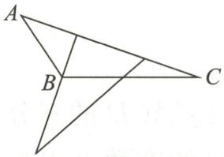  
A

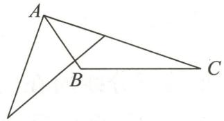  
B

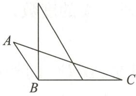  
C

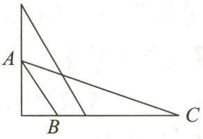  
D

6. 下列说法正确的是 ( )

①等腰三角形是等边三角形；  
②三角形按边分类可分为等腰三角形、等边三角形和不等边三角形；  
③等腰三角形至少有两条边相等.

A. ①②③

B. ②③

C. ①③

D. ③

7.(2024春·江阴期中)如图,在 $\triangle ABC$ 中,BD,BE分别是 $\triangle ABC$ 的高线和角平分线,点F在CA的延长线上,FH垂直于BE,交AB于点T,交BD于点G,交BC于点H.给出下列结论:

① $\angle DBE=\angle F$ ; ② $2\angle BEF=\angle BAF+\angle C$ ; ③ $\angle FEB=\angle ABE+\angle C$ ; ④ $2\angle F=\angle BAC-\angle C$ . 其中正确的结论有 ( )

A. 1 个

B. 2 个

C. 3 个

D. 4 个

8. 如图, 在 $\triangle ABC$ 中, $\angle ACB = 80^{\circ}$ , 点 $D$ 在边 $AB$ 上, 将 $\triangle ABC$ 沿 $CD$ 折叠, 点 $B$ 落在边 $AC$ 上的点 $E$ 处. 若 $\angle ADE = 24^{\circ}$ , 则 $\angle A$ 的度数为 ( )

A. $24^{\circ}$

B. $32^{\circ}$

C. ${38}^{ \circ  }$

D. ${48}^{ \circ  }$

9. 如图, $AD$ 是 $\triangle ABC$ 的中线, $CE$ 是 $AB$ 边上的高, $AB = 4$ , $S_{\triangle ADC} = 6$ , 则 $CE =$ ( )

A. 3

B. 4

C. 5

D. 6

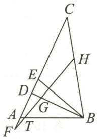  
第7题图

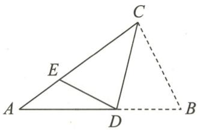  
第8题图

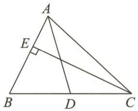  
第9题图

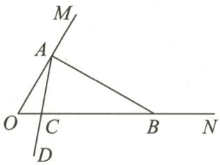  
第10题图

10. 三角形中, 如果一个角是另一个角的 3 倍, 这样的三角形我们称为“灵动三角形”. 例如, 三个内角分别为 $120^{\circ}, 40^{\circ}, 20^{\circ}$ 的三角形是“灵动三角形”. 如图, $\angle MON = 60^{\circ}$ , 在射线 $OM$ 上找一点 $A$ , 过点 $A$ 作 $AB \perp OM$ 交 $ON$ 于点 $B$ , 以点 $A$ 为端点作射线 $AD$ , 交线段 $OB$ 于点 $C$ (规定 $0^{\circ} < \angle OAC < 90^{\circ}$ ). 有下列结论: ① $\angle ABO$ 的度数为 $30^{\circ}$ ; ② $\triangle AOB$ 是“灵动三角形”; ③ 若 $\angle BAC = 70^{\circ}$ , 则 $\triangle AOC$ 是“灵动三角形”; ④ 当 $\triangle ABC$ 是“灵动三角形”时, $\angle OAC$ 为 $30^{\circ}$ 或 $52.5^{\circ}$ . 其中正确结论的个数是 ( )

A. 1

B. 2

C. 3

D. 4

# 二、填空题(每小题2分,共14分)

11. 为使一个四边形木架不变形,我们会沿其对角线钉一根木条,这是利用了三角形的  
12. 若三角形的两边长分别为 2 和 5, 第三边长为 $a$ , 则 $a$ 的取值范围是 \_\_\_\_.  
13. 一个多边形的每个内角都相等,且每个内角的度数都是与它相邻外角度数的 3 倍,则这是 \_\_\_\_ 边形.  
14. 如图, 在直角三角形 $ABC$ 中, $\angle ACB = 90^{\circ}, AC = 3, BC = 4, AB = 5$ , 则点 $C$ 到 $AB$ 的距离为 \_\_\_\_.

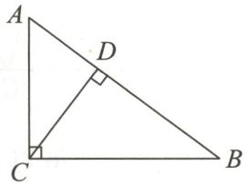  
第 14 题图

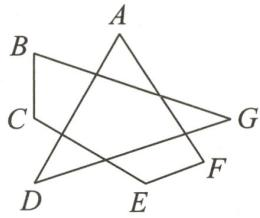  
第15题图

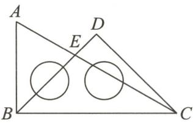  
第16题图

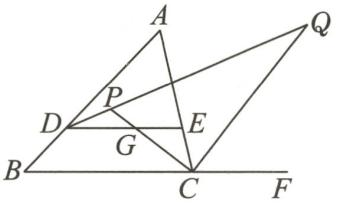  
第17题图

15. 如图, $\angle A + \angle B + \angle C + \angle D + \angle E + \angle F + \angle G = n \cdot 90^{\circ}$ , 则 $n =$ \_\_\_\_.  
16. 如图是一副三角板拼成的图案, 则 $\angle AED$ 的度数为  
17. 如图, 在 $\triangle ABC$ 中, $\angle A = 56^{\circ}$ , 点 $D$ 在 $AB$ 上, 过点 $D$ 作 $DE \parallel BC$ , 交 $AC$ 于点 $E$ , $DP$ 平分 $\angle ADE$ , 交 $\angle ACB$ 的平分线于点 $P$ , $CP$ 与 $DE$ 相交于点 $G$ , $\angle ACF$ 的平分线 $CQ$ 与 $DP$ 相交于点 $Q$ , 则 $\angle DQC =$ \_\_\_\_°.

# 三、解答题(共56分)

18.(6分)一个三角形的三边长是三个连续的奇数,且三角形的周长小于30,求这个三角形三边的长.

19.(6分)如图, $\triangle ABC$ 的周长为27,AC=9,BC边上的中线AE=6, $\triangle ABE$ 的周长为19,求AB的长.

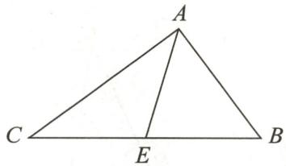  
第19题图

23.(10分)如图,在 $\triangle ABC$ 中,AD是高,AE,BF分别是 $\angle BAC$ , $\angle ABC$ 的平分线,它们相交于点O, $\angle BAC=50^{\circ}$ , $\angle C=\angle BAC+20^{\circ}$ ,求 $\angle DAC$ 和 $\angle BOA$ 的度数.

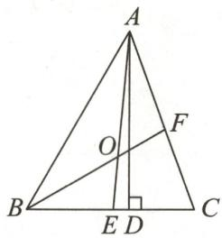  
第23题图

20.(6分)如图,在 $\triangle ABC$ 中, $\angle B=25^{\circ},\angle BAC=31^{\circ}$ ,过点A作BC边上的高,交BC的延长线于点D,CE平分 $\angle ACD$ ,交AD于点E.

求:(1) $\angle ACD$ 的度数;

(2) $\angle AEC$ 的度数.

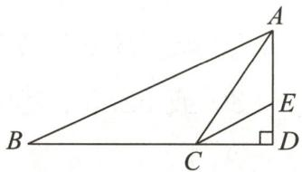  
第20题图

21.(6分)如图,CE是△ABC的外角∠ACD的平分线,且CE交BA的延长线于点E.求证:

$$
\angle B A C = \angle B + 2 \angle E.
$$

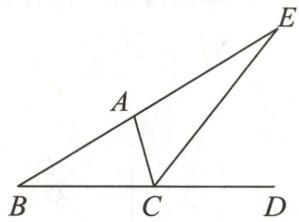  
第21题图

22.(10分)如图,直线 $a//b$ ,点A,D在直线a上,点C,B在直线b上,连接AC,AB,CD,AB与CD交于点E,其中AB平分 $\angle DAC,\angle ACB=80^{\circ},\angle BED=110^{\circ}$ .

求:(1) $\angle ABC$ 的度数;(2) $\angle ACD$ 的度数.

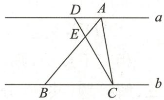  
第22题图

24.(12分)(2024春·武进区月考)【概念认识】

如图①, 在 $\angle ABC$ 中, 若 $\angle ABD = \angle DBE = \angle EBC$ , 则 $BD, BE$ 叫作 $\angle ABC$ 的“三分线”. 其中, $BD$ 是“邻 $AB$ 三分线”, $BE$ 是“邻 $BC$ 三分线”.

# 【问题解决】

(1)如图②,在 $\triangle ABC$ 中, $\angle A=80^{\circ},\angle B=45^{\circ}$ ,若 $\angle B$ 的三分线 $BD$ 交 $AC$ 于点 $D$ ,求 $\angle BDC$ 的度数;   
(2)如图③,在 $\triangle ABC$ 中, $BP,CP$ 分别是 $\angle ABC$ 的“邻 $BC$ 三分线”和 $\angle ACB$ 的“邻 $BC$ 三分线”,且 $\angle BPC=140^{\circ}$ ,求 $\angle A$ 的度数;

# 【延伸推广】

(3)在 $\triangle ABC$ 中, $\angle ACD$ 是 $\triangle ABC$ 的外角, $\angle B$ 的三分线所在的直线与 $\angle ACD$ 的三分线所在的直线交于点 $P$ .若 $\angle A=m^{\circ}(m>54)$ , $\angle B=54^{\circ}$ ,直接写出 $\angle BPC$ 的度数.(用含 $m$ 的代数式表示)

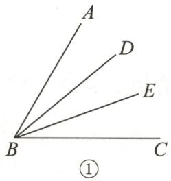

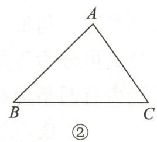

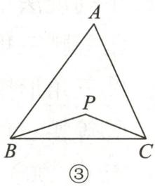  
第24题图

# 第十四章检测卷

总分:100 分

时间:90 分钟

成绩评定：\_\_\_\_

# 一、选择题(每小题3分,共30分)

1. 下列说法正确的是

( )

A. 形状相同的两个三角形全等

B. 面积相等的两个三角形全等

C. 完全重合的两个三角形全等

D. 所有的等边三角形全等

2. 如图, 若 $\triangle ABC \cong \triangle ADE$ , 点 $D$ 在 $BC$ 上, 则下列结论中不成立的是 ( )

A. $\angle BAD = \angle CAE$

B. $\angle BAD = \angle CDE$

C. DA 平分 $\angle BDE$

D. ${AC} = {DE}$

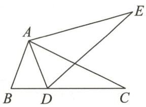  
第2题图

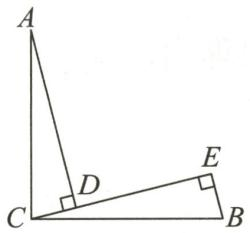  
第4题图

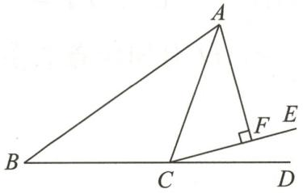  
第8题图

3. 已知 $\triangle ABC \cong \triangle A_{1}B_{1}C_{1}$ ，点 A 和点 $A_{1}$ 对应，点 B 和点 $B_{1}$ 对应， $\angle A = 70^{\circ}, \angle B_{1} = 50^{\circ}$ ，则 $\angle C$ 的度数为（）

A. ${70}^{ \circ  }$

B. ${50}^{ \circ  }$

C. ${120}^{ \circ  }$

D. ${60}^{ \circ  }$

4. 如图, $\angle ACB = 90^{\circ}, AC = BC, AD \perp CE, BE \perp CE$ , 垂足分别是 $D, E$ . 若 $AD = 3, BE = 1$ , 则 $DE$ 的长是 ( )

A. 1

B. 2

C. 3

D. 4

5. 在平面直角坐标系 $xOy$ 中, 已知 $A(-3,0), B(2,0), C(-1,2), E(4,2)$ , 如果 $\triangle ABC$ 与 $\triangle EFB$ 全等, 那么点 $F$ 的坐标可以是 ( )

A. $(6,0)$

B. $(4,0)$

C. $(4,-2)$

D. $(4,-3)$

6. 点 O 在 $\triangle ABC$ 内, 且到三边的距离相等, 若 $\angle A = 40^{\circ}$ , 则 $\angle BOC$ 等于 ( )

A. ${110}^{ \circ  }$

B. $115^{\circ}$

C. $125^{\circ}$

D. ${130}^{ \circ  }$

7. 已知 $\triangle ABC \cong \triangle DEF$ , 且 $\triangle ABC$ 的周长为 $20, AB = 8, BC = 3$ , 则 $DF$ 等于 ( )

A. 3

B. 5

C. 9

D. 11

8.(2024秋·海安期末)如图,在 $\triangle ABC$ 中, $CA=CB$ , $\angle ACB=110^{\circ}$ ,点 $D$ 在线段 $BC$ 的延长线上,在 $\angle ACD$ 内作射线 $CE$ ,使得 $\angle ECD=15^{\circ}$ ,过点 $A$ 作 $AF\perp CE$ ,垂足为 $F$ .若 $AF=\sqrt{5}$ ,则 $AB$ 的长为()

A. $\sqrt{10}$

B. $2\sqrt{5}$

C. 4

D. 6

9. 如图, 要测量河两岸相对的 $A, B$ 两点的距离, 可以在与 $AB$ 垂直的河岸 $BF$ 上取 $C, D$ 两点, 使 $BC = CD$ , 从点 $D$ 出发沿与河岸 $BF$ 垂直的方向移动到点 $E$ , 使点 $E$ 与点 $A, C$ 在同一条直线上, 可得 $\triangle ABC \cong \triangle EDC$ , 这时测得 $DE$ 的长就是 $AB$ 的长. 判定 $\triangle ABC \cong \triangle EDC$ 最直接的依据是 ( )

A. ASA

B. HL

C. SAS

D. SSS

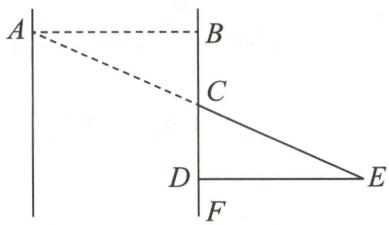  
第9题图

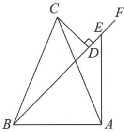  
第10题图

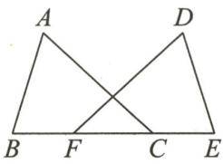  
第12题图

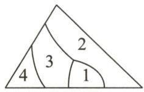  
第13题图

10. 如图, 在 $\triangle ABC$ 中, $AC = BC$ , 过点 $B$ 作射线 $BF$ , 在射线 $BF$ 上取一点 $E$ , 连接 $AE$ , 使得 $\angle CBF = \angle CAE$ , 过点 $C$ 作射线 $BF$ 的垂线, 垂足为 $D$ , 若 $DE = 2, AE = 4$ , 则 $BD$ 的长度为 ( )

A. 7

B. 6

C. 4

D. 2

# 二、填空题(每小题2分,共16分)

11. 在 $\triangle ABC$ 中, $P$ 是 $BC$ 边上的一点, 且点 $P$ 到 $AB$ 和 $AC$ 的距离相等, 则点 $P$ 是 \_\_\_\_ 与 $BC$ 的交点.

12. 如图, 已知 $\triangle ABC \cong \triangle DEF$ , 若 $BE = 10 \mathrm{~cm}, CF = 4 \mathrm{~cm}$ , 则 $BC =$ \_\_\_\_ cm.

13. 小明不慎将一块三角形玻璃摔碎成如图所示的四块(即图中标有 1,2,3,4 的四块),你认为将其中的哪一块带去玻璃店,就能配一块与原来一模一样的三角形玻璃?应该带去第\_\_\_\_块.

14. 如图, 在 $\triangle ABC$ 中, $\angle C = 90^{\circ}, E$ 是 $AC$ 上一点, 连接 $BE$ , 过点 $E$ 作 $ED \perp AB$ , 垂足为 $D$ , $BD = BC$ , 若 $AC = 6 \mathrm{~cm}$ , 则 $AE + DE =$ \_\_\_\_ cm.

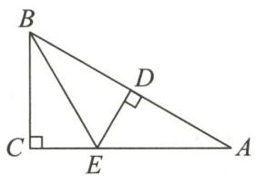  
第14题图

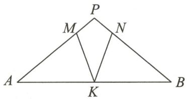  
第15题图

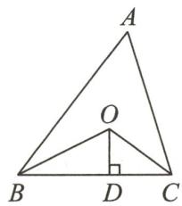  
第16题图

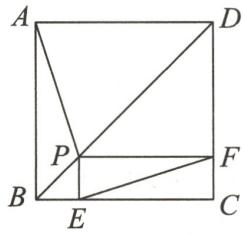  
第17题图

15. 如图, 在 $\triangle PAB$ 中, $\angle A = \angle B, M, N, K$ 分别是 $PA, PB, AB$ 上的点, 且 $AM = BK, BN = AK$ . 若 $\angle MKN = 40^{\circ}$ , 则 $\angle P$ 的度数为 \_\_\_\_.

16. 如图, 已知 $\triangle ABC$ 的周长是 $32 \mathrm{~cm}, BO, CO$ 分别平分 $\angle ABC$ 和 $\angle ACB, OD \perp BC$ 于点 $D$ , 且 $OD = 6 \mathrm{~cm}$ , 则 $\triangle ABC$ 的面积是 \_\_\_\_ $\mathrm{cm}^{2}$ .

17. 如图, 点 $P$ 是正方形 $ABCD$ 的对角线 $BD$ 上一点, $PE \perp BC$ 于点 $E$ , $PF \perp CD$ 于点 $F$ , 连接 $AP, EF$ . 给出下列五个结论: ① $AP = EF$ ; ② $PD = EC$ ; ③ $\angle PFE = \angle BAP$ ; ④ $\triangle APD$ 一定是等腰三角形; ⑤ $AP \perp EF$ . 其中正确结论的序号是 \_\_\_\_.

18. 如图, 在 $\triangle ABC$ 中, $AB = 6$ , $AC = 5$ , $BC = 9$ , $\angle BAC$ 的平分线 $AP$ 交 $BC$ 于点 $P$ , 则 $CP$ 的长为 \_\_\_\_.

# 三、解答题(共54分)

19.(6分)如图, $AB\parallel CD$ ,AB=CD,CE=BF.求证: $AE\parallel DF$ .

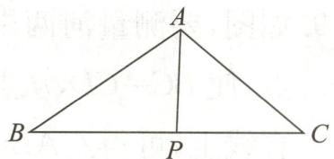  
第18题图

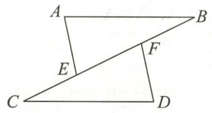  
第19题图

20.(6分)如图,点C在线段BD上,在 $\triangle ABC$ 和 $\triangle DEC$ 中, $\angle A=\angle D,AB=DE,\angle B=\angle E.$ 求证:AC=DC.

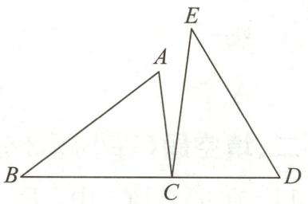

text_image

A
B
C
D
E

第20题图

21.(6分)如图,点C在线段AB上,CF平分∠DCE,AD∥EB,∠ADC=∠BCE,AD=BC.
求证:DF=EF.

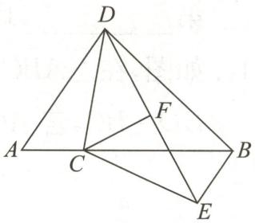  
第21题图

22.(8分)如图, $BE\perp AC$ 于点E, $CF\perp AB$ 于点F,BE与CF交于点D,DE=DF,连接AD.
求证:(1) $\angle FAD = \angle EAD$ ;

(2) ${BD} = {CD}.$

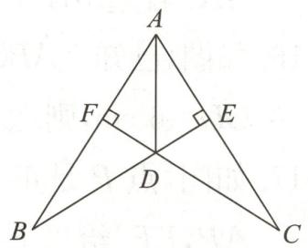  
第22题图

23.(8分)(2024秋·海安期末)如图,在等边△ABC中,AD=BE,BD与CE相交于点F.

(1)求证: $\triangle CAE\cong\triangle BCD;$   
(2) 过点 B 作 $BG \perp CE$ ，垂足为 G，若 DF = 1, FG = 3，求 CE 的长.

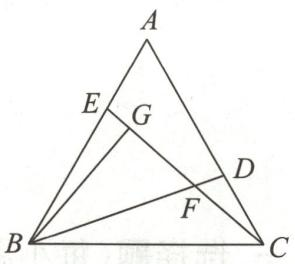  
第23题图

24.(10分)如图,在 $\triangle ABC$ 中, $\angle ACB=90^{\circ},AC=BC$ ,延长 $AB$ 至点 $D$ ,使 $DB=AB$ ,连接 $CD$ ,以 $CD$ 为一直角边作等腰Rt $\triangle CDE$ ,其中 $\angle DCE=90^{\circ}$ ,连接 $BE$ .

(1)求证: $\triangle ACD\cong\triangle BCE;$   
(2)若 AB=3 cm, 则 BE=\_\_\_\_cm;   
(3)BE 与 AD 有何位置关系？请说明理由.

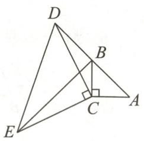  
第24题图

25.(10分)在 $\triangle ABC$ 中, $AB=AC,D$ 是直线 $BC$ 上一点(不与点 $B,C$ 重合),以 $AD$ 为一边在 $AD$ 的右侧作 $\triangle ADE$ ,使 $AD=AE,\angle DAE=\angle BAC$ ,连接 $CE$ .

(1)如图①,当点D在线段BC上时,若 $\angle {BAC} = {90}^{ \circ  }$ ,则 $\angle {BCE} =$ \_\_\_\_.   
(2)设 $\angle BAC=\alpha,\angle BCE=\beta.$   
①如图②, 当点 $D$ 在线段 $BC$ 上移动时, $\alpha, \beta$ 之间有怎样的数量关系? 并说明理由;  
②当点 D 在直线 BC 上移动时, $\alpha,\beta$ 之间有怎样的数量关系?请直接写出你的结论.

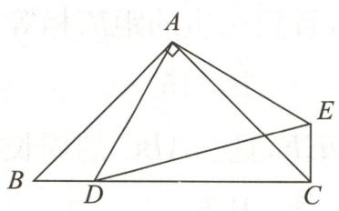  
①

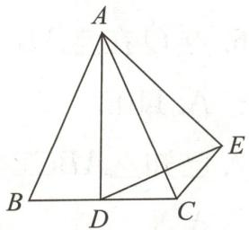  
②   
第25题图

# 第十五章检测卷

总分:100 分 时间:90 分钟 成绩评定:

# 一、选择题（每小题3分，共30分）

1. 下列标志中, 可以看作轴对称图形的是 ( )

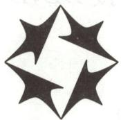  
A

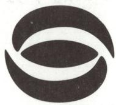  
B

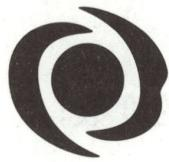  
C

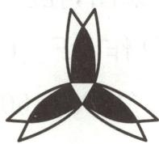  
D

2. 如果点 $A(m + 2, m - 1)$ 在 $x$ 轴上, 那么点 $B(m + 3, m - 2)$ 关于 $x$ 轴的对称点所在的象限是 ( )

A. 第一象限

B. 第二象限

C. 第三象限

D. 第四象限

3.下列三角形中,不一定是等边三角形的是()

A. 有两个角等于 $60^{\circ}$ 的三角形

B. 有一个外角等于 $120^{\circ}$ 的等腰三角形

C. 三个角都相等的三角形

D. 一边上的高也是这边上的中线的三角形

4. 如图, 在 $\triangle ABC$ 与 $\triangle AEF$ 中, 点 $F$ 在 $BC$ 上, $AB$ 交 $EF$ 于点 $D$ , $AB = AE$ , $\angle B = \angle E = 30^\circ$ , $\angle EAB = \angle CAF$ , $\angle EAF = 80^\circ$ , 则 $\angle FAC =$ ( )

A. ${40}^{ \circ  }$

B. $60^{\circ}$

C. ${50}^{ \circ  }$

D. ${70}^{ \circ  }$

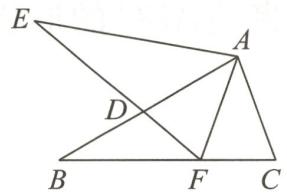  
第4题图

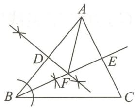  
第5题图

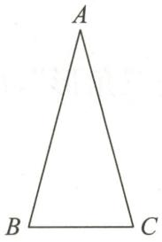  
第6题图

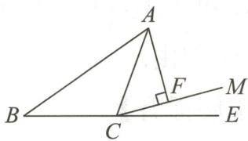  
第7题图

5. 如图, 在 $\triangle ABC$ 中, 根据尺规作图的痕迹, 下列说法不一定正确的是 ( )

A. ${AF} = {BF}$

B. ${AE} = \frac{1}{2}{AC}$

C. $\angle DBF + \angle DFB = 90^{\circ}$

D. $\angle BAF = \angle EBC$

6. 如图, 在 $\triangle ABC$ 中, $AB = AC$ , $\angle A = 30^{\circ}$ , 且 $\triangle ABC$ 的面积是 4 , 则 $AB$ 的长为 ( )

A. 2

B. 4

C. 8

D. 6

7. 如图, 在 $\triangle ABC$ 中, $BC = AC$ , $\angle B = 35^{\circ}$ , $\angle ECM = 15^{\circ}$ , $AF \perp CM$ , 若 $AF = 2.5$ , 则 $AB$ 的长为 ( )

A. 5

B. 5.5

C. 7

D. 6

8. 如图, 将 $\triangle ABC$ 放在每个小正方形的边长均为 1 的网格中, 点 $A, B, C$ 均落在格点上, 若点 $B$ 的坐标为 $(2, -1)$ , 点 $C$ 的坐标为 $(1, 2)$ , 则到 $\triangle ABC$ 三个顶点距离相等的点的坐标为 ( )

A. $(0,1)$

B. $(3,1)$

C. $(1,-1)$

D. $(0,0)$

9. 如图, 在 $\triangle ABC$ 中, $AB = AC = 6$ , 该三角形的面积为 $15, O$ 是边 $BC$ 上任意一点, 则点 $O$ 到边 $AB, AC$ 的距离之和等于 ( )

A. 5

B. 7.5

C. 9

D. 10

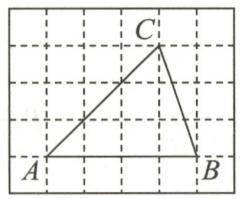  
第8题图

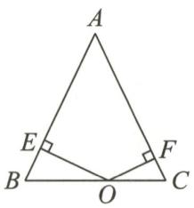  
第9题图

  
第10题图

10. 如图, 在 $\triangle ABC$ 中, $AD$ 平分 $\angle BAC$ , 交 $BC$ 于点 $D, M, N$ 分别是 $AD$ 和 $AB$ 上的动点, $AB = 8$ , $\angle BAC = 60^{\circ}$ , 当 $BM + MN$ 的值最小时, $BN$ 的长为 ( )

A. 2

B. 3

C. 4

D. 5

# 二、填空题(每小题3分,共21分)

11. 小明照镜子时, 发现衣服上的英文字母在镜子中呈现为“∃J99A”, 则这组英文字母是\_\_\_\_。

12. 在等腰三角形、等边三角形、非等腰直角三角形、等腰直角三角形中, 轴对称图形有\_\_\_\_个.

13. 设 a, b 分别是等腰三角形的两条边的长, m 是这个三角形的周长, 当 a, b, m 满足方程组 $\left\{\begin{aligned}a-2b=m-7,\\ a+b=\frac{m}{4}+2\end{aligned}\right.$ 时, m 的值是 \_\_\_\_.

14. 如图, 在 $\triangle ABC$ 中, $BC$ 边的垂直平分线交 $BC$ 于点 $D$ , 交 $AB$ 于点 $E$ , 连接 $CE$ . 若 $CE$ 平分 $\angle ACB, \angle B = 42^{\circ}$ , 则 $\angle A =$ \_\_\_\_.

text_image

Geometric diagram of triangle ABC with point E on AC and intersecting lines, labeled with vertices A, B, C, D, and E.

第14题图

  
第 16 题图

natural_image

Geometric diagram of a tetrahedron with vertices labeled A, B, C, D (no text or symbols present)

第17题图

15. 在平面直角坐标系 $xOy$ 中, 已知 $A(2, -2)$ , 在坐标轴上确定一点 $B$ , 使 $\triangle AOB$ 为等腰三角形, 则符合条件的点 $B$ 有 \_\_\_\_ 个.

16. 如图, 在三角形纸片 $ABC$ 中, $AC = BC$ . 把 $\triangle ABC$ 沿着 $AC$ 翻折, 点 $B$ 落在点 $D$ 处, 连接 $BD$ . 若 $\angle BAC = 40^{\circ}$ , 则 $\angle CBD$ 的度数是 \_\_\_\_.

17. 如图, 在四边形 $ABCD$ 中, $AC=BC$ , $\angle ACB=\angle ADC=90^{\circ}$ , $CD=20$ , 则 $\triangle BCD$ 的面积为 \_\_\_\_.

# 三、解答题(共49分)

18.(4分)如图,已知∠ACE是△ABC的一个外角,CD平分∠ACE,且AB∥CD,求证:△ABC为等腰三角形.

  
第18题图

19.(6分)如图,在平面直角坐标系中, $\triangle ABC$ 的顶点A(0,1),B(3,2),C(1,3)均在正方形网格的格点上.

(1)画出 $\triangle ABC$ 关于y轴的对称图形 $\triangle A_{1}B_{1}C_{1}$ ，并写出点 $B_{1}$ 的坐标；  
(2)请在 x 轴上找出一点 P，连接 PA, PB，使得 PA = PB，并写出点 P 的坐标.

text_image

y
C
A
B
O
x

第19题图

20.(6分)如图,在四边形ABCD中,点E在边AD上, $\angle BCE=\angle ACD=90^{\circ},\angle BAC=\angle D,$ BC=CE.

(1) 求证: AC = CD;   
(2) 若 AC = AE，求 $\angle DEC$ 的度数.

  
第20题图

21.(6分)如图,在 $\triangle ABC$ 中,点 $D$ 在 $AB$ 上,且 $\triangle CAD$ 和 $\triangle CBE$ 都是等边三角形,连接 $DE$ .

(1) 求证: AB = DE;   
(2)求证: $\angle EDB=60^{\circ}$ .

  
第21题图

22.(6分)如图,锐角 $\triangle ABC$ 的两条高BD,CE相交于点O,且OB=OC.

(1)求证: $\triangle ABC$ 是等腰三角形;  
(2) 判断点 O 是否在 $\angle BAC$ 的平分线上, 并说明理由.

  
第22题图

23.(9分)如图,在 $\triangle OBC$ 中,边 $BC$ 的垂直平分线交 $\angle BOC$ 的平分线于点 $D$ ,连接 $DB,DC$ ,过点 $D$ 作 $DF\perp OC$ 于点 $F$ .

(1)若 $\angle BOC=60^{\circ}$ ,求 $\angle BDC$ 的度数;   
(2)若 $\angle BOC=\alpha$ ,则 $\angle BDC=$ \_\_\_\_;(直接写出结果)  
(3)求 OB, OC, OF 之间的数量关系.

  
第23题图

# 24.(12分)【了解概念】

定义:如果一个三角形一边上的中线等于这条边的一半,那么称这个三角形为“唯美三角形”,这条中线叫这条边的“唯美线”.

# 【理解运用】

(1)如图①, $\triangle ABC$ 为“唯美三角形”,BD为AC边的“唯美线”,试判断 $\triangle ABC$ 的形状,并说明理由.

# 【拓展提升】

(2)在 $\triangle ABC$ 中, $AB=AC$ , $E$ 为 $\triangle ABC$ 外一点,连接 $EB,EC$ ,若 $\triangle ABC$ 和 $\triangle EBC$ 均为“唯美三角形”,且 $AD$ 和 $ED$ 分别为这两个三角形 $BC$ 边的“唯美线”.   
①如图②,若点 E,A 在直线 BC 的异侧,连接 AE,求 $\angle AEB$ 的度数;  
②若 E 为平面内一点, 满足 EC=3, EB=9, 请求出点 A 到 BE 的距离.

  
①

  
②

  
(备用图)  
第24题图

# 第十六章检测卷

总分:100 分

时间:90 分钟

成绩评定：\_\_\_\_

# 一、选择题(每小题2分,共20分)

1.(2024·邢江模拟)计算 $(-m^{4})(-m)^{4}$ 的结果是()

A. 0

B. $-m^{8}$

C. $m^{8}$

D. $m^{44}$

2.(2023·济宁中考)下列各式运算正确的是()

A. $x^{2} \cdot x^{3} = x^{6}$

B. $x^{12} \div x^2 = x^6$

C. $(x+y)^{2}=x^{2}+y^{2}$

D. $(x^{2}y)^{3} = x^{6}y^{3}$

3.(2024春·西城区期中)已知 $a^{m}=3,a^{n}=2$ ，那么 $a^{m+n+2}$ 的值为()

A. 8

B. 7

C. $6a^{2}$

D. $6 + a^{2}$

4. 下列运算中, 可用平方差公式计算的是 ( )

A. $(x+y)(x+y)$

B. $(-x+y)(x-y)$

C. $(-x-y)(y-x)$

D. $(x+y)(-x-y)$

5. 计算 $(15x^{2}y - 10xy^{2}) \div 5xy$ 的结果为 （）

A. 3x - 2xy

B. 3xy-2y

C. 3x-2y

D. $3x^{2} - 2y^{2}$

6.(2024·兴化模拟)计算 $3^{m} \cdot ? = 3^{m+2}$ ，则“?”为（）

A. 3

B. 9

C. $\frac{1}{9}$

D. 2

7. 下列计算中, 正确的是 ( )

A. $(a+b)^{2}=a^{2}-2ab+b^{2}$

B. $(a - b)^{2} = a^{2} - b^{2}$

C. $(a+b)(-a+b)=b^{2}-a^{2}$

D. $(a + b)(-a - b) = a^{2} - b^{2}$

8. 已知 $(x + m)^2 = x^2 + nx + 36$ ，则 $n$ 的值为 （）

A. ±6

B. ±12

C. ±18

D. ±72

9. 运用乘法公式计算 $(a - 2)^{2}$ 的结果是 （）

A. $a^{2} - 4a + 4$

B. $a^2 - 2a + 4$

C. $a^2 - 4$

D. ${a}^{2} - {4a} - 4$

10. 下列多项式相乘, 结果为 $x^{2}-4x-12$ 的是 ( )

A. $(x - 4)(x + 3)$

B. $(x-6)(x+2)$

C. $(x - 4)(x - 3)$

D. $(x+6)(x-2)$

# 二、填空题(每小题2分,共14分)

11. 计算: $(3xy+y^{2})\div y=$ \_\_\_\_.

12. 若 $a - b = -3, a^2 - b^2 = 6$ , 则代数式 $a + b$ 的值是 \_\_\_\_.

13. 计算: (1) $(2a + b)^{2} - (2a - b)^{2} =$ \_\_\_\_; (2) $(x + y)^{2}(x - y)^{2} =$ \_\_\_\_.

14. 已知一个长方形的面积是 $a^{2}-2ab+a$ ，宽为 a，则长方形的长为 \_\_\_\_.

15.(2023·南通如皋期末)如图,现有 A,B 两类正方形卡片和 C 类长方形卡片各若干张,如果要拼成一个长为 $2m+n$ 、宽为 $2n+m$ 的大长方形,那么需要 C 类卡片 \_\_\_\_ 张.

  
第15题图

16.(2023·扬州期中)若 $(5a+3b)^{2}=(5a-3b)^{2}+A$ ，则代数式A为\_\_\_\_。

17. 两个正方形的边长之和为 5, 边长之差为 2, 那么用较大的正方形的面积减去较小的正方形的面积, 差是 \_\_\_\_.

# 三、解答题(共66分)

18.(8分)计算:

(1) $2a^{3}b(3ab^{2}c-2bc)$ ;

(2) $(2a + 3b)(2a - 5b)$ ;

(3) $(2x-3y)^{2}+(2x+3y)^{2}$ ;

(4) $(5a-b)(-5a-b)$ .

19.(12分)计算:

(1) $(x-3)(x+3)-(x+1)(x+3)$ ;

(2) $(x+2y)^{2}(x-2y)^{2}-(2x+y)^{2}(2x-y)^{2}$ ;

(3) $\left(3a^{2} + \frac{b}{2}\right)\left(3a^{2} - \frac{b}{2}\right)\left(9a^{4} - \frac{b^{2}}{4}\right)$ ;

(4) $(x+y+1)(1-x-y)$ .

20.(6分)已知多项式 $2x^{3}-4x^{2}-1$ 除以一个多项式A,得商为2x,余式为x-1,求这个多项式A.

23.(10分)(1)已知 $3^{m}=6,9^{n}=2$ ，求 $3^{m+2n},3^{2m-4n}$ 的值；
(2) 比较大小: $4^{20}$ 与 $15^{10}$ .

21.(10分)(2023·苏州工业园区月考)已知 $(a^{x})^{y}=a^{6},(a^{x})^{2}\div a^{y}=a^{3}$ .

(1) 求 $xy$ 和 $2x - y$ 的值;  
(2)求 $4x^{2}+y^{2}$ 的值.

22.(8分)观察下列关于正整数的等式:

$$
3 ^ {2} - 4 \times 1 ^ {2} = 5; \quad ①
$$

$$
5 ^ {2} - 4 \times 2 ^ {2} = 9; \quad ②
$$

$$
7 ^ {2} - 4 \times 3 ^ {2} = 1 3; \quad ③
$$

● ● ● ● ● ●

根据上述规律解决下列问题:

(1) 完成第 4 个等式: $9^{2}-4\times(\quad)^{2}=(\quad)$ ;  
(2)写出你猜想的第 n 个等式(用含 n 的式子表示),并验证其正确性.

24.(12 分)发现:任意五个连续整数的平方和是 5 的倍数.

验证:(1) $(-1)^{2}+0^{2}+1^{2}+2^{2}+3^{2}$ 的结果是5的几倍?

(2)设五个连续整数的中间一个数为 n, 写出它们的平方和, 并说明是 5 的倍数.

延伸:任意三个连续整数的平方和被3除的余数是几?并写出理由.

# 第十七章检测卷

总分:100 分

时间:90 分钟

成绩评定：\_\_\_\_

# 一、选择题(每小题2分,共20分)

1. 把多项式 $(x + 2)(x - 2) + (x - 2)$ 提取公因式 $(x - 2)$ 后，余下的部分是 （）

A. $x + 1$

B. 2x

C. $x+2$

D. $x + 3$

2.(2023·南京鼓楼区期末)下列式子从左到右的变形是因式分解的是()

A. $a^2 - 4a + 3 = (a - 1)(a - 3)$

B. $2a^{2}-ab-a=a(2a-b)-a$

C. $8a^{5}b^{2} = 4a^{3}b\cdot 2a^{2}b$

D. $(a + b)^{2} = a^{2} + 2ab + b^{2}$

3.(2024·广西)如果 $a+b=3, ab=1$ ，那么 $a^{3}b+2a^{2}b^{2}+ab^{3}$ 的值为（）

A. 0

B. 1

C. 4

D. 9

4. 若 $a + b + 1 = 0$ ，则 $3a^2 + 3b^2 + 6ab$ 的值是 （）

A. 3

B.-3

C. 1

D.-1

5. 把多项式 $2x^{2} - 8$ 分解因式, 结果正确的是 ( )

A. $2(x^{2} - 8)$

B. $2(x-2)^{2}$

C. $2(x+2)(x-2)$

D. $2x\left(x-\frac{4}{x}\right)$

6.(2023·淮安淮阴期中)如图,C是线段BG上的一点,以BC,CG为边向两边作正方形,面积分别是 $S_{1}$ 和 $S_{2}$ ,两个正方形的面积和 $S_{1}+S_{2}=20$ ,已知BG=6,则图中阴影部分的面积为()

A. 4

B. 6

C. 7

D. 8

7. 把代数式 $ax^{2}-4ax+4a$ 分解因式, 下列结果正确的是 ( )

A. $a(x - 2)^{2}$

B. $a(x+2)^{2}$

C. $a(x-4)^{2}$

D. $a(x+2)(x-2)$

8.下列选项中,可以用平方差公式计算的是()

A. $(2a + 3b)(3a - 2b)$

B. $(a+b)(-a-b)$

C. $(-m + n)(m - n)$

D. $\left(\frac{1}{2}a+b\right)\left(b-\frac{1}{2}a\right)$

9. 当 $a(a - 1) - (a^2 - b) = -2$ 时, $\frac{a^2 + b^2}{2} - ab$ 的值为

A.-2

B. 2

C. 4

D. 8

10.(2023·黄冈中学自主招生)已知实数x,y,z满足 $x^{2}+y^{2}+z^{2}=4$ ，则 $(2x-y)^{2}+(2y-z)^{2}+(2z-x)^{2}$ 的最大值是()

A. 12

B. 20

C. 28

D. 36

# 二、填空题(每小题2分,共14分)

11. 分解因式: $x^{2}y^{2}-2xy+1$ 的结果是 \_\_\_\_.

12. 已知 $x - 2y = -5, xy = -2$ ，则 $2x^{2}y - 4xy^{2} =$ \_\_\_\_.

13. 已知 a-b=3，则 $a(a-2b)+b^{2}$ 的值为 \_\_\_\_.

14. 若 $x^{2}+4x+m$ 能用完全平方公式因式分解，则 m 的值为 \_\_\_\_.

15. 若 $9a^{2}(x-y)^{2}-3a(y-x)^{3}=M\cdot(3a+x-y)$ ，则 M 等于 \_\_\_\_.

16. 计算: $34^{2} + 34 \times 32 + 16^{2} =$ \_\_\_\_ .

17.(2023春·宁波期中)已知a,b,c,d均为正整数,且 $a^{5}=b^{4}$ , $c^{3}=d^{2}$ ,a-c=65,则b-d= \_\_\_\_.

# 三、解答题(共66分)

18.(9 分)简便计算:

(1) $1.99^{2}+1.99\times0.01;$

(2) $2013^{2}+2013-2014^{2}$ ;

(3) $(-2)^{101}+(-2)^{100}$ .

19.(12 分)对下列多项式进行因式分解:

(1) $4x^{2}(x-y)+2x(x-y)$ ;

(2) $(4a+5b)^{2}-(5a-4b)^{2}$ ;

(3) $a^{2}x^{2}+4a^{2}xy+4a^{2}y^{2};$

(4) $(x^{2}+y^{2})^{2}-4x^{2}y^{2}.$

20.(7分)已知 $x^{2}-4x+y^{2}-10y+29=0$ ，求 $x^{2}y^{2}+2xy+1$ 的值.

23.(10分)(1) $99^{2}-1$ 能否被100整除?

21.(8分)已知a,b,c分别是 $\triangle ABC$ 三边的长,且 $a^{2}+2b^{2}+c^{2}-2b(a+c)=0$ ,请判断 $\triangle ABC$ 的形状,并说明理由.

(2)n 为整数, $(2n+1)^{2}-25$ 能否被 4 整除?

22.(10分)分解因式:(1) $4x^{2}+4x+1$ ;(2) $\frac{1}{3}x^{2}-2x+3$ .

小聪和小明的解答过程如下：

小聪： 小明：

解: $4x^{2}+4x+1$ 解: $\frac{1}{3}x^{2}-2x+3$

$$
= x ^ {2} - 6 x + 9
$$

$$
= (x - 3) ^ {2}.
$$

他们做对了吗？若错误，请你帮忙纠正过来。

24.(10分)(2024春·秦汇区月考)老师拿出三种型号的卡片,如图①.

(1)利用多项式与多项式相乘的法则,计算:(a+2b)(a+b)=\_\_\_\_;

(2)选取1张A型卡片,4张C型卡片,则应取\_\_\_\_张B型卡片才能用它们拼成一个新的正方形,这个新的正方形的边长是\_\_\_\_(用含a,b的代数式表示);

(3)选取4张C型卡片在纸上按图②的方式拼图,并剪出中间的正方形作为第四种D型卡片,由此可检验的等量关系为\_\_\_\_;

(4)选取1张D型卡片,3张C型卡片按图③的方式不重叠地放在长方形MNPQ框架内,已知NP的长度固定不变,MN的长度可以变化,且MN>a,图中两阴影部分(长方形)的面积分别表示为 $S_{1},S_{2}$ ,若 $S_{1}-S_{2}=3b^{2}$ ,则a与b之间有什么数量关系?请说明理由.

text_image

a
A
b
B
b
b
C
a
①
②
D
M
N
S₁
S₂
Q
③
P

第24题图

# 第十八章检测卷

总分:100 分

时间:90 分钟

成绩评定：\_\_\_\_

# 一、选择题(每小题3分,共30分)

1. 若代数式 $\frac{x + 1}{x - 3}$ 有意义, 则实数 $x$ 的取值范围是 ( )

A. $x = -1$

B. $x = 3$

C. $x \neq -1$

D. $x \neq 3$

2. 如果把 $\frac{3y}{x+y}$ 中的 x 与 y 都扩大 3 倍, 那么这个代数式的值 ( )

A. 缩小到原来的 $\frac{1}{3}$

B. 不变

C. 扩大到原来的 3 倍

D. 扩大到原来的 9 倍

3. 化简 $(a - 1) \div \left(\frac{1}{a} - 1\right) \cdot a$ 的结果是 （）

A. $-a^{2}$

B. 1

C. $a^2$

D.-1

4. 关于 $x$ 的分式方程 $\frac{2}{x} - \frac{5}{x - 3} = 0$ 的解为

A. $x = -3$

B. $x = -2$

C. $x = 2$

D. $x = 3$

5. 蚕丝是大自然中的天然纤维, 是中国古代文明产物之一, 也成为散发着现代科学技术魅力的新材料. 某蚕丝的直径大约是 0.000016 米, 0.000016 用科学记数法表示为 ( )

A. $0.16 \times 10^{-4}$

B. $1.6 \times 10^{-4}$

C. $1.6 \times 10^{-5}$

D. $16 \times 10^{-4}$

6. 已知 a, b 为实数，且满足 $a \neq -1, b \neq -1$ ，设 $M = \frac{a}{a + 1} + \frac{b}{b + 1}, N = \frac{1}{a + 1} + \frac{1}{b + 1}$ 。给出下列两个结论：①当 ab = 1 时，M = N，当 ab > 1 时，M > N，当 ab < 1 时，M < N；②若 $a + b = 0$ ，则 $M \cdot N \leqslant 0$ 。下面说法正确的是（）

A. ①②都对

B. ①对②错

C. ①错②对

D. ①②都错

7. 化简 $\left(\frac{2x}{x + y} - \frac{4x}{y - x}\right) \div \frac{8x}{x^2 - y^2}$ 得 （）

A. $\frac{x+3y}{4}$

B. $-\frac{x+3y}{4}$

C. $-\frac{3x+y}{4}$

D. $\frac{3x+y}{4}$

8. 如果 $a + b = 2$ ，那么代数式 $\left(a - \frac{b^2}{a}\right) \cdot \frac{a}{a - b}$ 的值是 （）

A. 2

B.-2

C. 1

D.-1

9. 已知关于 $x$ 的方程 $\frac{1}{x - 2} + \frac{1}{x} = \frac{a - x}{x^2 - 2x}$ 没有解, 则实数 $a$ 的值为 ( )

A.-2

B. 4

C.-2或4

D. 3

10. 一次数学活动课上, 聪明的王同学利用“在面积一定的长方形中, 正方形的周长最短”这一结论推导出“式子 $x + \frac{4}{x} (x > 0)$ ”的最小值, 则这个最小值是 ( )

A. 2

B. 3

C. 3.5

D. 4

# 二、填空题(每小题2分,共16分)

11. 已知 $a + b = 5, ab = 3$ ，则 $\frac{b}{a} + \frac{a}{b} =$ \_\_\_\_ .

12. $\frac{2}{3x^{2}(x-y)},\frac{1}{2x-2y},\frac{3}{4xy}$ 的最简公分母是\_\_\_\_.

13. 计算: $a^2 b \cdot ab^{-1} =$

14. 化简: $\left(1 - \frac{1}{a + 1}\right)\left(\frac{1}{a^2} - 1\right) =$ \_\_\_\_.

15.(1)已知 $\frac{a+3b}{a}=2$ ,则 $\frac{b}{a}=$ \_\_\_\_；

(2)已知 $\frac{1}{a}-\frac{1}{b}=5$ ，则 $\frac{3a-5ab-3b}{a-3ab-b}=$ \_\_\_\_.

16. 分式方程 $\frac{2}{x - 1} + \frac{2}{1 - x^2} = \frac{3}{x + 1}$ 的解是

17. 若关于 x 的不等式组 $\left\{\begin{aligned}\frac{x+2}{3}&>\frac{x}{2}+1,\\4x+a&<x-1\end{aligned}\right.$ 的解集为 x<-2，且关于 y 的分式方程 $\frac{a+2}{y-1}+\frac{y+2}{1-y}=2$ 的解为正数，则所有满足条件的整数 a 的值之和为 \_\_\_\_.

18. 数学家斐波那契编写的《算经》中有如下问题: 一组人平分 10 元钱, 每人分得若干; 若再加上 6 人, 平分 40 元钱, 则第二次每人所得的钱数与第一次相同, 求第一次分钱的人数. 设第一次分钱的人数为 $x$ , 则可列方程为 \_\_\_\_.

# 三、解答题(共54分)

19.(12 分)化简下列各式:

(1) $\frac{x^2 + 2x + 1}{x^2 - 1} \div \frac{x^2 + x}{x - 1}$ ;

(2) $\frac{x^{2}-16}{x+4}\div\frac{2x-8}{4x};$

(3) $\left(a - b + \frac{b^2}{a + b}\right) \cdot \frac{a + b}{a}$ ;

(4) $\left(\frac{x+3}{x-3}-\frac{12x}{x^{2}-9}\right)\div\frac{x-3}{x^{2}+3x}.$

20.(5分)先化简 $\left(x-1-\frac{3}{x+1}\right)\div\frac{x^{2}-4}{x^{2}+2x+1}$ ，然后从-1,1,2这三个数中选一个合适的数代入求值.

21.(6 分)解下列分式方程:

(1) $\frac{3}{x^{2}-9}+1=\frac{x}{x-3};$

(2) $1-\frac{x-3}{2x+2}=\frac{3x}{x+1}.$

22.(6分)下面是小彬同学进行分式化简的过程,请认真阅读并完成相应任务.

$$
\frac {x ^ {2} - 9}{x ^ {2} + 6 x + 9} - \frac {2 x + 1}{2 x + 6} = \frac {(x + 3) (x - 3)}{(x + 3) ^ {2}} - \frac {2 x + 1}{2 (x + 3)} \dots \dots \text { 第一步 }
$$

$$
= \frac {x - 3}{x + 3} - \frac {2 x + 1}{2 (x + 3)} \dots \dots \text {   第二步   }
$$

$$
= \frac {2 (x - 3)}{2 (x + 3)} - \frac {2 x + 1}{2 (x + 3)} \dots \dots \text { 第   三   步 }
$$

$$
= \frac {2 x - 6 - (2 x + 1)}{2 (x + 3)} \dots \dots \text { 第四步 }
$$

$$
= \frac {2 x - 6 - 2 x + 1}{2 (x + 3)} \dots \dots \text { 第五步 }
$$

$$
= - \frac {5}{2 (x + 3)}. \dots \dots \text { 第六步 }
$$

任务一:填空:①以上化简步骤中,第\_\_\_\_步是进行分式的通分,通分的依据是\_\_\_\_\_\_\_\_;

②第\_\_\_\_步开始出现错误, 这一步错误的原因是\_\_\_\_.

任务二:请直接写出该分式化简后的正确结果.

23.(8分)将a克糖放入水中,得到b克糖水,此时糖水的含糖量我们可以记为 $\frac{a}{b}(b>a>0)$ .

(1)再往杯中加入 $m(m>0)$ 克糖,生活中的经验告诉我们糖水变甜了,用数学关系式可以表示为 ( )

$$
\mathrm{A.} \frac {a + m}{b + m} > \frac {a}{b}
$$

$$
\mathrm{B.} \frac {a + m}{b + m} = \frac {a}{b}
$$

$$
\mathrm{C.} \frac {a + m}{b + m} <   \frac {a}{b}
$$

(2)请证明你的选择.

24.(8分)某列车平均提速60 km/h.用相同的时间,该列车提速前行驶200 km,提速后比提速前多行驶100 km,求提速前该列车的平均速度.

<table><tr><td></td><td>路程/km</td><td>速度/(km/h)</td><td>时间/h</td></tr><tr><td>提速前</td><td>200</td><td>x</td><td> $\frac{200}{x}$ </td></tr><tr><td>提速后</td><td>200+100</td><td>____</td><td>____</td></tr></table>

(1)设提速前该列车的平均速度为 x km/h, 补全表格;

(2)列出方程并解答.

25.(9 分)(2024 春·深圳期中)某汽车销售公司经销某品牌 A 款汽车,随着汽车的普及,其价格也在不断下降.今年 5 月份 A 款汽车的售价比去年同期每辆降价 1 万元,如果卖出相同数量的 A 款汽车,去年的销售额为 90 万元,今年的销售额只有 80 万元.

(1)今年5月份A款汽车每辆的售价为多少万元?

(2)为了增加收入,汽车销售公司决定再经销同品牌的B款汽车,已知A款汽车每辆的进价为7.5万元,B款汽车每辆的进价为6万元,公司预计用少于105万元且多于99万元的资金购进这两款汽车共15辆,有哪几种进货方案?

# 期末检测卷

总分:100 分

时间:90 分钟

成绩评定：\_\_\_\_

# 一、选择题（每小题2分，共20分）

1. 下列图案中, 是轴对称图形的是 ( )

A

B

C

D

2. 下列计算正确的是 （）

A. $a^2 \cdot a^3 = a^6$

B. $(a^{2})^{3} = a^{6}$

C. $-a^{2} \div a = a$

D. $(a^{3})^{2} \cdot a = a^{6}$

3. 将一副三角尺按如图所示的方式摆放, 则 $\angle\alpha$ 的大小为 ( )

A. $85^{\circ}$

B. $75^{\circ}$

C. $65^{\circ}$

D. $60^{\circ}$

  
第3题图

  
第4题图

  
第6题图

4. 如图, $\angle CAB = \angle DBA$ , 再添加一个条件, 不一定能判定 $\triangle ABC \cong \triangle BAD$ 的是 ( )

A. ${AC} = {BD}$

B. $\angle 1 = \angle 2$

C. ${AD} = {BC}$

D. $\angle C = \angle D$

5. 若 2 和 8 是一个三角形的两边长, 且第三边长为偶数, 则该三角形的周长为 ( )

A. 20

B. 18

C. 17 或 19

D. 18 或 20

6. 如图, 在 $\triangle ABC$ 中, $\angle B = 55^{\circ}, \angle C = 30^{\circ}$ , 分别以点 $A$ 和点 $C$ 为圆心, 大于 $\frac{1}{2} AC$ 的长为半径画弧, 两弧相交于点 $M, N$ , 作直线 $MN$ , 交 $BC$ 于点 $D$ , 连接 $AD$ , 则 $\angle BAD$ 的度数为 ( )

A. $65^{\circ}$

B. ${60}^{ \circ  }$

C. ${55}^{ \circ  }$

D. ${45}^{ \circ  }$

7.(2024春·东莞月考)如果关于x的不等式组 $\left\{\begin{aligned}m-5x&\geqslant2,\\ x-\frac{11}{2}&<3\left(x+\frac{1}{2}\right)\end{aligned}\right.$ 有且仅有四个整数解,且关于y的分式方程 $\frac{2-my}{2-y}-\frac{8}{y-2}=1$ 有非负数解,则符合条件的所有整数m的和是()

A. 13

B. 15

C. 20

D. 22

8. 我国古代著作《四元玉鉴》记载“买椽多少”问题：“六贯二百一十钱，倩人去买几株椽。每株脚钱三文足，无钱准与一株椽。”其大意为：现请人代买一批椽，这批椽的价钱为 6210 文。如果每株椽的运费是 3 文，那么少拿一株椽后，剩下的椽的运费恰好等于一株椽的价钱，试问 6210 文能买多少株椽？设这批椽的数量为 $x$ 株，则符合题意的方程是（）

A. $3(x-1)=\frac{6210}{x}$

B. $\frac{6210}{x - 1} = 3$

C. 3x-1= $\frac{6210}{x}$

D. $\frac{6210}{x} = 3$

9. 如图, $\triangle ABC$ 是等边三角形, $AD$ 是 $BC$ 边上的中线, 点 $E$ 在 $AD$ 上, 且 $DE = \frac{1}{2} BC$ , 则 $\angle AFE =$

A. ${100}^{ \circ  }$

B. ${105}^{ \circ  }$

C. ${110}^{ \circ  }$

D. $115^{\circ}$

  
第9题图

  
第12题图

  
第13题图

  
第15题图

  
第 17 题图

10. 如果一个数等于两个连续奇数的平方差,那么我们称这个数为“幸福数”.下列数中,为 “幸福数”的是 ( )

A. 205

B. 250

C. 502

D. 520

# 二、填空题(每小题3分,共24分)

11. 若一个多边形的内角和为 $900^{\circ}$ ，则这个多边形是 \_\_\_\_ 边形。  
12. 如图, 已知 $\triangle ABC \cong \triangle ADC$ , $\angle B = 30^{\circ}$ , $\angle BAC = 23^{\circ}$ , 则 $\angle ACD$ 的度数为 \_\_\_\_.

13. 如图, 有三条道路围成直角 $\triangle ABC$ , 其中 $\angle C = 90^{\circ}, BC = 1000 \mathrm{~m}$ , 一个人从 $B$ 处出发沿着 $BC$ 行走了 $800 \mathrm{~m}$ , 到达 $D$ 处, $AD$ 恰为 $\angle CAB$ 的平分线, 此时这个人到 $AB$ 的最短距离为 \_\_\_\_ m.

14. 若 $m+2n=1$ ，则 $3m^{2}+6mn+6n$ 的值为 \_\_\_\_.

15. 如图, 在等腰三角形 $ABC$ 中, $BD$ 为 $\angle ABC$ 的平分线, $\angle A = 36^{\circ}, AB = AC = a, BC = b$ , 则 $CD$ 的长为 \_\_\_\_.

16. 对于实数 a, b，定义一种新运算“⊗”： $a \otimes b = \frac{1}{a - b^{2}}$ ，这里等号的右边是实数运算。例如： $1 \otimes 3 = \frac{1}{1 - 3^{2}} = -\frac{1}{8}$ ，则方程 $x \otimes (-2) = \frac{2}{x - 4} - 1$ 的解是 \_\_\_\_。

17. 如图, 已知线段 $AB = 20 \mathrm{~m}, MA \perp AB$ 于点 $A, MA = 6 \mathrm{~m}$ , 射线 $BD \perp AB$ 于点 $B$ , 点 $P$ 从点 $B$ 向点 $A$ 运动, 每秒走 $1 \mathrm{~m}$ , 点 $Q$ 从点 $B$ 向点 $D$ 运动, 每秒走 $3 \mathrm{~m}$ . 若点 $P, Q$ 同时从点 $B$ 出发, 则出发 \_\_\_\_ s 后, 在线段 $MA$ 上有一点 $C$ , 使 $\triangle CAP$ 与 $\triangle PBQ$ 全等.

18. 已知 $abc \neq 0, \frac{a + b - c}{c} = \frac{a - b + c}{b} = \frac{-a + b + c}{a}$ ，则 $\frac{(a + b)(b + c)(c + a)}{abc}$ 的值是 \_\_\_\_.

# 三、解答题(共56分)

19.(6分)如图,已知 $\angle BAC=90^{\circ}$ ,AD是 $\angle BAC$ 内部的一条射线, $AB=AC$ , $BE\perp AD$ 于点E, $CF\perp AD$ 于点F,求证: $AF=BE$ .

  
第19题图

20.(6分)如图,BE是△ABC的角平分线,在AB上取点D,使DB=DE.若 $\angle A=65^{\circ}$ , $\angle AED=45^{\circ}$ ,求 $\angle EBC$ 的度数.

  
第20题图

21.(8分)(1)已知 $5x^{2}-x-1=0$ ，求代数式 $(3x+2)(3x-2)+x(x-2)$ 的值；

(2)先化简,再求值: $\left(x-1-\frac{x^{2}}{x+1}\right)\div\frac{x}{x^{2}+2x+1}$ ,其中x=3.

22.(6分)如图,B,C两点关于y轴对称,点A的坐标是(0,b),点C的坐标为(-a,-a-b).

(1)点 B 的坐标为 \_\_\_\_；  
(2)用尺规作图,在 x 轴上作出点 P,使得 $AP+PB$ 的值最小;  
(3) $\angle OAP=$ \_\_\_\_°.

  
第 22 题图

23.(6分)周六晚上小明打算和朋友乘出租车去某电影院看电影,有两条路线可供选择:路线一的全程是25千米,但交通比较拥堵;路线二的全程是30千米,平均速度比走路线一时的平均速度能提高80%,比走路线一少用10分钟到达.求小明走路线一时的平均速度.

24.(8分)如图,已知△ABC和△CDE均为等边三角形,且点B,C,D在同一条直线上,连接AD,BE,分别交CE和AC于点G,H,连接GH.

(1) 求证: AD = BE;   
(2)求证: $\triangle BCH\cong\triangle ACG;$   
(3)试猜想 $\triangle CGH$ 是什么特殊的三角形,并说明理由.

  
第24题图

25.(8分)定义:若数 p 可以表示成 $p=x^{2}+y^{2}-xy(x,y$ 为自然数)的形式,则称 p 为“希尔伯特”数.

例如: $3=2^{2}+1^{2}-2\times1,39=7^{2}+5^{2}-7\times5,147=13^{2}+11^{2}-13\times11,\cdots$ . 所以 3,39,147 是 “希尔伯特”数.

(1)请写出两个 10 以内的“希尔伯特”数；  
(2)像 39,147 这样的“希尔伯特”数都是可以用连续两个奇数按定义给出的运算表达出来,试说明所有用连续两个奇数表达出来的“希尔伯特”数一定能被 4 除余 3;  
(3)已知两个“希尔伯特”数,它们都可以用连续两个奇数按定义给出的运算表达出来,且它们的差是224,求这两个“希尔伯特”数.

26.(8分)已知△ABC和△ADE都是等边三角形,点M,N分别是AB,AC边上的定点,且MN//BC,点D在射线MN上移动,如图①,当点D与点M重合时,点E与点N也重合,此时易得BD=CE.

(1)如图②,当点 D 不与点 M 重合时,BD 和 CE 仍相等吗?若相等,请写出证明过程;若不相等,请说明理由.  
(2)如图③,延长 BD,CE 交于点 P,随着点 D 的移动,BD 与 CE 的夹角 $\angle BPC$ 是否发生改变?若不变,请求出其度数;若改变,请说明理由.  
(3)如图④,在 $\triangle ABC$ 中, $AB=BC$ , $\angle ABC=90^{\circ}$ , $D$ 为 $AB$ 的中点, $E$ 为 $BC$ 边上一动点,以 $DE$ 为边,向右作等边 $\triangle DEF$ ,连接 $AF$ .若 $AB=6$ ,则 $AF$ 的最小值为 $\_ \_ \_ \_ \_ \_ \_ \_ \_ \_ \_ \_ \_ \_ \_ \_ \_ \_ \_ \_ \_ \_ \_ \_ \_ \_ \_ \_ \_ \_ \_ \_ \_ \_ \_ \_ \_ \_ \_ \_ \_ \_ \_ \_ \_ \_ \_ \_ \_ \_ \_ ①$ .

text_image

C
N(E)
B M(D) A
①
C
N
E
D
B M A
②
C
N
E
P
B M A
③
A
F
D
B E C
④

第26题图