# 检测卷

# 第二十一章检测卷

总分:100 分

时间:90 分钟

成绩评定：\_\_\_\_

# 一、选择题(每小题3分,共30分)

1.(2024·惠山区期末)下列方程中,是关于x的一元二次方程的是()

A. $3 x - 1 = 0$

B. $x+2y=3$

C. $x^{2} + 2x - 1 = 0$

D. $x^{4} - 1 = 0$

2. 已知等腰三角形的两边长分别是一元二次方程 $x^{2}-6x+8=0$ 的两根，则该等腰三角形的底边长为（）

A. 2

B. 4

C. 8

D. 2 或 4

3. 用配方法解下列方程时,配方有错误的是 ( )

A. $x^{2} - 2x - 99 = 0$ 化为 $(x - 1)^{2} = 100$

B. $x^{2} + 8x + 9 = 0$ 化为 $(x + 4)^{2} = 25$

C. $2t^{2} - 7t - 4 = 0$ 化为 $\left(t - \frac{7}{4}\right)^2 = \frac{81}{16}$

D. $3x^{2} - 4x - 2 = 0$ 化为 $\left(x - \frac{2}{3}\right)^2 = \frac{10}{9}$

4.(2024·玄武区模拟)关于 x 的方程 $x^{2}+kx=2$ (k 为常数)的根的情况,下列说法正确的是()

A. 两个正根

B. 两个负根

C. 一个正根, 一个负根

D. 无实数根

5. 已知 a 是一元二次方程 $x^{2}-2x-3=0$ 的解，则代数式 $2a^{2}-4a$ 的值为（）

A. 3

B. 6

C.-3

D.-6

6.(2024·广安)若关于 x 的一元二次方程 $(m+1)x^{2}-2x+1=0$ 有两个不相等的实数根, 则 m 的取值范围是 ()

A. $m <   0$ 且 $m\neq -1$ B. $m\geqslant 0$

C. $m \leqslant 0$ 且 $m \neq -1$

D. $m <   0$

7. 已知 a 是一元二次方程 $2x^{2}-2x-1=0$ 较大的实数根, 那么 a 的值应在 ( )

A. 3 和 4 之间

B. 2 和 3 之间

C. 1 和 2 之间

D. 0 和 1 之间

8. 如图, 把一块长为 $40 \mathrm{~cm}$ 、宽为 $30 \mathrm{~cm}$ 的矩形硬纸板的四角剪去四个相同的小正方形, 然后把纸板的四边沿虚线折起来, 并用胶带粘好, 即可做成一个无盖纸盒. 若该无盖纸盒的底面积为 $600 \mathrm{~cm}^{2}$ , 设剪去小正方形的边长为 $x \mathrm{~cm}$ , 则可列方程为 ( )

A. $(30 - 2x)(40 - x) = 600$

B. $(30-x)(40-x)=600$

C. $(30 - x)(40 - 2x) = 600$

D. $(30-2x)(40-2x)=600$

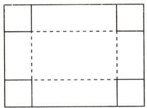  
第8题图

9. 某商店销售某种商品, 平均每天可售出 20 件, 每件盈利 40 元. 经调查发现, 该种商品销售单价每降 1 元, 平均每天可多售出 2 件. 在每件盈利不少于 25 元的前提下, 要获利 1200 元, 每件商品应降价 ( )

A. 10 元

B. 20 元

C. 10 元或 20 元

D. 13 元

10. 已知关于 $x$ 的一元二次方程 $mx^{2} - (m + 2)x + \frac{m}{4} = 0$ 有两个不相等的实数根 $x_{1}, x_{2}$ , 若 $\frac{1}{x_{1}} + \frac{1}{x_{2}} = 4m$ , 则 $m$ 的值是 ( )

A. 2

B.-1

C. 2 或 -1

D. 不存在

# 二、填空题(每小题2分,共14分)

11.(2024·深圳)已知一元二次方程 $x^{2}-3x+a=0$ 的一个解为x=1，则a= \_\_\_\_.

12.(2024·南通)已知关于x的一元二次方程 $x^{2}-2x+k=0$ 有两个不相等的实数根.请写出一个满足题意的k的值:\_\_\_\_.

13. 有一个人患了禽流感, 经过两轮传染后共有 169 人患了禽流感, 每轮传染中平均一个人传染了\_\_\_\_个人.

14.(2024·东城区模拟)若关于 x 的一元二次方程 $x^{2}-(m+1)x+m=0$ 的两个实数根相差 2, 则实数 m 的值是 \_\_\_\_.

15. (2024·南通)如图, 在 Rt△ABC 中, ∠ACB=90°, AC=BC=5. 正方形 DEFG 的边长为 √5 , 它的顶点 D, E, G 分别在△ABC 的边上, 则 BG 的长为 \_\_\_\_.

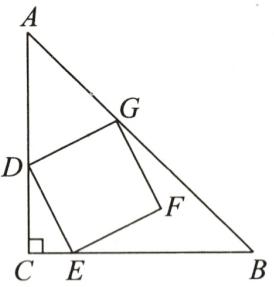  
第15题图

16. 若 m, n 是一元二次方程 $x^{2} + 3x - 1 = 0$ 的两个实数根，则 $\frac{m^{3} + m^{2}n}{3m - 1}$ 的值为 \_\_\_\_.

17. 已知关于 $x$ 的方程 $x^{2} + \frac{1}{x^{2}} + 2\left(x + \frac{1}{x}\right) = 1$ , 那么 $x + \frac{1}{x} + 1$ 的值为 \_\_\_\_.

# 三、解答题(共56分)

18.(12分)解下列方程:

(1) $4(1-x)^{2}=9;$

(2) $2x^{2}-4x-3=0$ (配方法);

(3) $3y^{2}-2y-1=0;$

(4) $x^{2}-2\sqrt{5}x+5=0;$

(5) $5x(x+3)=2(x+3)$ ;

(6) $(y-2)(y-4)=2.$

19.(6 分)新能源汽车投放市场后,有效改善了城市空气质量,经过市场调查得知,某市去年新能源汽车总量已达到 1000 辆,预计明年会增长到 1210 辆.

(1)求今、明两年新能源汽车数量的年平均增长率；

(2)为鼓励市民购买新能源汽车,该市财政部门决定对今年增加的新能源汽车给予每辆0.8万元的政府性补贴,在(1)的条件下,求该市财政部门今年需要准备多少万元补贴资金.

20.(6分)(2024·遂宁)已知关于x的一元二次方程 $x^{2}-(m+2)x+m-1=0$ .

(1)求证:无论 m 取何值,方程都有两个不相等的实数根;

(2)如果方程的两个实数根为 $x_{1}, x_{2}$ , 且 $x_{1}^{2} + x_{2}^{2} - x_{1}x_{2} = 9$ , 求 $m$ 的值.

21.(10分)关于 x 的一元二次方程 $x^{2}-mx+2m-4=0$ .

(1)求证:无论 m 为何值,方程总有两个实数根;

(2)在直角三角形 $ABC$ 中, $\angle C = 90^{\circ}$ , 斜边 $c = 2\sqrt{5}$ , 两直角边的长 $a, b$ 恰好是方程 $x^{2} - mx + 2m - 4 = 0$ 的两个根, 求 $m$ 的值.

22.(10分)如图,在 $\triangle ABC$ 中, $\angle B=90^{\circ},AB=6cm,BC=8cm$ .点 $P$ 从点 $A$ 开始沿 $AB$ 边向点 $B$ 以 $1cm/s$ 的速度移动,到达点 $B$ 时停止移动,点 $Q$ 从点 $B$ 开始沿射线 $BC$ 以 $2cm/s$ 的速度移动.点 $P,Q$ 同时出发,当点 $P$ 停止移动时,点 $Q$ 同时停止,设移动时间为 $t s$ .当 $t$ 为何值时,以点 $A,P,Q,C$ 为顶点的四边形的面积为 $19cm^{2}$ ?

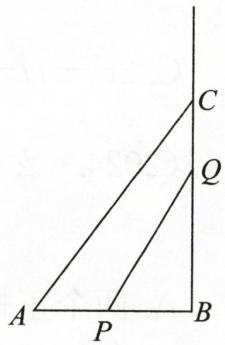  
第22题图

23.(12分)(2024·开福区月考)已知△ABC的一条边BC的长为5,另外两条边AB,AC的长是关于x的一元二次方程 $x^{2}-(m+1)x+3(m-2)=0$ 的两个实数根.

(1)求证:无论 m 为何值,方程总有两个实数根;

(2) 当 m 为何值时, $\triangle ABC$ 是以 BC 为斜边的直角三角形?

(3)当 m 为何值时, $\triangle ABC$ 是等腰三角形? 并求 $\triangle ABC$ 的周长.

# 第二十二章检测卷

总分:100 分+10 分 时间:90 分钟 成绩评定:

# 一、选择题（每小题3分，共30分）

1. 若抛物线 $y = -x^{2} + bx + c$ 经过点 $(-2, 3)$ , 则 $2c - 4b - 9$ 的值是 ( )

A. 5

B.-1

C. 4

D. 18

2. 若抛物线 $y = (x - m)^2 + m + 1$ 的顶点在第一象限, 则 $m$ 的取值范围为 ( )

A. $m > 1$

B. $m > 0$

C. $m > - 1$

D. $-1 < m < 0$

3.(2024·贵州)如图,二次函数 $y=ax^{2}+bx+c$ 的部分图象与 x 轴的一个交点的横坐标是 -3,顶点坐标为 $(-1,4)$ ,则下列说法正确的是 ( )

A. 二次函数图象的对称轴是直线 $x = 1$   
B. 二次函数图象与 $x$ 轴的另一个交点的横坐标是 2  
C. 当 x<-1 时, y 随 x 的增大而减小  
D. 二次函数图象与 $y$ 轴的交点的纵坐标是 3

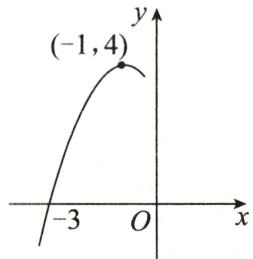  
第3题图

4. 已知二次函数 $y = x^{2} - 2mx$ ，当 x < 1 时，y 随 x 的增大而减小，则实数 m 的取值范围是（）

A. $m \geqslant 1$

B. $m > 1$

C. $m <   1$

D. $m \leqslant 1$

5. 已知二次函数 $y=ax^{2}-bx+c(a\neq0)$ 的图象经过第一象限的点 $(1,-b)$ ，则一次函数 y=bx-ac 的图象不经过（）

A. 第一象限

B. 第二象限

C. 第三象限

D. 第四象限

6.(2024·南通)将抛物线 $y=x^{2}+2x-1$ 向右平移 3 个单位长度后,得到的新抛物线的顶点坐标为 ( )

A. $(-4, -1)$

B. $(-4,2)$

C. $(2,1)$

D. $(2, - 2)$

7. 一名运动员打高尔夫球, 若球的飞行高度 $y(\mathrm{m})$ 与水平距离 $x(\mathrm{m})$ 之间的函数关系式为 $y = -\frac{1}{90} (x - 30)^2 + 10$ , 则高尔夫球在飞行过程中的最大高度为 ( )

A. $10 \mathrm{~m}$

B. $20 \mathrm{~m}$

C. $30 \mathrm{~m}$

D. $60 \mathrm{~m}$

8.(2024·湖北)抛物线 $y=ax^{2}+bx+c$ 的顶点坐标为 $(-1,-2)$ ，抛物线与 y 轴的交点位于 x 轴上方。下面结论正确的是()

A. $a <   0$

B. $c <   0$

C. $a - b + c = -2$

D. $b^{2} - 4ac = 0$

9.(2024·秦淮区期末)如图,在平面直角坐标系中,A,B两点的坐标分别为(2,0),(0,2),二次函数 $y=x^{2}-2ax+b$ (a,b 是常数)的图象的顶点在线段 AB 上,则 b 的最小值为()

A. 0

B. $\frac{3}{4}$

C. $\frac{7}{4}$

D. 2

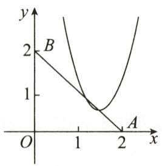  
第9题图

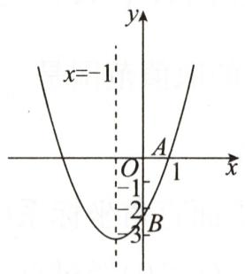  
第10题图

10.(2024·遂宁)如图,已知抛物线 $y=ax^{2}+bx+c(a,b,c$ 为常数,且 $a\neq0$ 的对称轴为直线 x=-1,且该抛物线与 x 轴的一个交点为 A(1,0),与 y 轴的交点 B 在点 (0,-2) 与点 (0,-3) 之间(不含端点).有下列结论:①abc>0;②9a-3b+c>0;③ $\frac{2}{3}<a<1$ ;④若方程 $ax^{2}+bx+c=x+1$ 的两根为 m,n(m<n),则 -3<m<1<n.其中正确结论的个数为()

A. 1

B. 2

C. 3

D. 4

# 二、填空题(每小题3分,共24分)

11. 函数 $y=2x^{2}+4x-5$ 用配方法转化为 $y=a(x-h)^{2}+k$ 的形式是 \_\_\_\_.  
12. 如果将抛物线 $y = x^{2}$ 向左平移 3 个单位长度, 那么所得新抛物线的函数解析式是 \_\_\_\_.  
13. 若二次函数 $y=x^{2}+x+m$ 的图象经过 $A(-3,y_{1}), B(-2,y_{2}), C\left(\frac{1}{2},y_{3}\right)$ 三点，则 $y_{1}, y_{2}, y_{3}$ 的大小关系是 \_\_\_\_.（用“<”连接）  
14.(2024·西湖区期末)已知实数x,y满足 $2x^{2}+13x+y-8=0$ ,则 $x+y$ 的最大值为\_\_\_\_.  
15. 若对称轴为直线 $x = -2$ 的抛物线 $y = ax^{2} + bx + c (a \neq 0)$ 经过点 $(1,0)$ , 则一元二次方程 $ax^{2} + bx + c = 0$ 的根是 \_\_\_\_.  
16. 如图, 王叔叔想用长为 $60 \mathrm{~m}$ 的栅栏, 再借助房屋的外墙围成一个矩形羊圈 $ABCD$ , 已知房屋外墙足够长, 当边 $AB =$ \_\_\_\_ m 时, 矩形羊圈 $ABCD$ 的面积最大.

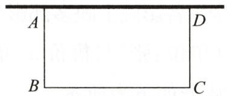  
第16题图

17. 当 $1 \leqslant x \leqslant 4$ 时, 直线 $y = m$ 与抛物线 $y = (x - 2)^{2} - 3$ 在自变量 $x$ 的取值范围内的图象有两个交点, 则 $m$ 的取值范围是 \_\_\_\_.

18.(荆门)如图,函数 $y=\left\{\begin{aligned}x^{2}-2x+3(x<2),\\ -\frac{3}{4}x+\frac{9}{2}(x\geqslant2)\end{aligned}\right.$ 的图象由抛物线的一部

分和一条射线组成,且与直线 y=m(m 为常数)相交于三个不同的点 A $(x_{1},y_{1})$ , B $(x_{2},y_{2})$ , C $(x_{3},y_{3})$ $(x_{1}<x_{2}<x_{3})$ . 设 $t=\frac{x_{1}y_{1}+x_{2}y_{2}}{x_{3}y_{3}}$ , 则 t 的取值范围是 \_\_\_\_.

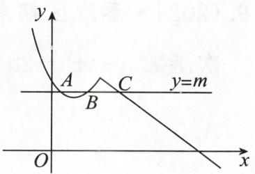  
第18题图

# 三、解答题(共46分)

19.(10分)如图,在平面直角坐标系中,直线 $y=x+2$ 与 x 轴交于点 A,与 y 轴交于点 B,抛物线 $y=ax^{2}+bx+c(a<0)$ 经过点 A,B.

(1) 求 a, b 满足的关系式及 c 的值;  
(2) 当 $x < 0$ 时, 若 $y = ax^{2} + bx + c (a < 0)$ 的函数值随 $x$ 的增大而增大, 求 $a$ 的取值范围.

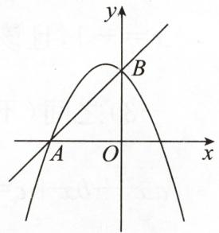  
第19题图

20.(10分)如图是一抛物线形大门, 其地面宽度 $AB = 18 \mathrm{~m}$ , 一同学站在门内, 在离门角 $B$ 点 $1 \mathrm{~m}$ 远的 $D$ 处, 垂直地面立起一根长 $1.7 \mathrm{~m}$ 的木杆, 其顶端恰好顶在抛物线形门上 $C$ 处, 根据这些条件, 请你求出该大门的高 $h$ .

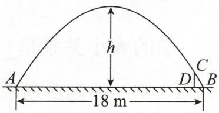  
第20题图

21.(12分)(2024·滨州)春节期间,全国各影院上映多部影片,某影院每天的运营成本为2000元,该影院每天售出的电影票数量y(单位:张)与售价x(单位:元/张)之间满足一次函数关系(30≤x≤80,且x是整数),部分数据如下表所示.

<table><tr><td>电影票售价x/(元/张)</td><td>40</td><td>50</td></tr><tr><td>售出电影票数量y/张</td><td>164</td><td>124</td></tr></table>

(1)请求出 y 与 x 之间的函数关系式;

(2)设该影院每天的利润(利润=票房收入-运营成本)为w(单位:元),求w与x之间的函数关系式;   
(3)该影院将电影票售价 x 定为多少元/张时, 每天获得的利润最大? 最大利润是多少元?

22.(14分)(2024·平谷区模拟)在平面直角坐标系 $xOy$ 中, $M(x_{1}, y_{1}), N(x_{2}, y_{2})$ 是抛物线 $y = x^{2} - 2mx + m^{2} - 1$ 上任意两点.

(1)求抛物线的对称轴;(用含m的式子表示)  
(2) 若 $x_{2}=x_{1}+n(n>0)$ ，点 M, N 中至少有一个点位于 x 轴的上方，求 n 的取值范围；  
(3)若对于 $-1<x_{1}<2,x_{2}=m+2$ ，都有 $y_{1}<y_{2}$ ，求m的取值范围.

# 附加题

(10 分)(2024·广安)如图,抛物线 $y=-\frac{2}{3}x^{2}+bx+c$ 与 x 轴交于 A, B 两点,与 y 轴交于点 C, 点 A 的坐标为 $(-1,0)$ , 点 B 的坐标为 $(3,0)$ .

(1)求此抛物线的函数解析式.   
(2)点 P 是直线 BC 上方抛物线上的一个动点, 过点 P 作 x 轴的垂线交直线 BC 于点 D, 过点 P 作 y 轴的垂线, 垂足为 E, 请探究 $2PD + PE$ 是否有最大值. 若有最大值, 求出最大值及此时点 P 的坐标; 若没有最大值, 请说明理由.  
(3)点 M 为该抛物线上的点, 当 $\angle MCB = 45^{\circ}$ 时, 请直接写出所有满足条件的点 M 的坐标.

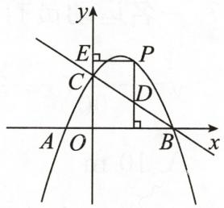  
附加题图

# 第二十三章检测卷

总分:100 分+10 分

时间:90 分钟

成绩评定：\_\_\_\_

# 一、选择题(每小题3分,共24分)

1.(2024·牡丹江)下列图形中,既是轴对称图形,又是中心对称图形的是()

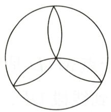  
A

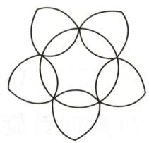  
B

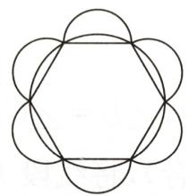  
C

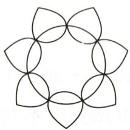  
D

2.(2024·海珠区期末)把如图所示的五角星绕着它的中心旋转一定角度后与自身重合,则这个旋转角度可能是()

A. $36^{\circ}$

B. $72^{\circ}$

C. ${90}^{ \circ  }$

D. ${108}^{ \circ  }$

3.(2024·启东期末)如图,将菱形 ABCD 绕点 A 逆时针旋转 $\angle\alpha$ 得到菱形 $AB^{\prime}C^{\prime}D^{\prime},\angle B=\angle\beta.$ 当 AC 平分 $\angle B^{\prime}AC^{\prime}$ 时, $\angle\alpha$ 与 $\angle\beta$ 满足的数量关系是()

A. $\angle \alpha = 2\angle \beta$

B. $2 \angle \alpha = 3 \angle \beta$

C. $4 \angle \alpha + \angle \beta = 180^{\circ}$

D. $3 \angle \alpha + 2 \angle \beta = 180^{\circ}$

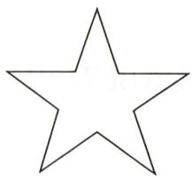  
第2题图

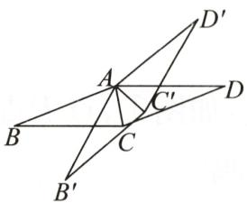  
第3题图

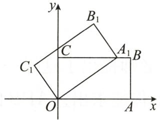  
第4题图

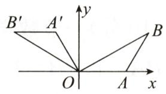  
第5题图

4. 如图, 在平面直角坐标系中, 矩形 $OABC$ 的两边 $OA, OC$ 分别在 $x$ 轴和 $y$ 轴上, 并且 $OA = 5$ , $OC = 3$ . 若把矩形 $OABC$ 绕着点 $O$ 逆时针旋转, 使点 $A$ 恰好落在 $BC$ 边上的点 $A_{1}$ 处, 则点 $C$ 的对应点 $C_{1}$ 的坐标为 ( )

A. $\left(-\frac{9}{5}, \frac{12}{5}\right)$

B. $\left(-\frac{12}{5},\frac{9}{5}\right)$

C. $\left(-\frac{16}{5},\frac{12}{5}\right)$

D. $\left(-\frac{12}{5},\frac{16}{5}\right)$

5.(2024·耒阳模拟)如图,在等腰 $\triangle AOB$ 中, $OA=AB$ , $\angle OAB=120^{\circ}$ , $OA$ 边在 $x$ 轴上,将 $\triangle AOB$ 绕原点 $O$ 逆时针旋转 $120^{\circ}$ ,得到 $\triangle A'OB'$ .若 $OB=2\sqrt{3}$ ,则点 $A$ 的对应点 $A'$ 的坐标为()

A. $(-1, - 1)$

B. $(-1, \sqrt{3})$

C. $(-1, 2)$

D. $(-1, \sqrt{5})$

6.(杭州)如图,在平面直角坐标系中,已知点 $P(0,2)$ , $A(4,2)$ . 以点 $P$ 为旋转中心,把点 $A$ 按逆时针方向旋转 $60^{\circ}$ ,得到点 $B$ . 在 $M_{1}\left(-\frac{\sqrt{3}}{3},0\right)$ , $M_{2}\left(-\sqrt{3},-1\right)$ , $M_{3}(1,4)$ , $M_{4}\left(2,\frac{11}{2}\right)$ 四个点中,直线 $PB$ 经过的点是 ( )

A. $M_{1}$

B. $M_{2}$

C. $M_{3}$

D. $M_{4}$

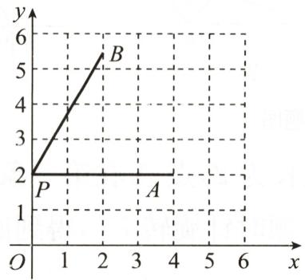

line

| Point | x | y |
|---|---|---|
| P | 0 | 2 |
| A | 4 | 2 |
| B | 2 | 6 |

第6题图

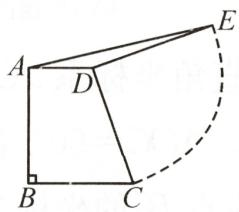  
第8题图

7.(2023·泰州)菱形ABCD的边长为 $2,\angle A=60^{\circ}$ ，将该菱形绕顶点A在平面内旋转 $30^{\circ}$ ，则旋转后的图形与原图形重叠部分的面积为()

A. $3 - \sqrt{3}$

B. $2 - \sqrt{3}$

C. $\sqrt{3} - 1$

D. $2 \sqrt{3} - 2$

8. 如图, 在直角梯形 $ABCD$ 中, $AD \parallel BC$ , $AB \perp BC$ , $AD = 3$ , $BC = 5$ , 将腰 $DC$ 绕点 $D$ 按逆时针方向旋转 $90^{\circ}$ 至 $DE$ , 连接 $AE$ , 则 $\triangle ADE$ 的面积是 ( )

A. 1

B. 2

C. 3

D. 4

# 二、填空题(每小题4分,共40分)

9. (2024·上城区期末)如图, $\triangle ABC$ 中, $\angle BAC = 45^{\circ}$ , 将 $\triangle ABC$ 绕点 $A$ 逆时针旋转 $\alpha (0^{\circ} < \alpha < 45^{\circ})$ 得到 $\triangle ADE, DE$ 交 $AC$ 于点 $F$ . 当 $\alpha = 30^{\circ}$ 时, 点 $D$ 恰好落在 $BC$ 上, 则 $\angle AFE =$ \_\_\_\_°.

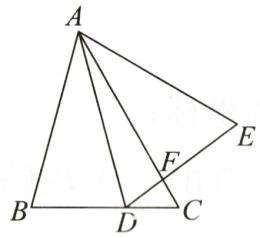  
第9题图

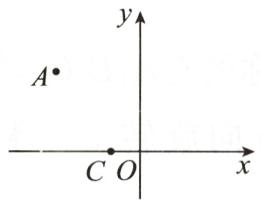  
第10题图

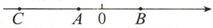  
第13题图

10.(2024·启东期末)如图,在平面直角坐标系中,点C的坐标为(-1,0),点A的坐标为(-3,3),将点A绕点C顺时针旋转90°得到点B,则点B的坐标为\_\_\_\_.

11.(2024·滨城区期末)已知点A(a,1)与点A'(5,b)关于原点对称,则a+b=\_\_\_\_.

12. 将一次函数 $y = -2x + 4$ 的图象绕原点 O 逆时针旋转 $90^{\circ}$ ，所得到的图象对应的函数解析式是 \_\_\_\_.

13. 如图, 数轴上 $A, B$ 两点表示的数分别为 $-1$ 和 $\sqrt{3}$ , 点 $B$ 关于点 $A$ 的对称点为 $C$ , 则点 $C$ 所表示的数为 \_\_\_\_.

14. 在平面直角坐标系中, 平行四边形 $ABCD$ 的对称中心是原点 $O$ , 顶点 $A, B$ 的坐标分别是 $(-1, 1)$ , $(2, 1)$ , 将平行四边形 $ABCD$ 沿 $x$ 轴向右平移 3 个单位长度, 则顶点 $C$ 的对应点 $C_1$ 的坐标是 \_\_\_\_.

15. 如图, 在 Rt△ABC 中, ∠C=90°, ∠ABC=30°, AC=4 cm, 将 Rt△ABC 绕点 A 逆时针旋转得到 Rt△AB'C', 使点 C' 落在 AB 边上, 连接 BB', 则 BB' 的长度是 \_\_\_\_ cm.

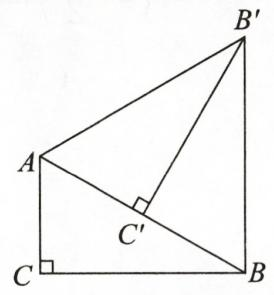  
第15题图

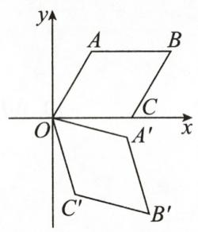  
第16题图

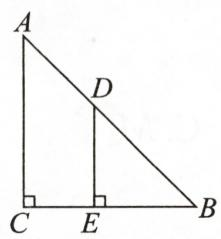  
①

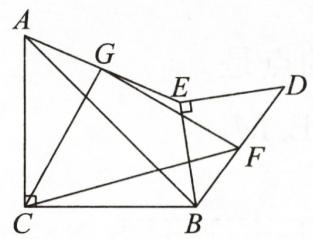  
②

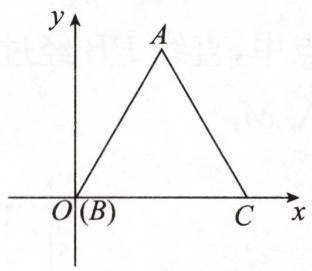  
第18题图

16. 如图, 在平面直角坐标系 $xOy$ 中, 菱形 $OABC$ 的边长为 2 , 点 $A$ 在第一象限, 点 $C$ 在 $x$ 轴的正半轴上, $\angle AOC = 60^{\circ}$ . 若将菱形 $OABC$ 绕点 $O$ 顺时针旋转 $75^{\circ}$ , 得到四边形 $OA'B'C'$ , 则点 $B$ 的对应点 $B'$ 的坐标为 \_\_\_\_.  
17.(2024·新昌期末)将两张等腰直角三角形纸片按如图①放置,将等腰直角三角形纸片BDE绕着点B在同一平面内顺时针旋转,如图②,连接AE,分别取AE,BD的中点G,F,连接CG,GF,CF.已知 $\angle ACB=\angle DEB=90^{\circ},AC=BC=7,DE=BE=3\sqrt{2}$ ,在等腰直角三角形纸片BDE旋转一周的过程中, $\triangle CGF$ 的最大面积是\_\_\_\_.  
18.(2023·宿迁)如图, $\triangle ABC$ 是正三角形,点A在第一象限,点 $B(0,0)$ , $C(1,0)$ .将线段CA绕点C按顺时针方向旋转 $120^{\circ}$ 至 $CP_{1}$ ;将线段 $BP_{1}$ 绕点B按顺时针方向旋转 $120^{\circ}$ 至 $BP_{2}$ ;将线段 $AP_{2}$ 绕点A按顺时针方向旋转 $120^{\circ}$ 至 $AP_{3}$ ;将线段 $CP_{3}$ 绕点C按顺时针方向旋转 $120^{\circ}$ 至 $CP_{4}$ ……以此类推,则点 $P_{99}$ 的坐标是\_\_\_\_.

# 三、解答题(共36分)

19.(10分)(2024·合川区期末)如图,在平面直角坐标系中,Rt△ABC的三个顶点的坐标分别为A(5,4),B(0,3),C(2,1).

(1)画出 $\triangle ABC$ 关于原点 $O$ 成中心对称的 $\triangle A_{1}B_{1}C_{1}$ ,并写出点 $C_{1}$ 的坐标;  
(2) 将 $\triangle A_{1}B_{1}C_{1}$ 绕点 $C_{1}$ 按顺时针方向旋转 $90^{\circ}$ 得到 $\triangle A_{2}B_{2}C_{1}$ , 画出 $\triangle A_{2}B_{2}C_{1}$ , 连接 $A_{1}A_{2}$ , 求 $\triangle A_{1}A_{2}B_{1}$ 的面积.

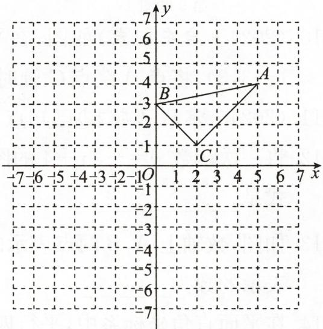

text_image

y
-6
5
4
3
B
A
2
1
C
O
1
2
3
4
5
6
7
x
-7 -6 -5 -4 -3 -2 -1 O 1 2 3 4 5 6 7

第19题图

20.(12分)如图,点E为正方形ABCD外一点, $\angle AEB=90^{\circ}$ ,将Rt△ABE绕点A按逆时针

方向旋转 $90^{\circ}$ 得到 $\triangle ADF, DF$ 的延长线交 BE 于点 H.

(1)试判定四边形 AFHE 的形状,并说明理由;  
(2)已知 BH=7, BC=13, 求 DH 的长.

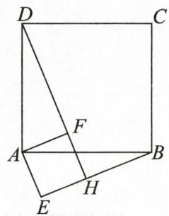  
第20题图

21.(14分)(2023·北京)在 $\triangle ABC$ 中, $\angle B=\angle C=\alpha(0^{\circ}<\alpha<45^{\circ})$ , $AM\perp BC$ 于点 $M,D$ 是线段 $MC$ 上的动点(不与点 $M,C$ 重合),将线段 $DM$ 绕点 $D$ 顺时针旋转 $2\alpha$ 得到线段 $DE$ .

(1)如图①,当点E在线段AC上时,求证:D是MC的中点;   
(2)如图②,若在线段 BM 上存在点 F(不与点 B,M 重合)满足 DF=DC,连接 AF,AE,EF,直接写出 $\angle AEF$ 的大小,并证明.

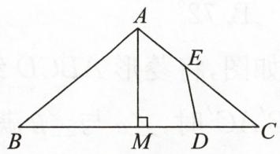  
①

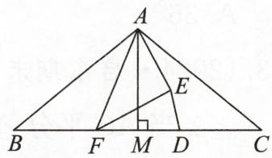  
②   
第21题图

# 附加题

(10 分)一节数学课上,老师提出了这样一个问题:如图①,点 P 是正方形 ABCD 内一点, PA=1,PB=2,PC=3. 你能求出 $\angle APB$ 的度数吗?

小明通过观察、分析、思考,形成了如下思路:

思路一: 将 $\triangle BPC$ 绕点 $B$ 逆时针旋转 $90^{\circ}$ , 得到 $\triangle BP'A$ , 连接 $PP'$ , 求 $\angle APB$ 的度数; 思路二: 将 $\triangle APB$ 绕点 $B$ 顺时针旋转 $90^{\circ}$ , 得到 $\triangle CP'B$ , 连接 $PP'$ , 求 $\angle APB$ 的度数.

(1)请参考小明的思路,任选一种写出完整的解答过程;   
(2)如图②,若点 P 是正方形 ABCD 外一点, $PA = 3, PB = 1, PC = \sqrt{11}$ , 求 $\angle APB$ 的度数.

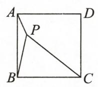  
①

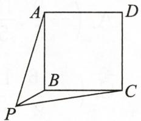  
②   
附加题图

# 第二十四章检测卷

总分:100 分+10 分

时间:90 分钟

成绩评定：\_\_\_\_

# 一、选择题(每小题3分,共30分)

1. (2024·海门期末)如图, $CD$ 是 $\odot O$ 的直径, 弦 $AB = 8 \mathrm{~cm}, AB \perp CD$ , 垂足为 $M, OM: OC = 3: 5$ , 则直径 $CD$ 的长为

A. $2 \sqrt{7} \mathrm{~cm}$

B. $\sqrt{7} \mathrm{~cm}$

C. $10 \mathrm{~cm}$

D. $5 \mathrm{~cm}$

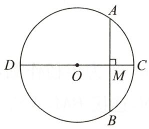  
第1题图

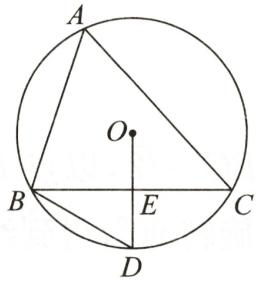  
第2题图

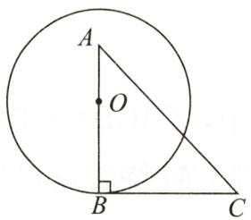  
第3题图

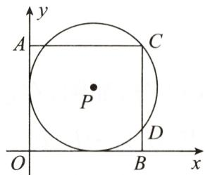  
第5题图

2.(2024·昆山期末)如图, $\odot O$ 是 $\triangle ABC$ 的外接圆,E是BC的中点,连接OE并延长,交 $\odot O$ 于点D,连接BD.若 $\angle D=62^{\circ}$ ,则 $\angle A$ 的度数为()

A. $56^{\circ}$

B. $58^{\circ}$

C. ${60}^{ \circ  }$

D. $62^{\circ}$

3. 如图, 将直角三角板的直角顶点 $B$ 放在 $\odot O$ 上, 直角边 $AB$ 经过圆心 $O$ , 则另一直角边 $BC$ 与 $\odot O$ 的位置关系为 ( )

A. 相交

B. 相切

C. 相离

D. 无法确定

4. 已知 $\odot O$ 的面积为 $2\pi$ ，则其内接正三角形的面积为 （）

A. $3 \sqrt{3}$

B. $3 \sqrt{6}$

C. $\frac{3}{2}\sqrt{3}$

D. $\frac{3}{2}\sqrt{6}$

5. 如图, 在平面直角坐标系中, 点 $P$ 在第一象限, $\odot P$ 与 $x$ 轴、 $y$ 轴都相切, 且经过矩形 AOBC 的顶点 $C$ , 与 BC 相交于点 $D$ . 若 $\odot P$ 的半径为 5 , 点 $A$ 的坐标是 (0,8), 则点 $D$ 的坐标是 ( )

A. (9,2)

B. $(9,3)$

C. (10,2)

D. $(10,3)$

6.(2023·山西)蜂巢结构精巧,其巢房横截面的形状均为正六边形.如图是部分巢房的横截面图,图中7个全等的正六边形不重叠且无缝隙,将其放在平面直角坐标系中,点P,Q,M均为正六边形的顶点.若点P,Q的坐标分别为 $(-2\sqrt{3},3),(0,-3)$ ,则点M的坐标为()

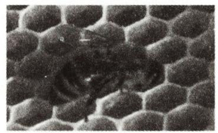

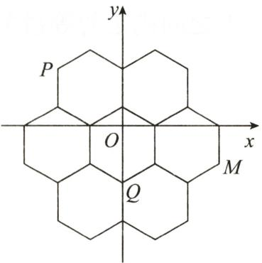

text_image

y
P
O
x
M
Q

第6题图

A. $(3\sqrt{3}, - 2)$

B. $(3\sqrt{3},2)$

C. $(2, -3\sqrt{3})$

D. $(-2, -3\sqrt{3})$

7. 如图, $\triangle ABC$ 是 $\odot O$ 的内接三角形, $\angle C = 30^{\circ}$ , $\odot O$ 的半径为 5. 若 $P$ 是 $\odot O$ 上的一点, 在 $\triangle ABP$ 中, $PB = AB$ , 则 $PA$ 的长为 ( )

A. 5

B. $\frac{5\sqrt{3}}{2}$

C. $5\sqrt{2}$

D. $5\sqrt{3}$

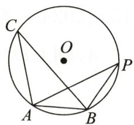  
第7题图

8.(2024·合肥模拟)某仿古墙上原有一个矩形的门洞,现要将它改为一个圆弧形的门洞,圆弧所在的圆外接于矩形门洞,如图.已知矩形的宽为2m,对角线为4m,则改建后门洞的圆弧长是()

A. $\left(\frac{5}{3}\pi + 2\right)\mathrm{m}$

B. $\frac{10}{3} \pi \mathrm{~m}$

C. $\frac{8}{3}\pi \mathrm{m}$

D. $\frac{5}{3}\pi \mathrm{m}$

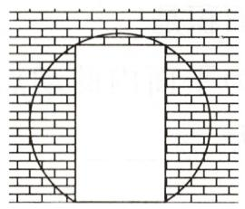  
第8题图

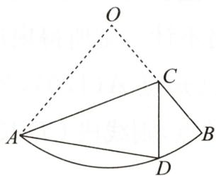  
第9题图

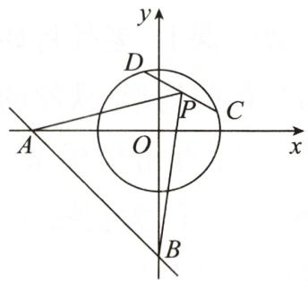

text_image

y
D
P
C
A
O
x
B

第10题图

9. 如图, 点 $C$ 为扇形 $OAB$ 的半径 $OB$ 上一点, 将 $\triangle OAC$ 沿 $AC$ 折叠, 点 $O$ 恰好落在 $AB$ 上的点 $D$ 处,且 $\widehat{BD}: \widehat{AD} = 1:3$ , 若将扇形 $OAB$ 围成一个圆锥, 则圆锥的底面半径与母线长的比为 ( )

A. $1: 3$

B. $1: \pi$

C. $1: 4$

D. $2: 9$

10.(2023·乐山)如图,在平面直角坐标系 $xOy$ 中,直线 $y = -x - 2$ 与 $x$ 轴、 $y$ 轴分别交于 $A$ , $B$ 两点, $C, D$ 是半径为 1 的 $\odot O$ 上两动点,且 $CD = \sqrt{2}, P$ 为弦 $CD$ 的中点.当 $C, D$ 两点在圆上运动时, $\triangle PAB$ 面积的最大值是 ( )

A. 8

B. 6

C. 4

D. 3

# 二、填空题(每小题3分,共24分)

11.(2024·绥化)用一个圆心角为 $126^{\circ}$ ，半径为10 cm的扇形作一个圆锥的侧面，这个圆锥的底面圆的半径为\_\_\_\_cm.

12.(2024·雨花台区模拟)如图,四边形ABCD是⊙O的内接四边形,BE是⊙O的直径,连接AE.若∠BCD=2∠BAD,则∠DAE的度数是\_\_\_\_.

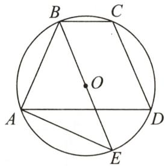  
第12题图

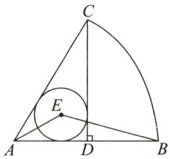  
第13题图

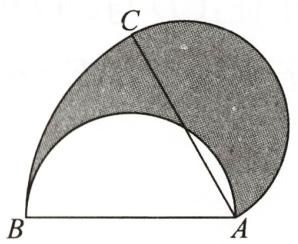  
第14题图

13. 如图, 在扇形 $ACB$ 中, $CD \perp AB$ , 垂足为 $D$ , $\odot E$ 是 $\triangle ACD$ 的内切圆, 连接 $AE, BE$ , 则 $\angle AEB$ 的度数为 \_\_\_\_.

14. 如图, $AB$ 为半圆的直径, 且 $AB = 6$ , 将半圆绕点 $A$ 顺时针旋转 $60^{\circ}$ , 点 $B$ 旋转到点 $C$ 的位置, 则图中阴影部分的面积为 \_\_\_\_.

15.(2024·芜湖模拟)如图, $\odot O$ 内切于 $\triangle ABC$ ,切点分别为D,E,F,且AB=3,BC=5,AC=4,则CD= \_\_\_\_.

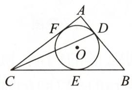  
第15题图

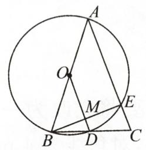  
第16题图

  
第17题图

  
第18题图

16. 如图, 在 $\triangle ABC$ 中, $AB = AC = 10$ , 以 $AB$ 为直径的 $\odot O$ 与 $BC$ 交于点 $D$ , 与 $AC$ 交于点 $E$ , 连接 $OD$ 交 $BE$ 于点 $M$ . 若 $MD = 2$ , 则 $BE$ 的长是 \_\_\_\_.  
17.(玉林)数学课上,老师将如图所示的边长为1的正方形铁丝框变形成以点A为圆心,AB的长为半径的扇形(铁丝的粗细忽略不计),则所得扇形ABD的面积是\_\_\_\_.   
18. 如图, 在平面直角坐标系 $xOy$ 中, 已知点 $A(1,0), B(3,0), C$ 为平面内的动点, 且满足 $\angle ACB = 90^{\circ}, D$ 为直线 $y = x$ 上的动点, 则线段 $CD$ 长的最小值为 \_\_\_\_.

# 三、解答题(共46分)

19.(10分)如图,A为⊙O上一点,按以下步骤作图:①连接OA;②以点A为圆心,AO的长为半径作弧,交⊙O于点B;③作射线OB,并在射线OB上截取BC=OA;④连接AC.若AC=3.求⊙O的半径.

  
第 19 题图

20.(10分)(2024·潮南区期末)如图,在矩形ABCD中, $\odot O$ 经过点A,且与边BC相切于点M, $\odot O$ 过CD边上的点N,且CM=CN.

(1)求证:CD与 $\odot O$ 相切;  
(2) 若 $BE = 2, AE = 6$ , 求 $BC$ 的长.

  
第20题图

21.(12分)(2023·潍坊)如图,正方形ABCD内接于⊙O,在AB上取一点E,连接AE,DE,过点A作AG⊥AE,交⊙O于点G,交DE于点F,连接CG,DG.

(1)求证: $\triangle AFD \cong \triangle CGD$ ;   
(2) 若 $AB = 2, \angle BAE = 30^{\circ}$ , 求阴影部分的面积.

  
第21题图

22.(14分)如图,在 $\triangle ABC$ 中, $\angle ACB=90^{\circ},AC=BC=\sqrt{2}$ ,以点 $B$ 为圆心,1为半径作圆,设点 $M$ 为 $\odot B$ 上一点,线段 $CM$ 绕着点 $C$ 顺时针旋转 $90^{\circ}$ ,得到线段 $CN$ ,连接 $BM,AN$ .

(1)补全图形,并证明 BM=AN;  
(2)连接MN,若MN与⊙B相切,则∠BMC的度数为\_\_\_\_;   
(3)连接 BN, 则 BN 的长的最小值为 \_\_\_\_, BN 的长的最大值为 \_\_\_\_.

  
第22题图

# 附加题

(10 分)如图, 点 C 为 $\triangle ABD$ 的外接圆上一动点 (点 C 不在 BAD 上, 且不与点 B, D 重合), $\angle ACB = \angle ABD = 45^{\circ}$ .

(1)求证: $BD$ 是 $\triangle ABD$ 的外接圆的直径;  
(2)连接 $CD$ , 求证: $\sqrt{2} AC = BC + CD$ ;   
(3)若 $\triangle ABC$ 关于直线 $AB$ 的对称图形为 $\triangle ABM$ ,连接 $DM$ ,试探究 $DM^{2},AM^{2},BM^{2}$ 三者之间满足的等量关系,并证明你的结论.

  
附加题图

# 第二十五章检测卷

总分:100 分+10 分

时间:90 分钟

成绩评定：\_\_\_\_

# 一、选择题(每小题3分,共30分)

1.(2024·如皋期末)一个不透明的袋子中装有3个球,这3个球除颜色外完全相同,从中随机摸出一个球,摸到红球属于必然事件,则布袋中红球的个数是()

A. 3

B. 2

C. 1

D. 0

2.(2024·贵州)小星同学通过大量重复的定点投篮练习,用频率估计他投中的概率为0.4,下列说法正确的是()

A. 小星定点投篮 1 次, 不一定能投中

B. 小星定点投篮 1 次, 一定可以投中

C. 小星定点投篮 10 次, 一定投中 4 次

D. 小星定点投篮 4 次, 一定投中 1 次

3.(2024·广西)一个不透明的袋子中装有2个白球,1个红球,这些球除颜色外无其他差别.
从袋子中随机取出1个球,取出白球的概率是()

A. 1

B. $\frac{1}{3}$

C. $\frac{1}{2}$

D. $\frac{2}{3}$

4. 正方形 ABCD 的边长为 2, 以各边为直径在正方形内画半圆, 得到如图所示的阴影部分. 若随机向正方形 ABCD 内投一粒米, 则米粒落在阴影部分的概率为 ( )

A. $\frac{\pi - 2}{2}$

B. $\frac{\pi - 2}{4}$

C. $\frac{\pi - 2}{8}$

D. $\frac{\pi - 2}{16}$

  
第4题图

5. 一个不透明的袋中装有形状、大小都相同的五个小球, 每个小球上各标有一个数字, 分别是 2,3,4,5,6, 现从袋中任意摸出一个小球, 则这个小球上的数字是方程 $x^{2} - 5x - 6 = 0$ 的解的概率是 ( )

A. $\frac{1}{5}$

B. $\frac{2}{5}$

C. $\frac{3}{5}$

D. $\frac{4}{5}$

6. 柜子里有两双不同的鞋, 如果从中随机地取出 2 只, 那么取出的鞋是同一双的概率为 ( )

A. $\frac{1}{3}$

B. $\frac{1}{4}$

C. $\frac{1}{5}$

D. $\frac{1}{6}$

7. 在综合实践活动中, 小明、小亮、小颖、小菁四位同学用投掷图钉的方法估计钉尖朝上的概率, 他们的试验次数分别为 20 次、50 次、150 次、200 次, 其中, 所做试验相对科学的是 ( )

A. 小明

B. 小亮

C. 小颖

D. 小菁

8.校园足球燃激情,绿茵场上展风采.甲、乙、丙三位同学在练习互相传球,由甲开始发球,并作为第一次传球,则第三次传球后,球传回到甲的概率为()

A. $\frac{1}{3}$

B. $\frac{1}{4}$

C. $\frac{1}{8}$

D. $\frac{3}{8}$

9. 某小组做“用频率估计概率”的试验时, 绘出了如图所示的频率折线图, 则符合这一结果的试验可能是 ( )

line

| 次数 | 频率 |
| ---- | ---- |
| 50   | 0.28 |
| 100  | 0.38 |
| 150  | 0.32 |
| 200  | 0.36 |
| 250  | 0.32 |
| 300  | 0.35 |

第9题图

A. 抛掷一枚硬币, 出现正面朝上

B. 掷一枚正六面体骰子, 向上一面的点数是 3

C. 一副去掉大小王的普通扑克牌洗匀后,从中任抽一张牌的花色是黑桃

D. 从一个装有 2 个红球和 1 个黑球的袋子中任取一球, 取到的是黑球

10. 一个不透明的袋子里装有四个小球, 球上分别标有 6,7,8,9 四个数字, 这些小球除数字外都相同. 甲、乙两人玩“猜数字”游戏, 甲先从袋中任意摸出一个小球, 将小球上的数字记为 $m$ , 再由乙猜这个小球上的数字, 记为 $n$ . 如果 $m, n$ 满足 $|m - n| \leqslant 1$ , 那么就称甲、乙两人 “心领神会”, 则两人“心领神会”的概率是 ( )

A. $\frac{3}{8}$

B. $\frac{5}{8}$

C. $\frac{1}{4}$

D. $\frac{1}{2}$

# 二、填空题(每小题4分,共32分)

11. 一个不透明的袋子中装有 3 个红球和 2 个白球, 这些小球除颜色外完全相同, 随机摸出两个小球, 恰好是一红一白的概率是 \_\_\_\_.  
12. 在一个不透明的袋子中装有除颜色外其余均相同的 7 个小球, 其中红球 2 个, 黑球 5 个.
若再放入 m 个一样的黑球并摇匀, 此时, 随机摸出一个球是黑球的概率等于 $\frac{4}{5}$ , 则 m 的值为 \_\_\_\_.  
13. 在一个不透明的盒子里有 3 张形状、大小、质地完全相同的卡片, 上面分别标着数字 1, 2, 3, 从中随机抽出 1 张后不放回, 再随机抽出 1 张, 则两次抽出的卡片上的数字之和为奇数的概率是 \_\_\_\_.  
14. 一只蚂蚁在如图所示的树枝上寻觅食物, 假定蚂蚁在每个岔路口都会随机选择其中一条路径, 则它遇到食物的概率是 \_\_\_\_.

  
第14题图

15.(2024·洪山区期末)为了估计鱼塘中鱼的数量,养鱼者首先从鱼塘中打捞100条鱼,在每条鱼身上做好记号后把这些鱼放归鱼塘,一段时间后,有记号的鱼与鱼群充分混合,再从鱼塘中打捞50条鱼.如果在这些鱼中有10条鱼是有记号的,那么估计鱼塘中鱼的条数为\_\_\_\_.

16.(2024·重庆)甲、乙两人分别从 A,B,C 三个景区中随机选取一个景区前往游览,则他们恰好选择同一个景区的概率为 \_\_\_\_.

17.(2024·北京校级期末)做随机抛掷一枚纪念币的试验,得到的结果如下表所示.

<table><tr><td>抛掷次数m</td><td>500</td><td>1000</td><td>1500</td><td>2000</td><td>2500</td><td>3000</td><td>4000</td><td>5000</td></tr><tr><td>“正面向上”的次数n</td><td>265</td><td>512</td><td>793</td><td>1034</td><td>1306</td><td>1558</td><td>2083</td><td>2598</td></tr><tr><td>“正面向上”的频率 $\frac{n}{m}$ </td><td>0.530</td><td>0.512</td><td>0.529</td><td>0.517</td><td>0.522</td><td>0.519</td><td>0.521</td><td>0.520</td></tr></table>

有下面 3 个推断:

①当抛掷次数是1000时，“正面向上”的频率是0.512，所以“正面向上”的概率是0.512；  
②随着试验次数的增加，“正面向上”的频率总在0.520附近摆动，显示出一定的稳定性，可以估计“正面向上”的概率是0.520；  
③若再次做随机抛掷该纪念币的试验,则当抛掷次数为 3000 时,出现“正面向上”的次数  
不一定是1558.

其中所有合理推断的序号是\_\_\_\_。

18. 在如图所示的点阵中,相邻的四个点构成正方形,若小球只在点阵中的小正方形 ABCD 内自由滚动,则小球停留在阴影区域的概率为 \_\_\_\_.

# 三、解答题(共38分)

第18题图

19.(12分)(2024·苏州)一个不透明的盒子里装有4张书签,分别描绘“春”“夏”“秋”“冬”四个季节,书签除图案外都相同,并将4张书签充分搅匀.

(1)若从盒子中任意抽取1张书签,恰好抽到“夏”的概率为\_\_\_\_;   
(2)若从盒子中任意抽取 2 张书签(先抽取 1 张书签,且这张书签不放回,再抽取 1 张书签),请用画树状图或列表的方法求抽取的书签恰好 1 张为“春”、1 张为“秋”的概率.

text_image

春
春船我骑罗
夜市长美属
夏
青山环水浮宝
似有暑光无暑地
秋
秋风吹御条
淡水湖门外
冬
红叶山思南城
初冬草於千葉東

第19题图

20.(12 分)如图,某停车场剩下四个车位,小明观察汽车的停车情况.

(1)若有一辆汽车停车,则这辆车停在“003”号车位上的概率是\_\_\_\_;  
(2)若有两辆汽车停车,求这两辆车停在不相邻车位上的概率.

<table><tr><td></td><td></td><td></td><td></td><td></td></tr><tr><td>001</td><td>002</td><td>003</td><td>004</td><td></td></tr></table>

第20题图

21.(14 分)(2024·西城区期末)两个质地均匀的正方体 M 和 N, 正方体 M 的六个面分别标有数字 0, 1, 2, 3, 4, 5; 正方体 N 的六个面分别标有数字 0, 1, 2, 6, 7, 8. 掷小正方体后, 观察朝上一面的数字.

(1)掷一次正方体 M 时, 出现奇数的概率是多少?  
(2)如果先掷一次正方体 M, 再掷一次正方体 N 得到两个数字, 如先后掷到“0”和“1”记为 01, 可表示某月的 01 日; 先后掷到“5”和“8”记为 58, 不能表示某月的日期. 求先后各掷一次正方体 M 和正方体 N, 得到的两个数字能组成一月的一个日期的概率.

# 附加题

(10 分)4 张相同的卡片上分别写有数字 0,1,-2,3,将卡片的背面朝上,洗匀后从中任意抽取 1 张,将卡片上的数字记录下来,不放回,再从余下的 3 张卡片中任意抽取 1 张,同样将卡片上的数字记录下来.  
(1)第一次抽取的卡片上的数字是负数的概率为\_\_\_\_。  
(2)小敏设计了如下游戏规则:当第一次记录下来的数字减去第二次记录下来的数字所得差为非负数时,甲获胜;否则,乙获胜.小敏设计的游戏规则公平吗?为什么?(请用画树状图或列表的方法说明理由)

# 期末冲刺小卷(1)

总分:100 分

时间:45 分钟

成绩评定：\_\_\_\_

# 一、选择题(每小题7分,共28分)

1.(2024·建邺区模拟)若圆锥的底面直径为6,高为4,则该圆锥的侧面积是()

A. $12 \pi$

B. $15 \pi$

C. $24 \pi$

D. $30 \pi$

2.(2024·燕山区期末)下列函数中,当x>0时,y随x的增大而减小的是()

A. y = x

B. $y = x + 1$

C. $y=x^{2}$

D. $y = -x^{2}$

3. 如图, $\odot O$ 的直径 $AB$ 与弦 $CD$ 相交于点 $E$ . 若 $AE=5, BE=1, \angle AED=30^{\circ}$ , 则 $CD$ 的长为 ( )

A. 4

B. $4\sqrt{2}$

C. 3

D. $3 \sqrt{3}$

  
第3题图

  
第4题图

4.(2024·海门模拟)如图①,在等腰Rt△ABC中,∠C=90°,AB=4,点D从点B出发,沿B→C→A方向运动,DE⊥AB于点E,△DEB的面积随着点D的运动形成的函数图象(拐点左右两段都是抛物线的一部分)如图②所示.下列判断正确的是()

A. 函数图象上点的横坐标表示 $DB$ 的长  
B. 当点 D 为 BC 的中点时, 点 E 为线段 AB 的三等分点  
C. 两段抛物线的开口大小不一样   
D. 图象上点的横坐标为 3 时, 纵坐标为 $\frac{3}{2}$

# 二、填空题(每小题7分,共28分)

5. 已知汽车刹车后行驶的距离 s(单位:m) 关于行驶时间 t(单位:s) 的函数解析式是 $s=15t-6t^{2}$ ，则汽车从刹车到停止所用时间为 \_\_\_\_ s.  
6. 如图, $AB$ 是半圆的直径, $C, D$ 是半圆上的两点, $AD = CD$ . 若 $\angle BAC = 46^{\circ}$ , 则 $\angle DAB =$ \_\_\_\_.

  
第6题图

  
第8题图

7. 已知点 $A(m, n), B(m + k, n)$ (其中 $k \neq 0$ ) 都在抛物线 $y = 2x^{2} - 4x + c$ ( $c$ 为常数) 上, 则代数式 $4m^{2} - k^{2} + 4k$ 的值为 \_\_\_\_.  
8. 如图, 在平面直角坐标系 $xOy$ 中, $A(0, -4), B(3, 0)$ , 点 $C$ 在以点 $B$ 为圆心, 2 为半径的圆上, $D$ 为 $AC$ 的中点, 则线段 $OD$ 长的最小值为 \_\_\_\_.

# 三、解答题(共44分)

9.(12分)(2024·新站区期末)如图,AB是⊙O的直径,点C,D是⊙O上AB异侧的两点,DE是⊙O的切线且 $DE\perp CB$ ,交CB的延长线于点E.

(1)求证: $BD$ 平分 $\angle ABE$ ;  
(2)若 $\angle ABC=45^{\circ},AB=4$ ，求 $CE$ 的长.

  
第9题图

10.(16分)已知二次函数 $y=x^{2}+mx+n(m,n$ 为常数).

(1) 当 m = -4 时，

①若 $3 \leqslant x \leqslant 5$ ，则函数 y 的最小值为 2，求 n 的值；  
②若点 $A(a, y_{1})$ , $B(4, y_{2})$ 在该函数的图象上，且 $y_{1} < y_{2}$ ，则 a 的取值范围是 \_\_\_\_.  
(2) 当 $n = 2m$ 时, 若对于 $m \leqslant x \leqslant m + 2, y$ 的最小值为 12, 求 $m$ 的值.

11.(16 分)学习完人教版九上教材第 49 页的探究 1 后,老师提出如下问题:利用一面墙(墙的长度为 $l \mathrm{~m}$ ),用 $60 \mathrm{~m}$ 长的篱笆围成一个矩形场地,怎样围面积最大? 最大面积是多少?

某学习小组通过研讨发现有两种可能情况:如图①,平行于墙的一边不超过墙长;如图②,平行于墙的一边不小于墙长.

请根据从特殊到一般的思想方法继续解答该问题:

(1)当 l=16 时, 在图①的情况下, 场地面积的最大值是 \_\_\_\_ m²; 在图②的情况下, 场地面积的最大值是 \_\_\_\_ m².  
(2) 当 l=20 时, 求矩形场地的最大面积.  
(3)根据 l 的不同取值,直接写出老师所提问题的答案.

  
①

  
②   
第11题图

# 期末冲刺小卷(2)

总分:100 分 时间:45 分钟 成绩评定:

# 一、选择题（每小题6分，共30分）

1.(2024·东城区期末)在下列事件中,是随机事件的是()

A. 投掷一枚质地均匀的骰子, 向上一面的点数不超过 6  
B. 从装满红球的袋子中随机摸出一个球, 是白球  
C. 通常情况下, 自来水在 $10^{\circ} \mathrm{C}$ 结冰  
D. 投掷一枚质地均匀的骰子, 向上一面的点数为 2

2. 如图, $\triangle ABC$ 内接于 $\odot O$ , $\angle ABC = 90^{\circ}$ , $D$ 是 $\widehat{ACB}$ 的中点, 连接 $CD, BD$ 交 $AC$ 于点 $E$ . 若 $\angle ACD = 55^{\circ}$ , 则 $\angle AED$ 的度数是 ( )

A. ${80}^{ \circ  }$

B. $75^{\circ}$

C. ${67.5}^{ \circ  }$

D. ${60}^{ \circ  }$

  
第2题图

3.(2024·密云区期末)某种幼树在相同条件下进行移植试验,结果如下表.

<table><tr><td>移植总棵数n</td><td>400</td><td>750</td><td>1500</td><td>3500</td><td>7000</td><td>9000</td><td>14000</td></tr><tr><td>成活棵数m</td><td>364</td><td>651</td><td>1330</td><td>3174</td><td>6324</td><td>8073</td><td>12620</td></tr><tr><td>成活的频率 $\frac{m}{n}$ </td><td>0.910</td><td>0.868</td><td>0.887</td><td>0.907</td><td>0.903</td><td>0.897</td><td>0.901</td></tr></table>

下列说法正确的是 （）

A. 因为表格中移植总棵数最大时成活的频率是 0.901, 所以这种条件下幼树移植成活的概率为 0.901  
B. 因为表格中成活的频率的平均数约为 0.90, 所以这种条件下幼树移植成活的概率为 0.90  
C. 因为表格中移植总棵数为 1500 时成活棵数为 1330, 所以移植总棵数为 3000 时成活棵数为 2660  
D. 因为随着移植总棵数的增大, 成活的频率稳定在 0.90, 所以估计这种条件下幼树移植成活的概率为 0.90

4. 在平面直角坐标系 $xOy$ 中, 已知点 $A(2,0), B(1,-1)$ , 将线段 $OA$ 绕点 $O$ 逆时针旋转, 设旋转角为 $\alpha (0^{\circ} < \alpha < 135^{\circ})$ . 记点 $A$ 的对应点为 $A_{1}$ , 若点 $A_{1}$ 与点 $B$ 的距离为 $\sqrt{6}$ , 则 $\alpha$ 为 ( )

A. $30^{\circ}$

B. ${45}^{ \circ  }$

C. $60^{\circ}$

D. ${90}^{ \circ  }$

5. 已知二次函数 $y=ax^{2}+bx+c$ 的图象过点 A(2, n)，当 x>0 时， $y \geqslant n$ ，当 $x \leqslant 0$ 时， $y \geqslant n+1$ ，则 a 的值是（）

A.-1

B. $-\frac{1}{4}$

C. $\frac{1}{4}$

D. 1

# 二、填空题(每小题6分,共30分)

6. 投掷一枚质地均匀的正六面体骰子, 投掷一次, 朝上一面的点数为奇数的概率是 \_\_\_\_.

7. 已知 1 是关于 $x$ 的一元二次方程 $(m - 1)x^{2} + x + 1 = 0$ 的一个根, 则 $m$ 的值是 \_\_\_\_.

8.(2024·锡山区期末)如图, $\odot O$ 分别切 $\angle ABC$ 的两边AB,BC于点D,E,点F在 $\odot O$ 上.若 $\angle ABC=70^{\circ}$ ,则 $\angle F$ 的度数为\_\_\_\_.

9. 已知 AB 是 $\odot O$ 的弦, P 为 AB 的中点, 连接 OA, OP, 将 $\triangle OPA$ 绕点 O 逆时针旋转到 $\triangle OQB$ . 设 $\odot O$ 的半径为 1, $\angle AOQ = 135^{\circ}$ , 则 AQ 的长为 \_\_\_\_.

  
第8题图

10. 若抛物线 $y=x^{2}+bx(b>2)$ 上存在关于直线 y=x 成轴对称的两个点，则 b 的取值范围是 \_\_\_\_.

# 三、解答题(共40分)

11.(12分)已知关于x的一元二次方程 $x^{2}+(2-m)x+1-m=0$ .

(1)求证:无论 m 为何值,该方程总有两个实数根;  
(2) 若 m<0，且该方程的两个实数根相差 3，求 m 的值.

12.(14分)(2024·池州模拟)如图,在 $\triangle ABC$ 中,以 $AB$ 为直径的 $\odot O$ 交 $BC$ 于点 $D,DE$ 是 $\odot O$ 的切线,且 $DE\perp AC$ ,垂足为 $E$ ,延长 $CA$ 交 $\odot O$ 于点 $F$ .

(1)求证:AB=AC;   
(2) 若 $AE = 4, DE = 8$ , 求 $AF$ 的长.

  
第12题图

13.(14分)(2024·北京)在平面直角坐标系 $xOy$ 中,已知抛物线 $y=ax^{2}-2a^{2}x(a\neq0)$ .

(1) 当 a=1 时, 求抛物线的顶点坐标;  
(2)已知 $M(x_{1},y_{1})$ 和 $N(x_{2},y_{2})$ 是抛物线上的两点.若对于 $x_{1} = 3a,3\leqslant x_{2}\leqslant 4$ ，都有 $y_{1}< y_{2}$ ，求 $\pmb{a}$ 的取值范围.

# 期末冲刺小卷(3)

总分:100 分

时间:45 分钟

成绩评定：\_\_\_\_

# 一、选择题(每小题6分,共30分)

1. (2024·深圳)二十四节气基本概括了一年中四季交替的准确时间以及大自然中一些物候等自然现象发生的规律。将二十四个节气按季节分类,春季:立春、雨水、惊蛰、春分、清明、谷雨,夏季:立夏、小满、芒种、夏至、小暑、大暑,秋季:立秋、处暑、白露、秋分、寒露、霜降,冬季:立冬、小雪、大雪、冬至、小寒、大寒。若从二十四个节气中任选一个节气,则抽到的节气在夏季的概率为

A. $\frac{1}{2}$

B. $\frac{1}{12}$

C. $\frac{1}{6}$

D. $\frac{1}{4}$

2. 在下列方程中, 有一个方程有两个实数根, 且它们互为相反数, 这个方程是 ( )

A. $x - 1 = 0$

B. $x^{2} + x = 0$

C. $x^{2}-1=0$

D. $x^{2} + 1 = 0$

3.(2024·汉阳区期末)边长为1的正方形OABC的顶点A在x轴正半轴上,点C在y轴正半轴上,将正方形OABC绕顶点O顺时针旋转75°,如图所示,使点B恰好落在函数 $y=ax^{2}$ (a<0)的图象上,则a的值为()

A. $- \sqrt{2}$

B.-1

C. $-\frac{3\sqrt{2}}{4}$

D. $-\frac{\sqrt{2}}{3}$

  
第3题图

  
第4题图

  
第8题图

4. 如图, $\angle ABC = 70^{\circ}, O$ 为射线 $BC$ 上一点 (不与点 $B$ 重合), 以点 $O$ 为圆心, $\frac{1}{2} OB$ 的长为半径作 $\odot O$ , 要使射线 $BA$ 与 $\odot O$ 相切, 应将射线 $BA$ 绕点 $B$ 按顺时针方向旋转 ( )

A. $35^{\circ}$ 或 $70^{\circ}$

B. $40^{\circ}$ 或 $100^{\circ}$

C. $40^{\circ}$ 或 $90^{\circ}$

D. $50^{\circ}$ 或 $110^{\circ}$

5. 下列选项中, 能够被半径为 1 的圆及其内部所覆盖的图形是 ( )

A. 长度为 $\sqrt{5}$ 的线段

B. 斜边为 3 的直角三角形

C. 面积为 4 的菱形

D. 半径为 $\sqrt{2}$ , 圆心角为 $90^{\circ}$ 的扇形

# 二、填空题(每小题6分,共30分)

6. 已知代数式 $-2x^{2}-4x+1$ ，当 x= \_\_\_\_ 时，它有最大值，最大值是 \_\_\_\_.

7. 若关于 $x$ 的方程 $x^{2} - 2x + k = 0$ 有两个不相等的实数根, 则 $k$ 的取值范围为 \_\_\_\_.

8.(2024·建邺区模拟)如图,在平面直角坐标系中,点A(-2,3)绕点P逆时针旋转90°得到点B(3,1),则点P的坐标为\_\_\_\_.

9.(2024·玄武区期末)如图,已知正五边形 $ABCDE$ ,经过 $C,D$ 两点的 $\odot O$ 与 $AB,AE$ 分别相切于点 $M,N$ ,连接 $CM,CN$ ,则 $\angle MCN =$ \_\_\_\_°.

  
第9题图

  
第 10 题图

10. 如图, 抛物线 $y = -2x^{2} + 8x - 6$ 与 $x$ 轴交于点 $A, B$ , 把抛物线在 $x$ 轴及其上方的部分记作 $C_{1}$ , 将 $C_{1}$ 向右平移得 $C_{2}, C_{2}$ 与 $x$ 轴交于点 $B, D$ . 若直线 $y = x + m$ 与 $C_{1}, C_{2}$ 共有 3 个不同的交点, 则 $m$ 的取值范围是 \_\_\_\_.

# 三、解答题(共40分)

11.(12 分)甲、乙两人各进行 1 次射击,如果两人击中目标的概率都是 0.6,求:

(1)两人都击中目标的概率;   
(2)其中恰有一人击中目标的概率;  
(3) 至少有一人击中目标的概率.

12.(12分)如图,在 $\triangle ABC$ 中,点 $E$ 在 $BC$ 边上, $AE=AB$ ,将线段 $AC$ 绕点 $A$ 旋转到 $AF$ 的位置,使得 $\angle CAF=\angle BAE$ ,连接 $EF,EF$ 与 $AC$ 交于点 $G$ .

(1) 求证: EF = BC;   
(2) 若 $\angle ABC = 65^{\circ}, \angle C = 28^{\circ}$ ，求 $\angle FGC$ 的度数.

text_image

Geometric diagram with labeled points A, B, C, E, F, and G forming triangles and intersecting lines

第12题图

13.(16分)如图,抛物线 $y=\frac{1}{2}x^{2}+bx+c$ 与 x 轴交于点 A 和点 B,与 y 轴交于点 C,作直线 BC,若点 B 的坐标为(6,0),点 C 的坐标为(0,-6).

(1)求抛物线的函数解析式及对称轴.   
(2) $D$ 为抛物线的对称轴上一点, 当 $\triangle BCD$ 是以 $BC$ 为直角边的直角三角形时, 求点 $D$ 的坐标.  
(3)若 E 为 y 轴上且位于点 C 下方的一点, P 为直线 BC 上的一点, 在第四象限的抛物线上是否存在一点 Q, 使以 C, E, P, Q 为顶点的四边形是菱形? 若存在, 请求出点 Q 的坐标;

若不存在,请说明理由.

  
备用图  
第13题图

# 期末冲刺小卷(4)

总分:100 分 时间:45 分钟 成绩评定:

# 一、选择题（每小题6分，共30分）

1.(2024·海门期末)把一元二次方程 $x^{2}-4x+1=0$ 配成 $(x+p)^{2}=q$ 的形式, 则 p,q 的值分别是 ( )

A.-2,5

B.-2,3

C. 2,5

D. 2,3

2. 在平面直角坐标系中, 点 $A$ 的坐标为 $(3,1)$ , 将点 $A$ 绕原点 $O$ 逆时针旋转 $90^{\circ}$ , 则点 $A$ 的对应点的坐标为 ( )

A. $(-3,1)$

B. $(-1,3)$

C. $(3, - 1)$

D. $(1, -3)$

3. 假定鸟卵孵化后,雏鸟为雌与为雄的概率相同,如果三枚鸟卵全部孵化成功,则三只雏鸟中恰有两只雄鸟的概率是 ( )

A. $\frac{1}{8}$

B. $\frac{3}{8}$

C. $\frac{5}{8}$

D. $\frac{3}{4}$

4.(2024·眉山)如图,二次函数 $y=ax^{2}+bx+c(a\neq0)$ 的图象与 x 轴交于点 A(3,0),与 y 轴交于点 B,对称轴为直线 x=1. 给出下列四个结论:①bc<0;②3a+2c<0;③ $ax^{2}+bx\geqslant a+b$ ;④若 -2<c<-1,则 $-\frac{8}{3}<a+b+c<-\frac{4}{3}$ . 其中正确的结论有 ( )

A. 1 个

B. 2 个

C. 3 个

D. 4 个

  
第4题图

  
第5题图

  
第7题图

  
第8题图

5. 如图, $\odot O$ 的半径为 2, $AB$ 是直径, 点 $C, M$ 在 $\odot O$ 上, $\angle AOC = 120^{\circ}$ , 取弦 $AM$ 的中点 $N$ , 连接 $CN$ , 当点 $M$ 在 $\odot O$ 上运动时, 线段 $CN$ 的最小值为 ( )

A. 2

B. $\sqrt{6} - 1$

C. $3 \sqrt{2} - 1$

D. $\sqrt{7} - 1$

# 二、填空题(每小题6分,共30分)

6. 已知 a, b 是方程 $x^{2}-2025x+1=0$ 的两个根，则 $a+b$ 的值为 \_\_\_\_.

7. 如图, 在 Rt△ABC 中, ∠CAB=90°, 若将 Rt△ABC 绕点 A 逆时针旋转 58° 得到 △ADE, 点 C 恰好落在 DE 边上, 则 ∠B 的度数是 \_\_\_\_.

8. 如图, 已知二次函数 $y_1 = ax^2 + bx + c (a \neq 0)$ 与一次函数 $y_2 = kx + m (k \neq 0)$ 的图象交于点 $A(-2,3), B(6,2)$ , 则能使 $y_1 < y_2$ 成立的 $x$ 的取值范围是 \_\_\_\_.

9. 某游乐园的摩天轮采用了横梁结构, 风格更加简约. 如图, 摩天轮的直径为 88 米, 最高点 A 距离地面 100 米, 匀速运行一圈的时间是 18 分钟. 由于受到周边建筑物的影响, 乘客与地面的距离超过 34 米 (即乘客在 BC 上方) 时, 可视为最佳观赏位置, 则摩天轮在运行的一圈里最佳观赏时长为 \_\_\_\_ 分钟.

  
第9题图

10. 已知点 $P(m, n)$ 在二次函数 $y = x^{2} - 2ax + a^{2} + a - 1$ (a 为常数且 $a < 1$ ) 的图象上, 当 $m < 2a - 1$ 时, $n$ 的取值范围是 \_\_\_\_. (用含 $a$ 的式子表示)

# 三、解答题(共40分)

11.(12分)(2024·南充)已知 $x_{1},x_{2}$ 是关于x的方程 $x^{2}-2kx+k^{2}-k+1=0$ 的两个不相等的实数根.

(1) 求 k 的取值范围;

(2) 若 k<5，且 $k, x_{1}, x_{2}$ 都是整数，求 k 的值.

12.(12分)(2024·内江)端午节吃粽子是中华民族的传统习俗.市场上猪肉粽的进价比豆沙粽的进价每盒多20元,某商家用5000元购进的猪肉粽盒数与用3000元购进的豆沙粽盒数相同.在销售过程中,该商家发现猪肉粽每盒的售价为52元时,可售出180盒,每盒的售价每提高1元时,少售出10盒.

(1)分别求猪肉粽、豆沙粽每盒的进价；

(2)设猪肉粽每盒的售价为 $x$ 元 $(52 \leqslant x \leqslant 70)$ , $y$ 表示该商家销售猪肉粽的利润 (单位:元), 求 $y$ 关于 $x$ 的函数解析式, 并求出 $y$ 的最大值.

13.(16分)如图,在平面直角坐标系中,点A的坐标为(m,m),过点A作x轴、y轴的垂线段,垂足分别为E,F,点H在线段OE上运动,连接FH,C为FH的中点,将线段AC绕点C顺时针旋转90°得到线段BC,连接BE,CE.

(1)①判断 $\triangle BCE$ 的形状,并说明理由;

②当 $m=2, H(4-2\sqrt{3},0)$ 时，求 $\angle OEB$ 的度数.

(2)连接 OB, 请写出 OB 的最小值. (用含 m 的式子表示)

  
备用图  
第13题图

# 期末冲刺小卷(5)

总分:100 分

时间:45 分钟

成绩评定：\_\_\_\_

# 一、选择题(每小题5分,共25分)

1. 如图, 将 $\triangle ABC$ 绕点 $A$ 逆时针旋转 $100^{\circ}$ 得到 $\triangle ADE$ , 若点 $D$ 在线段 $BC$ 的延长线上, 则 $\angle B$ 的度数为 ( )

A. $60^{\circ}$

B. $50^{\circ}$

C. $45^{\circ}$

D. ${40}^{ \circ  }$

  
第1题图

  
第4题图

2.(2024·新站区期末)老师设计了接力游戏,用合作的方式完成配方法求抛物线的顶点坐标,规则是:每人只能看到前一人给的式子,并进行一步计算,再将结果传递给下一人,最后完成求解.过程如图所示:

flowchart

第2题图

接力中,自己负责的出现错误的是

( )

A. 甲和乙

B. 乙和丙

C. 乙和丁

D. 甲和丙

3. 若一个扇形的半径是 $18 \, cm$ ，且它的圆心角等于 $120^{\circ}$ ，则用这个扇形围成的圆锥的底面半径是（）

A. $3 \mathrm{~cm}$

B. $6 \mathrm{~cm}$

C. $12 \mathrm{~cm}$

D. $18 \mathrm{~cm}$

4. 如图, 在 $5 \times 5$ 的正方形网格中, 一条圆弧经过 $A, B, C$ 三点, 那么这条圆弧所在圆的圆心为图中的 ( )

A. 点 $M$

B. 点 $P$

C. 点 $Q$

D. 点 $R$

5.(2024·平湖期末)已知二次函数 $y=ax^{2}-2ax+1$ ，当 $x=x_{1}$ 时，函数值为 $y_{1}$ ，当 $x=x_{2}$ 时，函数值为 $y_{2}$ ，若 $x_{1}>x_{2}$ 且 $y_{1}>y_{2}$ ，则下列不等式正确的是（）

A. $x_{1} + x_{2} > 2$

B. $x_{1} + x_{2} < 2$

C. $a(x_{1} + x_{2}) > 2a$

D. $a(x_{1} + x_{2}) <   2a$

# 二、填空题(每小题5分,共25分)

6. 若 $\odot O$ 的半径为5,点A到圆心O的距离为4,则点A在 $\odot O$ \_\_\_\_.(填“内”“上”或“外”)

7.(2024·湖北)中国古代杰出的数学家祖冲之、刘徽、赵爽、秦九韶、杨辉,从中任选一位,恰好是赵爽的概率是\_\_\_\_.

8.(2024·建邺区期末)已知二次函数 $y=ax^{2}+bx+c(a,b,c$ 是常数,且 $a\neq0$ ), 函数值 y 与自变量 x 的部分对应值如下表:

<table><tr><td>x</td><td>...</td><td>-1</td><td>0</td><td>1</td><td>2</td><td>3</td><td>4</td><td>...</td></tr><tr><td>y</td><td>...</td><td>10</td><td> $y_1$ </td><td>2</td><td>1</td><td>2</td><td>5</td><td>...</td></tr></table>

当 $y<y_{1}$ 时, 自变量 x 的取值范围是 \_\_\_\_.

9. 已知学校航模组设计制作的火箭的升空高度 $h(\mathrm{m})$ 与飞行时间 $t(\mathrm{s})$ 满足函数 $h = -t^2 + 24t + 1$ , 则火箭升空的最大高度为 \_\_\_\_ m.

10.(2024·启东模拟)在平面直角坐标系中,点A的坐标为(2,0),P是第一象限内任意一点,连接PO,PA.若 $\angle POA=m^{\circ},\angle PAO=n^{\circ}$ ,点P到x轴的距离为1,则 $m+n$ 的最小值为\_\_\_\_.

# 三、解答题(共50分)

11.(14 分)小明每天骑自行车上学,都要通过安装有红绿灯的 4 个十字路口.假设每个路口红灯和绿灯亮的时间相同.

(1)小明从家到学校,求通过前2个十字路口时都是绿灯的概率;(请用“画树状图”或“列表”或“列举”等方法给出分析过程)  
(2)小明从家到学校,通过这4个十字路口时至少有2个绿灯的概率为\_\_\_\_.

12.(16分)红星公司销售一种成本为40元/件的产品,若月销售单价不高于50元,一个月可售出5万件;若月销售单价高于50元,在月销售单价50元的基础上,每涨价1元,月销售量就减少0.1万件.其中月销售单价不低于成本价.设月销售单价为x(单位:元),月销售量为y(单位:万件).

(1)写出 y 与 x 之间的函数关系式,并写出自变量 x 的取值范围;  
(2)当月销售单价是多少元时,月销售利润最大?最大利润是多少万元?  
(3)为响应国家“乡村振兴”政策,该公司决定在某月每销售1件产品便向大别山区捐款a元.已知该公司捐款当月的月销售单价不高于70元,月销售最大利润是78万元,求a的值.

13.(20分)已知抛物线 $y=ax^{2}-2ax+c(a,c$ 为常数， $a\neq0)$ 经过点 $C(0,-1)$ ，顶点为D.

(1) 当 a=1 时, 求该抛物线的顶点坐标;  
(2) 当 $a > 0$ 时, 点 $E(0,1 + a)$ , 若 $DE = 2\sqrt{2} DC$ , 求该抛物线的函数解析式;  
(3) 当 $a < -1$ 时, 点 $F(0,1-a)$ , 过点 $C$ 作直线 $l$ 平行于 $x$ 轴, $M(m,0)$ 是 $x$ 轴上的动点, $N(m+3,-1)$ 是直线 $l$ 上的动点. 当 $a$ 为何值时, $FM+DN$ 的最小值为 $2\sqrt{10}$ ? 并求此时点 $M$ , $N$ 的坐标.

# 期末冲刺小卷(6)

总分:100 分 时间:45 分钟 成绩评定:

# 一、选择题(每小题6分,共30分)

1.(2024·如皋期末)数学中处处存在着美.如图是赵爽弦图、莱洛三角形、笛卡儿心形线、阿基米德螺旋线,这些图形都具有对称之美.

  
①赵爽弦图

  
②莱洛三角形

  
③笛卡儿心形线

  
④阿基米德螺旋线

第1题图

上述图形中,是中心对称图形的是 ( )

A. ①

B. ②

C. ③

D. ④

2. 若 $k$ 是整数, 且关于 $x$ 的一元二次方程 $(k - 1)x^{2} - 2x + 3 = 0$ 有实数根, 则 $k$ 的最大值为 ( )

A. 1

B. 0

C.-1

D.-2

3. 某市场经销一种销售成本为每千克 40 元的农产品。据市场分析, 若按每千克 50 元销售, 一个月能售出 500 千克; 每千克的售价每涨 1 元, 月销售量就减少 10 千克。设每千克的售价为 $x$ 元, 月销售利润为 $y$ 元, 则 $y$ 与 $x$ 的函数关系式为 ( )

A. $y=(x-40)(500-10x)$

B. $y=(x-40)(10x-500)$

C. $y=(x-40)[500-10(x-50)]$

D. $y = (x - 40)[500 - 10(50 - x)]$

4.(2024·花都区期末)如图是一个单心圆隧道的截面,若隧道单心圆的半径OA的长是5m,拱高CD为8m,则此路面AB的宽为()

A. $7 \mathrm{~m}$

B. $8 \mathrm{~m}$

C. $9 \mathrm{~m}$

D. $10 \mathrm{~m}$

  
第4题图

  
第6题图

  
第7题图

5. 在平面直角坐标系中, 已知点 $A(4,0), B(-6,0)$ , 点 $C$ 是 $y$ 轴正半轴上的一个动点, 当 $\angle BCA = 45^{\circ}$ 时, 点 $C$ 的坐标为 ( )

A. $(0,6)$

B. $(0,8)$

C. $(0,10)$

D. $(0,12)$

# 二、填空题(每小题6分,共30分)

6.(2024·苏州)如图,正八边形转盘被分成八个面积相等的三角形,任意转动这个转盘一次,当转盘停止转动时,指针落在阴影部分的概率是\_\_\_\_.

7. 如图, 圆锥的高是 4 , 它的侧面展开图是圆心角为 $120^{\circ}$ 的扇形, 则圆锥的侧面积是 \_\_\_\_. (结果保留 $\pi$ )

8. 古代数学家曾经研究过一元二次方程的几何解法. 以方程 $x^{2} + 3x = 20$ 为例, 三国时期的数学家赵爽在其所著的《勾股圆方图注》中记载的方法是: 构造如图所示的大正方形 $ABCD$ , 它由四个全等的矩形加中间小正方形组成, 根据面积关系可求得 $AB$ 的长, 从而解得 $x$ 的值. 根据此法, 图中正方形 $ABCD$ 的面积为 \_\_\_\_, 方程 $x^{2} + 3x = 20$ 可化为 \_\_\_\_.

  
第8题图

  
第9题图

9.(2024·新疆)如图,抛物线 $y=\frac{1}{2}x^{2}-4x+6$ 与 y 轴交于点 A,与 x 轴交于点 B,线段 CD 在抛物线的对称轴上移动(点 C 在点 D 的下方),且 CD=3. 当 $AD+BC$ 的值最小时,点 C 的坐标为 \_\_\_\_.

10. 将点 $A(-3,3)$ 绕 $x$ 轴上的点 $G$ 顺时针旋转 $90^{\circ}$ 后得到点 $A'$ , 当点 $A'$ 恰好落在以坐标原点 $O$ 为圆心, 2 为半径的圆上时, 点 $G$ 的坐标为 \_\_\_\_.

# 三、解答题(共40分)

11.(16分)如图,点A,B,C,D分别在正方形网格的格点上,其中点A的坐标为 $(-1,5)$ ,点B的坐标为 $(3,3)$ .

(1)请在正方形网格上画出平面直角坐标系,并写出点 C,D 的坐标;  
(2)小明发现,线段 $AB$ 与线段 $CD$ 存在一种特殊关系,即其中一条线段绕着某点旋转一个角度可以得到另一条线段,请在图中标出这个旋转中心 $P$ ,并写出这个旋转中心的坐标.

  
第11题图

12.(24分)(2024·濠江区期末)如图,抛物线 $y=ax^{2}+bx+c(a\neq0)$ 与 x 轴交于 A(-2,0), B(8,0) 两点,与 y 轴交于点 C(0,4),连接 AC,BC.

(1)求抛物线的函数解析式;   
(2) $D$ 为抛物线上第一象限内的点, 求 $\triangle DCB$ 面积的最大值;  
(3) P 是抛物线上的一个动点, 当 $\angle PCB = \angle ABC$ 时, 求点 P 的坐标.

  
备用图  
第12题图

# 期末检测卷

总分:150 分 时间:120 分钟 成绩评定:

# 一、选择题(每小题3分,共30分)

1.(2024·朝阳区期末)把抛物线 $y=3x^{2}$ 先向左平移 2 个单位长度,再向上平移 5 个单位长度,得到的新抛物线的函数解析式为 ( )

A. $y=3(x-5)^{2}+2$

B. $y=3(x+5)^{2}+2$

C. $y=3(x+2)^{2}+5$

D. $y = 3(x - 2)^{2} + 5$

2.(2024·鼓楼区期末)随机抛掷一枚质地均匀的骰子1次,下列事件概率最大的是()

A. 点数为 2

B. 点数为 3

C. 点数小于 3

D. 点数为奇数

3.(2024·海安模拟)如图, $\odot O$ 是△ABC的外接圆, $\angle BAO=20^{\circ}$ ,则 $\angle ACB$ 的大小是()

A. $20^{\circ}$

B. ${40}^{ \circ  }$

C. ${70}^{ \circ  }$

D. ${140}^{ \circ  }$

  
第3题图

  
第4题图

  
第6题图

4.(2024·鼓楼区期末)如图是二次函数 $y=ax^{2}+bx+c$ 的图象,则()

A. $a > 0, c < 0$

B. a>0, c>0

C. $a <   0,c > 0$

D. $a <   0,c <   0$

5.(2023春·海阳期末)某学习小组做“用频率估计概率”的试验时,统计了某一结果出现的频率,绘制了如下的表格,则符合这一结果的试验最有可能是()

<table><tr><td>试验次数</td><td>100</td><td>200</td><td>300</td><td>500</td><td>800</td><td>1000</td><td>2000</td></tr><tr><td>频率</td><td>0.365</td><td>0.28</td><td>0.330</td><td>0.334</td><td>0.336</td><td>0.332</td><td>0.333</td></tr></table>

A. 一副去掉大小王的普通扑克牌洗匀后,从中任抽一张牌的花色是红桃  
B. 在一个装有 3 个红球、6 个白球的箱子里(小球除颜色外都相同),从中任意摸到一个球是红球  
C. 抛一个质地均匀的正六面体骰子, 向上的点数是 5  
D. 抛一枚质地均匀的硬币, 出现的是反面

6.(2024·滨江区期末)如图,点 A,B,C,D 为正 n 边形的顶点,点 O 为正 n 边形的中心.若 $\angle ADB=20^{\circ}$ ,则 n=()

A. 7

B. 8

C. 9

D. 10

7. (2024·惠山区期末)二次函数 $y = ax^{2} + bx + c$ 的自变量 $x$ (表格中 $x$ 的值从左到右增大)与函数值 $y$ 的对应值如下表:

<table><tr><td>x</td><td>...</td><td>0</td><td> $x_{1}$ </td><td> $x_{2}$ </td><td>1</td><td>3</td><td> $x_{3}$ </td><td>...</td></tr><tr><td>y</td><td>...</td><td>1</td><td> $y_{1}$ </td><td> $y_{2}$ </td><td>0</td><td>1</td><td> $y_{3}$ </td><td>...</td></tr></table>

下列判断正确的是 （）

A. $y_{1} <   y_{2} <   y_{3}$

B. $y_{2}<y_{3}<y_{1}$

C. $y_{3} <   y_{2} <   y_{1}$

D. $y_{2} <   y_{1} <   y_{3}$

8. 如图, 已知在 $\triangle ABC$ 中, $CB = CA = 3\sqrt{3}$ , $\angle B = 30^{\circ}$ , 边 $AC$ 的垂直平分线 $MN$ 交 $AB$ 于点 $O$ , 以 $OA$ 为半径的 $\odot O$ 交 $AB$ 于点 $D$ , 则 $BD$ 的长为 ( )

A. 3

B. $\frac{3}{2}$

C. $2 \sqrt{3}$

D. $\sqrt{3}$

  
第8题图

  
第9题图

  
第10题图

9.(2024·宜兴期末)发动机的曲柄连杆将直线运动转化为圆周运动,如图是其示意图.点A在直线l上往复运动,推动点B做圆周运动形成⊙O,AB与BO表示曲柄连杆的两直杆,点C,D是直线l与⊙O的交点.当点A运动到点E时,点B到达点C;当点A运动到点F时,点B到达点D.若AB=12,OB=5,给出下列结论:①FC=2;②EF=10;③当AB与⊙O相切时,EA=4;④当OB⊥CD时,AF= $\sqrt{119}-5$ .其中正确的结论有()

A. 1 个

B. 2 个

C. 3 个

D. 4 个

10. 如图, 已知在正方形 $ABCD$ 中, $AB = 4$ , 以点 $B$ 为圆心, 1 为半径作 $\odot B$ , 点 $P$ 在 $\odot B$ 上移动, 连接 $AP$ . 将 $AP$ 绕点 $A$ 逆时针旋转 $90^{\circ}$ 至 $AP'$ , 连接 $BP'$ . 在点 $P$ 移动过程中, $BP'$ 长度的最小值是 ( )

A. $4\sqrt{2}-1$

B. $4\sqrt{2}$

C. $4 \sqrt{3}$

D. 3

# 二、填空题(每小题3分,共24分)

11.(2024·海安期中)若点A(1,a)与点B(-1,-2)关于原点对称,则a的值为\_\_\_\_.

12.(2024·海安期中)在 $\triangle ABC$ 中, $\angle A=93^{\circ}$ ,则点A在以线段BC为直径的圆\_\_\_\_.
(填“上”“内”或“外”)

13.(2024·海安期中)关于x的方程 $(x+3)(x-a)=0$ 有两个不相等的实数根,则a的取值范围是\_\_\_\_.

14. 已知一个圆锥的侧面展开图是圆心角为 $120^{\circ}$ 、半径为 3 cm 的扇形，则这个圆锥的底面半径是 \_\_\_\_ cm.

15.(2024·海安期中)“圆材埋壁”是我国古代数学著作《九章算术》中的一个问题:“今有圆材,埋在壁中,不知大小,以锯锯之,深一寸,锯长一尺,问径如何?”问题翻译为:如图,现有圆形木材埋在墙壁里,不知木材大小,将它锯下来测得深度CD为1寸,锯长AB为10寸,则圆形木材的半径为\_\_\_\_寸.

16.(2024·海安期中)汽车刹车后行驶的距离s(单位:m)关于行驶的时间t(单位:s)的函数解析式是 $s=15t-6t^{2}$ ，汽车刹车后到停下来前进了\_\_\_\_m.

17.(2024·海安期中)如图,在平面直角坐标系xOy中,点A,B的坐标分别为 $(-1,0),(1,2),\angle A=90^{\circ},AC=3\sqrt{2}$ ,将Rt△ABC绕点O顺时针旋转 $90^{\circ}$ ,则点C的对应点的坐标为\_\_\_\_.

18.(2024·海安期中)已知 x, y 满足 $2x^{2}-2xy+y^{2}=1$ ，则 $x+2y$ 的最大值为 \_\_\_\_.

  
第15题图

  
第17题图

# 三、解答题(共96分)

19.(12分)已知二次函数 $y=ax^{2}+4x+2$ 的图象经过点 A(3,-4).

(1)求 $a$ 的值；  
(2)求此抛物线的对称轴；  
(3)直接写出函数 y 随自变量 x 的增大而减小的 x 的取值范围.

20.(10分)某校在数学实践活动中,数学组准备了4个活动课题,活动1:用作图软件探究抛物线的性质;活动2:用旋转设计图案;活动3:探究四点共圆的条件;活动4:探究旋转前后对应点坐标的关系.九(1)班数学老师准备采取随机抽签的方式把学生分成4组,共同研学活动课题.

(1)九(1)班学生小海希望能抽到活动1,则他能心想事成的概率是\_\_\_\_;  
(2)小海和他的好朋友小江希望能在不同小组,这样可以相互分享学习成果,则他们在不同小组的可能性能否大于70%?请用画树状图或列表的方法来验证你的判断是否正确.

21.(10分)(2024·四会期末)如图,OA,OB,OC是⊙O的三条半径,C是 $\widehat{AB}$ 的中点,M,N分别是OA,OB的中点.求证: $\angle MCO=\angle NCO$ .

  
第21题图

22. (12 分) (2024·海门期末) 如图, $\triangle ABC$ 的三个顶点分别为点 $A(2,4), B(1,1), C(4,3)$ .

(1)请画出 $\triangle ABC$ 关于原点 $O$ 对称的 $\triangle A_{1}B_{1}C_{1}$ ,并写出点 $A$ 的对应点 $A_{1}$ 的坐标;   
(2)请画出 $\triangle ABC$ 绕点 $B$ 逆时针旋转 $90^{\circ}$ 后的 $\triangle A_{2}BC_{2}$ ,并写出点 $C$ 的对应点 $C_{2}$ 的坐标;   
(3)求出(2)中点 C 旋转到点 $C_{2}$ 所经过的路径长。(结果保留根号和 $\pi$ )

text_image

y
6
5
A'
4
3
C
2
1
B'
-6-5-4-3-2-10 1 2 3 4 5 6 x
-1
-2
-3
-4
-5
-6

第22题图

23.(12分)如图,AB是⊙O的直径,C,D都是⊙O上的点,AD平分∠CAB,连接OD,过点D的切线交AC的延长线于点E,交AB的延长线于点F.

(1)求证: $AE \perp EF$ .   
(2)若 $\angle AOD=120^{\circ},AB=8.$

①求 $AC$ 的长；  
②求图中阴影部分的面积.

text_image

Geometric diagram with labeled points and a shaded triangle, likely from a math problem or proof.

第23题图

24.(12分)(2024·南通通州区模拟)某超市购进某种商品的成本为25元/kg,经过调查发现,这种商品在前30天的销售单价y(元/kg)与时间第x天(x为整数)之间的函数关系式为 $y=\begin{cases}x+37(0<x\leqslant15,x\text{为整数}),\\55(15<x\leqslant30,x\text{为整数}).\end{cases}$ 日销量m(kg)与时间第x天(x为整数)之间满足函数关系:m=-2x+72(0<x\leqslant30,x为整数).

(1)前 15 天中,哪一天的销售利润最大? 最大日销售利润是多少元?  
(2)前 30 天中,日销售利润不低于 1080 元的有多少天?

25.(14分)如图,四边形ABCD是⊙O的内接正方形,P是圆上一点(点P与点A,B,C,D不重合),连接PA,PB,PC.

(1)若点 P 是 $\widehat{AD}$ 上一点，

①∠BPC 的度数为 \_\_\_\_；  
②求证: $PA + PC = \sqrt{2} PB$ .

小明的思路:这是线段和差倍半问题,可采用截长补短法,请按小明的思路完成下列证明过程(也可按自己的想法给出证明).

证明: 在 PC 的延长线上截取点 E, 使 CE = PA, 连接 BE.

(2)探究当点 P 分别在 $\widehat{AB}, \widehat{BC}, \widehat{CD}$ 上时, PA, PB, PC 之间的数量关系, 直接写出答案, 不需要证明.

  
备用图  
第25题图

26.(14分)已知抛物线 $y=ax^{2}+bx-1(a>0)$ 经过点 $(2,-1)$ ，当 $1-2m \leqslant x \leqslant 1+3m$ 时，y 的最小值为 -2.

(1)求抛物线的函数解析式;   
(2) 当 $n < x < n + 1$ 时，y 的取值范围是 $2n + 1 < y < 2n + 4$ ，求 n 的值.