1-2

# 基础题卡

# 数学

# 九年级（上）R

基础过关

# 目录

基础题卡 1 一元二次方程 …… 1

基础题卡 2 解一元二次方程——直接开平方法 …… 2

基础题卡 3 解一元二次方程——配方法 … 3

基础题卡 4 解一元二次方程——公式法(一) 4

基础题卡 5 解一元二次方程——公式法(二)
…… 5

基础题卡 6 解一元二次方程——因式分解法
…… 6

基础题卡 7 一元二次方程的根与系数的关系
…… 7

基础题卡 8 实际问题与一元二次方程(一) 8

基础题卡 9 实际问题与一元二次方程(二)
...... 9

基础题卡 10 实际问题与一元二次方程(三)
…… 10

基础题卡 11 二次函数 …… 11

基础题卡 12 二次函数 $y = ax^2$ 的图象和性质
…… 12

基础题卡 13 二次函数 $y = ax^{2} + c$ 的图象和性质 …… 14

基础题卡 14 二次函数 $y = a(x - h)^2$ 的图象和性质 …… 15

基础题卡 15 二次函数 $y=a(x-h)^{2}+k$ 的
图象和性质 …… 16

基础题卡 16 二次函数 $y = ax^2 + bx + c$ 的
图象和性质 …… 17

基础题卡 17 求二次函数的解析式 …… 19

基础题卡 18 二次函数与一元二次方程(一)
…… 20

基础题卡 19 二次函数与一元二次方程(二)
…… 21

基础题卡 20 实际问题与二次函数(一) … 23

基础题卡 21 实际问题与二次函数(二) … 24

基础题卡 22 实际问题与二次函数(三) … 25

基础题卡 23 图形的旋转(一) …… 26

基础题卡 24 图形的旋转(二) …… 27

基础题卡 25 中心对称 …… 28

基础题卡 26 中心对称图形 …… 29

基础题卡 27 关于原点对称的点的坐标 … 31

基础题卡 28 圆 …… 32

基础题卡 29 垂直于弦的直径(一) …… 33

基础题卡 30 垂直于弦的直径(二) …… 34

基础题卡 31 弧、弦、圆心角 …… 35

基础题卡 32 圆周角(一) …… 36

基础题卡 33 圆周角(二) …… 37

基础题卡 34 点和圆的位置关系 …… 38

基础题卡 35 直线和圆的位置关系(一) … 39

基础题卡 36 直线和圆的位置关系(二) … 40

基础题卡 37 直线和圆的位置关系(三) … 41

基础题卡 38 正多边形和圆 …… 42

基础题卡 39 弧长和扇形面积 …… 43

基础题卡 40 随机事件 …… 45

基础题卡 41 概率 …… 46

基础题卡 42 用列举法求概率(一) …… 47

基础题卡 43 用列举法求概率(二) …… 48

(答案见《参考答案》第55\~63页)

# 基础题卡1 一元二次方程

# 新知梳理

1. 一元二次方程: 等号两边都是整式, 只含有\_\_\_\_未知数 (一元), 并且未知数的最高次数是\_\_\_\_ (二次) 的方程, 叫做一元二次方程.  
2. 一元二次方程的一般形式是\_\_\_\_\_\_\_\_\_\_. 其中\_\_\_\_\_\_\_\_是二次项, \_\_\_\_是二次项系数; \_\_\_\_是一次项, \_\_\_\_是一次项系数; \_\_\_\_是常数项.  
3. 使一元二次方程左右两边\_\_\_\_的未知数的值就是这个一元二次方程的解,一元二次方程的解也叫做一元二次方程的\_\_\_\_。

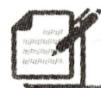

# 课堂小练

1. (2024·锡山区期末)下列方程一定是一元二次方程的是 ( )

A. $x + 8 = 6y$

B. $x(x - 2) = 0$

C. $x - \frac{1}{x} = 8$

D. $ax^{2} + bx + c = 0$

2. 若关于 $x$ 的一元二次方程 $(k + 2)x^{2} + 3x + k^{2} - k - 6 = 0$ 必有一根为 0 , 则 $k$ 的值是 ( )

A. 3 或 -2

B.-3或2

C. 3

D. -2

3. (2024·南充)已知 m 是方程 $x^{2}+4x-1=0$ 的一个根, 则 $(m+5)(m-1)$ 的值为 \_\_\_\_.

4. 将下列方程化成一元二次方程的一般形式, 并写出其中的二次项系数、一次项系数和常数项.

(1) $5x^{2}-1=4x;$

(2) $4x^{2}=81$ ;

(3) $4x(x+2)=25.$

5. 根据下列问题列方程,并将所列方程化成一元二次方程的一般形式.

(1)一个矩形的长比宽多 $1 \mathrm{~cm}$ , 面积是 $132 \mathrm{~cm}^{2}$ , 矩形的长和宽各是多少?  
(2)有一根 $1 \mathrm{~m}$ 长的铁丝, 怎样用它围成一个面积为 $0.06 \mathrm{~m}^{2}$ 的矩形?  
(3)参加某次聚会的每两人都握了一次手,所有人共握手10次,有多少人参加聚会?

# 基础题卡 2 解一元二次方程——直接开平方法

# 新知梳理

1. 对于形如 $x^{2}=p$ 的一元二次方程, 当 p>0 时, 我们可根据平方根的意义求得方程的根为 x=\_\_\_\_; 当 p=0 时, $x_{1}=x_{2}=0$ ; 当 p<0 时, 因为对任意实数 x, 都有 $x^{2}\geqslant0$ , 所以方程无实数根. 类似地, 形如 $(mx+n)^{2}=p(p\geqslant0,m\neq0)$ 的方程的根为 x=\_\_\_\_. 这种根据平方根的意义解一元二次方程的方法叫做直接开平方法.

2. 把一元二次方程 $(mx+n)^{2}=p(p\geqslant0,m\neq0)$ 转化为 \_\_\_\_ 的方法叫做降次.

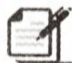

# 课堂小练

1. 方程 $x^{2} = 0$ 的根为

A. $x_{1} = x_{2} = 0$

B. $x = 0$

C. $x^{2} = 0$

D. 无实数根

2. 方程 $x^{2}=3$ 的根是 ( )

A. $x_{1} = x_{2} = 3$

B. $x_{1} = x_{2} = \sqrt{3}$

C. $x_{1}=x_{2}=-\sqrt{3}$

D. $x_{1} = \sqrt{3}, x_{2} = -\sqrt{3}$

3. 若关于 x 的方程 $(x-4)^{2}=a$ 有实数解，则 a 的取值范围是（）

A. $a \leqslant 0$

B. $a \geqslant 0$

C. $a > 0$

D. $a < 0$

4. 用直接开平方法解方程：

(1) $x^{2}=36;$

(2) $x^{2}+1=1.01;$

(3) $(4x-1)^{2}=225;$

(4) $2(x^{2}+1)=10;$

(5) $(x+1)(x-1)=3;$

(6) $(x - 4)^{2} = (5 - 2x)^{2}$ .

# 基础题卡 3 解一元二次方程——配方法

# 新知梳理

1. 配方法: 通过配成\_\_\_\_形式来解一元二次方程的方法, 叫做配方法.

2. 用配方法解一元二次方程的一般步骤:

(1)化二次项系数为\_\_\_\_,并将含有未知数的项移到方程的\_\_\_\_边,常数项移到方程的\_\_\_\_边;

(2)配方,方程两边同时加上\_\_\_\_,使左边配成一个完全平方式,写成 $(x+n)^{2}=p$ 的形式;

(3) 若 $p \quad 0$ , 则可直接开平方求出方程的根; 若 $p \quad 0$ , 则方程无实数根.

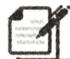

# 课堂小练

1. 用配方法解方程 $x^{2} - 4x - 9 = 0$ 时, 原方程应变形为 ( )

A. $(x - 2)^{2} = 13$

B. $(x - 2)^{2} = 11$

C. $(x - 4)^{2} = 11$

D. $(x - 4)^{2} = 13$

2. 在解方程 $2x^{2} + 4x + 1 = 0$ 时, 对方程进行配方, 图①是小思做的, 图②是小博做的, 对

于两人的做法,下面说法正确的是 ( )

A. 两人都正确

B. 小思正确, 小博不正确

C. 小思不正确, 小博正确

D. 两人都不正确

$$
\begin{array}{l} 2 x ^ {2} + 4 x = - 1, \\ x ^ {2} + 2 x = - \frac {1}{2}, \\ x ^ {2} + 2 x + 1 = - \frac {1}{2} + 1, \\ (x + 1) ^ {2} = \frac {1}{2}. \\ \end{array}
$$

①

$$
2 x ^ {2} + 4 x = - 1,
$$

$$
4 x ^ {2} + 8 x = - 2,
$$

$$
4 x ^ {2} + 8 x + 4 = - 2 + 4,
$$

$$
(2 x + 1) ^ {2} = 2.
$$

②

第2题图

3. (1) $x^{2} - 7x + \_\_\_\_ = (x - \_\_\_\_)^{2}$ ;

(2) $x^{2}+\frac{2}{5}x+$ \_\_\_\_=(x+\_\_\_\_) $^{2}$ .

4. 用配方法解方程：

(1) $x^{2}-2x=4;$

(2) $x^{2}+5x=-2;$

(3) $2x^{2}-3x+1=0;$

(4) $3x^{2}-1=6x;$

(5) $\sqrt{2} x^{2} - 4x = 4\sqrt{2}$ ;

(6) $\frac{1}{2}x^{2}-2x-3=0.$

# 基础题卡 4 解一元二次方程——公式法(一)

# 新知梳理

1. 一元二次方程 $ax^{2} + bx + c = 0 (a \neq 0)$ 的求根公式为 \_\_\_\_, 利用它解一元二次方程的方法叫做公式法.

2. 用公式法解一元二次方程的一般步骤:

(1)把一元二次方程化成 \_\_\_\_. (2)确定 的值. (3)计算 的值. (4)若 ≥0, 则可利用 求出原方程的根; 若 <0, 则原方程无实数根.

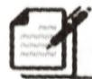

# 课堂小练

1. 用公式法解方程 $2x^{2} - 3x = 1$ 时, 需先求出 $a, b, c$ 的值, 则 $a, b, c$ 的值依次是 ( )

A. $2, 3, 1$

B. 0,2,-3

C. 2,3,-1

D. 2, -3, -1

2. 以 $x = \frac{3 \pm \sqrt{9 + 4c}}{2}$ 为根的一元二次方程可能是 ( )

A. $x^{2} - 3x - c = 0$

B. ${x}^{2} + {3x} - c = 0$

C. $x^{2} - 3x + c = 0$

D. $x^{2} + 3x + c = 0$

3. 若一元二次方程 $x^{2} + bx + 4 = 0$ 的两个实数根中较小的一个根是 $m (m \neq 0)$ ，则 $b + \sqrt{b^{2} - 16} =$

A. $m$

B.-m

C. $2m$

D. -2m

4. 用公式法解方程:

(1) $x^{2}+2x-3=0;$

(2) $y^{2}-3y+1=0;$

(3) $x^{2}+x+1=0;$

(4) $3x^{2}+2x-1=0;$

(5) $2x^{2}-7x+6=0;$

(6) $3x^{2}-4x=2.$

# 基础题卡 5 解一元二次方程——公式法(二)

# 新知梳理

1. 一般地, 式子\_\_\_\_叫做一元二次方程 $ax^{2}+bx+c=0 (a \neq 0)$ 根的判别式, 通常用希腊字母“\_\_\_\_”表示它, 即 \_\_\_\_. 当 $\Delta>0$ 时, 方程有\_\_\_\_实数根; 当 $\Delta=0$ 时, 方程有\_\_\_\_实数根, 此时方程的根为\_\_\_\_; 当 $\Delta<0$ 时, 方程\_\_\_\_实数根. 反之也成立.

2. 当一元二次方程的二次项系数中含有字母参数 a 时, 必须注意 a 的取值要使二次项系数 \_\_\_\_.

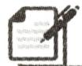

# 课堂小练

1. 下列一元二次方程没有实数根的是 ( )

A. $x^{2} + 2x + 1 = 0$

B. $x^{2} + x - 2 = 0$

C. $x^{2} + 1 = 0$

D. $x^{2} - 2x - 1 = 0$

2.(2024·高邮期末)关于 x 的一元二次方程 $x^{2}+ax-1=0$ 的根的情况是 ( )

A. 有两个相等的实数根

B. 有两个不相等的实数根

C. 只有一个实数根

D. 没有实数根

3. 若关于 $x$ 的一元二次方程 $x^{2} - 2x - m = 0$ 有实数根, 则实数 $m$ 的取值范围是 ( )

A. $m \leqslant 1$

B. $m \geqslant 1$

C. $m \geqslant -1$

D. $m \leq -1$

4. 请你写出：

(1)一个有两个不同实数根的一元二次方程：\_\_\_\_；  
(2)一个有两个相同实数根的一元二次方程：\_\_\_\_；  
(3)一个无实数根的一元二次方程：\_\_\_\_。

5. 不解方程, 判断下列方程根的情况:

(1) $2x^{2}+3x+4=0;$

(2) $-x^{2}+2x-1=0.$

6. 求 $k$ 取什么实数时, 关于 $x$ 的方程 $(k - 2)x^{2} - 2x + 1 = 0$ :

(1)有两个不相等的实数根;   
(2)有一个实数根；  
(3)没有实数根.

# 基础题卡 6 解一元二次方程——因式分解法

# 新知梳理

1. 因式分解法: 把一元二次方程的一边化为\_\_\_\_, 而另一边分解成两个\_\_\_\_, 进而转化为求两个一元一次方程的根。这种解一元二次方程的方法叫做因式分解法。

2. 用因式分解法解方程的原理: 若 $a \cdot b = 0$ , 则

3. 用因式分解法解方程的一般步骤：

(1)整理方程,使方程右边为 ;   
(2)将方程左边化为两个\_\_\_\_；  
(3)令两个一次因式分别为0,得到两个\_\_\_\_;  
(4)分别解这两个\_\_\_\_，它们的根就是原方程的根.

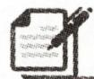

# 课堂小练

1. 方程 $(x - 1)(x + 2) = 0$ 的解是 （）

A. $x_{1} = 1, x_{2} = 2$

B. $x_{1} = -1, x_{2} = 2$

C. $x_{1}=1, x_{2}=-2$

D. $x_{1} = -1, x_{2} = -2$

2. 一元二次方程 $x^{2} = x$ 的实数根是 （）

A. 0 或 1

B. 0

C. 1

D. ±1

3. 若关于 $x$ 的方程 $x^{2} + ax + b = 0$ 的两根为 2 与 -3, 则二次三项式 $x^{2} + ax + b$ 可分解为 ( )

A. $(x - 2)(x + 3)$

B. $(x+2)(x-3)$

C. $2(x-2)(x+3)$

D. $2(x + 2)(x - 3)$

4. 用因式分解法解方程：

(1) $2x(x-3)+x=3;$

(2) $(x+1)^{2}-(2x-3)^{2}=0;$

(3) $2(x-3)^{2}=x^{2}-9;$

(4) $2y^{2}+4y=y+2.$

# 基础题卡7 一元二次方程的根与系数的关系

# 新知梳理

1. 若一元二次方程 $x^{2} + px + q = 0$ 的两个根为 $x_{1}, x_{2}$ ，则 $x_{1} + x_{2} =$ \_\_\_\_ ， $x_{1}x_{2} =$ \_\_\_\_ .  
2. 若 $x_{1}, x_{2}$ 是关于 x 的一元二次方程 $ax^{2} + bx + c = 0 (a \neq 0)$ 的两个实数根，则 $x_{1} + x_{2} =$ \_\_\_\_， $x_{1}x_{2} =$ \_\_\_\_.  
3. 在一元二次方程中, 用根与系数的关系解题的前提条件是根的判别式 $\Delta$ \_\_\_\_ 0.

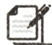

# 课堂小练

1. 设 $x_{1}, x_{2}$ 是一元二次方程 $2x^{2} + 6x - 1 = 0$ 的两个根, 则 $x_{1} + x_{2}$ 的值是 ( )

A.-6

B.-3

C. 3

D. 6

2. 若关于 $x$ 的方程 $x^{2} + (2 - k)x + k^{2} = 0$ 的两个根互为倒数, 则 $k =$ ()

A. 3

B. 1

C.-1

D. ±1

3. 在下列方程中, 以 3, -4 为根的一元二次方程是 ( )

A. $x^{2} - x - 12 = 0$

B. $x^{2} + x - 12 = 0$

C. $x^{2} - x + 12 = 0$

D. $x^{2} + x + 12 = 0$

4. 若 $x_{1}, x_{2}$ 是一元二次方程 $x^{2}-3x+1=0$ 的两个根，则 $\frac{1}{x_{1}}+\frac{1}{x_{2}}=$ \_\_\_\_.

5. 不解方程, 求下列方程的两根之和与两根之积:

(1) $x^{2}-3x-5=0;$

(2) $3x^{2}+5x+2=0;$

(3) $x^{2}+\sqrt{2}x-3=0.$

6. 若 $m, n$ 是方程 $x^{2} + 3x - 7 = 0$ 的两个根, 求 $m^{2} + 4m + n$ 的值.

# 基础题卡 8 实际问题与一元二次方程(一)

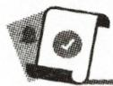

# 新知梳理

1. 列一元二次方程解应用题的一般步骤:

(1) “审”是指审清，明确题目中的已知量、未知量及数量关系；  
(2) “设”是指 , 把题目中的未知量用字母表示出来;  
(3) “列”是指找出等量关系,列出  
(4) “解”是指；  
(5)检验作答.

2. 在疾病的传播过程中, 第一轮的传染源有 1 人, 他传染给 $x$ 人, 则第二轮的传染源有 \_\_\_\_人, 以同样的速度传染, 共有 \_\_\_\_人在第二轮传染中被传染, 两轮传染中总共有人被传染.  
3. 将传染问题公式化: 由 1 人开始传染, 第一轮传染给 $x$ 人, 第二轮以同样的速度传染,两轮过后共有 $n$ 人被传染, 可列出方程:

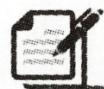

# 课堂小练

1.(2024·海门期末)某种电脑病毒传播非常快,如果一台电脑被感染,经过两轮感染后就会有100台被感染.设每轮感染中平均一台电脑会感染x台其他电脑,根据题意列方程应为()

A. $1+2x=100$

B. $x(1 + x) = 100$

C. $(1 + x)^{2} = 100$

D. $1+x+x^{2}=100$

2. 某种树木的主干长出 $x$ 根支干, 每根支干又长出 $x$ 根小分支, 若主干、支干和小分支总数共 111 根, 则主干长出支干的根数 $x$ 为  
3. 某校九年级以班为单位进行篮球比赛, 第一轮比赛是先把全年级班级平均分成 A, B 两个大组, 同一个大组的每两个班都进行一场比赛, 这样第一轮 A, B 两个大组共进行了 20 场比赛. 问该校九年级共有几个班?

# 基础题卡 9 实际问题与一元二次方程(二)

# 新知梳理

1. 增长率问题: 经过两次等增长率的增长, 增长前后的基本关系式为 $a = b(1 \pm x)^{2}$ , 其中 $a$ 表示增长后的量, $b$ 表示 \_\_\_\_, $x$ 表示 \_\_\_\_, 2 表示 \_\_\_\_, “+”表示 \_\_\_\_, “-”表示 \_\_\_\_.

2. 利润问题: (1) 总利润 = \_\_\_\_ - \_\_\_\_ = 每件商品所获 \_\_\_\_ × 销售 \_\_\_\_ ;

(2)销售额=\_\_\_\_×\_\_\_\_;(3)每件利润=\_\_\_\_-\_\_\_\_.

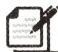

# 课堂小练

1. (2024·如皋期末)2023 年以来, 某厂生产的电子产品处于高速上升期, 该厂生产一件产品起初的成本为 225 元, 经过两次技术改进, 现生产一件这种产品的成本比起初下降了 30.2 元, 设每次技术改进产品的成本下降率均为 $x$ , 则下列方程正确的是 ( )

A. $225(1-2x)=225-30.2$

B. $30.2(1+x)^{2}=225$

C. $225(1 - x)^{2} = 30.2$

D. $225(1-x)^{2}=225-30.2$

2. 某种药品原价每盒 60 元,由于医疗政策改革,价格经过两次下调后现在的售价为每盒 48.6 元,则平均每次下调的百分率为 \_\_\_\_.

3. 某工厂 1 月份生产 10 万个某种玩具, 1 月底因市场对该玩具需求量大增, 为满足市场需求, 工厂决定从 2 月份开始扩大产量, 3 月份产量达到 12.1 万个. 已知 2 月份和 3 月份产量的月平均增长率相同.

(1)求 2,3 月份该玩具产量的月平均增长率;

(2) 按照(1)中的月平均增长率, 预计 4 月份的产量为多少万个.

4. 某超市销售一种饮料, 平均每天可售出 200 箱, 每箱的利润是 12 元, 为尽可能多地减少库存, 增加利润, 超市准备适当降价. 据测算, 每箱每降价 1 元, 平均每天可多售出 40 箱. 若要使每天销售该饮料获利 2800 元, 则每箱应降价多少元?

# 基础题卡 10 实际问题与一元二次方程(三)

# 新知梳理

在求解规则图形的面积问题时,需记住这些图形的面积公式. 在求解不规则图形的面积问题时,往往把不规则图形\_\_\_\_成规则图形,找出各部分面积之间的关系,再运用规则图形的面积公式列出方程求解.

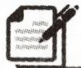

# 课堂小练

1. (2024·常州期末)用一根长 22 cm 的铁丝围成面积是 $30 \, cm^{2}$ 的矩形. 假设矩形的一边长是 x cm, 则可列出的方程是 ( )

A. $x(22-x)=30$

B. $x(11 - x) = 30$

C. $x(22-2x)=30$

D. $2x(22 - x) = 30$

2. 要利用一面足够长的围墙和 100 米长的隔离栏建三个如图所示的矩形羊圈, 若计划建成的三个羊圈的总面积为 400 平方米, 则羊圈的长 AB 为多少米? 设羊圈的长 AB 为 x 米, 根据题意可列出的方程为 \_\_\_\_.

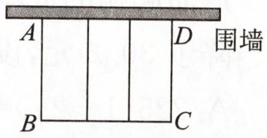

text_image

A
B
C
D
围墙

第2题图

3. 某花卉种植基地准备围建一个面积为 100 平方米的矩形苗圃园种植玫瑰花, 其中一边靠墙, 另外三边用 29 米长的篱笆围成. 已知墙长 18 米, 为方便进入, 在墙的对面留出 1 米宽的门 (如图所示). 求这个苗圃园垂直于墙的一边长多少米.

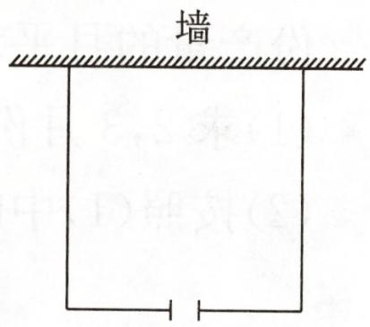

text_image

墙

第3题图

4. 如图, 某小区规划在长 20 米、宽 10 米的矩形场地 ABCD 上修建三条同样宽的小路, 使其中两条与 AD 平行, 一条与 AB 平行, 其余部分种草. 若草坪的面积为 162 平方米, 则小路宽多少米?

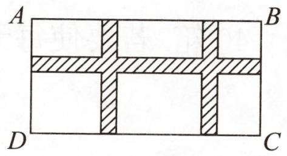

text_image

A
B
D
C

第4题图

# 基础题卡11 二次函数

# 新知梳理

1. 一般地, 形如 $y = ax^2 + bx + c (a, b, c$ 是常数) 的函数, 当 $a$ \_\_\_\_ 0, $b$ \_\_\_\_ 0 时是一次函数; 当 $a$ \_\_\_\_ 0 时是二次函数, 其中二次项系数为 \_\_\_\_, 一次项系数为 \_\_\_\_, 常数项为 \_\_\_\_.  
2. 二次函数 $y = ax^{2} + bx + c (a, b, c$ 是常数， $a \neq 0$ ) 的等号右边是关于 $x$ 的 \_\_\_\_ 式，可以没有 \_\_\_\_ 项和 \_\_\_\_ 项。

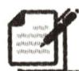

# 课堂小练

1.(2024·秦淮区期末)下列函数中,y与x之间的关系是二次函数的是()

A. $y = 1 - 3x^{3}$

B. $y = {x}^{2} - {5x}$

C. $y = x^{4} + 2x^{2} - 1$

D. $y = \frac{1}{{x}^{2}}$

2. 若关于 $x$ 的函数 $y = (2 - a)x^{2} - x$ 是二次函数, 则 $a$ 的取值范围是 ( )

A. $a \neq 0$

B. $a \neq  2$

C. $a <   2$

D. $a > 2$

3. n 个球队进行单循环比赛(参加比赛的任何一个球队都与其他所有的球队各赛一场), 总的比赛场数为 y, 则有 ( )

A. $y = 2n$

B. $y = n^{2}$

C. $y=n(n-1)$

D. $y = \frac{1}{2} n(n - 1)$

4. 用一根长 $60 \mathrm{~cm}$ 的铁丝围成一个矩形, 那么矩形的面积 $y(\mathrm{cm}^{2})$ 与它的一边长 $x(\mathrm{cm})$ 之间的函数关系式为 ( )

A. $y = x^{2} - 30x(0 <   x <   30)$

B. $y =  - {x}^{2} + {30x}\left( {0 \leq  x < {30}}\right)$

C. $y = -x^{2} + 30x(0 <   x <   30)$

D. $y = -x^{2} + 30x (0 < x \leqslant 30)$

5. 某公司的年生产利润原来是 a 万元, 经过连续两年的增长达到了 y 万元, 如果每年增长的百分数都是 x, 那么 y 与 x 的函数关系式是 ( )

A. $y = a + x^{2}$

B. $y = {\left( a + x\right) }^{2}$

C. $y = a(1 - x)^{2}$

D. $y = a(1 + x)^{2}$

6. 下列函数中, 哪些是二次函数? 并分别指出其二次项系数、一次项系数和常数项.

(1) $y=3(x-1)^{2}+1;$

(2) $y=4x+\frac{1}{2x};$

(3) $s = 3 - 2t^{2}$ ;

(4) $y=(2x+1)^{2}-4x^{2}$ ;

(5) $v=8\pi r^{2}$ .

# 基础题卡 12 二次函数 $y = ax^2$ 的图象和性质

# 新知梳理

1. 一般地, 抛物线 $y = ax^{2} (a \neq 0)$ 的对称轴是\_\_\_\_, 顶点是\_\_\_\_. 当 $a > 0$ 时, 抛物线的开口向\_\_\_\_, 顶点是抛物线的最\_\_\_\_点, $a$ 越大, 抛物线的开口越\_\_\_\_; 当 $a < 0$ 时, 抛物线的开口向\_\_\_\_, 顶点是抛物线的最\_\_\_\_点, $a$ 越大, 抛物线的开口越\_\_\_\_.

2. 二次函数 $y = ax^{2} (a \neq 0)$ 的图象：

(1)当 $a > 0$ 时, 在对称轴的左侧, 即当 $x < 0$ 时, $y$ 随 $x$ 的增大而\_\_\_\_; 在对称轴的右侧, 即当 $x > 0$ 时, $y$ 随 $x$ 的增大而\_\_\_\_; 当 $x = 0$ 时, 函数 $y$ 有\_\_\_\_值, 这个值为\_\_\_\_.

(2)当 $a < 0$ 时, 在对称轴的左侧, 即当 $x < 0$ 时, $y$ 随 $x$ 的增大而\_\_\_\_; 在对称轴的右侧, 即当 $x > 0$ 时, $y$ 随 $x$ 的增大而\_\_\_\_; 当 $x = 0$ 时, 函数 $y$ 有\_\_\_\_值, 这个值为\_\_\_\_.

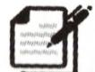

# 课堂小练

1. 抛物线 $y=x^{2}$ 的对称轴是 ( )

A. 直线 $x = -1$

B. 直线 $x = 1$

C. $x$ 轴

D. $y$ 轴

2. 对于抛物线 $y = -x^{2}$ ，下列说法不正确的是（）

A. 开口向下

B. 对称轴为直线 $x = 0$

C. 顶点坐标为(0,0)

D. $y$ 随 $x$ 的增大而减小

3. 在函数① $y=4x^{2}$ ，② $y=\frac{2}{3}x^{2}$ ，③ $y=-\frac{4}{3}x^{2}$ 中，图象开口大小顺序用序号表示应为 （）

A. ①＞②＞③

B. ①＞③＞②

C. ②＞③＞①

D. ②＞①＞③

4. 已知 $M(x_{1}, y_{1})$ , $N(x_{2}, y_{2})$ 是二次函数 $y = 2x^{2}$ 的图象上两点, 若 $x_{1} < x_{2} < 0$ , 则下列不等式一定成立的是 ( )

A. $y_{1} \leqslant y_{2}$

B. $y_{1} \geqslant y_{2}$

C. $y_{1} <   y_{2}$

D. $y_{1} > y_{2}$

5. 抛物线 $y = \frac{1}{2} x^2$ 的开口向\_\_\_\_，对称轴是\_\_\_\_，顶点坐标是\_\_\_\_。

6. 如果抛物线 $y = (m - 1)x^{2}$ 的开口向上, 那么 $m$ 的取值范围是

7. 在如图所示的平面直角坐标系中, 画出函数 $y = 2x^{2}$ , $y = \frac{1}{2}x^{2}$ , $y = -2x^{2}$ 与 $y = -\frac{1}{2}x^{2}$ 的图象.

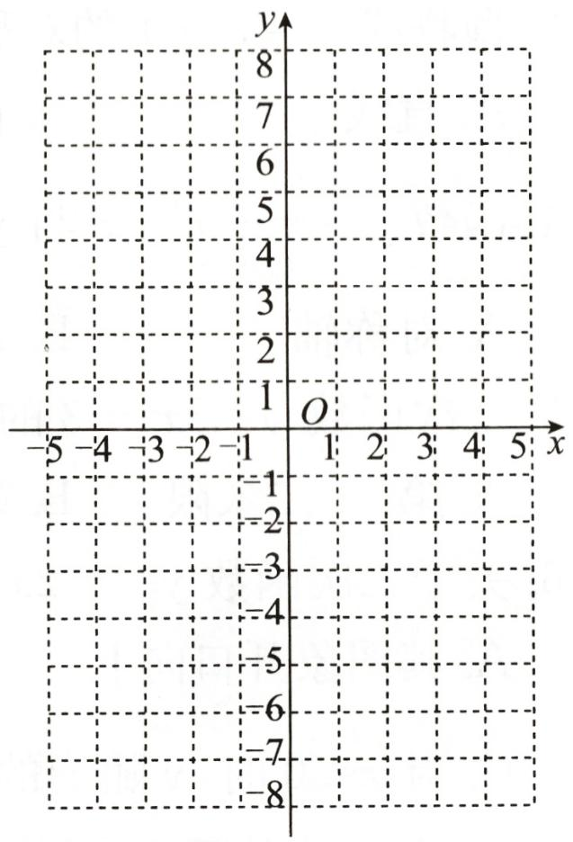

text_image

y
8
7
6
5
4
3
2
1 O
-5 -4 -3 -2 -1 1 2 3 4 5 x
-1
-2
-3
-4
-5
-6
-7
-8

第7题图

# 基础题卡 13 二次函数 $y = ax^{2} + c$ 的图象和性质

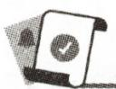

# 新知梳理

二次函数 $y=ax^{2}+k$ 的图象是一条抛物线, 它的对称轴是 \_\_\_\_, 顶点坐标是 \_\_\_\_, 是由抛物线 $y=ax^{2}$ 向 \_\_\_\_ (或向 \_\_\_\_) 平移 \_\_\_\_ 个单位长度得到的.

# 课堂小练

1. 二次函数 $y = -2x^{2} - 1$ 的图象的顶点坐标为 ( )

A. $(0,0)$

B. $(0,-1)$

C. $(-2,-1)$

D. $(-2, 1)$

2. 抛物线 $y=1-3x^{2}$ 的顶点坐标是 ( )

A. $(1,-3)$

B. $(-3,1)$

C. $(1,0)$

D. $(0,1)$

3. 抛物线 $y=x^{2}+1$ 的对称轴是 ( )

A. 直线 $x = -1$

B. 直线 $x = 1$

C. 直线 $x = 0$

D. 直线 $y = 1$

4. 函数 $y = -\frac{1}{3}x^{2} + 3$ 与 $y = -\frac{1}{3}x^{2} - 2$ 的图象的不同之处是 ( )

A. 对称轴

B. 开口方向

C. 顶点坐标

D. 形状

5.二次函数 $y = 2x^{2} + 3$ 的图象经过 （）

A. 第一、二象限

B. 第三、四象限

C. 第一、三象限

D. 第二、四象限

6. 关于二次函数 $y = -2x^{2} + 1$ ，以下说法正确的是（）

A. 其图象开口向上

B. 其图象的顶点坐标是 $(-2, 1)$

C. 当 $x < 0$ 时, $y$ 随 $x$ 的增大而增大

D. 当 $x = 0$ 时, $y$ 有最大值 $-\frac{1}{2}$

7. (2024·海淀区期末)在平面直角坐标系 $xOy$ 中, 将抛物线 $y = 3x^{2}$ 向下平移 1 个单位长度, 得到的抛物线的解析式为 \_\_\_\_.

8. 在如图所示的坐标系中画出函数 $y_{1}=\frac{1}{2}x^{2}$ ， $y_{2}=\frac{1}{2}x^{2}+3$ 和 $y_{3}=\frac{1}{2}x^{2}-3$ 的图象，并说明 $y_{2}=\frac{1}{2}x^{2}+3,y_{3}=\frac{1}{2}x^{2}-3$ 的图象与 $y_{1}=\frac{1}{2}x^{2}$ 的图象之间的关系.

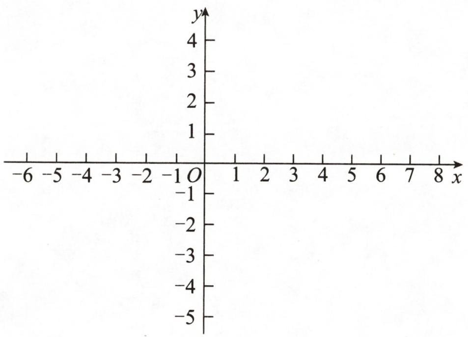

text_image

-6 -5 -4 -3 -2 -1 O 1 2 3 4 5 6 7 8 x
-1
-2
-3
-4
-5
4
3
2
1
O

第8题图

# 基础题卡 14 二次函数 $y = a(x - h)^2$ 的图象和性质

# 新知梳理

1. 二次函数 $y = a(x - h)^2$ 的图象是一条抛物线, 它的对称轴是 , 顶点坐标为 .  
2. 二次函数 $y = a(x - h)^2$ 与 $y = ax^2$ 的图象相同, 位置。把 $y = ax^2$ 的图象向 (或向 ) 平移 $|h|$ 个单位长度, 即可得到 $y = a(x - h)^2$ 的图象。当 $h > 0$ 时, 向 \_\_\_\_ 平移; 当 $h < 0$ 时, 向 \_\_\_\_ 平移。

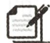

# 课堂小练

1. 二次函数 $y = (x + 1)^2$ 的图象的对称轴是 ( )

A. 直线 $x = -1$

B. 直线 $x = 1$

C. 直线 $x = -2$

D. 直线 $x = 2$

2.(2024·石景山区期末)将抛物线 $y=3x^{2}$ 向左平移 1 个单位长度,平移后抛物线的解析式为 ( )

A. $y = 3(x + 1)^{2}$

B. $y = 3(x - 1)^{2}$

C. $y = 3x^{2} + 1$

D. $y = 3x^{2} - 1$

3. 已知函数 $y = (x - 1)^2$ ，下列结论正确的是 （）

A. 当 $x > 0$ 时, $y$ 随 $x$ 的增大而减小

B. 当 x<0 时, y 随 x 的增大而增大

C. 当 x<1 时, y 随 x 的增大而减小

D. 当 x<-1 时, y 随 x 的增大而增大

4. (2024·镇江期末)若点 $A(-3, y_1), B(-2, y_2)$ 在二次函数 $y = (x + 1)^2$ 的图象上, 则 ( )

A. $y_{1} <   0 <   y_{2}$

B. $y_{2} < 0 < y_{1}$

C. $0 <   y_{1} <   y_{2}$

D. $0 <   y_{2} <   y_{1}$

5. 二次函数 $y = x^{2} - 4x + 4$ 的图象的顶点坐标是 \_\_\_\_.

6. 填表：

<table><tr><td>抛物线</td><td>开口方向</td><td>对称轴</td><td>顶点坐标</td></tr><tr><td> $y=2(x+3)^{2}$ </td><td></td><td></td><td></td></tr><tr><td> $y=-3(x-3)^{2}$ </td><td></td><td></td><td></td></tr><tr><td> $y=-4(x-3)^{2}$ </td><td></td><td></td><td></td></tr></table>

7. 先在如图所示的坐标系中, 画出二次函数 $y = \frac{1}{2} x^2, y = \frac{1}{2}(x + 2)^2$ 和 $y = \frac{1}{2}(x - 2)^2$ 的图象, 再观察三条抛物线的位置关系, 并分别指出它们的开口方向、对称轴和顶点坐标.

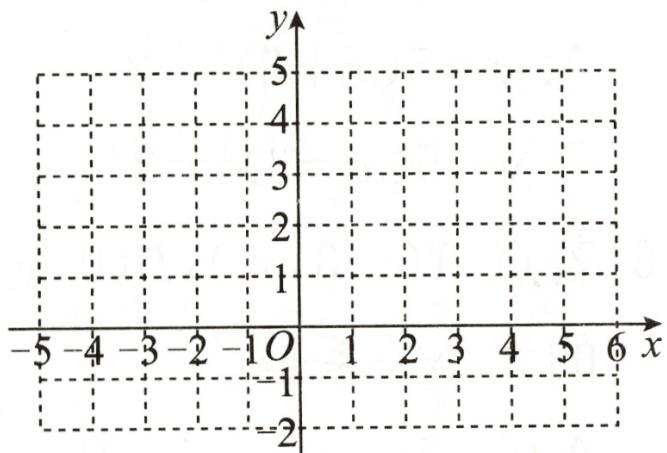

text_image

y
-5
4
3
2
1
O
1 2 3 4 5 6 x
-1
-2

第7题图

# 基础题卡 15 二次函数 $y = a(x - h)^2 + k$ 的图象和性质

# 新知梳理

1. 二次函数 $y = a(x - h)^2 + k$ 的图象是一条抛物线, 它的对称轴是\_\_\_\_, 顶点坐标是\_\_\_\_\_\_\_\_, 是由抛物线 $y = ax^2$ 向\_\_\_\_平移\_\_\_\_个单位长度, 再向\_\_\_\_平移\_\_\_\_个单位长度得到的.

2.(1)当a>0时,抛物线 $y=a(x-h)^{2}+k$ 的开口向\_\_\_\_.在对称轴的左侧,即当x<h时,函数y随x的增大而\_\_\_\_;在对称轴的右侧,即当x>h时,函数y随x的增大而\_\_\_\_.当x=h时,y有最\_\_\_\_值,为\_\_\_\_.

(2)当 $a < 0$ 时, 抛物线 $y = a(x - h)^{2} + k$ 的开口向 \_\_\_\_. 在对称轴的左侧, 即当 $x < h$ 时, 函数 $y$ 随 $x$ 的增大而 \_\_\_\_; 在对称轴的右侧, 即当 $x > h$ 时, 函数 $y$ 随 $x$ 的增大而 \_\_\_\_. 当 $x = h$ 时, $y$ 有最 \_\_\_\_ 值, 为 \_\_\_\_.

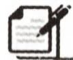

# 课堂小练

1. 二次函数 $y = (x - 2)^2 + 3$ 的图象的顶点坐标是 ( )

A. (2,3)

B. $(-2,3)$

C. $(-2,-3)$

D. $(2,-3)$

2. 下列抛物线中, 顶点坐标为(2,1)的是 ( )

A. $y=(x+2)^{2}+1$

B. $y = (x - 2)^{2} + 1$

C. $y = (x + 2)^{2} - 1$

D. $y = (x - 2)^{2} - 1$

3. 二次函数 $y = (x - 1)^2 - 2$ 的图象的对称轴是 ( )

A. 直线 $x = 1$

B. 直线 $x = -1$

C. 直线 $x = 2$

D. 直线 $x = -2$

4. 下列关于二次函数 $y=2(x-3)^{2}-1$ 的说法中, 正确的是 ( )

A. 其图象的对称轴是直线 $x = -3$

B. 当 $x = 3$ 时, $y$ 有最小值 -1

C. 其图象的顶点坐标是(3,1)

D. 当 $x > 3$ 时, $y$ 随 $x$ 的增大而减小

5. 把二次函数 $y=5x^{2}$ 的图象先向左平移 3 个单位长度, 再向下平移 2 个单位长度, 所得图象的函数解析式是 ( )

A. $y=5(x+3)^{2}-2$

B. $y = 5(x + 3)^{2} + 2$

C. $y=5(x-3)^{2}-2$

D. $y = 5(x - 3)^{2} + 2$

6. 若点 $A(-3, y_1), B(0, y_2)$ 是二次函数 $y = -2(x - 1)^2 + 3$ 图象上的两点, 则 $y_1$ 与 $y_2$ 的大小关系是 ( )

A. ${y}_{1} < {y}_{2}$

B. $y_{1} = y_{2}$

C. $y_{1} > y_{2}$

D. 不能确定

7. 已知抛物线 $y = x^{2} + bx + c$ 的顶点坐标为 $(1, -3)$ , 则该抛物线对应的函数解析式为 ( )

A. $y = x^{2} - 2x + 2$

B. $y = {x}^{2} - {2x} - 2$

C. $y = -x^{2} - 2x + 1$

D. $y = {x}^{2} - {2x} + 1$

8. 写出下列抛物线的开口方向、对称轴及顶点坐标.

(1) $y=\frac{1}{3}(x-5)^{2}-1;$

(2) $y = -4(x + 2)^{2} + 1$ ;

(3) $y=3(x-2)^{2}+4;$

(4) $y = -\frac{1}{3} (x + 2)^{2} - 5.$

# 基础题卡 16 二次函数 $y = ax^{2} + bx + c$ 的图象和性质

# 新知梳理

1. 一般地, 我们可以利用配方法求抛物线 $y = ax^{2} + bx + c (a \neq 0)$ 的顶点与对称轴, 即 $y = ax^{2} + bx + c = a (x + \_\_\_\_)^{2+}$ , 因此, 抛物线 $y = ax^{2} + bx + c$ 的对称轴是 \_\_\_\_, 顶点坐标是 \_\_\_\_.

2. 二次函数 $y = ax^{2} + bx + c (a \neq 0, a, b, c$ 是常数) 的图象:

(1)当 $a > 0$ 时, 抛物线开口向 \_\_\_\_. 在对称轴的左侧, 即当 $x$ \_\_\_\_ 时, $y$ 随 $x$ 的增大而 \_\_\_\_. 在对称轴的右侧, 即当 $x$ \_\_\_\_ 时, $y$ 随 $x$ 的增大而 \_\_\_\_. 当 $x =$ \_\_\_\_ 时, 函数 $y$ 有最 \_\_\_\_ 值, 是 \_\_\_\_.

(2)当 $a < 0$ 时, 抛物线开口向 \_\_\_\_. 在对称轴的左侧, 即当 $x$ \_\_\_\_ 时, $y$ 随 $x$ 的增大而 \_\_\_\_. 在对称轴的右侧, 即当 $x$ \_\_\_\_ 时, $y$ 随 $x$ 的增大而 \_\_\_\_. 当 $x =$ \_\_\_\_ 时, 函数 $y$ 有最 \_\_\_\_ 值, 是 \_\_\_\_.

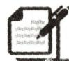

# 课堂小练

1. 抛物线 $y=x^{2}-x-12$ 与 y 轴的交点坐标为 ( )

A. $(-3,0)$

B. (6,0)

C. $(0, -12)$

D. (2,16)

2. 抛物线 $y = -x^{2} + 6x - 11$ 的顶点坐标为 ( )

A. $(-3,-2)$

B. $(3,-2)$

C. $(6,2)$

D. $(3,-12)$

3. 已知二次函数 $y=ax^{2}+bx+c$ 的 x, y 的部分对应值如下表:

<table><tr><td>x</td><td>...</td><td>0</td><td>1</td><td>2</td><td>3</td><td>...</td></tr><tr><td>y</td><td>...</td><td>-5</td><td>-5</td><td>-9</td><td>-17</td><td>...</td></tr></table>

则该函数图象的对称轴为 （）

A. $y$ 轴

B. 直线 $x = \frac{1}{2}$

C. 直线 $x = 1$

D. 直线 $x = \frac{3}{2}$

4. 二次函数 $y = x^{2} - 2x - 1$ 的最小值是 ( )

A.-1

B. 1

C.-2

D. 2

5.二次函数 $y = x^{2} + 4x$ 的图象位于 （）

A. 第一、二、三象限

B. 第一、二、四象限

C. 第一、三、四象限

D. 第二、三、四象限

6. 将抛物线 $y = x^{2} - 4x + 3$ 平移, 使得平移后抛物线的顶点坐标为 $(-2, 4)$ , 则需将该抛物线 ( )

A. 先向右平移 4 个单位长度, 再向上平移 5 个单位长度  
B. 先向右平移 4 个单位长度, 再向下平移 5 个单位长度  
C. 先向左平移 4 个单位长度, 再向上平移 5 个单位长度  
D. 先向左平移 4 个单位长度, 再向下平移 5 个单位长度

7. (2024·仪征期末)已知 $(-1, y_1)$ , $(2, y_2)$ 在二次函数 $y = x^2 - 2x + m$ 的图象上, 则 $y_1$ \_\_\_\_ $y_2$ . (填“＞”“＜”或“＝”)

8. 使用五点法在如图所示的坐标系中画出二次函数 $y = x^{2} - 2x - 3$ 的图象.

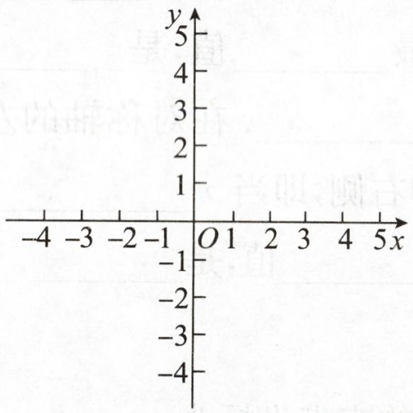

text_image

y
5
4
3
2
1
-4 -3 -2 -1 O 1 2 3 4 5 x
-1
-2
-3
-4

第8题图

# 基础题卡 17 求二次函数的解析式

# 新知梳理

1. 二次函数的解析式通常有以下几种形式:

(1)一般式: $y =$ \_\_\_\_；  
(2)顶点式: $y =$ \_\_\_\_；  
(3)交点式: y=

2. 用待定系数法确定二次函数解析式的步骤:

第一步,设:

第二步,代:

第三步,解:\_\_\_\_;

第四步,还原:

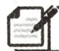

# 课堂小练

1. 已知二次函数 $y = x^{2} + x + m$ 的图象过点(1, -2)，则 $m$ 的值为 ( )

A.-3

B. -4

C. 1

D. 2

2. 已知二次函数 $y = x^{2} + 2x + c$ 的最小值为 3，则这个二次函数的解析式为 \_\_\_\_.  
3. 已知二次函数 $y=ax^{2}+4x+c$ ，当 x=-2 时，函数值 y 是 -1，当 x=1 时，函数值 y 是 5，则此二次函数的解析式为 \_\_\_\_.  
4. 用适当方法分别求满足下列条件的二次函数解析式：

(1)顶点坐标为 $(2,-1)$ ，且图象过点 $(0,3)$ ;  
(2) 图象经过点 $(-3,0)$ ， $(0,-3)$ ， $(2,5)$ ;  
(3) 图象经过点 $(-1,0)$ , $(3,0)$ , $(0,2)$ .

# 基础题卡 18 二次函数与一元二次方程(一)

# 新知梳理

1. 二次函数 $y = ax^{2} + bx + c (a \neq 0)$ ，当 $y = 0$ 时，得到一元二次方程 \_\_\_\_，那么一元二次方程的解就是二次函数的图象与 \_\_\_\_ 轴交点的 \_\_\_\_ 坐标。

2. 二次函数 $y = ax^{2} + bx + c (a \neq 0)$ 的图象与 $x$ 轴的交点情况决定一元二次方程 $ax^{2} + bx + c = 0$ 根的情况: (1) 当图象与 $x$ 轴有两个交点时, $b^{2} - 4ac$ \_\_\_\_ 0, 方程有 \_\_\_\_ 个 \_\_\_\_ 的实数根; (2) 当图象与 $x$ 轴有且只有一个交点时, $b^{2} - 4ac$ \_\_\_\_ 0, 方程有 \_\_\_\_ 个 \_\_\_\_ 的实数根; (3) 当图象与 $x$ 轴无交点时, $b^{2} - 4ac$ \_\_\_\_ 0, 方程 \_\_\_\_ 实数根.

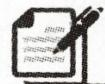

# 课堂小练

1. 抛物线 $y=x^{2}+2x$ 与 x 轴的交点坐标是 ( )

A. $(0,0)$

B. $(2,0)$

C. $(0,0)$ 和 $(-2,0)$

D. $(0,0)$ 和 $(2,0)$

2. 若二次函数 $y=ax^{2}+bx+c(a\neq0)$ 的图象经过点 $(-1,0)$ 和 $(3,0)$ ，则方程 $ax^{2}+bx+c=0$ 的解为（）

A. $x_{1} = -3, x_{2} = -1$

B. $x_{1} = 1, x_{2} = 3$

C. $x_{1}=-1, x_{2}=3$

D. $x_{1} = -3, x_{2} = 1$

3. 若关于 $x$ 的方程 $x^{2} - mx + n = 0$ 没有实数解, 则抛物线 $y = x^{2} - mx + n$ 与 $x$ 轴的交点有 ( )

A. 2 个

B. 1 个

C. 0 个

D. 不能确定

4. 如图是二次函数 $y=ax^{2}+bx+c$ 的部分图象, 由图象可知方程 $ax^{2}+bx+c=0$ 的解是 \_\_\_\_.

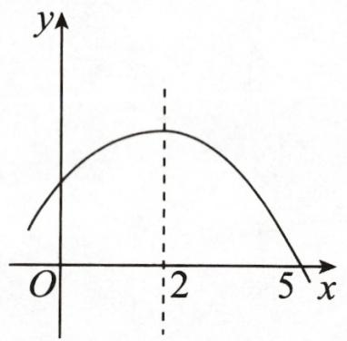

text_image

y
O
2
x
5

第4题图

5.(2024·平谷区期末)若抛物线 $y=x^{2}-2x+k-1$ 与 x 轴有交点,则 k 的取值范围是 \_\_\_\_.

6. 关于 $x$ 的一元二次方程 $-x^{2} + 2x + k = 0$ 的一个解是 $x_{1} = 3$ , 则抛物线 $y = -x^{2} + 2x + k$ 与 $x$ 轴的交点坐标是 \_\_\_\_.

7. 已知抛物线 $y = x^{2} - 4x + 3$ .

(1)求该抛物线与 y 轴的交点坐标;   
(2)求该抛物线与 x 轴的交点坐标.

8. 已知函数 $y = (m - 1)x^{2} + 4x + 2$ .

(1) 当 m 取何值时, 函数的图象开口向上?  
(2)当 m 取何值时,函数的图象与 x 轴有两个交点?  
(3) 当 m 取何值时, 函数的图象与 x 轴只有一个交点?

# 基础题卡 19 二次函数与一元二次方程(二)

# 新知梳理

1. 二次函数与一元二次方程有着密切的关系。我们可以根据二次函数的图象近似地求一元二次方程的\_\_\_\_，也可以通过解一元二次方程求二次函数的图象与 $x$ 轴交点的\_\_\_\_坐标。  
2. 如果二次函数 $y=ax^{2}+bx+c(a\neq0)$ 的图象与 x 轴两个交点的横坐标分别为 $x_{1}, x_{2}$ ，那么 $x_{1}+x_{2}=$ \_\_\_\_， $x_{1}x_{2}=$ \_\_\_\_，所以二次函数的解析式可以表示为 $y=$ \_\_\_\_（用含两根 $x_{1}, x_{2}$ 的式子表示）。

1. 如图, 点 $A(2.18, -0.61), B(2.68, 0.54)$ 在二次函数 $y = ax^2 + bx + c (a \neq 0)$ 的图象上, 则关于 $x$ 的方程 $ax^2 + bx + c = 0$ 的一个近似解可能是 ( )

A. 2.18

B. 2.68

C.-0.51

D. 2.45

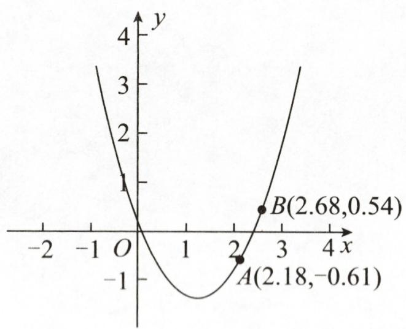

line

| Point | x | y |
|---|---|---|
| A | 2.18 | -0.61 |
| B | 2.68 | 0.54 |

第1题图

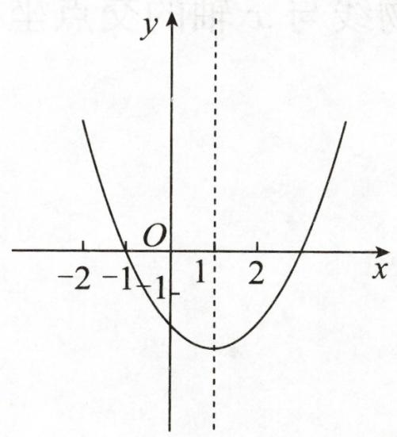

text_image

y
O
-2 -1 -1 1 2 x

第2题图

2. 二次函数 $y = 2x^{2} - 4x + m$ 的图象如图所示, 则关于 $x$ 的一元二次方程 $2x^{2} - 4x + m = 0$ 的解是 \_\_\_\_.

3. 二次函数 $y = ax^{2} + bx + c (a \neq 0)$ 中 $x, y$ 的部分对应值如下表：

<table><tr><td>x</td><td>...</td><td>-3</td><td>-2</td><td>0</td><td>1</td><td>3</td><td>5</td><td>...</td></tr><tr><td>y</td><td>...</td><td>7</td><td>0</td><td>-8</td><td>-9</td><td>-5</td><td>7</td><td>...</td></tr></table>

①抛物线的顶点坐标为(1,-9);   
②抛物线与 y 轴的交点坐标为 $(0, -8)$ ;  
③抛物线与 x 轴的交点坐标为 $(-2,0)$ 和 $(2,0)$ ;  
④当 x=-1 时,对应的函数值 y 为 -5.

以上结论正确的是\_\_\_\_。(填序号)

4. 在如图所示的平面直角坐标系中, 作函数 $y = x^{2} - 3x - 2$ 的图象, 利用图象求:

(1)方程 $x^{2}-3x=2$ 的解；  
(2)方程 $x^{2}-3x-2=2$ 的解；  
(3)方程 $x^{2}-3x-2=-3$ 的解.  
(结果不是整数的精确到十分位)

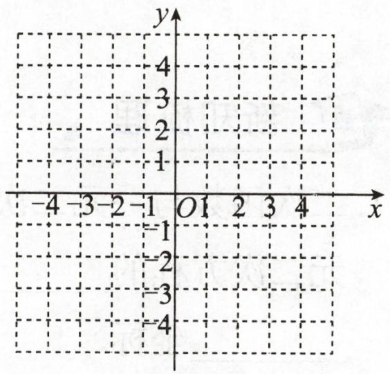

text_image

y
4
3
2
1
-4 -3 -2 -1 O 1 2 3 4 x
-1
-2
-3
-4

第4题图

# 基础题卡 20 实际问题与二次函数(一)

# 新知梳理

1. 利用二次函数解决实际问题的步骤:

(1)确定关于自变量 x 的 \_\_\_\_；  
(2)求二次函数的\_\_\_\_；  
(3)根据实际问题写出答案(注意自变量的取值范围).

2. 求有关“最大面积”的二次函数应用题时, 先要分析几何图形, 求出两个变量 (其中一个变量为图形的面积) 之间的二次函数关系, 然后利用二次函数的性质求“最大面积”.

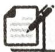

# 课堂小练

1. 用长为 $8 \mathrm{~m}$ 的铝合金条制成如图所示的矩形窗框, 设 $A B$ 为 $x(\mathrm{~m})$ , 则窗框的透光面积 $y(\mathrm{~m}^{2})$ 关于 $x(\mathrm{~m})$ 的函数解析式为

A. $y = x(4 - x)$

B. $y = x(8 - 3x)$

C. $y=\frac{1}{2}x(8-3x)$

D. $y=\frac{1}{3}x(8-3x)$

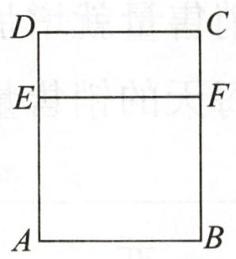

text_image

D
C
E
F
A
B

第1题图

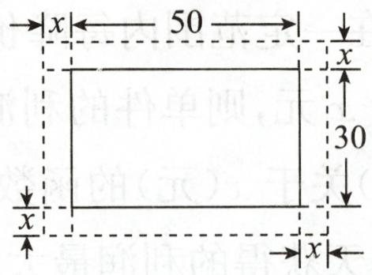

text_image

x←50→
x
30
x

第2题图

2. 如图, 在一幅长 $50 \mathrm{~cm}$ 、宽 $30 \mathrm{~cm}$ 的矩形风景画的四周镶一条金色纸边, 制成一幅矩形挂画. 设整个挂画的总面积为 $y \mathrm{~cm}^{2}$ , 金色纸边的宽为 $x \mathrm{~cm}$ , 则 $y$ 与 $x$ 之间的函数解析式为 \_\_\_\_.  
3. 如图, 某单位为了创建城市文明单位, 准备在单位的墙 (图中阴影部分) 外开辟一块长方形的土地进行绿化, 除墙体外三面要用栅栏围起来, 计划用栅栏 50 米.

(1)不考虑墙体长度,问长方形各边的长为多少米时,长方形的面积最大?  
(2)若墙体长度为 20 米,问长方形的面积最大是多少?

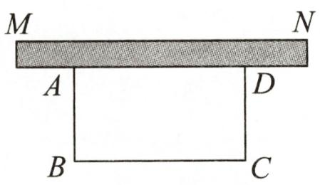

text_image

M
A
B
C
D
N

第3题图

# 基础题卡 21 实际问题与二次函数(二)

# 新知梳理

商品利润与二次函数：

(1) 总利润 = \_\_\_\_ - \_\_\_\_ = 每件商品所获\_\_\_\_ × 销售\_\_\_\_，建立利润与价格之间的函数解析式，求这个函数解析式的最大值，即为最大利润；  
(2)销售额=\_\_\_\_×\_\_\_\_；  
(3)每件利润=\_\_\_\_-\_\_\_\_.

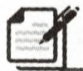

# 课堂小练

1. 某超市销售一种商品, 发现一周利润 $y$ (元) 与销售单价 $x$ (元) 之间的函数关系满足 $y = -2(x - 20)^{2} + 1558$ . 由于某种原因, 销售单价只能在 $15 \leqslant x \leqslant 22$ 的范围内, 那么一周可获得的最大利润是

A. 1558 元

B. 1550 元

C. 1508 元

D. 20 元

2. 将进货价为 70 元/件的某种商品按零售价 100 元/件出售时, 每天能卖出 20 件. 若这种商品的零售价在一定范围内每降价 1 元, 其每天的销售量就增加 1 件. 为了获得最大利润, 决定降价 $x$ 元, 则单件的利润为 \_\_\_\_ 元, 每天的销售量为 \_\_\_\_ 件, 则每天的利润 $y$ (元) 关于 $x$ (元) 的函数解析式为 $y =$ \_\_\_\_, 所以当每件降价 \_\_\_\_ 元时, 每天获得的利润最大, 最大利润为 \_\_\_\_ 元.

3. 某超市购进一种粽子, 每盒进价是 40 元, 并规定每盒售价不得少于 50 元. 根据以往销售经验发现, 当每盒售价定为 50 元时, 日销售量为 500 盒, 若每盒售价每提高 1 元, 日销售量减少 10 盒. 设每盒售价为 $x$ 元, 日销售量为 $y$ 盒.

(1)求 y 与 x 之间的函数解析式,并直接写出 x 的取值范围;  
(2)当每盒售价定为多少元时,日销售利润 W(元)最大? 最大利润是多少?

# 基础题卡 22 实际问题与二次函数(三)

# 新知梳理

建立平面直角坐标系解决拱桥等抛物线形问题时,一般有以下类型:

(1)抛物线的顶点是坐标原点,可设函数解析式为\_\_\_\_;   
(2)抛物线的顶点在 y 轴上, 可设函数解析式为 \_\_\_\_;  
(3)抛物线的顶点在 x 轴上, 可设函数解析式为 \_\_\_\_;  
(4)抛物线的顶点坐标为 $(h, k)$ , 可设函数解析式为 \_\_\_\_；  
(5)抛物线与 x 轴的两个交点的横坐标分别是 $x_{1}, x_{2}$ ，可设函数解析式为 \_\_\_\_；  
(6)抛物线经过坐标平面内的三点,可设函数解析式为

# 课堂小练

1. 在体育训练期间, 小宇对自己某次实心球训练的录像进行分析, 发现实心球飞行高度 $y$ (米) 与水平距离 $x$ (米) 之间的函数解析式为 $y = -\frac{1}{10} x^2 + \frac{3}{5} x + \frac{8}{5}$ , 由此可知小宇此次实心球训练的成绩为

A. $\frac{8}{5}$ 米

B. 8 米

C. 10 米

D. 2 米

2. 如图, 单孔拱桥的形状近似抛物线形, 建立如图所示的平面直角坐标系, 在正常水位时, 水面宽度 $OA$ 为 $12 \mathrm{~m}$ , 拱桥的最高点 $B$ 到水面 $OA$ 的距离为 $6 \mathrm{~m}$ , 则抛物线对应的函数解析式为 \_\_\_\_.

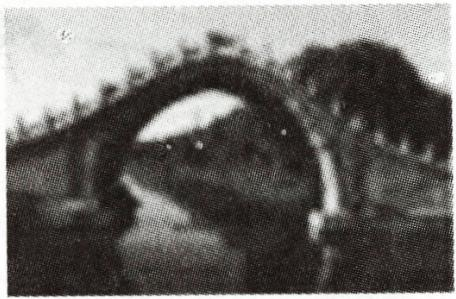

natural_image

Black-and-white photo of a traditional Chinese stone arch bridge over a mountainous landscape (no visible text or symbols)

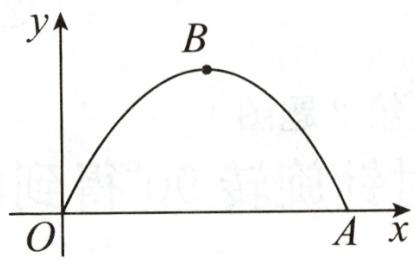

text_image

y
B
O
A x

第2题图

3. 如图是一座古拱桥的截面图, 拱桥桥洞上沿是抛物线形, 拱桥的跨度为 $10 \mathrm{~m}$ , 桥洞与水面的最大距离是 $5 \mathrm{~m}$ , 桥洞两侧壁上各有一盏距离水面 $4 \mathrm{~m}$ 的景观灯, 求两盏景观灯之间的水平距离. (提示: 先建立平面直角坐标系, 再作答)

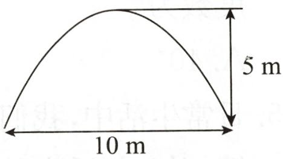

text_image

5 m
10 m

第3题图

# 基础题卡 23 图形的旋转(一)

# 新知梳理

1. 把一个平面图形绕着平面内某一点 O \_\_\_\_, 叫做图形的旋转, 点 O 叫做 \_\_\_\_, 转动的角叫做 \_\_\_\_.  
2. 如果图形上的点 $P$ 经过旋转变为点 $P'$ , 那么这两个点叫做这个旋转的  
3. 旋转的性质: 对应点到旋转中心的距离\_\_\_\_; 对应点与旋转中心所连线段的夹角等于\_\_\_\_; 旋转前、后的图形\_\_\_\_。  
4. 图形的旋转由 \_\_\_\_、\_\_\_\_、\_\_\_\_ 所决定.

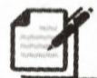

# 课堂小练

1. 时间经过 25 分钟, 钟表的分针旋转了 ( )

A. $150^{\circ}$

B. $120^{\circ}$

C. ${25}^{ \circ  }$

D. ${12.5}^{ \circ  }$

2. 如图①, 教室里有一只倒地的装垃圾的灰斗, $BC$ 与地面的夹角为 $50^{\circ}, \angle C = 25^{\circ}$ , 小贤同学将它扶起平放在地面上 (如图②), 则灰斗柄 $AB$ 绕点 $C$ 转动的角度为 ( )

A. ${50}^{ \circ  }$

B. ${75}^{ \circ  }$

C. ${90}^{ \circ  }$

D. ${105}^{ \circ  }$

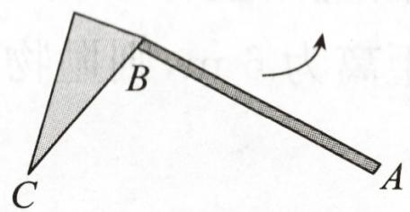

text_image

B
C
A

①

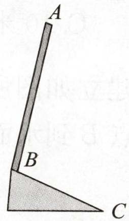

text_image

A
B
C

②

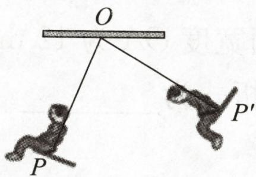

text_image

O
P'
P

第4题图  
第2题图

3. 将如图所示的图形顺时针旋转 $90^{\circ}$ 得到的是 ( )

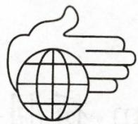  
第3题图

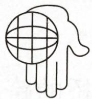  
A

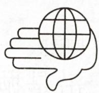  
B

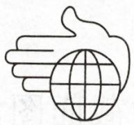  
C

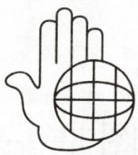  
D

4. 如图, 小聪坐在秋千上, 秋千旋转了 $80^{\circ}$ , 小聪的位置也从 $P$ 点运动到了 $P'$ 点, 则 $\angle P'OP$ 的度数为 ( )

A. ${40}^{ \circ  }$

B. ${50}^{ \circ  }$

C. ${70}^{ \circ  }$

D. ${80}^{ \circ  }$

5. 日常生活中,我们经常见到以下情景:①钟表指针的转动;②汽车方向盘的转动;③打气筒打气时,活塞的运动;④传送带上瓶装饮料的移动. 其中属于旋转的是 \_\_\_\_. (填序号)

# 基础题卡 24 图形的旋转(二)

# 新知梳理

1. 利用 \_\_\_\_ 可以求线段长、角的度数及图形的面积.  
2. 旋转作图的步骤: (1) 找出图形的\_\_\_\_; (2) 确定旋转\_\_\_\_、旋转\_\_\_\_和旋转\_\_\_\_;(3) 作出\_\_\_\_的对应点; (4) 按图形的顺序连接\_\_\_\_, 得到旋转后的图形.

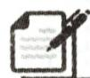

# 课堂小练

1. 如图, 将 $\triangle ABC$ 绕点 $C$ 按逆时针方向旋转 $75^{\circ}$ 后得到 $\triangle A'B'C$ , 若 $\angle ACB = 25^{\circ}$ , 则 $\angle BCA'$ 的度数为 ( )

A. $50^{\circ}$

B. ${40}^{ \circ  }$

C. ${25}^{ \circ  }$

D. $60^{\circ}$

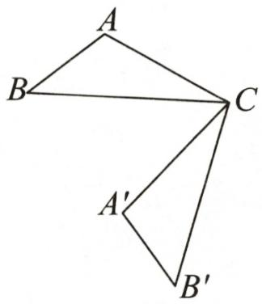

text_image

A
B
C
A'
B'

第1题图

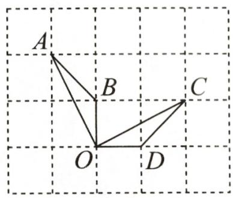

text_image

A
B
C
O
D

第2题图

2. 如图, 点 $A, B, C, D, O$ 都在网格的格点上, 若 $\triangle COD$ 是由 $\triangle AOB$ 绕点 $O$ 按顺时针方向旋转得到的, 则旋转的角度为 ( )

A. $60^{\circ}$

B. ${135}^{ \circ  }$

C. ${45}^{ \circ  }$

D. $90^{\circ}$

3. 如图, 在 $\triangle ABC$ 中, $AB = 2$ , $BC = 3.6$ , $\angle B = 60^{\circ}$ , 将 $\triangle ABC$ 绕点 $A$ 顺时针旋转一定角度得到 $\triangle ADE$ , 当点 $B$ 的对应点 $D$ 恰好落在 $BC$ 边上时, 则 $CD$ 的长为 \_\_\_\_.

text_image

Geometric diagram with labeled points A, B, C, D, E and intersecting lines forming triangles and quadrilaterals

第3题图

text_image

C
B
B'
C'
D
A
D'

第4题图

4. 如图, 边长为 3 的正方形 $ABCD$ 绕点 $A$ 逆时针旋转 $30^{\circ}$ 得到正方形 $AB'C'D'$ , 则它们的公共部分的面积为 \_\_\_\_.

5. 如图, 在平面直角坐标系中, $\triangle ABC$ 的三个顶点的坐标分别为 $A(-3, 5), B(-2, 1)$ , $C(-1, 3)$ .

(1) $\triangle ABC$ 的面积是；

(2)若 $\triangle ABC$ 经过平移后得到 $\triangle A_{1}B_{1}C_{1}$ ,已知点 $C_{1}$ 的坐标为(4,0),写出点 $A_{1}$ 的坐标;

(3)将 $\triangle ABC$ 绕点 $O$ 按顺时针方向旋转 $90^{\circ}$ 得到 $\triangle A_{2}B_{2}C_{2}$ ,画出 $\triangle A_{2}B_{2}C_{2}$ 并写出点 $C_{2}$ 的坐标.

text_image

A
y
C
B
O
x

第5题图

# 基础题卡 25 中心对称

# 新知梳理

1. 把一个图形绕着某一点旋转\_\_\_\_，如果它能够与\_\_\_\_，那么就说这两个图形关于这个点对称或中心对称，这个点叫做\_\_\_\_（简称中心）。这两个图形在旋转后能重合的对应点叫做关于对称中心的对称点。

2. 中心对称的性质: 中心对称的两个图形, 对称点所连线段都\_\_\_\_, 而且\_\_\_\_; 中心对称的两个图形是\_\_\_\_.

# 课堂小练

1. 下列图形中, $\triangle A'B'C'$ 与 $\triangle ABC$ 成中心对称的是 ( )

text_image

Geometric diagram showing two triangles ABC and A'B'C' sharing vertex O, with dashed lines indicating hidden edges.

A

text_image

B'
C'
A'
C
A
B

B

  
C

text_image

A'
B'
A
C'
C
O
B

D

2. 如图, $\triangle ABC$ 与 $\triangle A'B'C'$ 关于点 $O$ 成中心对称, 则下列结论不成立的是 ( )

A. 点 $A$ 与点 $A'$ 是对称点  
B. $BO = B'O$   
C. $AB \parallel A'B'$   
D. $\angle ACB = \angle C'A'B'$

text_image

A
C
O
B'
C'
B
A'

第2题图

3. 如图, $\triangle A'B'C'$ 与 $\triangle ABC$ 关于点 $O$ 成中心对称, $AB=BC=2$ , $\angle ABC=120^{\circ}$ , 则 $\angle B'A'C'$ 的度数为 \_\_\_\_.

text_image

A
B
O
C
B'
C'
A'

第3题图

4. 如图, $\triangle ABC$ 的三个顶点的坐标分别为 $A(-2,3), B(-6,0), C(-1,0)$ .

(1)画出与 $\triangle ABC$ 关于点 $O$ 成中心对称的图形 $\triangle A_{1}B_{1}C_{1}$ ;  
(2)将 $\triangle ABC$ 绕坐标原点 $O$ 按逆时针方向旋转 $90^{\circ}$ ,得到 $\triangle A_{2}B_{2}C_{2}$ ,画出图形,并直接

写出点 $A_{2}, B_{2}, C_{2}$ 的坐标.

text_image

y
A
B
C
O
x

第4题图

# 基础题卡 26 中心对称图形

# 新知梳理

1. 把一个图形\_\_\_\_，如果旋转后的图形能够与原来的图形重合，那么这个图形叫做中心对称图形，这个点就是它的\_\_\_\_。

2. 中心对称与中心对称图形的区别和联系：

(1)区别：

(2)联系:①

②

# 课堂小练

1. 对称美是美的一种重要形式, 它能给人们一种圆满、协调、和平的美感. 下列图形属于中心对称图形的是 ( )

2. 下面四个图形中, 既是轴对称图形也是中心对称图形的是 ( )

3. 下列说法错误的是 ( )

A. 成中心对称的两个图形全等  
B. 成中心对称的两个图形中, 对称点的连线被对称轴平分  
C. 中心对称图形的对称中心是对称点连线的中点  
D. 中心对称图形绕对称中心旋转 $180^{\circ}$ 后, 都能与自身重合

4. 矩形是中心对称图形, 对矩形 ABCD 而言, 点 A 的对称点是点 \_\_\_\_.  
5. 指出下列旋转对称图形的最小旋转角, 在图中标明它的旋转中心 O, 并判断它是不是中心对称图形.

  
第5题图

解:图形 A 的最小旋转角是\_\_\_\_度,它\_\_\_\_中心对称图形.

图形 B 的最小旋转角是\_\_\_\_度, 它\_\_\_\_中心对称图形.

图形 C 的最小旋转角是\_\_\_\_度, 它\_\_\_\_中心对称图形.

图形 D 的最小旋转角是 \_\_\_\_ 度, 它 \_\_\_\_ 中心对称图形.

图形 E 的最小旋转角是 \_\_\_\_ 度, 它 \_\_\_\_ 中心对称图形.

# 基础题卡 27 关于原点对称的点的坐标

# 新知梳理

两个点关于原点对称时,它们的坐标符号\_\_\_\_,即点 $P(x,y)$ 关于原点的对称点为 $P'$ (\_\_\_\_, \_\_\_\_.

# 课堂小练

1. 在平面直角坐标系中,与点 $A(3,2)$ 关于原点成中心对称的点的坐标是 ( )

A. $(3, -2)$

B. $(-3,2)$

C. $(-3,-2)$

D. $(-2,-3)$

2. 若点 $P(a, 2)$ 和点 $Q(-3, b)$ 关于原点对称, 那么 $a, b$ 的值分别为 ( )

A. 3,2

B. 3, -2

C.-2,3

D. 2, -3

3. 已知点 $A(1,2)$ 与点 $A'(a,b)$ 关于原点对称, 则实数 $a+b$ 的值是 ( )

A.-2

B. 2

C. 3

D.-3

4. 在平面直角坐标系中, 若点 $M(m, n)$ 与点 $Q(-2,3)$ 关于原点对称, 则点 $P(m+n, n)$ 在 ( )

A. 第一象限

B. 第二象限

C. 第三象限

D. 第四象限

5. 在平面直角坐标系中, 点 $A(-7, \sqrt{5})$ 关于原点对称的点的坐标是

6. 在平面直角坐标系中, 点 $P(-3, m^{2} + 1)$ 关于原点的对称点在第 象限.

7. 在平面直角坐标系中, 点 $P(3m - 1, 2 - m)$ 在第一象限, 则 $m$ 的取值范围是

8.(1)已知点 A(2a,-4) 和点 B(-5,b) 关于原点对称, 求 $a+b$ 的值;

(2)若点 $P(-3-2a,2a-4)$ 关于原点对称的点在第一象限,求整数 a 的值.

# 基础题卡 28 圆

# 新知梳理

1. 在一个平面内, 线段 $OA$ 绕它\_\_\_\_旋转一周, 另一个\_\_\_\_所形成的图形叫做圆。其\_\_\_\_叫做圆心, \_\_\_\_叫做半径。以点 $O$ 为圆心的圆, 记作 $\odot O$ .

2. 叫做弦,经过的弦叫做直径.

3. 圆上\_\_\_\_叫做圆弧, 简称弧. 圆的任意一条\_\_\_\_的两个端点把圆分成两条弧, 每一条弧都叫做半圆, \_\_\_\_的弧叫做劣弧, \_\_\_\_的弧叫做优弧.

4. 能够\_\_\_\_的两个圆叫做等圆。在同圆或等圆中，能够互相\_\_\_\_的弧叫做等弧。

# 课堂小练

1. 以点 O 为圆心, 可以作 ( )

A. 1 个圆

B. 2 个圆

C. 3 个圆

D. 无数个圆

2. 有下列说法: ①长度相等的弧是等弧; ②半径相等的圆是等圆; ③等弧能够重合; ④半径是圆中最长的弦. 其中正确的有 ( )

A. 1 个

B. 2 个

C. 3 个

D. 4 个

3. 如图, $MN$ 为 $\odot O$ 的弦, $\angle M = 40^{\circ}$ , 则 $\angle MON$ 等于 ( )

A. ${40}^{ \circ  }$

B. $60^{\circ}$

C. $100^{\circ}$

D. ${120}^{ \circ  }$

text_image

O
M N

第3题图

text_image

O
A B

第5题图

4. 圆的半径为 3, 则弦 $AB$ 长度的取值范围是

5. 如图, $\odot O$ 的半径为 $4 \mathrm{~cm}, \angle AOB = 60^{\circ}$ , 则弦 $AB$ 的长为 \_\_\_\_ cm.

6. 圆是以\_\_\_\_为对称中心的中心对称图形, 又是以\_\_\_\_为对称轴的轴对称图形.

7. 如图, 以 $\triangle OAB$ 的顶点 $O$ 为圆心的 $\odot O$ 交 $AB$ 于点 $C, D$ , 且 $AC = BD$ , $OA$ 与 $OB$ 相等吗? 为什么?

text_image

O
A C D B

第7题图

# 基础题卡 29 垂直于弦的直径(一)

# 新知梳理

1. 圆是轴对称图形，都是圆的对称轴。  
2. 垂直于弦的直径\_\_\_\_，并且\_\_\_\_。  
3. 平分弦( )的直径,并且

# 课堂小练

1. 在 $\odot O$ 中, 已知半径为 5 , 弦 $AB$ 的长为 8 , 则圆心 $O$ 到 $AB$ 的距离为 ( )

A. 3

B. 4

C. 5

D. 6

2. 若 $\odot O$ 的弦 $AB$ 的长为 $8\mathrm{cm}$ , 弦 $AB$ 的弦心距为 $3\mathrm{cm}$ , 则 $\odot O$ 的半径为 ( )

A. $4 \mathrm{~cm}$

B. $5 \mathrm{~cm}$

C. $8 \mathrm{~cm}$

D. $10 \mathrm{~cm}$

3. 下列说法中正确的是 ( )

A. 垂直于弦的直线平分弦所对的两条弧

B. 平分弦的直径垂直于弦

C. 垂直于直径的弦平分这条直径

D. 弦的垂直平分线经过圆心

4. 如图, $\odot O$ 的弦 $AB = 6, M$ 是 $AB$ 上任意一点, 且 $OM$ 的最小值为 4 , 则 $\odot O$ 的半径为 ( )

text_image

O
M
A B

第4题图

A. 2

B. 3

C. 4

D. 5

5. 如图, 已知 $MN$ 是 $\odot O$ 的直径, $AB$ 是 $\odot O$ 的弦, $AB \perp MN$ , 点 $C$ 在线段 $AB$ 上, $OC = AC = 2$ , $BC = 4$ , 求 $\odot O$ 的半径.

text_image

M
O
A C B
N

第5题图

# 基础题卡 30 垂直于弦的直径(二)

# 新知梳理

1. 垂径定理及其推论可理解为关于一条直线的五个论断: ①垂直于弦; ②经过圆心; ③平分弦(不是直径); ④平分弦所对的一条弧; ⑤平分弦所对的另一条弧. 如果以其中 \_\_\_\_个论断作为条件, 那么就能推出其他 \_\_\_\_个论断.

2. 运用垂径定理解决日常生活中的实际问题时, 应根据题意, 找到数学模型, 一般利用构造出直角三角形, 再利用来解题.

# 课堂小练

1. 排水管的截面如图, 水面宽 AB = 8, 圆心 O 到水面的距离 OC = 3, 则排水管的半径等于 ( )

A. 5

B. 6

text_image

O
A C B

第1题图

C. 8

D. 4

text_image

O
C
A
B

第2题图

2. 一条排水管的截面如图所示, 已知排水管的半径 OB = 10 , 截面圆心 O 到水面的距离 OC 是 6 , 则水面宽 AB = \_\_\_\_.

3. 如图是一个通水管道的截面图, 它的形状是以 O 为圆心的圆, 水面 AB = 10 dm, 最高点到水面的距离 CD = 7 dm, 求此圆的半径.

text_image

C
O
D
A
B

第3题图

4. 如图, 某座桥的桥拱是圆弧形, 它的跨度 $AB$ 为 8 米, 拱高 $CD$ 为 2 米, 求桥拱所在圆的半径.

  
第4题图

# 基础题卡 31 弧、弦、圆心角

# 新知梳理

1. \_\_\_\_ 的角叫做圆心角.  
2. 在\_\_\_\_中,相等的圆心角所对的\_\_\_\_相等,也相等.  
3. 在\_\_\_\_中,如果两条弧相等,那么它们所对的圆心角\_\_\_\_,所对的弦\_\_\_\_.  
4. 在\_\_\_\_中, 如果两条弦相等, 那么它们所对的圆心角\_\_\_\_, 所对的优弧和劣弧分别\_\_\_\_.

# 课堂小练

1. 下列说法中, 正确的是 ( )

A.相等的弦所对的圆心角相等  
C.圆心角相等，它们所对的弧也相等

B. 同圆中,相等的弧所对的圆心角相等
D. 圆心角相等,它们所对的弦也相等

2. 如图, $AB, CD$ 是 $\odot O$ 的直径, $\widehat{AE} = \widehat{BD}$ , 若 $\angle AOE = 32^{\circ}$ , 则 $\angle COE$ 的度数是 ( )

A. $32^{\circ}$

B. ${60}^{ \circ  }$

C. $68^{\circ}$

D. $64^{\circ}$

text_image

E
A
O
C
D
B

第2题图

text_image

A
B
C
D
F
E

第3题图

text_image

P
C D
A O B

第4题图

3. 如图, 在三个等圆中各有一条劣弧: $\widehat{AB}, \widehat{CD}, \widehat{EF}$ , 如果 $\widehat{AB} + \widehat{CD} = \widehat{EF}$ , 那么 $AB + CD$ 与 $EF$ 的大小关系是 ( )

A. ${AB} + {CD} = {EF}$

B. $AB + CD <   EF$

C. $AB + CD > EF$

D. 不能确定

4. 如图, 已知 $AB$ 是 $\odot O$ 的直径, $PA = PB$ , $\angle P = 60^\circ$ , 则 $CD$ 所对的圆心角等于  
5. 如图, 在 $\odot O$ 中, 弦 $AB$ 和 $CD$ 相交于点 $P$ , 连接 $AC, BD$ , 且 $AC = BD$ . 求证: $AB = CD$ .

text_image

C
B
P
A
O
D

第5题图

# 基础题卡 32 圆周角(一)

# 新知梳理

1. 顶点在\_\_\_\_，并且两边都与圆相交的角叫做圆周角。  
2. 同弧或等弧所对的圆周角\_\_\_\_，都等于\_\_\_\_。  
3. 半圆(或直径)所对的圆周角是\_\_\_\_角, $90^{\circ}$ 的圆周角所对的弦是\_\_\_\_。

# 课堂小练

1. 如图, 在 $\odot O$ 中, $\angle O = 50^{\circ}$ , 则 $\angle A$ 的度数为 ( )

A. $50^{\circ}$

B. $20^{\circ}$

C. ${30}^{ \circ  }$

D. ${25}^{ \circ  }$

text_image

A
B
C
O

第1题图

text_image

A
O
B
C
D

第2题图

text_image

C
B
O
A
D

第3题图

2. 如图, $AB$ 是 $\odot O$ 的直径, $C, D$ 是 $\odot O$ 上的两点, $\angle AOC = 120^{\circ}$ , 则 $\angle CDB =$   
3. 如图, $AB$ 是 $\odot O$ 的直径, $CD$ 是 $\odot O$ 的弦, $\angle CAB = 55^{\circ}$ , 则 $\angle D$ 的度数是  
4. 如图, $AB$ 是 $\odot O$ 的直径, 弦 $CD$ 与 $AB$ 相交于点 $E$ , $\angle ADC = 26^{\circ}$ . 求 $\angle CAB$ 的度数.

text_image

A
C
E
O
D
B

第4题图

5. 如图, 在 $\odot O$ 中, $AC \parallel OB$ , $\angle BAO = 25^{\circ}$ , 求 $\angle BOC$ 的度数.

text_image

C
A
O
B

第5题图

# 基础题卡 33 圆周角(二)

# 新知梳理

1. 如果一个多边形的\_\_\_\_\_\_都在同一个圆上, 这个多边形叫做圆内接多边形, 这个圆叫做这个多边形的外接圆.  
2. 圆内接四边形的对角 \_\_\_\_.

# 课堂小练

1. 如图, 四边形 $ABCD$ 内接于 $\odot O$ , 若 $\angle A = 40^{\circ}$ , 则 $\angle C =$ ( )

A. ${110}^{ \circ  }$

B. ${120}^{ \circ  }$

C. ${135}^{ \circ  }$

D. ${140}^{ \circ  }$

text_image

D
C
A
O
B

第1题图

text_image

A
O
B
C
D

第2题图

text_image

A
D
O
B
C
E

第3题图

2. 如图, 在 $\odot O$ 的内接四边形 $ABCD$ 中, $\angle BOD = 120^{\circ}$ , 那么 $\angle BCD$ 的度数是 ( )

A. ${120}^{ \circ  }$

B. ${100}^{ \circ  }$

C. ${80}^{ \circ  }$

D. $60^{\circ}$

3. 如图, 四边形 $ABCD$ 为 $\odot O$ 的内接四边形, $\angle A = 100^{\circ}$ , 则 $\angle DCE$ 的度数为  
4. 在圆内接四边形 ABCD 中, 若 $\angle A, \angle B, \angle C$ 的度数之比为 4:3:5 , 则 $\angle D$ 的度数是 \_\_\_\_.  
5. 如图, 四边形 $ABCD$ 内接于 $\odot O$ , $AC$ 与 $BD$ 为对角线, $\angle BCA = \angle BAD$ , 过点 $A$ 作 $AE \parallel BC$ 交 $CD$ 的延长线于点 $E$ . 求证: $EC = AC$ .

text_image

C
B
D
O
E
A

第5题图

# 基础题卡 34 点和圆的位置关系

# 新知梳理

1. 设 $\odot O$ 的半径为 $r$ , 点 $P$ 到圆心的距离 $OP = d$ , 则有:

(1)点 P 在圆外 $\Leftrightarrow$ ;  
(2)点 P 在圆上 $\Leftrightarrow$ ;  
(3)点 P 在圆内 $\Leftrightarrow$

2. 确定一个圆.  
3. 经过三角形的三个顶点可以作一个圆, 这个圆叫做三角形的外接圆, 外接圆的圆心是三角形的交点, 叫做这个三角形的外心.  
4. 假设命题的\_\_\_\_不成立, 由此经过推理得出\_\_\_\_, 由\_\_\_\_断定所作假设不正确, 从而得到原命题成立. 这种方法叫做\_\_\_\_.

# 课堂小练

1. 下列条件可以确定而且只能确定一个圆的是 ( )

A. 已知圆心

B. 已知半径

C. 已知直径

D. 已知不共线的三个点

2. 已知 $\odot O$ 的半径为 2, 点 $P$ 在 $\odot O$ 内, 则 $OP$ 的长可能是 ( )

A. 1

B. 2

C. 3

D. 4

3. 如图, 在 Rt△ABC 中, ∠ACB=90°, CD=5, D 是 AB 的中点, 则 Rt△ABC 的外接圆的直径为  
4. 用反证法证明“一个三角形中最多有一个内角是钝角”的第一步是  
5. 已知 $\odot O$ 的半径为 $6, A$ 为线段 $OP$ 的中点, 当 $OP$ 的长度为 10 时, 点 $A$ 与 $\odot O$ 的位置关系为 \_\_\_\_.  
6. 如图, 网格纸中每个小正方形的边长为 1, 一段圆弧经过格点 A, B, C.

(1)图中圆弧所在圆的圆心 D 的坐标为 \_\_\_\_.  
(2)根据(1)中的条件填空:

①圆 D 的半径 = \_\_\_\_ ; (结果保留根号)  
②点(7,0)在圆 D ;(填“上”“内”或“外”)   
③∠ADC 的度数为

text_image

y
A
B
C
O
x

第6题图

# 基础题卡 35 直线和圆的位置关系(一)

# 新知梳理

1.(1)直线和圆有\_\_\_\_个公共点,则这条直线和圆相交,这条直线叫做圆的\_\_\_\_;

(2)直线和圆\_\_\_\_个公共点,则这条直线和圆相切,这条直线叫做圆的\_\_\_\_;

(3) 直线和圆\_\_\_\_公共点, 则这条直线和圆相离.

2. 设⊙O的半径为r，圆心O到直线l的距离为d，则：(1)直线l和⊙O相交⇔；

(2)直线 l 和 $\odot O$ 相切 $\Leftrightarrow$ \_\_\_\_；(3)直线 l 和 $\odot O$ 相离 $\Leftrightarrow$ \_\_\_\_.

# 课堂小练

1. 已知 $\odot O$ 的半径等于 $8 \mathrm{~cm}$ , 圆心 $O$ 到直线 $l$ 的距离为 $9 \mathrm{~cm}$ , 则直线 $l$ 与 $\odot O$ 的公共点的个数为 ( )

A. 0

B. 1

C. 2

D. 无法确定

2. 如图, 已知圆 O 的半径为 6, 点 O 到某条直线的距离为 8, 则这条直线可以是 ( )

text_image

l₁
l₃
O
l₄
l₂

A. $l_{1}$

B. $l_{2}$

C. $l_{3}$

D. $l_{4}$

第2题图

3. 在平面直角坐标系中, 以点 $A(2,1)$ 为圆心, 1 为半径的圆与 $x$ 轴的位置关系是 ( )

A. 相离

B. 相切

C. 相交

D. 不确定

4. Rt△ABC 中, ∠C=90°, AC=6, AB=10, 若以点 C 为圆心, r 为半径的圆与 AB 所在的直线相交, 则 r 可能为 ( )

A. 3

B. 4

C. 4.8

D. 5

5. 已知圆 O 的直径为 13 cm, 圆心 O 到直线 $l_{1}, l_{2}, l_{3}$ 的距离分别为 4.5 cm, 6.5 cm, 8 cm, 那么直线 $l_{1}, l_{2}, l_{3}$ 与圆 O 分别是什么位置关系? 分别有几个公共点?

6. 如图, 在 Rt△ABC 中, ∠C=90°, ∠B=30°, BC=4 cm, 以点 C 为圆心, 2 cm 长为半径作圆, 试判断 ⊙C 与直线 AB 的位置关系.

第6题图

# 基础题卡 36 直线和圆的位置关系(二)

# 新知梳理

1. 到圆心的距离等于圆的\_\_\_\_的直线是圆的切线.   
2. 经过半径的外端并且这条半径的直线是圆的切线.   
3. 圆的切线垂直于 \_\_\_\_ 的半径.

# 课堂小练

1. 如图, 从 $\odot O$ 外一点 $A$ 引圆的切线 $AB$ , 切点为 $B$ , 连接 $AO$ 并延长交 $\odot O$ 于点 $C$ , 连接 $BC$ . 若 $\angle A = 28^{\circ}$ , 则 $\angle ACB$ 的度数是 ( )

A. $28^{\circ}$

B. $30^{\circ}$

C. $31^{\circ}$

D. $32^{\circ}$

text_image

O
A
B
C

第1题图

  
第2题图

text_image

E
C
A
O
B
D

第3题图

2. 如图, $AB$ 为 $\odot O$ 的直径, $PB$ 切 $\odot O$ 于点 $B$ , 连接 $AP$ , 交 $\odot O$ 于点 $C$ , 连接 $BC$ . 若 $\angle PBC = 50^{\circ}$ , 则 $\angle ABC =$ ( )

A. $30^{\circ}$

B. $40^{\circ}$

C. $50^{\circ}$

D. $60^{\circ}$

3. 如图, $AB$ 为 $\odot O$ 的直径, $CD$ 切 $\odot O$ 于点 $C$ , 交 $AB$ 的延长线于点 $D$ , 且 $CO = CD$ , 则 $\angle A$ 的度数为 $\quad$ 。

4. 如图, $AB$ 为 $\odot O$ 的直径, 过点 $C$ 的切线 $CD$ 交 $AB$ 的延长线于点 $D$ , $AE \perp DC$ , 交 $DC$ 的延长线于点 $E$ . 求证: $AC$ 平分 $\angle BAE$ .

text_image

Geometric diagram showing a circle with tangent and secant lines, labeled points A, B, C, D, E, and center O.

第4题图

5. 如图, $AB$ 是 $\odot O$ 的弦, $OD \perp OB$ , 交 $AB$ 于点 $E$ , 且 $AD = ED$ . 求证: $AD$ 是 $\odot O$ 的切线.

text_image

Geometric diagram showing a circle with points A, B, D, E, and center O, including chords and a right angle at O.

第5题图

# 基础题卡 37 直线和圆的位置关系(三)

# 新知梳理

1.(1)经过圆外一点的圆的切线上,这点和\_\_\_\_\_,叫做这点到圆的切线长;

(2)从圆外一点可以引圆的两条切线,它们的\_\_\_\_相等,这一点和圆心的连线平分两条切线的\_\_\_\_.

2. 叫做三角形的内切圆, 内切圆的圆心是
\_\_\_\_, 叫做三角形的内心.

# 课堂小练

1. $\triangle ABC$ 的三边长分别为 $a, b, c$ , 它的内切圆半径为 $r$ , 则 $\triangle ABC$ 的面积为 ( )

A. $(a + b + c)r$

B. $\frac{1}{2} (a + b + c)r$

C. $2(a + b + c)r$

D. 无法确定

2. 已知点 O 是 $\triangle ABC$ 的内心, $\angle A = 50^{\circ}$ , 则 $\angle BOC =$ ( )

A. ${100}^{ \circ  }$

B. ${115}^{ \circ  }$

C. ${130}^{ \circ  }$

D. ${125}^{ \circ  }$

3. 如图, $PA, PB$ 是 $\odot O$ 的切线, 切点分别是 $A, B$ . 若 $\angle APB = 60^{\circ}, PA = 4$ , 则 $\odot O$ 的半径是 \_\_\_\_.

text_image

B
O
A
P

第3题图

text_image

P
C
A
O
D
B

第4题图

text_image

D
C
O.
A
B

第5题图

4. 如图, $PA, PB$ 分别切圆 $O$ 于点 $A, B$ , 并与圆 $O$ 的切线分别相交于点 $C, D$ , 已知 $PA = 7 \mathrm{~cm}$ , 则 $\triangle PCD$ 的周长等于 \_\_\_\_ cm.

5. 如图, 四边形 $ABCD$ 外切于圆 $O, AB = 16, CD = 10$ , 则四边形的周长是

6. 如图, 已知 $\odot O$ 为 Rt $\triangle ABC$ 的内切圆, 切点分别为 $D, E, F$ , 且 $\angle C = 90^{\circ}, AB = 13$ , $BC = 12$ .

(1)求 $BF$ 的长;

(2)求 $\odot O$ 的半径r.

text_image

Geometric diagram of a right triangle with an inscribed circle and labeled points A, B, C, D, E, F, and center O.

第6题图

# 基础题卡38 正多边形和圆

# 新知梳理

我们把一个正多边形的\_\_\_\_\_\_\_\_的圆心叫做这个正多边形的中心，\_\_\_\_\_\_\_\_叫做正多边形的半径，正多边形每一边所对的\_\_\_\_\_\_\_\_叫做正多边形的中心角，中心到正多边形的一边的距离叫做正多边形的\_\_\_\_。

# 课堂小练

1. 若一个正六边形的半径为 2, 则它的边心距等于 ( )

A. 2

B. 1

C. $\sqrt{3}$

D. $2 \sqrt{3}$

2. 若正多边形的一个外角为 $60^{\circ}$ , 则这个正多边形的中心角的度数是 ( )

A. $30^{\circ}$

B. ${60}^{ \circ  }$

C. ${90}^{ \circ  }$

D. ${120}^{ \circ  }$

3. 边长为 2 的正方形内接于 $\odot M$ , 则 $\odot M$ 的半径是 ( )

A. 1

B. 2

C. $\sqrt{2}$

D. $2\sqrt{2}$

4. 如图, 等边三角形 $ABC$ 内接于 $\odot O$ , 若边长为 $4 \sqrt{3} \mathrm{~cm}$ , 则 $\odot O$ 的半径为 ( )

A. $6 \mathrm{~cm}$

B. $4 \mathrm{~cm}$

C. $2 \mathrm{~cm}$

D. $2 \sqrt{3} \mathrm{~cm}$

text_image

A
O
B
C

第4题图

text_image

P
D	C
Ȯ
A	B

第5题图

5. 如图, $\odot O$ 是正方形 $ABCD$ 的外接圆, 点 $P$ 在 $\widehat{CD}$ 上, 则 $\angle APB$ 等于 ( )

A. ${30}^{ \circ  }$

B. ${45}^{ \circ  }$

C. ${55}^{ \circ  }$

D. ${60}^{ \circ  }$

6. 若正六边形的边长为 1, 则正六边形的周长为 \_\_\_\_, 边心距为 \_\_\_\_, 面积为 \_\_\_\_, 外接圆的半径为 \_\_\_\_.

7. 正三角形的边长为 2, 则它的边心距为 \_\_\_\_, 面积为 \_\_\_\_.

8. 如图, 正六边形 $ABCDEF$ 的面积是 $24\sqrt{3}$ , 求对角线 $AD$ 的长.

text_image

A
F
B
E
C
D

第8题图

# 基础题卡 39 弧长和扇形面积

# 【弧长和扇形面积】

# 新知梳理

1. 由 \_\_\_\_ 和 \_\_\_\_ 围成的图形叫做扇形.  
2. 若圆的半径为 R，则 $n^{\circ}$ 的圆心角所对的弧长 l = \_\_\_\_.  
3. 若圆的半径为 R，则圆心角为 $n^{\circ}$ 的扇形的面积 S= \_\_\_\_.  
4. 若 l 表示扇形的弧长, R 表示扇形的半径, 则扇形的面积 S = \_\_\_\_.

# 课堂小练

1. 若扇形的圆心角为 $90^{\circ}$ , 半径为 6, 则该扇形的弧长为 ( )

A. $\frac{3}{2}\pi$

B. $2 \pi$

C. $3 \pi$

D. $6 \pi$

2. 一个扇形的半径为 6, 圆心角为 $120^{\circ}$ , 则该扇形的面积是 ( )

A. $2 \pi$

B. $4 \pi$

C. $12 \pi$

D. $24 \pi$

3. 将一张半径为 6 的圆形纸片, 沿着两条半径剪开形成两个扇形. 若其中一个扇形的弧长为 $5 \pi$ , 则另一个扇形的圆心角的度数是 ( )

A. ${30}^{ \circ  }$

B. $60^{\circ}$

C. ${105}^{ \circ  }$

D. ${210}^{ \circ  }$

4. 若扇形的面积为 $3 \pi$ , 圆心角为 $60^{\circ}$ , 则该扇形的半径为 ( )

A. 3

B. 9

C. $2\sqrt{3}$

D. $3\sqrt{2}$

5. 已知扇形的面积为 $15\pi \, cm^{2}$ ，半径为 $5 \, cm$ ，则扇形的周长为 \_\_\_\_ cm.

6. 如图, 点 $A, B, C$ 在直径为 2 的 $\odot O$ 上, $\angle A = 45^{\circ}$ . 求:

(1) $\widehat{BC}$ 的长；

(2)图中涂色部分的面积.

text_image

A
O
C
B

第6题图

# 新知梳理

1. 叫做圆锥的母线.

2. 设圆锥的母线长为 $l$ , 底面圆的半径为 $r$ , 则圆锥的侧面积为 \_\_\_\_, 全面积为 \_\_\_\_.

# 课堂小练

1. 一个圆锥的高为 4, 母线长为 5, 则这个圆锥的侧面积为 ( )

A. $15 \pi$

B. $12 \pi$

C. $25 \pi$

D. ${20\pi }$

2. 用弧长为 $2 \pi \mathrm{~cm}$ , 圆心角为 $120^{\circ}$ 的扇形作一个圆锥 (接缝处不重叠) 的侧面, 则这个圆锥的高是 ( )

A. $\sqrt{2} \mathrm{~cm}$

B. $2 \sqrt{2} \mathrm{~cm}$

C. $2 \sqrt{3} \mathrm{~cm}$

D. $\sqrt{10} \mathrm{~cm}$

3. 一个圆锥的轴截面是一个正三角形, 则圆锥侧面展开图扇形的圆心角是 ( )

A. ${60}^{ \circ  }$

B. ${90}^{ \circ  }$

C. ${120}^{ \circ  }$

D. ${180}^{ \circ  }$

4. 用一个半径为 12, 圆心角为 $150^{\circ}$ 的扇形作一个圆锥 (接缝处不重叠) 的侧面, 那么这个圆锥的高是 \_\_\_\_.

5. 已知一个圆锥的底面圆的半径为 2, 母线长为 3, 则该圆锥的侧面积为

6. 一个圆锥的底面圆的半径为 $6 \mathrm{~cm}$ , 它的侧面展开图扇形的圆心角为 $240^{\circ}$ , 则该圆锥的母线长为 \_\_\_\_ cm.

7. 如图, 沿一条母线将圆锥侧面剪开并展平, 得到一个扇形. 若圆锥的底面圆的半径 $r = 2 \mathrm{~cm}$ , 扇形的圆心角 $\theta = 120^{\circ}$ , 求该圆锥的母线长 $l$ .

text_image

l
θ
r

第7题图

# 基础题卡 40 随机事件

# 新知梳理

1. 在一定条件下,有些事件\_\_\_\_,这样的事件称为必然事件.  
2. 在一定条件下,有些事件\_\_\_\_,这样的事件称为不可能事件.
与 \_\_\_\_ 统称确定性事件.  
3. 在一定条件下，\_\_\_\_的事件,称为随机事件.

# 课堂小练

1. 下列事件中, 是必然事件的是 ( )

A. 抛掷一枚质地均匀的硬币, 正面朝上  
B. 随意翻到一本书的某页, 这一页的页码是偶数  
C. 打开电视机, 正在播放广告  
D. 从两个班级中任选三名学生, 至少有两名学生来自同一个班级

2. 事件“圆锥的侧面展开图是半圆形”是\_\_\_\_事件.  
3.“打开电视机,正在播放足球比赛”,这是事件.(填“随机”或“确定”)  
4. 把如图所示的自由转动的转盘的序号按转出灰色(阴影)的可能性从大到小的顺序排列起来是

  
第4题图

5. 请指出下列事件中,哪些是随机事件,哪些是必然事件,哪些是不可能事件:

(1)通常加热到 $100^{\circ}$ C 时, 水沸腾;  
(2) 篮球队员在罚球线上投篮一次, 未投中;  
(3) 掷一次骰子, 向上一面的点数是 6;  
(4)任意画一个三角形,其内角和是 $360^{\circ}$ ;  
(5)经过有交通信号灯的路口,遇到红灯;  
(6)射击运动员射击一次,命中靶心.

# 基础题卡 41 概率

# 新知梳理

1. 一般地, 对于一个随机事件 $A$ , 我们把刻画其发生可能性大小的\_\_\_\_, 称为随机事件 $A$ 发生的概率, 记为 $P(A)$ .  
2. 一般地, 如果在一次试验中, 有 $n$ 种可能的结果, 并且它们发生的可能性都相等, 事件 $A$ 包含其中的 $m$ 种结果, 那么事件 $A$ 发生的概率 $P(A) =$ \_\_\_\_. 特别地, 当 $A$ 为必然事件时, $P(A) =$ \_\_\_\_; 当 $A$ 为不可能事件时, $P(A) =$ \_\_\_\_; 当 $A$ 为随机事件时, $P(A)$ 的值

# 课堂小练

1. 抛掷一枚质地均匀的硬币一次, 出现正面朝上的概率是 ( )

A. $\frac{1}{2}$

B. $\frac{1}{3}$

C. $\frac{1}{4}$

D. 1

2. 一个不透明的袋子中有 3 个白球和 2 个红球, 这些球除颜色外无其他差别, 从袋子中随机摸出 1 个球, 恰好是白球的概率为 ( )

A. $\frac{1}{5}$

B. $\frac{2}{5}$

C. $\frac{3}{5}$

D. $\frac{4}{5}$

3. 如图, 转动质量均匀的转盘, 当转盘停止时, 指针落在白色区域的概率是 ( )

A. $\frac{3}{4}$

B. $\frac{1}{2}$

C. $\frac{1}{3}$

D. $\frac{1}{4}$

4. 一个路口的红绿灯, 红灯的时间为 30 秒, 黄灯的时间为 5 秒, 绿灯的时间为 40 秒. 当某人到达路口时, 看见的是红灯的概率是 ( )

A. $\frac{1}{5}$

B. $\frac{2}{5}$

C. $\frac{3}{5}$

D. $\frac{4}{5}$

  
第3题图

5. 已知数据: 1, 1, 2, 3, 5, 8, 13, 21, 34. 从这些数据中任选一个数, 得到偶数的概率为  
6. 在一个不透明的袋子中装有 9 个红球和 6 个黄球, 这些球除颜色外都相同, 将袋子中的球充分摇匀后, 随机摸出一个球.

(1)分别求出摸出的球是红球和黄球的概率;   
(2)为了使摸出两种颜色的球的概率相同,再放进去7个同样的球,那么这7个球中红球和黄球的数量分别是多少?

# 基础题卡 42 用列举法求概率(一)

# 新知梳理

1. 当一次试验具备以下两个特点: (1) 可能出现的结果只有 \_\_\_\_ 个; (2) 各种结果出现的可能性大小 \_\_\_\_, 就可以用列举法求出随机事件发生的概率.  
2. 当一次试验要涉及两个因素并且可能出现的结果数目较多时,为不重不漏地列出所有可能的结果,通常采用\_\_\_\_。

# 课堂小练

1. 抛掷一枚质地均匀的硬币, 两次都出现正面向上的概率是 ( )

A. $\frac{1}{2}$

B. $\frac{1}{3}$

C. $\frac{1}{4}$

D. $\frac{1}{5}$

2. 同时抛掷两枚质地均匀的硬币, 则一枚硬币正面向上、一枚硬币反面向上的概率是 ( )

A. $\frac{1}{4}$

B. $\frac{1}{3}$

C. $\frac{1}{2}$

D. $\frac{2}{3}$

3. 小明和小亮在玩“石头、剪刀、布”的游戏,两人一起做同样手势的概率是 ( )

A. $\frac{1}{2}$

B. $\frac{1}{3}$

C. $\frac{1}{4}$

D. $\frac{1}{5}$

4. 箱子里有 4 瓶牛奶, 其中有一瓶是过期的. 现从这 4 瓶牛奶中不放回地任意抽取 2 瓶.

(1)请用画树状图或列表的方法把所有等可能的结果表示出来;  
(2)求抽出的 2 瓶牛奶中恰好抽到过期牛奶的概率.

5. 在一个不透明的袋子中装有 1 个红球, 1 个绿球和 1 个白球, 这 3 个球除颜色不同外, 其他都相同, 从袋子中随机摸出 1 个球, 记录其颜色, 然后放回袋子搅匀, 再从袋子中随机摸出 1 个球, 记录其颜色. 请用画树状图或列表的方法, 求两次摸到的球是一个红球和一个白球的概率.

# 基础题卡 43 用列举法求概率(二)

# 新知梳理

当一次试验要涉及三个或更多的因素时,用列表法就不方便了,为不重不漏地列出所有可能的结果,通常采用\_\_\_\_.

# 课堂小练

1. 妙妙上学经过两个路口,如果每个路口可直接通过和需等待的可能性相等,那么妙妙上学时在这两个路口都直接通过的概率是 ( )

A. $\frac{1}{4}$

B. $\frac{1}{3}$

C. $\frac{1}{2}$

D. $\frac{3}{4}$

2. 同时转动如图所示的甲、乙两个转盘, 则两个转盘所转到的两个数字都是 2 的概率是 ( )

  
甲

  
乙  
第2题图

A. $\frac{1}{12}$

B. $\frac{1}{8}$

C. $\frac{1}{6}$

D. $\frac{2}{7}$

3. 甲、乙、丙、丁四人进行传球训练,要求每人接球后随机传给其余三人中的一人. 开始由甲发球,随机传给其余三人中的一人,并记为第一次传球. 经过第一次传球和第二次传球,第二次传球恰好传给丙的概率是 \_\_\_\_.

4. 一家医院某天出生了 3 个婴儿, 假设生男生女的机会相同.

(1)请用画树状图的方法表示这 3 个婴儿的性别可能出现的结果;  
(2)在这3个婴儿中,出现3个男婴的概率是多少?  
(3)在这 3 个婴儿中,出现 1 个男婴、2 个女婴的概率是多少?