2/3

# 学霸微专题

# 数学

# 九年级（上）R

思维训练

# 目录

学霸微专题 1 一元二次方程根的意义与代数式 …… 3

学霸微专题 2 用配方法求代数式的值 …… 4

学霸微专题 3 用公式法解含字母系数的一元二次方程 …… 5

学霸微专题 4 判别式与含字母系数的一元二次方程 …… 6

学霸微专题 5 方程的解法——十字相乘法 …… 7

学霸微专题 6 方程的解法——换元法 …… 8

学霸微专题 7 根与系数的关系——求代数式的值 …… 9

学霸微专题 8 根与系数的关系——求字母系数的值或取值范围…… 10

学霸微专题 9 列一元二次方程解决应用问题…… 11

学霸微专题 10 二次函数的解析式与隐含对称轴 …… 12

学霸微专题 11 二次函数的解析式与定点、定线…… 13

学霸微专题 12 二次函数的解析式与几何变换 …… 14

学霸微专题 13 数形结合——二次函数函数值的大小比较 …… 15

学霸微专题 14 数形结合——区间上二次函数的最值问题 …… 16

学霸微专题 15 数形结合——二次函数图象与系数的关系 …… 17

学霸微专题 16 二次函数与一元二次方程的根 …… 18

学霸微专题 17 二次函数与新定义问题 …… 20

学霸微专题 18 二次函数的应用——图形面积问题 …… 21

学霸微专题 19 二次函数的应用——营销利润问题 …… 22

学霸微专题 20 二次函数的应用——抛物线形问题 …… 23学霸微专题 21 旋转的性质与角度 …… 25

学霸微专题 22 旋转的性质与线段长 …… 26

学霸微专题 23 中心对称的性质与函数图象 …… 27

学霸微专题 24 中心对称的性质与特殊平行四边形 …… 28

学霸微专题 25 根据点和圆上点之间的距离的关系求最值 …… 29

学霸微专题 26 垂直弦问题 …… 31

学霸微专题 27 最短弦问题 …… 32

学霸微专题 28 构造辅助圆(隐圆)——根据定点、定长构造圆…… 33

学霸微专题 29 构造辅助圆(隐圆)——根据定弦、定角构造圆…… 34

学霸微专题 30 常见辅助线——切线的性质 …… 35

学霸微专题 31 常见辅助线——切线的判定 …… 36

学霸微专题 32 切线长定理与内切圆 …… 37

学霸微专题 33 正多边形与面积问题 …… 38

学霸微专题 34 弧长和扇形面积公式与圆锥中的计算 …… 39

学霸微专题 35 概率大小与概率模型辨析 …… 40

(答案见《参考答案》第63\~80页)

# 学霸微专题1 一元二次方程根的意义与代数式

【方法指导】理解方程的根的定义,用“整体”的思想方法解决有关一元二次方程的根及代数式的问题.

1. 若关于 $x$ 的一元二次方程 $ax^2 + bx + 2 = 0 (a \neq 0)$ 有一个根为 $x = 2024$ , 则关于 $x$ 的一元二次方程 $a(x - 1)^2 + bx - b = -2 (a \neq 0)$ 必有一个根为

A. $x = 2022$

B. $x = 2023$

C. $x = 2024$

D. $x = 2025$

2. 已知 $a$ 是方程 $x^{2} - 2024x + 4 = 0$ 的一个解, 求 $a^{2} - 2023a + \frac{8096}{a^{2} + 4} + 7$ 的值.

3. 阅读下列材料：

问题:已知方程 $x^{2}+x-1=0$ , 求一个一元二次方程, 使它的根分别是已知方程根的 2 倍.
解:设所求方程的根为 y, 则 y=2x, 所以 $x=\frac{y}{2}$ , 把 $x=\frac{y}{2}$ , 代入已知方程, 得 $\left(\frac{y}{2}\right)^{2}+\frac{y}{2}-1=0$ . 化简, 得 $y^{2}+2y-4=0$ , 故所求方程为 $y^{2}+2y-4=0$ .

这种利用方程根的代换求新方程的方法,我们称为“换根法”.

请用阅读材料提供的“换根法”求新方程(要求:把所求方程化为一般形式):

(1)已知方程 $x^{2} + 2x - 1 = 0$ , 求一个一元二次方程, 使它的根分别是已知方程根的相反数, 则所求方程为 \_\_\_\_;

(2)已知关于 $x$ 的一元二次方程 $ax^2 + bx + c = 0 (a \neq 0)$ 有两个不等于零的实数根, 求一个一元二次方程, 使它的根分别是已知方程根的倒数.

# 学霸微专题2 用配方法求代数式的值

【方法指导】根据完全平方式的特征,将式子或式子的一部分通过恒等变形化为完全平方式或几个完全平方式的和,再利用完全平方式的非负性解决问题.

1. 已知 $13x^{2} - 6xy + y^{2} - 4x + 1 = 0$ ，则 $x + y$ 的值为 （）

A. 0

B. 1

C. 2

D. 3

2. 已知实数 $x, y$ 满足 $x^{2} + 3x + y - 3 = 0$ , 求 $x + y$ 的最大值.

3. 已知实数 $m, n$ 满足 $m^2 + n^2 = 2 + mn$ , 求 $(2m - 3n)^2 + (m + 2n)(m - 2n)$ 的最大值和最小值.

# 学霸微专题3 用公式法解含字母系数的一元二次方程

【方法指导】用公式法解含字母系数的一元二次方程时,需先化成一般形式,理清各项系数,需要注意公式的正确使用.

1. 黄金分割点是指把一条线段分割为两部分, 使其中一部分与全长之比等于另一部分与这部分之比. 若 $AB$ 的长为 $a$ , 点 $C$ 为线段 $AB$ 的黄金分割点, 且 $AC > BC$ , 则 $AC$ 的长为 \_\_\_\_.  
2. 已知 $a > b > 0$ ，且 $\frac{2}{a} + \frac{1}{b} + \frac{3}{b - a} = 0$ ，求 $\frac{a}{b}$ 的值。

3. 解关于 x 的方程: $kx^{2}+2(k-2)x+k-3=0$ .

# 学霸微专题4 判别式与含字母系数的一元二次方程

【方法指导】先理清一元二次方程各项系数,再运用根的情况与判别式之间的对应关系解决问题,过程中应注意二次项系数是否为0.

1. 对于一元二次方程 $ax^2 + bx + c = 0 (a \neq 0)$ , 有下列说法: ① 若 $a + b + c = 0$ , 则 $b^2 - 4ac \geqslant 0$ ; ② 若方程 $ax^2 + c = 0$ 有两个不相等的实数根, 则方程 $ax^2 + bx + c = 0$ 必有两个不相等的实数根; ③ 若 $c$ 是方程 $ax^2 + bx + c = 0$ 的一个根, 则一定有 $ac + b + 1 = 0$ 成立; ④ 若 $x_0$ 是一元二次方程 $ax^2 + bx + c = 0$ 的根, 则 $b^2 - 4ac = (2ax_0 + b)^2$ . 其中正确的说法是 \_\_\_\_. (填序号)

2. 如果关于 $x$ 的方程 $mx^{2} - 2(m + 2)x + m + 5 = 0$ 没有实数根, 试判断关于 $x$ 的方程 $(m - 5)x^{2} - 2(m - 1)x + m = 0$ 的根的情况.

3. 已知关于 $x$ 的方程 $(k - 1)x^{2} + 2kx + k + 3 = 0$ .

(1)若方程有两个不相等的实数根,求 k 的取值范围;  
(2)当方程有两个相等的实数根时,求关于 y 的方程 $y^{2}+(a-4k)y+a+1=0$ 的整数根(a 为正整数).

# 学霸微专题5 方程的解法——十字相乘法

【方法指导】运用整式因式分解中的十字相乘法将一元二次方程化成两个因式乘积为 0 的形式, 要注意观察、尝试, 必要时需进行多次尝试.

1. 用因式分解法将下列关于 $x$ 的方程变形为 $(x + a)(x + b) = 0$ 的形式:

(1) $x^{2}-4x-12=0$ ,   
(2) $x^{2}-(2k-3)x+k^{2}-3k+2=0,$

2. (2023 春·岳阳期末改编)阅读理解:用“十字相乘法”分解因式 $2x^{2}-x-3$ 的方法(如图).

第一步:二次项 $2x^{2}=x\cdot2x;$

第二步:常数项 $-3=-1\times3=1\times(-3)$ ，画“十字图”验算“交叉相乘之和”；

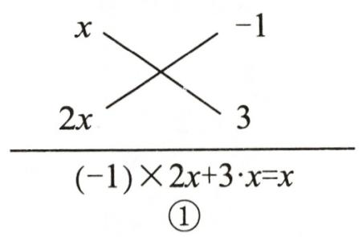

text_image

x
-1
2x 3
(-1)×2x+3·x=x
①

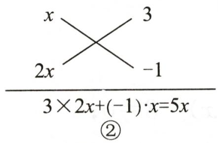

text_image

x
2x
3
-1
3 × 2x+(-1)·x=5x
②

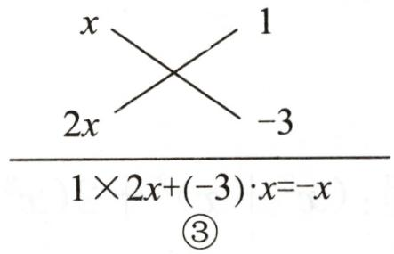

text_image

x
2x
1
-3
1×2x+(-3)·x=-x
③

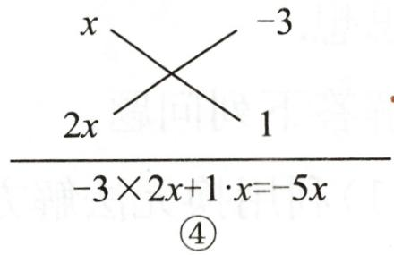

text_image

x
-3
2x
1
-3×2x+1·x=-5x
④

第2题图

第三步: 发现第③个“交叉相乘之和”的结果等于一次项 -x, 即 $2x^{2}-x-3=(x+1)\cdot(2x-3)$ .

像这样,通过画“十字图”,把二次三项式分解因式的方法,叫做“十字相乘法”.

运用结论：

(1)将多项式 $3x^{2} + x - 2$ 进行因式分解, 可以表示为 $3x^{2} + x - 2 =$ \_\_\_\_；  
(2) 若 $3x^{2} + px + 5$ 可分解为两个一次因式的积, 请画好“十字图”, 并求整数 $p$ 的所有可能值;

(3)解方程:① $3x^{2}+x-2=0$ ;

② $4x^{2}-5x+1=0.$

3. 用十字相乘法解下列关于 $x$ 的方程:

(1) $4x^{2}-3xy-y^{2}=0;$

(2) $mx^{2}+(m-3)x-3=0(m\neq0)$ .

# 学霸微专题6 方程的解法——换元法

【方法指导】利用换元法整体求解,需要注意数式的隐含条件,对结果进行正确取舍.

1. 方程 $x^{4}-3x^{2}+2=0$ 的解为 \_\_\_\_.

2. 阅读材料: 解方程 $(x^{2} - 1)^{2} - 5(x^{2} - 1) + 4 = 0$ 的过程如下:

设 $x^{2}-1=y$ ，则原方程可化为 $y^{2}-5y+4=0①$ ，解得 $y_{1}=1, y_{2}=4$ 。

当 $y = 1$ 时， $x^{2} - 1 = 1$ ，解得 $x = \pm \sqrt{2}$ ；当 $y = 4$ 时， $x^{2} - 1 = 4$ ，解得 $x = \pm \sqrt{5}$ .

故原方程的解为 $x_{1}=\sqrt{2}$ , $x_{2}=-\sqrt{2}$ , $x_{3}=\sqrt{5}$ , $x_{4}=-\sqrt{5}$ .

由原方程得到①的过程,利用换元法达到了简化方程的目的,体现了整体转化的数学思想.

解答下列问题:

(1)利用换元法解方程: $(x^{2}+x)^{2}+2(x^{2}+x)-8=0;$

(2)已知 Rt△ABC 的三边长分别是 a, b, c, 其中斜边长 c = 4, 两直角边长 a, b 满足 $(a + b)^{2} - 7(a + b) + 10 = 0$ , 求 Rt△ABC 的周长和面积.

3.(2023春·镇海区期末改编)若实数x满足 $2(x^{2}-x)^{2}-x^{2}+x-6=0$ ,求 $x^{2}-x+1$ 的值.

# 学霸微专题7 根与系数的关系——求代数式的值

【方法指导】将所求的代数式变形为两根之和与两根之积的形式,再整体代入,要注意结合方程根的意义来综合应用,要注意运用根与系数的关系的前提是方程有根,即 $\Delta \geqslant 0$ .

1. 若实数 $a, b$ 满足 $a^2 - 8a + 5 = 0, b^2 - 8b + 5 = 0$ , 则 $\frac{b - 1}{a - 1} + \frac{a - 1}{b - 1}$ 的值是 ( )

A. -20

B. 2

C. 2 或 -20

D. $\frac{1}{2}$

2. 如果 m, n 是一元二次方程 $x^{2} + x = 3$ 的两个实数根，求多项式 $m^{3} + 4n - mn + 2025$ 的值.

3. 已知实数 $m, n$ 满足 $3m^{2} - 7m - 2 = 0, 2n^{2} + 7n - 3 = 0$ , 且 $mn \neq 1$ , 求 $\frac{mn + 1}{mn + m + 1}$ 的值.

# 学霸微专题8 根与系数的关系——求字母系数的值或取值范围

【方法指导】利用根与系数的关系求字母系数的值或取值范围,要注意前提条件是方程有根,即 $\Delta \geqslant 0$ .

1. 若 $x_{1}, x_{2}$ 是关于 x 的一元二次方程 $2x^{2} + 4x + m = 0$ 的两个实数根，且满足 $x_{1}^{2} + x_{2}^{2} + 5x_{1}x_{2} - x_{1}^{2}x_{2}^{2} = 0$ ，则 m 的值为 \_\_\_\_.

2. 已知关于 $x$ 的方程 $a(2x + a) = x(1 - x)$ 的两个实数根为 $x_{1}, x_{2}, S = \sqrt{x_{1}} + \sqrt{x_{2}}$ .

(1)当 $a$ 取什么整数时, $S$ 的值为 1?  
(2)是否存在负数 $a$ , 使 $S^2$ 的值不小于 25? 若存在, 请求出 $a$ 的取值范围; 若不存在, 请说明理由.

3. 已知在关于 $x$ 的分式方程 $\frac{k - 1}{x - 1} = 2①$ 和一元二次方程 $(2 - k)x^{2} + 3mx + (3 - k)n = 0②$ 中, $k, m, n$ 均为实数, 方程①的根为非负数.

(1) 求 k 的取值范围;  
(2)当方程②有两个整数根 $x_{1}, x_{2}, k$ 为整数,且 $k = m + 2, n = 1$ 时,求 m 的值;  
(3)当方程②有两个实数根 $x_{1}, x_{2}$ , 满足 $x_{1}(x_{1} - k) + x_{2}(x_{2} - k) = (x_{1} - k)(x_{2} - k)$ , 且 $k$ 为负整数时, 试判断 $|m| \leqslant 2$ 是否成立, 请说明理由.

# 学霸微专题9 列一元二次方程解决应用问题

【方法指导】分析问题中的数量关系,建立一元二次方程模型,注意根据实际问题的意义对方程的根进行取舍,一些问题要进行分类讨论.

1. (2023 春·道里区期末改编) 如图是一个三角点阵, 从上向下数有无数行, 其中第一行有 1 个点, 第二行有 2 个点, ……, 第 $n$ 行有 $n$ 个点. 若三角点阵中前 $n$ 行的点数和是 136, 则 $n$ 的值为 \_\_\_\_.

2.(2023·沛县模拟)某日王老师佩戴运动手环进行快走锻炼,两次锻

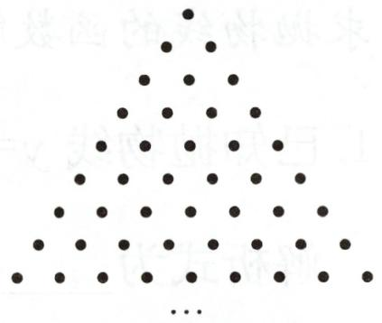

natural_image

A triangular arrangement of black dots forming a pattern, no text or symbols present.

第1题图

炼后数据如下表. 与第一次锻炼相比, 王老师第二次锻炼步数增长的百分率是其平均步长减少的百分率的 3 倍. 设王老师第二次锻炼时平均步长减少的百分率为 $x (0 < x < 0.5)$ .

<table><tr><td>项目</td><td>第一次锻炼</td><td>第二次锻炼</td></tr><tr><td>步数</td><td>10000</td><td>_</td></tr><tr><td>平均步长/米</td><td>0.6</td><td>_</td></tr><tr><td>距离/米</td><td>6000</td><td>7020</td></tr></table>

注: 步数×平均步长=距离.

(1)根据题意完成表格;

(2) 求 $x$ 的值;

(3) 王老师发现好友中步数排名第一的为 24000 步, 因此在两次锻炼结束后又走了 500 米, 使得总步数恰好为 24000 步, 求王老师这 500 米的平均步长.

3. 某商家以每副 60 元的价格购进 800 副羽毛球拍。九月份以单价 100 元销售，售出了 200 副。十月份如果销售单价不变，预计仍可售出 200 副，该商家为增加销售量，决定降价销售，根据市场调查，销售单价每降低 5 元，可多售出 10 副，但最低销售单价应高于购进的价格。十月份结束后，批发商将对剩余的羽毛球拍一次性清仓，清仓时销售单价为 50 元。如果该商家希望通过销售这批羽毛球拍获利 9200 元，那么十月份的销售单价应是多少元？

# 学霸微专题 10 二次函数的解析式与隐含对称轴

【方法指导】根据题意得出抛物线的对称轴,利用对称轴及抛物线的对称性结合其他条件求抛物线的函数解析式.

1. 已知抛物线 $y=\frac{1}{3}x^{2}+bx+c$ 过点 $C(-1,m)$ , $D(5,m)$ , $A(4,-1)$ ，则该抛物线的函数解析式为 \_\_\_\_.

2. 如图, 已知抛物线 $y = mx^{2} - 2mx - 6$ , $C$ 为 $y$ 轴正半轴上一点, 过点 $C$ 作 $AB // x$ 轴交抛物线于点 $A, B$ (点 $A$ 在点 $B$ 的左侧), 且 $OC = 2, AB = 6$ . 求该抛物线的对称轴及函数解析式.

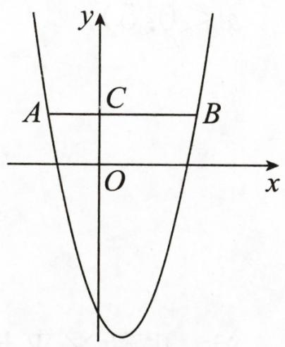

text_image

y
A	C	B
O
x

第2题图

3.(2024·山东)在平面直角坐标系 $xOy$ 中, 点 $P(2, -3)$ 在二次函数 $y = ax^{2} + bx - 3 (a > 0)$ 的图象上, 记该二次函数图象的对称轴为直线 $x = m$ .

(1)求 $m$ 的值;  
(2)若点 $Q(m, -4)$ 在二次函数 $y = ax^{2} + bx - 3 (a > 0)$ 的图象上, 将该二次函数的图象向上平移 5 个单位长度, 得到新的二次函数的图象. 当 $0 \leqslant x \leqslant 4$ 时, 求新的二次函数的最大值与最小值的和;  
(3)设二次函数 $y=ax^{2}+bx-3(a>0)$ 的图象与 x 轴的交点坐标分别为 $(x_{1},0)$ ， $(x_{2},0)(x_{1}<x_{2})$ 。若 $4<x_{2}-x_{1}<6$ ，求 a 的取值范围。

# 学霸微专题 11 二次函数的解析式与定点、定线

【方法指导】根据二次函数解析式的特征得出抛物线经过的定点,根据含参点的横、纵坐标的关系得出含参点所对应的函数解析式,进而利用函数图象与性质解决问题.

1. 若抛物线 $y=ax^{2}-4ax+3a-2(a\neq0)$ 恒过定点，则定点的坐标为 \_\_\_\_.

2. 已知抛物线 C: $y = x^{2} - 2mx + 2m + 1$ .

(1)用含 m 的代数式表示抛物线 C 的顶点坐标,并说明无论 m 为何值,抛物线 C 的顶点都在同一条抛物线 $C_{1}$ 上;  
(2)无论 m 为何值,抛物线 C 一定恒过定点 A,设抛物线 C 的顶点为 B,当点 B 不与点 A 重合时,过点 A 作 AE//x 轴,与抛物线 C 的另一个交点为 E,过点 B 作 BD//x 轴,与抛物线 C₁ 的另一个交点为 D.求证:四边形 AEBD 是平行四边形.

3. 在平面直角坐标系 $xOy$ 中, 若 $P(2m, 4m^{2} + 8m + 3), Q(2n, 2n - 4)$ 是两个动点 $(m, n$ 为实数), 求 $PQ$ 长度的最小值.

# 学霸微专题12 二次函数的解析式与几何变换

【方法指导】由于抛物线平移、翻折后的形状、大小不变,故 a 的绝对值不变,求这几类几何变换后的抛物线的函数解析式时,需要综合考虑变换后的抛物线的开口方向和顶点坐标(或其他关键点的坐标).

1. (2024·上虞区期末)如图, 将抛物线 $C_{1}: y = x^{2}$ 向右平移 2 个单位长度后, 再将该图象关

于x轴进行轴对称变换得到抛物线 $C_{2}: y = ax^{2} + bx + c$ . 则下列是关于抛物线 $C_{2}$ 的函数解析式的是 ( )

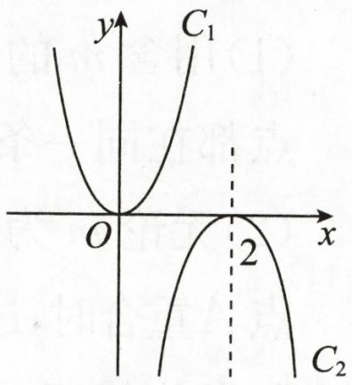

text_image

y
C₁
O
x
2
C₂

第1题图

A. $y = -x^{2} + 4x - 4$   
B. $y = -x^{2} - 4x - 4$   
C. $y=x^{2}+4x-4$   
D. $y = {x}^{2} - {4x} - 4$

2. 将抛物线 $y = -x^{2} + 2x + 3$ 在 x 轴下方的部分沿 x 轴翻折到 x 轴上方, 图象的其余部分不变, 得到一个新图象, 若直线 $y = x + b$ 与这个新图象有 2 个公共点, 求 b 的取值范围.

3. (2024·镇江期末)如图①, 抛物线 $C_{1}$ 与 $x$ 轴的两个交点中的左边的一个交点为 $A(-3,0)$ , 将该抛物线沿 $y$ 轴翻折, 得到抛物线 $C_{2}$ , 点 $A$ 的对应点为点 $A'$ , 将抛物线 $C_{1}, C_{2}$ 沿 $x$ 轴分别向右、左平移 1 个单位长度后, 恰好重合 (如图②), 重合后的抛物线的顶点为 $(0,4)$ .

(1)求平移前的抛物线 $C_{1}$ 对应的二次函数的解析式.  
(2) 小明发现: 将抛物线 $C_{1}, C_{2}$ 沿 x 轴分别向右、左平移 $m (m > 0)$ 个单位长度, 平移后得到的两条抛物线与 y 轴的交点 $P(0, t)$ 的位置在发生变化.

①试求出 t 与 m 之间的函数解析式;  
②在平移过程中,求当 m 为何值时, $\triangle PAA'$ 是等边三角形.

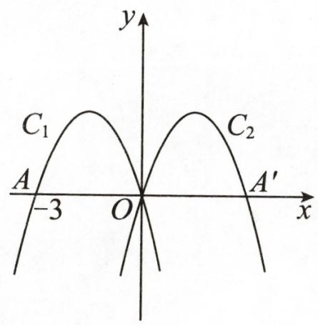

text_image

C₁
A
-3
O
C₂
A′
x
y

①

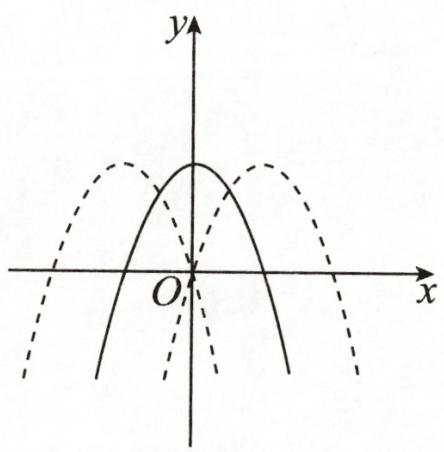

text_image

y
O
x

②   
第3题图

# 学霸微专题 13 数形结合——二次函数函数值的大小比较

【方法指导】利用二次函数图象的开口方向、对称轴和点到对称轴的距离来比较函数值的大小.

1. 在二次函数 $y = -\frac{1}{12}(x - 2)^{2} + 3$ 的图象上有两点 $(-1, y_{1})$ ， $(1, y_{2})$ ，则 $y_{1} - y_{2}$ 的值是（）

A. 负数

B. 零

C. 正数

D. 不能确定

2.(1)已知二次函数 $y_{1}=-(x+1)^{2}+4$ 的图象如图所示,请在同一平面直角坐标系中画出二次函数 $y_{2}=-(x-2)^{2}+1$ 的图象;

(2)平行于 $x$ 轴的直线 $y = k$ 在抛物线 $y_{2} = -(x - 2)^{2} + 1$ 上截得线段 $AB = 4$ (点 $A$ 在点 $B$ 的左侧), 求抛物线 $y_{2} = -(x - 2)^{2} + 1$ 的顶点到线段 $AB$ 的距离;

(3)当-1<x<2时,利用函数图象比较 $y_{1}$ 与 $y_{2}$ 的大小.

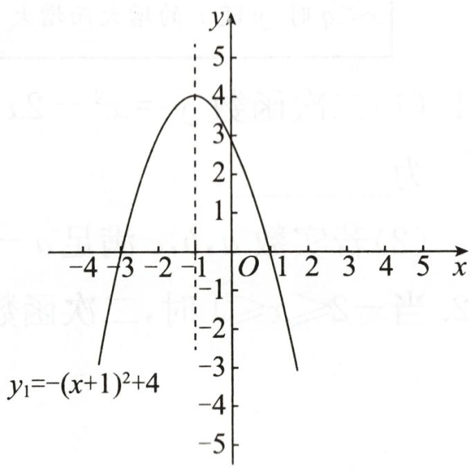

line

| x    | y     |
| ---- | ----- |
| -4   | -3.0  |
| -3   | 0.0   |
| -2   | 3.0   |
| -1   | 4.0   |
| 0    | 3.0   |
| 1    | 0.0   |
| 2    | -3.0  |
| 3    | -5.0  |
| 4    | -3.0  |

第2题图

3. 在平面直角坐标系中, 把函数 $y = ax^{2} + 2bx + 1 (a, b$ 为常数) 的图象记为 $G$ .

(1)设 $k \neq 0$ , 若点 $A(3 - k, t)$ 在 $G$ 上, 则点 $B(3 + k, t)$ 必在 $G$ 上, 且 $G$ 过点 $C(4, 9)$ , 求 $G$ 的函数解析式;

(2)若点 $D(1, y_1), E(4, y_2)$ 是 (1) 中函数图象上的两点, 比较 $y_1$ 与 $y_2$ 的大小;

(3)若点 $P(m, y_3), Q(m + 3, y_4)$ 是 (1) 中函数图象上的两点, 比较 $y_3$ 与 $y_4$ 的大小.

# 学霸微专题 14 数形结合——区间上二次函数的最值问题

【方法指导】已知二次函数 $y=ax^{2}+bx+c, p \leqslant x \leqslant q$ ，以 a > 0 为例：

<table><tr><td>范围</td><td>图形</td><td>最值</td></tr><tr><td>若 $p < q < -\frac{b}{2a}$ ,则y随x的增大而减少</td><td>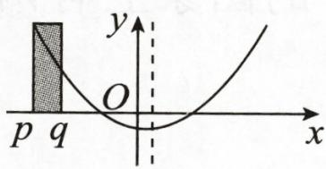</td><td>当x=p时,y有最大值;当x=q时,y有最小值</td></tr><tr><td>若 $-\frac{b}{2a} < p < q$ ,则y随x的增大而增大</td><td>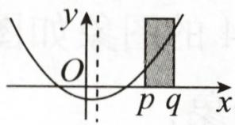</td><td>当x=p时,y有最小值;当x=q时,y有最大值</td></tr><tr><td>若 $p < -\frac{b}{2a} < q$ ,则 $p < x < -\frac{b}{2a}$ 时,y随x的增大而减少; $-\frac{b}{2a} < x < q$ 时,y随x的增大而增大</td><td>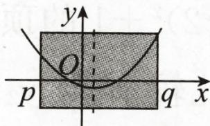</td><td>当 $x=-\frac{b}{2a}$ 时,y有最小值;比较x=p和x=q时y的值,较大的值就是最大值</td></tr></table>

1.(1)二次函数 $y=x^{2}-2x-3$ ，当 $m-2 \leqslant x \leqslant m$ 时，函数有最大值 5，则 m 的值可能为 \_\_\_\_；

(2)若实数 a, b, c 满足 $a - b^{2} - 2 = 0$ , $2a^{2} - 4b^{2} - c = 0$ , 则 c 的最小值是 \_\_\_\_.

2. 当 $-2 \leqslant x \leqslant 1$ 时，二次函数 $y = -(x - m)^{2} + 2$ 的最大值是 1，求实数 m 的值.

3.(2024·鄞州区期末)已知二次函数的解析式为 $y=-x^{2}+2mx-m^{2}+4$ .

(1)求证:该二次函数的图象与x轴一定有2个交点;   
(2) 若 $m = 2$ , 点 $M(n, y_1), N(n + 2, y_2)$ 都在该二次函数的图象上, 且 $y_1 y_2 < 0$ , 求 $n$ 的取值范围;  
(3) 当 $m-3 \leqslant x \leqslant 5$ 时, 函数最大值与最小值的差为 8, 求 m 的值.

# 学霸微专题 15 数形结合——二次函数图象与系数的关系

【方法指导】①a 看开口方向；②ab 看对称轴的位置；③c 看与 y 轴交点的位置；④ $b^{2}-4ac$ 看抛物线与 x 轴交点的个数；⑤观察横坐标分别为 $\pm1, \pm2, \pm3$ 等点的位置。

1. (2024·禹城期末)如图, 抛物线 $y = ax^2 + bx + c$ 的对称轴是直线 $x = 1$ , 则以下五个结论: ① $abc > 0$ , ② $2a + b = 0$ , ③ $b^2 > 4ac$ , ④ $4a + 2b + c > 0$ , ⑤ $3a + c < 0$ 中, 正确的有 ( )

A. 1 个

B. 2 个

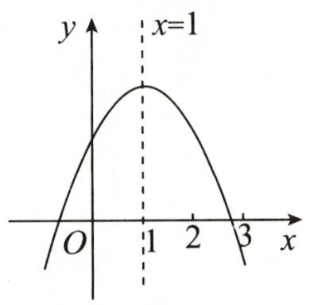

line

| x | y |
|---|---|
| 0 | O |
| 1 | Peak |
| 2 | Decreasing to 0 |
| 3 | Minimum |

第1题图

C. 3 个

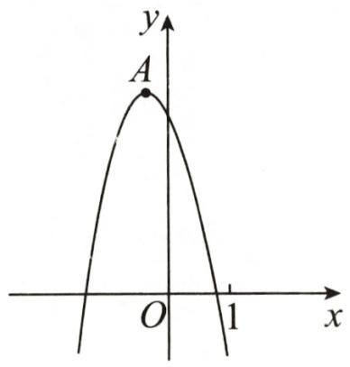

text_image

y
A
O
1
x

第2题图

D. 4 个

2. (2024·德阳)如图, 抛物线 $y = ax^2 + bx + c$ 的顶点 $A$ 的坐标为 $\left(-\frac{1}{3}, n\right)$ , 与 $x$ 轴的一个交点位于 0 和 1 之间, 则以下结论: ① $abc > 0$ ; ② $5b + 2c < 0$ ; ③ 若抛物线经过点 (-6, $y_1$ ), (5, $y_2$ ), 则 $y_1 > y_2$ ; ④ 若关于 $x$ 的一元二次方程 $ax^2 + bx + c = 4$ 无实数根, 则 $n < 4$ . 其中正确的结论是 \_\_\_\_ (填序号).

3.(2023·武汉改编)抛物线 $y=ax^{2}+bx+c(a,b,c$ 是常数, c<0) 经过 (1,1), (m,0), (n,0) 三点, 且 $n\geqslant3$ . 给出下列四个结论:

①b<0; ② $4ac-b^{2}<4a$ ;

③当 n=3 时, 若点 $(2,t)$ 在该抛物线上, 则 t>1;

④若关于 x 的一元二次方程 $ax^{2}+bx+c=x$ 有两个相等的实数根，则 $0<m\leqslant\frac{1}{3}$ .
写出正确的结论,并说明理由.

# 学霸微专题16 二次函数与一元二次方程的根

【方法指导】抛物线 $y=ax^{2}+bx+c$ 与直线 y=m 的交点的横坐标对应着方程 $ax^{2}+bx+c=m$ 的根，可以利用这样的关系进行数形结合，数形互化，从而解决相关问题。

1. 已知关于 $x$ 的二次函数 $y = mx^{2} - (m + 2)x + 2(m \neq 0)$ 的图象与 $x$ 轴总有两个交点, 且它们的横坐标都是整数, 求正整数 $m$ 的值.

2. 已知关于 $x$ 的方程 $-x^{2} + kx + k - \frac{5}{4} = 0$ 有一根为 $x = m$ , 若 $-2 \leqslant m \leqslant 1$ , 求实数 $k$ 的取值范围.

3. 某班数学兴趣小组对函数 $y = x^{2} - 2|x|$ 的图象和性质进行了探究, 探究过程如下, 请补充完整.

(1)自变量 $x$ 的取值范围是全体实数, $x$ 与 $y$ 的几组对应值列表如下:

<table><tr><td>x</td><td>...</td><td>-3</td><td>-5/2</td><td>-2</td><td>-1</td><td>0</td><td>1</td><td>2</td><td>5/2</td><td>3</td><td>...</td></tr><tr><td>y</td><td>...</td><td>3</td><td>5/4</td><td>m</td><td>-1</td><td>0</td><td>-1</td><td>0</td><td>5/4</td><td>3</td><td>...</td></tr></table>

其中， $m=$ \_\_\_\_.

(2)根据上表数据,在如图所示的平面直角坐标系中描点,已画出了函数图象的一部分,请画出该函数图象的另一部分.  
(3) 观察函数图象, 写出函数的两条性质.  
(4) 进一步探究函数的图象发现:

①函数的图象与 $x$ 轴有 \_\_\_\_ 个交点, 所以对应的方程 $x^{2} - 2|x|=0$ 有 \_\_\_\_ 个实数根;  
②方程 $x^{2} - 2|x| = 2$ 有 \_\_\_\_ 个实数根；  
(3)若关于 $x$ 的方程 $x^{2} - 2|x| = a$ 有 4 个实数根, 则 $a$ 的取值范围是

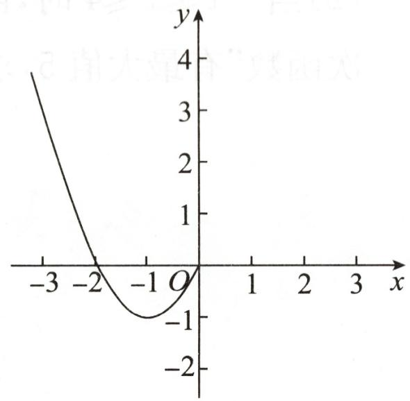

line

| x   | y   |
| --- | --- |
| -3  | 4   |
| -2  | 0   |
| -1  | -1  |
| 0   | 0   |
| 1   | 0   |
| 2   | 0   |
| 3   | 0   |

第3题图

# 学霸微专题 17 二次函数与新定义问题

【方法指导】二次函数中的新定义问题需要结合题意,正确理解新定义,要注意“化新为旧”,再利用二次函数的图象与性质解决相关问题.

1. (2023·菏泽) 若一个点的纵坐标是其横坐标的 3 倍, 则称这个点为“三倍点”, 如: $A(1,3), B(-2,-6), C(0,0)$ 等都是“三倍点”. 在 $-3 < x < 1$ 的范围内, 若二次函数 $y = -x^{2} - x + c$ 的图象上至少存在一个“三倍点”, 则 $c$ 的取值范围是 ( )

A. $-\frac{1}{4}\leqslant c<1$

B. $-4 \leqslant c < -3$

C. $-\frac{1}{4} \leqslant c < 6$

D. $-4 \leqslant c < 5$

2. 定义: 两个二次项系数之和为 1, 对称轴相同, 且图象与 $y$ 轴的交点也相同的二次函数互为“友好同轴二次函数”. 例如: $y = 2x^{2} + 4x - 5$ 的“友好同轴二次函数”的解析式为 $y = -x^{2} - 2x - 5$ .

(1) 函数 $y=\frac{1}{4}x^{2}-2x+3$ 的“友好同轴二次函数”的解析式为 \_\_\_\_；

(2)当 $-1 \leqslant x \leqslant 4$ 时, 函数 $y = (1 - a)x^{2} - 2(1 - a)x + 3 (a \neq 0$ 且 $a \neq 1$ ) 的“友好同轴二次函数”有最大值 5 , 求 $a$ 的值.

3. 定义: 关于 $x$ 轴对称且对称轴相同的两条抛物线叫做“同轴对称抛物线”.

(1)求抛物线 $y =  - 2{x}^{2} + {4x} + 3$ 的“同轴对称抛物线”的函数解析式；  
(2)已知抛物线 $L: y = ax^{2} - 4ax + 1$ , 当抛物线 $L$ 与其“同轴对称抛物线”围成的封闭区域内 (不包括边界) 共有 11 个横、纵坐标均为整数的点时, 求 $a$ 的取值范围.

# 学霸微专题 18 二次函数的应用——图形面积问题

【方法指导】理清题意,根据数量关系得到相关面积的二次函数解析式,再利用二次函数的图象与性质解决最值等问题.在解题过程中,一定要注意自变量的取值范围.

1. 我国南宋时期数学家秦九韶曾提出利用三角形的三边长求面积的公式, 此公式与古希腊几何学家海伦提出的公式如出一辙, 即三角形的三边长分别为 $a, b, c$ , 记 $p = \frac{a + b + c}{2}$ , 则其面积 $S = \sqrt{p(p - a)(p - b)(p - c)}$ . 这个公式也被称为海伦-秦九韶公式. 若 $p = 5, c = 4$ , 则此三角形面积的最大值为 ( )

A. $\sqrt{5}$

B. 4

C. $2 \sqrt{5}$

D. 5

2. 在美化校园的活动中, 某兴趣小组想借助如图所示的直角墙角 (两边足够长), 用 $32 \mathrm{~m}$ 长的篱笆围成一个矩形花园 ABCD (篱笆只围 AB, BC 两边), 设 $AB = x \mathrm{~m}$ , 花园面积为 $S \mathrm{~m}^{2}$ .

(1)若花园的面积为 $252 \mathrm{~m}^{2}$ , 求 $x$ 的值;  
(2)若在 $P$ 处有一棵树与墙 $CD, AD$ 的距离分别是 $17 \mathrm{~m}$ 和 $6 \mathrm{~m}$ , 要将这棵树围在花园内 (含边界, 不考虑树的粗细), 求花园面积的最大值.

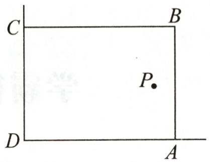

text_image

C
B
P
D
A

第2题图

3. 植物园有一块足够大的空地, 其中有一堵长为 $6 \mathrm{~m}$ 的墙, 现准备用 $20 \mathrm{~m}$ 长的篱笆围一个矩形花圃. 小俊设计了如图所示的甲和乙两种方案: 方案甲中 $A D$ 的长不超过墙长; 方案乙中 $A D$ 的长大于墙长.

(1) 按方案甲围矩形花圃, 设 BC 的长为 $x \, m$ , 矩形 ABCD 的面积为 $y \, m^{2}$ .

①求 y 与 x 之间的函数关系式；  
②求矩形 ABCD 面积的最大值.  
(2)甲、乙哪种方案能使围成的矩形花圃的面积最大？最大面积是多少？

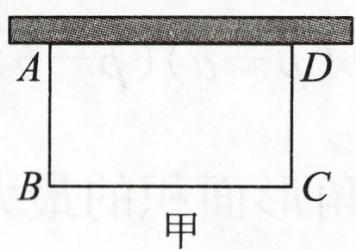

text_image

A
B
C
D
甲

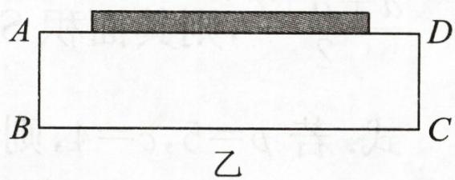

text_image

A
B
乙
C
D

第3题图

# 学霸微专题 19 二次函数的应用——营销利润问题

【方法指导】理清题意,根据数量关系得到利润的二次函数解析式,再利用二次函数的图象与性质解决最值等问题.在解题过程中,一定要注意自变量的取值范围.

1. 东方商厦将进货价为 70 元/件的某种商品按零售价 100 元/件售出时, 每天能卖出 20 件, 若这种商品的零售价在一定范围内每件每降价 1 元, 其日销量就增加 1 件. 为了获取最大日销售利润, 则每件商品应降价 \_\_\_\_ 元.

2. 某商品每件的进价为 20 元, 在试销阶段该商品的日销售量 $y$ (件)与商品的日销售单价 $x$ (元)之间的关系为 $y = \begin{cases} -10x + 400 & (20 \leqslant x \leqslant 30), \\ -4x + 220 & (30 < x \leqslant 45) \end{cases}$ (规定该商品的日销售单价不得低于进价且不得高于 45 元). 若日销售单价 $x$ (元)为整数, 则当日销售单价 $x$ (元)为 \_\_\_\_ 元时, 该商品的日销售利润最大, 最大利润是 \_\_\_\_ 元.

3. 甲、乙两汽车出租公司均有 50 辆汽车对外出租, 下面是两公司经理的一段对话:

甲公司经理:如果我公司每辆汽车月租费3000元,那么50辆汽车可以全部租出.如果每辆汽车的月租费每增加50元,那么将少租出1辆汽车.另外,公司为每辆租出的汽车支付月维护费200元.
乙公司经理:我公司每辆汽车月租费3500元,无论是否租出汽车,公司均需一次性支付月维护费共计1850元.

说明:①汽车数量为整数;②月利润=月租车费-月维护费;③两公司月利润差=月利润较高公司的利润-月利润较低公司的利润.

在甲、乙两公司租出的汽车数量相等的条件下,根据上述信息,解决下列问题:

(1)当每个公司租出的汽车为 10 辆时,甲公司的月利润是\_\_\_\_元;当每个公司租出的汽车为\_\_\_\_辆时,两公司的月利润相等;

(2)求甲、乙两公司月利润差的最大值；

(3)甲公司热心公益事业,每租出1辆汽车捐出a元(a>0)给慈善机构,如果捐款后甲公司剩余的月利润仍高于乙公司月利润,且当两公司租出的汽车均为17辆时,甲公司剩余的月利润与乙公司月利润之差最大,求a的取值范围.

# 学霸微专题 20 二次函数的应用——抛物线形问题

【方法指导】在利用二次函数解决抛物线形的实际问题时,要恰当地把实际问题中的相关数据转化为二次函数中的相应自变量和函数值,从而利用二次函数的图象与性质解决问题.

1. 如图, 某校的围墙由一段相同的凹曲拱组成, 其拱状图形为抛物线的一部分, 在栅栏的跨径 $AB$ 之间, 按相同间隔 0.2 米用 5 根立柱加固, 拱高 $OC$ 为 0.36 米, 则立柱 $EF$ 的长为 \_\_\_\_ 米.

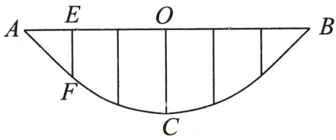

text_image

A E O B
F C

第1题图

2. 如图, 斜抛小球, 小球触地后呈抛物线反弹, 每次反弹后保持相同的抛物线形状

(开口方向与开口大小前后一致), 第一次反弹后的最大高度为 $h_1$ , 第二次反弹后的最大高度为 $h_2$ . 第二次反弹后, 小球越过最高点落在垂直于地面的挡板 $C$ 处, 且离地高度 $BC = \frac{1}{3} h_1$ . 若 $OB = 90 \mathrm{dm}, OA = 2AB$ , 则 $\frac{h_2}{h_1} =$ \_\_\_\_.

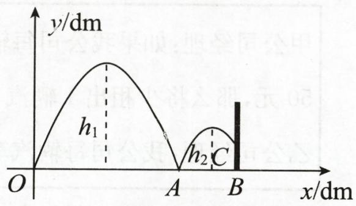

text_image

y/dm
h₁
h₂ C
O
A
B
x/dm

第2题图

3.(2024·武汉)16世纪中叶,我国发明了一种新式火箭“火龙出水”,它是二级火箭的始祖.火箭第一级运行路径形如抛物线,当火箭运行一定水平距离时,自动引发火箭第二级,火箭第二级沿直线运行.

某科技小组运用信息技术模拟火箭运行过程. 如图, 以发射点为原点, 地平线为 $x$ 轴, 垂直于地面的直线为 $y$ 轴, 建立平面直角坐标系, 分别得到抛物线 $y = ax^{2} + x$ 和直线 $y = -\frac{1}{2} x + b$ . 其中, 当火箭运行的水平距离为 $9 \mathrm{~km}$ 时, 自动引发火箭的第二级.

(1)若火箭第二级的引发点的高度为 3.6 km.

①直接写出 $a, b$ 的值；  
②火箭在运行过程中,有两个位置的高度比火箭运行的最高点低 1.35 km,求这两个位置之间的距离.  
(2)a 满足什么条件时,火箭落地点与发射点的水平距离超过 15 km?

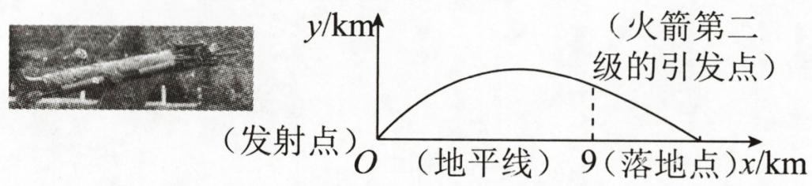

text_image

(发射点)
O (地平线) 9 (落地点)x/km
y/km
(火箭第二
级的引发点)

第3题图

# 学霸微专题 21 旋转的性质与角度

【方法指导】利用旋转角相等,对应点到旋转中心的距离相等,旋转前后的两个图形全等等,进行推理运算.

1. (2024·仙居期末)如图, 在 $\triangle ABC$ 中, $AB=AC$ , 将 $\triangle ABC$ 绕点 $B$ 旋转得到 $\triangle DBE$ ,使点 $D$ 落在 $AC$ 边上, $DE, BC$ 相交于点 $F$ . 设 $\angle BAC=\alpha, \angle BFD=\beta$ , 则下列关系正确的是 ( )

A. $\alpha + \beta = 150^{\circ}$

B. $2 \alpha + \beta = 230^{\circ}$

C. $\frac{5}{2}\alpha + \beta = 270^{\circ}$

D. $3 \alpha + \beta = 300^{\circ}$

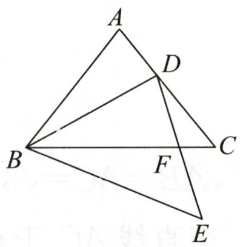

text_image

A
D
B
C
F
E

第1题图

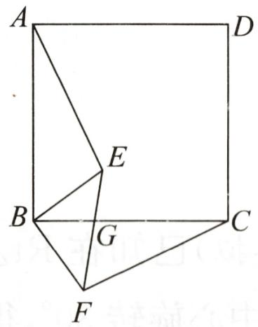

text_image

A
D
E
B
G
C
F

第2题图

2. (2023·菏泽)如图, $E$ 是正方形 $ABCD$ 内一点, 将 $\triangle ABE$ 绕点 $B$ 按顺时针方向旋转 $90^{\circ}$ , 得到 $\triangle CBF$ . 若 $\angle ABE = 55^{\circ}$ , 则 $\angle EGC =$ \_\_\_\_.  
3. 将 $\triangle ABC$ 绕点 $A$ 逆时针旋转一个角度 $\alpha$ 得到 $\triangle ADE$ , 点 $B, C$ 的对应点分别为 $D, E$ .

(1) 若 $\alpha = 60^{\circ}$ , 如图①, 连接 $EC$ , 试判断 $\triangle ACE$ 的形状, 并予以证明;  
(2)若点 D 恰好落在 BC 边上,如图②,且点 A,B,E 在同一条直线上, $\angle C=30^{\circ}$ ,求旋转角 $\alpha$ 的度数.

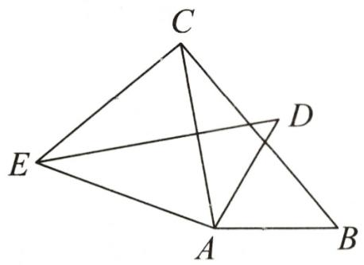

text_image

Geometric diagram with labeled points A, B, C, D, E forming triangles and intersecting lines

①

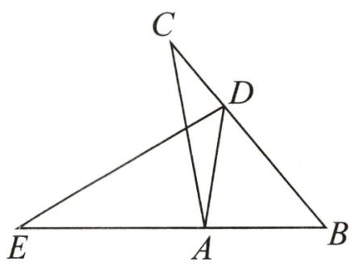

text_image

Geometric diagram of triangle ABC with internal points D and E, showing intersecting lines and segments

②   
第3题图

# 学霸微专题 22 旋转的性质与线段长

【方法指导】利用旋转角相等,对应点到旋转中心的距离相等,旋转前后的两个图形全等,勾股定理等解决与线段的长度有关问题,需要注意旋转时满足题意的不同位置图形的分类讨论.

1. (2024·玄武区月考)如图, $M$ 是正方形 $ABCD$ 边 $CD$ 的中点, $P$ 是正方形内一点, 连接 $BP$ , 将线段 $BP$ 以点 $B$ 为中心逆时针旋转 $90^{\circ}$ 得到线段 $BQ$ , 连接 $MP, MQ$ . 若 $AB = 4\sqrt{2}, MP = \sqrt{2}$ , 则 $MQ$ 的最小值为 \_\_\_\_.

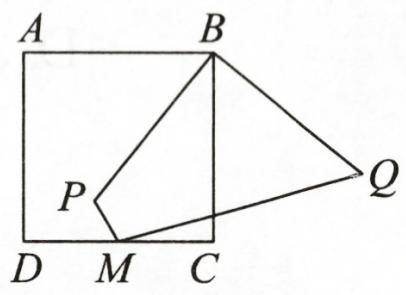

text_image

A
B
P
D M C Q

第1题图

2. (2024·郸城模拟)已知在 Rt△ABC 中, ∠BAC=90°, AB=AC=√3+1. 现将△ABC 以点 B 为旋转中心旋转 30°, 得到△A′BC′, 直线 C′A′交直线 AC 于点 D, 则 CD 的长度为 \_\_\_\_.

3. 在正方形 $ABCD$ 中, 点 $E$ 在射线 $BC$ 上 (不与点 $B, C$ 重合), 连接 $DB, DE$ , 将 $DE$ 绕点 $E$ 逆时针旋转 $90^{\circ}$ 得到 $EF$ , 连接 $BF$ .

(1)如图①,点E在BC边上.

①依题意补全图形；

②若 AB=6, EC=2, 求 BF 的长.

(2)如图②,点 $E$ 在 $BC$ 边的延长线上,用等式表示线段 $BD, BE, BF$ 之间的数量关系.

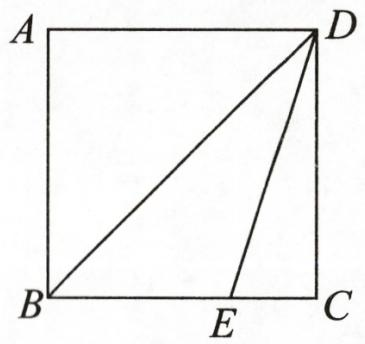

text_image

A
B
E
C
D

①

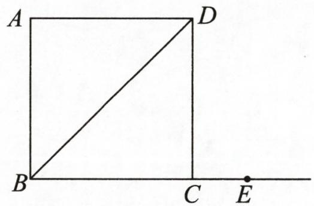

text_image

A
D
B
C
E

②   
第3题图

# 学霸微专题 23 中心对称的性质与函数图象

【方法指导】利用中心对称的性质分析成中心对称的两个函数图象,关注关键点对称变换后的坐标及函数图象的特征,要注意数形结合.

1. 如图, 抛物线 $y = ax^{2} + 2ax - 3a (a > 0)$ 与 $x$ 轴交于 $A, B$ 两点, 顶点为 $D$ , 把抛物线在 $x$ 轴下方部分关于点 $B$ 作中心对称, 点 $D$ 的对应点为 $D'$ , 点 $A$ 的对应点为 $C$ , 连接

$DD', CD', DC.$ 当 $\triangle CDD'$ 是直角三角形时, a 的值为

( )

A. $\frac{1}{2}$ 或 $\frac{\sqrt{3}}{2}$

B. $\frac{1}{3}$ 或 $\frac{\sqrt{3}}{2}$

C. $\frac{1}{3}$ 或 $\frac{\sqrt{3}}{3}$

D. $\frac{1}{2}$ 或 $\frac{\sqrt{3}}{3}$

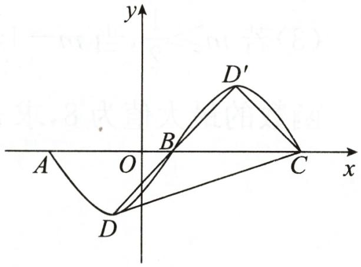

text_image

y
D'
A O B C x
D

第1题图

2. 某数学兴趣小组根据学习函数的经验, 对分段函数 $y = \begin{cases} ax^2 + bx - 3 (x \geqslant 1), \\ x^2 - 1 (x < 1) \end{cases}$ 的图象与性质进行了探究, 请补充完整以下探究过程.

<table><tr><td>x</td><td>...</td><td>-2</td><td>-1</td><td>0</td><td>1</td><td>2</td><td>3</td><td>4</td><td>...</td></tr><tr><td>y</td><td>...</td><td>3</td><td>0</td><td>-1</td><td>0</td><td>1</td><td>0</td><td>-3</td><td>...</td></tr></table>

(1) 填空: $a = \_$ , $b = \_$ .

(2)①根据上述表格补全如图所示的函数图象;

(2)该函数图象是关于 对称的 (填“轴对称”或“中心对称”)图形.

(3)若直线 $y=\frac{1}{2}x+t$ 与该函数图象有三个交点,则 t 的取值范围为 \_\_\_\_.

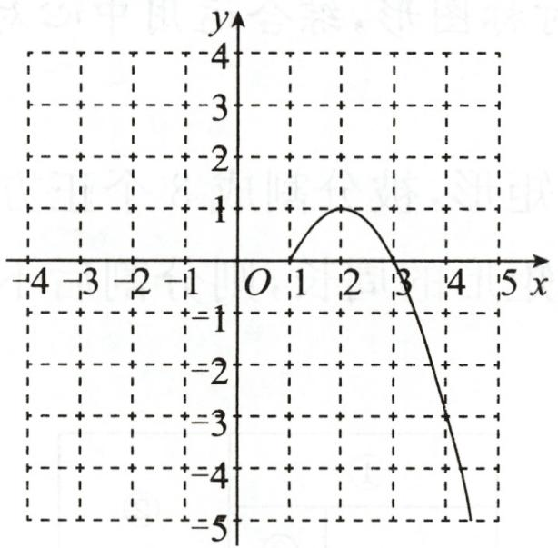

line

| x | y |
|---|---|
| 0 | 0 |
| 1 | 1 |
| 2 | 1 |
| 3 | 0 |
| 4 | -3 |
| 5 | -5 |

第2题图

3. 定义: 将函数 $C_{1}$ 的图象绕点 $P(m,0)$ 旋转 $180^{\circ}$ , 得到新的函数 $C_{2}$ 的图象, 我们称函数 $C_{2}$ 是函数 $C_{1}$ 关于点 $P$ 的相关函数.

(1) 当 m=0 时，

①一次函数 $y=-x+7$ 关于点 P 的相关函数为 \_\_\_\_；

②二次函数 $y=ax^{2}-2ax+a(a\neq0)$ 关于点 P 的相关函数为

(2)如果函数 $y=(x-2)^{2}+6$ 关于点 P 的相关函数是 $y=-(x-10)^{2}-6$ ，那么 m= \_\_\_\_.

(3) 若 $m \geqslant \frac{1}{2}$ ，当 $m - 1 \leqslant x \leqslant m + 2$ 时，函数 $y = x^{2} - 6mx + 4m^{2}$ 关于点 $P(m,0)$ 的相关函数的最大值为 8，求 m 的值.

# 学霸微专题 24 中心对称的性质与特殊平行四边形

【方法指导】平行四边形是中心对称图形,综合运用中心对称的性质及特殊平行四边形的性质解决问题.

1. 如图, 小明家的住房平面图呈矩形, 被分割成 3 个正方形和 2 个矩形后仍是中心对称图形. 若只知道原住房平面图矩形的周长, 则分割后不用测量就能知道周长的图形的标号为 \_\_\_\_.

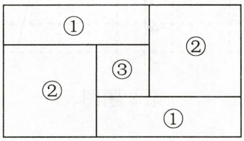

text_image

①
②
③
②
①

第1题图

2. 如图, 已知正方形 $ABCD$ 和直角 $\triangle ABE$ , $\angle AEB = 90^\circ$ , 将 $\triangle ABE$ 绕点 $O$ 旋转 $180^\circ$ 得到 $\triangle CDF$ .

(1)在图中画出点 O 和 $\triangle CDF$ ，并简要说明作图过程；  
(2) 若 $AE = 12, AB = 13$ , 求 $EF$ 的长.

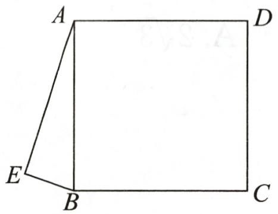

text_image

A
D
E
B
C

第2题图

3. 如图, $A, B$ 为 $x$ 轴上的两点, 以 $AB$ 为边作矩形 $ABCD$ , 且点 $A, C$ 的坐标分别为 $(-8,0)$ , $(-2,4)$ , 现将矩形 $ABCD$ 向右平移 4 个单位长度后, 再向上平移 $\frac{a}{2}$ 个单位长度得到矩形 $EFGH$ .

(1) 若 $a = 4$ , 请求出点 $H$ 的坐标;  
(2)若矩形 ABCD 与矩形 EFGH 关于点 P 成中心对称,且点 P 的坐标为 $(-3,m)$ ,求

m 的值.(用含 a 的式子表示)

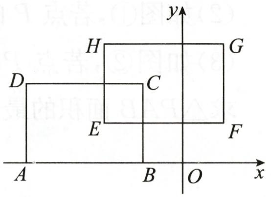

text_image

y
H
G
D
C
E
F
A
B
O
x

第3题图

# 学霸微专题 25 根据点和圆上点之间的距离的关系求最值

# 【方法指导】

<table><tr><td>类型</td><td>点在圆内</td><td>点在圆外</td></tr><tr><td>图例</td><td>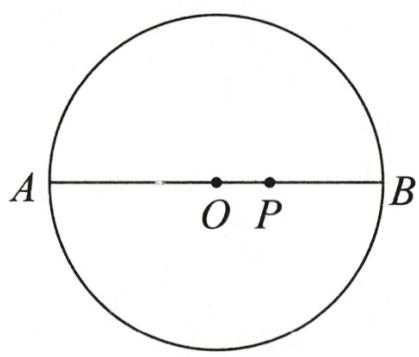</td><td>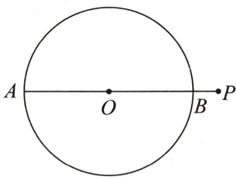</td></tr><tr><td>结论</td><td>PA 最大,PB 最小</td><td>PA 最大,PB 最小</td></tr></table>

1. 如图, $AB$ 是 $\odot O$ 的直径, 点 $C$ 在 $\odot O$ 上, $CD \perp AB$ , 垂足为 $D$ , $AD = 2$ , 点 $E$ 是 $\odot O$ 上的动点 (不与点 $C$ 重合), 点 $F$ 为 $CE$ 的中点, 若在点 $E$ 运动过程中 $DF$ 的最大值为 4 , 则 $CD$ 的值为

A. $2 \sqrt{3}$

B. $2\sqrt{2}$

C. $3 \sqrt{2}$

D. $\frac{7}{2}$

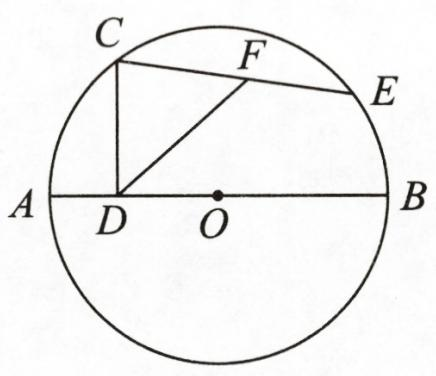

text_image

C
F
E
A
D
O
B

第1题图

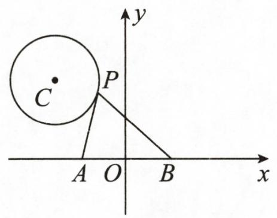

text_image

C
P
A O B x
y

第2题图

2. 如图, 在平面直角坐标系中, 点 $P$ 是以 $C(-\sqrt{2}, \sqrt{3})$ 为圆心, 1 为半径的 $\odot C$ 上的一个动点, 已知 $A(-1,0), B(1,0)$ , 连接 $PA, PB$ , 则 $PA^{2} + PB^{2}$ 的最小值是 \_\_\_\_.

3. 已知直线 $l: y = \frac{3}{4} x - 3$ 与 $x$ 轴、 $y$ 轴分别交于点 $A, B$ .

(1)求 $AB$ 的长；

(2)如图①,若点 $P$ 的坐标是 $(0,4)$ , 点 $M$ 是直线 $l$ 上的一个动点, 求 $PM$ 的最短长度; (3)如图②,若点 $P$ 是以点 $C(0,1)$ 为圆心, 1 为半径的圆上一动点, 连接 $PA, PB$ . 求 $\triangle PAB$ 面积的最小值与最大值之和.

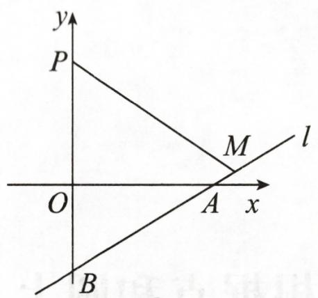

text_image

y
P
M
l
O
A x
B

①

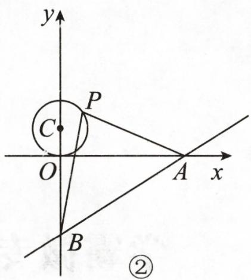

text_image

y
P
C
O
A x
B
②

第3题图

# 学霸微专题 26 垂直弦问题

# 【方法指导】

<table><tr><td>图形</td><td>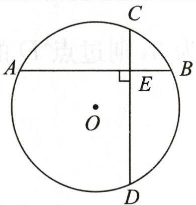</td><td>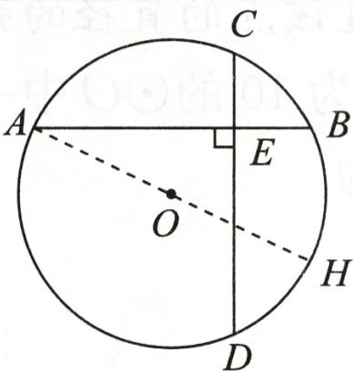</td></tr><tr><td>结论</td><td>⊙O中,弦AB⊥弦CD于点E,则 $\widehat{AC}+\widehat{BD}=\widehat{AD}+\widehat{BC}$ </td><td>⊙O中,弦AB⊥弦CD于点E,连接AO并延长交⊙O于点H,则 $\widehat{DH}=\widehat{BC}$ </td></tr></table>

1. 如图, 在半径为 $\sqrt{7}$ 的 $\odot O$ 中, 弦 $AB \perp$ 弦 $CD$ , 垂足为 $E$ , 连接 $OE$ , 若 $\angle OEA = 30^{\circ}, CE = 1$ , 则弦 $CD$ 的长为 ( )

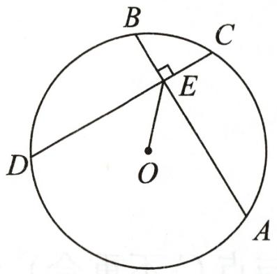

text_image

B
C
E
D
O
A

第1题图

A. $\frac{1}{2}$

B. 1

C. 2

D. 4

2. 已知在圆 O 中, 弦 AB 垂直弦 CD 于点 E.

(1)如图①,若 CE=BE,求证:AB=CD.   
(2)如图②,若 ${AB} = 8,{CD} = 6,{OE} = \sqrt{11}$ .

①求圆 O 的半径;  
②求弓形 CBD 的面积.

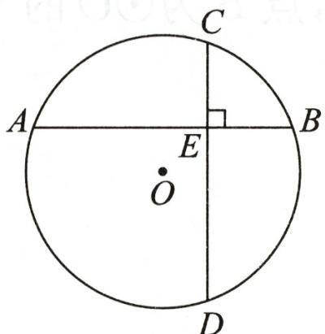

text_image

C
A	E	B
O
D

①

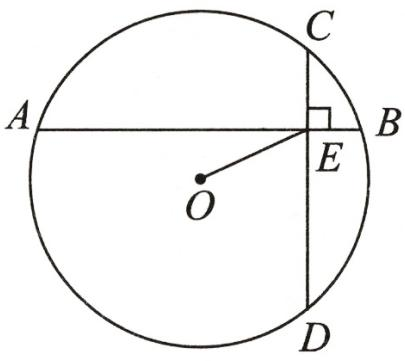

text_image

A
O
C
B
E
D

②   
第2题图

# 学霸微专题 27 最短弦问题

【方法指导】经过圆内一点(不是圆心)的最长弦是经过该点及该圆圆心的弦,最短弦是经过该点且垂直于过该点的直径的弦.

1. 如图, $D$ 是直径为 10 的 $\odot O$ 中一点, 若 $OD$ 长为 3 , 则过点 $D$ 的所有弦中, 最长弦与最

短弦的长度差为 （）

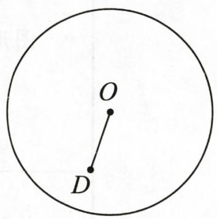

text_image

O
D

第1题图

A. 2

B. 6

C. 14

D. 18

2. 已知在平面直角坐标系内有一直线 $l: (2m+1)x + (m+1)y = 7m + 4$ .

(1)若不论 m 为何值, 直线 l 都经过一定点, 求这个定点的坐标;

(2)若以 $A(1,2)$ 为圆心, 3 为半径画 $\odot A$ , 求 $\odot A$ 被直线 $l$ 截得的最短弦长.

3. 对于 $\odot C$ 和 $\odot C$ 内一点 $P$ (点 $P$ 与点 $C$ 不重合), 给出如下定义: 过点 $P$ 可以作出无数条 $\odot C$ 的弦. 若在这些弦中, 长度为正整数的弦有 $k$ 条, 则称点 $P$ 为 $\odot C$ 的 $k$ 属相关点, $k$ 为点 $P$ 关于 $\odot C$ 的相关系数. 如图, 在平面直角坐标系 $xOy$ 中, 已知 $\odot O$ 的半径为 4.

(1) 当点 A 的坐标为 $(3,0)$ 时.

①经过点 A 的 $\odot O$ 的所有弦中, 最短的弦长为 \_\_\_\_ ;

②点 A 关于 $\odot O$ 的相关系数为 \_\_\_\_.

(2)已知点 $D(4,3)$ ，点 B 为 $\odot O$ 的 4 属相关点，求线段 DB 的取值范围.

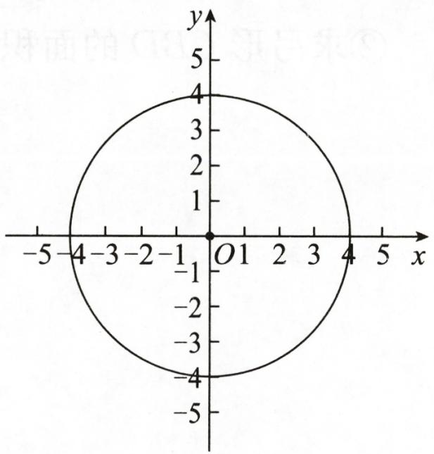

text_image

y
5
4
3
2
1
O 1 2 3 4 5 x
-1
-2
-3
-4
-5

第3题图

# 学霸微专题 28 构造辅助圆(隐圆)——根据定点、定长构造圆

【方法指导】已知定点和定长(几何语言:如图,OA=OB=OC=OD),点A,B,C,D在⊙O上.

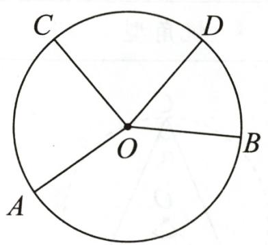

text_image

C
D
O
B
A

1. 如图, 在 $\triangle ABC$ 中, $AB = AC$ , $\angle BAC = 52^{\circ}$ , $D$ 是 $\triangle ABC$ 外一点, 且 $AD = AC$ , 则 $\angle BDC$ 的大小为 \_\_\_\_.

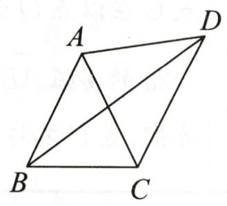

text_image

A
D
B
C

第1题图

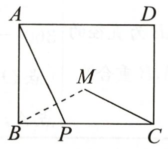

text_image

A
D
M
B
P
C

第2题图

2. 如图, 在矩形 $ABCD$ 中, 已知 $AB=3, BC=4, P$ 是 $BC$ 边上一动点 (点 $P$ 不与点 $B, C$ 重合), 连接 $AP$ , 作点 $B$ 关于直线 $AP$ 的对称点 $M$ , 则线段 $MC$ 的最小值为 \_\_\_\_.  
3. (2024·烟台改编)如图, 在 $\square ABCD$ 中, $\angle C = 120^{\circ}, AB = 8, BC = 10, E$ 为边 $CD$ 的中点, $F$ 为边 $AD$ 上的一动点, 将 $\triangle DEF$ 沿 $EF$ 翻折得 $\triangle D'EF$ , 连接 $AD', BD'$ , 求 $\triangle ABD'$ 面积的最小值.

text_image

A
F
D
D'
E
B
C

第3题图

# 学霸微专题 29 构造辅助圆(隐圆)——根据定弦、定角构造圆

# 【方法指导】

<table><tr><td colspan="3">在△ABC中,线段AB是定值,点C是动点,∠ACB是定角</td></tr><tr><td>直角型</td><td>锐角型</td><td>钝角型</td></tr><tr><td></td><td></td><td></td></tr><tr><td>点C在以点O为圆心,AB为直径的圆上运动(点C不与点A,B重合)</td><td>点C在以点O为圆心,圆心角为 $360^{\circ}-2\alpha$ 的优弧 $\widehat{ACB}$ 上运动(点O,C在AB同侧,点C不与点A,B重合)</td><td>点C在以点O为圆心,圆心角为 $360^{\circ}-2\alpha$ 的劣弧 $\widehat{AB}$ 上运动(点O,C在AB异侧,点C不与点A,B重合)</td></tr></table>

1. 如图, $\angle MON = 45^{\circ}$ , 直角三角尺 $ABC$ 的两个顶点 $C, A$ 分别在 $OM, ON$ 上移动. 若 $AC = 6$ , 则点 $O$ 到 $AC$ 的距离的最大值为 \_\_\_\_.

text_image

M
C
B
O
A
N

第1题图

text_image

y
C
B
P
O
A
x

第2题图

text_image

C
P
A
B

第3题图

2. 如图, 在平面直角坐标系 $xOy$ 中, 四边形 $OABC$ 是矩形, 点 $A, C$ 分别在 $x$ 轴、 $y$ 轴的正半轴上, 点 $B$ 的坐标为 $(1, 2)$ . 若点 $P$ 是第一象限内的一点, 且 $\angle OPC = 45^{\circ}$ , 则线段 $AP$ 最长时点 $P$ 的坐标为 \_\_\_\_.  
3. 如图, 在 $\triangle ABC$ 中, $\angle C = 90^{\circ}, AC = BC = 3, P$ 为 $\triangle ABC$ 内一个动点, $\angle PAB = \angle PBC$ , 则 $CP$ 的最小值为 \_\_\_\_.  
4. 在 $\triangle ABC$ 中, $AB=2$ , $\angle ACB=45^{\circ}$ , 求 $\triangle ABC$ 面积的最大值.

# 学霸微专题 30 常见辅助线——切线的性质

【方法指导】有切点,连半径,得垂直.连接过切点的半径,就能得到直角,再结合其他条件解决问题.

1. 如图, 已知 $\triangle ABE$ 为直角三角形, $\angle ABE = 90^{\circ}$ , $DE$ 为 $\odot O$ 的直径, $BC$ 为 $\odot O$ 的切线, $C$ 为切点, $CA = CD$ , 则 $\triangle ABC$ 和 $\triangle CDE$ 的面积之比为 ( )

A. $1 : 3$

B. $1: 2$

C. $\sqrt{2}: 2$

D. $(\sqrt{2} - 1): 1$

text_image

Geometric diagram showing a circle with points A, B, C, D, E and center O, including chords and tangent lines.

第1题图

text_image

Geometric diagram of a circle with inscribed quadrilateral ABCD and external point E, showing chords and intersections.

第2题图

2. 如图, 已知四边形 $ABCD$ 内接于 $\odot O$ , $AB$ 为 $\odot O$ 的直径, $C$ 为 $\widehat{BD}$ 的中点, 过点 $C$ 作 $\odot O$ 的切线与弦 $AD$ 的延长线交于点 $E$ , 连接 $AC, DB$ . 若 $\odot O$ 的半径为 $3, AD = 2$ , 则 $CE$ 的长为 \_\_\_\_.

3. 如图, 半径为 2 的 $\odot O$ 经过菱形 $ABCD$ 的三个顶点 $A, D, C$ , 且与 $AB$ 相切于点 $A$ , 求菱形 $ABCD$ 的边长.

text_image

A
D
O
B
C

第3题图

# 学霸微专题 31 常见辅助线——切线的判定

【方法指导】有交点,连半径,证垂直;无交点,作垂直,证半径.当待证的切线与圆有明确的公共点时,连接过公共点的半径,再证明垂直;当待证的切线与圆没有明确的公共点时,过圆心作待证切线的垂线段,再证明垂线段为圆的半径.

1. 如图, 在 Rt△ABC 中, ∠BAC=90°, CD 平分 ∠ACB, 交 AB 于点 D, 以点 D 为圆心, DA 的长为半径的 ⊙D 与 AB 相交于点 E. 判断直线 BC 与 ⊙D 的位置关系, 并证明你的结论.

text_image

Geometric diagram showing a circle with tangent lines and labeled points A, B, C, D, E

第1题图

2. 如图, $AD, BD$ 是 $\odot O$ 的弦, $AD \perp BD$ , 且 $BD = 2AD = 8$ , 点 $C$ 在 $BD$ 的延长线上, $CD = 2$ , 连接 $AC$ . 求证: $AC$ 是 $\odot O$ 的切线.

text_image

C
D
A
O
B

第2题图

3. 如图, $AB$ 是 $\odot O$ 的直径, 点 $C$ 在 $\odot O$ 上, $AD$ 平分 $\angle BAC$ 交 $\odot O$ 于点 $D$ , 过点 $D$ 作直线 $AC$ 的垂线, 交 $AC$ 的延长线于点 $E$ , 连接 $BD, CD$ .

(1)求证:BD=CD;   
(2)求证:直线 DE 是 $\odot O$ 的切线;  
(3) 若 $DE=\sqrt{3}$ , AB=4, 求 AD 的长.

text_image

E
C
D
A
O
B

第3题图

# 学霸微专题 32 切线长定理与内切圆

【方法指导】把握切线长定理的基本图形,理解内切圆的概念,利用切线的性质、切线长定理、面积法、勾股定理等解决多切线问题.

1. 如图, $\odot O$ 内切于正方形 $ABCD$ , 边 $AD, CD$ 分别与 $\odot O$ 切于点 $E, F$ , 点 $M, N$ 分别在线段 $DE, DF$ 上, 且 $MN$ 与 $\odot O$ 相切. 若 $\triangle MBN$ 的面积为 6 , 则 $\odot O$ 的半径为 ( )

A. $2 \sqrt{3}$

B. $\sqrt{10}$

C. $2\sqrt{2}$

D. $\sqrt{6}$

text_image

A
B
E
O
M
D
N
F
C

第1题图

text_image

D
A
O
C
B

第2题图

2. 如图, 四边形 $ABCD$ 为 $\odot O$ 的内接四边形, $\angle ABC = 90^{\circ}$ , $BD$ 平分 $\angle ABC$ . 若 $BD = 7\sqrt{2}$ , $AB = 6$ , 则 $\triangle ABC$ 的内心与外心之间的距离为 \_\_\_\_.

3. 如图, $\angle ACB = 45^{\circ}$ , 半径为 2 的 $\odot O$ 与角的两边相切, $P$ 是 $\odot O$ 上任意一点, 过点 $P$ 向角的两边作垂线, 垂足分别为 $E, F$ , 设 $t = PE + \sqrt{2}PF$ , 求 $t$ 的取值范围.

text_image

A
E
O
P
C
F
B

第3题图

# 学霸微专题33 正多边形与面积问题

【方法指导】由正多边形的性质求得中心角和内角度数,通过构造等腰三角形和直角三角形,结合勾股定理、面积公式等进行运算与推理.

1. 周长相等的正方形与正六边形的面积分别为 $S_{1}, S_{2}$ , 则 $S_{1}$ 和 $S_{2}$ 的关系为 ( )

A. $S_{1} = S_{2}$

B. $S_{1}: S_{2} = 3 \sqrt{3}: 16$

C. $S_{1}: S_{2} = \sqrt{3}: 3$

D. $S_{1}: S_{2} = \sqrt{3}: 2$

2. 用四个如图①所示的四边形和四个如图②所示的菱形拼成一个正八边形(如图③), 则图③中阴影部分的面积与空白部分的面积之比为\_\_\_\_。

  
①

  
②

natural_image

Geometric diagram of a star within an octagon, shaded with diagonal lines (no text or symbols)

③   
第2题图

3. 如图, 在正六边形 $ABCDEF$ 中, $AB = 6$ , 点 $M$ 在边 $AF$ 上, 且 $AM = 2$ . 若经过点 $M$ 的直线 $l$ 将正六边形的面积平分, 求直线 $l$ 被正六边形所截得的线段长.

text_image

A M F
B E
C D

第3题图

# 学霸微专题 34 弧长和扇形面积公式与圆锥中的计算

【方法指导】把握圆锥的母线长等于圆锥侧面展开扇形的半径,圆锥的底面周长等于圆锥侧面展开扇形的弧长这两个关系,注意弧长和扇形面积公式的正确运用.

1.《九章算术》是我国古代内容极为丰富的数学名著,书中有如下问题:“今有委米依垣内角,下周八尺,高五尺,问积及为米几何?”译文:屋内墙角处的米堆为一个圆锥的四分之一(如图),米堆底部的弧长为8尺,米堆的高为5尺,那么这个米堆遮挡的墙面面积为 ( )

A. $\frac{80}{\pi}$ 平方尺

B. $\frac{160}{\pi}$ 平方尺

C. $\frac{128}{\pi}$ 平方尺

D. $45 \pi$ 平方尺

natural_image

Cartoon illustration of a person standing next to a large 3D geometric shape with a question mark above their head, no text or symbols present.

第1题图

text_image

A
B
C
O

第2题图

2. (2024·苏州)铁艺花窗是园林设计中常见的装饰元素. 如图是一个花瓣造型的花窗示意图, 由六条等弧连接而成, 六条弧所对应的弦构成一个正六边形, 中心为点 $O, \widehat{AB}$ 所在圆的圆心 $C$ 恰好是 $\triangle ABO$ 的内心. 若 $AB = 2\sqrt{3}$ , 则花窗的周长 (图中实线部分的长度)为 \_\_\_\_. (结果保留 $\pi$ )

3. 如图, 从一个直径是 2 的圆形铁皮中剪下一个圆心角为 $90^{\circ}$ 的扇形.

(1)求这个扇形的面积；(结果保留 $\pi$ )  
(2)在剩下的三块余料中,能否从标号为③的余料中剪出一个圆作为底面与此扇形围成一个圆锥?请说明理由;  
(3)当 $\odot O$ 的半径 $R(R>0)$ 为任意值时,(2)中的结论是否仍然成立?请说明理由.

text_image

A
①
②
B
O
C
③

第3题图

# 学霸微专题 35 概率大小与概率模型辨析

【方法指导】根据题意辨析概率模型,从“列举法求概率”“几何概率”“用频率估计概率”中选择适当的方法求概率.在用列举法求概率时,特别注意,放回与不放回的区别.

1. 小明有 3 双黑袜子和 1 双白袜子。如果袜子不分左右, 那么从中随机抽取 2 只恰好配成一双的概率是\_\_\_\_; 如果袜子分左右, 从中随机抽取 2 只恰好配成一双的概率是\_\_\_\_。

2. 在课堂上,老师将除颜色外都相同的 1 个黑球和若干个白球放入一个不透明的口袋并搅匀,让全班同学依次进行摸球试验,每次随机摸出一个球,记下颜色再放回搅匀,下表是试验得到的一组数据.

<table><tr><td>摸球的次数n</td><td>100</td><td>150</td><td>200</td><td>500</td><td>800</td></tr><tr><td>摸到黑球的次数m</td><td>26</td><td>37</td><td>49</td><td>124</td><td>200</td></tr><tr><td>摸到黑球的频率 $\frac{m}{n}$ </td><td>0.260</td><td>0.247</td><td>0.245</td><td>0.248</td><td>a</td></tr></table>

(1)表中 a 的值等于 ;(精确到 0.001)  
(2)估算口袋中自球的个数为；  
(3)连续两名同学都摸出白球的概率为

3. 如图, 放在平面直角坐标系中的正方形 $ABCD$ 的边长为 4 , 现做如下试验: 抛掷一枚均匀的正四面体骰子 (它有四个顶点, 各顶点的点数分别是 1 至 4 这四个数字中一个), 每个顶点朝上的机会是相同的, 连续抛掷两次, 将骰子朝上的顶点的点数作为平面直角坐标系中点 $P$ 的坐标 (第一次的点数作横坐标, 第二次的点数作纵坐标).

(1)求点 P 落在正方形 ABCD 上(含正方形内部和边界)的概率;  
(2)将正方形 ABCD 平移整数个单位长度,是否存在一种平移,使点 P 落在正方形 ABCD 上的概率为 $\frac{3}{4}$ ? 若存在,指出其中的一种平移方式;若不存在,请说明理由.

text_image

A
2
D
O
2
x
B
C
y

第3题图

natural_image

Abstract grayscale graphic with diagonal gradient and two small circles (no text or symbols)

natural_image

Pure geometric lines forming a zigzag pattern without any text, numbers, or symbols

natural_image

Grid of uniform gray circular patterns on white background (no text or symbols)

