1-1/3

# 运算题卡

# 数学

# 九年级（上）R

基本功训练

# 目录

运算题卡 1 直接开平方法解一元二次方程 …… 1

运算题卡 2 解一元二次方程(配方法) …… 2

运算题卡 3 配方法求最值 …… 3

运算题卡 4 解一元二次方程(公式法) …… 4

运算题卡 5 根的判别式 …… 5

运算题卡 6 解一元二次方程(因式分解法) …… 6

运算题卡 7 一元二次方程的根与系数的关系 …… 7

运算题卡 8 选择合适的方法解一元二次方程 …… 8

运算题卡 9 抛物线的开口方向、对称轴、顶点坐标 …… 9

运算题卡 10 待定系数法求二次函数解析式 …… 10

运算题卡 11 与二次函数相关的图形面积 …… 11

运算题卡 12 二次函数的应用 …… 13

运算题卡 13 弧长的计算 …… 14

运算题卡 14 扇形面积的计算 …… 15

运算题卡 15 圆锥的计算 …… 16

(答案见《参考答案》第51\~54页)

# 运算题卡1 直接开平方法解一元二次方程

用直接开平方法解一元二次方程：

1. $x^{2} - 9 = 0$

2. $2x^{2}-3=9$ ;

3. $4x^{2} - 13 = 12$

4. $x^{2} - 5 = \frac{4}{9}$ ;

5. $(x - 1)^{2} = 3$ ;

6. $(2x - 3)^{2} = 25$ ;

7. $(2x - 1)^{2} - 121 = 0$ ;

8. $3(x + 1)^{2} = 27$

9. $2(3x-2)^{2}-18=0;$

10. $(2x - 1)^{2} = (3 - x)^{2}$ .

# 运算题卡 2 解一元二次方程(配方法)

用配方法解一元二次方程：

1. $x^{2} - 2x = 1$ ;

2. $x^{2}+4x=3;$

3. $x^{2}+2\sqrt{5}x=4;$

4. $x^{2}-6x+8=0;$

5. $x^{2} - 8x - 1 = 0$

6. $x^{2} - 6x - 4 = 0$

7. $x^{2} + 2x - 4 = 0$

8. $3x^{2} - 6x + 2 = 0$

9. $2x^{2} + 10x - 9 = 0$

10. $2x^{2} - 7x + 6 = 0.$

# 运算题卡 3 配方法求最值

1. 用配方法证明 $-9x^{2} + 8x - 2$ 的值小于0.

2. 用配方法证明 $2x^{2} - 4x + 5$ 的最小值为 3.

3. 用配方法证明 $-2x^{2} + 6x - 5$ 的最大值为 $-\frac{1}{2}$ .

4. 用配方法证明 $2x^{2} - x + 3$ 的最小值为 $\frac{23}{8}$ .

5. 用配方法证明 $x^{2} - 4x + 5$ 的值不小于 1.

# 运算题卡 4 解一元二次方程(公式法)

用公式法解一元二次方程：

1. $2x^{2} + x - 2 = 0$

2. $x^{2} - 2x = 5$

3. $x^{2}-6x+9=0;$

4. $x^{2} - 4x + 5 = 0$

5. $2x^{2}-3x-1=0;$

6. $x^{2} - 4x - 3 = 0$

7. $x^{2} + 4x - 2 = 0$

8. $2x^{2}+4x-3=0;$

9. $x^{2} + \sqrt{5} x - 1 = 0$

10. $\frac{1}{2} x^{2}-\frac{1}{4} x-1=0.$

# 运算题卡 5 根的判别式

1. 不解方程, 判断下列一元二次方程的根的情况.

(1) $x^{2}-x-1=0;$

(2) $x^{2}+2x=-1;$

(3) $3x^{2}-2x+4=0.$

2. 若关于 $x$ 的一元二次方程 $x^{2} - x + k + 1 = 0$ 有两个实数根, 求 $k$ 的取值范围.

3. 求证: 一元二次方程 $x^{2} + mx - (m + 2) = 0$ 有两个不相等的实数根.

4. 已知关于 $x$ 的一元二次方程 $(m + 1)x^{2} - 3x + 2 = 0$ ( $m$ 为常数).

(1)如果方程有两个不相等的实数根,求 m 的取值范围;  
(2)如果方程有两个相等的实数根,求 m 的值;  
(3)如果方程没有实数根,求 m 的取值范围.

# 运算题卡 6 解一元二次方程(因式分解法)

用因式分解法解一元二次方程：

$$
y ^ {2} - 7 y + 6 = 0;
$$

$$
2. x ^ {2} + 1 0 x + 1 6 = 0;
$$

$$
3. x ^ {2} - 2 x - 3 = 0;
$$

$$
4. x ^ {2} = 4 x;
$$

$$
x ^ {2} + 8 x - 9 = 0;
$$

$$
6. 2 x ^ {2} - 4 x = 0;
$$

$$
7. 2 x (x - 1) = 3 (x - 1);
$$

$$
x (x + 1) = 2 x + 2;
$$

$$
9. (x - 3) ^ {2} = 2 (x - 3);
$$

$$
1 0. (x - 2) ^ {2} = (2 x + 3) ^ {2}.
$$

# 运算题卡7 一元二次方程的根与系数的关系

1. 已知 $x_{1}, x_{2}$ 是一元二次方程 $x^{2} - 3x - 1 = 0$ 的两根, 不解方程, 求 $\frac{1}{x_1} + \frac{1}{x_2}$ 的值.

2. 已知 $x_{1}, x_{2}$ 是方程 $x^{2} + x - 3 = 0$ 的两个根, 求 $\frac{x_{2}}{x_{1}} + \frac{x_{1}}{x_{2}}$ 的值.

3. 已知 $x_{1}, x_{2}$ 是一元二次方程 $x^{2} - 3x - 4 = 0$ 的两个实数根, 求 $(1 + x_{1})(1 + x_{2})$ 的值.

4. 已知 $x_{1}, x_{2}$ 是方程 $2x^{2} - 3x - 5 = 0$ 的两个根, 不解方程, 求下列代数式的值:

(1) $x_{1}^{2}x_{2}+x_{1}x_{2}^{2};$

(2) $x_{1}^{2}+x_{2}^{2}$ ;

(3) $\left|x_{1}-x_{2}\right|$ .

5. 已知关于 $x$ 的一元二次方程 $k^2 x^2 + 2(k - 1)x + 1 = 0$ , 若方程的两个实数根的倒数的平方和等于 14, 求 $k$ 的值.

# 运算题卡8 选择合适的方法解一元二次方程

用适当的方法解下列方程：

1. $(x - 1)^{2} = 9$ ;

2. $x^{2} - x - 12 = 0$ ;

3. $2x^{2} - 3x - 5 = 0$

4. $2x^{2}-4x-7=0;$

5. $x^{2} + 4x - 5 = 0$

6. $3x^{2}+10x-8=0;$

7. $3(x - 5)^{2} = 2(5 - x)$ ;

8. $x(x + 3) = 2x + 6$ ;

9. $(x - 1)(x + 3) = 12$ ;

10. $x(x + 4) = 3(x + 4)$ .

# 运算题卡 9 抛物线的开口方向、对称轴、顶点坐标

1. 请按要求求下列二次函数图象的对称轴和顶点坐标：

(1) $y=2x^{2}+12x+21$ ;(用配方法)

(2) $y = -3x^{2} + 5x + 1$ . (用公式法)

2. 求抛物线 $y = 3x^{2} - 6x$ 的开口方向、对称轴和顶点坐标.

3. 求抛物线 $y=\frac{1}{2}x^{2}-x+3$ 的开口方向、对称轴和顶点坐标.

4. 已知点(2,0)在抛物线 $y = -3x^{2} + (k+3)x - k$ 上, 求此抛物线的对称轴.

5. 已知 $y=(m-2)x^{m^{2}-m}+3x+6$ 是关于 x 的二次函数.

(1)求 $m$ 的值;

(2)写出这个二次函数的图象的对称轴及顶点坐标.

# 运算题卡10 待定系数法求二次函数解析式

1. 已知 $y_1$ 与 $x^2 + 1$ 成正比例, $y_2$ 与 $x - 1$ 成正比例, $y = y_1 + y_2$ , 当 $x = 1$ 时, $y = 4$ , 当 $x = -2$ 时, $y = 7$ . 求 $y$ 关于 $x$ 的函数解析式.

2. 已知抛物线 $y=ax^{2}+bx-1$ 经过 A(1,2), B(-3,2) 两点, 求该抛物线的函数解析式.

3. 已知一条抛物线过点(1,3)，且顶点坐标为(2,1)，求该抛物线的函数解析式.

4. 二次函数 $y = ax^{2} + bx + c$ 的图象经过(0, -1)与(3,5)两点, 对称轴是直线 $x = 1$ . 求这个二次函数的解析式.

5. 已知二次函数的图象经过三点 $A(-1,0), B(0,2), C(2,0)$ , 求此二次函数的解析式.

# 运算题卡 11 与二次函数相关的图形面积

1. 求直线 $y = 2x + 8$ 与抛物线 $y = x^{2}$ 的交点 $A, B$ 的坐标 (点 $A$ 在点 $B$ 的左侧) 及 $\triangle AOB$ 的面积.

2. 如图, 在平面直角坐标系中, $O$ 为坐标原点, 抛物线 $y = -\frac{1}{2} x^2 + bx$ 与 $x$ 轴正半轴交于点 $A$ , 点 $B$ 是 $y$ 轴负半轴上一点, 点 $A$ 关于点 $B$ 的对称点 $C$ 在该抛物线上, 过点 $C$ 作 $y$ 轴的垂线交抛物线于点 $D$ , 连接 $OC, AD$ . 若点 $C$ 的横坐标为 $-2$ , 求四边形 OCDA 的面积.

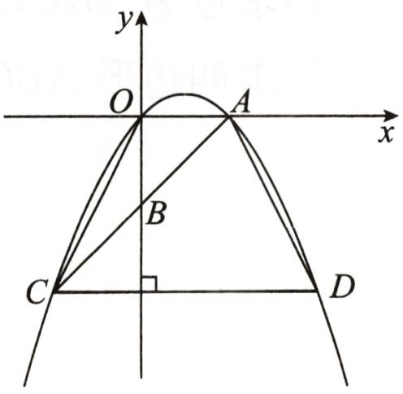

text_image

y
O
A
x
B
C
D

第2题图

3. 如图, 在平面直角坐标系中, 抛物线经过 $A(-1,0), B(3,0)$ 和 $C(0,3)$ , 点 $P$ 是直线 $BC$ 上方抛物线上的一个动点 (且不与点 $B, C$ 重合).

(1)求抛物线的函数解析式;

(2)求 $\triangle PBC$ 面积的最大值.

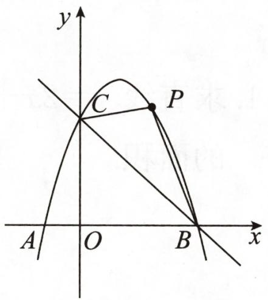

text_image

y
C
P
A O B x

第3题图

4. 如图, 抛物线 $y = -x^{2} + 4x + 5$ 与 $x$ 轴交于 $A, B$ 两点, 与 $y$ 轴交于点 $C$ , 抛物线的顶点为 $D$ .

(1)求点 A, B, C, D 的坐标;

(2)求四边形 ABCD 的面积.

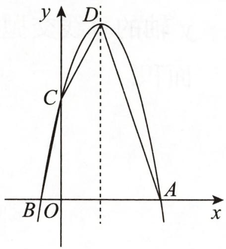

text_image

y
D
C
B O
A
x

第4题图

# 运算题卡 12 二次函数的应用

1. 如图, 有长为 24 米的篱笆, 一面利用墙 (墙的最大可用长度 $a$ 为 15 米) 围成中间隔有一道篱笆的长方形花圃. 设花圃的宽 $AB$ 为 $x$ 米, 面积为 $S$ .

(1)求 S 与 x 的函数关系式;  
(2)当 $AB$ 的长为多少时, 花圃的面积最大? 最大值是多少?

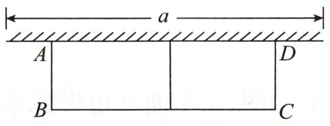

text_image

a
A
B
C
D

第1题图

2. 某商品的进价为每件 40 元, 当售价为每件 60 元时, 每个月可售出 100 件. 根据市场行情, 现决定涨价销售, 调查反映, 每件商品的售价每涨价 1 元, 每月要少卖出 2 件. 设每件商品的售价为 $x(x$ 为整数)元, 每个月的销量为 $y$ 件.

(1)求 y 与 x 之间的函数关系式,并写出 x 的取值范围;  
(2)当每件商品的售价定为多少元时,月销售利润最大? 最大月销售利润为多少元?

3. 如图①, 单孔拱桥的形状近似于抛物线, 建立如图②所示的平面直角坐标系, 在正常水位时, 水面宽度 $AB$ 为 $12 \mathrm{~m}$ , 拱桥的最高点 $C$ 到水面 $AB$ 的距离为 $6 \mathrm{~m}$ .

(1)求抛物线的函数解析式;   
(2)因为上游水库泄洪,水面宽度变为10 m,求水面上涨的高度.

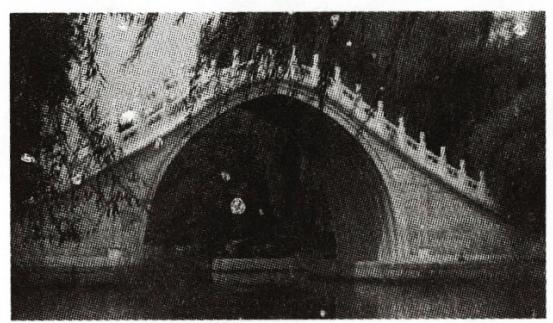

natural_image

Black-and-white photo of a traditional stone arch bridge with carved railings, partially obscured by trees (no visible text or symbols)

①

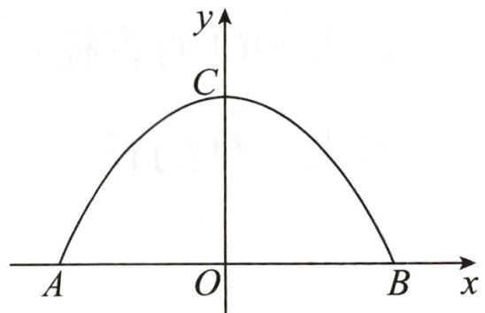

text_image

y
C
A O B x

②   
第3题图

# 运算题卡 13 弧长的计算

1. 已知 $75^{\circ}$ 的圆心角所对的弧长为 $5 \pi$ , 则这段弧所在圆的半径为  
2. 已知一段弧长为 $3 \pi \mathrm{~cm}$ , 这段弧所在圆的半径为 $6 \mathrm{~cm}$ , 求这段弧所对的圆心角的度数.

3. 如图, 在平面直角坐标系中, 已知 $\triangle ABC$ 的三个顶点的坐标分别为 $A(-1, 1), B(-2, 2)$ , $C(-4, 0)$ , 将 $\triangle ABC$ 绕原点 $O$ 顺时针旋转 $90^{\circ}$ 后得到 $\triangle A_{1}B_{1}C_{1}$ .

(1)作出 $\triangle A_{1}B_{1}C_{1}$ ,并写出 $A_{1},B_{1},C_{1}$ 三点的坐标;   
(2)求点 B 旋转到点 $B_{1}$ 的弧长.

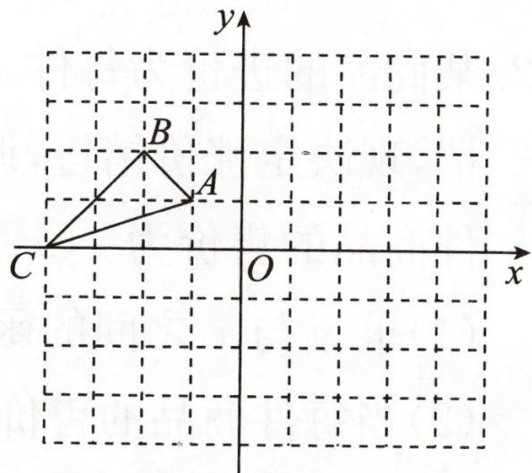

text_image

y
B
A
C
O
x

第3题图

4. 如图, $A, B, C$ 三点在半径为 1 的 $\odot O$ 上, 四边形 $ABCO$ 是菱形, 求 $\widehat{AC}$ 的长.

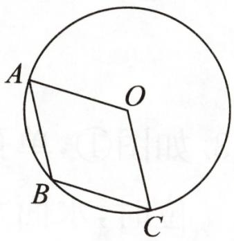

text_image

A
O
B
C

第4题图

5. 如图, $AB$ 是 $\odot O$ 的直径, 点 $C, D$ 均在 $\odot O$ 上, $\angle ACD = 30^{\circ}$ , 弦 $AD = 4$ , 连接 $BD$ .

(1)求 $\odot O$ 的直径;  
(2)求 $\widehat{AD}$ 的长.

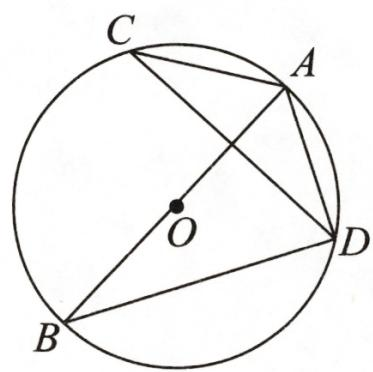

text_image

C
A
O
B
D

第5题图

# 运算题卡 14 扇形面积的计算

1. 如图, 点 $A, B, C$ 在直径为 2 的 $\odot O$ 上, $\angle BAC = 45^{\circ}$ , 求图中阴影部分的面积. (结果保留 $\pi$ )

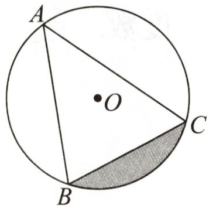

text_image

A
O
B
C

第1题图

2. 如图, 点 $C$ 在以 $AB$ 为直径的半圆 $O$ 上, $AC = BC$ . 以点 $B$ 为圆心, $BC$ 的长为半径画圆弧交 $AB$ 于点 $D$ .

(1)求 $\angle ABC$ 的度数;   
(2)若 AB=4, 求阴影部分的面积.

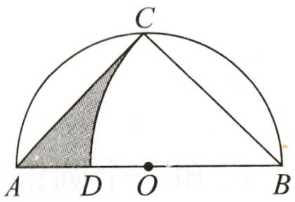

text_image

C
A D O B

第2题图

3. 如图, 已知 $\odot O$ 是正六边形 $A B C D E F$ 的外接圆, 若 $A B = 2$ , 求阴影部分的面积.

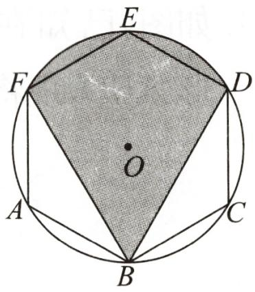

text_image

E
F
D
O
A
B
C

第3题图

# 运算题卡15 圆锥的计算

1. 已知圆锥的底面半径为 3, 母线长为 6, 求此圆锥的侧面展开图扇形的面积和圆心角的度数.

2. 已知圆锥的侧面展开图是一个半径为 $12 \, cm$ ，弧长为 $12\pi \, cm$ 的扇形，求这个圆锥的侧面积和高。

3. 已知一个圆锥的高为 $3\sqrt{3}$ ，侧面展开图是半圆。

(1)求该圆锥的母线长与底面圆的半径的比;   
(2)求该圆锥的全面积.

4. 如图, 已知在正方形 $ABCD$ 中, $AB = 4$ , 以点 $A$ 为圆心, $AB$ 的长为半径画弧得到扇形 $ABD$ , 现将该扇形作一个圆锥的侧面, 求出该圆锥的底面圆的半径.

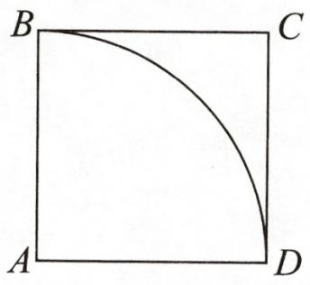

text_image

B
C
A
D

第4题图