# 启东中学 附夹册、 作业本

附夹册、夹卷

九年级数学上R

数学学科编写组 编

学霸微专题

基础题卡

运算题上

扫码获取

更多资源


# 版权所有 侵权必究

举报电话:010-64031958

咨询热线:010-64034160

# 图书在版编目(CIP)数据

启东中学作业本. 九年级数学. 上: R / 数学学科编写组编.

-- 北京：龙门书局，2006.4（2025.2 重印）

ISBN 978-7-5088-0939-7

I. ①启... II. ①数... III. ①数学课-初中-习题 IV. ①G634

中国版本图书馆 CIP 数据核字(2006)第 023542 号

责任编辑: 唐旸 赵晓云 王岩 / 责任校对: 孙聪明

责任印制:冯岩 / 封面设计:霍影影

龍門書局出版

北京东黄城根北街 16 号

邮政编码:100717

www.longmenshuju.com

航远印刷有限公司 印刷

科学出版社总发行 各地书店经销

\*

2006年4月第一版 开本:A4(880×1230)

2025年2月第十九次修订版 印张:223/4

2025年2月第六十七次印刷 字数:570 000

定价：59.00元

(如有印装质量问题,我社负责调换)

# “五维” 学习法

# 基本功担当

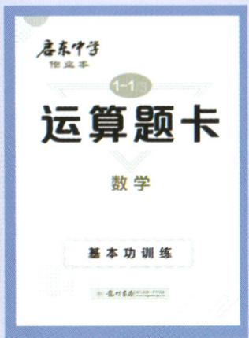

<details>
<summary>text_image</summary>

唐东中学
他定本
1-1
运算题卡
数学
基本功训练
</details>

运算题卡

难度系数:


基本功训练

计算不失分

# 基础担当

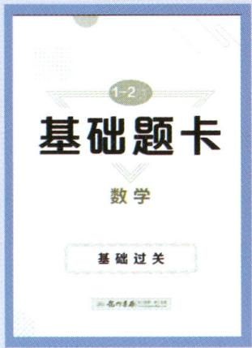

<details>
<summary>text_image</summary>

1-2
基础题卡
数学
基础过关
</details>

基础题卡

难度系数:


基础过关 小题满分

# 能力担当

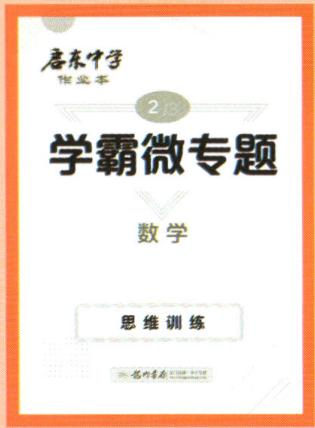

<details>
<summary>text_image</summary>

唐东中学
作业本
2
学霸微专题
数学
思维训练
</details>

学霸微专题

难度系数:


思维训练 高分秘籍

# 进步担当

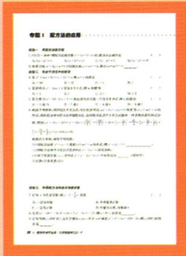

<details>
<summary>text_image</summary>

专题1：配方法的应用

一、重点分析
1. 一个概念：一种物理方法是数学，它是一种简单的物理方法，即在某种概念上都具有不同的意义。
2. 一个概念：一种数学方法，它是一种简单的物理方法，即在某种概念上都具有不同的意义。
3. 一个概念：一种数学方法，它是一种简单的物理方法，即在某种概念上都具有不同的意义。
4. 一个概念：一种数学方法，它是一种简单的物理方法，即在某种概念上都具有不同的意义。
5. 一个概念：一种数学方法，它是一种简单的物理方法，即在某种概念上都具有不同的意义。
6. 一个概念：一种数学方法，它是一种简单的物理方法，即在某种概念上都具有不同的意义。
7. 一个概念：一种数学方法，它是一种简单的物理方法，即在某种概念上都具有不同的意义。
8. 一个概念：一种数学方法，它是一种简单的物理方法，即在某种概念上都具有不同的意义。
9. 一个概念：一种数学方法，它是一种简单的物理方法，即在某种概念上都具有不同的意义。
10. 一个概念：一种数学方法，它是一种简单的物理方法，即在某种概念上都具有不同的意义。
11. 一个概念：一种数学方法，它是一种简单的物理方法，即在某种概念上都具有不同的意义。
12. 一个概念：一种数学方法，它是一种简单的物理方法，即在某种概念上都具有不同的意义。
13. 一个概念：一种数学方法，它是一种简单的物理方法，即在某种概念上都具有不同的意义。
14. 一个概念：一种数学方法，它是一种简单的物理方法，即在某种概念上都具有不同的意义。
15. 一个概念：一种数学方法，它是一种简单的物理方法，即在某种概念上都具有不同的意义。
16. 一个概念：一种数学方法，它是一种简单的物理方法，即在某种概念上都具有不同的意义。
17. 一个概念：一种数学方法，它是一种简单的物理方法，即在某种概念上都具有不同的意义。
18. 一个概念：一种数学方法，它是一种简单的物理方法，即在某种概念上都具有不同的意义。
19. 一个概念：一种数学方法，它是一种简单的物理方法，即在某种概念上都具有不同的意义。
20. 一个概念：一种数学方法，它是一种简单的物理方法，即在某种概念上都具有不同的意义。
21. 一个概念：一种数学方法，它是一种简单的物理方法，即在某种概念上都具有不同的意义。
22. 一个概念：一种数学方法，它是一种简单的物理方法，即在某种概念上都具有不同的意义。
23. 一个概念：一种数学方法，它是一种简单的物理方法，即在某种概念上都具有不同的意义。
24. 一个概念：一种数学方法，它是一种简单的物理方法，即在某种概念上都具有不同的意义。
25. 一个概念：一种数学方法，它是一种简单的物理方法，即在某种概念上都具有不同的意义。
26. 一个概念：一种数学方法，它是一种简单的物理方法，即在某种概念上都具有不同的意义。
27. 一个概念：一种数学方法，它是一种简单的物理方法，即在某种概念上都具有不同的意义。
28. 一个概念：一种数学方法，它是一种简单的物理方法，即在某种概念上都具有不同的意义。
29. 一个概念：一种数学方法，它是一种简单的物理方法，即在某种概念上都具有不同的意义。
30. 一个概念：一种数学方法，它是一种简单的物理方法，即在某种概念上都具有不同的意义。
31. 一个概念：一种数学方法，它是一种简单的物理方法，即在某种概念上都具有不同的意义。
32. 一个概念：一种数学方法，它是一种简单的物理方法，即在某种概念上都具有不同的意义。
33. 一个概念：一种数学方法，它是一种简单的物理方法，即在某种概念上都具有不同的意义。
34. 一个概念：一种数学方法，它是一种简单的物理方法，即在某种概念上都具有不同的意义。
35. 一个概念：一种数学方法，它是一种简单的物理方法，即在某种概念上都具有不同的意义。
36. 一个概念：一种数学方法，它是一种简单的物理方法，即在某种概念上都具有不同的意义。
37. 一个概念：一种数学方法，它是一种简单的物理方法，即在某种概念上都具有不同的意义。
38. 一个概念：一种数学方法，它是一种简单的物理方法，即在某种概念上都具有不同的意义。
39. 一个概念：一种数学方法，它是一种简单的物理方法，即在某种概念上都具有不同的意义。
40. 一个概念：一种数学方法，它是一种简单的物理方法，即在某种概念上都具有不同的意义。
41. 一个概念：一种数学方法，它是一种简单的物理方法，即在某种概念上都具有不同的意义。
42. 一个概念：一种数学方法，它是一种简单的物理方法，即在某种概念上都具有不同的意义。
43. 一个概念：一种数学方法，它是一种简单的物理方法，即在某种概念上都具有不同的意义。
44. 一个概念：一种数学方法，它是一种简单的物理方法，即在某种概念上都具有不同的意义。
45. 一个概念：一种数学方法，它是一种简单的物理方法，即在某种概念上都具有不同的意义。
46. 一个概念：一种数学方法，它是一种简单的物理方法，即在某种概念上都具有不同的意义。
47. 一个概念：一种数学方法，它是一种简单的物理方法，即在某种概念上都具有不同的意义。
48. 一个概念：一种数学方法，它是一种简单的物理方法，即在某种概念上都具有不同的意义。
49. 一个概念：一种数学方法，它是一种简单的物理方法，即在某种概念上都具有不同的意义。
50. 一个概念：一种数学方法，它是一种简单的物理方法，即在某种概念上都具有不同的意义。
51. 一个概念：一种数学方法，它是一种简单的物理方法，即在某种概念上都具有不同的意义。
52. 一个概念：一种数学方法，它是一种简单的物理方法，即在某种概念上都具有不同的意义。
53. 一个概念：一种数学方法，它是一种简单的物理方法，即在某种概念上都具有不同的意义。
54. 一个概念：一种数学方法，它是一种简单的物理方法，即在某种概念上都具有不同的意义。
55. 一个概念：一种数学方法，它是一种简单的物理方法，即在某种概念上都具有不同的意义。
56. 一个概念：一种数学方法，它是一种简单的物理方法，即在某种概念上都具有不同的意义。
57. 一个概念：一种数学方法，它是一种简单的物理方法，即在某种概念上都具有不同的意义。
58. 一个概念：一种数学方法，它是一种简单的物理方法，即在某种概念上都具有不同的意义。
59. 一个概念：一种数学方法，它是一种简单的物理方法，即在某种概念上都具有不同的意义。
60. 一个概念：一种数学方法，它是一种简单的物理方法，即在某种概念上都具有不同的意义。
61. 一个概念：一种数学方法，它是一种简单的物理方法，即在某种概念上都具有不同的意义。
62. 一个概念：一种数学方法，它是一种简单的物理方法，即在某种概念上都具有不同的意义。
63. 一个概念：一种数学方法，它是一种简单的物理方法，即在某种概念上都具有不同的意义。
64. 一个概念：一种数学方法，它是一种简单的物理方法，即在某种概念上都具有不同的意义。
65. 一个概念：一种数学方法，它是一种简单的物理方法，即在某种概念上都具有不同的意义。
66. 一个概念：一种数学方法，它是一种简单的物理方法，即在某种概念上都具有不同的意义。
67. 一个概念：一种数学方法，它是一种简单的物理方法，即在某种概念上都具有不同的意义。
68. 一个概念：一种数学方法，它是一种简单的物理方法，即在某种概念上都具有不同的意义。
69. 一个概念：一种数学方法，它是一种简单的物理方法，即在某种概念上都具有不同的意义。
70. 一个概念：一种数学方法，它是一种简单的物理方法，即在某种概念上都具有不同的意义。
71. 一个概念：一种数学方法，它是一种简单的物理方法，即在某种概念上都具有不同的意义。
72. 一个概念：一种数学方法，它是一种简单的物理方法，即在某种概念上都具有不同的意义。
73. 一个概念：一种数学方法，它是一种简单的物理方法，即在某种概念上都具有不同的意义。
74. 一个概念：一种数学方法，它是一种简单的物理方法，即在某种概念上都具有不同的意义。
75. 一个概念：一种数学方法，它是一种简单的物理方法，即在某种概念上都具有不同的意义。
76. 一个概念：一种数学方法，它是一种简单的物理方法，即在某种概念上都具有不同的意义。
77. 一个概念：一种数学方法，它是一种简单的物理方法，即在某种概念上都具有不同的意义。
78. 一个概念：一种数学方法，它是一种简单的物理方法，即在某种概念上都具有不同的意义。
79. 一个概念：一种数学方法，它是一种简单的物理方法，即在某种概念上都具有不同的意义。
80. 一个概念：一种数学方法，它是一种简单的物理方法，即在某种概念上都具有不同的意义。
81. 一个概念：一种数学方法，它是一种简单的物理方法，即在某种概念上都具有不同的意义。
82. 一个概念：一种数学方法，它是一种简单的物理方法，即在某种概念上都具有不同的意义。
83. 一个概念：一种数学方法，它是一种简单的物理方法，即在某种概念上都具有不同的意义。
84. 一个概念：一种数学方法，它是一种简单的物理方法，即在某种概念上都具有不同的意义。
85. 一个概念：一种数学方法，它是一种简单的物理方法，即在某种概念上都具有不同的意义。
86. 一个概念：一种数学方法，它是一种简单的物理方法，即在某种概念上都具有不同的意义。
87. 一个概念：一种数学方法，它是一种简单的物理方法，即在某种概念上都具有不同的意义。
88. 一个概念：一种数学方法，它是一种简单的物理方法，即在某种概念上都具有不同的意义。
89. 一个概念：一种数学方法，它是一种简单的物理方法，即在某种概念上都具有不同的意义。
90. 一个概念：一种数学方法，它是一种简单的物理方法，即在某种概念上都具有不同的意义。
91. 一个概念：一种数学方法，它是一种简单的物理方法，即在某种概念上都具有不同的意义。
92. 一个概念：一种数学方法，它是一种简单的物理方法，即在某种概念上都具有不同的意义。
93. 一个概念：一种数学方法，它是一种简单的物理方法，即在某种概念上都具有不同的意义。
94. 一个概念：一种数学方法，它是一种简单的物理方法，即在某种概念上都具有不同的意义。
95. 一个概念：一种数学法
, 定理为所有函数的定义
若以下情况可参见下列内容：
- 求于一定值的计算
- 求于一定值的计算
- 求于一定值的计算
- 求于一定值的计算
- 求于一定值的计算
- 求于一定值的计算
- 求于一定值的计算
- 求于一定值的计算
- 求于一定值的计算
- 求于一定值的计算
- 求于一定值的计算

一般说明：
1. 在“一般”选项下，
当“一般”选项有多个数字（如字母、字母、字母等），则可以表示相同数字。2.
当“一般”选项有多个数字（如字母、字母等），则可以表示相同数字。3.
当“一般”选项有多个数字（如字母、字母等），则可以表示相同数字。4.
当“一般”选项有多个数字（如字母、字母等），则可以表示相同数字。5.
当“一般”选项有多个数字（如字母、字母等），则可以表示相同数字。6.
当“一般”选项有多个数字（如字母、字母等），则可以表示相同数字。7.
当“一般”选项有多个数字（如字母、字母等），则可以表示相同数字。8.
当“一般”选项有多个数字（如字母、字母等），则可以表示相同数字。9.
当“一般”选项有多个数字（如字母、字母等），则可以表示相同数字。10.
当“一般”选项有多个数字（如字母、字母等），则可以表示相同数字。11.
当“一般”选项有多个数字（如字母、字母等），则可以表示相同数字。12.
当“一般”选项有多个数字（如字母、字母等），则可以表示相同数字。13.
当“一般”选项有多个数字（如字母、字母等），则可以表示相同数字。14.
当“一般”选项有多个数字（如字母、字母等），则可以表示相同数字。15.
当“一般”选项有多个数字（如字母、字母等），则可以表示相同数字。16.
当“一般”选项有多个数字（如字母、字母等），则可以表示相同数字。17.
当“一般”选项有多个数字（如字母、字母等），则可以表示相同数字。18.
当“一般”选项有多个数字（如字母、字母等），则可以表示相同数字。19.
当“一般”选项有多个数字（如字母、字母等），则可以表示相同数字。20.
当“一般”选项有多个数字（如字母、字母等），则可以表示相同数字。21.
当“一般”选项有多个数字（如字母、字母等），则可以表示相同数字。22.
当“一般”选项有多个数字（如字母、字母等），则可以表示相同数字。23.
当“一般”选项有多个数字（如字母、字母等），则可以表示相同数字。24.
当“一般”选项有多个数字（如字母、字母等），则可以表示相同数字。25.
当“一般”选项有多个数字（如字母、字母等），则可以表示相同数字。26.
当“一般”选项有多个数字（如字母、字母等），则可以表示相同数字。27.
当“一般”选项有多个数字（如字母、字母等），则可以表示相同数字。28.
当“一般”选项有多个数字（如字母、字母等），则可以表示相同数字。29.
当“一般”选项有多个数字（如字母、字母等），则可以表示相同数字。30.
当“一般”选项有多个数字（如字母、字母等），则可以表示相同数字。31.
当“一般”选项有多个数字（如字母、字母等），则可以表示相同数字。32.
当“一般”选项有多个数字（如字母、字母等），则可以表示相同数字。33.
当“一般”选项有多个数字（如字母、字母等），则可以表示相同数字。34.
当“一般”选项有多个数字（如字母、字母等），则可以表示相同数字。35.
当“一般”选项有多个数字（如字母、字母等），则可以表示相同数字。36.
当“一般”选项有多个数字（如字母、字母等），则可以表示相同数字。37.
当“一般”选项有多个数字（如字母、字母等），则可以表示相同数字。38.
当“一般”选项有多个数字（如字母、字母等），则可以表示相同数字。39.
当“一般”选项有多个数字（如字母、字母等），则可以表示相同数字。40.
当“一般”选项有多个数字（如字母、字母等），则可以表示相同数字。41.
当“一般”选项有多个数字（如字母、字母等），则可以表示相同数字。42.
当“一般”选项有多个数字（如字母、字母等），则可以表示相同数字。43.
当“一般”选项有多个数字（如字母、字母等），则可以表示相同数字。44.
当“一般”选项有多个数字（如字母、字母等），则可以表示相同数字。45.
当“一般”选项有多个数字（如字母、字母等），则可以表示相同数字。46.
当“一般”选项有多个数字（如字母、字母等），则可以表示相同数字。47.
当“一般”选项有多个数字（如字母、字母等），则可以表示相同数字。48.
当“一般”选项有多个数字（如字母、字母等），则可以表示相同数字。49.
当“一般”选项有多个数字（如字母、字母等），则可以表示相同数字。50.
当“一般”选项有多个数字（如字母、字母等），则可以表示相同数字。51.
当“一般”选项有多个数字（如字母、字母等），则可以表示相同数字。52.
当“一般”选项有多个数字（如字母、字母等），则可以表示相同数字。53.
当“一般”选项有多个数字（如字母、字母等），则可以表示相同数字。54.
当“一般”选项有多个数字（如字母、字母等），则可以表示相同数字。55.
当“一般”选项有多个数字（如字母、字母等），则可以表示相同数字。56.
当“一般”选项有多个数字（如字母、字母等），则可以表示相同数字。57.
当“一般”选项有多个数字（如字母、字母等），则可以表示相同数字。58.
当“一般”选项有多个数字（如字母、字母等），则可以表示相同数字。59.
当“一般”选项有多个数字（如字母、字母等），则可以表示相同数字。60.
当“一般”选项有多个数字（如字母、字母等），则可以表示相同数字。61.
当“一般”选项有多个数字（如字母、字母等），则可以表示相同数字。62.
当“一般”选项有多个数字（如字母、字母等），则可以表示相同数字。63.
当“一般”选项有多个数字（如字母、字母等），则可以表示相同数字。64.
当“一般”选项有多个数字（如字母、字母等），则可以表示相同数字。65.
当“一般”选项有多个数字（如字母、字母等），则可以表示相同数字。66.
当“一般”选项有多个数字（如字母、字母等），则可以表示相同数字。67.
当“一般”选项有多个数字（如字母、字母等），则可以表示相同数字。68.
当“一般”选项有多个数字（如字母、字母等），则可以表示相同数字。69.
当“一般”选项有多个数字（如字母、字母等），则可以表示相同数字。70.
当“一般”选项有多个数字（如字母、字母等），则可以表示相同数字。71.
当“一般”选项有多个数字（如字母、字母等），则可以表示相同数字。72.
当“一般”选项有多个数字（如字母、字母等），则可以表示相同数字。73.
当“一般”选项有多个数字（如字母、字母等），则可以表示相同数字。74.
当“一般”选项有多个数字（如字母、字母等），则可以表示相同数字。75.
当“一般”选项有多个数字（如字母、字母等），则可以表示相同数字。76.
当“一般”选项有多个数字（如字母、字母等），则可以表示相同数字。77.
当“一般”选项有多个数字（如字母、字母等），则可以表示相同数字。78.
当“一般”选项有多个数字（如字母、字母等），则可以表示相同数字。79.
当“一般”选项有多个数字（如字母、字母等），则可以表示相同数字。80.
当“一般”选项有多个数字（如字母、字母等），则可以表示相同数字。81.
当“一般”选项有多个数字（如字母、字母等），则可以表示相同数字。82.
当“一般”选项有多个数字（如字母、字母等），则可以表示相同数字。83.
当“一般”选项有多个数字（如字母、字母等），则可以表示相同数字。84.
当“一般”选项有多个数字（如字母、字母等），则可以表示相同数字。85.
当“一般”选项有多个数字（如字母、字母等），则可以表示相同数字。86.
当“一般”选项有多个数字（如字母、字母等），则可以表示相同数字。87.
当“一般”选项有多个数字（如字母、字母等），则可以表示相同数字。88.
当“一般”选项有多个数字（如字母、字母等），则可以表示相同数字。89.
当“一般”选项有多个数字（如字母、字母等），则可以表示相同数字。90.
当“一般”选项有多个数字（如字母、字母等），则可以表示相同数字。91.
当“一般”选项有多个数字（如字母、字母等），则可以表示相同数字。92.
当“一般”选项有多个数字（如字母、字母等），则可以表示相同数字。93.
当“一般”选项有多个数字（如字母、字母等），则可以表示相同数字。94.
当“一般”选项有多个数字（如字母、字母等），则可以表示相同数字。95.
当“一般”选项有多个数字（如字母、字母等），则可以表示相同数字。
</details>

专题卡

难度系数:


高频考点 专项突破

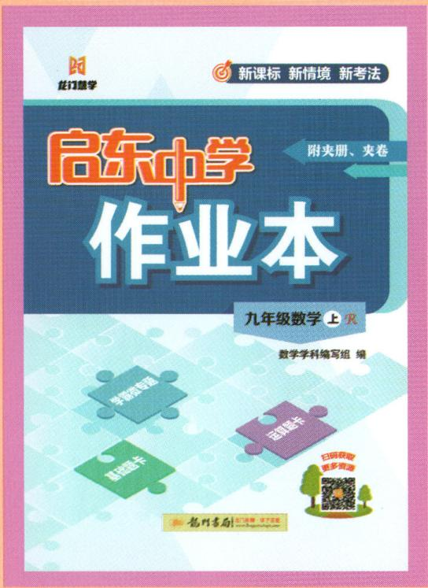

<details>
<summary>text_image</summary>

龙门中学
新课标 新情境 新考法
启东中学
附夹册、夹卷
作业本
九年级数学 上火
数学学科编写组 编
基础打卡
运筹打卡
扫码获取更多资源
郑州書局
</details>

# 学习担当

# 启东中学作业本

难度系数:


日常作业必备

助力学习提优

# 启东中学 作业本

九年级数学上 $\mathcal{R}$

数学学科编写组 编

本册主编:余中梅 吴林

龍門書局

北京

# 策划者语

很多同学都有一个困惑,平时练了很多题,考试的时候还是无从下手,到底是什么原因呢?究其根本是没有将所学的知识彻底掌握。那么,怎样才能将所学的知识融会贯通呢?同学们不妨试试龙门书局研发的“五维学习法”。

“五维学习法”源于一线老师教学和学生学习需求,从练好运算题、基础题、中档题、思维题和常考题五种题型开始,夯实运算能力、打牢基本功、提升能力、拓展思维以及查缺补漏,多维度、分层次帮助同学们学好数学。

# 第一维 练运算

运算能力是数学的基本功。想提高运算能力,是没有捷径可走的,就如武术中的练拳、站桩一样,唯有不断地强化训练,形成肌肉记忆才能提高。本书中的《运算题卡》,精选运算题目,同学们可以通过强化训练,达到提升运算能力的目的。

# 第二维 练基础

扎实的基础是学好数学的基石。数学是一门系统性和应用性很强的学科,很多知识都是环环相扣的,如果基础不牢固,就不能灵活运用,还会影响后面的学习。为了让同学们很好地掌握基础知识,本书中的《基础题卡》定位基础题,选择了一些数据简单、考法简单的题,帮助同学们在课堂上迅速掌握知识、打好基础。

# 第三维 练作业

系统地做作业是提升能力的关键。有了基本功,我们还要练好“组合拳”。本书中同步作业,是在充分调研各地学情、考情的基础上,由各地名师共同参与编写、审核的。内容包含同步课时作业、复习课等。“同步课时作业”能够帮助同学们理解、吃透教材内容;“复习课”在适当的时候加深对知识的记忆,温故知新。

# 第四维 练思维

适当的思维训练是拓展思维的必要因素。能否“一招制敌”，取决于是否拥有“必杀技”。同样，同学们能否拿到高分，思维题起决定性的作用，而思维题的训练不能靠考前一两个月的突击，只能靠平时不断地积累解题经验。本书中的《学霸微专题》，精选压轴题，为学有余力的同学“开小灶”，通过一点一滴的积累，拓展数学思维，为冲刺名校做准备。

# 第五维 练专题

专项训练是巩固所学、融会贯通的捷径。专门训练某一部位的肌肉,可以让身体变得更加协调。同理,将重点、难点、高频考点等作为一个个小专题训练,同学们不仅能够将这些专题知识掌握得更牢,还会对整个知识架构更加清楚,以便解决一些综合性问题。本书同步作业部分根据学情和考情,整理了一些小专题,这些小专题聚焦数学的一些基本图形、常见辅助线作法、中考热点等问题,归纳了一些数学思想方法和解题通法,培养同学们用一种方法解决一类题目的能力,为解答一些综合性习题做好铺垫。

本书是龙门书局教研团队在“五维学习法”的基础上,经过章章推敲、题题把关、反复修改而成。希望可以给同学们提供一定的帮助,“启东”伴你共同成长。

# 本书编委会

蔡新春 常程兰 晁生辉 陈峰 陈锋

陈怀娟 陈新合 陈兴林 陈月红 董春岩

樊永飞 甫俊英 高波 高俊元 葛莎莎

顾和桂 顾为云 华文秋 黄本华 纪宁

姜海勇 赖联基 李金光 李明珈 李荣

刘海兵 刘静 刘卫红 刘小丽 刘学云

陆文兵 陆亚彬 吕宝库 马俊勤 彭世平

浦春霞 邵艳玲 施泽红 史佳钰 宋海芝

宋虎林 孙宏军 陶文平 王爱玲 王聪

王国富 王一寒 王颖 王云峰 吴林

吴琴 吴思潼 吴小兵 谢海燕 徐朗千

徐正清 许斌 薛莺 苟峰 严莉

颜夕芳 杨晨光 杨丽雪 杨梅 于红波

余琦 余荣 余中梅 余忠云 袁昌进

张丽丽 张伟 赵书爽 赵莹银 郑敏

周发云 周修林 周燕

# 目录

# 第二十一章 一元二次方程

作业 1 一元二次方程 …… 1

作业 2 解一元二次方程——直接开平方法 …… 2

作业 3 解一元二次方程——配方法 …… 4

作业 4 解一元二次方程——公式法(一) …… 6

作业 5 解一元二次方程——公式法(二) …… 8

作业 6 解一元二次方程——因式分解法 …… 10

作业 7 一元二次方程的根与系数的关系 …… 12

周练1 14

作业 8 实际问题与一元二次方程(一) …… 16

作业 9 实际问题与一元二次方程(二) …… 18

作业 10 实际问题与一元二次方程(三) …… 20

专题1 配方法的应用 22

专题 2 一元二次方程中的易错问题 …… 24

专题3 综合与实践 26

小结与思考 …… 28

# 第二十二章 二次函数

作业11 二次函数 …… 30

作业 12 二次函数 $y=ax^{2}$ 的图象和性质 …… 32

作业 13 二次函数 $y=ax^{2}+c$ 的图象和性质 … 34

作业 14 二次函数 $y=a(x-h)^{2}$ 的图象和性质 … 36

作业15 二次函数 $y = a(x - h)^2 + k$ 的图象和性质 38

作业16 二次函数 $y = ax^{2} + bx + c$ 的图象和性质 40

专题4 求二次函数的解析式 …… 42

周练2 44

作业 17 二次函数与一元二次方程(一) …… 46

作业 18 二次函数与一元二次方程(二) …… 48

专题5 二次函数与面积 …… 50

专题6 二次函数与特殊三角形 …… 52

专题7 二次函数与特殊四边形 …… 54

专题8 二次函数与几何变换 …… 56

作业 19 实际问题与二次函数(一) …… 58

作业 20 实际问题与二次函数(二) …… 60

作业 21 实际问题与二次函数(三) …… 62

专题 9 综合与实践 …… 64

小结与思考 …… 66

# 第二十三章 旋转

作业 22 图形的旋转(一) …… 68

作业 23 图形的旋转(二) …… 70

专题10 解决与旋转有关的问题 72

作业 24 中心对称 …… 74作业 25 中心对称图形 …… 76

作业 26 关于原点对称的点的坐标 …… 78

专题 11 直角坐标系中的旋转问题 …… 80

专题 12 综合与实践 …… 82

小结与思考 84

# 第二十四章 圆

作业 27 圆 86

作业 28 垂直于弦的直径(一) 88

作业 29 垂直于弦的直径(二) …… 90

作业 30 弧、弦、圆心角 92

作业 31 圆周角(一) 94

作业 32 圆周角(二) 96

专题 13 圆的有关性质常见辅助线 …… 98

专题 14 利用隐圆巧解几何题 …… 100

周练 3 102

作业 33 点和圆的位置关系 …… 104

作业 34 直线和圆的位置关系(一) …… 106

作业 35 直线和圆的位置关系(二) …… 108

作业 36 直线和圆的位置关系(三) …… 110

专题 15 圆的切线的判定与性质 …… 112

周练4 114

作业 37 正多边形和圆 …… 116

作业 38 弧长和扇形面积 …… 118

作业 39 圆锥 …… 120

专题 16 综合与实践 …… 122

小结与思考 123

# 第二十五章 概率初步

作业 40 随机事件 …… 125

作业 41 概率 …… 127

作业 42 用列举法求概率(一) …… 129

作业 43 用列举法求概率(二) …… 131

作业 44 用频率估计概率 …… 133

专题 17 综合与实践 …… 135

小结与思考 137

# 检测卷

第二十一章检测卷 139

第二十二章检测卷 143

第二十三章检测卷 147

第二十四章检测卷 …… 151

第二十五章检测卷 155

期末冲刺小卷(1) 159

期末冲刺小卷(2)……161

期末冲刺小卷(3) 163

期末冲刺小卷(4) 165

期末冲刺小卷(5)…… 167

期末冲刺小卷(6) 169

期末检测卷 171

# 附夹册：

夹册 1 《运算题卡 基础题卡》(单独成册)

夹册 2 《学霸微专题》(单独成册)

夹册 3 《参考答案》(单独成册)

# 第二十一章 一元二次方程

# 作业 1 一元二次方程

# 基础过关

1.(2024·上城区期末)下列方程中是一元二次方程的是()

A. $x + y^{2} = 2$

B. $x + 4 = 2$

C. $x^{2} + 4x = 2$

D. $x^{2} + \frac{1}{x} = 2$

2.(2024·启东模拟)若关于 x 的一元二次方程 $mx^{2}+nx-2024=0(m\neq0)$ 的一个解是 x=1，则 $m+n+1$ 的值是 ( )

A. 2025

B. 2024

C. 2023

D. 2022

3.(2024·海安期末)已知 x=1 是关于 x 的方程 $x^{2}-3x+c=0$ 的一个根, 则实数 c 的值是 \_\_\_\_.

4. 把下列关于 $x$ 的一元二次方程化为一般形式, 并写出二次项系数、一次项系数及常数项.

(1) $(x-5)(2x-1)=3;$

(2) $(\sqrt{2}x+1)(x+3)=\sqrt{2}x.$

# 能力提升

5.(2024·西城区期末)已知关于 x 的方程 $(k-3)x^{|k|-1}+(2k-3)x+4=0$ 是一元二次方程, 则 k 的值应为 ( )

A. ±3

B. 3

C. -3

D. 不能确定

6.(2024·南通通州区模拟)若 m 是方程 $x^{2}+x-4=0$ 的一个实数根,则代数式 $m^{3}-5m+2024$ 的值为 \_\_\_\_.

7.(2024·燕山区期末)已知 $x^{2}-2x-5=0$ ，求代数式 $3x(x-2)+(x-1)^{2}$ 的值.

# 拓展延伸

8. 已知实数 m, x 满足 $(mx_{1}-2)(mx_{2}-2)=4$ .

(1) 若 $m=\frac{1}{3}$ , $x_{1}=9$ , 则 $x_{2}=$ \_\_\_\_;   
(2)若 $m, x_{1}, x_{2}$ 为正整数, 求出符合条件的所有有序实数对 $(x_{1}, x_{2})$ .

易错知识点:一元二次方程的定义及一般形式;一元二次方程的解(根)

易错考法:一元二次方程的定义;二次项系数不为0;求字母系数的值;求代数式的值

# 作业 2 解一元二次方程——直接开平方法

# 基础过关

1. 下列方程中, 最适宜用直接开平方法求解的是 ( )

A. $x^{2} - 1 = 0$

B. $x^{2} - 2x + 4 = 0$

C. $(x - 1)^{2} = 2x$

D. $(x-2)^{2}=x-2$

2.(2024·吉林)下列方程中,有两个相等实数根的是()

A. $(x - 2)^{2} = -1$

B. $(x - 2)^{2} = 0$

C. $(x - 2)^{2} = 1$

D. $(x - 2)^{2} = 2$

3.(2024·朝阳区期末)一元二次方程 $x^{2}-9=0$ 的根为 \_\_\_\_.

4.(2024·栖霞区期末)如果关于 x 的方程 $(x-1)^{2}+m=0$ 没有实数根,那么实数 m 的取值范围是 \_\_\_\_.

5. 用直接开平方法解下列方程：

(1) $3y^{2}-27=0;$

(2) $(x+3)^{2}-25=0;$

(3) $2(x-1)^{2}-\frac{9}{2}=0;$

(4) $(x+\sqrt{3})(x-\sqrt{3})=6;$

(5) $(2x - 1)^{2} = (\sqrt{2} - 1)^{2}$ ;

(6) $x^{2}-2x+1=25.$

6. 阅读下列解答过程, 在横线上填入恰当的内容.

解方程: $(x-1)^{2}=4.$

解： $\because (x-1)^{2}=4,\cdots①$

$$
\therefore x - 1 = 2, \dots \dots \textcircled {2}
$$

$$
\therefore x = 3. \dots \dots \textcircled {3}
$$

上述过程中有没有错误？若有，错在步骤\_\_\_\_（填序号），原因是\_\_\_\_。

请写出正确的解答过程.

# 能力提升

7. 已知一元二次方程 $(x - 2)^{2} = 3$ 的两个根分别为 $a, b$ , 且 $a > b$ , 则 $2a + b$ 的值是 ( )

A. 9

B. -3

C. $6 + \sqrt{3}$

D. $-6+\sqrt{3}$

8. 关于 $x$ 的方程 $(ax + b)^2 = c$ , 下列叙述正确的是 ( )

A. 无论 c 为何值, 方程均有实数根  
B. 方程的根是 $x=\frac{c-b}{a}$   
C. 当 $c \geqslant 0$ 时, 方程可化为 $ax + b = \sqrt{c}$ 或 $ax + b = -\sqrt{c}$   
D. 当 c=0 时, $x=\frac{b}{a}$

9. (2023·德惠模拟)若关于 $x$ 的方程 $(x + 1)^{2} = k - 2$ 有实数根, 则 $k$ 的值可以是\_\_\_\_(写出一个即可).

10.(2024·嘉兴期末)关于 x 的方程 $(x+h)^{2}+k=0$ (h, k 均为常数) 的解是 $x_{1}=-3, x_{2}=2$ ，则方程 $(x+h-3)^{2}+k=0$ 的解是 \_\_\_\_.

11. 如果 $(a^{2}+b^{2}+1)(a^{2}+b^{2}-1)=63$ ，那么 $a^{2}+b^{2}$ 的值为 \_\_\_\_.

12. 用直接开平方法解下列方程:

(1) $(2x+3)^{2}=(3x+2)^{2}$ ;

(2) $\sqrt{2}(6-x)^{2}=128\sqrt{2}$ ;

(3) $4x^{2}-4x+1=(3-x)^{2}$ .

13.(杭州中考模拟)若关于 x 的一元二次方程 $ax^{2}=b(ab>0)$ 的两个根分别是 m-4 与 3m-8，求 $\frac{b}{a}$ 的值.

# 拓展延伸

14. 对于实数 $p, q$ , 我们用符号 $\min \{p, q\}$ 表示 $p, q$ 两数中较小的数, 如 $\min \{1, 2\} = 1$ , $\min \{-\sqrt{2}, -\sqrt{3}\} = -\sqrt{3}$ . 若 $\min \{(x - 1)^2, x^2\} = 1$ , 求 $x$ 的值.

易错知识点: 解一元二次方程——直接开平方法; 一元二次方程的解
易错考法: 直接开平方法的条件; 字母的取值范围; 求代数式的值

# 作业 3 解一元二次方程——配方法

# 基础过关

1.(2024·南通模拟)用配方法解方程 $x^{2}+8x+7=0$ , 变形后的结果正确的是 ( )

A. $(x+4)^{2}=-7$

B. $(x+4)^{2}=9$

C. $(x+4)^{2}=23$

D. $(x+4)^{2}=-9$

2. (2024·密云区期末)用配方法解一元二次方程 $x^{2} - 4x = 1$ 时, 将原方程配方成 $(x - 2)^{2} = k$ 的形式, 则 $k$ 的值为 \_\_\_\_.

3. 用配方法使下列等式成立：

(1) $x^{2}-2x-3=(x-\underline{\quad})^{2}+(\underline{\quad})$ ;

(2) $3x^{2}+2x-2=3(x+\_\_\_\_)^{2}+(\_\_\_\_)$ .

4. 在括号内填上适当的数：

(1) $x^{2}+4x+(\underline{\hspace{2cm}})=(x+\underline{\hspace{2cm}})^{2};$

(2) $x^{2}+(\underline{\hspace{2cm}})x+\frac{25}{4}=(x-\frac{5}{2})^{2};$

(3) $x^{2}-\frac{4}{3}x+(\underline{\quad})=(x-\underline{\quad})^{2};$

(4) $x^{2}+px+(\underline{\hspace{2cm}})=(x+\underline{\hspace{2cm}})^{2}.$

5. 对方程 $x^{2}+\frac{2}{5}x-\frac{3}{5}=0$ 进行配方，得 $x^{2}+\frac{2}{5}x+m=\frac{3}{5}+m$ ，其中 m= \_\_\_\_.

6. 当 $k =$ \_\_\_\_时, 代数式 $x^{2} - kx + 3$ 为完全平方式.

7. 用配方法解下列方程：

(1) $x^{2}-6x-16=0;$

(2) $2x^{2}-4x-1=0;$

(3) $3x^{2}-x-1=0.$

# 能力提升

8.(2023·聊城期末)用配方法解一元二次方程 $-3x^{2}+12x-2=0$ 时,将它化为 $(x+a)^{2}=b$ 的形式,则 $a+b$ 的值为()

A. $\frac{14}{3}$

B. $\frac{10}{3}$

C. $\frac{16}{3}$

D. $\frac{4}{3}$

9.(2024·经开区期末)若方程 $x^{2}-4096576=0$ 的两个根分别为 $x_{1}=2024, x_{2}=-2024$ ，则方程 $x^{2}-2x-4096575=0$ 的两个根分别为 \_\_\_\_.

10. 若 $\triangle ABC$ 的三边长分别为 $a,b,c$ , 其中 $a,b$ 满足 $\sqrt{a-3}+b^{2}-4b+4=0$ , 则 $c$ 的取值范围为 \_\_\_\_.

11. 解下列关于 $x$ 的方程:

(1) $x^{2}+\frac{1}{6}x-\frac{1}{3}=0;$

(2) $2x^{2}-7x+6=0;$

(3) $(x-1)(x-3)=7;$

(4) $x^{2}-2\sqrt{5}x=4.$

12. 用配方法证明：

(1) $-x^{2}+6x-10$ 的值恒小于零;

(2) $4x^{2}-12x+10$ 的值恒大于零.

13.(2024·社旗期末)下面是小明同学灵活应用配方法解方程 $4x^{2}-12x-1=0$ 的过程,请认真阅读并完成相应的任务.

解: 原方程可化为 $(2x)^{2}-6\times2x-1=0\cdots$ 第一步

移项,得 $(2x)^{2}-6\times2x=1\cdots$ 第二步

配方,得 $(2x)^{2}-6\times2x+3^{2}=1\cdots$ 第三步

$\therefore(2x-3)^{2}=1\cdots$ 第四步

两边开平方, 得 $2x-3=\pm1\cdots$ 第五步

∴2x-3=1或2x-3=-1…第六步

∴原方程的解为 $x_{1}=2, x_{2}=1\cdots$ 第七步

任务一:小明同学的解答过程是从第\_\_\_\_步开始出错的,错误的原因是\_\_\_\_;

任务二:请直接写出该方程的正确解;

任务三:小刚同学说:“小明同学的解法是错误的,因为用配方法解一元二次方程时,先要把二次项系数化为1,再配方.”你同意小刚同学的说法吗?你得到了什么启示?

# 拓展延伸

14.(1)已知 $a^{2}+4ab+5b^{2}+6b+9=0$ ，求 a, b 的值；

(2)已知 $\triangle ABC$ 的三边长 $a,b,c$ 都是正整数,且满足 $a^{2}-4a+2b^{2}-4b+6=0$ ,求 $c$ 的值;

(3) 若 $A = 3a^{2} + 3a - 4, B = 2a^{2} + 4a - 6$ , 试比较 $A$ 与 $B$ 的大小, 并说明理由.

易错知识点: 配方法

易错考法:运用配方法解一元二次方程;运用配方法求字母的值;求完全平方式中一次项的系数

# 作业 4 解一元二次方程——公式法（一）

# 基础过关

1.(2023·吉林)一元二次方程 $x^{2} - 5x + 2 = 0$ 根的判别式的值是 （）

A. 33

B. 23

C. 17

D. $\sqrt{17}$

2. 下列一元二次方程的根是 $x = \frac{-3 \pm \sqrt{3^2 + 4 \times 2 \times 1}}{2 \times 2}$ 的是 （）

A. $2x^{2}+3x+1=0$

B. $2x^{2}-3x+1=0$

C. $2x^{2}+3x-1=0$

D. $2x^{2}-3x-1=0$

3.(1)在方程 $2x^{2}+3x-1=0$ 中，a=\_\_\_\_，b=\_\_\_\_，c=\_\_\_\_， $b^{2}-4ac=$ \_\_\_\_，
方程的根为\_\_\_\_；

(2)在方程 $x(x - 2) = -1$ 中， $a = \_\_ \_ \_ \_ \_ \_ \_ \_ \_ \_ \_ \_ \_ \_ \_ \_ \_ \_ \_ \_ \_ \_ \_ \_ \_ \_ \_ \_ \_ \_ \_ \_ \_ \_ \_ \_ \_ \_ \_ \_ \_$ 方程的根为 \_\_\_\_；

(3)在方程 $x^{2}+x+2=0$ 中，a=\_\_\_\_，b=\_\_\_\_，c=\_\_\_\_， $b^{2}-4ac=$ \_\_\_\_，
方程的根的情况为 \_\_\_\_.

4. 方程 $(x+1)(x+2)=1$ 化成一般形式是\_\_\_\_, $b^{2}-4ac=$ \_\_\_\_,用求根公式可求得 $x_{1}=$ \_\_\_\_ , $x_{2}=$ \_\_\_\_.

5. 用公式法解下列方程：

(1)(2024·邗江区期末) $x^{2}-5x+3=0$ ;

(2)(2024·建邺区期末) $3x^{2}-8x=4$ ;

(3) $x^{2}-3x+3=0.$

# 能力提升

6. 解下列方程时, 最适合用公式法的是 ( )

A. $(x + 2)^{2} - 9 = 0$

B. $\frac{1}{4}x^{2}=1$

C. $x^{2}+2x-100=0$

D. $x^{2} - 3x - 1 = 0$

7. 小明在解方程 $x^{2}-4x=2$ 时出现了错误, 解答过程如下:

$\because a=1,b=-4,c=-2,$ (第一步)

$\therefore b^{2}-4ac=(-4)^{2}-4\times1\times(-2)=24,$ (第二步)

$\therefore x=\frac{-4\pm\sqrt{24}}{2}$ ，(第三步)

$\therefore x_{1}=-2+\sqrt{6},x_{2}=-2-\sqrt{6}.$ (第四步)

小明解答过程开始出错的步骤是 （）

A. 第一步

B. 第二步

C. 第三步

D. 第四步

8.(2024·靖江期末)已知一元二次方程 $x^{2}-x-3=0$ 的较小根为 $x_{1}$ ，则下面对 $x_{1}$ 的估计正确的是（）

A. $-2 < x_{1} < -1$

B. $-3 < x_{1} < -2$

C. $2 < x_{1} < 3$

D. $-1 < x_{1} < 0$

9. 已知 $a^{2}-2ab-b^{2}=0(a\neq0,b\neq0)$ ，则代数式 $\frac{a}{b}$ 的值为 \_\_\_\_.

10. 用公式法解下列方程:

(1) $3x^{2}-1=4x;$

(2) $(x + 1)(x - 1) = 2\sqrt{2} x;$

(3) $3x^{2}+2x=(x+2)^{2}$ .

11. 用公式法解下列方程并求根的近似值。(结果精确到 0.01, 参考数据: $\sqrt{2} \approx 1.414$ , $\sqrt{3} \approx 1.732$ , $\sqrt{5} \approx 2.236$ )

(1) $x^{2}-x-1=0;$

(2) $x^{2}+2\sqrt{2}x-1=0.$

12. 我们规定一种运算: $\left| \begin{array}{cc} a & c \\ b & d \end{array} \right| = ad - bc$ , 例如: $\left| \begin{array}{cc} 2 & 3 \\ 4 & 5 \end{array} \right| = 2 \times 5 - 3 \times 4 = 10 - 12 = -2$ . 当 $\left| \begin{array}{cc} x & 0.5 - x \\ 1 & 2x \end{array} \right| = 0$ 时, 求 $x$ 的值.

# 拓展延伸

13. 新定义 (2024·湘潭期末) 对于两个不相等的实数 $a, b$ , 我们规定符号 $\max \{a, b\}$ 表示 $a, b$ 中的较大值, 如: $\max \{2, 5\} = 5$ . 按照这个规定, 若 $\max \{1, x\} = x^2 - 3$ , 求 $x$ 的值.

易错知识点: 公式法的正确运用

易错考法:求非一般式的方程的系数;运用公式法解非一般式的方程

# 作业 5 解一元二次方程——公式法（二）

# 基础过关

1.(2024·番禺区期末)下列关于 x 的一元二次方程中,有两个不相等的实数根的方程是 ( )

A. $x^{2} + 1 = 0$

B. $x^{2} + 2x + 1 = 0$

C. $x^{2} + 2x + 3 = 0$

D. $x^{2}+2x-3=0$

2.(2024·北京)若关于 x 的一元二次方程 $x^{2}-4x+c=0$ 有两个相等的实数根,则实数 c 的值为 ( )

A.-16

B.-4

C. 4

D. 16

3. (2024·云南)若一元二次方程 $x^{2} - 2x + c = 0$ 无实数根, 则实数 $c$ 的取值范围为

4. 关于 $x$ 的一元二次方程 $x^{2} + bx - 1 = 0$ 的根的情况为

5. 利用判别式判断下列方程根的情况：

(1) $3x^{2}+2x-4=0;$

(2) $24y-9=16y^{2}$ ;

(3) $2(x^{2}+1)-3x=0.$

# 能力提升

6.(2024·自贡)关于 x 的方程 $x^{2}+mx-2=0$ 根的情况是 ( )

A. 有两个不相等的实数根

B. 有两个相等的实数根

C. 只有一个实数根

D. 没有实数根

7.(2024·嘉兴期末)关于 x 的方程 $ax^{2}+bx+c=0(a\neq0)$ 有下列两种说法:①若 $a-b+c=0$ , 则此方程一定有实数根;②若 a,c 异号, 则此方程一定有实数根. 下列判断正确的是 ( )

A. ①正确，②错误

B. ①错误, ②正确

C. ①, ②都正确

D. ①, ②都错误

8.(2024·海安模拟)已知 $a^{2}b+2ab+b=a^{2}-a-1$ ，则满足等式的 b 的值可以是（）

A. $-\frac{3}{2}$

B. $-\frac{5}{4}$

C. $-\frac{7}{4}$

D. -2

9.(2024·南通模拟)若关于 x 的一元二次方程 $(k-2)x^{2}-2kx+k=0$ 有实数根, 则 k 的取值范围是 \_\_\_\_.

10. 求 m 取何值时, 关于 x 的一元二次方程 $(2m+1)x^{2}+4mx+2m-3=0$ :

(1)有两个不相等的实数根;

(2)有两个相等的实数根；

(3)没有实数根.

11.(2023·北京模拟)已知关于 x 的一元二次方程 $mx^{2}-(3m+2)x+6=0$ .

(1)求证:方程总有两个实数根;

(2)如果方程的两个实数根都是整数,求正整数 m 的值.

# 拓展延伸

12. 新定义 (2023·梁山二模) 定义: 若关于 $x$ 的一元二次方程 $ax^2 + bx + c = 0 (a \neq 0)$ 满足 $b = a + c$ , 则称该方程为“和谐方程”.

(1)下列属于“和谐方程”的是；(填序号)

$$
① x ^ {2} + 2 x + 1 = 0; \textcircled {2} x ^ {2} - 2 x + 1 = 0; \textcircled {3} x ^ {2} + x = 0.
$$

(2)求证:“和谐方程”总有实数根;

(3)已知:关于 x 的一元二次方程 $ax^{2}+bx+c=0(a\neq0)$ 为“和谐方程”,若该方程有两个相等的实数根,求 a,c 的数量关系.

易错知识点: 根的判别式

易错考法: 判断方程的解的情况; 综合运用根的判别式与二次项系数不为 0

# 作业 6 解一元二次方程——因式分解法

# 基础过关

1.(2024·贵州)一元二次方程 $x^{2}-2x=0$ 的解是 ( )

A. $x_{1} = 3, x_{2} = 1$

B. $x_{1} = 2, x_{2} = 0$

C. $x_{1} = 3, x_{2} = -2$

D. $x_{1} = -2, x_{2} = -1$

2.(2023·晋城模拟)一元二次方程 $(x-5)^{2}=4(x-5)$ 的解为()

A. $x = 5$

B. $x = -5$

C. $x_{1} = 5, x_{2} = 9$

D. $x_{1} = 5, x_{2} = 1$

3. 若分式 $\frac{x^2 - 5x - 6}{x + 1}$ 的值为 0, 则 $x =$ \_\_\_\_.

4. 菱形的一条对角线长为 8, 其边长是方程 $x^{2} - 9x + 20 = 0$ 的一个根, 则该菱形的周长为 \_\_\_\_.

5. 用因式分解法解下列方程：

(1)(2024·滨州) $x^{2}-4x=0$ ;

(2)(2024·齐齐哈尔) $x^{2}-5x+6=0$ ;

(3)(2024·安徽) $x^{2}-2x=3$ ;

(4)(2024·江都区期末) $x(x-6)=5(6-x)$ .

# 能力提升

6.(2023·邯郸模拟)已知一元二次方程的两个根分别为 $x_{1}=3,x_{2}=-4$ ，则这个方程可能为（）

A. $(x-3)(x+4)=0$

B. $(x+3)(x-4)=0$

C. $(x+3)(x+4)=0$

D. $(x-3)(x-4)=0$

7.(2024·建邺区模拟)方程 $(x-2024)^{2}-4(x-2024)-5=0$ 的解为 \_\_\_\_.

8.(2024·凉山州)已知 $y^{2}-x=0, x^{2}-3y^{2}+x-3=0$ ，则 x 的值为 \_\_\_\_.

9. 已知 $y \neq 0$ ，且 $x^{2} - 3xy - 4y^{2} = 0$ ，则 $\frac{x}{y}$ 的值是 \_\_\_\_.

10. 用适当的方法解下列方程：

(1)(2024·海门期末) $x(2x-5)=4x-10$ ; (2)(2024·启东期末) $(2x-1)^{2}=3(2x-1)$ ;

(3)(2024·新吴区期末) $(2x+1)^{2}=(x-1)^{2}$ ; (4)(2024·鼓楼区期末) $(x+2)^{2}+9=6(x+2)$ .

11. 阅读理解 先阅读例题,再解答问题.

例: 解方程 $x^{2}-|x|-2=0.$

解: 当 $x \geqslant 0$ 时, $x^{2} - x - 2 = 0$ ,

解得 $x_{1}=-1$ (不合题意, 舍去), $x_{2}=2$ ;

当 x<0 时， $x^{2}+x-2=0$ ，

解得 $x_{3}=1$ (不合题意, 舍去), $x_{4}=-2$ .

综上所述,原方程的解为 x=2 或 x=-2.

依照上述解法解方程: $x^{2}-|x-3|-3=0.$

# 拓展延伸

12. 为解方程 $(x^{2} - 1)^{2} - 5(x^{2} - 1) + 4 = 0$ ，我们可以将 $x^{2} - 1$ 视为一个整体，然后设 $x^{2} - 1 = y$ ，则原方程可化为 $y^{2} - 5y + 4 = 0$ ，解此方程得 $y_{1} = 1, y_{2} = 4$ .

当 y=1 时， $x^{2}-1=1$ ，解得 $x=\pm\sqrt{2}$ ;

当 y=4 时， $x^{2}-1=4$ ，解得 $x=\pm\sqrt{5}$ .

所以原方程的根为 $x_{1}=\sqrt{2}, x_{2}=-\sqrt{2}, x_{3}=\sqrt{5}, x_{4}=-\sqrt{5}$ .

以上解方程的过程中,利用\_\_\_\_达到了降次的目的,体现了数学的转化思想.

运用上述方法解下列方程:

(1) $(x^{2}-x)(x^{2}-x-4)=-4;$

(2) $x^{4}+x^{2}-12=0.$

# 作业 7 一元二次方程的根与系数的关系

# 基础过关

1.(2024·溧阳期末)若 x=1 是一元二次方程 $x^{2}+x+m=0$ 的一个根, 则方程的另一个根为 ( )

A.-2

B. 0

C. 1

D. 2

2.(2024·花都区期末)若关于 x 的一元二次方程 $ax^{2}-2ax+3=0(a\neq0)$ 的两个根分别为 $x_{1}$ ， $x_{2}$ ，则下面等式成立的是()

A. $x_{1} + x_{2} = 2$

B. $x_{1} + x_{2} = -2$

C. $x_{1} \cdot x_{2} = 3$

D. $x_{1} \cdot x_{2} = -3$

3.(2024·建邺区期末)设 $x_{1}, x_{2}$ 是一元二次方程 $x^{2} + x - 4 = 0$ 的两个根, 则 $x_{1} + x_{2}$ 的值是

4. (2024·玄武区期末) 设 $x_{1}, x_{2}$ 是关于 x 的方程 $x^{2} + 4x - 3 = 0$ 的两个根，则 $x_{1} + x_{2} - x_{1} \cdot x_{2} =$ \_\_\_\_.

5.(2024·鼓楼区期末)若方程 $x^{2}+2x-1=0$ 的两个根分别为 m, n，则 $m^{2}n+mn^{2}$ 的值为 \_\_\_\_.

6. 不解方程, 求下列各方程的两根之和与两根之积:

(1) $-2x^{2}+3=0;$

(2) $x^{2}-7x-3=0;$

(3) $3x(x-2)=5.$

# 能力提升

7.(2024·绥化)小影与小冬一起写作业,在解一个一元二次方程时,小影在化简过程中写错了常数项,因而得到方程的两个根是6和1;小冬在化简过程中写错了一次项的系数,因而得到方程的两个根是-2和-5.则原来的方程是()

A. $x^{2} + 6x + 5 = 0$

B. ${x}^{2} - {7x} + {10} = 0$

C. ${x}^{2} - {5x} + 2 = 0$

D. ${x}^{2} - {6x} - {10} = 0$

8.(2024·乐山)若关于 x 的一元二次方程 $x^{2}+2x+p=0$ 的两个根分别为 $x_{1}, x_{2}$ ，且 $\frac{1}{x_{1}}+\frac{1}{x_{2}}=3$ ，则 p 的值为 ( )

A. $-\frac{2}{3}$

B. $\frac{2}{3}$

C. - 6

D. 6

9.(2024·汉阳区期末)若关于 x 的一元二次方程 $x^{2}-(a^{2}-3a-10)x+a=0$ 的两个根互为相反数,则两根之积是()

A.-2

B. 5

C. -2 或 5

D. 2 或 -5

10.(2024·烟台)若一元二次方程 $2x^{2}-4x-1=0$ 的两个根分别为 m, n, 则 $3m^{2}-4m+n^{2}$ 的值为 \_\_\_\_.

11.(2024·嵊州期末)已知菱形的两条对角线的长分别是一元二次方程 $x^{2}-6x+8=0$ 的两个根,则该菱形的边长为 \_\_\_\_.

12. 已知方程 $4x^{2} - 2x - 1 = 0$ 的两个根分别为 $x_{1}, x_{2}$ , 不解方程, 求下列代数式的值:

(1) $\frac{1}{x_{1}}+\frac{1}{x_{2}};$

(2) $x_{1}^{2}+x_{2}^{2};$

(3) $\frac{x_{2}}{x_{1}}+\frac{x_{1}}{x_{2}};$

(4) $(x_{1}-x_{2})^{2}$ .

13.(2024·钱塘区期末)已知关于 x 的一元二次方程 $x^{2}-2(k-1)x+k^{2}+3=0$ .

(1)若该方程有一个根是-2,求k的值;

(2)若该方程有两个实数根,求 k 的取值范围;

(3)若该方程的两个实数根 $x_{1}, x_{2}$ 满足 $(x_{1} - 1)(x_{2} - 1) = 14$ , 求 $k$ 的值.

# 拓展延伸

14.(2024·内江)已知关于 x 的一元二次方程 $x^{2}-px+1=0$ (p 为常数)有两个不相等的实数根 $x_{1}$ 和 $x_{2}$ .

(1) 填空: $x_{1} + x_{2} = \_\_\_\_, x_{1}x_{2} = \_\_\_\_;$   
(2)求 $\frac{1}{x_{1}}+\frac{1}{x_{2}},x_{1}+\frac{1}{x_{1}}$ 的值；  
(3)已知 $x_{1}^{2}+x_{2}^{2}=2p+1$ ，求 p 的值.

# 周练 1

总分:100 分 时间:45 分钟 成绩评定:

# 一、选择题（每小题5分，共20分）

1.(2024·海门模拟)关于 x 的一元二次方程 $x^{2}+mx-5=0$ 的根的情况是 ( )

A. 有两个不相等的实数根

B. 有两个相等的实数根

C. 只有一个实数根

D. 没有实数根

2. 用配方法解一元二次方程 $y^{2} - y - \frac{1}{2} = 0$ 时, 下列变形正确的是 ( )

A. $\left(y + \frac{1}{2}\right)^2 = 1$

B. $\left(y-\frac{1}{2}\right)^{2}=\frac{3}{4}$

C. $\left(y+\frac{1}{2}\right)^{2}=\frac{3}{4}$

D. $\left(y-\frac{1}{2}\right)^{2}=1$

3.(2024·越城区期末)若一元二次方程 $x^{2}-3x-2=0$ 的两个根分别为 $x_{1}, x_{2}$ ，则下列结论正确的是（）

A. $x_{1} = -1, x_{2} = 2$

B. $x_{1} = 1, x_{2} = -2$

C. $x_{1} + x_{2} = 3$

D. ${x}_{1}{x}_{2} = 2$

4. 设关于 $x$ 的方程 $ax^2 + (a + 2)x + 9a = 0$ 有两个不相等的实数根 $x_1, x_2$ , 且 $x_1 < 1 < x_2$ , 那么实数 $a$ 的取值范围是

A. $a < - \frac{2}{11}$

B. $\frac{2}{7}<a<\frac{2}{5}$

C. $a > \frac{2}{5}$

D. $-\frac{2}{11}<a<0$

# 二、填空题(每小题4分,共20分)

5.(2024·湖南)若关于 x 的一元二次方程 $x^{2}-4x+2k=0$ 有两个相等的实数根,则 k 的值为 \_\_\_\_.

6.(2024·海陵区期末)若关于 x 的一元二次方程 $mx^{2}+(2m-1)x+m+3=0$ 有两个不相等的实数根,则 m 的取值范围是 \_\_\_\_.

7.(2024·成都)若 m, n 是一元二次方程 $x^{2}-5x+2=0$ 的两个实数根，则 $m+(n-2)^{2}$ 的值为 \_\_\_\_.

8. 三角形两边的长分别为 2 和 5, 第三边的长是方程 $x^{2} - 8x + 15 = 0$ 的根, 则该三角形的周长为 \_\_\_\_.

9. 新定义 (2024·新吴区期末) 定义: 如果两个一元二次方程分别有两个实数根, 且至少有一个公共根, 那么称这两个方程互为“联根方程”. 已知关于 $x$ 的两个一元二次方程 $x^{2} - (2 + a)x + 2a = 0$ 和 $(a - 1)x^{2} - a^{2}x - a + 2 = 0$ 互为“联根方程”, 那么 $a$ 的值为 \_\_\_\_.

# 三、解答题(共60分)

10.(10 分)用配方法解方程:

(1) $x^{2}-4x+2=0;$

(2)(2024·启东期末) $3x^{2}-4x-1=0$ .

11.(10 分)用适当的方法解方程:

(1) $3x^{2}-5x-1=0;$

(2) $4x(x-2)=3x-6.$

12.(10分)(2024·高港区期末)已知关于x的一元二次方程 $2x^{2}+(k-8)x-4k=0$ .

(1)求证:该方程总有两个实数根;   
(2)若该方程有一个根小于3,求k的取值范围.

13.(15分)已知关于x的一元二次方程 $x^{2}-6x+2m-1=0$ 有两个实数根,分别为 $x_{1},x_{2}$ .

(1) 若 $x_{1}=1$ ，求 $x_{2}$ 及 m 的值.  
(2)是否存在实数 m, 满足 $(x_{1}-1)(x_{2}-1)=\frac{6}{m-5}$ ? 若存在, 求出实数 m 的值; 若不存在, 请说明理由.

14.(15分)已知关于x的一元二次方程 $mx^{2}-(4m+2)x+3m+6=0$ .

(1)试讨论该方程的根的情况并说明理由；  
(2)若无论 m 为何值,该方程都有一个固定的实数根,试求出这个根.

# 作业 8 实际问题与一元二次方程（一）

# 基础过关

1.(2024·仙居期末)在某足球邀请赛中,参赛的每两个队之间都要比赛一场,共比赛10场,求参加比赛的球队数量.设有x个队参赛,根据题意可列方程为()

A. $x(x - 1) = 10$

B. $x(x+1)=10$

C. $\frac{1}{2}x(x-1)=10$

D. $\frac{1}{2}x(x+1)=10$

2. 若两个连续正奇数的积是 143, 则这两个正奇数的和是 \_\_\_\_.

3.(2024·太和期末)冬、春季是传染病高发季节,据统计,去年冬春之交,有一人患了流感,在没有采取医疗手段的情况下,经过两轮传染后共有64人患流感.

(1)求每轮传染中平均一人传染了多少人;  
(2)若不及时控制,则第三轮传染后,患流感的共有多少人?

# 能力提升

4.(2024·宁津期末)学校“自然之美”研究小组在野外考察时了发现一种植物的生长规律,即植物的1个主干上长出x个枝干,每个枝干上又长出了x个小分支,现在一个主干上的主干、枝干、小分支数量之和为73,根据题意,下列方程正确的是()

A. $1 + (1 + x)^{2} = 73$

B. $1+x^{2}=73$

C. $1 + x + {x}^{2} = {73}$

D. $x + (1 + x)^{2} = 73$

5. 如图是一个三角点阵, 从上向下数有无数多行, 其中第一行有 1 个点, 第二行有 2 个点, …, 第 $n$ 行有 $n$ 个点. 有下列说法: ①10 是三角点阵中前 4 行的点数和; ②300 是三角点阵中前 24 行的点数和; ③三角点阵中前 $n$ 行的点数和能是 600. 其中正确的说法有 ( )

A. 0 个

B. 1 个

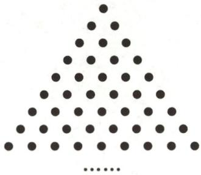

<details>
<summary>natural_image</summary>

Triangular arrangement of black dots forming a pattern (no text or symbols)
</details>

第5题图

C. 2 个

D. 3 个

<table><tr><td>日</td><td>一</td><td>二</td><td>三</td><td>四</td><td>五</td><td>六</td></tr><tr><td></td><td></td><td></td><td>1</td><td>2</td><td>3</td><td>4</td></tr><tr><td>5</td><td>6</td><td>7</td><td>8</td><td>9</td><td>10</td><td>11</td></tr><tr><td>12</td><td>13</td><td>14</td><td>15</td><td>16</td><td>17</td><td>18</td></tr><tr><td>19</td><td>20</td><td>21</td><td>22</td><td>23</td><td>24</td><td>25</td></tr><tr><td>26</td><td>27</td><td>28</td><td>29</td><td>30</td><td>31</td><td></td></tr></table>

第6题图

6. 如图是某月的月历表, 在此月历表上可以用一个矩形圈出 $3 \times 3$ 个位置相邻的数 (如 6,7,8,13, 14,15,20,21,22). 若圈出的 9 个数中, 最大数与最小数的积为 192, 则这 9 个数的和为 \_\_\_\_.

7. 一次会议上, 每两个参加会议的人都相互握了一次手. 有人统计一共握了 66 次手, 求参加这次会议的人数.

8. 在人群密集的场所,信息传播很快,某居民小区有 3 人同时得知一则喜讯,经过两轮传播后,使得这则喜讯在共有 864 人的居民小区中的知晓率达到 $50\%$ ,那么每轮传播中平均一人传播了多少人?

# 拓展延伸

9. 阅读理解 阅读下列内容,并答题:我们知道,计算 n 边形对角线条数的公式为 $\frac{1}{2}n(n-3)$ . 如果一个 n 边形共有 20 条对角线,那么可以得到方程 $\frac{1}{2}n(n-3)=20$ . 整理,得 $n^{2}-3n-40=0$ , 解得 n=8 或 n=-5.

∵n为大于或等于3的整数，

∴n=-5 不符合题意,舍去.

$\therefore n=8$ , 即多边形是八边形.

根据以上内容,解答下列问题:

(1)若一个多边形共有9条对角线,求这个多边形的边数;  
(2)小明说:“我求得一个多边形共有10条对角线.”你认为小明的说法正确吗?为什么?

# 作业 9 实际问题与一元二次方程（二）

# 基础过关

1.(2024·南通)红星村种的水稻 2021 年平均每公顷产 7200 kg,2023 年平均每公顷产 8450 kg.
求水稻每公顷产量的年平均增长率.设水稻每公顷产量的年平均增长率为 x,列方程为()

A. $7200(1 + x)^{2} = 8450$

B. $7200(1+2x)=8450$

C. $8450(1-x)^{2}=7200$

D. $8450(1 - 2x) = 7200$

2.(2024·牡丹江)一种药品原价每盒48元,经过两次降价后每盒27元,若两次降价的百分率相同,则每次降价的百分率为()

A. $20\%$

B. 22%

C. $25\%$

D. $28\%$

3.(2024·重庆)重庆在低空经济领域实现了新的突破.今年第一季度低空飞行航线安全运行了200架次,预计第三季度低空飞行航线安全运行将达到401架次.设第二、第三两个季度安全运行架次的平均增长率为x,根据题意,可列方程为\_\_\_\_.

4.(2024·苏州期末)“秋风起,蟹脚痒”,随着大闸蟹的大量上市,某大闸蟹销售公司前三个月的月销售利润逐月增长,第1个月的销售利润为20万元,第3个月的销售利润为28.8万元,假设从第1个月到第3个月每月销售利润的平均增长率相同.

(1)求从第1个月到第3个月每月销售利润的平均增长率;

(2)进入第4个月,大闸蟹产量逐渐下降,第4个月的销售利润比第3个月的销售利润下降了20%,求从第1个月到第4个月的销售利润之和.

# 能力提升

5. 某宾馆有 50 间房供游客居住。当每间房每天定价为 180 元时，该宾馆会住满；当每间房每天的定价每增加 10 元时，就会空闲一间房。如果有游客居住，该宾馆需对居住的每间房每天支出 20 元的费用。当每间房每天定价为多少元时，该宾馆当天的利润为 10890 元？设每间房每天定价为 x 元，则有

A. $(180+x-20)\left(50-\frac{x}{10}\right)=10890$

B. $(x-20)\left(50-\frac{x-180}{10}\right)=10890$

C. $x\left(50-\frac{x-180}{10}\right)-50\times20=10890$

D. $(180+x)\left(50-\frac{x}{10}\right)-50\times20=10890$

6.(2024·太和期末)“立身以立学为先,立学以读书为本。”为了鼓励全民阅读,某校图书馆开展阅读活动,自阅读活动开展以来,进馆阅读人次逐月增加,第一个月进馆200人次,前三个月累计进馆728人次,若进馆人次的月增长率相同,求进馆人次的月增长率.设进馆人次的月增长率为x,依题意可列方程为()

A. $200(1+x)^{2}=728$

B. $200(1 + x) + 200(1 + x)^{2} = 728$

C. $200(1+x+x^{2})=728$

D. $200 + 200(1 + x) + 200(1 + x)^{2} = 728$

7. (2024·东阳期末)某放射性元素经过 2 天后, 质量衰变为原来的 $\frac{1}{2}$ , 设这种放射性元素质量的日平均减少率为 $x$ , 则可列出方程为 \_\_\_\_.

8. 某产品每件的生产成本为 50 元, 原定销售单价为 65 元, 经市场预测, 从现在开始的第一季度销售单价将下降 $10\%$ , 第二季度又将回升 $5\%$ . 若要使半年以后每件的销售利润不变, 设每个季度平均降低成本的百分率为 $x$ , 根据题意可列方程为 \_\_\_\_.

9. 某商店去年十一黄金周促销活动期间,前六天的总营业额为 450 万元,第七天的营业额是前六天总营业额的 12%.

(1)求该商店去年十一黄金周这七天的总营业额;

(2)去年,该商店7月份的营业额为350万元,8,9月份营业额的月增长率相同,十一黄金周这七天的总营业额与9月份的营业额相等.求该商店去年8,9月份营业额的月增长率.

# 拓展延伸

10. 某汽车销售公司 6 月份销售某厂家的汽车, 在一定范围内, 每辆汽车的进价与销售量有如下关系: 若当月仅售出 1 辆汽车, 则该辆汽车的进价为 27 万元, 每多售出 1 辆, 所有售出的汽车的进价均降低 0.1 万元/辆; 月底厂家根据销售量一次性返利给销售公司, 销售量在 10 辆以内 (含 10 辆), 每辆返利 0.5 万元, 销售量在 10 辆以上, 每辆返利 1 万元.

(1)若该公司当月售出 3 辆汽车,则每辆汽车的进价为 \_\_\_\_ 万元;

(2)如果汽车的售价为 28 万元/辆,该公司计划当月盈利 12 万元,那么需要售出多少辆汽车? (盈利=销售利润+返利)

# 作业 10 实际问题与一元二次方程（三）

# 基础过关

1.(2024·海珠区期末)如图,在长5米、高3米的矩形墙面上有一块矩形装饰板(图中阴影部分),装饰板的上面和左、右两边都留有宽度为x米的空白墙面.若矩形装饰板的面积为4.5平方米,则以下方程正确的是()

A. $(3-x)(5-x)=4.5$

B. $(3-x)(5-2x)=4.5$

C. $(3-2x)(5-x)=4.5$

D. $(3 - 2x)(5 - 2x) = 4.5$

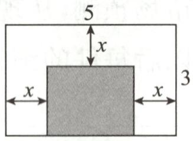  
第1题图

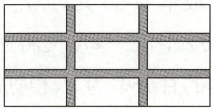

<details>
<summary>natural_image</summary>

Grid pattern with nine empty rectangular cells, no text or symbols present
</details>

第2题图

2.(2023·黑龙江)如图,在长100 m、宽50 m的矩形空地上修筑四条宽度相等的小路,若余下的部分全部种上花卉,且花圃的面积是 $3600\ m^{2}$ ,则小路的宽是()

A. $5 \mathrm{~m}$

B. $70 \mathrm{~m}$

C. 5 m 或 70 m

D. $10 \mathrm{~m}$

3. 数学文化（2024·崇川区模拟）中国古代数学家杨辉的《田亩比类乘除捷法》中记载：“直田积八百六十四步，只云阔不及长一十二步，问阔及长各几步？”翻译成数学问题是：一块矩形田地的面积为864平方步，它的宽比长少12步，问它的长与宽各多少步？利用方程思想，设宽为x步，则依题意列方程为\_\_\_\_。

4.(2023·东营)如图,老李想用长70 m的栅栏,再借助房屋的外墙(外墙足够长)围成一个矩形羊圈ABCD,并在边BC上留一个2 m宽的门(建在EF处,另用其他材料).

(1)当羊圈的长和宽分别为多少米时,能围成一个面积为 $640 \, m^{2}$ 的羊圈?

(2)羊圈的面积能达到 $650 \, m^{2}$ 吗？如果能，请你给出设计方案；如果不能，请说明理由。

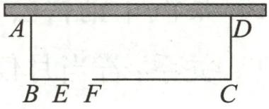  
第4题图

# 能力提升

5. (2024·钱塘区期末)金沙湖大剧院以形似水袖、飘飘而立,势如水形、绝美的颜值,成为金沙湖畔最具魅力的城市地标. 如图,某摄影爱好者拍摄了一副长 $60 \mathrm{~cm}$ 、宽 $50 \mathrm{~cm}$ 的金沙湖大剧院风景照,现在风景照四周镶一条等宽的纸边,制成一幅矩形挂图. 若要使整个挂图的面积是 $4200 \mathrm{~cm}^{2}$ ,设纸边的宽为 $x \mathrm{~cm}$ ,则 $x$ 满足的方程是 ( )

A. $(60+x)(50+x)=4200$

B. $(60 - 2x)(50 - 2x) = 4200$

C. $(60+2x)(50+2x)=4200$

D. $(60 - x)(50 - x) = 4200$

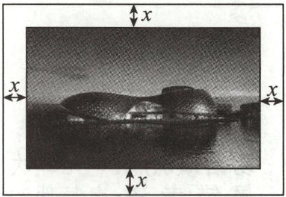

<details>
<summary>natural_image</summary>

Black-and-white architectural rendering of a modern dome-like building with water reflection, surrounded by directional arrows labeled 'x' (no text or symbols on the structure itself)
</details>

第5题图

6. 数学文化 (2024·南昌期末) 欧几里得在《几何原本》中, 记载了用图解法解方程 $x^{2} + ax = b^{2}$ 的方法, 类似地, 我们可以用折纸的方法求方程 $x^{2} + 2x - 4 = 0$ 的一个正根. 如图, 一张边长为 2 的正方形纸片 ABCD, 先折出 AB, CD 的中点 E, F, 再沿过点 B 的直线折叠, 使点 A 落在线段 BF 上 (即点 H 处), 折痕为 BG, 点 G 在边 AD 上, 连接 GH, GF, 其长度恰好是方程 $x^{2} + 2x - 4 = 0$ 的一个正根的线段为 ( )

A. GA

B. ${GD}$

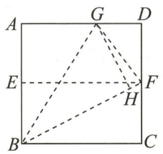

<details>
<summary>text_image</summary>

A
G
D
E
F
H
B
C
</details>

第6题图

C. $GF$

D. $FC$

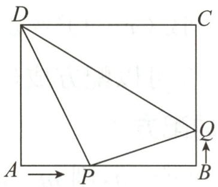

<details>
<summary>text_image</summary>

D
C
A → P
B
Q
</details>

第8题图

7. 数学文化 (2024·南通通州期末)《九章算术》卷九“勾股”中记载: 今有户不知高广, 竿不知长短, 横之不出四尺, 纵之不出二尺, 斜之适出, 问户斜几何. 意思是: 一根竿子横放, 竿比门宽长出四尺; 竖放, 竿比门高长出二尺, 斜放恰好能出去, 则竿长为 ( )

A. 10 尺

B. 5 尺

C. 10 尺或 2 尺

D. 5 尺或 4 尺

8. 如图, 在矩形 $ABCD$ 中, $AB = 10 \mathrm{~cm}, AD = 8 \mathrm{~cm}$ , 点 $P$ 从点 $A$ 出发沿 $AB$ 以 $2 \mathrm{~cm} / \mathrm{s}$ 的速度向点 $B$ 运动, 同时点 $Q$ 从点 $B$ 出发沿 $BC$ 以 $1 \mathrm{~cm} / \mathrm{s}$ 的速度向点 $C$ 运动, 点 $P$ 到达终点后, $P, Q$ 两点同时停止运动, 则 \_\_\_\_ s 时, $\triangle BPQ$ 的面积是 $6 \mathrm{~cm}^{2}$ .

9.(2024·海门期末)如图,有一块矩形铁皮,长100 cm,宽50 cm,在它的四个角各切去一个同样大小的正方形,然后将四周突出的部分折起,就能制作一个无盖方盒.如果制作的无盖方盒的底面积为3600 cm²,那么矩形铁皮各角应该切去的正方形的边长是多少?

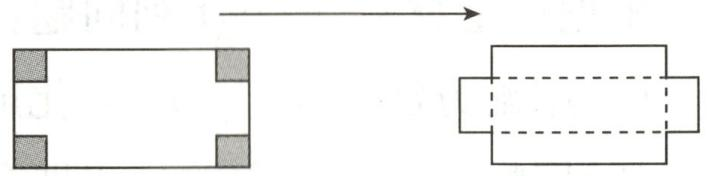

<details>
<summary>natural_image</summary>

Diagram showing a rectangular block with corner holes and an arrow pointing to a larger rectangular block with dashed lines (no text or symbols)
</details>

第9题图

# 拓展延伸

10. (2023 春·如皋期末)某学校在“美化校园,幸福学习”活动中,计划利用如图所示的直角墙角 (阴影部分,两边足够长),用 $20 \mathrm{~m}$ 长的篱笆围成一个矩形花园 ABCD(篱笆只围 AB,AD 两边).

(1)若花园的面积为 $75 \, m^{2}$ ，求 AB 的长.

(2)若在直角墙角内点 P 处有一棵桂花树,且到墙 CD 的距离为 12 m,若要将这棵树围在矩形花园内(含边界,不考虑树的粗细),问该花园的面积能否为 $100 \, m^{2}$ ? 若能,求出 AB 的长;

若不能,请说明理由.

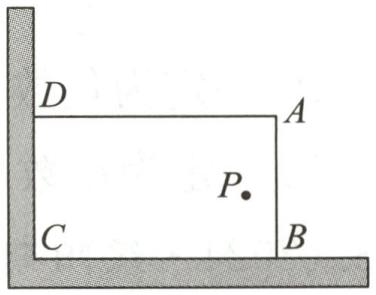

<details>
<summary>text_image</summary>

D
A
P
C
B
</details>

第10题图

易错知识点:一元二次方程——几何图形(面积)问题

易错考法:由图形的面积关系列方程;实际问题根的取舍

# 专题 1 配方法的应用

# 类型一 用配方法解方程

1.(2024·苏州期末)用配方法解方程 $x^{2}-2x-3=0$ 时,配方结果正确的是()

A. $(x - 1)^{2} = 4$

B. $(x - 1)^{2} = 2$

C. $(x-2)^{2}=1$

D. $(x - 2)^{2} = 7$

2. 如果方程 $x^{2}+4x+n=0$ 可以配方成 $(x+m)^{2}=3$ ，那么 $(n-m)^{2025}=$ \_\_\_\_.

# 类型二 完全平方式中的配方

3. 若 $x^{2} + mx + 20 = (x - 4)^{2} - n$ ，则 $m - n$ 的值是 （）

A.-16

B.-12

C.-4

D. 4

4.(2024·宜兴期中)已知多项式 $x^{2}-2(m+1)x+9$ 是完全平方式,则m的值为()

A. 2 或 -4

B.-2或-4

C.-2

D.-2或0

5. 若方程 $25x^{2} - (k - 1)x + 1 = 0$ 的左边可以写成一个完全平方式, 则 $k$ 的值为 ( )

A.-9或11

B.-7或8

C. -8 或 9

D.-6或7

6. 阅读下列材料: 利用完全平方公式, 可以将多项式 $ax^2 + bx + c (a \neq 0)$ 变形为 $a(x + m)^2 + n$ 的形式, 我们把这种变形方法叫做配方法. 运用配方法及平方差公式能对一些多项式进行因式分解. 例如: $x^2 + 11x + 24 = x^2 + 11x + \left(\frac{11}{2}\right)^2 - \left(\frac{11}{2}\right)^2 + 24 = \left(x + \frac{11}{2}\right)^2 - \frac{25}{4} = \left(x + \frac{11}{2} + \frac{5}{2}\right)$ . $(x + \frac{11}{2} - \frac{5}{2}) = (x + 8)(x + 3)$ .

根据以上材料,解答下列问题:

(1)用配方法将 $x^{2}+4x-5$ 化成 $(x+m)^{2}+n$ 的形式, 则 $x^{2}+4x-5=$ \_\_\_\_ ;  
(2)用配方法和平方差公式把多项式 $x^{2}-6x-7$ 因式分解；  
(3)对于任意实数 x, y, 多项式 $x^{2} + y^{2} - 2x - 8y + 19$ 的值总为 \_\_\_\_. (填序号)

①正数；②非负数；③0.

# 类型三 利用配方法构成非负数求值

7. 已知 $x$ 为任意实数, 则 $x - 1 - \frac{1}{4} x^2$ 的值 ( )

A. 一定为负数

B. 不可能为正数

C. 一定为正数

D. 可能为正数、负数或 0

8.(2024·绥阳期末)已知正数 a, b, c 满足 $a^{2} + b^{2} + c^{2} - 6a - 8b - 10c + 50 = 0$ ，则 $a + b + c$ 的值是 \_\_\_\_.  
9. 已知等腰 $\triangle ABC$ 的三边长分别为 $a, b, c$ , 其中 $a, b$ 满足 $a^2 + b^2 = 6a + 12b - 45$ , 则 $\triangle ABC$ 的周长是

10. 若 $m=a^{2}+b^{2}-1$ , n=2a-4b-7, 请比较 m 与 n 的大小.  
11. 若 $\triangle ABC$ 的三边长分别为 $a, b, c$ , 且满足 $a^2 + b^2 + c^2 + 3 = 2a + 2b + 2c$ , 试判断 $\triangle ABC$ 的形状.

# 类型四 配方法求最值或证明

12.(2024·淮北期末)我们可以通过以下方法求代数式 $x^{2}+6x+5$ 的最小值.

解： $\because x^{2}+6x+5=x^{2}+2\times(3x)+3^{2}-3^{2}+5=(x+3)^{2}-4,\because(x+3)^{2}\geqslant0,\therefore$ 当 $x=-3$ 时， $x^{2}+6x+5$ 有最小值 $-4$ . 请根据上述方法，解答下列问题：

(1) 若 $x^{2}+4x+5=(x+a)^{2}+b$ ，则 a= \_\_\_\_，b= \_\_\_\_；  
(2)求代数式 $2x^{2}+4x-1$ 的最值；  
(3)若代数式 $-x^{2}+kx+7$ 的最大值为8,求k的值.

13. 阅读理解配方法是一种重要的解决问题的数学方法, 可以求代数式的最大值或最小值. 例如, 求代数式 $x^{2} + 2x - 4$ 的最小值.

$x^{2}+2x-4=(x^{2}+2x+1)-5=(x+1)^{2}-5$ ，可知当x=-1时， $x^{2}+2x-4$ 有最小值，最小值是-5.

再例如,求代数式 $-3x^{2}+6x-4$ 的最大值.

$-3x^{2}+6x-4=-3(x^{2}-2x+1)-4+3=-3(x-1)^{2}-1$ ，可知当x=1时， $-3x^{2}+6x-4$ 有最大值，最大值是-1.

(1)【直接应用】求代数式 $x^{2} + 4x - 3$ 的最小值；  
(2)【类比应用】已知多项式 $M=a^{2}+b^{2}-2a+3b+2025$ ，试求 M 的最小值；  
(3)【知识迁移】如图,学校打算用长20米的篱笆围一个长方形的菜地,菜地的一面靠墙(墙足

够长),求围成的菜地的最大面积.

菜地

# 专题 2 一元二次方程中的易错问题

# 类型一 忽略二次项系数不为0

1.(2024·凉山州)若关于 x 的一元二次方程 $(a+2)x^{2}+x+a^{2}-4=0$ 的一个根是 x=0，则 a 的值为（）

A. 2

B.-2

C. 2 或 -2

D. $\frac{1}{2}$

2.(2024·邹平期末)已知关于 x 的方程 $(a-3)x^{|a-1|}+x-1=0$ 是一元二次方程，则 a 的值是（）

A.-1

B. 2

C.-1或3

D. 3

3. (2024·泗水期末)关于 $x$ 的一元二次方程 $k x^{2} + 2 x - 1 = 0$ 有实数根, 则 $k$ 的取值范围是

4.(常州期中)已知关于 x 的一元二次方程 $(m-1)x^{2}+5x+m^{2}-3m+2=0$ 的常数项为 0.

(1) 求 m 的值;

(2)求此一元二次方程的解.

# 类型二 忽略选择最优的方法解方程

5.(2024·宝应期末)若 $4a+2b+c=0$ ，则关于 x 的一元二次方程 $ax^{2}+bx+c=0(a\neq0)$ 必有一根为（）

A.-2

B. 0

C. 2

D.-2或2

6.(2024·张店区月考)若关于 x 的一元二次方程 $ax^{2}+bx+2=0(a\neq0)$ 有一根为 x=2024，则一元二次方程 $a(x-1)^{2}+bx-b+2=0$ 必有一根为 ( )

A. 2022

B. 2023

C. 2024

D. 2025

7. (2024·拱墅区期末)已知一元二次方程 $ax^{2} + bx + 1 = 0 (a \neq 0)$ 的一个正根和方程 $x^{2} + bx + a = 0$ 的一个正根相等, 若 $ax^{2} + bx + 1 = 0$ 的另一个根为 4 , 则 $x^{2} + bx + a = 0$ 的两个根分别为 ( )

A.-4,4

B.-4,1

C. $\frac{1}{4}$ ,4

D. $\frac{1}{4}$ ,1

8. 已知 $(x^{2}+y^{2}+1)(x^{2}+y^{2}-3)=5$ ，则 $x^{2}+y^{2}$ 的值为 \_\_\_\_.

# 类型三 运用根与系数的关系解题时,忽略“ $b^{2}-4ac\geq0$ ”

9. 下列方程中, 满足两个实数根的和等于 3 的方程是 ( )

A. $2x^{2}+6x-5=0$

B. $2x^{2}-3x-5=0$

C. $2x^{2}-6x+5=0$

D. $2x^{2}-6x-5=0$

10.(2023·青羊区模拟)已知关于 x 的一元二次方程 $x^{2}-(2m+1)x+m^{2}-2=0$ 的两个实数根分别为 $\alpha,\beta$ , 若 $\alpha^{2}+\beta^{2}=11$ , 则 m 的值为 \_\_\_\_.

11.(2024·梁山期末)关于 x 的一元二次方程 $x^{2}-(2m-1)x+m^{2}+1=0$ .

(1)若方程有实数根,求实数 m 的取值范围;

(2)设 $x_{1}, x_{2}$ 分别是方程的两个根,且满足 $x_{1}^{2} + x_{2}^{2} = x_{1}x_{2} + 10$ ,求实数 m 的值.

12. (2024·东阳期末)已知关于 $x$ 的方程 $(m^2 - 6m + 10)x^2 - 4x + n = 0$ .

(1)小聪说:该方程一定为一元二次方程.小聪的结论正确吗?请说明理由.   
(2) 当 m=2 时，

①若该方程有实数解,求 n 的取值范围;

②若该方程的两个实数解分别为 $x_{1}$ 和 $x_{2}$ ，满足 $(x_{1}-2)^{2}+(x_{2}-2)^{2}+n^{2}=16$ ，求 n 的值.

# 类型四 利用一元二次方程解决问题时没有考虑实际意义

13. 若菱形 ABCD 的一条对角线长为 8, 边 CD 的长是方程 $x^{2}-10x+24=0$ 的一个根, 则菱形 ABCD 的边 CD 的长为 ( )

A. 4

B. 6

C. 4 或 6

D. 8

14. (2023 春·泰州期末) 学校课外兴趣活动小组准备利用长 8 m 的墙 AB 和一段长 26 m 的篱笆围建一个矩形苗圃园, 设平行于墙的一边 CD 的长为 x m.

(1)如图①,如果矩形苗圃园的一边在墙 AB 上,另三边由篱笆 ECDF 围成,当苗圃园的面积为 $60 \, m^{2}$ 时,求 x 的值;  
(2)如图②,如果矩形苗圃园的一边由墙 AB 和一节篱笆 BF 构成,另三边由篱笆 ACDF 围

成,当苗圃园的面积为 $60 \, m^{2}$ 时,求 x 的值.

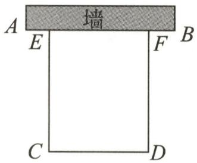

<details>
<summary>text_image</summary>

墙
A	E	F	B
C	D
</details>

①

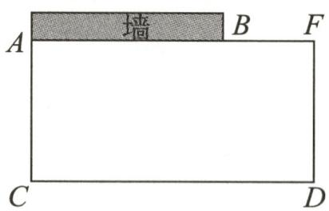

<details>
<summary>text_image</summary>

墙
A B F
C D
</details>

②   
第 14 题图

15. 某商场销售一批名牌衬衫, 平均每天可销售 20 件, 每件盈利 40 元, 为了扩大销售, 增加盈利, 尽量减少库存, 商场决定采取适当的降价措施. 经调查发现, 如果每件衬衫每降价 1 元, 商场平均每天可多售出 2 件.

(1)若商场平均每天要盈利 1200 元,且让顾客尽可能多地得到实惠,则每件衬衫应降价多少元?  
(2)商场平均每天可能盈利1700元吗？请说明理由。

易错知识点:一元二次方程的根的判别式;一元二次方程的根与系数的关系

易错考法:用一元二次方程的根与系数的关系解题时,需要检验二次项系数、根的判别式及是否符合实际意义

# 专题 3 综合与实践

1. 如图①, 为美化校园环境, 某校计划在一块长 $60 \mathrm{~m}$ 、宽 $40 \mathrm{~m}$ 的长方形空地上修建一个长方形花圃, 并将花圃四周余下的空地修建成同样宽的通道, 设通道宽为 $a \mathrm{~m}$ .

(1) 花圃的面积为 \_\_\_\_ m² (用含 a 的式子表示);  
(2)如果通道所占面积是整个长方形空地面积的 $\frac{3}{8}$ ，求此时通道的宽；  
(3)已知某园林公司修建通道与花圃的造价 $y_{1}$ (元)、 $y_{2}$ (元)和修建面积 $x(\mathrm{m}^{2})$ 之间的函数关系如图②所示,如果学校决定由该公司承建此项目,并要求修建的通道的宽度不少于 $2\mathrm{m}$ 且不超过 $10\mathrm{m}$ ,那么通道宽为多少时,修建的通道和花圃的总造价为 105920 元?

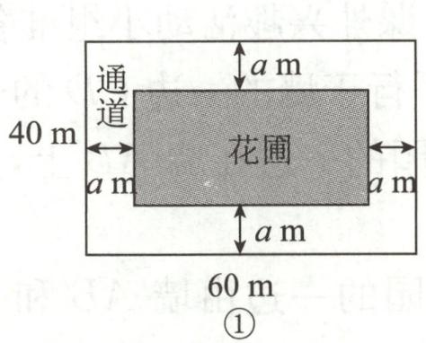

<details>
<summary>text_image</summary>

通道
40 m
a m
a m
a m
60 m
①
</details>

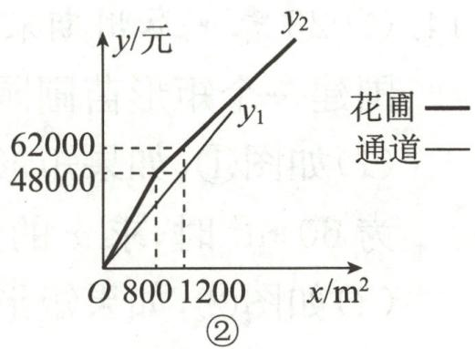

<details>
<summary>line</summary>

| x/m² | y₁     | y₂     |
|------|--------|--------|
| 800  | 48000  | 62000  |
| 1200 | 62000  | 12000  |
</details>

第1题图

# 2. 综合与实践

九年级课外小组计划用两块长 100 cm、宽 40 cm 的长方形硬纸板做一个收纳盒。

善思组:把一块长方形硬纸板的四角剪去四个相同的小正方形(如图①),然后沿虚线折成一个无盖的长方体收纳盒.

问题解决:(1)若该收纳盒的底面积为 $1600 \, cm^{2}$ ，设剪去的小正方形的边长为 $x \, cm$ ，则可列出方程为 \_\_\_\_，求得剪去的小正方形的边长为 \_\_\_\_ cm。

博学组:把另一块长方形硬纸板的四角剪去四个相同的小长方形,然后折成一个有盖的长方体收纳盒(如图②).

问题解决:(2)若 EF 和 HG 两边恰好重合且无重叠部分,该收纳盒的底面积为 $608 \, cm^{2}$ . 设收纳盒的高为 a cm, 则收纳盒底面的长为 \_\_\_\_ cm, 宽为 \_\_\_\_ cm (用含 a 的代数式表示), 则可列方程为 \_\_\_\_ ; 若有一个玩具机械狗, 其尺寸大小如图③所示, 请判断是否能把这个玩具机械狗完全立着放入该收纳盒, 并说明理由.

问题解决:(3)按照博学组的剪法,\_\_\_\_(填“可以”或“不可以”)剪出一个收纳盒把这个玩具机械狗完全放入(立放或平放).

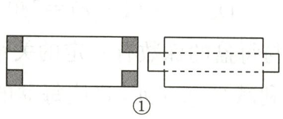

<details>
<summary>natural_image</summary>

Two geometric shapes: a rectangle with shaded corners and a rectangular frame with dashed internal lines (no text or symbols)
</details>

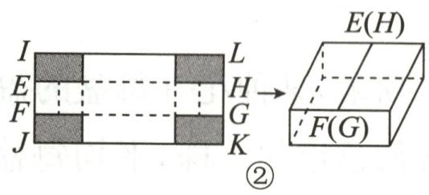

<details>
<summary>text_image</summary>

I
E
F
J
L
H
G
K
→
E(H)
F(G)
②
</details>

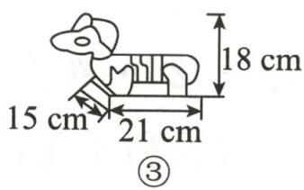  
第2题图

# 小结与思考

# 一、选择题

1.(2024·镇江期末)将一元二次方程 $x(x+1)=3(x\neq0)$ 化为一般形式为 ( )

A. $x^{2}+x=3$

B. $x^{2}+x+3=0$

C. $x^{2}+x-3=0$

D. $x^{2}-x+3=0$

2.(2024·黑龙江)关于 x 的一元二次方程 $(m-2)x^{2}+4x+2=0$ 有两个实数根, 则 m 的取值范围是

A. $m \leqslant 4$

B. $m \geqslant 4$

C. $m \geqslant -4$ 且 $m \neq 2$

D. $m \leqslant 4$ 且 $m \neq 2$

3.(2024·眉山)眉山市东坡区永丰村是“天府粮仓”示范区,该村的“智慧春耕”让生产更高效,提升了水稻亩产量,水稻亩产量从2021年的670千克增长到了2023年的780千克,该村水稻亩产量的年平均增长率为x,则可列方程为()

A. $670 \times (1 + 2x) = 780$

B. $670 \times (1 + x)^{2} = 780$

C. $670 \times (1 + x^{2}) = 780$

D. $670 \times (1 + x) = 780$

4.(2024·新吴区期末)某种花卉每盆的盈利与每盆的株数有一定的关系,每盆植3株时,平均每盆盈利4元;若每盆增加1株,平均每盆盈利减少0.5元,要使每盆的盈利达到15元,每盆应多植多少株?设每盆多植x株,则可以列方程为()

A. $(3+x)(4-0.5x)=15$

B. $(x+3)(4+0.5x)=15$

C. $(x+4)(3-0.5x)=15$

D. $(x+1)(4-0.5x)=15$

# 二、填空题

5.(2024·宜兴期末)如果关于 x 的一元二次方程 $ax^{2}+bx+1=0$ 的一个解是 x=1，则代数式 2024-a-b 的值为 \_\_\_\_.

6.(2024·如皋期末)若方程 $x^{2}-4x+2=0$ 的两个根分别为 $x_{1}, x_{2}$ ，则 $x_{1}x_{2}+2x_{1}^{2}-8x_{1}$ 的值为 \_\_\_\_.

7. 数学文化 (2024·拱墅区期末)《九章算术》中记载了这样一个问题:“今有立木,系索其末(上端),(绳索从木柱上端垂下后)委地(堆在地面)三尺.引索却(退)行,去本(木柱底端)八尺而索尽.问索长几何?”设绳索长 x 尺,可列方程为 \_\_\_\_.

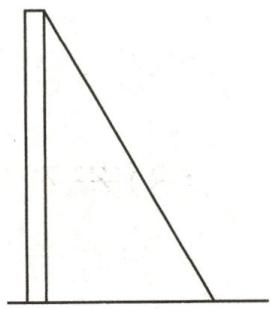  
第7题图

# 三、解答题

8. 解下列方程:

(1) $(x-3)^{2}-16=0;$

(2) $x^{2}+2x-3=0;$

(3) $4x^{2}-5x+1=0;$

(4) $x(x-2)=x-2.$

9.(2023·无棣模拟改编)已知关于 x 的一元二次方程 $x^{2}-4x+m+3=0$ 的两个实数根分别为 $x_{1}, x_{2}$ . 若 $x_{1}, x_{2}$ 满足 $3x_{1}+|x_{2}|=2$ , 求 m 的值.

10. (2023 春·安庆期末)某农场要建一个饲养场(长方形 ABCD), 两面靠墙(AD 位置的墙最大可用长度为 $27 \mathrm{~m}, A B$ 位置的墙最大可用长度为 $15 \mathrm{~m}$ ), 另两边用栅栏围成, 中间也用栅栏隔开, 分成两个场地及一处通道, 并在如图所示的 $H E, G F, H G$ 三处各留 $0.75 \mathrm{~m}, 0.75 \mathrm{~m}$ , $1.5 \mathrm{~m}$ 宽的门(不用栅栏). 建成后栅栏总长 $45 \mathrm{~m}$ .

(1)若饲养场的一边 $CD$ 长为 $10 \mathrm{~m}$ , 则另一边 $BC =$ \_\_\_\_ m.  
(2)若饲养场的面积为 $165 \, m^{2}$ ，求边 CD 的长.  
(3)饲养场的面积能达到 $195 \mathrm{~m}^{2}$ 吗? 若能达到, 求出边 $CD$ 的长; 若不能达到, 请说明理由.

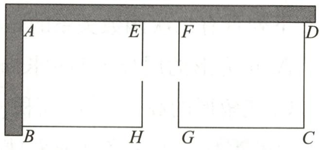

<details>
<summary>text_image</summary>

A E F D
B H G C
</details>

第10题图

11. 某造纸厂为节约木材, 实现企业绿色低碳发展, 通过技术改造升级, 使再生纸项目的生产规模不断扩大. 该厂 3,4 月份共生产再生纸 800 吨, 其中 4 月份再生纸产量比 3 月份的 2 倍少 100 吨.

(1)求 4 月份再生纸的产量;   
(2)若 4 月份每吨再生纸的利润为 1000 元,5 月份再生纸的产量比上月增加 m%,5 月份每吨再生纸的利润比上月增加 $\frac{m}{2}\%$ ,则 5 月份再生纸项目月利润达到 66 万元,求 m 的值;  
(3)若 4 月份每吨再生纸的利润为 1200 元, 4 至 6 月份每吨再生纸利润的月平均增长率与 6 月份再生纸产量比上月增长的百分率相同, 6 月份再生纸项目月利润比上月增加了 25%. 求 6 月份每吨再生纸的利润是多少元.

# 第二十二章 二次函数

# 作业 11 二次函数

# 基础过关

1.(2024·靖江期末)下列函数中,y一定是x的二次函数的是()

A. y=3x-7

B. $y=\frac{2}{x}$

C. $y=3x^{2}-7x+3$

D. $y=ax^{2}-6x-2$

2. 把一根长 50 cm 的铁丝弯成一个长方形, 设这个长方形的一边长为 x cm, 面积为 $y \, cm^{2}$ , 则 y 与 x 之间的函数关系式为 ( )

A. $y = -x^{2} + 50x$

B. $y=x^{2}-50x$

C. $y = -x^{2} + 25x$

D. $y = -2x^{2} + 25$

3. 下列具有二次函数关系的是 ( )

A. 正方形的周长 y 与边长 x

B. 速度一定时, 路程 s 与时间 t

C. 三角形的高一定时, 面积 y 与底边长 x

D. 正方形的面积 $y$ 与边长 $x$

4. 跨学科(2024·高邮期末)标准大气压下,质量一定的水的体积 $V(\mathrm{cm}^{3})$ 与温度 $T(^{\circ}\mathrm{C})$ 之间的关系满足二次函数 $V=\frac{1}{8}T^{2}-T+104(T>0)$ , 则当温度为 $16^{\circ}\mathrm{C}$ 时, 水的体积为 \_\_\_\_ $cm^{3}$ .

5. (2024·盘龙区期末) 若 $y=(m-2)x^{m^{2}-2}+3x-5$ 是关于 x 的二次函数, 则 m 的值为 \_\_\_\_.

6. 指出下列函数中哪些是二次函数, 如果是二次函数, 写出它的二次项系数、一次项系数和常数项.

(1) $y=2x+1;$

(2) $y=2x^{2}+1;$

(3) $y=x(2-x)$ ;

(4) $y=\frac{1}{2}(x-1)^{2}-\frac{5}{2};$

(5) $y=\frac{8}{3x^{2}};$

(6) $y=x^{2}(x-1)-1.$

# 能力提升

7. 如图, 在四边形 $ABCD$ 中, $\angle BAD = \angle ACB = 90^{\circ}, AB = AD, AC = 4BC$ . 设 $CD$ 的长为 $x$ , 四边形 $ABCD$ 的面积为 $y$ , 则 $y$ 与 $x$ 之间的函数关系式是 ( )

A. $y=\frac{2}{25}x^{2}$

B. $y=\frac{4}{25}x^{2}$

C. $y=\frac{2}{5}x^{2}$

D. $y=\frac{4}{5}x^{2}$

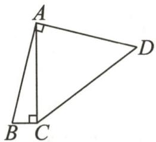  
第7题图

8.(2024·拱墅区期末)某工厂1月份的产值为200万元,若平均每月产值的增长率为 $x(x>0)$ ,该工厂3月份的产值为y,则y关于x的函数解析式是\_\_\_\_.

9. 已知函数 $y=(m^{2}-m)x^{2}+(m-1)x+m+1$ (m 为常数).

(1)当 m 为何值时,这个函数是关于 x 的一次函数?

(2) 当 m 为何值时, 这个函数是关于 x 的二次函数?

10. 如图, 矩形 DEFG 的四个顶点分别在正三角形 ABC 的边上. 已知 $\triangle ABC$ 的边长为 4, 记矩形 DEFG 的面积为 S, 线段 BE 的长为 x.

(1) 求 S 关于 x 的函数解析式;

(2) 当 $S=\sqrt{3}$ 时, 求 x 的值.

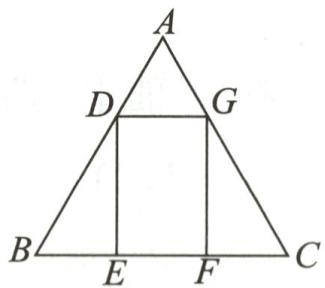

<details>
<summary>text_image</summary>

A
D G
B E F C
</details>

第10题图

11. 已知 $y=y_{1}+y_{2}, y_{1}$ 与 $x^{2}$ 成正比例, $y_{2}$ 与 x-2 成正比例. 当 x=1 时, y=1; 当 x=-1 时, y=-5.

(1)求 $y$ 与 $x$ 的函数关系式；

(2) 当 x = -2 时, 求 y 的值.

# 拓展延伸

12. 如图, 正方形 $ABCD$ 的边长为 $4 \mathrm{~cm}$ , 动点 $P, Q$ 同时从点 $A$ 出发, 以 $1 \mathrm{~cm} / \mathrm{s}$ 的速度分别沿 $A \rightarrow B \rightarrow C$ 和 $A \rightarrow D \rightarrow C$ 的路径向点 $C$ 运动, 设运动时间为 $x \mathrm{~s}$ , 由点 $P, B, D, Q$ 确定的封闭图形的面积为 $y \mathrm{~cm}^{2}$ , 求 $y$ 关于 $x (0 \leqslant x \leqslant 8)$ 的函数解析式.

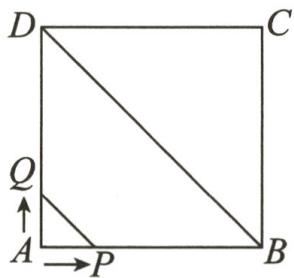  
第12题图

# 作业 12 二次函数 $y = ax^2$ 的图象和性质

# 基础过关

1.(2024·北京通州区期末)下列关于二次函数 $y=3x^{2}$ 的说法正确的是()

A. 它的图象经过点 $(-1,-3)$

B. 它的图象的对称轴是直线 $x = 3$

C. 当 $x < 0$ 时, $y$ 随 $x$ 的增大而减小

D. 当 x=0 时, y 有最大值, 为 0

2.(2024·广东)若点 $(0,y_{1}),(1,y_{2}),(2,y_{3})$ 都在二次函数 $y=x^{2}$ 的图象上,则()

A. $y_{3} > y_{2} > y_{1}$

B. $y_{2} > y_{1} > y_{3}$

C. $y_{1}>y_{3}>y_{2}$

D. $y_{3} > y_{1} > y_{2}$

3.(2024·濠江区期末)如图,正方形 OABC 有三个顶点在抛物线 $y=\frac{1}{4}x^{2}$ 上,O 是原点,顶点 B 在 y 轴上,则顶点 A 的坐标是 ( ) $y \uparrow$

A. $(2,2)$

B. $(\sqrt{2},\sqrt{2})$

C. $(4,4)$

D. $(2\sqrt{2}, 2\sqrt{2})$

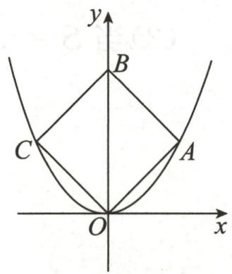

<details>
<summary>text_image</summary>

y
B
C
A
O
x
</details>

第3题图

4. 二次函数 $y = -\frac{1}{2}x^{2}$ 的图象是一条 \_\_\_\_，它的顶点坐标是 \_\_\_\_，对称轴是 \_\_\_\_，开口向 \_\_\_\_，图象有最 \_\_\_\_（填“高”或“低”）点。当 x = \_\_\_\_ 时，y 有最 \_\_\_\_ 值，是 \_\_\_\_。

5. 已知点 $A(2,8)$ 与点 $B(-1,k)$ 都在二次函数 $y=ax^{2}(a \neq 0)$ 的图象上.

(1)求 a 和 k 的值;

(2)写出该抛物线的对称轴、顶点坐标及开口方向；

(3)判断该函数的图象是否经过点 $(-3,9)$ ;

(4)求该抛物线上纵坐标为6的点的坐标.

# 能力提升

6.(2023·诸暨模拟)已知点 $(x_{1},y_{1}),(x_{2},y_{2})$ 为二次函数 $y=x^{2}$ 的图象上的两点(不为顶点),则以下判断正确的是()

A. 若 $x_{1} > x_{2}$ , 则 $y_{1} > y_{2}$

B. 若 $x_{1} < x_{2}$ , 则 $y_{1} < y_{2}$

C. 若 $x_{1}x_{2}>x_{2}^{2}$ ，则 $y_{1}>y_{2}$

D. 若 $x_{1}x_{2}<x_{2}^{2}$ ，则 $y_{1}<y_{2}$

7. 函数 $y=ax^{2}$ 与函数 $y=ax+a$ 在同一直角坐标系中的大致图象可能是图中的（）

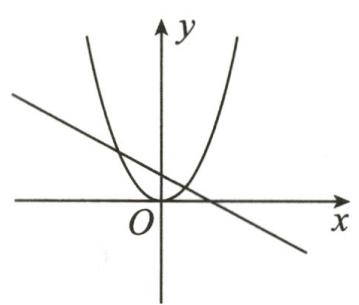

<details>
<summary>text_image</summary>

y
O
x
</details>

A

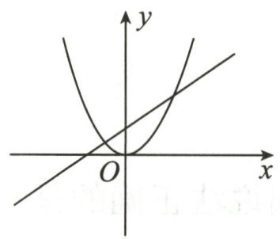

<details>
<summary>text_image</summary>

y
O
x
</details>

B

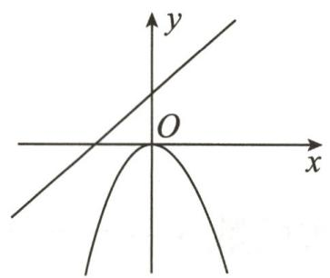

<details>
<summary>text_image</summary>

y
O
x
</details>

C

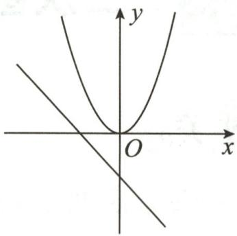

<details>
<summary>text_image</summary>

y
O
x
</details>

D

8.(2024·浏阳期末)在平面直角坐标系 $xOy$ 中, 点 $A(-1,2), B(2,3)$ , 函数 $y=ax^{2}$ 的图象如图所示, 则 $a$ 的值可以为 ( )

A. 0.7   
B. 0.9   
C. 2   
D. 2.1

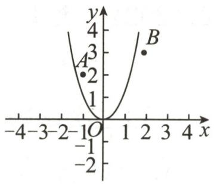

<details>
<summary>line</summary>

| Point | x | y |
|---|---|---|
| A | -1 | 2 |
| B | 2 | 3 |
</details>

第8题图

9. 已知二次函数 $y = 202x^{2}$ 的图象经过原点, 在第 \_\_\_\_ 象限与第 \_\_\_\_ 象限内, 其图象上有两个不同点 $P\left(t_{1}, \frac{1}{4}\right), Q\left(t_{2}, \frac{1}{4}\right)$ , 则 $t_{1} + t_{2} =$ \_\_\_\_.  
10. 已知二次函数 $y = x^2$ ，当 $-1 \leqslant x \leqslant 2$ 时，函数值 $y$ 的取值范围是 \_\_\_\_.  
11.(2023·中原区模拟)一座抛物线形拱桥如图所示,当桥下水面宽度AB为20m时,拱顶点O距离水面的高度为4m.如图,以点O为坐标原点,以桥面所在直线为x轴建立平面直角坐标系.

(1)求抛物线的函数解析式;   
(2)汛期水位上涨,一艘宽为 $5 \mathrm{~m}$ 的小船装满物资,露出水面部分的高度为 $3 \mathrm{~m}$ (横截面可看作是长 $5 \mathrm{~m}$ 、宽 $3 \mathrm{~m}$ 的矩形),若它恰好能从这座拱桥下通过,求此时水面的宽度。(结果保留根号)

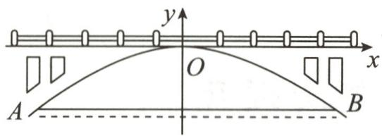

<details>
<summary>text_image</summary>

y
O
x
A
B
</details>

第11题图

# 拓展延伸

12. 已知点 $O$ 为坐标原点, 某函数的图象是一条以 $y$ 轴为对称轴、原点为顶点的抛物线, 且经过点 $A(-2,2)$ .

(1)求这个函数的解析式.  
(2)写出抛物线上与点 A 关于 y 轴对称的点 B 的坐标,并计算出 $\triangle AOB$ 的面积.  
(3)在抛物线上是否存在点 C, 使 $\triangle ABC$ 的面积等于 $\triangle AOB$ 的面积的一半? 若存在, 求点 C 的坐标; 若不存在, 请说明理由.

# 作业 13 二次函数 $y = ax^{2} + c$ 的图象和性质

# 基础过关

1.(2024·海珠区期末)关于二次函数 $y=-x^{2}+6$ ，下列说法正确的是()

A. 图象开口向上

B. 图象的对称轴是 y 轴

C. 有最小值

D. 当 $x < 0$ 时, 函数 $y$ 随 $x$ 的增大而减小

2.(2024·惠山区期末)抛物线 $y=3x^{2}$ 向上平移 2 个单位长度后的图象的函数解析式为（）

A. $y=3x^{2}-2$

B. $y = 3{x}^{2} + 2$

C. $y = 3(x - 2)^{2}$

D. $y = 3(x + 2)^{2}$

3. 已知二次函数 $y = x^{2} - 1$ ，当 $1 \leqslant x \leqslant 2$ 时，函数值 y 的取值范围是（）

A. $-1 \leqslant y \leqslant 3$

B. $-1 \leqslant y \leqslant 0$

C. $0 \leq  y \leq  1$

D. $0 \leq  y \leq  3$

4.(2024·梁溪区期末)若抛物线 $y=x^{2}-2x+ax+2$ 的对称轴是 y 轴, 则 a 的值是 \_\_\_\_.

5. 二次函数 $y = 2x^{2} - 5$ 的图象开口向 \_\_\_\_，对称轴是 \_\_\_\_，顶点坐标是 \_\_\_\_。当 $x = 2\sqrt{2}$ 时， $y =$ \_\_\_\_；当 $y = 3$ 时， $x =$ \_\_\_\_。

6. 求下列抛物线的函数解析式.

(1)已知一条抛物线的顶点在 y 轴上,且经过 $(1,-2)$ , $(2,3)$ 两点;

(2)已知某条抛物线与抛物线 $y=2x^{2}+3$ 的形状、开口方向都一样，顶点为 $(0,4)$ ;

(3)已知抛物线 $y=ax^{2}+c$ 与 x 轴交于 $(2,0)$ ， $(-2,0)$ 两点，与 y 轴交于点 $(0,2)$ .

# 能力提升

7.(2023·崂山区模拟)在同一平面直角坐标系中,一次函数 y=ax-b 和二次函数 $y=-ax^{2}-b$ 的大致图象是()

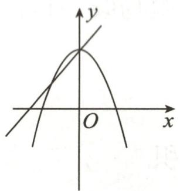

<details>
<summary>text_image</summary>

y
O x
</details>

A

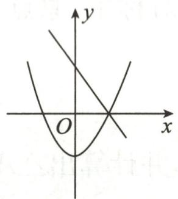

<details>
<summary>text_image</summary>

y
O
x
</details>

B

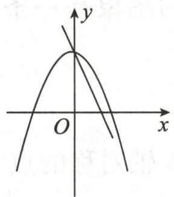

<details>
<summary>text_image</summary>

y
O
x
</details>

C

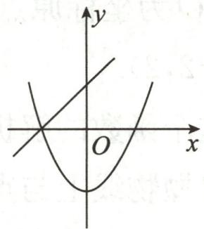

<details>
<summary>text_image</summary>

Mathematical graph showing a parabola and a straight line intersecting in the Cartesian coordinate system, with labeled axes x and y.
</details>

D

8. 已知点 $(x_{1}, y_{1}), (x_{2}, y_{2})$ 均在抛物线 $y = x^{2} - 1$ 上, 下列说法中正确的是 ( )

A. 若 $y_{1}=y_{2}$ ，则 $x_{1}=x_{2}$

B. 若 $x_{1} = -x_{2}$ ，则 $y_{1} = -y_{2}$

C. 若 $0 < x_{1} < x_{2}$ ，则 $y_{1} > y_{2}$

D. 若 $x_{1}<x_{2}<0$ ，则 $y_{1}>y_{2}$

9. 已知 a<-1，点 $(a-1, y_{1})$ ， $(a, y_{2})$ ， $(a+1, y_{3})$ 都在函数 $y = x^{2} + 1$ 的图象上，则（）

A. $y_{1}<y_{2}<y_{3}$

B. $y_{1} <   y_{3} <   y_{2}$

C. $y_{3}<y_{2}<y_{1}$

D. $y_{2} <   y_{1} <   y_{3}$

10.(2024·增城区期末)如图,抛物线 $y=ax^{2}+c$ 经过等腰直角 $\triangle ABO$ 的两个顶点 A,B, 点 A 在 y 轴上, 则 ac 的值为 ( )

A. -4

B. -3

C. -2

D. -1

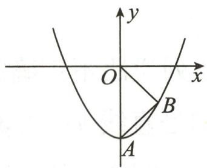

<details>
<summary>text_image</summary>

y
O
x
A
B
</details>

第10题图

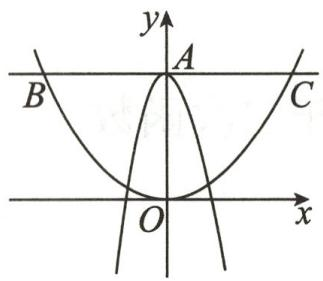

<details>
<summary>text_image</summary>

y
A
B
C
O
x
</details>

第11题图

11. 如图, 在平面直角坐标系中, 抛物线 $y = ax^2 + 3$ 与 $y$ 轴交于点 $A$ , 过点 $A$ 与 $x$ 轴平行的直线交抛物线 $y = \frac{1}{3}x^2$ 于点 $B, C$ , 则 $BC$ 的长为 \_\_\_\_.

12. 已知二次函数图象的顶点为 $A(0,1)$ , 且图象过点 $B(2,3)$ .

(1)求该二次函数的解析式；  
(2)画出该二次函数的图象；  
(3)若直线 $y=-\frac{1}{2}x+2$ 与抛物线交于 C, D 两点(点 C 在点 D 的左侧), 求 $\triangle ACD$ 的面积.

# 拓展延伸

13. 如图, 二次函数 $y = -mx^{2} + 4m (m \neq 0)$ 图象的顶点坐标为(0,2), 矩形 $ABCD$ 的顶点 $B, C$ 在 $x$ 轴上, $A, D$ 在抛物线上, 矩形 $ABCD$ 在抛物线与 $x$ 轴所围成的图形内.

(1)求二次函数的解析式;   
(2)设点 $A$ 的坐标为 $(x, y)$ , 试求矩形 $ABCD$ 的周长 $c$ 关于自变量 $x$ 的函数解析式, 并写出自变量 $x$ 的取值范围.

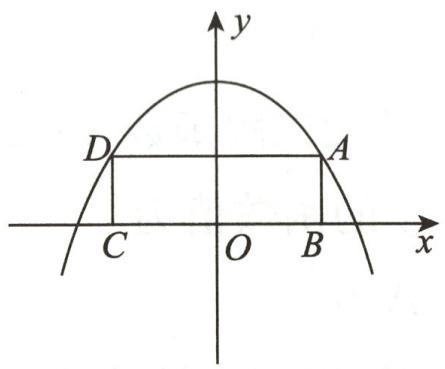

<details>
<summary>text_image</summary>

y
D
A
C O B x
</details>

第13题图

易错知识点:二次函数 $y=ax^{2}+c$ 的图象和性质

易错考法:求点的坐标;求三角形的面积

# 作业 14 二次函数 $y=a(x-h)^{2}$ 的图象和性质

# 基础过关

1.(2024·砀山模拟)对于二次函数 $y=(x+3)^{2}$ 的图象,下列说法不正确的是()

A. 开口向上

B. 对称轴是直线 $x = -3$

C. 顶点坐标为 $(-3,0)$

D. 当 $x < -3$ 时, $y$ 随 $x$ 的增大而增大

2.(2024·缙云期末)将函数 $y = -x^{2}$ 的图象用下列方法平移后, 所得的图象经过点 A(1, -4) 的是 ( )

A. 向上平移 1 个单位长度

B. 向下平移 2 个单位长度

C. 向左平移 1 个单位长度

D. 向右平移 2 个单位长度

3.(2024·海安期末)将抛物线 $y=-\frac{1}{2}x^{2}$ 向左平移 1 个单位长度得到的抛物线的函数解析式为 \_\_\_\_.

4. 有一条抛物线, 开口向上, 对称轴为直线 $x = -2$ , 且顶点在 $x$ 轴上, 并与 $y$ 轴交于点 $(0,3)$ , 则此抛物线的函数解析式为 \_\_\_\_.

5. 已知抛物线 $y=a(x-h)^{2}$ ，当 x=2 时，y 有最大值，此抛物线过点 $(1,-3)$ ，求抛物线的函数解析式，并指出当 x 为何值时，y 随 x 的增大而减小.

# 能力提升

6.(2024·广西模拟)在平面直角坐标系中,函数 $y=-x+1$ 与 $y=-\frac{3}{2}(x-1)^{2}$ 的图象大致是 ( )

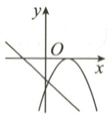  
A

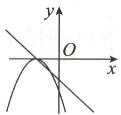  
B

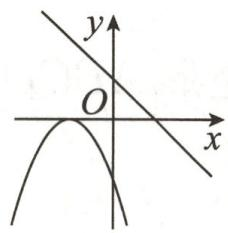  
C

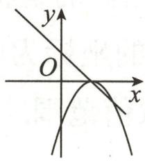  
D

7. 已知二次函数 $y=2(x-3)^{2}$ ，若 x 取 $x_{1}, x_{2}$ ，且 $x_{1} \neq x_{2}$ 时，函数值 $y_{1}=y_{2}$ ，则当 $x=x_{1}+x_{2}$ 时，y 的函数值为（）

A. 0

B. 3

C. 18

D. 20

8.(2023·灞桥区改编)已知抛物线 $y=a(x-h)^{2}$ ，点 $A(1,-5)$ ， $B(7,-5)$ ， $C(m,y_{1})$ ， $D(n,y_{2})$ 均在此抛物线上，若 $|m-h|<|n-h|$ ，则 $y_{1}$ 与 $y_{2}$ 的大小关系是（）

A. ${y}_{1} < {y}_{2}$

B. $y_{1} > y_{2}$

C. $y_{1} = y_{2}$

D. 不能确定

9. 若抛物线 $y = -\frac{1}{2}(x + 1)^{2}$ 向右平移 m 个单位长度后经过点 $(2, -2)$ ，则 m = \_\_\_\_.

10. 若点 $A\left(-\frac{13}{4}, y_{1}\right)$ , $B\left(-\frac{5}{4}, y_{2}\right)$ , $C\left(\frac{1}{4}, y_{3}\right)$ 为二次函数 $y=(x-2)^{2}$ 图象上的三点，则 $y_{1}, y_{2}, y_{3}$ 的大小关系为 \_\_\_\_。（用“＞”连接）

11.(2024·柳州期末)已知二次函数 $y=3(x-a)^{2}$ ，当 x>2 时，y 随 x 的增大而增大，则 a 的取值范围是

12. 如图, 抛物线 $y = a(x + 1)^2$ 的顶点为 $A$ , 与 $y$ 轴的负半轴交于点 $B$ , 且 $OB = OA$ .

(1)求抛物线的函数解析式;   
(2)若点 $C(-3, b)$ 在该抛物线上, 求 $S_{\triangle ABC}$ 的值.

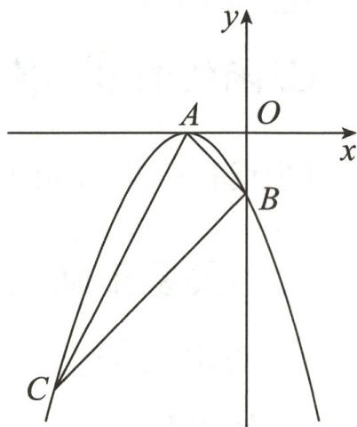

<details>
<summary>text_image</summary>

y
A
O
x
B
C
</details>

第12题图

13. 如图, 直线 $y = -x - 2$ 交 $x$ 轴于点 $A$ , 交 $y$ 轴于点 $B$ , 抛物线 $y = a(x - h)^{2}$ 的顶点为 $A$ , 且经过点 $B$ .

(1)求抛物线的函数解析式;   
(2) 若点 $C\left(m, -\frac{9}{2}\right)$ 在该抛物线上, 求 m 的值;  
(3)请在抛物线的对称轴上找一点 $P$ , 使 $PO + PB$ 的值最小, 求出点 $P$ 的坐标.

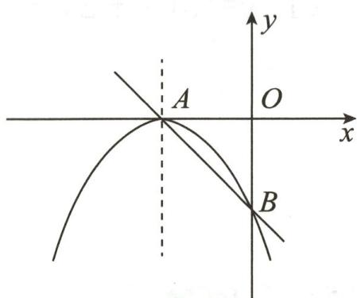

<details>
<summary>text_image</summary>

y
A
O
x
B
</details>

第 13 题图

# 拓展延伸

14. 已知二次函数 $y = -(x - h)^{2}$ (h 为常数)，当自变量 x 的值满足 $2 \leqslant x \leqslant 5$ 时，与其对应的函数值 y 的最大值为 -1。求 h 的值。

# 作业 15 二次函数 $y = a(x - h)^2 + k$ 的图象和性质

# 基础过关

1.(2024·昆山期末)对抛物线 $y=-(x-2)^{2}+5$ 的描述,下列说法错误的是()

A. 开口向下

B. 对称轴为直线 $x = 2$

C. 函数的最小值为 5

D. 当 $x < 2$ 时, $y$ 随 $x$ 的增大而增大

2.(2024·凉山州)抛物线 $y=\frac{2}{3}(x-1)^{2}+c$ 经过 $(-2,y_{1}),(0,y_{2}),\left(\frac{5}{2},y_{3}\right)$ 三点，则 $y_{1},y_{2},y_{3}$ 的大小关系正确的是 ()

A. $y_{1}>y_{2}>y_{3}$

B. $y_{2} > y_{3} > y_{1}$

C. $y_{3} > y_{1} > y_{2}$

D. $y_{1} > y_{3} > y_{2}$

3. 二次函数 $y = (x - 1)^2 + 3$ 图象的顶点坐标是\_\_\_\_，当自变量 $x =$ \_\_\_\_时，此函数有最\_\_\_\_值，是\_\_\_\_。

4. (2024·南通模拟) 将抛物线 $y = 2x^{2}$ 向上平移 2 个单位长度, 再向右平移 3 个单位长度后, 得到的抛物线的函数解析式为 \_\_\_\_.

5.(2024·邗江区期末)若抛物线 $y=(x-m)^{2}+m-3$ 的对称轴是直线 x=2，则它的顶点坐标是 \_\_\_\_.

6. 写出下列二次函数图象的开口方向、对称轴和顶点坐标.

(1) $y=5(x+2)^{2}-3;$

(2) $y=-\frac{1}{4}(x-2)^{2}+3;$

(3) $y=\frac{1}{2}(x+3)^{2}+6.$

# 能力提升

7. 对于抛物线 $y = -\frac{1}{2}(x + 1)^{2} + 3$ ，有下列结论：①抛物线的开口向下；②对称轴为直线 x = 1；
③顶点坐标为 $(-1,3)$ ; ④x>1时，y随x的增大而减小。其中正确结论的个数为（）

A. 1

B. 2

C. 3

D. 4

8.(2024·海安模拟)设函数 $y=a(x+m)^{2}+n(a\neq0,m,n$ 是实数)，当 x=1 时，y=1；当 x=6 时，y=6。则（）

A. 若 m = -3，则 a < 0

B. 若 $m = -4$ , 则 $a > 0$

C. 若 m = -5，则 a < 0

D. 若 $m = -6$ ，则 $a > 0$

9. 已知二次函数 $y=(x-m)^{2}-1$ ，当 $x \leqslant 1$ 时，y 随 x 的增大而减小，则 m 的取值范围是 \_\_\_\_.

10. 小明在研究抛物线 $y = -(x - h)^2 - h + 1$ ( $h$ 为常数)时, 得到如下结论:

①无论 x 取何实数, y 的值都小于 0; ②该抛物线的顶点始终在直线 y = x - 1 上; ③若当 -1 < x < 2 时, y 随 x 的增大而增大, 则 h < 2; ④该抛物线上有两点 A(x₁, y₁), B(x₂, y₂), 若 x₁ < x₂, x₁ + x₂ > 2h, 则 y₁ > y₂. 其中正确的结论是 \_\_\_\_. (填序号)

11. 已知二次函数 $y=(x-a)^{2}+a^{2}-1$ (a 为常数)，当 a 取不同的值时，其图象构成一个“抛物线系”。如图，它们的顶点在一条抛物线上，且该抛物线的顶点为 $(0,-1)$ ，则它们的顶点所在的这条抛物线的函数解析式是 \_\_\_\_。

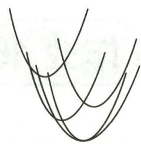  
第11题图

12. 如图, 二次函数 $y = (x - 2)^2 + m$ 的图象与 $y$ 轴交于点 $C$ , 点 $B$ 是点 $C$ 关于该二次第 11 题图函数图象的对称轴的对称点, 已知一次函数 $y = kx + b$ 的图象经过该二次函数图象上的点 $A(1,0)$ 及点 $B$ .

(1)求二次函数与一次函数的解析式.  
(2)抛物线上是否存在一点 P, 使 $S_{\triangle ABP} = S_{\triangle ABC}$ ? 若存在, 请求出点 P 的坐标; 若不存在, 请说明理由.

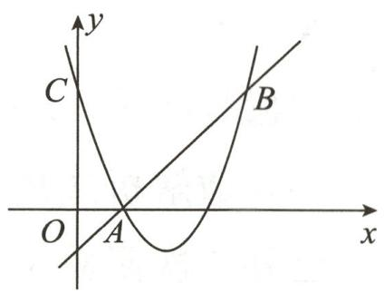

<details>
<summary>text_image</summary>

y
C
B
O
A
x
</details>

第12题图

# 拓展延伸

13. 如图, 已知点 $O(0,0), A(-5,0), B(2,1)$ , 抛物线 $l: y = -(x - h)^{2} + 1$ (h 为常数) 与 $y$ 轴的交点为 $C$ .

(1)若抛物线 l 经过点 B, 求它的函数解析式, 并写出此时抛物线 l 的对称轴及顶点坐标;

(2)设点 C 的纵坐标为 $y_{C}$ ，求 $y_{C}$ 的最大值，此时抛物线 l 上有两点 $(x_{1}, y_{1}), (x_{2}, y_{2})$ ，其中 $x_{1} > x_{2} \geqslant 0$ ，比较 $y_{1}$ 与 $y_{2}$ 的大小；

(3)当线段 OA 被抛物线 l 分为两部分,且这两部分的比是 1:4 时,求 h 的值.

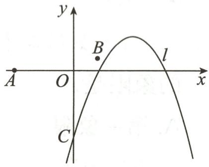

<details>
<summary>text_image</summary>

y
B
l
A O x
C
</details>

第13题图

# 模型积累

二次函数图象的平移变换规律: 上加下减, 左加右减

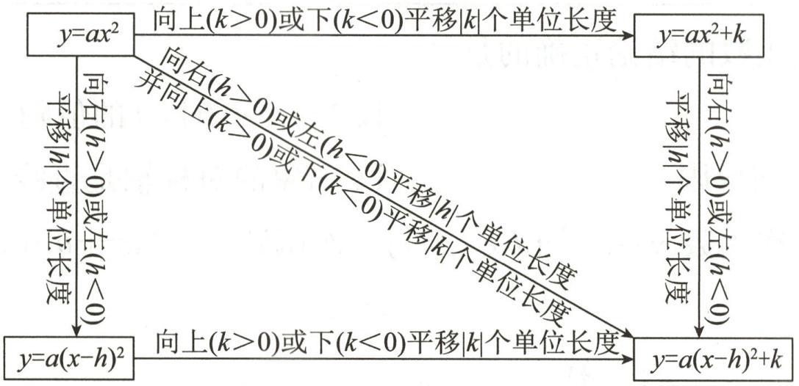

<details>
<summary>flowchart</summary>

```mermaid
graph TD
    A["y=ax²"] -->|向上(k>0)或下(k<0)平移|k|个单位长度| B["y=ax²+k"]
    A -->|向右(h>0)或左(h<0)平移|h|个单位长度| C["y=a(x-h)²"]
    B -->|向右(h>0)或左(h<0)平移|h|个单位长度| C
    B -->|并向上(k>0)或下(k<0)平移|h|个单位长度| C
    C -->|向上(k>0)或下(k<0)平移|k|个单位长度| D["y=a(x-h)²+k"]
    D -->|向右(h>0)或左(h<0)| C
```
</details>

先利用配方法把二次函数解析式化成 $y=a(x-h)^{2}+k$ 的形式, 确定其顶点 $(h,k)$ , 然后画出 $y=ax^{2}$ 的图象, 将抛物线 $y=ax^{2}$ 平移, 使其顶点平移到点 $(h,k)$ .

易错知识点:二次函数 $y=a(x-h)^{2}+k$ 的图象和性质

易错考法:求对称轴;求顶点坐标;二次函数与几何图形综合

# 作业 16 二次函数 $y = ax^{2} + bx + c$ 的图象和性质

# 基础过关

1. 抛物线 $y=x^{2}-2x+2$ 的顶点坐标为（）

A. $(1,1)$

B. $(-1,1)$

C. $(1,3)$

D. $(-1,3)$

2. 已知抛物线 $y = -x^{2} + bx + 4$ 经过 $(-2, n)$ 和 $(4, n)$ 两点，则 n 的值为（）

A.-2

B.-4

C. 2

D. 4

3. 将抛物线 $y = x^{2} - 6x + 5$ 向上平移 2 个单位长度, 再向右平移 1 个单位长度后, 得到的抛物线的函数解析式是 \_\_\_\_.

4. 已知二次函数 $y = x^{2} - 4x + k$ 的最小值是 1, 那么 k 的值是 \_\_\_\_.

5. 写出下列二次函数图象的开口方向、对称轴和顶点坐标.

(1) $y=2-2x-x^{2}$ ;

(2) $y=x^{2}-2x+4;$

(3) $y=x^{2}-3x+\frac{5}{2}.$

# 能力提升

6.(2024·温州期末)已知二次函数 $y=ax^{2}+bx+c(a\neq0)$ 的图象如图所示,则点 $A(a,b+c)$ 所在的象限是()

A. 第一象限

B. 第二象限

C. 第三象限

D. 第四象限


<details>
<summary>text_image</summary>

y
O
x
</details>

第6题图

7.(2024·陕西)已知一个二次函数 $y=ax^{2}+bx+c$ 的自变量 x 与函数 y 的几组对应值如下表:

<table><tr><td>x</td><td>...</td><td>-4</td><td>-2</td><td>0</td><td>3</td><td>5</td><td>...</td></tr><tr><td>y</td><td>...</td><td>-24</td><td>-8</td><td>0</td><td>-3</td><td>-15</td><td>...</td></tr></table>

则下列关于这个二次函数的结论正确的是 （）

A. 图象的开口向上

B. 当 x > 0 时, y 的值随 x 值的增大而减小

C. 图象经过第二、三、四象限

D. 图象的对称轴是直线 $x = 1$

8.(2024·太和期末)二次函数 $y=ax^{2}+bx+1$ 与一次函数 $y=2ax+b$ 在同一平面直角坐标系中的图象可能是()


<details>
<summary>text_image</summary>

y
1
O
x
</details>

A


<details>
<summary>text_image</summary>

y
1
O
x
</details>

B

  
C


<details>
<summary>text_image</summary>

y
1
O
x
</details>

D

9.(2024·乐山)已知二次函数 $y=x^{2}-2x(-1\leqslant x\leqslant t-1)$ ，当 x=-1 时，函数取得最大值；当 x=1 时，函数取得最小值，则 t 的取值范围是（）

A. $0 < t \leqslant 2$

B. $0 < t \leq  4$

C. $2 \leqslant t \leqslant 4$

D. $t \geq  2$

10.(2024·梁溪区期末)已知点A(-2,3),B(3,3),C(5,3),D(3,-1),若一条抛物线经过其中三个点,则不在该抛物线上的点是点\_\_\_\_.

11.(2024·邗江区期末)已知二次函数 $y=ax^{2}+bx+c(a<0)$ 图象的对称轴是直线 x=t，点 $P(1,m)$ ， $Q(3,n)$ 在这个二次函数的图象上，若 n<c<m，则 t 的取值范围是 \_\_\_\_.

12.(2024·浙江)已知二次函数 $y=x^{2}+bx+c$ (b,c 为常数)的图象经过点 A(-2,5)，对称轴为直线 $x=-\frac{1}{2}$ .

(1)求二次函数的解析式;

(2)若点 $B(1,7)$ 向上平移 2 个单位长度, 向左平移 $m(m > 0)$ 个单位长度后, 恰好落在函数 $y = x^{2} + bx + c$ 的图象上, 求 $m$ 的值;

(3)当 $-2 \leqslant x \leqslant n$ 时,二次函数 $y = x^{2} + bx + c$ 的最大值与最小值的差为 $\frac{9}{4}$ ,求 $n$ 的取值范围.

# 拓展延伸

13. 如图, 已知抛物线经过两点 $A(-3,0), B(0,3)$ , 且其对称轴为直线 $x = -1$ .

(1)求此抛物线的函数解析式；

(2) 直线 $x = m$ (在点 $A, B$ 之间) 交抛物线于点 $M$ , 交直线 $AB$ 于点 $N$ , 求线段 $MN$ 的长 (用含 $m$ 的代数式表示);

(3)若点 P 是抛物线上点 A 与点 B 之间的动点(不包括点 A, B)，求 $\triangle PAB$ 的面积的最大值，并求出此时点 P 的坐标.


<details>
<summary>text_image</summary>

P
B
A
O
x
y
x=-1
</details>

第13题图

# 专题 4 求二次函数的解析式

# 类型一 已知三点求解析式

1. 已知抛物线 $y=ax^{2}+bx+c$ 过 $(1,-1)$ ， $(2,-4)$ 和 $(0,4)$ 三点，求这个抛物线的函数解析式.

2.(2024·花都区期末)如图,二次函数 $y=ax^{2}+bx+c$ 的图象经过点 A(0,6)、B(3,3)、C(4,6).

(1)求此二次函数的解析式;   
(2)观察函数的图象,试直接写出 y>6 时,x 的取值范围.


<details>
<summary>line</summary>

| Point | x | y |
|---|---|---|
| A | 6 | 6 |
| B | 3 | 2 |
| C | 4 | 6 |
</details>

第2题图

# 类型二 已知顶点或对称轴求解析式

3. 根据下表中二次函数 $y=ax^{2}+bx+c$ 的自变量 x 与函数值 y 的部分对应值, 求这个二次函数的解析式.

<table><tr><td>x</td><td>...</td><td>-1</td><td>0</td><td>1</td><td>2</td><td>...</td></tr><tr><td>y</td><td>...</td><td>-1</td><td> $-\frac{7}{4}$ </td><td>-2</td><td> $-\frac{7}{4}$ </td><td>...</td></tr></table>

4. 求经过 $A(1,4)$ , $B(-2,1)$ 两点, 对称轴为直线 x = -1 的抛物线的函数解析式.

5.(2024·蚌埠期末)已知关于 x 的二次函数的图象的顶点坐标为 $(-1,2)$ ，且图象过点 $(1,-3)$ .

(1)求这个二次函数的解析式;  
(2)写出它的开口方向、对称轴.

# 类型三 已知抛物线与 $x$ 轴的交点求解析式

6.(2024·雨花区期末)已知二次函数的图象如图所示,求这个二次函数的解析式.


<details>
<summary>line</summary>

| x | y |
|---|---|
| -1 | -3 |
| 0 | 0 |
| 3 | 0 |
</details>

第6题图

7. 若抛物线的最高点的纵坐标是 $\frac{25}{4}$ , 且过点 $(-1,0)$ , $(4,0)$ , 求这个抛物线的函数解析式.

8. 如果抛物线经过点 A(2,0) 和 B(-1,0)，且与 y 轴交于点 C，若 OC=2，求这条抛物线的函数解析式.

# 类型四 根据图形平移、翻折、旋转求解析式

9. 已知一条抛物线的开口方向和形状与抛物线 $y=3x^{2}$ 相同, 顶点与抛物线 $y=(x+2)^{2}$ 的顶点重合.

(1)这条抛物线的函数解析式为\_\_\_\_；  
(2)若将(1)中的抛物线向右平移4个单位长度,得到的新抛物线的函数解析式为  
(3)若将(1)中的抛物线的顶点不变,开口方向相反,得到的新抛物线的函数解析式为  
(4)若将(1)中的抛物线沿 y 轴对折,得到的新抛物线的函数解析式为 \_\_\_\_.

10. 已知抛物线 $y=2x^{2}-4x+1$ .

(1)该抛物线关于 x 轴对称的抛物线的函数解析式为 \_\_\_\_；  
(2)该抛物线关于 y 轴对称的抛物线的函数解析式为 \_\_\_\_；  
(3)该抛物线关于原点对称的抛物线的函数解析式为\_\_\_\_；  
(4)将该抛物线绕着它与 y 轴的交点旋转 $180^{\circ}$ 所得抛物线的函数解析式为 \_\_\_\_；  
(5)该抛物线关于直线 x=2 对称的抛物线的函数解析式为 \_\_\_\_.

# 模型积累

二次函数的图象关于 x 轴对称, 如图①:

抛物线 $y=ax^{2}+bx+c$ 关于 x 轴对称后, 得到的新抛物线的函数解析式是 $y=-ax^{2}-bx-c$ ; 抛物线 $y=a(x-h)^{2}+k$ 关于 x 轴对称后, 得到的新抛物线的函数解析式是 $y=-a(x-h)^{2}-k$ .

二次函数的图象关于 y 轴对称, 如图②:

抛物线 $y=ax^{2}+bx+c$ 关于 y 轴对称后, 得到的新抛物线的函数解析式是 $y=ax^{2}-bx+c$ ; 抛物线 y=$a(x-h)^{2}+k$ 关于y轴对称后,得到的新抛物线的函数解析式是 $y=a(x+h)^{2}+k$ .


<details>
<summary>text_image</summary>

(h, k)
(h, -k)
</details>

图①


<details>
<summary>text_image</summary>

(-h, k)
(h, k)
O
x
y
</details>

图②

易错知识点:用顶点式求二次函数的解析式

易错考法:根据图形平移、翻折、旋转求二次函数的解析式

# 周练 2

总分:100 分 时间:45 分钟 成绩评定:

# 一、选择题(每小题6分,共30分)

1. 抛物线 $y = -3x^{2}, y = 3x^{2} + 2, y = 3x^{2} - 2$ 共有的性质是 ( )

A. 开口向上

B. 对称轴都是 $y$ 轴

C. 都有最高点

D. 顶点都是原点

2.(2024·如皋期末)二次函数 $y=(x+3)^{2}+7$ 的顶点坐标是 ( )

A. $(-3,7)$

B. $(3,7)$

C. $(-3,-7)$

D. $(3,-7)$

3. 已知函数 $y = 2(x + 1)^2 + 1$ ，则 （）

A. 当 x<1 时, y 随 x 的增大而增大

B. 当 $x < 1$ 时, $y$ 随 $x$ 的增大而减小

C. 当 $x < -1$ 时, $y$ 随 $x$ 的增大而增大

D. 当 x<-1 时, y 随 x 的增大而减小

4.(2024·西湖区期末)已知二次函数 $y=a(x-h)^{2}+k(a\neq0)$ 的图象与一次函数 $y=px+q(p\neq0)$ 的图象交于 $(x_{1},y_{1})$ 和 $(x_{2},y_{2})$ 两点，则下列结论正确的是（）

A. 若 a > 0, p < 0, 则 $x_{1} + x_{2} > 2h$

B. 若 $x_{1} + x_{2} > 2h$ ，则 a > 0, p < 0

C. 若 a<0, p<0, 则 $x_{1}+x_{2}>2h$

D. 若 $x_{1} + x_{2} > 2h$ ，则 a < 0, p < 0

5.(2024·广安)如图,二次函数 $y=ax^{2}+bx+c(a,b,c$ 为常数, $a\neq0$ )的图象与 x 轴交于点 $A\left(-\frac{3}{2},0\right)$ ,对称轴是直线 $x=-\frac{1}{2}$ ,有以下结论:①abc<0;②若点 $(-1,y_{1})$ 和点 $(2,y_{2})$ 都在抛物线上,则 $y_{1}<y_{2}$ ;③ $am^{2}+bm\leqslant\frac{1}{4}a-\frac{1}{2}b$ (m 为任意实数);④ $3a+4c=0$ ,其中正确的有()

A. 1 个

B. 2 个

C. 3 个

D. 4 个


<details>
<summary>text_image</summary>

x=-\frac{1}{2}
y=ax^2+bx+c
(-\frac{3}{2},0)
A
O
x
y
</details>

第5题图

# 二、填空题(每小题6分,共30分)

6. 二次函数 $y = -2x^{2} + 4x - 1$ 的图象的顶点坐标是 \_\_\_\_.

7. 若抛物线 $y = x^{2} - 2x + m^{2} - 1$ 的顶点在 x 轴上，则 m 的值是 \_\_\_\_.

8. (2024·义乌期末)已知抛物线 $y = -mx^{2} + 2mx + 4 (m > 0)$ 经过点 $A(-2, y_{1}), B(1, y_{2}), C(3, y_{3})$ ，那么 $y_{1}, y_{2}, y_{3}$ 的大小关系是 \_\_\_\_（用“<”连接）.

9. (2024·鼓楼区期末)已知二次函数 $y=ax^{2}+bx$ 的图象经过点 $(-2,1)$ ，则函数 $y=a(x-1)^{2}+b(x-1)-2$ 的图象经过的定点坐标为 \_\_\_\_.

10.(2024·越秀区期末)已知二次函数 $y=ax^{2}+bx+c(a\neq0)$ 的函数值 y 和自变量 x 的部分对应值如下表所示:

<table><tr><td>x</td><td>...</td><td>-1</td><td>0</td><td>1</td><td>2</td><td>3</td><td>...</td></tr><tr><td>y</td><td>...</td><td>1</td><td>m</td><td>n</td><td>1</td><td>p</td><td>...</td></tr></table>

若在 m, n, p 这三个实数中, 只有一个是正数, 则 a 的取值范围是 \_\_\_\_.

# 三、解答题(共40分)

11.(10分)已知二次函数 $y=x^{2}-2x-3$ .

(1)函数图象的对称轴为\_\_\_\_，顶点坐标为\_\_\_\_。  
(2)请补全下表,并在如图所示的平面直角坐标系中描出表中各点,画出图象.

<table><tr><td>x</td><td>-1</td><td>0</td><td>1</td><td>2</td><td>3</td></tr><tr><td>y</td><td></td><td>-3</td><td>-4</td><td></td><td>0</td></tr></table>


<details>
<summary>natural_image</summary>

Empty Cartesian coordinate system with x and y axes, no data points or labels present
</details>

第11题图

(3)根据图象填空:

①当 y > -3 时, x 的取值范围为 \_\_\_\_ ;  
②当 0 < x < 3 时, y 的取值范围为 ;  
③当 $x < k$ (k 是常数) 时, y 随 x 的增大而减小, 实数 k 的取值必须满足: \_\_\_\_.

12.(15分)(2024·南通模拟)在平面直角坐标系 $xOy$ 中,点(4,3)在抛物线 $y=ax^{2}+bx+3(a>0)$ 上.

(1)求该抛物线的对称轴；  
(2)已知 m>0，当 $2-m \leqslant x \leqslant 2+2m$ 时，y 的取值范围是 $-1 \leqslant y \leqslant 3$ 。求 a, m 的值。

13.(15分)(2024·临夏州)在平面直角坐标系中,抛物线 $y=-x^{2}+bx+c$ 与 x 轴交于 A(-1,0), B(3,0)两点,与 y 轴交于点 C,作直线 BC.

(1)求抛物线的函数解析式.   
(2)如图①,点 $P$ 是线段 $BC$ 上方的抛物线上一动点,过点 $P$ 作 $PQ \perp BC$ ,垂足为 $Q$ ,请问线段 $PQ$ 是否存在最大值?若存在,请求出最大值及此时点 $P$ 的坐标;若不存在,请说明理由.  
(3)如图②,点 $H$ 是直线 $BC$ 上一动点, 过点 $H$ 作线段 $HK \parallel OC$ (点 $K$ 在直线 $BC$ 下方), 已知 $HK = 2$ , 若线段 $HK$ 与抛物线有交点, 请直接写出点 $H$ 的横坐标 $x_{H}$ 的取值范围.


<details>
<summary>text_image</summary>

y
C
P
Q
A O B x
</details>

①


<details>
<summary>text_image</summary>

H
C
K
A
O
B
x
y
</details>

②   
第 13 题图

易错知识点:二次函数的图象与性质

易错考法:二次函数的系数a,b,c符号的确定及a,b,c之间满足的关系;求最值

# 作业 17 二次函数与一元二次方程（一）

# 基础过关

1. 二次函数 $y = ax^{2} + bx + c$ 的部分图象如图所示, 由图象可知该抛物线与 $x$ 轴的交点坐标是 ( )


<details>
<summary>text_image</summary>

y
O 2 5 x
</details>

第1题图

A. $(-1,0)$ 和 $(5,0)$   
B.(1,0)和(5,0)   
C. $(0,-1)$ 和 $(0,5)$   
D. $(0,1)$ 和 $(0,5)$

2.(2024·石景山区期末)若抛物线 $y=x^{2}+2mx+9$ 与 x 轴只有一个交点,则 m 的值为 ( )

A. 3

B.-3

C. $\pm 3 \sqrt{2}$

D. ±3

3. 若抛物线 $y=ax^{2}+bx+c(a\neq0)$ 上的所有点都在 x 轴下方，则必有（）

A. $a <   0,b^{2} - 4ac > 0$

B. $a>0, b^{2}-4ac>0$

C. $a<0, b^{2}-4ac<0$

D. $a>0, b^{2}-4ac<0$

4. 若抛物线 $y = x^{2} - 2x + m$ 与 x 轴的一个交点的坐标是 $(-2, 0)$ ，则另一个交点的坐标是 \_\_\_\_.  
5.(2024·雨花区期末)若二次函数 $y=x^{2}-4x+c$ 的图象与 x 轴没有交点,则 c 的取值范围是 \_\_\_\_.  
6. 已知二次函数 $y = -x^{2} + 2x + m$ .

(1)如果二次函数的图象与 x 轴有两个交点,求 m 的取值范围;  
(2)如图,二次函数的图象过点 $A(3,0)$ ,与 $y$ 轴交于点 $B$ ,直线 $AB$ 与这个二次函数图象的对称轴交于点 $P$ ,求点 $P$ 的坐标;  
(3)在(2)的条件下,根据图象直接写出使一次函数的函数值大于二次函数的函数值的x的取值范围.


<details>
<summary>text_image</summary>

y
B
P
O
A
x
</details>

第6题图

# 能力提升

7.(2023·泸州)已知二次函数 $y=ax^{2}-2ax+3$ (其中 x 是自变量), 当 0<x<3 时, 对应的函数值 y 均为正数, 则 a 的取值范围为 ( )

A. $0 < a < 1$

B. $a < - 1$ 或 $a > 3$

C. -3<a<0 或 0<a<3

D. $-1 \leqslant a < 0$ 或 0 < a < 3

8.(2023·衡阳)已知 m>n>0, 若关于 x 的方程 $x^{2}+2x-3-m=0$ 的解为 $x_{1}, x_{2} (x_{1}<x_{2})$ , 关于 x 的方程 $x^{2}+2x-3-n=0$ 的解为 $x_{3}, x_{4} (x_{3}<x_{4})$ , 则下列结论正确的是 ()

A. $x_{3}<x_{1}<x_{2}<x_{4}$

B. $x_{1}<x_{3}<x_{4}<x_{2}$

C. $x_{1}<x_{2}<x_{3}<x_{4}$

D. $x_{3} <   x_{4} <   x_{1} <   x_{2}$

9.(2024·泸州)已知二次函数 $y=ax^{2}+(2a-3)x+a-1$ (x 是自变量)的图象经过第一、二、四象限,则实数 a 的取值范围为 ( )

A. $1 \leqslant a < \frac{9}{8}$

B. $0 < a < \frac{3}{2}$

C. $0 < a < \frac{9}{8}$

D. $1 \leqslant a < \frac{3}{2}$

10.(2024·梁溪区期末)若二次函数 $y=x^{2}+2x-b$ 的图象与坐标轴有两个公共点,则 b 满足的条件是 \_\_\_\_.


<details>
<summary>text_image</summary>

y
O
x
</details>

第11题图

11.(2024·梁山期末)已知函数 $y=|x^{2}-2x-3|$ 的大致图象如图所示,如果方程 $|x^{2}-2x-3|=m$ (m 为实数)有 2 个不相等的实数根,则 m 的取值范围是 \_\_\_\_.

12.(2024·建邺区期末)已知二次函数 $y=ax^{2}+bx+c$ 的图象经过 $(-1,3)$ ， $(1,-1)$ 两点.

(1) 求 b 的值;

(2)求证:该二次函数的图象与x轴总有两个公共点;

(3)设该函数图象与 x 轴的两个公共点的坐标分别为 $(m,0)$ , $(n,0)$ . 当 mn<0 时, 求 a 的取值范围.

# 拓展延伸

13. 已知二次函数 $y=2x^{2}+bx-1$ (b 为常数).

(1)若抛物线经过点 $(1,2b)$ ，求b的值；

(2)求证:无论 b 取何值,二次函数 $y=2x^{2}+bx-1$ 的图象与 x 轴必有两个交点;

(3)若平行于 $x$ 轴的直线与该二次函数的图象交于点 $A, B$ , 且点 $A, B$ 的横坐标之和大于 1 , 求 $b$ 的取值范围.

易错知识点:二次函数与一元二次方程的关系

易错考法: 字母系数及 $\Delta$ 的符号的确定; 一次函数与二次函数的综合运用; 求字母的取值范围

# 作业 18 二次函数与一元二次方程（二）

# 基础过关

1. 二次函数 $y = ax^2 + bx + c (a \neq 0, a, b, c$ 为常数) 的图象如图所示, 则方程 $ax^2 + bx + c = m$ 有实数根的条件是 ( )

A. $m \geqslant -4$

B. $m \geq  0$

C. $m \geq  5$

D. $m \geq  6$

  
第1题图


<details>
<summary>text_image</summary>

-1
O
2
y
y₂
x
y₁
</details>

第2题图

  
第3题图

2.(2024·蒸湘区一模)如图是二次函数 $y_{1}=ax^{2}+bx+c$ 和一次函数 $y_{2}=kx+t$ 的图象, 当 $y_{1}<y_{2}$ 时, x 的取值范围是 ( )

A. $x < -1$

B. $x > 2$

C. -1 < x < 2

D. x<-1 或 x>2

3. 如图, 以(1, -4)为顶点的二次函数 $y = ax^2 + bx + c$ 的图象与 $x$ 轴负半轴交于点 $A$ , 则一元二次方程 $ax^2 + bx + c = 0$ 的正数解的范围是 ( )

A. 2 < x < 3

B. 3 < x < 4

C. 4 < x < 5

D. $5 < x < 6$

4. 小明在复习数学知识时, 针对“求一元二次方程的解”整理了以下几种方法, 请你将有关内容补充完整: 例题: 求一元二次方程 $x^{2} - x - 1 = 0$ 的两个解.

(1)解法一:选择一种合适的方法(公式法、配方法、因式分解法)求解.  
(2)解法二:利用二次函数图象与两坐标轴的交点求解.

如图①, 把方程 $x^{2} - x - 1 = 0$ 的解看成二次函数 $y =$ \_\_\_\_ 的图象与 $x$ 轴交点的横坐标, 即 $x_{1}, x_{2}$ 就是方程的解.

(3)解法三:利用两个函数图象的交点求解.

(1)把方程 $x^{2} - x - 1 = 0$ 的解看成二次函数 $y = \_$ 与正比例函数 $y = \_$ 的图象的交点的横坐标；  
②在图②所示的平面直角坐标系中,画出这两个函数的图象,用 $x_{1}, x_{2}$ 在 x 轴上标出方程的解.


<details>
<summary>line</summary>

| x | y |
|---|---|
| -1 | -1 |
| 0 | 0 |
| 1 | -1 |
| 2 | 0 |
</details>

①


<details>
<summary>text_image</summary>

-4-3-2-1O
-1
-2
-3
-4
y
5
4
3
2
1
1 2 3 4 5 x
</details>

②   
第4题图

# 能力提升

5. 若二次函数 $y=ax^{2}+1$ 的图象经过点 $(-2,0)$ ，则关于 x 的方程 $a(x-2)^{2}+1=0$ 的实数根为（）

A. $x_{1} = 0, x_{2} = 4$

B. $x_{1} = -2, x_{2} = 6$

C. $x_{1}=\frac{3}{2}, x_{2}=\frac{5}{2}$

D. $x_{1} = -4, x_{2} = 0$

6.(2023·龙马潭区一模)抛物线 $y=-x^{2}+bx+c$ 经过点 $(0,-3)$ ，对称轴为直线 x=-1，关于 x 的方程 $-x^{2}+bx+c-n=0$ 在 -4<x<1 的范围内有实数根，则 n 的取值范围为（）

A. -11 < n < -2

B. $-6 < n < -3$

C. $-11 < n \leq -2$

D. $-11 < n < -6$

7. (2024·烟台)已知二次函数 $y = ax^{2} + bx + c$ 的 $y$ 与 $x$ 的部分对应值如下表:

<table><tr><td>x</td><td>-4</td><td>-3</td><td>-1</td><td>1</td><td>5</td></tr><tr><td>y</td><td>0</td><td>5</td><td>9</td><td>5</td><td>-27</td></tr></table>

下列结论:①abc>0;②关于x的一元二次方程 $ax^{2}+bx+c=9$ 有两个相等的实数根;

③当-4<x<1时,y的取值范围为0<y<5;   
④若点 $(m,y_{1})$ ， $(-m-2,y_{2})$ 均在二次函数图象上，则 $y_{1}=y_{2}$ ;  
⑤满足 $ax^{2}+(b+1)x+c<2$ 的 x 的取值范围是 x<-2 或 x>3. 其中正确结论的序号为

8. 如图, 在平面直角坐标系 $xOy$ 中, 抛物线 $y = x^{2} - 4x + 3$ 与 $x$ 轴相交于点 $A$ , $B$ (点 $A$ 在点 $B$ 的左边), 与 $y$ 轴相交于点 $C$ .

(1)求直线 BC 的函数解析式;  
(2)垂直于 y 轴的直线 l 与抛物线相交于点 $P(x_{1},y_{1})$ , $Q(x_{2},y_{2})$ , 与直线 BC 交于点 $M(x_{3},y_{3})$ , 且 $x_{3}<x_{2}<x_{1}$ , 请结合函数图象, 求 $x_{1}+x_{2}+x_{3}$ 的取值范围.


<details>
<summary>text_image</summary>

y
C
O A B x
</details>

第8题图

# 拓展延伸

9. 下面是嘉嘉同学积累本的部分内容, 请仔细阅读, 并完成相应的任务.

探究:抛物线 $y=x^{2}-c$ (c 为常数) 在 $0 \leqslant x \leqslant 3$ 的部分与直线 y=2x 的公共点.

思路:①问题转化为抛物线 $y=x^{2}-2x(0\leqslant x\leqslant3)$ 与直线 y=\_\_\_\_ 的公共点.

②在如图所示的平面直角坐标系中画出抛物线 $y = x^{2} - 2x$ 在 $0 \leqslant x \leqslant 3$ 的部分.  
③结合②中图象,根据 c 的取值范围讨论两个图象公共点的个数.

任务一:根据上述思路完成解答;

任务二:若抛物线 $y=-x^{2}+(m+4)x+m$ (m 为常数) 在 $x\geqslant1$ 的部分与直线 $y=mx+2$ 有两个公共点.仿照上述思路,直接写出 m 的取值范围.


<details>
<summary>text_image</summary>

y
-4
-3
-2
-1
-3 -2 -1 O 1 2 3 4 x
-1
-2
-3
</details>

第9题图

易错知识点:二次函数与一元二次方程的关系

易错考法:求一元二次方程解的范围;同一坐标系下一次函数与二次函数函数值的大小比较;求字母参数的值

# 专题 5 二次函数与面积

1. 已知二次函数 $y = x^{2} - 2x - 3$ 的图象与 x 轴交于 A, B 两点，在 x 轴上方的抛物线上有一点 C，且 $\triangle ABC$ 的面积等于 24，则点 C 的坐标为（）

A. $(5,12)$

B. $(-3,12)$

C.(5,12)或(-3,12)

D. (3,12)

2. 如图, 在平面直角坐标系中, 二次函数 $y = x^{2} + mx + 2$ 的图象与 $x$ 轴交于 $A, B$ 两点, 与 $y$ 轴交于点 $C$ , 其顶点为 $D$ , 若 $\triangle ABC$ 与 $\triangle ABD$ 的面积比为 $3:5$ , 则 $m$ 的值为 \_\_\_\_.


<details>
<summary>text_image</summary>

y
C
A
O
B
x
D
</details>

第2题图


<details>
<summary>text_image</summary>

Geometric diagram of quadrilateral ABCD with diagonals and perpendicular line from D to AC at C, labeled with points A, B, C, D, E, F.
</details>

第3题图


<details>
<summary>text_image</summary>

y
D
C
B
O
A
x
</details>

第4题图

3. 如图, 在 Rt $\triangle ACB$ 中, $\angle ACB = 90^{\circ}$ , $AC = BC = \sqrt{2}$ , $D$ 是 $AB$ 上的一个动点, 连接 $CD$ , 将 $\triangle BCD$ 绕点 $C$ 顺时针旋转 $90^{\circ}$ 得到 $\triangle ACE$ , 连接 $DE$ , 则 $\triangle ADE$ 面积的最大值等于 .  
4. 如图, 在平面直角坐标系中, 菱形 $OABC$ 的顶点 $A$ 在 $x$ 轴的正半轴上, 顶点 $C$ 的坐标为 $(4,3)$ , $D$ 是抛物线 $y = -x^{2} + 6x$ 上一点, 且在 $x$ 轴上方, 则 $\triangle BCD$ 面积的最大值为 \_\_\_\_.  
5.(2024·扬州)如图,已知二次函数 $y=-x^{2}+bx+c$ 的图象与 x 轴交于 A(-2,0), B(1,0)两点.

(1)求 $b, c$ 的值；  
(2)若点 P 在该二次函数的图象上,且 $\triangle PAB$ 的面积为 6,求点 P 的坐标.


<details>
<summary>text_image</summary>

y
A O B x
</details>

第 5 题图

6.(2024·牡丹江)如图,二次函数 $y=\frac{1}{2}x^{2}+bx+c$ 的图象与 x 轴交于 A,B 两点,与 y 轴交于点 C,点 A 的坐标为 $(-1,0)$ ,点 C 的坐标为 $(0,-3)$ ,连接 BC.

(1)求该二次函数的解析式;

(2)点 P 是抛物线在第四象限图象上的任意一点, 当 $\triangle BCP$ 的面积最大时, BC 边上的高 PN 的值为 \_\_\_\_.


<details>
<summary>text_image</summary>

y
O
A
N
C
B
x
P
</details>

第6题图

7. 如图, 抛物线 $y = -x^{2} + bx + c$ 与直线 $y = x + 2$ 相交于 $A(-2,0), B(3,m)$ 两点, 与 $x$ 轴相交于另一点 $C$ .

(1)求抛物线的函数解析式.

(2)抛物线上是否存在点 M 使 $\triangle ABM$ 的面积等于 $\triangle ABC$ 面积的一半？若存在，请求出点 M 的坐标；若不存在，请说明理由。


<details>
<summary>text_image</summary>

y
A O C x
B
</details>

第7题图

8.(2024·江夏区期末改编)如图,已知抛物线 $y=-(x-m)^{2}+4m$ 的顶点在第一象限,抛物线交 x 轴于点 A(-1,0), B, 交 y 轴于点 C.

(1)求抛物线的函数解析式;

(2) $D$ 是第一象限内抛物线上的一点, 连接 $A D$ , 若 $A D$ 恰好平分四边形 $A B D C$ 的面积, 求点 $D$ 的横坐标.


<details>
<summary>text_image</summary>

y
C
D
A O B x
</details>

第8题图

易错知识点: 平面直角坐标系中运动的三角形或四边形面积的最值
易错考法: 已知三角形或四边形的面积或面积之间的关系, 求点的坐标

# 专题 6 二次函数与特殊三角形

# 类型一 二次函数与等腰三角形

1. 抛物线 $y=\frac{1}{2}x^{2}-\frac{3}{2}x-2$ 与 x 轴交于 A, B 两点（点 A 在点 B 左侧），与 y 轴交于点 C，在 y 轴上找一点 P，使得 $\triangle PAC$ 是以 AC 为腰的等腰三角形，则点 P 的坐标为 \_\_\_\_.

2. 已知抛物线 $y = -x^{2} + 2x + 3$ 与直线 $y = -x + 3$ 相交于 A, B 两点，在抛物线的对称轴上找一点 Q，使 $\triangle ABQ$ 是等腰三角形，则点 Q 的坐标为 \_\_\_\_.

3.(2024·达州)如图,抛物线 $y=ax^{2}+bx-3$ 与 x 轴交于点 A(-3,0) 和点 B(1,0),与 y 轴交于点 C,点 D 是抛物线的顶点.

(1)求抛物线的函数解析式.

(2)若点 N 是抛物线对称轴上位于点 D 上方的一动点, 是否存在以点 N, A, C 为顶点的三角形是等腰三角形? 若存在, 请求出满足条件的点 N 的坐标; 若不存在, 请说明理由.


<details>
<summary>text_image</summary>

A
O
B
x
y
C
D
</details>

第3题图

# 类型二 二次函数与直角三角形

4. 抛物线 $y = -x^{2} + 4x + 5$ 与 x 轴交于 A, B 两点（点 A 在点 B 左侧），与 y 轴交于点 C。在坐标轴上存在点 N，使得 $\triangle BCN$ 为直角三角形，则点 N 的坐标为 \_\_\_\_.

5.(2024·耒阳模拟)如图,已知抛物线 $y=ax^{2}+bx+c$ 经过 A(1,0), B(-3,0), C(0,3)三点.

(1)求抛物线的函数解析式;

(2)若点 D 为第二象限内抛物线上一动点, 求 $\triangle BCD$ 面积的最大值;

(3)设点 P 为抛物线的对称轴上的一个动点,求使 $\triangle BPC$ 为直角三角形的点 P 的坐标.


<details>
<summary>text_image</summary>

y
C
B
O
A
x
</details>

第5题图

6. 如图, 在平面直角坐标系 $xOy$ 中, 抛物线 $L_{1}: y = x^{2} - 2x - 3$ 的顶点为 $P$ . 直线 $l$ 过点 $M(0, m)$ ( $m \geqslant -3$ ), 且平行于 $x$ 轴, 与抛物线 $L_{1}$ 交于 $A, B$ 两点 (点 $B$ 在点 $A$ 的右侧). 将抛物线 $L_{1}$ 沿直线 $l$ 翻折得到抛物线 $L_{2}$ , 抛物线 $L_{2}$ 交 $y$ 轴于点 $C$ , 顶点为 $D$ . 连接 $BC, CD, DB$ , 若 $\triangle BCD$ 为直角三角形, 求此时 $L_{2}$ 所对应的函数解析式.


<details>
<summary>text_image</summary>

y
L₁
O
x
P
</details>

第6题图

# 类型三 二次函数与等腰直角三角形

7. 抛物线 $y = -x^{2} - 2x + 3$ 与 $x$ 轴交于 $A(1,0)$ , $B$ 两点, 点 $P$ 在抛物线的对称轴上, 若线段 $PA$ 绕点 $P$ 逆时针旋转 $90^{\circ}$ 后, 点 $A$ 的对应点 $A'$ 恰好落在此抛物线上, 则点 $P$ 的坐标为 \_\_\_\_.  
8.(2024·眉山)如图,抛物线 $y=-x^{2}+bx+c$ 与 x 轴交于点 A(-3,0) 和点 B,与 y 轴交于点 C(0,3),点 D 在抛物线上.

(1)求该抛物线的函数解析式.   
(2) 当点 D 在第二象限内, 且 $\triangle ACD$ 的面积为 3 时, 求点 D 的坐标.  
(3)在直线 BC 上是否存在点 P, 使 $\triangle OPD$ 是以 PD 为斜边的等腰直角三角形? 若存在, 请直接写出点 P 的坐标; 若不存在, 请说明理由.


<details>
<summary>text_image</summary>

y
C
A O B x
</details>


<details>
<summary>text_image</summary>

y
C
A O B x
</details>

备用图  
第8题图

易错知识点:二次函数与等腰三角形;二次函数与直角三角形

易错考法:求满足条件为等腰三角形时点的坐标;求满足条件为直角三角形时直线的函数解析式

# 专题 7 二次函数与特殊四边形

1. 如图, 在平面直角坐标系 $xOy$ 中, 已知抛物线 $y = x^{2} - 2x - 3$ 与直线 $y = x - 3$ 交于 $A, B$ 两点,该抛物线的顶点为 $C$ . 设直线 $AB$ 与该抛物线的对称轴交于点 $E$ , 在射线 $EB$ 上存在一点 $M$ , 过点 $M$ 作 $x$ 轴的垂线交抛物线于点 $N$ , 使点 $M, N, C, E$ 是平行四边形的四个顶点, 则点 $M$ 的坐标为 \_\_\_\_.

2. 如图, 在平面直角坐标系中, 抛物线 $y = \frac{1}{2} x^2 + 2x$ 经过 $x$ 轴上的点 $A$ , 直线 $AB$ 与抛物线在第一象限交于点 $B(2,6)$ . 若以点 $A, O, B, N$ 为顶点的四边形是平行四边形, 则点 $N$ 的坐标是 \_\_\_\_.


<details>
<summary>text_image</summary>

y
O
A
E
C
B
x
</details>

第1题图


<details>
<summary>text_image</summary>

y
B
A
O
x
</details>

第2题图


<details>
<summary>text_image</summary>

y
D
B
O
C
x
</details>

第3题图


<details>
<summary>text_image</summary>

y
O A B x
C
</details>

第4题图

3. 如图, 二次函数 $y = -\frac{1}{2} x^2 + x + 4$ 的图象经过 $B(0,4), C(4,0)$ 两点, 顶点为 $D$ . 在直线 $CD$ 上有点 $E$ , 作 $EF \perp x$ 轴于点 $F$ , 当以点 $O, B, E, F$ 为顶点的四边形是矩形时, 点 $E$ 的坐标为 \_\_\_\_.

4. 如图, 抛物线 $y = -x^{2} + 6x - 5$ 交 $x$ 轴于 $A, B$ 两点 (点 $A$ 在点 $B$ 的左侧), 交 $y$ 轴于点 $C$ , 直线 $y = x - 5$ 经过点 $B, C$ . 过点 $A$ 的直线交直线 $BC$ 于点 $M$ . 当 $AM \perp BC$ 时, 过抛物线上一动点 $P$ (不与点 $B, C$ 重合), 作直线 $AM$ 的平行线交直线 $BC$ 于点 $Q$ , 若以点 $A, M, P, Q$ 为顶点的四边形是平行四边形, 则点 $P$ 的横坐标为 \_\_\_\_.

5.(2024·泸州)如图,在平面直角坐标系 $xOy$ 中,已知抛物线 $y=ax^{2}+bx+3$ 经过点 $A(3,0)$ ,与 $y$ 轴交于点 $B$ ,且关于直线 $x=1$ 对称.

(1)求该抛物线的函数解析式.

(2)点 C 是抛物线上位于第一象限的一个动点, 过点 C 作 x 轴的垂线交直线 AB 于点 D, 在 y 轴上是否存在点 E, 使得以 B, C, D, E 为顶点的四边形是菱形? 若存在, 求出该菱形的边长; 若不存在, 说明理由.


<details>
<summary>text_image</summary>

y
C
B
D
O
A
x
</details>

第5题图

6.(2024·海安期末)已知直线 $y=-x+c(c>0)$ 与 x 轴、y 轴分别交于点 A, B, 抛物线 $y=ax^{2}+bx+c$ 过点 A, 与 x 轴的另一个交点为 C. 点 D 的坐标为 $(-c,0)$ , 以 AD 为边在 x 轴上方作正方形 ADEF, 若抛物线 $y=ax^{2}+bx+c$ 的顶点 M 在正方形 ADEF 的边上, 求 b 的值.

7.(2024·黄冈期末)如图,抛物线 $y=-x^{2}+2x+3$ 与 x 轴交于 A,B 两点(点 A 在点 B 的左边),与 y 轴交于点 C,点 D 和点 C 关于抛物线的对称轴对称.

(1)求直线 $AD$ 的函数解析式;  
(2) 点 $M$ 是抛物线的顶点, 点 $P$ 是 $y$ 轴上一点, 点 $Q$ 是坐标平面内一点, 以 $A, M, P, Q$ 为顶点的四边形是以 $A M$ 为边的矩形, 求点 $Q$ 的坐标.


<details>
<summary>text_image</summary>

y
M
C
A
O
B
x
</details>


<details>
<summary>text_image</summary>

y
M
C
A
O
B
x
</details>

备用图  
第7题图

# 模型积累

二次函数与平行四边形——平面直角坐标系中,平行四边形对角顶点的横(纵)坐标之和相等.

  
□ABCD中，AC与BD互相平分

$$
\left\{ \begin{array}{l} x _ {A} + x _ {C} = 2 x _ {O} = x _ {B} + x _ {D} \\ y _ {A} + y _ {C} = 2 y _ {O} = y _ {B} + y _ {D} \end{array} \right.
$$

二次函数与矩形(正方形)——转化为直角三角形问题(如图①②).

二次函数与菱形——转化为等腰三角形问题(如图③④).


<details>
<summary>text_image</summary>

y
C
F
D
P
A O E B x
N
</details>

图①


<details>
<summary>text_image</summary>

y
C
F
D
N
P
A O E B x
</details>

图②


<details>
<summary>text_image</summary>

y
A
O
B x
N
Q
P
C
</details>

图③


<details>
<summary>text_image</summary>

y
Q
A
O
B x
P
E
C
</details>

图④

易错知识点:二次函数与平行四边形;二次函数与矩形;二次函数与菱形;二次函数与正方形
易错考法:求满足条件是平行四边形时的点的坐标

# 专题8 二次函数与几何变换

# 类型一 二次函数与平移

1.(2024·昌平区期末)将抛物线 $y=2x^{2}$ 向左平移 2 个单位长度,再向下平移 3 个单位长度,所得到的抛物线的函数解析式为 ( )

A. $y=2(x+2)^{2}+3$

B. $y=2(x-2)^{2}+3$

C. $y=2(x-2)^{2}-3$

D. $y=2(x+2)^{2}-3$

2.(2024·上城区期末)由二次函数 $y=2x^{2}$ 的图象平移得到二次函数 $y=2(x-m)^{2}+n(m>0, n>0)$ 的图象. 下列哪种平移方式可以实现

A. 向右平移 m 个单位长度, 再向上平移 n 个单位长度  
B. 向右平移 m 个单位长度, 再向下平移 n 个单位长度  
C. 向左平移 m 个单位长度, 再向上平移 n 个单位长度  
D. 向左平移 m 个单位长度, 再向下平移 n 个单位长度

3.(2024·内江)已知二次函数 $y=x^{2}-2x+1$ 的图象向左平移 2 个单位长度得到抛物线 C,

点 $P(2, y_{1})$ , $Q(3, y_{2})$ 在抛物线 C 上, 则 $y_{1}$ \_\_\_\_ $y_{2}$ . (填“>”或“<”)

4.(2024·邹城期末)如图,将抛物线 $y=x^{2}$ 平移得到抛物线 m, 抛物线 m 经过点 A(-2,0) 和原点, 它的顶点为 P, 它的对称轴与抛物线 $y=x^{2}$ 交于点 Q, 则图中阴影部分的面积为 \_\_\_\_.


<details>
<summary>text_image</summary>

m
Q
A
O
P
x
y
</details>

第4题图

# 类型二 二次函数与轴对称

5. 抛物线 $y=(x-1)^{2}+3$ 关于 x 轴对称的抛物线的函数解析式是（）

A. $y=-(x-1)^{2}+3$

B. $y=(x+1)^{2}+3$

C. $y = (x - 1)^{2} - 3$

D. $y=-(x-1)^{2}-3$

6. 已知点 $A(-4, a)$ 在抛物线 $y = x^{2} + 4x + 10$ 上, 则点 $A$ 关于抛物线的对称轴对称的点的坐标为 ( )

A. $(-3,7)$

B. $(-1,7)$

C. $(0,10)$

D. $(-4,10)$

7. 已知二次函数 $y=m(x-1)(x-4)$ 的图象与 x 轴交于 A, B 两点(点 A 在点 B 的左边), 顶点为 C, 将该二次函数的图象关于 x 轴翻折, 所得图象的顶点为 D. 若四边形 ACBD 为正方形, 则 m 的值为 \_\_\_\_.

8.(2024·崇川区模拟)在平面直角坐标系 $xOy$ 中, 以 $A$ 为顶点的抛物线 $y = x^{2} - 1$ 与直线 $y = k(x + 1)$ 有两个公共点 $M, N$ , 其中, 点 $M$ 在 $x$ 轴上. 直线 $y = k(x + 1)$ 与 $y$ 轴交于点 $B$ , 点 $B$ 关于点 $A$ 的对称点为 $C$ .

(1)用含 k 的式子分别表示点 B, N 的坐标: B \_\_\_\_, N \_\_\_\_;

(2)如图,当k>0时,连接CM,CN.求证:CO平分 $\angle MCN$ ;

(3)若函数 $y = x^{2} - 1 (x \geqslant k)$ 的图象记为 $W_{1}$ ，将 $W_{1}$ 沿直线 $x = k$ 翻折后的图象记为 $W_{2}$ ，当 $W_{1}, W_{2}$ 两部分组成的图象与线段 $MB$ 恰有一个公共点时，请确定 $k$ 的取值范围.


<details>
<summary>text_image</summary>

y
N
B
M O x
A
C
</details>

第8题图

# 类型三 二次函数与旋转

9. 将抛物线 $y=(x-3)(x-5)$ 先绕原点 O 旋转 $180^{\circ}$ ，再向右平移 2 个单位长度，所得抛物线的函数解析式为（）

A. $y = -x^{2} - 4x - 3$

B. $y = -x^{2} - 12x - 35$

C. $y = x^{2} + 12x + 35$

D. $y = x^{2} + 4x + 3$

10. 如图①, 已知抛物线的顶点坐标为 $(0,1)$ 且经过点 $A(1,2)$ , 直线 $y = 3x - 4\sqrt{2}$ 经过点 $B(2\sqrt{2}, n)$ , 与 $y$ 轴交点为 $C$ .

(1)求抛物线的函数解析式及 n 的值;  
(2) 将直线 BC 绕原点 O 逆时针旋转 $45^{\circ}$ ，求旋转后直线的函数解析式；  
(3)如图②,将抛物线绕原点 O 顺时针旋转 $45^{\circ}$ 得到新曲线,新曲线与直线 BC 交于点 M, N, 点 M 在点 N 的上方,求点 N 的坐标.


<details>
<summary>text_image</summary>

y
A
B
O
x
C
</details>

①


<details>
<summary>text_image</summary>

y
M
A
B
N
O
x
C
</details>

②   
第10题图

# 模型积累

二次函数 $y=a(x-h)^{2}+k$ 图象的旋转

如图①, 抛物线绕原点旋转 $180^{\circ}$ , 顶点横、纵坐标与 $a$ 全部变为相反数; 如图②, 抛物线绕顶点旋转 $180^{\circ}$ , 顶点横、纵坐标不变, $a$ 变为相反数.


<details>
<summary>text_image</summary>

(h, k)
O
x
y
(-h, -k)
</details>

图①


<details>
<summary>text_image</summary>

(h, k)
O x
y
</details>

图②

易错知识点:二次函数与平移;二次函数与轴对称;二次函数与旋转

易错考法:二次函数图象与线段有一个交点时自变量或字母函数的取值范围

# 作业 19 实际问题与二次函数（一）

# 基础过关

1. 如图, 假设篱笆 (虚线部分) 的长度为 $16 \mathrm{~m}$ , 则靠墙 (墙足够长) 所围成矩形 ABCD 的最大面积是 ( )

A. $60 \mathrm{~m}^{2}$

B. $63 \mathrm{~m}^{2}$

C. $64 \mathrm{~m}^{2}$

D. $66 \mathrm{~m}^{2}$


<details>
<summary>text_image</summary>

A
B
C
D
</details>

第1题图

  
第2题图


<details>
<summary>text_image</summary>

y/m
O
A x/m
</details>

第3题图

2. 如图, 已知 $\square ABCD$ 的周长为 $8 \mathrm{~cm}, \angle B = 30^{\circ}$ , 若边长 $AB = x \mathrm{~cm}$ .

(1)□ABCD 的面积 $y(\mathrm{cm}^{2})$ 与 x(cm) 之间的函数解析式为 \_\_\_\_，自变量 x 的取值范围为 \_\_\_\_；

(2) 当 x 取 \_\_\_\_ 时, y 的值最大, 最大值为 \_\_\_\_.

3.(2024·蒸湘区模拟)小康对自己某次实心球的训练录像进行了分析,发现实心球飞行路线近似是一条抛物线(如图),若不考虑空气阻力,实心球的飞行高度y(单位:米)与飞行的水平距离x(单位:米)之间具有函数关系 $y=-\frac{1}{16}x^{2}+\frac{5}{8}x+\frac{3}{2}$ ,则小康这次实心球训练的成绩为\_\_\_\_米.

# 能力提升

4. (2024·玄武区期末)如图, 在矩形 $ABCD$ 中, $AB = 6$ , $BC = 4$ , $P$ , $Q$ 分别是边 $AB$ , $CD$ 上的动点, $CQ = 2AP$ . 设 $AP = x$ , $PQ^2 = y$ , 则 $y$ 关于 $x$ 的函数图象大致是 ( )

  
第4题图


<details>
<summary>line</summary>

| x | y |
|---|---|
| 0 | 52 |
| 3 | 52 |
</details>

A


<details>
<summary>line</summary>

| x | y |
|---|---|
| 0 | 52 |
| 3 | 40 |
</details>

B


<details>
<summary>line</summary>

| Point | x | y |
|---|---|---|
| 1 | 0 | 52 |
| 2 | 3 | 48 |
</details>

C


<details>
<summary>line</summary>

| x | y |
|---|---|
| 0 | 52 |
| 3 | (marked by dashed vertical line) |
</details>

D

5. 如图, 将一个小球从斜坡的点 $O$ 处抛出, 小球的抛出路线可以用二次函数 $y = 4x - \frac{1}{2} x^2$ 的图象来刻画, 斜坡可以用一次函数 $y = \frac{1}{2} x$ 的图象来刻画, 下列结论错误的是 ( )

A. 当小球抛出高度达到 7.5 米时, 小球距 O 点的水平距离为 3 米

B. 小球距 O 点水平距离超过 4 米时呈下降趋势

C. 小球落地点距 O 点水平距离为 7 米

D. 小球的最大高度为 8 米


<details>
<summary>line</summary>

| x/米 | y/米 |
| ---- | ---- |
| 0    | 0    |
| 1    | 2    |
| 2    | 4    |
| 3    | 6    |
| 4    | 8    |
| 5    | 7    |
| 6    | 5    |
| 7    | 3.5  |
| 8    | 2    |
</details>

第5题图

6. 飞机着陆后滑行的距离 y(单位:m) 关于滑行时间 t(单位:s) 的函数解析式是 $y=60t-\frac{3}{2}t^{2}$ ，在飞机着陆滑行中，最后 4 s 滑行的距离是 \_\_\_\_ m.

7. (2024·宁津期末)如图, 现打算用 $60 \mathrm{~m}$ 的篱笆围成一个“日”字形菜园 ABCD(含隔离栏 EF), 菜园的一面靠墙 MN, 墙 MN 可利用的长度为 $39 \mathrm{~m}$ . (篱笆的宽度忽略不计)

(1)菜园面积可能为 $252 \, m^{2}$ 吗? 若可能, 求 AB 的长; 若不可能, 请说明理由.

(2)因场地限制,菜园的宽度 $AB$ 不能超过 $8 \mathrm{~m}$ , 求该菜园面积的最大值.


<details>
<summary>text_image</summary>

M A E D N
B F C
</details>

第7题图

# 拓展延伸

8. (2023·海门区模拟)某建筑工程队借助一段废弃的墙体 $CD(CD$ 长为 18 米), 用 76 米长的铁栅栏围成两个相连的长方形仓库, 为了方便取物, 在两个仓库之间留出了 1 米宽的缺口作通道, 在平行于墙的一边留下一个 1 米宽的缺口作小门. 现有如图所示的两种设计方案 (图①点 A 在线段 DC 的延长线上, 图②点 A 在线段 DC 上), 设 $AB = x$ 米, 图①, 图②中仓库的总面积分别为 $y_{1}$ 平方米, $y_{2}$ 平方米.

(1)分别写出 $y_{1}, y_{2}$ 与 x 的函数关系式；  
(2)小红说:“ $y_{1}$ 的最大值为 384, $y_{2}$ 的最大值为 507.”你同意吗?请说明理由.


<details>
<summary>text_image</summary>

A
C
D
B
</details>

①


<details>
<summary>text_image</summary>

C
A
B
D
</details>

②   
第8题图

# 作业 20 实际问题与二次函数（二）

# 基础过关

1. 一件工艺品的进价为 100 元, 标价 135 元出售, 每天可售出 100 件. 根据销售统计, 一件工艺品每降价 1 元, 每天可多售出 4 件, 要使每天获得的利润最大, 每件需降价 ( )

A. 5 元

B. 10 元

C. 0 元

D. 3.6 元

2. 某商品的销售利润 $y$ (元)与销售单价 $x$ (元)之间的关系式为 $y = -\frac{1}{10} (x - 40)^2 + 2500$ , 则当销售单价定为 \_\_\_\_ 元时, 获得最大利润 \_\_\_\_ 元.  
3. 某服装店以每件 30 元的价格购进一批 T 恤, 如果以每件 40 元出售, 那么一个月内能售出 300 件. 根据以往销售经验, 销售单价每提高 1 元, 销售量就会减少 10 件, 设 T 恤的销售单价提高 x 元.

(1)服装店希望一个月内销售该种 T 恤能获得利润 3360 元,并且尽可能减少库存,问 T 恤的销售单价应提高多少元?  
(2)当销售单价定为多少元时,该服装店一个月内销售这种 T 恤获得的利润最大? 最大利润是多少元?

# 能力提升

4. 某快餐店销售 A, B 两种快餐, 每份的利润分别为 12 元、8 元, 每天卖出的份数分别为 40 份、80 份. 该店为了增加利润, 准备降低每份 A 种快餐的利润, 同时提高每份 B 种快餐的利润. 售卖时发现, 在一定范围内, 每份 A 种快餐的利润每降 1 元可多卖 2 份, 每份 B 种快餐的利润每提高 1 元就少卖 2 份. 如果这两种快餐每天销售总份数不变, 那么这两种快餐一天的总利润最多是 \_\_\_\_ 元.  
5.(2024·海安期末)某商家销售一种单件成本为30元的商品,当销售单价定为40元时,每天可销售400件.根据经验,销售单价每上涨1元,每天销量将减少10件,且单件该商品的利润率不能超过60%.

(1)求每天的销量 y(件)与当天的销售单价 x(元)满足的函数关系式;(不用写出自变量的取值范围)  
(2)当销售单价定为多少元时,商家销售该商品每天获得的利润最大?并求出最大利润;  
(3)当销售单价 x(元)在什么范围时,商家销售该商品每天获得的利润不低于 5250 元?

6.(2024·经开区期末)某商店销售一种商品,经市场调查发现:在实际销售中,售价x为整数,且该商品的月销售量y(件)是售价x(元/件)的一次函数,其售价x(元/件)、月销售量y(件)、月销售利润w(元)的部分对应值如下表:

<table><tr><td>售价x/(元/件)</td><td>35</td><td>40</td></tr><tr><td>月销售量y/件</td><td>250</td><td>200</td></tr><tr><td>月销售利润w/元</td><td>1250</td><td>2000</td></tr></table>

注:月销售利润=月销售量×(售价-进价)

(1) 求 y 关于 x 的函数解析式;

(2)当该商品的售价是多少元/件时,月销售利润最大?并求出最大利润;

(3)现公司决定每销售1件商品就捐赠 $m(0<m\leqslant5)$ 元利润给山区儿童,售价不超过46元/件时,每天扣除捐赠后的月销售利润随售价x的增大而增大,求m的取值范围.

# 拓展延伸

7.(2024·孝感期末)星星服装厂生产 A 品牌服装,每件成本为 68 元,零售商到星星服装厂一次性批发 A 品牌服装 $x(x \geqslant 100)$ 件,批发单价为 $y$ 元, $y$ 与 $x$ 之间满足如图所示的函数关系.

(1) 求 y 与 x 的函数关系式;

(2)零售商到星星服装厂一次性批发 A 品牌服装 $x(100 \leqslant x \leqslant 360)$ 件, 服装厂的利润为 w 元, 问 x 为何值时, w 最大? 最大值是多少?

(3)零售商到星星服装厂一次性批发 A 品牌服装 x 件, 若星星服装厂欲获利不低于 4320 元, 请直接写出 x 的取值范围.


<details>
<summary>line</summary>

| x/件 | y/元 |
| ---- | ---- |
| 100  | 100  |
| 300  | 80   |
</details>

第7题图

# 作业 21 实际问题与二次函数（三）

# 基础过关

1. 如图, 一座抛物线形的拱桥在正常水位时, 水面 $AB$ 宽为 20 米, 拱桥的最高点 $O$ 到水面 $AB$ 的距离为 4 米. 如果此时水位上升 3 米就达到警戒水位 $CD$ , 那么水面 $CD$ 宽为 ( )

A. $4\sqrt{5}$ 米

B. 10 米

C. $4\sqrt{6}$ 米

D. 12 米


<details>
<summary>text_image</summary>

y
O
C
D
x
A
B
</details>

第1题图

2.(2023·滨州改编)某广场要建一个圆形喷水池,计划在池中心位置竖直安装一根部带有喷水头的水管,使喷出的抛物线形水柱在与池中心的水平距离为1 m处达到最高,且高度为3 m,水柱落地处离池中心的水平距离也为3 m,那么水管的设计高度应为()

A. $\frac{7}{2} \mathrm{~m}$

B. $3 \mathrm{~m}$

C. $\frac{9}{4} \mathrm{~m}$

D. $2 \mathrm{~m}$

3.(2024·陕西)一条河上横跨着一座宏伟壮观的悬索桥.桥梁的缆索 $L_{1}$ 与缆索 $L_{2}$ 均呈抛物线形,桥塔AO与桥塔BC均垂直于桥面,如图,以O为原点,以直线 $FF'$ 为x轴,以桥塔AO所在直线为y轴,建立平面直角坐标系.已知缆索 $L_{1}$ 所在抛物线与缆索 $L_{2}$ 所在抛物线关于y轴对称,桥塔AO与桥塔BC之间的距离OC=100m,AO=BC=17m,缆索 $L_{1}$ 的最低点P到 $FF'$ 的距离PD=2m.(桥塔的粗细忽略不计)

(1)求缆索 $L_{1}$ 所在抛物线的函数解析式；

(2) 点 E 在缆索 $L_{2}$ 上, $EF \perp FF'$ , 且 EF = 2.6 m, FO < OD, 求 FO 的长.


<details>
<summary>text_image</summary>

y/m
E L₂ A L₁ B
F O D C F' x/m
</details>

第3题图

# 能力提升

4.(2024·宁津期末)如图,排球运动员站在点 O 处练习发球,将球从 O 点正上方 2 m 的 A 处发出,把球看成点,其运行的高度 $y(\mathrm{m})$ 与运行的水平距离 $x(\mathrm{m})$ 满足关系式 $y=a(x-k)^{2}+h$ . 已知球与 O 点的水平距离为 6 m 时,达到最高 2.6 m,球网 BC 与 O 点的水平距离为 9 m,高度为 2.43 m,球场的边界距 O 点的水平距离为 18 m,则下列判断正确的是()

A. 球不会过网

B. 球会过网且不会出界

C. 球会过网但会出界

D. 无法确定


<details>
<summary>text_image</summary>

y
2
A
B
O
6
9
x
</details>

第4题图

5.(2024·高港区期末)一条隧道的截面由抛物线和长方形构成,长方形的长为8m,宽为2m,隧道最高点P位于AB的中央且距地面6m,建立如图所示的坐标系.

(1)求抛物线的函数解析式;   
(2)该隧道内设双行道,中间隔离带宽1m,一辆货车高4m,宽2.5m,能否安全通过?为什么?


<details>
<summary>text_image</summary>

y
P
A
B
O
C
x
</details>

第 5 题图

# 拓展延伸

6.(2024·江都区期末)如图①是洒水车为绿化带浇水的场景.洒水车喷水口 H 离地竖直高度 OH 为 1.2 m, 喷出的水的上、下边缘近似地看作两条抛物线, 下边缘抛物线是由上边缘抛物线向左平移得到的, 上边缘抛物线最高点 A 离喷水口的水平距离为 2 m, 高出喷水口 0.4 m. 把绿化带横截面抽象为矩形 DEFG, 绿化带的水平宽度 DE=3 m, 竖直高度 EF=0.6 m. 洒水车到绿化带的距离 OD 为 d (单位: m), 建立如图②所示的平面直角坐标系.

(1)若距喷水口水平距离为 5.5 米的地方正好有一个行人经过,试判断该行人是否会被洒水车淋到水?并写出你的判断过程;  
(2)要使洒水车行驶时喷出的水能浇灌到整个绿化带,则洒水车离绿化带的距离 d 的范围是多少?

  
①


<details>
<summary>text_image</summary>

y
A
H
下边缘
上边缘
G
F
B
O
D
E
C
x
d
</details>

②   
第6题图

# 专题 9 综合与实践

# 1. 问题提出

某兴趣小组开展综合实践活动: 在 Rt△ABC 中, ∠C=90°, D 为 AC 上一点, CD=√2, 动点 P 以每秒 1 个单位长度的速度从 C 点出发, 在三角形边上沿 C→B→A 匀速运动, 到达点 A 时停止, 以 DP 为边作正方形 DPEF. 设点 P 的运动时间为 t s, 正方形 DPEF 的面积为 S, 探究 S 与 t 的关系.

# 初步感知

(1)如图①,当点 P 由点 C 运动到点 B 时,

①当 t=1 时, S=\_\_\_\_;  
②S 关于 t 的函数解析式为 \_\_\_\_.  
(2)当点 P 由点 B 运动到点 A 时, 经探究发现 S 是关于 t 的二次函数, 并绘制成如图②所示的图象. 请根据图象信息, 求 S 关于 t 的函数解析式及线段 AB 的长.

# 延伸探究

(3)若存在 3 个时刻 $t_1, t_2, t_3 (t_1 < t_2 < t_3)$ 对应的正方形 DPEF 的面积均相等.

① $t_{1}+t_{2}=$ \_\_\_\_ , $t_{2}+t_{3}=$ \_\_\_\_ ;   
②当 $t_{3}=4t_{1}$ 时, 求正方形 DPEF 的面积.


<details>
<summary>text_image</summary>

Geometric diagram with labeled points and right angle, showing triangle ABC and quadrilateral EDEF
</details>

①


<details>
<summary>line</summary>

| t | S  |
|---|----|
| 0 | 6  |
| 4 | 2  |
| 5 | 18 |
</details>

②   
第1题图

2.(2024·山西)综合与实践

问题情境:如图①,矩形 MNKL 是学校花园的示意图,其中一个花坛的轮廓可近似看成由抛物线的一部分与线段 AB 组成的封闭图形,点 A,B 在矩形的边 MN 上.现要对该花坛内种植区域进行划分,以种植不同花卉,学校面向全体同学征集设计方案.

方案设计:如图②,AB=6 米,AB 的垂直平分线与抛物线交于点 P,与 AB 交于点 O,点 P 是抛物线的顶点,且 PO=9 米.欣欣设计的方案如下:

第一步: 在线段 OP 上确定点 C, 使 $\angle ACB = 90^{\circ}$ , 用篱笆沿线段 AC, BC 分隔出 $\triangle ABC$ 区域, 种植串串红;

第二步: 在线段 CP 上取点 F (不与点 C, P 重合), 过点 F 作 AB 的平行线, 交抛物线于点 D, E. 用篱笆沿 DE, CF 将线段 AC, BC 与抛物线围成的区域分隔成三部分, 分别种植不同花色的月季.

方案实施:学校采用了欣欣的方案,在完成第一步△ABC区域的分隔后,发现仅剩6米篱笆材料.若要在第二步分隔中恰好用完6米材料,需确定DE与CF的长.为此,欣欣在图②中以AB所在直线为x轴,OP所在直线为y轴建立平面直角坐标系.请按照她的方法解决问题:

(1)在图②中画出坐标系,并求抛物线的函数解析式;

(2)求 6 米材料恰好用完时 DE 与 CF 的长;

(3)种植区域分隔完成后,欣欣又想用灯带对该花坛进行装饰,计划将灯带围成一个矩形.她尝试借助图②设计矩形四个顶点的位置,其中两个顶点在抛物线上,另外两个顶点分别在线段AC,BC上.直接写出符合设计要求的矩形周长的最大值.


<details>
<summary>text_image</summary>

L
K
萱草
冬青
海棠
海棠
花坛
海棠
海棠
海棠
空草
冬青
萱草
M A B N
①
</details>


<details>
<summary>text_image</summary>

P
D F E
C
A O B
②
</details>

第2题图

# 小结与思考

# 一、选择题

1.(2024·苏州期末)关于二次函数 $y=(x-2)^{2}+3$ ，下列说法正确的是()

A. 函数图象开口向下

B. 函数图象与 y 轴交点坐标为 $(0,3)$

C. 函数图象的对称轴为直线 $x = 2$

D. 当 $x > 2$ 时, $y$ 随 $x$ 的增大而减小

2. 如图, 在平面直角坐标系中有 $A(1,1), B(3,1)$ 两点, 如果抛物线 $y = ax^{2}(a > 0)$ 与线段 $AB$ 有公共点, 那么 $a$ 的取值范围是 ( )


A. $a \geqslant 1$

B. $0 < a \leq  1$

C. $0 < a \leq  \frac{1}{9}$

D. $\frac{1}{9} \leqslant a \leqslant 1$

第2题图

3.(2024·文登区期末)抛物线 $y=ax^{2}+bx+3(a\neq0)$ 的对称轴为直线 x=1, 如果关于 x 的方程 $ax^{2}+bx-6=0(a\neq0)$ 的一个根为 4, 那么该方程的另一个根为 ( )

A.-2

B.-1

C. 0

D. 3

4.(2024·南沙区期末)二次函数 $y=ax^{2}+bx+c(a\neq0)$ 中 x,y 的部分对应值如下表:

<table><tr><td>x</td><td>...</td><td>-1</td><td>0</td><td>1</td><td>2</td><td>3</td><td>4</td><td>...</td></tr><tr><td>y</td><td>...</td><td>8</td><td>3</td><td>0</td><td>-1</td><td>m</td><td>3</td><td>...</td></tr></table>

下列说法:①该二次函数图象的对称轴为直线 x=2;②a<0;③不等式 $ax^{2}+bx+c<0$ 的解集为 1<x<3;④方程 $ax^{2}+bx+c=8(a\neq0)$ 有两个不相等的实数根.其中正确的有（）

A. 1 个

B. 2 个

C. 3 个

D. 4 个

5. 新定义 (2024·硚口区期末) 当 $a \neq b$ 时, 将 $(a, b), (b, a)$ 两个点称为一对“关联的对称点”. 若抛物线 $y = -x^{2} + x + c$ (c 是常数) 总存在一对“关联的对称点”, 则 $c$ 的取值范围是 ( )

A. $c < 2$

B. $c < 1$

C. $c > 2$

D. $c > 1$

# 二、填空题

6.(2024·句容期末)若二次函数 $y=(m+1)x^{2}+2x+m^{2}-2m-3$ 的图象经过原点,则 m 的值为 \_\_\_\_.

7. 若点 $A\left(-\frac{13}{2}, y_1\right), B\left(-\frac{5}{2}, y_2\right), C\left(\frac{1}{2}, y_3\right)$ 为二次函数 $y = (x - 2)^2$ 图象上的三点, 则 $y_1, y_2, y_3$ 的大小关系为 \_\_\_\_. (用“>”连接)

8.(2024·朝阳区期末)已知函数 $y_{1}=kx+4k-2$ (k 是常数, $k\neq0$ ), $y_{2}=ax^{2}+4ax-5a$ (a 是常数, $a\neq0$ ), 在同一平面直角坐标系中, 若无论 k 为何值, 函数 $y_{1}$ 和 $y_{2}$ 的图象总有公共点, 则 a 的取值范围是 \_\_\_\_.

9. 已知抛物线 $y=ax^{2}+4ax+4a+1(a\neq0)$ 过点 A(m,3), B(n,3) (点 A 在点 B 左侧), 若线段 AB 的长不大于 4, 则代数式 $a^{2}+a+1$ 的最小值是 \_\_\_\_.

10.(2024·龙岩期末)已知抛物线 $y=ax^{2}-3x+1$ 上有两点 $A(x_{1},y_{1})$ , $B(x_{2},y_{2})$ ，其对称轴是直线 $x=x_{0}$ ，若 $\left|x_{1}-x_{0}\right|>\left|x_{2}-x_{0}\right|$ 时，总有 $y_{1}>y_{2}$ ，同一坐标系中有 $M(-1,-2)$ , $N(3,2)$ ，且抛物线 $y=ax^{2}-3x+1$ 与线段 MN 有两个不相同的交点，则 a 的取值范围是 \_\_\_\_.

# 三、解答题

11.(2024·贵州)某超市购入一批进价为10元/盒的糖果进行销售,经市场调查发现:销售单价不低于进价时,日销售量y(盒)与销售单价x(元)是一次函数关系,下表是y与x的几组对应值.

<table><tr><td>销售单价x/元</td><td>...</td><td>12</td><td>14</td><td>16</td><td>18</td><td>20</td><td>...</td></tr><tr><td>销售量y/盒</td><td>...</td><td>56</td><td>52</td><td>48</td><td>44</td><td>40</td><td>...</td></tr></table>

(1)求 y 与 x 的函数解析式;  
(2)糖果销售单价定为多少元时,所获日销售利润最大? 最大利润是多少?  
(3)若超市决定每销售一盒糖果向儿童福利院赠送一件价值为 m 元的礼品,赠送礼品后,为确保该种糖果日销售获得的最大利润为 392 元,求 m 的值.

12.(2024·梁山期末)已知抛物线 $y=-\frac{1}{2}x^{2}+bx+1$ .

(1)当抛物线经过点(4,1)时:

①求抛物线的函数解析式；  
②如果 M, N 是抛物线上两点(点 M 在点 N 的左侧), 且两点之间的水平距离为 2 , 请求出这两点纵坐标之和 W 的最大值.  
(2)当二次函数 $y=-\frac{1}{2}x^{2}+bx+1$ 的自变量 x 满足 $-1 \leqslant x \leqslant 2$ 时, 函数的最大值为 7, 求 b 的值.

易错知识点:二次函数的图象和性质;二次函数与一元二次方程的关系;二次函数的实际应用
易错考法:字母参数的取值范围;二次函数的实际应用

# 第二十三章 旋转

# 作业 22 图形的旋转（一）

# 基础过关

1. 下列图案中, 不能由一个图形通过旋转形成的是 ( )

  
A

  
B

  
C

  
D

2.(2024·朝阳区期末)在如图所示的正方形网格中,四边形ABCD绕某一点旋转某一角度得到四边形A'B'C'D'(所有顶点都是网格线的交点),在网格线交点M,N,P,Q中,可能是旋转中心的是()

A. 点 M

B. 点 N

C. 点 $P$

D. 点 $Q$


<details>
<summary>text_image</summary>

A B N
P M Q
D B'
C A C'
D'
</details>

第2题图


<details>
<summary>text_image</summary>

A
A'
B'
C
B
</details>

第3题图


<details>
<summary>text_image</summary>

A
E
B
C
D
</details>

第4题图

3. 如图, $\triangle A'CB'$ 是由 Rt $\triangle ACB$ 经过旋转得到的, $\angle ACB = 90^\circ$ , 通过观察, 旋转中心应是点 , 在 $\triangle A'CB'$ 中, 直角是 , 与线段 $AB$ 相等的线段是 . 若 $\angle A'CB = 160^\circ$ , 则旋转角的度数是 .

4. 如图, 将 Rt△ABC 绕直角顶点 C 顺时针旋转 $90^{\circ}$ , 得到 △DEC, 连接 AD, 若 $\angle BAC = 25^{\circ}$ , 则 $\angle BAD =$ \_\_\_\_.

# 能力提升

5.(2024·雨花台区模拟)如图,将△ABC绕点A逆时针旋转到△ADE,旋转角为α(0°＜α＜180°),点B的对应点D恰好落在BC边上,若DE⊥AC,∠CAD=24°,则旋转角α的度数为
()

A. ${24}^{ \circ  }$

B. ${28}^{ \circ  }$

C. ${48}^{ \circ  }$

D. $66^{\circ}$


<details>
<summary>text_image</summary>

A
α
B
D
C
E
</details>

第5题图

6. 一副三角板如图放置, 将三角板 $ADE$ 绕点 $A$ 逆时针旋转 $\alpha (0^{\circ} < \alpha < 90^{\circ})$ , 使得三角板 $ADE$ 的一边所在的直线与 $BC$ 垂直, 则 $\alpha$ 的度数为 \_\_\_\_.


<details>
<summary>text_image</summary>

C
D
B
A
E
</details>

第6题图


<details>
<summary>text_image</summary>

Geometric diagram with labeled points A, B, C, D, E forming triangles and intersecting lines
</details>

第7题图

7. (2024·海安期末)如图, 在 $\triangle ABC$ 中, $\angle BAC = 108^{\circ}$ , 将 $\triangle ABC$ 绕点 $A$ 按逆时针方向旋转得到 $\triangle ADE$ . 若点 $D$ 恰好落在边 $BC$ 上, 且 $AD = CD$ , 则 $\angle E =$ \_\_\_\_°.

8. 如图, 点 $A$ 在射线 $OX$ 上, $OA = a$ . 如果 $OA$ 绕点 $O$ 按逆时针方向旋转 $n^{\circ} (0 < n \leqslant 360)$ 到 $OA'$ , 那么点 $A'$ 的位置可以用 $(a, n^{\circ})$ 表示.

(1) 按上述表示方法, 若 $a = 3, n = 37$ , 则点 $A'$ 的位置可以表示为 \_\_\_\_;  
(2)在(1)的条件下,已知点B的位置用 $(3,74^{\circ})$ 表示,连接 $A^{\prime}A,A^{\prime}B$ ,求证: $A^{\prime}A=A^{\prime}B$ .


<details>
<summary>text_image</summary>

O
A'
A
X
</details>

第8题图

# 拓展延伸

9. 如图, 在正方形 $ABCD$ 中, $E, F$ 是对角线 $BD$ 上的两点, 且 $\angle EAF = 45^{\circ}$ , 将 $\triangle ADF$ 绕点 $A$ 顺时针旋转 $90^{\circ}$ 后得到 $\triangle ABQ$ , 连接 $EQ$ .

(1)求证:EA 是 $\angle QED$ 的平分线;  
(2) 求证: $EF^{2}=BE^{2}+DF^{2}$ .


<details>
<summary>text_image</summary>

Geometric diagram of a quadrilateral with labeled vertices A, B, C, D and internal points E, F, Q forming triangles and diagonals.
</details>

第9题图

# 作业 23 图形的旋转（二）

# 基础过关

1. 将 $\triangle AOB$ 绕点 $O$ 旋转 $180^{\circ}$ 后得到 $\triangle DOE$ , 则下列作图正确的是 ( )

  
A

  
B

  
C

  
D

2. (2024·博兴期末)如图,在同一平面内,将 $\triangle ABC$ 绕点A逆时针旋转 $40^{\circ}$ 到 $\triangle AED$ 的位置,恰好使得 $DC \parallel AB$ ,则 $\angle CAE$ 的大小为\_\_\_\_.

3.(2024·庐阳区模拟)如图,在每个小正方形的边长为1个单位长度的网格中, $\triangle ABC$ 的顶点均在格点(网格线的交点)上.


<details>
<summary>text_image</summary>

Geometric diagram with labeled points A, B, C, D, E forming triangles and intersecting lines
</details>

第2题图

(1)将 $\triangle ABC$ 向下平移5个单位长度得到 $\triangle A_{1}B_{1}C_{1}$ ,画出 $\triangle A_{1}B_{1}C_{1}$ ;

(2)将(1)中的 $\triangle A_{1}B_{1}C_{1}$ 绕点 $C_{1}$ 顺时针旋转 $90^{\circ}$ 得到 $\triangle A_{2}B_{2}C_{1}$ ,画出 $\triangle A_{2}B_{2}C_{1}$ .


<details>
<summary>text_image</summary>

A
B C
</details>

第3题图

# 能力提升

4. (2024·北京)如图, 在菱形 $ABCD$ 中, $\angle BAD = 60^{\circ}, O$ 为对角线的交点. 将菱形 $ABCD$ 绕点 $O$ 逆时针旋转 $90^{\circ}$ 得到菱形 $A'B'C'D'$ , 两个菱形的公共点为 $E, F, G, H$ . 对八边形 $BFB'GDHD'E$ 给出下面四个结论: ①该八边形各边长都相等; ②该八边形各内角都相等; ③点 $O$ 到该八边形各顶点的距离都相等; ④点 $O$ 到该八边形各边所在直线的距离都相等.

上述结论中,所有正确结论的序号是 ( )

A. ①③

B. ①④

C. ②③

D. ②④


<details>
<summary>text_image</summary>

A
E
H
D'
A'
B
O
D
C'
F
G
B'
C
</details>

第 4 题图


<details>
<summary>text_image</summary>

A
B
C
D
</details>

第5题图

5.(2024·德城区期末)如图,在正方形网格中,线段AB绕点O旋转一定的角度后与线段CD重合(C,D均为格点,点A的对应点是点C),若点A的坐标为(-1,5),点B的坐标为(3,3),则旋转中心点O的坐标为()

A. $(1,1)$

B. $(4,4)$

C. $(2,1)$

D. $(1,1)$ 或 $(4,4)$

6. 如图, 已知一个锐角等于 $60^{\circ}$ 的菱形 $ABCD$ , 将一个 $60^{\circ}$ 的 $\angle MAN$ 的顶点与该菱形的顶点 $A$ 重合, 以点 $A$ 为旋转中心, 按顺时针方向旋转这个 $60^{\circ}$ 的 $\angle MAN$ , 使它的两边分别交 $CB, DC$ 或它们的延长线于点 $E, F$ .

(1)如图①,当 $\angle BAE=\angle DAF$ 时,线段AE与线段AF之间的数量关系是   
(2)如图②,旋转∠MAN,当∠BAE≠∠DAF时,(1)中的结论是否成立?若成立,加以证明;若不成立,请说明理由.  
(3)若菱形 ABCD 的边长为 4, BE=1, 求 AF 的长.


<details>
<summary>text_image</summary>

A
B
E
C
M
F
D
N
</details>

①

  
②

  
备用图  
第6题图

# 拓展延伸

7. 某学校活动小组探究了如下问题,请你帮助他们完成解答过程:

(1)操作发现:如图①, $\triangle ABC$ 中, $AB=AC,\angle BAC=90^{\circ},D$ 为边BC上一点,连接AD,作 $\angle FAD=90^{\circ}$ ,并截取FA=AD,连接DF,CF,求证: $BD^{2}+CD^{2}=DF^{2}$ ;  
(2)灵活运用:如图②,在四边形ABCD中,AC,BD是对角线, $\triangle ABC$ 是等边三角形, $\angle ADC=30^{\circ},AD=3,BD=5$ ,求CD的长.


<details>
<summary>text_image</summary>

A
B D C
F
</details>

①


<details>
<summary>text_image</summary>

Geometric diagram of quadrilateral ABCD with diagonals AC and BD intersecting at point A
</details>

②   
第7题图

易错知识点:旋转图形的应用;旋转的性质

易错考法:旋转角的判断;利用旋转后不变的量解题;利用旋转的性质证明三角形全等;利用旋转的性质证明两线段之间的数量关系

# 专题 10 解决与旋转有关的问题

# 类型一 利用旋转的性质求角度

1. 将两个斜边长相等的直角三角形纸片如图①放置, 其中 $\angle ACB = \angle CED = 90^{\circ}, \angle A = 45^{\circ}$ , $\angle D = 30^{\circ}$ . 将 $\triangle DCE$ 绕点 $C$ 顺时针旋转 $15^{\circ}$ 得到 $\triangle D_{1} CE_{1}$ , 如图②, 连接 $D_{1} B$ , 则 $\angle E_{1} D_{1} B$ 的度数为 ( )

A. ${10}^{ \circ  }$

B. ${20}^{ \circ  }$

C. $7.5^{\circ}$

D. ${15}^{ \circ  }$

  
①

  
②   
第1题图


<details>
<summary>text_image</summary>

Geometric diagram with labeled points A, B, C, D, E and right angle at A
</details>

第2题图


<details>
<summary>text_image</summary>

A
P
D
B
P'
C
</details>

第3题图

2. (2024·如皋期末)如图, 将 $\triangle ABC$ 绕点 $A$ 逆时针旋转得到 $\triangle ADE$ , 点 $D$ 恰好落在 $BC$ 边上. 若 $\angle CAE = 62^{\circ}$ , 则 $\angle B$ 的度数为 $\quad$ °.  
3.(2024·和平区期中)如图,在矩形ABCD中,BC=2AB,点P为边AD上的一个动点,线段BP绕点B顺时针旋转60°得到线段BP′,连接PP′,CP′.当点P′落在边BC上时,∠PP′C的度数为\_\_\_\_;当线段CP′的长度最小时,∠PP′C的度数为\_\_\_\_.

# 类型二 利用旋转的性质或勾股定理求长度或角度

4. 如图, 在正方形 $ABCD$ 中, $AB=3$ , 点 $M$ 在边 $CD$ 上, 且 $DM=1$ , $\triangle AEM$ 与 $\triangle ADM$ 关于 $AM$ 所在的直线对称, 将 $\triangle ADM$ 绕点 $A$ 按顺时针方向旋转 $90^{\circ}$ 得到 $\triangle ABF$ , 连接 $EF$ , 则线段 $EF$ 的长为 ( )

A. 3

B. $2\sqrt{3}$

C. $\sqrt{13}$

D. $\sqrt{15}$

  
第4题图

  
第5题图


<details>
<summary>text_image</summary>

D'
A'
D	E	C
C'
A	B
</details>

第6题图

  
第7题图

5. (2024·海门期末)如图, $\triangle ABC$ 中, $\angle C = 90^{\circ}, BC = 3, AC = 4$ , 将 $\triangle ABC$ 绕点 $B$ 逆时针旋转 $90^{\circ}$ 得到 $\triangle A'BC'$ , 连接 $AA'$ , 则 $AA'$ 的长为 \_\_\_\_.  
6.(2024·咸宁期末)如图,在矩形ABCD中,AB=8,AD=4,将矩形ABCD绕点B旋转一定角度后得矩形A′BC′D′,A′B交CD于点E,且CE=A′E,则CE的长为\_\_\_\_.   
7.(2024·盐城)如图,在 $\triangle ABC$ 中, $\angle ACB=90^{\circ},AC=BC=2\sqrt{2}$ ,点 $D$ 是 $AC$ 的中点,连接 $BD$ ,将 $\triangle BCD$ 绕点 $B$ 旋转,得到 $\triangle BEF$ .连接 $CF$ ,当 $CF\parallel AB$ 时, $CF=$ \_\_\_\_.

# 类型三 利用旋转计算面积

8. 如图, 将等腰直角三角形 $ABC$ 绕点 $A$ 逆时针旋转 $15^{\circ}$ 得到 $\triangle AEF$ , 若 $AC = \sqrt{3}$ , 则阴影部分的面积为 ( )

A. 1

B. $\frac{1}{2}$

C. $\frac{\sqrt{3}}{2}$

D. $\sqrt{3}$

9. 如图, 将边长为 4 的正方形 $ABCD$ 绕点 $A$ 逆时针旋转 $30^{\circ}$ 到正方形 $AEFG$ 的位置, 则图中阴影部分的面积为 \_\_\_\_.


<details>
<summary>text_image</summary>

A
C F B
E
</details>

第8题图


<details>
<summary>text_image</summary>

C
B
M
E
F
D
A
G
</details>

第9题图


<details>
<summary>text_image</summary>

A
E
F
B
D
C
</details>

第10题图


<details>
<summary>text_image</summary>

A
B₁
D
C₁
B
C
</details>

第11题图

# 类型四 利用旋转的性质解决综合问题

10. (2024·惠山区模拟)如图, $\triangle ABC$ 是边长为 6 的等边三角形, 点 $E$ 在 $AC$ 上且 $AE=4$ , 点 $D$ 是直线 $BC$ 上一动点, 将线段 $ED$ 绕点 $E$ 逆时针旋转 $90^{\circ}$ , 得到线段 $EF$ , 连接 $DF, AF$ . 下列结论: ① $DF$ 的最小值为 $\sqrt{6}$ ; ② $AF$ 的最小值是 $2+\sqrt{3}$ ; ③ 当 $CD=2$ 时, $DE \parallel AB$ ; ④ 当 $DE \parallel AB$ 时, $DE=2$ . 其中正确的有 ( )

A. 4 个

B. 3 个

C. 2 个

D. 1 个

11. 如图, 在 Rt△ABC 中, ∠ABC = 90°, ∠ACB = 30°. 将△ABC绕点A按逆时针方向旋转15°后得到△AB₁C₁, B₁C₁交AC于点D, 若AD = 2√2, 则△ABC的周长等于

12. 如图, 在 $\triangle ABC$ 中, $AB = AC$ , $\angle BAC = \alpha$ , 点 $D$ 在边 $BC$ 上 (不与点 $B, C$ 重合), 连接 $AD$ , 将线段 $AD$ 绕点 $A$ 逆时针旋转 $180^{\circ} - \alpha$ 得到线段 $AE$ , 连接 $BE$ .

(1) $\angle BAC + \angle DAE =$

(2)取 CD 的中点 F, 连接 AF, 用等式表示线段 AF 与 BE 之间的数量关系, 并证明.


<details>
<summary>text_image</summary>

Geometric diagram with labeled points A, B, C, D, E and intersecting lines forming triangles and quadrilaterals
</details>

第12题图

易错知识点:旋转的性质;旋转图形的应用

易错考法:求两线段之间的数量关系;求角的度数;求线段的长;求图形的面积与周长

# 作业 24 中心对称

# 基础过关

1.(2024·广州)下列图案中,点 O 为正方形的中心,阴影部分的两个三角形全等,则阴影部分的两个三角形关于点 O 对称的是 ( )

  
A

  
B

  
C

  
D

2.(2024·武冈期末)如图, $\triangle ABC$ 与 $\triangle DEF$ 成中心对称,点O是对称中心,则下列结论不正确的是()

A. 点 A 与点 D 是对应点

B. $\angle ACB = \angle DEF$

C. ${BO} = {EO}$

D. $AB \parallel DE$


<details>
<summary>text_image</summary>

Geometric diagram showing two triangles ABC and DEF sharing vertex O, with dashed lines indicating hidden edges.
</details>

第2题图


<details>
<summary>text_image</summary>

A
C
G
H
E
M
D
F
B
N
</details>

第 3 题图


<details>
<summary>text_image</summary>

Geometric diagram with labeled points A, B, C, D, E forming triangles and a quadrilateral
</details>

第4题图

3.(2024·邯郸期末)如图,在正方形网格中,A,B,C,D,E,F,G,H,M,N是网格线交点, $\triangle ABC$ 与 $\triangle DEF$ 关于某点对称,则其对称中心是()

A. 点 G

B. 点 H

C. 点 $M$

D. 点 N

4.(2024·北京期末)如图, $\triangle DEC$ 与 $\triangle ABC$ 关于点C成中心对称,AB=3,AC=2, $\angle CAB=90^{\circ}$ ,则AE的长是\_\_\_\_.

5.(1)如图①,作出△ABC关于点P成中心对称的图形.

(2)如图②,在 $\triangle ABC$ 中,点 $D$ 是 $AB$ 边的中点,画出与 $\triangle BCD$ 关于点 $D$ 成中心对称的图形;  
(3)如图③,两个半圆分别以 P,Q 为圆心,它们的半径相等, $A_{1}$ ,P, $B_{1}$ , $B_{2}$ ,Q, $A_{2}$ 在同一条直线上.这个图形中的两个半圆是否成中心对称?如果是,请找出对称中心 O.


<details>
<summary>text_image</summary>

A
B C
P
</details>

①

  
②

  
③   
第5题图

# 能力提升

6. 如图, 在平面直角坐标系 $xOy$ 中, $\triangle OA_{1}B_{1}$ 是边长为 2 的等边三角形, 作 $\triangle B_{2}A_{2}B_{1}$ 与 $\triangle OA_{1}B_{1}$ 关于点 $B_{1}$ 成中心对称, 再作 $\triangle B_{2}A_{3}B_{3}$ 与 $\triangle B_{2}A_{2}B_{1}$ 关于点 $B_{2}$ 成中心对称, 如此继续下去, 则 $\triangle B_{2n}A_{2n+1}B_{2n+1}$ ( $n$ 是正整数) 的顶点 $A_{2n+1}$ 的坐标是 ( )

A. $(4n - 1, \sqrt{3})$

B. $(2n-1,\sqrt{3})$

C. $(4n + 1, \sqrt{3})$

D. $(2n+1,\sqrt{3})$


<details>
<summary>text_image</summary>

y
A₁ A₃
O B₁ B₂ B₃ ... x
A₂ A₄
</details>

第6题图


<details>
<summary>text_image</summary>

Geometric diagram with labeled points A, B, C, D, O, O', B' and intersecting lines forming triangles and quadrilaterals
</details>

第7题图

7. 如图, 菱形 $ABCD$ 的对角线 $AC, BD$ 交于点 $O$ , 将 $\triangle BOC$ 绕着点 $C$ 旋转 $180^{\circ}$ 得到 $\triangle B'O'C$ , 若 $AC = 4, AB' = 10$ , 则菱形 $ABCD$ 的边长是 \_\_\_\_.

8. 如图, $\triangle ABO$ 与 $\triangle CDO$ 关于点 $O$ 成中心对称, 点 $E, F$ 在线段 $AC$ 上, 且 $AF = CE$ .

求证: FD=BE, FD∥BE.


<details>
<summary>text_image</summary>

A
F
D
B
O
E
C
</details>

第8题图

9. 如图, 在 $\triangle ABC$ 中, $AB = AC$ , 若将 $\triangle ABC$ 绕点 $C$ 顺时针旋转 $180^{\circ}$ 得到 $\triangle FEC$ , 连接 $AE, BF$ .

(1)试猜想线段 $AE$ 与 $BF$ 的长短有何关系,并说明理由;

(2)若 $\triangle ABC$ 的面积为 $3cm^{2}$ ,求四边形ABFE的面积;

(3)当/ACB为多少度时,四边形ABFE为矩形?说明理由.


<details>
<summary>text_image</summary>

A
B
C
E
F
</details>

第9题图

# 拓展延伸

10. 如图, 正方形 $ABCD$ 与正方形 $A'B'C'D'$ 关于点 $O$ 成中心对称, 若正方形 $ABCD$ 的边长为 1 , 设图形重合部分 (阴影) 的面积为 $y$ , 线段 $OB$ 的长为 $x$ , 求 $y$ 与 $x$ 之间的函数关系式.


<details>
<summary>text_image</summary>

C'
A
D
O
B'
A'
B
D'
C
</details>

第 10 题图

易错知识点: 中心对称的概念

易错考法:画关于某点成中心对称的图形;求图形的面积;求两变量之间的函数解析式

# 作业 25 中心对称图形

# 基础过关

1.(2024·黑龙江)下列图形中,既是轴对称图形又是中心对称图形的是()

  
A

  
B

  
C

  
D

2.(2024·自贡)我国汉代数学家赵爽在他所著《勾股圆方图注》中,运用弦图(如图)巧妙地证明了勾股定理.“赵爽弦图”曾作为2002年第24届国际数学家大会的会徽图案.下列关于“赵爽弦图”的说法正确的是()

A. 是轴对称图形

B. 是中心对称图形

C. 既是轴对称图形又是中心对称图形

D. 既不是轴对称图形也不是中心对称图形


<details>
<summary>natural_image</summary>

Geometric diagram of a square divided into four triangles by internal lines (no text or symbols)
</details>

第2题图


<details>
<summary>text_image</summary>

1
2 3 4
</details>

第3题图


<details>
<summary>text_image</summary>

C'
A
B'
B
C
</details>

第4题图

3.(2024·梁山期末)围棋起源于中国,古代称之为“弈”,至今已有4000多年的历史.如图,在黑白棋子摆成的图案里下一黑棋,使棋子构成的图形既是轴对称图形也是中心对称图形,黑棋落在位置的序号是()

A. 1

B. 2

C. 3

D. 4

4. 如图是一个中心对称图形, 点 $A$ 为对称中心, 若 $\angle C = 90^{\circ}, \angle B = 30^{\circ}, BC = 1$ , 则 $BB'$ 的长为 \_\_\_\_.

5. 如图为 $7 \times 6$ 的正方形网格, 点 $A, B, C$ 在格点上. 在图中确定格点 $E$ , 并画出以 $A, B, C, E$ 为顶点的四边形, 使其为中心对称图形. (画两个)


<details>
<summary>text_image</summary>

A
B
C
</details>


<details>
<summary>text_image</summary>

A
B
C
</details>

第5题图

# 能力提升

6. 如图, 矩形 ABCD 的顶点 B, C 在坐标轴上, 顶点 D 的坐标是 (3,3), 若直线 y = mx 恰好将矩形分成面积相等的两部分, 则 m 的值为 ( )

A. $\frac{3}{2}$

B. 2

C. $\frac{5}{2}$

D. 3


<details>
<summary>text_image</summary>

y
A 4
D
2
B O 2 C 4 x
</details>

第6题图

7. 如图,两边长分别为 1 和 2 的矩形 ABCD 内放入三个小正方形后形成一个中心对称图形,则放入的三个小正方形的边长分别是 \_\_\_\_.


<details>
<summary>natural_image</summary>

Geometric diagram of a rectangle divided into smaller rectangles and a central diamond shape (no text or symbols)
</details>

第7题图


<details>
<summary>text_image</summary>

A
E
S₁
F
O
B
G
H
C
S₂
D
</details>

第8题图

8. 如图, 点 $O$ 是 $\square ABCD$ 的对称中心, $AD > AB$ , $E, F$ 是 $AB$ 边上的点, 且 $EF = \frac{1}{2} AB$ , $G, H$ 是 $BC$ 边上的点, 且 $GH = \frac{1}{3} BC$ , 若 $S_{\triangle EOF} = 3$ , 则 $S_{\triangle OGH} =$ \_\_\_\_.

9. 图①, 图②, 图③均是由边长为 1 的正三角形构成的网格, 每个网格图中有 5 个正三角形已涂上阴影. 请在余下空白正三角形中, 按下列要求涂上阴影:

(1)在图①中涂上一个阴影正三角形,使得阴影部分图形是中心对称图形,但不是轴对称图形;  
(2)在图②中涂上两个阴影正三角形,使得阴影部分图形是轴对称图形,但不是中心对称图形;  
(3)在图③中涂上三个阴影正三角形,使得阴影部分图形既是中心对称图形,又是轴对称图形.

  
①

  
②

  
③   
第9题图

# 拓展延伸

10. 知识背景: 过中心对称图形的对称中心的任意一条直线都将其分成全等的两个部分.

(1)如图①,直线 m 经过平行四边形 ABCD 对角线的交点 O,则 $S_{四边形AEFB}$ \_\_\_\_ $S_{四边形DEFC}$ ;(填“>”“<”或“=”)  
(2)两个正方形如图②所示摆放, $O$ 为小正方形对角线的交点,求作过点 $O$ 的直线将整个图形分成面积相等的两部分;  
(3)八个大小相同的正方形如图③所示摆放,求作直线将整个图形分成面积相等的两部分。(用三种方法分割)

  
①

  
②


  
③

  
第10题图

易错知识点: 中心对称图形的性质; 中心对称图形的应用

易错考法:利用中心对称图形的性质画出图形;利用中心对称图形的性质求出线段长的范围

# 作业 26 关于原点对称的点的坐标

# 基础过关

1. 将 $\triangle ABC$ 三个顶点的横坐标、纵坐标都乘 -1, 所得的图形与原图形的关系是 ( )

A. 关于 $x$ 轴对称

B. 关于 $y$ 轴对称

C. 关于原点对称

D. 将原图形向 $x$ 轴负方向平移 1 个单位长度

2.(2024·成都)在平面直角坐标系 $xOy$ 中, 点 $P(1, -4)$ 关于原点对称的点的坐标是 ( )

A. $(-1,-4)$

B. $(-1,4)$

C. $(1,4)$

D. $(1,-4)$

3.(2024·陕西)一个正比例函数的图象经过点 A(2,m) 和点 B(n,-6). 若点 A 与点 B 关于原点对称, 则这个正比例函数的解析式为 ( )

A. y=3x

B. $y = -3x$

C. $y=\frac{1}{3}x$

D. $y = -\frac{1}{3}x$

4. 以□ABCD 对角线的交点 O 为原点, 平行于 BC 边的直线为 x 轴, 建立如图所示的平面直角坐标系. 若 A 点坐标为 $(-2,1)$ , 则 C 点坐标为 \_\_\_\_.


<details>
<summary>text_image</summary>

y
A
D
O
x
B
C
</details>

第4题图

5. 若点 $A(-2, n)$ 在 x 轴上，则点 $B(n-1, n+1)$ 关于原点对称的点的坐标为 \_\_\_\_.

6.(2024·滨城区期末)如图, $\triangle ABC$ 的顶点坐标分别为A(1,1),B(3,0),C(2,3).

(1)以点 O 为旋转中心, 将 $\triangle ABC$ 顺时针旋转 $180^{\circ}$ 得到 $\triangle A_{1}B_{1}C_{1}$ , 请画出 $\triangle A_{1}B_{1}C_{1}$ ;

(2)分别写出 $\triangle A_{1}B_{1}C_{1}$ 三个顶点的坐标；

(3)以点 $A$ 为旋转中心, 将 $\triangle ABC$ 逆时针旋转 $90^{\circ}$ 得到 $\triangle AB_{2}C_{2}$ , 直接写出直线 $B_{2}C_{2}$ 的函数解析式.


<details>
<summary>text_image</summary>

y
C
A
O
B
x
</details>

第6题图

# 能力提升

7. 已知点 $P(m^{2} + 1, -1)$ 与点 $Q$ 关于原点对称, 则点 $Q$ 一定在 ( )

A. 第一象限

B. 第二象限

C. 第三象限

D. 第四象限

8.(2024·临邑期末)在直角坐标系中,点 $A(a+b,-2)$ 关于原点对称的点为 $A'(4,a-b)$ , 则 a,b 的值为 ( )

A. a = -1, b = -3

B. a=1, b=3

C. a=0, b=2

D. a=2, b=0

9. 如图, 在平面直角坐标系中, 若 $\triangle ABC$ 与 $\triangle A_{1}B_{1}C_{1}$ 关于点 $E$ 成中心对称, 则对称中心点 $E$ 的坐标是 \_\_\_\_.  
10. 在平面直角坐标系中, 将点 $A$ 先向右平移 4 个单位长度, 再向下平移 6 个单位长度得到点 $B$ , 如果点 $A$ 和点 $B$ 关于原点对称, 那么点 $A$ 的坐标是 \_\_\_\_.  
11. 如图, 在平面直角坐标系中, $\triangle PQR$ 是 $\triangle ABC$ 经过某种变换后得到的

图形, 观察点 A 与点 P, 点 B 与点 Q, 点 C 与点 R 的坐标之间的关系. 在这种变换下:


<details>
<summary>text_image</summary>

y
2
1
B
A
C
-1 O 1 2 3 4 5 x
-1
C₁
-2
-3
A₁
B₁
-4
</details>

第9题图

(1)分别写出点 A 与点 P, 点 B 与点 Q, 点 C 与点 R 的坐标;  
(2)从中你发现了什么特征？请用文字语言表达出来；  
(3)根据你发现的特征,解答下列问题:若 $\triangle ABC$ 内有一个点 $M(2a+5,1-3b)$ 经过变换后,

在 $\triangle PRQ$ 内的坐标为 $N(-3-a,-b+3)$ ，求a,b的值.


<details>
<summary>text_image</summary>

y
C
A
M
B
1
x
O
1
Q
N
R
P
</details>

第11题图

# 拓展延伸

12. 阅读理解: 我们知道, 任意两点关于它们所连线段的中点成中心对称, 在平面直角坐标系中, 任意两点 $P(x_{1}, y_{1}), Q(x_{2}, y_{2})$ 的对称中心的坐标为 $\left(\frac{x_{1} + x_{2}}{2}, \frac{y_{1} + y_{2}}{2}\right)$ .

(1)如图,在平面直角坐标系中,若点 $P_{1}(0,-1), P_{2}(2,3)$ 的对称中心是点 $A$ ,则点 $A$ 的坐标为\_\_\_\_;  
(2) 另取两点 $B(-1.6, 2.1), C(-1, 0)$ . 有一电子青蛙从点 $P_{1}$ 处开始依次关于点 $A, B, C$ 做循环对称跳动, 即第一次跳到点 $P_{1}$ 关于点 $A$ 的对称点 $P_{2}$ 处, 接着跳到点 $P_{2}$ 关于点 $B$ 的对称点 $P_{3}$ 处,第三次再跳到点 $P_{3}$ 关于点 $C$ 的对称点 $P_{4}$ 处, 第四次再跳到点 $P_{4}$ 关于点 $A$ 的对称点 $P_{5}$ 处……求 $P_{3}, P_{8}$ 的坐标;  
(3)在(2)的条件下,求点 $P_{2025}$ 的坐标.


<details>
<summary>text_image</summary>

y
P₂
B
O
C
P₁
x
</details>

第12题图

# 专题 11 直角坐标系中的旋转问题

# 类型一 求绕某点旋转后的点的坐标

1.(2024·湖北)如图,点 A 的坐标是(-4,6),将线段 OA 绕点 O 顺时针旋转 $90^{\circ}$ ,点 A 的对应点的坐标是()

A. $(4,6)$

B. $(6,4)$

C. $(-6,-4)$

D. $(-4,-6)$


<details>
<summary>text_image</summary>

A
y
O
x
</details>

第1题图


<details>
<summary>text_image</summary>

y
N₁
M₁
O P₁ x
P M N
</details>

第2题图


<details>
<summary>text_image</summary>

C
B'
M
C'
D
O (A)
x
y
D'
</details>

第4题图

2. 如图, 在平面直角坐标系中, $\triangle MNP$ 绕原点逆时针旋转 $90^{\circ}$ 得到 $\triangle M_{1}N_{1}P_{1}$ , 若 $M(1, -2)$ , 则点 $M_{1}$ 的坐标为 ( )

A. $(-2,-1)$

B. $(1,2)$

C. $(2,1)$

D. $(-1,-2)$

3.(2024·海门模拟)若点A(2,1),B(-3,7),则点A关于点B的对称点A'的坐标是\_\_\_\_.

4. 如图, 正方形 $ABCD$ 的边长为 1 , 点 $A$ 与原点 $O$ 重合, 点 $B$ 在 $y$ 轴的正半轴上, 点 $D$ 在 $x$ 轴的负半轴上, 将正方形 $ABCD$ 绕点 $A$ 逆时针旋转 $30^{\circ}$ 至正方形 $AB'C'D'$ 的位置, $B'C'$ 与 $CD$ 相交于点 $M$ , 则点 $M$ 的坐标为 \_\_\_\_.

# 类型二 与旋转有关的作图

5.(2024·安徽)如图,在由边长为1个单位长度的小正方形组成的网格中建立平面直角坐标系xOy,格点(网格线的交点)A,B,C,D的坐标分别为(7,8),(2,8),(10,4),(5,4).

(1)以点 D 为旋转中心, 将 $\triangle ABC$ 旋转 $180^{\circ}$ 得到 $\triangle A_{1}B_{1}C_{1}$ , 画出 $\triangle A_{1}B_{1}C_{1}$ ;  
(2)直接写出以 $B, C_{1}, B_{1}, C$ 为顶点的四边形的面积；  
(3)在所给的网格图中确定一个格点 E, 使得射线 AE 平分 $\angle BAC$ , 写出点 E 的坐标.


<details>
<summary>text_image</summary>

y
B
A
D
C
O
x
</details>

第5题图

# 类型三 利用旋转的性质解决综合问题

6. 规律探究 (2024·镇江期末) 如图, 六边形 $ABCDEF$ 是正六边形, $F(-1,0), C(1,0)$ , 将线段 $AB$ 绕点 $B$ 按顺时针方向旋转 $60^{\circ}$ 至 $BP_{1}$ , 将线段 $CP_{1}$ 绕点 $C$ 按顺时针方向旋转 $60^{\circ}$ 至 $CP_{2}$ ; 将线段 $DP_{2}$ 绕点 $D$ 按顺时针方向旋转 $60^{\circ}$ 至 $DP_{3}$ , 以此类推, $\cdots$ , 则 $P_{2024}$ 的坐标为 ( )

A. (1012, $1012\sqrt{3}$ )   
B. $(1012,1013\sqrt{3})$   
C. $(1013, 1013\sqrt{3})$   
D. $(1013, 1012\sqrt{3})$


<details>
<summary>text_image</summary>

y
A B
F O C x
E D
</details>

第6题图

7. 在平面直角坐标系中, $O$ 为原点, 点 $A(2,0)$ , 点 $B(0,2)$ , 把 $\triangle ABO$ 绕点 $B$ 逆时针旋转, 得 $\triangle A^{\prime}BO^{\prime}$ , 点 $A, O$ 旋转后的对应点为 $A^{\prime}, O^{\prime}$ , 记旋转角为 $\alpha$ .

(1)如图①,当点 $O'$ 落在边AB上时,求点 $O'$ 的坐标;  
(2)如图②,当 $\alpha=60^{\circ}$ 时,求 $AA'$ 的长及点 $A'$ 的坐标.


<details>
<summary>text_image</summary>

y
B
A'
O'
O
A
x
</details>

①


<details>
<summary>text_image</summary>

y
B
O'
A'
O
A
x
</details>

②   
第7题图

# 专题 12 综合与实践

1.(2024·海安月考)(1)【探究发现】如图①,P是等边△ABC内一点,PA=4,PB=3,PC=5,求∠APB的度数.

解: 将 $\triangle BPC$ 绕点 $B$ 逆时针旋转 $60^{\circ}$ 到 $\triangle BP'A$ 的位置, 连接 $PP'$ , 则 $\triangle BPP'$ 是
三角形,

$$
\therefore P P ^ {\prime} = P B = 3.
$$

$$
\because A P = 4, A P ^ {\prime} = C P = 5,
$$

$$
\therefore P P ^ {\prime 2} + A P ^ {2} = A P ^ {\prime 2},
$$

$\therefore \triangle PAP'$ 为直角三角形，

∴∠APB 的度数为 \_\_\_\_.

(2)【类比延伸】如图②,在正方形ABCD内部有一点P,连接PA,PB,PC,若PA=2,PB=4, $\angle APB=135^{\circ}$ ,求PC的长.

(3)【拓展迁移】如图③,在正六边形 ABCDEF 内部有一点 P, 若 PA=4, PB=2, PF=2√13, 请求出∠APB 的度数及正六边形的边长.


<details>
<summary>text_image</summary>

A
P'
P
B
C
①
</details>


<details>
<summary>text_image</summary>

A
D
P
B
C
②
</details>


<details>
<summary>text_image</summary>

E
D
F
C
P
A
B
③
</details>

第1题图

2.【操作发现】(1)如图①,在等边△ABC中,点B,C在直线MN上,E为BC边上的一点,连接AE,并把线段AE绕点E顺时针旋转60°得到线段EF,连接CF,则线段CF与BE的数量关系是 ,线段CF与直线MN所夹锐角的度数是 ;

【类比探究】(2)如图②,在等边△ABC中,点B,C在直线MN上,若E为BC延长线上一点,连接AE,并把线段AE绕点E顺时针旋转60°得到线段EF,连接CF,上述两个结论还成立吗?请说明理由;

【拓展应用】(3)如图③,在正方形ABCD中,点B,C在直线MN上,E为直线MN上的任意一点,连接AE,并把线段AE绕点E顺时针旋转90°得到线段EF,连接CF.若正方形的边长为2,连接DF,当 $DF=\sqrt{10}$ 时,求线段BE的长.


<details>
<summary>text_image</summary>

A
M B E C N
F
</details>

①


<details>
<summary>text_image</summary>

A
F
M B C E N
</details>

②


<details>
<summary>text_image</summary>

A
D
F
M B E C N
</details>

③   
第2题图

# 小结与思考

# 一、选择题

1. 传统文化（2024·内江）2024年6月5日，是二十四节气的芒种，二十四节气是中国劳动人民独创的文化遗产，能反映季节的变化，指导农事活动。下面四幅图片分别代表“芒种”“白露”“立夏”“大雪”，其中是中心对称图形的是 （）

  
A

  
B

  
C

  
D

2.(2024·凉山州)点 $P(a,-3)$ 关于原点对称的点是 $P'(2,b)$ ，则 $a+b$ 的值是（）

A. 1

B.-1

C.-5

D. 5

3.(2024·海安期末)点A(5,3)经过某种图形变化后得到点B(-3,5),这种图形变化可能是()

A. 关于 $x$ 轴对称

B. 关于 $y$ 轴对称

C. 绕原点逆时针旋转 $90^{\circ}$

D. 绕原点顺时针旋转 $90^{\circ}$

4.(2024·天津)如图, $\triangle ABC$ 中, $\angle B=30^{\circ}$ ,将 $\triangle ABC$ 绕点C顺时针旋转 $60^{\circ}$ 得到 $\triangle DEC$ ,点A,B的对应点分别为D,E,延长BA交DE于点F,下列结论一定正确的是()

A. $\angle ACB = \angle ACD$

B. $AC \parallel DE$

C. AB = EF

D. ${BF}\bot {CE}$


<details>
<summary>text_image</summary>

Geometric diagram with labeled points A, B, C, D, E, F forming intersecting triangles and quadrilaterals
</details>

第4题图


<details>
<summary>text_image</summary>

Geometric diagram with labeled points A, B, C, D, E, F forming triangles and intersecting lines
</details>

第5题图

5. 如图, 在 Rt△ABC 中, ∠ACB=90°, D 是斜边 AB 的中点, 将 △ABC 绕点 A 按顺时针方向旋转, 点 C 落在 CD 延长线上的点 E 处, 点 B 落在点 F 处. 若 AC=4√2, BC=2√17, 则 CE 的长为 ( )

A. 7.5

B. 6

C. 6.4

D. 6.5

# 二、填空题

6.(2024·南沙区期末)如图, $\triangle COD$ 是 $\triangle AOB$ 绕点O顺时针方向旋转 $40^{\circ}$ 后所得的图形,点C恰好在AB上,则 $\angle A$ 的度数是\_\_\_\_.


<details>
<summary>text_image</summary>

Geometric diagram with labeled points A, B, C, D, and O, showing triangles and line segments
</details>

第6题图

7. 如图, 在平面直角坐标系中, 已知 $A(-2,1), B(-1,4), C(-1,1)$ , 将 $\triangle ABC$ 先向右平移 3 个单位长度得到 $\triangle A_{1}B_{1}C_{1}$ , 再绕点 $C_{1}$ 顺时针方向旋转 $90^{\circ}$ 得到 $\triangle A_{2}B_{2}C_{1}$ , 则点 $A_{2}$ 的坐标是


<details>
<summary>text_image</summary>

y
5
4
B
3
2
1
A C
-3 -2 -1 O 1 2 3 4 5 6 x
-1
-2
</details>

第7题图


<details>
<summary>text_image</summary>

A
B
C
D
C'
B'
</details>

第8题图


<details>
<summary>text_image</summary>

E
α
A
D
B
C
</details>

第9题图

8. 如图, 在 Rt $\triangle ABC$ 中, $\angle ACB = 90^{\circ}, AC = 6, BC = 8$ . 将 $\triangle ABC$ 绕点 $A$ 逆时针旋转得到 $\triangle AB'C'$ , $BC$ 的延长线交 $B'C'$ 于点 $D$ , 若 $B'C' \parallel AB$ , 则 $CD$ 的长为 \_\_\_\_.  
9. 如图, 在正方形 $ABCD$ 中, $AB=2$ , 点 $E$ 为 $AD$ 边上一点, 且 $ED=\sqrt{2}$ , 将线段 $ED$ 绕点 $D$ 顺时针旋转 $\alpha (0^{\circ}<\alpha<360^{\circ})$ , 连接 $BE, AE$ , 若 $\angle BED=90^{\circ}$ , 则 $\triangle ABE$ 的面积为 \_\_\_\_.

# 三、解答题

10.(2024·海安期末)如图①,已知四边形ABCD是正方形,将线段CD绕点C逆时针旋转得到线段CF,旋转角为 $\alpha(0^{\circ}<\alpha<90^{\circ})$ ,连接BF,DF.

(1) $\angle {BFC} =$ \_\_\_\_. (用含 $\alpha$ 的式子表示)  
(2) 过点 B 作 $BG \perp DF$ ，交 DF 的延长线于点 G，连接 AG.

①如图②, 若 $\alpha=45^{\circ}, AG=2$ , 求 DF 的长;

②求 $\frac{AG}{DF}$ 的值.

  
①


<details>
<summary>text_image</summary>

A
D
G
F
B
C
</details>

②

  
备用图  
第10题图

# 第二十四章 员

# 作业 27 圆

# 基础过关

1. 下列说法正确的是 ( )

A. 弦是直径

B. 弧是半圆

C. 直径是圆中最长的弦

D. 半圆是圆中最长的弧

2.(2024·慈溪期末)已知 AB 是半径为 6 的圆的一条弦,则 AB 的长不可能是 ( )

A. 5

B. 8

C. 10

D. 15

3.(2024·禹城期末)如图,AB为⊙O的直径,点C在⊙O上.若∠C=25°,则∠BOC的度数是()

A. ${25}^{ \circ  }$

B. ${50}^{ \circ  }$

C. ${65}^{ \circ  }$

D. ${75}^{ \circ  }$

4. 如图, 在扇形 $OAB$ 中, $D$ 为 $AB$ 上的点, 连接 $AD$ 并延长与 $OB$ 的延长线交于点 $C$ . 若 $CD = OA$ , $\angle O = 75^{\circ}$ , 则 $\angle OAC$ 的度数为 ( )

A. $35^{\circ}$

B. $52.5^{\circ}$

C. ${70}^{ \circ  }$

D. ${72}^{ \circ  }$


<details>
<summary>text_image</summary>

A
O
B
C
</details>

第3题图


<details>
<summary>text_image</summary>

A
D
O
B
C
</details>

第 4 题图


<details>
<summary>text_image</summary>

A
O
M
C
N
B
</details>

第5题图


<details>
<summary>text_image</summary>

A
O
D
B
C
</details>

第6题图

5. 如图, $AC$ 是直径为 8 的 $\odot O$ 的弦, $AC = 5$ , $B$ 是 $\odot O$ 上的一个动点. 若点 $M, N$ 分别是 $AC, BC$ 的中点, 则 $MN$ 的最大值是 \_\_\_\_.  
6.(2024·房山区模拟)如图,AB是⊙O的直径,点C在⊙O上,CD⊥AB,垂足为D.若AB=4,∠A=22.5°,则BD的长为\_\_\_\_.   
7. 如图, $AC$ 是 $\odot O$ 的直径, 点 $B$ 在圆上 (不与点 $A, C$ 重合), 点 $D$ 在 $AC$ 的延长线上, 连接 $BD$ 交 $\odot O$ 于点 $E$ , $\angle AOB = 3\angle D$ . 求证: $DE = \frac{1}{2} AC$ .


<details>
<summary>text_image</summary>

Geometric diagram showing a circle with points A, B, C, D, E and center O, including chords and tangent lines.
</details>

第7题图

# 能力提升

8. 下列命题中, 真命题有

( )

①两个端点能够重合的弧是等弧；②圆的任意一条弦把圆分成优弧和劣弧两部分；③长度相等的弧是等弧；④半径相等的圆是等圆；⑤直径是圆内最长的弦；⑥半圆所对的弦是直径.

A. 3 个

B. 4 个

C. 5 个

D. 6 个

9. 如图, 点 $B, E$ 在半圆 $O$ 上, 四边形 $OABC$ , 四边形 $ODEF$ 均为矩形. 若 $AB = 3, BC = 4$ , 则 $DF$ 的长为 ( )

A. 4

B. 5

C. 3.5

D. 4.5


<details>
<summary>text_image</summary>

B
C
D
E
A
O
F
</details>

第9题图


<details>
<summary>text_image</summary>

A
D
P
C
B
</details>

第11题图

10. 若 $\odot O$ 所在平面内有一点 $P$ , 点 $P$ 到 $\odot O$ 上的点的最大距离为 $a$ , 最小距离为 $b (a > b)$ , 则此圆的半径为

A. $\frac{a + b}{2}$

B. $\frac{a - b}{2}$

C. $\frac{a+b}{2}$ 或 $\frac{a-b}{2}$

D. $a + b$ 或 $a - b$

11. 如图, 在 Rt△ABC 中, ∠ACB=90°, AC=BC=2, 以 BC 为直径的半圆交 AB 于点 D, P 是 CD 上的一个动点, 连接 AP, 则 AP 的最小值是 \_\_\_\_.

12. 如图, $\triangle ABC$ 和 $\triangle ABD$ 都为直角三角形, 且 $\angle C = \angle D = 90^{\circ}$ . 求证: $A, B, C, D$ 四点在同一个圆上.


<details>
<summary>text_image</summary>

D
A
C
B
</details>

第12题图

# 拓展延伸

13. (2024·青山区期末改编)如图, 抛物线 $y = \frac{1}{4} x^2 - 4$ 与 $x$ 轴交于 $A, B$ 两点, $D$ 是以 $C(0,3)$ 为圆心、2 为半径的 $\odot C$ 上一动点, $E$ 为 $AD$ 的中点, 求线段 $OE$ 的长度的取值范围.


<details>
<summary>text_image</summary>

y
D
C
E
A
O
B
x
</details>

第13题图

易错知识点: 圆的基本概念

易错考法:求圆中的角;利用圆的有关概念证明线段数量关系

# 作业 28 垂直于弦的直径（一）

# 基础过关

1. 如图, $AB$ 是 $\odot O$ 的直径, 弦 $CD \perp AB$ , 垂足为 $M$ , 下列结论不一定成立的是 ( )

A. ${CM} = {DM}$

B. $\widehat{CB} = \widehat{DB}$

C. $\angle {ACD} = \angle {ADC}$

D. ${OM} = {MD}$


<details>
<summary>text_image</summary>

A
O
C
M
B
D
</details>

第1题图


<details>
<summary>text_image</summary>

D
O
C
A
B
</details>

第2题图

2.(2024·鄞州区期末)如图, $\odot O$ 的半径为5,弦AB=6,点C在弦AB上,延长CO交 $\odot O$ 于点D,则CD的取值范围是()

A. $6 \leq CD \leq 8$

B. $8 \leq CD \leq 10$

C. $9 <   CD <   10$

D. $9 \leq CD \leq 10$

3. (2024·昌平区期末)如图, 在 $\odot O$ 中, 半径 $OC$ 垂直弦 $AB$ 于点 $D$ . 若 $OC = 3, AB = 4\sqrt{2}$ , 则 $CD$ 的长为 \_\_\_\_.


<details>
<summary>text_image</summary>

O
A       D       B
C
</details>

第3题图


<details>
<summary>text_image</summary>

Geometric diagram showing a circle with inscribed triangle ABC and perpendiculars from center O to sides AB and BC, with points D and E on the arc.
</details>

第4题图


<details>
<summary>text_image</summary>

A
O
C
E
B
D
</details>

第5题图

4. (2024·嵊州期末)如图, $\odot O$ 是 $\triangle ABC$ 的外接圆, $OD \perp AC$ 于点 $D$ , $OE \perp BC$ 于点 $E$ , 连接 $DE$ . 若 $AB = 4$ , 则 $DE$ 的长为 \_\_\_\_.  
5. (2024·牡丹江)如图, 在 $\odot O$ 中, 直径 $AB \perp CD$ 于点 $E, CD = 6, BE = 1$ , 则弦 $AC$ 的长为  
6.(2024·仪征期中)如图,在以点 O 为圆心的两个同心圆中,大圆的弦 AB 交小圆于点 C,D.

(1)求证:AC=BD;   
(2) 若 AC=3，大圆和小圆的半径分别为 6 和 4，求 CD 的长.


<details>
<summary>text_image</summary>

O
A C D B
</details>

第6题图

# 能力提升

7. 如图, $\odot O$ 的半径为 $5, M$ 是圆外一点, $MO = 6$ , $\angle OMA = 30^{\circ}$ , 则弦 $AB$ 的长为 ( )

A. 4

B. 6

C. $6\sqrt{3}$

D. 8


<details>
<summary>text_image</summary>

B
O
A
M
</details>

第7题图


<details>
<summary>text_image</summary>

A
O
F
C
B
D
E
</details>

第8题图

8. (2024·江西)如图, $AB$ 是 $\odot O$ 的直径, $AB=2$ , 点 $C$ 在线段 $AB$ 上运动, 过点 $C$ 的弦 $DE \perp AB$ , 将 $\widehat{DBE}$ 沿 $DE$ 翻折交直线 $AB$ 于点 $F$ , 当 $DE$ 的长为正整数时, 线段 $FB$ 的长为 \_\_\_\_.

9. 如图, 在半径为 $\sqrt{13}$ 的 $\odot O$ 中, 弦 $AB$ 与 $CD$ 交于点 $E$ , $\angle DEB = 75^{\circ}$ , $AB = 6$ , $AE = 1$ , 求 $CD$ 的长.


<details>
<summary>text_image</summary>

D
O
E
A
C
B
</details>

第9题图

# 拓展延伸

10. 如图, 在平面直角坐标系中, $\odot P$ 的圆心坐标是 $(3, a) (a > 3)$ , 半径为 3, 函数 $y = x$ 的图象被 $\odot P$ 截得的弦 $AB$ 的长为 $4\sqrt{2}$ , 求 $a$ 的值.


<details>
<summary>text_image</summary>

y
P
B
y=x
A
O
x
</details>

第10题图

# 模型积累

[基本图形]

【已知条件】如图,直径 $DE \perp AB$ .

【基本结论】

①AC=BC;

② $\widehat{AE}=\widehat{BE},\widehat{AD}=\widehat{BD};$

③ $OA^{2}=OC^{2}+AC^{2}.$


<details>
<summary>text_image</summary>

D
O
C
A
B
E
</details>

易错知识点: 圆的对称性; 垂径定理

易错考法:求两平行线之间的距离;求线段的长

# 作业 29 垂直于弦的直径（二）

# 基础过关

1. 数学活动课上,同学们要测一个如图所示的残缺圆形工件的半径,小明的解决方案是:在工件圆弧上任取两点 $A, B$ ,连接 $AB$ ,作 $AB$ 的垂直平分线 $CD$ 交 $AB$ 于点 $D$ ,交 $\widehat{AB}$ 于点 $C$ ,测出 $AB = 40 \mathrm{~cm}, CD = 10 \mathrm{~cm}$ ,则圆形工件的半径为 ( )

A. $50 \mathrm{~cm}$

B. $35 \mathrm{~cm}$

C. $25 \mathrm{~cm}$

D. ${20}\mathrm{\;{cm}}$


<details>
<summary>text_image</summary>

C
A D B
</details>

第1题图

  
①

  
②   
第2题图


<details>
<summary>text_image</summary>

C
O B A
D
锯子
</details>

第3题图

2. (2024·海淀区期末)“青山绿水,畅享生活”,人们经常将圆柱形竹筒改造成生活用具,图①所示是一个竹筒水容器,图②为该竹筒水容器的截面.已知截面的半径为 $10 \mathrm{~cm}$ ,开口 $AB$ 宽为 $12 \mathrm{~cm}$ ,这个水容器所能装水的最大深度是 \_\_\_\_ cm.  
3.(2024·苏州期末)《九章算术》中有这样一道题:“今有圆材埋于壁中,不知大小.以锯锯之,深一寸,锯道长一尺.问径几何?”其大意为:如图,今有一圆柱形木材埋在墙壁中,不知其大小.设其横截面为⊙O,用锯子去锯这个木材,锯口深AB为1寸,锯道长CD为1尺.由此可得这块圆柱形木材横截面的直径是\_\_\_\_尺.(注:1尺=10寸)

# 能力提升

4. (2024·镇赉期末) $AB, CD$ 是 $\odot O$ 的两条平行弦, $\odot O$ 的直径为 $10 \mathrm{~cm}, AB = 8 \mathrm{~cm}, CD = 6 \mathrm{~cm}$ , 则 $AB, CD$ 间的距离为

A. $1 \mathrm{~cm}$

B. $7 \mathrm{~cm}$

C. $5 \mathrm{~cm}$

D. 1 cm 或 7 cm

5. 如图, $BD$ 是 $\odot O$ 的弦, 点 $C$ 在 $BD$ 上, 以 $BC$ 为边作等边三角形 $ABC$ , 点 $A$ 在圆内, 且 $AC$ 恰好经过点 $O$ , 其中 $BC = 12, OA = 8$ , 则 $BD$ 的长为 \_\_\_\_.


<details>
<summary>text_image</summary>

D
C
O
A
B
</details>

第5题图

  
第6题图

  
第7题图

6.(2024·惠山区期末)如图,将一个球放在空心的透明圆柱形玻璃瓶上,测得瓶高AB=20cm,底面直径BC=16cm,球的最高点到地面的距离为36cm,则球的半径为\_\_\_\_cm。(玻璃瓶厚度忽略不计)  
7. 如图, 小区内有一个圆形花坛 $\odot O$ , 点 $C$ 在弦 $AB$ 上, $AC = 11$ , $BC = 21$ , $OC = 13$ , 则这个花坛的面积为 \_\_\_\_. (结果保留 $\pi$ )

8. 如图, $AB$ 是 $\odot O$ 的直径, $P$ 是 $AB$ 上一点, 且 $P$ 是弦 $CD$ 的中点.

(1)依题意画出弦 CD;(尺规作图不写作法,保留作图痕迹)   
(2) 若 AP=4, CD=16, 求 $\odot O$ 的半径.


<details>
<summary>text_image</summary>

A
P
O
B
</details>

第8题图

# 拓展延伸

9. 阅读理解 (2024·如皋期末)根据素材解决问题:

<table><tr><td colspan="4">设计货船通过圆形拱桥的方案</td></tr><tr><td>素材1</td><td colspan="2">图1中有一座圆拱石桥,图2是其圆形桥拱的示意图,测得水面宽AB=16m,拱顶离水面的距离CD=4m.</td><td>  1 2</td></tr><tr><td>素材2</td><td colspan="2">如图3,一艘货船露出水面部分的横截面为矩形EFGH,测得EH=12m,EF=2.1m.因水深足够,货船可以根据需要运载货物.据调查,货船的载质量每增加1吨,则船身下降0.01m.</td><td> 3</td></tr><tr><td colspan="4">问题解决</td></tr><tr><td>任务1</td><td>确定桥拱半径</td><td colspan="2">(1)求圆形桥拱的半径;</td></tr><tr><td>任务2</td><td>拟定设计方案</td><td colspan="2">(2)根据图3的状态,货船能否通过圆形桥拱?若能,最多还能卸载多少吨货物?若不能,至少要增加多少吨货物才能通过?</td></tr></table>

# 作业 30 弧、弦、圆心角

# 基础过关

1.(2024·苏州期末)如图,AB为半圆O的直径,C为半圆O上一点,D为 $\widehat{BC}$ 的中点.若 $\widehat{AC}$ 的度数为 $40^{\circ}$ ,则 $\angle BOD$ 的度数为()

A. $35^{\circ}$

B. ${50}^{ \circ  }$

C. ${60}^{ \circ  }$

D. ${70}^{ \circ  }$

2. 如图, 在 $\odot O$ 中, 如果 $\widehat{AB} = 2\widehat{AC}$ , 那么 ( )

A. ${AB} = {AC}$

B. ${AB} = {2AC}$

C. ${AB} < {2AC}$

D. ${AB} > {2AC}$

  
第1题图


<details>
<summary>text_image</summary>

A
B
O
C
</details>

第2题图

  
第3题图

  
第4题图

3. 如图, $AB$ 是半圆 $O$ 的直径, 沿弦 $AC$ 折叠半圆 $O, \widehat{AC}$ 恰好经过点 $O$ , 则 $\angle AOC$ 的度数为 \_\_\_\_.

4. 如图, $\odot O$ 经过五边形 $OABCD$ 的四个顶点. 若 $\angle AOD = 150^{\circ}, \angle A = 65^{\circ}, \angle D = 60^{\circ}$ , 则 $\widehat{BC}$ 所对的圆心角的度数为 \_\_\_\_.

5. 如图, $\odot O$ 的弦 $AB, CD$ 的延长线相交于点 $P$ , 且 $AB = CD$ . 求证: $PA = PC$ .


<details>
<summary>text_image</summary>

A
O
B
P
C
D
</details>

第5题图

# 能力提升

6.(2024·平湖期末)如图,在扇形OAB中, $\angle AOB=120^{\circ},E,C,G$ 是 $\widehat{AB}$ 的四等分点,线段EF,CD,GH都与弦AB垂直.若AO=6,则线段AF的长是()

A. $\frac{3\sqrt{3}}{2}$

B. $3 \sqrt{3} - 3$

C. 3

D. $\frac{\sqrt{5} + 1}{2}$


<details>
<summary>text_image</summary>

E
C
G
A
F
D
H
B
O
</details>

第6题图


<details>
<summary>text_image</summary>

A
O
P
B
C
D
</details>

第7题图

7.(2024·昌平区期末)如图,AB是⊙O的直径,C是⊙O上一点,OC=1且∠BOC=60°,D是 $\widehat{BC}$ 的中点,P是直径AB上一动点,则CP+DP的最小值为\_\_\_\_.

8. 如图, $AB$ 是半圆 $O$ 的直径, $E$ 是 $OA$ 的中点, $F$ 是 $OB$ 的中点, 点 $M, N$ 在 $\widehat{AB}$ 上, $ME \perp AB$ 于点 $E, NF \perp AB$ 于点 $F$ . 有下列结论: ① $\widehat{AM} = \widehat{MN} = \widehat{BN}$ ; ② $ME = NF$ ; ③ $AE = BF$ ; ④ $ME = 2AE$ . 其中正确的有 \_\_\_\_. (填序号)


<details>
<summary>text_image</summary>

M
N
A E O F B
</details>

第8题图


<details>
<summary>text_image</summary>

A
C
O
B
D
</details>

第9题图

9. (2023·贵池区二模)如图, $C$ 是直径 $AB$ 的三等分点 $(AC < CB)$ , $D$ 是 $\widehat{ADB}$ 的三等分点 $(\widehat{BD} < \widehat{AD})$ . 若直径 $AB = 12$ , 则 $CD$ 的长为 \_\_\_\_.

10. 如图, $O$ 是 $\angle MPN$ 平分线上一点, 以点 $O$ 为圆心的圆和 $PM, PN$ 分别交于点 $A, B, C, D$ . 求证: $\angle OBA = \angle OCD$ .


<details>
<summary>text_image</summary>

Geometric diagram showing a circle with tangent lines and labeled points P, A, B, C, D, M, N, and center O.
</details>

第10题图

# 拓展延伸

11.(2024·硚口区期末)如图①,AD,BC是⊙O的弦,且AD=BC,连接AB,CD.

(1) 求证: AB = CD;   
(2)如图②,连接 ${BD}$ ,若 $\overset{⏜}{BD} = \overset{⏜}{AB} + \overset{⏜}{CD},{BD} = {24},{AB} = 4\sqrt{13}$ ,求 $\odot  O$ 的半径.


<details>
<summary>text_image</summary>

A
C
O
B
D
</details>

①


<details>
<summary>text_image</summary>

A
C
O
B
D
</details>

②   
第11题图

# 作业 31 圆周角（一）

# 基础过关

1. (2024·湖南)如图, $AB, AC$ 为 $\odot O$ 的两条弦, 连接 $OB, OC$ . 若 $\angle A = 45^{\circ}$ , 则 $\angle BOC$ 的度数为 ( )

A. $60^{\circ}$

B. ${75}^{ \circ  }$

C. ${90}^{ \circ  }$

D. $135^{\circ}$

2. (2024·甘肃)如图, 点 $A, B, C$ 在 $\odot O$ 上, $AC \perp OB$ , 垂足为 $D$ . 若 $\angle A = 35^{\circ}$ , 则 $\angle C$ 的度数是 ( )

A. ${20}^{ \circ  }$

B. ${25}^{ \circ  }$

C. ${30}^{ \circ  }$

D. ${35}^{ \circ  }$

3.(2024·历城区期末)如图,在正方形网格中,以格点O为圆心画圆,使该圆经过格点A,B,并在直线AB右侧圆弧上取一点C,连接AC,BC,则∠ACB的度数为()

A. $60^{\circ}$

B. ${50}^{ \circ  }$

C. ${45}^{ \circ  }$

D. 不确定


<details>
<summary>text_image</summary>

A
O
B
C
</details>

第1题图


<details>
<summary>text_image</summary>

C
D
O
B
A
</details>

第2题图


<details>
<summary>text_image</summary>

C
A
O
B
</details>

第3题图


<details>
<summary>text_image</summary>

C
A
O
D
B
</details>

第4题图

4. (2024·黑龙江)如图, $\triangle ABC$ 内接于 $\odot O, AD$ 是直径. 若 $\angle B = 25^{\circ}$ , 则 $\angle CAD$ 的度数是

5.(2024·南浔区期末)如图,在 $\triangle ABC$ 中, $AB=AC$ ,以 $AB$ 为直径作 $\odot O$ ,交 $BC$ 边于点 $D$ ,交 $CA$ 的延长线于点 $E$ ,连接 $AD,DE$ .

(1) 求证: BD = CD;

(2) 若 AB=5, DE=4, 求 AD 的长.


<details>
<summary>text_image</summary>

Geometric diagram showing a circle with points A, B, C, D, E and center O, including chords and tangent lines.
</details>

第5题图

# 能力提升

6. 如图, $\triangle ABC$ 是 $\odot O$ 的内接三角形, $AB = AC$ , $\angle BCA = 65^{\circ}$ , 作 $CD \parallel AB$ , 并与 $\odot O$ 交于点 $D$ , 连接 $BD$ , 则 $\angle DBC$ 的度数为 ( )

A. ${15}^{ \circ  }$

B. ${35}^{ \circ  }$

C. ${25}^{ \circ  }$

D. ${45}^{ \circ  }$


<details>
<summary>text_image</summary>

A
O
B
C
D
</details>

第6题图


<details>
<summary>text_image</summary>

A
O
E
C
B
D
</details>

第7题图

7. 如图, $AB$ 是 $\odot O$ 的直径, 弦 $CD \perp AB$ 于点 $E, CD = 2OE$ , 则 $\angle BCD$ 的度数为 ( )

A. ${15}^{ \circ  }$

B. ${22.5}^{ \circ  }$

C. ${30}^{ \circ  }$

D. ${45}^{ \circ  }$

8.(2024·乐陵期末)如图,AB是⊙O的直径,C为 $\widehat{AB}$ 的中点,D为 $\widehat{AB}$ 上的一个动点,连接CD,作 $DE\perp CD$ ,交AB于点E,连接CE.若⊙O的半径为5,且 $\frac{DE}{CD}=\frac{3}{4}$ ,则△CDE的面积为()

A. 6

B. 7.5

C. $5\sqrt{2}$

D. 10


<details>
<summary>text_image</summary>

C
D
A
O
E
B
</details>

第8题图


<details>
<summary>text_image</summary>

1
2
3
4
A
B
</details>

第9题图


<details>
<summary>text_image</summary>

B
O
D
A
C
</details>

第 10 题图

9.(2024·连云港)如图,AB是圆的直径,∠1,∠2,∠3,∠4的顶点均在AB上方的圆弧上,∠1,∠4的一边分别经过点A,B,则∠1+∠2+∠3+∠4的度数为\_\_\_\_.  
10.(2023·深圳)如图,在 $\odot O$ 中,AB为直径,C为圆上一点, $\angle BAC$ 的平分线与 $\odot O$ 交于点D.若 $\angle ADC=20^{\circ}$ ,则 $\angle BAD$ 的度数是\_\_\_\_.   
11. 如图, $AB$ 是 $\odot O$ 的直径, $\angle ACD$ 是 $AD$ 所对的圆周角, $\angle ACD = 30^{\circ}$ .

(1)求 $\angle DAB$ 的度数;

(2) 过点 D 作 $DE \perp AB$ ，垂足为 E, DE 的延长线交 $\odot O$ 于点 F，若 AB = 4，求 DF 的长.


<details>
<summary>text_image</summary>

D
E
A
O
B
C
F
</details>

第11题图

12.(2023·武汉)如图,OA,OB,OC都是⊙O的半径, $\angle ACB=2\angle BAC$ .

(1)求证: $\angle AOB=2\angle BOC;$   
(2) 若 AB=4, BC= $\sqrt{5}$ , 求 $\odot O$ 的半径.


<details>
<summary>text_image</summary>

Geometric diagram of a circle with inscribed quadrilateral ABC and center O, showing chords and diagonals
</details>

第12题图

# 拓展延伸

13. 如图, 在 $\odot O$ 中, $A, B, C$ 是 $\odot O$ 上的点, $\angle ABC = 120^{\circ}$ , 弦 $BM$ 平分 $\angle ABC$ 交 $AC$ 于点 $D$ , 连

接 ${MA},{MC}$ . 求证: ${AB} + {BC} = {BM}$ .


<details>
<summary>text_image</summary>

M
O
A
D
B
C
</details>

第 13 题图

易错知识点: 圆周角定理

易错考法:求角的度数;证明边之间的关系;证明两角之间的关系

# 作业 32 圆周角（二）

# 基础过关

1.(2024·西湖区期末)四边形 ABCD 内接于 $\odot O, \angle A: \angle B: \angle C: \angle D = 3: m: 4: n$ ，则 m, n 满足的条件是（）

A. $3 m = 4 n$

B. ${4m} = {3n}$

C. $m+n=7$

D. $m + n = {180}^{ \circ  }$

2. (2024·吉林)如图, 四边形 $ABCD$ 内接于 $\odot O$ , 过点 $B$ 作 $BE \parallel AD$ , 交 $CD$ 于点 $E$ . 若 $\angle BEC = 50^{\circ}$ , 则 $\angle ABC$ 的度数是

A. $50^{\circ}$

B. ${100}^{ \circ  }$

C. ${130}^{ \circ  }$

D. ${150}^{ \circ  }$


<details>
<summary>text_image</summary>

D
O
E
A
B
C
</details>

第2题图


<details>
<summary>text_image</summary>

O
B
C
D
</details>

第3题图

3. 如图, 点 $B, C, D$ 在 $\odot O$ 上, 若 $\angle BCD = 130^{\circ}$ , 则 $\angle BOD$ 的度数是 ( )

A. $50^{\circ}$

B. ${60}^{ \circ  }$

C. ${80}^{ \circ  }$

D. ${100}^{ \circ  }$

4.(2024·牡丹江)如图,四边形ABCD是⊙O的内接四边形,AB是⊙O的直径.若∠BEC=20°,则∠ADC的度数为()

A. ${100}^{ \circ  }$

B. ${110}^{ \circ  }$

C. ${120}^{ \circ  }$

D. ${130}^{ \circ  }$


<details>
<summary>text_image</summary>

E
A	O	B
D	C
</details>

第4题图


<details>
<summary>text_image</summary>

A
O
B
C
D
</details>

第5题图

5.(2024·滨州)如图,四边形ABCD内接于⊙O,若四边形OABC是菱形,则∠D的度数是\_\_\_\_.

6. 如图, $\odot O$ 的直径 $AB$ 的长为 6 , 弦 $AC$ 的长为 2 , $\angle ACB$ 的平分线交 $\odot O$ 于点 $D$ .

(1)求 BC,BD,AD 的长;  
(2)求四边形 ADBC 的面积;  
(3)求 CD 的长.


<details>
<summary>text_image</summary>

Geometric diagram of a circle with inscribed quadrilateral ABCD and center O, showing chords and triangles.
</details>

第6题图

# 能力提升

7. 如图, 四边形 $ABCD$ 内接于半圆 $O, AB$ 为直径, $AD=CD$ . 过点 $D$ 作 $DE \perp AB$ 于点 $E$ , 连接 $AC$ 交 $DE$ 于点 $F$ . 若 $AE=4, BE=16$ , 则 $DF$ 的长为 ( )

A. 4

B. 4.8

C. 5

D. 6

8. (2024·启东模拟)如图, $AB$ 是 $\odot O$ 的直径, 点 $C, D$ 将 $\widehat{AB}$ 分成相等的三段弧, 点 $P$ 在 $\widehat{AC}$ 上. 已知点 $Q$ 在 $\widehat{AB}$ 上且 $\angle APQ = 115^{\circ}$ , 则点 $Q$ 所在的弧是

A. $\overset{⏜}{AP}$

B. $\widehat{PC}$

C. $\widehat{CD}$

D. $\widehat{DB}$


<details>
<summary>text_image</summary>

Geometric diagram of a semicircle with inscribed triangle and perpendicular line, labeled with points A, B, C, D, E, F, O.
</details>

第7题图

  
第8题图


<details>
<summary>text_image</summary>

D
E
O
C
A
B
</details>

第9题图

9. 如图, 点 $A, B, C, D, E$ 在 $\odot O$ 上, 且 $AB$ 的度数为 $50^{\circ}$ , 则 $\angle E + \angle C$ 的度数是  
10.(2023·北京)如图,圆内接四边形ABCD的对角线AC,BD交于点E,BD平分∠ABC,∠BAC=∠ADB.

(1)试说明 ${DB}$ 平分 $\angle {ADC}$ ,并求 $\angle {BAD}$ 的大小；  
(2) 过点 C 作 $CF \parallel AD$ 交 AB 的延长线于点 F，若 AC = AD, BF = 2，求此圆半径的长.


<details>
<summary>text_image</summary>

A
B
E
D
F
C
</details>

第10题图

# 拓展延伸

11. 如图, $\triangle ABC$ 是 $\odot O$ 的内接三角形, $\triangle ABC$ 的外角平分线 $CD$ 交 $\odot O$ 于点 $D, F$ 为 $AD$ 上一点, 且 $\widehat{AF} = \widehat{BC}$ , 连接 $DF$ , 并延长 $DF$ 交 $BA$ 的延长线于点 $E$ , 连接 $AF, BD, AD$ .

(1) 判断 BD 与 DA 的数量关系, 并说明理由;  
(2)求证: $\triangle BCD \cong \triangle AFD.$


<details>
<summary>text_image</summary>

M
D
C
O
F
B
A
E
</details>

第11题图

# 专题 13 圆的有关性质常见辅助线

# 类型一 作弦心距、连半径

1. (2024·耒阳模拟)如图, $\triangle ABC$ 内接于 $\odot O$ , 连接 $AO$ 并延长交 $BC$ 于点 $D$ , 交 $\odot O$ 于点 $E$ . 若 $DE = 1, AD = 5, \angle ADC = 30^{\circ}$ , 求 $BC$ 的长.


<details>
<summary>text_image</summary>

A
B
O
C
D
E
</details>

第1题图

2. 如图, $AB$ 是 $\odot O$ 的直径, 弦 $CD \perp AB$ 于点 $E, G$ 是 $\widehat{AC}$ 上一点, $AG, DC$ 的延长线交于点 $F$ , 连接 $AD, GD, GC$ .

(1)求证: $\angle ADG=\angle F;$   
(2) 若 AE=CD, BE=2, 求 $\odot O$ 的半径.


<details>
<summary>text_image</summary>

A
O
G
E
D
B
C
F
</details>

第2题图

# 类型二 构造直径所对的圆周角

3.(2024·石景山区期末)如图,四边形ABCD内接于⊙O,AB是直径,D是AC的中点.若∠B=40°,则∠A的大小为

A. ${50}^{ \circ  }$

B. ${60}^{ \circ  }$

C. ${70}^{ \circ  }$

D. ${80}^{ \circ  }$


<details>
<summary>text_image</summary>

C
D
A
O
B
</details>

第3题图


<details>
<summary>text_image</summary>

C
A
O
D
B
</details>

第4题图

4. (2024·如皋期末)如图, $AD$ 是 $\odot O$ 的直径, $\triangle ABC$ 是 $\odot O$ 的内接三角形. 若 $\angle DAC = \angle ABC$ , $AC = 5$ , 则 $AD$ 的长为 \_\_\_\_.

5. 四边形 $ABCD$ 内接于 $\odot O, AC, BD$ 相交于点 $E$ .

(1)如图①,若 AC=BD,求证:AE=DE;   
(2)如图②,若 $AC \perp BD$ , 连接 OC, 求证: $\angle OCD = \angle ACB$ .


<details>
<summary>text_image</summary>

A
O
B
E
C
D
①
</details>


<details>
<summary>text_image</summary>

A
O
B
E
C
D
②
</details>

第5题图

6. 已知四边形 ABCD 内接于 $\odot O, \angle DAB = 90^{\circ}$ .

(1)如图①,连接BD,若 $\odot O$ 的半径为6, $\widehat{AD}=\widehat{AB}$ ,求AB的长;  
(2)如图②,连接AC,若AD=5,AB=3,对角线AC平分∠DAB,求AC的长.


<details>
<summary>text_image</summary>

D
O
A
B
C
①
</details>


<details>
<summary>text_image</summary>

D
O
C
A
B
②
</details>

第6题图

# 模型积累

# [基本图形]

【已知条件】如图,AB为⊙O的直径.

【基本结论】 $\angle ACB=90^{\circ}$ .


<details>
<summary>text_image</summary>

A
O
B
C
</details>

易错知识点:垂径定理;圆周角定理及推论

易错考法:利用垂径定理构造半径、半弦、弦心距所在的直角三角形,求线段的长

# 专题 14 利用隐圆巧解几何题

# 类型一 几个点到某定点的距离相等可用圆

1. 如图, $O$ 为线段 $BC$ 的中点, 点 $A, C, D$ 到点 $O$ 的距离相等. 若 $\angle ABC = 40^{\circ}$ , 则 $\angle ADC$ 的度数是 ( )

A. ${130}^{ \circ  }$

B. ${140}^{ \circ  }$

C. ${150}^{ \circ  }$

D. $160^{\circ}$


<details>
<summary>text_image</summary>

A
B
O
C
D
</details>

第1题图


<details>
<summary>text_image</summary>

D
C
M
A'
N
A
B
</details>

第2题图

2. (2024·高安期末)如图, 在边长为 2 的菱形 $ABCD$ 中, $\angle A = 60^{\circ}, M$ 是 $AD$ 边的中点, $N$ 是 $AB$ 边上的一动点, 将 $\triangle AMN$ 沿 $MN$ 所在直线翻折得到 $\triangle A'MN$ , 连接 $A'C$ , 则 $A'C$ 长度的最小值是 \_\_\_\_.

# 类型二 由定角、定弦构造圆

3.(2024·宣城模拟)如图,等边三角形 ABC 的边长为 6,E,F 分别是边 BC,CA 上两个动点且 BE=CF. 分别连接 AE,BF,交于点 P,则线段 CP 长度的最小值为 ( )

A. $2\sqrt{3}$

B. $6-2\sqrt{3}$

C. $4\sqrt{3}-3$

D. 3

  
第3题图


<details>
<summary>text_image</summary>

A
B
D
C
</details>

第4题图

4.(2024·新吴区期末)如图,在 $\triangle ABC$ 中, $\angle A=60^{\circ},BC=6\sqrt{3},D$ 是 $BC$ 边上一点, $CD=2BD$ ,则线段 $AD$ 的最大值为()

A. 12

B. $6+2\sqrt{3}$

C. $6+\sqrt{3}$

D. $2\sqrt{21}$

5.(2024·广陵区期末)如图,在等腰直角三角形 ABC 中, $\angle BAC=90^{\circ},AB=AC,BC=2\sqrt{2},D$ 是 AC 边上一动点,连接 BD,以 AD 为直径的圆交 BD 于点 E,则线段 CE 长度的最小值为 \_\_\_\_.

  
第5题图


<details>
<summary>text_image</summary>

C
A
O
B
D
P
</details>

第6题图

6.(2023·梁溪区模拟改编)如图,AB是⊙O的直径,AB=4,C为AB的三等分点(更靠近点A),P是⊙O上的动点,取弦AP的中点D,则线段CD的最大值为\_\_\_\_.

7. 在平面直角坐标系中, 已知点 $A(3,0), B(-1,0), C$ 是 $y$ 轴上一动点, 当 $\angle BCA = 45^{\circ}$ 时, 点 $C$ 的坐标为 \_\_\_\_.

# 类型三 对角互补的四边形的四个顶点共圆

8. 如图, 在菱形 $ABCD$ 中, $P$ 是 $BC$ 边上一动点, 点 $P$ 和点 $C$ 不重合, 连接 $AP, AP$ 的垂直平分线交 $BD$ 于点 $G$ , 交 $AP$ 于点 $E$ , 在点 $P$ 由点 $B$ 到点 $C$ 的运动过程中, $\angle APG$ 的大小变化情况是 ( )


<details>
<summary>text_image</summary>

Geometric diagram of a parallelogram ABCD with internal points E, G, P and connecting lines forming triangles and diagonals.
</details>

第8题图

A. 变大

B. 先变大后变小

C. 先变小后变大

D. 不变

9. (2024·黄冈期末)如图, 正方形 $ABCD$ 的边长为 6 , 点 $E, F$ 分别在线段 $BC, CD$ 上, 且 $CF=4$ , $CE=2$ . 若点 $M, N$ 分别在线段 $AB, AD$ 上运动, $P$ 为线段 $MF$ 上的点, 在运动过程中, 始终保持 $\angle PEB = \angle PFC$ , 则线段 $PN$ 的最小值为 \_\_\_\_.


<details>
<summary>text_image</summary>

A N D
P
M F
B E C
</details>

第9题图

# 模型积累

# [基本图形一]

【已知条件】如图①, $OA = OB = OC = OD$ 或 $\angle BAD = \angle DCE$ 或 $\angle ABC + \angle ADC = 180^{\circ}.$

【基本结论】A, B, C, D 四点共圆.


<details>
<summary>text_image</summary>

A
O
B
C
D
E
</details>

图①


<details>
<summary>text_image</summary>

A
O
B
C
</details>

图②

# [基本图形二]

【已知条件】如图②, 在 $\triangle ABC$ 中, $\angle ACB=90^{\circ}$ .

【基本结论】点 C 在 $\odot O$ 上运动.

# [基本图形三]

【已知条件】如图③, $\triangle ABC$ 是 $\odot O$ 的内接三角形.

【基本结论】①弦 AB 为定值 $\Rightarrow \angle C$ 为定值；

② $\angle C$ 为定值 $\Rightarrow$ 弦AB为定值.


<details>
<summary>text_image</summary>

C
O
A
B
</details>

图③

易错知识点: 圆周角定理及推论; 等边三角形的性质; 正方形的性质; 菱形的性质
易错考法: 利用四点共圆求线段的最大值与最小值; 利用四点共圆求角的度数

# 周练 3

总分:100 分 时间:45 分钟 成绩评定:

# 一、选择题(每小题7分,共28分)

1.(2024·临夏州)如图,AB是⊙O的直径, $\angle E=35^{\circ}$ ,则 $\angle BOD$ 的大小为()

A. ${80}^{ \circ  }$

B. ${100}^{ \circ  }$

C. ${120}^{ \circ  }$

D. ${110}^{ \circ  }$


<details>
<summary>text_image</summary>

D
A
O
B
E
</details>

第1题图


<details>
<summary>text_image</summary>

A
O
D
B
C
E
</details>

第2题图

  
第3题图

2. 如图, 四边形 $ABCD$ 内接于 $\odot O$ , 若它的一个外角 $\angle DCE = 65^{\circ}$ , 则 $\angle BOD$ 的度数为 ( )

A. ${105}^{ \circ  }$

B. $110^{\circ}$

C. ${120}^{ \circ  }$

D. ${130}^{ \circ  }$

3.(2024·嘉兴期末)如图,AB是⊙O的一条弦,将劣弧沿弦AB翻折,连接AO并延长交翻折后的弧于点C,连接BC.若AB=2,BC=1,则AC的长为()

A. $\frac{2}{3}\sqrt{5}$

B. $\frac{3}{4}\sqrt{5}$

C. $\frac{3}{5}\sqrt{5}$

D. $\frac{5}{7} \sqrt{5}$

4. 已知 $\odot O$ 的直径 $CD = 10 \mathrm{~cm}, AB$ 是 $\odot O$ 的弦, $AB \perp CD$ , 垂足为 $M$ , 且 $AB = 8 \mathrm{~cm}$ , 则 $AC$ 的长为 ( )

A. $2 \sqrt{5} \mathrm{~cm}$

B. $2 \sqrt{5} \mathrm{~cm}$ 或 $4 \sqrt{5} \mathrm{~cm}$

C. $4\sqrt{3}$ cm

D. $2\sqrt{3}$ cm 或 $4\sqrt{3}$ cm

# 二、填空题(每小题7分,共28分)

5.(2024·宜宾)如图,AB是⊙O的直径,若 $\angle CDB=60^{\circ}$ ,则 $\angle ABC$ 的度数为\_\_\_\_.


<details>
<summary>text_image</summary>

C
A
O
B
D
</details>

第5题图


<details>
<summary>text_image</summary>

水面 A
O
D
B
C
</details>

第6题图


<details>
<summary>text_image</summary>

P
A
D
M
B C O N
</details>

第7题图


<details>
<summary>text_image</summary>

A
D
B
E
O
C
</details>

第8题图

6.(2024·北京通州区期末)如图,某桨轮船的轮子被水面截得的弦AB的长为8米,轮子的半径AO为5米,则轮子的吃水深度CD为\_\_\_\_米.

7. (2024·宣城模拟)如图, 在 $\odot O$ 中, 直径 $MN=10$ , 正方形 $BCDA$ 的四个顶点分别在半径 $OM$ , $OP$ 以及 $\odot O$ 上, 且 $\angle POM=45^{\circ}$ , 则正方形 $ABCD$ 的边长是 \_\_\_\_.

8. 如图, 在 Rt△ABC 中, ∠ABC = 90°, ∠A = 32°, 点 B, C 在 ⊙O 上, 边 AB, AC 分别交 ⊙O 于点 D, E, B 是 $\widehat{CD}$ 的中点, 则 ∠ABE 的大小是 \_\_\_\_.

# 三、解答题(共44分)

9.(20 分)(2023·天门一模)如图,以 AB 为直径的 $\odot O$ 经过 $\triangle ABC$ 的顶点 C, AE, BE 分别平分 $\angle BAC$ 和 $\angle ABC, AE$ 的延长线交 $\odot O$ 于点 D, 连接 BD.

(1)判断 $\triangle BDE$ 的形状,并证明你的结论;   
(2) 若 AB=10, $BE=2\sqrt{10}$ , 求 BC 的长.


<details>
<summary>text_image</summary>

A
O
E
B
C
D
</details>

第9题图

10. (24 分) 综合与实践 (2024·廉江期末)【问题呈现】阿基米德折弦定理: 如图①, AB 和 BC 是 $\odot O$ 的两条弦(即折线 ABC 是圆的一条折弦), BC > AB, M 是 ABC 的中点, 则从点 M 向 BC 所作垂线的垂足 D 是折弦 ABC 的中点, 即 $CD = BD + BA$ .

(1)【理解运用】如图①, $AB, BC$ 是 $\odot O$ 的两条弦, $AB = 8, BC = 12, M$ 是 $ABC$ 的中点, $MD \perp BC$ 于点 $D$ , 则 $BD$ 的长为\_\_\_\_;  
(2)【变式探究】如图②,若 M 是 AC 的中点,【问题呈现】中的其他条件不变,判断 CD,BD,BA 之间存在怎样的数量关系?并加以证明;  
(3)【实践应用】如图③, $BC$ 是 $\odot O$ 的直径, $A$ 是圆上一定点, $D$ 是圆上一动点, 且满足 $\angle DAC = 45^{\circ}$ , 若 $AB = 12$ , $\odot O$ 的半径为 10 , 求 $AD$ 的长.


<details>
<summary>text_image</summary>

M
O
B
D
C
A
</details>

①


<details>
<summary>text_image</summary>

O
B
D
C
A
M
</details>

②


<details>
<summary>text_image</summary>

A
O
C
B
</details>

③   
第10题图

易错知识点: 圆的有关概念; 垂径定理; 圆心角的概念; 弧、弦、圆心角的关系; 圆周角定理及推论
易错 考法: 求角的度数; 求线段的长; 判断三角形的形状

# 作业 33 点和圆的位置关系

# 基础过关

1.(2024·密云区期末)已知⊙O的半径为6,点P在⊙O内,则OP的长可能是()

A. 5

B. 6

C. 7

D. 8

2.(2024·金湾区期末)如图, $\odot O$ 的半径为5,那么图中到圆心O距离为7的点可能是()

A. 点 $P$

B. 点 $Q$

C. 点 $M$

D. 点 $N$

  
第2题图


<details>
<summary>text_image</summary>

D
C
A
P
B
</details>

第3题图

3.(2023·徐汇区模拟)如图,在矩形ABCD中, $AB=8,BC=3\sqrt{5}$ ,点P在边AB上,且BP=3AP.如果圆P是以点P为圆心,PD的长为半径的圆,那么下列判断正确的是()

A. 点 $B, C$ 均在圆 $P$ 外

B. 点 B 在圆 P 外, 点 C 在圆 P 内

C. 点 B 在圆 P 内, 点 C 在圆 P 外

D. 点 $B, C$ 均在圆 $P$ 内

4. 用反证法证明命题“在△ABC中,至少有两个锐角”时,第一步假设为\_\_\_\_。

5. 已知在 $\triangle ABC$ 中， $\angle C=90^{\circ}$ ， $\angle A=60^{\circ}$ ， $AB=5\ \text{cm}$ 。

(1)以点 C 为圆心,2.5 cm 为半径画 $\odot C$ ;

(2)取 AB 的中点 D, 判断点 A, B, D 与 (1) 中 $\odot C$ 的位置关系.

# 能力提升

6. 在 Rt△ABC 中, AB=6, BC=8, 则这个三角形的外接圆直径为 ( )

A. 5

B. 10

C. 5 或 4

D. 10 或 8

7. 在 $\triangle ABC$ 中, $\angle B=55^{\circ}, \angle C=65^{\circ}$ . 分别以点 $B, C$ 为圆心, $BC$ 长为半径画 $\odot B, \odot C$ . 关于点 $A$ 的位置, 下列说法正确的是 ( )

A. 在 $\odot B$ 外,在 $\odot C$ 内

B. 在 $\odot B$ 外,在 $\odot C$ 外

C. 在 $\odot B$ 内, 在 $\odot C$ 内

D. 在 $\odot B$ 内, 在 $\odot C$ 外

8. 如图, 在网格中 (每个小正方形的边长均为 1 个单位长度) 选取 9 个格点 (格线的交点称为格点). 若以点 $A$ 为圆心, $r$ 为半径画圆, 选取的格点中除点 $A$ 外恰好有 3 个在圆内, 则 $r$ 的取值范围是 ( )

A. $2 \sqrt{2} < r < \sqrt{17}$

B. $\sqrt{17} < r \leqslant 3\sqrt{2}$

C. $\sqrt{17} < r < 5$

D. $5 < r < \sqrt{29}$


<details>
<summary>text_image</summary>

A
</details>

第8题图

9.(2024·燕山区期末)如图,在平面直角坐标系xOy中, $\triangle ABC$ 的三个顶点都在格点上,则 $\triangle ABC$ 外接圆的圆心坐标为()


<details>
<summary>text_image</summary>

y
-5
4
A
C
-3
2
B
1 2 3 4 5
-1 O x
</details>

第9题图

A. $(3,2)$   
B. $(2,3)$   
C. $(2,2)$   
D. $(3,3)$

10. 已知等腰三角形 $ABC$ 的外接圆直径为 10, 底边 $BC$ 的长为 8, 则 $\triangle ABC$ 的高 $AD$ 的长为 \_\_\_\_.  
11.(2024·滨江区期末)在如图所示的方格纸中存在 $\triangle ABC$ ,其中点 $A,B,C$ 均在格点上.

(1)用直尺作出 $\triangle ABC$ 的外心O;  
(2)若方格纸中每个小正方形的边长为1,求 $\triangle ABC$ 外接圆半径R的长.

  
第11题图

12. 如图, 已知矩形 $ABCD$ 的边 $AB = 3 \mathrm{~cm}, AD = 4 \mathrm{~cm}$ .

(1)以点 $A$ 为圆心, $4 \mathrm{~cm}$ 为半径作 $\odot A$ , 则点 $B, C, D$ 与 $\odot A$ 的位置关系如何?  
(2)若以点 A 为圆心作 $\odot A$ ，使 B, C, D 三点中至少有一点在圆内，且至少有一点在圆外，求 $\odot A$ 的半径 r 的取值范围.

  
第12题图

# 拓展延伸

13. 如图, $AD$ 为 $\triangle ABC$ 的外接圆的直径, $AD \perp BC$ , 垂足为 $F$ , $\angle ABC$ 的平分线交 $AD$ 于点 $E$ , 连接 $BD, CD$ .

(1) 求证: BD = CD;   
(2)请判断 B, E, C 三点是否在以点 D 为圆心, DB 的长为半径的圆上, 并说明理由.


<details>
<summary>text_image</summary>

A
E
B
F
C
D
</details>

第13题图

# 作业 34 直线和圆的位置关系（一）

# 基础过关

1.(2024·许昌期末)如图是记录的日出美景,图中太阳与海天交界处可看成圆与直线,它们的位置关系是()

A. 相切

B. 相交

C. 相离

D. 平行

  
第1题图


<details>
<summary>text_image</summary>

l₂
l₄
O
l₃
l₁
</details>

第2题图

2.(2024·洪山区期末)如图,若⊙O的半径为4,圆心O到一条直线的距离为3,则这条直线可能是()

A. $l_{1}$

B. $l_{2}$

C. $l_{3}$

D. $l_{4}$

3.(2024·武汉期末)在平面直角坐标系中,以点(-3,4)为圆心,3为半径的圆()

A. 与 x 轴相离, 与 y 轴相切

B. 与 x 轴相离, 与 y 轴相交

C. 与 x 轴相切, 与 y 轴相交

D. 与 $x$ 轴相切, 与 $y$ 轴相离

4. 已知在 Rt△ABC 中, ∠C=90°, AB=5, AC=4, 以点 B 为圆心, r 为半径作 ⊙B, 当 r=3 时, ⊙B 与 AC 的位置关系是 \_\_\_\_.

5. 如图, 等边三角形 $ABC$ 的边长为 $6 \sqrt{3} \mathrm{~cm}, AD$ 是高, 若以点 $D$ 为圆心, $r$ 为半径作圆, 则 $\odot D$ 与 $AB$ 所在直线有怎样的位置关系? 为什么?

(1) $r=3\ cm;$

(2) $r=4.5\ cm;$

(3) $r=6\ cm.$


<details>
<summary>text_image</summary>

A
B
D
C
</details>

第5题图

# 能力提升

6. 在平面直角坐标系中, 已知点 $P$ 的坐标为 $(3,4)$ , 若 $\odot P$ 上有且仅有两个点到 $x$ 轴的距离等于 2 , 则 $\odot P$ 的半径 $r$ 的取值范围是

7. 在平面直角坐标系中, 已知点 A 的坐标为 $(3,1)$ , 若 $\odot A$ 与坐标轴有三个公共点, 则 $\odot A$ 的半径为 \_\_\_\_ .

8. 在 Rt△ABC 中, ∠C=90°, AC=5, BC=12, 若以点 C 为圆心, r 为半径所作的圆与斜边 AB 只有一个公共点, 则 r 的取值范围是

9. 如图, 半径为 5 个单位长度的 $\odot A$ 与 $x$ 轴、 $y$ 轴相切, 将 $\odot A$ 向下平移 \_\_\_\_ 个单位长度后圆会与 $x$ 轴交于点 (1,0).


<details>
<summary>text_image</summary>

y
A
O
x
</details>

第9题图


<details>
<summary>text_image</summary>

y
O
x
P
</details>

第10题图

10.(2024·金凤区期末)如图,已知⊙P的半径是2,圆心P在抛物线 $y=\frac{1}{2}x^{2}-x-\frac{1}{2}$ 上运动,当⊙P与x轴相切时,圆心P的坐标为\_\_\_\_.

11. 如图, $\odot O$ 的半径 $OC = 10 \mathrm{~cm}$ , 直线 $l \perp CO$ , 垂足为 $H$ , 交 $\odot O$ 于 $A, B$ 两点, $AB = 16 \mathrm{~cm}$ , 直线 $l$ 平移多少厘米时能与 $\odot O$ 相切?


<details>
<summary>text_image</summary>

A
C
H
O
B
l
</details>

第 11 题图

12. 如图, 直线 $AB, CD$ 相交于点 $O, \angle AOC = 30^{\circ}$ , 半径为 $1 \mathrm{~cm}$ 的 $\odot P$ 的圆心在射线 $OA$ 上, 开始时, $PO = 6 \mathrm{~cm}$ , 如果 $\odot P$ 以 $1 \mathrm{~cm} / \mathrm{s}$ 的速度沿由点 $A$ 向点 $B$ 的方向移动, 那么当 $\odot P$ 的运动时间 $t(\mathrm{s})$ 满足什么条件时, $\odot P$ 与直线 $CD$ 相交?


<details>
<summary>text_image</summary>

A P
O B
C
D
</details>

第12题图

# 拓展延伸

13. 如图, $P$ 为正比例函数 $y = \frac{3}{2} x$ 的图象上的一个动点, $\odot P$ 的半径为 3 , 设点 $P$ 的坐标为 $(x, y)$ .

(1) 当 $\odot P$ 与直线 x=2 相切时, 求点 P 的坐标;  
(2)请直接写出当 $\odot P$ 与直线 $x=2$ 相交、相离时, $x$ 的取值范围.


<details>
<summary>text_image</summary>

y
y=3/2x
O
x
P
x=2
</details>

第13题图

易错知识点: 直线和圆的位置关系

易错考法: 判断直线和圆的位置关系; 求点的坐标; 求字母的取值范围

# 作业 35 直线和圆的位置关系（二）

# 基础过关

1. 下列说法中错误的有

( )

①圆的切线垂直于半径；②圆的切线垂直于过切点的半径；③过半径端点的垂线是圆的切线；④过直径端点的垂线是圆的切线.

A. 1 个

B. 2 个

C. 3 个

D. 4 个

2.(2024·山西)如图,在 $\triangle ABC$ 中,以 $AB$ 为直径的 $\odot O$ 交 $BC$ 于点 $D$ ,与 $AC$ 相切于点 $A$ ,连接 $OD$ .若 $\angle AOD=80^{\circ}$ ,则 $\angle C$ 的度数为()

A. $30^{\circ}$

B. ${40}^{ \circ  }$

C. ${45}^{ \circ  }$

D. ${50}^{ \circ  }$

3. 如图, 等边三角形 $ABC$ 的边长为 8 , 以 $BC$ 上一点 $O$ 为圆心的圆分别与边 $AB, AC$ 相切, 则 $\odot O$ 的半径为 ( )

A. $2\sqrt{3}$

B. 3

C. 4

D. $4 - \sqrt{3}$


<details>
<summary>text_image</summary>

Geometric diagram showing a circle with points A, B, C, D and center O, including chords and tangent lines.
</details>

第2题图


<details>
<summary>text_image</summary>

A
B
O
C
</details>

第3题图

  
第4题图

  
第5题图

4. 如图, 已知 $AB$ 是 $\odot O$ 的直径, 点 $C$ 在 $\odot O$ 上, 过点 $C$ 的切线与 $AB$ 的延长线交于点 $P$ , 连接 $AC$ . 若 $\angle A = 30^{\circ}, PC = 3$ , 则 $BP$ 的长为 \_\_\_\_.

5. 如图, 在半径分别为 $5 \mathrm{~cm}$ 和 $3 \mathrm{~cm}$ 的两个同心圆中, 大圆的弦 $A B$ 与小圆相切于点 $C$ , 则弦 $A B$ 的长为 \_\_\_\_ cm.

6. 如图, $OC$ 是 $\angle AOB$ 的平分线, $P$ 是 $OC$ 上一点, $\odot P$ 与 $OA$ 相切于点 $D$ , 求证: $OB$ 与 $\odot P$ 相切.


<details>
<summary>text_image</summary>

Geometric diagram showing a circle with tangent lines and labeled points O, A, B, C, D, and P.
</details>

第6题图

# 能力提升

7.(2024·东阳期末)如图,AB切⊙O于点B,连接OA交⊙O于点C, BD//OA交⊙O于点D,连接CD.若∠OCD=25°,则∠A的度数为()

A. ${25}^{ \circ  }$

B. $35^{\circ}$

C. ${40}^{ \circ  }$

D. ${45}^{ \circ  }$


<details>
<summary>text_image</summary>

Geometric diagram showing a circle with tangent and secant lines, labeled points A, B, C, D, and center O.
</details>

第7题图

8. (2024·武汉期末)如图, 直线 $EF$ 与 $\odot O$ 相切于点 $C$ , 直线 $EO$ 与 $\odot O$ 相交于点 $D$ , 连接 $CD$ . 若 $\angle DEF = 3 \angle D$ , 则 $\angle DCF$ 的度数为 \_\_\_\_.


<details>
<summary>text_image</summary>

D
O
E C F
</details>

第8题图


<details>
<summary>text_image</summary>

D
C
O
A
B
P
</details>

第9题图

9. (2024·包头)如图, 四边形 $ABCD$ 是 $\odot O$ 的内接四边形, 点 $O$ 在四边形 $ABCD$ 内部, 过点 $C$ 作 $\odot O$ 的切线交 $AB$ 的延长线于点 $P$ , 连接 $OA, OB$ . 若 $\angle AOB = 140^{\circ}, \angle BCP = 35^{\circ}$ , 则 $\angle ADC$ 的度数为 \_\_\_\_.

10.(2024·房山区期末)在平面直角坐标系 xOy 中, A 为 y 轴正半轴上一点, 点 B(1,0), C(5,0), ⊙P 是△ABC 的外接圆. 当∠BAC 最大时, 点 A 的坐标为 \_\_\_\_.

11.(2024·雨花区期末)如图,在 $\triangle ABC$ 中, $AB=AC$ ,以 $AB$ 为直径的 $\odot O$ 与 $BC$ 相交于点 $D$ , $DE \perp AC$ ,垂足为 $E$ .

(1)求证: $DE$ 是 $\odot O$ 的切线;  
(2)若弦 $MN$ 垂直于 $AB$ , 垂足为 $G, \frac{AG}{AB} = \frac{1}{4}, MN = \sqrt{2}$ , 求 $\odot O$ 的直径.


<details>
<summary>text_image</summary>

M
G
A
O
N
B
D
C
E
</details>

第11题图

# 拓展延伸

12.(2024·德阳)如图,已知⊙O的半径为5,B,C是⊙O上两定点,A是⊙O上一动点,且 $\angle BAC = 60^{\circ},\angle BAC$ 的平分线交⊙O于点D.

(1)求证: D 为 $\widehat{BC}$ 上一定点.  
(2) 过点 D 作 BC 的平行线交 AB 的延长线于点 F.

①判断 DF 与 $\odot O$ 的位置关系, 并说明理由;

②若 $\triangle ABC$ 为锐角三角形,求 $DF$ 的取值范围.


<details>
<summary>text_image</summary>

A
O
B
C
F
D
</details>

第12题图

# 作业 36 直线和圆的位置关系（三）

# 基础过关

1.(2024·泸州)如图,EA,ED是⊙O的切线,切点分别为A,D,点B,C在⊙O上.若∠BAE+∠BCD=236°,则∠E的大小为()

A. $56^{\circ}$

B. ${60}^{ \circ  }$

C. ${68}^{ \circ  }$

D. ${70}^{ \circ  }$

2. (2024·东城区期末)如图, $\odot O$ 是 $\triangle ABC$ 的内切圆, 与 $AB, BC, AC$ 分别相切于点 $D, E, F$ . 若 $\odot O$ 的半径为 $2, AB = 6, AC = 8, BC = 12$ , 则 $\triangle ABC$ 的面积为 ( )

A. $12\sqrt{3}$

B. 24

C. 26

D. 52


<details>
<summary>text_image</summary>

A
B
O
C
D
E
</details>

第1题图


<details>
<summary>text_image</summary>

C
E
O
F
A D
B
</details>

第2题图


<details>
<summary>text_image</summary>

C
E
O
F
A
B
</details>

第4题图


<details>
<summary>text_image</summary>

A
E
D
F
O
B
C
</details>

第5题图

3. 数学文化 (2024·北仑期末)《九章算术》是我国古代数学的瑰宝,其中有著名的“勾股容圆”问题,原文为:“今有勾八步,股一十五步.问勾中容圆径几何?”意思是“今有直角三角形,较短直角边长8步,较长直角边长15步,问此直角三角形内切圆的直径是多少步?”我们用学过的知识可求该内切圆的直径是\_\_\_\_步.

4. (2024·昆山期末)如图, $\triangle ABC$ 的周长是 $18 \mathrm{~cm}$ , 点 $O$ 是 $\triangle ABC$ 的内心, 过点 $O$ 作 $EF \parallel AB$ , 与 $AC, BC$ 分别交于点 $E, F$ . 已知 $AB = 6 \mathrm{~cm}$ , 则 $\triangle CEF$ 的周长为 \_\_\_\_ cm.

5. 如图, 以正方形 $ABCD$ 的 $AB$ 边为直径作半圆 $O$ , 过点 $C$ 作直线切半圆 $O$ 于点 $F$ , 交 $AD$ 边于点 $E$ . 若 $\triangle CDE$ 的周长为 12, 则直角梯形 $ABCE$ 的周长为 \_\_\_\_.

6. 如图, $\triangle ABC$ 的内切圆 $\odot O$ 与 $BC, CA, AB$ 分别相切于点 $D, E, F$ , 且 $AB = 18 \mathrm{~cm}, BC = 28 \mathrm{~cm}$ , $CA = 26 \mathrm{~cm}$ , 求 $AF, BD, CE$ 的长.


<details>
<summary>text_image</summary>

A
F
E
O
B
D
C
</details>

第6题图

# 能力提升

7. 如图, $\odot I$ 是 $\triangle ABC$ 的内切圆, $D, E, F$ 为三个切点. 若 $\angle DEF = 52^{\circ}$ , 则 $\angle A$ 的度数为 ( )

A. ${76}^{ \circ  }$

B. $68^{\circ}$

C. ${52}^{ \circ  }$

D. ${38}^{ \circ  }$


<details>
<summary>text_image</summary>

A
D
F
I
B
E
C
</details>

第7题图

8.(2024·蚌埠期末)如图,点 O 是△ABC 的外接圆的圆心,点 I 是△ABC 的内心,连接 OB,IA. 若 $\angle CAI=35^{\circ}$ , 则 $\angle OBC$ 的度数为 \_\_\_\_.


<details>
<summary>text_image</summary>

A
O
I
B
C
</details>

第8题图


<details>
<summary>text_image</summary>

A
B
C
O
</details>

第9题图


<details>
<summary>text_image</summary>

C
O
E
F
A
D
B
</details>

第10题图

9. 如图, $\odot O$ 与 $\triangle ABC$ 中 $AB, AC$ 的延长线及 $BC$ 边相切, 且 $\angle ACB = 90^{\circ}, BC, AC, AB$ 的长依次为 $3, 4, 5$ , 则 $\odot O$ 的半径是 \_\_\_\_.  
10. (2023·湖北)如图, 在 $\triangle ABC$ 中, $\angle ACB = 70^{\circ}$ , $\triangle ABC$ 的内切圆 $\odot O$ 与 $AB$ , $BC$ 分别相切于点 $D, E$ , 连接 $DE, AO$ 的延长线交 $DE$ 于点 $F$ , 则 $\angle AFD$ 的度数是 \_\_\_\_.  
11. 如图, $PA, PB$ 是 $\odot O$ 的切线, $CD$ 切 $\odot O$ 于点 $E$ , $\triangle PCD$ 的周长为 $12, \angle APB = 60^{\circ}$ .

(1)求 $PA$ 的长;  
(2)求 $\angle COD$ 的度数.


<details>
<summary>text_image</summary>

Geometric diagram showing a circle with tangent and secant lines, labeled points A, B, C, D, E, O, P
</details>

第11题图

# 拓展延伸

12. 如图, $AB$ 为 $\odot O$ 的直径, $PA, PC$ 分别与 $\odot O$ 相切于点 $A, C, PE \perp PA, PE$ 交 $OC$ 的延长线于点 $E$ .

(1) 求证: OE = PE;   
(2) 连接 BC 并延长交 PE 于点 D, PA = AB, 且 CE = 9, 求 PE 的长.


<details>
<summary>text_image</summary>

Geometric diagram with circle, triangle, and labeled points (A, B, C, D, E, O, P) for mathematical analysis
</details>

第12题图

# 模型积累

[基本图形一]

【已知条件】如图①, $\odot O$ 是 $\triangle ABC$ 的内切圆, $D, E, F$ 分别为切点, $AB = c$ , $BC = a$ , $AC = b$ .

【基本结论】 $AE = AF = \frac{b + c - a}{2}, BD = BF = \frac{a + c - b}{2}, CD = CE = \frac{a + b - c}{2}$ .

[基本图形二]

【已知条件】如图②, $\odot O$ 是 Rt△ABC 的内切圆,AB=c,BC=a,AC=b.

【基本结论】 $r=\frac{a+b-c}{2}$ .


<details>
<summary>text_image</summary>

A
F
c
E
b
O
B
a D C
</details>

图①


<details>
<summary>text_image</summary>

B
a
r
O
C
b
A
c
</details>

图②

易错知识点: 切线长定理

易错考法:求角的度数;求线段的长;证明两线段的数量关系

# 专题 15 圆的切线的判定与性质

# 类型一 利用圆的切线的性质求角度、求长度

1.(2024·福建)如图,已知点A,B在 $\odot O$ 上, $\angle AOB=72^{\circ}$ ,直线MN与 $\odot O$ 相切,切点为C,且C为 $\widehat{AB}$ 的中点,则 $\angle ACM$ 等于()

A. ${18}^{ \circ  }$

B. $30^{\circ}$

C. ${36}^{ \circ  }$

D. $72^{\circ}$

2.(2024·德城区期末)如图,AB是⊙O的弦,OA⊥OD,BD与⊙O相切,AB,OD相交于点C.若OA=3,OC=1,则线段BD的长为()

A. 3

B. 4

C. 5

D. 6


<details>
<summary>text_image</summary>

O
A
B
M
C
N
</details>

第1题图


<details>
<summary>text_image</summary>

A
O
C
D
B
</details>

第2题图

  
第3题图

3.(2024·凉山州)如图, $\odot M$ 的圆心为M(4,0),半径为2,P是直线y=x+4上的一个动点,过点P作 $\odot M$ 的切线,切点为Q,则PQ的最小值为\_\_\_\_.  
4.(2024·天津)在 $\triangle AOB$ 中, $\angle ABO=30^{\circ}$ ,AB为 $\odot O$ 的弦,直线MN与 $\odot O$ 相切于点C.

(1)如图①,若 $AB \parallel MN$ , 直径 CE 与 AB 相交于点 D, 求 $\angle AOB$ 和 $\angle BCE$ 的大小;  
(2)如图②,若 $OB \parallel MN, CG \perp AB$ ,垂足为 G,CG 与 OB 相交于点 F,OA=3,求线段 OF 的长.


<details>
<summary>text_image</summary>

E
A
D
B
O
M
C
N
</details>

①


<details>
<summary>text_image</summary>

A
G
O
F
B
M
C
N
</details>

②   
第4题图

# 类型二 圆的切线的判定

5.(2024·博兴期末)如图,在 Rt△ABC 中,∠C=90°,BD 是角平分线,点 O 在 AB 上,以点 O 为圆心,OB 为半径的圆经过点 D,交 BC 于点 E.

(1)求证:AC 是 $\odot O$ 的切线;  
(2) 若 OB=10, CD=8, 求 BE 的长.


<details>
<summary>text_image</summary>

Geometric diagram showing a circle with tangent and secant lines, labeled points A, B, C, D, E, and center O.
</details>

第5题图

6. 如图, 在 $\triangle AOB$ 中, $OA = OB$ , $\angle AOB = 120^{\circ}$ , 以点 $O$ 为圆心, $\frac{1}{2} OA$ 的长为半径作圆分别交 $OA$ , $OB$ 于点 $C, D$ , 弦 $MN \parallel AB$ .

(1) 判断直线 $AB$ 与 $\odot O$ 的位置关系, 并说明理由;

(2)求证: $\widehat{MC}=\widehat{ND}.$


<details>
<summary>text_image</summary>

M
N
O
C
D
A
B
</details>

第6题图

# 类型三 圆的切线的判定与性质的综合应用

7. 如图, 在平面直角坐标系中, $C(3,4)$ , 以点 $C$ 为圆心的圆与 $y$ 轴相切. 点 $A, B$ 在 $x$ 轴上, 且 $OA=OB$ . $P$ 为 $\odot C$ 上的动点, $\angle APB=90^{\circ}$ , 则 $AB$ 长度的最大值为 \_\_\_\_.


<details>
<summary>text_image</summary>

y
P
C
A O B x
</details>

第7题图

8. (2024·盐都区期末)如图, $AB$ 是 $\odot O$ 的直径, $BD$ 切 $\odot O$ 于点 $B, C$ 是圆上一点, 过点 $C$ 作 $AB$ 的垂线, 交 $AB$ 于点 $P$ , 与 $DO$ 的延长线交于点 $E$ , 且 $ED \parallel AC$ , 连接 $CD$ .

(1)求证:CD 是 $\odot O$ 的切线;

(2) 若 $AB = 12, OP: AP = 1: 2$ , 求 $PC$ 的长.


<details>
<summary>text_image</summary>

A
E
P
C
O
B
D
</details>

第8题图

9. 如图, $AB$ 是 $\odot O$ 的直径, $AC$ 是 $\odot O$ 的弦, $P$ 为 $AB$ 延长线上一点, 连接 $CP$ , $\angle BCP = \angle BAC$ , $\angle ACB$ 的平分线与直径 $AB$ 交于点 $E$ , 交 $\odot O$ 于点 $D$ .

(1)求证:CP 是⊙O 的切线;

(2) 求证: PC = PE;

(3)探究 $AC+BC$ 与 CD 之间的数量关系,并说明理由.


<details>
<summary>text_image</summary>

Geometric diagram of a circle with points A, B, C, D, E, O, P and chords, including tangent and secant lines.
</details>

第9题图

# 模型积累

# [基本图形]

【基本结论】如图.

①直线 l 为 $\odot O$ 的切线 $\Rightarrow OA \perp l$ ;

②有切点,连半径,证垂直;

③无切点,作垂直,证半径.


<details>
<summary>text_image</summary>

O
A
l
</details>

易错知识点: 直线与圆相切的性质与判定

易错考法: 判断圆的切线; 求线段的长; 求线段长的最大值

# 周练 4

总分:100 分 时间:45 分钟 成绩评定:

# 一、选择题(每小题6分,共18分)

1. 如图, $PA, PB$ 为 $\odot O$ 的切线, 切点分别为 $A, B, PO$ 交 $AB$ 于点 $C, PO$ 的延长线交 $\odot O$ 于点 $D$ . 下列结论不一定成立的是 ( )

A. $\triangle BPA$ 为等腰三角形

B. PC 为 $\triangle BPA$ 的边 AB 上的中线

C. 点 A, B 都在以 PO 为直径的圆上

D. $AB$ 与 $PD$ 相互垂直平分


<details>
<summary>text_image</summary>

Geometric diagram showing a circle with tangent lines and labeled points P, A, B, C, D, and center O
</details>

第1题图


<details>
<summary>text_image</summary>

A
E
D
F
B
C
G
</details>

第2题图


<details>
<summary>text_image</summary>

Geometric diagram showing triangle ABC with inscribed semicircle and points D, E, O labeled
</details>

第3题图

2.(2024·许昌期末)如图所示的网格由边长相同的小正方形组成,点A,B,C,D,E,F在小正方形的顶点上,则△ABC的外心是()

A. 点 D

B. 点 E

C. 点 $F$

D. 点 G

3.(2024·仙居期末)如图,在 $\triangle ABC$ 中, $\angle ACB=90^{\circ}$ ,以 $AC$ 边上一点 $O$ 为圆心, $OC$ 为半径作 $\odot O$ ,与 $AB$ 相切于点 $D$ ,与 $AC$ 交于点 $E$ ,连接 $DE$ .若 $\angle ADE=25^{\circ}$ ,则 $\angle B$ 的度数为()

A. ${45}^{ \circ  }$

B. ${50}^{ \circ  }$

C. ${55}^{ \circ  }$

D. $60^{\circ}$

# 二、填空题(每小题6分,共36分)

4. 已知 $\odot O$ 的半径为 5，圆心 O 到直线 AB 的距离为 5，则直线 AB 与 $\odot O$ 的位置关系是 \_\_\_\_.

5. 用反证法证明“若 $|a| < 2$ ，则 $a^2 < 4$ ”时，应假设 \_\_\_\_.

6. 如图, 在 Rt△ABC 中, ∠C=90°, AC=5, BC=12, AM=1, I 为△ABC 的内心, 则 IM 的长为 \_\_\_\_.

  
第6题图


<details>
<summary>text_image</summary>

A
O
B
C
D
</details>

第7题图

7. 如图, $\triangle ABC$ 内接于 $\odot O$ , $AB$ 是 $\odot O$ 的直径, $\angle ACB$ 的平分线交 $\odot O$ 于点 $D$ . 若 $AC = m$ , $BC = n$ , 则 $CD$ 的长为 \_\_\_\_. (用含 $m, n$ 的代数式表示)

8. 已知 $\odot O$ 的半径为 5，直线 AB 与 $\odot O$ 相切于点 A, AC, CD 是 $\odot O$ 的两条弦，且 $CD \parallel AB$ ，CD = 8，则弦 AC 的长为 \_\_\_\_.

9.(2024·柯桥区期末)如图,C为平面直角坐标系的原点,直线AB与两坐标轴交于A,B两点,AC=8,AB=10.若⊙O的圆心在直线 $y=\frac{1}{3}x$ 上,且⊙O与AB,AC所在直线相切,则圆心O的坐标是\_\_\_\_.


<details>
<summary>text_image</summary>

y
B
y=1/3x
O
C
A
x
</details>

第9题图

# 三、解答题(共46分)

10.(18分)(2024·泰兴期末)如图, $\odot O$ 是 $\triangle ABC$ 的外接圆,直径BD与AC交于点E,点F在BC的延长线上,连接AD,DF, $\angle F=\angle BAC$ .

(1)求证:DF 是 $\odot O$ 的切线;
(2)从以下三个选项中选一个作为条件,使 $DF \parallel AC$ 成立,并说明理由.

①AB=AC;② $\widehat{AD}=\widehat{DC}$ ;③ $\angle CAD=\angle ABD.$


<details>
<summary>text_image</summary>

A
E
D
O
B
C
F
</details>

第10题图

11.(28分)如图, $\odot O$ 是等腰三角形ABC的外接圆,AB=AC,延长BC至点D,使CD=AC,连接AD交 $\odot O$ 于点E,连接OA,OC,BE,CE,BE交AC于点F.

(1)求证:CE=AE.   
(2)填空:①当 $\angle ABC=$ \_\_\_\_时,四边形AOCE是菱形;  
②若 $AE=\sqrt{3}$ , $AB=2\sqrt{2}$ , 则 DE 的长为 \_\_\_\_.


<details>
<summary>text_image</summary>

Geometric diagram showing a circle with inscribed triangle ABC and external point D, labeled with points O, E, F.
</details>

第11题图

易错知识点: 直线与圆相切的性质与判定; 切线长定理; 三角形的外接圆与内切圆
易错考法: 判断直线与圆的位置关系; 求角的度数; 求线段的长

# 作业 37 正多边形和圆

# 基础过关

1.(2024·太和县一模)如图,正五边形 ABCDE 内接于 $\odot O, F$ 是 $\widehat{DE}$ 上的一动点,则 $\angle AED - \angle AFC$ 的度数是()

A. ${18}^{ \circ  }$

B. ${72}^{ \circ  }$

C. $54^{\circ}$

D. $36^{\circ}$

2.(2024·靖江期末)已知正六边形 ABCDEF 的半径为 6, 则这个正六边形的面积为 ( )

A. 54

B. $54 \sqrt{3}$

C. 36

D. $36 \sqrt{3}$

3.(2024·锡山区期末)如图摆放的两个正六边形的顶点A,B,C,D在同一个圆上.若AB=4,则该圆的半径为()

A. 6

B. 8

C. $2\sqrt{13}$

D. $4\sqrt{3}$


<details>
<summary>text_image</summary>

E
F
A
O
D
B
C
</details>

第1题图


<details>
<summary>text_image</summary>

A
B
C
D
</details>

第3题图


<details>
<summary>text_image</summary>

O
A
B
C
D
</details>

第 4 题图

4. 如图, $A, B, C, D$ 为一个正多边形的四个顶点, 点 $O$ 为正多边形的中心. 若 $\angle ADB = 18^{\circ}$ , 则这个正多边形的边数为 \_\_\_\_.

5. 如图, 五边形 $ABCDE$ 是 $\odot O$ 的内接正五边形, $AF$ 是 $\odot O$ 的直径, 求 $\angle BDF$ 的度数.


<details>
<summary>text_image</summary>

A
B
O
E
C
F
D
</details>

第5题图

# 能力提升

6.(2024·建邺区期末)下列四个命题中,正确的是()

①各角相等的圆内接五边形是正五边形；②各边相等的圆内接五边形是正五边形；

③各角相等的圆内接六边形是正六边形；④各边相等的圆内接六边形是正六边形.

A. ①②③

B.①②④

C. ①③④

D. ②③④

7. 若同一个圆的内接正三角形、正方形、正六边形的边心距分别为 $r_{3}, r_{4}, r_{6}$ ，则 $r_{3}: r_{4}: r_{6}=$ （）

A. $1: \sqrt{2}: \sqrt{3}$

B. $\sqrt{3}:\sqrt{2}:1$

C. $1: 2: 3$

D. 3:2:1

8. 如图, $\odot O$ 与正五边形 $ABCDE$ 的两边 $AE, CD$ 相切于点 $A, C$ , 则 $\angle AOC$ 的度数是 ( )

A. ${144}^{ \circ  }$

B. $130^{\circ}$

C. $129^{\circ}$

D. $108^{\circ}$


<details>
<summary>text_image</summary>

Geometric diagram showing a circle with inscribed quadrilateral ABCD and external point E, labeled with points A, B, C, D, E, and center O.
</details>

第8题图

9.(2024·邗江区期末)如图,用若干个全等的正五边形排成圆环状,图中所示的是其中3个正五边形的位置.要完成这一圆环排列,共需要正五边形的个数是\_\_\_\_.


<details>
<summary>chemical</summary>

Molecular structure diagram showing a fused ring system with a dashed circle and center point labeled O
</details>

第9题图


<details>
<summary>text_image</summary>

A
B
F
B₁
O
G
E₁
C
E
C₁
D
D₁
</details>

第11题图

10. 边长为 $4 \mathrm{~cm}$ 的正六边形, 它的外接圆半径与内切圆半径的比值是 \_\_\_\_.

11. (2024·雨花台区模拟)如图, 点 $O$ 是正六边形 $A B C D E F$ 和正五边形 $A B _ { 1 } C _ { 1 } D _ { 1 } E _ { 1 }$ 的中心, 连接 $A E , C _ { 1 } F$ 相交于点 $G$ , 则 $\angle A G F$ 的度数为

12. 如图, 正方形 $ABCD$ 内接于 $\odot O, E$ 为 $DC$ 的中点, 直线 $BE$ 交 $\odot O$ 于另一点 $F$ , 如果 $\odot O$ 的半径为 $\sqrt{2}$ , 求点 $O$ 到 $BE$ 的距离 $OM$ .


<details>
<summary>text_image</summary>

F
D	C
E
M
O
A	B
</details>

第 12 题图

# 拓展延伸

13. 如图①, 正五边形 $ABCDE$ 内接于 $\odot O$ , 阅读以下作图过程, 并回答下列问题:

作法:如图②.

①作直径 AF;  
②以点 F 为圆心, FO 的长为半径作圆弧, 与 $\odot O$ 交于点 M, N;  
③连接 AM, MN, NA.

(1)求∠ABC的度数；  
(2) $\triangle AMN$ 是正三角形吗？请说明理由；  
(3)从点 A 开始,以 DN 的长为半径,在 $\odot O$ 上依次截取点,再依次连接这些分点,得到正 n 边形,求 n 的值.


<details>
<summary>text_image</summary>

A
B
O
C
D
E
</details>

①


<details>
<summary>text_image</summary>

A
B
O
E
M
C
F
D
N
</details>

②   
第13题图

易错知识点: 正多边形和圆的关系

易错考法:求正六边形的面积;求点到直线的距离;求正六边形的边心距;求圆心角的度数

# 作业 38 弧长和扇形面积

# 基础过关

1.(2024·安徽)若扇形 OAB 的半径为 6, $\angle AOB = 120^{\circ}$ , 则 $\widehat{AB}$ 的长为 ( )

A. $2 \pi$

B. $3 \pi$

C. $4 \pi$

D. $6 \pi$

2.(2024·河南)如图, $\odot O$ 是边长为 $4\sqrt{3}$ 的等边三角形ABC的外接圆,D是 $\widehat{BC}$ 的中点,连接BD,CD.以点D为圆心,BD的长为半径在 $\odot O$ 内画弧,则阴影部分的面积为()

A. $\frac{8\pi}{3}$

B. $4 \pi$

C. $\frac{16\pi}{3}$

D. ${16\pi }$

3.(2024·包头)如图,在扇形OAB中, $\angle AOB=80^{\circ}$ ,半径OA=3,C是 $\widehat{AB}$ 上一点,连接OC,D是OC上一点,且OD=DC,连接BD.若 $BD\perp OC$ ,则 $\widehat{AC}$ 的长为()

A. $\frac{\pi}{6}$

B. $\frac{\pi}{3}$

C. $\frac{\pi}{2}$

D. $\pi$

4.(2024·重庆)如图,在矩形ABCD中,分别以点A和C为圆心,AD长为半径画弧,两弧有且仅有一个公共点.若AD=4,则图中阴影部分的面积为()

A. $32 - 8\pi$

B. $16 \sqrt{3} - 4 \pi$

C. $32 - 4 \pi$

D. $16 \sqrt{3} - 8 \pi$


<details>
<summary>text_image</summary>

A
O
B
C
D
</details>

第2题图


<details>
<summary>text_image</summary>

A
C
D
O
B
</details>

第3题图

  
第4题图


<details>
<summary>text_image</summary>

D
E
F
C
A
B
</details>

第5题图

5.(2024·泗水期末)如图,正五边形 ABCDE 的边长为 15,以 AB 为边作等边三角形 ABF,以点 A 为圆心,15 为半径画弧 EF,则图中阴影部分的面积为 \_\_\_\_.

6. 如图, 在单位长度为 1 的正方形网格中, 一条圆弧经过网格点 $A(0,4), B(4,4), C(6,2)$ , 请在网格中进行下列操作:

(1)在图中确定该圆弧所在圆的圆心D的位置,并写出点D的坐标;

(2)连接 AD, CD, 求 $\odot D$ 的半径及 $\widehat{AC}$ 的长.


<details>
<summary>text_image</summary>

y
A
B
C
O
2
4
6
x
</details>

第6题图

# 能力提升

7.(2024·洪山区期末)有一个圆心角为 $240^{\circ}$ ，半径为3的扇形工件，没搬动前如图所示(A,B两点触地放置)，向右滚动工件至点B再次触地时停止，则圆心O所经过的路线长是()

A. 6

B. $3 \pi$

C. $6 \pi$

D. ${12\pi }$


<details>
<summary>text_image</summary>

Geometric diagram showing three circles with labeled points A, B, and center O, illustrating circle relationships and tangent constructions.
</details>

第7题图


<details>
<summary>text_image</summary>

A
B
C
</details>

第8题图


<details>
<summary>text_image</summary>

A
D
C
B
</details>

第9题图


<details>
<summary>text_image</summary>

y
4
3
A
B
E
2
D
1
C
O
1
2
3
4
x
</details>

第10题图

8. (2024·大庆)如图所示的曲边三角形也称作“莱洛三角形”, 它可以按下述方法作出: 作等边三角形 $A B C$ ; 分别以点 $A, B, C$ 为圆心, 以 $A B$ 的长为半径作 $\widehat {B C}, \widehat {A C}, \widehat {A B}$ . 三段弧所围成的图形就是一个曲边三角形. 若该“莱洛三角形”的周长为 $3 \pi$ , 则它的面积是 \_\_\_\_.

9.(2024·龙岩期末)如图,在半径为4,圆心角为 $90^{\circ}$ 的扇形内,以BC为直径作半圆,交弦AB于点D,则阴影部分的面积是\_\_\_\_.

10.(2024·拱墅区期末)如图,在平面直角坐标系中,一段圆弧过点A(1,3),B(2,3),C(2,1),以点A和点D(4,2)为端点的线段与该圆弧相交于点E,则 $\widehat{CE}$ 的长为\_\_\_\_.

11.(2024·南通)如图,在 $\triangle ABC$ 中, $AB=3,AC=4,BC=5,\odot A$ 与 $BC$ 相切于点 $D$ .

(1)求图中阴影部分的面积;

(2)设 $\odot A$ 上有一动点 $P$ ,连接 $CP,BP$ .当 $CP$ 的长最大时,求 $BP$ 的长.


<details>
<summary>text_image</summary>

A
C D B
</details>

第11题图

# 拓展延伸

12. 如图, 在扇形 OAB 中, $\angle AOB = 60^{\circ}$ , 半径 R = 3.

(1)如图①,求扇形 OAB 的面积 S 及图中阴影部分的面积 $S_{阴影}$ ;

(2)如图②,在扇形 OAB 的内部, $\odot O_{1}$ 与 OA,OB 都相切,且与 $\widehat{AB}$ 只有一个交点 C,此时我们称 $\odot O_{1}$ 为扇形 OAB 的内切圆,求 $\odot O_{1}$ 的面积 $S_{1}$ .


<details>
<summary>text_image</summary>

B
O
A
</details>

①


<details>
<summary>text_image</summary>

B
C
O₁
O
A
</details>

②   
第12题图

易错知识点: 扇形的弧长; 扇形的面积

易错考法:利用扇形的弧长公式求路径长;利用扇形的弧长公式求弧长;利用扇形的面积公式求阴影部分的面积

# 作业 39 圆锥

# 基础过关

1.(2024·云南)某校九年级学生参加社会实践,学习编织圆锥形工艺品.若这种圆锥的母线长为40厘米,底面圆的半径为30厘米,则该圆锥的侧面积为()

A. $700 \pi$ 平方厘米

B. $900 \pi$ 平方厘米

C. $1200 \pi$ 平方厘米

D. $1600 \pi$ 平方厘米

2.(2024·海珠区期末)已知圆锥的侧面积为 $20\pi$ ，底面圆的半径为4，则圆锥的高是\_\_\_\_。

3.(2024·海安期末)已知圆锥的底面圆周长是4π,母线长为3,则该圆锥的侧面积为

4.(2024·扬州)若用半径为10 cm的半圆形纸片围成一个圆锥的侧面,则这个圆锥底面圆的半径为\_\_\_\_cm.

5.(2023·自贡)如图,小珍同学用半径为8cm,圆心角为100°的扇形纸片,制作一个底面圆的半径为2cm的圆锥侧面,则圆锥上粘贴部分的面积是\_\_\_\_cm².


<details>
<summary>text_image</summary>

粘贴部分
</details>

第5题图

6. 在数学实验课上, 小莹将含 $30^{\circ}$ 角的直角三角尺分别以两条直角边所在直线为轴旋转一周, 得到甲、乙两个圆锥, 并用作图软件画出如图所示的圆锥. 小亮观察后说: “甲、乙两个圆锥的侧面都是由三角尺的斜边 $AB$ 旋转得到的, 所以它们的侧面积相等.” 小亮的说法是否正确? 请说明理由.


<details>
<summary>text_image</summary>

A
B
C
甲
B
A
C
乙
</details>

第6题图

# 能力提升

7.(2024·海门期末)若一个圆锥的侧面积是底面积的2倍,则圆锥侧面展开图的扇形的圆心角为()

A. ${120}^{ \circ  }$

B. ${180}^{ \circ  }$

C. ${240}^{ \circ  }$

D. ${300}^{ \circ  }$

8.(2024·齐齐哈尔)若圆锥的底面圆的半径是1 cm,它的侧面展开图的圆心角是直角,则该圆锥的高为\_\_\_\_cm.

9.(2024·黑龙江)若圆锥的底面圆的半径为3,侧面积为36π,则这个圆锥侧面展开图的圆心角度数是\_\_\_\_.

10.(2024·烟台)如图,在边长为6的正六边形ABCDEF中,以点F为圆心,以FB的长为半径作 $\widehat{BD}$ ,用阴影部分做一个圆锥的侧面,则这个圆锥的底面圆的半径为\_\_\_\_.


<details>
<summary>text_image</summary>

A
F
B
E
C
D
</details>

第10题图


<details>
<summary>text_image</summary>

D
P
A
Q
B
C
</details>

第11题图

11. (2024·硚口区期末)如图, 在正方形 $ABCD$ 铁皮上, 以点 $A$ 为圆心剪下一个圆心角为 $90^{\circ}$ 的扇形, 剩余部分剪一个半径为 $r$ 的圆形, 使之恰好围成一个圆锥. 若 $AC = 5 + \sqrt{2}$ , 则 $r$ 的最大值是 \_\_\_\_.

12. 如图, 扇形的圆心角 $\angle AOB = \alpha$ , 半径 $OA = 6$ , 把扇形做成圆锥后, 其底面圆的半径为 2.

(1) 求 $\alpha$ ;

(2) C 是 OA 上一点, 若 OC = 4, 求阴影部分的面积.


<details>
<summary>text_image</summary>

A
C
α
O
B
</details>

第12题图

# 拓展延伸

13. 如图①, 在等腰三角形 $ABC$ 中, $\angle BAC = 120^{\circ}$ , $AD$ 是 $\angle BAC$ 的平分线, 且 $AD = 6$ , 以点 $A$ 为圆心, $AD$ 的长为半径画弧, 交 $AB$ 于点 $E$ , 交 $AC$ 于点 $F$ .

(1)求由EF及线段FC,CB,BE围成图形(图中阴影部分)的面积;  
(2)将阴影部分剪掉,余下扇形 AEF,将扇形 AEF 围成一个圆锥的侧面(如图②),AE 与 AF 正好重合,圆锥侧面无重叠,求这个圆锥的高 h.


<details>
<summary>text_image</summary>

A
E
F
B
D
C
①
</details>

  
第13题图

易错知识点: 扇形的弧长和面积

易错考法:利用扇形的弧长公式求圆锥的底面圆半径;利用扇形的面积公式求阴影部分的面积

# 专题 16 综合与实践

1.(2024 秋·惠州期中)任务:测量如图①所示的圆口水杯的杯口直径.

工具:一张宽度为 2 cm 的矩形硬纸板(厚度忽略不计)和刻度尺.

小明的测量方法:如图②,将硬纸板紧贴在杯口上,纸板的两个顶点 $A_{0}, B_{0}$ 分别靠在杯口上,硬纸板的边沿与杯口的另两个交点分别为 $C_{0}, D_{0}$ ,利用刻度尺测得 $B_{0}D_{0}$ 的长.

小亮的测量方法:如图③,将硬纸板紧贴在杯口上,纸板的一边与杯口相切,切点为 A,另一边与杯口相交于 B,C 两点,利用刻度尺测得 BC 的长为 l cm.

(1)小明认为,他所测量的 $B_{0}D_{0}$ 的长就是杯口的直径,他用到的几何知识是  
(2)请根据小亮的测量方法和所得数据,计算出杯口的直径(结果用含字母 l 的式子表示).

  
①


<details>
<summary>text_image</summary>

B₀
C₀
A₀
D₀
</details>

②


<details>
<summary>text_image</summary>

B
C
A
</details>

③   
第1题图

2.(1)如图①,有一块三角形材料,准备裁剪成一个面积最大的圆形,已知 $\angle C=90^{\circ},BC=3,AC=$ 4,求裁剪出的最大圆形的面积;  
(2)如图②,市政部门准备把一块四边形区域改造成公园,计划在主干道AB上确定大门M的位置,且在M与另外两个小门E,F连接而成的三角形区域内设计一个面积尽可能大的圆形花园,部分数据如下: $\angle B=\angle C=60^{\circ},BE=CD=2EC=400\ m,F$ 为CD的中点,请按市政要求确定M的位置,画出图形并求出BM的长和最大圆形花园的面积.

  
①


<details>
<summary>text_image</summary>

A
D
F
B
E
C
</details>

②   
第2题图

# 小结与思考

# 一、选择题

1. (2024·湖北)如图, $AB$ 为半圆 $O$ 的直径, $C$ 为半圆上一点, 且 $\angle CAB = 50^{\circ}$ . 以点 $B$ 为圆心, 适当长为半径作弧, 交 $AB, BC$ 于 $D, E$ ; 分别以点 $D, E$ 为圆心, 大于 $\frac{1}{2} DE$ 为半径作弧, 两弧交于点 $P$ ; 作射线 $BP$ . 则 $\angle ABP$ 的度数是 ( )

A. ${40}^{ \circ  }$

B. ${25}^{ \circ  }$

C. ${20}^{ \circ  }$

D. ${15}^{ \circ  }$


<details>
<summary>text_image</summary>

C
P
E
A
O D B
</details>

第1题图


<details>
<summary>text_image</summary>

A
B D C
</details>

第2题图


<details>
<summary>text_image</summary>

D
100
110
120
130
140
150
160
170
180
B
90
80
70
60
50
40
30
20
10
0
90
80
70
60
50
40
30
20
10
0
A
E
中心
C
</details>

第3题图

2. (2024·拱墅区期末)如图, 在 Rt△ABC 中, ∠B=90°, AB=4, BC=7, 点 D 在边 BC 上, 且 BD=3, 连接 AD. 以点 D 为圆心, 以 r 为半径画圆. 若点 A, B, C 中只有 1 个点在圆内, 则 r 的值可能为 ( )

A. 3

B. 4

C. 5

D. 6

3.(2024·西湖区期末)如图,将一个含 $30^{\circ}$ 角的直角三角板的斜边和量角器的直径所在的边重合放置,其中点D所在位置在量角器外侧的读数为 $100^{\circ}$ , $\angle ACB=90^{\circ}$ ,连接DC交AB于点E,则 $\angle BEC$ 的度数是()

A. ${80}^{ \circ  }$

B. ${70}^{ \circ  }$

C. ${60}^{ \circ  }$

D. ${50}^{ \circ  }$

4.(2024·邹平期末)如图,点 $E$ 是 $\triangle ABC$ 的内心, $AE$ 的延长线和 $\triangle ABC$ 的外接圆相交于点 $D$ , 与 $BC$ 相交于点 $G$ . 有下列结论: ① $\angle BAD = \angle CAD$ ; ② 若 $\angle BAC = 60^{\circ}$ , 则 $\angle BEC = 120^{\circ}$ ; ③ 若 $G$ 为 $BC$ 的中点, 则 $\angle BGD = 90^{\circ}$ ; ④ $AE = DE = DB$ . 其中不一定正确的是 ( )

A. ①

B. ②

C. ③

D. ④


<details>
<summary>text_image</summary>

A
O
E
B
G
C
D
</details>

第4题图


<details>
<summary>text_image</summary>

A
B
C
①
</details>


<details>
<summary>text_image</summary>

A
D
B
C
②
</details>

第5题图

5. 如图, 图①为一圆形纸片, $A, B, C$ 为圆周上三点, 其中 $AC$ 为直径, 以 $AB$ 为折线将纸片向右折叠后, 纸片盖住部分 $AC$ , 且 $\widehat{AB}$ 与 $AC$ 交于点 $D$ , 如图②所示. 若 $\widehat{BC}$ 的度数是 $35^{\circ}$ , 则 $\widehat{AD}$ 的度数为 ( )

A. ${105}^{ \circ  }$

B. ${110}^{ \circ  }$

C. ${120}^{ \circ  }$

D. ${145}^{ \circ  }$

# 二、填空题

6.(2024·重庆)如图,AB是⊙O的弦,OC⊥AB交⊙O于点C,D是⊙O上一点,连接BD,CD.若∠D=28°,则∠OAB的度数为\_\_\_\_.


<details>
<summary>text_image</summary>

Geometric diagram of a circle with inscribed triangle ABC and point D on the circumference, showing perpendicular from center O to chord AC.
</details>

第6题图


<details>
<summary>text_image</summary>

B
Q
C
P
A
</details>

第7题图


<details>
<summary>text_image</summary>

Geometric diagram with labeled points and lines, including a semicircle and triangle constructions
</details>

第8题图


<details>
<summary>text_image</summary>

A
O
l
P
</details>

第9题图

7. 如图, 在 $\triangle ABC$ 中, $AB = 10$ , $AC = 8$ , $BC = 6$ , 经过点 $C$ 且与边 $AB$ 相切的动圆与 $CA$ , $CB$ 分别交于点 $P, Q$ , 则线段 $PQ$ 长度的最小值是 \_\_\_\_.

8. 如图, 在半圆 $O$ 中, $AB$ 是直径, $D$ 是半圆 $O$ 上一点, $C$ 是 $\widehat{AD}$ 的中点, $CE \perp AB$ 于点 $E$ , 过点 $D$ 的切线交 $EC$ 的延长线于点 $G$ , 连接 $AD$ , 分别交 $CE, CB$ 于点 $P, Q$ , 连接 $AC$ . 有下列结论: ① $\angle BAD = \angle ABC$ ; ② $GP = GD$ ; ③ $P$ 是 $\triangle ACQ$ 的外心. 其中正确的是 \_\_\_\_. (填序号)

9. 如图, $\odot O$ 的半径为 $4, P$ 是 $\odot O$ 外一点, $PO = 10$ , $A$ 是 $\odot O$ 上的一个动点, 连接 $PA$ , 直线 $l$ 垂直平分 $PA$ , 当直线 $l$ 与 $\odot O$ 相切时, $PA$ 的长度为 \_\_\_\_.

# 三、解答题

10.(2024·启东模拟)如图,AB是⊙O的直径,C,D是⊙O上AB异侧的两点,DE⊥CB,交CB的延长线于点E,且BD平分∠ABE.

(1)求证:DE 是 $\odot O$ 的切线;  
(2)若 $\angle ABC=60^{\circ},AB=4$ ,求图中阴影部分的面积.


<details>
<summary>text_image</summary>

Geometric diagram of a circle with labeled points A, B, C, D, E and center O, showing chords and a shaded sector.
</details>

第10题图

11. 如图, 已知 $D, E$ 分别为 $\triangle ABC$ 的边 $AB, BC$ 上两点, 点 $A, C, E$ 在 $\odot D$ 上, 点 $B, D$ 在 $\odot E$ 上, $F$ 为 $\widehat{BD}$ 上一点, 连接 $FE$ 并延长交 $AC$ 的延长线于点 $N$ , 交 $AB$ 于点 $M$ . 设 $\angle EBD$ 为 $\alpha$ .

(1)请将 $\angle CAD$ 用含 $\alpha$ 的代数式表示；  
(2)若 EM=MB，请说明当 $\angle CAD$ 为多少度时，直线 EF 为 $\odot D$ 的切线；

(3)在(2)的条件下,若 $AD=\sqrt{3}$ , 求 $\frac{MN}{MF}$ 的值.


<details>
<summary>text_image</summary>

Geometric diagram with labeled points and lines, including a semicircle and triangle constructions
</details>

第11题图

易错知识点: 直线与圆的位置关系; 弧长与扇形面积
易错考法: 综合运用点与圆、直线与圆的位置关系知识判断圆的切线

# 第二十五章 概率初步

# 作业 40 随机事件

# 基础过关

1.(2024·湖北)在下列事件中,必然事件是()

A. 掷一次骰子, 向上一面的点数是 3  
C. 经过有交通信号灯的路口,遇到红灯

B. 篮球队员在罚球线上投篮一次,未投中

D. 任意画一个三角形, 其内角和是 $180^{\circ}$

2.(2024·武汉)小美和小好同学做“石头、剪刀、布”的游戏,两人同时出相同的手势,这个事件是()

A. 随机事件

B. 不可能事件

C. 必然事件

D. 确定性事件

3. 投掷两枚质地均匀的骰子, 骰子的六个面上分别刻有 1 到 6 的点数, 则下列事件为随机事件的是 ( )

A. 两枚骰子向上一面的点数之和大于 1  
C. 两枚骰子向上一面的点数之和大于 12

B. 两枚骰子向上一面的点数之和等于 1

D. 两枚骰子向上一面的点数之和等于 12

4.(2023春·盐城期末改编)给出下列成语描述的事件:①水中捞月;②水涨船高;③守株待兔;④瓮中捉鳖;⑤拔苗助长.其中,随机事件是\_\_\_\_,不可能事件是\_\_\_\_,必然事件是\_\_\_\_.(填序号)  
5. 小明买了 5 注 2 元一注的彩票, 则“小明中奖”的事件为\_\_\_\_(填“必然”“不可能”或“随机”)事件.  
6. 有四张不透明的卡片,分别写有实数 $\sqrt{4}, -1, \sqrt{3}, \frac{1}{5}$ , 卡片除正面的数不同外其余都相同, 将它们背面朝上洗匀后, 从中任取一张卡片, 取到的数是无理数的可能性 \_\_\_\_. (填“大”或“小”)

# 能力提升

7.(2024·西城区期末)不透明的袋子中装有2个白球和3个黑球,除颜色外,这5个小球无其他差别.随机从袋子中摸出3个球,则下列事件中是必然事件的是()

A. 3 个球都是白球  
C. 3 个球都是黑球

B. 至少有 1 个黑球

D. 有 1 个白球、2 个黑球

8. (2024·温州期末)一个不透明的盒子内装有1个红球、1个黄球和1个蓝球,它们除颜色外其余均相同.现从中随机摸出一球,记下颜色后放回搅匀,如此继续.下表是小温前两次摸球的情况,当小温第三次摸球时,下列说法正确的是()

<table><tr><td>次数</td><td>第1次</td><td>第2次</td><td>第3次</td></tr><tr><td>颜色</td><td>红球</td><td>红球</td><td></td></tr></table>

A. 一定摸到红球  
C. 摸到黄球比摸到蓝球的可能性大

B. 一定摸不到红球

D. 摸到红球、黄球和蓝球的可能性一样大

9. 两个不透明的口袋中各有三个相同的小球, 将每个口袋中的小球分别标号为 1, 2, 3. 从这两个口袋中分别摸出一个小球, 有下列事件: ①两个小球的标号之和等于 1; ②两个小球的标号之和等于 6; ③两个小球的标号之和大于 1; ④两个小球的标号之和大于 6. 其中为随机事件的是 \_\_\_\_. (填序号)

10. (2024·仙居期末)若某种彩票的中奖率为 $1\%$ , 则购买 100 张这种彩票能中奖是\_\_\_\_(填 “随机”“必然”或“不可能”)事件.

11. 在一个不透明的袋子中装有仅颜色不同的 10 个小球, 其中红球 4 个, 黑球 6 个. 先从袋子中取出 $m (m > 1)$ 个红球, 再从袋子中随机摸出 1 个球, 将“摸出黑球”记为事件 A. 请完成下面表格:

<table><tr><td>事件A</td><td>必然事件</td><td>随机事件</td></tr><tr><td>m的值</td><td></td><td></td></tr></table>

12. 在一个不透明的袋子里, 装有 9 个除颜色外完全相同的小球, 其中 3 个红球、3 个白球和 3 个黑球, 它们已在袋子中被搅匀, 现在有一个事件: 从袋子中任意摸出 $n$ 个球, 红球、白球、黑球至少各有 1 个.

(1) 当 n 为何值时, 这个事件必然发生?

(2) 当 n 为何值时, 这个事件不可能发生?

(3) 当 n 为何值时, 这个事件可能发生?

# 拓展延伸

13. 现有 4 个黄球、2 个白球和一个口袋, 每个球除颜色外其余全部相同. 请你按要求在口袋中放球:

(1)任意摸出一个球是黄球是不可能事件;  
(2)任意摸出两个球,一个是黄球,一个是白球是必然事件;  
(3)任意摸出两个球都是黄球是随机事件;  
(4)任意摸出三个球,两个是黄球,一个是白球是随机事件.

易错知识点:必然事件的概念;不可能事件的概念;随机事件的概念

易错考法: 判断必然事件、不可能事件、随机事件

# 作业 41 概率

# 基础过关

1. (2024·广东)长江是中华民族的母亲河,长江流域孕育出藏羌文化、巴蜀文化、荆楚文化、吴越文化等区域文化.若从上述四种区域文化中随机选一种文化开展专题学习,则选中“巴蜀文化”的概率是

A. $\frac{1}{4}$

B. $\frac{1}{3}$

C. $\frac{1}{2}$

D. $\frac{3}{4}$

2. (2024·威海)如图, 在扇形 $OAB$ 中, $\angle AOB = 90^{\circ}, C$ 是 $AO$ 的中点. 过点 $C$ 作 $CE \perp AO$ 交 $\widehat{AB}$ 于点 $E$ , 过点 $E$ 作 $ED \perp OB$ , 垂足为 $D$ . 在扇形内随机选取一点 $P$ , 则点 $P$ 落在阴影部分的概率是

A. $\frac{1}{4}$

B. $\frac{1}{3}$

C. $\frac{1}{2}$

D. $\frac{2}{3}$


<details>
<summary>text_image</summary>

A
C
E
O
D
B
</details>

第2题图

3.(2024·泸州)在一个不透明的盒子中装有6个白球和若干个黄球,它们除颜色不同外,其余均相同.若从中随机摸出一个球是白球的概率是 $\frac{2}{3}$ ,则黄球的个数为\_\_\_\_.

4. 某校运会百米预赛用抽签方式确定赛道. 若琪琪第一个抽签, 她从 $1 \sim 8$ 号中随机抽取一签, 则抽到 6 号赛道的概率是 \_\_\_\_.

5.(2024·海安期末)盒中有 x 枚黑棋和 y 枚白棋,这些棋除颜色外无其他差别.

(1)从盒中随机取出一枚棋子,如果它是黑棋的概率是 $\frac{3}{8}$ ,写出表示x和y关系的解析式;  
(2)在(1)的条件下,往盒中再放进10枚黑棋,使取出黑棋的概率变为 $\frac{1}{2}$ ,求x和y的值.

# 能力提升

6. 以下转盘分别被分成 2 个、4 个、5 个、6 个面积相等的扇形, 转动其中一个转盘 1 次. 已知转盘停止转动时, 指针落在阴影区域的概率是 $\frac{1}{3}$ , 则转动的转盘是 ( )

  
A

  
B

  
C

  
D

7. 如图, 在 $5 \times 6$ 的网格飞镖游戏板中, 小正方形的顶点称为格点, 扇形 $OAB$ 的圆心及弧的两端点均为格点. 假设飞镖击中每一块小正方形是等可能的 (击中扇形的边界或没有击中游戏板, 则重投掷 1 次), 任意投掷飞镖 1 次, 飞镖击中扇形 $OAB$ (阴影部分)的概率是 ( )

A. $\frac{\pi}{12}$

B. $\frac{\pi}{24}$

C. $\frac{\sqrt{10}\pi}{60}$

D. $\frac{\sqrt{5} \pi}{60}$

8. (2023·烟台)如图, 在正方形中, 阴影部分是以正方形的顶点及其对称中心为圆心, 以正方形边长的一半为半径作弧形成的封闭图形. 一个小球在该正方形内自由滚动, 小球停在正方形内任意一点的可能性相等. 若小球停在阴影部分的概率为 $P_{1}$ , 停在空白部分的概率为 $P_{2}$ , 则 $P_{1}$ 与 $P_{2}$ 的大小关系为 ( )

A. $P_{1} <   P_{2}$

B. $P_{1} = P_{2}$

C. $P_{1} > P_{2}$

D. 无法判断


<details>
<summary>text_image</summary>

A
O
B
</details>

第7题图


<details>
<summary>natural_image</summary>

Geometric pattern with shaded curved regions and a grid texture (no text or symbols)
</details>

第8题图


<details>
<summary>text_image</summary>

A
B
C
D
</details>

第10题图

9. 小凯有蓝、红、绿、黑四种颜色的弹珠, 总数不超过 50 个, 其中 $\frac{1}{6}$ 为红珠, $\frac{1}{4}$ 为绿珠, 有 8 个黑珠.
小凯最多有\_\_\_\_个蓝珠.

10.(2024·南沙区期末)如图,在平行四边形ABCD中,AC,BD是两条对角线,有以下四个关系:①AB=BC;②AC=BD;③AC⊥BD;④AB⊥BC.从中随机取出一个作为条件,即可推出平行四边形ABCD是矩形的概率为\_\_\_\_.

# 拓展延伸

11. 在五一劳动节期间,某商城为了吸引顾客,设立了一个可以自由转动的转盘(如图),转盘被平均分成 12 份,并规定:顾客每购买 100 元的商品,就可获得一次转动转盘的机会,如果转盘停止后,指针正好对准红色、黄色、绿色区域(若指针指向边界,则重转),那么顾客就可以分别获得 45 元、30 元、25 元的购物券,凭购物券可以在商城继续购物.如果顾客不愿意转转盘,那么可以直接获得 10 元的购物券.

(1)写出转动一次转盘获得 45 元购物券的概率;  
(2)转转盘和直接获得购物券,你认为哪种方式对顾客更合算?请说明理由.


<details>
<summary>text_image</summary>

绿
绿
红
黄
黄
绿
</details>

第11题图

易错知识点: 概率的定义; 概率的意义; 概率公式; 几何概率的概念
易错考法: 利用概率的定义、公式求某个等可能事件的概率

# 作业 42 用列举法求概率（一）

# 基础过关

1. 从长度分别为 $1 \mathrm{~cm}, 3 \mathrm{~cm}, 5 \mathrm{~cm}, 6 \mathrm{~cm}$ 的四条线段中随机取出三条, 则能够组成三角形的概率为 ( )

A. $\frac{1}{4}$

B. $\frac{1}{3}$

C. $\frac{1}{2}$

D. $\frac{3}{4}$

2.(2024·山东)某校课外活动期间开展跳绳、踢毽子、韵律操三项活动,甲、乙两位同学各自任选其中一项参加,则他们选择同一项活动的概率是()

A. $\frac{1}{9}$

B. $\frac{2}{9}$

C. $\frac{1}{3}$

D. $\frac{2}{3}$

3. 数学文化 (2024·福建) 哥德巴赫提出“每个大于 2 的偶数都可以表示为两个质数之和”的猜想, 我国数学家陈景润在哥德巴赫猜想的研究中取得了世界领先的成果. 在质数 2, 3, 5 中, 随机选取两个不同的数, 其和是偶数的概率是 ( )

A. $\frac{1}{4}$

B. $\frac{1}{3}$

C. $\frac{1}{2}$

D. $\frac{2}{3}$

4.(2024·海门区期末)两个同学玩“石头、剪子、布”游戏,两人随机同时出手一次,平局的概率为\_\_\_\_.

5.(2024·安徽)一个不透明的袋中装有大小质地完全相同的4个球,其中1个黄球、1个白球和2个红球.从袋中任取2个球,恰好为2个红球的概率是\_\_\_\_.

6.(2023·南通)有同型号的 A,B 两把锁和同型号的三把钥匙,其中 a 钥匙只能打开 A 锁,b 钥匙只能打开 B 锁,c 钥匙不能打开这两把锁.

(1)从三把钥匙中随机取出一把钥匙,取出 c 钥匙的概率等于\_\_\_\_;

(2)从两把锁中随机取出一把锁,从三把钥匙中随机取出一把钥匙,求取出的钥匙恰好能打开取出的锁的概率.

# 能力提升

7. 在一个不透明的袋子里装有 5 个小球, 每个球上都写有一个数字, 分别是 1, 2, 3, 4, 5, 这些小球除数字不同外其他均相同. 从中随机一次摸出 2 个小球, 小球上的数字都是奇数的概率为 ( )

A. $\frac{6}{25}$

B. $\frac{9}{25}$

C. $\frac{3}{10}$

D. $\frac{3}{5}$

8.(2024·包河区模拟)如图,今年十一旅游黄金周期间,西溪景区规定A和B为入口,C,D,E为出口.小红随机选一个入口进入景区,游玩后任选一个出口离开,则她选择从A口进入,从D口离开的概率是()

A. $\frac{1}{2}$

B. $\frac{1}{3}$


<details>
<summary>flowchart</summary>


</details>

第8题图

C. $\frac{1}{6}$

D. $\frac{2}{3}$


  
第11题图

9. 经过人民中路十字路口红绿灯处的两辆汽车, 可能直行, 也可能向左转, 如果这两种可能性大小相同, 则至少有一辆汽车向左转的概率是 \_\_\_\_.

10. 跨学科 (2024·庐阳区模拟)化学实验室有四种溶液,分别是氢氧化钠溶液、碳酸氢钠溶液、稀盐酸溶液和稀硫酸溶液,从中随机取出两种适量溶液,充分混合,有气体生成的概率是

11. 如图, 两个相同的可以自由转动的转盘 A 和 B, 转盘 A 被三等分, 分别标有数字 2, 0, -1; 转盘 B 被四等分, 分别标有数字 3, 2, -2, -3. 如果同时转动转盘 A, B, 转盘停止时, 两个指针指向转盘 A, B 上的对应数字分别为 x, y (当指针指在两个扇形的交线处时, 需重新转动转盘), 那么点 $(x, y)$ 落在直角坐标系第二象限的概率是 \_\_\_\_.

# 拓展延伸

12.(2024·海门区期末)一个不透明的盒中有 x 个黑球和 y 个白球,这些球除颜色外无其他差别.从盒中随机取出一个球,它是黑球的概率是 $\frac{1}{3}$ .

(1)写出表示 x 和 y 关系的解析式: \_\_\_\_.  
(2)往盒中再放进1个黑球. 如果从盒中随机取出一个球,那么取得黑球的概率变为 $\frac{1}{2}$ .

①此时,盒中共有\_\_\_\_个黑球,\_\_\_\_个白球;   
②此时,从盒中随机取出两个球,求这两个球恰好是一白一黑的概率.

易错知识点:用列举法求简单事件的概率

易错考法:用列举法求简单事件的概率

# 作业 43 用列举法求概率（二）

# 基础过关

1. (2024·包头)为发展学生的阅读素养,某校开设了《西游记》、《三国演义》、《水浒传》和《红楼梦》4个整本书阅读项目,甲、乙两名同学都通过抽签的方式从这4个阅读项目中随机抽取1个,则他们恰好抽到同一个阅读项目的概率是 ( )

A. $\frac{1}{16}$

B. $\frac{1}{12}$

C. $\frac{1}{6}$

D. $\frac{1}{4}$

2.(2024·武汉)经过某十字路口的汽车,可能直行,也可能向左转或向右转,这三种可能性大小相同.若两辆汽车经过这个十字路口,则至少有一辆车向右转的概率是()

A. $\frac{1}{9}$

B. $\frac{1}{3}$

C. $\frac{4}{9}$

D. $\frac{5}{9}$

3.(2024·北京)一个不透明的袋子中仅有红、黄小球各一个,两个小球除颜色外无其他差别.从中随机摸出一个小球,放回并摇匀,再从中随机摸出一个小球,则两次摸出的都是红球的概率是()

A. $\frac{1}{4}$

B. $\frac{1}{3}$

C. $\frac{1}{2}$

D. $\frac{3}{4}$

4.(2024·南通通州区模拟)某公司的甲、乙、丙、丁四名员工乘坐高铁去某地参加商务活动,铁路售票系统将4人分配到同一车厢同一排的A,B,C,D四个座位,示意图如图所示.

<table><tr><td>窗</td><td>A</td><td>B</td><td>过道</td><td>C</td><td>D</td><td>窗</td></tr></table>

第4题图

(1)若甲员工从四个座位中随机选一个坐下,则甲员工坐到 B 座位的概率为\_\_\_\_;
(2)若甲员工先坐在 A 座位,剩余三名员工随机选择剩余三个座位就座,求乙、丙两名员工相邻而坐的概率。(注:过道两侧座位 B,C 不算相邻)

# 能力提升

5. 传统文化“二十四节气”是中华上古农耕文明的智慧结晶,被国际气象界誉为“中国第五大发明”.小文购买了“二十四节气”主题邮票,他要将“立春”“立夏”“秋分”“大寒”四张邮票中的两张送给好朋友小乐(如图).小文将它们背面朝上放在桌面上(邮票背面完全相同),洗匀后让小乐从中随机抽取一张(不放回),再从中随机抽取一张,则小乐抽到的两张邮票恰好是“立春”和

“立夏”的概率是

A. $\frac{2}{3}$

C. $\frac{1}{6}$

B. $\frac{1}{2}$

D. $\frac{1}{8}$


<details>
<summary>text_image</summary>

120°
立東
中國郵政（北京）
120°
立東
中國郵政（北京）
120°
秋分
中國郵政（北京）
120°
大東
</details>

第5题图

6. 跨学科 (2024·内江) 如图所示的电路中, 当随机闭合开关 $\mathrm{S}_{1}, \mathrm{~S}_{2}, \mathrm{~S}_{3}$ 中的两个时, 灯泡能发光的概率为 ( )

A. $\frac{2}{3}$

B. $\frac{1}{2}$


<details>
<summary>text_image</summary>

S₂
S₃
S₁
</details>

第6题图

C. $\frac{1}{3}$

D. $\frac{1}{6}$


  
第7题图

7. 如图, 有两个转盘 A, B, 在每个转盘各自的两个扇形区域中分别标有数字 1, 2, 分别转动转盘 A, B, 当转盘停止转动时, 若事件“指针都落在标有数字 1 的扇形区域内”的概率是 $\frac{1}{9}$ , 则转盘 B 中标有数字 1 的扇形的圆心角的度数是 \_\_\_\_°.

8. 现有 A, B, C 三个不透明的盒子, A 盒中装有红球、黄球、蓝球各 1 个, B 盒中装有红球、黄球各 1 个, C 盒中装有红球、蓝球各 1 个, 这些球除颜色外都相同. 现分别从 A, B, C 三个盒子中任意摸出一个球.

(1)从 A 盒中摸出红球的概率为 \_\_\_\_；

(2)用画树状图或列表的方法,求摸出的三个球中至少有一个红球的概率.

# 拓展延伸

9. 在甲、乙两个不透明的袋中, 分别有大小、材质完全相同的小球, 其中甲袋中的小球上分别标有数字 1,2,3,4, 乙袋中的小球上分别标有数字 2,3,4, 先从甲袋中任意摸出一个小球, 记下数字为 $m$ , 再从乙袋中任意摸出一个小球, 记下数字为 $n$ .

(1)请用列表或画树状图的方法表示出所有 $(m,n)$ 可能的结果；  
(2) 若 $m, n$ 都是方程 $x^{2} - 5x + 6 = 0$ 的解, 则小明获胜; 若 $m, n$ 都不是方程 $x^{2} - 5x + 6 = 0$ 的解, 则小利获胜, 他们两人谁获胜的概率大?

易错知识点:用列举法求概率

易错考法:用列举法求两人获胜的概率

# 作业 44 用频率估计概率

# 基础过关

1.(2023·泰州)在相同条件下的多次重复试验中,一个随机事件发生的频率为 f,该事件的概率为 P.下列说法正确的是 ( )

A. 试验次数越多, $f$ 越大  
B. $f$ 与 $P$ 都可能发生变化  
C. 试验次数越多, $f$ 越接近于 $P$

D. 当试验次数很大时, f 在 P 附近摆动, 并趋于稳定

2.(2024·丰台区期末)做随机抛掷一枚纪念币的试验,得到的结果如下表所示.

<table><tr><td>抛掷次数n</td><td>100</td><td>200</td><td>500</td><td>1000</td><td>2000</td><td>3000</td><td>4000</td><td>5000</td></tr><tr><td>“正面向上”的次数m</td><td>38</td><td>96</td><td>260</td><td>620</td><td>1236</td><td>1857</td><td>2472</td><td>3090</td></tr><tr><td>“正面向上”的频率 $\frac{m}{n}$ </td><td>0.380</td><td>0.480</td><td>0.520</td><td>0.620</td><td>0.618</td><td>0.619</td><td>0.618</td><td>0.618</td></tr></table>

有下面 3 个推断:

①当抛掷次数是 1000 时,“正面向上”的频率是 0.620,所以“正面向上”的概率是 0.620;  
②随着抛掷次数的增加,“正面向上”的频率总在0.618附近摆动,显示出一定的稳定性,可以估计“正面向上”的概率是0.618;  
③当抛掷次数为 10000 时,估计出现“正面向上”的次数为 6180.

其中合理的推断是

( )

A. ①②

B. ①③

C. ②③

D. ②

3.(2024·丰台区模拟)某小组做“用频率估计概率”的试验时,统计了某一结果出现的频率,绘制了如

图所示的折线统计图,则最符合这一结果的试验是 ( )

A. 在“石头、剪刀、布”的游戏中,随机出的是“剪刀”  
B. 掷一枚质地均匀的正六面体骰子, 向上的面点数是 4  
C. 一副去掉大小王的普通扑克牌洗匀后,从中随机抽取一张牌的花色是红桃  
D. 一个不透明的袋子中有红球和黄球各两个, 这些球除颜色外无其他差别, 从中随机摸出一个球是黄球


<details>
<summary>line</summary>

| 次数 | 频率 |
| ---- | ---- |
| 200  | 0.37 |
| 400  | 0.30 |
| 600  | 0.35 |
| 1000 | 0.34 |
</details>

第3题图

4. (2024·海陵区期末)江豚素有“水中大熊猫”之称,为了解洞庭湖现有江豚数量,考察队先从湖中捕捞10头江豚并做上标记,然后放归湖内.经过一段时间,有标记的江豚与群体充分混合后,再从中多次捕捞,并算得平均每32头江豚中有2头有标记,则估计洞庭湖现有江豚数量为\_\_\_\_头.

# 能力提升

5. 动物学家通过大量的调查, 估计某种动物活到 20 岁的概率为 0.8 , 活到 25 岁的概率为 0.5 , 据此若设刚出生的这种动物共有 a 只, 则 20 年后存活的有\_\_\_\_只, 现年 20 岁的这种动物活到 25 岁的概率是\_\_\_\_。

6. 一个不透明的袋子中装有 1 个白球和若干个红球, 这些球除颜色外都相同. 某课外学习小组做摸球试验, 将球搅匀后从中任意摸出 1 个球, 记下颜色后放回、搅匀, 不断重复这个过程, 获得数据如下表.

<table><tr><td>摸球的次数</td><td>200</td><td>300</td><td>400</td><td>1000</td><td>1600</td><td>2000</td></tr><tr><td>摸到白球的频数</td><td>72</td><td>93</td><td>130</td><td>334</td><td>532</td><td>667</td></tr><tr><td>摸到白球的频率</td><td>0.3600</td><td>0.3100</td><td>0.3250</td><td>0.3340</td><td>0.3325</td><td>0.3335</td></tr></table>

(1)该学习小组发现,摸到白球的频率在一个常数附近摆动,这个常数是\_\_\_\_(精确到0.01),由此估出红球有\_\_\_\_个;

(2)现从该袋中摸出 2 个球,试直接写出恰好摸到 1 个白球和 1 个红球的概率.

# 拓展延伸

7. 某商场建立了一个可以自由转动的转盘, 如图所示, 并规定: 顾客购物 50 元以上可获得一次转动转盘的机会. 当转盘停止时, 指针落在哪一个区域就可以获得相应的奖品. 下表是活动进行中的一组统计数据.

(1)计算并完成下面的表格;

<table><tr><td>转动转盘的次数n</td><td>100</td><td>150</td><td>200</td><td>500</td><td>800</td><td>1000</td></tr><tr><td>落在“铅笔”上的次数m</td><td>68</td><td>111</td><td>136</td><td>345</td><td>564</td><td>701</td></tr><tr><td>落在“铅笔”上的频率 $\frac{m}{n}$ </td><td></td><td></td><td></td><td></td><td></td><td></td></tr></table>

  
第7题图

(2)请估计当 n 很大时,指针落在“铅笔”上的频率将会接近多少;(结果精确到 0.1)  
(3)假如你去转动该转盘一次,你获得铅笔的概率约是多少?   
(4)在该转盘中,标有铅笔区域的扇形的圆心角大约是多少度?

易错知识点:用频率估计概率

易错考法:求估计值;求扇形圆心角的大概度数

# 专题 17 综合与实践

1. (2024·广安)睡眠管理作为“五项管理”中的重要内容之一,也是学校教育重点关注的内容.某校为了解学生平均每天的睡眠时间,随机抽取该校部分学生进行问卷调查,并将结果进行了统计和整理,绘制成如下统计表和不完整的统计图(如图).

<table><tr><td>学生类别</td><td>学生平均每天的睡眠时间x/时</td></tr><tr><td>A</td><td>7≤x&lt;7.5</td></tr><tr><td>B</td><td>7.5≤x&lt;8</td></tr><tr><td>C</td><td>8≤x&lt;8.5</td></tr><tr><td>D</td><td>8.5≤x&lt;9</td></tr><tr><td>E</td><td>x≥9</td></tr></table>

(1)本次抽取调查的学生共有\_\_\_\_人,扇形统计图中,表示C类学生平均每天的睡眠时间的扇形的圆心角度数为\_\_\_\_；

(2)请补全条形统计图；

(3)被抽取调查的 E 类 4 名学生中有 2 名女生、2 名男生.从这 4 人中随机抽取 2 人进行电话回访,请用画树状图或列表的方法,求恰好抽到 2 名男生的概率.


<details>
<summary>bar</summary>

| 学生类别 | 人数 |
| :--- | :--- |
| A | 6 |
| B | 14 |
| C | 20 |
| D | 0 |
| E | 4 |

| Category | Value |
| :--- | :--- |
| A | 6 |
| B | 14 |
| C | 20 |
| D | 0 |
| E | 4 |

| Pie Chart (%) | Color: 
| Category | Color: 
| Value | Color: 
| :--- | :--- |
| :--- | :--- |
| A | Dark Blue |
| B | Medium Blue |
| C | Light Blue |
| D | White |
| E | Dark Red |
</details>

第1题图

2.【综合实践】如图,学校劳动基地有一个不规则的封闭菜地,为求得它的面积,学习小组设计了如下的一个方案:

①在此封闭图形内画出一个半径为1米的圆.

②在此封闭图形外闭上眼睛向封闭图形内掷小石子(可把小石子近似地看成点),记录如下表.

<table><tr><td>小石子落在不规则图形内的总次数(含外沿)</td><td>100</td><td>200</td><td>500</td><td>1000</td><td>...</td></tr><tr><td>小石子落在圆内(含圆上)的次数m</td><td>32</td><td>63</td><td>153</td><td>305</td><td>...</td></tr><tr><td>小石子落在圆外的阴影部分(含外沿)的次数n</td><td>68</td><td>137</td><td>347</td><td>695</td><td>...</td></tr><tr><td>小石子落在圆内(含圆上)的频率</td><td>0.320</td><td>0.315</td><td>0.306</td><td>x</td><td>...</td></tr></table>

# 【数学发现】

(1)若以小石子所落的有效区域为总数(即 $m+n$ ), 则表格中的数据 x=\_\_\_\_; 随着投掷次数的增加, 小石子落在圆内(含圆上)的频率值稳定在 \_\_\_\_ 附近(结果精确到 0.1);

# 【结论应用】

(2)请你利用(1)中所得的频率值,估计整个封闭图形的面积是多少平方米.(结果保留π)

  
第2题图

# 小结与思考

# 一、选择题

1.(2024·内江)下列事件是必然事件的是 ( )

A. 打开电视机, 中央台正在播放“嫦娥六号完成人类首次背月采样”的新闻  
B. 从两个班级中任选三名学生担任学校安全督察员, 至少有两名学生来自同一个班级  
C. 小明在内江平台一定能抢到龙舟节开幕式门票  
D. 从《西游记》《红楼梦》《三国演义》《水浒传》这四本书中随机抽取一本是《三国演义》

2.(2024·连云港)下列说法正确的是 ( )

A. 10 张票中有 1 张奖票, 10 人去摸, 先摸的人摸到奖票的概率较大  
B. 从 1,2,3,4,5 中随机抽取一个数, 取得偶数的可能性较大  
C. 小强一次掷出 3 颗质地均匀的骰子, 3 颗全是 6 点朝上是随机事件

D. 抛一枚质地均匀的硬币, 正面朝上的概率为 $\frac{1}{2}$ , 连续抛此硬币 2 次必有 1 次正面朝上

3.(2024·新吴区期末)事件A:打开电视机,它正在播广告;事件B:抛掷一枚质地均匀的骰子,朝上的点数小于7;事件C:在标准大气压下,温度低于0℃时冰融化.这三个事件的概率分别记为P(A),P(B),P(C),则P(A),P(B),P(C)的大小关系正确的是()

A. $P(C) <   P(A) = P(B)$

B. $P(C) <   P(A) <   P(B)$

C. $P(C) < P(B) < P(A)$

D. $P(A) <   P(B) <   P(C)$

4. (2024·牡丹江)某校八年级(3)班承担下周学校升旗任务,老师从备选的甲、乙、丙、丁四名同学中,选择两名担任升旗手,则甲、乙两名同学同时被选中的概率是 ( )

A. $\frac{1}{6}$

B. $\frac{1}{8}$

C. $\frac{1}{4}$

D. $\frac{2}{3}$

5.(2024·海门期末)为了估计鱼塘中鱼的条数,养鱼者首先从鱼塘中打捞n条鱼,在每条鱼的身上做好记号后把这些鱼放归鱼塘,一段时间后,有记号的鱼充分混合于鱼群,再从鱼塘中打捞a条鱼,如果在这a条鱼中有b条鱼是有记号的,那么估计鱼塘中鱼的条数为()

A. $\frac{an}{b}$

B. $\frac{bn}{a}$

C. $\frac{b}{an}$

D. $\frac{a}{bn}$

# 二、填空题

6.(2024·浙江)有8张卡片,上面分别写着数1,2,3,4,5,6,7,8.从中随机抽取1张,该卡片上的数是4的整数倍的概率是\_\_\_\_。

7. (2024·上海)一个不透明的袋子中有若干个白球和绿球,它们除颜色外都相同.随机从中摸一

个球,恰好摸到绿球的概率是 $\frac{3}{5}$ ,则袋子中至少有\_\_\_\_个绿球.

8.(2024·常州期末)在如图所示的正方形区域内任意取一点P,则点P落在阴影部分的概率是\_\_\_\_.

  
第8题图

9.(2024·扬州)数学兴趣小组做抛掷一枚瓶盖的试验后,整理的试验数据如下表:

<table><tr><td>累计抛掷次数</td><td>50</td><td>100</td><td>200</td><td>300</td><td>500</td><td>1000</td><td>2000</td><td>3000</td><td>5000</td></tr><tr><td>盖面朝上次数</td><td>28</td><td>54</td><td>106</td><td>157</td><td>264</td><td>527</td><td>1056</td><td>1587</td><td>2650</td></tr><tr><td>盖面朝上频率</td><td>0.560</td><td>0.540</td><td>0.530</td><td>0.523</td><td>0.528</td><td>0.527</td><td>0.528</td><td>0.529</td><td>0.530</td></tr></table>

根据以上试验数据,可以估计出“盖面朝上”的概率为\_\_\_\_。(精确到0.01)

# 三、解答题

10.(2024·南通)南通地铁1号线“世纪大道站”有标识为1,2,3,4的四个出入口.某周六上午,甲、乙两位学生志愿者随机选择该站的一个出入口,开展志愿服务活动.

(1)甲在2号出入口开展志愿服务活动的概率为；

(2)求甲、乙两人在同一个出入口开展志愿服务活动的概率.

11. 现有甲、乙、丙三个不透明的盒子, 甲盒中装有红球、黄球各 1 个, 乙盒中装有红球、黄球、蓝球各 1 个, 丙盒中装有红球、蓝球各 1 个, 这些球除颜色外无其他差别. 现分别从甲、乙、丙三个盒子中任意摸出一个球.

(1)从甲盒中摸出红球的概率为；

(2)求摸出的三个球中至少有一个红球的概率.

12.(2024·河北)甲、乙、丙三张卡片正面分别写有 $a+b,2a+b,a-b$ ，这三张卡片除正面的代数式不同外，其余均相同.

(1)将三张卡片背面朝上并洗匀,从中随机抽取一张,当 a=1,b=-2 时,求取出的卡片上的代数式的值为负数的概率;

(2)将三张卡片背面朝上并洗匀,从中随机抽取一张,放回后重新洗匀,再随机抽取一张.请在表格中补全两次取出的卡片上的代数式之和的所有可能结果(化为最简),并求出和为单项式的概率.

<table><tr><td></td><td>a+b</td><td>2a+b</td><td>a-b</td></tr><tr><td>a+b</td><td>2a+2b</td><td></td><td>2a</td></tr><tr><td>2a+b</td><td></td><td></td><td></td></tr><tr><td>a-b</td><td>2a</td><td></td><td></td></tr></table>

易错知识点: 求概率; 用列举法求概率; 用频率估计概率

易错考法:求概率;用列举法求概率

把知识海洋装入你的胸膛，荡漾你的激情，淘洗你的智慧；

把知识海洋装入你的胸膛，让理想的帆远航，让学习的桨划向成功……


<details>
<summary>natural_image</summary>

Illustration of an open book with a rising red arrow, surrounded by colorful books and leafy plants (no text or symbols)
</details>

紧扣学情考情

突破重点难点

提升学科素养


<details>
<summary>text_image</summary>

状元共享课堂
1251005561238
1251005561238
龍門書局
</details>


<details>
<summary>text_image</summary>

中国环境标识
CHINA ENVIRONMENTAL LABELLING
</details>

绿色印刷产品


<details>
<summary>text_image</summary>

乱叫書局
</details>

关注龙门书局公众号

www.longmenshuju.com   


<details>
<summary>text_image</summary>

ISBN 978-7-5088-0939-7
1 4 >
9 7 8 7 5 0 8 8 0 9 3 9 7
</details>

定价：59.00 元