# 批注式

扫码查答案

含教材答案

# 详答与详析

# #易错警示#

梳理易错点规避常错陷阱破除思维惯性

(3) 根据题意

3.【解】

# 归纳总结#

总结解题方法提升解题技巧解一题会一类题

2.B

# 易错警示

一元二次方程

不能忽视二次

正系数不为0

条件：否则

的条
取值范围

m 的取值

就会算错.

# 归纳总结

用因式分解法

四、二元二次方

但需将所有的

二都移到方程

边，使方

的另一边为

程的
重分解因式

0, 得方程的

不能在方

解，的两边除以

相同的整式.

# 关键点拨

先令 $\frac{y}{x} = t$ ，则

$y = tx.$ 把 $y = tx$

$x > (x - 3)^{2} +$

2) $^{2}$ =6进

行变形整理，

# #可视化思维#

分析答案生成过程可视化呈现思考路径提高解题思维能力

# 关键点拨#

提炼解题关键点

点拨解题切入点

解题方法豁然开朗

# 数学

七年级上册

保持
思路清晰

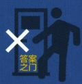

禁止
直接对答案

小心错题踩坑

# 第一章 丰富的图形世界

# 1 生活中的立体图形

# 课时1 生活中的立体图形

# 刷基础

1. B 【解析】A 选项中物体形状类似于球, 故该选项不符合题意; B 选项中物体形状类似于圆柱, 故该选项符合题意; C 选项中物体形状类似于正方体, 故该选项不符合题意; D 选项中物体形状类似于圆锥, 故该选项不符合题意. 故选 B.

2. (1)①②③⑥⑧ ④⑦ ⑤

(2)③④⑤ ①②⑥⑦⑧

(3)①②④⑥⑦⑧ ③⑤

3. C 【解析】①柱体的上、下底面一样大, 正确; ②棱柱的每条棱长可以相等, 如正方体, 正确; ③棱柱的底面可以为任意多边形, 错误; ④长方体是四棱柱, 一定是柱体, 正确; ⑤直棱柱的侧面都是长方形, 正确. 综上, 共有 4 个说法正确. 故选 C.

4.【解】填表如下：

<table><tr><td>名称</td><td>三棱柱</td><td>四棱柱</td><td>五棱柱</td><td>六棱柱</td></tr><tr><td>图形</td><td></td><td></td><td></td><td></td></tr><tr><td>顶点数a</td><td>6</td><td>8</td><td>10</td><td>12</td></tr><tr><td>棱数b</td><td>9</td><td>12</td><td>15</td><td>18</td></tr><tr><td>面数c</td><td>5</td><td>6</td><td>7</td><td>8</td></tr></table>

(1)14 24 36 (2)二十八 (3)n (n+2)

2n 3n (4) $a + c - b = 2$

5.【解】(1)根据题意,得这个直五棱柱形笔筒的外部共有6个面,15条棱.

(2)由题意得,此直五棱柱每个侧面为长方形,且长为16 cm,宽为4 cm,共有5个侧面,所以 $4\times16\times5=320(\mathrm{~cm}^{2})$ .

答:制作这个笔筒的侧面至少需要 $320 \, cm^{2}$ 的材料.

# 课时2 几何体的构成

# 刷基础

1. C 【解析】①圆柱由3个面围成,这3个面

# 刷有所得

由常见棱柱的特征,可以总结一般规律:n棱柱有 $(n+2)$ 个面,2n个顶点和3n条棱.

# 易错警示

(2) 注意题中只让求“侧面”.

中,1个面是曲的,2个面是平的,说法错误;②圆锥由2个面围成,这2个面中,1个面是平的,1个面是曲的,说法正确;③球仅由1个面围成,这个面是曲的,说法错误;④长方体由6个面围成,这6个面都是平的,说法正确.故选C.

2.9 16 9 【解析】侧面有4个三角形,4个长方形,底面有1个长方形,一共有9个面,面与面相交形成16条线,线与线相交形成9个点.故答案为9,16,9.

3. B 【解析】若把螺旋桨看作一条线段,旋转形成的痕迹体现了线动成面. 故选 B.

4. B 【解析】如图, 将四边形 ABCD 绕 AB 所在的直线旋转一周, 可得选项 B 的几何体, 选项 A、C、D 中的几何体不能由一个平面图形绕某条直线旋转一周得到. 故选 B.

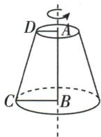

5. A 【解析】该立体图形是两个圆柱的组合体, 则将两个一边对齐的长方形(一大一小), 绕对齐边所在直线旋转一周即可得到. 故选 A.

6. 面动成体 【解析】硬币直立在桌面上快速地转动时, 看上去像球, 这种生活现象可以反映的数学原理是面动成体. 故答案为面动成体.

7.【解】由边长为 5 cm 的正方形硬纸片绕其一边所在直线旋转一周得到的圆柱体积为 $\pi \times 5 \times 5 \times 5 = 125\pi \, (\text{cm}^{3})$ ; 由长 6 cm、宽 4 cm 的长方形硬纸片绕其宽所在直线旋转一周得到的圆柱体积为 $\pi \times 6 \times 6 \times 4 = 144\pi \, (\text{cm}^{3})$ . 因为 $144\pi > 125\pi$ , 所以由长 6 cm、宽 4 cm 的长方形硬纸片绕其宽所在直线旋转一周得到的圆柱体积更大.

# 刷易错·

8. C 【解析】若直角三角形分别绕其两条直角边所在直线旋转一周, 可以形成选项 A 和选项 D 中的圆锥; 若直角三角形绕其斜边所在直线旋转一周, 可以形成选项 B 中的几何体,故不可能形成圆柱. 故选 C.

易错警示 将一个直角三角形绕其一条边所在的直线旋转一周,旋转轴不同,得到的几何体不同(如图).

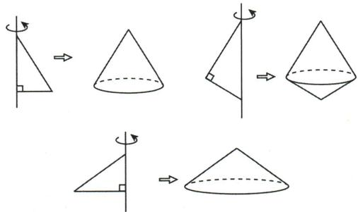

text_image

Diagram illustrating the geometric transformation of a cone into its 3D form, with rotation arrows and dashed lines indicating different orientations.

# 2 从立体图形到平面图形

# 课时1 正方体的展开与折叠

# 刷基础

# 1. B 【解析】

A 展开图出现“凹”字形,无法折成正方体  
B 根据正方体的展开图可知能折成正方体  
C 展开图出现“七”字形,无法折成正方体  
D 展开图出现“田”字形,无法折成正方体

2. A 【解析】因为正方体盒子无盖, 所以标有 m 的底面没有对面, 故选项 C、D 不符合题意; 因为沿箭头所指方向将盒子剪开, 所以选项 A 符合题意, 选项 B 不符合题意. 故选 A.  
3.6 【解析】由题图(1)可知1和4在相对面上,3和5在相对面上,2和6在相对面上.因为题图(1)和题图(2)是同一个正方体的不同表面展开图,所以字母A表示的数是6,故答案为6.  
4.【解】两图答案均不唯一,如图所示.

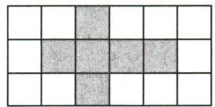  
图(1)

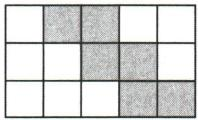  
图(2)

5. A 【解析】由正方体的平面展开图可知, 把展开图折叠成正方体后, 与“民”字相对的面上的汉字是“庆”. 故选 A.  
6. B 【解析】由题图可知, 当把它折叠成正方体纸盒时, C 点与 B 点重合. 故答案为 B.  
7. ①或②或③ 【解析】把题图中的①或②或③剪掉,剩下的图形能折成一个棱长为1的无盖正方体,故答案为①或②或③.

# 刷有所得

正方体展开图中出现“凹、七、田”字形均无法折成正方体.

# 关键点拨

正方体的表面展开图, 相对的面之间一定相隔一个正方形, 且不能有公共边和公共顶点.

8.【解】(1)由正方体的表面展开图的特点可知,在下面4个位置弥补即可,所以共有4种弥补方法,故答案为4.

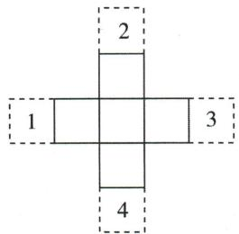

text_image

2
1
3
4

(2)如图所示(答案不唯一).

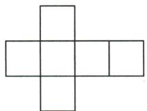

# 刷提升

1. A 【解析】由平面图形可知, 当该平面图形围成正方体时, B 点和 C 点一定在同一个面上, 所以排除 B、C 选项; 因为 AB, CD 两条线段所在的面相对, 所以排除 D 选项, A 选项符合题意. 故选 A.  
2. C 【解析】由题图(1)可知,4的对面是3,5的对面是2,1的对面是6,所以将正方体放在一个 $3\times3$ 的正方形网格平台上,一次一个小格地按箭头所指的方向依次翻转,当正方体落在位置“☆”时,紧贴位置“☆”的一面上的数字为4. 故选C.  
3. C 【解析】根据正方体的展开图知, A 选项, 折叠后三条斜边形成闭合的三角形, 能复原图形, 故不符合题意; B 选项, 折叠后三条斜边形成闭合的三角形, 能复原图形, 故不符合题意; C 选项, 折叠后三条斜边不能形成闭合的三角形, 不能复原图形, 故符合题意; D 选项, 折叠后三条斜边形成闭合的三角形, 能复原图形, 故不符合题意. 故选 C.  
4.11 【解析】观察图形, 发现与涂红色的面相邻的面上涂的颜色有黄、紫、白、蓝, 所以红色的对面一定是绿色. 同理, 可得涂黄色的面和涂紫色的面相对, 涂白色的面和涂蓝色的面相对, 所以四个正方体的下底面分别涂的是紫色、黄色、绿色、白色, 所以长方体的下底面共有 $2+5+1+3=11$ (朵) 花. 故答案为 11.  
5. 51 26 【解析】观察题图(1)可知,点数1和6相对、2和5相对、3和4相对.记题图(2)中左侧前面的正方体为第一个正方体,左侧后面的正方体为第二个正方体,右侧的正方体

为第三个正方体. 要使能看到的面上的点数之和最大, 则把第一个正方体点数为 1 的面与第二个正方体点数为 2 的面相连, 点数为 2 的面放在下面, 则第一个正方体露在外面的点数分别是 3, 4, 5, 6; 把第二个正方体点数为 1 的面与第三个正方体点数为 1 的面相连, 点数为 3 的面放在下面, 则第二个正方体露在外面的点数分别是 4, 5, 6; 把第三个正方体点数为 2 的面放在下面, 则第三个正方体露在外面的点数分别是 3, 4, 5, 6, 据此可得能看到的面上的点数之和最大是 $3 + 4 + 5 + 6 + 4 + 5 + 6 + 3 + 4 + 5 + 6 = 51$ . 要使能看到的面上的点数之和最小, 则把第一个正方体点数为 6 的面与第二个正方体点数为 4 的面相连, 点数为 5 的面放在下面, 则第一个正方体露在外面的点数分别是 1, 2, 3, 4; 把第二个正方体点数为 6 的面与第三个正方体点数为 6 的面相连, 点数为 5 的面放在下面, 则第二个正方体露在外面的点数分别是 1, 2, 3; 把第三个正方体点数为 5 的面放在下面, 则第三个正方体露在外面的点数分别是 1, 2, 3, 4, 据此可得能看到的面上的点数之和最小是 $1 + 2 + 3 + 4 + 1 + 2 + 3 + 1 + 2 + 3 + 4 = 26$ .

# 刷素养·

6.【解】(1)由题意可知,做成的无盖正方体纸盒的棱长是c cm,故可得b=3c,故答案为b=3c.
(2)设剪去的小正方形的边长为c cm,则做成的有盖正方体纸盒的棱长为c cm.如图所示,
由图形可得a=4c,b=3c,所以 $c=\frac{a}{4}=\frac{b}{3}$ ,则 $b=\frac{3}{4}a$ ,故答案为 $b=\frac{3}{4}a$ .

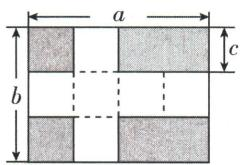

text_image

a
b
c

(3) 设有盖正方体纸盒的棱长为 $x \, cm$ . 由题意得 a = 4x，则 4x = 36，解得 x = 9，所以有盖正方体纸盒的表面积为 $6 \times 9^{2} = 486 \, (\text{cm}^{2})$ .

# 课时 2 柱体、锥体的展开与折叠

# 刷基础

1. D 【解析】因为展开图由三个长方形和两个三角形组成, 所以这个几何体是三棱柱. 故选 D.

# 思路分析

(1) 分析得出做成的无盖正方体纸盒的棱长是 c cm, 进而可得 b=3c;
(2) 根据剪去小正方形的边长和有盖正方体纸盒的棱长都相等并结合图形, 可得 a=4c, b=3c, 化简得到 $b=\frac{3}{4}a$ ;

(3) 设有盖正方体纸盒的棱长为 $x \, cm$ ，列方程求解得到 x = 9，再根据正方体的表面积公式计算即可.

# 易错警示

判断一个平面截几何体所得的截面的形状时,一定要注意平面的位置.

2. A 【解析】A 不能围成棱柱, B 可以围成五棱柱, C 可以围成三棱柱, D 可以围成四棱柱. 故选 A.

3.15 【解析】因为这个棱柱共有 12 个顶点, 所以它是六棱柱, 所以 $m = 6 + 2 = 8$ , $n = 3 \times 6 = 18$ , $p = 11$ , 所以 $m + n - p = 8 + 18 - 11 = 15$ . 故答案为 15.

4.【解】(1)有多余块,如图所示.

(2) 长方体共有 12 条棱, 若将一个长方体沿某些棱剪开展成 (1) 中修正后的平面图形, 需要剪开 7 条棱, 故答案为 12, 7.

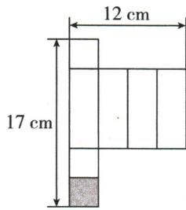

text_image

12 cm
17 cm

(3)底面正方形边长为 $12 \div 4 = 3 \, (\text{cm})$ ，长方体的高为 $17 - 3 \times 3 = 8 \, (\text{cm})$ ，所以长方体体积为 $3 \times 3 \times 8 = 72 \, (\text{cm}^{3})$ .

答:修正后的展开图所折叠而成的长方体的体积为 $72 \, cm^{3}$ .

5. C 【解析】A 能折出三棱柱, B 能折出无盖圆柱, C 能折出圆柱, D 能折出长方体. 故选 C.

6.36 【解析】根据题意,得到圆柱 B 的底面周长是 $6 \, cm$ , 高是 $4\pi \, cm$ , 则圆柱 B 的体积为 $\pi\left(\frac{6}{2\pi}\right)^{2} \times 4\pi = 36 \, (\text{cm}^{3})$ . 故答案为 36.

7. B 【解析】因为圆锥侧面展开图是扇形, M 是 SA 的中点, 在圆锥的侧面上过点 B, M 嵌有一圈路径最短的金属丝, 所以现将圆锥侧面沿 SA 剪开, 所得圆锥的侧面展开图可能是 B. 故选 B.

8.(1)①圆锥 ②三棱锥 ③圆柱
(2) $40\pi cm^{2}$

【解析】(2) 圆柱的表面积为 $2 \times \pi \times 2^{2} + 2 \times \pi \times 2 \times 8 = 40\pi (\mathrm{cm}^{2})$ ，故答案为 $40\pi \mathrm{cm}^{2}$ .

# 课时3 截一个几何体

# 刷基础

1. B 【解析】因为所截的平面与圆柱的底面不平行,所以截面的形状为椭圆. 故选 B.

2. C 【解析】用一个平面去截圆锥或圆柱, 截面可能是圆, 用一个平面去截球, 截面是圆, 但用一个平面去截棱柱, 截面不可能是圆.

3. A 【解析】根据正方体的形状及截面的角度和方向判断, 易知(1)(2)相同,(3)(4)相同.

4. D 【解析】截面可能是梯形,七边形,八边

形, 不可能是九边形. 故选 D.

# ▶归纳总结

5. A 【解析】根据题意可知, 这个几何体可能是圆柱. 故选 A.

6. 三棱柱 【解析】长方体用过 ABCD 的平面切割, 得到的两个几何体的上、下底面都是三角形, 三个侧面都是长方形, 所以得到的两个几何体都是三棱柱. 故答案为三棱柱.

7. 三棱柱或四棱柱 【解析】从三棱柱侧棱处水平切下一刀,那么切下一个三棱柱,还剩一个三棱柱.从三棱柱底面竖直切下一刀,那么切下一个三棱柱,还剩一个四棱柱或者是切下一个三棱柱,还剩一个三棱柱.综上,用平面从中截去一个三棱柱后,剩下的几何体是三棱柱或四棱柱.故答案为三棱柱或四棱柱.

8.【解】(1)剩下的几何体的形状是五棱柱.

(2) 剩下的几何体有 10 个顶点, 15 条棱, 7 个面.

9. 18.84 【解析】 $12.56 \div [(3-1) \times 2] \times 6 = 3.14 \times 6 = 18.84$ （立方分米）. 故答案为 18.84.

# 刷提升

1. D 【解析】正方体容器有六个面, 注水的过程中, 可将容器任意放置, 水平面最多与正方体容器的六个面相交得六边形, 最少与正方体容器的三个面相交得三角形, 所得水平面形状可能是三角形、四边形、五边形和六边形, 不可能出现七边形. 故选 D.

2. C 【解析】通过观察截面可以发现,内部的圆由大圆逐渐变成小圆,最后变成点,所以这个长方体的内部构造可能是圆锥.故选 C.

3. D 【解析】如图(1)，剩下的几何体有7个顶点；如图(2)，剩下的几何体有8个顶点；如图(3)，剩下的几何体有9个顶点；如图(4)，剩下的几何体有10个顶点。故选D.

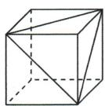  
图(1)

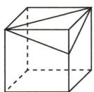  
图(2)

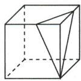  
图(3)

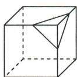  
图(4)

4.36 【解析】因为用一个平面截一个直 n 棱柱,得到的截面边数最多是 8 条,所以这个直 n 棱柱有 8 个面,所以这个几何体是六棱柱.因为这个棱柱的每个侧面都是正方形,正方形的面积为 4 ,所以这个六棱柱的所有棱长都相等,且棱长为 2 ,所以六棱柱的棱长之和为

判断截面形状的方法: 判断截面的形状时, 首先找出截几何体的平面和几何体的面相交所成的线, 其次判断这些线围成的截面的形状. 若几何体的各个面是平的, 则所得截面是多边形; 若几何体有曲面, 则所得的截面可能是多边形, 也可能是由直线和曲线围成的图形, 还可能是曲线围成的图形, 如圆或椭圆.

# 关键点拨

正方体有六个面,截面最多与其六个面相交得六边形.

$2 \times 6 \times 3 = 36$ , 故答案为 36.

5.96 【解析】沿水平方向将它锯成3片,是锯了2次;同理,每片又锯成4长条,是锯了3次;接着每条又锯成5小块,是锯了4次,所以一共锯了 $2+3+4=9$ (次),每锯一次表面积增加 $2\times2\times2=8$ (平方米),所以所有的长方体木块的表面积和是 $6\times2\times2+9\times8=96$ (平方米).故答案为96.

6.【解】(1)能.如图(1)所示.

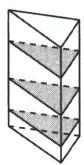  
图(1)

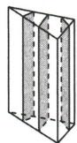  
图(2)

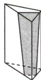  
图(3)

(2)能. 如图(2)所示.(截法不唯一)  
(3)能. 如图(3)所示.(截法不唯一)

7.【解】(1)由题图可得 $S_{1} = S$ . 故答案为 B.

(2) 不对. 理由: 设大正方体棱长为 y, 被截去的小正方体棱长为 x, 那么 $l_{1}-l=6x$ . 只有当 6x=3y, 即 2x=y 时, 才有 $l_{1}$ 比 l 正好多出大正方体 3 条棱的长度, 所以小明说的话不对.  
(3)不是.修正后如图所示:

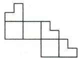

# 课时4 从三个方向看物体的形状

# 刷基础

1. A 【解析】从左面看几何体有 2 列, 从左到右的第一列有 2 块, 第二列有 1 块, 所以从左面

看到的形状图是. 故选 A.

2. B 【解析】观察图形可知,题图(1)从正面看到的图形是3列,从左往右正方形个数依次是2,1,1;从左面看到的图形是2列,从左往右正方形个数依次是2,1;从上面看到的图形是3列,从左往右正方形个数依次是2,1,1. 题图(2)从正面看到的图形是3列,从左往右正方形个数依次是1,1,2;从左面看到的图形是2列,从左往右正方形个数依次是2,1;从上面看到的图形是3列,从左往右正方形个数依次是2,1,1. 故从正面看到的形状图发生变化,从上面、左面看到的形状图没有发生变化. 故选B.

3.【解】(1)如图(1)所示:

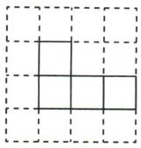  
从正面看

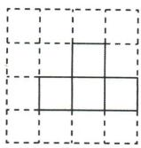  
从左面看

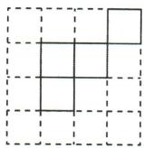  
从上面看  
图(1)

(2)如图(2),在备注数字的位置添加相应数量的小正方体,从正面和从左面看到的形状图不变,所以最多可以再添加5个小正方体,故答案为5.

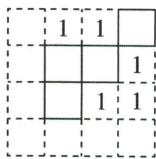  
从上面看
图(2)

4. C

# 刷有所得 | 确定小正方体的个数

根据从正面看到的形状图，数出从左到右每列小正方形的个数，再在从上面看到的形状图中从左到右的相应列中的每个小正方形内填入相应数字

根据从左面看到的形状图，数出从左到右每列小正方形的个数，再在从上面看到的形状图中从上到下的相应行中的每个小正方形内填入相应数字

取从上面看到的形状图中每个小正方形内填入的一对数中较小的一个，并把它们相加，所得结果就是几何体所需小正方体的个数

【解析】如图, 搭成这个几何体的小立方块的个数为 $2+1+2+1=6$ .

<table><tr><td>2</td><td>1</td><td>2</td></tr><tr><td>1</td><td colspan="2"></td></tr></table>

故选 C.

从上面看

5.【解】(1)由从正面看到的形状图可以看出几何体从左到右共三列,第一列最多1层,第二列最多3层,第三列最多1层;由从左面看到的形状图可以看出几何体从前到后共两排,第一排最多2层,第二排最多3层,所以最少需要小正方体 $1+5+1=7$ (个),最多需要小正方体 $7+2=9$ (个).

(2)最多小正方体搭成的几何体从上面看到的形状图如图所示：

<table><tr><td>1</td><td>3</td><td>1</td></tr><tr><td>1</td><td>2</td><td>1</td></tr></table>

# 刷易错·

6.【解】(1)由题图可得共有10个小正方体,故答案为10.

(2)分析这个图形可得这个几何体喷漆的面

积为 $\left[(7+5)\times2+7+4\right]\times2^{2}=140(\mathrm{~cm}^{2})$ .

(3)如图所示,最多可以再添加5个小正方体,故答案为5.

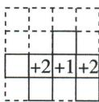  
从上面看

# ▶刷有所得

画由小立方块搭成的几何体从三个方向看得到的形状图:(1)从正面看,所得的形状图反映几何体的左右列数(纵向)和上下层数;(2)从左面看,所得的形状图反映几何体的前后行数和上下层数;(3)从上面看,所得的形状图反映几何体的前后行数和左右列数(纵向).

# 易错警示

当几何体没有凹陷时, 几何体的表面积 = 2(正面积 + 左面积 + 上面积); 当几何体有凹陷时, 凹陷部分面积要单独计算.

# 全章综合训练

# 刷中考

1. C 【解析】将一个半圆绕它的直径所在的直线旋转一周得到的立体图形是球,故选 C.

2. D 【解析】由正方体表面展开图可知，“建”与“国”相对. 故选 D.

3. C 【解析】这个几何体是六棱柱. 故选 C.

4. B 【解析】四棱锥的侧面展开图是四个三角形. 故选 B.

5. C 【解析】依题意得,若多面体的底面是面③,则多面体的上面是面⑤,故选 C.

6. A 【解析】这个几何体从上面看到的形状图是\_\_\_\_。故选 A.

7. A 【解析】将小正方体 A 放置到小正方体 B 的正上方, 则它从正面看到的形状图会发生改变. 故选 A.

8. B 【解析】最后一个小正方体应放在②号位置. 故选 B.

# 刷章测

1. A 【解析】雨滴滴下来形成雨丝属于点动成线. 故选 A.

2. D 【解析】圆柱的截面的形状不可能是三角形、梯形、六边形,选项 A 不符合题意;圆锥的截面的形状可能是三角形,但不可能是梯形、六边形,选项 B 不符合题意;三棱柱的截面的形状可能是三角形、梯形,但不可能是六边形,选项 C 不符合题意;正方体的截面的形状可能是三角形、梯形和六边形,选项 D 符合题意.故选 D.

3. B 【解析】A, D 从上面观察可以看到两个并排的正方形, 所以可以通过; C 从左面观察可以看到两个并排的正方形, 所以可以通过; B 从上面、前面和左面观察到的都是三个正方形, 所以无法通过. 故选 B.

4. $9\pi \, cm^{2}$ 或 $16\pi \, cm^{2}$ 【解析】以 $4 \, cm$ 长的直角边所在直线为轴旋转一周所得几何体的底面积为 $\pi \times 3^{2} = 9\pi (\text{cm}^{2})$ ; 以 $3 \, cm$ 长的直角边所在直线为轴旋转一周所得几何体的底面积为 $\pi \times 4^{2} = 16\pi (\text{cm}^{2})$ .

5. $180\ 000\pi$ 【解析】因为两个圆柱的底面半径均为 30 cm, 高均为 50 cm, 所以一个圆柱的侧面展开图的长是 $2\pi \times 30 = 60\pi \, (\text{cm})$ , 所以所卷成的圆柱的侧面的长为 $2 \times 60\pi = 120\pi \, (\text{cm})$ . 设所卷成的圆柱的底面半径为 r cm, 则 $2\pi r = 120\pi$ , 解得 r = 60, 所以所卷成的圆柱的体积为 $60^{2} \times \pi \times 50 = 180\ 000\pi \, (\text{cm}^{3})$ , 故答案为 $180\ 000\pi$ .

6. ②④ 【解析】将这四个表面展开图折成正方体时, 相对面的情况如下: ①中, “+” 面对“○”面, “#” 面对“△”面, “☆” 面对“×”面; ②中, “+” 面对“△”面, “#” 面对“○”面, “☆” 面对“×”面; ③中, “+” 面对“△”面, “#” 面对“×”面, “☆” 面对“○”面; ④中, “+” 面对“△”面, “#” 面对“○”面, “☆” 面对“×”面. 故将这四个表面展开图折成正方体, 其中两个正方体各面图案完全一样的是②与④.

7.【解】(1)如图所示.(补充位置不唯一)

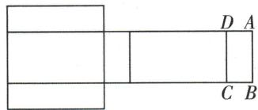

text_image

D A
C B

(2)设长方体的高为 $a\mathrm{cm}$ , 则宽为 $2a\mathrm{cm}$ , 长为 $4a\mathrm{cm}$ . 根据题意得, $4(a + 2a + 4a) = 56$ , 解得 $a = 2$ , 所以这个长方体的高为 $2\mathrm{cm}$ , 宽为 $4\mathrm{cm}$ , 长为 $8\mathrm{cm}$ , 所以这个长方体盒子的体积为 $2 \times 4 \times 8 = 64(\mathrm{~cm}^3)$ .

8.【解】(1)由题图可知 $a = 2, b = c = 1$ . 故答案为2,1,1. (2)这个几何体最少由 $2 + 1 + 1 + 3 + 1 = 8$ (个)小立方块搭成, 最多由 $2 + 1 + 1 + 3 + 3 = 10$ (个)小立方块搭成. 故答案为8,10. (3)从左面看到的形状图如图所示:

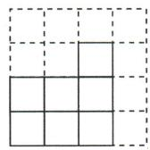  
从左面看

# 第二章 有理数及其运算

# 1 认识有理数

# 课时1 有理数

# 刷基础

# 1. B 【解析】

A 上升和零下意义不相反 ×

B 是具有相反意义的量 √

C 盈利与支出意义不相反 ×

D 走了和跑了意义不相反 ×

2. C 【解析】因为机器人向北行进了 125.3 米, 在系统中记为 +125.3 米, 所以向南行进 98.7 米时, 系统应记为 -98.7 米. 故选 C.

3. B 【解析】因为一小袋味精的质量标准为“50±0.25克”，所以一小袋味精的质量的范围是49.75\~50.25克，只有B选项符合，故选B.

4. 公元前 2050 年 【解析】若把公元后 2024 年记作+2024 年, 那么-2050 年表示公元前 2050 年. 故答案为公元前 2050 年.

# ▶ 关键点拨

掌握具有相反意义的量的概念是解题的关键.

# 刷有所得

在一对具有相反意义的量中,先规定其中一个为正,则另一个就用负表示.“正”和“负”相对.

5. C 【解析】在 $5, -\frac{5}{7}, -3, 0, -25.8, +2$ 中，负数有 $-\frac{5}{7}, -3, -25.8$ ，故选 C.

6. ①③④ 【解析】①不带负号的数不一定都是正数,例如0,前面没有负号,但0不是正数,故原说法错误;②一个正数的前面加上负号就是负数,正确;③数7的符号为正号,故原说法错误;④0既不是正数,也不是负数,因此不是正数的数不一定是负数,不是负数的数不一定是正数,故原说法错误.综上分析可知,其中错误的有①③④.故答案为①③④.

# 7. D 【解析】

<table><tr><td>数</td><td>-3.5</td><td> $\frac{22}{7}$ </td><td>-0.3</td><td>0</td><td> $\frac{\pi}{2}$ </td><td>0.161 161 116...(每相邻两个6之间依次多一个1)</td></tr><tr><td>结论</td><td>是有理数</td><td>是有理数</td><td>是有理数</td><td>是有理数</td><td>不是有理数</td><td>不是有理数</td></tr></table>

8. C 【解析】正有理数、0 和负有理数统称为有理数, 故选项 A 不符合题意; 无限不循环小数不是分数, 故不是有理数, 故选项 B 不符合题意; 整数和分数统称为有理数, 故选项 C 符合题意;整数包括零,故选项 D 不符合题意.故选 C.

9.【解】正分数集合： $\left\{4.8,\frac{1}{6},3.1415926,\right.\left.\frac{7}{3},\cdots\right\}$ ;

负数集合： $\left\{-11,-2.7,-\frac{3}{4},\cdots\right\}$ ;

整数集合： $\{-11,73,0,\cdots\}$ ;

自然数集合: $\{73,0,\cdots\}$ ;

非正整数集合： $\{-11,0,\cdots\}$ .

# 刷易错·

10. ①③⑤ 【解析】①0 是正数和负数的分界,说法正确;②0 只表示“什么也没有”,说法错误,0 可以表示特定意义,如 0 刻度等;③0 可以表示特定的意义,如 0 ℃ 等,说法正确;④0 既不是正数,也不是负数,0 是正数和负数的分界,故原说法错误;⑤0 是非负数,说法正确;⑥某地海拔为 0 m 表示该地与海平面齐平,原说法错误. 综上,正确的有①③⑤. 故答案为①③⑤.

# 刷提升

1. D 【解析】 $\frac{22}{7}$ , 0.12, 14 是正有理数, 共 3 个; 0, 14 是非负整数, 共 2 个; $-\frac{1}{3}$ , $\frac{22}{7}$ , 0.12, -1.5 是分数, 共 4 个, 所以 m = 3, n = 2, k = 4, 所以 $m - n + k = 3 - 2 + 4 = 5$ . 故选 D.

2. B 【解析】9月存入银行的金额为 600 - 400 = 200（元），10月存入银行的金额为 200 - 100 = 100（元），11月存入银行的金额为 100 + 300 = 400（元），12月存入银行的金额为 400 - 200 = 200（元），所以小亮单月存钱最多的月份是11月。故选B.

3. C 【解析】用“+”表示杯口朝上,用“-”表示杯口朝下.每经过一次翻转后的杯口情况如下:

第 1 次翻转后: ----+++++++,

第 2 次翻转后: ----+++++,

第 3 次翻转后: ----++,

第 4 次翻转后: ----++++,

第 5 次翻转后: ----.

此时翻转次数最少. 故至少经过 5 次翻转, 能使这 11 个杯子的杯口全部朝下. 故选 C.

4. (1) 正数 (2) B, D (3) 正数 A

【解析】(1) $A$ 处的数是向上箭头的上方对应的

# 易错警示

随着负数的出现,“0”除了表示没有外,还可表示:(1)正数和负数的分界,即“0”既不是正数也不是负数;(2)实际存在的量,例如0℃表示一个确定的温度.在解决有关“0”的说法的判断题时,要牢记这些知识.

# 刷有所得

一 “添”一
“去”确定非0
数的相反数：

(1) 确定一个正数的相反数, 只要在这个正数前面添上“-”即可, 如 100 的相反数是 -100;

(2) 确定一个负数的相反数，只需把“-”去掉即可，如 -1000 的相反数是 1000.

数,与 4 的符号相同,故在 A 处的数是正数.

(2) 观察发现, 向下箭头的上方是负数, 下方是正数, 向上箭头的下方是负数, 上方是正数, 所以 B 和 D 所在位置的数是负数.
(3) 因为 $2024 \div 4 = 506$ , 所以第 2024 个数在 A 的位置, 是正数.

5.【解】(1)若以水面为基准,则这名运动员指尖的高度表示为+12 m,池底的深度表示为-5.4 m.

(2) 若以跳台为基准, 则池底的深度表示为 -15.4 m, 水面的高度表示为 -10 m.

# 刷素养·

6.【解】(1)根据各点的位置, 可知 $A \rightarrow C(+3, +4)$ , $B \rightarrow D(+3, -2)$ , $C \rightarrow D(+1, -2)$ .

故答案为+3,+4,+3,-2,+1,-2.

(2)快递员按路线 $A \to B \to C \to D$ 行走的路程为

$$
1 + 4 + 2 + 0 + 1 + 2 = 1 0.
$$

(3) 快递员的行走路线和到达的位置如图中虚线和数字所示, 图中 P 的位置即为所求.

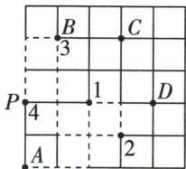

text_image

B
C
3
P
1
D
4
A
2

# 课时2 相反数与绝对值

# 刷基础

1. B 【解析】- $\frac{1}{2}$ 的相反数是 $\frac{1}{2}$ . 故选 B.

2. C 【解析】 $-(-6)=6,+(-6)=-6,-(+6)=-6$ ，所以 $-(-6)$ 的相反数是 $+(-6)$ 或 $-(+6)$ ，所以两人都对.

3. -2025 【解析】只有符号不同的两个数互为相反数, 2025 的相反数是 -2025. 故答案为 -2025.

4.【解】(1)-(-68)=68.

(2) $-(+0.75)=-0.75.$

(3) $-\left(-\frac{3}{5}\right)=\frac{3}{5}.$

5. A 【解析】 $-\frac{4}{3}$ 的绝对值是 $\left|-\frac{4}{3}\right|=\frac{4}{3}$ . 故选 A.

6. C 【解析】若一个数的绝对值是 $\frac{2}{5}$ ，则这个数是 $\pm\frac{2}{5}$ .

7. C 【解析】选项 A, 0 的绝对值是 0, 0 既不是正数也不是负数, 故此选项错误; 选项 B, 互为相反数的两个数的绝对值相等, 故此选项错误; 选项 C, 由绝对值的性质可知任何一个有理数的绝对值都不是负数, 故此选项正确; 选项 D,0 的绝对值是 0,0 的相反数也是 0,但 0 不是负数,故此选项错误.

8. 34 【解析】因为 $|x - 3| + |y - 4| = 0$ ，所以 $x - 3 = 0, y - 4 = 0$ ，所以 $x = 3, y = 4$ . 故答案为 3, 4.

9. $0, \pm1, \pm2, \pm3$ 【解析】绝对值不大于3的整数有 $0, \pm1, \pm2, \pm3$ . 故答案为 $0, \pm1, \pm2, \pm3$ .

10.【解】(1) $|-8|+|-4|=8+4=12.$

(2) $-(-3.5)-\left|-\frac{1}{2}\right|=3.5-\frac{1}{2}=3.$

11. B 【解析】由正数都大于零, 负数都小于零, 正数大于负数, 两个负数比较大小, 绝对值大的反而小, 可知 -5<-0.5<0<2, 所以最小的数是 -5. 故选 B.

12. $< > <$ 【解析】 $-\frac{3}{4} = -\frac{9}{12}, -\frac{2}{3} = -\frac{8}{12}$ , 因为 $\left| -\frac{9}{12} \right| = \frac{9}{12} > \left| -\frac{8}{12} \right| = \frac{8}{12}$ , 所以 $-\frac{9}{12} < -\frac{8}{12}$ , 所以 $-\frac{3}{4} < -\frac{2}{3}; -\left(-\frac{2}{7}\right) = \frac{2}{7} > -\frac{3}{8}; -\left| -1 \frac{3}{4} \right| = -1 \frac{3}{4} < -(-1.8) = 1.8$ . 故答案为 $<, >, <$ .

13. -2(答案不唯一) 【解析】因为-2>-3,-2是有理数,所以-2是比-3大的有理数.故答案为-2(答案不唯一).

# 刷易错

14.【解】晓莉的想法不正确. 理由如下: 当 m=0 时, $|m|=-m$ , 但 m 不是负数, 故原说法不正确, 所以晓莉的想法不正确.

# 刷提升

1. D 【解析】因为 a = -3，所以 $\left|a\right| = 3$ 。因为 $\left|a\right| = \left|b\right|$ ，所以 $\left|b\right| = 3$ ，所以 $b = \pm 3$ 。故选 D.

2. A 【解析】由正方体的表面展开图可得, “A”与“-1”是相对面, “B”与“2”是相对面, “C”与“0”是相对面. 因为相对的面上的两个数互为相反数, 所以 A, B, C 内的数依次为 1, -2, 0. 故选 A.

3. C 【解析】根据题中的新定义得 $\left[(-50)\vee(-52)\right]\vee\left[(-49)\wedge51\right]=(-50)\vee(-49)=-49$ . 故选 C.

4. 1 【解析】因为 $\left|-\frac{2}{3}\right|=\frac{2}{3}, -\left(-\frac{3}{2}\right)=\frac{3}{2}$ ，所以 $\frac{2}{3}$ 与 $\frac{3}{2}$ 之间的整数为 1，故答案为 1.

5.4 【解析】被替换后所得的数可以是

# 易错警示

对于绝对值的性质,一定要注意 $|0| = 0$ , 并且某个数的绝对值一定是非负的.

# 归纳总结

判断数轴是否正确的方法: 先判断是否为一条直线, 再考虑是否有原点, 是否有正方向, 单位长度是否一致.

-3.042 6, -1.032 6, -1.043 6, -1.042 3. 因为 $|-1.032 6|<|-1.042 3|<|-1.043 6|<|-3.042 6|$ ，所以 $-1.032 6>-1.042 3>$ -1.043 6>-3.042 6，所以最大的数是-1.032 6，
即被替换的数字是4，故答案为4.

6.【解】(1) $|-7|=7,|3|>-3$ .故答案为=，>.

(2) 当 $a > 0$ 时, $|a| = a > -a$ ; 当 $a = 0$ 时, $|a| = 0 = -a$ ; 当 $a < 0$ 时, $|a| = -a$ .

7.【解】(1) 因为 $\left|x-2024\right|$ 是非负数, 且非负数中最小的数是 0, 所以当 x=2024 时, $\left|x-2024\right|$ 有最小值, 这个最小值是 0.

(2) 当 x=1 时, $\left|x-1\right|$ 有最小值, 这个最小值为 0, 此时 2024- $\left|x-1\right|$ 有最大值, 这个最大值是 2024.

8.【解】(1)第4件样品的直径最接近标准.

(2) 因为 $\left|+0.1\right|=0.1<0.18, \left|-0.15\right|=0.15<0.18, \left|-0.05\right|=0.05<0.18$ ，所以第 1, 2, 4 件样品为正品；因为 $\left|+0.2\right|=0.2, 0.18<0.2<0.22$ ，所以第 3 件样品为次品；因为 $\left|+0.25\right|=0.25>0.22$ ，所以第 5 件样品为废品。

# 课时3 数轴

# 刷基础

1. B 【解析】同一数轴上的单位长度必须相等，A 正确；通常规定水平直线上向右的方向为正方向，B 错误；可以在直线上任取一点表示数 0，这个点叫作原点，C 正确；规定了原点、单位长度和正方向的直线称为数轴，D 正确。故选 B.

# 2. C 【解析】

<table><tr><td>A</td><td>没有规定正方向</td><td>×</td></tr><tr><td>B</td><td>没有规定单位长度</td><td>×</td></tr><tr><td>C</td><td>符合数轴的三要素</td><td>√</td></tr><tr><td>D</td><td>没有规定原点</td><td>×</td></tr></table>

3. D

4. B 【解析】因为表示-3的点到原点的距离为3个单位长度, 表示-1的点到原点的距离为1个单位长度, 表示2的点到原点的距离为2个单位长度, 表示3的点到原点的距离为3个单位长度, 且 $1 < 2 < 3 = 3$ , 所以 B 选项符合题意. 故选 B.

5. C 【解析】观察数轴可知, A, B 相隔 6 个单位长度,所以原点位于 A 点右边 3 个单位长度处(或 B 点左边 3 个单位长度处),故点 C 表示的数为 -1. 故选 C.

6.6 【解析】观察数轴可知,数轴上被墨汁覆盖的整数点表示的数依次为-2,-1,0,1,2,3,共有6个.

7. -4 【解析】因为将点 B 先向右移动 4 个单位长度, 再向左移动 6 个单位长度后, 点 B 表示的数是 -6, 所以将表示 -6 的点先向右移动 6 个单位长度得到表示 0 的点, 再向左移动 4 个单位长度得到表示 -4 的点. 故答案为 -4.

8.【解】(1) 如图所示, 出租车最终在 A 站的东边.

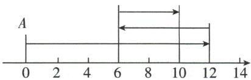

text_image

A
0 2 4 6 8 10 12 14

(2) $12+6+4=22(\text{km})$ , $22\times0.3=6.6$ （升），即出租车共耗油6.6升.

9. D 【解析】由所给数轴可知, a > -2, 故 A 选项不符合题意; b > 1, 故 B 选项不符合题意; a < b, 故 C 选项不符合题意, D 选项符合题意. 故选 D.

10.【解】如图所示：

$$
\begin{array}{c c c c c c c c c} & & & + (- 1) \\ & - 3 \frac {1}{2} & - 2 & \downarrow & 0 \\ \hline - 5 & - 4 & - 3 & - 2 & - 1 & 0 & 1 & 2 & 3 & 4 & 5 \end{array} \quad \begin{array}{c c c c c c c c c} & & & - (- 4 \frac {1}{2}) \\ & - 3 | & - 3 | & \downarrow \\ \hline \end{array}
$$

$$
- 3 \frac {1}{2} <   - 2 <   + (- 1) <   0 <   | - 3 | <   - \left(- 4 \frac {1}{2}\right).
$$

# 刷易错

11.-2或8【解析】当点B在点A的左侧时，点B表示的数是-2；当点B在点A的右侧时，点B表示的数是8.故点B表示的数是-2或8.

# 刷提升

# 1. A 【解析】

<table><tr><td>线段AB的一个端点与数轴上的一个整点重合</td><td>2024个整点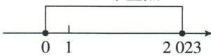</td></tr><tr><td>线段AB的一个端点不与数轴上的一个整点重合</td><td></td></tr></table>

2. A 【解析】刻度尺上“3.4 cm”对应数轴上的点与数轴上原点(刻度尺上“3 cm”对应数轴

# 易错警示

由于题目中没有具体说明点B与点A的相对位置,故解答本题时需要分点B在点A的左侧和点B在点A的右侧来讨论.

# 刷有所得

研究线段在数轴上盖住的整点的个数问题时,首先要考虑线段的一个端点是否与数轴上的一个整点重合,其次还要结合数轴,利用数形结合思想解决问题.

上的点)的距离为0.4个单位长度,且该点在原点的左侧,故刻度尺上“3.4 cm”对应数轴上的数为-0.4.故选A.

3.-3 【解析】因为-1表示的点与3表示的点重合,故此折痕经过的点表示的数是1,所以5表示的点与数-3表示的点重合.故答案为-3.

4. -1 012 【解析】一只蚂蚁从原点出发,它第1次向右爬行了1个单位长度到达数1表示的点,第2次接着向左爬行了2个单位长度到达数-1表示的点,第3次接着向右爬行了3个单位长度到达数2表示的点,第4次接着向左爬行了4个单位长度到达数-2表示的点,…,依此类推,第2024次爬行后到达数-1012表示的点,则进行了2024次,此时蚂蚁在数轴上的位置所对应的数是-1012.

5.【解】(1) $|x+2|+|x-3|=5$ 表示数轴上有理数 x 对应的点到 -2 和 3 对应的两点距离之和为 5, 如图.

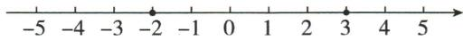

因为-2对应的点到3对应的点的距离是5，所以在-2和3之间（含-2和3）的整数均符合题意，所以使得 $|x+2|+|x-3|=5$ 成立的所有符合条件的整数x为-2,-1,0,1,2,3.故答案为-2,-1,0,1,2,3.

(2)①因为 $|x+3|+|x-4|=|x-(-3)|+|x-4|$ ，所以 $|x+3|+|x-4|$ 表示数轴上有理数x对应的点到-3和4对应的两点距离之和。假设点P在数轴上表示的数是x，点A表示的数是-3，点B表示的数是4。点P可能在点A的左边，点A和点B之间（含点A和点B），点B的右边。当点P在点A的左边或点B的右边时，点P到A,B两点的距离之和均大于A,B两点间的距离；当点P在点A和点B之间（含点A和点B）时，点P到A,B两点的距离之和等于A,B两点间的距离，所以x在-3和4之间（含-3和4），即 $-3\leqslant x\leqslant4$ 时， $|x+3|+|x-4|$ 取得最小值7。故答案为7， $-3\leqslant x\leqslant4$ 。

②因为 $|x+7|+|x+4|+|x-2|+|x-5|=|x-(-7)|+|x-(-4)|+|x-2|+|x-5|$ ，所以x在-4和2之间（含-4和2），即 $-4\leqslant x\leqslant2$ 时， $|x+7|+|x+4|+|x-2|+|x-5|$ 取得最小值18.故答案为 $18,-4\leqslant x\leqslant2$ .

(3)①因为 $|x+6|+|x+3|+|x-2|=|x-(-6)|+|x-(-3)|+|x-2|$ ，所以 $|x+6|+|x+3|+|x-2|$ 表示数轴上有理数x对应的点到-6,-3和2对应的点的距离之和。假设点P在数轴上表示的数是x，点A表示的数是-6，点B表示的数是-3，点C表示的数是2，易得当点P在点B处时，点P到A,B,C三点的距离之和等于A,C两点间的距离；当点P在除点B外的任意位置时，点P到A,B,C三点的距离之和均大于A,C两点间的距离，所以x=-3时， $|x+6|+|x+3|+|x-2|$ 取得最小值8。故答案为8,-3。

②因为 $(1+617)\div2=309$ ，所以当x=309时， $|x-1|+|x-2|+|x-3|+\cdots+|x-617|$ 取到最小值。故答案为309。

# 刷素养

6.【解】(1)由题意得三根这样的木棒长为30-3=27,则这根木棒的长为 $27\div3=9$ ,所以点B表示的数是 $3+9+9=21$ ,点A表示的数是 $3+9=12$ .故答案为9,12,21.

(2)如图,把小明和爸爸的年龄差看作木棒的长度,同理可得爸爸比小明大84÷3=28(岁),所以爸爸的年龄是84-28=56(岁).故答案为56.

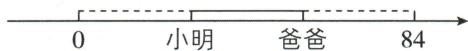

# 2 有理数的加减运算

# 课时 1 有理数的加法

# 刷基础

1. A 【解析】原式 $= -(3 + 2) = -5$ . 故选 A.

2. D 【解析】点 A 表示的数是 -1, -1+3=2，所以比数轴上点 A 表示的数大 3 的数是 2，故选 D.

3. ≤ 【解析】由题图可得, b<0<a, 且 $|b|>|a|$ , 则 $a+b<0$ .

4. -9 或 1 【解析】因为 $\left|a\right|=5$ ，所以 a=-5 或 5。因为 b 和 4 互为相反数，所以 b=-4，所以当 a=-5, b=-4 时， $a+b=-9$ ；当 a=5, b=-4 时， $a+b=1$ 。故答案为 -9 或 1。

5.【解】(1)(-5)+(-9)=- (5+9)=-14.

(2) $(-9)+0=-9.$   
(3) $(-2.4)+(+2.4)=0.$   
(4) $\left(-\frac{2}{3}\right)+\frac{3}{4}=\left(-\frac{8}{12}\right)+\frac{9}{12}=\frac{9}{12}-\frac{8}{12}=\frac{1}{12}.$

6. A 【解析】根据题意可知横算筹表示 10, 竖算筹表示 1, 所以题图 (2) 表示的计算过程是 $(-13)+(+23)=+10$ . 故选 A.

# 技巧点拨

奇数个取中间值,偶数个取中间段.

# 归纳总结

在进行有理数加法运算时,首先判断两个加数是同号还是异号,是否有0,从而确定用哪一条法则.在应用过程中,要牢记“先符号,后绝对值”.

7.7 【解析】因为 $a\Delta b = -a + b$ ，所以 $-3\Delta4 = -(-3) + 4 = 7$ ，故答案为 7.  
8. 81 【解析】由题意得,选88分为标准,记超过的部分为正,不足的部分为负,那么小张考了 $88+(-7)=81$ (分). 故答案为81.  
9.【解】因为超市今年第一季度亏损5000元,第二季度盈余22000元,所以 $(-5000)+(+22000)=17000$ （元），故该超市今年上半年盈余17000元.

# 刷提升

1. D 【解析】因为 x<0, y>0, $x+y<0$ ，所以 $|x|>|y|$ ，所以 -x, -y, x, y 在数轴上的位置大致如图所示，所以 x<-y<y<-x。故选 D.

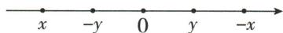

2. C 【解析】①两个有理数的和为正数时, 这两个数不一定都是正数, 例如 $-3 + 5 = 2$ , 原说法错误, 不符合题意; ②互为相反数的两个数的和为 0, 所以两个有理数的和可能等于 0, 原说法正确, 符合题意; ③两个有理数的和为负数时, 这两个数不一定都是负数, 例如 $-3 + 2 = -1$ , 原说法错误, 不符合题意; ④因为正数与其绝对值的和为正数, 0 与其绝对值的和为 0, 负数与其绝对值的和为 0, 所以一个有理数与它的绝对值的和一定不是负数, 原说法正确, 符合题意. 综上, ②④的说法是正确的. 故选 C.

3.-3 【解析】因为 $[a,b]$ 表示 $a,b$ 两数中较大的一个数， $(a,b)$ 表示 $a,b$ 两数中较小的一个数，所以 $(1,-2)+[-1,-3]=-2+(-1)=-3.$

4. -4 【解析】因为每次从中任意擦除两个数，同时写上一个新数（新数为所擦除的两个数的和加上1），所以每操作一次，黑板上的数字个数减少一个，数字总和增加1,7-1=6（次），所以剩下的这个数是-10+6=-4. 故答案为-4.

5.【解】(1)因为嘉嘉从淇淇手中抽到“◆7”，同时淇淇从嘉嘉手中抽到“♣7”，所以嘉嘉手中牌的总分为+7+(+4)+(+2)+(-5)=8（分），淇淇手中牌的总分为-7+(+6)+(-4)+(-3)=-8（分）。因为8>-8，所以嘉嘉获胜。

(2) 因为两人各自同时从对方手中任意抽取一张牌后, 淇淇手中牌的总分要最高, 所以嘉嘉从淇淇手中抽到“♣4”, 同时淇淇从嘉嘉手中抽到“♦4”,

所以淇淇手中牌的总分最高为 $+7+(+6)+(+4)+(-3)=14$ (分).

(3)0 分. 两人各自同时从对方手中任意抽取一张牌后, 嘉嘉手中牌与淇淇手中牌的总分之和为 $+4+(-5)+(-7)+(+2)+(+7)+(+6)+(-4)+(-3)=0$ （分）.

# 刷素养·

6.【解】(1) $|5|+|3|=|5+3|,|-5|+|-3|=|(-5)+(-3)|,-5|+|3|>|(-5)+3|,|0|+|-5|=|0+(-5)|$ .故答案为=，=，>，=.

(2) 当 a, b 为有理数时, $\left|a\right| + \left|b\right| \geqslant \left|a + b\right|$ . 故答案为 $\geqslant$ .

(3) 当 $\left|x\right| + \left|-2\right| = \left|x + (-2)\right|$ 时, x 的取值范围为 $x \leqslant 0$ .

# 课时 2 有理数的加法运算律

# 刷基础

1. B 【解析】将式子 $\left(-\frac{1}{6}\right)+(-7)+\frac{5}{6}+(-4)$ 先变成 $\left[\left(-\frac{1}{6}\right)+\frac{5}{6}\right]+\left[(-7)+(-4)\right]$ 再计算结果，则小磊运用了加法交换律和加法结合律。故选 B.

2. D 【解析】A 选项, $2+(-1)=-1+2$ , 则 A 选项错误, 故 A 选项不符合题意; B 选项, $3+(-2)+5=(-2+5)+3$ , 则 B 选项错误, 故 B 选项不符合题意; C 选项, $[6+(-3)]+5=(6+5)+(-3)$ , 则 C 选项错误, 故 C 选项不符合题意; D 选项, $\frac{1}{3}+(-2)+\left(\frac{2}{3}\right)=\left(\frac{1}{3}+\frac{2}{3}\right)+(-2)$ , 则 D 选项正确, 故 D 选项符合题意, 故选 D.

3. 加法交换律 加法结合律 同号两数加法法则 异号两数加法法则

4. $\frac{8}{15}$ (答案不唯一) 【解析】观察分母, 在计算 $\frac{7}{15} + \left(-\frac{2}{7}\right) + \text{■时, ■中可以填} \frac{8}{15}$ , 则 $\frac{7}{15} + \left(-\frac{2}{7}\right) + \frac{8}{15} = \frac{7}{15} + \frac{8}{15} + \left(-\frac{2}{7}\right) = 1 + \left(-\frac{2}{7}\right) = \frac{5}{7}$ . 故答案为 $\frac{8}{15}$ (答案不唯一).

5. -1 【解析】 $(+0.25)+\left(-\frac{1}{4}\right)+\left(-\frac{1}{6}\right)+$ $\left(-\frac{7}{6}\right)=\left[\left(+\frac{1}{4}\right)+\left(-\frac{1}{4}\right)\right]+\left[\left(-\frac{1}{6}\right)+\left(-\frac{7}{6}\right)\right]=0+(-1)=-1.$ 故答案为-1.

6.2024 【解析】因为 a, b 互为相反数, 所以 $a + b = 0$ , 所以 $2023 + a + 1 + b = 2023 + 1 + (a + b) = 2024 + 0 = 2024$ . 故答案为 2024.

7.【解】(1) 原式 = $(24 + 7) + [(-15) + (-20)] =$ $31+(-35)=-4.$ (2) 原式 = $\left[-3.2\right)+\left(+3.2\right]+\left[-5.6\right)+$

# 刷有所得

若两个有理数和的绝对值等于这两个数绝对值的和，则这两个有理数同号或有一个数为0.

# 方法点拨

(1)本题的求解过程也体现了一种简便运算的方法,即加数中既有正数也有负数时,常把正加数相结合,把负加数相结合,由此可减少因为符号导致的错误.

4.6] = 0 + (-1) = -1.

(3) 原式 $= \left(1\frac{3}{7} + 2\frac{4}{7}\right) + \left[-2\frac{1}{3}\right] + \left(-1\frac{2}{3}\right] = 4 + (-4) = 0.$

8. -18 【解析】最后输出的数为 $-7+7+(-8)+2+(-12)=(-7+7)+[(-8)+(-12)]+2=0+(-20)+2=-18$ . 故答案为 -18.

9.【解】 $(-160.5)+(-120)+65.5+280=[(-160.5)+65.5]+[(-120)+280]=(-95)+160=65$ （万元）.

故 2025 年前四个月该公司盈余 65 万元.

# 刷提升

1. C 【解析】绝对值小于 2024 的所有整数为 ±2023, ±2022, …, ±1, 0, 它们的和为 0. 故选 C.

2. A 【解析】由题意可得, 这 20 个数为 0, 2, 2, 0, -2, -2, 0, 2, 2, …, 可以看出这 20 个数以 6 个数为一组循环, 前 6 个数的和是 $0 + 2 + 2 + 0 + (-2) + (-2) = (0 + 0) + [2 + (-2)] + [2 + (-2)] = 0$ . 因为 $20 \div 6 = 3 \cdots 2$ , 所以这 20 个数的和是 $0 \times 3 + (0 + 2) = 2$ . 故选 A.

3. -1 012 【解析】 $(-1)+2+(-3)+4+(-5)+6+\cdots+(-2\ 021)+2\ 022+(-2\ 023)=[(-1)+2]+\left[(-3)+4\right]+\left[(-5)+6\right]+\cdots+\left[(-2\ 021)+2\ 022\right]+\left(-2\ 023\right)=1+1+1+\cdots+1+(-2\ 023)=1\ 011+(-2\ 023)=-1\ 012$ . 故答案为 -1 012.

4.【解】(1)记超出标准容量为正,不足标准容量为负,则每瓶偏离标准容量的数值(单位:mL)分别为-1.1,-0.5,+0.5,+1.1,+0.2,-0.4,-0.2,+0.8,+1.5,+0.9.这10瓶冰红茶偏离标准容量的数值的总和是(-1.1)+(-0.5)+0.5+1.1+0.2+(-0.4)+(-0.2)+0.8+1.5+0.9=[(-1.1)+1.1]+[(-0.5)+0.5]+[0.2+(-0.2)]+(-0.4)+(0.8+1.5+0.9)=0+0+0+(-0.4)+3.2=2.8(mL),所以这10瓶冰红茶的总容量为500×10+2.8=5002.8(mL).

答: 这 10 瓶冰红茶的总容量是 5 002.8 mL.
(2)该品牌的冰红茶单瓶容量都在误差允许范围内,并且一半多都超过标准容量,质量有保证,值得信赖(答案不唯一,合理即可).

5.【解】(1) \( \left(+28\frac{5}{7}\right)+\left(-25\frac{1}{7}\right)=\left(28+\frac{5}{7}\right)+\left[(-25)+\left(-\frac{1}{7}\right)\right]=\left[28+(-25)\right]+\]

$$
\left[ \frac {5}{7} + \left(- \frac {1}{7}\right) \right] = 3 + \frac {4}{7} = 3 \frac {4}{7}.
$$

(2) $\left(-2021\frac{2}{7}\right) + \left(-2022\frac{4}{7}\right) + 4044+$

$$
\left(- \frac {1}{7}\right) = \left[ (- 2 0 2 1) + \left(- \frac {2}{7}\right) \right] + \left[ (- 2 0 2 2) + \right.
$$

$$
\left(- \frac {4}{7}\right) ] + 4 0 4 4 + \left(- \frac {1}{7}\right) = [ (- 2 0 2 1 + (- 2 0 2 2) +
$$

$$
4 0 4 4) ] + \left[ \left(- \frac {2}{7}\right) + \left(- \frac {4}{7}\right) + \left(- \frac {1}{7}\right) \right] = 1 +
$$

$$
(- 1) = 0.
$$

# 刷素养·

6.【解】(1)“⊕”运算的运算法则:不为0的两数进行“⊕”运算时,同号得正,异号得负,并把绝对值相加;一个不为0的数与0进行“⊕”运算时,正数与0进行“⊕”运算得它本身,负数与0进行“⊕”运算得它的相反数(或等于这个数的绝对值).故答案为同号得正,异号得负,并把绝对值相加;正数与0进行“⊕”运算得它本身,负数与0进行“⊕”运算得它的相反数(或等于这个数的绝对值).

(2) $(-3)\oplus[2\oplus(-4)]=(-3)\oplus(-6)=9.$

(3) 结合律在有理数的“⊕”运算中不适用. 例如: $[(-3) \oplus (-2)] \oplus 0 = 5 \oplus 0 = 5$ ;

$(-3) \oplus [(-2) \oplus 0] = (-3) \oplus 2 = -5$ , 这时, $[(-3) \oplus (-2)] \oplus 0 \neq (-3) \oplus [(-2) \oplus 0]$ , 所以结合律在有理数的“ $\oplus$ ”运算中不适用.

# 课时3 有理数的减法

# 刷基础

1. B 【解析】-2-3=-2+(-3)=-5,故选B.

2. D 【解析】选项 A 中, $-5-(-3)=-5+3=-2$ , 故此选项错误; 选项 B 中, $+6-(-5)=6+5=11$ , 故此选项错误; 选项 C 中, $-7-|-7|=-7-7=-14$ , 故此选项错误; 选项 D 中, 计算正确. 故选 D.

3. C 【解析】因为 x 为最大负整数, 所以 x = -1, 所以 $\frac{1}{3} - x = \frac{1}{3} - (-1) = \frac{4}{3}$ . 因为 $1 < \frac{4}{3} < 1.6$ , 所以落在段③, 故选 C.

4.3 【解析】因为 $a \oplus b = a - b$ ，所以 $(-2) \oplus (-5) = (-2) - (-5) = (-2) + 5 = 3$ ，故答案为 3.

5.【解】(1)-16-9=-16+(-9)=-25.

(2) $-\frac{2}{3}-\left(-\frac{3}{5}\right)=-\frac{2}{3}+\frac{3}{5}=-\frac{1}{15}.$

(3) $\frac{5}{7} - \left(+\frac{3}{4}\right) = \frac{5}{7} + \left(-\frac{3}{4}\right) = -\frac{1}{28}$ .

(4)0-11=0+(-11)=-11.

# 思路分析

将实际问题抽象为有理数减法模型, 先计算出四个地区的四季温差, 再分别与 $10^{\circ}$ C 进行比较即可.

6. 78 【解析】根据题意得, $-39-(-117)=-39+117=78(℃)$ , 即酒精的凝固点比水银的凝固点约低 $78^{\circ}C$ . 故答案为 78.

7.2 【解析】因为 $2+1+0=3$ ，所以 $2+3+a=3,0+b+4=3,2+c+4=3$ ，解得 a=-2, b=-1, c=-3，所以 $a-b-c=-2-(-1)-(-3)=-2+1+3=2$ ，故答案为 2.

8.【解】A 处比 B 处高 $-37-(-129.8)=-37+$ 129.8=92.8(米),

C 处比 B 处高 $-71.3-(-129.8)=-71.3+$ 129.8=58.5(米),

A 处比 C 处高 $-37-(-71.3)=-37+71.3=$ 34.3(米).

9.【解】A 地区的四季温差: $20-(-1)=21(℃)$ ，B 地区的四季温差: $40-32=8(℃)$ ，C 地区的四季温差: $12-(-5)=17(℃)$ ，D 地区的四季温差: $-2-(-15)=13(℃)$ 。因为某种植物成活的主要条件是该地区的四季温差不得超过 $10^{\circ}C$ ，所以 B 地区最适合大面积栽培这种植物。

# 刷易错·

# 易错警示

在有理数的减法运算中,添括号时要注意,如果括号前是负号,则括号内要变号.

10.【解】甲同学的计算不正确.

正确的计算过程为 $15 - 5 \frac{1}{2} - 2 \frac{1}{2} = 15 - \left(5 \frac{1}{2} + 2 \frac{1}{2}\right) = 15 - 8 = 7.$

# 刷提升

1. D 【解析】22:30 在数轴上对应数字 7,7-(-7)=14(时), 则起床时间为 8:30, 故 A 选项错误; 小明一天的睡觉时长为 24-14=10(时), 故 B 选项错误; 小明午饭和晚饭间隔 3-(-3)=6(时), 故 C 选项错误; 7-3=4(时), 所以吃晚饭时间为 18:30, 故 D 选项正确. 故选 D.

# 2. D 【解析】

A 若 $a > 0, b > 0$ ，则根据有理数加法法则，得 $a + b > 0$ ，原结论正确

B 若 $a > 0, b < 0$ ，则根据有理数减法法则、加法法则，得 $a - b = a + (-b) > 0$ ，原结论正确

C 若 $a < 0, b > 0$ ，则根据有理数减法法则、加法法则，得 $a - b = a + (-b) < 0$ ，原结论正确

若 $a < 0, b < 0$ ，且 $|a| < |b|$ ，则根据有理数减法法则、加法法则，得 $a - b = a + (-b) > 0$ ，原结论错误

故选 D.

3. -3 【解析】因为 A, B 表示的数分别为 -16, 9, 所以折叠前 $AB = 9 - (-16) = 9 + 16 = 25$ . 因为折叠后 AB = 1, 所以 $BC = \frac{25 - 1}{2} = 12$ . 因为点 C 在 B 的左侧, 所以 C 点表示的数为 9 - 12 = -3. 故答案为 -3.

4.2.5 或 7.5 【解析】由题意得点 A 表示的数为 $10+(-4)=6$ ，点 D 表示的数为 $-1+0=-1$ .

①当点 F 在点 A 左侧时，点 F 表示的数为 6-2.5=3.5，所以点 E 表示的数为 3.5-2=1.5，所以 $x=1.5-(-1)=2.5$ ；②当点 F 在点 A 右侧时，点 F 表示的数为 $6+2.5=8.5$ ，所以点 E 表示的数为 8.5-2=6.5，所以 $x=6.5-(-1)=7.5$ 。故答案为 2.5 或 7.5。

5.【解】(1)因为 $3.9 > 0 > -\frac{3}{2} > -6$ ，所以最大的数为3.9，最小的数为-6.故答案为3.9,-6.

(2)要想数字之和最小,只需挑出最小的两个数即可,故 $(-6)+\left(-\frac{3}{2}\right)=-\frac{15}{2}$ .

(3)要想数字之差最小,只需让四个数中的最小值减去最大值即可,故 $(-6)-3.9=-9.9$ .

# 刷素养·

6.【解】(1) $|2-3|=3-2=1$ ,故答案为1.

(2) $|3.14-\pi|= \pi-3.14$ ,故答案为 $\pi-3.14$ .

(3) 因为 a<b，即 a-b<0，所以 $\left|a-b\right|=b-a$ ，故答案为 b-a.

(4) 原式 $= 1 - \frac{1}{2} + \frac{1}{2} - \frac{1}{3} + \frac{1}{3} - \frac{1}{4} + \cdots + \frac{1}{2020} -$

$$
\frac {1}{2 0 2 1} + \frac {1}{2 0 2 1} - \frac {1}{2 0 2 2} = 1 - \frac {1}{2 0 2 2} = \frac {2 0 2 1}{2 0 2 2}.
$$

# 课时4 有理数的加减混合运算

# 刷基础

1. B 【解析】 $18-(+10)-(-5)=18-10+5$ ，故选 B.

2. D 【解析】甲: $11 + (-14) + 19 - (-6) = 11 + 19 + [(-14) + 6] = 30 - 8 = 22$ . 乙: 原式 = $\left(-\frac{7}{8}\right) + \left(-\frac{1}{5}\right) + \left(-\frac{1}{8}\right) = \left[\left(-\frac{7}{8}\right) + \left(-\frac{1}{8}\right)\right] + \left(-\frac{1}{5}\right) = (-1) + \left(-\frac{1}{5}\right) = -\frac{6}{5}$ . 故选 D.

3. 3,0 【解析】当输入1时, 输出的结果为 $1 + 4 - (-3) - 5 = 1 + 4 + 3 - 5 = 3$ ; 当输入-2时, 输出的结果为 $-2 + 4 - (-3) - 5 = -2 + 4 + 3 - 5 = 0$ . 故答案为3,0.

4.0 【解析】因为 $a$ 是最小的正整数, 所以 $a = 1$ . 因为 $b$ 是数轴上对应的点到原点的距离等

# 思路分析

根据题意得到A点表示的数为6,然后分情况讨论:①当点F在点A左侧时;②当点F在点A右侧时,再根据已知条件进行计算即可.

# 易错警示

进行有理数的加减混合运算时,常利用加法交换律和结合律简化计算,在交换加数位置时,一定要连同加数的性质符号一起交换,不能遗忘加数的性质符号.

于2的负数,所以b=-2.因为c是最大的负整数,所以c=-1,所以 $a+b-c=1+(-2)-(-1)=1-2+1=0$ .故答案为0.

5.【解】(1) 原式 = 23 - 14 - 35 + 10 = 23 + 10 - 35 - 14 = -2 - 14 = -16.

(2) 原式 $= -\frac{4}{9} + \left(-\frac{5}{9}\right) + 9 = -1 + 9 = 8.$

(3) 原式 = $(6.14 + 5.86) - \left(\frac{11}{8} + \frac{5}{8}\right) = 12 - 2 = 10.$

(4) 原式 $= \left(-\frac{1}{2}\right) + 3\frac{1}{4} + 3\frac{3}{4} + \left(-\frac{1}{2}\right) = -\frac{1}{2} + 3\frac{1}{4} + 3\frac{3}{4} - \frac{1}{2} = \left(-\frac{1}{2} - \frac{1}{2}\right) + \left(3\frac{1}{4} + 3\frac{3}{4}\right) = -1 + 7 = 6.$

(5) 原式 = $(0.36 + 0.14 + 0.5) + [(-7.4) + (-0.6)] = 1 + (-8) = -7.$

6.【解】根据题意可知, $\left(\frac{3}{2}-\frac{13}{2}\right)+10.5=-5+$ 10.5=5.5.

7.【解】(1)根据题意,佳佳计算的结果为 $(-4)+6-5-(-2)=-4+6-5+2=-1$ .

(2) 抄错运算符号所得的结果为 $(-4)-6-9-(-2)=-4-6-9+2=-17$ ; 原题的正确结果为 $(-4)+6-9-(-2)=-4+6-9+2=-5,-5-(-17)=12$ , 故琪琪的计算结果比原题的正确结果小 12.

# 刷易错·

8. -2 【解析】原式 $= 3\frac{1}{4} - 2\frac{3}{5} + 5\frac{3}{4} - 8\frac{2}{5} =$ $\left(3\frac{1}{4} + 5\frac{3}{4}\right) + \left(-2\frac{3}{5} - 8\frac{2}{5}\right) = 9 - 11 = -2.$

# 刷提升

1. A 【解析】由题图可知“x”与“3”相对，“y”与“2”相对，“z”与“-5”相对。因为相对面上的两个有理数互为相反数，所以 x = -3, y = -2, z = 5，所以 $x + y - z = -3 + (-2) - 5 = -10$ 。故选 A.

2. C 【解析】原式 $= -\frac{1}{2} + 1 - \frac{3}{2} + 2 - \frac{5}{2} + 3 - \cdots - \frac{53}{2} + 27 = \left(-\frac{1}{2} + 1\right) + \left(-\frac{3}{2} + 2\right) + \left(-\frac{5}{2} + 3\right) + \cdots + \left(-\frac{53}{2} + 27\right) = \frac{1}{2} + \frac{1}{2} + \frac{1}{2} + \cdots + \frac{1}{2} = \frac{1}{2} \times 27 = \frac{27}{2}$ .

3. B 【解析】由题意可得 $b+c-1=2+c+d=a+c+2-1$ ，所以有 $b=d+3, a=d+1$ ，所以 b>a>d。由题图可知 a, b, c, d 的值从 -2, -4, 5, -5, 6, 8 中取得，由于 8>6>5>-2>-4>-5，且 8-5=

3, -2-(-5)=3, 所以分两种情况: ①b=8, d=5, a=6, 这时, c 的值从 -2, -4, -5 中取得, 当 c=-2 和 -5 时, 计算验证, 都不符合题意, 当 c=-4 时, 计算验证, 符合题意, 所以 a=6, b=8, c=-4, d=5, 则 $a+b+c-d=6+8-4-5=5$ .

②b=-2, d=-5, a=-4, 这时, c 的值从 5, 6, 8 中取得, 当 c=5 或 8 时, 计算验证, 都不符合题意, 当 c=6 时, 计算验证, 符合题意, 所以 a=-4, b=-2, c=6, d=-5, 则 $a+b+c-d=-4-2+6-(-5)=5$ . 综上, $a+b+c-d$ 的值为 5. 故选 B.

4. -3 【解析】根据题意得 $\begin{array}{cc}2 & 5 \\ 3 & 4 \end{array} + \begin{array}{cc}5 & 6 \\ 7 \end{array} = 2 - 3 + 4 + (-5 + 6 - 7) = 2 - 3 + 4 - 5 + 6 - 7 = -3$ ，故答案为 -3.

5.【解】因为 $|a|=1,|b|=2,|c|=3$ ，所以 $a=\pm1$ ， $b=\pm2,c=\pm3$ 。因为a>b>c，所以a=1,b=-2,c=-3或a=-1,b=-2,c=-3，所以 $a-b+c=1-(-2)+(-3)=1+2-3=0$ 或 $a-b+c=-1-(-2)+(-3)=-1+2-3=-2$ 。

6.【解】(1) $1-2+3-4-5+6-7+8=0$ 或 $-1+2-3+4+5-6+7-8=0$ . (答案不唯一)

(2)①当 n=4k 时, 可以添加正号或者负号让每 4 个连续整数的和为 0, 这时它们和的绝对值最小, 为 0.

②当 $n=4k+1$ 时, 可以保留整数 1, 在余下的 4k 个整数前面添加正号或者负号使其和为 0, 这时它们和的绝对值最小, 为 1.

③当 $n=4k+2$ 时, 可以保留整数 1, 2, 在余下 4k 个整数前面添加正号或者负号使其和为 0. 令 $-1+2=1$ 或 1-2=-1, 则这时它们和的绝对值最小, 为 1.

④当 $n=4k+3$ 时, 可以保留整数 1, 2, 3, 在余下的 4k 个整数前面添加正号或者负号使其和为 0. 令 $1+2-3=0$ 或 $-1-2+3=0$ , 则这时它们和的绝对值最小, 为 0.

# 刷素养·

7.【解】(1) $|2-(-1)|=|2+1|=|3|=3$ ，所以数轴上表示2和-1的两点之间的距离为3。故答案为3。

(2)由题意得,数轴上表示x和-1的两点之间的距离为 $|x-(-1)|=|x+1|$ .故答案为 $|x+1|$ .
(3)①因为 AB=2024, BC=1000, 点 B 为原点, 所以点 A 对应的数为 a=0-2024=-2024, 点 C 对应的数为 c=0+1000=1000, b=0, 所以 $a+b+c=-2024+0+1000=-1024$ .
②当原点在点B左侧时,因为OB=18,所以点

# 思路分析

(3)②分原点在点 B 左侧和右侧两种情况讨论, 先求出点 B 表示的数, 再求出 A, C 表示的数, 最后根据有理数的加减混合运算法则求解即可.

B 表示的数为 $b=0+18=18$ ，所以点 A 表示的数为 a=18-2024=-2006，点 C 表示的数为 $c=18+1000=1018$ ，所以 $a+b-c=-2006+18-1018=-3006$ ；当原点在点 B 右侧时，因为 OB=18，所以点 B 表示的数为 b=0-18=-18，所以点 A 表示的数为 a=-18-2024=-2042，点 C 表示的数为 $c=-18+1000=982$ ，所以 $a+b-c=-2042-18-982=-3042$ 。综上所述， $a+b-c$ 的值为 -3006 或 -3042。

# 课时5 有理数加减混合运算的实际应用

# 刷基础

1. 1431.00 【解析】由题意得 1000.00 - 534.00 + 975.00 - 4.00 - 6.00 = 1431.00（元），故答案为 1431.00.

2.【解】(1)第5筐芒果的实际质量为 $25+1=$ 26(千克).故答案为26.

(2)-2.5+1.5-3+0+1-0.5-2-2-1.5+2=-7(千克),所以这10筐芒果总计不足7千克.

3.【解】小明： $\frac{1}{2}-\left(-\frac{3}{2}\right)+(-5)-4=2-5-4=-7$ 小红： $-2-\left(-\frac{3}{4}\right)+5-\left(-\frac{1}{4}\right)=-2+\left(\frac{3}{4}+\frac{1}{4}\right)+5=-2+1+5=4.$

因为-7<4,所以小红获胜.

4.【解】(1) $19+15-4+10-5+8-14+4-9=24$ .

答:在终点站一等座车厢下车的乘客人数为24.

(2)南宁东站与宾阳站之间一等座车厢内乘客的人数为19;

宾阳站与来宾北站之间一等座车厢内乘客的人数为 $19+15-4=30$ ;

来宾北站与柳州站之间一等座车厢内乘客的人数为 $30+10-5=35$ ;

柳州站与鹿寨北站之间一等座车厢内乘客的人数为 $35+8-14=29$ ;

鹿寨北站与桂林站之间一等座车厢内乘客的人数为 $29+4-9=24$ .

因为 19<24<29<30<35, 所以动车行驶途中在来宾北站与柳州站之间一等座车厢内的乘客最多.

# 3 有理数的乘除运算

# 课时1 有理数的乘法

# 刷基础

1. D 【解析】 $(-3)\times2=-6$ ，故选 D.
2. A 【解析】 $(-3)\times(-3)=9$ ，故 A 选项正确；

$(-3)\times1=-3$ , 故 B 选项错误; $(-3)\times0=0$ , 故 C 选项错误; $(-3)\times3=-9$ , 故 D 选项错误. 故选 A.

3. A 【解析】因为 $xy < 0$ , 所以 $x, y$ 异号. 又因为 $x + y > 0$ , 所以正数的绝对值较大. 又因为 $x > y$ , 所以 $x > 0, y < 0, x$ 的绝对值较大. 故选 A.

4. ≤ 【解析】由题图可得, b > 0 > a, 所以 ab < 0. 故答案为 <.

5. 81 【解析】依题图可得 $-3 \times (-3) = 9, |9| < 60$ , $9 \times (-3) = -27, |-27| < 60, -27 \times (-3) = 81$ , $|81| > 60$ , 故输出的数为 81.

6.21 【解析】由题意知，-7<-3<1<2<5. 因为 $-7\times(-3)=21,2\times5=10,21>10$ ，所以最大值为21. 故答案为21.

7. $31 \times 42 = 1\ 302$ 【解析】题图(3)表示的乘法算式是 $31 \times 42 = 1\ 302$ .

8.【解】(1) $15\times(-6)=-(15\times6)=-90$

(2) $(-8)\times(-0.25)=8\times0.25=2.$   
(3) $\frac{5}{7} \times \left(-\frac{4}{15}\right) = -\left(\frac{5}{7} \times \frac{4}{15}\right) = -\frac{4}{21}$ .   
(4) $\left(-\frac{3}{5}\right)\times0=0.$

9. B 【解析】-9 的倒数是 $-\frac{1}{9}$ . 故选 B.

10. D 【解析】 $-\frac{5}{2} \times \left(-\frac{2}{5}\right) = 1.$ 故选D.

11.【解】(1) 因为 a, b 互为相反数, c, d 互为倒数, m 的绝对值为 2, 所以 $a + b = 0$ , cd = 1, $m = \pm 2$ .

(2) 当 m=2 时, $m+cd+\frac{a+b}{m}=2+1+0=3$ ; 当
m=-2 时, $m+cd+\frac{a+b}{m}=-2+1+0=-1$ .

# 刷提升

1. C 【解析】①-1 $\frac{1}{2}$ 的倒数是 $-\frac{2}{3}$ ，小明回答正确；②若 $|a|=2$ ，则 a 的值 2 或 -2，小明回答正确；③ $-\frac{1}{2}$ 的相反数是 $\frac{1}{2}$ ，小明回答错误；④绝对值等于它本身的数是非负数，小明回答错误；⑤倒数等于它本身的数只有 1 和 -1，小明回答正确。他做对的题是①②⑤，共 3 个。

# 思路分析2.C 【解析】

根据有理数乘法法则,运用特殊值法逐一判断每个选项即可.

A

若 $a = -5, b = -4, c = 1, d = 2$ ，则 $ab > 0$ ，但 $bd < 0$

B

若 $a = -5, b = -4, c = -1, d = 2$ ，则 $ac > 0$ ，但 $bd < 0$

C

若 $bc < 0$ ，则 $b, c$ 异号. 又因为 $b < c$ ，所以 $b < 0, c > 0$ . 因为 $a < b < c < d$ ，所以 $a < 0, d > 0$ ，所以 $ad < 0$

D

若 $a = -5, b = -4, c = -1, d = 2$ ，则 $cd < 0$ ，但 $ab > 0$

故选 C.

3. -11 或 11 【解析】因为 $|a| = 4, |b| = 9, |c| = 6$ ，所以 $a = \pm 4, b = \pm 9, c = \pm 6$ . 因为 $ab > 0, bc < 0$ ，所以 $a, b$ 同号， $b, c$ 异号. 当 $a = 4$ 时， $b = 9, c = -6$ ，则 $a - b - (-c) = 4 - 9 - 6 = -11$ ; 当 $a = -4$ 时， $b = -9, c = 6$ ，则 $a - b - (-c) = -4 - (-9) + 6 = 11$ . 综上所述， $a - b - (-c)$ 的值为 -11 或 11.

4.20 -2 【解析】因为 $-5 + (-4) + (-8) + (-2) + (-1) + 0 + 1 + 2 + 3 + 4 = -10$ ，除甲以外，其余每位同学拿到的卡片上的数字之和为 $1 + (-8) + 2 + 4 = -1$ ，所以甲拿到的两张卡片上的数字之和为 $-10 - (-1) = -9$ . 观察 10 个数字可知 $-4 + (-5) = -9, -8 + (-1) = -9$ . 如果甲拿到的两张卡片上的数字分别为 $-8, -1$ ，那么剩余的八张卡片中不可能存在两张卡片上的数字之和为 $-8$ ，而丙拿到的两张卡片上的数字之和为 $-8$ ，所以甲拿到的两张卡片上的数字分别为 $-4, -5$ ，丙拿到的两张卡片上的数字分别为 $-8, 0$ ，所以甲拿到的两张卡片上的数字之积为 $-4 \times (-5) = 20$ . 因为戊拿到的两张卡片上的数字之和为 $4$ ，而剩余的六张卡片上的数字中，只有 $1 + 3 = 4$ ，所以戊拿到的两张卡片上的数字分别为 $1, 3$ . 因为 $4 + (-2) = 2, 2 + (-1) = 1$ ，所以丁拿到的两张卡片上的数字分别为 $4, -2$ ，乙拿到的两张卡片上的数字分别为 $2, -1$ ，所以乙拿到的两张卡片上的数字之积为 $2 \times (-1) = -2$ . 故答案为 $20, -2$ .

5.【解】(1)7※(-3)=(7+2)×2-(-3)=21.故7※(-3)的值是21.
(2) 因为 $(-3)$ ※7 = $[(-3)+2]$ ×2 - 7 = -9，而 $-9 \neq 21$ ，所以 7※(-3)与(-3)※7 的值不相等.

6.【解】(1) 因为 $4+0=4\times0+4$ ，所以 $(4,0)$ 是“4 相关数对”.

因为 $1+1 \neq 1 \times 1 + 4$ ，所以 $(1,1)$ 不是“4 相关数对”。故答案为 $(4,0)$ 。

(2) 结论一正确, 结论二错误, 理由如下: 因为数对 $(m, n)$ 和 $(-m, -n)$ 都是“4 相关数对”, 所以 $m + n = m \times n + 4, -m + (-n) = (-m) \times (-n) + 4 = m \times n + 4$ , 所以 $m + n = -m + (-n)$ , 所以 $m + n = 0$ , 即 m 和 n 互为相反数. 由已知条件无法得到 m 和 n 互为倒数, 故结论一正确, 结论二错误.

# 刷素养

7.【解】(1)因为 ab=6, 所以 a, b 同号, 所以 a, b 同为正数时, $a+b>0$ ; a, b 同为负数时, $a+b<0$ . 故答案为①②.

(2) 因为 $a + b = -5, ab$ 的值最大, 所以 $a, b$ 同为负数. 因为 $a, b$ 为整数, 所以 $a, b$ 分别为-1和-4时, $ab = 4$ ; $a, b$ 分别为-2和-3时, $ab = 6$ . 故 $ab$ 的最大值为6. 故答案为6.

(3) 因为 ab<0，所以 a, b 异号。①设 a>0，则 b<0，若 $\left|a\right|>\left|b\right|$ ，则 $a+b>0$ ；若 $\left|a\right|=\left|b\right|$ ，则 $a+b=0$ ；若 $\left|a\right|<\left|b\right|$ ，则 $a+b<0$ 。

②设 a<0，则 b>0。若 $\left|a\right|>\left|b\right|$ ，则 $a+b<0$ ；若 $\left|a\right|= \left|b\right|$ ，则 $a+b=0$ ；若 $\left|a\right|<\left|b\right|$ ，则 $a+b>0$ 。

综上所述, 当 a>0, b<0 时, 若 $\left|a\right|>\left|b\right|$ , 则 $a+b>0$ ; 若 $\left|a\right|=\left|b\right|$ , 则 $a+b=0$ ; 若 $\left|a\right|<\left|b\right|$ , 则 $a+b<0$ ; 当 a<0, b>0 时, 若 $\left|a\right|>\left|b\right|$ , 则 $a+b<0$ ; 若 $\left|a\right|= \left|b\right|$ , 则 $a+b=0$ ; 若 $\left|a\right|<\left|b\right|$ , 则 $a+b>0$ .

# 课时2 有理数的乘法运算律

# 刷基础

1. D 【解析】 $2 \times 3 \times 5 \times (-6)$ 中有三个正数,一个负数,结果为负数,A 不符合题意; $2 \times (-3) \times (-4) \times (-5)$ 中有一个正数,三个负数,结果为负数,B 不符合题意; $2 \times 0 \times (-5) \times (-3)$ 中有一个0,结果为0,C 不符合题意; $(-2) \times (-3) \times (-4) \times (-5)$ 中有四个负数,结果为正数,D 符合题意.故选 D.

2. B 【解析】依据 0 乘任何数都得 0, 可知这 2023 个数中至少有一个数为 0, 故选 B.

3. D 【解析】由 abcd<0, 可知 abcd 四个数中没有 0, 四个数中一定有负数, 且负数不能做到负负全部抵消, 也就是说其中负数的个数是奇数. 综上, 这四个数中负数有 1 个或 3 个. 故选 D.

4. B 【解析】因为 $(a-1)(1-b)(b-a)>0$ ，所以 $(a-1),(1-b),(b-a)$ 的值同正或两负一正.
A 选项, a-1<0, 1-b<0, b-a>0, 符合两负一

# 刷有所得

几个不等于0的有理数相乘,积的符号由负因数的个数决定,当负因数有奇数个时,积为负;当负因数有偶数个时,积为正.若几个有理数相乘,其中有一个因数为0时,积为0.

# 易错警示

用乘法对加法的分配律展开算式,相乘时括号里的每个数都要带上它前面的符号,且不要漏乘括号中的任何一项.

正; B 选项, a-1>0, 1-b<0, b-a>0, 符合一负两正; C 选项, a-1>0, 1-b<0, b-a<0, 符合两负一正; D 选项, a-1<0, 1-b>0, b-a<0, 符合两负一正, 所以 B 选项符合题意, 故选 B.

5. 210 【解析】 $-1 \times (-2) \times (-3) \times (-4) = 24$ , $-1 \times (-3) \times (-4) \times (-5) = 60$ , $-1 \times (-4) \times (-5) \times (-6) = 120$ , 所以在第四个正方形内填入的数是 $-1 \times (-5) \times (-6) \times (-7) = 210$ . 故答案为 210.

6.2 【解析】因为 $abc = 10 > 0$ ，所以三个数均为正数或两个数为负数，一个数为正数。当三个数均为正数时， $a + b + c > 0$ ，不符合题意，所以三个数中有两个数为负数，一个数为正数。故答案为2。

7. D 【解析】由题意可知, 算式 $\left(\frac{3}{4}+\frac{7}{12}-\frac{5}{9}\right)\times(-36)=\frac{3}{4}\times(-36)+\frac{7}{12}\times(-36)-\frac{5}{9}\times(-36)$ 运用了乘法对加法的分配律, 故选 D.

8. A 【解析】在简便运算时, 把 $24 \times \left(-99 \frac{47}{48}\right)$ 变形成最合适的形式是 $24 \times \left(-100 + \frac{1}{48}\right)$ . 故选 A.

9. 78.8 【解析】原式 = 8 × 1.25 × 7.88 = 10 × 7.88 = 78.8，故答案为 78.8.

10.【解】(1) 原式 $= -(1.25 \times 8) \times (5 \times 3) = -150$ .

$$
\begin{array}{l} (- 1 9) = \left(- \frac {1}{4} + \frac {1}{2} - \frac {3}{4}\right) \times (- 1 9) = - \frac {1}{2} \times \\ (- 1 9) = \frac {1 9}{2}. \\ \end{array}
$$

(2) 原式 $= -\frac{1}{4} \times (-19) + \frac{1}{2} \times (-19) - \frac{3}{4} \times$

# 刷易错·

11.【解】 $-27\times \left(\frac{2}{9} -\frac{1}{3} -\frac{2}{27}\right) = (-27)\times \frac{2}{9}-$ $(-27)\times \frac{1}{3} -(-27)\times \frac{2}{27} = -6 + 9 + 2 = 5.$

# 刷提升

1. A 【解析】由题意得, 这四个整数小于或等于 9, 且互不相等, 再由乘积为 9 可得, 这四个整数中必有 3 和 -3, 则这两个整数的乘积为 -9, 所以剩下的两个整数的乘积必定为 -1, 所以四个整数为 1, -1, 3, -3, 则 $a + b + c + d = 1 + (-1) + 3 + (-3) = 0$ , 故选 A.

2. C 【解析】因为 $(-2023) \times 100$ 的值记为 $p$ , 所以 $(-2023) \times 99 = (-2023) \times (100 - 1) =$

$$
\begin{array}{l} (- 2 0 2 3) \times 1 0 0 + (- 2 0 2 3) \times (- 1) = (- 2 0 2 3) \times \\ 1 0 0 + 2 0 2 3 = p + 2 0 2 3. \text {   故选   C.   } \end{array}
$$

$$
\begin{array}{l} f (1 0) = 1 + 2 + 3 + \dots + 9 + 0, f (1 1) + f (1 2) + \dots + \\ f (1 9) + f (2 0) = 1 \times 1 + 1 \times 2 + 1 \times 3 + \dots + 1 \times 9 + 2 \times \\ 0 = 1 + 2 + 3 + \dots + 9, f (2 1) + f (2 2) + \dots + f (2 9) + \\ f (3 0) = 2 \times 1 + 2 \times 2 + 2 \times 3 + \dots + 2 \times 9 + 3 \times 0 = 2 (1 + \\ 2 + 3 + \dots + 9), f (3 1) + f (3 2) + \dots + f (3 9) + \\ f (4 0) = 3 \times 1 + 3 \times 2 + 3 \times 3 + \dots + 3 \times 9 + 4 \times 0 = 3 (1 + \\ 2 + 3 + \dots + 9), f (4 1) + f (4 2) + \dots + f (4 9) + \\ f (5 0) = 4 \times 1 + 4 \times 2 + 4 \times 3 + \dots + 4 \times 9 + 5 \times 0 = 4 (1 + \\ 2 + 3 + \dots + 9), f (5 1) + f (5 2) + \dots + f (5 9) + \\ f (6 0) = 5 \times 1 + 5 \times 2 + 5 \times 3 + \dots + 5 \times 9 + 6 \times 0 = 5 (1 + \\ 2 + 3 + \dots + 9), f (6 1) + f (6 2) + \dots + f (6 9) + \\ f (7 0) = 6 \times 1 + 6 \times 2 + 6 \times 3 + \dots + 6 \times 9 + 7 \times 0 = 6 (1 + \\ 2 + 3 + \dots + 9), f (7 1) + f (7 2) + \dots + f (7 9) + \\ f (8 0) = 7 \times 1 + 7 \times 2 + 7 \times 3 + \dots + 7 \times 9 + 8 \times 0 = 7 (1 + \\ 2 + 3 + \dots + 9), f (8 1) + f (8 2) + \dots + f (8 9) + \\ f (9 0) = 8 \times 1 + 8 \times 2 + 8 \times 3 + \dots + 8 \times 9 + 9 \times 0 = 8 (1 + \\ 2 + 3 + \dots + 9), f (9 1) + f (9 2) + \dots + f (9 9) + \\ f (1 0 0) = 9 \times 1 + 9 \times 2 + 9 \times 3 + \dots + 9 \times 9 + 1 \times 0 \times 0 = \\ 9 (1 + 2 + 3 + \dots + 9), \text {所以} f (1) + f (2) + \dots + \\ f (1 0 0) = (1 + 1 + 2 + 3 + 4 + 5 + 6 + 7 + 8 + 9) \times (1 + 2 + \\ 3 + 4 + 5 + 6 + 7 + 8 + 9) = 4 6 \times 4 5 = 2 0 7 0, \text {   故答案为   } \\ 2 \\ \end{array}
$$

3. 2070 【解析】由题意得 $f(1)+f(2)+\cdots+f(9)+$

4. 思路分析 | 有理数乘法的计算技巧

$$
\begin{array}{c} 3 9 \frac {2 4}{2 5} \times (- 5) \\ \Downarrow \\ \left(4 0 - \frac {1}{2 5}\right) \times (- 5) \\ \Downarrow \\ 4 0 \times (- 5) - \frac {1}{2 5} \times (- 5) \end{array}
$$

$$
\begin{array}{c} 2 9 \frac {1 5}{1 6} \times (- 8) \\ \downarrow \\ \left(3 0 - \frac {1}{1 6}\right) \times (- 8) \\ \downarrow \\ 3 0 \times (- 8) - \frac {1}{1 6} \times (- 8) \end{array}
$$

【解】(1) 原式= $\left(39+\frac{24}{25}\right)\times(-5)=39\times(-5)+\frac{24}{25}\times(-5)=-195+\left(-\frac{24}{5}\right)=-199\frac{4}{5}$ ，运算原理是乘法对加法的分配律.

(2)有,可以这样计算:

原式 $= \left(40 - \frac{1}{25}\right)\times (-5) = 40\times (-5) - \frac{1}{25}\times$

$$
(- 5) = - 2 0 0 + \frac {1}{5} = - 1 9 9 \frac {4}{5}.
$$

(3) $29\frac{15}{16}\times (-8) = \left(30 - \frac{1}{16}\right)\times (-8) = 30\times$

$$
(- 8) - \frac {1}{1 6} \times (- 8) = - 2 4 0 + \frac {1}{2} = - 2 3 9 \frac {1}{2}.
$$

# 关键点拨

先利用错误的结果求出 a 的值, 再把 a 的值代入原式计算正确的结果即可.

# 思路分析

由 $|a|=1,|b|=4$ ，可得 $a=\pm1,b=\pm4$ ，根据a与b的商是正数，可得a,b同号，即可求解.

# 刷素养·

5.【解】（1）设 $\left(\frac{1}{2} +\frac{1}{3} +\frac{1}{4} +\frac{1}{5} +\frac{1}{6}\right)$ 为 $A$ $\left(\frac{1}{2} +\frac{1}{3} +\frac{1}{4} +\frac{1}{5} +\frac{1}{6} +\frac{1}{7}\right)$ 为 $B$ ，则原式 $= (1+$

A) $B-(1+B)A=B+AB-A-AB=B-A=\frac{1}{7}.$

(2) 设 $\left(\frac{1}{2}+\frac{1}{3}+\cdots+\frac{1}{n}\right)$ 为 A, $\left(\frac{1}{2}+\frac{1}{3}+\cdots+\frac{1}{n+1}\right)$ 为 B, 则原式 $=(1+A)B-(1+B)A=B+AB-A-AB=B-A=\frac{1}{n+1}$ .

# 课时3 有理数的除法

# 刷基础

1. D 【解析】 $\left(-\frac{3}{4}\right)\div\left(-\frac{2}{3}\right)=\left(-\frac{3}{4}\right)\times\left(-\frac{3}{2}\right)$ . 故选 D.

2. D 【解析】 $\left(-\frac{5}{2}\right)\div(-3)=\frac{5}{2}\times\frac{1}{3}=\frac{5}{6}$ . 横线上应填 $\frac{5}{6}$ . 故选D.

3. D 【解析】计算 $-16 \div a$ 时，误将“÷”看成“+”，结果得 -12，即 $-16 + a = -12$ ，则 a = 4，所以 $-16 \div a = -16 \div 4 = -4$ 。故选 D.

4. A 【解析】因为 $\left|a\right|=1,\left|b\right|=4$ ，所以 $a=\pm1$ ， $b=\pm4$ 。因为 a 与 b 的商是正数，所以 a=1, b=4 或 a=-1, b=-4，所以 $a+b=1+4=5$ 或 $a+b=-1+(-4)=-5$ 。故选 A.

5.25 【解析】因为一个数的相反数是-5, 所以这个数是 5, 所以这个数与它的倒数的商为 $5 \div \frac{1}{5} = 5 \times 5 = 25$ . 故答案为 25.

6.【解】(1) $0 \div (-1\ 000) = 0$ .

(2) $(-2.5)\div\frac{5}{8}=-2.5\div\frac{5}{8}=-\frac{5}{2}\times\frac{8}{5}=-4.$

(3) $24 \div (-2) \div \left(-\frac{6}{5}\right) = -12 \div \left(-\frac{6}{5}\right) = -12 \times$ $\left(-\frac{5}{6}\right) = 10.$

(4) $(-20) \div \left[\left(-\frac{2}{3}\right) \div \left(-\frac{5}{6}\right)\right] = -20 \div \left(\frac{2}{3} \times \frac{6}{5}\right) = -20 \div \frac{4}{5} = -20 \times \frac{5}{4} = -25.$

7. D 【解析】 $\left[(-6)-(-20)\right]\div3.5=14\div3.5=$ 4(时). 故选 D.

8.【解】(23-20)÷0.6×100=500(米).
答:该植物种植在距山脚500米高处为宜.

# 刷易错

9.【解】佳佳的计算过程不正确. 理由: 乘法对加法的分配律不适用于有理数的除法.

正确的计算过程: 原式 $=\frac{1}{12}\div\left(\frac{2}{12}-\frac{9}{12}\right)=\frac{1}{12}\div\left(-\frac{7}{12}\right)=-\frac{1}{12}\times\frac{12}{7}=-\frac{1}{7}.$

# 刷提升

1. A 【解析】因为 $\left[(-3)-\triangle\right]\div\left(-6\frac{1}{3}\right)=0$ ，所以 $(-3)-\triangle=0$ ，所以 $\triangle=-3$ 。故选A.

2. A 【解析】因为 $128 = 1 \times 128 = 2 \times 64 = 4 \times 32 = 8 \times 16$ ，所以 $S(128) = \frac{8}{16} = \frac{1}{2}$ ，故选 A.

3. $-\frac{15}{4}$ 【解析】由题意得 $a = -5 \times (-3) = 15, b = \frac{4}{-1} = -4$ ，所以 $\frac{a}{b} = \frac{15}{-4} = -\frac{15}{4}$ . 故答案为 $-\frac{15}{4}$ .

4. -2 【解析】因为三个互不相等的有理数,既可以表示为 0, b, $\frac{b}{a}$ 的形式, 又可以表示为 1, a, a + b 的形式, 所以这两组数分别对应相等,所以 a + b 与 a 中有一个是 0, $\frac{b}{a}$ 与 b 中有一个是 1. 若 a = 0, 则 $\frac{b}{a}$ 无意义, 所以 $a \neq 0$ , 所以 $a + b = 0$ , 即 a = -b, 所以 $\frac{b}{a} = -1$ , 所以 b = 1, 所以 a = -1, 所以 a - b = -1 - 1 = -2. 故答案为 -2.

5.(1)琪琪(答案不唯一)

(2)【解】选择琪琪的解法: 原式的倒数为 $\left(\frac{1}{6}-\frac{3}{14}+\frac{2}{3}-\frac{2}{7}\right)\div\left(-\frac{1}{42}\right)=\left(\frac{1}{6}-\frac{3}{14}+\frac{2}{3}-\frac{2}{7}\right)\times$ $(-42)=-7+9-28+12=-14,$ 故原式 $=-\frac{1}{14}.$ (选择嘉嘉的解法也可以, 答案不唯一)

# 刷素养

6.【解】(1) 因为 a > 0, 所以 $\left|a\right| = a$ , 所以 $\frac{a}{\left|a\right|} = 1$ .
因为 b < 0, 所以 $\left|b\right| = -b$ , 所以 $\frac{b}{\left|b\right|} = \frac{b}{-b} = -1$ . 故答案为 1, -1.

(2) 因为 ab<0，所以 a, b 异号。不妨设 a>0, b<0，则 $\frac{|a|}{a}+\frac{|b|}{b}=\frac{a}{a}+\frac{-b}{b}=1-1=0.$

# 易错警示

本题错解原因是误把乘法对加法的分配律用在了除法中.注意乘法对加法的分配律的使用条件是在乘法中,若是除法,可以先转化为乘法再运用.

# 思路分

(3) 由 $a + b + c = 0, abc < 0$ 可知，三个数中必有两个正数，一个负数，可设 $a > 0, b > 0, c < 0$ 解答；(4) 分三个数均大于 0；三个数均小于 0；一个数大于 0，另两个数小于 0；两个数大于 0，另一个数小于 0 四种情况解答.

# 思路分析

由已知可得个位数字按 1, 7, 9, 3 的规律循环, 根据 $7^{0} + 7^{1} + 7^{2} + \cdots + 7^{2023}$ 的结果的个位数字与 $7^{0} + 7^{1} + 7^{2} + 7^{3}$ 的结果的个位数字相同, 即可求解.

(3) 因为 $a+b+c=0, abc<0$ ，所以三个数中必有两个正数，一个负数， $b+c=-a, a+c=-b, a+b=-c$ 。可设 a>0, b>0, c<0，则原式 $=\frac{-a}{a}+\frac{-b}{b}+\frac{-c}{-c}=-1-1+1=-1$ 。

(4)①三个数均大于0时,原式=1+1+1=3;
②三个数均小于0时,原式=-1-1-1=-3;
③一个数大于0,另两个数小于0时,原式=1-1-1=-1;
④两个数大于0,另一个数小于0时,原式=1+1-1=1.综上所述,代数式的值为3或-3或1或-1.

# 4 有理数的乘方

# 课时1 有理数的乘方

# 刷基础

1. D 【解析】表示 $(-7)^{4}$ 的是 $(-7)\times(-7)\times(-7)\times(-7)$ ，故选D.

2. B 【解析】因为 $\underbrace{3\times3\times\cdots\times3}_{m个3}=3^{m},\underbrace{2+2+\cdots+2}_{n个2}=$ 2n,所以 $\frac{\overbrace{3\times3\times\cdots\times3}^{m个3}}{\overbrace{2+2+\cdots+2}^{n个2}}=\frac{3^{m}}{2n}$ ，故选B.

3. -9 7 【解析】在 $(-9)^{7}$ 中, 底数是-9, 指数是7. 故答案为-9, 7.

4. C 【解析】因为 $-(-2)=2, -3^{2}=-9$ , $\left(-\frac{1}{2}\right)^{4}=\frac{1}{16},-\frac{2^{2}}{3}=-\frac{4}{3},(-1)^{2021}=-1,$ $-|-3|=-3$ , 所以负数有 $-3^{2}, -\frac{2^{2}}{3}, (-1)^{2021}$ , $-|-3|$ , 共 4 个. 故选 C.

5. A 【解析】因为 $7^{0}=1,7^{1}=7,7^{2}=49,7^{3}=343,7^{4}=2401,7^{5}=16807,\cdots$ ，所以个位数字按 1,7,9,3 的规律循环。因为 $1+7+9+3=20$ ，所以 $7^{0}+7^{1}+7^{2}+7^{3}$ 的结果的个位数字是 0。又因为 $2024\div4=506$ ，所以 $7^{0}+7^{1}+7^{2}+\cdots+7^{2023}$ 的结果的个位数字与 $7^{0}+7^{1}+7^{2}+7^{3}$ 的结果的个位数字相同，所以 $7^{0}+7^{1}+7^{2}+\cdots+7^{2023}$ 的结果的个位数字是 0。故选 A.

6. -1 【解析】因为 $\left|x+5\right|+\left(y-4\right)^{2}=0$ ，所以 $x+5=0, y-4=0$ ，所以 x=-5, y=4，所以 $(x+y)^{99}=-5+4)^{99}=-1$ 。故答案为 -1。

7.(1)①< ②< ③> ④> ⑤>
(2)当n<3时, $n^{n+1}<(n+1)^{n}$ (n为正整数);当 $n\geqslant3$ 时, $n^{n+1}>(n+1)^{n}$ (n为正整数)

(3)【解】由(2)的结论可知 2023>3, 所以 $2023^{2024}>2024^{2023}$ .

8. 16 【解析】细菌由 1 个变成了 $2^{4} = 16$ (个). 故答案为 16.

9. $\left(\frac{2}{3}\right)^{10}$ 【解析】第一次后剩下的绳子长度为 $1\times\left(1-\frac{1}{3}\right)=1\times\frac{2}{3}=\frac{2}{3}$ （米），第二次后剩下的绳子长度为 $\frac{2}{3}\times\left(1-\frac{1}{3}\right)=\frac{2}{3}\times\frac{2}{3}=\left(\frac{2}{3}\right)^{2}$ 米，第三次后剩下的绳子长度为 $\left(\frac{2}{3}\right)^{2}\times\left(1-\frac{1}{3}\right)=\left(\frac{2}{3}\right)^{2}\times\frac{2}{3}=\left(\frac{2}{3}\right)^{3}$ 米，…，故第十次后剩下的绳子长度为 $\left(\frac{2}{3}\right)^{10}$ 米。故答案为 $\left(\frac{2}{3}\right)^{10}$ 。

10. 129 【解析】根据题意分析可得连续对折7次后, 共有 $2^{7}$ 段, 即128段. 用剪刀沿对折7次后的绳子的中间将绳子剪断, 此时绳子将被剪成 $128+1=129$ (段). 故答案为129.

# 刷易错·

11. B 【解析】因为 $3^{4}=81, 4^{3}=64$ ，所以 $3^{4} \neq 4^{3}$ ，故 A 选项不符合题意；因为 $-2^{3} = -8, (-2)^{3} = -8$ ，所以 $-2^{3} = (-2)^{3}$ ，故 B 选项符合题意；因为 $-4^{2} = -16, (-4)^{2} = 16$ ，所以 $-4^{2} \neq (-4)^{2}$ ，故 C 选项不符合题意；因为 $(-2 \times 3)^{2} = 36, -2^{2} \times 3^{2} = -36$ ，所以 $(-2 \times 3)^{2} \neq -2^{2} \times 3^{2}$ ，故 D 选项不符合题意。故选 B.

# 课时 2 科学记数法

# 刷基础

1. B 【解析】由科学记数法的定义可知 $1 \leqslant a < 10, n$ 是正整数，所以 a 的值不可能是 0.25，选项 B 符合题意，故选 B.

2. B 【解析】 $390000 = 3.9 \times 10^{5}$ . 故选 B.

3. B 【解析】158 亿 = 15 800 000 000 = 1.58 × $10^{10}$ . 故选 B.

4. $3.2 \times 10^{7}$ 【解析】1 米 = $10^{9}$ 纳米，3.2 厘米 = 0.032 米，所以 3.2 厘米 = $3.2 \times 10^{7}$ 纳米.

5.7 【解析】 $200 \times 300\ 000 = 6 \times 10^{7} \, (\text{cm}^{2})$ ，所以 n 等于 7。故答案为 7。

6.【解】1 500 万元=15 000 000 元.

(1) $15\ 000\ 000 \div 500 = 30\ 000$ (名) $= 3 \times 10^{4}$ (名).
答: 可资助 $3 \times 10^{4}$ 名失学儿童.

# 归纳总结

将用科学记数法表示的数还原成原数(绝对值大于0)时,首先要确定10的指数,指数是多少,就将a中的小数点向右移动多少位,位数不够的用0补足,这样就可以将用科学记数法表示的数还原.

# 易错警示

$-a^{n}$ 表示 $a^{n}$ 的相反数, 底数为 $a; (-a)^{n}$ 的底数为 -a.

# 技巧总结

有理数混合运算的常用技巧：

①小数与分数、乘法与除法相互转化；②将一个数分解成几个数的和（或差）或分解成它的因数的积；③逆用乘法对加法的分配律；④借助混合运算中的加号、减号或括号分段计算.

(2) 15 000 000 ÷ 10 = 1 500 000 (人) = 1.5 × 10^6 (人).

答:需要 $1.5 \times 10^{6}$ 人捐款才能获得这笔捐款.

7. A 【解析】3. $2 \times 10^{4} = 32000$ , 故选 A.

8. B 【解析】因为本题答案为 1, 所以 a-n=1.
又因为 a=6, 所以 n=5. 因为 $600\ 000=6\times10^{5}$ , 所以破损处“0”的个数为 4. 故选 B.

9. B 【解析】 $1.2 \times 10^{11} = 120\ 000\ 000\ 000$ ，是一个12位数，故选B.

# 5 有理数的混合运算

# 课时1 有理数的混合运算

# 刷基础

1. D 【解析】原式 $= -1 \times \frac{1}{25} \times \left(-\frac{1}{25}\right) = \frac{1}{625}$ . 故选D.

2. C 【解析】 $9-3^{2}\div8=9-9\div8=7\frac{7}{8}$ ，甲做错，A选项不符合题意； $24-(4\times3^{2})=24-4\times9=-12$ ，乙做错，B选项不符合题意； $(36-12)\div\frac{3}{2}=36\times\frac{2}{3}-12\times\frac{2}{3}=16$ ，丙做对，C选项符合题意； $(-3)^{2}\div\frac{1}{3}\times3=9\times3\times3=81$ ，丁做错，D选项不符合题意。故选C.

3. B 【解析】由题图可得 $1 \times 7^{3} + 4 \times 7^{2} + 3 \times 7^{1} + 5 = 1 \times 343 + 4 \times 49 + 3 \times 7 + 5 = 343 + 196 + 21 + 5 = 565$ ，即孩子自出生后的天数是 565.

4. -3 【解析】由题图可得, 当输入的值为 -3 时, $(-3)^{2}+(-7)=9-7=2>0$ ; 当输入的值为 2 时, $2^{2}+(-7)=4-7=-3<0$ , 则输出的值为 -3. 故答案为 -3.

5. -24 【解析】因为 $a \star b = ab - b^{2}$ ，所以 $1 \star 3 = 1 \times 3 - 9 = 3 - 9 = -6$ ，所以 $-2 \star (1 \star 3) = -2 \star (-6) = (-2) \times (-6) - (-6)^{2} = 12 - 36 = -24$ 。故答案为 -24。

6.【解】(1) 原式 $= 10 + 4 + 7 = 21$ .

(2) $-\frac{5}{4}\times\left(-\frac{1}{3}\right)\div\frac{3}{5}-1=-\frac{5}{4}\times\left(-\frac{1}{3}\right)\times\frac{5}{3}-1=$ $\frac{25}{36}-1=-\frac{11}{36}.$

(3) 原式 $= -1 - [2 - (-8)] \times \left(-\frac{5}{2}\right) \times \frac{5}{2} = -1 -$

$$
1 0 \times \left(- \frac {5}{2}\right) \times \frac {5}{2} = - 1 + \frac {1 2 5}{2} = \frac {1 2 3}{2}.
$$

(4) 原式 = $9 - \frac{7}{8} \times 48 + \frac{11}{12} \times 48 - \frac{1}{6} \times 48 + 2 = 9 - 42 + 44 - 8 + 2 = 5.$

7.【解】(1)由题知,2.5-(-3)=5.5(千克).

答:最重的一筐比最轻的一筐重5.5千克.

(2)由题知,这20筐砀山酥梨的总质量为 $20\times25+(-3)+4\times(-2)+2\times(-1.5)+3\times0+2\times1+8\times2.5=500+8=508$ （千克）， $508\times4=2032$ （元）.

答: 这 20 筐砀山酥梨可卖 2 032 元.

# 刷提升

1. D 【解析】因为 $[9 - (12 \bigcirc 3)^{2}] \times 3 = -21$ ，

所以 $[9 - (12 \bigcirc 3)^{2}] = -7$

所以 $(12\bigcirc3)^{2}=16$ ，所以 $12\bigcirc3=4$ ，

所以在○中填入的运算符号是÷. 故选 D.

2. C 【解析】由题意得 $m+n=0, pq=1, t=\pm4$ , 所

以原式 $= \left(\frac{0}{200}\right)^{2024} - (-1)^{2025} + 4^3 = 0 + 1 + 64 =$ 65或原式 $= \left(\frac{0}{200}\right)^{2024} - (-1)^{2025} + (-4)^{3} = 0+$ $1 - 64 = -63.$ 故选C.

3. 143 549 【解析】他输入的密码是 $7 \times 2 \times 10000 + 7 \times 5 \times 100 + 7 \times (2 + 5) = 143549$ .

4. 17 【解析】根据题图得 $a + b = 4, b + c = 8, c + d = 7, d + e = 6, a + e = 5$ . 因为 $a, b$ 为正整数, 所以 $0 < a < 4$ , 且为正整数. 当 $a = 1$ 时, $b = 3, c = 5, d = 2, e = 4$ , 所以 $c^2 + a^2 - b - d - e = 5^2 + 1^2 - 3 - 2 - 4 = 17$ ; 当 $a = 2$ 时, $b = 2, c = 6, d = 1, e = 5$ , 此时 $a + e = 2 + 5 = 7 \neq 5$ , 不符合题意; 当 $a = 3$ 时, $b = 1, c = 7, d = 0$ , 不符合题意, 所以 $c^2 + a^2 - b - d - e = 17$ , 故答案为 17.

5.1 【解析】由题意可知, 当 n=34 时, 历次运算的结果为 $\frac{34}{2}=17, 3\times17+1=52, \frac{52}{2^{2}}=13, 13\times$

$$
3 + 1 = 4 0, \frac {4 0}{2 ^ {3}} = 5, 3 \times 5 + 1 = 1 6, \frac {1 6}{2 ^ {4}} = 1, 3 \times 1 + 1 =
$$

$4,\frac{4}{2^{2}}=1,\cdots$ , 故运算结果的规律为 $17\rightarrow52\rightarrow13\rightarrow40\rightarrow5\rightarrow16\rightarrow1\rightarrow4\rightarrow1\cdots$ , 即从第七次开始 1 和 4 循环出现, 偶数次为 4, 奇数次为 1, 所以当 n=34 时, 第 2023 次 “F 运算” 的结果是 1. 故答案为 1.

# 关键点拨

6.【解】(1) $1^{2}+2^{2}+3^{2}+4^{2}+\cdots+50^{2}=\frac{1}{6}\times(2\times50+$

熟练运用 $1^{2}+$ $2^{2}+3^{2}+4^{2}+\cdots+$

1) ×(50+1) ×50 = 42 925.

$$
n ^ {2} = \frac {1}{6} n (2 n +
$$

(2) $26^{2}+27^{2}+28^{2}+29^{2}+\cdots+50^{2}=(1^{2}+2^{2}+3^{2}+4^{2}+\cdots+50^{2})-(1^{2}+2^{2}+3^{2}+4^{2}+\cdots+25^{2})=$

1) $(n + 1)$ 是解题的关键.

$42925 - \frac{1}{6}\times (2\times 25 + 1)\times (25 + 1)\times 25 = 42925-$ $5525 = 37400.$

# 刷素养·

7.【解】(1) $\left(\frac{1}{2}\right)^{4}=\frac{1}{2}\div\frac{1}{2}\div\frac{1}{2}\div\frac{1}{2}=1\div\frac{1}{2}\div\frac{1}{2}=$ 4, $(-3)^{5}=(-3)\div(-3)\div(-3)\div(-3)\div(-3)\div(-3)=-\frac{1}{27}$ ，故答案为4, $-\frac{1}{27}$ .

（2）因为 $a^{“n”}= \underbrace{a\div a\div a\div\cdots\div a}_{n个a}=1\div$ $a\div a\div a\div\cdots\div a=\frac{1}{a^{n-2}}$ ，且a<0，所以当n为奇数时，(n-2)为奇数，所以 $\frac{1}{a^{n-2}}<0$ ，即 $a^{“n”}<0$ ；当n为偶数时，(n-2)为偶数， $\frac{1}{a^{n-2}}>0$ ，即 $a^{“n”}>0$ ，
所以负数的引奇数次商是负数，负数的引偶数次商是正数，故答案为负，正.

(3) $(-16)\div2^{“3”}+12\times\left(-\frac{1}{3}\right)^{“4”}=(-16)\div\frac{1}{2}+$ $12\times9=(-32)+108=76.$

# 课时 2 用计算器进行运算

# 刷基础

1. D 【解析】A 选项, 开启计算器使之工作的按键是 ON 键, 故该选项不符合题意; B 选项, 输入 -5.8 的顺序是 (-) 5.8, 故该选项不符合题意; C 选项, 输入 0.58 的按键顺序是 0.58, 故该选项不符合题意; D 选项, 按键 69 -87 EXE 能计算出 69-87 的结果, 故该选项符合题意. 故选 D.

2. C 【解析】用计算器计算 $-2 \times (-5)^{4}$ 时, 按键的顺序为 $(-)$ $2 \times (-)$ $5$ $4$ EXE. 故选 C.

3. C 【解析】根据题图所示的按键顺序, 可知对应的计算任务为 $2 \times (-3)^{2} + 4$ , 则计算器最后显示的结果为 22, 故选 C.

4. C 【解析】0.050 19 精确到 0.01 应为 0.05，故 C 选项错误，符合题意.

# 5. B 【解析】

①

近似数15.2的精确度是0.1,15.20

√

②

近似数 $3.450 \times 10^{4}$ 精确到了十位

√

③

近似数0.2900是精确到0.0001

√

④

400 精确到了个位

×

⑤

近似数4.29所表示的准确数 $\alpha$ 的

^

故选 B.

6. A 【解析】145.28 万 = 1452800, 因为数字 8 在百位, 所以 145.28 万精确到百位. 故选 A.

7. (1)-50.19 (2)471.01

【解析】(1) $(6.28 - 1.4)^{4} \div (-11.3) \approx -50.19.$ (2) $7.78^{3} + (-0.32)^{2} \approx 471.01$ .

8.0.154 【解析】因为 0.153 846 153 千分位上的数字是 3, 它后面的数字是 8, 所以将此结果精确到千分位为 0.154.

9.【解】(1)24. $1^{2}\times2+3.45^{2}\times4.2=1211.6105\approx$ 1 211. 6.

(2) $(2.4^{2} - 1.3^{2})\times 3.1 + 4.1^{3} = 81.538\approx 81.54.$

10.【解】圆环的面积 $S=\pi R^{2}-\pi r^{2}\approx3.142\times4.56^{2}-3.142\times2.47^{2}\approx46.2(\mathrm{~cm}^{2})$ .

# 重难专题 1 巧用运算规律简化有理数的计算

# 刷难关

$$
\begin{array}{l} 2 \frac {1}{3} = [ 4. 5 + (- 2. 5) ] + [ 9 \frac {1}{3} + (- 1 5 \frac {2}{3}) + \\ \left. 2 \frac {1}{3} \right] = 2 + (- 4) = - 2. \\ \end{array}
$$

1.【解】原式 $= 4.5 + (-2.5) + 9\frac{1}{3} + \left(-15\frac{2}{3}\right) +$

2.【解】原式=1.55× $\frac{3}{4}$ +(-0.55)× $\frac{3}{4}$ =(1.55-

$$
0. 5 5) \times \frac {3}{4} = 1 \times \frac {3}{4} = \frac {3}{4}.
$$

3.【解】(1) 原式 = (1.75 + 1.05) + $\left(-\frac{1}{3} - \frac{2}{3}\right) + \left(\frac{4}{5} + 2.2\right) = 2.8 - 1 + 3 = 4.8.$

(2) 原式 $= (-4.27 - 0.73) + (3.8 + 1.2) = -5 + 5 = 0.$

4.【解】原式 $= 2 + (2 - 4) + (6 - 8) + (10 - 12) + \dots +$ $(98 - 100) = 2 + (-2) + (-2) + \dots +(-2) = 2+$ $(-2)\times 25 = 2 + (-50) = -48.$

# 技巧总结

拆项一般都是将一个数拆成两个数,拆项前后的值相等,拆项是为了拆项后得到的各项之间可以相互抵消或者可以组合进行简便运算.

# 易错警示

要注意减号与负号输入方法的区别, 其中减号的输入方法是按 - 键, 而负号的输入方法是按 (-) 键.

# 易错警示

注意使用倒数法计算时, 最终结果要取倒数.

5. $-\frac{9}{10}$ 【解析】因为 $n = 1\frac{1}{3} - \frac{7}{12} + \frac{9}{20} - \frac{11}{30} + \frac{13}{42} - \frac{15}{56} + \frac{17}{72} = 1 + \frac{1}{3} - \left(\frac{1}{3} + \frac{1}{4}\right) + \left(\frac{1}{4} + \frac{1}{5}\right) - \left(\frac{1}{5} + \frac{1}{6}\right) + \left(\frac{1}{6} + \frac{1}{7}\right) - \left(\frac{1}{7} + \frac{1}{8}\right) + \left(\frac{1}{8} + \frac{1}{9}\right) = 1 + \frac{1}{3} - \frac{1}{3} - \frac{1}{4} + \frac{1}{4} + \frac{1}{5} - \frac{1}{5} - \frac{1}{6} + \frac{1}{6} + \frac{1}{7} - \frac{1}{7} - \frac{1}{8} + \frac{1}{8} + \frac{1}{9} = 1 + \frac{1}{9} = \frac{10}{9}$ , 所以 $n$ 的负倒数是 $-\frac{9}{10}$ .

6.【解】原式 $= \left(-2021 - \frac{2}{7}\right) + \left(-2022 - \frac{4}{7}\right) + 4044 - \frac{1}{7} = -2021 - \frac{2}{7} - 2022 - \frac{4}{7} + 4044 - \frac{1}{7} = (-2021 - 2022 + 4044) + \left(-\frac{2}{7} - \frac{4}{7} - \frac{1}{7}\right) = 1 + (-1) = 0.$

7.【解】原式 $= -5\frac{5}{6} + \left(-9\frac{2}{3}\right) + \left(+17\frac{3}{4}\right) +$ $\left(-3\frac{1}{2}\right) = \left[(-5) + (-9) + 17 + (-3)\right] +$ $\left[\left(-\frac{5}{6}\right) + \left(-\frac{2}{3}\right) + \frac{3}{4} +\left(-\frac{1}{2}\right)\right] = 0+$ $\left(-1\frac{1}{4}\right) = -1\frac{1}{4}.$

$$
\begin{array}{l} = - \left(1 - \frac {1}{2} + \frac {1}{2} - \frac {1}{3} + \frac {1}{3} - \frac {1}{4} + \frac {1}{4} - \frac {1}{5} + \right. \\ \frac {1}{5} - \frac {1}{6} + \frac {1}{6} - \frac {1}{7} + \frac {1}{7} - \frac {1}{8} + \frac {1}{8} - \frac {1}{9}) \\ = - \left(1 - \frac {1}{9}\right) \\ = - \frac {8}{9}. \\ \end{array}
$$

8.【解】原式 $= -\left(\frac{1}{2} + \frac{1}{6} + \frac{1}{12} + \frac{1}{20} + \frac{1}{30} + \frac{1}{42} + \frac{1}{56} + \frac{1}{72}\right)$

$$
\begin{array}{l} = \left(\frac {2}{3} - \frac {1}{1 2} + \frac {1}{6} - \frac {1}{4}\right) \times (- 2 4) \\ = \frac {2}{3} \times (- 2 4) - \frac {1}{1 2} \times (- 2 4) + \frac {1}{6} \times (- 2 4) - \frac {1}{4} \times (- 2 4) \\ = - 1 6 + 2 - 4 + 6 \\ = - 1 2, \\ \end{array}
$$

9.【解】原式的倒数为 $\left(\frac{2}{3}-\frac{1}{12}+\frac{1}{6}-\frac{1}{4}\right)\div\left(-\frac{1}{24}\right)$

$$
\begin{array}{l} = \left(\frac {2}{3} - \frac {1}{1 2} + \frac {1}{6} - \frac {1}{4}\right) \times (- 2 4) \\ = \frac {2}{3} \times (- 2 4) - \frac {1}{1 2} \times (- 2 4) + \frac {1}{6} \times (- 2 4) - \frac {1}{4} \times (- 2 4) \\ = - 1 6 + 2 - 4 + 6 \\ = - 1 2, \\ \end{array}
$$

所以原式 $= -\frac{1}{12}$ .

$$
\begin{array}{l} \left(\frac {2}{2 0 2 4} + \frac {4 0 4 6}{2 0 2 4}\right) + \left(\frac {3}{2 0 2 4} + \frac {4 0 4 5}{2 0 2 4}\right) + \left(\frac {4}{2 0 2 4} + \right. \\ \left. \frac {4 0 4 4}{2 0 2 4}\right) + \dots + \left(\frac {2 0 2 3}{2 0 2 4} + \frac {2 0 2 5}{2 0 2 4}\right) + \frac {2 0 2 4}{2 0 2 4} = 2 + 2 + 2 + \\ \end{array}
$$

10. 4047 【解析】原式 $= \left(\frac{1}{2024} + \frac{4047}{2024}\right) +$

$$
2 + \dots + 2 + 1 = 2 \times 2 0 2 3 + 1 = 4 0 4 7.
$$

11.【解】令 $S = \frac{1}{2} +\left(\frac{1}{3} +\frac{2}{3}\right) + \left(\frac{1}{4} +\frac{2}{4} +\frac{3}{4}\right) +$

$$
\left(\frac {1}{5} + \frac {2}{5} + \frac {3}{5} + \frac {4}{5}\right) + \dots + \left(\frac {1}{5 0} + \frac {2}{5 0} + \frac {3}{5 0} + \dots + \frac {4 9}{5 0}\right),
$$

则 $S = \frac{1}{2} +\left(\frac{2}{3} +\frac{1}{3}\right) + \left(\frac{3}{4} +\frac{2}{4} +\frac{1}{4}\right) + \left(\frac{4}{5} +\right.$

$$
\left. \frac {3}{5} + \frac {2}{5} + \frac {1}{5}\right) + \dots + \left(\frac {4 9}{5 0} + \frac {4 8}{5 0} + \frac {4 7}{5 0} + \dots + \frac {1}{5 0}\right),
$$

即 $2S=1+(1+1)+(1+1+1)+(1+1+1+1)+\cdots+$

$$
(1 + 1 + 1 + \dots + 1) = 1 + 2 + 3 + 4 + \dots + 4 9 = 1 2 2 5,
$$

所以 S=612.5, 即原式 =612.5.

# 大招专题 1 有关数轴的探索

# 刷难关

# 大招解读 | 数轴中的折叠问题

将数轴折叠后, 数 a 与数 b 表示的点重合, 则折痕处的数为 $\frac{a+b}{2}$ , 若数 c 与数 d 表示的点也重合, 则 a, b 折痕处与 c, d 折痕处的数相同, 故 $a + b = c + d$ .

1. (1)-2 1 6 (2)2 3 -1 009 1 013

【解析】(1) 因为 b 是最小的正整数, 所以 b = 1. 因为 $\left|a + 2\right| \geqslant 0, (c - 6)^{2} \geqslant 0$ , 且 $\left|a + 2\right| + (c - 6)^{2} = 0$ , 所以 $\left|a + 2\right| = 0, (c - 6)^{2} = 0$ , 所以 $a + 2 = 0, c - 6 = 0$ , 所以 a = -2, c = 6.

(2) 因为将数轴折叠, 使得点 $A$ 与点 $C$ 重合, 所以折痕与数轴的交点所表示的数是 $\frac{-2 + 6}{2} = 2$ . 点 $B$ 到折痕与数轴的交点的距离为 1 , 则 $2 + 1 = 3$ , 所以点 $B$ 与数 3 对应的点重合. 设 $M$ 点表示的数是 $x$ , 则 $N$ 点表示的数是 $x + 2022$ , 所以 $2 = \frac{x + x + 2022}{2}$ , 则 $x = -1009, -1009 + 2022 = 1013$ , 所以点 $M$ 表示的数是 -1009, 点 $N$ 表示的数是 1013.

2. 18 或 -14 【解析】因为表示数 5 的点与表示数 -1 的点重合, 所以折痕与数轴的交点表示的数为 $\frac{-1+5}{2}=2$ . 因为数轴上 $A, B$ 两点之间的距离为 32, 所以两个点分别到中点的距离是 16, 所以点 $A$ 表示的数为 $2+16=18$ 或 $2-16=-14$ . 故答案为 18 或 -14.

3.4 或 5 或 6 【解析】因为线段总长度为 8, 这三条线段的长度之比为 $1:1:2$ , 所以 $8 \div (1 + 1 + 2) = 2$ , 所以这三条线段的长度分别为 2, 2, 4. 若剪下的第 1 条线段长度为 2, 第 2 条线段长度也为 2, 则折痕处对应的点所表示的数为 4;

# 思路分析

由题意可知在转动第一周的过程中, E, D, C, B, A, F 所对应的数分别为 2, 3, 4, 5, 6, 7, 每转 6 次一循环, 由此可确定出数轴上 2021 这个数所对应的点.

# 思路分析

由表示数5的点与表示数-1的点重合，得到折痕与数轴的交点表示的数为2，再根据数轴上A,B两点之间的距离为32，求解即可.

若剪下的第1条线段长度为2,第2条线段长度为4,则折痕处对应的点所表示的数为5;若剪下的第一条线段长度为4,第2条线段长度为2,则折痕处对应的点所表示的数为6.综上,折痕处对应的点所表示的数为4或5或6,故答案为4或5或6.

# 大招解读 | 数轴上循环规律问题

(1) 先写出前几次的变化结果.   
(2) 确定循环周期.  
(3)所求总数除以循环周期.  
(4)若有余数,余数是几,就和周期里第几个对应;若能被整除,则与周期里最后一个对应.

4. B 【解析】当正六边形在转动第一周的过程中, 点 E, D, C, B, A, F 所对应的数分别为 2, 3, 4, 5, 6, 7, 每转 6 次一循环. 因为 $(2021-1) \div 6 = 336 \cdots 4$ , 所以数轴上 2021 这个数对应的是 B 点. 故选 B.

5.2 【解析】点 $A_{1}$ 在数轴上表示的数是 $\frac{1}{2}$ , 则点 $A_{2}$ 在数轴上表示的数是 $\frac{1}{1 - \frac{1}{2}} = 2$ , 点 $A_{3}$ 在

数轴上表示的数是 $\frac{1}{1-2}=-1$ ，点 $A_{4}$ 在数轴上表示的数是 $\frac{1}{1-(-1)}=\frac{1}{2}$ ，点 $A_{5}$ 在数轴上表示的数是2，点 $A_{6}$ 在数轴上表示的数是 $-1,\cdots$ ，由此得点 $A_{1},A_{2},A_{3},\cdots,A_{n}$ 在数轴上表示的数按 $\frac{1}{2},2,-1$ 依次循环。因为 $2024\div3=674\cdots2$ ，所以点 $A_{2024}$ 在数轴上表示的数是2。故答案为2。

# 大招解读 | 数轴上数的变化规律问题

(1) 标出序列号.

(2)①公因式法:每个数写成最小公因式相乘的形式,然后再找规律,看是不是与 $n^{2},n^{3}$ 或 $2^{n},3^{n}$ 或2n,3n有关.

②有的可对每个数同时减去第一个数(第一个数不为0)，成为从第二个数开始的新数列，然后找出每个数与序列号的关系，再在找出的规律上加上第一个数，恢复到原来.  
③有的可对每个数同时加上或乘或除以第一个数(第一个数不为0),成为新数列,然后再找出规律,并恢复到原来.  
④同方法②③一样,有的可对每个数同时加或减或乘或除以同一个数(一般为1,2,3),再找出规律.  
⑤观察一下,能否把一个数列的奇数位置与偶数位置分开成为两个数列,再分别找规律.

6.15 【解析】第1次移动点P所得的对应点 $P_{1}$ 表示的数为0+1=1，第2次移动点P所得的对应点 $P_{2}$ 表示的数为1-3=-2，第3次移动点P所得的对应点 $P_{3}$ 表示的数为 $-2+5=3$ ，第4次移动点P所得的对应点 $P_{4}$ 表示的数为3-7=-4，第5次移动点P所得的对应点 $P_{5}$ 表示的数为 $-4+9=5$ ，第6次移动点P所得的对应点 $P_{6}$ 表示的数为 $5-11=-6,\cdots$ ，第n次移动点P所得的对应点 $P_{n}$ 表示的数为 $-(-1)^{n}\cdot n$ ，即当n为奇数时，点P对应的数为n；当n为偶数时，点P对应的数为-n。因为 $(ab+150)^{2}\geqslant0,|b+10|\geqslant0$ ，且 $(ab+150)^{2}+|b+10|=0$ ，所以 $b+10=0,ab+150=0$ ，所以b=-10，所以a=15，所以点A表示的数是15。因为当n=15时，点 $P_{15}$ 表示的数为15，所以第15次移动后点P所得的对应点与点A重合。

7. B 【解析】由题意知 $A_{2}A_{3}=1$ ，因为 $A_{4}$ 表示的数为 2， $A_{8}$ 表示的数为 4， $A_{12}$ 表示的数为 6，…，且均在数轴上，所以可推导一般性规律： $A_{4n}$ 表示的数为 2n，且在数轴上，所以 $A_{2020}$ 表示的数为 1010，所以 $OA_{2020}=1010$ ，所以 $S_{\triangle OA_{2}A_{2020}}=\frac{1}{2}\times OA_{2020}\times A_{2}A_{3}=\frac{1}{2}\times1010\times1=505$ ，故选 B.

# 全章综合训练

# 刷中考

1. B 【解析】根据题意知, 零上 $150^{\circ}$ C 记作 +150℃, 则零下 $100^{\circ}$ C 记作 -100℃. 故选 B.

2. A 【解析】-5 的相反数是 5. 故选 A.

3. A 【解析】因为 $-415 < -156 < -40 < -28$ ，所以最低海拔最小的大洲是亚洲。故选 A.

4. A 【解析】根据题图可知点 P 表示的数为 -1, 故选 A.

5. B 【解析】因为 $\left|-3\right|=3,\left|1\right|=1,\left|2\right|=2,\left|3\right|=3,1<2<3$ ，所以与原点距离最近的是 1 对应的点，故选 B.

6. D 【解析】绝对值不相等的异号两数相加, 取绝对值较大的加数的符号, 并用较大的绝对值减去较小的绝对值, 则 $2 + (-3) = -(3 - 2)$ . 故选 D.

7. B 【解析】因为 m 与 n 互为倒数, 所以 mn=1.
因为 $m+mn=3$ , 所以 m=2, 所以 $n=\frac{1}{2}$ . 故选 B.

8. B 【解析】因为 $-3+1=-2, -3-1=-4, -3\times1=-3, -3\div1=-3$ ，且 $-4<-3<-2$ ，即 $-3-1=-4$ 最小，所以口中填入的运算符号是“-”。故选 B.

9.2 【解析】因为 $(a-1)^{2}+|b-2|=0$ ，所以a-1=0,b-2=0，所以a=1,b=2，所以ab=2。故

# 思路分析

由题意得 $A_{2}A_{3}=1,A_{4},A_{8},A_{12}$ 分别表示数2,4,6，通过找规律可得 $A_{2020}$ 表示数1010，进而可得 $OA_{2020}$ 的长，再根据三角形的面积公式计算即可求解.

# 易错警示

与绝对值相关的问题一定要考虑绝对值里面的数的正负，注意分情况讨论,不要漏解.

答案为 2.

10. 0(答案不唯一) 【解析】由题意,填写如下图, $1+0+(-1)=0$ , $2+0+(-2)=0$ ,满足题意.故答案为0(答案不唯一).

<table><tr><td></td><td>1</td><td></td></tr><tr><td>2</td><td>0</td><td>-2</td></tr><tr><td></td><td>-1</td><td></td></tr></table>

11. 8 【解析】因为 $m * n = m^n - mn$ ，所以 $(-2) * 2 = (-2)^2 - (-2) \times 2 = 4 + 4 = 8$ . 故答案为 8.

12.【解】 $(-3) \times 4 + (-2)^{2} = -12 + 4 = -8$ .

13. C 【解析】 $69610 = 6.961 \times 10^{4}$ . 故选 C.

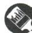

# 刷章测

1. A 【解析】因为 -2 < 0 < 2 < 4, 所以最小的数是 -2, 故选 A.

2. B 【解析】154 930 000 = 1.549 $3 \times 10^{8}$ . 故选 B.

3. D 【解析】因为 $-3 \times 3 \neq 1$ ，所以 -3 和 3 不互为倒数，故 A 不符合题意； $|-3| = 3$ ，因为 $-3 \times 3 \neq 1$ ，所以 -3 和 $|-3|$ 不互为倒数，故 B 不符合题意；因为 $-3 \times \frac{1}{3} \neq 1$ ，所以 -3 和 $\frac{1}{3}$ 不互为倒数，故 C 不符合题意；因为 $-3 \times \left(-\frac{1}{3}\right) = 1$ ，所以 -3 和 $-\frac{1}{3}$ 互为倒数，故 D 符合题意。故选 D.

4. D 【解析】由题图可知 a<0<b, |a|<|b|，所以 $a+b>0$ ，故 A 选项错误，不符合题意； $\frac{a}{b}<0$ ，故 B 选项错误，不符合题意；a<b，故 C 选项错误，不符合题意；a-b<0，故 D 选项正确，符合题意。故选 D.

5. C 【解析】因为 $\left|m\right|=2,\left|n\right|=3$ ，所以 $m=\pm2$ ， $n=\pm3$ 。因为 $\left|m+n\right|=m+n$ ，所以 m=2, n=3 或 m=-2, n=3。当 m=2, n=3 时， $\frac{n}{m}=\frac{3}{2}$ ；当 m=-2, n=3 时， $\frac{n}{m}=\frac{3}{-2}=-\frac{3}{2}$ 。故选 C.

6. C 【解析】把 18 输入, 得 $18 \times \left| -\frac{1}{2} \right| \div \left[ -\left(\frac{1}{2}\right)^2 \right] = 18 \times \frac{1}{2} \div \left( -\frac{1}{4} \right) = 9 \times (-4) = -36 < 100$ ; 把 -36 输入, 得 $-36 \times \left| -\frac{1}{2} \right| \div \left[ -\left(\frac{1}{2}\right)^2 \right] = -36 \times \frac{1}{2} \div \left( -\frac{1}{4} \right) = -18 \times (-4) =$

72<100; 把 72 输入, 得 $72 \times \left| -\frac{1}{2} \right| \div \left[ -\left( \frac{1}{2} \right)^{2} \right] = 72 \times \frac{1}{2} \div \left( -\frac{1}{4} \right) = 36 \times (-4) = -144 < 100$ ; 把 -144 输入, 得 $-144 \times \left| -\frac{1}{2} \right| \div \left[ -\left( \frac{1}{2} \right)^{2} \right] = -144 \times \frac{1}{2} \div \left( -\frac{1}{4} \right) = -72 \times (-4) = 288 > 100$ , 所以最后输出的结果为 288.

7. A 【解析】如图, 设内圈上的数为 c, 外圈上的数为 d. 因为 $(-1) + 2 + (-3) + 4 + (-5) + 6 + (-7) + 8 = 4$ , 横、竖以及内外两圈上的 4 个

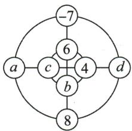

flowchart

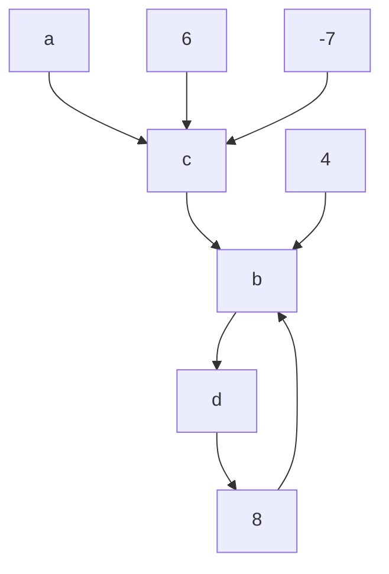

数字之和都相等,所以内外两圈的和都是2,横、竖的和也都是2.由 $-7+6+b+8=2$ ,得b=-5;由 $6+4+b+c=2$ ,得c=-3;由 $a+c+4+d=2$ ,得 $a+d=1$ .由题意可知,a和d代表的数字为-1和2.当a=-1时,d=2,则 $a+b=-1+(-5)=-6$ ;当a=2时,d=-1,则 $a+b=2+(-5)=-3$ .故选A.

8. -30 【解析】如果比标准质量多 42 g 记作 +42 g, 那么比标准质量少 30 g 应记作 -30 g. 故答案为 -30.

9.2 【解析】根据数轴上点的移动规律可知-2+7-3=2, 故点 B 表示的数为 2. 故答案为 2.

10. 1 【解析】因为 $7^{n}$ 的末位数字是按 7,9,3,1 这样循环的, $2020 \div 4 = 505$ , 所以 $7^{2020}$ 的末位数字是 1.

11. -2 或 4 【解析】因为 $\left|x+a\right|+\left|x+1\right|$ 表示数轴上 x 对应的点到 -a 对应的点与 x 对应的点到 -1 对应的点的距离之和，且其最小值为 3，所以当 x 对应的点介于 -a 对应的点与 -1 对应的点之间时， $\left|x+a\right|+\left|x+1\right|=3$ ，所以 -a 对应的点与 -1 对应的点之间的距离为 3，即 $\left|-a-(-1)\right|=3$ 。当 $-a-(-1)=3$ 时，解得 a=-2；当 $-a-(-1)=-3$ 时，解得 a=4。故答案为 -2 或 4。

12. -91 【解析】因为从 1 到 40 中, 只有 1, 4, 9, 16, 25, 36 含有奇数个因数, 所以游戏结束后, 黑板上出现的负数是 -1, -4, -9, -16, -25, -36, 所以 $(-1) + (-4) + (-9) + (-16) + (-25) + (-36) = -91$ . 故答案为 -91.

13.【解】整数集： $\left\{-2^{2},-(-1)^{100},0,+3,\cdots\right\}$ ;

负数集: $\left\{-2^{2},-(-1)^{100},-\frac{3}{5},\cdots\right\}$ ;

# 关键点拨

根据题意得出内外两圈的和都是2,横、竖的和也都是2是解题关键.

# 思路分析

通过观察可知 $7^{n}$ 的末位数字以7,9,3,1四个数字为一循环，根据这一规律用2020除以4，即可得出答案.

正分数集： $\{95\%,|-3.5|,\cdots\}$ .

14.【解】(1) 原式 $= -15 \times \frac{3}{4} - 15 \times \frac{3}{2} + 15 \times \frac{1}{4} =$ $\left(-\frac{3}{4} - \frac{3}{2} + \frac{1}{4}\right) \times 15 = (-2) \times 15 = -30.$

(2) 原式 $= 9 \div (2 + 7) - 3 = 9 \div 9 - 3 = 1 - 3 = -2$ .

15.【解】(1)以 B 为原点, 点 A, C 所对应的数分别是 -8, 4, 则 $m = -8 + 0 + 4 = -4$ ;

以 C 为原点, 点 A, B 所对应的数分别为 -12, -4, 则 $m = -12 + (-4) + 0 = -16$ .

(2)由题意得点 A 对应的数为 -16, 点 B 对应的数为 -8, 点 C 对应的数为 -4, 则 $n = -16 \times (-8) \times (-4) = -512$ .

16. (1)5 (2)-1 【解析】(1)10月1日较9月30日增加了1.2万人,10月2日较9月30日增加了1万人,10月3日较9月30日增加了1.8万人,10月4日较9月30日增加了1.4万人,10月5日较9月30日增加了2万人,所以游客人数最多的是10月5日.

(2) 因为 9 月 30 日的游客人数为 2 万人, 所以 10 月 8 日的游客人数也为 2 万人, 而 10 月 8 日的游客人数比前一天减少了 1.2 万人, 故 10 月 7 日的游客人数为 3.2 万人. 又因为 10 月 6 日的游客人数为 $2 + 1.2 - 0.2 + 0.8 - 0.4 + 0.6 + 0.2 = 4.2$ (万人), 所以上表中“■”表示的数应是 -1.

(3)【解】结合(1)可知10月1日至5日这五天的游客总人数是 $2\times5+1.2+1+1.8+1.4+2=$ 17.4(万人).

17.【解】(1)(10101) $_{2}=1\times2^{4}+0\times2^{3}+1\times2^{2}+0\times2+1=21.$

(2) $(10101)_2 + (1101)_2 = (100010)_2.$

计算过程如下:

$$
\begin{array}{r r r r r r} & 1 & 0 & 1 & 0 & 1 \\ + & & 1 & 1 & 0 & 1 \\ \hline 1 & 0 & 0 & 0 & 1 & 0 \end{array}
$$

(3)① $(1110)_{2}\times(11)_{2}=(101010)_{2}.$

计算过程如下:

$$
\begin{array}{c c c c c} & & 1 & 1 & 1 & 0 \\ \times & & & & 1 & 1 \\ \hline & & 1 & 1 & 1 & 0 \\ & 1 & 1 & 1 & 0 \\ \hline 1 & 0 & 1 & 0 & 1 & 0 \end{array}
$$

② $(110101)_2 + (1010)_2 + (11010)_2 \times (1001)_2 = (111111)_2 + (11101010)_2 = (100101001)_2 = 1 \times 2^8 + 1 \times 2^5 + 1 \times 2^3 + 1 = 256 + 32 + 8 + 1 = 297.$

# 第三章 整式及其加减

# 1 代数式

# 课时 1 代数式

# 刷基础

# 1. C 【解析】

<table><tr><td>选项</td><td>问题</td><td>正确表示</td><td>结论</td></tr><tr><td>A</td><td>数字因数应放在字母前</td><td>3ab</td><td>×</td></tr><tr><td>B</td><td>系数是带分数时必须化成假分数</td><td> $\frac{7}{3}xy^{2}$ </td><td>×</td></tr><tr><td>C</td><td>符合书写规范</td><td> $\frac{mn}{4}$ </td><td>√</td></tr><tr><td>D</td><td>代数式是和或差的形式且后面有单位时,代数式需要加括号</td><td>(x+3)克</td><td>×</td></tr></table>

2. A 【解析】根据代数式的意义, 可知 0, 5y-1, $\frac{s}{t}, a^{2006}$ 都是代数式, 共 4 个. 故选 A.  
3. C 【解析】表示 x 与 -9 的差的 5 倍的代数式是 $5[x-(-9)]$ . 故选 C.  
4. A 【解析】苹果每千克 $\frac{m}{2}$ 元. 故选 A.  
5. D 【解析】题图中空白部分的面积为 ab-ac-bc+c². 故选 D.  
6. D 【解析】由题图得,第1个图形中有4个三角形,第2个图形中有8个三角形,第3个图形中有12个三角形,…,据此可知,第n个图形中有4n个三角形.故选D.  
7. $x(a+b+c)$ 【解析】由题意可知,这次训练总共处理了 $(a+b+c)$ TB 数据,故总共消耗的电量是 $x(a+b+c)$ 千瓦时.  
8. (1) $\frac{4}{5} x - 20$ (2) $\frac{5}{4}\left(\frac{4}{5} x - 20\right) + 10$

【解析】(1)由题意可知,第二车间的人数为 $\frac{4}{5}x-20.$ (2)由第二车间的人数可以得到第三车间的人数为 $\frac{5}{4}\left(\frac{4}{5}x-20\right)+10.$

易错警示
本题易因不理解数的位数的意义而出错.

解题策略
探索图形的变化规律,需要运用从特殊到一般的探究方法,在探究图形的规律时,不仅要关注每个图形中基础图形的个数与序号之间的关系,还要关注图形之间的变化规律.

9.【解】(1) 李明从 A 地到 B 地需要的时间为 $\frac{150}{v}$ 时.

(2) 速度提高以后, 汽车的速度为 $(v + 10)$ 千米/时, 则李明从 A 地到 B 地需要的时间为 $\frac{150}{v + 10}$ 时.  
(3) 李明从 A 地到 B 地少用的时间为 $\left(\frac{150}{v}-\frac{150}{v+10}\right)$ 时.

# 刷易错·

10. $1\ 000n+m$ 【解析】由题意可得, 这个五位数是 $1\ 000n+m$ . 故答案为 $1\ 000n+m$ .

# 课时 2 代数式的应用

# 刷基础

1. A 【解析】当 m = -1 时, 原式 $= 5 \times (-1)^{3} - 2 \times (-1) = -3$ . 故选 A.  
2. C 【解析】将题表中各组对应值代入各选项中的代数式中, 发现只有 $2x - 3$ 满足. 故选 C.

3. A 【解析】因为 m = -2 < 0，所以将 m = -2 代入 $-2m + 3$ 中，得 $-2m + 3 = -2 \times (-2) + 3 = 4 + 3 = 7$ 。故选 A.

4. $\frac{40}{3}$ 【解析】当 $x = \frac{2}{3}, y = 6$ 时, $2x^{2}y + 3xy - 4 = 2 \times \left(\frac{2}{3}\right)^{2} \times 6 + 3 \times \frac{2}{3} \times 6 - 4 = \frac{16}{3} + 12 - 4 = \frac{40}{3}$ . 故答案为 $\frac{40}{3}$ .  
5.【解】(1) $P=15x+12y$ .

(2) $(15\times10+12\times15)\times80=26\ 400=2.64\times10^{4}$ （元）.

答:此公司应该向厂家付 $2.64 \times 10^{4}$ 元.

6.【解】(1)串 n 串冰糖葫芦需要 5n 个山楂.

(2)每串冰糖葫芦的山楂个数是 $\frac{200}{b}$ .   
(3)每串冰糖葫芦的山楂个数是 $\frac{a-c}{b}$ .

当 $a = 130, b = 16, c = 2$ 时， $\frac{a - c}{b} = \frac{130 - 2}{16} = 8.$

故当 a=130, b=16, c=2 时, 每串冰糖葫芦的山楂个数为 8.

# 7. C 【解析】

A 平均每月剩余的零花钱为 $\frac{1}{3} (a - b)$ ，不符合题意  
B 班级剩余的人数为 $a-\frac{1}{3}b$ ，不符合题意  
C 油箱剩余的油量为 a-3b, 符合题意   
D 买3件可以省下的钱为 $3(a-b)$ ，不符合题意

8.【解】一个苹果的质量是 a 千克, 一个桃子的质量是 b 千克, 那么两个苹果和三个桃子的质量是 $(2a+3b)$ 千克. (答案不唯一)

# 刷提升

1. A 【解析】当 x=3 时， $3x^{4}-2x^{2}+1=3\times3^{4}-2\times3^{2}+1=243-18+1=226$ ; 当 x=-3 时， $3x^{4}-2x^{2}+1=3\times(-3)^{4}-2\times(-3)^{2}+1=243-18+1=226$ ，所以当 x 分别等于 3 和 -3 时，代数式 $3x^{4}-2x^{2}+1$ 的值相等。故选 A.  
2. B 【解析】把 x = -1 代入 $6x^{5} + 5x^{4} + 4x^{3} + 3x^{2} + 2x + 1$ ，得 $-6 + 5 - 4 + 3 - 2 + 1 = -3$ 。因为误求得代数式的值为 5，比 -3 大 $8, 8 \div 2 = 4$ ，所以小明同学看错了 $4x^{3}$ 前面的符号。故选 B.  
3.2 或 -2 【解析】因为 $\left|a\right|=3$ ，数 b 对应的点到原点的距离是 5，所以 $a=\pm3, b=\pm5$ 。因为 ab<0，所以 a=3, b=-5 或 a=-3, b=5。当 a=3, b=-5 时， $a+b=3+(-5)=-2$ ，当 a=-3, b=5 时， $a+b=-3+5=2$ 。综上所述， $a+b$ 的值是 2 或 -2。故答案为 2 或 -2。  
4. (1) $m^{2}-\pi n^{2}$ (2)88 【解析】(1)由题意可得砚台阴影部分的面积为 $m^{2}-\pi n^{2}$ . 故答案为 $m^{2}-\pi n^{2}$ . (2) 当 m=14, n=6 时, 砚台阴影部分的面积是 $m^{2}-\pi n^{2}=14^{2}-3\times6^{2}=88$ . 故答案为 88.  
5. 5 【解析】第1次输入 $k = 125, \frac{1}{5} \times 125 = 25$ ，所以第1次输出 $25; \frac{1}{5} \times 25 = 5$ ，所以第2次输出 $5; \frac{1}{5} \times 5 = 1$ ，所以第3次输出 $1; 1 + 4 = 5$ ，所以第4次输出 $5; \frac{1}{5} \times 5 = 1$ ，所以第5次输出 $1; \cdots$ ；按此规律可知输出结果从第2次开始每两次一循环， $(2024 - 1) \div 2 = 1011 \cdots 1$ ，则第2024次输出的结果为5，故答案为5.  
6.【解】(1)由题意可得,方案一:收费为 1.1x

# 刷有所得

互为相反数的两个数的偶次方相等.

# 思路分析

将 x = -1 代入代数式 $6x^{5} + 5x^{4} + 4x^{3} + 3x^{2} + 2x + 1$ ，求得该式子的值为 -3，再结合误求得代数式的值为 5，求出差值，即可确定看错的是 $4x^{3}$ 前面的符号.

# 易错警示

单项式的系数是除了字母以外的数字因数, 注意一定要连同符号一起. 另外, $\pi$ 表示一个常数, 不能当成字母.

元. 方案二: 当 $x \leqslant 100$ 时, 收费为 1.3x 元; 当 x > 100 时, 收费为 $100 \times 1.3 + (x - 100) \times 0.9 = (0.9x + 40)$ 元.

(2) 当 x = 500 时, 方案一收费为 $1.1 \times 500 = 550$ (元), 方案二收费为 $0.9 \times 500 + 40 = 490$ (元). 因为 550 > 490, 所以方案二更优惠.

7.【解】(1)第2跑道的总长度为 $[2a + 2\pi (r + 1.2)]$ 米.故答案为 $[2a + 2\pi (r + 1.2)]$

(2) 第 3 跑道的总长度为 $[2a + 2\pi (r + 2.4)]$ 米.
故答案为 $[2a+2\pi(r+2.4)]$ .  
(3)①由题意得 $2a+2\pi r=200$ . 因为 a=50, 所以 $r\approx16$ .  
②由题意得铺设人工草的费用为 $100 \times 50 \times 2 \times 16 = 160\ 000$ (元);

铺设地胶的费用为 $50 \times [\pi \times (16 + 1.2 \times 4)^{2} + 50 \times (1.2 \times 4 \times 2)] = (21632\pi + 24000)$ 元.

所以 $160\ 000 + 21\ 632\pi + 24\ 000 = 184\ 000 + 21\ 632\pi \approx 251\ 059$ （元）.

答: 学校共需付铺设费用约 251 059 元.

# 课时 3 整式

# 刷基础

# 1. B 【解析】

<table><tr><td>单项式的特征</td><td>单项式</td></tr><tr><td>数与字母的乘积的形式</td><td> $-\frac{1}{5}a^{2}b^{2}$ </td></tr><tr><td>单独的一个数或一个字母</td><td>-25,a</td></tr></table>

故一共有 3 个单项式.

# 2. C 【解析】

A 数字1的次数是0,原说法正确,不符合题意   
B $\frac{1}{2}\pi xy$ 是二次单项式, 原说法正确, 不符合题意  
C 单项式 $-x$ 的系数是-1, 次数是1, 原说法不正确, 符合题意  
D $-\frac{2xy}{3}$ 的系数是 $-\frac{2}{3}$ , 原说法正确, 不符合题意

故选 C.

3. $\frac{17}{5}$ 【解析】单项式 $-\frac{3}{5} xy^3$ 的系数与次数分别是 $-\frac{3}{5}, 4$ , 所以 $m + n = \left(-\frac{3}{5}\right) + 4 = \frac{17}{5}$ . 故答案

为 $\frac{17}{5}$ .

4. $-x^{3}y$ (答案不唯一) 【解析】最大负整数为 -1，所以这个单项式可以是 $-x^{3}y$ (答案不唯一).

5.4 【解析】由题意得 $m+3=7$ ，所以 m=4。故答案为 4。

6.1 【解析】因为单项式 $0.5x^{4-m}$ 与 $6xy^{2}$ 的次数相同, 所以 $4-m=1+2$ , 解得 m=1. 故答案为 1.

7. A 【解析】多项式 $3xy^{2}-2y+1$ 的次数是最高次项 $3xy^{2}$ 的次数, 即 3, 一次项 -2y 的系数是 -2. 故选 A.

8. D 【解析】A 选项, 单项式 $\frac{\pi x^{2} y}{4}$ 的系数为 $\frac{\pi}{4}$ , 原说法错误, 不符合题意; B 选项, $-ab^{2} + 3a - 1$ 的项是 $-ab^{2}, 3a, -1$ , 原说法错误, 不符合题意; C 选项, 单项式 $3^{2}ab^{3}$ 的次数是 $1 + 3 = 4$ , 原说法错误, 不符合题意; D 选项, 多项式 $-3a^{2}b + 7a^{2}b^{2} - 2ab + 1$ 的次数是 4, 原说法正确, 符合题意. 故选 D.

9. B 【解析】将多项式 $2ab^{2}-5a^{2}b-7+a^{3}b^{3}$ 按字母 b 的指数从大到小的顺序排列为 $a^{3}b^{3}+2ab^{2}-5a^{2}b-7$ ，所以排在第三项的是 $-5a^{2}b$ 。故选 B.

10. B 【解析】由题意得 m-3=0, n=2, 所以 m=3, n=2, 所以 -mn=-6, 故选 B.

11. $a^{2}+ab+b^{2}$ (答案不唯一) 【解析】这个多项式可以为 $a^{2}+ab+b^{2}$ ，故答案为 $a^{2}+ab+b^{2}$ (答案不唯一).

12.2 【解析】因为多项式 $x^{2}-(3k-6)xy-3y^{2}-8$ 中不含 xy 项, 所以 3k-6=0, 解得 k=2. 故答案为 2.

13. B 【解析】式子 $10, 2x + y, \frac{b}{2}, \pi R^{2} - \pi r^{2}$ , $-3a + 2a^{2} + 1$ 是整式, 故整式有 5 个. 故选 B.

14.【解】如图所示.

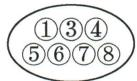  
代数式

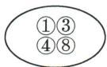  
单项式

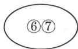  
多项式

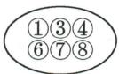  
整式

# 刷易错

15. -4 【解析】因为 $(m-4)x^{2}y^{|m|-1}$ 是关于x,y的五次单项式,所以 $m-4\neq0$ 且 $2+|m|-1=5$ ,解得m=-4,故答案为-4.

# 刷提升

1. C 【解析】由题意, 得 $x + 3 + 2 = 6$ , 解得 $x = 1$ .

# 关键点拨

根据多项式中不含 $xy$ 项,得出关于 $k$ 的方程是解题关键.

# 易错警示

整式相关求参问题中,以指数为条件求字母的值时,容易忽略系数不为0而出错.

故选 C.

2. C 【解析】因为多项式 $(n-3)x^{|n+2|}-(m-2)x^{3}+6x^{2}-(n+1)x+\frac{1}{2}$ 是关于x的五次多项式,所以 $|n+2|=5,n-3\neq0$ ,所以n=-7.因为三次项的系数为3,所以 $-(m-2)=3$ ,所以m=-1,所以 $m-n=-1-(-7)=6$ .

3. D 【解析】因为 $a_{5}$ 是正整数, $a_{4}, a_{3}, a_{2}, a_{1}, a_{0}$ 是自然数, p=1, 所以 $a_{5}+a_{0}=p=1$ , 所以 $a_{5}=1, a_{0}=0$ . 因为 $a_{4}+a_{3}+a_{2}+a_{1}=q=0$ , 所以 $a_{4}=a_{3}=a_{2}=a_{1}=0$ , 所以 M 只有 1 个, 为 $x^{5}$ , 故①正确. 若 p=q=2, 则 $a_{5}+a_{0}=p=2, a_{4}+a_{3}+a_{2}+a_{1}=2$ . 因为要满足五次四项式, 所以 $a_{5}=a_{0}=1, a_{4}, a_{3}, a_{2}, a_{1}$ 中有两个为 1, 两个为 0, 所以 $M=x^{5}+x^{4}+x^{2}+1$ 或 $M=x^{5}+x^{4}+x^{3}+1$ 或 $M=x^{5}+x^{4}+x+1$ 或 $M=x^{5}+x^{3}+x^{2}+1$ 或 $M=x^{5}+x^{2}+x+1$ 或 $M=x^{5}+x^{3}+x+1$ , 共 6 个, 故②正确. 因为 $a_{5}+a_{0}=p=3, a_{4}+a_{3}+a_{2}+a_{1}=q=1$ , 所以当 $a_{5}=3, a_{0}=0, a_{4}, a_{3}, a_{2}, a_{1}$ 中有一个为 1, 其余为 0 时, 满足条件的整式 M 有 4 个; 当 $a_{5}=2, a_{0}=1, a_{4}, a_{3}, a_{2}, a_{1}$ 中有一个为 1, 其余为 0 时, 满足条件的整式 M 有 4 个; 当 $a_{5}=1, a_{0}=2, a_{4}, a_{3}, a_{2}, a_{1}$ 中有一个为 1, 其余为 0 时, 满足条件的整式 M 有 4 个, 所以满足条件的整式 M 共有 12 个, 故③正确. 综上可知, 正确的个数是 3, 故选 D.

4.4

思路分析 | 根据多项式的定义求代数式的值  
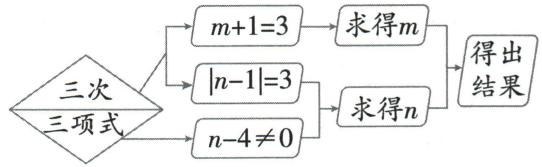

flowchart

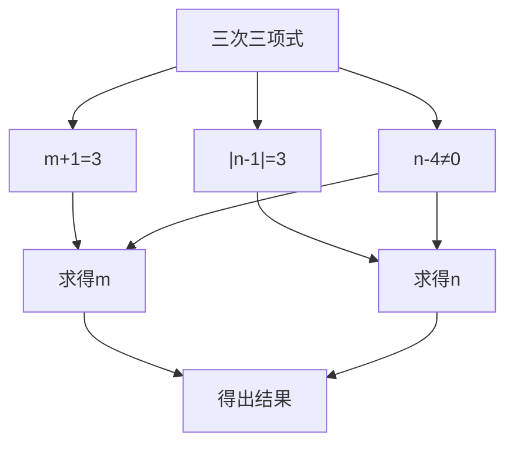

【解析】因为 $\frac{1}{2}x^{|n-1|}+(n-4)x+2$ 是关于x的三次三项式,所以 $|n-1|=3$ ,且 $n-4\neq0$ ,所以n=-2.又因为关于x,y的单项式 $3x^{m}y$ 与该多项式次数相同,所以 $m+1=3$ ,所以m=2,所以 $n^{m}=(-2)^{2}=4$ .

5.【解】(1)第5个单项式为 $9x^{5}y^{6}$ . 故答案为 $9x^{5}y^{6}$ .

(2)由 $xy^{2}, -3x^{2}y^{3}, 5x^{3}y^{4}, -7x^{4}y^{5}$ 可知第 n 个单项式为 $(-1)^{n+1}(2n-1)x^{n}y^{n+1}$ ，所以第 20 个单项式为 $-39x^{20}y^{21}$ ，所以第 20 个单项式的系数是 -39，次数是 41.

(3) 因为系数的绝对值为 2025, 所以 $2n - 1 = 2025$ , 所以 $n = 1013$ , 所以系数的绝对值为

2025的单项式的次数为 $1013 + 1013 + 1 = 2027$

6.【解】(1)这所住宅的建筑面积为 $x^{2}+2x+4\times3+3\times2=(x^{2}+2x+18)\mathrm{m}^{2}$ .

(2) 是多项式. 它是二次三项式, 它的二次项系数是 1, 一次项是 2x.

# 刷素养

7.【解】(1)因为 $f(a,b)=a^{2}-2ab+b^{2}$ ，所以 $f(b,a)=b^{2}-2ab+a^{2}$ ，所以 $f(a,b)=f(b,a)$ ，所以 $f(a,b)=a^{2}-2ab+b^{2}$ 是“对称多项式”.

(2) 当 $f(a,b)=a+b$ 时, $f(b,a)=b+a=f(a,b)$ , 所以 $f(a,b)=a+b$ 是“对称多项式”. 故答案为 $a+b$ (答案不唯一).

(3) 不一定. 举例: $f_{1}(a, b) = a + b, f_{2}(a, b) = -a - b$ 都是“对称多项式”, 而 $f_{1}(a, b) + f_{2}(a, b) = 0$ , 是单项式, 不是多项式.

# 2 整式的加减

# 课时1 同类项及合并同类项

# 刷基础

1. A

思路分析 | 识别同类项的方法  
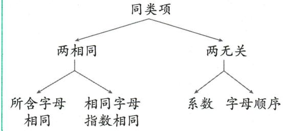

flowchart

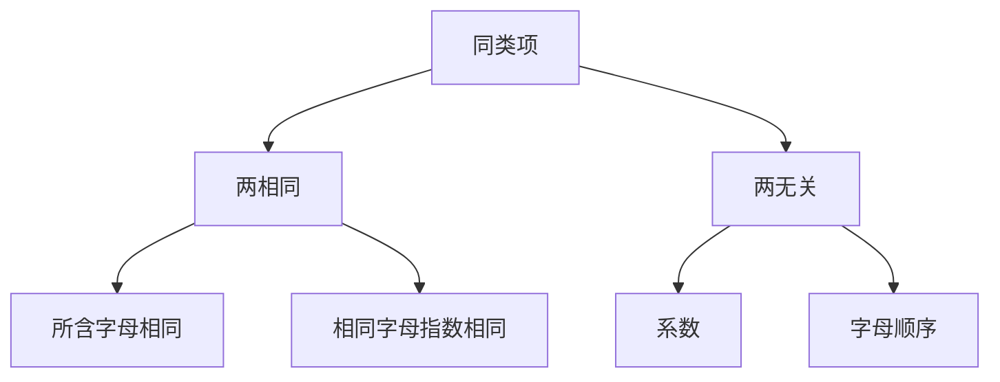

【解析】根据同类项的定义可知, $ab^{3}$ 的同类项是 $3ab^{3}$ .故选A.

2.4 【解析】因为 $a^{m}b^{3}$ 与 $-7ab^{n}$ 是同类项, 所以 m=1, n=3, 所以 $m+n=1+3=4$ , 故答案为 4.

3. D 【解析】甲: 3x 与 3y 不是同类项, 不能合并, 故甲不正确; 乙: 7x - 5x = 2x, 故乙不正确; 丙: $-y^{2} + y^{2} = 0$ , 故丙正确.

4. D 【解析】 $1+4xy^{2}+nxy^{2}+xy=1+(4+n)xy^{2}+xy$ . 因为关于 x,y 的多项式 $1+4xy^{2}+nxy^{2}+xy$ 中不含 $xy^{2}$ 项, 所以 $4+n=0$ , 所以 n=-4, 故选 D.

5. C 【解析】因为单项式 $3x^{3}y^{m}$ 与 $-\frac{1}{4}x^{n+1}y^{2}$ 的和仍是单项式, 所以 m=2, $n+1=3$ , 所以这两个单项式的和为 $3x^{3}y^{2}+\left(-\frac{1}{4}x^{3}y^{2}\right)=\frac{11}{4}x^{3}y^{2}$ . 故选 C.

6. C 【解析】由题意得, $a = -\frac{1}{2} x^2 y^3 + \frac{2}{3} y^3 x^2 -$

# 关键点拨

理解“对称多项式”的定义是解题的关键.

# 归纳总结

合并同类项的原则为“一加二不变”，即系数相加、字母及其指数不变.

$\frac{1}{6}x^{2}y^{3}=0$ , 所以 $a^{2}+2a+1=1$ .

7. 7 【解析】 $mx^{2}+5y^{2}-7x^{2}+3=(m-7)x^{2}+5y^{2}+3$ . 因为代数式 $mx^{2}+5y^{2}-7x^{2}+3$ 的值与字母 x 的取值无关, 所以 m-7=0, 解得 m=7.

8.【解】(1) $a+2b+3a-2b=4a$ .

(2) $3x^{2}+6x+5-4x^{2}+7x-6=-x^{2}+13x-1.$

(3) $x^{2}y-3xy^{2}+2yx^{2}-y^{2}x=3x^{2}y-4xy^{2}.$

(4) $3(x+y)^{2}-(x-y)+2(x+y)^{2}+(x-y)-5(x+y)^{2}$

$$
\begin{array}{l} = [ 3 (x + y) ^ {2} + 2 (x + y) ^ {2} - 5 (x + y) ^ {2} ] + \\ [ (x - y) - (x - y) ] \\ = 0 + 0 \\ = 0. \\ \end{array}
$$

9.【解】(1) 原式 = $(3-3)x^{2} + (4-4)y^{2} + (2-3)xy = -xy$ ，当 $x = \frac{1}{2}, y = -6$ 时，原式 = $-\frac{1}{2} \times (-6) = 3$ .

(2) 原式 $= (-1 + 3)xyz + (4 - 4)yz + (5 - 6)xz = 2xyz - xz$ ，当 $x = -2, y = -10, z = -5$ 时，原式 $= 2 \times (-2) \times (-10) \times (-5) - (-2) \times (-5) = -200 - 10 = -210$ .

10.【解】(1)根据题意得该学校七年级有 $(45x+55y)$ 名学生,八年级有 $(55x+30y)$ 名学生.

(2) $45x+55y+55x+30y=(100x+85y)$ 名.

答:该学校七、八年级共有 $(100x+85y)$ 名学生.

(3) 当 x=4, y=6 时, $100x+85y=100\times4+85\times6=910$ (名).

答: 当 x=4, y=6 时, 该学校七、八年级共有 910 名学生.

# 课时 2 去括号

# 刷基础

1. B 【解析】 $-(a-3b)=-a+3b$ ，故 A 不符合题意； $a+(5a-3b)=a+5a-3b$ ，故 B 符合题意； $-2(x-y)=-2x+2y$ ，故 C 不符合题意； $-y+3(y-2x)=-y+3y-6x$ ，故 D 不符合题意。故选 B.

2. A 【解析】 $2a-(b-3c)=2a-b+3c$ .

A $2a + (-b + 3c) = 2a - b + 3c$ ，相等  
B $2a + (-b) - 3c = 2a - b - 3c$ ，不相等  
C $2a + (-b - 3c) = 2a - b - 3c$ ，不相等  
D $2a + [-(b + 3c)] = 2a - b - 3c$ ，不相等

3. A 【解析】 $3a-(2b+c)=3a-2b-c\neq3a-2b+c$ 故 A 选项符合题意; $c-(2b-3a)=c-2b+3a=$ $3a-2b+c$ ，故 B 选项不符合题意； $(3a-2b)+c=$ $3a-2b+c$ ，故 C 选项不符合题意； $3a-(2b-c)=$ $3a-2b+c$ ，故 D 选项不符合题意. 故选 A.

4. D 【解析】根据题意, 把括号前 “-” 变成 “+”, 括号内的各项都应乘 -1, 其结果应是 $a + (-2b + 3c)$ .

5. 2a-b 【解析】- $\left[-\left(2a-b\right)\right]$ 去括号得2a-b.

6. C 【解析】 $m-n-(m+n)=m-n-m-n=-2n$ . 故选 C.

7. B 【解析】 $(ax^{2}-3x+5)-(2x^{2}-bx-2)=ax^{2}-3x+5-2x^{2}+bx+2=(a-2)x^{2}+(b-3)x+7$ . 因为多项式 $(ax^{2}-3x+5)-(2x^{2}-bx-2)$ 的结果是常数, 所以 a-2=0, b-3=0, 所以 a=2, b=3, 所以 a-b=2-3=-1. 故选 B.

8. -1 010a 【解析】原式 = a + 3a + 5a + … + 2 019a - 2a - 4a - 6a - … - 2 020a = (a - 2a) + (3a - 4a) + (5a - 6a) + … + (2 019a - 2 020a) = -a + (-a) + (-a) + … + (-a) = -1 010a.

9.【解】(1) $3x-\left[5x-\left(\frac{1}{3}x-4\right)\right]=3x-\left(5x-\frac{1}{3}x+4\right)=3x-5x+\frac{1}{3}x-4=-\frac{5}{3}x-4.$

(2) $3\left(x^{2} - \frac{1}{2} y^{2}\right) - \frac{1}{2}(4x^{2} - 3y^{2}) = 3x^{2} - \frac{3}{2} y^{2} - 2x^{2} + \frac{3}{2} y^{2} = x^{2}$ .

10.【解】因为 $3x^{2}y^{5}$ 与 $-2x^{1-a}y^{3b-1}$ 是同类项，
所以 $1-a=2,3b-1=5,$

解得 a = -1, b = 2.

原式 $= 5ab^{2} - (6a^{2}b - 3ab^{2} - 6a^{2}b) = 5ab^{2} - (-3ab^{2}) = 8ab^{2}$ .

将 a = -1, b = 2 代入, 得

原式= $8\times(-1)\times2^{2}=-8\times4=-32.$

11.【解】因为原式 $= 3x^{2} - 2x + 4 - 2x^{2} + 2x - x^{2} = 4$ ，所以无论 $x = 100$ 还是 $x = 10$ ，代数式的值都为4.

# 刷易错·

12. D 【解析】A 选项, 正确结果应为 $a-2b+c$ , A 错误; B 选项, 正确结果应为 $a+4b-6c$ , B 错误; C 选项, 正确结果应为 $a+b-3c$ , C 错误; D 选项正确.

# 课时 3 整式的加减

# 刷基础

1. C 【解析】因为 $a+b=3, c-d=-2$ ，所以 $(b+c)-(d-a)=b+c-d+a=(a+b)+(c-d)=3+(-2)=1$ 。故选 C.

# 归纳总结

解答此类问题的基本思路：

(1) 先确定这个多项式(被减数).  
(2) 再按原来的要求算出正确的答案.

# 技巧点拨

将原式去括号,然后利用加法交换律和加法结合律使得计算更简便.

# 易错警示

在去括号时，容易出现两类错误，一是括号前面是“-”时，去括号时没有把括号内的各项都改变符号，如本题选项A；二是括号前面有数字因数时，没有把这个数字因数与括号内的各项都相乘，如本题选项B.

# 易错警示

求两个整式的差,列式时要把各个整式作为一个整体加上括号.

2. A 【解析】由题意可得, 这个多项式为 $(x^{2}+14x-6)-x=x^{2}+14x-6-x=x^{2}+13x-6$ , 所以这道题正确的结果为 $(x^{2}+13x-6)-x=x^{2}+13x-6-x=x^{2}+12x-6$ . 故选 A.

3. ①或②或④ 【解析】由题意可知, 这个多项式可以是 $2x^{2}-3x-2-(3x^{2}-x+1)=2x^{2}-3x-2-3x^{2}+x-1=-x^{2}-2x-3$ , 或 $2x^{2}-3x-2+(3x^{2}-x+1)=2x^{2}-3x-2+3x^{2}-x+1=5x^{2}-4x-1$ , 或 $3x^{2}-x+1-(2x^{2}-3x-2)=3x^{2}-x+1-2x^{2}+3x+2=x^{2}+2x+3$ .  
4.【解】(1) $A-2B=(3x^{2}-2xy+y^{2})-2(2x^{2}+3xy-4y^{2})=3x^{2}-2xy+y^{2}-4x^{2}-6xy+8y^{2}=-x^{2}-8xy+9y^{2}$ .

(2) $2A+B=2(3x^{2}-2xy+y^{2})+(2x^{2}+3xy-4y^{2})=6x^{2}-4xy+2y^{2}+2x^{2}+3xy-4y^{2}=8x^{2}-xy-2y^{2}.$

5. C 【解析】由题意得第三边的长为 $a - \frac{1}{4}a - \frac{1}{2}(a - 4) = a - \frac{1}{4}a - \frac{1}{2}a + 2 = \frac{1}{4}a + 2.$   
6. C 【解析】设空白部分的面积为 x. 由题意可得 $a + x = 26, b + x = 9$ ，所以 $(a + x) - (b + x) = 26 - 9$ ，所以 $a + x - b - x = 17$ ，所以 a - b = 17. 故选 C.  
7. $(2a+2b)$ 【解析】由题意得 $(3a-b)+(3b-a)=3a-b+3b-a=(2a+2b)$ 页. 故答案为 $(2a+2b)$ .  
8. $6n+6$ 【解析】另外两个偶数分别为 $2n+2$ , $2n+4$ , 所以 $2n+(2n+2)+(2n+4)=2n+2n+2+2n+4=6n+6$ . 故答案为 $6n+6$ .

# 9. 思路分析

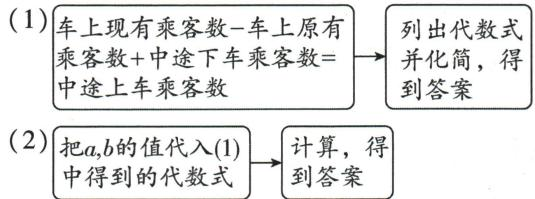

flowchart

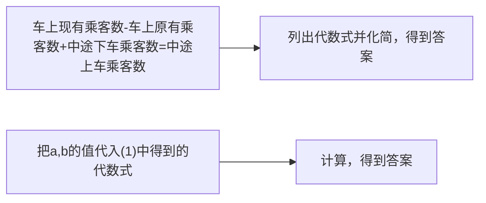

【解】(1)由题意得 $(8m-5n)-(3m-n)+\frac{1}{2}(3m-n)=8m-5n-3m+n+\frac{3}{2}m-\frac{1}{2}n=\frac{13}{2}m-\frac{9}{2}n$ ，即中途上车的乘客有 $\left(\frac{13}{2}m-\frac{9}{2}n\right)$ 人.  
(2) 当 m=10, n=8 时, 中途上车的乘客有 $\frac{13}{2} \times 10 - \frac{9}{2} \times 8 = 29$ (人).

# 刷易错·

10.【解】佳琪的解答过程不正确. 正确的解答过程如下:

根据题意得这个多项式为 $(2x^{2}y-xy^{2})-(x^{2}y-3xy^{2})=2x^{2}y-xy^{2}-x^{2}y+3xy^{2}=x^{2}y+2xy^{2}$ .

# 刷提升

1. B 【解析】因为 $(2b-a)-b=b-a$ ，所以第6个代数式为 $5b-4a+b-a=6b-5a$ ，第7个代数式为 $6b-5a+b-a=7b-6a$ ，所以前7个代数式的和为 $b+(2b-a)+\cdots+(7b-6a)=28b-21a$ 。因为 $4b-3a=8$ ，所以 $28b-21a=7(4b-3a)=7\times8=56$ 。故选B。

2. M>N 【解析】由题意, 得 $M-N=4x^{2}-5x+12-(2x^{2}-5x+9)=4x^{2}-5x+12-2x^{2}+5x-9=2x^{2}+3>0$ , 所以 M>N.

3.2 【解析】当投中的目标区域内的单项式为 a, b, -b, 2b 时, $a + b - b + 2b = a + 2b$ ; 当投中的目标区域内的单项式为 -a, 2a, 0, 2b 时, $-a + 2a + 0 + 2b = a + 2b$ .

4. $\frac{6}{7}$ 【解析】 $(7mxy - 0.75y^3) - 2(2x^2y + 3xy) = 7mxy - 0.75y^3 - 4x^2y - 6xy = -0.75y^3 + (7m - 6)xy - 4x^2y.$ 因为化简后不含二次项，所以 $7m - 6 = 0$ ，解得 $m = \frac{6}{7}$ .

5.【解】(1) $(2x-3)m+2m^{2}-3x=2mx-3m+2m^{2}-3x=(2m-3)x+2m^{2}-3m$ ，因为其值与x的取值无关，所以2m-3=0，解得 $m=\frac{3}{2}$ .

(2) 设 AB = x. 由题图可知 $S_{1} - S_{2} = (ax - 3ab) - (2bx - 4ab) = (a - 2b)x + ab$ . 因为当 AB 的长变化时, $S_{1} - S_{2}$ 的值始终保持不变, 所以 $S_{1} - S_{2}$ 的值与 x 的取值无关, 所以 a - 2b = 0, 所以 a = 2b.

# 刷素养

6.【解】(1)因为 $3(a - b)^2 - 6(a - b)^2 + 2(a - b)^2 = (3 - 6 + 2)(a - b)^2 = -(a - b)^2$ . 故答案为 $-(a - b)^2$ .

(2) 因为 $x^{2}-2y=4$ ,

所以原式 $= 3(x^{2} - 2y) - 21 = 12 - 21 = -9.$

(3) 因为 a-2b=3, 2b-c=-5, c-d=10,

所以 a-c=-2,2b-d=5,

所以原式 $=-2+5-(-5)=8.$

# 重难专题 2 整式的化简求值

# 刷难关

1.【解】原式 $= 3x^{2}y - (2xy^{2} - 2xy + 3x^{2}y) + 3xy^{2}-$ $xy = 3x^{2}y - 2xy^{2} + 2xy - 3x^{2}y + 3xy^{2} - xy = xy^{2} + xy.$

# 技巧总结

比较两个整式的大小时,一般采用“作差法”,通过比较差与0的大小关系来确定整式的大小关系.

# 技巧点拨

在用“整体思想”解题时,为了更清楚地表示,可以用其他字母表示整体,即换元.如本题第(1)问中,可以先将 $(a-b)^{2}$ 表示成t,得原式=3t-6t+2t,再进行合并.这种方法也叫整体换元法.

# 归纳总结

在日历表中，
上下两行同一
列的数相差
7, 同一行相邻
的数相差 1.

当 $x = 3, y = -\frac{1}{3}$ 时，原式 $= 3 \times \left(-\frac{1}{3}\right)^2 + 3 \times \left(-\frac{1}{3}\right) = \frac{1}{3} - 1 = -\frac{2}{3}$ .

2.【解】(1)由题意,得 $x^{2}+x+1=10$ , 则 $x^{2}+x=9$ ,
所以 $-2x^{2}-2x+3=-2(x^{2}+x)+3=-2\times9+3=-15.$

(2) 当 x=2 时， $ax^{3}+bx+4=9$ ，

所以 $8a+2b+4=9$ ，所以 $8a+2b=5$ 。

当 x = -2 时, $ax^{3} + bx + 3 = (-2)^{3}a - 2b + 3 = -8a - 2b + 3 = -(8a + 2b) + 3 = -5 + 3 = -2.$

(3) 因为 $a^{2}-ab=26, ab-b^{2}=-16$ ，所以 $a^{2}-2ab+b^{2}=(a^{2}-ab)-(ab-b^{2})=26-(-16)=42.$ 故答案为 42.

3.【解】(1) $4A-(3A-2B)=A+2B$ . 因为 $A=2a^{2}+3ab-2a-1$ , $B=-a^{2}+ab-1$ , 所以原式 $=A+2B=2a^{2}+3ab-2a-1+2(-a^{2}+ab-1)=5ab-2a-3$ .

(2)由题可知 5ab-2a-3 与 a 的取值无关, 即 (5b-2)a-3 与 a 的取值无关, 所以 5b-2=0, 解得 $b=\frac{2}{5}$ , 即 b 的值为 $\frac{2}{5}$ .

4.【解】(1) $A-B=(a^{2}+b^{2}-c^{2})-(-4a^{2}+2b^{2}+3c^{2})=a^{2}+b^{2}-c^{2}+4a^{2}-2b^{2}-3c^{2}=5a^{2}-b^{2}-4c^{2}$ .

(2) 因为 $A - B + C = 0$ , 所以 $C = -(A - B) = -(5a^2 - b^2 - 4c^2) = -5a^2 + b^2 + 4c^2$ , 当 $a = 1, b = -1, c = 3$ 时, $C = -5 \times 1^2 + (-1)^2 + 4 \times 3^2 = -5 + 1 + 36 = 32$ .

5.【解】(1) 因为 $a+b>0, c-b<0, b-a<0$ ，所以原式 $=a+b+c-b-b+a=2a-b+c.$

(2)由题意,得 a=2,b=-1,c=-2,所以 $-a+2b+c-(a+b-c)=-a+2b+c-a-b+c=-2a+b+2c=-4-1-4=-9.$

# 3 探索与表达规律

# 课时1 探索与表达规律

# 刷基础

1. C 【解析】从方格上方的数 1,3,5 可以推出 m=7，第一个方格中： $3=1\times2+1$ ，第二个方格中： $15=3\times4+3$ ，第三个方格中： $35=5\times6+5$ ，所以第四个方格中： $n=7\times8+7=63$ .

2. 4x+14 【解析】由题意得 b 表示的数是 $x+1$ , c 表示的数是 $x+6$ , d 表示的数是 $x+7$ , 所以这 4 个数的和为 $x+x+1+x+6+x+7=4x+14$ . 故答案为 $4x+14$ .

3. $(n + 1)(n + 7) - n(n + 8) = 7$ 【解析】日历中所示的方框左上角数字为 $n$ ，则其余三个数从小到大依次是 $n+1, n+7, n+8$ ，所以用含有 n 的等式表示这一规律为 $(n+1)(n+7)-n(n+8)=7$ 。故答案为 $(n+1)(n+7)-n(n+8)=7$ 。

# 4. B

# 思路分析

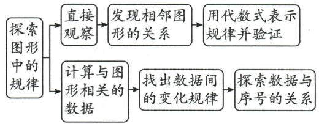

flowchart

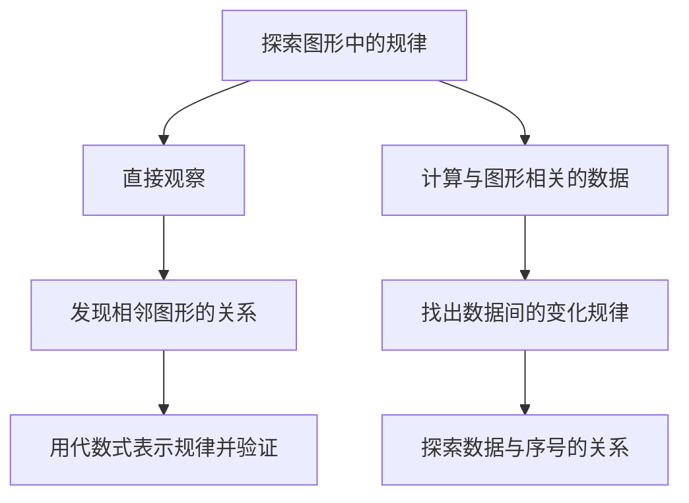

【解析】题中第1个图有4个三角形,即 $4=3\times1+1$ ,第2个图有7个三角形,即 $7=3\times2+1$ ,第3个图有10个三角形,即 $10=3\times3+1,\cdots$ ,按此规律排列下去,第n个图有 $(3n+1)$ 个三角形,则第674个图中三角形的个数为 $3\times674+1=2023$ .故选B.

5. C 【解析】第一个图形有 $5 = [(1 + 1)^{2} + 1]$ 个
•, 第二个图形有 $11 = [(2 + 1)^{2} + 2]$ 个•, 第三个
图形有 $19 = [(3 + 1)^{2} + 3]$ 个•, …, 发现规律: 第
n 个图形有 $[(n+1)^{2}+n]$ 个•, 所以第 11 个图
形中•的个数为 $(11+1)^{2}+11=155$ . 故选 C.

6.【解】(1)由题意得第4个图形中白色小正方形的个数为 $4^{2}=16$ ，灰色小正方形的个数为 $4\times4=16$ ，则其个数总和为 $16+16=32$ ，故答案为32.

(2)由题图得第1个图形中白色小正方形的个数为 $1^{2}=1$ ，灰色小正方形的个数为 $4\times1=4$ ，则其个数总和为 $1+4=5$ ；第2个图形中白色小正方形的个数为 $2^{2}=4$ ，灰色小正方形的个数为 $4\times2=8$ ，则其个数总和为 $4+8=12$ ；第3个图形中白色小正方形的个数为 $3^{2}=9$ ，灰色小正方形的个数为 $4\times3=12$ ，则其个数总和为 $9+12=21$ ；…，则第n个图形中白色小正方形的个数为 $n^{2}$ ，灰色小正方形的个数为4n，则其个数总和为 $n^{2}+4n$ 。

# 课时 2 借助运算探索规律

# 刷提升

1. D 【解析】设这三个一位数依次为 a, b, c，将其按题中步骤进行计算得 $\left[(2a+5)\times5+b\right]\times10+c$ ，整理得 $100a+10b+c+250$ ，所以将得到的结果减去 250 后，百位是 a，十位是 b，个位是 c。因为 846-250=596，所以小红所选的第二个一位数是 9。故选 D。

2. C 【解析】因为 $n_{1}=4$ ，所以 $a_{1}=4\times(3\times4+1)=52$ ，则 $n_{2}=5+2=7$ ，所以 $a_{2}=7\times(3\times7+1)=154$ ，同理可得， $a_{3}=310, a_{4}=52, \cdots$ ，由此可

# 关键点拨

通过前 3 个图形中基本图形 “●” 的个数总结出规律是解题关键.

# 关键点拨

本题主要考查的是列代数式和整式的运算,能根据题意用字母表示所求结果并列出代数式是解题关键.

见,这列数从 $a_{1}$ 开始按 52,154,310 循环. 因为 $2\ 024 \div 3 = 674 \cdots 2$ , 所以 $a_{2024} = 154$ . 故选 C.

3.【解】(1)若选择的数是3,根据题意得, $(3\times5+1)\times2+7-3=16\times2+7-3=36$ ,则个位数字与十位数字的和是 $3+6=9$ .故答案为9.

(2) 若选择的数是 5, 则 $(5 \times 5 + 1) \times 2 + 7 - 5 = 54$ , 则个位数字与十位数字的和是 $5 + 4 = 9$ ; 若选择的数是 8, 则 $(8 \times 5 + 1) \times 2 + 7 - 8 = 81$ , 则个位数字与十位数字的和是 $8 + 1 = 9$ ; …. 发现: 所得的两位数中, 个位数字与十位数字的和不会发生变化. 故答案为不会.

(3) 若选择的数为 $x$ , 则 $(5x + 1) \times 2 + 7 - x = 9x + 9 = 10x + 9 - x$ , 则所得的两位数中, 十位数字为 $x$ , 个位数字为 $9 - x$ , 所以个位数字与十位数字的和是 $x + 9 - x = 9$ .

4.【解】(1)设符合①的一个三位数的百位数字是a,十位数字是b.因为这个三位数的个位数字是5,所以这个三位数可表示为 $100a+10b+5$ ,而 $100a+10b+5=5\times20a+5\times2b+5\times1=5(20a+2b+1)$ ,所以个位数字是5的自然数能被5整除.

(2) 设符合②的一个三位数的百位数字是 m，十位数字是 n，个位数字是 p，所以这个三位数可表示为 $100m + 10n + p$ 。因为个位数字与百位数字之和等于十位数字，所以 $n = m + p$ ，所以 $100m + 10n + p = 100m + 10(m + p) + p = 11(10m + p)$ ，所以个位数字与百位数字之和等于十位数字的三位数（自然数）能被 11 整除。

5.【解】用字母 $n(n \geqslant 2)$ 表示第一步中每堆牌的张数，则第二步后左、中、右三堆牌的张数分别为 $n-2, n+2, n$ ; 第三步后左、中、右三堆牌的张数分别为 $n-2, n+3, n-1$ ; 第四步后左、中、右三堆牌的张数分别为 $2(n-2), (n+3)-(n-2), n-1$ , 此时，中间一堆牌的张数为 $(n+3)-(n-2) = n+3-n+2 = 5$ .

# ☆问题解决策略:归纳

# 刷提升

【解】探究二:(1)用7根相同的木棒搭一个三角形,

若分成 1 根木棒、1 根木棒和 5 根木棒，则不能搭成三角形；若分成 2 根木棒、2 根木棒和 3 根木棒，则能搭成一种等腰三角形；若分成 3 根木棒、3 根木棒和 1 根木棒，则能搭成一种等腰三角形.

此时,能搭成2种等腰三角形,

所以, 当 n=7 时, m=2.

(2)如表1所示.

表1

<table><tr><td>n</td><td>7</td><td>8</td><td>9</td><td>10</td></tr><tr><td>m</td><td>2</td><td>1</td><td>2</td><td>2</td></tr></table>

【问题解决】如表 2 所示.

表 2

<table><tr><td>n</td><td>4k-1</td><td>4k</td><td>4k+1</td><td>4k+2</td></tr><tr><td>m</td><td> $\underline{k}$ </td><td> $\underline{k-1}$ </td><td> $\underline{k}$ </td><td> $\underline{k}$ </td></tr></table>

【问题应用】因为 $2023 = 4 \times 506 - 1$ ,

所以由表 2 的规律可知,用 2023 根相同的木棒搭一个三角形(木棒无剩余),能搭成 506 种不同的等腰三角形.

# 全章综合训练

# 刷中考

1. C 【解析】代数式-3x 的意义是-3 与 x 的积. 故选 C.

2.3 【解析】因为单项式 $-3ab^{2}$ 中，a 的指数是 1, b 的指数是 2，所以此单项式的次数为 1 + 2 = 3。故答案为 3。

3. 30n 【解析】 $30 \times n = 30n$ （元），故答案为 30n.

4. A 【解析】 $2a+3a=5a$ ，故选 A.

5.2 【解析】由同类项定义可知 $n - 1 = 1$ ，解得 $n = 2$ .故答案为2.

6. B 【解析】因为 $x^{2}+3x-5=0$ ，所以 $x^{2}+3x=5$ ，所以 $2x^{2}+6x-3=2(x^{2}+3x)-3=2\times5-3=7$ 。故选 B.

7. $y^{2}-1$ 【解析】 $3xy+2y^{2}-5-(y^{2}+3xy-4)=3xy+2y^{2}-5-y^{2}-3xy+4=y^{2}-1.$

8.2 【解析】 $2(a+2b)-(3a+5b)+5=2a+4b-3a-5b+5=-a-b+5=-(a+b)+5.$ 当 a+b=3 时，原式 = -3+5=2，故答案为 2.

9.【解】原式=4xy-2xy+3xy=(4-2+3)xy=5xy.
当 x=2,y=-1 时, 原式 $=5\times2\times(-1)=-10$ .

10. B 【解析】第 1 个图形棋子枚数为 4, 第 2 个图形棋子枚数为 $2 \times 4 = 8$ , 第 3 个图形棋子枚数为 $3 \times 4 = 12$ , 所以根据规律可知第 4 个图形棋子枚数为 $4 \times 4 = 16$ , 第 5 个图形棋子枚数为 $5 \times 4 = 20$ . 故选 B.

11. D 【解析】因为按一定规律排列的代数式： $2x,3x^{2},4x^{3},5x^{4},6x^{5},\cdots$ ，可知系数等于代数式的序数加1,x的次数等于代数式的序数，所以第n个代数式为 $(n+1)x^{n}$ ，故选D.

12. B 【解析】由题可知, 第一幅图有 1 个正方形, 第二幅图有 $1^{2} + 2^{2} = 5$ (个) 正方形, 第三

# 思路分析

先将原式去括号、合并同类项可得 $-a-b+5$ ，再把前两项中的-1提取出来，然后把 $a+b$ 的值代入可得结果.

# 关键点拨

根据所给排列方式,由每行左起第1个数的规律,得到从第三行起每行左起第3个数的规律是解题的关键.

幅图有 $1^{2}+2^{2}+3^{2}=14$ （个）正方形，…，所以第六幅图有 $1^{2}+2^{2}+3^{2}+4^{2}+5^{2}+6^{2}=1+4+9+16+25+36=91$ （个）正方形，故选 B.

13.452 【解析】由题图的数表可知,当正整数为 $k^{2}$ 时,若 k 为奇数,则 $k^{2}$ 在第 k 行第 1 列,下一个数在下一行,上一个数在第 2 列;若 k 为偶数,则 $k^{2}$ 在第 1 行第 k 列,下一个数在下一列,上一个数在第 2 行.因为 $a_{(m,n)}=2024=2025-1=45^{2}-1$ ,而 $2025=45^{2}$ ,在第 45 行第 1 列,所以 2024 在第 45 行第 2 列,所以 m=45,n=2.故答案为 45,2.

# 刷章测

1. B 【解析】 $3a+b$ 是整式, 故 A 选项不合题意; 2x=1 不是整式, 故 B 选项符合题意; 0 是整式, 故 C 选项不合题意; xy 是整式, 故 D 选项不合题意. 故选 B.

2. D 【解析】单项式 a 的系数是 1, A 选项错误; 单项式 $-\frac{3xy}{5}$ 的系数和次数分别是 $-\frac{3}{5}$ 和 2, B 选项错误; 3mn 与 4mn 是同类项, C 选项错误; 单项式 $-3\pi ab^{2}c^{3}$ 的系数和次数分别是 $-3\pi$ 和 6, D 选项正确. 故选 D.

3. B 【解析】A 选项中,三角形的周长为 $a + 8$ , 不符合题意;B 选项中,长方形的周长为 $2(a + 3) = 2a + 6$ , 符合题意;C 选项中,梯形的面积为 $\frac{1}{2}(a + 2) \times 6 = 3a + 6$ , 不符合题意;D 选项中,长方体的体积为 $12a$ , 不符合题意. 故选 B.

4. B 【解析】 $-a+b+c=-(a-b-c)\neq-(a+b-c)$ ，故 A 错误； $-(a-b+c)=-a+b-c$ ，故 B 正确； $a-b+c=-(a+b-c)\neq-(a+b-c)$ ，故 C 错误； $-(a-b+c)=-a+b-c\neq-a-b-c$ ，故 D 错误。故选 B.

5. A 【解析】 $(-2+4)\times3=6<100,(6+4)\times3=30<100,(30+4)\times3=102>100$ ，所以最终输出的结果是102. 故选A.

6. C 【解析】由题知,每行左起第1个数为 $2 = 0 \times 1 + 2, 4 = 1 \times 2 + 2, 8 = 2 \times 3 + 2, 14 = 3 \times 4 + 2, \cdots$ , 所以第 n 行的左起第1个数可表示为 $n(n - 1) + 2$ , 则从第三行起, 第 n 行的左起第3个数可表示为 $n(n - 1) + 6$ (n 为大于等于3的整数). 因为 $5 \times 6 + 6 = 36$ , 故 A 选项不符合题意. 因为 $9 \times 10 + 6 = 96$ , 故 B 选项不符合题意. 因为 $14 \times 15 + 6 = 216, 15 \times 16 + 6 = 246$ , 且 $216 < 226 <$

246, 故 C 选项符合题意. 因为 $20 \times 21 + 6 = 426$ ,
故 D 选项不符合题意. 故选 C.

7.2 【解析】因为 $5x^{4}y^{1-n}$ 与 $-8x^{4m}y^{2}$ 是同类项，所以 4=4m, 1-n=2，所以 m=1, n=-1，所以 $m^{2022}-n^{2021}=1^{2022}-(-1)^{2021}=1-(-1)=2$ .

8. $\left[\frac{2}{3}(a+b)-1\right]$ 【解析】由题知,九年级参加的学生有 $\left[\frac{2}{3}(a+b)-1\right]$ 人. 故答案为 $\left[\frac{2}{3}(a+b)-1\right]$ .

9.7 【解析】 $(2x^{2}-my+9)-(nx^{2}-5y-4)=2x^{2}-my+9-nx^{2}+5y+4=(2-n)x^{2}+(5-m)y+13$ . 因为无论 x, y 取什么值, 多项式 $(2x^{2}-my+9)-(nx^{2}-5y-4)$ 的值都等于定值 13, 所以 2-n=0, 5-m=0, 所以 n=2, m=5, 所以 $m+n=7$ . 故答案为 7.

10. $3n+1$ 【解析】第1个图形中灯笼的个数为 $4=1\times3+1$ ，第2个图形中灯笼的个数为7= $2\times3+1$ ，第3个图形中灯笼的个数为 $10=3\times3+1,\cdots$ ，则第n个图形中灯笼的个数为 $3n+1$ 。故答案为 $3n+1$ 。

11.【解】(1) $4a^{3}+a^{2}-a^{3}-a^{2}=(4-1)a^{3}=3a^{3}$

$$
\begin{array}{l} (2) 2 \left(x ^ {2} - \frac {1}{2} + 3 x\right) - (x - x ^ {2} + 1) = 2 x ^ {2} - 1 + 6 x - x + \\ x ^ {2} - 1 = 3 x ^ {2} + 5 x - 2. \end{array}
$$

12.【解】(1)当 x = -2 时, $A + B = 2 \times (-2)^{2} - 3 \times$

# 思路分析

(1) 观察题图求得小长方形 C 的长与宽, 利用长方形的周长公式列代数式, 化简即可得出结果.
(2) 由题图分别求得阴影图形 A, B 的较长边长和较短边长, 进而得到结论.

# 思路分析

观察图形, 通过前三个图形中灯笼的个数找出规律, 从而得出第 n 个图形中灯笼的个数.

$(-2)+7=21$ . 因为 B 的值为 12, 所以此时 A 的值为 21-12=9.

(2) $A=2x^{2}-3x+7-(-x^{2}-8x+1)=3x^{2}+5x+6,$ 所以当 $x=\frac{1}{3}$ 时， $A=3\times\left(\frac{1}{3}\right)^{2}+5\times\frac{1}{3}+6=8.$

13.【解】(1)因为小长方形 C 的宽为 4, 所以小长方形 C 的长为 y-12, 所以小长方形 C 的周长为 $2 \times (y - 12 + 4) = 2y - 16$ .

(2)由题图可知,阴影图形 A 的较长边长为 y-12,较短边长为 x-8,阴影图形 B 的较长边长为 12,较短边长为 $x-(y-12)=x-y+12$ ,所以阴影图形 A 和阴影图形 B 的周长之和为 $2(y-12+x-8)+2(12+x-y+12)=2y-40+2x+48+2x-2y=4x+8$ ,所以阴影图形 A 与阴影图形 B 的周长之和与 y 值无关.

14.【解】(1)在甲网店购买需付款 $40 \times 120 + (x - 40) \times 25 = (3800 + 25x)$ 元;在乙网店购买需付款 $(40 \times 120 + 25x) \times 90\% = (4320 + 22.5x)$ 元.故答案为 $(3800 + 25x), (4320 + 22.5x)$ .

(2) 当 x=80 时, 甲网店购买需付款 $3\ 800+25\times80=5\ 800$ (元), 乙网店购买需付款 $4\ 320+22.5\times80=6\ 120$ (元). 因为 $6\ 120>5\ 800$ , 所以在甲网店购买较为合算.

(3) 当 x=80 时, 还有更为省钱的购买方案, 在甲网店购买 40 个篮球送 40 根跳绳, 再在乙网店购买 40 根跳绳, 共需付款 $40 \times 120 + (80 - 40) \times 25 \times 90\% = 5700$ (元).

# 第四章 基本平面图形

# 1 线段、射线、直线

# 课时1 线段、射线、直线

# 刷基础

1. B 【解析】根据直线、射线、线段的定义可知，汽车灯所射出的光线可以近似地看成射线。故选 B.

2. B 【解析】A 选项, 射线 CD 延伸后不能与线段 AB 相交, 故本选项不符合题意; B 选项, 射线 CD 延伸后能与直线 AB 相交, 故本选项符合题意; C 选项, 射线 AB 和直线 CD 延伸后不能相交, 故本选项不符合题意; D 选项, 直线 AB 延伸后不能与线段 CD 相交, 故本选项不符合题意. 故选 B.

# 易错警示

注意要结合实际考虑到往返车票不同.

# 3. A 【解析】

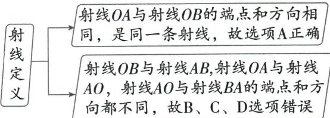

flowchart

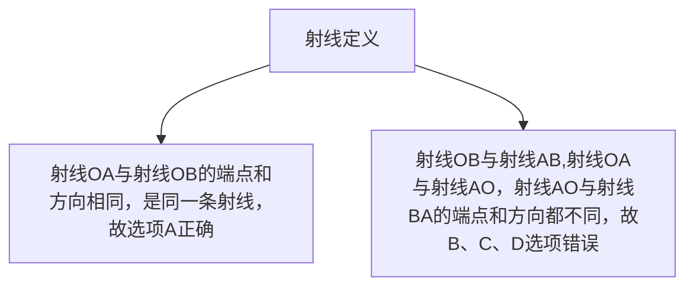

故选A.

4. B 【解析】延长线段 AB 到 C, 则点 C 在线段 AB 的延长线上, 所以点 C 不在线段 AB 上, 点 C 在直线 AB 上, 故 A、C 错误, B 正确. 因为直线没有端点, 可以向两个方向无限延伸, 所以直线没有延长线, 故 D 错误.

5. B 【解析】以 B, C, D 中的任意一点为端点的射线各有 2 条, 所以在题图中不同的射线共有 6 条. 故选 B.

6.20 【解析】如图, $A,E$ 两点代表甲、乙两地, 点 $B,C,D$ 分别代表中途停靠的三站, 所以不同长度的线段条数就代表车票的种类数, 即线段 AB, AC, AD, AE, BC, BD, BE, CD, CE, DE, 共 10 条, 考虑到往返车票要区别开, 所以需要准备 $10 \times 2 = 20$ (种) 不同的车票.

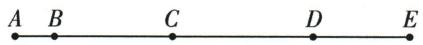

# 7. 思路分析

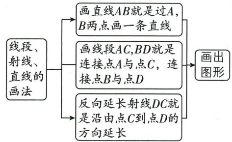

flowchart

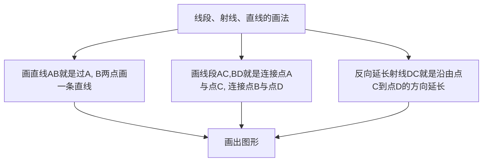

【解】如图所示.

# 8. 两点确定一条直线

9.5 条 【解析】如图,使三枚颜色相同的棋子在同一直线上的直线共有 5 条.

text_image

①
②
③
④
⑤

# 刷易错

10. 1 或 3

# 思路分析

以三个点为例

text_image

A,B,C
三点共线
↓
A B C
↓
1条:直线AB

text_image

A,B,C
三点不共线
↓
C
A B
↓
3条:直线AB,
BC,AC

【解析】如图,最多可以画3条直线,最少可以画1条直线.

# 课时2 比较线段的长短

# 刷基础

1. B 【解析】利用线段的基本事实可得路线②

# 知识归纳←----最短. 故选 B.

两点之间的连线,可以有无数种连法,如折线、曲线、线段等.这些所有的连线中,线段最短.简单说成两点之间线段最短.

2. 两点之间线段最短 【解析】用剪刀沿直线将一片平整的树叶剪掉一部分, 发现剩下的树叶的周长比原树叶的周长要小, 能正确解释这一现象的数学知识是两点之间线段最短.

3. D 【解析】直线和射线都无法度量, 故 A 选项错误; 两点之间线段的长度叫作这两点之间的距离, 故 B 选项错误; A, B 两点间的距离就是线段 AB 的长度, 故 C 选项错误, D 选项正确. 故选 D.

4. B 【解析】由题图知, 线段 a 长约 3.5 cm, 线段 b 长约 4.2 cm, 所以 a < b. 故选 B.

5. ≥ 【解析】由题图可得,AB>CD,故答案为>.

6. C 【解析】 $AB=\frac{1}{2}AC,AB=BC,AC=2AB$ 能表示点 B 是 AC 中点； $AB+BC=AC$ 不能表示点 B 是 AC 中点。故选 C.

7. 8 cm 【解析】因为 M 是 AC 的中点, 所以 $MC = AM = \frac{1}{2} AC = \frac{1}{2} \times 6 = 3 \, (\text{cm})$ . 又因为 CN:NB = 1:2, BC = 15 cm, 所以 $CN = \frac{1}{3} BC = \frac{1}{3} \times 15 = 5 \, (\text{cm})$ , 所以 $MN = MC + NC = 3 + 5 = 8 \, (\text{cm})$ .

8. 15 【解析】因为 $BD = \frac{1}{3} AB = \frac{1}{4} CD, CD = 24$ 所以 $BD = \frac{1}{4} CD = 6$ ，所以 $AB = 3BD = 18$ ，所以 $AC = AB + CD - BD = 18 + 24 - 6 = 36$ . 因为点 $E$ ，点 $F$ 分别是 $AB, CD$ 的中点，所以 $AE = \frac{1}{2} AB = 9$ ， $CF = \frac{1}{2} CD = 12$ ，所以 $EF = AC - AE - CF = 36 - 9 - 12 = 15$ . 故答案为 15.

9. 2a-b 【解析】因为 OA = AB = a，所以 OB = OA + AB = 2a。因为 BC = b，所以 OC = OB - BC = 2a - b。

10.【解】(1)如图.

text_image

a
A B
D A B C

(2) 因为 $a = 1.5$ , 所以 $BC = 2a = 3$ . 因为 $B$ 是 $CD$ 的中点, 所以 $BD = CB = 3$ . 因为 $AB = 1$ , 所以 $AD = BD - AB = 3 - 1 = 2$ .

# 刷提升

1. D 【解析】根据题意作图如下：

结合图形和题意可知 $AF=\frac{1}{2}AE=\frac{1}{4}AD, BD=\frac{1}{2}BC=\frac{1}{4}AB.$ 因为 $AD=AB-BD=AB-\frac{1}{4}AB=\frac{3}{4}AB$ ，所以 $AF=\frac{1}{4}AD=\frac{1}{4}\times\frac{3}{4}AB=\frac{3}{16}AB$ ，故选 D.

2. B 【解析】根据题意知,经过第一阶段后,剩下的线段的长度之和为 $\frac{2}{3}$ ,

经过第二阶段后,剩下的线段的长度之和为 $\frac{2}{3}\times\frac{2}{3}=\left(\frac{2}{3}\right)^{2}$ ,

经过第三阶段后,剩下的线段的长度之和为 $\frac{2}{3}\times\frac{2}{3}\times\frac{2}{3}=\left(\frac{2}{3}\right)^{3}$ ,

则经过第四阶段后,剩下的线段的长度之和为 $\frac{2}{3}\times\frac{2}{3}\times\frac{2}{3}\times\frac{2}{3}=\left(\frac{2}{3}\right)^{4}=\frac{16}{81}$ ,故选B.

3.2 【解析】根据题意, 令 BC = x cm, 则 AB = 3x cm, 所以 AC = x + 3x = 4x (cm), 则 AD = $\frac{1}{2}AC = \frac{1}{2} \cdot 4x = 2x$ (cm), CD = 4x + 2x = 6x (cm).

如图所示, 因为 AB=12 cm, 所以 3x=12, 解得 x=4, 所以 CD=24 cm, AD=8 cm. 因为点 E 为 AB 的中点, 点 F 为 CD 的中点, 所以 AE=6 cm, DF=12 cm, 所以 AF=DF-AD=12-8=4(cm), 所以 EF=AE-AF=6-4=2(cm). 故答案为 2.

4. (1) $C$ (2) $6 \mathrm{~cm}$ 或 $14 \mathrm{~cm}$ 【解析】(1) 当 $\triangleright$ 思路分析

AC=BC 时, 点 D 与点 C 重合. (2) ① 当点 D 在线段 AC 上时, 因为 E 为线段 AC 的中点, EC=5 cm, 所以 AC=2CE=10 cm. 因为 CD=2 cm, 所以 AD=AC-CD=8 cm. 因为 BC+CD=AD=8 cm, 所以 BC=8-2=6(cm). ② 当点 D 在线段 BC 上时, 因为 E 为线段 AC 的中点, EC=5 cm, 所以 AC=2CE=10 cm. 因为 CD=2 cm, 所以 AC+CD=12 cm. 因为 BD=AC+CD=12 cm, 所以 BC=12+2=14(cm). 综上, BC 的

# 易错警示

(3) 已知条件中的“N 是直线 AB 上一点”并未指明 N 的具体位置, 注意分类讨论.

长为 $6 \, cm$ 或 $14 \, cm$ .

5.【解】(1)当点 C, D 运动了 2 s 时, CM = 2 cm, BD = 6 cm. 又因为 AB = 10 cm, 所以 AC + MD = AB - CM - BD = 10 - 2 - 6 = 2 (cm).

(2) 设运动时间为 $t \mathrm{~s}$ , 则 $CM = t \mathrm{~cm}, BD = 3t \mathrm{~cm}$ . 因为 $AC = AM - t, MD = BM - 3t, MD = 3AC$ , 所以 $BM - 3t = 3(AM - t)$ , 即 $BM = 3AM$ . 因为 $BM = AB - AM$ , 所以 $AB - AM = 3AM$ , 所以 $AM = \frac{1}{4} AB$ . 故答案为 $\frac{1}{4}$ .

(3)①当点 N 在线段 AB 上时, 如图(1).

  
图(1)

因为 AN-BN=MN, AN-AM=MN, 所以 BN=AM= $\frac{1}{4}$ AB, 所以 MN= $\frac{1}{2}$ AB, 即 $\frac{MN}{AB}=\frac{1}{2}$ .

②当点 N 在线段 AB 的延长线上时, 如图(2).

  
图(2)

因为 AN-BN=MN, AN-BN=AB, 所以 MN=AB,
即 $\frac{MN}{AB}=1$ . 综上所述, $\frac{MN}{AB}$ 的值为 $\frac{1}{2}$ 或1.

# 刷素养·

6.【解】(1)因为点 C 为线段 AB 的“雅点”, AC = 6 (AC < BC), 所以 BC = 2AC = 12,

所以 $AB = AC + BC = 18$ . 故答案为 18.

(2) 因为点 G 在射线 EF 上, 且线段 GF 与以 E, F, G 中某两个点为端点的线段互为“雅点”伴侣线段, 所以分以下四种情况:

①当 G 在线段 EF 上且 EG=2FG 时, 如图(1).

  
图(1)

因为 $EG = 2FG, EG + FG = 5$ ，所以 $EG = \frac{10}{3}$ .

因为 E 表示的数为 1，

所以 G 表示的数为 $1+\frac{10}{3}=\frac{13}{3}$ .

②当 G 在线段 EF 上且 FG = 2EG 时, 如图(2).

  
图(2)

因为 FG=2EG, EG+FG=5, 所以 $EG=\frac{5}{3}$ .

因为 E 表示的数为 1，

所以 G 表示的数为 $1 + \frac{5}{3} = \frac{8}{3}$ .

③当 G 在线段 EF 的延长线上且 EF = 2FG 时, 如图(3).

  
图(3)

因为 EF=2FG, EF=5, 所以 FG=2.5,

所以 G 表示的数为 $1+5+2.5=8.5$ .

④当 G 在线段 EF 的延长线上且 FG = 2EF 时, 如图(4).

  
图(4)

因为 FG=2EF, EF=5, 所以 FG=10,

所以 G 表示的数为 $1+5+10=16$ .

综上所述, 点 G 所表示的数为 $\frac{13}{3}$ 或 $\frac{8}{3}$ 或 8.5 或 16.

# 大招专题 2 与线段上的中点有关的计算

# 刷难关

大招解读 | 双中点模型

<table><tr><td colspan="2"> $P_{1},P_{2}$ 的位置</td><td>图示</td><td>结论</td></tr><tr><td colspan="2"> $P_{1}$ 是AB的中点, $P_{2}$ 是BC的中点</td><td>A  $P_{1}$  B  $P_{2}$  C</td><td> $P_{1}P_{2}=\frac{1}{2}AC$ </td></tr><tr><td colspan="2"> $P_{1}$ 是AB的中点, $P_{2}$ 是AC的中点</td><td>A  $P_{1}$   $P_{2}B$  C</td><td> $P_{1}P_{2}=\frac{1}{2}BC$ </td></tr><tr><td colspan="2"> $P_{1}$ 是AC的中点, $P_{2}$ 是BC的中点</td><td>A  $P_{1}B$   $P_{2}$  C</td><td> $P_{1}P_{2}=\frac{1}{2}AB$ </td></tr><tr><td>特点</td><td colspan="3">(1) $A,B,C$ 三点共线,构成线段 $AB$ , $BC,AC$ ;(2)点 $P_{1},P_{2}$ 为其中任意两条线段的中点</td></tr></table>

D 【解析】因为 N 是 BC 的中点, 所以 BN = CN, 所以 $AB = AC + 2BN = 10 + 14 = 24$ . 因为 M 是 AB 的中点, 所以 $BM = \frac{1}{2}AB = 12$ , 所以 MN = BM - BN = 12 - 7 = 5, 故选 D.

2.【解】(1)因为 $AC = 9 \mathrm{~cm}$ , 点 $M$ 是 $AC$ 的中点, 可得答案.

# 思路分析

(2) 分 G 在线段 EF 上且 EG = 2FG; G 在线段 EF 上且 FG = 2EG; G 在线段 EF 的延长线上且 EF = 2FG; G 在线段 EF 的延长线上且 FG = 2EF 四种情况讨论即可.

# 思路分析

(1)由中点的定义得 CM = $\frac{1}{2}AC, CN=$ $\frac{1}{2}BC$ , 再根据
MN = CM + CN

所以 $CM=\frac{1}{2}AC=4.5\ cm.$

因为 $BC = 6\mathrm{cm}$ ，点 $N$ 是 $BC$ 的中点，

所以 $CN=\frac{1}{2}BC=3\ cm$ ,

所以 $MN = CM + CN = 7.5 \, cm$ ,

所以线段 MN 的长度为 7.5 cm.

(2) $MN=\frac{1}{2}a\ cm.$ 理由: 因为 C 为线段 AB 上一点, 且 M, N 分别是 AC, BC 的中点,

所以 $MN = MC + CN = \frac{1}{2}(AC + BC) = \frac{1}{2}a \, \text{cm}.$

(3)能. 当点 C 在线段 AB 的延长线上时, 如图, $MN = \frac{1}{2} b \, cm$ .

理由: 因为 M 是 AC 的中点,

所以 $CM=\frac{1}{2}AC.$

因为点 N 是 BC 的中点，

所以 $CN=\frac{1}{2}BC$ ,

所以 $MN = CM - CN = \frac{1}{2} (AC - BC) = \frac{1}{2} b$ cm.

3.【解】(1)①因为 AB = CD,

所以 $AB + BC = CD + BC$ ，即 AC = BD。

故答案为=.

②因为 $BC=\frac{3}{4}AC$ ，且 AC=12 cm，

所以 $BC=\frac{3}{4}\times12=9(\text{cm})$ ,

所以 AB = CD = AC - BC = 12 - 9 = 3 (cm),

所以 $AD = AC + CD = 12 + 3 = 15 \, (\text{cm})$ .

故答案为 15.

(2) 设 $AB = 3x \, cm, BC = 4x \, cm, CD = 5x \, cm,$ 则 AD = 12x cm.

因为点 M 是 AB 的中点, 点 N 是 CD 的中点,
所以 $AM = BM = \frac{3}{2}x \, cm, CN = DN = \frac{5}{2}x \, cm.$

又因为 MN=16 cm, 所以 $\frac{3}{2}x+4x+\frac{5}{2}x=16$ ,

解得 x=2，所以 AD=24 cm.

# 大招解读|三中点模型

$$
A \quad P _ {1} \quad P _ {3} C \quad P _ {2} \quad B
$$

条件: 点 C 是线段 AB 上任意一点, 点 $P_{1}, P_{2}$ , $P_{3}$ 分别是线段 AC, BC, AB 的中点

结论: $P_{1}P_{2}=\frac{1}{2}AB=AP_{3}=P_{3}B,$

$$
P _ {2} P _ {3} = \frac {1}{2} A C = A P _ {1} = C P _ {1}
$$

4. D 【解析】因为 H 为 AC 的中点, M 为 AB 的中点, N 为 BC 的中点, 所以 $MN = MB + BN = \frac{1}{2}(AB + BC) = \frac{1}{2}AC = HC$ , 故①正确, ②错误; $MH = AH - AM = \frac{1}{2}AC - \frac{1}{2}AB = \frac{1}{2}(AC - AB) = \frac{1}{2}BC = \frac{1}{2}(HC - HB) = \frac{1}{2}(AH - HB)$ , 故③正确; $HN = HC - NC = \frac{1}{2}AC - \frac{1}{2}BC = \frac{1}{2}(AC - BC) = \frac{1}{2}AB = \frac{1}{2}(AH + HB) = \frac{1}{2}(HC + HB)$ , 故④正确, 所以①③④正确. 故选 D.

# 重难专题3 线段的动态问题

# 刷难关

1. 6 或 16 【解析】由题意可知 $CP = 1 \times 3 = 3(\mathrm{~cm})$ , $DB = 3 \times 4 = 12(\mathrm{~cm})$ . 当点 $D$ 在 $C$ 的右边时, 如图(1)所示:

  
图(1)

因为 $CD = 5\mathrm{cm}$ ，所以 $CB = CD + DB = 5 + 12 =$ $17(\mathrm{cm})$ ，所以 $AC = AB - CB = 20 - 17 = 3(\mathrm{cm})$ ，所以 $AP = AC + CP = 3 + 3 = 6(\mathrm{cm})$ ；当点 $D$ 在 $C$ 的左边时，如图(2)所示：

  
图(2)

所以 $AD = AB - DB = 20 - 12 = 8(\mathrm{cm})$ ，所以 $AP = AD + CD + CP = 8 + 5 + 3 = 16(\mathrm{cm})$ .综上所述， $AP = 6\mathrm{cm}$ 或 $16~\mathrm{cm}$ 故答案为6或16.

2.【解】(1)因为点 M 是线段 AC 的中点, 点 N 是线段 BD 的中点, 所以 $BM = \frac{1}{2} AB = 5 \, cm$ , BN =

# 思路分析

(2) 根据线段中点的定义可得 $AM=\frac{1}{2}AP,$

然后利用线段的和差关系可得 2BM-PB = AB.

# 思路分析

求出 CP, DB 的长度, 由于没有说明 D 点在 C 点的左边还是右边, 故需要分情况讨论.

$\frac{1}{2}CD=7.5\ cm$ , 所以 $MN=BM+BN=12.5\ cm$ ,
故答案为 $12.5 \, cm$ .

(2) ① 因为 $BC = 7 \mathrm{~cm}, AB = 10 \mathrm{~cm}, CD = 15 \mathrm{~cm}$ , 所以 $AC = 17 \mathrm{~cm}, BD = 22 \mathrm{~cm}$ . 因为点 $M$ 是线段 $AC$ 的中点, 点 $N$ 是线段 $BD$ 的中点, 所以 $CM = \frac{1}{2} AC = 8.5 \mathrm{~cm}, BN = \frac{1}{2} BD = 11 \mathrm{~cm}$ , 所以 $CN = BN - BC = 11 - 7 = 4 (\mathrm{~cm})$ , 所以 $MN = MC + CN = 12.5 (\mathrm{~cm})$ .

② $MN=\frac{1}{2}(AB+CD)$ . 因为 $AC=AB+x, BD=x+CD$ ，点 M 是线段 AC 的中点，点 N 是线段 BD 的中点，所以 $CM=\frac{1}{2}AC=\frac{1}{2}(AB+x), BN=\frac{1}{2}BD=\frac{1}{2}(x+CD)$ ，所以 $MN=MC+BN-BC=\frac{1}{2}(AB+x)+\frac{1}{2}(x+CD)-x=\frac{1}{2}(AB+CD)$ .

【解】(1) 当 x=5 时, $AP=2\times5=10$ . 因为 M 为 AP 的中点, 所以 $AM=\frac{1}{2}AP=5$ , 所以 BM=AB-AM=19, 所以 BM 的长为 19.

(2) 当 P 在线段 AB 上运动时, 2BM-PB 是定值. 由题意知, $AM = \frac{1}{2}AP$ , BM = AB - AM, 所以 $2BM - PB = 2(AB - AM) - (AB - AP) = 2AB - AP - AB + AP = AB = 24$ , 所以 2BM - PB 是定值, 定值为 24.

(3) 当 P 在线段 AB 上运动时, 如图(1).

  
图(1)

由题意知, $PN=\frac{1}{2}BP$ , $MP=\frac{1}{2}AP$ ,所以MN= $MP+NP=\frac{1}{2}(AP+BP)=\frac{1}{2}AB=12.$

当 P 在线段 AB 的延长线上运动时, 如图(2).

  
图(2)

由题意知, $PN=\frac{1}{2}BP$ , $MP=\frac{1}{2}AP$ ,所以MN=
MP-NP= $\frac{1}{2}(AP-BP)=\frac{1}{2}AB=12.$ 综上所述，
MN 的长为 12.

# 2 角

# 课时1 角

# 刷基础

# 1. B 【解析】

<table><tr><td>序号</td><td>分析</td><td>判断</td></tr><tr><td>1</td><td>角由两条具有公共端点的射线组成</td><td>×</td></tr><tr><td>2</td><td>角的大小与边的长短无关,只与两条边张开的幅度大小有关</td><td>√</td></tr><tr><td>3</td><td>角的两边是两条射线</td><td>√</td></tr><tr><td>4</td><td>把一个角放到一个放大镜下观察,角的度数不变</td><td>×</td></tr></table>

故选 B.

# 2. D 【解析】

<table><tr><td>A</td><td>顶点O处不止有一个角,不能用∠O表示</td><td>×</td></tr><tr><td>B</td><td>顶点O处不止有一个角,不能用∠O表示</td><td>×</td></tr><tr><td>C</td><td>顶点O处不止有一个角,不能用∠O表示</td><td>×</td></tr><tr><td>D</td><td>顶点O处有一个角,能同时用∠AOB,∠O,∠1表示</td><td>√</td></tr></table>

3. $\angle2$ $\angle3$ $\angle4$ 【解析】由题图可知 $\angle2$ 是锐角, $\angle3$ 是平角, $\angle4$ 是周角.

4.【解】(1)能用一个大写字母表示的角有两个,分别为 $\angle B,\angle C$ .

(2)以 A 为顶点的角有 6 个, 分别是 $\angle BAD$ , $\angle BAE$ , $\angle BAC$ , $\angle DAE$ , $\angle DAC$ , $\angle EAC$ .

5. B 【解析】由题图可知 $\angle MON$ 的度数为 $70^{\circ}$ ，故选 B.

6. D 【解析】A 选项, $23.48^{\circ} = 23^{\circ}28'48''$ , 故 A 不符合题意. B 选项, $47.11^{\circ} = 47^{\circ}6'36''$ , 故 B 不符合题意. C 选项, $18.18^{\circ} = 18^{\circ}10'48''$ , 故 C 不符合题意. D 选项, $22.25^{\circ} = 22^{\circ}15'$ , 故 D 符合题意.

7. 150 【解析】下午 5:00 时, 时针和分针构成的角是 $30^{\circ} \times 5 = 150^{\circ}$ . 故答案为 150.

8.【解】(1) $26.38^{\circ}=26^{\circ}+0.38\times60^{\prime}=26^{\circ}+22.8^{\prime}=26^{\circ}+22^{\prime}+0.8\times60^{\prime\prime}=26^{\circ}+22^{\prime}+48^{\prime\prime}=26^{\circ}22^{\prime}48^{\prime\prime}$ .

(2) $30''=\left(\frac{1}{60}\right)'\times30=0.5',40.5'=\left(\frac{1}{60}\right)\circ\times$ 40.5=0.675°,
所以 $35^{\circ}40'30''=35.675^{\circ}$ .

9. 南偏东 $50^{\circ}$ 【解析】由题意知， $\angle AOB = 15^{\circ} + 35^{\circ} = 50^{\circ}$ . 因为 $\angle 1 = \angle AOB$ ，所以 $\angle 1 = 50^{\circ}$ ，所以点 C 在点 O 的南偏东 $50^{\circ}$ 方向. 故答案为南

# 刷有所得

常见的角的表示方法有4种:用一个大写字母表示;用三个大写字母表示;用阿拉伯数字表示;用小写希腊字母表示.其中,用一个大写字母表示时,要注意这个角的顶点处需只有这一个角.

# 刷有所得

钟表上有 12 个数字, 每相邻两个数字之间的夹角均为 $30^{\circ}$ .

偏东 $50^{\circ}$

10. (1) 北东 45 1 000 (2) 南东 70
600 【解析】(1) $5 \times 200 = 1\ 000$ （米），所以邮局在学校北偏东 $45^{\circ}$ 的方向上，距离是 1 000 米。故答案为北，东，45, 1 000. (2) $3 \times 200 = 600$ （米），所以电影院在学校南偏东 $70^{\circ}$ 的方向上，距离是 600 米。故答案为南，东，70, 600.

# 课时2 角的比较

# 刷基础

1. A 【解析】根据三角板和角比较大小的方法可得 $\angle A > \angle B$ ，故选 A.

2. ① 【解析】因为 $\angle AOB = 45^{\circ}, \angle COD = 50^{\circ}$ ，所以 $\angle AOB < \angle COD$ ，所以用叠合法比较如图所示，OA 在 $\angle COD$ 的内部。故答案

text_image

C
A
O
B(D)

3. C 【解析】因为 $\angle MON = 20^{\circ}, \angle AOM = 35^{\circ}$ ，所以 $\angle AON = \angle AOM - \angle MON = 35^{\circ} - 20^{\circ} = 15^{\circ}$ 。因为 OM 平分 $\angle BON$ ，所以 $\angle BON = 2\angle MON = 2\times20^{\circ} = 40^{\circ}$ ，所以 $\angle AOB = \angle BON + \angle AON = 40^{\circ} + 15^{\circ} = 55^{\circ}$ 。

4. A 【解析】易知①符合题意; ②如图(1), $\angle AOB = 2\angle AOC$ , 但 $OC$ 不平分 $\angle AOB$ , 故②不符合题意; ③不确定 $\angle AOC$ 与 $\angle COB$ 的大小, 故不能确定 $OC$ 平分 $\angle AOB$ , 故③不符合题意; ④如图(2), $\angle BOC = \frac{1}{2}\angle AOB$ , 但 $OC$ 不平分 $\angle AOB$ , 故④不符合题意. 故选 A.

  
图(1)

  
图(2)

# 5. B 【解析】

<table><tr><td>序号</td><td>分析</td><td>图示</td><td>结论</td></tr><tr><td>1</td><td> $\angle ABD = {60}^{ \circ } - {45}^{ \circ } = {15}^{ \circ },\angle ACD = {45}^{ \circ } - {30}^{ \circ } = {15}^{ \circ }$ </td><td></td><td>不符合题意</td></tr><tr><td>2</td><td> $\angle ACD = {45}^{ \circ } - {30}^{ \circ } = {15}^{ \circ }$ </td><td></td><td>不符合题意</td></tr><tr><td>3</td><td>没有15°角</td><td></td><td>符合题意</td></tr></table>

6.【解】(1)因为OM平分∠AOB,ON平分∠BOD,
所以 $\angle NOB=\frac{1}{2}\angle DOB,\angle BOM=\frac{1}{2}\angle BOA,$

所以 $\angle NOB + \angle BOM = \frac{1}{2}\angle DOB + \frac{1}{2}\angle BOA =$ $\frac{1}{2} (\angle DOB + \angle BOA) = \frac{1}{2}\angle AOD,$ 所以 $\angle MON =$ $\frac{1}{2}\angle AOD.$ 又因为 $\angle AOD = 156^{\circ}$ ，所以 $\angle MON =$ $\frac{1}{2}\times 156^{\circ} = 78^{\circ}.$

(2)由(1)知, $\angle MON=\frac{1}{2}\angle AOD.$

因为 $\angle AOD = \alpha^{\circ}$ ，所以 $\angle MON = \frac{1}{2}\alpha^{\circ}.$

7. B 【解析】根据作一个角等于已知角的方法可知以点 N 为圆心, MN 的长为半径画出弧 PQ. 故选 B.

8.【解】如图所示, $\angle AOB$ 即为所求.

text_image

α
β
A
O
B

# 刷易错·

9. $30^{\circ}$ 或 $50^{\circ}$ 【解析】若射线 OC 在 $\angle AOB$ 的内部, 如图(1). 因为 $\angle AOB = 80^{\circ}, \angle BOC = 20^{\circ}$ , 所以 $\angle AOC = 60^{\circ}$ . 因为 OE 平分 $\angle AOC$ , 所以 $\angle AOE = 30^{\circ}$ .

  
图(1)

  
图(2)

若射线 OC 在 $\angle AOB$ 外部, 如图(2). 因为 $\angle AOB = 80^{\circ}, \angle BOC = 20^{\circ}$ , 所以 $\angle AOC = 100^{\circ}$ . 因为 OE 平分 $\angle AOC$ , 所以 $\angle AOE = 50^{\circ}$ . 故答案为 $30^{\circ}$ 或 $50^{\circ}$ .

# 刷提升

1. A 【解析】将 $\angle\alpha$ 平移, 使 $\angle\alpha$ 与 $\angle\beta$ 两个角的顶点重合, $\angle\alpha$ 下面的一条边与 $\angle\beta$ 下面的一条边重合, 可得 $\angle\alpha$ 上面的一条边在 $\angle\beta$ 的内部, 所以 $\angle\alpha < \angle\beta$ . 故选 A.

2. A 【解析】因为 OB, OD 分别平分 $\angle COD$ , $\angle BOE$ , 所以 $\angle COB = \angle BOD = \angle DOE$ , 所以

# 易错警示

注意结合可能出现的各种情况进行分类讨论.

3. C 【解析】①如图(1), 当$\angle MOP = 2\angle NOP, \angle QOP = 2\angle MOQ$ 时，因为 $\angle MOQ = x$ ，所以 $\angle QOP = 2x,$ $\angle NOP = \frac{1}{2}\angle MOP = \frac{1}{2}\times$

text_image

M
Q
P
O
N

图(1)

$(x+2x)=\frac{3}{2}x$ ，所以 $\angle MON=\angle MOQ+\angle QOP+$ $\angle NOP=x+2x+\frac{3}{2}x=\frac{9}{2}x;$

②如图（2），当 $\angle MOP = 2\angle NOP, \angle MOQ = 2\angle QOP$ 时，因为 $\angle MOQ = x$ ，所以

$$
\begin{array}{l} \angle Q O P = \frac {1}{2} x, \angle N O P = \\ \frac {1}{2} \angle M O P = \frac {1}{2} \times \left(x + \frac {1}{2} x\right) = \\ \end{array}
$$

text_image

M
Q
P
O
N

图(2)

$\frac{3}{4} x$ ，所以 $\angle MON = \angle MOQ + \angle QOP + \angle NOP =$

$$
x + \frac {1}{2} x + \frac {3}{4} x = \frac {9}{4} x;
$$

③如图（3），当 $\angle NOP = 2\angle MOP, \angle MOQ = 2\angle QOP$ 时，因为 $\angle MOQ = x$ ，所以 $\angle QOP = \frac{1}{2} x, \angle NOP =$ $2\angle MOP=2\times\left(x+\frac{1}{2}x\right)=3x$ ，所以 $\angle MON=$ $\angle MOQ + \angle QOP + \angle NOP = x + \frac{1}{2}x + 3x = \frac{9}{2}x;$

text_image

M
Q
P
O
N

图(3)

④如图（4），当 $\angle NOP = 2\angle MOP, \angle QOP = 2\angle MOQ$ 时，因为 $\angle MOQ = x$ ，所以 $\angle QOP = 2x, \angle NOP = 2\angle MOP = 2\times (x + 2x) = 6x,$

text_image

M
Q
P
O
N

图(4)

所以 $\angle MON = \angle MOQ + \angle QOP + \angle NOP = x + 2x + 6x = 9x.$

综上, $\angle MON=\frac{9}{4}x$ 或 $\frac{9}{2}x$ 或 9x,故选 C.

4. $30^{\circ}$ 或 $150^{\circ}$ 【解析】因为 OM 平分 $\angle AOC, ON$

平分 $\angle BOC$ ，所以 $\angle MOC = \frac{1}{2}\angle AOC,\angle CON =$ $\angle BON = \frac{1}{2}\angle BOC.$ 如图(1)， $\angle MON = \angle MOC-$ $\angle CON = \frac{1}{2} (\angle AOC - \angle BOC) = \frac{1}{2}\times 60^{\circ} = 30^{\circ};$

如图（2）， $\angle MON = \angle MOC + \angle CON = \frac{1}{2} (\angle AOC + \angle BOC) = \frac{1}{2} (360^{\circ} - \angle AOB) = \frac{1}{2} \times$

$300^{\circ} = 150^{\circ}$ ；如图（3）， $\angle MON = \angle MOC + \angle CON = \frac{1}{2} (\angle AOC + \angle BOC) = \frac{1}{2} \times 60^{\circ} = 30^{\circ}$ .

综上所述, $\angle MON$ 的度数为 $30^{\circ}$ 或 $150^{\circ}$ .

  
图(1)

  
图(2)

  
图(3)

5.【解】如图, $\angle {OAD}$ 即为所求.

text_image

Geometric diagram showing angle bisector with points A, B, C, D, and O labeled

# 刷素养

6.【解】(1)因为 $\angle AOB=90^{\circ},\angle BOC=60^{\circ}$ ,所以 $\angle AOC=90^{\circ}+60^{\circ}=150^{\circ}$ . 因为 $OM$ 平分 $\angle AOC,ON$ 平分 $\angle BOC$ , 所以 $\angle MOC=\frac{1}{2}\angle AOC=75^{\circ},\angle NOC=\frac{1}{2}\angle BOC=30^{\circ}$ , 所以 $\angle MON=\angle MOC-\angle NOC=45^{\circ}$ .

(2) $\angle MON = \frac{1}{2}\alpha$ . 理由: 因为 $\angle AOB = \alpha$ , $\angle BOC = 60^{\circ}$ , 所以 $\angle AOC = \alpha + 60^{\circ}$ . 因为 $OM$ 平分 $\angle AOC, ON$ 平分 $\angle BOC$ , 所以 $\angle MOC = \frac{1}{2}\angle AOC = \frac{1}{2}\alpha + 30^{\circ}, \angle NOC = \frac{1}{2}\angle BOC = 30^{\circ}$ , 所以 $\angle MON = \angle MOC - \angle NOC = \left(\frac{1}{2}\alpha + 30^{\circ}\right) - 30^{\circ} = \frac{1}{2}\alpha$ .

(3) $\angle MON = \frac{1}{2}\alpha$ ，与 $\beta$ 的大小无关. 理由：因为 $\angle AOB = \alpha, \angle BOC = \beta$ ，所以 $\angle AOC = \alpha + \beta$ . 因为 $OM$ 是 $\angle AOC$ 的平分线， $ON$ 是 $\angle BOC$ 的平

# 易错警示

因为题目并没有给出图形,所以需要根据OC可能出现的位置进行分类讨论,不要漏解.

# 关键点拨

根据角平分线的性质分别用含 $\alpha$ 的代数式表示出 $\angle A_{1}OB_{1}, \angle A_{2}OB_{2}, \cdots,$ 即可归纳出此题规律，求得此题结果.

# 刷有所得

在求角度的过程中,若发现该角度分成的几个角的度数无法直接求出(或直接求出非常复杂)时,可考虑用整体思想,分析要求的角度整体上与已知的角度存在的数量关系,然后进行求解.

分线, 所以 $\angle MOC = \frac{1}{2} \angle AOC = \frac{1}{2} (\alpha + \beta)$ , $\angle NOC = \frac{1}{2} \angle BOC = \frac{1}{2} \beta$ , 所以 $\angle MON = \angle MOC - \angle NOC = \frac{1}{2} (\alpha + \beta) - \frac{1}{2} \beta = \frac{1}{2} \alpha$ , 所以 $\angle MON = \frac{1}{2} \alpha$ , 与 $\beta$ 的大小无关.

# 大招专题3 双角平分线模型

# 刷难关

# 大招解读 | 两个角无公共部分

条件:如图,OD,OE 分别平分 $\angle AOB$ , $\angle BOC$

text_image

A
D
B
E
O
C

结论: $\angle DOE=\frac{1}{2}\angle AOC$

1. C 【解析】因为 $\angle AOB = \alpha, OA_{1}, OB_{1}$ 分别是 $\angle AOM$ 和 $\angle MOB$ 的平分线，所以 $\angle A_{1}OM = \frac{1}{2}\angle AOM, \angle B_{1}OM = \frac{1}{2}\angle BOM$ ，所以 $\angle A_{1}OB_{1} = \frac{1}{2} (\angle AOM + \angle BOM) = \frac{1}{2}\angle AOB = \frac{1}{2}\alpha;$ 因为 $OA_{2}, OB_{2}$ 分别是 $\angle A_{1}OM$ 和 $\angle MOB_{1}$ 的平分线，所以 $\angle A_{2}OM = \frac{1}{2}\angle A_{1}OM,$ $\angle B_{2}OM = \frac{1}{2} \angle B_{1}OM$ ，所以 $\angle A_{2}OB_{2} = \frac{1}{2} (\angle A_{1}OM + \angle B_{1}OM) = \frac{1}{2} \angle A_{1}OB_{1} = \frac{1}{2} \times \frac{1}{2} \angle AOB = \frac{\alpha}{2^{2}};$ 因为 $OA_{3}, OB_{3}$ 分别是 $\angle A_{2}OM$ 和 $\angle MOB_{2}$ 的平分线，所以 $\angle A_{3}OM = \frac{1}{2} \angle A_{2}OM,$ $\angle B_{3}OM = \frac{1}{2} \angle B_{2}OM,$ 所以 $\angle A_{3}OB_{3}=\frac{1}{2}\left(\angle A_{2}OM+\angle B_{2}OM\right)=\frac{1}{2}\angle A_{2}OB_{2}=0,\quad\angle A_{2}OB_{3}=0,\quad\angle A_{2}OB_{4}=0,\quad\angle A_{2}OB_{5}=0,\quad\angle A_{2}OB_{6}=0,\quad\angle A_{2}OB_{7}=0,\quad\angle A_{2}OB_{8}=0,\quad\angle A_{2}OB_{9}=0,\quad\angle A_{2}OB_{10}=0,\quad\angle A_{2}OB_{11}=0,\quad\angle A_{2}OB_{12}=0,\quad\angle A_{2}OB_{13}=0,\quad\angle A_{2}OB_{14}=0,\quad\angle A_{2}OB_{15}=0,\quad\angle A_{2}OB_{16}=0,\quad\angle A_{2}OB_{17}=0,\quad\angle A_{2}OB_{18}=0,\quad\angle A_{2}OB_{19}=0,\quad\angle A_{2}OB_{20}=0,\quad\angle A_{2}OB_{21}=0,\quad\angle A_{2}OB_{22}=0,\quad\angle A_{2}OB_{23}=0,\quad\angle A_{2}OB_{24}=0,\quad\angle A_{2}OB_{25}=0,\quad\angle A_{2}OB_{26}=0,\quad\angle A_{2}OB_{27}=0,\quad\angle A_{2}OB_{28}=0,\quad\angle A_{2}OB_{29}=0,\quad\angle A_{2}OB_{30}=0,\quad\angle A_{2}OB_{31}=0,\quad\angle A_{2}OB_{32}=0,\quad\angle A_{2}OB_{33}=0,\quad\angle A_{2}OB_{34}=0,\quad\angle A_{2}OB_{35}=0,\quad\angle A_{2}OB_{36}=0,\quad\angle A_{2}OB_{37}=0,\quad\angle A_{2}OB_{38}=0,\quad\angle A_{2}OB_{39}=0,\quad\angle A_{2}OB_{40}=0,\quad\angle A_{2}OB_{41}=0,\quad\angle A_{2}OB_{42}=0,\quad\angle A_{2}OB_{43}=0,\quad\angle A_{2}OB_{44}=0,\quad\angle A_{2}OB_{45}=0,\quad\angle A_{2}OB_{46}=0,\quad\angle A_{2}OB_{47}=0,\quad\angle A_{2}OB_{48}=0,\quad\angle A_{2}OB_{49}=0,\quad\angle A_{2}OB_{50}=0,\quad\angle A_{2}OB_{51}=0,\quad\angle A_{2}OB_{52}=0,\quad\angle A_{2}OB_{53}=0,\quad\angle A_{2}OB_{54}=0,\quad\angle A_{2}OB_{55}=0,\quad\angle A_{2}OB_{56}=0,\quad\angle A_{2}OB_{57}=0,\quad\angle A_{2}OB_{58}=0,\quad\angle A_{2}OB_{59}=0,\quad\angle A_{2}OB_{60}=0,\quad\angle A_{2}OB_{61}=0,\quad\angle A_{2}OB_{62}=0,\quad\angle A_{2}OB_{63}=0,\quad\angle A_{2}OB_{64}=0,\quad\angle A_{2}OB_{65}=0,\quad\angle A_{2}OB_{66}=0,\quad\angle A_{2}OB_{67}=0,\quad\angle A_{2}OB_{68}=0,\quad\angle A_{2}OB_{69}=0,\quad\angle A_{2}OB_{70}=0,\quad\angle A_{2}OB_{71}=0,\quad\angle A_{2}OB_{72}=0,\quad\angle A_{2}OB_{73}=0,\quad\angle A_{2}OB_{74}=0,\quad\angle A_{2}OB_{75}=0,\quad\angle A_{2}OB_{76}=0,\quad\angle A_{2}OB_{77}=0,\quad\angle A_{2}OB_{78}=0,\quad\angle A_{2}OB_{79}=0,\quad\angle A_{2}OB_{80}=0,\quad\angle A_{2}OB_{{}_{n}}=0,$

# 大招解读 | 两个角有公共部分

条件:如图,OD,OE 分别平分 $\angle AOB$ , $\angle BOC$

text_image

B
D
A
E
O
C

结论: $\angle DOE=\frac{1}{2}\angle AOC$

2.【解】(1) 因为 $\angle AOB = 120^{\circ}$ , $OD$ 平分 $\angle AOB$ , 所以 $\angle AOD = \angle BOD = \frac{1}{2} \angle AOB = 60^{\circ}$ . 因为 $OE$ 平分 $\angle AOC$ , $\angle AOC = 40^{\circ}$ , 所以 $\angle AOE = \frac{1}{2} \angle AOC = 20^{\circ}$ , 所以 $\angle DOE = \angle AOD - \angle AOE = 60^{\circ} - 20^{\circ} = 40^{\circ}$ .

(2)若射线 $OC$ 在 $\angle AOB$ 的内部,如图(1).因为 $\angle AOB = m^{\circ},\angle AOC = n^{\circ},OD,OE$ 分别平分 $\angle AOB,\angle AOC$ ，所以 $\angle DOE = \angle AOD-$ $\angle AOE = \frac{1}{2}\angle AOB - \frac{1}{2}\angle AOC = \frac{1}{2} (m - n)^{\circ}$ ，所以当射线 $OC$ 在 $\angle AOB$ 的内部时， $\angle DOE =$ $\frac{1}{2} (m - n)^{\circ}.$

text_image

B
D
C
E
O
A

图(1)

text_image

B
D
O
A
E
C

图(2)

若射线 OC 在 $\angle AOB$ 外部, 如图(2). 因为 $\angle AOB = m^{\circ}, \angle AOC = n^{\circ}, OD, OE$ 分别平分 $\angle AOB, \angle AOC$ , 所以 $\angle DOE = \angle AOD + \angle AOE = \frac{1}{2} \angle AOB + \frac{1}{2} \angle AOC = \frac{1}{2}(n+m)^{\circ}$ , 所以当射线 OC 在 $\angle AOB$ 的外部时, $\angle DOE = \frac{1}{2}(n+m)^{\circ}$ .

3.【解】(1) 因为 $\angle AOB = 90^{\circ}, \angle AOC = 60^{\circ}$ ，
所以 $\angle BOC = \angle AOB + \angle AOC = 150^{\circ}$ ,
故答案为 $150^{\circ}$ .

(2) 由 (1) 知 $\angle BOC = 150^{\circ}$ . 因为 $OD$ 平分 $\angle BOC$ , 所以 $\angle DOC = \frac{1}{2} \angle BOC = 75^{\circ}$ . 因为 $OE$ 平分 $\angle AOC$ , $\angle AOC = 60^{\circ}$ , 所以 $\angle COE = \frac{1}{2} \angle AOC = 30^{\circ}$ , 所以 $\angle DOE = \angle DOC - \angle COE = 45^{\circ}$ .

(3) 因为 $\angle AOB = 90^{\circ}$ ， $\angle AOC = 2\alpha$ ，所以

# 思路分析

(1) 根据角平分线定义求出 $\angle AOD$ 和 $\angle AOE$ 的度数, 即可得出答案;  
(2) 由于无法确定射线 OC 的位置, 所以需要分射线 OC 在 $\angle AOB$ 的内部和射线 OC 在 $\angle AOB$ 的外部两种情况, 画出相应的图形, 根据角平分线的定义与角的和差求解即可.

# 关键点拨

(2) 解题的关键是掌握角平分线的定义及将 $\angle DOE$ 看作 $\angle DOC - \angle COE$ .

$\angle BOC = \angle AOB + \angle AOC = 90^{\circ} + 2\alpha.$ 因为 $OD$ 平分 $\angle BOC$ ，所以 $\angle DOC = \frac{1}{2}\angle BOC = 45^{\circ} + \alpha .$ 因为 $OE$ 平分 $\angle AOC$ ，所以 $\angle COE = \frac{1}{2}\angle AOC = \alpha ,$ 所以 $\angle DOE = \angle DOC - \angle COE = 45^{\circ}.$

# 大招解读 | 三个角围成周角

条件:如图, $\angle AOB+\angle BOC+\angle AOC=360^{\circ},OP_{1}$ 平分 $\angle AOC, OP_{2}$ 平分 $\angle BOC$

text_image

A
P₁ O B
C P₂

结论： $\angle P_{1}OP_{2} = 180^{\circ} - \frac{1}{2}\angle AOB$

4. $117^{\circ}$ 【解析】因为 $\angle AOB + \angle BOC + \angle AOC = 360^{\circ}$ ，所以 $\angle BOC + \angle AOC = 360^{\circ} - \angle AOB$ 。因为 OM 平分 $\angle BOC, ON$ 平分 $\angle AOC$ ，所以 $\angle MOC = \frac{1}{2} \angle BOC, \angle CON = \frac{1}{2} \angle AOC$ ，所以 $\angle MON = \angle MOC + \angle CON = \frac{1}{2} \angle BOC + \frac{1}{2} \angle AOC = \frac{1}{2} (\angle BOC + \angle AOC) = \frac{1}{2} (360^{\circ} - \angle AOB) = 180^{\circ} - \frac{1}{2} \angle AOB = 180^{\circ} - \frac{1}{2} \times 126^{\circ} = 117^{\circ}$ ，故答案为 $117^{\circ}$ 。

# 重难专题4 动角问题

# 刷难关

1. (1) $90^{\circ}$ (2) $\angle BCN - \angle ACM = 90^{\circ}$ (3) $\angle ACM + \angle BCN = 270^{\circ}$ 【解析】(1) $\angle ACM + \angle BCN = 180^{\circ} - \angle ACB = 180^{\circ} - 90^{\circ} = 90^{\circ}$ . 故答案为 $90^{\circ}$ . (2) 因为 $\angle BCN = 180^{\circ} - \angle BCM, \angle ACM = 90^{\circ} - \angle BCM$ , 所以 $\angle BCN - \angle ACM = (180^{\circ} - \angle BCM) - (90^{\circ} - \angle BCM) = 90^{\circ}$ . 故答案为 $\angle BCN - \angle ACM = 90^{\circ}$ . (3) 因为 $\angle BCN = 180^{\circ} - \angle BCM, \angle ACM = 90^{\circ} + \angle BCM$ , 所以 $\angle BCN + \angle ACM = (180^{\circ} - \angle BCM) + (90^{\circ} + \angle BCM) = 270^{\circ}$ . 故答案为 $\angle ACM + \angle BCN = 270^{\circ}$ .

2.【解】(1)由题可知 $\angle AON = (3t)^{\circ}$ . 因为 $\angle AOC = 30^{\circ}$ , 所以 $\angle BOC = 150^{\circ}$ . 因为 $OM$ 平分 $\angle BOC$ , $\angle MON = 90^{\circ}$ , 所以 $\angle COM = \frac{1}{2} \angle BOC = 75^{\circ}$ , 所以 $\angle CON = \angle MON - \angle MOC = 15^{\circ}$ , 所以 $\angle AON = \angle AOC - \angle CON = 30^{\circ} - 15^{\circ} = 15^{\circ}$ , 所以 $t = 15^{\circ} \div 3^{\circ} = 5$ . 故答案为(3t), 5. (2)由题可知 $\angle AOC = (30 + 6t)^{\circ}$ . 因为$\angle MON = 90^{\circ}$ , $OC$ 平分 $\angle MON$ , 所以 $\angle CON = \angle COM = 45^{\circ}$ , 所以 $\angle AOC - \angle AON = \angle CON = 45^{\circ}$ , 所以 $30 + 6t - 3t = 45$ , 解得 $t = 5$ . 故答案为 $(30 + 6t)$ .

3.【解】(1) 因为 OB 与 OC 重合, OE 平分 $\angle AOC$ , 所以 $\angle EOB = \frac{1}{2} \angle AOB = 40^{\circ}$ . 因为 OF 平分 $\angle BOD$ , 所以 $\angle BOF = \frac{1}{2} \angle COD = 25^{\circ}$ , 所以 $\angle EOF = \angle EOB + \angle BOF = 65^{\circ}$ .

(2) $\angle EOF$ 的度数是定值. 由旋转可知 $\angle BOC = n^{\circ}$ , 所以 $\angle AOC = 80^{\circ} + n^{\circ}, \angle BOD = 50^{\circ} + n^{\circ}$ . 因为 $OE$ 平分 $\angle AOC$ , 所以 $\angle COE = \frac{1}{2} \angle AOC$ . 因为 $OF$ 平分 $\angle BOD$ , 所以 $\angle BOF = \frac{1}{2} \angle BOD$ , 所以 $\angle EOF = \angle COE + \angle COF = \angle COE + \angle BOF - \angle BOC = \frac{1}{2} \angle AOC + \frac{1}{2} \angle BOD - \angle BOC = \frac{1}{2} \times (80^{\circ} + n^{\circ}) + \frac{1}{2} \times (50^{\circ} + n^{\circ}) - n^{\circ} = 65^{\circ}$ , 所以 $\angle EOF$ 的度数是定值, 为 $65^{\circ}$ .

(3) 因为 $\angle AOB = 80^{\circ}, \angle COD = 50^{\circ}, \angle BOC = n^{\circ}$ , 所以 $\angle AOD = \angle AOB + \angle COD + \angle BOC = 80^{\circ} + 50^{\circ} + n^{\circ} = 130^{\circ} + n^{\circ}$ . 因为 $\angle AOD - \angle EOF = \frac{3}{2} (\angle BOE + \angle COF) = \frac{3}{2} (\angle EOF - \angle BOC)$ , 且 $\angle EOF = 65^{\circ}$ , 所以 $130^{\circ} + n^{\circ} - 65^{\circ} = \frac{3}{2} (65^{\circ} - n^{\circ})$ , 解得 $n = 13$ , 所以 $n$ 的值为 13.

# 3 多边形和圆的初步认识

# 刷基础

1. A 【解析】根据多边形的定义可知, 只有第 (1) 个图形属于多边形, 故选 A.

2. C 【解析】五边形的对角线总共有 $\frac{5\times(5-3)}{2}=$ 5(条). 故选 C.

3. 10 【解析】设多边形有 n 条边, 则 n-2=8, 所以 n=10. 故这个多边形的边数是 10.

4.【解】①当不过五边形的任意一个顶点切时,得到的多边形有6条边,如图(1)所示;

②当只过五边形的一个顶点切时,得到的多边形有5条边,如图(2)所示;

③当过五边形的两个顶点切时,得到的多边形有4条边,如图(3)所示.

  
图(1)

  
图(2)

  
图(3)

# 关键点拨

掌握顶点在圆心的角叫作圆心角是解题的关键.

# 刷有所得

要求扇形的面积,需要知道扇形所在圆的半径,然后根据公式求得扇形所在圆的面积,再根据扇形的圆心角占周角的比例求得扇形面积.

# 刷有所得

多边形是由若干条不在同一直线上的线段首尾顺次相连组成的封闭平面图形.

# 归纳总结

从 n 边形 $(n>3)$ 的一个顶点出发, 可以引 $(n-3)$ 条对角线, 将这个 n 边形分成 $(n-2)$ 个三角形. 一个 n 边形共有 n 条边, n 个角, n 个顶点, $\frac{n(n-3)}{2}$ 条对角线.

5. A 【解析】三条边都相等的三角形是等边三角形, 它的三个角也相等, 是正多边形, 故 A 选项符合题意; 根据正多边形的定义可知 B、C、D 选项均不符合题意. 故选 A.

6.3 【解析】因为正六边形各边相等,所以正六边形的边长为 $18 \div 6 = 3 \, (\text{cm})$ , 故答案为 3.

7. B 【解析】A、C、D 选项中 $\angle ACB$ 不是圆心角；B 选项中 $\angle ACB$ 是圆心角。故选 B。

8. A 【解析】由题图可知以 B 为端点的弧有 $\widehat{BA}, \widehat{BAD}, \widehat{BAC}, \widehat{BC}, \widehat{BCD}, \widehat{BDA}$ ，共 6 条。故选 A.

9. $\underline{36\pi}$ 【解析】由题图(1)易得 $\angle AOB = \frac{360^{\circ}}{6} = 60^{\circ}$ . 因为 $OC = OD = \frac{1}{5}OA$ , 所以 OC = OD = $\frac{1}{4}AC = \frac{1}{4} \times 12 = 3 \, (\text{cm})$ , 所以 $OA = OC + AC = 3 + 12 = 15 \, (\text{cm})$ , 所以 $S_{摆盘} = S_{扇形AOB} - S_{扇形COD} = \frac{60}{360} \times (\pi \times 15^{2} - \pi \times 3^{2}) = 36\pi \, (\text{cm}^{2})$ .

10.【解】(1) 因为一个圆分割成四个扇形, 它们的圆心角的度数比为 2:3:4:3, 所以它们的圆心角的度数分别为

$$
\begin{array}{r l} & 3 6 0 ^ {\circ} \times \frac {2}{1 2} = 6 0 ^ {\circ}, 3 6 0 ^ {\circ} \times \frac {3}{1 2} = 9 0 ^ {\circ}, 3 6 0 ^ {\circ} \times \frac {4}{1 2} = \\ & 1 2 0 ^ {\circ}, 3 6 0 ^ {\circ} \times \frac {3}{1 2} = 9 0 ^ {\circ}. \text {画出的四个扇形如图所示.} \end{array}
$$

(2)如图,将这四个扇形的面积分别设为 $S_{1}$ , $S_{2}, S_{3}, S_{4}$ . 因为圆的半径为2 cm,所以圆的面积为 $\pi\times2^{2}=4\pi$ ,所以 $S_{1}=4\pi\times\frac{2}{12}=\frac{2}{3}\pi(\mathrm{cm}^{2})$ ,

$$
S _ {2} = 4 \pi \times \frac {4}{1 2} = \frac {4}{3} \pi (\mathrm{cm} ^ {2}), S _ {3} = 4 \pi \times \frac {3}{1 2} = \pi (\mathrm{cm} ^ {2}),
$$

$$
S _ {4} = 4 \pi \times \frac {3}{1 2} = \pi (\mathrm{cm} ^ {2}).
$$

# 全章综合训练

# 刷中考

1. A 【解析】利用直尺画出图形如下：

text_image

挡板
a b c d
m

可以看出线段 a 与 m 在一条直线上. 故选 A.

2.5 【解析】由画图过程知 AD = AB = 5. 故答案为 5.

3.4 【解析】根据线段的中点的定义可得 AB = 2AC = 2×2 = 4(cm)，故答案为 4.

4. 两点之间线段最短 【解析】由题意可知, 其蕴含的数学道理是两点之间线段最短. 故答案为两点之间线段最短.

5. C 【解析】2 时整,钟表的时针指向 2 ,分针指向 12 ,两者所成的锐角为 $30^{\circ} \times 2 = 60^{\circ}$ . 故选 C.

6. $20^{\circ}$ 【解析】因为 $\angle AOC = 140^{\circ}$ ，所以 $\angle BOC = 180^{\circ} - 140^{\circ} = 40^{\circ}$ 。因为 OD 是 $\angle BOC$ 的平分线，所以 $\angle BOD = \frac{1}{2} \angle BOC = 20^{\circ}$ ，故答案为 $20^{\circ}$ 。

7. 90 【解析】如图,由题意得 $\angle APC = 34^{\circ}$ , $\angle BPC = 56^{\circ}$ , 所以 $\angle APB = \angle APC + \angle BPC = 90^{\circ}$ , 故答案为 90.

text_image

北
P
C
A
B

8.2 【解析】从五边形的一个顶点出发可以引出的对角线条数为 5-3=2. 故答案为 2.

9. B 【解析】由扇形的定义可知, 只有乙是扇形, 故选 B.

10. $\underline{3\ 000\pi}$ 【解析】 $S_{阴影}=S_{扇形AOD}-S_{扇形BOC}=\pi\times120^{2}\times\frac{100^{\circ}}{360^{\circ}}-\pi\times60^{2}\times\frac{100^{\circ}}{360^{\circ}}=3\ 000\pi(\mathrm{~cm}^{2})$ ，故答案为 $3\ 000\pi$ .

# 刷章测

1. D 【解析】把弯曲的河道改直可以缩短航程,能正确解释这一现象的数学知识是两点之间线段最短,故选 D.

2. C 【解析】

<table><tr><td>A</td><td>画直线MN,在直线MN上任取一点P,正确</td></tr><tr><td>B</td><td>以点M为端点画射线MA,正确</td></tr><tr><td>C</td><td>直线a,b相交于点M,点应该用大写的英文字母表示,错误</td></tr><tr><td>D</td><td>延长线段MN到点P,使NP=MN,正确</td></tr></table>

# 归纳总结

从多边形的一个顶点出发,可以画出的对角线的条数是得到的三角形个数减1,多边形边数是得到的三角形个数加2.

# 易错警示

由于没有说明A,B,C三点的位置,需分情况进行讨论,不要漏解.

3. A 【解析】A 选项, OA 的方向是北偏西 $30^{\circ}$ , 原说法错误, 故该选项符合题意; B 选项, OB 的方向是西南方向, 正确, 故该选项不合题意; C 选项, OC 的方向是南偏东 $60^{\circ}$ , 正确, 故该选项不合题意; D 选项, OD 的方向是北偏东 $30^{\circ}$ , 正确, 故该选项不合题意. 故选 A.

4. D 【解析】由题图可得, $AB = AC - BC = a + a - b = 2a - b$ . 故选 D.

5. B 【解析】因为 $\angle A = 25.12^{\circ}, \angle B = 25^{\circ}12' = 25.2^{\circ}, \angle C = 1518' = 25.3^{\circ}$ ，所以 $\angle A < \angle B < \angle C$ ，故选 B.

6. D 【解析】因为从多边形的一个顶点可以画出 a 条对角线, 所以这个多边形的边数为 $a + 3$ , 所以这 a 条对角线把该多边形分成的三角形的个数是 $a + 3 - 2 = a + 1$ , 故选 D.

7. C

思路分析 | 线段中点问题的分类讨论  

text_image

A, B, C三点在同一直线上
↓分类讨论
A D C      B A      D B      C
↓
AD=1        AD=7

【解析】当点 C 在线段 AB 上时, 因为 AB = 8, BC = 6, 所以 AC = 2. 因为点 D 是线段 AC 的中点, 所以 AD = 1. 当点 C 在线段 AB 的延长线上时, 因为 AB = 8, BC = 6, 所以 $AC = 8 + 6 = 14$ . 因为点 D 是线段 AC 的中点, 所以 AD = 7. 故线段 AD 的长为 1 或 7, 故选 C.

8. 144.7 【解析】 $\angle BOC = 180^{\circ} - 35^{\circ}18' = 144^{\circ}42' = 144.7^{\circ}$ . 故答案为 144.7.

9.6 【解析】如图.

因为 AB = 8 cm, C 是 AB 的中点, 所以 BC = AC = 4 cm. 又因为 D 是 BC 的中点, 所以 CD = $\frac{1}{2}BC = 2$ cm, 所以 AD = AC + CD = 6 cm. 故答案为 6.

10. $\frac{2\pi - 1}{8}$ 【解析】因为在扇形 $AOB$ 中, $OA = \frac{1}{1\mathrm{m}}$ , 点 $C, D$ 分别为 $OA, OB$ 的中点, 所以 $OC = OD = \frac{1}{2}\mathrm{m}$ . 因为扇形 $AOB$ 的圆心角为 $90^{\circ}$ , 所以花窗的面积 $=$ 扇形 $AOB$ 的面积- $\triangle COD$ 的面积 $= \pi \times 1^{2} \times \frac{90^{\circ}}{360^{\circ}} - \frac{1}{2} \times \frac{1}{2} \times \frac{1}{2} = \frac{\pi}{4} - \frac{1}{8} = \frac{2\pi - 1}{8} (\mathrm{~m}^{2})$ . 故答案为 $\frac{2\pi - 1}{8}$ .

11.66 【解析】因为在锐角 $\angle AOB$ 内部画出 1 条射线, 可得 $1 + 2 = 3$ (个) 锐角; 在锐角 $\angle AOB$ 内部画出 2 条不同的射线, 可得 $1 + 2 + 3 = 6$ (个) 锐角; 在锐角 $\angle AOB$ 内部画出 3 条不同的射线, 可得 $1 + 2 + 3 + 4 = 10$ (个) 锐角; …, 所以在锐角 $\angle OAB$ 内部画出 10 条不同的射线, 可以得到 $1 + 2 + 3 + 4 + \cdots + 10 + 11 = 66$ (个) 锐角. 故答案为 66.

12. 15 或 22.5 或 30 【解析】若 $\angle MPN = 45^{\circ}$ , $PQ$ 是 $\angle MPN$ 的“巧分线”, 则由“巧分线”的定义可知有三种情况: ① $\angle NPQ = 2\angle MPQ$ , 此时 $\angle MPQ = 15^{\circ}$ ; ② $\angle MPN = 2\angle MPQ$ , 此时 $\angle MPQ = 22.5^{\circ}$ ; ③ $\angle MPQ = 2\angle NPQ$ , 此时 $\angle MPQ = 30^{\circ}$ . 故答案为 15 或 22.5 或 30.

13.【解】(1)如图所示,射线AC,线段AB即为所求.
(2)如图, $\angle ABD$ ,点D即为所求.

text_image

Geometric diagram showing triangle ABC with points D and C, and marked angles at A and B

14.【解】(1)点 E 是线段 AD 的中点.
理由: 因为 AC = BD, 所以 $AB + BC = BC + CD$ ,
所以 AB = CD.
因为点 E 是线段 BC 的中点, 所以 BE = EC,
所以 $AB + BE = CD + EC$ , 即 AE = ED, 所以点 E 是线段 AD 的中点.

(2) 因为 AD = 10, AB = CD = 3, 所以 BC = AD - 2AB = 10 - 2 × 3 = 4, 所以 $BE = \frac{1}{2}BC = \frac{1}{2} \times 4 = 2$ .

15.【解】(1)三点整,时针与分针所成角为 $90^{\circ}$ ,从3:00到3:30,分针转动的角度: $30\times6^{\circ}=180^{\circ}$ ,时针转动的角度: $30\times\left(\frac{1}{2}\right)^{\circ}=15^{\circ},180^{\circ}-$

# 关键点拨

根据题意,从基本图形出发,看每一次所得锐角个数比上一次增加多少个锐角,寻找一般规律即可得出答案.

# 思路分析

(3) 算出相邻两次成 $180^{\circ}$ 角花费的时间, 据此可求得从 0 时到 24 时有几个 “美妙时刻”.

$(90^{\circ}+15^{\circ})=75^{\circ}$ . 故答案为 $75^{\circ}$ .

(2) 设经过 $t$ 分, $OM$ 第一次平分 $\angle AOB$ . 因为 $OM$ 平分 $\angle AOB$ , 所以 $\angle AOM = \frac{1}{2} \angle AOB$ , 即 $6t = \frac{1}{2} \times 90$ , 解得 $t = 7.5$ , 故经过 7.5 分, $OM$ 第一次平分 $\angle AOB$ .

(3)相邻两次成 $180^{\circ}$ 角之间,分针比时针多走 $360^{\circ}$ ,花费的时间为 $\frac{360}{6 - \frac{1}{2}} = \frac{720}{11}$ (分),24时= 1440分, $1440 \div \frac{720}{11} = 22$ (个).故答案为22.

16.【解】(1) 因为 $\angle AOC = 30^{\circ}$ ， $\angle COD$ 是直角，所以 $\angle BOC = 180^{\circ} - \angle AOC = 150^{\circ}$ ， $\angle COD = 90^{\circ}$ ，所以 $\angle BOD = 180^{\circ} - \angle AOC - \angle COD = 60^{\circ}$ 。因为 OE 平分 $\angle BOC$ ，所以 $\angle COE = \frac{1}{2} \angle BOC = 75^{\circ}$ 。

(2) 因为 $\angle AOC = \alpha, \angle COD$ 是直角, 所以 $\angle BOC = 180^{\circ} - \angle AOC = 180^{\circ} - \alpha, \angle COD = 90^{\circ}$ , 所以 $\angle BOD = 180^{\circ} - \angle AOC - \angle COD = 90^{\circ} - \alpha$ . 因为 $OE$ 平分 $\angle BOC$ , 所以 $\angle BOE = \frac{1}{2} \angle BOC = 90^{\circ} - \frac{1}{2} \alpha$ , 所以 $\angle DOE = \angle BOE - \angle BOD = 90^{\circ} - \frac{1}{2} \alpha - (90^{\circ} - \alpha) = \frac{1}{2} \alpha$ .

(3) $\angle DOE = \frac{1}{2}\angle AOC.$ 理由如下: 设 $\angle AOC = \beta$ , 因为 $\angle COD$ 是直角, 所以 $\angle BOC = 180^{\circ} - \angle AOC = 180^{\circ} - \beta, \angle COD = 90^{\circ}$ . 因为 $OE$ 平分 $\angle BOC$ , 所以 $\angle COE = \frac{1}{2}\angle BOC = 90^{\circ} - \frac{1}{2}\beta,$ 所以 $\angle DOE = 90^{\circ} - \angle COE = 90^{\circ} - (90^{\circ} - \frac{1}{2}\beta) = \frac{1}{2}\beta$ , 即 $\angle DOE = \frac{1}{2}\angle AOC.$

# 第五章 一元一次方程

# 1 认识方程

# 刷基础

# 1. B

# 归纳总结 | 判断方程的方法

flowchart

【解析】根据方程的定义可知①②⑤⑦是方程,共4个,故选B.

2. C 【解析】方程 3x-y=6 中含有两个未知数，不是一元一次方程，A 选项不合题意；方程 $x^{2}+x-1=0$ 中未知数的最高次数是 2，不是一元一次方程，B 选项不合题意；方程 2x=4 是一元一次方程，C 选项符合题意；方程 $\frac{2}{x}+3=12$ 不是整式方程，不是一元一次方程，D 选项不合题意。故选 C.

3. -3 【解析】因为方程 $(a-3)x^{|a|-2}+3=0$ 是关于x的一元一次方程,所以 $|a|-2=1$ 且 $a-3\neq0$ ,解得a=-3.

4. B

# 关键点拨 | 判断方程的解

判断一个数是不是方程的解的方法:

flowchart

【解析】将 x = -2 代入 $2x + 5 = 1 - x$ 的左、右两边，左边 $= -2 \times 2 + 5 = 1$ ，右边 $= 1 - (-2) = 3$ ，左边 $\neq$ 右边，故 A 选项不符合题意；将 x = -2 代入 $3 - 2(x - 1) = 7 - x$ 的左、右两边，左边 $= 3 - 2 \times (-2 - 1) = 9$ ，右边 $= 7 - (-2) = 9$ ，左边 = 右边，故 B 选项符合题意；将 x = -2 代入 x - 5 = 5 - x 的左、右两边，左边 = -2 - 5 = -7，右边 = 5 - (-2) = 7，左边 $\neq$ 右边，故 C 选项不符合题意；将 x = -2 代入 $1 - \frac{1}{4}x = \frac{3}{4}x$ 的左、右两边，左边 $= 1 - \frac{1}{4} \times (-2) = \frac{3}{2}$ ，右边 $= \frac{3}{4} \times (-2) = -\frac{3}{2}$ ，左边 $\neq$ 右边，故 D 选项不符合题意。故选 B.

5. 1 【解析】把 $x = 3$ 代入 $10 - \triangle = 4x - 3$ 得 $10 - \triangle = 9$ , 解得 $\triangle = 1$ . 故答案为 1.  
6. x-3=0(答案不唯一) 【解析】因为一元一次方程的解为 x=3, 所以方程可以为 x-3=0. 故答案为 x-3=0(答案不唯一).  
7. A 【解析】由题意可得, $10x + 5(x - 2) = 65$ . 故选 A.  
8. $240x - 150x = 150 \times 12$ 【解析】由题意, 得 $240x - 150x = 150 \times 12$ . 故答案为 $240x - 150x = 150 \times 12$ .

# 刷易错·

9.【解】明明列出的方程不正确,因为其单位未统一,同时未加上甲 t 时所走的路程.正确的方程如下:设乙出发后 t 时两人相遇.

依题意得 $\frac{25}{60}\times10+10t+8t=30.$

# 2 一元一次方程的解法

# 课时1 等式的基本性质

# 刷基础

1. D 【解析】A 选项, 等式的两边同时乘 -4, 等式成立, 正确, 不符合题意; B 选项, 等式的两

# 关键点拨

掌握一元一次方程中未知数的次数是一次且一次项系数不为零是解题的关键.

# 易错警示

题中的速度单位是千米/时，时间单位是时，列方程时必须先转化单位使其统一，即把分转化为时，与题目所问一致。还需注意：速度单位是组合单位，不要与路程单位相混淆。

边同时加1,等式成立,正确,不符合题意;C选项,等式的两边同时乘 $\frac{1}{2}$ ,等式成立,正确,不符合题意;D选项, $3-m=3+n$ ,则-m=n,与m=n矛盾,不正确,符合题意.故选D.

2. B 【解析】若 a=5，则 $a^{2}=5a$ ，A 正确，不符合题意；bm=bn，则 m=n，前提是 $b\neq0$ ，B 错误，符合题意；若 $\frac{m}{b}=\frac{n}{b}$ ，则 m=n，C 正确，不符合题意；若 $-\frac{x}{2}=8$ ，则 x=-16，D 正确，不符合题意。故选 B.

3. A 【解析】

flowchart

4. -2x 【解析】由题可知, $3x=2x+6$ 的两边都减2x,得 $3x-2x=6$ .故答案为-2x.

5. D 【解析】因为 2x=1, 变形为 x=0.5, 所以选项 A 不符合题意; 因为 $x+5=3-3x$ , 变形为 4x=-2, 所以选项 B 不符合题意; 因为 $\frac{2}{3}x-1=2$ , 变形为 2x-3=6, 所以选项 C 不符合题意; 因为 3x-6=0, 变形为 3x=6, 所以选项 D 符合题意. 故选 D.

6.(1)减2 等式的基本性质1 (2)减6x 等式的基本性质1 (3)除以-4 等式的基本性质2 【解析】(1)在等式 $-3x+2=5$ 的两边都减2,得到等式-3x=3,这是根据等式的基本性质1.(2)在等式 $7x=6x+1$ 的两边都减6x得到等式x=1,这是根据等式的基本性质1.(3)在等式 $-4x=\frac{1}{2}$ 的两边都除以-4得到等式 $x=-\frac{1}{8}$ ,这是根据等式的基本性质2.

7.【解】(1)方程两边都减1,得 $x=-\frac{1}{2}$ .

(2)方程两边都减 2x, 得 x=12.
(3) 方程两边都加 3, 得 $\frac{x}{2}=8$ . 方程两边都乘 2, 得 x=16.

检验: 当 x=16 时, 左边 =5 = 右边, 故 x=16 是原方程的解.

(4)方程两边都减1,得 $\frac{2}{3}x=-6$ .方程两边都除以 $\frac{2}{3}$ ,得x=-9.

检验: 当 x = -9 时, 左边 = -5 = 右边, 故 x = -9 是原方程的解.

# 刷易错·

8.【解】根据等式的基本性质可知,错误在第⑤步.理由:因为a=b,所以a-b=0,所以等式两边不能都除以 $(a-b)$ ,所以得到2=3是错误的.

# 课时 2 求解一元一次方程——移项

# 刷基础

1. D 【解析】由 3-2x 变形为 $-2x+3$ ，不属于移项，故 A 不符合题意；由 $4x+3=1-2x$ 变形为 $3+4x=-2x+1$ ，不属于移项，故 B 不符合题意；由 $5x-3=7x+5$ 变形为 $7x+5=5x-3$ ，不属于移项，故 C 不符合题意；由 $4-x=5x+1$ 变形为 $-x-5x=1-4$ ，属于移项，故 D 符合题意。故选 D.

2. A 【解析】 $3x + 7 = 32 - 2x$ ，移项，得 $3x + 2x = 32 - 7$ ，故选 A.

3. -3x 【解析】将方程 $4x = 3x + 50$ 进行移项，得 4x - 3x = 50，则“☐”处应填写的是 -3x。故答案为 -3x。

4. B 【解析】将 x=2 代入 $2x+a-5=0$ ，得 $2\times2+a-5=0$ ，解得 a=1，故选 B.

5. C 【解析】根据题意得-3x-5=1-x，移项，得 $-3x+x=1+5$ ，合并同类项，得-2x=6，方程的两边都除以-2，得x=-3。故选C.

6. A 【解析】当 $x \geqslant 0$ 时, $x \geqslant -x$ , 因为 $\min\{x, -x\} = 3x + 4$ , 所以 $-x = 3x + 4$ , 解得 x = -1 (舍去). 当 x < 0 时, x < -x, 因为 $\min\{x, -x\} = 3x + 4$ , 所以 $x = 3x + 4$ , 解得 x = -2. 综上, 方程 $\min\{x, -x\} = 3x + 4$ 的解为 x = -2. 故选 A.

7.【解】(1)合并同类项,得-2.5x=2.
方程两边都除以-2.5,得 $x=-\frac{4}{5}$ .

(2)合并同类项,得 5x=10.

方程两边都除以 5, 得 x=2.

(3) 移项, 得 $3x - 5x = 4 + 2$ .

合并同类项,得-2x=6.

方程两边都除以-2, 得 x = -3.

(4) 移项, 得 $x - \frac{1}{3}x = 2 + \frac{4}{3}$ .

# 易错警示

当等式两边的未知数的值不确定是否为0时,不能都除以这个未知数.

# 易错警示

移项要变号，即从方程的一边移到另一边后一定要改变符号。同时也要注意那些没有改变位置的项不要变号。

合并同类项, 得 $\frac{2}{3}x = \frac{10}{3}$ .

方程两边都除以 $\frac{2}{3}$ ，得x=5。

8. B 【解析】设总人数为 x. 根据题意, 得 $7x + 4 = 8x - 3$ , 移项, 得 $7x - 8x = -3 - 4$ , 合并同类项, 得 -x = -7, 解得 x = 7. 故选 B.

9.【解】设这个手工兴趣小组共有 x 人. 由题意可得 $9x + 17 = 12x - 4$ , 移项, 得 $9x - 12x = -4 - 17$ , 合并同类项, 得 -3x = -21, 解得 x = 7, 所以 $9x + 17 = 80$ .
答: 这个手工兴趣小组共有 7 人, 计划要做的这批中国结有 80 个.

# 刷易错·

10.【解】琪琪的解答过程不正确,从第①步开始错的,正确的解答过程如下:

移项, 得 $\frac{11}{5}x + \frac{4}{5}x = -5 - 1$ .

合并同类项, 得 3x = -6.

方程两边都除以 3, 得 x = -2.

# 课时 3 求解一元一次方程——去括号

# 刷基础

1. C 【解析】

因为由 $2(x-1)=x+3$ ，得 $2x-2=x+3$ ，所以选项 A 不符合题意  
B 因为由 $-5(1 - x) = 4$ ，得 $-5 + 5x = 4$ ，所以选项B不符合题意  
因为由 $3(2-4x)=3$ ，得 6-12x=3，所以选项 C 符合题意  
因为由 $3=4(1-x)$ ，得 3=4-4x，所以选项 D 不符合题意

2. $\frac{3x-15=1-2x+6}{3x-15=1-2x+6}$ 【解析】原方程去括号, 得 $3x-15=1-2x+6$ . 故答案为 $3x-15=1-2x+6$ .  
3. B 【解析】去括号, 得 7x - 7 = 49, 移项, 得 7x = 56, 方程两边同时除以 7, 得 x = 8. 故选 B.  
4. C 【解析】把 x = -2 代入 3x - x - 2a = 4 中得 -4 - 2a = 4，解得 a = -4。把 a = -4 代入已知方程得 $3x - (x + 8) = 4$ ，去括号得 3x - x - 8 = 4，移项、合并同类项得 2x = 12，解得 x = 6。故选 C。   
5. B 【解析】把 x=0 代入方程 $3x+2a+1=x-6(3a+2)$ ，得 $2a+1=-6(3a+2)$ ，去括号得 $2a+1=-18a-12$ ，移项、合并同类项得 20a=-13，

解得 $a=-\frac{13}{20}$ ，故选 B.

6. A 【解析】由题意得 $3x + 1 - (2x - 4) = 3$ ，去括号得 $3x + 1 - 2x + 4 = 3$ ，解得 x = -2，故选 A.

7.11 【解析】设姐姐现在的年龄是 $x$ 岁, 则弟弟现在的年龄是 $(x - 3)$ 岁. 依题意得 $x - 5 = 2(x - 3 - 5)$ , 解得 $x = 11$ . 故答案为 11.

8.【解】(1)去括号,得 $6x+18=-x-17$ .

移项、合并同类项, 得 7x = -35.

方程两边都除以 7, 得 x = -5.

(2) 去括号, 得 4x-8-1=3x-3.

移项, 得 $4x - 3x = -3 + 8 + 1$ .

合并同类项, 得 x=6.

(3) 去括号, 得 $4x + 4 - 5x + 15 = 11$ .

移项, 得 4x-5x=11-4-15.

合并同类项,得-x=-8.

方程两边都除以-1, 得 x=8.

(4) 去括号, 得 $4-4+y=6y-84+7y$ .

移项, 得 y-6y-7y=-84+4-4.

合并同类项,得-12y=-84.

方程两边同时除以-12, 得 y=7.

9.【解】 $|2x+9|=7x-1$ ，所以 $2x+9=7x-1$ 或 $(2x+9)+(7x-1)=0$ ，解得x=2或 $x=-\frac{8}{9}$ 。当 $x=-\frac{8}{9}$ 时，7x-1<0，所以舍去 $x=-\frac{8}{9}$ 。综上所述，原方程的解是x=2。

10.【解】(1) 当 x<-6 时, 去绝对值, 得 -x-6+3x-9=1, 解得 x=8, 不符合, 舍去; 当 $-6 \leqslant x < 3$ 时, 去绝对值, 得 $x+6+3x-9=1$ , 解得 x=1, 符合; 当 $x \geqslant 3$ 时, 去绝对值, 得 $x+6-(3x-9)=1$ , 去括号, 得 $x+6-3x+9=1$ , 解得 x=7, 符合, 所以原方程的解为 x=1 或 x=7.

(2) 当 $x < -1$ 时, 去绝对值, 得 $2(-x - 1) + 3(4 - x) = 60$ , 解得 $x = -10$ , 符合; 当 $-1 \leqslant x < 4$ 时, 去绝对值, 得 $2(x + 1) + 3(4 - x) = 60$ , 解得 $x = -46$ , 不符合, 舍去; 当 $x \geqslant 4$ 时, 去绝对值, 得 $2(x + 1) + 3(x - 4) = 60$ , 解得 $x = 14$ , 符合, 所以原方程的解为 $x = -10$ 或 $x = 14$ .

11.【解】方程 $3(2x-1)=1-2x$ ，去括号得 6x-3=1-2x，移项、合并同类项得 8x=4，解得 $x=\frac{1}{2}$ 。把 $x=\frac{1}{2}$ 代入方程 $8-k=2(x+1)$ ，得 8-k=3，解得 k=5。

# 刷易错·

12. B 【解析】A、C选项中去括号时均出现符

# 易错警示

若括号前为负号,去括号时容易出现符号错误,易错之处为括号内靠后面的项没有改变符号.若括号外面有因数,去括号时容易漏乘括号内靠后面的项.

号错误,D 选项中去括号时漏乘项. 故选 B.

# 课时4 求解一元一次方程——去分母

# 刷基础

1. D 【解析】方程 $\frac{3x - 1}{3} = 1 - \frac{4x - 1}{6}$ , 去分母, 得 $2(3x - 1) = 6 - (4x - 1)$ , 即 $2(3x - 1) = 6 - 4x + 1$ . 故选 D.

2. $4(x - 1) = 3(x + 2)$

3. D 【解析】由题意得 $6 + \frac{x}{3} = \frac{8 - 2x}{2}$ ，去分母，得 $36 + 2x = 3(8 - 2x)$ ，去括号，得 $36 + 2x = 24 - 6x$ ，移项、合并同类项，得 8x = -12，解得 $x = -\frac{3}{2}$ 。故选 D.

4. C 【解析】将 x = -1 代入原方程得 $\frac{2 \times (-1) - k}{3} - \frac{-1 - 3k}{2} = 1$ ，去分母得 $2(-2 - k) - 3(-1 - 3k) = 6$ ，去括号得 $-4 - 2k + 3 + 9k = 6$ ，移项、合并同类项得 7k = 7，解得 k = 1，所以 k 的值为 1。故选 C.

5. x=0.8 【解析】解法一: 利用分数的基本性质, 将 $\frac{4-6x}{0.01}$ 的分子、分母同乘 100, 将 $\frac{0.02-2x}{0.02}$ 的分子、分母同乘 50, 得 400-600x-6.5=1-100x-7.5. 移项, 得 $-600x+100x=1-7.5-400+6.5$ . 合并同类项, 得 -500x=-400. 方程两边同除以 -500, 得 x=0.8. 解法二: 方程两边同加 6.5, 得 $\frac{4-6x}{0.01}=\frac{0.02-2x}{0.02}-1$ . 方程两边同乘 0.02, 得 $2(4-6x)=(0.02-2x)-0.02$ . 去括号, 得 8-12x=0.02-2x-0.02. 移项、合并同类项, 得 -10x=-8. 方程两边同除以 -10, 得 x=0.8.

6. $-\frac{43}{19}$ 【解析】根据题意得 $\frac{2x+5}{6}+\frac{x+11}{4}+x=0$ ，去分母得 $2(2x+5)+3(x+11)+12x=0$ ，去括号得 $4x+10+3x+33+12x=0$ ，移项、合并同类项得 $19x=-43$ ，解得 $x=-\frac{43}{19}$ . 即当 $x=-\frac{43}{19}$ 时，式子 $\frac{2x+5}{6}$ 与 $\frac{x+11}{4}+x$ 的值互为相反数.

7. -3 【解析】 $\frac{3+x}{2}=3+k$ ，去分母，得 $3+x=6+2k$ ，所以 $x=3+2k$ 。因为 $|x|=3$ ，所以 $x=\pm3$ ，所以 $3+2k=3$ 或 $3+2k=-3$ ，解得 k=0 或 -3，所以符合条件的所有 k 的值的和为 $0+(-3)=$

-3. 故答案为 -3.

8. $x = -1$ 【解析】由题意知, $x = 1$ 是方程 $\frac{5a + x}{6} - 1 = 0$ 的解. 把 $x = 1$ 代入方程 $\frac{5a + x}{6} - 1 = 0$ , 得 $\frac{5a + 1}{6} - 1 = 0$ , 去分母得 $5a + 1 - 6 = 0$ , 解得 $a = 1$ , 则原方程为 $\frac{5 - x}{6} - 1 = 0$ , 去分母得 $5 - x - 6 = 0$ , 解得 $x = -1$ , 故答案为 $x = -1$ .

9. 1 【解析】 $\frac{a}{3}x=\frac{x}{2}-\frac{x-6}{6}$ ，去分母，得 $2ax=3x-(x-6)$ ，去括号，得 $2ax=3x-x+6$ ，移项、合并同类项，得 $(2a-2)x=6$ 。因为方程无解，所以 2a-2=0，解得 a=1，故答案为 1。

10.【解】(1)去分母,得 $2(x-1)-(x+2)=6$ .

去括号, 得 2x-2-x-2=6.

移项, 得 $2x - x = 6 + 2 + 2$ .

合并同类项, 得 x=10.

(2) 去分母, 得 $6x-3(x-2)=6+2(2x-1)$ .

去括号, 得 $6x - 3x + 6 = 6 + 4x - 2$ .

移项, 得 6x-3x-4x=6-6-2.

合并同类项,得-x=-2.

方程两边都除以-1, 得 x=2.

# 刷易错·

11.【解】(1)画线如图所示:

解: $2 \times 7x = (4x - 1) + \underline{1}$ ,

(2) $\frac{7x}{3}=\frac{4x-1}{6}+1$ ,去分母,得 $2\times7x=4x-1+6$ ,
移项,得 $2\times7x-4x=-1+6$ ,合并同类项,得
10x=5,方程两边都除以10,得 $x=\frac{1}{2}$ .

# 刷提升

1. C 【解析】 $\frac{1}{2}mx-\frac{5}{3}=\frac{1}{2}\left(x-\frac{4}{3}\right)$ ，去括号，得 $\frac{1}{2}mx-\frac{5}{3}=\frac{1}{2}x-\frac{2}{3}$ ，去分母，得 $3mx-10=3x-4$ ，移项、合并同类项，得 $3(m-1)x=6$ 。因为方程有负整数解，且 m 为整数，所以 $x=\frac{2}{m-1}$ ，所以 m-1=-1 或 -2。当 m-1=-1 时，m=0；当 m-1=-2 时，m=-1，故整数 m 的值为 0 或 -1。故选 C。

2. A 【解析】因为输入 x 的值是 3, 输出 y 的值为 1, 所以 $\frac{3-b}{2}=1$ , 解得 b=1, 所以当 $x \geqslant -1$

# 关键点拨

这是一个比较复杂的方程,解答此题的关键是将方程进行变形.

# 关键点拨

解题的关键是根据 x 的取值范围去掉绝对值符号. 由 x < 0, 可得出 1 - x > 0, 结合 $\left|\frac{1-x}{2}\right| = 3$ , 可得出 $\frac{1-x}{2} = 3$ , 解之即可得出 x 的值.

# 易错警示

解一元一次方程去分母时，方程的两边都乘分母的最小公倍数，特别注意常数项不要漏乘.

时, $y=\frac{x-1}{2}$ ; 当 x<-1 时, $y=-3x+2$ . 当 $\frac{x-1}{2}=3$ 时, 解得 $x=7\geqslant-1$ , 符合题意; 当 $-3x+2=3$ 时, 解得 $x=-\frac{1}{3}>-1$ , 不符合题意. 故选 A.

3. C 【解析】 $\frac{x}{3}+\frac{x}{15}+\frac{x}{35}+\cdots+\frac{x}{2005\times2007}=1$ ，合并同类项，得 $\left(\frac{1}{3}+\frac{1}{15}+\frac{1}{35}+\cdots+\frac{1}{2005\times2007}\right)x=$ 1, 将方程变形, 得 $\left[\frac{1}{2}\left(1-\frac{1}{3}\right)+\frac{1}{2}\left(\frac{1}{3}-\frac{1}{5}\right)+\right.$ $\frac{1}{2}\left(\frac{1}{5}-\frac{1}{7}\right)+\cdots+\frac{1}{2}\left(\frac{1}{2005}-\frac{1}{2007}\right)\bigg]x=1$ ，方程两边都乘2，得 $\left(1-\frac{1}{3}+\frac{1}{3}-\frac{1}{5}+\frac{1}{5}-\frac{1}{7}+\cdots+\right.$ $\frac{1}{2005}-\frac{1}{2007}$ x=2, 化简, 得 $\left(1-\frac{1}{2007}\right)x=2$ ,
解得 $x=\frac{2007}{1003}$ . 故选 C.

4. -5 【解析】因为 x<0, 所以 1-x>0, 所以 $\frac{1-x}{2}>0$ , 所以 $\frac{1-x}{2}=3$ , 解得 x=-5. 故答案为 -5.

5. 1 x=2 【解析】把 $x=\frac{5}{2}$ 代入方程 $2(x+3)-mx-1=3(5-x)$ ，得 $2\times\left(\frac{5}{2}+3\right)-\frac{5}{2}m-1=3\times\left(5-\frac{5}{2}\right)$ ，解得 m=1，将 m=1 代入 $\frac{x+3}{3}-\frac{mx-1}{6}=\frac{5-x}{2}$ ，得 $\frac{x+3}{3}-\frac{x-1}{6}=\frac{5-x}{2}$ ，去分母，得 $2(x+3)-(x-1)=3(5-x)$ ，去括号，得 $2x+6-x+1=15-3x$ ，移项、合并同类项，得 4x=8，解得 x=2，则方程的正确解为 x=2。故答案为 1, x=2。

6. $\frac{5}{2}$ 【解析】将 $x = 1$ 代入 $\frac{2kx + m}{3} = 2 + \frac{x - nk}{6}$ , 得 $\frac{2k + m}{3} = 2 + \frac{1 - nk}{6}$ , 整理得 $(4 + n)k = 13 - 2m$ . 由题意可知, 无论 $k$ 取何值, $(4 + n)k = 13 - 2m$ 恒成立, 所以 $n + 4 = 0, 13 - 2m = 0$ , 所以 $n = -4, m = \frac{13}{2}$ , 所以 $m + n = \frac{5}{2}$ , 故答案为 $\frac{5}{2}$ .

7.【解】(1)由题意得 $2(2x-1)=3(x+a)-1$ ，去括号，得 $4x-2=3x+3a-1$ ，把 x=10 代入，得 a=3.
(2) 方程 $5m + 3x = 1 + x$ ，解得 $x = \frac{1 - 5m}{2}$ ，方程

$2x+m=5m$ , 解得 x=2m. 根据题意, 得 $\frac{1-5m}{2}-2m=2$ , 去分母, 得 1-5m-4m=4, 解得 $m=-\frac{1}{3}$ .

8.【解】(1) 因为 $(a+2b)y^{2}-y^{\frac{1}{3}a-\frac{1}{3}}=3$ 是关于 y 的一元一次方程, 所以 $\frac{1}{3}a-\frac{1}{3}=1, a+2b=0$ , 解得 a=4, b=-2.

(2) 因为 $a = 4, x = a$ 是关于 $x$ 的方程 $\frac{x + 2}{6} - \frac{x - 1}{2} + 3 = x - \frac{x - m}{3}$ 的解，所以 $1 - \frac{3}{2} + 3 = 4 - \frac{4 - m}{3}$ ，解得 $m = -\frac{1}{2}$ ，所以 $|a - b - 2| - |b - m| = |4 + 2 - 2| - \left| -2 + \frac{1}{2} \right| = \frac{5}{2}$ .

# 刷素养

9.【解】(1) 因为 $3x + m = 0$ ，所以 $x = -\frac{m}{3}$ 。因为 $4x - 2 = x + 10$ ，所以 x = 4。因为关于 x 的方程 $3x + m = 0$ 与方程 $4x - 2 = x + 10$ 是“美好方程”，所以 $4 - \frac{m}{3} = 1$ ，解得 m = 9。

(2) 因为“美好方程”的两个解之和为 1, 其中一个方程的解为 $n$ , 所以另一个方程的解为 $1 - n$ . 因为两个解的差为 8, 所以 $n - (1 - n) = 8$ 或 $1 - n - n = 8$ , 所以 $n = \frac{9}{2}$ 或 $n = -\frac{7}{2}$ .

(3) 因为 $\frac{1}{2024}x + 1 = 0$ ，所以 x = -2024。因为关于 x 的一元一次方程 $\frac{1}{2024}x + 3 = 2x + k$ 和 $\frac{1}{2024}x + 1 = 0$ 是“美好方程”，所以方程 $\frac{1}{2024}x + 3 = 2x + k$ 的解为 $x = 1 - (-2024) = 2025$ 。因为关于 y 的一元一次方程 $\frac{1}{2024}(y + 1) = 2y + k - 1$ 可化为 $\frac{1}{2024}(y + 1) + 3 = 2(y + 1) + k$ ，所以 $y + 1 = 2025$ ，所以 y = 2024。

# 重难专题5 特殊一元一次方程的解题技巧

# 刷难关

1.【解】方程整理得 $\frac{4x + 9}{5} = \frac{2x + 3}{3} + 1.$

去分母, 得 $3(4x+9)=5(2x+3)+15$ .

# 易错警示

本题中 $\frac{0.1x-0.5}{0.2}$ 的

分子和分母都乘 10，而 $\frac{0.02x+0.03}{0.03}$

的分子和分母都乘 100，此类变形依据的是分数的基本性质，而不是等式的基本性质，因此无论分子、分母如何变化，都与 -2 无关.

# 刷有所得

分组通分的实质是将一步涉及所有项的复杂通分分成两步涉及项较少，通分较简单的过程，其目的是减少计算量.

去括号, 得 $12x+27=10x+15+15$ .

移项、合并同类项, 得 2x=3.

方程两边都除以 2, 得 x=1.5.

2.【解】方程整理得 $\frac{x-5}{2}=\frac{2x+3}{3}-2.$

去分母, 得 $3(x-5)=2(2x+3)-12$ .

去括号, 得 3x-15=4x+6-12.

移项, 得 3x-4x=6-12+15.

合并同类项,得-x=9.

方程两边都除以-1, 得 x = -9.

3.【解】去括号,得 $\frac{x}{4}-1-3-x=2$ .

移项、合并同类项, 得 $-\frac{3}{4}x = 6$ .

方程两边都乘 $-\frac{4}{3}$ ，得x=-8.

4.【解】去括号,得 $\frac{x+2}{15}+\frac{4}{5}+6+7=1$ .

移项、合并同类项, 得 $\frac{x+2}{15}=-\frac{64}{5}$ .

去分母, 得 $x+2=-64\times3$ .

移项、合并同类项, 得 x = -194.

5.【解】去分母, 得 $6(x+1)-(x-1)=4(x-1)-(x+1)$ .

移项, 得 $6(x+1)+(x+1)=4(x-1)+(x-1)$ .

合并同类项,得 $7(x+1)=5(x-1)$ .

去括号, 得 $7x+7=5x-5$ .

移项,得 7x-5x=-5-7.

合并同类项, 得 2x = -12.

方程两边都除以 2, 得 x = -6.

6.【解】设 3x-2=y，则原方程可化为 $y-\frac{y-1}{2}=2-\frac{y+2}{3}$ ，去分母，得 $6y-3(y-1)=12-2(y+2)$ ，去括号，得 $6y-3y+3=12-2y-4$ ，移项、合并同类项，得 5y=5，系数化为 1，得 y=1，所以 3x-2=1，解得 x=1。

7.【解】原方程可化为 $\frac{x}{3}+\frac{2}{3}-\frac{2x}{3}+\frac{1}{2}=\frac{1}{2}.$

移项、合并同类项, 得 $-\frac{x}{3} = -\frac{2}{3}$ .

方程两边都乘-3, 得 x=2.

8.【解】移项,得 $\frac{2+3x}{3}-\frac{2x+3}{6}=\frac{16x+3}{8}-\frac{2x-1}{4}$ .

两边分别通分, 得 $\frac{4x+1}{6}=\frac{12x+5}{8}$ .

去分母, 得 $4(4x+1)=3(12x+5)$ .

去括号, 得 $16x+4=36x+15$ .

移项, 得 16x-36x=15-4.

合并同类项,得-20x=11.

方程两边都除以-20, 得 $x = -\frac{11}{20}$ .

9.【解】移项,得 $\frac{x}{3}+\frac{x+2}{6}=\frac{x-6}{5}-\frac{x-1}{10}$ .

两边分别通分, 得 $\frac{3x+2}{6}=\frac{x-11}{10}$ .

去分母, 得 $5(3x+2)=3(x-11)$ .

去括号, 得 $15x+10=3x-33$ .

移项, 得 15x-3x=-33-10.

合并同类项,得 12x=-43.

方程两边都除以 12, 得 $x = -\frac{43}{12}$ .

# 大招专题4 含参数的一元一次方程

# 刷难关

# 大招解读 | 解的关系问题

已知两个方程的解的关系求字母的值时,一般有两种方法:

(1)先求出两个方程的解,再根据这两个方程的解的关系,建立一个以参数为未知数的新方程,解这个新方程即可求出参数的值;(2)先求出其中一个方程的解,然后根据这两个方程解的关系,表示出另一个方程的解,最后代入另一个方程中,建立一个以参数为未知数的新方程,解这个新方程即可求出参数的值.

1.【解】解方程 $\frac{1}{2}(8-x)=7+x$ ，得x=-2。

因为关于 x 的方程 $\frac{1}{2}(8-x)=7+x$ 的解与方程 $\frac{2x+a}{2}-\frac{x-1}{3}=\frac{x}{6}+2a$ 的解互为相反数，所以方程 $\frac{2x+a}{2}-\frac{x-1}{3}=\frac{x}{6}+2a$ 的解为 x=2。把 x=2 代入，得 $\frac{4+a}{2}-\frac{2-1}{3}=\frac{2}{6}+2a$ ，解得 $a=\frac{8}{9}$ 。

# 大招解读|错解问题

四个关键字: 将错就错.

把解出来的错误的解代入错误的方程中,求出方程中所含参数的值,再将参数的值代入原方程中,求出原方程的解即可.

2.【解】因为解关于 x 的方程 $\frac{ax-1}{2}+6=\frac{2+x}{3}$ 时，把 6 错写成 1，解得 x=1，

所以把 $x = 1$ 代入 $\frac{ax - 1}{2} + 1 = \frac{2 + x}{3}$ , 解得 $a = 1$ ,

# 思路分析

(3) 将 (1) 中的 $m$ 和 $n$ 的值代入, 然后根据方程的解是正整数和 $t$ 是整数求 $t$ 的值.

# 关键点拨

先求出 $\frac{1}{2}(8-x)=7+x$ 的解,再根据两个方程的解互为相反数得到另一个方程的解,进而即可求解.

所以原方程应为 $\frac{x-1}{2}+6=\frac{2+x}{3}$ ，解得x=-29.

# 大招解读 | 整数解问题

正常解出方程后,如果只是分子或分母含参数,
确保分子是分母的整数倍,即可得到整数解.

3.【解】(1)由题意得 $n+1=3, m+1=0$ , 解得 n=2, m=-1.

(2)由(1)得 n=2, m=-1, 所以原方程为 $-x-tx+4=0$ . 由题意知当 x=3 时, $-3-3t+4=0$ , 所以 $t=\frac{1}{3}$ .  
(3)t 的值为 0,1,3. 因为 n=2,m=-1, 所以原方程为 $-x-tx+4=0$ , 所以 $x=\frac{4}{t+1}$ . 因为 t 是整数, x 是正整数, 所以 $t+1=1$ 或 2 或 4, 所以 t=0 或 1 或 3.

# 大招解读|解的个数问题

三种形式：

$0 \cdot x = 0$ , 方程有无数个解;

$0 \cdot x =$ 非零的数,方程无解;

非零的数·x=常数,方程有唯一解.

4.【解】关于 x 的方程 $4+3ax=2a-7$ 可以整理为 3ax=2a-11. 因为关于 x 的方程 $4+3ax=2a-7$ 有唯一解, 所以 $a\neq0$ . 关于 y 的方程 $2+y=(b+1)y$ 可以整理为 by=2. 因为关于 y 的方程 $2+y=(b+1)y$ 无解, 所以 b=0, 则关于 z 的方程 az=b 可解得 $z=\frac{b}{a}$ , 所以 z=0, 故关于 z 的方程 az=b 有唯一解, 为 z=0.

5.【解】(1)因为关于 x 的方程 $(a-2)x^{|a|-1}+4b=0$ 为一元一次方程, 所以 $|a|-1=1, a-2\neq0$ , 解得 a=-2.

当 a=-2 时, 方程为 $-4x+4b=0$ , 解得 x=b. 又因为该方程的解与关于 x 的方程 $\frac{2x+1}{3}=\frac{x-b}{2}+1$ 的解相同, 所以 $\frac{2b+1}{3}=\frac{b-b}{2}+1$ , 解得 b=1.

(2) 把 $a = -2, b = 1$ 代入 $|m - 1|y + n = a + 1 + 2by$ , 可得 $|m - 1|y + n = -1 + 2y$ , 变形得 $(|m - 1| - 2)y = -n - 1$ . 因为关于 $y$ 的方程 $|m - 1|y + n = a + 1 + 2by$ 有无数个解, 所以 $|m - 1| - 2 = 0, -n - 1 = 0$ , 所以 $m = 3$ 或 $-1, n = -1$ .

# 3 一元一次方程的应用

# 课时 1 形积变化

# 刷基础

1.【解】由题可知,三角形的周长为 $6+8+10=$

24. ①当去掉顶点 A 的钉子时, BC 为长方形的一条边, 设长方形的另一条边长为 x. 由题意得 $2(x+6)=24$ , 解得 x=6, 则该长方形的长和宽均为 6, 面积为 $6\times6=36$ .

②当去掉顶点 B 的钉子时, AC 为长方形的一条边, 设长方形的另一条边长为 y. 由题意得 $2(y+8)=24$ , 解得 y=4, 则该长方形的长和宽分别为 8, 4, 面积为 $8 \times 4 = 32$ .

答:所钉长方形的长、宽、面积分别为 6,6,36 或 8,4,32.

2. B 【解析】设原来的长方形的宽为 x cm，则长为 5x cm。根据题意得 $5x - 8 = x + 12$ ，解得 x = 5，则 $5 \times 5 = 25 \, (\text{cm})$ ，所以原来的长方形的面积是 $25 \times 5 = 125 \, (\text{cm}^2) = 0.0125 \, (\text{m}^2)$ 。故选 B。

3. C 【解析】设小长方形的宽为 x cm, 则长为 3x cm. 由题意得, $(3x + 3x + 2x) \times 2 = 32$ , 解得 x = 2, 则小长方形的长为 6 cm, 宽为 2 cm, 所以小长方形的面积是 $6 \times 2 = 12 \, (\text{cm}^2)$ , 故选 C.

4. C 【解析】设甲的容积为 $x \, cm^{3}$ . 根据题意得 $\frac{x}{80} - \frac{x}{100} = 8$ , 解得 x = 3200, 所以甲的容积为 $3200 \, cm^{3}$ . 故选 C.

5. C 【解析】设瓶子的容积为 $V \, cm^{3}$ . 依题意得 $V - 10 \times (7 - 5) = 10 \times 4$ , 解得 V = 60. 故选 C.

6.【解】(1)如图.

text_image

9 cm
4 cm
变形前
3 cm
变形后

(2)设变形后模型的高为 x cm.

根据题意得 $\pi \times 4^{2} \times 9 = \pi \times 3^{2} \times x$ ，解得 x = 16。

答:变形后模型的高为 16 cm.

# 刷易错·

7.【解】80 cm=0.8 m, 长方体水箱的容积为 $3 \times 3 \times 0.8 = 7.2(m^{3})$ , 圆柱形容器的容积为 $\pi r^{2}h = 3.14 \times \left(\frac{2}{2}\right)^{2} \times 12 = 37.68(m^{3})$ .

因为 7.2<37.68, 所以水不会溢出.

设将水倒入圆柱形容器后,水面高度为 x m.

依题意得 7.2=3.14× $\left(\frac{2}{2}\right)^{2}\times x$ ,

解得 $x \approx 2.29$ ,

所以 12-x=9.71.

# 关键点拨

解题的关键是读懂题意,根据题目给出的条件,找出合适的等量关系,据此列出方程,再求解.

# 易错警示

解应用问题时,要认真细心,注意统一单位后再计算.

答:水不会溢出,水面离容器口的距离约为9.71 m.

# 刷提升

1. C 【解析】设正方形 A 的边长为 x，则正方形 C 的边长为 $x+1$ ，正方形 E 的边长为 2x-1，正方形 D 的边长为 $x+2$ 。依题意得 $x+(2x-1)=(x+1)+(x+2)$ ，解得 x=4，所以长方形的面积为 $[x+x+(x+1)]\cdot[(x+1)+(x+2)]=13\times11=143$ 。故选 C。

2. $2500\pi \, cm^{3}$ 【解析】设该玻璃密封容器的总容积为 $V \, cm^{3}$ . 根据题意得 $\pi \times \left( \frac{20}{2} \right)^{2} \times 15 = V - \pi \times \left( \frac{20}{2} \right)^{2} \times (30 - 20)$ , 解得 $V = 2500\pi$ , 即该玻璃密封容器的总容积为 $2500\pi \, cm^{3}$ . 故答案为 $2500\pi \, cm^{3}$ .

3. (1) $4a + 12$ $6a + 9$ (2) 2 (3) $\frac{5}{2}$

【解析】(1)根据题图可知,拼成的长方形的长为 $a+a+3=2a+3$ ,宽为3,

因此剪拼后所得长方形的周长为 $(2a+3+3)\times2=4a+12$ ，面积为 $(2a+3)\times3=6a+9$ ，
故答案为 $4a+12, 6a+9$ .

(2) 由题意得 $4a + 12 = 20$ , 解得 a = 2.
故答案为 2.  
(3) 由题意得 $(2a+3-2)\times(3+1)=6a+9$ ,
解得 $a=\frac{5}{2}$ . 故答案为 $\frac{5}{2}$ .

4.【解】根据王强的设计可以设这个长方形鸡场的宽为 $x \mathrm{~m}$ , 则长为 $(x + 5) \mathrm{~m}$ . 根据题意得 $2x + (x + 5) = 35$ , 解得 $x = 10$ , 则 $x + 5 = 10 + 5 = 15$ , 而墙的长度只有 $14 \mathrm{~m}$ , 故王强的设计不符合实际. 根据赵杰的设计可以设这个长方形鸡场的宽为 $y \mathrm{~m}$ , 则长为 $(y + 2) \mathrm{~m}$ . 根据题意得 $2y + (y + 2) = 35$ , 解得 $y = 11$ , 则 $y + 2 = 11 + 2 = 13$ , 而墙的长度为 $14 \mathrm{~m}$ , 故赵杰的设计符合实际, 此时这个长方形鸡场的面积为 $13 \times 11 = 143(\mathrm{~m}^2)$ .

# 刷素养·

5.【解】(1)设基座的底面积为 a 平方分米,则由题意得 $12 \times 8 \times 3 = (9 + 3)a$ , 解得 a = 24.

答:基座的底面积为24平方分米.

(2)设水面上升 x 分米. 根据题意得, $24(2 \times 2 + x) = 12 \times 8x$ , 解得 $x = \frac{4}{3}$ .

答:水面上升的高度为 $\frac{4}{3}$ 分米.

(3)水面上升高度为 $\frac{24\times2t}{96-24}=\frac{2}{3}t$ （分米），基座底面到池底的距离为 $(9-2t)$ 分米，基座底面到水面的距离为 $2t+\frac{2}{3}t=\frac{8}{3}t$ （分米），则9-2 $t=2\times\frac{8}{3}t$ 或 $9-2t=\frac{1}{2}\times\frac{8}{3}t$ ，解得 $t=\frac{27}{22}$ 或 $\frac{27}{10}$ .
答:基座的底面把池中水深分成1:2的两部分时t的值为 $\frac{27}{22}$ 或 $\frac{27}{10}$ .

# 课时 2 “盈不足”问题

# 刷基础

1. B 【解析】设租用 x 辆 45 座的客车. 依题意, 得 $45x = 60(x - 1) - 30$ , 解得 $x = 6, 6 \times 45 = 270$ , 故选 B.

2. B 【解析】因为列出的方程为 $10x + 6 = 12x - 6$ ，所以方程的左、右两边均为这批树苗的棵数，所以方程的左边为如果每人种 10 棵，那么剩下 6 棵树苗未种；方程的右边为如果每人种 12 棵，那么缺 6 棵树苗。故选 B.

3. B 【解析】设原有树苗的棵数为 x. 由题意，得 $3(x+15-1)=4(x+1-1)$ ，解得 x=42. 故选 B.

4. $\frac{75}{2}\quad\frac{17}{2}$ 【解析】设绳子的长度是x尺,则水井的深度是 $\left(\frac{1}{3}x-4\right)$ 尺.根据题意得 $\frac{1}{3}x-4-\frac{1}{5}x=1$ ,解得 $x=\frac{75}{2}$ ,所以 $\frac{1}{3}x-4=\frac{1}{3}\times\frac{75}{2}-4=\frac{17}{2}$ ,所以绳子的长度是 $\frac{75}{2}$ 尺,水井的深度是 $\frac{17}{2}$ 尺.故答案为 $\frac{75}{2},\frac{17}{2}$ .

5.【解】设教师有 x 人. 根据题意, 得 $19x + 26 = 20(x - 1) + 5$ , 解得 x = 41.
答: 教师有 41 人.

6.【解】设每台机器每天可以生产 x 件衣服.
由题意, 得 $12 \times 6x + 800 = 16 \times (6 - 1)x$ ,
解得 x = 100.
答: 每台机器每天可以生产 100 件衣服.

# 课时3 行程问题

# 刷基础

1. B 【解析】设当甲、乙两人相遇时, 甲骑行的时间为 x 时. 根据题意得 $15x + 12\left(x - \frac{15}{60}\right) = 29.4$ , 解得 x = 1.2, 即甲骑行的时间是 1.2

# 思路分析

分析方程可知选用的等量关系是该批树苗的棵数不变，再分析方程的左、右两边的意义，即可得出结论.

# 思路分析

设每台机器每天可以生产 x 件衣服, 根据制衣厂若安排 12 台机器开工, 则 6 天后还有 800 件衣服未完成; 若安排 16 台机器开工, 则恰好提前一天完成任务, 列出一元一次方程, 解方程即可.

时,故选 B.

2.【解】【问题解决】设甲的速度是 x 千米/时, 则乙的速度是 4x 千米/时. 依题意有 $0.4x + 14.4 = 0.4 \times 4x$ , 解得 x = 12, 则 $4x = 4 \times 12 = 48$ . 故甲的速度是 12 千米/时, 乙的速度是 48 千米/时.

【能力提升】设甲出发后经过 t 时两人相距 2 千米, 易知 t > 0.2. 由上知 A, B 两地的距离为 $48 \times (0.1 + 0.4) = 24$ (千米).

①当甲、乙两人相遇前两人相距2千米时，依题意有 $12t+48\times0.2+38(t-0.2)+2=24$ ，解得t=0.4.
②当甲、乙两人相遇后两人相距2千米时，依题意有 $12t+48\times0.2+38(t-0.2)-2=24$ ，解得t=0.48。故甲出发后经过0.4时或0.48时两人相距2千米。

3. C 【解析】设通讯员追上学生队伍所需时间为 x h. 根据题意可得 $4 \times 0.5 + 4x = 14x$ ，解得 x = 0.2，则 0.2 h = 12 min. 故选 C.

4.【解】(1)设乙出发 x 时后能追上甲,则此时甲出发了 $(x+1)$ 时.

依题意得 $40x = 15(x + 1)$ ，解得 $x = \frac{3}{5}$ .

答:乙出发 $\frac{3}{5}$ 时后能追上甲.

(2) 设乙返回途中与甲相遇的地点距 B 地 y 千米.

依题意得 $\frac{46-y}{15}-\frac{46+y}{40}=1$ , 解得 y=10.

答:乙到达 B 地后立即返回,返回途中与甲相遇的地点距 B 地 10 千米.

5. 48 km 【解析】设甲、乙两码头之间的距离为 x km, 所以 $\frac{x}{20+4} + \frac{x}{20-4} = 5$ , 所以 x = 48, 即甲、乙两码头之间的距离为 48 km.

6.【解】设无风时飞机的飞行速度为 x km/h.
由题意,得 $2.9(x+30)=3.2(x-30)$ .

解得 x=610.

当 x=610 时， $(610+30)\times2.9=1\ 856(\text{km})$ .

答:无风时飞机的飞行速度为 610 km/h, 这两个城市之间的距离为 1856 km.

# 刷提升

1. B 【解析】设这只小狗一共跑了 $x$ 分, 则两人也走了 x 分. 根据题意可得 $(45+55)x=2000$ ，解得 x=20，则这只小狗一共跑了 $20\times200=4000$ （米）. 故选 B.

2. B 【解析】设乙走 x 秒第一次追上甲. 根据题意, 得 5x-x=4, 解得 x=1, 所以乙走 1 秒第 1 次追上甲, 则乙在第 1 次追上甲时的位置在 AB 上. 设乙再走 y 秒第 2 次追上甲. 根据题意, 得 5y-y=8, 解得 y=2, 所以乙再走 2 秒第 2 次追上甲, 则乙在第 2 次追上甲时的位置在 BC 上. 同理, 乙再走 2 秒第 3 次追上甲, 则乙在第 3 次追上甲时的位置在 CD 上; 乙再走 2 秒第 4 次追上甲, 则乙在第 4 次追上甲时的位置在 DA 上; 乙在第 5 次追上甲时的位置又回到 AB 上. 因为 $2022 \div 4 = 505 \cdots 2$ , 所以乙在第 2022 次追上甲时的位置在 BC 上. 故选 B.

3.44 【解析】设船在静水中的速度为 x 千米/时. 由题意得 $x+2=2(x-2)$ ，解得 x=6，则顺流速度为 8 千米/时，逆流速度为 4 千米/时. 设乙、丙两港相距 y 千米，则 $\frac{18+y}{8}+\frac{y}{4}=12$ ，解得 y=26，则甲、丙两港间的距离为 $26+18=44$ （千米）. 故答案为 44.

4.【解】(1)设小红在地面上每分钟行走x米,则小明在地面上每分钟行走 $\frac{7}{5}x$ 米.依题意得 $1.5\times\frac{7}{5}x-1.5x=30$ ,解得x=50,则 $\frac{7}{5}x=70$ .

答: 小红在地面上每分钟行走 50 米, 小明在地面上每分钟行走 70 米.

(2)由题意得,小明相对地面的前进速度为 $70+30=100$ (米/分),小红相对地面的前进速度为 $50+30=80$ (米/分).当小明到达B处时,小红离B处还有 $120-120\div100\times80=24$ (米).

答:当小明到达 B 处时,小红离 B 处还有 24 米.

5.【解】(1)动点 Q 从点 C 运动到点 A 所需时间为 $(20-12)\div1+12\div2+12\div1=26$ (秒). 故答案为 26.

(2)由题可知, P, Q 两点相遇在线段 OB 上的 M 处, 设 OM = x, 则 $12 \div 2 + x \div 1 = (20 - 12) \div 1 + (12 - x) \div 2$ , 解得 $x = \frac{16}{3}$ , 则 $12 \div 2 + x \div 1 = 6 + 5 \frac{1}{3} = 11 \frac{1}{3}$ .

答: P, Q 两点相遇时的 t 值是 $11 \frac{1}{3}$ , 相遇点 M 所对应的数是 $\frac{16}{3}$ .

# 关键点拨

对于本题这种相遇次数非常多的追及问题,其相遇次数与位置肯定符合一定的规律,需要我们通过简单计算前几次相遇的时间、位置来探索出规律,进而求解.

# 思路分析

根据标价、售价与成本价间的关系, 可用含 x 的代数式表示出标价及售价, 利用利润 = 售价 - 成本价, 可列出关于 x 的一元一次方程, 解之可得出 x 的值, 再将其代入 $(1 + 60\%)x$ 中, 即可得出结论.

(3) $A, P$ 两点在数轴上相距的长度是 $C, Q$ 两点在数轴上相距的长度的 $\frac{5}{4}$ 倍有 2 种可能: ① 动点 $P, Q$ 均在线段 $OB$ 上时 (相遇前), $12 + (t - 12 \div 2) \times 1 = \frac{5}{4} [8 + 2(t - 8 \div 1)]$ , 解得 $t = \frac{32}{3}$ . ② 动点 $Q$ 在线段 $OA$ 上, 动点 $P$ 在线段 $BC$ 上时 (相遇后), $12 + 12 + 2(t - 18) = \frac{5}{4} [8 + 12 + (t - 14)]$ , 解得 $t = 26$ . 综上所述, 当 $t$ 为 $\frac{32}{3}$ 或 26 时, $A, P$ 两点在数轴上相距的长度是 $C, Q$ 两点在数轴上相距的长度的 $\frac{5}{4}$ 倍.

# ☆问题解决策略:直观分析

# 刷基础

1.【解】① $(1+60\%)x$ ; ② $75\%\times(1+60\%)x$ . 根据题意, 得 $75\%\times(1+60\%)x-x=8$ , 解得 x=40, 所以 $(1+60\%)x=(1+60\%)\times40=64$ .
答: 这款春联每副的标价是 64 元.

2. D 【解析】设该款运动鞋的成本价是 x 元. 由题意得 $(1+50\%)x \times 0.8 - x = 60$ , 解得 x = 300, 所以该款运动鞋的成本价是 300 元. 故选 D.

3. A 【解析】设盈利的这套衣服的成本为 x 元，亏损的这套衣服的成本为 y 元。由题意得 $x(1+20\%) = 168, y(1-20\%) \Rightarrow 168$ ，解得 x = 140, $y = 210, 140 + 210 = 350$ （元）。因为 $168 \times 2 = 336$ （元），所以 $336 - 350 = -14$ （元），所以该服装店亏损 14 元。故选 A.

4.【解】(1)设线上售出 x 盒,则实体店售出 $(x-40)$ 盒.根据题意得 $5x+3(x-40)=1000$ , 解得 x=140, 所以 x-40=140-40=100.

答:实体店售出 100 盒,线上售出 140 盒.

(2) ① 设线上售出 y 盒, 则实体店售出 $\frac{1500-5y}{3}$ 盒. 由题意得 $(50-25)y-50y\cdot20\%+10\times\frac{1500-5y}{3}=4700$ , 解得 y=180, 所以 $\frac{1500-5y}{3}=\frac{1500-5\times180}{3}=200$ .

答:实体店应售出200盒,线上应售出180盒.
②设从第三批次起,每批次实体店售出m盒,
则线上售出 $\frac{2\ 000-3m}{5}$ 盒,所以利润为(10-a)m+ $\left[(50-25)-50\times20\%\right]\times\frac{2\ 000-3m}{5}=(1-$

a) $m+6\ 000$ . 因为从第三批次起每批次的销售利润始终不变, 所以 a=1.

# 重难专题6 一元一次方程应用的其他八种类型

# 刷难关

1. A 【解析】已知该车企去年5月交付新车 $x$ 辆, 根据“今年5月交付新车的数量比去年5月交付的新车数量的1.2倍还多1100辆”列出方程为 $1.2x + 1100 = 35060$ , 故选A.

2.【解】(1)由题意知,小玲半年节电量为(55-x)千瓦时,这半年小明节电产生的“节煤量”为0.4x千克,这半年小玲节电产生的“节煤量”为0.4(55-x)千克,故答案为(55-x),0.4x,0.4(55-x).

(2)由题意知, $0.4x\times2-8=0.4(55-x)$ ,解得x=25.

答: 小明半年节电 25 千瓦时.

3.【解】设森林水果店这一天卖出苹果 x 筐, 则卖出橘子 $(8-x)$ 筐. 由题意得 $50x + 42(8 - x) = 376$ , 解得 x = 5.

答:森林水果店这一天卖出苹果5筐.

4. A 【解析】从题表中可见甲做3天完成 $\frac{1}{4}$ ，所以每天完成 $\frac{1}{12}$ ，所以甲做5天完成的工作量为 $\frac{5}{12}$ ，乙做2天完成的工作量为 $\frac{1}{2}-\frac{5}{12}=\frac{1}{12}$ ，所以乙每天完成的工作量为 $\frac{1}{24}$ 。设完成这项工作共需要x天，则甲做了x天，乙做了 $(x-3)$ 天。依题意，得 $\frac{x}{12}+\frac{x-3}{24}=1$ ，解得x=9。

5.8 【解析】设先安排整理的人员有 x 人, 则一共有 $(x+5)$ 人. 由题意得 $\frac{1}{30} \times x \times 2 + \frac{1}{30} \times (x+5) \times 3 = 1$ , 解得 x = 3, 则 $3 + 5 = 8$ (人), 故答案为 8.

6.【解】(1)正常情况下,甲、乙两队能履行该合同.理由如下:设甲、乙两队合作需x天完成这项工程.根据题意得 $\frac{x}{30}+\frac{x}{20}=1$ ,解得x=12.因为12<15,所以正常情况下,甲、乙两队能履行该合同.

(2) 调走甲队更合适. 理由如下: 设调走乙队, 甲队还需 m 天完成这项工程. 根据题意得 $\frac{m}{30} + 75\% = 1$ , 解得 $m = \frac{15}{2}$ , 所以 $12 \times 75\% + \frac{15}{2} =$

# 刷有所得

此类配套问题需要找到两个等量关系,其中一个等量关系用来表示未知量,另一个等量关系用来列方程.

# 思路分析

设男生应向女生支援 y 人, 根据男生制作筒底的数量 = 女生制作筒身的数量 × 2, 列出方程, 求解即可.

# 思路分析

设先安排整理的人员有 x 人, 则一共有 $(x+5)$ 人. 根据题意可得等量关系: 开始 x 人 2 h 的工作量 + 后来 $(x+5)$ 人 3 h 的工作量 = 1, 把相关数值代入即可求解.

$\frac{33}{2}$ (天). 因为 $\frac{33}{2}>15$ , 所以调走乙队不合适. 设调走甲队, 乙队还需 n 天完成这项工程. 根据题意得 $\frac{n}{20}+75\%=1$ , 解得 n=5, 所以 $12\times75\%+5=14$ (天). 因为 14<15, 所以调走甲队更合适.

# 7. D

思路分析  

flowchart

【解析】设用 $x \, m^{3}$ 钢材制作 A 部件，则用 $(6-x) \, \mathrm{m}^{3}$ 钢材制作 B 部件。依题意得 $3 \times 40x = 240(6-x)$ ，解得 x = 4，则 6 - x = 2，40x = 160。即用 $4 \, m^{3}$ 钢材做 A 部件，用 $2 \, m^{3}$ 钢材做 B 部件，恰好配成 160 套仪器。故选 D。

8.4 【解析】设七年级(2)班男生有 x 人, 则女生有 $(x+2)$ 人. 由题意得 $x+x+2=50$ , 解得 x=24, $24+2=26$ (人), 所以七年级(2)班男生有 24 人, 女生有 26 人. 设男生应向女生支援 y 人. 由题意得 $120\times(24-y)=(26+y)\times40\times2$ , 解得 y=4, 所以男生应向女生支援 4 人, 才能使每时剪出的筒身与筒底刚好配套. 故答案为 4.

9.【解】(1)设蓝色布料买了x米,则黑色布料买了 $(136-x)$ 米.根据题意,得 $30x+50(136-x)=5400$ ,解得x=70,所以136-x=66.

答:蓝色布料买了70米,黑色布料买了66米.
(2)设蓝色布料买了y米,则黑色布料买了(162-y)米.根据题意,得 $\frac{y}{1.5}=\frac{162-y}{1.2}$ ,解得y=90.则 $30\times90+50\times(162-90)=6300$ (元).
答:购买这162米布料花了6300元.

10.【解】(1) 设乙工程队单独粉刷这些墙面要用 x 天. 由题意得 $240x = 160(x + 20)$ ，解得 x = 40，则 $240 \times 40 = 9600$ （间）.

答:这个小区共有9600间房间.

(2)设甲工程队的工作时间为 y 天, 则乙工程队的工作时间为 $(2y+4)$ 天. 由题意得 $160y + 240y + 240(1 + 25\%) \times (2y + 4 - y) = 9600$ , 解得 y = 12, 则 $2 \times 12 + 4 = 28$ (天).

答:乙工程队共粉刷28天.

(3) 方案一: 由甲工程队单独完成需要 $9600 \div 160 = 60$ (天), 需付费用 $60 \times 1600 = 96000$ (元);

方案二:由乙工程队单独完成需要40天,需付费用 $40\times2\ 600=104\ 000$ (元);

方案三: 按(2)的方式完成需要 28 天, 需付费用 $12 \times 1600 + 28 \times 2600 = 92000$ (元). 因为 28 < 40 < 60, 且 92000 < 96000 < 104000, 所以选择方案三既省时又省钱.

答:选择方案三既省时又省钱.

11. 18 或 46.8 【解析】易知第一次购物不超过 300 元. ①若第二次购物超过 300 元, 设此时所购物品标价为 $x$ 元, 则 $90\% x = 288$ , 解得 $x = 320$ , 则两次购物标价和为 $180 + 320 = 500$ (元) > 300 元, 所以享受 9 折优惠, 因此应付 $500 \times 90\% = 450$ (元), 故这两次购物合并成一次性付款可节省 $180 + 288 - 450 = 18$ (元). ②若第二次购物没有超过 300 元, 则两次购物标价和为 $180 + 288 = 468$ (元) > 300 元, 故这两次购物合并成一次性付款可节省 $468 \times (1 - 90\%) = 46.8$ (元). 综上所述, 这两次购物合并成一次性付款可节省 18 元或 46.8 元.

12.【解】(1) $1500 \times 0.8 = 1200$ （元），所以甲旅客需付款1200元.故答案为1200.

(2)根据题意得 $2000 \times 0.8 + 0.7(x - 2000) = (0.7x + 200)$ 元,所以乙旅客需付款 $(0.7x + 200)$ 元.故答案为 $(0.7x + 200)$ .

(3) 第一张机票的原价为 $1440 \div 0.8 = 1800$ (元). 设丙旅客第二张机票的原价为 y 元, 则购买两张机票实际付款为 $(1800 + y - 910)$ 元. 根据题意得 $1440 + 0.7y + 200 = 1800 + y - 910$ , 解得 y = 2500, 所以 $1800 + y - 910 - 1440 = 1950$ .

答:丙旅客第二张机票的原价为2500元,实际付款为1950元.

13. B 【解析】设小红答对的题数为 x. 由题意得 $5x - (20 - x) = 70$ , 解得 x = 15. 故选 B.

14.5 【解析】设该球队共平了 x 场，则胜了 $14-x-5=(9-x)$ 场，胜场得分是 $3(9-x)$ 分，平场得分是 x 分。根据题意得 $3(9-x)+x=19$ ，解得 x=4，所以该球队胜了 9-4=5（场）。

15.【解】(1)设女儿现在的年龄为x岁,则父亲现在的年龄为 $(48-x)$ 岁.由题意可得 $48-x-5=4(x-5)+3$ ,解得x=12,所以 $48-x=48-12=36$ .

# 关键点拨

(3) 分别计算出三种方案的花费和时间, 然后进行比较即可.

# 关键点拨

能够分析出第二次购物金额有两种情况是解决本题的关键.

答:父亲现在的年龄为36岁,女儿现在的年龄为12岁.

(2) 设 y 年后父亲年龄是女儿年龄的 2 倍, 则 $36 + y = 2(12 + y)$ , 解得 y = 12.

答:12年后父亲年龄是女儿年龄的2倍.

16. D 【解析】设原数的个位数字是 x，则十位数字是 9-x。根据题意得 $10x + 9 - x = 10(9 - x) + x + 9$ ，解得 x = 5，则 9-x = 4，则原来的两位数为 45。故选 D。

17. D 【解析】设正中间的数为 x，则其余 4 个数为 $x-8, x-6, x+6, x+8$ ，则这 5 个数的和为 $x-8+x-6+x+x+6+x+8=5x$ 。若 5x=40，则 x=8。因为 x-8=0，所以 x=8 不符合题意。若 5x=88，则 $x=\frac{88}{5}$ ，不是整数，不符合题意。若 5x=107，则 $x=\frac{107}{5}$ ，不是整数，不符合题意。若 5x=110，则 x=22，符合题意，所以它们的和可能是 110，故选 D。

18. 48 【解析】设相等的数为 x，则拆成的 4 个数为 $x-4, x+4, \frac{x}{4}, 4x$ 。由题意得 $x-4+x+4+\frac{x}{4}+4x=75$ ，解得 x=12，则 $x-4=8, x+4=16, \frac{x}{4}=3, 4x=48$ ，故最大的数是 48。故答案为 48。

# 大招专题5 方程的应用——动点问题

# 刷难关

# 大招解读 | 距离问题

1. 表示终点: 起点位置为 $a_{0}$ , 动点运动速度为 v, 运动时间为 t, 则终点位置为 $a_{0} \pm vt$ (向右为加, 向左为减);  
2. 求两点间的距离: ①相对位置确定时: 距离 = 右边的点对应的数 - 左边的点对应的数;  
②相对位置不确定时:距离=|两点对应的数之差|;  
3. 解方程.

1.【解】(1)A,B,C三点的位置如图所示.

$$
\begin{array}{c c c c c c c c c c} B & & A & & C \\ - 6 & - 5 & - 4 & - 3 & - 2 & - 1 & 0 & 1 & 2 & 3 & 4 & 5 \end{array}
$$

(2) $CA = 4 - (-2) = 4 + 2 = 6(\mathrm{cm})$ .故答案为6.  
(3) $CA - AB$ 的值不会随着 $t$ 的变化而变化.理由如下：根据题意得 $CA = (4 + 5t) - (-2 + t) =$ $6 + 4t,AB = (-2 + t) - (-6 - 3t) = 4 + 4t$ ，所以 $CA-$

$AB=(6+4t)-(4+4t)=2$ , 所以 CA-AB 的值不会随着 t 的变化而变化.

2.【解】(1) 因为点 A 在原点的左侧, 距离原点 12 个单位长度, 所以点 A 对应的数是 -12, 同理可得点 B 对应的数为 2, 所以 A, B 两点之间的距离为 $2-(-12)=2+12=14$ , 故答案为 -12, 2, 14.

(2)分两种情况:①当点P在点B的右边时, $AP=AB+BP=14+2=16$ ;②当点P在点B的左边时, $AP=AB-BP=14-2=12$ .综上,AP的长是16或12.

(3)设运动的时间为 t 秒,则动点 N, Q, M 对应的数分别为 -12-6t, -8t, 2-2t. 分三种情况:①当 NQ = QM 时, -8t - (-12-6t) = 2-2t - (-8t), 所以 $t = \frac{5}{4}$ , 此时, 点 N 对应的数为 $-12 - 6 \times \frac{5}{4} = -19.5$ , 点 Q 对应的数为 $-8 \times \frac{5}{4} = -10$ , 点 M 对应的数为 $2 - 2 \times \frac{5}{4} = -0.5$ .

②当 $NQ = NM$ 时， $-12 - 6t - (-8t) = 2 - 2t - (-12 - 6t)$ ，所以 $t = -13$ （舍）.

③当 $MN = MQ$ 时, 可得 $(2 - 2t) - (-12 - 6t) = (2 - 2t) - (-8t)$ , 解得 $t = 6$ , 此时点 $N$ 对应的数为 $-12 - 6 \times 6 = -48$ , 点 $Q$ 对应的数为 $-8 \times 6 = -48$ , 点 $M$ 对应的数为 $2 - 2 \times 6 = -10$ . 综上, 当其中一个点与另外两个点的距离相等时, 点 $N$ 对应的数为 -19.5, 点 $Q$ 对应的数为 -10, 点 $M$ 对应的数为 -0.5 或点 $N$ 对应的数为 -48, 点 $Q$ 对应的数为 -48, 点 $M$ 对应的数为 -10.

# 大招解读 | 相遇问题

1. 表示终点: 起点位置为 $a_{0}$ , 动点运动速度为 v, 运动时间为 t, 则终点位置为 $a_{0} \pm vt$ (向右为加, 向左为减);

2. 求距离: 两点同时相对出发, 运动速度分别为 $v_{1}, v_{2}$ , 运动时间为 t, 则相遇时 $s_{1} + s_{2} =$ 两点起始位置的距离, 即 $v_{1}t + v_{2}t = |a_{0} - b_{0}|$ ( $a_{0}, b_{0}$ 分别为两点起始位置对应的数);

3. 解绝对值方程.

3.【解】(1)根据题意得 $2t+t=18-(-10)$ ，解得 $t=\frac{28}{3}$ ，所以 $AM=\frac{56}{3}>10$ ，所以点 M 在点 O 的右侧，且 $OM=\frac{56}{3}-10=\frac{26}{3}$ ，所以当 $t=\frac{28}{3}$ 时，P，Q 两点相遇，相遇点 M 所对应的数是 $\frac{26}{3}$ .

# 思路分析

(1) 先由点 A 在原点的左侧, 距离原点 12 个单位长度确定点 A 对应的数是 -12, 同理可得点 B 对应的数为 2, 根据右边的点对应的数 -左边的点对应的数 = 两点之间的距离可得 A, B 两点之间的距离.

# 思路分析

设点 P 运动 x 秒时, 在点 C 处追上点 R, 于是得到 AC = 6x, BC = 4x. 根据 AC - BC = AB, 列方程即可得到答案.

# 思路分析

(1) 根据题意, 由 P, Q 两点间的距离为 28 列出方程求解即可;

(2)由题意得0<t<7. 分点P在点O的左边和点P在点O的右边两种情况讨论即可求解.

(2)由题意得0<t<7. 当0<t<5时，点P在点O的左边，10-2t=7-t，解得t=3. 当5<t<7时，点P在点O的右边，2t-10=7-t，解得 $t=\frac{17}{3}$ .
综上所述，t 的值为 3 或 $\frac{17}{3}$ 时，点 P 到点 O 的距离与点 Q 到点 B 的距离相等.  
(3) 因为 NA = NP，所以 $AN = PN = \frac{1}{2} AP = t$ ，所以 CN = AC - AN = 28 - t，PC = 28 - AP = 28 - 2t，所以 $2CN - PC = 2(28 - t) - (28 - 2t) = 28$ .

# 大招解读 | 追及问题

1. 表示终点: 起点位置为 $a_{0}$ ，动点运动速度为 v，运动时间为 t，则终点位置为 $a_{0} \pm vt$ （向右为加，向左为减）；  
2. 求两点间的距离: 同时同向出发, 两点运动速度分别为 $v_{1}, v_{2}$ , 运动时间为 t, 当到达同一位置时, $s_{多} - s_{少} =$ 两点起始位置的距离, 即 $v_{1}t - v_{2}t = |a_{0} - b_{0}| (a_{0}, b_{0}$ 分别为两点起始位置对应的数);  
3. 解绝对值方程.

4.5 【解析】设点 P 运动 x 秒时, 在点 C 处追上点 R, 则 AC = 6x, BC = 4x. 因为 AC - BC = AB = 10, 所以 6x - 4x = 10, 解得 x = 5, 所以点 P 运动 5 秒时, 追上点 R.

# 全章综合训练

# 刷中考

1. C 【解析】由甲天平知一个“■”的质量等于2个“▲”的质量, 即 $x = 2$ “▲”; 由乙天平知一个“▲”的质量等于2个“●”的质量, 即“▲”=2y, 所以 $x = 2$ “▲”=4y, 故选C.  
2. A 【解析】因为代数式 x-3 的值为 5，所以 x-3=5，解得 x=8，故选 A.  
3.【解】去括号,得 2x-2-3=x,移项,得 2x-x=2+3,合并同类项,得 x=5.   
4. A 【解析】根据题意得 $(1+4.7\%)x=$ 120 327. 故选 A.  
5. 20 【解析】设快马追上慢马需要 x 天. 根据题意, 得 $240x = 150(x + 12)$ , 解得 x = 20. 故答案为 20.  
6.【解】若每次邮购都是100把,则 $200\times8\times0.9=$ 1440(元) $\neq1504$ (元),所以一次邮购多于100把,另一次邮购少于100把.设第一次邮购折扇 $x(x>100)$ 把,则另一次邮购折扇 $(200-x)$ 把.由题意得 $0.9\times8x+8\times(1+10\%)\cdot(200-x)=1504$ ,所以x=160,所以 $200-x=$

40. 答: 两次邮购的折扇分别是 160 把和 40 把.

7.【解】这次技术改进后该汽车的 A 类物质排放量符合“标准”.

理由:设技术改进后该汽车的 A 类物质排放量为 $x \, mg/km$ ，则 B 类物质排放量为 $(40 - x) \, \text{mg/km}$ ，

由题意得 $\frac{x}{1 - 50\%} +\frac{40 - x}{1 - 75\%} = 92$ ，解得 $x = 34.$

因为 34<35, 所以这次技术改进后该汽车的 A 类物质排放量符合“标准”.

# 刷章测

1. C 【解析】A 选项中未知数的次数不是 1, B 选项中有 m 和 n 两个未知数, D 选项中未知数出现在分母中, 都不符合一元一次方程的概念, C 选项符合一元一次方程的概念, 故选 C.

2. D 【解析】如果 8a=4, 那么 $a=\frac{1}{2}$ , 故选项 A 不符合题意; 如果 ac=bc, $c\neq0$ , 那么 a=b, 原变形未说明 $c\neq0$ , 故选项 B 不符合题意; 如果 $\frac{a}{2}=\frac{b}{3}$ , 那么 3a=2b, 故选项 C 不符合题意; 如果 $1-2a=3a$ , 那么 $3a+2a=1$ , 故选项 D 符合题意, 故选 D.

3. B 【解析】由题意可知 2x=3x-1, 解得 x=1.
故选 B.

4. B 【解析】去分母得 $2kx = 3x + (x + 12)$ ，去括号得 $2kx = 3x + x + 12$ ，移项、合并同类项得 $(2k - 4)x = 12$ 。当 $2k - 4 \neq 0$ ，即 $k \neq 2$ 时，解得 $x = \frac{12}{2k - 4} = \frac{6}{k - 2}$ 。因为方程的解为非正整数，且 k 为整数，所以 k - 2 = -1, -2, -3, -6，解得 k = 1, 0, -1, -4，则符合条件的所有整数 k 的和为 $1 + 0 - 1 - 4 = -4$ 。故选 B。

5. D 【解析】设 T 字框内处于中间且靠上方的数为 2n-1，则框内该数左边的数为 2n-3，右边的数为 $2n+1$ ，下面的数为 $2n-1+10$ ，所以 T 字框内四个数的和为 $2n-3+2n-1+2n+1+2n-1+10=8n+6$ 。A 选项，令框住的四个数的和为 22，则 $8n+6=22$ ，解得 n=2, 2n-1=3，故本选项不符合题意。B 选项，令框住的四个数的和为 70，则 $8n+6=70$ ，解得 n=8, 2n-1=15，故本选项不符合题意。C 选项，令框住的四个数的和为 182，则 $8n+6=182$ ，解得 n=22, 2n-1=43，故本选项不符合题意。D 选项，令框住的

# 思路分析

设他做对 x 道题，则做错 $(25-x)$ 道题，根据“做了全部选择题，得了 85 分”列出方程并求解.

# 思路分析

(1) 找准等量关系, 正确列出一元一次方程并求解;
(2) 利用施工费用 = 每天的施工费用 × 施工时间, 即可求出各方案所需施工费用.

四个数的和为 206, 则 $8n + 6 = 206$ , 解得 $n = 25$ . 因为 $2n - 1 = 49$ , 不能处在 T 字框内中间且靠上方的位置, 所以框住的四个数的和不可能为 206, 故本选项符合题意.

6.3 【解析】因为 $5a+8b=3b+10$ ，所以 $5a+8b-3b=3b-3b+10$ ，所以 $5a+5b=10$ ，所以 $5(a+b)=10$ ，所以 $a+b=2$ ，所以 $a+b+1=2+1=3$ 。故答案为 3。

7.22 【解析】设他做对 x 道题, 则做错 $(25-x)$ 道题. 根据题意得 $4x-(25-x)=85$ , 解得 x=22, 即他共做对了 22 道题. 故答案为 22.

8. $\frac{7}{3}$ 【解析】解方程 $4x = m + 3$ 得 $x = \frac{m + 3}{4}$ . 因为关于 $x$ 的一元一次方程 $4x = m + 3$ 是“奇异方程”，所以 $\frac{m + 3}{4} = m + 3 - 4$ ，所以 $\frac{m + 3}{4} = m - 1$ ，所以 $m + 3 = 4m - 4$ ，所以 $m - 4m = -4 - 3$ ，所以 $-3m = -7$ ，所以 $m = \frac{7}{3}$ .

9. 10 或 $\frac{25}{2}$ 【解析】设 A, B 两地间的距离为 $x \mathrm{~km}$ . 当 C 地在 A 地的上游时, 由题意得 $\frac{x}{8 + 2} + \frac{x + 2}{8 - 2} = 3$ , 解得 $x = 10$ . 当 C 地在 A 地与 B 地之间时, 由题意得 $\frac{x}{8 + 2} + \frac{x - 2}{8 - 2} = 3$ , 解得 $x = \frac{25}{2}$ . 综上, A, B 两地间的距离是 $10 \mathrm{~km}$ 或 $\frac{25}{2} \mathrm{~km}$ . 故答案为 10 或 $\frac{25}{2}$ .

10.【解】(1)去括号,得 $x+1-2x+2=1-3x$ .

移项、合并同类项, 得 2x = -2.

方程两边都除以 2, 得 x = -1.

(2) 原方程可化为 $6x - \frac{7x}{2} = \frac{5x - 7}{6}$ .

去分母, 得 36x-21x=5x-7.

移项、合并同类项, 得 10x = -7.

方程两边都除以 10, 得 x = -0.7.

11.【解】(1)设乙工程队每天能完成x平方米的绿化改造面积,则甲工程队每天能完成 $(x+200)$ 平方米的绿化改造面积.

依题意得 $x+200+x=800$ ，解得 x=300，

所以 $x + 200 = 300 + 200 = 500.$

答:甲工程队每天能完成500平方米的绿化改造面积,乙工程队每天能完成300平方米的绿化改造面积.

(2) 方案①所需施工费用为 $600 \times \frac{12\,000}{500} = 14\,400$ (元);

方案 ② 所需施工费用为 $400 \times \frac{12000}{300} = 16000$ (元);

方案③所需施工费用为 $(600+400)\times\frac{12\ 000}{500+300}=15\ 000$ （元）.因为14 400<15 000<16 000,所以方案①的施工费用最少.

12.【解】任务 1: 设购买 A 品牌大瓶牛奶 x 瓶, 则购买 A 品牌小瓶牛奶 $(8-x)$ 瓶. 由题意得 $15x + 10(8 - x) = 89$ , 解得 $x = \frac{9}{5}$ . 因为 x 为正整数, 所以 $x = \frac{9}{5}$ 不符合题意, 所以按原价购买, 不可能是 89 元.

任务2:设购买A品牌大瓶牛奶m瓶,则购买A品牌小瓶牛奶(8-m)瓶.由题意得 $15(m-1)+15\times0.6+10(8-m)=89$ ,解得m=3,所以8-m=5,所以小文购买了3瓶A品牌大瓶牛奶和5瓶A品牌小瓶牛奶.

任务 3: 设小明购买 A 品牌大瓶牛奶 t 瓶, 则

B 品牌牛奶一共有 2t 瓶, 所以需要购买的 B 品牌牛奶有 $\frac{2}{3} \cdot 2t = \frac{4}{3}t$ (瓶). 由题意得 15t + 15 $\cdot \frac{4}{3}t = 210$ , 解得 t = 6, 所以小明买了 6 瓶 A 品牌大瓶牛奶.

13.【解】(1)①点 C 到点 A 的距离为 $4-(-4)=8$ ，
点 C 到点 B 的距离为 8-4=4。因为 $8=2\times4$ ，
所以点 C 是 $[A,B]$ 的和谐点。故答案为是。

②设点 D 表示的数为 x，则点 D 到点 B 的距离为 $\left|x-8\right|$ ，点 D 到点 A 的距离为 $\left|x+4\right|$ .

依题意, 得 $\left|x-8\right|=2\left|x+4\right|$ ,

即 $x-8=2x+8$ 或 $x-8=-2x-8$ ,

解得 x = -16 或 x = 0. 故答案为 -16 或 0.

# 关键点拨

(2) 分 C 是 $[A, B]$ 的和谐点、C 是 $[B, A]$ 的和谐点、A 是 $[B, C]$ 的和谐点及 B 是 $[A, C]$ 的和谐点四种情况讨论.

(2) 设点 C 运动时间为 t 秒, 则 BC = t, AC = 6 - t.

当 C 是 $[A, B]$ 的和谐点时, 6-t=2t, 解得 t=2; 当 C 是 $[B, A]$ 的和谐点时, $t=2(6-t)$ , 解得 t=4; 当 A 是 $[B, C]$ 的和谐点时, $6=2(6-t)$ , 解得 t=3; 当 B 是 $[A, C]$ 的和谐点时, 6=2t, 解得 t=3.

答: 当点 C 运动 2 秒或 3 秒或 4 秒时, C, A, B 中恰有一个点为其余两点的和谐点.

# 第六章 数据的收集与整理

# 1 丰富的数据世界

# 刷基础

1.【解】(1)填表如下：

<table><tr><td>视力</td><td>4.2及以下</td><td>4.3~4.6</td><td>4.7~4.9</td><td>5.0及以上</td></tr><tr><td>男生人数(人)</td><td>3</td><td>0</td><td>2</td><td>6</td></tr><tr><td>女生人数(人)</td><td>0</td><td>3</td><td>3</td><td>3</td></tr></table>

(2)由题中表格可知,美术成绩取得“优”的有12人,所以美术成绩取得“优”的学生在这20名学生中所占的百分比为 $\frac{12}{20}\times100\%=60\%$ .

(3)该社团20名学生中,4名学生体育成绩没有达到良好,希望这4名学生加强锻炼,早日把体育成绩达到良好或优秀.(答案不唯一,合理即可)

2. A 【解析】小麦中蛋白质的含量, 是定量数据, A 选项符合题意; 某班全体学生最喜欢的

# 刷有所得

定量数据是可以用数值表示的数据, 定性数据是不用数值表示的数据.

水果,不是定量数据,B选项不符合题意;某校所有教师的学历情况,不是定量数据,C选项不符合题意;学生上学采用的交通方式,不是定量数据,D选项不符合题意.故选A.

3. 定性 【解析】学生的音乐成绩(等级)为定性数据. 故答案为定性.

4.【解】(1)一个班级中所有人的血型是定性数据.

(2)某品牌手机的待机时长是定量数据.

(3)2024年全国大学生毕业后的就业率是定量数据.

# 2 数据的收集

# 刷基础

1. B 【解析】由数据的收集处理方法可知, 正确的顺序为②④①③, 故选 B.

2. D 【解析】该商场准备在“①制冷电器, ②微波炉, ③冰箱, ④电饭锅, ⑤空调, ⑥厨房电器”中选取四个作为问卷问题的备选项目,最合理的是②③④⑤.故选D.

3. D 【解析】调查某品牌台灯的使用寿命,适合采用抽样调查方式,A 不符合题意;调查某市中小学生的上学方式,适合采用抽样调查方式,B 不符合题意;调查某市居民的垃圾分类情况,适合采用抽样调查方式,C 不符合题意;调查某班每位同学的作业完成情况,适合采用普查方式,D 符合题意. 故选 D.

4. 抽样调查 【解析】调查某款新能源车电池的使用寿命, 具有破坏性, 适合采用的调查方式是抽样调查. 故答案为抽样调查.

5.【解】广告语不合适. 理由如下:灯泡的使用寿命检查是破坏性试验,不适合采用普查方式,应采用抽样调查方式,所以做不到全面检查使用寿命,故广告语不合适.

6. B 【解析】样本容量是 500, 故①正确; 6 000 名学生的数学成绩是总体, 故②错误; 每名学生的数学成绩是个体, 故③正确; 500 名学生的数学成绩是总体的一个样本, 故④错误. 故选 B.

7.300 名学生的体重情况

# 刷易错·

8. ④ 【解析】抽取样本注意事项就是要考虑样本需要具有广泛性与代表性,所谓代表性,就是抽取的样本必须是随机的,即各个方面,各个层次的对象都要有所体现.故选项中比较合理的是④利用派出所的户籍网随机调查了该地区10%的老年人的健康状况.

# 3 数据的表示

# 课时1 扇形统计图

# 刷基础

1. 72 【解析】 $360^{\circ} \times 20\% = 72^{\circ}$ . 故答案为 72.

2. B 【解析】由题意知,一学期课外阅读量达到10本以上的人数占比为 $9 \div 45 \times 100\% = 20\%$ , 5\~10本的人数占比为 $30 \div 45 \times 100\% \approx 66.7\%$ ,5本以下的人数占比为 $6 \div 45 \times 100\% \approx 13.3\%$ ,所以能正确反映六(1)班全体学生一学期课外阅读量情况的是B选项.故选B.

3. C 【解析】每天阅读不足 30 分的学生人数最多, 占总人数的 40%, 原说法正确, 故 A 选项不符合题意; 每天阅读 30 分及以上的学生人数占 60%, 超过 50%, 原说法正确, 故 B 选项

# 易错警示

在进行抽样调查时,一定要使抽取的样本具有代表性和广泛性,不要认为随机抽样就是随意抽样.

# 刷有所得

扇形统计图的一个显著特点是各部分所占的百分比之和等于100%.

不符合题意;每天阅读1时及以上的学生人数占 $10\%+20\%=30\%$ ,原说法错误,故C选项符合题意;每天阅读30分至2时的学生人数占 $30\%+20\%=50\%$ ,原说法正确,故D选项不符合题意.故选C.

4. A 【解析】因为不能确定两个班的人数, 所以无法算出七(1)班和七(2)班女生的具体人数, 所以七(2)班女生人数不一定比七(1)班多, 故选项 A 符合题意; B、C、D 选项说法合理, 不符合题意. 故选 A.

5. 6 000 【解析】 $40\ 000 \times (1 - 27\% - 33\% - 25\%) = 40\ 000 \times 15\% = 6\ 000$ （名），所以估计选择黄色运动衫的参与者有6 000名，故答案为6 000.

6.【解】(1)调查的总人数为 $60 \div 20\% = 300$ ，“其他”的人数 $b = 300 \times 5\% = 15$ ，所以 a = 300 - 60 - 30 - 39 - 15 = 156，故答案为 300, 156.

(2)扇形统计图中“讲故事”部分的圆心角是 $360^{\circ}\times\frac{30}{300}=36^{\circ}$ .

# 刷提升

1. C 【解析】设改进生产工艺前的生产总量为 1, 则改进生产工艺后的生产总量为 2, 所以改进生产工艺前 A、B、C、D 四级的生产量分别为 0.3, 0.37, 0.28, 0.05, 改进生产工艺后 A、B、C、D 四级的生产量分别为 0.6, 1.2, 0.12, 0.08. A 选项, 改进生产工艺后, A 级产品的生产量增加, 此选项错误; B 选项, 改进生产工艺后, B 级产品的生产量增加超过两倍, 此选项错误; C 选项, 改进生产工艺后, C 级产品的生产量减少, 此选项正确; D 选项, 改进生产工艺后, D 级产品的生产量增加, 此选项错误. 故选 C.

2. 79.2° 【解析】因为 B 种粽子发放了 220 个，占比为 44%，所以四种粽子发放的总数量为 $220 \div 44\% = 500$ （个）。因为 A 种粽子发放了 70 个，所以 A 种粽子占比为 $70 \div 500 \times 100\% = 14\%$ ，所以 C 种粽子占比为 $1 - (14\% + 44\% + 20\%) = 22\%$ ，所以 C 种粽子所在扇形的圆心角的度数是 $360^{\circ} \times 22\% = 79.2^{\circ}$ 。故答案为 79.2°。

3. C 【解析】由统计图可知,小垣这两天各项目体育锻炼时间如下:

A 为 $60 \times 20\% + 40 \times 20\% = 20$ （分），B 为 $60 \times 30\% + 40 \times 20\% = 26$ （分），C 为 $60 \times 50\% =$

30(分), D 为 $40 \times 60\% = 24$ (分). 因为 20 < 24 < 26 < 30, 所以小垣这两天体育锻炼时间最长的项目是 C, 故答案为 C.

4. (1) 60

【解】(2)设最喜欢博物馆的学生人数为 x，则最喜欢烈士陵园的学生人数为 $2x.$ $x+2x=60-18-6$ ，解得 x=12。即最喜欢博物馆的学生人数为 12，最喜欢烈士陵园的学生人数为 24。补全条形统计图如下：

最喜欢的景点的学生人数的条形统计图  

bar

| 参观项目 | 人数 |
|---|---|
| 虎园 | 18 |
| 烈士陵园 | 24 |
| 博物馆 | 12 |
| 植物园 | 6 |

(3)在扇形统计图中,最喜欢植物园的学生人数所对应扇形的圆心角是 $360^{\circ}\times\frac{6}{60}=36^{\circ}$ ,故答案为36.

(4) 最喜欢烈士陵园的人数约为 $720 \times \frac{24}{60} = 288$ .

# 课时2 频数直方图

# 刷基础

1. A 【解析】设中间一组数据的频数是 x，则其他 10 组数据的频数之和是 4x。根据题意得 $x + 4x = 160$ ，解得 x = 32，所以中间一组数据的频数是 32，故选 A。

2. A 【解析】由题图可知成绩在 90.5\~100.5 分之间的有 6 人,但这 6 人不一定都是 100 分,故 A 选项错误;这次共有 $3+12+18+9+6=48$ (人) 参加测试,故 B 选项正确;测试成绩高于 70 分且不高于 80 分的人数为 18,人数最多,故 C 选项正确;测试成绩在 80 分以上的人数为 15,则成绩优秀的有 15 人,故 D 选项正确.故选 A.

3.5 【解析】组距为 $\frac{69.5 - 39.5}{6} = 5.$ 故答案为5.

4.11 【解析】因为这组数据中最大值为 141, 最小值为 40, 所以它们的差是 141 - 40 = 101. 因为组距为 10, 所以 $101 \div 10 = 10.1$ , 故可以分成 11 组. 故答案为 11.

# 归纳总结

条形统计图能很清楚地看出数量的多少；折线统计图能反映数量的增减变化情况；扇形统计图能反映部分与整体的关系。由此根据具体情况选择即可。

# 刷有所得

同一组数据画折线统计图，可以通过改变折线统计图的横、纵坐标的单位长度来改变折线统计图的形状，从而给人以不同的感受.

5.【解】(1)频数分布表中 a=8, b=10, 故答案为 8, 10. 补全频数直方图如下:

histogram

| 成绩/分 | 频数(人数) |
| :--- | :--- |
| 60-70 | 8 |
| 70-80 | 16 |
| 80-90 | 16 |
| 90-100 | 10 |

(2) 因为 $m\% = \frac{10}{50} \times 100\% = 20\%$ , 所以 m = 20,
D 所对应的扇形的圆心角度数是 $360^{\circ} \times 20\% = 72^{\circ}$ . 故答案为 $20, 72^{\circ}$ .  
(3) $600 \times 20\% = 120.$

答:估计参加这次知识测试的七年级学生中,成绩为优秀的人数为 120.

# 课时3 统计图的选择

# 刷基础

1. B 【解析】根据统计图的特点,想了解某地区五月份每天的气温变化情况,最适合选用的统计图是折线统计图.故选 B.

2. (2) 【解析】题图(2)更能令人觉得该公司近三年产品单价涨幅缓慢,所以该公司向物价部门申请涨价应绘制图(2),故答案为(2).  
3.【解】(1)由题中表格信息可得羽绒服专卖店2024年第一季度销售量为 $120+90+30=$ 240(件)，第二季度销售量为 $10+2+3=15$ (件)，第三季度销售量为 $3+4+20=27$ (件)，第四季度销售量为 $80+110+40=230$ (件).

用条形统计图表示,如图(1)所示:

bar

| 季度 | 销售量/件 |
|---|---|
| 一 | 240 |
| 二 | 15 |
| 三 | 27 |
| 四 | 230 |

图(1)

(2)全年总销量为 $240+15+27+230=512$ (件).
第一季度所占百分比: $\frac{240}{512}\times100\%\approx46.9\%$ , 第二季度所占百分比: $\frac{15}{512}\times100\%\approx2.9\%$ , 第三季度所占百分比: $\frac{27}{512}\times100\%\approx5.3\%$ , 第四季度所占百分比: $\frac{230}{512}\times100\%\approx44.9\%$ .

故各季度所在扇形的圆心角度数分别为

168. $84^{\circ}$ , 10. $44^{\circ}$ , 19. $08^{\circ}$ , 161. $64^{\circ}$ .
用扇形统计图表示,如图(2)所示:

pie

| 季度 | 占比 (%) |
|---|---|
| 第一季度 | 46.9 |
| 第二季度 | 2.9 |
| 第三季度 | 5.3 |
| 第四季度 | 44.9 |

(3)用折线统计图表示,如图(3):

line

| 季度 | 销售量/件 |
|---|---|
| 一 | 240 |
| 二 | 15 |
| 三 | 15 |
| 四 | 230 |

(4)结论:第一、四季度是销售旺季,而第二、三季度是销售淡季.建议:在销售旺季多购进羽绒服进行售卖,在淡季考虑经营其他适合第二、三季度销售的商品.(答案不唯一,合理即可)

4.【解】(1) $4+7+10+14+20=55$ （天）.

答: 这 5 期的集训共有 55 天.

(2)11.83-11.72=0.11(秒),11.72-11.52=0.2(秒),

故第3期小聪的成绩比他上一期的成绩进步最多,进步了0.2秒.

(3)个人测试成绩与很多因素有关,集训时间不是越长越好,集训时间过长,可能会造成劳累,导致成绩下降.(答案不唯一,合理即可)

# 刷提升

1. D 【解析】该书店4月份的营业总额为182-30-40-25-42=45(万元), 故①正确; 该书店5月份的营业总额为42万元, 党史类书籍5月份的营业额占书店当月营业总额的25%, 所以党史类书籍5月份的营业额为 $42 \times 25\% = 10.5$ (万元), 故②正确; 党史类书籍4月份营业额为 $45 \times 20\% = 9$ (万元), 党史类书籍3月份营业额为 $25 \times 12\% = 3$ (万元), 党史类书籍2月份营业额为 $40 \times 10\% = 4$ (万元), 党史类书籍1月份营业额为 $30 \times 15\% = 4.5$ (万元), 故③错误, ④正确. 故选D.

2.【解】(1)八年级人数: $1\ 000 \times 25\% = 250$ ,七年级人数: $1\ 000 - 250 - 350 = 400$ ,补全条形统计图如图(1)所示:

# 刷有所得

三种统计图的特点不同决定了它们的用途各不相同,要根据实际需要和题目要求来选择.

# 关键点拨

(4) 求出宣传活动前、后从不执行“荷式开门法”的人数所占百分比, 即可判断.

某校各年级学生人数的条形统计图  

bar

| 年级 | 人数 |
|---|---|
| 七 | 400 |
| 八 | 250 |
| 九 | 350 |

(2) $360^{\circ}\times\frac{400}{1\ 000}=144^{\circ}$ . 故答案为 144.

(3)七年级:男生有 $400 \times 60\% = 240$ (人), 女生有 $400 \times (1 - 60\%) = 160$ (人);

八年级:男生有 $250 \times 50\% = 125$ （人），女生有 $250 \times (1 - 50\%) = 125$ （人）；

九年级:男生有 $350 \times 60\% = 210$ (人), 女生有 $350 \times (1 - 60\%) = 140$ (人).

用条形统计图表示如图(2)所示:

某校各年级男、女生人数的条形统计图

bar

| 年级 | 男生 (人数) | 女生 (人数) |
|---|---|---|
| 七 | 240 | 160 |
| 八 | 125 | 125 |
| 九 | 210 | 140 |

图(2)

3.【解】(1) $a = 1000 - 68 - 510 - 177 = 245$ .

(2)①为了更直观地反映 A、B、C、D 各类别所占的百分比,最适合的统计图是扇形统计图,故答案为扇形统计图.

②C 类别的人数最多, 即抽取的市民中 C 类别的人数占比最大, 其所在扇形对应圆心角的度数为 $\frac{510}{1000} \times 360^{\circ} = 183.6^{\circ}$ .

(3) $20 \times \frac{177}{1000} = 3.54$ (万人) = 35400 (人), 所以估计该市活动前从不执行“荷式开门法”的人数是35400.

(4)小明分析数据的方法不合理. 理由如下: 宣传活动后从不执行“荷式开门法”的人数所占百分比为 $\frac{178}{896+702+224+178} \times 100\% = 8.9\%$ , 宣传活动前从不执行“荷式开门法”的人数所占百分比为 $\frac{177}{1000} \times 100\% = 17.7\%$ , 而 8.9% < 17.7%, 因此公益组织开展的宣传活动有效果, 小明分析数据的方法不合理.

# 全章综合训练

# 刷中考

1. B 【解析】长江中现有鱼的种类,适合抽样调查,A 不符合题意;某班每位同学视力情况,适合普查,B 符合题意;某市家庭年收支情况,适合抽样调查,C 不符合题意;某品牌灯泡使用寿命,适合抽样调查,D 不符合题意. 故选 B.

2. C 【解析】这项调查中的样本是从中抽取的150名师生的国家安全知识掌握情况. 故选C.

3. B 【解析】由题意可得 a=50-4-16-12-8=10, 故 A 不符合题意; 用地面积在 $8<x \leqslant 12$ 这一组的公园个数为 16, 个数最多, 故 B 符合题意; 用地面积在 $0<x \leqslant 4$ 这一组的公园个数最少, 故 C 不符合题意; $12+8=20$ , 所以这 50 个公园中有 20 个公园用地面积超过 12 公顷, 不到一半, 故 D 不符合题意, 故选 B.

4. D 【解析】班主任采用的是普查, 故选项 A 说法错误, 不符合题意; 喜爱娱乐节目的同学最多, 故选项 B 说法错误, 不符合题意; 喜爱戏曲节目的同学有 $50 \times 6\% = 3$ (名), 故选项 C 说法错误, 不符合题意; “体育”对应扇形的圆心角为 $360^{\circ} \times 20\% = 72^{\circ}$ , 故选项 D 说法正确, 符合题意. 故选 D.

5.【解】(1) B 图能更好地反映各组试验的总次数, A 图能更好地反映各组试验摸到红球的频数. 故答案为 B, A.

(2)实践组摸到黄球的次数少于创新组摸到黄球的次数(答案不唯一).

# 刷章测

1. D 【解析】①这 50 000 名学生参加初中毕业考试数学成绩的全体是总体,说法正确;②每个考生是个体,说法错误,应该是每个考生的数学成绩是个体;③2 000 名考生是总体的一个样本,说法错误,应是 2 000 名考生的数学成绩是总体的一个样本;④样本容量是 2 000 ,说法正确. 正确的是①④,故选 D.

2. D 【解析】用来表示不同品种的奶牛的日平均产奶量最为合适的是 D 选项. 故选 D.

3. D 【解析】甲超市 1\~4 月份的利润逐月减少,4\~5 月份的利润增加,故 A 选项结论错误;乙超市 6 月份的利润不一定超过甲超市,故 B 选项结论错误;乙超市 1\~4 月份的利润

# 刷有所得

一般来说,对于具有破坏性、无法进行普查、普查的意义或价值不大的调查,应选择抽样调查,对于精确度要求高、事关重大的调查往往选用普查.

# 关键点拨

弄清考察对象是明确总体、个体、样本的关键.

逐月增加,4\~5月份的利润减少,故C选项结论错误;3月份两家超市利润相同,故D选项结论正确.故选D.

4. C 【解析】调查的学生总人数为 $10 \div \frac{72^{\circ}}{360^{\circ}} = 50$ ，乒乓球和足球占总体百分比的和为 $\frac{10 + 14}{50} \times 100\% = 48\%$ ，所以 $m\% + n\% = 100\% - 48\% = 52\%$ ，所以 $m + n = 52$ 。故选 C.

5. C 【解析】由题图可知,一共调查了 $2+6+14+18+10=50$ (名) 学生,故选项 A 不符合题意;题图中五个小长方形的面积比是 2:6:14:18:10=1:3:7:9:5,故选项 B 不符合题意;估计七年级 700 名学生参加社会实践活动时间少于 10 h 的有 $700\times\frac{2+6}{50}=112$ (名) 学生,故选项 C 符合题意;随机抽取的学生中参加社会实践活动时间不少于 10 h 的有 $14+18+10=42$ (名) 学生,故选项 D 不符合题意.故选 C.

6. 抽样调查 【解析】检测一批牙膏的质量是否达标具有破坏性,适合采用的调查方式是抽样调查. 故答案为抽样调查.

7. ② 【解析】 $100 \div 25\% = 400$ ，最喜爱 D 类型书籍的人数是 $400 \times 10\% = 40$ ，所以最喜爱 B 类型书籍的人数为 400 - 100 - 140 - 40 = 120，故①正确； $140 \div 400 \times 100\% = 35\%$ ，所以 C 类型所占百分比为 35%，故②错误； $360^{\circ} \times 35\% = 126^{\circ}$ ，所以 C 类型所对应的扇形的圆心角为 $126^{\circ}$ ，故③正确；最喜爱 B 类型书籍的人数为 120，最喜爱 D 类型书籍的人数是 40，所以最喜爱 D 类型书籍的人数是最喜爱 B 类型书籍的人数的 $\frac{1}{3}$ ，故④正确。故结论错误的是②。

8.【解】 $8 \div 45 \approx 18\%$ , $22 \div 45 \approx 49\%$ , $11 \div 45 \approx 24\%$ , $4 \div 45 \approx 9\%$ , 填表如下：

全班 45 名同学对数学的喜欢程度统计表

<table><tr><td>选项代号</td><td>划记</td><td>人数</td><td>百分比</td></tr><tr><td>A</td><td>正下</td><td>8</td><td>18%</td></tr><tr><td>B</td><td>正正正正丁</td><td>22</td><td>49%</td></tr><tr><td>C</td><td>正正一</td><td>11</td><td>24%</td></tr><tr><td>D</td><td>正</td><td>4</td><td>9%</td></tr><tr><td>合计</td><td>—</td><td>45</td><td>100%</td></tr></table>

9.【解】(1)由条形统计图可知选择A领域的有4人,由扇形统计图可知选择A领域的人数占本次调查所抽取的学生人数的 $10\%$ ，所以本次调查所抽取的学生人数为 $4 \div 10\% = 40$ ，所以选择D领域的有40-4-6-10-8=12(人)，补全条形统计图如图所示.

bar

| 领域 | 人数 |
|---|---|
| A | 4 |
| B | 6 |
| C | 10 |
| D | 12 |
| E | 8 |

(2) $\frac{8}{40}\times360^{\circ}=72^{\circ}$ ，故扇形统计图中“E”对应扇形的圆心角的度数为 $72^{\circ}$ .

(3)选择聆听 B 领域报告的有 $\frac{6}{40} \times 600 = 90$ (人), 选择聆听 D 领域报告的有 $\frac{12}{40} \times 600 = 180$ (人).

(4)由(3)知选择聆听 B 领域报告的有 90 人, 可在 2 号多功能厅, 选择聆听 D 领域报告的有 180 人, 可在 1 号多功能厅. 故答案为①B, ②D.

# 综合与实践

# 关注人口老龄化

# 刷实践

【解】(1) $4\div8\%=50$ （人）. 在扇形统计图中，“D”所占的百分比为 $8\div50\times100\%=16\%$ , “C”所在扇形的圆心角度数为 $360^{\circ}\times\frac{20}{50}=144^{\circ}$ . 故答案为16%, 144.

选择“B”的人数为 50-4-20-8-2=16（人），补全条形统计图如图所示：

bar

| 方式 | 人数 |
|---|---|
| A | 4 |
| B | 16 |
| C | 20 |
| D | 8 |
| E | 2 |

(2) $500\times\frac{16}{50}=160$ （人）.

答:根据调查结果,估计该社区500名老年人中感觉身体不适时,选择独自去医院就诊的有160人.

(3)第一条:自己在家里服用备用药的老人有20人,占被调查总人数的40%;

第二条:独自去医院就诊的老人人数是请人帮忙购药的2倍.(答案不唯一)

# 制作一个尽可能大的无盖长方体形收纳盒

# 刷实践

【解】(1)由题意得 $S=20\times20-4x^{2}=(400-4x^{2})\mathrm{cm}^{2}$ ，当 x=3 时， $S=400-4\times3^{2}=400-4\times9=364(\mathrm{~cm}^{2})$ .

(2)由题意可知,长方体的长和宽均为 $(20-2x)$ cm,高为x cm,所以 $V=x(20-2x)^{2}$ .故答案为 $x(20-2x)^{2}$ .

(3) 当 $x = 3$ 时, $V = 588$ ; 当 $x = 4$ 时, $V = 576$ , 在题表中从左往右依次填入 588, 576. 观察表中数据可知 $V$ 的值不随 $x$ 值的增大而增大. 当 $x$ 取 3 时, 容积 $V$ 的值最大.

(4)能, $x$ 取 $\frac{10}{3}$ 时,容积 $V$ 的值最大,最大值是 $\frac{16000}{27}$ .

# 中考新考向备训

# 刷考向

1. A 【解析】若零上 $20^{\circ}$ C 记作 +20℃，那么零下 $30^{\circ}$ C 应记作 -30℃。故选 A.

2. A 【解析】已知经过 x 天相遇, 则可列方程为 $\frac{1}{7}x + \frac{1}{9}x = 1$ . 故选 A.

3. D 【解析】从这一列数: 1, 1, 2, 3, 5, 8, 13, 21, 34, …, 可以发现每 3 个数为一组, 每一组前 2 个数为奇数, 第 3 个数为偶数. 由于 $2024 \div 3 = 674$ ……2, 即前 2024 个数共有 674 组, 且余 2 个数, 所以奇数有 $674 \times 2 + 2 = 1350$ (个). 故选 D.

4. D 【解析】设这个三位数与这个两位数分别为 $100x + 10y + z$ 和 $10m + n(x, y, z, m, n)$ 均为小于10的正整数), 如图(1), 则由题意得 $mz = 20, nz = 5, ny = 2$ , $nx = a$ , 所以 $\frac{mz}{nz} = 4$ , 则 $m = 4n$ , 所以当 $n = 2, y = 1$ 时, $z = 2.5$ , 不是正整数, 不符合题意, 故舍去;

当 n=1, y=2 时, m=4, z=5, x=a, 如图(2)所示.

text_image

x y z
20 m
a 2 5 n

图(1)

text_image

a 2 5
20 4
a 2 5 1

图(2)

A 选项，“20”左边的数是 $2 \times 4 = 8$ ，故本选项不符合题意；B 选项，“20”右边的“☐”表示 4，故本选项不符合题意；

根据题意可得,表格中被墨迹覆盖的数据应为 4a,
8,如图(3).

flowchart

图(3)

所以运算结果可以表示为 $1\ 000(4a+1)+100a+25=$ $4\ 100a+1\ 025$ ，故 D 选项符合题意；

当 a=2 时, 运算结果大于 6000, 故 C 选项不符合题意. 故选 D.

5.1 【解析】如图, 设第一行第一个数为 x, 第三行第一个数为 y, 则 $x+7+2=15, 2+5+y=15$ , 解得 x=6, y=8, 所以 $6+m+8=15$ , 解得 m=1. 故答案为 1.

<table><tr><td>x</td><td>7</td><td>2</td></tr><tr><td>m</td><td>5</td><td></td></tr><tr><td>y</td><td></td><td></td></tr></table>

6. B 【解析】由题图可知,第1种化合物的分子结构模型中氢原子的个数为 $4=1\times2+2$ ; 第2种化合物的分子结构模型中氢原子的个数为 $6=2\times2+2$ ; 第3种化合物的分子结构模型中氢原子的个数为 $8=3\times2+2$ ; 第4种化合物的分子结构模型中氢原子的个数为 $10=4\times2+2$ ; …, 所以第n种化合物的分子结构模型中氢原子的个数为 $2n+2$ . 当 n=10 时, $2n+2=22$ ,

即第 10 种化合物的分子结构模型中氢原子的个数为 22. 故选 B.

7.220 【解析】因为 $U=IR_{1}+IR_{2}+IR_{3}$ ，所以当 $R_{1}=20.3$ ， $R_{2}=31.9, R_{3}=47.8, I=2.2$ 时， $U=20.3\times2.2+31.9\times2.2+47.8\times2.2=(20.3+31.9+47.8)\times2.2=220$ ，故答案为 220.

8.【解】设黑色琴键 x 个, 则白色琴键 $(x+16)$ 个. 由题意得 $x+(x+16)=88$ , 解得 x=36, 所以白色琴键的个数为 $36+16=52$ (个).

答:白色琴键 52 个,黑色琴键 36 个.

9. 0(答案不唯一) 【解析】-1<0, 故答案为 0(答案不唯一).

10. m(答案不唯一) 【解析】2m 的一个同类项为 m，故答案为 m(答案不唯一).

11. $5 \times 6 - 2 \times 3$ (答案不唯一) 【解析】由题意得 $5 \times 6 - 2 \times 3 = 30 - 6 = 24$ ，故答案为 $5 \times 6 - 2 \times 3$ (答案不唯一).

12.【解】选“-”，则原式 $=2^{2}+2\times\left(1-\frac{1}{2}\right)=4+2\times\frac{1}{2}=4+$ 1=5. 选“×”，则原式 $=2^{2}+2\times\left(1\times\frac{1}{2}\right)=4+2\times\frac{1}{2}=$ $4+1=5$ .（选择其中一种回答即可）

13. 4 312 8 165 【解析】因为 a312 是递减数，所以 $10a + 3 - 31 = 12$ ，所以 a = 4，所以这个数为 4 312.

因为一个“递减数”的前三个数字组成的三位数 $\overline{abc}$ 与后三个数字组成的三位数 $\overline{bcd}$ 的和能被9整除，所以 $10a + b - 10b - c = 10c + d.$ 因为 $\overline{abc} +\overline{bcd} =$ $100a + 10b + c + 100b + 10c + d$ ，所以 $\overline{abc} +\overline{bcd} = 100a+$ $10b + c + 100b + 10a + b - 10b - c = 110a + 101b.$

因为 $110a+101b=99(a+b)+11a+2b$ 能被 9 整除，
所以 $11a+2b$ 能被 9 整除.

因为各数位上的数字互不相等且均不为 $0,1 \leqslant a \leqslant 9,1 \leqslant b \leqslant 9$ ，所以 $\left\{ \begin{array}{l} a = 1, \\ b = 8 \end{array} \right.$ 或 $\left\{ \begin{array}{l} a = 2, \\ b = 7 \end{array} \right.$ 或 $\left\{ \begin{array}{l} a = 3, \\ b = 6 \end{array} \right.$ 或 $\left\{ \begin{array}{l} a = 4, \\ b = 5 \end{array} \right.$ 或 $\left\{ \begin{array}{l} a = 5, \\ b = 4 \end{array} \right.$ 或 $\left\{ \begin{array}{l} a = 6, \\ b = 3 \end{array} \right.$ 或 $\left\{ \begin{array}{l} a = 7, \\ b = 2 \end{array} \right.$ 或 $\left\{ \begin{array}{l} a = 8, \\ b = 1. \end{array} \right.$

因为题中所求的为满足条件的最大的“递减数”，所以 a=8, b=1，所以 $10 \times 8 + 1 - 10 \times 1 - c = 10c + d$ ，即 $11c + d = 71$ ，所以 c 最大取 6，此时 d = 5，所以这个最大的“递减数”为 8165。故答案为 4312, 8165。

text_image

遇见
理想

natural_image

Illustration of a girl sitting on a bench under a tree with sunlight filtering through (no text or symbols)

其实人跟树是一样的

越是向往高处的阳光

它的根就越要伸向黑暗的地底

所以那些黑夜里你默默刷的每一道题

都是为了更快缩短与光的距离

# 全 落款应是向理想而生的树 这本书

您在使用本书时若有问题需要反馈，请及时与我们联系。经核实后，您发现的问题或所提的建议确实对优化本书内容有益，我们将为您提供相应奖励。

扫码反馈有礼

或拨打客服电话

400-688-9167