# 初中 CHUZHONG BISHUATI 2026 必刷题® 公众号·满满分享库

有全集的几何图形没有全集的人生

新 NEW 考向·素材·考法  
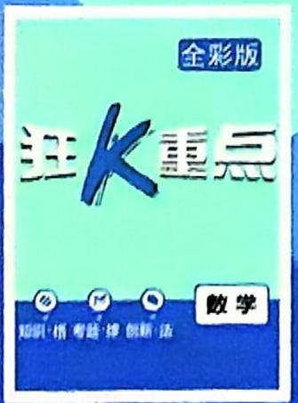

text_image

全彩版
狂火重点
知识·情 考题·绿 创新·法
数学

text_image

视频微课轻松看

新教材适用

数学

八年级上册 BS

# 初中 2026 必刷题

公众号\*满满分享库

主 编：杨文彬

编者：王岳阳 刘雷 孟超 王道魁 神英英

肖玉芝 许生友 邓方清 沈子涵

审订：杨彩银 郭炜伟 陈露

text_image

电子错题本

数学

八年级上册 BS

# 目录

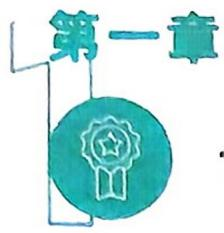

# 勾股定理

(正文)(答案)

1 探索勾股定理 …… (1) (D1)

课时 1 认识勾股定理 …… 刷基础 提升 (1) (D1)

课时2 验证并应用勾股定理……刷基础（3）(D2)

2 一定是直角三角形吗 …… 刷基础 提升（4）（D4）  
3 勾股定理的应用 …… 刷基础 提升（6）（D6）

重难专题 1 利用勾股定理解决折叠问题

刷难关（8）(D7)

☆问题解决策略：反思 …… 刷 提升（9）（D8）

全章综合训练 …… 刷中考 章测 (10) (D8)

# 重难题型微课

卡车过隧道问题 P3T7 正方形网格中求角度 P5T4

长方形的折叠问题 P7T4 利用勾股定理解决折叠问题 P8T2

最短路线问题 P11T4

# 新考法 新素材

研究对比全国近十年中考真题卷,发现各省市的中考会不断借鉴或探究新考法,同时会挖掘时事热点等新素材,创造新情境灵活考查知识点。中考是我们平时学习的风向标,因此我们需要关注新考法、新素材。

# 新考法

· 过直线上一点作已知   
直线的垂线的两种  
方法 ▶P5/T2  
- 新定义“完美组合数”  
考查算术平方根 ▶P13/T5   
- 用钟代码的方式确定  
位置 ▶P29/T4   
- 建立不同的坐标系求  
点的坐标 ▶P34/T5   
- 结合直角三角尺确定  
一次函数的表达式 ▶P49/T3  
· 与钟表有关的一次函  
数的应用 ▶P59/T1

# 新素材

· 以“电影《哪吒之魔童  
闹海》”为背景考查点  
的坐标 A原创 P39/T1  
- 以“DeepSeek”为背  
景考查列二元一次方  
程组 A1原创 P60/T10  
· 以“第九届亚洲冬季  
运动会”为背景考查  
箱线图 ▶P87/T3

# 实数

1 认识实数 …… 刷基础 (12) (D10)  
2 平方根与立方根 …… (13) (D11)

课时 1 算术平方根 …… 刷基础 提升 (13)(D11)  
课时2 平方根 …… 刷基础（15）(D12)  
课时 3 立方根 …… 刷基础 提升 (16) (D13)   
课时 4 估算与用计算器开方 …… 刷基础 (18) (D14)

3 二次根式 …… (19) (D15)

课时 1 二次根式的乘除法 …… 刷基础 (19) (D15)  
课时 2 二次根式的化简及加减运算

刷基础 提升 (20)(D16)  
课时 3 二次根式的混合运算 …… 刷基础 提升 (22)(D17)

大招专题1 二次根式比较大小的方法 …… 刷难关（24）(D19)  
大招专题2 二次根式的化简求值 …… 刷难关（25）(D20)

全章综合训练 …… 刷中考 章测（26）(D21)

# 重难题型微课

与非负性有关的分类讨论 P14T5 与立方根有关的数字问题 P17T5  
利用非负性求参数的值 P27T5 比较实数大小 P27T8

# 位置与坐标

1 确定位置 …… 刷基础（29）(D23)  
2 平面直角坐标系 …… (30) (D23)

课时 1 平面直角坐标系 …… 刷基础（30）(D23)  
课时2 平面直角坐标系中点的坐标  
特征 …… 刷基础（提升（31）(D24)

课时3 建立适当的平面直角坐标系  
求点的坐标 …… 刷基础（提升（33）(D25)

轴对称与坐标变化 …… 刷基础 提升（35）(D27)

# 推荐理由

# 新考向

教育部发布的《关于加强初中学业水平考试命题工作的意见》中指出:弘扬中华优秀传统文化,提高探究性、开放性试题比例,积极探索跨学科命题,提高试题情境设计水平。结合《义务教育数学课程标准(2022年版)》新变化,通过分析全国百余套中考试题,发现以传统文化为背景的试题,以及探究性、开放性、综合性、跨学科试题在中考中出现得越来越频繁,故精选部分试题,让学生感受考向变化。

大招专题3 利用点的坐标规律探究问题 …… 刷难关（37）(D28)

全章综合训练 …… 刷中考 章测（38）(D30)

重难题型微课

根据面积求点的坐标 P34T6

# 微专题

微专题1 一次函数与图形面积问题

P49

微专题2 巧解二元一次方程组 P65

微专题3 平均数、方差的变化规律

P83

# 第四章

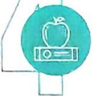

# 一次函数

1 函数 …… 刷基础（40）(D31)

2 认识一次函数……公众号\*满满分享库……（41）(D32)

课时 1 “均匀”变化 …… 刷基础 (41) (D32)

课时 2 一次函数与正比例函数 …… 刷基础 (42) (D32)

课时 3 利用一次函数解决分段计费问题
刷提升 (43)(D33)

3 一次函数的图象 …… (44) (D33)

课时 1 正比例函数的图象和性质…… 刷基础 提升 (44)(D33)

课时2 一次函数的图象和性质 …… 刷基础 提升（46）(D35)

4 一次函数的应用 …… (48) (D37)

课时 1 确定一次函数的表达式 …… 刷基础 提升 (48)(D37)

课时2 单个一次函数图象的实际应用
...... 刷基础 提升 (50)(D39)

课时 3 两个一次函数图象的实际应用
...... 刷基础 提升 (52)(D40)

重难专题2 一次函数中的几何变换 …… 刷难关（54）(D42)

重难专题3 一次函数的综合 …… 刷难关（55）(D43)

全章综合训练 …… 刷中考 章测（57）(D46)

重难题型微课

“将军饮马”问题 P45T8 一次函数与几何图形的综合 P47T4  
一次函数与最值问题 P57T3 一次函数与规律探究问题 P58T9

# 重难专题

重难专题1 利用勾股定理解决折叠

问题

P8

类型 1 与三角形有关的折叠

类型2 与四边形有关的折叠

重难专题2 一次函数中的几何变换

P54

类型1 一次函数中的平移问题

类型2 一次函数中的旋转问题

类型3 一次函数中的翻折问题

重难专题3 一次函数的综合 P55

类型1 一次函数的图象经过某定点问题

类型2 一次函数中的“将军饮马”问题

类型3 面积分割问题

类型4 取值范围问题

类型5 存在性问题

# 第五章

# 二元一次方程组

1 认识二元一次方程组 …… 刷基础 (60) (D48)

2 二元一次方程组的解法 …… (61) (D49)

课时 1 代入消元法 …… 刷基础 提升 (61)(D49)

课时2 加减消元法 …… 刷基础 提升 (63) (D51)

重难专题 4 二元一次方程组的含参问题
刷难关（66）(D53)

3 二元一次方程组的应用 …… (67) (D54)

课时 1 古算术问题 …… 刷 提升 (67) (D54)

课时2 增收节支 …… 刷提升（68）(D55)

课时 3 行程问题 …… 刷 提升 (69) (D55)

4 二元一次方程与一次函数 …… (70) (D56)

课时 1 二元一次方程(组)与一次函数 …… 刷基础 提升 (70)(D56)

课时2 用二元一次方程组确定一次函数表达式 …… 刷基础（提升）（72）（D57）

\* 5 三元一次方程组 …… 刷基础（74）(D59)

☆问题解决策略：逐步确定…… 刷提升（75）（D60）

重难专题4 二元一次方程组的含参

问题

P66

类型1 根据解的关系求参数

类型2 同解问题求参数

类型3 错解问题求参数

类型 4 整数解问题求参数

全章综合训练 …… 刷中考 章测（76）(D60)

重难题型微课

二元一次方程组的错解问题 P62T7 二元一次方程组的同解问题 P64T5

一次函数与二元一次方程组综合 P71T5 一次函数与轴对称综合 P73T2

# 第六章

# 数据的分析

1 平均数与方差·公众号\*满满分享库……（79）(D63)

课时 1 众数与平均数 …… 刷基础 提升 (79) (D63)

课时2 加权平均数 …… 刷基础（81）(D64)

课时 3 方差与标准差 …… 刷基础 提升 (82) (D65)

课时 4 分析数据的离散程度 …… 刷基础 (84) (D66)

2 中位数与箱线图 …… (85) (D67)

课时 1 中位数 …… 刷基础 提升 (85) (D67)

课时2 箱线图 …… 刷基础（87）(D68)

3 哪个团队收益大 …… 刷基础（88）(D69)

全章综合训练 …… 刷中考 章测（89）(D69)

重难题型微课

数据变化对平均数的影响 P80T2 数据缺失问题 P83T4

中位数不变分析数据 P86T3

# 第七章

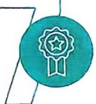

# 命题与证明

1 认识证明 …… (92) (D71)

课时 1 为什么要证明 …… 刷基础 (92) (D71)

课时2 定义与命题 …… 刷基础（93）(D72)

课时3 定理与证明 …… 刷基础（94）(D73)

2 平行线的证明 …… (95) (D73)

课时 1 平行线的判定 …… 刷基础 提升 (95) (D73)

课时2 平行线的性质 …… 刷基础 提升（97）(D74)

全章综合训练 …… 刷中考 章测（99）(D76)

重难题型微课

三角板的叠放与旋转 P96T6 平行线中的动点问题 P98T5

# 综合与实践

哪个城市夏天更热 …… 刷实践（102）(D79)

神奇的加密术 …… 刷实践（103）(D79)

中考新考向备训 (104)(D80)

■新考向1 传统文化 ■新考向2 跨学科综合

■新考向3 开放性试题 ■新考向4 22版课标新增知识点

新考向5 项目化学习

# 大招专题

大招专题1 二次根式比较大小的

方法

P24

母题学大招1 平方法

母题学大招2 作差/作商法

母题学大招3 取近似值后比较

母题学大招4 取中间值比较

母题学大招5 分子/分母有理化

母题学大招6 取倒数法

大招专题2 二次根式的化简求值

P25

母题学大招7 运用二次根式的非负性求值

母题学大招8 运用数形结合化简

母题学大招 9 巧用乘法公式化简
求值

母题学大招 10 巧用分母有理化简求值

母题学大招11 巧用整体代换化简求值

大招专题3 利用点的坐标规律探究

问题

P37

母题学大招 12 循环规律

母题学大招13 横、纵坐标的变化规律

# 光 r life 李

李研慧

夜深

寒风阵阵 海浪翻滚

隐藏着的灵魂

怎肯默默无闻

曾与礁石相撞

不屈遍体鳞伤

也曾掀起巨浪

回首与月相望

月光洒在海上

怅惘 黑夜漫长

月落参横

破晓 梦想迎来曙光

我不应是月亮

我本就会发光

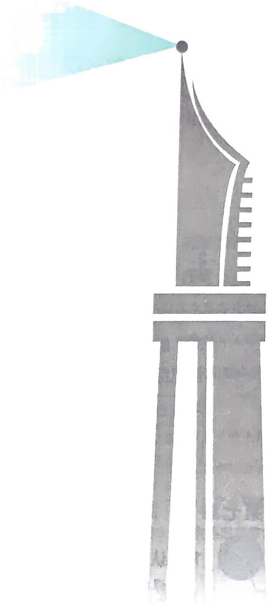

natural_image

Watercolor illustration of a tall tower with a light blue triangular reflector emitting a beam of light, no text or symbols present.

# 1 探索勾股定理

公众号\*满满分享库

# 课时1 认识勾股定理

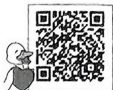

电子错题本鸭

# 刷基础

建议用时 20 分钟 答案 D1

# 知识点 1 认识勾股定理

[2025 福建泉州期中] 在 $\triangle ABC$ 中, 若 $\angle ABC = 90^{\circ}$ , 则下列正确的是 ( )

A. ${BC} = {AB} + {AC}$

B. $B{C}^{2} = A{B}^{2} + A{C}^{2}$

C. $A{B}^{2} = A{C}^{2} + B{C}^{2}$

D. $A{C}^{2} = A{B}^{2} + B{C}^{2}$

# 知识点 2 利用勾股定理求线段长度

[2025 河南安阳质检]如图, 直线 $AB \perp CD$ , 垂足为 $O$ , $AO = 15$ , $CO = 8$ , 以点 $A$ 为圆

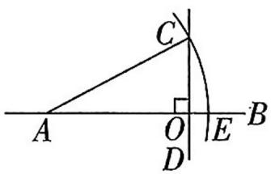

心,AC 的长为半径画弧,交直线 AB 于点 E,则 OE 的长为 ( )

A. 8

B. 6

C. 4

D. 2

3[2025 江苏泰州期中]如图, Rt△ABC 的顶点 A, B 都在由边长为 1 的小正方形组成的方格纸的格点上, 且 ∠C=90°, 则 AB 的长为 \_\_\_\_.

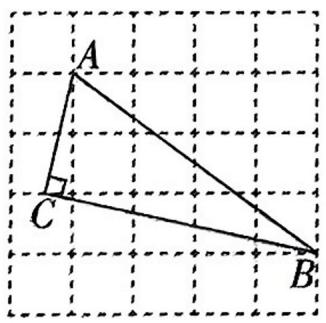

text_image

A
C
B

(第3题图)

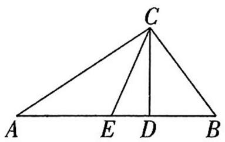

text_image

C
A E D B

(第4题图)

4[2025 广东深圳调研]如图, 在 $\triangle ABC$ 中, $CD \perp AB$ 于点 $D, E$ 在 $AD$ 上, 连接 $CE, AE = CE$ . 若 $AD = 6, BC = 5, BD = 3$ , 则 $DE$ 的长为 \_\_\_\_.

# 知识点 3 利用勾股定理求面积

5[2024 浙江台州调研]如图, $AD$ 是 $\triangle ABC$ 的高,分别以 $AB, BD, DC, CA$ 为边向外作正方形,其中3个正方形的面积如图所示,则第四个正方形的面积为 ( )

A.1

B.2

C. 3

D. 4

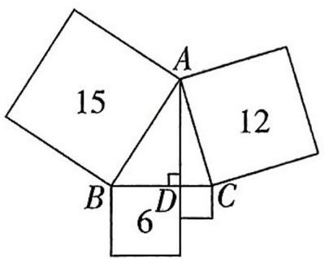

text_image

15
A
12
B
D
6
C

(第5题图)

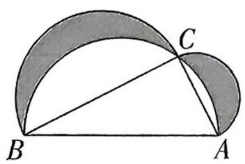  
(第6题图)

6 如图, 在 Rt△ABC 中, ∠ACB=90°, △ABC 的面积为 24 cm², 在 AB 同侧分别以 AB, BC, AC 为直径作三个半圆, 则阴影部分的面积为 \_\_\_\_ cm².

# 知识点 4 构造直角三角形应用勾股定理

7 [2024 北京海淀区期中] 如图, 在 $\triangle ABC$ 中, $AB = AC = 5, BC = 6$ , 则 $AC$ 边上的高 $BD$ 的长为 ( )

A. 4

B. 4. 4

C. 4.8

D.5

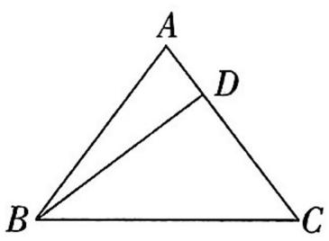

text_image

A
D
B
C

(第7题图)

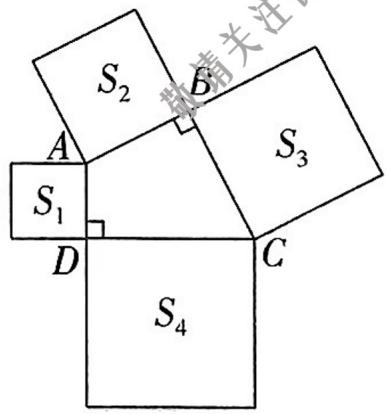

text_image

S₂
A
S₁
D
S₃
C
S₄
B
申请关注

(第8题图)

8[2025 山东青岛期末]如图,在四边形 ABCD 中, $\angle ABC = \angle CDA = 90^{\circ}$ ,分别以四边形 ABCD 的四条边为边长,向外作四个正方形,面积分别为 $S_{1}, S_{2}, S_{3}, S_{4}$ , 若 $S_{1} = 8, S_{2} = 11, S_{3} = 15$ , 则 $S_{4} =$ \_\_\_\_.

# ②刷易错 ▶……小心有坑\~

# 易错点 没有明确已知边是哪条边而忽略分类讨论致错

9 已知一个直角三角形的两条边长分别为 3 和 5, 则第三条边长的平方为 \_\_\_\_.

[2025 山东淄博期中, 中]如图, 点 $P$ 为 Rt $\triangle ABC$ 的边 $BC$ 上一点, 已知 $PC = 5, AC = 10$ , 折线 $P - B - A$ 与折线 $P - C - A$ 的长度相等, 则边 $BC$ 的长为 ( )

A. 6.5

B. 7

C. 7.5

D. 8

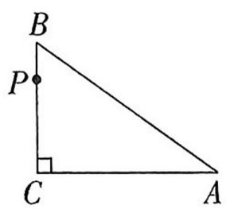  
(第1题图)

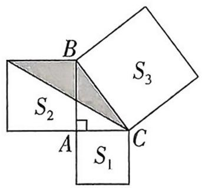

text_image

B
S₂
A
S₁
C
S₃

(第2题图)

2[2025 浙江杭州期中, 中]如图, 在 Rt△ABC 中, 分别以这个三角形的三边为边长向外侧作正方形, 面积分别记为 $S_{1}, S_{2}, S_{3}$ , 若 $S_{3} + S_{2} - S_{1} = 24$ , 则图中阴影部分的面积为 ( )

A. 6

B. 12

C. 10

D. 8

3[2025 江苏无锡调研, 中]如图, 点 A 是射线 BM 外一点, 连接 AB, 若 AB =

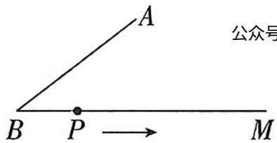

5 cm, 点 A 到 BM 的距离为 3 cm, 动点 P 从点 B 出发沿射线 BM 以 2 cm/s 的速度运动. 设运动的时间为 t s, 当 $\triangle ABP$ 为直角三角形时, t 的值为 ( )

A. $\frac{25}{4}$

B. 2

C. 2 或 $\frac{25}{4}$

D. 2 或 $\frac{25}{8}$

4[2025 四川成都质检, 中]如图, 在 $\triangle ABC$ 中, $\angle ACB = 90^{\circ}, AC = 3, BC = 4$ , 点 $D$ 在边 $AB$ 上, $AD = AC, AE \perp CD$ , 交 $BC, CD$ 于点 $E, F$ , 则 $BE$ 的长是 \_\_\_\_.

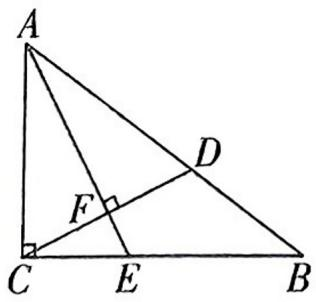

text_image

A
D
F
C
E
B

(第4题图)

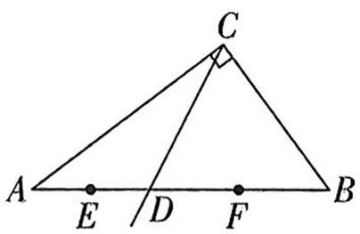

text_image

C
A E D F B

(第5题图)

5 [2025 河南郑州质检, 中] 如图, 在 $\triangle ABC$ 中, $\angle ACB = 90^{\circ}, AC = 12, BC = 9$ , 射线 $CD$ 与边 $AB$ 交于点 $D, E, F$ 分别为 $AD, BD$ 的中点, 设点 $E, F$ 到

射线 $CD$ 的距离分别为 $m, n$ , 则 $m + n$ 的最大值为 \_\_\_\_.

6 [2025 陕西西安质检, 中] 探究:

(1) 图(1)是由四个全等的直角三角形紧密拼接形成的飞镖状图形, 若 $AB + AC = 20, OC = 5$ , 求该飞镖状图形的面积.

(2)图(2)是由八个全等的直角三角形紧密拼接形成的大正方形 $ABCD$ , 记图中正方形 $ABCD$ , 正方形 $EFGH$ , 正方形 $MNKT$ 的面积分别为 $S_{1}, S_{2}, S_{3}$ . 若 $S_{2} = 6$ , 求 $S_{1} + S_{3}$ 的值.

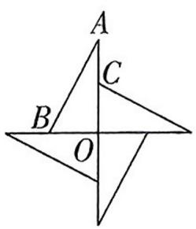  
图(1)

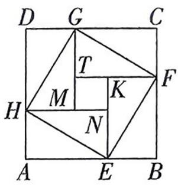

text_image

D G C
T
M K F
H N
A E B

图(2)

7 [2025 辽宁抚顺质检,较难] 如图,在 Rt△ABC 中,∠ACB=90°,D 为 AB 中点,点 E 在 BC 边上 (点 E 不与点 B,C 重合),连接 DE,过点 D 作 DF⊥DE 交 AC 于点 F,连接 EF.

(1)试说明: $AF^{2}+BE^{2}=EF^{2}$ ;

(2) 若 ${AC} = 7,{BC} = 5,{EC} = 1$ ,直接写出 ${AF}$ 的长.

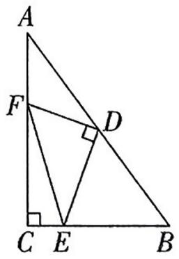

text_image

A
F
D
C E B

# 课时 2 验证并应用勾股定理

# 知识点1 勾股定理的验证

1[2025 福建莆田质检]利用下列图形,能验证勾股定理的有 ( )

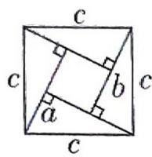  
①

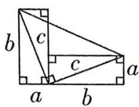  
②

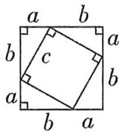  
③

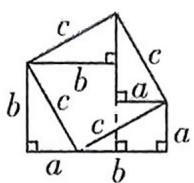  
④

A. 1 个

B. 2 个

C. 3 个

D. 4 个

2[2025 河南郑州期中]为验证勾股定理,小明进行了如下的思考:如图,在 Rt△ABC 中,∠ACB=90°,在边 AC 上截取 CE=CB,延长 BC 到点 D,使得 CD=CA,连接 AD,DE,并延长 DE 交 AB 于点 F,已知 BC=a,AC=b,AB=c.

(1)在验证之前小明发现 $AB$ 和 $DE$ 存在着一定的数量关系和位置关系,猜想 $AB$ 和 $DE$ 的数量关系和位置关系,并说明理由;

(2)通过以上条件验证勾股定理.

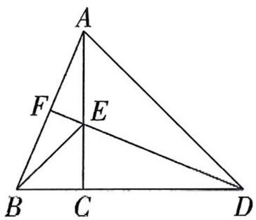

text_image

A
F
E
B C D

# 知识点 2 勾股定理的应用

3 新考向传统文化 在《九章算术》中有一个问题(如图): 今有竹高一丈,末折抵地,去本三尺,问折者高几何?

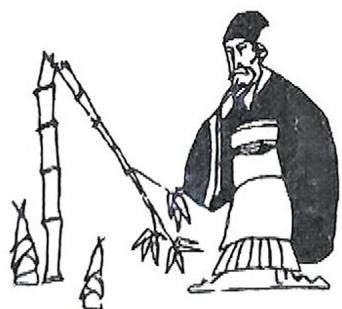

natural_image

Illustration of a historical figure in traditional attire drawing bamboo stalks (no text or symbols present)

意思是有一根竹子原高1丈(1丈=10尺),中间有一处折断,竹梢触地面处离竹根3尺(1尺= $\frac{1}{3}$ 米),试问折断处离地面()

A.4 尺

B.3.6尺

C. 4.5 尺

D. 4.55 尺

4[2023 山东东营中考]一艘船由 A 港沿北偏东 $60^{\circ}$ 方向航行 30 km 至 B 港, 然后再沿北偏西 $30^{\circ}$ 方向航行 40 km 至 C 港, 则 A, C 两港之间的距离为 \_\_\_\_ km.

5 小亮用 11 块高度都是 $2 \mathrm{~cm}$ 的相同长方体小木块垒了两堵与地面垂直的木墙, 木墙之间刚好可以放进一个正方形木板 $ABCD$ , 截面如图所示. 两木墙的高度分别为 $AE$ 与 $CF$ 的长, 点 $B$ 在 $EF$ 上, 则正方形木板 $ABCD$ 的面积为 $\mathrm{cm}^{2}$ .

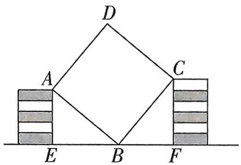

text_image

D
A	C
E	B	F

(第5题图)

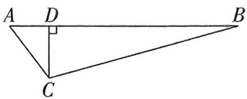

text_image

A D B
C

(第6题图)

6[2025 江苏徐州期中]如图,在笔直的公路 $AB$ 旁有一个城市书房 $C, C$ 到公路 $AB$ 的距离 $CD$ 为80米, $AC$ 为100米, $BC$ 为300米.一辆公交车以10米/秒的速度从 $A$ 处出发,沿公路 $AB$ 向 $B$ 处行驶.若公交车鸣笛声会使以公交车为中心170米范围内受到噪音影响,则公交车在公路 $AB$ 上行驶时,至少\_\_\_\_秒不鸣笛才能使在城市书房 $C$ 中看书的读者不受噪音影响.

7 一辆装满货物的卡车, 高 $2.5 \mathrm{~m}$ , 宽 $1.6 \mathrm{~m}$ , 要开进上边是半圆, 下边是长方形的隧道, 如图所示, 已知半圆的直径为 $2 \mathrm{~m}$ , 长方形的另一条边长是 $2.3 \mathrm{~m}$ .

(1) 此卡车是否能通过隧道? 试说明你的理由. (2) 为了适应车流量的增加, 现把隧道改为双行道, 要使宽为 $1.2 \mathrm{~m}$ , 高为 $2.8 \mathrm{~m}$ 的卡车能安全通过, 那么此隧道的宽至少增加到多少?

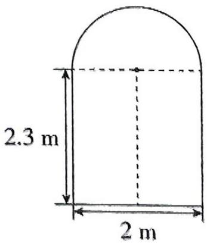

text_image

2.3 m
2 m

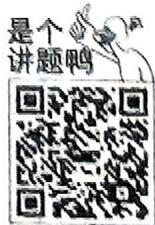

# 2 一定是直角三角形吗

公众号\*满满分享库

# 刷基础

建议用时 20 分钟 答案 D4

# 知识点 1 直角三角形的判别条件

[2025 福建三明期中]以下列各组数据为边长作三角形,其中不能构成直角三角形的是
()

A. 3,4,5

B. 5,12,13

C. 8,12,16

D. 15,36,39

2[2024 山东济南槐荫区调研]如图,在 $4 \times 4$ 的网格中,每个小正方形的边长均为 1,点 A,B,C 都在格点上,则下列结论错误的是 ( )

A. ${BC} = 5$

B. $\angle BAC = 90^{\circ}$

C. $\triangle ABC$ 的面积为 10

D. 点 $A$ 到直线 $BC$ 的距离是2

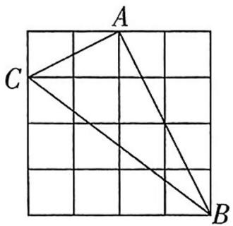

text_image

A
C
B

3 已知 $\triangle ABC$ 的三边 $a, b, c$ 满足 $(a - 5)^2 + (b - 12)^2 + |c - 13| = 0$ , 则 $\triangle ABC$ 是 \_\_\_\_ 三角形.

# 知识点 2 勾股数

4 下列各组数据中,是勾股数的是 ( )

A. $\frac{1}{5}, \frac{1}{12}, \frac{1}{13}$

B. 9,40,41

C. 0.7, 2.4, 2.5

D. $3^{2}, 4^{2}, 5^{2}$

55,12,m 是一组勾股数,则 m= \_\_\_\_.

6[2025 广东梅州质检]毕达哥拉斯学派提出了一个构造勾股数组的公式,根据该公式可以构造出如下勾股数组:(3,4,5),(5,12,13),(7,24,25),…,分析上面勾股数组可以发现: $4=1\times(3+1)$ , $12=2\times(5+1)$ , $24=3\times(7+1)$ ,…,根据上面规律,第5个勾股数组为\_\_\_\_.

# 知识点 3 直角三角形判定的应用

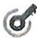

7 在 $\triangle ABC$ 中, 已知 $AB = 8, AC = 15, BC = 17$ , 则 $\triangle ABC$ 的面积为 ( )

A. 136

B. 68

C. 120

D. 60

8[2025 陕西咸阳质检]如图,在小正方形组成的 $3 \times 2$ 网格中,每个小正方形的顶点称为格点.点 $A, B, C, D, M, N$ 均在格点上,其中能与点 $M, N$ 构成一个直角三角形的是 ( )

A. 点 $A$

B. 点 $B$

C. 点 $C$

D. 点 $D$

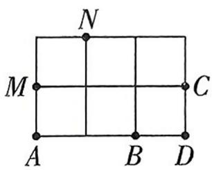  
(第8题图)

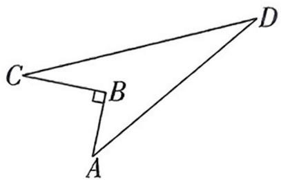

text_image

Geometric diagram showing triangle ABD with right angle at B, labeled vertices C and D

(第9题图)

9 如图所示的一块土地, $AB = 3 \mathrm{~m}, BC = 4 \mathrm{~m}, CD = 13 \mathrm{~m}, AD = 12 \mathrm{~m}, \angle ABC = 90^{\circ}$ , 则这块土地的面积为 \_\_\_\_ $\mathrm{m}^{2}$ .

10[2025 四川成都质检]如图,小区有一块三角形空地 $ABC$ ,计划将这块空地种上三种不同的花卉,中间用小路 $AD, DE$ 隔开(小路宽度忽略不计), $DE \perp AB$ . 经测量, $AB = 15$ 米, $AC = 13$ 米, $AD = 12$ 米, $DC = 5$ 米.

(1) 求 $BD$ 的长;  
(2)若铺设小路 $AD, DE$ 每米需 30 元, 则需花费多少?

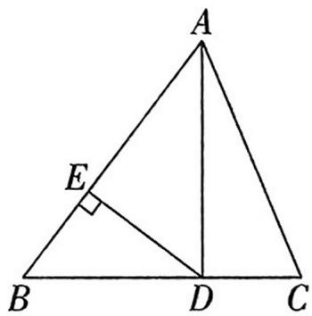

text_image

A
E
B D C

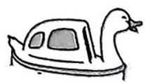  
轻舟已过万重山了鸭

1 [2025 辽宁盘锦期末, 中] 小明向东走 80 m 后, 沿另一个方向又走了 60 m, 再沿第三个方向走 100 m 回到原地. 小明向东走 80 m 后走的方向是 ( )

A. 北

B. 西或东

C. 南

D. 北或南

2 新考法 [2025 山西晋中质检, 中] 老师布置了任务: 过直线 $AB$ 上一点 $C$ 作 $AB$ 的垂线. 在没有直角尺的情况下, 嘉嘉和淇淇给出了如下两种方案, 下列判断正确的是 ( )

方案Ⅰ：

如图. ①利用一把有刻度的直尺在 AB 上量出 CD=30 cm. ②分别以 D, C 为圆心, 以 50 cm 和 40 cm 为半径画弧交于点 E. ③作直线 CE, CE 即为 AB 的垂线

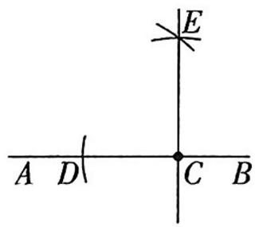

text_image

A D
C B
E

方案Ⅱ：

如图,取一根笔直的木棒,在木棒上标出 M,N 两点.①使点 M 与点 C 重合,点 N 对应的位置标记为点 Q.②保持点 N 不动,将木棒绕点 N 旋转,使点 M 落在 AB 上的 R 点处.③将 RQ 延长,在延长线上截取线段 QS=MN,得到点 S.④作直线 SC,SC 即为 AB 的垂线

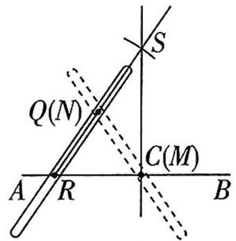

text_image

S
Q(N)
C(M)
A R B

A. I 可行, II 不可行

B. I 不可行, II 可行

C. I, II 都不可行

D. I, II 都可行

3[2024 湖北武汉调研, 中]如图所示, 在 $\triangle ABC$ 中, $AB:BC:CA=3:4:5$ , 且周长为 $36 \mathrm{~cm}$ , 点 $P$ 从点 $A$ 出发沿 $AB$ 边向 $B$ 点以 $1 \mathrm{~cm/s}$ 的速度移动, 点 $Q$ 从点 $B$ 出发沿 $BC$ 边向点 $C$ 以 $2 \mathrm{~cm/s}$ 的速度移动. 若 $P, Q$ 两点同时出发, 则 $3 \mathrm{~s}$ 时, $\triangle BPQ$ 的面积为 $\mathrm{cm}^{2}$ .

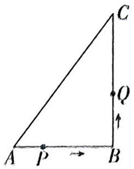

text_image

C
Q
A P B

(第3题图)

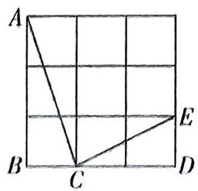

text_image

A
B
C
D
E

(第4题图)

4[较难]在如图所示的正方形网格中,每个小正方形的边长均为1,点A,B,C,D,E均是网格线的交点,则 $\angle ACB-\angle DCE=$ \_\_\_\_°.

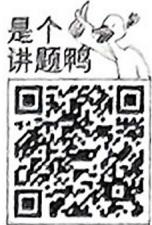

5[2024 江西南昌期中, 中]定义: 如图, 点 $M, N$ 把线段 $AB$ 分割成线段 $AM, MN, NB$ , 若以 $AM, MN, NB$ 为边的三角形是一个直角三角形, 则称点 $M, N$ 是线段 $AB$ 的“勾股分割点”.

(1)已知 M, N 把线段 AB 分割成线段 AM, MN, NB, 若 $AM^{2}=4$ , $MN^{2}=16$ , $BN^{2}=12$ , 则点 M, N 是线段 AB 的“勾股分割点”吗? 请说明理由.

(2)已知点 M, N 是线段 AB 的“勾股分割点”，且 AM 不是最长线段，若 AB = 12, AM = 5，求 BN 的长.

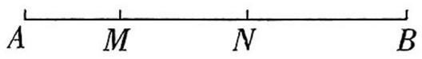

2刷素养→走向重高

6 核心素养推理能力 [2024 贵州贵阳质检, 较难] 在 $\triangle ABC$ 中, $BC = a$ , $AC = b$ , $AB = c$ , 设 $AB$ 为最长边, 当 $a^2 + b^2 = c^2$ 时, $\triangle ABC$ 是直角三角形; 当 $a^2 + b^2 \neq c^2$ 时, 通过比较代数式 $a^2 + b^2$ 和 $c^2$ 的大小, 探究 $\triangle ABC$ 的形状 (按角分类).

(1) 当 $\triangle ABC$ 三边长分别为 6, 8, 9 时, $\triangle ABC$ 为 \_\_\_\_ 三角形; 当 $\triangle ABC$ 三边长分别为 6, 8, 11 时, $\triangle ABC$ 为 \_\_\_\_ 三角形.

(2)猜想:当 $a^{2}+b^{2}$ \_\_\_\_ $c^{2}$ 时, $\triangle ABC$ 为锐角三角形; 当 $a^{2}+b^{2}$ \_\_\_\_ $c^{2}$ 时, $\triangle ABC$ 为钝角三角形.

(3) 当 $a = 2, b = 4$ 时, 探究 $\triangle ABC$ 的形状, 并求出对应的 $c^2$ 的取值范围.

# 3 勾股定理的应用

# 刷基础

# 知识点 1 在几何中的应用

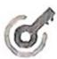

[2025 浙江温州期中]如图,在 Rt $\triangle ABC$ 中, $C = 90^{\circ}, D$ 为 $AC$ 上一点,且 $DA = DB = 5$ ,若 $\triangle ABD$ 的面积为 10 ,则 $CD$ 的长为 ( )

A. 3

B. 4

C. 5

D. 4.5

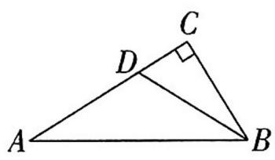  
(第1题图)

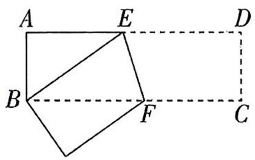

text_image

A E D
B F C

(第2题图)

2[2025 江苏南京期中]如图,在长方形 ABCD 中,AB=9,AD=27,将此长方形折叠,使点 D 与点 B 重合,折痕为 EF,则△ABE 的面积为( )

A. 54

B. 90

C. 108

D. 216

3[2025 河北唐山期中]对角线互相垂直的四边形叫作“垂美”四边形,现有如图所示的“垂美”四边形ABCD,对角线AC,BD交于点O.若AD=4,BC=2,则 $AB^{2}+CD^{2}=$ \_\_\_\_.

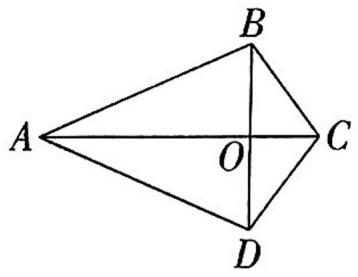

text_image

A
O
B
C
D

(第3题图)

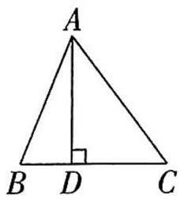  
(第4题图)

4[2025 河南焦作质检]如图, 在 $\triangle ABC$ 中, $AD$ 是 $BC$ 边上的高, $AB = 13 \mathrm{~cm}$ , $AC = 15 \mathrm{~cm}$ , $AD = 12 \mathrm{~cm}$ , 则 $\triangle ABC$ 的面积为 \_\_\_\_ $\mathrm{cm}^{2}$ .  
5[2025 山东烟台期中]如图, 在 $\triangle ABC$ 中, $AB = AC$ , 点 $E$ 在 $AC$ 上, $CE = 5$ , $BC = 13$ , $BE = 12$ .

(1) 判断 $\triangle ABE$ 的形状, 并说明理由;  
(2) 求 $AB$ 的长.

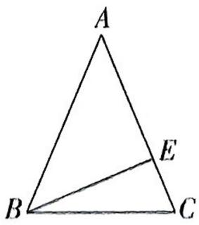

text_image

A
B
C
E

# 知识点 2 在实际问题中的应用

6[2024 广西桂林期中]如图所示,一根长为 $7 \, cm$ 的吸管放在一个圆柱形杯中,测得杯的内部底面直径为 $3 \, cm$ ,高为 $4 \, cm$ ,则吸管露在杯外面的最短长度为 \_\_\_\_ cm.

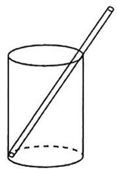  
(第6题图)

  
(第7题图)

7 如图, 将一根长为 $16 \mathrm{~cm}$ 的橡皮筋固定在笔直的木棒上, 两端点分别记为点 $A$ , 点 $B$ , 然后将中点 $C$ 向上拉升 $6 \mathrm{~cm}$ 至点 $D$ , 则橡皮筋被拉长了 \_\_\_\_.  
8[2025 四川成都期末]如图(1),一台笔记本电脑平放在水平桌面上,其示意图如图(2),屏幕宽BC为25 cm,当电脑张角为∠ABC时,顶部边缘C处到桌面的距离CE为20 cm,调整电脑的张角,当张角为∠ABD(点C与点D为笔记本顶部边缘同一点)时,顶部边缘D处到桌面的距离DF为15 cm,则E处与F处之间的距离EF长为\_\_\_\_cm.

  
图(1)

text_image

C
D
F E B A

图(2)

9[2024 广东佛山质检]如图,在离水面高度为 8 米的岸上,有人用绳子拉船靠岸,开始时绳子 BC 的长为 17 米,此人以每秒 1 米的速度收绳,7 秒后船移动到点 D 的位置,问船向岸边移动了多少米?（假设收绳过程中绳子是直的）

text_image

C
8米
D
A
B

[2024 安徽淮南期末, 中] 如图, 小巷左右两侧是竖直的墙, 一架梯子斜靠在左墙时, 梯子底端到左墙角的距离为 $0.7 \mathrm{~m}$ , 顶端距离地面 $2.4 \mathrm{~m}$ . 如果保持梯子底端位置不动, 将梯子斜靠在右墙时, 顶端距离地面 $2 \mathrm{~m}$ , 则小巷的宽度为 ( )

A. $0.7 \mathrm{~m}$

B. $1.5 \mathrm{~m}$

C. $2. 2 \mathrm{~m}$

D. $2.4 \mathrm{~m}$

  
(第1题图)

text_image

Diagram of a simple pendulum setup with labeled points A, B, C, D, E and a tree-like structure above the ground.

(第2题图)

2[2025 湖北黄石质检, 中]如图, 松松在放风筝时(其中 $\angle AEC = 90^{\circ}$ ), 测得如下数据: ① $BD$ 的长为 $12 \mathrm{~m} (BD \perp CE)$ ; ②根据手中剩余线的长度计算出风筝线 $BC$ 的长为 $15 \mathrm{~m}$ , 若松松想使风筝沿 $CD$ 方向下降 $4 \mathrm{~m}$ , 则他应该往回收线 ( )

A. $2 \mathrm{~m}$

B. $5 \mathrm{~m}$

C. $5.4 \mathrm{~m}$

D. $3.6 \mathrm{~m}$

3 [2024 陕西中考, 中] 如图, 在 $\triangle ABC$ 中, $AB = AC$ , $E$ 是边 $AB$ 上一点, 连接 $CE$ , 在 $BC$ 的右侧作 $BF \parallel AC$ , 且 $BF = AE$ , 连接 $CF$ . 若 $AC = 13$ , $BC = 10$ , 则四边形 $EBFC$ 的面积为 \_\_\_\_.

  
(第3题图)

text_image

A
B
E
C
D
B'

(第4题图)

4[较难]如图,长方形ABCD中,AB=3,BC=4,点E是BC边上一点,连接AE,把∠B沿AE折叠,使点B落在点$B'$ 处. 当 $\triangle CEB'$ 为直角三角形时, BE 的长为 \_\_\_\_.

# 刷素养 走向重高

5 核心素养应用意识 [2025 广西防城港期中, 中]

【问题情境】消防云梯常用于高层建筑火灾等救援任务,它能让消防员快速到达高层救援现场.如图,已知一架云梯AB长25 m,斜靠在一面墙上,这时云梯底端与墙角的距离OB=20 m, $\angle AOB=90^{\circ}$ .

【独立思考】(1)求这架云梯顶部距离地面的高度 $OA$ .

【深入探究】(2) 消防员接到命令, 按要求将云梯从顶部 A 下滑到 $A'$ 位置上, 则底部 B 沿水平方向滑动到 $B'$ 位置上, 若 $AA' = 8 \, m$ , 求 $BB'$ 的长度.

【问题解决】(3)在演练中,墙边距地面24 m的窗口有求救声,消防员需调整云梯去救援被困人员.经验表明,云梯靠墙摆放时,如果云梯底端到墙的距离不小于云梯长度的 $\frac{1}{5}$ ,则云梯和消防员相对安全,在相对安全的前提下,云梯的顶端能否到达24 m高的窗口去救援被困人员?

text_image

C
A
A'
O
B'
B

# 重难专题1 利用勾股定理解决折叠问题

# 刷难关

建议用时 30 分钟 答案 D7

# 类型 1 与三角形有关的折叠

[2025 广东佛山质检, 中] 如图, 有一个直角三角形纸片 $ABC$ , $\angle C = 90^{\circ}$ , $AC = 6 \mathrm{~cm}$ , $BC = 8 \mathrm{~cm}$ . 现将直角边 $AC$ 沿直线 $AD$ 折叠, 使点 $C$ 落在斜边 $AB$ 上的点 $E$ 处, 则 $CD$ 的长为 ( )

A. $5 \mathrm{~cm}$

B. $4 \mathrm{~cm}$

C. $3 \mathrm{~cm}$

D. $2\mathrm{\;{cm}}$

text_image

A
C
D
E
B

(第1题图)

text_image

B
D
A
E
C

(第2题图)

2 [中] 如图, 三角形纸片 $ABC$ 中, $\angle BAC = 90^{\circ}, AB = 2, AC = 3$ . 沿过点 $A$ 的直线将纸片折叠, 使点 $B$ 落在边

BC 上的点 D 处; 再折叠纸片, 使点 C 与点 D 重合, 若折痕与 AC 的交点为 E, 则 AE 的长是 ( )

A. $\frac{13}{6}$

B. $\frac{5}{6}$

C. $\frac{7}{6}$

D. $\frac{6}{5}$

3[2025 重庆大渡口区校级期中, 中]如图, $\triangle ABC$ 为等腰直角三角形, $AB =$

text_image

A
D
E
B
A'
C

$AC = 4, \angle A = 90^{\circ}$ , 点 $E$ 为 $AC$ 上一点, 且 $CE = 1$ , 点 $D$ 为 $AB$ 上一点, 连接 $DE$ , 将 $\triangle ABC$ 沿 $DE$ 折叠, 使点 $A$ 落在点 $A'$ 处, 若 $EA'$ 的延长线恰好经过点 $B$ , 则 $AD = \_$ .

# 类型2 与四边形有关的折叠

4[2025 福建宁德期中, 中]如图, 长方形 ABCD 中, 点 E 在边 AB 上, 将长方形 ABCD 沿直线 DE 折叠, 点 A 恰好落在边 BC 上的点 F 处, 若 AD = 5, DC = 3, 则 BF 的长是 ( )

A.1

B.2

C. 3

D. 4

text_image

A
E
B F C
D

(第4题图)

text_image

A
B
E
D'
C
D

(第5题图)

5[2025 河南南阳期末, 中]如图, 在长方形 ABCD 中, AB = 3 cm, BC = 4 cm. 将长方形 ABCD 沿对角线 AC 折叠, 点 D 落在 D' 处, AD' 与 BC 相交于点 E, 则 BE 的长为 ( )

A. $\frac{7}{8} \mathrm{~cm}$

B. $\frac{3}{4} \mathrm{~cm}$

C. $\frac{2}{3} \mathrm{~cm}$

D. $\frac{5}{6} \mathrm{~cm}$

6[2025 浙江宁波期中, 中]如图, 长方形纸片 $ABCD, AB = 10, AD = 8$ , 点 $P$ 在 $AD$ 边上, 将 $\triangle CDP$ 沿 $CP$ 折叠, 点 $D$ 落在 $E$ 处, $PE, CE$ 分别交 $AB$ 于

text_image

D
C
P
A O F B
E

点 O, F，且 OP = OF，则 BF 的长为 \_\_\_\_.

7 [2025 江苏苏州质检, 中] 如图, 长方形 ABCD 中, AB = 6, AD = 8, 点 E 是 CD 边上一点, 把 $\triangle ADE$ 沿直线 AE 折叠, 点 D 恰好落在 AC 上的点 F 处.

(1) 求 $AC$ 的长.

(2) 求 $DE$ 的长.

text_image

A
D
E
F
B
C

# ☆问题解决策略：反思

# 刷提升

建议用时 15 分钟 答案 D8

[2025 山东威海期中,较难]【问题情境】

数学综合与实践活动课上,老师提出如下问题:一个三级台阶,它每一级的长、宽、高分别为 $20 \mathrm{dm}$ , $3 \mathrm{dm}, 2 \mathrm{dm}, A$ 和 $B$ 是一个三级台阶上两个相对的端点.

# 【探究实践】

老师让同学们探究:如图(1),若A点处有一只蚂蚁要到B点去吃食物,则蚂蚁沿着台阶爬到B点的最短路程是多少?

(1)同学们经过思考得到如下解题方法:如图(2)为三级台阶的平面展开图,可得到长为 $20 \, dm$ , 宽为 $15 \, dm$ 的长方形, 连接 AB, 经过计算得到 AB 的长度为 \_\_\_\_, 就是最短路程.

# 【变式探究】

(2)如图(3),已知圆柱底面的周长为 $6 \mathrm{dm}$ , 圆柱高为 $4 \mathrm{dm}$ , 在圆柱的侧面有一只蚂蚁, 从点 $A$ 爬到点 $C$ , 再从点 $C$ 爬回点 $A$ , 恰好爬行一圈, 则这只蚂蚁爬行的最短路程为 \_\_\_\_.

text_image

A 20
3
2
B

图(1)

text_image

A 20
3
2
3
2
3
2
B

图(2)

text_image

A
B
C

图(3)

text_image

B
A

图(4)

# 【拓展应用】

(3)如图(4),圆柱形玻璃杯的高为 $9 \mathrm{~cm}$ ,底面周长为 $16 \mathrm{~cm}$ ,在杯内壁离杯底 $4 \mathrm{~cm}$ 的点 $A$ 处有一滴蜂蜜,此时,一只蚂蚁正好在外壁离杯口 $1 \mathrm{~cm}$ ,且与蜂蜜相对的点 $B$ 处,则蚂蚁从外壁 $B$ 处到内壁 $A$ 处所爬行的最短路程是多少? (杯壁厚度不计)

# 全章综合训练

  
是个新“烤”鸭

  
电子错题本鸭

# 届中考

建议用时 25 分钟 答案 D8

# 考点1 勾股定理

[2023 山东日照中考]已知直角三角形的三边 $a, b, c$ 满足 $c > a > b$ , 分别以 $a, b, c$ 为边作三个正方形, 把

两个较小的正方形放置在最大正方形内,如图,设三个正方形无重叠部分的面积为 $S_{1}$ , 均重叠部分的面积为 $S_{2}$ , 则 ( )

A. $S_{1} > S_{2}$

B. $S_{1}< S_{2}$

C. $S_{1} = S_{2}$

D. $S_{1}, S_{2}$ 大小无法确定

2[2023 江苏扬州中考]如图, $\triangle ABC$ 中, $\angle A = 90^{\circ}, AB = 8, AC = 15$ , 以点 $B$ 为圆心, 适当长为半径画弧, 分别交 $BA, BC$ 于点 $M, N$ , 再分别以点 $M, N$ 为圆心, 大于 $\frac{1}{2}MN$ 的长为半径画弧, 两弧交于点 $E$ , 作射线 $BE$ 交 $AC$ 于点 $D$ , 则线段 $AD$ 的长为 \_\_\_\_.

text_image

A
M
D
E
B
N
C

(第2题图)

text_image

Geometric diagram of triangle ABC with internal points D, E, F and auxiliary lines, labeled for mathematical analysis.

(第3题图)

3[2024 江苏常州中考]如图, 在 Rt $\triangle ABC$ 中, $\angle ACB = 90^{\circ}, AC = 6, BC = 4, D$ 是边 $AC$ 的中点, $E$ 是边 $BC$ 上一点, 连接 $BD, DE$ . 将 $\triangle CDE$ 沿 $DE$ 翻折, 点 $C$ 落在 $BD$ 上的点 $F$ 处, 则 $CE =$ \_\_\_\_.

4[2024 黑龙江大庆中考]如图(1), 直角三角形的两个锐角分别是 $40^{\circ}$ 和 $50^{\circ}$ , 其三边上分别有一个正方形. 执行下面的操作: 由两个小正方形向外分别作锐角为 $40^{\circ}$ 和 $50^{\circ}$ 的直角三角形, 再分别以所得到的直角三角形的直角边为边长作正方形. 图(2)是1次操作后的图形. 图(3)是重复上述步骤若干次后得到的图形, 人们把它

称为“毕达哥拉斯树”. 若图(1)中的直角三角形斜边长为2,则10次操作后图形中所有正方形的面积和为\_\_\_\_.

  
图(1)

natural_image

Abstract geometric line drawing composed of connected squares forming a Y-shape (no text or symbols)

图(2)

natural_image

Abstract geometric pattern composed of interconnected polygons and nodes, resembling a stylized tree or floral design (no text or symbols)

图(3)

# 考点 2 直角三角形判定的应用

5[2023 山东济宁中考]如图,在正方形方格中,每个小正方形的边长都是一个单位长度,点A,B,C,D,E均在小正方形方

text_image

Geometric diagram with labeled points A, B, C, D, E, F on a grid background

格的顶点上,线段 AB,CD 交于点 F,若 $\angle CFB = \alpha$ ,则 $\angle ABE$ 等于 ( )

A. ${180}^{ \circ  } - \alpha$

B. ${180}^{ \circ  } - {2\alpha }$

C. ${90}^{ \circ  } + \alpha$

D. ${90}^{ \circ  } + {2\alpha }$

# 考点 3 勾股数

6[湖北黄冈中考]勾股定理最早出现在商高的《周髀算经》:“勾广三,股修四,径隅五”. 观察下列勾股数:3,4,5;5,12,13;7,24,25;…,这类勾股数的特点是勾为奇数,弦与股相差为 1. 柏拉图研究了勾为偶数,弦与股相差为 2 的一类勾股数,如:6,8,10;8,15,17;…,若此类勾股数的勾为 $2m (m \geqslant 3, m$ 为正整数),则其弦是 \_\_\_\_(结果用含 $m$ 的式子表示).

# 考点 4 勾股定理的应用

7[浙江金华中考]如图,圆柱的底面直径为AB,高为AC,一只蚂蚁在C处,沿圆柱的侧面爬到B处,

现将圆柱侧面沿 AC “剪开”, 在侧面展开图上画出蚂蚁爬行的最近路线, 正确的是 ( )

  
A

  
B

  
C

  
D

# 一、选择题(本大题共3小题,每小题10分,共30分)

1 [2025 江苏无锡期中] 如图, 所有四边形都是正方形, 所有三角形都是直角三角形, 若正方形 A, B, C 的面积依次为 2, 6, 3, 则正方形 D 的面积为 ( )

A. 6

B. 8

C. 11

D. 12

  
(第1题图)

text_image

A
B
C
D
E

(第2题图)

2[2025 贵州毕节质检]如图,小明将一张长为 $20 \mathrm{~cm}$ , 宽为 $15 \mathrm{~cm}$ 的长方形纸片 $(AE > DE)$ 剪去了一角, 量得 $AB = 6 \mathrm{~cm}, CD = 8 \mathrm{~cm}$ , 则 $BC$ 的长为 ( )

A. $8 \mathrm{~cm}$

B. $13 \mathrm{~cm}$

C. ${15}\mathrm{\;{cm}}$

D. ${20}\mathrm{\;{cm}}$

3[2025 山东青岛期末]如图,将直角三角形纸片 ABC 沿 AD 折叠,使点 B 落在 AC 延长线上的点 E 处. 若 AC = 3, BC = 4, 则图中阴影部分的面积是 ( )

text_image

B
D
E C A

A. $\frac{3}{4}$

B. $\frac{9}{4}$

C. $\frac{3}{2}$

D. $\frac{9}{2}$

# 二、填空题(本大题共2小题,每小题10分,共20分)

4 如图所示的长方体透明玻璃鱼缸, 假设其长 $AD = 80 \mathrm{~cm}$ , 高 $AB = 60 \mathrm{~cm}$ , 水深 $AE = 40 \mathrm{~cm}$ . 在水面上紧贴内壁 $G$ 处有一块面包屑, $G$ 在水面线 $EF$ 上, 且 $EG = 60 \mathrm{~cm}$ , 一只蚂蚁想从鱼缸外的 $A$ 点沿鱼缸壁爬进鱼缸内的 $G$ 处吃面包屑, 则蚂蚁爬行的最短路线长为 \_\_\_\_ cm.

text_image

B
C
E
G
F
A
D

5[2025 辽宁辽阳质检] 在 $\triangle ABC$ 中, $AB = 15$ , $AC = 20$ , $D$ 是 $BC$ 边所在直线上的点, $AD = 12$ , $BD = 9$ , 则 $BC =$ \_\_\_\_.

# 三、解答题(共50分)

6[2025 四川成都期中]如图,某沿海城市 A 接到台风预警,在该市正南方向 340 km 的 B 处有一台风中心,沿 BC 方向以 15 km/h 的速度移动,已知城市 A 到 BC 的距离 AD 为 160 km.

(1)台风中心经过多长时间从 $B$ 点移到 $D$ 点?  
(2)如果在距台风中心 200 km 的圆形区域内都将受到台风的影响,那么 A 市受到台风影响的时间持续多少小时?

text_image

北
A
C
D
B

7[2024 江苏苏州吴江区质检]定义:在一个图形上画一条直线,若这条直线既平分该图形的面积,又平分该图形的周长,我们称这条直线为这个图形的“等分积周线”.

(1)如图(1),已知 $\triangle ABC,AC \neq BC$ ,过点 $C$ 能否画出 $\triangle ABC$ 的一条“等分积周线”？若能,说出确定的方法;若不能,请说明理由.  
(2)如图(2),在四边形ABCD中, $\angle B=\angle C=90^{\circ}$ ,EF垂直平分AD,垂足为F,交BC于点E,已知AB=3,BC=8,CD=5.试说明:直线EF为四边形ABCD的“等分积周线”.

  
图(1)

text_image

Geometric diagram of a right trapezoid with labeled vertices and perpendicular lines

图(2)

# 1 认识实数

# 刷基础

建议用时 15 分钟 答案 D10

# 知识点 1 无理数

[2024 江苏淮安期中] 在 3.141 592 6, $-\frac{1}{3}$ , $0.\dot{6},\frac{\pi}{3},2.0100100010\cdots$ （相邻两个1之间的个数逐次加1）中，无理数有（）

A. 2 个

B. 3 个

C. 4 个

D. 5 个

2 如图,由 16 个边长为 1 的小正方形拼成的图案中,有四条线段 PA, PB, PC, PD, 其中长度不是无理数的为( )

text_image

P
D
C
A
B

A. ${PA}$

B. ${PB}$

C. $PC$

D. ${PD}$

3[2025 山东德州期中]当半径为 $r \mathrm{~m}$ 的圆的面积为 $50 \pi \mathrm{~m}^{2}$ 时, 半径 $r$ 是 (填“有理数”或“无理数”).

4 如图, 在 $4 \times 4$ 的正方形网格中, 每个小正方形的边长都为 1 , 每个小正方形的顶点叫作格点, 以格点为顶点分别按下列要求画三角形.

natural_image

Grid pattern with dashed lines forming a 4x4 layout (no text or symbols)

图(1)

natural_image

Grid pattern with dashed lines forming a 4x4 layout (no text or symbols)

图(2)

(1) 在图(1)中, 画一个直角三角形, 使它的三边长都是有理数; (2) 在图(2)中, 画一个直角三角形, 使它的三边长都是无理数.

5 设边长为 4 的正方形的对角线长为 x.

(1) $x$ 是有理数吗？说说你的理由，  
(2)请你估计一下 $x$ 在哪两个相邻整数之间.

# 知识点 2 实数及其分类

6[2024 安徽宣城期中]下列说法中,正确的是
()

A. 无理数包括正无理数、零和负无理数  
B. 无限小数都是无理数  
C. 正实数包括正有理数和正无理数  
D. 实数可以分为正实数和负实数两类

7 [2025 湖北荆州期中] $3 - \pi$ 的绝对值是 , $\frac{1}{\pi}$ 的倒数是 , $\pi - 3.14$ 的相反数是 .

8[2025 湖南长沙调研]请把下列各数填入相应的集合中.

$\frac{1}{2},5.2,0,12,\frac{22}{7},\frac{\pi}{3},-|-1|,0.101001,-2^{2},$ $-\frac{5}{3},2025,-0.030030003\cdots$ （相邻两个3之间
0 的个数逐次加 1）.

非负数集合：{ …};

分数集合：{ …};

无理数集合：{ …};

整数集合：{ …}.

9 请利用尺规在下面数轴中画出点 A，使点 A 对应的正数 a 满足 $a^{2}=10$ .

  
扶鸭起来
鸭还能尝

# 2 平方根与立方根

# 课时 1 算术平方根

# 刷基础

建议用时 20 分钟 答案 D11

# 知识点 1 算术平方根的概念

1 [2024 陕西西安期末]16 的算术平方根是
()

A.-4

B. 4

C. 8

D. -8

2[2025 山东聊城调研]若一个数的算术平方根等于它本身,则这个数是 ( )

A. 1 或 -1

B. 0 或 1

C. 0 或 -1

D. 0 或 1 或 -1

# 知识点 2 利用算术平方根进行计算

3[2025 浙江杭州期中]如图是一个数值转换器, 当输入的 $x$ 的值为 81 时, 输出的 $y$ 的值是 ( )

flowchart

A. $\sqrt{3}$

B. 9

C. 3

D. $-\sqrt{3}$

4[2024 湖北武汉期中]已知 $\sqrt{5}$ 是 $2a - 1$ 的算术平方根, $3$ 是 $3a + 2b - 3$ 的算术平方根, 则 $a + 2b$ 的算术平方根是 \_\_\_\_.

5 新考法[2025 广西防城港质检]我们知道负数没有算术平方根,但对于三个互不相等的负整数,若两两乘积的算术平方根都是整数,则称这三个数为“完美组合数”,例如:-9,-4,-1这三个数, $\sqrt{(-9)\times(-4)}=6$ , $\sqrt{(-9)\times(-1)}=3$ , $\sqrt{(-4)\times(-1)}=2$ ,其结果6,3,2都是整数,所以-9,-4,-1这三个数称为“完美组合数”,请问-18,-8,-2这三个数是“完美组合数”吗?请说明理由.

# 知识点 3 利用算术平方根的非负性求代数式的值

6[2025 安徽安庆期中]若 a, b, c 为实数, 且 $\left|a+1\right|+\sqrt{b-1}+\left(c-1\right)^{2}=0$ , 则 $(abc)^{2024}=$ ()

A. 0

B. 1

C.-1

D. ±1

7[2025 广东茂名期中]如果 $\sqrt{1-3x}$ 和 $\sqrt{y-27}$ 互为相反数,那么 $xy$ 的算术平方根是\_\_\_\_.

# 知识点4 $\sqrt{a^{2}}$ 与 $(\sqrt{a})^{2}$ 的性质

8 下列计算正确的是 ( )

A. $\sqrt{9} = \pm 3$

B. $\sqrt{(-3)^2} = -3$

C. $(- \sqrt{3})^{2} = 3$

D. ${\left( \sqrt{-3}\right) }^{2} =  - 3$

9 当 a > 3 时, 化简: $\left|a - 2\right| - \sqrt{(a - 3)^{2}} =$

# 知识点 5 算术平方根的实际应用

10[2025 陕西渭南期末]海啸是由海底地震、火山爆发、海底滑坡或气象变化所产生的破坏性海浪. 海啸的行进速度可按公式 $v = \sqrt{gd}$ 计算, 其中 $v$ 表示海啸的行进速度 (m/s), $d$ 表示海水的深度, $g$ 表示重力加速度 $9.8 \mathrm{~m} / \mathrm{s}^{2}$ . 若在海水深度 $20 \mathrm{~m}$ 处发生海啸, 求海啸的行进速度.

# ②刷易错 小心有坑\~

# 易错点 在求带根号的数的算术平方根时，忽略根号的作用

11 [2024 甘肃酒泉肃州区期末] $\sqrt{81}$ 的算术平方根是 \_\_\_\_.

[2025 湖北孝感安陆期中, 中]若一个自然数的算术平方根是 n, 则从小到大排序的下一个自然数的算术平方根是 ( )

A. $\sqrt{n^2 + 1}$

B. $\sqrt{n} + 1$

C. $n + 1$

D. $\sqrt{n + 1}$

2[2025 山东济南调研, 中] 若 $\sqrt{a}=3, |b|=5$ , 且 ab<0, 则 $a+b$ 的算术平方根为 ( )

A. 4

B. 2

C. ±2

D. 3

3[2025 河北保定校级期中, 中]将长和宽分别为 2 和 1 的长方形按如图所示剪开, 拼成一个与长方形面积相等的正方形, 则该正方形的边长为 \_\_\_\_.

text_image

1
2

4[2025 山西大同期末, 中]请你观察思考下列计算过程:

因为 $11^{2}=121$ ，所以 $\sqrt{121}=11$ 。

同理, 因为 $111^{2}=12\ 321$ , 所以 $\sqrt{12\ 321}=111$ .

因为 $1\ 111^{2}=1\ 234\ 321$ ，所以 $\sqrt{1\ 234\ 321}=$ \_\_\_\_.

由此猜想: $\sqrt{1\ 234\ 567\ 654\ 321}=\underline{\hspace{2cm}}$ .

5[2025 江苏盐城质检,较难]若 $|a - 2022| + \sqrt{b + 2022} = 2$ , 其中 $a, b$ 均为整数, 则 $|a + b| =$ \_\_\_\_.

6[2025 福建厦门校级期中,较难]对于一个各数位上的数字均不为 0 的三位自然数 $x$ , 若 $x$ 的百位数字与十位数字的平均数等于个位数字, 则称 $x$ 为“均衡数”. 将“均衡数” $x$ 的百位数字与十位数字交换位置后得到的新数再与 $x$ 相加的和记为 $F(x)$ . 若三位数 $n$ 是“均衡数”, 满足百位数字小于十位数字, $\sqrt{\frac{F(n)}{111}}$ 为整数, 且 $F(n)$ 能被 $n$ 的十位数字与百位数字的差整除, 则 $n$ 的值为 \_\_\_\_.

7 [2025 浙江金华期中, 中] 对于含算术平方根的算式, 在有些情况下, 可以不需要计算出结果也能将算术平方根符号去掉, 例如: $\sqrt{\left(1 - \frac{1}{2}\right)^2} =$

$$
\begin{array}{l} \sqrt {\left(\frac {1}{2}\right) ^ {2}} = \frac {1}{2} = 1 - \frac {1}{2}, \sqrt {\left(\frac {1}{2} - 1\right) ^ {2}} = \sqrt {\left(- \frac {1}{2}\right) ^ {2}} = \\ \frac {1}{2} = 1 - \frac {1}{2}. \end{array}
$$

观察上述式子的特征,解答下列问题:

(1)把下列各式写成去掉算术平方根符号的形式(不用写出计算结果):

$$
\sqrt {(1 0 - 6) ^ {2}} = \underline {{\quad}}; \sqrt {(7 - 9) ^ {2}} = \underline {{\quad}};
$$

(2) 当 a > b 时, $\sqrt{(a - b)^{2}} =$ \_\_\_\_; 当 a < b 时, $\sqrt{(a-b)^{2}}=$ \_\_\_\_;

(3) 计算: $\sqrt{\left(\frac{1}{3}-\frac{1}{2}\right)^2}+\sqrt{\left(\frac{1}{4}-\frac{1}{3}\right)^2}+\sqrt{\left(\frac{1}{5}-\frac{1}{4}\right)^2}+\cdots+\sqrt{\left(\frac{1}{2023}-\frac{1}{2022}\right)^2}$ .

2 刷素养 ▶ 走向重高

8 核心素养推理能力 [2025 山西太原调研,较难] 观察表格并回答下列问题.

<table><tr><td>a(a&gt;0)</td><td>...</td><td>0.000 1</td><td>0.01</td><td>1</td><td>100</td><td>10 000</td><td>...</td></tr><tr><td> $\sqrt{a}$ </td><td>...</td><td>0.01</td><td>x</td><td>1</td><td>y</td><td>100</td><td>...</td></tr></table>

(1)表格中 $x =$ \_\_\_\_, $y =$ \_\_\_\_.

(2)①已知 $\sqrt{6}\approx2.45$ ，则 $\sqrt{0.06}\approx$ \_\_\_\_；

②已知 $\sqrt{0.0012} \approx 0.03464, \sqrt{2m} \approx 34.64$ , 求 $m$ 的值.

# 课时 2 平方根

# 刷基础

建议用时 20 分钟 答案 D12

# 知识点 1 平方根的定义

1 [2025 河北石家庄校级期末]用等式表示“64的平方根等于±8”, 正确的是 ( )

A. $\sqrt{\pm 8} = 64$

B. $\pm \sqrt{64} = \pm 8$

C. $\sqrt{64} = \pm 8$

D. $\pm \sqrt{64} = 8$

[2025 天津河北区质检]计算±√81的值为
()

A. ±3

B. ±9

C. 3

D. 9

3[2025 河南周口期末]下列各数没有平方根的是 ( )

A. -2.5

B. 0

C. 2

D. 6

# 知识点 2 开平方运算及简单应用

4[2024 四川眉山期末]已知 $|b - 4| + (a - 1)^{2} = 0$ , 则 $\frac{a}{b}$ 的平方根是 ( )

A. $\pm \frac{1}{2}$

B. $\frac{1}{2}$

C. $\frac{1}{4}$

D. $\pm \frac{1}{4}$

5 若 $\sqrt{8 - m}$ 是整数, 则满足条件的自然数 $m$ 共有 ( )

A. 4 个

B. 3 个

C. 2 个

D. 1 个

6[2024 江苏镇江京口区调研]已知 $a^{2} = 25$ , 则 $a = \_\_\_\_, (-9)^{2}$ 的平方根是\_\_\_\_.

7 若 $-\sqrt{3}$ 是 m 的一个平方根, 则 $m+13$ 的平方根是 \_\_\_\_.

8[2025 重庆沙坪坝区期中]若我们把平方根为整数的数叫作完全平方数,则在0到100的101个数中是完全平方数的共有\_\_\_\_个.

9 已知 $x = \sqrt{2015} - 1$ , 则 $(x + 1)^2 + 10$ 的平方根是 \_\_\_\_.

10[2025 浙江温州调研]求下列各数的平方根：

(1) 121;

(2) $\frac{25}{9}$ ;

(3) $(-13)^{2}$ ;

(4) $\sqrt{196}$ .

11[2025 福建漳州期末]一个正数 $x$ 的两个不同的平方根分别是 $2 a - 3$ 和 $5 - a$ .

(1) 求 $a$ 和 $x$ 的值.

(2) 求 $x + 12a$ 的平方根.

12[2025 陕西西安期中]已知 $2m - 1$ 的平方根是 $\pm 3, m - 2n - 1$ 的算术平方根是4,求 $2m - n$ 的平方根.

# e刷易错

……小心有坑\~

# 易错点 忘记分类讨论致错

13 王老师给同学们布置了这样一道习题:

如果 $a + 3$ 和 $2a - 15$ 是某个非负数的平方根，求这个非负数.

小达的解法如下:依据题意可知 $(a+3)+(2a-15)=0$ , 解得 a=4, 则 $a+3=7,7^{2}=49$ . 故这个数是 49.

王老师看后说：“小达的解法不完整。”请你给出这道习题完整的解法。

# 课时 3 立方根

# 刷基础

# 知识点 1 立方根的概念和性质

1 [2025 四川成都期中]下列说法中,正确的是
()

A. 27 的立方根是 3, 记作 $\sqrt{27} = 3$

B. -25 的算术平方根是 5

C. $a$ 的三次方根是 $\pm \sqrt[3]{a}$

D. 0 的立方根是 0

这颐鸦不会但不能空着

2[2025 湖南衡阳期中]关于立方根,下列说法正确的是 ( )

A. 正数有两个立方根

B. 立方根等于它本身的数只有 0

C. 负数的立方根是负数

D. 负数没有立方根

# 知识点2 开立方运算

3[2023 浙江嘉兴中考]-8 的立方根是 （）

A.-2

B. 2

C. $\pm 2$

D. 不存在

4[2025 甘肃张掖质检]下列计算正确的是
()

A. $\sqrt[3]{(-2)^{3}} = 2$

B. $\sqrt[3]{-0.064} = -0.4$

C. $(\sqrt[3]{-21})^3 = 21$

D. $\sqrt[3]{-\frac{27}{64}} = \pm \frac{3}{4}$

5[2025 山东烟台期末]已知 $\sqrt[3]{a + 2} = -2$ , 则 $a$ 的值为 \_\_\_\_.

# 知识点 3 算术平方根、平方根、立方根的综合

6[2024 安徽淮南期中]一个正数 $b$ 的平方根为 $a + 1$ 和 $2a - 7$ , 则 $9a + b$ 的立方根是 ( )

A.2

B. 3

C. 9

D. ±3

7[2025 陕西榆林期中]如果 x 是 125 的立方根,那么 x 的算术平方根是 ( )

A. 25

B. $\sqrt{5}$

C. 5

D. ±5

8[2025 福建三明期中]如图,数轴上表示 $\sqrt[3]{-27}+\sqrt{9}$ 的点一定在()

text_image

-2.1
-1.1
0.8
1.8
2.6

A. 第①段

B. 第②段

C. 第③段

D. 第④段

9[2024 河南鹤壁期末]小明是一个电脑爱好者, 他设计了一个程序, 如图, 当输入的 $x$ 值是 64 时, 输出的 $y$ 值是 \_\_\_\_.

flowchart

10[2025 广东佛山质检]已知 $a + 1$ 的算术平方根是 1, -27 的立方根是 $b - 12, c - 3$ 的平方根是 $\pm 2$ .

(1) 求 $a, b, c$ 的值;

(2) 求 $a + b + c$ 的平方根和立方根.

# 知识点 4 立方根的应用

11 [2025 河南南阳调研] 每年农历八月十五是我国的传统节日中秋节, 自古便有中秋节赏月品月饼的习俗. 某商店的李师傅制作的正方体月饼礼盒的体积为 $216 \mathrm{~cm}^{3}$ , 而王师傅制作的正方体月饼礼盒的体积比李师傅制作的小 $91 \mathrm{~cm}^{3}$ , 则王师傅制作的正方体月饼礼盒的表面积为 \_\_\_\_.

# ②刷易错 ▶ 小心有坑\~

# 易错点 忽略立方根的定义，类比平方根致错

12 当 $a$ 取 \_\_\_\_ 时, $\sqrt[3]{3 - a}$ 有意义.

1[中]若 $\sqrt[3]{x - 3} -\sqrt[3]{2x + 1} = 0$ ，则 $x^{2} + x - 3$ 的算术平方根为 （）

A. 3

B. 2

C. 3 和 -3

D. 2 和 -2

2[中]已知 $\sqrt[3]{326} \approx 6.882$ , 若 $\sqrt[3]{x} \approx 68.82$ , 则 $x$ 的值约为 ( )

A. 326 000

B. 32 600

C. 3.26

D. 0.326

3[2024 辽宁沈阳调研, 中]若 $\sqrt[3]{a}$ 是小数且整数部分为 2 ,则满足条件的奇数 $a$ 有\_\_\_\_个.

4[中]立方根等于本身的数的个数为 a, 平方根等于本身的数的个数为 b, 算术平方根等于本身的数的个数为 c, 倒数等于本身的数的个数为 d, 则 $a + b + c + d =$ \_\_\_\_.

5[较难]M 是个位数字不为零的两位数, 将 M 的个位数字与十位数字互换后, 得另一个两位数 N, 若 M-N 恰是某正整数的立方, 则这样的两位数 \_\_\_\_ 个.

6[2024 山西大同期中, 中]有一个长方体水池的长、宽、高之比为 $2: 2: 4$ , 其体积为 $16 \mathrm{~m}^{3}$ .

(1)求长方体水池的长、宽、高各为多少.

(2)若将一个半径为 $r \mathrm{~m}$ 的球放入注满水的水池中(球沉入水里), 溢出水池的水的体积为水池体积的 $\frac{1}{32}$ , 求该球的半径为多少. (π 取 3, 结果精确到 $0.1 \mathrm{~m}$ . 球的体积公式: $V_{\text {球}} = \frac{4}{3} \pi r^{3}$ )

7[2025 山西忻州期中, 中] 观察下列各式, 然后探索下列问题.

因为 $\sqrt[3]{1} = 1, \sqrt[3]{-1} = -1$ ，所以 $\sqrt[3]{-1} = -\sqrt[3]{1}$ .

因为 $\sqrt[3]{8} = 2, \sqrt[3]{-8} = -2$ ，所以 $\sqrt[3]{-8} = -\sqrt[3]{8}$ .

因为 $\sqrt[3]{27} = 3, \sqrt[3]{-27} = -3$ ，所以 $\sqrt[3]{-27} = -\sqrt[3]{27}$ .

因为 $\sqrt[3]{n^3} = (\underline{\quad})$ , $\sqrt[3]{-n^3} = (\underline{\quad})$

所以(\_\_\_\_) = (\_\_\_\_).

(1)在上面的( )中填空,并猜测互为相反数的两个数的立方根有何关系;

(2) 计算 $\sqrt[3]{-1} + \sqrt[3]{-8} + \sqrt[3]{-27} + \cdots + \sqrt[3]{-100^{3}}$ .

# 刷素养

走向重高

8

核心素养推理能力 [2025 湖北武汉期中,较难] 阅读下列材料：

已知 59 319 的立方根是正整数, 要得到 $\sqrt[3]{59\ 319}$ 的结果, 可以按如下步骤思考:

第一步:确定 $\sqrt[3]{59\ 319}$ 的位数,因为 $10^{3}=1\ 000$ , $100^{3}=1\ 000\ 000$ ,而 $1\ 000<59\ 319<1\ 000\ 000$ ,所以 $10<\sqrt[3]{59\ 319}<100$ ,由此得 $\sqrt[3]{59\ 319}$ 是两位数;

第二步:确定个位数字,因为 59319 的个位上的数字是 9,而只有 9 的立方的个位上的数字是 9,所以 $\sqrt[3]{59319}$ 的个位上的数字是 9;

第三步:确定十位数字,划去59 319后面的三位319得到59,因为 $3^{3}=27,4^{3}=64$ ,而27<59<64,所以 $\sqrt[3]{59\ 319}$ 的十位上的数字是3.

综上, $\sqrt[3]{59\ 319}=39.$

请根据上述内容,完成以下问题:

(1) 若 $\sqrt[3]{x}$ 为正整数, 它的个位上的数字是 m, x 的个位上的数字是 n, 请将下表填写完整;

<table><tr><td>m</td><td>1</td><td>2</td><td>3</td><td>4</td><td>5</td><td>6</td><td>7</td><td>8</td><td>9</td></tr><tr><td>n</td><td>1</td><td>8</td><td>7</td><td>_</td><td>5</td><td>_</td><td>3</td><td>_</td><td>9</td></tr></table>

(2)已知 262 144,474 552 都是整数的立方,则 $\sqrt[3]{262\ 144} = \_\_\_\_,\sqrt[3]{474.552} = \_\_\_\_$

# 课时 4 估算与用计算器开方

# 刷基础

建议用时 15 分钟 答案 D14

# 知识点 1 估算

1 估算 $\sqrt{24} + 1$ 的值在 （）

A. 3 到 4 之间

B. 4 到 5 之间

C. 5 到 6 之间

D. 6 到 7 之间

2 比较下列各组数的大小,正确的是 ( )

A. 1. $7 > \sqrt{3}$

B. $\pi < 3$ . 14

C. $-\sqrt{5} > -\sqrt{6}$

D. $5 < \sqrt[3]{100}$

3[2025 福建泉州期中]若 $\sqrt{3}$ 的整数部分为 $x$ , 小数部分为 $y$ , 则 $y$ 的值是 ( )

A. 1

B. $\sqrt{3}$

C. $\sqrt{3} - 1$

D. $2 - \sqrt{3}$

# 知识点 2 估算的应用

4 若正方形 ABCD 的面积为 27, 则边 AB 的长介于连续整数\_\_\_\_和\_\_\_\_之间.

5[2025 安徽合肥期末] 比较大小: $\frac{\sqrt{10} - 1}{3}$ \_\_\_\_ $\frac{2}{3}$ . (填“>”“<”或“=” )

[2025 浙江杭州校级期中]若整数 a 满足 $\sqrt{5} < a < \sqrt{15}$ ，则 a 的值是 \_\_\_\_.

下面是小李同学探索 $\sqrt{107}$ 的近似数的过程:

因为面积为 107 的正方形边长是 $\sqrt{107}$ , 且 $10 < \sqrt{107} < 11$ ,

所以设 $\sqrt{107} = 10 + x$ ，其中 $0 < x < 1$ ，画出示意图如图所示.

因为图中 $S_{大正方形} = 10^{2} + 2 \times 10x + x^{2}, S_{大正方形} = 107$ ,

<table><tr><td></td><td>10</td><td>x</td></tr><tr><td>10</td><td>100</td><td>10x</td></tr><tr><td>x</td><td>10x</td><td> $x^{2}$ </td></tr></table>

所以 $10^{2}+2\times10x+x^{2}=107.$

当 $x^{2}$ 较小时, 省略 $x^{2}$ , 得 $20x + 100 \approx 107$ , 得到 $x \approx 0.35$ , 即 $\sqrt{107} \approx 10.35$ .

(1) $\sqrt{76}$ 的整数部分是 \_\_\_\_；

(2)仿照上述方法,探究 $\sqrt{76}$ 的近似值.(画出示意图,标明数据,并写出求解过程)

8[2025 陕西西安调研]如图,长方形 ABCD 的长和宽的长度比为 4:3,面积为 $612 \, cm^{2}$ . 请问在此长方形内沿着 AB 边并排最多能裁出多少个面积为 $16\pi \, cm^{2}$ 的圆?

text_image

D
C
A
B

# 知识点 3 用计算器开方

9[2025 广东珠海期末]有一个计算器,计算 $\sqrt{2}$ 时只能显示 1.414 213 562 37 十三位(包括小数点),现在想知道 7 后面的数字是什么,可以在这个计算器中计算下面哪一个值 ( )

A. ${10}\sqrt{2}$

B. $10(\sqrt{2} - 1)$

C. ${100}\sqrt{2}$

D. $\sqrt{2} - 1$

10[2025 江西抚州质检]用计算器比较下列数的大小: $\sqrt[3]{11}$ \_\_\_\_ $\sqrt{5}$ . (填“>”“=”或“<”)

11 [2025 广东惠州质检]用计算器求下列各式的近似值(结果精确到 0.01):

(1) $\frac{\sqrt{5}}{2} + \sqrt[3]{2} - \pi$ ;

(2) $\sqrt{11} \times \sqrt{2} \div \frac{1}{\sqrt{6}}$ .

# 3 二次根式

# 课时 1 二次根式的乘除法

# 刷基础

建议用时 20 分钟 答案 D15

# 知识点 1 二次根式的概念

1 下列各式: ① $\sqrt{7}$ ; ② $\sqrt{-5}$ ; ③ $\sqrt[3]{10}$ ; ④ $\sqrt{-3-x^{2}}$ ; ⑤ $\sqrt{a^{2}+9}$ ; ⑥ $\sqrt{\frac{1}{x^{2}+1}}$ . 其中是二次根式的有 ( )

A. 2 个

B. 3 个

C. 4 个

D. 5 个

2 新考向开放性试题 [2025 河南安阳质检] 请写出一个含 $x$ 的二次根式, 且 $x$ 取任意实数二次根式都有意义:

# 知识点 2 二次根式的乘法

3[2025 山西长治质检]计算 $\sqrt{28} \times \sqrt{\frac{1}{7}}$ 的结果是()

A. 2

B. $\sqrt{5}$

C. $\sqrt{6}$

D. 3

4[2025 重庆开州区期中]估计 $\sqrt{\frac{1}{3}} \times (\sqrt{6} + \sqrt{3})$ 的值在 （）

A. 2 和 3 之间

B. 3 和 4 之间

C. 4 和 5 之间

D. 5 和 6 之间

5[2025 天津滨海新区质检]计算 $(\sqrt{5}-\sqrt{3})^{2}$ 的结果等于\_\_\_\_.

6[2025 山东烟台调研] 计算: $\sqrt{5} \times \sqrt{\frac{4}{5}} - (-1)^{0} =$ \_\_\_\_.

7 [2025 浙江宁波调研] 设 $a = \sqrt{7} + \sqrt{6}, b = \sqrt{7} - \sqrt{6}$ , 则 $a^{2023} \cdot b^{2024}$ 的值是 \_\_\_\_.

8[2025 河南洛阳期中]计算：

(1) $\sqrt{\frac{1}{3}} \times \sqrt{\frac{27}{4}}$ .

(2) $(\sqrt{24} - \sqrt{6}) \times \sqrt{\frac{1}{6}}.$

(3) $(\sqrt{3} + 2)(\sqrt{3} - 2) + \sqrt{2} \times \sqrt{18}$ .

# 知识点 3 二次根式的除法

9[2025 江苏常州调研]下列计算正确的是 ( )

A. $\frac{\sqrt{9}}{\sqrt{3}} = 3$

B. $\frac{\sqrt{18} - \sqrt{2}}{\sqrt{2}} = 2$

C. $2 \sqrt{5} \times 5 \sqrt{2} = 10 \sqrt{7}$

D. $\sqrt{8} \div \sqrt{2} = 4$

10[2025 辽宁沈阳质检]计算 $\frac{\sqrt{2} \times \sqrt{10}}{\sqrt{5}}$ 的结果是 \_\_\_\_.

11 [2025 河北邯郸调研] 设长方形的面积为 $S$ , 相邻的两边长分别为 $a, b$ , 若 $S = \sqrt{6}, a = \sqrt{2}$ , 则 $b =$ \_\_\_\_.

12[2025 广西百色期中]对于任意两个不相等的实数 $a, b (a > b)$ , 定义一种新运算: $a \times b = \frac{\sqrt{a + b}}{\sqrt{a - b}}$ , 例如 $3 \times 2 = \frac{\sqrt{3 + 2}}{\sqrt{3 - 2}} = \sqrt{5}$ , 则 $12 \times 4 =$ \_\_\_\_.

13[2025 陕西西安质检]计算：

(1) $\frac{\sqrt{32} - \sqrt{8}}{\sqrt{2}};$

(2) $\frac{\sqrt{20} + \sqrt{125}}{\sqrt{5}} + 5.$

# 课时 2 二次根式的化简及加减运算

# 刷基础

知识点 1 $\sqrt{ab} = \sqrt{a} \cdot \sqrt{b} (a \geqslant 0, b \geqslant 0)$ ,

$$
\sqrt {\frac {a}{b}} = \frac {\sqrt {a}}{\sqrt {b}} (a \geqslant 0, b > 0)
$$

[2025 上海徐汇区期中]下列从左到右的变形不一定正确的是 ( )

A. $\sqrt{-a} \cdot \sqrt{-b} = \sqrt{ab}$

B. $\sqrt{\frac{b}{a^2}} = \frac{\sqrt{b}}{\sqrt{a^2}}$

C. $\sqrt{\frac{1}{a}} = \frac{1}{\sqrt{a}}$

D. $\sqrt{ab} = \sqrt{a} \cdot \sqrt{b}$

2[2025 陕西西安质检]若 $\sqrt{b-4}+(a-3)^{2}=0$ ，则化简 $\sqrt{\frac{a}{b}}$ 的结果是()

A. $\frac{3}{2}$

B. $\frac{\sqrt{3}}{2}$

C. $\pm \frac{2\sqrt{3}}{2}$

D. $\frac{2 \sqrt{3}}{2}$

3[2024 河南洛阳期中]化简二次根式 $\sqrt{-\frac{1}{x}} (x < 0)$ 正确的是 （）

A. $\frac{\sqrt{x}}{x}$

B. $\frac{\sqrt{-x}}{x}$

C. $-\frac{\sqrt{-x}}{x}$

D. $- \frac{\sqrt{x}}{x}$

4 [2025 山西大同质检] 若 $\sqrt{3} = a, \sqrt{30} = b$ ，则 $\sqrt{90} =$ \_\_\_\_。（用含 a, b 的式子表示）

5[2025 上海浦东新区期中]如果 $\frac{2}{3}\sqrt{9x}+6\sqrt{\frac{x}{4}}=$ 20,那么 $x=$ \_\_\_\_.

# 知识点 2 最简二次根式

6[2025 四川宜宾期中]下列是最简二次根式的是 ( )

A. $\sqrt{25a}$

B. $\sqrt{a^2 + b^2}$

C. $\sqrt{\frac{a}{2}}$

D. $\sqrt{0.5}$

7 新考向开放性试题 [2025 江苏无锡期中] 请写出一个正整数 $m$ , 使得 $\sqrt{2 m}$ 是最简二次根式, $m =$ \_\_\_\_.

# 知识点 3 二次根式的加减运算

8[2025 福建泉州期中]下列计算正确的是
()

A. $\sqrt{2} +\sqrt{2} = 2$

B. $\sqrt{2} +\sqrt{3} = \sqrt{5}$

C. $4 - 2\sqrt{3} = 2\sqrt{3}$

D. $\sqrt{18} - \sqrt{2} = 2\sqrt{2}$

9[2024 江苏扬州期中]计算: $\sqrt{a + 8} - \sqrt{2 - a} + \sqrt{-a^2} =$ \_\_\_\_.

10[2025 湖北武汉调研]计算：

(1) $\sqrt{75} - \sqrt{12}$ ;

(2) $\frac{\sqrt{24}}{2} + \sqrt{\frac{3}{2}}$ ;

(3) $\sqrt{8} + \sqrt{\frac{1}{2}} - 2\sqrt{6} + \sqrt{3}$ ;

(4) $\sqrt{6} - \sqrt{\frac{3}{2}} - \left(\sqrt{24} - 2\sqrt{\frac{2}{3}}\right)$ .

# 2 刷易错 小心有坑\~

# 易错点 忽视二次根式中被开方数的非负性使化简出错

11 化简: $\sqrt{(-4) \times (-9)}$ .

解： $\sqrt{(-4)\times (-9)} = \sqrt{-4}\times \sqrt{-9} = (-2)\times$ $(-3) = 6.$

以上解答过程正确吗？若不正确，请改正。

1[中]设 $\sqrt{7} = a, \sqrt{11} = b$ ，则 $\sqrt{7} \times \sqrt{0.11}$ 可以表示为 （）

A. $\frac{ab}{100}$

B. ${10ab}$

C. $\frac{10}{ab}$

D. $\frac{ab}{10}$

2[2025 浙江湖州调研, 中]已知二次根式 $\sqrt{23-a}$ 与 $\sqrt{8}$ 化简成最简二次根式后, 被开方数相同, 若a是正整数, 则a的最小值为()

A. 23

B. 21

C. 15

D. 5

[2025 山东枣庄质检, 中]如图, 实数 m 在数轴上对应的点 M 到原点的距离为 5. 下列各数所对应的点中, 与点 M 最接近的是 ( )

A. $-4\sqrt{2}$

B. $- 3\sqrt{2}$

C. $-2 \sqrt{2}$

D. $- \sqrt{2}$

4[2025 四川南充质检, 中] 若 a 是正整数, $\sqrt{3a+6}$ 是最简二次根式, 则 a 最小为 \_\_\_\_.

5[2025 青海西宁期末,较难]将图(1)中的长方形分成 $B, C$ 两部分,恰与正方形 $A$ 拼接成如图(2)的大正方形. 如果正方形 $A$ 的面积为 2 , 拼接后的大正方形的面积是 5 , 则图(1)中原长方形的长是

  
图(1)

  
图(2)

6[2025 湖南衡阳调研, 中]已知 $y=\sqrt{(x-4)^{2}}-x+$ 5, 当 x 分别取 1, 2, 3, …, 2024 时, 所对应 y 值的总和是 \_\_\_\_.

7 [2025 山西吕梁期中, 中] 如图, 一只蚂蚁从点 $A$ 沿数轴向右爬 2 个单位长度到达点 $B$ , 点 $C$ 与点 $B$ 关于原点对称, 若 $A, B, C$ 三点对应的数分别为 $a, b, c, a = -\sqrt{2}$ .

(1) 填空: $b =$ \_\_\_\_, $c =$ \_\_\_\_, $bc + 6 =$ \_\_\_\_;

(2) 化简: $\sqrt{(a - 1)^2} + \sqrt{(b - 1)^2} + \sqrt{(c - 1)^2}$ .

# 刷素养 走向重高

8 核心素养运算能力 [2025 北京延庆区期中,较难] 阅读材料:

小明在学习了二次根式后, 发现一些含有根号的式子可以写成另一个式子的平方, 如 $3 + 2\sqrt{2} = (1 + \sqrt{2})^2$ , 这样就可以将 $\sqrt{3 + 2\sqrt{2}}$ 进行化简, 即 $\sqrt{3 + 2\sqrt{2}} = \sqrt{(1 + \sqrt{2})^2} = 1 + \sqrt{2}$ .

善于思考的小明进行了以下探索：

对于 $a + 2\sqrt{b}$ , 若能找到两个数 $m$ 和 $n$ , 使 $m^2 + n^2 = a$ , 且 $mn = \sqrt{b}$ , 则 $a + 2\sqrt{b}$ 可变形为 $m^2 + n^2 + 2mn$ , 即 $(m + n)^2$ , 从而使得 $\sqrt{a + 2\sqrt{b}} = \sqrt{(m + n)^2} = m + n$ . (其中 $a, b, m, n$ 均为正数)

例如: 因为 $4+2\sqrt{3}=1+3+2\sqrt{3}=(\sqrt{1})^{2}+(\sqrt{3})^{2}+$ $2\sqrt{3}=(1+\sqrt{3})^{2}$ ,

所以 $\sqrt{4 + 2\sqrt{3}} = \sqrt{(1 + \sqrt{3})^2} = 1 + \sqrt{3}$

请你参考小明的方法探索并解决下列问题：

(1) 化简: $\sqrt{5 + 2\sqrt{6}}$ ;

(2)化简: $\sqrt{7-4\sqrt{3}}$ ;

(3) 若 $\sqrt{a^2 + 4\sqrt{5}} = b + \sqrt{5}$ , 其中 $a, b$ 都是整数, 求 $a$ 的值.

# 课时 3 二次根式的混合运算

# 刷基础

# 知识点 1 分母有理化

1 [2025 辽宁沈阳质检]化简 $\frac{-6\sqrt{2}}{\sqrt{27}}$ 的结果是（ ）

A. $-\sqrt{6}$

B. $-\frac{1}{3}\sqrt{6}$

C. $-\frac{2}{3}\sqrt{2}$

D. $-\frac{2}{3}\sqrt{6}$

2[2025 上海宝山区期中]已知 $m=\sqrt{3}+1$ , n= $\frac{2}{\sqrt{3}-1}$ , 则 m 和 n 的关系为 ( )

A. $m = n$

B. ${mn} = 1$

C. $m = -n$

D. ${mn} =  - 1$

3[2025 安徽滁州调研]下列各个数中,与 $\sqrt{5}-2$ 互为倒数的是 ( )

A. $\sqrt{5} + 2$

B. $- \sqrt{5} - 2$

C. $2\sqrt{5}+2$

D. $\sqrt{5} + 2\sqrt{2}$

4 [2025 四川甘孜州质检] 分母有理化: $\frac{1}{2\sqrt{3} - 3\sqrt{2}} =$ \_\_\_\_.

# 知识点 2 二次根式的混合运算

5[2025 河北唐山质检]计算 $4\sqrt{\frac{1}{2}}+3\sqrt{\frac{1}{3}}-\sqrt{8}$ 的结果是 ( )

A. $\sqrt{3} + \sqrt{2}$

B. $\sqrt{3}$

C. $\frac{\sqrt{3}}{3}$

D. $\sqrt{3} - \sqrt{2}$

6[2025 重庆渝中区校级期末]如图, 将 $\triangle ABC$ 放在正方形网格图中(图中每个小正方形的边长均为1), 点 $A, B, C$ 恰好在格点(小正方形的顶点)

text_image

A
B
C

上,则 $\triangle ABC$ 中 $BC$ 边上的高的长度是（）

A. $\frac{7\sqrt{5}}{10}$

B. $\frac{7\sqrt{13}}{13}$

C. $\frac{7\sqrt{17}}{17}$

D. $\frac{14\sqrt{17}}{17}$

7[2025云南曲靖质检]定义： $a\otimes b = \sqrt{a}\cdot \sqrt{b} +$ $\sqrt{\frac{a}{b}}$ ，则 $2\times 4 =$

8[2025 浙江绍兴期中]计算：

(1) $\sqrt{50} - \frac{1}{\sqrt{3} + \sqrt{2}} + 3\sqrt{\frac{1}{3}};$

(2) $\sqrt{18} - 4\sqrt{\frac{1}{2}} - \sqrt{24} \div \sqrt{3}$ ;

(3) $(\sqrt{2} - \pi)^{0} + |1 - 2\sqrt{3}| - \left(\frac{\sqrt{2}}{\sqrt{3}}\right)^{-1}$ .

# 知识点 3 二次根式的化简求值

9[2025 河北秦皇岛质检]设 $M=\left(\sqrt{\frac{1}{ab}}-\sqrt{\frac{a}{b}}\right)$ $\sqrt{ab}$ ，其中 a=4, b=8，则 M 的值为（）

A. 2

B. -2

C. 3

D. -3

10[2025 山西晋中质检] 若 $x^{2}-x-2=0$ ，则 $\frac{x^{2}-x+2\sqrt{3}}{(x^{2}-x)^{2}-1+\sqrt{3}}$ 的值是（）

A. $\frac{2 \sqrt{3}}{3}$

B. $\frac{\sqrt{3}}{3}$

C. $\sqrt{3}$

D. $\sqrt{3}$ 或 $\frac{\sqrt{3}}{3}$

11[2025 上海长宁区质检]已知实数 $x, y$ 满足 $x^{2} + y^{2} - 4x - 2y = -5$ , 则 $\frac{\sqrt{x} + y}{3y - 2\sqrt{x}}$ 的值等于 \_\_\_\_.

12[2025 陕西咸阳质检]先化简,再求值: $(\sqrt{2x}+\sqrt{y})(\sqrt{2x}-\sqrt{y})-(\sqrt{2x}-\sqrt{y})^{2}$ ,其中 $x=\frac{3}{4}$ , $y=\frac{1}{2}.$

1 [2025 福建泉州期中, 中]老师设计了一个“接力游戏”, 用合作的方式完成二次根式的混合运算, 如图, 老师把题目交给一位同学, 他完成一步解答后交给第二位同学, 依次进行, 最后完成计算. 规则是每人只能看到前一人传过来的式子. 接力中, 自己负责的式子出现错误的是

( )

flowchart

A. 小明和小丽

B. 小丽和小红

C. 小红和小亮

D. 小丽和小亮

2[2025 河南鹤壁质检, 中] 张老师在黑板上出了一道计算题: $(3 - \sqrt{6}) \bigcirc (\sqrt{6} + 3)$ , 要求同学们在 “○” 中填入适当的运算符号, 使得计算结果是有理数, “○” 中可以填的符号是 ( )

A. ×或÷

B. +或÷

C. +或×

D. -或×

3[2025 重庆渝中区期中, 中]估计( $3\sqrt{18}+\sqrt{72}$ )÷ $\sqrt{6}$ 的值应在()

A. 6 和 7 之间

B. 7 和 8 之间

C. 8 和 9 之间

D. 9 和 10 之间

4[2025 河北邯郸调研, 中] 幻方是一种传统游戏, 类比幻方, 我们给出如图所示的方格, 要使方格中横向、纵向及对角线方向上的实数相乘的结果都相等, 则 $(A + B) \cdot D + C$ 的值为 \_\_\_\_.

<table><tr><td>A</td><td>B</td><td>5√2</td></tr><tr><td>5</td><td>√10</td><td>C</td></tr><tr><td>√2</td><td>10</td><td>D</td></tr></table>

5[2025 四川成都质检, 中]已知 $x + y = -6$ , $xy = 8$ , 则代数式 $x \sqrt{\frac{y}{x}} + y \sqrt{\frac{x}{y}}$ 的值为 \_\_\_\_.

6 [2025 广东深圳调研, 中] 数学课上, 同学们对王老师黑板上的题很感兴趣, 他们答案都不同,且众说纷纭. 题目如下: 化简: $\sqrt{\frac{a}{bc}} + \sqrt{\frac{b}{ca}} + \sqrt{\frac{c}{ab}}$ . ①小浩说: 当 $a, b, c$ 皆为正数时, 化简结果为 $\frac{a+b+c}{abc}\sqrt{abc}$ ; ②小特说: 当 $a, b, c$ 皆为负数时,化简结果为 $\frac{b-c-a}{abc}\sqrt{abc}$ ; ③小凌说: 当 $a<0, b>0$ , $c<0$ 时, 化简结果为 $\frac{b-a-c}{abc}\sqrt{abc}$ ; ④小斯说: 当 $a>0, b<0, c<0$ 时, 化简结果为 $\frac{a-c-b}{abc}\sqrt{abc}$ . 以上同学的说法正确的是 (填序号).

7[2025 山东济南校级质检, 中]阅读下面的计算过程: $\frac{1}{\sqrt{2} + 1} = \frac{1 \times (\sqrt{2} - 1)}{(\sqrt{2} + 1)(\sqrt{2} - 1)} = \sqrt{2} - 1$ ;

$$
\frac {1}{\sqrt {3} + \sqrt {2}} = \frac {1 \times (\sqrt {3} - \sqrt {2})}{(\sqrt {3} + \sqrt {2}) (\sqrt {3} - \sqrt {2})} = \sqrt {3} - \sqrt {2};
$$

$$
\frac {1}{\sqrt {5} + 2} = \frac {1 \times (\sqrt {5} - 2)}{(\sqrt {5} + 2) (\sqrt {5} - 2)} = \sqrt {5} - 2.
$$

请解决下列问题.

(1)根据上面的规律,请直接写出计算结果: $\frac{1}{\sqrt{n+1}+\sqrt{n}} =$ \_\_\_\_. (n≥1,且n为正整数)

(2) 利用上面的解法, 请化简: $\frac{1}{1 + \sqrt{2}} + \frac{1}{\sqrt{2} + \sqrt{3}} + \frac{1}{\sqrt{3} + \sqrt{4}} + \cdots + \frac{1}{\sqrt{98} + \sqrt{99}} + \frac{1}{\sqrt{99} + \sqrt{100}}.$

(3)你能化简 $\frac{1}{\sqrt{n + 1} - \sqrt{n}} (n \geqslant 1$ , 且 $n$ 为正整数)吗？若能，请写出化简过程.

# 刷难关

建议用时 30 分钟 答案 D19

# 母题学大招1 平方法

[2025 浙江温州质检, 中] 下列大小关系正确的是 ( )

A. $\sqrt{2} > 2$

B. $2 \sqrt{3} > 3 \sqrt{2}$

C. $-\frac{\sqrt{7}}{2}<-\frac{3}{2}$

D. $8 < \sqrt{67}$

c 子题练变式

2[2025 湖北武汉期中, 中] 比较 $\sqrt{13} + \sqrt{7}$ 与 $\sqrt{17} + \sqrt{3}$ 的大小.

母题学大招2 作差/作商法

3[中]用作商法比较大小: $\frac{\sqrt{7}}{\sqrt{5}}$ 与 $\frac{\sqrt{5}}{2}$ .

c 子题练变式

中]比较 $\frac{\sqrt{6}-\sqrt{5}}{\sqrt{3}}$ 与 $\frac{2-\sqrt{2}}{\sqrt{2}}$ 的大小.

# 母题学大招3 取近似值后比较

5[2025 广东深圳期中, 中]通过估算, 比较大小: $\frac{\sqrt{5} - 1}{2}$ $\frac{1}{2}$ . (填“>”“<”或“=”）

c 子题练变式

6[2025 浙江衢州期末, 中] 通过估算比较大小: $\frac{\sqrt{5}-2}{3} - \frac{1}{3}; \frac{\sqrt{2}+1}{2} - 1$ . (填“<” “>”或“=”)

# 母题学大招4 取中间值比较

7[2025 浙江宁波质检, 中] 比较 $\sqrt{37} - 2$ 与 $\sqrt{3} + 2$ 的大小.

c 子题练变式

8[2025 江苏苏州调研,较难] 比较 $\sqrt{623} - 1$ 与 $\sqrt{531} + 1$ 的大小.

# 母题学大招 5 分子/分母有理化

9[2025 北京朝阳区质检, 中] 比较 $\frac{1 + \sqrt{2}}{3 + \sqrt{2}}$ 与 $\frac{2 + \sqrt{2}}{\sqrt{2} + 1}$ 的大小.

c 子题练变式

10[2025 河南郑州期末, 中] 比较 $\frac{2\sqrt{3} - \sqrt{11}}{3\sqrt{2}}$ 与 $\frac{3\sqrt{2} - \sqrt{17}}{2\sqrt{3}}$ 的大小.

# 母题学大招6 取倒数法

11 [2025 四川成都期末, 中] 比较 $\sqrt{2009} - \sqrt{2008}$ 与 $\sqrt{2008} - \sqrt{2007}$ 的大小.

# 刷难关

建议用时-30分钟 答案 D20

# 母题学大招7 运用二次根式的非负性求值

1 [2024 河南新乡期中, 中] (1) 已知 $x, y$ 是有理数, 若 $y = \frac{\sqrt{x^2 - 4} + \sqrt{4 - x^2}}{x - 2} - 4$ , 求 $xy$ 的平方根;

(2)已知 a, b 是等腰 $\triangle ABC$ 的两边长, 且满足 $2a^{2}-4a+4=2-5\sqrt{b-3}$ , 求 $\triangle ABC$ 的周长.

# 母题学大招8 运用数形结合法化简

2[中]如图, 点 $P$ 在数轴上对应的数为 $x$ , 且点 $P$ 在 $A, B$ 两点之间. 化简: $|x - 2| - \sqrt{(x - 3)^2} + \sqrt{4x^2 - 20x + 25}$ .

$$
\begin{array}{c c c c c c c c} A & & & & B \\ \hline - 1 & 0 & 1 & 2 & 3 & 4 & 5 \end{array}
$$

# 母题学大招 9 巧用乘法公式化简求值

3[2024 北京东城区期末, 中]已知 $x = \sqrt{6} + 2, y = \sqrt{6} - 2$ , 求代数式 $x^{2} - xy + y^{2}$ 的值.

# c 子题练变式

4[2025 山东临沂兰陵期末, 中]若 $a = \sqrt{2} + \sqrt{3}$ , $b = \sqrt{2} - \sqrt{3}$ , 则 $a^{3}b - ab^{3}$ 的值为 \_\_\_\_.

# 母题学大招 10 巧用分母有理化化简求值

5[中]已知 $a = \frac{1}{\sqrt{5} - 2}, b = \frac{1}{\sqrt{5} + 2}$ , 则 $\sqrt{a^2 + b^2 + 2}$ 的值为 \_\_\_\_.

# c 子题练变式

6[2025 陕西西安期中, 中]在数学课外学习活动中, 晓晨和同学们遇到一道题: 已知 $a = \frac{1}{\sqrt{10} - 3}$ , 求 $2a^{2} - 12a + 3$ 的值.

经过讨论, 他们的解答过程如下: 因为 $a = \frac{1}{\sqrt{10} - 3} = \frac{1 \times (\sqrt{10} + 3)}{(\sqrt{10} - 3)(\sqrt{10} + 3)} = \sqrt{10} + 3$ , 即 $a - 3 = \sqrt{10}$ , 所以 $(a - 3)^2 = 10$ , 即 $a^2 - 6a + 9 = 10$ , 所以 $a^2 - 6a = 1$ , 所以 $2a^2 - 12a + 3 = 2(a^2 - 6a) + 3 = 2 \times 1 + 3 = 5$ .

请你根据他们的解答过程,解决下列问题.

(1) 若 $m = \frac{2}{\sqrt{11} + 3}$ , 求 $m^2 + 6m$ 的值;  
(2) 若 $n = \frac{1}{\sqrt{17} - 4}$ , 求 $2n^{2} - 16n + 9$ 的值.

# 母题学大招 11 巧用整体代换化简求值

7[中]请阅读下列材料：

问题: 已知 $x=\sqrt{5}+2$ , 求代数式 $x^{2}-4x-7$ 的值.

小明的做法:根据 $x=\sqrt{5}+2$ 得 $(x-2)^{2}=5$ , 所以 $x^{2}-4x+4=5$ , 所以 $x^{2}-4x=1$ . 把 $x^{2}-4x$ 的值整体代入, 得 $x^{2}-4x-7=1-7=-6$ . 即把已知条件适当变形, 再整体代入解决问题.

仿照上述方法解决问题：

(1) 已知 $x = \sqrt{10} - 3$ , 求代数式 $x^{2} + 6x - 8$ 的值;  
(2)已知 $x = \frac{\sqrt{5} - 1}{2}$ , 求代数式 $x^3 + 2x^2$ 的值.

# 全章综合训练

  
是个新“烤”鸭

  
电子错题本鸭

# 刷中考

建议用时 25 分钟 答案 D21

# 考点1 实数

1[2024 福建中考]下列实数中,无理数是()

A. -3

B. 0

C. $\frac{2}{3}$

D. $\sqrt{5}$

# 考点2 平方根和立方根

2[2024 广东中考]完全相同的 4 个正方形面积之和是 100,则正方形的边长是 ( )

A. 2

B. 5

C. 10

D. 20

3[2024 新疆中考]估计 $\sqrt{5}$ 的值在 ( )

A. 2 和 3 之间

B. 3 和 4 之间

C. 4 和 5 之间

D. 5 和 6 之间

4[2024 四川南充中考]如图,数轴上表示 $\sqrt{2}$ 的点是 ( )

A. 点 A

B. 点 $B$

C. 点 $C$

D. 点 $D$

5[2024 青海中考]-8 的立方根是\_\_\_\_.

6[2024 四川广安中考]计算: $3-\sqrt{9}=$ \_\_\_\_.

7 [2024 内蒙古包头中考] 计算: $\sqrt[3]{8} + (-1)^{2024} =$ \_\_\_\_.

8[2024 四川成都中考]若 m, n 为实数, 且 $(m + 4)^{2} + \sqrt{n - 5} = 0$ , 则 $(m + n)^{2}$ 的值为 \_\_\_\_.

9[2024 山东滨州中考]写出一个比 $\sqrt{3}$ 大且比 $\sqrt{10}$ 小的整数：\_\_\_\_.

10 新考向传统文化 [2024 安徽中考]我国古代数学家张衡将圆周率取值为 $\sqrt{10}$ ,祖冲之给出圆周率的一种分数形式的近似值为 $\frac{22}{7}$ .比较大小: $\sqrt{10}$ $\frac{22}{7}$ (填“>”或“<”).

11[2023 浙江台州中考]计算: $2^{2}+|-3|-\sqrt{25}$ .

# 考点 3 二次根式

12[2024 江苏常州中考]若式子 $\sqrt{x - 2}$ 有意义, 则实数 $x$ 的值可能是 ( )

A.-1

B. 0

C. 1

D. 2

13[2024 湖南中考]计算 $\sqrt{2} \times \sqrt{7}$ 的结果是（）

A. $2\sqrt{7}$

B. $7\sqrt{2}$

C. 14

D. $\sqrt{14}$

14[2024 江苏盐城中考]长方形相邻两边长分别为 $\sqrt{2} \mathrm{~cm}, \sqrt{5} \mathrm{~cm}$ , 设其面积为 $S \mathrm{~cm}^{2}$ , 则 $S$ 在哪两个连续整数之间 ( )

A. 1 和 2

B. 2 和 3

C. 3 和 4

D. 4 和 5

15[2024 重庆中考 A 卷]已知 $m = \sqrt{27} - \sqrt{3}$ , 则实数 $m$ 的范围是 ( )

A. $2 < m < {3}$

B. $3 < m < 4$

C. $4 < m < 5$

D. $5 < m < 6$

16[2024 四川德阳中考] 将一组数 $\sqrt{2}, 2, \sqrt{6}$ , $2 \sqrt{2}, \sqrt{10}, 2 \sqrt{3}, \cdots, \sqrt{2n}, \cdots$ , 按以下方式进行排列:

第一行

$\sqrt{2}$

第二行

2 $\sqrt{6}$

第三行

$2\sqrt{2}$

$\sqrt{10}$

$2\sqrt{3}$

...

...

则第八行左起第1个数是 ( )

A. $7\sqrt{2}$

B. $8\sqrt{2}$

C. $\sqrt{58}$

D. $4\sqrt{7}$

17 [2024 山东威海中考] 计算: $\sqrt{12} - \sqrt{8} \cdot \sqrt{6} =$ \_\_\_\_.

18[2024 山西中考]计算: $(-6)\times\frac{1}{3}-\left(\frac{1}{2}\right)^{-2}+$ $\left[(-3)+(-1)\right]$ .

# 一、选择题(本大题共8小题,每小题4分,共32分)

1 [2024 山东烟台中考] 下列实数中的无理数是 ( )

A. $\frac{2}{3}$

B. 3.14

C. $\sqrt{15}$

D. $\sqrt[3]{64}$

2[2025 辽宁鞍山质检]下列算式中,正确的是
()

A. $\sqrt{2} +\sqrt{3} = \sqrt{5}$

B. $3 \sqrt{2} - \sqrt{2} = 2 \sqrt{2}$

C. $\sqrt{\frac{4}{3}}\div \sqrt{\frac{1}{9}} = 3\sqrt{2}$

D. $\sqrt{4 + \frac{1}{2}} = 2 + \sqrt{\frac{1}{2}}$

[2025广西钦州质检]若 $a = \frac{1}{\sqrt{2} - 1}, b = \frac{1}{\sqrt{2} + 1}$ , 则 $\sqrt{ab}\left(\sqrt{\frac{a}{b}} - \sqrt{\frac{b}{a}}\right)$ 的值为 （）

A. 2

B. -2

C. $\sqrt{2}$

D. $2\sqrt{2}$

4[2025 福建三明期中]若 $\sqrt{12n}$ 是整数,则正整数 $n$ 的最小值是()

A. 3

B. 4

C. 5

D. 6

5 已知 $x, y$ 为实数, 且 $\sqrt{2x + 5} + (y - 2)^2 = 0$ . 若 $axy - 2x = y$ , 则实数 $a$ 的值为 ( )

A. $\frac{3}{5}$

B. $\frac{5}{3}$

C. $\frac{2}{5}$

D. $\frac{5}{2}$

6[2025 江苏常州期中]对于实数 x, 我们规定 [x] 表示不大于 x 的最大整数, 如 [2] = 2, [1.5] = 1, [-2.3] = -3. 对数 99 进行如下操作: $99 \stackrel{\text{第1次}}{\rightarrow} [\sqrt{99}] = 9 \stackrel{\text{第2次}}{\rightarrow} [\sqrt{9}] = 3 \stackrel{\text{第3次}}{\rightarrow} [\sqrt{3}] = 1$ , 这样只需对数 99 进行 3 次操作后即可变成 1, 类似地, 使数 2024 变成 1 需要进行操作的次数是 ( )

A. 3

B. 4

C. 5

D. 6

7[2025 浙江温州期末]如图,通过画边长为 1 的正方形,就能准确地把 $\sqrt{2}$ 表示在数轴上的点 $A_{1}$ 处,记 $A_{1}$ 右侧最近的整数点为 $B_{1}$ ,以点 $B_{1}$ 为圆心, $A_{1} B_{1}$ 为半径画半圆,交数轴于点 $A_{2}$ ,记 $A_{2}$ 右

侧最近的整数点为 $B_{2}$ , 以点 $B_{2}$ 为圆心, $A_{2}B_{2}$ 为半径画半圆, 交数轴于点 $A_{3}$ , 如此继续, 则 $A_{8}B_{8}$ 的长为 ( )

text_image

0
1 A₁ B₁ A₂ B₂ A₃

A. $\sqrt{2} - 1$

B. $\sqrt{2}$

C. $\sqrt{2} + 1$

D. $2 - \sqrt{2}$

8 $a = 2019 \times 2021 - 2019 \times 2020, b =$

$\sqrt{2022^2 - 4 \times 2021}$ , $c = \sqrt{2020^2 + 20}$ ,

则 $a, b, c$ 的大小关系是 （）

A. $a < b < c$

B. $a < c < b$

C. $b < a < c$

D. $b < c < a$

# 二、填空题(本大题共4小题,每小题5分,共20分)

9[2025 陕西西安期中] 张师傅将一个体积为 $28 \mathrm{~cm}^{3}$ 的铁块和一个体积为 $36 \mathrm{~cm}^{3}$ 的铁块熔铸成一个大正方体铁块, 若熔铸过程无损耗, 则熔铸成的大正方体铁块的棱长是 \_\_\_\_ cm.

10[2025 河南周口期中]若“输入 $x \to$ 取立方根 $\rightarrow$ 取算术平方根 $\rightarrow$ 输出 2”，则 $x$ 的值为 \_\_\_\_.

11 如图, 在长方形 $ABCD$ 中无重叠地放入面积分别为 $16 \mathrm{~cm}^{2}$ 和 $12 \mathrm{~cm}^{2}$ 的两张正

方形纸片(图中阴影部分),则图中空白部分的面积为\_\_\_\_cm $^{2}$ .

12 已知 $\sqrt{16 - x^2} - \sqrt{4 - x^2} = 2\sqrt{2}$ , 则 $\sqrt{16 - x^2} + \sqrt{4 - x^2} =$ \_\_\_\_.

# 三、解答题(共48分)

13 计算：

(1) $(\sqrt{5} - \sqrt{2})(\sqrt{5} + \sqrt{2}) - (\sqrt{3} - 1)^2;$

(2) $\sqrt{48} \div \sqrt{3} - \sqrt{\frac{1}{2}} \times \sqrt{12} + \sqrt{24}$ .

14[2025 四川宜宾期中]已知 $a - 1$ 是64的立方根, $3a + b - 1$ 的算术平方根是 $4, c$ 是 $\sqrt{16}$ 的平方根, 求 $abc$ 的值.

15 如图,每个小正方形的边长均为 1.

(1)图中阴影部分的面积是\_\_\_\_,阴影部分正方形的边长a是\_\_\_\_.

(2) 估计边长 a 的值在两个相邻整数 \_\_\_\_ 与 \_\_\_\_ 之间.

(3)我们知道 $\pi$ 是无理数, 而无理数是无限不循环小数, 因此 $\pi$ 的小数部分我们不可能全部写出来, 我们可以用 3 来表示它的整数部分, 用 $\pi - 3$ 表示它的小数部分. 设边长 $a$ 的整数部分为 $x$ , 小数部分为 $y$ , 求 $x - y$ 的相反数.

natural_image

Geometric diagram of a rhombus inscribed in a 3x3 grid (no text or symbols)

16[2025 广东佛山期中]我们知道 $(\sqrt{13} + 3) \times (\sqrt{13} - 3) = 4$ , 因此在计算 $\frac{1}{\sqrt{13} - 3}$ 时, 分子和分母同时乘 $\sqrt{13} + 3$ , 从而将分母中含有的根号通过化简去掉, 这就是分母有理化.

(1) 化简: $\frac{1}{4 + \sqrt{15}}$ ;

(2) 若 $a = \frac{1}{3 - \sqrt{7}}$ , 求 $4a^2 - 12a + 5$ 的值;

(3) 若 $a = \frac{1}{\sqrt{6} - \sqrt{5}}, b = \frac{1}{\sqrt{5} - 2}$ , 比较 $a$ 和 $b$ 的大小.

17[2025 山东青岛质检] 观察图形, 认真分析下列各式, 然后解答问题:

$$
O A _ {1} = 1;
$$

$$
O A _ {2} = \sqrt {1 ^ {2} + 1 ^ {2}} = \sqrt {2}; S _ {1} = \frac {1}{2} \times 1 \times 1 = \frac {1}{2};
$$

$$
O A _ {3} = \sqrt {2 + 1 ^ {2}} = \sqrt {3}; S _ {2} = \frac {1}{2} \times \sqrt {2} \times 1 = \frac {\sqrt {2}}{2};
$$

$$
O A _ {4} = \sqrt {3 + 1 ^ {2}} = \sqrt {4}; S _ {3} = \frac {1}{2} \times \sqrt {3} \times 1 = \frac {\sqrt {3}}{2}.
$$

(1) 推算出 $OA_{5}=$ \_\_\_\_.

(2) 若 n 是正整数, 则 $S_{n}=$

(3)若一个三角形的面积是 3 , 则它是第几个三角形?

(4) 求出 $s_{1}^{2} + s_{2}^{2} + s_{3}^{2} + \cdots + s_{100}^{2}$ 的值.

text_image

A₅
1
A₄
1
A₃
1
S₄
S₃
S₂
A₂
S₁
1
O
1
A₁

# 1 确定位置

# 刷基础

建议用时 20 分钟 答案 D23

# 知识点 1 平面内位置的确定

1 下列说法不能确定物体位置的是 ( )

A. 6 排 10 座

B. 东经 $118^{\circ}$ , 北纬 $40^{\circ}$

C. 中山北路 30 号

D. 东北方向

# 知识点 2 行列定位法

2[2025 江苏常州期末]在教室里,小明的座位位于第 2 列第 5 排,小丽的座位位于第 4 列第 3 排,若小明的座位用有序数对表示为(2,5),则小丽的座位用有序数对表示为 ( )

A. (4,4)

B. $(3,3)$

C. (3,4)

D. (4,3)

3 一组数 $\sqrt{2}, 2, \sqrt{6}, 2\sqrt{2}, \sqrt{10}, \cdots, 2\sqrt{10}$ , 按下列方式进行排列: $\sqrt{2}, 2, \sqrt{6}, 2\sqrt{2}, \sqrt{10}; 2\sqrt{3}, \sqrt{14}, 4, 3\sqrt{2}, 2\sqrt{5} \cdots$

若2的位置记为(1,2), $2\sqrt{3}$ 的位置记为(2,1),则6这个数的位置记为()

A. (3,4)

B. (4,3)

C. $(3,5)$

D. $(5,3)$

# 知识点 3 方位角+距离定位法

4 新考法 [2025 浙江舟山调研] 某军事行动中, 对军队部署的方位, 采用钟代码的方式来表示, 例如, 北偏东 $30^{\circ}$ 方向 $45 \mathrm{~km}$ 的位置, 与钟面相结合, 以钟面圆心为基准, 时针指向北偏东 $30^{\circ}$ 的时刻是 $1:00$ , 那么这个地点就用代码 010045 来表示, 按这种表示方式, 南偏西 $60^{\circ}$ 方向 $78 \mathrm{~km}$ 的位置, 可用代码表示为 \_\_\_\_.

5[2024 河北邢台质检]如图是小明家和学校所在地的简单地图,已知 $OA = 2\mathrm{km},OB = 3.5\mathrm{km}$ $OP = 4\mathrm{km}$ ，点 $C$ 为 $OP$ 的中点，回答下列问题：

(1) 图中到小明家距离相同的是哪些地方？

(2)由图可知,公园在小明家南偏东60°方向2 km处.请用方位角与距离分别描述学校、商

场、停车场相对于小明家的位置.

text_image

商场
北
B
60°
45°
小明家
O
东
A学校
C公园
60°
P
停车场

# 知识点 4 经纬定位法

6[2025 辽宁锦州校级期中]沈阳是国家历史文化名城,清朝发祥地,素有“一朝发祥地,两代帝王都”之称.沈阳还是以装备制造业为主的重工业基地,被誉为“共和国装备部”,有“共和国长子”和“东方鲁尔”的美誉.能够准确表示沈阳这个地点的是

A. 北纬 $41^{\circ} 11' \sim 43^{\circ} 2'$ , 东经 $122^{\circ} 25' \sim 123^{\circ} 48'$

B. 北纬 $41^{\circ} 11' \sim 43^{\circ} 2'$

C. 东经 $122^{\circ} 25' \sim 123^{\circ} 48'$

D. 本溪的西北方向

# 知识点5 方格定位法

7[2024 四川成都金牛区质检]如图是某市地图的一部分,根据该图回答问题.

(1) 若小明家位于 A2 区, 则光明中学、市民广场、购物中心、电视台、体育馆分别位于哪个区域?

(2)某路公交车从小明家门口的车站出发,途经A2区、A3区、B2区、B1区、C1区、C2区、D2区、D1区,到达光明中学,请你在图中描出它的行车路线.

text_image

A
B
C
D
1
2 小明家
光明中学
市民广场
3
购物中心
4
电视台
体育馆

# 2 平面直角坐标系

# 课时 1 平面直角坐标系

# 刷基础

建议用时 20 分钟 答案 D23

# 知识点 1 平面直角坐标系的有关概念

1 下列叙述错误的是 ( )

A. 坐标平面被两条坐标轴分成了四个部分, 每个部分称为象限  
B. 坐标轴上的点不属于任何象限  
C. 平面直角坐标系的两条数轴是互相垂直的  
D. 第二、四象限内点的横、纵坐标符号相同, 第一、三象限内点的横、纵坐标符号不同

# 知识点 2 用坐标表示坐标平面内的点的位置

2[2025 贵州贵阳质检]如图,以幸福路地铁站为原点,建立平面直角坐标系,若图书馆的坐标为(0,-1),则学校的坐标为()

text_image

学校
幸福路地铁站
图书馆

A. $(-7, 1)$ B. $(1, -7)$

C. $(-1,7)$ D. $(7,1)$

3 新考向传统文化 [2025]

江西南昌质检]中国象棋历史悠久,是中国传统文化的重要组

text_image

楚河
汉界
車
馬
炮

成部分,且作为棋类项目,它趣味浓厚,基本规则简明易懂,深受人们喜爱. 观察如图所示的部分象棋盘,以“炮”为原点,分别以正东、正北方向为 $x$ 轴、 $y$ 轴的正方向建立平面直角坐标系,则“馬”的坐标是 \_\_\_\_.

4[2025 河北石家庄调研]如图,我们把杜甫的《绝句》整齐排列在平面直角坐标系中.

(1)“岭”和“船”的坐标依次是\_\_\_\_；  
(2) 将第 2 行与第 3 行对调, 再将第 3 列与第 7 列对调, “雪”由开始的坐标依次变换为

和\_\_\_\_；

(3)“泊”开始的坐标是(2,1),使它的坐标变换为(5,3),应该哪两行对调,同时哪两列对调?

text_image

y
4 两个黄鹂鸣翠柳
3 一行白鹭上青天
2 窗含西岭千秋雪
1 门泊东吴万里船
O 1 2 3 4 5 6 7 x

# 知识点 3 根据坐标描点

5[2025 甘肃庆阳期末]如图,在所给的平面直角坐标系中描出下列各点:(1,8),(-2,2),(0,2),(0,-6),(2,-6),(2,2),(4,2),(1,8).依次连接各点,观察所得到的图形,你觉得它像什么?

text_image

y
8
7
6
5
4
3
2
1
-8 -7 -6 -5 -4 -3 -2 -1 O 1 2 3 4 5 6 7 8 x
-1
-2
-3
-4
-5
-6
-7
-8

# 刷易错

小心有坑一

# 易错点 对点的坐标的意义理解不清

6 已知点 $P(2m + 4,3m - 8)$ 到 $y$ 轴的距离是它到 $x$ 轴距离的2倍,则 $m$ 的值为 ( )

A. 5

B.-8

C.-8或- $\frac{8}{7}$

D. 5 或 $\frac{3}{2}$

# 课时 2 平面直角坐标系中点的坐标特征

# 刷基础

建议用时 25 分钟 答案 D24

# 知识点 1 象限内点的坐标特征

1 [2025 河南郑州质检] 如图, 小手盖住的点的坐标可能为 ( )

A. (5,2)

B. $(-3,-3)$

C. $(-6, 4)$

D. $(2,-5)$

2[2025 辽宁丹东期中]如果 $A(m, n)$ 在第二象限, 那么 $B(-m, \sqrt{n})$ 在 ( )

A. 第一象限

B. 第二象限

C. 第三象限

D. 第四象限

# 知识点 2 坐标轴上点的坐标特征

3[2025 广西崇左期中]如果点 $P(a, b)$ 在 $x$ 轴上, 那么点 $Q(ab, -1)$ 在 ( )

A. $y$ 轴的正半轴上

B. $y$ 轴的负半轴上

C. $x$ 轴的正半轴上

D. $x$ 轴的负半轴上

4 已知点 $M(m+1,3-2m)$ 在 y 轴上, 则点 M 的坐标为 \_\_\_\_.

# 知识点 3 平面直角坐标系内角平分线上点的坐标特征

5[2025 四川成都期中]点 $A(m - 3,2)$ 在第二象限的角平分线上, 则 $m$ 的值为 ( )

A. 5

B. -5

C. 1

D. -1

6[2024 江苏泰州姜堰区期末]在平面直角坐标系中, 点 $P(a, b)$ 在第一象限的角平分线上, 且 $a, b$ 满足 $2a + b = 9$ , 则点 $P$ 的坐标为 ( )

A. $(1,7)$

B. $(2,2)$

C. $(3,3)$

D. $(9,-9)$

7 已知点 $A(a,2), B(-3,b)$ , 根据下列条件求出 $a, b$ 的值:

(1) $A, B$ 两点在第二、四象限的角平分线上；

(2) 点 A 在某象限的角平分线上, 点 B 到 x 轴的距离是 4.

# 知识点 4 平行于坐标轴的直线上的点的坐标特征

8[2025 江西吉安期末]已知点 B 的坐标为(3, -4), 直线 AB 平行于 y 轴, 则 A 点坐标有可能为 ( )

A. $(3, -2)$

B. $(2,4)$

C. $(-3, 2)$

D. $(-3,-4)$

9 平面直角坐标系中, 点 $A(-1,3), B(2,1)$ , 经过点 $A$ 的直线 $a \parallel x$ 轴, 点 $C$ 是直线 $a$ 上的一个动点, 当线段 $BC$ 的长度最短时, 点 $C$ 的坐标为 ( )

A. $(-1, 1)$

B. $(3,2)$

C. (2,3)

D. $(2,-1)$

10[2024 广西桂林期中]已知点 $A(-3, a + 2)$ 与点 $B(a - 3, 4)$ 在同一平面直角坐标系中, 且 $AB \parallel y$ 轴, 则 $A, B$ 两点间的距离为 \_\_\_\_.

11 [2024 湖北武汉质检] 在平面直角坐标系中, 已知线段 $AB$ 的长为 5 , 点 $A$ 的坐标为 (3, 2), 点 $B$ 的坐标为 $(x, 2)$ , 则点 $B$ 的坐标为 \_\_\_\_.

12 平面直角坐标系上有一点 $P(2a - 4, a + 3)$ , 请根据题意回答下列问题:

(1) 若点 P 在 x 轴上, 求出点 P 的坐标.

(2)若点 Q 的坐标为 $(6,-1)$ 且 $PQ \parallel y$ 轴, 求出点 P 的坐标.

(3) 若点 $P$ 到 $y$ 轴的距离为 2, 直接写出 $a$ 的值.

中]已知 $P(m,n)$ 为平面内任意整点（横、纵坐标均为整数），且满足 $\frac{3}{4} mn + m - n = 0$ ，则满足条件的点 $P$ 的个数是 （）

A. 2

B. 3

C. 4

D. 5

[1] 在平面直角坐标系 $xOy$ 中, 点 $A(0, a)$ , $b, 12 - b$ ), $C(2a - 3, 0)$ , $0 < a < b < 12$ . 若 $OB$ 平分 $\angle AOC$ , 且 $AB = BC$ , 则 $a + b$ 的值为 ( )

A. 9 或 12

B. 9 或 11

C. 10 或 11

D. 10 或 12

3[2025 黑龙江鸡西质检, 中]已知点 $P(-10, 3a + 9)$ 不在任何象限内, 则 $a$ 的值为 \_\_\_\_.

4[2025 山东聊城质检, 中]如图, 点 $A, B$ 分别在 $x$ 轴、 $y$ 轴上, $OA = OB$ , 分别以点 $A, B$ 为圆心, 以大于 $\frac{1}{2} AB$ 长为半径画弧, 两弧交于点 $P$ . 若点 $P$ 的坐标为 $(a, 3a - 4)$ , 则 $a$ 的值为 \_\_\_\_.

  
(第4题图)

text_image

y
B 2 A
-1 O E x
C -2 D

(第5题图)

5[较难]如图,正方形ABCD的各边分别平行于x轴或y轴,蚂蚁甲和蚂蚁乙都由点E(3,0)出发,同时沿正方形ABCD的边做环绕运动,蚂蚁甲按顺时针方向以3个单位长度/秒的速度做匀速运动,蚂蚁乙按逆时针方向以1个单位长度/秒的速度做匀速运动,则两只蚂蚁出发后的第三次相遇点的坐标是\_\_\_\_.

6[较难]如图,在平面直角坐标系中,点A的坐标为(2,0),点B的坐标为(0,1),将线段AB平移,使其

text_image

y
B
O A x
C

一个端点到 $C(3,2)$ , 则平移后另一个端点的坐标为 \_\_\_\_.

# e刷素养

走向重高

7 核心素养推理能力 [2025 河北石家庄期中,较难] 综合与实践

【问题情境】在平面直角坐标系 $xOy$ 中有不重合的两点 $A(x_{1},y_{1})$ 和 $B(x_{2},y_{2})$ , 小明在学习中发现, 若 $x_{1} = x_{2}$ , 则 $AB \parallel y$ 轴, 且线段 $AB$ 的长度为 $|y_{1} - y_{2}|$ ; 若 $y_{1} = y_{2}$ , 则 $AB \parallel x$ 轴, 且线段 $AB$ 的长度为 $|x_{1} - x_{2}|$ .

# 【应用】

(1) 若点 $A(-1, 1), B(2, 1)$ , 则 $AB$ 的长度为 \_\_\_\_.  
(2)若点 $C(1,0), CD \parallel y$ 轴, 且 $CD = 2$ , 则点 $D$ 的坐标为 \_\_\_\_.

【拓展】我们规定:平面直角坐标系中任意不重合的两点 $M(x_{1},y_{1}), N(x_{2},y_{2})$ 之间的折线距离为 $d(M,N)=|x_{1}-x_{2}|+|y_{1}-y_{2}|$ . 例如:图(1)中,点 $M(-1,1)$ 与点 $N(1,-2)$ 之间的折线距离为 $d(M,N)=|-1-1|+|1-(-2)|=2+3=5$ .

# 【解决问题】

(3)如图(2),已知 $E(2,0)$ ,若 $F(-1,-2)$ ,则 $d(E,F)=$ \_\_\_\_.   
(4)如图(2),已知 $E(2,0),H(1,t)$ ,若 $d(E,H)=3$ ,求 $t$ 的值.

text_image

y
M
O
x
N

图(1)

text_image

y
O E x

图(2)

  
刷版先“痕”

# 课时 3 建立适当的平面直角坐标系求点的坐标

# 刷基础

建议用时 20 分钟 答案 D25

# 知识点 1 建立适当的平面直角坐标系求点的坐标

1 [2025 湖北武汉校级质检] 如图, 已知正方形 $ABCD$ 的边长为 4 , 建立适当的平面直角坐标系, 写出各个顶点的坐标.

(1)如果以点 C 为坐标原点,分别以 CB, CD 所在的直线为 x 轴、y 轴建立平面直角坐标系,那么各个顶点的坐标分别为 A \_\_\_\_, B \_\_\_\_, C(0,0), D\_\_\_\_;

(2)如果以点 A 为坐标原点,分别以 DA,AB 所在的直线为 x 轴、y 轴建立平面直角坐标系,那么各个顶点的坐标分别为 A(0,0),B\_\_\_\_,C\_\_\_\_,D\_\_\_\_;

(3)如果以正方形的中心为坐标原点,分别以平行于 $DA,AB$ 的直线为 $x$ 轴、 $y$ 轴建立平面直角坐标系,那么各个顶点的坐标分别为 $A\_\_\_\_,$ $B\_\_\_\_,$ $C\_\_\_\_,$ $D\_\_\_\_.$

2[2024 甘肃酒泉期中]如图,在长方形 $ABCD$ 中,已知 $AB = 6$ , $AD = 4$ , 在长方形 $ABCD$ 外画 $\triangle ABE$ , 使 $E$ 点在 $CB$ 延长线上, $AE = 10$ , 请建立适当的平面直角坐标系, 并求出各顶点的坐标.

text_image

E
A
B
D
C

# 知识点 2 确定有关点的位置

3[2025 天津武清区期中]如图,在方格纸上画出的小旗图案,若点 A 的坐标是 $(0,0)$ , 点 B 的坐标是 $(0,6)$ , 则点 C 的坐标是 ( )

A. (3,4)

B. $(2,4)$

C. $(0,4)$

D. $(4,0)$

text_image

B
C
A

(第3题图)

text_image

学校
汽车站
公园
医院 水果店
宠物店

(第4题图)

4[2025 陕西商洛期末]某地的平面示意图如图所示,如果医院所在位置的坐标为(-1,0),汽车站所在位置的坐标为(1,2),则(0,3)所在的位置是()

A. 公园

B. 学校

C. 宠物店

D. 水果店

5[2025 山西太原质检]无人驾驶飞机简称“无人机”,英文缩写为“UAV”,是利用无线电遥控设备和自备的程序控制装置操纵的,或者由机载计算机完

text_image

A
B
C

全地或间歇地自主操作的不载人飞机. 如图, 飞行中的三架无人机按要求悬停在同一高度, 若无人机 A, B 的位置分别表示为 $(-1,3)$ , $(2,2)$ , 则无人机 C 的位置表示为 \_\_\_\_.

# 知识点 3 建立平面直角坐标系求相关图形的面积

6[2025 贵州六盘水期末]在平面直角坐标系中,用线段依次连接点 $(-3,0)$ , $(0,3)$ , $(3,0)$ , $(-3,0)$ ,得到的图形的面积是()

A. $\frac{9}{2}$

B. 9

C. $9\sqrt{2}$

D. $\frac{9 \sqrt{2}}{2}$

7 [2025 云南昆明期末] 在网格中画出合适的平面直角坐标系, 并在平面直角坐标系中描出下列各点: $A(-2,1), B(2,-2), C(2,3), D(0,1)$ , 连接 $AB, BD, DC, CA$ . 求所连线段围成图形的面积.

text_image

Grid of handwritten symbols arranged in dashed lines on a white background, possibly representing a mathematical or logical pattern.

# 刷提升

[中]如图, 直线 $a \perp b$ , 以平行于 $a$ 的直线为 $x$ 轴, 以平行于 $b$ 的直线为 $y$ 轴, 建立平面直角坐标系, 若 $A(-3,2), B(2,-3)$ , 则坐标系的原点最有可能是 ( )

text_image

a
b
O₁
O₂
A
O₃
B
O₄

A. $O_{1}$

B. $O_{2}$

C. $O_{3}$

D. $O_{4}$

2[中]已知等腰 $\triangle ABC$ , 建立适当的平面直角坐标系后, 其三个顶点的坐标分别为 $A(m,0)$ , $B(m+4,2)$ , $C(m+4,-3)$ , 则下列关于该三角形的三边关系正确的是 ( )

A. ${AC} = {BC} \neq  {AB}$

B. ${AB} = {AC} \neq  {BC}$

C. ${AB} = {BC} \neq  {AC}$

D. ${AB} = {AC} = {BC}$

3[中]数学中有许多形状优美、寓意美好的曲线,建立如图所示的直角坐标系,曲线 C 就是其

中之一. 给出下列三个结论: ①曲线 C 恰好经过 6 个整点 (即横、纵坐标均为整数的点); ②曲线 C 在第一、二象限中的任意一点到原点的距离大于 1; ③曲线

text_image

y
2
1
-1 O 1 x
-1

C 所围成的“心形”区域的面积小于 3. 其中正确结论的序号是 ( )

A. ①

B. ②

C. ①②

D.①②③

4[中]在平面直角坐标系中,点A的坐标为(3,0),点B的坐标为(-1,0),点C在y轴上.如果△ABC的面积等于6,那么点C的坐标为\_\_\_\_.

5 新考法 [2025 安徽黄山期中, 中]有甲、乙、丙三人, 他们所在的位置不同, 他们三人都以相同的单位长度建立不同的平面直角坐标系. 甲说: “如果以我为坐标原点, 那么乙的位置是 (4,3).”丙说: “如果以我为坐标原点, 那么乙的位置是 (-3,-4).”根据以上内容, 回答问

题:如果以丙为坐标原点,那么甲的位置是\_\_\_\_.

6[中]如图(1)所示,已知四边形ABCD, $\angle A=90^{\circ},AB=3\ m,BC=12\ m,CD=13\ m,DA=4\ m.$

(1)试说明: $BD \perp CB$ ;

(2)求四边形ABCD的面积;

(3)如图(2),以 $A$ 为坐标原点,分别以 $AB,AD$ 所在直线为 $x$ 轴、 $y$ 轴建立直角坐标系,点 $P$ 在 $y$ 轴上,若 $S_{\triangle PBD} = \frac{1}{4} S_{\text {四边形} ABCD}$ ,求点 $P$ 的坐标.

  
图(1)

text_image

y
D
O(A)
B
x
C

图(2)

2刷素养▶……走向重高

7 核心素养推理能力 [较难] 定义: 在平面直角坐标系 $xOy$ 中, 已知点 $P_{1}(a,b), P_{2}(c,b), P_{3}(c,d)$ , 这三个点中任意两点间的距离的最小值称为点 $P_{1}, P_{2}, P_{3}$ 的“最佳间距”. 例如: 如图, 点 $P_{1}(-1,2), P_{2}(1,2), P_{3}(1,3)$ 的“最佳间距”是 1.

(1) 理解: 点 $Q_{1}(2,1)$ , $Q_{2}(4,1)$ , $Q_{3}(4,4)$ 的“最佳间距”是 \_\_\_\_.  
(2) 探究: 已知点 $O(0,0), A(-3,0), B(-3,y)$ .

①若点 O, A, B 的“最佳间距”是 1, 求 y 的值;  
②点 O, A, B 的“最佳间距”的最大值为 \_\_\_\_.

text_image

y
4
3
P₃
2
P₁
1
P₂
-4-3-2-10 1 2 3 4 5 x
-1
-2

# 3 轴对称与坐标变化

# 刷基础

建议用时 20 分钟 答案 D27

# 知识点 1 关于直线对称的点的坐标特征

1 [2025 北京朝阳区校级期中] 如图, 飞机在空中展示的队形是轴对称图形, 以飞机 B, C 所在直线为 x 轴、队形的对称轴为 y 轴, 建立平面直角坐标系. 若飞机 E 的坐标为 $(50, m)$ , 则飞机 D 的坐标为 ( )

A. $(-50, m)$

B. $(50,-m)$

C. $(-50, -m)$

D. $(m, -50)$

text_image

y
A
B
C
O
x
D
E

(第1题图)

text_image

y
A
B
C(4,1)
O
x
m

(第2题图)

2[2024 广西柳州城中区质检]如图,在平面直角坐标系中, $\triangle ABC$ 关于直线 m(直线 m 上各点的横坐标都为 1)对称,点 C 的坐标为(4,1),则点 B 的坐标为()

A. $(-2, 1)$

B. $(-3,1)$

C. $(-2, -1)$

D. $(2,1)$

3[2025 山东青岛调研]在平面直角坐标系中,点 $A(-1,4)$ 和 $B(-1,-4)$ 关于 对称. (填 “ $x$ 轴”或“ $y$ 轴”)

4[2024 广东深圳期中]如图, 一只跳蚤从 $M$ 点出发, 先向上爬了 2 个单位, 又向左爬了 3 个单位到达 $P$ 点, 然后跳到

text_image

P
1
M
O
x
y
P₁

点 $P$ 关于 $x$ 轴对称的点 $P_{1}$ , 则点 $P_{1}$ 的坐标为 \_\_\_\_.

5 已知在 Rt△ABC 中, ∠C=90°, AC=3, BC=4, 在如图的平面直角坐标系中, 点 A 的坐标为 (0,1), 点 B 的坐标为 (-3,5), AC 与 x 轴平行.

(1) 求点 C 的坐标;

(2)在如图的平面直角坐标系中作出 $\triangle ABC$ 关于 $y$ 轴对称的 $\triangle A_{1}B_{1}C_{1}$ , 并在图中标出 $B_{1}, C_{1}$ 两点的坐标;

(3) 若 $\triangle A_{2}B_{2}C_{2}$ 与 $\triangle ABC$ 关于 $x$ 轴对称, 求 $\triangle A_{2}B_{2}C_{2}$ 各顶点的坐标.

text_image

y
B
C
O
A
x

# 知识点 2 图形缩放的坐标变化

6[2024 安徽宣城宣州区质检] 佳佳将平面直角坐标系中一图案横向拉长为原来的 2 倍, 又向右平移 2 个单位, 若想变回原来的图案, 需要变化后的图案上各点坐标 ( )

A. 纵坐标不变, 横坐标减 2

B. 纵坐标不变, 横坐标先除以 2, 再均减 2

C. 纵坐标不变, 横坐标除以 2

D. 纵坐标不变, 横坐标先减 2 , 再均除以 2

7[2024 河北承德期中]三角形 $ABC$ 为等腰直角三角形, 其中 $\angle A = 90^{\circ}, BC$ 长为 6.

(1)建立适当的平面直角坐标系,并写出各个顶点的坐标.

(2) 将(1)中各顶点的横坐标保持不变, 纵坐标都乘 -1, 与原图形相比, 所得的图形有什么变化?

(3) 将(1)中各顶点的横坐标都乘2,纵坐标保持不变,与原图形相比,所得的图形有什么变化?

# 刷提升

1 [中]在平面直角坐标系中,已知点A与点B关于x轴对称,点B与点C关于y轴对称,点A的坐标为(-1,2),则点C的坐标为()

A. $(-1, 2)$

B. $(1,-2)$

C. $(-1,-2)$

D. $(2,-1)$

2[较难]如图,在平面直角坐标系中,对 $\triangle ABC$ 进行循环往复的轴对称变换,若原来点A坐标是(1,2),则经过第2021次变换后点A的对应点的坐标为()

text_image

第1次
关于y轴对称
第2次
关于x轴对称
第3次
关于y轴对称
第4次
关于x轴对称

A. $(1, -2)$

B. $(-1,-2)$

C. $(-1,2)$

D. $(1,2)$

3[2024 吉林松原质检, 中]如图, 在平面直角坐标系中摆放着一个轴对称图形, 其中点 $A(-6, 6)$ 的对称点 $A'$ 坐标为

text_image

A
y
A'
O
x

(0,6), 点 $M(m, n)$ 为图形上的一点, 则点 $M$ 在图形上的对称点坐标为 \_\_\_\_.

4[2024 河南许昌质检, 中]如图, 已知平面直角坐标系中的两点 $A(0,4), B(1,0), P$ 为线段 $AB$ 上一动点 (不与点 $A, B$ 重合), 作点 $B$ 关于射线 $OP$ 的对称点 $C$ , 则线段 $AC$ 长度的取值范围是

text_image

y
A
C
P
O B x

5[2025 黑龙江哈尔滨质检, 中]如图, 在平面直角坐标系中, 直线 $l$ 为第一、三象限的角平分线. 点 $P$ 关于 $y$ 轴的对称点为 $P$ 的一次反射点, 记为 $P_{1}$ , 点 $P_{1}$ 关于直线 $l$ 的对称点称为点 $P$ 的二次反射点, 记为 $P_{2}$ . 例如, 点 $(-1, 2)$ 的一次反射点为 $(1, 2)$ , 二次反射点为 $(2, 1)$ . 根据定义, 回答下列问题:

(1)点(3,-4)的一次反射点为\_\_\_\_，二次反射点为\_\_\_\_；  
(2) 若 $P(m + 1, 2n - 1)$ 的一次反射点和 $Q(-3,$

4)的二次反射点重合,求 $m+n$ 的值.

line

| x | y |
|---|---|
| 0 | 1 |
| 1 | 2 |
| 2 | 3 |
| 3 | 4 |
| 4 | 5 |
| 5 | 6 |
| 6 | 7 |
| 7 | 8 |

6[2024 广东佛山顺德区期中, 中]如图, 在平面直角坐标系中, 点 $A, B$ 的坐标分别为 (2,8) 和 (6,0), $C$ 是 $y$ 轴上的一个动点, 且 $A, B, C$ 三点不在同一条直线上.

(1) 求 $AB$ 的长;  
(2)求 $\triangle ABC$ 的周长的最小值.

text_image

y
A
C
O
B
x

刷素养▶……走向重高

7 核心素养 几何直观 [难] 已知三点 $A(1,2), B(1,3), C(0,6)$ , 点 $P$ 为 $y$ 轴上一动点.

(1)在图中找到点 $P$ , 使得 $\triangle OAP$ 与 $\triangle CBP$ 周长的和取得最小值, 此时点 $P$ 的坐标应为\_\_\_\_;  
(2) 当 $\angle APB = 40^{\circ}$ 时, $\angle OAP + \angle PBC$ 的度数为 \_\_\_\_.

text_image

y
6 C
5
4
3
B
2
A
1
-4 -3 -2 -1 O 1 2 x
-1
-2
-3

# 刷难关

建议用时 25 分钟 答案 D28

# 母题学大招 12 循环规律

1 [中]如图, 动点 $P$ 在平面直角坐标系中按图中箭头所示方向运动, 第 1 次从原点运动到点 $(-1, 1)$ , 第 2 次接着运动到点 $(-2, 0)$ , 第 3 次接着运动到点 $(-3, 2), \cdots$ , 按这样的运动规律, 经过第 2023 次运动后, 动点 $P$ 的坐标是 ( )

line

| x | y |
|---|---|
| -8 | 0 |
| -7 | 2 |
| -6 | 0 |
| -5 | 1 |
| -4 | 0 |
| -3 | 2 |
| -2 | 0 |
| -1 | 1 |
| O | 0 |

A. $(-2023, 0)$

B. $(-2023, 1)$

C. $(-2023, 2)$

D. (2 023,0)

# 子题练变式

2[2025 安徽安庆期末, 中]如图所示, 在平面直角坐标系中, 半径均为 1 个单位长度的半圆 $O_{1}$ , 半圆 $O_{2}$ , 半圆 $O_{3}, \cdots$ 组成一条平滑的曲线, 点 $P$ 从原点 $O$ 出发, 沿这条曲线向右运动, 速度为每秒 $\frac{\pi}{2}$ 个单位长度, 则第 2021 秒时, 点 $P$ 的坐标是 ( )

text_image

y
P
O₁ O₂ O₃ x

A. (2 020,0)

B. $(2021,-1)$

C. (2 021,1)

D. (2 022,0)

[2025 山东烟台质检, 中] 在平面直角坐标系中, 对于点 $P(x, y)$ , 我们把点 $P'(-y + 1, x + 1)$ 称为点 $P$ 的伴随点. 已知点 $A_{1}$ 的伴随点为 $A_{2}$ , 点 $A_{2}$ 的伴随点为 $A_{3}$ , 点 $A_{3}$ 的伴随点为 $A_{4}, \cdots$ , 这样依次得到点 $A_{1}, A_{2}, A_{3}, \cdots, A_{n}$ . 若点 $A_{1}$ 的坐标为 (2,4), 则点 $A_{2022}$ 的坐标为 ( )

A. $(3,-1)$

B. $(-2,-2)$

C. $(-3,3)$

D. (2,4)

# 母题学大招 13 横、纵坐标的变化规律

4[中]如图,一机器人从原点出发按图示方向做折线运动,第1次从原点运动到 $A_{1}(1,0)$ ,第2次运动到 $A_{2}(1,1)$ ,第3次运动到 $A_{3}(-1,1)$ ,第4次运动到 $A_{4}(-1,-1)$ ,第5次运动到 $A_{5}(2,-1),\cdots$ ,则第15次运动到的点 $A_{15}$ 的坐标是()

A. (4,4)

B. $(-4,4)$

C. $(-4, 3)$

D. $(5,-4)$

text_image

y
A7 2 A6 ...
A3 A2
-3 O A1 4 x
A4 A5
A8 -2 A9

(第4题图)

text_image

y
6
5
4
3
2
1
-4 -3 -2 -1 0 1 2 3 4 x

(第5题图)

# © 子题练变式

5[2025 辽宁大连调研, 中]如图, 在平面直角坐标系中, 有若干个整数点, 其顺序按图中箭头方向排列, 即 (0,1), (0,2), (1,2), (1,3), (0,3), (-1,3), …, 根据这个规律, 探索可得第 100 个点的坐标为 ( )

A. (2,14)

B. $(-2,13)$

C. (3,14)

D. $(-3,13)$

6[中]如图,在平面直角坐标系中,一动点从原点O出发,按向上、向右、向下、向右的方向依次平移,每次平移一个单位,得到点 $A_{1}(0,1)$ , $A_{2}(1,1)$ , $A_{3}(1,0)$ , $A_{4}(2,0)$ , …, 那么点 $A_{21}$ 的坐标为 \_\_\_\_.

text_image

y
A₁ → A₂
O A₃ A₄ A₇ A₅ A₆ A₈ A₁₀ A₁₁ A₁₂ x
A₉ A₁₀
...

# 全章综合训练

  
是个新“烤”鸭

  
电子错题本鸭

# 历|中考

# 考点1 位置与表示

[2024 四川甘孜州中考]如图,在一个平面区域一台雷达探测器测得在点 A,B,C 处有目标见. 按某种规则,点 A,B 的位置可以分别表示为 $(1,90^{\circ})$ , $(2,240^{\circ})$ , 则点 C 的位置可以表示为 \_\_\_\_.

radar

| Angle (°) | Value |
|---|---|
| 0 | 1 |
| 30 | 2 |
| 60 | 3 |
| 90 | 4 |
| 120 | 5 |
| 150 | 6 |
| 180 | 7 |
| 210 | 8 |
| 240 | 9 |
| 270 | 10 |
| 300 | 11 |
| 330 | 12 |
| 360 | 13 |

(第1题图)

  
(第2题图)

# 考点2 平面直角坐标系

2[2024 广西中考]如图,在平面直角坐标系中,点 O 为坐标原点,点 P 的坐标为(2,1),则点 Q 的坐标为 ( )

A. (3,0)

B. $(0,2)$

C. (3,2)

D. $(1,2)$

3[2024 贵州中考]为培养青少年的科学态度和科学思维,某校创建了“科技创新”社团. 小红将“科”“技”“创”“新”写在如图所示的方格纸中,若建立平面直角坐标系,使“创”“新”的坐标分别为(-2,0),(0,0),则“技”所在的象限为()

A. 第一象限

B. 第二象限

C. 第三象限

D. 第四象限

  
(第3题图)

text_image

y
A
B
O
C x

(第4题图)

4[2024 内蒙古包头中考]如图,在平面直角坐标系中,四边形 OABC 各顶点的坐标分别是 $O(0,$

建议用时 25 分钟 答案 D30

0), A(1,2), B(3,3), C(5,0), 则四边形 OABC 的面积为 ( )

A. 14

B. 11

C. 10

D. 9

5[2024甘肃甘南州中考]若点 $P(3m + 1,2 - m)$ 在 $x$ 轴上，则点 $P$ 的坐标是  
6[2024 江苏宿迁中考] 点 $P(a^{2} + 1, -3)$ 在第 \_\_\_\_ 象限.

# 考点 3 坐标变换

7 [2024 四川绵阳中考] 蝴蝶颜色炫丽, 翩翩起舞时非常美丽, 深受人们喜爱, 它的图案具有对称美. 如图, 蝴蝶图案关于 y 轴对称, 点 M 的对应点为 $M_{1}$ , 若点 M 的坐标为 $(-2, -3)$ , 则点 $M_{1}$ 的坐标为 ( )

A. $(2, -3)$

B. $(-3,2)$

C. $(-2, 3)$

D. $(2,3)$

text_image

y
O
x
M
M₁

(第7题图)

text_image

y
P
B
l
O
A
x

(第8题图)

8[2024 四川成都中考]如图,在平面直角坐标系 $xOy$ 中,已知 $A(3,0),B(0,2)$ ,过点 $B$ 作 $y$ 轴的垂线 $l,P$ 为直线 $l$ 上一动点,连接 $PO,PA$ ,则 $PO+PA$ 的最小值为 \_\_\_\_.  
9[2024 山东中考]任取一个正整数,若是奇数,就将该数乘3再加上1;若是偶数,就将该数除以2.反复进行上述两种运算,经过有限次运算后,必进入循环圈 $1\rightarrow4\rightarrow2\rightarrow1$ ,这就是“冰雹猜想”.在平面直角坐标系xOy中,将点 $(x,y)$ 中的x,y分别按照“冰雹猜想”同步进行运算得到新的点的横、纵坐标,其中x,y均为正整数.例如,点(6,3)经过第1次运算得到点(3,10),经过第2次运算得到点(10,5),以此类推,则点(1,4)经过2024次运算后得到点\_\_\_\_.

# 一、选择题(本大题共4小题,每小题10分,共40分)

DPSK 原创 2025 年 2 月 17 日,《哪吒之魔童闹海》成为中国首部进入全球影史票房榜前十的电影. 如图是某影院部分座位平面示意图, 若座位 A 的坐标为 (3,2), 座位 B 的坐标为 (-1,1), 则座位 C 的坐标为 ( )

A. (1,4)

B. $(4,1)$

C. $(0,3)$

D. $(3,0)$

  
(第1题图)

text_image

y
B
C
A
O
x

(第3题图)

2[2025 辽宁丹东期中]若点 $A(-3, a)$ 在 $x$ 轴上, 则点 $B(a - 1, a + 2)$ 在 ( )

A. 第一象限

B. 第二象限

C. 第三象限

D. 第四象限

3[2025 河南安阳期末]如图, 在 $\triangle ABC$ 中, 点 $A$ 的坐标为 $(0,1)$ , 点 $B$ 的坐标为 $(0,4)$ , 点 $C$ 的坐标为 $(4,3)$ , 平面内有一点 $D$ , 使 $\triangle ABD$ 与 $\triangle ABC$ 全等, 则点 $D$ 的坐标为 ( )

A. $(-4,3)$   
B. $(-4,2)$   
C. $(-4,2)$ 或 $(-4,3)$   
D. $(4,2)$ 或 $(-4,2)$ 或 $(-4,3)$

4[2025 安徽合肥期中]如图,平面直角坐标系中长方形 ABCD 的四个顶点坐标分别为 A(-1, 2), B(-1,-1), C(1,-1), D(1,2), 点 P 从点 A 出发,沿长方形的边顺时针运动,速度为每秒 2 个单位长度,同时点 Q 从点 A 出发,沿长方形的边逆时针运动,速度为每秒 3 个单位长度,记 P,Q 在长方形边上第 1 次相遇时的点为 M₁,第二次相遇时的点为 M₂,第三次相遇时的点为 M₃,…,则点 M₂₀₂₅ 的坐标为 ( )

text_image

A
y
D
O
B
C
x

A. $(1,0)$

B. $(1,2)$

C. $(-1, 2)$

D. $(0, -1)$

# 二、填空题(本大题共2小题,每小题10分,共20分)

5 在平面直角坐标系中, 若点 $A(a - 1, b + 1)$ 和 $B(-3, a - 3)$ 关于直线 $x = 1$ 对称, 则 $a + b =$ \_\_\_\_.  
6[2025 陕西榆林期中]点 $A(a, b)$ 到 $x$ 轴的距离是 5 , 到 $y$ 轴的距离是 6 , 且 $a < b$ , 则点 $A$ 的坐标为 \_\_\_\_.

# 三、解答题(共40分)

7 如图, 在平面直角坐标系中, $\triangle ABC$ 的顶点坐标为 $A(-1,5), B(-1,0), C(-5,3)$ .

(1)请在图中画出 $\triangle ABC$ 关于 $y$ 轴对称的图形 $\triangle A_{1}B_{1}C_{1}$ (其中 $A_{1}, B_{1}, C_{1}$ 分别是 $A, B, C$ 的对应点, 不写画法);  
(2) 直接写出 $A_{1}, B_{1}, C_{1}$ 三点的坐标: $A_{1}(\quad), B_{1}(\quad), C_{1}(\quad)$ .

text_image

y
6
A
4
C
2
-5
B O
-2
x

8[2024 江西宜春调研]在平面直角坐标系 $xOy$ 中, 对于点 $P(x,y)$ , 若点 $Q$ 的坐标为 $(ax+y, x+ay)$ , 则称点 $Q$ 是点 $P$ 的“ $a$ 级关联点” (其中 $a$ 为常数, 且 $a \neq 0$ ), 例如, 点 $P(1,4)$ 的“2级关联点”为 $Q(2 \times 1 + 4, 1 + 2 \times 4)$ , 即 $Q(6,9)$ .

(1)若点 $P$ 的坐标为 $(-1,3)$ , 则它的“1级关联点”的坐标为\_\_\_\_;  
(2) 若点 $Q$ 是点 $P(m - 2, 3m)$ 的“-2级关联点”，且点 $Q$ 位于坐标轴上，求 $m$ 的值.

# 1 函数

# 刷基础

建议用时 20 分钟 答案 D31

# 知识点1 函数的概念

1 下列平面直角坐标系中的曲线或折线中,能表示 y 是 x 的函数的是 ( )

2 新考法 [2025 江苏南京质检] 下列关于变量 $x$ , $y$ 的关系中, $y$ 不是 $x$ 的函数的是 ( )

  
A

  
B

  
C

  
D

3[2025 河北唐山期中]变量 $x, y$ 有如下关系: ① $3x - 2y = 0$ ; ② $y = 3x^{2}$ ; ③ $y^{2} = 8x$ ; ④ $y = \sqrt{x}$ ; ⑤ $y = |x|$ ; ⑥ $|y| = x$ . 其中 $y$ 是 $x$ 的函数的是 \_\_\_\_. (填序号)

# 知识点 2 函数的表示方法

4[2025 广东清远期末]一支签字笔的单价为 2.5 元, 小涵同学拿了 50 元钱去购买了 $x (x \leqslant 20)$ 支该型号的签字笔, 则剩余的钱 $y$ 与 $x$ 之间的关系式是 ( )

A. y = 2.5x

B. $y = 50 - 2.5x$

C. y=2.5x-50

D. $y = 50 + 2.5x$

5[2025 浙江温州调研]如图是某水库的平均水深 $x$ (米)与库容 $V$ (万立方米)之间的关系图象. 根据图象回答下面的问题:

(1) 将表格填写完整：

<table><tr><td>x(米)</td><td>5</td><td>10</td><td>15</td><td>20</td><td>25</td></tr><tr><td>V(万立方米)</td><td>10</td><td>40</td><td>75</td><td></td><td></td></tr></table>

(2)当平均水深 $x$ 取5米至25米之间的一个确定的值时,相应的库容 $V$ 唯一确定吗? (3)库容 $V$ 可以看成平均水深 $x$ 的函数吗?

line

| 平均水深x(米) | 库容V(万立方米) |
| ------------- | -------------- |
| 5             | 20             |
| 10            | 50             |
| 15            | 80             |
| 20            | 150            |
| 25            | 250            |
| 30            | 300            |
| 35            | 350            |

# 知识点 3 自变量的取值范围与函数值

6[2025 重庆沙坪坝区校级期中]函数 $y = \sqrt{x - 3} + 1$ 的自变量 $x$ 的取值范围是 ( )

A. $x <   3$

B. $x > 3$

C. $x \leqslant 3$

D. $x \geq  3$

7[2024 河北石家庄质检]按照如图所示的运算程序计算函数 $y$ 的值, 若输入 $x$ 的值是 5 , 则输出 $y$ 的值是 14 , 若输入 $x$ 的值是 -4 , 则输出 $y$ 的值是 \_\_\_\_.

flowchart

8[2025 浙江温州质检]已知三角形的周长为 $y \mathrm{~cm}$ , 三边长分别为 $9 \mathrm{~cm}, 5 \mathrm{~cm}, x \mathrm{~cm}$ .

(1) 求 $y$ 与 $x$ 之间的关系式及其自变量 $x$ 的取值范围.  
(2) 当 $x = 6$ 时, 求 $y$ 的值.  
(3) 当 y=19.5 时, 求 x 的值.

# 2 认识一次函数

# 课时1 “均匀”变化

# 刷|基础

建议用时-20分钟 答案 D32

# 知识点 1 分析数据写关系式

1 [2025 河北衡水质检]某地海拔 $h$ (千米)与此海拔处气温 $t(\mathrm{°C})$ 之间有下面的关系.

<table><tr><td>海拔h/千米</td><td>0</td><td>1</td><td>2</td><td>3</td></tr><tr><td>气温t/°C</td><td>20</td><td>14</td><td>8</td><td>2</td></tr></table>

(1)随着海拔的升高,气温\_\_\_\_（填“升高”或“下降”),因此自变量是\_\_\_\_;  
(2)在如图所示的平面直角坐标系中描出表中 $(h, t)$ 对应的点；  
(3)求气温 t 与海拔 h 之间的关系式;  
(4)若该地某处的气温为 $-4^{\circ} \mathrm{C}$ , 求该处的海拔.

scatter

| h (千米) | t (°C) |
| ------- | ------ |
| 0       | 20     |
| 1       | 18     |
| 2       | 16     |
| 3       | 14     |
| 4       | 12     |
| 5       | 10     |
| 6       | 8      |
| 7       | 6      |
| 8       | 4      |
| 9       | 2      |

2 新考问传统文化 [2025 山东烟台期末]秤是我国传统的计重工具,方便了人们的生活. 如图(1),可以用秤砣到秤纽的水平距离得出秤钩上所挂物体的质量,称重时,秤杆上秤砣到秤纽的水平距离为 $x$ (厘米),秤钩所挂物体质量为 $y$ (千克). 下表为若干次称重时所记录的一些数据.

  
图(1)

<table><tr><td>x(厘米)</td><td>1</td><td>2</td><td>4</td><td>7</td><td>11</td><td>12</td></tr><tr><td>y(千克)</td><td>0.75</td><td>1.00</td><td>1.50</td><td>2.25</td><td>3.25</td><td>3.50</td></tr></table>

(1) 在图(2)中, 描出表中 $(x, y)$ 对应的点.  
(2)根据表格和描点发现:

①当秤杆上秤砣到秤纽的水平距离 x(厘米) 每增加 1 厘米时,秤钩所挂物体质量 y(千克) 的具体变化是\_\_\_\_;  
②当秤杆上秤砣到秤纽的水平距离为 14 厘米时,秤钩所挂物体质量是\_\_\_\_千克;  
③直接写出 y 与 x 之间的关系式：\_\_\_\_.  
(3) 当秤钩所挂物体质量为 6.50 千克时, 求秤杆上秤砣到秤纽的水平距离是多少厘米.

scatter

| x (厘米) | y (千克) |
| -------- | ------- |
| 0        | 0       |
| 2        | 1       |
| 4        | 2       |
| 6        | 3       |
| 8        | 4       |
| 10       | 3       |
| 12       | 2       |
| 12       | 1       |

图(2)

# 知识点 2 “均匀” 变化

3 AI DPSK 原创 如图是称重时所用的电子秤, 将质量相同的瓶装可乐依次放在秤盘上. 随着所放可乐瓶数的增多, 显示屏上的数字会变大, 这样的变大\_\_\_\_(填“是”或“不是”)“均匀”变化的.

  
(第3题图)

  
(第4题图)

4 AI DPSK 原创。如图,是一款上下细中间粗的水杯,水杯中装有一定量的水,然后往水杯中放入大小相同的骰子。随着放入骰子数量的增加,水杯中的水面会升高,这样的升高\_\_\_\_(填“是”或“不是”)“均匀”变化的。

# 课时 2 一次函数与正比例函数

# 刷基础

建议用时 20 分钟 答案 D32

# 知识点 1 一次函数的概念

下列 y 与 x 之间的函数关系式: ①y = x; ②y = $\frac{1}{2}x^{2} - x$ ; ③ $y = \frac{2}{x} - 1$ ; ④ $y = -x + 10$ ; ⑤ $y = kx + b$ ; ⑥ $y = x(x - 1)$ . 其中一定是一次函数的有 ( )

4个

B. 3 个

C. 2 个

D. 1 个

2024 山东东营垦利区期末]若 $y=(m-3)x+1$ 是关于 x 的一次函数,则 ( )

A. $m = 3$

B. $m =  - 3$

C. $m \neq 3$

D. $m \neq  - 3$

# 知识点 2 正比例函数的概念

3[2025 浙江杭州调研]下列函数中,是正比例函数的是 ( )

A. $y = 2x$

B. $y = \frac{2}{3} x + 20$

C. $t = \frac{152}{v}$

D. $y = 2(3 - x)$

4 已知 $y=(m-2)x+|m|-2.$

(1) $m$ 满足什么条件时, $y = (m - 2)x + |m| - 2$ 是一次函数?

(2) $m$ 满足什么条件时, $y = (m - 2)x + |m| - 2$ 是正比例函数?

# 知识点 3 根据条件列一次函数的关系式

5[2025 宁夏银川校级期中]某树苗的初始高度为 50 cm, 如图, 这是该树苗的高度与生长的月数的有关数据示意图, 假设以后一段时间内, 该树苗高度的变化与月数保持此关系, 则该树苗的高度 y(cm) 与生长月数 x 之间的函数关系式为 ( )

text_image

50 cm
初始
60 cm
生长1个月
70 cm
生长2个月
80 cm
生长3个月

A. $y = 50 + 5(x - 1)$

B. $y = 50 + 5x$

C. $y=50+10(x-1)$

D. $y = 50 + 10x$

6[2025 辽宁沈阳校级质检]某工程队承建一条长为 60 km 的乡村公路,预计工期为 120 天,若每天修建公路的长度保持不变,则还未完成的公路长度 y(km)与施工时间 x(天)之间的关系式为 y= \_\_\_\_.

7 [2025 陕西咸阳期中] 兴平大蒜是咸阳市兴平市的特产, 具有全国农产品地理标志. 个体户小李购进一批兴平大蒜, 到农贸市场零售, 已知卖出的大蒜质量 $x(\mathrm{kg})$ 与销售收入 $y(\text{元})$ 之间的关系如下表所示.

<table><tr><td>x(kg)</td><td>1</td><td>2</td><td>3</td><td>4</td><td>5</td><td>...</td></tr><tr><td>y(元)</td><td>10.5</td><td>21</td><td>31.5</td><td>42</td><td>52.5</td><td>...</td></tr></table>

(1)求出 y 与 x 之间的关系式,并判断 y 是否为 x 的正比例函数;

(2) 当 $x = 7$ 时, 求销售收入 $y$ 的值.

8[2025 吉林松原期末] 学校图书室有 360 本图书, 八(2)班每名学生借阅 6 本图书.

(1)求余下图书数量 $y$ (本)和八(2)班学生人数 $x$ 之间的关系式 $y = kx + b$ , 并说明 $k$ 和 $b$ 的实际意义;

(2)若八(2)班共有50名学生,则图书室余下图书数量为多少本?

(3)若图书室余下图书数量为72本,请确定八(2)班的学生人数.

# ②刷易错 小心有坑\~

# 易错点 忽略一次函数 $y = kx + b$ 中 $k \neq 0$ 而出错

9 若 $y=(m-1)x^{2-|m|}+3$ 是关于 x 的一次函数，则 m 的值为 \_\_\_\_.

# 课时 3 利用一次函数解决分段计费问题

# 刷提升

建议用时 20 分钟 答案 D33

1 [2025 陕西西安长安区期中, 中]小英的爸爸用某电信公司的套餐月租为 58 元, 包含 100 GB 通用流量和国内拨打电话 200 分钟, 其中通用流量他每月都用不完, 超出套餐部分国内拨打电话 0.19 元/分(不足 1 分钟按 1 分钟收费).

(1)他上个月拨打电话的时间为225分钟,求他上个月支付的费用是多少元.

(2)设他某月拨打电话的时间为 $x(x > 200)$ 分钟,支付费用为 $y$ 元,求 $y$ 与 $x$ 之间的关系式.

(3)若他某月业务多,该月支付的费用为86.5元,求他该月拨打电话的时间是多少分钟.

2[2025 江苏盐城期末, 中]某共享单车根据连续骑行时长分段计费: 骑行时长在 2 h 以内的部分, 每 0.5 h 计费 1 元(不足 0.5 h 按 0.5 h 计算); 骑行时长超出 2 h 的部分, 每小时计费 4 元(不足 1 h 按 1 h 计算).

根据此收费标准,解决下列问题:

(1) 连续骑行 5 h, 应付费多少元?

(2)若连续骑行 $x \mathrm{~h}(x > 2$ 且 $x$ 为整数）需付费 $y$ 元，则 $y$ 与 $x$ 之间的函数关系式为 \_\_\_\_.

(3)若某人连续骑行后付费24元,求其连续骑行时长的范围.

3[2025 广东佛山期中, 中]周末, 小丽和爸爸、妈妈一家三口去杨梅园游玩. 已知该杨梅园内的杨梅单价是每千克 40 元. 为满足游客需求, 该杨梅园现推出两种不同的销售方案:

甲方案:游客进园需购买30元的门票,采摘的杨梅按原价的六折收费;

乙方案:游客进园不需要购买门票,采摘的杨梅质量在10千克以内按原价收费,超过10千克后,超过部分按原价的五折收费.

设采摘量为 $x$ 千克, 按甲方案所需总费用为 $y_{1}$ 元, 按乙方案所需总费用为 $y_{2}$ 元.

(1) 当采摘量超过 10 千克时, 分别求出 $y_{1}, y_{2}$ 与 $x$ 之间的函数关系式.

(2)当采摘多少千克时,两种方案的价格相同?

(3)若采摘量为 30 千克,选择哪种方案更划算?请说明理由.

4[2025 湖南郴州期末,较难]某市出租车收费标准分白天和夜间分别计费,具体见下表.

<table><tr><td rowspan="2">行驶路程</td><td colspan="2">收费标准</td></tr><tr><td>白天</td><td>夜间</td></tr><tr><td>不超过2km的部分</td><td>起步价6元</td><td>起步价7元</td></tr><tr><td>超过2km不超过10km的部分</td><td>2元/km</td><td>2.4元/km</td></tr><tr><td>超出10km的部分</td><td>3元/km</td><td>3.6元/km</td></tr></table>

设行驶路程为 $x \mathrm{~km}$ 时, 白天收费 $y_{1}$ 元, 夜间收费 $y_{2}$ 元, 根据表中信息, 完成下列各题:

(1) 当 $2 < x \leqslant 10$ 时, 求 $y_{1}$ 与 $x$ 之间的函数关系式;

(2)若幸福小区到阳光小区的路程为 12 km, 小明从幸福小区乘出租车去阳光小区, 白天收费比夜间收费少多少元?

# 3 一次函数的图象

# 课时 1 正比例函数的图象和性质

# 刷基础

建议用时 20 分钟 答案 D33

# 知识点 1 正比例函数的图象

1 下列图象中,表示正比例函数图象的是( )

  
A

  
B

  
C

  
D

2[2024 河北承德期中]已知点 $P(m,0)$ 在 $x$ 轴负半轴上, 则函数 $y = mx$ 的图象经过第 ( )

A. 二、四象限

B. 一、三象限

C. 一、二象限

D. 三、四象限

3 如果一个正比例函数的图象经过不同象限的两点 $A(3, m), B(n, -2)$ , 那么一定有 ( )

A. $m > 0, n > 0$

B. $m > 0, n < 0$

C. $m <   0,n > 0$

D. $m <   0,n <   0$

4 在同一平面直角坐标系中, 画出下列函数的图象: $y = -\frac{1}{2} x; y = -x; y = -3x$ .

text_image

y
5
4
3
2
1
-5 -4 -3 -2 -1 O 1 2 3 4 5 x
-1
-2
-3
-4
-5

# 知识点 2 正比例函数的性质

5 下列关于正比例函数 $y = -5x$ 的说法中, 正确的是 ( )

A. 当 $x = 1$ 时, $y = 5$   
B. 它的图象是一条经过原点的直线  
C. $y$ 随 $x$ 的增大而增大  
D. 它的图象经过第一、三象限

6[2024 广西玉林质检]若函数 y=kx 的图象上有两点 $A(x_{1},y_{1})$ , $B(x_{2},y_{2})$ , 当 $x_{1}>x_{2}$ 时, $y_{1}<y_{2}$ , 则 k 的值可以是 ( )

A.-2

B. 0

C. 1

D. 2

$7y=(m-2)x+m^{2}-4$ 是关于x的正比例函数,如果点A(m,a)和点B(-m,b)在该函数的图象上,那么a和b的大小关系是()

A. $a < b$

B. $a > b$

C. $a \leqslant b$

D. $a \geqslant b$

8[2025 河南郑州校级期中]如图,在同一平面直角坐标系中,正比例函数 $y = k_{1}x, y = k_{2}x, y = k_{3}x$ , $y = k_{4}x$ 的图象分别为 $l_{1}, l_{2}, l_{3}, l_{4}$ , 则 $k_{1}, k_{2}, k_{3}, k_{4}$ 的大小关系是\_\_\_\_。(用“<”连接)

text_image

l₂
y
l₃
l₁
O
x
l₄

9[2025 安徽滁州质检]已知函数 $y = (m - 1)x^{m^2 -3}$ 是正比例函数.

(1)若函数关系式中 y 随 x 的增大而减小, 求 m 的值;  
(2)若函数的图象过第一、三象限,求 m 的值.

# 刷易错

小心有坑

# 易错点 根据增减性求 $k$ 的值时未分类讨论致错

10[2025 浙江温州质检]已知正比例函数 $y = kx$ ，当 $-2 \leqslant x \leqslant 2$ 时，函数有最大值3，则 $k$ 的值为 \_\_\_\_.

1[中]已知正比例函数 $y = (m - 2)x$ 的图象上两点 $A(x_{1},y_{1}), B(x_{2},y_{2})$ ，当 $x_{1} - x_{2} < 0$ 时， $y_{1} - y_{2} > 0$ ，那么 $m$ 的取值范围是（）

A. $m < 2$

B. $m > 2$

C. $m <   0$

D. $m > 0$

2[中]在平面直角坐标系中,若一个正比例函数的图象经过(a,3),(4,b)两点,则a,b一定满足的关系式为()

A. $a - b = 1$

B. $a + b = 7$

C. $ab = 12$

D. $\frac{a}{b} = \frac{3}{4}$

3[2024 陕西宝鸡期末, 中]如图, 点 $B$ 在直线 $y = 2x$ 上, 过点 $B$ 作 $BA \perp x$ 轴于点 $A$ , 作 $BC \parallel x$ 轴与直线 $y = kx (k \neq 0)$ 交于点 $C$ , 若 $AB: BC = 1: 2$ , 则 $k$ 的值是 ( )

A. $\frac{2}{7}$

B. $\frac{2}{3}$

C. $\frac{1}{3}$

D. $\frac{2}{5}$

text_image

y
y=2x
B
y=kx
C
O
A
x

(第3题图)

text_image

y
y₁
空气
O
x
水
y₂

(第4题图)

4 新考向跨学科综合 [2025 江西吉安期末, 中] 如图表示光线从空气进入水中时的光路图, 若按如图所示的方式建立平面直角坐标系, 并设入水前与入水后光线所在直线的函数表达式分别为 $y_1 = k_1 x, y_2 = k_2 x$ , 则关于 $k_1$ 与 $k_2$ 的关系, 下列说法正确的是 ( )

A. $k_{1} > 0, k_{2} < 0$

B. $k_{1} > 0, k_{2} > 0$

C. $|k_{1}| > |k_{2}|$

D. $k_{1} - k_{2} > 0$

5[2024 江苏镇江质检, 中]已知正比例函数 $y = kx (k < 0)$ , 当 $1 \leqslant x \leqslant 3$ 时, 函数 $y$ 的最大值和最小值之差为 4, 则 $k =$ \_\_\_\_.

6[中]直线 y=2x 上到 x 轴的距离为 2 的点的坐标为 \_\_\_\_.

7 [2024 江苏连云港质检, 中] 如图, 直线 $l_{1} \perp x$ 轴于点 (1,0), 直线 $l_{2} \perp x$ 轴于点 (2,0), 直线 $l_{3} \perp x$ 轴于点 (3,0), $\cdots$ , 直线 $l_{n} \perp x$ 轴于点 (n,0)

$(n \geqslant 2 \text{ 且 } n \text{ 为整数}). \text{ 函数 } y = x$ 的图象与直线 $l_1, l_2, l_3, \cdots, l_n$ 分别交于点 $A_1, A_2, A_3, \cdots, A_n$ ; 函数 $y = 3x$ 的图象与直线 $l_1, l_2, l_3, \cdots, l_n$ 分别交于点 $B_1, B_2, B_3, \cdots, B_n$ , 如果 $\triangle OA_1B_1$ 的面积记作 $S_1$ , 四边形 $A_1A_2B_2B_1$ 的面积记作 $S_2$ , 四边形 $A_2A_3B_3B_2$ 的面积记作

text_image

y
l₁ l₂ l₃
B₃
B₂
...
B₁
A₃
A₂
A₁
O
x

$S_{3},\cdots,$ 四边形 $A_{n-1}A_{n}B_{n}B_{n-1}$ 的面积记作 $S_{n}$ ,那么 $S_{2024}=$ \_\_\_\_.

8[较难]如图,在平面直角坐标系中,点 A 的坐标为(1,2),点 B 是正比例函数 y=x 图

text_image

y
A
C
B
O
x

象上一动点, 点 C 是 y 轴上一动点, 则 $\triangle ABC$ 周长的最小值为 \_\_\_\_.

# ②刷素养▶……走向重高

9 思想方法 数形结合 [2025 北京西城区校级期中, 中] 函数问题:

(1)已知函数 $y = 2\left| x\right|$ .

①自变量 x 的取值范围是  
②将下表补充完整,并在平面直角坐标系中画出函数 $y=2|x|$ 的图象:

<table><tr><td>x</td><td>...</td><td>-2</td><td>-1</td><td>0</td><td>1</td><td>2</td><td>...</td></tr><tr><td>y</td><td>...</td><td></td><td></td><td></td><td></td><td></td><td>...</td></tr></table>

③当自变量 x 的值从 1 增加到 2 时, 函数 y 的值增加了 \_\_\_\_.  
(2)在一个变化的过程中,变量 x 与 y 之间可能是函数关系,也可能不是函数关系.

下列各式中，y 是 x 的函数的是 \_\_\_\_.

① $x+y=1$ ; ② $|x+y|=1$ ; ③xy=1; ④ $x^{2}+y^{2}=1$ .

text_image

y
O
x

# 课时 2 一次函数的图象和性质

# 刷基础

# 知识点 1 一次函数的图象

1 [2025 江苏盐城期末] 若一次函数 $y = kx + b$ 的图象经过点 $A(2,0)$ , 点 $B(0,-3)$ , 则该函数图象不经过的象限是 ( )

A. 第一象限

B. 第二象限

C. 第三象限

D. 第四象限

2[2024 湖南岳阳调研]如图所示的图象中,可能是一次函数 $y = -ax + a (a \neq 0)$ 的图象的是()

  
A

  
B

  
C

  
D

3 已知点 $P(m, n)$ 在一次函数 $y = 2x - 3$ 的图象上, 则 $2m - n - 3$ 的值是 \_\_\_\_.

4[2025 陕西西安质检]将表格补充完整,并根据表中的数据在如图所示的平面直角坐标系中画出一次函数 $y = 2x - 6$ 的图象.

(1) 列表:

<table><tr><td>x</td><td>0</td><td></td></tr><tr><td>y=2x-6</td><td></td><td>0</td></tr></table>

(2)描点、连线,画出一次函数 $y = {2x} - 6$ 的图象.

text_image

y
1
O 1 x

# 知识点 2 一次函数的性质

5[2025 浙江台州质检]关于函数 $y = -x + 1$ 的图象与性质,下列说法错误的是()

A. 图象不经过第三象限

B. 当 $-2 \leqslant x \leqslant 1$ 时, 函数值 $y$ 有最小值 3

C. $y$ 随 $x$ 的增大而减小

D. 图象是与直线 $y =  - x - 1$ 平行的一条直线

6[2024 河北保定莲池区期末]若点 $A(x_{1}, - 1)$ , $B(x_{2}, - 2), C(x_{3}, 3)$ 在一次函数 $y = -2x + m (m$ 是常数)的图象上, 则 $x_{1}, x_{2}, x_{3}$ 的大小关系是 ( )

A. $x_{1} > x_{2} > x_{3}$

B. $x_{2} > x_{1} > x_{3}$

C. $x_{1} > x_{3} > x_{2}$

D. $x_{3} > x_{2} > x_{1}$

7[2024江西南昌期末]一次函数 $y = mx + |m - 1|$ 的图象过点(0,2)，且 $y$ 随 $x$ 的增大而减小，则 $m =$ \_\_\_\_.

8[2024 广东广州天河区质检] 当 $1 \leqslant x \leqslant 10$ 时, 一次函数 $y = -3x + b$ 的最大值为 17 , 则 $b =$ \_\_\_\_.

# 知识点 3 一次函数图象的平移

9[2023 江苏无锡中考]将函数 $y=2x+1$ 的图象向下平移 2 个单位长度, 所得图象对应的函数表达式是 ( )

A. $y = 2x - 1$

B. $y = {2x} + 3$

C. $y = 4x - 3$

D. $y = {4x} + 5$

10[2025 江苏南京期末]将一次函数 $y = x - 2$ 的图象向上平移 $m$ 个单位长度后经过点(1,4)，则 $m$ 的值为 ( )

A. 6

B. 5

C. -5

D. -6

11 [2025 安徽亳州校级期末]一次函数 $y = 2x + b$ 图象向上平移 3 个单位后经过原点, 则 $b =$ \_\_\_\_.

[2025 河北石家庄调研, 中]在同一平面直角坐标系中, 函数 $y = -mx (m \neq 0)$ 与 $y = 2x + m$ 的图象大致是 ()

2[2025 福建福州期中, 中]如图, 在平面直角坐标系中, 长方形 ABCD 在第一象限, 且 $AB \parallel x$ 轴. 将直线 y = -x 从原点 O 开始沿 x 轴正方向匀速平移, 直线被长方形 ABCD 截得的线段的长度 L 与平移的距离 a 之间的函数关系的大致图象可能是 ( )

  
A

  
B

  
C

  
D

  
(第2题图)

text_image

y
P
A
O
B
x

(第3题图)

3[2025 安徽马鞍山期中, 中]如图, 点 $P$ 是直线 $y = -\frac{1}{2} x + 2$ 上一动点, 直线 $y = -\frac{1}{2} x + 2$ 与 $y$ 轴、 $x$ 轴分别交于点 $A, B$ . 当线段 $OP$ 最短时, $OP$ 的长为 \_\_\_\_.

4[较难]直线 $y = kx - 2k + 3$ 恒过一定点, 则该点的坐标是\_;平面直角坐标系中有三点 $A(-1,0), B(2,3), C(5,0)$ , 若直线 $y = kx - 2k + 3$ 将 $\triangle ABC$ 分成左、右面积之比为 $1:2$ 的两部分, 则 $k$ 的值是\_.

5[2024 福建龙岩期末, 中] 如图, 在平面直角坐标系 $xOy$ 中, 直线 $y = -\frac{4}{3} x + 4$ 与 $x$ 轴、 $y$ 轴分别交于点 $A, B$ , 点 $D$ 在 $y$ 轴的负半轴上, 将 $\triangle DAB$

沿直线 $AD$ 折叠, 点 $B$ 恰好落在 $x$ 轴正半轴上的点 $C$ 处.

(1) 求 $AB$ 的长.  
(2)求点 C 和点 D 的坐标.  
(3) $y$ 轴上是否存在一点 $P$ , 使得 $S_{\triangle PAB} = \frac{1}{2} S_{\triangle OCD}$ ? 若存在, 直接写出点 $P$ 的坐标; 若不存在, 请说明理由.

text_image

y
B
A C
O x
D

# 2刷素养▶ 走向重高

6 核心素养 模型观念 [2024 河北邢台期末,较难] 定义:对于关于 x 的一次函数 $y=kx+b(k\neq0)$ , 我们称函数 $y=\left\{\begin{aligned}&kx+b(x\leqslant a),\\ &-kx-b(x>a)\end{aligned}\right.$ 为一次函数 $y=kx+b(k\neq0)$ 的“a 变换函数”(其中 a 为常数). 例如:对于关于 x 的一次函数 $y=2x+1$ 的“5 变换函数”为 $y=\left\{\begin{aligned}&2x+1(x\leqslant5),\\ &-2x-1(x>5).\end{aligned}\right.$

(1)一次函数 $y = -x + 1$ 的“0 变换函数”为
y= \_\_\_\_.  
(2)画出一次函数 $y = -x + 1$ 的“2变换函数”图象,并完成下列问题:

①对于一次函数 $y = -x + 1$ 的“2变换函数”，当 $x = 3$ 时，求 $y$ 的值；当 $y = 2$ 时，求 $x$ 的值.  
②对于一次函数 $y = -x + 1$ 的“2 变换函数”，当 $-3 \leqslant x \leqslant 3$ 时，y 的取值范围是 \_\_\_\_.  
(3)当一次函数 $y = -x + 1$ 的“ $a$ 变换函数”的图象与直线 $y = 2$ 有一个交点时,直接写出 $a$ 的取值范围.

# 4 一次函数的应用

# 课时1 确定一次函数的表达式

# 刷基础

建议用时 25 分钟 答案 D37

# 知识点 1 确定正比例函数的表达式

1 [2024 山东济南期末]已知正比例函数的图象如图所示,则这个函数的表达式为 ( )

A. $y = x$

B. $y =  - x$

C. $y = -3x$

D. $y = -\frac{1}{3} x$

2[2024 广西百色田阳区期中]已知正比例函数 $y = kx (k \neq 0)$ ，且当 $x = 4$ 时， $y = 6$ ，则 $y$ 与 $x$ 的函数关系式是 \_\_\_\_.

# 知识点 2 确定一次函数的表达式

3 [2025 辽宁沈阳期中] 如图, 将 8 个边长均为 1 的小正方形摆放在平面直角坐标系中, 直线 $l$ 经过小正方形的顶点 $A, B$ , 则直线 $l$ 的函数表达式为

text_image

y
A
O
x
B
l

( )

A. $y = \frac{1}{2} x + 1$

B. $y = \frac{1}{3} x + 1$

C. $y = \frac{2}{3} x + 1$

D. $y=\frac{3}{4}x+1$

4[2025 四川内江质检]如图, 过点 $A$ 的一次函数的图象与正比例函数 $y = 2x$ 的图象相交于点 $B$ , 则这个一次函数的表达式是 ( )

text_image

y
3
A
y=2x
B
1
O
1
x

A. $y = -x + 3$

B. $y = -2x + 3$

C. $y = 2x - 3$

D. $y = -x - 3$

5[2025 山东青岛期末]已知一次函数 $y = kx + b$ 的图象经过点 $A(1,3)$ 且和直线 $y = 2x - 3$ 平行, 则这个一次函数表达式为 \_\_\_\_.

6[2025 河南驻马店期中]已知直线 $y = kx + b$ 经过 $M(0,2), N(1,3)$ 两点.

(1)试判断直线 $y=kx+b$ 是否经过点 $(-1,1)$ ;

(2)求直线 $y = kx + b$ 与两坐标轴围成的三角形的面积.

# 知识点 3 在实际问题中确定一次函数的表达式

7 新考向跨学科综合 [2025 广东深圳期末] 若声音在空气中传播的速度(简称声速) $v(\mathrm{m/s})$ 是空气温度 $t(\mathrm{℃})$ 的一次函数, 当空气温度为 $0^{\circ}\mathrm{C}$ 时, 声速约为 $330 \mathrm{~m/s}$ ; 当空气温度为 $10^{\circ}\mathrm{C}$ 时, 声速约为 $336 \mathrm{~m/s}$ , 则声速 $v$ 与温度 $t$ 之间的函数关系式为 \_\_\_\_.

8[2025 湖北武汉期末]某水库的水位在最近 5 小时内持续下降, 水库的初始水位高度为 10 米, 水位以每小时 0.2 米的速度匀速下降, 则该水库的水位高度 $y$ (米) 与时间 $x$ (时) ( $0 \leqslant x \leqslant 5$ ) 之间的函数关系式为 \_\_\_\_.

9[2025 吉林长春质检]世界上大部分国家都使用摄氏温度(℃),但仍有一些国家和地区使用华氏温度(°F).两种计量单位之间有如下对应关系:

<table><tr><td>摄氏温度(°C)</td><td>0</td><td>10</td><td>20</td><td>30</td><td>40</td><td>50</td></tr><tr><td>华氏温度(°F)</td><td>32</td><td>50</td><td>68</td><td>86</td><td>104</td><td>122</td></tr></table>

(1)根据表格数据规律,求华氏温度 $y(\text{°F})$ 与摄氏温度 $x(\text{°C})$ 之间的函数关系式.

(2)当华氏温度为 $0^{\circ}$ F 时,对应的摄氏温度为 \_\_\_\_℃.

(3)当华氏温度的值与所对应的摄氏温度的值相等时,摄氏温度为\_\_\_\_℃.

1 [2025 甘肃酒泉期末, 中]已知一次函数 $y = kx + b (k \neq 0)$ 图象过点(0,2), 且与两坐标轴围成的三角形面积为 2 , 则一次函数的表达式为 ( )

A. $y = x + 2$

B. $y =  - x + 2$

C. $y = x + 2$ 或 $y = -x + 2$

D. $y = -x + 2$ 或 $y = x - 2$

2[2025 山西太原质检, 中]如图, 在平面直角坐标系中, 四边形 AOCB 是长方形, A(9,0), B(9,3), C(0,3). 将 $\triangle OAB$ 沿直线 OB 折叠, 此时点 A 落在点 D 处, OD 与 BC 交于点 E, 且 OE=BE, 则 OD 所在直线的函数表达式为 ( )

text_image

y
D
E
C
B
O
A
x

A. $y = \frac{4}{5} x$

B. $y = \frac{5}{4} x$

C. $y=\frac{3}{4}x$

D. $y = \frac{4}{3} x$

3 新考法 [2025 河南南阳质检, 中] 如图, 将含 $45^{\circ}$ 角的直角三角尺放置在平面直角坐标系中, 其中 $A(-3, 0), B(0, 2)$ , 则直线 $BC$ 的函数表达式为 \_\_\_\_.

text_image

C
y
B
A O x

4[2025 广东汕头调研, 中]如图, 已知 $A(2,3)$ , $B(0,2)$ , 在 $x$ 轴上找一点 $C$ , 使得 $|AC-BC|$ 的值最大, 则此时点 $C$ 的坐标为

text_image

y
A
B
O
x

(第4题图)

text_image

A
l
C
O
B
y
x

(第 5 题图)

5[2024 河北唐山质检, 中]如图, 一次函数 $y = \frac{3}{4} x + 6$ 的图象与 $x$ 轴, $y$ 轴分别交于点 $A, B$ , 过点 $B$ 的直线 $l$ 平分 $\triangle ABO$ 的面积, 与 $x$ 轴交于点 $C$ , 则直线 $l$ 的函数表达式为 \_\_\_\_.

# 微专题 1 一次函数与图形面积问题

6 割补法 [2025 江苏南京期末, 中] 已知函数 $y = x + 1$ 的图象与 $y$ 轴交于点 $A$ , 一次函数 $y = kx + b$ 的图象经过点 $B(0, -1)$ , 与 $x$ 轴以及 $y = x + 1$ 的图象分别交于点 $C, D$ , 且点 $D$ 的坐标为 (1, n). 则四边形 AOCD 的面积是 \_\_\_\_.

7 铅垂法 [2025 江苏无锡调研, 中] 如图, 平面直角坐标系中, 直线 $AB: y = kx + b$ 交 $y$ 轴于点 $A(0,3)$ , 交 $x$ 轴于点

text_image

y
A
D
O
B
x
P

$B(6,0)$ ，直线 x=2 交 AB 于点 D。若点 P 坐标为 $(2,-4)$ ，连接 AP, BP，则 $\triangle ABP$ 的面积是 \_\_\_\_.

刷素养▶走向重高

8 核心素养 几何直观 [较难]【了解概念】将平面直角坐标系中过某一定点且不与 $x$ 轴、 $y$ 轴垂直的直线, 叫该定点的“友好线”. 若点 $P(1,0)$ , 则点 $P$ 的“友好线”可记为 $y = k(x - 1)$ .

【理解运用】(1)已知点 A 的“友好线”可记为 $y=kx-3k+\sqrt{3}$ ，则点 A 的坐标为 \_\_\_\_；

(2)若点 $B(3,2)$ 的“友好线”恰好经过点(1, 1),求该“友好线”的表达式;

【拓展提升】(3)已知点 M 在点 Q 的“友好线” $y=k(x+2)-1$ 上，点 N 在直线 $y=-\frac{1}{3}x+2$ 上，若 $M(a,m), N(a,n)$ ，且当 $-3 \leqslant a \leqslant 3$ 时， $m \leqslant n$ ，请确定 k 的取值范围.

# 课时 2 单个一次函数图象的实际应用

# 刷基础

建议用时 20 分钟 答案 D39

# 知识点1 利用一次函数图象解决实际问题

[2025 四川成都期末]某生物兴趣小组观察一种植物的生长情况,得到这种植物的高度 y(厘米)与观察时间 x(天)的函数关系图象如图所。照此计算,该植物的高度生长到 12 厘米需要经过 ( )

line

| x/天 | y/厘米 |
| ---- | ------ |
| 0    | 5      |
| 8    | 6      |

A. 16 天

B. 32 天

C. 40 天

D. 56 天

2[2025 河南郑州期末]某电子体重秤的原理是当人站立在秤面上后,应变传感上的应变片发生位移,从而改变电阻值,通过电阻值的变化,即可准确测量体重.简易电子秤制作方法:制作一个装有踏板(踏板质量忽略不计)的可变电阻 $R_{1}$ ,已知 $R_{1}(\Omega)$ 与踏板上人的质量 $m(\mathrm{kg})$ 之间的函数关系式为 $R_{1}=km+b$ (其中 $k,b$ 为常数, $0 \leqslant m \leqslant 120$ ),其图象如图所示.下列说法不正确的是()

line

| m(kg) | R₁(Ω) |
|---|---|
| 0 | 240 |
| 120 | 0 |

A. $b = 240$

B. 可变电阻 $R_{1}$ 随着踏板上人的质量 $m$ 的增加而减小

C. 踏板上人的质量 m 每增加 10 kg, 可变电阻 $R_{1}$ 减小 20 Ω

D. 当可变电阻 $R_{1}$ 为 $90 \Omega$ 时, 对应测得人的质量 m 为 60 kg

3[2025 湖北黄冈质检]某工厂在生产过程中要消耗大量电能,经过测算,该工厂消耗每千千瓦时电产生的利润 y(元)与电价 x(元/千千瓦时)有如图所示的一次函数关系,则当该工厂消

耗每千千瓦时电产生的利润是180元时,电价x为\_\_\_\_元/千千瓦时.

line

| x(元/千瓦时) | y(元) |
| ------------ | ----- |
| 0            | 300   |
| 500          | 200   |

4.[2025 广东深圳校级期中]某手机的电板剩余电量 $y$ (毫安时) 是使用天数 $x$ (天) 的一次函数, 函数图象如图所示.

(1)此种手机的电板最大带电量是\_\_\_\_毫安时,在充满电时最多可供手机消耗\_\_\_\_天,每天消耗电量\_\_\_\_毫安时;

(2) 求 $y$ 与 $x$ 之间的函数关系式 $y = kx + b$ , 并说出 $k$ 和 $b$ 的实际意义;

(3)若此种手机电量剩余 400 毫安时就会发出提示音,则在手机充满电使用\_\_\_\_天后,手机会发出提示音?

line

| x (天) | y (毫安时) |
| :--- | :--- |
| 0 | 1000 |
| 2 | 600 |
| 5 | 0 |

# 知识点 2 一次函数与一元一次方程的关系

5[2025 福建福州期中]函数 $y = -kx + 1 (k \neq 0)$ 的图象如图所示, 则方程 $-kx + 1 = 0$ 的解是()

A. $x = -2$

B. $x =  - 1$

C. $x = 0$

D. $x = 1$

text_image

-2
O
x
y

6[2025 河北石家庄质检]已知一次函数 $y = 2x + n$ 的图象过点(0,1)，则方程 $2x + n = 0$ 的解是

1 [2025 山东济南期中, 中] 如图(1)是某湖最深处的截面图, 湖面下任意一点 A 的压强 P (单位: cmHg) 与其深度 h (单位: m) 的函数关系式为 $P = ah + P_{0}$ , 其图象如图(2)所示, 其中 $P_{0}$ 为湖面大气压强, a 为常数且 a > 0, 点 M 的坐标为 (34.5, 342). 根据图中信息分析, 下列结论正确的是 ()

line

| h(m) | P(cmHg) |
|------|---------|
| 0    | 66      |
| 34.5 | 342     |

图(1)

A. 湖面大气压强为 $76.0 \mathrm{~cmHg}$   
B. 函数表达式 $P = ah + P_{0}$ 中 $P$ 的取值范围是 $P < 342$   
C. 湖水深 $20 \mathrm{~m}$ 处的压强为 $256 \mathrm{~cmHg}$   
D. $P$ 与 $h$ 的函数表达式为 $P = 8h + 66 (0 \leqslant h \leqslant 34.5)$

2[2025 四川资阳质检, 中]已知关于 x 的方程 $mx+3=4$ 的解为 x=1, 则直线 $y=(m-2)x-3$ 一定不经过第 \_\_\_\_ 象限.  
3[2025 四川成都期末, 中]我国新能源汽车快速健康发展, 续航里程不断提升. 王师傅驾驶一辆纯电动汽车从一高速公路入口 A 驶入时, 该车的剩余电量是 100 千瓦时, 行驶了 360 千米后, 从另一高速公路出口 B 驶出. 已知该车在高速公路上行驶的过程中, 剩余电量 y (千瓦时) 与行驶路程 x (千米) 之间的关系如图所示.

line

| x (千米) | y (千瓦时) |
| ------- | --------- |
| 0       | 100       |
| 150     | 70        |
| 360     | 30        |

(1) 求 y 关于 x 的函数表达式；  
(2) 若这辆车从高速公路入口 A 驶入时, 剩余

电量为 78 千瓦时,请问王师傅能在不充电的情况下行驶 360 千米到达高速公路出口 B 吗?说明理由.

4[2025 辽宁丹东质检,较难]某公司需要一批食品包装盒,有两种方案可供选择:

方案一:从包装盒加工厂直接购买,购买所需的费用 $y_{1}$ (元)与包装盒数 x(个)满足如图(1)所示的函数关系.

方案二:租赁机器自己加工,所需费用(包括租赁机器的费用和生产包装盒的费用) $y_{2}$ (元)与包装盒数x(个)满足如图(2)所示的函数关系.根据图象回答下列问题:

(1)方案一中包装盒的单价是多少?  
(2)方案二中租赁机器的费用是多少? 生产的包装盒的单价是多少?  
(3)请分别求出 $y_{1}, y_{2}$ 关于 x 的函数表达式.  
(4)如果你是决策者,你认为应该选择哪种方案更省钱?

line

| x (个) | y (元) |
| ------ | ------ |
| 100    | 500    |

图(1)

line

| x (个) | y (元) |
| ------ | ------ |
| 0      | 2000   |
| 400    | 3000   |

图(2)

# 课时 3 两个一次函数图象的实际应用

# 刷基础

建议用时 15 分钟 答案 D40

# 知识点 两个一次函数图象的实际应用

[2025 江苏徐州期末]电信公司的收费标准有 A, B 两类, 已知每月应缴费用 S(元)与通话时间 t(分)之间的关系如图所示. 当通话时间为 200 分钟时, 按这两类收费标准应缴费用的差为 ( )

line

| t (分) | S (元) |
| ------ | ------ |
| 0      | 0      |
| 100    | 30     |

A. 10 元

B. 15 元

C. 20 元

D. 30 元

2[2025 广东深圳期中]甲从 A 地匀速骑电动车到 B 地,乙从 B 地匀速骑摩托车到 A 地,两人同时出发,到达目的地后,立即停止运动,甲、乙两人与 A 地的距离 $y(\mathrm{km})$ 与他们骑车的时间 $x(\mathrm{h})$ 之间的函数关系如图所示,则下列说法错误的是()

line

| x/h | y/km |
|---|---|
| 0 | 0 |
| 6 | 120 |

A. A、B 两地的距离为 $120 \mathrm{~km}$

B. 甲的速度为 $20 \mathrm{~km} / \mathrm{h}$

C. 乙的速度为 $30 \mathrm{~km} / \mathrm{h}$

D. 乙骑车 $3 \mathrm{~h}$ 到达 A 地

3 甲无人机从海拔 10 米处起飞,以 10 米/分的速度匀速上升,同时乙无人机从海拔 30 米处起飞,匀速上升,经过 5 分两架无人机位于同一海拔高度.无人机海拔高度 y(米)与上升时间 x(分)的关系如图,两架无人机都上升了 20 分.当甲无人机比乙无人机高 44 米时,两架无

人机上升了\_\_\_\_分.

line

| x(分) | y(米) - 甲 | y(米) - 乙 |
|-------|-----------|-----------|
| 0     | 10        | 30        |
| 5     | 30        | 30        |

4[2023 浙江丽水中考]我市“共富工坊”问海借力,某公司产品销售量得到大幅提升.为促进生产,公司提供了两种付给员工月报酬的方案,如图所示,员工可以任选一种方案与公司签订合同.看图解答下列问题:

(1)直接写出员工生产多少件产品时,两种方案付给的报酬一样多;

(2)求方案二 $y$ 关于 $x$ 的函数表达式;

(3)如果你是劳务服务部门的工作人员,你如何指导员工根据自己的生产能力选择方案?

line

| x(件) | y(元) - 方案一 | y(元) - 方案二 |
|-------|---------------|---------------|
| 0     | 0             | 600           |
| 30    | 1200          | 1200          |

1 [2025 陕西西安期中, 中]已知 1 号探测气球从海拔 5 m 处匀速上升, 同时 2 号探测气球从海拔 15 m 处匀速上升, 两个气球所在位置的海拔 y (单位: m) 与上升时间 x (单位: min) 之间的函数关系如图所示. 下列说法: ① 上升 20 min 时, 两个气球海拔一样; ② 1 号探测气球所在位置的海拔 y 与上升时间 x 的函数关系式是 y = x + 5; ③ 当两个气球所在位置的海拔相差 5 m 时, 上升时间为 10 min 或 30 min; ④ 记两个气球的海拔差为 h, 则当 0 ≤ x ≤ 50 时, h 的最大值为 15 m 其中, 说法正确的个数是 ( )

A. 1

B. 2

C. 3

D. 4

line

| x/min | y/m (1号) | y/m (2号) |
|-------|-----------|-----------|
| 0     | 5         | 15        |
| 20    | 25        | 25        |

(第1题图)

line

| Point | x (h) | y (km) |
|-------|--------|--------|
| A     | 1      | 0      |
| B     | 3      | 2      |
| C     | 4      | 480    |
| EF    | 5      | 0      |
| G     | 6      | 480    |

(第2题图)

2[2024 重庆北碚区期中,较难]已知甲、乙两地相距480 km,一辆出租车从甲地出发前往乙地,一辆货车沿同一条公路从乙地出发前往甲地,两车同时出发,货车途经服务区时,停下来装完货物后,发现此时与出租车相距120 km,货车改变速度继续出发 $\frac{2}{3}$ h 后与出租车相遇.出租车到达乙地后立即按原路返回,结果比货车早15 min 到达甲地.如图是两车距各自出发地的距离y(km)与货车行驶时间x(h)之间的函数图象,则下列说法:①a=120;②点F的坐标为(8,0);③出租车从乙地返回甲地的速度为128 km/h;④出租车原路返回的过程中,货车出发 $\frac{125}{17}$ h或 $\frac{123}{15}$ h时都与出租车相距12 km.正确的是\_\_\_\_.(填序号)

3[2025 河南郑州校级期中, 中]某物业进行绿化改造, 现需要购买大量的景观树树苗. 某苗木种植公司给出以下收费方案:

方案一:购买一张会员卡,所有购买的树苗按七折优惠;

方案二:不购买会员卡,所有购买的树苗按九折优惠.

设该物业购买的景观树树苗棵数为 $x$ 棵, 方案一所需费用 $y_{1} = k_{1} x + b_{1}(k_{1}, b_{1}$ 为常数, $k_{1} \neq 0$ ), 方案二所需费用 $y_{2} = k_{2} x (k_{2} \neq 0)$ , 其函数图象如图所示, 请根据图象回答下列问题.

(1) $k_{1}=$ \_\_\_\_ , $b_{1}=$ \_\_\_\_.

(2)求每棵树苗的原价.

(3)求按照方案二购买所需费用的函数关系式 $y_{2}=k_{2}x$ ，并说明 $k_{2}$ 的实际意义：

(4)若该物业需要购买景观树树苗 600 棵,采用哪种方案所需费用更少?请说明理由.

line

| x/棵 | y/元  |
| ----- | ----- |
| 0     | 3000  |
| 200   | 7200  |

4.[2024 湖北襄阳期末,较难]小明同学需要经常去复印资料,甲复印社直接按每次复印的页数计费,乙复印社设会员制,但客户需按月支付一定的会员费.两复印社每月收费情况如图所示,根据图中提供的信息解答下列问题:

(1)乙复印社要求客户每月支付的会员费是\_\_\_\_元,甲复印社每页收费是\_\_\_\_元.

(2)求出乙复印社复印费用 y 关于复印页数 x 的函数表达式,并说明一次项系数的实际意义.

(3)当每月复印多少页时,两复印社复印费用相同?

(4)如果每月复印200页,应选择哪家复印社?

line

| x(页) | y(元) - 甲 | y(元) - 乙 |
|-------|-----------|-----------|
| 0     | 0         | 0         |
| 50    | 22        | 18        |
| 100   | 22        | 22        |

# 重难专题2 一次函数中的几何变换

# 刷难关

建议用时 30 分钟 答案 D42

# 类型 1 一次函数中的平移问题

1 [2025 陕西咸阳质检, 中] 如图, 在平面直角坐标系中, 直线 $l: y = -\frac{2}{3} x + 3$ 经过点 $A$ , 点 $A$ 的横坐标为 3 , 点 $A$ 与点 $B$ 关于 $y$ 轴对称.

(1) 求点 B 的坐标;

(2) 将直线 $l$ 沿 $y$ 轴向下平移得到直线 $l'$ , $l'$ 与 $y$ 轴交于点 $C$ , 若 $\triangle ABC$ 的面积为 3, 求平移后的直线 $l'$ 的函数表达式.

text_image

l
y
B
A
O
x

# 类型 2 一次函数中的旋转问题

2[2024 江苏盐城调研, 中]如图, 在平面直角坐标系中, 一次函数 $y = 2x - 1$ 的图象分别交 $x$ 轴、 $y$ 轴于点 $A, B$ , 将直线 $AB$ 绕点 $B$ 按顺时针方向旋转 $45^\circ$ , 交 $x$ 轴于点 $C$ , 则直线 $BC$ 的函数表达式是\_\_\_\_.

text_image

y
A
O
C
x
B

# 类型 3 一次函数中的翻折问题

3[较难]如图,某个一次函数的图象与x轴、y轴分别交于A,B两点,且A,B两点的坐标分别为(4,0),(0,3).

(1) 求该一次函数的表达式.

(2) 点 $C$ 在线段 $OA$ 上, 沿直线 $BC$ 将 $\triangle OBC$ 翻折, $O$ 点恰好落在 $AB$ 上的 $D$ 点处, 求直线 $BC$ 的表达式.

(3) $x$ 轴上是否存在点 $P$ , 使 $\triangle ABP$ 为等腰三角形? 若存在, 请直接写出 $P$ 点坐标; 若不存在, 请说明理由.

text_image

y
B
D
O C A x

4[较难]如图,在平面直角坐标系中,一次函数 $y = -\frac{4}{3}x + 4$ 的图象分别与 $x$ 轴、 $y$ 轴交于点 $A,B$ , 点 $C$ 在线段 $OB$ 上,将 $\triangle ABC$ 沿 $AC$ 翻折,点 $B$ 恰好落在 $x$ 轴上的点 $D$ 处,直线 $DC$ 交 $AB$ 于点 $E$ .

(1) 求点 C 的坐标.

(2)若点 $P$ 在直线 $DC$ 上, 点 $Q$ 是 $y$ 轴上一点 (不与点 $B$ 重合), 当 $\triangle CPQ$ 和 $\triangle CBE$ 全等时, 直接写出点 $P$ 的坐标: \_\_\_\_. (不包括这两个三角形重合的情况)

text_image

y
B
E
C
D
O
A
x

# 重难专题 3 一次函数的综合

# 刷难关

建议用时 45 分钟 答案 D43

# 类型 1 一次函数的图象经过某定点问题

1[中]已知一次函数 $y = kx - 2k + 1 (k \neq 0)$ ，回答下列问题：

(1)若该函数的图象过原点,求k的值.   
(2)无论 $k$ 取何值,该函数的图象总经过一个定点,请你求出这个定点的坐标.

2[2025 江苏南京质检, 中]已知一次函数 $y_{1} = ax + 3a + 2 (a \text{为常数}, a \neq 0)$ 和 $y_{2} = x + 1$ .

(1) 当 a = -1 时, 求两个函数图象的交点坐标;  
(2)不论 $a$ 为何值, $y_{1} = ax + 3a + 2(a$ 为常数, $a \neq 0$ ) 的图象都经过一个定点, 则这个定点坐标是 \_\_\_\_;  
(3)若两个函数图象的交点在第三象限,结合图象,直接写出 a 的取值范围.

# 类型 2 一次函数中的“将军饮马”问题

3[中]如图所示, 直线 $y = x + 4$ 与两坐标轴分别交于 A, B 两点, 点 C 是 OB 的中点, D, E 分别是直线 AB 和 y 轴上的动点, 则 $\triangle CDE$ 周长的最小值是 \_\_\_\_.

text_image

y
A
D
E
B C O x

# 类型 3 面积分割问题

4[2025 广东广州质检, 中]如图, 直线 $y = x + 3$ 与两坐标轴分别交于点 $A, C$ , 直线 $BC$ 与直线 $AC$ 关于 $y$ 轴对称.

(1) 求点 A, B, C 的坐标;  
(2)若过点 O 的直线 l 将 $\triangle ABC$ 分成面积之比为 1:2 的两部分, 求该直线的表达式.

text_image

y
C
A O B x

# 类型4 取值范围问题

5[2025 江苏南通期中,较难]在平面直角坐标系 $xOy$ 中,一次函数 $y = kx - 2k$ ( $k$ 为常数,且 $k \neq 0$ ) 的图象分别交 $x$ 轴、 $y$ 轴于点 $A, B$ .

(1) 点 A 的坐标为 \_\_\_\_, 点 B 的坐标为 \_\_\_\_ (用含有 k 的式子表示).  
(2)若一次函数 $y = kx - 2k$ 的图象经过点 (1, -2), 平行于 $x$ 轴的两条直线 $l_1, l_2$ 分别与一次函数 $y = kx - 2k$ 的图象交于点 $M, N$ , 点 $M, N$ 的横坐标分别为 $m, n$ . 当 $m - n = 3$ 时, 线段 $MN$ 的长度是否发生变化? 若不变, 请求出 $MN$ 的长度; 若变化, 请说明理由.  
(3) 若一次函数 $y = kx - 2k$ 的图象与函数 $y = x$ 的图象及 $x$ 轴所围成的三角形的面积不小于 1, 求 $k$ 的取值范围.

# 类型 5 存在性问题

6[2025 江苏宿迁期末,较难]如图(1),函数 $y = \frac{1}{2} x + 3$ 的图象与 $x$ 轴交于点 $A$ ,与 $y$ 轴交于点 $B$ ,点 $C$ 与点 $A$ 关于 $y$ 轴对称.

(1)求直线 $BC$ 的函数表达式.  
(2)设点 M 是 x 轴上的一个动点, 过点 M 作 y 轴的平行线, 交直线 AB 于点 P, 交直线 BC 于点 Q.  
①若 PQ 的长为 4, 求点 M 的坐标.  
②如图(2), 连接 $BM$ , 在点 $M$ 的运动过程中是否存在点 $P$ , 使 $\angle BMP = \angle BAC$ , 若存在, 请求出点 $P$ 的坐标; 若不存在, 请说明理由.

text_image

y
Q
B
P
A
M
O
C
x

图(1)

text_image

y
Q
B
P
A
M
O
C
x

图(2)

7 [2025 山西太原调研,较难] 如图,平面直角坐标系中,一次函数 $y = -\frac{1}{2}x + 5$ 的图象与 x 轴、y 轴分别交于点 A, B, 点 F 是线段 AB 上的一个动点(不与 A, B 重合),连接 OF, 设点 F 的横坐标为 x.

(1)直接写出 $A, B$ 两点的坐标;  
(2)求 $\triangle OAF$ 的面积 $S$ 与 $x$ 之间的函数关系式, 并写出自变量 $x$ 的取值范围;  
(3) 当 $\triangle OAF$ 的面积 $S = \frac{1}{2} S_{\triangle OAB}$ 时, 第一象限内存在点 $P$ , 使 $\triangle APF$ 是以 $AF$ 为直角边的等腰直角三角形, 直接写出点 $P$ 的坐标.

text_image

y
B
F
O
A
x

text_image

y
B
O
A
x

备用图

# 全章综合训练

  
是个新“烤”鸭

  
电子错题本鸭

# 刷中考

建议用时 30 分钟 答案 D46

# 考点1 一次函数的图象与性质

1 [2024 四川甘孜州中考] 在平面直角坐标系中,一次函数 $y = x + 1$ 的图象不经过的象限为( )

A. 第一象限  
B. 第二象限  
C. 第三象限  
D. 第四象限

[2024 内蒙古通辽中考]如图,在同一平面直角坐标系中,一次函数 $y=k_{1}x+b_{1}$ 与 $y=k_{2}x+b_{2}$ (其中 $k_{1}k_{2}\neq0,k_{1},k_{2},b_{1},b_{2}$ 为常数) 的图象分别为直线 $l_{1},l_{2}$ . 下列结论正确的是 ()

A. $b_{1} + b_{2} > 0$   
B. $b_{1} b_{2} > 0$   
C. $k_{1} + k_{2} < 0$   
D. $k_{1} k_{2}< 0$

text_image

y
l₁
2
1
O
-1
x
l₂

(第2题图)

text_image

y
y₁=x+3
C
A O B x
y₂=-x+3

(第3题图)

3[广西柳州中考]如图, 直线 $y_{1}=x+3$ 分别与 x 轴、y 轴交于点 A 和点 C, 直线 $y_{2}=-x+3$ 分别与 x 轴、y 轴交于点

B 和点 C, 点 $P(m,2)$ 是 $\triangle ABC$ 内部(包括边上)的一点, 则 m 的最大值与最小值之差为()

A. 1

B. 2

C. 4

D. 6

4[2024 江苏镇江中考]点 $A(1, y_1), B(2, y_2)$ 在一次函数 $y = 3x + 1$ 的图象上, 则 $y_1 \underline{\hspace{2cm}} y_2$ . (用“<”“=”或“>”填空)  
5[2024 江苏扬州中考]如图, 已知一次函数 $y = kx + b (k \neq 0)$ 的图象分别与 $x, y$ 轴交于 $A, B$ 两点, 若 $OA = 2, OB = 1$ , 则关于 $x$ 的方程 $kx + b = 0$ 的解为 \_\_\_\_.

text_image

y
B
A
O
x

# 考点2 一次函数的应用

6[2024 山东济南中考]某公司生产了 A, B 两款新能源电动汽车. 如图, $l_{1}, l_{2}$ 分别表示 A 款, B 款新能源电动

line

| x (km) | y (kW) · h |
| :--- | :--- |
| 0 | 80 |
| 200 | 48 |
| 300 | 40 |
| 400 | 28 |
| 500 | 16 |

汽车充满电后电池的剩余电量 $y(\mathrm{kW} \cdot \mathrm{h})$ 与汽车行驶路程 $x(\mathrm{km})$ 的关系. 当两款新能源电动汽车的行驶路程都是 300 km 时, A 款新能源电动汽车电池的剩余电量比 B 款新能源电动汽车电池的剩余电量多 \_\_\_\_ kW·h.

7 [2024 陕西中考] 我国新能源汽车快速健康发展, 续航里程不断提升, 王师傅驾驶一辆纯电动汽车从 A 市前往 B 市. 他驾车从 A 市一高速公路入口驶入时, 该车的剩余电量是 $80 \mathrm{~kW} \cdot \mathrm{h}$ , 行驶了 $240 \mathrm{~km}$ 后, 从 B 市一高速公路出口驶出. 已知该车在高速公路上行驶的过程中, 剩余电量 $y(\mathrm{kW} \cdot \mathrm{h})$ 与行驶路程 $x(\mathrm{km})$ 之间的关系如图所示.

(1) 求 y 与 x 之间的关系式;   
(2)已知这辆车的“满电量”为 $100 \mathrm{kW} \cdot \mathrm{h}$ , 求王师傅驾车从 B 市这一高速公路出口驶出时,该车的剩余电量占“满电量”的百分之多少.

line

| x/km | y/kW·h |
|---|---|
| 0 | 80 |
| 150 | 50 |
| 240 | 40 |

# 一、选择题(本大题共5小题,每小题5分,共25分)

1 对于一次函数 $y = -x + 5$ ，下列结论正确的是（）

A. 函数的图象不经过第三象限  
B. 函数的图象与 $x$ 轴的交点坐标是 $(2,0)$   
C. 函数的图象向下平移 4 个单位长度后得到 $y = -2x$ 的图象  
D. 若两点 $A(1, y_1), B(3, y_2)$ 在该函数图象上, 则 $y_1 < y_2$

2 李叔叔开车上班, 最初以某一速度匀速行驶,中途停车加油耽误了几分, 为了按时到单位,李叔叔在不违反交通规则的前提下加快了速度,仍保持匀速行驶,则汽车行驶的路程 y(千米)与行驶的时间 t(时)的函数关系的大致图象是 ( )

line

| Point | Time (t) | y (千米) |
|-------|----------|---------|
| A     | 0        | 0       |
| B     | 0        | 0       |
| C     | 0        | 0       |
| D     | 0        | 0       |

3[2024 广西贵港港北区期末]两个一次函数 $y_{1} = ax + b$ 与 $y_{2} = bx + a$ 在同一直角坐标系中的图象可能是 ( )

text_image

y
y₁
O
x
y₂
A
y
y₁
O
x
y₂
B
y
y₁
O
x
y₂
C
y
y₁
O
x
y₂
D

4[2025 内蒙古包头校级期中]如图, 直线 y = x - 1 与 y 轴交于点 A, 点 $B(b, -2)$ 在直线 y = x - 1 上. 将直线 y = x - 1 向上平移 m 个单位长度得到直线 l, 直线 l 与 y 轴交于点 C, 若 $\triangle ABC$ 的面积为 $\frac{3}{2}$ , 则 m 的值为 ( )

text_image

y
C
O
A
B
x
l
y=x-1

(第4题图)

text_image

y
P
B
A O x

(第5题图)

5 如图, 直线 $l: y = \frac{1}{2} x + m$ 交 $x$ 轴于点 $A$ , 交 $y$ 轴于点 $B(0,1)$ , 点 $P(n,2)$ 在直线 $l$ 上, 已知 $M$ 是 $x$ 轴上的动点. 当以 $A, P, M$ 为顶点的三角形是直角三角形时, 点 $M$ 的坐标为 ( )

A. $(-2,0)$ 或 $(3,0)$

B. $(2,0)$ 或 $(3,0)$

C. (1,0)或(4,0)

D. $(2,0)$ 或 $(4,0)$

# 二、填空题(本大题共4小题,每小题5分,共20分)

6 新考向跨学科综合 [2025 江西景德镇期末] 如图, 一束光线从点 $A(-2,5)$ 出发, 经过 $y$ 轴上的点 $B(0,1)$ 反射后经过点 $C(m,n)$ , 则 $2m-n$ 的值是

text_image

A
y
B
O
x
C

(第6题图)

text_image

A
y
1
O 1 x
B

(第7题图)

7[2024 河北石家庄新华区质检]如图,已知点 $A(-2,3), B(2,1)$ , 当直线 $y = kx - k$ 与线段 $AB$ 有交点时, $k$ 的取值范围是 \_\_\_\_.

8[2024 四川绵阳涪城区期末]已知函数 $y = |x - 2a|$ ( $a$ 为常数), 当 $1 \leqslant x \leqslant 3$ 时, $y$ 的最小值为5, 则 $a$ 的值为 \_\_\_\_.

9《庄子·天下篇》记载“一尺之棰, 日取其半, 万世不竭”. 如图, 直线 $l_{1}: y = \frac{1}{2} x + 1$ 与 $y$ 轴交于点 $A$ , 过点 $A$ 作 $x$ 轴的平行线交直线 $l_{2}: y = x$ 于点 $O_{1}$ , 过点 $O_{1}$ 作 $y$ 轴的平行线交直线 $l_{1}$ 于点 $A_{1}$ , 以此类推, 令 $OA = a_{1}, O_{1}A_{1} = a_{2}, \cdots, O_{n-1}A_{n-1} = a_{n}$ , 若 $a_{1} + a_{2} + \cdots + a_{n} \leqslant S$ 对任意大于 1 的整数 $n$

A.2

B. 3

C. 6

D. 4

恒成立,则 S 的最小值为 \_\_\_\_.

text_image

y
A₁ A₂
A
O₂
l₁ O₁
l₂ O x
是个
讲题鸭

# 三、解答题（共55分）

10[2025 山东烟台期末]某羽毛球馆有两种收费方式: A 种是办理会员卡后每小时按优惠价付费, 但需按月缴纳一定的会员费; B 种是不办会员卡直接按打球时间付费, 两种收费方式每月的收费情况如图所示, 根据图中提供的信息解答下列问题.

(1) A 种方式要求客户每月支付的会员费是\_\_\_\_元, B 种方式每小时打球收费\_\_\_\_元;  
(2)求出 A 种方式的月费用 y(元) 与打球时间 x(时) 之间的函数关系式;  
(3)小王每月打球时间为10小时,他选用哪种收费方式更合算?

line

| x/时 | y/元 (Line 1) | y/元 (Line 2) |
| ---- | ------------- | ------------- |
| 0    | 0             | 0             |
| 2    | 150           | 80            |
| 6    | >200          | >150          |

11 新考法 [2025 福建宁德期中] 某数学兴趣小组以“钟表上时针和分针的重合次数”为课题进行研究. 研究发现: 时针每分转 0.5 度, 分针每分转 6 度, 并且从某时刻开始, 经过的时间与时针和分针的重合次数存在一定的关系. 如图是某钟表的简化平面示意图, 此刻时间恰好为 1:00.

text_image

12
11
1
10
2
9
3
8
4
7
6
5

(1) 此刻分针和时针的夹角为 \_\_\_\_ 度;
(2) 兴趣小组为了研究经过的时间与时针和分针重合次数之间的关系, 制作如下表格, 其中 x (次) 表示从 1:00 开始, 时针和分针重合的次数, y (分) 表示从 1:00 开始经过的时间, 请将表格填写完整.

<table><tr><td>x/次</td><td>1</td><td>2</td><td>3</td><td>...</td></tr><tr><td>y/分</td><td> $\frac{60}{11}$ </td><td>____</td><td>____</td><td>...</td></tr></table>

(3) 直接写出 $y$ 与 $x$ 之间的函数关系式, 并求从 1:00 开始经过 24 时时, 分针和时针重合的次数.

12 如图, 在平面直角坐标系中, 已知一次函数 $y = -\frac{4}{3} x + 4$ 的图象分别与 $x$ 轴、 $y$ 轴交于点 $A, B$ .

(1) 点 A 的坐标是\_\_\_\_, 点 B 的坐标是\_\_\_\_.  
(2) 若点 $C(m,6)$ 是直线 $y = -\frac{4}{3} x + 4$ 上一点, 则直线 $OC$ 的表达式是  
(3)在直线 $AB$ 上是否存在一点 $D$ (不与点 $B$ 重合),使 $\triangle AOD$ 的面积等于 $\triangle OAB$ 的面积?若存在,求出点 $D$ 的坐标;若不存在,请说明理由.  
(4) 点 E 是 y 轴上一动点, 把线段 AB 沿着直线 AE 翻折, 使点 B 落在 x 轴上, 请直接写出折痕所在直线的表达式.

text_image

y
B
O A x

# 1 认识二元一次方程组

# 刷基础

建议用时 20 分钟 答案 D48

# 知识点 1 二元一次方程

1 [2025 山东淄博期中] 下列方程: ① $xy = 1$ ; ② $2x = 3y$ ; ③ $x - \frac{1}{y} = 2$ ; ④ $x^{2} + y = 3$ ; ⑤ $\frac{x}{4} = 3y - 1$ ; ⑥ $x - y + z = 0$ 中, 是二元一次方程的有 ( )

A. 1 个

B. 2 个

C. 3 个

D. 4 个

2[2025 河北石家庄校级调研] 若 $x^{m}-2y^{n-2}=$ 2022 是关于 x,y 的二元一次方程, 则 m,n 的值分别是 ( )

A. $m = 1, n = 0$

B. $m = 0, n = 1$

C. $m = 2, n = 2$

D. $m = 1, n = 3$

# 知识点 2 二元一次方程组

3[2025 天津河西区调研]下列方程组中是二元一次方程组的是 ( )

A. $\left\{ \begin{array}{l}x - 2 = 0,\\ y = 7 \end{array} \right.$

B. $\left\{ \begin{array}{l}6x + y = 1,\\ y + z = 7 \end{array} \right.$

C. $\left\{ \begin{array}{l}x - 3y = 6,\\ y - 2xy = 0 \end{array} \right.$

D. $\left\{ \begin{array}{l} \frac{2}{x} - 3y = 2, \\ \frac{1}{y} + x = 4 \end{array} \right.$

4 新考向开放性试题 [2025 河南郑州质检] 若方程组 $\left\{\begin{array}{l} x+y=2, \\ \cdots \end{array}\right.$ 是二元一次方程组，则“…”可以是 \_\_\_\_.

5 方程组 $\left\{\begin{aligned}y-(a-1)x=5,\\ y^{|a|}+(b-5)xy=3\end{aligned}\right.$ 是关于 x,y 的二元一次方程组，则 $a^{b}$ 的值是 \_\_\_\_.

# 知识点 3 二元一次方程的解

6[2025 辽宁沈阳铁西区期中]下列四组数值中, 是二元一次方程 $2x + y = 8$ 的解的是 ( )

A. $\left\{ \begin{array}{l} x = 5, \\ y = -2 \end{array} \right.$

B. $\left\{\begin{aligned}x&=-2,\\ y&=5\end{aligned}\right.$

C. $\left\{ \begin{array}{l} x = 3, \\ y = -4. \end{array} \right.$

D. $\left\{\begin{aligned}x&=-4,\\ y&=3\end{aligned}\right.$

# 知识点 4 二元一次方程组的解

7 [2024 湖南岳阳期末] 若 $\left\{\begin{array}{l} x=2, \\ y=-1 \end{array}\right.$ 是下列某个二元一次方程组的解，则这个方程组是（）

A. $\left\{ \begin{array}{l} 2x - y = 5, \\ x + y = 1 \end{array} \right.$

B. $\left\{ \begin{array}{l}x = 3y,\\ x = 3y + 1 \end{array} \right.$

C. $\left\{ \begin{array}{l} y = x - 3, \\ y - 2x = 5 \end{array} \right.$

D. $\left\{ \begin{array}{l}x - 3y = 5,\\ 2x + y = 5 \end{array} \right.$

8 如果方程组 $\left\{\begin{aligned} x+y &= \bigcirc \\ 2x+y &= 5 \end{aligned}\right.$ 的解为 $\left\{\begin{aligned} x &= -2 \\ y &= \blacksquare \end{aligned}\right.$ ，则被“○”和“■”遮挡的两个数分别是（）

A. 7,9

B. 9,7

C. $1, - 1$

D.-1,1

# 知识点 5 根据实际问题列二元一次方程组

9[2025 湖北武汉期末]小明爸爸经营了一家花圃,花圃里面种植着芍药和玫瑰,他卖五捆芍药的棵数减去11棵,就等于卖七捆玫瑰的棵数,卖七捆芍药的棵数减去25棵,就等于卖五捆玫瑰的棵数(每捆芍药棵数相同,每捆玫瑰棵数相同).设芍药一捆为x棵,玫瑰一捆为y棵,则下列方程组正确的是()

A. $\left\{ \begin{array}{l}5y - 11 = 7x,\\ 7y - 25 = 5x \end{array} \right.$

B. $\left\{ \begin{array}{l}5x + 11 = 7y,\\ 7x + 25 = 5y \end{array} \right.$

C. $\left\{ \begin{array}{l}5x - 11 = 7y,\\ 7x - 25 = 5y \end{array} \right.$

D. $\left\{ \begin{array}{l}7x - 11 = 5y,\\ 5x - 25 = 7y \end{array} \right.$

10 AI DPSK 原创 新素材 DeepSeek 在优化 AI 模型训练时,需调配两种计算资源: GPU 服务器和 CPU 服务器. 若共启用设备 28 台,其中 GPU 服务器比 CPU 服务器多 6 台,设 GPU 服务器数量为 x,CPU 服务器数量为 y,则下列方程组正确的是 ( )

A. $\left\{ \begin{array}{l} x + y = 28, \\ x = y + 6 \end{array} \right.$

B. $\left\{\begin{aligned}x+y&=28,\\ x&=y-6\end{aligned}\right.$

C. $\left\{ \begin{array}{l} x + y = 28, \\ 3x = y + 6 \end{array} \right.$

D. $\left\{ \begin{array}{l} x + y = 28, \\ x = 3y + 6 \end{array} \right.$

# 2 二元一次方程组的解法

# 课时 1 代入消元法

# 刷基础

建议用时 20 分钟 答案 D49

# 知识点 1 用代入消元法解二元一次方程组

1 [2024 广东深圳质检]用代入消元法解方程组 $\left\{\begin{array}{l}y=2x+1,①\\5x-2y=7,②\end{array}\right.$ 将①代入②可得 ( )

A. ${5x} - {4x} - 2 = 7$

B. $5 x - 2 x - 1 = 7$

C. $5 x - 4 x + 1 = 7$

D. ${5x} - {4x} + 2 = 7$

2 [2024 广东肇庆期末] 二元一次方程组 $\left\{\begin{array}{l}y=2-x,\\3x=1+2y\end{array}\right.$ 的解是 ( )

A. $\left\{ \begin{array}{l}x = -1,\\ y = -1 \end{array} \right.$

B. $\left\{\begin{aligned}x&=1,\\ y&=1\end{aligned}\right.$

C. $\left\{ \begin{array}{l} x = 1, \\ y = -1 \end{array} \right.$

D. $\left\{ \begin{array}{l} x = -1, \\ y = 1 \end{array} \right.$

3[2024 四川广安期末]用代入消元法解方程组 $\left\{\begin{array}{l}2x-y=5,\\y=1+x\end{array}\right.$ 时, 消去 $y$ , 得到关于 $x$ 的方程是 \_\_\_\_. (不用化简)

4[2024 陕西宝鸡期中] 解方程组:

(1) $\left\{ \begin{array}{l} 2x - 3y = 7, \\ 6x + 5y = 35; \end{array} \right.$

(2) $\left\{ \begin{array}{l} \frac{x + 1}{3} = 2y, \\ 2(x + 1) - y = 11. \end{array} \right.$

# 知识点 2 代入消元法的应用

5[2024 江西赣州期中]若关于 $x, y$ 的方程组 $\left\{ \begin{array}{l} 2x + 5y = 7, \\ ax + (a - 5)y = 3 \end{array} \right.$ 的解中 $x$ 与 $y$ 相等, 则 $a$ 的值为 ( )

A. 0

B.-1

C. 1

D. 4

6[2025 山东枣庄质检]已知 x, y 满足方程组 $\left\{\begin{aligned}x+m=4,\\y-5=m,\end{aligned}\right.$ 则无论 m 取何值，x, y 恒成立的关系式是 ( )

A. $x + y = 1$

B. $x + y = -1$

C. $x + y = 9$

D. $x - y = 9$

7 [2025 江苏宿迁期中] 如图是一个正方体的表面展开图, 如果该正方体相对两个

<table><tr><td></td><td></td><td>3</td><td></td></tr><tr><td>5-x</td><td>y</td><td>y+1</td><td>2x-5</td></tr><tr><td></td><td></td><td>3</td><td></td></tr></table>

面上的代数式的值相等,那么 x= \_\_\_\_, y= \_\_\_\_.

8 已知关于 $x, y$ 的方程组 $\left\{ \begin{array}{l} x + y = 5, \\ 4ax + 5by = -22 \end{array} \right.$ 与 $\left\{ \begin{array}{l} 2x - y = 1, \\ ax - by - 8 = 0 \end{array} \right.$ 有相同的解, 则 $a + b$ 的值为 \_\_\_\_.

9 已知 a, b 为实数, 且满足关系式 $\left|a - 2b\right| + (3a - b - 10)^{2} = 0$ .

(1) 求 $a, b$ 的值;

(2) 求 $\sqrt{9a}-\sqrt[3]{4b}+12$ 的值.

# 2刷易错 小心有坑\~

# 易错点 用代入消元法时因循环代入而致错

10 解方程组 $\left\{\begin{aligned}x-2y=1,①\\ 2x+3y=16.\end{aligned}\right.$ ②

解法一:由①得 $x=1+2y.$ ③

将③代入①, 得 $1 + 2y - 2y = 1$ , 即 $1 = 1$ ,

所以原方程组无解.

解法二:由①得 $x=1+2y.$ ③

将③代入②, 得 $2(1 + 2y) + 3y = 16$ .

解得 y=2.

将 y=2 代入③, 得 x=5.

上面的两种解答正确吗？若不正确，请说明理由，并写出正确的解答过程。

[2025 河南洛阳期中, 中]由关于 x, y 的方程组 $\left\{\begin{aligned}&2x+m=1\\ &y-4=m\end{aligned}\right.$ 可得出 x 与 y 的关系是 ( )

A. $2x - y = 5$

B. $2x+y=5$

C. $2x + y = -5$

D. ${2x} - y =  - 5$

2[2025 河北邯郸期末, 中]已知关于 $x, y$ 的方程组 $\left\{ \begin{array}{l} x + 3y = n, \\ 2x + y = n + 1, \end{array} \right.$ 若 $x, y$ 的值相等, 则 $n$ 的值为 ( )

A.-1

B. -4

C. 2

D. -2

3[中]方程组 $\left\{\begin{aligned}x&=y+5,\\ 2x-y&=5\end{aligned}\right.$ 的解满足 $x+y+a=0$ ，则a的值是()

A. 5

B. -5

C. 3

D. -3

4[中]若关于 x, y 的方程组 $\left\{\begin{aligned}x+ay+1&=0,\\ bx-2y+a&=0\end{aligned}\right.$ 没有实数解, 则 ( )

A. ${ab} =  - 2$

B. $ab = -2$ 且 $a \neq 1$

C. ${ab} \neq   - 2$

D. ${ab} =  - 2$ 且 $a \neq  2$

5[2024 四川内江期末, 中]关于 x, y 的二元一次方程组 $\left\{\begin{aligned}&2x+y=3a,\\ &x-2y=9a\end{aligned}\right.$ 的解是二元一次方程 $x+3y=$ 24 的一个解, 则 a 的值是 ( )

A.-4

B. -2

C. 2

D. 4

6[中]规定 $\begin{vmatrix} a & c \\ b & d \end{vmatrix} = ad - bc$ ，如 $\begin{vmatrix} 2 & -1 \\ 3 & 1 \end{vmatrix} = 2 \times 1 - 3 \times (-1) = 5$ 。若 x, y 同时满足 $\begin{vmatrix} 3 & -1 \\ y & x \end{vmatrix} = 17$ ， $\left|\begin{matrix}1&2\\ x&y\end{matrix}\right|=-3$ ，则x,y的值为（）

A. $\left\{ \begin{array}{l} x = 4, \\ y = -5 \end{array} \right.$

B. $\left\{\begin{aligned}x&=-4,\\ y&=-5\end{aligned}\right.$

C. $\left\{\begin{aligned}x&=4,\\ y&=5\end{aligned}\right.$

D. $\left\{\begin{aligned}x&=5,\\ y&=4\end{aligned}\right.$

7[中]两位同学在解方程组时,甲同学由 $\left\{\begin{aligned}ax+by=2,\\ cx-y=-4\end{aligned}\right.$ 正确地解出 $\left\{\begin{aligned}x=3,\\ y=-2,\end{aligned}\right.$ 乙同学因把c写错了解得 $\left\{\begin{aligned}x=-2,\\ y=2,\end{aligned}\right.$ 则 $a+b+c$ 的值为()

A. 3

B. 0

C. 1

D. 7

8[2024 山东威海期末, 中]若关于 x, y 的二元一次方程组 $\left\{\begin{aligned} ax-y=4, \\ x-3y=3\end{aligned}\right.$ 无解，则 a 的值为 \_\_\_\_.

9[较难]已知实数 a, b 满足 2021a+2020b=3, 2a+b=1, 则 $\frac{a}{b}$ 的值为 \_\_\_\_.

10[2025 北京昌平区期末,较难]小明为了方便探究关于 $x, y$ 的二元一次方程 $ax + by = 9 (a \neq 0, b \neq 0)$ 的解的规律,把 $x$ 和 $y$ 的部分值填入下表.

<table><tr><td>x</td><td>-7</td><td>-4</td><td>0</td><td>2</td><td>8</td></tr><tr><td>y</td><td>10</td><td>7</td><td>p</td><td>1</td><td>-5</td></tr></table>

(1)p 的值为 \_\_\_\_.

(2)下列方程中,与 $ax + by = 9$ 组成方程组,在 $-7 < x < 8$ 范围内有解的是\_\_\_\_. (填正确的序号)

① $2x+y=-5$ ; ② $x+2y=-4$ ; ③3x-y=1.

(3)已知关于 $x, y$ 的二元一次方程 $cx + dy = 1$ $(c \neq 0, d \neq 0)$ 的部分解如下表所示.

<table><tr><td>x</td><td>-7</td><td>...</td><td>0</td><td>...</td><td>8</td></tr><tr><td>y</td><td>-2</td><td>...</td><td>q</td><td>...</td><td>13</td></tr></table>

求关于 $x, y$ 的方程组 $\left\{ \begin{array}{l} ax + by = 9, \\ cx + dy = 1 \end{array} \right.$ 的解.

# 课时2 加减消元法

# 刷基础

建议用时 20 分钟 答案 D51

# 知识点 1 用加减消元法解二元一次方程组

1 [2025 山东东营质检] 数学课堂上, 王老师让大家用加减消元法解方程组 $\left\{\begin{array}{l}2x+5y=-10,① \\ 5x-3y=2,②\end{array}\right.$ 下面是四位同学的求解思路, 其中正确的是 ( )

A. 要消去 y，可以将①×5+②×2  
B. 要消去 x, 可以将①×3-②×5  
C. 要消去 $y$ , 可以将① $\times 3 + 2 \times 2$   
D. 要消去 x, 可以将①×5-②×2

2[2025 河南周口质检]方程组 $\left\{\begin{aligned}x+y=0,\\ 2x-y=6\end{aligned}\right.$ 的解为 \_\_\_\_.  
3 解方程组: (1) $\left\{\begin{aligned}&2x+3y=1,\\ &4x-y=9.\end{aligned}\right.$ (2) $\left\{\begin{aligned}&2x+3y=10,\\ &\frac{2x+y}{2}-\frac{1+y}{4}=1.\end{aligned}\right.$

# 知识点 2 用加减消元法解二元一次方程组的应用

4 由方程组 $\left\{ \begin{array}{l} 2x - 2y = m + 3, \\ x + 2y = 2m + 4 \end{array} \right.$ 可得 $x$ 与 $y$ 的关系式是 （）

A. ${3x} = 7 + {3m}$

B. $5x - 2y = 10$

C. $-3x + 6y = 2$

D. ${3x} - {6y} = 2$

5[2023 四川眉山中考]已知关于 $x, y$ 的二元一次方程组 $\left\{ \begin{array}{l} 3x - y = 4m + 1, \\ x + y = 2m - 5 \end{array} \right.$ 的解满足 $x - y = 4$ , 则 $m$ 的值为 ( )

A.0

B. 1

C. 2

D. 3

6[2024 江苏镇江质检]对于有理数 $x, y$ , 定义一种新运算: $x \oplus y = ax + by$ , 其中 $a, b$ 为常数. 已知 $1 \oplus 2 = 10, (-3) \oplus 2 = 2$ , 则 $a \oplus b =$ \_\_\_\_.

7 [2024 重庆万州区期末]已知二元一次方程组 $\left\{\begin{array}{l}4x-y=1,\\-x+4y=4,\end{array}\right.$ 则 $(x+y)(x-y)$ 的值等于 \_\_\_\_.  
8[2024 山东临沂期末]已知二元一次方程组 $\left\{ \begin{array}{l} 2x - y = 5, \\ x - 2y = 1, \end{array} \right.$ 则 $x - y$ 的值为 \_\_\_\_.  
9 足球比赛的计分规则为胜一场积 3 分, 平一场积 1 分, 负 1 场积 0 分. 小虎队在校足球联赛中踢了 14 场, 其中负了 4 场, 共积 18 分, 那么小虎队胜了\_\_\_\_场.

# ②刷易错 小心有坑\~

# 易错点 方程去分母时，因漏乘常数项而致错

10 解方程组: $\left\{\begin{aligned}\frac{x-1}{2}-\frac{y}{3}&=1,①\\ y+3x&=5.\end{aligned}\right.$ ②

下面是马虎的解答,你认为他的解法正确吗?若不正确,请给出正确解法.

解:方程①去分母,得 $3(x-1)-2x=1$ , 即 3x-2y=4. ③

②-③, 得 3y=1, 解得 $y=\frac{1}{3}$ .

把 $y=\frac{1}{3}$ 代入②, 得 $\frac{1}{3}+3x=5$ , 解得 $x=\frac{14}{9}$ .

所以原方程组的解为 $\left\{\begin{aligned}x&=\frac{14}{9},\\ y&=\frac{1}{3}.\end{aligned}\right.$

[2023 江苏南通中考, 中] 若实数 $x, y, m$ 满足 $x + y + m = 6, 3x - y + m = 4$ , 则代数式 $-2xy + 1$ 的值可以是 ( )

A. 3

B. $\frac{5}{2}$

C. 2

D. $\frac{3}{2}$

2 [2025 福建泉州期末, 中] 已知 $x_{1}, x_{2}, x_{3}, \cdots, x_{55}$ 中每一个数值只能取 2, 0, -1 中的一个, 且满足 $x_{1} + x_{2} + \cdots + x_{55} = -19, x_{1}^{2} + x_{2}^{2} + x_{3}^{2} + \cdots + x_{55}^{2} = 55$ , 则 $x_{1}, x_{2}, x_{3}, \cdots, x_{55}$ 中 0 的个数是 ( )

A. 20

B. 19

C. 18

D. 17

3[2025 河南驻马店调研, 中]在解关于 $x, y$ 的方程组 $\left\{ \begin{array}{l} (m+1)x - ny = 8, \\ nx + my = 11 \end{array} \right.$ 时, 可以用①×2+②消去未知数 $x$ , 也可以用①+②×5消去未知数 $y$ , 则 $m - n$ 的值为 ( )

A. 4

B. $-\frac{8}{3}$

C. $-\frac{6}{7}$

D. $\frac{8}{7}$

4[2024 浙江杭州滨江区期末, 中]已知关于 x, y 的二元一次方程组 $\left\{\begin{aligned}x+3y&=4-a,\\ x-y&=3a,\end{aligned}\right.$ 下列结论中正确的是 ( )

①当这个方程组的解 $x, y$ 的值互为相反数时， $a = -2$ ; ②当 $a = 1$ 时，方程组的解也是方程 $x + y = 4 + 2a$ 的解; ③无论 $a$ 取什么实数， $x + 2y$ 的值始终不变; ④若用 $x$ 表示 $y$ , 则 $y = -\frac{x}{2} + \frac{3}{2}$ .

A. ①②

B. ②③

C. ①③④

D. ②③④

5 [中] 若关于 $x, y$ 的方程组 $\left\{ \begin{array}{l} x - y = 1, \\ by + ax = 5 \end{array} \right.$ 与 $\left\{ \begin{array}{l} x + y = 7, \\ bx + ay = 2 \end{array} \right.$ 的解相同, 则 $a + b$ 的值为

A.1

B. 2

C. -1

D. 0

6[2024 河南周口期中, 中]已知 m 为负整数, 关于 x, y 的二元一次方程组 $\left\{\begin{aligned}mx+2y=10,\\ 3x+2y=0\end{aligned}\right.$ 有整数解, 则 m 的值为 \_\_\_\_.

7 [中]甲、乙两人都解方程组 $\left\{\begin{aligned} ax+y=2, \\ 2x-by=1,\end{aligned}\right.$ 甲看错 a 解得 $\left\{\begin{aligned} x=1, \\ y=2,\end{aligned}\right.$ 乙看错 b 解得 $\left\{\begin{aligned} x=1, \\ y=1,\end{aligned}\right.$ 则方程组正确的解是 \_\_\_\_.

8[2024 湖南长沙质检, 中]若方程组 $\left\{\begin{aligned} ax+y&=b,\\ cx-y&=d\end{aligned}\right.$ 的解是 $\left\{\begin{aligned} x&=1,\\ y&=-1,\end{aligned}\right.$ 则方程组 $\left\{\begin{aligned} ax+y&=a-b,\\ cx-y&=c-d\end{aligned}\right.$ 的解是 \_\_\_\_.

9[2024 河南洛阳质检, 中]已知关于 $x, y$ 的方程组 $\left\{ \begin{array}{l} x - y = 4a - 3, \\ x + 2y = -5a. \end{array} \right.$

(1) 当 $a = 0$ 时, 该方程组的解是 \_\_\_\_.

(2)x与y的数量关系是\_\_\_\_(不含字母a).

(3)是否存在有理数 a, 使得 $\left|x+3\right|+y^{2}=0$ ? 请说明理由.

10[2025 湖北黄石期末, 中]已知关于 $x, y$ 的方程组 $\left\{ \begin{array}{l} x + 2y - 6 = 0, \\ x - 2y + mx + 5 = 0. \end{array} \right.$

(1)请写出方程 $x + 2y - 6 = 0$ 的所有正整数解.

(2)若方程组的解满足 $x + y = 0$ , 求 $m$ 的值.

(3)无论实数 m 取何值, 方程 $x-2y+mx+5=0$ 总有一个固定的解, 请写出这个解.

(4)若方程组的解中 x 恰为整数, m 也为整数, 求 m 的值.

# 微专题2 巧解二元一次方程组

1[2025 安徽宿州调研,较难]阅读探索:

材料一:解方程组 $\left\{\begin{aligned}(a-1)+2(b+2)=6,\\ 2(a-1)+(b+2)=6\end{aligned}\right.$ 时,采用了“换元法”,解法如下:

解: 设 $a-1=x, b+2=y$ , 所以原方程组可化为 $\left\{\begin{aligned}x+2y&=6,\\ 2x+y&=6,\end{aligned}\right.$

解得 $\left\{\begin{aligned}x=2,\\ y=2,\end{aligned}\right.$ 即 $\left\{\begin{aligned}a-1=2,\\ b+2=2,\end{aligned}\right.$ 解得 $\left\{\begin{aligned}a=3,\\ b=0.\end{aligned}\right.$

材料二:解方程组 $\left\{\begin{aligned}4x+10y&=6,① \\ 8x+22y&=10②\end{aligned}\right.$ 时,采用了“整体代换”的方法,解法如下:

解: 将方程②变形为 $2(4x + 10y) + 2y = 10$ , ③把方程①代入③, 得 $2 \times 6 + 2y = 10$ , 解得 y = -1. 把 y = -1 代入①, 得 x = 4, 所以方程组的解为 $\left\{\begin{aligned}x=4,\\ y=-1.\end{aligned}\right.$

根据上述材料,解决下列问题:

(1) 换元法 ① 运用“换元法”解方程组 $\left\{\begin{aligned}&\left(\frac{a}{4}-1\right)+2\left(\frac{b}{3}+2\right)=4,\\&2\left(\frac{a}{4}-1\right)+\left(\frac{b}{3}+2\right)=5.\end{aligned}\right.$

②若关于 $x, y$ 的方程组 $\left\{ \begin{array}{l} a_{1}x + b_{1}y = c_{1}, \\ a_{2}x + b_{2}y = c_{2} \end{array} \right.$ 的解为 $\left\{ \begin{array}{l} x = 10, \\ y = 6, \end{array} \right.$ 用“换元法”求关于 $m, n$ 的方程组 $\left\{ \begin{array}{l} 5a_{1}(m - 3) + 3b_{1}(n + 2) = c_{1}, \\ 5a_{2}(m - 3) + 3b_{2}(n + 2) = c_{2} \end{array} \right.$ 的解.

(2) 整体代换已知实数 x, y, z，满足 $\left\{\begin{aligned}&3x-2z+12y=47,①\\ &2x+z+8y=36,②\end{aligned}\right.$ 用“整体代换”的方法求 z 的值.

2[2025 四川巴中质检,较难]阅读下列材料,并解答问题.

解方程组 $\left\{\begin{aligned}14x+15y&=16,①\\ 17x+18y&=19②\end{aligned}\right.$ 时,由于x,y的系数及常数项的值较大,如果用常规的代入消元法或加减消元法求解,那么计算量较大,且易出现运算错误,而采用下面的解法则比较简单:

②-①, 得 $3x + 3y = 3$ , 所以 $x + y = 1$ , ③

③×14, 得 $14x + 14y = 14$ , ④

①-④, 得 y=2, 把 y=2 代入③, 得 x=-1.

所以原方程组的解为 $\left\{\begin{aligned}x&=-1,\\ y&=2.\end{aligned}\right.$

(1) 叠减法 请你采用上述方法解方程组 $\left\{\begin{aligned}&2025x+2024y=1,\\ &2023x+2022y=1.\end{aligned}\right.$

(2) 叠加法 我们把形如 $\left\{\begin{aligned}mx+ny &= a, \\ nx+my &= b\end{aligned}\right.$ (未知数系数交换) 的方程组称为轮换式方程组. 请解轮换式方程组 $\left\{\begin{aligned}2 &025x + 2 & 024y = 2 & 026, \\ 2 &024x + 2 & 025y = 2 & 023.\end{aligned}\right.$

# 重难专题4 二元一次方程组的含参问题

# 刷难关

建议用时 25 分钟 答案 D53

# 类型 1 根据解的关系求参数

1 [2025 重庆沙坪坝区校级期中, 中]已知关于 $x$ , $y$ 的方程组 $\left\{ \begin{array}{l} 2x + y = 3k + 2, \\ 4x - 3y = -k + 5, \end{array} \right.$ 若 $x - 2y = 1$ , 则 $k$ 的值为 ( )

A. $\frac{1}{4}$

B. $-\frac{1}{4}$

C. $\frac{1}{2}$

D. $- \frac{1}{2}$

2[2025 四川资阳期末, 中]已知关于 a, b 的方程组 $\left\{\begin{aligned}a-b=6,\\ 2a+b=m\end{aligned}\right.$ 中, a, b 互为相反数, 则 m = \_\_\_\_.

# 类型 2 同解问题求参数

3[2025 浙江温州质检, 中]若关于 x, y 的两个方程组 $\left\{\begin{aligned}&2x-y=b,\\ &x-y=a\end{aligned}\right.$ 与 $\left\{\begin{aligned}&3x-2y=b+1,\\ &3y-5x=a-8\end{aligned}\right.$ 有相同的解, 则 (a, b) 在 ( )

A. 第一象限

B. 第二象限

C. 第三象限

D. 第四象限

4[2025 湖北黄冈质检, 中]已知关于 $x, y$ 的方程组 $\left\{ \begin{array}{l} 2x + 3y = 7, \\ mx + ny = 5 \end{array} \right.$ 和方程组 $\left\{ \begin{array}{l} 5x - 2y = 8, \\ \frac{nx}{3} + my = 3 \end{array} \right.$ 的解相同.

(1) 求 $m, n$ 的值.

(2) 求 $3m - 2mn + m^{2} - 1$ 的值.

  
刷发财了鸭

# 类型 3 错解问题求参数

5 [2025 山东聊城调研, 中] 甲、乙两位同学在解方程组 $\left\{ \begin{array}{l} 3x + by = 5, \\ ax + by = 1 \end{array} \right.$ ① 时, 甲看错了 $a$ , 解得 $\left\{ \begin{array}{l} x = 3, \\ y = 2, \end{array} \right.$ 将一个方程中的 $b$ 写成了 $-b$ , 解得 $\left\{ \begin{array}{l} x = 1, \\ y = -1, \end{array} \right.$ 则正确的 $a =$ \_\_\_\_, 正确的 $b =$ \_\_\_\_.

6[2025 四川自贡期中, 中]解方程组 $\left\{\begin{aligned} ax+by &= 6, \\ cx-4y &= -2\end{aligned}\right.$ 时, 小强正确解得 $\left\{\begin{aligned} x &= 2, \\ y &= 1,\end{aligned}\right.$ 而小刚看错了 c, 解得 $\left\{\begin{aligned} x &= 1, \\ y &= 2.\end{aligned}\right.$

(1) 求 $c$ 的值;  
(2) 求 $a, b$ 的值.

# 类型 4 整数解问题求参数

7[2025 山东潍坊期中, 中]方程组 $\left\{\begin{aligned}x+ay&=5,\\ y-x&=1\end{aligned}\right.$ 有正整数解, 则正整数 a= \_\_\_\_.  
8[2025 湖南长沙调研,较难]若关于 x,y 的方程组 $\left\{\begin{aligned}mx-2y=9,\\ 3x-2y=5\end{aligned}\right.$ 的解为整数,则满足条件的所有整数 m 的值的和为 \_\_\_\_.

# 3 二元一次方程组的应用

# 课时 1 古算术问题

# 刷提升

建议用时 20 分钟 答案 D54

[2025 山东烟台期中, 中]古代数学名著《算法统宗》中有如下的类似问题: “哑子来买肉, 难言钱数目, 一斤少二十五, 八两多十五, 试问能算者, 合与多少肉.”意思是一个哑巴来买肉, 说不出钱的数目, 他带的钱买一斤 (16 两) 还差二十五文钱, 买八两多十五文钱, 则哑巴所带的钱共能买到肉 ( )

A. 9 两

B. 10 两

C. 11 两

D. 12 两

2[2025 河北唐山期中, 中]我国古代数学名著《增删算法统宗》中有一个“隔沟计算”的问题: “甲乙隔沟牧放, 二人暗里参详. 甲云得乙九只羊, 多乙一倍之上. 乙说得甲九只, 两家之数相当. 二人闲坐恼心肠, 画地算了半晌.” 其大意为甲、乙两人一起放牧, 两人心里暗中数羊. 如果乙给甲 9 只羊, 那么甲的羊数比乙的羊数多 1 倍; 如果甲给乙 9 只羊, 那么两人的羊数相同, 二人闲坐动脑筋, 在地上算了很长时间. 请问甲、乙各有多少只羊? 设甲有 x 只羊, 乙有 y 只羊, 则下列说法正确的是 ( )

A. 列方程为 $x + 9 = 2(x - 18 + 9)$   
B. 列方程组为 $\left\{\begin{aligned} x-9 &= 2(y+9), \\ x+9 &= y-9\end{aligned}\right.$   
C. 列方程组为 $\left\{ \begin{array}{l} x + 9 = 2(y - 9), \\ x - 9 = y + 9 \end{array} \right.$   
D. 甲有 27 只羊, 乙有 18 只羊

[2025 山西吕梁期末, 中]我国古代数学著作《九章算术》中有这样一题, 原文是“今有大器五、小器一容三斛, 大器一、小器五容二斛, 问大、小器各容几何?”意思是有大、小两种盛酒的桶, 已知 5 个大桶加上 1 个小桶可以盛酒 3 斛 (斛是古代的一种容量单位), 1 个大桶加上 5 个小桶可以盛酒 2 斛, 则 6 个大桶加上 6 个小桶可以盛酒 \_\_\_\_ 斛.

4[2025 湖南常德期中, 中]幻方是古老的数学问题, 我国古代的《洛书》中记载了最早的幻

方——九宫格. 将 9 个数填入幻方的空格中, 要求每一横行、每一竖列以及两条对角线上的 3 个数之和相等, 例如, 图(1)就是一个幻方, 图(2)是一个未完成的幻方, 则 $x$ 与 $y$ 的积是 \_\_\_\_.

<table><tr><td>4</td><td>9</td><td>2</td></tr><tr><td>3</td><td>5</td><td>7</td></tr><tr><td>8</td><td>1</td><td>6</td></tr></table>

图(1)

<table><tr><td>x</td><td>6</td><td>20</td></tr><tr><td>22</td><td></td><td>y</td></tr><tr><td></td><td></td><td></td></tr></table>

图(2)

5[2025 安徽阜阳质检, 中]清朝数学家梅文鼎的著作《方程论》中有这样一道题: 山田三亩, 场地六亩, 共折实田四亩七分; 又山田五亩, 场地三亩, 共折实田五亩五分, 问每亩山田折实田多少, 每亩场地折实田多少? 译文为假如有山田3亩, 场地6亩, 其产粮相当于实田4.7亩; 有山田5亩, 场地3亩, 其产粮相当于实田5.5亩, 问每亩山田和每亩场地产粮各相当于实田多少亩? 请解答.

6[2025 湖南郴州质检, 中]“两果问价”问题是古代数学经典题目, 原题如下: 九百九十九文钱, 甜果苦果买一千, 甜果九个十一文, 苦果七个四文钱, 甜苦两果各几个? 又问各该几个钱? 大意为九百九十九文钱买了甜果和苦果共一千个, 已知十一文钱可买九个甜果, 四文钱可买七个苦果, 那么甜果、苦果各买了多少个? 买甜果和苦果各需要多少文钱?

# 课时 2 增收节支

# 刷提升

建议用时 20 分钟 答案 D55

[2025 安徽黄山质检, 中]某地区 2023 年进出口总额为 520 亿元, 2024 年进出口总额比 2023 年有所增加, 其中进口额增加了 25%, 出口额增加了 30%. (注: 进出口总额 = 进口额 + 出口额)

(1) 设 2023 年进口额为 $x$ 亿元, 出口额为 $y$ 亿元, 请用含 $x, y$ 的代数式填表:

<table><tr><td>年份</td><td>进口额/亿元</td><td>出口额/亿元</td><td>进出口总额/亿元</td></tr><tr><td>2023</td><td>x</td><td>y</td><td>520</td></tr><tr><td>2024</td><td>1.25x</td><td>1.3y</td><td></td></tr></table>

(2)已知 2024 年进出口总额比 2023 年增加了 140 亿元,求 2024 年进口额和出口额分别是多少亿元.

2[2025甘肃陇南期末,中]如图,某工厂与A、B两地有公路、铁路相连,这家工厂从A地购买一批每吨1000元的原料经铁路120 km和公路10 km运回工厂,制成每吨8000元的产品,再经铁路110 km和公路20 km销售到B地.已知铁路的运费为1.2元/(t·km),公路的运费为1.5元/(t·km),且这两次运输共支出铁路运费124800元,公路运费19500元.

text_image

A
铁路120 km
公路10 km
工厂
B
公路20 km 铁路110 km

(1) 设原料质量为 $x \mathrm{t}$ , 产品质量为 $y \mathrm{t}$ , 根据题中数量关系填写下表:

<table><tr><td></td><td>原料质量x(t)</td><td>产品质量y(t)</td><td>合计(元)</td></tr><tr><td>铁路运费(元)</td><td>_</td><td>_</td><td>124 800</td></tr><tr><td>公路运费(元)</td><td>_</td><td>_</td><td>19 500</td></tr></table>

(2)这批产品的销售款比原料费与运输费的和多多少元?

3[2025 黑龙江大庆期末,较难]某商店分两次购进 A,B 型两种台灯进行销售,两次购进的数量及费用如下表所示,由于物价上涨,第二次购进 A,B 型两种台灯时,两种台灯每台进价分别上涨 30%,20%.

<table><tr><td rowspan="2"></td><td colspan="2">购进的台数</td><td rowspan="2">购进所需要的费用(元)</td></tr><tr><td>A型</td><td>B型</td></tr><tr><td>第一次</td><td>10</td><td>20</td><td>3 000</td></tr><tr><td>第二次</td><td>15</td><td>10</td><td>4 500</td></tr></table>

(1)求第一次购进 A,B 型两种台灯每台进价分别是多少元.

(2)A,B型两种台灯销售单价不变,第一次购进的台灯全部售出后,获得的利润为2800元,第二次购进的台灯全部售出后,获得的利润为1800元.

①求 A, B 型两种台灯每台售价分别是多少元. ②若按照第二次购进 A, B 型两种台灯每台的价格再购进一次, 将再次购进的台灯全部售出后, 要想使获得的利润为 1000 元, 求有哪几种购进方案.

# 课时 3 行程问题

# 刷提升

建议用时 25 分钟 答案 D55

[2025 江苏无锡调研, 中] A、B 两地间的路程为 $20 \mathrm{~km}$ , 甲、乙两人同时相对而行, $2 \mathrm{~h}$ 后相遇, 相遇后甲就返回 A 地, 乙仍向 A 地前进, 甲回到 A 地时, 乙离 A 地还有 $2 \mathrm{~km}$ , 求甲、乙两人的速度. 设甲的速度为 $x \mathrm{~km} / \mathrm{h}$ , 乙的速度为 $y \mathrm{~km} / \mathrm{h}$ , 先在下列线段图中的括号内填入适当代数式, 再解决问题.

text_image

( ) km ( ) km
A B
20 km
2 km ( ) km ( ) km
A B
20 km

2[2025 山东青岛质检, 中]有一座大桥全长 920 米, 其中主桥长 800 米, 小明乘列车匀速经过这座桥, 为了探究该列车的长度与速度, 记录了以下两个数据: ①列车完全在主桥上的时间为 35 秒. ②列车上主桥到完全通过主桥用了 45 秒. 知道这两个数据后, 请你帮小明算出该列车的长度与速度.

3[2025 湖南怀化期末, 中]甲、乙两地相距 74 千米, 途中有上坡、平路和下坡. 一汽车下午 1 时从甲地出发, 到乙地时是下午 3 时 30 分, 停留 30 分钟后从乙地出发, 下午 6 时 48 分返回甲

地. 已知汽车在上坡每小时行驶 20 千米, 平路每小时行驶 30 千米, 下坡每小时行驶 40 千米, 求甲地到乙地的途中平路、上坡、下坡分别是多少千米.

4[2025 内蒙古呼伦贝尔期末, 中]甲、乙二人都以不变的速度在环形跑道上跑步, 如果同时同地出发, 反向而行, 每隔 2 分钟相遇一次; 如果同时同地出发, 同向而行, 每隔 4 分钟相遇一次. 已知甲比乙跑得慢, 甲、乙二人每分钟各跑多少圈?

5[2025 湖南邵阳质检, 中]甲、乙两班同时从学校 A 出发去距离学校 75 km 的军营 B 军训, 甲班学生步行速度为 4 km/h, 乙班学生步行速度为 5 km/h, 学校有一辆汽车, 该车空车速度为 40 km/h, 载人时的速度为 20 km/h, 且这辆汽车一次只能载一个班的学生, 现在要求两个班的学生同时到达军营, 问他们至少需要多久才能到达?

# 4 二元一次方程与一次函数

# 课时 1 二元一次方程（组）与一次函数

# 刷基础

建议用时 20 分钟 答案 D56

# 知识点 1 二元一次方程与一次函数的关系

1 以二元一次方程 $2x + y = -1$ 的解为坐标的点组成的图象画在坐标系中可能是 ( )

2 若点(2,3)在一次函数 y=2x-1 的图象上,则方程 2x-y=1 的一个解为 \_\_\_\_.  
3 二元一次方程 $x - 2y = 0$ 的解有无数个, 其中一个解为 $\left\{ \begin{array}{l} x = 2, \\ y = 1, \end{array} \right.$ 所以在平面直角坐标系中就可以用点(2,1)表示它的一个解.

(1)请在下图中的平面直角坐标系中描出点(2,1),再描出三个以方程 $x - 2y = 0$ 的解为坐标的点.  
(2)过(1)中的这四个点中的任意两点作直线, 你有什么发现? 直接写出结果.  
(3)以方程 $x - 2y = 0$ 的解为坐标的点的全体叫作方程 $x - 2y = 0$ 的图象. 想一想, 方程 $x - 2y = 0$ 的图象是什么?

text_image

y
5
4
3
2
1
-5-4-3-2-1 O1 2 3 4 5 x
-1
-2
-3
-4
-5

# 知识点 2 二元一次方程组与一次函数的

# 关系

4 如图, 直线 $l_{1}: y = x + 2$ 与直线 $l_{2}: y = kx + b$ 相交于点 P, 则方程组 $\left\{\begin{aligned}y &= x + 2,\\ y &= kx + b\end{aligned}\right.$ 的解是（）

text_image

y
l₁
4
P
O
m
x
l₂

A. $\left\{ \begin{array}{l}x = 2,\\ y = 0 \end{array} \right.$

B. $\left\{ \begin{array}{l}x = 1,\\ y = 4 \end{array} \right.$

C. $\left\{ \begin{array}{l}x = 4,\\ y = 2 \end{array} \right.$

D. $\left\{ \begin{array}{l}x = 2,\\ y = 4 \end{array} \right.$

5[2025 河北廊坊质检]已知方程组 $\left\{\begin{aligned}&2x-y=a,\\ &x+y=b\end{aligned}\right.$ 的解为 $\left\{\begin{aligned}x=-1,\\ y=1,\end{aligned}\right.$ 则直线 y=2x-a 与 $y=-x+b$ 的交点在 ( )

A. 第一象限

B. 第二象限

C. 第三象限

D. 第四象限

6[2025 江苏南通质检] 直线 $y = ax + 2$ 与直线 $y = 3x - 2$ 平行, 下列说法不正确的是 ( )

A. $a = 3$   
B. 直线 $y = ax + 2$ 与 $y = 3x - 2$ 没有交点  
C. 方程组 $\left\{\begin{aligned} y &= ax + 2, \\ y &= 3x - 2 \end{aligned}\right.$ 无解  
D. 方程组 $\left\{\begin{aligned} y &= ax + 2, \\ y &= 3x - 2 \end{aligned}\right.$ 有无穷多个解

7[2025 山东泰安期中]方程组 $\left\{\begin{aligned}ax+y=3,\\ x+by=-1\end{aligned}\right.$ 所对应的一次函数的图象如图所示,则 $2a+b$ 的值为()

line

| x | y (Line 1) | y (Line 2) |
|---|---|---|
| -2 | -1 | -1 |
| -1 | 0 | 0 |
| 0 | 1 | 1 |
| 1 | 2 | 2 |
| 2 | 3 | 3 |

A.-5

B. 3

C. 5

D. -3

1[中]若直线 $y=2x+1$ 与直线 $y=-x+b$ 的交点在第一象限, 则 b 的值可以是 ( )

A. 2

B. 1

C. 0

D.-1

[2025 浙江湖州质检, 中]正比例函数 $y = kx$ ( $k$ 为整数)的图象与直线 $y = x + 8$ 的交点恰好是整点(横、纵坐标都是整数的点称为整点), 那么满足条件的正比例函数有 ( )

A. 5 个

B. 6 个

C. 7 个

D. 无数个

3 [2025 湖北恩施州质检, 中] 若方程组 $\left\{\begin{array}{l} y=kx+b, \\ y=(3k-1)x+2 \end{array}\right.$ 有无穷多组解, 则 $2k+b^{2}$ 的值为 \_\_\_\_.

4[2024 贵州遵义调研, 较难]如图,在平面直角坐标系中,一次函数 $y = x + m$ 的图象和一次函数 $y = nx + 1$ 的图象分别与 $y$ 轴交于点(0,

line

| Point | x | y |
|---|---|---|
| -3 | 3 | 4 |
| -2 | 1 | 2 |
| -1 | 0 | 0 |
| 0 | 0 | -1 |
| 1 | 1 | -2 |
| 2 | 2 | -3 |
| 3 | 3 | -4 |
| 4 | 4 | -5 |
| 5 | 5 | -6 |
The chart displays two lines: one for y = n x + 1 and one for y = x + m. The x-axis ranges from -5 to 3, and the y-axis ranges from -2 to 5. The lines intersect at point (3,4), indicating equal values of both variables. The grid is divided into four quadrants by the origin.

4), (0,1), 则关于 $x, y$ 的二元一次方程组 $\left\{ \begin{array}{l} y = x + m - 3, \\ y = nx + 1 \end{array} \right.$ 的解为 \_\_\_\_.

5[中]如图, 直线 $l_{1}: y = 2x + 1$ 与直线 $l_{2}: y = mx + 4$ 相交于点 $P(1, b)$ , 直线 $l_{1}, l_{2}$ 与 $x$ 轴分别交于 $A, B$ 两点.

(1) 求 $b, m$ 的值, 并结合图象写出关

于 $x, y$ 的方程组 $\left\{ \begin{array}{l} 2x - y = -1, \\ mx - y = -4 \end{array} \right.$ 的解；

(2) 求 $\triangle ABP$ 的面积;

(3) 垂直于 $x$ 轴的直线 $x = a$ 与直线 $l_{1}, l_{2}$ 分别交于点 $C, D$ , 若线段 $CD$ 的长为 2, 求 $a$ 的值.

text_image

y
l₁
b
P
1
A O 1 B x
l₂

②刷素养▶......走向重高

6 思想方法 数形结合 [2024 山东青岛期中,较难] 我们知道,二元一次方程有无数个解. 在平面直角坐标系中,我们标出以某个二元一次方程的解为坐标的点,就会发现这些点在同一条直线上.

例如: $\left\{ \begin{array}{l} x = 1, \\ y = 2 \end{array} \right.$ 是方程 $x - y = -1$ 的一个解, 对应点为 $M(1,2)$ . 如图所示, 我们在平面直角坐标系中将其标出, 该方程的其他解还对应点 (2,3), (3,4)……将这些点连起来, 可以发现它们在同一条直线上, 反过来, 在这条直线上任取一点, 这个点的坐标也是方程 $x - y = -1$ 的解, 所以我们把这条直线叫作方程 $x - y = -1$ 的图象.

一般地,以二元一次方程的解为坐标的点连成的直线就叫这个方程的图象. 请解答下列问题:

(1)已知 $A(1,1)$ , $B(-3,4)$ , $C\left(\frac{1}{2},2\right)$ ，则点 \_\_\_\_（填“A”或“B”或“C”）在方程 2x-y=-1 的图象上.

(2)求方程 $2x + 3y = 9$ 和方程 $3x - 4y = 5$ 图象的交点坐标.

(3)已知以关于 $x, y$ 的方程组 $\left\{ \begin{array}{l} 5x + 3y = 20 + 7m, \\ 3x + 4y = 19 - 14m \end{array} \right.$ 的解为坐标的点在方程 $x + y = 5$ 的图象上，当 $t > m$ 时，化简 $\sqrt{(-t - 2)^2} - |1 - 7t|$ .

line

| Point | x | y |
|---|---|---|
| M | 1 | 2 |
| Point | 2 | 3 |
| Point | 3 | 4 |
| Point | -2 | -1 |
| Point | -3 | -2 |
| Point | -4 | -3 |
The chart is a Cartesian coordinate system with x and y axes labeled. The dashed lines are drawn from the origin to the points on the line x−y = −1.

# 课时 2 用二元一次方程组确定一次函数表达式

# 刷基础

# 知识点 1 用待定系数法求一次函数的表达式

一次函数的图象如图所示,那么这个一次函数的表达式是 ( )

A. $y = -2x - 2$

B. $y = {2x} - 2$

C. $y = -2x + 2$

D. $y = {2x} + 2$

2 已知 y 是 x 的一次函数, 下表给出了部分对应值, 则 m 的值是 \_\_\_\_.

<table><tr><td>x</td><td>2</td><td>4</td><td>5</td></tr><tr><td>y</td><td>-1</td><td>-5</td><td>m</td></tr></table>

3 已知某一次函数的图象与正比例函数 $y = 2x$ 的图象平行,且与 $y$ 轴的交点和直线 $y = 3x + 4$ 与 $y$ 轴的交点为同一点,则此一次函数的表达式为 \_\_\_\_.

4 如图, 直线 $l_{1}$ 的表达式为 $y = 3x - 2$ , 且直线 $l_{1}$ 与 $x$ 轴交于点 $D$ . 直线 $l_{2}$ 与 $x$ 轴交于点 $A$ , 且经过点 $B$ , 直线 $l_{1}$ 与 $l_{2}$ 交于点 $C(m,3)$ .

(1) 求点 D 和点 C 的坐标;

(2)求直线 $l_{2}$ 的表达式;

(3)利用函数图象写出关于 x, y 的二元一次方程组 $\left\{\begin{aligned}y &= 3x - 2, \\ 6x + 7y &= 31\end{aligned}\right.$ 的解.

text_image

y
l₁
C
1
B
O D 4 x
A
l₂

# 知识点 2 用待定系数法解决实际问题

5 在弹性限度内,弹簧的长度 $y(\text{cm})$ 与所挂物体的质量 $x(\text{kg})$ 之间是一次函数关系,图象如图所示,则弹簧不挂物体时的长度是

line

| x/kg | y/cm |
|---|---|
| 0 | 12.5 |
| 5 | 12.5 |
| 20 | 20 |

A. $9 \mathrm{~cm}$

B. $10 \mathrm{~cm}$

C. $10.5 \mathrm{~cm}$

( )

6[2025 湖北武汉质检]如图表示的是甲、乙两船沿相同路线从 A 港出发到 B 港的行驶过程中,路程 $y(\mathrm{km})$ 随时间 $t(\mathrm{h})$ 变化的图象,则乙船出发多长时间赶上甲船 ( )

line

| t(h) | 甲船 (km) | 乙船 (km) |
|------|-----------|-----------|
| 0    | 0         | 0         |
| 2    | 20        | 0         |
| 4    | 80        | 80        |
| 6    | 120       | 160       |
| 8    | 160       | 160       |

A. $1.5 \mathrm{~h}$

B. $2 \mathrm{~h}$

C. $2.5 \mathrm{~h}$

D. $3.5 \mathrm{~h}$

7[2024 江西九江期末]某工厂生产一种产品, 当生产数量至少为 20 吨, 但不超过 60 吨时, 每吨的成本 $y$ (万元)与生产数量 $x$ (吨)之间是一次函数关系, 其图象如图所示.

(1)求出 $y$ 关于 $x$ 的函数表达式;

(2)如果每吨的成本是4.8万元,求该产品的生产数量.

line

| x(吨) | y(万元) |
| ----- | ------- |
| 20    | 5.6     |
| 60    | 3.5     |

1 [2025 陕西渭南期末, 中] 小明走楼梯回家, 他所走的台阶总数 $m$ (个) 是楼层的层数 $n$ (层) ( $n \geqslant 2$ 且 $n$ 为整数) 的一次函数, 其部分对应值如表所示:

<table><tr><td>层数n/层</td><td>2</td><td>3</td><td>4</td><td>5</td><td>...</td></tr><tr><td>台阶总数m/个</td><td>42</td><td>70</td><td>98</td><td>126</td><td>...</td></tr></table>

当层数为 20 层时, 小明走的台阶总数为 ( )

A. 560 个

B. 546 个

C. 574 个

D. 592 个

[中]已知直线 $l_{1}$ 与 $\pmb{x}$ 轴交于点 $A(-2,0)$ ，与y轴交于正半轴，且直线 $l_{1}$ 与两坐标轴围成的三角形的面积

为4. 将直线 $l_{1}$ 向下平移 $m (m > 0)$ 个单位得到直线 $l_{2}$ , 直线 $l_{2}$ 交 $x$ 轴于点 $B$ , 若点 $A$ 与点 $B$ 关于 $y$ 轴对称, 则 $m$ 的值为 ( )

A. 8

B. 7

C. 6

D. 5

3[2025 福建厦门期末, 中]某校科技节上, 同学们在操场进行无人机表演, 其中甲、乙两架无人机离操场地面的高度 $y$ (单位: 米) 与表演时间 $x$ (单位: 秒) 的图象如图所示. 已知

line

| x/秒 | y/米 (y) |
|------|----------|
| 0    | 0        |
| 20   | 60       |

表演开始时甲、乙离地的高度分别是 5 米、15 米, 在 1 分钟的表演过程中甲、乙两架无人机的高度差不超过 5 米的时间可持续\_\_\_\_秒.

4[2025 辽宁辽阳期末, 中]如图, 在平面直角坐标系中, 点 $B$ 的坐标为 $(3,1), AB = OB, \angle ABO = 90^\circ$ , 则直线 $AB$ 的函数表达式是 \_\_\_\_.

text_image

y
A
B(3,1)
O
x

5[中]小明从家去体育场锻炼,同时,妈妈从体育场以50米/分的速度回家,小明到体育场后发现要下雨,立即返回,追上妈妈后,小明以250米/分的速度回家取伞,立即又以250米/

分的速度折回接妈妈,两人一同回家. 如图是两人离家的距离 y(米)与小明出发的时间 x(分)之间的函数图象.

(注:小明和妈妈始终在同一条笔直的公路上行走,图象上A,C,D三点在一条直线上)

(1)求线段 $BC$ 的函数表达式；  
(2)求点 $D$ 的坐标，并说明点 $D$ 的实际意义.

line

| Point | x/分 | y/米 |
|-------|------|------|
| A     | 30   | 3000 |
| B     | 30   | 3000 |
| C     | 45   | 0    |
| D     | 45   | 0    |

6[2024 山东淄博期末,较难]如图,直线 $l_{1}:y_{1}=kx+b$ 与 y 轴交于点 A,与 x 轴交于点 $B\left(\frac{3}{2},0\right)$ ,
直线 $l_{2}:y_{2}=-\frac{1}{2}x+2$ 与 y 轴交于点 C,与直线 $l_{1}$ 交于点 D, 点 D 到 y 轴的距离为 2.

(1) 求直线 $l_{1}$ 的函数表达式. (2) 请直接写出方程组 $\left\{ \begin{array}{l} kx - y = -b, \\ x + 2y = 4 \end{array} \right.$ 的解: \_\_\_\_.

(3)求 $\triangle ACD$ 的面积. (4)在直线 $l_{1}$ 上是否存在异于点 $D$ 的另一点 $M$ ,使得 $\triangle ACD$ 与 $\triangle ACM$ 的面积相等?若存在,请求出点 $M$ 的坐标;若不存在,请说明理由.

text_image

y
l₁
l₂ C
D
O B x
A

# \* 5 三元一次方程组

# 刷基础

建议用时 20 分钟 答案 D59

# 知识点 1 三元一次方程(组)的相关概念

1 下列方程组中,是三元一次方程组的是( )

A. $\left\{ \begin{array}{l}x + z = 2,\\ xy + x = 4,\\ z - x = 1 \end{array} \right.$

B. $\left\{ \begin{array}{l} x - \frac{3}{y} = 4, \\ x + z = 6, \\ y - 2z = 7 \end{array} \right.$

C. $\left\{ \begin{array}{l}x = 9,\\ x - y = 4,\\ z - y = 5 \end{array} \right.$

D. $\left\{ \begin{array}{l}x + y = 8,\\ y - m = 3,\\ z - x = 5 \end{array} \right.$

2 三元一次方程 $x - y + z = 3$ 有无数个解, 下列四组值中, 不是该方程的解的是 ( )

A. $\left\{\begin{aligned}x&=1,\\ y&=1,\\ z&=3\end{aligned}\right.$

B. $\left\{\begin{aligned}x&=2,\\ y&=1,\\ z&=2\end{aligned}\right.$

C. $\left\{ \begin{array}{l}x = 2,\\ y = 3,\\ z = 4 \end{array} \right.$

D. $\left\{\begin{aligned}x&=3,\\ y&=2,\\ z&=1\end{aligned}\right.$

# 知识点 2 三元一次方程组的解法及应用

3[2024 江苏无锡惠山区期末]解三元一次方程
组 $\left\{\begin{array}{l}x-y+z=-3,①\\x+2y-z=1,②\end{array}\right.$ 时,要使解法较为简便,首先 $x+y=0③$

应进行的变形为 （）

A. ①+②

B. ①-②

C. ①+③

D. ②-③

4[2024 河南郑州调研]解方程组：

(1) $\left\{ \begin{array}{l} 3x - y + z = 4, \\ 2x + 3y - z = 12, \\ x + y + z = 6. \end{array} \right.$

(2) $\left\{ \begin{array}{l} 3x + 4y - 3z = 3, \\ 2x - 3y - 2z = 2, \\ 5x - 3y + 4z = -22. \end{array} \right.$

5 某单位职工植树节去植树, 甲、乙、丙三个小组共植树 50 棵, 乙组植树的棵数是甲、丙两组和的 $\frac{1}{4}$ , 甲组植树的棵数恰是乙组与丙组的和, 问每组各植树多少棵?

6[2025 湖北十堰调研]古代数学著作《九章算术》中有一题的译文如下:用卖 2 只牛、5 只羊的钱买 13 只猪,剩钱 1 000;用卖 3 只牛、3 只猪的钱买 9 只羊,钱正好;用卖 6 只羊、8 只猪的钱买 5 只牛,还差钱 600,求牛、羊、猪每只的价钱各是多少.

# 2 刷易错

小心有坑\~

# 易错点 解三元一次方程组时，对“消元”理解不透彻而致错

7 解方程组 $\left\{\begin{aligned}a+b+c=1,①\\ a-b+c=5,②\\ 4a+2b+c=2.\end{aligned}\right.$

下面是马虎同学的解题过程,请问他的解题过程正确吗?如果不正确,请写出正确的解题过程.

解:①+②,得 $2a+2c=6$ , 即 $a+c=3$ . ④

③-②, 得 $3a + 3b = -3$ , 即 $a + b = -1$ . ⑤

联立④⑤得方程组 $\left\{\begin{aligned}a+c=3,\\ a+b=-1.\end{aligned}\right.$ 无法求解,故原方程组无解.

# ☆问题解决策略：逐步确定

# 刷提升

建议用时 10 分钟 答案 D60

[2025 广西钦州质检, 中]若一个自然数 $M$ 能分解成 $p^{2} + q$ , 其中 $p$ 与 $q$ 都是两位数, $p$ 与 $q$ 的个位数字相同, 十位数字之和为 10 , 则称数 $M$ 为 “方加数”, 并把数 $M$ 分解成 $p^{2} + q$ 的过程称为 “方加分解”. 例如: $236 = 12^{2} + 92, 12$ 与 92 的个位数字相同, 十位数字之和等于 10 , 所以 236 是 “方加数”.

(1) 判断 212 是否为“方加数”, 并说明理由;   
(2)把一个四位“方加数” $M$ 进行“方加分解”，即 $M = p^{2} + q$ ，并将 $p$ 放在 $q$ 的左边组成一个新的四位数 $N$ ，若 $N$ 能被 7 整除，且 $N$ 各个数位上的数字之和能被 3 整除，求出所有满足条件的 $M$ .

  
刷题先“疯”

text_image

更多资料
敬请关注微信公众号：微信公众号

# 全章综合训练

  
是个新“烤”鸭

  
电子错题本鸭

# 刷中考

建议用时 35 分钟 答案 D60

# 考点1 二元一次方程

1 [2023 江苏无锡中考] 下列 4 组数中, 不是二元一次方程 $2x + y = 4$ 的解是 ( )

A. $\left\{ \begin{array}{l}x = 1,\\ y = 2 \end{array} \right.$

B. $\left\{ \begin{array}{l}x = 2,\\ y = 0 \end{array} \right.$

C. $\left\{ \begin{array}{l} x = 0,5, \\ y = 3 \end{array} \right.$

D. $\left\{ \begin{array}{l}x = -2,\\ y = 4 \end{array} \right.$

2[2024 黑龙江龙东地区中考]国家“双减”政策实施后,某班开展了主题为“书香满校园”的读书活动.班级决定为在活动中表现突出的同学购买笔记本和碳素笔进行奖励(两种奖品都买).其中笔记本每本3元,碳素笔每支2元,共花费28元,则共有几种购买方案 ( )

A. 5

B. 4

C. 3

D. 2

# 考点2 二元一次方程组

3[2024 江苏宿迁中考]若关于 $x, y$ 的二元一次方程组 $\left\{ \begin{array}{l} ax + y = b, \\ cx - y = d \end{array} \right.$ 的解是 $\left\{ \begin{array}{l} x = 3, \\ y = -2, \end{array} \right.$ 则关于 $x, y$ 的方程组 $\left\{ \begin{array}{l} ax + 2y = 2a + b, \\ cx - 2y = 2c + d \end{array} \right.$ 的解是 \_\_\_\_.

4 解方程组:

(1) [2024 广西中考] $\left\{\begin{aligned}x+2y&=3,\\ x-2y&=1.\end{aligned}\right.$

(2) [2024 江苏苏州中考] $\left\{\begin{aligned}&2x+y=7,\\ &2x-3y=3.\end{aligned}\right.$

# 考点 3 二元一次方程组的实际应用

5 新考向传统文化 [2024 江苏盐城中考] 中国古代数学著作《增删算法统宗》中记载的“绳索量竿”问题,大意是现有一根竿子和一条绳索,用绳索去量竿子,绳索比竿子长 5 尺;若将绳索对折去量竿子,绳索就比竿子短 5 尺,问绳索、竿子各有多长?该问题中的竿子长为\_\_\_\_尺.

6[2024 安徽中考]乡村振兴战略实施以来,很多外出人员返乡创业.某村有部分返乡青年承包了一些田地.采用新技术种植 A,B 两种农作物.种植这两种农作物每公顷所需人数和投入资金如下表:

<table><tr><td>农作物品种</td><td>每公顷所需人数</td><td>每公顷所需投入资金(万元)</td></tr><tr><td>A</td><td>4</td><td>8</td></tr><tr><td>B</td><td>3</td><td>9</td></tr></table>

已知农作物种植人员共24位,且每人只参与一种农作物种植,投入资金共60万元.问A,B这两种农作物的种植面积各多少公顷?

# 考点 4 二元一次方程组与一次函数

7[2024 内蒙古呼伦贝尔中考]点 $P(x, y)$ 在直线 $y = -\frac{3}{4} x + 4$ 上, 坐标 $(x, y)$ 是二元一次方程 $5x - 6y = 33$ 的解, 则点 $P$ 的位置在 ( )

A. 第一象限

B. 第二象限

C. 第三象限

D. 第四象限

# 一、选择题(本大题共5小题,每小题5分,共25分)

1 以方程组 $\left\{ \begin{array}{l} x = 2y, \\ y - x = 3 \end{array} \right.$ 的解为坐标的点 $(x, y)$ 在平面直角坐标系中的位置是 ( )

A. 第一象限

B. 第二象限

C. 第三象限

D. 第四象限

2 新考问传统文化 [2025 吉林白城期末] 中国清代算书《御制数理精蕴》中有这样一题: “马四匹、牛六头, 共价四十八两 (两是我国古代一种货币单位); 马三匹、牛五头, 共价三十八两. 问马、牛各价几何?” 设马每匹 x 两, 牛每头 y 两, 根据题意可列方程组为 ( )

A. $\left\{ \begin{array}{l} 4x + 6y = 38, \\ 3x + 5y = 48 \end{array} \right.$

B. $\left\{ \begin{array}{l} 4y + 6x = 48, \\ 3y + 5x = 38 \end{array} \right.$

C. $\left\{ \begin{array}{l} 4x + 6y = 48, \\ 5x + 3y = 38 \end{array} \right.$

D. $\left\{ \begin{array}{l} 4x + 6y = 48, \\ 3x + 5y = 38 \end{array} \right.$

3[2025 河北唐山调研]如图,两个天平都平衡 (相同形状的物体质量相等),则与1个球质量相等的正方体的个数为 ( )

A. 4

B. 3

C. 2

D. 1

text_image

Diagram illustrating the balance scale with spheres on one side and cubes on the other, showing geometric shapes.

(第3题图)

text_image

y
y₁
A
y₂
P
O
D
B
x
C

(第5题图)

4 已知关于 $x, y$ 的方程组 $\left\{ \begin{array}{l} 4x - y = -5, \\ ax + by = -1 \end{array} \right.$ 和 $\left\{ \begin{array}{l} 3x + y = -9, \\ 3ax + 4by = 18 \end{array} \right.$ 有相同的解, 则 $\sqrt{a + b}$ 的算术平方根是 ( )

A.0

B. $\pm\sqrt{2}$

C. $\sqrt{2}$

D. 2

5[2025 山东青岛调研]一次函数 $y_{1} = kx + 5$ 与一次函数 $y_{2} = 2x + k$ 在同一平面直角坐标系中的图象如图所示,两条直线交于点 $P(2,m)$ ,与两坐标轴分别交于 $A,B,C,D$ 四个点,则下列结论:

①一元一次方程 $kx + 5 = m$ 的解为 $x = 2$ ; ② $k = -\frac{1}{3}$ ; ③方程组 $\left\{ \begin{array}{l} kx - y = -5, \\ 2x - y = -k \end{array} \right.$ 的解为 $\left\{ \begin{array}{l} x = 2, \\ y = 3; \end{array} \right.$ ④四边形 $AODP$ 的面积为 $\frac{23}{4}$ , 其中正确的是 ( )

A. ①②③

B. ②③④

C. ①②④

D.①③④

# 二、填空题(本大题共5小题,每小题5分,共25分)

6 若关于 $x, y$ 的二元一次方程组 $\left\{ \begin{array}{l} x + 2y = 4k, \\ x - y = k \end{array} \right.$ 的解也是 $2x + y = 10$ 的解, 则 $k$ 的值为 \_\_\_\_.

7[2024 湖南长沙质检]一个两位数, 十位数字比个位数字大 3 , 若将十位数字和个位数字交换位置, 所得的新两位数比原两位数的 $\frac{1}{3}$ 多 15 , 则这个两位数是 \_\_\_\_.

8[2024 青海西宁质检]如图,某电视背景墙由 10 块形状、大小完全相同的长方形墙砖砌成(厚度忽略不计),则这个电视背景墙的面积是 \_\_\_\_ m².

text_image

1.5 m

(第8题图)

text_image

y=kx+4
A
B
O
C
x
y=-3x+b

(第9题图)

9 已知二元一次方程组 $\left\{\begin{aligned} y-kx &= 4, \\ y+3x &= b \end{aligned}\right.$ 的解为 $\left\{\begin{aligned} x &= 2, \\ y &= 6, \end{aligned}\right.$ 则图中三角形 ABC 的面积为 \_\_\_\_.

10 甲、乙、丙三家花店准备采购多肉、茉莉花、绣球三种植物(三种都要采购), 多肉、茉莉花、绣球的单价分别为 5 元/株、15 元/株、25 元/株, 乙采购的多肉数量是甲的 10 倍, 茉莉花数量是甲的 6 倍, 绣球数量是甲的 8 倍, 丙采购的多肉数量是甲的 3 倍, 茉莉花数量是甲的 7 倍, 绣球数量和甲相同, 三家花店采购共花费金额 2510 元, 丙比甲多用 420 元, 则三家花店采购多肉共花费 \_\_\_\_ 元.

# 三、解答题（共50分）

11 解方程组：

(1) $\left\{\begin{aligned}3x+2y&=8,\\ 4x-5y&=3;\end{aligned}\right.$

(2) $\left\{\begin{aligned}z&=x+y,①\\ x+y+z&=6,②\\ x-y&=3.\end{aligned}\right.$ ③

2[2024 浙江杭州期末]已知关于 $x, y$ 的方程组 $\left\{ \begin{array}{l} nx + (n + 1)y = n + 2, \\ x - 2y + mx = -5 \end{array} \right.$ ( $m, n$ 是常数).

(1) 当 $n = 1$ 时, 方程组可化为 $\left\{ \begin{array}{l} x + 2y = 3, \\ x - 2y + mx = -5. \end{array} \right.$

①请直接写出方程 $x + 2y = 3$ 的所有非负整数解；

②若该方程组的解也满足方程 $x + y = 2$ , 求 $m$ 的值.

(2)无论 m 取何值,方程 $x-2y+mx=-5$ 总有一个公共解,你能求出这个公共解吗?

(3) 当 $n = 3$ 时, 如果方程组有整数解, 求整数 $m$ 的值.

13[2025 广西防城港期末]【综合与实践】某校组织老师和学生外出参加社会实践活动,让同学们运用所学知识策划租车方案:原计划租用 45 座客车若干辆,但有 15 人没有座位;若租用同样数量的 60 座客车,则多出一辆车,且其余客车恰好坐满,求参加此次活动的总人数和原计划租用 45 座客车的数量.

# 【合作探究】

小聪：“我们可以用二元一次方程组解决这个问题，设外出参加社会实践活动的总人数为 $x$ 人，原计划租用45座客车的数量为 $y$ 辆，用含有 $y$ 的式子表示 $x$ ，得方程 $x = \_$ .”

小明：“若租用同样数量的60座客车，说明60座客车也是租用 $y$ 辆，根据多出一辆车，且其

余客车恰好坐满,可得坐满的客车数量比y少1,可以表示为\_\_\_\_辆,由于每辆车可乘坐60人,所以乘客的总数量为\_\_\_\_人,这个数量恰好与参加活动的总人数x相等,也可得一个方程。”

# 【问题解决】

(1)请按顺序写出小聪和小明分析的结论：\_\_\_\_，\_\_\_\_，\_\_\_\_；

(2)根据上面的合作探究,列出方程组并求出它的解;

(3)已知 45 座客车每日每辆租金为 220 元, 60 座客车每日每辆租金为 300 元. 若租用同一种车,要使每个参加活动的人都有座位,怎样租车更合算?

14[2025 黑龙江哈尔滨质检]如图, $A(m,0)$ , $B(0,n)$ , 且 $m,n$ 满足二元一次方程组 $\left\{ \begin{array}{l} m - n = 1, \\ 2m - 3n = -1. \end{array} \right.$

(1) 求 $A, B$ 两点的坐标;

(2) 点 $P(t,0)$ 是线段 OA 上一点, 连接 BP, 当 $\triangle ABP$ 的面积为 $\frac{9}{2}$ 时, 求 t 的值;

(3)在(2)的条件下,过点A作直线 $l \parallel y$ 轴,在直线l上有一点M,直线BM交x轴正半轴于点K,在射线BO上是否存在一点N,使 $\triangle BPN \cong \triangle PMK$ ?若存在,请求出点N的坐标;若不存在,请说明理由.

text_image

y
B
O
A
x

# 1 平均数与方差

# 课时1 众数与平均数

# 刷基础

建议用时 20 分钟 答案 D63

# 知识点 1 众数

1 [2025 云南玉溪期末] 如表是某校乒乓球队队员的年龄分布情况：

<table><tr><td>年龄/岁</td><td>13</td><td>14</td><td>15</td><td>16</td><td>17</td></tr><tr><td>频数</td><td>2</td><td>6</td><td>8</td><td>3</td><td>1</td></tr></table>

则这些队员年龄的众数是 ( )

A. 6 岁

B. 8 岁

C. 14 岁

D. 15 岁

2[2025 江苏南京质检]某篮球兴趣小组有 9 名学生参加投篮比赛,每人投 10 个,投中的个数分别为 5,8,5,7,5,8,6,5,8,则这组数据的众数为 ( )

A. 8

B. 6

C. 7

D. 5

3[2025 陕西汉中期末]某班举行课后延时手工制作比赛,除参赛选手外,其他同学作为评委,分别给每一位参赛选手的作品进行打分,成绩分为 A,

pie

| 级 | 占比 (%) |
| :--- | :--- |
| A级 | 30 |
| B级 | 35 |
| C级 | 20 |
| D级 | 15 |

B,C,D 四个等级,其中相应等级的得分依次记为 10 分,8 分,6 分,4 分,评委将参赛选手的成绩整理并绘制成如图所示的扇形统计图,由图可知, 参赛选手成绩的众数为\_\_\_\_分.

4 新考向开放性试题 [2025 山东东营质检]一组数据:3,3,2,5,5,3,4,若去掉其中一个数后,这组数据的众数保持不变,则去掉的数可能是\_\_\_\_。(写出一个即可)

5[2025 黑龙江哈尔滨质检]已知一组数据:4,5,5,6,5,4,7,x,若这组数据的众数只有一个,则x的值不能为\_\_\_\_.

# 知识点 2 算术平均数

6[2025 河北邢台期中]五位同学中身高最高的

是 151 厘米,最矮的是 123 厘米,他们的平均身高可能是 ( )

A. 110 厘米

B. 123 厘米

C. 153 厘米

D. 138 厘米

7 [2024 河北沧州质检] 在数据 4,5,6,5 中添加一个数据,使平均数不发生变化,则添加的数据为 ( )

A. 0

B. 5

C. 4.5

D. 5.5

8 已知一组数据 3,2,x,6,5 的平均数是 4, 则 x 的值是 \_\_\_\_.

9[2024 山西大同调研]已知数据 a, b, c 的平均数是 2, 数据 d, e 的平均数是 4, 则这组数据 a, b, c, d, e 的平均数是 \_\_\_\_.

# 知识点 3 算术平均数的应用

10[2024 福建晋江期中]小亮参加校园十佳歌手比赛,五个评委的评分(单位:分)分别是96,92,95,88,92. 去掉一个最高分和一个最低分后,他的平均得分是\_\_\_\_分.

11 [2024 浙江宁波海曙区质检]某个学生参加军训,进行射击训练,必须射击10次.该学生在第6、第7、第8、第9次射击中,分别射中了9.0环、8.4环、8.1环、9.3环,他前9次射击的平均环数高于前5次射击的平均环数,如果要使10次射击的平均环数超过8.8环,那么他在第10次射击中至少要得多少环?(每次射击的环数都精确到0.1环)

# 刷提升

[中]已知数据 1,2,3,4 的平均数为 $k_{1}$ , 数据 5, 6,7,8 的平均数为 $k_{2}, k_{1}$ 与 $k_{2}$ 的平均数是 $k$ , 数据 1,2,3,4,5,6,7,8 的平均数为 $m$ , 那么 $k$ 与 $m$ 的大小关系是 ( )

A. $k > m$

B. $k = m$

C. $k < m$

D. 不能确定

2[中]如果一组数据 $a_1, a_2, \cdots, a_n$ 的平均数是 2, 那么一组新数据 $3a_1 + 2$ , $3a_2 + 2, \cdots, 3a_n + 2$ 的平均数是（）

A. 2

B. 6

C. 8

D. 18

3[中]A,B,C,D,E 五位同学依次围成一个圆圈做益智游戏,规则如下:每个人心里先想好一个实数,并把这个数悄悄告诉相邻的两个人,然后每个人把与自己相邻的两个人告诉自己的数的平均数报出来.若 A,B,C,D,E 五位同学报出来的数恰好分别是 1,2,3,4,5,则 D 同学心里想的那个数是 ( )

A.-3

B. 4

C. 5

D. 9

4[2024 江苏宿迁质检, 中]有三组数 $x_{1}, x_{2}, x_{3}$ ; $y_{1}, y_{2}, y_{3}; z_{1}, z_{2}, z_{3}$ , 它们的平均数分别为 $a, b, c$ , 则 $x_{1} + y_{1} - z_{1}, x_{2} + y_{2} - z_{2}, x_{3} + y_{3} - z_{3}$ 这组数的平均数是 ( )

A. $\frac{a+b+c}{3}$

B. $\frac{a + b - c}{3}$

C. $a + b - c$

D. $3(a+b-c)$

5[2025 黑龙江哈尔滨质检, 中]已知一组数据: 1,3,5,x,6, 这组数据的平均数是 4, 则众数是 \_\_\_\_.

6[中]已知有5个数,每个数各减去200,所得到的差分别是8,6,-2,3,0,则原来的5个数的平均数为\_\_\_\_.

7 [2025 河北沧州期中, 中]某校进行消防安全知识测试, 测试成绩只分为 A, B, C, D 四个等级, 等级得分依次记为 10 分, 9 分, 8 分, 7 分. 学校随机抽取了 20 名学生的成绩进行整理, 得到了如图所示信息.

(1) 求此次测试中被抽取的学生成绩的众数和平均数；

(2)为了使平均数更准确一些,又抽取了10名学生的成绩,其中得9分的有6名,得8分的有2名,还有两名学生M和N的成绩被墨水污染(都不是8分和9分),且学生M的成绩高于学生N的成绩.求M和N两名学生的成绩,并与(1)相比,判断众数是否发生变化.

bar

| 等级 | 人数 |
|---|---|
| A | 4 |
| B | 2 |
| C | 6 |
| D | 8 |

8[2024 江苏南京期中, 中]“强国”自习室规定,每人每天在自习室学习需一次性支付 10 元场地费. 随机抽取自习室一周的学习人数如下表(单位:人):

<table><tr><td>星期一</td><td>星期二</td><td>星期三</td><td>星期四</td><td>星期五</td><td>星期六</td><td>星期日</td><td>合计</td></tr><tr><td>54</td><td>68</td><td>76</td><td>64</td><td>96</td><td>220</td><td>178</td><td>756</td></tr></table>

(1)求该自习室本周的日平均营业额.

(2)如果用该自习室本周星期一到星期五的日平均营业额估计当月的营业总额,你认为是否合理?如果合理,请说明理由;如果不合理,请设计一个方案,并估计该自习室当月(按30天计算)的营业总额.

# 课时 2 加权平均数

# 刷基础

建议用时 25 分钟 答案 D64

# 知识点 加权平均数

1 [2025 河北保定期中]学校举行篮球技能大赛,评委从控球技能和投球技能两方面为选手打分,各项成绩均按百分制计,然后再按控球技能占 $40 \%$ ,投球技能占 $60 \%$ 计算选手的综合成绩.若选手小林控球技能得95分,投球技能得75分,则小林的综合成绩为 ( )

A. 170 分

B. 85 分

C. 84 分

D. 83 分

某公司欲招聘一名公关人员,对甲、乙、丙、丁四位候选人进行了面试和笔试,他们的成绩如表.如果公司认为,作为公关人员面试的成绩应该比笔试的成绩更重要,并分别赋予权之比为6:4,那么根据四人各自的平均成绩,公司将录取()

<table><tr><td colspan="2">候选人</td><td>甲</td><td>乙</td><td>丙</td><td>丁</td></tr><tr><td rowspan="2">测试成绩(百分制)</td><td>面试</td><td>86</td><td>92</td><td>90</td><td>83</td></tr><tr><td>笔试</td><td>90</td><td>83</td><td>83</td><td>92</td></tr></table>

A. 甲

B. 乙

C. 丙

D. 丁

3[2024 广东深圳龙岗区期末]学校将学生的平时成绩、期中考试成绩、期末考试成绩按 2:3:5 的比例计算学期总成绩。小明这学期的平时成绩为 85 分, 期中考试成绩为 80 分, 若想争取学期总成绩不低于 90 分, 则期末考试成绩不得低于\_\_\_\_分。

4[2024 江苏徐州鼓楼区调研]某班为了从甲、乙两人中选出一人担任班长,进行了一次测评活动,邀请了五位老师作为评委,对甲、乙进行个人测评,全班除甲、乙之外的50位同学对甲、乙进行民主测评,结果如下:

line

| 评委 | 甲   | 乙   |
| ---- | ---- | ---- |
| ①   | 90   | 89   |
| ②   | 92   | 86   |
| ③   | 94   | 87   |
| ④   | 95   | 94   |
| ⑤   | 91   | 88   |

民主测评统计图  

bar

| 等级 | 甲 | 乙 |
| :--- | :--- | :--- |
| 优 | 40 | 43 |
| 良 | 7 | 6 |
| 中 | 3 | 1 |

根据以上信息,解决下列问题:

(1)如果只采用个人测评,获胜者是\_\_\_\_
(填“甲”或“乙”); (算法:去掉一个最高分和一个最低分后,再算出平均分)

(2)甲的民主测评得分为\_\_\_\_,乙的民主测评得分为\_\_\_\_;(算法:“优”票数×3+“良”票数×2+“中”票数×1)

(3)在(1)(2)的条件下,若综合得分高的学生当选为班长,通过计算,判断最终当选的是甲还是乙.(算法:综合得分=个人测评得分×0.4+民主测评得分×0.6)

# 2 刷易错

# 易错点 对加权平均数的理解不透彻，忽略 “权”的重要性致错

5 八年级期末考试成绩如下:一班 55 人,平均分为 81 分;二班 40 人,平均分为 90 分;三班 45 人,平均分为 85 分;四班 60 人,平均分为 84 分.求八年级期末考试的平均分.下面是马虎同学的解答过程,请判断他的解答过程是否正确.如果不正确,请写出正确的解答过程.

解:设八年级期末考试的平均分为 $\bar{x}$ ，则 $\bar{x}=\frac{81+90+85+84}{4}=85$ （分）.

# 课时 3 方差与标准差

# 刷基础

# 知识点 1 离差平方和

1 AI DPSK 原创 在某校举办的学习强国演讲比赛中,六位评委给小华的评分分别为(单位:分,满分 10 分):8,7.5,9.5,8.5,8.5,9,则小华此次演讲比赛得分的离差平方和为\_\_\_\_。

# 知识点 2 方差的计算

2[2025 山东威海期中]若一组数据 m,1,2,3,6 的平均数为 3,则这组数据的方差是 ( )

A. 12

B. 2.4

C. 14

D. 2.8

3[2025 广东深圳质检]若一组数据 13,14,15, 16,x 的方差比另一组数据 1,2,3,4,5 的方差大,则 x 的值可能是 ( )

A. 12

B. 16

C. 17

D. 18

4 小亮用 $s^{2}=\frac{1}{10}\times\left[(x_{1}-3)^{2}+(x_{2}-3)^{2}+\cdots+(x_{10}-3)^{2}\right]$ 计算数据 $x_{1}, x_{2}, \cdots, x_{n}$ 的方差, 那么这组数据的和是 \_\_\_\_.

# 知识点 3 标准差

5[2024 广东广州质检]某学习小组 5 位同学参加初中毕业生实验操作考试(满分 20 分)的平均成绩是 16 分,其中 3 位男生成绩的方差为 6,2 位女生的成绩分别为 17 分,15 分,则这个学习小组 5 位同学考试成绩的标准差为\_\_\_\_.

# 知识点 4 方差的意义

6[2025 河北张家口期末]某校举行体操比赛, 甲、乙两个班各选18名学生参加比赛, 若甲班参赛学生身高数据的方差是3.4, 且甲班参赛学生的身高比乙班整齐, 则乙班参赛学生身高数据的方差不可能是 ( )

A. 5

B. 4.5

C. 4

D. 3

7A、B两名射击运动员进行了相同次数的射击. 下列关于他们射击成绩的平均数和方差的描述中,能说明A成绩较好且更稳定的是 ( )

A. $\overline{x}_{\mathrm{A}} > \overline{x}_{\mathrm{B}}$ 且 $s_{\mathrm{A}}^{2} > s_{\mathrm{B}}^{2}$

B. $\overline{x}_{\mathrm{A}} > \overline{x}_{\mathrm{B}}$ 且 $s_{\mathrm{A}}^{2} < s_{\mathrm{B}}^{2}$

C. $\overline{x}_{\mathrm{A}} < \overline{x}_{\mathrm{B}}$ 且 $s_{\mathrm{A}}^{2} > s_{\mathrm{B}}^{2}$

D. $\overline{x}_{\mathrm{A}} < \overline{x}_{\mathrm{B}}$ 且 $s_{\mathrm{A}}^{2} < s_{\mathrm{B}}^{2}$

8[2025 河南许昌质检]某校为了解七年级甲、乙两班学生的课外阅读情况,从这两个班级中各随机抽取7名学生调查他们一周的课外阅读时长(单位:h),根据调查情况绘制了如图所示的折线统计图.设甲、乙两班抽取学生的一周课外阅读时长的方差分别为 $s_{\text{甲}}^{2}, s_{\text{乙}}^{2}$ ,则 $s_{\text{甲}}^{2}$ \_\_\_\_ $s_{\text{乙}}^{2}$ . (填“>”“=”或“<”)

line

| 学生序号 | 甲班 | 乙班 |
| -------- | ---- | ---- |
| 1        | 7.0  | 5.0  |
| 2        | 7.0  | 7.0  |
| 3        | 9.0  | 8.0  |
| 4        | 9.0  | 9.0  |
| 5        | 9.0  | 9.0  |
| 6        | 11.0 | 10.0 |
| 7        | 12.0 | 14.0 |

9[2025 陕西西安期末]某校八年级学生开展踢毽子比赛活动,甲、乙两班分别派5名学生参加,下表是甲班和乙班各5名学生的比赛得分(百分制,单位:分):

<table><tr><td></td><td>1号</td><td>2号</td><td>3号</td><td>4号</td><td>5号</td></tr><tr><td>甲班</td><td>87</td><td>93</td><td>88</td><td>88</td><td>94</td></tr><tr><td>乙班</td><td>90</td><td>96</td><td>87</td><td>91</td><td>86</td></tr></table>

根据上表,回答下列问题:

(1) 甲班 5 名学生的比赛得分的众数是 \_\_\_\_ 分;

(2)分别计算甲班、乙班参赛学生比赛得分的方差,并判断哪一个班参赛学生的比赛得分较为整齐.

# 知识点 5 用计算器计算一组数据的方差和标准差

10 用计算器求数据 7,6,8,8,5,9,7,7,6,7 的方差为 \_\_\_\_, 标准差为 \_\_\_\_ (标准差精确到 0.001).

1 [中]某校八年级学生的平均年龄为 14 岁, 年龄的方差为 3 , 若学生人数没有变动, 则对两年后的同一批学生年龄的说法正确的是 ( )

A. 平均年龄为 14 岁, 方差改变  
B. 平均年龄为 16 岁, 方差不变  
C. 平均年龄为 16 岁, 方差改变  
D. 平均年龄为 14 岁, 方差不变

2[中]某天的体育课上,老师测量了某班同学的身高,恰巧小明这日请假没来,经过计算得知,除了小明外,该班其他同学身高的平均数为170 cm,方差为a.第二天,小明来到学校,老师帮他补测了身高,发现他的身高也是170 cm,此时全班同学身高的方差为b,那么a与b的大小关系是a\_\_\_\_b.(填“<”“>”或“=” )  
3[中]某选手在比赛中的成绩(单位:分)分别是90,87,92,88,93,方差是5.2,如果去掉一个最高分和一个最低分,那么该选手成绩的方差会\_\_\_\_(填“变大”“变小”“不变”或“不能确定”).  
4[较难]为迎接五月份全县中考九年级体育测试,小强每天坚持引体向上锻炼,他记录了某一周每天做引体向上的个数,如下表:

<table><tr><td>星期</td><td>日</td><td>一</td><td>二</td><td>三</td><td>四</td><td>五</td><td>六</td></tr><tr><td>个数</td><td>11</td><td>12</td><td>13</td><td colspan="2"></td><td></td><td>12</td></tr></table>

其中有三天的个数被墨汁覆盖了,但小强已经计算出这组数据唯一的众数是13,平均数是12,那么这组数据的方差是\_\_\_\_.

# 微专题 3 平均数、方差的变化规律

5[2025 湖南湘西州期末, 中]已知数据 $x_{1}, x_{2}, x_{3}$ 的平均数是 10 , 方差是 6 , 那么数据 $x_{1} + 3$ , $x_{2} + 3, x_{3} + 3$ 的平均数和方差分别是 （）

A. 13,6

B. 13,9

C. 10,6

D. 10,9

6[2025 吉林长春质检, 中]小明计算出一组数据的方差为 $s^2$ , 小丽将这组数据中每个数据都

除以2,所得新数据的方差是 （）

A. $\frac{1}{2} s^{2}$

B. $2s^{2}$

C. $\frac{1}{4} s^{2}$

D. $4s^{2}$

7[2025 山东威海期中, 中]一组数据 a-1, b-1, c-1, d-1, e-1, f-1, g-1 的平均数是 m, 方差是 n, 则另一组数据 2a-3, 2b-3, 2c-3, 2d-3, 2e-3, 2f-3, 2g-3 的平均数是 \_\_\_\_, 方差是 \_\_\_\_.

# e刷素养

走向重高

8 核心素养应用意识 [2025 江苏盐城质检, 中]某校要从新入学的两名体育特长生李勇、张浩中挑选一人参加校级跳远比赛, 在跳远专项测试以及之后的 6 次跳远选拔赛中, 他们的成绩 (单位: cm) 如下表所示:

<table><tr><td></td><td colspan="7">专项测试成绩和6次跳远选拔赛成绩</td><td>平均数</td><td>方差</td></tr><tr><td>李勇</td><td>603</td><td>589</td><td>602</td><td>596</td><td>604</td><td>612</td><td>608</td><td>602</td><td></td></tr><tr><td>张浩</td><td>597</td><td>580</td><td>597</td><td>630</td><td>590</td><td>631</td><td>596</td><td></td><td>333</td></tr></table>

(1)求张浩同学7次成绩的平均数和李勇同学7次成绩的方差(结果保留整数).  
(2)请你分别从平均数和方差的角度分析两人成绩的特点.  
(3) 经查阅历届比赛的资料, 成绩若达到 6.00 m, 就很可能得到冠军, 你认为应选谁去参赛夺冠比较有把握? 请说明理由.  
(4)以往的该项最好成绩的纪录是 $6.15 \mathrm{~m}$ , 若想要打破纪录, 你认为应选谁去参赛?

# 课时 4 分析数据的离散程度

# 刷基础

建议用时 20 分钟 答案 D66

# 知识点 1 分析数据的离散程度

[2025 江苏南京期末]周老师平时上班有 A, B 两条路线可以选择, 她记录了两周共十天的上班路上所用的时间并绘制了如下统计图:

第一周上班选择路线A所用时间折线统计图

line

| 星期 | 时间/min |
| ---- | -------- |
| 一   | 40       |
| 二   | 22       |
| 三   | 21       |
| 四   | 19       |
| 五   | 18       |

第二周上班选择路线B所用时间折线统计图

line

| 星期 | 时间/min |
| ---- | -------- |
| 一   | 30       |
| 二   | 27       |
| 三   | 26       |
| 四   | 25       |
| 五   | 27       |

(1)这十天中周老师上班路上所用时间最多相差\_\_\_\_min.

(2)哪一条上班路线所用的时间更稳定？请通过计算说明.

(3)你建议周老师应如何选择上班路线?

2[2025 山东淄博期中]某中学广播站计划招一批广播员,有 19 名学生报名参加选拔. 报名的学生需进行普通话、情境表达、个人才艺三项测试,每项测试均由五位评委打分(满分 100 分),取平均数作为该项的测试成绩,再按普通话占 50%,情境表达占 30%,个人才艺占 20% 计算出每人的总评成绩. 根据以下图表解答相关问题.

表 1:1 号和 2 号选手的三项测试成绩和总评成绩统计表：

<table><tr><td rowspan="2">选手</td><td colspan="3">测试成绩/分</td><td rowspan="2">总评成绩/分</td></tr><tr><td>普通话</td><td>情境表达</td><td>个人才艺</td></tr><tr><td>1号</td><td>80</td><td>75</td><td>85</td><td>79.5</td></tr><tr><td>2号</td><td>86</td><td>80</td><td>★</td><td>★</td></tr></table>

表 2:1 号和 2 号选手的个人才艺测试评委评分、平均数和方差统计表：

<table><tr><td>选手</td><td>评委评分/分</td><td>平均数/分</td><td>方差</td></tr><tr><td>1号</td><td>85,80,83,90,87</td><td>85</td><td> $s_{1}^{2}$ </td></tr><tr><td>2号</td><td>85,84,84.5,84,87.5</td><td>★</td><td> $s_{2}^{2}$ </td></tr></table>

(1) 利用表 2 数据作答:

①2 号选手的评委评分的众数是\_\_\_\_分，平均数是\_\_\_\_分.

②求 $s_{1}^{2}$ 和 $s_{2}^{2}$ 的值, 并比较大小.

(2) 计算 2 号选手的总评成绩.

(3)如图是这19名学生总评成绩的频数直方图(不完整),学校决定根据总评成绩x择优选拔9名广播员.(A:60≤x<70;B:70≤x<80;C:80≤x<90;D:90≤x≤100)

①补充完整总评成绩频数直方图.

②试分析1号、2号选手是否入选,并说明理由.

bar

| 总评成绩/分 | 频数/人 |
| :--- | :--- |
| 60 | 3 |
| 70 | 7 |
| 80 | 7 |
| 90 | 3 |
| 100 | 3 |

# 知识点 2 数据分组

DPSK 原创

甲、乙、丙、丁四名学生竞赛成绩下:15,18,15,24,按照“组内离差的方法,将竞赛成绩分成两组.

# 2 中位数与箱线图

# 课时 1 中位数

# 刷基础

建议用时 20 分钟 答案 D67

# 知识点 1 中位数

1[2023 江苏宿迁中考]已知一组数据 96,89,92,95,98,则这组数据的中位数是 ( )

A. 89

B. 94

C. 95

D. 98

2 下表是某校乐团成员的年龄分布,其中一个数据被遮盖了,下面对于年龄这组数据的中位数的说法正确的是 ( )

<table><tr><td>年龄/岁</td><td>13</td><td>14</td><td>15</td><td>16</td></tr><tr><td>人数</td><td>5</td><td>7</td><td>13</td><td></td></tr></table>

A. 中位数是 14

B. 中位数可能是 14.5

C. 中位数是 15 或 15.

5 D. 中位数可能是 16

3[2025 浙江温州质检]某公司拟推出由7个盲盒组成的套装产品,现有10个盲盒可供选择,统计这10个盲盒的质量

scatter

| 序号 | 质量(克) |
| ---- | -------- |
| 1    | 80       |
| 2    | 100      |
| 3    | 60       |
| 4    | 120      |
| 5    | 110      |
| 6    | 90       |
| 7    | 110      |

如图所示. 序号为 1 到 5 的盲盒已选定, 这 5 个盲盒质量的中位数恰好为 100 克, 6 号盲盒从甲、乙、丙中选择 1 个, 7 号盲盒从丁、戊中选择 1 个, 使选定的 7 个盲盒质量的中位数大于 100 克, 可以选择 ( )

A. 甲、丁

B. 乙、戊

C. 丙、丁

D. 丙、戊

# 知识点 2 众数、平均数、方差与中位数的综合

[2024 四川宜宾中考]某校为了解九年级学生在校的锻炼情况,随机抽取10名学生,记录他们某一天在校的锻炼时间(单位:分钟):65,67,75,65,75,80,75,88,78,80.对这组数据判断正确的是()

A. 方差为 0

B. 众数为 75

C. 中位数为 77.5

D. 平均数为 75

5[2023 四川德阳中考]在一次数学测试中,张老师发现第一小组6位学生的成绩(单位:分)分别为85,78,90,72,●,75,其中有一位同学的成绩被墨水污染,但知道该小组的平均分为80分,则该小组成绩的中位数是\_\_\_\_.

6[2024 江苏宿迁调研]已知一组数据 1,0,-3,5,x,2,-3 的平均数是 1 ,则这组数据的众数是\_\_\_\_.

7 [2025 辽宁铁岭期末]某中学举办了一次成语知识竞赛,满分 10 分,甲、乙两个小组各有 10 名学生参加竞赛,成绩(单位:分)如下:甲组成绩:8,6,8,4,9,5,7,5,10,8;乙组成绩:5,8,8,6,7,8,6,8,5,9.

(1) 分别计算两组成绩的平均数、众数和中位数；
(2)该中学要选派成绩稳定的一组学生代表学校参加县级竞赛,你认为选派哪组学生比较适合?说说你的理由.

# 2刷易错 小心有坑\~

# 易错点 在求中位数时忽略排序而致错

8 在一次英语口试中,10 名学生的成绩(单位:分)分别为 80,70,90,100,80,60,80,70,90,100,则这次英语口试中,这些学生成绩的中位数是\_\_\_\_分.

[2025 福建厦门质检, 中]某校举办诗歌朗诵比赛, 评委老师根据参赛选手的预赛成绩, 计划选出成绩前 $50 \%$ 的选手进入决赛. 小颖的预赛成绩排在第9名, 恰好能够进入决赛. 后来工作人员发现少统计了两个选手的成绩, 更正统计结果后, 小颖不能进入决赛. 关于更正统计结果后的预赛成绩, 下列说法正确的是 ( )

A. 更正统计结果后预赛成绩的中位数变大  
B. 更正统计结果后预赛成绩的平均数变大  
C. 更正统计结果后预赛成绩的方差变大  
D. 更正统计结果后预赛成绩的众数变大

2[2025 山东济南期中, 中]在演讲比赛中, 小明对七位评委老师给自己打出的分数进行了分析, 并制作了如下表格:

<table><tr><td>平均数(分)</td><td>众数(分)</td><td>中位数(分)</td><td>方差</td></tr><tr><td>9.1</td><td>9.3</td><td>9.2</td><td>0.1</td></tr></table>

如果每个评委打分都高 0.1 分,那么表格中数据一定不会发生变化的是 ( )

A. 中位数

B. 众数

C. 平均数

D. 方差

3[中]某汽车评测机构对市面上多款新能源汽车的 0\~100 km/h 的加速时间和满电续航里程进行了性能评测, 评测结果绘制如下, 每个点都对应一款新能源汽车的评测数据. 已知 0\~100 km/h 的加速时间的中位数是 m s, 满电续航里程的中位数是 n km, 相应的直线将平面分成了①②③④四个区域 (直线不属于任何区域). 欲将最新上市的两款新能源汽车的评测数据对应的点绘制到平面内, 若以上两组数据的中位数均保持不变, 则这两个点可能分别落在

( )

scatter

| 满电续航里程/km | 加速时间/s | Point Label |
| --------------- | ---------- | ----------- |
| ~200            | ~6         | ④           |
| ~300            | ~5         | ①           |
| ~400            | ~4         | ②           |
| ~500            | ~3         | ③           |
| ~700            | ~5         | ③           |
| ~800            | ~4         | ②           |

A. 区域①②

B. 区域①③

C. 区域①④

D. 区域③④

4[2024 浙江温州期末,较难]有 11 个正整数,平均数是 10,中位数是 9,唯一的众数是 8,则最大的正整数最大为 ( )

A. 25

B. 30

C. 35

D. 40

5[2024 福建泉州期末, 中]两组数据 3, m, 5, 2n 与 m, 6, n 的平均数都是 7, 若将这两组数据合并成一组数据, 则这组新数据的中位数为 \_\_\_\_.

6[较难]七名学生投篮,每人投了10个球后,统计他们每人投中球的个数,得到七个数据,并对这组数据进行整理和分析,得出如下信息:

<table><tr><td>最小值</td><td>中位数</td><td>众数</td><td>平均数</td></tr><tr><td>2</td><td>6</td><td>7</td><td>m</td></tr></table>

其中小陈同学投中了4个,下列判断:①可能有学生投中了9个;②投中6个的学生只有1人;③这七个数据之和可能为42;④m的值可能为5.其中正确的序号是\_\_\_\_.

7 [2025 陕西汉中期末, 中]某校举办国学知识竞赛, 设定满分为 10 分, 学生得分均为整数. 在初赛中, 甲、乙两组 (每组 10 人) 学生成绩如下 (单位: 分):

甲组:5,6,6,6,6,6,7,9,9,10;

乙组:5,6,6,6,7,7,7,7,9,10.

并根据甲、乙两组学生成绩制作了如下成绩统计分析表：

<table><tr><td>组别</td><td>平均数/分</td><td>中位数/分</td><td>众数/分</td><td>方差</td></tr><tr><td>甲组</td><td>7</td><td>a</td><td>6</td><td>2.6</td></tr><tr><td>乙组</td><td>b</td><td>7</td><td>c</td><td> $s_{乙}^{2}$ </td></tr></table>

(1)以上成绩统计分析表中 $a = \_\_\_\_ , b = \_\_\_\_ , c = \_\_\_\_.$

(2)小明同学说:“这次竞赛我得了7分,在我们小组中属于中游略偏上!”观察上面表格判断,小明可能是\_\_\_\_组的学生.(填“甲”或“乙”)

(3)从平均数和方差看,若从甲、乙两组学生中选择一个成绩较为稳定的小组参加决赛,应选哪个组?并说明理由.

# 课时 2 箱线图

# 刷基础

建议用时 20 分钟 答案 D68

# 知识点 1 四分位数

[2025 江苏无锡质检]从小到大排列的数据:1, 2,3,5,6,7,8,9,10,14,15,18的下四分位数为()

A. 3

B. 4

C. 10

D. 12

# 知识点 2 箱线图

2[2025 山东潍坊调研]有一组被墨水污染的数据(均为整数):4,17,7,14,★,★,★,16,10,4,4,11,其箱线图如下:

text_image

3 4 5 6 7 8 9 10 11 12 13 14 15 16 17 18 19

下列说法错误的是 ( )

A. 这组数据的下四分位数是 4  
B. 这组数据的中位数是 10  
C. 这组数据的上四分位数是 15  
D. 被墨水污染的数据中一个数是 3, 一个数是 18

3 新素材[2025 安徽芜湖质检]第九届亚洲冬季运动会于 2025 年 2 月 7 日至 2 月 14 日在黑龙江哈尔滨举行. 某校举办了一次“冬季运动会”知识竞赛, 已知一班和二班人数相等, 此次竞赛中两班成绩的箱线图如图所示 (注: 箱体中部的 “×” 表示平均值, “•” 为异常值, 即明显偏离样本的个别值), 则下列说法正确的是 ( )

boxplot

| 统别 | 数值 |
| ---- | ---- |
| 一班 | 80   |
| 二班 | 100  |

A. 一班成绩比二班成绩集中  
B.一班成绩的上四分位数是80分  
C. 一班有同学的成绩超过 140 分  
D. 一班的平均分高于二班的平均分

4[2025 浙江台州期末]如图是甲、乙两地在某一个月中日平均气温的箱线图,从中可以发现这个月的日平均气温方差较大的是\_\_\_\_(填“甲地”或“乙地”).

boxplot

| 地层 | 日平均气温 (°C) |
| ---- | --------------- |
| 甲地 | 12              |
| 乙地 | 18              |

5[2025 广东深圳调研]甲、乙两组的测试成绩 (单位:分)如下:

甲:91,96,70,89,60,70,100,80,92,98;

乙:92,93,70,88,82,75,96,80,92,95.

(1)求甲组成绩的四分位数.  
(2)根据四分位数可绘制如下的箱线图,观察图中乙组的箱线图,绘制甲组的箱线图.

boxplot

| 组别 | 成绩/分 |
| :--- | :--- |
| 甲组 | 70 |
| 乙组 | 96 |

(3)根据箱线图和对四分位数的理解,谈谈对两组成绩的看法.

# 3 哪个团队收益大

# 基础

建议用时 15 分钟 答案 D69

# 知识点 数据分析

[2025 山东聊城质检]为借举行校运动会的时提高全校学生的身体素质,某校倡导全校学生利用周末加强体育锻炼,为了了解八年级学生参加体育锻炼的情况,随机调查八年级男、女生各18名同学上周末进行体育锻炼的时间(单位:分),并对数据进行了收集、整理和分析.

# 【收集数据】

男生:39,95,100,58,28,30,32,46,68,69,88,99,105,80,70,66,57,70;

女生:36,48,78,99,56,73,109,29,88,55,90,98,69,62,35,88,69,72.

# 【整理数据】

体育锻炼时间 $x$ (分) 的频数分布表

<table><tr><td>时间x</td><td>0≤x≤30</td><td>306090</td><td>6090</td><td>90</td></tr><tr><td>男生人数</td><td>2</td><td>5</td><td>7</td><td>4</td></tr><tr><td>女生人数</td><td>1</td><td>5</td><td>9</td><td>3</td></tr></table>

【分析数据】

<table><tr><td>统计量</td><td>平均数 (分)</td><td>中位数 (分)</td><td>众数 (分)</td><td>方差</td></tr><tr><td>男生</td><td>66.7</td><td>m</td><td>70</td><td>617.3</td></tr><tr><td>女生</td><td>69.7</td><td>70.5</td><td>n</td><td>547.2</td></tr></table>

【解决问题】(1)请写出统计量表中 m= \_\_\_\_, n= \_\_\_\_.

【数据应用】(2)体育老师认为上周末八年级女生比男生进行体育锻炼的时间长,你同意吗?请从统计量中选择其中的两种来说明理由.

2[2025 江西赣州调研]近年来,许多大学生陆续回到家乡振兴乡村,某校就业调研组对2024年毕业回到家乡自主创业大学生的每月收入进行了抽样调查,以下是调研组收集的在中部省份和西部省份各10名同学自主创业的月收入(单位:千元)大致情况:

在中部省份创业的 10 名同学月收入:4,5,9,10,4,5,5,5,4,9.

在西部省份创业的 10 名同学月收入:4,5,7,8,6,7,6,5,6,6.

整理数据,画出统计表和统计图如下:

在西部省份创业的10名同学月收入（单位：千元）扇形统计图

pie

| Segment | Value | Percentage (%) |
|---|---|---|
| Top Left | 8 | 4 |
| Top Right | 5 | 5 |
| Bottom Left | 7 | 6 |
| Bottom Right | 6 | 6 |
| Center (North Angle) | n° | 0 |

在中部省份创业的 10 名同学月收入频数分布表:

<table><tr><td>月收入/千元</td><td>4</td><td>5</td><td>9</td><td>10</td></tr><tr><td>人数</td><td>3</td><td>4</td><td>2</td><td>1</td></tr></table>

根据以上信息,分析数据如表:

<table><tr><td></td><td>平均数/千元</td><td>中位数/千元</td><td>众数/千元</td><td>方差</td></tr><tr><td>在中部省份创业的10名同学的月收入</td><td>6</td><td>b</td><td>5</td><td>5</td></tr><tr><td>在西部省份创业的10名同学的月收入</td><td>a</td><td>6</td><td>6</td><td>1.2</td></tr></table>

(1) 请求出 a 的值;

(2) $b=$ \_\_\_\_, $m=$ \_\_\_\_, $n=$ \_\_\_\_;

(3)小李同学今年大学毕业打算在中部省份或西部省份自主创业,请从平均数、中位数、众数、方差这几个统计量中选择两个统计量进行分析,并就小李同学是选择中部省份创业还是选择西部省份创业给出建议.

# 全章综合训练

# 刷中考

建议用时 25 分钟 答案 D69

# 考点1 众数、平均数、方差与中位数

[2024 云南中考]甲、乙、丙、丁四名运动员参加射击项目选拔赛,每人10次射击成绩的平均数 $\overline{x}$ (单位:环)和方差 $s^{2}$ 如下表所示:

<table><tr><td></td><td>甲</td><td>乙</td><td>丙</td><td>丁</td></tr><tr><td>x</td><td>9.9</td><td>9.5</td><td>8.2</td><td>8.5</td></tr><tr><td> $s^2$ </td><td>0.09</td><td>0.65</td><td>0.16</td><td>2.85</td></tr></table>

根据表中数据,从中选择一名成绩好且发挥稳定的运动员参加比赛,应该选择 ( )

A. 甲

B. 乙

C. 丙

D. 丁

2[2024 湖南中考]某班的 5 名同学 1 分钟跳绳的成绩 (单位: 次) 分别为 179, 130, 192, 158, 141. 这组数据的中位数是 ( )

A. 130

B. 158

C. 160

D. 192

3[2024 山东滨州中考]在一次中学生田径运动会上,参加男子跳高的15名运动员的成绩如下表所示:

<table><tr><td>成绩/m</td><td>1.50</td><td>1.60</td><td>1.65</td><td>1.70</td><td>1.75</td><td>1.80</td></tr><tr><td>人数</td><td>2</td><td>3</td><td>2</td><td>3</td><td>4</td><td>1</td></tr></table>

某同学分析上表后得出如下结论:①这些运动员成绩的平均数是1.65;②这些运动员成绩的中位数是1.70;③这些运动员成绩的众数是1.75.上述结论中正确的是()

A. ②③

B. ①③

C. ①②

D.①②③

4[2024 四川达州中考]小明在处理一组数据“12,12,28,35,■”时,不小心将其中一个数据污染了,只记得该数据在 30\~40 之间,则“■”在范围内无论为何值都不影响这组数据的()

A. 平均数

B. 众数

C. 中位数

D. 方差

5[2024 江苏宿迁中考]一组数据 6,8,10,x 的平均数是 9,则 x 的值为 \_\_\_\_.

6[2024 黑龙江牡丹江中考]已知一组正整数 $a$ , 1, b, b, 3有唯一众数8, 中位数是5, 则这一组数据的平均数为 \_\_\_\_.

# 考点 2 平均数、众数、中位数、方差与统计图表的综合应用

7 [2024 河南中考]为提升学生体质健康水平,促进学生全面发展,学校开展了丰富多彩的课外体育活动. 在八年级组织的篮球联赛中,甲、乙两名队员表现优异,他们在近六场比赛中关于得分、篮板和失误三个方面的统计结果如下.

比赛得分统计图  

line

| 场次 | 甲得分 | 乙得分 |
|---|---|---|
| 一 | 24 | 20 |
| 二 | 28 | 14 |
| 三 | 28 | 24 |
| 四 | 30 | 28 |
| 五 | 32 | 28 |
| 六 | 32 | 27 |

技术统计表

<table><tr><td>队员</td><td>平均每场得分</td><td>平均每场篮板</td><td>平均每场失误</td></tr><tr><td>甲</td><td>26.5</td><td>8</td><td>2</td></tr><tr><td>乙</td><td>26</td><td>10</td><td>3</td></tr></table>

根据以上信息,回答下列问题.

(1) 这六场比赛中, 得分更稳定的队员是\_\_\_\_(填“甲”或“乙”); 甲队员得分的中位数为 27.5 分, 乙队员得分的中位数为 \_\_\_\_ 分.

(2)请从得分方面分析:这六场比赛中,甲、乙两名队员谁的表现更好.

(3)规定“综合得分”为平均每场得分×1+平均每场篮板×1.5+平均每场失误×(-1)，且综合得分越高表现越好。请利用这种评价方法，比较这六场比赛中甲、乙两名队员谁的表现更好。

# 一、选择题(本大题共5小题,每小题5分,共25分)

2024 江苏南京期中]学校食堂有 15 元、18 元、20 元三种盒饭供学生选择(每人购一份). 某天盒饭销售情况如图所示, 则当天学生购买盒饭费用的平均数是 ( )

学校食堂某天盒饭销售情况统计图

pie

| Segment | Value (元) | Percentage (%) |
|---|---|---|
| 18元 | 18 | 50 |
| 15元 | 15 | 40 |
| 20元 | 20 | - |

A. 15 元

B. 16 元

C. 17 元

D. 18 元

2[2025 安徽宿州期末]某校奉行五育并举,德智体美劳全面发展的原则,期末成绩按 3:2:2:1:2 的比例从德、智、体、美、劳五方面评分,

radar

| 维度 | 得 |
| :--- | :--- |
| 德 | 10 |
| 智 | 9 |
| 体 | 10 |
| 美 | 9 |
| 劳 | 8 |

确定最终成绩. 小明本学期这五方面的成绩情况如图所示(单位: 分. 每项满分为 10 分), 则小明期末最终成绩为 ( )

A. 9.1 分

B. 9.2 分

C. 9.3 分

D. 9.4 分

3 为考察甲、乙两名实习工人的工作情况,质检部门将他们工作第一周(5 天)每天生产合格产品的个数整理如下表:

<table><tr><td>甲</td><td>2</td><td>6</td><td>7</td><td>7</td><td>8</td></tr><tr><td>乙</td><td>2</td><td>3</td><td>4</td><td>8</td><td>8</td></tr></table>

关于以上数据,说法正确的是 ( )

A. 甲、乙的众数相同

B. 甲、乙的中位数相同

C. 甲的平均数小于乙的平均数

D. 甲的方差小于乙的方差

4[2024 浙江温州调研]小明参加学校举办的“我爱我校”演讲比赛,记录员将五位评委的打分记录如下(单位:分):78,85,85,90,93. 已知记录员将其中一个数据记少了 5 ,使得这组数据的中位数和众数都发生了改变,则记错的数据是

( )

A. 78

B. 85

C. 90

D. 93

5[2024 河北邯郸质检]生活垃圾分类回收是实现垃圾减量化和资源化的重要途径. 为了解某

市 2023 年第二季度日均可回收物回收量情况,随机抽取该市 2023 年第二季度的 m 天数据,整理后绘制成如下统计表进行分析.

<table><tr><td>日均可回收物 回收量(千吨)</td><td>1≤ x&lt;2</td><td>2≤ x&lt;3</td><td>3≤ x&lt;4</td><td>4≤ x&lt;5</td><td>5≤ x≤6</td><td>合计</td></tr><tr><td>频数</td><td>1</td><td>2</td><td></td><td>b</td><td>3</td><td>m</td></tr><tr><td>频率</td><td>0.05</td><td>0.10</td><td>a</td><td></td><td>0.15</td><td>1</td></tr></table>

表中 $3 \leqslant x < 4$ 组的频率 a 满足 $0.20 \leqslant a \leqslant 0.30$ .

下面有四个推断: ① 表中 m 的值为 20; ② 表中 b 的值可以为 7; ③ 这 m 天的日均可回收物回收量的中位数在 $4 \leqslant x < 5$ 组; ④ 这 m 天的日均可回收物回收量的平均数小于 3 (把 $1 \leqslant x < 2$ 这组数据中的数均近似地看作 $1.5, \cdots$ , 把 $5 \leqslant x \leqslant 6$ 这组数据中的数均近似地看作 5.5). 所有合理推断的序号是 ( )

A. ①②

B.①③

C. ②③④

D. ①③④

# 二、填空题(本大题共4小题,每小题5分,共20分)

6[2025 吉林长春调研]一组数据 1,1,3,4,5,5,6,7 的 25% 分位数是 \_\_\_\_.

7 [2025 陕西咸阳期末] 测试中心分别从操作系统、硬件规格、屏幕尺寸、电池寿命对新投入市场的一款智能手机进行测评, 这款手机的各项成绩如下表:

<table><tr><td>测试项目</td><td>操作系统</td><td>硬件规格</td><td>屏幕尺寸</td><td>电池寿命</td></tr><tr><td>成绩/分</td><td>7</td><td>8</td><td>9</td><td>6</td></tr></table>

最后将四项成绩按 3:3:2:2 的比例计算综合成绩,则该款手机的综合成绩为 \_\_\_\_ 分.

8[2024 四川成都调研]某同学使用计算器求 20 个数据的平均数时, 错将其中一个数据 201 输入为 21 , 那么由此求出的这组数据的平均数比实际平均数少 \_\_\_\_.

9[2024 江苏徐州调研] 小明等五名同学四月份参加某次数学测验的成绩(单位: 分)如下: 100, 100, x, x, 80. 已知这组数据的中位数和平均数相等, 那么整数 x 的值为 \_\_\_\_.

# 三、解答题（共55分）

10 在小明、小红两名同学中选拔一人参加学校举办的“经典诗词朗诵”大赛,在相同的测试条件下,两人5次的测试成绩(单位:分)如下:

小明:80,85,82,85,83;

小红:88,79,90,81,72.

回答下列问题:

(1) 求小明和小红测试的平均成绩;   
(2)求小明和小红5次测试成绩的方差.

11[2025 广东深圳质检]某校拟派一名跳高运动员参加一项比赛,对甲、乙两名跳高运动员进行了 8 次选拔比赛,他们的成绩(单位:m)如下:

甲:1.71,1.65,1.68,1.68,1.72,1.73,1.68,1.67;

乙:1.60,1.74,1.72,1.69,1.62,1.71,1.69,1.75.

【整理与分析】  

line

| 次数 | 甲    | 乙    |
| ---- | ----- | ----- |
| 1    | 1.71  | 1.60  |
| 2    | 1.74  | 1.65  |
| 3    | 1.72  | 1.68  |
| 4    | 1.69  | 1.68  |
| 5    | 1.72  | 1.62  |
| 6    | 1.73  | 1.71  |
| 7    | 1.68  | 1.69  |
| 8    | 1.75  | 1.67  |

<table><tr><td></td><td>平均数</td><td>众数</td><td>中位数</td></tr><tr><td>甲</td><td>1.69</td><td>a</td><td>1.68</td></tr><tr><td>乙</td><td>1.69</td><td>1.69</td><td>b</td></tr></table>

(1) 填空: $a = \_\_\_\_b$ , $b = \_\_\_\_c$ .

(2)这两人中，\_\_\_\_的成绩更为稳定。（填“甲”或“乙”）

# 【判断与决策】

(3)经预测,跳高成绩达到1.69 m就很可能获得冠军,该校为了获得跳高比赛冠军,应该选哪位运动员参赛?

12[2023 北京中考]某校舞蹈队共 16 名学生, 测量并获取了所有学生的身高(单位: cm), 数据整理如下:

a. 16 名学生的身高:

161, 162, 162, 164, 165, 165, 165, 166,

166,167,168,168,170,172,172,175.

b. 16 名学生的身高的平均数、中位数、众数：

<table><tr><td>平均数</td><td>中位数</td><td>众数</td></tr><tr><td>166.75</td><td>m</td><td>n</td></tr></table>

(1) 写出表中 $m, n$ 的值;

(2)对于不同组的学生,如果一组学生的身高的方差越小,则认为该组舞台呈现效果越好.据此推断:在下列两组学生中,舞台呈现效果更好的是\_; (填“甲组”或“乙组”)

<table><tr><td>甲组学生的身高</td><td>162</td><td>165</td><td>165</td><td>166</td><td>166</td></tr><tr><td>乙组学生的身高</td><td>161</td><td>162</td><td>164</td><td>165</td><td>175</td></tr></table>

(3)该舞蹈队要选五名学生参加比赛. 已确定三名学生参赛, 他们的身高分别为 168, 168, 172, 他们的身高的方差为 $\frac{32}{9}$ , 在选另外两名学生时, 首先要求所选的两名学生与已确定的三名学生所组成的五名学生的身高的方差小于 $\frac{32}{9}$ , 其次要求所选的两名学生与已确定的三名学生所组成的五名学生的身高的平均数尽可能大, 则选出的另外两名学生的身高分别为 \_\_\_\_ 和 \_\_\_\_.

# 1 认识证明

# 课时1 为什么要证明

# 刷基础

# 知识点 1 认识证明的必要性

1 通过观察,你能肯定的是 ( )

A. 图形中线段是否相等  
B. 图形中线段是否平行  
C. 图形中线段是否相交  
D. 图形中线段是否垂直

2 如图, 点 $P$ 是直线 $l$ 外一点, 过点 $P$ 画直线 $PA$ , $PB, PC$ , 分别交已知直线 $l$ 于点 $A, B, C$ , 请你用量角器量 $\angle 1, \angle 2, \angle 3$ 的度数, 并量线段 $PA$ , $PB, PC$ 的长度, 你发现的规律是 \_\_\_\_.

text_image

P
1 2 3
A B C l

# 知识点 2 推理论证

3[2025 浙江杭州调研]甲、乙、丙、丁四位同学在操场上踢足球,不小心打碎了玻璃窗.老师问他们是谁打碎了玻璃窗.甲说:“是丙,也可能是丁打碎的.”乙说:“一定是丁打碎的.”丙说:“我没有打碎玻璃窗.”丁说:“我没有干这件事.”若四位同学中只有一位说了谎话,由此我们可以推断,打碎玻璃窗的同学是 ( )

A. 甲

B. 乙

C. 丙

D. 丁

# 知识点 3 推理的应用

4 下列图形都是由同样大小的五角星按一定规律组成的,其中第1个图形一共有2个五角星,第2个图形一共有8个五角星,第3个图形一共有18个五角星,…,则第6个图形的五角星

建议用时 20 分钟 答案 D71

个数为 （）

A. 50

B. 64

C. 68

D. 72

5 观察规律: $1 = 1^{2}; 1 + 3 = 2^{2}; 1 + 3 + 5 = 3^{2}; 1 + 3 + 5 + 7 = 4^{2}; \cdots$ , 则 $1 + 3 + 5 + \cdots + 2019$ 的值是 \_\_\_\_.  
6 甲、乙、丙、丁与小强五位同学一起参加象棋比赛,每两人都要赛一盘,到目前为止,甲赛了4盘,乙赛了3盘,丙赛了2盘,丁赛了1盘,则小强已经赛了\_\_\_\_盘.  
7 [2024 江苏无锡期中] 桌子上有 7 张反面向上的纸牌,每次翻转 $n$ ( $n$ 为正整数) 张纸牌,多次操作后能使所有纸牌正面向上吗?用“+1”“-1”分别表示一张纸牌“正面向上”“反面向上”,将所有牌的对应值相加得到总和,我们的目标是将总和从 -7 变化为 +7.

(1) 当 $n=1$ 时, 每翻转 1 张纸牌, 总和的变化量是 2 或 -2, 则最少 \_\_\_\_ 次操作后所有纸牌全部正面向上.  
(2) 当 $n=2$ 时, 每翻转 2 张纸牌, 总和的变化量是 \_\_\_\_, 多次操作后能使所有纸牌全部正面向上吗? 若能, 最少需要几次操作? 若不能, 简要说明理由.  
(3) 若要使多次操作后所有纸牌全部正面向上, 写出 $n$ 的所有可能的值.

# 课时 2 定义与命题

# 基础

建议用时 15 分钟 答案 D72

# 知识点1 定义的判断

1 下列属于定义的是 ( )

A. 直角三角形的两个锐角互余  
B. 同角或等角的余角相等  
C. 点到直线的距离是该点到这条直线的垂线段的长度  
D. 两直线平行, 内错角相等

在学完定义与命题后,小林在笔记本上记下了几个定义:

①如果一个方程含有两个未知数,并且所含未知数的项的次数都为1,那么这个方程就叫作二元一次方程;②不在同一条直线上的三条线段首尾顺次连接得到的图形是三角形;③正比例函数是特殊的一次函数.你认为其中正确的是\_\_\_\_.(填写序号)

# 知识点2 命题的判断、构成

3[2025 湖南岳阳期中]下列语句不是命题的是 ( )

A. 两点之间, 线段最短  
B. 连接 $A, B$ 两点  
C. 两条直线被第三条直线所截, 得到的同位角相等  
D. 不平行的两条直线有一个交点

4 已知命题“如果 $\angle A > \angle B, \angle B > \angle C$ ，那么 $\angle A > \angle C$ ”. 这个命题的条件是 \_\_\_\_，结论是 \_\_\_\_。

# 知识点 3 真命题、假命题

5 下列命题是真命题的是 （）

A. 如果一个数的相反数等于这个数本身,那么这个数一定是0  
B. 如果一个数的倒数等于这个数本身, 那么这个数一定是 1  
C. 如果一个数的平方等于这个数本身, 那么这个数一定是 0  
D. 如果一个数的算术平方根等于这个数本身，那么这个数一定是0

6[2024 湖北武汉质检]将下列命题改写成“如果……那么……”的形式,并判断它们是真命题还是假命题.

(1)互为相反数的两个数的和为零;   
(2)同旁内角互补.

# 知识点 4 举反例

7 [2025 浙江杭州期中]对于命题“如果 x 为任何实数,那么 $\sqrt{x^{2}} = x$ ”,能说明它是假命题的反例是 ( )

A. $x = 0$

B. $x = 3$

C. $x = 0.5$

D. $x = -1$

8[2025 山东青岛期末]能说明“三角形的高线一定在三角形的内部(含边界)”是假命题的反例是 ( )

9[2025 广西贵港期末]对于命题“如果 $\angle 1 + \angle 2 = 90^{\circ}$ , 那么 $\angle 1 \neq \angle 2$ ”, 能说明它是假命题的反例是 ( )

A. $\angle 1 = \angle 2 = 45^{\circ}$

B. $\angle 1 = 40^{\circ}, \angle 2 = 50^{\circ}$

C. $\angle 1 = 50^{\circ}, \angle 2 = 50^{\circ}$

D. $\angle 1 = 40^{\circ}, \angle 2 = 40^{\circ}$

10 用举反例的方法说明命题“若 a<b，则 $ab<b^{2}$ ”是假命题，这个反例可以是 a=\_\_\_\_，b=\_\_\_\_。

# 课时 3 定理与证明

# 刷基础

# 知识点1 公理、定理、证明的概念

关于“直线外一点与直线上各点连接的所有线段中,垂线段最短”,有下列说法:①是命题;②是假命题;③是真命题;④是定理.其中正确是()

①③

B.①③④

C. ③④

D.①②④

2 某工程队在修建高速公路时,有时需将弯曲的道路改直,可以说明这样做能缩短路程的公理为 ( )

A. 直线的公理  
B. 直线的公理或线段最短公理  
C. 线段最短公理  
D. 平行公理

3 下面关于“证明”的说法正确的是 ( )

A.“证明”是一种命题  
B.“证明”是一种定理  
C. “证明”是一种推理过程  
D.“证明”就是举例说明

# 知识点 2 推理证明

试证明“若 $\angle A+\angle B=180^{\circ}, \angle C+\angle D=180^{\circ}$ , $\angle A=\angle C$ , 则 $\angle B=\angle D$ ”是真命题. 以下是打乱顺序的推理过程: ①因为 $\angle A=\angle C$ (已知); ②因为 $\angle A+\angle B=180^{\circ}, \angle C+\angle D=180^{\circ}$ (已知); ③所以 $\angle B=180^{\circ}-\angle A, \angle D=180^{\circ}-\angle C$ (等式的性质); ④所以 $\angle B=\angle D$ (等量代换); ⑤所以 $\angle B=180^{\circ}-\angle C$ (等量代换). 则正确的顺序是 ( )

A. ①→③→②→⑤→④   
B. ②→③→⑤→①→④   
C. ②→③→①→⑤→④   
D. ②→⑤→①→③→④

5[2025 重庆铜梁区校级期中]学习了等腰三角形后,爱探究的小巴同学发现:等腰三角形顶角平分线上任意一点到底边两端点的距离相等.于是他想出了如下证明方法,请根据他的思路完成以下作图与填空.

如图, 在 $\triangle ABC$ 中, $AB = AC$ .

(1)用直尺(无刻度)和圆规,作 $\angle BAC$ 的平分线 $AD$ 交 $BC$ 于点 $D$ ,在线段 $AD$ 上任取一点 $E$ (不与点 $A,D$ 重合),连接 $EB,EC$ .(不写作法,保留作图痕迹)   
(2)在(1)的条件下,求证:EB=EC.

证明: $\because AB = AC, AD$ 是 $\angle BAC$ 的平分线, $\therefore AD$ 是边 $BC$ 上的高, $AD$ 是边 $BC$ 上的\_\_\_\_(等腰三角形\_\_\_\_), $\therefore AD$ 垂直平分 $BC$ . $\because AD$ 垂直平分 $BC$ , 点 $E$ 为 $AD$ 上一点, $\therefore EB =$ \_\_\_\_.

小巴进一步研究发现,等腰三角形顶角平分线所在直线上的点均有此特征.请你依照题意完成下面命题:等腰三角形顶角平分线所在直线上任意一点\_\_\_\_.

6[2024 安徽池州期末] 观察下列算式, 完成问题:

算式①: $4^{2}-2^{2}=12=4\times3$ ; 算式②: $6^{2}-4^{2}=20=4\times5$ ;   
算式③: $8^{2}-6^{2}=28=4\times7$ ;算式④: $10^{2}-8^{2}=36=4\times9;\cdots.$

(1) 按照以上四个算式的规律, 请写出算式⑤: \_\_\_\_.  
(2)上述算式用文字表示为“任意两个连续偶数的平方差都是4的奇数倍”. 若设两个连续偶数分别为 $2n$ 和 $2n + 2(n$ 为整数), 请证明上述命题成立.  
(3)命题“任意两个连续奇数的平方差都是4的奇数倍”是否成立？若成立，请证明；若不成立，请举出反例。

# 2 平行线的证明

# 课时 1 平行线的判定

# 刷基础

建议用时 20 分钟 答案 D73

# 知识点 1 用 “同位角相等” 判定两直线平行

1 [2024 陕西西安期末] 下列图形中, 已知 $\angle 1 = \angle 2$ , 则可得到 $AB \parallel CD$ 的是 ( )

  
A

  
B

  
C

  
D

2[2024 江苏连云港期中]如图, $\angle 1$ 和 $\angle 2$ 分别为直线 $l_{3}$ 与直线 $l_{1}$ 和 $l_{2}$ 相交所成的角. 如果 $\angle 1 = 62^{\circ}$ , 那么当 $\angle 2 =$ \_\_\_\_时, 可判定 $l_{1} / /$

text_image

l₃
1
l₁
2
3
l₂

3 如图, $AB \perp BC$ , $\angle 1 + \angle 2 = 90^{\circ}$ , $\angle 2 = \angle 3$ . 求证: $BE \parallel DF$ .

text_image

A
E
D
3
2
B
F
1
C

# 知识点 2 用 “内错角相等” 判定两直线平行

4[2025 内蒙古赤峰质检]如图(1)是生活中常见的晾衣架,将其侧面抽象成平面图形,如图(2)所示,则使 $EG \parallel BH$ 成立的条件是 ( )

A. $\angle 1 = \angle 5$   
B. $\angle 1 = \angle 2$   
C. $\angle 3 = \angle 4$   
D. $\angle 4 = \angle 5$

  
图(1)

text_image

M A G B N
5 1 3
E 4 H
C D

图(2)

5[2024 浙江温州期末]如图, 直线 EF 分别与直线 AB, CD 相交于点 P 和点 Q, PG 平分 $\angle APQ$ , QH 平分 $\angle DQP$ , 并且 $\angle 1 = \angle 2$ , 请说出图中哪

些直线平行,并说明理由.

text_image

A
1
P
E
B
G
H
C
Q
2
D
F

# 知识点 3 用 “同旁内角互补” 判定两直线平行

6 如图,工人师傅在工程施工中,需在同一平面

内制作一个变形管道 ABCD, 使其拐角 $\angle ABC = 150^{\circ}, \angle BCD = 30^{\circ}$ , 则 ( )

A. ${AB}//{BC}$

B. $BC \parallel CD$

C. ${AB}//{DC}$

D. $AB$ 与 $CD$ 相交

7 [2024 江西赣州质检] 如图所示, $\angle ABD$ 和 $\angle BDC$ 的平分线交于点 $E, BE$ 的延长线交 $CD$ 于点 $F$ , 且 $\angle BED = 90^{\circ}$ .

(1)AB与CD平行吗？试说明理由.   
(2)试探究 $\angle EFD$ 与 $\angle BDE$ 的数量关系,并说明理由.

text_image

A
B
E
C
F
D

# 2 刷易错 小心有坑\~

# 易错点 不能准确识别截线和被截线，从而误判两直线平行

8 如图. (1) 由 $\angle 1 = \angle 2$ , 可以得到哪两条直线平行?

(2)由 $\angle ABC+\angle BCD=180^{\circ}$ ,可以得到哪两条直线平行?

text_image

A
1
B
2
C
D

2025 广东河源期末, 中]如图, 在下列给出的条件中, 不能判定 $AB \parallel DF$ 的是 ( )

A. $\angle A = \angle 3$

B. $\angle A + \angle 2 = 180^{\circ}$

C. $\angle 1 = \angle 4$

D. $\angle 1 = \angle A$

text_image

A
E
2
F
1
4
3
B
D
C

(第1题图)

text_image

C
E
4
B
1
2
3
A
D

(第2题图)

2[中]将一副三角板按如图所示的方式放置,有下列结论:① $\angle 1 = \angle 3$ ;②如果 $\angle 2 = 30^{\circ}$ ,那么 $AC \parallel DE$ ;③如果 $\angle 2 = 45^{\circ}$ ,那么 $BC \parallel AD$ ;④如果 $\angle 4 = \angle C$ ,那么 $\angle 2 = 30^{\circ}$ .其中正确的是()

A. ①②③

B.①②④

C. ③④

D.①②③④

3[较难]如图,一次数学活动中,检验两条纸带(1)(2)的上下边线是否平行,明明和小丽采用两种不同的方法:明明把纸带(1)沿AB折叠,量得 $\angle 1 = \angle 2 = 60^{\circ}$ ;小丽把纸带(2)沿GH折叠,发现GD与GC重合,HF与HE重合.下列判断正确的是()

A. 纸带(1)的上下边线平行,纸带(2)的上下边线不平行

B. 纸带(1)的上下边线不平行, 纸带(2)的上下边线平行

C. 纸带(1)(2)的上下边线都平行

D. 纸带(1)(2)的上下边线都不平行

4[2024 陕西西安未央区期中, 中]如图, $\angle 1 = 140^{\circ}$ , $\angle 2 = 40^{\circ}$ , $\angle 3 = 108^{\circ}$ , 则 $\angle 4 =$ \_\_\_\_时, $AB // EF$ .

text_image

A
1
B
5
2
C
3
D
E
4
F

5[2024 北京东城区期末, 中] 在 $\triangle ABC$ 中, $D$ 是 $BC$ 边上一点, 且 $\angle CDA = \angle CAB$ , $MN$ 是经过点 $D$ 的一条直线.

(1) 若直线 $MN \perp AC$ ，垂足为点 E.

①依题意补全图(1).

②若 $\angle CAB = 70^{\circ}$ ， $\angle DAB = 20^{\circ}$ ，则 $\angle CAD =$ \_\_\_\_， $\angle CDE =$ \_\_\_\_.

(2)如图(2),若直线 $MN$ 交 $AC$ 边于点 $F$ ,且 $\angle CDF = \angle CAD$ ,求证: $FD \parallel AB$ .

  
图(1)

text_image

C
M
F
D
N
A
B

图(2)

2刷素养▶……走向重高

6 核心素养 几何直观 [较难] 如图(1), 将一副三角板中的两个直角顶点 $C$ 叠放在一起, 其中 $\angle A = 30^{\circ}, \angle B = 60^{\circ}, \angle D = \angle E = 45^{\circ}$ .

(1) 若 $\angle BCD = 110^{\circ}$ , 则 $\angle ACE =$ \_\_\_\_;

(2)试猜想 $\angle BCD$ 与 $\angle ACE$ 的数量关系,并说明理由;

(3)如图(2),若按住三角板 ABC 不动,三角板 DCE 绕顶点 C 转动一周,试探究 $\angle BCD$ 等于多少度时, $CE \parallel AB$ ,请画出图,并说明理由.

  
图(1)

  
图(2)

  
备用图

# 课时2 平行线的性质

# 刷基础

建议用时 20 分钟 答案 D74

# 知识点 1 两直线平行，同位角相等

新考向 跨学科综合 [2025 广东深圳质检] 如图, 一束平行光线照射平面镜后反射 (注: 入射角 $\angle 1 =$ 反射角 $\angle 2$ ), 若入射光线与平面镜夹角 $\angle 1 = 50^{\circ}$ , 则反射光线与平面镜夹角 $\angle 4$ 的度数为 ( )

A. ${40}^{ \circ  }$

B. ${50}^{ \circ  }$

C. ${60}^{ \circ  }$

D. ${70}^{ \circ  }$

text_image

1
2
3
4

(第1题图)

text_image

50°
α

(第2题图)

2 如图,有一张长方形纸片,按图折叠,则 $\angle \alpha$ 的度数等于 ( )

A. ${50}^{ \circ  }$

B. ${65}^{ \circ  }$

C. ${75}^{ \circ  }$

D. ${80}^{ \circ  }$

3[2025 陕西西安期中]如图, $\angle A = 72^{\circ}, O$ 是 $AB$ 上一点, 直线 $OD$ 与 $AB$ 的夹角 $\angle BOD = 85^{\circ}$ , 要使 $OD \parallel AC$ , 直线 $OD$ 绕点 $O$ 逆时针旋转的度数最小为 \_\_\_\_.

text_image

B
O
D'
D
A
C

(第3题图)

text_image

1

(第4题图)

# 知识点 2 两直线平行，内错角相等

4[2024 浙江金华金东区调研]在同一平面内,将一副三角尺(厚度不计)如图摆放,使有刻度的两条边互相平行,则∠1的大小为 ( )

A. ${120}^{ \circ  }$

B. ${115}^{ \circ  }$

C. ${105}^{ \circ  }$

D. ${100}^{ \circ  }$

5 将一块含有 $30^{\circ}$ 角的直角三角板按如图所示位置放置, $AB \parallel CD$ , $\angle 1 = 55^{\circ}$ , 求 $\angle 2$ 的度数.

text_image

A E
2
G
1
C F D

6 如图, 点 E 在 AB 上, 点 F 在 CD 上, CE, BF 分别交 AD 于点 G, H, 已知 $\angle A = \angle AGE$ , $\angle D = \angle DGC$ .

(1) $AB$ 与 $CD$ 平行吗？请说明理由.  
(2) 若 $\angle 2 + \angle 1 = 180^{\circ}$ , 且 $\angle BEC = 2\angle B + 30^{\circ}$ , 求 $\angle C$ 的度数.

# 知识点3 两直线平行，同旁内角互补

7 如图, 若 $\angle 1 = \angle D = 39^{\circ}$ , $\angle C = 51^{\circ}$ , 则 $\angle B =$ \_\_\_\_°.

8[2024 贵州六盘水期末]如图, $MN \parallel PQ$ , 将两个直角三角形按如下方式进行摆放, 其中 $\angle E = \angle ABC = 90^{\circ}, \angle EAD = 30^{\circ}, \angle BAC = 45^{\circ}$ 恰好满足 $\angle NAC = 20^{\circ}, \angle MAE = \angle CBQ$ .

(1) 求 $\angle CBQ$ 的度数;  
(2)试判断 $AB$ 与 $DE$ 的位置关系,并说明理由.

text_image

M
A
N
E
C
P D B Q

# 知识点 4 平行于同一条直线的两条直线平行

9 如图, 直线 $l_{1} // l_{2}, \angle 1 = 30^{\circ}$ , 则 $\angle 2 + \angle 3 =$ ()

A. ${150}^{ \circ  }$   
B. ${180}^{ \circ  }$   
C. ${210}^{ \circ  }$   
D. ${240}^{ \circ  }$

2024 河北衡水期中, 中]如图, 四边形 $ABCD$ 中, $BD$ 与 $AC$ 相交于点 $O, AE \parallel CF, E, F$ 在 $BD$ 上, 下列条件中能推出 $AB \parallel CD$ 的是 ( )

A. $\angle 1 = \angle 2$

B. $\angle 3 = \angle 4$

C. $\angle DAE = \angle BCF$

D. $\angle {BAD} = \angle {DCB}$

text_image

A
1
3
O
F
2
4
E
B
C
D

(第1题图)

  
(第2题图)

2[较难]如图,已知 $AB \parallel CD$ , 点 E 在 B, D 连线的右侧, $\angle ABE$ 与 $\angle CDE$ 的平分线相交于点 F, 则下列说法中正确的是 ( )

① $\angle ABE + \angle CDE + \angle E = 360^{\circ}$ ; ②若 $\angle E = 80^{\circ}$ , 则 $\angle BFD = 140^{\circ}$ ; ③若 $\angle ABM = \frac{1}{3} \angle ABF, \angle CDM = \frac{1}{3} \angle CDF$ , 则 $6 \angle BMD + \angle E = 360^{\circ}$ ; ④若 $\angle E = m^{\circ}, \angle ABM = \frac{1}{n} \angle CDF$ , 则 $\angle M = \left(\frac{m}{2n}\right)^{\circ}$ .

A.①②④

B. ②③④

C. ①②③

D. ①②③④

3[2024 黑龙江鸡西质检, 中]如图是路政工程车的工作示意图, 工作篮底部与支撑平台平行. 若 $\angle 1 = 30^{\circ}, \angle 2 = 50^{\circ}$ , 则 $\angle 3$ 的度数为 \_\_\_\_.

text_image

工作篮
3
2
支撑平台
1

(第3题图)

  
(第 4 题图)

4[2025 海南临高期中, 中]如图, $AB \parallel CD$ , $E$ , $F$ 分别是 $AB$ , $CD$ 上的点, $EH$ , $FH$ 分别是 $\angle AEG$ 和 $\angle CFG$ 的平分线. 若 $\angle EGF = 112^{\circ}$ , 则 $\angle EHF =$ \_\_\_\_°.  
5[较难]如图,已知 $AM \parallel BN$ , $\angle A = 60^{\circ}$ , 点 $P$ 是射线 $AM$ 上一动点(不与点 $A$ 重合), $BC$ , $BD$ 分别平分 $\angle ABP$ 和 $\angle PBN$ , 交射线 $AM$ 于点 $C$ , $D$ .

(1) 求 $\angle CBD$ 的度数.

(2) 当点 $P$ 运动时, $\angle APB$ 与 $\angle ADB$ 的度数之比是否随之发生变化? 若不变, 请求出这个比; 若变化, 请找出变化规律.  
(3) 当点 $P$ 运动到使 $\angle ACB = \angle ABD$ 的位置时, 求 $\angle ABC$ 的度数.

text_image

A C P D M
B N

# 刷素养 走向重高

6 核心素养 几何直观 [2024 山东济南期末,较难]

(1)如图(1), $E$ 点在 $BC$ 上, $\angle A = \angle D$ , $\angle ACB + \angle BED = 180^{\circ}$ . 求证: $AB \parallel CD$ .  
(2)如图(2), $AB \parallel CD$ , $BG$ 平分 $\angle ABE$ , 直线 $GB$ 与 $\angle EDF$ 的平分线交于 $H$ 点, 若 $\angle DEB$ 比 $\angle DHB$ 大 $60^{\circ}$ , 求 $\angle DEB$ 的度数.  
(3)如图(3), $AB \parallel CD$ , $\angle DEB$ 的度数与(2)中求出的相同, $BM$ 平分 $\angle EBK$ , $DN$ 平分 $\angle CDE$ , 作 $BP \parallel DN$ , 求 $\angle PBM$ 的度数.

  
图(1)

  
图(2)

  
图(3)

  
公主王子请刷颐鸦

# 全章综合训练

  
是个新“烤”鸭

  
电子错题本鸭

# 刷中考

建议用时 20 分钟 答案 D76

# 考点1 认识证明

1 [2023 浙江台州中考] 如图, 锐角三角形 $ABC$ 中, $AB = AC$ , 点 $D, E$ 分别在边 $AB, AC$ 上, 连接 $BE, CD$ . 下列命题中, 假命题是 ( )

A. 若 $CD = BE$ , 则 $\angle DCB = \angle EBC$   
B. 若 $\angle DCB = \angle EBC$ , 则 $CD = BE$   
C. 若 ${BD} = {CE}$ ,则 $\angle {DCB} = \angle {EBC}$   
D. 若 $\angle DCB = \angle EBC$ , 则 $BD = CE$

2[2024 内蒙古赤峰中考]编号为 A, B, C, D, E 的五台收割机, 若同时启动其中两台收割机, 收割面积相同的田地所需时间如下表:

<table><tr><td>收割机编号</td><td>A,B</td><td>B,C</td><td>C,D</td><td>D,E</td><td>A,E</td></tr><tr><td>所需时间(小时)</td><td>23</td><td>19</td><td>20</td><td>22</td><td>18</td></tr></table>

则收割最快的一台收割机编号是

3[2024 四川宜宾中考]如图,一个圆柱体容器,其底部有三个完全相同的小孔槽,分别命名为甲槽、乙槽、丙槽.有大小质地完全相同的三个

小球,每个小球标有从1至9中选取的一个数字,且每个小球所标数字互不相同.作如下操作:将这三个小球放入容器中,摇动容器使这三个小球全部落入不同的小孔槽(每个小孔槽只能容下一个小球),取出小球记录下各小孔槽的计分(分数为落入该小孔槽小球上所标的数字),完成第一次操作.再重复以上操作两次.已知甲槽、乙槽、丙槽三次操作计分之和分别为20分、10分、9分,其中第一次操作计分最高的是乙槽,则第二次操作计分最低的是\_\_\_\_(从“甲槽”“乙槽”“丙槽”中选填).

# 考点 2 平行线的证明

4 新考问网学科综合 [2024 四川达州中考] 当光线从空气射入水中时, 光线的传播方向发生了改

变, 这就是光的折射现象 (如图所示). 图中 $\angle 1 = 80^{\circ}, \angle 2 = 40^{\circ}$ , 则 $\angle 3$ 的度数为 ( )

A. ${30}^{ \circ  }$

B. ${40}^{ \circ  }$

C. ${50}^{ \circ  }$

D. ${70}^{ \circ  }$

  
(第 4 题图)

text_image

A
B
C
D
E

(第5题图)

5[2024 广东中考]如图,一把直尺、两个含 $30^{\circ}$ 的三角尺拼接在一起,则 $\angle ACE$ 的度数为（）

A. ${120}^{ \circ  }$

B. ${90}^{ \circ  }$

C. ${60}^{ \circ  }$

D. ${30}^{ \circ  }$

6[2024 陕西中考]如图, $AB \parallel DC$ , $BC \parallel DE$ , $\angle B = 145^{\circ}$ , 则 $\angle D$ 的度数为 ( )

A. ${25}^{ \circ  }$

B. ${35}^{ \circ  }$

C. ${45}^{ \circ  }$

D. ${55}^{ \circ  }$

  
(第6题图)

text_image

l
2
a
1
b

(第7题图)

7 [2024 江苏连云港中考] 如图, 直线 $a \parallel b$ , 直线 $l \perp a, \angle 1 = 120^{\circ}$ , 则 $\angle 2 =$ \_\_\_\_°.

8[2024 四川绵阳中考]如图, 直线 $a \parallel b$ , 点 $O$ 在 $b$ 上, 以 $O$ 为圆心画弧, 交 $a$ 于不同两点 $A, B$ . 若 $\theta = 44^{\circ}$ , 则 $\angle AOB =$

9[2024 四川自贡中考]如图,在 $\triangle ABC$ 中, $DE \parallel BC$ , $\angle EDF = \angle C$ .

(1) 求证: $\angle BDF = \angle A$ ;   
(2) 若 $\angle A = 45^{\circ}$ , $DF$ 平分 $\angle BDE$ , 请直接写出 $\triangle ABC$ 的形状.

text_image

A
D
E
B
F
C

# 刷章测

# 一、选择题(本大题共5小题,每小题6分,共30分)

将含 $30^{\circ}$ 角的直角三角尺如图摆放, 直线 $a \parallel b$ , 若 $\angle 1 = 65^{\circ}$ , 则 $\angle 2$ 的度数为 ( )

A. ${45}^{ \circ  }$

B. ${50}^{ \circ  }$

C. ${55}^{ \circ  }$

D. ${60}^{ \circ  }$

text_image

2
a
1
b

(第1题图)

text_image

A E B
F
C G D

(第 4 题图)

2 下列命题:①同旁内角互补,两直线平行;②无理数都是无限不循环小数;③经过一点有且只有一条直线与已知直线平行;④如果一个数的立方根是这个数本身,那么这个数是0或1.真命题的个数为 ( )

A. 4

B. 3

C. 2

D. 1

3[2025 江苏泰州质检]用一个平底锅烙饼(每次最多放两张饼), 烙好一张饼需要 2 分钟(正反面各需 1 分钟, 翻面时间不计), 则烙好 3 张饼至少需要 ( )

A. 2 分钟

B. 3 分钟

C. 4 分钟

D. 5 分钟

4 如图, 已知 $\angle F + \angle FGD = 80^{\circ}$ (其中 $\angle F > \angle FGD$ ), 添加以下一个条件: ① $\angle FEB + 2\angle FGD = 80^{\circ}$ ; ② $\angle F + \angle FGC = 180^{\circ}$ ; ③ $\angle F + \angle FEA = 180^{\circ}$ ; ④ $\angle FGC - \angle F = 100^{\circ}$ . 能证明 $AB // CD$ 的个数是 ( )

A. 0

B. 1

C. 2

D. 3

5 [2025 重庆江北区质检]一个不透明的袋中有黄、白两种颜色的球共10个,这些球除颜色外完全相同.6位同学想通过摸球来推测袋中两种颜色的球的多少.他们每次摸之前都要把球摇匀,摸出一个球记下颜色后,再将球放回袋中,接着进行下一次,每人各摸10次.6人摸球的结果如下:

<table><tr><td></td><td>淘气</td><td>笑笑</td><td>奇思</td><td>妙想</td><td>聪聪</td><td>强强</td></tr><tr><td>黄球(次)</td><td>7</td><td>9</td><td>4</td><td>6</td><td>7</td><td>8</td></tr><tr><td>白球(次)</td><td>3</td><td>1</td><td>6</td><td>4</td><td>3</td><td>2</td></tr></table>

根据这6位同学的摸球结果,以下分析更合理

的是 （）

A. 奇思肯定记录错了, 摸出黄球次数不可能比白球少  
B. 虽然有可能推测错误,但还是应该推测袋中黄球多  
C. 6 位同学中有 5 人都是摸出黄球次数多, 所以袋中一定是黄球多  
D. 因为摸出球的次数有时黄球多, 有时白球多, 所以无法判断袋中哪种颜色的球多

# 二、填空题(本大题共5小题,每小题5分,共25分)

6 新考向开放性试题 [2025 河北邢台期中] 要说明命题“带根号的数是无理数”是假命题,请举出一个反例:  
7 [2025 吉林长春期末]命题“等边三角形的每个内角都等于 $60^{\circ}$ ”的逆命题是\_\_\_\_命题. (填“真”或“假”)  
8[2025 北京朝阳区校级期中]如图(1),用尺规作图的方法“过直线 l 外一点 P 作直线 l 的平行线”,现有如图(2)中的甲、乙两种方法,所用方法正确的是\_\_\_\_.

text_image

P.
l
P
D
C
l
甲
P
A
B
l
乙

图(1)  
图(2)

9[2025 四川成都期末]某公司推出的护眼灯其侧面示意图(台灯底座高度忽略不计)如图所示, 其中 $BC \perp AB$ , $ED \parallel AB$ , 经使用发现, 当 $\angle DCB =$

text_image

E
D
C
A
B

142°时,台灯光线最佳,则此时∠EDC的度数为\_\_\_\_.

10[2025 湖北武汉期末]如图, 将长方形纸片 ABCD 沿 EF 折叠(折痕 EF 交 AD 于 E, 交 BC 于 F), 点 C, D 的对应点分别是 $C_{1}, D_{1}, ED_{1}$ 交 BC 于 G, 再将四边形 $C_{1}D_{1}GF$ 沿 FG 折叠, 点

$C_{1}, D_{1}$ 的对应点分别是 $C_{2}, D_{2}, GD_{2}$ 交 EF 于 H. 给出下列结论: ① $\angle EGD_{2} = \angle EFG$ ; ② $2\angle EFC = \angle EGC + 180^{\circ}$ ; ③ 若 $\angle FEG = 26^{\circ}$ , 则 $\angle EFC_{2} = 102^{\circ}$ ; ④ $\angle FHD_{2} = 3\angle EFB$ . 上述结论正确的是 \_\_\_\_. (填序号)

text_image

A E D₂ C₂ D
B G F C
C₁
D₁

# 三、解答题(共45分)

11 如图, 点 $B, C$ 在线段 $AD$ 的异侧, 点 $E, F$ 分别是线段 $AB, CD$ 上的点, 已知 $\angle 1 = \angle 2$ , $\angle 3 = \angle C$ .

(1)求证:AB//CD;   
(2) 若 $\angle 2 + \angle 4 = 180^{\circ}$ , 求证: $\angle BFC + \angle C = 180^{\circ}$ ;  
(3)在(2)的条件下,若 $\angle BFC-30^{\circ}=2\angle1$ ,求 $\angle B$ 的度数.

text_image

B
E
1
2
A
G
3
H
4
D
F
C

12 在 $\triangle ABC$ 中, $\angle C > \angle B$ , $AE$ 平分 $\angle BAC$ .

(1) 如图 (1), $AD \perp BC$ 于 $D$ , 若 $\angle C = 75^{\circ}$ , $\angle B = 35^{\circ}$ , 求 $\angle EAD$ 的度数.  
(2) 如图(1), $AD \perp BC$ 于 $D$ , 判断 $\angle EAD = \frac{1}{2} (\angle C - \angle B)$ 是否成立, 并说明你的理由.

(3)如图(2), $F$ 为 $AE$ 上一点, $FD \perp BC$ 于 $D$ , 这时 $\angle EFD$ 与 $\angle B, \angle C$ 又有什么数量关系? (不用证明)

text_image

A
B E D C

图(1)

text_image

A
F
B E D C

图(2)

13[2024 广东深圳罗湖区期末]已知直线 $AB \parallel DC$ , 点 $P$ 为平面上一点, 连接 $AP$ 与 $CP$ .

(1)如图(1), 点 $P$ 在直线 $AB, CD$ 之间, 当 $\angle BAP = 60^{\circ}, \angle DCP = 20^{\circ}$ 时, 求 $\angle APC$ 的度数.  
(2) 如图(2), 点 $P$ 在直线 $AB, CD$ 之间, $\angle BAP$ 与 $\angle DCP$ 的平分线相交于点 $K$ , 写出 $\angle AKC$ 与 $\angle APC$ 之间的数量关系, 并说明理由.  
(3) 如图 (3), 点 $P$ 在 $CD$ 下方, $\angle BAP$ 与 $\angle DCP$ 的平分线相交于点 $K$ , $\angle AKC$ 与 $\angle APC$ 有何数量关系? 并说明理由.

  
图(1)

  
图(2)

  
图(3)

# 哪个城市夏天更热

# 刷实践

建议用时 15 分钟 答案 D79

[2025 广东佛山质检]综合与实践:小明和小李准备七月初到 A 市或 B 市去旅游,为了了解这两个城市哪个更热,他们查阅资料,收集了两个城市去年七月前两周最高温度,记录如表:

<table><tr><td>日期(七月)</td><td>1</td><td>2</td><td>3</td><td>4</td><td>5</td><td>6</td><td>7</td><td>8</td><td>9</td><td>10</td><td>11</td><td>12</td><td>13</td><td>14</td></tr><tr><td>A市最高温度/°C</td><td>33</td><td>36</td><td>34</td><td>31</td><td>31</td><td>30</td><td>30</td><td>33</td><td>34</td><td>36</td><td>37</td><td>35</td><td>37</td><td>37</td></tr><tr><td>B市最高温度/°C</td><td>29</td><td>34</td><td>35</td><td>35</td><td>36</td><td>29</td><td>31</td><td>31</td><td>34</td><td>34</td><td>35</td><td>31</td><td>35</td><td>35</td></tr></table>

根据表格,他们将两个城市的最高温度绘制了统计表,并对数据进行了整理分析,如下表所示:

<table><tr><td>A市最高温度/°C</td><td>天数</td></tr><tr><td>28≤x&lt;30</td><td>0</td></tr><tr><td>30≤x&lt;32</td><td>a</td></tr><tr><td>32≤x&lt;34</td><td>2</td></tr><tr><td>34≤x&lt;36</td><td>3</td></tr><tr><td>36≤x&lt;38</td><td>5</td></tr></table>

<table><tr><td>城市</td><td>平均数/°C</td><td>中位数/°C</td><td>众数/°C</td></tr><tr><td>A市</td><td>33.9</td><td>34</td><td>c</td></tr><tr><td>B市</td><td>33.1</td><td>b</td><td>35</td></tr></table>

回答如下问题:

(1)本次调查的目的是\_\_\_\_；  
(2) 写出表中 a, b, c 的值, a = \_\_\_\_, b = \_\_\_\_, c = \_\_\_\_;   
(3)结合以上数据,你认为七月初哪个城市更热?请说明理由.

  
不做做
我就跺脚鸭

# 神奇的加密术

# 刷实践

建议用时 15 分钟 答案 D79

[2025 浙江温州调研]阅读下列素材：

<table><tr><td colspan="2">用计算机键盘设计密码</td></tr><tr><td rowspan="5">素材1</td><td>传输信息时,需要采用密码.有一种密码的明文(真实文)是按计算机键盘字母排列的,如Q,W,E,···,N,M这26个字母依次对应1,2,3,···,25,26,如下表所示:</td></tr><tr><td>Q W E R T Y U I O P A S D</td></tr><tr><td>1 2 3 4 5 6 7 8 9 10 11 12 13</td></tr><tr><td>F G H J K L Z X C V B N M</td></tr><tr><td>14 15 16 17 18 19 20 21 22 23 24 25 26</td></tr><tr><td>素材2</td><td>加密的过程是这样的:1将明文字母对应的数字设为x;2将加密后的密文字母设为x&#x27;;3当x被3整除时,x&#x27;=x/3;当x被3除余1时,x&#x27;=x+2/3+17;当x被3除余2时,x&#x27;=x+1/3+8.如:加密字母A:字母A对应数字11→被3除余2→11+1/3+8=12→数字12对应字母S.也就是说,按照上述方式加密1次,明文A对应的密文为S.以上加密方式可以重复进行</td></tr></table>

结合上述素材,完成以下任务:

【任务1】按照上述方式加密1次,直接写出明文YUAN对应的密文.

【任务2】按照上述方式加密100次,直接写出明文A对应的密文.

【任务3】是否存在这样的字母,按照上述方式加密100次,得到的密文仍然是本身?如果存在,请找出所有这样的字母;如果不存在,请说明理由.

# 考向解读

教育部发布的《关于加强初中学业水平考试命题工作的意见》中指出:试题命制既要注重考查基础知识、基本技能,还要注重考查思维过程、创新意识和分析问题、解决问题的能力.结合不同学科特点,合理设置试题结构,减少机械记忆试题和客观性试题比例,提高探究性、开放性、综合性试题比例,积极探索跨学科命题.结合《义务教育数学课程标准(2022年版)》新变化,通过分析全国百余套中考试题,发现以传统文化为背景的试题,以及探究性、开放性、综合性、跨学科试题比例在中考试题中出现得越来越频繁,故精选部分试题,让学生感受考向变化.

# 考向

建议用时 45 分钟 答案 D80

# - 新考向 1 传统文化

2024 山东淄博中考]如图,其大意为已知矩形门的高比宽多6尺8寸,门的对角线长1丈,那么门的高和宽各是多少? (1 丈=10 尺,1 尺=10 寸)若设门的高和宽分别是x尺和y尺,则下面所列方程组正确的是 ( )

今有户高多于广六尺八寸. 两隅相去适一丈. 问户高、广各几何?

《九章算术》

A. $\left\{\begin{aligned}x&=y-6.8,\\ x^{2}&+10^{2}=y^{2}\end{aligned}\right.$

B. $\left\{\begin{aligned}x&=y-6.8,\\ x^{2}&+y^{2}=10^{2}\end{aligned}\right.$

C. $\left\{ \begin{array}{l} x = y + 6, \\ x^2 + 10^2 = y^2 \end{array} \right.$

D. $\left\{ \begin{array}{l} x = y + 6, \\ x^2 + y^2 = 10^2 \end{array} \right.$

2[2024 内蒙古通辽中考]剪纸是我国民间艺术之一,如图放置的剪纸作品,它的对称轴与平面直角坐标系的坐标轴重合,则点 A(-4,2)关于对称轴对称的点的坐标为 ( )

A. $(-4,-2)$

B. $(4,-2)$

C. $(4,2)$

D. $(-2,-4)$

natural_image

Symmetrical black-and-white illustration of two dragons on a Cartesian coordinate system (x and y axes), no text or symbols present.

(第2题图)

  
(第3题图)

3[2024 江苏南通中考]“赵爽弦图”巧妙利用面积关系证明了勾股定理. 如图所示的“赵爽弦

图”是由四个全等直角三角形和中间的小正方形拼成的一个大正方形. 设直角三角形的两条直角边长分别为 $m, n (m > n)$ . 若小正方形面积为 $5, (m + n)^2 = 21$ , 则大正方形面积为 ( )

A. 12

B. 13

C. 14

D. 15

4[2024 安徽中考]我国古代数学家张衡将圆周率取值为 $\sqrt{10}$ , 祖冲之给出圆周率的一种分数形式的近似值为 $\frac{22}{7}$ . 比较大小: $\sqrt{10}$ \_\_\_\_ $\frac{22}{7}$ (填“>”或“<”).

5[2024 江苏徐州中考]中国古代数学著作《张邱建算经》中有一道问题:“今有甲、乙怀钱,各不知其数.甲得乙十钱,多乙余钱五倍.乙得甲十钱,适等.问甲、乙怀钱各几何?”问题大意:甲、乙两人各有钱币若干枚.若乙给甲10枚钱,此时甲的钱币数比乙的钱币数多出5倍,即甲的钱币数是乙钱币数的6倍;若甲给乙10枚钱,此时两人的钱币数相等.问甲、乙原来各有多少枚钱币?请用二元一次方程组解答上述问题.

# - 新考向 2 跨学科综合

6[2024 山西中考]生物学研究表明,某种蛇在一定生长阶段,其体长 $y(\text{cm})$ 是尾长 $x(\text{cm})$ 的一次函数,部分数据如下表所示,则 y 与 x 之间的关系式为 ( )

<table><tr><td>尾长(cm)</td><td>6</td><td>8</td><td>10</td></tr><tr><td>体长y(cm)</td><td>45.5</td><td>60.5</td><td>75.5</td></tr></table>

A. $y = 7.5x + 0.5$

B. $y = 7.5x - 0.5$

C. $y = 15x$

D. $y = {15x} + {45.5}$

7[2024 湖北中考]铁的密度为 $7.9 \mathrm{~g} / \mathrm{cm}^{3}$ , 铁块的质量 $m$ (单位: g) 与它的体积 $V$ (单位: $\mathrm{cm}^{3}$ ) 之间的函数关系式为 $m = 7.9 V$ . 当 $V = 10 \mathrm{~cm}^{3}$ 时, $m =$ \_\_\_\_ g.

8[2024 山东东营中考]在弹性限度内,弹簧的长度 $y(\text{cm})$ 是所挂物体质量 $x(\text{kg})$ 的一次函数.一根弹簧不挂物体时长 $12.5 \text{ cm}$ ,当所挂物体的质量为 $2 \text{ kg}$ 时,弹簧长 $13.5 \text{ cm}$ ,当所挂物体的质量为 $5 \text{ kg}$ 时,弹簧的长度为\_\_\_\_cm.

# - 新考向 3 开放性试题

9[2024 内蒙古赤峰中考]写出一个比 $\sqrt{5}$ 小的整数\_\_\_\_.

10[2024 黑龙江大庆中考]写出一个过点(1,1)且 y 的值随着 x 值增大而减小的函数的表达式 \_\_\_\_.

11 [2024 天津中考] 若正比例函数 $y = kx$ ( $k$ 是常数, $k \neq 0$ ) 的图象经过第三、第一象限, 则 $k$ 的值可以是\_\_\_\_ (写出一个即可).

12[2024 江苏盐城中考]已知:如图,点 A,B,C,
D 在同一条直线上, $AE \parallel BF$ ,AE = BF. 若
\_\_\_\_,则 AB = CD.

请从① $CE \parallel DF$ ; ②CE = DF; ③ $\angle E = \angle F$ 这3个选项中选择一个作为条件(写序号),使结论成立,并说明理由.

text_image

E
F
A B C D

轻舟已过万重山了鸦

# - 新考向 4 22 版课标新增知识点

# 代数推理

13[2024 重庆中考 A 卷]我们规定:若一个正整数 A 能写成 $m^{2}-n$ , 其中 m 与 n 都是两位数, 且 m 与 n 的十位数字相同, 个位数字之和为 8, 则称 A 为“方减数”, 并把 A 分解成 $m^{2}-n$ 的过程, 称为“方减分解”. 例如: 因为 $602=25^{2}-23, 25$ 与 23 的十位数字相同, 个位数字 5 与 3 的和为 8, 所以 602 是“方减数”, 602 分解成 $602=25^{2}-23$ 的过程就是“方减分解”. 按照这个规定, 最小的“方减数”是 \_\_\_\_. 把一个“方减数” A 进行“方减分解”, 即 $A=m^{2}-n$ , 将 m 放在 n 的左边组成一个新的四位数 B, 若 B 除以 19 余数为 1, 且 $2m+n=k^{2}$ (k 为整数), 则满足条件的正整数 A 为 \_\_\_\_.

# - 新考向 5 项目化学习

# 14[2024 吉林中考]综合与实践

某班同学分三个小组进行“板凳中的数学”的项目式学习研究。第一小组负责调查板凳的历史及结构特点；第二小组负责研究板凳中蕴含的数学知识；第三小组负责汇报和交流。下面是第三小组汇报的部分内容，请你阅读相关信息，并解答“建立模型”中的问题。

# 【背景调查】

图(1)中的板凳又叫“四脚八叉凳”,是中国传统家具,其榫卯结构体现了古人含蓄内敛的审美观. 榫眼的设计很有讲究,木工一般用铅笔画出凳面的对称轴,以对称轴为基准向两边各取相同的长度,确定榫眼的位置,如图(2)所示. 板凳的结构设计体现了数学的对称美.

# 【收集数据】

小组收集了一些板凳并进行了测量. 设以对称轴为基准向两边各取相同的长度为 $x \mathrm{~mm}$ , 凳面的宽度为 $y \mathrm{~mm}$ , 记录如下:

<table><tr><td>以对称轴为基准向两边各取相同的长度x/mm</td><td>16.5</td><td>19.8</td><td>23.1</td><td>26.4</td><td>29.7</td></tr><tr><td>凳面的宽度y/mm</td><td>115.5</td><td>132</td><td>148.5</td><td>165</td><td>181.5</td></tr></table>

# 【分析数据】

如图(3),小组根据表中 $x, y$ 的数值,在平面直角坐标系中描出了各点.

# 【建立模型】

请你帮助小组解决下列问题：

(1) 观察上述各点的分布规律, 它们是否在同一条直线上? 如果在同一条直线上, 求出这条直线所对应的函数表达式; 如果不在同一条直线上, 说明理由.  
(2)当凳面宽度为 $213 \mathrm{~mm}$ 时,以对称轴为基准向两边各取相同的长度是多少?

  
图(1)

text_image

榫眼

图(2)

scatter

| x/mm | y/mm |
|------|------|
| 20   | 120  |
| 20   | 135  |
| 20   | 150  |
| 20   | 165  |
| 20   | 180  |

图(3)