# 狂K重点

natural_image

Close-up of a red boxing glove and hand on a green checkered background (no text or symbols visible)

知识·格

考题·律

创新·法

数学

公众号\*满满分享库

八年级上册

BS

# 狂火重点

natural_image

Repeating green circular shapes on white background (no text or symbols)

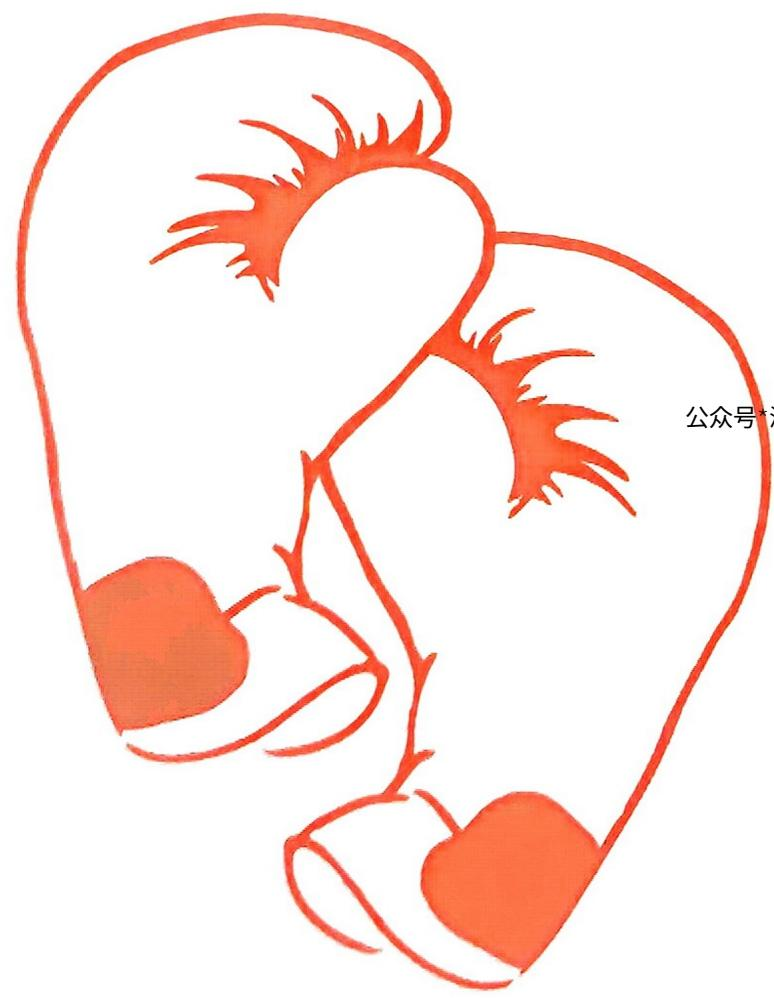

text_image

公众号

新学期立个新目标

公众号\*满满分享库

The image contains no text. The visible element is a graphical element (a blank square) and does not contain any legible characters or symbols. Therefore, the correct OCR output is an empty string.   
The Ground Truth image displays a single, solid horizontal line, which is a stylistic or background element (like a rule line on paper). According to Rule 2, such lines must be ignored by the OCR result. The provided OCR content is "\_\_\_\_", which consists of underscores. Underscores are not equivalent to a solid line and are not permitted under the “Stylistic/Background Lines (Ignore)” rule. Outputting underscores for a stylistic line is incorrect because it misinterprets the line as a placeholder fill-in-the-blank area. Since the OCR output includes underscores for a non-placeholder line, this violates the “Stylistic/Background Lines (Ignore)” rule. Therefore, the OCR result is inconsistent with the Ground Truth.   
The image contains no text.

数学

八年级上册 BS

# ·目录·

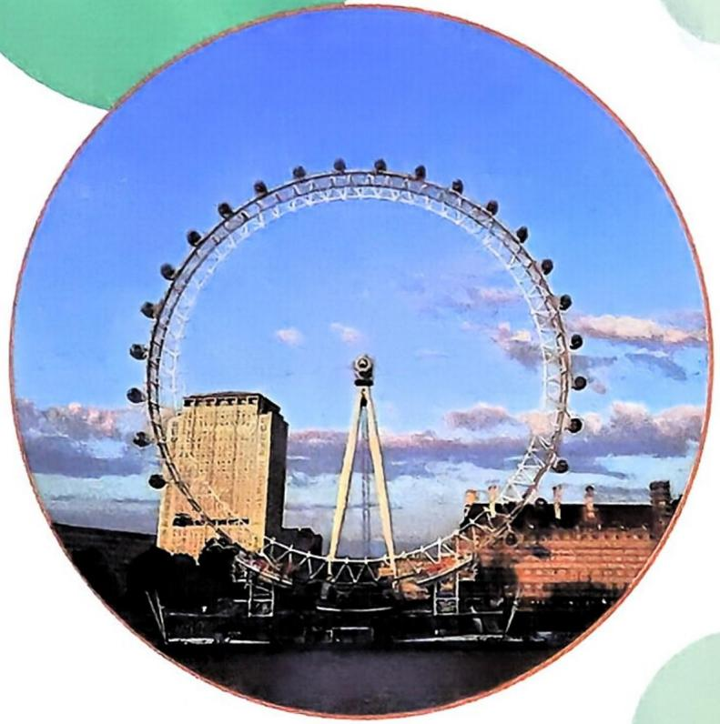

natural_image

Circular photo of the London Fringe with a prominent Ferris wheel and historic building under a blue sky (no text or symbols visible)

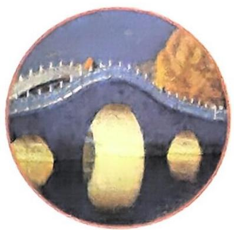

natural_image

Circular image of a traditional Chinese stone bridge over water with golden rock formations (no text or symbols)

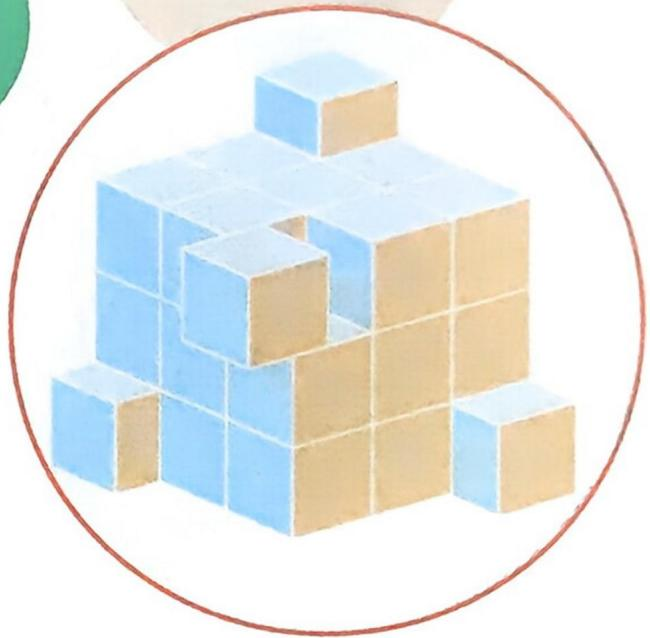

natural_image

Illustration of stacked blue and beige blocks within a circular frame (no text or symbols)

# 第一章 勾股定理 …… 1

1 探索勾股定理 …… 1
公众号\*满满分享库  
2 一定是直角三角形吗 …… 3  
3 勾股定理的应用 …… 5

# 第二章 实数…… 8

1 认识实数 8  
2 平方根与立方根…… 10  
3 二次根式…… 16

# 第三章 位置与坐标 …… 20

1 确定位置…… 20  
2 平面直角坐标系…… 22  
3 轴对称与坐标变化…… 25

# 第四章 一次函数 …… 28

1 函数…… 28  
2 认识一次函数…… 30

3 一次函数的图象…… 31  
4 一次函数的应用…… 35

# 第五章 二元一次方程组 …… 38

1 认识二元一次方程组…… 38  
2 二元一次方程组的解法…… 41  
3 二元一次方程组的应用…… 44  
4 二元一次方程与一次函数…… 48  
5 三元一次方程组 …… 54

# 第六章 数据的分析 …… 56

1 平均数与方差…… 56  
2 中位数与箱线图+  
3 哪个团队收益大…… 60

# 第七章 命题与证明 …… 64

1 认识证明 …… 64  
2 平行线的证明 …… 67

# 第一章 勾股定理

natural_image

Illustration of a person in casual attire kneeling on green background, no text or symbols present

# 1 探索勾股定理

# 知识过关 全理解

公众号\*满满分享库

# 知识点 1 勾股定理 ▶ 注意 1

重点

直角三角形两直角边的①等于②。如果用 $a, b$ 和 $c$ 分别表示直角三角形的两直角边和斜边, 那么③。

如图所示, $\triangle ABC$ 是直角三角形, 其中较短的直角边 $a$ 称为勾, 较长的直角边 $b$ 称为股, 斜边 $c$ 称为弦.

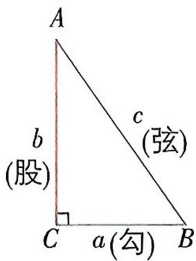

text_image

A
b
(股)
c
(弦)
C
a(勾)
B

# 知识点2 勾股定理的验证

勾股定理的验证主要通过④ 完成,这种方法是以数形转换为指导思想,图形拼补为手段,各部分面积之间的关系为依据来实现的.用两种方式表示图形面积(算两次),根据面积相同得到等量关系,进而进行等量变换得到勾股定理公式是证明勾股定理的常见方法.

# 拼图法验证勾股定理的一般步骤

<table><tr><td rowspan="5">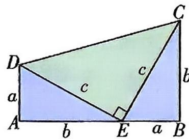</td><td>(1)拼出图形</td><td>直角梯形(3个直角三角形)</td></tr><tr><td>(2)用两种方式表示图形面积</td><td> $\frac{1}{2}(a+b)\times(a+b),\frac{1}{2}ab+$  $\frac{1}{2}c^{2}+\frac{1}{2}ab$ </td></tr><tr><td>(3)根据面积相同得到等量关系</td><td> $\frac{1}{2}(a+b)^{2}=\frac{1}{2}c^{2}+ab$ </td></tr><tr><td>(4)恒等变形</td><td> $a^{2}+b^{2}+2ab=c^{2}+2ab$ </td></tr><tr><td>(5)推导出勾股定理</td><td> $a^{2}+b^{2}=c^{2}$ </td></tr></table>

# 知识点 3 勾股定理的应用 ▶ 注意 2

重难点

利用勾股定理可以解决与直角三角形有关的问题. 主要应用如下:

(1)已知直角三角形的任意两边长,求第三边长;  
(2)已知直角三角形的任意一边长,确定另外两边长的关系;  
(3) 解决包含平方关系的几何问题；  
(4)构造方程计算有关线段的长度问题,解决生产生活中的一些实际问题.

# 敲黑板 划重点

注意 1 应用勾股定理时,要确定哪条边是直角三角形的最长边,也就是斜边.  
拓展 勾股定理有许多变形, 如用 a, b 表示直角边, c 表示斜边, 则有 $a^{2} + b^{2} = c^{2}$ , 还可以变形为 $a^{2} = c^{2} - b^{2}$ , $b^{2} = c^{2} - a^{2}$ .

注意 2 应用勾股定理解决问题时应注意三点：

(1) 应用勾股定理的前提是“在直角三角形中”；  
(2) 应用勾股定理时, 必须分清楚斜边和直角边;   
(3) 若没有直角三角形, 可以通过添加辅助线的方法构造直角三角形, 再利用勾股定理解答, 这样就可以把要求的线段放到直角三角形中解决.

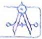

1平方和 2斜边的平方 3 $a^2 + b^2 = c^2$ 4拼图法

# 题型过关 全提升

公众号\*满满分享库

# 题型 1 利用勾股定理求线段的长

例题 1 在 Rt△ABC 中, ∠ACB = 90°, AB = 10 cm, AB 边上的高 CD = 4.8 cm, 则 Rt△ABC 的周长为 ( )

A. $24 \mathrm{~cm}$

B. $30 \mathrm{~cm}$

C. ${18}\mathrm{\;{cm}}$

D. $36 \mathrm{~cm}$

【解析】

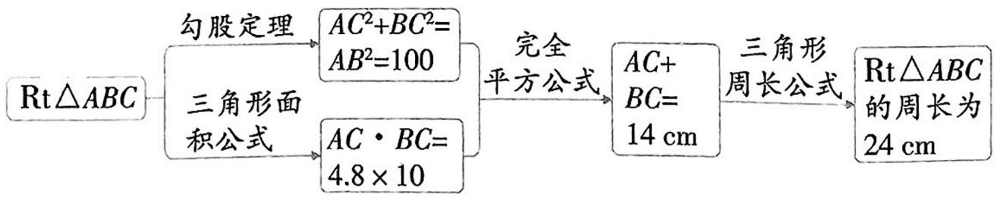

flowchart

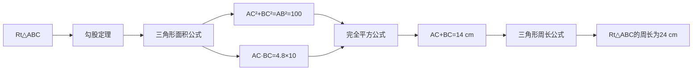

【答案】A

题型 2 利用勾股定理求图形的面积 公众号：豫见清北

例题 2 如图, 在 Rt△ABC 中, ∠ACB=90°. 若 AB=10, 则正方形 ADEC 和正方形 BCFG 的面积和为 ( )

A. 100

B. 120

C. 140

D. 160

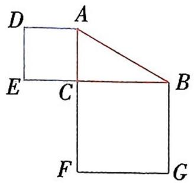

text_image

D
A
E
C
B
F
G

【思路分析】

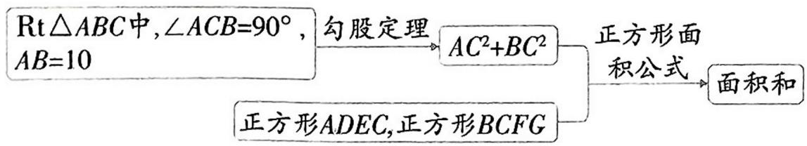

flowchart

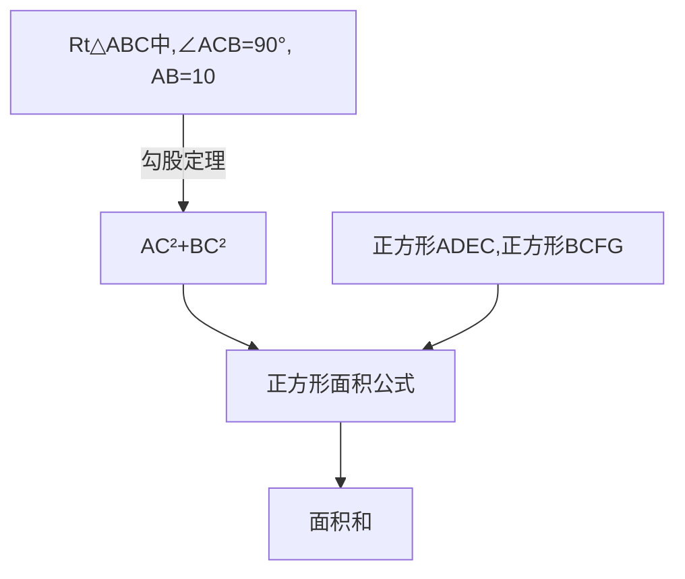

【解析】在 Rt△ACB 中， $AC^{2}+BC^{2}=AB^{2}=100$ ，

则正方形 ADEC 和正方形 BCFG 的面积和是 $AC^{2} + BC^{2} = 100$ .

【答案】A

# 变式练 刷重点

变式练 1 如果直角三角形的三边长分别为 10,6,x,那么最短边上的高为 \_\_\_\_.

答案见本页

变式练 2 如图, Rt△ABC 的周长为 12, 以 AB, AC 为边向外作正方形 ABPQ 和正方形 ACMN. 若这两个正方形的面积之和为 25 , 则 Rt△ABC 的面积是 \_\_\_\_.

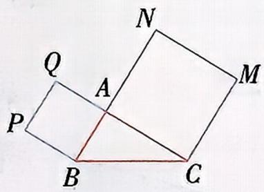

text_image

Q
P
A
N
M
B
C

答案见本页

# 变式练答案

1.8 或 10 【解析】直角三角形的三边长分别为 10,6,x,分两种情况：

①当10为斜边长时,根据勾股定理,得 $6^{2}+x^{2}=10^{2}$ ,即 $x^{2}=64$ ,所以x=8,所以直角三角形的三边长分别为6,8,10,即6为最短边长,则最短边上的高为8;

②当 x 为斜边长时,6 为最短边长,此时最短边上的高为 10. 综上,最短边上的高为 8 或 10.

2.6 【解析】由题意可知 $AB^{2}+AC^{2}=BC^{2}=25$ ，则 BC=5.

因为 Rt△ABC 的周长为 12,

所以 $AB+BC+AC=12$ ，所以 $AB+AC=7$ ，

所以 Rt $\triangle ABC$ 的面积为 $\frac{1}{2}AB \cdot AC = \frac{1}{2}\left\{\left(AB + AC\right)^{2}-\right.$

$$
\left. \left(A B ^ {2} + A C ^ {2}\right) \right] \div 2 \} = \frac {1}{2} \times [ (4 9 - 2 5) \div 2 ] = 6.
$$

# 2 一定是直角三角形吗

公众号\*满满分享库

# 知识过关 全理解

# 知识点1 直角三角形的判别条件

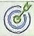

重点

1. 如果三角形的三边长 $a, b, c$ 满足① ,那么这个三角形是直角三角形。(此判别条件也称为勾股定理的逆定理)

2. 判断一个三角形是否为直角三角形的方法▶注意1

<table><tr><td>从角度上判断</td><td>三角形中有一个角是直角,或者三角形中有两个角互余</td></tr><tr><td>从边长上判断</td><td>两条较短边的平方和等于最长边的平方</td></tr></table>

# 知识点 2 勾股数▶方法

1. 勾股数

<table><tr><td>定义</td><td>满足  $a^{2}+b^{2}=c^{2}$  的三个正整数,称为勾股数</td></tr><tr><td>满足条件</td><td>1三个数都是2;2两个较小整数的平方和等于最大整数的平方▶注意2</td></tr><tr><td>拓展</td><td>勾股数的整数倍仍为勾股数,如3,4,5的2倍6,8,10仍为勾股数</td></tr><tr><td>常见形式</td><td>1 $n^{2}-1,2n,n^{2}+1$ (n为大于1的整数);2 $4n,4n^{2}-1,4n^{2}+1$ (n为正整数)等</td></tr></table>

2. 判断勾股数的方法步骤

(1)确定三个数是正整数;▶注意3   
(2)确定出最大数与另外两个较小的数,分别计算最大数的平方与另外两个较小数的平方和;  
(3)进行比较,若最大数的平方等于另外两个较小数的平方和,则是勾股数,否则不是.

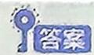

1 $a^{2}+b^{2}=c^{2}$ 2正整数

# 敲黑板 划重点

注意 1 在判断一个三角形是否为直角三角形时, $a^{2}+b^{2}$ 是否等于 $c^{2}$ 需要通过计算说明,不能直接写成 $a^{2}+b^{2}=c^{2}$ .

方法 常见的勾股数

①3,4,5;②5,12,13;③7,24,25;④8,15,17;⑤9,40,41等.

助记口诀：

勾三股四弦五(3,4,5)，

五一二记一生(5,12,13),

八月十五在一起(8,15,17)

注意 2 一组勾股数一定是直角三角形的三条边长,而直角三角形的三条边长不一定是勾股数.

注意 3 勾股数必须都是正整数, 如: 0.3, 0.4, 0.5, 尽管 $0.3^{2} + 0.4^{2} = 0.5^{2}$ 成立, 但它们都是小数, 因此不是勾股数.

# 题型过关 全提升

公众号\*满满分享库

# 题型 1 判断三角形的形状

例题 1 三角形的三边长分别为 a, b, c，由下列条件不能判断它是直角三角形的是 （）

# 变式练 刷重点

变式练 1 用三根长度分别为 $3 \mathrm{~cm}$ , $4 \mathrm{~cm}, 6 \mathrm{~cm}$ 的木棍\_\_\_\_围成一个

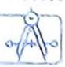

A. $a:b:c = 13:5:12$

B. $a^2 - b^2 = c^2$

$$
\mathrm{C.} a ^ {2} = (b + c) (b - c)
$$

D. $a:b:c = 8:16:17$

【解析】A 选项, 因为 $5^{2} + 12^{2} = 13^{2}$ , 所以能判断它是直角三角形; B 选项, 因为 $a^{2} - b^{2} = c^{2}$ , 所以 $a^{2} = c^{2} + b^{2}$ , 所以能判断它是直角三角形; C 选项, 因为 $a^{2} = (b + c)(b - c)$ , 所以 $a^{2} = b^{2} - c^{2}$ , 即 $a^{2} + c^{2} = b^{2}$ , 所以能判断它是直角三角形; D 选项, 因为 $8^{2} + 16^{2} \neq 17^{2}$ , 所以不能判断它是直角三角形.

【答案】D

# 题型 2 勾股定理及其逆定理的综合应用

例题 2 数学课上,老师拿了一张如图所示的等腰三角形纸片 $A B C$ . 已知底边 $B C = 40 \mathrm{~cm}, D$ 为 $A B$ 上一点,且 $C D = 32 \mathrm{~cm}, B D = 24 \mathrm{~cm}$ .

(1)试判断 $\triangle BCD$ 的形状,并说明理由;

(2)求 ${AB}$ 的长.

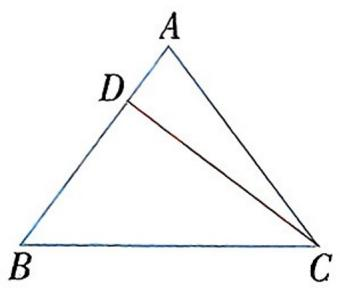

text_image

A
D
B
C

【解】(1) $\triangle BCD$ 为直角三角形. 理由如下: 因为 $40^{2} = 32^{2} + 24^{2}$ , 所以 $BC^{2} = BD^{2} + CD^{2}$ , 故 $\triangle BCD$ 是直角三角形, $\angle BDC = 90^{\circ}$ .

(2) 设 $AB = x \mathrm{~cm}$ , 所以 $AD = AB - BD = (x - 24) \mathrm{~cm}$ .

因为 $AB = AC = x\mathrm{cm},\angle BDC = \angle ADC = 90^{\circ},$

所以 $\triangle ADC$ 是直角三角形，

所以 $AD^{2}+DC^{2}=AC^{2}$ ，所以 $(x-24)^{2}+32^{2}=x^{2}$ ，

解得 $x=\frac{100}{3}$ ，故 $AB=\frac{100}{3}$ cm.

# 变式练 刷重点

直角三角形. (填“能”或“不能”)

答案见本页

变式练 2 如图, $\triangle ABC$ 中, $BC$ 的垂直平分线 $DE$ 分别交 $AB$ , $BC$ 于点 $D$ , $E$ , 且 $BD^{2}-DA^{2}=AC^{2}$ .

(1)试说明: $\angle A=90^{\circ}$ ;

(2) 若 $AB = 8, AD : BD = 3 : 5$ , 求 $AC$ 的长.

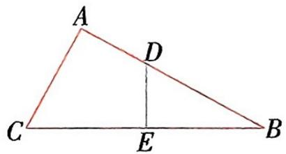

text_image

A
D
C
E
B

答案见本页

# 变式练答案

1. 不能 【解析】因为 $3^{2} + 4^{2} \neq 6^{2}$ , 所以用三根长度分别为 $3 \mathrm{~cm}, 4 \mathrm{~cm}, 6 \mathrm{~cm}$ 的木棍不能围成一个直角三角形. 故答案为不能.

2.【解】(1) 连接 $CD$ , 如图.

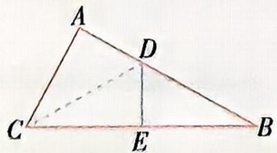

text_image

A
D
C
E
B

因为 BC 的垂直平分线 DE 分别交 AB, BC 于点 D, E, 所以 CD = DB.

因为 $BD^{2}-DA^{2}=AC^{2}$ ,

所以 $CD^{2}-DA^{2}=AC^{2}$ ,

所以 $CD^{2}=AD^{2}+AC^{2}$ ,

所以 $\triangle ACD$ 是直角三角形,且 $\angle A=90^{\circ}$ .

(2) 因为 AB=8, AD:BD=3:5,

所以 AD=3, BD=5,

所以 DC=5，

所以 $AC^{2}=CD^{2}-AD^{2}=25-9=16=4^{2}$

所以 AC = 4.

# 3 勾股定理的应用

# 知识过关 全理解

# 知识点 1 利用勾股定理解决数学问题

1. 两点间的距离问题:作出正确图形,利用勾股定理求边长;  
2. 判定两线段是否垂直: 以已知线段为边构造三角形, 利用三角形三边关系判断是否垂直.

# 知识点 2 利用勾股定理解决实际问题

1. 利用勾股定理解决实际问题的关键在于将实际问题转化为数学问题, 画出几何图形, 结合方程解决.  
2. 常见的利用勾股定理解决实际问题的几种类型

(1)立体图形中的最短路径问题:利用“两点之间,线段最短”将立体图形侧面展开,再构造直角三角形求解;▶对点例

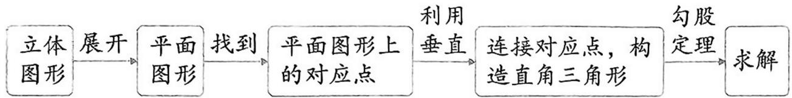

flowchart

(2)最短路程问题:利用轴对称作对称点,构造直角三角形求解;  
(3)航行问题:理解方向角的概念,根据题意作出图形,利用勾股定理解题.

# 敲黑板 划重点

对点例 如图,从 A 点环绕建筑物建梯子,正好到 A 点的正上方 B 点,若要梯子最短,最省材料,则需要将建筑物的侧面展开,得到一个平面图形,沿 $AB'$ 建梯子.

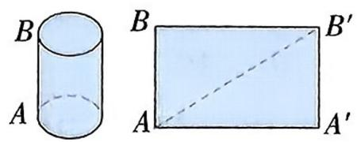

# 题型过关 全提升

# 题型 1 勾股定理在实际问题中的应用

例题 1 如图所示,有两根直杆隔河相对,一杆 $CD$ 高 $30 \mathrm{~m}$ ,另一杆 $AB$ 高 $20 \mathrm{~m}$ ,两杆相距 $50 \mathrm{~m}$ . 现两杆上各有一只鱼鹰,他们同时看到两杆之间的河面上 $E$ 处浮起一条小鱼 ( $B, E, C$ 三点共线),于是它们以同样的速度同时飞下来夺小鱼,结果两只鱼鹰同时到达叼住小鱼. 问:两杆底部与鱼的水平距离各是多少?

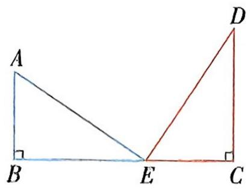

text_image

A
B
E
C
D

【解】由题意可得 $AE = DE$ ，则 $AB^{2} + BE^{2} = EC^{2} + DC^{2}$ ，故 $20^{2} + BE^{2} = (50 - BE)^{2} + 30^{2}$ ，所以 $BE = 30 \mathrm{~m}$ ，则 $EC = 50 - 30 = 20(\mathrm{~m})$ 。

答:两杆底部与鱼的水平距离分别是 $30 \, m$ 和 $20 \, m$ .

# 变式练 刷重点

变式练 1 如图, 已知某学校 A 与直线公路 BD 相距 300 米 (即 AB = 300 米, $AB \perp BD$ ), 且与该公路上一个车站 D 相距 500 米 (即 AD = 500 米), 现要在公路 BD 上建一个超市 C, 使它与学校 A 及车站 D 的距离相等, 那么该超市 C 与车站 D 的距离是多少米?

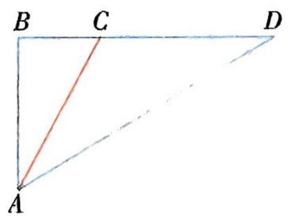

text_image

B C D
A

答案见 P7

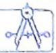

# 题型 2 利用三角形三边关系判断垂直

公众号\*满满分享库

例题 2 如图, 在 $\triangle ABC$ 中, $AC = 21$ , $BC = 13$ , $D$ 是 $AC$ 边上一点, $BD = 12$ , $AD = 16$ .

(1)试说明: $BD \perp AC$ ;   
(2) 若 E 是边 AB 上的动点, 求线段 DE 的最小值.

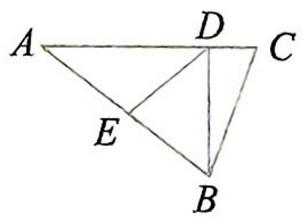

【分析】(1)利用勾股定理的逆定理判断 $\triangle BCD$ 为直角三角形即可.

(2) 在 (1) 基础上, 根据“垂线段最短”解决问题即可.

【解】(1) 因为 AC = 21, AD = 16,

所以 $CD = AC - AD = 5$ .

因为 $BD^{2}+CD^{2}=12^{2}+5^{2}=169=BC^{2}$ ,

所以 $\angle BDC = 90^{\circ}$

所以 ${BD} \bot  {AC}$ .

(2) 当 $DE \perp AB$ 时, $DE$ 最短.

由(1)可得 $\angle BDC=90^{\circ}$ ,

即 $\triangle ABD$ 为直角三角形，

所以 $AB^{2} = AD^{2} + BD^{2} = 400$

所以 AB = 20，

由等面积法可得 $\frac{1}{2} AD \cdot DB = \frac{1}{2} AB \cdot DE$ ,

所以 $DE=\frac{16\times12}{20}=9.6$ ,

所以线段 $DE$ 的最小值为9.6.

# 题型 3 利用勾股定理解决立体图形中的最短路径问题

例题 3 已知某植物绕着树干向上生长,如图,树干的周长为圆柱的底面周长,绕行一周升高的距离为圆柱的高.

(1)若树干的周长为 $30 \mathrm{~cm}$ , 绕行一圈升高 $40 \mathrm{~cm}$ , 则它绕行一圈的长度是多少?  
(2)若树干的周长为 $80 \mathrm{~cm}$ , 绕行一圈的长度是 $100 \mathrm{~cm}$ , 绕 10 圈到达树顶, 则树干高多少米?

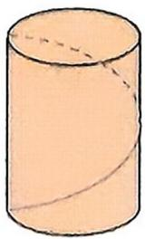

变式练 2 如图, 在由 6 个大小相同的小正方形(小正方形的边长为 1) 组成的方格中, A, B, C 是三个格点(即小正方形的顶点). 判断 AB 与 BC 的关系, 并说明理由.

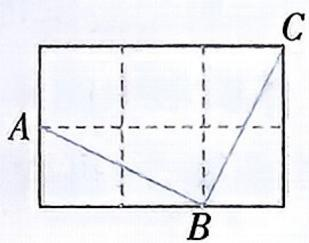

答案见 P7

变式练 3 如图,一只蜘蛛在一块长方体木块的一个顶点 A 处,一只苍蝇在这个长方体的对角顶点 G 处,若 AB=3 cm, BC=5 cm, BF=6 cm,问蜘蛛要沿着怎样的路线爬行,才能最快

# 【思路分析】

(1) 展开圆柱侧面 构造直角三角形 利用勾股定理求长度  
(2) $\boxed{AC}$ 勾股定理 $\boxed{AB}$ 树干高

【解】(1)如图,将圆柱的侧面展开后,该侧面展开图是长方形.

由题意可得 $AC = 30 \, cm, AB = 40 \, cm$ ,

所以 $BC^{2}=AC^{2}+AB^{2}=30^{2}+40^{2}=2500$ ，所以 BC=50 cm.

答:该植物绕行一圈的长度为 $50 \, cm$ .

(2)如图,树干周长为80 cm,即AC=80 cm,

绕行一圈的长度是 $100 \mathrm{~cm}$ , 即 $B C = 100 \mathrm{~cm}$ .

因为 $AB^{2}=BC^{2}-AC^{2}=100^{2}-80^{2}=3600$ ,

所以 AB = 60 cm,

所以树干高为 $60 \times 10 = 600 \, (\text{cm}) = 6 \, \text{m}$ .

答:树干高为 $6 \, m$ .

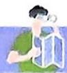

# 变式练 刷重点

抓到苍蝇？这时蜘蛛走过的路程是多少厘米？

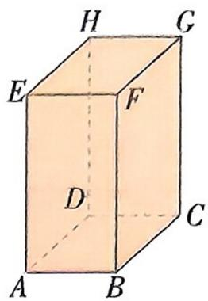

text_image

H
G
E
F
D
C
A
B

答案见本页

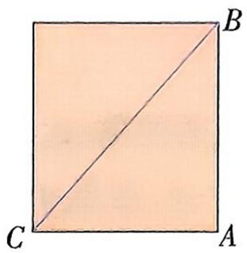

natural_image

Geometric diagram of a square with diagonal AC and point B on top face (no text or labels)

# 变式练答案

1.【解】根据题意得 AC = CD， $\angle ABD = 90^{\circ}$ . 公众号\*满满分享库

在 Rt△ABD 中, 因为 AB = 300 米, AD = 500 米, $BD^{2} = AD^{2} - AB^{2}$ , 所以 BD = 400 米.

设 CD=AC=x 米, 则 $BC=(400-x)$ 米.

在 Rt△ABC 中, $AC^{2}=AB^{2}+BC^{2}$ ,

即 $x^{2}=300^{2}+(400-x)^{2}$ ，解得 x=312.5.

答:该超市 C 与车站 D 的距离是 312.5 米.

2.【解】AB 和 BC 相等且垂直. 理由如下: 如图, 连接 AC, 由勾股定理可得 $AB^{2}=1^{2}+2^{2}=5$ , $BC^{2}=1^{2}+2^{2}=5$ , $AC^{2}=1^{2}+3^{2}=10$ , 所以 $AB^{2}+BC^{2}=AC^{2}$ , 且 AB=BC, 所以 $\triangle ABC$ 是以 $\angle B$ 为直角的直角三角形, 即 $AB\perp BC$ , 且 AB=BC. 所以 AB 和 BC 的关系是相等且垂直.

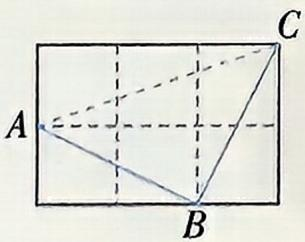

3.【解】有三种方案,如下:

方案一:如图(1),当蜘蛛从A出发经过EF再到点G时,因为BC=5cm,所以FG=BC=5cm,

所以 $BG=5+6=11(\text{cm})$ .

在 Rt△ABG 中， $AG^{2}=AB^{2}+BG^{2}=3^{2}+11^{2}=130.$

方案二:如图(2),当蜘蛛从A出发经过BF再到点G时,因为AB=3cm,BC=5cm,

所以 $AC = AB + BC = 3 + 5 = 8 \, (\text{cm})$ .

因为 BF=6 cm, 所以 CG=BF=6 cm.

在 Rt△ACG 中， $AG^{2}=AC^{2}+CG^{2}=8^{2}+6^{2}=100$

方案三:如图(3),当蜘蛛从A出发经过HE再到点G时,因为AB=3cm,所以EF=AB=3cm.

因为 BC=5 cm, 所以 GF=BC=5 cm.

因为 BF=6 cm, 所以 AE=BF=6 cm,

所以 $AF=6+3=9$ (cm).

在 Rt△AGF 中， $AG^{2}=AF^{2}+GF^{2}=9^{2}+5^{2}=106.$

因为 100<106<130，

所以蜘蛛沿着第二种方案的路线爬行,才能更快抓到苍蝇.这时蜘蛛走过的路程是10 cm.

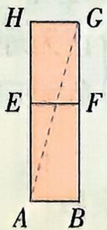  
图(1)

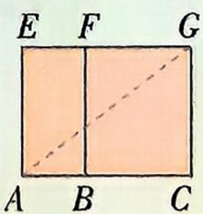  
图(2)

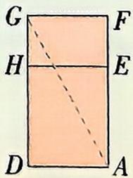  
图(3)

# 第二章 实数

公众号\*满满分享库

natural_image

Illustration of a bearded man kneeling next to a sneaker, with decorative geometric shapes and numbers in the background (no text or symbols on the main subject)

# 1 认识实数

# 知识过关 全理解

# 知识点 1 生活中存在不是有理数的数

① 和 ② 统称有理数.

事实上,我们可以证明存在不是有理数的数. 比如面积为 3 的正方形的边长,设该正方形的边长为 $a$ , 则 $a^{2} = 3$ , 这里 $a$ 既不是整数,也不是分数,也就是说没有一个有理数的平方是 3. ▶图示

# 知识点 2 无理数的概念

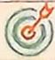

重点

1. 有理数总可以用③或④表示，⑤称为

无理数. 例如:2.2 是有限小数,2.2 是无限循环小数,它们都是有理数; 2.236078954…是无限不循环小数,是无理数. ▶归纳

2. 小数的分类: 小数 $\left\{\begin{array}{l} 有限小数 \\ 无限循环小数 \end{array}\right\}$ 有理数  
无限不循环小数——无理数

3. 常见的无理数的形式

(1)无限不循环小数;(2)化简后含有 $\pi$ 的数, 如 $\pi, \frac{\pi}{2}$ ; (3) $a^n = b$ ( $n$ 为大于 1 的自然数) 中 $b$ 为有理数, 则 $a$ 可能为无理数. ▶ 注意 1

# 知识点 3 实数的概念及分类

公众号：豫见清北

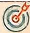

重点

1. 有理数和⑥ 统称为实数. ▶ 注意2

(1) 按定义分类: 实数 $\left\{\begin{array}{l}\text {有理数 } \left\{\frac{7}{\text {分数——有限小数或无限循环小数}}\right. \\ \text {无理数 } \left\{\frac{\text {正无理数}}{\text {负无理数}}\right\} \text {无限不循环小数}\end{array}\right.$ (2) 按性质符号分类: 实数 $\left\{\begin{array}{l}\text {正实数 } \left\{\frac{8}{\text {正无理数}}\right.\left\{\begin{array}{l}\text {正整数}\\ \text {正分数}\end{array}\right.\\ \text {0}\end{array}\right.$ $\left\{\begin{array}{l}\text {负有理数 } \left\{\begin{array}{l}\text {负整数}\\ \text {负分数}\end{array}\right.\\ \text {负无理数}\end{array}\right.$

# 敲黑板 划重点

图示

边长为 $a$ ，面积为3的正方形

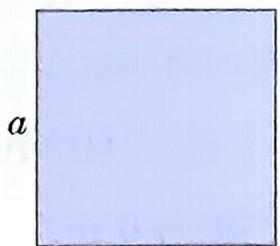

归纳 可以写成分数形式的数是有理数,不能写成分数形式的数是无理数.

# 注意 1 无理数的特征

(1) 无理数的小数部分位数无限；  
(2) 无理数的小数部分不循环，不能表示成分数的形式。

注意 2 (1)0 既不是正数也不是负数.
(2) 对实数进行分类时, 可以有不同的方法, 但要按同一标准, 做到不重不漏.

2. 在实数范围内,相反数、倒数、绝对值的意义与有理数范围内的相反数、倒数、绝对值的意义10 . 拓展 1

(1)相反数:a 的相反数是11.

注意3

(2) 绝对值: $|a| = \begin{cases} a (a > 0), \\ 0 (a = 0), \\ -a (a < 0). \end{cases}$

(3) 倒数: $a$ 的倒数是 $\boxed{12}$ ( $a \neq 0$ ), 如 $2$ 与 $\frac{1}{2}$ 互为倒数. ▶ 注意 4

# 知识点4 实数与数轴的关系

公众号\*满满分享库

难点

每一个实数都可以用数轴上的一个点表示;反过来,数轴上的每一个点都表示一个实数. 也就是说,13 和数轴上的点是一一对应的. ▶拓展2

# 答案

①整数 ②分数 ③有限小数 ④无限循环小数 ⑤无限不循环小数 ⑥无理数 ⑦整数 ⑧正有理数 ⑨负实数 ⑩完全一样 11-a 12 $\frac{1}{a}$ 13实数

# 题型过关 全提升

# 题型 方格中的无理数

例题 如图,正方形网格中,每个小正方形的边长为1, $\bigtriangleup  {ABC}$ 的顶点在格点(小正方形的顶点)上,则 $\bigtriangleup  {ABC}$ 中,边长是无理数的边有\_\_\_\_条.

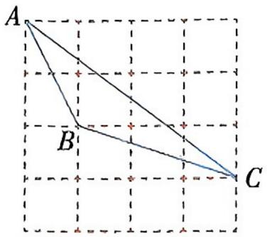

text_image

A
B
C

【解析】由题图可知, $AB^{2}=5,BC^{2}=10,AC^{2}=25$ ,所以 $\triangle ABC$ 中,边长是无理数的边有2条.故答案为2.

【答案】2

拓展 1 (1) a 与 b 互为相反数 $\Leftrightarrow a+$ b=0;

(2) a 与 b 互为倒数 $\Leftrightarrow ab = 1$ ;  
(3) $|a| \geqslant 0;$   
(4) 互为相反数的两个数的绝对值相等, 即 $\left|a\right| = \left|-a\right|$ ;   
(5) 正数的倒数是正数, 负数的倒数是负数, 零没有倒数.

注意 3 求一个数的相反数的方法在这个数的前面加“-”，再进行相应化简.

注意 4 运用实数的性质解决问题时,要类比有理数相关的知识.例如求一个数的倒数,结果要化成最简形式;求一个数的绝对值,要先判断其正负.

拓展 2 实数与有理数的不同

数轴上的点与实数是一一对应的,而与有理数就不是一一对应的. 实数包括有理数.

# 变式练 刷重点

变式练 如图, 在 $5 \times 5$ 的正方形网格中, 每个小正方形的边长均为 1, 以 AB 为边画直角三角形 ABC, 使点 C 在格点上, 且另外两条边长均为无理数, 满足这样的点 C 共有 \_\_\_\_ 个.

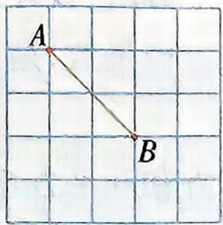

答案见本页

# 型式练答案

4 【解析】如图,根据题意可得以 AB 为边画直角三角形 ABC,使点 C 在格点上,且另外两条边长均为无理数,满足这样条件的点 C 共有 4 个.故答案为 4.

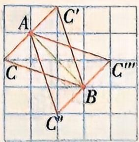

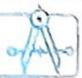

# 2 平方根与立方根

公众号\*满满分享库

# 知识过关 全理解

# 知识点1 算术平方根和平方根的区别与联系

注意

重点

<table><tr><td colspan="2"></td><td>算术平方根</td><td>平方根</td></tr><tr><td rowspan="4">区别</td><td>定义</td><td>一般地,如果一个正数x的平方等于a,即 $x^{2} = a$ ,那么这个正数x就叫作a的算术平方根</td><td>一般地,如果一个数x的平方等于a,即 $x^{2} = a$ ,那么这个数x就叫作a的平方根(也叫作二次方根)▶说明1</td></tr><tr><td>个数</td><td>一个正数只有一个算术平方根</td><td>一个正数有两个平方根,它们互为相反数;负数没有平方根▶注意2</td></tr><tr><td>表示方法</td><td>正数a的算术平方根为 $\sqrt{a}$ </td><td>正数a的平方根表示为 $\pm\sqrt{a}$ </td></tr><tr><td>取值范围</td><td> $\sqrt{a}$ 具有双重非负性,即 $\sqrt{a} \geqslant 0,a \geqslant 0$ </td><td>a的平方根可正可负,也可为0</td></tr><tr><td rowspan="2">二者联系</td><td>联系</td><td colspan="2">平方根包含了算术平方根,算术平方根是平方根中正的那个 公众号:豫见清北</td></tr><tr><td>关于0</td><td colspan="2">0的算术平方根和平方根都是0</td></tr></table>

# 知识点2 开平方

公众号\*满满分享库

1. 求一个数 a 的平方根的运算, 叫作开平方, a 叫作①.

▶ 对点例

2. 开平方和平方根的区别与联系

(1)开平方时,被开方数a必须是非负数.  
(2) 平方根是数, 是开平方的结果; 开平方是一种运算, 是求平方根的过程.  
(3) 平方和开平方互为逆运算, 可以用平方运算来检验开平方的结果是否正确.

# 知识点3 $\sqrt{a^2}$ 与 $(\sqrt{a})^2$ 的性质▶注意3

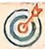

重点

<table><tr><td>形式</td><td>性质</td><td>示例</td></tr><tr><td> $\sqrt{a^2}$ </td><td> $\sqrt{a^2} = |a| = \begin{cases} \boxed{2} & (a \geqslant 0), \\ \boxed{3} & (a < 0) \end{cases}$ </td><td> $\sqrt{6^2} = |6| = 6,$  $\sqrt{(-6)^2} = |-6| = 6$ </td></tr><tr><td> $(\sqrt{a})^2$ </td><td> $(\sqrt{a})^2 = a (a \geqslant 0)$ </td><td> $(\sqrt{6})^2 = 6$ </td></tr></table>

# 敲黑板 划重点

注意 1 (1) 负数没有算术平方根, 即当 $\sqrt{a}$ 有意义时, $a$ 一定表示一个非负数;

(2) 如果一个负数的平方等于 $a$ , 那么 $a$ 的算术平方根是这个数的相反数; (3) 算术平方根等于它本身的数只有 0 和 1.

说明 13 和 -3 的平方都等于 9, 那么 3 和 -3 都是 9 的平方根, 它们互为相反数. 平方根是它本身的数只有 0.

注意 2 因为正数、0、负数的平方都不是负数,所以负数没有平方根.

对点例 求下列各数的平方根.

(1)64;

(2) $\left(-\frac{2}{3}\right)^{2}$ .

【解】(1)±√64=±8.

(2) $\pm \sqrt{\left(-\frac{2}{3}\right)^{2}} = \pm \sqrt{\frac{4}{9}} = \pm \frac{2}{3}.$

注意3 运用 $\sqrt{a^{2}} = |a|$ 化简时, 一定要先判断出 a 的符号.

# 知识点 4 立方根

# 1. 概念及表示

一般地, 如果一个数 $x$ 的立方等于 $a$ , 即 $x^{3} = a$ , 那么这个数 $x$ 就叫作 $a$ 的 4 (也叫作三次方根), 记作 $\sqrt[3]{a}$ , 读作“三次根号 $a$ ”, 其中 $a$ 叫作被开方数, 3 叫作根指数. 如: 2 是 8 的立方根, 即 $\sqrt[3]{8} = 2; -\frac{2}{3}$ 是 $-\frac{8}{27}$ 的立方根, 即 $\sqrt[3]{-\frac{8}{27}} = -\frac{2}{3}; 0$ 是 0 的立方根. ▶ 注意 4

# 2. 性质

(1)每个数都有⑤\_\_\_\_个立方根.

(2)正数的立方根是⑥\_\_\_\_,0的立方根是0,负数的立方根是⑦\_\_\_\_.

# 知识点 5 开立方 ▶ 注意 5

1. 求一个数 a 的立方根的运算叫作开立方, a 叫作⑧. ▶ 说明 2

2. 开平方和开立方的区别

<table><tr><td></td><td>开平方</td><td>开立方</td></tr><tr><td>运算符号</td><td>±√</td><td>3√</td></tr><tr><td>被开方数</td><td>非负数</td><td>任意数</td></tr><tr><td>个数</td><td>0的平方根只有一个;一个正数的平方根有两个;负数没有平方根</td><td>任意数的立方根都只有一个</td></tr></table>

# 知识点 6 用估算法确定无理数的大小

对于带根号的无理数的近似值的求解,可以通过平方运算或立方运算采用夹逼法(即两边无限逼近的方法)逐级夹逼,首先确定其整数部分,再确定十分位、百分位等小数部分. 公众号\*满满分享库

例如:估算 $\sqrt{7}$ 的近似值.(精确到0.01)▶说明3

【解】因为 $2^{2} = 4,3^{2} = 9$ ，所以 $2 < \sqrt{7} < 3.$

因为 $2.6^{2}=6.76,2.7^{2}=7.29$ ，所以 $2.6<\sqrt{7}<2.7$ 。

因为 $2.64^{2}=6.9696,2.65^{2}=7.0225$ ，所以 $2.64<\sqrt{7}<2.65$ .

因为 $2.645^{2} = 6.996025, 2.646^{2} = 7.001316$ , 所以 $2.645 < \sqrt{7} < 2.646$ .

因为精确到 0.01, 所以 $\sqrt{7} \approx 2.65$ .

# 知识点7 用估算法比较数的大小

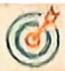

重点

1. 用估算法比较两个数的大小, 通常先通过分析, 估算出无理数的
⑨ , 再进行具体比较. ▶ 方法

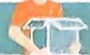

# 敲黑板 划重点

注意4 判断一个数 $x$ 是不是 $a$ 的立方根, 只需检验 $x^3$ 是否等于 $a$ 即可. 如: 当 $x^3 = 7$ 时, $x$ 是 7 的立方根, 即 $x = \sqrt[3]{7}; 2^3 = 8, 2$ 是 8 的立方根, 即 $2 = \sqrt[3]{8}$ . 根指数 3 不可省略.

注意 5 $(\sqrt[3]{a})^3 = a, \sqrt[3]{a^3} = a.$ 如： $\sqrt[3]{-8} = \sqrt[3]{(-2)^3} = -2, (\sqrt[3]{9})^3 = 9.$

说明 2 开立方与立方互为逆运算,正如开平方与平方互为逆运算一样,在开立方时,往往通过立方运算去验证.

说明 3 解决此类问题的关键是依据平方根、立方根及开平方、开立方的定义,采取两边夹逼的方法求解.

方法 一个带根号的正无理数与一个正有理数比较大小

将正有理数乘方后与正无理数的被开方数进行比较,从而比较出它们的大小;还可以通过估算它们的近似值来比较它们的大小.

# 2. 比较两个无理数大小的方法▶拓展

<table><tr><td>估算法</td><td>估算出所给无理数的近似值,再比较大小</td></tr><tr><td>作差法</td><td>若 $\sqrt{a}-\sqrt{b}>0$ ,则 $\sqrt{a}>\sqrt{b}$ ;若 $\sqrt{a}-\sqrt{b}<0$ ,则 $\sqrt{a}<\sqrt{b}$ </td></tr><tr><td>乘方法</td><td>把含相同根号的两个无理数同时乘方,比较乘方后的数的大小,同时考虑符号确定大小</td></tr><tr><td>移动因式法</td><td>运用逆向思维把根号外的正因式移到根号内比较大小(第3节会讲到)</td></tr><tr><td>放缩法</td><td>将其中一个数(或两个数)放大或缩小,再比较,如扩大10倍等</td></tr><tr><td>作商法</td><td>将两数作商,作商后的结果与1(或-1)比较,同时考虑符号确定大小</td></tr><tr><td>倒数法</td><td>将两数分别取倒数,通过比较倒数大小确定原数大小关系</td></tr></table>

# 知识点8 用计算器进行开方运算▶注意6

计算器型号不同,按键顺序就不同,使用计算器进行开方运算之前,要仔细阅读计算器的使用说明书.

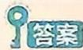

①被开方数

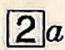

3-a

④立方根

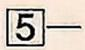

6正数

⑦负数

8被开方数

⑨大致范围

# 敲黑板 划重点

拓展 当两个带根号的无理数比较大小时可应用如下结论：

(1) $a > b \geqslant 0 \Leftrightarrow \sqrt{a} > \sqrt{b}$ ;   
(2) $a > b \Leftrightarrow \sqrt[3]{a} > \sqrt[3]{b}$ .

注意 6 根据要求对结果取近似值.

# 题型过关 全提升

# 题型 1 利用平方根的定义解方程

例题1 求下列各式中 $x$ 的值.

(1) $9x^{2}-25=0;$

(2) $2(x+1)^{2}-32=0.$

【分析】直接利用平方根的定义计算得出答案.

【解】(1) 因为 $9x^{2}-25=0$ ，所以 $x^{2}=\frac{25}{9}$ ，所以 $x=\pm\frac{5}{3}$ .

(2) 因为 $2(x + 1)^{2} - 32 = 0$ , 所以 $(x + 1)^{2} = 16$ , 所以 $x + 1 = \pm 4$ , 解得 $x = 3$ 或 -5.

# 题型 2 算术平方根的实际应用

利用算术平方根解决实际问题时,要注意根据实际意义进行取舍.

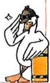

例题2 小明打算用一块面积为 $900 \mathrm{~cm}^{2}$ 的正方形木板, 沿着边的方向裁出一个面积为 $588 \mathrm{~cm}^{2}$ 的长方形桌面, 并且该长方形的长、宽之比

# 变式练 刷重点

变式练1 求下列各式中 x 的值.

(1) $5x^{2}-4=11$ ;   
(2) $(x-1)^{2}=9.$

答案见 P15

变式练 2 小明同学每次回家进入电梯时, 总能看见物业在电梯内张贴的提示“高空抛物, 害人害己, 严禁高空抛物”. 为进一步探究高空抛物的危害, 小明请教了物理老师, 得知高空抛物下落的时间 t (单位: 秒) 和高度 h (单位: 米) 近似满足公式 $h = \frac{1}{2} g t^{2}$ , 其

为 4:3,你认为能做到吗? 如果能,计算出桌面的长和宽;如果不能,请说明理由.

【解】能做到. 设桌面的长和宽分别为 $4x \mathrm{~cm}$ 和 $3x \mathrm{~cm}$ .

根据题意, 得 $4x \times 3x = 588, 12x^{2} = 588, x^{2} = 49.$

又因为 $x > 0$ ，所以 $x = \sqrt{49} = 7$ ，所以 $4x = 4\times 7 = 28,3x = 3\times 7 = 21.$

因为面积为 $900 \, cm^{2}$ 的正方形木板的边长为 $30 \, cm$ ，且 $28 \, cm < 30 \, cm$ ，所以能够裁出一个面积为 $588 \, cm^{2}$ ，并且长、宽之比为 4:3 的长方形桌面，桌面的长和宽分别为 $28 \, cm$ 和 $21 \, cm$ 。

# 题型 3 利用算术平方根的非负性求未知数的值

例题 3 已知 a, b, c 满足 $\sqrt{b-5} + |a-\sqrt{8}| + (c-\sqrt{11})^{2} = 0$ ，求 a, b, c 的值.

【思路分析】

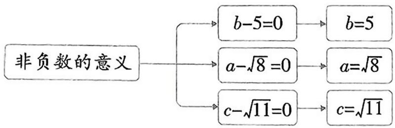

flowchart

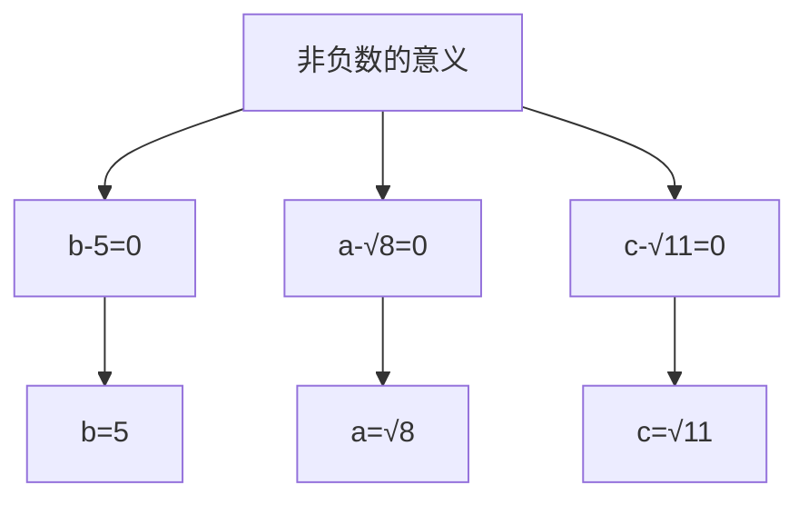

【解】因为 $\sqrt{b - 5} \geqslant 0, |a - \sqrt{8}| \geqslant 0, (c - \sqrt{11})^2 \geqslant 0$ 且 $\sqrt{b - 5} + |a - \sqrt{8}| + (c - \sqrt{11})^2 = 0$ , 所以 $b - 5 = 0, a - \sqrt{8} = 0, c - \sqrt{11} = 0$ , 解得 $a = \sqrt{8}, b = 5, c = \sqrt{11}$ .

# 题型 4 开立方运算

开立方运算是立方根的概念和性质的应用,是历年中考出现次数较多的知识点.

例题 4 求下列式子中 x 的值.

(1) $3x^{3}=-81$ ;

(2) $(x + 1)^{3} - 27 = 0$ .

【分析】(2)先变形得到 $(x+1)^{3}=27$ ,再把 $x+1$ 看作一个整体,然后根据立方根的定义求解.

【解】(1)系数化为1,得 $x^{3}=-27$ .开立方,得x=-3.

(2) $(x+1)^{3}-27=0,(x+1)^{3}=27$ ,开立方,得 $x+1=3$ ,所以x=2.

# 题型 5 平方根和立方根的综合应用

综合应用平方根和立方根, 主要是应用平方根和立方根的定义和性质.

例题5 正数 $x$ 的两个平方根分别为 $3 - a$ 和 $2a + 7$ .

(1) 求 $a$ 的值;  
(2) 求 44-x 的立方根.

【思路分析】

互为
一个正数有两个平方根 相反数 → 相加为0 → 求a → 求x → 求44-x的立方根

# 变式练 刷重点

中 g 为重力加速度, $g \approx 10$ 米/平方秒. 物体落地时产生的动能 = 物体质量 × 重力加速度 × 高度, 动能的单位名称为焦耳, 例如: 一个 1 千克重的花盆从 30 米高空坠落到地面产生的动能为 $1 \times 10 \times 30 = 300$ (焦耳).

(1)一个物品从80米的高空坠落到地面需要几秒?  
(2)一个0.5千克的物品坠落到地面产生了100焦耳的动能,请推算该物品坠落到地面用了几秒.

答案见 P15

变式练 3 已知 a, b, c 满足 $(a - \sqrt{10})^{2} + \sqrt{b-3} + |c - \sqrt{19}| = 0$ ，则长为 a, b, c 的三边能否构成直角三角形？

答案见 P1

变式练4 求下列式子中 $x$ 的值.

(1) $8(x+1)^{3}=125$ ;   
(2) $(3x + 2)^{3} - 1 = \frac{61}{64}$ .

答案见 P15

变式练 5 已知 $2a - 1$ 的算术平方根是 $3, 3a + b + 4$ 的立方根是 2, 求 $3a + b$ 的平方根.

答案见 P15

【解】(1) 因为正数 $x$ 的两个平方根是 $3 - a$ 和 $2a + 7$ , 所以 $(3 - a) + (2a + 7) = 0$ , 解得 $a = -10$ .

(2) 因为 $a = -10$ , 所以 $3 - a = 13, 2a + 7 = -13$ , 所以这个正数的两个平方根是 $\pm 13$ , 所以这个正数是 169, 所以 $44 - x = 44 - 169 = -125, -125$ 的立方根是 -5, 即 $44 - x$ 的立方根为 -5.

# 题型 6 立方根在实际生活中的应用

例题 6 老师让每名同学做一个正方体盒子, 做好后, 小明对小强说: “我做的盒子表面积是 $96 \mathrm{~cm}^{2}$ , 你的呢?” 小强低头想了一下说: “先不告诉你, 我做的盒子比你的盒子体积大 $665 \mathrm{~cm}^{3}$ , 你能算出它的表面积吗?” 小明思考了一会儿, 顺利地得出了答案, 你知道是多少吗?

【思路分析】

flowchart

【解】小明做的正方体盒子每个面的面积为 $96 \div 6 = 16 \, (\text{cm}^{2})$ ，棱长为 $\sqrt{16} = 4 \, (\text{cm})$ ，体积为 $4 \times 4 \times 4 = 64 \, (\text{cm}^{3})$ ，则小强做的正方体盒子的体积为 $64 + 665 = 729 \, (\text{cm}^{3})$ ，棱长为 $\sqrt[3]{729} = 9 \, (\text{cm})$ ，表面积为 $9 \times 9 \times 6 = 486 \, (\text{cm}^{2})$ 。

答:小强做的正方体盒子的表面积是 $486 \mathrm{~cm}^{2}$ .

# 题型 7 估算无理数的大小 公众号：豫见清北

例题 7 若 $x = \sqrt{37} - 4$ , 则 $x$ 的取值范围是 ( )

A. $2 < x < 3$

B. $3 < x < 4$

C. $4 < x < 5$

D. $5 < x < 6$

【解析】因为 $36 < 37 < 49$ , 所以 $6 < \sqrt{37} < 7$ , 所以 $2 < \sqrt{37} - 4 < 3$ , 故 $x$ 的取值范围是 $2 < x < 3$ . 故选 A.

【答案】A

# 题型8 估算的实际应用

例题 8 已知一灯塔 A 周围 2000 m 水域内有礁石, 一舰艇由西向东航行, 在 O 处测得 OA = 4000 m, 如图所示. 若舰艇到达距离灯塔最近处 B 还需航行 3500 m, 问舰艇一直向东前进有无触礁的危险?

text_image

北
东
A
O
B

# 变式练 刷重点

变式练 6 某地气象资料表明: 当地雷雨持续的时间 $t(\mathrm{h})$ 可以用公式 $t^{2}=\frac{d^{3}}{900}$ 来估计, 其中 $d(\mathrm{km})$ 是雷雨区域的直径.

(1) 如果某场雷雨区域的直径是 $10 \mathrm{~km}$ , 那么这场雷雨大约能持续多长时间? (结果保留根号)  
(2) 如果这场雷雨持续了 20 min, 那么这场雷雨区域的直径大约是多少? (结果精确到 0.1 km, 参考数据: $\sqrt[3]{100} \approx 4.64$ )

答案见 P15

变式练7 某省文化旅游管理部门统计本省年度旅游数据,得出本省去年全年共接待国内游客4.25亿人次,旅游收入达3120.2亿元,其中与4.25最接近的数是()

A. $\sqrt{17}$

B. $\sqrt{18}$

C. $\sqrt{19}$

D. $\sqrt{20}$

答案见 P15

变式练8 如图,为了加固一个高2米、宽3米的大门,需在相对角的顶点间加一根木条,则木条的长度为(精确到0.1米,用估算法)()

# 【思路分析】

Rt△AOB 勾股定理 求AB 判断 有无触礁危险

【解】因为 $OA = 4000\mathrm{m},OB = 3500\mathrm{m}$

所以 $AB=\sqrt{OA^{2}-OB^{2}}=\sqrt{3\ 750\ 000}\approx1\ 936.5(\mathrm{~m})$ .

因为 1936.5<2000,

所以舰艇一直向东前进有触礁的危险.

# 题型9 利用计算器比较大小

例题9 用计算器比较 $\frac{\sqrt{5} - 1}{2}$ 与 $\sqrt[3]{0.23}$ 的大小.

【解】 $\frac{\sqrt{5} - 1}{2}\approx 0.618,\sqrt[3]{0.23}\approx 0.613.$

因为 0.618 > 0.613，

所以 $\frac{\sqrt{5} - 1}{2} >\sqrt[3]{0.23}$

# 变式练 刷重点

natural_image

Simple geometric diagram with diagonal lines and vertical bars (no text or symbols)

A. 3.5 米

B. 3.6 米

C. 3.7 米

D. 3.8 米

答案见本页

变式练 9 利用计算器比较下列各组数的大小：

(1) $\sqrt{18}$ 与 $\sqrt[3]{35}$ ;

(2) $\frac{8}{13}$ 与 $\frac{\sqrt{6}-1}{2}$ .

答案见本页

# 变式练答案

1.【解】(1) 因为 $5x^{2}-4=11$ ，所以 $5x^{2}=15$ ，所以 $x^{2}=3$ ，所以 $x=\pm\sqrt{3}$ .

(2) 因为 $(x-1)^{2}=9$ ，所以 $x-1=\pm3$ ，所以 x=4 或 -2。

2.【解】(1)把 h=80 代入 $h=\frac{1}{2}gt^{2}$ ，得 $80=\frac{1}{2}\times10t^{2}$ ，
解得 t=4 (负值已舍去).

答:一个物品从80米的高空坠落到地面需要4秒.

(2)根据题意,得 $\frac{100}{0.5\times10}=20$ （米）,把h=20代入 $h=\frac{1}{2}gt^{2}$ ,得 $20=\frac{1}{2}\times10t^{2}$ ,解得 $t=2$ （负值已舍去）.

答:该物品坠落到地面用了2秒.

3.【解】根据题意,得 $a-\sqrt{10}=0, b-3=0, c-\sqrt{19}=0$ , 解得 $a=\sqrt{10}, b=3, c=\sqrt{19}$ . 因为 $(\sqrt{10})^{2}+3^{2}=19=(\sqrt{19})^{2}$ , 所以 $a^{2}+b^{2}=c^{2}$ , 所以长为 a, b, c 的三边能构成直角三角形.

4.【解】(1) $8(x+1)^{3}=125$ ，则 $(x+1)^{3}=\frac{125}{8}$

开立方, 得 $x+1=\frac{5}{2}$ , 所以 $x=\frac{3}{2}$ .

(2) 因为 $(3x + 2)^{3} - 1 = \frac{61}{64}$ , 所以 $(3x + 2)^{3} = \frac{61}{64} + 1$ ,

所以 $(3x+2)^{3}=\frac{125}{64}$ ，开立方，得 $3x+2=\frac{5}{4}$ ，所以 $x=-\frac{1}{4}$ .

5.【解】因为 $2a - 1$ 的算术平方根是 $3,3a + b + 4$ 的立方根是 $\frac{1}{2}$ 所以 $2a - 1 = 9,3a + b + 4 = 8$ , 所以 $a = 5$ , 将 $a = 5$ 代入 $3a + b + 4 = 8$ , 得 $b = -11$ , 所以 $3a + b = 4$ , 所以 $3a + b$ 的平方根是 $\pm 2$ .

6.【解】(1) 将 $d = 10$ 代入 $t^2 = \frac{d^3}{900}$ , 得 $t^2 = \frac{10^3}{900}$

解得 $t=\frac{\sqrt{10}}{3}$ (负值已舍去).

答:这场雷雨大约能持续 $\frac{\sqrt{10}}{3}$ h.

(2) $20\mathrm{min} = \frac{1}{3}\mathrm{h}$ , 将 $t = \frac{1}{3}$ 代入 $t^2 = \frac{d^3}{900}$ , 得 $\left(\frac{1}{3}\right)^2 = \frac{d^3}{900}$ ,

所以 $d=\sqrt[3]{100}\approx4.64\approx4.6.$

答:这场雷雨区域的直径大约是4.6 km.

7. B 【解析】因为 $4.25^{2}=18.0625$ ，所以与 4.25 最接近的数是 $\sqrt{18}$ 。故选 B.

8. B 【解析】木条的长度为 $\sqrt{2^{2}+3^{2}}=\sqrt{13}$ (米). 因为 $3.5^{2}=12.25, 3.6^{2}=12.96, 3.7^{2}=13.69, 3.8^{2}=14.44$ , 所以 $\sqrt{13}$ 米 $\approx3.6$ 米. 故选 B.

9.【解】(1) $\sqrt{18} \approx 4.24, \sqrt[3]{35} \approx 3.27$ . 因为 $4.24 > 3.27$ , 所以 $\sqrt{18} > \sqrt[3]{35}$ .

(2) $\frac{8}{13}\approx0.615,\frac{\sqrt{6}-1}{2}\approx0.725.$

因为 0.615 < 0.725，所以 $\frac{8}{13} < \frac{\sqrt{6} - 1}{2}$ .

# 3 二次根式

# 知识过关 全理解

# 知识点1 二次根式的概念

重点

1. 一般地, 形如 $\sqrt{a} (a \geqslant 0)$ 的式子叫作二次根式, $a$ 叫作 [1].

注意1

2. 对二次根式概念的理解应注意以下五点

(1)二次根式 $\sqrt{a}$ 中,被开方数 $a\geqslant0$ ;  
(2)二次根式 $\sqrt{a}$ 中,根指数是2,可以省略不写;  
(3)二次根式 $\sqrt{a}$ 中,a可以是一个数,也可以是含字母的代数式;  
(4)二次根式 $\sqrt{a}(a\geqslant0)$ 是a的算术平方根,所以 $\sqrt{a}\geqslant0;$   
(5)形如 $b\sqrt{a}(a \geqslant 0)$ 的式子都是二次根式, b 与 $\sqrt{a}$ 是相乘关系, 要注意当 b 是分数时不能写成带分数. ▶说明

# 知识点 2 二次根式的乘法法则和除法法则

1. 二次根式的乘法法则▶点拨

一般地,有 $\sqrt{a} \cdot \sqrt{b} = 2$ (a≥0,b≥0). 这就是说,两个算术平方根的积,等于它们被开方数的积的算术平方根,例如 $\sqrt{\frac{1}{3}} \times \sqrt{27} = \sqrt{\frac{1}{3} \times 27} = \sqrt{9} = 3$ . ▶注意2

2. 二次根式的乘法法则的拓展

(1)二次根式的乘法法则可以推广到多个二次根式相乘的运算中,即 $\sqrt{a} \cdot \sqrt{b} \cdot \sqrt{c} = 3 (a \geqslant 0, b \geqslant 0, c \geqslant 0).$   
(2)当二次根式前面有系数时,类比单项式乘法,将根号前系数相乘,作为积的系数,即 $m\sqrt{a} \cdot n\sqrt{b} = 4$ (a≥0,b≥0).

3. 二次根式的除法法则

一般地,有 $\frac{\sqrt{a}}{\sqrt{b}}=\boxed{5}$ (a≥0,b>0). 这就是说,两个算术平方根的商,等于它们被开方数的商的算术平方根,例如 $\sqrt{48}\div\sqrt{3}=\sqrt{\frac{48}{3}}=\sqrt{16}=$

4. ▶ 注意 3

# 敲黑板 划重点

注意 1 判断一个式子是不是二次根式的关键

(1) 根指数是否为 2;  
(2) 被开方数是否大于或等于 0.

说明 如 $\frac{8}{3}\sqrt{2}$ 也可写成 $\frac{8\sqrt{2}}{3}$ , 而不能写成 $2\frac{2}{3}\sqrt{2}$ .

点拨 二次根式相乘, 根指数不变, 被开方数相乘.

注意2 运用二次根式的乘法法则时,一定要确保 $\sqrt{a}\cdot\sqrt{b}=\sqrt{ab}(a\geqslant0,b\geqslant0)$ 中被开方数a,b是非负数.

注意3 二次根式除法运算易错点
除保证二次根式有意义外,还应满足
分母不为0.

# 4. 二次根式的除法法则的拓展

二次根式的除法法则可以推广到多个二次根式相除的运算中, 即 $\sqrt{a} \div \sqrt{b} \div \sqrt{c} = \sqrt{a \div b \div c} (a \geqslant 0, b > 0, c > 0)$ .

# 知识点 3 积与商的算术平方根 ▶ 注意 4

重点

<table><tr><td>名称</td><td>性质</td><td>文字叙述</td><td>示例</td></tr><tr><td>积的算术平方根</td><td> $\sqrt{ab} = \sqrt{a} \cdot \sqrt{b}$  $(a \geqslant 0, b \geqslant 0)$ </td><td>积的算术平方根,等于积中各因式的算术平方根的积</td><td> $\sqrt{5 \times 7} = \sqrt{5} \times \sqrt{7}$ </td></tr><tr><td>商的算术平方根</td><td> $\sqrt{\frac{a}{b}} = \frac{\sqrt{a}}{\sqrt{b}} (a \geqslant 0, b > 0)$ </td><td>商的算术平方根,等于被除式的算术平方根除以除式的算术平方根</td><td> $\sqrt{\frac{7}{13}} = \frac{\sqrt{7}}{\sqrt{13}}$ </td></tr></table>

# 知识点4 最简二次根式

重点

一般地,被开方数不含分母,也不含能开得尽方的因数或因式,这样的二次根式,叫作⑥\_. ▶方法1

# 知识点5 分母有理化

难点

两个含有根式的代数式相乘,如果它们的积不含有根式,那么这两个代数式互为有理化因式.二次根式中的除法可以用化去分母中根号的方法来进行,这种化去分母中根号的变形叫作⑦ .▶方法2

# 知识点 6 二次根式的加减运算及混合运算

重点

# 1. 二次根式的加减运算▶注意5

二次根式相加减,先把各个二次根式化成最简二次根式,然后把被开方数相同的二次根式分别合并,合并方法为系数相加减,被开方数及根指数不变.例如, $4\sqrt{2}+\sqrt{50}-\sqrt{27}=4\sqrt{2}+5\sqrt{2}-3\sqrt{3}=9\sqrt{2}-3\sqrt{3}$ .

# 2. 二次根式的混合运算

与有理数的混合运算一致,先算乘方、开方,再算乘除,最后算加减,有括号的先算括号里边的.例如, $\left(5\sqrt{\frac{1}{5}}-2\sqrt{45}\right)\div(-\sqrt{5})=(\sqrt{5}-6\sqrt{5})\div(-\sqrt{5})=(-5\sqrt{5})\div(-\sqrt{5})=5.$

# 答案

①被开方数

2 $\sqrt{ab}$

3 $\sqrt{abc}$

4mn $\sqrt{ab}$

5 $\sqrt{\frac{a}{b}}$

6最简二次根式

7分母有理化

在进行积或商的算术平方根运算时,如果被开方数是带分数,应先化成假分数,如 $\sqrt{2\frac{1}{4}}$ 必须先化成 $\sqrt{\frac{9}{4}}$ ,注意 $\sqrt{2\frac{1}{4}}\neq\sqrt{2}\times\sqrt{\frac{1}{4}}$ .

# 方法 1 判断最简二次根式的方法

(1) 被开方数中的因数是整数, 因式是整式;  
(2) 被开方数中不含能开得尽方的因数或因式.

# 方法 2 分母有理化的方法

将分子和分母都乘分母的有理化因式,化去分母中的根号.如将 $\frac{\sqrt{2}}{2\sqrt{5}}$ 分母有理化为 $\frac{\sqrt{2}}{2\sqrt{5}}=\frac{\sqrt{2}\times\sqrt{5}}{2\sqrt{5}\times\sqrt{5}}=\frac{\sqrt{10}}{2\times5}=$ $\frac{\sqrt{10}}{10}.$

注意 5 在进行二次根式的加减法运算时,如果被开方数是小数,先将被开方数化成分数,再将二次根式化成最简二次根式.

# 题型 1 利用二次根式的性质确定未知数的取值范围

例题 1 若 $\sqrt{2x - 1} +\sqrt{1 - 2x} +1$ 在实数范围内有意义,则 $x$ 满足的条件是 ( )

A. $x \geqslant \frac{1}{2}$

B. $x \leqslant \frac{1}{2}$

C. $x = \frac{1}{2}$

D. $x \neq \frac{1}{2}$

【解析】

flowchart

【答案】C

# 题型 2 将二次根式化为最简二次根式

应用二次根式的性质可以把二次根式化为最简二次根式, 为二次根式的运算奠定基础.

例题2 把下列各式化为最简二次根式:

(1) $\sqrt{96}$ ;   
(2) $\sqrt{3.5}$ .

【解】(1) 原式 $= \sqrt{16 \times 6} = 4\sqrt{6}$ .

(2) 原式 $= \sqrt{\frac{7}{2}} = \frac{\sqrt{14}}{2}$ .

# 题型 3 二次根式的混合运算

二次根式的混合运算可以运用整式的乘法法则和乘法公式计算.

例题 3 计算: $\sqrt{24} \div \sqrt{3} - \sqrt{6} \times 2\sqrt{3} + (\sqrt{2} - 1)^{2}$ .

【思路分析】

text_image

二次根式的运算法则
√a÷√b=√a/b (a≥0,b>0)
√24÷√3=2√2
√a·√b=√ab (a≥0,b≥0)
√6×2√3=6√2
计算
乘法公式 (a-b)^2=a^2-2ab+b^2
(√2-1)^2=2-2√2+1

【解】原式 $= 2\sqrt{2} - 6\sqrt{2} + 2 - 2\sqrt{2} + 1 = 3 - 6\sqrt{2}$ .

# 变式练 刷重点

变式练 1 若式子 $\frac{2}{\sqrt{x - 1}}$ 在实数范围内有意义, 则实数 $x$ 的取值范围是 ( )

A. $x > 1$

B. $x >  - 1$

C. $x \geqslant 1$

D. $x \geqslant -1$

答案见 P19

变式练2 把下列根式化成最简二次根式：

(1) $4\sqrt{\frac{3}{8}}$ ;   
(2) $2\sqrt{4a^{3}b^{2}c}\left(a>0,b>0\right)$ ;   
(3) $\sqrt{16a^3 + 32a^2} (a > 0)$ .

答案见 P19

变式练3 计算：

(1) $(2\sqrt{5}+\sqrt{3})(2\sqrt{5}-\sqrt{3})$ ;   
(2) $\left(\sqrt{24}-\sqrt{\frac{1}{2}}\right)-\left(\sqrt{\frac{1}{8}}+\sqrt{6}\right).$

答案见 P19

# 题型 4 与二次根式有关的化简求值

与二次根式有关的化简求值也是中考经常考的题型,方法灵活多样,例如直接代入法、整体代入法等.

例题4 已知 $x = \frac{1}{3 - 2\sqrt{2}}, y = \frac{1}{3 + 2\sqrt{2}}$ ，求 $x^{2} - xy + y^{2}$ 的值.

# 【思路分析】

flowchart

【解】因为 $x = \frac{1}{3 - 2\sqrt{2}} = \frac{3 + 2\sqrt{2}}{(3 - 2\sqrt{2})(3 + 2\sqrt{2})} = 3 + 2\sqrt{2}$

$$
y = \frac {1}{3 + 2 \sqrt {2}} = \frac {3 - 2 \sqrt {2}}{(3 + 2 \sqrt {2}) (3 - 2 \sqrt {2})} = 3 - 2 \sqrt {2},
$$

所以 $xy = (3 + 2\sqrt{2})(3 - 2\sqrt{2}) = 1, x + y = 3 + 2\sqrt{2} + 3 - 2\sqrt{2} = 6,$

所以 $x^{2} - xy + y^{2}$

$$
\begin{array}{l} = (x + y) ^ {2} - 3 x y \\ = 6 ^ {2} - 3 \times 1 \\ = 3 6 - 3 \\ = 3 \dot {3}. \\ \end{array}
$$

# 变式练答案

1. A 【解析】因为式子 $\frac{2}{\sqrt{x - 1}}$ 在实数范围内有意义, 所以 $x - 1 > 0$ , 解得 $x > 1$ . 故选 A.  
2.【解】(1) 原式= $4\times\sqrt{\frac{3\times2}{8\times2}}=\sqrt{6}$ .

(2) 原式 $= 2 \times 2ab\sqrt{ac} = 4ab\sqrt{ac}$ .  
(3) 原式 $= \sqrt{16a^2(a + 2)} = 4a\sqrt{a + 2}$ .

3.【解】(1) 原式 $= (2 \sqrt{5})^2 - (\sqrt{3})^2 = 20 - 3 = 17$ .

(2) 原式 $= 2\sqrt{6} - \frac{\sqrt{2}}{2} - \frac{\sqrt{2}}{4} - \sqrt{6} = \sqrt{6} - \frac{3\sqrt{2}}{4}$ .

4.【解】因为 $x=\sqrt{2}+1, y=\sqrt{2}-1$ ,

所以 $x-y=\sqrt{2}+1-\sqrt{2}+1=2$ ,

$$
x y = (\sqrt {2} + 1) (\sqrt {2} - 1) = 2 - 1 = 1,
$$

所以原式 $= (x - y)^{2} - 3xy = 2^{2} - 3 \times 1 = 4 - 3 = 1.$

变式练 4 已知 $x = \sqrt{2} + 1, y = \sqrt{2} - 1$ 求 $x^{2} + y^{2} - 5xy$ 的值.

答案见本页

# 1 确定位置

# 知识过关 全理解

# 知识点 平面上确定物体位置的方法

# 1. 行列定位法

行列定位法常把平面分成若干行、列,然后利用行号和列号表示平面上点的位置,要准确标记某点的位置需要①\_\_\_\_个独立的数据,两者缺一不可.一般记作②\_\_\_\_的形式.▶对点例1

例如:某班级第3组第4排位置可以用数对(3,4)表示,则数对(1,2)表示的位置是③\_\_\_\_.

# 2. 方位角+距离定位法

用方位角和距离来表示平面上物体的位置的三个要素是④ 、⑤ 、⑥ . ▶ 注意

如图, $A$ 学校在小明家⑦ , $B$ 商场在小明家⑧ , $C$ 公园在小明家⑨ , $P$ 停车场在小明家⑩ .

text_image

B商场
30m
北
30m
A学校
30°
45°
东
小明家O
60°
C公园
30m
30m
P停车场

# 3. 确定平面内地理位置的方法

(1)经纬定位法:通过地球上的经度和纬度确定一个地点在地球上的位置,在地图上,水平方向的线是纬线,表示纬度;竖直方向的线是经线,表示经度. ▶对点例2

(2)区域定位法:先将区域划分为横纵区域,然后用横纵区域数表示物体的位置. ▶对点例3

(3)方格定位法:一般地,在方格纸上,一点的位置由横向格数与纵向格数确定,可以记作(横向格数,纵向格数)或(横向距离,纵向距离).▶对点例4

①两 ②(行,列) ③第1组第2排 ④参照物 ⑤方位角 ⑥距离 ⑦东北方向30m处 ⑧北偏西30°方向30m处 ⑨南偏东60°方向30m处 ⑩南偏东60°方向60m处

# 敲黑板 划重点

对点例 1 电影院、飞机、火车等的座位都是按照行列定位法确定的.

注意 描述一个物体的方位时,应包含参照物、方位角、距离,缺一不可.例如:(1)家在学校的东边,没描述距离,不可定位;

(2) 家在东南方向 2800 米处, 没描述参照物, 不可定位;  
(3) 家在距学校 2800 米处, 没描述方位角, 不可定位.

应描述为家在学校东南方向2800米处.

对点例 2 北京位置: 东经 116°, 北纬 40°.

对点例 3 区域中某一点的位置是 A 区 22 号.

对点例 4 象棋

text_image

敬士
初五
甲
戊
己
庚
辛
壬
戊戌
庚寅
辛丑
庚辰
辛巳
庚辰巳
辛卯
庚辰巳
辛巳
庚辰巳
辛卯
庚辰巳
辛丑
庚辰巳
辛巳
庚辰巳
辛卯
庚辰巳
辛丑
庚辰巳
辛巳
庚辰巳
辛卯
庚辰巳
辛丑
庚辰巳
辛巳
庚辰巳
辛卯
庚辰巳
辛丑
庚辰巳
辛巳
庚辰巳
辛卯
庚辰巳
辛丑
庚辰巳
辛巳
庚辰巳
辛卯
戊戌
辛卯
癸卯
癸卯
癸卯
癸卯
癸卯
癸卯
癸卯
癸卯
癸卯
癸卯
癸卯
癸卯
癸卯
癸卯
癸卯
癸卯
癸卯
癸卯
癸卯
癸卯
癸卯
癸卯
癸卯
癸卯
癸卯
癸卯
癸卯
癸卯
癸卯
癸卯
癸卯
癸卯
癸卯
癸酉

# 题型过关 全提升

# 题型 定位法的应用

例题 如图,蚂蚁贝贝在 $5 \times 5$ 的网格(每个小正方形的边长均为1)上沿着网格线运动. 贝贝从 $A$ 处出发去寻找 $B, C, D$ 处的其他伙伴. 规定:向上、向右走为正, 向下、向左走为负. 如果从 $A$ 到 $B$ 记为 $A \rightarrow B(+1, +4)$ , 从B 到 A 记为 $B \rightarrow A(-1, -4)$ ，请根据图中所给信息解决下列问题.

text_image

A
B
C
D

(1) $A \rightarrow C(\_, \_)$ ; $B \rightarrow C(\_, \_)$ ; $C \rightarrow \_(-3, -4)$ ;   
(2)如果贝贝的行走路线为 $A \to B \to C \to D$ , 请计算贝贝走过的路程;  
(3)如果贝贝从 $A$ 处去寻找伙伴妮妮的行走路线依次为 $(+2, +2)$ , $(+2, -1)$ , $(-2, +3)$ , $(-1, -2)$ , 请在图中标出妮妮的位置 $E$ .

# 【思路分析】

(1) 由规定及例子 $A \rightarrow B(+1,+4)$ , $B \rightarrow A(-1,-4)$ 写出 $A \rightarrow C(+3,+4)$ , $B \rightarrow C(+2,0)$ , $C \rightarrow A(-3,-4)$   
(2) $\boxed{A\rightarrow B\rightarrow C\rightarrow D}$ 计算绝对值 → 路程  
(3) 根据路线 $(+2,+2),(+2,-1),(-2,+3),(-1,-2)$ 标出E点

【解】(1)由题意得, $A\rightarrow C(+3,+4)$ ; $B\rightarrow C(+2,0)$ ; $C\rightarrow A(-3,-4)$ .
故答案为+3,+4,+2,0,A.

(2)根据题意得 $\left| {+1}\right|  + \left| {+4}\right|  + \left| {+2}\right|  + \left| {+1}\right|  + \left| {-2}\right|  = {10}$ .

答:贝贝走过的路程为 10.

(3) 妮妮的位置 E 如图所示.

text_image

A
B
C
D
E

# 变式练 刷重点

变式练 如图, 点 A 在观测点北偏东 $30^{\circ}$ 方向, 且与观测点的距离为 8 千米, 将点 A 的位置记作 $A(8,30^{\circ})$ . 用同样的方法将点 B, 点 C 的位置分别记作 $B(8,60^{\circ})$ , $C(4,60^{\circ})$ , 则观测点的位置应在

北
↑
A
O₃
O₂
B
C
O₄
O₁

A. 点 $O_{1}$ 处

B. 点 $O_{2}$ 处

C. 点 ${O}_{3}$ 处

D. 点 $O_{4}$ 处

答案见本页

# 变式练答案

A 【解析】根据 $A\left( {8,{30}^{ \circ  }}\right) ,B\left( {8,{60}^{ \circ  }}\right) ,C\left( {4,{60}^{ \circ  }}\right)$ 可得观测点的位置应在点 ${O}_{1}$ 处,如图所示,故选 $\mathrm{A}$ .

text_image

北
↑
A
O₃
O₂
B
C
O₄
O₁

# 2 平面直角坐标系

# 知识过关 全理解

# 知识点 1 平面直角坐标系及有关概念

# 1. 平面直角坐标系

在平面内, 两条互相\$\boxed{1}\$且有\$\boxed{2}\$的数轴组成平面直角坐标系. 通常, 两条数轴分别置于\$\boxed{3}\$位置与\$\boxed{4}\$位置, 取向\$\boxed{5}\$与向\$\boxed{6}\$的方向分别为两条数轴的正方向.

# 2. 坐标轴

水平的数轴称为⑦ 轴或⑧ 轴,铅直的数轴称为⑨ 轴或⑩ 轴,x 轴和 y 轴统称坐标轴,它们的公共原点 O 称为平面直角坐标系的⑪.

# 3. 象限

在平面直角坐标系中,两条坐标轴将坐标平面分成了四部分. 右上方的部分称为第12象限,其他三部分按逆时针方向依次称为第13象限、第14象限和第15象限. 坐标轴上的点不在任何一个象限内. ▶图示 1

# 知识点 2 平面直角坐标系内点的坐标

重点

# 1. 点的坐标表示

平面内的点可以用一组有序实数对来表示. 对于平面内任意一点 $P$ , 过点 $P$ 分别向 $x$ 轴、 $y$ 轴作垂线, 垂足在 $x$ 轴、 $y$ 轴上对应的数 $a, b$ 分别称为点 $P$ 的横坐标、纵坐标, 有序实数对 $(a, b)$ 称为点 $P$ 的坐标. ▶ 注意 1

在平面直角坐标系中,对于平面上的任意一点,都有唯一的一个
16 (即点的坐标)与它对应;反过来,对于任意一个有序实数
对,都有平面上唯一的一点与它对应. ▶方法

# 2. 点的坐标的几何意义

点 $P(a,b)$ 到 x 轴的距离为 17 \_\_\_\_；点 $P(a,b)$ 到 y 轴的距离为 18 \_\_\_\_；点 $P(a,b)$ 到原点的距离为 19 \_\_\_\_.

例如: 点 $P(a, b)$ 在第四象限, 所以 $b < 0$ , 所以点 $P$ 到 $x$ 轴的距离是 $|b| = -b$ . 注意2

# 敲黑板 划重点

# 图示 1

text_image

咱们在坐标轴上，不属于任何象限.
第二象限
第一象限
第三象限
第四象限

注意 1 有序实数对(2,1)和(1,2)中的数字一样,但顺序不一样,表示的位置不同.

方法 已知点的坐标,确定平面内点的方法

(1) 在 x 轴上找到点的横坐标对应的点, 过该点作 x 轴的垂线;
(2) 在 y 轴上找到点的纵坐标对应的点, 过该点作 y 轴的垂线;
(3) 两垂线的交点即为所要描出的点.

注意2 坐标有正有负,但是距离一定为正数,坐标为负,表示距离时,需用绝对值.

# 3. 点的坐标特征

<table><tr><td colspan="3">点M(x,y)所处的位置</td><td>坐标特征</td></tr><tr><td rowspan="4">象限内的点▶图示2</td><td colspan="2">点M在第一象限</td><td>M(+,+)</td></tr><tr><td colspan="2">点M在第二象限</td><td>M(-,+)</td></tr><tr><td colspan="2">点M在第三象限</td><td>M(-,-)</td></tr><tr><td colspan="2">点M在第四象限</td><td>M(+,-)</td></tr><tr><td rowspan="4">坐标轴上的点</td><td rowspan="2">点M在x轴上</td><td>在x轴正半轴上</td><td>M(+,0)</td></tr><tr><td>在x轴负半轴上</td><td>M(-,0)</td></tr><tr><td rowspan="2">点M在y轴上</td><td>在y轴正半轴上</td><td>M(0,+ )</td></tr><tr><td>在y轴负半轴上</td><td>M(0,-)</td></tr><tr><td rowspan="2">象限角平分线上的点</td><td colspan="2">点M在第一、三象限角平分线上</td><td>M(x,y),x=y,即横坐标与纵坐标相同</td></tr><tr><td colspan="2">点M在第二、四象限角平分线上</td><td>M(x,y),x=-y,即横坐标与纵坐标互为相反数</td></tr><tr><td rowspan="2">两点连线与坐标轴平行▶拓展</td><td colspan="2">MN//x轴(MN⊥y轴)</td><td>M,N两点纵坐标相同</td></tr><tr><td colspan="2">MN//y轴(MN⊥x轴)</td><td>M,N两点横坐标相同</td></tr></table>

# 知识点3 建立平面直角坐标系

# 1. 建立平面直角坐标系的步骤

(1) 分析条件, 选择适当的点作为坐标原点;  
(2) 过原点在两个互相垂直的方向上分别作出 $x$ 轴、 $y$ 轴；  
(3)确定正方向和单位长度.

2. 常见建立平面直角坐标系的方式: 以等腰三角形的底边中点为原点, 底边所在直线及底边上的高所在直线为坐标轴. ▶图示3

# 答案

①垂直 ②公共原点 ③水平 ④铅直 ⑤右 ⑥上 ⑦x ⑧横 ⑨y ⑩纵

11原点 12一 13二 14三 15四 16有序实数对 17|b| 18|a| 19 $\sqrt{a^{2}+b^{2}}$

# 敲黑板 划重点

图示 2 不同象限内点的坐标符号

text_image

(-,+)
(+,+)
(-,-)
O
x
y

根据坐标判定两直线平行
如果两点的横坐标相同,那么这两点确定的直线与y轴平行或重合.
如果两点的纵坐标相同,那么这两点确定的直线与x轴平行或重合.

# 图示 3

text_image

y
敬请关注微信
O
x

# 题型过关 全提升

# 题型 1 坐标平面内点的坐标特征

例题 1 已知点 P 的坐标为 $(a-2,2a+8)$ ，根据下列条件求出点 P 的坐标.

(1) 点 P 在 x 轴上；  
(2) 点 P 在 y 轴上；  
(3) 点 $Q$ 的坐标为 $(1,5)$ , 直线 $PQ \parallel y$ 轴;  
(4) 点 P 到 x 轴、y 轴的距离相等.

# 变式练 刷重点

变式练1 已知在平面直角坐标系中有一点 $M(m - 1,2m + 3)$

(1) 当点 M 到 x 轴的距离为 1 时, 求点 M 的坐标;

# 【思路分析】

flowchart

【解】(1)因为点 $P(a-2,2a+8)$ 在 x 轴上, 所以 $2a+8=0$ , 解得 a=-4, 所以 a-2=-4-2=-6, 所以点 P 的坐标为 $(-6,0)$ .

(2) 因为点 $P(a - 2, 2a + 8)$ 在 $y$ 轴上, 所以 $a - 2 = 0$ , 解得 $a = 2$ , 所以 $2a + 8 = 2 \times 2 + 8 = 12$ , 所以点 $P$ 的坐标为 $(0, 12)$ .  
(3) 因为点 $Q$ 的坐标为 $(1,5)$ , 直线 $PQ \parallel y$ 轴, 所以 $a - 2 = 1$ , 解得 $a = 3$ , 所以 $2a + 8 = 14$ , 所以点 $P$ 的坐标为 $(1,14)$ .  
(4) 因为点 $P$ 到 $x$ 轴、 $y$ 轴的距离相等, 所以 $a - 2 = 2a + 8$ 或 $a - 2 + 2a + 8 = 0$ , 解得 $a = -10$ 或 $a = -2$ .

当 a = -10 时, a - 2 = -12, $2a + 8 = -12$ , 所以点 P 的坐标为 $(-12, -12)$ ;

当 $a = -2$ 时, $a - 2 = -4, 2a + 8 = 4$ , 所以点 $P$ 的坐标为 $(-4, 4)$ .

综上所述,点 P 的坐标为 $(-12,-12)$ 或 $(-4,4)$ .

# 题型 2 根据已知点的坐标在平面直角坐标系中作图

例题 2 在平面直角坐标系中, 描出下列各点: $A(-2, -1), B(2, -1)$ , $C(2, 2), D(3, 2), E(0, 3), F(-3, 2), G(-2, 2)$ , 将各点依次用线段连接起来, 围成一个封闭图形, 观察所描出的图形, 根据图形回答下列问题:

(1) 描出的图形像什么？图形中哪些点在坐标轴上，它们的坐标有什么特点？  
(2) 连接 FD, 线段 FD 和 x 轴有什么位置关系? 点 F 和点 D 的坐标有什么特点?

【解】描出的图形如图所示.

(1) 描出的图形像“房子”, 由图可知点 $E(0,3)$ 在 $y$ 轴上, 横坐标等于 0.  
(2) 线段 FD 平行于 x 轴, 点 F 和点 D 的纵坐标相同, 横坐标互为相反数.

# 题型 3 在平面直角坐标系中求图形的面积

例题 3 如图, 在平面直角坐标系中, 已知点 A(0, 4), B(8,0), C(8,6).

(1) 求 $\triangle ABC$ 的面积;  
(2)如果在第二象限内有一点 $P(m,1)$ , 且四边形 $ABOP$ 的面积是 $\triangle ABC$ 面积的 2 倍, 求满足条件的点 $P$ 的坐标.

text_image

y
E
F
G
1
C
D
x
O
1
A
B

text_image

y
A
C
O
B
x

# 变式练 刷重点

(2) 当点 M 到 y 轴的距离为 2 时, 求点 M 的坐标.

答案见 P25

变式练 2 已知点 $A(a,3)$ , 点 $B(b,6)$ , 点 $C(5,c), AC \perp x$ 轴, $CB \perp y$ 轴, $OB$ 在第二象限的角平分线上.

(1) 写出 A, B, C 三点坐标;
(2) 作出 $\triangle ABC$ 并求 $\triangle ABC$ 的面积;
(3) 若点 P 为线段 OB 上一点, $\triangle BCP$ 面积为 12, 求点 P 的横坐标.

答案见 P25

变式练3 已知四边形ABDC各顶点的坐标为 $A(9,0),B(5,1),C(5,4)$ ， $D(2,4)$

(1) 请在边长为 1 的小正方形组成的网格中建立平面直角坐标系, 然后在平面直角坐标系中画出四边形 $ABDC$ ;  
(2) 求四边形 ABDC 的面积.

# 【思路分析】

点的坐标 → 线段的长度 → 图形的面积 → 图形之间面积的关系 → 点的坐标

【解】(1) 因为 $A(0,4), B(8,0), C(8,6)$ , 所以点 $A$ 到 $BC$ 的距离为 8, $BC = 6$ , 所以 $S_{\triangle ABC} = \frac{1}{2} \times 6 \times 8 = 24$ .

(2) 因为 $A(0,4), B(8,0)$ , 所以 $OA = 4, OB = 8$ , 所以 $S_{\text{四边形}ABOP} = S_{\triangle AOB} + S_{\triangle AOP} = \frac{1}{2} \times 4 \times 8 + \frac{1}{2} \times 4 \times (-m) = 16 - 2m$ . 又因为 $S_{\text{四边形}ABOP} = 2S_{\triangle ABC} = 48$ , 所以 $16 - 2m = 48$ , 解得 $m = -16$ , 所以 $P(-16,1)$ .

# 变式练 刷重点

text_image

Handwritten mathematical expressions on grid paper, possibly from a physics or mathematics context

答案见本页

# 变式练答案

1.【解】(1)因为点 $M$ 到 $\pmb{x}$ 轴的距离为1,所以 $|2m + 3| = 1$ ，所以 $2m + 3 = 1$ 或 $2m + 3 = -1$ ，解得 $m = -1$ 或 $m = -2$

当 $m = -1$ 时， $m - 1 = -2, 2m + 3 = 1$ ；

当 $m = -2$ 时， $m - 1 = -3, 2m + 3 = -1$

所以点 M 的坐标是 $(-2,1)$ 或 $(-3,-1)$ .

(2) 因为点 $M$ 到 $y$ 轴的距离为 2, 所以 $|m - 1| = 2$ , 所以 $m - 1 = 2$ 或 $m - 1 = -2$ , 解得 $m = 3$ 或 $m = -1$ .

当 $m = 3$ 时， $m - 1 = 2, 2m + 3 = 9$ ;

当 $m = -1$ 时， $m - 1 = -2, 2m + 3 = 1$

所以点 M 的坐标是 $(2,9)$ 或 $(-2,1)$ .

2.【解】(1) 因为 $AC \perp x$ 轴, $CB \perp y$ 轴, 所以点 A 和点 C 的横坐标相同, 点 B 和点 C 的纵坐标相同,

所以 $A(5,3), C(5,6)$ . 因为 $B$ 在第二象限的角平分线上, 所以 $B(-6,6)$ .

(2)根据题意,作出图形,如图所示.

因为 $BC = 5 - (-6) = 11, AC = 6 - 3 =$ 3, 所以 $\triangle ABC$ 的面积为 $\frac{1}{2} \times 11 \times$ $3 = \frac{33}{2}$ .

text_image

B
y
C
A
1
O 1 x

(3)由题意,设点P的坐标为 $(-x,x)$ ,则 $\triangle BCP$ 的面积为 $\frac{1}{2}\times11\times(6-x)$ .因为 $\triangle BCP$ 面积为12,所以 $\frac{1}{2}\times11\times(6-x)=12$ ,解得 $x=\frac{42}{11}$ ,即点P的横坐标为 $-\frac{42}{11}$ .

3.【解】(1)画出图形,如图所示.

(2) 连接 BC, 将四边形分割成两个三角形.

根据题意, 可知 $S_{四边形ABDC}=S_{\triangle ABC}+$ $S_{\triangle BCD}=\frac{1}{2}\times3\times4+\frac{1}{2}\times3\times3=10.5.$

text_image

y
D C
1
O 1 B A x

# 3 轴对称与坐标变化

# 知识过关 全理解

# 知识点 1 图形的坐标变化与轴对称之间的关系

1. ①\_\_\_\_保持不变, ②\_\_\_\_分别乘-1, 所得图形与原图形关于 x 轴成轴对称.

2. ③\_\_\_\_保持不变,④\_\_\_\_分别乘-1,所得图形与原图形关于y轴成轴对称. ▶图示

例如:在平面直角坐标系中,设点 P 的坐标为 $(a,b)$ .

若点 $P_{1}$ 的坐标是 $(a, -b)$ , 则点 $P_{1}$ 与点 $P$ 关于⑤ 对称; 若点 $P_{2}$ 的坐标是 $(-a, b)$ , 则点 $P_{2}$ 与点 $P$ 关于⑥ 对称.

# 敲黑板 划重点

图示 平面直角坐标系中点 $P(a, b), P_1(a, -b), P_2(-a, b)$ 的位置关系

text_image

P₂(-a,b)
b
P(a,b)
-a
O
a
x
-b
P₁(a,-b)

# 知识点 2 关于坐标轴对称的点的坐标的关系▶对点例

重点

<table><tr><td>位置</td><td>特点</td><td>示例</td></tr><tr><td>关于x轴对称的两个点的坐标</td><td>横坐标相同,纵坐标互为相反数</td><td>原来点的坐标为(a,b),关于x轴对称后点的坐标为(a,-b)</td></tr><tr><td>关于y轴对称的两个点的坐标</td><td>纵坐标相同,横坐标互为相反数</td><td>原来点的坐标为(a,b),关于y轴对称后点的坐标为(-a,b)</td></tr></table>

# 答案

①横坐标 ②纵坐标 ③纵坐标 ④横坐标 ⑤x轴 ⑥y轴

# 敲黑板 划重点

对点例 点 $P(-2,3)$ 关于 x 轴对称的点的坐标为 \_\_\_\_，关于 y 轴对称的点的坐标为 \_\_\_\_。

【答案】 $(-2,-3)$ $(2,3)$

# 题型过关 全提升

# 题型 1 关于坐标轴对称的点的坐标特点

关于 $x$ 轴对称的点的横坐标相同, 纵坐标互为相反数; 关于 $y$ 轴对称的点的横坐标互为相反数, 纵坐标相同.

例题 1 已知 $M(-2.5, 1.5), N(2, -1)$ . 求:

(1) 点 $M$ 关于 $x$ 轴对称的点的坐标;  
(2) 点 $N$ 关于 $y$ 轴对称的点的坐标;  
(3) 线段 $MN$ 关于 $x$ 轴对称的线段 $M'N'$ 的两端点的坐标.

# 【思路分析】

(1) $M(-2.5,1.5)$ 关于x轴对称 $(-2.5,-1.5)$   
(2) $N(2,-1)$ 关于y轴对称 $(-2,-1)$   
(3) 线段MN $\xrightarrow{关于x轴对称}$ 各点关于x轴对称 $\longrightarrow M', N'$ 的坐标

【解】(1)因为 $M(-2.5, 1.5)$ , 所以点 $M$ 关于 $x$ 轴对称的点的坐标为 $(-2.5, -1.5)$ .

(2) 因为 $N(2, -1)$ , 所以点 $N$ 关于 $y$ 轴对称的点的坐标为 $(-2, -1)$ .  
(3)由(1)知 $M'(-2.5, -1.5)$ . 因为 $N(2, -1)$ , 所以点 $N$ 关于 $x$ 轴对称的点 $N'$ 的坐标为 $(2, 1)$ .

# 变式练 刷重点

变式练 1 已知点 A(a-2,6) 和点 B(1,b-2) 关于 x 轴对称, 求 $(a+b)^{2020}$ 的值.

答案见 P27

# 题型 2 利用坐标运算作轴对称图形

在平面直角坐标系中,图形的轴对称不改变图形的形状,图形的变化是通过坐标的变化表现出来的.

例题 2 在平面直角坐标系中, 依次连接下列各点: $(-5, 2), (-1, 4)$ , $(-5, 6), (-3, 4), (-5, 2)$ , 得到一个图形.

(1)不改变这些点的纵坐标,将它们的横坐标都乘-1,得到一个新图形,写出新图形中各点的坐标.  
(2)在同一直角坐标系中,描出(1)中各点,并依次连接起来.   
(3)新图形与原图形有什么位置关系?

【解】根据题意,作出原图形,如图中左侧图形所示.

scatter

| x  | y  |
|----|----|
| -5 | 6  |
| -4 | 5  |
| -3 | 4  |
| -2 | 3  |
| -1 | 2  |
| 1  | 4  |
| 2  | 5  |
| 3  | 6  |
| 4  | 5  |
| 5  | 4  |

(1)新图形中各点的坐标依次为(5,2),(1,4),(5,6),(3,4),(5,2).   
(2) 描出 (1) 中各点, 并依次连接得到新图形, 如图中右侧图形所示.  
(3)新图形与原图形关于y轴对称.

# 变式练 刷重点

# 变式练 2 已知△ABC,如图所示.

(1) 写出 A, B, C 三点的坐标；  
(2) 若 $\triangle ABC$ 各顶点的横坐标不变, 纵坐标都乘-1, 请你在同一坐标系中描出对应的点 $A', B', C'$ , 并依次连接这三个点, 所得的 $\triangle A'B'C'$ 与 $\triangle ABC$ 有怎样的位置关系?

text_image

y
5
4
A
3
2
B
1
C
-5 -4 -3 -2 -1 O 1 2 3 4 5 x
-1
-2
-3
-4
-5

答案见本页  

# 变式练答案

1.【解】因为点 $A(a - 2,6)$ 和点 $B(1,b - 2)$ 关于 $\pmb{x}$ 轴对称，

所以 $a - 2 = 1, b - 2 = -6$

解得 a=3, b=-4,

所以 $(a + b)^{2020} = (3 - 4)^{2020} = 1.$

2.【解】(1)A,B,C三点的坐标分别是(3,4),(1,2),(5,1).

(2) 作出图形, 如图所示, $\triangle A'B'C'$ 与 $\triangle ABC$ 的位置关系是关于 $x$ 轴对称.

text_image

y
5
A
4
3
2
B
1
C
-5 -4 -3 -2 -1 O 1 2 3 4 5 x
-1
B'
-2
-3
-4
A'
-5

# 第四章 一次函数

# 1 函数

# 知识过关 全理解

# 知识点1 函数的概念

重点

1. 一般地, 如果在一个变化过程中有两个变量 $x$ 和 $y$ , 并且对于变量 $x$ 的每一个值, 变量 $y$ 都有①\_\_\_\_与它对应, 那么我们称 $y$ 是 $x$ 的函数, 其中 $x$ 是②\_\_\_\_. ▶ 对点例 1

# 2. 对函数概念的理解应抓住以下四点

(1)有两个变量；(2)一个变量变化,另一个变量随之变化；(3)对于自变量 $x$ 的每一个确定的值,变量 $y$ 有唯一确定的值与之对应；(4)函数不是数,它是指一个变化过程中两个变量之间的关系. $\triangleright$ 注意

# 知识点2 函数的表示方法

重点

表示函数的方法一般有③、④和⑤。

<table><tr><td>表示方法</td><td>优点</td><td>缺点</td></tr><tr><td>列表法</td><td>能直接看出表格中自变量的每一个值和与之对应的函数值</td><td>表格所列出的值有限,在表格中无法反映出函数变化的全貌</td></tr><tr><td>关系式法</td><td>能准确反映整个变化过程中自变量与函数值的对应关系</td><td>求具体的函数值时,需要计算,不能直接看出自变量的值和与之对应的函数值.并不是所有的函数关系都能用关系式表示出来</td></tr><tr><td>图象法▶图示</td><td>能直观、形象地反映函数关系的变化情况</td><td>所画出的图象是近似的、局部的,所以由图象确定的函数值往往不够精确</td></tr></table>

# 知识点 3 函数的值及自变量的取值范围

1. 对于自变量在可取值范围内的一个确定的值 $a$ , 函数有唯一确定的对应值, 这个对应值称为当自变量等于 $a$ 时的⑥.

例如:若物体运动的路程 s(米)与时间 t(秒)的关系式为 $s = 3t^{2} + 2t + 1$ ，则当 t = 4 秒时，该物体所运动的路程 s 为 57 米。▶方法

2. 使得函数⑦\_\_\_\_自变量的取值的⑧\_\_\_\_叫作自变量的取值范围.

# 敲黑板 划重点

对点例 1 如 $y=x^{2}$ 是函数, 对于自变量 x 的每一个值, 变量 y 都有唯一的值与它对应. 如 $y=\pm x$ 不是函数, 对于自变量 x 的每一个值, 变量 y 不是有唯一的值与它对应.

注意 判断两个变量之间是否存在函数关系,主要看其中一个变量取一个值时,另一个变量是不是有唯一的值与之对应.

图示  

line

| x/min | y/km |
|---|---|
| 0 | 0 |
| 15 | 2.5 |
| 30 | 2.5 |
| 45 | 1.5 |
| 65 | 1.5 |
| 95 | 0 |

方法 把给定的自变量的值代入函数关系式中即可求出函数值.

# 3. 确定自变量的取值范围应从两个方面考虑

(1) 必须使含有自变量的代数式有意义;   
(2) 满足实际问题的意义. ▶ 对点例 2

# 答案

①唯一的值 ②自变量 ③列表法 ④关系式法 ⑤图象法 ⑥函数值 ⑦有意义的 ⑧全体

# 敲黑板 划重点

对点例 2 如 $S=\pi r^{2}$ 中, 若 r 表示圆的半径, 则 r 的取值范围是 r>0.

# 题型过关 全提升

# 题型 1 函数的概念

例题 1 如图分别给出了变量 x 与 y 之间的对应关系, 其中 y 不是 x 的函数的是 ( )

text_image

y
O x
A
y
O x
B
y
O x
C
y
O x
D

【分析】根据函数的概念,作垂直于 $x$ 轴的直线,在直线左右平移的过程中与函数图象只有一个交点.

【解析】根据函数的定义可知对于自变量 $x$ 的每一个值, 变量 $y$ 都有唯一的值与它对应, 所以 B 选项中 $y$ 不是 $x$ 的函数. 故选 B.

【答案】B

# 题型 2 函数的表示方法

例题2 某汽车油箱余油量 $Q$ 与行驶路程 $s$ 有如下关系:

<table><tr><td>行驶路程s(千米)</td><td>0</td><td>20</td><td>40</td><td>60</td><td>80</td><td>...</td></tr><tr><td>余油量Q(升)</td><td>40</td><td>38</td><td>36</td><td>34</td><td>32</td><td>...</td></tr></table>

则该汽车每行驶 100 千米耗油量为 \_\_\_\_ 升.

【解析】由表格知,汽车每行驶20千米,耗油2升,所以该汽车每行驶100千米耗油量为10升,故答案为10.

【答案】10

# 题型 3 函数的值及自变量的取值范围

# 规律总结

<table><tr><td>关系式</td><td>自变量的取值范围</td></tr><tr><td>整式</td><td>全体实数</td></tr><tr><td>二次根式</td><td>被开方数为不小于零的实数</td></tr></table>

# 变式练 刷重点

变式练 1 下列关于变量 x, y 的关系: ①y = x; ② $y^{2} = x$ ; ③ $2x^{2} = y$ . 其中, y 是 x 的函数的有 ( )

A. 3 个 B. 2 个 C. 1 个 D. 0 个

答案见 P30

变式练 2 小明想到距离学校 6 km 的光明科技馆参观, 准备乘出租车去科技馆, 出租车的收费标准如下表:

<table><tr><td>里程数</td><td>收费/元</td></tr><tr><td>3km以下(含3km)</td><td>8.00</td></tr><tr><td>3km以上,每增加1km</td><td>1.80</td></tr></table>

则收费 y(元) 与出租车行驶里程数 $x(\text{km})(x>3)$ 之间的函数关系式为
()

$$
\mathrm{A.} y = 8 x \quad \mathrm{B.} y = 1. 8 x
$$

$$
\mathrm{C.} y = 8 + 1. 8 x \quad \mathrm{D.} y = 2. 6 + 1. 8 x
$$

答案见 P30

变式练 3 如图, 在 $\triangle ABC$ 中, $BC = 16$ , 高 $AD = 10$ . 动点 $C'$ 由点 $C$ 沿 $CB$ 向点 $B$ 移动 (不与点 $B$ 重合). 设 $CC'$ 的长为 $x$ , $\triangle ABC'$ 的面积为 $S$ .

请写出 S 与 x 之间的函数关系式, 并写出自变量 x 的取值范围.

答案见 P30

例题 3 用 $12 \mathrm{~cm}$ 长的绳子围成长方形, 设长方形的一边长为 $x \mathrm{~cm}$ , 则该长方形的面积 $S$ (单位: $\mathrm{cm}^{2}$ ) 与 $x$ 的关系式 (写出自变量的取值范围) 为 \_\_\_\_; 当 $x=5$ 时, 长方形的面积 $S$ 为 \_\_\_\_ $\mathrm{cm}^{2}$ .

【解析】因为长方形的一边长为 $x \mathrm{~cm}$ , 周长为 $12 \mathrm{~cm}$ , 所以另一边长为 $(6 - x) \mathrm{~cm}$ , 根据题意可得 $S = x (6 - x) = -x^{2} + 6x (0 < x < 6)$ . 当 $x = 5$ 时, 长方形的面积 $S = -5^{2} + 30 = 5 (\mathrm{~cm}^{2})$ .

【答案】 $S=-x^{2}+6x(0<x<6)$ 5

# 变式练答案

1. B 【解析】因为对于 $x$ 的每一个取值, ① $y = x$ , ③ $2x^{2} = y$ 中 $y$ 都有唯一确定的值与之对应, 故 $y$ 是 $x$ 的函数的有 2 个.  
2. D 【解析】根据 3 km 以下收费 8 元, 3 km 以上, 每增加 1 km 收费 1.8 元, 可知收费 $y = 1.8(x - 3) + 8 = 1.8x + 2.6$

$(x > 3)$ .

3.【解】S与x之间的函数关系式为 $S=\frac{1}{2}\times10\times(16-x)=80-5x(0\leqslant x<16)$ .

# 2 认识一次函数

# 知识过关 全理解

# 知识点 1 “均匀” 变化

重点

所谓“均匀”变化是指:一个变量增加固定的数值时,另一个变量的改变量是相同的.

# 知识点 2 一次函数与正比例函数的概念

重点

如果两个变量 $x, y$ 之间的对应关系可以表示成①\_\_\_\_（ $k, b$ 为常数， $k \neq 0$ ）的形式，那么称 $y$ 是 $x$ 的一次函数。特别地，当②\_\_\_\_时，称 $y$ 是 $x$ 的正比例函数。▶方法▶注意

因变量 自变量 $y = kx + b (k \neq 0)$ 一次项系数 常数项

# 知识点 3 根据条件列一次函数关系式

# 列一次函数关系式的步骤

(1) 认真分析, 理解题意;   
(2)同列方程解应用题的思路,找出③\_\_\_\_关系;▶说明  
(3) 写出一次函数关系式；  
(4)注意自变量 $x$ 的取值范围, 对于实际问题, 还要考虑自变量的取值要使实际问题有意义.

1 $y = kx + b$ 2 $b = 0$ 3等量

# 敲黑板 划重点

# 方法 判断一个函数是不是一次函数的方法

首先对式子进行化简,然后看式子是否满足下列条件:

(1) 等号右边是关于自变量 $x$ 的整式；  
(2) 自变量 $x$ 和因变量 $y$ 的次数为 1;  
(3) $k \neq 0$ .

例如 $y=\pi x, y=2x-1, y=2-3x$ 都是一次函数.

注意 正比例函数是一次函数的特例,但一次函数不一定是正比例函数.

# 说明 常见的等量关系

(1) 行程问题, 等量关系是路程 = 速度 × 时间;  
(2) 图形面积问题, 等量关系是图形的面积公式;  
(3) 图形周长问题, 等量关系是图形的周长公式.

# 题型过关 全提升

# 题型 1 利用一次函数、正比例函数的概念求字母的值

例题1 已知 $y = (m + 2)x^{|m+3|} + n - 2$ .

(1) 当 m, n 为何值时, y 是 x 的正比例函数?  
(2) 当 $m, n$ 为何值时, $y$ 是 $x$ 的一次函数?

【解】(1)依题意得 $|m+3|=1$ 且 $m+2\neq0,n-2=0$ ,解得m=-4,n=2.

(2)依题意得 $|m+3|=1$ 且 $m+2\neq0$ ，解得m=-4，n为任意实数.

# 题型 2 一次函数在实际问题中的应用

例题 2 为了加强公民的节水意识,某市制定了如下用水收费标准:每户每月的用水量不超过6吨时,水价为每吨2元;超过6吨时,超过的部分按每吨3元收费.该市某户居民5月份用水x吨,应交水费y元.

(1)若用水量不超过6吨,请写出y与x的函数关系式;   
(2)若用水量超过6吨,请写出y与x的函数关系式;  
(3)如果该户居民五月份交水费27元,那么这个月该户居民用了多少吨水?

【解】(1)根据题意可知,当 $0 \leqslant x \leqslant 6$ 时,y=2x.

(2)根据题意可知,当x>6时,y=2×6+3×(x-6)=3x-6.   
(3) 因为当 $0 \leqslant x \leqslant 6$ 时, $y = 2x, y$ 的最大值为 $2 \times 6 = 12, 12 < 27$ , 所以该户居民这个月用水量超过 6 吨.

将 y=27 代入 y=3x-6 中, 得 27=3x-6, 解得 x=11.

答: 这个月该户居民用了 11 吨水.

# 变式练 刷重点

变式练 1 若函数 $y = (m - 1)x^{|m|} - 5$ 是一次函数, 则 $m$ 的值为 ( )

A. ±1

B.-1

C. 1

D. 2

答案见本页

变式练 2 电业管理部门每月都要去居民家查电表,电表读数与上次读数的差就是这段时间内的用电量(千瓦时).上月初小华家电表显示的读数为257,本月初电表显示的读数为x.已知小华家所在的小区每千瓦时电的费用为0.55元,小华家全月的电费为y元.

(1) 请写出 y(元) 与 x(千瓦时)之间的关系式;
(2) 本月初电业管理部门收取了小华家 59.4 元电费, 试求出本月初小华家电表的读数 x.

答案见本页

# 变式练答案

1. B 【解析】根据题意得, $|m|=1$ 且 $m-1\neq0$ ,解得m=-1.  
2.【解】(1)y(元)与x(千瓦时)之间的关系式为y=0.55(x-257)=0.55x-141.35.

(2) 因为本月初电业管理部门收取了小华家 59.4 元电费, 所以 $59.4 = 0.55x - 141.35$ , 解得 $x = 365$ .

所以本月初小华家电表的读数为 365.

# 3 一次函数的图象

# 知识过关 全理解

# 知识点 1 函数的图象

1. 把一个函数自变量的①\_\_\_\_与对应的函数值分别作为点的②\_\_\_\_和③\_\_\_\_，在平面直角坐标系中描出相应的点，所有这些点组成的图形叫作该函数的图象。

2. 画函数图象的一般步骤: (1) 4 ; (2) 5 ;

(3)6. ▶注意1

# 知识点2 正比例函数 $y = kx (k \neq 0)$ 的图象和性质

重点

正比例函数 $y = kx$ 的图象是一条经过原点(0,0)的直线. 因此, 画正比例函数图象时, 只要再确定一个点, 过这个点与原点画直线就可以了.

<table><tr><td>正比例函数</td><td colspan="2"> $y = kx (k \neq 0)$ </td></tr><tr><td>k的符号</td><td>k&gt;0</td><td>k&lt;0</td></tr><tr><td>图象</td><td></td><td></td></tr><tr><td>图象形状</td><td>一条经过(0,0)和(1,k)两点的从左往右上升的直线</td><td>一条经过(0,0)和(1,k)两点的从左往右下降的直线</td></tr><tr><td>经过象限</td><td>第一、三象限</td><td>第二、四象限</td></tr><tr><td>增减性▶注意2</td><td>y随x的增大而增大</td><td>y随x的增大而减小</td></tr></table>

# 知识点 3 一次函数的图象和性质

重点

一次函数 $y=kx+b$ 的图象是⑦，它与正比例函数 y=kx 的图象⑧。因此，画一次函数图象时，只要确定两个点，再过这两个点画直线就可以了。一次函数 $y=kx+b$ 的图象也称为直线 $y=kx+b$ 。

<table><tr><td>一次函数</td><td colspan="6"> $y = kx + b (k \neq 0)$ </td></tr><tr><td rowspan="2"> $k,b$ 的符号</td><td colspan="3"> $k >0$ </td><td colspan="3"> $k < 0$ </td></tr><tr><td> $b >0$ </td><td> $b = 0$ </td><td> $b < 0$ </td><td> $b >0$ </td><td> $b = 0$ </td><td> $b < 0$ </td></tr><tr><td>图象</td><td></td><td></td><td></td><td></td><td></td><td></td></tr><tr><td>增减性</td><td colspan="3"> $y$ 随 $x$ 的增大而增大</td><td colspan="3"> $y$ 随 $x$ 的增大而减小</td></tr><tr><td>与 $y$ 轴交点的位置</td><td>正半轴</td><td>原点</td><td>负半轴</td><td>正半轴</td><td>原点</td><td>负半轴</td></tr><tr><td>经过象限▶图示</td><td>第一、二、三象限</td><td>第一、三象限</td><td>第一、三、四象限</td><td>第一、二、四象限</td><td>第二、四象限</td><td>第二、三、四象限</td></tr></table>

# 敲黑板 划重点

注意 1 画函数图象时,要严格按照列表、描点、连线的步骤进行,列表时尽量取较多点,这样画出的图象会比较准确.

注意2 由 k 的符号可以判断 y 随 x 的变化规律.

图示 一次函数图象所过象限

line

| Line | x | y |
|---|---|---|
| y=-2x-3 | -4 | 3 |
| y=-2x-3 | 1 | 0 |
| y=-2x-3 | 3 | -2 |
| y=-2x+3 | -4 | -5 |
| y=-2x+3 | 1 | -3 |
| y=-2x+3 | 3 | -1 |
| y=-2x+3 | 5 | 0 |

# 知识点 4 一次函数图象的平移▶方法

两直线 $l_{1}:y_{1} = k_{1}x + b_{1}, l_{2}:y_{2} = k_{2}x + b_{2}$ 的位置关系

$k_{1} = k_{2}, b_{1} \neq b_{2} \Leftrightarrow l_{1}$ 与 $l_{2}$ 平行 $k_{1} = k_{2}, b_{1} = b_{2} \Leftrightarrow l_{1}$ 与 $l_{2}$ 重合 $k_{1} \neq k_{2}, l_{1}$ 与 $l_{2}$ 相交（当 $b_{1} = b_{2}$ 时， $l_{1}$ 与 $l_{2}$ 交于 $y$ 轴上一点）

①每一个值

②横坐标

③纵坐标

④列表

⑤描点

6连线

⑦一条直线

8相互平行

# 题型过关 全提升

# 题型 1 根据函数的性质比较大小

例题 1 已知 $A(x_{1}, y_{1}), B(x_{2}, y_{2})$ 是直线 $y = (-m + 1)x + 2$ 上相异的两点, 若 $(x_{1} - x_{2})(y_{1} - y_{2}) < 0$ , 则 $m$ 的取值范围是 \_\_\_\_.

【解析】

flowchart

【答案】 $m > 1$

# 题型 2 一次函数图象与系数关系的应用

一次函数的图象经过哪几个象限由 $k$ 和 $b$ 共同决定.

①k 的正负反映了函数图象上升或下降的趋势,k>0, 函数图象呈上升趋势;k<0, 函数图象呈下降趋势.  
②b的正负反映了函数图象与y轴的交点,b>0,函数图象交y轴于正半轴;b<0,函数图象交y轴于负半轴.  
③k 的值还反映函数图象的陡峭程度, $|k|$ 越大,则函数图象越陡峭.

例题 2 若直线 $y = kx + b$ 经过第一、二、四象限, 则函数 $y = bx - k$ 的大致图象是 ( )

  
A

  
B

  
C

  
D

# 敲黑板 划重点

# 方法 直线平移规律

将直线 y=kx 向上平移 $h(h>0)$ 个单位长度后的直线为 $y=kx+h$ ，向下平移 $h(h>0)$ 个单位长度后的直线为 y=kx-h。例如将直线 $y=-x+1$ 向下平移 3 个单位长度就是直线 y=-x-2。

# 变式练 刷重点

变式练 1 已知 $A(-1, y_1), B(-2, y_2), C(1, y_3)$ 是一次函数 $y = -3x + 1$ 图象上的三点，则 $y_1, y_2, y_3$ 的大小关系为

A. $y_{1} <   y_{2} <   y_{3}$

B. $y_{3}<y_{2}<y_{1}$

C. $y_{3}< y_{1}< y_{2}$

D. $y_{2}< y_{1}< y_{3}$

答案见 P35

变式练 2 函数 $y=kx+b$ 与 y=kbx 在同一坐标系中的图象可能是（）

  
A

  
B

  
C

  
D

答案见 P35

【思路分析】根据一次函数 $y=kx+b$ 的图象经过第一、二、四象限, 可以得到 k 和 b 的正负, 然后根据一次函数的图象和性质, 即可得到一次函数 $y=bx-k$ 的图象经过哪几个象限, 从而可以解答本题.

【解析】因为一次函数 $y = kx + b$ 的图象经过第一、二、四象限, 所以 k < 0, b > 0, 所以 -k > 0, 所以一次函数 y = bx - k 图象经过第一、二、三象限, 故选 B.

【答案】B

# 题型 3 利用一次函数的图象与性质求字母系数的值

例题 3 已知关于 $x$ 的一次函数 $y = mx + 4m - 2$ .

(1)若这个函数的图象经过原点,求m的值;  
(2)不论 m 取任何实数,这个函数的图象都过定点,试求这个定点的坐标.

【解】(1) 因为这个函数的图象经过原点, 所以当 $x = 0$ 时, $y = 0$ , 即 $4m - 2 = 0$ , 解得 $m = \frac{1}{2}$ .

(2)一次函数 $y = mx + 4m - 2$ 变形为 $m(x + 4) = y + 2$ . 因为不论 $m$ 取任何实数, 这个函数的图象都过定点, 所以 $x + 4 = 0, y + 2 = 0$ , 解得 $x = -4$ , $y = -2$ , 所以不论 $m$ 取任何实数, 这个函数的图象都过定点 (-4, -2).

# 题型 4 与一次函数图象有关的面积问题

例题 4 如图, 直线 y=2x-2 与 x 轴交于点 A, 与 y 轴交于点 B.

text_image

y
1
A
O
x
B

(1) 求点 A, B 的坐标;  
(2) 点 C 在 x 轴上, 且 $S_{\triangle ABC} = 3S_{\triangle AOB}$ , 直接写出点 C 的坐标.

【解】(1)令 $y = 0$ ，则 $2x - 2 = 0$ ，解得 $x = 1$ ，所以 $A$ 的坐标为 $(1,0)$

令 $x = 0$ ，则 $y = -2$ ，所以 $B$ 的坐标为 $(0, -2)$

(2) 点 $C$ 的坐标为 $(4,0)$ 或 $(-2,0)$ . 依照题意画出图形, 如图所示, 设点 $C$ 的坐标为 $(m,0)$ .

$$
\begin{array}{l} S _ {\triangle A O B} = \frac {1}{2} O A \cdot O B = \frac {1}{2} \times 1 \times 2 = 1, S _ {\triangle A B C} = \frac {1}{2} A C \cdot \\ O B = \frac {1}{2} | m - 1 | \times 2 = | m - 1 |. \\ \end{array}
$$

因为 $S_{\triangle ABC} = 3S_{\triangle AOB} = 3$ ，所以 $\mid m - 1\mid = 3$ ，解得 $m = 4$ 或 $m = -2$

即点 C 的坐标为 $(4,0)$ 或 $(-2,0)$ .

text_image

(C)
O
A
B
x
y
1

# 变式练 刷重点

变式练 3 已知一次函数 $y = (k - 2)x - 3k^2 + 12$ .

(1) 当 $k$ 为何值时, 图象经过原点?  
(2) 当 k 为何值时, 图象与直线 y = -2x + 9 的交点在 y 轴上?  
(3) 当 k 为何值时, 图象平行于 y = -2x 的图象?  
(4) 当 k 为何值时, y 的值随 x 值增大而减小?

答案见 P35

变式练 4 如图, 直线 $l: y = -2x + b$ 与坐标轴交于 $A, B$ 两点, 点 $A$ 的坐标是 $(0, 4)$ .

(1) 求直线 l 的函数表达式和点 B 的坐标.  
(2) 若点 P 的坐标是 $(4,3)$ ，求 $\triangle ABP$ 的面积.

text_image

y
A
P
O
B
x

答案见 P35

# 变式练答案

1. C 【解析】因为 k = -3 < 0，所以 y 随 x 的增大而减小。
又因为 $A(-1, y_{1})$ , $B(-2, y_{2})$ , $C(1, y_{3})$ 是一次函数 $y = -3x + 1$ 图象上的三点，且 -2 < -1 < 1，所以 $y_{3} < y_{1} < y_{2}$ . 故选 C.

2. C 【解析】A 选项,根据图象可知一次函数图象是呈上升趋势的,与 y 轴交于正半轴,故 k>0,b>0,故 kb>0,则 y=kbx 的 y 值随 x 值的增大而增大,选项图象与实际不符,故错误;B 选项,根据图象可知一次函数图象是呈下降趋势的,与 y 轴交于正半轴,故 k<0,b>0,故 kb<0,则 y=kbx 的 y 值随 x 值的增大而减小,选项图象与实际不符,故错误;C 选项,根据图象可知一次函数图象是呈上升趋势的,与 y 轴交于负半轴,故 k>0,b<0,故 kb<0,则 y=kbx 的 y 值随 x 值的增大而减小,选项图象与实际一致,故正确;D 选项,根据图象可知一次函数图象是呈上升趋势的,与 y 轴交于负半轴,故 k>0,b<0,故 kb<0,则 y=kbx 的 y 值随 x 值的增大而减小,选项图象与实际不符,故错误.故选 C.

3.【解】(1)因为一次函数 $y = (k - 2)x - 3k^2 + 12$ 的图象经过原点,所以 $-3k^2 + 12 = 0$ ,且 $k - 2 \neq 0$ ,所以 $k = -2$ .

(2) 因为直线 $y = -2x + 9$ 与 $y$ 轴的交点坐标为 (0,9)，所以 $-3k^2 + 12 = 9$ ，且 $k - 2 \neq 0$ ，所以 $k = 1$ 或 $k = -1$ .  
(3)因为一次函数的图象平行于 y = -2x 的图象, 所以 k - 2 = -2, 所以 k = 0.  
(4) 因为 $y$ 的值随 $x$ 值增大而减小, 所以 $k - 2 < 0$ , 所以 $k < 2$ .

4.【解】(1)因为点A的坐标是(0,4)，代入 $y=-2x+b$ ，得b=4，所以直线l的函数表达式为 $y=-2x+4$ 。令y=0，得x=2，即 $B(2,0)$ 。

(2)如图,作 $PH \perp x$ 轴.

因为 $A(0,4), B(2,0)$ , 点 $P$ 的坐标是 $(4,3)$ , 所以 $AO = 4, OB = 2, PH = 3$ , $OH = 4$ , 所以 $BH = OH - OB = 4 - 2 = 2$ , 所以 $S_{\text{梯形}AOHP} = \frac{1}{2} \times (3 + 4) \times 4 = 14$ , $S_{\triangle AOB} =$

text_image

y
A
P
O
B
H x

$\frac{1}{2} \times 4 \times 2 = 4, S_{\triangle BPH} = \frac{1}{2} \times 2 \times 3 = 3$ ，所以 $S_{\triangle ABP} = S_{\text{梯形AOHP}} - S_{\triangle ABO} - S_{\triangle BPH} = 14 - 4 - 3 = 7.$

# 4 一次函数的应用

# 知识过关 全理解

# 知识点1 确定函数表达式

重点

# 1. 确定正比例函数表达式的一般步骤

(1)设:设出 $\boxed{1}$ ，如 $y=kx(k\neq0)$ ;  
(2)代:把已知条件代入函数表达式;   
(3)求:解方程,求出②;   
(4)写:写出正比例函数表达式.

# 2. 确定一次函数表达式的一般步骤

(1) 设: 设出一次函数表达式, 如 $y = kx + b (k \neq 0)$ ;  
(2)代:将两个已知点(通常情况下,其中一个点是与y轴的交点)的横、纵坐标分别代入函数表达式;▶图示  
(3)求:建立关于k,b的两个方程,解这两个方程,求出k和b;  
(4) 写: 写出一次函数表达式.

# 知识点 2 一次函数与一元一次方程的关系

1. 从“数”的方面看: 当一次函数 $y = kx + b$ 的函数值为③时, 相应的自变量的值就是方程 $kx + b = 0$ 的解.

# 敲黑板 划重点

  
确定一次函数图象上的两点

line

| Point | x | y |
|---|---|---|
| A(0,2) | -1 | 2 |
| B(1,4) | 1 | 4 |

任何一元一次方程都可以转 $+b=0(a,b$ 为常数, $a\neq0)$ 的形解一元一次方程可以转化为一次函数的值为0时,求相应量的值.从图象上看,一元一次解相当于直线 $y=ax+b$ 与x轴的横坐标.

2. 从“形”的方面看:一次函数 $y = kx + b$ 的图象与④轴交点的横坐标就是方程 $kx + b = 0$ 的解. ▶对点例

# 知识点3 一次函数图象的应用

重难点

在平面直角坐标系中给出一个一次函数的图象, 即一条直线, 利用所给的特殊点的⑤ , 读取其中所要表达的信息; 在平面直角坐标系中给出两个一次函数的图象, 即两条直线, 利用两条直线的⑥ , 与 $x$ 轴、 $y$ 轴的交点坐标, 读取其中所要表达的信息. ▶ 注意

<table><tr><td colspan="2">从两个相交的一次函数图象中获取信息</td></tr><tr><td>看图象</td><td>获取信息</td></tr><tr><td rowspan="3"></td><td>两个一次函数  $y_1, y_2$ ,当自变量的值为  $x_0$  时,函数值都为  $y_0$  或当函数值为  $y_0$  时,自变量的值都为  $x_0$ </td></tr><tr><td>当自变量的值  $x > x_0$  时,函数值  $y_1 > y_2$ ,即对同一自变量  $x$  的值,图象在上面的函数值大</td></tr><tr><td>当自变量的值  $x < x_0$  时,函数值  $y_1 < y_2$ ,即对同一自变量  $x$  的值,图象在下面的函数值小</td></tr></table>

# 答案

①函数表达式

②未知数 k

30

4 x

⑤坐标

6交点坐标

# 题型过关 全提升

# 题型 1 求一次函数的表达式

例题1 已知 y-2 与 x 成正比,且当 x=1 时,y=3.

(1) 求 y 与 x 之间的函数表达式;   
(2)若(1)中函数图象与 $y$ 轴交于点 $A$ , 点 $P(a,4)$ 在这个函数图象上, 求 $\triangle AOP$ 的面积.

【分析】(1)首先设 $y - 2 = kx (k \neq 0)$ ，再把 $x = 1, y = 3$ 代入所设的表达式中，即可算出 $k$ 的值，进而得到 $y$ 与 $x$ 之间的函数表达式；(2)把(a, 4)代入(1)中所求的表达式即可得到 $a$ 的值，进而可求 $\triangle AOP$ 的面积.

【解】(1) 设 $y - 2 = kx (k \neq 0)$ . 因为当 $x = 1$ 时, $y = 3$ , 所以 $k = 3 - 2$ , 所以 $k = 1$ , 所以 $y$ 与 $x$ 之间的函数表达式为 $y - 2 = x$ , 即 $y = x + 2$ .

(2) 因为点 $P(a,4)$ 在这个函数图象上, 所以 $a+2=4$ , 所以 $a=2$ , 所以点 $P$ 的坐标为 $(2,4)$ . 把 $x=0$ 代入表达式, 得 $y=2$ , 所以点 $A$ 的坐标为 $(0,2)$ , 所以 $\triangle AOP$ 的面积为 $\frac{1}{2} \times 2 \times 2 = 2$ .

# 敲黑板 划重点

对点例 如图, 直线 $y = ax + b$ 过点 A(0,2) 和点 B(-3,0), 则方程 $ax + b = 0$ 的解是 \_\_\_\_.

【解析】方程 $ax + b = 0$ 的解, 即为函数 $y = ax + b$ 图象与 x 轴交点的横坐标, 因为直线 $y = ax + b$ 过 $B(-3, 0)$ , 所以方程 $ax + b = 0$ 的解是 x = -3.

【答案】 $x = -3$

注意 观察图象时,要注意“三看”:一看变量,即看清自变量表达的是什么意义(包括单位);二看两轴,即要看清x轴所要表达的意义(包括单位),y轴所要表达的意义(包括单位);三看交点,即要看清图象与两坐标轴的交点或两图象之间的交点所要表达的意义.

# 变式练 刷重点

变式练1 已知 $y - 1$ 与 $x + 2$ 成正比例，且 $x = -1$ 时， $y = 3$ .

(1) 求 y 与 x 之间的函数表达式；
(2) 若 (1) 中函数的图象经过点 $(m-1, m+1)$ ，求 m 的值.

答案见 P37

# 题型2 一次函数与一元一次方程的关系

例题2 已知方程 $kx + b = 0$ 的解是 $x = 3$ , 则一次函数 $y = kx + b$ 的图象可能是 ( )

  
A

  
B

  
C

  
D

【解析】因为方程 $kx + b = 0$ 的解是 $x = 3$ , 所以函数 $y = kx + b$ 的图象与 $x$ 轴的交点坐标是 $(3,0)$ , 满足条件的只有 A.

【答案】A

# 题型 3 一次函数图象的应用

例题 3 某超市老板到批发中心选购甲、乙两种品牌的文具用品。乙品牌文具用品的进货单价是甲品牌文具用品进货单价的2倍,考虑各种因素,预计购进乙品牌文具用品的数量 $y$ (个)与甲品牌文具用品的数量 $x$ (个)之间的函数关系式为 $y = -x + b$ , 函数图象如下图。当购进的甲、乙品牌文具用品中,甲品牌文具用品有120个时,购进甲、乙品牌文具用品共需7200元。

(1) 求 $y$ 与 $x$ 之间的函数关系式;  
(2) 求 $a$ 的值;  
(3)求甲、乙两种品牌文具用品的进货单价.

【解】(1)由题意,得 $250 = -50 + b$ , 解得 b = 300,
所以 y 与 x 之间的函数关系式为 $y = -x + 300$ .

(2)由题意得 $100 = -a + 300$ ，所以 a = 200。  
(3) 当 $x = 120$ 时, $y = -120 + 300$ , 所以 $y = 180$ . 设甲品牌文具用品的进货单价为 $m$ 元/个, 则乙品牌文具用品的进货单价为 $2m$ 元/个. 由题意得 $120m + 180 \times 2m = 7200$ , 解得 $m = 15, 2m = 2 \times 15 = 30$ .

答:甲品牌文具用品的进货单价为 15 元/个,乙品牌文具用品的进货单价为 30 元/个.

line

| x/个 | y/个 |
| ---- | ---- |
| 50   | 250  |
| a    | 100  |
| >a   | 0    |

# 变式练答案

1.【解】(1)根据题意,设 $y-1=k(x+2)(k\neq0)$ . 把x=-1,y=3代入,得 $3-1=k(-1+2)$ ,解得k=2,所以y与x之间的函数表达式为 $y=2(x+2)+1=2x+5$ .

(2) 把点 $(m-1, m+1)$ 代入 $y = 2x + 5$ ，得 $m + 1 = 2(m - 1) + 5$ ，解得 m = -2.

2.-2 【解析】因为直线 $y = 3x + b$ 与 $y = ax - 2$ 的交点的横坐标为-2，所以当 $x = -2$ 时， $3x + b = ax - 2$ ，所以关于 $x$ 的方程 $3x + b = ax - 2$ 的解为 $x = -2$ . 故答案为-2.

3.【解】(1)由图象和已知条件, 设 $y_{1}=kx+b(k\neq0,b\neq0)$ , $y_{2}=mx(m\neq0)$ . 将 $(2\ 000,3\ 000),(0,1\ 000)$ 代入 $y_{1}=kx+b$ , 解得 k=1, b=1 000, 则 $y_{1}=x+1\ 000(x\geqslant0)$ , 将 $(2\ 000,4\ 000)$ 代入 $y_{2}=mx$ , 解得 m=2, 则 $y_{2}=2x(x\geqslant0)$ .

(2) 令 $y_1 = y_2$ ，即 $x + 1000 = 2x$ ，解得 $x = 1000$ ，即当 $x = 1000$ 时， $y_1 = y_2$ . 由题图可得，当 $0 \leqslant x < 1000$ 时，租国营出租车公司的车划算.

# 变式练 刷重点

变式练2 如图,已知直线 $y=3x+b$ 与 y=ax-2 的交点的横坐标为 -2, 则关于 x 的方程 $3x+b=ax-2$ 的解为 x= \_\_\_\_.

text_image

y
y=3x+b
-2
O
x
y=ax-2

答案见本页

变式练 3 某单位急需用车,但不准备买车,他们准备和一个体车主或一国营出租车公司中的一家签订合同.设汽车每月行驶 x km, 应付给个体车主的月租费是 $y_{1}$ 元, 应付给国营出租车公司的月租费是 $y_{2}$ 元, $y_{1}$ , $y_{2}$ 分别与 x 之间的函数关系的图象(两条射线)如图所示, 观察图象, 回答下列问题.

line

| x/km | y1 (元) | y2 (元) |
|------|---------|---------|
| 0    | 0       | 0       |
| 1000 | 1000    | 1000    |
| 2000 | 2000    | 2000    |
| 3000 | 3000    | 3000    |
| 4000 | 4000    | 4000    |

(1) 分别写出 $y_{1}$ ， $y_{2}$ 与 x 之间的函数关系式；  
(2)汽车每月行驶的路程在什么范围内时,租国营出租车公司的车划算?

答案见本页

# 第五章

# 二元一次方程组

# 1 认识二元一次方程组

# 知识过关 全理解

# 知识点1 二元一次方程的定义

重点

1. 含有①\_\_\_\_个未知数,并且含有②\_\_\_\_的次数都是③\_\_\_\_的方程叫作二元一次方程.

2. 二元一次方程必须符合以下三个条件: (1) 方程中只含有两个未知数; (2) 所含未知数的项的次数为 1; (3) 方程是整式方程. ▶ 注意 1

flowchart

# 知识点2 二元一次方程的解

1. 使一个二元一次方程左、右两边的值相等的④\_\_\_\_的值, 叫作这个二元一次方程的一个解.

2. 在二元一次方程中, 只要给定其中一个未知数的值, 就可以相应地求出另一个未知数的值, 因此二元一次方程有无数个解. 但是如果对未知数加以条件限制, 一般有有限个解. ▶ 对点例 1

# 知识点3 二元一次方程组的定义

重点

1. 共含有⑤\_\_\_\_个未知数的两个⑥\_\_\_\_次方程所组成的一组方程,叫作二元一次方程组.

2. 二元一次方程组必须符合以下三个条件: ▶ 注意 2

(1)方程组中的方程都是整式方程;  
(2)方程组中只含有两个未知数;   
(3) 方程组中含有未知数的项的次数都是 1.

text_image

共含有两个未知数
两个整
式方程{5x+4y=7,
2x+y=0.
含有未知数的项的次数都为1

# 知识点4 二元一次方程组的解

1. 二元一次方程组中各个方程的⑦\_\_\_\_，叫作这个二元一次方程组的解。

# 敲黑板 划重点

注意 1 “含有未知数的项的次数是1”不可理解为两个未知数的次数都是1.例如 $3xy + 3 = 0$ 中含有两个未知数，且未知数的次数都是1，但含未知数的项“3xy”的次数是2，所以它不是二元一次方程.

对点例 1 方程 $2x + y = 5$ 的解有无数个, 但方程 $2x + y = 5$ 的正整数解只有 $\left\{ \begin{array}{l} x = 1, \\ y = 3 \end{array} \right.$ 和 $\left\{ \begin{array}{l} x = 2, \\ y = 1. \end{array} \right.$

注意 2 二元一次方程组的构成

(1)二元一次方程组不一定都是由两个二元一次方程组成的,方程的个数也可以超过2个,其中有的方程可以是一元一次方程,例如 $\left\{\begin{aligned}y-4&=0,\\ x-y&=1\end{aligned}\right.$ 由一元一次方程和二元一次方程组成; $\left\{\begin{aligned}x+y&=0,\\ 2x-2y&=2,\\ x-y&=1\end{aligned}\right.$ 由两个同解方程和另一个二元一次方程组成.

(2) 无论是由几个方程组成的, 必须一共含有两个未知数, 多一个未知数或少一个未知数都不行.

2. 用代入法判断一组数是不是二元一次方程(组)的解▶注意3

一组未知数的值 $\xrightarrow{代入}$ 二元一次方程(组) $\xrightarrow{所有等式都成立}$ 二元一次方程(组)的一个解. ▶对点例2

# 知识点 5 根据实际问题列二元一次方程组

# 列二元一次方程组的步骤

(1)审题:认真审题,理解题意,弄清题目中的数量关系,找出其中的两个等量关系;  
(2)设未知数(设两个未知数):用字母表示题目中的两个未知量;  
(3)列方程组:利用找出的两个等量关系列方程组.

①两 ②未知数的项 ③1 ④一组未知数 ⑤两 ⑥一 ⑦公共解

# 敲黑板 划重点

注意 3 (1) 方程组的解满足方程组中的每一个方程; (2) 由于方程组需用“{”表示, 所以方程组的解也要用“{”表示.

对点例 2 例如: $\left\{ \begin{array}{l} x = 2, \\ y = -2 \end{array} \right.$ 是方程组 $\left\{ \begin{array}{l} x + y = 0, \\ x - y = 4 \end{array} \right.$ 的解, 但不是 $\left\{ \begin{array}{l} x + y = 0, \\ x - y = -4 \end{array} \right.$ 的解, 因为不满足第 2 个方程.

# 题型过关 全提升

# 题型 1 利用二元一次方程的定义求字母的值

例题 1 已知关于 $x, y$ 的方程 $(m^{2} - 4)x^{2} + (m + 2)x + (m + 1)y = m + 5$ .

(1) 当 m 为何值时, 它是关于 y 的一元一次方程?  
(2) 当 $m$ 为何值时, 它是二元一次方程?

# 【思路分析】

(1)

flowchart

(2)

flowchart

【解】(1)依题意,得 $m^2 - 4 = 0$ 且 $m + 2 = 0, m + 1 \neq 0$ , 解得 $m = -2$ , 即当 $m = -2$ 时, 得 $y + 3 = 0$ , 它是关于 $y$ 的一元一次方程.

(2)依题意,得 $m^2 - 4 = 0$ 且 $m + 2 \neq 0, m + 1 \neq 0$ , 解得 $m = 2$ , 即当 $m = 2$ 时, 得 $4x + 3y = 7$ , 它是关于 $x, y$ 的二元一次方程.

# 题型 2 利用方程组的解求代数式的值

二元一次方程组的解是能够使二元一次方程组的每个方程都成立的一组数值, 因此只需将方程组的解分别代入方程组的每个方程, 建立新的方程组求解即可.

# 变式练 刷重点

变式练 1-1 若 $(a+1)x^{(a)}+3y=1$ 是关于 x, y 的二元一次方程，则 a= \_\_\_\_.

答案见 P40

变式练 1-2 已知方程 $ax + y = 3x - 1$ 是关于 $x, y$ 的二元一次方程, 则 $a$ 满足的条件是 ( )

A. $a \neq 0$ B. $a \neq -1$

C. $a \neq 3$ D. $a \neq -3$

答案见 P40

例题2 已知 $\left\{ \begin{array}{l} x = 4, \\ y = 2 \end{array} \right.$ 是关于 $x, y$ 的方程组 $\left\{ \begin{array}{l} 2x + (m - 1)y = 4, \\ nx + y = 2 \end{array} \right.$ 的解，求 $(m + n)^{2020}$ 的值.

【思路分析】

flowchart

【解】把 $\left\{\begin{aligned}x=4,\\ y=2\end{aligned}\right.$ 代入方程组得 $\left\{\begin{aligned}8+2m-2&=4,\\ 4n+2&=2,\end{aligned}\right.$ 解得 $\left\{\begin{aligned}m&=-1,\\ n&=0,\end{aligned}\right.$

所以 $(m + n)^{2020} = (-1 + 0)^{2020} = (-1)^{2020} = 1.$

# 题型 3 根据实际问题列二元一次方程组

根据实际问题列二元一次方程组时,要弄清楚“题目中的已知量、未知量分别是什么”“各个量之间的关系是什么”,找到等量关系,从而列出方程组解决问题.

例题 3 创建文明城市,构建美好家园.为提高垃圾分类意识,幸福社区决定采购A,B两种型号的新型垃圾桶.已知购买4个A型号垃圾桶和3个B型号垃圾桶共需要540元;购买6个A型号垃圾桶和5个B型号垃圾桶共需要860元.设A型号垃圾桶的单价为x元/个,B型号垃圾桶的单价为y元/个,则可列方程组:

【分析】根据题意可得等量关系:①4个A型号垃圾桶的价钱+3个B型号垃圾桶的价钱=540元;②6个A型号垃圾桶的价钱+5个B型号垃圾桶的价钱=860元.

【解析】由题意得 $\left\{\begin{aligned}&4x+3y=540,\\ &6x+5y=860.\end{aligned}\right.$

【答案】 $\left\{\begin{aligned}&4x+3y=540,\\ &6x+5y=860\end{aligned}\right.$

# 变式练 刷重点

变式练 2 若关于 $x, y$ 的方程组 $\left\{ \begin{array}{l} ax + y = 0, \\ 2x + by = 6 \end{array} \right.$ 的解是 $\left\{ \begin{array}{l} x = 1, \\ y = -2, \end{array} \right.$ 则 $a^2 + b^2 =$ \_\_\_\_.

答案见本页

变式练 3 某旅行社组织甲、乙两个旅游团分别到庐山、婺源旅游,已知这两个旅游团共有55人,甲旅游团的人数比乙旅游团的人数的2倍少5人,问甲、乙两个旅游团各有多少人?设甲、乙两个旅游团分别有x人、y人.根据题意可列方程组为\_\_\_\_.

答案见本页

# 变式练答案

1-1.1 【解析】由 $(a+1)x^{|a|}+3y=1$ 是关于x,y的二元一次方程,得 $|a|=1$ 且 $a+1\neq0$ ,解得a=1.

1-2. C 【解析】方程整理得 $(a-3)x+y+1=0$ ，
由题意得 $a-3 \neq 0$ ，即 $a \neq 3$ ，故选 C.

2.8 【解析】将 $\left\{ \begin{array}{l} x = 1, \\ y = -2 \end{array} \right.$ 代入关于 $x, y$ 的方程组 $\left\{ \begin{array}{l} ax + y = 0, \\ 2x + by = 6 \end{array} \right.$ 中，得 $\left\{ \begin{array}{l} a - 2 = 0, \\ 2 - 2b = 6, \end{array} \right.$ 解得 $\left\{ \begin{array}{l} a = 2, \\ b = -2, \end{array} \right.$

所以 $a^{2}+b^{2}=4+4=8.$

3. $\left\{\begin{aligned}x+y=55,\\ x=2y-5\end{aligned}\right.$ 【解析】甲、乙两个旅游团共有55人，则 $x+y=$ 55;甲旅游团的人数比乙旅游团的人数的2倍少5人,则
x=2y-5,所以可列方程组为 $\left\{\begin{aligned}x+y&=55,\\ x&=2y-5.\end{aligned}\right.$

# 2 二元一次方程组的解法

# 知识过关 全理解

# 知识点 1 代入消元法

重点

1. 定义

将其中一个方程中的①用含有②的代数式表示出来,并代入另一个方程中,从而消去一个未知数,化二元一次方程组为一元一次方程.这种解方程组的方法称为代入消元法.

2. 用代入消元法解二元一次方程组的一般步骤▶对点例

<table><tr><td>名称</td><td>具体做法</td><td>目的</td><td>注意事项</td></tr><tr><td>(1)变形</td><td>用含一个未知数的代数式表示另一个未知数,得到变形的方程</td><td>变形为 y=ax+b (或 x=ay+b) 的形式</td><td>选系数简单的 方程变形▶注意1</td></tr><tr><td>(2)代入</td><td>把y=ax+b(或x=ay+b)代入另一个没有变形的方程中</td><td>消去一个未知数,转化为一元一次方程</td><td>代入时要“只代不算”</td></tr><tr><td>(3)求解</td><td>解代入后的一元一次方程</td><td>求出一个未知数的值</td><td>去括号时不漏乘,移项时要变号</td></tr><tr><td>(4)回代</td><td>把求得的未知数的值代入步骤(1)中变形后的方程中</td><td>求出另一个未知数的值</td><td>一般代入变形后的方程</td></tr><tr><td>(5)写出解</td><td>把两个未知数的值用大括号联立起来</td><td>表示为{x=···,y=···的形式</td><td>要用“{”将x,y的值联立起来</td></tr></table>

# 知识点 2 加减消元法

重点

1. 定义

通过两式③消去其中一个未知数,这种解二元一次方程组的方法称为加减消元法.

# 敲黑板 划重点

对点例 解方程组 $\left\{\begin{array}{l}3x-y=7,①\\x+3y=-1.\end{array}\right.$ ②

【解】由①, 得 $y = 3x - 7$ . ③

把③代入②, 得 $x + 3(3x - 7) = -1$ .

解这个方程, 得 x=2.

把 $x = 2$ 代入③, 得 $y = -1$ .

所以原方程组的解为 $\left\{\begin{aligned}x&=2,\\ y&=-1.\end{aligned}\right.$

注意 1 (1) 当二元一次方程组中各项的系数不全是整数时, 应先化简, 使系数均为整数. 例如解方程组

$\left\{ \begin{array}{l} \frac{x - 1}{4} - 2y + 3 = 0, \\ 3 - \frac{x}{3} = \frac{y + 3}{6} \end{array} \right.$ 时，应先经过去分母、

去括号、移项以及合并同类项这些步骤,将方程组变为 $\left\{\begin{aligned}x-8y&=-11,\\ 2x+y&=15.\end{aligned}\right.$

(2)优先选用方程的一个未知数表示系数为±1的另一个未知数;若没有未知数的系数是±1,则一般选择系数的绝对值最小的方程变形.

# 2. 用加减消元法解二元一次方程组的一般步骤

<table><tr><td>名称</td><td>具体做法</td><td>目的</td></tr><tr><td>(1)变形</td><td>根据绝对值较小的未知数(同一个未知数)的系数的最小公倍数,用适当的数去乘方程的两边▶注意2</td><td>使两个方程中某一个未知数的系数相等或互为相反数</td></tr><tr><td>(2)加减</td><td>把这两个方程的两边分别相加或相减,消去系数互为相反数或系数相等的同一未知数</td><td>转化为一元一次方程▶注意3</td></tr><tr><td>(3)求解</td><td>解消元后得到的一元一次方程</td><td>求出一个未知数的值</td></tr><tr><td>(4)回代</td><td>把求得的未知数的值代入方程组中某个较简单的方程中</td><td>求出另一个未知数的值</td></tr><tr><td>(5)写出解</td><td>把两个未知数的值用大括号联立起来</td><td>表示为 $\begin{cases} x=\cdots, \\ y=\cdots \end{cases}$ 的形式</td></tr></table>

# 知识点 3 换元法解二元一次方程组

把某个式子看成一个整体,用一个字母去代替它,从而使问题简化,这种方法叫作换元法. ▶ 注意 4

例如解方程组 $\left\{\begin{aligned}&3\left(\frac{1}{2}x-5y\right)+2\left(\frac{1}{3}x+5y\right)=8,\\ &3\left(\frac{1}{2}x-5y\right)-2\left(\frac{1}{3}x+5y\right)=-20\end{aligned}\right.$ 时，

令 $\frac{1}{2} x - 5y = a, \frac{1}{3} x + 5y = b,$

原方程组可化为 $\left\{\begin{aligned}3a+2b&=8,\\ 3a-2b&=-20,\end{aligned}\right.$

解得 $\left\{\begin{aligned}a&=-2,\\ b&=7,\end{aligned}\right.$ 则 $\left\{\begin{aligned}\frac{1}{2}x-5y&=-2,\\ \frac{1}{3}x+5y&=7,\end{aligned}\right.$ 解得 $\left\{\begin{aligned}x&=6,\\ y&=1.\end{aligned}\right.$

①某个未知数 ②另一个未知数 ③相加(或相减)

# 敲黑板 划重点

注意2 (1) 同乘一个数时容易出现漏乘的项；

(2) 将两个方程相加减时, 容易弄错符号;  
(3)运用加减法解方程组时,注意把含相同未知数的项、常数项写在对应位置上,即 $\left\{\begin{aligned}a_{1}x+b_{1}y=c_{1},\\ a_{2}x+b_{2}y=c_{2},\end{aligned}\right.$ 这样使对应的项相加减,避免出错.

注意 3 尽量避免出现未知数的系数为负数的情况.

注意 4 在使用换元法解二元一次方程组时, 注意不要将代替式子的字母的值当作方程组的解.

# 题型过关 全提升

# 题型 1 选择合适的方法解方程组

解二元一次方程组:首先化成一般式,调整系数第二步;等减反加去消元,方程组解可求出;同一变量系数比,结果如果是整数,此种形式方程组,代入消元有帮助.

例题 1 解方程组 $\left\{ \begin{array}{l} \frac{x + 1}{3} = \frac{y - 1}{2} + \frac{1}{2}, \\ \frac{2}{3} x + \frac{1}{2} y = \frac{1}{3}. \end{array} \right.$

【分析】先把方程组化简为标准形式, 观察方程组的特点是方程中 $y$ 的系数互为相反数, 将两个二元一次方程相加可消去未知数 $y$ .

【解】原方程组可化为 $\left\{\begin{aligned}&2x-3y=-2,①\\ &4x+3y=2,②\end{aligned}\right.$

①+②, 得 6x=0,

解得 x=0，

把 $x = 0$ 代入②, 得 $0 + 3y = 2$ ,

解得 $y=\frac{2}{3}$ .

所以原方程组的解为 $\left\{\begin{aligned}x&=0,\\ y&=\frac{2}{3}\end{aligned}\right.$

# 题型 2 同解方程组问题

如果两个方程组的解相同,那么这两个方程组就是同解方程组. 其中任意两个方程联立成方程组的解满足另外两个方程.

例题 2 已知关于 $x, y$ 的方程组 $\left\{ \begin{array}{l} 4x + y = 5, \\ ax + by = 3 \end{array} \right.$ 和 $\left\{ \begin{array}{l} 3x - 2y = 1, \\ ax - by = 1 \end{array} \right.$ 有相同的解，求 $a^2 - 2ab + b^2$ 的值.

【思路分析】

解方程组 $\left\{\begin{aligned}&4x+y=5,\\ &3x-2y=1\end{aligned}\right.$ 将解代入方程组 $\left\{\begin{aligned}ax+by=3,\\ ax-by=1\end{aligned}\right.$ 求出a,b的值 代入 $a^{2}-2ab+b^{2}$

【解】解方程组 $\left\{\begin{aligned}4x+y&=5,\\ 3x-2y&=1,\end{aligned}\right.$ 得 $\left\{\begin{aligned}x&=1,\\ y&=1.\end{aligned}\right.$

把 $\left\{\begin{aligned}x=1,\\ y=1\end{aligned}\right.$ 代入方程组 $\left\{\begin{aligned}ax+by=3,\\ ax-by=1,\end{aligned}\right.$ 得 $\left\{\begin{aligned}a+b=3,\\ a-b=1,\end{aligned}\right.$

解得 $\left\{\begin{aligned}a&=2,\\ b&=1,\end{aligned}\right.$ 则 $a^{2}-2ab+b^{2}=(a-b)^{2}=(2-1)^{2}=1.$

# 变式练 刷重点

变式练 1 用适当的方法解方程组 $\left\{\begin{aligned}2x+3y&=1,①\\ 3x-2y&=8.②\end{aligned}\right.$

答案见 P44

变式练 2 已知关于 x, y 的方程组 $\left\{\begin{aligned}x+y&=3,\\ ax-by&=5\end{aligned}\right.$ 与 $\left\{\begin{aligned}bx-2ay&=1,\\ x-7&=y\end{aligned}\right.$ 同解，求 $\frac{b}{a}$ 的值.

答案见 P44

# 变式练答案

1.【解】①×2+②×3,得13x=26,所以x=2,
将x=2代入①中,得4+3y=1,所以y=-1,
所以原方程组的解为 $\left\{\begin{aligned}x&=2,\\ y&=-1.\end{aligned}\right.$

2.【解】方程组 $\left\{\begin{aligned}x+y=3,\\ x-7=y\end{aligned}\right.$ 化简为 $\left\{\begin{aligned}x+y=3,\\ x-y=7,\end{aligned}\right.$ 解得 $\left\{\begin{aligned}x=5,\\ y=-2.\end{aligned}\right.$

把 $\left\{\begin{aligned}x=5,\\ y=-2\end{aligned}\right.$ 代入方程组 $\left\{\begin{aligned}ax-by=5,\\ bx-2ay=1,\end{aligned}\right.$ 得 $\left\{\begin{aligned}5a+2b=5,\\ 5b+4a=1,\end{aligned}\right.$

即 $\left\{\begin{aligned}5a+2b=5,\\ 4a+5b=1,\end{aligned}\right.$ 解得 $\left\{\begin{aligned}a=\frac{23}{17},\\ b=-\frac{15}{17},\end{aligned}\right.$

所以 $\frac{b}{a}=-\frac{15}{23}.$

# 3 二元一次方程组的应用

# 知识过关 全理解

# 知识点 列二元一次方程组解应用题的基本步骤

重点

(1)弄清题意和题目中的数量关系,找到两个等量关系,明确已知量、未知量;  
(2) 设未知数; ▶ 注意 1   
(3)根据找出的两个等量关系列出方程组;  
(4)解方程组；  
(5)检验所得的解是否符合题意;▶注意2  
(6)写出答案(包括单位).

# 敲黑板 划重点

注意 1 未知数的单位

设未知数时, 未知数的单位要明确写出.

注意 2 检验

检验是否符合题意,例如是不是整数、正数、是否可以取0等.

# 题型过关 全提升

# 题型 1 列二元一次方程组解决古算数问题

例题 1 《九章算术》中记载：“今有共买羊，人出五，不足四十五；人出七，不足三，问人数、羊价各几何？”其大意是今有人合伙买羊，若每人出5钱，还差45钱；若每人出7钱，还差3钱，问合伙人数、羊价各是多少？

【解】设合伙人数为 x, 羊价为 y 钱.

依题意, 得 $\left\{\begin{aligned}y-5x&=45,\\ y-7x&=3,\end{aligned}\right.$

解得 $\left\{\begin{aligned}x&=21,\\ y&=150.\end{aligned}\right.$

答: 合伙人数为 21, 羊价为 150 钱.

# 变式练 刷重点

变式练 1《算法统宗》中记载着一首饮酒数学诗：“肆中饮客乱纷纷，薄酒名醨厚酒醇，醇酒一瓶醉三客，薄酒三瓶醉一人，共同饮了一十九，三十三客醉颜生，试问高明能算士，几多醨酒几多醇？”这首诗的意思是醇酒 1 瓶，可以醉倒 3 位客人，薄酒 3 瓶，可以醉倒 1 位客人，如果 33 位客人总共饮下了 19 瓶酒，且都醉倒了，问他们醇酒、薄酒分别饮了多少瓶？

答案见 P47

# 题型 2 列二元一次方程组解决数字问题

例题2 已知一个两位数,它的十位上的数字与个位上的数字的和为12,若对调个位与十位上的数字,得到的新数比原数小18,求原来的两位数.

【解】设原数个位上的数字为 $x$ , 十位上的数字为 $y$ , 则原来的两位数为 $10y + x$ , 新的两位数为 $10x + y$ .

根据题意,得 \( \left\{\begin{aligned}x+y=12,\\(10y+x)-(10x+y)=18,\end{aligned}\right. \) 解得 \( \left\{\begin{aligned}x=5,\\ y=7.\end{aligned}\right. \)

答:原来的两位数为 75.

# 题型 3 列二元一次方程组解决配套问题

生产中的配套问题很多,如螺栓和螺母的配套、桌面和桌腿的配套身和衣袖的配套等,各种配套都有数量比例. 在利用比例关系列方程时,千万别把数量关系写反了.

例题 3 某车间有 28 名工人, 生产一种螺栓和螺母, 每人每天平均能生产螺栓 12 个或螺母 18 个, 要求一个螺栓配两个螺母, 应怎样分配工人才能使每天生产的螺栓和螺母恰好配套?

【分析】根据题意可知,本题中的等量关系是“车间有28名工人”和 “一个螺栓与两个螺母配套”,列方程组求解即可.

【解】设分配 x 名工人生产螺栓, y 名工人生产螺母.

由题意, 得 $\left\{\begin{aligned}x+y=28,\\ 2\times12x=18y,\end{aligned}\right.$ 解得 $\left\{\begin{aligned}x=12,\\ y=16.\end{aligned}\right.$

答:应分配 12 名工人生产螺栓,16 名工人生产螺母,才能使每天生产的螺栓和螺母恰好配套.

# 题型 4 列二元一次方程组解决利润问题▶说明

例题 4 今年五一劳动节前,某商场用60万元购进某种产品,该产品有甲、乙两种包装共500件,其中每件甲包装中有75个A产品,每个A产品的成本为12元;每件乙包装中有100个B产品,每个B产品的成本为14元.商场将A产品标价定为每个18元,B产品标价定为每个20元.

(1)甲、乙两种包装各有多少件?

(2)五一劳动节商场促销,将 A 产品按原定标价打 9 折销售,B 产品按原定标价打 8.5 折销售,五一劳动节期间两种产品全部卖完,该商场销售 A、B 产品共获利多少元?

# 【思路分析】

(1)

等量关系

甲包装+乙包装=500件

A产品成本+B产品成本=60万元

列二元一次方程组求解

# 变式练 刷重点

变式练 2 一个三位数, 十位、百位上的数字的和等于个位上的数字, 百位上的数字的 6 倍等于个位、十位上的数字的和, 且个位、十位、百位上的数字的和是 14, 则这个三位数是 \_\_\_\_.

答案见 P47

变式练 3 一套仪器由一个 A 部件和三个 B 部件构成. 用 $1 \mathrm{~m}^{3}$ 钢材可做 40 个 A 部件或 240 个 B 部件. 现要用 $6 \mathrm{~m}^{3}$ 钢材制作这种仪器, 应用多少钢材做 A 部件? 多少钢材做 B 部件? 恰好配成这种仪器多少套?

答案见 P
更多资料
微信公众号：

说明 利润的计算一般有两种方法，一是利润 = 售价 - 进价；二是利润 = 进价 × 利润率。同时要注意的是“利润”和“利润率”是两个不同的概念。

变式练 4 某商场按定价销售某种电器时,每台可获利 48 元,按定价的九折销售 6 台与将定价降低 30 元销售 9 台所获得的利润相等.求该电器每台的进价、定价各是多少元.

答案见 P47

(2) A产品利润+B产品利润=总利润

【解】(1)设甲包装有x件,乙包装有y件.

根据题意, 得 $\left\{\begin{aligned}x+y=500,\\ 12\times75x+14\times100y=600\ 000,\end{aligned}\right.$ 解得 $\left\{\begin{aligned}x=200,\\ y=300.\end{aligned}\right.$

答:甲包装有200件,乙包装有300件.

(2) 打折后, A 产品的销售价为 $0.9 \times 18 = 16.2$ (元/个),

B 产品的销售价为 $0.85 \times 20 = 17$ (元/个),

$$
(1 6. 2 - 1 2) \times 7 5 \times 2 0 0 + (1 7 - 1 4) \times 1 0 0 \times 3 0 0
$$

$$
= 6 3 0 0 0 + 9 0 0 0 0
$$

$$
= 1 5 3 0 0 0 (\text {   元   }).
$$

答:该商场销售 A、B 产品共获利 153 000 元.

# 题型 5 列二元一次方程组解决配比问题

例题 5 某市食品药品监督管理局针对部分产品进行了监督抽检,本次监督抽检不合格产品存在的主要问题之一是部分食品检出超范围超限量使用食品添加剂,在食品中添加过量的添加剂对人体有害,但添加适量添加剂对人体无害,而且有利于食品的储存和运输,某食品厂将 A、B 两种添加剂按不同的比例添加到甲、乙两种产品中,每种产品中每千克所需的添加剂的量如下表所示:

<table><tr><td>每千克含量 产品</td><td>A/毫克</td><td>B/毫克</td></tr><tr><td>甲</td><td>x</td><td>0.6x</td></tr><tr><td>乙</td><td>y</td><td>2y</td></tr></table>

(1)若每千克甲种产品和每千克乙种产品混合后,A、B两种添加剂的总含量均为0.7毫克,分别求x,y的值;

(2)在第(1)问条件下,某次生产中,将 A 种添加剂 22 毫克和 B 种添加剂 23 毫克添加到甲、乙两种产品中,当生产结束后,A、B 两种添加剂恰好全部用完,求甲、乙两种产品各生产了多少千克.

【解】(1)由题意,得 $\left\{\begin{aligned}x+y=0.7,\\ 0.6x+2y=0.7,\end{aligned}\right.$ 解得 $\left\{\begin{aligned}x=0.5,\\ y=0.2,\end{aligned}\right.$

即 $x, y$ 的值分别是 0.5, 0.2.

(2)设甲种产品生产了m千克,乙种产品生产了n千克.

由题意, 得 $\left\{\begin{aligned}0.5m+0.2n=22,\\ 0.6\times0.5m+2\times0.2n=23,\end{aligned}\right.$ 解得 $\left\{\begin{aligned}m=30,\\ n=35.\end{aligned}\right.$

答:甲种产品生产了30千克,乙种产品生产了35千克.

# 变式练 刷重点

变式练 5 纺织厂购进由甲、乙两种原料配成的两种材料, 已知一种材料按质量比甲: 乙 = 5:4 配料, 每吨 50 元; 另一种材料按质量比甲: 乙 = 3:2 配料, 每吨 48.6 元, 则甲、乙两种原料的价格各是多少? (不计配料损耗)

答案见 P47

# 题型 6 列二元一次方程组解决行程问题

例题 6 小阳骑车和步行的速度分别为 240 米/分和 80 米/分, 小红每次从家步行到学校所需时间相同. 请根据两人的对话解决如下问题: 小阳: “如果我骑车, 你步行, 那么我从家到学校比你少用 4 分.” 小红: “如果我们俩都步行, 那么从家到学校我比你少用 2 分.” 设小阳从家到学校的路程为 $x$ 米, 小红从家到学校所需的时间为 $y$ 分.

(1)小阳从家到学校骑车的时间是\_\_\_\_分,步行的时间是\_\_\_\_分.(用含x的式子表示)  
(2) 求 $x, y$ 的值.

# 【思路分析】

flowchart

【解】(1) 小阳从家到学校骑车的时间是 $\frac{x}{240}$ 分, 步行的时间是 $\frac{x}{80}$ 分. 故答案为 $\frac{x}{240}, \frac{x}{80}$ .

(2)由题意,得 $\left\{\begin{aligned}\frac{x}{80}-2&=y,\\ \frac{x}{240}+4&=y,\end{aligned}\right.$ 解得 $\left\{\begin{aligned}x&=720,\\ y&=7.\end{aligned}\right.$

答: x 和 y 的值分别是 720, 7.

# 变式练 刷重点

变式练 6 甲、乙两地相距 160 千米，一辆汽车和一辆拖拉机同时由两地以各自的速度匀速相向而行， $1\frac{1}{3}$ 时后相遇。相遇后，拖拉机以其原速继续前进，汽车在相遇处停留 1 时后掉转头以其原速返回，在汽车再次出发半小时后追上拖拉机，这时，汽车、拖拉机各自行驶了多少路程？

答案见本页

# 变式练答案

1.【解】设他们醇酒饮了x瓶,薄酒饮了y瓶.

依题意,得 $\left\{\begin{aligned}x+y=19,\\3x+\frac{1}{3}y=33,\end{aligned}\right.$ 解得 $\left\{\begin{aligned}x=10,\\y=9.\end{aligned}\right.$

答:他们醇酒饮了10瓶,薄酒饮了9瓶.

2.257 【解析】设这个三位数的百位上的数字为 $x$ ，十位上的数字为 $y$ ，则个位上的数字为 $(x + y)$ .

根据题意得 $\left\{ \begin{array}{l} 6x = y + x + y, \\ x + y + x + y = 14, \end{array} \right.$ 解得 $\left\{ \begin{array}{l} x = 2, \\ y = 5, \end{array} \right.$ 所以 $100x + 10y + x + y = 257$ . 故答案为 257.

3.【解】设应用 $x \, m^{3}$ 钢材做 A 部件, $y \, m^{3}$ 钢材做 B 部件.

由题意, 得 $\left\{\begin{aligned}x+y=6,\\ 3\times40x=240y,\end{aligned}\right.$ 解得 $\left\{\begin{aligned}x=4,\\ y=2,\end{aligned}\right.$ 恰好配成 $240\times2\div3=$ 160(套).

答:应用 $4 \, m^{3}$ 钢材做 A 部件, $2 \, m^{3}$ 钢材做 B 部件, 恰好配成这种仪器 160 套.

4.【解】设该电器每台的进价是x元,定价是y元.

由题意,得 $\left\{\begin{aligned}y-x=48,\\ 6(0.9y-x)=9(y-30-x),\end{aligned}\right.$ 解得 $\left\{\begin{aligned}x=162,\\ y=210.\end{aligned}\right.$

答:该电器每台的进价是162元,定价是210元.

5.【解】设甲种原料的价格是x元/吨,乙种原料的价格是y元/吨.

由题意, 得 $\left\{\begin{aligned}5x+4y=50\times(5+4),\\ 3x+2y=48.6\times(3+2)\end{aligned}\right.$ 解得 $\left\{\begin{aligned}x=36,\\ y=67.5.\end{aligned}\right.$

答:甲种原料的价格是36元/吨,乙种原料的价格是67.5元/吨.

6.【解】设汽车的速度是 x 千米/时, 拖拉机的速度是

y千米/时.根据题意,得 $\left\{\begin{aligned}\frac{4}{3}(x+y)=160,\\ \frac{1}{2}x=\frac{3}{2}y,\end{aligned}\right.$ 解得 $\left\{\begin{aligned}x=90,\\ y=30,\end{aligned}\right.$

则汽车行驶的路程是 $\left(\frac{4}{3}+\frac{1}{2}\right)\times90=165$ （千米），

拖拉机行驶的路程是 $\left(\frac{4}{3}+\frac{3}{2}\right)\times30=85$ （千米）.

答:汽车行驶了165千米,拖拉机行驶了85千米.

# 4 二元一次方程与一次函数

# 知识过关 全理解

# 知识点1 二元一次方程与一次函数的关系

1. 二元一次方程 $kx - y = b (k, b$ 表示常数且 $k \neq 0$ ) 有无数个解, 将其变形可得 $y = kx - b$ , 将 $x, y$ 看作自变量和因变量, 则 $y = kx - b$ 是一次函数. 事实上, 以方程 $kx - y = b$ 的解为坐标的点组成的图象与一次函数 $y = kx - b$ 的图象 [1] , 是同一条直线.

2. 一次函数 $y = {kx} - b$ 图象上的点的坐标与对应的二元一次方程 ${kx} - y = b$ 的解是②\_. ▶说明

即在平面直角坐标系中分别描出以 $kx - y = b$ 的解为坐标的点, 这些点都在相应的一次函数 $y = kx - b$ 的图象上. 在一次函数 $y = kx - b$ 的图象上任取一点, 它的坐标都满足方程 $kx - y = b$ .

例如:二元一次方程 x-y=2, 当 x=0 时, y=-2, 所以点 $(0,-2)$ 是与之对应的一次函数 y=x-2 图象上的点.

# 知识点 2 二元一次方程组与一次函数的关系

难点

1. 一般地,从图形的角度看,确定两条直线③\_\_\_\_,相当于求相应的二元一次方程组的解;解一个二元一次方程组相当于确定相应两条直线交点的坐标.

2. 一次函数 $y = k_{1}x + b_{1}$ 与 $y = k_{2}x + b_{2}$ 图象位置关系与方程组 $\left\{\begin{aligned}k_{1}x-y+b_{1}&=0,\\ k_{2}x-y+b_{2}&=0\end{aligned}\right.$ 解的个数的关系

(1)两直线平行(无交点),方程组④ $(k_{1}=k_{2},b_{1}\neq b_{2})$ ;   
(2)两直线交于一点,方程组有⑤\_\_\_\_;   
(3)两直线重合,方程组有⑥\_\_\_\_( $k_{1}=k_{2},b_{1}=b_{2}$ ).

3. 用图象法解二元一次方程组▶对点例

(1)转函数:将方程组中每个方程分别转化成一次函数表达式;  
(2)画图象:在同一平面直角坐标系中分别画出两个一次函数的图象;   
(3) 找交点: 根据两个图象的交点坐标写出方程组的解.

# 知识点 3 用二元一次方程组确定一次函数的表达式

1. 先设出函数表达式, 再根据所给条件确定表达式中未知的系数, 从而得到函数表达式的方法, 叫作待定系数法.  
2. 待定系数法求一次函数表达式的一般步骤

(1)设出一次函数的表达式:⑦  
(2)把已知直线上⑧的坐标或⑨的两组对应值代入,得

# 敲黑板 划重点

说明 二元一次方程有无数个解，对应的一次函数图象上有无数个点，并且二者一一对应. 这是“数”与“形”统一的体现.

对点例 用图象法解方程组 $\left\{\begin{aligned}y&=2x+1,①\\ y&=3x.\end{aligned}\right.$ ②

【解】方程①转化为函数 $y=2x+1$ ; 方程②转化为函数 y=3x.

函数 $y=2x+1$ 的图象经过点 $(0,1)$ , $\left(-\frac{1}{2},0\right)$ ，函数 y=3x 的图象经过点 $(0,0),(1,3)$ . 作其图象如图：

line

| x | y |
|---|---|
| -1 | -1 |
| 0 | 0 |
| 1 | 3 |

由图象可得两直线的交点坐标为(1,3)，所以题中方程组的解为 $\left\{\begin{aligned}x&=1,\\ y&=3.\end{aligned}\right.$

到关于10 的方程组. ▶ 注意

(3)解方程组,求出k,b的值,写出其表达式.

例如,已知一次函数的图象过点(3,5),(-4,-9),可设一次函数的表达式为 $y=kx+b(k\neq0)$ ,将点(3,5),(-4,-9)代入可得 $\left\{\begin{array}{l}3k+b=5,\\-4k+b=-9,\end{array}\right.$ 解得\_\_\_\_,所以这个一次函数的表达式为\_\_\_\_.

①相同 ②一一对应的 ③交点的坐标 ④无解 ⑤唯一解 ⑥无数组解

$\boxed{7}y=kx+b(k\neq0)$ ⑧两点 $\boxed{9}x,y$ $\boxed{10}k,b$ $\boxed{11}\left\{\begin{aligned}k&=2,\\ b&=-1\end{aligned}\right.$ $\boxed{12}y=2x-1$

# 敲黑板 划重点

注意 求正比例函数表达式时, 只要一组 x, y 的值或直线上一点的坐标就可以, 因为它只有一个待定系数.

# 题型过关 全提升

# 题型 1 二元一次方程(组)与一次函数的关系

解题思路 先把方程组转化成两个一次函数的形式,在同一直角坐标系中画出它们的图象,两图象的交点坐标就是方程组的解.

例题 1 用图象法解方程组 $\left\{\begin{array}{l}2x+y=4,\\x+3y=-3.\end{array}\right.$

text_image

-4
-3
-2
-1
0
1
2
3
4
x
y
4
3
2
1
-1
-2
-3
-4

【分析】由题意将函数 $y = -2x + 4$ 与函数 $y = -\frac{1}{3} x - 1$ 的图象分别在同一平面直角坐标系中画出来, 其交点坐标就是方程组的解.

【解】由方程组得函数 $y = -2x + 4$ 和 $y = -\frac{1}{3} x - 1$ ，两个函数图象如下图：

line

| Point | x | y |
|---|---|---|
| 1 | 0 | 4 |
| 2 | 2 | 0 |
| 3 | 3 | -2 |
| 4 | 4 | -4 |

# 变式练 刷重点

变式练 1 已知点 P 的坐标为 $(x, y)$ ，现将它向左平移 5 个单位，再向下平移 4 个单位，得到点 $P'(-2x, -2x)$ 。

(1)为了求得点 P 和点 $P'$ 的坐标, 根据题意可列方程组为 \_\_\_\_;  
(2) 请用图象法解这个方程组；  
(3)请写出点 P 和点 $P'$ 的坐标.

natural_image

Grid pattern with uniform black lines on white background, no text or symbols present

答案见 P53

由图象可知两个函数的图象交于点(3,-2)，

所以方程组的解为 $\left\{\begin{aligned}x&=3,\\ y&=-2.\end{aligned}\right.$

# 题型 2 二元一次方程组与一次函数的综合应用

例题 2 如图, 已知点 $A(0,4), C(-2,0)$ 在直线 $l: y = kx + b$ 上, 直线 $l$ 和函数 $y = -4x + a$ 的图象交于点 $B$ .

(1)求直线 $l$ 的表达式.  
(2)若点 B 的横坐标是 1, 求关于 x, y 的方程组的解及 a 的值.  
(3)在(2)的条件下,若点 A 关于 x 轴对称的点为 P,求 $\triangle PBC$ 的面积. ▶ 方法

# 【思路分析】

(1) 点A,C在直线l上 → 代入得到关于k,b的方程组 → 求直线l的表达式  
(2) 点B的横坐标为1
点B为两直线的交点
→ 点B坐标 → 关于x, y的方程组的解 → a的值  
(3) 点A关于x轴对称的点为P $\rightarrow$ P点坐标 $\rightarrow$ $S_{\triangle PBC}=S_{\triangle PAB}+S_{\triangle PAC}$

【解】(1)因为点 $A, C$ 在直线 $l$ 上，

所以 $\left\{\begin{aligned}b&=4,\\ -2k+b&=0,\end{aligned}\right.$ 解得 $\left\{\begin{aligned}k&=2,\\ b&=4,\end{aligned}\right.$

所以直线 l 的表达式为 $y=2x+4$ .

(2)由(1)知,直线 l 的表达式为 $y=2x+4$ .

因为点 B 在直线 l 上, 当 x=1 时, $y=2+4=6$ ,

所以点 B 的坐标为 $(1,6)$ .

因为点 B 是直线 l 与直线 $y = -4x + a$ 的交点，

所以关于 $x, y$ 的方程组的解为 $\left\{ \begin{array}{l} x = 1, \\ y = 6. \end{array} \right.$

把 $x = 1, y = 6$ 代入 $y = -4x + a$ 中，得 $a = 10$ .

(3)如图. 因为点 $A$ 与点 $P$ 关于 $x$ 轴对称,

所以点 P 的坐标为 $(0, -4)$ ,

所以 $AP=4+4=8, OC=2,$

所以 $S_{\triangle BPC} = S_{\triangle PAB} + S_{\triangle PAC}$

$$
\begin{array}{l} = \frac {1}{2} \times 8 \times 1 + \frac {1}{2} \times 8 \times 2 \\ = 4 + 8 = 1 2. \\ \end{array}
$$

line

| x   | y=kx+b | y=-4x+a |
| --- | ------ | ------- |
| -3  | 0      | 0       |
| -2  | 1      | 1       |
| -1  | 2      | 2       |
| 0   | 4      | 4       |
| 1   | 6      | 6       |
| 2   | 8      | 8       |
| 3   | 10     | 10      |
| 4   | 12     | 12      |
| 5   | 14     | 14      |
| 6   | 16     | 16      |

# 变式练 刷重点

变式练2 如图, 直线 $l_{1}: y = x + 1$ 与直线 $l_{2}: y = mx + n$ 相交于点 $P(1, b)$ .

(1) 求 $b$ 的值;  
(2) 不解关于 $x, y$ 的方程组 $\left\{ \begin{array}{l} y = x + 1, \\ y = mx + n, \end{array} \right.$ 请你直接写出它的解；  
(3) 直线 $l_{3}: y = nx + m$ 是否也经过点 P? 请说明理由.

text_image

y
l₁
P
b
O
1
x
l₂

答案见 P53

方法 在坐标系中求图形面积, 常以坐标轴将图形分割, 分别求面积, 然后再进行面积间的和差运算.

# 题型 3 利用二元一次方程组求一次函数的表达式

例题 3 已知一次函数的图象经过点 $(-2,-2)$ 和点 $(2,4)$ .

(1) 求这个函数的表达式;  
(2) 判断点 $P(1,1)$ 是否在此函数图象上, 并说明理由;  
(3)求这个函数的图象与坐标轴围成的图形的面积.

【解】(1)设一次函数表达式为 $y=kx+b(k\neq0)$ .

将 $(-2,-2)$ ， $(2,4)$ 代入 $y=kx+b$ 中，

得 $\left\{\begin{aligned}-2&=-2k+b,\\ 4&=2k+b,\end{aligned}\right.$ 解得 $\left\{\begin{aligned}k&=\frac{3}{2},\\ b&=1,\end{aligned}\right.$

所以这个函数的表达式为 $y=\frac{3}{2}x+1$ .

(2)点 $P$ 不在此函数图象上. 理由如下:

当 $x = 1$ 时, $y = \frac{3}{2} + 1 = \frac{5}{2}$ . 因为 $\frac{5}{2} \neq 1$ , 所以点 $P(1,1)$ 不在此函数图象上.

(3) 当 $x = 0$ 时, $y = 1$ , 所以该函数图象与 $y$ 轴的交点坐标为 $(0,1)$ ;

当 $y = 0$ 时, $\frac{3}{2} x + 1 = 0$ , 解得 $x = -\frac{2}{3}$ , 所以该函数图象与 $x$ 轴的交点坐标为 $\left(-\frac{2}{3}, 0\right)$ .

所以这个函数的图象与坐标轴围成的图形的面积为 $\frac{1}{2} \times 1 \times \frac{2}{3} = \frac{1}{3}$ .

# 题型 4 利用二元一次方程组求直线的交点坐标

例题 4 如图, 直线 $y = -\frac{4}{3} x + 4$ 与 $y$ 轴交于点 $A$ , 与 $x$ 轴交于点 $D$ , 直线 $y = \frac{4}{5} x + \frac{4}{5}$ 与 $x$ 轴交于点 $C$ , 且两直线相交于点 $B$ , 求 $\triangle ABC$ 的面积.

# 【思路分析】

直线 $y=-\frac{4}{3}x+4$ 与y轴交于点A 求出D点、A点坐标
与x轴交于点D
直线 $y=\frac{4}{5}x+\frac{4}{5}$ 与x轴交于点C 求出C点坐标 △ABC的面积

联立方程组求出交点B坐标

变式练 3 (1) 已知 y-2 与 x 成正比例, 且 x=2 时, y=-6. 求 y 与 x 之间的函数关系式.

(2)已知经过点 $(-2,-2)$ 的直线 $l_{1}$ : $y=mx+n$ 与直线 $l_{2}:y=-2x+6$ 相交于点 $M(1,p)$ .

①求关于 $x, y$ 的二元一次方程组 $\left\{ \begin{array}{l} mx - y + n = 0, \\ -2x - y + 6 = 0 \end{array} \right.$ 的解；

②求直线 $l_{1}$ 的表达式.

答案见 P53

变式练 4 如图, 直线 $l_{1}: y = x + 5$ 分别交 $y$ 轴, $x$ 轴于 $A, B$ 两点, 直线 $l_{2}: y = -\frac{1}{2} x - 1$ 分别交 $y$ 轴, $x$ 轴于 $C, D$ 两点, 直线 $l_{1}, l_{2}$ 相交于 $P(-4, 1)$ .

(1) 方程组 $\left\{\begin{aligned}y&=x+5,\\ y&=-\frac{1}{2}x-1\end{aligned}\right.$ 的解是 \_\_\_\_；  
(2) 求直线 $l_{1}, l_{2}$ 与 $x$ 轴围成的三角形面积；  
(3) 过 $P$ 点的直线把 $\triangle PAC$ 面积二等分, 直接写出这条直线的表达式.

text_image

y
6
l₁
5
A
4
3
2
1
P
B
-5 -4 -3 -2 -1 O C 1 2 x
-1
l₂

答案见 P53

【解】解方程组 $\left\{\begin{aligned}y&=-\frac{4}{3}x+4,\\ y&=\frac{4}{5}x+\frac{4}{5},\end{aligned}\right.$ 得 $\left\{\begin{aligned}x&=\frac{3}{2},\\ y&=2,\end{aligned}\right.$ 所以点B的坐标为 $\left(\frac{3}{2},2\right)$ .

在直线 $y=\frac{4}{5}x+\frac{4}{5}$ 中，令 y=0，则 x=-1，所以点 C 的坐标为 $(-1,0)$ .

在直线 $y=-\frac{4}{3}x+4$ 中，令 y=0，则 x=3；令 x=0，则 y=4，

所以点 D 的坐标为 $(3,0)$ ，点 A 的坐标为 $(0,4)$ ，所以 CD=4，

所以 $S_{\triangle ABC} = S_{\triangle ACD} - S_{\triangle BCD} = \frac{1}{2}\times 4\times 4 - \frac{1}{2}\times 4\times 2 = 8 - 4 = 4.$

# 题型 5 利用二元一次方程组确定一次函数表达式的实际应用

例题 5 甲、乙两列火车分别从 A, B 两城同时匀速驶出, 甲火车开往 B 城, 乙火车开往 A 城. 由于墨迹遮盖, 图中提供的是两火车距 B 城的

路程 $s_{甲}$ (千米), $s_{乙}$ (千米) 与行驶时间 t(时) 的函数图象的一部分.

(1)分别求出 $s_{\text{甲}}, s_{\text{乙}}$ 与 $t$ 的函数关系式（不必写出 $t$ 的取值范围）；  
(2)求 A,B 两城之间的距离,及当 t 为何值时两火车相遇;  
(3)当两火车相距300千米时,求t的值.

【分析】(1)根据函数图象可以分别求得 $s_{\text{甲}}, s_{\text{乙}}$ 与 $t$ 的函数关系式；

(2) 将 $t = 0$ 代入 ${s}_{\text{甲}}$ 与 $t$ 的函数关系式中, 即可求得 $\mathrm{A},\mathrm{B}$ 两城之间的距离, 然后令 (1) 中的两个函数值相等, 即可求得 $t$ 为何值时两火车相遇; (3) 根据题意可以列出相应的方程, 从而可以求得 $t$ 的值.

【解】(1) 设 $s_{甲}$ 与 t 的函数关系式是 $s_{甲} = kt + b (k \neq 0)$ .

由图象可得 $\left\{\begin{aligned}k+b=420,\\ 3k+b=60,\end{aligned}\right.$ 解得 $\left\{\begin{aligned}k=-180,\\ b=600,\end{aligned}\right.$

即 $s_{甲}$ 与 t 的函数关系式是 $s_{甲} = -180t + 600$ .

设 $s_{\text{乙}}$ 与 $t$ 的函数关系式是 $s_{\text{乙}} = at (a \neq 0)$ , 则 $120 = a \times 1$ , 得 $a = 120$ , 即 $s_{\text{乙}}$ 与 $t$ 的函数关系式是 $s_{\text{乙}} = 120t$ .

(2) 将 $t = 0$ 代入 $s_{\text{甲}} = -180t + 600$ , 得 $s_{\text{甲}} = -180 \times 0 + 600$ , 解得 $s_{\text{甲}} = 600$ .

令 $-180t + 600 = 120t$ ，解得 $t = 2$ . 所以 A, B 两城之间的距离是 600 千米，当 $t = 2$ 时两火车相遇.

(3)由题意可得， $|-180t+600-120t|=300$ ，解得 $t_{1}=1,t_{2}=3$ ，

即当两火车相距300千米时， $t$ 的值是1或3.

line

| t/时 | s (千米) |
| ---- | ------- |
| 0    | 420     |
| 1    | 120     |
| 3    | 60      |

# 变式练 刷重点

变式练 5 如图(1)所示, 在 A, B 两地之间有汽车站 C 站, 客车由 A 地驶往 C 站, 货车由 B 地驶往 A 地, 两车同时出发, 匀速行驶. 图(2)是客、货两车离 C 站的路程 $y_{1}$ (千米), $y_{2}$ (千米)与行驶时间 x (时)之间的函数关系图象.

line

| x/时 | y_1 (千米) | y_2 (千米) |
|------|-----------|-----------|
| 0    | 360       | 80        |
| 2    | 70        | 80        |
| 6    | 0         | 360       |

(1) 求 $A, B$ 两地之间的距离;   
(2) 求 2 时后, 货车离 C 站的路程 $y_{2}$ 与行驶时间 x 之间的函数关系式;  
(3) 求客、货两车何时相遇.

答案见 P53

# 变式练答案

1.【解】(1)根据题意,得 $\left\{\begin{aligned}x-5&=-2y,\\ y-4&=-2x.\end{aligned}\right.$ 故答案为 $\left\{\begin{aligned}x-5&=-2y,\\ y-4&=-2x.\end{aligned}\right.$

(2) $\left\{\begin{aligned}x-5&=-2y,\\ y-4&=-2x.\end{aligned}\right.$ ①由方程①得 $y=-\frac{1}{2}x+\frac{5}{2}$

由方程②得 $y = -2x + 4$ . 据此画出两个函数的图象如下:

text_image

y=-2x+4
A(1,2)
1
O 1 x
y=-\frac{1}{2}x+\frac{5}{2}

由图象可知两个函数的图象交于 $A(1,2)$

所以方程组的解为 $\left\{\begin{aligned}x&=1,\\ y&=2.\end{aligned}\right.$

(3) 将 $\left\{\begin{aligned} x &= 1, \\ y &= 2 \end{aligned}\right.$ 代入两点坐标得 $P(1,2), P'(-4,-2)$ .

2.【解】(1)把 $P(1,b)$ 代入 $y=x+1$ ,得 $b=1+1=2$ .

(2)由(1)得 $P(1,2)$ ,

所以方程组 $\left\{\begin{aligned}y&=x+1,\\ y&=mx+n\end{aligned}\right.$ 的解为 $\left\{\begin{aligned}x&=1,\\ y&=2.\end{aligned}\right.$

(3) 直线 $l_{3}: y = nx + m$ 经过点 P. 理由如下:

因为 $y=mx+n$ 经过点 $P(1,2)$ ，所以 $m+n=2$ ，所以直线 $l_{3}:y=nx+m$ 也经过点 P.

3.【解】(1) 因为 y-2 与 x 成正比例, 所以设 $y-2=kx (k \neq 0)$ .
把 x=2,y=-6 代入可得 -6-2=2k, 解得 k=-4,

所以 y 与 x 之间的函数关系式为 $y = -4x + 2$ .

(2)①把点 $M(1,p)$ 代入 $y=-2x+6$ ，得p=4，

所以关于 $x, y$ 的二元一次方程组 $\left\{ \begin{array}{l} mx - y + n = 0, \\ -2x - y + 6 = 0 \end{array} \right.$ 的解即为直线 $l_{1}: y = mx + n$ 与直线 $l_{2}: y = -2x + 6$ 相交的点 $M$ 的坐标 (1,4), 所以二元一次方程组的解为 $\left\{\begin{aligned} x &= 1, \\ y &= 4. \end{aligned}\right.$

②把点 $(-2,-2)$ 和点M(1,4)代入直线 $l_{1}:y=mx+n$ ，可得$\left\{ \begin{array}{l} -2 = -2m + n, \\ 4 = m + n, \end{array} \right.$ 解得 $\left\{ \begin{array}{l} m = 2, \\ n = 2, \end{array} \right.$

所以直线 $l_{1}$ 的表达式为 $y=2x+2$ .

4.【解】(1)因为直线 $l_{1}:y=x+5$ 和直线 $l_{2}:y=-\frac{1}{2}x-1$ 都经过 $P(-4,1)$ ,

所以方程组 $\left\{\begin{aligned}y&=x+5,\\ y&=-\frac{1}{2}x-1\end{aligned}\right.$ 的解是 $\left\{\begin{aligned}x&=-4,\\ y&=1.\end{aligned}\right.$

故答案为 $\left\{\begin{aligned}x&=-4,\\ y&=1.\end{aligned}\right.$

(2) 把 $y = 0$ 分别代入 $y = x + 5$ 和 $y = -\frac{1}{2} x - 1$ ,

得 $x + 5 = 0$ 和 $-\frac{1}{2} x - 1 = 0$

解得 x=-5 和 x=-2，所以 $B(-5,0)$ , $D(-2,0)$ .

因为 $P(-4,1)$ ，所以直线 $l_{1}, l_{2}$ 与 x 轴围成的三角形面积为 $\frac{1}{2}\times(-2+5)\times1=\frac{3}{2}.$

(3) $y=\frac{1}{4}x+2$ . 把 x=0 分别代入 $y=x+5$ 和 $y=-\frac{1}{2}x-1$ ,

得 y=5 和 y=-1，

所以 $A(0,5)$ , $C(0,-1)$ ,

所以 AC 的中点坐标为 $(0,2)$ .

设过 P 点且把 $\triangle PAC$ 面积二等分的直线的表达式为 $y = kx + b (k \neq 0)$ ,

把 $(-4,1)$ ， $(0,2)$ 代入得 $\left\{\begin{aligned}-4k+b&=1,\\b&=2,\end{aligned}\right.$

解得 $\left\{\begin{aligned}k&=\frac{1}{4},\\ b&=2,\end{aligned}\right.$ 所以这条直线的表达式为 $y=\frac{1}{4}x+2.$

5.【解】(1)由题意可知B,C之间的距离为80千米,A,C之间的距离为360千米,所以A,B两地之间的距离为360+80=440(千米).

(2)由题图知货车速度为 $80 \div 2 = 40$ (千米/时),

货车到达 A 地一共需要 $2+360 \div 40 = 11$ (时)，则由题意得函数 $y_{2}$ 的图象过点 $(2,0)$ ， $(11,360)$ .

设 $y_{2}=kx+b(k\neq0)$ . 代入点(2,0)，(11,360)得

$\left\{ \begin{array}{l} 2k + b = 0, \\ 11k + b = 360, \end{array} \right.$ 解得 $\left\{ \begin{array}{l} k = 40, \\ b = -80, \end{array} \right.$ 所以 $y_{2} = 40x - 80$ .

(3) 设 $y_{1}=mx+n(m\neq0)$ . 由题图可得 $y_{1}$ 的图象过点 (6, 0), (0,360), 代入点 (6,0), (0,360) 得

$\left\{ \begin{array}{l} 6m + n = 0, \\ n = 360, \end{array} \right.$ 解得 $\left\{ \begin{array}{l} m = -60, \\ n = 360, \end{array} \right.$

所以 $y_{1}=-60x+360.$

由 $y_{1}=y_{2}$ ，得 $40x-80=-60x+360$ ，解得 x=4.4.

答: 客、货两车行驶 4.4 时相遇.

# \* 5 三元一次方程组

# 知识过关 全理解

# 知识点1 三元一次方程组的相关概念

# 1. 三元一次方程▶方法

含有①\_\_\_\_个未知数,并且含有②\_\_\_\_的次数都是1,这样的方程叫作三元一次方程.

# 2. 三元一次方程组

(1)共含有③\_\_\_\_个未知数的④\_\_\_\_个一次方程所组成的一组方程,叫作三元一次方程组.  
(2)三元一次方程组需具备的3个条件

①含有三个未知数；▶ 注意 1  
②每个方程中含未知数的项的次数都是1;  
③是整式方程组.

三者缺一不可.

# 3. 三元一次方程组的解

(1)三元一次方程组中⑤ 方程的⑥ ,叫作这个三元一次方程组的解. ▶ 注意2  
(2) 判断一组数是否为三元一次方程组的解时, 将各数分别代入三个方程, 若三个方程均成立, 则这组数是该方程组的解.

# 知识点 2 三元一次方程组的解法

# 1. 解三元一次方程组的基本思路

用代入消元法或加减消元法消去⑦\_\_\_\_未知数,化成⑧\_\_\_\_,再解这个二元一次方程组. ▶说明

# 2. 解三元一次方程组的一般步骤▶对点例

(1) 利用代入消元法或加减消元法, 把方程组中一个方程与另外两个方程分别组成方程组, 消去方程组中的同一个未知数, 得到关于另外两个未知数的二元一次方程组;  
(2)解这个二元一次方程组,求出两个未知数的值;   
(3)将求得的两个未知数的值代入原方程组中一个系数比较简单的方程中,得到一个一元一次方程;  
(4) 解这个一元一次方程, 求出最后一个未知数的值;  
(5) 将求得的三个未知数的值用“{”合写在一起.

# [Non-Text]

①三 ②未知数的项 ③三 ④三 ⑤各个 ⑥公共解 ⑦一个 ⑧二元一次方程组

# 敲黑板 划重点

方法 类比二元一次方程理解三元一次方程的相关概念,加深对“元”和“次”的认识.

注意 1 “含有三个未知数”指的是方程组中一共含有三个未知数, 而不一定每个方程中都含有三个未知数.

注意 2 同二元一次方程组一样,三元一次方程组的解满足方程组中任意一个方程.

说明 解三元一次方程组的基本思路仍然是“消元”.  
对点例 解方程组：

$$
\left\{ \begin{array}{l} x + y + z = 1 2, \\ x + 2 y - z = 6, \\ 3 x - y + z = 1 0. \end{array} \right. \tag {①}
$$

【解】①+②得 $2x+3y=18$ ，④

②+③得 $4x+y=16.$ ⑤

由④和⑤组成一个二元一次方程组 $\left\{\begin{array}{l}2x+3y=18,\\4x+y=16,\end{array}\right.$ 解得 $\left\{\begin{array}{l}x=3,\\y=4.\end{array}\right.$

把 $x = 3, y = 4$ 代入①，解得 $z = 5$ ，所以

原方程组的解为 $\left\{\begin{aligned}x&=3,\\ y&=4,\\ z&=5.\end{aligned}\right.$

# 题型过关 全提升

# 题型 1 选择合适的消元法解三元一次方程组

解方程组一般有两种方法,即代入消元法和加减消元法. 解三元一次方程组时,是用代入消元法还是用加减消元法要根据方程组的特征来确定,一定要选择简便的方法.

例题 1 解方程组 $\left\{\begin{array}{l}2x+4y-3z=2,\\4x+7y+z=3,\\8x+3y-2z=-5.\end{array}\right.$

【解】 $\left\{\begin{aligned}&2x+4y-3z=2,①\\ &4x+7y+z=3,②\\ &8x+3y-2z=-5.\end{aligned}\right.$ ①+②×3得14x+25y=11,④ ②×2+③得

16x+17y=1,⑤ 由④和⑤组成一个二元一次方程组 $\left\{\begin{aligned}&14x+25y=11,\\ &16x+17y=1,\end{aligned}\right.$ 解得 $\left\{\begin{aligned}x&=-1,\\ y&=1.\end{aligned}\right.$ 把 $\left\{\begin{aligned}x&=-1,\\ y&=1\end{aligned}\right.$ 代入②得 $-4+7+z=3$ ,解得z=0,所以原方程组

的解为 $\left\{\begin{aligned}x&=-1,\\ y&=1,\\ z&=0.\end{aligned}\right.$

# 题型 2 三元一次方程组的应用

例题 2 已知一个三位数,各个数位上数字之和为10,百位上的数字比十位上的数字大1. 如果百位上的数字与个位上的数字对调,所得新数比原数的3倍还大61,那么原来的三位数是 ( )

A. 235

B. 216

C. 217

D. 208

【解析】设个位上的数字为 $x$ , 十位上的数字是 $y$ , 百位上的数字为 $z$ .

依题意得 $\left\{\begin{aligned}x+y+z=10,\\ z-y=1,\\ 3(100z+10y+x)+61=100x+10y+z,\end{aligned}\right.$ 解得 $\left\{\begin{aligned}x=7,\\ y=1,\\ z=2,\end{aligned}\right.$

所以原来的三位数是 217.

【答案】C

# 变式练 刷重点

变式练 1 解方程组 $\left\{  \begin{array}{l} y = {2x} - 7, \\  {5x} + {3y} + {2z} = 2, \\  {3x} - {4z} = 4. \end{array}\right.$

答案见本页

变式练 2 为确保信息安全,信需加密传输,发送方由明文转为密文(加密),接收方由密文转为明文(解密).已知加密规则如下:明文 a,b,c 对应密文 $a+2b,2b+c,3c$ .例如:明文 1,2,3 对应的密文为 5,7,9.当接收方收到密文 14,9,15 时,解密得到的明文为 ( )

A. $10, 5, 2$

B. $10, 2, 5$

C. $2,5,10$

D. 5,10,2

答案见本页

# 变式练答案

1.【解】 $\left\{\begin{aligned}y&=2x-7,①\\ 5x+3y+2z&=2,②\\ 3x-4z&=4.\end{aligned}\right.$

①代入②, 整理得 $11x + 2z = 23$ , ④

④×2+③, 得 25x=50, 解得 x=2,

将 $x = 2$ 代入①，得 $y = -3$

将 $x = 2$ 代入③，得 $6 - 4z = 4$

解得 $z = \frac{1}{2}$ , 则方程组的解为 $\left\{ \begin{array}{l} x = 2, \\ y = -3, \\ z = \frac{1}{2}. \end{array} \right.$

2. B 【解析】由题意得 $\left\{\begin{aligned}a+2b&=14,\\ 2b+c&=9,\end{aligned}\right.$ 解得 $\left\{\begin{aligned}a&=10,\\ b&=2,\end{aligned}\right.$ 故选B. $3c=15,$

# 第六章 数据的分析

# 1 平均数与方差

# 知识过关 全理解

# 知识点 1 众数

重点

1. 一组数据中出现次数①\_\_\_\_的那个数据叫作这组数据的众数。
2. 一组数据可以有多个众数,也可以没有众数,但如果一组数据存在众数,那么众数必然是这组数据中的数。

(1)若一组数据中有两个或两个以上数据出现的次数并列最多,那么这两个或两个以上的数据都为这组数据的众数;
(2)若一组数据中所有数据出现的次数都相同,我们就说这组数据没有众数. ▶ 对点例 1

# 知识点 2 算术平均数

重点

1. 一组数据中所有数据之和②\_\_\_\_这组数据的③\_\_\_\_, 就得到这组数据的算术平均数, 简称平均数, 记为 $\overline{x}$ . ▶ 注意 1

2. 算术平均数的意义

平均数是刻画一组数据集中趋势的一项指标,反映了一组数据的“中心”.

3. 算术平均数的特征

(1)一组数据的平均数是唯一的,与数据的排列顺序无关;(2)一组数据的平均数不一定是这组数据中的数;(3)平均数的大小与一组数据中的每个数据都有关系,其中任何数据的变动都会相应引起平均数的变动,且容易受极端值的影响. ▶对点例 2

# 知识点 3 加权平均数

难点

1. 在很多实际问题中,一组数据里各个数据的“重要程度”未必相同,因而,在计算这组数据的平均数时,往往根据每个数据的“重要程度”赋一个“权”. ▶ 注意 2

2. 若 n 个数中, $x_{1}$ 出现 $f_{1}$ 次, $x_{2}$ 出现 $f_{2}$ 次, $\cdots$ , $x_{k}$ 出现 $f_{k}$ 次 (其中 $f_{1} +$

# 敲黑板 划重点

对点例 1 (1) 数据 2,2,3,3,4,5,6 的众数为 2 和 3;
(2) 数据 2,3,4,5,6 没有众数.

注意 1 平均数要带单位,它的单位与原数据的单位一致.

对点例 2 某歌唱大赛中,7位评委给某选手的评分(单位:分)如下:9.3,8.1,9.2,9.5,9.2,9.8,9.4.分析该选手平均得分情况.

【分析】得分的最高分为9.8分,最低分为8.1分,与其他数据间隔较大.

【解】不去掉极端值的平均分为 $\frac{1}{7} \times (9.3 + 8.1 + 9.2 + 9.5 + 9.2 + 9.8 + 9.4) \approx$ 9.21(分);

去掉极端值后的平均分为 $\frac{1}{5} \times (9.3 + 9.2 + 9.5 + 9.2 + 9.4) = 9.32$ (分). 由此可以看出平均数受极端值影响较大.

注意2（1）在日常生活中，“权”往往也叫“权重”；

(2)“权”不一定都以整数的形式出现,有时也以分数或比值的形式出现; (3)“权”一般是各数据所占的比例或出现的次数.

$f_{2}+\cdots+f_{k}=n$ ），则由平均数的定义可得其平均数为④\_\_\_\_，该平均数称为该组数据的加权平均数。其中 $x_{1}$ 的权为⑤\_\_\_\_， $x_{2}$ 的权为⑥\_\_\_\_， $\cdots,x_{k}$ 的权为⑦\_\_\_\_。▶对点例3

# 3. 算术平均数与加权平均数的区别与联系

<table><tr><td>用法的区别</td><td>1在实际问题中,当各数据的权相等时,计算平均数要采用算术平均数;2在实际问题中,当各数据的权不相等时,计算平均数就要采用加权平均数</td></tr><tr><td>影响因素的区别</td><td>1算术平均数易受极端值的影响;2加权平均数受总体中各数据所占权重的大小和各数据出现的次数(频数)的影响</td></tr><tr><td>联系</td><td>算术平均数是各数据的权相等时的加权平均数,即算术平均数是加权平均数的特殊情况,但加权平均数不一定是算术平均数</td></tr></table>

# 知识点 4 离差平方和、方差与标准差

重点

1. 离差平方和: 各个数据与它们平均数之差的平方和, 用 $S$ 表示, 即 $S=$ \_\_\_\_。  
2. 方差: 各个数据与⑨之差的平方的⑩, 用 $s^{2}$ 表示, 即 $s^{2}=\boxed{11}$ . 其中 $\overline{x}$ 是 $x_{1}, x_{2}, \cdots, x_{n}$ 的⑫拓展  
3. 标准差: 方差的 13 , 用 $s$ 表示, 即 $s = \sqrt{s^2} = \sqrt{\frac{1}{n}[(x_1 - \overline{x})^2 + (x_2 - \overline{x})^2 + \cdots + (x_n - \overline{x})^2]}$ .  
4. 方差和标准差的计算▶对点例 4

(1) 计算这组数据的平均数；  
(2)计算各数据与平均数之差的平方,得到一组新数据;  
(3)求这组数据的平均数,这个平均数就是原数据的方差;  
(4) 方差的算术平方根就是这组数据的标准差.

若笔算方式比较繁琐,可以利用计算器的统计功能计算.

5. 方差和标准差的意义

方差和标准差都是用来描述一组数据波动情况的特征数. 一般来说, 一组数据的方差、标准差越小, 说明这组数据波动越小, 这组数据就越 [14]. 注意 3

# 敲黑板 划重点

对点例 3 某应聘者应聘广告策划时进行了三项素质测试,其中创新能力、综合知识和语言表达的成绩分别为82分,70分,90分,分别按50%,30%,20%的比例计入总成绩,则该应聘者的总成绩是\_\_\_\_分.  
80 【解析】该应聘者的总成绩为 $82 \times 50\% + 70 \times 30\% + 90 \times 20\% = 80$ (分).

拓展 方差的计算公式可化简

$$
s ^ {2} = \frac {1}{n} \left(x _ {1} ^ {2} + x _ {2} ^ {2} + \dots + x _ {n} ^ {2} - n x ^ {2}\right)
$$

对点例 4 求数据 1, -1, 0, -1, 1 的方差和标准差.

【解】 $\overline{x}=\frac{1}{5}\times(1-1+0-1+1)=0,$

方差 $s^2 = \frac{1}{5}\times [(1 - 0)^2 + (-1 - 0)^2 + (0 -$

$0)^{2}+(-1-0)^{2}+(1-0)^{2}]=\frac{4}{5}$ ，故标准

差 $\sqrt{s^2} = \frac{2\sqrt{5}}{5}$

注意 3 (1) 方差、标准差越小, 并不表示这组数据越好, 只能说明这组数据波动较小;

(2)方差与标准差在描述数据的波动大小时是等价的,即 $s_{甲}^{2}>s_{乙}^{2}\Leftrightarrow s_{甲}>s_{乙}$ .

# 6. 适当变形后新数据的平均数和方差

<table><tr><td>样本数据</td><td>平均数</td><td>方差</td></tr><tr><td> $x_1, x_2, x_3, \cdots, x_n$ </td><td> $\overline{x}$ </td><td> $s^2$ </td></tr><tr><td> $x_1 + a, x_2 + a, x_3 + a, \cdots, x_n + a$ </td><td> $\overline{x} + a$ </td><td> $s^2$ </td></tr><tr><td> $kx_1, kx_2, kx_3, \cdots, kx_n$ </td><td> $k\overline{x}$ </td><td> $k^2s^2$ </td></tr><tr><td> $kx_1 + a, kx_2 + a, kx_3 + a, \cdots, kx_n + a$ </td><td> $k\overline{x} + a$ </td><td> $k^2s^2$ </td></tr></table>

# 知识点 5 常用的数据分组的方法

在统计学里,分组的方法有很多,其中较常用的方法是使“组内离差平方和达到最小”. 多组数据的组内离差平方和是指每组数据的离差平方和的和.

# 答案

①最多 ②除以 ③个数 ④ $\frac{x_{1}f_{1}+x_{2}f_{2}+\cdots+x_{k}f_{k}}{n}$ ⑤ $\frac{f_{1}}{n}$ ⑥ $\frac{f_{2}}{n}$ ⑦ $\frac{f_{k}}{n}$ ⑧ $(x_{1}-\overline{x})^{2}+(x_{2}-\overline{x})^{2}+\cdots+(x_{n}-\overline{x})^{2}$ ⑨平均数

10平均数 $\frac{1}{n}\left[(x_{1}-\bar{x})^{2}+(x_{2}-\bar{x})^{2}+\cdots+(x_{n}-\bar{x})^{2}\right]$ 12平均数 13算术平方根 14稳定

# 题型过关 全提升

# 题型 1 平均数与统计图表的综合

例题1 某校内商店共有单价分别为 10 元、15 元、20 元的 3 种文具出售,该商店统计了 2025 年 3 月份的销售情况,并绘制统计图如下:

该商店2025年3月份3种文具销售情况扇形统计图

pie

| Category | Value (元) | Percentage (%) |
|---|---|---|
| 15元 | 15 | 40 |
| 10元 | 10 | 25 |
| 20元 | 20 | 15 |

bar

该商店2025年3月份3种文具销售情况条形统计图
| 单价/元 | 数 (个数) |
| :--- | :--- |
| 10元 | 0 |
| 15元 | 360 |
| 20元 | 90 |

# 变式练 刷重点

变式练 1 A, B, C 三名同学竞选学生会主席, 他们的笔试和口试成绩 (单位: 分) 分别用两种方式进行了统计, 如表和图(1):

<table><tr><td></td><td>A</td><td>B</td><td>C</td></tr><tr><td>笔试</td><td>85</td><td>95</td><td>90</td></tr><tr><td>口试</td><td></td><td>80</td><td>85</td></tr></table>

bar

| 竞选人 | 笔试 (%) | 试 (%) |
| :--- | :--- | :--- |
| A | 85 | 90 |
| B | 95 | 81 |
| C | 0 | 86 |

图(1)

  
图(2)

(1)请将条形统计图补充完整；

(2) 小强认为该商店 3 种文具的平均销售价格为 $\frac{1}{3} \times (10 + 15 + 20) = 15$ (元), 你认为小强的计算方法正确吗? 如果不正确, 请计算出正确的平均销售价格.

【解】(1)由题意可得,10元文具的个数为 $90 \div 15\% \times 25\% = 150$ .

补全的条形统计图如下图所示：

bar

该商店2025年3月份3种文具销售情况条形统计图
| 单价/元 | 数 (个数) |
| :--- | :--- |
| 10元 | 150 |
| 15元 | 360 |
| 20元 | 90 |

(2)小强的计算方法不正确.

正确的平均销售价格是 $\frac{150 \times 10 + 360 \times 15 + 90 \times 20}{150 + 360 + 90} = 14.5$ (元).

# 题型 2 平均数和方差的综合应用

例题 2 某村欲购进一批杏树,随机从甲、乙、丙、丁四个品种中各选了10棵,每棵产量(单位:kg)的平均数 $\overline{x}$ 及方差 $s^{2}$ 如表所示.

<table><tr><td>统计量</td><td>甲</td><td>乙</td><td>丙</td><td>丁</td></tr><tr><td>x̅</td><td>40</td><td>40</td><td>38</td><td>38</td></tr><tr><td>s2</td><td>1.8</td><td>2.3</td><td>1.8</td><td>2.3</td></tr></table>

该村准备从这四个品种中选出一种产量又高又稳定的杏树,则应选的品种是\_\_\_\_.

【分析】先比较平均数得到甲和乙的产量较高,再比较方差得到甲品种产量更稳定.

【解析】由题表可知,甲、乙的平均数比丙、丁的平均数大,而甲的方差比乙的方差小,所以甲品种产量又高又稳定.故应选的品种是甲.

【答案】甲

# 变式练 刷重点

(1) 请将表和图(1)中的空缺部分补充完整；

(2)竞选的最后一个程序是由本系的300名学生进行投票,三位竞选人的得票情况如图(2)(没有弃权票,每名学生只能投一位竞选人),请计算每位竞选人的得票数;

(3) 若每票计 1 分, 学校将笔试、口试、得票三项得分按 3:4:3 的比例确定个人最终成绩, 请计算三位竞选人的最终成绩, 并根据最终成绩判断谁能当选.

答案见 P60

变式练 2 甲、乙两名同学进行射击训练,在相同的条件下各射击10次,成绩统计如下:

bar

| 成绩/环 | 甲 | 乙 |
|---|---|---|
| 6 | 0 | 1 |
| 7 | 3 | 4 |
| 8 | 5 | 1 |
| 9 | 1 | 2 |
| 10 | 1 | 2 |

<table><tr><td></td><td>平均数/环</td><td>方差</td></tr><tr><td>甲</td><td>a</td><td>b</td></tr><tr><td>乙</td><td>8</td><td>1.8</td></tr></table>

根据以上信息,回答下列问题:

(1) $a = \underline{\hspace{2cm}}$ , $b = \underline{\hspace{2cm}}$ .

(2) 根据甲、乙两名同学射击成绩的平均数和方差判断: 若学校打算派一名同学参加市级射击比赛, 应选择哪名同学? 为什么?

(3)如果乙再射击1次,命中8环,那么乙射击成绩的方差将\_\_\_\_（填“变大”“变小”或“不变”）.

答案见 P60

# 变式器募集

1.【解】(1)由题图(1)得,A同学的口试成绩为90分.
补上空缺,如表所示:

<table><tr><td></td><td>A</td><td>B</td><td>C</td></tr><tr><td>笔试</td><td>85</td><td>95</td><td>90</td></tr><tr><td>口试</td><td>90</td><td>80</td><td>85</td></tr></table>

由表格可得条形统计图如下：

bar

| 竞选人 | 笔试 (%) | 试 (%) |
| :--- | :--- | :--- |
| A | 86 | 90 |
| B | 95 | 81 |
| C | 90 | 85 |

(2)三位竞选人得票情况是

A 同学: $300 \times 35\% = 105$ (票);

B 同学: $300 \times 40\% = 120$ (票);

C 同学: $300 \times 25\% = 75$ (票).

(3) $\overline{x}_{A}=\frac{85\times3+90\times4+105\times3}{10}=93$ （分），

$$
\overline {{x}} _ {\mathrm{B}} = \frac {9 5 \times 3 + 8 0 \times 4 + 1 2 0 \times 3}{1 0} = 9 6. 5 (\text { 分 }),
$$

$$
\overline {{x}} _ {\mathrm{C}} = \frac {9 0 \times 3 + 8 5 \times 4 + 7 5 \times 3}{1 0} = 8 3. 5 (\text { 分 }).
$$

因为 $\overline{x}_{B} > \overline{x}_{A} > \overline{x}_{C}$ ，所以 B 同学能当选。

2.【解】(1)由题意知 $a = \frac{1}{10} \times (7 \times 3 + 8 \times 5 + 9 \times 1 + 10 \times 1) = 8, b = \frac{1}{10} \times [3 \times (7 - 8)^2 + 5 \times (8 - 8)^2 + (9 - 8)^2 + (10 - 8)^2] = 0.8$ . 故答案为 8,0.8.

(2)应选择甲同学.理由:甲、乙两人射击成绩的平均数相等,但甲的方差小于乙的方差,说明甲的射击成绩更稳定.故应选择甲同学.

(3) 乙再射击 1 次, 命中 8 环时, 平均数为 $\frac{1}{11} \times (6 \times 1 + 7 \times 4 + 8 \times 2 + 9 \times 2 + 10 \times 2) = 8$ , 方差为 $\frac{1}{11} \times [(6 - 8)^2 + 4 \times (7 - 8)^2 + 2 \times$

$(8-8)^{2}+2\times(9-8)^{2}+2\times(10-8)^{2}]=\frac{18}{11}<1.8$ , 故乙射击成绩的方差将变小. 故答案为变小.

# 2 中位数与箱线图+3 哪个团队收益大

# 知识过关 全理解

# 知识点 1 中位数

重点

1. 一般地, $n$ 个数据按①\_\_\_\_顺序排列, 处于②\_\_\_\_位置的一个数据 (或最中间两个数据的③\_\_\_\_) 叫作这组数据的中位数.

2. 一组数据的中位数有且只有一个,代表这组数据的“中等水平”. 其单位与数据的单位相同. ▶说明

# 3. 中位数的求法

(1) 把数据按从小到大(或从大到小)的顺序排列; ▶ 注意 1

(2) 确定这组数据的个数; ▶ 注意 2

(3)当数据的个数是奇数时,取最中间的一个数作为中位数;当数据的个数是偶数时,取最中间两个数的平均数作为中位数. ▶对点例

# 知识点 2 合理选用平均数、中位数和众数分析问题

难点

# 1. 平均数、中位数和众数各自的特征 ▶ 注意 3

(1) 平均数: 计算时所有数据都④运算, 它能充分地利用数据所提供的信息, 因此在现实中较为常用, 但它易受⑤的影响.

# 敲黑板 划重点

说明 中位数可以是这组数据中的一个,也可以是其中某两个数据的平均数,这个平均数也可能并不在这组数据中.

注意 1 从小到大、从大到小将一组数据排序,得到的中位数是相同的.

注意 2 在统计数据个数时,相等的数据不能算作一个数据.

对点例 将 20,11,15,16,18,17,12,11 按从小到大的顺序排列为 11,11,12,15,16,17,18,20,共 8 个数,中位数为中间位置上的 15,16 这两个数的平均数,即为 15.5.

3 (1) 求实际问题中的平均数、众数和中位数时, 切勿漏写单位; (2) 一组数据的平均数和中位数都是唯一的, 但众数可能不唯一.

(2)中位数: 计算简单, 受⑥\_\_\_\_影响较小, 但不能充分利用⑦\_\_\_\_的信息, 而且当数据个数为偶数时, 中位数不一定是数据中的数.

(3)众数:一组数据中多次重复出现的那个数,往往是人们尤为关心的一个量,但当各个数据的重复次数⑧\_\_\_\_时,众数往往没有特别的意义,但众数一定是数据中的数.

# 2. 数据分析时的选用依据

flowchart

# 知识点3 四分位数与箱线图

1. 处于 $p\%$ 位置的数据称第 $p$ 百分位数, 记为 $p\%$ 分位数. 在百分位数中, 除了最小值与最大值外, 我们尤为关注 $25\%$ 分位数、 $50\%$ 分位数、 $75\%$ 分位数, 它们把一组数据分为个数相等的四部分, 因此分别称为下四分位数、中位数和上四分位数, 记为 $m_{25}, m_{50}, m_{75}$ , 统称四分位数.  
2. 箱线图中包含了最小值、最大值和四分位数信息, 可以用来反映一组数据的整体分布情况, 特别适用于多组数据整体分布情况的比较. ▶图示  
3. 比较两组数据的整体情况,方法多样. 可以借助平均数和方差反映数据的集中趋势和离散程度,也可以借助四分位数和箱线图直观反映数据的分布情况.

# 答案

①大小

②最中间

③平均数

④参加

⑤极端值

6极端值

⑦所有数据

⑧大致相等

# 敲黑板 划重点

注意4 当数据中没有众数或出现多个众数时,众数不能表示这组数据的集中情况.

图示 箱线图  

text_image

最小值
下四分位数
中位数
上四分位数
最大值

# 题型过关 全提升

# 题型 1 四分位数的计算

例题 1 续航能力关乎无人机的“生命力”, 太阳能供能是实现无人机长时间续航的重要路径之一. 某大学科研团队利用自主研发的新型静电电机, 成功研制出仅重 4.21 克的太阳能动力微型无人机, 实现纯自然光供能下的持续飞行. 为激发同学们对无人机的兴趣, 某校无人机兴趣社团在校内进行选拔赛, 8 名参赛学生的成绩 (单位: 分) 依次为 65,95,75,70,95,85,92,80, 则这组数据的上四分位数为 ( )

A. 93 分

B. 92 分

C. 91.5 分

D. 93.5 分

# 变式练 刷重点

变式练 1 某考生参加某高校的综合评价招生并成功通过了初试,在面试阶段中,8位老师根据考生表现给出分数(单位:分),分数由低到高依次

【解析】8名学生的成绩从低到高依次为65,70,75,80,85,92,95,95,故这组数据的上四分位数为 $\frac{92 + 95}{2} = 93.5$ (分).

【答案】D

# 题型 2 平均数、中位数和众数的综合应用

例题 2 某校组织全体 1 500 名学生参加“强国有我”读书活动,要求每人必读 1\~4 本书,活动结束后从各年级学生中随机抽查了若干名学生了解读书数量情况,并根据 A:1 本:B:2 本;C:3 本;D. 4 本四种类型的人数绘制了尚不完整的条形统计图和扇形统计图.请根据统计图解答下列问题:

bar

| 类型 | 人数 |
|---|---|
| A | 40 |
| B | 80 |
| C | 60 |
| D | 0 |

pie

| Category | Value (%) |
|---|---|
| A | 10 |
| B | 40 |
| C | 25 |
| D | 10 |

(1)求出学校抽查的学生总人数,并补全条形统计图;  
(2) 被抽查学生读书数量的众数为\_\_\_\_, 中位数为\_\_\_\_;  
(3)求被抽查学生读书数量的平均数.

【解】(1)学校抽查的学生总人数为 $80 \div 40\% = 200$ , 则 D 类的学生人数为 $200 \times 10\% = 20$ . 补全条形统计图如下:

bar

| 类型 | 人数 |
|---|---|
| A | 40 |
| B | 80 |
| C | 60 |
| D | 20 |

(2)由统计图可知,被抽查学生读书数量的众数为 2 本,中位数为 $\frac{2+2}{2}=2$ (本). 故答案为 2 本,2 本.

(3)由统计图可知,被抽查学生读书数量的平均数为 $\frac{1}{200}\times(1\times40+2\times80+3\times60+4\times20)=2.3$ (本).

# 题型 3 数据分析

例题 3 为培养学生的数学思维,激发学生学习数学的兴趣,某校某班开展了学生数学讲题比赛,分别从男同学和女同学中各选出10位选手参赛,成绩(单位:分)如下:

# 变式练 刷重点

为 76, a, b, 80, 80, 81, 84, 85, 若这组数据的下四分位数为 77 分, 则该名考生这次面试的平均得分为 ( )

A. 79 分

B. 80 分

C. 81 分

D. 82 分

答案见 P63

变式练 2 三个生产日光灯管的厂家在广告中声称,他们生产的日光灯管在正常情况下,灯管的使用寿命为 12 个月. 工商部门为了检查他们宣传的真实性,从三个厂家中各抽取 11 支日光灯管进行检测,灯管的使用寿命 (单位:月)如下:

<table><tr><td>甲厂</td><td>7</td><td>8</td><td>9</td><td>9</td><td>9</td><td>11</td><td>13</td><td>14</td><td>16</td><td>17</td><td>19</td></tr><tr><td>乙厂</td><td>7</td><td>7</td><td>9</td><td>9</td><td>10</td><td>10</td><td>12</td><td>12</td><td>12</td><td>13</td><td>14</td></tr><tr><td>丙厂</td><td>7</td><td>7</td><td>8</td><td>8</td><td>8</td><td>12</td><td>13</td><td>14</td><td>15</td><td>16</td><td>17</td></tr></table>

(1)这三个厂家的广告,分别利用了统计中的哪一个特征数(平均数、中位数、众数)进行宣传?  
(2) 如果三种产品的售价一样,作为顾客的你选购哪个厂家的产品?请说明理由.

答案见 P63

变式练 3 某校对学生开展了关于学校餐厅饭菜品质和餐厅服务质量的满意度问卷调查,学生满意度以分数 (满分为5分)呈现,从低到高依次为1分、2分、3分、4分、5分.该校规定,若学生所评餐厅饭菜品质满意度和餐厅服务质量满意度的平均数或中位数低于3.5分,则需要对不合格项目进行整改.王老师从收回的有效问卷中随机抽取了20份,并把这20份问卷中学生对餐厅饭菜品质和餐厅服务质量的所评分数绘制成下列图表:

餐厅服务质量满意度统计表

<table><tr><td>分数/分</td><td>1</td><td>2</td><td>3</td><td>4</td><td>5</td></tr><tr><td>份数/份</td><td>2</td><td>3</td><td>5</td><td>8</td><td>2</td></tr></table>

男同学:85,85,90,75,90,95,80,85,70,95;

女同学:80,95,80,90,85,75,95,80,90,80.

数据整理分析如表:

<table><tr><td></td><td>平均数/分</td><td>中位数/分</td><td>众数/分</td><td>方差</td></tr><tr><td>男同学</td><td>85</td><td>a</td><td>85</td><td>60</td></tr><tr><td>女同学</td><td>85</td><td>82.5</td><td>b</td><td>45</td></tr></table>

根据以上统计信息,回答下列问题:

(1) 表中 $a = \_\_\_\_ , b = \_\_\_\_ .$   
(2)若女同学小红是参加本次讲题比赛的10位女同学之一,已知她的成绩在女同学中是中等偏上,则小红的成绩最低可能为\_\_\_\_分.  
(3)小红认为在此次讲题比赛中,女同学成绩比男同学成绩好,你同意吗?请选择适当的统计量说明理由.

【解】(1)把男同学的成绩(单位:分)从小到大排列为70,75,80,85,85,85,90,90,95,95,故中位数为 $\frac{85+85}{2}=85$ (分),即a=85.女同学的成绩中80分出现的次数最多,故众数为80分,即b=80.故答案为85,80.

(2)因为小红的成绩在女同学中是中等偏上,女同学成绩的中位数为82.5分,所以小红的成绩最低可能为85分.故答案为85.  
(3) 同意. 理由如下: 因为男同学和女同学成绩的平均数相同, 女同学成绩的方差小于男同学的, 成绩波动小, 所以女同学的成绩更好. (答案不唯一, 理由合理即可)

# 变式练答案

1. B 【解析】由题意知, 这组数据的下四分位数为 $\frac{a+b}{2}=$ 77 分, 所以 a+b=154 分, 所以该名考生这次面试的平均得分为 $\frac{76+a+b+80+80+81+84+85}{8}=\frac{640}{8}=80$ (分). 故选 B.  
2.【解】(1)甲厂的平均数为 $(7+8+9+9+9+11+13+14+16+17+19)\div11=12$ （月），故甲厂的广告利用了统计中的平均数进行宣传；由于乙厂数据中12出现了3次，出现次数最多，是众数，故乙厂的广告利用了统计中的众数进行宣传；丙厂数据中的中位数是12，故丙厂的广告利用了统计中的中位数进行宣传。  
(2)(答案不唯一)选用丙厂的产品,因为丙厂有一半以上的灯管使用寿命不低于12个月.  
3.【解】(1)将餐厅饭菜品质满意度的分数从小到大排列,第10个数据和第11个数据都是4分,所以中位数为 $\frac{4+4}{2}=4$ (分),

餐厅饭菜品质满意度条形统计图

bar

| 分数/分 | 份数/份 |
| :--- | :--- |
| 1 | 1 |
| 2 | 3 |
| 3 | 5 |
| 4 | 6 |
| 5 | 5 |

根据以上信息,解答下列问题:

(1)餐厅饭菜品质满意度的中位数是\_\_\_\_分,餐厅服务质量满意度的平均数是\_\_\_\_分.  
(2)若王老师从余下的有效问卷中又随机抽取了1份,与之前的20份合在一起重新计算,则针对餐厅服务质量满意度的统计量中,一定不变的是\_\_\_\_(填“中位数”“众数”或“平均数”).  
(3)请你根据统计结果判断该校餐厅饭菜品质和餐厅服务质量是否需要整改,并说明理由.

答案见本页

餐厅服务质量满意度的平均数是 $\frac{1\times2+2\times3+3\times5+4\times8+5\times2}{20}=$ 3.25(分). 故答案为 4,3.25.

(2)由题意可知,分数为4分的有8份,所以样本增加1份,一定不变的是众数,中位数和平均数都是有可能改变的.即中位数、众数、平均数这三个统计量中,众数是一定不变的.故答案为众数.  
(3)该校餐厅饭菜品质不需要整改,餐厅服务质量需要整改.理由如下:该校餐厅饭菜品质满意度的平均数为 $\frac{1\times1+2\times3+3\times5+4\times6+5\times5}{20}=3.55$ (分).因为3.55>3.5,4>  
3.5, 所以该校餐厅饭菜品质不需要整改. 该校餐厅服务质量满意度的中位数为 $\frac{3 + 4}{2} = 3.5$ (分). 因为 $3.25 < 3.5$ , $3.5 = 3.5$ , 所以该校餐厅服务质量需要整改.

# 1 认识证明

# 知识过关 全理解

# 知识点 1 推理证明的必要性

要判断一个数学结论是否正确,仅仅依靠观察、实验、归纳是不够的,必须进行有理有据的①\_\_\_\_.

我们认识事物,可能有偏差,有时是“想当然”,过于草率;有时是“乱花迷人眼”,观察产生了错觉,但无论哪一种情况,没有严格的证明都是不能令人放心和信服的.▶对点例1

# 知识点 2 检验数学结论是否正确

② 是人们认识事物的重要手段,其得到的结论可能正确,也可能不正确.

flowchart

# 知识点 3 定义的概念

证明时,为了交流的方便,必须对某些名称和术语形成共同的认识.为此,就要对名称和术语的含义加以③ ,作出明确的④ ,也就是给出它们的⑤ .定义是对名称和术语的含义加以描述,而不是对其性质的判断. ▶对点例3

# 知识点 4 命题的概念

1. 6 ,叫作命题.   
2. 命题的定义包含两层含义：

(1) 命题必须是一个完整的句子, 常为陈述句;  
(2) 命题必须对某件事情作出肯定或否定的判断. ▶ 注意

# 知识点5 命题的组成与判断

重点

1. 一般地, 每个命题都由 [7] 和 [8] 两部分组成.

# 敲黑板 划重点

对点例 1 图中的横线都是平行的

natural_image

Grid of yellow squares with black horizontal lines, no text or symbols present

对点例2 举出反例是证明错误结论常用的方法

如果 $|x|>|y|$ ，那么一定有x>y吗？不一定。理由如下：假设x=-3,y=2，则 $|x|>|y|$ ，但此时x<y。故当 $|x|>|y|$ 时，不一定有x>y。

对点例 3 “两点之间线段的长度，叫作这两点之间的距离”是“两点之间的距离”的定义；“一组数据中出现次数最多的那个数据叫作这组数据的众数”是“众数”的定义.

注意 命题的特征

命题不仅是一个完整的句子,而且还必须是判断句.(对事物作出肯定或否定的判断)

⑨ 是已知的事项, ⑩ 是由已知事项推断出的事项. 命题通常可以写成“如果……,那么……”的形式,其中“如果”引出的部分是 ⑪ ,“那么”引出的部分是 ⑫ .

2. 命题分13 命题. 正确的命题称为14 , 不正确的命题称为15 . 要说明一个命题是假命题, 常常可以举出一个例子, 使它具备命题的条件, 而不具有命题的结论, 这种例子称为16 . ▶方法1

# 知识点6 定理、证明和公理的概念

重点

公认的真命题称为17 ,演绎推理的过程称为18 ,经过证明的真命题称为19 .

对于公理,它是不需要推理论证的真命题,它可以作为判断其他命题真假的依据;对于定理,它是经过证明的真命题,但并不是所有的真命题都是定理,定理可以作为判断其他命题真假的依据.

# 知识点 7 证明过程

根据条件、结论,结合图形,写出已知、求证,经过分析找出由已知推出结论的途径,写出证明过程,并注明依据. ▶方法2

①证明 ②观察、实验、归纳 ③描述 ④规定 ⑤定义 ⑥判断一件事情的句子 ⑦条件 ⑧结论 ⑨条件 ⑩结论 ⑪条件 ⑫结论 ⑬真假 ⑭真命题 ⑮假命题 ⑯反例 ⑰公理 ⑱证明 ⑲定理

# 敲黑板 划重点

方法 1 识别命题的真假,关键是在条件成立的前提下,看结论是否正确.可以先举“特例”验证,特例成立,也不能说明为真命题,要将特殊形式化为一般形式,再用推理的方法说明结论正确.若特例不成立,则原命题一定是假命题.

方法 2 证明两条线段(或两个角)
相等

两条线段或者两个角不在同一个三角形中时,一般证其所在的两个三角形全等,或证明其与另外一条线段或另外一个角相等,再通过等量代换得到结论.

# 题型过关 全提升

# 题型 1 推理证明

例题 1 如图所示, 比较这两条线段的长短.

【分析】利用叠合的方法比较这两条线段的长短.

【解】如图, 把图中的线段 AB、线段 CD 放在一条直线上, 使点 A 和点 C 重合, 点 B 和点 D 重合, 所以 AB = CD.

# 题型 2 判断命题的真假

例题 2 下列命题中,是真命题的有 ( )

①如果 $x^{2}>0$ ，那么 x>0；②若 $|a|=|b|$ ，则 a=b；③如果 $\angle1$ 与 $\angle2$ 是对

# 变式练 刷重点

变式练 1 当 x 为任意实数时, $x^{2}+4x+5$ 的值都大于零吗?

答案见 P66

顶角,那么∠1=∠2.

A. 0 个

B. 1 个

C. 2 个

D. 3 个

【解析】①如果 $x^{2} > 0$ , 那么 $x > 0$ 或 $x < 0$ , 故①错误; ②若 $|a| = |b|$ , 则 $a = \pm b$ , 故②错误; ③如果 $\angle 1$ 与 $\angle 2$ 是对顶角, 那么 $\angle 1 = \angle 2$ , 故③正确.

【答案】B

# 题型 3 推理证明题

例题 3 如图, 点 $D, E$ 在 $\triangle ABC$ 的边 $BC$ 上, 连接 $AD, AE$ . 有下面三个条件: ① $AB = AC$ ; ② $AD = AE$ ; ③ $BD = CE$ . 以这三个条件中的两个作为命题的

text_image

A
B D E C

条件,另外一个作为命题的结论,构成三个命题.解答下列问题.

(1)写出这三个命题,并直接判断其是否为真命题;

(2)请选择一个真命题进行证明(先写出所选命题,然后证明).

【分析】(1)根据真命题的定义即可得出结论；(2)根据全等三角形的判定方法及全等三角形的性质即可证明.

【解】(1)三个命题如下:命题Ⅰ:“如果①②成立,那么③成立”;命题Ⅱ:“如果①③成立,那么②成立”;

命题Ⅲ：“如果②③成立,那么①成立”.这三个命题都是真命题.

(2)选择命题Ⅱ“如果①③成立,那么②成立”证明.

证明如下：

$\because AB = AC, \therefore \angle B = \angle C.$ 在 $\triangle ABD$ 和 $\triangle ACE$ 中， $\left\{ \begin{array}{l} AB = AC, \\ \angle B = \angle C, \\ BD = CE, \end{array} \right.$

$$
\therefore \triangle A B D \cong \triangle A C E (\mathrm{SAS}),
$$

$\therefore AD=AE.$ （也可选择其他真命题进行证明）

# 变式练 刷重点

变式练 2 要说明命题“对于任意自然数 $n, |n-1| \geqslant 1$ 成立”是假命题, 可以举出的反例是 ( )

A. $n = 0$

B. $n = 1$

C. $n = 2$

D. $n = 3$

答案见本页

变式练 3 如图, 在 $\triangle ABC$ 和 $\triangle DCB$ 中, $AC$ 与 $BD$ 交于点 $E$ , 现有三个条件: ① $AB = DC$ ; ② $\angle A = \angle D$ ; ③ $\angle 1 = \angle 2$ . 请你从三个条件中选出两个作为条件, 另一个作为结论, 组成一个真命题, 并证明.

答案见本页

# 变式练答案

1.【解】当 x 为任意实数时, $x^{2}+4x+5$ 都大于零.理由如下:

$$
x ^ {2} + 4 x + 5 = x ^ {2} + 4 x + 4 + 1 = (x + 2) ^ {2} + 1.
$$

因为 $(x + 2)^{2} \geqslant 0$ ，所以 $(x + 2)^{2} + 1 > 0$

所以当 x 为任意实数时, $x^{2}+4x+5$ 的值都大于零.

2. B 【解析】命题“对于任意自然数 $n, |n-1| \geqslant 1$ 成立”是一个假命题，例如，当 $n=1$ 时， $|n-1| < 1$ .

3.【解】(答案不唯一)条件是①AB=DC,② $\angle A=\angle D$ ,
结论是③ $\angle1=\angle2$ .

证明如下: 在 $\triangle ABE$ 与 $\triangle DCE$ 中, $\left\{\begin{aligned}\angle AEB &= \angle DEC, \\ \angle A &= \angle D, \\ AB &= DC,\end{aligned}\right.$

$$
\therefore \triangle A B E \cong \triangle D C E (\mathrm{AAS}), \therefore B E = E C, \therefore \angle 1 = \angle 2.
$$

# 2 平行线的证明

# 知识过关 全理解

# 知识点 1 平行线的判定的基本事实

重点

两条直线被第三条直线所截,如果① ,那么这两条直线平行.简述为:② ,两直线平行.▶注意1

数学语言:如图(1),直线 a,b 被直线 c 所截,如果 $\angle1=\angle2$ ,那么 $a//b$ .

text_image

2
a
1
b
c

图(1)

text_image

2
3
a
4
1
b
c

图(2)

text_image

a
2
1
b
c

图(3)

# 知识点2 平行线的判定定理(一)

重点

两条直线被第三条直线所截, 如果③ ,那么这两条直线平行. 简述为: ④ ,两直线平行. ▶ 注意 2

数学语言:如图(2),直线 a,b 被直线 c 所截,如果 $\angle1=\angle2$ (或 $\angle3=\angle4$ ),那么 $a//b$ .

# 知识点3 平行线的判定定理(二)

重点

两条直线被第三条直线所截, 如果⑤ , 那么这两条直线平行. 简述为: ⑥ , 两直线平行. ▶ 注意 3

数学语言:如图(3),直线 a,b 被直线 c 所截,如果 $\angle1+\angle2=180^{\circ}$ ,那么 a//b.▶拓展

# 知识点4 平行线的性质定理(一)

两条平行直线被第三条直线所截,⑦\_\_\_\_. 简述为:两直线平行,⑧\_\_\_\_. ▶注意4

数学语言:如图(4),如果 $a \parallel b$ 且直线 $a, b$ 被直线 $c$ 所截,那么 $\angle 1 = \angle 2$ .

  
图(4)

text_image

c
a
2
3
4
1
b

图(5)

# 敲黑板 划重点

注意1 利用平行线的判定的基本事实进行推理证明的关键是分清同位角是哪两条直线被第三条直线所截构成的角.

注意2 利用“内错角相等,两直线平行”证明两条直线平行时,要找正确两个角是内错角,再证明这两个角相等.

注意 3 利用“同旁内角互补,两直线平行”证明两条直线平行时,要找准哪两个角是相应的同旁内角,再证明这两个角互补.

拓展 同一平面内, 垂直于同一条直线的两条直线互相平行. 若 $a \perp b$ , $c \perp b$ , 则 $a \parallel c$ .

4 在“两条平行线被第三条直线所截”得到的“三线八角”中,要正确识别同位角、内错角及同旁内角,正确运用平行线的性质定理.

# 知识点5 平行线的性质定理(二)

两条平行直线被第三条直线所截,⑨\_\_\_\_. 简述为:两直线平行,⑩\_\_\_\_. ▶方法

数学语言:如上页图(5),如果 a//b 且直线 a,b 被直线 c 所截,那么 $\angle1=\angle2$ (或 $\angle3=\angle4$ ).

# 知识点6 平行线的性质定理(三)

两条平行直线被第三条直线所截, $\boxed{11}$ \_\_\_\_. 简述为:两直线平行, $\boxed{12}$ \_\_\_\_.

数学语言:如图(6),如果 $a \parallel b$ 且直线 $a, b$ 被直线 $c$ 所截,那么 $\angle 1 + \angle 2 = 180^{\circ}$ .

  
图(6)

  
图(7)

# 知识点7 平行线的性质定理(四)

平行于同一条直线的两条直线13.

数学语言:如图(7),若 $a \parallel b, b \parallel c$ ,则 $a \parallel c$ .

# 知识点 8 证明的一般步骤

# 证明一个命题的一般步骤: ▶ 注意 5

(1) 按照题意画出图形;   
(2)分清命题的条件和结论,结合图形,在“已知”一项中写出条件,在“求证”一项中写出结论;   
(3)在“证明”一项中,写出全部推理过程,并注明依据.

①同位角相等 ②同位角相等 ③内错角相等 ④内错角相等 ⑤同旁内角互补 ⑥同旁内角互补 ⑦同位角相等 ⑧同位角相等 ⑨内错角相等 ⑩内错角相等 ⑪同旁内角互补 ⑫同旁内角互补 ⑬平行

# 敲黑板 划重点

# 方法 求角的关键

分清角与平行线的关系, 即一对角 (同位角、内错角或同旁内角) 是哪两条平行线被第三条直线所截得的.

注意 5 通常文字证明题要有左面三个步骤,而在我们所接触到的证明题中,有相当大一部分不是文字证明题,也就是说题目已经明确用字母、符号把命题表示出来,甚至也画出了示意图,对于此类题,我们只需从第三步开始作答即可.

# 题型过关 全提升

# 题型 1 平行线的判定方法的应用

例题 1 我们已经学习了平行线的判定条件与相关性质, 涉及同位角、内错角、同旁内角. 如图(1), 在“三线八角”中, 类比内错角, 具有 $\angle 1$ 与 $\angle 8$ 这样位置关

  
图(1)

  
图(2)

# 变式练 刷重点

变式练1 我们可以用平行线的判定方法来说明平行线的传递性成立,请你也动手参与.如图,已知直线a,b,c,如果a//b,b//c,试说明a//c.

系的角称为外错角,试完成下面的问题.

(1)探究定义:如图(1),请另找出一对外错角.   
(2)猜想判定:外错角相等,两直线平行.

如图(2), $\angle 1$ 与 $\angle 2$ 是直线 $a, b$ 被直线 $c$ 截出的一对外错角, 且 $\angle 1 = \angle 2$ , 试说明 $a // b$ .

【解】(1)∠2和∠7.

(2) $\because \angle 1 = \angle 3$ (对顶角相等), $\angle 1 = \angle 2$ (已知),

$\therefore \angle 2 = \angle 3$ (等量代换), $\therefore a//b$ (同位角相等,两直线平行).

# 题型 2 平行线的判定在实际生活中的应用

例题 2 一学员练习驾驶汽车,两次拐弯后行驶的路线与原来的路线平行,这两次拐弯角度不可能是 ( )

A. 第一次向左拐 $40^{\circ}$ , 第二次向右拐 $40^{\circ}$   
B. 第一次向右拐 $40^{\circ}$ , 第二次向左拐 $140^{\circ}$   
C. 第一次向右拐 $40^{\circ}$ , 第二次向右拐 $140^{\circ}$   
D. 第一次向左拐 $40^{\circ}$ , 第二次向左拐 $140^{\circ}$

【解析】如图(1)， $\because \angle 1 = \angle 2 = 40^{\circ}$ ， $\therefore$ 两直线平行，A选项可能.

如图(2), $\because \angle 1 = 40^{\circ}, \angle 2 = 140^{\circ}, \therefore$ 两直线不平行, B 选项不可能.

如图(3)， $\because \angle 2 = 140^{\circ}, \therefore \angle 3 = 40^{\circ}$ .

又 $\because \angle 1 = {40}^{ \circ  },\therefore \angle 1 = \angle 3,\therefore$ 两直线平行,C选项可能.

如图(4), $\because \angle 2 = 140^{\circ}, \therefore \angle 3 = 40^{\circ}$ . 又 $\because \angle 1 = 40^{\circ}, \therefore \angle 1 = \angle 3$ ,

∴两直线平行,D选项可能.

  
图(1)

  
图(2)

  
图(3)

  
图(4)

【答案】B

# 题型 3 平行线的性质和判定的综合应用

例题 3 如图,已知点 E,F 在直线 AB 上,点 G 在线段 CD 上,ED 与 FG 交于点 H, $\angle C=\angle EFG$ , $\angle CED=\angle GHD$ .

(1) 求证: $CE \parallel GF$ ;   
(2)试判断 $\angle AED$ 与 $\angle D$ 之间的数量关系,并说明理由;   
(3) 若 $\angle EHF = 80^{\circ}, \angle D = 30^{\circ}$ , 求 $\angle AEM$ 的度数.

text_image

M
E F
A B
H
C G D

请在括号中填写理由：

因为 $a / / b, b / / c$ ( \_\_\_\_)，

所以 $\angle 1 = \angle 2$ ， $\angle 2 = \angle 3$ （ ），

所以 $\angle 1 = \angle 3$ （ ），

所以 $a \parallel c(\quad)$ .

综上所述,平行线具有传递性:在同一平面内,如果两条直线都和第三条直线平行,那么这三条直线都互相平行.

答案见 P70

变式练 2 如图所示, 光线从空气引入水中, 再射入空气中, 如果 $\angle 1 = \angle 2$ , $\angle 3 = \angle 4$ , 请你用所学的知识判断光线 $a, b$ 是否平行, 并说明理由.

text_image

散情
1
3
4
2
b
a
答案见 P70

# 【思路分析】

(1)(2) $\angle CED=\angle GHD$ 同位角相等，两直线平行 CE//GF

$$
\angle C = \angle E F G \qquad \angle F G D = \angle C
$$

$$
\angle F G D = \angle E F G
$$

$$
\boxed {A B \parallel C D}
$$

$$
\angle A E D + \angle D = 1 8 0 ^ {\circ}
$$

flowchart

(1)【证明】∵∠CED=∠GHD,

$$
\therefore C E \parallel G F.
$$

【解】(2) $\angle AED + \angle D = 180^{\circ}$ .

理由如下:∵ $CE \parallel GF, \therefore \angle C = \angle FGD.$

又∵∠C=∠EFG,

$$
\therefore \angle F G D = \angle E F G, \therefore A B / / C D,
$$

$$
\therefore \angle A E D + \angle D = 1 8 0 ^ {\circ}.
$$

(3) $\because \angle GHD = \angle EHF = 80^{\circ},\angle D = 30^{\circ},$

$$
\therefore \angle F G D = 7 0 ^ {\circ}.
$$

$$
\because C E / / G F, \therefore \angle C = \angle F G D = 7 0 ^ {\circ}.
$$

又∵ AB∥CD，

$$
\therefore \angle C E F = 1 8 0 ^ {\circ} - 7 0 ^ {\circ} = 1 1 0 ^ {\circ},
$$

$$
\therefore \angle A E M = \angle C E F = 1 1 0 ^ {\circ}. \text {   注意   } 6
$$

# 变式练 刷重点

变式练3 如图， $\angle 1 + \angle 2 = 180^{\circ}$ $\angle B = \angle 3.$

(1) 判断 DE 与 BC 的位置关系, 并说明理由;

(2) 若 $\angle C = 63^{\circ}$ , 求 $\angle DEC$ 的度数.

text_image

A
D
E
1
3
2
B
F
G
C

答案见本页

注意6 注意正确识别同位角、内错角、同旁内角.

# 变式练答案

1. 已知 两直线平行, 同位角相等 等量代换 同位角相等, 两直线平行

2.【解】光线 a, b 平行. 理由如下:
∵ $\angle1=\angle2,\angle3=\angle4,\therefore\angle1+\angle3=\angle2+\angle4,\therefore a//b.$

3.【解】(1) $DE \parallel BC$ .

理由: 因为 $\angle1+\angle2=180^{\circ}$ ,

所以 $AB \parallel EF$ ，所以 $\angle ADE = \angle 3$ .

因为 $\angle B = \angle 3$ ，所以 $\angle ADE = \angle B$ ，所以 $DE / / BC.$

(2) 由(1)可知 $DE \parallel BC$ , 所以 $\angle C + \angle DEC = 180^{\circ}$ . 因为 $\angle C = 63^{\circ}$ , 所以 $\angle DEC = 117^{\circ}$ .