# 批注式


扫码查答案

合教材答案

# 详答与详析

# #易错警示#

梳理易错点
规避常错陷阱
破除思维惯性

# #归纳总结#

总结解题方法
提升解题技巧
解一题会一类题

# 1.推荐方

一九二政方教不能忽视二次服务教不为0的条件，若用“m”的取值处理就会养殖。

# 知情等级

一型式分解法
第一元三立方
权需将所有的
线都移到方程
的一边，线方
拟动另一边角
左、其分解的式
求得方程的
解，不能再为
称的两边法
相同的整式。

# 4.8.1.6

其中 $\frac{1}{x} = 4$ ，故 $y = 2x$ ，即 $y = 2x$ 。 $\text{代入} (x - 3)^2 + (y - 3)^2 + \text{由通}$ 所是整理。

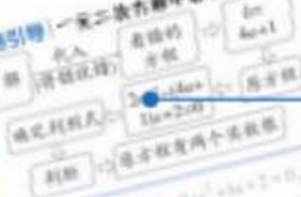

<details>
<summary>flowchart</summary>

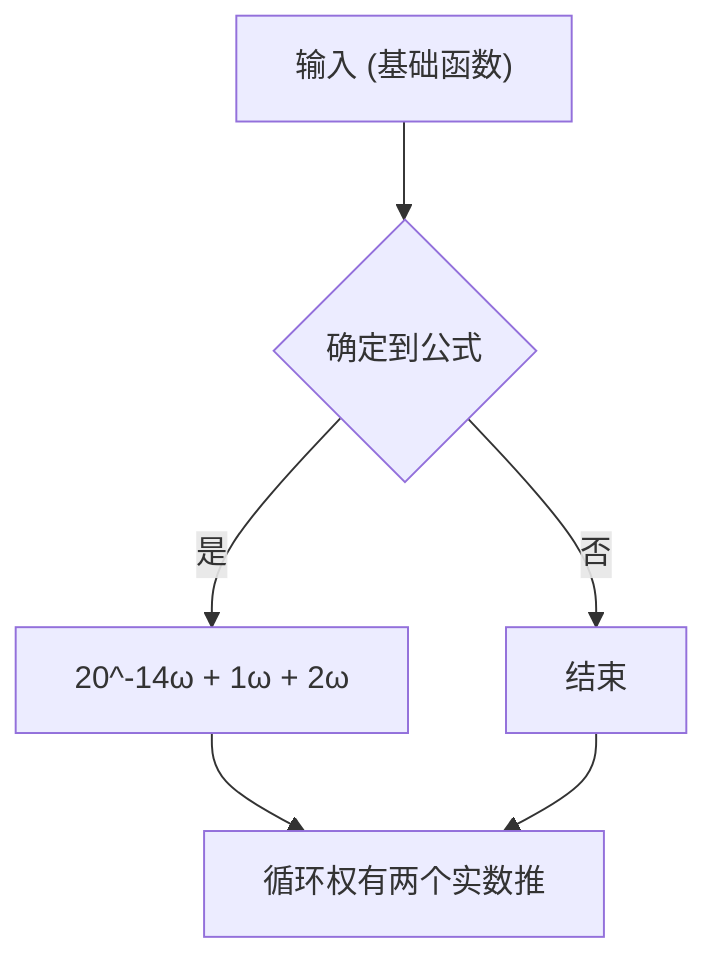
</details>

# #可视化思维#

分析答案生成过程可视化呈现思考路径提高解题思维能力

# 关键点拨#

提炼解题关键点
点拨解题切入点
解题方法豁然开朗

# 数学

八年级上册BS


保持
思路清晰

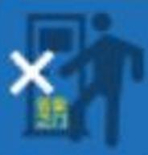

禁止直接对答案


小心错题踩坑

# 第一章 勾股定理

# 1 探索勾股定理

# 课时1 认识勾股定理


# 刷基础

1. D 【解析】因为在 $\triangle ABC$ 中， $\angle ABC = 90^{\circ}$ ，所以 $AC^{2} = AB^{2} + BC^{2}$ 。故选 D.

2. D 【解析】因为 $AB \perp CD$ ，所以 $\angle COA = 90^{\circ}$ ，所以 $AC^{2} = AO^{2} + OC^{2}$ 。因为 AO = 15, CO = 8，所以 AC = 17。因为以点 A 为圆心，AC 的长为半径画弧，交直线 AB 于点 E，所以 AC = AE = 17，所以 OE = AE - AO = 2，故选 D。

3.5 【解析】因为 $AB^{2}=3^{2}+4^{2}=25$ ，所以 AB=5。
故答案为 5.

4. $\frac{5}{3}$ 【解析】因为 $CD \perp AB, BD = 3, BC = 5$ , 所以 $CD^2 = BC^2 - BD^2 = 5^2 - 3^2 = 16$ . 设 $AE = CE = x$ , 则 $DE = 6 - x$ , 所以在 Rt $\triangle CDE$ 中, $CE^2 = DE^2 + CD^2$ , 即 $x^2 = (6 - x)^2 + 16$ , 解得 $x = \frac{13}{3}$ , 所以 $DE = 6 - \frac{13}{3} = \frac{5}{3}$ . 故答案为 $\frac{5}{3}$ .

5. C 【解析】因为 AD 是 $\triangle ABC$ 的高, 所以 $AD \perp BC$ , 所以 $\angle ADB = \angle ADC = 90^{\circ}$ , 所以 $AD^{2} = AB^{2} - BD^{2} = 15 - 6 = 9$ , 所以 $CD^{2} = AC^{2} - AD^{2} = 12 - 9 = 3$ , 所以第四个正方形的面积为 3, 故选 C.

6. 24 【解析】由勾股定理, 得 $AB^{2} = BC^{2} + AC^{2}$ , 则阴影部分的面积为 $\frac{1}{2}\pi \times \left(\frac{BC}{2}\right)^{2} + \frac{1}{2}\pi \times \left(\frac{AC}{2}\right)^{2} + S_{\triangle ABC} - \frac{1}{2}\pi \times \left(\frac{AB}{2}\right)^{2} = \frac{1}{8}\pi \times (BC^{2} + AC^{2} - AB^{2}) + 24 = 24\mathrm{cm}^{2}$ .

7. C 【解析】如图, 过 A 作 $AE \perp BC$ 于点 E. 因为 $AB = AC, AE \perp BC$ , 所以 $EB = EC = \frac{1}{2} CB = 3$ . 在

Rt $\triangle ABE$ 中， $AE^2 = AB^2 - BE^2 = 5^2 - 3^2 = 16$ ，所以 $AE = 4$ ，所以 $\triangle ABC$ 的面积为 $\frac{1}{2} \cdot BC \cdot AE =$

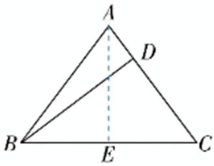

<details>
<summary>text_image</summary>

A
D
B
E
C
</details>

$\frac{1}{2} \times 6 \times 4 = 12$ ，所以 $\frac{1}{2} \cdot AC \cdot BD = 12$ ，即 $\frac{1}{2} \times 5 \times BD = 12$ ，解得 $BD = 4.8$ 。故选 C.

8. 18 【解析】如图, 连接 $AC$ . 因为 $S_{1} = 8, S_{2} = 11$ , $S_{3} = 15$ , 所以 $AD^{2} = 8$ , $AB^{2} = 11, BC^{2} = 15$ . 在 Rt△ABC 与 Rt△ADC 中, 由勾股定理得 $AC^{2} =$

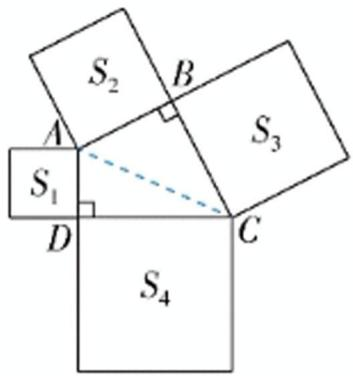

<details>
<summary>text_image</summary>

S₂
A
S₁
D
S₃
C
S₄
</details>

$AB^{2} + BC^{2} = 26, CD^{2} = AC^{2} - AD^{2}$ , 所以 $CD^{2} = 26 - 8 = 18$ , 所以 $S_{4} = 18$ . 故答案为 18.

# 刷易错

# 易错警示

已知直角三角形的两条边长求第三条边长的平方时，如果题中没有说明较长边长是直角边长还是斜边长，那么要分两种情况讨论，注意不要漏解.


或34【解析】因为一个直角三角形的两条边长分别为3和5，所以①当5是此直角三角形的斜边长时，设另一条直角边长为 $x$ ，则由勾股定理，得 $x^{2} = 5^{2} - 3^{2} = 16$ ；②当5是此直角三角形的直角边长时，设斜边长为 $y$ ，则由勾股定理，得 $y^{2} = 5^{2} + 3^{2} = 34.$ 故答案为16或34.


# 刷提升

1. C 【解析】因为折线 P-B-A 与折线 P-C-A 的长度相等，PC=5, AC=10，所以 $AC+PC=PB+AB=15$ 。设 PB=x，则 AB=15-x, BC=5+x。在 Rt△ABC 中， $AC^{2}+BC^{2}=AB^{2}$ ，即 $10^{2}+(5+x)^{2}=(15-x)^{2}$ ，解得 x=2.5，所以 BC=5+2.5=7.5。故选 C。

2. A 【解析】在 Rt $\triangle ABC$ 中，由勾股定理得 $AC^{2} + AB^{2} = BC^{2}$ ，则 $S_{1} + S_{2} = S_{3}$ 。因为 $S_{3} + S_{2} - S_{1} = 24$ ，所以 $S_{1} + S_{2} + S_{2} - S_{1} = 24$ ，所以 $S_{2} = 12$ 。由题图易知，阴影部分的面积为 $\frac{1}{2}S_{2} = 6$ 。故选 A。

3. D 【解析】过点 A 作 $AH \perp BM$ 于 H. 因为点 A 到 BM 的距离为 3 cm, 所以 AH = 3 cm. 因为 AB = 5 cm, 所以根据勾股定理, 得 $BH^{2} = AB^{2} - AH^{2}$ , 所以 BH = 4 cm. 当 $\angle APB = 90^{\circ}$ 时, 如图 (1) 所示, 此时点 P 与点 H 重合, 则 BP = BH = 4 cm, 所以 2t = 4, 解得 t = 2. 当 $\angle BAP = 90^{\circ}$ 时,如图(2)所示. 因为 $AB = 5 \mathrm{~cm}, BP = 2t \mathrm{~cm}$ , $AH = 3 \mathrm{~cm}, BH = 4 \mathrm{~cm}$ , 所以 $HP = (2t - 4) \mathrm{~cm}$ . 在 Rt△BAP 中, 根据勾股定理, 得 $AP^2 = BP^2 - AB^2 = 4t^2 - 25$ , 在 Rt△AHP 中, 根据勾股定理得 $AP^2 = AH^2 + HP^2 = 9 + (2t - 4)^2$ , 所以 $4t^2 - 25 = 9 + (2t - 4)^2$ , 解得 $t = \frac{25}{8}$ . 综上所述, 当 △ABP 为直角三角形时, $t$ 的值为 2 或 $\frac{25}{8}$ . 故选 D.

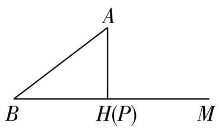  
图(1)

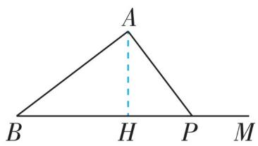  
图(2)

4. $\frac{5}{2}$ 【解析】连接 $DE$ , 如图. 因为 $AD = AC = 3, AE \perp CD$ , 所以 $AE$ 是 $CD$ 的垂直平分线, 所以 $CE = DE$ , 所以易得

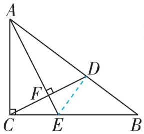

$\triangle ACE \cong \triangle ADE$ ，所以 $\angle ADE = \angle ACB = 90^{\circ}$ 。在 Rt $\triangle ABC$ 中，由勾股定理得 $AB^{2} = AC^{2} + BC^{2} = 25$ ，所以 $AB = 5$ ，所以 $BD = AB - AD = 2$ 。因为 $S_{\triangle ABC} = S_{\triangle ACE} + S_{\triangle ABE}$ ，所以 $AC \times BC = AC \times CE + AB \times DE$ ，所以 $3 \times 4 = 3CE + 5DE$ ，所以 $DE = \frac{3}{2}$ 。在 Rt $\triangle BDE$ 中，由勾股定理得 $BE^{2} = DE^{2} + BD^{2} = \left(\frac{3}{2}\right)^{2} + 2^{2} = \frac{25}{4}$ ，所以 $BE = \frac{5}{2}$ 。故答案为 $\frac{5}{2}$ 。

5.7.5 【解析】如图, 连接 CE, CF, 过 E 作 CD 的垂线, 垂足为 M, 过 F 作 CD 的垂线, 垂足为

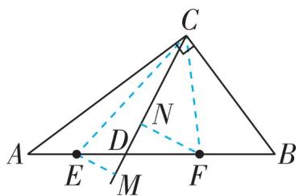

<details>
<summary>text_image</summary>

C
A	E	D	F	B
M
N
</details>

N, 即 EM = m, EN = n, 所以 $S_{\triangle CDF} = \frac{1}{2} CD \times n$ , $S_{\triangle CDE}=\frac{1}{2}CD\times m.$ 因为 E, F 分别为 AD, BD 的中点, 所以 $S_{\triangle CDE}=\frac{1}{2}S_{\triangle CDA}, S_{\triangle CDF}=\frac{1}{2}S_{\triangle CDB}$ , 所以 $S_{\triangle CEF}=S_{\triangle CDE}+S_{\triangle CDF}=\frac{1}{2}(S_{\triangle CDA}+S_{\triangle CDB})$ , 所以 $\frac{1}{2}CD(m+n)=\frac{1}{2}S_{\triangle ABC}.$ 因为 $\angle ACB=90^{\circ}$ , 所以 $S_{\triangle ABC}=\frac{1}{2}\times9\times12=54$ , 所以 $\frac{1}{2}CD(m+n)=27$ , 所以 $CD(m+n)=54$ , 所以当 CD 最短时, $m+n$ 有最大值, 此时 $CD \perp AB$ . 因为在 Rt△ABC 中, 由勾股定理得 $AB^{2}=12^{2}+9^{2}=$

# 关键点拨

本题主要考查了线段垂直平分线的判定和性质与勾股定理的综合应用,运用等面积法求出 DE 的长是解题的关键.

225, 所以 $AB = 15$ . 设 $AB$ 边上的高为 $h$ , 所以 $\frac{1}{2} AB \cdot h = 54$ , 所以 $h = 7.2$ , 即 $CD = 7.2$ , 所以 $m + n = \frac{54}{7.2} = 7.5$ , 所以 $m + n$ 的最大值为 7.5. 故答案为 7.5.

6.【解】(1)由题意得 OB=OC=5. 因为 $AB+AC=20, OC=5$ , 所以 $AB+(OA-5)=20, OA^{2}+5^{2}=AB^{2}$ , 所以 AB=25-OA, 所以 $OA^{2}+5^{2}=(25-OA)^{2}$ , 解得 OA=12, 所以该飞镖状图形的面积为 $4\times\frac{1}{2}\times12\times5=120$ .

(2)设直角三角形的长直角边长为 $a$ ，短直角边长为 $b$ ，斜边长为 $c$ ，则 $c^2 = a^2 + b^2$ 。由题意得 $S_1 = (a + b)^2, S_2 = c^2 = 6, S_3 = (a - b)^2$ ，所以 $S_1 + S_2 + S_3 = (a + b)^2 + c^2 + (a - b)^2 = a^2 + 2ab + b^2 + c^2 + a^2 - 2ab + b^2 = c^2 + c^2 + c^2 = 3c^2 = 18$ ，所以 $S_1 + S_3 = 18 - S_2 = 18 - 6 = 12$ 。

7.【解】(1)延长 $ED$ 至 $M$ 使 $DM = DE$ , 连接 $AM$ ,

$FM$ , 如图. 因为 $D$ 为 $AB$ 中点, 所以 $AD = BD$ . 在 $\triangle ADM$ 与

$\triangle BDE$ 中， $\left\{ \begin{array}{l}AD = BD,\\ \angle ADM = \angle BDE,\\ DM = DE, \end{array} \right.$ 所

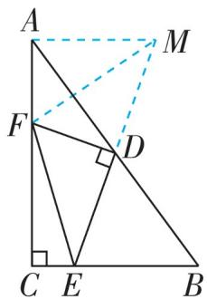

以 $\triangle ADM \cong \triangle BDE(\mathrm{SAS})$ ，所以 $AM = BE, \angle DAM = \angle B$ ，所以 $AM // BC$ ，所以 $\angle MAF = 180^{\circ} - \angle C = 90^{\circ}$ 。因为 $FD \perp ME, DE = DM$ ，所以 $MF = FE$ 。因为在 Rt $\triangle MAF$ 中， $AM^{2} + AF^{2} = MF^{2}$ ，所以 $AF^{2} + BE^{2} = EF^{2}$ 。

(2) $AF = \frac{17}{7}$ . 设 $AF = x$ . 因为 $AC = 7, BC = 5$ , $CE = 1$ , 所以 $CF = AC - AF = 7 - x, BE = BC - CE = 4$ . 因为 $\angle C = 90^\circ$ , 所以 $CF^2 + CE^2 = EF^2$ , 所以 $EF^2 = (7 - x)^2 + 1$ . 由 (1) 知 $MF = EF, \angle MAF = 90^\circ, AM = BE$ , 所以 $MF^2 = (7 - x)^2 + 1, AM = 4$ . 因为 $\angle MAF = 90^\circ$ , 所以 $AF^2 + AM^2 = MF^2$ , 所以 $x^2 + 4^2 = (7 - x)^2 + 1$ , 解得 $x = \frac{17}{7}$ , 所以 $AF = \frac{17}{7}$ .

# 课时 2 验证并应用勾股定理

# 关键点拨

利用正方形面积公式,梯形面积公式和三角形面积公式,用两种不同的方式表示图形的面积是解题的关键.


# 刷基础

1. D 【解析】①题图中大正方形的面积为 $c^{2}$ , 四个直角三角形的面积和为 $4 \times \frac{1}{2} ab = 2ab$ , 中间小正方形的边长为 $(b - a)$ . 由大正方形的面积可以表示为四个直角三角形的面积与中间小正方形的面积之和, 得 $(b - a)^{2} + 4 \times \frac{1}{2} ab = a^{2} +$ $b^{2}=c^{2}$ ，所以①能验证勾股定理。②如图，四边形ACDE的面积为直角梯形ABDE的面积减去直角三角形ABC的面积，即 $\frac{(a+b)(a+b)}{2}-\frac{1}{2}ab=\frac{1}{2}a^{2}+\frac{1}{2}b^{2}+\frac{1}{2}ab$ ，四边形ACDE的面积还可以表示为等腰直角三角形ACE的面积加上直角三角形CDE的面积，即 $\frac{1}{2}c^{2}+\frac{1}{2}ab$ ，所以 $\frac{1}{2}a^{2}+\frac{1}{2}b^{2}+\frac{1}{2}ab=\frac{1}{2}c^{2}+\frac{1}{2}ab$ ，即 $a^{2}+b^{2}=c^{2}$ ，所以②能验证勾股定理。③题图中大正方形的面积为 $(a+b)^{2}=a^{2}+b^{2}+2ab$ ，大正方形的面积还可以表示为四个直角三角形的面积加上中间小正方形的面积，即 $4\times\frac{1}{2}ab+c^{2}=2ab+c^{2}$ ，所以 $a^{2}+b^{2}+2ab=2ab+c^{2}$ ，即 $a^{2}+b^{2}=c^{2}$ ，所以③能验证勾股定理。④题图中五边形的面积为大正方形的面积加上两个直角三角形的面积，即 $c^{2}+2\times\frac{1}{2}ab=c^{2}+ab$ ，五边形的面积还可以表示为两个小正方形的面积加上两个直角三角形的面积，即 $a^{2}+b^{2}+2\times\frac{1}{2}ab=a^{2}+b^{2}+ab$ ，所以 $c^{2}+ab=a^{2}+b^{2}+ab$ ，即 $a^{2}+b^{2}=c^{2}$ ，所以④能验证勾股定理。故选D.

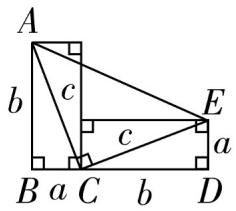

2.【解】(1) $AB = DE, AB \perp DE$ . 理由: 因为 $\angle ACB = 90^{\circ}$ , 点 $E$ 在 $AC$ 上, 点 $D$ 在 $BC$ 的延长线上, 所以 $\angle ACB = \angle DCE = 90^{\circ}$ . 在 $\triangle ACB$ 和 $\triangle DCE$ 中， $\left\{ \begin{array}{l}CA = CD,\\ \angle ACB = \angle DCE,\\ CB = CE, \end{array} \right.$ 所以 $\triangle ACB\cong \triangle DCE$

(SAS), 所以 $AB = DE$ , $\angle BAC = \angle EDC$ , 所以 $\angle AFD = \angle ABC + \angle EDC = \angle ABC + \angle BAC = 90^{\circ}$ , 所以 $AB \perp DE$ .

(2) 因为 $\angle ECB = \angle ACD = 90^{\circ}, EC = BC = a,$ $DC = AC = b$ ，所以 $S_{\triangle ECB} = \frac{1}{2} a^{2}, S_{\triangle ACD} = \frac{1}{2} b^{2}$ . 因为 $DE = AB = c, AB \perp DE$ ，所以 $S_{\triangle ADE} = \frac{1}{2} DE \cdot AF, S_{\triangle BDE} = \frac{1}{2} DE \cdot BF$ ，所以 $S_{\triangle ADE} + S_{\triangle BDE} =$

$\frac{1}{2} DE \cdot AF + \frac{1}{2} DE \cdot BF = \frac{1}{2} DE (AF + BF) = \frac{1}{2} DE \cdot AB = \frac{1}{2} c^2.$ 因为 $S_{\triangle ECB} + S_{\triangle ACD} = S_{\triangle ADE} + S_{\triangle BDE}$ , 所以 $\frac{1}{2} a^2 + \frac{1}{2} b^2 = \frac{1}{2} c^2$ , 所以 $a^2 + b^2 = c^2$ , 所以直角三角形两直角边的平方和等于斜边的平方.

3. D 【解析】如图, 由题意得 $\angle ACB = 90^{\circ}, BC = 3$ 尺, $AC + AB = 10$ 尺. 设折断处离地面 $x$ 尺, 则 $AB = (10 - x)$ 尺. 在 Rt $\triangle ABC$ 中, 由勾股定理得$x^{2}+3^{2}=(10-x)^{2}$ ，解得x=4.55，即折断处离地面4.55尺。故选D。

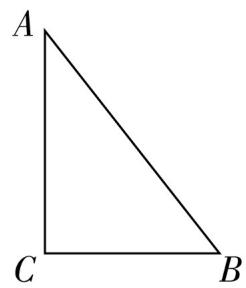

关键点拨◀4.50 【解析】如图,连接 AC.由题意得 $\angle DAB = 60^{\circ}$ $\angle FBC = 30^{\circ}, AD \parallel EF$ , 所以 $\angle DAB = \angle ABE = 60^{\circ}$ , 所以$ABC = 180^{\circ} - \angle ABE - FBC = 90^{\circ}.$ 在 Rt $\triangle ABC$ 中，$AB = 30 \mathrm{~km}, BC = 40 \mathrm{~km}, AC^{2} = AB^{2} + BC^{2} = 30^{2} + 40^{2} = 2500$ ，所以 $AC = 50 \mathrm{~km}$ ，所以 $A, C$ 两港之间的距离为 $50 \mathrm{~km}$ ，故答案为 50。

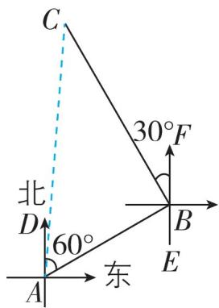

<details>
<summary>text_image</summary>

C
30°F
北
D
60°
东
A
B
E
</details>

思路分析◀5.244 【解析】在正方形木板 A$90^{\circ}, AB = BC$ . 因为 $AE \perp EF, CF \perp EF$ , 所以 $\angle AEB = \angle BFC = 90^{\circ}$ , 所以 $\angle EAB + \angle ABE = 90^{\circ}$ . 因为 $\angle ABC = 90^{\circ}$ , 所以 $\angle ABE + \angle CBF = 90^{\circ}$ , 所以 $\angle EAB = \angle CBF$ . 在 $\triangle ABE$ 和 $\triangle BCF$ 中， $\left\{ \begin{array}{l} \angle EAB = \angle CBF, \\ \angle AEB = \angle BFC = 90^{\circ}, \\ AB = BC, \end{array} \right.$ 所以 $\triangle ABE \cong \triangle BCF$ (AAS)，所以 $AE = BF = 2 \times 5 = 10(\mathrm{~cm})$ 。因为 $CF = 2 \times 6 = 12(\mathrm{~cm})$ ，所以在 Rt $\triangle BCF$ 中， $BC^{2} = BF^{2} + CF^{2} = 10^{2} + 12^{2} = 244$ ，所以 $S_{\text{正方形}ABCD} = BC^{2} = 244\mathrm{cm}^{2}$ ，即正方形木板 $ABCD$ 的面积为 $244\mathrm{cm}^{2}$ 。

6.21 【解析】如图, 在 $BD$ 上取一点 $E$ , 连接 $CE$ , 使 $CE = 170$ 米. 因为 $\angle CDE = 90^{\circ}$ , $CD = 80$ 米, 所以 $DE^{2} = CE^{2} - CD^{2} = 170^{2} - 80^{2} = 22500$ , 所以 $DE = 150$ 米. 因为 $CD = 80$ 米, $AC = 100$ 米 < 170 米, 所以公交车在 $EA$ 段不能鸣笛, $AD^{2} = AC^{2} - CD^{2} = 100^{2} - 80^{2} = 3600$ , 所以 $AD = 60$ 米, 所以 $EA = AD + DE = 60 + 150 = 210$ (米). 因为 $\frac{210}{10} = 21$ (秒), 所以公交车在公路 $AB$ 上行驶时, 至少 21 秒不鸣笛才能使在城市书房 C 中看书的读者不受噪音影响. 故答案为 21.

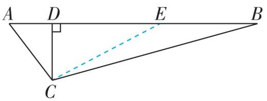

<details>
<summary>text_image</summary>

A D E B
C
</details>

# 7. 思路分析 | 过隧道问题 — 公众号\*满满分享库

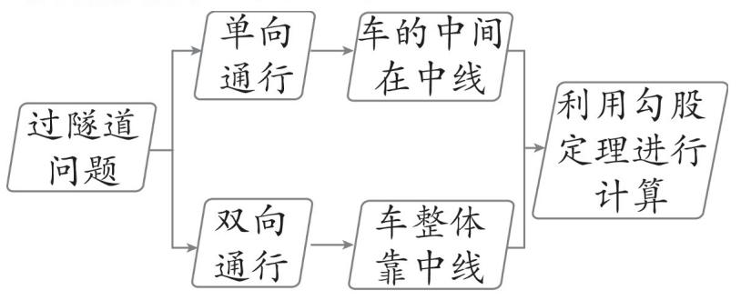

<details>
<summary>flowchart</summary>

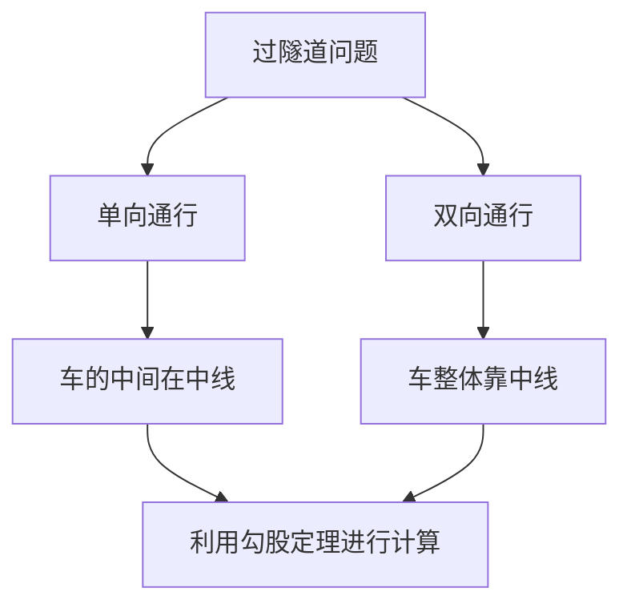
</details>

【解】(1)该卡车能通过隧道. 理由如下:如图(1),MN为卡车的宽度,分别过M,N作AB的垂线交半圆于C,D,连接CD,过AB的中点O作OE⊥CD,E为垂足,连接OC. 易知CD=MN=1.6m,AB=2m,所以由对称可得CE=DE=0.8m,OC=OA=1m. 在Rt△OCE中, $OE^{2}=OC^{2}-CE^{2}=0.36$ ,即OE=0.6m,所以CM=2.3+0.6=2.9(m)>2.5m,所以这辆卡车能通过隧道.

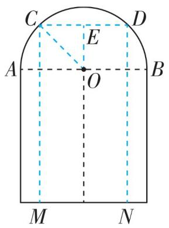

<details>
<summary>text_image</summary>

C
D
E
A
O
B
M
N
</details>

图(1)

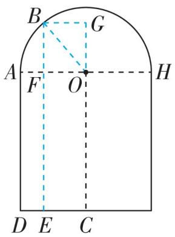

<details>
<summary>text_image</summary>

B
G
A
F
O
H
D E C
</details>

图(2)

(2)如图(2), $EC$ 为卡车的宽度, 过 $E$ 作 $AH$ 的垂线交半圆于 $B$ , 垂足为 $F$ , 连接 $OB$ , 过 $B$ 作 $BG \perp CO$ , 交 $CO$ 的延长线于 $G$ . 根据题意可知 $CG = BE = 2.8 \mathrm{~m}, BG = OF = EC = 1.2 \mathrm{~m}, EF = AD = 2.3 \mathrm{~m}$ , 所以 $BF = 2.8 - 2.3 = 0.5(\mathrm{~m})$ . 根据勾股定理得 $OA^2 = OB^2 = BF^2 + OF^2 = 0.5^2 + 1.2^2 = 1.69$ , 即 $OA = 1.3 \mathrm{~m}$ , 所以隧道的宽至少增加到 $1.3 \times 2 = 2.6(\mathrm{~m})$ .

# 2 一定是直角三角形吗

# 刷基础

# 1. C 【解析】

A $3^{2} + 4^{2} = 5^{2}$ ，能构成直角三角形  
B $5^{2} + 12^{2} = 13^{2}$ ，能构成直角三角形  
C $8^{2} + 12^{2} \neq 16^{2}$ , 不能构成直角三角形  
D $15^{2} + 36^{2} = 39^{2}$ ，能构成直角三角形

# 关键点拨

勾股数的判定是勾股定理中常考题目, 注意满足勾股定理的同时, 也必须为正整数.

# 刷有所得

如果一个三角形中有一个角是直角,那么这个三角形是直角三角形;如果一个三角形的三边长满足两边长平方的和等于第三边长的平方,那么这个三角形是直角三角形.

故选 C.

2. C 【解析】因为 $BC^{2}=3^{2}+4^{2}=25$ ，所以 BC=5，所以选项 A 不符合题意；因为 $AC^{2}=1^{2}+2^{2}=5, AB^{2}=2^{2}+4^{2}=20, BC^{2}=3^{2}+4^{2}=25$ ，所以 $AC^{2}+AB^{2}=BC^{2}$ ，所以 $\triangle ABC$ 是直角三角形， $\angle BAC=90^{\circ}$ ，所以选项 B 不符合题意；因为 $S_{\triangle ABC}=4\times4-\frac{1}{2}\times3\times4-\frac{1}{2}\times1\times2-\frac{1}{2}\times2\times4=5$ ，所以选项 C 符合题意；设点 A 到直线 BC 的距离为 h，因为 BC=5，所以 $S_{\triangle ABC}=\frac{1}{2}\times5\times h=5$ ，所以 h=2，即点 A 到直线 BC 的距离是 2，所以选项 D 不符合题意。故选 C。  
3. 直角 【解析】因为 $(a - 5)^2 + (b - 12)^2 + |c - 13| = 0$ ，所以 $a - 5 = 0, b - 12 = 0, c - 13 = 0$ ，所以 $a = 5, b = 12, c = 13$ . 因为 $5^2 + 12^2 = 13^2$ ，即 $a^2 + b^2 = c^2$ ，所以 $\triangle ABC$ 是直角三角形. 故答案为直角.  
4. B 【解析】A 选项, $\frac{1}{5}, \frac{1}{12}, \frac{1}{13}$ 都不是正整数,故不是勾股数,不符合题意;B 选项, $9^{2} + 40^{2} = 41^{2}$ ,三个数都是正整数,且以此三个数为三边长的三角形是直角三角形,故是勾股数,符合题意;C 选项,0.7,2.4,2.5都不是正整数,故不是勾股数,不符合题意;D 选项, $3^{4} + 4^{4} \neq 5^{4}$ ,不能构成直角三角形,故不符合题意.故选 B.  
5. 13 【解析】在直角三角形中, 当 12 是最长边长时, $5^{2} + m^{2} = 12^{2}$ , $m$ 的值不是整数, 舍去; 当 $m$ 是最长边长时, $m^{2} = 5^{2} + 12^{2} = 169$ , 所以 $m = 13$ .  
6. (11,60,61) 【解析】由勾股数组: (3,4,5), (5,12,13), (7,24,25) 中, $4 = 1 \times (3 + 1)$ , $12 = 2 \times (5 + 1)$ , $24 = 3 \times (7 + 1)$ , 可得第 4 个勾股数组中间的数为 $4 \times (9 + 1) = 40$ , 所以第 4 个勾股数组为 (9,40,41); 第 5 个勾股数组中间的数为 $5 \times (11 + 1) = 60$ , 所以第 5 个勾股数组为 (11,60,61). 故答案为 (11,60,61).  
7. D 【解析】因为 AB = 8, AC = 15, BC = 17, 所以 $AB^{2} + AC^{2} = 289$ , $BC^{2} = 289$ , 所以 $AB^{2} + AC^{2} = BC^{2}$ , 所以 $\angle BAC = 90^{\circ}$ , 所以 $\triangle ABC$ 的面积为 $\frac{1}{2} \times AB \times AC = \frac{1}{2} \times 8 \times 15 = 60$ . 故选 D.  
8. D 【解析】设题图中每个小正方形的边长均为 1. A 选项, 连接 $MN, AN$ , 因为 $AM^{2} = 1^{2} = 1$ , $MN^{2} = 1^{2} + 1^{2} = 2$ , $AN^{2} = 1^{2} + 2^{2} = 5$ , 所以 $AM^{2} +$

$MN^{2} \neq AN^{2}$ ，所以 $\triangle AMN$ 不是直角三角形，故 A 不符合题意；B 选项，连接 BM, BN, MN，因为 $MN^{2} = 1^{2} + 1^{2} = 2$ , $MB^{2} = 1^{2} + 2^{2} = 5$ , $BN^{2} = 1^{2} + 2^{2} = 5$ ，所以 $MN^{2} + MB^{2} \neq BN^{2}$ ，所以 $\triangle BMN$ 不是直角三角形，故 B 不符合题意；C 选项，连接 MN, CN，因为 $MN^{2} = 1^{2} + 1^{2} = 2$ , $CN^{2} = 1^{2} + 2^{2} = 5$ , $MC^{2} = 3^{2} = 9$ ，所以 $MN^{2} + CN^{2} \neq MC^{2}$ ，所以 $\triangle CMN$ 不是直角三角形，故 C 不符合题意；D 选项，连接 DM, DN, MN，因为 $MN^{2} = 1^{2} + 1^{2} = 2$ , $MD^{2} = 1^{2} + 3^{2} = 10$ , $DN^{2} = 2^{2} + 2^{2} = 8$ ，所以 $MN^{2} + DN^{2} = MD^{2}$ ，所以 $\triangle DMN$ 是直角三角形，故 D 符合题意。故选 D.

9.24 【解析】如图, 连接 $AC$ . 因为 $AB = 3 \mathrm{~m}$ , $BC = 4 \mathrm{~m}, \angle ABC = 90^{\circ}$ , 所以由勾股定理

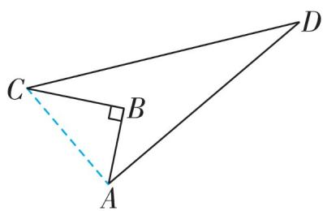

<details>
<summary>text_image</summary>

Geometric diagram of triangle ABC with right angle at B and dashed line from C to A
</details>

得 $AC^{2}=BC^{2}+AB^{2}=25$ ，所以 AC=5 m。因为 $CD=13\ m, AD=12\ m$ ，所以 $AC^{2}+AD^{2}=5^{2}+12^{2}=13^{2}=CD^{2}$ ，所以 $\triangle CAD$ 是直角三角形， $\angle CAD=90^{\circ}$ ，所以这块土地的面积为 $S_{\triangle CAD}-S_{\triangle CAB}=\frac{1}{2}CA\cdot AD-\frac{1}{2}BC\cdot AB=\frac{1}{2}\times5\times12-\frac{1}{2}\times3\times4=24(m^{2})$ 。故答案为 24。

10.【解】(1) 因为 $DC = 5$ 米, $AC = 13$ 米, $AD = 12$ 米, 所以 $AD^{2} + CD^{2} = AC^{2}$ , 所以 $\triangle ADC$ 是直角三角形, $\angle ADC = 90^{\circ}$ , 所以 $\angle BDA = 90^{\circ}$ , 所以 $BD^{2} = AB^{2} - AD^{2} = 15^{2} - 12^{2} = 81$ , 所以 $BD = 9$ 米.

(2) 因为 $DE \perp AB$ ，所以 $S_{\triangle ABD} = \frac{1}{2} \times AB \times DE = \frac{1}{2} \times BD \times AD$ ，即 $\frac{1}{2} \times 15 \times DE = \frac{1}{2} \times 9 \times 12$ ，所以 $DE = \frac{36}{5}$ 米，所以 $\left(\frac{36}{5} + 12\right) \times 30 = 576$ （元）.

答:需花费 576 元.

# 刷提升

1. D 【解析】如图, 设小明初始位置在 A 处, 根据题意知 $AB = 80 \, m, BC = BD = 60 \, m, AC = AD = 100 \, m$ . 根据 $60^{2} + 80^{2} = 100^{2}$ , 得 $\angle ABC = \angle ABD = 90^{\circ}$ , 故小明向东走 $80 \, m$ 后, 又向北或向南走了 $60 \, m$ . 故选 D.

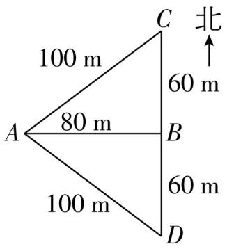

<details>
<summary>text_image</summary>

100 m
80 m
100 m
C
60 m
北
B
60 m
D
</details>

# 思路分析

设AB为3x cm, BC为4x cm, AC为5x cm, 根据△ABC的周长为36 cm 列方程并求出三角形的三边长, 逆用勾股定理得出△ABC为直角三角形, 再求出3 s时, BP, BQ的长, 利用三角形的面积公式计算求解即可.

# 思路分析

(2) 设 BN = x，则 MN = AB - AM - BN = 7 - x，分两种情形讨论：① 当 MN 为最长线段时，依题意得 $AM^{2} + BN^{2} = MN^{2}$ ，② 当 BN 为最长线段时，依题意得 $AM^{2} + MN^{2} = BN^{2}$ ，分别列出方程并求解即可解决问题.

2. D 【解析】方案 I: 连接 DE. 因为 $CD^{2} + CE^{2} = 30^{2} + 40^{2} = 50^{2} = DE^{2}$ ，所以 $\triangle CED$ 是直角三角形，且 $\angle DCE = 90^{\circ}$ ，所以 $CE \perp AB$ ，故方案 I 可行。方案 II: 由作图得 Q 是 SR 的中点，且 CQ = QR，所以 CQ = QR = QS，所以 $\angle QRM = \angle QMR$ ， $\angle QSM = \angle QMS$ 。因为 $\angle QRM + \angle QSM + \angle RMS = 180^{\circ}$ ， $\angle RMS = \angle QMR + \angle QMS$ ，所以 $\angle RMS = 90^{\circ}$ ，所以 $\angle ACS = 90^{\circ}$ ，所以 $CS \perp AB$ ，故方案 II 也可行，故选 D。

3. 18 【解析】设 AB 为 3x cm, BC 为 4x cm, AC 为 5x cm. 因为周长为 36 cm, 所以 $AB + BC + AC = 36 \, cm$ , 所以 $3x + 4x + 5x = 36$ , 解得 x = 3, 所以 AB = 9 cm, BC = 12 cm, AC = 15 cm. 因为 $AB^{2} + BC^{2} = AC^{2}$ , 所以 $\triangle ABC$ 是直角三角形. 3 s 时, $BP = 9 - 3 \times 1 = 6 \, (\text{cm})$ , $BQ = 2 \times 3 = 6 \, (\text{cm})$ , 所以 $S_{\triangle PBQ} = \frac{1}{2}BP \cdot BQ = \frac{1}{2} \times 6 \times 6 = 18 \, (\text{cm}^{2})$ . 故答案为 18.

4.45 【解析】如图,标出点G,连接CG,AG.由勾股定理得 $AG^{2}=CG^{2}=1^{2}+2^{2}=5,AC^{2}=1^{2}+3^{2}=10$ ,则 $AG^{2}+CG^{2}=AC^{2}$ ,所以△CAG是等

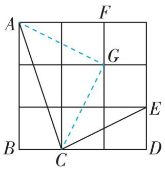

<details>
<summary>text_image</summary>

A
F
G
B
C
D
E
</details>

腰直角三角形, $\angle CGA = 90^{\circ}$ , 所以 $\angle CAG = 45^{\circ}$ . 因为 $AF // BC$ , 所以 $\angle CAF = \angle BCA$ . 在 $\triangle AFG$ 和 $\triangle CDE$ 中, $\left\{ \begin{array}{l} AF = CD, \\ \angle AFG = \angle CDE = 90^{\circ}, \\ FG = DE, \end{array} \right.$ 所以 $\triangle AFG \cong \triangle CDE$ (SAS), 所以 $\angle FAG = \angle DCE$ , 所以 $\angle ACB - \angle DCE = \angle CAF - \angle FAG = \angle CAG = 45^{\circ}$ . 故答案为 45.

5.【解】(1)是. 理由: 因为 $AM^{2}+BN^{2}=4+12=16$ , $MN^{2}=16$ , 所以 $AM^{2}+NB^{2}=MN^{2}$ , 所以以 AM, MN, NB 为边的三角形是一个直角三角形. 故点 M, N 是线段 AB 的“勾股分割点”.

(2) 设 $BN = x$ , 则 $MN = AB - AM - BN = 7 - x$ . ①当 $MN$ 为最长线段时, 依题意得 $MN^2 = AM^2 + NB^2$ , 即 $(7 - x)^2 = x^2 + 25$ , 解得 $x = \frac{12}{7}$ ;

②当 $BN$ 为最长线段时, 依题意得 $BN^{2} = AM^{2} + MN^{2}$ , 即 $x^{2} = 25 + (7 - x)^{2}$ , 解得 $x = \frac{37}{7}$ . 综上所述, $BN$ 的长为 $\frac{12}{7}$ 或 $\frac{37}{7}$ .

# 刷素养·

6.【解】(1)当一个直角三角形的两直角边长为6,8时,斜边长为10,因为9<10,所以当 $\triangle ABC$ 三边长分别为6,8,9时, $\triangle ABC$ 为锐角三角形;因为11>10,所以当 $\triangle ABC$ 三边长分别为6,8,11时, $\triangle ABC$ 为钝角三角形.故答案为锐角,钝角.

(2) 当 $a^{2}+b^{2}>c^{2}$ 时, $\triangle ABC$ 为锐角三角形; 当 $a^{2}+b^{2}<c^{2}$ 时, $\triangle ABC$ 为钝角三角形. 故答案为 >, <.
公众号\*满满分享

(3) 因为 $c$ 为最长边的长, $2 + 4 = 6$ , 所以 $4 \leqslant c < 6$ .

①当 $a^2 + b^2 > c^2$ ，即 $c^2 < 20$ 时， $\triangle ABC$ 是锐角三角形，此时 $16 \leqslant c^2 < 20$ ；  
②当 $a^2 + b^2 = c^2$ ，即 $c^2 = 20$ 时， $\triangle ABC$ 是直角三角形；  
③当 $a^2 + b^2 < c^2$ ，即 $c^2 > 20$ 时， $\triangle ABC$ 是钝角三角形，此时 $20 < c^2 < 36$ .

# 3 勾股定理的应用


# 刷基础

1. A 【解析】因为在 Rt△ABC 中, ∠C = 90°, 所以 BC⊥AC, 即 BC 是△DAB 的高. 因为△DAB 的面积为 10, DA = 5, 所以 $\frac{1}{2}DA \cdot BC = 10$ , 所以 BC = 4, 所以 $CD^{2} = DB^{2} - BC^{2} = 9$ , 所以 CD = 3. 故选 A.  
2. A 【解析】根据折叠的性质得 $DE = BE$ ，设 $BE = DE = x$ . 因为 $AD = 27$ ，所以 $AE = AD - DE = 27 - x$ . 在 Rt $\triangle ABE$ 中， $AB = 9$ ，由勾股定理得 $BE^2 = AB^2 + AE^2$ ，所以 $x^2 = 9^2 + (27 - x)^2$ ，解得 $x = 15$ ，所以 $BE = DE = 15$ ，所以 $AE = AD - DE = 12$ ，所以 $S_{\triangle ABE} = \frac{1}{2} AE \cdot AB = \frac{1}{2} \times 12 \times 9 = 54$ . 故选 A.  
3.20 【解析】因为 $AC \perp BD$ , 所以 $AB^{2} + CD^{2} = OA^{2} + OB^{2} + OD^{2} + OC^{2} = AD^{2} + BC^{2} = 4^{2} + 2^{2} = 20$ . 故答案为 20.  
4.84 【解析】因为 $AD$ 是 $BC$ 边上的高, 所以 $\angle ADB = \angle ADC = 90^{\circ}$ , 所以 $BD^{2} = AB^{2} - AD^{2} = 13^{2} - 12^{2} = 25$ , $CD^{2} = AC^{2} - AD^{2} = 15^{2} - 12^{2} = 81$ , 所以 $BD = 5 \mathrm{~cm}$ , $CD = 9 \mathrm{~cm}$ , 所以 $BC = BD + DC = 14 \mathrm{~cm}$ , 所以 $\triangle ABC$ 的面积为 $\frac{1}{2} BC \cdot AD = 84 \mathrm{~cm}^{2}$ . 故答案为 84.

# 关键点拨

(3) 根据三角形的任意两边之和大于第三边求出最长边的长 c 的取值范围, 然后分情况讨论即可得解.

5.【解】(1) $\triangle ABE$ 是直角三角形. 理由如下: 在 $\triangle BCE$ 中, $BE^{2} + EC^{2} = 12^{2} + 5^{2} = 169 = BC^{2}$ , 所以 $\angle BEC = 90^{\circ}$ , 所以 $\angle AEB = 90^{\circ}$ , 所以 $\triangle ABE$ 是直角三角形.  
(2) 设 AB = x. 因为 AC = x, CE = 5, 所以 AE = x - 5. 在 Rt△ABE 中, 由勾股定理得 $x^{2} = 12^{2} + (x - 5)^{2}$ , 解得 x = 16.9,
所以 AB 的长为 16.9.  
6.2 【解析】设吸管在杯内部分的最大长度为 $x \mathrm{~cm}$ , 则有 $x^{2} = 3^{2} + 4^{2}$ , 解得 $x = 5$ , 所以露在杯外面的最短长度为 $7 - 5 = 2(\mathrm{~cm})$ , 故答案为 2.  
7. 4 cm 【解析】由题意知 $AC = \frac{1}{2} AB = 8 \, cm$ ，
CD = 6 cm. 在 Rt $\triangle ACD$ 中，根据勾股定理，得 $AD^{2} = AC^{2} + CD^{2} = 100$ ，所以 AD = 10 cm，则 $AD + BD - AB = 2AD - AB = 20 - 16 = 4 \, (\text{cm})$ . 故橡皮筋被拉长了 4 cm. 故答案为 4 cm.  
8. 5 【解析】由题意得 $BC = BD = 25 \mathrm{~cm}, CE = 20 \mathrm{~cm}, DF = 15 \mathrm{~cm}, \angle BEC = \angle BFD = 90^{\circ}$ . 在 Rt△BEC 中, 由勾股定理, 得 $BE^{2} = BC^{2} - CE^{2} = 25^{2} - 20^{2} = 225$ , 所以 $BE = 15 \mathrm{~cm}$ . 在 Rt△BFD 中, 由勾股定理得 $BF^{2} = BD^{2} - DF^{2} = 25^{2} - 15^{2} = 400$ , 所以 $BF = 20 \mathrm{~cm}$ , 所以 $EF = BF - BE = 20 - 15 = 5 (\mathrm{~cm})$ . 故答案为 5.  
9.【解】在 Rt△ABC 中, 因为 ∠CAB = 90°, BC = 17 米, AC = 8 米, 所以 AB² = BC² - AC² = 17² - 8² = 225, 所以 AB = 15 米. 因为此人以每秒 1 米的速度收绳, 7 秒后船移动到点 D 的位置, 所以 CD = 17 - 1 × 7 = 10 (米), 所以 AD² = CD² - AC² = 100 - 64 = 36, 所以 AD = 6 米, 所以 BD = AB - AD = 15 - 6 = 9 (米).

答:船向岸边移动了9米.


# 刷提升

# 思路分析

给图形关键点标注字母, 利用勾股定理算出 BD 的长, 根据 CD = BC + BD 计算求解即可.

1. C 【解析】如图,由题意知

$\angle ACB = \angle BDE = 90^{\circ}, CB = 0.7 \mathrm{~m}, AC = 2.4 \mathrm{~m}, DE = 2 \mathrm{~m}$ . 在 Rt△ABC 中, $AB^{2} =$ $AC^{2}+BC^{2}=2.4^{2}+0.7^{2}=6.25$ ，所以 AB=2.5 m。因为 AB=BE，所以 BE=2.5 m，所以 $BD^{2}=BE^{2}-DE^{2}=2.5^{2}-2^{2}=2.25$ ，所以 BD=1.5 m，所以 $CD=CB+BD=0.7+1.5=2.2(m)$ ，即小巷的宽度为 2.2 m。故选 C。

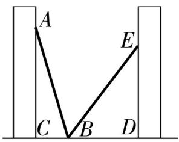

2. A 【解析】因为 $BD \perp CE$ ，所以 $\angle BDC = 90^{\circ}$ .
在Rt△CDB中，由勾股定理，得 $CD^{2} = BC^{2} - BD^{2} = 15^{2} - 12^{2} = 81$ ，所以 CD = 9 m。设风筝沿 CD 方向下降 4 m 至点 M，连接 BM，如图，则

$CM = 4 \mathrm{~m}$ , 所以 $DM = CD - CM = 9 - 4 = 5(\mathrm{~m})$ , 所以 $BM^{2} = BD^{2} + DM^{2} = 12^{2} + 5^{2} = 169$ , 所以 $BM = 13 \mathrm{~m}$ , 所以 $BC - BM = 15 - 13 = 2(\mathrm{~m})$ , 即松松应该往回收线 $2 \mathrm{~m}$ , 故选 A. 公众号\*满满分享库

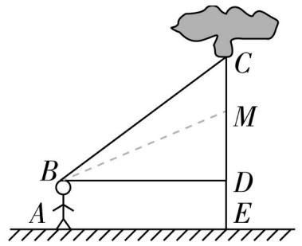

<details>
<summary>text_image</summary>

A
B
C
D
E
M
</details>

3.60 【解析】因为 AB = AC，
所以 $\angle ABC = \angle ACB$ 。因为
BF // AC，所以 $\angle ACB = \angle CBF$ ，所以 $\angle ABC = \angle CBF$ ，

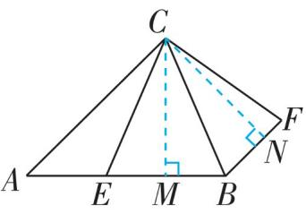

所以 BC 平分 $\angle ABF$ . 如图, 过点 C 作 $CM \perp AB$ 于点 M, $CN \perp BF$ 于点 N, 则 CM = CN. 因为 $S_{\triangle ACE} = \frac{1}{2} AE \cdot CM, S_{\triangle CBF} = \frac{1}{2} BF \cdot CN$ , 且 BF = AE, 所以 $S_{\triangle CBF} = S_{\triangle ACE}$ , 所以四边形 EBFC 的面积为 $S_{\triangle CBF} + S_{\triangle CBE} = S_{\triangle ACE} + S_{\triangle CBE} = S_{\triangle CBA}$ . 因为 AC = 13, 所以 AB = 13. 设 AM = x, 则 BM = 13 - x. 由勾股定理, 得 $CM^{2} = AC^{2} - AM^{2} = BC^{2} - BM^{2}$ , 所以 $13^{2} - x^{2} = 10^{2} - (13 - x)^{2}$ , 解得 $x = \frac{119}{13}$ , 所以 $CM^{2} = 13^{2} - \left(\frac{119}{13}\right)^{2} = \frac{14400}{169}$ , 所以 $CM = \frac{120}{13}$ , 所以 $S_{\triangle CBA} = \frac{1}{2} AB \cdot CM = 60$ , 所以四边形 EBFC 的面积为 60. 故答案为 60.

4. $\frac{3}{2}$ 或 3 【解析】当 $\triangle CEB'$ 为直角三角形时，有以下两种情况：

①当 $\angle CB'E=90^{\circ}$ 时,如图(1)所示,连接 $AC$ .在 Rt $\triangle ABC$ 中, $AB=3,BC=4$ ,所以 $AC^{2}=4^{2}+3^{2}=25$ ,则 $AC=5$ .因为 $\angle B$ 沿 $AE$ 折叠,使点 $B$ 落在点 $B'$ 处,所以 $\angle AB'E=\angle B=90^{\circ}$ .又因为 $\angle CB'E=90^{\circ}$ ,所以点 $A,B',C$ 共线,即 $\angle B$ 沿 $AE$ 折叠,使点 $B$ 落在对角线 $AC$ 上的点 $B'$ 处,则 $EB=EB',AB=AB'=3$ ,所以 $CB'=5-3=2$ .设 $BE=EB'=x$ ,则 $CE=4-x$ .在 Rt $\triangle CEB'$ 中,因为 $EB'^{2}+CB'^{2}=CE^{2}$ ,所以 $x^{2}+2^{2}=(4-x)^{2}$ ,解得 $x=\frac{3}{2}$ ,即 $BE=\frac{3}{2}$ .

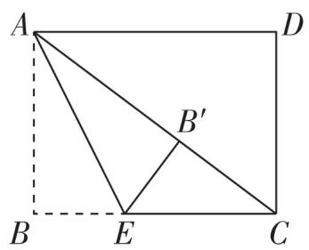

<details>
<summary>text_image</summary>

A
B
E
C
D
B'
</details>

图(1)

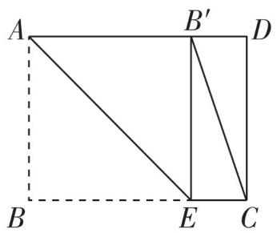

<details>
<summary>text_image</summary>

A
B'
D
B
E
C
</details>

图(2)

# 思路分析

分两种情形: 如图(1)中, 当 $A, B', C$ 共线时, $\angle EB'C = 90^\circ$ . 如图(2)中, 当点 $B'$ 落在 $AD$ 边上时, $\angle CEB' = 90^\circ$ , 分别求解即可.

# 思路分析

由勾股定理求出 BE 的长，设 AD = x，由折叠的性质得 $A' D = AD = x$ ， $A' E = AE = 3$ ，得到 $BA' = 2$ ，BD = 4 - x，在 Rt $\triangle A' DB$ 中，由勾股定理，求出 x 的值即可.

②当点 $B'$ 落在 $AD$ 边上时, 如图(2)所示. 易知此时四边形 $ABEB'$ 为正方形, $\angle CEB' = 90^\circ$ , 所以 $BE = AB = 3$ . 综上所述, $BE$ 的长为 $\frac{3}{2}$ 或 3. 故答案为 $\frac{3}{2}$ 或 3.

# 刷素养

5.【解】(1)在 Rt△OAB 中,由勾股定理得 $OA^{2}=AB^{2}-OB^{2}=25^{2}-20^{2}=225$ ,所以 OA=15 m.

(2) 因为 $OA = 15 \mathrm{~m}, AA' = 8 \mathrm{~m}$ , 所以 $OA' = OA - AA' = 15 - 8 = 7(\mathrm{~m})$ . 在 Rt $\triangle A'OB'$ 中, 由勾股定理得 $OB'^2 = A'B'^2 - OA'^2 = 25^2 - 7^2 = 576$ , 所以 $OB' = 24 \mathrm{~m}$ , 所以 $BB' = OB' - OB = 24 - 20 = 4(\mathrm{~m})$ .

(3) 因为 $25^2 - 24^2 = 49$ , 所以当云梯的顶端到达 $24 \mathrm{~m}$ 高的窗口时, 云梯的底端与墙的距离为 $7 \mathrm{~m}$ . 因为 $25 \times \frac{1}{5} = 5(\mathrm{~m}), 7 \mathrm{~m} > 5 \mathrm{~m}$ , 所以在相对安全的前提下, 云梯的顶端能到达 $24 \mathrm{~m}$ 高的窗口去救援被困人员.


1. C 【解析】因为 $\angle C = 90^{\circ}, AC = 6 \mathrm{~cm}, BC = 8 \mathrm{~cm}$ , 所以 $AB^{2} = AC^{2} + BC^{2} = 6^{2} + 8^{2} = 100$ , 所以 $AB = 10 \mathrm{~cm}$ . 由折叠可得 $\angle AED = \angle C = 90^{\circ}, AE = AC = 6 \mathrm{~cm}, CD = DE$ , 所以 $\angle DEB = 90^{\circ}, BE = AB - AE = 4 \mathrm{~cm}$ . 设 $CD = x \mathrm{~cm}$ , 则 $DE = x \mathrm{~cm}, BD = BC - CD = (8 - x) \mathrm{~cm}$ . 在 Rt $\triangle BDE$ 中, 由勾股定理, 得 $(8 - x)^{2} = x^{2} + 4^{2}$ , 解得 $x = 3$ , 所以 $CD = 3 \mathrm{~cm}$ . 故选 C.

2. A 【解析】因为沿过点 $A$ 的直线将纸片折叠, 使点 $B$ 落在边 $BC$ 上的点 $D$ 处, 所以 $AD = AB = 2$ , $\angle B = \angle ADB$ . 因为折叠纸片, 使点 $C$ 与点 $D$ 重合, 所以 $CE = DE$ , $\angle C = \angle CDE$ . 因为 $\angle BAC = 90^{\circ}$ , 所以 $\angle B + \angle C = 90^{\circ}$ , 所以 $\angle ADB + \angle CDE = 90^{\circ}$ , 所以 $\angle ADE = 90^{\circ}$ , 所以 $AD^{2} + DE^{2} = AE^{2}$ . 设 $AE = x$ , 则 $CE = DE = 3 - x$ , 所以 $2^{2} + (3 - x)^{2} = x^{2}$ , 解得 $x = \frac{13}{6}$ , 所以 $AE = \frac{13}{6}$ . 故选 A.

3. $\frac{3}{2}$ 【解析】如图. 因为 $CE = 1$ , 所以 $AE = AC - CE = 3$ . 因为 $\angle A =$

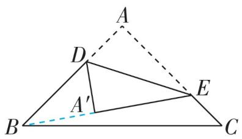

<details>
<summary>text_image</summary>

Geometric diagram showing triangle ABC with points D, E, A, and A' connected by dashed lines
</details>

$90^{\circ}$ , 所以在 Rt $\triangle ABE$ 中, $BE^{2} = AB^{2} + AE^{2} = 25$ , 所以 $BE = 5$ . 设 $AD = x$ , 由折叠的性质, 得 $\angle DA'E = \angle A = 90^{\circ}, A'D = AD = x, A'E = AE = 3$ ,所以 $BA' = BE - A'E = 2, BD = AB - AD = 4 - x.$ 在 Rt $\triangle A'DB$ 中，由勾股定理得 $BD^{2} = BA'^{2} + DA'^{2}$ ，所以 $2^{2} + x^{2} = (4 - x)^{2}$ ，解得 $x = \frac{3}{2}$ ，所以 $AD = \frac{3}{2}$ 。故答案为 $\frac{3}{2}$ 。

4. A 【解析】由折叠的性质, 得 $AD = DF = 5$ . 因

为四边形 ABCD 为长方形, 所以 $\angle C = 90^{\circ}$ , BC = AD = 5. 在 Rt $\triangle DCF$ 中, 因为 CD = 3, DF = 5, 所以 $CF^{2} = DF^{2} - CD^{2} = 5^{2} - 3^{2} = 16$ , 所以 CF = 4, 所以 BF = BC - CF = 5 - 4 = 1. 故选 A.

5. A 【解析】设 $BE = x \mathrm{~cm}$ , 则 $EC = (4 - x) \mathrm{~cm}$ . 根据折叠的性质得 $CD = CD'$ , $\angle D = \angle D'$ . 因为四边形 $ABCD$ 为长方形, 所以 $AB = CD = 3 \mathrm{~cm}$ , $\angle B = \angle D = 90^\circ$ , 所以 $AB = CD' = 3 \mathrm{~cm}$ , $\angle B = \angle D' = 90^\circ$ . 在 $\triangle ABE$ 和 $\triangle CD'E$ 中, 因为 $\angle B = \angle D'$ , $\angle AEB = \angle CED'$ , $AB = CD'$ , 所以 $\triangle ABE \cong \triangle CD'E$ (AAS), 所以 $BE = ED' = x \mathrm{~cm}$ . 在 Rt $\triangle CED'$ 中, $EC^2 = ED'^2 + CD'^2$ , 所以 $(4 - x)^2 = x^2 + 3^2$ , 解得 $x = \frac{7}{8}$ , 所以 $BE = \frac{7}{8} \mathrm{~cm}$ . 故选 A.

6. $\frac{10}{3}$ 【解析】因为四边形 $ABCD$ 为长方形, 所以 $\angle A = \angle B = \angle D = 90^{\circ}, AD = BC = 8, AB = CD = 10$ . 根据折叠的性质得 $PE = DP, \angle E = \angle D = \angle A, CE = DC = 10$ . 因为 $OP = OF, \angle AOP = \angle EOF, \angle A = \angle E$ , 所以 $\triangle OAP \cong \triangle OEF$ , 所以 $OA = OE, AP = EF$ , 所以 $OA + OF = OE + OP$ , 即 $AF = PE$ , 所以 $AF = PE = DP$ . 设 $AP = x$ , 则 $EF = x, AF = PE = DP = AD - AP = 8 - x$ , 所以 $CF = 10 - x, BF = 10 - (8 - x) = x + 2$ . 在 Rt $\triangle CBF$ 中, $CF^{2} = BF^{2} + BC^{2}$ , 即 $(10 - x)^{2} = (x + 2)^{2} + 8^{2}$ , 解得 $x = \frac{4}{3}$ , 所以 $BF = \frac{4}{3} + 2 = \frac{10}{3}$ . 故答案为 $\frac{10}{3}$ .

7.【解】(1)在长方形ABCD中, $AB=6,AD=8$ ,所以 $BC=AD=8,CD=AB=6,\angle B=\angle D=90^{\circ}$ .在Rt△ABC中,由勾股定理得 $AC^{2}=AB^{2}+BC^{2}=6^{2}+8^{2}=100$ ,所以AC=10.

(2)由折叠的性质可知, $AF=AD=8,DE=EF$ , $\angle AFE = \angle D = 90^{\circ}$ ，所以 $\angle CFE = 90^{\circ}, CF = AC - AF = 2.$ 设 DE = EF = x，则 CE = 6 - x. 在 Rt $\triangle CEF$ 中，由勾股定理得 $EF^{2} + CF^{2} = CE^{2}$ ，即 $x^{2} + 2^{2} = (6 - x)^{2}$ ，解得 $x = \frac{8}{3}$ ，所以 $DE = \frac{8}{3}$ .

刷有所得

折叠前后图形的对应边和对应角相等.

技巧点拨

本题考查了翻折变换以及勾股定理的应用, 解题时常常设要求的线段长为 x, 然后根据折叠的性质用含 x 的代数式表示其他线段的长度, 选择适当的直角三角形, 运用勾股定理列出方程求解即可.

# ☆问题解决策略:反思


# 刷提升

【解】(1)由勾股定理,得 $AB^{2}=20^{2}+15^{2}=625$ , 所以 AB=25 dm. 故答案为 25 dm.

(2)如图(1),将圆柱侧面沿点 $C$ 所在高线展开, 易知 $AC = AC'$ . 因为圆柱底面的周长为 $6 \mathrm{~dm}$ , 圆柱高为 $4 \mathrm{dm}$ , 所以 $AB = 4 \mathrm{dm}, BC = BC' = 3 \mathrm{dm}$ , 所以 $AC^2 = 4^2 + 3^2 = 25$ , 所以 $AC = 5 \mathrm{dm}$ , 所以 $2AC = 10 \mathrm{dm}$ . 即这只蚂蚁爬行的最短路程为 $10 \mathrm{dm}$ . 故答案为 $10 \mathrm{dm}$ .

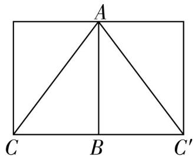

<details>
<summary>text_image</summary>

A
C B C'
</details>

图(1)

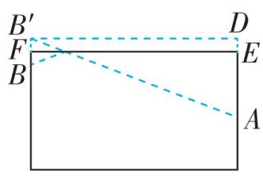  
图(2)

(3)玻璃杯一半的侧面展开示意图如图(2),作B关于EF的对称点 $B'$ ,作 $B'D\perp AE$ ,交AE延长线于点D,连接 $AB'$ ,则 $AB'$ 的长为最短路程.由题意得 $DE=FB'=BF=1\ cm,AE=9-4=5\ (cm)$ ,所以 $AD=AE+DE=6\ cm$ .因为底面周长为16 cm,所以 $B'D=\frac{1}{2}\times16=8\ (cm)$ .因为 $\angle D=90^{\circ}$ ,所以在Rt $\triangle AB'D$ 中, $AB'^{2}=AD^{2}+B'D^{2}=100$ ,所以 $AB'=10\ cm$ ,所以蚂蚁从外壁B处到内壁A处所爬行的最短路程为10 cm.

# 全章综合训练


# 刷中考

1. C 【解析】因为直角三角形的三边 a, b, c 满足 c > a > b，所以该直角三角形的斜边为 c，所以 $c^{2} = a^{2} + b^{2}$ ，所以 $c^{2} - a^{2} - b^{2} = 0$ ，所以 $S_{1} = c^{2} - a^{2} - b^{2} + b (a + b - c) = ab + b^{2} - bc$ 。因为 $S_{2} = b (a + b - c) = ab + b^{2} - bc$ ，所以 $S_{1} = S_{2}$ ，故选 C。

2. $\frac{24}{5}$ 【解析】如图, 过点 $D$ 作 $DH \perp BC$ 于点 $H$ . 由题意可得, $BE$ 为

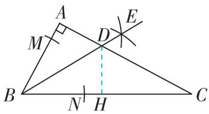

<details>
<summary>text_image</summary>

A
M
D
E
B
N
H
C
</details>

$\angle ABC$ 的平分线. 在 $\triangle ABC$ 中, $\angle A = 90^{\circ}, AB = 8, AC = 15$ , 所以 $BC^{2} = AB^{2} + AC^{2} = 8^{2} + 15^{2} = 289$ , 所以 $BC = 17$ . 因为 $BE$ 平分 $\angle ABC, DA \perp AB, DH \perp BC$ , 所以 $DA = DH$ . 因为 $S_{\triangle ABC} = S_{\triangle ABD} + S_{\triangle DCB}$ , 所以 $\frac{1}{2} \times 8 \times 15 = \frac{1}{2} \times 8 \times AD + \frac{1}{2} \times 17 \times DH$ , 所以 $AD = DH = \frac{24}{5}$ . 故答案为 $\frac{24}{5}$ .

3. $\frac{3}{2}$ 【解析】因为 $\angle ACB = 90^{\circ}, AC = 6, BC = 4$ , $D$ 是边 $AC$ 的中点, 所以 $CD = \frac{1}{2} AC = 3$ , 所以 $BD^{2} = BC^{2} + CD^{2} = 25$ , 所以 $BD = 5$ . 因为将 $\triangle CDE$ 沿 $DE$ 翻折, 点 $C$ 落在 $BD$ 上的点 $F$ 处, 所以 $CD = DF = 3$ , $CE = EF$ , $\angle EFD = \angle ACB = 90^{\circ}$ , 所以 $BF = BD - DF = 2$ , $\angle BFE = 90^{\circ}$ . 设 $CE = x$ , 则 $EF = x$ , $BE = BC - CE = 4 - x$ . 在 Rt $\triangle BFE$ 中, 由勾股定理, 得 $(4 - x)^{2} = x^{2} + 2^{2}$ , 解得 $x = \frac{3}{2}$ , 所以 $CE = \frac{3}{2}$ . 故答案为 $\frac{3}{2}$ .

4. 48 【解析】如图. 因为 $\angle ACB = 90^{\circ}$ , 根据勾股定理, 得 $AC^{2} + BC^{2} = AB^{2} = 2^{2} = 4$ , 所以题图 (1) 中所有

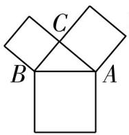

正方形的面积和为 $4+4=8$ ，题图(2)中所有正方形的面积和，即1次操作后图形中所有正方形的面积和为 $8+4=12,2$ 次操作后图形中所有正方形的面积和为 $8+4\times2=16,3$ 次操作后图形中所有正方形的面积和为 $8+4\times3=20,\cdots$ ，所以 n 次操作后图形中所有正方形的面积和为 $8+4n$ ，所以10次操作后图形中所有正方形的面积和为 $8+4\times10=48$ 。

5. C 【解析】如图, 过 B 点作 $BG \parallel CD$ , 连接 EG。因为 $BG \parallel CD$ , 所以 $\angle ABG = \angle CFB = \alpha$ 。因为 $BG^{2} = 1^{2} + 4^{2} = 17$ , $BE^{2} = 1^{2} + 4^{2} = 17$ , $EG^{2} = 3^{2} + 5^{2} = 34$ , 所以 $BG^{2} + BE^{2} = EG^{2}$ , 所以 $\triangle BEG$ 是直角三角形, 所以 $\angle GBE = 90^{\circ}$ , 所以 $\angle ABE = \angle GBE + \angle ABG = 90^{\circ} + \alpha$ 。故选 C.

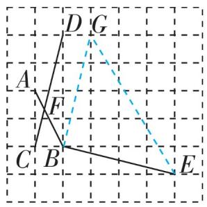

<details>
<summary>text_image</summary>

Geometric diagram with labeled points A, B, C, D, E, F, G and intersecting lines on a grid
</details>

6. $m^{2} + 1$ 【解析】因为 $m$ 为正整数, 所以 $2m$ 为偶数. 设其股是 $a$ , 则弦为 $a + 2$ . 根据勾股定理得 $(2m)^{2} + a^{2} = (a + 2)^{2}$ , 解得 $a = m^{2} - 1$ , 所以弦是 $a + 2 = m^{2} - 1 + 2 = m^{2} + 1$ , 故答案为 $m^{2} + 1$ .

7. C 【解析】将圆柱侧面沿 AC “剪开”, 侧面展开图为长方形, 由题意知圆柱的底面直径为 AB, 且点 B 是展开图的一边的中点, 蚂蚁爬行的最近路线为线段, 则 C 选项符合题意, 故选 C.

刷有所得
n 次操作后图形中所有正方形的面积和为题图(1)中正方形的面积和+4n.

# 思路分析

作出点 A 关于 BC 的对称点 $A'$ ，连接 $A'G$ 交 BC 于点 Q，此时 $AQ + QG$ 最短，根据勾股定理求解即可.


# 刷章测

1. C 【解析】如图, 设正方形 A, B, C, D 的边长分别为 a, b, c, d, 正方形 E 的边长为 x. 因为所有三角形都为直角三角形, 所以 $a^{2} + b^{2} = x^{2}$ , $x^{2} + c^{2} = d^{2}$ , 所以 $d^{2} = a^{2} + b^{2} + c^{2}$ . 因为正方形 A, B, C 的面积依次为 2, 6, 3, 所以 $d^{2} = 2 + 6 + 3 = 11$ , 所以正方形 D 的面积为 11. 故选 C.

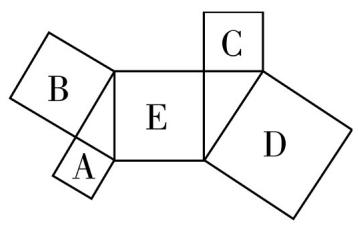

2. C 【解析】如图, 延长 $AB, DC$ 相交于 $F$ , 则 $\triangle BFC$ 是直角三角形. 由勾股定理得 $BF^{2} + FC^{2} = BC^{2}$ . 因为 $AB = 6 \mathrm{~cm}, CD = 8 \mathrm{~cm}, AF = 15 \mathrm{~cm}, FD = 20 \mathrm{~cm}$ , 所以 $BC^{2} = (15 - 6)^{2} + (20 - 8)^{2} = 9^{2} + 12^{2} = 225$ , 所以 $BC = 15 \mathrm{~cm}$ . 故选 C.


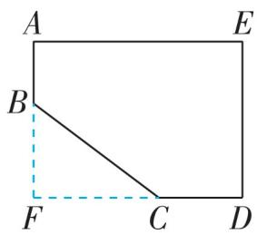

3. B 【解析】因为 $AC = 3, BC = 4, \angle ACB = 90^{\circ}$ , 所以 $AB^{2} = AC^{2} + BC^{2} = 3^{2} + 4^{2} = 25$ , 所以 $AB = 5$ . 由折叠可得 $AE = AB = 5, BD = DE$ , 所以 $CE = AE - AC = 2$ . 设 $CD = x$ , 则 $BD = DE = 4 - x$ . 在 Rt $\triangle CDE$ 中, $CD^{2} + CE^{2} = DE^{2}$ , 所以 $x^{2} + 2^{2} = (4 - x)^{2}$ , 解得 $x = \frac{3}{2}$ , 所以 $CD = \frac{3}{2}$ , 所以阴影部分的面积是 $\frac{1}{2} AC \cdot CD = \frac{1}{2} \times 3 \times \frac{3}{2} = \frac{9}{4}$ . 故选 B.

4. 100 【解析】如图,作点 A 关于 BC 的对称点 $A'$ , 连接 $A'G$ 交 BC 于点 Q, 则 $AQ + QG = A'Q + QG = A'G$ , 所以蚂蚁沿着 $A \rightarrow Q \rightarrow G$ 的路线爬

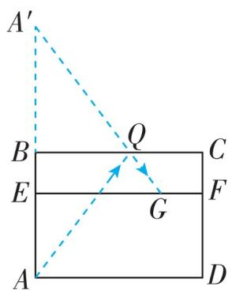

<details>
<summary>text_image</summary>

A'
B
Q
C
E
F
G
A
D
</details>

行时路程最短, 最短路程等于 $A'G$ 的长. 在 Rt $\triangle A'EG$ 中, $A'E = 80 \mathrm{~cm}, EG = 60 \mathrm{~cm}$ , 所以 $A'G^{2} = A'E^{2} + EG^{2} = 10000$ , 所以 $A'G = 100 \mathrm{~cm}$ , 所以最短路线长为 $100 \mathrm{~cm}$ . 故答案为 100.

5.25 或 7 【解析】如图(1), 当点 $D$ 在线段 $BC$ 上时, 因为 $AD = 12$ , $BD = 9$ , $AB = 15$ , 所以 $AD^{2} + BD^{2} = AB^{2}$ , 所以 $\triangle ABD$ 是直角三角形, 且 $\angle ADB = 90^{\circ}$ , 所以 $\angle ADC = 90^{\circ}$ , 所以 $DC^{2} = AC^{2} - AD^{2} = 20^{2} - 12^{2} = 256$ , 所以 $DC = 16$ , 所以 $BC = BD + CD = 9 + 16 = 25$ ; 如图(2), 当点 $D$ 在 $CB$ 的延长线上时, 同理可得 $DC = 16$ , 所以 $BC = CD - BD = 16 - 9 = 7$ . 因为 $AC > AB$ , 所以点 $D$ 不在 $BC$ 的延长线上. 综上所述, $BC$ 的长度为 25 或 7. 故答案为 25 或 7.


<details>
<summary>text_image</summary>

A
B D C
</details>

图(1)

  
图(2)

6.【解】(1)由题意可知, $AD \perp BC$ , $AB = 340 \mathrm{~km}$ , $AD = 160 \mathrm{~km}$ , 在 Rt $\triangle ABD$ 中, $BD^{2} = AB^{2} - AD^{2} = 90000$ , 所以 $BD = 300 \mathrm{~km}$ . 因为 $300 \div 15 = 20 (\mathrm{~h})$ , 所以台风中心经过 $20 \mathrm{~h}$ 从 $B$ 点移到 $D$ 点.

(2)如图,在射线 BC 上取点 E, F, 使得 AE = AF = 200 km. 由 $AD \perp BC$ 得 DE = DF. 在 Rt $\triangle AED$ 中, $ED^{2} = AE^{2} - AD^{2} = 14400$ , 所以 ED = 120 km, 所以 EF = 2ED =

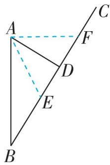

# 思路分析

分情况进行讨论: 点 D 在线段 BC 上和点 D 在 CB 延长线上. 逆用勾股定理可得到 $\triangle ABD$ 为直角三角形, $\angle ADB = 90^{\circ}$ , 再根据勾股定理即可得到 CD 的长, 进而利用线段的和差关系求出 BC 的长.

240 km, $240 \div 15 = 16$ (h), 所以 A 市受到台风影响的时间持续 16 h.

7.【解】(1)不能,理由:如图(1),若直线 CD 平分△ABC 的面积,则 $S_{\triangle ADC} = S_{\triangle DBC}$ , 所以 AD = BD. 因为 $AC \neq BC$ , 所以 $AD + AC \neq BD + BC$ , 所以直线 CD 不平分△ABC 的周长, 所以过点 C 不能画出△ABC 的一条“等分积周线”.

  
图(1)


<details>
<summary>text_image</summary>

Geometric diagram with labeled points A, B, C, D, E, F and right-angle markers, including dashed lines and a perpendicular line.
</details>

图(2)

(2)如图(2)，连接 $AE, DE$ ，设 $BE = x$ . 因为 $EF$ 垂直平分 $AD$ ，所以 $AE = DE, AF = DF$ ，所以 $S_{\triangle AEF} = S_{\triangle DEF}$ . 因为 $\angle B = \angle C = 90^{\circ}, AB = 3, BC = 8, CD = 5$ ，所以在 Rt $\triangle ABE$ 和 Rt $\triangle DCE$ 中，根据勾股定理可得出 $AB^{2} + BE^{2} = CE^{2} + DC^{2}$ ，即 $3^{2} + x^{2} = (8 - x)^{2} + 5^{2}$ ，解得 $x = 5$ ，所以 $BE = 5, CE = 3$ ，所以 $AB + BE = CE + DC, S_{\triangle ABE} = S_{\triangle DCE}$ . 因为 $S_{\text{四边形}ABEF} = S_{\triangle ABE} + S_{\triangle AEF}, S_{\text{四边形}DCEF} = S_{\triangle DEF} + S_{\triangle DCE}$ ，所以 $S_{\text{四边形}ABEF} = S_{\text{四边形}DCEF}, AF + AB + BE = DF + EC + DC$ ，所以直线 $EF$ 为四边形 $ABCD$ 的“等分积周线”.

# 第二章 实数

# 1 认识实数


# 刷基础

1. A 【解析】无理数有 $\frac{\pi}{3}$ , 2.010 010 001 0… (相邻两个 1 之间 0 的个数逐次加 1), 共 2 个. 故选 A.  
2. B 【解析】 $AP^{2} = 3^{2} + 3^{2} = 18$ ; $BP^{2} = 3^{2} + 4^{2} = 25$ , 则 $BP = 5$ ; $CP^{2} = 2^{2} + 4^{2} = 20$ ; $DP^{2} = 4^{2} + 1^{2} = 17$ , 则 $BP$ 的长度是有理数, $AP, CP, DP$ 的长度是无理数, 故选 B.  
3. 无理数 【解析】因为 $\pi r^{2} = 50\pi$ ，所以 $r^{2} = 50$ ，所以 $r$ 是无理数。故答案为无理数。  
4.【解】(1)如图(1), $\triangle ABC$ 即为所求.
(2)如图(2), $\triangle GHI$ 即为所求(答案不唯一).

# 易错警示

一些比较繁琐的小数容易误判为无理数，例如：0.010 010 001


<details>
<summary>text_image</summary>

A
B
C
</details>

图(1)


<details>
<summary>text_image</summary>

G
I
H
</details>

图(2)

5.【解】(1)x 不是有理数. 理由如下:

由勾股定理可知 $x^{2}=4^{2}+4^{2}=32$ ，首先 x 不可能是整数（因为 $5^{2}=25,6^{2}=36$ ，所以 x 在 5 和 6 之间），其次 x 也不可能是分数（因为若 x 是最简分数 $\frac{n}{m}$ ，则 $\left(\frac{n}{m}\right)^{2}$ 仍是一个分数，不等于 32）。综上可知，x 不是有理数。

(2)x 在 5 和 6 之间.

6. C 【解析】无理数包括正无理数和负无理数,故 A 错误;无限循环小数是有理数,无限不循环小数是无理数,故 B 错误;实数可分为正实

5.25 或 7 【解析】如图(1), 当点 $D$ 在线段 $BC$ 上时, 因为 $AD = 12$ , $BD = 9$ , $AB = 15$ , 所以 $AD^{2} + BD^{2} = AB^{2}$ , 所以 $\triangle ABD$ 是直角三角形, 且 $\angle ADB = 90^{\circ}$ , 所以 $\angle ADC = 90^{\circ}$ , 所以 $DC^{2} = AC^{2} - AD^{2} = 20^{2} - 12^{2} = 256$ , 所以 $DC = 16$ , 所以 $BC = BD + CD = 9 + 16 = 25$ ; 如图(2), 当点 $D$ 在 $CB$ 的延长线上时, 同理可得 $DC = 16$ , 所以 $BC = CD - BD = 16 - 9 = 7$ . 因为 $AC > AB$ , 所以点 $D$ 不在 $BC$ 的延长线上. 综上所述, $BC$ 的长度为 25 或 7. 故答案为 25 或 7.

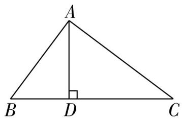

<details>
<summary>text_image</summary>

A
B D C
</details>

图(1)

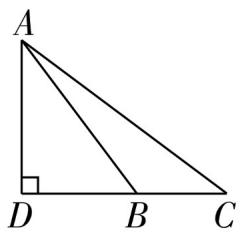  
图(2)

6.【解】(1)由题意可知, $AD \perp BC$ , $AB = 340 \mathrm{~km}$ , $AD = 160 \mathrm{~km}$ , 在 Rt $\triangle ABD$ 中, $BD^{2} = AB^{2} - AD^{2} = 90000$ , 所以 $BD = 300 \mathrm{~km}$ . 因为 $300 \div 15 = 20 (\mathrm{~h})$ , 所以台风中心经过 $20 \mathrm{~h}$ 从 $B$ 点移到 $D$ 点.

(2)如图,在射线 BC 上取点 E, F, 使得 AE = AF = 200 km. 由 $AD \perp BC$ 得 DE = DF. 在 Rt $\triangle AED$ 中, $ED^{2} = AE^{2} - AD^{2} = 14400$ , 所以 ED = 120 km, 所以 EF = 2ED =

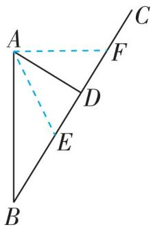

# 思路分析

分情况进行讨论: 点 D 在线段 BC 上和点 D 在 CB 延长线上. 逆用勾股定理可得到 $\triangle ABD$ 为直角三角形, $\angle ADB = 90^{\circ}$ , 再根据勾股定理即可得到 CD 的长, 进而利用线段的差关系求出 BC 的长.

240 km, $240 \div 15 = 16$ (h), 所以 A 市受到台风影响的时间持续 16 h.

7.【解】(1)不能,理由:如图(1),若直线 CD 平分△ABC 的面积,则 $S_{\triangle ADC} = S_{\triangle DBC}$ , 所以 AD = BD. 因为 $AC \neq BC$ , 所以 $AD + AC \neq BD + BC$ , 所以直线 CD 不平分△ABC 的周长, 所以过点 C 不能画出△ABC 的一条“等分积周线”.

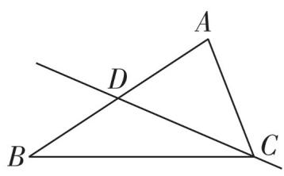  
图(1)

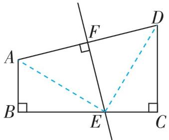

<details>
<summary>text_image</summary>

Geometric diagram showing a right triangle with perpendicular lines and labeled points A, B, C, D, E, F
</details>

图(2)

(2)如图(2)，连接 $AE, DE$ ，设 $BE = x$ . 因为 $EF$ 垂直平分 $AD$ ，所以 $AE = DE, AF = DF$ ，所以 $S_{\triangle AEF} = S_{\triangle DEF}$ . 因为 $\angle B = \angle C = 90^{\circ}, AB = 3, BC = 8, CD = 5$ ，所以在 Rt $\triangle ABE$ 和 Rt $\triangle DCE$ 中，根据勾股定理可得出 $AB^{2} + BE^{2} = CE^{2} + DC^{2}$ ，即 $3^{2} + x^{2} = (8 - x)^{2} + 5^{2}$ ，解得 $x = 5$ ，所以 $B = 5, CE = 3$ ，所以 $AB + BE = CE + DC, S_{\triangle ABE} = S_{\triangle DCE}$ . 因为 $S_{\text{四边形}ABEF} = S_{\triangle ABE} + S_{\triangle AEF}, S_{\text{四边形}DCEF} = S_{\triangle DEF} + S_{\triangle DCE}$ ，所以 $S_{\text{四边形}ABEF} = S_{\text{四边形}DCEF}, AF + AB + BE = DF + EC + DC$ ，所以直线 $EF$ 为四边形 $ABCD$ 的“等分积周线”.

# 第二章 实数

# 1 认识实数


# 刷基础

1. A 【解析】无理数有 $\frac{\pi}{3}$ , 2.010 010 001 0… (相邻两个 1 之间 0 的个数逐次加 1), 共 2 个. 故选 A.  
2. B 【解析】 $AP^{2} = 3^{2} + 3^{2} = 18$ ; $BP^{2} = 3^{2} + 4^{2} = 25$ , 则 $BP = 5$ ; $CP^{2} = 2^{2} + 4^{2} = 20$ ; $DP^{2} = 4^{2} + 1^{2} = 17$ , 则 $BP$ 的长度是有理数, $AP, CP, DP$ 的长度是无理数, 故选 B.  
3. 无理数 【解析】因为 $\pi r^{2} = 50\pi$ ，所以 $r^{2} = 50$ ，所以 $r$ 是无理数。故答案为无理数。  
4.【解】(1)如图(1), $\triangle ABC$ 即为所求.
(2)如图(2), $\triangle GHI$ 即为所求(答案不唯一).

# 易错警示

一些比较繁琐的小数容易误判为无理数，例如：0.010 010 001

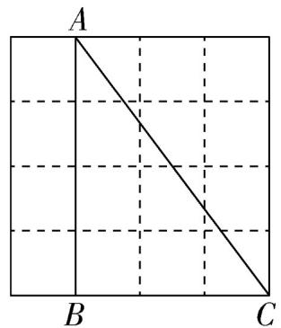

<details>
<summary>text_image</summary>

A
B
C
</details>

图(1)

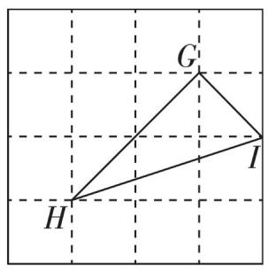

<details>
<summary>text_image</summary>

G
I
H
</details>

图(2)

5.【解】(1) $x$ 不是有理数. 理由如下: 由勾股定理可知 $x^{2} = 4^{2} + 4^{2} = 32$ , 首先 $x$ 不可能是整数 (因为 $5^{2} = 25, 6^{2} = 36$ , 所以 $x$ 在 5 和 6 之间), 其次 $x$ 也不可能是分数 (因为若 $x$ 是最简分数 $\frac{n}{m}$ , 则 $\left(\frac{n}{m}\right)^{2}$ 仍是一个分数, 不等于 32). 综上可知, $x$ 不是有理数. (2) $x$ 在 5 和 6 之间.  
6. C 【解析】无理数包括正无理数和负无理数，故 A 错误；无限循环小数是有理数，无限不循环小数是无理数，故 B 错误；实数可分为正实

数、零、负实数,故 D 错误.故选 C.

7. $\pi - 3 \quad \pi \quad 3.14 - \pi$ 【解析】 $3 - \pi$ 的绝对值是 $\pi - 3$ . 因为 $1 \div \frac{1}{\pi} = \pi$ , 所以 $\frac{1}{\pi}$ 的倒数是 $\pi$ . $\pi - 3.14$ 的相反数是 $-( \pi - 3.14) = 3.14 - \pi$ .

8.【解】非负数集合： $\left\{\frac{1}{2},5.2,0,12,\frac{22}{7},\frac{\pi}{3},\right.$ $0.101\ 001,2\ 025,\cdots\ }$ ;

分数集合： $\left\{\frac{1}{2},5.2,\frac{22}{7},0.101001, - \frac{5}{3},\dots \right\}$

无理数集合: $\left\{\frac{\pi}{3}, -0.030030003 \cdots\right.$ (相邻两个 3 之间 0 的个数逐次加 1), $\cdots$ $\}$ ;

整数集合: $\{0,12,-|-1|,-2^2,2025,\cdots\}$ .

9.【解】如图,点 A 即为所求.

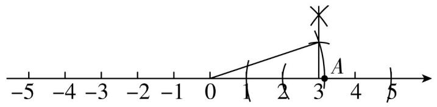

<details>
<summary>text_image</summary>

-5
-4
-3
-2
-1
0
1
2
3
4
5
A
</details>

# 2 平方根与立方根

# 课时1 算术平方根


# 刷基础

1. B 【解析】16 的算术平方根是 4, 故选 B.  
2. B 【解析】若一个数的算术平方根等于它本身, 则这个数是 1 或 0. 故选 B.

3. A 【解析】输入 $x = 81$ , 则 $\sqrt{81} = 9$ , 是有理数; 输入 $x = 9$ , 则 $\sqrt{9} = 3$ , 是有理数; 输入 $x = 3$ , 则 $\sqrt{3}$ 不是有理数, 所以输出 $y = \sqrt{3}$ . 故选 A.  
4. $\sqrt{6}$ 【解析】因为 $\sqrt{5}$ 是 $2a - 1$ 的算术平方根, 所以 $2a - 1 = 5$ , 解得 $a = 3$ . 因为 3 是 $3a + 2b - 3$ 的算术平方根, 所以 $3a + 2b - 3 = 9$ , 解得 $b = \frac{3}{2}$ , 所以 $a + 2b = 6$ , 所以 $a + 2b$ 的算术平方根为 $\sqrt{6}$ . 故答案为 $\sqrt{6}$ .  
5.【解】-18, -8, -2 这三个数是“完美组合数”。
理由如下: $\sqrt{(-18)\times(-8)} = 12, \sqrt{(-8)\times(-2)} = 4, \sqrt{(-18)\times(-2)} = 6$ , 其结果 12, 4, 6 都是整数, 所以 -18, -8, -2 这三个数是“完美组合数”。  
6. B 【解析】因为 $\left|a+1\right|+\sqrt{b-1}+\left(c-1\right)^{2}=0$ ，所以 $a+1=0, b-1=0, c-1=0$ ，所以 a=-1, b=1, c=1，所以 $(abc)^{2024}=(-1\times1\times1)^{2024}=1$ 。故选 B.

# 易错警示

此类题易将 $\sqrt{a} (a\geqslant 0)$ 的算术平方根误认为是 $a$ 的算术平方根，从而导致错误.

# 刷有所得

正数的算术平方根是一个正数,0 的算术平方根是 0, 负数没有算术平方根.

# 刷有所得

几个非负数的

和为 0, 则这几个非负数分别等于 0.

7.3 【解析】因为 $\sqrt{1 - 3x}$ 和 $\sqrt{y - 27}$ 互为相反数，所以 $\sqrt{1 - 3x} + \sqrt{y - 27} = 0$ . 因为 $\sqrt{1 - 3x} \geqslant 0, \sqrt{y - 27} \geqslant 0$ ，所以 $1 - 3x = 0, y - 27 = 0$ ，解得 $x = \frac{1}{3}, y = 27$ ，所以 $xy = \frac{1}{3} \times 27 = 9$ . 因为 9 的算术平方根为 3，所以 $xy$ 的算术平方根是 3. 故答案为 3.  
8. C 【解析】A 选项, 原式 = 3 , 故 A 错误; B 选项, 原式 = 3 , 故 B 错误; C 选项, $(- \sqrt{3})^{2} = 3$ , 故 C 正确; D 选项, $\sqrt{-3}$ 无意义, 故 D 错误. 故选 C.  
9. 1 【解析】因为 a > 3, 所以 a - 2 > 0, a - 3 > 0, 则原式 = a - 2 - (a - 3) = a - 2 - a + 3 = 1. 故答案为 1.  
10.【解】由题意可得 $g=9.8\ m/s^{2}, d=20\ m$ ，则 $v=\sqrt{gd}=\sqrt{9.8\times20}=14(\mathrm{~m/s})$ .
答:海啸的行进速度为 $14 \, m/s$ .

# 刷易错·

11. 3 【解析】因为 $\sqrt{81} = 9$ , 所以 $\sqrt{81}$ 的算术平方根是 3. 故答案为 3.


# 刷提升

1. A 【解析】一个自然数的算术平方根是 n，则这个自然数是 $n^{2}$ ，则从小到大排序的下一个自然数为 $n^{2}+1$ ，其算术平方根为 $\sqrt{n^{2}+1}$ ，故选 A.

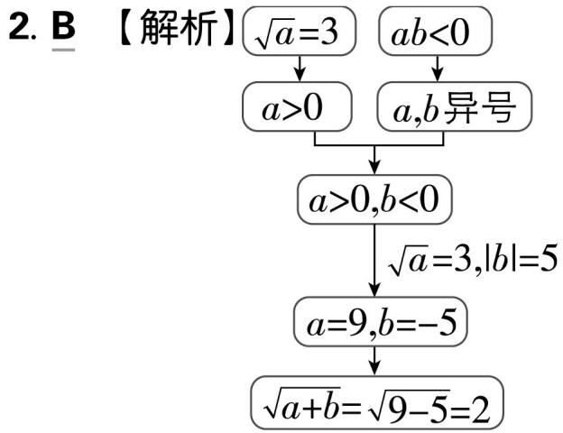

<details>
<summary>flowchart</summary>

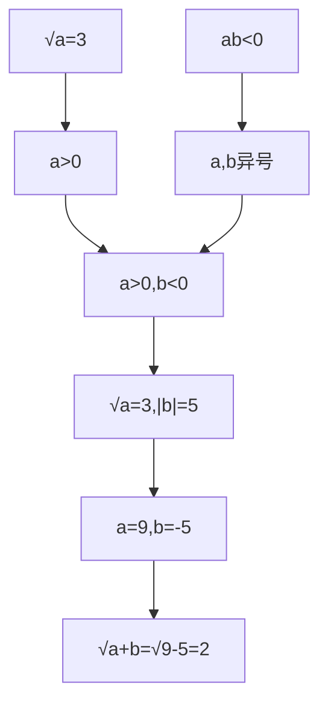
</details>

3. $\sqrt{2}$ 【解析】设正方形的边长为 $x$ . 由题意得 $x^{2} = 2 \times 1$ , 所以 $x = \sqrt{2}$ , 所以该正方形的边长为 $\sqrt{2}$ . 故答案为 $\sqrt{2}$ .  
4. 1 111 1 111 111 【解析】因为 $11^{2} = 121$ ，所以 $\sqrt{121} = 11$ . 同理，因为 $111^{2} = 12321$ ，所以 $\sqrt{12321} = 111$ . 因为 $111^{2} = 1234321$ ，所以 $\sqrt{1234321} = 1111$ . 由此猜想 $\sqrt{1234567654321} = 1111111$ . 故答案为 $1111, 1111111$ .  
5.4 或 2 或 0 【解析】因为 $|a - 2022| + \sqrt{b + 2022} = 2$ ，其中 $a, b$ 均为整数，且 $|a - 2022| \geqslant 0, \sqrt{b + 2022} \geqslant 0$ ，所以可分以下三种情况：

① $|a-2\ 022|=0,\sqrt{b+2\ 022}=2$ ，解得 a=2 022, b=-2 018，则 $|a+b|=4$ ;

② $|a-2\ 022|=1,\sqrt{b+2\ 022}=1$ ，解得 a=2 021 或 2 023, b=-2 021，则 $|a+b|=0$ 或 2；  
③ $|a-2\ 022|=2,\sqrt{b+2\ 022}=0$ , 解得 a=2 024 或 2 020, b=-2 022, 则 $|a+b|=2$ .  
综上所述， $|a+b|=4$ 或 2 或 0. 故答案为 4 或 2 或 0.

6. 132 或 798 【解析】设 $n = 100a + 10b + c$ ( $1 \leqslant a < b \leqslant 9, 1 < c < 9, a, b, c$ 均为整数), 则 $a + b = 2c$ , 所以 $F(n) = 100a + 10b + c + 100b + 10a + c = 222c$ , 所以 $\sqrt{\frac{F(n)}{111}} = \sqrt{\frac{222c}{111}} = \sqrt{2c}$ . 因为 $\sqrt{\frac{F(n)}{111}}$ 是一个整数, $1 < c < 9$ , 所以 $2c = 4$ 或 $2c = 16$ , 则 $c = 2$ 或 8, 所以 $F(n) = 444$ 或 1776. ①当 $F(n) = 444$ 时, 因为 $F(n)$ 能被 $n$ 的十位数字与百位数字的差整除, 所以 $\frac{444}{b - a}$ 为整数, 所以 $b - a = 1$ 或 2 或 3 或 4 或 6. 因为 $a + b = 2c = 4$ , 所以易知 $b = 3, a = 1$ . ②当 $F(n) = 1776$ 时, 因为 $\frac{1776}{b - a}$ 为整数, 所以 $b - a = 1$ 或 2 或 3 或 4 或 6 或 8. 因为 $a + b = 2c = 16$ , 所以易知 $b = 9, a = 7$ , 所以 $n = 132$ 或 798. 故答案为 132 或 798.

7.【解】(1)由题意可知 $\sqrt{(10 - 6)^2} = 10 - 6\sqrt{(7 - 9)^2} = 9 - 7.$ 故答案为 $10 - 6,9 - 7.$

(2)由题意可知当 $a > b$ 时， $\sqrt{(a - b)^2} = a - b$ ；当 $a < b$ 时， $\sqrt{(a - b)^2} = b - a.$ 故答案为 $a - b, b - a$ .

(3) 原式 $= \frac{1}{2} - \frac{1}{3} + \frac{1}{3} - \frac{1}{4} + \frac{1}{4} - \frac{1}{5} + \cdots + \frac{1}{2022} - \frac{1}{2023} = \frac{1}{2} - \frac{1}{2023} = \frac{2021}{4046}$ .

# 刷素养·

# 8. 思路分析 | 根号下的小数点的移动规律

<table><tr><td>a</td><td>向左或右移动 2n(n为正整数)位</td></tr><tr><td> $\sqrt{a}$ </td><td>向左或右移动 n(n为正整数)位</td></tr></table>

【解】(1) 根据算术平方根的定义得, $x = \sqrt{0.01} = 0.1, y = \sqrt{100} = 10$ . 故答案为 $0.1, 10$ .

(2)①由表格中数据可得,被开方数的小数点每往右移动两位,它的算术平方根的小数点就向右移动一位,所以由 $\sqrt{6} \approx 2.45$ 可知 $\sqrt{0.06} \approx 0.245$ .故答案为0.245.

# ▶ 关键点拨

本题的关键在于如何进行2的拆分,注意不要漏解.

②因为 $\sqrt{0.0012} \approx 0.03464, \sqrt{2m} \approx 34.64$ , 0.03464 的小数点向右移动了 3 位得到 34.64, 所以由规律可知被开方数 0.0012 的小数点需要向右移动 6 位得到 $2m$ , 所以 $0.0012 \times 10^{6} = 2m$ , 解得 $m = 600$ , 所以 $m$ 的值为 600.

# 课时 2 平方根


# 刷基础

1. B 【解析】用等式表示“64 的平方根等于 $\pm 8$ ”为 $\pm \sqrt{64} = \pm 8$ . 故选 B.

2. B 【解析】因为 $(\pm 9)^{2} = 81$ ，所以 $\pm \sqrt{81} = \pm 9$ . 故选 B.

3. A 【解析】正数有 2 个平方根, 它们互为相反数; 0 的平方根是 0; 负数没有平方根, 故 A 符合题意, B, C, D 均不符合题意. 故选 A.

4. A 【解析】根据题意得, $b - 4 = 0, a - 1 = 0$ , 解得 $a = 1, b = 4$ , 所以 $\frac{a}{b} = \frac{1}{4}$ . 因为 $\left(\pm \frac{1}{2}\right)^2 = \frac{1}{4}$ , 所以的平方根是 $\pm \frac{1}{2}$ . 故选 A.

5. B 【解析】由题意知 $8 - m \geqslant 0$ , 则 $m$ 为不大于 8 的自然数. 当 $m = 0, 1, 2, 3, 5, 6$ 时, $\sqrt{8 - m} = \sqrt{8}, \sqrt{7}, \sqrt{6}, \sqrt{5}, \sqrt{3}, \sqrt{2}$ , 都不是整数; 当 $m = 4, 7, 8$ 时, $\sqrt{8 - m} = 2, 1, 0$ , 是整数. 故满足条件的自然数 $m$ 共有 3 个. 故选 B.

6. $\pm 5 \pm 9$ 【解析】因为 $a^2 = 25$ , 所以 $a = \pm 5$ . 因为 $(-9)^2 = 81, 81$ 的平方根是 $\pm 9$ , 所以 $(-9)^2$ 的平方根是 $\pm 9$ . 故答案为 $\pm 5, \pm 9$ .

7. ±4 【解析】根据题意, 得 $m = (-\sqrt{3})^{2} = 3$ , 则 $m + 13 = 16$ , 所以 $m + 13$ 的平方根为 ±4.

8.11 【解析】0 的平方根为 0, 1 的平方根为 ±1, 4 的平方根为 ±2, 9 的平方根为 ±3, 16 的平方根为 ±4, 25 的平方根为 ±5, 36 的平方根为 ±6, 49 的平方根为 ±7, 64 的平方根为 ±8, 81 的平方根为 ±9, 100 的平方根为 ±10, 所以在 0 到 100 的 101 个数中是完全平方数的共有 11 个. 故答案为 11.

9. ±45 【解析】因为 $x = \sqrt{2015} - 1$ ，所以 $(x + 1)^{2} + 10 = (\sqrt{2015} - 1 + 1)^{2} + 10 = 2015 + 10 = 2025, \pm\sqrt{2025} = \pm45$ 。故答案为 ±45。

10.【解】(1) $\pm \sqrt{121} = \pm \sqrt{11^2} = \pm 11$ .

(2) $\pm \sqrt{\frac{25}{9}} = \pm \sqrt{\left(\frac{5}{3}\right)^2} = \pm \frac{5}{3}.$   
(3) $\pm \sqrt{(-13)^2} = \pm 13.$   
(4) 因为 $\sqrt{196} = \sqrt{14^2} = 14$ , 所以 $\sqrt{196}$ 的平方根是 $\pm \sqrt{14}$ .

11.【解】(1) 因为一个正数 $x$ 的两个不同的平方根分别是 $2a - 3$ 和 $5 - a$ , 所以 $2a - 3 + 5 - a = 0$ , 解得 $a = -2$ , 所以 $x = (2a - 3)^{2} = 49$ .

(2) 将 $x = 49, a = -2$ 代入 $x + 12a$ , 得 $49 - 24 = 25$ . 因为 25 的平方根为 $\pm 5$ , 所以 $x + 12a$ 的平方根为 $\pm 5$ .

12.【解】因为 $2m - 1$ 的平方根是 $\pm 3$ , 所以 $2m - 1 = 9$ , 所以 $m = 5$ . 因为 $m - 2n - 1$ 的算术平方根是 4, 所以 $m - 2n - 1 = 16$ , 所以 $n = -6$ , 所以 $2m - n = 2 \times 5 - (-6) = 16$ . 因为 16 的平方根是 $\pm 4$ , 所以 $2m - n$ 的平方根是 $\pm 4$ .

# 刷易错·

13.【解】①当 $a + 3 = 2a - 15$ 时, $a = 18$ , 则 $a + 3 = 21, 21^{2} = 441$ ; ②当 $a + 3 = -(2a - 15)$ 时, $a = 4$ , 则 $a + 3 = 7, 7^{2} = 49$ . 故这个数是 49 或 441.

# 课时 3 立方根


# 刷基础

1. D 【解析】27 的立方根是 3, 记作 $\sqrt[3]{27} = 3$ , 故 A 选项错误, 不符合题意; -25 是负数, 负数没有算术平方根, 故 B 选项错误, 不符合题意; $a$ 的三次方根是 $\sqrt[3]{a}$ , 故 C 选项错误, 不符合题意; 0 的立方根是 0, 故 D 选项正确, 符合题意. 故选 D.  
2. C 【解析】正数有一个立方根, 故 A 选项错误, 不符合题意; 立方根等于它本身的数有 -1, 0, 1, 故 B 选项错误, 不符合题意; 负数的立方根是负数, 故 C 选项正确, 符合题意; 负数有立方根, 故 D 选项错误, 不符合题意. 故选 C.  
3. A 【解析】-8 的立方根是 $\sqrt[3]{-8}$ , 即 $\sqrt[3]{(-2)^{3}} = -2$ , 故选 A.  
4. B 【解析】 $\sqrt[3]{(-2)^{3}} = -2$ ，故 A 选项错误，不符合题意； $\sqrt[3]{-0.064} = -0.4$ ，故 B 选项正确，符合题意； $(\sqrt[3]{-21})^{3} = -21$ ，故 C 选项错误，不符合题意； $\sqrt[3]{-\frac{27}{64}} = -\frac{3}{4}$ ，故 D 选项错误，不符合题意。故选 B。  
5. -10 【解析】因为 $\sqrt[3]{a+2} = -2$ ，所以 $a+2 = (-2)^{3} = -8$ ，解得 a = -10。故答案为 -10。

# 刷有所得

一个正数的两个平方根互为相反数.

# 易错警示

本题容易忽略 $a + 3$ 和 $2a - 15$ 相等的情况而出错.

# 易错警示

在开立方时容易被开平方运算所误导,记住任何实数都有立方根.

关键点拨解决本题的关键为知道立方根等于本身的数有±1和0.

6. B 【解析】因为正数 b 的平方根为 $a+1$ 和 2a-7, 所以 $a+1+2a-7=0$ , 所以 a=2, 所以 $a+1=2+1=3$ , 所以 $b=3^{2}=9$ , 所以 $9a+b=9\times2+9=27$ , 所以 $9a+b$ 的立方根是 3, 故选 B.  
7. B 【解析】因为 $\sqrt[3]{125}=5$ ，所以 x=5。因为 5 的算术平方根是 $\sqrt{5}$ ，所以 x 的算术平方根是 $\sqrt{5}$ ，故选 B。  
8. B 【解析】因为 $\sqrt[3]{-27} + \sqrt{9} = -3 + 3 = 0$ ，所以数轴上表示 $\sqrt[3]{-27} + \sqrt{9}$ 的点一定在第②段。故选 B.  
9. $\sqrt{2}$ 【解析】当 $x$ 为 64 时, 取算术平方根得 8, 8 取立方根得 2, 2 取算术平方根得 $\sqrt{2}, \sqrt{2}$ 是无理数, 所以输出的 $y$ 值为 $\sqrt{2}$ . 故答案为 $\sqrt{2}$ .  
10.【解】(1) 因为 $a + 1$ 的算术平方根是 1 , 所以 $a + 1 = 1$ , 解得 $a = 0$ . 因为 -27 的立方根是 $b - 12$ , 所以 $b - 12 = -3$ , 所以 $b = 9$ . 因为 $c - 3$ 的平方根是 $\pm 2$ , 所以 $c - 3 = 4$ , 所以 $c = 7$ .

(2)由(1)知, $a = 0, b = 9, c = 7$ , 所以 $a + b + c = 0 + 9 + 7 = 16$ , 所以 $a + b + c$ 的平方根是 $\pm 4, a + b + c$ 的立方根是 $\sqrt[3]{16}$ .

11. $150 \mathrm{~cm}^{2}$ 【解析】根据题意, 得 $\sqrt[3]{216 - 91} = \sqrt[3]{125} = 5(\mathrm{~cm})$ , 即王师傅制作的正方体月饼礼盒的棱长为 $5 \mathrm{~cm}$ , 则其表面积为 $5 \times 5 \times 6 = 150(\mathrm{~cm}^{2})$ . 故答案为 $150 \mathrm{~cm}^{2}$ .

# 刷易错·

12. 任意实数 【解析】由于任意实数都有立方根, 所以 $3 - a$ 为任意实数, 即 $a$ 为任意实数, 故答案为任意实数.


# 刷提升

1. A 【解析】因为 $\sqrt[3]{x-3}-\sqrt[3]{2x+1}=0$ ，所以 $\sqrt[3]{x-3}=\sqrt[3]{2x+1}$ ，所以 $x-3=2x+1$ ，所以 x=-4，所以 $x^{2}+x-3=16-4-3=9$ ，所以 $x^{2}+x-3$ 的算术平方根为 $\sqrt{9}=3$ 。  
2. A 【解析】由一个数的立方根扩大为原来的 10 倍, 则这个数就扩大为原来的 1 000 倍, 可知 $x$ 的值约为 $326 \times 10^{3} = 326 000$ .  
3. 9 【解析】因为 $\sqrt[3]{8} = 2, \sqrt[3]{27} = 3$ , 而 $\sqrt[3]{a}$ 的整数部分为 2, 所以 $8 < a < 27$ , 则满足条件的奇数 $a$ 有 9, 11, 13, 15, 17, 19, 21, 23, 25, 共 9 个. 故答案为 9.  
4.8 【解析】立方根等于本身的数的个数为 3, 故 $a = 3$ ; 平方根等于本身的数的个数为 1, 故

b=1;算术平方根等于本身的数的个数为2,故c=2;倒数等于本身的数的个数为2,故d=2,把这些数值代入,得 $a+b+c+d=8$ .

5.6 【解析】设两位数 $M = 10a + b$ ，则 $N = 10b + a$ ，设 $M - N$ 是正整数 $c$ 的立方。因为 $a, b$ 为正整数，且 $1 \leqslant a \leqslant 9, 1 \leqslant b \leqslant 9$ ，所以 $M - N = (10a + b) - (10b + a) = 9(a - b) = c^3$ ，显然 $c^3 \leqslant 72$ 。因为 $c$ 是正整数， $4^3 = 64, 5^3 = 125$ ，所以 $c \leqslant 4$ 。又因为 $c$ 是正整数， $c^3$ 是9的整数倍，所以 $c = 3$ ，即 $a - b = 3$ ，所以满足条件的两位数 $M$ 有41,52,63,74,85,96，共6个。故答案为6。

6.【解】(1)因为长方体水池的长、宽、高之比为2:2:4,其体积为 $16\ m^{3}$ ,所以设长方体水池的长、宽、高分别为 $2x\ m,2x\ m,4x\ m$ ,所以 $2x\cdot2x\cdot4x=16$ ,所以 $16x^{3}=16$ ,所以 $x^{3}=1$ ,解得x=1,所以长方体水池的长、宽、高分别为2m,2m,4m.

(2)已知该球的半径为 $r\mathrm{m}$ , 则 $\frac{4}{3}\pi r^3 = \frac{1}{32} \times 16$ , 所以 $r^3 = \frac{1}{32} \times 16 \times \frac{1}{4}$ , 所以 $r = 0.5$ .

答:该球的半径为 0.5 m.

7.【解】(1) 因为 $\sqrt[3]{n^3} = n, \sqrt[3]{-n^3} = -n$ , 所以 $\sqrt[3]{-n^3} = -\sqrt[3]{n^3}$ . 故答案为 $n, -n, \sqrt[3]{-n^3}, -\sqrt[3]{n^3}$ . 互为相反数的两个数的立方根互为相反数.

(2) 原式 $= -1 - 2 - 3 - \dots - 100 = -\frac{100 \times (100 + 1)}{2} = -5050.$

# 刷素养·

8.【解】(1) $4^{3}=4\times4\times4=64,6^{3}=6\times6\times6=216,8^{3}=8\times8\times8=512$ . 故从左到右依次填入4,6,2.

(2)要得到 $\sqrt[3]{262\ 144}$ 的结果,可以按如下步骤思考:第一步:确定 $\sqrt[3]{262\ 144}$ 的位数,因为 $10^{3}=1\ 000,100^{3}=1\ 000\ 000$ ,而 $1\ 000<262\ 144<1\ 000\ 000$ ,所以 $10<\sqrt[3]{262\ 144}<100$ ,由此得 $\sqrt[3]{262\ 144}$ 是两位数;第二步:确定个位数字,因为262 144的个位上的数字是4,而只有4的立方的个位上的数字是4,所以 $\sqrt[3]{262\ 144}$ 的个位上的数字是4;第三步:确定十位数字,划去262 144后面的三位144得到262,因为 $6^{3}=216,7^{3}=343$ ,而216<262<343,所以 $\sqrt[3]{262\ 144}$ 的十位上的数字是6.综上, $\sqrt[3]{262\ 144}=64$ .

要得到 $\sqrt[3]{474.552}$ 的结果, 即要得到 $\frac{\sqrt[3]{474.552}}{10}$ 的结果, 可以按如下步骤思考: 第一步: 确定 $\sqrt[3]{474.552}$ 的位数, 因为 $10^{3} = 1000, 100^{3} = 1000000$ , 而 $1000 < 474552 < 1000000$ , 所以 $10 < \sqrt[3]{474.552} < 100$ , 由此得 $\sqrt[3]{474.552}$ 是两位数; 第二步: 确定个位数字, 因为 $474552$ 的个位上的数字是 2, 而只有 8 的立方的个位上的数字是 2, 所以 $\sqrt[3]{474.552}$ 的个位上的数字是 8; 第三步: 确定十位数字, 划去 $474552$ 后面的三位 $552$ 得到 $474$ , 因为 $7^{3} = 343, 8^{3} = 512$ , 而 $343 < 474 < 512$ , 所以 $\sqrt[3]{474.552}$ 的十位上的数字是 7. 综上, $\sqrt[3]{474.552} = 78$ , 所以 $\sqrt[3]{474.552} = \frac{78}{10} = 7.8$ . 故答案为 $64, 7.8$ .

# 课时4 估算与用计算器开方


# 刷基础

刷有所得估算问题可逆向考虑,看被开方数在哪个连续整数的平方之间即可.

【解析】因为 $4^{2}=16,5^{2}=25$ ，而 16<24<5，所以 $4<\sqrt{24}<5$ ，故 $5<\sqrt{24}+1<6$ ，故选 C.

2. C 【解析】根据正负数比较法, 得 $-\sqrt{5} > -\sqrt{6}$ .
故选 C.

3. C 【解析】因为 $1 < \sqrt{3} < 2$ , 所以 $x = 1$ , 所以 $y = \sqrt{3} - 1$ . 故选 C.

4. 56 【解析】因为 $5^{2} = 25 < 27 < 36 = 6^{2}$ , 所以边 $AB$ 的长大于 5 且小于 6.

归纳总结两数的大小比较一般有作差法和作商法，根据作差或者作商的结果判断两数的大小.

5. ≥ 【解析】 $\frac{\sqrt{10} - 1}{3} - \frac{2}{3} = \frac{\sqrt{10} - 1 - 2}{3} = \frac{\sqrt{10} - 3}{3}$ .

因为 $\sqrt{9} < \sqrt{10} < \sqrt{16}$ , 所以 $3 < \sqrt{10} < 4$ , 所以 $\sqrt{10} - 3 > 0$ , 所以 $\frac{\sqrt{10} - 3}{3} > 0$ , 所以 $\frac{\sqrt{10} - 1}{3} > \frac{2}{3}$ .

故答案为>.

6.3 【解析】因为 $2 < \sqrt{5} < 3, 3 < \sqrt{15} < 4$ , 而整数 $a$ 满足 $\sqrt{5} < a < \sqrt{15}$ , 所以 $a = 3$ . 故答案为 3.

7.【解】(1) 因为 $\sqrt{64} < \sqrt{76} < \sqrt{81}$ , 即 $8 < \sqrt{76} < 9$ , 所以 $\sqrt{76}$ 的整数部分为 8. 故答案为 8.

(2) 因为面积为 76 的正方形边长是 $\sqrt{76}$ , 且 $8 < \sqrt{76} < 9$ , 所以设 $\sqrt{76} = 8 + x$ , 其中 $0 < x < 1$ , 画出示意图如图所示. 因为图中 $S_{\text {大正方形}} =$

<table><tr><td></td><td>8</td><td>x</td></tr><tr><td>8</td><td>64</td><td>8x</td></tr><tr><td>x</td><td>8x</td><td> $x^2$ </td></tr></table>

$8^{2}+2\times8x+x^{2},S_{大正方形}=76$ ,所以 $8^{2}+2\times8x+x^{2}=76$ .当 $x^{2}$ 较小时,省略 $x^{2}$ ,得 $16x+64\approx76$ ,得到 $x\approx0.75$ ,即 $\sqrt{76}\approx8.75$ .

8.【解】因为长方形 ABCD 的长和宽的长度比为 4:3, 所以设长方形的长为 4x cm, 宽为 3x cm. 由题意知, $4x \cdot 3x = 612$ , 所以 $12x^{2} = 612$ , 所以 $x^{2} = 51$ . 因为 x > 0, 所以 $x = \sqrt{51}$ , 所以长方形的长为 $4\sqrt{51}$ cm, 长方形的宽为 $3\sqrt{51}$ cm. 设圆的半径为 r cm. 因为 $\pi r^{2} = 16\pi$ , 所以 $r^{2} = 16$ . 因为 r > 0, 所以 r = 4, 所以圆的直径为 8 cm, $4\sqrt{51} \div 8 = \frac{\sqrt{51}}{2}$ . 因为 $7 < \sqrt{51} < 8$ , 所以 3.5 < $\frac{\sqrt{51}}{2} < 4$ , 所以在此长方形内沿着 AB 边并排最多能裁出 3 个面积为 $16\pi \, cm^{2}$ 的圆.

# 9. B 【解析】

<table><tr><td>选项</td><td>分析</td><td>判断</td></tr><tr><td>A</td><td>10√2=14.142 135 623 7,总的位数还是13位,所以不可能出现7后面的数字</td><td>×</td></tr><tr><td>B</td><td>10(√2-1)=14.142 135 623 7-10=4.142 135 623 7,总的位数是12位,所以一定会出现7后面的数字</td><td>√</td></tr><tr><td>C</td><td>100√2=141.421 356 237,总的位数还是13位,所以不可能出现7后面的数字</td><td>×</td></tr><tr><td>D</td><td>√2-1=1.414 213 562 37-1=0.414 213 562 37,总的位数还是13位,所以不可能出现7后面的数字</td><td>×</td></tr></table>

10. $\leq$ 【解析】因为 $\sqrt[3]{11} \approx 2.224, \sqrt{5} \approx 2.236,$ 2. $224 < 2.236$ , 所以 $\sqrt[3]{11} < \sqrt{5}$ . 故答案为 $<$ .

11.【解】(1) 原式 $\approx -0.76$ .

(2) 原式 $\approx 11.49$ .

刷有所得

一般地, 形如 $\sqrt{a}(a \geqslant 0)$ 的式子叫作二次根式.

# 关键点拨

因为计算器只能显示十三位（包括小数点），要想知道7后面的数字是什么，就要尽可能地去掉小数点前面的数字，使数位减少，从而让7后面的数字出现.

# 3 二次根式

# 课时1 二次根式的乘除法


# 刷基础

1. B 【解析】① $\sqrt{7}$ 是二次根式；② $\sqrt{-5}$ 的被开方数小于0，不是二次根式；③ $\sqrt[3]{10}$ 是三次根式；④ $\sqrt{-3-x^{2}}$ 的被开方数小于0，不是二次根式；⑤ $\sqrt{a^{2}+9}$ ，因为 $a^{2}\geqslant0$ ，所以 $a^{2}+9>0$ ，是二次根式；⑥ $\sqrt{\frac{1}{x^{2}+1}}$ ，因为 $x^{2}\geqslant0$ ，所以 $x^{2}+1>0$ ，是二次根式。故选B。

2. $\sqrt{x^2 + 1}$ (答案不唯一) 【解析】符合条件的二次根式可以为 $\sqrt{x^2 + 1}$ . 故答案为 $\sqrt{x^2 + 1}$ (答案不唯一).

3. A 【解析】 $\sqrt{28} \times \sqrt{\frac{1}{7}} = \sqrt{28 \times \frac{1}{7}} = \sqrt{4} = 2$ . 故选 A.

4. A 【解析】 $\sqrt{\frac{1}{3}} \times (\sqrt{6} + \sqrt{3}) = \sqrt{2} + 1$ . 因为 $\sqrt{1} < \sqrt{2} < \sqrt{4}$ , 所以 $1 < \sqrt{2} < 2$ , 所以 $2 < \sqrt{2} + 1 < 3$ , 故选 A.

5. $8 - 2\sqrt{15}$ 【解析】 $(\sqrt{5} -\sqrt{3})^2 = 5 - 2\sqrt{15} +3 =$ $8 - 2\sqrt{15}$ .故答案为 $8 - 2\sqrt{15}$

6.1 【解析】原式 $= \sqrt{5 \times \frac{4}{5}} - 1 = 2 - 1 = 1$ . 故答案为1.

7. $\sqrt{7} -\sqrt{6}$ 【解析】因为 $a = \sqrt{7} +\sqrt{6},b = \sqrt{7} -\sqrt{6}$ 所以 $ab = (\sqrt{7} +\sqrt{6})(\sqrt{7} -\sqrt{6}) = 7 - 6 = 1$ ，则 $a^{2023}\cdot b^{2024} = (ab)^{2023}b = 1\times (\sqrt{7} -\sqrt{6}) = \sqrt{7}-$ $\sqrt{6}$ .故答案为 $\sqrt{7} -\sqrt{6}$

8.【解】(1) 原式 $= \sqrt{\frac{1}{3} \times \frac{27}{4}} = \sqrt{\frac{9}{4}} = \frac{3}{2}$ .

(2) $(\sqrt{24} - \sqrt{6}) \times \sqrt{\frac{1}{6}} = \sqrt{24 \times \frac{1}{6}} - \sqrt{6 \times \frac{1}{6}} = \sqrt{4} - 1 = 2 - 1 = 1.$

(3) 原式 $= (\sqrt{3} + 2)(\sqrt{3} - 2) + \sqrt{2 \times 18} = (\sqrt{3})^2 - 2^2 + \sqrt{36} = 3 - 4 + 6 = 5.$

9. B 【解析】 $\frac{\sqrt{9}}{\sqrt{3}} = \sqrt{\frac{9}{3}} = \sqrt{3}$ , 故 A 选项不正确, 不符合题意; $\frac{\sqrt{18} - \sqrt{2}}{\sqrt{2}} = \frac{\sqrt{18}}{\sqrt{2}} - \frac{\sqrt{2}}{\sqrt{2}} = \sqrt{9} - 1 = 3 -$

1=2,故B选项正确,符合题意; $2\sqrt{5}\times5\sqrt{2}=2\times5\times\sqrt{5\times2}=10\sqrt{10}$ ,故C选项不正确,不符合题意; $\sqrt{8}\div\sqrt{2}=\sqrt{8\div2}=\sqrt{4}=2$ ,故D选项不正确,不符合题意.故选B.

10.2 【解析】原式 $= \frac{\sqrt{2 \times 10}}{\sqrt{5}} = \frac{\sqrt{20}}{\sqrt{5}} = \sqrt{4} = 2.$ 故答案为2.

11. $\sqrt{3}$ 【解析】因为 $S = ab$ ，所以 $b = \frac{S}{a} = \frac{\sqrt{6}}{\sqrt{2}} = \sqrt{3}$ . 故答案为 $\sqrt{3}$ .

12. $\sqrt{2}$ 【解析】 $12 \div 4 = \frac{\sqrt{12 + 4}}{\sqrt{12 - 4}} = \frac{\sqrt{16}}{\sqrt{8}} = \sqrt{\frac{16}{8}} = \sqrt{2}$ . 故答案为 $\sqrt{2}$ .

13.【解】(1) 原式 = $\sqrt{\frac{32}{2}} - \sqrt{\frac{8}{2}} = \sqrt{16} - \sqrt{4} = 4 - 2 = 2.$

(2) 原式 $= \sqrt{\frac{20}{5}} + \sqrt{\frac{125}{5}} + 5 = \sqrt{4} + \sqrt{25} + 5 = 2 + 5 + 5 = 12.$

# 课时 2 二次根式的化简及加减运算

# 刷基础

1. D 【解析】 $\sqrt{-a} \cdot \sqrt{-b} = \sqrt{ab}$ , 故 A 不符合题意; 由 $\sqrt{\frac{b}{a^2}}$ 可知 $a^2 > 0, \frac{b}{a^2} \geqslant 0$ , 所以 $b \geqslant 0$ , 所以 $\sqrt{\frac{b}{a^2}} = \frac{\sqrt{b}}{\sqrt{a^2}}$ , 故 B 不符合题意; 由 $\sqrt{\frac{1}{a}}$ 可知 $a > 0$ , 所以 $\sqrt{\frac{1}{a}} = \frac{1}{\sqrt{a}}$ , 故 C 不符合题意; 当 $a < 0, b < 0$ 时, $\sqrt{ab} = \sqrt{a} \cdot \sqrt{b}$ 不成立, 故 D 符合题意. 故选 D.

2. B 【解析】由非负性可知 $b - 4 = 0, a - 3 = 0$ , 所以 $b = 4, a = 3$ , 所以 $\sqrt{\frac{a}{b}} = \sqrt{\frac{3}{4}} = \frac{\sqrt{3}}{\sqrt{4}} = \frac{\sqrt{3}}{2}$ . 故选 B.

3. C 【解析】因为 $x < 0$ , 所以 $\sqrt{-\frac{1}{x}} = \sqrt{-\frac{x}{x^2}} = -\frac{\sqrt{-x}}{x}$ . 故选 C.

4. ab 【解析】因为 $\sqrt{90} = \sqrt{3 \times 30} = \sqrt{3} \times \sqrt{30}$ , $\sqrt{3}=a,\sqrt{30}=b$ ,所以 $\sqrt{90}=ab$ .故答案为ab.

5. 16 【解析】因为 $\frac{2}{3} \sqrt{9x} + 6\sqrt{\frac{x}{4}} = 20$ ，所以

# 技巧点拨

二次根式加减运算的步骤：

①化简: 将二次根式化成最简二次根式;

② 判断: 找出被开方数相同的二次根式;

③合并: 类似于合并同类项, 将被开方数相同的二次根式合并.

# 易错警示

在进行有关积的算术平方根或商的算术平方根的计算时,一定要注意分开后的每个被开方数都是非负数.

$\frac{2}{3} \times 3\sqrt{x} + 6 \times \frac{\sqrt{x}}{2} = 20$ ，即 $2\sqrt{x} + 3\sqrt{x} = 20$ ，所以 $5\sqrt{x} = 20$ ，所以 $\sqrt{x} = 4$ ，所以 $x = 16$ 。经检验： $x = 16$ 是原方程的解，故答案为 16。

6. B 【解析】 $\sqrt{25a} = 5\sqrt{a}$ , 不是最简二次根式, 故选项 A 不符合题意; $\sqrt{a^2 + b^2}$ 是最简二次根式, 故选项 B 符合题意; $\sqrt{\frac{a}{2}} = \frac{\sqrt{2a}}{2}$ , 不是最简二次根式, 故选项 C 不符合题意; $\sqrt{0.5} = \frac{\sqrt{2}}{2}$ , 不是最简二次根式, 故选项 D 不符合题意. 故选 B.

7.1(答案不唯一) 【解析】因为 $\sqrt{2m}$ 是最简二次根式, $m$ 为正整数, 所以 $m$ 的值可以为 1. 故答案为 1(答案不唯一).

8. D 【解析】 $\sqrt{2} + \sqrt{2} = 2\sqrt{2} \neq 2$ ，故选项 A 不符合题意； $\sqrt{2}$ 与 $\sqrt{3}$ 不能合并，故选项 B 不符合题意；4 与 $2\sqrt{3}$ 不能合并，故选项 C 不符合题意； $\sqrt{18} - \sqrt{2} = 3\sqrt{2} - \sqrt{2} = 2\sqrt{2}$ ，故选项 D 符合题意。故选 D。

9. $\sqrt{2}$ 【解析】因为 $-a^{2} \geqslant 0, a^{2} \geqslant 0$ , 所以 $a = 0$ , 所以原式 $= \sqrt{8} - \sqrt{2} + \sqrt{0} = 2\sqrt{2} - \sqrt{2} + 0 = \sqrt{2}$ .

10.【解】(1) 原式 $= 5 \sqrt{3} - 2 \sqrt{3} = 3 \sqrt{3}$ .

(2) 原式 $= \frac{2\sqrt{6}}{2} + \frac{\sqrt{6}}{2} = \frac{3\sqrt{6}}{2}$ .

(3) 原式 $= 2\sqrt{2} + \frac{\sqrt{2}}{2} - 2\sqrt{6} + \sqrt{3} = \frac{5\sqrt{2}}{2} - 2\sqrt{6} + \sqrt{3}$ .

(4) 原式 $= \sqrt{6} - \frac{\sqrt{6}}{2} - 2\sqrt{6} + 2 \times \frac{\sqrt{6}}{3} =$ $\left(1 - \frac{1}{2} - 2 + \frac{2}{3}\right)\sqrt{6} = -\frac{5\sqrt{6}}{6}.$

# 刷易错·

11.【解】不正确. 正确的解答过程如下:

$$
\sqrt {(- 4) \times (- 9)} = \sqrt {4 \times 9} = \sqrt {4} \times \sqrt {9} = 2 \times 3 = 6.
$$


# 刷提升

1. D 【解析】 $\sqrt{7} \times \sqrt{0.11} = \sqrt{7} \times \sqrt{\frac{11}{100}} = \sqrt{7} \times \sqrt{11} \times \sqrt{\frac{1}{100}} = \frac{1}{10} \times \sqrt{7} \times \sqrt{11}$ . 因为 $\sqrt{7} = a$ ,

$\sqrt{11} = b$ ，所以原式 $= \frac{ab}{10}$ 故选D.

公众号\*满满分享库

2. D 【解析】因为二次根式 $\sqrt{23 - a}$ 与 $\sqrt{8}$ 化简成最简二次根式后, 被开方数相同, 且 $\sqrt{8} = 2\sqrt{2}$ , 所以当 $23 - a = 2$ 时, $a = 21$ ; 当 $23 - a = 8$ 时, $a = 15$ ; 当 $23 - a = 18$ 时, $a = 5$ ; 当 $23 - a = 32$ 时, $a = -9$ (不符合题意, 舍). 综上, 符合条件的正整数 $a$ 的值为 $5, 15, 21$ , 所以 $a$ 的最小值为 $5$ . 故选 D.

3. A 【解析】由题意可知, $m = -5 = -\sqrt{25}$ . 因为 $-4\sqrt{2} = -\sqrt{32}, -3\sqrt{2} = -\sqrt{18}, -2\sqrt{2} = -\sqrt{8}$ , 所以 $-\sqrt{32} < -5 < -\sqrt{18} < -\sqrt{8}$ . 因为 $|-\sqrt{32} + 5|-|-\sqrt{18}| = \sqrt{32}-5-5+\sqrt{18} = 7\sqrt{2}-10 = \sqrt{98}-\sqrt{100}<0$ , 所以数轴上点 $M$ 与数 $-4\sqrt{2}$ 所对应的点的距离小于点 $M$ 与数 $-3\sqrt{2}$ 所对应的点的距离, 即数 $-4\sqrt{2}$ 所对应的点与点 $M$ 最接近, 故选 A.

4.3 【解析】因为 a 是正整数, $\sqrt{3a+6}$ 是最简二次根式, $\sqrt{3a+6} = \sqrt{3(a+2)}$ , 所以 a 最小为 3. 故答案为 3.

5. $\sqrt{2} + \sqrt{5}$ 【解析】设长方形 $C$ 的长为 $x$ , 宽为 $y$ , 则正方形 $A$ 的边长为 $x$ , 长方形 $B$ 的长为 $x + y$ , 宽为 $y$ . 因为正方形 $A$ 的面积为 2, 所以 $x = \sqrt{2}$ . 因为拼接后的大正方形的面积是 5, 所以 $x + y = \sqrt{5}$ , 所以 $y = \sqrt{5} - \sqrt{2}$ , 所以题图 (1) 中原长方形的长为 $x + x + y = 2x + y = 2\sqrt{2} + \sqrt{5} - \sqrt{2} = \sqrt{2} + \sqrt{5}$ . 故答案为 $\sqrt{2} + \sqrt{5}$ .

6. 2036 【解析】 $y=\sqrt{(x-4)^{2}}-x+5=|x-4|-x+5$ ，当 x-4<0 时， $y=4-x-x+5=9-2x$ ；当 $x-4\geqslant0$ 时， $y=x-4-x+5=1$ 。当 x=1 时，y=9-2=7；当 x=2 时，y=9-4=5；当 x=3 时，y=9-6=3，所以当 x 分别取 $1,2,3,\cdots,2024$ 时，所对应的 y 值的总和是 $7+5+3+2021\times1=2036$ 。故答案为 2036。公众号\*满满分享库

7.【解】(1) 因为 $a = -\sqrt{2}$ , 所以 $b = -\sqrt{2} + 2$ . 因为点 $C$ 与点 $B$ 关于原点对称, 所以 $c = -b = \sqrt{2} - 2$ , 所以 $bc + 6 = (-\sqrt{2} + 2) \times (\sqrt{2} - 2) + 6 = 4\sqrt{2}$ . 故答案为 $-\sqrt{2} + 2, \sqrt{2} - 2, 4\sqrt{2}$ .

(2) 原式 $= |a - 1| + |b - 1| + |c - 1| = |- \sqrt{2} - 1| +$

# 思路分析

由 $\sqrt{8} = 2\sqrt{2}$ 且 $\sqrt{23 - a}$ 与 $\sqrt{8}$ 化简成最简二次根式后，被开方数相同，知 $23-$ $a = 2n^{2}$ ，分别取 $n = 1,2,3$ 即可得答案.

# 思路分析

先用割补法求出 $\triangle ABC$ 的面积,根据勾股定理求出BC的长,最后根据三角形的面积公式求高即可.

$$
\begin{array}{l} \mid - \sqrt {2} + 2 - 1 \mid + \mid \sqrt {2} - 2 - 1 \mid = \sqrt {2} + 1 + \sqrt {2} - 1 + 3 - \\ \sqrt {2} = 3 + \sqrt {2}. \end{array}
$$

# 刷素养·

8.【解】(1) 原式 $= \sqrt{3 + 2\sqrt{6} + 2} =$

$$
\begin{array}{l} \sqrt {(\sqrt {3}) ^ {2} + 2 \sqrt {3} \times \sqrt {2} + (\sqrt {2}) ^ {2}} = \sqrt {(\sqrt {3} + \sqrt {2}) ^ {2}} = \\ \sqrt {3} + \sqrt {2}. \end{array}
$$

(2) 原式 $= \sqrt{4 - 4\sqrt{3} + 3} = \sqrt{2^2 - 2 \times 2\sqrt{3} + (\sqrt{3})^2} = \sqrt{(2 - \sqrt{3})^2} = 2 - \sqrt{3}$ .

(3) 因为 $\sqrt{a^2 + 4\sqrt{5}} = b + \sqrt{5}$ , 所以 $a^2 + 4\sqrt{5} = b^2 + 2\sqrt{5}b + 5$ . 因为 $a, b$ 都是整数, 所以 $4\sqrt{5} = 2\sqrt{5}b$ , 解得 $b = 2$ , 所以 $a^2 + 4\sqrt{5} = 2^2 + 2\sqrt{5} \times 2 + 5$ , 解得 $a = \pm 3$ .

# 课时3 二次根式的混合运算


# 刷基础

1. D 【解析】 $\frac{-6\sqrt{2}}{\sqrt{27}} = \frac{-6\sqrt{2}}{3\sqrt{3}} = \frac{-6\sqrt{2} \times \sqrt{3}}{3\sqrt{3} \times \sqrt{3}} = \frac{-6\sqrt{6}}{3 \times 3} = -\frac{2}{3}\sqrt{6}$ . 故选 D.

2. A 【解析】因为 $m = \sqrt{3} + 1$ , $n = \frac{2}{\sqrt{3} - 1} = \frac{2(\sqrt{3} + 1)}{(\sqrt{3} - 1)(\sqrt{3} + 1)} = \sqrt{3} + 1$ , 所以 m = n. 故选 A.

3. A 【解析】 $\sqrt{5} - 2$ 的倒数是 $\frac{1}{\sqrt{5} - 2} = \frac{\sqrt{5} + 2}{(\sqrt{5} - 2)(\sqrt{5} + 2)} = \sqrt{5} + 2.$ 故选 A.

4. $-\frac{\sqrt{3}}{3} - \frac{\sqrt{2}}{2}$ 【解析】 $\frac{1}{2\sqrt{3} - 3\sqrt{2}} =$

$$
\begin{array}{r l} & {\frac {2 \sqrt {3} + 3 \sqrt {2}}{\left(2 \sqrt {3} - 3 \sqrt {2}\right) \left(2 \sqrt {3} + 3 \sqrt {2}\right)} = \frac {2 \sqrt {3} + 3 \sqrt {2}}{\left(2 \sqrt {3}\right) ^ {2} - \left(3 \sqrt {2}\right) ^ {2}} =} \\ & {\frac {2 \sqrt {3} + 3 \sqrt {2}}{- 6} = - \frac {\sqrt {3}}{3} - \frac {\sqrt {2}}{2}. \text {故答案为} - \frac {\sqrt {3}}{3} - \frac {\sqrt {2}}{2}.} \end{array}
$$

5. B 【解析】原式 $= 4 \times \frac{\sqrt{2}}{2} + 3 \times \frac{\sqrt{3}}{3} - 2\sqrt{2} = 2\sqrt{2} +$ $\sqrt{3} - 2\sqrt{2} = \sqrt{3}$ . 故选 B.

6. D 【解析】根据题图可得 $\triangle ABC$ 的面积为 $16 - \frac{1}{2} \times 1 \times 4 - \frac{1}{2} \times 3 \times 2 - \frac{1}{2} \times 2 \times 4 = 7, BC = \sqrt{1^2 + 4^2} = \sqrt{17}$ . 设 $\triangle ABC$ 中 $BC$ 边上的高的长度是 $x$ , 则 $\frac{1}{2} BC \cdot x = 7$ , 所以 $x = \frac{14\sqrt{17}}{17}$ . 故

选D.

7. $\frac{5}{2}\sqrt{2}$ 【解析】因为 $a \otimes b = \sqrt{a} \cdot \sqrt{b} + \sqrt{\frac{a}{b}}$ ，所以 $2 \otimes 4 = \sqrt{2} \times \sqrt{4} + \sqrt{\frac{2}{4}} = 2\sqrt{2} + \frac{\sqrt{2}}{2} = \frac{5}{2}\sqrt{2}$ . 故答案为 $\frac{5}{2}\sqrt{2}$ .

8.【解】(1) 原式 $= 5\sqrt{2} - \frac{\sqrt{3} - \sqrt{2}}{(\sqrt{3} + \sqrt{2})(\sqrt{3} - \sqrt{2})} + 3 \times$ $\frac{\sqrt{3}}{3} = 5\sqrt{2} - \frac{\sqrt{3} - \sqrt{2}}{3 - 2} + \sqrt{3} = 5\sqrt{2} - (\sqrt{3} - \sqrt{2}) + \sqrt{3} = 5\sqrt{2} - \sqrt{3} + \sqrt{2} + \sqrt{3} = 6\sqrt{2}$ .

(2) 原式 $= 3\sqrt{2} - 4 \times \frac{\sqrt{2}}{2} - \sqrt{24 \div 3} = 3\sqrt{2} - 2\sqrt{2} - \sqrt{8} = 3\sqrt{2} - 2\sqrt{2} - 2\sqrt{2} = -\sqrt{2}$ .  
(3) 原式 $= 1 + 2\sqrt{3} - 1 - \frac{\sqrt{3}}{\sqrt{2}} = 2\sqrt{3} - \frac{\sqrt{6}}{2}$ .

9. D 【解析】因为 a=4, b=8，所以 $M=\left(\sqrt{\frac{1}{ab}}-\sqrt{\frac{a}{b}}\right)\cdot\sqrt{ab}=\left(\sqrt{\frac{1}{4\times8}}-\sqrt{\frac{4}{8}}\right)\cdot\sqrt{4\times8}=$ $\left(\sqrt{\frac{1}{32}}-\sqrt{\frac{1}{2}}\right)\times\sqrt{32}=\sqrt{\frac{1}{32}\times32}-\sqrt{\frac{1}{2}\times32}=$ $\sqrt{1}-\sqrt{16}=1-4=-3$ . 故选 D.  
10. A 【解析】因为 $x^{2}-x-2=0$ ，所以 $x^{2}-x=2$ ，
所以 $\frac{x^{2}-x+2\sqrt{3}}{(x^{2}-x)^{2}-1+\sqrt{3}}=\frac{2+2\sqrt{3}}{2^{2}-1+\sqrt{3}}=\frac{2+2\sqrt{3}}{3+\sqrt{3}}=$ $\frac{(2+2\sqrt{3})(3-\sqrt{3})}{(3+\sqrt{3})(3-\sqrt{3})}=\frac{2\sqrt{3}}{3}.$ 故选 A.  
11. $5\sqrt{2}+7$ 【解析】因为 $x^{2}+y^{2}-4x-2y=-5$ ，所以 $x^{2}-4x+4+y^{2}-2y+1=0$ ，所以 $(x-2)^{2}+(y-1)^{2}=0$ ，所以 x-2=0, y-1=0，解得 x=2, y=1，
所以 $\frac{\sqrt{x}+y}{3y-2\sqrt{x}}=\frac{\sqrt{2}+1}{3\times1-2\sqrt{2}}=\frac{(\sqrt{2}+1)\times(3+2\sqrt{2})}{(3-2\sqrt{2})\times(3+2\sqrt{2})}=5\sqrt{2}+7.$ 故答案为 $5\sqrt{2}+7.$   
12.【解】原式 $= (\sqrt{2x})^2 - (\sqrt{y})^2 - [(\sqrt{2x})^2 - 2\sqrt{2x} \times \sqrt{y} + (\sqrt{y})^2] = 2x - y - 2x + 2\sqrt{2xy} - y = 2\sqrt{2xy} - 2y.$

当 $x = \frac{3}{4}, y = \frac{1}{2}$ 时，原式 $= 2\sqrt{2 \times \frac{3}{4} \times \frac{1}{2}} - 2 \times \frac{1}{2} = \sqrt{3} - 1.$


# 刷提升

1. B 【解析】因为 $\left(\sqrt{12} + \sqrt{\frac{1}{18}}\right) \div \sqrt{3} = \sqrt{12 \div 3} + \sqrt{\frac{1}{18}} \div 3$ ，所以小明没有出现错误。因为 $\sqrt{12 \div 3} + \sqrt{\frac{1}{18}} \div 3 = \sqrt{4} + \sqrt{\frac{1}{54}}$ ，所以小丽出现错误。因为 $\sqrt{4} + \sqrt{\frac{1}{6}} = 2 + \frac{\sqrt{6}}{6}$ ，所以小红出现错误。因为 $2 + \sqrt{\frac{1}{36}} = 2 + \frac{1}{6} = 2 \frac{1}{6}$ ，所以小亮没有出现错误。故选 B。  
2. C 【解析】当“○”中填的符号是×时，(3- $\times(\sqrt{6}+3)=9-6=3$ ; 当“○”中填的符号是÷时， $(3-\sqrt{6})\div(\sqrt{6}+3)=\frac{3-\sqrt{6}}{\sqrt{6}+3}=$ $\frac{(3-\sqrt{6})^{2}}{(3+\sqrt{6})\times(3-\sqrt{6})}=\frac{15-6\sqrt{6}}{3}=5-2\sqrt{6}$ ; 当“○”中填的符号是+时， $(3-\sqrt{6})+(\sqrt{6}+3)=3-\sqrt{6}+\sqrt{6}+3=6$ ; 当“○”中填的符号是-时， $(3-\sqrt{6})-(\sqrt{6}+3)=3-\sqrt{6}-\sqrt{6}-3=-2\sqrt{6}$ . 因为 3 和 6 是有理数， $5-2\sqrt{6},-2\sqrt{6}$ 都是无理数，所以当“○”中填的符号是×或+时，计算结果是有理数. 故选 C.  
3. C 【解析】(3 $\sqrt{18} + \sqrt{72}$ ) $\div \sqrt{6} = (9\sqrt{2} + 6\sqrt{2}) \div \sqrt{6} = 15\sqrt{2} \div \sqrt{6} = 15\sqrt{\frac{2}{6}} = 5\sqrt{3} = \sqrt{75}$ . 因为 $64 < 75 < 81$ , 所以 $8 < \sqrt{75} < 9$ , 所以 $(3\sqrt{18} + \sqrt{72}) \div \sqrt{6}$ 的值应在 8 和 9 之间. 故选 C.  
4. $12 + \sqrt{5}$ 【解析】因为方格中横向、纵向及对角线方向上的实数相乘的结果都相等, 所以 $A = \frac{\sqrt{2} \times \sqrt{10} \times 5\sqrt{2}}{5 \times \sqrt{2}} = 2\sqrt{5}, B = \frac{\sqrt{2} \times \sqrt{10} \times 5\sqrt{2}}{10 \times \sqrt{10}} = 1, C = \frac{\sqrt{2} \times \sqrt{10} \times 5\sqrt{2}}{5 \times \sqrt{10}} = 2, D = \frac{\sqrt{2} \times \sqrt{10} \times 5\sqrt{2}}{10 \times \sqrt{2}} =$

$\sqrt{5}$ , 所以 $(A + B) \cdot D + C = (2\sqrt{5} + 1) \times \sqrt{5} + 2 = 10 + \sqrt{5} + 2 = 12 + \sqrt{5}$ . 故答案为 $12 + \sqrt{5}$ .

5. $-4\sqrt{2}$ 【解析】因为 $x + y = -6, xy = 8$ ，所以 $x < \triangleright$ 关键点拨

0,y<0,所以 $x\sqrt{\frac{y}{x}}+y\sqrt{\frac{x}{y}}=-\sqrt{xy}-\sqrt{xy}=-2\sqrt{xy}=-2\sqrt{8}=-4\sqrt{2}$ . 故答案为 $-4\sqrt{2}$ .

6. ①③④ 【解析】①当 a, b, c 皆为正数时，原式 = $\sqrt{\frac{a^{2}}{abc}} + \sqrt{\frac{b^{2}}{abc}} + \sqrt{\frac{c^{2}}{abc}} = \frac{a}{\sqrt{abc}} + \frac{b}{\sqrt{abc}} + \frac{c}{\sqrt{abc}} = \frac{a+b+c}{abc}$ ，故①正确。②当 a, b, c 皆为负数时， $\frac{a}{bc} < 0$ ，所以 $\sqrt{\frac{a}{bc}}$ 无意义，故②错误。③当 a < 0, b > 0, c < 0 时，原式 = $\sqrt{\frac{a^{2}}{abc}} + \sqrt{\frac{b^{2}}{abc}} + \sqrt{\frac{c^{2}}{abc}} = \frac{-a}{\sqrt{abc}} + \frac{b}{\sqrt{abc}} + \frac{-c}{\sqrt{abc}} = \frac{b-a-c}{\sqrt{abc}} = \frac{b-a-c}{abc}$ ，故③正确。④当 a > 0, b < 0, c < 0 时，原式 = $\sqrt{\frac{a^{2}}{abc}} + \sqrt{\frac{b^{2}}{abc}} + \sqrt{\frac{c^{2}}{abc}} = \frac{a}{\sqrt{abc}} + \frac{-b}{\sqrt{abc}} + \frac{-c}{\sqrt{abc}} = \frac{a-b-c}{\sqrt{abc}} = \frac{a-b-c}{abc}$ ，故④正确。综上，①③④正确。故答案为①③④。

7.【解】(1) $\frac{1}{\sqrt{n + 1} + \sqrt{n}} = \frac{1\times(\sqrt{n + 1} - \sqrt{n})}{(\sqrt{n + 1} + \sqrt{n})(\sqrt{n + 1} - \sqrt{n})} =$ $\sqrt{n + 1} -\sqrt{n}$ .故答案为 $\sqrt{n + 1} -\sqrt{n}$

(2) $\frac{1}{1 + \sqrt{2}} + \frac{1}{\sqrt{2} + \sqrt{3}} + \frac{1}{\sqrt{3} + \sqrt{4}} + \cdots + \frac{1}{\sqrt{98} + \sqrt{99}} +$

$$
\frac {1}{\sqrt {9 9} + \sqrt {1 0 0}} = \sqrt {2} - 1 + \sqrt {3} - \sqrt {2} + \sqrt {4} - \sqrt {3} + \dots +
$$

$$
\sqrt {9 9} - \sqrt {9 8} + \sqrt {1 0 0} - \sqrt {9 9} = \sqrt {1 0 0} - 1 = 1 0 - 1 = 9.
$$

(3) 能. $\frac{1}{\sqrt{n + 1} - \sqrt{n}} = \frac{1 \times (\sqrt{n + 1} + \sqrt{n})}{(\sqrt{n + 1} - \sqrt{n})(\sqrt{n + 1} + \sqrt{n})} = \sqrt{n + 1} + \sqrt{n}$ .

# 大招专题1 二次根式比较大小的方法


# 刷难关

# 大招解读|平方法

先将两个要比较的数分别平方,再根据“a>0,b>0时,可由 $a^{2}>b^{2}$ 得到a>b;a<0,b<0时,可由 $a^{2}>b^{2}$ 得到a<b”来比较大小.

对于 $\sqrt{a} \pm \sqrt{b}$ 与 $\sqrt{c} \pm \sqrt{d}$ , 若 $a + b = c + d$ , 也可用此法.

根据已知条件得到 $x < 0, y < 0$ 是解题的关键.

1. D 【解析】因为 $(\sqrt{2})^{2}=2,2^{2}=4$ ，所以 $\sqrt{2}<2$ ，故选项A错误，不符合题意；因为 $(2\sqrt{3})^{2}=12,(3\sqrt{2})^{2}=18$ ，所以 $(2\sqrt{3})^{2}<(3\sqrt{2})^{2}$ ，所以 $2\sqrt{3}<3\sqrt{2}$ ，故选项B错误，不符合题意；因为 $\left(\frac{\sqrt{7}}{2}\right)^{2}=\frac{7}{4},\left(\frac{3}{2}\right)^{2}=\frac{9}{4}$ ，所以 $\left(\frac{\sqrt{7}}{2}\right)^{2}<\left(\frac{3}{2}\right)^{2}$ ，所以 $\frac{\sqrt{7}}{2}<\frac{3}{2}$ ，所以 $-\frac{\sqrt{7}}{2}>-\frac{3}{2}$ ，故选项C错误，不符合题意；因为 $8^{2}=64,( \sqrt{67})^{2}=67$ ，所以 $8^{2}<(\sqrt{67})^{2}$ ，所以 $8<\sqrt{67}$ ，故选项D正确，符合题意。故选D。

2.【解】因为 $(\sqrt{13} + \sqrt{7})^2 = 20 + 2\sqrt{91}, (\sqrt{17} + \sqrt{3})^2 = 20 + 2\sqrt{51}$ , 且 $\sqrt{13} + \sqrt{7} > 0, \sqrt{17} + \sqrt{3} > 0, 20 + 2\sqrt{91} > 20 + 2\sqrt{51}$ , 所以 $\sqrt{13} + \sqrt{7} > \sqrt{17} + \sqrt{3}$ .

大招解读|作差/作商法

<table><tr><td>作差法</td><td>作商法</td></tr><tr><td>设a,b为任意两个实数,先求出a与b的差,比较两式的差与0的大小来确定a与b的大小.1a-b&gt;0,则a&gt;b;2a-b=0,则a=b;3a-b&lt;0,则a设a,b为任意两个不为0的同号实数,先求出a与b的商,比较两式的商与1的大小来确定a与b的大小.1a÷b&gt;1,当a,b为正数时a&gt;b;当a,b为负数时a&lt;b.2a÷b=1,a=b.3a÷b&lt;1,当a,b为正数时a&lt;b;当a,b为负数时a&gt;b</td><td>设a,b为任意两个不为0的同号实数,先求出a与b的商,比较两式的商与1的大小来确定a与b的大小.1a÷b&gt;1,当a,b为正数时a&gt;b;当a,b为负数时a&lt;b.2a÷b=1,a=b.3a÷b&lt;1,当a,b为正数时a&lt;b;当a,b为负数 时a&gt;b</td></tr></table>

3.【解】 $\frac{\frac{\sqrt{7}}{\sqrt{5}}}{\frac{\sqrt{5}}{2}} = \frac{2\sqrt{7}}{5} = \frac{\sqrt{28}}{5} > 1$ ，所以 $\frac{\sqrt{7}}{\sqrt{5}} > \frac{\sqrt{5}}{2}$

4.【解】因为 $\frac{\sqrt{6} - \sqrt{5}}{\sqrt{3}} - \frac{2 - \sqrt{2}}{\sqrt{2}} =$

$$
\frac {(\sqrt {6} - \sqrt {5}) \sqrt {2} - (2 - \sqrt {2}) \sqrt {3}}{\sqrt {6}} = \frac {2 \sqrt {3} - \sqrt {1 0} - 2 \sqrt {3} + \sqrt {6}}{\sqrt {6}} =
$$

$$
\frac {\sqrt {6} - \sqrt {1 0}}{\sqrt {6}} <   0, \text {所以} \frac {\sqrt {6} - \sqrt {5}}{\sqrt {3}} <   \frac {2 - \sqrt {2}}{\sqrt {2}}.
$$

# 大招解读|取近似值后比较

牢记常见无理数的近似值：

$$
\sqrt {2} \approx 1. 4 1 4; \sqrt {3} \approx 1. 7 3 2; \sqrt {5} \approx 2. 2 3 6; \sqrt {6} \approx 2. 4 4 9;
$$

$$
\sqrt {7} \approx 2. 6 4 6.
$$

5. $\geq$ 【解析】 $\sqrt{5} - 1 \approx 2.236 - 1 > 1$ , 所以 $\frac{\sqrt{5} - 1}{2} > \frac{1}{2}$ , 故答案为 $>$ .  
6. < > 【解析】因为 $\sqrt{5} - 2 \approx 2.236 - 2 < 1$ , 所以 $\frac{\sqrt{5} - 2}{3} < \frac{1}{3}$ . 因为 $\sqrt{2} + 1 \approx 1.414 + 1 > 2$ , 所以 $\frac{\sqrt{2} + 1}{2} > 1$ , 故答案为 $<,>$ .

# 大招解读 | 取中间值比较

通过两式与中间量的比较来确定原式的大小, 借助中间量巧妙转换达到化难为简的目的.

7.【解】因为 $6 < \sqrt{37} < 7$ , 所以 $\sqrt{37} - 2 > 4$ . 又因为 $1 < \sqrt{3} < 2$ , 所以 $\sqrt{3} + 2 < 4$ , 所以 $\sqrt{37} - 2 > \sqrt{3} + 2$ .  
8.【解】 $\sqrt{623}-1<\sqrt{625}-1=25-1=24$ ， $\sqrt{531}+1>\sqrt{529}+1=23+1=24$ ，
所以 $\sqrt{623}-1<\sqrt{531}+1$ 。

# 大招解读|分子/分母有理化

各自先将分子/分母有理化,再进行比较.

9.【解】 $\frac{1 + \sqrt{2}}{3 + \sqrt{2}} = \frac{(1 + \sqrt{2})(3 - \sqrt{2})}{(3 + \sqrt{2})(3 - \sqrt{2})} = \frac{2\sqrt{2} + 1}{7},$ $\frac{2 + \sqrt{2}}{\sqrt{2} + 1} = \frac{(2 + \sqrt{2})(\sqrt{2} - 1)}{(\sqrt{2} + 1)(\sqrt{2} - 1)} = \sqrt{2} = \frac{7\sqrt{2}}{7}$ . 因为 $\frac{2\sqrt{2} + 1}{7} < \frac{7\sqrt{2}}{7}$ , 所以 $\frac{1 + \sqrt{2}}{3 + \sqrt{2}} < \frac{2 + \sqrt{2}}{\sqrt{2} + 1}$ .  
10.【解】因为 $\frac{2\sqrt{3} - \sqrt{11}}{3\sqrt{2}} = \frac{1}{3\sqrt{2}(2\sqrt{3} + \sqrt{11})} =$ $\frac{1}{6\sqrt{6} + 3\sqrt{22}} = \frac{1}{6\sqrt{6} + \sqrt{198}},\frac{3\sqrt{2} - \sqrt{17}}{2\sqrt{3}} =$ $\frac{1}{2\sqrt{3}(3\sqrt{2} + \sqrt{17})} = \frac{1}{6\sqrt{6} + 2\sqrt{51}} = \frac{1}{6\sqrt{6} + \sqrt{204}},$ $\frac{1}{6\sqrt{6} + \sqrt{198}} >\frac{1}{6\sqrt{6} + \sqrt{204}}$ ，所以 $\frac{2\sqrt{3} - \sqrt{11}}{3\sqrt{2}} >$ $\frac{3\sqrt{2} - \sqrt{17}}{2\sqrt{3}}.$

# 大招解读 | 取倒数法

设 a, b 为两个大于 0 的实数, 先分别求出 a 与 b 的倒数, 再根据“当 $\frac{1}{a} < \frac{1}{b}$ 时, a > b; 当 $\frac{1}{a} = \frac{1}{b}$ 时, a = b; 当 $\frac{1}{a} > \frac{1}{b}$ 时, a < b”来比较 a 与 b 的大小.

11.【解】因为 $\frac{1}{\sqrt{2009} - \sqrt{2008}} = \sqrt{2009} + \sqrt{2008}$ ,

$\frac{1}{\sqrt{2008} - \sqrt{2007}} = \sqrt{2008} + \sqrt{2007}, \sqrt{2009} + \sqrt{2008} > \sqrt{2008} + \sqrt{2007}$ ，所以 $\frac{1}{\sqrt{2009} - \sqrt{2008}} > \frac{1}{\sqrt{2008} - \sqrt{2007}}$ ，所以 $\sqrt{2009} - \sqrt{2008} < \sqrt{2008} - \sqrt{2007}$ .

# 大招专题2 二次根式的化简求值


# 刷难关

# 大招解读 | 运用二次根式的非负性求值

因为二次根式 $\sqrt{a} (a\geqslant 0)$ 表示 $a$ 的算术平方根，所以 $\sqrt{a}\geqslant 0$ ，在解题时可以利用此性质进行化简达到求值的目的.

1.【解】(1)由题意,得 $x^{2}-4 \geqslant 0, 4-x^{2} \geqslant 0$ , 且 $x-2 \neq 0$ , 解得 x = -2, 所以 y = -4, 所以 xy = 8, 所以 xy 的平方根是 $\pm 2\sqrt{2}$ .

(2) $2a^{2}-4a+4=2-5\sqrt{b-3},2(a-1)^{2}+2=2-$

$5\sqrt{b-3}$ ，即 $2(a-1)^{2}+5\sqrt{b-3}=0$ ，所以a-1=0，所以a=1,b=3。当a=1为腰长时，三边长分别为1,1,3，不符合三角形三边关系，舍去；当b=3为腰长时，三边长分别为3,3,1，符合三角形三边关系，所以△ABC的周长为 $3+3+1=7$ 。

# 大招解读 | 运用数形结合法化简

先根据字母表示的点在数轴上的位置确定该字母的值或取值范围,再进行化简.

2.【解】由数轴知 -1 < x < 2, 所以 $\left|x - 2\right| - \sqrt{(x - 3)^{2}} + \sqrt{4x^{2} - 20x + 25} = 2 - x - (3 - x) + \left|2x - 5\right| = 2 - x - 3 + x - 2x + 5 = 4 - 2x.$

# 大招解读|巧用乘法公式化简求值

在化简二次根式时,有符合完全平方公式或平方差公式的形式的式子,可利用完全平方公式或平方差公式进行变形.

3.【解】因为 $x^{2}-xy+y^{2}=x^{2}+2xy+y^{2}-3xy=(x+y)^{2}-3xy$ ，所以当 $x=\sqrt{6}+2, y=\sqrt{6}-2$ 时，原式 $=(\sqrt{6}+2+\sqrt{6}-2)^{2}-3\times(\sqrt{6}+2)(\sqrt{6}-2)=18.$   
4. $-4\sqrt{6}$ 【解析】因为 $a = \sqrt{2} + \sqrt{3}, b = \sqrt{2} - \sqrt{3}$ , 所以 $a + b = \sqrt{2} + \sqrt{3} + \sqrt{2} - \sqrt{3} = 2\sqrt{2}, a - b = \sqrt{2} + \sqrt{3} - \sqrt{2} + \sqrt{3} = 2\sqrt{3}, ab = (\sqrt{2} + \sqrt{3})(\sqrt{2} - \sqrt{3}) = -1$ , 所以 $a^3 b - ab^3 = ab(a^2 - b^2) = ab(a - b)(a + b) = -1 \times 2\sqrt{3} \times 2\sqrt{2} = -4\sqrt{6}$ . 故答案为 $-4\sqrt{6}$ .

# 大招解读|巧用分母有理化化简求值

当二次根式出现在分母中时,可通过分母有理化的方法进行化简:

1. 若分母是单项二次根式, 可利用 $\sqrt{a} \cdot \sqrt{a} = a$ 来进行分母有理化;  
2. 若分母是非单项二次根式, 则可以利用平方差公式来进行分母有理化.

5. $2 \sqrt{5}$ 【解析】因为 $a = \frac{1}{\sqrt{5} - 2} = \frac{\sqrt{5} + 2}{(\sqrt{5} - 2)(\sqrt{5} + 2)} =$

$$
\sqrt {5} + 2, b = \frac {1}{\sqrt {5} + 2} = \frac {\sqrt {5} - 2}{(\sqrt {5} - 2) (\sqrt {5} + 2)} = \sqrt {5} - 2,
$$

所以 $a + b = (\sqrt{5} + 2) + (\sqrt{5} - 2) = 2\sqrt{5}, ab = (\sqrt{5} + 2) \cdot (\sqrt{5} - 2) = 5 - 4 = 1$ ，所以 $\sqrt{a^2 + b^2 + 2} = \sqrt{(a + b)^2 - 2ab + 2} = \sqrt{20 - 2 + 2} = 2\sqrt{5}$ .

6.【解】(1)因为 $m = \frac{2}{\sqrt{11} + 3} = \frac{2(\sqrt{11} - 3)}{(\sqrt{11} + 3)(\sqrt{11} - 3)} =$

$\sqrt{11} - 3$ ，所以 $m + 3 = \sqrt{11}$ ，所以 $(m + 3)^2 = 11$ ，即 $m^2 + 6m + 9 = 11$ ，所以 $m^2 + 6m = 2$ 。

(2) 因为 $n = \frac{1}{\sqrt{17} - 4} = \sqrt{17} + 4$ ，所以 n - 4 = $\sqrt{17}$ ，所以 $(n - 4)^{2} = 17$ ，即 $n^{2} - 8n + 16 = 17$ ，所以 $n^{2} - 8n = 1$ ，所以 $2n^{2} - 16n + 9 = 2(n^{2} - 8n) + 9 = 2 \times 1 + 9 = 11$ 。

# 大招解读 | 巧用整体代换化简求值

当问题的结构比较复杂,难以直接发现化简规律时,可以把其中某些部分看成一个整体,将整体代入到式子中进行化简,能使复杂的问题简单化.

7.【解】(1) 因为 $x = \sqrt{10} - 3$ , 所以 $x + 3 = \sqrt{10}$ , 所以 $(x + 3)^2 = 10$ , 即 $x^2 + 6x + 9 = 10$ ,

所以 $x^{2}+6x=1$ ，所以 $x^{2}+6x-8=1-8=-7$ 。

(2) 因为 $x = \frac{\sqrt{5} - 1}{2}$ , 所以 $2x = \sqrt{5} - 1$ , 所以 $2x + 1 = \sqrt{5}$ , 所以 $(2x + 1)^2 = 5$ , 所以 $4x^2 + 4x + 1 = 5$ , 所以 $4x^2 + 4x = 4$ , 所以 $x^2 + x = 1$ , 所以 $x^3 + 2x^2 = x^3 + x^2 + x^2 = x(x^2 + x) + x^2 = x \times 1 + x^2 = x + x^2 = 1$ .

# 全章综合训练


# 刷中考

1. D 【解析】-3,0 是整数, $\frac{2}{3}$ 是分数, 它们不是无理数; $\sqrt{5}$ 是无限不循环小数, 它是无理数. 故选 D.

2. B 【解析】因为完全相同的 4 个正方形面积

# 归纳总结

几个非负数的和为0时，这几个非负数都为0.

# 刷有所得

无理数的三种常见形式: ①开方开不尽的数; ②含有 $\pi$ 的数; ③有规律的无限不循环小数.

之和是 100, 所以 1 个正方形的面积为 $100 \div 4 = 25$ , 所以正方形的边长为 $\sqrt{25} = 5$ , 故选 B.

3. A 【解析】因为 $\sqrt{4} < \sqrt{5} < \sqrt{9}$ , 所以 $2 < \sqrt{5} < 3$ , 所以估计 $\sqrt{5}$ 的值在 2 和 3 之间, 故选 A.  
4. C 【解析】因为 $\sqrt{1} < \sqrt{2} < \sqrt{4}$ , 所以 $1 < \sqrt{2} < 2$ . 由数轴可知, 只有点 $C$ 表示的数在 1 和 2 之间, 故选 C.  
5. -2 【解析】因为 $(-2)^{3} = -8$ , 所以 -8 的立方根是 $\sqrt[3]{-8} = -2$ , 故答案为 -2.  
6.0 【解析】原式 $= 3 - 3 = 0$ ，故答案为0.  
7.3 【解析】原式 $= 2 + 1 = 3$ ，故答案为3.  
8. 1 【解析】因为 m, n 为实数, 且 $(m+4)^{2} + \sqrt{n-5} = 0$ , 所以 $m+4 = 0, n-5 = 0$ , 解得 m = -4, n = 5, 所以 $(m+n)^{2} = (-4+5)^{2} = 1^{2} = 1$ . 故答案为 1.  
9. 2(答案不唯一) 【解析】因为 $\sqrt{3} < \sqrt{4} < \sqrt{9} < \sqrt{10}$ , 所以 $\sqrt{3} < 2 < 3 < \sqrt{10}$ , 所以比 $\sqrt{3}$ 大且比 $\sqrt{10}$ 小的整数是 2 或 3. 故答案为 2 (答案不唯一).  
10. $\geq$ 【解析】 $(\sqrt{10})^2 = 10, \left(\frac{22}{7}\right)^2 = \frac{484}{49}$ . 因为 $10 > \frac{484}{49}$ , 所以 $\sqrt{10} > \frac{22}{7}$ , 故答案为 $>$ .  
11.【解】 $2^{2} + | - 3| - \sqrt{25} = 4 + 3 - 5 = 7 - 5 = 2.$   
12. D 【解析】若式子 $\sqrt{x - 2}$ 有意义, 则 $x - 2 \geqslant 0$ , 解得 $x \geqslant 2$ , 所以 $x$ 的值可能是 2. 故选 D.  
13. D 【解析】 $\sqrt{2} \times \sqrt{7} = \sqrt{14}$ , 故选 D.  
14. C 【解析】 $S=\sqrt{2}\times\sqrt{5}=\sqrt{10}$ . 因为 9<10<16, 所以 $\sqrt{9}<\sqrt{10}<\sqrt{16}$ , 所以 $3<\sqrt{10}<4$ , 即 S 在 3 和 4 之间. 故选 C.  
15. B 【解析】 $m = \sqrt{27} - \sqrt{3} = 3\sqrt{3} - \sqrt{3} = 2\sqrt{3} = \sqrt{12}$ . 因为 $\sqrt{9} < \sqrt{12} < \sqrt{16}$ , 所以 $3 < \sqrt{12} < 4$ , 即实数 $m$ 的范围是 $3 < m < 4$ . 故选 B.  
16. C 【解析】由题可知,第一行共有 1 个数,第二行共有 2 个数,第三行共有 3 个数,归纳类推得第一行到第七行共有 $1 + 2 + 3 + 4 + 5 + 6 + 7 = 28$ (个) 数,则第八行左起第 1 个数是 $\sqrt{2 \times 29} = \sqrt{58}$ . 故选 C.  
17. $-2\sqrt{3}$ 【解析】 $\sqrt{12} -\sqrt{8}\cdot \sqrt{6} = 2\sqrt{3} -4\sqrt{3} =$ $-2\sqrt{3}$ . 故答案为 $-2\sqrt{3}$ .  
18.【解】原式 $= -2 - 4 + (-4) = -10.$


# 刷章测

1. C 【解析】A 选项, $\frac{2}{3}$ 是有理数, 不符合题意; B 选项, 3.14 是有理数, 不符合题意; C 选项, $\sqrt{15}$ 是无理数, 符合题意; D 选项, $\sqrt[3]{64} = 4$ 是有理数, 不符合题意. 故选 C.  
2. B 【解析】 $\sqrt{2}$ 与 $\sqrt{3}$ 不能合并, 故 A 选项运算错误, 不符合题意; $3\sqrt{2} - \sqrt{2} = 2\sqrt{2}$ , 故 B 选项运算正确, 符合题意; $\sqrt{\frac{4}{3}} \div \sqrt{\frac{1}{9}} = \sqrt{\frac{4}{3} \div \frac{1}{9}} = \sqrt{\frac{4}{3} \times 9} = \sqrt{12} = 2\sqrt{3}$ , 故 C 选项运算错误, 不符合题意; $\sqrt{4 + \frac{1}{2}} = \sqrt{\frac{9}{2}} = \frac{3\sqrt{2}}{2}$ , 故 D 选项运算错误, 不符合题意. 故选 B.  
3. A 【解析】 $a=\frac{1}{\sqrt{2}-1}=\sqrt{2}+1$ , $b=\frac{1}{\sqrt{2}+1}=\sqrt{2}-1$ ,
原式 = $\sqrt{a} \cdot \sqrt{b} \left( \frac{\sqrt{a}}{\sqrt{b}} - \frac{\sqrt{b}}{\sqrt{a}} \right) = a - b = (\sqrt{2} + 1) - (\sqrt{2} - 1) = 2.$ 故选 A.  
4. A 【解析】因为 $\sqrt{12n}$ 是整数, $12 = 2^{2} \times 3$ , 所以正整数 $n$ 的最小值是 3. 故选 A.  
5. A 【解析】因为 $\sqrt{2x+5}+(y-2)^{2}=0$ ，所以 $2x+5=0, y-2=0$ ，解得 x=-2.5, y=2。因为 axy=2x=y，所以 $-2.5\times2a-2\times(-2.5)=2$ ，所以 $-5a+5=2$ ，解得 $a=\frac{3}{5}$ 。  
6. B 【解析】2 024 \(\xrightarrow{\text{第1次}}[\sqrt{2024}]=44\xrightarrow{\text{第2次}}\)
\([\sqrt{44}]=6\xrightarrow{\text{第3次}}[\sqrt{6}]=2\xrightarrow{\text{第4次}}[\sqrt{2}]=
1, 则数 2 024 进行 4 次操作后变成 1. 故选 B.  
7. A 【解析】由题意得 $A_{1}B_{1}=2-\sqrt{2}$ ，则点 $A_{2}$ 表示的数为 $2+2-\sqrt{2}=4-\sqrt{2}$ 。因为 $2<4-\sqrt{2}<3$ ，所以点 $B_{2}$ 表示的数为 3，所以 $A_{2}B_{2}=\sqrt{2}-1$ ，同理可得 $A_{3}B_{3}=2-\sqrt{2}$ ， $A_{4}B_{4}=\sqrt{2}-1$ ， $A_{5}B_{5}=2-\sqrt{2}$ ， $A_{6}B_{6}=\sqrt{2}-1$ ， $A_{7}B_{7}=2-\sqrt{2}$ ， $A_{8}B_{8}=\sqrt{2}-1$ 。故选 A。  
8. A 【解析】 $a = 2019 \times 2021 - 2019 \times 2020 = (2020 - 1)(2020 + 1) - (2020 - 1) \times 2020 = 2020^{2} - 1 - 2020^{2} + 2020 = 2019$ . 因为 $2022^{2} - 4 \times 2021 = (2021 + 1)^{2} - 4 \times 2021 = 2021^{2} + 2 \times 2021 + 1 - 4 \times 2021 = 2021^{2} - 2 \times 2021 + 1 = (2021 - 1)^{2} = 2020^{2}$ , 所以 $b = 2020$ . 因为

$\sqrt{2020^2 + 20} > \sqrt{2020^2}$ , 所以 $c > b > a$ . 故选 A.

9.4 【解析】由题意知,这个大正方体铁块的体积为 $28+36=64\left(\mathrm{cm}^{3}\right)$ , 所以熔铸成的大正方体铁块的棱长是 $\sqrt[3]{64}=4\left(\mathrm{cm}\right)$ . 故答案为 4.  
10. 64 【解析】因为 2 是 4 的算术平方根, 4 的立方为 64, 所以 $x$ 的值为 64. 故答案为 64.  
11. $(8\sqrt{3}-12)$ 【解析】因为两张正方形纸片的面积分别为 $16\ cm^{2}$ 和 $12\ cm^{2}$ ，所以它们的边长分别为 $\sqrt{16}=4(\text{cm})$ ， $\sqrt{12}=2\sqrt{3}(\text{cm})$ ，所以空白部分的面积为 $2\sqrt{3}\times(4-2\sqrt{3})=(8\sqrt{3}-12)\text{cm}^{2}$ . 故答案为 $(8\sqrt{3}-12)$ .  
12. $3 \sqrt{2}$ 【解析】

$$
\begin{array}{l} \sqrt {1 6 - x ^ {2}} = m \\ \sqrt {4 - x ^ {2}} = n \end{array} \boxed { \begin{array}{l} m - n = 2 \sqrt {2}, \\ m + n = ? \end{array} } \boxed { \begin{array}{l} m + n = \frac {(m + n) (m - n)}{m - n} \end{array} }
$$

$$
\boxed {\sqrt {1 6 - x ^ {2}} + \sqrt {4 - x ^ {2}} = \frac {(1 6 - x ^ {2}) - (4 - x ^ {2})}{\sqrt {1 6 - x ^ {2}} - \sqrt {4 - x ^ {2}}}}
$$


$$
\begin{array}{r l} & \sqrt {1 6 - x ^ {2}} + \sqrt {4 - x ^ {2}} = \frac {1 2}{2 \sqrt {2}} \\ & \sqrt {1 6 - x ^ {2}} + \sqrt {4 - x ^ {2}} = 3 \sqrt {2} \end{array}
$$

13.【解】(1) 原式 $= 5 - 2 - (3 - 2\sqrt{3} + 1) = 3 - 3 + 2\sqrt{3} - 1 = 2\sqrt{3} - 1.$   
(2) 原式 $= \sqrt{48 \div 3} - \sqrt{\frac{1}{2} \times 12} + 2\sqrt{6} = 4 - \sqrt{6} + 2\sqrt{6} = 4 + \sqrt{6}$ .  
14.【解】由题意,得 $a-1=\sqrt[3]{64}=4,3a+b-1=$ $4^{2}=16,c=\pm\sqrt{4}=\pm2$ ,所以 a=5,b=2,所以 $abc=5\times2\times2=20$ 或 $abc=5\times2\times(-2)=-20$ .  
15.【解】(1)题图中阴影部分的面积是 $5 \times 5 - 4 \times \frac{1}{2} \times 2 \times 3 = 25 - 12 = 13$ , 则阴影部分正方形的边长 $a$ 是 $\sqrt{13}$ . 故答案为 $13, \sqrt{13}$ .

(2) 因为 $9 < 13 < 16$ , 所以 $3 < \sqrt{13} < 4$ . 故答案为 3, 4.  
(3) 因为 $3 < \sqrt{13} < 4$ , 所以 $a$ 的整数部分 $x = 3$ , 小数部分 $y = \sqrt{13} - 3$ . 因为 $x - y = 3 - (\sqrt{13} - 3) = 6 - \sqrt{13}$ , 所以 $x - y$ 的相反数为 $\sqrt{13} - 6$ .

16.【解】(1) 原式 = $\frac{4 - \sqrt{15}}{(4 + \sqrt{15})(4 - \sqrt{15})} =$

$$
\frac {4 - \sqrt {1 5}}{1 6 - 1 5} = 4 - \sqrt {1 5}.
$$

(2) 因为 $a = \frac{1}{3 - \sqrt{7}} = \frac{3 + \sqrt{7}}{(3 - \sqrt{7})(3 + \sqrt{7})} = \frac{3 + \sqrt{7}}{2}$ ，所以原式 $= 4 \times \left(\frac{3 + \sqrt{7}}{2}\right)^{2} - 12 \times \frac{3 + \sqrt{7}}{2} + 5 = 4 \times \frac{(3 + \sqrt{7})^{2}}{4} - 6(3 + \sqrt{7}) + 5 = (3 + \sqrt{7})^{2} - 18 - 6\sqrt{7} + 5 = 9 + 6\sqrt{7} + 7 - 18 - 6\sqrt{7} + 5 = 3.$

(3) $a = \frac{1}{\sqrt{6} - \sqrt{5}} = \frac{\sqrt{6} + \sqrt{5}}{(\sqrt{6} - \sqrt{5})(\sqrt{6} + \sqrt{5})} = \sqrt{6} +$

$$
\sqrt {5}, b = \frac {1}{\sqrt {5} - 2} = \frac {\sqrt {5} + 2}{(\sqrt {5} - 2) (\sqrt {5} + 2)} = \sqrt {5} + 2.
$$

因为 $\sqrt{6} > 2$ ，所以 $\sqrt{6} + \sqrt{5} > 2 + \sqrt{5}$ ，所以 $a > b$ .

刷有所得
分母有理化的方法与步骤：
1. 观察分母，
找到合适的有理化因式；
2. 分子和分母同时乘有理化因式；
3. 化简式子.

17.【解】(1) 因为 $OA_{n} = \sqrt{n}$ , 所以 $OA_{5} = \sqrt{5}$ . 故答案为 $\sqrt{5}$ .

(2) 结合已知数据, 可得 $S_{n} = \frac{\sqrt{n}}{2}$ . 故答案为 $\frac{\sqrt{n}}{2}$ .

(3)若一个三角形的面积是3,则 $S_{n}=\frac{\sqrt{n}}{2}=3$ ,
所以 $\sqrt{n}=2\times3=6=\sqrt{36}$ ，所以n=36，所以它是第36个三角形.

(4) $S_{1}^{2} + S_{2}^{2} + S_{3}^{2} + \dots + S_{100}^{2} = \frac{1}{4} + \frac{2}{4} + \frac{3}{4} + \dots + \frac{100}{4} = \frac{1 + 2 + 3 + \cdots + 100}{4} = \frac{2525}{2}$ .

# 第三章 位置与坐标

# 1 确定位置


# 刷基础

1. D 【解析】在平面内, 确定一个物体的位置一般需要两个数据, 对各选项分析判断后利用排除法可知选项 D 符合题意.

2. D 【解析】由题意可知小丽的座位用有序数对表示为(4,3). 故选D.

3. B 【解析】这组数可表示为 $\sqrt{2}, \sqrt{4}, \sqrt{6}, \sqrt{8}$ , $\sqrt{10}; \sqrt{12}, \sqrt{14}, \sqrt{16}, \sqrt{18}, \sqrt{20}; \sqrt{22}$ , $\sqrt{24}, \sqrt{26}, \sqrt{28}, \sqrt{30}; \sqrt{32}, \sqrt{34}, \sqrt{36}$ , $\sqrt{38}, \sqrt{40}; \cdots$ , 被开方数为连续的偶数, 且每5个数为一组. 因为 $6 = \sqrt{36}$ , 位于第4组第3个, 所以记为(4,3). 故选 B.

4.080078 【解析】因为以钟面圆心为基准,时针指向南偏西 $60^{\circ}$ 方向的时刻是 8:00,所以南偏西 $60^{\circ}$ 方向 $78 \mathrm{~km}$ 的位置,可用代码表示为 080078. 故答案为 080078.

5.【解】(1)因为点 C 为 OP 的中点,所以 OC = $\frac{1}{2}OP = \frac{1}{2} \times 4 = 2 \, (\text{km})$ . 因为 OA = 2 km,所以到小明家距离相同的是学校和公园.

(2)学校在小明家北偏东 $45^{\circ}$ 的方向上,且到小明家的距离为 $2 \mathrm{~km}$ ;商场在小明家北偏西 $30^{\circ}$ 的方向上,且到小明家的距离为 $3.5 \mathrm{~km}$ ;停车场在小明家南偏东 $60^{\circ}$ 的方向上,且到小明家的距离为 $4 \mathrm{~km}$ .

6. A 【解析】在平面内, 确定一个物体的位置

一般需要两个数据,对各选项分析判断后,可知 A 选项正确. 故选 A.

7.【解】(1)光明中学位于D1区,市民广场位于D2区,购物中心位于C3区,电视台位于B4区,体育馆位于D4区.

(2)如图所示,图中黑粗线即为所求.


<details>
<summary>text_image</summary>

A
B
C
D
1
2 小明家
3
4 电视台
5 购物中心
6 体育馆
光明中学
市民广场
</details>

# 2 平面直角坐标系

# 课时 1 平面直角坐标系


# 刷基础

1. D 【解析】第二、四象限内点的横、纵坐标符号不同, 第一、三象限内点的横、纵坐标符号相同, 所以 D 选项错误.

2. A 【解析】根据题意可知学校的坐标是(-7, 1), 故选 A.

3. $(-2,1)$ 【解析】如图所示，“馬”的坐标是 $(-2,1)$ . 故答案为 $(-2,1)$ .

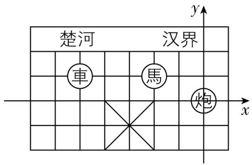

<details>
<summary>text_image</summary>

楚河
汉界
車
馬
炮
x
y
</details>

# 关键点拨

正确建立平面直角坐标系是解题关键.

(2) 因为 $a = \frac{1}{3 - \sqrt{7}} = \frac{3 + \sqrt{7}}{(3 - \sqrt{7})(3 + \sqrt{7})} = \frac{3 + \sqrt{7}}{2}$ ，所以原式 $= 4 \times \left(\frac{3 + \sqrt{7}}{2}\right)^{2} - 12 \times \frac{3 + \sqrt{7}}{2} + 5 = 4 \times \frac{(3 + \sqrt{7})^{2}}{4} - 6(3 + \sqrt{7}) + 5 = (3 + \sqrt{7})^{2} - 18 - 6\sqrt{7} + 5 = 9 + 6\sqrt{7} + 7 - 18 - 6\sqrt{7} + 5 = 3.$

(3) $a = \frac{1}{\sqrt{6} - \sqrt{5}} = \frac{\sqrt{6} + \sqrt{5}}{(\sqrt{6} - \sqrt{5})(\sqrt{6} + \sqrt{5})} = \sqrt{6} +$

$$
\sqrt {5}, b = \frac {1}{\sqrt {5} - 2} = \frac {\sqrt {5} + 2}{(\sqrt {5} - 2) (\sqrt {5} + 2)} = \sqrt {5} + 2.
$$

因为 $\sqrt{6} > 2$ ，所以 $\sqrt{6} + \sqrt{5} > 2 + \sqrt{5}$ ，所以 $a > b$ .

刷有所得
分母有理化的方法与步骤：
1. 观察分母，
找到合适的有理化因式；
2. 分子和分母同时乘有理化因式；
3. 化简式子.

17.【解】(1) 因为 $OA_{n} = \sqrt{n}$ , 所以 $OA_{5} = \sqrt{5}$ . 故答案为 $\sqrt{5}$ .

(2) 结合已知数据, 可得 $S_{n} = \frac{\sqrt{n}}{2}$ . 故答案为 $\frac{\sqrt{n}}{2}$ .

(3)若一个三角形的面积是3,则 $S_{n}=\frac{\sqrt{n}}{2}=3$ ,
所以 $\sqrt{n}=2\times3=6=\sqrt{36}$ ，所以n=36，所以它是第36个三角形.

(4) $S_{1}^{2} + S_{2}^{2} + S_{3}^{2} + \cdots + S_{100}^{2} = \frac{1}{4} + \frac{2}{4} + \frac{3}{4} + \cdots + \frac{100}{4} = \frac{1 + 2 + 3 + \cdots + 100}{4} = \frac{2525}{2}.$

# 第三章 位置与坐标

# 1 确定位置


# 刷基础

1. D 【解析】在平面内, 确定一个物体的位置一般需要两个数据, 对各选项分析判断后利用排除法可知选项 D 符合题意.

2. D 【解析】由题意可知小丽的座位用有序数对表示为(4,3). 故选D.

3. B 【解析】这组数可表示为 $\sqrt{2}, \sqrt{4}, \sqrt{6}, \sqrt{8}$ , $\sqrt{10}; \sqrt{12}, \sqrt{14}, \sqrt{16}, \sqrt{18}, \sqrt{20}; \sqrt{22}, \sqrt{24}, \sqrt{26}, \sqrt{28}, \sqrt{30}; \sqrt{32}, \sqrt{34}, \sqrt{36}, \sqrt{38}, \sqrt{40}; \cdots$ , 被开方数为连续的偶数, 且每5个数为一组. 因为 $6 = \sqrt{36}$ , 位于第4组第3个, 所以记为(4,3). 故选 B.

4. 080078 【解析】因为以钟面圆心为基准,时针指向南偏西 $60^{\circ}$ 方向的时刻是 8:00,所以南偏西 $60^{\circ}$ 方向 $78 \mathrm{~km}$ 的位置,可用代码表示为 080078. 故答案为 080078.

5.【解】(1)因为点 C 为 OP 的中点,所以 OC = $\frac{1}{2}OP = \frac{1}{2} \times 4 = 2 \, (\text{km})$ . 因为 OA = 2 km,所以到小明家距离相同的是学校和公园.

(2)学校在小明家北偏东 $45^{\circ}$ 的方向上,且到小明家的距离为 $2 \mathrm{~km}$ ;商场在小明家北偏西 $30^{\circ}$ 的方向上,且到小明家的距离为 $3.5 \mathrm{~km}$ ;停车场在小明家南偏东 $60^{\circ}$ 的方向上,且到小明家的距离为 $4 \mathrm{~km}$ .

6. A 【解析】在平面内, 确定一个物体的位置

一般需要两个数据,对各选项分析判断后,可知 A 选项正确. 故选 A.

7 [解] (1) 光明中学位于 D1 区, 市民广场位于 B2 区, 购物中心位于 C3 区, 电视台位于 B4 区, 体育馆位于 D4 区.

(2)如图所示,图中黑粗线即为所求.

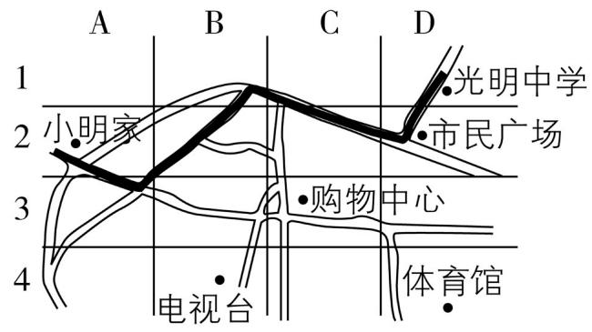

<details>
<summary>text_image</summary>

A
B
C
D
1
2 小明家
3 购物中心
4 电视台
5 体育馆
•光明中学
•市民广场
</details>

# 2 平面直角坐标系

# 课时 1 平面直角坐标系


# 刷基础

1. D 【解析】第二、四象限内点的横、纵坐标符号不同, 第一、三象限内点的横、纵坐标符号相同, 所以 D 选项错误.

2. A 【解析】根据题意可知学校的坐标是(-7, 1), 故选 A.

3. $(-2,1)$ 【解析】如图所示，“馬”的坐标是 $(-2,1)$ . 故答案为 $(-2,1)$ .


<details>
<summary>text_image</summary>

楚河
汉界
車
馬
炮
x
y
</details>

# 关键点拨

正确建立平面直角坐标系是解题关键.

4.【解】(1)“岭”和“船”的坐标依次是(4,2)和(7,1).故答案为(4,2)和(7,1).

(2) 将第 2 行与第 3 行对调, 再将第 3 列与第 7 列对调, “雪”由开始的坐标 (7,2) 依次变换为 (7,3) 和 (3,3). 故答案为 (7,3), (3,3).  
(3)“泊”开始的坐标是(2,1),使它的坐标变换为(5,3),应该第1行与第3行对调,同时第2列与第5列对调.

5.【解】如图所示即为所求. 得到的图形像一个箭头(答案合理即可).

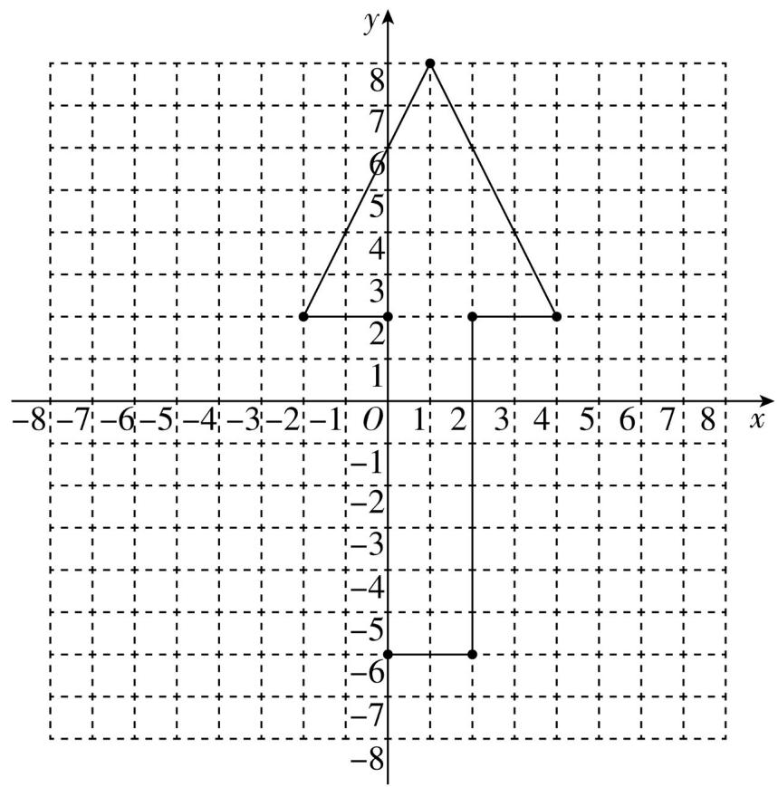

<details>
<summary>line</summary>

| x | y |
|---|---|
| -1 | 3 |
| 0 | 8 |
| 2 | 6 |
| 4 | 3 |
| -8 | -6 |
| -7 | -6 |
| -6 | -6 |
| -5 | -6 |
| -4 | -6 |
| -3 | -6 |
| -2 | -6 |
| -1 | -6 |
| 0 | 0 |
| 1 | 0 |
| 2 | 0 |
| 3 | 0 |
| 4 | 0 |
| 5 | 0 |
| 6 | 0 |
| 7 | 0 |
| 8 | 0 |
</details>

# 刷易错·

6. D 【解析】因为 $P(2m+4,3m-8)$ 到 y 轴的距离是它到 x 轴距离的 2 倍, 所以 $\left|2m+4\right|=2\times\left|3m-8\right|$ , 所以 $2m+4=2(3m-8)$ 或 $2m+4=2(8-3m)$ , 解得 m=5 或 $m=\frac{3}{2}$ .

# 课时 2 平面直角坐标系中点的坐标特征

# 刷基础

1. D 【解析】由题图得点位于第四象限, 故点 (2, -5) 符合题意. 故选 D.  
2. A 【解析】根据题意可知 m<0, n>0, 所以 -m>0, $\sqrt{n}>0$ , 所以 $B(-m, \sqrt{n})$ 在第一象限. 故选 A.  
3. B 【解析】因为点 $P(a,b)$ 在 x 轴上, 所以 b=0, 所以 ab=0, 所以点 $Q(ab,-1)$ 在 y 轴的负半轴上. 故选 B.  
4. (0,5) 【解析】因为点 $M(m + 1,3 - 2m)$ 在 $y$ 轴上, 所以 $m + 1 = 0$ , 所以 $m = -1$ , 所以 $3 - 2m = 3 - 2 \times (-1) = 3 + 2 = 5$ , 所以点 $M$ 的坐标为 (0, 5). 故答案为 (0,5).

# 刷有所得

第一、三象限角平分线上点的横、纵坐标相等；第二、四象限角平分线上点的横、纵坐标互为相反数.

# 易错警示

本题易混淆点的横、纵坐标表示的意义，掌握点到 $x$ 轴的距离是点的纵坐标的绝对值，点到 $y$ 轴的距离是点的横坐标的绝对值是解题的关键.

# 刷有所得

象限内点的坐标特征: 第一象限 $(+, +)$ ; 第二象限 $(-, +)$ ; 第三象限 $(-, -)$ ; 第四象限 $(+, -)$ .

5. C 【解析】因为点 A(m-3,2) 在第二象限的角平分线上, 所以 $m-3+2=0$ , 解得 m=1. 故选 C.  
6. C 【解析】因为点 $P(a,b)$ 在第一象限的角平分线上, 所以 a=b. 因为 $2a+b=9$ , 所以 $2a+a=9$ , 所以 a=3, 所以点 P 的坐标为 (3,3). 故选 C.

7.【解】(1) 因为 $A, B$ 两点在第二、四象限的角平分线上, 所以 $a + 2 = 0, -3 + b = 0$ , 解得 $a = -2$ , $b = 3$ .

(2) 因为点 $A$ 在某象限的角平分线上, 所以 $|a| = 2$ , 解得 $a = 2$ 或 -2. 因为点 $B$ 到 $x$ 轴的距离是 4 , 所以 $|b| = 4$ , 解得 $b = 4$ 或 -4.

8. A 【解析】因为点 B 的坐标为 $(3, -4)$ ，直线 AB 平行于 y 轴，所以 A, B 两点横坐标相等，故 A 点横坐标为 3，故符合要求的只有 $(3, -2)$ 。故选 A。  
9. C 【解析】如图所示. 因为直线 $a \parallel x$ 轴, 点 $C$ 是直线 $a$ 上的一个动点, 点 $A(-1,3)$ , 所以设点 $C(x, 3)$ . 因为当 $BC \perp$ 直线 $a$

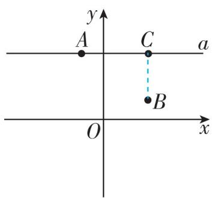

<details>
<summary>text_image</summary>

y
A	C	a
O	x
</details>

时,线段 BC 的长度最短,且点 $B(2,1)$ ,所以 x=2,所以点 C 的坐标为 $(2,3)$ .

10.2 【解析】因为 $AB \parallel y$ 轴, 所以 $a - 3 = -3$ , 所以 $a = 0$ , 所以 $A(-3, 2), B(-3, 4)$ , 所以点 $A$ , $B$ 间的距离为 $4 - 2 = 2$ . 故答案为 2.  
11. $(-2,2)$ 或 $(8,2)$ 【解析】因为 A(3,2), B(x,2), 所以 AB//x 轴. 因为 AB=5, 所以 AB=|x-3|=5, 所以 x=-2 或 x=8, 所以点 B 的坐标为 $(-2,2)$ 或 $(8,2)$ , 故答案为 $(-2,2)$ 或 $(8,2)$ .  
12.【解】(1)因为点 $P(2a - 4, a + 3)$ 在 $x$ 轴上, 所以 $a + 3 = 0$ , 解得 $a = -3$ , 则 $2a - 4 = 2 \times (-3) - 4 = -10$ , 所以点 $P$ 的坐标为 $(-10, 0)$ .

(2) 因为 $Q(6, -1), PQ \parallel y$ 轴, 所以 $2a - 4 = 6$ , 解得 $a = 5$ , 则 $a + 3 = 5 + 3 = 8$ , 所以点 $P$ 的坐标为 (6,8).  
(3) $a$ 的值为 3 或 1. 因为点 $P$ 到 $y$ 轴的距离为 2, 所以 $|2a - 4| = 2$ , 则 $2a - 4 = 2$ 或 $2a - 4 = -2$ , 解得 $a = 3$ 或 $a = 1$ .


# 刷提升

1. D 【解析】因为 $\frac{3}{4} mn + m - n = 0$ ，所以 $\frac{3}{4} mn =$ $-m + n$ . 因为 $m, n$ 都为整数, 所以 $m, n$ 的整数解为 $m = 0, n = 0$ 或 $m = 1, n = 4$ 或 $m = 2, n = -4$ 或 $m = 4, n = -2$ 或 $m = -4, n = -1$ , 所以满足条件的点 $P$ 的个数是 5 , 故选 D.

2. B 【解析】因为点 A(0, a), B(b, 12-b), C(2a-3,0), 0<a<b<12, 所以点 A 在 y 轴正半轴上, 点 B 在第一象限, 点 C 在 x 轴上. 因为 OB 平分 ∠AOC, 所以 b=12-b, 所以 b=6. 过点 B 作 BH⊥x 轴, BG⊥y 轴, 则 BH=BG. 因为 AB=BC, 所以 Rt△ABG≌Rt△CBH, 所以 AG=CH, 所以 |a-6|=|2a-3-6|, 所以 a=3 或 5, 所以 a+b=9 或 11, 故选 B.  
3. -3 【解析】由题意, 得 $3a+9=0$ , 解得 a=-3.
故答案为-3.  
4.2 【解析】由题意得, 点 $P$ 在 $\angle BOA$ 的平分线上, 所以点 $P$ 到 $x$ 轴和 $y$ 轴的距离相等. 又因为点 $P$ 的坐标为 $(a, 3a - 4)$ , 所以 $a = 3a - 4$ , 所以 $a = 2$ . 故答案为 2.  
5. (1, -2) 【解析】由题图可知, 正方形的边长为 4 , 故正方形的周长为 16 , 所以蚂蚁甲和蚂蚁乙第一次相遇所用的时间为 $16 \div (3 + 1) = 4$ (秒), 蚂蚁乙走的路程为 4 个单位长度, 所以此时相遇点的坐标为 (1, 2). 因为蚂蚁甲和蚂蚁乙的速度比为 $3: 1$ , 所以再经过 4 秒蚂蚁甲和蚂蚁乙第二次相遇, 相遇点坐标为 (-1, 0). 第三次相遇时蚂蚁乙又走了 4 秒, 路程为 4 个单位长度, 此时相遇点坐标为 (1, -2). 故答案为 (1, -2).  
6. (1,3)或(5,1) 【解析】①如图(1),当A平移到点C时,因为C(3,2),A(2,0),B(0,1),所以平移方式为向上平移2个单位,向右平移1个单位,所以平移后的点B坐标为(1,3);②如图(2),当B平移到点C时,因为C(3,2),A(2,0),B(0,1),所以平移方式为向上平移1个单位,向右平移3个单位,所以平移后的点A坐标为(5,1).故答案为(1,3)或(5,1).


<details>
<summary>text_image</summary>

y
C
B
O
A
x
</details>

图(1)


<details>
<summary>text_image</summary>

y
B
O
A
x
C
</details>

图(2)

# 刷素养·

7.【解】(1) $AB$ 的长度为 $\vert -1 - 2\vert = 3$ . 故答案

# ▶ 关键点拨

求出 $m, n$ 的整数解是解题的关键.

# 思路分析

分两种情况: ①当 A 平移到点 C 时; ②当 B 平移到点 C 时, 分别利用平移中点的坐标变化规律求解即可.

为3.

(2)由 $C(1,0), CD \parallel y$ 轴, 可设点 $D$ 的坐标为 $(1,m)$ . 因为 $CD = 2$ , 所以 $|0 - m| = 2$ , 解得 $m = \pm 2$ , 所以点 $D$ 的坐标为 $(1,2)$ 或 $(1,-2)$ . 故答案为 $(1,2)$ 或 $(1,-2)$ .  
(3) $d(E, F) = |2 - (-1)| + |0 - (-2)| = 5$ . 故答案为 5.  
(4) 因为 $E(2,0), H(1,t), d(E,H)=3$ , 所以 $|2-1|+|0-t|=3$ , 解得 $t=\pm 2$ .

# 课时3 建立适当的平面直角坐标系求点的坐标


# 刷基础

1.【解】因为正方形ABCD的边长为4,所以AB=BC=CD=DA=4.

(1)根据题意,得 $A(4,4)$ , $B(4,0)$ , $C(0,0)$ , $D(0,4)$ . 故答案为 $(4,4),(4,0),(0,4)$ .
(2)根据题意,得 $A(0,0)$ , $B(0,-4)$ , $C(-4,-4)$ , $D(-4,0)$ . 故答案为 $(0,-4)$ , $(-4,-4)$ , $(-4,0)$ .


根据题意, 得 $A(2,2), B(2,-2), C(-2, D(-2,2)$ . 故答案为 $(2,2), (2,-2), (-2), (-2,2)$ .

2.【解】如图,以 D 为坐标原点,DC 和 AD 所在直线为 x 轴和 y 轴建立平面直角坐标系. 易知 A 的坐标是(0,4), B 的坐标是(6,4), C 的坐标是(6,0), D 的坐标是(0,


<details>
<summary>text_image</summary>

y
E
A
B
(D) O C x
</details>

0). 因为 $E$ 点在 $CB$ 延长线上, 所以 $\angle ABE = 90^{\circ}$ . 在 Rt $\triangle AEB$ 中, $EB = \sqrt{AE^{2} - AB^{2}} = \sqrt{10^{2} - 6^{2}} = 8$ , 则 $EC = 4 + 8 = 12$ , 则 $E$ 的坐标是 (6,12). (建系方法不唯一, 对应答案不唯一)

3. A 【解析】建立如图平面直角坐标系, 可得点 C 的坐标是 $(3,4)$ . 故选 A.


<details>
<summary>text_image</summary>

B
5
4
C
A
-4 -3 -2 -1 O 1 2 3 4 5
-1
-2
-3
-4
-5
</details>

4. B 【解析】如图，(0,3)所在的位置是学校.

故选 B.


<details>
<summary>text_image</summary>

学校
汽车站
公园
医院O 水果店
宠物店
x
y
</details>

(第4题图)


<details>
<summary>text_image</summary>

y
A
B
C
O
x
</details>

(第5题图)

5. (0,1) 【解析】如图所示,无人机 C 的位置表示为 $(0,1)$ . 故答案为 $(0,1)$ .  
6. B 【解析】如图所示,得到的图形是三角形,该三角形的面积为 $\frac{1}{2}\times3\times6=9$ . 故选 B.


<details>
<summary>line</summary>

| x | y |
|---|---|
| -3 | 0 |
| -2 | 1 |
| -1 | 2 |
| 0 | 3 |
| 1 | 2 |
| 2 | 1 |
| 3 | 0 |
| 4 | 0 |
</details>

# 7. 添加辅助线 | 割补法求不规则图形面积

在平面直角坐标系中,当所求图形不是规则图形时,割补法求面积是常用的方法.通过作辅助线,可以将所求图形补全成一个规则的图形,其面积等于大图形的面积减去其他小图形的面积;也可以将所求图形分割成几个规则的小图形,其面积等于几个小图形面积的和.

【解】如图所示, 连接 AD, 所连线段围成图形的面积为 $\frac{1}{2} \times 2 \times 2 + \frac{1}{2} \times 2 \times 3 = 2 + 3 = 5$ .


<details>
<summary>scatter</summary>

| Point | x | y |
|---|---|---|
| A | -1 | 2 |
| B | 2 | -2 |
| C | 2 | 3 |
| D | -1 | 1 |
</details>


# 刷提升

1. B 【解析】如图, 因为 $A(-3, 2), B(2, -3)$ , 直线 $a \perp b$ , 以平行于 $a$ 的直线为 $x$ 轴, 以平行于 $b$ 的直线为 $y$ 轴, 所以建立如图所示的平面直角坐标系, 则坐标系的原点最有可能是 $O_2$ . 故选 B.


<details>
<summary>text_image</summary>

y
a
b
x
O₁
O₂
A
O₃
B
O₄
</details>

(第1题图)


<details>
<summary>text_image</summary>

y
A(m,0)
B(m+4,2)
O
D
x
C(m+4,-3)
</details>

(第2题图)

思路分析根据题意画出图形,得到 BC 的长,再利用勾股定理分别计算出 AB,AC 的长,即可判断.

2. A 【解析】建立平面直角坐标系如图所示, 令 BC 交 x 轴于点 D. 因为 AD = 4, BD = 2, CD = 3, 所以 BC = 5, $AB = \sqrt{AD^{2} + BD^{2}} = \sqrt{4^{2} + 2^{2}} = 2\sqrt{5}$ , $AC = \sqrt{AD^{2} + CD^{2}} = \sqrt{4^{2} + 3^{2}} = 5$ , 所以 $AC = BC \neq AB$ . 故选 A.  
3. C 【解析】①观察题图可得曲线 $C$ 经过的整点有 6 个, 故正确; ②曲线 $C$ 在第一、二象限中的任意一点到原点的距离大于 1 , 坐标轴上的点不属于任何一个象限, 故正确; ③由题图可知, 曲线 $C$ 经过的点有 $(1,1),(-1,1),(0,1),(-1,0),(1,0),(0,-1)$ , 故在横轴以上的部分面积大于 2 , 而横轴以下的部分面积大于 1 , 所以曲线 $C$ 所围成的“心形”区域的面积大于 3 , 故原结论错误. 故选 C.  
4. (0,3)或(0,-3) 【解析】因为点A的坐标为(3,0)，点B的坐标为(-1,0)，所以点A,B都在x轴上，且AB=3-(-1)=4。因为点C在y轴上，所以设点C的坐标为(0,y)。因为△ABC的面积等于6，所以 $\frac{1}{2}\times4\times|y|=6$ ，解得 $y=\pm3$ ，所以点C的坐标为(0,3)或(0,-3)。  
5. $(-7,-7)$ 【解析】以甲为坐标原点,乙的位置是(4,3),则以乙为坐标原点,甲的位置是(-4,-3);以丙为坐标原点,乙的位置是(-3,-4),则以乙为坐标原点,丙的位置是(3,4),所以以丙为坐标原点,甲的位置是(-7,-7).故答案为(-7,-7).  
6.【解】(1) 因为 $AD = 4 \mathrm{~m}, AB = 3 \mathrm{~m}, \angle BAD = 90^{\circ}$ , 所以 $BD = \sqrt{AD^{2} + AB^{2}} = 5 \mathrm{~m}$ .

因为 $BC = 12\mathrm{m}, CD = 13\mathrm{m}$ , 所以 $BD^{2} + BC^{2} = 5^{2} + 12^{2} = 13^{2} = CD^{2}$ , 所以 $BD \perp CB$ .

(2) $S_{\text{四边形}ABCD} = S_{\triangle ABD} + S_{\triangle BCD} = \frac{1}{2} \times 3 \times 4 + \frac{1}{2} \times 12 \times 5 = 6 + 30 = 36(\mathrm{~m}^2)$ .   
(3) 因为 $S_{\triangle PBD} = \frac{1}{4} S_{\text{四边形}ABCD}$ , 所以 $\frac{1}{2} \cdot PD \cdot$

$AB = \frac{1}{4}\times 36$ ，即 $\frac{1}{2}\cdot PD\times 3 = 9$ ，解得 $PD = 6$

因为 $D(0,4)$ , 点 $P$ 在 $y$ 轴上, 所以 $P$ 的坐标为 $(0,-2)$ 或 $(0,10)$ .

# 刷素养·

7.【解】(1) 因为点 $Q_{1}(2,1), Q_{2}(4,1), Q_{3}(4,$ 4), 所以 $Q_{1} Q_{2} = 2, Q_{2} Q_{3} = 3, Q_{1} Q_{2} \parallel x$ 轴, $Q_{2} Q_{3} \perp x$ 轴, 所以 $Q_{1} Q_{2} \perp Q_{2} Q_{3}$ . 因为垂线段最短, 所以 $Q_{1} Q_{3} > 2$ , 所以点 $Q_{1}(2,1), Q_{2}(4,1)$ , $Q_{3}(4,4)$ 的“最佳间距”是 2. 故答案为 2.(2)①因为点 $O(0,0), A(-3,0), B(-3,y)$ , 所以 $AB \perp OA, OA = 3$ , 所以 $OB > OA$ .因为点 $O, A, B$ 的“最佳间距”是 1，所以 AB=1 , 所以 $y=\pm1$ .

②当 $-3 \leqslant y \leqslant 3$ 时, 点 O, A, B 的“最佳间距”是 $|y| = AB \leqslant 3$ ; 当 y > 3 或 y < -3 时, AB > 3, 点 O, A, B 的“最佳间距”是 OA = 3, 所以点 O, A, B 的“最佳间距”的最大值为 3. 故答案为 3.

# 3 轴对称与坐标变化


# 刷基础

1. A 【解析】因为飞机 $E(50, m)$ 与飞机 $D$ 关于 $y$ 轴对称, 所以飞机 $D$ 的坐标为 $(-50, m)$ . 故选 A.  
2. A 【解析】因为 $\triangle ABC$ 关于直线 $m$ (直线 $m$ 上各点的横坐标都为 1) 对称, 所以 $C, B$ 关于直线 $m$ 对称, 即关于直线 $x = 1$ 对称. 设点 $B$ 的坐标为 $(x, 1)$ . 因为点 $C$ 的坐标为 $(4, 1)$ , 所以 $\frac{4 + x}{2} = 1$ , 解得 $x = -2$ , 则点 $B$ 的坐标为 $(-2, 1)$ . 故选 A.  
3. $x$ 轴 【解析】点 $A(-1,4)$ 和 $B(-1,-4)$ 关于 $x$ 轴对称. 故答案为 $x$ 轴.  
4. $(-3,-3)$ 【解析】由题图知 $M(0,1)$ ，一只跳蚤从M点出发，先向上爬了2个单位，又向左爬了3个单位到达P点，所以点P的坐标为 $(-3,3)$ 。因为点P与点 $P_{1}$ 关于x轴对称，所以 $P_{1}$ 的坐标为 $(-3,-3)$ ，故答案为 $(-3,-3)$ 。  
5.【解】(1)由题图可知,点 C 的坐标为 $(-3,1)$ .
(2)如图所示, $\triangle A_{1}B_{1}C_{1}$ 即为所作.


<details>
<summary>line</summary>

| Point | x-coordinate | y-coordinate |
|---|---|---|
| A(A₁) | 0 | 0 |
| B | 3 | 5 |
| C | 0 | 0 |
| C₁ | 3 | 1 |
</details>

# 关键点拨

(2) ② OA 与 AB 的长度大小关系不确定, 需要分类讨论, 这是解决此题的突破口.

(3) $A_{2}(0, - 1),B_{2}(-3, - 5),C_{2}(-3, - 1).$

6. D 【解析】因为图案向右平移 2 个单位, 所以想变回原来的图案要先向左平移 2 个单位, 即横坐标先减 2. 因为图案横向拉长为原来的 2 倍, 所以是横坐标乘 2, 纵坐标不变, 所以想变回原来的图案, 要纵坐标不变, 横坐标除以 2, 故选 D.  
7.【解】(1)以 BC 边中点 O 为原点, BC 边所在的直线为 x 轴, BC 边的垂直平分线为 y 轴, 建立平面直角坐标系, 如图. 易知 $\triangle ABO$ 和 $\triangle AOC$ 是等腰直角三角形, 所以 AO = BO = CO = 3, 所以 A(0,3), B(-3,0), C(3,0). (建系方法不唯一, 对应答案不唯一)  
(2)与原图形关于 $x$ 轴对称,如图中的 $\triangle A_{2}BC$ . (3)与原图形相比,所得的图形横向拉长为原来的 2 倍,如图中的 $\triangle AB_{3}C_{3}$ .


<details>
<summary>text_image</summary>

y
A
B₃ B O C C₃ x
A₂
</details>


# 刷提升

# 归纳总结◀1. B 【解析】

关于坐标轴对称的点的坐标特征: 关于 x 轴对称, 横不变纵相反; 关于 y 轴对称, 纵不变横相反.

A(-1,2) $\xrightarrow{关于x轴}$ B(-1,-2) $\xrightarrow{关于y轴}$ C(1,-2)

故选 B.

2. C 【解析】点 A 第 1 次关于 y 轴对称后在第二象限, 点 A 第 2 次关于 x 轴对称后在第三象限, 点 A 第 3 次关于 y 轴对称后在第四象限, 点 A 第 4 次关于 x 轴对称后在第一象限, 即点 A 回到原始位置, 所以每 4 次对称为一个循环组, 依次循环. 因为 $2021 \div 4 = 505 \cdots 1$ , 所以点 A 经过第 2021 次变换后的位置与第 1 次变换后的位置相同, 在第二象限, 坐标为 $(-1, 2)$ . 故选 C.

# 关键点拨

轴对称图形上对应点的连线被对称轴垂直平分.

3. $(-6 - m, n)$ 【解析】因为点 $A(-6, 6)$ 的对称点 $A'$ 坐标为 $(0, 6)$ , 所以该图形对称轴为直线 $x = -3$ . 设点 $M$ 在图形上的对称点坐标为 $(m', n')$ , 所以 $\frac{m + m'}{2} = -3, n' = n$ , 所以 $m' = -6 - m$ , 所以点 $M$ 在图形上的对称点坐标为 $(-6 - m, n)$ . 故答案为 $(-6 - m, n)$ .

4. $3 \leqslant AC < \sqrt{17}$ 【解析】如图, 连接 $OC$ . 因为 $A(0,4), B(1,0)$ , 所以 $OA = 4, OB = 1$ , 所以

$AB=\sqrt{OA^{2}+OB^{2}}=\sqrt{17}$ . 因为 C 是点 B 关于射线 OP 的对称点, 所以 OC=OB=1. 因为 $OA-OC\leqslant AC$ , 所以 $AC\geqslant3$ . 因为 P 为线段 AB 上一动点 (不与点 A,B 重合), 所以线段 AC 围是 $3\leqslant AC<\sqrt{17}$ . 故答案为 $3\leqslant$ 5.【解】(1)根据题意,可得点(3,-4)的一次反射点为(-3,-4),二次反射点为(-4,-3).故答案为(-3,-4),(-4,-3).


<details>
<summary>text_image</summary>

y
A
C
P
O
B
x
</details>

(2) 因为 $P(m + 1, 2n - 1)$ , 所以 $P$ 的一次反射点为 $(-m - 1, 2n - 1)$ . 因为 $Q(-3, 4)$ , 所以 $Q$ 的一次反射点为 $(3, 4)$ , $Q$ 的二次反射点为 $(4, 3)$ . 因为 $P(m + 1, 2n - 1)$ 的一次反射点和 $Q(-3, 4)$ 的二次反射点重合, 所以 $-m - 1 = 4$ , $2n - 1 = 3$ , 所以 $m = -5$ , $n = 2$ , 所以 $m + n = -5 + 2 = -3$ .

6.【解】(1) 过点 $A$ 作 $AD \perp OB$ 于 $D$ , 如图, 则 $\angle ADB = 90^{\circ}$ . 因为点 $A, B$ 的坐标分别为 (2,8) 和 (6,0), 所以 $OD = 2, AD = 8, OB = 6$ , 所


<details>
<summary>text_image</summary>

A'
A
C'
C
E O D B x
y
</details>

以 $BD = 4$ ，所以 $AB = \sqrt{AD^2 + DB^2} = \sqrt{8^2 + 4^2} = 4\sqrt{5}$

(2) 因为 $AB$ 长度一定, 所以要使 $\triangle ABC$ 的周长最小, 需 $AC + BC$ 的值最小. 作 $A$ 关于 $y$ 轴的对称点 $A'$ , 连接 $BA'$ 交 $y$ 轴于点 $C'$ , 过点 $A'$ 作 $A'E \perp x$ 轴于点 $E$ , 连接 $A'C$ , 如图. 因为 $AC + BC = A'C + BC \geqslant A'B$ , 所以当 $A', C, B$ 三点共线, 即 $C$ 与 $C'$ 重合时, $\triangle ABC$ 的周长最小, 最小值为 $A'B + AB$ 的值. 由轴对称的性质得 $A'(-2,8)$ , 所以 $E(-2,0)$ . 在 Rt $\triangle A'EB$ 中, $A'E = 8, EB = 8$ , 所以 $A'B = \sqrt{8^2 + 8^2} = 8\sqrt{2}$ , 所以 $\triangle ABC$ 的周长的最小值为 $A'B + AB = 8\sqrt{2} + 4\sqrt{5}$ .

# 刷素养·

7. (1) $\left(0, \frac{5}{2}\right)$ (2) $175^{\circ}$ 【解析】(1) 如图 (1),

因为 $A(1,2), B(1,3), C(0,6)$ , 所以 $OA, BC$ 是定长, 所以当点 $P$ 在线段 $OC$ 上时, $\triangle OAP$ 与 $\triangle CBP$ 周长的和取得最小值. 因为 $OP + PC = OC = 6$ , 所以 $\triangle OAP$ 与 $\triangle CBP$ 周长的和为 $OA + AP + OP + PC + BC + BP = OA + BC + OC + AP + BP$ , 所以当 $AP + BP$ 的值最小时, $\triangle OAP$ 与

# 思路分析

连接 OC, 根据轴对称的性质得 OC = OB = 1, 再根据三角形三边关系即可求解.

# 思路分析

(1) 由题意可得当 $AP + BP$ 的值最小时, $\triangle OAP$ 与 $\triangle CBP$ 周长的和取得最小值. 作点 $A$ 关于 $y$ 轴的对称点 $A'$ , 连接 $A'B$ , 则 $A'B$ 与 $y$ 轴的交点即为所求的点 $P$ . 由题意易知 $P$ 是 $A'B$ 的中点, 由中点坐标公式可求得点 $P$ 的坐标.

△CBP 周长的和取得最小值. 作点 A 关于 y 轴的对称点 $A'$ ，连接 $A'B$ ，则 $A'B$ 与 y 轴的交点即为所求的点 P. 易得 $A'(-1,2)$ ，P 是 $A'B$ 的中点，所以 $P\left(\frac{1-1}{2},\frac{2+3}{2}\right)$ ，即 $P\left(0,\frac{5}{2}\right)$ . 故答案为 $\left(0,\frac{5}{2}\right)$ .

(2) 如图(2), 过点 B 作 $BD \perp OC$ 于 D, 作点 A 关于 y 轴的对称点 $A'$ , $AA'$ 交 y 轴于点 E, 连接 $A'B$ , $OA', OB, AB$ .

因为 $CD = OD = 3$ ，所以 $BC = OB$ ，所以 $\angle BCO = \angle BOC.$

由轴对称的性质得


<details>
<summary>text_image</summary>

y
6
C
5
4
3
P
B
2
A'
1
O
-4 -3 -2 -1 1 2 x
-1
-2
-3
</details>

图(1)


<details>
<summary>text_image</summary>

y
6
C
5
4
P
D 3 B
2
A'
E
1
-4 -3 -2 -1 O 1 2 x
-1
-2
-3
</details>

图(2)

$$
O A = O A ^ {\prime}, \angle O A E = \angle O A ^ {\prime} E, \angle A O E = \angle A ^ {\prime} O E.
$$

因为 $AB = AE = 1, AA' = OE = 2, \angle BAA' = \angle AEO = 90^\circ$ , 所以 $\triangle A'AB \cong \triangle OEA$ (SAS), 所以 $\angle BA'A = \angle AOE, A'B = OA = OA'$ . 因为 $\angle AOE + \angle OAE = 90^\circ$ , 所以 $\angle OA'E + \angle AA'B = 90^\circ$ , 即 $\angle BA'O = 90^\circ$ . 因为 $A'B = OA = OA'$ , 所以 $\triangle OA'B$ 是等腰直角三角形, $\angle BOA' = 45^\circ$ , 所以 $\angle BOD + \angle A'OE = \angle BCD + \angle AOE = 45^\circ$ . 因为 $\angle APB = 40^\circ$ , 所以 $\angle ABP + \angle BAP = 140^\circ$ , 所以 $\angle OAP + \angle PBC = 360^\circ - 140^\circ - 45^\circ = 175^\circ$ , 故答案为 $175^\circ$ .

# 大招专题3 利用点的坐标规律探究问题


# 刷难关

# 大招解读|循环规律

1. 先写出前几次的变化结果.  
2. 确定循环周期.  
3. 所求总数除以循环周期, 得到余数.  
4. 余数是几, 就和每个周期里第几个对应, 能整除的则与每个周期最后一个对应.

1. C 【解析】动点 P 的运动规律可以看成每运动 4 次为一个循环, 每个循环向左移动 4 个单位. 点 P 的横坐标为运动次数的相反数, 纵坐标每 4 次一循环, 依次是 1, 0, 2, 0. 因为 $2023 = 505 \times 4 + 3$ , 所以经过第 2023 次运动后, 动点 $P$ 的横坐标为 -2023, 纵坐标为 2, 即 $P(-2023, 2)$ , 故选 C.

2.C 【解析】半径为 1 个单位长度的半圆的周长为 $\frac{1}{2} \times 2\pi \times 1 = \pi$ 。因为点 $P$ 从原点 $O$ 出发, 沿这条曲线向右运动, 速度为每秒 $\frac{\pi}{2}$ 个单位长度, 所以点 $P$ 每秒走 $\frac{1}{2}$ 个半圆。当点 $P$ 运动时间为 1 秒时, 点 $P$ 的坐标为 (1,1); 当点 $P$ 运动时间为 2 秒时, 点 $P$ 的坐标为 (2,0); 当点 $P$ 运动时间为 3 秒时, 点 $P$ 的坐标为 (3,-1); 当点 $P$ 运动时间为 4 秒时, 点 $P$ 的坐标为 (4,0); 当点 $P$ 运动时间为 5 秒时, 点 $P$ 的坐标为 (5,1); 当点 $P$ 运动时间为 6 秒时, 点 $P$ 的坐标为 (6,0); … 因为 $2021 \div 4 = 505 \dots 1$ , 所以点 $P$ 的坐标是 (2021,1), 故选 C.

3. C 【解析】因为 $A_{1}$ 的坐标为 $(2,4)$ ，所以 $A_{2}(-3,3)$ ， $A_{3}(-2,-2)$ ， $A_{4}(3,-1)$ ， $A_{5}(2,4)$ ，…，依次类推，每 4 个点为一个循环组依次循环。因为 $2022 \div 4 = 505 \cdots 2$ ，所以点 $A_{2022}$ 的坐标与 $A_{2}$ 的坐标相同，为 $(-3,3)$ 。故选 C。

# 大招解读|横、纵坐标的变化规律

1. 标出序列号 $n$ .  
2. 公因式法: 把每个数分成最小公因数相乘, 然后再找规律, 看是不是与 $n^2, n^3$ , 或 $2^n, 3^n$ , 或 $2n, 3n$ 有关.  
3. 有的可对每个数同时减去第一位数, 成为从第二个数开始的新数列, 然后用方法 1,2 找出每位数与位置的关系, 再在找出的规律上加上第一个数, 恢复到原数.  
4. 有的可对每个数同时加上,或乘,或除以第一个数,成为新数列,然后再找出规律,并恢复到原数.  
5. 有的可对每个数同时加上, 或减去, 或乘, 或除以同一个数 (一般为 $1,2,3,\cdots$ ), 成为新数列, 然后再找出规律, 并恢复到原数.  
6. 分析并判断能否把一个数列的奇数位置与偶数位置分开成为两个数列, 再分别找规律.

关键点拨4. B 【解析】每一象限的点的特点：

通过观察可知右下标是(除 $A_{1}$ 外)数字4的倍数的点在第三象限,4的倍数余1的点在第四象限,4的倍数余2的点在第一象限,4的倍数余3的点在第二象限.

<table><tr><td>第一象限</td><td> $A_{2}(1,1),2=4\times0+2;A_{6}(2,2),6=4\times1+2;A_{10}(3,3),10=4\times2+2;\cdots;A_{4n+2}(n+1,n+1)$ </td></tr><tr><td>第二象限</td><td> $A_{3}(-1,1),3=4\times0+3;A_{7}(-2,2),7=4\times1+3;\cdots;A_{4n+3}(-n-1,n+1)$ </td></tr><tr><td>第三象限</td><td> $A_{4}(-1,-1),4=4\times1;A_{8}(-2,-2),8=4\times2;\cdots;A_{4n}(-n,-n)$ </td></tr><tr><td>第四象限</td><td> $A_{5}(2,-1),5=4\times1+1;A_{9}(3,-2),9=4\times2+1;\cdots;A_{4n+1}(n+1,-n)$ </td></tr></table>

$15=4\times3+3$ , 则 $A_{15}$ 在第二象限, 根据规律可得点 $A_{15}$ 的坐标是 $(-4,4)$ .

# 5. A 【解析】

# 第一步

(0,1), 纵坐标是 1 的点共 1 个; (0,2), (1,2), 纵坐标是 2 的点共 2 个; (1,3), (0,3), (-1,3), 纵坐标是 3 的点共 3 个, …, 依次类推, 纵坐标是 n 的点共有 n 个. 从第 2 个点开始, 纵坐标是奇数的从右到左计数, 最左边点的横坐标为 $\frac{-(n-1)}{2}$ ; 纵坐标是偶数的从左到右计数, 最右边点的横坐标为 $\frac{n}{2}$

# 第二步

纵坐标是1到纵坐标是 $n$ 的点共有 $1 + 2+$ $3 + \dots + n = \frac{n(n + 1)}{2}$ 个

# 第三步

当 $n = 13$ 时， $\frac{13\times(13 + 1)}{2} = 91$ ，当 $n = 14$ 时， $\frac{14\times(14 + 1)}{2} = 105$ ，所以 $n = 14$

# 第四步

由上可知第100个点的纵坐标为14,根据n=14这一行的规律:共有14个点,从左到右计数,最右边点的横坐标为 $\frac{n}{2}$ ,所以 $14\div2=7$ ,所以第105个点的坐标为(7,14),第104个点的坐标为(6,14),第103个点的坐标为(5,14),第102个点的坐标为(4,14),第101个点的坐标为(3,14),第100个点的坐标为(2,14),故选A

6. (10,1) 【解析】由题图可得, 点 $A_{4n+1}(2n,1)$ (n 为自然数), $21 = 4 \times 5 + 1$ , 则 $A_{21}$ 的坐标是 (10,1). 故答案为 (10,1).

# 全章综合训练


# 刷中考

1. (3,30°) 【解析】因为点 A, B 的位置分别表示为 (1,90°), (2,240°), 所以点 C 的位置表示为 (3,30°). 故答案为 (3,30°).

2. C 【解析】由题意可得点 $Q$ 的坐标为 $(3, 2)$ . 故选 C.

3. A 【解析】根据题意建立平面直角坐标系如图所示, 则“技”在第一象限, 故选 A.


<details>
<summary>text_image</summary>

y
科技
创
新
O
x
</details>

4. D 【解析】过 A 作 $AM \perp OC$ 于 M，过 B 作 $BN \perp OC$ 于 N，如图。因为 $O(0,0)$ ， $A(1,2)$ ， $B(3,3)$ ， $C(5,0)$ ，所以 OM = 1，AM = 2，ON = BN = 3，CO = 5，所以 MN = ON - OM = 2，CN = OC - ON = 2，所以四边形 OABC 的面积为 $S_{\triangle AOM} + S_{梯形AMNB} + S_{\triangle BCN} = \frac{1}{2} \times 1 \times 2 + \frac{1}{2} \times (2 + 3) \times 2 + \frac{1}{2} \times 3 \times 2 = 9$ 。故选 D。


<details>
<summary>text_image</summary>

y
A
B
O M N C x
</details>

5. (7,0) 【解析】因为点 $P(3m + 1,2 - m)$ 在 $x$ 轴上, 所以 $2 - m = 0$ , 解得 $m = 2$ , 所以 $3m + 1 = 3 \times 2 + 1 = 7$ , 所以 $P(7,0)$ . 故答案为 (7,0).

6. 四 【解析】因为 $a^2 + 1 \geqslant 1, -3 < 0$ , 所以点 $P(a^2 + 1, -3)$ 在第四象限. 故答案为四.

7. A 【解析】由题意得, 点 $M(-2, -3)$ 与点 $M_{1}$ 关于 $y$ 轴对称, 所以点 $M_{1}$ 的坐标为 $(2, -3)$ . 故选 A.

8.5 取点 $O'(0,4)$ , 连接 $O'P, O'A$ , 如图. 因为 $B(0,2)$ , 直线 $l$ 垂直于 $y$ 轴, 所以点 $O'(0,4)$ 与点 $O(0,0)$ 关于直线 $l$ 对称, 所以 $PO' = PO$ ,

# 思路分析

由轴对称图形的性质和两点之间线段最短,得到 $PO + PA$ 的最小值为 $O'A$ 的长,再根据勾股定理求解即可.

所以 $PO + PA = PO' + PA \geqslant O'A$ ，即 $PO + PA$ 的最小值为 $O'A$ 的长。在 Rt $\triangle O'AO$ 中，因为 $OA = 3, OO' = 4$ ，所以由勾股定理，得 $O'A = \sqrt{OA^2 + OO'^2} = \sqrt{3^2 + 4^2} = 5$ ，所以 $PO + PA$ 的最小值为 5。故答案为 5。


<details>
<summary>text_image</summary>

y
O'
P
B
l
O
A
x
</details>

9. (2,1) 【解析】点(1,4)经过第1次运算后得到点 $(1\times3+1,4\div2)$ ，即(4,2)；经过第2次运算后得到点 $(4\div2,2\div1)$ ，即(2,1)；经过第3次运算后得到点 $(2\div2,1\times3+1)$ ，即(1,4)；…，发现规律：每运算3次为一循环。因为 $2024\div3=674\cdots2$ ，所以点(1,4)经过2024次运算后得到点(2,1)。故答案为(2,1)。


# 刷章测

1. A 【解析】由 $A, B$ 坐标可建立如图所示的平面直角坐标系, 则 $C$ 的坐标为 $(1, 4)$ . 故选 A.


<details>
<summary>text_image</summary>

y
C
A
B
O
x
</details>

(第1题图)


<details>
<summary>text_image</summary>

y
B
D₁ H C
G
D₂ D₃
A
O x
</details>

(第3题图)

2. B 【解析】因为点 A(-3, a) 在 x 轴上, 所以 a=0 ,所以 a-1=-1 ,a+2=2 ,所以点 B(a-1, a+2) 在第二象限. 故选 B.

3. D 【解析】如图,作直线 y=2 和直线 y=3 分别与 y 轴交于点 G,H,当 $\triangle ABD_{1}\cong\triangle ABC$ 时, $\triangle ABD_{1}$ 和 $\triangle ABC$ 关于 y 轴对称,所以点 $D_{1}$ 的坐标为 $(-4,3)$ ; 当 $\triangle ABD_{2}\cong\triangle BAC$ 时, $CH=D_{2}G=4$ , 所以点 $D_{2}$ 的坐标为 $(-4,2)$ ; 当 $\triangle ABD_{3}\cong\triangle BAC$ 时, $CH=D_{3}G=4$ , 所以点 $D_{3}$ 的坐标为 $(4,2)$ . 综上可知, 点 D 的坐标为 $(4,2)$ 或 $(-4,2)$ 或 $(-4,3)$ , 故选 D.

4. C 【解析】因为长方形 ABCD 的四个顶点坐标分别为 A(-1,2), B(-1,-1), C(1,-1), D(1,2), 所以 AB = CD = 2 - (-1) = 3, AD = BC = 1 - (-1) = 2, 所以长方形的周长为 (3+

2) ×2 = 10. 设经过 t 秒 P, Q 第一次相遇, 则 P 点走的路程为 2t, Q 点走的路程为 3t, 根据题意得 $2t + 3t = 10$ , 解得 t = 2, 所以当 t = 2 时, P, Q 第一次相遇, 此时相遇点 $M_{1}$ 的坐标为 (1, 0); 易得当 t = 4 时, P, Q 第二次相遇, 此时相遇点 $M_{2}$ 的坐标为 (-1, 0); 当 t = 6 时, P, Q 第三次相遇, 此时相遇点 $M_{3}$ 的坐标为 (1, 2); 当 t = 8 时, P, Q 第四次相遇, 此时相遇点 $M_{4}$ 的坐标为 (0, -1); 当 t = 10 时, P, Q 第五次相遇, 此时相遇点 $M_{5}$ 的坐标为 (-1, 2); 当 t = 12 时, P, Q 第六次相遇, 此时相遇点 $M_{6}$ 的坐标为 (1, 0), 所以五次相遇为一循环. 又因为 $2025 \div 5 = 405$ , 所以点 $M_{2025}$ 的坐标为 (-1, 2). 故选 C.

5.8 【解析】因为点 $A(a - 1, b + 1)$ 和 $B(-3, a - 3)$ 关于直线 $x = 1$ 对称, 所以 $\frac{a - 1 - 3}{2} = 1, b + 1 = a - 3$ , 解得 $a = 6, b = 2$ , 则 $a + b = 6 + 2 = 8$ .  
6. $(-6,5)$ 或 $(-6,-5)$ 【解析】因为点 A(a,b) 到 x 轴的距离是 5，到 y 轴的距离是 6，所以 |b|=5, |a|=6，所以 $a=\pm6, b=\pm5$ 。因为 a<b，所以 a=-6, b=5 或 a=-6, b=-5，所以点 A 的坐标为 $(-6,5)$ 或 $(-6,-5)$ ，故答案为 $(-6,5)$

# 关键点拨

正确理解题目中对“a级关联点”的定义是解决此题的关键.

或 $(-6,-5)$ .

7.【解】(1)如图所示, $\triangle A_{1}B_{1}C_{1}$ 即为所求.


<details>
<summary>text_image</summary>

y
6
A
4
A₁
C
C₁
2
-5
B O B₁ 5 x
-2
</details>

(2)根据(1)的图形可知 $A_{1}(1,5), B_{1}(1,0)$ , $C_{1}(5,3)$ . 故答案为 $1,5,1,0,5,3$ .

8.【解】(1)若点 $P$ 的坐标为 $(-1,3)$ , 则它的“1级关联点”的坐标为 $(1 \times (-1) + 3, -1 + 1 \times 3)$ , 即 (2,2). 故答案为 (2,2).

(2) 点 $P(m - 2, 3m)$ 的“-2级关联点”为 $Q(-2(m - 2) + 3m, m - 2 + (-2) \times 3m)$ , 即 $(m + 4, -5m - 2)$ .

Q位于x轴上时，-5m-2=0，解得 $m=-\frac{2}{5}$ ;
②Q位于y轴上时,m+4=0,解得m=-4.
综上所述,m的值为 $-\frac{2}{5}$ 或-4.

# 第四章 一次函数

# 1 函数


# 刷基础

1. D 【解析】选项 A、B、C 中存在一个 x 值, 与之对应的 y 值不是唯一的, 所以选项 A、B、C 不能表示 y 是 x 的函数; D 选项中任意一个 x 值, 总有唯一的 y 值与之对应, 所以 D 选项可以表示 y 是 x 的函数, 故 D 选项符合题意.  
2. D 【解析】根据函数的定义可知,对于变量 x 的每一个确定的值,变量 y 都有唯一确定的值与之对应,所以 D 选项不符合题意.故选 D.  
3. ①②④⑤ 【解析】① $3x - 2y = 0$ , ② $y = 3x^{2}$ , ④ $y = \sqrt{x}$ , ⑤ $y = |x|$ , 对于 $x$ 的每一个值, $y$ 都有唯一的值与它对应, 符合函数的定义; ③ $y^{2} = 8x$ , ⑥ $|y| = x$ , 对于 $x$ 的每一个值, $y$ 不是有唯一的值与它对应, 不符合函数的定义. 故答案

# 刷有所得

如果在一个变化过程中有两个变量 $x$ 和 $y$ , 并且对于变量 $x$ 的每一个值, 变量 $y$ 都有唯一的值与它对应, 那么称 $y$ 是 $x$ 的函数.

为①②④⑤.

4. B 【解析】y 与 x 之间的关系式是 y = 50 - 2.5x. 故选 B.   
5.【解】(1)从左到右依次填入 $150, 250$ .

(2) 当平均水深 $x$ 取 5 米至 25 米之间的一个确定的值时, 相应的库容 $V$ 唯一确定.  
(3)库容 V 可以看成平均水深 x 的函数.

6. D 【解析】根据二次根式有意义的条件可知 $x - 3 \geqslant 0$ , 则 $x \geqslant 3$ , 所以自变量 $x$ 的取值范围是 $x \geqslant 3$ . 故选 D.

7. -6 【解析】把 $x = 5, y = 14$ 代入 $y = 3x - 2b$ 中得 $14 = 15 - 2b$ , 所以 $b = \frac{1}{2}$ , 把 $x = -4, b = \frac{1}{2}$ 代入 $y = 2x + 4b$ 中可得 $y = -8 + 2 = -6$ , 故答案为 -6.  
8.【解】(1)由三角形的周长公式,得 $y = x + 14$ .
由三角形的三边关系, 得 4 < x < 14.

(2) 当 $x = 6$ 时, $y = 6 + 14 = 20$ .

2) ×2 = 10. 设经过 t 秒 P, Q 第一次相遇, 则 P 点走的路程为 2t, Q 点走的路程为 3t, 根据题意得 $2t + 3t = 10$ , 解得 t = 2, 所以当 t = 2 时, P, Q 第一次相遇, 此时相遇点 $M_{1}$ 的坐标为 (1, 0); 易得当 t = 4 时, P, Q 第二次相遇, 此时相遇点 $M_{2}$ 的坐标为 (-1, 0); 当 t = 6 时, P, Q 第三次相遇, 此时相遇点 $M_{3}$ 的坐标为 (1, 2); 当 t = 8 时, P, Q 第四次相遇, 此时相遇点 $M_{4}$ 的坐标为 (0, -1); 当 t = 10 时, P, Q 第五次相遇, 此时相遇点 $M_{5}$ 的坐标为 (-1, 2); 当 t = 12 时, P, Q 第六次相遇, 此时相遇点 $M_{6}$ 的坐标为 (1, 0), 所以五次相遇为一循环. 又因为 $2025 \div 5 = 405$ , 所以点 $M_{2025}$ 的坐标为 (-1, 2). 故选 C.

5.8 【解析】因为点 $A(a - 1, b + 1)$ 和 $B(-3, a - 3)$ 关于直线 $x = 1$ 对称, 所以 $\frac{a - 1 - 3}{2} = 1, b + 1 = a - 3$ , 解得 $a = 6, b = 2$ , 则 $a + b = 6 + 2 = 8$ .  
6. $(-6,5)$ 或 $(-6,-5)$ 【解析】因为点 $A(a,b)$ 到 $x$ 轴的距离是 5，到 $y$ 轴的距离是 6，所以 $|b|=5,|a|=6$ ，所以 $a=\pm6,b=\pm5$ 。因为 $a<b$ ，所以 $a=-6,b=5$ 或 $a=-6,b=-5$ ，所以点 $A$ 的坐标为 $(-6,5)$ 或 $(-6,-5)$ ，故答案为 $(-6,5)$

# 关键点拨

正确理解题目中对“a级关联点”的定义是解决此题的关键.

或 $(-6,-5)$ .

7.【解】(1)如图所示, $\triangle A_{1}B_{1}C_{1}$ 即为所求.


<details>
<summary>text_image</summary>

y
6
A
4
A₁
C
2
C₁
-5
B O B₁ 5 x
-2
</details>

(2)根据(1)的图形可知 $A_{1}(1,5), B_{1}(1,0)$ , $C_{1}(5,3)$ . 故答案为 1,5,1,0,5,3.

8.【解】(1)若点 $P$ 的坐标为 $(-1,3)$ , 则它的“1级关联点”的坐标为 $(1 \times (-1) + 3, -1 + 1 \times 3)$ , 即 $(2,2)$ . 故答案为 $(2,2)$ .

(2) 点 $P(m - 2, 3m)$ 的“-2级关联点”为 $Q(-2(m - 2) + 3m, m - 2 + (-2) \times 3m)$ , 即 $(m + 4, -5m - 2)$ .

①Q位于x轴上时，-5m-2=0，解得 $m=-\frac{2}{5}$ ;
②Q位于y轴上时,m+4=0,解得m=-4.

综上所述, $m$ 的值为 $-\frac{2}{5}$ 或-4.

# 第四章 一次函数

# 1 函数


# 刷基础

1. D 【解析】选项 A、B、C 中存在一个 x 值, 与之对应的 y 值不是唯一的, 所以选项 A、B、C 不能表示 y 是 x 的函数; D 选项中任意一个 x 值, 总有唯一的 y 值与之对应, 所以 D 选项可以表示 y 是 x 的函数, 故 D 选项符合题意.  
2. D 【解析】根据函数的定义可知,对于变量 x 的每一个确定的值,变量 y 都有唯一确定的值与之对应,所以 D 选项不符合题意.故选 D.  
3. ①②④⑤ 【解析】① $3x - 2y = 0$ , ② $y = 3x^{2}$ , ④ $y = \sqrt{x}$ , ⑤ $y = |x|$ , 对于 $x$ 的每一个值, $y$ 都有唯一的值与它对应, 符合函数的定义; ③ $y^{2} = 8x$ , ⑥ $|y| = x$ , 对于 $x$ 的每一个值, $y$ 不是有唯一的值与它对应, 不符合函数的定义. 故答案

# 刷有所得

如果在一个变化过程中有两个变量 $x$ 和 $y$ , 并且对于变量 $x$ 的每一个值, 变量 $y$ 都有唯一的值与它对应, 那么称 $y$ 是 $x$ 的函数.

为①②④⑤.

4. B 【解析】y 与 x 之间的关系式是 y = 50 - 2.5x. 故选 B.   
5.【解】(1)从左到右依次填入 $150, 250$ .

(2) 当平均水深 $x$ 取 5 米至 25 米之间的一个确定的值时, 相应的库容 $V$ 唯一确定.  
(3)库容 $V$ 可以看成平均水深 $x$ 的函数.

6. D 【解析】根据二次根式有意义的条件可知 $x - 3 \geqslant 0$ , 则 $x \geqslant 3$ , 所以自变量 $x$ 的取值范围是 $x \geqslant 3$ . 故选 D.

7. -6 【解析】把 $x = 5, y = 14$ 代入 $y = 3x - 2b$ 中得 $14 = 15 - 2b$ , 所以 $b = \frac{1}{2}$ , 把 $x = -4, b = \frac{1}{2}$ 代入 $y = 2x + 4b$ 中可得 $y = -8 + 2 = -6$ , 故答案为 -6.  
8.【解】(1)由三角形的周长公式,得 $y = x + 14$ .
由三角形的三边关系, 得 4 < x < 14.

(2) 当 $x = 6$ 时, $y = 6 + 14 = 20$ .

(3) 当 y=19.5 时, $x+14=19.5$ ,
所以 x=5.5.

# 2 认识一次函数

# 课时 1 “均匀”变化


# 刷基础

1.【解】(1)由题表可知,随着海拔的升高,气温下降,因此自变量是海拔 h. 故答案为下降,海拔 h.

(2)描点如下:


<details>
<summary>scatter</summary>

| h(千米) | t(°C) |
| ------ | ----- |
| 20     | 20    |
| 16     | 16    |
| 14     | 14    |
| 12     | 12    |
| 8      | 8     |
| 6      | 6     |
| 4      | 4     |
| 2      | 2     |
</details>

(3)由题表可知,海拔每上升1千米,气温下降6℃,所以t=20-6h.   
(4) 令 $t = 20 - 6h = -4$ , 解得 $h = 4$ , 所以该处的海拔是 4 千米.

2.【解】(1)描点如下:


<details>
<summary>scatter</summary>

| x(厘米) | y(千克) |
| ------- | ------ |
| 1       | 0.8    |
| 2       | 1.0    |
| 4       | 1.5    |
| 7       | 2.3    |
| 11      | 3.3    |
| 12      | 3.6    |
</details>

(2)①当秤杆上秤砣到秤纽的水平距离 x (厘米) 每增加 1 厘米时, 秤钩所挂物体质量 y (千克) 的具体变化是增加 $\frac{1}{4}$ 千克. 故答案为增加 $\frac{1}{4}$ 千克.  
②由题意得当秤杆上秤砣到秤纽的水平距离为14厘米时,秤钩所挂物体质量是 $3.5+\frac{1}{4}\times(14-12)=4$ (千克).故答案为4.   
③由题意得 $y = 0.75 + \frac{1}{4} (x - 1) = \frac{1}{4} x + \frac{1}{2}$ . 故答案为 $y = \frac{1}{4} x + \frac{1}{2}$ .  
(3) 当 $y = 6.5$ 时, $\frac{1}{4} x + \frac{1}{2} = 6.5$ , 解得 $x = 24$ , 所以当秤钩所挂物体质量为 6.50 千克时, 秤杆上秤砣到秤纽的水平距离是 24 厘米.

3. 是  
4. 不是

# 课时 2 一次函数与正比例函数


# 刷基础

1. C 【解析】①y = x 是正比例函数, 是特殊的一次函数; ② $y = \frac{1}{2}x^{2} - x$ 不是一次函数; ③ $y = \frac{2}{x} - 1$ 不是一次函数; ④ $y = -x + 10$ 是一次函数; ⑤ $y = kx + b$ , 当 k = 0 时, 不是一次函数; ⑥ $y = x(x - 1) = x^{2} - x$ , 不是一次函数. 综上所述, 一定是一次函数的有 2 个. 故选 C.  
2. C 【解析】因为 $y=(m-3)x+1$ 是关于 x 的一次函数, 所以 $m-3 \neq 0$ , 解得 $m \neq 3$ . 故选 C.

3. A 【解析】

A 符合正比例函数的定义  
B 多了常数项 20, 不是正比例函数


v 在分母处,不是正比例函数  
整理, 得 y=6-2x, 多了常数项 6, 不是正比例函数

4. 思路分析 | 根据函数定义确定参数范围


<details>
<summary>flowchart</summary>

```mermaid
graph TD
    A["一次函数"] --> B{m-2≠0}
    A --> C{|m|-2不作要求}
    D["正比例函数"] --> E{m-2≠0}
    D --> F{|m|-2=0}
```
</details>

【解】(1)由题意得 $m - 2 \neq 0$ , 解得 $m \neq 2$ .

(2)由题意得 $|m|-2=0$ ，且 $m-2\neq0$ ，解得m=-2.

5. D 【解析】由题意得,树苗每个月增长的高度是 10 cm,故该树苗的高度 y(cm)与生长月数 x 之间的函数关系式为 $y=50+10x$ . 故选 D.  
6. $60 - \frac{1}{2} x$ 【解析】由题意, 得工程队每天修建 $60 \div 120 = \frac{1}{2} (\mathrm{km})$ 长的公路, 所以还未完成的公路长度 $y(\mathrm{km})$ 与施工时间 $x$ (天)之间的关系式为 $y = 60 - \frac{1}{2} x$ . 故答案为 $60 - \frac{1}{2} x$ .  
7.【解】(1)由题表中给出的数据可得卖出的大蒜质量每增加 $1 \mathrm{~kg}$ , 销售收入增加 10.5 元, 所以 $y = 10.5 + 10.5 (x - 1) = 10.5 x$ , 即 $y = 10.5 x$ , $y$ 是 $x$ 的正比例函数.

(2) 当 $x = 7$ 时, $y = 10.5x = 10.5 \times 7 = 73.5$ .

8.【解】(1)根据题意得 $y = 360 - 6x$ ，即 $y = -6x + 360$ . 其中， $k = -6$ 表示八(2)班每名学生借阅图书后学校图书室图书数量的变化量， $b = 360$ 表示学校图书室图书的总数量.

(2) 当 $x = 50$ 时, $y = -6 \times 50 + 360 = 60$ , 所以图书室余下图书数量为 60 本.

(3) 当 $y = 72$ 时, $72 = -6x + 360$ , 解得 $x = 48$ , 所以八(2)班的学生人数为 48 人.

# 刷易错·

9. -1 【解析】因为 $y = (m - 1)x^{2 - |m|} + 3$ 是关于 $x$ 的一次函数, 所以 $2 - |m| = 1$ 且 $m - 1 \neq 0$ , 解得 $m = -1$ . 故答案为 -1.

# 课时3 利用一次函数解决分段计费问题


# 刷提升

1.【解】(1)根据“支付费用=套餐月租+超出套餐部分国内拨打电话的电话费”, 得 58 + 0.19 × (225 - 200) = 62.75 (元), 所以他上个月支付的费用是 62.75 元.

(2) 根据题意得 $y = 58 + 0.19(x - 200) = 0.19x + 20$ ，所以 $y$ 与 $x$ 之间的关系式为 $y = 0.19x + 20$ .  
(3) 因为 86.5 > 58, 所以 x > 200, 所以 $0.19x + 20 = 86.5$ , 解得 x = 350, 所以他该月拨打电话的时间是 350 分钟.

2.【解】(1) 应付费 $2 \div 0.5 \times 1 + 4 \times (5 - 2) = 16$ (元).

(2) 根据题意得 $y=4(x-2)+2\div0.5\times1=4x-4$ .
故答案为 y=4x-4.  
(3)因为某人连续骑行后付费24元,所以此人连续骑行的时长大于2 h. 当y=24时,24=4x-4,所以x=7,所以其连续骑行时长的范围是6<x≤7.

3.【解】(1)当采摘量超过10千克时,x>10,根据题意,得 $y_{1}=30+40\times0.6x=24x+30$ ,

$$
y _ {2} = 4 0 \times 1 0 + 4 0 \times 0. 5 (x - 1 0) = 2 0 x + 2 0 0.
$$

(2) 令 $y_{1} = y_{2}$ ，则 $24x + 30 = 20x + 200$ ，解得 $x = 42.5$ . 即当采摘 42.5 千克时，两种方案的价格相同.  
(3)选择甲方案更划算. 理由如下: 当 x = 30 时, $y_{1} = 24 \times 30 + 30 = 750$ , $y_{2} = 20 \times 30 + 200 = 800$ . 因为 750 < 800, 所以选择甲方案更划算.

4.【解】(1) 当 $2 < x \leqslant 10$ 时, $y_{1} = 2(x - 2) + 6 = 2x + 2$ .

# 易错警示

一次函数 $y = kx + b$ 中一次项系数 $k \neq 0$ ，在解这类问题时，千万不要忽略这一条件，最后将所求得的参数值代入进行验证，保证答案的正确性.

# 刷有所得

正比例函数的图象是经过原点的直线.

(2)由题可知,当x>10时,白天收费 $y_{1}=6+2\times(10-2)+3\times(x-10)=3x-8$ ,夜间收费 $y_{2}=7+2.4\times(10-2)+3.6(x-10)=3.6x-9.8$ .当x=12时, $y_{1}=3\times12-8=28,y_{2}=3.6\times12-9.8=33.4$ ,所以白天收费比夜间收费少33.4-28=5.4(元).

# 3 一次函数的图象

# 课时1 正比例函数的图象和性质


# 刷基础

1. B 【解析】A 选项, 不是正比例函数图象, 故此选项错误; B 选项, 是正比例函数图象, 故此选项正确; C 选项, 不是正比例函数图象, 故此选项错误; D 选项, 不是正比例函数图象, 故此选项错误. 故选 B.  
2. A 【解析】因为点 $P(m,0)$ 在 x 轴负半轴上，所以 m<0，所以函数 y=mx 的图象经过第二、四象限，故选 A.  
3. B 【解析】因为一个正比例函数的图象可能经过第一、三象限或者第二、四象限, 点 $A$ 的横坐标是 3 , 所以 $A$ 只能在第一或第四象限, 点 $B$ 的纵坐标是 -2 , 所以 $B$ 只能在第三或第四象限. 若 $A$ 在第四象限, 则 $B$ 就应该在第二象限, 与题意不符, 所以 $A$ 在第一象限, $B$ 在第三象限, 即 $m > 0, n < 0$ . 故选 B.  
4.【解】函数 $y=-\frac{1}{2}x$ 的图象经过点 $(2,-1)$ ，函数 y=-x 的图象经过点 $(1,-1)$ ，函数 y=-3x 的图象经过点 $(1,-3)$ ，它们的图象如图所示.


<details>
<summary>scatter</summary>

| Point | x | y |
|---|---|---|
| 1 | -2 | -3 |
| 2 | 2 | -2 |
| 3 | 3 | -1 |
| 4 | 5 | 0 |
| 5 | -5 | 3 |
y=-1/2 x
y=-3x
</details>

5. B 【解析】当 $x = 1$ 时, $y = -5$ , 故 A 选项说法错误; 正比例函数的图象是一条经过原点的直线, 故 B 选项说法正确; 根据 $-5 < 0$ , 得它的图象经过第二、四象限, $y$ 随 $x$ 的增大而减小, 故 C、D 选项说法均错误. 故选 B.  
6. A 【解析】因为正比例函数 $y = kx$ 图象上有两点 $A(x_{1},y_{1}), B(x_{2},y_{2})$ ，当 $x_{1} > x_{2}$ 时， $y_{1} < y_{2}$ ，所以 $y$ 随 $x$ 的增大而减小，所以 $k < 0$ ，四个选项

中只有-2 在 $k < 0$ 的范围内, 故选 A.

7. B 【解析】因为 $y=(m-2)x+m^{2}-4$ 是关于 x 的正比例函数, 所以 $m-2 \neq 0$ 且 $m^{2}-4=0$ , 所以 m=-2, 所以正比例函数的表达式为 y=-4x. 因为 -4 < 0, 所以 y 随 x 的增大而减小. 又因为点 $A(m,a)$ 和点 $B(-m,b)$ 在该函数的图象上, 且 m < -m, 所以 a > b. 故选 B.  
8. $k_{2} < k_{1} < k_{4} < k_{3}$ 【解析】根据直线经过的象限，知 $k_{2} < 0, k_{1} < 0, k_{4} > 0, k_{3} > 0$ ，再根据直线越陡， $|k|$ 越大，知 $|k_{2}| > |k_{1}|$ , $|k_{4}| < |k_{3}|$ ，则 $k_{2} < k_{1} < k_{4} < k_{3}$ .  
9.【解】因为函数 $y=(m-1)x^{m^{2}-3}$ 是正比例函数，
所以 $m^{2}-3=1$ 且 $m-1\neq0$ ，解得 m=-2 或 2。

(1) 因为函数关系式中 $y$ 随 $x$ 的增大而减小, 所以 $m - 1 < 0$ , 所以 $m = -2$ .  
(2) 因为函数的图象过第一、三象限, 所以 $m - 1 > 0$ , 所以 $m = 2$ .

# 刷易错·

10. $\frac{3}{2}$ 或 $-\frac{3}{2}$ 【解析】当 $k > 0$ 时, 函数 $y$ 随 $x$ 的增大而增大, 所以当 $x = 2$ 时, $y = 3$ , 所以 $2k = 3$ , 解得 $k = \frac{3}{2}$ ; 当 $k < 0$ 时, 函数 $y$ 随 $x$ 的增大而减小, 所以当 $x = -2$ 时, $y = 3$ , 所以 $-2k = 3$ , 解得 $k = -\frac{3}{2}$ . 综上所述, $k$ 的值为 $\frac{3}{2}$ 或 $-\frac{3}{2}$ . 故答案为 $\frac{3}{2}$ 或 $-\frac{3}{2}$ .

# 易错警示

本题注意分 $k > 0$ 和 $k < 0$ 两种情况进行讨论, 不要漏解.


# 刷提升

1. A 【解析】已知正比例函数 $y = (m - 2)x$ 的图象上两点 $A(x_{1},y_{1})$ , $B(x_{2},y_{2})$ , 当 $x_{1} - x_{2} < 0$ 时, $y_{1} - y_{2} > 0$ , 所以 $y$ 随 $x$ 的增大而减小, 所以 $m - 2 < 0$ , 则 $m < 2$ . 故选 A.  
2. C 【解析】设正比例函数的表达式为 y=kx.
将 $(a,3)$ ， $(4,b)$ 代入函数表达式中，得3=ak，
b=4k，所以 $k=\frac{3}{a}=\frac{b}{4}$ ，所以 ab=12。故选 C.  
3. D 【解析】设 OA = a. 因为点 B 在直线 y = 2x 上, $BA \perp x$ 轴, 所以 y = 2a, 所以 AB = 2a. 因为 AB : BC = 1 : 2, 所以 BC = 4a. 因为 $BC \parallel x$ 轴, 所以 C (5a, 2a). 因为点 C 在直线 $y = kx (k \neq 0)$ 上, 所以 2a = 5ak, 所以 $k = \frac{2}{5}$ , 故选 D.

# 归纳总结

函数性质的逆用: 已知正比例函数图象上两点 $(x_{1}, y_{1})$ ， $(x_{2}, y_{2})$ ，若 $x_{1}-x_{2}$ 与 $y_{1}-y_{2}$ 异号，则y随x的增大而减小；若 $x_{1}-x_{2}$ 与 $y_{1}-y_{2}$ 同号，则y随x的增大而增大.

4. D 【解析】由题图可知, $y_{1}$ 随 x 的增大而减小, $y_{2}$ 随 x 的增大而减小,所以 $k_{1}<0,k_{2}<0$ ,故选项 A,B 错误;根据直线越陡, $|k|$ 越大可知, $|k_{1}|<|k_{2}|$ ,所以 $k_{1}>k_{2}$ ,所以 $k_{1}-k_{2}>0$ ,故选项 C 错误,选项 D 正确.故选 D.  
5. -2 【解析】因为正比例函数 $y = kx (k < 0)$ ，所以 $y$ 随 $x$ 的增大而减小，当 $x = 1$ 时， $y = k$ ；当 $x = 3$ 时， $y = 3k$ 。因为当 $1 \leqslant x \leqslant 3$ 时，函数 $y$ 的最大值和最小值之差为 4，所以 $k - 3k = 4$ ，解得 $k = -2$ 。故答案为 -2。

思路分析 先根据 $k < 0$ 判断出函数的增减性, 再把 $x = 1$ 与 $x = 3$ 分别代入正比例函数表达式, 由函数 $y$ 的最大值和最小值之差为 4 求出 $k$ 的值即可.

6. (1,2)或(-1,-2) 【解析】因为直线 $y = 2x$ 上的点到 $x$ 轴的距离是2，所以 $y = \pm 2$ . 当 $y = 2$ 时，即 $2x = 2$ ，解得 $x = 1$ ；当 $y = -2$ 时，即 $2x = -2$ ，解得 $x = -1$ ，所以符合条件的点的坐标为(-1,-2)或(-1,-2).  
7. 047 【解析】根据题意得, $A_{n-1}B_{n-1} = 3(n-1) - (n-1) = 3n-3-n+1 = 2n-2, A_n B_n = 3n-n = 2n$ . 因为直线 $l_{n-1} \perp x$ 轴于点 $(n-1,0)$ , 直线 $l_n \perp x$ 轴于点 $(n,0)$ , 所以 $A_{n-1}B_{n-1} // A_n B_n$ , 且 $l_{n-1}$ 与 $l_n$ 间的距离为 1, 所以四边形 $A_{n-1}A_n B_n B_{n-1}$ 是梯形, 所以 $S_n = \frac{1}{2}(2n-2+2n) \times 1 = \frac{1}{2}(4n-2) = 2n-1$ . 当 $n = 2024$ 时, $S_{2024} = 2 \times 2024 - 1 = 4047$ . 故答案为 4047.  
8. $\sqrt{10}$

# 思路分析 | “将军饮马”之一定两动

提取 关键点 A 为定点, B, C 为动点

抽象模型 “将军饮马”——一定两动模型

作辅助线 分别作 $A$ 关于直线 $y = x$ 和 $y$ 轴的对称点 $P, Q$

确定
最值
PQ 的长即为最小值

【解析】作 A 点关于直线 y = x 的对称点 P，关于 y 轴的对称点 Q，连接 PQ 交直线 y = x 于

B, 交 y 轴于 C, 如图. 因为 AC = CQ, BP = AB, 所以 $C_{\triangle ABC} = AC + CB + AB = CQ + CB + BP$ . 因为 P, B, C, Q 四点共线, 所以此


<details>
<summary>text_image</summary>

y
Q
A
C
B
P
O
x
</details>

时 $\triangle ABC$ 周长最小, 最小值为 $PQ$ 的长度. 由 $A(1,2)$ 易知 $Q(-1,2), P(2,1)$ , 所以 $PQ = \sqrt{(-1 - 2)^2 + (2 - 1)^2} = \sqrt{10}$ , 则 $\triangle ABC$ 周长的最小值为 $\sqrt{10}$ , 故答案为 $\sqrt{10}$ .

# 刷素养·

9.【解】(1)①自变量 x 的取值范围是任意实数. 故答案为任意实数.

②分别将 $x = -2, -1, 0, 1, 2$ 代入 $y = 2|x|$ , 得 $y = 4, 2, 0, 2, 4$ . 故答案为 $4, 2, 0, 2, 4$ .

函数 $y = 2|x|$ 的图象如图所示.


<details>
<summary>text_image</summary>

y
x
O
</details>

③当自变量 x 的值从 1 增加到 2 时, 函数 y 的值增加了 2. 故答案为 2.

(2)根据函数的定义可知,①③中对于变量 x 的每一个值,变量 y 都有唯一的值与它对应,故 y 是 x 的函数的是①③.故答案为①③.

# 课时2 一次函数的图象和性质


# 刷基础

1. B 【解析】在平面直角坐标系中描出点 A(2,0), B(0,-3), 画出此一次函数图象, 如图所示, 所以该函数图象不经过第二象限. 故选 B.


<details>
<summary>line</summary>

| Point | x | y |
|---|---|---|
| A | 2 | 2 |
| B | -3 | -3 |
</details>

2. B 【解析】当 a > 0 时,一次函数 $y = -ax + a$ ( $a \neq 0$ ) 的图象经过第一、二、四象限; 当 a < 0 时,一次函数 $y = -ax + a$ ( $a \neq 0$ ) 的图象经过第一、三、四象限,故选项 B 符合题意. 故选 B.

3.0 【解析】因为 $P(m,n)$ 在一次函数 y=2x-3 的图象上, 所以 n=2m-3, 所以 2m-n-3=0, 故答案为 0.

# 思路分析

根据一次函数的增减性可知当 x=1 时,一次函数 $y=-3x+b$ 取得最大值 17,进一步求 b 的值即可.

# 另解

因为 $y = -ax+$ $a = -a(x - 1)$

$(a \neq 0)$ , 所以一次函数 $y = -ax + a (a \neq 0)$ 的图象经过点 $(1, 0)$ ，故选项 B 符合题意.

4.【解】(1) 将 $x = 0$ 代入 $y = 2x - 6$ , 得 $y = -6$ ; 将 $y = 0$ 代入 $y = 2x - 6$ , 得 $2x - 6 = 0$ , 解得 $x = 3$ . 故答案从左到右为 $-6, 3$ .

(2)一次函数 $y = 2x - 6$ 的图象如图所示.


<details>
<summary>text_image</summary>

y
1
O 1 x
y=2x-6
</details>

5. B 【解析】因为 $y = -x + 1, k = -1 < 0, b = 1 > 0$ ，所以该函数图象经过第一、二、四象限，不经过第三象限，故 A 选项正确，不符合题意；因为 k = -1 < 0，所以 y 随 x 的增大而减小，所以当 $-2 \leqslant x \leqslant 1$ 时，函数 y 有最小值，为 $-1 + 1 = 0$ ，故 B 选项错误，符合题意，C 选项正确，不符合题意； $y = -x + 1$ 与 y = -x - 1 的 k 值都为 -1，所以 $y = -x + 1$ 的图象是与直线 y = -x - 1 平行的一条直线，故 D 选项正确，不符合题意。故选 B。

6. B 【解析】因为一次函数 $y = -2x + m$ (m 是常数) 中, -2 < 0, 所以 y 随 x 的增大而减小. 因为 $A(x_{1}, -1)$ , $B(x_{2}, -2)$ , $C(x_{3}, 3)$ 在一次函数 $y = -2x + m$ (m 是常数) 的图象上, 其中 -2 < -1 < 3, 所以 $x_{2} > x_{1} > x_{3}$ . 故选 B.

7. -1 【解析】因为一次函数 $y = mx + |m - 1|$ 的图象过点(0,2)，所以 $|m - 1| = 2$ ，解得 $m = 3$ 或-1。因为 $y$ 随 $x$ 的增大而减小，所以 $m < 0$ ，所以 $m = -1$ ，故答案为-1。

8. 20 【解析】在一次函数 $y = -3x + b$ 中，-3 < 0，所以 $y$ 随着 $x$ 的增大而减小。因为当 $1 \leqslant x \leqslant 10$ 时，一次函数 $y = -3x + b$ 取得最大值 17，所以 $x = 1$ 时， $y = -3x + b = 17$ ，所以 $-3 + b = 17$ ，解得 $b = 20$ ，故答案为 20。

# 9. A

刷有所得|一次函数图象的平移规律

<table><tr><td></td><td>平移方向</td><td>平移距离</td><td>平移后图象对应的表达式</td><td>规律</td></tr><tr><td rowspan="2">直线 $y = {kx} + b$  $\left( {k \neq 0}\right)$ </td><td>向上(向左)</td><td rowspan="2"> $n\left( {n > 0}\right)$ 个单位长度</td><td> $y = {kx} + b + n$  $\left( {y = k\left( {x + n}\right) + b}\right)$ </td><td rowspan="2">上(左)加下(右)减</td></tr><tr><td>向下(向右)</td><td> $y = {kx} + b - n$  $\left( {y = k\left( {x - n}\right) + b}\right)$ </td></tr></table>

【解析】将函数 $y=2x+1$ 的图象向下平移 2 个单位长度, 所得函数图象的表达式是 $y=2x+1-2=2x-1$ , 故选 A.

10. B 【解析】因为将一次函数 y = x - 2 的图象向上平移 m 个单位长度, 所以平移后图象对应的表达式为 $y = x - 2 + m$ . 因为平移后的图象经过点 (1,4), 所以 $4 = 1 - 2 + m$ , 解得 m = 5. 故选 B.  
11. -3 【解析】直线 $y = 2x + b$ 向上平移 3 个单位后对应的表达式为 $y = 2x + b + 3$ . 因为平移后的直线经过原点 (0,0), 所以 $2 \times 0 + b + 3 = 0$ , 解得 $b = -3$ . 故答案为 -3.

# 刷提升

1. B 【解析】当 m>0 时, -m<0, 函数 y=-mx ( $m\neq0$ ) 的图象过原点且经过第二、四象限, $y=2x+m$ 的图象经过第一、二、三象限, B 选项符合; 当 m<0 时, -m>0, 函数 $y=-mx(m\neq0)$ 的图象过原点且经过第一、三象限, $y=2x+m$ 的图象经过第一、三、四象限, 没有选项符合. 故选 B.  
2. B 【解析】由题意得, 直线 y = -x 从原点开始沿 x 轴正方向匀速平移到过点 A 之前, 此过程中 L = 0; 当直线 y = -x 从过点 A 继续沿 x 轴正方向匀速平移到过点 D 时, 此过程中 L 长度逐渐增大; 当直线 y = -x 从过点 D 继续沿 x 轴正方向匀速平移到过点 B 时, 此过程中 L 长度保持不变; 当直线 y = -x 从过点 B 继续沿 x 轴正方向匀速平移到过点 C 时, 此过程中 L 长度逐渐减小; 直线 y = -x 继续沿 x 轴正方向平移时, L = 0. 由长方形 ABCD 得 AD = BC, 结合选项可知, 只有 B 选项符合题意. 故选 B.  
3. $\frac{4\sqrt{5}}{5}$ 【解析】对于直线 $y = -\frac{1}{2} x + 2$ ，当 $x = 0$ 时， $y = 2$ ，当 $y = 0$ 时， $-\frac{1}{2} x + 2 = 0$ ，解得 $x = 4$ ，所以 $A(0,2), B(4,0)$ ，所以 $OA = 2, OB = 4$ ，所以 $AB = \sqrt{2^2 + 4^2} = 2\sqrt{5}$ . 根据垂线段最短可知，当 $OP \perp AB$ 时， $OP$ 最短，此时 $S_{\triangle AOB} = \frac{1}{2} OA \cdot OB = \frac{1}{2} AB \cdot OP$ ，即 $\frac{1}{2} \times 2 \times 4 = \frac{1}{2} \times 2\sqrt{5} \times OP$ ，解

# 归纳总结

解决恒过定点问题时,提出字母参数后使字母参数的系数为 0 即可求解.

得 $OP = \frac{4\sqrt{5}}{5}$ . 故答案为 $\frac{4\sqrt{5}}{5}$ .

4. (2,3) 3 【解析】因为 $y = kx - 2k + 3 = k(x - 2) + 3$ , 所以直线 $y = kx - 2k + 3$ 必经过定点 (2,3), 所以该点的坐标是 (2,3). 因为 $B(2,3)$ , 直线 $y = kx - 2k + 3$ 将 $\triangle ABC$ 分成左、右面积之比为 $1:2$ 的两部分, 所以直线 $y = kx - 2k + 3$ 过点 (1,0), 故 $0 = k - 2k + 3$ , 解得 $k = 3$ . 故答案为 (2,3), 3.  
5.【解】(1)在 $y=-\frac{4}{3}x+4$ 中,令 x=0 得 y=4,所以 $B(0,4)$ ,所以 OB=4. 令 y=0 得 $0=-\frac{4}{3}x+4$ , 解得 x=3,所以 $A(3,0)$ ,所以 OA=3. 在 Rt△OAB 中, $AB=\sqrt{OA^{2}+OB^{2}}=5$ .

(2)由折叠得 $AC = AB = 5$ , 所以 $OC = OA + AC = 3 + 5 = 8$ , 所以 $C(8,0)$ . 设 $OD = x$ , 则 $CD = DB = x + 4$ . 在 Rt $\triangle OCD$ 中, $DC^2 = OD^2 + OC^2$ , 即 $(x + 4)^2 = x^2 + 8^2$ , 解得 $x = 6$ , 所以 $D(0, -6)$ .

存在, 点 P 的坐标为 $(0,12)$ 或 $(0,-4)$ . 因为 $S_{\triangle PAB} = \frac{1}{2} S_{\triangle OCD}$ , 所以 $S_{\triangle PAB} = \frac{1}{2} \times \frac{1}{2} \times 6 \times 8 = 12$ . 因为点 P 在 y 轴上, $S_{\triangle PAB} = 12$ , 所以 $\frac{1}{2} BP \cdot OA = 12$ , 即 $\frac{1}{2} \times 3BP = 12$ , 解得 BP = 8, 所以 P 点的坐标为 $(0,12)$ 或 $(0,-4)$ .

# 刷素养

6.【解】(1)由题意可得,函数 $y = -x + 1$ 的“0 变换函数”为 $y = \begin{cases} -x + 1 (x \leqslant 0), \\ x - 1 (x > 0). \end{cases}$ 故答案为 $\left\{\begin{aligned}-x + 1 &(x \leqslant 0), \\ x - 1 &(x > 0).\end{aligned}\right.$

(2) $y = -x + 1$ 的“2变换函数”为 $y = \left\{ \begin{array}{l} -x + 1 (x \leqslant 2), \\ x - 1 (x > 2), \end{array} \right.$ 图象如图所示.


<details>
<summary>line</summary>

| Point | x | y |
|---|---|---|
| 1 | 1 | 1 |
| 2 | 2 | 1 |
| 3 | 3 | 2 |
| 4 | 4 | 3 |
| 5 | 5 | 4 |
The chart displays a line graph with x-axis ranging from -5 to 6 and y-axis ranging from -2 to 5. The line connects the points (1,1), (2,1), and (4,3), forming a straight diagonal from top-left to bottom-right. There is no title or legend present.
</details>

①当 $x = 3$ 时， $y = 3 - 1 = 2$ . 当 $y = 2$ 时， $-x + 1 = 2$ 或 $x - 1 = 2$ ，解得 $x = -1$ 或 $x = 3$ .  
②当 $-3 \leqslant x \leqslant 2$ 时, $y = -x + 1$ , $y$ 随 $x$ 的增大而减小,所以 $-1 \leqslant y \leqslant 4$ ; 当 $2 < x \leqslant 3$ 时, $y = x - 1$ , $y$

随 $x$ 的增大而增大, 所以 $1 < y \leqslant 2$ . 综上所述, $-1 \leqslant y \leqslant 4$ . 故答案为 $-1 \leqslant y \leqslant 4$ .

(3) $a < -1$ 或 $a \geqslant 3$ . 由 (2) 可知, 在函数 $y = -x + 1$ 的 “2 变换函数” 中, $y = 2$ 时, $x = -1$ 或 $x = 3$ , 所以当一次函数 $y = -x + 1$ 的 “ $a$ 变换函数” 的图象与直线 $y = 2$ 有一个交点时, $a < -1$ 或 $a \geqslant 3$ .

# 4 一次函数的应用

# 课时1 确定一次函数的表达式


# 刷基础

1. B 【解析】设函数表达式为 $y = kx (k \neq 0)$ . 因为图象经过点(3, -3), 所以 $-3 = k \times 3$ , 解得 $k = -1$ , 所以这个函数的表达式为 $y = -x$ , 故选 B.

2. $y=\frac{3}{2}x$ 【解析】根据题意, 把 x=4, y=6 代入 $y=kx(k\neq0)$ ，得6=4k，解得 $k=\frac{3}{2}$ ，所以y与x的函数关系式为 $y=\frac{3}{2}x$ .

3. A 【解析】由题意得, 点 $A$ 、点 $B$ 的坐标分别是 $(0,1)$ , $(4,3)$ . 设直线 $l$ 的函数表达式为 $y = kx + b$ . 将点 $A, B$ 的坐标代入 $y = kx + b$ , 得 $1 = b, 3 = 4k + b$ , 解得 $b = 1, k = \frac{1}{2}$ , 所以直线 $l$ 的函数表达式为 $y = \frac{1}{2}x + 1$ . 故选 A.

4. A 【解析】因为点 B 在正比例函数 y=2x 的图象上, 横坐标为 1 , 所以 $y=2\times1=2$ , 所以 $B(1,2)$ . 设一次函数表达式为 $y=kx+b$ . 将 $A(0,3)$ , $B(1,2)$ 代入得 b=3, $k+b=2$ , 解得 b=3, k=-1, 则这个一次函数的表达式为 $y=-x+3$ . 故选 A.

5. $y = 2x + 1$ 【解析】根据题意可设这个一次函数表达式为 $y = 2x + b$ ，将 $A(1,3)$ 代入，得 $2 + b = 3$ ，解得 $b = 1$ ，所以这个一次函数的表达式是 $y = 2x + 1$ . 故答案为 $y = 2x + 1$ .

6.【解】(1)因为直线 $y = kx + b$ 经过点 $M(0,2)$ 和点 $N(1,3)$ ，所以 $b = 2, k + b = 3$ ，解得 $k = 1, b = 2$ ，所以 $y = x + 2$ . 把 $x = -1$ 代入，得 $y = -1 + 2 = 1$ ，所以直线 $y = kx + b$ 经过点 $(-1,1)$ .

(2)对于 $y = x + 2$ ，令 $x = 0$ ，则 $y = 2$ ；令 $y = 0$ ，则 $x = -2$ ，所以 $y = x + 2$ 与两坐标轴的交点为 $(-2,0), (0,2)$ ，所以直线 $y = kx + b$ 与两坐标轴围成的三角形的面积为 $\frac{1}{2} \times 2 \times 2 = 2$ .

# 关键点拨

本题考查了求一次函数表达式, 解题的关键是通过正方形的边长求 A, B 两点的坐标.

7. $v = 0.6t + 330$ 【解析】设声速 $v$ 与温度 $t$ 之间的函数关系式为 $v = kt + b$ . 把 $(0,330)$ , $(10,336)$ 代入, 得 $b = 330, 10k + b = 336$ , 解得 $k = 0.6, b = 330$ , 所以声速 $v$ 与温度 $t$ 之间的函数关系式为 $v = 0.6t + 330$ . 故答案为 $v = 0.6t + 330$ .

8. $y = -0.2x + 10$ 【解析】根据题意可得 $y = 10 - 0.2x (0 \leqslant x \leqslant 5)$ . 故答案为 $y = -0.2x + 10$ .

9.【解】(1)由表格可知,摄氏温度升高 $10^{\circ}C$ , 华氏温度对应升高 $18^{\circ}F$ , 所以华氏温度 $y(^{\circ}F)$ 与摄氏温度 $x(^{\circ}C)$ 之间的函数关系式为一次函数关系. 设 y 与 x 之间的函数关系式为 $y = kx + b (k, b$ 为常数, 且 $k \neq 0$ ). 将 x = 0, y = 32 和 x = 10, y = 50 分别代入 $y = kx + b$ , 得 b = 32, $10k + b = 50$ , 所以 $k = \frac{9}{5}, b = 32$ , 所以 y 与 x 之间的函数关系式为 $y = \frac{9}{5}x + 32$ .

(2) 令 $y = 0$ , 得 $\frac{9}{5} x + 32 = 0$ , 解得 $x = -\frac{160}{9}$ , 所以当华氏温度为 $0^{\circ}\mathrm{F}$ 时, 对应的摄氏温度为 $-\frac{160}{9}^{\circ}\mathrm{C}$ . 故答案为 $-\frac{160}{9}$ .

(3)令 $y = x$ , 得 $\frac{9}{5} x + 32 = x$ , 解得 $x = -40$ , 所以当华氏温度的值与所对应的摄氏温度的值相等时, 摄氏温度为 $-40^{\circ}\mathrm{C}$ . 故答案为-40.


# 刷提升

1. C 【解析】因为一次函数 $y = kx + b (k \neq 0)$ 图象过点(0, 2)，所以 $b = 2$ 。因为一次函数图象与两坐标轴围成的三角形面积为 2，所以该一次


<details>
<summary>text_image</summary>

y
2
-2 O 2 x
</details>

函数图象过点(2,0)或(-2,0)，如图所示. 将(2,0)代入 $y = kx + 2$ 中，解得 $k = -1$ ; 将(-2,0)代入 $y = kx + 2$ 中，解得 $k = 1$ ，则一次函数的表达式是 $y = x + 2$ 或 $y = -x + 2$ . 故选 C.

# 关键点拨

本题考查了求一次函数表达式,利用勾股定理求出点E的坐标是解题的关键.

2. C 【解析】因为四边形 AOCB 是长方形, $A(9,0), B(9,3), C(0,3)$ , 所以 $\angle OCE = 90^{\circ}, AB = OC = 3, AO = BC = 9$ . 设点 $E$ 的坐标为 $(m,3)$ , 则 $OE = BE = 9 - m, CE = m$ . 在 Rt $\triangle OCE$ 中, $OC = 3, CE = m, OE = 9 - m$ , 所以 $(9 - m)^{2} = 3^{2} + m^{2}$ , 所以 $m = 4$ , 所以点 $E$ 的坐标为 $(4,3)$ . 设 OD 所在直线的函数表达式为 $y = kx$ , 将点 $E(4,3)$ 代入 $y = kx$ , 得 $3 = 4k$ , 解得 $k = \frac{3}{4}$ , 所以

$OD$ 所在直线的函数表达式为 $y = \frac{3}{4} x$ . 故选 C.

3. $y = -\frac{1}{5} x + 2$ 【解析】如图所示, 过点 $C$ 作 $CD \perp x$ 轴于点 $D$ , 所以 $\angle CDA = 90^\circ$ , 所以 $\angle ACD + \angle CAD = 90^\circ$ . 由题意得 $\angle CAB = 90^\circ$ , 所以 $\angle CAD + \angle BAO = 90^\circ$ , 所以 $\angle ACD = \angle BAO$ . 又因为 $CA = AB, \angle AOB = \angle CDA = 90^\circ$ , 所以 $\triangle ACD \cong \triangle BAO(AAS)$ . 因为 $A(-3,0)$ , $B(0,2)$ , 所以 $AO = 3, BO = 2$ , 所以 $AO = CD = 3, AD = OB = 2$ , 所以 $DO = 5$ , 所以 $C(-5,3)$ . 设直线 $BC$ 的函数表达式为 $y = kx + b$ , 将 $B(0,2), C(-5,3)$ 代入, 得 $-5k + b = 3, b = 2$ , 解得 $k = -\frac{1}{5}, b = 2$ , 所以 $y = -\frac{1}{5}x + 2$ . 故答案为 $y = -\frac{1}{5}x + 2$ .


<details>
<summary>text_image</summary>

C
y
B
D A O x
</details>

(第3题图)


<details>
<summary>text_image</summary>

y
A
B
C
O
x
</details>

(第4题图)

4. $(-4,0)$ 【解析】如图所示,连接AB并延长交x轴于点C,此时 $|AC-BC|$ 的值最大, $|AC-BC|=AB$ .设直线AB的表达式为 $y=kx+b$ ,将点 $A(2,3),B(0,2)$ 代入,得 $2k+b=3,b=2$ ,所以 $k=\frac{1}{2},b=2$ .故直线AB的表达式为 $y=\frac{1}{2}x+2$ .令y=0,则 $\frac{1}{2}x+2=0$ ,解得x=-4,故点C坐标为 $(-4,0)$ .故答案为 $(-4,0)$ .  
5. $y = \frac{3}{2} x + 6$ 【解析】因为一次函数 $y = \frac{3}{4} x + 6$ 的图象与 $x$ 轴， $y$ 轴分别交于点 $A, B$ ，令 $y = 0$ ，得 $x = -8$ ，令 $x = 0$ ，得 $y = 6$ ，所以 $A(-8, 0), B(0, 6)$ 。因为过点 $B$ 的直线 $l$ 平分 $\triangle ABO$ 的面积，所以 $AC = OC$ ，所以 $C(-4, 0)$ 。设直线 $l$ 的函数表达式为 $y = kx + 6$ 。把 $C(-4, 0)$ 代入得 $-4k + 6 = 0$ ，解得 $k = \frac{3}{2}$ ，所以直线 $l$ 的函数表达式为 $y = \frac{3}{2} x + 6$ ，故答案为 $y = \frac{3}{2} x + 6$ 。  
6. $\frac{5}{6}$ 【解析】对于直线 $y = x + 1$ ，令 $x = 0$ ，则 $y =$

1, 即 $A(0,1)$ , 所以 $OA = 1$ . 把 $D(1,n)$ 代入 $y = x + 1$ , 得 $n = 2$ , 即 $D(1,2)$ . 把 $D(1,2), B(0,-1)$ 代入 $y = kx + b$ 中, 得 $b = -1$ , $k = 3$ , 所以直线 $CD$ 的表


<details>
<summary>text_image</summary>

y
y=kx+b
y=x+1
D
A
O C E x
B
</details>

达式为 $y = 3x - 1$ 。令 $y = 0$ ，则 $3x - 1 = 0$ ，解得 $x = \frac{1}{3}$ ，所以 $C\left(\frac{1}{3}, 0\right)$ ，所以 $OC = \frac{1}{3}$ 。作 $DE \perp x$ 轴于 $E$ ，如图，则 $DE = 2, E(1, 0)$ ，所以 $OE = 1$ ，所以 $CE = 1 - \frac{1}{3} = \frac{2}{3}$ ，所以 $S_{\text{四边形}AOCD} = S_{\text{梯形}AOED} - S_{\triangle CDE} = \frac{1}{2}(AO + DE) \cdot OE - \frac{1}{2}CE \cdot DE = \frac{1}{2} \times (1 + 2) \times 1 - \frac{1}{2} \times \frac{2}{3} \times 2 = \frac{3}{2} - \frac{2}{3} = \frac{5}{6}$ .

7.18 【解析】把 $A(0,3), B(6,0)$ 代入 $y = kx + b$ ，得 $b = 3$ ，① $6k + b = 0$ ，② 将①代入②，得 $k = -\frac{1}{2}$ ，所以直线 $AB$ 的表达式为 $y = -\frac{1}{2}x + 3$ 。为点 $D$ 在直线 $AB$ 上，且点 $D$ 的横坐标为 2，所以把 $x = 2$ 代入 $y = -\frac{1}{2}x + 3$ ，得 $y = 2$ ，所以 $D(2,2)$ 。因为 $P(2,-4), D(2,2)$ ，所以 $PD = 2-(-4) = 6$ ，所以 $S_{\triangle PAB} = S_{\triangle PDA} + S_{\triangle PDB} = \frac{1}{2} \times PD \times (x_B - x_A) = \frac{1}{2} \times 6 \times 6 = 18$ 。故答案为 18。

# 刷素养·

# 关键点拨

(3)本题考查一次函数的综合应用,解题关键是理解题干的新定义,通过直线经过定点,结合图象即可求解.

8.【解】(1) 因为 $y = kx - 3k + \sqrt{3} = k(x - 3) + \sqrt{3}$ ，所以点 $A$ 坐标为 $(3, \sqrt{3})$ 。故答案为 $(3, \sqrt{3})$ 。

(2)由题意可得点 B 的“友好线”的表达式为 $y=k(x-3)+2$ ，将 $(1,1)$ 代入 $y=k(x-3)+2$ 得 $1=-2k+2$ ，解得 $k=\frac{1}{2}$ ，所以该“友好线”的表达式为 $y=\frac{1}{2}(x-3)+2$ .  
(3) 把 $x = -3$ 代入 $y = -\frac{1}{3} x + 2$ , 得 $y = 3$ , 把 $x = 3$ 代入 $y = -\frac{1}{3} x + 2$ , 得 $y = 1$ , 所以直线 $y = -\frac{1}{3} x + 2$ 经过点 $(-3, 3)$ , $(3, 1)$ . 把 $(-3, 3)$ 代入 $y = k(x + 2) - 1$ 得 $-k - 1 = 3$ , 解得 $k = -4$ , 把 $(3, 1)$ 代入 $y = k(x + 2) - 1$ 得 $5k - 1 = 1$ , 解得 $k = \frac{2}{5}$ . 直线 $y = k(x + 2) - 1$ 经过定点 $(-2, -1)$ , $k = -4$

时, 图象如图(1)所示; $k=\frac{2}{5}$ 时, 图象如图(2)所示, 所以由题意得 k 的取值范围为 $-4 \leqslant k < 0$ 或 $0 < k \leqslant \frac{2}{5}$ .


<details>
<summary>text_image</summary>

y=-4(x+2)-1
y=-\frac{1}{3}x+2
-3 O x
</details>

图(1)


<details>
<summary>text_image</summary>

y=-\frac{1}{3}x+2
y=\frac{2}{5}(x+2)-1
-3
O
3
x
y
3
1
</details>

图(2)

# 课时2 单个一次函数图象的实际应用


# 刷基础

1. D 【解析】设植物的高度 $y$ (厘米) 关于观察时间 $x$ (天) 的函数表达式为 $y = kx + b$ . 根据题意, 得 $b = 5$ , ① $6 = 8k + b$ , ② 将 ① 代入 ②, 得 $k = \frac{1}{8}$ , 故表达式为 $y = \frac{1}{8}x + 5$ . 将 $y = 12$ 代入 $y = \frac{1}{8}x + 5$ , 解得 $x = 56$ . 故该植物的高度生长到 12 厘米需要经过 56 天. 故选 D.

2. D 【解析】当 m=0 时, $R_{1}=b=240$ , 所以 A 正确, 不符合题意. 由图象可知, 可变电阻 $R_{1}$ 随着踏板上人的质量 m 的增加而减小, 所以 B 正确, 不符合题意. $240\div120\times10=20(\Omega)$ , 所以结合图象得踏板上人的质量 m 每增加 10 kg, 可变电阻 $R_{1}$ 减小 20 Ω, 所以 C 正确, 不符合题意. 将坐标 (0,240) 和 (120,0) 分别代入 $R_{1}=km+b$ , 得 b=240, ① $120k+b=0$ , ② 将①代入②, 得 k=-2, 所以 $R_{1}=-2m+240(0\leqslant m\leqslant120)$ . 当 $R_{1}=90$ 时, 得 -2m+240=90, 解得 m=75, 所以当可变电阻 $R_{1}$ 为 90 Ω 时, 对应测得人的质量 m 为 75 kg, 所以 D 不正确, 符合题意. 故选 D.

3.600 【解析】设工厂消耗每千千瓦时电产生的利润 y 关于电价 x 的函数表达式为 $y = kx + n$ ( $k \neq 0$ ). 将 (0, 300), (500, 200) 分别代入得 n = 300, $500k + n = 200$ , 解得 $k = -\frac{1}{5}$ , n = 300, 所以 $y = -\frac{1}{5}x + 300$ . 令 y = 180, 即 $180 = -\frac{1}{5}x + 300$ , 解得 x = 600, 所以当工厂消耗每千千瓦时电产生的利润为 180 元时, 电价为 600 元/千千瓦时. 故答案为 600.

# 思路分析

(1) 由点 (0, 1000) 可得此种手机的电板最大带电量是 1000 毫安时，由点 (5,0) 可得此种手机在充满电时最多可供手机消耗 5 天。根据 $\frac{1000}{5} = 200$ （毫安时/天），可知此种手机每天消耗电量 200 毫安时。

# 思路分析

求出植物的高度 $y$ （厘米）关于观察时间 $x$ （天）的函数表达式，再求出 $y = 12$ 时，对应的 $x$ 的值即可解答.

4.【解】(1)由图象可知,此种手机的电板最大带电量是1000毫安时,在充满电时最多可供手机消耗5天.因为 $\frac{1\ 000}{5}=200$ (毫安时/天),所以此种手机每天消耗电量200毫安时.故答案为1000,5,200.

(2) 因为一次函数 $y = kx + b (0 \leqslant x \leqslant 5)$ 的图象过点 (0,1000) 和点 (5,0)，所以 $b = 1000, 5k + b = 0$ ，解得 $k = -200, b = 1000$ ，所以一次函数的表达式为 $y = -200x + 1000$ . $k$ 表示此种手机每天消耗的电量； $b$ 表示此种手机的电板最大带电量.

(3) 在 $y = -200x + 1000$ 中，令 $y = 400$ 得 $400 = -200x + 1000$ ，解得 $x = 3$ ，所以在手机充满电使用 3 天后，手机会发出提示音。故答案为 3.

5. A 【解析】由图象可知, 函数 $y = -kx + 1 (k \neq 0)$ 的图象过点 $(-2, 0)$ , 所以方程 $-kx + 1 = 0$ 的解为 $x = -2$ . 故选 A.

6. $x = -\frac{1}{2}$ 【解析】因为一次函数 $y = 2x + n$ 的图象过点 $(0, 1)$ ，所以 n = 1，所以方程 $2x + n = 0$ 可化为 $2x + 1 = 0$ ，解得 $x = -\frac{1}{2}$ 。故答案为 $x = -\frac{1}{2}$ 。


# 刷提升

1. D 【解析】由图象可知, 直线 $P = ah + P_{0}$ 过点 (0,66) 和 (34.5,342), 所以 $P_{0} = 66, 34.5a + P_{0} = 342$ , 解得 $P_{0} = 66, a = 8$ , 所以函数表达式为 $P = 8h + 66$ , 所以湖面大气压强为 66 cmHg, 故 D 选项正确, 符合题意; A 选项错误, 不符合题意. 根据实际意义可知, 函数表达式 $P = ah + P_{0}$ 中 P 的取值范围是 $66 \leqslant P \leqslant 342$ , 故 B 选项错误, 不符合题意. 将 h = 20 代入 $P = 8h + 66$ , 得 $P = 8 \times 20 + 66 = 226$ , 即湖水深 20 m 处的压强为 226 cmHg, 故 C 选项错误, 不符合题意. 故选 D.

2. 二 【解析】因为关于 $x$ 的方程 $mx + 3 = 4$ 的解为 $x = 1$ , 所以 $m + 3 = 4$ , 所以 $m = 1$ , 所以直线 $y = (m - 2)x - 3$ 可化为 $y = -x - 3$ . 因为 $k = -1 < 0, b = -3 < 0$ , 所以 $y = -x - 3$ 一定不经过第一象限, 即直线 $y = (m - 2)x - 3$ 一定不经过第一象限. 故答案为一.

3.【解】(1)设 y 关于 x 的函数表达式为 $y = kx + b$ (k, b 为常数, 且 $k \neq 0$ ). 将 (0, 100) 和 (150,

70) 分别代入 $y = kx + b$ ，得 $b = 100$ ，①

$$
1 5 0 k + b = 7 0. \tag {②}
$$

将①代入②, 得 $k = -\frac{1}{5}$ ,

所以 $y$ 关于 $x$ 的函数表达式为 $y = -\frac{1}{5} x + 100$ .

(2) 王师傅能在不充电的情况下行驶 360 千米到达高速公路出口 B.

理由如下:

该纯电动汽车每千米消耗的电量为(100-70)÷150= $\frac{1}{5}$ (千瓦时),该纯电动汽车从高速公路入口A行驶360千米消耗的电量为 $\frac{1}{5}\times360=72$ (千瓦时).

因为 $78 > 72$

所以王师傅能在不充电的情况下行驶 360 千米到达高速公路出口 B.

4.【解】(1) $500 \div 100 = 5$ （元/个），所以方案一中包装盒的单价为5元/个.

(2)根据题图(2)可知,租赁机器的费用为2000元,生产的包装盒的单价为(3000-2000)÷400=2.5(元/个).

(3) 设 $y_{1}$ 关于 $x$ 的函数表达式为 $y_{1} = k_{1}x$ .

因为图象经过点(100,500),

所以 $500 = 100k_{1}$

解得 $k_{1} = 5$

所以 $y_{1} = 5x$

设 $y_{2}$ 关于 $x$ 的函数表达式为 $y_{2} = k_{2}x + b$ .

因为图象经过点(0,2 000)和(400,3 000),

所以 $b = 2000,400k_{2} + b = 3000,$

所以 $k_{2} = 2.5, b = 2000$

所以 $y_{2} = 2.5x + 2000.$

(4) 令 $5x = 2.5x + 2000$

解得 $x = 800$

所以当 x=800 时,两种方案所需费用一样;

当 $0 < x < 800$ 时, 选择方案一更省钱;

当 $x > 800$ 时, 选择方案二更省钱.

# 课时3 两个一次函数图象的实际应用


# 刷基础

# 思路分析

先求出 A, B
两类标准应缴费用与通话时间之间的函数关系式, 再将 t=200 代入计算出相应的费用, 作差即可求解.

1. C 【解析】设 A 类标准应缴费用 $S_{A}=kt+b$ ，将 $(0,20)$ ， $(100,30)$ 代入，得 b=20， $100k+b=30$ ，解得 k=0.1，所以 A 类标准应缴费用 $S_{A}=0.1t+20$ 。设 B 类标准应缴费用 $S_{B}=at$ ，将点 $(100,30)$ 代入，得 30=100a，解得 a=0.3，所以 B 类标准应缴费用 $S_{B}=0.3t$ 。当 t=200 时， $S_{A}=0.1\times200+20=40$ ， $S_{B}=0.3\times200=60$ 。因为 60-40=20（元），所以按这两类收费标准应缴费用的差为 20 元，故选 C。

2. C 【解析】由图象可知 A、B 两地的距离为 $120 \mathrm{~km}$ , 故选项 A 正确, 不符合题意; 由图象可知, 甲的速度为 $120 \div 6 = 20 (\mathrm{~km} / \mathrm{h})$ , 故选项 B 正确, 不符合题意; 由题易知, 甲与 A 地的距离 $y (\mathrm{~km})$ 与他们骑车的时间 $x (\mathrm{~h})$ 之间的

函数关系式为 $y = 20x$ ，当 $y = 40$ 时， $40 = 20x$ ，得 $x = 2$ ，所以乙的速度为（120 - 40）÷ 2 = 40（km/h），故选项 C 错误，符合题意；乙骑车 $120 \div 40 = 3(h)$ 到达 A 地，故选项 D 正确，不符合题意。故选 C。

# 刷有所得

根据函数图象分析问题时，需要将文字信息和图象信息结合理解，清楚图象每一段、每一个点表示的实际意义.

3. 16 【解析】由题意得 $b = 10 + 10 \times 5 = 60$ , 甲无人机海拔 $y$ (米)与上升时间 $x$ (分)的函数关系式为 $y = 10x + 10 (0 \leqslant x \leqslant 20)$ . 设乙无人机海拔 $y$ (米)与上升时间 $x$ (分)的函数关系式为 $y = kx + h$ . 将 $(0, 30)$ , $(5, 60)$ 代入得 $h = 30$ , $60 = 5k + h$ , 解得 $k = 6$ , 故乙无人机海拔 $y$ (米)与上升时间 $x$ (分)的函数关系式为 $y = 6x + 30 (0 \leqslant x \leqslant 20)$ . 当甲无人机比乙无人机高44米时, 有 $(10x + 10) - (6x + 30) = 44$ , 解得 $x = 16$ , 即当甲无人机比乙无人机高44米时, 两架无人机上升了16分.

4.【解】(1) 观察图象得方案一与方案二所对应的图象相交于点 (30, 1200), 所以员工生产 30 件产品时, 两种方案付给的报酬一样多.

(2) 设方案二 $y$ 关于 $x$ 的函数表达式为 $y = kx + b$ . 将点 $(0,600)$ 代入得 $b = 600$ , 所以 $y = kx + 600$ . 将 $(30,1200)$ 代入得 $30k + 600 =$

1 200, 解得 $k = 20$ , 所以方案二 $y$ 关于 $x$ 的函数表达式为 $y = 20x + 600$ .

(3)由图象知,若生产量 x 的取值范围为 0 < x < 30 ,则员工应选择方案二;若生产量 x = 30 ,则员工选择两种方案都可以;若生产量 x 的取值范围为 x > 30 ,则员工应选择方案一.

# 刷提升

1. D 【解析】由图象可知,上升 20 min 时,两个气球海拔一样,都是25 m,①正确.设1号探测气球所在位置的海拔y与上升时间x的函数关系式是 $y=kx+5$ ,把(20,25)代入,得25=20k+5,解得k=1,所以1号探测气球所在位置的海拔y与上升时间x的函数关系式是 $y=x+5$ ,②正确.同理求得2号探测气球所在位置的海拔y与上升时间x的函数关系式是 $y=\frac{1}{2}x+15$ .由题意,得 $\frac{1}{2}x+15-(x+5)=5$ 或 $x+5-\left(\frac{1}{2}x+15\right)=5$ ,解得x=10或x=30,所以当两个气球所在位置的海拔相差5 m时,上升时间为10 min或30 min,③正确.④当 $0\leqslant x\leqslant20$ 时,h的最大值为 $15-5=10(m)$ ,当 $20<x\leqslant50$ 时, $h=x+5-\left(\frac{1}{2}x+15\right)=\frac{1}{2}x-10$ .因为 $\frac{1}{2}>0$ ,所以h随x的增大而增大,所以当x=50时,h有最大值,最大值为 $\frac{1}{2}\times50-10=15(m)$ ,④正确.综上,说法正确的个数是4.故选D.

2. ①②③ 【解析】由题图可得 $C(4, 480)$ , 设 $OC$ 所在直线的表达式为 $y = kx$ , 把 $C(4, 480)$ 代入得 480 = 4k, 解得 k = 120, 则 OC 所在直线的表达式为 y = 120x, 把 (1, a) 代入 y = 120x, 得 a = 120, 故①正确. 由图象得货车行驶 $\frac{3}{2}$ h 后开始停下来装货物, 装完后发现此时与出租车相距 120 km. 因为 a = 120, 所以货车装完货物时与乙地相距 120 km, 所以此时出租车距离乙地 $120 + 120 = 240$ (km), 所以出租车距离甲地 $480 - 240 = 240$ (km). 把 y = 240 代入 y = 120x 得 240 = 120x, 解得 x = 2, 所以货车装完货物时, x = 2, 则 B(2, 120). 根据货车改变速度继续出发 $\frac{2}{3}$ h 后与出租车相遇, 可得 $\frac{2}{3}$ ×

思路分析

根据图象可判断①; 求出函数关系式可判断②; 根据题意列方程, 解方程可判断③; 求得高度差 h 与上升时间 x 的表达式, 利用一次函数的性质可判断④.

# 思路分析

(1) 根据图象即可得到直线 $y_{1}=k_{1}x+b$ 过点 (0,3000) 和 (200,7200)，将其代入求解即可.

(出租车的速度+货车的速度) = 120. 根据图象可得出租车的速度为 120 km/h, 所以相遇时, 货车的速度为 $120 \div \frac{2}{3} - 120 = 60(\text{km/h})$ , 故可设 BG 所在直线的表达式为 $y = 60x + b$ , 将 $B(2,120)$ 代入 $y = 60x + b$ , 可得 $120 = 120 + b$ , 解得 $b = 0$ , 所以 BG 所在直线的表达式为 $y = 60x$ , 故货车装完货物后前往甲地的过程中, 距其出发地的距离 $y(\text{km})$ 与行驶时间 $x(\text{h})$ 之间的函数关系式为 $y = 60x$ . 把 $y = 480$ 代入 $y = 60x$ , 可得 $480 = 60x$ , 解得 $x = 8$ , 所以 $G(8,480)$ , 所以 $F(8,0)$ , 故②正确. 根据出租车到达乙地后立即按原路返回, 结果比货车早 15 min 到达甲地, 可得 $EF = \frac{15}{60} = \frac{1}{4}$ , 所以 $E\left(\frac{31}{4}, 0\right)$ , 所以出租车原路返回的速度为 $480 \div \left(\frac{31}{4} - 4\right) = 128(\text{km/h})$ , 故③正确. 设在出租车原路返回的过程中, 货车出发 $z$ h 与出租车相距 12 km, 此时货车距离乙地 $60z$ km, 出租车距离乙地 $128(z - 4) = (128z - 512)\text{km}$ , 分以下两种情况讨论: 出租车和货车第二次相遇前相距 12 km 时, 可得 $60z_1 - (128z_1 - 512) = 12$ , 解得 $z_1 = \frac{125}{17}$ ; 出租车和货车第二次相遇后相距 12 km 时, 可得 $(128z_2 - 512) - 60z_2 = 12$ , 解得 $z_2 = \frac{131}{17}$ , 故在出租车原路返回的过程中, 货车出发 $\frac{125}{17}$ h 或 $\frac{131}{17}$ h 时都与出租车相距 12 km, 故④错误.

【解】(1)由图象可得,函数 $y_{1}=k_{1}x+b_{1}$ 过点(0,3000),(200,7200),所以 $b_{1}=3000,200k_{1}+b_{1}=7200$ ,所以 $k_{1}=21$ .故答案为21,3000.

(2)由(1)可得,每棵树苗按七折优惠的价格是21元,所以每棵树苗的原价是 $21\div0.7=30$ (元),即每棵树苗的原价为30元.

(3)因为方案二中所有购买的树苗按九折优惠,所以按照方案二购买每棵树苗的价格为 $30\times0.9=27$ (元),所以 $y_{2}=27x,k_{2}$ 的实际意义是每棵树苗按九折优惠后的价格为27元.

(4)采用方案一所需费用更少. 理由: 由(1)
(3) 可知, $y_{1}=21x+3000$ , $y_{2}=27x$ . 当 x=600 时, $y_{1}=21\times600+3000=15600$ , $y_{2}=27\times600=$

16 200. 因为 $15600 < 16200$ , 所以采用方案一所需费用更少.

4.【解】(1)由图象可知,乙复印社要求客户每月支付的会员费是18元,甲复印社每页收费 $10 \div 50 = 0.2$ (元).故答案为18,0.2.

(2)设乙复印社复印费用 y 关于复印页数 x 的函数表达式为 $y=kx+b$ . 把 (0,18) 代入表达式得 b=18, 所以 $y=kx+18$ , 把 (50,22) 代入 $y=kx+18$ 得 k=0.08, 所以乙复印社复印费用 y 关于复印页数 x 的函数表达式为 $y=0.08x+18$ , 一次项系数的实际意义为乙复印社每页收费 0.08 元.

(3)由(1)知,甲复印社复印费用 y 关于复印页数 x 的函数表达式为 y = 0.2x, 令 0.2x = 0.08x + 18, 解得 x = 150. 所以当每月复印 150 页时,两复印社复印费用相同.

(4) 当 $x = 200$ 时, 甲复印社的复印费用为 $0.2 \times 200 = 40$ (元), 乙复印社的复印费用为 $0.08 \times 200 + 18 = 34$ (元). 因为 $40 > 34$ , 所以每月复印 200 页时, 应选择乙复印社.

# 重难专题2 一次函数中的几何变换

# 刷难关

1.【解】(1)把 $x = 3$ 代入 $y = -\frac{2}{3} x + 3$ , 得 $y = -\frac{2}{3} x + 3 + 3 = 1$ , 所以点 $A(3,1)$ .

因为点 A 与点 B 关于 y 轴对称, 所以点 B 的坐标为 $(-3,1)$ .

(2)由 $A(3,1), B(-3,1)$ 可知 $AB = 6$ . 如图，设 $AB$ 与 $y$ 轴的交点为 $D$ , 则 $D(0,1)$ . 因为


<details>
<summary>text_image</summary>

l
y
l'
B
C
A
D
O
x
</details>

$S_{\triangle ABC}=3$ , 所以 $\frac{1}{2}AB \cdot CD = 3$ , 所以 $\frac{1}{2} \times 6CD = 3$ , 所以 CD = 1. 因为直线 $l'$ 是由直线 l 沿 y 轴向下平移得到的, 所以可设直线 $l'$ 的函数表达式为 $y = -\frac{2}{3}x + b$ .

①当点 C 在 AB 上方时, 点 C 的坐标为 (0, 2), 将 (0, 2) 代入 $y = -\frac{2}{3}x + b$ , 得 b = 2, 所以直线 $l'$ 的函数表达式为 $y = -\frac{2}{3}x + 2$ .

# 思路分析

(3)由(1)(2)得出甲、乙两复印社的复印费用 $y$ 关于复印页数 $x$ 的函数表达式分别为 $y = 0.2x, y = 0.08x + 18$ , 令 $0.2x = 0.08x + 18$ , 解方程求出 $x$ 的值即可得出答案.

# 思路分析

根据已知条得得到 $A\left(\frac{1}{2},0\right)$ ， $B(0,-1)$ ，求得 $OA=\frac{1}{2}$ ，OB=1，过A作 $AF\perp AB$ 交BC于F，过F作 $FE\perp x$ 轴于 E，得到 AB = AF，根据全等三角形的判定和性质得到 AE = OB = 1, EF = OA = $\frac{1}{2}$ ，求得 $F\left(\frac{3}{2},-\frac{1}{2}\right)$ 再求直线 BC 的函数表达式即可得到答案.

②当点 C 在 AB 下方时, 点 C 的坐标为 (0, 0), 将 (0, 0) 代入 $y = -\frac{2}{3}x + b$ , 得 b = 0, 所以直线 $l'$ 的函数表达式为 $y = -\frac{2}{3}x$ .

综上,平移后的直线 $l'$ 的函数表达式为 y = - $\frac{2}{3}x + 2$ 或 $y = -\frac{2}{3}x$ .

2. $y = \frac{1}{3} x - 1$ 【解析】因为一次函数 $y = 2x - 1$ 的图象分别交 $x$ 轴、 $y$ 轴于


<details>
<summary>text_image</summary>

y
A	E
O	C	x
B	F
</details>

点 A, B, 令 x=0, 得 y=-1, 令 y=0, 得 $x=\frac{1}{2}$ , 所以 $A\left(\frac{1}{2},0\right)$ , $B(0,-1)$ , 所以 $OA=\frac{1}{2}$ , OB=1. 如图, 过 A 作 $AF \perp AB$ 交 BC 于 F, 过 F 作 $FE \perp x$ 轴于 E. 因为 $\angle ABC = 45^{\circ}$ , 所以 $\triangle ABF$ 是等腰直角三角形, 所以 AB = AF. 因为 $\angle OAB + \angle ABO = \angle OAB + \angle EAF = 90^{\circ}$ , 所以 $\angle ABO = \angle EAF$ , 所以 $\triangle ABO \cong \triangle FAE(AAS)$ , 所以 AE = OB = 1, $EF = OA = \frac{1}{2}$ , 所以 $F\left(\frac{3}{2}, -\frac{1}{2}\right)$ . 设直线 BC 的函数表达式为 $y = kx + b$ . 将 $B(0, -1)$ 代入得 b = -1, 所以 y = kx - 1, 将 $F\left(\frac{3}{2}, -\frac{1}{2}\right)$ 代入 y = kx - 1 得 $-\frac{1}{2} = \frac{3}{2}k - 1$ , 解得 $k = \frac{1}{3}$ , 所以直线 BC 的函数表达式为 y = $\frac{1}{3}x - 1$ . 故答案为 $y = \frac{1}{3}x - 1$ .

3.【解】(1)设该一次函数的表达式为 $y = kx + b$ ( $k \neq 0$ ). 将 B 点坐标 $(0, 3)$ 代入得 b = 3, 再将 A 点坐标 $(4, 0)$ 代入 $y = kx + 3$ , 解得 $k = -\frac{3}{4}$ , 所以 $y = -\frac{3}{4}x + 3$ .

(2)由题意得 $OA = 4, OB = 3$ , 所以 $AB = 5$ . 由翻折可得 $OC = CD, BD = BO = 3$ , 所以 $AD = 2$ . 设 $CD = OC = x$ , 则 $AC = OA - OC = 4 - x$ . 在 Rt $\triangle ACD$ 中, 由勾股定理得 $CD^2 + AD^2 = AC^2$ , 即 $x^2 + 2^2 = (4 - x)^2$ , 解得 $x = \frac{3}{2}$ , 所以 $C$ 的坐标为 $\left(\frac{3}{2}, 0\right)$ . 设直线 $BC$ 的表达式为 $y = mx + n (m \neq 0)$ . 将 $B$ 点坐标 $(0,3)$ 代入得 $n = 3$ , 再将 $C$ 点坐标代入 $y = mx + 3$ ，解得 $m = -2$ ，所以直线 $BC$ 的表达式为 $y = -2x + 3$ .

(3) 存在. $P$ 点坐标为 $(-4,0)$ 或 $(-1,0)$

或(9,0)或 $\left(\frac{7}{8},0\right)$ .如图, 当 $AB = P_{1}B$


<details>
<summary>text_image</summary>

y
B
P₁ P₂ O P₃ A P₄ x
</details>

时, 因为 AO = 4, 所以 $OP_{1} = AO = 4$ , 所以 $P_{1}(-4,0)$ . 当 $AB = AP_{2}$ 时, $OP_{2} = AB - AO = 1$ , 所以 $P_{2}(-1,0)$ . 当 $P_{3}A = P_{3}B$ 时, 设 $OP_{3} = x$ , 则 $BP_{3} = 4 - x$ , 所以 $3^{2} + x^{2} = (4 - x)^{2}$ , 解得 $x = \frac{7}{8}$ , 所以 $P_{3}\left(\frac{7}{8},0\right)$ . 当 $AB = AP_{4}$ 时, $AP_{4} = AB = 5$ , 所以 $OP_{4} = 4 + 5 = 9$ , 所以 $P_{4}(9,0)$ . 综上所述, x 轴上存在点 P, 使 $\triangle ABP$ 为等腰三角形, P 点坐标为 $(-4,0)$ 或 $(-1,0)$ 或 $(9,0)$ 或 $\left(\frac{7}{8},0\right)$ .

4.【解】(1)因为 $y=-\frac{4}{3}x+4$ ，令 x=0，则 y=4，令 y=0，则 x=3，所以 A(3,0)，B(0,4)，所以 OA=3，OB=4。因为 $\angle AOB=90^{\circ}$ ，所以由勾股定理得 $AB=\sqrt{OA^{2}+OB^{2}}=5$ 。因为将 $\triangle ABC$ 沿 AC 翻折，点 B 恰好落在 x 轴上的点 D 处，所以 AD=AB=5，所以 OD=2。设 OC=x，则 BC=DC=4-x。在 Rt $\triangle OCD$ 中，由勾股定理得 $x^{2}+2^{2}=(4-x)^{2}$ ，解得 $x=\frac{3}{2}$ ，所以 $C\left(0,\frac{3}{2}\right)$ 。

(2)设直线 $CD$ 的表达式为 $y = kx + b (k \neq 0)$ . 将 $C$ 点坐标 $\left(0, \frac{3}{2}\right)$ 代入得 $b = \frac{3}{2}$ , 再将 $D$ 点坐标 $(-2, 0)$ 代入 $y = kx + \frac{3}{2}$ , 解得 $k = \frac{3}{4}$ , 所以直线 $CD$ 的表达式为 $y = \frac{3}{4}x + \frac{3}{2}$ .

因为将 $\triangle ABC$ 沿 $AC$ 翻折, 点 $B$ 恰好落在 $x$ 轴上的点 $D$ 处, 所以 $BC = CD$ , $\angle ABO = \angle CDO$ . 因为 $\angle BCE = \angle DCO$ , 所以 $\angle BEC = \angle COD = 90^{\circ}$ . 由(1)得 $OC = \frac{3}{2}$ , $BC = 4 - \frac{3}{2} = \frac{5}{2}$ .

①当点 $D$ 与 $P$ 重合, 点 $Q$ 与 $O$ 重合时, $\triangle CPQ \cong \triangle CBE$ , 此时 $P(-2,0)$ .  
②由①易知 $BE = 2, CE = \frac{3}{2}$ . 如图(1)，当 $CQ =$

# 思路分析

分 $AB = P_{1}B$ , $AB=AP_{2},AP_{3}=$ $P_{3}B,AB=AP_{4}$ 四种情况讨论,不要漏解.

# 思路分析

(2)首先求出直线 $CD$ 的表达式，证 $\angle BEC = \angle COD = 90^{\circ}$ ，分①点 $D$ 与 $P$ ，点 $Q$ 与

O 重合;②CQ= $BC=\frac{5}{2}, CE=$ $CP=\frac{3}{2}, PQ=$ BE=2, $\angle CPQ=$ $\angle BEC = 90^{\circ}$ ;
③PQ = BE = 2,

$CQ = CE = \frac{3}{2},$ $\angle CEB = \angle CQP = 90^{\circ}$ 三种情况讨论，再分别求出点 $P$ 的坐标即可.

$BC = \frac{5}{2}$ ，即点 $Q$ 的纵坐标为-1， $CE = CP = \frac{3}{2},PQ =$ $BE = 2,\angle CPQ = \angle BEC =$ $90^{\circ}$ 时， $\triangle CPQ\cong \triangle CEB,$ 所以 $\frac{1}{2}\times (-x_P)\times \frac{5}{2} = \frac{1}{2}\times$


<details>
<summary>text_image</summary>

y
B
E
C
P
D
O
Q
A
x
</details>

图(1)

$\frac{3}{2} \times 2$ ，解得 $x_{P} = -\frac{6}{5}$ ，所以 $y_{P} = \frac{3}{4} \times \left(-\frac{6}{5}\right) + \frac{3}{2} = \frac{3}{5}$ ，所以 $P\left(-\frac{6}{5}, \frac{3}{5}\right)$ .

③如图(2)，当 $PQ = BE = 2$ ， $CQ = CE = \frac{3}{2}, \angle CEB = \angle CQP = 90^{\circ}$ 时， $\triangle CPQ \cong \triangle CBE$ ，所以 $x_{P} = 2$ ，所以 $y_{P} = \frac{3}{4} \times 2 + \frac{3}{2} = 3$ ，所以 $P(2,3)$ .


<details>
<summary>text_image</summary>

y
B
Q
P
C
E
D
O
A
x
</details>

图(2)

综上, 点 P 的坐标为 $(-2,0)$ 或 $(2,3)$ 或 $\left(-\frac{6}{5},\frac{3}{5}\right)$ . 故答案为 $(-2,0)$ 或 $(2,3)$ 或 $\left(-\frac{6}{5},\frac{3}{5}\right)$ .

# 重难专题3 一次函数的综合


# 刷难关

1.【解】(1)因为一次函数 $y=kx-2k+1$ 的图象过原点,所以 $-2k+1=0$ , 解得 $k=\frac{1}{2}$ .

(2) 因为 $y = kx - 2k + 1 = k(x - 2) + 1$ , 所以 $(x - 2)k = y - 1$ . 因为无论 $k$ 取何值, 该函数图象总经过一个定点, 即关于 $k$ 的方程 $(x - 2)k = y - 1$ 有无数个解, 所以 $x - 2 = 0, y - 1 = 0$ , 解得 $x = 2, y = 1$ , 所以这个定点的坐标为 (2,1).

2.【解】(1)当 a = -1 时, $y_{1} = -x - 1$ . 令 $y_{1} = y_{2}$ , 得 $-x - 1 = x + 1$ , 解得 x = -1. 当 x = -1 时, $y_{1} = -(-1) - 1 = 0$ , 所以当 a = -1 时, 两个函数图象的交点坐标为 $(-1, 0)$ .

(2) $y_{1}=ax+3a+2=a(x+3)+2$ . 由题意得 $x+3=0$ , 解得 x=-3, 此时, $y_{1}=2$ , 所以不论 a 为何值, $y_{1}=ax+3a+2$ (a 为常数, $a\neq0$ ) 的图象都经过定点 $(-3,2)$ , 故答案为 $(-3,2)$ .  
(3) $a < -1$ 或 $a > 1$ . 由 (2) 得 $y_{1} = ax + 3a + 2$ 的图象过定点 $(-3, 2)$ . 画出函数图象如图所示:


<details>
<summary>line</summary>

| Point | x | y1 | y2 |
|---|---|---|---|
| (-3, 2) | -3 | 2 | 2 |
| (x=-3, 2) | 0 | 9 | 9 |
| (x=0, 0) | 1 | 7 | 7 |
| (x=-1, 1) | 2 | 5 | 5 |
| (x=-2, -1) | 3 | 3 | 3 |
| (x=-3, -2) | 4 | 1 | 1 |
| (x=-4, -3) | 5 | -1 | -1 |
| (x=-5, -4) | 6 | -3 | -3 |
| (x=-6, -5) | 7 | -5 | -5 |
| (x=-7, -6) | 8 | -7 | -7 |
| (x=-8, -7) | 9 | -9 | -9 |
</details>

当直线 $y_{1}$ 过点(-1,0)时， $-a + 3a + 2 = 0$ ，解得 $a = -1$ . 当直线 $y_{1}$ 与 $y_{2}$ 平行时， $a = 1$ . 结合图象可知，若两个函数图象的交点在第三象限，则 $a$ 的取值范围是 $a < -1$ 或 $a > 1$ .

3. $2\sqrt{10}$ 【解析】如图,作点 $C$ 关于 $AB$ 的对称点 $F$ ,关于 $AO$ 的对称点 $G$ ,连接 $DF,EG,FB,FC,FG$ . 因为直线 $y = x + 4$ 与两坐标轴分别交于 $A,B$ 两点,所以令 $x = 0$ ,则 $y = 4$ ,令 $y = 0$ ,则 $x = -4$ ,所以 $A(0,4),B(-4,0)$ ,所以 $OA = OB = 4$ . 又因为点 $C$ 是 $OB$ 的中点,所以 $OC = BC = \frac{1}{2} OB = 2$ . 因为点 $C$ 与点 $G$ 关于 $AO$ 对称,所以 $OG = OC = 2,EC = EG$ ,所以 $BG = OB + OG = 6$ . 因为 $OA = OB$ , $\angle AOB = 90^\circ$ , 所以 $\angle ABC = \angle BAO = 45^\circ$ . 又因为点 $C$ 与点 $F$ 关于 $AB$ 对称,所以 $\angle ABC = \angle ABF = 45^\circ$ , $BC = BF = 2,DF = DC$ , 所以 $\angle FBC = 90^\circ$ . 因为 $DF = DC$ , $EC = EG$ , 所以 $\triangle CDE$ 的周长为 $CD + DE + CE = DF + DE + EG \geqslant FG$ , 当点 $F,D,E,G$ 在同一直线上时, $\triangle CDE$ 的周长最小,为 $FG$ 的长. 因为在 Rt $\triangle BFG$ 中, $FG = \sqrt{BF^2 + BG^2} = 2\sqrt{10}$ , 所以 $\triangle CDE$ 周长的最小值是 $2\sqrt{10}$ . 故答案为 $2\sqrt{10}$ .


<details>
<summary>text_image</summary>

y
A
F
D
E
B C O G x
</details>

4.【解】(1)在 $y = x + 3$ 中,令 $x = 0$ ,得 $y = 3$ ,令 $y = 0$ ,得 $x = -3$ ,所以 $A(-3,0),C(0,3)$ . 因为直线 $BC$ 与直线 $AC$ 关于 $y$ 轴对称,所以点 $B$ 与点 $A$ 关于 $y$ 轴对称,所以 $B$ 点坐标为(3,0).

# 思路分析

(2) 分两种情况: ① 设直线 l 交 AC 于 K, 当 $S_{\triangle AOK}$ : $S_{四边形KOBC} = 1:2$ 时, 过 K 作 $KH \perp AB$ 于 H, 求得 K 点坐标, 即可求解; ② 设直线 l 交 BC 于 T, 当 $S_{\triangle BOT}$ : $S_{四边形AOTC} = 1:2$ 时, 同理可解.

# 关键点拨

熟练掌握“将军饮马”模型是解题的关键.

(2)由(1)得 $A(-3,0), C(0,3), B(3,0)$ , 所以 $OA = OB = OC = 3, AB = 6$ , 所以 $S_{\triangle ABC} = \frac{1}{2} \times 6 \times 3 = 9$ . ①设直线 $l$ 交 $AC$ 于 $K$ , 当 $S_{\triangle AOK}: S_{\text{四边形}KOBC} = 1:2$ 时, 过 $K$ 作 $KH \perp AB$ 于 $H$ , 如图 (1), 所以 $S_{\triangle AOK} = \frac{1}{3} S_{\triangle ABC} = 3$ , 所以 $\frac{1}{2} OA \cdot HK = 3$ , 所以 $KH = 2$ . 对于 $y = x + 3$ , 令 $y = 2$ , 得 $x = -1$ , 所以 $K(-1,2)$ . 设直线 $l$ 的表达式为 $y = px (p \neq 0)$ , 将 $K(-1,2)$ 代入, 得 $2 = -p$ , 解得 $p = -2$ , 所以直线 $l$ 的表达式为 $y = -2x$ . ②设直线 $l$ 交 $BC$ 于 $T$ , 当 $S_{\triangle BOT}: S_{\text{四边形}AOTC} = 1:2$ 时, 过 $T$ 作 $TH' \perp AB$ 于 $H'$ , 如图 (2), 同理可得 $TH' = 2$ . 易得直线 $BC$ 的表达式为 $y = -x + 3$ . 对于 $y = -x + 3$ , 令 $y = 2$ , 得 $x = 1$ , 所以 $T(1,2)$ , 易得直线 $l$ 的表达式为 $y = 2x$ . 综上所述, 直线 $l$ 的表达式为 $y = -2x$ 或 $y = 2x$ .


<details>
<summary>text_image</summary>

y
C
K
O
A H B x
l
</details>

图(1)


<details>
<summary>text_image</summary>

y
C
T
O
A
H'
B
x
l
</details>

图(2)

5.【解】(1) 在 $y = kx - 2k$ ( $k$ 为常数,且 $k \neq 0$ )中,令 $y = 0$ ,得 $x = 2$ ; 令 $x = 0$ , 得 $y = -2k$ , 所以 $A(2,0)$ , $B(0,-2k)$ . 故答案为 $(2,0),(0,-2k)$ .

(2)线段 $MN$ 的长度不发生变化. 因为一次函数 $y = kx - 2k$ 的图象经过点 $(1, -2)$ , 所以 $-2 = k - 2k$ , 所以 $k = 2$ , 所以一次函数表达式为 $y = 2x - 4$ . 因为平行于 $x$ 轴的两条直线 $l_1, l_2$ 分别与一次函数 $y = 2x - 4$ 的图象交于点 $M, N$ , 点 $M, N$ 的横坐标分别为 $m, n$ , 且 $m - n = 3$ , 所以 $M(m, 2m - 4), N(n, 2n - 4)$ , 所以 $MN = \sqrt{(m - n)^2 + (2m - 4 - 2n + 4)^2} = \sqrt{5(m - n)^2} = \sqrt{5 \times 3^2} = 3\sqrt{5}$ , 所以当 $m - n = 3$ 时, 线段 $MN$ 的长度不发生变化, 为 $3\sqrt{5}$ .

(3)如图,因为 $y = kx - 2k = k(x - 2)$ ,所以一次函数 $y = kx - 2k$ 的图象过定点 $A(2,0)$ ,所以 $OA = 2$ . 设一次函数 $y = kx - 2k$ 的图象与函数 $y = x$ 图象的交点为 $P$ ,点 $P$ 的纵坐标为 $y_P$ . 当 $S_{\triangle OAP} = 1$ 时, $\frac{1}{2} OA \cdot |y_P| = 1$ ,即 $\frac{1}{2} \times 2|y_P| = 1$ ,解得 $y_P = 1$ 或 $y_P = -1$ . 因为点 $P$ 在函数 $y = x$ 的图象上,所以点 $P$ 的坐标为 (1,1)或 (-1,-1). 把 (1,1)代入 $y = kx - 2k$ ,解得 $k = -1$ ;把

$(-1, - 1)$ 代入 $y = kx - 2k$ ，解得 $k = \frac{1}{3}$ 结合图象可知，若一次函数 $y = kx - 2k$ 的图象与函数 $y = x$ 的图象及 $x$ 轴所围成的三角形的面积不小于1，则 $k$ 的取值范围是 $k\leqslant -1$ 或 $k\geqslant \frac{1}{3}$ 且 $k\neq 1$


<details>
<summary>text_image</summary>

y=kx-2k
y
y=x
P
A
O
-1
-2
-3
-4
-5
-1
-2
-3
-4
-5
-1
0
1
2
3
4
x
</details>

6.【解】(1)对于 $y=\frac{1}{2}x+3$ ，当 x=0 时，y=3，当 y=0 时，x=-6，所以 $B(0,3)$ ， $A(-6,0)$ 。因为点 C 与点 A 关于 y 轴对称，所以 $C(6,0)$ 。设直线 BC 的表达式为 $y=kx+b(k\neq0)$ 。将 $B(0,3)$ ， $C(6,0)$ 分别代入 $y=kx+b$ ，得 $b=3,6k+b=0$ ，解得 b=3， $k=-\frac{1}{2}$ ，所以直线 BC 的表达式为 $y=-\frac{1}{2}x+3$ 。

(2) ①设 $M(m,0)$ , 则 $P\left(m, \frac{1}{2}m + 3\right), Q(m, -\frac{1}{2}m + 3)$ , 所以 $PQ = \left| -\frac{1}{2}m + 3 - \left(\frac{1}{2}m + 3\right) \right| = 4$ , 解得 $m = \pm 4$ , 所以点 $M$ 的坐标为 (4, 0) 或 (-4,0).

②存在. 当点 $M$ 在 $y$ 轴的左侧时, 因为点 $C$ 与点 $A$ 关于 $y$ 轴对称, 所以 $AB = BC$ , 所以 $\angle BAC = \angle BCA$ . 因为 $\angle BMP = \angle BAC$ , 所以 $\angle BMP = \angle BCA$ . 因为 $\angle BMP + \angle BMC = 90^\circ$ , 所以 $\angle BCA + \angle BMC = 90^\circ$ , 所以 $\angle MBC = 180^\circ - (\angle BMC + \angle BCA) = 90^\circ$ , 所以 $BM^2 + BC^2 = MC^2$ . 设 $M(a,0)$ , 则 $P\left(a, \frac{1}{2}a + 3\right)$ , 所以 $BM^2 = OM^2 + OB^2 = a^2 + 9$ , $MC^2 = (6 - a)^2$ , $BC^2 = OC^2 + OB^2 = 6^2 + 3^2 = 45$ , 所以 $a^2 + 9 + 45 = (6 - a)^2$ , 解得 $a = -\frac{3}{2}$ , 所以 $P\left(-\frac{3}{2}, \frac{9}{4}\right)$ . 当点 $M$

关键点拨▶7.【解】(1)A(10,0),B(0,5).

(3) 如图, 分 $\angle PAF = 90^{\circ}$ 和 $\angle P' FA = 90^{\circ}$ 两种情况讨论, 不要漏解.

在 $y$ 轴的右侧时, 同理可得 $P\left(\frac{3}{2}, \frac{15}{4}\right)$ . 综上所述, 点 $P$ 的坐标为 $\left(-\frac{3}{2}, \frac{9}{4}\right)$ 或 $\left(\frac{3}{2}, \frac{15}{4}\right)$ .

【解】(1) $A(10,0)$ , $B(0,5)$ .

(2)由(1)可得 $OA = 10$ .

因为点 F 是线段 AB 上的一个动点(不与 A, B 重合), 点 F 的横坐标为 x,

所以 $F$ 点坐标为 $\left(x, -\frac{1}{2} x + 5\right)$

所以 $S = \frac{1}{2} \times 10 \times \left(-\frac{1}{2} x + 5\right) = -\frac{5}{2} x + 25 (0 < x < 10)$ ,

即 $\triangle OAF$ 的面积 $S$ 与 $x$ 之间的函数关系式为 $S = -\frac{5}{2} x + 25 (0 < x < 10)$ .

(3) 点 $P$ 的坐标为 $\left(\frac{25}{2}, 5\right)$ 或 $\left(\frac{15}{2}, \frac{15}{2}\right)$ .

如图, 过点 F 作 $FE \perp x$ 轴于点 E.


<details>
<summary>text_image</summary>

y
H P'
B F P
O E A G x
</details>

由(1)可得 OB=5，所以 $S_{\triangle OAB}=\frac{1}{2}\times5\times10=25.$ 由(2)得 $S=-\frac{5}{2}x+25.$

因为 $S = \frac{1}{2} S_{\triangle OAB}$ ，所以 $-\frac{5}{2} x + 25 = \frac{1}{2}\times 25$ ，解得 $x = 5.$ 将 $x = 5$ 代入 $y = -\frac{1}{2} x + 5$ 中，得 $y = \frac{5}{2}$

所以 $F\left(5, \frac{5}{2}\right), E(5,0)$ .

分两种情况：

①当 $\angle PAF = 90^{\circ}$ 时， $AF = AP$ ，过点 $P$ 作 $PG \perp x$ 轴于 $G$

所以 $\angle FEA = \angle FAP = \angle PGA = 90^{\circ}$

所以 $\angle AFE + \angle FAE = \angle FAE + \angle PAG = 90^{\circ}$

所以 $\angle AFE = \angle PAG.$

在 $\triangle FAE$ 和 $\triangle APG$ 中， $\left\{ \begin{array}{l} \angle FEA = \angle AGP, \\ \angle AFE = \angle PAG, \\ AF = PA, \end{array} \right.$

所以 $\triangle FAE \cong \triangle APG$ (AAS), 所以 $FE = AG = \frac{5}{2}, AE = PG = OA - OE = 5$ , 所以 $OG = OA + AG = \frac{25}{2}$ , 所以 $P\left(\frac{25}{2}, 5\right)$ .

②当 $\angle P'FA = 90^{\circ}$ 时, $AF = AP'$ , 过点 $P'$ 作 $P'H \perp FE$ , 交 $EF$ 的延长线于点 $H$ , 同理可得 $\triangle P'HF \cong \triangle FEA(AAS)$ , 所以 $FH = AE = 5$ , $HP' = FE = \frac{5}{2}$ , 所以易得 $P'\left(\frac{15}{2}, \frac{15}{2}\right)$ . 综上所述, 点 $P$ 的坐标为 $\left(\frac{25}{2}, 5\right)$ 或 $\left(\frac{15}{2}, \frac{15}{2}\right)$ .

# 全章综合训练

# 刷中考

1. D 【解析】在 $y = x + 1$ 中, $k = 1 > 0$ , $b = 1 > 0$ , 所以图象经过第一、二、三象限, 不经过第四象限. 故选 D.

2. A 【解析】由图象可得 $k_{1} > 0, b_{1} = 2, k_{2} > 0$ , $b_{2} = -1$ , 所以 $b_{1} + b_{2} > 0, b_{1}b_{2} < 0, k_{1} + k_{2} > 0, k_{1}k_{2} > 0$ , 所以 A 选项符合题意, 故选 A.

3. B 【解析】因为点 $P(m,2)$ 是 $\triangle ABC$ 内部(包括边上)的一点, 所以点 P 在直线 y=2 上, 如图所示. 当 P 为直线 y=2 与直线 $y_{2}$ 的交点时, m 取最大值, 当 P 为直线 y=2 与直线 $y_{1}$ 的交点时, m 取最小值. 因为在 $y_{2}=-x+3$ 中, 令 y=2, 则 x=1, 在 $y_{1}=x+3$ 中, 令 y=2, 则 x=-1, 所以 m 的最大值为 1, 最小值为 -1. 故 m 的最大值与最小值之差为 $1-(-1)=2$ . 故选 B.


<details>
<summary>text_image</summary>

y
y₁=x+3
C
y=2
A O B x
y₂=-x+3
</details>

4. ≤ 【解析】在一次函数 $y = 3x + 1$ 中, k = 3 > 0, 所以 y 随着 x 的增大而增大. 因为 1 < 2, 所以 $y_{1} < y_{2}$ . 故答案为 <.

5. $x = -2$ 【解析】因为一次函数 $y = kx + b (k \neq 0)$ 的图象与 $x$ 轴交于点 $A$ , 且 $OA = 2$ , 所以结合图象可知 $A(-2, 0)$ , 所以关于 $x$ 的方程 $kx + b = 0$ 的解为 $x = -2$ , 故答案为 $x = -2$ .

6.12 【解析】设直线 $l_{1}$ 的函数表达式为 $y_{1} = ax + b$ ，直线 $l_{2}$ 的函数表达式为 $y_{2} = kx + c$ . 将

# 思路分析

分别求出 $l_{1}$ ， $l_{2}$ 的函数表达式，将 x = 300 分别代入，求出对应的函数值并计算二者之差即可.

(0,80), (200,48) 代入 $y_{1} = ax + b$ ，解得 $a = -0.16, b = 80$ . 将 (0,80), (200,40) 代入 $y_{2} = kx + c$ ，解得 $k = -0.2, c = 80$ ，所以 $l_{1}$ 的函数表达式为 $y_{1} = 80 - 0.16x, l_{2}$ 的函数表达式为 $y_{2} = 80 - 0.2x$ . 当 $x = 300$ 时， $y_{1} = 80 - 0.16 \times 300 = 32, y_{2} = 80 - 0.2 \times 300 = 20, 32 - 20 = 12 (\mathrm{kW} \cdot \mathrm{h})$ ，所以当两款新能源电动汽车的行驶路程都是 $300 \mathrm{~km}$ 时，A 款新能源电动汽车电池的剩余电量比 B 款新能源电动汽车电池的剩余电量多 $12 \mathrm{kW} \cdot \mathrm{h}$ . 故答案为 12.

7.【解】(1)设 $y$ 与 $x$ 之间的关系式为 $y = kx + b$ . 将 $(0,80)$ , $(150,50)$ 代入得 $80 = b, 50 = 150k + b$ ,

解得 k = -0.2, b = 80,

所以 $y$ 与 $x$ 之间的关系式为 $y = -0.2x + 80$ .

(2) 当 $x = 240$ 时, $y = -0.2 \times 240 + 80 = 32$ , $\frac{32}{100} \times 100\% = 32\%$ .


# 刷章测

1. A 【解析】因为 k = -1, b = 5, 所以函数的图象经过第一、二、四象限, 不经过第三象限, 故 A 选项正确; 当 y = 0 时, $-x + 5 = 0$ , 解得 x = 5, 故函数的图象与 x 轴的交点坐标是 (5, 0), 故 B 选项错误; 一次函数 $y = -x + 5$ 的图象向下平移 4 个单位长度后得到 $y = -x + 1$ 的图象, 故 C 选项错误; 若两点 $A(1, y_{1}), B(3, y_{2})$ 在该函数图象上, 1 < 3, 则 $y_{1} > y_{2}$ , 故 D 选项错误. 故选 A.

2. B 【解析】随着时间的增多,行进的路程也将增多,故 D 选项错误;由于途中停车加油耽误了几分,此时时间在增多,而路程没有变化,故 A 选项错误;后来加快了速度,仍保持匀速行驶,所以后来的函数图象应比前面匀速行驶的图象要陡,故 B 选项正确.故选 B.

3. C 【解析】A 选项, 因为一次函数 $y_1 = ax + b$ 的图象经过第一、三、四象限, 所以 $a > 0, b < 0$ , 而由一次函数 $y_2 = bx + a$ 的图象可知, $b < 0, a < 0$ , 矛盾, 故本选项错误; B 选项, 因为一次函数 $y_1 = ax + b$ 的图象经过第一、二、三象限, 所以 $a > 0, b > 0$ , 而由一次函数 $y_2 = bx + a$ 的图象可知, $a > 0, b < 0$ , 矛盾, 故本选项错误; C 选项, 因为一次函数 $y_1 = ax + b$ 的图象经过第一、三、四象限, 所以 $a > 0, b < 0$ , 而由一次函数 $y_2 = bx + a$ 的图象经过第一、三、四象限, 所以 $a > 0, b < 0$ , 而由一次函数 $y_1 = ax + b$ 的图象经过第一、三、四象限, 所以 $a > 0, b < 0$ , 而由一次函数 $y_2 = bx + a$ 的图象经过第一、三、四象限, 所以 $a > 0, b < 0$ , 而由一次函数 $y_1 = ax + b$ 的图像的图象经过第一、三、四象限, 所以 $a > 0, b < 0$ , 而由一次函数 $y_2 = bx + a$ 的图像的图像经过第一、三、四象限, 所以 $a > 0, b < 0$ , 而由一次函数 $y_1 = ax + b$ 的图像的图像经过第一、三、四象限, 所以 $a > 0, b < 0$ , 而由一次函数 $y_2 = bx + a$ 的图像的图像经过第一、三、四象限, 所以 $a > 0, b < 0$ , 而由一次函数 $y_1 = ax + b$ 的图像的图像经过第一、三、四象限, 所有的图象可知, $a > 0, b < 0$ , 故本选项正确; D 选项, 因为一次函数 $y_{1} = ax + b$ 的图象经过第一、二、四象限, 所以 $a < 0, b > 0$ , 而由一次函数 $y_{2} = bx + a$ 的图象可知, $a < 0, b < 0$ , 矛盾, 故本选项错误. 故选 C.

4. B 【解析】因为点 $B(b,-2)$ 在直线 y=x-1 上, 所以 b-1=-2, 解得 b=-1, 所以点 $B(-1,-2)$ . 由平移知 AC=m, 所以 $S_{\triangle ABC}=\frac{1}{2}\times1\times m=\frac{3}{2}$ , 所以 m=3. 故选 B.

5. B

# 思路分析 | 直角三角形的分类讨论

以A,P,M为顶点的三角形是直角三角形
M在x轴上 $\left\{\begin{aligned}\angle AMP=90^{\circ},\\\angle APM=90^{\circ}\end{aligned}\right.$

【解析】因为直线 $l: y = \frac{1}{2} x + m$ 交 $y$ 轴于点 $B(0,1)$ , 所以 $1 = \frac{1}{2} \times 0 + m$ , 解得 $m = 1$ , 则直线 $l$ 的表达式为 $y = \frac{1}{2} x + 1$ . 当 $y = 0$ 时, $\frac{1}{2} x + 1 = 0$ , 解得 $x = -2$ , 所以点 $A$ 的坐标为 $(-2,0)$ . 当 $y = 2$ 时, $\frac{1}{2} n + 1 = 2$ , 解得 $n = 2$ , 所以点 $P$ 的坐标为 $(2,2)$ .

如图,分两种情况考虑:

① 当 $\angle AMP = 90^{\circ}$ 时， $PM \perp x$ 轴，则点 $M$ 的坐标为 $(2,0)$ .  
②当 $\angle APM' = 90^{\circ}$ 时,设点 $M'$ 的坐标为(a,0),则 $AP^{2} = [2 - (-2)]^{2} + (2 - 0)^{2} = 20$ , $AM'^{2} = [a - (-2)]^{2} = a^{2} + 4a + 4$ , $PM'^{2} = (2 - a)^{2} + (2 - 0)^{2} = a^{2} - 4a + 8$ .因为 $AP^{2} + PM'^{2} = AM'^{2}$ ,所以 $20 + a^{2} - 4a + 8 = a^{2} + 4a + 4$ ,解得a=3,所以点 $M'$ 的坐标为(3,0).综上所述,点M的坐标为(2,0)或(3,0).故选B.

6. -1 【解析】设点 $A(-2,5)$ 关于 $y$ 轴的对称点为 $A'(2,5)$ , 所以反射光线所在直线过点 $B(0,1)$ 和 $A'(2,5)$ . 设反射光线所在直线的表达式为 $y = kx + 1$ , 将 $A'(2,5)$ 代入, 得 $5 = 2k + 1$ , 所以 $k = 2$ , 所以反射光线所在直线的表达式为 $y = 2x + 1$ . 因为光线反射后经过点 $C(m, n)$ , 所以 $2m + 1 = n$ , 所以 $2m - n = -1$ . 故答案为 -1.


<details>
<summary>text_image</summary>

y
P
B
A O M M' x
</details>

# 关键点拨

根据绝对值的意义分两种情况讨论:① $x \geqslant 2a$ 时,得y = x - 2a, y 随x 的增大而增大;②x < 2a 时,得 $y = -x + 2a$ , y 随x 的增大而减小.

# 易错警示

注意分类讨论直角顶点, 不要漏解.

# 关键点拨

$\frac{1}{2}+\frac{1}{4}+\frac{1}{8}+$ $\frac{1}{16}+\cdots+\frac{1}{2^{n-1}}$ 的
结果可以通过
下边的图形得
到,设大正方
形面积为 1,
则 $\frac{1}{2}+\frac{1}{4}$ 可以
用大正方形减
去不包含在 $\frac{1}{2}$ 和 $\frac{1}{4}$ 的部
分得到,也就是 $1-\frac{1}{4}$ ,同
理, $\frac{1}{2}+\frac{1}{4}+$ $\frac{1}{8}=1-\frac{1}{8},\cdots,$

所以 $\frac{1}{2} +\frac{1}{4} +$ $\frac{1}{8} +\frac{1}{16} +\dots +$ $\frac{1}{2^{n - 1}} = 1 - \frac{1}{2^{n - 1}}.$


7. $k \leqslant -1$ 或 $k \geqslant 1$ 【解析】因为 $y = kx - k = k(x - 1)$ , 所以直线 $y = kx - k$ 恒过点 (1,0). 当直线刚好过点 $A$ 时, 将 $A(-2,3)$ 代入 $y = kx - k$ 中得 $3 = -2k - k$ , 解得 $k = -1$ . 当直线刚好过点 $B$ 时, 将 $B(2,1)$ 代入 $y = kx - k$ 中得 $1 = 2k - k$ , 解得 $k = 1$ , 所以当直线 $y = kx - k$ 与线段 $AB$ 有交点时, $k$ 的取值范围为 $k \leqslant -1$ 或 $k \geqslant 1$ , 故答案为 $k \leqslant -1$ 或 $k \geqslant 1$ .

8. -2 或 4 【解析】分两种情况讨论: ①当 $x \geqslant 2a$ 时, $y = x - 2a$ . 因为 $k = 1 > 0$ , 所以当 $1 \leqslant x \leqslant 3$ 时, $y$ 随 $x$ 的增大而增大, 即当 $x = 1$ 时, $y = 5$ , 则 $5 = 1 - 2a$ , 解得 $a = -2$ . ②当 $x < 2a$ 时, $y = -x + 2a$ . 因为 $k = -1 < 0$ , 所以当 $1 \leqslant x \leqslant 3$ 时, $y$ 随 $x$ 的增大而减小, 即当 $x = 3$ 时, $y = 5$ , 则 $5 = -3 + 2a$ , 解得 $a = 4$ , 所以 $a = -2$ 或 4, 故答案为 -2 或 4.

9.2 【解析】把 x=0 代入 $y=\frac{1}{2}x+1$ ，得 y=1，所以 $A(0,1)$ ，所以 $OA=a_{1}=1$ ；把 y=1 代入 y=x，得 x=1，所以 $O_{1}(1,1)$ ；把 x=1 代入 $y=\frac{1}{2}x+1$ ，得 $y=\frac{1}{2}\times1+1=\frac{3}{2}$ ，所以 $A_{1}\left(1,\frac{3}{2}\right)$ ，所以 $O_{1}A_{1}=a_{2}=\frac{3}{2}-1=\frac{1}{2}$ ；把 $y=\frac{3}{2}$ 代入 y=x，得 $x=\frac{3}{2}$ ，所以 $O_{2}\left(\frac{3}{2},\frac{3}{2}\right)$ ；把 $x=\frac{3}{2}$ 代入 $y=\frac{1}{2}x+1$ ，得 $y=\frac{1}{2}\times\frac{3}{2}+1=\frac{7}{4}$ ，所以 $A_{2}\left(\frac{3}{2},\frac{7}{4}\right)$ ，所以 $O_{2}A_{2}=a_{3}=\frac{7}{4}-\frac{3}{2}=\frac{1}{4}$ ；…，所以 $O_{n-1}A_{n-1}=a_{n}=\left(\frac{1}{2}\right)^{n-1}$ 。因为 $a_{1}+a_{2}+\cdots+a_{n}\leqslant S$ 对任意大于 1 的整数 n 恒成立，即 $S\geqslant a_{1}+a_{2}+\cdots+a_{n}=1+\frac{1}{2}+\frac{1}{4}+\cdots+\frac{1}{2^{n-1}}=2-\frac{1}{2^{n-1}}$ ，所以 S 的最小值为 2。故答案为 2。

10.【解】(1)由题图可知,A种方式要求客户每月支付的会员费是100元,B种方式每小时打球收费 $80 \div 2 = 40$ (元). 故答案为100,40.

(2) 设 $y$ 与 $x$ 之间的函数关系式为 $y = kx + b$ , 将 $(0,100)$ , $(2,150)$ 代入, 得 $b = 100, 2k + b = 150$ , 解得 $b = 100, k = 25$ , 所以 $y = 25x + 100$ .  
(3) 当 $x = 10$ 时, A 种方式需付费 $25 \times 10 + 100 = 350$ (元), B 种方式需付费 $40 \times 10 = 400$ (元). 因为 $350 < 400$ , 所以他选用 A 种收

费方式更合算.

11.【解】(1) 分针和时针的夹角为 $360^{\circ} \div 12 = 30^{\circ}$ . 故答案为 30.

(2)设从 1:00 开始, 经过 a 分时针和分针第 2 次相遇, 则 $6a - 0.5a = 360 + 30$ , 解得 $a = \frac{780}{11}$ . 设从 1:00 开始, 经过 b 分时针和分针第 3 次相遇, 则 $6b - 0.5b = 360 \times 2 + 30$ , 解得 $b = \frac{1500}{11}$ . 表格如下:

<table><tr><td>x/次</td><td>1</td><td>2</td><td>3</td><td>...</td></tr><tr><td>y/分</td><td>60/11</td><td>780/11</td><td>1 500/11</td><td>...</td></tr></table>

故答案为 $\frac{780}{11}, \frac{1500}{11}$ .

(3) $y=\frac{720}{11}x-60$ (x 是正整数). 由(2)易知,从第一次重合后,每隔 $\frac{720}{11}$ 分,时针与分针再次重合,所以 $y=\frac{720}{11}(x-1)+\frac{60}{11}=\frac{720}{11}x-60$ (x 是正整数). 24 时=1 440 分,当 y=1 440 时, $\frac{720}{11}x-60=1\ 440$ ,所以 $x=\frac{275}{12}=22\frac{11}{12}$ . 因为 x 是正整数,所以 x=22.

答:从 1:00 开始经过 24 时时,分针和时针重合的次数为 22 次.

12.【解】(1)令 $x = 0$ , 则 $y = 4$ , 所以 $B(0,4)$ . 令 $y = 0$ , 则 $x = 3$ , 所以 $A(3,0)$ . 故答案为 $(3,0),(0,4)$ .

(2) 将点 $C(m,6)$ 代入 $y = -\frac{4}{3} x + 4$ , 得 $-\frac{4}{3} m + 4 = 6$ , 解得 $m = -\frac{3}{2}$ , 所以 $C\left(-\frac{3}{2}, 6\right)$ . 设直线 $OC$ 的表达式为 $y = kx (k \neq 0)$ , 则 $-\frac{3}{2} k = 6$ , 解得 $k = -4$ , 所以 $y = -4x$ . 故答案为 $y = -4x$ .

# 关键点拨

(3) 由(2)得到从第一次重合后, 每隔 $\frac{720}{11}$ 分, 时针与分针再次重合是解题的关键.

# 思路分析

(4) 设 $E(0, n)$ , 当 $B$ 点的对应点 $B_{1}$ 在 $x$ 轴负半轴上时, 在 $\mathrm{Rt} \triangle B_{1} E O$ 中, $(4 - n)^{2} = 4 + n^{2}$ , 可求得 $E\left(0, \frac{3}{2}\right)$ ; 当 $B$ 点的对应点 $B_{2}$ 在 $x$ 轴正半轴上时, 在 $\mathrm{Rt} \triangle O E B_{2}$ 中, $(4 - n)^{2} = n^{2} + 64$ , 可求得 $E(0, -6)$ . 再由待定系数法求直线 $A E$ 的表达式即可.

(3) 直线 $AB$ 上存在点 $D$ , 使 $\triangle AOD$ 的面积等于 $\triangle OAB$ 的面积.

设 $D\left(t, -\frac{4}{3} t + 4\right)$ , 所以 $S_{\triangle AOD} = \frac{1}{2} \times 3 \times \left| -\frac{4}{3} t + 4 \right|$ , $S_{\triangle OAB} = \frac{1}{2} \times 3 \times 4 = 6$ . 因为 $\triangle AOD$ 的面积等于 $\triangle OAB$ 的面积, 所以 $\frac{1}{2} \times 3 \times \left| -\frac{4}{3} t + 4 \right| = 6$ , 解得 $t = 0$ (舍去) 或 $t = 6$ , 所以 $D(6, -4)$ .

(4) $y=-\frac{1}{2}x+\frac{3}{2}$ 或y=2x-6.

设 $E(0, n)$ . 如图(1), 当 $B$ 点的对应点 $B_{1}$ 在 $x$ 轴负半轴上时, 由翻折可知 $BE = B_{1}E = 4 - n$ , $AB = AB_{1} = \sqrt{3^{2} + 4^{2}} = 5$ . 因为 $OA = 3$ , 所以 $OB_{1} = 2$ . 在 Rt $\triangle B_{1}EO$ 中, $(4 - n)^{2} = 4 + n^{2}$ , 解得 $n = \frac{3}{2}$ , 所以 $E\left(0, \frac{3}{2}\right)$ , 所以直线 $AE$ 的表达式为 $y = -\frac{1}{2} x + \frac{3}{2}$ . 如图(2), 当 $B$ 点的对应点 $B_{2}$ 在 $x$ 轴正半轴上时, 由翻折可知, $BE = B_{2}E = 4 - n$ , $AB = AB_{2} = 5$ , 所以 $OB_{2} = 8$ . 在 Rt $\triangle OEB_{2}$ 中, $(4 - n)^{2} = n^{2} + 64$ , 解得 $n = -6$ , 所以 $E(0, -6)$ , 所以直线 $AE$ 的表达式为 $y = 2x - 6$ . 综上所述, 折痕所在直线的表达式为 $y = -\frac{1}{2} x + \frac{3}{2}$ 或 $y = 2x - 6$ .


<details>
<summary>text_image</summary>

y
B
E
B₁ O A x
</details>

图(1)


<details>
<summary>text_image</summary>

y
B
A
O
x
B₂
E
图(2)
</details>

图(2)

# 第五章 二元一次方程组

# 1 认识二元一次方程组


# 刷基础

1. B 【解析】由二元一次方程的定义可知②和⑤是二元一次方程. 故选 B.  
2. D 【解析】因为 $x^{m} - 2y^{n - 2} = 2022$ 是关于 $x, y$

的二元一次方程, 所以 m=1, n-2=1, 解得 m=1, n=3. 故选 D.

3. A 【解析】B 选项的方程组中有三个未知数，C 选项的方程组中第二个方程是二次方程，D 选项的方程组中两个方程都不是整式方程，所以选项 B, C, D 都不符合题意，只有选项 A

费方式更合算.

11.【解】(1) 分针和时针的夹角为 $360^{\circ} \div 12 = 30^{\circ}$ . 故答案为 30.

(2)设从 1:00 开始, 经过 a 分时针和分针第 2 次相遇, 则 $6a - 0.5a = 360 + 30$ , 解得 $a = \frac{780}{11}$ . 设从 1:00 开始, 经过 b 分时针和分针第 3 次相遇, 则 $6b - 0.5b = 360 \times 2 + 30$ , 解得 $b = \frac{1500}{11}$ . 表格如下:

<table><tr><td>x/次</td><td>1</td><td>2</td><td>3</td><td>...</td></tr><tr><td>y/分</td><td>60/11</td><td>780/11</td><td>1 500/11</td><td>...</td></tr></table>

故答案为 $\frac{780}{11}, \frac{1500}{11}$ .

(3) $y=\frac{720}{11}x-60$ (x 是正整数). 由(2)易知,从第一次重合后,每隔 $\frac{720}{11}$ 分,时针与分针再次重合,所以 $y=\frac{720}{11}(x-1)+\frac{60}{11}=\frac{720}{11}x-60$ (x 是正整数). 24 时=1 440 分,当 y=1 440 时, $\frac{720}{11}x-60=1\ 440$ ,所以 $x=\frac{275}{12}=22\frac{11}{12}$ . 因为 x 是正整数,所以 x=22.

答:从 1:00 开始经过 24 时时,分针和时针重合的次数为 22 次.

12.【解】(1)令 $x = 0$ , 则 $y = 4$ , 所以 $B(0,4)$ . 令 $y = 0$ , 则 $x = 3$ , 所以 $A(3,0)$ . 故答案为 $(3,0),(0,4)$ .

(2) 将点 $C(m,6)$ 代入 $y = -\frac{4}{3} x + 4$ , 得 $-\frac{4}{3} m + 4 = 6$ , 解得 $m = -\frac{3}{2}$ , 所以 $C\left(-\frac{3}{2}, 6\right)$ . 设直线 $OC$ 的表达式为 $y = kx (k \neq 0)$ , 则 $-\frac{3}{2} k = 6$ , 解得 $k = -4$ , 所以 $y = -4x$ . 故答案为 $y = -4x$ .

# 关键点拨

(3) 由(2)得到从第一次重合后, 每隔 $\frac{720}{11}$ 分, 时针与分针再次重合是解题的关键.

# 思路分析

(4) 设 $E(0, n)$ , 当 $B$ 点的对应点 $B_{1}$ 在 $x$ 轴负半轴上时, 在 $\mathrm{Rt} \triangle B_{1} E O$ 中, $(4 - n)^{2} = 4 + n^{2}$ , 可求得 $E\left(0, \frac{3}{2}\right)$ ; 当 $B$ 点的对应点 $B_{2}$ 在 $x$ 轴正半轴上时, 在 $\mathrm{Rt} \triangle O E B_{2}$ 中, $(4 - n)^{2} = n^{2} + 64$ , 可求得 $E(0, -6)$ . 再由待定系数法求直线 $A E$ 的表达式即可.

(3) 直线 $AB$ 上存在点 $D$ , 使 $\triangle AOD$ 的面积等于 $\triangle OAB$ 的面积.

设 $D(t, -\frac{4}{3} t + 4)$ ，所以 $S_{\triangle AOD} = \frac{1}{2}\times 3\times$ $\left| - \frac{4}{3} t + 4\right|$ ， $S_{\triangle OAB} = \frac{1}{2}\times 3\times 4 = 6.$ 因为 $\triangle AOD$ 的面积等于 $\triangle OAB$ 的面积，所以 $\frac{1}{2}\times 3\times$ $\left| - \frac{4}{3} t + 4\right| = 6$ ，解得 $t = 0$ （舍去）或 $t = 6$ ，所以 $D(6, - 4)$

(4) $y=-\frac{1}{2}x+\frac{3}{2}$ 或y=2x-6.

设 $E(0, n)$ . 如图(1), 当 $B$ 点的对应点 $B_{1}$ 在 $x$ 轴负半轴上时, 由翻折可知 $BE = B_{1}E = 4 - n$ , $AB = AB_{1} = \sqrt{3^{2} + 4^{2}} = 5$ . 因为 $OA = 3$ , 所以 $OB_{1} = 2$ . 在 Rt $\triangle B_{1}EO$ 中, $(4 - n)^{2} = 4 + n^{2}$ , 解得 $n = \frac{3}{2}$ , 所以 $E\left(0, \frac{3}{2}\right)$ , 所以直线 $AE$ 的表达式为 $y = -\frac{1}{2} x + \frac{3}{2}$ . 如图(2), 当 $B$ 点的对应点 $B_{2}$ 在 $x$ 轴正半轴上时, 由翻折可知, $BE = B_{2}E = 4 - n$ , $AB = AB_{2} = 5$ , 所以 $OB_{2} = 8$ . 在 Rt $\triangle OEB_{2}$ 中, $(4 - n)^{2} = n^{2} + 64$ , 解得 $n = -6$ , 所以 $E(0, -6)$ , 所以直线 $AE$ 的表达式为 $y = 2x - 6$ . 综上所述, 折痕所在直线的表达式为 $y = -\frac{1}{2} x + \frac{3}{2}$ 或 $y = 2x - 6$ .


<details>
<summary>text_image</summary>

y
B
E
B₁ O A x
</details>

图(1)


<details>
<summary>text_image</summary>

y
B
A
O
x
B₂
E
图(2)
</details>

图(2)

# 第五章 二元一次方程组

# 1 认识二元一次方程组


# 刷基础

1. B 【解析】由二元一次方程的定义可知②和⑤是二元一次方程. 故选 B.  
2. D 【解析】因为 $x^{m} - 2y^{n - 2} = 2022$ 是关于 $x, y$

的二元一次方程, 所以 m=1, n-2=1, 解得 m=1, n=3. 故选 D.

3. A 【解析】B 选项的方程组中有三个未知数，C 选项的方程组中第二个方程是二次方程，D 选项的方程组中两个方程都不是整式方程，所以选项 B, C, D 都不符合题意，只有选项 A是二元一次方程组. 故选 A.

4. $x - y = 0$ (答案不唯一) 【解析】“…”可以是 $x - y = 0$ . 故答案为 $x - y = 0$ (答案不唯一).

5. -1 【解析】由题意得 $|a| = 1, b - 5 = 0, a - 1 \neq 0$ , 解得 $a = -1, b = 5$ , 则 $a^b = (-1)^5 = -1$ . 故答案为 -1.

关键点拨 单项式 $(b-5)xy$ 的次数是2,要使原方程组是关于x,y的二元一次方程组,则xy项的系数为0.

6. A 【解析】A 选项, 当 $x = 5, y = -2$ 时, $2x + y = 2 \times 5 + (-2) = 8$ , 故此选项符合题意; B 选项, 当 $x = -2, y = 5$ 时, $2x + y = 2 \times (-2) + 5 = 1 \neq 8$ , 故此选项不符合题意; C 选项, 当 $x = 3, y = -4$ 时, $2x + y = 2 \times 3 + (-4) = 2 \neq 8$ , 故此选项不符合题意; D 选项, 当 $x = -4, y = 3$ 时, $2x + y = 2 \times (-4) + 3 = -5 \neq 8$ , 故此选项不符合题意. 故选 A.

7. A 【解析】当 x=2, y=-1 时，2x-y=5, $x+y=$ 则 $\left\{\begin{aligned}x&=2,\\ y&=-1\end{aligned}\right.$ 是 $\left\{\begin{aligned}2x-y&=5,\\ x+y&=1\end{aligned}\right.$ 的解，故 A 符合题意。当 x=2, y=-1 时，3y=-3≠2, $3y+1=-3+$ $1=-2\neq2$ ，则 $\left\{\begin{aligned}x&=2,\\ y&=-1\end{aligned}\right.$ 不是 $\left\{\begin{aligned}x&=3y,\\ x&=3y+1\end{aligned}\right.$ 的解，故 B 不符合题意。当 x=2, y=-1 时，x-3=-1, y-2x=-1-4=-5≠5，则 $\left\{\begin{aligned}x&=2,\\ y&=-1\end{aligned}\right.$ 不是 $\left\{\begin{aligned}y&=x-3,\\ y&-2x=5\end{aligned}\right.$ 的解，故 C 不符合题意。当 x=2, y=-1 时，x-3y=5, $2x+y=4-1=3\neq5$ ，则 $\left\{\begin{aligned}x&=2,\\ y&=-1\end{aligned}\right.$ 不是 $\left\{\begin{aligned}x-3y&=5,\\ 2x+y&=5\end{aligned}\right.$ 的解，故 D 不符合题意。故选 A。

8. A 【解析】由题意得, $-4+y=5$ , 所以 y=9, 所以 ■=9, 所以 $x+y=-2+9=7$ , 所以 ○=7. 故选 A.

9. C 【解析】根据题意可列方程组为 $\left\{ \begin{array}{l} 5x - 11 = 7y, \\ 7x - 25 = 5y. \end{array} \right.$ 故选 C.

10. A 【解析】由题意可得 $\left\{ \begin{array}{l} x + y = 28, \\ x = y + 6. \end{array} \right.$ 故选 A.

# 2 二元一次方程组的解法

# 课时 1 代入消元法


# 刷基础

1. A 【解析】将①代入②, 得 $5x - 2(2x + 1) = 7$ ,

# 方法技巧

二元一次方程组的必备条件: ①含有两个未知数; ②含有未知数的项的次数都是 1; ③都是整式方程. 三个条件缺一不可.

# 刷有所得

如果几个非负代数式相加等于0,需要让每一个代数式都等于0.

整理得 $5x - 4x - 2 = 7$ . 故选 A.

2. B 【解析】 $\left\{\begin{aligned}y&=2-x,①\\ 3x&=1+2y,②\end{aligned}\right.$ 把①代入②，得 $3x=1+2(2-x)$ ，解得 x=1，把 x=1 代入①，得
y=1，故原方程组的解为 $\left\{\begin{aligned}x&=1,\\ y&=1,\end{aligned}\right.$ 故选 B.

3. $2x - (1 + x) = 5$ 【解析】 $\left\{ \begin{array}{l} 2x - y = 5, \\ y = 1 + x, \end{array} \right.$ 将②代入①得 $2x - (1 + x) = 5$ , 故答案为 $2x - (1 + x) = 5$ .

4.【解】(1) $\left\{\begin{aligned}&2x-3y=7,①\\&6x+5y=35,②\end{aligned}\right.$ 由①可得 $x=\frac{7+3y}{2}$ ，③把③代入②，得 $6\times\frac{7+3y}{2}+5y=35$ ，解得y=1。把y=1代入③，得x=5。所以原方程组的解为 $\left\{\begin{aligned}x=5,\\ y=1.\end{aligned}\right.$

(2) $\left\{\begin{aligned}\frac{x+1}{3}&=2y,①\\ 2(x+1)&-y=11,②\end{aligned}\right.$ 由①可得 $x+1=6y,③$ 记③代入②, 可得 $2 \times 6y - y = 11$ , 解得 y = 1. 将 y = 1 代入③, 得 $x + 1 = 6$ , 解得 x = 5. 所以原方程组的解为 $\left\{\begin{aligned}x &= 5, \\ y &= 1.\end{aligned}\right.$

5. D 【解析】因为 x 与 y 相等, 所以可得方程组 $\left\{\begin{array}{l}2x+5y=7,\\x=y,\end{array}\right.$ 解得 $\left\{\begin{array}{l}x=1,\\y=1,\end{array}\right.$ 将其代入 $ax+(a-5)\cdot$ y=3 中, 得 $a+a-5=3$ , 解得 a=4, 故选 D.

6. C 【解析】 $\left\{\begin{aligned}x+m=4,①\\ y-5=m,②\end{aligned}\right.$ 把②代入①,得 $x+y-5=4$ , 即 $x+y=9$ . 故选 C.

7.3 1 【解析】根据题意, 得 $\left\{\begin{aligned}&2x-5=y,\\ &5-x=y+1,\end{aligned}\right.$ 解得 $\left\{\begin{aligned}x=3,\\ y=1.\end{aligned}\right.$ 故答案为 3, 1.

8. -1 【解析】解方程组 $\left\{ \begin{array}{l} x + y = 5, \\ 2x - y = 1, \end{array} \right.$ 得 $\left\{ \begin{array}{l} x = 2, \\ y = 3. \end{array} \right.$ 把 $\left\{ \begin{array}{l} x = 2, \\ y = 3 \end{array} \right.$ 分别代入 $4ax + 5by = -22$ 和 $ax - by - 8 = 0$ 中，整理得方程组 $\left\{ \begin{array}{l} 8a + 15b = -22, \\ 2a - 3b = 8, \end{array} \right.$ 解得 $\left\{ \begin{array}{l} a = 1, \\ b = -2, \end{array} \right.$ 所以 $a + b = -1$ .

9.【解】(1) 因为 $\left|a-2b\right|+\left(3a-b-10\right)^{2}=0$ ，所以 a-2b=0, 3a-b-10=0,

所以 $\left\{\begin{aligned}a=2b,\text{①}\\ 3a-b=10,\text{②}\end{aligned}\right.$

将①代入②, 得 6b-b=10, 解得 b=2.

将 b=2 代入①, 得 a=4, 所以 $\left\{\begin{aligned}a &= 4, \\ b &= 2.\end{aligned}\right.$

(2) 当 $a = 4, b = 2$ 时, 原式 $= \sqrt{9 \times 4} - \sqrt[3]{4 \times 2} + 12 = 6 - 2 + 12 = 16$ .

# 刷易错·

10.【解】两种解答均不正确. 理由如下:

解法一出现循环代入的错误,即③是由①变形得到的,再将其代入①,肯定恒等,应将③代入②;解法二最后没有写出方程组的解.正确的解答过程如下:

由①得 $x = 1 + 2y$ . ③

将③代入②, 得 $2(1+2y)+3y=16$ .

解得 $y = 2$

将 y=2 代入③, 得 x=5.

所以原方程组的解为 $\left\{\begin{aligned}x&=5,\\ y&=2.\end{aligned}\right.$


# 刷提升

1. B 【解析】 $\left\{\begin{aligned}&2x+m=1,①\\ &y-4=m,②\end{aligned}\right.$ 把②代入①得 $2x+y-$ 4=1, 整理得 $2x+y=5$ . 故选 B.  
2. B 【解析】因为 $x, y$ 的值相等, 所以原方程组可化为 $\left\{ \begin{array}{l} y + 3y = n, \\ 2y + y = n + 1, \end{array} \right.$ ①由①得 $y = \frac{1}{4} n$ . ③ 把 ③代入②中得 $\frac{3}{4} n = n + 1$ , 解得 $n = -4$ . 故选 B.  
3. A 【解析】 $\left\{\begin{array}{l} x=y+5,① \\ 2x-y=5,② \end{array}\right.$ 把①代入②,得 $2(y+5)-y=5$ ,解得 $y=-5$ . 把 $y=-5$ 代入①,得 $x=0$ . 把 $y=-5,x=0$ 代入 $x+y+a=0$ ,得 $a=5$ . 故选 A.  
4. A 【解析】 $\left\{\begin{array}{l} x+ay+1=0,① \\ bx-2y+a=0,② \end{array}\right.$ 由①得 $x=-1-$ ay,③将③代入②,得 $b(-1-ay)-2y+a=0$ ,即 $(-ab-2)y=b-a$ . 因为此方程组没有实数解,所以 $-ab-2=0$ ,则 $ab=-2$ .  
5. A 【解析】 $\left\{\begin{array}{l}2x+y=3a,①\\x-2y=9a,②\end{array}\right.$ 由②得 $x=9a+2y,③$ 把③代入①得 $18a+5y=3a$ , 解得 $y=-3a$ . 把 $y=-3a$ 代入③得 $x=3a$ , 所以原方程组的解为 $\left\{\begin{array}{l}x=3a,\\y=-3a.\end{array}\right.$ 因为关于 $x,y$ 的二元一次方程组

# 易错警示

用代入消元法解二元一次方程组时, 循环代入会导致解不出方程组.

$\left\{ \begin{array}{l} 2x + y = 3a, \\ x - 2y = 9a \end{array} \right.$ 的解是二元一次方程 $x + 3y = 24$ 的一个解，所以 $3a - 9a = 24$ ，所以 $a = -4$ ，故选A.

6. C 【解析】因为 $\left|\begin{array}{cc}3 & -1 \\ y & x\end{array}\right|=3x+y=17$ , $\left|\begin{matrix}1 & 2 \\ x & y\end{matrix}\right|=y-2x=-3$ ，所以 $\left\{\begin{aligned}&3x+y=17,①\\&y-2x=-3.\end{aligned}\right.$ 由②得y=2x-3，③把③代入①，得 $3x+2x-3=17$ ，解得x=4。把x=4代入③，得 $y=2\times4-3=5$ ，所以 $\left\{\begin{aligned}x=4,\\ y=5.\end{aligned}\right.$ 故选C.

7. D 【解析】把 $\left\{\begin{aligned}x &= 3, \\ y &= -2\end{aligned}\right.$ 代入方程组得 $\left\{\begin{aligned}3a-2b=2,\\ 3c+2=-4;\end{aligned}\right.$ 把 $\left\{\begin{aligned}x&=-2,\\ y&=2\end{aligned}\right.$ 代入 $ax+by=2$ ，得
-2a+2b=2，即-a+b=1，联立得 $\left\{\begin{aligned}3a-2b&=2,\\ -a+b&=1,\end{aligned}\right.$ 解得 $\left\{\begin{aligned}a&=4,\\ b&=5.\end{aligned}\right.$ 由 $3c+2=-4$ ，得 c=-2，则 $a+b+c=4+5-2=7$ 。

关键点拨
本题的关键点在于明确方程组无解, 则消元后得到的一元一次方程中未知数的系数等于0.

8. $\frac{1}{3}$ 【解析】 $\left\{\begin{array}{l} ax - y = 4, \\ x - 3y = 3, \end{array}\right.$ 由②得 $x = 3 + 3y$ , ③把③代入①得 $a(3 + 3y) - y = 4$ , 整理得 $(3a - 1) \cdot y = 4 - 3a$ . 因为方程组无解, 所以 $3a - 1 = 0$ , 所以 $a = \frac{1}{3}$ . 故答案为 $\frac{1}{3}$ .

9. $-\frac{2017}{2015}$ 【解析】联立得 $\left\{\begin{array}{l} 2021a + 2020b = 3, \\ 2a + b = 1, \end{array}\right.$ 由②得 $b = 1 - 2a$ ，③把③代入①，得 $2021a + 2020(1 - 2a) = 3$ ，去括号，得 $2021a + 2020 - 4040a = 3$ ，移项、合并同类项，得 $-2019a = -2017$ ，解得 $a = \frac{2017}{2019}$ . 把 $a = \frac{2017}{2019}$ 代入③，得 $b = 1 - \frac{4034}{2019} = -\frac{2015}{2019}$ ，则 $\frac{a}{b} = -\frac{2017}{2015}$ .

10.【解】(1)由题意得 $\left\{\begin{aligned}-4a+7b&=9,\\ 2a+b&=9,\end{aligned}\right.$ 解得 $\left\{\begin{aligned}a&=3,\\ b&=3,\end{aligned}\right.$ 则原方程为 $3x + 3y = 9$ ，即 y = 3 - x。当 x = 0 时，y = 3 - 0 = 3，即 p = 3。故答案为 3。

(2)由(1)得 $x + y = 3$ . 方程组 $\left\{ \begin{array}{l} x + y = 3, \\ 2x + y = -5 \end{array} \right.$ 的解为 $\left\{ \begin{array}{l} x = -8, \\ y = 11, \end{array} \right.$ 故①不符合题意. 方程组 $\left\{ \begin{array}{l} x + y = 3, \\ x + 2y = -4 \end{array} \right.$ 的解为 $\left\{ \begin{array}{l} x = 10, \\ y = -7, \end{array} \right.$ 故②不符合题意. 方程组

$\left\{ \begin{array}{l} x + y = 3, \\ 3x - y = 1 \end{array} \right.$ 的解为 $\left\{ \begin{array}{l} x = 1, \\ y = 2, \end{array} \right.$ 故③符合题意. 故答案为③.

(3) 把 $x = -7, y = -2$ 和 $x = 8, y = 13$ 代入 $cx + dy = 1$ , 得 $\left\{ \begin{array}{l} -7c - 2d = 1, \\ 8c + 13d = 1, \end{array} \right.$ 解得 $\left\{ \begin{array}{l} c = -\frac{1}{5}, \\ d = \frac{1}{5}, \end{array} \right.$ 所以 $cx + dy = 1$ 可化为 $-\frac{1}{5} x + \frac{1}{5} y = 1$ , 即 $y - x = 5$ , 所以原方程组变为 $\left\{ \begin{array}{l} x + y = 3, \\ y - x = 5, \end{array} \right.$ 解得 $\left\{ \begin{array}{l} x = -1, \\ y = 4. \end{array} \right.$ 故方程组 $\left\{ \begin{array}{l} x + y = 3, \\ y - x = 5 \end{array} \right.$ 的解为 $\left\{ \begin{array}{l} x = -1, \\ y = 4. \end{array} \right.$

# 课时 2 加减消元法


# 刷基础

1. D 【解析】 $\left\{\begin{aligned}&2x+5y=-10,①\\ &5x-3y=2,②\end{aligned}\right.$ 要消去 y，可以将
①×3+②×5，要消去 x，可以将①×5-②×2，故选 D.

2. $\left\{\begin{aligned}x=2,\\ y=-2\end{aligned}\right.$ 【解析】 $\left\{\begin{aligned}x+y=0,①\\ 2x-y=6,②\end{aligned}\right.$ ①+②，得 3x=6，解得 x=2。把 x=2 代入①，得 $2+y=0$ ，解得 y=-2，所以原方程组的解是 $\left\{\begin{aligned}x=2,\\ y=-2.\end{aligned}\right.$ 故答案为 $\left\{\begin{aligned}x=2,\\ y=-2.\end{aligned}\right.$

3.【解】(1) $\left\{\begin{aligned}&2x+3y=1,①\\ &4x-y=9,②\end{aligned}\right.$

①+②×3, 得 14x=28, 解得 x=2.

把 x=2 代入②, 得 8-y=9, 解得 y=-1,故原方程组的解为 $\left\{\begin{aligned}x&=2,\\ y&=-1.\end{aligned}\right.$

(2)方程组整理,得 $\left\{\begin{aligned}&2x+3y=10,①\\ &4x+y=5,②\end{aligned}\right.$

①×2-②, 得 5y=15, 解得 y=3.

把 $y = 3$ 代入①, 得 $2x + 9 = 10$ , 解得 $x = \frac{1}{2}$ .

故原方程组的解为 $\left\{\begin{aligned}x&=\frac{1}{2},\\ y&=3.\end{aligned}\right.$

4. D 【解析】 $\left\{\begin{aligned}&2x-2y=m+3,①\\&x+2y=2m+4,②\end{aligned}\right.$ ①×2-②得 3x-6y=2，故选 D.

5. B 【解析】 $\left\{\begin{aligned}&3x-y=4m+1,①\\&x+y=2m-5,②\end{aligned}\right.$ ①-②得 2x-2y=
2m+6,所以 x-y=m+3.
由 x-y=4,可得 m+3=4,解得 m=1,故选 B.

6. 20 【解析】根据题意得 $\left\{ \begin{array}{l} a + 2b = 10, \\ -3a + 2b = 2, \end{array} \right.$ ①- ②, 得 $4a = 8$ , 解得 $a = 2$ . 把 $a = 2$ 代入 ① 得 $2 + 2b = 10$ , 解得 $b = 4$ , 则原式 $= 2 \oplus 4 = 4 + 16 = 20$ . 故答案为 20.

7. -1 【解析】 $\left\{\begin{aligned}4x-y&=1,①\\ -x+4y&=4,②\end{aligned}\right.$ ①+②，得 $3x+3y=$ 5，则 $x+y=\frac{5}{3}$ ，①-②，得 $5x-5y=-3$ ，则 $x-y=$ $-\frac{3}{5}$ ，所以 $(x+y)(x-y)=\frac{5}{3}\times\left(-\frac{3}{5}\right)=-1$ ，故答案为-1。

8.2 【解析】 $\left\{\begin{array}{l}2x-y=5,①\\x-2y=1,②\end{array}\right.$ ②×2,得 $2x-4y=2,③$ ①-③,得 $3y=3$ ,解得 $y=1$ . 将 $y=1$ 代入①,得 3,所以原方程组的解为 $\left\{\begin{array}{l}x=3,\\y=1,\end{array}\right.$ 所以 $x-y=$ 2. 故答案为 2.

9.4 【解析】设小虎队胜了 x 场, 平了 y 场. 由题意可得 $\left\{\begin{aligned}x+y&=14-4,\\ 3x+y&=18,\end{aligned}\right.$ 解得 $\left\{\begin{aligned}x&=4,\\ y&=6.\end{aligned}\right.$ 所以胜了 4 场.

# 刷易错·

# 易错警示

在方程两边同乘某个不为零的数时, 易漏乘常数项, 造成错误.

10.【解】他的解法不正确. 正确解法如下:

方程①去分母, 得 $3(x-1)-2y=6$ , 即 3x-2y=9. ③
②-③, 得 3y = -4, 解得 $y = -\frac{4}{3}$ . 把 $y = -\frac{4}{3}$ 代入②, 得 $-\frac{4}{3} + 3x = 5$ , 解得 $x = \frac{19}{9}$ .
所以原方程组的解为 $\left\{\begin{aligned}&x=\frac{19}{9},\\ &y=-\frac{4}{3}.\end{aligned}\right.$


# 刷提升

1. D 【解析】由题意可得 $\left\{\begin{aligned}x+y&=6-m,\\ 3x-y&=4-m,\end{aligned}\right.$ 解得 $\left\{\begin{aligned}x=\frac{5-m}{2},\\ y=\frac{7-m}{2},\end{aligned}\right.$ 则 $-2xy+1=-2\times\frac{5-m}{2}\times\frac{7-m}{2}+1=$

$-\frac{(5 - m)(7 - m)}{2} + 1 = -\frac{m^2 - 12m + 35}{2} + 1 = -\frac{(m^2 - 12m + 36) - 1}{2} + 1 = -\frac{(m - 6)^2}{2} + \frac{3}{2} \leqslant \frac{3}{2}$ . 因为 $3 > \frac{5}{2} > 2 > \frac{3}{2}$ , 所以 A, B, C 选项不符合题意, D 选项符合题意, 故选 D.

2. C 【解析】设共有 a 个 2, b 个 -1。由题意得 $\left\{ \begin{array}{l} 2a - b = -19, \\ 4a + b = 55, \end{array} \right.$ 解得 $\left\{ \begin{array}{l} a = 6, \\ b = 31. \end{array} \right.$ 因为 $55 - 6 - 31 = 18$ ，
所以 0 的个数为 18。故选 C。

3. D 【解析】由题可知, ①×2+②, 得 (2m+2+n) x+(m-2n) y=27. 因为可以用①×2+②消去未知数 x, 所以 2m+2+n=0, 即 2m+n=-2. ③①+②×5, 得 (m+1+5n) x+(5m-n) y=63. 因为可以用①+②×5 消去未知数 y, 所以 5m-n=0. ④ 联立③④, 得 $\left\{\begin{array}{l} 2m+n = -2, \\ 5m-n = 0, \end{array}\right.$ 解得 $\left\{\begin{array}{l} m = -\frac{2}{7}, \\ n = -\frac{10}{7}, \end{array}\right.$ 所以 $m-n = -\frac{2}{7}-\left(-\frac{10}{7}\right)=\frac{8}{7}$ . 故选 D.

4. C 【解析】把两个方程相加得 $2x + 2y = 4 + 2a$ ，所以 $x + y = 2 + a$ 。①当这个方程组的解 x, y 的值互为相反数时， $x + y = 0$ ，所以 $2 + a = 0$ ，所以 a = -2，故结论①正确；②因为原方程组的解满足 $x + y = 2 + a$ ，所以当 a = 1 时， $x + y = 3$ ，而当 a = 1 时，方程 $x + y = 4 + 2a$ 的解满足 $x + y = 6$ ，故结论②不正确；③ $\left\{\begin{aligned}x+3y &= 4-a, \\ x-y &= 3a,\end{aligned}\right.$ 解得 $\left\{\begin{aligned}x &= 2a + 1, \\ y &= 1 - a,\end{aligned}\right.$ 所以 $x + 2y = 2a + 1 + 2 - 2a = 3$ ，所以无论 a 取什么实数， $x + 2y$ 的值始终不变，故结论③正确；④ $\left\{\begin{aligned}x+3y &= 4-a, \\ x-y &= 3a,\end{aligned}\right.$ 由第 1 个方程得 a = 4 - x - 3y，将 a = 4 - x - 3y 代入第 2 个方程得 x - y = 3 (4 - x - 3y)，解得 $y = -\frac{x}{2} + \frac{3}{2}$ ，故结论④正确。所以结论中正确的是①③④，故选 C。

5. A 【解析】联立得 $\left\{\begin{aligned}x-y=1,\\ x+y=7,\end{aligned}\right.$ 解得 $\left\{\begin{aligned}x=4,\\ y=3.\end{aligned}\right.$ 代入

另外两个方程得 $\left\{\begin{aligned}3b+4a=5,①\\ 4b+3a=2,②\end{aligned}\right.$ ①+②，得 $7a+7b=7$ ，所以 $a+b=1$ 。故选 A。

# 思路分析

把两个方程相加,可以得出 $x+y=2+a$ ,令 $2+a=0$ ,求出a的值即可判断①;当a=1时,原方程组的解满足 $x+y=3$ ,而方程 $x+y=4+2a$ 的解满足 $x+y=6$ ,即可判断②;先解方程组,可得 $\left\{\begin{aligned}x&=2a+1,\\ y&=1-a,\end{aligned}\right.$ 然后再计算 $x+2y$ 的值,即可判断③;将方程组中的字母a消去,即可判断④.

# 关键点拨

本题考查用加减消元法解二元一次方程组, 解题的关键是根据方程
组 $\left\{\begin{aligned}ax+y&=b,\\ cx-y&=d\end{aligned}\right.$ 的
解是 $\left\{\begin{aligned}x&=1,\\ y&=-1\end{aligned}\right.$ 得
出 $a+c\neq0$ .

6. -2 【解析】解方程组 $\left\{ \begin{array}{l} mx + 2y = 10, \\ 3x + 2y = 0 \end{array} \right.$ 可得 $\left\{ \begin{array}{l} x = \frac{10}{m - 3}, \\ y = -\frac{15}{m - 3}. \end{array} \right.$ 因为方程组 $\left\{ \begin{array}{l} mx + 2y = 10, \\ 3x + 2y = 0 \end{array} \right.$ 有整数解，所以 $m - 3$ 为10和15的公约数，且 $m$ 为负整数，所以 $m - 3 = -5$ ，解得 $m = -2$ ，故答案为-2.

7. $\left\{ \begin{array}{l} x = \frac{4}{5}, \\ y = \frac{6}{5} \end{array} \right.$ 【解析】由题意，将 $\left\{ \begin{array}{l} x = 1, \\ y = 2 \end{array} \right.$ 代入 $2x - b$ ，得 $2 \times 1 - 2b = 1$ ，解得 $b = \frac{1}{2}$ ；将 $\left\{ \begin{array}{l} x = 1, \\ y = 1 \end{array} \right.$ 代入 $ax + y = 2$ ，得 $a \times 1 + 1 = 2$ ，解得 $a = 1$ ，所以原方程组为 $\left\{ \begin{array}{l} x + y = 2, \\ 2x - \frac{1}{2}y = 1, \end{array} \right.$

②×2, 得 4x - y = 2, ③ ① + ③, 得 5x = 4, 解得 $x = \frac{4}{5}$ . 把 $x = \frac{4}{5}$ 代入①, 得 $\frac{4}{5} + y = 2$ , 解得 y = $\frac{6}{5}$ , 所以方程组正确的解为 $\left\{\begin{aligned}x &= \frac{4}{5}, \\ y &= \frac{6}{5}. \end{aligned}\right.$

8. $\left\{ \begin{array}{l} x = 0, \\ y = 1 \end{array} \right.$ 【解析】因为方程组 $\left\{ \begin{array}{l} ax + y = b, \\ cx - y = d \end{array} \right.$ 的解是 $\left\{ \begin{array}{l} x = 1, \\ y = -1, \end{array} \right.$ 所以 $\left\{ \begin{array}{l} a - 1 = b, \\ c + 1 = d, \end{array} \right.$ 所以 $a - b = 1, c - d = -1$ ，所以方程组 $\left\{ \begin{array}{l} ax + y = a - b, \\ cx - y = c - d \end{array} \right.$ 可化为 $\left\{ \begin{array}{l} ax + y = 1, \\ cx - y = -1, \end{array} \right.$ ① + ② 得 $(a + c)x = 0$ ，由方程组 $\left\{ \begin{array}{l} ax + y = b, \\ cx - y = d \end{array} \right.$ 的解是 $\left\{ \begin{array}{l} x = 1, \\ y = -1 \end{array} \right.$ 可知 $a + c \neq 0$ ，所以解 $(a + c)x = 0$ ，得 $x = 0$ 。把 $x = 0$ 代入 $ax + y = 1$ ，得 $y = 1$ ，所以方程组 $\left\{ \begin{array}{l} ax + y = a - b, \\ cx - y = c - d \end{array} \right.$ 的解是 $\left\{ \begin{array}{l} x = 0, \\ y = 1, \end{array} \right.$ 故答案为 $\left\{ \begin{array}{l} x = 0, \\ y = 1. \end{array} \right.$

9.【解】(1) 把 $a = 0$ 代入方程组得 $\left\{ \begin{array}{l} x - y = -3, \\ x + 2y = 0, \end{array} \right.$ ① ②-①得 $3y = 3$ , 解得 $y = 1$ . 把 $y = 1$ 代入①得 $x - 1 = -3$ , 解得 $x = -2$ , 则方程组的解为$\left\{ \begin{array}{l}x = -2,\\ y = 1. \end{array} \right.$ 故答案为 $\left\{ \begin{array}{l}x = -2,\\ y = 1. \end{array} \right.$

(2)方程组 $\left\{\begin{aligned}x-y&=4a-3,③\\ x+2y&=-5a,④\end{aligned}\right.$ ④-③得 $3y=-9a+3$ ，解得 $y=-3a+1$ ，⑤把⑤代入③得 $x-(-3a+1)=4a-3$ ，解得x=a-2，即 $a=x+2$ ，把 $a=x+2$ 代入⑤得 $y=-3(x+2)+1$ ，整理得 $3x+y=-5$ 。故答案为 $3x+y=-5$ 。

(3)不存在有理数 a，使得 $\left|x+3\right|+y^{2}=0$ 。理由如下：因为 $\left|x+3\right|+y^{2}=0$ ，所以 $x+3=0, y=0$ ，解得 x=-3, y=0，代入原方程组得 -3=4a-3，-3=-5a，解得 a=0 且 $a=\frac{3}{5}$ ，矛盾，则不存在有理数 a，使得 $\left|x+3\right|+y^{2}=0$ 。

10.【解】(1)由方程 $x+2y-6=0$ ，得 x=6-2y。当 y=1 时，x=4；当 y=2 时，x=2，所以方程 $x+2y-6=0$ 的所有正整数解为 $\left\{\begin{aligned}x&=2,\\ y&=2,\end{aligned}\right.\left\{\begin{aligned}x&=4,\\ y&=1.\end{aligned}\right.$

(2) 由题意得 $\left\{ \begin{array}{l} x + y = 0, \\ x + 2y - 6 = 0, \end{array} \right.$ 解得 $\left\{ \begin{array}{l} x = -6, \\ y = 6. \end{array} \right.$ 把 $\left\{ \begin{array}{l} x = -6, \\ y = 6 \end{array} \right.$ 代入 $x - 2y + mx + 5 = 0$ ，解得 $m = -\frac{13}{6}$ .

(3) $x - 2y + mx + 5 = 0$ ，所以 $(1 + m)x - 2y = -5.$ 由题意得 $x = 0$ ，所以 $y = 2.5$ ，即固定的解为 $\left\{ \begin{array}{l}x = 0,\\ y = 2.5. \end{array} \right.$

(4) $\left\{ \begin{array}{l} x + 2y - 6 = 0, \\ x - 2y + mx + 5 = 0, \end{array} \right.$ ① + ②, 得 $2x - 6 + mx + 5 = 0$ , 所以 $(2 + m)x = 1$ . 因为 $x$ 恰为整数, $m$ 也为整数, 所以 $2 + m = 1$ 或-1, 所以 $m = -1$ 或-3.


# 微专题

1.【解】(1)①设 $\frac{a}{4}-1=x,\frac{b}{3}+2=y$ ,所以原方程组可以化为 $\left\{\begin{aligned}&x+2y=4,①\\&2x+y=5,②\end{aligned}\right.$ ②-①×2,得-3y=-3,解得y=1.把y=1代入①,得x+2=4,解得x=2,所以方程组的解为 $\left\{\begin{aligned}&x=2,\\&y=1,\end{aligned}\right.$ 即 $\left\{\begin{aligned}&\frac{a}{4}-1=2,\\&\frac{b}{3}+2=1,\end{aligned}\right.$ 解得 $\left\{\begin{aligned}&a=12,\\&b=-3,\end{aligned}\right.$ 所以原方程组的解为 $\left\{\begin{aligned}&a=12,\\&b=-3.\end{aligned}\right.$ ②设 $\left\{\begin{aligned}&5(m-3)=x,\\&3(n+2)=y,\end{aligned}\right.$ 则关于m,n的方程组

关键点拨

(2) 类比题目解法, 通过两式相加后得到 $x + y = 1$ 是解题的关键.

$\left\{ \begin{array}{l}5a_{1}(m - 3) + 3b_{1}(n + 2) = c_{1},\\ 5a_{2}(m - 3) + 3b_{2}(n + 2) = c_{2} \end{array} \right.$ 可化为 $\left\{ \begin{array}{l}a_1x + b_1y = c_1,\\ a_2x + b_2y = c_2. \end{array} \right.$ 因为关于 $x,y$ 的方程组 $\left\{ \begin{array}{l}a_1x + b_1y = c_1,\\ a_2x + b_2y = c_2 \end{array} \right.$ 的解为 $\left\{ \begin{array}{l}x = 10,\\ y = 6, \end{array} \right.$ 所以 $\left\{ \begin{array}{l}5(m - 3) = 10,\\ 3(n + 2) = 6, \end{array} \right.$ 解得 $\left\{ \begin{array}{l}m = 5,\\ n = 0. \end{array} \right.$

(2) 将方程①变形为 $\frac{3}{2} (2x + z + 8y) - \frac{7}{2} z = 47$ , ③ 将方程②代入③, 得 $\frac{3}{2} \times 36 - \frac{7}{2} z = 47$ , 解得 $z = 2$ .

2.【解】(1) $\left\{ \begin{array}{l} 2025x + 2024y = 1, \\ 2023x + 2022y = 1, \end{array} \right.$

①-②, 得 $2x + 2y = 0$ , 即 $x + y = 0$ . ③
③×2022, 得 $2022x + 2022y = 0$ . ④ ②-④, 得 x = 1, 把 x = 1 代入③, 得 y = -1, 所以原方程组的解为 $\left\{\begin{aligned}x &= 1,\\ y &= -1.\end{aligned}\right.$

2） $\left\{\begin{aligned}&2025x+2024y=2026,①\\ &2024x+2025y=2023,②\end{aligned}\right.$ ① + ②，得 $049x+4049y=4049$ , 即 $x+y=1$ . ③

③×2024, 得 $2024x + 2024y = 2024$ . ④
②-④, 得 y = -1, 将 y = -1 代入③, 得 x = 2,
所以原方程组的解为 $\left\{\begin{aligned}x=2,\\ y=-1.\end{aligned}\right.$

# 重难专题4 二元一次方程组的含参问题


# 刷难关

1. A 【解析】 $\left\{\begin{aligned}&2x+y=3k+2,①\\ &4x-3y=-k+5,②\end{aligned}\right.$ ②-①,得 2x-4y=-4k+3,所以 $x-2y=\frac{-4k+3}{2}$ . 因为 x-2y=1,所以 $\frac{-4k+3}{2}=1$ ,解得 $k=\frac{1}{4}$ . 故选 A.

2.3 【解析】由题意得 $\left\{ \begin{array}{l} a - b = 6, \\ a + b = 0, \end{array} \right.$ ①+②，得 $2a = 6$ ，解得 $a = 3$ ，把 $a = 3$ 代入①中，得 $3 - b = 6$ ，解得 $b = -3$ ，把 $a = 3, b = -3$ 代入方程 $2a + b = m$ 中，得 $2 \times 3 + (-3) = m$ ，解得 $m = 3$ 。故答案为3。

3. A 【解析】方程组 $\left\{\begin{aligned}&2x-y=b,①\\ &x-y=a,②\end{aligned}\right.$ ①+②得 3x-2y=a+b. 因为 3x-2y=b+1, 所以 $a+b=b+1$ , 解得 a=1, 所以 x-y=1, 即 $x=1+y$ . 因为 3y-5x=a-8, 所以 $3y-5(1+y)=-7$ , 解得 y=1, 所以 $x=1+1=2$ . 因为 2x-y=b, 所以 b=4-1=3, 所以点 $(a,b)$ 即 $(1,3)$ 在第一象限. 故选 A.

4.【解】(1)根据题意得 $\left\{\begin{aligned}&2x+3y=7,①\\ &5x-2y=8,②\end{aligned}\right.$ $①\times2+$ ②×3,得19x=38,所以x=2,把x=2代入①,

得 $4+3y=7$ ,所以y=1.把 $\left\{\begin{aligned}x=2,\\ y=1\end{aligned}\right.$ 代入 $\left\{\begin{aligned}mx+ny=5,\\ \frac{nx}{3}+my=3,\end{aligned}\right.$ 得 $\left\{\begin{aligned}2m+n=5,\\ m+\frac{2}{3}n=3,\end{aligned}\right.$ 解得 $\left\{\begin{aligned}m=1,\\ n=3.\end{aligned}\right.$ (2) $3m-2mn+m^{2}-1=3-2\times1\times3+1-1=3-6+1-$ 1=-3.

5. 3 -2 【解析】把 $\left\{ \begin{array}{l} x = 3, \\ y = 2 \end{array} \right.$ 代入 $3x + by = 5$ , 得 $3 \times 3 + 2b = 5$ , 解得 $b = -2$ . 把 $\left\{ \begin{array}{l} x = 1, \\ y = -1 \end{array} \right.$ 代入 $3x + by = 5$ , 得 $3 \times 1 - b = 5$ , 解得 $b = -2$ , 所以乙将 $ax + by = 1$ 中的 $b$ 写成了 $-b$ , 即 $ax + 2y = 1$ , 把 $\left\{ \begin{array}{l} x = 1, \\ y = -1 \end{array} \right.$ 代入 $ax + 2y = 1$ , 得 $a - 2 = 1$ , 解得 $a = 3$ . 故答案为 $3, -2$ .

6.【解】(1) 把 $\left\{\begin{aligned} x &= 2, \\ y &= 1 \end{aligned}\right.$ 代入方程组 $\left\{\begin{aligned} ax + by &= 6, \\ cx - 4y &= -2 \end{aligned}\right.$ 得 $\left\{\begin{aligned} 2a + b &= 6, \\ 2c - 4 &= -2, \end{aligned}\right.$ 解得 c = 1.

(2) $\left\{ \begin{array}{l} ax + by = 6, \\ cx - 4y = -2. \end{array} \right.$ 把 $\left\{ \begin{array}{l} x = 1, \\ y = 2 \end{array} \right.$ 代入①, 得 $a + 2b = 6$ , 即 $a = 6 - 2b$ , ③ 把③代入 $2a + b = 6$ , 得 $12 - 4b + b = 6$ , 解得 $b = 2$ , 把 $b = 2$ 代入③, 得 $a = 2$ , 则 $a, b$ 的值分别为 $2, 2$ .

7.1 或 2 【解析】两个方程相加得 $(1+a)y=6$ 。因为方程组有正整数解, 所以 x,y 均为正整数。因为 a 为正整数, 所以当 a=5 时, y=1, 则 x=0, 与 x 为正整数矛盾, 舍去; 当 a=2 时, y=2, 则 x=1; 当 a=1 时, y=3, 则 x=2, 所以 a=1 或 2。

8.6 【解析】 $\left\{\begin{array}{l}mx-2y=9,①\\3x-2y=5,②\end{array}\right.$ ①-②,得 $(m-3)x=$ 4,所以 $x=\frac{4}{m-3}$ . 因为 $x,y$ 为整数,所以 $m-$ 3=±1或±2或±4. 当 $m-3=1$ 时, $m=4,x=4$ ,把 $x=4$ 代入②,得 $3\times4-2y=5$ ,解得 $y=\frac{7}{2}$ ,舍去;当 $m-3=-1$ 时, $m=2,x=-4$ ,把 $x=-4$ 代入②,得 $3\times(-4)-2y=5$ ,解得 $y=-\frac{17}{2}$ ,舍去;

# 思路分析

(1) 把方程组中的两个已知方程组合求解, 再代入另外两个方程, 从而求出 m, n 的值.

当 m-3=2 时, m=5, x=2, 把 x=2 代入②, 得 $3 \times 2 - 2y = 5$ , 解得 $y = \frac{1}{2}$ , 舍去; 当 m-3=-2 时, m=1, x=-2, 把 x=-2 代入②, 得 $3 \times (-2) - 2y = 5$ , 解得 $y = -\frac{11}{2}$ , 舍去; 当 m-3=4 时, m=7, x=1, 把 x=1 代入②, 得 $3 \times 1 - 2y = 5$ , 解得 y=-1; 当 m-3=-4 时, m=-1, x=-1, 把 x=-1 代入②, 得 $3 \times (-1) - 2y = 5$ , 解得 y=-4. 综上所述, 当 m=7 或 -1 时, 方程组 $\left\{\begin{aligned}mx-2y &= 9, \\ 3x-2y &= 5\end{aligned}\right.$ 的解是整数, 所以满足条件的所有整数 m 的值的和为 $7+(-1)=6$ . 故答案为 6.

# 3 二元一次方程组的应用

# 课时1 古算术问题


# 刷提升

1. C 【解析】设肉价为每两 x 文, 他所带钱数为 y 文. 由题意得 $\left\{\begin{aligned}16x&=y+25,\\ 8x&=y-15,\end{aligned}\right.$ 解得 $\left\{\begin{aligned}x&=5,\\ y&=55,\end{aligned}\right.$ 所以哑巴所带的钱共能买 $55\div5=11$ (两) 肉. 故选 C.

2. C 【解析】已知甲有 x 只羊, 乙有 y 只羊, 根据题意, 得 $\left\{\begin{aligned}x+9&=2(y-9),\\ x-9&=y+9,\end{aligned}\right.$ 即 $x+9=2(x-18-9)$ , 故 A, B 选项错误, C 选项正确; 解方程组得 $\left\{\begin{aligned}x&=63,\\ y&=45,\end{aligned}\right.$ 即甲有 63 只羊, 乙有 45 只羊, 故 D 选项错误. 故选 C.

3.5 【解析】设 1 个大桶可以盛酒 x 斛, 1 个小桶可以盛酒 y 斛, 则 $\left\{\begin{aligned}5x+y=3,①\\ x+5y=2,②\end{aligned}\right.$ 由①+②可得 $6x+6y=5$ , 则 6 个大桶加上 6 个小桶可以盛酒 5 斛. 故答案为 5.

4.20 【解析】因为每一横行、每一竖列以及两条对角线上的3个数之和相等,所以题图(2)中左下角的数为 $6+20-22=4$ ,则最中间的数为 $x+6-4=x+2$ 或 $x+6+20-22-y=x-y+4$ ,右下角的数为 $6+20-(x+2)=24-x$ 或 $x+6-y$ ,所以 $\begin{cases}x+2=x-y+4,\\24-x=x-y+6,\end{cases}$ 解得 $\begin{cases}x=10,\\y=2,\end{cases}$ 所以x与y的积为 $10\times2=20$ .故答案为20.

5.【解】设每亩山田产粮相当于实田 x 亩, 每亩场地产粮相当于实田 y 亩. 根据题意得 $\left\{\begin{aligned}&3x+6y=4.7,\\ &5x+3y=5.5,\end{aligned}\right.$ 解得 $\left\{\begin{aligned}&x=\frac{9}{10},\\ &y=\frac{1}{3}.\end{aligned}\right.$

答:每亩山田产粮相当于实田 $\frac{9}{10}$ 亩,每亩地产粮相当于实田 $\frac{1}{3}$ 亩.

6.【解】设甜果买了 $x$ 个, 苦果买了 $y$ 个. 依题意得 $\left\{ \begin{array}{l} x + y = 1000, \\ \frac{11}{9} x + \frac{4}{7} y = 999, \end{array} \right.$ 解得 $\left\{ \begin{array}{l} x = 657, \\ y = 343, \end{array} \right.$ 所以 $\frac{11}{9} x = 803, \frac{4}{7} y = 196$ .

答:甜果买了657个,需要803文钱,苦果买了343个,需要196文钱.

# 课时 2 增收节支


# 刷提升

1.【解】(1)由表格可得,2024年进出口总额为▶关键点拨

(1. 25x+1. 3y)亿元. 故填 1. 25x+1. 3y.

(2)由题意可得 $\left\{\begin{aligned}x+y&=520,\\ 1.25x+1.3y&=520+140,\end{aligned}\right.$ 解得 $\left\{\begin{aligned}x=320,\\ y=200,\end{aligned}\right.$ 所以 1.25x=400,1.3y=260.

答:2024年进口额是400亿元,出口额是260亿元.

2.【解】(1)由题意可得 $1.2x \times 120 = 144x$ ; $1.2y \times 110 = 132y$ ; $1.5x \times 10 = 15x$ ; $1.5y \times 20 = 30y$ . 故从左到右、从上到下依次填入 $144x, 132y, 15x, 30y$ .

(2) 由题意可得 $\left\{ \begin{array}{l} 144x + 132y = 124800, \\ 15x + 30y = 19500, \end{array} \right.$ 解得 $\left\{ \begin{array}{l} x = 500, \\ y = 400, \end{array} \right.$ 故 $400 \times 8000 - 500 \times 1000 - 124800 - 19500 = 2555700$ （元）.

答:这批产品的销售款比原料费与运输费的和多2 555 700元.

3.【解】(1)设第一次购进 A 型台灯每台进价为 x 元, B 型台灯每台进价为 y 元.

由题意得 $\left\{\begin{aligned}10x+20y&=3\ 000,\\ 15(1+30\%) &x+10(1+20\%) &y=4\ 500,\end{aligned}\right.$ 解得 $\left\{\begin{aligned}x=200,\\ y=50.\end{aligned}\right.$

答:第一次购进 A 型台灯每台进价为 200 元,
B型台灯每台进价为50元.

(2)①设 A 型台灯每台售价为 m 元, B 型台灯每台售价为 n 元. 由题意得

$$
\left\{ \begin{array}{l} 10(m - 200) + 20(n - 50) = 2800, \\ 15[m - 200(1 + 30\%) ] + 10[n - 50(1 + \\ 20\%) ] = 1800, \end{array} \right.
$$

(2) 根据表格列出方程组是解题的关键.

# 思路分析

(1) 根据等量关系式: 第一次购进 10 台 A 型台灯的费用 + 第一次购进 20 台 B 型台灯的费用 = 3000 元, 第二次购进 15 台 A 型台灯的费用 + 第二次购进 10 台 B 型台灯的费用 = 4500 元, 列出方程组, 再求解即可.

解得 $\left\{\begin{aligned}m=340,\\ n=120.\end{aligned}\right.$

答: A 型台灯每台售价为 340 元, B 型台灯每台售价为 120 元.

②第二次购进的 A 型台灯每台的价格为 200(1+30%) = 260(元), B 型台灯每台的价格为 50(1+20%) = 60(元). 设购进 A 型台灯 a 台, B 型台灯 b 台. 由题意得 (340-260) $a + (120 - 60)b = 1000$ , 整理得 $4a + 3b = 50$ . 因为 a, b 为自然数, 所以 $\left\{ \begin{array}{l} a = 2, \\ b = 14 \end{array} \right.$ 或 $\left\{ \begin{array}{l} a = 5, \\ b = 10 \end{array} \right.$ 或 $\left\{ \begin{array}{l} a = 8, \\ b = 6 \end{array} \right.$ 或 $\left\{ \begin{array}{l} a = 11, \\ b = 2, \end{array} \right.$ 所以有 4 种购进方案: ①购进 A 型台灯 2 台, B 型台灯 14 台; ②购进 A 型台灯 5 台, B 型台灯 10 台; ③购进 A 型台灯 8 台, B 型台灯 6 台; ④购进 A 型台灯 11 台, B 型台灯 2 台.

# 课时 3 行程问题


# 刷提升

1.【解】因为甲、乙两人同时相对而行,2 h 后相遇,且甲的速度为 x km/h,乙的速度为 y km/h,所以相遇时甲的路程为 2x km,乙的路程为 km. 因为相遇后甲就返回 A 地,乙仍向 A 地前进,甲回到 A 地时,乙离 A 地还有 2 km,所以甲回到 A 地后,乙又行了 2y km. 将各代数式填入括号内,如图所示.


根据题意得 $\left\{\begin{aligned}2x+2y=20,\\ 2+2y+2y=20,\end{aligned}\right.$ 解得 $\left\{\begin{aligned}x=5.5,\\ y=4.5.\end{aligned}\right.$

答: 甲的速度为 5.5 km/h, 乙的速度为 4.5 km/h.

2.【解】设该列车的长度为 $x$ 米, 速度为 $y$ 米/秒. 根据题意可得 $\left\{ \begin{array}{l}35y = 800 - x, \\ 45y = 800 + x, \end{array} \right.$ 解得 $\left\{ \begin{array}{l}x = 100, \\ y = 20. \end{array} \right.$

答:该列车的长度为100米,速度为20米/秒.

3.【解】从下午1时到下午3时30分共2.5小时,从下午4时到下午6时48分共2.8小时.设甲地到乙地的途中平路是x千米,上坡是y千米,则下坡是(74-x-y)千米.根据题意得

$\left\{ \begin{array}{l} \frac{x}{30} + \frac{y}{20} + \frac{74 - x - y}{40} = 2.5, \\ \frac{x}{30} + \frac{y}{40} + \frac{74 - x - y}{20} = 2.8, \end{array} \right.$ 解得 $\left\{ \begin{array}{l} x = 30, \\ y = 16, \end{array} \right.$

所以 $74 - x - y = 28$ .

答:甲地到乙地的途中平路是30千米,上坡是16千米,下坡是28千米.

4.【解】设乙每分钟跑 $x$ 圈, 甲每分钟跑 $y$ 圈. 由题意得 $\left\{\begin{aligned}2x+2y=1,\\ 4x-4y=1,\end{aligned}\right.$ 解得 $\left\{\begin{aligned}x=\frac{3}{8},\\ y=\frac{1}{8},\end{aligned}\right.$

答:乙每分钟跑 $\frac{3}{8}$ 圈,甲每分钟跑 $\frac{1}{8}$ 圈.

5.【解】如图.


<details>
<summary>text_image</summary>

75 km
a km
E
A
b km
C
B
</details>

设甲班学生从学校 A 乘汽车出发 a km 至 E 处后下车步行至军营 B, 空车返回至 C 处, 此时乙班学生已步行 b km, 乙班学生于 C 处上车并乘车至军营 B 处, 则$\left\{ \begin{array}{l} \frac{a}{20} + \frac{a - b}{40} = \frac{b}{5}, \\ \frac{a - b}{40} + \frac{75 - b}{20} = \frac{75 - a}{4}, \end{array} \right.$ 解得 $\left\{ \begin{array}{l} a = 60, \\ b = 20, \end{array} \right.$ 则至少需要

$$
\frac {6 0}{2 0} + \frac {7 5 - 6 0}{4} = 6. 7 5 (\mathrm{h}).
$$

答:他们至少需要 6.75 h 才能到达.

# 4 二元一次方程与一次函数

# 课时 1 二元一次方程(组)与一次函数


# 刷基础

1. D 【解析】以方程 $2x + y = -1$ 的解为坐标的点组成的图象就是一次函数 $y = -2x - 1$ 的图象, 如图所示, 故选 D.


2. $\left\{ \begin{array}{l}x = 2,\\ y = 3 \end{array} \right.$

# 思路分析 | 解一次函数与二元一次方程的思路


<details>
<summary>flowchart</summary>


</details>

【解析】因为点(2,3)在一次函数 y=2x-1 的图象上, 所以 $\left\{\begin{aligned} x &= 2, \\ y &= 3 \end{aligned}\right.$ 为方程 y=2x-1 的一个解, 即方程 2x-y=1 的一个解为 $\left\{\begin{aligned} x &= 2, \\ y &= 3. \end{aligned}\right.$ 故答案为 $\left\{\begin{aligned} x &= 2, \\ y &= 3. \end{aligned}\right.$

3.【解】(1)(答案不唯一)因为二元一次方程 $x-$

# 刷有所得

一个二元一次方程的所有解在平面直角坐标系中对应的点构成了一条直线,这条直线就是这个二元一次方程整理成一次函数形式后对应的函数图象.

$2y = 0$ 的解可以为 $\left\{ \begin{array}{l}x = 1,\\ y = \frac{1}{2}, \end{array} \right.$ $\left\{ \begin{array}{l}x = 3,\\ y = \frac{3}{2}, \end{array} \right.$ $\left\{ \begin{array}{l}x = 4,\\ y = 2, \end{array} \right.$ 所以以方程 $x - 2y = 0$ 的解为坐标的点可以是 $\left(1, \frac{1}{2}\right), \left(3, \frac{3}{2}\right), (4, 2)$ . 它们在平面直角坐标系中的位置如图所示.

(2)如图, 可知四个点在一条直线上.


<details>
<summary>line</summary>

| x | y |
|---|---|
| -1 | 0 |
| 0 | 0 |
| 1 | 1 |
| 2 | 1 |
| 3 | 1.5 |
| 4 | 2 |
| 5 | 2.5 |
</details>

(3)由原方程,得 $y=\frac{x}{2}$ . 因为以方程 x-2y=0 的解为坐标的点的全体叫作方程 x-2y=0 的图象,所以方程 x-2y=0 的图象就是正比例函数 $y=\frac{x}{2}$ 的图象. 因为正比例函数 $y=\frac{x}{2}$ 的图象是经过第一、三象限且过原点的一条直线,所以方程 x-2y=0 的图象是经过第一、三象限且过原点的一条直线.

# 刷有所得

4. D 【解析】因为直线 $y = x + 2$ 经过 $P(m, 4)$ ，所以 $4 = m + 2$ ，所以 m = 2，所以直线 $l_{1}: y = x + 2$ 与直线 $l_{2}: y = kx + b$ 相交于点 $P(2, 4)$ ，所以方程组 $\left\{\begin{aligned}y &= x + 2, \\ y &= kx + b\end{aligned}\right.$ 的解是 $\left\{\begin{aligned}x &= 2, \\ y &= 4.\end{aligned}\right.$ 故选 D.

5. B 【解析】因为方程组 $\left\{ \begin{array}{l} 2x - y = a, \\ x + y = b \end{array} \right.$ 的解为 $\left\{ \begin{array}{l} x = -1, \\ y = 1, \end{array} \right.$ 所以直线 $y = 2x - a$ 与 $y = -x + b$ 的交点坐标为 $(-1, 1)$ . 因为点 $(-1, 1)$ 在第二象限, 所以直线 $y = 2x - a$ 与 $y = -x + b$ 的交点在第二象限. 故选 B.

6. D 【解析】因为直线 $y = ax + 2$ 与直线 y = 3x - 2 平行, 所以 a = 3, 两直线没有交点, 所以方程组 $\left\{\begin{aligned}y &= ax + 2, \\ y &= 3x - 2\end{aligned}\right.$ 无解, 故选项 A、B、C 正确, 选项 D 错误. 故选 D.

7. A 【解析】由题图得方程组 $\left\{\begin{aligned} ax+y &= 3, \\ x+by &= -1 \end{aligned}\right.$ 的解为 $\left\{\begin{aligned} x &= -2, \\ y &= -1 \end{aligned}\right.$ 所以 -2a-1=3,-2-b=-1，解得 a=-2,b=-1，所以 $2a+b=2\times(-2)-1=-5$ 。故选 A。


# 刷提升

1. A 【解析】联立 $y = 2x + 1$ 与 $y = -x + b$ ，解得 $\left\{\begin{aligned}&x=\frac{b-1}{3},\\ &y=\frac{2b+1}{3},\end{aligned}\right.$ 所以两直线的交点坐标为 $\left(\frac{b-1}{3},\frac{2b+1}{3}\right)$ . 将四个选项中的 b 值代入, 只有 A 选项得到的坐标在第一象限, 故选 A.

2. C 【解析】联立得 $\left\{\begin{aligned}y&=kx,\\ y&=x+8,\end{aligned}\right.$ 解得 $x=\frac{8}{k-1}$ . 因为 x 为整数, 所以 $k-1=\pm8,\pm4,\pm2,\pm1$ , 所以 k=9,-7,5,-3,3,-1,2,0. 又因为 $k\neq0$ , 所以满足条件的 k 值有 7 个, 即满足条件的正比例函数有 7 个. 故选 C.

3. 5 【解析】根据题意, 得 b=2, 3k-1=k, 解得 $k=\frac{1}{2}$ , 所以 $2k+b^{2}=1+4=5$ . 故答案为 5.

4. $\left\{ \begin{array}{l} x = 0, \\ y = 1 \end{array} \right.$ 【解析】因为一次函数 $y = x + m$ 的图象与 $y$ 轴交于点(0,4)，将一次函数 $y = x + m$ 的图象向下平移3个单位得到一次函数 $y = x + m - 3$ 的图象，所以一次函数 $y = x + m - 3$ 的图象与 $y$ 轴的交点为(0,1). 因为一次函数 $y = nx + 1$ 的图象与 $y$ 轴的交点也是(0,1)，所以一次函数 $y = x + m - 3$ 与一次函数 $y = nx + 1$ 图象的交点为(0,1)，所以关于 $x, y$ 的二元一次方程组 $\left\{ \begin{array}{l} y = x + m - 3, \\ y = nx + 1 \end{array} \right.$ 的解为 $\left\{ \begin{array}{l} x = 0, \\ y = 1. \end{array} \right.$ 故答案为 $\left\{ \begin{array}{l} x = 0, \\ y = 1. \end{array} \right.$

5.【解】(1)把点 $P(1, b)$ 代入 $y = 2x + 1$ , 得 $b = 2 + 1 = 3$ , 所以 $P(1, 3)$ . 把点 $P(1, 3)$ 代入 $y = mx + 4$ , 得 $m + 4 = 3$ , 所以 $m = -1$ . 因为直线 $l_1: y = 2x + 1$ 与直线 $l_2: y = mx + 4$ 相交于点 $P(1, 3)$ , 所以方程组 $\left\{ \begin{array}{l} 2x - y = -1, \\ mx - y = -4 \end{array} \right.$ 的解为 $\left\{ \begin{array}{l} x = 1, \\ y = 3. \end{array} \right.$

(2) 因为 $l_{1}: y = 2x + 1, l_{2}: y = -x + 4$ ，所以 $A\left(-\frac{1}{2}, 0\right), B(4, 0)$ ，所以 $AB = 4 - \left(-\frac{1}{2}\right) = \frac{9}{2}$ ，
所以 $S_{\triangle ABP}=\frac{1}{2}AB\cdot y_{P}=\frac{1}{2}\times\frac{9}{2}\times3=\frac{27}{4}.$

(3) 直线 $x = a$ 与直线 $l_{1}$ 的交点 $C$ 为 $(a, 2a + 1)$ , 与直线 $l_{2}$ 的交点 $D$ 为 $(a, -a + 4)$ .

因为 $CD = 2$ ，所以 $\vert 2a + 1 - (-a + 4)\vert = 2$ 即 $\vert 3a - 3\vert = 2$

所以 $3a - 3 = 2$ 或 $3a - 3 = -2$

# 关键点拨

(3) 根据图象可得, 线段 CD 长为 2 的情况有两种, 注意分类讨论, 不要漏解.

所以 $a = \frac{5}{3}$ 或 $\frac{1}{3}$ .

# 刷素养

6.【解】(1)因为 $2 \times 1 - 1 = 1 \neq -1, 2 \times (-3) - 4 = -10 \neq -1, 2 \times \frac{1}{2} - 2 = -1$ , 所以点 $C$ 在方程 $2x - y = -1$ 的图象上. 故答案为 $C$ .

(2)由 $\left\{ \begin{array}{l} 2x + 3y = 9, \\ 3x - 4y = 5, \end{array} \right.$ 解得 $\left\{ \begin{array}{l} x = 3, \\ y = 1, \end{array} \right.$ 所以方程 $2x + 3y = 9$ 和方程 $3x - 4y = 5$ 图象的交点坐标为 (3,1).  
(3) 由 $\left\{ \begin{array}{l} 5x + 3y = 20 + 7m, \\ 3x + 4y = 19 - 14m, \end{array} \right.$ 解得 $\left\{ \begin{array}{l} x = \frac{23 + 70m}{11}, \\ y = \frac{35 - 91m}{11}. \end{array} \right.$ 因

为 $x + y = 5$ ，所以 $\frac{23 + 70m}{11} +\frac{35 - 91m}{11} = 5$ ，所以 $m = \frac{1}{7}$ .当 $t > \frac{1}{7}$ 时， $\sqrt{(-t - 2)^2} -|1 - 7t| = t + 2+$


# 课时2 用二元一次方程组确定一次函数表达式


# 刷基础

1. A 【解析】设这个一次函数的表达式为 $y = kx + b$ 。将 $(-1, 0)$ 与 $(0, -2)$ 代入，得 $\left\{ \begin{array}{l} -k + b = 0, \\ b = -2, \end{array} \right.$ 解得 $\left\{ \begin{array}{l} k = -2, \\ b = -2, \end{array} \right.$ 则这个一次函数的表达式为 $y = -2x - 2$ 。故选 A.  
2. -7 【解析】设 $y = kx + b$ . 把 $x = 2, y = -1$ 和 $x = 4, y = -5$ 代入 $y = kx + b$ , 得 $\begin{cases} 2k + b = -1, \\ 4k + b = -5, \end{cases}$ 解得 $\begin{cases} k = -2, \\ b = 3, \end{cases}$ 所以 $y = -2x + 3$ . 把 $x = 5$ 代入 $y = -2x + 3$ , 得 $y = -2 \times 5 + 3 = -7$ , 所以 $m = -7$ . 故答案为 -7.  
3. $y = 2x + 4$ 【解析】设该一次函数的表达式为 $y = kx + b$ . 因为一次函数 $y = kx + b$ 的图象与正比例函数 $y = 2x$ 的图象平行, 所以 $k = 2$ . 在 $y = 3x + 4$ 中, 当 $x = 0$ 时, $y = 4$ , 所以图象与 $y$ 轴交于点 $(0,4)$ . 将点 $(0,4)$ 代入一次函数 $y = 2x + b$ 中, 得 $b = 4$ , 所以此一次函数的表达式为 $y = 2x + 4$ . 故答案为 $y = 2x + 4$ .  
4.【解】(1) 在 $y = 3x - 2$ 中, 令 $y = 0$ , 即 $3x - 2 = 0$ , 解得 $x = \frac{2}{3}$ , 所以 $D\left(\frac{2}{3}, 0\right)$ .

因为点 $C(m,3)$ 在直线 $y = 3x - 2$ 上，所以 $3m - 2 = 3$ ，解得 $m = \frac{5}{3}$ ，所以 $C\left(\frac{5}{3},3\right)$

(2) 设直线 $l_{2}$ 的表达式为 $y = kx + b (k \neq 0)$ . 由图象可知 $B(4,1)$ .

由题意得 $\left\{\begin{aligned}\frac{5}{3}k+b=3,\\4k+b=1,\end{aligned}\right.$ 解得 $\left\{\begin{aligned}k&=-\frac{6}{7},\\b&=\frac{31}{7},\end{aligned}\right.$

所以直线 $l_{2}$ 的表达式为 $y = -\frac{6}{7} x + \frac{31}{7}$ .

(3) 将 $y = -\frac{6}{7} x + \frac{31}{7}$ 变形为 $6x + 7y = 31$ .

由图象可知,关于 x,y 的二元一次方程组 $\left\{\begin{aligned}y=3x-2,\\ 6x+7y=31\end{aligned}\right.$ 的解为 $\left\{\begin{aligned}x=\frac{5}{3},\\ y=3.\end{aligned}\right.$

5. B 【解析】设 y 与 x 间的关系式为 $y = kx + b$ . 将 (5,12.5), (20,20) 代入, 得 $\left\{\begin{aligned}12.5 &= 5k + b, \\ 20 &= 20k + b,\end{aligned}\right.$ 解得 $\left\{\begin{aligned}k &= \frac{1}{2}, \\ b &= 10,\end{aligned}\right.$ 所以 $y = \frac{1}{2}x + 10$ . 当 x = 0 时, y = 10, 即弹簧不挂物体时的长度是 10 cm. 故选 B.

6. B 【解析】设 $y_{甲} = kx$ ，将（8,160）代入得 160 = 8k，解得 k = 20，所以 $y_{甲} = 20x (0 \leqslant x \leqslant 8)$ 。设 $y_{乙} = ax + b$ ，将（2,0），（6,160）代入得 $\left\{\begin{aligned}0 &= 2a + b, \\ 160 &= 6a + b,\end{aligned}\right.$ 解得 $\left\{\begin{aligned}a &= 40, \\ b &= -80,\end{aligned}\right.$ 所以 $y_{乙} = 40x - 80$ $(2 \leqslant x \leqslant 6)$ 。联立得 $\left\{\begin{aligned}y &= 20x, \\ y &= 40x - 80,\end{aligned}\right.$ 解得 $\left\{\begin{aligned}x &= 4, \\ y &= 80,\end{aligned}\right.$ 所以乙船出发 $4-2=2(h)$ 赶上甲船。故选 B.

7.【解】(1)设 y 关于 x 的函数表达式是 $y = kx + b$ . 因为点 (20,6), (28,5.6) 在该函数图象上, 所以 $\left\{\begin{aligned}&20k+b=6,\\ &28k+b=5.6,\end{aligned}\right.$ 解得 $\left\{\begin{aligned}&k=-0.05,\\ &b=7,\end{aligned}\right.$ 即 y 关于 x 的函数表达式是 $y=-0.05x+7$ .
(2) 当 y=4.8 时, $4.8 = -0.05x + 7$ , 解得 x = 44.
答: 如果每吨的成本是 4.8 万元, 那么该产品的生产数量是 44 吨.


# 刷提升

1. B 【解析】设一次函数表达式为 $m = kn + b$ . 将 (2,42), (3,70) 代入得 $\left\{\begin{aligned}&2k+b=42,\\ &3k+b=70,\end{aligned}\right.$ 解得 $\left\{\begin{aligned}&k=28,\\ &b=-14,\end{aligned}\right.$ 所以 m=28n-14. 当 n=20 时, $m=28\times20-14=546$ . 故选 B.

思路分析根据题意求得 $B(2,0)$ ，直线 $l_{1}$ 与 $\mathcal{Y}$ 轴的交点为（0，4），再利用待定系数法求得直线 $l_{1}$ 的表达式为 $y = 2x + 4$ ，进而求得直线 $l_{2}$ 的表达式为 $y = 2x - 4$ ，即可求得 $m$ 的值.

# 思路分析

根据图象求出两函数的表达式,再进行联立求出它们图象的交点坐标,即可得出答案.

2. A 【解析】根据题意,画出示意图如图. 设直线 $l_{1}$ 与 $y$ 轴交于点 $C$ , 点 $C$ 的坐标为 $(0, n) (n > 0)$ , 直线 $l_{2}$ 与 $y$ 轴交于点 $D$ . 因为点 $A$ 与点 $B$ 关于 $y$ 轴对称, 所以点 $B$ 的坐标为


<details>
<summary>text_image</summary>

y
l₁
C
A O B x
l₂
D
</details>

(2,0). 因为直线 $l_{1}$ 与两坐标轴围成的三角形的面积为 4, 点 $A(-2,0)$ , 所以 $\frac{1}{2} \times |-2| \times n = 4$ , 解得 $n = 4$ , 所以点 $C$ 的坐标为 $(0,4)$ . 设直线 $l_{1}$ 的表达式为 $y = kx + b$ . 把 $A(-2,0), C(0,4)$ 代入, 得 $\left\{ \begin{array}{l} -2k + b = 0, \\ b = 4, \end{array} \right.$ 解得 $\left\{ \begin{array}{l} k = 2, \\ b = 4, \end{array} \right.$ 所以 $y = 2x + 4$ . 因为直线 $l_{2}$ 由直线 $l_{1}$ 平移得到, 所以设直线 $l_{2}$ 的表达式为 $y = 2x + b'$ . 把 $B(2,0)$ 代入, 得 $2 \times 2 + b' = 0$ , 解得 $b' = -4$ , 所以直线 $l_{2}$ 的表达式为 $y = 2x - 4$ , 所以点 $D$ 的坐标为 $(0,-4)$ , 所以 $m = 4 - (-4) = 8$ . 故选 A.

3.20 【解析】设 $y_{甲}=k_{1}x+b_{1}$ ，将(0,5)，(20,60)分别代入，得 $\left\{\begin{aligned}5&=b_{1},\\ 60&=20k_{1}+b_{1}\end{aligned}\right.$ 解得 $\left\{\begin{aligned}k_{1}&=2.75,\\ b_{1}&=5,\end{aligned}\right.$ 则 $y_{甲}=2.75x+5$ 。设 $y_{乙}=k_{2}x+b_{2}$ ，将(0,15)，(20,60)分别代入，得 $\left\{\begin{aligned}15&=b_{2},\\ 60&=20k_{2}+b_{2},\end{aligned}\right.$ 解得 $\left\{\begin{aligned}k_{2}&=2.25,\\ b_{2}&=15,\end{aligned}\right.$ 则 $y_{乙}=2.25x+15$ 。当 x<20 时， $y_{乙}-y_{甲}=5$ ，即 $2.25x+15-2.75x-5=5$ ，解得 x=10；当 x>20 时， $y_{乙}-y_{甲}=-5$ ，即 $2.25x+15-2.75x-5=-5$ ，解得 x=30。30-10=20（秒）。故答案为 20。

4. $y = -3x + 10$ 【解析】如图, 过点 $A$ 作 $AC \parallel x$ 轴交 $y$ 轴于点 $C$ , 过点 $B$ 作 $BD \parallel y$ 轴交 $x$ 轴于点 $D$ , 两条直线相交于点 $E$ , 易得 $\angle ACO = \angle E = \angle BDO = 90^\circ$ , 所以 $\angle BAE + \angle EBA = 90^\circ$ . 因为 $\angle ABO = 90^\circ$ , 所以 $\angle EBA + \angle OBD = 90^\circ$ , 所以 $\angle OBD = \angle BAE$ . 因为 $B(3,1)$ , 所以 $OD = 3, BD = 1$ . 在 $\triangle ABE$ 与 $\triangle BOD$ 中, $\begin{cases} \angle AEB = \angle ODB = 90^\circ, \\ \angle BAE = \angle OBD, \\ AB = OB, \end{cases}$ 所以 $\triangle ABE \cong \triangle BOD(AAS)$ , 所以 $AE = BD = 1, BE = OD = 3$ , 所以 $AC = CE - AE = OD - AE = 2, DE = BD + BE = 4$ , 所以 $A(2,4)$ . 设直线 $AB$ 的表达式为 $y = kx + b$ . 将 $A(2,4), B(3,1)$ 代入, 得 $\begin{cases} 2k + b = 4, \\ 3k + b = 1, \end{cases}$ 解得 $\begin{cases} k = -3, \\ b = 10, \end{cases}$ 所以直线 $AB$ 的表达式为 $y = -3x + 10$ . 故答案为 $y = -3x + 10$ .

5.【解】(1) 因为 $45 \times 50 = 2250$ (米), 3000 - 2250 = 750 (米), 所以点 C 的坐标为 (45,

750). 设线段 $BC$ 的函数表达式为 $y = kx + b$ ( $k \neq 0, 30 \leqslant x \leqslant 45$ ).

把(30,3000),(45,750)代入 $y=kx+b$ ,得

$\left\{ \begin{array}{l}30k + b = 3000,\\ 45k + b = 750, \end{array} \right.$ 解得 $\left\{ \begin{array}{ll}k = -150,\\ b = 7500. \end{array} \right.$

所以线段 $BC$ 的函数表达式为 $y = -150x + 7500(30 \leqslant x \leqslant 45)$ .

(2) 设 $AC$ 所在直线的函数表达式为 $y = k_{1}x + b_{1}$ .

把(0,3 000),(45,750)代入 $y=k_{1}x+b_{1}$ ,得

$\left\{ \begin{array}{l} b_{1} = 3000, \\ 45k_{1} + b_{1} = 750, \end{array} \right.$ 解得 $\left\{ \begin{array}{l} k_{1} = -50, \\ b_{1} = 3000. \end{array} \right.$ 所以 $AC$ 所

在直线的函数表达式为 $y = -50x + 3000$ .

因为 $750 \div 250 = 3$ (分), $45 + 3 = 48$ (分), 所以点 E 的坐标为 $(48, 0)$ .

所以易得 $ED$ 所在直线的函数表达式为 $y = 250(x - 48) = 250x - 12000$ .

联立,得方程组 $\left\{\begin{aligned}y&=-50x+3\ 000,\\ y&=250x-12\ 000,\end{aligned}\right.$ 解得 $\left\{\begin{aligned}x&=50,\\ y&=500,\end{aligned}\right.$ 所以点 D 的坐标为 $(50,500)$ .

点 $D$ 的实际意义: 小明将在出发 50 分时离家 500 米的地方接到妈妈.

6.【解】(1)因为点 D 到 y 轴的距离为 2, 所以点 D 的横坐标为 2. 把 x=2 代入 $y_{2}=-\frac{1}{2}x+2$ , 得 $y_{2}=-\frac{1}{2}\times2+2=1$ , 所以 $D(2,1)$ . 把 $B\left(\frac{3}{2},0\right)$ , $D(2,1)$ 代入 $y_{1}=kx+b$ , 得 $\left\{\begin{aligned}\frac{3}{2}k+b&=0,\\ 2k+b&=1,\end{aligned}\right.$ 解得 $\left\{\begin{aligned}k&=2,\\ b&=-3,\end{aligned}\right.$ 所以直线 $l_{1}$ 的函数表达式为 $y_{1}=2x-3$ .

(2)根据原方程组易知,直线 $l_{1}$ 与直线 $l_{2}$ 交点的坐标即为原方程组的解. 因为直线 $l_{1}$ : $y_{1}=2x-3$ 与直线 $l_{2}:y_{2}=-\frac{1}{2}x+2$ 交于点 D(2, 1), 所以方程组 $\left\{\begin{aligned}&2x-y=3,\\&x+2y=4\end{aligned}\right.$ 的解是 $\left\{\begin{aligned}&x=2,\\&y=1,\end{aligned}\right.$ 故答案为 $\left\{\begin{aligned}&x=2,\\&y=1.\end{aligned}\right.$

(3) 把 $x = 0$ 代入 $y_{2} = -\frac{1}{2} x + 2$ , 得 $y_{2} = 2$ , 所以 $C(0,2)$ . 把 $x = 0$ 代入 $y_{1} = 2x - 3$ , 得 $y_{1} = -3$ , 所以 $A(0, -3)$ , 所以 $AC = 2 + 3 = 5$ , 所以 $S_{\triangle ACD} = \frac{1}{2} \times 5 \times 2 = 5$ .

(4)存在, $M(-2,-7)$ . 若在直线 $l_{1}$ 上存在异

思路分析将选项中的四组值一一代入方程中进行验证即可.

# 思路分析

(2)根据点 $A$ C的坐标求出AC所在直线的表达式，由时间 $=$ 路程 $\div$ 速度结合点 $C$ 的横坐标即可得出点 $E$ 的坐标，进而得出ED所在直线的函数表达式，与 $AC$ 所在直线的表达式联立得到方程组，解之即可得出点 $D$ 的坐标，再说出点 $D$ 的实际意义即可.

于点 D 的另一点 M, 使得 $\triangle ACD$ 与 $\triangle ACM$ 的面积相等, 则点 M 到 y 轴的距离为 2, 所以点 M 的横坐标为 -2, 把 x = -2 代入 $y_{1} = 2x - 3$ , 得 $y_{1} = 2 \times (-2) - 3 = -7$ , 所以 M 点的坐标为 $(-2, -7)$ .

# \*5 三元一次方程组


# 刷基础

1. C 【解析】A 选项, 含未知数的项的最高次数为 2, 不符合题意; B 选项, 第一个方程不是整式方程, 不符合题意; C 选项, 有三个未知数, 含未知数的项的次数均是 1, 均为整式方程, 符合题意; D 选项, 有 4 个未知数, 不符合题意. 故选 C.

2. D 【解析】A 选项, 把 $x = 1, y = 1, z = 3$ 代入方程, 左边 $= 1 - 1 + 3 = 3 =$ 右边, 所以是方程的解; B 选项, 把 $x = 2, y = 1, z = 2$ 代入方程, 左边 $= 2 - 1 + 2 = 3 =$ 右边, 所以是方程的解; C 选项, 把 $x = 2, y = 3, z = 4$ 代入方程, 左边 $= 2 - 3 + 4 = 3 =$ 右边, 所以是方程的解; D 选项, 把 $x = 3, y = 2$ , 1 代入方程, 左边 $= 3 - 2 + 1 = 2 \neq$ 右边, 所以是方程的解. 故选 D.

3. A 【解析】解三元一次方程组 $\left\{\begin{aligned}x-y+z&=-3,①\\ x+2y-z&=1,②\\ x+y&=0③\end{aligned}\right.$ 时，要使解法较为简便，首先应进行的变形为
①+②消去 z. 故选 A.

4.【解】(1) $\left\{ \begin{array}{l} 3x - y + z = 4, \\ 2x + 3y - z = 12, \\ x + y + z = 6, \end{array} \right.$ ① + ②，得 $5x+$ $x + y + z = 6$ ，③ $2y = 16, ④ ② + ③$ ，得 $3x + 4y = 18, ⑤ ④ \times 2 - ⑤$ 得 $7x = 14$ ，解得 $x = 2$ 。把 $x = 2$ 代入④，得 $10+$ $2y = 16$ ，解得 $y = 3$ 。把 $x = 2, y = 3$ 代入③，得 $2+$ $3 + z = 6$ ，解得 $z = 1$ 。所以原方程组的解为 $\left\{ \begin{array}{l} x = 2, \\ y = 3, \\ z = 1. \end{array} \right.$

(2) $\left\{\begin{aligned}&3x+4y-3z=3,①\\ &2x-3y-2z=2,②\\ &5x-3y+4z=-22,③\end{aligned}\right.$ ③-②，得 $3x+6z=$ -24, ④ ①×3+②×4, 得 17x-17z=17, 即 x-z=1, ⑤ ④与⑤组成方程组, 得 $\left\{\begin{aligned}3x+6z&=-24,④\\ x-z&=1,⑤\end{aligned}\right.$ 解得 $\left\{\begin{aligned}x&=-2,\\ z&=-3.\end{aligned}\right.$ 将 $\left\{\begin{aligned}x&=-2,\\ z&=-3\end{aligned}\right.$ 代入①, 得 $-6+4y+$ 9=3, 解得 y=0, 所以原方程组的解为 $\left\{\begin{aligned}x&=-2,\\ y&=0,\\ z&=-3.\end{aligned}\right.$

5.【解】设甲组植树 x 棵, 乙组植树 y 棵, 丙组植

树 $z$ 棵.

由题意, 得 $\left\{\begin{aligned}x+y+z=50,\\ y=\frac{1}{4}(x+z),\\ x=y+z,\end{aligned}\right.$

解得 $\left\{\begin{aligned}x&=25,\\ y&=10,\\ z&=15.\end{aligned}\right.$

答:甲组植树25棵,乙组植树10棵,丙组植树15棵.

6.【解】设每只牛的价钱为 $x$ , 每只羊的价钱为 $y$ , 每只猪的价钱为 $z$ .

由题意, 得 $\left\{\begin{aligned}&2x+5y-13z=1000,\\ &3x+3z=9y,\\ &6y+8z=5x-600,\end{aligned}\right.$

解得 $\left\{\begin{aligned}x&=1\ 200,\\ y&=500,\\ z&=300.\end{aligned}\right.$

答:每只牛的价钱为 1200, 每只羊的价钱为 500, 每只猪的价钱为 300.

# 刷易错·

7.【解】不正确. 正确的解题过程如下:

①+②,得 $2a+2c=6$ , 即 $a+c=3$ . ④   
③-①×2,得 2a-c=0.⑤

联立④⑤, 得方程组 $\left\{\begin{aligned}a+c=3,\\ 2a-c=0.\end{aligned}\right.$ 解这个二元一

次方程组, 得 $\left\{\begin{aligned}a=1,\\ c=2.\end{aligned}\right.$ 把 $\left\{\begin{aligned}a=1,\\ c=2\end{aligned}\right.$ 代入①, 得 b=

-2. 所以原方程组的解为 $\left\{ \begin{array}{l} a = 1, \\ b = -2, \\ c = 2. \end{array} \right.$

# ☆问题解决策略:逐步确定


# 刷提升

【解】(1)212 是“方加数”. 理由:

因为 $212 = 11^{2} + 91, 11$ 与 91 的个位数字相同, 十位数字之和等于 10,

所以 212 是“方加数”.

(2) 设 $p$ 的十位数字是 $m$ , 个位数字是 $n$ , 则 $q$ 的

# 关键点拨

解本题的关键是找到三个等量关系: ①甲组植树的棵数+乙组植树的棵数+丙组植树的棵数=50; ②乙组植树的棵数=(甲组植树的棵数+丙组植树的棵数)× $\frac{1}{4}$ ; ③甲组植树的棵数=乙组植树的棵数+丙组植树的棵数.

# 易错警示

解三元一次方程组时,有的同学“消元”不明确造成混乱而出现错解.如本题马虎同学的解答,①+②消去b,③-②消去c,所以方程组中始终含有3个未知数,导致不能求解.为此在解三元一次方程组时,“消元”要明确,消去同一个未知数,才能把三元一次方程组转化为二元一次方程组.

十位数字是 $10 - m$ ，个位数字是 $n$

所以 $N$ 的各个数位上的数字之和是 $m + n + 10 - m + n = 10 + 2n$ .

因为 $N$ 的各个数位上的数字之和能被3整除，所以 $n = 1$ 或 $n = 4$ 或 $n = 7$ .

当 $n = 1$ 时， $N = 1000m + 100 + 100 - 10m + 1 = 990m + 201 = 7(141m + 28) + 3m + 5.$

因为 $N$ 能被7整除，

所以 $m = 3$

所以 $M = 31^{2} + 71 = 1032.$

当 $n = 4$ 时， $N = 1000m + 400 + 100 - 10m + 4 = 990m + 504 = 7(141m + 72) + 3m.$

因为 N 能被 7 整除, 所以 m=7,

所以 $M = 74^{2} + 34 = 5510.$

当 $n = 7$ 时， $N = 1000m + 700 + 100 - 10m + 7 = 990m + 807 = 7(141m + 115) + 3m + 2.$

因为 N 能被 7 整除, 所以 m=4,

所以 $M = 47^{2} + 67 = 2276.$

综上所述,满足条件的 M 有 1032 和 5510 和 2276.

# 全章综合训练


# 刷中考

# 1. D 【解析】

A 当 $\left\{ \begin{array}{l} x = 1, \\ y = 2 \end{array} \right.$ 时， $2x + y = 4$ ，则 $\left\{ \begin{array}{l} x = 1, \\ y = 2 \end{array} \right.$ 是二元一次方程 $2x + y = 4$ 的解，不合题意  
B 当 $\left\{ \begin{array}{l} x = 2, \\ y = 0 \end{array} \right.$ 时， $2x + y = 4$ ，则 $\left\{ \begin{array}{l} x = 2, \\ y = 0 \end{array} \right.$ 是二元一次方程 $2x + y = 4$ 的解，不合题意  
C 当 $\left\{ \begin{array}{l} x = 0.5, \\ y = 3 \end{array} \right.$ 时， $2x + y = 4$ ，则 $\left\{ \begin{array}{l} x = 0.5, \\ y = 3 \end{array} \right.$ 是二元一次方程 $2x + y = 4$ 的解，不合题意  
D 当 $\left\{ \begin{array}{l} x = -2, \\ y = 4 \end{array} \right.$ 时， $2x + y = 0$ ，则 $\left\{ \begin{array}{l} x = -2, \\ y = 4 \end{array} \right.$ 不是二元一次方程 $2x + y = 4$ 的解，符合题意

2. B 【解析】设购买笔记本 x 本, 碳素笔 y 支.

根据题意得 $3x + 2y = 28$ ，所以 $y = 14 - \frac{3}{2} x.$

又因为 $x, y$ 均为正整数, 所以 $\left\{ \begin{array}{l} x = 2, \\ y = 11 \end{array} \right.$ 或 $\left\{ \begin{array}{l} x = 4, \\ y = 8 \end{array} \right.$ 或 $\left\{ \begin{array}{l} x = 6, \\ y = 5 \end{array} \right.$ 或 $\left\{ \begin{array}{l} x = 8, \\ y = 2, \end{array} \right.$ 所以共有 4 种购买方案. 故选 B.

3. $\left\{\begin{aligned}x&=5,\\ y&=-1\end{aligned}\right.$ 【解析】把 $\left\{\begin{aligned}x&=3,\\ y&=-2\end{aligned}\right.$ 代入 $\left\{\begin{aligned}ax+y&=b,\\ cx-y&=d,\end{aligned}\right.$ 得 $\left\{\begin{aligned}3a-2&=b,\\ 3c+2&=d.\end{aligned}\right.$ 因为 $\left\{\begin{aligned}ax+2y&=2a+b,\\ cx-2y&=2c+d,\end{aligned}\right.$ 所以 $\left\{\begin{aligned}ax+2y&=2a+3a-2,\\ cx-2y&=2c+3c+2,\end{aligned}\right.$ 即 $\left\{\begin{aligned}ax+2y&=5a-2,①\\ cx-2y&=5c+2,②\end{aligned}\right.$ ① + ②，得 $(a+c)x=5(a+c)$ . 因为方程组 $\left\{\begin{aligned}ax+y&=b,\\ cx-y&=d\end{aligned}\right.$ 有解，所以 $a+c\neq0$ ，所以 x=5. 把 x=5 代入①，得 $5a+2y=5a-2$ ，解得 y=-1，所以方程组 $\left\{\begin{aligned}ax+2y&=2a+b,\\ cx-2y&=2c+d\end{aligned}\right.$ 的解为 $\left\{\begin{aligned}x&=5,\\ y&=-1.\end{aligned}\right.$ 故答案为 $\left\{\begin{aligned}x&=5,\\ y&=-1.\end{aligned}\right.$

4.【解】(1) $\left\{\begin{aligned}x+2y&=3,①\\ x-2y&=1.\end{aligned}\right.$ ①+②,得2x=4,解得
x=2.①-②,得4y=2,解得 $y=\frac{1}{2}$ ,所以方程组
的解为 $\left\{\begin{aligned}x&=2,\\ y&=\frac{1}{2}.\end{aligned}\right.$

(2) $\left\{\begin{aligned}&2x+y=7,①\\ &2x-3y=3.\end{aligned}\right.$ ①-②,得4y=4,解得y=1.将y=1代入①得 $2x+1=7$ ,解得x=3,所以方程组的解是 $\left\{\begin{aligned}&x=3,\\ &y=1.\end{aligned}\right.$

5.15 【解析】设绳索长 x 尺, 竿子长 y 尺. 根据题意得 $\left\{\begin{aligned}x&=y+5,\\ \frac{x}{2}&=y-5,\end{aligned}\right.$ 解得 $\left\{\begin{aligned}x&=20,\\ y&=15.\end{aligned}\right.$ 故答案为 15.

6.【解】设 A 种农作物的种植面积是 x 公顷, B 种农作物的种植面积是 y 公顷.

根据题意得 $\left\{\begin{aligned}4x+3y=24,\\ 8x+9y=60,\end{aligned}\right.$ 解得 $\left\{\begin{aligned}x=3,\\ y=4.\end{aligned}\right.$

答: A 种农作物的种植面积是 3 公顷, B 种农作物的种植面积是 4 公顷.

7. D 【解析】解方程组 $\left\{\begin{aligned} y &= -\frac{3}{4}x + 4, \\ 5x - 6y &= 33\end{aligned}\right.$ 得 $\left\{\begin{aligned} x &= 6, \\ y &= -\frac{1}{2},\end{aligned}\right.$ 所以点 $P\left(6,-\frac{1}{2}\right)$ ，所以点 P 在第四象限。故选 D.

# 思路分析

设购买笔记本x本,碳素笔y支.根据总价=单价×数量,得出关于x,y的二元一次方程,结合x,y均为正整数,即可得出购买方案.

# 关键点拨

熟练掌握各象限点的坐标特征是解题的关键.


# 刷章测

1. C 【解析】 $\left\{\begin{array}{l} x=2y,① \\ y-x=3,② \end{array}\right.$ 把①代入②,得 $y-2y=3$ ,解得 $y=-3$ . 把 $y=-3$ 代入①,得 $x=-6$ ,所以此方程组的解为 $\left\{\begin{array}{l} x=-6, \\ y=-3,\end{array}\right.$ 所以点 $(x,y)$ 的坐标为 $(-6,-3)$ ,所以该点在第三象限. 故选 C.

2. D 【解析】根据题意可列方程组为 $\left\{ \begin{array}{l} 4x + 6y = 48, \\ 3x + 5y = 38. \end{array} \right.$ 故选 D.

3. C 【解析】设 1 个球、1 个圆锥、1 个正方体的质量分别为 $x, y, z$ ，则 $\left\{ \begin{array}{l} 2x = 4y, \\ 2z = 2y, \end{array} \right.$ 所以 $\left\{ \begin{array}{l} x = 2y, \\ z = y, \end{array} \right.$ 所以 $x = 2z$ ，即与 1 个球质量相等的正方体的个数为 2。故选 C。

4. C 【解析】由题意可知,方程组 $\left\{\begin{aligned}&4x-y=-5,\\ &3x+y=-9\end{aligned}\right.$ 和 $\left\{\begin{aligned}ax+by&=-1,\\ ax+4by&=18\end{aligned}\right.$ 有相同的解,在方程组 $\left\{\begin{aligned}x-y&=-5,①\\ 3x+y&=-9 ②\end{aligned}\right.$ 中,①+②得7x=-14,即x=-2.将
x=-2代入①得y=-3,所以方程组 $\left\{\begin{aligned}4x-y&=-5,\\ 3x+y&=-9\end{aligned}\right.$ 的
解为 $\left\{\begin{aligned}x&=-2,\\ y&=-3.\end{aligned}\right.$ 在方程组 $\left\{\begin{aligned}ax+by&=-1,③\\ 3ax+4by&=18 ④\end{aligned}\right.$ 中,
③×3得3ax+3by=-3,⑤④-⑤得by=21.
把y=-3代入得b=-7.将x=-2,y=-3,b=-7
代入③得a=11,所以a+b=4,所以 $\sqrt{a+b}=2$ ,
所以 $\sqrt{a+b}$ 的算术平方根是 $\sqrt{2}$ ,故选C.

5. D 【解析】因为直线 $y_{1}=kx+5$ 与直线 $y_{2}=2x+k$ 交于点 $P(2,m)$ ，所以一元一次方程 $kx+5=m$ 的解为 x=2, $2k+5=4+k$ ，故①正确；解 $2k+5=4+k$ ，得 k=-1，故②错误；所以 $y_{1}=-x+5, y_{2}=2x-1$ ，把 $P(2,m)$ 代入 $y_{1}=-x+5$ ，得 -2+5=m，所以 m=3，所以 $P(2,3)$ ，所以方程组 $\left\{\begin{aligned}kx-y&=-5,\\ 2x-y&=-k\end{aligned}\right.$ 的解为 $\left\{\begin{aligned}x&=2,\\ y&=3,\end{aligned}\right.$ 故③正确；因为 $y_{1}=-x+5, y_{2}=2x-1$ ，所以 $A(0,5), D\left(\frac{1}{2},0\right)$ ，所以 OA=5, $OD=\frac{1}{2}$ . 连接 OP，则 $S_{四边形AODP}=S_{\triangle AOP}+S_{\triangle DOP}=\frac{1}{2}\times5\times2+\frac{1}{2}\times\frac{1}{2}\times3=\frac{23}{4}$ ，故④正确. 综上，正确的是①③④，故选 D.

6.2 【解析】方程组 $\left\{ \begin{array}{l} x + 2y = 4k, \\ x - y = k, \end{array} \right.$ ①+②得 $2x+$ $y = 5k$ . 又因为 $2x + y = 10$ , 所以 $5k = 10$ , 所以 $k = 2$ . 故答案为 2.

7. 63

# 思路分析

设 十位数字x 个位数字y $\Rightarrow$ x-y=3
原两位数: (10x + y)
新两位数: (10y + x)
列方程组
求x,y

【解析】设这个两位数的十位数字为 $x$ ，个位数字为 $y$ 。由题意得 $\left\{ \begin{array}{l} x - y = 3, \\ 10y + x = \frac{1}{3}(10x + y) + 15, \end{array} \right.$ 解得 $\left\{ \begin{array}{l} x = 6, \\ y = 3, \end{array} \right.$ 所以这个两位数为 63。故答案为 63。

8.3.6 【解析】设一块长方形墙砖的长为 $x \mathrm{~m}$ , 宽为 $y \mathrm{~m}$ . 依题意得 $\left\{ \begin{array}{l} x + y = 1.5, \\ 2x = x + 4y, \end{array} \right.$ 解得 $\left\{ \begin{array}{l} x = 1.2, \\ y = 0.3, \end{array} \right.$ 所以电视背景墙的面积为 $2 \times 1.2 \times 1.5 = 3.6(\mathrm{~m}^{2})$ . 故答案为 3.6.

9. 24 【解析】因为二元一次方程组 $\left\{ \begin{array}{l} y - kx = 4, \\ y + 3x = b \end{array} \right.$ 的解为 $\left\{ \begin{array}{l} x = 2, \\ y = 6, \end{array} \right.$ 所以函数 $y = kx + 4$ 与函数 $y = -3x + b$ 的图象的交点为(2,6). 代入 $y = kx + 4$ , 得 $6 = 2k + 4$ , 解得 $k = 1$ ; 代入 $y = -3x + b$ , 得 $6 = -6 + b$ , 解得 $b = 12$ , 所以两函数表达式为 $y = x + 4$ 与 $y = -3x + 12$ , 所以易得 $B(-4,0), C(4,0)$ , 所以 $BC = 8$ , 所以三角形 $ABC$ 的面积为 $\frac{1}{2} \times 8 \times 6 = 24$ . 故答案为 24.

10. 420 【解析】设甲花店准备采购多肉、茉莉花、绣球三种植物 x 株, y 株, z 株, 则乙花店准备采购多肉、茉莉花、绣球三种植物 10x 株, 6y 株, 8z 株, 丙花店准备采购多肉、茉莉花、绣球三种植物 3x 株, 7y 株, z 株. 由题意得 5(x+10x+3x) + 15(y+6y+7y) + 25(z+8z+z) = 2510, 5×3x + 15×7y + 25z - (5x + 15y + 25z) = 420, 所以 $\left\{ \begin{array}{l} 7x + 21y + 25z = 251, \\ x + 9y = 42, \end{array} \right.$ 由②得 x = 42 - 9y. ③ 因为 x, y 都是正整数, 所以 y 的取值可能是 1, 2, 3, 4. 把③代入①并整理得 $z = \frac{42y - 43}{25}$ . 因为 z 是正整数, 所以 y 的

# 思路分析

先用含 $k$ 的代数式表示 $2x + y$ ，再根据 $2x + y = 10$ 求出 $k$ 的值.

# 思路分析

两函数图象的交点即为两函数对应的方程组的解, 由此可得出 A 点的坐标, 把 A 点的坐标代入两函数表达式, 求得 k, b 的值, 得到两函数表达式, 即可求得 B, C 的坐标, 利用三角形面积公式即可求得三角形 ABC 的面积.

取值只能是4. 当 $y = 4$ 时, $x = 42 - 9y = 6$ , 所以 $5(x + 10x + 3x) = 70x = 70 \times 6 = 420$ , 所以三家花店采购多肉共花费420元. 故答案为420.

11.【解】(1) $\left\{\begin{aligned}&3x+2y=8,①\\ &4x-5y=3,②\end{aligned}\right.$

①×5+②×2,得23x=46,解得x=2.

把 x=2 代入①, 得 y=1,

所以原方程组的解是 $\left\{\begin{aligned}x&=2,\\ y&=1.\end{aligned}\right.$

(2) 将①代入②, 得 $x + y + x + y = 6$ , 即 $x + y = 3$ . ④

③+④,得2x=6,解得x=3.

将 $x = 3$ 代入④, 得 $y = 0$ . 将 $x = 3, y = 0$ 代入

①, 得 $z = 3$ . 所以原方程组的解为 $\left\{ \begin{array}{l} x = 3, \\ y = 0, \\ z = 3. \end{array} \right.$

12.【解】(1)①当 y=0 时, x=3; 当 y=1 时, x=1, 所以 $x+2y=3$ 的所有非负整数解为 $\left\{\begin{aligned}x&=3,\\ y&=0\end{aligned}\right.$ 或 $\left\{\begin{aligned}x&=1,\\ y&=1.\end{aligned}\right.$

②由题意可得 $\left\{\begin{aligned}x+2y&=3,\\ x+y&=2,\end{aligned}\right.$ ①-②,得y=1,
将 y=1 代入②,得 x=1,所以方程组的解为 $\left\{\begin{aligned}x&=1,\\ y&=1.\end{aligned}\right.$ 将 $\left\{\begin{aligned}x&=1,\\ y&=1\end{aligned}\right.$ 代入 $x-2y+mx=-5$ 中,得 $1-2+m=-5$ , 解得 m=-4.

(2) $x - 2y + mx = -5$ 变形为 $(m + 1)x - 2y = -5$ 因为无论 $m$ 取何值，方程总有一个公共解，所以当 $x = 0$ 时， $y = \frac{5}{2}$ ，所以 $\left\{ \begin{array}{l} x = 0, \\ y = \frac{5}{2} \end{array} \right.$ 是方程的公共解.

(3) 当 $n = 3$ 时, 原方程组可化为 $\left\{ \begin{array}{l} 3x + 4y = 5, \\ x - 2y + mx = -5, \end{array} \right.$ ② $\times 2$ , 得 $2x - 4y + 2mx = -10$ , ③ ① + ③, 得 $5x + 2mx = -5$ , 整理得 $(5 + 2m)x = -5$ . 因为方程组有整数解, 且 $m$ 是整数, 所以 $5 + 2m = \pm 1$ 或 $\pm 5$ . 当 $5 + 2m = 1$ 时, $m = -2$ , 此时方程组的解为 $\left\{ \begin{array}{l} x = -5, \\ y = 5; \end{array} \right.$ 当 $5 + 2m = -1$ 时, $m = -3$ , 此时方程组的解为 $\left\{ \begin{array}{l} x = 5, \\ y = -\frac{5}{2} \end{array} \right.$ (不符合题意, 舍去); 当 $5 + 2m = 5$

时, m=0, 此时方程组的解为 $\left\{\begin{aligned} x=-1, \\ y=2; \end{aligned}\right.$ 当 $5+2m=-5$ 时, m=-5, 此时方程组的解为 $\left\{\begin{aligned} x=1, \\ y=\frac{1}{2} \end{aligned}\right.$ (不符合题意, 舍去).

综上所述, $m = -2$ 或 $m = 0$ .

13.【解】(1)依题意可得 $x = 45y + 15, (y - 1)$ , $60(y - 1)$ . 故答案为 $x = 45y + 15, (y - 1)$ , $60(y - 1)$ .

(2)依题意可列方程组为 $\left\{\begin{aligned}x&=45y+15,\\ x&=60(y-1)\end{aligned}\right.$ 解得 $\left\{\begin{aligned}x&=240,\\ y&=5,\end{aligned}\right.$ 所以参加此次活动的总人数为240人,原计划租用45座客车的数量为5辆.

(3)若租用 45 座客车,则 $240 \div 45 = 5 \frac{1}{3}$ , 即需租 6 辆才能使每个参加活动的人都有座位,则租车费用为 $6 \times 220 = 1320$ (元); 若租用 60 座客车,则需租 $240 \div 60 = 4$ (辆), 即可使每个参加活动的人都有座位,则租车费用为 $4 \times 300 = 1200$ (元). 因为 $1200 < 1320$ , 所以租用 4 辆 60 座客车更合算.

14.【解】(1)解方程组 $\left\{\begin{aligned}m-n&=1,\\ 2m-3n&=-1,\end{aligned}\right.$ 可得 $\left\{\begin{aligned}m&=4,\\ n&=3,\end{aligned}\right.$ 所以 $A(4,0),B(0,3)$ .

(2) 由题可知 $OB = 3, AP = 4 - t$ , 则 $S_{\triangle ABP} = \frac{1}{2} AP \cdot OB = \frac{1}{2}(4 - t) \times 3 = \frac{9}{2}$ , 解得 $t = 1$ .  
(3) 存在. 因为 $\triangle BPN \cong \triangle PMK$ , 所以 $BP = PM, BN = PK$ .

因为 $A(4,0), B(0,3), P(1,0)$ ,

所以 OB=3, OA=4, OP=1,

所以 $PA = OA - OP = 3 = OB.$

由题意得, $\triangle BOP$ 与 $\triangle PAM$ 均为直角三角形.

在 Rt△BOP 与 Rt△PAM 中， $\left\{\begin{aligned}OB&=AP,\\ BP&=PM,\end{aligned}\right.$

所以 Rt△BOP≌Rt△PAM, 所以 AM=OP=1,
所以点 M 的坐标为(4,1)或(4,-1).

设直线 BM 的表达式为 $y = kx + b (k \neq 0)$ ，则 $\left\{\begin{aligned}&3=b,\\ &1=4k+b\end{aligned}\right.$ 或 $\left\{\begin{aligned}&3=b,\\ &-1=4k+b,\end{aligned}\right.$ 解得 $\left\{\begin{aligned}&k=-\frac{1}{2},\\ &b=3\end{aligned}\right.$ 或

$k = -1$ 所以 $y = -\frac{1}{2} x + 3$ 或 $y = -x + 3$

所以易得 K 点的坐标为 $(6,0)$ 或 $(3,0)$ ，
所以 PK=5 或 PK=2.

当 $PK = 5$ 时， $BN = 5$ ，所以 $N(0, -2)$ ；

当 $PK = 2$ 时， $BN = 2$ ，所以 $N(0,1)$ 。

综上, $N$ 的坐标为 $(0, -2)$ 或 $(0, 1)$ .

# 第六章 数据的分析

# 1 平均数与方差

# 课时1 众数与平均数


# 刷基础

1. D 【解析】这些队员的年龄中 15 岁出现次数最多, 故众数为 15 岁. 故选 D.  
2. D 【解析】这组数据中 5 出现的次数最多, 因此这组数据的众数为 5. 故选 D.  
3.8 【解析】由扇形统计图可知,B 级占比最大,即得 8 分的作品最多,所以参赛选手成绩的众数为 8 分.故答案为 8.  
4.2(答案不唯一) 【解析】在数据 3,3,2,5,5,3,4 中,3 出现的次数最多,所以 3 是这组数据的众数. 若去掉这组数据中的一个数后,这组数据的众数保持不变,则去掉的数可能是 2 或 4 或 5. 故答案为 2(答案不唯一).

# 关键点拨

计算出原数据的平均数,为确保平均数不变,新添加的数据即为原数据的平均数.

# 关键点拨

根据算术平均数的定义列出关于 $x$ 的方程, 解之即可.

5.4 【解析】这组数据中 4 出现 2 次, 5 出现 3 次, 6 和 7 各出现 1 次. 因为这组数据的众数只有一个, 所以 $x$ 的值不能是 4. 故答案为 4.  
6. D 【解析】因为五位同学中身高最高的是151厘米,最矮的是123厘米,所以他们的平均身高在123厘米和151厘米之间(不含123厘米和151厘米),故选D.  
7. B 【解析】因为数据 4, 5, 6, 5 的平均数为 $\frac{4 + 5 + 6 + 5}{4} = 5$ , 所以添加数据 5 后, 新数据的平均数仍然是 5, 故选 B.  
8.4 【解析】因为一组数据 3,2,x,6,5 的平均数是 4,所以 $(3+2+x+6+5)\div5=4$ , 解得 x=4. 故答案为 4.  
9.2.8 【解析】因为数据 $a, b, c$ 的平均数是 2, 数据 $d, e$ 的平均数是 4, 所以 $a + b + c = 2 \times 3 = 6$ ,

时, m=0, 此时方程组的解为 $\left\{\begin{aligned} x=-1, \\ y=2; \end{aligned}\right.$ 当 $5+2m=-5$ 时, m=-5, 此时方程组的解为 $\left\{\begin{aligned} x=1, \\ y=\frac{1}{2} \end{aligned}\right.$ (不符合题意, 舍去).

综上所述, $m = -2$ 或 $m = 0$ .

13.【解】(1)依题意可得 $x = 45y + 15, (y - 1)$ , $60(y - 1)$ . 故答案为 $x = 45y + 15, (y - 1)$ , $60(y - 1)$ .

(2)依题意可列方程组为 $\left\{\begin{aligned}x&=45y+15,\\ x&=60(y-1)\end{aligned}\right.$ 解得 $\left\{\begin{aligned}x&=240,\\ y&=5,\end{aligned}\right.$ 所以参加此次活动的总人数为240人,原计划租用45座客车的数量为5辆.

(3)若租用45座客车,则 $240\div45=5\frac{1}{3}$ ,即需租6辆才能使每个参加活动的人都有座位,则租车费用为 $6\times220=1320$ (元);若租用60座客车,则需租 $240\div60=4$ (辆),即可使每个参加活动的人都有座位,则租车费用为 $4\times300=1200$ (元).因为1200<1320,所以租用4辆60座客车更合算.

14.【解】(1)解方程组 $\left\{\begin{aligned}m-n&=1,\\ 2m-3n&=-1,\end{aligned}\right.$

可得 $\left\{\begin{aligned}m=4,\\ n=3,\end{aligned}\right.$ 所以 $A(4,0),B(0,3)$ .

(2) 由题可知 $OB = 3, AP = 4 - t$ , 则 $S_{\triangle ABP} = \frac{1}{2} AP \cdot OB = \frac{1}{2}(4 - t) \times 3 = \frac{9}{2}$ , 解得 $t = 1$ .  
(3) 存在. 因为 $\triangle BPN \cong \triangle PMK$ , 所以 $BP = PM, BN = PK$ .

因为 $A(4,0), B(0,3), P(1,0)$ ,

所以 OB=3, OA=4, OP=1,

所以 $PA = OA - OP = 3 = OB.$

由题意得, $\triangle BOP$ 与 $\triangle PAM$ 均为直角三角形.

在 Rt△BOP 与 Rt△PAM 中， $\left\{\begin{aligned}OB&=AP,\\ BP&=PM,\end{aligned}\right.$

所以 Rt△BOP≌Rt△PAM, 所以 AM=OP=1,
所以点 M 的坐标为(4,1)或(4,-1).

设直线 BM 的表达式为 $y = kx + b (k \neq 0)$ ，则 $\left\{\begin{aligned}&3=b,\\ &1=4k+b\end{aligned}\right.$ 或 $\left\{\begin{aligned}&3=b,\\ &-1=4k+b,\end{aligned}\right.$ 解得 $\left\{\begin{aligned}&k=-\frac{1}{2},\\ &b=3\end{aligned}\right.$ 或

$\left\{ \begin{array}{l} k = -1, \\ b = 3, \end{array} \right.$ 所以 $y = -\frac{1}{2} x + 3$ 或 $y = -x + 3$

所以易得 K 点的坐标为 $(6,0)$ 或 $(3,0)$ ，
所以 PK=5 或 PK=2.

当 $PK = 5$ 时， $BN = 5$ ，所以 $N(0, -2)$ ；

当 $PK = 2$ 时， $BN = 2$ ，所以 $N(0,1)$ 。

综上, $N$ 的坐标为 $(0, -2)$ 或 $(0, 1)$ .

# 第六章 数据的分析

# 1 平均数与方差

# 课时1 众数与平均数


# 刷基础

1. D 【解析】这些队员的年龄中 15 岁出现次数最多, 故众数为 15 岁. 故选 D.  
2. D 【解析】这组数据中 5 出现的次数最多, 因此这组数据的众数为 5. 故选 D.  
3.8 【解析】由扇形统计图可知,B 级占比最大,即得 8 分的作品最多,所以参赛选手成绩的众数为 8 分.故答案为 8.  
4.2(答案不唯一) 【解析】在数据 3,3,2,5,5,3,4 中,3 出现的次数最多,所以 3 是这组数据的众数. 若去掉这组数据中的一个数后,这组数据的众数保持不变,则去掉的数可能是 2 或 4 或 5. 故答案为 2(答案不唯一).

# 关键点拨

计算出原数据的平均数,为确保平均数不变,新添加的数据即为原数据的平均数.

# 关键点拨

根据算术平均数的定义列出关于 $x$ 的方程, 解之即可.

5.4 【解析】这组数据中 4 出现 2 次, 5 出现 3 次, 6 和 7 各出现 1 次. 因为这组数据的众数只有一个, 所以 $x$ 的值不能是 4. 故答案为 4.  
6. D 【解析】因为五位同学中身高最高的是151厘米,最矮的是123厘米,所以他们的平均身高在123厘米和151厘米之间(不含123厘米和151厘米),故选D.  
7. B 【解析】因为数据 4, 5, 6, 5 的平均数为 $\frac{4 + 5 + 6 + 5}{4} = 5$ , 所以添加数据 5 后, 新数据的平均数仍然是 5, 故选 B.  
8.4 【解析】因为一组数据 3,2,x,6,5 的平均数是 4 ,所以 $(3+2+x+6+5)\div5=4$ ,解得 x=4 .故答案为 4 .  
9.2.8 【解析】因为数据 a, b, c 的平均数是 2, 数据 d, e 的平均数是 4, 所以 $a + b + c = 2 \times 3 = 6$ ,

$d+e=4\times2=8$ , 所以 a, b, c, d, e 的平均数是 $(a+b+c+d+e)\div5=(6+8)\div5=14\div5=2.8$ , 故答案为 2.8.

10. 93 【解析】去掉一个最高分 96 分, 去掉一个最低分 88 分, 他的平均得分是 $\frac{92 + 95 + 92}{3} = 93$ (分), 故答案为 93.  
11.【解】由题意知,前5次射击的平均环数小于 $\frac{9.0+8.4+8.1+9.3}{4}=8.7$ (环),所以前9次射击的总环数至多为 $8.7\times9-0.1=78.2$ (环),所以第10次射击至少得 $8.8\times10+0.1-78.2=9.9$ (环).


# 刷提升

1. B 【解析】因为数据 1,2,3,4 的平均数为 $k_{1}$ , 数据 5,6,7,8 的平均数为 $k_{2}$ , 所以 $k_{1} = \frac{1 + 2 + 3 + 4}{4} = 2.5$ , $k_{2} = \frac{5 + 6 + 7 + 8}{4} = 6.5$ . 因为 $k_{1}$ 与 $k_{2}$ 的平均数是 $k$ , 所以 $k = \frac{2.5 + 6.5}{2} = 4.5$ . 因为数据 1,2,3,4,5,6,7,8 的平均数为 $m$ , 所以 $m = \frac{1 + 2 + 3 + 4 + 5 + 6 + 7 + 8}{8} = 4.5$ , 所以 $k = m$ . 故选 B.  
2. C 【解析】因为一组数据 $a_{1}, a_{2}, \cdots, a_{n}$ 的平均数为 2，所以 $\frac{a_{1} + a_{2} + \cdots + a_{n}}{n} = 2$ ，所以 $3a_{1} + 2, 3a_{2} + 2, \cdots, 3a_{n} + 2$ 的平均数是 $\frac{3a_{1} + 2 + 3a_{2} + 2 + \cdots + 3a_{n} + 2}{n} = 3 \times 2 + 2 = 8$ 。故选 C.  
3. D 【解析】设 D 同学心里想的那个数是 x，则 A 同学心里想的数是 10-x，C 同学心里想的数是 x-6，E 同学心里想的数是 14-x，B 同学心里想的数是 x-12，所以 $x-12+x=2\times3$ ，解得 x=9。故选 D。  
4. C 【解析】这三个数的平均数为 $\frac{1}{3} [(x_1 + y_1 - z_1) + (x_2 + y_2 - z_2) + (x_3 + y_3 - z_3)] = \frac{1}{3} [(x_1 + x_2 + x_3) + (y_1 + y_2 + y_3) - (z_1 + z_2 + z_3)] = \frac{1}{3} (x_1 + x_2 + x_3) + \frac{1}{3} (y_1 + y_2 + y_3) - \frac{1}{3} (z_1 + z_2 + z_3) = a + b - c.$ 故选C.  
5.5 【解析】根据题意,得 $\frac{1}{5}(1+x+3+5+6)=4$ ，

解得 $x = 5$ ，则这组数据为 $1,3,5,5,6$ . 因为 5 出现的次数最多，所以众数是 5.

6. 203 【解析】新数据的平均数为 $\frac{1}{5} (8 + 6 - 2 + 3 + 0) = 3$ , 所以原来的 5 个数的平均数为 $3 + 200 = 203$ . 故答案为 203.

7.【解】(1)由条形图可知,被抽取的学生的成绩为7分的有8人,人数最多,所以众数为7分;被抽取的学生的成绩的平均数为 $\frac{1}{20}\times(4\times10+2\times9+6\times8+8\times7)=8.1$ (分).

(2) 因为学生 M 和 N 的成绩被墨水污染（都不是 8 分和 9 分），且学生 M 的成绩高于学生 N 的成绩，所以学生 M 和 N 的成绩分别为 10 分和 7 分，所以易知新数据中成绩为 7 分的人数最多，所以新数据的众数为 7 分。因为 (1) 中的众数为 7 分，所以众数没有发生变化。

8.【解】(1)该自习室本周的日平均营业额为 $16 \times 10 \div 7 = 1080$ (元).

(2)不合理. 因为在本周星期一到星期日的营业额中星期六和星期日的营业额明显高于其他五天的营业额, 所以去掉星期六和星期日的营业额对平均数的影响较大, 故用该自习室本周星期一到星期五的日平均营业额估计当月的营业总额不合理.

方案:用该自习室本周星期一到星期日的日平均营业额估计当月营业总额.

当月的营业总额为 $30 \times 1080 = 32400$ （元）.

# 课时 2 加权平均数

# 关键点拨

本题考查加权平均数,解答本题的关键是明确加权平均数的计算方法,分别求出甲、乙、丙、丁的平均成绩.


# 刷基础

1. D 【解析】小林的综合成绩为 $95 \times 40\% + 75 \times 60\% = 83$ (分), 故选 D.  
2. B 【解析】由题意可得,甲的平均成绩为 $\frac{86 \times 6 + 90 \times 4}{6 + 4} = 87.6$ (分),乙的平均成绩为 $\frac{92 \times 6 + 83 \times 4}{6 + 4} = 88.4$ (分),丙的平均成绩为 $\frac{90 \times 6 + 83 \times 4}{6 + 4} = 87.2$ (分),丁的平均成绩为 $\frac{83 \times 6 + 92 \times 4}{6 + 4} = 86.6$ (分). 因为 $86.6 < 87.2 <$

87. 6<88.4, 所以公司将录取乙. 故选 B.

3. 98 【解析】 $2 + 3 + 5 = 10$ ， $\left(90 - 85 \times \frac{2}{10} - 80 \times \frac{3}{10}\right) \div \frac{5}{10} = (90 - 17 - 24) \div \frac{5}{10} = 49 \div \frac{5}{10} = 98$ （分）. 故答案为98.

4.【解】(1)甲个人测评的平均分为 $\frac{90+92+94}{3}=$ 92(分),乙个人测评的平均分为 $\frac{89+87+91}{3}=$ 89(分).因为92>89,所以获胜者是甲.故答案为甲.

(2)甲的民主测评得分为 $40 \times 3 + 7 \times 2 + 3 = 137$ (分), 乙的民主测评得分为 $43 \times 3 + 6 \times 2 + 1 = 142$ (分), 故答案为 137 分, 142 分. (3)甲的综合得分为 $0.4 \times 92 + 0.6 \times 137 = 119$ (分), 乙的综合得分为 $0.4 \times 89 + 0.6 \times 142 = 120.8$ (分). 因为 $120.8 > 119$ , 所以乙最终当选班长.

# 刷易错·

5.【解】他的解答过程不正确. 正确解答过程如下: 设八年级期末考试的平均分为 $\overline{x}$ , 则 $\overline{x} = \frac{81 \times 55 + 90 \times 40 + 85 \times 45 + 84 \times 60}{55 + 40 + 45 + 60} = 84.6$ (分).

# 课时 3 方差与标准差


# 刷基础

1.2.5 【解析】小华此次演讲比赛的平均得分为 $\frac{1}{6} \times (8 + 7.5 + 9.5 + 8.5 + 8.5 + 9) = 8.5$ （分），所以小华此次演讲比赛得分的离差平方和为 $(8 - 8.5)^{2} + (7.5 - 8.5)^{2} + (9.5 - 8.5)^{2} + (8.5 - 8.5)^{2} + (8.5 - 8.5)^{2} + (9 - 8.5)^{2} = 2.5$ . 故答案为 2.5.

2. D 【解析】因为 m, 1, 2, 3, 6 的平均数为 3, 所以 $\frac{m+1+2+3+6}{5}=3$ , 解得 m=3, 所以这组数据的方差为 $\frac{(3-3)^{2}\times2+(1-3)^{2}+(2-3)^{2}+(6-3)^{2}}{5}=$ 2.8. 故选 D.

3. D 【解析】数据 1,2,3,4,5 中,相邻两个数相差 1 , 数据 13,14,15,16,x 中,前 4 个数据相邻两个数相差 1 ,所以当 x=17 或 x=12 时,两组数据方差相等. 因为数据 13,14,15,16,x 的

# 易错警示

解题时,有的同学简单地认为八年级期末考试的平均分就是各班平均分的算术平均数.马虎同学之所以错误,其原因是没有考虑到各班级的人数不同,也就是没有顾及每个数据的“重要程度”的不同.

# 刷有所得

方差是用来衡量一组数据波动大小的统计量,方差越大,表明这组数据偏离平均数越大,即波动越大,数据越不稳定;反之,方差越小,表明这组数据分布越集中,各数据偏离平均数越小,即波动越小,数据越稳定.

方差比另一组数据 1,2,3,4,5 的方差大,所以 x 的值可能是 18. 故选 D.

4. 30 【解析】根据题意得, 这组数据的平均数 $\overline{x} = 3, n = 10$ , 所以这组数据的和为 $10 \times 3 = 30$ . 故答案为 30.

5.2 【解析】由题意知 5 位同学的总成绩为 $16 \times 5 = 80$ (分), 则 3 位男生的成绩之和为 $80 - 17 - 15 = 48$ (分), 所以 3 位男生的平均成绩是 $\frac{1}{3} \times 48 = 16$ (分). 设 3 位男生的成绩分别为 $a$ 分, $b$ 分, $c$ 分, 则 3 位男生成绩的方差为 $\frac{1}{3} [ (a - 16)^{2} + (b - 16)^{2} + (c - 16)^{2}] = 6$ , 所以 $(a - 16)^{2} + (b - 16)^{2} + (c - 16)^{2} = 18$ , 所以这个学习小组 5 位同学考试成绩的方差为 $\frac{1}{5} [ (a - 16)^{2} + (b - 16)^{2} + (c - 16)^{2} + (17 - 16)^{2} + (15 - 16)^{2}] = \frac{1}{5} \times (18 + 1 + 1) = 4$ , 所以标准差是 2, 故答案为 2.

6. D 【解析】因为甲班参赛学生身高数据的方差是 3.4, 且甲班参赛学生的身高比乙班整齐, 所以乙班参赛学生身高数据的方差大于 3.4, 所以不可能是 3, 故选 D.

7. B 【解析】因为 A、B 两名射击运动员进行了相同次数的射击, 所以当 A 成绩的平均数大于 B, 且方差比 B 小时, 能说明 A 成绩较好且更稳定.

8. $<$ 【解析】


<details>
<summary>flowchart</summary>


</details>

由题图可得,甲班数据在7至12之间波动,波动范围较小,乙班数据在5至14之间波动,波动范围较大,所以 $s_{甲}^{2}<s_{乙}^{2}$ .故答案为<.

9.【解】(1)甲班5名学生的比赛得分中88分出现次数最多,所以众数为88分,故答案为88.
(2)甲班参赛学生比赛得分的平均数是 $(87+93+88+88+94)\div5=90$ （分）,乙班参赛学生比赛得分的平均数是 $(90+96+87+91+86)\div5=90$ （分）,所以甲班参赛学生比赛得分的方差为 $\left[(87 - 90)^2 + (93 - 90)^2 + (88 - 90)^2 + (88 - 90)^2 + (94 - 90)^2\right] \div 5 = 8.4$ ，乙班参赛学生比赛得分的方差为 $\left[(90 - 90)^2 + (96 - 90)^2 + (87 - 90)^2 + (91 - 90)^2 + (86 - 90)^2\right] \div 5 = 12.4$ 。因为 $8.4 < 12.4$ ，所以甲班参赛学生的比赛得分较为整齐。

10. 1.2 1.095 【解析】用计算器计算可得方差为 1.2, 标准差约为 1.095.


# 刷提升

1. B 【解析】两年后这一批学生的年龄均增加2岁,其年龄的波动幅度不变,所以平均年龄为16岁,方差不变.  
2. ≥ 【解析】因为小明的身高等于其他同学身高的平均数, 所以计算方差的式子中分子不变, 分母扩大, 所以方差将变小, 即 a > b. 故答案为 >.  
3. 变小 【解析】去掉一个最高分和一个最低分后, 成绩(单位: 分)分别为 88, 90, 92, 平均数为 $\frac{88 + 90 + 92}{3} = 90$ (分), 方差为 $\frac{1}{3} \times [(88 - 90)^{2} + (90 - 90)^{2} + (92 - 90)^{2}] = \frac{8}{3} \approx 2.67$ . 因为 $5.2 > 2.67$ , 所以方差变小了.  
4. $\frac{8}{7}$ 【解析】因为平均数是 12, 所以这组数据的总和为 $12 \times 7 = 84$ , 所以被墨汁覆盖的三天的个数的总和为 $84 - (11 + 12 + 13 + 12) = 36$ . 因为这组数据唯一的众数是 13, 所以被墨汁覆盖的三个数分别为 10, 13, 13, 所以 $s^2 = \frac{1}{7} \times [(11 - 12)^2 + (12 - 12)^2 + (10 - 12)^2 + (13 - 12)^2 + (13 - 12)^2 + (13 - 12)^2 + (13 - 12)^2 + (12 - 12)^2] = \frac{8}{7}$ .  
5. A 【解析】因为数据 $x_{1}, x_{2}, x_{3}$ 的平均数是 10, 方差是 6, 所以 $x_{1} + 3, x_{2} + 3, x_{3} + 3$ 的平均数是 13, 方差是 6, 故选 A.  
6. C 【解析】设一组数据为 $x_{1}, x_{2}, x_{3}, \cdots, x_{n}$ ，它的平均数为 $\bar{x}$ ，则方差 $s^{2} = \frac{1}{n} \left[ (x_{1} - \bar{x})^{2} + (x_{2} - \bar{x})^{2} + \cdots + (x_{n} - \bar{x})^{2} \right]$ 。因为小丽将这组数据中每个数据都除以 2，所以所得新数据的平均数为 $\frac{1}{2} \bar{x}$ ，所以其方差为 $\frac{1}{n} \left[ \left( \frac{1}{2} x_{1} - \frac{1}{2} \bar{x} \right)^{2} + \left( \frac{1}{2} x_{2} - \frac{1}{2} \bar{x} \right)^{2} + \cdots + \left( \frac{1}{2} x_{n} - \frac{1}{2} \bar{x} \right)^{2} \right] = \frac{1}{4n} \left[ (x_{1} - \bar{x})^{2} + (x_{2} - \bar{x})^{2} + \cdots + (x_{n} - \bar{x})^{2} \right] = \frac{1}{4}s^{2}$ ，故选 C。

# 归纳总结

如果一组数据 $x_{1}, x_{2}, \cdots, x_{n}$ 的平均数是 $\overline{x}$ ，方差是 $s^{2}$ ，
那么 $ax_{1} + b$ , $ax_{2} + b, \cdots, ax_{n} + b$ 的平均
数是 $\overline{ax} + b$ ，方差是 $a^{2}s^{2}$ .

7. $2 m - 1 \quad 4 n$ 【解析】因为 $a - 1, b - 1, c - 1, d - 1, e - 1, f - 1, g - 1$ 的平均数是 $m$ , 方差是 $n$ , 所以数据 $a, b, c, d, e, f, g$ 的平均数是 $m + 1$ , 方差是 $n$ , 所以 $2 a - 3, 2 b - 3, 2 c - 3, 2 d - 3, 2 e - 3, 2 f - 3, 2 g - 3$ 的平均数是 $2 (m + 1) - 3 = 2 m - 1$ , 方差是 $2 ^{2} \cdot n = 4 n$ .

# 刷素养

8.【解】(1) 张浩同学 7 次成绩的平均数为 $(597 + 580 + 597 + 630 + 590 + 631 + 596) \div 7 = 603 \, (\text{cm})$ , 李勇同学 7 次成绩的方差为 $\frac{1}{7}[(603 - 602)^2 + (589 - 602)^2 + (602 - 602)^2 + (596 - 602)^2 + (604 - 602)^2 + (612 - 602)^2 + (608 - 602)^2] \approx 49$ .

(2)从成绩的平均数来看,张浩成绩的“平均水平”比李勇高;从成绩的方差来看,李勇的成绩比张浩的更稳定.  
(3)选李勇去参赛夺冠比较有把握. 理由:在跳远专项测试以及之后的6次跳远选拔赛中,李勇有5次成绩超过6 m,而张浩只有2次超过m,且从成绩的方差来看,李勇的成绩比张浩更稳定,故选李勇去参赛夺冠比较有把握.  
(4)在跳远专项测试以及之后的6次跳远选拔赛中,张浩有2次成绩超过 $6.15 \mathrm{~m}$ ,而李勇没有一次达到 $6.15 \mathrm{~m}$ ,故应选张浩去参赛.


# 思路分析

先求出去掉一个最高分和一个最低分后的成绩的平均数,从而求出此时的方差,再与原方差进行比较,即可得出答案.


# 刷基础

1.【解】(1)这十天中周老师上班路上所用时间最多的为 $40 \mathrm{~min}$ , 最少为 $18 \mathrm{~min}$ , 则这十天中周老师上班路上所用时间最多相差 $40 - 18 = 22 (\mathrm{~min})$ . 故答案为 22.

(2) 路线 B 所用的时间更稳定. 理由如下: 记第一周上班选择路线 A 所用时间的平均数和方差分别为 $\overline{x}_{\mathrm{A}}, s_{\mathrm{A}}^{2}$ , 第二周上班选择路线 B 所用时间的平均数和方差分别为 $\overline{x}_{\mathrm{B}}, s_{\mathrm{B}}^{2}, \overline{x}_{\mathrm{A}} = \frac{1}{5} \times (40 + 22 + 21 + 19 + 18) = 24 (\min), \overline{x}_{\mathrm{B}} = \frac{1}{5} \times (30 + 27 + 26 + 25 + 27) = 27 (\min). s_{\mathrm{A}}^{2} = \frac{1}{5} \times [(40 - 24)^{2} + (22 - 24)^{2} + (21 - 24)^{2} + (19 - 24)^{2} + (18 - 24)^{2}] = 66, s_{\mathrm{B}}^{2} = \frac{1}{5} \times [(30 - 27)^{2} + (27 - 27)^{2} + (26 - 27)^{2} + (25 - 27)^{2} + (27 - 27)^{2}] = 2.8.$ 因为 $2.8 < 66$ , 即 $s_{\mathrm{B}}^{2} < s_{\mathrm{A}}^{2}$ , 所以路线 B 所用的时间更稳定.  
(3)对比这两周的折线统计图,建议周老师星

期一上班选择路线 B, 星期二到星期五上班选择路线 A. (建议合理即可)

2.【解】(1)①由题中表2可知,2号选手的评委评分中,出现次数最多的是84分,故众数为84分,平均数为 $\frac{1}{5}\times(85+84+84.5+84+87.5)=85$ (分).故答案为84,85.

$$
② s _ {1} ^ {2} = \frac {1}{5} \times \left[ (8 5 - 8 5) ^ {2} + (8 0 - 8 5) ^ {2} + (8 3 - 8 5) ^ {2} + \right.
$$

$$
(9 0 - 8 5) ^ {2} + (8 7 - 8 5) ^ {2} ] = 1 1. 6, s _ {2} ^ {2} = \frac {1}{5} \times
$$

$$
\begin{array}{r l} & {\left[ \left(8 5 - 8 5\right) ^ {2} + \left(8 4 - 8 5\right) ^ {2} + \left(8 4. 5 - 8 5\right) ^ {2} + \left(8 4 - \right. \right.} \\ & {\left. \left. 8 5\right) ^ {2} + \left(8 7. 5 - 8 5\right) ^ {2} \right] = 1. 7, \text {所以} s _ {1} ^ {2} > s _ {2} ^ {2}.} \end{array}
$$

(2) 2 号选手的总评成绩为 $86 \times 50\% + 80 \times 30\% + 85 \times 20\% = 84$ (分).

(3)①C 组人数为 $19 - 3 - 7 - 3 = 6$ (人), 补充完整总评成绩频数直方图如下:


<details>
<summary>bar</summary>

| 总评成绩/分 | 频数/人 |
| :--- | :--- |
| 60-70 | 3 |
| 70-80 | 7 |
| 80-90 | 6 |
| 90-100 | 3 |
</details>

②1号选手没有入选,2号选手入选. 理由:由总评成绩频数分布直方图可得择优选拔的9名广播员的总评成绩应在 C: 80 ≤ x < 90; D: 90 ≤ x ≤ 100两组内,而1号选手的总评成绩为79.5分,不在C、D两组范围内,2号选手的总评成绩为84分,在C组范围内,所以1号选手没有入选,2号选手入选.

3.【解】将 4 个数据从小到大排序:15,15,18,24. 把 4 个数据分成两组, 共有 3 种情况: 第一种情况, 第一组 1 个数据 $\{15\}$ , 组内离差平方和为 0; 第二组 3 个数据 $\{15, 18, 24\}$ , 平均数是 19, 组内离差平方和为 $(15 - 19)^2 + (18 - 19)^2 + (24 - 19)^2 = 42$ , 故第一种情况的组内离差平方和为 $0 + 42 = 42$ . 第二种情况, 第一组 2 个数据 $\{15, 15\}$ , 平均数是 15, 组内离差平方和为 0; 第二组 2 个数据 $\{18, 24\}$ , 平均数是 21, 组内离差平方和为 $(18 - 21)^2 + (24 - 21)^2 = 18$ , 故第二种情况的组内离差平方和为 $0 + 18 = 18$ . 第三种情况, 第一组 3 个数据 $\{15, 15, 18\}$ , 平均数是 16, 组内离差平方和为 $(15 - 16)^2 + (15 - 16)^2 + (18 - 24)^2 = 38$ ; 第二组 1 个关键点拨

本题考查中位数,理解题意,掌握确定中位数的方法是解题的关键.

关键点拨

按要求分组，分别计算出组内离差平方和并比较大小是解题的关键.

数据{24},组内离差平方和为0,故第三种情况的组内离差平方和为 $0+38=38$ . 因为18<38<42,所以第二种情况的组内离差平方和最小,所以将竞赛成绩分成的两组是{15,15},{18,24}.

# 2 中位数与箱线图

# 课时1 中位数


# 刷基础

1. C 【解析】把数据按从小到大的顺序排列为 89, 92, 95, 96, 98, 所以中位数为 95. 故选 C.  
2. D 【解析】 $5+7+13=25$ ，由表可知，人数大于25，则中位数是15或 $(15+16)\div2=15.5$ 或16.

3. A 【解析】因为一共有 7 个盲盒, 所以按质量从小到大排序后第 4 个盲盒的质量为中位数。因为 1 到 5 号盲盒质量的中位数为 100 克, 且要使选定的 7 个盲盒质量的中位数大于 100 克, 所以 6 号盲盒和 7 号盲盒的质量都要大于 100 克, 故只能选择甲和丁。故选 A。  
4. B 【解析】这组数据的平均数为 $\frac{1}{10} (65 + 67 + 75 + 65 + 75 + 80 + 75 + 88 + 78 + 80) = 74.8$ ; 将这组数据按从小到大的顺序排列为 $65, 65, 67, 75, 75, 75, 78, 80, 80, 88$ , 排在第 $5, 6$ 位的是 $75, 75$ , 所以中位数为 $\frac{75 + 75}{2} = 75$ ; $75$ 出现次数最多, 所以众数为 $75$ ; 方差为 $\frac{1}{10} [(65 - 74.8)^2 \times 2 + (67 - 74.8)^2 + (75 - 74.8)^2 \times 3 + (78 - 74.8)^2 + (80 - 74.8)^2 \times 2 + (88 - 74.8)^2] = 49.16$ . 故选 B.  
5. 79 分 【解析】根据题意得 $\bullet = 80 \times 6 - (85 + 78 + 90 + 72 + 75) = 80$ ，将这组数据按从小到大的顺序排列为 $72, 75, 78, 80, 85, 90$ ，所以中位数为 $\frac{78 + 80}{2} = 79$ （分），故答案为 $79$ 分。  
6. -3 和 5 【解析】因为数据 1,0,-3,5,x,2,-3 的平均数是 1 ,所以 $1 + 0 - 3 + 5 + x + 2 - 3 = 7 \times 1$ , 解得 $x = 5$ , 则这组数据为 1,0,-3,5,5,2,-3, 所以这组数据的众数为 -3 和 5 ,故答案为 -3 和 5 .  
7.【解】(1)甲组成绩的平均数为 $\overline{x}_{\text{甲}} = \frac{1}{10} \times (8 + 6 + 8 + 4 + 9 + 5 + 7 + 5 + 10 + 8) = 7$ (分), 乙组成绩的平均数为 $\overline{x}_{\text{乙}} = \frac{1}{10} \times (5 + 8 + 8 + 6 + 7 + 8 + 6 + 8 + 5 + 9) =$

7(分);甲组成绩的众数为8分,乙组成绩的众数为8分;甲组成绩的中位数为 $\frac{7+8}{2}=$ 7.5(分),乙组成绩的中位数为 $\frac{7+8}{2}=7.5$ (分).

(2)选派乙组学生比较合适. 理由: $s_{\text{甲}}^{2} = [(8 - 7)^{2} + (6 - 7)^{2} + (8 - 7)^{2} + (4 - 7)^{2} + (9 - 7)^{2} + (5 - 7)^{2} + (7 - 7)^{2} + (5 - 7)^{2} + (10 - 7)^{2} + (8 - 7)^{2}] \div 10 = 3.4, s_{\text{乙}}^{2} = [(5 - 7)^{2} + (8 - 7)^{2} + (8 - 7)^{2} + (6 - 7)^{2} + (7 - 7)^{2} + (8 - 7)^{2} + (6 - 7)^{2} + (8 - 7)^{2} + (5 - 7)^{2} + (9 - 7)^{2}] \div 10 = 1.8.$ 因为甲、乙两组学生成绩的平均数相同, $s_{\text{甲}}^{2} > s_{\text{乙}}^{2}$ , 所以乙组学生成绩更稳定, 故选派乙组学生参加县级比赛比较合适.

# 刷易错·

8. 80 【解析】将10名学生的成绩(单位:分)按从小到大的顺序排列为60,70,70,80,80,80,90,90,100,100,所以这些学生成绩的中位数是(80+80)÷2=80(分).

# 刷提升

1. A 【解析】因为计划选出成绩前 50% 的选手进入决赛,小颖的预赛成绩排在第 9 名,恰好能够进入决赛,所以排在第 9 名的成绩大于中位数. 又因为更正统计结果后,小颖不能进入决赛,所以更正统计结果后,预赛成绩的中位数变大了,无法确定平均数、方差、众数是否变化. 故选 A.

2. D 【解析】如果每个评委打分都高 0.1 分, 那么这组数据的波动幅度不会受到影响, 所以方差不会发生变化, 故选 D.

3. B 【解析】将最新上市的两款新能源汽车的评测数据对应的点绘制到平面内, 若这两个点分别落在区域①②, 则 $0 \sim 100 \mathrm{~km} / \mathrm{h}$ 的加速时间的中位数将变小, 故 A 选项不符合题意; 若这两个点分别落在区域①③, 则两组数据的中位数可能均保持不变, 故 B 选项符合题意; 若这两个点分别落在区域①④, 则满电续航里程的中位数将变小, 故 C 选项不符合题意; 若这两个点分别落在区域③④, 则 $0 \sim 100 \mathrm{~km} / \mathrm{h}$ 的加速时间的中位数将变大, 故 D 选项不符合题意.

4. C 【解析】因为有 11 个正整数, 平均数是 10 , 所以这 11 个数的和为 110 . 设最大的正整数为 $x$ . 由于中位数是 9 , 唯一的众数是 8 , 若有 2 个 8 , 则其他数至多有 1 个 , 符合条件的数据可以是 1 , 2 , 3 , 8 , 8 , 9 , 10 , 11 , 12 , 13 , x , 此时 $x = 33$ ; 若数据中有 3 个 8 , 则其他数至多有

# 易错警示

中位数代表的是一组数据的中等水平, 它是将数据按从小到大(或从大到小)的顺序排列后, 处在最中间位置的一个数据(或最中间位置两个数据的平均数). 常见的错误是不将数据排序, 而误认为中位数是该组数据中间的一个数据(或中间两个数据的平均数).

# 思路分析

最大数出现的条件就是前面10个数的和尽可能小,而这11个数的和是110,从小到大中间的是9,则其他的数越小,剩下的数就越大,但是8的个数要多于其他数的个数,可令8的个数分别是2,3,4,5,讨论写出符合条件的数据即可得到答案.

2 个, 符合条件的数据可以是 1, 1, 8, 8, 8, 9, 9, 10, 10, 11, x, 此时 $x = 35$ ; 若数据中有 4 个 8 , 则其他数至多有 3 个, 符合条件的数据可以是 1, 8, 8, 8, 8, 9, 9, 9, 10, 10, x, 此时 $x = 30$ ; 若数据中有 5 个 8 , 则其他数至多有 4 个, 符合条件的数据可以是 8, 8, 8, 8, 8, 9, 9, 9, 9, 10, x , 此时 $x = 24$ . 因为 $24 < 30 < 33 < 35$ , 所以最大的正整数最大为 35. 故选 C.

5.6 【解析】因为两组数据 3, m, 5, 2n 与 m, 6, n 的平均数都是 7, 所以 $\left\{ \begin{array}{l} 3 + m + 5 + 2n = 7 \times 4, \\ m + n + 6 = 7 \times 3, \end{array} \right.$ 解得 $\left\{ \begin{array}{l} m = 10, \\ n = 5, \end{array} \right.$ 故将这两组数据合并成一组数据为 3, 10, 5, 10, 10, 6, 5, 按照从小到大的顺序重新排列为 3, 5, 5, 6, 10, 10, 10, 所以这组新数据的中位数为 6. 故答案为 6.

6. ①④ 【解析】由中位数为 6, 众数为 7 可知, 大于 6 的数中, 有可能有两个是 7, 一个是 9, 故①正确; 当这七个数据为 2, 4, 6, 6, 7, 7, 7 时符合题意, 故②错误; 当这七个数据为 2, 4, 5, 7, 10 时, 这七个数据的和最大, 最大值为 41, 故③错误; 当这七个数据为 2, 2, 4, 6, 7, 7, 7 时, 平均数为 5, 故④正确.

7.【解】(1)把甲组的成绩从小到大排列后,中间两个成绩的平均数是 $\frac{6+6}{2}=6$ (分),则 $a=6$ ; $b=\frac{1}{10}\times(5+6+6+6+7+7+7+7+9+10)=7$ ;乙组学生成绩中,数据 7 出现了 4 次,出现次数最多,所以 $c=7$ .故答案为 6,7,7.

(2)因为甲组的中位数是6分,乙组的中位数是7分,而小明得了7分,在小组中属于中游略偏上,所以小明可能是甲组的学生.故答案为甲.
(3)选乙组参加决赛.理由如下: $s_{乙}^{2}=\frac{1}{10}\times[(5-7)^{2}+(6-7)^{2}+\cdots+(10-7)^{2}]=\frac{1}{10}\times(4+1+\cdots+9)=\frac{1}{10}\times20=2$ . 因为甲、乙两组学生的成绩平均数相同,而 $s_{甲}^{2}=2.6>s_{乙}^{2}=2$ ,所以乙组的成绩比较稳定,故选乙组参加决赛.

# 课时 2 箱线图


# 刷基础

1. B 【解析】数据共 12 个,从小到大排列后,第 3 个数和第 4 个数的平均数为下四分位数,即

$$
\frac {3 + 5}{2} = 4. \text {   故选   B.   }
$$

2. B 【解析】由箱线图得这组数据的下四分位数是4,上四分位数是15,中位数为10.5,故A选项不符合题意,B选项符合题意,C选项不符合题意;由箱线图得这组数据的最小值是3,最大值是18,所以被墨水污染的数据中一个数是3,一个数是18,故D选项不符合题意.故选B.

3. C 【解析】由题图可得二班成绩比一班成绩集中,一班成绩的下四分位数是 80 分,一班有同学的成绩超过 140 分,一班的平均分低于二班的平均分,故选项 A、B、D 错误,选项 C 正确. 故选 C.

4. 甲地 【解析】根据箱线图可知甲地这个月的日平均气温比乙地波动大, 故甲地这个月的日平均气温的方差较大.

5.【解】(1)把甲组的成绩从小到大排列为 60, 70, 70, 80, 89, 91, 92, 96, 98, 100, 故中位数为 $\frac{89 + 91}{2} = 90$ (分), 下四分位数为 70 分, 上四分位数为 96 分.

(2)甲组的箱线图如图所示.


<details>
<summary>boxplot</summary>

成绩/分
| 组别 | 数值 |
| :--- | :--- |
| 甲组 | 96 |
| 乙组 | 93 |
| 甲组 (下 whiskers) | 60 |
| 乙组 (上 whiskers) | 70 |
| 甲组 (中 whiskers) | 100 |
| 乙组 (中 whiskers) | 90 |
| 甲组 (下 whiskers) | 80 |
| 乙组 (下 whiskers) | 70 |
</details>

(3)根据箱线图和四分位数,可知甲组成绩比较分散,乙组成绩比较集中(答案不唯一,合理即可).

# 3 哪个团队收益大


# 刷基础

1.【解】(1)把男生上周末进行体育锻炼的时间从小到大排列,排在中间的两个时间分别为68分,69分,故中位数为 $\frac{68+69}{2}=68.5$ (分),则m=68.5.在女生上周末进行体育锻炼的时

# 关键点拨

掌握箱线图各个部分的含义是解题的关键.

# 知识归纳

方差是反映一组数据波动大小的量. 方差越大, 平均值的离散程度越大, 稳定性也越差; 反之, 则平均值的离散程度越小, 稳定性越好.

间中,69 分和 88 分出现的次数最多,均为 2 次,故众数为 69 分和 88 分,则 n=69 和 88. 故答案为 68.5,69 和 88.

(2) 同意. 理由:

对比平均数,由 69.7 分>66.7 分知,女生上周末进行体育锻炼的平均时间更长,因此女生上周末进行体育锻炼的时间更长一点;对比中位数,由 70.5 分>68.5 分知,女生上周末进行体育锻炼的时间的中位数更大,因此女生上周末进行体育锻炼的时间更长一点.(理由合理即可)

2.【解】(1)在西部省份创业的10名同学的月收入的平均数 $a = \frac{1}{10} \times (4 + 5 \times 2 + 6 \times 4 + 7 \times 2 + 8) = 6$ .

(2)在中部省份创业的10名同学的月收入从小到大排列为4,4,4,5,5,5,5,9,9,10,所以中位数 $b=\frac{5+5}{2}=5$ ; $m\%= \frac{4}{10} \times 100\%=40\%$ , 即m=40; 圆心角n的度数为 $360^{\circ} \times \frac{2}{10}=72^{\circ}$ . 故答案为5,40,72.

(3)因为两组数据的平均数相同,在西部省份创业同学月收入的中位数、众数均大于中部省份创业同学月收入的中位数、众数,且西部省份创业同学月收入的方差小,更稳定,所以建议小李同学选择西部省份创业。(任选两个统计量进行分析即可)

# 全章综合训练


# 刷中考

1. A 【解析】由题表知甲的平均数最大, 方差最小, 所以选择甲参加比赛, 故选 A.

2. B 【解析】将这组数据从小到大排序为 130, 141, 158, 179, 192, 最中间的数是 158, 所以中位数是 158, 故选 B.

3. A 【解析】这些运动员成绩的平均数是 $\frac{1}{15} \times (1.50 \times 2 + 1.60 \times 3 + 1.65 \times 2 + 1.70 \times 3 + 1.75 \times 4 + 1.80 \times 1) \approx 1.67$ . 将 15 名运动员的成绩从小到大排列后, 位于中间的成绩是 1.70 , 故中位数是 1.70; 数据 1.75 出现的次数最多, 故众数是 1.75. 综上, 结论正确的是②③. 故选 A.

4. C 【解析】一组数据“12, 12, 28, 35, ■”，其中数据■在30\~40之间，五个数据的和随数据■的变化而变化，所以平均数是变化的，故选项A错误。当数据■为在范围内除35以外的数时，众数为12；当数据■为35时，众数为12和35，所以众数会受影响，故选项B错误。无论数据■为在范围内的何值，中位数都是28，故选项C正确。因为平均数改变，方差会随着改变，故选项D错误。故选C。

5.12 【解析】因为一组数据 6,8,10,x 的平均数是 9 ,所以 $\frac{6+8+10+x}{4}=9$ ,解得 x=12 . 故答案为 12 .

6.5 【解析】因为这组数据有唯一众数 8, 所以 $b = 8$ . 因为中位数是 5, 所以 $a = 5$ , 所以这一组数据的平均数为 $\frac{1 + 3 + 5 + 8 + 8}{5} = 5$ . 故答案为 5.

7.【解】(1)由比赛得分统计图可得,甲队员的得分上下波动幅度小于乙队员的得分上下波动幅度,所以得分更稳定的队员是甲.将乙队员的得分按照从小到大的顺序排列为 14,20,28,30,32,32,最中间两个数为 28,30,所以乙队员得分的中位数为 $\frac{28+30}{2}=29$ (分),故答案为甲,29.

(2)因为甲队员的平均每场得分大于乙队员的平均每场得分,且甲队员的得分更稳定,所以甲队员表现更好.(答案不唯一,合理即可)(3)甲队员的综合得分为 $26.5\times1+8\times1.5+2\times(-1)=36.5$ (分),乙队员的综合得分为 $26\times1+10\times1.5+3\times(-1)=38$ (分).因为36.5<38,所以乙队员表现更好.

# 刷章测

1. C 【解析】 $15 \times 40 \% + 18 \times 50 \% + 20 \times (1 - 50 \% - 40 \%) = 17$ （元），即当天学生购买盒饭费用的平均数是 17 元。故选 C。

2. C 【解析】 $\frac{10 \times 3 + 9 \times 2 + 10 \times 2 + 9 \times 1 + 8 \times 2}{3 + 2 + 2 + 1 + 2} = 9.3$

(分), 所以小明期末最终成绩为 9.3 分. 故选 C.

3. D 【解析】对于甲: 数据 7 出现了 2 次, 出现的次数最多, 故众数为 7; 从小到大排序后最

# 思路分析

首先根据众数与中位数的定义,得出数据a和b的值,再由平均数的公式得:结果.

# 思路分析

分三种情况讨论: ① x < 80;
② x > 100;
③ $80 \leqslant x \leqslant 100$ .
然后列方程求解即可.

中间的数是7,故中位数是 $7;\frac{1}{5}\times(2+6+7+7+8)=6$ ,故平均数是 $6;s_{甲}^{2}=\frac{1}{5}\times[(2-6)^{2}+(6-6)^{2}+(7-6)^{2}+(7-6)^{2}+(8-6)^{2}]=4.4$ ,故方差是4.4.

对于乙: 数据 8 出现了 2 次, 出现的次数最多, 故众数为 8; 从小到大排序后最中间的数是 4, 故中位数是 $4; \frac{1}{5} \times (2 + 3 + 4 + 8 + 8) = 5$ , 故平均数是 $5; s_{乙}^{2} = \frac{1}{5} \times [(2 - 5)^{2} + (3 - 5)^{2} + (4 - 5)^{2} + (8 - 5)^{2} + (8 - 5)^{2}] = 6.4$ , 故方差是 6.4. 故 A、B、C 说法错误, D 说法正确. 故选 D.

4. B 【解析】当 78 少记了 5 时, 应是 83, 中位数和众数都不发生改变; 当 85 少记了 5 时, 应是 90, 中位数和众数都发生改变; 当 90 少记了 5 时, 应是 95, 中位数和众数都不发生改变; 当 93 少记了 5 时, 应是 98, 中位数和众数都不发生改变, 所以记错的数据是 85. 故 B.

B 【解析】① $1 \div 0.05 = 20$ , 故表中 $m$ 的值为 20, 是合理推断; ② $20 \times 0.2 = 4, 20 \times 0.3 = 6, 1 + 2 + 6 + 3 = 12$ , 故表中 $b$ 的值最小为 8, 是不合理推断; ③ $1 + 2 + 4 = 7, 1 + 2 + 6 = 9$ , 故这 $m$ 天的日均可回收物回收量的中位数在 $4 \leqslant x < 5$ 组, 是合理推断; ④由①知 $m = 20$ , 由②知 $b$ 的值最小为 8, 此时 $3 \leqslant x < 4$ 组的频数为 $6, 3 \leqslant x < 4$ 组的频率 $a$ 取 0.30, 则平均数为 $(1.5 \times 1 + 2.5 \times 2 + 3.5 \times 6 + 4.5 \times 8 + 5.5 \times 3) \div 20 = 4$ , 即平均数最小为 4, 是不合理推断. 故所有合理推断的序号为①③.

6.2 【解析】数据 1,1,3,4,5,5,6,7,共有 8 个数,故 $25\%$ 分位数是 $\frac{1+3}{2}=2$ .

7.7.5 【解析】由题意知,该款手机的综合成绩为 $7 \times \frac{3}{3 + 3 + 2 + 2} + 8 \times \frac{3}{3 + 3 + 2 + 2} + 9 \times \frac{2}{3 + 3 + 2 + 2} + 6 \times \frac{2}{3 + 3 + 2 + 2} = 7.5$ (分). 故答案为 7.5.

8.9 【解析】求 20 个数据的平均数时, 错将其中一个数据 201 输入为 21, 即少加了 201 - 21 = 180, 由此求出的这组数据的平均数比实际平均数少 $\frac{180}{20} = 9$ , 故答案为 9.

9. 60 或 110 【解析】①x<80 时, 这组数据从小到大排序为 $x, x, 80, 100, 100$ , 中位数是 80 , 所以 $(100 + 100 + x + x + 80) \div 5 = 80$ , 所以 $x = 60$ . ② $x > 100$ 时, 这组数据从小到大排序为 80 , 100, 100, $x, x$ , 中位数是 100 , 所以 $(100 + 100 + x + x + 80) \div 5 = 100$ , 所以 $x = 110$ . ③ 当 $80 \leqslant x \leqslant 100$ 时, 这组数据从小到大排序为 80, $x, x$ , 100, 100, 中位数是 $x$ , 所以 $(100 + 100 + x + x + 80) \div 5 = x$ , 所以 $x = \frac{280}{3}, x$ 不是整数, 舍去. 故答案为 60 或 110.

10.【解】(1) 小明测试的平均成绩为 $\frac{1}{5} \times (80 + 85 + 82 + 85 + 83) = 83$ (分), 小红测试的平均成绩为 $\frac{1}{5} \times (88 + 79 + 90 + 81 + 72) = 82$ (分).

(2) $s_{\text{小明}}^{2}=\frac{1}{5}\times\left[(80-83)^{2}+2\times(85-83)^{2}+(82-83)^{2}+(83-83)^{2}\right]=\frac{18}{5},s_{\text{小红}}^{2}=\frac{1}{5}\times\left[(88-82)^{2}+(79-82)^{2}+(90-82)^{2}+(81-82)^{2}+(72-82)^{2}\right]=42.$

11.【解】(1)甲的成绩中, $1.68 \mathrm{~m}$ 出现的次数最多,因此 $a = 1.68$ . 将乙的成绩按从低到高的顺序排列,处于中间位置的两个成绩分别是 $1.69 \mathrm{~m}, 1.71 \mathrm{~m}$ , 因此 $b = (1.69 + 1.71) \div 2 = 1.70$ . 故答案为 $1.68, 1.70$ .

(2)由折线统计图可知,甲的成绩波动较小,成绩更为稳定.故答案为甲.
(3)甲成绩达到 $1.69 \, m$ 及以上的有 3 次,乙成绩达到 $1.69 \, m$ 及以上的有 6 次,因此应该选择乙参赛.

12.【解】(1)将这组数据按照从小到大的顺序排列为 161, 162, 162, 164, 165, 165, 165, 166, 166, 167, 168, 168, 170, 172, 172, 175,

# 知识归纳

将一组数据按照从小到大(或从大到小)的顺序排列,若数据的个数是奇数,则处于中间位置的数据就是这组数据的中位数;若这组数据的个数是偶数,则中间两个数据的平均数就是这组数据的中位数.一组数据中出现次数最多的数据叫作这组数据的众数.一组数据中,各数据与它们的平均数的差的平方和的平均数叫作这组数据的方差,方差刻画了数据的离散程度.

出现次数最多的数据是 165, 出现了 3 次, 即众数为 $165 \mathrm{~cm}, 16$ 个数据中的第 8 个和第 9 个数据分别是 166, 166, 所以中位数为 $\frac{166 + 166}{2} = 166 (\mathrm{~cm})$ , 所以 $m = 166, n = 165$ .

(2) 甲组学生身高的平均数为 $\frac{1}{5} \times (162 + 165 + 165 + 166 + 166) = 164.8(\mathrm{~cm})$ ,

甲组学生身高的方差为 $\frac{1}{5} \times [(162 - 164.8)^2 + (165 - 164.8)^2 + (165 - 164.8)^2 + (166 - 164.8)^2 + (166 - 164.8)^2] = 2.16$ ,

乙组学生身高的平均数为 $\frac{1}{5} \times (161 + 162 + 164 + 165 + 175) = 165.4(\mathrm{cm})$

乙组学生身高的方差为 $\frac{1}{5} \times [(161 - 165.4)^2 + (162 - 165.4)^2 + (164 - 165.4)^2 + (165 - 165.4)^2 + (175 - 165.4)^2] = 25.04.$

因为 25.04 > 2.16, 所以舞台呈现效果更好的是甲组, 故答案为甲组.

(3)由题意可得,三名学生身高的平均数为 $\frac{1}{3}\times(168+168+172)=\frac{508}{3}$ (cm),身高的方差为 $\frac{32}{9}$ .因为所选的两名学生与已确定的三名学生所组成的五名学生的身高的方差小于 $\frac{32}{9}$ ,且要求新组成的五名学生的身高的平均数尽可能大,所以选出的另外两名学生的身高应大于 $\frac{508}{3}$ ,且与 $\frac{508}{3}$ 的差值较小,所以可以选择的另外两名学生的身高分别为170,172,故答案为170,172.

# 第七章 命题与证明

# 1 认识证明

# 课时 1 为什么要证明


# 刷基础

1. C 【解析】图形中的线段是否相等、平行、垂直往往目测不准,但是能判断线段是否相交,故选 C.  
2. 随着度数的增大,线段的长度减小   
3. D 【解析】假设是甲打碎玻璃窗, 则甲、乙说

了谎,与已知不相符,故选项 A 错误;假设是乙打碎玻璃窗,则甲、乙说了谎,与已知不相符,故选项 B 错误;假设是丙打碎玻璃窗,则乙、丙说了谎,与已知不相符,故选项 C 错误;假设是丁打碎玻璃窗,则丁说了谎,与已知相符,故选项 D 正确.故选 D.

4. D 【解析】第1个图形一共有2个五角星, 第2个图形一共有 $2+3\times2=8$ (个)五角星, 第3个图形一共有 $8+5\times2=18$ (个)五角星, …, 第到大排序为 $x, x, 80, 100, 100$ , 中位数是 80 , 所以 $(100 + 100 + x + x + 80) \div 5 = 80$ , 所以 $x = 60$ . ② $x > 100$ 时, 这组数据从小到大排序为 80 , $100, 100, x, x$ , 中位数是 100 , 所以 $(100 + 100 + x + x + 80) \div 5 = 100$ , 所以 $x = 110$ . ③ 当 $80 \leqslant x \leqslant 100$ 时, 这组数据从小到大排序为 $80, x, x, 100, 100$ , 中位数是 $x$ , 所以 $(100 + 100 + x + x + 80) \div 5 = x$ , 所以 $x = \frac{280}{3}, x$ 不是整数, 舍去. 故答案为 60 或 110.

10.【解】(1) 小明测试的平均成绩为 $\frac{1}{5} \times (80 + 85 + 82 + 85 + 83) = 83$ (分), 小红测试的平均成绩为 $\frac{1}{5} \times (88 + 79 + 90 + 81 + 72) = 82$ (分).

(2) $s_{\text{小明}}^{2}=\frac{1}{5}\times\left[(80-83)^{2}+2\times(85-83)^{2}+(82-83)^{2}+(83-83)^{2}\right]=\frac{18}{5},s_{\text{小红}}^{2}=\frac{1}{5}\times\left[(88-82)^{2}+(79-82)^{2}+(90-82)^{2}+(81-82)^{2}+(72-82)^{2}\right]=42.$

11.【解】(1)甲的成绩中, $1.68 \mathrm{~m}$ 出现的次数最多,因此 $a = 1.68$ . 将乙的成绩按从低到高的顺序排列,处于中间位置的两个成绩分别是 $1.69 \mathrm{~m}, 1.71 \mathrm{~m}$ , 因此 $b = (1.69 + 1.71) \div 2 = 1.70$ . 故答案为 $1.68, 1.70$ .

(2)由折线统计图可知,甲的成绩波动较小,成绩更为稳定.故答案为甲.
(3)甲成绩达到 $1.69 \, m$ 及以上的有 3 次,乙成绩达到 $1.69 \, m$ 及以上的有 6 次,因此应该选择乙参赛.

12.【解】(1)将这组数据按照从小到大的顺序排列为 161, 162, 162, 164, 165, 165, 165, 166, 166, 167, 168, 168, 170, 172, 172, 175,

# 知识归纳

将一组数据按照从小到大(或从大到小)的顺序排列,若数据的个数是奇数,则处于中间位置的数据就是这组数据的中位数;若这组数据的个数是偶数,则中间两个数据的平均数就是这组数据的中位数.一组数据中出现次数最多的数据叫作这组数据的众数.一组数据中,各数据与它们的平均数的差的平方和的平均数叫作这组数据的方差,方差刻画了数据的离散程度.

出现次数最多的数据是 165, 出现了 3 次, 即众数为 $165 \mathrm{~cm}, 16$ 个数据中的第 8 个和第 9 个数据分别是 166, 166, 所以中位数为 $\frac{166 + 166}{2} = 166 (\mathrm{~cm})$ , 所以 $m = 166, n = 165$ .

(2) 甲组学生身高的平均数为 $\frac{1}{5} \times (162 + 165 + 165 + 166 + 166) = 164.8(\mathrm{~cm})$ ,

甲组学生身高的方差为 $\frac{1}{5} \times [(162 - 164.8)^2 + (165 - 164.8)^2 + (165 - 164.8)^2 + (166 - 164.8)^2 + (166 - 164.8)^2] = 2.16,$

乙组学生身高的平均数为 $\frac{1}{5} \times (161 + 162 + 164 + 165 + 175) = 165.4(\mathrm{cm})$

乙组学生身高的方差为 $\frac{1}{5} \times [(161 - 165.4)^2 + (162 - 165.4)^2 + (164 - 165.4)^2 + (165 - 165.4)^2 + (175 - 165.4)^2] = 25.04.$

因为 25.04 > 2.16, 所以舞台呈现效果更好的是甲组, 故答案为甲组.

(3)由题意可得,三名学生身高的平均数为 $\frac{1}{3}\times(168+168+172)=\frac{508}{3}$ (cm),身高的方差为 $\frac{32}{9}$ .因为所选的两名学生与已确定的三名学生所组成的五名学生的身高的方差小于 $\frac{32}{9}$ ,且要求新组成的五名学生的身高的平均数尽可能大,所以选出的另外两名学生的身高应大于 $\frac{508}{3}$ ,且与 $\frac{508}{3}$ 的差值较小,所以可以选择的另外两名学生的身高分别为170,172,故答案为170,172.

# 第七章 命题与证明

# 1 认识证明

# 课时 1 为什么要证明


# 刷基础

1. C 【解析】图形中的线段是否相等、平行、垂直往往目测不准,但是能判断线段是否相交,故选 C.  
2. 随着度数的增大,线段的长度减小   
3. D 【解析】假设是甲打碎玻璃窗, 则甲、乙说

了谎,与已知不相符,故选项 A 错误;假设是乙打碎玻璃窗,则甲、乙说了谎,与已知不相符,故选项 B 错误;假设是丙打碎玻璃窗,则乙、丙说了谎,与已知不相符,故选项 C 错误;假设是丁打碎玻璃窗,则丁说了谎,与已知相符,故选项 D 正确.故选 D.

4. D 【解析】第1个图形一共有2个五角星, 第2个图形一共有 $2+3\times2=8$ (个)五角星, 第3个图形一共有 $8+5\times2=18$ (个)五角星, …, 第n 个图形一共有 $1 \times 2 + 3 \times 2 + 5 \times 2 + 7 \times 2 + \cdots + 2 \times (2n - 1) = 2[1 + 3 + 5 + \cdots + (2n - 1)] = [1 + (2n - 1)] \times n = 2n^{2}$ ，则第 6 个图形一共有 $2 \times 6^{2} = 72$ （个）五角星.

5. 1020 100 【解析】因为 $1 = 1^{2}; 1 + 3 = 2^{2}; 1 + 3 + 5 = 3^{2}; 1 + 3 + 5 + 7 = 4^{2}; \cdots$ , 所以 $1 + 3 + 5 + \cdots + 2019 = \left(\frac{2019 + 1}{2}\right)^{2} = 1010^{2} = 1020100$ .

6.2 【解析】由于甲已经赛了4盘,则甲与乙、丙、丁、小强各赛了1盘.因为丁赛了1盘,所以丁这1盘是与甲赛的,没有与其他人赛.因为乙赛了3盘,所以乙与甲、丙、小强各赛了1盘.因为丙赛了2盘,所以丙是与甲和乙赛的.所以小强赛了2盘,是与甲和乙赛的.故答案为2.

7.【解】(1)从-7变化为+7的总变化量为7-(-7)=14,则操作次数至少为 $14\div2=7$ ,故答案为7.

(2)①翻转的这2张纸牌由反到正,总和的变化量为 $2\times[1-(-1)]=4$ ;②翻转的这2张纸牌由正到反,总和的变化量为 $2\times(-1-1)=-4$ ;③翻转的这2张纸牌由一正一反到一反一正,总和的变化量为 $-1-1+1-(-1)=0$ .不能全部正面向上.理由:总变化量仍为14,无法由4,-4,0组成.故答案为4或-4或0.

(3)由题可知, $0<n\leqslant7$ .①当n=1时,由(1)可知能够使所有纸牌全部正面向上.②当n=2时,由(2)可知无法使所有纸牌全部正面向上.③当n=3时,每翻转3张纸牌,总和的变化量为6或-6或2或-2,由于 $14=6+6+2$ ,故n=3可以使所有纸牌全部正面向上.④当n=4时,每翻转4张纸牌,总和的变化量为8或-8或4或-4或0,由于14无法由8,-8,4,-4,0组成,故n=4无法使所有纸牌全部正面向上.⑤当n=5时,每翻转5张纸牌,总和的变化量为10或-10或6或-6或2或-2,由于 $14=10+2+2$ ,故n=5可以使所有纸牌全部正面向上.⑥当n=6时,每翻转6张纸牌,总和的变化量为12或-12或8或-8或4或-4或0,由于14无法由它们组成,故n=6无法使所有纸牌全部正面向上.⑦当n=7时,一次全翻完,可以使所有纸牌全部正面向上.故n=1,3,5,7.

# 方法点拨

①判断一个语句是不是命题,关键看它是否对一件事情作出判断.一般地,命题都是陈述句(包括肯定句和否定句),一般的疑问句和祈使句都不是命题.

②命题不一定是正确的,对事物作出错误判断的语句也是命题.

# 关键点拨

先找出各个命题的条件和结论,再根据如果+条件,那么+结论,即可进行改写,再判断真假.

# 课时2 定义与命题


# 刷基础

1. C 【解析】A 选项是直角三角形的性质, 故不符合题意; B 选项是余角的性质, 故不符合题意; C 选项是点到直线的距离的定义, 故符合题意; D 选项是平行线的性质, 故不符合题意. 故选 C.

2. ①② 【解析】①是二元一次方程的定义, ②是三角形的定义, ③不是正比例函数的定义.

3. B 【解析】两点之间, 线段最短, 是命题, 故 A 选项不符合题意; 连接 $A, B$ 两点, 不是命题, 故 B 选项符合题意; 两条直线被第三条直线所截, 得到的同位角相等, 是命题, 故 C 选项不符合题意; 不平行的两条直线有一个交点, 是命题, 故 D 选项不符合题意. 故选 B.

4. $\angle A > \angle B, \angle B > \angle C$ $\angle A > \angle C$

5. A 【解析】A 选项, 如果一个数的相反数等于这个数本身, 那么这个数一定是 0 , 是真命题; B 选项, 如果一个数的倒数等于这个数本身, 那么这个数可能是 1 , 也可能是 -1 , 故原命题是假命题; C 选项, 如果一个数的平方等于这个数本身, 那么这个数可能是 0 , 也可能是 1 , 故原命题是假命题; D 选项, 如果一个数的算术平方根等于这个数本身, 那么这个数可能是 0 , 也可能是 1 , 故原命题是假命题. 故选 A.

6.【解】(1)如果两个数互为相反数,那么它们的和为零.是真命题.

(2)如果两个角是同旁内角,那么它们互补.是假命题.

7. D 【解析】当 x = -1 时, $\sqrt{(-1)^{2}} = 1$ , 故能说明命题“如果 x 为任何实数, 那么 $\sqrt{x^{2}} = x$ ”是假命题的反例是 x = -1. 故选 D.

8. C 【解析】能说明“三角形的高线一定在三角形的内部(含边界)”是假命题的反例是


,故选 C.

9. A 【解析】 $\angle 1 = \angle 2 = 45^{\circ}$ 满足 $\angle 1 + \angle 2 = 90^{\circ}$ ,但不满足 $\angle 1 \neq \angle 2$ ,能说明命题“如果 $\angle 1 + \angle 2 = 90^{\circ}$ ,那么 $\angle 1 \neq \angle 2$ ”是假命题,故A选项符合题意; $\angle 1 = 40^{\circ}, \angle 2 = 50^{\circ}$ 满足命题“如果 $\angle 1 + \angle 2 = 90^{\circ}$ ,那么 $\angle 1 \neq \angle 2$ ”,故B选项不符合题意; $\angle 1 = 50^{\circ}, \angle 2 = 50^{\circ}$ 不满足 $\angle 1 + \angle 2 = 90^{\circ}$ ,故C选项不符合题意; $\angle 1 = 40^{\circ}, \angle 2 = 40^{\circ}$ 不满足 $\angle 1 + \angle 2 = 90^{\circ}$ ,故D选项不符

合题意. 故选 A.

10. (答案不唯一) -1 0 【解析】当 $a = -1, b = 0$ 时, $-1 < 0, ab = 0, b^2 = 0, ab = b^2$ , 所以“若 $a < b$ , 则 $ab < b^2$ ”是假命题。(答案不唯一)

# 课时 3 定理与证明


# 刷基础

1. B 【解析】对于题目中的语句: ①是命题; ③是真命题; ④是定理. 故选 B.

2. C 【解析】两点之间线段最短.

3. C 【解析】根据证明的定义可知“证明”是一种推理过程.

4. C 【解析】正确的推理过程如下: 因为 $\angle A + \angle B = 180^{\circ}$ , $\angle C + \angle D = 180^{\circ}$ (已知), 所以 $\angle B = 180^{\circ} - \angle A$ , $\angle D = 180^{\circ} - \angle C$ (等式的性质). 因为 $\angle A = \angle C$ (已知), 所以 $\angle B = 180^{\circ} - \angle C$ (等量代换), 所以 $\angle B = \angle D$ (等量代换). 所以正确的顺序为②→③→①→⑤→④. 故选 C.

5.【解】(1)如图所示即为所求.


(2) $\because AB = AC, AD$ 是 $\angle BAC$ 的平分线, $\therefore AD$ 是边 $BC$ 上的高, $AD$ 是边 $BC$ 上的中线 (等腰三角形三线合一), $\therefore AD$ 垂直平分 $BC$ . $\because AD$ 垂直平分 $BC$ , 点 $E$ 为 $AD$ 上一点, $\therefore EB = EC$ . 命题: 等腰三角形顶角平分线所在直线上任意一点到底边两端点的距离相等. 故答案为中线, 三线合一, $EC$ , 到底边两端点的距离相等.

6.(1)【解】根据题意可得,算式⑤: $12^{2}-10^{2}=44=4\times11$ ,故答案为 $12^{2}-10^{2}=44=4\times11$ .

(2)【证明】 $(2n+2)^{2}-(2n)^{2}=(2n+2+2n)\cdot(2n+2-2n)=(4n+2)\times2=4(2n+1). \because 4(2n+1)$ 能被 4 整除,且 $2n+1$ 为奇数, $\therefore$ 任意两个连续偶数的平方差都是 4 的奇数倍成立.

(3)【解】原命题不成立. 反例: $7^{2} - 5^{2} = 24 = 4 \times 6$ , 即 $7^{2} - 5^{2}$ 是 4 的 6 倍, 6 是偶数, 不是奇数.

# 思路分析◀1. B 【解析】

先确定两角之间的位置关系,再根据平行线的判定来确定是否平行,以及具体是哪两条直线平行.


# 刷基础

# 2 平行线的证明

# 课时 1 平行线的判定


# 刷基础

# 1. B 【解析】

A

∠1 和 ∠2 是对顶角, 不能得到 AB∥CD,
故 A 选项不符合题意

B

由 $\angle 2 = \angle CGE, \angle 1 = \angle 2$ 能得到 $AB \parallel CD$ , 故B选项符合题意

C

∠1 和 ∠2 是 AD 与 BC 被 AC 所截形成的内错角, 不能得到 AB∥CD, 故 C 选项不符合题意

D

∠1 和 ∠2 是 AB 与 DC 被 AD 所截形成的同旁内角, 由同旁内角相等无法得到两直线平行, 故 D 选项不符合题意

# 思路分析

在题图中发现 $l_{1}, l_{2}$ 被直线 $l_{3}$ 所截，且已知 $\angle 1 = 62^{\circ}$ ，可根据同位角相等，两直线平行来补充条件.

2. $118^{\circ}$ 【解析】已知 $\angle1=62^{\circ}$ ，要使 $l_{1}//l_{2}$ ，则需 $\angle3=62^{\circ}$ （同位角相等，两直线平行）。由题图可知， $\angle2$ 与 $\angle3$ 是邻补角，则只需 $\angle2=180^{\circ}-\sigma2^{\circ}=118^{\circ}$ ，故答案为 $118^{\circ}$ 。

3.【证明】∵ AB ⊥ BC, ∴ ∠3 + ∠EBC = 90°.

$$
\begin{array}{l} \because \angle 2 = \angle 3, \angle 1 + \angle 2 = 9 0 ^ {\circ}, \therefore \angle 1 = \angle E B C, \\ \therefore B E / / D F. \end{array}
$$

4. B 【解析】∵ $\angle1 = \angle5$ , ∴ $AE \parallel GH$ , 不能判定 $EG \parallel BH$ , 故 A 选项不符合题意; ∵ $\angle1 = \angle2$ , ∴ $EG \parallel BH$ , 故 B 选项符合题意; ∵ $\angle3 = \angle4$ , ∴ $GN \parallel EH$ , 不能判定 $EG \parallel BH$ , 故 C 选项不符合题意; 由 $\angle4 = \angle5$ 不能判定 $EG \parallel BH$ , 故 D 选项不符合题意. 故选 B.

5.【解】 $AB \parallel CD, PG \parallel QH.$ 理由：∵ PG 平分 ∠APQ, QH 平分 ∠DQP, ∴ ∠1 = ∠GPQ = $\frac{1}{2}$ ∠APQ, ∠2 = ∠PQH = $\frac{1}{2}$ ∠EQD. ∵ ∠1 = ∠2, ∴ ∠GPQ = ∠PQH, ∠APQ = ∠PQD, ∴ AB∥CD, PG∥QH.

6. C 【解析】∵ $\angle ABC = 150^{\circ}$ , $\angle BCD = 30^{\circ}$ ,
∴ $\angle ABC + \angle BCD = 180^{\circ}$ , ∴ AB//DC. 故选 C.

7.【解】(1)AB 与 CD 平行. 理由如下: ∵ BE, DE 分别平分 ∠ABD, ∠BDC, ∴ ∠FBD = $\frac{1}{2}$ ∠ABD, ∠BDE = $\frac{1}{2}$ ∠BDC. ∵ ∠BED = 90°, ∴ ∠FBD + ∠BDE = 90°, ∴ ∠ABD + ∠BDC = 180°, ∴ AB // CD.

# 关键点拨

(2)根据平方差公式得 $(2n+2)^{2}-$ $(2n)^{2}=4(2n+1)$ ，即可得出答案.

(2) $\angle EFD + \angle BDE = 90^{\circ}$ . 理由如下:

∵ DE 平分 ∠BDC, ∴ ∠BDE = ∠FDE.

$$
\because \angle B E D = 9 0 ^ {\circ} = \angle D E F,
$$

$$
\therefore \angle E F D + \angle F D E = 9 0 ^ {\circ},
$$

$$
\therefore \angle E F D + \angle B D E = 9 0 ^ {\circ}.
$$

# 刷易错·

8.【解】(1)∵∠1=∠2,∴AD∥BC(内错角相等,两直线平行).

(2) $\because \angle ABC + \angle BCD = 180^{\circ}, \therefore AB \parallel DC$ (同旁内角互补, 两直线平行).


# 刷提升

1. D 【解析】因为 $\angle A = \angle 3$ ，所以 $AB \parallel DF$ （同位角相等，两直线平行），故 A 选项不符合题意。因为 $\angle A + \angle 2 = 180^{\circ}$ ，所以 $AB \parallel DF$ （同旁内角互补，两直线平行），故 B 选项不符合题意。因为 $\angle 1 = \angle 4$ ，所以 $AB \parallel DF$ （内错角相等，两直线平行），故 C 选项不符合题意。因为 $\angle 1 = \angle A$ ，所以 $AC \parallel DE$ （同位角相等，两直线平行），不能判定 $AB \parallel DF$ ，故 D 选项符合题意。故选 D。

2. D 【解析】①因为 $\angle 1 + \angle 2 = 90^{\circ}, \angle 3 + \angle 2 = 90^{\circ}$ , 所以 $\angle 1 = \angle 3$ , 故①正确. ②因为 $\angle 2 = 30^{\circ}$ , 所以 $\angle 1 = 60^{\circ}$ . 又因为 $\angle E = 60^{\circ}$ , 所以 $\angle 1 = \angle E$ , 所以 $AC \parallel DE$ , 故②正确. ③因为 $\angle 2 = 45^{\circ}$ , 所以 $\angle 3 = 45^{\circ} = \angle B$ , 所以 $BC \parallel AD$ , 故③正确. ④因为 $\angle 4 = \angle C$ , 所以 $AC \parallel DE$ , 所以 $\angle 1 = \angle E = 60^{\circ}$ , 所以 $\angle 2 = 90^{\circ} - 60^{\circ} = 30^{\circ}$ , 故④正确. 故选 D.

3. C 【解析】如图,在纸带(1)中, $\because \angle 1 = \angle 2 = 60^{\circ}, \angle 3 = \angle 1 = 60^{\circ}, \therefore \angle 3 = \angle 2 = 60^{\circ}, \therefore \angle 4 = \angle 5 = 180^{\circ} - 60^{\circ} - 60^{\circ} = 60^{\circ}, \therefore \angle 2 = \angle 4, \therefore$ 纸带(1)的上下边线平行. 在纸带(2)中, $\because GD$ 与GC重合,HF与HE重合, $\therefore \angle CGH = \angle DGH = 90^{\circ}, \angle EHG = \angle FHG = 90^{\circ}, \therefore \angle CGH + \angle EHG = 180^{\circ}, \therefore$ 纸带(2)的上下边线平行.


<details>
<summary>text_image</summary>

(1)
1
2
3
4
5
A
B
</details>

4. $108^{\circ}$ 【解析】∵ $\angle1=140^{\circ},\angle1+\angle5=180^{\circ}$ ,
∴ $\angle5=40^{\circ}$ . ∵ $\angle2=40^{\circ}$ , ∴ $\angle2=\angle5$ , ∴ AB∥
CD. 当 $\angle4=108^{\circ}$ 时, ∵ $\angle3=108^{\circ}$ , ∴ $\angle3=$ $\angle4,\therefore CD//EF,\therefore AB//EF,$ 故答案为 $108^{\circ}$ .

5. (1)【解】①如图所示.

# 易错警示

易混淆图形中的截线与被截直线. $\angle 1, \angle 2$ 是直线 $AD$ 与 $BC$ 被直线 $AC$ 所截形成的内错角， $\angle ABC$ 与 $\angle BCD$ 是直线 $AB$ 与 $CD$ 被直线 $BC$ 所截形成的同旁内角.

# 关键点拨

由折叠的性质得到 $\angle GFH = \angle \alpha$ 是解题的关键.


②∵ $\angle CAB = 70^{\circ}, \angle DAB = 20^{\circ}, \therefore \angle CAD = 50^{\circ}.$ ∵ $\angle CDA = \angle CAB = 70^{\circ}, \therefore \angle C = 180^{\circ} - \angle CAD - \angle CDA = 60^{\circ}.$ ∵ $DE \perp AC, \therefore \angle CDE = 90^{\circ} - \angle C = 30^{\circ}.$ 故答案为 $50^{\circ}, 30^{\circ}.$

(2)【证明】∵ $\angle CDA = \angle CAB, \therefore \angle CDF + \angle ADF = \angle CAD + \angle BAD.$ ∵ $\angle CDF = \angle CAD,$ ∴ $\angle ADF = \angle BAD, \therefore FD \parallel AB.$

# 刷素养·

6.【解】(1) $\because \angle BCD = \angle ACB + \angle ACD = 90^{\circ} + \angle ACD, \therefore \angle BCD + \angle ACE = 90^{\circ} + \angle ACD + \angle ACE = 90^{\circ} + 90^{\circ} = 180^{\circ}. \because \angle BCD = 110^{\circ}, \therefore \angle ACE = 70^{\circ}$ . 故答案为 $70^{\circ}$ .

(2) $\angle BCD + \angle ACE = 180^{\circ}$ . 理由如下:

$$
\because \angle B C D = \angle A C B + \angle A C D = 9 0 ^ {\circ} + \angle A C D,
$$

$$
\begin{array}{l} \therefore \angle B C D + \angle A C E = 9 0 ^ {\circ} + \angle A C D + \angle A C E = 9 0 ^ {\circ} + \\ 9 0 ^ {\circ} = 1 8 0 ^ {\circ}. \end{array}
$$

(3) ① 如图 (1) 所示, 当 $\angle BCD = 30^{\circ}$ 时, $AB \parallel CE$ .

理由: $\because \angle BCD = 30^{\circ}, \angle DCE = 90^{\circ}$ ,

$$
\therefore \angle B C E = \angle B = 6 0 ^ {\circ}, \therefore A B / / C E.
$$


<details>
<summary>text_image</summary>

Geometric diagram with labeled points A, B, C, D, E and intersecting lines forming triangles and quadrilaterals
</details>

图(1)


<details>
<summary>text_image</summary>

A
B C E
D
</details>

图(2)

②如图(2)所示,当 $\angle BCD=150^{\circ}$ 时, $AB//CE$ .理由: $\because \angle BCD=150^{\circ}, \angle ACB=\angle ECD=90^{\circ}, \therefore \angle ACE=30^{\circ}, \therefore \angle A=\angle ACE=30^{\circ}, \therefore AB//CE.$

# 课时 2 平行线的性质


# 刷基础

1. B 【解析】∵ 入射光线是平行光线, ∴ $\angle1 = \angle3$ . 又∵ $\angle3 = \angle4$ , ∴ $\angle4 = \angle1 = 50^{\circ}$ . 故选 B.

2. B 【解析】如图. ∵ BE // AF, ∴ ∠DFA = ∠DEB = 50°. 由折叠和补角的定义可知 2∠α + ∠DFA = 180°, 即 2∠α + 50° = 180°, 解得 ∠α = 65°.


<details>
<summary>text_image</summary>

C
D
50°
B
E
G
α
A
F
H
</details>

3. $13^{\circ}$ 【解析】∵ $OD' \parallel AC, \therefore \angle BOD' = \angle A = 72^{\circ}.$ ∵ $\angle DOD' = \angle BOD - \angle BOD', \angle BOD = 85^{\circ}, \therefore \angle DOD' = 85^{\circ} - 72^{\circ} = 13^{\circ}.$ 故答案为 $13^{\circ}.$

4. C 【解析】如图,由题意得 $\angle A = 30^{\circ}, \angle BCD = 45^{\circ}$ . $\because AE \parallel BC$ , $\therefore \angle ACB = \angle A = 30^{\circ}$ , $\therefore \angle 1 = 180^{\circ} - \angle ACB - \angle BCD = 105^{\circ}$ . 故选 C.


<details>
<summary>text_image</summary>

E
A
C
1
B
D
</details>

5.【解】∵ $AB \parallel CD, \therefore \angle 1 = \angle FEB = 55^{\circ}$ (两直线平行, 内错角相等), ∴ $\angle 2 = \angle FEB - 30^{\circ} = 55^{\circ} - 30^{\circ} = 25^{\circ}$ .

6.【解】(1) $AB \parallel CD$ . 理由如下: 因为 $\angle A = \angle AGE, \angle D = \angle DGC, \angle AGE = \angle DGC$ , 所以 $\angle A = \angle D$ , 所以 $AB \parallel CD$ .

(2) 因为 $\angle 2 + \angle 1 = 180^{\circ}$ , $\angle CGD + \angle 2 = 180^{\circ}$ , 所以 $\angle 1 = \angle CGD$ , 所以 $CE \parallel BF$ , 所以 $\angle C = \angle BFD$ , $\angle BEC + \angle B = 180^{\circ}$ . 因为 $\angle BEC = 2\angle B + 30^{\circ}$ , 所以 $\angle BEC + \angle B = 2\angle B + 30^{\circ} + \angle B = 3\angle B + 30^{\circ} = 180^{\circ}$ , 所以 $\angle B = 50^{\circ}$ . 因为 $AB \parallel CD$ , 所以 $\angle B = \angle BFD$ , 所以 $\angle C = \angle B = 50^{\circ}$ .

7. 129 【解析】∵ ∠1 = ∠D, ∴ AB∥CD, ∴ ∠B + ∠C = 180°, ∴ ∠B = 180° - ∠C = 180° - 51° = 129°. 故答案为 129.

8.【解】(1) $\because \angle NAC = 20^{\circ}, \angle BAC = 45^{\circ},$ $\therefore \angle NAB = 45^{\circ} + 20^{\circ} = 65^{\circ}. \because MN \parallel PQ,$ $\therefore \angle ABQ = 180^{\circ} - \angle NAB = 180^{\circ} - 65^{\circ} = 115^{\circ},$ $\therefore \angle CBQ = \angle ABQ - \angle ABC = 115^{\circ} - 90^{\circ} = 25^{\circ}.$

(2) $AB \parallel DE$ . 理由: $\because \angle E = 90^{\circ}, \angle EAD = 30^{\circ}$ , $\therefore \angle ADE = 60^{\circ}$ . 由 (1) 知, $\angle ABQ = 115^{\circ}$ , $\therefore \angle ABD = 180^{\circ} - \angle ABQ = 180^{\circ} - 115^{\circ} = 65^{\circ}$ . $\because \angle MAE = \angle CBQ, \therefore \angle MAE = 25^{\circ}, \therefore \angle MAD = \angle MAE + \angle EAD = 25^{\circ} + 30^{\circ} = 55^{\circ}. \because MN \parallel PQ$ , $\therefore \angle ADP = 180^{\circ} - 55^{\circ} = 125^{\circ}, \therefore \angle EDP = \angle ADP - \angle ADE = 125^{\circ} - 60^{\circ} = 65^{\circ}, \therefore \angle ABD = \angle EDP, \therefore AB \parallel DE$ .

# 思路分析

由题意可得 $\angle A = 30^{\circ}$ $\angle BCD = 45^{\circ}$ 由平行线的性质可得 $\angle ACB = 30^{\circ}$ ，利用平角的定义即可求得 $\angle 1$ 的大小.

# 思路分析

(1) 先根据题意得出 $\angle NAB$ 的度数, 再由 $MN \parallel PQ$ 可得出 $\angle ABQ$ 的度数, 进而可得出 $\angle CBQ$ 的度数.

9. C 【解析】如图, 过点 A
作 $AB \parallel l_{1}$ . $\because l_{1} \parallel l_{2}, \therefore l_{1} \parallel l_{2} \parallel AB, \therefore \angle EAB = \angle 1 = 30^{\circ}, \angle FAB + \angle 3 = 180^{\circ},$


<details>
<summary>text_image</summary>

E
l₁
1
A
2
B
3
F
l₂
</details>

$\therefore \angle 2 + \angle 3 = \angle EAB + \angle FAB + \angle 3 = 210^{\circ}$ . 故选 C.


# 刷提升

1. A 【解析】A 选项, ∵ AE∥CF, ∴ ∠3 = ∠4.
∵ ∠1 = ∠2, ∴ ∠1 + ∠3 = ∠4 + ∠2, ∴ ∠BAO = ∠DCO, ∴ AB∥CD, 故 A 符合题意. B 选项, 由 ∠3 = ∠4 不能推出 AB∥CD, 故 B 不符合题意. C 选项, ∵ AE∥CF, ∴ ∠3 = ∠4.
∵ ∠DAE = ∠BCF, ∴ ∠DAE - ∠3 = ∠BCF - ∠4, ∴ ∠DAC = ∠ACB, ∴ AD∥CB, 故 C 不符合题意. D 选项, ∵ AE∥CF, ∴ ∠3 = ∠4. 由 ∠BAD = ∠DCB 无法推出 ∠1 和 ∠2 相等, ∴ ∠BAC 和 ∠ACD 不一定相等, ∴ AB 和 CD 不一定平行, 故 D 不符合题意. 故选 A.

2. C 【解析】①如图, 过点 E 作 EG//AB, 过点 F //FH//AB, 则 AB//EG//FH//CD, 所以 ∠ABE+ ∠BEG = 180°, ∠CDE + ∠DEG = 180°, 所以 ∠ABE + ∠BEG + ∠CDE + ∠DEG = 360°, 即 ∠ABE + ∠BED + ∠CDE = 360°, 故①正确.

②因为 $\angle BED = 80^{\circ}$ , $\angle ABE + \angle BED + \angle CDE = 360^{\circ}$ , 所以 $\angle ABE + \angle CDE = 280^{\circ}$ . 因为 $AB \parallel FH \parallel CD$ , 所以 $\angle ABF = \angle BFH$ , $\angle CDF = \angle DFH$ , 所以 $\angle BFD = \angle BFH + \angle DFH = \angle ABF + \angle CDF = \frac{1}{2} (\angle ABE + \angle CDE) = 140^{\circ}$ , 故②正确. ③同理可得, $\angle BMD = \angle ABM + \angle CDM = \frac{1}{3} (\angle ABF + \angle CDF)$ , 所以 $6 \angle BMD = 2 (\angle ABF + \angle CDF) = \angle ABE + \angle CDE$ , 所以 $6 \angle BMD + \angle BED = 360^{\circ}$ , 故③正确. ④由题意无法判断 ④是否正确, 所以 ①②③正确. 故选 C.


<details>
<summary>text_image</summary>

A
B
G
M
F
E
C
D
H
</details>

# 3. $160^{\circ}$

# 添加辅助线

遇到平行线间的拐点时,通常过这个拐点作一条直线与已知两条平行线平行,然后利用平行线的性质进行角度的转换与计算.

【解析】如图所示, 过 $\angle 2$ 顶点作直线 $l / /$ 支撑平台, 直线 $l$ 将 $\angle 2$ 分成 $\angle 4$ 和 $\angle 5$ .


<details>
<summary>text_image</summary>

工作篮
3
5 2
4
支撑平台 1
l
</details>

∵ 工作篮底部与支撑平台平行, 直线 l//支撑平台, ∴ 直线 l//支撑平台 // 工作篮底部, ∴ $\angle1 = \angle4 = 30^{\circ}, \angle5 + \angle3 = 180^{\circ}$ . ∵ $\angle4 + \angle5 = \angle2 = 50^{\circ}, \therefore \angle5 = 50^{\circ} - \angle4 = 20^{\circ}, \therefore \angle3 = 180^{\circ} - \angle5 = 160^{\circ}$ , 故答案为 $160^{\circ}$ .

4. 124 【解析】如图, 过点 G 作 GM∥AB. ∵ AB∥CD, ∴ CD∥MG∥AB, ∴ ∠AEG + ∠EGM = 180°, ∠CFG + ∠FGM = 180°. ∵ ∠EGF = ∠MGF + ∠MGE = 112°, ∴ ∠AEG + ∠CFG = 360° - 112° = 248°. ∵ EH, FH 分别是 ∠AEG 和 ∠CFG 的平分线, ∴ ∠HEA + ∠HFC = $\frac{1}{2}$ (∠AEG + ∠CFG) = 124°. 过点 H 作 HN∥AB. ∵ AB∥CD, ∴ HN∥AB∥CD, ∴ ∠HEA = ∠EHN, ∠HFC = ∠FHN, ∴ ∠EHF = ∠EHN + ∠FHN = ∠HEA + ∠HFC = 124°. 故答案为 124.


5.【解】(1)∵AM∥BN, ∴∠ABN+∠A=180°,
∴∠ABN = 180° - 60° = 120°, ∴∠ABP + ∠PBN = 120°. ∵ BC 平分∠ABP, BD 平分
∠PBN, ∴∠ABP = 2∠CBP, ∠PBN = 2∠DBP,
∴ 2∠CBP + 2∠DBP = 120°,
∴∠CBD = ∠CBP + ∠DBP = 60°.

(2) 不变, $\angle APB: \angle ADB = 2:1$ . $\because AM // BN, \therefore \angle APB = \angle PBN, \angle ADB = \angle DBN.$ $\because BD$ 平分 $\angle PBN, \therefore \angle PBN = 2 \angle DBN,$ $\therefore \angle APB: \angle ADB = 2:1.$

(3)∵ AM∥BN, ∴ ∠ACB = ∠CBN.
当∠ACB=∠ABD时,有∠CBN=∠ABD,
∴∠CBD+∠DBN=∠ABC+∠CBD,
∴∠DBN=∠ABC.

由(1)可知 $\angle ABN = 120^{\circ},\angle CBD = 60^{\circ}$ $\therefore \angle ABC + \angle DBN = 60^{\circ},\therefore \angle ABC = 30^{\circ}.$

# 刷素养·

6. (1)【证明】如图(1), 延长 $DE$ 交 $AB$ 于点 $F$ . $\because \angle ACB + \angle BED = 180^{\circ}, \angle CED + \angle BED = 180^{\circ}, \therefore \angle ACB = \angle CED, \therefore AC \parallel DF, \therefore \angle A = \angle DFB.\because \angle A = \angle D, \therefore \angle DFB = \angle D, \therefore AB \parallel$

# 思路分析

(1)如图(1)，延长 $DE$ 交 $AB$ 于点 $F$ ，根据 $\angle ACB + \angle BED = 180^{\circ}$ $\angle CED + \angle BED = 180^{\circ}$ ，可得 $\angle ACB = \angle CED,$ 所以 $AC / / DF,$ 可得 $\angle A =$ $\angle DFB.$ 由 $\angle A = \angle D$ ，进而可得结论.

(2)如图(2)，作 $EM \parallel CD$ ， $HN \parallel CD$ ，根据 $AB \parallel CD$ ，可得 $AB \parallel EM \parallel HN \parallel CD$ ，根据平行线的性质得角之间的关系，再根据 $\angle DEB$ 比 $\angle DHB$ 大 $60^{\circ}$ 列出等式，即可求 $\angle DEB$ 的度数。(3)如图(3)，过点 $E$ 作 $ES \parallel CD$ ，设直线 $CD$ 和射线 $BP$ 相交于点 $G$ ，根据平行线的性质和角平分线定义可求 $\angle PBM$ 的度数.

CD.

  
图(1)

  
图(2)

【解】(2)如图(2),作 $EM \parallel CD, HN \parallel CD.$ ∵ AB∥CD, ∴ AB∥EM∥HN∥CD, ∴ ∠1 + ∠EDF = 180°, ∠MEB = ∠ABE. ∵ BG 平分
∠ABE, ∴ ∠ABG = $\frac{1}{2}$ ∠ABE. ∵ AB∥HN,
∴ ∠2 = ∠ABG. ∵ CF∥HN, ∴ ∠2 + ∠β = ∠3,
∴ $\frac{1}{2}$ ∠ABE + ∠β = ∠3. ∵ DH 平分 ∠EDF,
∴ ∠3 = $\frac{1}{2}$ ∠EDF, ∴ $\frac{1}{2}$ ∠ABE + ∠β = $\frac{1}{2}$ ∠EDF,
∴ ∠β = $\frac{1}{2}$ (∠EDF - ∠ABE), ∴ ∠EDF - ∠ABE = 2 ∠β. 设∠DEB = ∠α, ∴ ∠α = ∠1 + ∠MEB = 180° - ∠EDF + ∠ABE = 180° - (∠EDF - ∠ABE) = 180° - 2∠β. ∵ ∠DEB 比
∠DHB 大 60°, ∴ ∠α - 60° = ∠β, ∴ ∠α = 180° - 2(∠α - 60°), 解得∠α = 100°, ∴ ∠DEB 的度数为 100°.

(3)如图(3),过点 $E$ 作 $ES \parallel CD$ ,设直线 $CD$ 和射线 $BP$ 相交于点 $G$ . $\because BM$ 平分


<details>
<summary>text_image</summary>

C D F G
N E S M P
A B K
</details>

图(3)

$\angle EBK, DN$ 平分 $\angle CDE, \therefore \angle EBM = \angle MBK = \frac{1}{2} \angle EBK, \angle CDN = \angle EDN = \frac{1}{2} \angle CDE. \because ES // CD, AB // CD, \therefore ES // AB // CD, \therefore \angle DES = \angle CDE, \angle BES = 180^\circ - \angle EBK, \angle G = \angle PBK.$ 由(2)可知 $\angle DEB = 100^\circ, \therefore \angle CDE + 180^\circ - \angle EBK = 100^\circ, \therefore \angle EBK - \angle CDE = 80^\circ. \because BP // DN, \therefore \angle CDN = \angle G, \therefore \angle PBK = \angle G = \angle CDN = \frac{1}{2} \angle CDE, \therefore \angle PBM = \angle MBK - \angle PBK = \frac{1}{2} \angle EBK - \frac{1}{2} \angle CDE = \frac{1}{2} (\angle EBK - \angle CDE) = \frac{1}{2} \times 80^\circ = 40^\circ.$

# 全章综合训练


# 刷中考

1. A 【解析】∵ AB = AC, ∴ $\angle ABC = \angle ACB$ . 若 $\angle DCB = \angle EBC, \because BC = BC, \therefore \triangle DCB \cong$ $\triangle EBC(\mathrm{ASA}), \therefore CD = BE, BD = CE$ , 故选项 B、D 是真命题, 不符合题意. 若 $BD = CE, \because BC = BC, \angle ABC = \angle ACB, \therefore \triangle DCB \cong \triangle EBC$ (SAS), $\therefore \angle DCB = \angle EBC$ , 故选项 C 是真命题, 不符合题意. $CD = BE$ 时, 不能证明 $\angle DCB = \angle EBC$ , 故选项 A 是假命题, 符合题意. 故选 A.

2. C 【解析】∵ A, B 所需时间为 23 小时, B, C 所需时间为 19 小时, ∴ C 比 A 快 4 小时. ∵ B, C 所需时间为 19 小时, C, D 所需时间为 20 小时, ∴ B 比 D 快 1 小时. ∵ C, D 所需时间为 20 小时, D, E 所需时间为 22 小时, ∴ C 比 E 快 2 小时. ∵ D, E 所需时间为 22 小时, A, E 所需时间为 18 小时, ∴ A 比 D 快 4 小时, ∴ 所需时间 C < E < A < B < D, ∴ 收割最快的一台收割机编号是 C. 故答案为 C.

3. 乙槽 【解析】设乙槽第一、第二、第三次操作计分分别为 $x, y, z$ ，则 $x + y + z = 10$ . $\because x$ 不可能为 9，与题意矛盾， $\therefore x$ 最大为 8，此时 $8 + 1 + 1 = 10, 1$ 已经是最小数字了， $\therefore$ 第二次操作计分最低的是乙槽. 故答案为乙槽.

4. B 【解析】依题意得水面与容器底面平行，
∴ $\angle1 = \angle2 + \angle3$ . ∵ $\angle1 = 80^{\circ}$ , $\angle2 = 40^{\circ}$ ,
∴ $\angle3=\angle1-\angle2=80^{\circ}-40^{\circ}=40^{\circ}$ . 故选 B.

5. C 【解析】由题意知, $AC \parallel DE$ , $\therefore \angle ACE = \angle E = 60^{\circ}$ , 故选 C.

6. B 【解析】∵ $AB \parallel DC, \therefore \angle B + \angle C = 180^{\circ}$ .

∵ $\angle B = 145^{\circ}, \therefore \angle C = 180^{\circ} - \angle B = 35^{\circ}$ . ∵ $BC \parallel DE, \therefore \angle D = \angle C = 35^{\circ}$ . 故选 B.

7.30 【解析】如图.∵直线 $a \parallel b$ ，直线 $l \perp a$ ，∴ $l \perp b$ ，∴ $\angle 3 = 90^{\circ}$ . ∵ $\angle 1 = 120^{\circ}$ ，∴ $\angle 4 = 60^{\circ}$ ，∴ $\angle 2 = 180^{\circ} - \angle 4 - \angle 3 = 30^{\circ}$ . 故答案为 30.


<details>
<summary>text_image</summary>

l
2
a
1 4 3
b
</details>

8. 92 【解析】由题意得 $OA = OB$ , $\therefore \angle OAB = \angle OBA$ . $\because a // b$ , 且 $\theta = 44^{\circ}$ , $\therefore \angle OBA = \theta = 44^{\circ}$ , $\therefore \angle OAB = \angle OBA = 44^{\circ}$ , $\therefore \angle AOB = 180^{\circ} - 44^{\circ} - 44^{\circ} = 92^{\circ}$ . 故答案为 92.

9.(1)【证明】∵ DE∥BC, ∴ ∠C = ∠AED.
∵ ∠EDF = ∠C, ∴ ∠AED = ∠EDF,

# 思路分析

由 A, B 所需时间为 23 小时, B, C 所需时间为 19 小时, 可知 C 比 A 快 4 小时, 以此类推可得答案.

$$
\therefore D F \parallel A C, \therefore \angle B D F = \angle A.
$$

(2)【解】 $\triangle ABC$ 是等腰直角三角形.

$\because \angle A = 45^{\circ}, \therefore \angle BDF = 45^{\circ}.\because DF$ 平分 $\angle BDE,$ $\therefore \angle BDE = 2\angle BDF = 90^{\circ}.\because DE / / BC, \therefore \angle B =$ $90^{\circ}, \therefore \triangle ABC$ 是等腰直角三角形.


# 刷章测


1. C 【解析】如图所示，
∵ $a \parallel b, \therefore \angle 3 + \angle 4 + \angle 1 = 180^{\circ}. \because \angle 4 = 60^{\circ}, \angle 1 = 65^{\circ}, \therefore \angle 3 = 180^{\circ} -$

$$
\begin{array}{l} \angle 4 - \angle 1 = 1 8 0 ^ {\circ} - 6 0 ^ {\circ} - 6 5 ^ {\circ} = 5 5 ^ {\circ}, \therefore \angle 2 = \\ \angle 3 = 5 5 ^ {\circ}. \end{array}
$$

2. C 【解析】①同旁内角互补,两直线平行,正确,是真命题,符合题意;②无理数都是无限不循环小数,正确,是真命题,符合题意;③经过直线外一点有且只有一条直线与已知直线平行,故原命题错误,是假命题,不符合题意;④如果一个数的立方根是这个数本身,那么这个数是0或±1,故原命题错误,是假命题,符合题意.故真命题有2个,故选C.

B 【解析】烙 3 张饼, 先烙第一张饼和第二张饼的正面, 需要 1 分钟; 再烙第一张饼的反面和第三张饼的正面, 需要 1 分钟; 最后烙第二张饼和第三张饼的反面, 需要 1 分钟. 所以, 烙好 3 张饼至少需要 3 分钟.

4. B 【解析】①如图, 过点 F 作 FH ∥ CD, 则 $\angle HFG = \angle FGD$ . 因为 $\angle EFG = \angle EFH + \angle HFG$ ,


<details>
<summary>text_image</summary>

A E B
H F
C G D
</details>

$\angle EFG + \angle FGD = 80^{\circ}$ , 所以 $\angle EFH + 2\angle FGD = 80^{\circ}$ . 因为 $\angle FEB + 2\angle FGD = 80^{\circ}$ , 所以 $\angle EFH = \angle FEB$ , 所以 $AB // FH$ , 所以 $AB // CD$ , 故①符合题意. ②因为 $\angle EFG + \angle FGC = 180^{\circ}$ , 所以 $CD // FE$ , 故②不符合题意. ③因为 $\angle EFG + \angle FEA = 180^{\circ}$ , 所以 $AB // FG$ , 故③不符合题意. ④因为 $\angle FGC - \angle EFG = 100^{\circ}$ , $\angle EFG + \angle FGD = 80^{\circ}$ , 所以 $\angle FGC - \angle EFG + \angle EFG + \angle FGD = 100^{\circ} + 80^{\circ}$ , 所以 $\angle FGC + \angle FGD = 180^{\circ}$ , 故④不符合题意. 故选 B.

5. B 【解析】A 选项, 奇思不一定记录错了, 摸出黄球次数可能比白球少, 故 A 选项说法错误; B 选项, 虽然有可能推测错误, 但还是应该推测袋中黄球多, 故 B 选项说法正确; C 选项, 6 位同学中有 5 人都是摸出的黄球次数多,所以袋中可能是黄球多,故 C 选项说法错误;D 选项,虽然摸出球的次数有时黄球多,有时白球多,但是总体来说摸出的黄球次数多,所以可以进行合理的推测,即袋中可能是黄球多.故选 B.

6. $\sqrt{4}$ (答案不唯一) 【解析】 $\sqrt{4} = 2$ , 是有理数,说明命题“带根号的数是无理数”是假命题.故答案为 $\sqrt{4}$ (答案不唯一).  
7. 真 【解析】命题“等边三角形的每个内角都等于 $60^{\circ}$ ”的逆命题是“三个内角都等于 $60^{\circ}$ 的三角形是等边三角形”，是真命题，故答案为真。  
8. 甲和乙 【解析】如图. 对于甲: 由作图痕迹得 $\angle 1 = \angle 2, \therefore PD // l$ , 故甲的作法正确; 对于乙: 由作图痕迹得 $PA = PB$ , $PE$ 平分 $\angle FPB$ , $\therefore \angle PAB = \angle PBA$ , $\angle FPE = \angle BPE$ . $\because \angle FPB = 180^\circ - \angle APB = \angle PAB + \angle PBA$ , $\therefore \angle FPE = \angle PAB$ , $\therefore PE // l$ , 故乙的作法正确. 故答案为甲和乙.

  
甲


<details>
<summary>text_image</summary>

F
P
E
A
B
l
</details>

乙

9. $128^{\circ}$ 【解析】如图所示, 过点 C 作 CK // AB.
∵ DE // AB, ∴ CK // DE // AB. ∵ BC ⊥ AB,
∴ BC ⊥ CK, ∴ ∠BCK = 90°. ∵ ∠DCB = 142°,
∴ ∠DCK = ∠DCB - ∠BCK = 52°. ∵ CK // DE,
∴ ∠EDC + ∠DCK = 180°, ∴ ∠EDC = 128°. 故答案为 $128^{\circ}$ .


10. ②③④ 【解析】由折叠性质得 $\angle DEF = \angle GEF, \angle D_2GF = \angle D_1GF. \because AD // BC, \therefore \angle DEF = \angle EFG, \therefore \angle DEF = \angle GEF = \angle EFG, \therefore \angle D_1GF = 180^\circ - \angle EGF = \angle GEF + \angle GFE = 2\angle GEF.$ 设 $\angle EGD_2 = \alpha, \angle EFG = \beta,$ 则 $\angle GEF = \beta,$ $\angle D_2GF = \angle D_1GF = 2\beta. \because \angle EGD_2 + \angle D_2GF + \angle D_1GF = 180^\circ, \therefore \alpha + 4\beta = 180^\circ.$ 当 $\angle EGD_2 = \angle EFG$ 时, $\alpha = \beta = 36^\circ$ , 但题中并未明确 $\angle EGD_2, \angle EFG$ 的度数, 故①错误. $\because ED_1 //$

# 思路分析

(1) 由三角形内角和定理得 $\angle BAC = 180^{\circ} - \angle C - \angle B = 70^{\circ}$ , 从而得出 $\angle EAC$ 的度数, 再求出 $\angle DAC = 90^{\circ} - \angle C = 15^{\circ}$ , 即可得出答案; (2) 类比 (1) 中做法即可解决问题; (3) 过 $A$ 作 $AG \perp BC$ 于 $G$ , 由 (2) 知, $\angle EAG = \frac{1}{2} (\angle C - \angle B)$ , 再利用平行线的判定与性质解题即可.

# 思路分析

过点 C 作 CK∥AB, 可得 CK∥DE∥AB, 再利用平行线的性质求解即可.

$FC_{1}, \therefore \angle EGC = \angle GFC_{1}$ . 由折叠性质可知 $\angle EFC = \angle EFC_{1}$ ，则 $2 \angle EFC = \angle BFC + \angle GFC_{1} = \angle EGC + 180^{\circ}$ ，故②正确. 由折叠性质得 $\angle EFC_{1} = \angle EFC, \angle GFC_{2} = \angle GFC_{1}$ . 由①的证明过程可知， $\angle GEF = \angle EFG = 26^{\circ}$ . 设 $\angle EFC_{2} = \gamma$ ，则 $\angle GFC_{2} = 26^{\circ} + \gamma = \angle GFC_{1}$ ，
∴ $\angle EFC = \angle EFC_{1} = 26^{\circ} + (26^{\circ} + \gamma) = \gamma + 52^{\circ}$ .
∵ $\angle EFG + \angle EFC = 180^{\circ}, \therefore 26^{\circ} + \gamma + 52^{\circ} = 180^{\circ}$ ，解得 $\gamma = 102^{\circ}$ ，即 $\angle EFC_{2} = 102^{\circ}$ ，故③正确. 由①知 $\angle FGH = \angle D_{1}GF = \angle GEF + \angle GFE = 2\angle EFB, \therefore \angle FHD_{2} = 180^{\circ} - \angle GHF = \angle FGH + \angle EFB = 3\angle EFB$ ，故④正确. 综上所述，结论正确的是②③④，故答案为②③④.

11. (1)【证明】∵ $\angle1 = \angle2, \angle3 = \angle C, \angle2 = \angle3,$ ∴ $\angle1 = \angle C, \therefore AB \parallel CD.$

(2)【证明】∵ $\angle2+\angle4=180^{\circ},\angle2=\angle3,$ ∴ $\angle3+\angle4=180^{\circ},\therefore BF\parallel EC,$ ∴ $\angle BFC + \angle C = 180^{\circ}.$

(3)【解】 $\because \angle BFC + \angle C = 180^{\circ}, \angle BFC - 30^{\circ} = 2\angle 1 = 2\angle C, \therefore 2\angle C + 30^{\circ} + \angle C = 180^{\circ}, \therefore \angle C = 50^{\circ}, \therefore \angle BFC = 130^{\circ}. \because AB \parallel CD, \therefore \angle B + \angle BFC = 180^{\circ}, \therefore \angle B = 50^{\circ}.$

12.【解】(1) $\because \angle C = 75^{\circ}, \angle B = 35^{\circ}, \therefore \angle BAC = 180^{\circ} - \angle C - \angle B = 70^{\circ}$ . $\because AE$ 平分 $\angle BAC$ , $\therefore \angle EAC = \frac{1}{2} \angle BAC = 35^{\circ}$ . 又 $\because AD \perp BC$ , $\therefore \angle DAC = 90^{\circ} - \angle C = 15^{\circ}, \therefore \angle EAD = \angle EAC - \angle DAC = 20^{\circ}$ .

(2) 成立. 理由如下: $\because AE$ 平分 $\angle BAC$ , $\therefore \angle EAC = \frac{1}{2} \angle BAC$ . $\because \angle BAC = 180^{\circ} - \angle B - \angle C$ , $\therefore \angle EAC = \frac{1}{2} \angle BAC = 90^{\circ} - \frac{1}{2} \angle B - \frac{1}{2} \angle C$ , $\therefore \angle EAD = \angle EAC - \angle DAC = 90^{\circ} - \frac{1}{2} \angle B - \frac{1}{2} \angle C - (90^{\circ} - \angle C) = \frac{1}{2} (\angle C - \angle B)$ .

(3) $\angle EFD = \frac{1}{2} (\angle C -$

$\angle B)$ . 如图, 过 $A$ 作 $AG \perp BC$ 于 $G$ . 由 (2) 知,


<details>
<summary>text_image</summary>

A
F
B
E
D
G
C
</details>

$$
\begin{array}{l} \angle E A G = \frac {1}{2} (\angle C - \angle B). \because A G \perp B C, \therefore \angle A G C = \\ 9 0 ^ {\circ}. \because F D \perp B C, \therefore \angle F D G = 9 0 ^ {\circ}, \therefore \angle A G C = \\ \angle F D G, \therefore F D / / A G, \therefore \angle E F D = \angle E A G, \\ \end{array}
$$

$$
\therefore \angle E F D = \frac {1}{2} (\angle C - \angle B).
$$

13.【解】(1)如图(1), 过 $P$ 作 $PF \parallel AB$ . $\because AB \parallel CD$ , $\therefore PF \parallel AB \parallel CD$ , $\therefore \angle APF = \angle BAP$ , $\angle CPF = \angle DCP$ , $\therefore \angle APC = \angle APF + \angle CPF = \angle BAP + \angle DCP = 60^{\circ} + 20^{\circ} = 80^{\circ}$ .

  
图(1)

  
图(2)

(2) $\angle AKC = \frac{1}{2} \angle APC$ . 理由: 如图 (2), 过 $K$ 作 $KE \parallel AB$ . $\because AB \parallel CD, \therefore KE \parallel AB \parallel CD, \therefore \angle AKE = \angle BAK, \angle CKE = \angle DCK, \therefore \angle AKC = \angle AKE + \angle CKE = \angle BAK + \angle DCK$ . 过 $P$ 作 $PF \parallel AB$ . 同理可得, $\angle APC = \angle BAP + \angle DCP$ . $\because \angle BAP$ 与 $\angle DCP$ 的平分线相交于点 $K, \therefore \angle BAK + \angle DCK = \frac{1}{2} \angle BAP+$

$$
\begin{array}{l} \frac {1}{2} \angle D C P = \frac {1}{2} (\angle B A P + \angle D C P) = \frac {1}{2} \angle A P C, \\ \therefore \angle A K C = \frac {1}{2} \angle A P C. \\ \end{array}
$$

(3) $\angle AKC = \frac{1}{2} \angle APC$ . 理由:

如图(3)，过 K 作 KE // AB.

$$
\because A B \parallel C D, \therefore K E \parallel A B \parallel C D,
$$

$$
\therefore \angle B A K = \angle A K E, \angle D C K =
$$

$$
\begin{array}{l} \angle C K E, \therefore \angle A K C = \angle A K E - \angle C K E = \angle B A K - \\ \angle D C K. \text {   过   } P \text {   作   } P F \parallel A B. \text {   同理可得,   } \angle A P C = \\ \angle B A P - \angle D C P. \because \angle B A P \text {与} \angle D C P \text {的平分线相交} \\ \text {于点} K, \therefore \angle B A K - \angle D C K = \frac {1}{2} \angle B A P - \frac {1}{2} \angle D C P = \\ \frac {1}{2} (\angle B A P - \angle D C P) = \frac {1}{2} \angle A P C, \therefore \angle A K C = \\ \frac {1}{2} \angle A P C. \\ \end{array}
$$

  
图(3)

# 综合与实践


# 哪个城市夏天更热


# 刷实践

【解】(1)本次调查的目的是了解七月初 A、B 两个城市哪个更热. 故答案为了解七月初 A、B 两个城市哪个更热.

(2) $a = 14 - 2 - 3 - 5 = 4$ . 把 B 市去年七月前两周的最高温度从小到大排序, 位于中间的两个温度分别为 $34^{\circ} \mathrm{C}$ , $34^{\circ} \mathrm{C}$ , 所以其中位数为 $34^{\circ} \mathrm{C}$ , 故 $b = 34$ . 观察 A 市去年七月前两周的最高温度, 出现次数最多的温度为 $37^{\circ} \mathrm{C}$ , 所以其众数为 $37^{\circ} \mathrm{C}$ , 故 $c = 37$ . 故答案为 4, 34, 37.

(3)七月初 A 市更热. 理由如下: 因为去年七月初 A 市的最高温度的平均数比 B 市高, 最高温度的众数比 B 市高, 所以七月初 A 市更热.

# 神奇的加密术


# 刷实践

【解】【任务1】WZSM. 字母Y对应的数字为 $6 \rightarrow 6$ 能被3整除 $\rightarrow \frac{6}{3} = 2 \rightarrow$ 数字2对应字母W; 字母U对应的数字为 $7 \rightarrow 7$ 被3除余 $1 \rightarrow \frac{7 + 2}{3} + 17 = 20 \rightarrow$ 数字20对应字母Z; 字母A对应的数字为 $11 \rightarrow 11$ 被3除余 $2 \rightarrow \frac{11 + 1}{3} + 8 = 12 \rightarrow$ 数字12对应字母S; 字母N对应的数字为 $25 \rightarrow 25$ 被3除余 $1 \rightarrow \frac{25 + 2}{3} + 17 = 26 \rightarrow$ 数字26对

应字M. 故明文 YUAN 对应的密文为 WZSM.

【任务2】B. 第1次加密: 字母A对应数字 $11 \rightarrow \frac{11+1}{3} + 8 = 12 \rightarrow 12$ 对应字母S; 第2次加密: $12 \rightarrow \frac{12}{3} = 4 \rightarrow 4$ 对应字母R; 第3次加密: $4 \rightarrow \frac{4+2}{3} + 17 = 19 \rightarrow 19$ 对应字母L; 第4次加密: $19 \rightarrow \frac{19+2}{3} + 17 = 24 \rightarrow 24$ 对应字母B; 第5次加密: $24 \rightarrow \frac{24}{3} = 8 \rightarrow 8$ 对应字母I; 第6次加密: $8 \rightarrow \frac{8+1}{3} + 8 = 11 \rightarrow 11$ 对应字母A. 综上, 字母A经过6次加密后进入循环. 因为 $100 \div 6 = 16 \cdots 4$ , 所以字母A经过100次加密后, 明文A对应的密文为B.

【任务 3】存在. 字母 H 对应数字 16, 第 1 次加密: $16 \rightarrow \frac{16 + 2}{3} + 17 = 23 \rightarrow 23$ 对应字母 V; 第 2 次加密: $23 \rightarrow \frac{23 + 1}{3} + 8 = 16 \rightarrow 16$ 对应字母 H, 所以字母 H 经过 100 次加密后, 得到的密文仍为 H.

同理, 字母 V 对应数字 23, 经过 100 次加密后, 得到的密文仍为 V.

综上,存在字母 H 和 V,按照上述方式加密 100 次,得到的密文仍然是本身.

$$
\therefore \angle E F D = \frac {1}{2} (\angle C - \angle B).
$$

13.【解】(1)如图(1), 过 $P$ 作 $PF \parallel AB$ . $\because AB \parallel CD$ , $\therefore PF \parallel AB \parallel CD$ , $\therefore \angle APF = \angle BAP$ , $\angle CPF = \angle DCP$ , $\therefore \angle APC = \angle APF + \angle CPF = \angle BAP + \angle DCP = 60^{\circ} + 20^{\circ} = 80^{\circ}$ .

  
图(1)

  
图(2)

(2) $\angle AKC = \frac{1}{2} \angle APC$ . 理由: 如图 (2), 过 $K$ 作 $KE \parallel AB$ . $\because AB \parallel CD, \therefore KE \parallel AB \parallel CD, \therefore \angle AKE = \angle BAK, \angle CKE = \angle DCK, \therefore \angle AKC = \angle AKE + \angle CKE = \angle BAK + \angle DCK$ . 过 $P$ 作 $PF \parallel AB$ . 同理可得, $\angle APC = \angle BAP + \angle DCP$ . $\because \angle BAP$ 与 $\angle DCP$ 的平分线相交于点 $K, \therefore \angle BAK + \angle DCK = \frac{1}{2} \angle BAP+$

$$
\begin{array}{l} \frac {1}{2} \angle D C P = \frac {1}{2} (\angle B A P + \angle D C P) = \frac {1}{2} \angle A P C, \\ \therefore \angle A K C = \frac {1}{2} \angle A P C. \\ \end{array}
$$

(3) $\angle AKC = \frac{1}{2} \angle APC$ . 理由:

如图(3)，过 K 作 KE // AB.

$$
\because A B \parallel C D, \therefore K E \parallel A B \parallel C D,
$$

$$
\therefore \angle B A K = \angle A K E, \angle D C K =
$$

$\angle CKE, \therefore \angle AKC = \angle AKE - \angle CKE = \angle BAK - \angle DCK.$ 过 $P$ 作 $PF \parallel AB$ . 同理可得, $\angle APC = \angle BAP - \angle DCP$ . $\because \angle BAP$ 与 $\angle DCP$ 的平分线相交于点 $K, \therefore \angle BAK - \angle DCK = \frac{1}{2} \angle BAP - \frac{1}{2} \angle DCP = \frac{1}{2} (\angle BAP - \angle DCP) = \frac{1}{2} \angle APC, \therefore \angle AKC = \frac{1}{2} \angle APC.$

  
图(3)

# 综合与实践

# 哪个城市夏天更热

# 刷实践

【解】(1)本次调查的目的是了解七月初 A、B 两个城市哪个更热. 故答案为了解七月初 A、B 两个城市哪个更热.

(2) $a = 14 - 2 - 3 - 5 = 4$ . 把 B 市去年七月前两周的最高温度从小到大排序, 位于中间的两个温度分别为 $34^{\circ} \mathrm{C}$ , $34^{\circ} \mathrm{C}$ , 所以其中位数为 $34^{\circ} \mathrm{C}$ , 故 $b = 34$ . 观察 A 市去年七月前两周的最高温度, 出现次数最多的温度为 $37^{\circ} \mathrm{C}$ , 所以其众数为 $37^{\circ} \mathrm{C}$ , 故 $c = 37$ . 故答案为 4, 34, 37.

(3)七月初 A 市更热. 理由如下: 因为去年七月初 A 市的最高温度的平均数比 B 市高, 最高温度的众数比 B 市高, 所以七月初 A 市更热.

# 神奇的加密术

# 刷实践

【解】【任务1】WZSM. 字母Y对应的数字为 $6 \rightarrow 6$ 能被3整除 $\rightarrow \frac{6}{3} = 2 \rightarrow$ 数字2对应字母W; 字母U对应的数字为 $7 \rightarrow 7$ 被3除余 $1 \rightarrow \frac{7 + 2}{3} + 17 = 20 \rightarrow$ 数字20对应字母Z; 字母A对应的数字为 $11 \rightarrow 11$ 被3除余 $2 \rightarrow \frac{11 + 1}{3} + 8 = 12 \rightarrow$ 数字12对应字母S; 字母N对应的数字为 $25 \rightarrow 25$ 被3除余 $1 \rightarrow \frac{25 + 2}{3} + 17 = 26 \rightarrow$ 数字26对

应字母 M. 故明文 YUAN 对应的密文为 WZSM.

【任务2】B. 第1次加密: 字母A对应数字 $11 \rightarrow \frac{11+1}{3} + 8 = 12 \rightarrow 12$ 对应字母S; 第2次加密: $12 \rightarrow \frac{12}{3} = 4 \rightarrow 4$ 对应字母R; 第3次加密: $4 \rightarrow \frac{4+2}{3} + 17 = 19 \rightarrow 19$ 对应字母L; 第4次加密: $19 \rightarrow \frac{19+2}{3} + 17 = 24 \rightarrow 24$ 对应字母B; 第5次加密: $24 \rightarrow \frac{24}{3} = 8 \rightarrow 8$ 对应字母I; 第6次加密: $8 \rightarrow \frac{8+1}{3} + 8 = 11 \rightarrow 11$ 对应字母A. 综上, 字母A经过6次加密后进入循环. 因为 $100 \div 6 = 16 \cdots 4$ , 所以字母A经过100次加密后, 明文A对应的密文为B.

【任务 3】存在. 字母 H 对应数字 16, 第 1 次加密: $16 \rightarrow \frac{16 + 2}{3} + 17 = 23 \rightarrow 23$ 对应字母 V; 第 2 次加密: $23 \rightarrow \frac{23 + 1}{3} + 8 = 16 \rightarrow 16$ 对应字母 H, 所以字母 H 经过 100 次加密后, 得到的密文仍为 H.

同理, 字母 V 对应数字 23, 经过 100 次加密后, 得到的密文仍为 V.

综上,存在字母 H 和 V,按照上述方式加密 100 次,得到的密文仍然是本身.

# 中考新考向备训


# 刷考向

1. D 【解析】由题意得 $\left\{ \begin{array}{l} x = y + 6.8, \\ x^2 + y^2 = 10^2. \end{array} \right.$ 故选 D.  
2. C 【解析】: 剪纸图案的对称轴是 $y$ 轴, $\therefore$ 点 $A(-4, 2)$ 关于对称轴对称的点的坐标为 $(4, 2)$ . 故选 C.  
3. B 【解析】由题意可知, 中间小正方形的边长为 $m - n$ , $\therefore (m - n)^{2} = 5$ , 即 $m^{2} + n^{2} - 2mn = 5$ . ① $\because (m + n)^{2} = 21$ , $\therefore m^{2} + n^{2} + 2mn = 21$ , ② $\therefore$ ①+②得 $2(m^{2} + n^{2}) = 26$ , $\therefore$ 大正方形的面积为 $m^{2} + n^{2} = 13$ . 故选 B.  
4. $\geq$ 【解析】 $(\sqrt{10})^2 = 10, \left(\frac{22}{7}\right)^2 = \frac{484}{49}.$ $\because 10 > \frac{484}{49}, \therefore \sqrt{10} > \frac{22}{7}$ , 故答案为 $>$ .  
5.【解】设甲原来有 x 枚钱币, 乙原来有 y 枚钱币. 由题意, 得 $\left\{\begin{aligned} x+10 &= 6(y-10), \\ x-10 &= y+10, \end{aligned}\right.$ 解得 $\left\{\begin{aligned} x &= 38, \\ y &= 18. \end{aligned}\right.$

答:甲、乙原来各有 38 枚、18 枚钱币.

6. A 【解析】: 某种蛇在一定生长阶段, 其体长 $y(\mathrm{cm})$ 是尾长 $x(\mathrm{cm})$ 的一次函数, $\therefore$ 设 $y$ 与 $x$ 之间的关系式为 $y = kx + b$ .

根据题意得 $\left\{ \begin{array}{l} 6k + b = 45.5, \\ 8k + b = 60.5, \end{array} \right.$ 解得 $\left\{ \begin{array}{l} k = 7.5, \\ b = 0.5, \end{array} \right.$ ∴ $y$ 与 $x$ 之间的关系式为 $y = 7.5x + 0.5$ . 故选 A.

7. 79 【解析】∵ m = 7.9V, ∴ 当 $V = 10 \, cm^{3}$ 时, m = 7.9×10 = 79(g), 故答案为 79.  
8.15 【解析】设 y 与 x 之间的函数关系式为 $y = kx + 12.5 (k \neq 0)$ . ∵ 当 x = 2 时, y = 13.5, ∴ 13.5 = 2k + 12.5, 得 k = 0.5, ∴ $y = 0.5x + 12.5$ , ∴ 当 x = 5 时, y = 0.5 × 5 + 12.5 = 15. 故答案为 15.  
9. 2(答案不唯一) 【解析】∵ 5 < 9, ∴ $\sqrt{5} < 3$ . ∵ 4 < 5, ∴ $2 < \sqrt{5}$ , ∴ $2 < \sqrt{5} < 3$ . 故答案为 2(答案不唯一).  
10. $y = -x + 2$ (答案不唯一) 【解析】设满足题意的一次函数表达式为 $y = -x + b$ , 将(1,1)代入得 $1 = -1 + b$ , 解得 $b = 2$ , ∴ 满足题意的一次函数的表达式可以为 $y = -x + 2$ . 故答案为 $y = -x + 2$ (答案不唯一).  
11. 1(答案不唯一) 【解析】: 正比例函数 $y = kx$ ( $k$ 是常数, $k \neq 0$ ) 的图象经过第一、三象限, $\therefore k > 0$ , $\therefore k$ 的值可以为 1 , 故答案为 1 (答案不唯一).  
12.【解】选择①. 理由: $\because AE \parallel BF, CE \parallel DF, \therefore \angle A =$

$\angle FBD, \angle D = \angle ECA.\because AE = BF, \therefore \triangle AEC \cong \triangle BFD(AAS), \therefore AC = BD, \therefore AC - BC = BD - BC,$ 即 $AB = CD.$ （答案不唯一，选择①或③均可使结论成立）

13. 82 4 564 【解析】设 $m = 10a + b$ , 则 $n = 10a + 8 - b$ ( $1 \leqslant a \leqslant 9, 0 \leqslant b \leqslant 8$ , 且 $a, b$ 均为整数). $\because 1 \leqslant a \leqslant 9$ , 且要使“方减数”最小, $\therefore a = 1, \therefore m = 10 + b, n = 18 - b, \therefore m^2 - n = (10 + b)^2 - (18 - b) = 100 + 20b + b^2 - 18 + b = 82 + b^2 + 21b, \therefore$ 当 $b = 0$ 时, $m^2 - n$ 的值最小, 为82. 由题意得 $B = 1000a + 100b + 10a + 8 - b = 1010a + 99b + 8$ . $\because B$ 除以19余数为 $1, \therefore 1010a + 99b + 7$ 能被19整除, $\therefore \frac{B - 1}{19} = 53a + 5b + \frac{3a + 4b + 7}{19}$ 为整数, $\therefore \frac{3a + 4b + 7}{19}$ 为整数. 又 $\because 2m + n = k^2$ ( $k$ 为整数). $\therefore 2(10a + b) + 10a + 8 - b = 30a + b + 8$ 是完全平方数, $1 \leqslant a \leqslant 9, 0 \leqslant b \leqslant 8, \therefore 30a + b + 8$ 的值最小为 $49$ , 最大为256, 即 $7 \leqslant k \leqslant 16$ . 设 $3a + 4b + 7 = 19t$ , $t$ 为正整数, 则 $1 \leqslant t \leqslant 3$ . (1) 当 $t = 1$ 时, $3a + 4b = 12$ , 则 $b = 3 - \frac{3}{4}a, 30a + b + 8 = 30a + 3 - \frac{3}{4}a + 8$ 是完全平方数, 此时无整数解; (2) 当 $t = 2$ 时, $3a + 4b = 31$ , 则 $b = \frac{31 - 3a}{4}, 30a + b + 8 = 30a + \frac{31 - 3a}{4} + 8$ 是完全平方数, 此时无整数解; (3) 当 $t = 3$ 时, $3a + 4b = 50$ , 则 $b = \frac{50 - 3a}{4}, 30a + b + 8 = 30a + \frac{50 - 3a}{4} + 8$ 是完全平方数. 当 $a = 6, b = 8$ 时, $3a + 4b + 7 = 57 = 19 \times 3, 30a + b + 8 = 30 \times 6 + 8 + 8 = 196 = 14^2$ , 满足条件, $\therefore t = 3, k = 14$ , 此时 $m = 10a + b = 68, n = 10a + 8 - b = 60, \therefore A = 68^2 - 60 = 4564$ . 故答案为82,4564.

14.【解】(1)它们在同一条直线上.

设这条直线所对应的函数表达式为 $y = kx + b$ ，将(16.5,115.5)，(23.1,148.5)代入，得

$\left\{ \begin{array}{l} 16.5k + b = 115.5, \\ 23.1k + b = 148.5, \end{array} \right.$ 解得 $\left\{ \begin{array}{l} k = 5, \\ b = 33, \end{array} \right.\therefore y = 5x + 33.$

将表中其他数值代入均成立，

∴这条直线所对应的函数表达式为 $y=5x+33$ .

(2) 令 $y = 213$ ，得 $213 = 5x + 33$ ，解得 $x = 36$ ，

∴ 当凳面宽度为 213 mm 时, 以对称轴为基准向两边各取相同的长度是 36 mm.