# 批注式

扫码查答案

含教材答案

# 详答与详析

# 易错警示

梳理易错点
规避常错陷阱
破除思维惯性

(3) 根据题意

$4m(m-3)<0$ ，解得 $m(m-3)=\frac{1}{2}$ ，两个不相等的实数根，

3.【解】(1)∵方程有两个

∴ $(2m)^{2}-4(m-3)(m-3)$ 故 $m>\frac{3}{2}$ 且 $m\neq3$ .

又： $m-3\neq0,\ldots,m$ 范围内取最小正偶数时，

(2) 当 m 在取值范围内，此时方程是 $-x^{2}+4x+3=0$ .

# #归纳总结#

总结解题方法

提升解题技巧

解一题会一类题

# 易错警示

元二次方程

不能忽视二次

项系数不为0

的条件,否则

取值范围

就会算错.

# 归纳总结

四因式分解法

四、二元二次方

设需将所有的

二都移到方程 3. D

边，使方

一边另一边为

程的人
二、入解因式

0,再方程的

求得“
也在方

解，不能

程的两边你

相同的整式.

<table><tr><td>解</td><td>代入
(将错就错)</td><td>看错的方程</td><td>b=
4a+1</td></tr><tr><td colspan="2">确定判别式</td><td>2(a-4a+1)x+2=0</td><td>原方程</td></tr><tr><td colspan="2">判断</td><td colspan="2">原方程有两个实数根</td></tr></table>

【解析】把 $x = 4a + 1$ ，把 $b = 4b + 1, x + 2 = 0.$

$2b+2=0,\therefore b=4a^{2}-(4a+1)$ 得 $2ax^{2}-(4a+1)$ 方程

$x^{2}-bx+2=0,$

$(4a+1)^{2}-4\times2a$ 有两个实数根.有a=

$b_{n}+2=0(a\neq0)$ 显等腰三角形，或

2ax

3.B 【解析】以及a=b两种题 #关键

2或b=2，以x是关于x的

$b=2$ 时， $\because a, b$ 是实数根，

$n-1=0$ 的两个子数

因式 $6x + n$ 1 = 0，得 $2^{x} - 6$ ，

程的 $6x+n-1$ 为 $x^{2}-6x+8=0$

在方 原方程角三角形，

边除以 2.2.4 不能组成 ${6x} + n - 1$

故式： $h$ 时，方程 $x = 0.5$

a-6

数根，…6x+9=0，

方程为 $x$

组成三角形， $y = t$ ，则 $y = tx$ ，故

令 $\frac{y}{t} = t$ ，则 【解析】令 $x = 0$ ， $(tx - 3)^2 = 6$ ，

$= tx\triangle 4.3 - 2\sqrt{2}$ 方形为 $(x - 3)^{-2} + (b^{2} - 4ac$

y=tx. 把 y 垂直角

代入 $(x-3)^{2}$ $(y=3)$

$(x-3)^{2}=6$ 进 理得

得行变形整理，[-6]

# #可视化思维#

分析答案生成过程

可视化呈现思考路径

提高解题思维能力

# #关键点拨#

提炼解题关键点

点拨解题切入点

解题方法豁然开朗

# 数学

七年级上册

RJ

保持
思路清晰

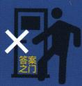

禁止直接对答案

小心错题踩坑

# 第一章 有理数

# 1.1 正数和负数

# 刷基础

1. B 【解析】在数-3,0, $\frac{2}{3}$ , $-\frac{8}{5}$ ,3.7中,属于负数的有-3和 $-\frac{8}{5}$ ,共2个.故选B.  
2. ② 【解析】①0 不带“-”号,但 0 不是正数,故①错误;②如果 a 是正数,那么-a 一定是负数,故②正确;③0 既不是正数,也不是负数,故③错误. 故答案为②.  
3.-262【解析】根据题意可知“||⊥X”表示的数是-262.  
4. B 【解析】A 选项，“气温上升”与“零下”意义不相反，故该选项不合题意；B 选项，顺时针转 4 圈和逆时针转 3 圈是具有相反意义的量，故该选项符合题意；C 选项，盈利 200 元和支出 300 元不是具有相反意义的量，“盈利”对应“亏损”，“支出”对应“收入”，故该选项不合题意；D 选项，走了 100 米和跑了 100 米不是具有相反意义的量，“走”和“跑”不具有相反意义，故该选项不合题意。故选 B.  
5. C 【解析】因为火箭点火前 10 秒记为 -10 秒, 所以火箭点火后 5 秒应记为 +5 秒. 故选 C.  
6. 支出 50 元 【解析】收入与支出的意义相反，所以 -50 元表示支出 50 元，故答案为支出 50 元.  
7.-62 【解析】若深圳的纬度约是北纬 22.5 度,记作+22.5 度,则南极长城站的纬度约是南纬 62 度,记作-62 度,故答案为-62.  
8. $-3 \, km + 2 \, km - 2.5 \, km$ 【解析】由表格中的数据可得，下降 $3 \, km$ ，记作 $-3 \, km$ ；上升 $2 \, km$ ，记作 $+2 \, km$ ；下降 $2.5 \, km$ ，记作 $-2.5 \, km$ 。故答案为 $-3 \, km, +2 \, km, -2.5 \, km$ 。

# 刷易错·

9. B 【解析】①0 以外的数为正数和负数, 它们表示相反意义的量, 所以 0 是正数与负数的

易错警示
0 是一个中性数, 它没有性质符号, “+0” 或 “-0” 都为 0, 不要误认为它是正数或负数. 0 常用来表示某些量的基准.

# 关键点拨

具有相反意义的量应满足的条件:①意义相反;②是同类量,且不要求数量一定相等.

分界, 故①正确; ②0除了表示“什么也没有”, 还可以表示其他意义, 故②错误; ③0℃表示温度为0摄氏度, 而不是没有温度, 故③错误; ④0既不是正数, 也不是负数, 故④正确; ⑤0是自然数, 故⑤正确. 综上所述, 正确的有①④⑤, 共3个. 故选B.

# 刷提升

1. B 【解析】第一种品牌的面粉的最大质量是 $20+0.1=20.1(\text{kg})$ ，最小质量是 20-0.1=19.9(kg)；第二种品牌的面粉的最大质量是 $20+0.2=20.2(\text{kg})$ ，最小质量是 20-0.2=19.8(kg)；第三种品牌的面粉的最大质量是 $20+0.3=20.3(\text{kg})$ ，最小质量是 20-0.3=19.7(kg)，所以从中任意拿出两袋，它们的质量最多相差 $20.3-19.7=0.6(\text{kg})$ ，故选 B.  
2. B 【解析】以每天上午 10 时为基准 0, 每向前 45 分钟为一个“-1”. 因为 7:45 到 10:00 共 135 分钟, 为 3 个 45 分钟, 所以 7:45 应记为 -3, 故选 B.  
3. C 【解析】用“+”表示杯口朝上,用“-”表示杯口朝下.每经过一次翻转后的杯口情况如下:

第 1 次翻转后: ----+++++++,

第 2 次翻转后: ----+++++,

第 3 次翻转后: ----++,

第 4 次翻转后: ----++++,

第 5 次翻转后: ----.

此时翻转次数最少. 故选 C.

4. 10月12日13时 【解析】21-8=13, 所以伦敦的当地时间是10月12日13时. 故答案为10月12日13时.  
5. -24 【解析】因为 $20+0+12-4+8-9+6-4+2-7+0=24$ ，所以该公交车到终点站时需下车 24 人。故答案为 -24。  
6.【解】(1)从表格可知,星期一分拣包裹数量比计划量多6万件,为26万件;星期二分拣包

裹数量比计划量少3万件,为17万件;星期三分拣包裹数量比计划量少4万件,为16万件;星期四分拣包裹数量比计划量多5万件,为25万件;星期五分拣包裹数量比计划量少1万件,为19万件;星期六分拣包裹数量比计划量多7万件,为27万件;星期日分拣包裹数量比计划量少8万件,为12万件.所以分拣包裹数量最多的一天是星期六,最少的一天是星期日,最多的一天比最少的一天多分拣27-12=15(万件).故答案为六,日,15.

(2) $26+17+16+25+19+27+12=142$ （万件），所以该仓库本周实际一共分拣包裹142万件.

# 刷素养·

# 7. C 【解析】

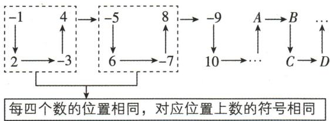

flowchart

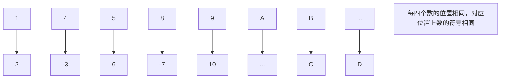

A 是向上箭头的上方对应的数, 则与 4 的符号相同, 所以在 A 处的数是正数, 故(1)说法正确. 观察发现, 向下箭头的上方的数是负数, 下方的数是正数; 向上箭头的下方的数是负数, 上方的数是正数, 所以排在 B, D 处的数都是负数, 排在 A, C 处的数都是正数, 故(2)(3)说法错误. 因为 $2022 \div 4 = 505 \cdots 2$ , 所以第 2022 个数是正数, 故(4)说法正确. 综上所述, 正确的有(1)(4), 共 2 个. 故选 C.

# 1.2 有理数及其大小比较

# 1.2.1 有理数的概念

# 刷基础

1. B 【解析】在 $-\frac{7}{4}$ ，1.0010001, $\frac{8}{33}$ , 0, $\pi$ ,
-2.626 626 662…(每相邻两个2之间6的个数逐次加1), 0.12中, 有理数有 $-\frac{7}{4}$ ,
1.0010001, $\frac{8}{33}$ ,0,0.12,共5个.故选B.

2. B 【解析】A 选项, 正整数、0、负整数统称为整数, 该选项说法错误, 不合题意; B 选项, 整

# 关键点拨

非负整数指正整数和零, 非正整数指负整数和零.

# 易错警示

如果一个数是小数,它是否属于有理数,就看它是否能化成分数的形式.所有的有限小数和无限循环小数都可以化成分数的形式,因而属于有理数;而无限不循环小数不能化成分数形式,因而不属于有理数.

数和分数统称为有理数,该选项说法正确,符合题意;C 选项,非负有理数是 0 和正有理数,该选项说法错误,不合题意;D 选项,0 是有理数,该选项说法错误,不合题意.故选 B.

3. $-\frac{1}{2}$ (答案不唯一) 【解析】例如 $-\frac{1}{2}$ （答案不唯一）.

4. 有理数 【解析】因为整数和分数统称为有理数, $\frac{22}{7}$ 是分数且是无限循环小数,所以约率 $\frac{22}{7}$ 是有理数. 故答案为有理数.

5. B 【解析】题图中的阴影部分表示负整数, 四个选项中, 只有 B 选项符合题意. 故选 B.

6.【解】正整数: $\{1, +1008, 28, \cdots\}$ ;

负整数： $\{-7,-9,\cdots\}$ ;

正分数: $\left\{8.9,\frac{5}{6},\cdots\right\}$ ;

负分数: $\left\{-\frac{4}{5},-3.2,-0.06,\cdots\right\}$ ;

非负数： $\left\{0,1,8.9,\frac{5}{6},+1\ 008,28,\pi,\cdots\right\}$ ;

非正数： $\left\{0,-\frac{4}{5},-7,-3.2,-0.06,-9,\cdots\right\}$ ;

非负整数： $\{0,1,+1\ 008,28,\cdots\}$ ;

非正整数： $\{0,-7,-9,\cdots\}$ .

# 7.【解】

<table><tr><td colspan="4">运动会检录窗口</td></tr><tr><td>非负整数</td><td>正分数</td><td>负整数</td><td>负分数</td></tr><tr><td>468</td><td>235</td><td>7</td><td>1</td></tr></table>

# 8.【解】如图所示：

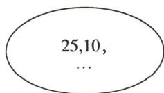  
正整数

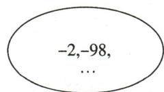  
负整数

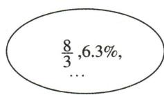  
正分数

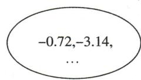  
负分数

因为有理数分为正有理数、零和负有理数，正有理数包含正整数和正分数，负有理数包含负整数和负分数，所以这四种数的集合合并在一起不是全体有理数集合。故答案为不是。

# 1.2.2 数轴

# 刷基础

1. C 【解析】数轴的三要素: ①原点, ②正方向, ③单位长度.

A 直线上没有规定正方向,错误  
B 没有单位长度,错误  
C 符合数轴的三要素, 正确  
D 数轴上没有原点,且正方向画错,错误

2. D 【解析】原点位置可以是数轴上任意一点, 故 A 正确; 一般情况下, 取从左到右 (或从下到上) 的方向为数轴的正方向, 故 B 正确; 数轴的单位长度可根据实际需要任意选取, 故 C 正确; 数轴上每相邻两个刻度之间的长度是相等的, 不一定都等于 $1 \mathrm{~cm}$ , 故 D 错误. 故选 D.  
3. B 【解析】由题图知, 点 A 所表示的数为 -5, 将点 A 在数轴上右移 7 个单位得到点 B, 则点 B 所表示的数为 2, 故选 B.  
4.9 【解析】被盖住的点表示的整数有-6, -5, -4, -3, -2, 1, 2, 3, 4, 共9个, 故答案为9.  
5.【解】如图所示：

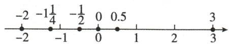

text_image

-2 -1\frac{1}{4} -\frac{1}{2} 0 0.5
-2 -1 0 1 2 3

6. D 【解析】因为点 O, A, B 在数轴上, 分别表示数 0, 1.5, 4.5, 数轴上另有一点 C, 到点 A 的距离为 1, 到点 B 的距离小于 3, 所以点 C 表示的数为 2.5, 位于点 A 与点 B 之间, 故选 D.  
7. C 或 D 【解析】根据数轴可知, 当 C 或 D 为数轴的原点时, 有理数 a 对应的点到原点的距离是 b 对应的点到原点的距离的 3 倍. 故答案为 C 或 D.  
8.【解】(1)如图所示:

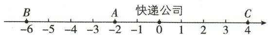

text_image

B
-6 -5 -4 -3 -2 快递公司
A
-2 -1 0 1 2 3 4

(2) 因为快递员从 B 小区向南骑行 1 000 m 到达 C 小区, 所以 C 小区离 B 小区的距离是 1 000 m.  
(3) 易知 C 小区离快递公司的距离为 400 m, $200 + 400 + 1\ 000 + 400 = 2\ 000 \, (\text{m})$ , 所以快递员一共骑行了 $2\ 000 \, m = 2 \, km$ .

# 易错警示

由于题目没有具体说明点 B 的位置, 故解决本题需分点 B 在点 A 的左侧和点 B 在点 A 的右侧两种情况讨论.

# 刷易错·

9. 3 或 -7 【解析】当点 B 在点 A 左侧时, 点 B 表示的数是 -7; 当点 B 在点 A 右侧时, 点 B 表示的数是 3. 故答案为 3 或 -7.

# 刷提升

1. B 【解析】在题图(1)中, 因为点 A, B 表示的数分别是 -10, 3, 所以 AB = 13. 在题图(2)中, AB = 1, 所以 $BC = \frac{1}{2} \times (13 - 1) = 6$ , 所以点 C 表示的数是 -3. 故选 B.

# 刷有所得◀2. A 【解析】

研究线段盖住数轴上的整点个数的问题，首先要考虑线段的端点是否与数轴上的整点重合，其次要结合数轴，利用数形结合思想解决问题.

<table><tr><td>线段AB的端点与数轴上的整点重合</td><td>2024个整点A 0 1 ... 2023</td></tr><tr><td>线段AB的端点不与数轴上的整点重合</td><td>2023个整点A 0 1 ... 2023 2024</td></tr></table>

3. C 【解析】依题意, 可得每翻转 4 次, 正方形的顶点相对于数轴的位置与未翻转时一致.
A 选项, 翻转 3 次后, 点 D 落在数轴上表示 3 的点处, 故 A 说法正确, 不符合题意; B 选项, 翻转 4 次后, 与数轴重合的两个顶点表示的数分别为 3 和 4, 故 B 说法正确, 不符合题意; C 选项, 在翻转过程中, 顶点 B 与数轴上表示数 1, 5, 9, 13, 17, … 的点重合, 所以顶点 B 不会与数轴上表示 14 的点重合, 故 C 说法错误, 符合题意; D 选项, 因为每 4 次翻转为一个循环, $2024 \div 4 = 506$ , 所以数轴上数 2024 所对应的点是 A, 故 D 说法正确, 不符合题意. 故选 C.

4.-4或2 【解析】①当点P在点A的左侧时，因为A,B,P三个点是“和谐三点”，所以PA=AB=4，所以点P对应的数为-4；②当点P在A,B之间时，因为A,B,P三个点是“和谐三点”，所以 $PA=PB=\frac{1}{2}AB=2$ ，所以点P对应的数为2.综上所述，符合“和谐三点”的点P对应的数为-4或2.故答案为-4或2.

# 刷素养·

5.【解】(1)因为点 M 在数轴上向右移动 3 个单位长度后表示的数是 5, 所以 a=5-3=2. 故答案为 2.
(2)由题意可知，B 点到数 24 对应的点的距离、PQ 的长、A 点到数 6 对应的点的距离相等, 所以 $PQ = (24 - 6) \div 3 = 6$ , 所以 A 点表示的数为 $6 + 6 = 12$ , B 点表示的数为 24 - 6 = 18.

(3)如图:

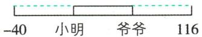

爷爷和小明的年龄差为 $(116+40)\div3=52$ （岁），所以爷爷的年龄为 $116-52=64$ （岁），小明的年龄为64-52=12（岁），所以小明的年龄为12岁，爷爷的年龄为64岁.

# 1.2.3 相反数

# 刷基础

1. A 【解析】- $\frac{1}{2025}$ 的相反数是 $\frac{1}{2025}$ . 故选 A.  
2. D 【解析】A 选项, 只有符号不同的两个数互为相反数, 故此选项错误; B 选项, 5 的相反数是 -5, 故此选项错误; C 选项, 当 -a 为零或正数时, 表示 -a 的点是原点或在原点的右边, 故此选项错误; D 选项, 任何负数的相反数都是正数, 故此选项正确. 故选 D.  
3.1 【解析】因为 $\frac{2}{3}$ 的相反数是 $-\frac{2}{3}$ ，所以 $\frac{2}{3}$ 和它的相反数之间的整数有0，共1个.  
4. -2 【解析】 $4 \div 2 = 2$ ，则这两个数是+2和-2。因为点A在原点左侧，所以点A表示的数为-2。故答案为-2。  
5.【解】(1)根据题意,原点 O 如图(1)所示,则点 C 表示的数是-1.

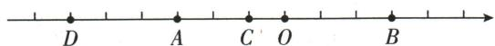  
图(1)

(2)根据题意,原点 O 如图(2)所示,则点 C 表示的数是 0.5, 点 D 表示的数是 -4.5.

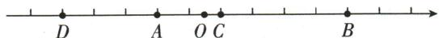  
图(2)

6. C 【解析】因为 $-( + a) = +(-2)$ ，所以 -a = -2，所以 a = 2。故选 C.  
7. -8 【解析】 $-\left[-(+x)\right]=8$ ，则 x=8，故 x 的相反数为 -8.  
8.2 【解析】因为最大的负整数为-1, 所以 a 的相反数为-1, 所以 a=1. 因为最小的正整数为 1, 所以 b 的相反数为 1, 所以 b=-1. 通过数轴可以知道, a, b 所对应的点之间相差 2 个单位长度.

# 易错警示

遇到多重括号化简时,一定要从内往外或从外往内按顺序去括号.

9.【解】(1)-(+10)=-10.

(2) $+(-0.15) = -0.15.$   
(3) $+(+3)=3.$   
(4) $-(-20)=20.$   
(5) $-\left(-\frac{2}{3}\right)=\frac{2}{3}.$   
(6) $-\left[-\left(+2\frac{1}{5}\right)\right]=2\frac{1}{5}.$   
(7) $+\left\{-\left[+\left(-0.03\right)\right]\right\}=+\left[-\left(-0.03\right)\right]=$ $+(+0.03)=0.03.$

10.【解】(1)-(+4)=-4.

(2) $+\left(-\frac{3}{7}\right)=-\frac{3}{7}.$   
(3) $-\left[-\left(-3\frac{2}{5}\right)\right]=-3\frac{2}{5}.$   
(4) $-\left\{-\left[-(-2024)\right]\right\}=2024.$

当原式中“-”号的个数是奇数时,化简结果为负数;当原式中“-”号的个数是偶数时,化简结果为正数.

# 1.2.4 绝对值

# 刷基础

1. A 【解析】在数轴上, 表示的数的绝对值等于 2 的点到原点的距离为 2, 由数轴可知为点 A. 故选 A.  
2.【解】 $\left| -\frac{1}{2} \right| = \frac{1}{2}, |0.5| = 0.5, \left| -4\frac{1}{3} \right| = 4\frac{1}{3}$ .  
3. C 【解析】因为 $|a| = -a$ ，所以 $a$ 是负数或者 0，故选 C.

4. A 【解析】因为正数和0的绝对值是它本身，负数的绝对值是它的相反数，所以一个有理数的绝对值不小于它自身，故A选项说法正确；若两个有理数的绝对值相等，则这两个数相等或互为相反数，故B、C选项说法错误；当a<0时，-a的绝对值等于-a，故D选项说法错误。故选A。

5.34 【解析】因为 $|x - 3| + |y - 4| = 0$ ，所以 $x - 3 = 0, y - 4 = 0$ ，所以 $x = 3, y = 4$ . 故答案为3,4.  
6.5 【解析】因为 $|x - 1| \geqslant 0$ ，所以 $|x - 1|$ 的最小值是 0，所以 $|x - 1| + 5$ 的最小值是 5。故答案为 5。  
7.【解】小贝的观点不正确. 理由如下:
因为当 a = -2, b = -1 时, $|-2| > |-1|$ , 但是

-2<-1,所以若 $|a|>|b|$ ,则a>b不一定成立,所以小贝的观点不正确.

8. C 【解析】A 选项, 因为 $|x| > 3$ , 所以 $x > 3$ 或 $x < -3$ , 不符合 $-3 < x < 3$ , 故该选项是错误的; B 选项, 因为 $|x| \leqslant 3$ , 所以 $-3 \leqslant x \leqslant 3$ , 不符合 $-3 < x < 3$ , 故该选项是错误的; C 选项, 因为 $0 \leqslant |x| < 3$ , 所以 $-3 < x < 3$ , 符合题意, 故该选项是正确的; D 选项, 因为 $0 < |x| < 3$ , 所以 $-3 < x < 3$ 且 $x \neq 0$ , 不符合 $-3 < x < 3$ , 故该选项是错误的. 故选 C.

9.3 【解析】因为 a = -2, b = 1，所以 $\left|a\right| + \left|-b\right| = \left|-2\right| + \left|-1\right| = 2 + 1 = 3.$

10.【解】原式=4-2.5+3=4.5.

# 刷易错·

11.【解】晓莉的想法不正确. 理由如下: 当 m=0 时, $|m|=m$ , 但 0 不是正数, 故原说法不正确. 所以晓莉的想法不正确.

# 刷提升

1. B 【解析】由题意知 $a \neq 0$ ，即 $|a| \neq 0$ . 当 $a > 0$ 时， $|a| = a$ ，则 $x = \frac{a}{|a|} = \frac{a}{a} = 1$ ; 当 $a < 0$ 时， $|a| = -a$ ，则 $\frac{a}{|a|} = \frac{a}{-a} = -1$ . 所以 $x = \frac{a}{|a|}$ 的不同取值有2种. 故选B.

2. C 【解析】因为 MN=NP=PR=1, 所以数 a, b 对应的点之间的距离大于 1 且小于 3. 因为 $\left|a\right|+\left|b\right|=2$ , 当原点在点 M 处时, $\left|b\right|>2$ , 当原点在点 R 处时, $\left|a\right|>2$ , 所以点 M 与点 R 都不是原点, 故原点只能是 N 或 P. 故选 C.

3.【解】(1)第4件样品的直径最符合要求.

(2) 因为 $\left|+0.10\right|=0.10<0.18, \left|-0.15\right|=0.15<0.18, \left|-0.05\right|=0.05<0.18.$

所以第 1,2,4 件样品是正品；

因为 $|+0.20|=0.20,0.18<0.20<0.22$ ，所以第3件样品为次品；

因为 $|+0.25|=0.25>0.22$ ,

所以第 5 件样品为废品.

4.【解】(1) $|x+2|+|x-3|=5$ 表示数轴上有理数x对应的点到-2和3对应的两点的距离之和为5,如图(1).

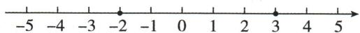  
图(1)

# 易错警示

本题容易忽略0也是绝对值等于本身的数.

# 技巧点拨

奇数个取中间值, 偶数个取中间段.

因为表示-2和表示3的两点之间的距离是5,所以在-2和3之间(含-2和3)的整数均符合题意,所以所有符合条件的整数x为-2,-1,0,1,2,3.

(2)①因为 $|x+3|+|x-4|=|x-(-3)|+|x-4|$ ，所以 $|x+3|+|x-4|$ 表示数轴上有理数x对应的点到-3和4对应的两点的距离之和。假设点P在数轴上表示的数是x，点A表示的数是-3，点B表示的数是4，则点P可能在点A的左边或点A和点B之间（含点A和点B）或点B的右边。如图(2)所示，当点P在点A的左边或点B的右边时，点P到A,B两点的距离之和均大于A,B两点间的距离；当点P在点A和点B之间（含点A和点B）时，点P到A,B两点的距离之和等于A,B两点间的距离，所以x在-3和4之间（含-3和4），即 $-3\leqslant x\leqslant4,|x+3|+|x-4|$ 的最小值为7。故答案为7， $-3\leqslant x\leqslant4$ 。

图(2)

②因为 $|x+7|+|x+4|+|x-2|+|x-5|=|x-(-7)|+|x-(-4)|+|x-2|+|x-5|$ ，所以x在-4和2之间（含-4和2），即 $-4\leqslant x\leqslant2$ ，代数式 $|x+7|+|x+4|+|x-2|+|x-5|$ 的最小值为18.故答案为 $18,-4\leqslant x\leqslant2$ .

(3)①因为 $|x+6|+|x+3|+|x-2|=|x-(-6)|+|x-(-3)|+|x-2|$ ，所以 $|x+6|+|x+3|+|x-2|$ 表示数轴上有理数x对应的点到-6,-3和2对应的三点的距离之和。假设点P在数轴上表示的数是x，点A表示的数是-6，点B表示的数是-3，点C表示的数是2，如图(3)所示，当点P在点B处时，P到A,B,C三点的距离之和等于A,C两点间的距离；当点P在除点B外的任意位置时，P到A,B,C三点的距离之和均大于A,C两点间的距离，所以当x=-3时， $|x+6|+|x+3|+|x-2|$ 有最小值，为8。故答案为8,-3。

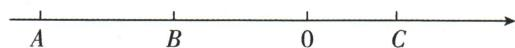  
图(3)

②因为 $(1+617)\div2=309$ ，所以当x=309时， $|x-1|+|x-2|+|x-3|+\cdots+|x-617|$ 取得最小值。故答案为309。

# 1.2.5 有理数的大小比较

# 刷基础

1. A 【解析】由题图可知 $a < 0 < b, -a > b, a < -b$ 所以 $a < -b < b < -a$ . 故选 A.

2. $-\frac{1}{2}$ (答案不唯一) 【解析】由题意可知，-4<a<-3, 所以比 $a$ 大的负分数可以是 $-\frac{1}{2}$ . 故答案为 $-\frac{1}{2}$ (答案不唯一).

3.【解】 $-\left(-2\frac{1}{2}\right)=2\frac{1}{2},-|-1|=-1$ . 把各数表示在数轴上,如图所示:

$$
- 3 \quad - | - 1 | \quad - (- 2 \frac {1}{2}) \quad 3. 5
$$

用“<”连接为-3<-|-1|<- $\left(-2\frac{1}{2}\right)$ <3.5.

4. D 【解析】当甲数为-5, 乙数为3时, $|-5|=5$ , $|3|=3$ , 满足甲数的绝对值比乙数的绝对值大, 但-5<3, 即甲数小于乙数, 所以A选项错误, 不符合题意; 当甲数为5, 乙数为3时, $|5|=5$ , $|3|=3$ , 满足甲数的绝对值比乙数的绝对值大, 但5>3>0, 即甲数大于乙数, 且这两个数都大于0, 所以B、C选项错误, 不符合题意; 仅知道甲数的绝对值比乙数的绝对值大, 不知道两数的正负, 所以无法判断两数的大小关系, 所以D选项正确, 符合题意. 故选D.

5.【解】因为 $\left|-\frac{2}{3}\right|=\frac{2}{3},\left|-\frac{3}{4}\right|=\frac{3}{4},\frac{2}{3}<\frac{3}{4}$ ，所以 $-\frac{2}{3}>-\frac{3}{4}$ .

6. B 【解析】 $(-1)=1,-(+2)=-2,|-3|=3$ ,
所以 $-(+2)<0<-(-1)<|-3|$ . 故选 B.

7. D 【解析】① $-\left(+3\frac{3}{4}\right)=-3.75$ ，根据有理数的大小关系，得 $-3.8<-\left(+3\frac{3}{4}\right)$ ，①不正确；
② $-\left(-\frac{3}{4}\right)=\frac{3}{4},- \left(-\frac{3}{5}\right)=\frac{3}{5}$ ，根据有理数的大小关系，得 $\frac{3}{4}>\frac{3}{5}$ ，即 $-\left(-\frac{3}{4}\right)>-\left(-\frac{3}{5}\right)$ ，

# 技巧点拨

该类问题可以利用特殊值举例来进行判断.

# 解题策略

比较两个负数
大小的一般步
骤: (1) 先求
出两个负数的
绝对值;

(2) 比较两个绝对值的大小;
(3) 根据“两个负数, 绝对值大的反而小”确定原数的大小.

②正确；③ $|-2.5|=2.5$ ，根据有理数的大小关系，得2.5>-2.5，即 $|-2.5|>-2.5$ ，③正确；
④ $-\left(-5\frac{1}{2}\right)=5\frac{1}{2}=5+\frac{1}{2}=5+\frac{3}{6},\left|+5\frac{2}{3}\right|=5\frac{2}{3}=5+\frac{2}{3}=5+\frac{4}{6}$ ，根据有理数的大小关系，
得 $5 + \frac{3}{6} < 5 + \frac{4}{6}$ ，即 $-\left(-5\frac{1}{2}\right) < \left|+5\frac{2}{3}\right|$ ，④不正确。综上，正确的有②③。故选 D.

8.5 【解析】大于-2且不大于3的整数有-1, 0,1,2,3,共5个.

# 刷素养·

9.【解】(1)根据数轴可知-3<-1.5<2<3.5.

(2) 若将原点改在 C 点, 则点 A 表示的数为 -3.5, 点 B 表示的数为 -5, 点 C 表示的数为 0, 点 D 表示的数为 1.5, 则 -5 < -3.5 < 0 < 1.5.

(3) 由 (1)(2) 发现, 改变原点位置后, 点 A, B, C, D 所表示的数的大小顺序不会改变, 这说明数轴上表示的两个数, 右边的总比左边的大.

# 数学活动

# 刷活动

1. C 【解析】由题意可得,少于标准体重 3 kg 记作 -3 kg. 故选 C.

2.(1)小天 小丽 (2)13 【解析】(1)因为标准体重是50 kg,所以小明、小丁、小丽、小文、小天、小乐6个人的体重分别为45 kg,53 kg,43 kg,54 kg,56 kg,50 kg,所以小天最重,小丽最轻.故答案为小天,小丽.

(2) 小天的体重为 56 kg, 小丽的体重为 43 kg, 56-43=13 (kg), 所以最重的比最轻的重 13 kg. 故答案为 13.

3.【解】(1)由表格可知,最接近标准体重的是5号学生,他的体重是48.0+0.2=48.2(kg),即最接近标准体重的学生体重是48.2kg.由表格可得,将这7名学生的体重,按由小到大排列为1号学生的体重<4号学生的体重<5号学生的体重<7号学生的体重<3号学生的体重<6号学生的体重<2号学生的体重,即按学生的体重由小到大排列时,恰好居中的是7号学生.故答案为48.2,7.

(2)由表格可知,最大体重是2号学生,最小体重是1号学生,所以最大体重为49.5 kg,最小体重为45 kg,所以最大体重与最小体重相差49.5-45=4.5(kg),即最大体重与最小体重相差4.5 kg.

(3)这7名学生的体重分别为45 kg, 49.5 kg, 48.8 kg, 47.5 kg, 48.2 kg, 49.2 kg, 48.5 kg, $(45+49.5+48.8+47.5+48.2+49.2+48.5)\div7=48.1(\text{kg})$ .

答:这7名学生的平均体重为48.1 kg.

4.【解】乙采用对分法能更快地猜中.

假如甲想的数是 23, 下边是对话:

①乙:比16大吗?甲:是.   
②乙:比24大吗?甲:不.   
③乙:比20大吗?甲:是.   
④乙:比22大吗?甲:是.   
⑤乙:比23大吗?甲:不.

所以这个数是 23, 所以乙最多问 5 次就一定能猜中.

5.【解】因为甲看了看自己手中的数,想了想说:“我不知道谁手中的数更大,”所以甲可能是2,3,4.乙听了甲的话后,思索了一下说:“我也不知道谁手中的数更大,”所以乙手中的数不可能是2,4,只能是3,所以乙手中的数是3.

# 全章综合训练

# 刷中考

1. C 【解析】5>0, 是正数; $-\frac{5}{7}<0$ , 是负数; -3<0, 是负数; 0 既不是正数, 也不是负数; -25.8<0, 是负数; +2>0, 是正数, 所以负数有 $-\frac{5}{7}$ , -3, -25.8, 共 3 个. 故选 C.  
2.+2024 【解析】公元前 121 年记作 -121 年，那么公元 2024 年应记作 +2024 年. 故答案为 +2024.  
3. A 【解析】根据题图可知点 P 表示的数为 -1, 故选 A.  
4. A 【解析】A 选项, $|-2024|=2024$ , 2024 和 -2024 互为相反数, 符合题意. B 选项, 2024 和 $\frac{1}{2024}$ 不互为相反数, 不符合题意.

# 关键点拨

根据一个数的绝对值越小，
数轴上表示它的点离原点越近解题即可.

# 归纳总结

有理数比较大小的方法:
(1) 在数轴上表示的两数,右边的数总比左边的数大;
(2) 正数大于0,负数小于0,正数大于负数;(3) 两个负数中,绝对值大的数反而小.

C 选项, $|-2024|=2024$ ,两个数不互为相反数,不符合题意. D 选项, -2024 和 $\frac{1}{2024}$ 不互为相反数,不符合题意. 故选 A.

5. B 【解析】设点 B 表示的数是 x. 因为 OA = OB, 所以 $\left|x\right| = 2023$ . 因为点 B 在原点 O 的左侧, 所以 x < 0, 所以 x = -2023, 故选 B.

6. B 【解析】因为数轴上的点 A, B 分别表示 -3, 2, |-3| = 3, |2| = 2, 3 > 2, 所以点 B 离原点的距离较近. 故答案为 B.

7. A 【解析】根据有理数比较大小的方法, 可得 -1 < 0 < 1 < 2, 所以这四个数中, 最小的数是 -1. 故选 A.

8. A 【解析】因为-415<-156<-40<-28, 所以最低海拔最小的大洲是亚洲. 故选 A.

9. A 【解析】由 5 天的日最低气温为 $-2^{\circ}C$ ， $-4^{\circ}C, 0^{\circ}C, 1^{\circ}C, -1^{\circ}C$ 得到这 5 天日最低气温变化情况为先下降，然后上升，再上升，最后下降。故选 A.

10. C 【解析】由数轴可知点 C 离原点最近, 所以在 $\left|a\right|$ , $\left|b\right|$ , $\left|c\right|$ , $\left|d\right|$ 中最小的是 $\left|c\right|$ . 故选 C.

11. C 【解析】由数轴可知, $a < b < 0 < c, |a| > |b| > |c|$ . A 选项, $-c > b$ , 则此项错误, 不符合题意; B 选项, $a < -c$ , 则此项错误, 不符合题意; C 选项, 因为 $a - b < 0$ , 所以 $|a - b| = b - a$ , 则此项正确, 符合题意; D 选项, 因为 $c - a > 0$ , 所以 $|c - a| = c - a$ , 则此项错误, 不符合题意. 故选 C.

12. ≤ 【解析】因为 $-\frac{2}{3} = -\frac{6}{9}, \left| -\frac{6}{9} \right| = \frac{6}{9}$ , $\left|-\frac{4}{9}\right|=\frac{4}{9},\frac{6}{9}>\frac{4}{9}$ ，所以 $-\frac{2}{3}<-\frac{4}{9}$ . 故答案为<.

13. 0(答案不唯一) 【解析】-1<0, 故答案为 0 (答案不唯一).

# 刷章测

1. D 【解析】负分数有 $-2 \frac{4}{7}$ , -3.14, $-\frac{1}{2022}$ , -1-0.51, 共 4 个. 故选 D.  
2. B 【解析】因为正数表示水面高于标准水位

的高度,所以-0.2 m 表示水面低于标准水位 0.2 m. 故选 B.

3. A 【解析】在数轴上标出-a, |a|, -b 和 |b| 的对应点的位置如图所示, 根据数轴上左边的数小于右边的数, 可得 |b| > a, b < -a, a < -b, |a| < |b|. 故选 A.

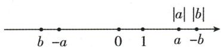

4. D 【解析】因为 $\left|a\right|+\left|b\right|=\left|a+b\right|$ ，所以 a, b 满足的关系是 a, b 同号或 a, b 中有一个为 0 或 a, b 同时为 0，故选 D.

5. D 【解析】

# 识图解题 | 数轴上的规律问题

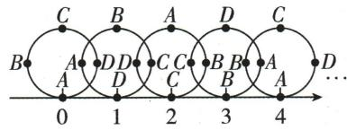

text_image

C B A D C
B A D D C C B B A D
A D C C B B A
0 1 2 3 4 ...

由图可以看出,以 D,C,B,A 四个字母为一次循环. 因为 $1\ 949 \div 4 = 487 \cdots 1$ , 所以数轴上表示 1 949 的点与圆周上的字母 D 重合. 故选 D.

6. D 【解析】因为 a, c 异号, a < b < c, 所以 a < 0, c > 0. 又因为 $\left|c\right| < \left|b\right| < \left|a\right|$ , 所以 a < b < -c < 0 < c. 因为 $\left|x-a\right| + \left|x-b\right| + \left|x-(-c)\right|$ 表示在数轴上数 x 对应的点到 a, b, -c 三个数对应的点的距离之和, 而当 x = b 时, 其距离之和最小, 即 $\left|x-a\right| + \left|x-b\right| + \left|x-(-c)\right|$ 最小, 所以最小值是 a 与 -c 在数轴上对应的点之间的距离, 即 -c -a. 故选 D.

7. 10 10.03 9.98 【解析】表示这种零件的标准尺寸是 10 毫米, 加工要求最大不超过 10.03 毫米, 最小不小于 9.98 毫米. 故答案为 10, 10.03, 9.98.

8. ≤ 【解析】因为 $-(-1-21)=2,-3<2$ ，所以 $-3<-(-1-21)$ 。故答案为 <。

9.0或4或-4或-8 【解析】在数轴上两点之间的距离等于两点所表示的数的差的绝对值.根据 $A,B$ 两点间的距离为4以及点 $A$ 表示的数为-2可得点 $B$ 所表示的数为2或-6.当点 $B$ 表示的数为2时，点 $C$ 所表示的数为0或4；当点 $B$ 表示的数为-6时，点 $C$ 所表示的

# 易错警示

已知数轴上两点之间的距离和其中一点表示的数, 求另一点所表示的数时, 一定要注意分类讨论, 不要漏解.

数为-8或-4. 综上所述，点 $C$ 表示的数为0或4或-4或-8.

10.【解】分数集合： $\left\{\frac{3}{4},8.9,-\frac{6}{7},-3.14,2\frac{3}{5},\cdots\right\}$ ;
整数集合： $\{5,-3,19,-9,0,\cdots\}$ ;
非正整数集合： $\{-3,-9,0,\cdots\}$ ;
非负数集合： $\left\{5,\frac{3}{4},8.9,19,0,2\frac{3}{5},\cdots\right\}$ .

11.【解】(1)因为 $|a|<|b|\leqslant4$ ，且a,b为整数，所以a的最大值为3,b的最大值为4.

(2) 因为 $\left|a\right| \geqslant 0$ ，所以当 a = 0 时， $\left|a\right|$ 最小。因为 $\left|b\right| \leqslant 4$ ，所以 b 的最小值为 -4。所以当 a = 0, b = -4 时， $\left|a\right| + b$ 有最小值。

12.【解】(1)因为实际直径可以有0.02毫米的误差,张兵的是-0.017毫米,蔡伟的是-0.011毫米,两人的测量结果与规定直径的差的绝对值都小于0.02毫米,所以张兵、蔡伟做的球是合乎要求的.

(2) 因为 $\left|-0.011\right|<\left|-0.017\right|<\left|-0.021\right|<\left|+0.022\right|<\left|+0.023\right|<\left|+0.031\right|$ ，所以 6 名同学做的球的质量按照最好到最差排名为蔡伟、张兵、余佳、赵平、王敏、李明.

13.【解】(1)根据题图(1)中数轴上点的位置, 可知 A 点表示的数为 -2, B 点表示的数为 0, C 点表示的数为 1, D 点表示的数为 3.

(2) 若 $C$ 为原点, 因为点 $A$ 在点 $C$ 的左边, 且与 $C$ 点相距 5 个单位长度, 所以 $A$ 点表示的数为 -5. 因为点 $B$ 在点 $C$ 的左边, 且与 $C$ 点相距 3 个单位长度, 所以 $B$ 点表示的数为 -3. 若点 $B, C$ 表示的两个数互为相反数, 则原点在 $B, C$ 之间, 且到 $B, C$ 两点的距离相等. 因为点 $B, C$ 相距 3 个单位长度, 所以 $B$ 点表示的数为 -1.5, 则 $A$ 点表示的数为 -3.5. 故答案为 -5, -3, -1.5, -3.5.

(3)根据题意,相当于-1对应的点向右移动5个单位长度,再向左移动2个单位长度得到点E,故原来点E表示的数为2.

14.【解】(1)0. $\dot{6}=\frac{6}{9}=\frac{2}{3}$ , 8. $\dot{2}=8+0$ . $\dot{2}=8+$ $\frac{2}{9}=\frac{74}{9}$ ，故答案为 $\frac{2}{3},\frac{74}{9}$ .

(2) 将 0.64 化为分数形式, 由于 0.64 =

0. 646 464 …, 设 $x = 0.646$ 464 …, ① 则 $100x = 64.646$ 4 …, ② ② - ① 得 $99x = 64$ , 解得 $x = \frac{64}{99}$ , 于是得 $0.64 = \frac{64}{99}$ .

(3)类比(1)(2)的方法可得, $0.15\dot{3}=\frac{153}{999}=$ $\frac{17}{111}$ ,故答案为 $\frac{17}{111}$ .

关键点按
本题的关键是
正确理解题目
中的例子, 学
会推导过程,
对知识进行迁
移和探索.

(4) 因为 $0.71428\dot{5}=\frac{5}{7}$ ，所以 $714.28571\dot{4}=\frac{5}{7}\times1000$ ，所以 $0.28571\dot{4}=\frac{5}{7}\times1000-714=\frac{2}{7}$ ，所以 $2.28571\dot{4}=\frac{2}{7}+2=\frac{16}{7}$ ，故答案为 $\frac{16}{7}$ .

# 第二章 有理数的运算

# 2.1 有理数的加法与减法

# 2.1.1 有理数的加法

# 课时 1 有理数的加法

# 刷基础

1. C 【解析】-5+4=-(5-4)，故选 C.  
2. C 【解析】根据互为相反数的两个数相加得 0, 可知与 -2 的和为 0 的数是 2, 故选 C.

3.【解】(1) 原式 $= -(18 + 20) = -38$ .

(2) 原式 = 25 - 12 = 13.  
(3) 原式= $\frac{9}{12}-\frac{8}{12}=\frac{1}{12}.$   
(4) 原式 = -23.

4. B 【解析】 $15+(-8)+(-9)=-2$ （元），即王老师当天微信收支的最终结果是支出2元。故选B.

5. C 【解析】因为一个数的绝对值等于2, 另一个数是-1的相反数, 所以这个数为±2, 另一个数为1, 则两数之和为 $2+1=3$ 或 $-2+1=-1$ . 故选C.

6. C 【解析】由题图(1)知,白色表示正数,黑色表示负数,所以题图(2)表示的计算为 $5+(-2)=3$ ,故选 C.

7. $-3^{\circ} \mathrm{C}$ 【解析】调高 $3^{\circ} \mathrm{C}$ 后的温度为 $-6 + 3 = -3(^{\circ} \mathrm{C})$ . 故答案为 $-3^{\circ} \mathrm{C}$ .

8.0 【解析】绝对值不大于 $4 \frac{1}{4}$ 的所有整数为 -4, -3, -2, -1, 0, 1, 2, 3, 4，和为 0，故答案为 0.

9. 甲、丙 【解析】三个有理数的和为0,这三个

有理数可能都是0;这三个数中不一定有两个数互为相反数;这三个数中最多有两个正数;这三个数中可以没有负数.故甲、丙的看法正确,故答案为甲、丙.

# 刷提升

1. A 【解析】因为 $|x - 3|$ 与 $|y + 8|$ 互为相反数，所以 $|x - 3| + |y + 8| = 0$ ，所以 $x - 3 = 0, y + 8 = 0$ 所以 $x = 3, y = -8$ ，所以 $x + y = -5.$ 故选A.

2. C 【解析】因为两个有理数 a 与 b 的和至少小于其中一个加数, 所以 a 与 b 在数轴上的位置不可能都是正数, 所以 C 选项符合题意. 故选 C.

3. B 【解析】①[2.8] = 2, 原说法正确.
②[-5.3]=-6, 原说法错误. ③若 1<|x|<2, 且 $\{x\}=0.4$ , 则当 1<x<2 时, $[x]=1$ , 所以 $x=[x]+\{x\}=1+0.4=1.4$ ; 当 -2<x<-1 时, $[x]=-2$ , 所以 $x=[x]+\{x\}=-2+0.4=-1.6$ , 所以 x=1.4 或 x=-1.6, 原说法错误. 所以说法正确的有 1 个, 故选 B.

4. -3 或 -5 【解析】因为 $\left|a\right|=1,\left|b\right|=4$ ，所以 $a=\pm1,b=\pm4$ 。因为 $a+b$ 的值为负数，所以 $a=\pm1,b=-4$ ，所以 $a+b=1+(-4)=-3$ 或 $a+b=(-1)+(-4)=-5$ 。故答案为 -3 或 -5。

5.3 -1 【解析】因为任意三个相邻格子中所填整数之和都相等,所以 $3+a+b=a+b+c$ , 所以 c=3. 又因为 $a+b+c=b+c+(-1)$ , 所以 a=-1. 根据排列规律可得 b=2, 故这列数为 3,-1,2, 3,-1,2, $\cdots$ , 3,-1,2, $\cdots$ . 因为 $200\div3=66\cdots\cdots$ , 所以第 200 个格子中的数为 -1. 故答案为 3,-1.

6.【解】(1) $45+(-3)=42,49-45=4$ ,

填表如下：

<table><tr><td>姓名</td><td>小丽</td><td>小华</td><td>小明</td><td>小方</td><td>小颖</td><td>小宝</td></tr><tr><td>体重</td><td>38</td><td>51</td><td>40</td><td>42</td><td>46</td><td>49</td></tr><tr><td>体重与平均体重的差值</td><td>-7</td><td>+6</td><td>-5</td><td>-3</td><td>+1</td><td>+4</td></tr></table>

(2) $|6|+|-7|=13$ （千克），故最重的与最轻的同学的体重相差13千克.  
(3) $38 + 51 + 40 + 42 + 46 + 49 = 266$ (千克).

答:这6位同学的体重和是266千克.

7.【解】(1)因为嘉嘉从淇淇手中抽到“◆7”，同时淇淇从嘉嘉手中抽到“♣7”，所以嘉嘉手中牌的总分为+7+(+4)+(+2)+(-5)=8（分），淇淇手中牌的总分为-7+(+6)+(-4)+(-3)=-8（分）。因为8>-8，所以嘉嘉获胜。

(2)因为两人各自同时从对方手中任意抽取一张牌后,淇淇手中牌的总分要最高,所以嘉嘉从淇淇手中抽到“♣4”,同时淇淇从嘉嘉手中抽到“♦4”,

所以淇淇手中牌的总分最高为 $+7+(+6)+(+4)+(-3)=14$ (分).

(3)0 分. 两人各自同时从对方手中任意抽取一张牌后, 嘉嘉手中牌与淇淇手中牌的总分之和为 $+4 + (-5) + (-7) + (+2) + (+7) + (+6) + (-4) + (-3) = 0$ (分).

# 课时2 有理数的加法运算律

# 刷提升

1. C 【解析】这个过程中运用了加法交换律和加法结合律. 故选 C.

2. A 【解析】 $(-1)+2+(-3)+4+(-5)+6+\cdots+(-2021)+2022+(-2023)=[(-1)+2]+\left[(-3)+4\right]+\left[(-5)+6\right]+\cdots+\left[(-2021)+2022\right]+\left(-2023\right)=1+1+1+\cdots+1+(-2023)=1011+(-2023)=-1012$ ，故选 A.

3. $\left[-2\frac{1}{2} +\left(-\frac{1}{2}\right)\right] + \left[\frac{5}{7} +\left(-1\frac{5}{7}\right)\right]$

【解析】利用加法运算律，将 $-2\frac{1}{2} +\frac{5}{7}+$ $\left(-\frac{1}{2}\right) + \left(-1\frac{5}{7}\right)$ 写成 $\left[-2\frac{1}{2} +\left(-\frac{1}{2}\right)\right] +$

# 技巧总结

在有理数的加法运算中,灵活运用运算律可以简化计算过程. 可以把具有以下特征的数结合在一起:①互为相反数的两个数;②符号相同的数;③相加能得到整数的数;④分母相同的数;⑤易于通分的数.

# 关键点拨

归纳出※(加乘)的运算法则是解题关键.

$\left[\frac{5}{7} + \left(-1\frac{5}{7}\right)\right]$ , 可使运算简便, 故答案为 $\left[-2\frac{1}{2} + \left(-\frac{1}{2}\right)\right] + \left[\frac{5}{7} + \left(-1\frac{5}{7}\right)\right]$ .

4.【解】(1) 原式 = $\left[\left(+\frac{1}{4}\right)+\left(-\frac{1}{4}\right)\right]$ +

$$
\left[ \left(- \frac {1}{8}\right) + \left(- \frac {7}{8}\right) \right]
$$

$$
= 0 + (- 1)
$$

$$
= - 1.
$$

(2) 原式= $\left[43+(-43)\right]+\left[(-77)+27\right]$

$$
\begin{array}{l} = 0 + (- 5 0) \\ = - 5 0. \\ \end{array}
$$

(3) 原式 $= \left[(+1.25) + \left(+1\frac{3}{4}\right) + \left(-\frac{3}{4}\right)\right] +$

$$
\begin{array}{l} \left(- \frac {1}{2}\right) \\ = \frac {9}{4} + \left(- \frac {1}{2}\right) \\ = \frac {7}{4}. \\ \end{array}
$$

5.【解】(1) 原式 = $\left[-3 + \left(-\frac{3}{10}\right)\right] + \left[-1 + \left(-\frac{1}{2}\right)\right] + \left(2 + \frac{3}{5}\right) + \left(2 + \frac{1}{2}\right) = \left[(-3) + (-1) + 2 + 2\right] + \left[\left(-\frac{3}{10}\right) + \left(-\frac{1}{2}\right) + \frac{3}{5} + \frac{1}{2}\right] = 0 + \frac{3}{10} = \frac{3}{10}$ . 故答案为 $\left[\left(-\frac{3}{10}\right) + \left(-\frac{1}{2}\right) + \frac{3}{5} + \frac{1}{2}\right]$ , $\frac{3}{10}, \frac{3}{10}$ .

(2) 原式 = $\left[(-2025)+2024+(-2023)+2020\right]+\left[\left(-\frac{2}{3}\right)+\frac{3}{4}+\left(-\frac{5}{6}\right)+\frac{1}{2}\right]=$ $(-4)+\left(-\frac{1}{4}\right)=-\frac{17}{4}.$

6.(1)同号得正、异号得负,并把绝对值相加都得这个数的绝对值

【解】(2) 原式 = (-5) ※ 12 = -17.

(3)交换律适用,结合律不适用.

例如： $(-3)\otimes(-5)=8,(-5)\otimes(-3)=8$ ，所以 $(-3)\otimes(-5)=(-5)\otimes(-3)$ ，所以交换律适用； $[(-3)\otimes4]\otimes0=7,(-3)\otimes(4\otimes0)=-7$ ，所以 $[(-3)\otimes4]\otimes0\neq(-3)\otimes(4\otimes0)$ ，所以结合律不适用.

# 2.1.2 有理数的减法

# 课时1 有理数的减法

# 刷基础

1. B 【解析】-2-(-3)=-2+(+3). 故选 B.

2. B 【解析】

<table><tr><td>A</td><td>(-9)-6=-15</td><td>正确</td></tr><tr><td>B</td><td>(-9)-(-6)=-9+6=-3</td><td>错误</td></tr><tr><td>C</td><td>9-(-6)=9+6=15</td><td>正确</td></tr><tr><td>D</td><td>9-(+6)=9-6=3</td><td>正确</td></tr></table>

3. B 【解析】因为 $\left|n+2\right|+\left|m-7\right|=0$ ，所以 n=-2, m=7，所以 n-m=-2-7=-9。故选 B.

4.7或-1 【解析】因为 $a$ 的相反数是-3, 所以 $a = 3$ . 因为 $b$ 的绝对值是4, 所以 $b = \pm 4$ . 当 $a = 3, b = 4$ 时, $a - b = 3 - 4 = -1$ ; 当 $a = 3, b = -4$ 时, $a - b = 3 - (-4) = 7$ . 故答案为7或-1.

5.【解】(1) $|-3-1|+|4-1|=4+3=7$ . 故答案为7.

(2)由题意得 $|a-2|+|5-2|=6$ ，所以 $|a-2|+3=6$ ，所以 $|a-2|=3, a-2=\pm3$ ，所以a=5或-1.

6. D 【解析】由题意得 $-3-(-9)=-3+9=6$ (摄氏度), 所以山脚平均气温与山顶平均气温的温差是 6 摄氏度, 所以 D 选项符合题意, 故选 D.

7.-15 【解析】由题意得 $-6 + a = 3$ ，解得 $a = 9$ 所以 $-6 - a = -6 - 9 = -15.$

8. -1 011 【解析】原式 = [1 - (+2)] + [3 - (+4)] + [5 - (+6)] + … + [2 021 - (+2 022)] = -1 - 1 - 1 - … - 1 = -1 011. 故答案为 -1 011.

# 刷易错·

9.【解】(1)在甲同学的计算过程中,开始出错的步骤是②,这一步依据的运算法则应当是同号两数相加,取与加数相同的符号,并把绝对值相加.故答案为②;取与加数相同的符号,并把绝对值相加.

# 易错警示

进行有理数的
减法运算时，
不要混淆运算
符号与性质符
号,防止错解.

(2) 原式 $= 10 + \left(-3\frac{1}{2}\right) + \left(-\frac{1}{2}\right) = 10 -$ $\left(3\frac{1}{2} +\frac{1}{2}\right) = 10 - 4 = 6.$

# 课时2 有理数的加减混合运算

# 刷基础

1. D 【解析】 $-3-(+6)-(-5)+(+2)=-3-6+$ 5+2. 故选 D.

2. 负 6、负 8、正 10、负 5 的和 负 6 减 8 加 10 减 5 【解析】式子 -6-8+10-5 读作负 6、负 8、正 10、负 5 的和或读作负 6 减 8 加 10 减 5.

3. A 【解析】由题知, $99 - 100 - 101 + 102 = 0$ , $103 - 104 - 105 + 106 = 0, \cdots$ , 所以从 99 开始, 在连续四个整数之间添加“+”和“-”可使其运算结果为 0. 又因为 $2024 - 99 + 1 = 1926$ , 即这组数据的个数为 1926 个, 而 $1926 \div 4 = 481 \cdots 2$ , 所以这组数据前面的 1924 个数可使其运算结果为 0, 而最终余下的数为 2023 和 2024, 当添加符号运算为 $-2023 + 2024 = 1$ 时, 所得的结果为最小非负整数. 故选 A.

4. 小红 【解析】小明： $-4.5+3.2-1.1+1.4=-1$ ; 小红： $-8-2-(-6)+(-7)=-11$ . 因为 -11<-1，所以小红为获胜者. 故答案为小红.

5.【解】(1) 原式 $= -15 + 7 + 3 = -5$ .

(2) 原式 = 0.125 + 3 $\frac{3}{4}$ - 3 $\frac{1}{8}$ + 10 $\frac{2}{3}$ - 1.25 = $\left(0.125-3\frac{1}{8}\right)+\left(3\frac{3}{4}-1.25\right)+10\frac{2}{3}=-3+$ 2. $5 + 10 \frac{2}{3} = 10 \frac{1}{6}.$

6. D 【解析】A 选项, $1.68 + 3.11 - 1.52 - 2.05 - 1.01 - 0.20 - 0.35 = -0.34$ , 可知甲地第七天后的最终水位比初始水位低, 故该选项错误; B 选项, $-0.18 - 0.28 + 0.56 + 0.12 - 1.10 + 1.52 - 0.85 = -0.21$ , 可知乙地第七天后的最终水位比初始水位低, 故该选项错误; C 选项, 观察表格可知, 这七天内, 乙地的水位波动情况比甲地的水位波动情况平稳, 故该选项错误; D 选项, 在第六天时, 乙地的水位达到七天中的最高峰, 故该选项正确. 故选 D.

7.【解】(1)由题意得标准质量为 70.3-0.3=70(克), 所以 69.5-70=-0.5(克), 70.6-70=+0.6(克), 69.4-70=-0.6(克), 补全表 2 如下:

表 2

<table><tr><td></td><td>第1枚</td><td>第2枚</td><td>第3枚</td><td>第4枚</td><td>第5枚</td><td>第6枚</td></tr><tr><td>与标准质量之差/克</td><td>-0.5</td><td>+0.3</td><td>+0.6</td><td>-0.4</td><td>-0.6</td><td>+0.1</td></tr></table>

(2) 因为 $70 \times 6 = 420$ （克）， $-0.5 + 0.3 + 0.6 - 0.4 - 0.6 + 0.1 = -0.5$ （克）， $|-0.5| = 0.5 < 2$ ，所以这盒月饼的总质量是合格的。

# 刷提升

1. C 【解析】原式 $= -\frac{1}{2} + 1 - \frac{3}{2} + 2 - \frac{5}{2} + 3 - \frac{7}{2} + \cdots + 27 = \left(-\frac{1}{2} + 1\right) + \left(-\frac{3}{2} + 2\right) + \left(-\frac{5}{2} + 3\right) + \cdots + \left(-\frac{53}{2} + 27\right) = 27 \times \frac{1}{2} = \frac{27}{2}$ .

2. A 【解析】1,2,3,4,…,2024 中共有 1012 个偶数,1012 个奇数. 因为偶数个偶数相加或相减都为偶数,偶数个奇数相加或相减都为偶数,所以所得结果为偶数,故选 A.

3. D 【解析】因为 $-1+1+3=3$ ，所以 $2+4+a=3$ ， $b+4-1=3,2+3+c=3$ ，解得 a=-3, b=0, c=-2，所以 $a+b-c=-3+0-(-2)=-1$ 。故选 D.

4.【解】(1)因为 a 的相反数是 3, b 的绝对值是 7, 所以 $a = -3, b = \pm 7$ .

(2) 因为 $b = \pm 7, c$ 与 b 的和是 -8，所以当 b = 7 时，c = -15，当 b = -7 时，c = -1。当 a = -3, b = 7, c = -15 时， $8 - a + b - c = 8 - (-3) + 7 - (-15) = 33$ ；当 a = -3, b = -7, c = -1 时， $8 - a + b - c = 8 - (-3) + (-7) - (-1) = 5$ 。

5.【解】(1) $1-2+3-4-5+6-7+8=0$ 或 $-1+2-3+4+5-6+7-8=0$ . (答案不唯一)

(2)①当 $n=4k$ (k 为正整数) 时, 可以添加正号或者负号让每 4 个连续整数的和为 0, 这时它们和的绝对值最小, 为 0.

②当 $n=4k+1$ (k 为正整数) 时, 可以保留整数 1, 在余下的 4k 个整数前面添加正号或者负号使其和为 0, 这时它们和的绝对值最小, 为 1.

# 关键点拨

根据第2(或4或6)枚月饼的质量得出标准质量是解题关键.

# 关键点拨

根据题目信息分析出每行、每列、每条对角线上的三个数之和都为 $-1+1+3=3$ 是解题的关键.

③当 $n=4k+2$ (k 为正整数) 时, 可以保留整数 1, 2, 在余下的 4k 个整数前面添加正号或者负号使其和为 0. 令 $-1+2=1$ 或 1-2=-1, 则这时它们和的绝对值最小, 为 1.
④当 $n=4k+3$ (k 为正整数) 时, 可以保留整数 1, 2, 3, 在余下的 4k 个整数前面添加正号或者负号使其和为 0. 令 $1+2-3=0$ 或 $-1-2+3=0$ , 则这时它们和的绝对值最小, 为 0.

# 刷素养·

6.【解】(1) 总和从 -7 变化为 +7, 变化量: 7-(-7)=14, 至少需要 $14 \div 2 = 7$ (次) 操作能使所有纸牌正面向上, 故答案为 7.

(2)①两张由反到正,变化量: $2\times[1-(-1)]=4$ ;②两张由正到反,变化量: $2\times(-1-1)=-4$ ;③一正一反变一反一正,变化量: $-1-1+1-(-1)=0$ .故答案为4或-4或0.不能.理由如下:使所有纸牌正面向上的总和变化量仍为14,14无法由4,-4,0组成,故不能使所有纸牌正面向上.

(3)由题可知 $0 < n \leqslant 7$ . ①当 $n = 1$ 时, 由 (1) 可知能够做到; ②当 $n = 2$ 时, 由 (2) 可知无法做到; ③当 $n = 3$ 时, 每次翻转的变化量为 6 或 -6 或 2 或 -2, $14 = 6 + 6 + 2$ , 故 $n = 3$ 可以; ④当 $n = 4$ 时, 每次翻转的变化量为 8 或 -8 或 4 或 -4 或 0, 14 无法由 8, -8, 4, -4, 0 组成, 故 $n = 4$ 不可以; ⑤当 $n = 5$ 时, 每次翻转的变化量为 10 或 -10 或 6 或 -6 或 2 或 -2, $14 = 10 - 6 + 10$ , 故 $n = 5$ 可以; ⑥当 $n = 6$ 时, 每次翻转的变化量为 12 或 -12 或 8 或 -8 或 4 或 -4 或 0, 14 无法由 12, -12, 8, -8, 4, -4, 0 组成, 故 $n = 6$ 不可以; ⑦当 $n = 7$ 时, 一次全翻完即可使所有纸牌正面向上, 故 $n = 1, 3, 5, 7$ .

# 2.2 有理数的乘法与除法

# 2.2.1 有理数的乘法

# 课时1 有理数的乘法

# 刷基础

1. D 【解析】 $\left(-\frac{1}{2}\right)\times(-2)=1$ . 故选 D.

2. C 【解析】如果两个有理数 x, y 满足 $x + y > 0$ ，且 xy < 0，则 x, y 异号，且正数的绝对值较大，故选 C.

3.45 【解析】 $-5\times6=-30,(-5)\times(-3)=15$ ，所以所得乘积中的最小数与最大数之差的绝对值为 $|-30-15|=45$ ，故答案为45.

4.【解】(1)(-6)×(+8)=-48.

(2) $(-0.36)\times\left(-\frac{2}{9}\right)=0.08.$   
(3) $\left(-288\frac{2}{5}\right)\times0=0.$   
(4) $(-3.6)\times|-2|=(-3.6)\times2=-7.2.$

5. C 【解析】乘积是 1 的两个数互为倒数.

<table><tr><td>A</td><td> $4 \times (-4) = -16 \neq 1$ </td><td>不互为倒数</td></tr><tr><td>B</td><td> $-3 \times \frac{1}{3} = -1 \neq 1$ </td><td>不互为倒数</td></tr><tr><td>C</td><td> $-2 \times \left(-\frac{1}{2}\right) = 1$ </td><td>互为倒数</td></tr><tr><td>D</td><td>0没有倒数</td><td></td></tr></table>

6. C 【解析】2025 的倒数是 $\frac{1}{2025}$ . 故选 C.  
7. $\frac{2}{15}$ 【解析】因为 $a, b$ 互为倒数，所以 $ab = 1$ 所以 $\frac{4}{5} - \frac{2}{3} ab = \frac{4}{5} - \frac{2}{3} \times 1 = \frac{12}{15} - \frac{10}{15} = \frac{2}{15}$ . 故答案为 $\frac{2}{15}$ .  
8.1 或 -1 【解析】最大的负整数为 -1, 倒数是它本身的数为 -1 或 1, 所以它们的积是 1 或 -1. 故答案为 1 或 -1.  
9.【解】(1) $-\frac{3}{8}$ 的倒数为 $-\frac{8}{3}$ .

(2) $1.2 = \frac{6}{5}$ , 所以 1.2 的倒数为 $\frac{5}{6}$ .  
(3) $1\frac{1}{3}=\frac{4}{3}$ ，所以 $1\frac{1}{3}$ 的倒数为 $\frac{3}{4}$ .  
(4) $-0.08=-\frac{2}{25}$ ，所以-0.08的倒数为 $-\frac{25}{2}$ .

10.【解】(1) 因为 a 与 2 互为相反数, 2 的相反数是 -2, 所以 a = -2.

因为 $-\frac{1}{3}\times(-3)=1$ ，所以 $-\frac{1}{3}$ 的倒数是-3，
即 b=-3. 故答案为 -2,-3.

(2) 因为 $\left|m-a\right|+\left|b+n\right|=0,\left|m-a\right|\geqslant0,\left|b+\right.$

# 技巧总结

正数的倒数是正数,负数的倒数是负数,0没有倒数,倒数是它本身的数是1或-1.

# 知识归纳

多个有理数相乘的法则：
①几个不等于0的数相乘，积的符号由负乘数的个数决定，当负乘数有奇数个时，积为负；当负乘数有偶数个时，积为正。
②几个数相乘，有一个乘数为0，积就为0.

# 思路分析

将小数化为分数,带分数化为假分数,然后根据倒数的定义求解.

$n \mid \geqslant 0$ ，所以 $|m - a| = 0, |b + n| = 0$ ，所以 $m - a = 0, b + n = 0.$ 又因为 $a = -2, b = -3$ ，所以 $m = -2, n = 3$ ，所以 $mn = -2 \times 3 = -6.$

# 课时2 有理数的乘法运算律

# 刷基础

# 1. D 【解析】

<table><tr><td>A</td><td>四个非0因数中,一个负因数</td><td>积为负</td></tr><tr><td>B</td><td>四个非0因数中,三个负因数</td><td>积为负</td></tr><tr><td>C</td><td>四个因数中,有一个因数是0</td><td>积为0</td></tr><tr><td>D</td><td>四个非0因数都是负数</td><td>积为正</td></tr></table>

2. D 【解析】因为 $abcd < 0, a + b = 0, cd > 0$ ，所以 c, d 同号，a, b 异号，则 a, b 中有 1 个负数。若 c < 0, d < 0，则这四个数中负数的个数是 3；若 c > 0, d > 0，则这四个数中负数的个数是 1，所以这四个数中负数有 1 个或 3 个。故选 D。  
3.0 【解析】绝对值小于等于100的所有整数为 $0, \pm1, \pm2, \pm3, \cdots, \pm100$ . 因为因数中有 0，所以积为 0.  
4.【解】(1) $8\times\left(-1\frac{3}{4}\right)\times(-4)\times(-2)=-8\times\frac{7}{4}\times$ $4 \times 2 = -112.$

(2) $(-5) \times \left(-\frac{3}{32}\right) \times \frac{7}{30} \times 0 \times (-325) = 0.$

# 5. C 【解析】

<table><tr><td>A</td><td>运用了乘法交换律</td><td>正确</td></tr><tr><td>B</td><td>运用了乘法交换律</td><td>正确</td></tr><tr><td>C</td><td>原式 $=(-4)\times\left(-\frac{1}{6}\right)+\frac{1}{3}\times(-4)$ </td><td>错误</td></tr><tr><td>D</td><td>运用了乘法结合律</td><td>正确</td></tr></table>

6. $-499\frac{4}{5}$ 【解析】 $99\frac{24}{25} \times (-5) = \left(100 - \frac{1}{25}\right) \times$ $(-5) = -500 + \frac{1}{5} = -499\frac{4}{5}$ .

7.【解】(1) 原式 $= -(1.25 \times 8) \times (5 \times 3) = -150$ .

(2) 原式 $= -\frac{1}{4} \times (-19) + \frac{1}{2} \times (-19) - \frac{3}{4} \times$

$$
(- 1 9) = \left(- \frac {1}{4} + \frac {1}{2} - \frac {3}{4}\right) \times (- 1 9) = - \frac {1}{2} \times
$$

$$
(- 1 9) = \frac {1 9}{2}.
$$

# 刷易错·

8.【解】晓莉的计算过程不正确. 开始出错的步骤为第②步, 正确的计算过程如下:

原式 $= (-24)\times \frac{7}{12} +(-24)\times \left(-\frac{5}{6}\right) + (-24)\times$

$$
(- 1) = - 1 4 + 2 0 + 2 4 = 3 0.
$$

# 刷提升

1. C 【解析】因为七个有理数的积为负数,所以负因数的个数为奇数,故选 C.

2. B 【解析】因为任意相邻三个台阶上数的积都相等, 且 $-2 \times (-1) \times \left(-\frac{1}{2}\right) = -1$ , $2022 = 674 \times 3$ , 所以从下到上前 2022 个台阶上的数的积是 1, 故结论 I 错误; 由题意得, 数 $-\frac{1}{2}$ 在第 3 个台阶上, 第 6 个台阶上, 第 9 个台阶上, …, 所以数 $-\frac{1}{2}$ 所在的台阶数用正整数 k 表示为 3k, 故结论 II 正确. 故选 B.

3.12 【解析】因为 m, n, p, q 是 4 个不等的偶数, 所以 $(3-m)$ , $(3-n)$ , $(3-p)$ , $(3-q)$ 均为不等的奇数. 因为 $9 = 3 \times 1 \times (-1) \times (-3)$ , 所以可令 3 - m = 3, 3 - n = 1, 3 - p = -1, 3 - q = -3, 解得 m = 0, n = 2, p = 4, q = 6, 所以 $m + n + p + q = 0 + 2 + 4 + 6 = 12$ . 故答案为 12.

4.【解】(1)它的计算过程可以解释分配律这一运算律,故答案为分配律.

(2) $118\frac{4}{5}\times 999 + \left(-\frac{1}{5}\right)\times 999 - 18\frac{3}{5}\times 999 =$

$$
\left(1 1 8 \frac {4}{5} - \frac {1}{5} - 1 8 \frac {3}{5}\right) \times 9 9 9 = \left(1 1 8 \frac {3}{5} - \right.
$$

$$
1 8 \left. \frac {3}{5}\right) \times 9 9 9 = 1 0 0 \times 9 9 9 = 9 9 9 0 0.
$$

# 刷素养

5.【解】(1)设 $\left(\frac{1}{2}+\frac{1}{3}+\frac{1}{4}+\frac{1}{5}+\frac{1}{6}\right)$ 为A,

$\left(\frac{1}{2} + \frac{1}{3} + \frac{1}{4} + \frac{1}{5} + \frac{1}{6} + \frac{1}{7}\right)$ 为 $B$ .

原式 $= (1 + A)B - (1 + B)A = B + AB - A - AB = B -$

# 易错警示

在利用乘法分配律进行计算时, 易因忽略符号或漏乘某数而导致错误.

$$
A = \frac {1}{2} + \frac {1}{3} + \frac {1}{4} + \frac {1}{5} + \frac {1}{6} + \frac {1}{7} - \left(\frac {1}{2} + \frac {1}{3} + \frac {1}{4} + \right.
$$

$$
\left. \frac {1}{5} + \frac {1}{6}\right) = \frac {1}{7}.
$$

(2) 设 $\left(\frac{1}{2}+\frac{1}{3}+\cdots+\frac{1}{n}\right)$ 为 A,

$\left(\frac{1}{2}+\frac{1}{3}+\cdots+\frac{1}{n+1}\right)$ 为B.

原式 $= (1 + A)B - (1 + B)A = B + AB - A - AB = B -$

$$
A = \left(\frac {1}{2} + \frac {1}{3} + \dots + \frac {1}{n + 1}\right) - \left(\frac {1}{2} + \frac {1}{3} + \dots + \frac {1}{n}\right) =
$$

$$
\frac {1}{n + 1}.
$$

# 2.2.2 有理数的除法

# 课时1 有理数的除法

# 刷基础

# 知识归纳

有理数除法法则:除以一个不等于0的数,等于乘这个数的倒数,即 $a\div b=a\cdot\frac{1}{b}(b\neq0)$ .

1. D 【解析】原式= $\left(-\frac{3}{4}\right)\times\left(-\frac{3}{2}\right)$ . 故选D.

2. B 【解析】A 选项, $\frac{-13}{-3} = \frac{13}{3}$ , 故此选项错误; B 选项, $-\frac{10}{5} = -2$ , 故此选项正确; C 选项, $\frac{-75}{0}$ , 无意义, 故此选项错误; D 选项, $\frac{-18}{12} = -\frac{3}{2}$ , 故此选项错误. 故选 B.

3. D 【解析】因为两数相除, 同号得正, 异号得负, 所以两个非零数相除, 若商为正数, 则这两个数同号. 故选 D.

4. B 【解析】根据数轴可知 a<0<b，所以 $\frac{a}{b}<0$ ，故选 B.

5. $\frac{5}{6}$ 【解析】根据题意可得, 横线上应填 $\left(-\frac{5}{2}\right)\div(-3)=\frac{5}{2}\times\frac{1}{3}=\frac{5}{6}.$

6.【解】(1) $0 \div (-1\ 000) = 0$ .

(2) $(-2.5)\div\frac{5}{8}=-2.5\div\frac{5}{8}=-\frac{5}{2}\times\frac{8}{5}=-4.$

(3) $3\div\left(-\frac{3}{10}\right)\div\frac{1}{12}=(-10)\times12=-120.$

(4) 原式 = - $\left(17\ 000 \times \frac{1}{16} \times \frac{1}{25} \times \frac{1}{25}\right) = \frac{17\ 000}{16 \times 25 \times 25} = -\frac{17}{10}.$

7.【解】(1)由题意得被墨水污染的数为(-3)÷

$$
(- 2) = \frac {3}{2}.
$$

$$
- 3 + \frac {3}{2} = - \frac {3}{2}. \tag {2}
$$

# 课时2 有理数的加减乘除混合运算

# 刷基础

1. D 【解析】 $-8 \div (-2) \times \left(-\frac{1}{2}\right) = 4 \times \left(-\frac{1}{2}\right) = -2$ ，故选 D.

2. $-\frac{1}{18}$ 【解析】 $(-2) \div 6 \times \frac{1}{6} = (-2) \times \frac{1}{6} \times \frac{1}{6} = -\frac{1}{18}$ . 故答案为 $-\frac{1}{18}$ .

3.【解】(1) $(-0.75)\div3\times\left(-\frac{2}{5}\right)=\frac{3}{4}\times\frac{1}{3}\times$ $\frac{2}{5}=\frac{1}{10}.$

(2) 原式 $= \left(-\frac{5}{4}\right) \times \frac{5}{4} \times (-8) \times \left(-\frac{4}{3}\right) = -\frac{50}{3}$ .

4. C 【解析】根据有理数的加减乘除混合运算法则可知,首先计算的应该是 $\frac{1}{6}+5$ ,故选C.

5. -11 【解析】 $1-2\times3-6=1-6-6=-11$ . 故答案为 -11.

6.【解】(1) 原式 = (-28) ÷ (-2) + (-5) = 14 - 5 = 9.

(2) 原式= $\left(\frac{3}{5}-\frac{1}{2}-\frac{2}{3}\right)\times\left[30\times\left(\frac{1}{7}-\frac{3}{7}-\frac{5}{7}\right)\right]$

$$
\begin{array}{l} = \left(\frac {3}{5} - \frac {1}{2} - \frac {2}{3}\right) \times [ 3 0 \times (- 1) ] \\ = \left(\frac {3}{5} - \frac {1}{2} - \frac {2}{3}\right) \times (- 3 0) \\ = - \frac {3}{5} \times 3 0 + \frac {1}{2} \times 3 0 + \frac {2}{3} \times 3 0 \\ = - 1 8 + 1 5 + 2 0 \\ = 1 7. \\ \end{array}
$$

7.【解】(1) 原式 $\approx 360.417 + 0.435 \approx 360.85$ .

(2) 原式 $= -\frac{29}{24} \times \frac{6}{29} + \frac{3}{4} = -\frac{1}{4} + \frac{3}{4} = \frac{1}{2}$ . 利用计算器进行验证, 结果正确.

# 刷易错·

8.(1)二 运算顺序错误 三 得数符号错误

# 技巧点拨

先乘除, 后加减; 同级运算时, 从左到右依次计算; 如有括号, 先算括号里面的.

# 思路分析

本题考查了有理数的乘除混合运算,理解新定义的除法运算是解题的关键.

【解析】解题过程中有两处错误,第一处是第二步,错误的原因是运算顺序错误;第二处是第三步,错误的原因是得数符号错误.

(2)【解】 $(-15)\div\left(\frac{1}{3}-\frac{1}{2}\right)\times6=(-15)\div$ $\left(-\frac{1}{6}\right)\times6=(-15)\times(-6)\times6=90\times6=540.$

# 刷提升

1. B 【解析】①添加“×”“÷”两个运算符号,得到的算式:先乘后除: $1 \times 2 \div 345 = \frac{2}{345}$ , $1 \times 23 \div 45 = \frac{23}{45}$ , $1 \times 234 \div 5 = \frac{234}{5}$ , $12 \times 3 \div 45 = \frac{36}{45} = \frac{4}{5}$ , $12 \times 34 \div 5 = \frac{12 \times 34}{5} = \frac{408}{5}$ , $123 \times 4 \div 5 = \frac{123 \times 4}{5} = \frac{492}{5}$ , 先除后乘: $1 \div 2 \times 345 = \frac{345}{2}$ , $1 \div 23 \times 45 = \frac{45}{23}$ , $1 \div 234 \times 5 = \frac{5}{234}$ , $12 \div 3 \times 45 = 180$ , $12 \div 34 \times 5 = \frac{30}{17}$ , $123 \div 4 \times 5 = \frac{615}{4}$ , 总共 12 种不同的结果, 故①正确;② $1 + 2 \times 3 - 4 \div 5 = \frac{31}{5}$ , 故②正确;③ $1 + 23 \times 4 - 5 = 88$ , 故③错误. 综上, 正确的个数是 2, 故选 B.

2. (1) 4 (2) 27 (3) 12 【解析】(1) 因为 $f(n, -2) = (-2) \div (-2) \div (-2) \div (-2)$ ，所以 $n = 4$ ，故答案为 4.

(2) $f\left(5,\frac{1}{3}\right)=\frac{1}{3}\div\frac{1}{3}\div\frac{1}{3}\div\frac{1}{3}\div\frac{1}{3}=\frac{1}{3}\times3\times3\times3\times3\times3=27$ ，故答案为27.

(3) 原式 $= \left(\frac{1}{4} \div \frac{1}{4}\right) \div [(-3) \div (-3) \div (-3)] \times$ $\left(\frac{1}{2} \div \frac{1}{2} \div \frac{1}{2} \div \frac{1}{2}\right) \times (-1) = 1 \div \left(-\frac{1}{3}\right) \times 4 \times$ $(-1) = 1 \times (-3) \times 4 \times (-1) = 12.$ 故答案为 12.

3.【解】(1)因为a,b互为倒数,所以ab=1.因为c,d互为相反数(c,d不为0),所以 $c+d=0$ , $\frac{c}{d}=-1$ .因为 $|m|=3$ ,所以 $m=\pm3$ .故答案为 $1,0,\pm3,-1$ .

(2) 当 $m = 3$ 时, 原式 $= \frac{3}{3} + 1 + 0 - (-1) = 3$ ; 当

m=-3 时, 原式= $\frac{-3}{3}+1+0-(-1)=1$ .

4.【解】(1)由题知,2.5-(-3)=5.5(千克).

答:最重的一筐比最轻的一筐重5.5千克.

(2)由题知,这20筐砀山酥梨的总质量为 $20\times25+(-3)+4\times(-2)+2\times(-1.5)+3\times0+2\times1+8\times2.5=500+8=508$ （千克）， $508\times4=2032$ （元）.

答: 这 20 筐砀山酥梨可卖 2 032 元.

# 刷素养

5.【解】(1)因为abc>0,所以a,b,c都是正数或两个为负数,一个为正数.①当a,b,c都是正数,即a>0,b>0,c>0时,则 $\frac{|a|}{a}+\frac{|b|}{b}+\frac{|c|}{c}=1+1+1=3;$

②当 a, b, c 中有一个为正数，另两个为负数时， $\frac{|a|}{a} + \frac{|b|}{b} + \frac{|c|}{c} = -1 - 1 + 1 = -1.$

故 $\frac{|a|}{a}+\frac{|b|}{b}+\frac{|c|}{c}$ 的值为3或-1.

(2) 因为 a, b, c 为三个不为 0 的有理数，且 $\frac{|a|}{a} + \frac{|b|}{b} + \frac{|c|}{c} = -1$ ，所以 a, b, c 中有两个负数，有一个正数，所以 abc > 0，所以 $\frac{abc}{|abc|} = \frac{abc}{abc} = 1$ .

# 重难专题1 巧用运算规律简化有理数的计算

# 刷难关

1.【解】 $-16 - (-21) + (-12) - 35 - (-3) = -16+$ $21 - 12 - 35 + 3 = -(16 + 12 + 35) + (21 + 3) = -39.$

2.【解】原式 $= \left[\left(-\frac{3}{2}\right) + \frac{5}{2}\right] + \left[\left(-\frac{5}{12}\right) + \left(-\frac{7}{12}\right)\right] = 1 + (-1) = 0.$

3.【解】原式 $= \left[2\frac{1}{2} +(-2.5)\right] + \left[(-0.6) + \right.$ $\left(-1\frac{2}{5}\right) + 2\Bigg] + 10 = 0 + 0 + 10 = 10.$

4.【解】原式 $= [(-1.25) \times (-4)] \times \left[\frac{5}{7} \times \left(-\frac{7}{5}\right)\right] = 5 \times (-1) = -5.$

5.【解】原式 $= -\left(45 \times \frac{11}{15}\right) \times (25 \times 4) \times \left(\frac{7}{8} \times \right.$

# 关键点拨

负数的个数为2021,根据偶正奇负,可确定结果为负数.

# 技巧点拨

(1) 利用拆项法, 把整数结合在一起, 分数结合在一起, 再相加;
(2) 采用拆项法把带分数拆为两项, 再用乘法分配律计算.

# 思路分析

(2) 根据题意可得 a, b, c 中有一个为正数, 另两个为负数, 所以 abc > 0, 然后利用绝对值的性质可得结论.

# 关键点拨

将除法转化为乘法后, 把能约分的结合在一起, 使计算更简便.

$$
\left. \frac {8}{7}\right) = - 3 3 \times 1 0 0 \times 1 = - 3 3 0 0.
$$

6.【解】原式 $= -\frac{27}{7} \times (4 - 3 + 6) = -\frac{27}{7} \times 7 = -27.$

7.【解】原式 $=(1-3\times2+5)+(7-9\times2+11)+(13-15\times2+17)+\cdots+(2011-2013\times2+2015)+2017=2017.$

8.【解】原式 $= -\frac{1}{2} \times \left(\frac{3}{2} \times \frac{2}{3}\right) \times \left(\frac{4}{3} \times \frac{3}{4}\right) \times$ $\left(\frac{5}{4} \times \frac{4}{5}\right) \times \dots \times \left(\frac{2022}{2021} \times \frac{2021}{2022}\right) \times \frac{2023}{2022} =$ $-\frac{1}{2} \times 1 \times 1 \times 1 \times \dots \times 1 \times \frac{2023}{2022} = -\frac{2023}{4044}.$

9.【解】(1) $\left(-2024\frac{5}{6}\right)+4046\frac{2}{3}+\left(-2025\frac{2}{3}\right)+1\frac{5}{6}=\left[(-2024)+\left(-\frac{5}{6}\right)\right]+\left(4046+\frac{2}{3}\right)+\left[(-2025)+\left(-\frac{2}{3}\right)\right]+\left(1+\frac{5}{6}\right)=\left[(-2024)+4046+(-2025)+1\right]+\left[\left(-\frac{5}{6}\right)+\frac{2}{3}+\left(-\frac{2}{3}\right)+\frac{5}{6}\right]=-2+0=-2.$

(2) $\left(-199\frac{37}{38}\right)\times 76 = \left(-200 + \frac{1}{38}\right)\times 76 =$ $-200\times 76 + \frac{1}{38}\times 76 = -15200 + 2 = -15198.$

10. (1) $\frac{1}{n} - \frac{1}{n + 1}$

【解】(2) $1-\frac{1}{2}-\frac{1}{6}-\frac{1}{12}-\frac{1}{20}-\frac{1}{30}-\frac{1}{42}=1-$ $\frac{1}{1\times2}-\frac{1}{2\times3}-\frac{1}{3\times4}-\frac{1}{4\times5}-\frac{1}{5\times6}-\frac{1}{6\times7}=1-1+$ $\frac{1}{2}-\frac{1}{2}+\frac{1}{3}-\cdots-\frac{1}{6}+\frac{1}{7}=\frac{1}{7}$

(3) 原式 $= \frac{1}{4} \times \left(1 - \frac{1}{2} + \frac{1}{2} - \frac{1}{3} + \frac{1}{3} - \frac{1}{4} + \cdots + \frac{1}{1009} - \frac{1}{1010}\right) = \frac{1}{4} \times \left(1 - \frac{1}{1010}\right) = \frac{1}{4} \times \frac{1009}{1010} = \frac{1009}{4040}$ .

11.【解】因为除法没有分配律,所以解法1不对.故答案为不对.

(1)先计算原式的倒数, $\left(\frac{2}{3}-\frac{1}{10}+\frac{1}{6}-\frac{2}{5}\right)\div$

$$
\begin{array}{l} \left(- \frac {1}{3 0}\right) = \frac {2}{3} \times (- 3 0) - \frac {1}{1 0} \times (- 3 0) + \frac {1}{6} \times \\ (- 3 0) - \frac {2}{5} \times (- 3 0) = - 2 0 - (- 3) + (- 5) - \\ (- 1 2) = - 2 0 + 3 - 5 + 1 2 = - 1 0 \text {, 故原式} = - \frac {1}{1 0}. \\ \end{array}
$$

$$
(2) \left(1 \frac {3}{4} - \frac {7}{8} - \frac {7}{1 2}\right) \div \left(- \frac {7}{8}\right) = \frac {7}{4} \times \left(- \frac {8}{7}\right) - \tag {2}
$$

$$
\frac {7}{8} \times \left(- \frac {8}{7}\right) - \frac {7}{1 2} \times \left(- \frac {8}{7}\right) = - 2 - (- 1) -
$$

$$
\left(- \frac {2}{3}\right) = - 2 + 1 + \frac {2}{3} = - \frac {1}{3}, \text {所以} \left(- \frac {7}{8}\right) \div
$$

$$
\left(1 \frac {3}{4} - \frac {7}{8} - \frac {7}{1 2}\right) = - 3, \text {所以原式} = - \frac {1}{3} +
$$

$$
(- 3) = - \frac {1 0}{3}.
$$

# 2.3 有理数的乘方

# 2.3.1 乘方

# 课时1 有理数的乘方

# 刷基础

1. D 【解析】 $-\frac{3}{5}$ 的4次幂应记成 $\left(-\frac{3}{5}\right)^{4}$ . 故选D.

2. D 【解析】A 选项, 因为 $-2^{8}$ 的底数是 2, 所以此选项的说法错误, 故不符合题意; B 选项, 因为 $2^{5}$ 表示 5 个 2 相乘, 所以此选项的说法错误, 故不符合题意; C 选项, 因为 $(-3)^{3}$ 表示 3 个 $(-3)$ 相乘, $-3^{3}$ 表示 3 个 3 相乘的相反数, 所以它们表示的意义不同, 所以此选项的说法错误, 故不符合题意; D 选项, $\left(-\frac{2}{3}\right)^{3}$ 的底数是 $-\frac{2}{3}$ , 指数是 3, 所以此选项的说法正确, 故此选项符合题意. 故选 D.

3. B 【解析】 $-2^{2}=-4$ ，因此 A 选项不符合题意； $(-2)^{2}=4$ ，因此 B 选项符合题意； $(-2)^{3}=-8$ ，因此 C 选项不符合题意； $(-3)^{3}=-27$ ，因此 D 选项不符合题意。故选 B.

4. D 【解析】因为 $-2^{2} = -4, \left(-\frac{1}{2}\right)^{2} = \frac{1}{4},$ $\left(-\frac{1}{3}\right)^{3} = -\frac{1}{27}, |-4| = 4, \left| -\frac{1}{27} \right| = \frac{1}{27},$ 且 $4 > \frac{1}{27},$

易错警示
计算带分数的乘方时,首先要将带分数化为假分数,再进行计算,否则会导致答案错误.

# 关键点拨

有理数的混合运算,先算乘方,再算乘除,最后算加减.
注意:如有括号或绝对值,
先算括号或绝对值里面的.

所以 $-\frac{1}{27} > -4$ ，所以 $\left(-\frac{1}{2}\right)^2 > \left(-\frac{1}{3}\right)^3 > -2^2$ 。故选D.

5.4 【解析】因为 $2^{2} + 2^{2} + 2^{2} + 2^{2} = 4 + 4 + 4 + 4 = 4 \times 4 = 16 = 2^{4}$ , 所以 $m = 4$ .

6.512 【解析】3 小时 = 180 分钟, $180 \div 20 = 9$ (次). 即 1 个这种细菌经过 3 个小时可以分裂成的细菌数为 $2^{9} = 512$ (个). 故答案为 512.

7. C 【解析】用计算器求 $24^{3}$ ，按键顺序为
②④③=。故选 C.

8. 10 【解析】由题意得 $(-2)^{3}\div\left(-\frac{4}{5}\right)=10$ ，故答案为10.

# 刷易错·

9.【解】(1)立立的计算过程是从第一步开始出错的.

(2) 正确的计算过程: 原式= $\left(-\frac{7}{2}\right)^{3}=-\frac{343}{8}$ .

# 课时2 含乘方的有理数混合运算

# 刷基础

1. C 【解析】 $9-3^{2}\div8=9-9\times\frac{1}{8}=9-\frac{9}{8}=\frac{63}{8}$ ，故甲的做法错误； $24\div(4+3)=24\div7=\frac{24}{7}$ ，故乙的做法错误； $(36-12)\div\frac{3}{2}=36\times\frac{2}{3}-12\times\frac{2}{3}=24-8=16$ ，故丙的做法正确； $(-3)^{2}\div\frac{1}{3}\times3=9\times3\times3=81$ ，故丁的做法正确。故选 C.

2.-8 【解析】由题意可得, 当 x=1 时, $1^{2} \times 4 \div (-2) = 1 \times 4 \div (-2) = 4 \div (-2) = -2 > -4$ ; 当 x=-2 时, $(-2)^{2} \times 4 \div (-2) = 4 \times 4 \div (-2) = 16 \div (-2) = -8 < -4$ , 故输出的结果为 -8, 故答案为 -8.

3.【解】(1) 原式 = $18 + 32 \div (-8) - 16 \times 5 = 18 + (-4) - 80 = 14 - 80 = -66$ .

(2) 原式 $= -6 \div 2 + \frac{1}{3} \times 12 - \frac{3}{4} \times 12 + 9 = -3 + 4 - 9 + 9 = 1.$

(3) 原式 $= 1 - \left[(-32) \times \left(-\frac{3}{4}\right) + 8\right] = 1 - (24 + 8) = 1 - 32 = -31.$

(4) 原式 $= -9 \times \frac{2}{9} - 1 - 5 - \frac{5}{4} = -2 - 1 - 5 - \frac{5}{4} =$ $-\left(2 + 1 + 5 + \frac{5}{4}\right) = -9\frac{1}{4}.$

4.32 【解析】观察、分析题图中数的排列规律可知,第 n 行第一列的数是 $n^{2}$ ,且第 n 行第一列到第 n 列的数从左往右依次减少 1,所以第六行第五个数是 $6^{2}-4=36-4=32$ .

5.5 【解析】1 的末位数字为 $1,1+2^{1}$ 的末位数字为 $3,1+2^{1}+2^{2}$ 的末位数字为 $7,1+2^{1}+2^{2}+2^{3}$ 的末位数字为 $5,1+2^{1}+2^{2}+2^{3}+2^{4}$ 的末位数字为 $1,1+2^{1}+2^{2}+2^{3}+2^{4}+2^{5}$ 的末位数字为 $3,\cdots$ ，所以 $1+2^{1}+2^{2}+2^{3}+\cdots+2^{n}$ （n 为自然数）的末位数字每 4 个为一组，依次为 1,3,7,5。因为 $(2023+1)\div4=506$ ，所以 $1+2^{1}+2^{2}+2^{3}+2^{4}+2^{5}+\cdots+2^{2023}$ 的末位数字为第 506 组的第四个数字，所以 $1+2^{1}+2^{2}+2^{3}+2^{4}+2^{5}+\cdots+2^{2023}$ 的末位数字是 5，故答案为 5。

# 刷易错·

6.【解】莉莉和佳佳的计算过程都不正确. 正确的计算过程: 原式 $= -18 \div 9 \times \left(-\frac{1}{8}\right) = 18 \div 9 \times \frac{1}{8} = 2 \times \frac{1}{8} = \frac{1}{4}$ .

# 刷提升

1. B 【解析】原式 $= (-1)^{2023} \times (-2^3) - 4 \times$ 1. $25 = -1 \times (-8) - 5 = 8 - 5 = 3$ , 故选 B.

2. C 【解析】根据题意, 得 $\frac{75-(1\times7^{2}+3)}{7}=$ 3……2, 因此他在第 2 根绳子上打结的个数可以是 4, 5, 6, 共 3 种可能的情况, 故选 C.

3. -1 925 【解析】因为 a, b, c 为整数, c < 0, 且满足 $\left|a\right| + 10b^{2} - 100c^{3} = 2024$ , $a + b + c$ 取最小值, 所以 c = -1, b = 0, 所以 $a = -(2024 + 100c^{3} - 10b^{2}) = -[2024 + 100 \times (-1)^{3} - 10 \times 0] = -1924$ , 所以 $a + b + c$ 的最小值为 $-1924 + 0 + (-1) = -1925$ . 故答案为 -1925.

4.【解】(1) 原式 $= -1 + 2 - 8 \div |-9 + 1| = -1 + 2 - 8 \div 8 = -1 + 2 - 1 = 0.$

(2) 原式 = $\frac{2\ 004^{2}\times(2\ 004-2)-2\ 002}{2\ 004^{2}\times(2\ 004+1)-2\ 005}$ = $\frac{2\ 002\times(2\ 004^{2}-1)}{2\ 005\times(2\ 004^{2}-1)}=\frac{2\ 002}{2\ 005}.$

# 归纳总结

任意一个绝对值大于10的数都可记成 $\pm a\times10^{n}$ 的形式,其中 $1\leqslant a<10,n$ 等于原数的整数位数减1.

# 易错警示

在对负数进行乘方运算时，括号里的“-”号可以看作“-1”，然后对“-1”和这个负数的绝对值分别进行乘方运算，再将所得结果相乘.

5.【解】(1)由题知,阴影部分的面积是 $1\times\frac{1}{2}\times\frac{1}{2}\times\frac{1}{2}\times\frac{1}{2}\times\frac{1}{2}\times\frac{1}{2}=\frac{1}{64}$ . 故答案为 $\frac{1}{64}$ .

(2)借助乙同学的方法:令 $T=2+2^{2}+2^{3}+2^{4}+\cdots+2^{99}$ ，① 则 $2T=2^{2}+2^{3}+2^{4}+\cdots+2^{99}+2^{100}$ ，② ②-①，得 $T=2^{100}-2$ ，所以 $2+2^{2}+2^{3}+2^{4}+\cdots+2^{99}=2^{100}-2$ 。（也可借助甲同学的方法解答）

# 刷素养

6.【解】(1) $2^{100}-2^{99}=2^{99}\times(2-1)=2^{99}$ . 故答案为 $2^{99}$ .

(2) $2-2^{2}-2^{3}-2^{4}-\cdots-2^{2023}+2^{2024}=2^{2024}-2^{2023}-2^{2022}-\cdots-2^{2}+2=2^{2023}-2^{2022}-\cdots-2^{2}+2=2^{2022}-2^{2021}-\cdots-2^{3}-2^{2}+2=2^{2}+2=6.$

# 2.3.2 科学记数法

# 刷基础

1. C 【解析】 $34600 = 3.46 \times 10^{4}$ . 故选 C.

2. D 【解析】根据题意可知, $3.84 \times 10^{5} \times 390 = 1497.6 \times 10^{5} = 1.4976 \times 10^{8}$ (km). 故选 D.

3. D 【解析】因为 119 万 = 1 190 000 = 1.19 × $10^{6}$ ，所以 n 等于 6。故选 D.

4. $3.85 \times 10^{8}$ 【解析】3.85亿 = 385 000 000 = $3.85 \times 10^{8}$ . 故答案为 $3.85 \times 10^{8}$ .

5. $7.8 \times 10^{17}$ 【解析】 $6000 \mathrm{~km}^2 = 6 \times 10^3 \mathrm{~km}^2 = 6 \times 10^9 \mathrm{~m}^2$ ，所以一年从太阳得到的能量相当于燃烧 $1.3 \times 10^8 \times 6 \times 10^9 = 7.8 \times 10^{17} (\mathrm{~kg})$ 的煤产生的热量。故答案为 $7.8 \times 10^{17}$ 。

6.【解】(1) 根据题意知, $\frac{1838526354}{0.2} = 9192631770$ . 故答案为 $9192631770$ . (2) $9192631770 = 9.19263177 \times 10^{9}$ .

7. C 【解析】2. $6231 \times 10^{9} = 2623100000$ ，即原数中0的个数为5. 故选C.

8. D 【解析】 $9.46 \times 10^{12} - 10 \approx 9.46 \times 10^{12}$ ，故 A 选项不正确； $9.46 \times 10^{12} - 0.46 \approx 9.46 \times 10^{12}$ ，故 B 选项不正确； $9.46 \times 10^{12}$ 是一个 13 位数，故 C 选项不正确，D 选项正确。故选 D.

9. A 【解析】3. $2 \times 10^{4} = 32000$ , 故选 A.

10. 403 000 【解析】把 4.03 的小数点向右移动 5 位为 403 000.

# 2.3.3 近似数

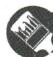

# 刷基础

1. C 【解析】A 选项,一张纸的厚度为 0.09 mm, 0.09 为近似数,所以 A 选项错误;B 选项,小明身高 1.70 米,1.70 为近似数,所以 B 选项错误;C 选项,实验室里有 18 盏日光灯,18 为准确数,所以 C 选项正确;D 选项,我国约有 400 个城市缺水,400 为近似数,所以 D 选项错误.故选 C.

2. D 【解析】当原数的十分位上的数字是6时, 则百分位上的数字一定大于或等于5; 当原数的十分位上的数字是7时, 则百分位上的数字一定小于5, 因而这根木棒的实际长度的范围是大于或等于3.65米, 小于3.75米. 故选D.

3. A 【解析】近似数 170 的准确值 a 的取值范围为 $169.5 \leqslant a < 170.5$ . 故选 A.

4. A 【解析】6.610 精确到千分位, 故 A 选项符合题意; 2.50 精确到百分位, 2.500 精确到千分位, 精确度不相同, 故 B 选项不符合题意; 用四舍五入法对 3.14159 取近似数, 精确到百分位, 则 3.14159≈3.14, 故 C 选项不符合题意; 用四舍五入法对 0.12349 取近似数, 精确到 0.01, 则 0.12349≈0.12, 故 D 选项不符合题意, 故选 A.

5. C 【解析】①用四舍五入法对 3.355 取近似值, 精确到百分位得 3.36, 故①说法错误; ②近似数 5.2 万精确到千位, 正确. 故选 C.

6. C 【解析】A 选项, $1.694 \approx 1.69$ , 不符合题意; B 选项, $1.6949 \approx 1.69$ , 不符合题意; C 选项, $1.695 \approx 1.70$ , 符合题意; D 选项, $1.705 \approx 1.71$ , 不符合题意. 故选 C.

7. B 【解析】A 选项, $0.05049 \approx 0.1$ (精确到 0.1), 所以 A 选项不符合题意; B 选项, $0.05049 \approx 0.050$ (精确到千分位), 所以 B 选项符合题意; C 选项, $0.05049 \approx 0.05$ (精确到 百分位), 所以 C 选项不符合题意; D 选项, $0.05049 \approx 0.0505$ (精确到 0.0001), 所以 D 选项不符合题意. 故选 B.

# 关键点拨

(3) 精确到十分位即精确到小数点后一位.

8.0.9 【解析】 $0.876 \approx 0.9$ （精确到十分位）. 故答案为 0.9.

9.【解】(1)0.6328(精确到0.01)≈0.63.

(2)7.912 2(精确到个位)≈8.

(3)130.96(精确到十分位)≈131.0.

(4)46 021(精确到百位) $\approx$ 4.60×10 $^{4}$ .

10.【解】不相同. 理由如下: 小明测得长度是 0.80 m, 是精确到百分位; 小刚测得长度是 0.8 m, 是精确到十分位. 因为两人测量结果的精确度不同, 所以两人测得的结果不相同.

# 大招专题 1 有关数轴的探索

# 刷难关

# 大招解读 | 数轴中的折叠问题

将数轴折叠后, 数 a 与数 b 对应的点重合, 则折痕与数轴的交点所表示的数为 $\frac{a+b}{2}$ , 若数 c 与数 d 对应的点也重合, 则 $a+b=c+d$ .

1. (1)-2 1 6 (2)2 3 -1 009 1 013

【解析】(1) 因为 $b$ 是最小的正整数, 所以 $b = 1$ . 因为 $|a + 2| \geqslant 0, (c - 6)^2 \geqslant 0$ , 且 $|a + 2| + (c - 6)^2 = 0$ , 所以 $|a + 2| = 0, (c - 6)^2 = 0$ , 所以 $a + 2 = 0, c - 6 = 0$ , 所以 $a = -2, c = 6$ . (2) 将数轴折叠, 使得点 $A$ 与点 $C$ 重合, 则 $\frac{-2 + 6}{2} = 2$ , 所以折痕与数轴的交点表示的数是 2. 点 $B$ 到折痕与数轴的交点的距离为 1 个单位长度, 则 $2 + 1 = 3$ , 所以点 $B$ 与数 3 对应的点重合. 设 $M$ 点表示的数是 $x$ , 则 $N$ 点表示的数是 $x + 2022$ , 所以 $2 = \frac{x + x + 2022}{2}$ , 则 $x = -1009, -1009 + 2022 = 1013$ , 所以点 $M$ 表示的数是 -1009, 点 $N$ 表示的数是 1013.

2. 18 或 -14 【解析】因为表示 5 的点与表示 -1 的点重合, 所以折痕与数轴的交点表示的数为 2. 因为数轴折叠后, 数轴上的 A, B 两点也重合, 且 A, B 两点之间的距离为 32, 所以两个点到折痕与数轴交点的距离均是 16, 所以点 A 表示的数为 $2 + 16 = 18$ 或 2 - 16 = -14. 故答案为 18 或 -14.

3.4或5或6【解析】因为总的线段长为8,剪后三条线段的长度之比为1:1:2,又因为 $8\div(1+1+2)=2$ ,所以这三条线段的长度分别为

2,2,4. 如图(1)，若剪下的第1条线段长为2，第2条线段长度也为2，则折痕与数轴的交点表示的数为4；如图(2)，若剪下的第1条线段长为2，第2条线段长度为4，则折痕与数轴的交点表示的数为5；如图(3)，若剪下的第1条线段长为4，第2条线段长度为2，则折痕与数轴的交点表示的数为6. 综上，折痕与数轴的交点表示的数为4或5或6，故答案为4或5或6.

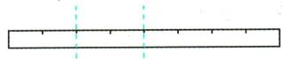  
图(1)

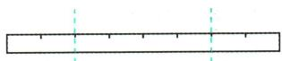  
图(2)

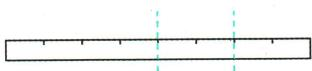  
图(3)

# 大招解读 | 数轴上的循环规律问题

1. 先写出前几次的变化结果.  
2. 确定循环周期.  
3. 循环运动的总次数除以循环周期.  
4. 若有余数, 则余数是几, 就和周期里第几个对应; 若能被整除, 则与周期里最后一个对应.

4. B 【解析】正六边形在翻转第一周的过程中，点 F, E, D, C, B, A 对应的数分别为 1, 2, 3, 4, 5, 6，翻转 6 次为一次循环。因为 $2021 \div 6 = 336 \cdots 5$ ，所以数轴上 2021 这个数所对应的点是 B 点。故选 B。  
5.2 【解析】点 $A_{1}$ 在数轴上表示的数是 $\frac{1}{2}$ ，则点 $A_{2}$ 在数轴上表示的数是 $\frac{1}{1-\frac{1}{2}}=2$ ，点 $A_{3}$ 在数轴上表示的数是 $\frac{1}{1-2}=-1$ ，点 $A_{4}$ 在数轴上表示的数是 $\frac{1}{1-(-1)}=\frac{1}{2}$ ，点 $A_{5}$ 在数轴上表示的数是 2，点 $A_{6}$ 在数轴上表示的数是 -1，…，

# 思路分析

通过计算发现,这些点在数轴上表示的数按照 $\frac{1}{2}$ ,2,-1的顺序循环出现,则点 $A_{2024}$ 在数轴上表示的数与点 $A_{2}$ 在数轴上表示的数相同,由此求解即可.

由此得 $\frac{1}{2}$ , 2, -1 依次循环. 因为 $2024 \div 3 = 674 \cdots 2$ , 所以点 $A_{2024}$ 在数轴上表示的数是 2. 故答案为 2.

# 大招解读 | 数轴上数的变化规律问题

1. 标出序列号.

2. ①有的可对每个数同时加上或减去或乘或除以第一个数, 成为新数列, 再找出规律, 并恢复到原来的数列.  
②有的可对每个数同加或减或乘或除以同一个数(一般为1,2,3,…),成为新数列,然后找出规律,再恢复到原来的数列.  
③观察一下,能否把一个数列的奇数位置与偶数位置分开成为两个数列,再分别找规律.

6.15 【解析】点 P 第 1 次移动所得的对应点 $P_{1}$ 表示的数为 $0+1=1$ ，点 P 第 2 次移动所得的对应点 $P_{2}$ 表示的数为 1-3=-2，点 P 第 3 次移动所得的对应点 $P_{3}$ 表示的数为 $-2+5=3$ ，点 P 第 4 次移动所得的对应点 $P_{4}$ 表示的数为 3-7=-4，点 P 第 5 次移动所得的对应点 $P_{5}$ 表示的数为 $-4+9=5$ ，点 P 第 6 次移动所得的对应点 $P_{6}$ 表示的数为 $5-11=-6,\cdots$ ，点 P 第 n 次移动所得的对应点 $P_{n}$ 表示的数为 $-(-1)^{n}\cdot n$ 。观察发现：当 n 为奇数时，点 P 对应的数为奇数 n；当 n 为偶数时，点 P 对应的数为偶数 -n。因为 $(ab+150)^{2}\geqslant0,|b+10|\geqslant0$ ，且 $(ab+150)^{2}+|b+10|=0$ ，所以 $b+10=0$ ，即 b=-10, $ab+150=0$ ，即 a=15，所以点 A 表示的数是 15，点 B 表示的数是 -10。因为当 n=15 时，点 $P_{15}$ 表示的数为 15，所以点 P 第 15 次移动后与点 A 重合。

# 关键点拨

由 $A_{4}, A_{8}, A_{12}$ 表示的数推出 $A_{4n}$ 表示的数是解题的关键.

B 【解析】由题意知, $A_{2}A_{3}=1$ , 因为 $A_{4}$ 表示的数为 2, $A_{8}$ 表示的数为 4, $A_{12}$ 表示的数为 6, $\cdots$ , 所以可推导一般性规律: $A_{4n}$ 表示的数为 2n, 所以 $A_{2020}$ 表示的数为 1010, 所以 $OA_{2020}=1010$ , 所以 $S_{三角形OA_{2}A_{2020}}=\frac{1}{2}\times OA_{2020}\times A_{2}A_{3}=\frac{1}{2}\times1010\times1=505$ , 故选 B.

# 数学活动

# 刷活动

1.【解】(1)填表如下：

<table><tr><td>日期</td><td>项目</td><td>收支情况(元)</td></tr><tr><td>9月5日</td><td>爸爸工资收入4 500元</td><td>+4 500</td></tr><tr><td>9月6日</td><td>水、电、煤气、物业管理费支出800元</td><td>-800</td></tr><tr><td>9月7日</td><td>电话、手机、网络费支出600元</td><td>-600</td></tr><tr><td>9月15日</td><td>妈妈工资收入3 500元</td><td>+3 500</td></tr><tr><td>9月18日</td><td>还银行住房贷款3 000元</td><td>-3 000</td></tr><tr><td>9月20日</td><td>购买衣服支出900元</td><td>-900</td></tr><tr><td>9月28日</td><td>订报刊、买书支出300元</td><td>-300</td></tr><tr><td>9月30日</td><td>做饭+外卖共支出1 700元</td><td>-1 700</td></tr><tr><td rowspan="3">合计</td><td>本月共收入</td><td>+8 000</td></tr><tr><td>本月共支出</td><td>-7 300</td></tr><tr><td>本月共结余</td><td>+700</td></tr></table>

(2) 因为结余较少, 所以小红希望到四川九寨沟去旅游的想法不可以实现.  
(3) 如: ① 养成节约水、电的好习惯; ② 减少外卖次数, 注重饮食健康, 减少开支. (答案不唯一, 合理即可)

2. A 【解析】因为 $-2+4-6+8-10+12-14+16=$ 8，所以横、竖、外圈、内圈的 4 个数字之和都为 4，所以 $-14+12+16+a=4$ ，所以 a=-10。因为 $12+8+a+c=4, b+16-14+d=4$ ，所以 c=-6, $b+d=2$ ，所以 b=-2 或 4。当 b=-2 时，d=4，此时 $a+b=-10-2=-12$ ；当 b=4 时，d=-2，此时 $a+b=-10+4=-6$ 。故选 A。

3.1 【解析】-2-1+0=-3，所以“国”表示的数是-3-(-5-1)=-3+5+1=3，“中”表示的数是-3-(-2+3)=-3+2-3=-4，“梦”表示的数是-3-(-4-1)=-3+4+1=2，则3-4+2=1，故答案为1.  
4.【解】(1)题图(1)中每一横行上的数的和都是15,所以9个数之和是15的3倍.15是9个格的“中心数”5的3倍.故答案为3,3.
(2)如图(1).(答案不唯一)

# 关键点拨

利用有理数的加、减法法则，根据所给的条件推出 b, d 的可能取值是解题的关键.

# 关键点拨

(2)根据每一横行、每一竖列以及两条对角线上的数的和都相等,且等于“中心数”的3倍求解.

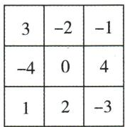  
图(1)

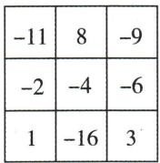  
图(2)

(3)如图(2).

# 综合与实践 进位制的认识与探究

# 刷实践

【解】任务 1: (1) $243_{(7)} = 2 \times 7^{2} + 4 \times 7^{1} + 3 \times 7^{0} = 129$ .

(2)2 $\boxed{22}$ ……0(第1位余数)
2 $\boxed{11}$ ……1(第2位余数)
2 $\boxed{5}$ ……1(第3位余数)
2 $\boxed{2}$ ……0(第4位余数)
1 ……1(第5位余数)

所以 $22=10110_{(2)}$ .

(3) 存在. 根据题意: $aaa_{(6)} = a \times 6^{2} + a \times 6^{1} + a \times 6^{0} = 43a$ . 因为 43a 是一个十进制的两位数, 所以 a = 1 或 a = 2. 当 a = 1 时, 原数为 43, 新数为 34, 则 $43 - 34 = 9 \neq 18$ , 不是“青春数”, 不符合题意; 当 a = 2 时, 原数为 86, 新数为 68, 则 86 - 68 = 18, 是“青春数”, 符合题意. 所以这样的“青春数”存在, 这个“青春数”是 86.

任务 2: (1) $10110_{(2)} + 1101_{(2)} = 100011_{(2)}$ ，故答案为 $100011_{(2)}$ .

(2) $110101_{(2)} - 11110_{(2)} = 10111_{(2)}$ ，故答案为 $10111_{(2)}$

# 全章综合训练

# 刷中考

1. A 【解析】A 选项, $5 + (-5) = 0$ , 符合题意; B 选项, $5 - (-5) = 10$ , 不符合题意; C 选项, $5 \times (-5) = -25$ , 不符合题意; D 选项, $5 \div (-5) = -1$ , 不符合题意. 故选 A.  
2. D 【解析】由题意得, $150 - (-180) = 150 + 180 = 330 \, (\text{℃})$ , 故选 D.  
3. D 【解析】因为 $|-3| = 3, 3$ 的倒数是 $\frac{1}{3}$ ，所以 $|-3|$ 的倒数是 $\frac{1}{3}$ . 故选 D.  
4. B 【解析】因为 m 与 n 互为倒数, 所以 mn = 1. 因为 $m + mn = 3$ , 所以 m = 2, 所以 $n = \frac{1}{2}$ . 故选 B.

# 5. D 【解析】

<table><tr><td>选项</td><td>分析</td><td>结论</td></tr><tr><td>A</td><td>(-3)×2=-6</td><td>不符合题意</td></tr><tr><td>B</td><td>(-3)×1=-3</td><td>不符合题意</td></tr><tr><td>C</td><td>(-3)×0=0</td><td>不符合题意</td></tr><tr><td>D</td><td>(-3)×(-1)=3</td><td>符合题意</td></tr></table>

6. 1 【解析】因为 $|a + 1| + (b - 2022)^{2} = 0$ ，所以 $a + 1 = 0, b - 2022 = 0$ ，即 $a = -1, b = 2022$ ，所以 $a^{b} = (-1)^{2022} = 1$ ，故答案为 1.  
7. D 【解析】根据题意得, $(1\ 921-1\ 840+50)\times(-1)=-131<1\ 000$ ,继续按照程序运算,得 $(-131-1\ 840+50)\times(-1)=1\ 921>1\ 000$ ,则输出的结果为 $1\ 921+100=2\ 021$ .故选D.  
8.8 【解析】因为 $m * n = m^{n} - mn$ ，所以 $(-2) * 2 = (-2)^{2} - (-2) \times 2 = 4 + 4 = 8$ ，故答案为 8.  
9.【解】 $(-3)\times 4 + (-2)^{2} = -12 + 4 = -8.$   
10. D 【解析】 $m=4\times10^{17}\times5=2\times10^{18}$ ，故选 D.  
11. $7.4167 \times 10^{7}$ 【解析】7416.7万 $= 74167000 = 7.4167 \times 10^{7}$ , 故答案为 $7.4167 \times 10^{7}$ .  
12. B 【解析】近似数 24 精确到个位, 故选项 A 不符合题意; 近似数 24.0 精确到十分位, 故选项 B 符合题意; 24.00 精确到百分位, 故选项 C 不符合题意; 240 精确到个位, 故选项 D 不符合题意. 故选 B.

# 刷章测

1. D 【解析】A 选项, 因为 $-3 \times 3 \neq 1$ , 所以 -3 和 3 不互为倒数, 故不符合题意; B 选项, $|-3| = 3$ , 因为 $-3 \times 3 \neq 1$ , 所以 -3 和 $|-3|$ 不互为倒数, 故不符合题意; C 选项, 因为 $-3 \times \frac{1}{3} \neq 1$ , 所以 -3 和 $\frac{1}{3}$ 不互为倒数, 故不符合题意; D 选项, 因为 $-3 \times \left(-\frac{1}{3}\right) = 1$ , 所以 -3 和 $-\frac{1}{3}$ 互为倒数, 故符合题意. 故选 D.

2. C 【解析】149 亿 = 14 900 000 000 = 1.49 × $10^{10}$ . 故选 C.   
3. C 【解析】因为甲、乙两个有理数的和比甲大,但比乙小,所以甲是负数、乙是正数,故选 C.

# 关键点拨

得到取奇数个负数,且绝对值尽可能的大是解决本题的关键.

# 思路分析

先由数轴得a<b<c<d,再根据有理数的乘法法则逐个判断即可.

4. A 【解析】 $1-3+5-7+9-11+13-15+17=(1+5+9+13+17)-(3+7+11+15)=45-36=9$ . 因为9>-17, 所以不小心把“+”错写成“-”. 因为 $9-(-17)=26,26\div2=13$ , 所以不小心把+13写成了-13, 所以是把原式从左往右数的第6个运算符号写错了. 故选A.

5. C 【解析】把 18 输入, 得 $18 \times \left| -\frac{1}{2} \right| \div \left[ -\left(\frac{1}{2}\right)^2 \right] = 18 \times \frac{1}{2} \div \left( -\frac{1}{4} \right) = 9 \times (-4) = -36 < 100$ ; 把 -36 输入, 得 $-36 \times \left| -\frac{1}{2} \right| \div \left[ -\left(\frac{1}{2}\right)^2 \right] = -36 \times \frac{1}{2} \div \left( -\frac{1}{4} \right) = -18 \times (-4) = 72 < 100$ ; 把 72 输入, 得 $72 \times \left| -\frac{1}{2} \right| \div \left[ -\left(\frac{1}{2}\right)^2 \right] = 72 \times \frac{1}{2} \div \left( -\frac{1}{4} \right) = 36 \times (-4) = -144 < 100$ ; 把 -144 输入, 得 $-144 \times \left| -\frac{1}{2} \right| \div \left[ -\left(\frac{1}{2}\right)^2 \right] = -144 \times \frac{1}{2} \div \left( -\frac{1}{4} \right) = -72 \times (-4) = 288 > 100$ , 所以最后输出的结果为 288.

6. A 【解析】这6个数中取其中3个不同的数作为因数,要使它们积的值最小,所以要取奇数个负数,且绝对值尽可能的大,所以取-6,7,5,-6×7×5=-210. 故选A.  
7. C 【解析】根据二进制数转化为十进制数的计算方法可知， $(11)_2 = 1 \times 2^1 + 1 \times 2^0 = 3$ ，所以 $(11)_2 + (11)_2 = 3 + 3 = 6$ 。因为 $(110)_2 = 1 \times 2^2 + 1 \times 2^1 + 0 \times 2^0 = 6$ ，所以 $(11)_2 + (11)_2 = (110)_2$ ，故选 C.  
8. B 【解析】由数轴可知，a<b<c<d. 若 ad>0，则 a,b,c,d 都同号，所以一定会有 bc>0，①正确；若 ad<0，则 a<0,d>0，但 b,c 的符号不能确定，所以不一定会有 bc<0，②错误；若 bc>0，则 b,c 同号，但 a,d 的符号不能确定，所以不一定会有 ad>0，③错误；若 bc<0，则 b<0,c>0，所以 a<0,d>0，所以一定会有 ad<0，④正确。故选 B.  
9.21.10 【解析】21.0975 精确到 0.01 的近似值是 21.10, 故答案为 21.10.  
10. $(1 + 2 - 3) \times 4 \div 5 = 0$ 【解析】 $(1 + 2 - 3) \times 4 \div 5 =$

$0 \times 4 \div 5 = 0 \div 5 = 0$ , 故答案为 $(1 + 2 - 3) \times 4 \div 5 = 0$ .

11.0或-8 【解析】因为三个互不相等的有理数,既可以分别表示为 $1,a+b,a$ 的形式,又可以分别表示为 $4,\frac{a}{b},b$ 的形式,所以这两个数组的数分别对应相等,所以 $a+b$ 与a中有一个是 $4,\frac{a}{b}$ 与b中有一个是1.若 $\frac{a}{b}=1$ ,即a=b,则 $a+b=4$ ,所以a=b=2,所以 $(b-a)^{3}=(2-2)^{3}=0$ ;若b=1,a=4或 $a+b=4$ ,则当a=4时, $a+b=4+1=5,\frac{a}{b}=4$ (不合题意,舍去);当 $a+b=4$ 时, $a=4-1=3,\frac{a}{b}=3$ ,则 $(b-a)^{3}=(1-3)^{3}=-8$ .故答案为0或-8.

12. $\left(\frac{1}{2}\right)^{10}$ 【解析】由题意,得质点 P 从距原点 O 1 个单位长度的 A 点处向原点方向跳动,第一次从 A 跳动到 OA 的中点 $A_{1}$ 处, $A_{1}$ 对应的数字为 $\frac{1}{2}$ , $OA_{1}=\frac{1}{2}=\left(\frac{1}{2}\right)^{1}$ ; 第二次从 $A_{1}$ 跳动到 $OA_{1}$ 的中点 $A_{2}$ 处, $A_{2}$ 对应的数字为 $\frac{1}{4}$ , $OA_{2}=\frac{1}{4}=\left(\frac{1}{2}\right)^{2}$ ; 第三次从 $A_{2}$ 跳动到 $OA_{2}$ 的中点 $A_{3}$ 处, $A_{3}$ 对应的数字为 $\frac{1}{8}$ , $OA_{3}=\frac{1}{8}=\left(\frac{1}{2}\right)^{3}$ ; …, 以此规律,第十次跳动后,该质点到原点的距离为 $OA_{10}=\left(\frac{1}{2}\right)^{10}$ . 故答案为 $\left(\frac{1}{2}\right)^{10}$ .

13.【解】(1) $\left(-\frac{1}{2}+\frac{3}{4}-\frac{1}{3}\right)\div\left(-\frac{1}{24}\right)=\left(-\frac{1}{2}\right)\times(-24)+\frac{3}{4}\times(-24)-\frac{1}{3}\times(-24)=12-18+8=2.$

(2) $(-6) \div \left(-\frac{1}{3}\right)^2 - 7^2 + 2 \times (-3)^3 = (-6) \div$ $\frac{1}{9} - 49 + 2 \times (-27) = -54 - 49 - 54 = -157.$

14.【解】(1) $-10\times5+(-6)\times10+0\times10+8\times5+10\times$ $10+12\times5=-50-60+0+40+100+60=$ 90(个)， $(25\times45+90)\div45=1215\div45=$ 27(个).

# 思路分析

先计算出前三次质点 P 跳动后,该质点到原点的距离,根据规律即可求得第十次跳动后,该质点到原点的距离.

# 技巧总结

①能运用运算律的,要运用运算律简化计算;②在有理数混合运算中,应先算乘方,再算乘除,最后算加减,有括号时,要先算括号里面的.

答: 这个班 45 人平均每人垫球 27 个.

(2) $2\times(8\times5+10\times10+12\times5)-1\times(|-10|\times5+|-6|\times10)=290$ (分).

答: 这个班垫球总共获得 290 分.

15.【解】(1) 因为 $\frac{1}{4} \times (-1) = -\frac{1}{4}, \frac{1}{4} \times (-3) = -\frac{3}{4}, \frac{1}{4} \times (-5) = -\frac{5}{4}, -\frac{1}{4} - \left(-\frac{5}{4}\right) = 1$ ，取 A 为表示数 $-\frac{1}{4}$ 的点，B 为表示数 $-\frac{5}{4}$ 的点，那么这三个数都可以用线段 AB 上的某个点来表示，所以 $\frac{1}{4}$ 是数组 P: -1, -3, -5 的收纳系数，故答案为是.

(2) 因为 $1 \times (-1) = -1, 1 \times 1 = 1, 1 \times 3 = 3, 3 - (-1) = 4 > 1$ ，所以 k 不可能为 1；因为 $\frac{1}{4} \times 1 = \frac{1}{4}, \frac{1}{4} \times (-1) = -\frac{1}{4}, \frac{1}{4} \times 3 = \frac{3}{4}, \frac{3}{4} - \left(-\frac{1}{4}\right) = 1$ ，所以 k 可能为 $\frac{1}{4}$ ；因为 $-\frac{1}{5} \times 3 = -\frac{3}{5}, -\frac{1}{5} \times (-1) = \frac{1}{5}, -\frac{1}{5} \times 1 = -\frac{1}{5}, \frac{1}{5} - \left(-\frac{3}{5}\right) = \frac{4}{5} < 1$ ，所以 k 可能为 $-\frac{1}{5}$ ；因为 $\frac{1}{3} \times 3 = 1, \frac{1}{3} \times 1 = \frac{1}{3}$ ， $\frac{1}{3} \times (-1) = -\frac{1}{3}, 1 - \left(-\frac{1}{3}\right) = \frac{4}{3} > 1$ ，所以 k 不可能为 $\frac{1}{3}$ 。故答案为 $\frac{1}{4}$ 或 $-\frac{1}{5}$ 。

(3) 因为这 100 个数是连续整数, 所以数组 $P$ 中的最大数与最小数之差为 99, 所以 $|k|$ 的最大值为 $\frac{1}{99}$ , 所以 $k$ 的最大值为 $\frac{1}{99}$ . 当中间的数字为 0 时, $|a + b|$ 的值最小. 因为数组 $P$ 中有 100 个连续整数, 所以第 50 个或第 51 个数字为 0 时, $|a + b|$ 的值最小. 当第 50 个数字为 0 时, $a = -\frac{49}{99}, b = \frac{50}{99}$ , 所以 $|a + b| = \left| -\frac{49}{99} + \frac{50}{99} \right| = \frac{1}{99}$ ; 当第 51 个数字为 0 时, $a = -\frac{50}{99}, b = \frac{49}{99}$ , 所以 $|a + b| = \left| -\frac{50}{99} + \frac{49}{99} \right| = \frac{1}{99}$ .

综上, k 的最大值为 $\frac{1}{99}$ , 相应的 $|a+b|$ 的最小值为 $\frac{1}{99}$ .

# 第三章 代数式

# 3.1 列代数式表示数量关系

# 课时1 代数式

# 刷基础

1. B 【解析】A 选项, $-\frac{3}{5}x^{3}$ 是代数式; B 选项, $x^{2}-y^{2}=0$ 是等式, 不是代数式; C 选项, $2x^{-1}$ 是代数式; D 选项, 0 是代数式. 故选 B.

2. ③ 【解析】①1y 应该书写为 y; ② $1\frac{2}{3}x^{2}y$ 应该书写为 $\frac{5}{3}x^{2}y$ ; ③ $\frac{7m^{2}n}{3}$ 书写正确; ④ $n\frac{2}{3}$ 应该书写为 $\frac{2}{3}n$ ; ⑤ $2023 \times a \times b$ 应该书写为 2023ab, 只有③符合书写要求, 故答案为③.

3. B 【解析】A 选项,三角形的周长为 $a+8$ ,不符合题意;B 选项,长方形的周长为 $2(a+3)$ ,符合题意;C 选项,梯形的面积为 $\frac{1}{2}(a+2) \times 6=3(a+2)$ ,不符合题意;D 选项,长方体的体积为 $12a$ ,不符合题意.故选 B.

4. D 【解析】因为一个正整数,除以3余2,除以7余2,所以这个正整数除以21也余2. 因为除以21余2的最小正整数为23,而 $23\div5=4\cdots3$ ,所以满足条件的最小正整数为23. 因为3,5,7的最小公倍数为 $3\times5\times7=105$ ,所以满足条件的所有正整数为 $105k+23$ (k为自然数),所以当k=0时,这个正整数是23;当k=1时,这个正整数是128;当k=2时,这个正整数是233;当k=3时,这个正整数是338,故只有D选项符合.故选D.

5. a 或 $(a+1.5)$ 或 $(a+2.5)$ 【解析】小明原本拿了 4 个面包, 若最低价格是 5 元, 则小明后来的结账金额为 $a+7.5-5=(a+2.5)$ 元; 若最低价格是 6 元, 则小明后来的结账金额为 $a+7.5-6=(a+1.5)$ 元; 若最低价格大于或等于 7.5 元, 则小明后来的结账金额为 a 元. 故小明后来的结账金额为 a 或 $(a+1.5)$ 或 $(a+2.5)$ 元. 故答案为 a 或 $(a+1.5)$ 或 $(a+2.5)$ .

6. $12 n - 8$ 【解析】第1个图案中所用火柴棒的

# 技巧总结

用字母表示数的书写要求: (1) 在含有字母的式子中, 乘号通常省略不写或写作 “·”; (2) 数字要写在字母的前面; (3) 除法要写成分数的形式; (4) 带分数要写成假分数的形式.

# ▶ 关键点拨

求出满足条件的最小正整数为23是解本题的关键.

根数为 $4=12\times1-8$ ，第 2 个图案中所用火柴棒的根数为 $16=12\times2-8$ ，第 3 个图案中所用火柴棒的根数为 $28=12\times3-8,\cdots$ ，依此规律，可得第 n 个图案中所用火柴棒的根数为 12n-8，故答案为 12n-8.

7. C 【解析】 $\frac{1}{3}(m-2)$ 表示 m 与 2 的差的 $\frac{1}{3}$ ，故选 C.

8. 一个西瓜的质量是 a 千克, 一个桃子的质量是 b 千克, 那么一个西瓜和两个桃子的质量和是 $(a+2b)$ 千克 (答案不唯一)

# 课时2 列代数式

# 刷基础

1. A 【解析】比 x 的 $\frac{1}{2}$ 多 5 的式子为 $\frac{1}{2}x + 5$ . 故选 A.

2. 2a-1 【解析】比 a 的 2 倍小 1 的数是 2a-1.
故答案为 2a-1.

3. B 【解析】该手机现在的售价为 $\left(\frac{7}{10}m-n\right)$ 元. 故选 B.

4. $\frac{b}{1+a\%}$ 【解析】根据题意得存入的本金为 $\frac{b}{1+a\%}$ 元. 故答案为 $\frac{b}{1+a\%}$ .

5. C 【解析】依题意得该船从 B 到 A 逆水行驶的时间为 $\frac{s}{50 - a} \mathrm{~h}$ , 从 A 到 B 顺水行驶的时间为 $\frac{s}{50 + a} \mathrm{~h}$ , 则该船从 A 到 B 顺水行驶的时间比从 B 到 A 逆水行驶的时间少 $\left(\frac{s}{50 - a} - \frac{s}{50 + a}\right) \mathrm{~h}$ . 故选 C.

6.【解】(1) 李明从 A 地到 B 地需要的时间为 $\frac{150}{v}$ 时.

(2)速度提高以后,汽车的速度为 $(v+10)$ 千米/时,则李明从A地到B地需要的时间为 $\frac{150}{v+10}$ 时.

(3) 李明从 A 地到 B 地少用的时间为 $\left(\frac{150}{v}-\frac{150}{v+10}\right)$ 时.

7. A 【解析】圆的面积为 $\pi r^{2}$ ，中间正方形的面积为 $a^{2}$ ，所以圆形方孔钱的面积为 $\pi r^{2}-a^{2}$ 。故选 A.

8.【解】因为正方形土地 B 的边长是 b，
所以 $S_{正方形土地B}=b^{2}$ .

因为正方形土地 B 中能使用的面积 = 正方形土地 B 的面积 - 不能使用的面积 M，
所以正方形土地 B 中能使用的面积为 $b^{2}-M$ .

# 刷提升

1. C 【解析】方案一: 先提价 10%, 再降价 10% 后售价为 $110\% m \times (1 - 10\%) = 99\% m$ ; 方案二: 先降价 10%, 再提价 10% 后售价为 $90\% m \times (1 + 10\%) = 99\% m$ , 所以两种方案调价的结果一样. 故选 C.

2. B 【解析】第①个正方形中圆的周长为 $\pi a$ ; 第②个正方形中所有圆的周长之和是 $2\pi a$ ; 第③个正方形中所有圆的周长之和为 $3\pi a; \cdots$ , 以此类推, 则第⑨个正方形中所有圆的周长之和为 $n\pi a$ . 故选 B.

3. $(a+60)$ 【解析】因为队尾一名同学用1分钟从队尾走到队头,队伍1分钟走60米,队伍长a米,所以该名同学用1分钟从队尾走到队头行走的路程为 $(a+60)$ 米,故答案为 $(a+60)$ .

4. $a(b-a)^{2}$ (或 $(a+b)^{2}-4ab$ ) 【解析】由题意易知, 每个小长方形的宽为 a. 观察题图(2)可知, 阴影部分是一个小正方形, 边长为 b-a, 所以题图(2)中阴影部分的面积为 $(b-a)^{2}$ . (或拼成的大正方形的面积-四个小长方形的面积=阴影部分的面积, 即为 $(a+b)^{2}-4ab$ )

5.【解】根据题意得第 $(n-1)$ 年需还的剩余房款为 $[9-0.5(n-2)]$ 万元,则第n年应还款 $\{0.5+[9-0.5(n-2)]\times0.4\%\}$ 万元.

# 刷素养·

6.【解】(1)当 $0 < t \leqslant 15$ 时, $w = (12 - 4)t = 8t$ ; 当 $15 < t \leqslant 30$ 时, $w = 240 - (12 - 4)t = 240 - 8t$ ; 当 $30 < t \leqslant 45$ 时, $w = (12 - 4)(t - 30) = 8(t - 30)$ ; 当 $45 < t \leqslant 60$ 时, $w = 240 - (12 - 4)(t - 30) = 240 - 8(t - 30)$ .

(2) 当 $600 < t \leqslant 615$ 时, $w = (12 - 4)(t - 600) =$

# 关键点拨

这位同学走的路程 = 队伍 1 分钟走的路程 + 队伍长，把相关数值代入即可.

# 刷有所得

辨识两个量之间的正、反比例关系,就看这两个量是对应的比值一定,还是对应的乘积一定,再作判断.

8(t-600);

当 $615 < t \leqslant 630$ 时, $w = 240 - (12 - 4)(t - 600) = 240 - 8(t - 600)$ .

# 课时3 正比例和反比例关系

# 刷基础

1. D 【解析】根据正比例关系的概念可知, 成正比例关系的两个量的比值一定. 故选 D.

2. D 【解析】两个量成正比例, 则比值一定. A 选项, 人的身高与年龄不成正比例关系, 故此选项不符合题意; B 选项, 两个量的乘积一定, 故此选项不符合题意; C 选项, 正方形的面积与它的边长的平方比值一定, 故此选项不符合题意; D 选项, 两个量比值一定, 成正比例关系, 故此选项符合题意. 故选 D.

3.(1)8 20 (2)正 【解析】(1)由题图可知,如果挂质量为40克的物品,弹簧伸长的长度是8厘米.当弹簧伸长的长度是4厘米时,所挂物品的质量是20克.

(2) $2\div10=0.2,4\div20=0.2,6\div30=0.2,\cdots$ ，故弹簧伸长的长度与所挂物品质量的比值一定，即成正比例关系.

4.【解】(1)1月:60:120=1:2,比值为0.5;

2月:65:130=1:2,比值为0.5;

3月:55:110=1:2,比值为0.5;

4月:60:120=1:2,比值为0.5;

5月:65:130=1:2,比值为0.5;

6月:75:150=1:2,比值为0.5.

各月电费与用电量的比值相等.

(2)电费与用电量的比值是每千瓦时的电价.
(3)电费与相应的用电量成正比例关系. 理由:通过(1)的计算可知,电费与相应的用电量的比值一定,是0.5,所以电费与相应的用电量成正比例关系.

5. C 【解析】A 选项, $a + b = 1$ , $a, b$ 的和一定, $a$ 和 $b$ 不成比例关系, 不符合题意. B 选项, $\pi a^2 b = 1$ , 则 $a^2 b = \frac{1}{\pi}$ , 即 $a^2$ 和 $b$ 的积一定, $a$ 和 $b$ 不成比例关系, 不符合题意. C 选项, $a \times b \div 2 = 1$ , 则 $a \times b = 2$ , 即 $a$ 和 $b$ 的积一定, 则 $a$ 和 $b$ 成反比例关系, 符合题意. D 选项, $a \times b \times b = 1$ , 则 $a \times b^2 = 1$ , 即 $a$ 和 $b^2$ 的积一定, $a$ 和 $b$ 不成比例关系, 故不符合题意. 故选 C.

6.2.5 【解析】由题知 $14\triangle = 7\times 5 = 35$ ，所以 $\triangle = 35\div 14 = 2.5$ ，则“△”处应填2.5.

7. ①③④ 【解析】①已知路程=时间×速度, 当路程一定时, 时间和速度的乘积是一定的, 所以时间与速度成反比例关系, 故此说法正确, 符合题意; ②工作效率一定, 工作总量和工作时间成正比例关系, 故此说法错误, 不符合题意, ③a 和 b 的乘积为 9 , 是一定的, 那么 a 和 b 成反比例关系, 故此说法正确, 符合题意; ④已知长方体的体积=底面积×高, 当长方体的体积一定时, 底面积和高的乘积是一定的, 所以长方体的底面积与高成反比例关系, 故此说法正确, 符合题意. 故答案为①③④.

# 刷提升

1. C 【解析】因为甲和乙是两个成反比例关系的量,所以它们的乘积一定.根据题意可得甲减少到原来的 $1-20\%=\frac{4}{5}$ , 则乙需增加到原来的 $1\div\frac{4}{5}=\frac{5}{4}$ , 所以乙增加 $(5-4)\div4=25\%$ , 故选 C.

2. B 【解析】A 选项, 销售量大约为 60 个时, 剩余量为 20 个, 销售量大约为 40 个时, 剩余量为 40 个, $60 + 20 = 40 + 40 = 80$ (个), 可知销售量+剩余量=产品总量(一定), 和一定, 故销售量和剩余量不成比例关系. B 选项, 人数大约为 20 人时, 工作总量为 20 个, 人数大约为 40 人时, 工作总量为 40 个, $20 \div 20 = 40 \div 40 = 1$ (个/人), 可知工作总量÷人数=每人加工的个数(一定), 商一定, 故工作总量和人数成正比例关系. C 选项, 销售量为 40 件时, 单价大约为 20 元/件, 销售量为 20 件时, 单价大约为 40 元/件, 则 $\frac{40}{20} \neq \frac{20}{40}$ , 可知销售量和单价不成正比例关系. D 选项, 30 秒后, 时间在增加, 距离不变, 故距离和时间不成比例关系. 故选 B.

3.【解】(1) $1\times12=2\times6=3\times4=4\times3=12$ . 故答案为12,4,12,12,12,12(从左到右,从上到下).
(2) 反比例关系. 理由: 因为右边刻度数和砝码数的乘积为定值, 所以右边刻度数和砝码数成反比例关系.

4.【解】(1)如图所示:

# 关键点拨

根据成反比例关系的两个量的乘积一定进行判断即可.

# 思路分析

根据甲和乙是两个成反比例关系的量正确列式即可.

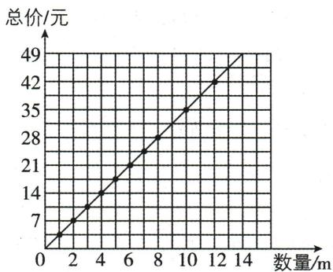

line

| 数量/m | 总价/元 |
|---|---|
| 0 | 5 |
| 2 | 14 |
| 4 | 21 |
| 6 | 28 |
| 8 | 35 |
| 10 | 42 |
| 12 | 49 |
| 14 | 49 |

发现:从图中可以发现(10,35)和(12,42)对应的点也在这条直线上.

(2) 观察上图, 可知图象经过数对 (9,31.5) 和 (14,49) 所在的点, 所以买 9 m 彩带, 总价是 31.5 元, 49 元能买 14 m 彩带.  
(3)他花的钱是小丽的2倍.

如:工作效率一定,工作总量和工作时间成正比例关系(答案不唯一).

# 3.2 代数式的值

# 课时1 代数式的值

# 刷基础

1. D 【解析】当 m = -1 时, 原式 $= 2 \times (-1)^{2} - (-1) + 1 = 4$ . 故选 D.

2. C 【解析】A 选项, 当 x=1 时, -x-3=-1-3=-4, 不符合题意; B 选项, 当 x=1 时, $x^{2}+2x-3=1+2-3=0$ , 不符合题意; C 选项, 当 x=0 时, 2x-3=-3, 当 x=1 时, 2x-3=2-3=-1, 当 x=2 时, 2x-3=4-3=1, 当 x=3 时, 2x-3=6-3=3, 符合题意; D 选项, 当 x=1 时, $x^{2}-2x-3=-4$ , 不符合题意. 故选 C.

3.5 【解析】第1次输入 $k=125,\frac{1}{5}\times125=25$ ，所以第1次输出 $25;\frac{1}{5}\times25=5$ ，所以第2次输出 $5;\frac{1}{5}\times5=1$ ，所以第3次输出 $1;1+4=5$ ，所以第4次输出 $5;\frac{1}{5}\times5=1$ ，所以第5次输出 $1;\cdots$ 。按此规律可知输出结果从第2次开始每两次一循环。 $(2024-1)\div2=1011\cdots1$ ，则第2024次输出的结果为5，故答案为5。

4.【解】(1) 把 $a = 5, b = 4$ 代入①得 $a^2 - b^2 = 5^2 - 4^2 = 9$ ; 把 $a = 5, b = 4$ 代入②得 $(a + b)(a - b) = (5 + 4) \times (5 - 4) = 9$ . 故答案为 9,9.

(2) 把 a = -2, b = 3 代入①得 $a^{2} - b^{2} = (-2)^{2} - 3^{2} = 4 - 9 = -5$ ; 把 a = -2, b = 3 代入②得 $(a + b)(a - b) = (-2 + 3) \times (-2 - 3) = 1 \times (-5) = -5$ .
故答案为-5,-5.

(3)由(1)和(2)可知 $a^{2}-b^{2}=(a+b)(a-b)$ ,
故答案为 $a^{2}-b^{2}=(a+b)(a-b)$ .

$$
\begin{array}{l} (4) 2 0 2 2 ^ {2} - 2 0 2 1 ^ {2} \\ = (2 0 2 2 + 2 0 2 1) \times (2 0 2 2 - 2 0 2 1) \\ = 4 0 4 3 \times 1 \\ = 4 0 4 3. \\ \end{array}
$$

5. A 【解析】因为 $\left|a+2\right|+\left(b-1\right)^{2}=0,\left|a+2\right|\geqslant0,\left(b-1\right)^{2}\geqslant0$ ，所以 $\left|a+2\right|=0,\left(b-1\right)^{2}=0$ ，所以 a=-2,b=1，所以 $(a+b)^{2024}=(-2+1)^{2024}=(-1)^{2024}=1$

6. -2021 【解析】因为当 $x = 1$ 时, $ax^3 + bx + 1 = a + b + 1 = 2023$ , 即 $a + b = 2022$ , 所以当 $x = -1$ 时, 代数式 $ax^3 + bx + 1 = -a - b + 1 = -(a + b) + 1 = -2022 + 1 = -2021$ . 故答案为-2021.

7.【解】(1) 当 m=2 时, $p=3\left(\frac{1}{3}-m\right)=3\times\left(\frac{1}{3}-2\right)=-5$ , 即 p 的值为 -5.

(2) 因为 $m$ 的取值为小于 0 且不小于 -2 的整数, 所以 $m = -1$ 或 $m = -2$ . 当 $m = -1$ 时, $p = 3\left(\frac{1}{3} - m\right) = 3 \times \left(\frac{1}{3} + 1\right) = 4$ ; 当 $m = -2$ 时, $p = 3\left(\frac{1}{3} - m\right) = 3 \times \left(\frac{1}{3} + 2\right) = 7$ . 综上, $p$ 的值为 4 或 7.

# 刷易错·

8.【解】嘉嘉的计算不正确. 正确解题过程如下:
当 $x=\frac{3}{2}$ , y=-6 时, $x^{2}-2xy+y^{2}=\left(\frac{3}{2}\right)^{2}-2\times\frac{3}{2}\times(-6)+(-6)^{2}=\frac{9}{4}+18+36=56\frac{1}{4}.$

# 课时 2 求代数式的值的应用

# 刷基础

1. C 【解析】根据题意得 $t=\frac{2000}{v}$ , $v=\frac{2000}{t}$ .
A 选项, 当 t=400 时, $v=\frac{2000}{400}=5$ , 故选项 A 说法正确, 不符合题意; B 选项, 当 v=8 时, $t=\frac{2000}{8}=250$ , 故选项 B 说法正确, 不符合题意;

# 思路分析

根据绝对值和平方的非负性求出 a, b 的值, 代入所求代数式计算即可.

# 易错警示

求代数式的值时,如果代入的数是负数或分数,那么一定要加括号,否则容易出现错误.

C 选项, 若 t 减小, 则 v 将变大, 故选项 C 说法错误, 符合题意; D 选项, 若 t 减小一半, 则 v 增大一倍, 故选项 D 说法正确, 不符合题意. 故选 C.

2.【解】(1)第5排有座位 $59+3=62$ (个);
第6排有座位 $62+3=65$ (个).

答:第5,6排分别有62个,65个座位.

(2) $m=50+3(n-1)=3n+47.$

(3) 当 n=28 时, $m=3n+47=3\times28+47=131$ .

3. A 【解析】根据题意, 得剩下的铁皮的面积 = 长方形的面积 - 圆的面积 = $2ab - \pi b^{2} = 2 \times 4 \times 1 - 3 \times 1^{2} = 5$ . 故选 A.

4. C 【解析】由长方形面积公式可以得出通风面积 $A = 1.4b \, m^{2}$ . 当拉开长度为 0.1 m 时, 通风面积为 $1.4 \times 0.1 = 0.14 \, (\text{m}^{2})$ . 当拉开长度为 0.4 m 时, 通风面积为 $1.4 \times 0.4 = 0.56 \, (\text{m}^{2})$ . 故选 C.

5. $\frac{48 - 9\pi}{2}$ 【解析】剩余铁皮的面积 $S = S_{\text{三角形}} - S_{\text{半圆}} = \frac{1}{2} ah - \frac{1}{2}\pi r^2$ 。当 $a = 8, h = 6, r = 3$ 时， $S = \frac{1}{2} \times 8 \times 6 - \frac{1}{2}\pi \times 3^2 = 24 - \frac{9}{2}\pi = \frac{48 - 9\pi}{2}$ 。

6.【解】(1)窗户的总面积是 $\left(4a^{2}+\frac{1}{2}\pi a^{2}\right)\ m^{2}$ .

(2) 窗框的总长为 $15a + \frac{1}{2} \times 2\pi a = (15a + \pi a) \, \text{m}$ .
(3) 当 a = 0.5 时， $\left(4a^{2}+\frac{1}{2}\pi a^{2}\right)\times40+(15a+\pi a)\times24=\left(4\times0.5^{2}+\frac{1}{2}\times3\times0.5^{2}\right)\times40+(15\times0.5+3\times0.5)\times24=(1+0.375)\times40+(7.5+1.5)\times24=271$ （元），即制作一扇窗户需要的费用是271元.

# 刷提升

1.【解】(1)由题中表格可知, $y_{1}$ 与x对应值的乘积一定,为600,所以 $y_{1}$ 与x成反比例关系,用式子表示 $y_{1}$ 与x的关系为 $y_{1}=\frac{600}{x}$ .故答案为反比例, $y_{1}=\frac{600}{x}$ .

(2) 因为 $y_{1}=y_{2}+6$ ，所以 $\frac{600}{x}=y_{2}+6$ ，所以 $y_{2}=\frac{600}{x}-6$ 。故答案为 $y_{2}=\frac{600}{x}-6$ 。

(3) 当 $x = 6 \mathrm{~cm}$ 时, $y_{2} = \frac{600}{6} - 6 = 100 - 6 = 94(\mathrm{~g})$ .

答:在容器中加入的水的质量 $y_{2}$ 的值为 94 g.

2.【解】(1)若不购买年票,则一年的费用为10n元;若购买A类年票,则一年的费用为100元;若购买B类年票,则一年的费用为 $(50+2n)$ 元.故答案为10n,100, $(50+2n)$ .

(2) 购买 B 类年票比较合算. 理由:

假如某游客一年进入公园共有 12 次，

则不购买年票的费用为 $10 \times 12 = 120$ (元)，

购买 A 类年票的费用为 100 元, 购买 B 类年票的费用为 $50 + 2 \times 12 = 74$ (元). 因为 74 < 100 < 120, 所以购买 B 类年票比较合算.

3.【解】(1)第2跑道的总长度为 $\left[2a+2\pi(r+1.2)\right]$ 米.故答案为 $\left[2a+2\pi(r+1.2)\right]$ .

(2) 第 3 跑道的总长度为 $\left[2a+2\pi(r+2.4)\right]$ 米. 故答案为 $\left[2a+2\pi(r+2.4)\right]$ .

(3)①由题意得 $2a+2\pi r=200$ . 因为 a=50, 所以 $r\approx16$ .

②由题意得铺人工草费用为 $50 \times (50 \times 2 \times 16 + 16^{2}\pi) = (80\ 000 + 12\ 800\pi)$ 元；

铺塑胶费用为 $100 \times \left[\pi (16 + 1.2 \times 4)^{2} - 16^{2}\pi + 50 \times (1.2 \times 4 \times 2)\right] = (17664\pi + 48000)$ 元.

所以 $80\ 000 + 12\ 800\pi + 17\ 664\pi + 48\ 000 =$ $128\ 000+30\ 464\pi\approx222\ 438(\text{元}).$

答: 学校共需付 222 438 元铺设费用.

# 数学活动

# 刷活动

1. D 【解析】由题可得 $4a + b = 38$ ，故选项 A 错误，不符合题意；1 片拼图的长度为 $(38 - 4 \div 2) \div 4 + 4 \div 2 = 11 \, (\text{cm})$ ，故选项 B 错误，不符合题意；将拼图紧密拼成一行时，每增加一片拼图，总长度增加 $11 - 4 \div 2 = 9 \, (\text{cm})$ ，故选项 C 错误，不符合题意；将 n 片拼图紧密拼成一行时，总长度为 $9n + 4 \div 2 = (9n + 2) \, \text{cm}$ ，故选项 D 正确，符合题意。故选 D.

2. $2n+2$ 【解析】由题意知,1 张方桌坐 4 人,每多 1 张方桌就多坐 2 人,所以 n 张方桌拼成一行能坐的人数是 $4+2(n-1)=2n+2$ .

3.【解】(1)表格补充完整如下：

<table><tr><td>圆环串中圆环的个数(个)</td><td>1</td><td>2</td><td>3</td><td>4</td><td>5</td><td>6</td></tr><tr><td>实心圆圈和空心 圆圈的总个数(个)</td><td>10</td><td>19</td><td>28</td><td>37</td><td>46</td><td>55</td></tr></table>

(2) 因为每增加一个圆环, 实心圆圈和空心圆

# 关键点拨

本题考查了列代数式并求代数式的值, 解题关键是读懂题意, 找出题目中的数量关系, 根据数量关系列出代数式.

圈的总个数就多出9个,所以当圆环串由x个圆环组成时,组成这些圆环所需实心圆圈和空心圆圈的总个数为 $10+9(x-1)=(9x+1)$ 个,故答案为 $(9x+1)$ .

(3) 当 $x = 18$ 时, 实心圆圈和空心圆圈的总个数是 $9 \times 18 + 1 = 163$ (个). 因为圆环串由偶数个圆环组成时, 需要的实心圆圈比空心圆圈多 1 个, 所以空心圆圈有 $\frac{163 - 1}{2} = 81$ (个).

4. A 【解析】由题意可知, 字母 k 破译后的对应字母为 i; 字母 n 破译后的对应字母为 l; 字母 m 破译后的对应字母为 k; 字母 g 破译后的对应字母为 e; 字母 o 破译后的对应字母为 m; 字母 c 破译后的对应字母为 a; 字母 v 破译后的对应字母为 t; 字母 j 破译后的对应字母为 h, 所以破译后的电文是 ilikemath, 故选 A.

5.【解】(1)解密后字母“m”对应字母表中第13个字母,加密后字母“k”对应字母表中第11个字母;解密后字母“e”对应字母表中第5个字母,加密后字母“c”对应字母表中第3个字母;解密后字母“t”对应字母表中第20个字母,加密后字母“r”对应字母表中第18个字母;…,根据以上规律发现,小亮他们这次事先约定的字母位置变化规则是把每个字母换成字母表中其后的第2个字母(规定y,z后的第2个字母分别是a,b).

(2)设加密后字母位置为第 $x(1 \leqslant x \leqslant 26$ ，且 $x$ 为整数)个，则解密后字母位置换成字母表中第 $(x + 2)$ 个。（规定第27,28个位置分别为a,b）

# 全章综合训练

# 易错警示

$n$ 个4相乘记为 $4^{n}$ ，而不是 $4n$

# 刷中考

1. D 【解析】因为 m 个 3 相加可记为 3m, n 个 4 相乘可记为 $4^{n}$ ，所以计算 $\underbrace{3+3+\cdots+3}_{m个3} + \underbrace{4\times4\times\cdots\times4}_{n个4}$ 的结果是 $3m+4^{n}$ ，故选 D.

2. C 【解析】代数式-3x 的意义可以是-3 与 x 的积. 故选 C.

3. 30n 【解析】 $30 \times n = 30n$ （元），故答案为 30n.

4. $n^{2}(n+1)-(n+1)=(n+1)^{2}(n-1)$ 【解析】观察所给等式易得第 n 个等式为 $n^{2}(n+1)-(n+1)=(n+1)^{2}(n-1)$ ，故答案为 $n^{2}(n+1)-(n+1)=(n+1)^{2}(n-1)$ .

5. $h+an$ 【解析】由题意可得 $H=h+an$ ，故答案为 $h+an$ .

6.50 【解析】由题可得当放入 0 克物品时,秤砣所挂位置与提纽的距离为 10 毫米;当放入

2 克物品时, 秤砣所挂位置与提纽的距离为 $10+2 \times 2 = 14$ (毫米); 当放入 4 克物品时, 秤砣所挂位置与提纽的距离为 $10+2 \times 4 = 18$ (毫米); 当放入 6 克物品时, 秤砣所挂位置与提纽的距离为 $10+2 \times 6 = 22$ (毫米); 当放入 10 克物品时, 秤砣所挂位置与提纽的距离为 $10+2 \times 10 = 30$ (毫米); …. 由以上规律可得当放入 x 克物品时, 秤砣所挂位置与提纽的距离为 $(10+2x)$ 毫米, 所以当放入 x = 20 克物品时, 秤砣所挂位置与提纽的距离为 $10+2 \times 20 = 50$ (毫米), 故答案为 50.

7. C 【解析】由所给图形可知,第①个图案中,菱形的个数为 $2=1\times3-1$ ; 第②个图案中,菱形的个数为 $5=2\times3-1$ ; 第③个图案中,菱形的个数为 $8=3\times3-1$ ; 第④个图案中,菱形的个数为 $11=4\times3-1$ ; …, 所以第 n 个图案中,菱形的个数为 3n-1, 当 n=8 时, 3n-1=23, 即第⑧个图案中,菱形的个数为 23. 故选 C.

8. D 【解析】因为按一定规律排列的代数式： $2x,3x^{2},4x^{3},5x^{4},6x^{5},\cdots$ ，可知系数等于代数式的序数加1，x的次数等于代数式的序数，所以第n个代数式为 $(n+1)x^{n}$ ，故选D.

9.452 【解析】由题图的数表可知,当正整数为 $k^{2}$ 时,若 k 为奇数,则 $k^{2}$ 在第 k 行第 1 列,下一个数在下一行,上一个数在第 2 列;若 k 为偶数,则 $k^{2}$ 在第 1 行第 k 列,下一个数在下一列,上一个数在第 2 行.因为 $a_{(m,n)}=2024=2025-1=45^{2}-1$ ,而 $2025=45^{2}$ ,在第 45 行第 1 列,所以 2024 在第 45 行第 2 列,所以 m=45,n=2.故答案为 45,2.

# 刷章测

1. C 【解析】A 选项, $1 \frac{1}{2} a$ 应该写为 $\frac{3}{2} a$ , 故 A 错误, 不符合题意; B 选项, $a \div b$ 应该写为 $\frac{a}{b}$ , 故 B 错误, 不符合题意; C 选项, $\frac{a}{3}$ 书写规范, 故 C 正确, 符合题意; D 选项, -1ab 应该写为 -ab, 故 D 错误, 不符合题意. 故选 C.

2. A 【解析】A 选项, $y = \frac{6}{11} x, x, y$ 成正比例关系, 故此选项符合题意; B 选项, $\frac{x}{12} = \frac{1}{y}$ , 则 $xy = 12, x$ 和 $y$ 成反比例关系, 故此选项不符合题意; C 选项, $x + y = 10, x$ 和 $y$ 不成正比例关

# 关键点拨

能根据题图发现第 k 行 (k 为奇数) 的第 1 列数为 $k^{2}$ 是解题的关键.

思路分析
根据所给图形中小正方形的个数得出第 n 个图形中小正方形的个数为 $n^{2}+2n$ ，将 n=6 代入计算即可求解.

系,故此选项不符合题意;D选项, $y=\frac{5}{x}$ ,x和y成反比例关系,故此选项不符合题意.故选A.

3. D 【解析】由题意可得他的成绩是 $[3x - (24 - x)]$ 分. 故选 D.

4. C 【解析】因为 x 的指数都是偶次幂, 所以当 x 分别等于 2 和 -2 时, 多项式 $6x^{2} + 5x^{4} - x^{6} + 3$ 的值是相等的. 故选 C.

5. C 【解析】A 选项, 被减数一定, 减数和差不成比例关系, 不符合题意; B 选项, 圆的半径和它的面积不成比例关系, 不符合题意; C 选项, 路程一定, 速度和时间成反比例关系, 符合题意; D 选项, 圆柱的高一定, 它的体积和底面积成正比例关系, 不符合题意. 故选 C.

6. C 【解析】A 选项, 线段 AB 的长为 $2+3+4=9$ , 则 A 不符合题意; B 选项, 组合图形的面积为 $2 \times (3+4)=14$ , 则 B 不符合题意; C 选项, 长方形的周长为 $2(a+2)=2a+4$ , 则 C 符合题意; D 选项, 圆柱的体积为 4a, 则 D 不符合题意. 故选 C.

7. C 【解析】若输入 m=1，则 $1^{2}-4=1-4=-3<5$ ，返回继续运算； $(-3)^{2}-4=9-4=5$ ，返回继续运算； $5^{2}-4=25-4=21>5$ ，输出 n=21。故选 C.

8. D 【解析】由所给图形可知, 第 1 个图形中小正方形的个数为 $3 = 1^{2} + 1 \times 2$ ; 第 2 个图形中小正方形的个数为 $8 = 2^{2} + 2 \times 2$ ; 第 3 个图形中小正方形的个数为 $15 = 3^{2} + 3 \times 2; \cdots$ , 依次类推, 第 $n$ 个图形中小正方形的个数为 $n^{2} + 2n$ . 所以第 6 个图形中小正方形的个数是 $6^{2} + 2 \times 6 = 48$ , 故选 D.

9. 体育委员用 100 元钱买了 3 个足球和 2 个篮球后剩下的钱数 【解析】因为一个足球 a 元, 一个篮球 b 元, 所以 100-3a-2b 表示的意义为体育委员用 100 元钱买了 3 个足球和 2 个篮球后剩下的钱数.

10. (1) 130 (2) (60x+20) (3) 71

【解析】(1)由题意得护栏的总长度为 $\left[80+(x-1)a\right]$ 厘米,所以当a=50,x=2时, $80+(x-1)a=80+(2-1)\times50=130$ ,故答案为130.

(2) 当 $a = 60$ 时, $80 + (x - 1)a = 80 + 60x - 60 = 60x + 20$ , 所以当 $a = 60$ 时, 护栏总长度为 $(60x + 20)$ 厘米, 故答案为 $(60x + 20)$ .

(3) 15 米 = 1 500 厘米. 令 $80 + (x - 1)a = 1500$ , 所以 $(x - 1)a = 1420 = 71 \times 20$ . 因为 a 为正整数且 a < 80, x 为正整数, 所以为尽量减少条钢用量, a = 71, x = 21 时符合题意. 故答案为 71.

11.【解】(1)当a=4时,原式= $\frac{16-12+1}{5}=1$ .

(2) 当 $a = -\frac{1}{3}$ 时, 原式 $= \frac{\frac{1}{9} + 1 + 1}{5} = \frac{19}{45}$ .

12.【解】(1) 根据题意得, $S_{1} = a^{2} + 3a + 2$ , $S_{2} = 5a + 1$ .

(2) 当 $a = 3$ 时, $S_{1} = 3^{2} + 3 \times 3 + 2 = 20$ , $S_{2} = 5 \times 3 + 1 = 16$ . 因为 $20 > 16$ , 所以 $S_{1} > S_{2}$ .

13.【解】(1)因为一个花台为 $\frac{1}{4}$ 圆,所以四个花台的面积为一个圆的面积,即种花的面积为 $\pi b^{2}$ 平方米,所以种草的面积为 $(2ab-\pi b^{2})$ 平方米,故答案为 $\pi b^{2},(2ab-\pi b^{2})$ .

(2)依题意,得美化这块空地共需的费用为 $100\times\pi b^{2}+50\times(2ab-\pi b^{2})=(100ab+50\pi b^{2})$ 元.当a=6,b=2, $\pi=3.14$ 时, $100ab+50\pi b^{2}=$

# 思路分析

四个花台的面积为一个圆的面积,种草部分的面积为长方形的面积减去四个花台的面积,总费用为相应的单价乘相应的面积,然后求和即可.

$100\times6\times2+50\times3.14\times2^{2}=1828$ （元），所以美化这块空地共需1828元.

14.【解】(1)有 4 张桌子,用第一种摆放方式,可以坐的人数为 $4 \times 4 + 2 = 18$ ;用第二种摆放方式,可以坐的人数为 $4 \times 2 + 4 = 12$ .

答:用第一种摆放方式,可坐18人;用第二种摆放方式,可坐12人.

(2)第一种:1 张桌子可坐的人数为 $2+4$ ;2 张桌子可坐的人数为 $2+2\times4$ ;3 张桌子可坐的人数为 $2+3\times4$ , 故当有 n 张桌子时, 可坐 $2+n\times4=(4n+2)$ 人. 第二种:1 张桌子可坐的人数为 $4+2$ ;2 张桌子可坐的人数为 $4+2\times2$ ;3 张桌子可坐的人数为 $4+3\times2$ , 故当有 n 张桌子时, 可坐 $4+n\times2=(2n+4)$ 人.

(3)选择第一种方式来摆放餐桌. 理由如下: 由(1)得, 第一种方式: 4 张桌子拼在一起可坐 18 人, 20 张桌子可拼成 5 张大桌子, 共可坐 $18 \times 5 = 90$ (人). 第二种方式: 4 张桌子拼在一起可坐 12 人, 20 张桌子可拼成 5 张大桌子, 共可坐 $12 \times 5 = 60$ (人). 因为 $90 > 80 > 60$ , 所以选择第一种方式来摆放餐桌.

# 第四章 整式的加减

# 4.1 整式

# 课时1 单项式

# 刷基础

1. B 【解析】选项 A, $\frac{x}{\pi}$ 是单项式, 故 A 不符合题意; 选项 B, $\frac{x-y}{3}$ 不是单项式, 故 B 符合题意; 选项 C, 0 是单项式, 故 C 不符合题意; 选项 D, $-4x^{2}y$ 是单项式, 故 D 不符合题意. 故选 B.

2.5 【解析】在 $-a, \frac{x}{2}, \frac{2}{x}, \frac{a}{2} + \frac{b}{3}, m^3 n^2, xy - 1, 0, \frac{5x^2y}{\pi}$ 中，是单项式的为 $-a, \frac{x}{2}, m^3 n^2, 0, \frac{5x^2y}{\pi}$ ，一共有5个.

3. B 【解析】A 选项, x 的系数是 1, 故此选项错误; B 选项, $-a^{2}b$ 的系数是 -1, 故此选项正确; C 选项, $6\pi x^{3}$ 的系数是 $6\pi$ , 故此选项错误;

# 关键点拨

数或字母的积组成的代数式叫作单项式，单独的一个数或一个字母也是单项式.注意 $\pi$ 是常数

D 选项, $-\frac{2x^{2}y}{3}$ 的系数是 $-\frac{2}{3}$ ，故此选项错误.
故选 B.

4. $-\frac{5}{3}$ 【解析】因为 $-a^2 b$ 的系数是 $m, -\frac{2xy}{3}$ 的系数是 $n$ , 所以 $m = -1, n = -\frac{2}{3}$ , 则 $m + n$ 的值为 $-1 - \frac{2}{3} = -\frac{5}{3}$ .

5. B 【解析】A 选项, $ab^{2}$ 的次数为 3, 不符合题意; B 选项, $ab^{3}$ 的次数为 4, 符合题意; C 选项和 D 选项, 不是单项式, 故不符合题意. 故选 B.

6. C 【解析】A 选项, 单项式 m 的系数是 1, 次数是 1, 故该选项不正确, 不符合题意; B 选项, 单项式 $5 \times 10^{5} t$ 的系数是 $5 \times 10^{5}$ , 故该选项不正确, 不符合题意; C 选项, $x + 1$ 不是单项式, 因为代数式中出现了加法运算, 故该选项正确, 符合题意; D 选项, $-\frac{3}{2} a^{2} b$ 是单项式, 它

的系数是 $-\frac{3}{2}$ ，次数是3，故该选项不正确，不符合题意。故选C.

7. B 【解析】一个同时含有字母 $x, y, z$ ，且系数为 3 的五次单项式有 $3x^{3}yz, 3xy^{3}z, 3xyz^{3}, 3x^{2}y^{2}z, 3x^{2}yz^{2}, 3xy^{2}z^{2}$ ，共有 6 个。故选 B.  
8. $2023xy^{2}$ (答案不唯一) 【解析】由题意得,该单项式是 $2023xy^{2}$ , 故答案为 $2023xy^{2}$ (答案不唯一).  
9.3 【解析】因为关于 x, y 的单项式 $x^{2}y^{m}$ 的次数为 5，所以 m=3，故答案为 3.  
10. $(-1)^{n} \frac{2n + 1}{2^{n}} x^{2n} y^{n}$ 【解析】根据这一组单项式的规律, 可以得出第 $n$ 个单项式是 $(-1)^{n} \cdot \frac{2n + 1}{2^{n}} x^{2n} y^{n}$ . 故答案为 $(-1)^{n} \frac{2n + 1}{2^{n}} x^{2n} y^{n}$ .

# 刷易错·

11.【解】佳佳的答案不正确. 理由: 此题错将 $\pi$ 当成未知数, 因而加上了“ $\pi$ 的次数”. 故正确的答案为系数是 $-3\pi^2$ , 次数是 4.

# 课时2 多项式及整式

# 刷基础

1. A 【解析】根据多项式的定义, 可知 $3xy - 2y^{2}$ , $\frac{ab - c}{\pi}$ 是多项式, 共有 2 个. 故选 A.  
2. C 【解析】A 选项, 多项式 $ab - 2ab^{2} - 1$ 的次数是 3, 故此选项错误; B 选项, 二次项系数是 1, 故此选项错误; C 选项, 最高次项是 $-2ab^{2}$ , 故此选项正确; D 选项, 常数项是 -1, 故此选项错误. 故选 C.  
3. D 【解析】多项式 $3xy-2xy^{2}+1$ 的次数及最高次项的系数分别是 3, -2. 故选 D.  
4. B 【解析】A 选项, 多项式 $2xy - 3x + 7 - x^2y$ 是三次四项式, 不符合题意; B 选项, 多项式 $2xy - 3x + 7 + 5y$ 是二次四项式, 符合题意; C 选项, 多项式 $2xy - 3x + 7 + 4xy^2$ 是三次四项式, 不符合题意; D 选项, 多项式 $2xy - 3x + 7 + x^2y^2$ 是四次四项式, 不符合题意. 故选 B.  
5.-2 【解析】因为多项式 $(m-2)x^{2}y^{3}-4^{2}xy^{n-1}+2xy+1$ 是四次三项式,所以m-2=0,1+n-1=4,所以m=2,n=4,所以m-n=2-4=-2.  
6.【解】(1) 因为关于 $x, y$ 的多项式 $xy^{3} - 3x^{4} +$

易错警示多项式中的“+”“-”可看成各项的性质符号,特别是前面的符号是负号时,不要漏掉负号.

# 易错警示

单项式的系数是除未知数以外的数字因数, 注意一定要连同符号一起, 另外, $\pi$ 是圆周率, 是一个常数, 不能当成未知数.

$x^{2}y^{m+2}-5mn$ 是五次四项式(m,n为有理数)，所以 $2+m+2=5$ ，解得m=1。又因为单项式 $5x^{4-m}y^{n-3}$ 的次数与该多项式的次数相同，都是5，所以 $4-m+n-3=5$ 。因为m=1，所以n=5。

(2) 因为 m=1, n=5，所以关于 x, y 的多项式是 $xy^{3}-3x^{4}+x^{2}y^{3}-25$ 。将这个多项式按 x 的降幂排列为 $-3x^{4}+x^{2}y^{3}+xy^{3}-25$ 。

7. B 【解析】整式有 $x^{2}+2,\frac{3ab^{2}}{7},5x,0$ ，共有 4 个.  
8. $x^{2}+x+8$ (答案不唯一) 【解析】整式 $x^{2}+x+8$ 一共有三项, 次数最高的项的次数是 2, 各项系数的和为 $1+1+8=10$ , 所以该整式满足条件 (答案不唯一).  
9. (1)③④⑨ (2)①②⑤ (3)①②③④⑤⑨
(4)②⑤

# 刷易错·

10.【解】佳美的答案不正确. 理由: 在确定多项式的项及各项系数时, 都应包含前面的符号, 佳美漏掉了前面的符号, 故错误. 正确答案: 多项式各项系数之和为 $3+(-2)+(-5)+2=-2$ .

# 刷提升

1. B 【解析】因为 $x^{m}y-2x^{3}y^{2}+5x^{2}y^{n}+3xy^{4}+y^{5}$ 是齐次多项式, 所以 $m+1=5,2+n=5$ , 解得 m=4, n=3, 所以 $(2m-3n)^{99}=-1$ . 故选 B.  
2. D 【解析】因为 $a_{5}$ 是正整数, $a_{4}, a_{3}, a_{2}, a_{1}, a_{0}$ 是自然数, p=1, 所以 $a_{5} + a_{0} = p = 1$ , 所以 $a_{5} = 1, a_{0} = 0$ . 因为 $a_{4} + a_{3} + a_{2} + a_{1} = q = 0$ , 所以 $a_{4} = a_{3} = a_{2} = a_{1} = 0$ , 所以 M 只有 1 个, 为 $x^{5}$ , 故①正确. 因为 p = q = 2, 所以 $a_{5} + a_{0} = p = 2, a_{4} + a_{3} + a_{2} + a_{1} = q = 2$ . 因为要满足五次四项式, 所以 $a_{5} = a_{0} = 1, a_{4}, a_{3}, a_{2}, a_{1}$ 中有两个为 1, 其余为 0, 所以 $M = x^{5} + x^{4} + x^{2} + 1$ 或 $M = x^{5} + x^{4} + x^{3} + 1$ 或 $M = x^{5} + x^{3} + x + 1$ 或 $M = x^{5} + x^{4} + x + 1$ 或 $M = x^{5} + x^{3} + x^{2} + 1$ 或 $M = x^{5} + x^{2} + x + 1$ , 共 6 个, 故②正确. 因为 $a_{5} + a_{0} = p = 3, a_{4} + a_{3} + a_{2} + a_{1} = q = 1$ , 所以当 $a_{5} = 3, a_{0} = 0, a_{4}, a_{3}, a_{2}, a_{1}$ 中有一个为 1, 其余为 0 时, 满足条件的整式 M 有 4 个; 当 $a_{5} = 2, a_{0} = 1, a_{4}, a_{3}, a_{2}, a_{1}$ 中有一个为 1, 其余为 0 时, 满足条件的整式 M 有 4 个; 当 $a_{5} = 1, a_{0} = 2, a_{4}, a_{3}, a_{2}, a_{1}$ 中有一个为 1, 其余为 0 时, 满足条件的整式 M 有 4 个, 所以满足条件的整

式 M 共有 12 个, 故③正确. 综上可知, 正确的个数是 3, 故选 D.

3.8 【解析】因为多项式 $xy^{|m-n|}+(n-2)x^{2}y^{2}+1$ 是关于 x, y 的三次多项式，所以 n-2=0, $1+|m-n|=3$ ，所以 n=2, $|m-n|=2$ ，所以 m-2=2 或 2-m=2，所以 m=4 或 m=0（舍去），所以 mn=8。故答案为 8.

4.【解】(1) 因为多项式 $a^{10}-3a^{9}b+5a^{8}b^{2}-7a^{7}b^{3}+\cdots+mb^{10}$ 是按照 a 的降幂排列的, 所以该多项式有 11 项, 并且每一项的次数是 10, 所以该多项式是十次十一项式.

(2) 因为多项式 $a^{10}-3a^{9}b+5a^{8}b^{2}-7a^{7}b^{3}+\cdots+mb^{10}$ 有 11 项, 所以每一项的系数分别是 1, -3, 5, -7, …, 且偶数项的系数为负数, 奇数项的系数为正数, 所以第 n 项的系数为 $(-1)^{n+1}(2n-1)$ , 所以第十一项的系数为 21, 所以 m=21, 即最后一项的系数 m 的值为 21.

(3) 因为多项式 $a^{10}-3a^{9}b+5a^{8}b^{2}-7a^{7}b^{3}+\cdots+mb^{10}$ 第 n 项的系数为 $(-1)^{n+1}(2n-1)$ ，所以第七项的系数是 $(-1)^{7+1}\times(2\times7-1)=13$ ，第八项的系数是 $(-1)^{8+1}\times(2\times8-1)=-15$ 。因为多项式 $a^{10}-3a^{9}b+5a^{8}b^{2}-7a^{7}b^{3}+\cdots+mb^{10}$ 按照 a 的降幂排列，且每一项的次数是 10，所以第七项是 $13a^{4}b^{6}$ ，第八项是 $-15a^{3}b^{7}$ 。

5.【解】(1)因为式子 $M=(a+5)x^{3}+7x^{2}-2x+5$ 是关于 x 的二次多项式,且多项式的二次项系数为 b,所以 $a+5=0,b=7$ ,所以 a=-5,所以 A,B 两点之间的距离为 $\left|7-(-5)\right|=12$ .故答案为 -5,7,12.

(2)根据题意,得 $-5-1+2-3+4-\cdots-2021+$ $2022-2023=-5+(-1+2)+(-3+4)+\cdots+$ $(-2021+2022)-2023=-5+\frac{2022}{2}\times1-$

$2023 = -5 + 1011 - 2023 = -1017.$ 所以第2023次运动后，点P所对应的有理数为-1017.

# 刷素养

6.【解】(1)因为 $f(a,b)=a^{2}-2ab+b^{2}$ ，所以 $f(b,a)=b^{2}-2ba+a^{2}$ ，所以 $f(a,b)=f(b,a)$ ，所以 $f(a,b)=a^{2}-2ab+b^{2}$ 是“对称多项式”.

(2) 当 $f(a, b) = a + b$ 时, $f(b, a) = b + a = f(a, b)$ , 所以 $f(a, b) = a + b$ 是“对称多项式”. 故答

案为 $a+b$ (答案不唯一).

(3) 不一定. 举例: $f_{1}(a, b) = a + b, f_{2}(a, b) = -a - b$ 都是“对称多项式”, 而 $f_{1}(a, b) + f_{2}(a, b) = 0$ , 是单项式, 不是多项式, 所以 $f_{1}(a, b)$ 和 $f_{2}(a, b)$ 均为“对称多项式”, $f_{1}(a, b) + f_{2}(a, b)$ 不一定是“对称多项式”.

# 重难专题2 规律探索

# 思路分析

根据题意可以用代数式表示出前几个点表示的数,从而发现它们的变化规律,进而求解.

# 刷难关

1. B 【解析】因为点 $P_{0}$ 所表示的数是 a，所以点 $P_{1}$ 所表示的数是 $a+1$ ，点 $P_{2}$ 所表示的数是 $a+1-2=a-1$ ，点 $P_{3}$ 所表示的数是 $a-1+3=a+2$ ，点 $P_{4}$ 所表示的数是 $a+2-4=a-2$ ，点 $P_{5}$ 所表示的数是 $a-2+5=a+3$ ，点 $P_{6}$ 所表示的数是 $a+3-6=a-3,\cdots$ ，由上可得，当 n 为奇数时，点 $P_{n}$ 表示的数为 $a+\frac{n+1}{2}$ ；当 n 为偶数时，点 $P_{n}$ 表示的数为 $a-\frac{n}{2}(n\geqslant1)$ 。因为 $2n+3$ 是奇数，所以 $P_{2n+3}$ 表示的数为 $a+\frac{2n+4}{2}=a+n+2$ 。故选 B。

2. 2023m-6068 【解析】当 $a_1 = m, a_2 = 1 (m \geqslant 3, m$ 为整数）时， $a_3 = m - 2, a_4 = 2m - 5, a_5 = 3m - 8, a_6 = 4m - 11, \cdots, a_n = (n - 2)m - 3n + 7$ ，所以 $a_{2025} = (2025 - 2)m - 3 \times 2025 + 7 = 2023m - 6068$ ，故答案为 $2023m - 6068$ .

3.【解】(1)这组单项式的系数依次为-1,3,-5,7,…,-37,39,…,系数的绝对值的规律是从1开始的连续的奇数.

(2) 这组单项式的次数依次为 1, 2, 3, 4, …, 19, 20, …, 所以这组单项式的次数的规律是从 1 开始的连续的整数.
(3)根据上面的归纳,猜想出第 n 个单项式是 $(-1)^{n} \cdot (2n-1)x^{n}$ .
(4) 当 n=2024 时, 这个单项式是 $(-1)^{2024} \cdot (2 \times 2024 - 1)x^{2024} = 4047x^{2024}$ ; 当 n=2025 时, 这个单项式是 $(-1)^{2025} \cdot (2 \times 2025 - 1)x^{2025} = -4049x^{2025}$ .

4. $(4n+3)$ 【解析】因为第1个图形中空心点的个数为 $7=3+4=3+4\times1$ ，第2个图形中空心点的个数为 $11=3+4+4=3+4\times2$ ，第3个图形中空心点的个数为 $15=3+4+4+4=3+4\times3,\cdots$ ，所以第n个图形中空心点的个数为 $4n+3$ .

5.【解】(1)因为第1次划分可得5个正方形,第2次划分可得9个正方形,第3次划分可得13个正方形,…,所以第n次划分可得 $(4n+1)$ 个正方形,所以第100次划分后,图中共有 $4\times100+1=401$ (个)正方形.故答案为401.

(2)由(1)得第 $n$ 次划分后,图中共有 $(4n + 1)$ 个正方形.故答案为 $(4n + 1)$ .

(3) 不能. 理由: 令 $4n + 1 = 2020$ , 所以 $n = 504.75$ . 因为 $n$ 不是整数, 所以不能将正方形 ABCD 划分成有 2020 个正方形的图形.

# 4.2 整式的加法与减法

# 课时1 同类项与合并同类项

# 刷基础

1. B 【解析】A 选项,相同字母的指数不相同,不是同类项;B 选项,所含字母相同,并且相同字母的指数也相同,符合同类项的定义,是同类项;C 选项,相同字母的指数不相同,不是同类项;D 选项,所含项数不同,不是同类项.故选 B.

2.27 【解析】因为 $-2x^{m}y^{6}$ 与 $x^{3}y^{2n}$ 是同类项，所以 m=3,2n=6，所以 n=3，所以 $m^{n}=3^{3}=27$ ，故答案为 27.

3.【解】(1) $3x-2y+1+5y-2x-3$ 中,3x和-2x,-2y和5y,1和-3是同类项.

(2) $3x^{2}y-2xy^{2}+\frac{1}{2}xy^{2}-\frac{2}{3}yx^{2}$ 中， $3x^{2}y$ 和 $-\frac{2}{3}yx^{2},-2xy^{2}$ 和 $\frac{1}{2}xy^{2}$ 是同类项.

4. D 【解析】A 选项, $19a^{2}b - 5ab^{2} \neq 14ab$ , 故 A 错误; B 选项, $3x + 5y \neq 8xy$ , 故 B 错误; C 选项, $14y^{2} - 8y^{2} = 6y^{2} \neq 6$ , 故 C 错误; D 选项, $3x - 4x + 5x = 4x$ , 故 D 正确. 故选 D.

5. C 【解析】由题可知 $-2a^{n}b^{5}$ 与 $5a^{3}b^{2m+n}$ 是同类项, 所以 n=3, $2m+n=5$ , 所以 $2m+3=5$ , 所以 m=1, 所以 $m+n=1+3=4$ . 故选 C.

6.3 【解析】根据题意知单项式 $2x^{m}y^{3}$ 与单项式 $-5xy^{n+1}$ 是同类项，则 m=1, $n+1=3$ ，所以 n=2，所以 $m+n=3$ ，故答案为 3.

7.2 【解析】 $-5x^{2}y-2nxy+5my^{2}+4xy+4x-7=-5x^{2}y+5my^{2}+(4-2n)xy+4x-7$ ，由题意得5m=0,4-2n=0，所以m=0,n=2，则 $m+n=2$ 。故答案为2。

# 解题策略

判断两项是否为同类项,首先看两项中所含字母是否相同,再看相同字母的指数是否相同,特别注意常数项都是同类项.

# 解题策略

去括号法则：如果括号外的因数是正数，去括号后原括号内各项的符号与原来的符号相同；如果括号外的因数是负数，去括号后原括号内各项的符号与原来的符号相反.

# 关键点拨

多项式不含哪一项, 则这一项的系数为 0, 据此列出关于字母参数的方程, 即可求解.

8.2 【解析】 $3x^{2}-mx-nx^{2}-x-3=(3-n)x^{2}+(-m-1)x-3$ . 因为关于字母 x 的多项式 $3x^{2}-mx-nx^{2}-x-3$ 的值与 x 的值无关, 所以 3-n=0, -m-1=0, 解得 n=3, m=-1, 所以 $m+n=-1+3=2$ . 故答案为 2.

9.【解】(1) 原式 $= (6xy - 5yx) + (7x^2 - 10x^2) + 5x = xy - 3x^2 + 5x.$

(2) 原式 $= (5a^{2} - 4a^{2}) + (2ab - 4ab) = a^{2} - 2ab$ .

(3) 原式 = $(-4x^{2}y - 9x^{2}y) + (3xy^{2} - 5xy^{2}) = -13x^{2}y - 2xy^{2}$ .

10. (1) (20-2x) (10-x) (60-6x)

【解析】因为在三个方向留出宽都是 x m 的小路, 所以由题图可以看出, 菜地的长 $a = (20 - 2x) \, \text{m}$ , 菜地的宽 $b = (10 - x) \, \text{m}$ , 所以菜地的长和宽的和为 $20 - 2x + 10 - x = (30 - 3x) \, \text{m}$ , 所以周长 $C = 30 - 3x + 30 - 3x = (60 - 6x) \, \text{m}$ .

(2)【解】当x=1时,菜地的周长 $C=60-6\times1=54(m)$ .

# 课时 2 去括号

# 刷基础

1. B 【解析】不改变式子 $a-(2b-c)$ 的值, 把式子中括号前 “-” 变成 “+” 的结果应是 $a+(-2b+c)$ . 故选 B.

2. D 【解析】 $(x+1)-(z-y)=x+1-z+y$ . 故选 D.

3. B 【解析】A 选项, $-(2x+y)=-2x-y$ ,原去括号错误,不符合题意;B 选项, $a-3(b-1)=a-3b+3$ ,原去括号正确,符合题意;C 选项, $a+(b-1)=a+b-1$ ,原去括号错误,不符合题意;D 选项, $2(x-y)=2x-2y$ ,原去括号错误,不符合题意.故选 B.

4. $c - d$ 【解析】 $a - (b + c - d) = a - b - c + d = a - b - (c - d)$ ，故答案为 $c - d$ .

5. D 【解析】因为 $m - n = 99, x + y = -1$ ，所以 $(n + 2x) - (m - 2y) = n + 2x - m + 2y = -(m - n) + 2(x + y) = -99 + 2 \times (-1) = -101$ ，故选 D.

6. $-7x^{2}+6x+2$ 【解析】根据题意得 $A=(-2x^{2}+3x-4)-(5x^{2}-3x-6)=-2x^{2}+3x-4-5x^{2}+3x+6=-7x^{2}+6x+2$ . 故答案为 $-7x^{2}+6x+2$ .

7. 2m-4 【解析】根据绝对值的性质可知, 当 $1 \leqslant m < 3$ 时, $|m - 1| = m - 1, |m - 3| = 3 - m$ , 故 $|m - 1| - |m - 3| = (m - 1) - (3 - m) = 2m - 4$ .

8.3 【解析】因为 $a - b = 2, c + d = 5$ , 所以原式 $=$ $b+c-a+d=-\left(a-b\right)+\left(c+d\right)=-2+5=3$ ，故答案为3.

9.【解】(1) 原式 $= 5a^{2} - 4ab + 2b^{2} - 3a^{2} + 2ab + 2b^{2} = 2a^{2} - 2ab + 4b^{2}$ .

(2) 原式 $= 3(x - y) - (x - y) + (x + y) + 4(x + y) =$ $2(x - y) + 5(x + y) = 2x - 2y + 5x + 5y = 7x + 3y.$

(3) 原式 $= -2x - [4x - (x - 1 + 3x) - 2x] = -2x - (4x - x + 1 - 3x - 2x) = -2x - 4x + x - 1 + 3x + 2x = -1.$

10.【解】因为 $3x^{2}y^{5}$ 与 $-2x^{1 - a}y^{3b - 1}$ 是同类项，

所以 1-a=2 且 3b-1=5, 解得 a=-1, b=2.

原式 $= 5ab^{2} - (6a^{2}b - 3ab^{2} - 6a^{2}b) = 5ab^{2} - (-3ab^{2}) = 8ab^{2}$

将 a = -1, b = 2 代入，

原式 $= 8 \times (-1) \times 2^{2} = -8 \times 4 = -32.$

11.【解】(1) $4\times2-0.6\times2=6.8$ （厘米），

$4 \times 3 - 2 \times 0.6 \times 2 = 9.6$ （厘米），

$4 \times 4 - 3 \times 0.6 \times 2 = 12.4$ （厘米）.

答:2个铁环组成的链条长6.8厘米,3个铁环组成的链条长9.6厘米,4个铁环组成的链条长12.4厘米.

(2)依题意,得 $y=4n-0.6\times2(n-1)=4n-$ $1.2n+1.2=2.8n+1.2$ , 即 $y=2.8n+1.2$ .

(3) 把 n=100 代入 $y=2.8n+1.2$ ，得 $y=2.8\times100+1.2=281.2$ .

答:用 100 个铁环组成的链条长 281.2 厘米.

# 课时 3 整式的加减

# 刷基础

1. D 【解析】设这个整式运算中的被减数为 A. 由题意得 $A + 2a^{2} + 3a - 5 = a^{2} + a - 4$ ，则 $A = a^{2} + a - 4 - 2a^{2} - 3a + 5 = -a^{2} - 2a + 1$ ，所以正确的结果是 $A - (2a^{2} + 3a - 5) = -a^{2} - 2a + 1 - (2a^{2} + 3a - 5) = -a^{2} - 2a + 1 - 2a^{2} - 3a + 5 = -3a^{2} - 5a + 6$ ，故选 D.

2. D 【解析】因为 a>0, b<0，所以 6-5b>0, 8b-1<0, 3a-2b>0，所以 $\left|6-5b\right|+\left|8b-1\right|-\left|3a-2b\right|=6-5b-(8b-1)-(3a-2b)=6-5b-8b+1-3a+2b=-3a-11b+7.$

3. C 【解析】由题意知, 数 M 的个位数字是 a, 十位数字为 $a+3$ , 数 N 的十位数字是 a, 个位数字为 $a+3$ , 则 $M+N=10(a+3)+a+10a+a+3=22a+33=11(2a+3)$ , 因此 $M+N$ 的值总能被 11 整除, 故选 C.

4. A 【解析】设小长方形卡片的长为 a，宽为 b，则 $C_{\text {上面的阴影}} = 2(n - a + 2b)$ ， $C_{\text {下面的阴影}} = 2(a + n -$

2b)，所以两块阴影部分的周长和为 $C_{\text{上面的阴影}} + C_{\text{下面的阴影}} = 2(n - a + 2b) + 2(a + n - 2b) = 2n - 2a + 4b + 2a + 2n - 4b = 4n.$ 故选A.

5. (6a-4b) 【解析】由题意得,中途上车的乘客有 $(8a-5b)+\frac{1}{2}(4a-2b)-(4a-2b)=8a-5b+2a-b-4a+2b=(6a-4b)$ 人. 故答案为 $(6a-4b)$ .

6.【解】原式 $=3x^{2}-2x^{2}+xy+2xy-2x^{2}=-x^{2}+3xy$ .
当 x=-1, y=2 时，原式 $=-1+3\times(-1)\times2=-1-6=-7$ .

7.【解】(1) $2M - N = 2(3x^{2} - 3xy + 2) - (2x^{2} - 3xy - 1) = 6x^{2} - 6xy + 4 - 2x^{2} + 3xy + 1 = 4x^{2} - 3xy + 5.$

(2) 当 x = -2, y = 1 时, $4x^{2} - 3xy + 5 = 4 \times (-2)^{2} - 3 \times (-2) \times 1 + 5 = 16 + 6 + 5 = 27.$ (3) M > N. 理由如下: $M - N = 3x^{2} - 3xy + 2 - (2x^{2} - 3xy - 1) = 3x^{2} - 3xy + 2 - 2x^{2} + 3xy + 1 = x^{2} + 3 > 0$ , 所以 M > N.

# 刷易错·

易错警示
在求两个整式的差时,要把式子中的各个整式作为一个整体加上括号.

8.【解】是从第①步开始出错的,正确的解题过程如下: $(2x^{2}y-xy^{2})-(x^{2}y-3xy^{2})=2x^{2}y-xy^{2}-x^{2}y+3xy^{2}=x^{2}y+2xy^{2}$ .

# 刷提升

1. D 【解析】 $x_{6}=x_{5}-x_{4}=(-3+3b)-(3-3a)=3a+3b-6$ , $x_{7}=x_{6}-x_{5}=(3a+3b-6)-(-3+3b)=3a-3$ , 故①正确. $x_{8}=x_{7}-x_{6}=(3a-3)-(3a+3b-6)=3-3b$ , 由上可知, $x_{n}$ 每 6 个一循环. 因为 $23\div6=3\cdots5$ , 所以 $x_{23}=x_{5}=-3+3b$ , 所以 $x_{2}+x_{23}=3-3b+(-3+3b)=0$ , 故②正确. 因为 $x_{1}+x_{2}+x_{3}+x_{4}+x_{5}+x_{6}=(3a-3)+(3-3b)+(6-3b-3a)+(3-3a)+(-3+3b)+(3a+3b-6)=0$ , $2024\div6=337\cdots2$ , 所以 $x_{1}+x_{2}+x_{3}+\cdots+x_{2024}=x_{1}+x_{2}=(3a-3)+(3-3b)=3a-3b$ , 故③正确. 综上, 正确的个数是 3 个, 故选 D.

# 关键点拨

(2) 如图, 求 $S_{1}$ 和 $S_{2}$ 时, 利用割补法可得 $S_{1}=$ 长方形 AEFB 的面积 -3 个小长方形的面积, $S_{2}=$ 长方形 EFCD 的面积 -4 个小长方形的面积.

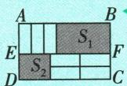

2. $\frac{6}{7}$ 【解析】 $(7mxy - 0.75y^3) - 2(2x^2y + 3xy) = 7mxy - 0.75y^3 - 4x^2y - 6xy = -0.75y^3 + (7m - 6)xy - 4x^2y.$ 因为化简后不含二次项，所以 $7m - 6 = 0$ ，解得 $m = \frac{6}{7}$ .

3.【解】(1) $(2x-3)m+2m^{2}-3x=2mx-3m+2m^{2}-3x=(2m-3)x+2m^{2}-3m$ . 因为其值与 x 的取值无关, 所以 2m-3=0, 解得 $m=\frac{3}{2}$ .

(2) 设 AB = x，由题图可知 $S_{1} - S_{2} = (ax - 3ab) -$ $(2bx-4ab)=(a-2b)x+ab.$ 因为当 AB 的长变化时， $S_{1}-S_{2}$ 的值始终保持不变，所以 $S_{1}-S_{2}$ 的值与 x 的取值无关，所以 a-2b=0，所以 a=2b.

# 刷素养·

4.【解】(1)当x=1时, $a_{0}=4\times1=4$ .

(2) 当 x=2 时, 可得 $a_{6}+a_{5}+a_{4}+a_{3}+a_{2}+a_{1}+a_{0}=$ $4 \times 2 = 8.$   
(3) 当 x=0 时, 可得 $a_{6}-a_{5}+a_{4}-a_{3}+a_{2}-a_{1}+a_{0}=$ 0,①

由(2)得 $a_{6}+a_{5}+a_{4}+a_{3}+a_{2}+a_{1}+a_{0}=8$ ，②

①+②得 $2a_{6}+2a_{4}+2a_{2}+2a_{0}=8$ 。因为 $a_{0}=4$ ，所以 $2(a_{6}+a_{4}+a_{2})=8-2\times4=0$ ，所以 $a_{6}+a_{4}+a_{2}=0$ 。

# 重难专题 3 整式的化简求值

# 刷难关

1.【解】 $-3a^{2}b+(4ab^{2}-a^{2}b)-2(2ab^{2}-a^{2}b)=-3a^{2}b+4ab^{2}-a^{2}b-4ab^{2}+2a^{2}b=-2a^{2}b.$ 当 a=1, b=-1 时，原式 $=-2\times1\times(-1)=2.$

2.【解】因为 x 是最小的正整数, y 是 2 的相反数, 所以 x=1, y=-2, 所以 $2x^{2}-\left[3\left(-\frac{5}{3}x^{2}+\frac{2}{3}xy\right)-\left(xy-3x^{2}\right)\right]+2xy=2x^{2}-\left(-5x^{2}+2xy-xy+3x^{2}\right)+2xy=2x^{2}+5x^{2}-2xy+xy-3x^{2}+2xy=4x^{2}+xy=4+(-2)=2.$

3.【解】(1)因为 $A=2a^{2}+3ab-2a-1$ , $B=-a^{2}+ab+2$ , 所以 $3A-(2A-2B)=3A-2A+2B=A+2B=(2a^{2}+3ab-2a-1)+2(-a^{2}+ab+2)=2a^{2}+3ab-2a-1-2a^{2}+2ab+4=5ab-2a+3$ .

(2) 因为 $(a+5)^{2}+|b-2|=0$ ，所以 $a+5=0, b-2=0$ ，所以 a=-5, b=2，所以 $3A-(2A-2B)=5ab-2a+3=5\times(-5)\times2-2\times(-5)+3=-37.$

4.【解】(1) 因为 $a+b+1=(a+b)+1$ ，所以当 $a+b=2$ 时，原式 $=2+1=3$ 。故答案为 3。

(2) 因为 $3(a-b)-2a+2b+5=3(a-b)-2(a-b)+5$ ，所以当 a-b=-2 时，

原式 $= 3 \times (-2) - 2 \times (-2) + 5 = -6 + 4 + 5 = 3.$

(3) 因为 $4a^{2} + 7ab + b^{2} = (4a^{2} + 8ab) + (-ab + b^{2}) = 4(a^{2} + 2ab) - (ab - b^{2})$

所以当 $a^2 + 2ab = -2, ab - b^2 = -4$ 时，原式 $= 4 \times (-2) - (-4) = -8 + 4 = -4.$

# 关键点拨

不含某项或与某个字母无关,就是该项或含该字母项的系数为0.

# 技巧点拨

解决本类题的
步骤：

①先进行整式的加减；
②利用去括号或添括号将所求式子变形，再将已知条件整体代入求解.

5.【解】【方法运用】(1)由题意,得 $x^{2}+x+1=10$ , 则 $x^{2}+x=9$ , 所以 $-2x^{2}-2x+3=-2(x^{2}+x)+3=-2\times9+3=-15$ .

(2) 当 x=2 时， $ax^{3}+bx+4=9$ ，

所以 $8a+2b+4=9$ ，所以 $8a+2b=5$ 。

当 $x = -2$ 时， $ax^3 + bx + 3 = (-2)^3 a - 2b + 3 = -8a - 2b + 3 = -(8a + 2b) + 3 = -5 + 3 = -2.$

【拓展应用】因为 $a^{2}-ab=26, ab-b^{2}=-16$ ，所以 $a^{2}-2ab+b^{2}=(a^{2}-ab)-(ab-b^{2})=26-(-16)=42$ 。故答案为 42。

6.【解】(1)因为小长方形 O 的宽为 3, 所以小长方形 O 的长为 $a-3 \times 3 = a - 9$ .

答:小长方形 O 的长为 a-9.

(2) 判断正确. 理由如下:

由题图可得阴影图形 P 的长为 a-9，宽为 b-6，阴影图形 Q 的长为 9，宽为 $b-(a-9)=b-a+9$ ，阴影图形 P 和阴影图形 Q 的周长之和为 $2(a-9+b-6)+2(9+b-a+9)=2a-18+2b-12+18+2b-2a+18=4b+6$ ，所以阴影图形 P 与阴影图形 Q 的周长之和与 a 值无关，小明的判断正确.

7.【解】(1) 当 m=1, n=-2 时, $A=2x^{2}+x-y$ , $B=-2x^{2}-x+6y$ , 所以 $A+B=2x^{2}+x-y+(-2x^{2}-x+6y)=2x^{2}+x-y-2x^{2}-x+6y=5y$ .

(2) $A-2B=2x^{2}+mx-y-2(nx^{2}-x+6y)=(2-2n)x^{2}+(m+2)x-13y.$

由题意可得 2-2n=0, $m+2=0$ ,

解得 m = -2, n = 1,

所以 $m^{2}n^{2021}=(-2)^{2}\times1^{2021}=4\times1=4.$

8.【解】由数轴可得 $a - c < 0, b > 0, b - a > 0, a + b < 0$ 所以原式 $= c - a - b - b + a - b - a = -a - 3b + c.$

9.【解】(1)在数轴上标出-a,-b,-c这三个数所对应的点,如下图.将a,b,c,-a,-b,-c这6个数按从小到大的顺序用“<”连接如下:-c<a<b<-b<-a<c.

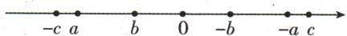

(2)由题意得 $a < b < 0 < c$ ，所以 $-a > 0, -b > 0, -c < 0$ ，所以 $-a - b > 0, b - c < 0, c - a > 0$ ，所以 $|-a - b| + |b - c| - |c - a| = -a - b + (c - b) - (c - a) = -a - b + c - b - c + a = -2b.$

(3) 因为表示数 $a$ 的点向左运动 1 个单位长度后在数轴上对应的数恰好与 c 互为相反数，所以 $a-1+c=0$ ，所以 $a+c=1$ 。因为 $a+b+c=0$ ，所以 b=-1。 $-3(a-b)-(c+5)-2(c+4b)=-3a+3b-c-5-2c-8b=-3a-5b-3c-5=-3(a+c)-5b-5=-3\times1-5\times(-1)-5=-3+5-5=-3$ 。

# 数学活动

# 刷活动

1. D 【解析】设中间的数为 x，则上面的数为 x-7，下面的数为 $x+7$ ，则这三个数的和为 $x-7+x+x+7=3x$ ，则这三个数的和必是 3 的倍数，故这三个数的和不可能为 32。故选 D.

2. ②③④ 【解析】设“H”形框框中的中间的数为 x，所以其他几个数分别为 $x-1, x+1, x-1-7 = x-8, x+1-7 = x-6, x+1+7 = x+8, x-1+7 = x+6$ ，所以这 7 个数的和为 $x-1 + x + 1 + x - 8 + x - 6 + x + 8 + x + 6 + x = 7x$ ，所以这 7 个数的和是 7 的倍数，所以 55 不符合题意。因为 $140 \div 7 = 20$ ，由题图可知“H”形框框中的中间的数不可能为 20，所以 140 不符合题意，故只有②③④符合题意。故答案为②③④。

3. B 【解析】若设三个连续奇数中最小的奇数为 2m-1, 则另外两个奇数为 $2m+1, 2m+3$ , 所以这三个连续奇数的和为 $2m-1+2m+1+2m+3=6m+3$ , 故 I 错误. 设三个连续奇数中中间的奇数为 x, 则最小的奇数为 x-2, 最大的奇数为 $x+2$ , 所以这三个连续奇数的和为 $x-2+x+x+2=3x$ , 所以这三个连续奇数的和一定能被 3 整除, 所以 n 的值为 3, 故 II 正确. 故选 B.

4.690 353 【解析】因为一个三位自然数, 百位和个位上的数字之和为 6, 称这个数为“顺利数”, 所以“顺利数”的百位上的数字最大为 6, 则个位上的数字为 0. 若要使“顺利数”最大, 则十位上的数字为 9, 所以最大的“顺利数”为 690. 设“顺利数” $M$ 为 $100a + 10b + c$ , 则 $a + c = 6$ . 因为“顺利数” $M$ 的十位数字比个位数字大 2, 所以 $b - c = 2$ . 因为 $M$ 去掉个位数字后所得的两位数与 $M$ 去掉百位数字后所得的两位数之和能被 11 整除, 所以 $10a + b + 10b + c = 10a + 11b + c$ 能被 11 整除, 所以 $10a + c$ 能被 11 整除. 因为 $c = 6 - a$ , 所以 $9a + 6$ 能被 11 整除. 因为 $1 \leqslant a \leqslant 6$ , 所以 $a = 3$ , 所以 $c = 6 - a = 3$ , 所以 $b = c + 2 = 5$ , 所以“顺利数” $M$ 为 353, 故答

# 关键点拨

解题的关键是找出每一竖列相邻的数之间的关系,从而找到三个数的和的特点.

# 刷有所得

所含字母相同,并且相同字母的指数也相同的项叫作同类项.

案为 690,353.

5.【解】(1) $\overline{abc}=100a+10b+c$ . 故答案为 $100a+10b+c$ .

(2) 因为 $\overline{abc}=100a+10b+c,\overline{cba}=100c+10b+a$ ，所以 $\overline{abc}-\overline{cba}=100a+10b+c-(100c+10b+a)=99a-99c.$ 因为 99a-99c 能被 11 整除，所以 $\overline{abc}-\overline{cba}$ 能被 11 整除.

(3) 当 $a+b+c+d$ 能被 9 整除时, $\overline{abcd}$ 能被 9 整除. 理由: $\overline{abcd}=1000a+100b+10c+d=(999a+99b+9c)+(a+b+c+d)$ .

因为 $999a+99b+9c$ 能被 9 整除, 所以当 $a+b+c+d$ 能被 9 整除时, $\overline{abcd}$ 能被 9 整除.

# 全章综合训练

# 刷中考

1. A 【解析】根据同类项的定义可知, $ab^{3}$ 的同类项是 $3ab^{3}$ . 故选 A.

2.3 【解析】因为单项式中所有字母的指数和叫作这个单项式的次数,所以单项式 $-2a^{2}b$ 的次数是 $2+1=3$ .故答案为3.

3.2 【解析】由同类项的定义可知 $n - 1 = 1$ ，解得 $n = 2$

4. A 【解析】 $2a+3a=5a$ ，故选 A.

5. B 【解析】 $2a^{2}-a^{2}=a^{2}$ ，故选 B.

6. $y^{2}-1$ 【解析】 $3xy+2y^{2}-5-(y^{2}+3xy-4)=3xy+2y^{2}-5-y^{2}-3xy+4=y^{2}-1$ . 故答案为 $y^{2}-1$ .

7. C 【解析】在 $(x+y)^{4}=a_{1}x^{4}+a_{2}x^{3}y+a_{3}x^{2}y^{2}+a_{4}xy^{3}+a_{5}y^{4}$ 中，令x=y=1，得 $2^{4}=a_{1}+a_{2}+a_{3}+a_{4}+a_{5}$ ，所以 $a_{1}+a_{2}+a_{3}+a_{4}+a_{5}=16$ 。故选C。

8.2 【解析】 $2(a+2b)-(3a+5b)+5=2a+4b-3a-5b+5=-a-b+5=-(a+b)+5$ . 当 $a+b=3$ 时，原式 $=-3+5=2$ ，故答案为 2.

9. D 【解析】第1次操作后得到整式串 m, n, n-m; 第2次操作后得到整式串 m, n, n-m, -m; 第3次操作后得到整式串 m, n, n-m, -m, -n; 第4次操作后得到整式串 m, n, n-m, -m, -n, -n+m; 第5次操作后得到整式串 m, n, n-m, -m, -n, -n+m, m; 第6次操作后得到整式串 m, n, n-m, -m, -n, -n+m, m, n; 第7次操作后得到整式串 m, n, n-m, -m, -n, -n+m, m, n, n-m; …. 归纳可得，整式串中每6个整式为一循环. 则第2023次操作后得到整式串 m, n, n-m, -m, -n, -n+m, …, m, n, n-m，共 2025 个整式。每 6 个整式的整式之和为 $m + n + (n - m) + (-m) + (-n) + (-n + m) = 0$ 。因为 $2025 \div 6 = 337 \cdots 3$ ，所以第 2023 次操作后得到的整式串各项之和即为最后三项之和，为 $m + n + (n - m) = 2n$ 。故选 D。

10. D 【解析】日历中的数字规律: 同一行中后面的数字比它前面的与其相邻的数字大 1, 同一列中下一行的数字比上一行的大 7. 任意选择如题图所示的含 4 个数字的方框部分, 若设右上角的数字为 a, 则左上角的数字为 a-1, 故选项 A 错误, 不符合题意; 左下角的数字为 $a+6$ , 故选项 B 错误, 不符合题意; 右下角的数字为 $a+7$ , 故选项 C 错误, 不符合题意; 把方框中 4 个位置的数字相加, 即 $a-1+a+a+6+a+7=4a+12=4(a+3)$ , 结果是 4 的倍数, 故选项 D 正确. 故选 D.

11. $(2+2n)$ 【解析】第1个图案中有4个白色圆片,第2个图案中有 $4+2=6$ (个)白色圆片,第3个图案中有 $4+2\times2=8$ (个)白色圆片,第4个图案中有 $4+2\times3=10$ (个)白色圆片,…,所以第n个图案中有 $4+2(n-1)=(2+2n)$ 个白色圆片.故答案为 $(2+2n)$ .

# 刷章测

1. B 【解析】A 选项, 数字 0 是单项式, 故此选项不符合题意; B 选项, 单项式 $-x^{3}y$ 的系数为 -1, 次数是 4, 故此选项符合题意; C 选项, 多项式 $-2x^{3}-2$ 的常数项是 -2, 故此选项不符合题意; D 选项, $3x^{2}y^{2}+2y^{3}-xy$ 是四次三项式, 故此选项不符合题意. 故选 B.

2. A 【解析】由题意知 $C_{1}=BC+CD-b+AD-a+a-b+a+AB-a$ 。因为四边形 ABCD 是长方形，所以 AB=CD, AD=BC，所以 $C_{1}=AD+AB-b+AD-a+a-b+a+AB-a=2AD+2AB-2b$ 。同理， $C_{2}=BC-b+AB-a+a-b+a+AD-a+CD=2AD+2AB-2b$ ，故 $C_{1}-C_{2}=0$ 。故选 A。

3. A 【解析】因为 $A = 2x^{2} - 3x - 1, B = x^{2} - 3x - 2$ ，所以 $A - B = 2x^{2} - 3x - 1 - x^{2} + 3x + 2 = x^{2} + 1 \geqslant 1 > 0$ ，则 A - B 的值大于 0。故选 A.

4. D 【解析】①若 $f(x)=5$ ，则 $|x+2|=5$ ，即 $x+2=5$ 或 $x+2=-5$ ，解得 x=3 或 x=-7，故结论正确；②若 x<-2，则 $f(x)+g(x)=|x+2|+|x-4|=-x-2-x+4=-2x+2$ ，结论正确；③若

# 关键点拨

本题解题关键是运用整体代入思想,即将所求代数式化简并变形,得到含有 $a+b$ , ab 的式子,再把所给条件整体代入即可.

# 关键点拨

(4) 根据 (1) (2) (3) 的结果总结出规律, 从第一个开始每增加一个正方形, 火柴棒的根数增加 3.

$f(x)+g(y)=0$ ，则 $|x+2|+|y-4|=0$ ，解得x=-2,y=4，则2x-3y=-4-12=-16，结论正确；
④式子 $f(x-1)+g(x+1)=|x+1|+|x-3|$ 有最小值，是4，结论正确。故选D.

5.1 【解析】因为多项式 $x^{2}y^{m+1} + xy^{2} - 2x^{3} - 5$ 是六次四项式, 所以 $2 + m + 1 = 6$ , 解得 m = 3. 因为单项式 $3x^{2n}y^{5-m}$ 的次数为 6, 所以 $2n + 5 - m = 6$ , 即 $2n + 5 - 3 = 6$ , 解得 n = 2, 所以 m - n = 3 - 2 = 1. 故答案为 1.

16. 22 【解析】 $(3ab+6a+4b)-(2a-2ab)=3ab+6a+4b-2a+2ab=5ab+4a+4b=5ab+4(a+b)$ .
当 $a + b = -7, ab = 10$ 时，原式 $= 5 \times 10 + 4 \times (-7) = 22$ . 故答案为 22.

7. (1)7 (2)10 (3)16 (4) $3n+1$

【解析】(1) 第 2 个图形中, 火柴棒的根数是 $4+3=7$ . (2) 第 3 个图形中, 火柴棒的根数是 $4+3\times2=10$ . (3) 第 5 个图形中, 火柴棒的根数是 $4+3\times4=16$ . (4) 第 n 个图形中, 火柴棒的根数是 $4+3(n-1)=3n+1$ .

8.【解】 $x^{2}y-2\left(\frac{1}{4}xy^{2}-3x^{2}y\right)+\left(-\frac{1}{2}xy^{2}-x^{2}y\right)=$ $x^{2}y-\frac{1}{2}xy^{2}+6x^{2}y-\frac{1}{2}xy^{2}-x^{2}y=6x^{2}y-xy^{2}.$

当 $x=\frac{3}{2}, y=-2$ 时，原式 $=6\times\left(\frac{3}{2}\right)^{2}\times(-2)-\frac{3}{2}\times(-2)^{2}=-33.$

9.【解】(1)因为 $1+7=4\times(3-1)$ ，所以 1731 是“k 型数”，k=4。因为 $3+2=-\frac{5}{2}\times(1-3)$ ，所以 3213 不是“k 型数”。

(2) 设 $m = 1000a + 100x + 10x + d$ ，由 m - 3 是 “-3 型数”，分两种情况讨论：

当 $d \geqslant 3$ 时, $m - 3 = 1000a + 100x + 10x + d - 3$ . 因为 $m$ 是“3型数”, 所以 $a + x = 3(x - d)$ . 因为 $m - 3$ 是“-3型数”, 所以 $a + x = -3(x - d + 3)$ , 所以 $2d - 2x = 3$ . 因为 $2d, 2x$ 是偶数, 所以不合题意, 舍去. 当 $d < 3$ 时, $m - 3 = 1000a + 100x + 10(x - 1) + d + 7$ . 因为 $m$ 是“3型数”, 所以 $a + x = 3(x - d)$ . 因为 $m - 3$ 是“-3型数”, 所以 $a + x = -3(x - 1 - d - 7)$ , 所以 $x - d = 4$ , 所以当 $d = 1$ 时, $x = 5, a = 7$ , 此时 $m = 7551$ ; 当 $d = 2$ 时, $x = 6, a = 6$ , 此时 $m = 6662$ . 综上所述, 满足条件的四位数 $m$ 是7551或6662.

# 第五章 一元一次方程

# 5.1 方程

# 5.1.1 从算式到方程

# 刷基础

1. D 【解析】A 选项, x-3 不是等式, 故 A 选项不符合题意; B 选项, $1+2=3$ 不含有未知数, 故 B 选项不符合题意; C 选项, $x-2 \neq 1$ 不是等式, 故 C 选项不符合题意; D 选项, x-3=2 是方程, 故 D 选项符合题意, 故选 D.

2. $x+1=0$ (答案不唯一)

3. A 【解析】把 x=2 代入方程 ax=8-3x 得 2a=8-6，即 2a=2，将各选项代入使方程两边相等的数是 1，故选 A.

4. A 【解析】因为当 x = -2 时, $mx + 2n = 4$ , 所以当 x = -2 时, $\frac{1}{2}mx + n = 2$ , 故选 A.

5.5 【解析】因为 $x = 4$ 是关于 $x$ 的方程 $ax - 5 = 9x - a$ 的解, 所以 $a(y - 1) - 5 = 9(y - 1) - a$ 中 $y - 1 = 4$ , 所以 $y = 5$ . 故答案为 5.

6. B 【解析】① $x-2=\frac{2}{x}$ 不是一元一次方程,故①不符合题意;②0.3x=1 符合一元一次方程的定义,故②符合题意;③ $\frac{x}{2}=5x+1$ 符合一元一次方程的定义,故③符合题意;④ $x^{2}-4x=3$ 的未知数的最高次数是2,不符合一元一次方程的定义,故④不符合题意;⑤x=6 符合一元一次方程的定义,故⑤符合题意;⑥ $x+2y=0$ 中含有2个未知数,不符合一元一次方程的定义,故⑥不符合题意.综上所述,一元一次方程的个数是3.故选B.

7. A 【解析】A 选项, $2x - 3 = x$ , 是一元一次方程, 故符合题意; B 选项, $2y - 3 = x$ 中, 含有两个未知数, 不是一元一次方程, 故不符合题意; C 选项, $x^{2} - 3 = x$ 中, 未知数的最高次数是 2, 不是一元一次方程, 故不符合题意; D 选项, $y^{2} - 3 = x$ 中, 含有两个未知数, 且未知数的最高次数是 2, 不是一元一次方程, 故不符合题意. 故选 A.

刷有所得
方程是含有未知数的等式，是等式但不含未知数的不是方程，含未知数但不是等式的也不是方程.

# 易错警示

题中的速度单位是千米/时，时间单位是分，列方程时必须先转化单位使其统一，即把25分钟转化为小时，与题目所问一致.

# 归纳总结

利用等式的性质对方程进行变形,使方程的形式向 x=a 的形式转化.
应用时要注意把握两点：

①怎样变形；
②依据哪一条等式的性质变形. 变形时只有做到步步有据, 才能保证结果正确.

8. -1 【解析】由题意得 $|a|=1$ 且 $a-1\neq0$ ，所以a=-1，故答案为-1.

9. $3(x+4)=4(x+1)$ 【解析】由题意得 $3(x+4)=4(x+1)$ .

# 刷易错·

10.【解】莉莉列出的方程不正确. 理由: 列方程时未统一单位.

正确方程:设乙出发后 x 小时两人相遇.

依题意得 $\frac{25}{60}\times10+10x+8x=30.$

# 5.1.2 等式的性质

# 刷基础

1. D 【解析】A 选项, 若 $x = y$ , 则 $x + 5 = y + 5$ , 原变形正确, 故本选项不符合题意; B 选项, 若 $-2x = -2y$ , 则 $x = y$ , 原变形正确, 故本选项不符合题意; C 选项, 若 $\frac{x}{3} = \frac{y}{3}$ , 则 $x = y$ , 原变形正确, 故本选项不符合题意; D 选项, 若 $x = y$ , 则当 $m \neq 0$ 时, $\frac{x}{m} = \frac{y}{m}$ , 原变形不一定正确, 故本选项符合题意. 故选 D.

2. C 【解析】设一个“□”的质量为 x，一个“○”的质量为 y。由题意得 $x + 9y = 3x + y$ ，所以 x = 4y，所以一个“□”的质量是一个“○”质量的 4 倍。故选 C。

3. 减去 2x 【解析】由 3x = 2x - 1 得 3x - 2x = -1，在此变形中，方程两边同时减去 2x。故答案为减去 2x。

4. B 【解析】将原方程两边都乘 2, 得 x = 2, 这是依据等式的性质 2. 故选 B.

5. C 【解析】利用等式的性质解方程 $-\frac{2}{3}x = \frac{3}{2}$ 时,应在方程的两边同乘 $-\frac{3}{2}$ .

6.【解】(1)方程两边同时减1,得 $x=-\frac{1}{2}$ .

(2) 方程两边同时减 2x, 得 x = 12.

(3)方程两边同时减1,得 $\frac{2}{3}x=-6.$

方程两边同时除以 $\frac{2}{3}$ ，得x=-9.

(4) 方程两边同时加 $\left(2 - \frac{3}{7} m\right)$ , 得 $-\frac{1}{35} m = 2$ .

方程两边同时除以 $-\frac{1}{35}$ ，得m=-70.

# 刷易错·

7.(1)等式两边加(或减)同一个数(或式子), 结果仍相等

(2)③ 等式两边都除以可能为0的字母

(3)【解】x-4=3x-4, 等式两边同时加 4, 得 $x-4+4=3x-4+4$ , 即 x=3x.

等式两边同时减 3x, 得 x-3x=0, 即 -2x=0.

等式两边同时除以-2, 得 x=0.

# 刷提升

1. C 【解析】设阴影部分表示的数为 a. 将 $y = -\frac{5}{3}$ 代入，得 $-\frac{10}{3} - \frac{1}{2} = -\frac{5}{6} - a, -\frac{20}{6} - \frac{3}{6} = -\frac{5}{6} - a$ ，两边同时加上 $\frac{23}{6}$ ，得 0 = 3 - a，两边同时加上 a，得 a = 3。故选 C.

2. D 【解析】a, b, c 的大小关系不能确定, 所以 A、B 选项的结论不一定正确. $b = \frac{4}{5}a + \frac{1}{5}c$ 的两边同时乘 5, 得 $5b = 4a + c$ . 两边同时减去 $4b + c$ , 得 $b - c = 4a - 4b$ . 两边同时乘 $\frac{1}{4}$ , 得 $\frac{b - c}{4} = a - b$ , 所以 C 选项的结论不正确. 在 $5b = 4a + c$ 的两边同时减去 5a, 得 $5(b - a) = c - a$ . 两边同时乘 -1, 得 $5(a - b) = a - c$ , 所以 D 选项的结论正确. 故选 D.

3. 4 1 【解析】当 x=2 时, $N=3x-2=3\times2-2=4$ , 所以 a=4. 当 x=c 时, M=2x-1=2c-1=b, N=3x-2=3c-2=b, 所以 2c-1=3c-2, 所以 c=1.

4.【解】小明的说法错误,小刚的说法正确.

理由如下：

当 m-3=0 时, x 为任意数;

当 $m-3 \neq 0$ 时, x = 5.

5.【解】(1) 设 x=0.1，即 $x=0.111\cdots$ . 将方程两边都乘 10，得 $10x=1.111\cdots$ ，即 $10x=1+0.111\cdots$ . 又因为 $x=0.111\cdots$ ，所以 $10x=1+x$ ，

# 易错警示

利用等式的性质2进行化简时,一定要注意等式两边不能同时除以一个可能等于0的式子,否则容易出现类似本题中的错解.

# 关键点拨

理解“同心有理数对”的定义是解题关键.

所以 9x = 1，则 $x = \frac{1}{9}$ ，所以 $0.1 = \frac{1}{9}$ 。故答案为 $\frac{1}{9}$ 。

(2) 设 x=0.16，即 $x=0.1616\cdots$ 。将方程两边都乘 100，得 $100x=16.1616\cdots$ ，即 $100x=16+0.1616\cdots$ 。又因为 $x=0.1616\cdots$ ，所以 $100x=16+x$ ，所以 99x=16，则 $x=\frac{16}{99}$ ，所以 $0.16=\frac{16}{99}$ 。

# 刷素养·

6.【解】(1) 因为 -2-1=-3, $2 \times (-2) \times 1-1=-5$ , $-3 \neq -5$ , 所以数对 $(-2,1)$ 不是“同心有理数对”. 因为 $3-\frac{4}{7}=\frac{17}{7}$ , $2 \times 3 \times \frac{4}{7}-1=\frac{17}{7}$ , 所以 $3-\frac{4}{7}=2 \times 3 \times \frac{4}{7}-1$ , 所以 $\left(3,\frac{4}{7}\right)$ 是“同心有理数对”. 故答案为 $\left(3,\frac{4}{7}\right)$ .

(2) 因为 $(a,3)$ 是“同心有理数对”，所以 a-3=6a-1.

等式两边同时减去 a, 得 $a-3-a=6a-a-1$ .
整理得-3=5a-1.

等式两边同时加上1,得 $-3+1=5a-1+1$ .
整理得-2=5a.

等式两边同时除以 5, 得 $a = -\frac{2}{5}$ .

(3) 是“同心有理数对”. 理由如下:
因为 $(m,n)$ 是“同心有理数对”, 所以 m-n=2mn-1, 而 $-n-(-m)=-n+m=m-n=2mn-1$ ,
所以 $(-n,-m)$ 是“同心有理数对”.

# 5.2 解一元一次方程

课时1 解一元一次方程——合并同类项

# 刷基础

1. B 【解析】合并同类项, 得 2x = 4, 系数化为 1, 得 x = 2. 故选 B.

2. C 【解析】A 选项, 合并同类项, 得 $4 = -x$ , 所以 $x = -4$ , 解答错误; B 选项, 合并同类项, 得 $-9 = 3x$ , 两边同除以 3, 得 $x = -3$ , 解答错误; C 选项, 合并同类项, 得 $\frac{1}{2} x = \frac{1}{3}$ , 两边同乘 2, 得 $x = \frac{2}{3}$ , 解答正确; D 选项, 合并同类项, 得-3=3x,两边同除以3,得x=-1,解答错误.故选C.

3.3 【解析】根据题意得 $4x-5+3x-9=0$ 。合并同类项，得 7x-14=0。两边加 14，得 7x=14。系数化为 1，得 x=2，所以 $x^{2}-2x+3=2^{2}-2\times2+3=4-4+3=3$ 。故答案为 3。

4. $x = -40$ 【解析】 $\frac{x}{-4 \times 5} = -\frac{x}{4} + \frac{x}{5}, \frac{x}{-5 \times 6} = -\frac{x}{5} + \frac{x}{6}, \frac{x}{-6 \times 7} = -\frac{x}{6} + \frac{x}{7}, \cdots, \frac{x}{-9 \times 10} = -\frac{x}{9} + \frac{x}{10}$ , 所以原方程可化为 $-\frac{x}{4} + \frac{x}{5} - \frac{x}{5} + \frac{x}{6} - \frac{x}{6} + \frac{x}{7} + \cdots + \left(-\frac{x}{9}\right) + \frac{x}{10} = 6$ , 化简得 $-\frac{x}{4} + \frac{x}{10} = 6$ , 合并同类项, 得 $-\frac{3}{20} x = 6$ , 系数化为 1, 得 $x = -40$ . 故答案为 $x = -40$ .

5.【解】(1)合并同类项,得 7x = -42.
系数化为 1, 得 x = -6.

(2)合并同类项,得 $\frac{7}{2}x=\frac{7}{3}$ .
系数化为 1, 得 $x = \frac{2}{3}$ .

(3) 整理, 得 $-0.5m + 7.5m - 4m - 1.5m = -6 - 3$ .
合并同类项, 得 1.5m = -9.
系数化为 1, 得 m = -6.

6. B 【解析】由题意可知,相邻两数中后一个数与前一个数的商为-2. 设相邻三个数的中间的数为 x, 则第一个数和第三个数分别为 $-\frac{x}{2}$ , -2x. 由题意, 得 $-\frac{x}{2} + x - 2x = -384$ , 解得 x = 256. 故选 B.

7.【解】设普通水稻的亩产量是 a 千克. 根据题意得 $30a + 30 \times 1.2a = 56100$ , 解得 a = 850, 所以 $1.2a = 850 \times 1.2 = 1020$ .
答:杂交水稻的亩产量是1020千克.

8.【解】设甲捐赠图书 5x 册, 则乙捐赠图书 8x 册, 丙捐赠图书 9x 册. 依题意得 $5x + 8x + 9x = 748$ , 解得 x = 34, 所以 $5x = 5 \times 34 = 170$ , $8x = 8 \times 34 = 272$ , $9x = 9 \times 34 = 306$ .
答:甲捐赠170册图书,乙捐赠272册图书,丙
捐赠306册图书.

# 关键点拨

本题的解题关键是利用拆项法将 $\frac{x}{-4\times5}$ 拆成 $-\frac{x}{4}+\frac{x}{5}$ ， $\frac{x}{-5\times6}$ 拆成 $-\frac{x}{5}+\frac{x}{6},\cdots,\frac{x}{-9\times10}$ 拆成 $-\frac{x}{9}+\frac{x}{10}$ ，目的是把等号左边的式子变成可以消去某些项的形式，简化计算.

# 刷有所得

在解类似于“ $ax+bx=c$ ”的方程时，将方程左边按合并同类项的方法并为一项，即 $(a+b)x=c$ ，进而即可求解.

# 课时 2 解一元一次方程 —— 移项

# 刷基础

1. C 【解析】A 选项, 若 $x - 4 = 8$ , 则 $x = 8 + 4$ , 故 A 不符合题意; B 选项, 若 $3s = 2s + 5$ , 则 $3s - 2s = 5$ , 故 B 不符合题意; C 选项, 若 $5w - 2 = 4w + 1$ , 则 $5w - 4w = 1 + 2$ , 故 C 符合题意; D 选项, 若 $8 + x = 2x$ , 则 $8 - 2x = -x$ , 故 D 不符合题意. 故选 C.

2. D 【解析】 $x-1=-x+3$ ，解得 x=2。依次解各方程可知 D 选项符合题意。

3. A 【解析】因为 $3x+1$ 的值比 2x-3 的值小 1，所以 $3x+1+1=2x-3$ ，移项，得 $3x-2x=-3-1-1$ ，合并同类项，得 x=-5。故选 A.

4. -120 【解析】设这个数是 x. 依题意得 $\frac{x}{4} - 2 = \frac{1}{3}x + 8$ ，移项，得 $\frac{1}{4}x - \frac{1}{3}x = 8 + 2$ 。合并同类项，得 $-\frac{1}{12}x = 10$ 。系数化为 1，得 x = -120。故答案为 -120。

5. $x = -2$ 【解析】根据题意可知 $x \neq -x$ , 则 $x \neq 0$ . $x > 0$ 时, $x > -x$ . 因为 $\min \{x, -x\} = 3x + 4$ , 所以 $-x = 3x + 4$ , 解得 $x = -1$ (舍去). $x < 0$ 时, $x < -x$ . 因为 $\min \{x, -x\} = 3x + 4$ , 所以 $x = 3x + 4$ , 解得 $x = -2$ . 故方程 $\min \{x, -x\} = 3x + 4$ 的解为 $x = -2$ .

6.【解】(1)移项,得-2x-3x=-6-5.

合并同类项,得-5x=-11.

系数化为 1, 得 $x=\frac{11}{5}$ .

(2) 移项, 得 $\frac{4}{3}x - x = -17 - 5$ .

合并同类项, 得 $\frac{1}{3}x = -22$ .

系数化为 1, 得 x = -66.

7.36 9 【解析】设今年儿子 x 岁, 则爸爸 $(x + 27)$ 岁. 根据题意得 $x + 27 = 4x$ , 解得 x = 9, 所以 $x + 27 = 36$ , 所以今年儿子 9 岁, 爸爸 36 岁.

8.【解】设这个手工兴趣小组共有 x 人. 由题意可得 $9x + 17 = 12x - 4$ , 解得 x = 7, 所以 $9x + 17 = 80$ .

答:这个手工兴趣小组共有7人,计划要做的这批中国结有80个.

# 刷易错·

9.【解】有误,从第①步开始出错的.

正确的解题过程:

移项, 得 $\frac{11}{5}x + \frac{4}{5}x = -5 - 1$ .

合并同类项, 得 3x = -6.

系数化为 1, 得 x = -2.

# 课时3 解一元一次方程——去括号

# 刷基础

1. C 【解析】 $1-2(2x-1)=x$ ，去括号，得 $1-4x+2=x$ ，故选 C.

2. A 【解析】根据题意得 $2(x+3)=-3(1-x)$ ，去括号得 $2x+6=-3+3x$ ，移项、合并同类项得 -x=-9，系数化为 1 得 x=9，故选 A.

3. C 【解析】把 x = -2 代入 3x - x - 2a = 4 中得 -4 - 2a = 4，解得 a = -4。把 a = -4 代入已知方程得 $3x - (x + 8) = 4$ ，去括号，得 3x - x - 8 = 4，移项、合并同类项，得 2x = 12，系数化为 1，得 x = 6。故选 C。

4.2 【解析】 $3x-(ax-2)=6$ ，去括号，得 $3x-ax+2=6$ ，移项、合并同类项，得 $(3-a)x=4$ 。因为原方程有正整数解，且a为整数，所以 $3-a=1,2,4$ ，且 $3-a\neq0$ ，解得a=2,1,-1且 $a\neq3$ ，所以整数a的所有可能的取值之和为 $2+1+(-1)=2$ 。故答案为2。

5.【解】(1)去括号,得 $6x+18=-x-17$ . 移项及合并同类项,得 7x=-35. 系数化为 1, 得 x=-5.

(2) 去括号, 得 4x-8-1=3x-3. 移项, 得 4x-3x=-3+8+1. 合并同类项, 得 x=6.

(3) 去括号, 得 $4x + 4 - 5x + 15 = 11$ . 移项, 得 $4x - 5x = 11 - 4 - 15$ . 合并同类项, 得 -x = -8. 系数化为 1, 得 x = 8.

(4) 去括号, 得 $4x - 4 - x - 3 = 11$ . 移项, 得 $4x - x = 11 + 4 + 3$ . 合并同类项, 得 $3x = 18$ . 系数化为 1, 得 $x = 6$ .

6. A 【解析】设快车开出后 x 小时与慢车相遇.
由题意得 $50(1+x)+75x=275$ ，解得 x=1.8。故选 A.

# 易错警示

移项要变号，即一定要改变符号后再从方程的一边移到另一边. 同时也要注意那些没有跨越等号改变位置的项不要变号.

7. $\frac{28}{3} \mathrm{~cm}$ 【解析】方法一: 设小长方形的长为 $x \mathrm{~cm}$ , 则小长方形的宽为 $(8 - 2x) \mathrm{~cm}$ . 根据题意得 $x + 2(8 - 2x) = 6$ , 解得 $x = \frac{10}{3}$ , 所以 $2[x + (8 - 2x)] = 2 \times \left[\frac{10}{3} + \left(8 - 2 \times \frac{10}{3}\right)\right] = \frac{28}{3}$ , 所以一个小长方形的周长等于 $\frac{28}{3} \mathrm{~cm}$ .

方法二: 设一个小长方形的周长为 $y \, cm$ ，根据题意得 $3y = 2 \times (8 + 6)$ ，解得 $y = \frac{28}{3}$ ，所以一个小长方形的周长等于 $\frac{28}{3} \, cm$ .

# 刷易错·

# 易错警示

若括号前为负号,去括号时容易出现符号错误. 若括号外面有因数,去括号时容易漏乘括号内靠后面的项.

8.【解】嘉琪的解方程的步骤从第①步开始出错,错误的原因是去括号时括号里的第2项漏乘2.

正确的解答过程如下：

去括号, 得 6-2x=9.

移项,得-2x=9-6.

合并同类项,得-2x=3.

系数化为 1, 得 $x = -\frac{3}{2}$ .

# 思路分析

设 N 点表示的数是 x，用含 x 的式子表示出 N 点与原点的距离及 N 点与 30 所对应的点的距离，再根据等量关系列出方程求解即可.

# 刷提升

1. D 【解析】 $a-3(x+5)=b(x+2)$ ，去括号，得 $a-3x-15=bx+2b$ 。移项，得 $-3x-bx=2b+15-a$ 。合并同类项，得 $(-3-b)x=2b+15-a$ 。因为此方程是关于 x 的一元一次方程，所以 $-3-b\neq0$ ，所以 $b\neq-3$ 。故选 D。

2. $\frac{21}{2}$ 【解析】解方程 $2(x + 1) = 3(x - 1)$ , 得 $x = 5$ , 所以 $a + 2 = 5$ , 所以 $a = 3$ . 将 $a = 3$ 代入 $2[2(x + 3) - 3(x - a)] = 3a$ , 得 $2[2(x + 3) - 3(x - 3)] = 3 \times 3, 4x + 12 - 6x + 18 = 9$ , 所以 $x = \frac{21}{2}$ . 故答案为 $\frac{21}{2}$ .

3. 40 或 24 【解析】设 N 点表示的数是 x. 由题意得 $\left|x\right|=4\left|x-30\right|$ ，所以 $x=4(x-30)$ ，解得 x=40，或 $x=-4(x-30)$ ，解得 x=24，故答案为 40 或 24.

4.【解】(1) $\frac{3}{2}\left[4\left(x-\frac{1}{3}\right)-\frac{2}{3}\right]=2x,\frac{3}{2}\left(4x-\frac{4}{3}-\frac{2}{3}\right)=2x,6x-2-1=2x,6x-2x=2+1,4x=3$ ，所以 $x=\frac{3}{4}$ .

(2)去中括号, 得 $\left(\frac{1}{2}x-\frac{1}{4}\right)-6=\frac{3}{2}x+1$ . 去小括号, 得 $\frac{1}{2}x-\frac{1}{4}-6=\frac{3}{2}x+1$ . 移项, 得 $\frac{1}{2}x-\frac{3}{2}x=1+6+\frac{1}{4}$ . 合并同类项, 得 $-x=\frac{29}{4}$ . 两边同时除以 -1, 得 $x=-\frac{29}{4}$ .

5.【解】 $|2x+9|=7x-1$ ，所以 $2x+9=7x-1$ 或 $(2x+9)+(7x-1)=0$ ，解得x=2或 $x=-\frac{8}{9}$ 。当 $x=-\frac{8}{9}$ 时，7x-1<0，所以舍去 $x=-\frac{8}{9}$ 。综上所述，原方程的解是x=2。

6.【解】(1)当x<-6时,去绝对值,得 $-x-6+3x-9=1$ ,解得x=8,不符合,舍去;当 $-6\leqslant x<3$ 时,去绝对值,得 $x+6+3x-9=1$ ,解得x=1,符合;当 $x\geqslant3$ 时,去绝对值,得 $x+6-(3x-9)=1$ ,去括号,得 $x+6-3x+9=1$ ,解得x=7,符合,所以原方程的解为x=1或x=7.

(2) 当 $x < -1$ 时, 去绝对值, 得 $2(-x - 1) + 3(4 - x) = 60$ , 解得 $x = -10$ , 符合; 当 $-1 \leqslant x < 4$ 时, 去绝对值, 得 $2(x + 1) + 3(4 - x) = 60$ , 解得 $x = -46$ , 不符合, 舍去; 当 $x \geqslant 4$ 时, 去绝对值, 得 $2(x + 1) + 3(x - 4) = 60$ , 解得 $x = 14$ , 符合, 所以原方程的解为 $x = -10$ 或 $x = 14$ .

7.【解】(1) $\begin{vmatrix}5 & -4 \\ -2 & -2\end{vmatrix} = 5 \times (-2) - (-2) \times (-4) = -18$ . 故答案为-18.

(2)根据题意得 $\begin{vmatrix}3 & 7x \\ 2 & 2x-6\end{vmatrix}=3(2x-6)-2\times7x=-8x-18.$ 因为 $|x-2|=2$ ，所以 $x-2=\pm2$ ，所以 x=0 或 4. 当 x=0 时， $\begin{vmatrix}3 & 7x \\ 2 & 2x-6\end{vmatrix}=-8\times0-18=-18;$ 当 x=4 时， $\begin{vmatrix}3 & 7x \\ 2 & 2x-6\end{vmatrix}=-8\times4-18=$

-50. 综上所述， $\begin{vmatrix}3 & 7x \\ 2 & 2x - 6\end{vmatrix}$ 的值为 -50 或 -18.

(3) 因为 $\begin{vmatrix} m+3 & -1 \\ 6 & -4 \end{vmatrix}=6m$ ，所以 $-4(m+3)-(-1)\times6=6m$ ，解得 m=-0.6.

# 刷素养·

# 思路分析

设经过 t 秒后, P, Q 两点到点 B 的距离相等. 由题意可得 t < 6, 即 Q 在 B 的右边时, 不存在符合题意的情况, 故分 P 在 B 的左边和 P 在 B 的右边, 由 P, Q 两点到点 B 的距离相等列方程求解即可.

8.【解】设经过 t 秒后, P, Q 两点到点 B 的距离相等. 由题意得, AO = 12, OB = 8, BC = 14 - 8 = 6, 所以点 P 到达点 O 所用的时间为 $12 \div 2 = 6$ (秒), 此时点 Q 到达点 B, 故 t < 6, 即 Q 在 B 的右边时, 不存在符合题意的情况. 当 P 在 B 的左边, 且 P, Q 重合时, PB = BQ, 此时 P 表示的数为 $4(t - 6)$ , Q 表示的数为 14 - t, 所以 $4(t - 6) = 14 - t$ , 解得 t = 7.6; 当 P 在 B 的右边时, 由 PB = BQ 得 $2(t - 6 - 8 \div 4) = t - 6$ , 解得 t = 10. 综上, 经过 7.6 秒或 10 秒后, P, Q 两点到点 B 的距离相等.

# 课时4 解一元一次方程——去分母

# 刷基础

1. D 【解析】 $\frac{x-1}{2}=1-\frac{x+3}{4}$ ，去分母，得 $2(x-1)=4-(x+3)$ ，故选 D.

2. C 【解析】根据题意得 $\frac{a+3}{4}-\frac{2a-3}{7}=1$ . 去分母, 得 $7(a+3)-4(2a-3)=28$ . 去括号, 得 $7a+21-8a+12=28$ . 移项, 得 $7a-8a=28-21-12$ . 合并同类项, 得 -a=-5. 系数化为 1, 得 a=5. 故选 C.

3. C 【解析】方程①去分母, 得 $3(x+a)=2(x+a)$ , 解得 x=-a. 解方程②得 x=2a-2. 因为解出方程①的解比方程②的解小 4, 所以 $-a+4=2a-2$ , 解得 a=2.

4. $x - \frac{x - 1}{3} = -1$ (答案不唯一)

5.【解】(1) $\frac{2x-1}{3}-\frac{5x-1}{2}=1.$

去分母, 得 $2(2x-1)-3(5x-1)=6$ .

去括号, 得 $4x - 2 - 15x + 3 = 6$ .

移项, 得 4x-15x=6+2-3.

合并同类项,得-11x=5.

系数化为 1, 得 $x = -\frac{5}{11}$ .

(2) $2-\frac{x-1}{2}=\frac{2x+1}{3}-x,$

$$
1 2 - 3 (x - 1) = 2 (2 x + 1) - 6 x,
$$

$$
1 2 - 3 x + 3 = 4 x + 2 - 6 x,
$$

$$
- 3 x + 2 x = 2 - 1 5,
$$

$$
- x = - 1 3,
$$

$$
x = 1 3.
$$

6. D 【解析】设该列火车长 x 米. 根据题意得 $\frac{600+x}{30}=\frac{400+x}{25}$ ，解得 x=600，所以 $\frac{600+x}{30}=40$ ，所以该列火车的速度是 40 米/秒，故选 D.

7.343 【解析】苦果有 x 个, 则甜果有 (1000-x) 个. 依题意得 $\frac{4}{7}x + \frac{11}{9} \times (1000 - x) = 999$ , 方程整理得 41x = 14063, 解得 x = 343, 故答案为 343.

# 刷易错·

8. (1)①

(2)【解】去分母,得 $3(x+1)-2(x-3)=6$ . 去括号,得 $3x+3-2x+6=6$ . 移项、合并同类项,得 x=-3.

# 刷提升

1. A 【解析】由 $x - \frac{3 - ax}{6} = \frac{x + 3}{2} - 1$ 得 $6x - (3 - ax) = 3(x + 3) - 6$ ，解得 $x = \frac{6}{3 + a}$ 。因为 x 的值是偶数，且 a 为整数，所以 $3 + a$ 的值可能为 1, 3, -1, -3，所以 a 的值可能为 -2, 0, -4, -6，所以符合条件的所有整数 a 的和是 $-2 + 0 - 4 - 6 = -12$ 。故选 A。

2. A 【解析】根据小明的错误解法, 去分母得 $3(4x-3)=5(x+k)-1$ , 去括号得 $12x-9=5x+5k-1$ , 把 x=-1 代入得 $-12-9=-5+5k-1$ , 解得 k=-3. 将 k=-3 代入原方程得 $\frac{4x-3}{5}=\frac{x-3}{3}-1$ , 去分母得 $3(4x-3)=5(x-3)-15$ , 去括号得 $12x-9=5x-15-15$ , 移项、合并同类项得 7x=-21, 解得 x=-3, 所以原方程正确的解为 x=-3. 故选 A.

3. $\frac{5}{2}$ 【解析】将 $x = 1$ 代入 $\frac{2kx + m}{3} = 2 + \frac{x - nk}{6}$ , 得 $\frac{2k + m}{3} = 2 + \frac{1 - nk}{6}$ , 整理得 $(4 + n)k = 13 - 2m$ . 由

# 易错警示

将方程两边同乘分母的最小公倍数时,每一项都要乘,切勿漏乘不含分母的项,而且当分子是多项式时,去分母后要给分子加上括号,然后去括号,这样不易出错.

# 思路分析

(3) 先求出两个方程的解, 再根据“值 3 方程”的定义, 得到含有 $k, m, n$ 的方程, 然后根据无论 $k$ 取何值, 关于 $x$ 的方程 $2x + 3 = x + 5$ 与关于 $y$ 的方程 $\frac{3y + km}{4} - \frac{n}{2} = k + mn$ 始终是“值 3 方程”, 得到关于 $m$ 的方程, 求出 $m$ 的值, 即可求出 $n$ 的值, 从而求出 $mn$ 的值.

题意可知,无论 k 为任何数时, $(4+n)k=13-2m$ 恒成立,所以 $n+4=0,13-2m=0$ ,所以 $n=-4,m=\frac{13}{2}$ ,所以 $m+n=\frac{5}{2}$ .

4. (1) $\frac{4}{5}$ 【解析】原式 $= 1 - \frac{1}{2} + \frac{1}{2} - \frac{1}{3} + \frac{1}{3} - \frac{1}{4} + \frac{1}{4} - \frac{1}{5} = 1 - \frac{1}{5} = \frac{4}{5}$ . 故答案为 $\frac{4}{5}$ .

(2)【解】将已知等式整理,得 $-\frac{1}{2}\times\left(\frac{1}{2}-\frac{1}{4}+\frac{1}{4}-\frac{1}{6}+\cdots+\frac{1}{48}-\frac{1}{50}\right)=\frac{19}{25}-2x.$

整理得 $-\frac{1}{2} \times \left( \frac{1}{2} - \frac{1}{50} \right) = \frac{19}{25} - 2x$

即 $-\frac{6}{25}=\frac{19}{25}-2x$ , 解得 $x=\frac{1}{2}$ .

# 刷素养·

5.【解】(1)①-3x=6,x=-2;

② $5(x+2)-4=3x,5x+10-4=3x,5x-3x=4-$ 10,2x=-6,x=-3;

③ $\frac{x-1}{3}-2=\frac{x+2}{2}-x,2(x-1)-12=3(x+2)-6x,$

$2x-2-12=3x+6-6x,2x-14=6-3x,2x+3x=6+14,5x=20,x=4.$ 因为 $|-2-(-3)|=|-2+3|=1,|-2-4|=6$ ，所以①和②为“值1方程”，①和③为“值6方程”，故答案为①，②，①，③（前两个空可以互换，后两个空可以互换）.

(2) $4x - a = 2, 4x = 2 + a, x = \frac{2 + a}{4}$ . $4(x - 2) = 2x + 6, 4x - 8 = 2x + 6, 4x - 2x = 8 + 6, 2x = 14, x = 7$ . 因为关于 $x$ 的一元一次方程 $4x - a = 2$ 和 $4(x - 2) = 2x + 6$ 是“值2方程”，所以 $\left|\frac{2 + a}{4} - 7\right| = 2$ 所以 $\frac{2 + a}{4} - 7 = \pm 2, 2 + a - 28 = \pm 8, a - 26 = \pm 8$ ，解得 $a = 34$ 或18.

(3) $2x+3=x+5,2x-x=5-3,x=2.\frac{3y+km}{4}-\frac{n}{2}=$ $k+mn,3y+km-2n=4k+4mn,3y=4k+4mn-km+$ $2n,y=\frac{4k-km+4mn+2n}{3}$ . 因为关于 x 的方程 $2x+3=x+5$ 与关于 y 的方程 $\frac{3y+km}{4}-\frac{n}{2}=k+mn$ 始

终是“值3方程”，所以 $\left|2 - \frac{4k - km + 4mn + 2n}{3}\right| = 3,2 - \frac{4k - km + 4mn + 2n}{3} = \pm 3$ ，所以 $\frac{4k - km + 4mn + 2n}{3} = -1$ 或5， $4k - km + 4mn + 2n = -3$ 或15，即（4- $m)k + 4mn + 2n = -3$ 或15.因为无论 $k$ 取何值，关于 $x$ 的方程 $2x + 3 = x + 5$ 与关于 $y$ 的方程 $\frac{3y + km}{4} -\frac{n}{2} = k + mn$ 始终是“值3方程”，所以 $4 - m = 0$ ，解得 $m = 4.$ 把 $m = 4$ 代入 $4mn + 2n =$ -3得 $16n + 2n = -3,18n = -3,n = -\frac{1}{6};$ 把 $m = 4$ 代入 $4mn + 2n = 15$ 得 $16n + 2n = 15,18n = 15,$ $n = \frac{5}{6}.$ 当 $m = 4,n = -\frac{1}{6}$ 时， $mn = 4\times \left(-\frac{1}{6}\right) =$ $-\frac{2}{3};$ 当 $m = 4,n = \frac{5}{6}$ 时， $mn = 4\times \frac{5}{6} = \frac{10}{3},$ 所以 $mn$ 的值为 $-\frac{2}{3}$ 或 $\frac{10}{3}.$

# 重难专题4 特殊一元一次方程的解法技巧

# 刷难关

1.【解】分子、分母同乘10，

得 $\frac{10(x-4)}{2}-\frac{10(x-3)}{5}=1$ ,

所以 $5(x-4)-2(x-3)=1$ .

去括号, 得 $5x - 20 - 2x + 6 = 1$ .

移项, 得 5x-2x=1+20-6.

合并同类项, 得 3x=15.

系数化为 1, 得 x = 5.

2.【解】原方程可化为 $\frac{3x+8}{5}-\frac{2x+30}{30}-1=\frac{8x-4}{30}$ ，去分母得 $6(3x+8)-(2x+30)-30=8x-4$ ，整理得8x=8，解得x=1。

3.【解】去括号,得 $\frac{x}{4}-1-3-x=2$ .

移项及合并同类项, 得 $-\frac{3x}{4}=6$ .

系数化为 1, 得 x = -8.

4.【解】方程可化为 $\frac{1}{5}\left(\frac{x+2}{3}+4\right)+6+7=1.$

整理, 得 $\frac{1}{5}\left(\frac{x+2}{3}+4\right)=-12.$

# 思路分析

(1) 由题意得 $(x-1)\left(\frac{1}{3}+\frac{1}{5}+\frac{1}{7}+\frac{1}{9}\right)=0$ , 然后根据等式的性质解方程.

# 刷有所得

对于分子、分母中含有小数的方程,先将小数转化为整数,再去分母、去括号、移项、合并同类项,最后系数化为1,即可求解.

方程两边都乘5,得 $\frac{x+2}{3}+4=-60.$

方程两边都乘3, 得 $x+2+12=-180$ ,
解得 x = -194.

5.【解】移项,得 $\frac{4}{5}(x-7)+\frac{1}{5}(x-7)=6$ . 将 $(x-7)$ 看作一个整体,合并同类项,得x-7=6.
移项及合并同类项,得 x=13.

6.【解】(1)整理得 $(x-1)\left(\frac{1}{3}+\frac{1}{5}+\frac{1}{7}+\frac{1}{9}\right)=0.$ 因为 $\frac{1}{3}+\frac{1}{5}+\frac{1}{7}+\frac{1}{9}\neq0$ ，所以x-1=0，所以x=1.

(2) 整理得 $\frac{x-23}{2}+\frac{x-19}{4}+\frac{x-15}{6}+\frac{x-11}{8}+\frac{x-7}{10}-10=0$ ，所以 $\frac{x-23}{2}-2+\frac{x-19}{4}-2+\frac{x-15}{6}-2+\frac{x-11}{8}-2+\frac{x-7}{10}-2=0$ ，即 $\frac{x-27}{2}+\frac{x-27}{4}+\frac{x-27}{6}+\frac{x-27}{8}+\frac{x-27}{10}=0$ ，所以 $(x-27)\left(\frac{1}{2}+\frac{1}{4}+\frac{1}{6}+\frac{1}{8}+\frac{1}{10}\right)=0$ 。因为 $\frac{1}{2}+\frac{1}{4}+\frac{1}{6}+\frac{1}{8}+\frac{1}{10}\neq0$ ，所以 x-27=0，所以 x=27。

7.【解】由原方程得 $\left(x - \frac{x}{2}\right) + \left(\frac{x}{2} -\frac{x}{3}\right) + \left(\frac{x}{3}-$ $\frac{x}{4}\bigg) + \left(\frac{x}{4} -\frac{x}{5}\right) = 1$ ，整理得 $x - \frac{x}{5} = 1$ ，解得 $x = \frac{5}{4}.$

# 大招专题2 含参数的一元一次方程

# 刷难关

# 大招解读 | 解的关系问题

我们先解其中一个方程,根据题干中解的关系,比如互为相反数或倍数关系等,表示出另一个方程的解,将其代入方程,这样就重新构造了一个关于参数的方程,再求出参数的值即可.

1.【解】解方程 $\frac{1}{2}(8-x)=7+x$ ，得x=-2.

因为关于 x 的方程 $\frac{1}{2}(8-x)=7+x$ 的解与方程 $\frac{2x+a}{2}-\frac{x-1}{3}=\frac{x}{6}+2a$ 的解互为相反数，

所以方程 $\frac{2x+a}{2}-\frac{x-1}{3}=\frac{x}{6}+2a$ 的解为x=2.

把 $x = 2$ 代入，得 $\frac{4 + a}{2} -\frac{2 - 1}{3} = \frac{2}{6} +2a,$

解得 $a=\frac{8}{9}$ .

# 大招解读 | 错解问题

四个关键字: 将错就错.

把解出来的错误的解代入到错误的方程中,求出方程中所含参数的值,再代入原方程中,再正确解方程即可.

2.【解】因为解关于 x 的方程 $\frac{ax-1}{2}+6=\frac{2+x}{3}$ 时，把 6 错写成 1，解得 x=1，

所以把 $x = 1$ 代入 $\frac{ax - 1}{2} + 1 = \frac{2 + x}{3}$ , 解得 $a = 1$ ,

所以原方程应为 $\frac{x-1}{2}+6=\frac{2+x}{3}$ ，解得x=-29.

# 大招解读 | 整数解问题

正常解出方程后,如果只是分子或分母含参数,
确保分子是分母的整数倍,即可得到整数解.

3.【解】(1)由题意得 $n+1=3, m+1=0$ , 解得 n=2, m=-1.

(2)由(1)得 n=2, m=-1, 所以原方程为 $-x-tx+4=0$ . 将 x=3 代入得, $-3-3t+4=0$ , 所以 $t=\frac{1}{3}$ .

(3) 因为 n=2, m=-1，所以原方程为 $-x-tx+4=0$ ，所以 $x=\frac{4}{t+1}$ 。因为 t 是整数，x 是正整数，所以 $t+1=1,2,4$ ，所以 t=0,1,3。

# 大招解读 | 解的个数问题

三种形式：

$0 \cdot x = 0$ , 方程有无数个解;

$0 \cdot x =$ 非零的数,方程无解;

非零的数·x=常数,方程有唯一解.

4.【解】关于 $x$ 的方程 $4 + 3ax = 2a - 7$ 可以整理为 $3ax = 2a - 11$ . 因为关于 $x$ 的方程 $4 + 3ax = 2a - 7$ 有唯一解, 所以 $a \neq 0$ . 关于 $y$ 的方程 $2 + y = (b + 1)y$ 整理得 $by = 2$ . 因为关于 $y$ 的方程 $2 + y = (b + 1)y$ 无解, 所以 $b = 0$ , 则关于 $z$ 的方程 $az = b$ 可解得 $z = \frac{b}{a}$ , 所以 $z = 0$ , 即关于 $z$ 的方程

# 刷有所得

列一元一次方程解应用题的步骤:①审:仔细审题,确定已知量和未知量,找出它们之间的等量关系.②设:设未知数,根据实际情况,可设直接未知数(问什么设什么),也可设间接未知数.③列:根据等量关系列出方程.④解:解方程,求得未知数的值.⑤答:检验未知数的值是否正确,是否符合题意,完整地写出答句.

$az = b$ 有唯一解，为 $z = 0$

5.【解】(1)因为关于 x 的方程 $(a-2)x^{|a|-1}+4b=0$ 为一元一次方程, 所以 $|a|-1=1, a-2\neq0$ , 解得 a=-2.

当 a=-2 时, 方程为 $-4x+4b=0$ , 解得 x=b. 又因为两个方程同解, 所以 $\frac{2b+1}{3}=\frac{b-b}{2}+1$ , 解得 b=1.

(2) 把 $a = -2, b = 1$ 代入 $|m - 1|y + n = a + 1 + 2by$ , 可得 $|m - 1|y + n = -1 + 2y$ , 变形得 $(|m - 1| - 2)y = -n - 1$ . 因为关于 $y$ 的方程 $|m - 1|y + n = a + 1 + 2by$ 有无数个解, 所以 $|m - 1| - 2 = 0, -n - 1 = 0$ , 所以 $m = 3$ 或 $-1, n = -1$ .

# 5.3 实际问题与一元一次方程

# 课时1 产品配套问题与工程问题

# 刷基础

1.【解】(1)①从左到右,从上到下依次填入 $(11-x)$ ,3x,5 $(11-x)$ .

②由题意可得 $3x \times 2 = 5(11 - x)$ ，解得 x = 5，所以最多可以做 $3 \times 5 = 15$ （个）包装盒.

(2) 设用 y 张白板纸裁成盒身, 则用 $(23-y)$ 张白板纸裁成盒盖.

由题意可得 $2(3y+4)=3+5(23-y)$ ，解得 y=10，所以 $3y+4=34$ ，所以可以做 34 个包装盒。

2. C 【解析】A 选项, 设总工作量为 1, 一共需要 $x \mathrm{~h}$ 完工, 根据相等关系“前 $1 \mathrm{~h}$ 工作量+后一段时间工作量 = 1”得 $\left(\frac{1}{7.5} + \frac{1}{5}\right) \times 1 + \frac{1}{5} \times (x - 1) = 1$ , 此选项所列方程错误, 不符合题意; B 选项, 设总工作量为 1, 一共需要 $x \mathrm{~h}$ 完工, 根据相等关系“甲的工作量+乙的工作量 = 1”得 $\frac{1}{7.5} + \frac{x}{5} = 1$ , 此选项所列方程错误, 不符合题意; C 选项, 设总工作量为 1, 乙单独工作 $x \mathrm{~h}$ , 根据相等关系“前 $1 \mathrm{~h}$ 工作量+后一段时间工作量 = 1”得 $\left(\frac{1}{7.5} + \frac{1}{5}\right) + \frac{x}{5} = 1$ , 此选项所列方程正确, 符合题意; D 选项, 设总工作量为 1, 乙单独工作 $x \mathrm{~h}$ , 根据相等关系“甲的工作量+乙的工作量 = 1”得 $\frac{1}{7.5} + \frac{1}{5}(x+$

1) = 1, 此选项所列方程错误, 不符合题意.
故选 C.

3.【解】(1)设甲、乙两工程队合作施工,需要x周完成.根据题意,得 $\left(\frac{1}{3}+\frac{1}{6}\right)x=1$ ,解得x=2,所以 $(8+3)\times2=22$ (万元).

答:甲、乙两工程队合作施工,需要2周完成,共耗资22万元.

(2)设先由甲和乙两工程队合作施工 $y$ 周,剩下的由乙单独完成.根据题意,得 $\left(\frac{1}{3} +\frac{1}{6}\right)y+\frac{4 - y}{6} = 1$ ,解得 $y = 1$ ，所以 $4 - 1 = 3$ ，所以 $(8 + 3)\times$ $1 + 3\times 3 = 20$ （万元).所以先由甲和乙两工程队合作施工1周，剩下的由乙单独施工3周可以既保证按时完成任务，又最大限度节省资金.

# 刷提升

1. A 【解析】从表中可见甲做3天完成 $\frac{1}{4}$ ，所以每天完成 $\frac{1}{12}$ ，所以甲做5天完成的工作量为 $\frac{5}{12}$ ，所以乙做2天完成的工作量为 $\frac{1}{2}-\frac{5}{12}=\frac{1}{12}$ ，所以乙每天完成的工作量为 $\frac{1}{24}$ 。设完成这项工作共需要x天，则甲做了x天，乙做 $(x-3)$ 天。依题意，得 $\frac{x}{12}+\frac{x-3}{24}=1$ ，解得x=9。

2.3 【解析】由题意得 x 张硬纸板用 A 方法裁剪, 则 $(19-x)$ 张硬纸板用 B 方法裁剪, 所以裁剪出的侧面的个数为 $6x+4(19-x)=(2x+76)$ 个, 底面的个数为 $5(19-x)=(-5x+95)$ 个, 故①②正确; 若裁剪出的侧面和底面恰好全部用完, 则 $\frac{2x+76}{3}=\frac{-5x+95}{2}$ , 解得 x=7, 所以最多可以做的盒子个数为 $\frac{2\times7+76}{3}=30$ (个), 故③正确.

3.【解】设两管同时开了 $x$ 小时. 由题意, 得 $\left(\frac{1}{2} - \frac{1}{3}\right)x = \frac{1}{3}\left(x - \frac{10}{60}\right)$ , 解得 $x = \frac{1}{3}$ . 所以两管同时开了 $\frac{1}{3}$ 小时.

# 刷有所得

工程问题：
①工作量 = 工作效率 × 工作时间；②如果一项工作由几个工程队合作完成，那么各工程队的工作量的和 = 工作总量.

# 思路分析

(1) 设用 $x \, m^{3}$ 木料制作桌面，则用 $(15 - x) \, \mathrm{m}^{3}$ 木料制作桌腿，根据制作出的桌面、桌腿恰好配套建立方程并求解即可.

一题多解 设两管同时开了 x 小时. 画出线段图如图所示:

进水管进水量: $\frac{1}{2}x$ 出水管出水量:

由题意, 得 $\frac{1}{2}x = \frac{1}{3}x + \frac{1}{3}\left(x - \frac{10}{60}\right)$ ，解得 $x = \frac{1}{3}$ .
所以两管同时开了 $\frac{1}{3}$ 小时.

# 刷素养

4.【解】(1) 设用 $x \, m^{3}$ 木料制作桌面, 则用 $(15 - x) \, \mathrm{m}^{3}$ 木料制作桌腿. 由题意得 $30x \times 3 = 60(15 - x)$ , 解得 x = 6.

答:制作桌面的木料为 $6 \, m^{3}$ .

(2)①设用 $a \, m^{3}$ 木料制作桌面, 则用 $(15 - a) \, \mathrm{m}^{3}$ 木料制作桌腿. 由题意得 $5a \times 4 = 30(15 - a)$ , 解得 a = 9, 所以 15 - a = 15 - 9 = 6.

答:用 $9 \, m^{3}$ 木料制作桌面,用 $6 \, m^{3}$ 木料制作桌腿,才能使做好的桌面和桌腿恰好配套.

②设用 $b \, m^{3}$ 木料制作桌面, 则用 $(15-b) \, \mathrm{m}^{3}$ 木料制作桌腿. 由题意得 $4 \times 30 \times \frac{b}{3} = 240 \times \frac{15 - b}{3}$ , 解得 b = 10, 所以 15 - b = 15 - 10 = 5.

答:用 $10 \, m^{3}$ 木料制作桌面,用 $5 \, m^{3}$ 木料制作桌腿,才能制作尽可能多的桌子.

# 课时2 销售盈亏问题

# 刷基础

1. B 【解析】设这种商品的定价为 x 元. 由题意, 得 $0.75x + 25 = 0.9x - 20$ , 解得 x = 300. 故选 B.

2. A 【解析】设盈利的这套衣服的成本为 x 元，亏损的这套衣服的成本为 y 元。由题意得 $x(1+20\%) = 168, y(1-20\%) = 168$ ，解得 x = 140, y = 210, $140 + 210 = 350$ （元）。因为 $168 \times 2 = 336$ （元），所以 $336 - 350 = -14$ （元），所以该服装店亏损 14 元。故选 A.

3.【解】(1)甲种商品每件售价为 $40 \times (1 + 50\%) = 40 \times 150\% = 60$ （元）.

乙种商品每件的利润为 80 - 50 = 30（元），

乙种商品的利润率为 $\frac{30}{50}\times100\%=60\%$ .

故答案为 60,30,60.

(2)设购进甲种商品 y 件, 则购进乙种商品 $(50-y)$ 件. 由题意得 $40y+50(50-y)=2100$ , 解得 y=40, 50-40=10(件).

答:购进甲种商品40件,购进乙种商品10件.

4.【解】(1)设线上售出 x 盒,则实体店售出 $(x-40)$ 盒. 根据题意得 $5x+3(x-40)=1000$ , 解得 x=140, 所以 x-40=140-40=100.

答:实体店售出 100 盒,线上售出 140 盒.

(2) ① 设线上售出 $y$ 盒, 则实体店售出 $\frac{1500 - 5y}{3}$ 盒. 由题意得 (50-25) $y - 50y \times 20\% + 10 \times \frac{1500 - 5y}{3} = 4700$ , 解得 $y = 180$ , 所以 $\frac{1500 - 5y}{3} = \frac{1500 - 5 \times 180}{3} = 200$ .

答:实体店应售出200盒,线上应售出180盒.
②设从第三批起,每批次实体店售出m盒,则线上售出 $\frac{2\ 000-3m}{5}$ 盒,所以利润为 $(10-a)m+$ $[(50-25)-50\times20\%]\times\frac{2\ 000-3m}{5}=(1-a)m+$ 6 000. 因为从第三批起,每批次的销售利润始终不变,所以 a=1.

# 刷提升

1. A 【解析】设两台空调进价分别为 a 元, b 元. 由题意可得 $a(1+20\%) = b(1-20\%)$ , 解得 $a = \frac{2}{3}b$ , 则这两台空调调价后售出可获得的利润率为 $\frac{0.2a - 0.2b}{a + b} = \frac{0.2 \times \left(-\frac{1}{3}b\right)}{\frac{5}{3}b} = -0.04 = -4\%$ , 所以这两台空调调价后售出要亏本 4%. 故选 A.

2.30 【解析】设今年产品 C 的销售额应比去年增加 x. 根据题意得 $60\%(1+x)+(1-60\%)\times(1-45\%)=1$ , 解得 $x=30\%$ .

# 思路分析

(2)②设从第三批起,每批次实体店售出m盒,用含m和a的式子表示利润,根据从第三批起,每批次的销售利润始终不变,可推出a的值.

# 思路分析

根据题中“两台空调调价后的售价恰好相同”列方程求解即可.

# 关键点拨

(1) 设 A 队胜 x 场，则平 $(12-x)$ 场. 根据积分列出方程求解是解题的关键.

3.【解】(1) 设购进乙商品 x 件. 由题意可得 $8(2x-10)+10x=700$ , 解得 x=30, 所以 $2x-10=2\times30-10=50$ .

答:购进甲商品 50 件,乙商品 30 件.

(2) 利润率没有超过 35%. 理由如下: 甲商品利润: $(11-8) \times 50 = 150$ (元), 乙商品利润: $(12-10) \times 30 = 60$ (元).

因为 $\frac{150+60}{700}\times100\%=30\%<35\%$ ,所以利润率没有超过35%.

4.【解】(1)设每件服装的标价为 x 元. 根据题意得 0.95x-0.8x=15, 解得 x=100.

答:每件服装的标价为 100 元.

(2) $30000 \div 80 = 375 > 100$ . 根据题意, 可在甲服装厂购进 $(30000 + 50) \div (80 \times 0.95) + 3 \times 35 = 30050 \div 76 + 105 = 395 \frac{15}{38} + 105 = 500 \frac{15}{38}$ (件).

因为购进服装数量为正整数,所以该服装店在甲服装厂可购进500件服装.在甲服装厂购进500件服装所需的费用为 $(500-3\times35)\times(80\times0.95)-50=395\times76-50=30\ 020-50=29\ 970$ （元），则该服装店在甲服装厂购进服装的利润为 $500\times100-29\ 970=20\ 030$ （元）.
根据题意,可在乙服装厂购进 $30\ 000\div(80\times0.8-4)=500$ （件）,在乙服装厂购进500件服装所需的费用为 $30\ 000-500\times0.12=29\ 940$ （元）,则该服装店在乙服装厂购进服装的利润为 $500\times100-29\ 940=20\ 060$ （元）.
因为20 060>20 030,所以该服装店在乙服装厂购进服装利润最高.

# 课时3 积分问题与行程问题

# 刷基础

1.【解】(1)设 A 队胜 x 场,则平(12-x)场.

由题意得 $3x+(12-x)=20$ ，解得 x=4，所以 $12-x=12-4=8$ 。

答:A 队胜 4 场,平 8 场.

(2) 因为每场比赛出场费 500 元, 12 场比赛出场费共 6000 元, 赢了 4 场, 奖金为 $1500 \times 4 = 6000$ (元), 平了 8 场, 奖金为 $700 \times 8 = 5600$ (元),所以奖金加出场费一共 17 600 元.

答: 比赛完 12 场后, A 队每名队员所得奖金与出场费累计为 17 600 元.

2. B 【解析】设丙的速度为 v，则甲的速度为 5v。设乙的速度为 $v_{乙}$ ，等边三角形跑道的边长为 a。由题意可得 $20(5v-v)=2a, 20(v_{乙}-v)=a$ ，解得 a=40v， $v_{乙}=3v$ 。设甲追上乙需要 $t_{1}$ 分钟，由题意可得 $t_{1}\times(5v-3v)=2a=80v$ ，解得 $t_{1}=40$ 。设甲追上丙需要 $t_{2}$ 分钟，由题意可得 $t_{2}\times(5v-v)=a=40v$ ，解得 $t_{2}=10$ ，所以甲首次追上丙和首次追上乙之间相差 $t_{1}-t_{2}=40-10=30$ （分），故选 B。

3.4 或 6 【解析】设第 t 秒时, 圆与正方形重叠部分面积为 S. 当圆与正方形刚接触重叠时, 如图(1), 根据题意, 得 $2t + 3t + 2 = 22$ , 解得 t = 4;

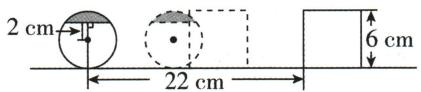

text_image

2 cm
22 cm
6 cm

图(1)

当圆与正方形将要分开重叠时,如图(2),根据题意,得 $2t+3t-(6+2)=22$ , 解得 t=6.

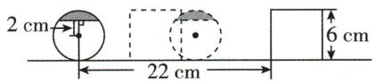

text_image

2 cm
22 cm
6 cm

图(2)

综上,第4或6秒时,圆与正方形重叠部分面积为S.故答案为4或6.

4. (1) $(x - 4)$ (2)47.5 【解析】(1) 因为 A、C 两地间的距离为 $4 \mathrm{~km}$ , A、B 两地间的距离为 $x \mathrm{~km}$ , 所以 B、C 两地的距离为 $(x - 4) \mathrm{km}$ . 故答案为 $(x - 4)$ .

(2) 由题意得 $\frac{x}{16 + 4} + \frac{x - 4}{16 - 4} = 6$ , 解得 $x = 47.5$ , 所以 A、B 两地间的距离是 $47.5 \mathrm{~km}$ . 故答案为 47.5.

5.【解】(1)根据题意得 $60t + 100t = 600$ ，解得 $t = \frac{15}{4}$ ，所以出发 $\frac{15}{4}$ h 两车相遇.

(2) 当 t=2 时, 两车相距 $600-2 \times (60+100) = 280(\text{km})$ ; 当 t=5 时, 两车相距 $5 \times (60+100)-600 = 200(\text{km})$ ; 当 t=8 时, 出租车已经到达目的地, 此时两车相距 $8 \times 60 = 480(\text{km})$ .

(3) 设 A 加油站到甲地的距离为 x km. 当 A

# 关键点拨

解题的关键是根据追及问题公式(追及时间×速度差=路程差)，结合题目条件求出三人的速度关系.

# 思路分析

设 x 秒后, 小强第一次追上小斌, 利用路程 = 速度 × 时间, 可得出关于 x 的一元一次方程, 解之即可得出 x 的值, 从而得出 7x 的值, 即当小强第一次追上小斌时小斌跑的路程, 由该路程小于 122 m, 可得出当小强第一次追上小斌时, 他们的位置在半圆跑道 CD 上.

加油站比 B 加油站更靠近甲地时, $\frac{x}{60}=\frac{600-200-x}{100}$ , 解得 x=150; 当 A 加油站比 B 加油站更靠近乙地时, $\frac{x}{60}=\frac{600-x+200}{100}$ , 解得 x=300, 所以 A 加油站到甲地的距离为 150 km 或 300 km.

# 刷提升

1. A 【解析】由表可知, 参赛者 A 答对 20 道题, 答错 0 道题, 共得到 100 分, 所以答对一道题得 $100 \div 20 = 5$ (分). 参赛者 E 答对 10 道题, 得 $10 \times 5 = 50$ (分), 答错 10 道题, 最终得分为 40 分, 所以答错一道题得 $(40 - 50) \div 10 = -1$ (分). 设参赛者 F 答对 $x$ 道题, 则答错 $(20 - x)$ 道题, 所以参赛者 F 得分为 $5x - (20 - x) = (6x - 20)$ 分. 当 $6x - 20 = 58$ 时, 解得 $x = 13$ , 符合题意; 当 $6x - 20 = 62$ 时, 解得 $x = \frac{41}{3}$ , 不符合题意; 当 $6x - 20 = 78$ 时, 解得 $x = \frac{49}{3}$ , 不符合题意; 当 $6x - 20 = 93$ 时, 解得 $x = \frac{113}{6}$ , 不符合题意. 故选 A.

2. C 【解析】设 x 秒后, 小强第一次追上小斌.
根据题意得 12x - 7x = 85, 解得 x = 17, 所以 $7x = 7 \times 17 = 119$ . 因为 119 < 122, 所以当小强第一次追上小斌时, 他们的位置在半圆跑道 CD 上.

3. BC 【解析】设正方形的边长为 a. 因为乙的速度是甲的速度的 3 倍, 运动时间相同, 所以甲、乙所运动的路程比为 1:3. 由题意知, ①第一次相遇时甲、乙所运动的路程和为 2a, 乙所运动的路程为 $2a \times \frac{3}{1+3} = \frac{3a}{2}$ , 甲所运动的路程为 $2a \times \frac{1}{1+3} = \frac{a}{2}$ , 在 AD 边的中点相遇; ②第一次相遇到第二次相遇时甲、乙所运动的路程和为 4a, 乙所运动的路程为 $4a \times \frac{3}{1+3} = 3a$ , 甲所运动的路程为 $4a \times \frac{1}{1+3} = a$ , 在 CD 边的中点相遇; ③第二次相遇到第三次相遇时甲、乙所运动的路程和为 4a, 乙所运动的路程为 $4a \times \frac{3}{1+3} = 3a$ , 甲所运动的路程为 $4a \times \frac{1}{1+3} = a$ , 在 BC 边的中点相遇; ④第三次相遇到第四次相遇时甲、乙所运动的路程和为 4a, 乙所运动的路程为 $4a \times \frac{3}{1+3} = 3a$ , 甲所运动的路程为 $4a \times \frac{1}{1+3} = a$ , 在 AB 边的中点相遇; ⑤第四次相遇到第五次相遇时甲、乙所运动的路程和为 4a, 乙所运动的路程为 $4a \times \frac{3}{1+3} = 3a$ , 甲所运动的路程为 $4a \times \frac{1}{1+3} = a$ , 在 AD 边的中点相遇. 综上可知, 每四次一个循环. 因为 $2023 \div 4 = 505 \cdots 3$ , 所以它们第 2023 次相遇在边 BC 上. 故答案为 BC.

4.【解】(1)若答对1题,则答错2题,得分为 $1\times$ $10-2\times10=-10$ (分);

若答对 2 题, 则答错 1 题, 得分为 $2 \times 10 - 1 \times 10 = 10$ (分);

若答对 3 题, 得分为 $3 \times 10 = 30$ (分);

若答错 3 题, 得分为 $0-3 \times 10 = -30$ (分).

答:每位同学所有可能的得分情况是-30分、-10分、10分和30分.

(2)①设甲班答对1题的有x人.

由题意得 $2+(3x-6)+2x+x=50$ ,

解得 x=9，则 $3 \times 9 - 6 = 21$ （人）.

答:甲班全部答对的人数是21人.

②乙班得分更高.

理由:由①得,甲班答对3题的有21人,答对2题的有18人,答对1题的有9人,全部答错的有2人,故甲班的得分为 $21\times30+18\times10-9\times10-2\times30=660$ (分).

设乙班全部答对的有 a 人, 答对 1 题的有 b 人, 则答对 2 题的有 $(a-3b)$ 人, 所以 $a+b+(a-3b)=50$ , 即 a-b=25, 故乙班得分为 $30a+10(a-3b)-10b=40(a-b)=1000$ (分).

因为 1 000 > 660, 所以乙班得分更高.

# 刷素养·

5.【解】(1)A,B两点间的距离为 $|-40-20|=60$ (个)单位长度,乙到达A点时共运动了 $60\div4=15$ (秒).故答案为60,15.

# 思路分析

(4) 先求出乙到达 A 点时，甲所在的位置，再求出乙追上甲需要的时间，进而即可求解.

# 关键点拨

本题考查了一元一次方程的实际应用, 解题关键是判断出小聪家去年前 11 个月用电量超过 2760 千瓦时但不超过 4800 千瓦时.

(2)设甲、乙经过 x 秒相遇. 根据题意得 $x + 4x = 60$ , 解得 x = 12, 所以 $-40 + x = -28$ .

答:甲、乙在数轴上-28对应的点相遇.

(3) 设 y 秒时, 甲、乙相距 10 个单位长度. 相遇前, 根据题意得, $y + 4y = 60 - 10$ , 解得 y = 10; 相遇后, 根据题意得 $y + 4y - 60 = 10$ , 解得 y = 14.

答:10 秒或 14 秒时,甲、乙相距 10 个单位长度.

(4)能. 乙到达 A 点时, 甲位于 $-40 + 15 = -25$ 对应的点上, 乙追上甲需要 $15 \div (4 - 1) = 5$ (秒), 则相遇点对应的数是 $-25 + 5 = -20$ .

# 课时4 分段计费问题与方案问题

# 刷基础

1. C 【解析】因为 $0.588 \times 500 = 294$ （元）， $500 \times 0.838 = 419$ （元），294 < 319 < 419，所以小聪家去年前 11 个月用电量超过 2760 千瓦时但不超过 4800 千瓦时。设小聪家去年全年用电量超过 4800 千瓦时的部分为 x 千瓦时。根据题意得 $0.588(500 - x) + 0.838x = 319$ ，解得 x = 100，所以小聪家去年全年用电量为 $4800 + 100 = 4900$ （千瓦时），故选 C.

2. 33 8 【解析】 $m=6\times5.5=33.8\times5.5+(10-8)n=60$ ，解得 n=8。故答案为 33,8。

3.【解】(1)由题意得当 x=3 时,甲公司收费 9 元;

当 $x = 15$ 时，甲公司收费 $9 + 1.6 \times (15 - 3) = 28.2$ （元）；

当 x=8 时, 乙公司收费 20 元;

当 x=20 时, 乙公司收费 $20+1.3 \times (20-8)=35.6$ (元). 填表如下:

<table><tr><td>车辆行驶的路程(千米)</td><td>1</td><td>3</td><td>5</td><td>8</td><td>15</td><td>20</td><td>...</td></tr><tr><td>甲公司收费(元)</td><td>9</td><td>9</td><td>12.2</td><td>17</td><td>28.2</td><td>36.2</td><td>...</td></tr><tr><td>乙公司收费(元)</td><td>20</td><td>20</td><td>20</td><td>20</td><td>29.1</td><td>35.6</td><td>...</td></tr></table>

(2)由题意得当车辆行驶路程超过8千米,且路程为整数时,甲公司的收费为 $9+1.6(x-3)=(1.6x+4.2)$ 元,乙公司的收费为 $20+1.3(x-8)=(1.3x+9.6)$ 元.
(3)由题意得 $1.6x+4.2=1.3x+9.6$ , 解得 x=

18,所以当行驶路程为 18 千米时,两家公司的费用相同,故答案为 18.

4.【解】(1)设学校租用25座大巴车每辆每天的

租金是 x 元, 则学校租用 45 座大巴车每辆每天的租金是 $(x+400)$ 元. 根据题意得 $2(x+400)+5x=5000$ , 解得 x=600, 所以 $x+400=600+400=1000$ .

答: 学校租用 25 座大巴车每辆每天的租金是 600 元, 租用 45 座大巴车每辆每天的租金是 1000 元.

(2) 设全部租用 45 座的大巴车需要租用 $y$ 辆, 则全部租用 25 座的大巴车需要租用 $(y + 3)$ 辆. 根据题意得 $45y = 25(y + 3) - 15$ , 解得 $y = 3$ , 所以选择方案一所需要的租金为 $600 \times (3 + 3) = 3600$ (元); 选择方案二所需要的租金为 $1000 \times 3 = 3000$ (元).

因为 3 600 > 3 000, 所以选择方案二更省钱.

答:选择方案一所需要的租金为3600元,选择方案二所需要的租金为3000元,选择方案二更省钱.

# 刷提升

1. A 【解析】设白天时段居民用电的单价为每千瓦时 a 元, 晚间时段居民用电的单价比白天单价低的百分数为 x, 则晚间时段居民用电的单价为每千瓦时 $(1-x)a$ 元; 设 5 月份晚间用电量为 n 千瓦时, 则 5 月份白天用电量为 $(1+50\%)n=1.5n$ 千瓦时, 所以 5 月份电费为 $1.5na+(1-x)na=(2.5-x)na$ 元, 6 月份白天用电量为 $1.5n(1-60\%)=0.6n$ 千瓦时, 所以 6 月份晚间用电量为 $(n+1.5n)(1+20\%)-0.6n=2.4n$ 千瓦时, 所以 6 月份电费为 $0.6na+2.4(1-x)na=(3-2.4x)na$ 元. 根据题意得 $(3-2.4x)na=(2.5-x)(1-20\%)na$ . 解得 x=0.625=62.5%. 故选 A.

2.【解】(1)因为A果园有苹果30吨,从A果园运到C地的苹果为x吨,所以从A果园运到D地的苹果为 $(30-x)$ 吨.因为C地需要苹果20吨,所以从B果园运到C地的苹果为 $(20-x)$ 吨.因为B果园有苹果40吨,所以从B果园运到D地的苹果为 $40-(20-x)=(x+20)$ 吨.

# 思路分析

(1) 设学校租用 25 座大巴车每辆每天的租金是 x 元，则学校租用 45 座大巴车每辆每天的租金是 $(x + 400)$ 元。根据等量关系列出方程，即可求解。

(2) 设全部租用 45 座的大巴车需要租用 y 辆, 则全部租用 25 座大巴车需要租用 $(y+3)$ 辆, 根据乘车人数相同列出方程求出 y 值, 进而可求出两种方案所需要的租车费用, 进行比较即可得出结果.

故答案为 $(30-x)$ ， $(20-x)$ ， $(x+20)$ .

(2)从 A 果园将苹果运往 C、D 两地的总运输费用是 $15x+12(30-x)=(3x+360)$ 元；
从 B 果园将苹果运往 C、D 两地的总运输费用是 $10(20-x)+9(x+20)=(380-x)$ 元. 故总运输费用为 $3x+360+380-x=(740+2x)$ 元.

(3)根据题意得 $740+2x=750$ , 解得 x=5.
故运输方案为从 A 果园运到 C 地的苹果为 5 吨, 运到 D 地的苹果为 25 吨;

从 B 果园运到 C 地的苹果为 15 吨, 运到 D 地的苹果为 25 吨.

# 刷素养·

3.【解】(1)不申请峰谷电,应付电费为0.54×230+0.59×(400-230)=224.5(元);

申请峰谷电, 应付电费为 $0.57 \times 150 + 0.29 \times 250 + 0.05 \times (400 - 230) = 166.5$ (元).

故答案为224.5,166.5.

(2) 因为 308.5 > 224.5,

所以用电总量超过 400 千瓦时.

设小强家8月份用电总量为x千瓦时.依题意得 $0.54\times230+0.59\times(400-230)+0.84(x-400)=308.5$ ,解得x=500.

答:小强家8月份的用电总量为500千瓦时.

(3)设小强家9月份的高峰时用电量为 $y$ 千瓦时.

依题意得 $0.54 \times 230 + 0.59 \times (330 - 230) - [0.57y + 0.29(330 - y) + 0.05 \times (330 - 230)] = 54.5$ ，解得 $y = 100$ .

答: 小强家 9 月份的高峰时用电量为 100 千瓦时.

# 大招专题3 方程的应用——动点问题

# 刷难关

# 大招解读 | 距离问题

1. 表示终点: 起点位置表示的数为 $a_{0}$ ，终点位置表示的数为 $a_{0} \pm vt$ (v 表示运动速度, t 表示运动时间, 向右为加, 向左为减).

2. 求距离: ①相对位置确定时: 距离 = 右边的点表示的数 - 左边的点表示的数;

②相对位置不确定时:距离=|b-a|(a,b分别表示始点与终点所表示的数).

3. 解方程.

1.【解】(1) 因为点 A 在原点的左侧, 距离原点 12 个单位长度, 所以点 A 对应的数为 -12, 同理可得点 B 对应的数为 2, 所以 A, B 两点之间的距离为 $2-(-12)=2+12=14$ , 故答案为 -12, 2, 14.

(2)分两种情况:①当点P在点B的右侧时, $AP=AB+BP=14+2=16$ ;②当点P在点B的左侧时, $AP=AB-BP=14-2=12$ .综上,AP的长是16或12.

(3)设运动的时间为 t 秒, 则动点 N, Q, M 对应的数分别为 -12-6t, -8t, 2-2t. 分三种情况: ① 当 NQ = QM 时, -8t - (-12-6t) = 2-2t - (-8t), 所以 $t = \frac{5}{4}$ , 此时, 点 N 对应的数为 $-12 - 6 \times \frac{5}{4} = -19.5$ , 点 Q 对应的数为 $-8 \times \frac{5}{4} = -10$ , 点 M 对应的数为 $2 - 2 \times \frac{5}{4} = -0.5$ .

②当 $NQ = NM$ 时， $-12 - 6t - (-8t) = 2 - 2t - (-12 - 6t)$ ，所以 $t = -13$ （舍）.

③当 MN = MQ 时, 可得 $(2 - 2t) - (-12 - 6t) = (2 - 2t) - (-8t)$ , 解得 t = 6, 此时 N 点对应的数为 $-12 - 6 \times 6 = -48$ , Q 点对应的数为 $-8 \times 6 = -48$ , M 点对应的数为 $2 - 2 \times 6 = -10$ .

综上, 点 N 对应的数为 -19.5, 点 Q 对应的数为 -10, 点 M 对应的数为 -0.5 或点 N 对应的数为 -48, 点 Q 对应的数为 -48, 点 M 对应的数为 -10.

# 大招解读 | 相遇问题

1. 表示终点: 起点位置表示的数为 $a_{0}$ ，终点位置表示的数为 $a_{0} \pm vt$ (v 表示运动速度, t 表示运动时间, 向右为加, 向左为减);

2. 求距离: 两点同时相向出发, 相遇时, $s_{1} + s_{2} =$ 起始位置之间的距离, 即 $v_{1}t + v_{2}t = |a_{0} - b_{0}|$ ;

3. 解方程.

2.【解】(1)因为点 A 表示的数为 -2, 点 B 表示的数为 13, 所以 $AB = |13 - (-2)| = 15$ , 线段 AB 的中点表示的数为 $\frac{13 - 2}{2} = \frac{11}{2}$ . 故答案为 $15, \frac{11}{2}$ .

(2)①t 秒后, 点 P 表示的数为 $-2 + 3t$ , 点 Q 表

# 思路分析

(1) 先由点 A 在原点的左侧, 距离原点 12 个单位长度确定点 A 对应的数是 -12, 同理可得点 B 对应的数为 2, 根据右边的数 -左边的数 = 两点之间的距离可得 A, B 两点之间的距离.

# 关键点拨

设点 P 运动 x 秒时, 在点 C 处追上点 R, 于是得到 AC = 6x, BC = 4x. 根据 AC - BC = AB, 列方程即可得到结论.

# 关键点拨

(2) 利用含 t 的代数式表示 t 秒后点 P, 点

Q 所表示的数,根据等量关系列方程求解即可.

示的数为 13-2t. 故答案为 $-2+3t, 13-2t$ .

②根据题意得 $-2+3t=13-2t$ ，解得t=3，相遇点所表示的数为 $-2+3\times3=7$ 。

所以当 t 为 3 时, P, Q 两点相遇, 相遇点所表示的数是 7.

(3)由已知得点 $P$ 运动5秒到达点 $B$ , 点 $Q$ 运动 $\frac{15}{2}$ 秒到达点 $A$ , 返回途中, 点 $P$ 表示的数是 $13 - 3(t - 5)$ , 点 $Q$ 表示的数是 $-2 + 2\left(t - \frac{15}{2}\right)$ .

根据题意得 $13-3(t-5)=-2+2\left(t-\frac{15}{2}\right)$ ，解得 t=9，所以再经过 9-3=6（秒），P,Q 两点第二次相遇，相遇点所表示的数为 $13-3\times(9-5)=1$ 。

# 大招解读 | 追及问题

1. 表示终点: 起点位置表示的数为 $a_{0}$ ，终点位置表示的数为 $a_{0} \pm vt$ (v 表示运动速度, t 表示运动时间, 向右为加, 向左为减);  
2. 求距离: 两点同时同向出发, 到达同一位置时, $s_{\text{多}} - s_{\text{少}} =$ 起始位置之间的距离, 即 $\left|v_{1}t - v_{2}t\right| = \left|a_{0} - b_{0}\right|$ ;  
3. 解方程.

3.5 【解析】设点 $P$ 运动 $x$ 秒时, 在点 $C$ 处追上点 $R$ , 则 $AC = 6x$ , $BC = 4x$ . 因为 $AC - BC = AB = 10$ , 所以 $6x - 4x = 10$ , 解得 $x = 5$ , 所以点 $P$ 运动 5 秒时, 追上点 $R$ .

# 数学活动

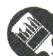

# 刷活动

1. B 【解析】依题意, 得 $4 \times 22 + 6(x - 22) = 136$ .
故选 B.

2. $7 < x \leqslant 8$ 【解析】因为 26.2 > 10，所以出租车行驶的里程超过了 2 千米。当 x 为整数时，根据题意得 $10 + 2.7(x - 2) = 26.2$ ，解得 x = 8。又因为不满 1 千米按 1 千米计算，所以 x 的取值范围是 $7 < x \leqslant 8$ 。故答案为 $7 < x \leqslant 8$ 。

3.【解】(1) 根据题意得 180a = 93.6, 93.6 + (260 - 180)b = 143.2, 解得 a = 0.52, b = 0.62.
答:a 的值为 0.52,b 的值为 0.62.

(2)设小明家这个月用电量是 $x$ 千瓦时.因为

93. $6 + (280 - 180) \times 0.62 = 155.6$ （元），172 > 155.6，所以 x > 280。根据题意得 $155.6 + 0.82(x - 280) = 172$ ，解得 x = 300。

答:小明家这个月用电量是300千瓦时.

(3)设小明家11月份用电y千瓦时,则10月份用电 $(400-y)$ 千瓦时.

当 0<y<120 时, $0.52y+155.6+0.82(400-y-280)=213$ , 解得 $y=\frac{410}{3}$ (不符合题意, 舍去);

当 $120 \leqslant y \leqslant 180$ 时, $0.52y + 93.6 + 0.62(400 - y - 180) = 213$ , 解得 $y = 170$ ;

当 180<y<220 时,93.6+0.62(y-180)+93.6+0.62(400-y-180)=212≠213,不符合题意,舍去.

答: 小明家 11 月份用电 170 千瓦时.

4. C 【解析】依题意得 $x = 4m$ . 故选 C.

# 全章综合训练

# 刷中考

1. C 【解析】由甲天平知一个“■”的质量等于2个“▲”的质量, 即 $x = 2$ “▲”; 由乙天平知一个“▲”的质量等于2个“●”的质量, 即“▲”=2y, 所以 $x = 2$ “▲”=4y, 故选C.

2. A 【解析】因为代数式 x-3 的值为 5, 所以 x-3=5, 解得 x=8, 故选 A.

3.【解】去括号,得 2x-2-3=x. 移项,得 2x-x=2+3. 合并同类项,得 x=5.

4. A 【解析】根据题意得(1+4.7%)x=120 327.
故选 A.

5.【解】若每次邮购都是100把,则 $200\times8\times0.9=$ 1440(元) $\neq1504$ (元),所以一次邮购多于100把,另一次邮购少于100把.设第一次邮购折扇 $x(x>100)$ 把,则另一次邮购折扇 $(200-x)$ 把.

由题意得 $0.9 \times 8x + 8 \times (1 + 10\%) (200 - x) = 1504$ ，所以 x = 160，所以 200 - x = 40。

答:两次邮购的折扇分别是160把和40把.

6.【解】这次技术改进后该汽车的 A 类物质排放量符合“标准”.

理由:设技术改进后该汽车的 A 类物质排放

量为 $x \mathrm{mg} / \mathrm{km}$ , 则 B 类物质排放量为 (40 - x) mg/km, 由题意得 $\frac{x}{1 - 50\%} + \frac{40 - x}{1 - 75\%} = 92$ , 解得 $x = 34$ .

因为 34<35, 所以这次技术改进后该汽车的 A 类物质排放量符合“标准”.

# 刷章测

1. C 【解析】A 选项, $3x - y = 6$ 中有两个未知数,不是一元一次方程, 故本选项不符合题意; B 选项, $x^{2} + x - 3 = 0$ 不是一元一次方程, 故本选项不符合题意; C 选项, $4x = 12$ 是一元一次方程, 故本选项符合题意; D 选项, $\frac{4}{x} - 1 = 24$ 不是一元一次方程, 故本选项不符合题意. 故选 C.

2. C 【解析】A 选项, 将方程 $3x - 5 = x + 1$ 移项, 得 $3x - x = 1 + 5$ , 故选项不符合题意; B 选项, 将方程 $-15x = 5$ 两边同时除以 -15, 得 $x = -\frac{1}{3}$ , 故选项不符合题意; C 选项, 将方程 $8x = -2(x + 4)$ 去括号, 得 $8x = -2x - 8$ , 故选项符合题意; D 选项, 方程去分母得 $3(3x - 1) - 12 = 2(5x - 7)$ , 故选项不符合题意. 故选 C.

3. A 【解析】 $a(2x-1)=4x+m$ ，因为不论a为何值，方程的解都相同，所以2x-1=0，所以 $x=\frac{1}{2}$ 。把 $x=\frac{1}{2}$ 代入 $4x+m=0$ 中，得 $4\times\frac{1}{2}+m=0$ ，所以m=-2。故选A。

4. A 【解析】因为安排 x 名技术工人生产甲种零件, 所以安排 $(12-x)$ 名技术工人生产乙种零件. 根据题意得 $\frac{24x}{2} = \frac{15(12-x)}{3}$ , 所以 $\frac{3}{2} \times 24x = 15(12-x)$ , $3 \times 24x = 2 \times 15(12-x)$ , 所以方程①②③正确. 故选 A.

5. D 【解析】因为关于 x 的方程 $a-|x|=0$ 有两个解, 所以 a>0. 因为 $b-|x|=0$ 只有一个解, 所以 b=0. 因为 $c-|x|=0$ 无解, 所以 c<0, 则 a, b, c 的关系是 c<b<a. 故选 D.

6. B 【解析】当 x > -x，即 x > 0 时， $\max\{x, -x\} = x$ ，所以 $x = 3x + 2$ ，解得 x = -1。因为 x > 0，所以x=-1 不符合条件, 舍去; 当 x<-x, 即 x<0 时, $\max\{x,-x\}=-x$ , 所以 $-x=3x+2$ , 解得 $x=-\frac{1}{2}$ .
因为 $x = -\frac{1}{2} < 0$ ，所以 $x = -\frac{1}{2}$ 满足条件. 故选 B.

7. C 【解析】 $5x+\frac{ax-2}{2}=5(x-1)+2,10x+ax-2=$ $10(x-1)+4,10x+ax-2=10x-10+4,10x+ax-$ $10x=-10+4+2,ax=-4$ , 当 $a\neq0$ 时, 方程的解是 $x=-\frac{4}{a}$ . 因为关于 x 的方程 $5x+\frac{ax-2}{2}=$ $5(x-1)+2$ 的解是正整数, a 为整数, 所以 a=-1 或 -2 或 -4. 因为关于 y 的多项式 $(a+1)y^{2}-ay-1$ 是二次三项式, 所以 $a+1\neq0$ 且 $-a\neq0$ , 所以 $a\neq-1$ 且 $a\neq0$ , 所以 a=-2 或 -4, 所以所有满足条件的整数 a 的值之和为 -2-4=-6, 故选 C.

8. D 【解析】设 T 字框内处于中间且靠上方的数为 2n-1，则框内该数左边的数为 2n-3，右边的数为 $2n+1$ ，下面的数为 $2n-1+10$ ，所以 T 字框内四个数的和为 $2n-3+2n-1+2n+1+2n-1+10=8n+6$ 。A 选项，若框住的四个数的和为 22，则 $8n+6=22$ ，解得 n=2，所以 2n-1=3，可以形成 T 字框，故本选项不符合题意；B 选项，若框住的四个数的和为 70，则 $8n+6=70$ ，解得 n=8，所以 2n-1=15，可以形成 T 字框，故本选项不符合题意；C 选项，若框住的四个数的和为 182，则 $8n+6=182$ ，解得 n=22，所以 2n-1=43，可以形成 T 字框，故本选项不符合题意；D 选项，若框住的四个数的和为 206，则 $8n+6=206$ ，解得 n=25，所以 2n-1=49，不能形成 T 字框，所以框住的四个数的和不能为 206，故本选项符合题意。故选 D.

9.1 【解析】因为 $a \odot b = 2b - a, (1 - x) \odot x = 2$ ，所以 $2x - (1 - x) = 2$ ，解得 x = 1，故答案为 1.

10. $\frac{20}{7}$ 斗、 $\frac{10}{7}$ 斗、 $\frac{5}{7}$ 斗 【解析】设羊主人赔偿 x 斗粟，则马主人赔偿 2x 斗粟，牛主人赔偿 4x 斗粟。由题意得 $x+2x+4x=5$ ，解得 $x=\frac{5}{7}$ ，所

# 思路分析

先解一元一次方程,再根据此方程的解是正整数,a为整数得出a可能的值,再根据关于y的多项式 $(a+1)y^{2}-ay-1$ 是二次三项式得出a的取值范围,从而确定a的值,再求和即可.

# 关键点拨

(1) 解题的关键是读懂题意, 明确 C, E 的位置.

以 $2x=\frac{10}{7},4x=\frac{20}{7}$ ，所以牛主人、马主人、羊主
人各应赔偿 $\frac{20}{7}$ 斗、 $\frac{10}{7}$ 斗、 $\frac{5}{7}$ 斗粟.

11. x=1 【解析】观察表格可知当 x=1 时, $ax+b=cx+4+1$ , 即 $ax+b=cx+5$ , 所以关于 x 的方程 $ax+b=cx+5$ 的解为 x=1, 故答案为 x=1.

12.【解】(1)去括号得 $2x+16=3x-3$ ，移项、合并同类项得 -x=-19，系数化为 1 得 x=19.

(2) 去分母得 $10(3x+2)-20=5(2x-1)-4(2x+1)$ ，去括号得 $30x+20-20=10x-5-8x-4$ ，移项、合并同类项得 28x=-9，解得 $x=-\frac{9}{28}$ .

13.【解】(1)方程 3x-7=17 是方程 5x-16=9 的“滑行方程”. 理由如下: 解方程 3x-7=17 得 x=8; 解方程 5x-16=9 得 x=5. 因为 8-5=3, 所以方程 3x-7=17 是方程 5x-16=9 的“滑行方程”.

(2) 解方程 $3(x-1)-4=8-2x$ 得 x=3. 因为关于 x 的方程 $5(x+2)-2a=\frac{a+5}{2}$ 是方程 $3(x-1)-4=8-2x$ 的“滑行方程”，所以关于 x 的方程 $5(x+2)-2a=\frac{a+5}{2}$ 的解为 $x=3+3=6$ ，所以 $5\times(6+2)-2a=\frac{a+5}{2}$ ，解得 a=15.

14.【解】(1)依题意得 AC = 180 - 30 - 40 - 60 = 50(cm), $40 + 60 = 100$ (cm)，则 C 球表示 -50，右挡板 E 表示 100。故答案为 -50, 100。

$$
\begin{array}{l} \begin{array}{l} (2) \text {   ①   } (4 0 + 6 0 + 6 0 + 4 0 + 5 0 + 3 0 + 3 0 + 5 0 + 4 0) \div \\ 1 0 = 4 0 (\mathrm{s}). \end{array} \\ \begin{array}{l} {\left[ 6 3 - 4 0 - (6 0 + 6 0) \div 1 0 \right] \times 1 0 = 1 1 0 (\mathrm{cm})  ,} \\ {1 1 0 - 4 0 = 7 0 (\mathrm{cm})  ,} \end{array} \\ \end{array}
$$

故经过 63 s 时, A, B, C 三球在数轴上所对应的数分别是 -50, 40, -70.

故答案为 40, -50, 40, -70.

②设经过 t s A, B 两球第一次相撞.

依题意有 $8t+12t=2\times180-40$ ，解得 t=16， $16 \times 8 - 80 \times 2 = -32.$

故经过 $16 \, s \, A, B$ 两球第一次相撞, 第一次相撞时在数轴上所对应的数是 -32.

# 第六章 几何图形初步

# 6.1 几何图形

# 6.1.1 立体图形与平面图形

# 课时1 认识几何图形

# 刷基础

1.【解】埃及金字塔——②,西瓜——③,水杯——①,房屋——⑤.

2. B 【解析】B 选项是棱锥, A, C, D 选项是棱柱, 所以和其他三个立体图形类型不同的是 B 选项. 故选 B.

3. 球 圆柱 圆锥 长方体 三棱柱

【解析】如图所示：

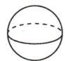  
球

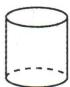  
圆柱

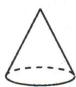  
圆锥

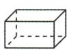  
长方体

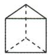  
三棱柱

故答案为球,圆柱,圆锥,长方体,三棱柱.

4.【解】根据题意可得,所拼成的新的长方体的长为4厘米,宽为3厘米,高为4厘米,因此它的棱长之和为 $(4+3+4)\times4=44$ (厘米).

5. A 【解析】由题图可得组成这个标识的平面图形有圆、长方形, 故选 A.

6. A 【解析】①三角形；②长方形；④圆，它们的各部分都在同一平面内，属于平面图形。③正方体；⑤四棱锥；⑥圆柱，它们的各部分不都在同一平面内，属于立体图形。故选 A.

7.2 或 5 或 8 【解析】如图所示：

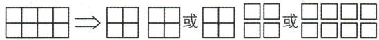

# 课时 2 从不同的方向看物体及立体图形的展开图

# 刷基础

1. C 【解析】圆锥从前面看是三角形,长方体从前面看是长方形,故从前面看该立体图形得到的平面图形是一个长方形上面有一个三角形的图形,故选 C.

2. A 【解析】将小立方块①从4个大小相同的

技巧点拨
由从上面看得到的图形确定最底层小立方块的个数, 再由从前面看和从左面看得到的图形确定第三层小立方块的个数, 再结合小立方块的总个数确定第二层小立方块的个数, 从而得出搭法.

# 思路分析

先求出新的长方体的长、宽、高，再求出所有棱长之和即可.

# 技巧点拨

只要有“田”“凹”字格的展开图都不是正方体的表面展开图.能围成正方体的“一四一”“二三一”“三三”“二二二”的基本形态要记牢.

小立方块所搭的几何体中移走后,所得几何体从前面看到的图形不变,从左面看到的图形由原来的两列变为一列,从上面看到的图形由原来的两行变为一行.故选 A.

3. 上 【解析】所给的几何体从前面看到的平面图形由 5 个小正方形组成；从左面看到的平面图形由 5 个小正方形组成；从上面看到的平面图形由 6 个小正方形组成。故面积最大的是从上面看。故答案为上。

4. C 【解析】由题图可知,这个几何体是圆柱.故选 C.

5.3 【解析】由从上面看得到的平面图形可知最底层小立方块的个数为9,由另外两个方向看得到的平面图形可知第三层有1个小立方块,那么第二层有3个小立方块,结合图形可知这个几何体的搭法共有3种,如图所示,数字表示该位置小立方块的个数.故答案为3.

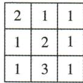  
从上面看  
或

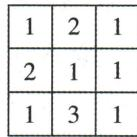  
从上面看

或  
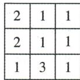  
从上面看

6. 128 【解析】根据题图可得上面的长方体长4 mm, 高4 mm, 宽2 mm, 下面的长方体长6 mm, 宽8 mm, 高2 mm, 所以这两个长方体的体积之和是 $4 \times 4 \times 2 + 6 \times 8 \times 2 = 128 \, (\text{mm}^3)$ .

7. C 【解析】A、B、D 选项中的图形是正方体的展开图，C 选项中的图形不是正方体的展开图。故选 C.

8. C 【解析】经过折叠后,这三个立体图形的展开图围成的立体图形分别是长方体、四棱锥、圆柱,故选 C.

# 刷提升

1. C 【解析】有两种可能:由从前面看到的形状图可得这个几何体共有3层,由从上面看到的形状图可得第一层小立方块的块数为4,由从前面看到的形状图可得第二层小立方块的块数最少为2,最多为3,第三层小立方块的块数为1,所以最多需要 $3+4+1=8$ (块)小立方块,最少需要 $2+4+1=7$ (块)小立方块.故选C.

2. D 【解析】A 选项, 圆圈与叉号所在面是相对面. B 选项, 与圆圈相邻的三角形方向不对. C 选项, 无论是哪一个三角形按照题目中的方式放置, 看到相邻的一个面上一定有叉号. D 选项正确. 故选 D.

3. A 【解析】由题意知,剪掉小正方形①或②或③后,阴影部分能折叠成一个正方体,剪掉小正方形④后,阴影部分不能折叠成一个正方体,故选 A.

4.4 【解析】保持从前面看和从左面看得到的图形不变,则最多可以再添加4个小正方体.故答案为4.

5.【解】(1)如图所示.

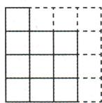  
从前面看

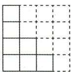  
从左面看

(2) $(6+6+10+10+7+7)\times1\times1+4\times1\times1=50(\mathrm{~cm}^{2})$ 所以这个几何体的表面积为 $50 \, cm^{2}$ .

# 刷素养

6.【解】(1)可能是该长方体展开图的有①②.故答案为①②.

(2) 题图(3)的外围周长为 $4 \times 6 + 4 \times 4 + 6 \times 3 = 58$ .

(3)外围周长最大的展开图如图所示:

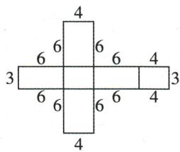

text_image

4
6 6 6 4
3 3
6 6 6 4
4

由图可知,此展开图的外围周长为 $8 \times 6 + 4 \times 4 + 3 \times 2 = 70$ .

# 6.1.2 点、线、面、体

# 刷基础

1. C 【解析】圆柱的侧面是曲的, ①错误; 圆锥由侧面和底面两个面围成, 侧面是曲的, 底面是平的, ②正确; 球只由一个面围成, 这个面是曲的, ③正确; 长方体由六个面围成, 这六个面都是平的, ④正确. 故正确的有②③④. 故选 C.

2. C 【解析】如果一个物体有七个顶点七个面，那么这个物体可以是六棱锥. 故选 C.

# 归纳总结

由小正方形构成的能折叠成正方体的平面图形具有以下特点:(1)一线不过四;(2)“田”“凹”要弃之;(3)相连必相邻.

# 易错警示

以该长方形的一边所在直线为轴, 即以长或宽所在直线为轴, 共两种情况, 注意不要漏解.

3.【解】圆柱由3个面围成,上、下面是平面,侧面是曲面;六棱柱由8个面围成,它们都是平面.六棱柱有18条棱.

4. A 【解析】由题图可知,几何体是由 A 选项中的平面图形沿虚线旋转一周得到的. 故选 A.

5. C 【解析】绕虚线旋转一周得到的几何体是圆锥, 故 A 正确, C 错误; 用平面去截这个几何体, 截面可能是圆, 也可能是三角形, 故 B, D 正确. 故选 C.

6. C 【解析】直角三角尺绕它的最长边(即斜边)所在直线旋转一周,所形成的几何体是两个同底且相连的圆锥.故选 C.

7. 钟表上的时针转动一周形成一个圆面(答案不唯一) 【解析】钟表上的时针转动一周形成一个圆面, 这一现象抽象成数学事实是线动成面. 故答案为钟表上的时针转动一周形成一个圆面(答案不唯一).

8.【解】(1)将长方形纸片绕它的一边所在直线旋转一周,得到的几何体是圆柱,有2个平的面,1个曲的面.故答案为圆柱,2,1.

(2)①若绕长为 $4 \, cm$ 的边所在直线旋转一周, 得到的是底面半径为 $6 \, cm$ , 高为 $4 \, cm$ 的圆柱, 它的体积为 $\pi \times 6^{2} \times 4 = 144\pi (\text{cm}^{3})$ ;

②若绕长为 $6 \, cm$ 的边所在直线旋转一周, 得到的是底面半径为 $4 \, cm$ , 高为 $6 \, cm$ 的圆柱, 它的体积为 $\pi \times 4^{2} \times 6 = 96\pi (\text{cm}^{3})$ .

综上所述,得到的这个几何体的体积为 $144\pi cm^{3}$ 或 $96\pi cm^{3}$ .

# 6.2 直线、射线、线段

# 6.2.1 直线、射线、线段

# 刷基础

1. B 【解析】手电筒发射出来的光线,类似于几何中的射线,手电筒是射线的端点,光的传播方向是射线的方向. 故选 B.

2. D 【解析】A、B、C 中的说法正确, 故 A、B、C 不符合题意; 射线向一端无限延伸, 直线向两端无限延伸, 都无限长, 不能比较长短, 故 D 中的说法错误, 故 D 符合题意. 故选 D.

3. B 【解析】观察图形可知,表示“射线 CD”的是 $\overset{\bullet}{C}$ $\overset{\bullet}{D}$ . 故选 B.

4. A 【解析】画直线 AB, 画射线 AC, 连接 BC, 如图所示:

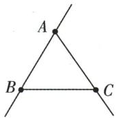

故选 A.

5.【解】(1)(2)(3)(4)如图所示:

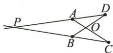

6. D 【解析】直线无端点, 点 B 不是直线 AB 的一个端点, A 错误, 故不符合题意; 点 O 不在射线 AB 上, B 错误, 故不符合题意; 射线 OB 和射线 AB 不是同一条射线, C 错误, 故不符合题意; 点 A 在线段 OB 上, D 正确, 故符合题意. 故选 D.

7. B 【解析】A 选项中, 线段 AB 与射线 CD 无交点, 不符合题意; B 选项中, 直线 AB 与射线 CD 有交点, 符合题意; C 选项中, 射线 AB 与直线 CD 无交点, 不符合题意; D 选项中, 直线 AB 与线段 CD 无交点, 不符合题意. 故选 B.

8. ①③④ 【解析】由题图可得, ①点 B 在直线 BC 上, 正确; ②直线 AB 不经过点 C, 错误; ③直线 AB, BC, CA 两两相交, 正确; ④点 B 是直线 AB, BC 的交点, 正确. 故答案为 ①③④.

9. C 【解析】如图, 过平面上 A, B, C 三点中的任意两点作直线, 可作 1 条或 3 条. 故选 C.

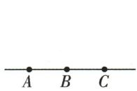

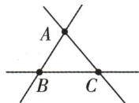

10. 两点确定一条直线 【解析】在利用量角器画一个 $40^{\circ}$ 的 $\angle AOB$ 的过程中, 对于先找点 $B$ , 再画射线 $OB$ , 这一步骤的画图依据是两点确定一条直线.

# 6.2.2 线段的比较与运算

# 刷基础

1. D 【解析】根据题意得 OA=AB=a, BC=b，所以 OC=OA+AB-BC=a+a-b=2a-b。故选 D.

2. B 【解析】A 选项, 射线 AB 从 A 向 B 无限延伸, 故延长射线 AB 到 D 是错误的; B 选项, 根据圆心和半径长即可确定弧线的形状, 故以

# 方法总结

比较线段长短的方法有叠合法和度量法.叠合法是从“形”的方面来进行比较的,度量法是从“数”的方面来进行比较的,两者比较的结果是一致的.

# 易错警示

注意分点 C 在线段 AB 的延长线上与点 C 在线段 AB 上两种情况进行讨论.

点 D 为圆心, 任意长为半径画弧是正确的; C 选项, 直线的长度无法测量, 故作直线 AB = 3 cm 是错误的; D 选项, 延长线段 AB 至 C, 则 AC > BC, 故使 AC = BC 是错误的. 故选 B.

3.【解】(不用写作法,画出符合要求的图即可)先作射线AO,以A为圆心,线段a的长为半径画弧交射线AO于C,再以C为圆心,线段b的长为半径画弧交射线CO于D,最后以D为圆心,线段c的长为半径画弧交线段AD于B,如图,线段AB即为所求.

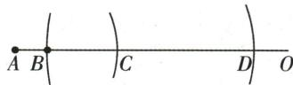

4. B 【解析】由题图知 a 的长度约为 3.7 cm, b 的长度约为 4.3 cm, 所以 a < b. 故选 B.

5. D 【解析】由题图可知 CM<CD. 又因为 CM=AB, 所以 AB<CD; 无法判断 CM, MD 的大小关系, 故选 D.

6. (1) > (2) = (3) < 【解析】(1) 如图(1)，当点 D 落在线段 AB 上时（不与点 B 重合），AB > CD.

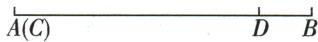  
图(1)

(2) 如图(2)，当点 D 与点 B 重合时，AB = CD.

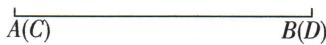  
图(2)

(3)如图(3)，当点 $D$ 落在线段 $AB$ 的延长线上时， $AB < CD$ .

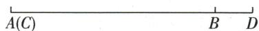  
图(3)

7. 两点之间, 线段最短 【解析】由题意得修建弯曲的道路与修建笔直的道路相比增加了路程的长度, 其中蕴含的数学道理是两点之间, 线段最短. 故答案为两点之间, 线段最短.

8. D 【解析】根据 O, P, Q 是平面上的三点， $PQ = 20 \, cm, OP + OQ = 30 \, cm > 20 \, cm$ ，可知 O 点不在线段 PQ 上，O 点可能在直线 PQ 上，也可能在直线 PQ 外。故选 D.

9. C 【解析】①如图(1)，点 C 在线段 AB 的延长线上时，因为 $AB = 5 \, cm, BC = 2 \, cm$ ，所以 $AC = AB + BC = 5 + 2 = 7 \, (\text{cm})$ ;

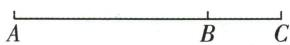  
图(1)

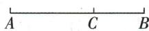  
图(2)

②如图(2)，点 C 在线段 AB 上时，因为 AB = 5 cm, BC = 2 cm，所以 AC = AB - BC = 5 - 2 = 3 (cm). 综上所述，AC 的长是 3 cm 或 7 cm. 故选 C.

10. C 【解析】因为 $AB + BC + CD = AD = a, AC + \blacktriangleright$ 关键点拨

$BD=AB+BC+BC+CD=AD+BC=a+3$ ，所以所有线段的和为 $AB+BC+CD+AC+BD+AD=a+(a+3)+a=3a+3=3(a+1)$ 。因为 a 为整数，所以 $3(a+1)$ 是 3 的倍数，所以 32 符合题意，故选 C.

11. C 【解析】A、B、D 选项,不能确定点 M 一定在线段 AB 上,因此 A、B、D 选项不符合题意;C 选项, $AM=BM=\frac{1}{2}AB$ ,则点 M 一定是线段 AB 的中点,因此 C 选项符合题意.故选 C.

12. C 【解析】因为 AB=15 cm, BD=9 cm, 所以 AD=AB-BD=6 cm. 因为 D 是线段 AC 的中点, 所以 AC=2AD=12 cm, 所以 BC=AB-AC=3 cm, 故选 C.

13. $\frac{2}{3}$ 【解析】如下图所示：

$$
D \quad A \quad B \quad C
$$

设 AB=1，则 DA=2, AC=2，所以 DB=3，所以线段 AC 是线段 DB 的 $\frac{2}{3}$ . 故答案为 $\frac{2}{3}$ .

14. 8 cm 【解析】如图, 因为点 C 在线段 AB 上, 且 $AC = \frac{1}{3}AB = 4 \, cm$ , 所以 BC = AB - AC = 8 cm. 因为 M 为 BC 的中点, 所以 $CM = \frac{1}{2}BC = 4 \, cm$ , 所以 $AM = AC + CM = 8 \, cm$ . 故答案为 8 cm.

$$
A C M B
$$

15. 14 【解析】由题意得 $AM = BM = \frac{1}{2} AB = 8$ ，所关键点拨

以 $MN = \frac{3}{4}BM = \frac{3}{4} \times 8 = 6$ ，所以 $AN = AM + MN = 8 + 6 = 14$ ，故答案为 14.

16.【解】(1)如图,直线AB,射线AC即为所求.

(2)如图,线段AD即为所求.

(3) 如图, 因为 $AB = 3 \, cm, AD = 2AB$ , 所以 $AD = 2 \times 3 = 6 \, (\text{cm})$ . 因为 $AC = 4 \, cm$ , 所以 CD =

根据题意得出所有线段的和为 $3(a+1)$ 是解题关键.

$AD - AC = 6 - 4 = 2(\mathrm{cm})$ .因为 $F$ 是线段 $CD$ 的中点，所以 $CF = \frac{1}{2} CD = \frac{1}{2}\times 2 = 1(\mathrm{cm})$ ，所以 $AF = AC + CF = 4 + 1 = 5(\mathrm{cm}).$

text_image

B
A
C
F
D

17.【解】(1) 因为点 C 是线段 AB 的中点, 所以 $AC = BC = \frac{1}{2} AB = \frac{1}{2} \times 24 = 12$ . 因为点 D 是线段 BC 的中点, 所以 $CD = \frac{1}{2} BC = \frac{1}{2} \times 12 = 6$ , 所以 $AD = AC + CD = 12 + 6 = 18$ , 所以线段 AD 的长为 18.

(2) 因为 AC = BC = 12，所以 $CE = \frac{1}{6} BC = \frac{1}{6} \times 12 = 2$ 。当点 E 在 A, C 之间时，AE = AC - CE = 12 - 2 = 10；当点 E 在 C, D 之间时，AE = AC + CE = 12 + 2 = 14。综上所述，AE 的长为 10 或 14。

# 刷提升

1. B 【解析】A 选项, 当 n=2 时, AC=2a+2. 因为 $AC+BC=2a+2+a+6=3a+8>AB=3a$ , 所以点 C 不在点 A, B 之间, 故本选项错误. B 选项, 当 n=4 时, AC=4a+2. 因为 $AB+AC=3a+4a+2=7a+2$ , BC=a+6, 若 $AB+AC=BC$ , 则 $7a+2=a+6$ , 所以 $a=\frac{2}{3}$ , 所以点 A 可能在点 B, C 之间, 故本选项正确. C 选项, 当 n=2 时, AC=2a+2. 因为 $AB+BC=3a+a+6=4a+6>AC=2a+2$ , 所以点 B 不在点 A, C 之间, 故本选项错误. D 选项, 当 n=4 时, AC=4a+2. 因为 $AB+BC=3a+a+6=4a+6>AC=4a+2$ , 所以点 B 不在点 A, C 之间, 故本选项错误. 故选 B.

2. ①②④ 【解析】由题意可得 $BM = AM = \frac{1}{2} AB$ ， $BN = CN = \frac{1}{2} BC, CO = \frac{1}{2} AC.$ 因为 $MN = BM + BN = \frac{1}{2} AB + \frac{1}{2} BC = \frac{1}{2} AC$ ，所以 $MN = CO$ ，①正确； $AO - BO = AB - BO - BO = 2BM - 2BO = 2(BM -$

$BO)=2MO,②正确;AM=BM,BN=CN,但无法确定AM与BN是否相等,③不正确;CO+BO=BC+BO+BO=2BN+2BO=2(BN+BO)=2NO,④正确.故答案为①②④.$

3.【解】(1)因为 $AB = 6\mathrm{cm}, BC = 4\mathrm{cm}$ , 所以 $AC = AB + BC = 6 + 4 = 10(\mathrm{cm})$ . 又因为 $D$ 为线段 $AC$ 的中点, 所以 $DC = \frac{1}{2} AC = \frac{1}{2} \times 10 = 5(\mathrm{cm})$ , 所以 $DB = DC - BC = 5 - 4 = 1(\mathrm{cm})$ .

(2) 因为 $BD = \frac{1}{4} AB = \frac{1}{3} CD$ ，所以设 BD = x cm，则 AB = 4BD = 4x cm，CD = 3BD = 3x cm，所以 BC = DC - DB = 3x - x = 2x（cm），所以 AC = AB + BC = 4x + 2x = 6x（cm）。因为 E 为线段 AB 的中点，所以 $BE = \frac{1}{2} AB = \frac{1}{2} \times 4x = 2x \, (\text{cm})$ ，所以 $EC = BE + BC = 2x + 2x = 4x \, (\text{cm})$ 。又因为 EC = 8 cm，所以 4x = 8，解得 x = 2，所以 $AC = 6 \times 2 = 12 \, (\text{cm})$ 。

4.【解】(1) 因为 AB=4，所以 $BC=\frac{1}{2}AB=2$ ，所以 $AC=AB+BC=4+2=6$ ，所以 $AD=\frac{1}{2}AC=3$ ，所以 $CD=AD+AC=3+6=9$ ，故线段 CD 的长为 9.

(2) 因为 Q 为 AB 的中点, 所以 $BQ = \frac{1}{2} AB = \frac{1}{2} \times 4 = 2$ . 因为 $BP = \frac{1}{2} BC, BC = 2$ , 所以 BP = $\frac{1}{2} \times 2 = 1$ . 由题意分以下 2 种情况:

①如图(1)，当点 P 在点 B 左侧时，PQ = BQ - BP = 2 - 1 = 1；

  
图(1)

②如图(2)，当点 P 在点 B 右侧时， $PQ = BQ + BP = 2 + 1 = 3$ .

  
图(2)

综上,线段 PQ 的长为 1 或 3.

# 刷素养·

5.【解】(1)由题意得,点 P 从点 M 运动到点 O 所用的时间为 $24 \div 4 = 6 \, (\text{s})$ . 当 $0 < t \leqslant 6$ 时,

# 思路分析

(1) 根据题意可得 OP=24-4t, OQ=2t, 然后由 OP=OQ 可得关于 t 的方程, 解方程即可.

(2) 先计算点 Q 从点 O 运动到点 N 所用的时间, 然后求出点 P 从点 O 运动到点 N 所用的时间, 再进行比较即可得出结论.

(3) 分情况讨论: ① 当 P 在线段 OM 上, Q 在射线 OB 上时, 它们相距 14 cm; ② 当 P, Q 均在射线 OB 上时, 它们相距 14 cm, 分情况构建关于 t 的方程, 求解即可.

$OP=24-4t, OQ=2t.$ 若 OP=OQ，则 $24-4t=2t$ ，解得 t=4.

(2)不能. 理由: 由题意得, 点 Q 从点 O 运动到点 N 所用的时间为 $18 \div 2 = 9(\text{s})$ , 点 P 从点 O 运动到点 N 所用的时间为 $18 \div 5 = 3.6(\text{s})$ , $6 + 3.6 = 9.6(\text{s})$ . 因为 9 < 9.6, 所以点 P 不能追上点 Q.

(3)①当 P 在线段 OM 上, Q 在射线 OB 上时, 它们相距 14 cm, 此时根据题意得 $0 < t \leqslant 6$ , $PO + OQ = 24 - 4t + 2t = 14$ , 解得 t = 5.

②当 P, Q 均在射线 OB 上时, 它们相距 14 cm, 此时根据题意得 t > 6, $\left|OP - OQ\right| = 14$ , 即 $\left|5(t - 6) - 2t\right| = 14$ , 解得 $t = \frac{44}{3}$ 或 $t = \frac{16}{3}$ (舍去). 综上所述, t = 5 或 $t = \frac{44}{3}$ .

# 大招专题4 与线段上的中点有关的计算

# 刷难关

大招解读 | 双中点模型

<table><tr><td colspan="2"> $P_{1},P_{2}$ 的位置</td><td>图示</td><td>结论</td></tr><tr><td colspan="2"> $P_{1}$ 是 $AB$ 的中点, $P_{2}$ 是 $BC$ 的中点</td><td> $A\quad P_{1}\quad B\quad P_{2}\quad C$ </td><td> $P_{1}P_{2}=\frac{1}{2}AC$ </td></tr><tr><td colspan="2"> $P_{1}$ 是 $AB$ 的中点, $P_{2}$ 是 $AC$ 的中点</td><td> $A\quad P_{1}\quad P_{2}B\quad C$ </td><td> $P_{1}P_{2}=\frac{1}{2}BC$ </td></tr><tr><td colspan="2"> $P_{1}$ 是 $AC$ 的中点, $P_{2}$ 是 $BC$ 的中点</td><td> $A\quad P_{1}\quad B\quad P_{2}\quad C$ </td><td> $P_{1}P_{2}=\frac{1}{2}AB$ </td></tr><tr><td colspan="4"> $P_{1}P_{2}=\frac{1}{2}\times$ 第三条线段</td></tr><tr><td>特点</td><td colspan="3">1. $A,B,C$ 三点共线,构成线段 $AB$ , $BC,AC$ ;2.点 $P_{1},P_{2}$ 为其中任意两条线段的中点</td></tr></table>

1. D 【解析】因为 N 是 BC 的中点, 所以 BN = CN, 所以 $AB = AC + 2BN = 10 + 14 = 24$ . 因为 M 是 AB 的中点, 所以 $BM = \frac{1}{2}AB = 12$ , 所以 MN = BM - BN = 12 - 7 = 5, 故选 D.

2.【解】(1) 因为 AC = 9 cm, 点 M 是 AC 的中点, 所以 $CM = \frac{1}{2} AC = 4.5 \, cm$ .

因为 BC=6 cm, 点 N 是 BC 的中点,

所以 $CN=\frac{1}{2}BC=3\ cm$ ,

所以 $MN = CM + CN = 7.5 \, cm$ ,

所以线段 MN 的长度为 7.5 cm.

(2) 能. $MN = \frac{1}{2} a \, cm$ . 理由: 因为 C 为线段 AB 上任一点 (不与 A, B 重合), 且点 M, N 分别是 AC, BC 的中点, 所以 $MN = MC + CN = \frac{1}{2}(AC + BC) = \frac{1}{2} a \, cm$ .

(3)能. 当点 C 在线段 AB 的延长线上时, 如图, $MN = \frac{1}{2} b \, cm$ .

理由: 因为点 M 是 AC 的中点,

所以 $CM=\frac{1}{2}AC.$

因为点 N 是 BC 的中点，

所以 $CN=\frac{1}{2}BC$ ,

所以 MN = CM - CN = $\frac{1}{2}$ (AC - BC) = $\frac{1}{2}b$ cm.

3.【解】(1)①因为 ${AB} = {CD}$ ,

所以 $AB + BC = CD + BC$ ，即 AC = BD。

故答案为=.

②因为 $BC=\frac{3}{4}AC$ ，且 AC=12 cm，

所以 $BC=\frac{3}{4}\times12=9(\text{cm})$ ,

所以 AB = CD = AC - BC = 12 - 9 = 3 (cm),

所以 $AD = AC + CD = 12 + 3 = 15 \, (\text{cm})$ .

故答案为 15.

(2) 设 $AB = 3x \, cm, BC = 4x \, cm, CD = 5x \, cm,$ 则 AD = 12x cm.

因为点 M 是 AB 的中点, 点 N 是 CD 的中点,

所以 $AM = BM = \frac{3}{2}x \, cm, CN = DN = \frac{5}{2}x \, cm.$

又因为 MN=16 cm,

所以 $\frac{3}{2}x+4x+\frac{5}{2}x=16$ ,

解得 x=2，所以 AD=24 cm.

# 思路分析

(1) 由中点的定义得 CM = $\frac{1}{2} AC, CN = \frac{1}{2} BC$ ，根据 $MN = CM + CN = \frac{1}{2} AC + \frac{1}{2} BC = \frac{1}{2}(AC + BC)$ 可得答案.

# 大招解读|三中点模型

text_image

½AB ½AB
½AC
A P₁ P₃ C P₂ B

text_image

A P₁ P₃ C P₂ B
½ AC
½ BC
½ AB

条件: 点 C 是线段 AB 上任意一点, 点 $P_{1}, P_{2}$ , $P_{3}$ 分别是线段 AC, BC, AB 的中点.

结论: $P_{1}P_{2}=\frac{1}{2}AB=AP_{3}=P_{3}B,$

$$
P _ {2} P _ {3} = \frac {1}{2} A C = A P _ {1} = C P _ {1}
$$

4. D 【解析】因为 H 为 AC 的中点, M 为 AB 的中点, N 为 BC 的中点, 所以易得 $MN = \frac{1}{2} AC = HC$ , ① 正确, ② 错误; $MH = MN - HN = \frac{1}{2} AC - (HC - CN) = \frac{1}{2} AC - \frac{1}{2} (AC - BC) = \frac{1}{2} AC - \frac{1}{2} AB = \frac{1}{2}(AC - AB) = \frac{1}{2} BC = \frac{1}{2}(HC - HB) = \frac{1}{2}(AH - HB)$ , ③ 正确; $HN = HC - NC = \frac{1}{2} AC - \frac{1}{2} BC = \frac{1}{2}(AC - BC) = \frac{1}{2} AB = \frac{1}{2}(AH + HB) = \frac{1}{2}(HC + HB)$ , ④ 正确. 所以 ① ③ ④ 正确. 故选 D.

# 重难专题5 线段中的动态问题

# 刷难关

1. C 【解析】因为线段 AB 的长为 20 cm, O 是线段 AB 的中点, 所以 $AO = \frac{1}{2} AB = 10 \, cm$ . 设运动时间为 t s, 则 $BQ = 2t \, cm$ , 所以 $AQ = AB - BQ = (20 - 2t) \, cm$ , 所以 $OQ = |AQ - AO| = |20 - 2t - 10| = |10 - 2t| \, cm$ . 因为点 P 沿 $A \to B \to A$ 以 4 cm/s 的速度运动, 所以分两种情况讨论: ① 当点 P 沿 $A \to B$ 运动时, 点 P 到达点 B 需要的时间为 $20 \div 4 = 5 \, (\text{s})$ , 所以此时 $0 \leqslant t \leqslant 5$ , $AP = 4t \, cm$ , 所以 $OP = |AO - AP| = |10 - 4t| \, cm$ . 因为 OP = OQ, 所以 $|10 - 4t| = |10 - 2t|$ , 所以 $10 - 4t = 10 - 2t$ 或 $10 - 4t = 2t - 10$ , 解得 t = 0 或$t=\frac{10}{3}$ . ②当点 P 沿 $B\rightarrow A$ 运动时, $5<t\leqslant10$ , $BP=(4t-20)\mathrm{cm}$ ，所以 AP=AB-BP=20-(4t-20)=(40-4t)cm，所以 OP=|AP-AO|=|40-4t-10|=|30-4t|cm. 因为 OP=OQ，所以 |30-4t|=|10-2t|，所以 30-4t=10-2t 或 30-4t=2t-10，解得 t=10 或 $t=\frac{20}{3}$ . 综上所述，当 OP=OQ 时，运动时间为 0 s 或 $\frac{10}{3}$ s 或 $\frac{20}{3}$ s 或 10 s. 故选 C.

2.【解】(1) 因为 AC = 2BC, AB = 15, 所以 AC = $\frac{2}{3} \times 15 = 10$ , $BC = \frac{1}{3} \times 15 = 5$ . 由题意, 分两种情况: ① 当点 E 靠近点 C 时, 如图(1)所示.

  
图(1)

因为点 E 为 BC 的三等分点, 所以 CE = $\frac{1}{3}CB = \frac{5}{3}$ , 所以 DC = DE - CE = $6 - \frac{5}{3} = \frac{13}{3}$ , 所以 AD = AC - DC = $10 - \frac{13}{3} = \frac{17}{3}$ .

②当点 E 靠近点 B 时, 如图(2)所示.

  
图(2)

因为点 E 为 BC 的三等分点, 所以 $CE = \frac{2}{3}CB = \frac{10}{3}$ , 所以 $DC = DE - CE = 6 - \frac{10}{3} = \frac{8}{3}$ , 所以 AD = AC - DC = $10 - \frac{8}{3} = \frac{22}{3}$ . 综上所述, 线段 AD 的长为 $\frac{17}{3}$ 或 $\frac{22}{3}$ .

(2)依题意,分两种情况:

①如图(3)所示,当点 F 在点 C 右侧时,

  
图(3)

因为 AC=10, CF=3, 所以 $AF=AC+CF=10+3=13$ . 因为 AF=3AD, 所以 $AD=\frac{1}{3}AF=\frac{13}{3}$ . 因为 DE=6, 所以 $AE=AD+DE=\frac{13}{3}+6=\frac{31}{3}$ .

②如图(4)所示,当点 F 在点 C 左侧时,

# 关键点拨

(1) 分点 E 靠近点 C 和点 E 靠近点 B 两种情况讨论.

# 归纳总结

角的表示方法
的优缺点：

①用三个大写英文字母来表示,适用于所有的角,但比较繁琐;②用顶点处的一个大写英文字母来表示角时比较简便,但只适用于以这个点为顶点的角只有一个的情况;③用数字或小写希腊字母来表示角比较简便,但需在图中标上相应的数字或小写希腊字母,另外当要表示的角较多且集中时,会比较乱.

  
图(4)

因为 AC=10, CF=3, 所以 AF=AC-CF=10-3=7. 因为 AF=3AD, 所以 $AD=\frac{1}{3}AF=\frac{7}{3}$ , 所以 $AE=AD+DE=\frac{7}{3}+6=\frac{25}{3}$ .

综上所述,AE 的长为 $\frac{31}{3}$ 或 $\frac{25}{3}$ .

3.【解】(1) 当 x=5 时, $AP=2\times5=10$ . 因为 M 为 AP 的中点, 所以 $AM=\frac{1}{2}AP=5$ , 所以 BM=AB-AM=19, 所以 BM 的长为 19.

(2) 当 P 在线段 AB 上运动时, 2BM-PB 是定值. 由题意得, $AM = \frac{1}{2}AP$ , BM = AB - AM, 所以 $2BM - PB = 2(AB - AM) - (AB - AP) = 2AB - AP - AB + AP = AB = 24$ , 所以 2BM-PB 是定值, 定值为 24.

(3)①当 P 在线段 AB 上运动时,如图(1).

  
图(1)

由题意得, $PN=\frac{1}{2}BP$ , $MP=\frac{1}{2}AP$ ,所以MN= $MP+NP=\frac{1}{2}(AP+BP)=\frac{1}{2}AB=12.$

②当 P 在线段 AB 的延长线上运动时, 如图(2).

  
图(2)

由题意得, $PN=\frac{1}{2}BP$ , $MP=\frac{1}{2}AP$ ,所以MN=
MP-NP= $\frac{1}{2}(AP-BP)=\frac{1}{2}AB=12.$

综上所述, $MN$ 的长为 12.

# 6.3 角

# 6.3.1 角的概念

# 刷基础

1. C 【解析】∠1 还可以表示为 ∠BAC, 故选 C.

2. (1) $\angle A, \angle C$ (2) $\angle ABE, \angle EBC, \angle ABC$

【解析】(1) 能用一个字母表示的角有 $\angle A$ ，$\angle C.$ 故答案为 $\angle A, \angle C.$ (2) 以点 $B$ 为顶点的角有 $\angle ABE, \angle EBC, \angle ABC.$ 故答案为 $\angle ABE, \angle EBC, \angle ABC.$

3. 10 21 $\frac{1}{2}(n+1)(n+2)$ 【解析】如果引出3条射线, 那么题图中共有10个角; 引出5条射线, 共有21个角; 引出 $n$ 条射线, 共有 $\frac{1}{2}(n+1)(n+2)$ 个角.

4. C 【解析】根据题图可得 $\angle ABC = 130^{\circ}$ . 故选 C.

5. 49.5225 21 36 【解析】因为 $1' = 60''$ ，所以 $21'' = 0.35'$ . 因为 $1^{\circ} = 60'$ ，所以 $31.35' = 0.5225^{\circ}$ ，所以 $49^{\circ}31'21'' = 49.5225^{\circ}$ . 因为 $0.36^{\circ} = 0.36 \times 60' = 21.6', 0.6' = 0.6 \times 60'' = 36''$ ，所以 $42.36^{\circ} = 42^{\circ}21'36''$ .

6. 北偏西 $50^{\circ}$ 或南偏东 $70^{\circ}$ 【解析】设南北方向的直线为 NS. 如图(1)，因为 $\angle NOA = 30^{\circ}$ ， $\angle AOB = 80^{\circ}$ ，所以 $\angle NOB = \angle AOB - \angle NOA = 80^{\circ} - 30^{\circ} = 50^{\circ}$ ，所以射线 OB 的方向是北偏西 $50^{\circ}$ ；如图(2)， $\angle SOB = 180^{\circ} - 30^{\circ} - 80^{\circ} = 70^{\circ}$ ，所以射线 OB 的方向是南偏东 $70^{\circ}$ 。故答案为北偏西 $50^{\circ}$ 或南偏东 $70^{\circ}$ 。

text_image

北
B
N
30°
A
西——O——东
S
南

图(1)

text_image

北
N
30°
A
西——O——东——B
S
南

图(2)

# 刷素养·

7.【解】(1)\~(4)如图(1)\~图(4)所示.
(5)如图(5)所示,答案不唯一.

  
图(1)

  
图(2)

  
图(3)

  
图(4)

  
图(5)

# 关键点拨

将三角板的相应的角的度数与 $\angle AOB$ 比较, 即可判断 $\angle AOB$ 度数的范围, 即可求解.

# 方法总结

我们常用“四面八方”来说明各个方向，即东、南、西、北、东南、西南、西北、东北，但事实上仅有这八个方向是不够的，通常以正北或正南方向为基准，配以偏东或偏西的角度来表示.

# 6.3.2 角的比较与运算

# 课时1 角的比较与运算

# 刷基础

1. D 【解析】如图, 因为 C 点是 $\angle AOB$ 内部任意一点, 并作射线 OC, 所以 $\angle AOC$ 与 $\angle BOC$ 的大小无法确定, $\angle AOB > \angle AOC$ , 故选 D.

text_image

A
C
O
B

(第1题图)

text_image

α
γ
β

(第3题图)

2. C 【解析】根据题意, 可知 $30^{\circ} < \angle AOB < 45^{\circ}$ , 所以选项 A、B、D 不符合题意, 选项 C 符合题意. 故选 C.

3. A 【解析】如图, 作 $\angle \gamma = \angle \beta$ , 所以 $\angle \gamma > \angle \alpha$ , 即 $\angle \alpha < \angle \beta$ . 故选 A.

4. C 【解析】如图, 连接 BC, AC, BD, AD, AE, BE, 在线段 DE 间任取一点 F, 连接 AF, BF, 通过测量可知 $\angle ACB < \angle ADB = \angle AEB < \angle AFB$ , 因而射门点在线段 DE (异于端点) 上一点时角最大. 故选 C.

text_image

C
D
E
E
A
B

(第 4 题图)

text_image

C
A
O
B(D)

(第6题图)

5. 逐渐变小 【解析】当点 A 从左向右运动时， $\angle\alpha$ 逐渐变小.

6. ① 【解析】如图, 因为 $\angle AOB < \angle COD$ , 所以边 OA 在 $\angle COD$ 的内部, 故答案为①.

7. B 【解析】

<table><tr><td>序号</td><td>分析</td><td>图示</td><td>结论</td></tr><tr><td>1</td><td> $\angle ABD = 60^{\circ} - 45^{\circ} = 15^{\circ}, \angle ACD = 45^{\circ} - 30^{\circ} = 15^{\circ}$ </td><td></td><td>不符合题意</td></tr><tr><td>2</td><td> $\angle ACD = 45^{\circ} - 30^{\circ} = 15^{\circ}$ </td><td></td><td>不符合题意</td></tr><tr><td>3</td><td>没有15°角</td><td></td><td>符合题意</td></tr></table>

8. $143^{\circ}45'$ $36^{\circ}15'$ 【解析】因为 $\angle1=65^{\circ}15'$ ， $\angle2=78^{\circ}30'$ ，所以 $\angle1+\angle2=65^{\circ}15'+78^{\circ}30'=143^{\circ}45'$ ，所以 $\angle3=180^{\circ}-(\angle1+\angle2)=180^{\circ}-143^{\circ}45'=36^{\circ}15'$ .

9.36 【解析】设 $\angle COB = a^{\circ}$ . 因为 $\angle COB : \angle AOD = 1:4$ , 所以 $\angle AOD = 4a^{\circ}$ . 因为 $\angle AOB + \angle COD = 180^{\circ}$ , 所以 $\angle COB + \angle AOD = 180^{\circ}$ , 即 $a^{\circ} + 4a^{\circ} = 180^{\circ}$ , 所以 a = 36, 所以 $\angle BOC = 36^{\circ}$ . 故答案为 36.

# 刷易错·

10. $50^{\circ}$ 或 $110^{\circ}$ 【解析】分为两种情况：

①如图（1），当 OC 在 $\angle BOA$ 内部时， $\angle AOC = \angle AOB - \angle BOC = 80^{\circ} - 30^{\circ} = 50^{\circ}$ ;

text_image

A
C
O
B

图(1)

text_image

A
O
B
C

图(2)

②如图（2），当 OC 在 $\angle BOA$ 外部时， $\angle AOC = \angle AOB + \angle BOC = 80^{\circ} + 30^{\circ} = 110^{\circ}$ .
故答案为 $50^{\circ}$ 或 $110^{\circ}$ .

# 课时2 角平分线

# 刷基础

1. C 【解析】如图, A 选项, $\angle AOC = \angle BOC$ 能确定 $OC$ 平分 $\angle AOB$ , 故此选项不符合题意; B 选项,$\angle AOB=2\angle AOC$ 能确定 OC 平分 $\angle AOB$ ，故此选项不符合题意；C 选项， $\angle AOC+\angle COB=\angle AOB$ 不能确定 OC 平分 $\angle AOB$ ，故此选项符合题意；D 选项， $\angle BOC=\frac{1}{2}\angle AOB$ 能确定 OC 平分 $\angle AOB$ ，故此选项不符合题意。故选 C.

2. C 【解析】因为 OE 平分 $\angle AOD, OF$ 平分 $\angle BOD$ ，所以 $\angle EOD = \frac{1}{2} \angle AOD, \angle DOF = \frac{1}{2} \angle BOD.$ 因为 $\angle AOD + \angle BOD = 180^{\circ}$ ，所以 $\angle EOD + \angle DOF = 90^{\circ}$ ，即 $\angle EOF = 90^{\circ}$ ，所以直

text_image

B
C
O
A

# 易错警示

与描绘点的位置一样,题中有描绘射线的位置时,也应注意“无图有坑”,谨防漏解.

# 思路分析

根据角平分线的定义可得 $\angle EOD = \frac{1}{2} \angle AOD,$ $\angle DOF = \frac{1}{2} \angle BOD$ ，结合平角的定义可求得 $\angle EOF = 90^{\circ}$ ，由 $\angle EOF$ 的度数为定值即可得出结论.

线 CD 绕点 O 顺时针旋转 $\alpha(0^{\circ}<\alpha<180^{\circ})$ 时， $\angle EOF$ 的度数与 $\angle BOD$ 的度数变化无关. 故选 C.

3. 56° 【解析】因为 $\angle BOD = 118^{\circ}$ ， $\angle COD$ 是直角，所以 $\angle BOC = \angle BOD - \angle COD = 118^{\circ} - 90^{\circ} = 28^{\circ}$ 。因为 OC 平分 $\angle AOB$ ，所以 $\angle AOB = 2\angle BOC = 56^{\circ}$ 。故答案为 56°。

4.【解】(1) 因为 OD 是 $\angle BOC$ 的一条靠近 OC 边的三等分线， $\angle BOC = 78^{\circ}$ ，所以 $\angle COD = \frac{1}{3} \angle BOC = \frac{1}{3} \times 78^{\circ} = 26^{\circ}$ 。因为 $\angle DOE = 77^{\circ}$ ，所以 $\angle COE = \angle DOE - \angle COD = 77^{\circ} - 26^{\circ} = 51^{\circ}$ ，即 $\angle COE$ 的度数为 $51^{\circ}$ 。

(2) OE 是 $\angle AOC$ 的平分线. 理由: 因为 $\angle COE = 51^{\circ}, \angle BOC = 78^{\circ}$ ，点 A, O, B 在同一直线上，所以 $\angle AOE = 180^{\circ} - \angle COE - \angle BOC = 180^{\circ} - 51^{\circ} - 78^{\circ} = 51^{\circ}$ ，所以 $\angle AOE = \angle COE$ ，所以 OE 是 $\angle AOC$ 的平分线.

5. C 【解析】根据题意, 得 $n = 360^{\circ} \div 45^{\circ} = 8$ . 故选 C.

6. $11^{\circ}15'$ 【解析】 $180^{\circ}\div16=11.25^{\circ}$ . 因为 $0.25^{\circ}=(0.25\times60)'=15'$ , 所以 $11.25^{\circ}=11^{\circ}15'$ , 故答案为 $11^{\circ}15'$ .

7.【解】(1)由题意得 $\angle COD=\frac{360^{\circ}}{8}=45^{\circ}$ .

(2) 因为 $\angle AOB = 60^{\circ}$ , OC 平分 $\angle AOB$ , 所以 $\angle BOC = \frac{1}{2} \angle AOB = 30^{\circ}$ , 所以 $\angle BOD = \angle COD - \angle BOC = 15^{\circ}$ .

(3) $\angle AOC$ 的度数为 $x^{\circ} - 15^{\circ}$ 或 $15^{\circ} - x^{\circ}$ 或 $x^{\circ} + 15^{\circ}$ . 当 $OC$ 在 $\angle AOB$ 内, $OD$ 在 $\angle AOB$ 外时, 如图(1)所示. 因为 $\angle BOD = x^{\circ}, \angle COD = 45^{\circ}$ , 所以 $\angle BOC = \angle COD - \angle BOD = 45^{\circ} - x^{\circ}$ . 因为 $\angle AOB = 60^{\circ}$ , 所以 $\angle AOC = \angle AOB - \angle BOC = 15^{\circ} + x^{\circ}$ ;

  
图(1)

  
图(2)

当 OC, OD 都在 $\angle AOB$ 内时, 如图(2)所示. 因为 $\angle BOD = x^{\circ},\angle COD = 45^{\circ},\angle AOB = 60^{\circ}$ ，所以 $\angle AOC = \angle AOB - \angle BOD - \angle COD = 15^{\circ} - x^{\circ};$ 当 $OC$ 在 $\angle AOB$ 外， $OD$ 在 $\angle AOB$ 内时，如图(3)所示.因为 $\angle BOD = x^{\circ},\angle COD = 45^{\circ},$ $\angle AOB = 60^{\circ}$ ，所以 $\angle AOC = \angle BOD + \angle COD-$ $\angle AOB = x^{\circ} - 15^{\circ}.$

  
图(3)

综上所述, $\angle AOC$ 的度数为 $x^{\circ}-15^{\circ}$ 或 $15^{\circ}-x^{\circ}$ 或 $15^{\circ}+x^{\circ}$ .

# 刷提升

1. A 【解析】如图(1)，当 $OD$ 在 $OB$ 上方时，因为 $\angle AOB = \alpha, OC$ 是 $\angle AOB$ 的平分线，所以 $\angle BOC = \frac{1}{2}\alpha.$ 因为 $\angle BOD = \frac{1}{3}\angle COD,$ $\angle BOD + \angle COD = \angle BOC = \frac{1}{2}\alpha,$ 所以 $\angle BOD = \frac{1}{8}\alpha,$ 则 $\angle COD = \frac{3}{8}\alpha.$ 因为 $OE$ 平分 $\angle COD,$ 所以 $\angle DOE = \frac{1}{2}\angle COD = \frac{3}{16}\alpha,$ 所以 $\angle BOE = \angle DOE + \angle BOD = \frac{3}{16}\alpha +\frac{1}{8}\alpha = \frac{5}{16}\alpha.$

text_image

A
C
E
D
B
O

图(1)

text_image

A
C
O
E
B
D

图(2)

如图(2)，当 $OD$ 在 $OB$ 下方时，因为 $\angle AOB = \alpha, OC$ 是 $\angle AOB$ 的平分线，所以 $\angle BOC = \frac{1}{2}\alpha.$ 因为 $\angle BOD = \frac{1}{3} \angle COD$ ，所以 $\angle BOD = \frac{1}{2} \angle BOC = \frac{1}{4}\alpha$ ，所以 $\angle COD = \frac{3}{4}\alpha.$ 因为 $OE$ 平分 $\angle COD$ ，所以 $\angle DOE = \frac{1}{2} \angle COD = \frac{3}{8}\alpha$ ，所以

# 关键点拨

注意分情况讨论, 可先画出示意图, 再利用角度之间的关系进行求解即可.

# 易错警示

(2)②注意分当射线 OF 在 $\angle EOB$ 内部和外部两种情况讨论, 不要漏解.

$\angle BOE = \angle DOE - \angle BOD = \frac{3}{8}\alpha -\frac{1}{4}\alpha = \frac{1}{8}\alpha .$ 综上所述， $\angle BOE = \frac{5}{16}\alpha$ 或 $\frac{1}{8}\alpha .$ 故选A.

2. D 【解析】当射线 OP 旋转到 $\angle AOP = \angle POC$ 时, OP 平分 $\angle AOC$ , 故 A 选项可能出现, 不符合题意; 当射线 OP 旋转到 $\angle AOP = \angle POB$ 时, OP 平分 $\angle AOB$ , 故 B 选项可能出现, 不符合题意; 当射线 OP 旋转到 $\angle BOC = \angle POC$ 时, OC 平分 $\angle BOP$ , 故 C 选项可能出现, 不符合题意; 因为 $\angle AOC = 50^{\circ}$ , 若 $\angle AOC = \angle POC$ , 则 $\angle POC = 50^{\circ}$ , 此时 $\angle AOP = 100^{\circ}$ , 但 $\angle AOB$ 是直角, 为 $90^{\circ}$ , 且射线 OP 从边 OA 出发, 绕点 O 逆时针旋转直至与边 OB 重合, 故在 $\angle AOB$ 中不可能有一个大于 $90^{\circ}$ 的 $\angle AOP$ , 故 D 选项不可能出现, 符合题意. 故选 D.

3. $2^{n} 2^{\circ}48'45''$ 【解析】第一次在题图(1)中画了一条线, 将题图(1)等分成 2 份, 第二次又加了两条线, 将题图(1)等分成 $4 = 2^{2}$ 份, 第三次又加了四条线, 将题图(1)等分成 $8 = 2^{3}$ 份, 第四次又加了八条线, 将题图(1)等分成 $16 = 2^{4}$ 份, 则第 $n (n > 1)$ 次可将题图(1)等分成 $2^{n}$ 份. 当 $n = 5$ 时, 题图(1)被分成的每份的角度是 $90^{\circ} \times \frac{1}{2^{5}} = 2^{\circ}48'45''$ . 故答案为 $2^{n}, 2^{\circ}48'45''$ .

# 刷素养·

4.【解】(1)因为 BC 为 4 cm, B 是 AC 中点, 所以 AB = BC = 4 cm, 所以 CD = 4AB = 16 cm. 故答案为 16.

(2)①表盘分为12格,1格的度数为 $360^{\circ}\div12=30^{\circ}$ ,时针1分钟所走的度数为 $30^{\circ}\div60=0.5^{\circ}$ ,所以从10:00到10:30,时针30分钟走的度数为 $30\times0.5^{\circ}=15^{\circ}$ ,所以10:30时分针和时针的夹角的度数为 $4\times30^{\circ}+15^{\circ}=135^{\circ}$ ,故答案为135.

②由①知, $\angle EOC=135^{\circ}$ ,所以 $\angle BOE=180^{\circ}-135^{\circ}=45^{\circ}$ .当OF在 $\angle EOB$ 内部时, $\angle BOF=\angle BOE-\angle EOF=25^{\circ}$ ;当OF在 $\angle EOB$ 外部时, $\angle BOF=\angle BOE+\angle EOF=65^{\circ}$ .

综上, $\angle BOF$ 的度数为 $25^{\circ}$ 或 $65^{\circ}$ .

(3)设经过 t 分钟后, $\angle EOF$ 的度数是 $25^{\circ}$ . 因为分针1分钟所走的度数为 $360^{\circ} \div 60 = 6^{\circ}$ , 所以时针与分针1分钟所走度数的差为 $6^{\circ} - 0.5^{\circ} = 5.5^{\circ}$ , 所以 $\angle EON = |135^{\circ} - 5.5^{\circ}t|$ . 因为 $OF$ 平分 $\angle EON$ , 所以 $\angle EOF = \frac{|135^{\circ} - 5.5^{\circ}t|}{2} = 25^{\circ}$ . ① $\frac{135^{\circ} - 5.5^{\circ}t}{2} = 25^{\circ}$ , 解得 $t = \frac{170}{11}$ ; ② $\frac{5.5^{\circ}t - 135^{\circ}}{2} = 25^{\circ}$ , 解得 $t = \frac{370}{11}$ . 故答案为 $\frac{170}{11}$ 或 $\frac{370}{11}$ .

# 6.3.3 余角和补角

# 刷基础

1. D 【解析】由题意得 $40^{\circ}$ 角的补角为 $180^{\circ}-40^{\circ}=140^{\circ}$ ，故选 D.

2. D 【解析】因为 $\angle1$ 与 $\angle3$ 互为补角, 所以 $\angle3+\angle1=180^{\circ}$ , 故 A 选项正确, 不符合题意; 因为 $\angle1$ 与 $\angle2$ 互为余角, $\angle1$ 与 $\angle3$ 互为补角, 所以 $\angle3=180^{\circ}-\angle1$ , $\angle2=90^{\circ}-\angle1$ , 所以 $\angle3-\angle2=(180^{\circ}-\angle1)-(90^{\circ}-\angle1)=90^{\circ}$ , $\angle3+\angle2=(180^{\circ}-\angle1)+(90^{\circ}-\angle1)=270^{\circ}-2\angle1$ , 故 B, C 选项正确, 不符合题意; 因为 $\angle1$ 与 $\angle2$ 互为余角, 所以 $\angle1+\angle2=90^{\circ}$ , 故 D 选项错误, 符合题意. 故选 D.

3. 32 52 48 147.12 【解析】因为∠B的余角为57.12°，所以∠B=90°-57.12°=32.88°=32°52'48"，∠B的补角为180°-32.88°=147.12°.

4. 110 【解析】由题意得 $\angle AOB = 70^{\circ}$ , 所以 $\angle AOB$ 的补角为 $180^{\circ} - 70^{\circ} = 110^{\circ}$ , 故答案为 110.

5.【解】设这个锐角为 $x^{\circ}$ .

由题意得 $180 - x = 4(90 - x) - 30$ ,

解得 x=50，即这个锐角的度数为 $50^{\circ}$ .

$$
9 0 ^ {\circ} - 5 0 ^ {\circ} = 4 0 ^ {\circ}, 1 8 0 ^ {\circ} - 5 0 ^ {\circ} = 1 3 0 ^ {\circ}.
$$

答: 这个锐角的度数为 $50^{\circ}$ ，这个角的余角的度数为 $40^{\circ}$ ，补角的度数为 $130^{\circ}$ .

6.【解】(1)图中与∠DOE互余的角有∠EOF, ∠BOD, ∠BOC.

故答案为 $\angle EOF, \angle BOD, \angle BOC$ .

(2)有.与 $\angle DOE$ 互补的角有 $\angle BOF,\angle COE$ .

7. D 【解析】因为 $\angle3 + \angle1 = 180^{\circ}$ ， $\angle1 + \angle2 = 180^{\circ}$ ，所以 $\angle3$ 是 $\angle1$ 的补角， $\angle2$ 是 $\angle1$ 的补

# 关键点拨

掌握余角和补角的定义是解题关键.

# 方法总结

余角、补角的性质: 同(等)角的余角相等; 同(等)角的补角相等. 这是证明角相等的依据.

角,所以 $\angle2=\angle3$ (同角的补角相等).故选D.

8. ①②③④ 【解析】因为 OD 平分 ∠AOC, OE 平分 ∠BOC, 所以 ∠COD = ∠AOD = $\frac{1}{2}$ ∠AOC, ∠COE = ∠BOE = $\frac{1}{2}$ ∠BOC, 所以 ∠DOE = ∠COD + ∠COE = $\frac{1}{2}$ (∠AOC + ∠BOC). 因为 ∠AOC + ∠BOC = 180°, 所以 ∠DOE = 90°, 故①正确. 因为 ∠AOE + ∠BOE = 180°, 所以 ∠AOE + ∠COE = 180°, 即 ∠AOE 与 ∠COE 互补, 故②正确. 因为 OC 平分 ∠BOD, 所以 ∠COD = $\frac{1}{2}$ ∠BOD. 因为 ∠BOD = 180° - ∠AOD, 所以 ∠COD = 90° - $\frac{1}{2}$ ∠AOD, 所以 ∠AOD = 90° - $\frac{1}{2}$ ∠AOD, 所以 ∠AOD = 60°, 所以 ∠AOE = ∠AOD + ∠DOE = 60° + 90° = 150°, 故③正确. 因为 ∠DOE = 90°, 所以 ∠COE = 90° - ∠COD, 所以 ∠BOE = 90° - ∠COD, 所以 ∠BOE + ∠COD = 90°, 所以 ∠COD 是 ∠BOE 的余角. 因为 ∠COD = $\frac{1}{2}$ ∠AOC, ∠AOC = ∠AOE - ∠COE, 所以 ∠COD = $\frac{1}{2}$ (∠AOE - ∠COE) = $\frac{1}{2}$ (∠AOE - ∠BOE), 即 ∠BOE 的余角可表示为 $\frac{1}{2}$ (∠AOE - ∠BOE), 故④正确. 综上所述, 正确的有①②③④. 故答案为①②③④.

# 大招专题5 双角平分线模型

# 刷难关

# 大招解读 | 两个角无公共部分

条件:如图,已知 OD,OE 分别平分 $\angle AOB, \angle BOC.$

结论: $\angle DOE=\frac{1}{2}\angle AOC.$

1. C 【解析】因为 $\angle AOB = \alpha, OA_{1}, OB_{1}$ 分别是 $\angle AOM$ 和 $\angle MOB$ 的平分线，所以 $\angle A_{1}OM = \frac{1}{2}\angle AOM, \angle B_{1}OM = \frac{1}{2}\angle BOM$ ，所以 $\angle A_{1}OB_{1} = \frac{1}{2} (\angle AOM + \angle BOM) = \frac{1}{2}\angle AOB =$

$\frac{1}{2}\alpha.$ 因为 $OA_{2}, OB_{2}$ 分别是 $\angle A_{1}OM$ 和 $\angle MOB_{1}$ 的平分线，所以 $\angle A_{2}OM = \frac{1}{2} \angle A_{1}OM, \angle B_{2}OM = \frac{1}{2} \angle B_{1}OM$ ，所以 $\angle A_{2}OB_{2} = \frac{1}{2} (\angle A_{1}OM + \angle B_{1}OM) = \frac{1}{2} \angle A_{1}OB_{1} = \frac{1}{2} \times \frac{1}{2} \alpha = \frac{1}{4} \alpha = \frac{\alpha}{2^{2}}.$ 因为 $OA_{3}, OB_{3}$ 分别是 $\angle A_{2}OM$ 和 $\angle MOB_{2}$ 的平分线，所以 $\angle A_{3}OM = \frac{1}{2} \angle A_{2}OM, \angle B_{3}OM = \frac{1}{2} \angle B_{2}OM$ ，所以 $\angle A_{3}OB_{3} = \frac{1}{2} (\angle A_{2}OM + \angle B_{2}OM) = \frac{1}{2} \angle A_{2}OB_{2} = \frac{1}{8} \alpha = \frac{\alpha}{2^{3}}, \cdots,$ 由此规律得 $\angle A_{n}OB_{n} = \frac{\alpha}{2^{n}}.$ 故选 C.

# 大招解读 | 两个角有公共部分

条件：如图，已知 OD, OE 分别平分 $\angle AOB, \angle BOC.$

text_image

B
D
A
E
O
C

结论: $\angle DOE=\frac{1}{2}\angle AOC.$

2.【解】(1) 因为 $\angle AOB = 120^{\circ}$ , $OD$ 平分 $\angle AOB$ , 所以 $\angle AOD = \angle BOD = \frac{1}{2} \angle AOB = 60^{\circ}$ . 因为 $OE$ 平分 $\angle AOC$ , $\angle AOC = 40^{\circ}$ , 所以 $\angle AOE = \frac{1}{2} \angle AOC = 20^{\circ}$ , 所以 $\angle DOE = \angle AOD - \angle AOE = 60^{\circ} - 20^{\circ} = 40^{\circ}$ .

(2) 若射线 OC 在 $\angle AOB$ 的内部, 如图(1). 因为 $\angle AOB = m^{\circ}, \angle AOC = n^{\circ}, OD, OE$ 分别平分 $\angle AOB, \angle AOC$ , 所以 $\angle DOE = \angle AOD - \angle AOE = \frac{1}{2} \angle AOB - \frac{1}{2} \angle AOC = \frac{1}{2}(m - n)^{\circ}$ .

  
图(1)

text_image

B
D
O
A
E
C

图(2)

若射线 OC 在 $\angle AOB$ 外部, 如图(2). 因为

# 思路分析

(2) 由于无法确定射线 OC 的位置, 所以需要分类讨论: 射线 OC 在 $\angle AOB$ 的内部和外部, 然后利用角平分线的性质求解.

$\angle AOB = m^{\circ}, \angle AOC = n^{\circ}, OD, OE$ 分别平分 $\angle AOB, \angle AOC,$ 所以 $\angle DOE = \angle AOD + \angle AOE = \frac{1}{2}\angle AOB + \frac{1}{2}\angle AOC = \frac{1}{2}(m + n)^{\circ}.$

综上， $\angle DOE$ 的度数为 $\frac{1}{2} (m - n)^\circ$ 或 $\frac{1}{2} (m + n)^\circ$ .

# 关键点拨

3.【解】(1) 因为 $\angle AOB = 90^{\circ}, \angle AOC = 60^{\circ}$ ,

(3) 解题的关键是掌握角平分线的定义及角的和差.

所以 $\angle BOC = \angle AOB + \angle AOC = 150^{\circ}$ ,
故答案为 $150^{\circ}$ .

(2) 由 (1) 知 $\angle BOC = 150^{\circ}$ . 因为 $OD$ 平分 $\angle BOC$ , 所以 $\angle DOC = \frac{1}{2} \angle BOC = 75^{\circ}$ . 因为 $OE$ 平分 $\angle AOC$ , $\angle AOC = 60^{\circ}$ , 所以 $\angle COE = \frac{1}{2} \angle AOC = 30^{\circ}$ , 所以 $\angle DOE = \angle DOC - \angle COE = 45^{\circ}$ .  
(3) 因为 $\angle AOB = 90^{\circ}$ , $\angle AOC = 2\alpha$ , 所以 $\angle BOC = \angle AOB + \angle AOC = 90^{\circ} + 2\alpha$ . 因为 $OD$ 平分 $\angle BOC$ , 所以 $\angle DOC = \frac{1}{2} \angle BOC = 45^{\circ} + \alpha$ . 因为 $OE$ 平分 $\angle AOC$ , $\angle AOC = 2\alpha$ , 所以 $\angle COE = \frac{1}{2} \angle AOC = \alpha$ , 所以 $\angle DOE = \angle DOC - \angle COE = 45^{\circ}$ .

# 大招解读 | 三个角围成周角

条件:如图,已知 $\angle AOB+\angle BOC+\angle AOC=360^{\circ}$ , $OP_{1}$ 平分 $\angle AOC, OP_{2}$ 平分 $\angle BOC.$

text_image

A
P₁ O B
C P₂

结论: $\angle P_{1}OP_{2}=180^{\circ}-\frac{1}{2}\angle AOB.$

4. $117^{\circ}$ 【解析】因为 $\angle AOB + \angle BOC + \angle AOC = 360^{\circ}$ ，所以 $\angle BOC + \angle AOC = 360^{\circ} - \angle AOB$ 。因为 OM 平分 $\angle BOC, ON$ 平分 $\angle AOC$ ，所以 $\angle MOC = \frac{1}{2} \angle BOC, \angle CON = \frac{1}{2} \angle AOC$ ，所以 $\angle MON = \angle MOC + \angle CON = \frac{1}{2} \angle BOC + \frac{1}{2} \angle AOC = \frac{1}{2} (\angle BOC + \angle AOC) = \frac{1}{2} (360^{\circ} - \angle AOB) = 180^{\circ} - \frac{1}{2} \angle AOB = 180^{\circ} - \frac{1}{2} \times 126^{\circ} = 117^{\circ}$ ，故答案为 $117^{\circ}$ 。

# 重难专题6 动角问题

# 刷难关

1. (1) $90^{\circ}$ (2) $\angle BCN - \angle ACM = 90^{\circ}$

(3) $\angle ACM + \angle BCN = 270^{\circ}$ 【解析】(1)当点A和点B都在直线MN的上方时， $\angle ACM+\angle BCN = 180^{\circ} - \angle ACB = 180^{\circ} - 90^{\circ} = 90^{\circ}.$

(2) 当点 A 在直线 MN 的下方, 点 B 仍然在直线 MN 的上方时, 因为 $\angle BCN = 180^{\circ} - \angle BCM, \angle ACM = 90^{\circ} - \angle BCM$ , 所以 $\angle BCN - \angle ACM = 180^{\circ} - \angle BCM - (90^{\circ} - \angle BCM) = 90^{\circ}$ .

(3) 当点 A 和点 B 都在直线 MN 的下方时，因为 $\angle BCN = 180^{\circ} - \angle BCM, \angle ACM = 90^{\circ} + \angle BCM$ ，所以 $\angle BCN + \angle ACM = 180^{\circ} - \angle BCM + (90^{\circ} + \angle BCM) = 270^{\circ}$ .

2. (1) (3t) 5 (2) (30+6t) 5

【解析】(1) 根据题意得 $\angle AON = (3t)^{\circ}$ . 因为 $\angle AOC = 30^{\circ}$ , 所以 $\angle BOC = 150^{\circ}$ . 因为 OM 平分 $\angle BOC, \angle MON = 90^{\circ}$ , 所以 $\angle COM = \frac{1}{2} \times 150^{\circ} = 75^{\circ}$ , 所以 $\angle CON = 90^{\circ} - 75^{\circ} = 15^{\circ}$ , 所以 $\angle AON = \angle AOC - \angle CON = 30^{\circ} - 15^{\circ} = 15^{\circ}$ , 所以 3t = 15, 解得 t = 5.

(2) 根据题意得 $\angle AOC = (30 + 6t)^{\circ}$ . 因为 $\angle MON = 90^{\circ}, OC$ 平分 $\angle MON$ , 所以 $\angle CON = \angle COM = 45^{\circ}$ , 所以 $\angle AOC - \angle AON = \angle CON = 45^{\circ}$ , 所以 $30 + 6t - 3t = 45$ , 解得 $t = 5$ .

3.【解】(1) 因为 OB 与 OC 重合, OE 平分 $\angle AOC$ , OF 平分 $\angle BOD$ , 所以 $\angle EOB = \frac{1}{2} \angle AOB$ , $\angle BOF = \frac{1}{2} \angle COD$ , 所以 $\angle EOF = \angle EOB + \angle BOF = \frac{1}{2} \angle AOB + \frac{1}{2} \angle COD = \frac{1}{2} \times 80^{\circ} + \frac{1}{2} \times 50^{\circ} = 65^{\circ}$ .

(2) $\angle EOF$ 的度数是定值.

根据旋转得 $\angle BOC = n^{\circ}$ ，则 $\angle AOC = 80^{\circ} + n^{\circ}$ $\angle BOD = 50^{\circ} + n^{\circ}$ .因为OE平分 $\angle AOC$ ，所以 $\angle COE = \frac{1}{2}\angle AOC.$

因为 OF 平分 $\angle BOD$ ，所以 $\angle BOF = \frac{1}{2} \angle BOD$ ，
所以 $\angle EOF = \angle COE + \angle COF = \angle COE +$

# 思路分析

(3) 用含同一个角的式子表示出 $\angle ACM$ 和 $\angle BCN$ ，再利用角的和差即可得到结果.

$$
\begin{array}{r l} & \angle B O F - \angle B O C = \frac {1}{2} \angle A O C + \frac {1}{2} \angle B O D - \\ & \angle B O C = \frac {1}{2} \times (8 0 ^ {\circ} + n ^ {\circ}) + \frac {1}{2} \times (5 0 ^ {\circ} + n ^ {\circ}) - n ^ {\circ} = \end{array}
$$

$65^{\circ}$ , 所以 $\angle EOF$ 的度数是定值, 为 $65^{\circ}$ .

(3) 由 (2) 知 $\angle BOC = n^{\circ}$ , 所以 $\angle AOD = \angle AOB + \angle BOC + \angle COD = 80^{\circ} + n^{\circ} + 50^{\circ} = (130 + n)^{\circ}$ . 因为 $\angle AOD - \angle EOF = \frac{3}{2} (\angle BOE + \angle COF)$ , 所以 $\angle AOD - \angle EOF = \frac{3}{2} (\angle EOF - \angle BOC)$ . 由 (2) 可知 $\angle EOF = 65^{\circ}$ , 所以 $130 + n - 65 = \frac{3}{2} (65 - n)$ , 解得 $n = 13$ , 所以 $n$ 的值为 13.

# 数学活动

# 刷活动

# 关键点拨

解题的关键是掌握正方体有8个顶点,12条棱,6个面.

1.【解】(1)把正方体的棱三等分,然后沿等分线把正方体切开,得到27个小正方体,其中有三面涂色的小正方体有8个,有两面涂色的小正方体有12个,有一面涂色的小正方体有6个,各面都没有涂色的小正方体有27-8-12-6=1(个),故答案为1,6,12,8.

(2) 把正方体的棱四等分, 然后沿等分线把正方体切开, 得到 64 个小正方体, 其中有三面涂色的小正方体有 8 个, 有两面涂色的小正方体有 24 个, 有一面涂色的小正方体有 24 个, 各面都没有涂色的小正方体有 64-8-24-24=8 (个), 故答案为 8,8.

(3) 把正方体的棱 3 等分, 有 $(3-2)^{3}=1$ (个) 小正方体是各面都没有涂色的; 把正方体的棱 4 等分, 有 $(4-2)^{3}=8$ (个) 小正方体是各面都没有涂色的, …, 则把正方体的棱 n 等分, 有 $(n-2)^{3}$ 个小正方体是各面都没有涂色的, 故答案为 $(n-2)^{3}$ .

2.【解】(1)由题意得,取圆上合适的一点C,将OC下方的部分沿OC对折,折叠m次后,半圆被平分成 $(m+1)$ 份,每份圆心角大小都与 $\angle BOC$ 相等,所以 $\angle BOC=\frac{180^{\circ}}{m+1}$ .根据表格中数据可知, $\angle BOC$ 与 $\alpha$ 互余,所以当m=6时, $\angle BOC=\frac{180^{\circ}}{7},\alpha=90^{\circ}-\frac{180^{\circ}}{7}=\frac{450^{\circ}}{7}$ .故答案为

$$
\frac {1 8 0 ^ {\circ}}{7}, \frac {4 5 0 ^ {\circ}}{7}, \alpha = 9 0 ^ {\circ} - \frac {1 8 0 ^ {\circ}}{m + 1}.
$$

(2)如图(1)、图(2)所示.(答案不唯一)

text_image

Geometric diagram showing transformation of a star shape into a triangle with numbered regions

图(1)  
图(2)

# 综合与实践 设计学校田径运动会比赛场地

# 刷实践

# 【解】实施方案

探究 1:400 米跑道中一段直道的长度为 (400-2×36×3.14)÷2=86.96(米).

探究 2: 填表如下:

<table><tr><td>跑道宽度x/米</td><td>0</td><td>1</td><td>2</td><td>3</td><td>4</td><td>5</td><td>...</td></tr><tr><td>跑道周长y/米</td><td>400</td><td>406.28</td><td>412.56</td><td>418.84</td><td>425.12</td><td>431.4</td><td>...</td></tr></table>

y 与 x 之间的关系为 $y=2\pi x+400=6.28x+400$ .

# 评估反思

当 y=446 时, $6.28x+400=446$ , 解得 $x\approx7.32$ .

因为 $7.32 \div 1.22 = 6$ ，所以最多能铺设道宽为 1.22 米的跑道 6 条。

# 全章综合训练

# 刷中考

1. B 【解析】由圆柱的特征可知, B 选项是圆柱. 故选 B.

2. C 【解析】将一个半圆绕它的直径所在的直线旋转一周得到的立体图形是球,故选 C.

3. C 【解析】由题图可知该几何体侧面为长方形, 则该几何体为棱柱, 再由底面为三角形, 可得该几何体为三棱柱. 故选 C.

4. B 【解析】如图所示,选择标有1或2的空白小正方形,能与阴影部分组成正方体展开图,所以

能与阴影部分组成正方体展开图的方法有 2 种. 故选 B.

5. A 【解析】因为 $AC = 2a + 1$ , BC = a + 4, AB =

# 思路分析

根据题意可分为两种情况：

①点 C 在线段 AB 上，
②点 C 在线段 AB 的延长线上. 可先计算出 AC 的长, 再由 D 是线段 AC 的中点, 即可得出答案.

# 关键点拨

探究 1: 根据跑道周长的意义: 直道长度 + 弯道长度 = 400, 即可求解.

3a, A, B, C 三点互不重合, 所以 a > 0. 若点 A 在 B, C 两点之间, 则 $AC + AB = BC$ , 即 $2a + 1 + 3a = a + 4$ , 解得 $a = \frac{3}{4}$ , 故 A 选项正确; 若点 B 在 A, C 两点之间, 则 $BC + AB = AC$ , 即 $a + 4 + 3a = 2a + 1$ , 解得 $a = -\frac{3}{2}$ , 故 B 选项错误; 若点 C 在 A, B 两点之间, 则 $BC + AC = AB$ , 即 $a + 4 + 2a + 1 = 3a$ , 无解, 故 C 选项错误. 故选 A.

6. C 【解析】根据题意分两种情况: ①如图(1), 因为 AB=4, BC=2, 所以 AC=AB-BC=2. 因为 D 是线段 AC 的中点, 所以 $AD=\frac{1}{2}AC=\frac{1}{2}\times2=1$ .

  
图(1)

②如图(2)，因为 AB=4, BC=2，所以 AC=AB+BC=6。因为 D 是线段 AC 的中点，所以 $AD=\frac{1}{2}AC=\frac{1}{2}\times6=3$ 。所以线段 AD 的长为 1 或 3。故选 C。

  
图(2)

7. 两点之间, 线段最短 【解析】由题意可知, 其蕴含的数学道理是两点之间, 线段最短. 故答案为两点之间, 线段最短.

8. D 【解析】若 $\angle A = 55^{\circ}$ ，则 $\angle A$ 的补角为 $180^{\circ} - 55^{\circ} = 125^{\circ}$ ，故选 D.

9. C 【解析】2 时整,钟表的时针指向 2 ,分针指向 12 ,两者所成的锐角为 $\frac{360^{\circ}}{12} \times 2 = 60^{\circ}$ . 故选 C.

10. 108 【解析】因为 OD 是 $\angle AOC$ 的平分线，所以 $\angle COD = \frac{1}{2} \angle AOC$ . 因为 OE 是 $\angle BOC$ 的平分线，所以 $\angle EOC = \frac{1}{2} \angle BOC$ ，所以 $\angle COD + \angle EOC = \frac{1}{2} \angle AOC + \frac{1}{2} \angle BOC$ ，即 $\angle DOE = \frac{1}{2} \angle AOB = 90^{\circ}$ . 因为 $\angle AOE = 162^{\circ}$ ，所以 $\angle AOD = \angle AOE - \angle DOE = 72^{\circ}$ ，所以 $\angle BOD = 180^{\circ} - \angle AOD = 108^{\circ}$ ，故答案为 108.

# 刷章测

1. C 【解析】A 选项, 长方体是立体图形, 故本选项错误; B 选项, 圆柱是立体图形, 故本选项错误; C 选项, 圆是平面图形, 故本选项正确; D 选项, 球是立体图形, 故本选项错误. 故选 C.

2. A 【解析】由题意可知所得几何体从上面看到的图形是 A 选项. 故选 A.

3. B 【解析】因为 $\angle AOD = 110^{\circ}$ , OC 平分 $\angle AOD$ , 所以 $\angle COD = \frac{1}{2} \angle AOD = 55^{\circ}$ . 因为 $\angle BOC$ 与 $\angle COD$ 互余, 所以 $\angle BOC + \angle COD = 90^{\circ}$ , 所以 $\angle BOC = 90^{\circ} - \angle COD = 90^{\circ} - 55^{\circ} = 35^{\circ}$ , 故选 B.

4. C 【解析】根据正方体表面展开图可知,“6”与“3x”是相对面,“y”与“x”是相对面.由于相对面上的数字互为相反数,所以 $3x+6=0$ , 解得 x=-2, 所以 y=2, 所以 xy=-4. 故选 C.

5. B 【解析】因为 $90^{\circ} < \angle\alpha < 180^{\circ}$ ，所以不存在一个角与 $\angle\alpha$ 相加等于 $90^{\circ}$ ，但是存在一个角与 $\angle\alpha$ 相加等于 $180^{\circ}$ ，所以 $\angle\alpha$ 只有补角，没有余角。故选 B.

6. B 【解析】因为 $\angle AOE = m^{\circ}$ ，所以 $\angle EOD = 90^{\circ} - m^{\circ}$ ，所以点 E 位于点 O 的北偏西 $90^{\circ} - m^{\circ}$ ，故①错误。因为 $\angle EOF = 90^{\circ}$ ，所以 $\angle EOD + \angle DOF = 90^{\circ}$ ， $\angle AOE + \angle BOF = 90^{\circ}$ 。因为 $\angle AOD = \angle BOD = 90^{\circ}$ ，所以 $\angle AOE + \angle EOD = 90^{\circ}$ ， $\angle DOF + \angle FOB = 90^{\circ}$ ， $\angle AOM + \angle MOD = 90^{\circ}$ ， $\angle BON + \angle DON = 90^{\circ}$ 。因为 OM，ON 分别平分 $\angle AOE$ 和 $\angle BOF$ ，所以 $\angle AOM = \angle EOM$ ， $\angle BON = \angle FON$ ，所以 $\angle EOM + \angle MOD = 90^{\circ}$ ， $\angle FON + \angle DON = 90^{\circ}$ ，所以题图中互余的角共有 8 对，故②错误。因为 $\angle BOF = 4\angle AOE$ ， $\angle AOE + \angle BOF = 90^{\circ}$ ，所以 $\angle BOF = 72^{\circ}$ ，所以 $\angle BON = 36^{\circ}$ ，所以 $\angle DON = 90^{\circ} - 36^{\circ} = 54^{\circ}$ ，故③正确。因为 $\angle AOE + \angle BOF = 90^{\circ}$ ，所以 $\angle MOE + \angle NOF = \frac{1}{2} (\angle AOE + \angle BOF) = \frac{1}{2} \times 90^{\circ} = 45^{\circ}$ ，所以 $\angle MON = 90^{\circ} + 45^{\circ} = 135^{\circ}$ ，所以 $\frac{\angle MON}{\angle AOE + \angle BOF} = \frac{135^{\circ}}{90^{\circ}} = \frac{3}{2} = n$ ，所以 n 的倒数

是 $\frac{2}{3}$ ，故④正确。故正确的说法有③④，共2个。故选B。

7. 线动成面 【解析】由题意知,车窗的雨刷快速旋转时看起来像个扇面,这说明了线动成面,故答案为线动成面.

8. DE 【解析】将题图(1)沿虚线折成一个如题图(2)所示的无盖正方体纸盒,则与线段 MN 重合的线段是 DE. 故答案为 DE.

9.20 【解析】因为 $\angle COB + \angle DOA = \angle COB + \angle COA + \angle COB + \angle DOB = \angle AOB + \angle COD = 180^{\circ}$ ，又因为 $\angle COB$ 与 $\angle DOA$ 的度数比是 2:7，所以 $\angle DOA = 180^{\circ} \times \frac{7}{2+7} = 140^{\circ}$ 。因为 OP 平分 $\angle DOA$ ，所以 $\angle DOP = 70^{\circ}$ ，所以 $\angle POC = 90^{\circ} - \angle DOP = 20^{\circ}$ 。故答案为 20。

10. ①③ 【解析】因为 $\angle AOB = \angle COD$ ，所以 $\angle AOB + \angle BOC = \angle COD + \angle BOC$ ，所以 $\angle AOC = \angle BOD$ ，故 ① 正确。由题意可得 $\angle AOB = 60^\circ - 40^\circ = 20^\circ = \angle COD$ 。因为 $\angle AOC + \angle BOC = 180^\circ$ ，所以 $\angle AOB + \angle BOC + \angle BOC = 180^\circ$ ，即 $20^\circ + \angle BOC + \angle BOC = 180^\circ$ ，所以 $\angle BOC = 80^\circ$ ，所以 $60^\circ + 80^\circ + 20^\circ = 160^\circ$ ，即射线 $OD$ 经过刻度线 160，故 ② 错误。如图，因为 $\angle COD = \angle AOB = 20^\circ$ ，所以 $\angle MOC = 3\angle COD = 60^\circ$ 。因为射线 $OM$ 经过刻度线 90，所以 $\angle EOM = \angle FOM = 90^\circ$ ，所以 $\angle MOB = 90^\circ - 60^\circ = 30^\circ$ ，所以 $\angle BOC = \angle MOC + \angle MOB = 90^\circ$ ，所以 $\angle MOB$ 和 $\angle MOC$ ， $\angle BOE$ 和 $\angle COF$ 互为余角。又因为 $\angle AOE$ 和 $\angle AOM$ ， $\angle BOE$ 和 $\angle BOM$ ， $\angle COM$ 和 $\angle COF$ ， $\angle DOM$ 和 $\angle DOF$ 互为余角，所以共有 6 对角互为余角，故 ③ 正确。所以正确的有 ①③，故答案为 ①③。

text_image

M
90
B
A
C
0°
E
O
F
180°
D

11.【解】(1) $38^{\circ}25' + 50^{\circ}28' = 88^{\circ}53'$ , $82^{\circ} - 15^{\circ}26' = 66^{\circ}34'$ .

故答案为 $88^{\circ}53'$ , $66^{\circ}34'$ .

(2)设这个角的度数为 $x^{\circ}$ ，则这个角的余角为 $(90-x)^{\circ}$ ，补角为 $(180-x)^{\circ}$ .

由题意得 $(90-x)^{\circ}=\frac{1}{3}(180-x)^{\circ}+6^{\circ}$ ，解得x=36.

答:这个角为 $36^{\circ}$ .

12.【解】(1) 因为 $\angle BOC = 60^{\circ}$ , $OE$ 平分 $\angle BOC$ , 所以 $\angle COE = \frac{1}{2} \angle BOC = 30^{\circ}$ . 因为 $\angle AOB$ 是直角, 即 $\angle AOB = 90^{\circ}$ , 所以 $\angle AOC = \angle AOB - \angle BOC = 30^{\circ}$ . 因为 $OD$ 平分 $\angle AOC$ , 所以 $\angle DOC = \frac{1}{2} \angle AOC = 15^{\circ}$ , 所以 $\angle DOE = \angle DOC + \angle COE = 45^{\circ}$ , 故答案为 $45^{\circ}$ .

(2) 若射线 OC 在 $\angle AOB$ 内部绕 O 点旋转，则 $\angle DOE$ 的度数是 $45^{\circ}$ ，故答案为 $45^{\circ}$ .

(3) 因为 $OD, OE$ 分别平分 $\angle AOC$ 和 $\angle BOC$ , 所以 $\angle COD = \frac{1}{2} \angle AOC$ , $\angle COE = \frac{1}{2} \angle BOC$ , 所以 $\angle COD + \angle COE = \frac{1}{2} \angle AOC + \frac{1}{2} \angle BOC$ , 即 $\angle DOE = \frac{1}{2} (\angle AOC + \angle BOC) = \frac{1}{2} \angle AOB$ .

因为 $\angle AOB$ 是直角, 即 $\angle AOB = 90^{\circ}$ , 所以 $\angle DOE = 45^{\circ}$ .

13.【解】(1)小明共剪开了8条棱,故答案为8.
(2)(画出一种即可)如图,存在四种情况.

(3)设长方体纸盒的高为 $a\mathrm{cm}$ , 则长方体纸盒的长与宽均为 $5a\mathrm{cm}$ . 因为长方体纸盒所有棱长的和是 $880\mathrm{cm}$ , 所以 $4(a + 5a + 5a) = 880$ , 解得 $a = 20$ , 所以这个长方体纸盒的高为 $20\mathrm{cm}$ , 长和宽均为 $5 \times 20 = 100(\mathrm{cm})$ , 所以

# 思路分析

(2) 由题意, 得 AM = t cm, MC = (6 - t) cm, 根据点 M 运动到点 C 时, 点 M, N 都停止运动, 可得 $0 \leqslant t \leqslant 6$ , 分三种情况:

①当 $0 \leqslant t \leqslant 2$ 时，点 N 从 C 向 B 运动，可求得 t = 2；

②当 $2 < t \leqslant 4$ 时，点 N 从 B 向 C 运动，求出 t = 2，不合题意，舍去；

③当 $4 < t \leqslant 6$ 时，点 N 从 C 向 B 运动，可求得 $t = \frac{14}{3}$ .

(3) 存在某个时间段，使 PM 的长度保持不变，与 (2) 一样分三种情况讨论即可.

这个长方体纸盒的体积为 $20 \times 100 \times 100 = 200\ 000(\text{cm}^{3})$ .

14.【解】(1)当 $t = 1$ 时, $AM = 1\mathrm{cm}$ , $CN = 2\mathrm{cm}$ , 所以 $MC = AC - AM = 6 - 1 = 5(\mathrm{cm})$ , 所以 $MN = MC + CN = 5 + 2 = 7(\mathrm{cm})$ .

(2)由题意,得 $AM = t\mathrm{cm},MC = (6 - t)\mathrm{cm}$ . 因为点 $M$ 运动到点 $C$ 时,点 $M,N$ 都停止运动,所以 $0 \leqslant t \leqslant 6$ . ①当 $0 \leqslant t \leqslant 2$ 时,点 $N$ 从 $C$ 向 $B$ 运动, $CN = 2t~\mathrm{cm}$ . 因为点 $C$ 为线段 $MN$ 的中点,所以 $MC = CN$ ,即 $6 - t = 2t$ ,解得 $t = 2$ . ②当 $2 < t \leqslant 4$ 时,点 $N$ 从 $B$ 向 $C$ 运动, $BN = (2t - 4)\mathrm{cm}$ ,则 $CN = 4 - (2t - 4) = (8 - 2t)\mathrm{cm}$ . 因为点 $C$ 为线段 $MN$ 的中点,所以 $MC = CN$ ,即 $6 - t = 8 - 2t$ ,解得 $t = 2$ (舍去). ③当 $4 < t \leqslant 6$ 时,点 $N$ 从 $C$ 向 $B$ 运动, $CN = (2t - 8)\mathrm{cm}$ . 因为点 $C$ 为线段 $MN$ 的中点,所以 $MC = CN$ ,即 $6 - t = 2t - 8$ ,解得 $t = \frac{14}{3}$ . 综上所述,当 $t = 2$ 或 $\frac{14}{3}$ 时,点 $C$ 为线段 $MN$ 的中点.

(3) 存在. 如图, ① 当 $0 \leqslant t \leqslant 2$ 时, 点 $N$ 从 $C$ 向 $B$ 运动, $CN = 2t \mathrm{~cm}$ . 因为点 $P$ 是线段 $CN$ 的中点, 所以 $CP = \frac{1}{2} CN = t \mathrm{~cm}$ , 所以 $PM = MC + CP = 6 - t + t = 6(\mathrm{~cm})$ , 此时 $PM$ 的长度保持不变.

②当 $2 < t \leqslant 4$ 时, 点 $N$ 从 $B$ 向 $C$ 运动, $CN = (8 - 2t)\mathrm{cm}$ . 因为点 $P$ 是线段 $CN$ 的中点, 所以 $CP = \frac{1}{2} CN = \frac{1}{2}(8 - 2t) = (4 - t)\mathrm{cm}$ , 所以 $PM = MC + CP = 6 - t + (4 - t) = (10 - 2t)\mathrm{cm}$ , 此时 $PM$ 的长度发生变化.

③当 $4 < t \leqslant 6$ 时, 点 $N$ 从 $C$ 向 $B$ 运动, $CN = (2t - 8)\mathrm{cm}$ . 因为点 $P$ 是线段 $CN$ 的中点, 所以 $CP = \frac{1}{2} CN = \frac{1}{2}(2t - 8) = (t - 4)\mathrm{cm}$ , 所以 $PM = MC + CP = 6 - t + (t - 4) = 2(\mathrm{cm})$ , 此时 $PM$ 的长度保持不变.

综上所述, 当 $0 \leqslant t \leqslant 2$ 时, PM 的长度保持不变, 为 6 cm; 当 $4 < t \leqslant 6$ 时, PM 的长度保持不变, 为 2 cm.

# 中考新考向备训

# 刷考向

1. A 【解析】粮库把运进 30 吨粮食记为“+30”，则“-30”表示运出 30 吨粮食。故选 A.

2. C 【解析】由题意得,第一天织布5尺,第30天织布1尺,所以一共织布 $\frac{1}{2}(1+5)\times30=90$ (尺).故选C.

3. A 【解析】根据题意可列方程为 $\frac{1}{7}x + \frac{1}{9}x = 1$ ，故选 A.

4. 0(答案不唯一) 【解析】由题意,填写如下图, $1+0+(-1)=0,2+0+(-2)=0$ ,满足题意.故答案为0(答案不唯一).

<table><tr><td></td><td>1</td><td></td></tr><tr><td>2</td><td>0</td><td>-2</td></tr><tr><td></td><td>-1</td><td></td></tr></table>

5. B 【解析】由题图可知,第1种化合物的分子结构模型中氢原子的个数为 $4=1\times2+2$ ; 第2种化合物的分子结构模型中氢原子的个数为 $6=2\times2+2$ ; 第3种化合物的分子结构模型中氢原子的个数为 $8=3\times2+2$ ; 第4种化合物的分子结构模型中氢原子的个数为 $10=4\times2+2$ ; …, 所以第n种化合物的分子结构模型中氢原子的个数为 $2n+2$ . 当 n=10 时, $2n+2=22$ , 即第10种化合物的分子结构模型中氢原子的个数为22. 故选 B.

6.220 【解析】因为 $U=IR_{1}+IR_{2}+IR_{3}$ ，所以当 $R_{1}=20.3, R_{2}=31.9, R_{3}=47.8, I=2.2$ 时， $U=20.3\times2.2+31.9\times2.2+47.8\times2.2=(20.3+31.9+47.8)\times2.2=220$ ，故答案为 220.

7.【解】设黑色琴键的个数为 x，则白色琴键的个数为 $x+16$ 。由题意得 $x+(x+16)=88$ ，解得 x=36，所以白色琴键的个数为 $36+16=52$ 。

答:白色琴键的个数为 52, 黑色琴键的个数为 36.

8. 0(答案不唯一) 【解析】-1<0, 故答案为 0(答案不唯一).

9. $m$ (答案不唯一) 【解析】2m 的一个同类项为 $m$ , 故答案为 $m$ (答案不唯一).

10. D 【解析】由题意得 $a_{1}=2+6+4=12$ ，此时 k=1= $2^{1}-1, a_{2}=12+8+10=30=3a_{1}-6$ ，此时 $\frac{a_{2}}{3}=a_{1}-2, k=3=2^{2}-1$ ，第 3 次构造后得到的一列数为 2, 10, 8, 14, 6, 16, 10, 14, 4，所以 $a_{3}=30+10+14+16+14=84=3a_{2}-6$ ，此时 $\frac{a_{3}}{3}=a_{2}-2, k=7=2^{3}-1$ ，故 A 正确，不符合题意。同理可得 $a_{4}=a_{3}+162=3a_{3}-6$ ，此时 $\frac{a_{4}}{3}=a_{3}-2, k=15=2^{4}-1,\cdots$ ，以此类推，则 $a_{n}=3a_{n-1}-6$ ，此时 $k=2^{n}-1$ ，故 D 错误，符合题意。 $a_{n+1}=3a_{n}-6$ ，故 C 正确，不符合题意。因为 $a_{1}=12$ 是偶数，所以 $\frac{a_{1}}{3}$ 是偶数， $\frac{a_{2}}{3}=a_{1}-2$ 是偶数，所以 $a_{2}$ 是偶数，所以 $\frac{a_{3}}{3}=a_{2}-2$ 是偶数，所以 $a_{3}$ 是偶数，…，以此类推， $a_{n-1}$ 也是偶数，所以 $\frac{a_{n}}{3}=a_{n-1}-2$ 是偶数，故 B 正确，不符合题意。故选 D。

11.【解】任务 1: 因为 $\angle DCE = 40^{\circ}$ , $\angle ACD = 90^{\circ}$ , 所以 $\angle ACE = \angle ACD - \angle DCE = 50^{\circ}$ . 因为 $\angle BCE = 90^{\circ}$ , 所以 $\angle ACB = \angle ACE + \angle BCE = 140^{\circ}$ , 所以 $\angle ACB$ 的度数为 $140^{\circ}$ .

任务 2: $\angle ACB + \angle DCE = 180^{\circ}$ . 理由如下: 因为 $\angle ACD = 90^{\circ}$ , 所以 $\angle ACE = 90^{\circ} - \angle DCE$ . 又因为 $\angle ACB = \angle ACE + 90^{\circ}$ , 所以 $\angle ACB = 90^{\circ} - \angle DCE + 90^{\circ} = 180^{\circ} - \angle DCE$ , 即 $\angle ACB + \angle DCE = 180^{\circ}$ .

# 期末综合测试

# 刷速度

1. C 【解析】9720万元=97200000元=9.72×10 $^{7}$ 元. 故选C.

2. A 【解析】由题意可得检测结果为+0.07 mm的零件不合格,共1个,故选A.

3. D 【解析】A 选项, 因为工作总量÷工作时间=工作效率(一定), 即工作总量和工作时间的比值一定, 所以工作总量和工作时间成正比例, 故此选项不符合题意; B 选项, 因为分子÷分母 = 分数值 (一定), 即分子和分母的比值一定, 所以分子和分母成正比例, 故此选项不符合题意; C 选项, 因为路程÷速度 = 时间 (一定), 即路程和速度的比值一定, 所以路程与速度成正比例, 故此选项不符合题意; D 选项, 因为 ab = 7, 即 a 与 b 的乘积是定值, 所以 a 与 b 成反比例, 故此选项符合题意. 故选 D.

4. C 【解析】线段 AB 和线段 BA 表示的是同一条线段, 故 A 错误; 射线 AB 和射线 BA 表示的不是同一条射线, 故 B 错误; 由线段中点的定义可知 C 正确; 线段 AB 的长度叫作 A, B 两点间的距离, 故 D 错误. 故选 C.

5. A 【解析】 $\angle AOB = 180^{\circ} - 75^{\circ} - 30^{\circ}40' = 74^{\circ}20'$ ，故选 A.

6. C 【解析】因为 $ab \neq 0$ ，所以当 a > 0, b < 0 时，原式 = 1 - 1 = 0；当 a > 0, b > 0 时，原式 = 1 + 1 = 2；当 a < 0, b < 0 时，原式 = -1 - 1 = -2；当 a < 0, b > 0 时，原式 = -1 + 1 = 0。故选 C.

7. A 【解析】若取走标有①的小正方体, 则从左边看只有上、下两个正方形, 比原来少了右侧的一个正方形; 若取走标有②或③或④的小正方体, 从左边看到的形状图不变, 故选 A.

8. C 【解析】题图中线段有 AB, AC, AD, AE, BC, BD, BE, CD, CE, DE, 共 10 条, 单程需印制 10 种车票, 往返行车需印制 20 种车票, 故选 C.

9. A 【解析】因为分给 m 个学生, 每个学生分 a 颗, 还剩 b 颗 (b < a), 所以共有 (ma + b) 颗糖果. 因为分给 (m + 10) 个学生, 每个学生分 3 颗, 还剩 (b + 1) 颗, 所以共有 [3(m + 10) + (b + 1)] 颗糖果, 所以 ma + b = 3(m + 10) + (b + 1), 所以 $a = 3 + \frac{31}{m}$ . 因为 a, m 为正整数, 所以 m = 31 或 1. 当 m = 31 时, a = 4; 当 m = 1 时, a = 34. 故选 A.

10. B 【解析】由题意知,共有以下6种情况:

情况 1: $\left|a-b\right|-\left|c-d\right|-e=\left(a-b\right)-\left(c-d\right)-e=a-b-c+d-e$ ，情况 2: $\left|c-d\right|-\left|a-b\right|-e=\left(c-d\right)-\left(a-b\right)-e=-a+b+c-d-e$ ，情况 3: $\left|a-d\right|-\left|b-c\right|-e=\left(a-d\right)-\left(b-c\right)-e=a-b+c-d-e$ ，情况 4: $\left|b-c\right|-\left|a-d\right|-e=\left(b-c\right)-\left(a-d\right)-e=-a+b-c+d-e$ ，情况 5: $\left|a-c\right|-\left|b-d\right|-e=\left(a-c\right)-\left(b-d\right)-e=a-b-c+d-e$ ，与情况 1

相同,情况 6: $|b-d|-|a-c|-e=(b-d)-(a-c)-e=-a+b+c-d-e$ ,与情况 2 相同. 可知,所有的“绝差操作”共有 4 种不同的运算结果,故③正确;情况 1 与情况 2 运算结果之和为 $a-b-c+d-e-a+b+c-d-e=-2e$ ,故①正确;上述 4 种不同的运算结果中,任意选取两组的结果相减,没有结果的差为 $2a+2b$ ,故②错误. 综上可知,正确的有①③,共 2 个,故选 B.

11.0 【解析】由数轴可知 a<0<b<c，所以 $\left|a-b\right|+\left|b-c\right|-\left|c-a\right|=b-a+c-b-(c-a)=0$ 。故答案为 0。

12. 7 【解析】因为 $A=2x^{2}+my-3, B=nx^{2}-3y+2$ ，所以 $A+2B=2x^{2}+my-3+2(nx^{2}-3y+2)=2x^{2}+my-3+2nx^{2}-6y+4=(2+2n)x^{2}+(m-6)y+1$ 。因为 A+2B 的结果与 x, y 的取值无关，所以 $2+2n=0, m-6=0$ ，所以 m=6, n=-1，所以 $m-n=6-(-1)=6+1=7$ 。故答案为 7。

13. 5a+40 【解析】 $a+b+c+d+e=a+a+7+a+8+a+9+a+16=5a+40$ . 故答案为 5a+40.

14. $60^{\circ}$ 或 $15^{\circ}$ 【解析】①当 $\angle AOB$ 在 $\angle BOC$ 外部时，如图(1).

因为 $\angle AOB = 45^{\circ}$ ,

OD 平分 $\angle AOB$ ,

所以 $\angle BOD = 22.5^{\circ}.$

因为 $\angle BOC = 75^{\circ}$ ,

OE 平分 $\angle BOC$ ,

所以 $\angle BOE = 37.5^{\circ}$ ,

所以 $\angle DOE = 22.5^{\circ} + 37.5^{\circ} = 60^{\circ}$ .

②当 $\angle AOB$ 在 $\angle BOC$ 内部时, 如图 (2). 因为 $\angle AOB = 45^{\circ}$ , OD 平分 $\angle AOB$ , 所以 $\angle BOD = 22.5^{\circ}$ .

因为 $\angle BOC = 75^{\circ}$ , OE 平分 $\angle BOC$ ,
所以 $\angle BOE = 37.5^{\circ}$ ,

所以 $\angle DOE = 37.5^{\circ} - 22.5^{\circ} = 15^{\circ}$

故答案为 $60^{\circ}$ 或 $15^{\circ}$ .

  
图(1)

  
图(2)

15. 3500 【解析】设 A 的成本为 x 元/束, B 的成本为 y 元/束, C 的成本为 z 元/束. 依题意有 $3x + y + z = 15x$ , 则 $y + z = 12x$ . 每盒乙的成本为 $2x + 4y + 4z = 2x + 48x = 50x$ 元, 则每盒甲、乙的成本的比为 15x:50x = 3:10. 设每盒甲的成本为 m 元, 则每盒乙的成本为 $\frac{10}{3}m$ 元. 根据题意, 每盒乙的售价为 $(1 + 20\%) \times \frac{10}{3}m = 4m$ (元), 则每盒甲的售价为 $\frac{10}{3}m$ 元.

设销售甲 a 盒, 销售乙 b 盒, 则 $\frac{10}{3}ma + 4mb = (1 + 24\%) \cdot \left(ma + \frac{10}{3}mb\right)$ , 解得 $b = \frac{157}{10}a$ . 由 $\frac{10}{3}ma + 4mb = 99200$ , 得 $\frac{10}{3}ma + 4 \times \frac{157}{10}ma = 99200$ , 解得 ma = 1500, 则销售甲种盒装鲜花的总利润是 $\frac{10}{3}ma - ma = \frac{7}{3}ma = 3500$ (元). 故答案为 3500.

16.【解】(1) 原式 = 1 × (-2) - (-4) ÷ 4

$$
\begin{array}{l} = - 2 - (- 1) \\ = - 2 + 1 \\ = - 1. \\ \end{array}
$$

(2) 方程整理得 $\frac{10x}{5}-2=\frac{20x-8}{4}$ ,

即 2x-2=5x-2.

移项, 得 2x-5x=-2+2.

合并同类项,得-3x=0.

系数化为 1, 得 x = 0.

17.【解】(1)如图, $\angle BOC,\angle BOC'$ 即为所求.

text_image

α
C'
B
O
A
C

(2) 因为 $\angle AOB = 60^{\circ}$ ， $\angle BOC = \angle BOC' = 20^{\circ}$ ，所以 $\angle AOC = \angle AOB - \angle BOC = 40^{\circ}$ ， $\angle AOC' = \angle AOB + \angle BOC' = 80^{\circ}$ 。故答案为 $40^{\circ}$ 或 $80^{\circ}$ 。

18.【解】(1)由题意可知,调配给甲商场 $(70-x)$ 台B品牌冰箱,调配给乙商场 $60-(70-x)=(x-10)$ 台B品牌冰箱.

故表格由上到下填入 70-x, x-10.

(2)由题意可知, $y=300x+200(70-x)+250(40-x)+160(x-10)$ ,

整理得 $y=10x+22\ 400$ .

因为甲、乙两家商场全部卖出这100台冰箱的总利润为22700元,所以 $10x+22400=22700$ ,解得x=30.故x的值为30.

(3)由题意得 $y = (300 - a)x + 200(70 - x) + 250(40 - x) + 160(x - 10)$ ，

整理得 $y=(10-a)x+22\ 400.$

因为无论甲商场销售 A 品牌冰箱多少台, 这 100 台冰箱全部售完后企业总利润保持不变, 所以 10-a=0, 解得 a=10. 故 a 的值为 10.

19. (1)40 $\frac{\alpha}{6}$

(2)【解】当射线 OD 与 OA 重合时, $t=\frac{180}{5}=36$ .

①存在. 当 $\angle COD$ 的度数是 $20^{\circ}$ 时, 有两种可能: 若在相遇之前, 则 180 - 5t - 3t = 20, 所以 t = 20;

若在相遇之后,则 $5t+3t-180=20$ , 所以 t=25.

综上所述, 当 t = 20 或 25 时, $\angle COD$ 的度数是 $20^{\circ}$ .

②相遇之前：

a. 如图(1)，当 OC 是 OA 的伴随线时，则 $\angle AOC = \frac{1}{2} \angle COD$ ，即 $3t = \frac{1}{2}(180 - 5t - 3t)$ ，解得 $t = \frac{90}{7}$ .

text_image

D
C
B O A

图(1)

text_image

D
C
B O A

图(2)

b. 如图(2)，当 OC 是 OD 的伴随线时，则 $\angle COD = \frac{1}{2} \angle AOC$ ,

即 $180-5t-3t=\frac{1}{2}\times3t$ ，解得 $t=\frac{360}{19}$ .

相遇之后：

c. 如图(3)，当 $OD$ 是 $OC$ 的伴随线时，则 $\angle COD = \frac{1}{2}\angle AOD$ ，即 $5t + 3t - 180 = \frac{1}{2}(180 - 5t)$ ，解得 $t = \frac{180}{7}$ .

text_image

C
D
B O A

图(3)

  
图(4)

d. 如图(4)，当 $OD$ 是 $OA$ 的伴随线时，则 $\angle AOD = \frac{1}{2} \angle COD$

即 $180-5t=\frac{1}{2}(3t+5t-180)$ ，解得 t=30.

综上所述, 当 $t=\frac{90}{7}$ 或 $\frac{360}{19}$ 或 $\frac{180}{7}$ 或 30 时, OC, OD, OA 中恰好有一条射线是其余两条射线中任意一条射线的伴随线.

text_image

遇见
理想

natural_image

Illustration of a girl sitting on a bench under a tree, with sunlight filtering through the sky (no text or symbols)

其实人跟树是一样的

越是向往高处的阳光

它的根就越要伸向黑暗的地底

所以那些黑夜里你默默刷的每一道题

都是为了更快缩短与光的距离

# 全 落款应是向理想而生的树 全这本书

您在使用本书时若有问题需要反馈，请及时与我们联系。经核实后，您发现的问题或所提的建议确实对优化本书内容有益，我们将为您提供相应奖励。

扫码反馈有礼

或拨打客服电话

400-688-9167