◎金星教育系列丛书 全心全意解疑解难◎

主编/薛金星

# 中学教材全解

ZHONGXUE JIAOCAI QUANJIE

# 七年级数学(上)

RJ

教辅资料站

电子教辅

试卷练习

知识总结

备课资源


本册主编 李呈锋

扫码关注获取更多学习资料


<details>
<summary>natural_image</summary>

Illustration of a hedgehog reading a book with stars at the base (no text or symbols)
</details>

教材同步学习工具书

扫一扫   
  
“码”上自学

# 一本智能化的书


在 “互联网+” 的大背景下，《中学教材全解》为广大读者朋友准备了大量的互联网资源，通过扫描下面的二维码，即可实现 “名师授课，‘码’上自学”，可实现 “知识串讲，在线复习”，还可实现 “小题 e 练，夯实基础”。

# 知识梳理

扫一扫

串讲基础知识构建知识体系


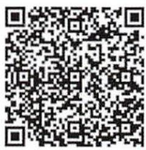

# 扫码练基础

扫一扫

手机中的试题库

小题e练，夯实基础

# 知识点微课

扫一扫

名师讲知识

重点难点轻松学


# 题型微课

扫一扫

移动的教学课堂
典题、考点轻松突破


<details>
<summary>text_image</summary>

QR code image containing encoded data, no visible human-readable text
</details>

更多亮点，更多分享快来扫码吧！


<details>
<summary>natural_image</summary>

Group of five people joyfully jumping against a blue sky (no text or symbols visible)
</details>

关爱华夏学子 服务民族教育

[Unreadable]

# 金星教育

# 不变的全解，更大的追求

不变的卓越质量，不变的教育情怀，不变的企业使命……只为提升品牌。

更全的内容，更美的设计，更多免费的智能化资源……只为更好地服务。


<details>
<summary>text_image</summary>

中学研发中心
国家国际体育基地
</details>

小学研发中心

# 出版前言


<details>
<summary>natural_image</summary>

Illustration of a girl sitting on an open book, waving and raising her hand (no text or symbols present)
</details>

《中学教材全解》系列丛书根据教育部审定的新教材编写，我们衷心希望《中学教材全解》伴随同学们度过中学阶段的美好时光，帮同学们迈入理想的学府。这套丛书具有以下几个鲜明特色：

# 全

首先是同步学习要点全。体现了“一书在手，同步学习要点内容全有”的编写思想。其次是内容丰富，表现形式多样。有课文朗读，有逸闻轶事，有英语跟读，有演示实验，还有考点微课、题型微课……满足学生的不同需求。再次是用途广泛。丛书内容讲解由浅入深，由易到难，可用于课前预习，可用于课后提升，还可用于备考复习。

# 细

首先是教材讲解细致入微。以语文学科为例，小到字的读音、词的辨析，大到阅读训练和作文训练，都在书中有详尽体现。其次是典型例题详细讲析。既有解题过程，又有思路点拨。再次是解题方法细。一题多解，多题一法，变通训练，总结规律。

# 新

首先是教材新。本丛书以新课程标准为依据，以现行初中新教材为蓝本编写。其次是体例新。紧扣教材设题解题，释疑解难，课后自测，迁移延伸，逐步深入。再次是题型、材料新。丛书中选用的题型、材料科学新颖，按中考要求精心设计、挑选，具有时代气息。

# 透

首先是对课标、考纲研究得透。居高临下把握教材，立足于教材，又不拘泥于教材。其次是对学生知识储备研究得透。学习目标科学可行，注重知识“点”与“面”的结合、“教”与“学”的联系。再次是对问题讲解得透。一题多问，一题多解，培养发散思维和创新思维能力。

# 精

首先是教材内容讲解得精。真正做到围绕重点，突破难点，引发思考，启迪思维。根据考点要求，精讲精析，可使学生举一反三，触类旁通。其次是问题设置精。注重典型性，避免随意性；注重迁移性，避免孤立性，实现由知识到能力的过渡。

以上五大特点，使本丛书具备了自学教程和备查资料的功能，满足了学生自学、教师备课和家长辅导的需求，成为教材同步学习的工具书。

# 中学教材全解

# 七年级数学（上）

RJ

主 编 薛金星

本册主编 李呈锋

本册副主编 孙水林 李士果

陕西新华出版传媒集团 陕西人民教育出版社

·西安·


<details>
<summary>text_image</summary>

Illustration featuring a cartoon scientist with mathematical symbols and a QR code, likely representing a mathematical or educational context.
</details>

扫码知学法

# 怎样学好 初中数学

在初中阶段的学习中，数学学科具有重要的地位，且与小学数学存在很大的差异，那么怎样学好初中数学呢？小编有几点建议供你参考：

# 1 培养数学严谨性

在小学阶段，数学中很多问题只要得出正确答案就行，不要求进行严格的计算或推理。进入初中，解决问题就需要注重数学的严谨性，要求语言表述准确、精练，结论的推理、论证要步步有据，且符合数学推理的要求。从初一开始我们就要对所学知识做到正确理解和熟练掌握，逐步培养和发展自己的逻辑思维能力。

# 2 提升 归纳思维能力

小学数学知识通俗易懂、具体形象，而初中数学知识较为抽象，如用字母表示数、方程、函数及图形变换等，它不仅注重计算、猜想，而且要求进行必要的推理证明，这与小学相比增加了难度。另外，初中阶段的数学知识点增多、课堂容量加大、学习进度加快……老师在课堂上的讲解不再像小学那样面面俱到，而是选择一些具有典型性的题目进行重点讲解，这就要求我们要勤于思考、善于归纳，掌握解题方法、形成解题模板，做到举一反三。

# 3 学会 使用数学语言

数学的学习离不开数学语言，要灵活使用数学语言的三种形式（文字语言、符号语言、图形语言），并且能相互进行转换。无论使用哪一种语言，都要满足数学语言的三个特点：简练、严密和精确。

# 4 感悟数学思想

我们在学习中不能仅仅以掌握基础知识，形成基本技能为目标，还要在获得这些结论的过程中感悟数学的基本思想，并会运用这些基本思想来解决实际问题。初中阶段我们需要掌握的基本思想主要有数形结合思想、分类讨论思想、方程思想、转化思想、归纳思想、数学建模思想。

# 目录

# 第一章 有理数 / 1

# 本章内容要点……（1）

# 1.1 正数和负数 …… (1)

知识点微课: 正数和负数 / 1

题型微课:1. 正数和负数的实际应用 /4

2. 正数、负数的规律探究题 / 5

# 1.2 有理数 …… (8)

知识点微课:1. 数轴 / 10 2. 相反数 / 11 3. 绝对值 / 12

4. 有理数的大小比较 / 13

题型微课:1. 数轴上点的移动/16 2. 关于数轴的探究题/17

# 1.3 有理数的加减法 …… (22)

1.3.1 有理数的加法 …… (22)

知识点微课:有理数的加法/22

题型微课:有理数加法的运算技巧/23

1.3.2 有理数的减法 …… (30)

知识点微课:有理数的减法/30

题型微课:有理数的加减在实际生活中的应用/34

# 1.4 有理数的乘除法 …… (38)

1.4.1 有理数的乘法 …… (38)

知识点微课:有理数的乘法/39

题型微课:有理数乘法的运算技巧/40

1.4.2 有理数的除法 …… (46)

知识点微课:有理数的除法/46

# 1.5 有理数的乘方 …… (54)

知识点微课:有理数的乘方/55

题型微课:1.有理数的混合运算/58

2. 与乘方相关的规律探究题 / 60

# 本章大归纳……（64）

# ▶ 第二章 整式的加减 / 70

# 本章内容要点……（70）

# 2.1 整式 …… (70)

知识点微课:1. 用含字母的式子表示数或数量关系 /70

2. 多项式 / 72

题型微课:1. 运用整体思想求整式的值 / 73

2. 图形摆放的规律探究 / 75

# 2.2 整式的加减 …… (78)

知识点微课:同类项与去括号/78

题型微课:1. 同类项概念的应用 /81

2. 整式加减中的看错符号问题 / 83

# 本章大归纳……（88）

# 方法索引

# 示意图法 / 4

求一个数的相反数的方法 / 12

有理数大小比较的方法 / 14

确定数轴上的点表示的数的

方法/16

不完全归纳法/17

分组求和法 /26

解含绝对值的有理数加减法的

方法/33

裂项法 / 34

求倒数的方法 /39

分数中“-”号的移号方法/47

用科学记数法表示一个绝对值

较大的数的步骤/57

四舍五入法求近似数的

方法/58

有理数混合运算的常用

技巧/58

错位相减法/60

# 整体加减法 /81

整式化简求值的方法/82

归纳法 / 89

# 目录

# 第三章 一元一次方程 / 92

本章内容要点……（92）

3.1 从算式到方程 …… (92)

知识点微课:1. 一元一次方程 /93

2. 等式的性质 / 94

题型微课: 方程的解的应用 /96

3.2 解一元一次方程(一)——合并同类项与移项……(100)

知识点微课: 解一元一次方程(一)——合并同类项与移项 / 101

题型微课: 利用一元一次方程解数字规律问题 / 104

3.3 解一元一次方程(二)——去括号与去分母 ……(108)

知识点微课：解一元一次方程(二)——去括号与去分母/108

题型微课:1. 巧解一元一次方程 / 111

2. 用一元一次方程解行程问题 / 113

3.4 实际问题与一元一次方程 …… (119)

题型微课：用一元一次方程解利润问题 / 123

本章大归纳……(131)

# 第四章 几何图形初步 / 137

本章内容要点……(137)

4.1 几何图形 …… (137)

知识点微课:1. 立体图形与平面图形 / 137

2. 点、线、面、体 / 141

题型微课: 正方体的表面展开图 /143

4.2 直线、射线、线段 …… (147)

知识点微课:1. 直线、射线、线段 / 148

2.尺规作图/150

题型微课: 线段中点的应用 / 153

4.3 角 …… (160)

知识点微课:1. 角 / 160

2. 角的比较与运算 / 161

题型微课:与角平分线有关的探究题 / 167

4.4 课题学习 设计制作长方体形状的包装纸盒(略)…(174)

本章大归纳……(175)

全书大归纳 …… (181)

参考答案 …… (186)

# 方法索引

代入检验法 / 94

转化法 / 96

作差法比较两数大小 / 97

参数法 / 104

换元法 / 112

线段示意图法 / 114

表格分析法 / 119

整体法求几何体的表面积 / 143

正方体表面展开图中相对面的识别方法 / 143

利用方程思想求线段的长 / 154

整体求值法 / 154

角度的加减乘除运算技巧 / 162

作图法表示位置 / 169

# 有理数


# 本章内容要点

8个概念: 正数, 负数, 有理数, 数轴, 相反数, 绝对值, 科学记数法, 近似数

5种运算:有理数的加法,减法,乘法,除法和乘方

5 种运算律: 加法交换律, 加法结合律, 乘法交换律, 乘法结合律, 乘法分配律

2个几何意义:相反数的几何意义,绝对值的几何意义

2 个关系: 具有相反意义的量与正负数的关系, 有理数与数轴的关系

1个分类:有理数的分类

2种比较有理数大小的方法: 利用数轴比较, 利用法则比较

1 个运算顺序: 有理数混合运算的运算顺序

3种思想方法: 数形结合思想, 分类讨论思想, 转化思想

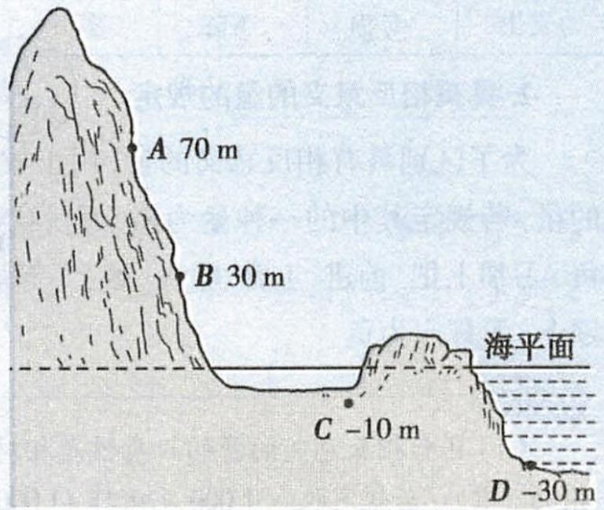

<details>
<summary>text_image</summary>

A 70 m
B 30 m
海平面
C -10 m
D -30 m
</details>

# 1.1 正数和负数

# 关键词

# 学习目标导航

正数 负数 具有
相反意义的量

1. 了解正数和负数的产生过程,体会数学与现实生活的联系.

2. 理解正数、负数和 0 的意义, 会判断一个数是正数还是负数.

3. 能用正数、负数表示生活中具有相反意义的量.

# 教材内容全解

# 知识点一 正数、负数的定义


🔥🔥🔥

# 1. 正数

像 2%,4,3.5 这样大于 0 的数叫做正数. 有时,为了明确表达意义,在正数的前面加上 “+” (正) 号. 如 +2,+0.7,+ $\frac{1}{7}$ ,…

“+”可以省略，如2,0.7, $\frac{1}{7}$ ,…

正数分为正整数(如3,5,6,9等)和正分数(如 $1\frac{1}{2}$ , $\frac{2}{3}$ ,4.34,9%, $\frac{7}{4}$ 等).


<details>
<summary>text_image</summary>

知识点微课
</details>

# 2. 负数

负数前面的“-”号不能消略.

像 -3, -2.7%, -4.5 这样在正数前加上符号 “-”（负）的数叫做负数。

# 3.0 的特性

0 既不是正数, 也不是负数. 0 是正数与负数的分界.

# 例①

判断下列各数哪些是正数,哪些是负数.

$$
0. \dot {3}, - 3. 1, \frac {5}{3}, 1 0. 5 8, - 9, + 1, - 4 5. 6, 0, + \frac {1}{1 0 0}, - 7 \%, \pi , - 1 \frac {1}{4}.
$$

分析: 可根据正数、负数的定义来判断一个数是正数还是负数.

解: $0.3, \frac{5}{3}, 10.58, +1, +\frac{1}{100}, \pi$ 是正数.

-3.1, -9, -45.6, -7%, -1 $\frac{1}{4}$ 是负数.

# 知识点二 用正数、负数表示具有相反意义的量


# 1. 日常生活中, 表示相反意义的量的常用词语:

<table><tr><td>收入</td><td>盈利</td><td>上升</td><td>零上</td><td>增加</td><td>向东(南)</td><td>...</td></tr><tr><td>支出</td><td>亏损</td><td>下降</td><td>零下</td><td>减少</td><td>向西(北)</td><td>...</td></tr></table>

# 2. 具有相反意义的量的规定

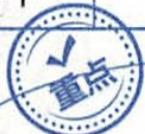

为了区别具有相反意义的量,用正数和负数分别表示具有相反意义的量,若规定其中的一种量为正(可任意选择),则它的相反意义的量为负.习惯上把“前进、上升、收入、零上”等规定为正,把“后退、下降、支出、零下”等规定为负.

# 提示

(1) 具有相反意义的量的正负性是相对的, 没有硬性规定, 且是可以互换的. 例如: 若规定收入 1000 元记作 +1000 元, 则支出 500 元记作 -500 元; 若规定上升 1.5 m 记作 +1.5 m, 则下降 0.8 m 记作 -0.8 m.  
(2) 具有相反意义的量中的两个量表示的意义相反, 且必须是同类量. 如节约 3 吨汽油与浪费 1 吨水就不是具有相反意义的量.  
(3) 具有相反意义的量是成对出现的, 单独的一个量不是具有相反意义的量.

例② (1)天气预报说某地 12 月某天的最高气温是零上 $5^{\circ} \mathrm{C}$ , 最低气温是零下 $3^{\circ} \mathrm{C}$ . 若规定零上温度为正, 则零上 $5^{\circ} \mathrm{C}$ 可记作 \_\_\_\_ °C, 零下 $3^{\circ} \mathrm{C}$ 可记作 \_\_\_\_ °C.

(2)如果浪费 $10 \, kW \cdot h$ 的电,记作 $-10 \, kW \cdot h$ ,那么 $+20 \, kW \cdot h$ 的实际意义是  
(3)某地的平均高度高于海平面310m,记作海拔+310m,则海拔-270m表示

答案:(1)+5(或5)-3(2)节约20kW·h的电(3)某地的平均高度低于海平面270m

例③ 长江某水文站的警戒水位为 12 m, 如果超过警戒水位 1 m, 记作 +1 m, 那么低于警戒水位 0.60 m, 记作 \_\_\_\_ m. 观察某年 8 月 1 日至 8 月 5 日该水文站的水位记录表并回答问题.

<table><tr><td>日期</td><td>8月1日</td><td>8月2日</td><td>8月3日</td><td>8月4日</td><td>8月5日</td></tr><tr><td>水位/m</td><td>-0.80</td><td>0</td><td>0.38</td><td>0.50</td><td>0.96</td></tr></table>

(1)哪一天的水位最高？最高水位是多少？


# 提示

“+”“-”的双重意义

(1)作为运算符号是加、减号；  
(2) 作为数的性质符号是正、负号.

既要意义相反, 还要有数量, 且为同类量.


# 注意

具有相反意义的量, 只要求意义相反, 不要求数量相等. 如盈利 3000 元与亏损 400 元是具有相反意义的量.

那么零下温度就为负。

“+”对应“高于”，则“-”对应“低于”。

基准为 12 m, 注意不是 0 m 呦.

表示水位恰好为警戒水位，即12m.

(2)哪一天的水位最低？最低水位是多少？

(3)在这五天中,有多少天的水位超过警戒水位?

分析: 在本题中因为用正数表示超过警戒水位, 所以 8 月 3 日、4 日、5 日的具体水位分别等于 12 m 加上 0.38 m, 0.50 m, 0.96 m; 因为用负数表示低于警戒水位, 所以 8 月 1 日的具体水位是 12-0.80 = 11.20 (m); 8 月 2 日的具体水位是 12 m.

解：-0.60

∵ 8 月 1 日的水位为 12-0.80 = 11.20 (m),

8月2日的水位为12m,

8月3日的水位为 $12+0.38=12.38$ (m),

8月4日的水位为 $12+0.50=12.50$ （m），

8月5日的水位为 $12+0.96=12.96$ （m），

∴(1)8月5日的水位最高,为12.96m;

(2)8月1日的水位最低,为11.20m;

(3)在这五天中,有三天的水位超过警戒水位.

# 知识点三 对数 “0” 的认识


🔥🔥🔥

# 1. 表示没有

例如,0个苹果,意思是没有苹果.

# 2. 表示数时起到占位的作用

如 10605 中的两个 0, 分别占的是十位和千位.

# 3. 表示某种量的基准

例如, $0^{\circ} \mathrm{C}$ 不是表示没有温度, 而是表示在标准大气压下, 水开始结冰的温度.

# 4. 表示某些数量的分界

0 既不是正数, 也不是负数, 是正数和负数的分界. 例如在摄氏温度计上, “0” 是零上温度与零下温度的分界.

# 5. 表示起点

例如, 在米尺上, 刻度的起点为 “0”.

例④ 下列关于 “0” 的说法: ① 0 是正数和负数的分界; ② 0 表示 “什么也没有”; ③ 0 可以表示特定的意义, 如 $0^{\circ}$ C 等; ④ 0 是正数; ⑤ 0 是自然数; ⑥ 0 是非负数; ⑦ 某地海拔为 0 m 表示没有海拔. 其中正确的有()

A.3 个

B.4 个

C.5 个

D.6 个

解析: ①③⑤⑥正确, ②④⑦错误.

答案: B

# 规律总结

当题目中已明确“一种意义”的量对应的是正数(负数)时,我们就可以判断“与之具有相反意义”的量所对应的是负数(正数).

# 注意

小学阶段学习数的时候,0表示没有,学习了负数之后,“0”的意义变得丰富起来,应注意领悟体会.

“非正数”就是“不是正数”，包括负数和0；“非负数”就是“不是负数”，包括正数和0.

扫码练基础   


我的错题号


# 教材第2页“问题”

答案:3,1.8%,3.5的实际意义分别是零上3摄氏度,产量增长1.8%,收入3.5元.

# 教材第 3 页 “问题”

答案: 增长 -6.4% 表示减少 6.4%. 既不增长也不减少的情况下, 增长率是 0.

# 教材第 4 页 “思考”

答案: 图 1.1-2（教材图）中, A 地记为 4600 m, 表示 A 地的海拔为 4600 m, 即 A 地高于海平面 4600 m; B 地记为 -100 m, 表示 B 地的海拔为 -100 m, 即 B 地低于海平面 100 m.

图 1.1-3（教材图）中，2 300.00 表示存入 2 300.00 元，-1 800.00 表示支出 1 800.00 元。

举例: 北京某一天的气温是 $-6^{\circ}C \sim 2^{\circ}C$ .

# 典型例题剖析

# 第一章

# 题型一 正数和负数的实际应用

# 1. 用具有相反意义的量表示位置

例① 文具店、书店和玩具店依次位于一条东西走向的大街上,文具店在书店西边 20 m 处,玩具店在书店东边 100 m 处,小明从书店沿街向东走了 40 m,接着又向东走了 -60 m,此时小明的位置在( )

A. 文具店

B. 玩具店

即向西走了 60 m.

C. 文具店西 $40 \mathrm{~m}$ 处

D. 玩具店西 60 m 处

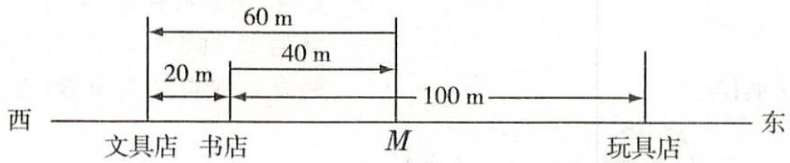

<details>
<summary>text_image</summary>

西
文具店 书店 M 玩具店 东
60 m
20 m 40 m
100 m
东
</details>

图1-1-1

解析: 把文具店、书店、玩具店的相对位置及小明的行走路线在图1-1-1上表示出来, 小明从书店出发沿街向东走了40 m, 到达M处, 接着又向东走了-60 m, 表示接着向西走了60 m, 所以此时小明在文具店.

答案: A

# 方法技巧

# 示意图法

示意图法是将研究的问题用图表示出来,使其直观形象,便于理解问题内在联系的方法.例如,本题中用直线上的点表示位置,用线段的长表示距离,便可直观形象地确定小明的位置.

# 2. 用正数、负数记录成绩

例② 七年级(1)班第一小组五名同学某次数学测验的平均成绩为85分,一名同学以平均成绩为标准,将超过平均成绩的成绩记为正,得到五名同学的成绩分别为-13分,-6分,0分,4分,15分.这五名同学的实际成绩分别是多少分?

解: 平均成绩为 85 分, -13 分表示比平均成绩少 13 分, 即 72 分; -6 分表示比平均成绩少 6 分, 即 79 分; 0 分表示和平均成绩相同, 即 85 分; 4 分表示比平均成绩多 4 分, 即 89 分; 15 分表示比平均成绩多 15 分, 即 100 分.

这五名同学的实际成绩分别是72分,79分,85分,89分,100分.

# 方法技巧

为了计算方便, 常把高于平均数、标准数或某一基准数的量规定为正, 把与它们具有相反意义的量用负数表示.

# 3. 用正数、负数表示误差范围

例③ 某饮料公司生产的一种瓶装饮料, 外包装上印有 “(600±30)ml” 的字样, 那么 (600±30)ml 表示什么含义? 某部门抽查了 5 瓶该产品, 容量分别为 603 ml, 611 ml, 588 ml, 568 ml, 628 ml, 就容量而言, 抽查的产品是否合格?


<details>
<summary>text_image</summary>

题型微课
</details>


# 举一反三1（答案见第186页）

小明和小红在学校操场的旗杆前玩“石头、剪刀、布”的游戏，规则：在每一个回合中，若某一方赢了对方，便可向东走2步，而输的一方则向东走-3步，平手的话原地不动，最先向东走10步的便是胜方。假设游戏开始时，两人均在旗杆处。

(1) 若小明在前三个回合中都输了, 则他会站在什么位置?  
(2) 若小红在前三个回合中赢了两次, 输了一次, 则她会站在什么位置?

以平均成绩为基准，正数表示该成绩高于平均成绩，负数表示该成绩低于平均成绩，0表示该成绩与平均成绩相同。


# 举一反三2（答案见第186页）

在一次跳远测试中,体育老师以达标成绩2.00 m为标准,将高于达标成绩的成绩记为正,低于达标成绩的成绩记为负.若小飞跳出了2.12 m,记为+0.12 m.则小叶跳出了1.95 m,记为\_\_\_\_,小平跳出的成绩记为0 m,他实际跳的距离是\_\_\_\_.

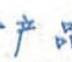

# 容量的基准.

解题关键: “(600±30)ml” 表示产品合格的范围, 即合格产品的容量在 (600-30)ml 到 (600+30)ml 之间, 根据这个范围来判断抽查的产品是否合格.

解: $(600\pm30)$ ml 表示容量在 570\~630 ml 之间的产品都合格.抽查的 5 瓶饮料中,只有 568 ml 不在这一范围内,不合格,其余均合格.

# 题型二 与正数、负数相关的表格信息题

例④ 某病人术后一天五次所测体温的变化情况(与前一次测量的体温比较,升高记为正,降低记为负,这一天的前一天最后一次测量的体温是38℃)如下表:

<table><tr><td>时间</td><td>6:00</td><td>10:00</td><td>14:00</td><td>18:00</td><td>22:00</td></tr><tr><td>体温变化/°C</td><td>+1.1</td><td>+0.4</td><td>-1</td><td>+0.5</td><td>-0.1</td></tr><tr><td>实际体温/°C</td><td></td><td></td><td></td><td></td><td></td></tr></table>

(1) 完成上面的表格.

(2) 计算该病人这一天的平均体温.

(3) 用这一天的前一天最后一次测量的体温与这天的平均体温比较,你能判断出该病人的体温是上升还是下降吗?

解:(1)完成表格如下.

<table><tr><td>时间</td><td>6:00</td><td>10:00</td><td>14:00</td><td>18:00</td><td>22:00</td></tr><tr><td>体温变化/°C</td><td>+1.1</td><td>+0.4</td><td>-1</td><td>+0.5</td><td>-0.1</td></tr><tr><td>实际体温/°C</td><td>39.1</td><td>39.5</td><td>38.5</td><td>39</td><td>38.9</td></tr></table>

(2) 根据题意知, 平均体温为 $(39.1 + 39.5 + 38.5 + 39 + 38.9) \div 5 = 195 \div 5 = 39 \, (\text{℃})$ .

(3) 因为这一天的前一天最后一次测量的体温是 $38^{\circ}C$ ，这天的平均体温是 $39^{\circ}C, 39^{\circ}C > 38^{\circ}C$ ，所以该病人的体温上升了。

# 题型三 正数、负数的规律探究题

例⑤（核心素养题）观察下面依次排列的两组数,请按其规律写出后面的3个数,你能说出第15个数、第101个数、第2019个数分别是什么吗?

(1)-1,-2,+3,-4,-5,+6,-7,-8,\_\_\_\_,\_\_\_\_,\_\_\_\_,\_\_\_\_,…;

(2) $-1,\frac{1}{2},-3,\frac{1}{4},-5,\frac{1}{6},-7,\frac{1}{8},$ \_\_\_\_，\_\_\_\_，\_\_\_\_，….

分析: 从数字和符号两方面观察每组数的特点, 从变化中发现一般规律. 由第(1)题所给的依次排列的一组数中的前8个数可知, 对于第n个数, 当n是3的整数倍时, 此数为+n; 当n不是3的整数倍时, 此数为-n. 由第(2)题所给的依次排列的一组数中的前8个数可知, 对于第n个数, 当n为奇数时, 此数为-n; 当n为偶数时, 此数为 $\frac{1}{n}$ .

解:(1)+9 -10 -11

# 举一反三3（答案见第186页）

(2017·贵州六盘水中考)大米包装袋上 $(10\pm0.1)$ kg的标识表示此袋大米重()

A. (9.9\~10.1) kg B. 10.1 kg

C.9.9 kg D.10 kg

另解：平均体温为

$$
3 8 + (1. 1 + 1. 5 + 0. 5 + 1 + 0. 9) \div 5
$$

$$
= 3 8 + 1
$$

$$
= 3 9 \left(^ {\circ} \mathrm{C}\right).
$$

# 举一反三4（答案见第186页）

体育课上全班女生进行了百米测验, 成绩不超过 18 秒为达标, 下面是第一小组 8 名女生的成绩记录:

<table><tr><td>序号</td><td>1</td><td>2</td><td>3</td><td>4</td></tr><tr><td>成绩</td><td>-1</td><td>+0.8</td><td>0</td><td>-1.2</td></tr><tr><td colspan="5"></td></tr><tr><td>序号</td><td>5</td><td>6</td><td>7</td><td>8</td></tr><tr><td>成绩</td><td>-0.1</td><td>0</td><td>+0.5</td><td>-0.6</td></tr></table>

其中, 成绩超过 18 秒记为 “+”, 少于 18 秒记为 “-”, “0” 表示刚好 18 秒, 则这个小组的达标率为 ( )

A. $25\%$ B. $37.5\%$

C. $50\%$ D. $75\%$


<details>
<summary>text_image</summary>

题型微课
</details>

应用“从特殊到一般”的方法.

这组数中的第 15 个数为 +15, 第 101 个数为 -101, 第 2019 个数为 +2019.

(2)-9 $\frac{1}{10}$ -11

这组数中的第 15 个数为 -15, 第 101 个数为 -101, 第 2019 个数为 -2019.

# 方法技巧

# 编号法探究数组的排列规律

探究一组数的排列规律时,应全面分析题中所给的所有数据,要从符号和数字两个方面进行观察.可以先把已知的数据按顺序编上序号,再分别确定符号和数字与序号的统一关系,进而确定数字排列规律与序号的关系.若数据是分数,还要分别观察分子和分母.


# 举一反三5（答案见第186页）

观察下面依次排列的两组数,探究它们各自的变化规律,完成填空并分别写出第2019个数.

(1)-1,3,-6,9,-12,15,-18,21,\_\_\_\_,\_\_\_\_,…;

(2)0,-3,8,-15,24,-35,
\_\_\_\_,\_\_\_\_,\_\_\_\_.

# 中考考点对接


# 中考考点解读

解读 1: 正数和负数, 主要考查根据定义来辨别一个数是正数还是负数, 中考中多以选择题和填空题的形式出现, 题目较简单.

解读 2: 考查运用正数、负数表示具有相反意义的量或考查用正数、负数表示的数的实际意义, 题型以选择题、填空题为主.


# 中考典题剖析

# 一、正数和负数的识别

教材第5页习题1.1第1题

下面各数哪些是正数,哪些是负数?

$$
5, - \frac {5}{7}, 0, 0. 5 6, - 3, - 2 5. 8, \frac {1 2}{5}, - 0. 0 0 0 1, + 2, - 6 0 0.
$$

解: 5,0.56, $\frac{12}{5}$ , +2 是正数, $-\frac{5}{7}$ , -3, -25.8, -0.0001, -600是负数.

中考真题1（2018·重庆中考B卷·4分）下列四个数中，是正整数的是（ ）

A.-1

B.0

C. $\frac{1}{2}$

D.1

解析:-1是负整数;0既不是正数,也不是负数; $\frac{1}{2}$ 是正分数;1是正整数. 答案:D

考题点睛。

中考真题和教材习题均考查了依据正数、负数的定义来识别正数或负数,需要注意0既不是正数也不是负数.

# 二、用正数、负数表示具有相反意义的量

教材第 4 页练习第 2 题 如果 80 m 表示向东走 80 m, 那么 -60 m 表示

解析:题中规定用正数表示向东,那么负数表示向西. 答案:向西走60m

中考真题2

(2018·贵州遵义中考·3分)如果电梯上升5层记为+5,那么电梯下降2层应记为()

A.+2

B.-2

C.+5

D.-5

解析: 电梯上升与下降具有相反意义. 由电梯上升 5 层记为 +5, 可知规定上升记为正, 则下降记为负, 所以电梯下降 2 层应记为 -2. 答案: B

考题点睛。

中考真题与教材练习题都考查了对用正数、负数表示具有相反意义的量的理解.

# 知识能力提升

# 重点内容总结

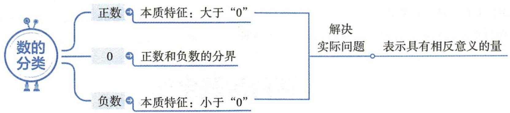

<details>
<summary>flowchart</summary>

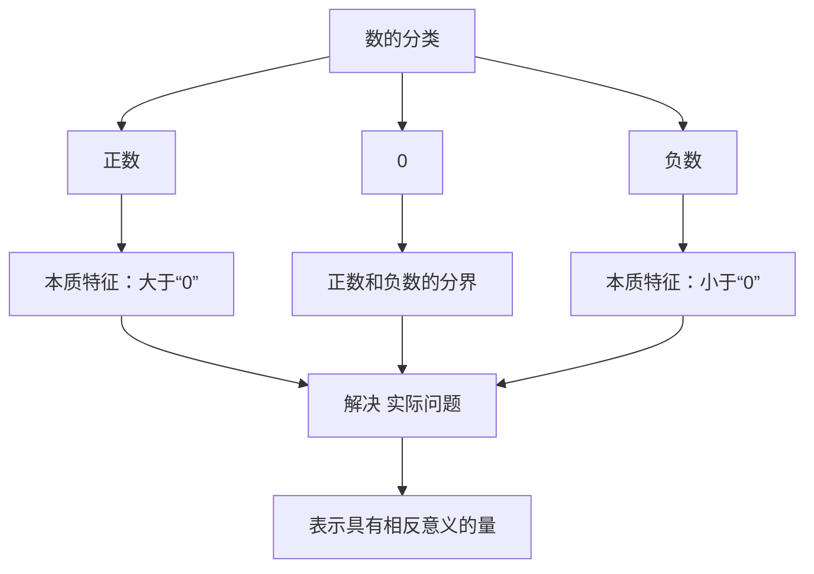
</details>

# 易误易混总结

# 易误点1

对 “0” 的含义理解不准确

小学阶段开始学习数的时候,0 表示没有,学习了负数后,0 除了表示 “没有” 外,还是正数与负数的分界.

# 易误点2

对负数表示的意义理解不清

具有相反意义的两个量, 若一个量规定为正, 用正数表示, 则另一个量就为负, 用负数表示.

# 易误点3

用正数、负数表示具有相反意义的量时忽略了量的单位

例 如果中午 12 时记作 0 时, 下午 3 时记作 +3 时, 那么上午 9 时记作 \_\_\_\_.

解析: 中午 12 时记作 0 时, 中午 12 时之后几小时记作正几时, 则中午 12 时之前几小时记作负几时, 上午 9 时是中午 12 时之前 3 小时, 故用 -3 时表示. 答案: -3 时

例题见“教材内容全解”例4.

例题见“教材内容全解”例2.

# 注意

把一个量去掉它后面的单位名称后,它就是一个数,而不是一个量了.本题往往因漏掉后面的单位而出错.

# 综合提升训练»答案见186页

1. 在 $-14, +7, 0, -\frac{2}{3}, -\frac{5}{16}$ 中，负数有（）

A.4 个

B.3 个

C.2 个

D.1 个

2. 某种药品说明书上标明保存温度是 $(20 \pm 3) ^{\circ} \mathrm{C}$ , 则该药品在( )范围内保存最合适.

A. $17^{\circ} \mathrm{C} \sim 20^{\circ} \mathrm{C}$

B.20 ℃ \~23 ℃

C.17 ℃ \~23 ℃

D. $17^{\circ} \mathrm{C} \sim 24^{\circ} \mathrm{C}$

3. 下列不是具有相反意义的量的是( )

A. 前进 5 米和后退 5 米

B. 收入 30 元和支出 10 元

C. 向东走 10 米和向北走 10 米

D. 超过 5 克和不足 2 克

4. 如果“盈5”记为“+5”，那么“亏7”可以记为

5. 某次数学测验, 以 90 分为标准, 超过标准的成绩记为正, 小明得 +10 分, 小刚得 0 分, 小敏得 -1 分, 则小刚的实际得分是 \_\_\_\_ 分, 小敏的实际得分是 \_\_\_\_ 分, 他们三人的平均得分为 \_\_\_\_ 分.

6. 小明上星期买进某公司股票 7000 股, 每股 27 元, 下表为本周每日该股票的涨跌情况, 上涨记为正

(单位:元).

<table><tr><td>星期</td><td>一</td><td>二</td><td>三</td><td>四</td><td>五</td></tr><tr><td>每股涨跌</td><td>+4</td><td>+4.5</td><td>-1</td><td>-2.5</td><td>-6</td></tr></table>

(1) 这五天中, 哪几天的股票是上涨的? 哪几天的股票是下跌的?

(2)哪天股票上涨的最多？你能算出这天收盘时每股是多少元吗？

(3)本周五收盘时每股是多少元?

7. 某自行车厂计划每天生产 200 辆自行车, 由于各种

原因实际每天生产量与计划每天生产量相比有出入,下表是某周(5天)的实际生产情况(比计划超产为正,减产为负):

<table><tr><td>星期</td><td>一</td><td>二</td><td>三</td><td>四</td><td>五</td></tr><tr><td>增减</td><td>+5</td><td>-2</td><td>-4</td><td>+13</td><td>-10</td></tr></table>

(1)根据记录,求这5天实际生产自行车的数量.

(2) 求产量最多的一天比产量最少的一天多生产自行车的数量.

# 课后习题全解

# 练习(教材第3页)

1. 解:2010年我国全年平均降水量比上年增长+108.7 mm, 2009年我国全年平均降水量比上年增长-81.5 mm, 2008年我国全年平均降水量比上年增长+53.5 mm.

2. 解: 这个物体又移动了 -1 m 表示物体向左移动了 1 m. 这时物体的位置记为 0 m, 物体又回到了原来的位置.

# 练习(教材第4页)

1. 解: 分别读作负一, 二点五, 正三分之四, 零, 负三点一四, 一百二十, 负一点七三二, 负七分之二. 其中, 2.5, $+\frac{4}{3}$ , 120 是正数, -1, -3.14, -1.732, $-\frac{2}{7}$ 是负数.

2. 向西走 60 m

3.-3 0 解析:由于水位升高 3 m 时水位变化记作 +3 m, 可得水位升高记为 “+”, 所以水位下降记为 “-”, 所以水位下降 3 m 时水位变化记作 -3 m, 水位不升不降时水位变化记作 0 m.

4.+126（或126）-150

# 习题1.1（教材第5页）

1. 解: 5,0.56, $\frac{12}{5}$ , +2 是正数, $-\frac{5}{7}$ , -3, -25.8, -0.0001, -600 是负数.

2. 解: (1) 0.08 m 表示水面高于标准水位 0.08 m; -0.2 m 表示水面低于标准水位 0.2 m.

(2)水面低于标准水位0.1 m, 记作-0.1 m; 水面高于标准水位0.23 m, 记作+0.23 m (或0.23 m).

3. 解: 说法不对.0 既不是正数, 也不是负数, 所以不是正数的数是 0 或负数, 即非正数, 不是负数的数是 0 或正数, 即非负数.

4. 解：“又移动 +5 m”表示该物体又向前移动 5 m. 这时物体离它两次移动前的位置 0 m, 即回到了它两次移动前的位置.

5. 解: 这七次测量的平均值为

$$
\frac {7 9 . 4 + 8 0 . 6 + 8 0 . 8 + 7 9 . 1 + 8 0 + 7 9 . 6 + 8 0 . 5}{7} = 8 0 (\mathrm{m}).
$$

以平均值为标准,用正数表示超出部分,用负数表示不足部分,七次测量的数据分别表示为:-0.6m,+0.6m,+0.8m,-0.9m,0m,-0.4m,+0.5m.

6. 解: 氢原子中的原子核所带电荷可以用 +1 表示, 氢原子中的电子所带电荷可以用 -1 表示.

点拨: 规定原子核所带电荷为正电荷, 因此, 电子所带电荷为负电荷, 用负数表示.

7. 解: 由题意得 $7-4-4 = -1$ (℃).

答:第二天0时的气温是零下1℃.

8. 解: 中国、意大利的服务出口额增长了. 美国、德国、英国、日本的服务出口额减少了. 意大利增长率最高; 日本增长率最低.

# 1.2 有理数

# 关键词

有理数 有理数的分类 数轴 相反数
绝对值 有理数的大小比较

# 学习目标导航

1. 理解有理数和数轴的意义, 能用数轴上的点表示有理数, 能按一定标准对有理数进行分类.

2. 借助数轴理解相反数、绝对值的意义, 掌握求一个有理数的相反数、绝对值的方法, 能比较有理数的大小.

3. 知道 $\left|a\right|$ (a 表示有理数) 的含义.

4. 初步感悟分类讨论思想和数形结合思想。

# 教材内容全解

# 知识点一 有理数的有关概念

🔥🔥🔥

# 1. 整数

正整数、0、负整数统称为整数，如-3,-2,0,1,2,3等.

# 2. 分数

正分数、负分数统称为分数，如 $+1\frac{1}{3}, 0.18, -1.35, -\frac{4}{5}$ 等.

分数都可以化为有限小数或无限循环小数的形式, 同时有限小数和无限循环小数又都可以化为分数. 无限不循环小数不能转化成分数.

# 3. 有理数

整数和分数统称为有理数。有理数都可以写成分数的形式，几个常用数学名词的含义 整数可以看成是分母是1的分数。

(1) 正整数: 既是正数, 又是整数的数.  
(2) 负整数: 既是负数, 又是整数的数.  
(3) 正分数: 既是正数, 又是分数的数.  
(4) 负分数: 既是负数, 又是分数的数.  
(5)非负数:正数和0.   
(6)非正数:负数和0.   
(7)非负整数(也叫自然数):正整数和0.  
(8)非正整数:负整数和0.   
(9) 正有理数: 正整数和正分数.  
(10)负有理数:负整数和负分数.   
(11)非正有理数:0、负整数和负分数.   
(12)非负有理数:0、正整数和正分数.

例① 下列各数: $\frac{22}{7}, -2, \pi, 0.4, 0.314$ . 其中有理数有( )

A.2 个

B.3 个

C.4 个

D.5 个

答案: C

# 知识点二 有理数的分类


🔥🔥🔥

# 1. 按有理数的定义分类

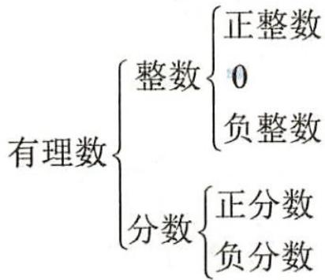

<details>
<summary>flowchart</summary>

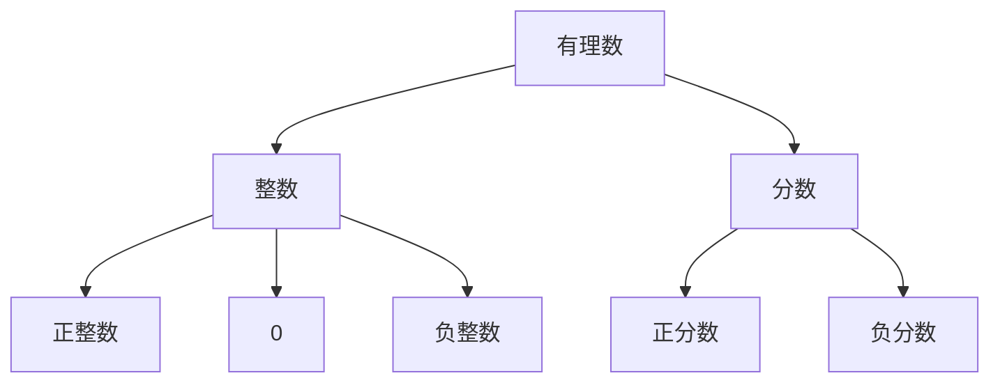
</details>

# 2. 按有理数的性质符号分类

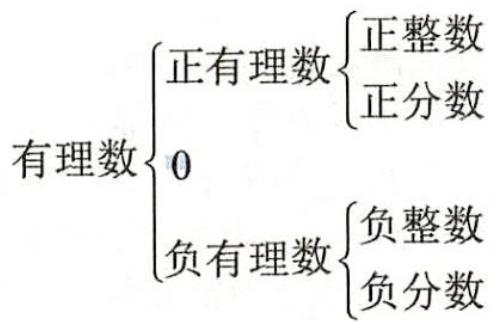

<details>
<summary>text_image</summary>

有理数{正有理数{正整数
0
负有理数{负整数
负有理数{负分数
</details>

# 3. 集合

把满足一定条件的所有数放在一起,就组成了一个集合,简称数集.

# 链接

# 分数

把单位“1”平均分成若干份，表示这样一份或几份的数叫做分数.

如 $0.25 = \frac{1}{4}, 0.3 = \frac{1}{3}, 0.142857 = \frac{1}{7}$ .
所以有限小数和无限循环小数都属于分数.

# 注意

小数可分为有限小数和无限小数两种,而无限小数又分为无限循环小数和无限不循环小数两种.

# 注意

圆周率 $\pi$ 是正数, 但不是有理数, 类似 $\frac{\pi}{2}, -\frac{\pi}{3}$ 等同样也不是有理数, 更不是分数.

# 注意

(1) 对有理数进行分类时, 要做到标准一致, 不重不漏. 分类时, 不要忽略 0, 0 是整数, 不是分数.  
(2) 分类的标准不同, 分类的结果就不同.

# 提示

两种分类有一个共同点: 都是将有理数细分为五类, 即正整数、正分数、0、负整数、负分数.

# 注意

(1)一个数集内不能有两个相

如所有的整数组成整数集.

# 拓展

数集可以用大括号表示,也可以用圈表示.如自然数集可以表示为 $\begin{array}{c}0,1,2,3,\\ \cdots\end{array}$ 或自然数集: $\{0,1,2,3,\cdots\}$ .

自然数集

○○○○○○○○∞

例② 把 6, -3, 2.4, 0, $-\frac{3}{4}$ , -3.14, $\pi$ 填在相应的大括号里.

正整数：{ … }

负分数：{ …}

非负有理数：{ …}

非正有理数：{ …}

解析: 非负有理数包括正有理数和 0, 非正有理数包括负有理数和 0, 注意不要漏掉对 0 的考虑.

答案: 正整数: $\{6, \cdots\}$

负分数: $\left\{-\frac{3}{4},-3.14,\cdots\right\}$

非负有理数： $\{6,2.4,0,\cdots\}$

非正有理数： $\left\{-3,0,-\frac{3}{4},-3.14,\cdots\right\}$

# 知识点三 数轴


🔥🔥🔥

# 1. 数轴的定义

规定了原点、正方向和单位长度的直线叫做数轴, 如图 1-2-1 所示.

$$
- 4 - 3 - 2 - 1 0 1 2 3 4
$$

图1-2-1

# 2. 数轴的画法

可分为画、取、选、标四个步骤：

(1)画,画一条水平的直线;(2)取,在直线上取适当的一点为原点;(3)选,通常规定直线上从原点向右为正方向,用箭头表示出来(箭头标在画出部分的最右边),再选取适当的长度作为单位长度,从原点向右、向左每隔一个单位长度取一点;(4)标,在原点右边向右依次标1,2,3,4,…,在原点左边向左依次标-1,-2,-3,-4,….

# 注意

(1) 绘制数轴时, 它的三个要素缺一不可. 另外, 标注数轴上的单位时, 需要注意从原点开始向两侧排列.

(2)在同一条数轴上,单位长度的大小必须统一,如图1-2-2所示.

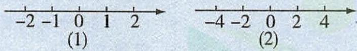  
图1-2-2

例③ 下列图形中是数轴的是( )

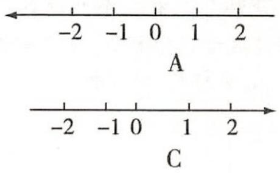

<details>
<summary>text_image</summary>

-2 -1 0 1 2
A
-2 -1 0 1 2
C
</details>

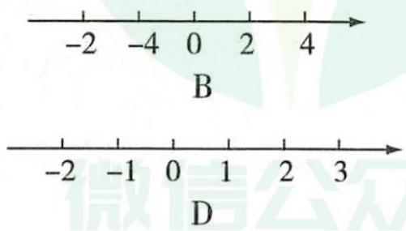

<details>
<summary>text_image</summary>

-2
-4
0
2
4
B
-2
-1
0
1
2
3
D
</details>

答案:D

# 3. 数轴上的点与有理数的关系

数轴上的每一个点都表示一个数,所有的有理数都可以用数轴上的

同的数, 数集中的每个数必须符合数集的特征.

(2) 一个数可能分属于不同的数集.

称为数轴的三要素，在解决具体问题时，可以根据情况灵活选定原点、正方向以及单位长度。


<details>
<summary>text_image</summary>

知识点微课
</details>

可以选取 1 cm 或 0.5 cm 为一个单位长度, 甚至更长或更短; 每个单位长度可以代表 “1” “10” “0.1” 等.


# 解析

根据数轴的定义知,选项A中表示正方向的箭头画错了;选项B中的数标的顺序不对,-4应在-2的左边;选项C中的单位长度不统一;只有选项D中的数轴画法正确.

点表示出来,但数轴上的点不都表示有理数.


数轴是“数”“形”结合的工具, 正有理数用原点右边的点表示, 负有理数用原点左边的点表示, 0 用原点表示. 如图 1-2-3 所示.

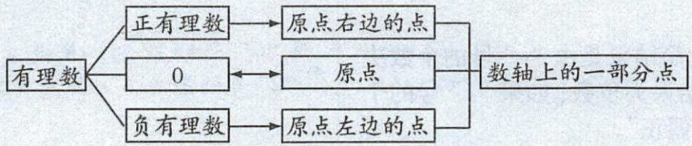

<details>
<summary>flowchart</summary>

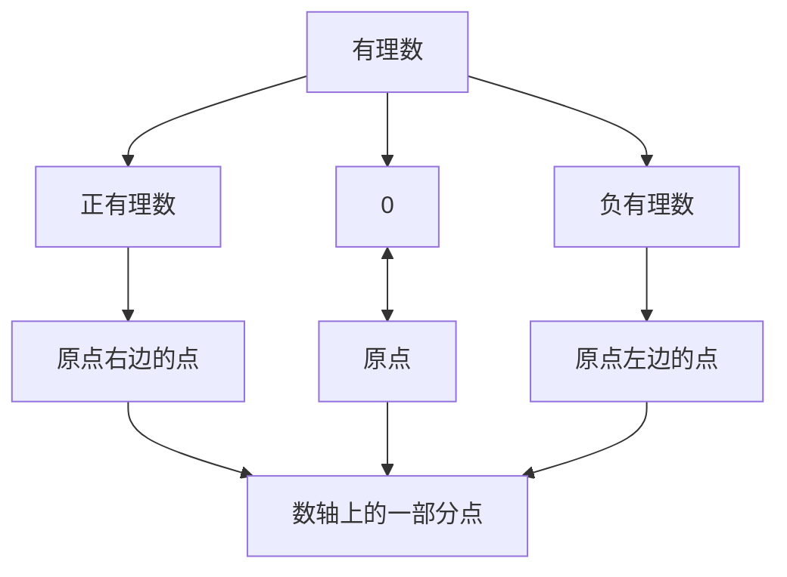
</details>

图1-2-3

例④ 画出数轴并表示下列有理数.

(1)2,-3,-1.5, $3\frac{1}{2}$ ,0;

(2)-0.2,0.1,0.4,0.6;

(3)-300,0,100,500,700;

(4)-50,-35,-25,-20,-5.

分析: 画数轴要选定原点、正方向、单位长度. 第(2)题中所给的数据跨度小, 只局限于 -0.2\~0.6 这一范围内, 1 个单位长度表示 0.1 比较好. 第(3)题中所给的数据跨度达到 1000, 1 个单位长度表示 100 比较好.

解: 所画数轴如图 1-2-4 所示.

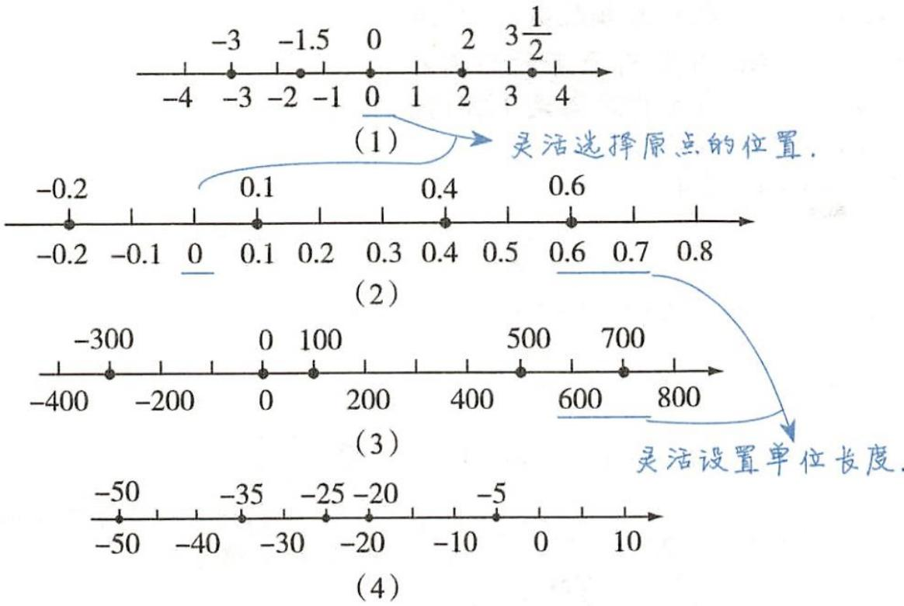

<details>
<summary>line</summary>

| Chart | X Value | Y Value |
|-------|---------|---------|
| (1)   | -3      | -0.2    |
| (1)   | -2      | 0.1     |
| (1)   | 0       | 0.4     |
| (1)   | 2       | 0.6     |
| (2)   | 0       | -0.2    |
| (2)   | 0.1     | 0.1     |
| (2)   | 0.4     | 0.4     |
| (2)   | 0.6     | 0.6     |
| (3)   | 0       | -300    |
| (3)   | 0       | 0       |
| (3)   | 100     | 100     |
| (3)   | 500     | 500     |
| (3)   | 700     | 700     |
| (4)   | -50     | -50     |
| (4)   | -35     | -35     |
| (4)   | -25     | -25     |
| (4)   | -20     | -20     |
| (4)   | -10     | -5      |
</details>

图1-2-4

# 知识点四 相反数


🔥🔥🔥

1. 相反数的定义和意义

<table><tr><td>相反数的定义</td><td>相反数的意义</td></tr><tr><td>1. 像2和-2,5和-5这样,只有符号不同的两个数叫做互为相反数. 把其中一个数叫做另一个数的相反数.2. 一般地,a和-a互为相反数.特别地,0的相反数是0</td><td>相反数所表示的点在数轴上分别位于原点的左右两边,且到原点的距离相等. 如图所示,-3和3,2.5和-2.5分别互为相反数,表示它们的点到原点的距离分别是3,2.5</td></tr></table>

# 提示

(1)相反数的定义中“只有”指的是除了符号不同外其他完全相同.  
(2)相反数的定义中“两个数”是说相反数一定成对出现,不能单独存在.

# 2. 相反数的性质

任何一个数都有唯一一个相反数. 正数的相反数是负数; 负数的相反数是正数; 0 的相反数是 0.

如 $\pi$ 可以用数轴上的点表示, 但 $\pi$ 不是有理数.


画数轴时,先画一条水平的直线,直线上的任意一点都可以作为原点,直线上具体选取哪一点作为原点,根据实际情况确定.当表示的正数多时,可以把原点设置在靠左的位置;当表示的负数多时,可以把原点设置在靠右的位置.


<details>
<summary>text_image</summary>

知识点微课
</details>

# 注意

+2 与 -1，除了符号不同外，2 与 1 也不同，所以它们不互为相反数。

例如：+6 与 -6 互为相反数，可以说 +6 是 -6 的相反数，也可以说 -6 是 +6 的相反数。不能说 +6 是相反数或 -6 是相反数。

0 是唯一一个相反数等于它本身

# 3. 求一个数的相反数的方法

(1)一个具体数,只要改变这个数前面的符号,即可得到这个数的相反数.

(2)一个字母或一个式子,只需在这个字母或这个式子的整体前面加上“-”号,就可以得到对应的相反数.

# 4. 多重符号的化简

一个具体的数前面有几个正、负号时，化简结果是由“-”号的个数决定的。如果“-”号的个数是奇数，那么化简结果为负数；如果“-”号的个数是偶数，那么化简结果为正数，简称“奇负偶正”。

$$
\text { 如 } + (- 3) = - 3, - (- 3) = 3, - [ + (- 3) ] = 3.
$$

例⑤ 写出下列各数的相反数:16,-3,0,- $\frac{1}{2016}$ ,0.001,m,-n,m-n.

解: 它们的相反数依次是 -16,3,0, $\frac{1}{2016}$ , -0.001, -m, n, -(m-n).

例⑥（1）数轴上离原点 4.5 个单位长度的点所表示的数是 \_\_\_\_，它们的关系是 \_\_\_\_.

(2)在数轴上,若点A和点B表示互为相反数的两个数,并且这两点间的距离是12.8,则这两点所表示的数分别是\_\_\_\_.

解析:(1)到原点距离相等的两点表示的两个数互为相反数.(2)表示两个互为相反数的数的点在原点的左右两侧,且距离原点的距离相等.已知A,B两点表示互为相反数的两个数,且两点的距离是12.8,所以这两个数分别是 $12.8\div2=6.4,-(12.8\div2)=-6.4$ .

答案:(1)4.5或-4.5 互为相反数 (2)6.4,-6.4

例⑦ 化简下列各数：

(1) $-\left(-\frac{1}{2}\right);$

(2)-(+3.5);

(3) + (-1);

(4) $-\left[+\left(-7\right)\right]$ ;

(5) $-\left[-(+5)\right]\}.$

解:(1) $-\left(-\frac{1}{2}\right)=\frac{1}{2}$ ;

(2) $-(+3.5)=-3.5$ ;

(3) + (-1) = -1 ;

(4) $-\left[+\left(-7\right)\right]=7$ ;

(5) $-\left\{-\left[-(+5)\right]\right\}=-5.$

# 知识点五 绝对值


🔥🔥🔥

# 1. 绝对值的定义

一般地, 数轴上表示数 a 的点与原点的距离叫做数 a 的绝对值, 记作 $|a|$ , 读作 “a 的绝对值”.

如图 1-2-5 所示, 在数轴上, 表示 -2 的点与原点的距离是 2,

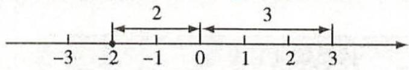  
图1-2-5

即 -2 的绝对值是 2, 记作 $|-2| = 2$ . 表示 3 的点与原点的距离是 3, 即 3 的绝对值是 3, 记作 $|3| = 3$ . 表示 0 的点与原点的距离是 0, 所以 $|0| = 0$ .

# 2. 绝对值的求法

(1)一个正数的绝对值是它本身；(2)一个负数的绝对值是它的相反数；(3)0的绝对值是0.

# 提示

(1) 任意一个数的绝对值为唯一的非负数, 无论 $a$ 取何有理数, 都有 $|a| \geqslant 0$ , 绝对值最小的数是 0.  
(2)由绝对值的定义可知,当 $|a|=a$ 时,a是正数或0;当 $|a|=-a$ 时,a是负数或0.  
(3) 互为相反数的两个数的绝对值相等; 绝对值相等的两个数相等或互为相反数.   
(4) 在数轴上, 一个数对应的点离原点越近, 它的绝对值越小; 离原点越远, 它的绝对值越大.

的数. 如果 a = -a, 那么 a 一定是 0.

如 a 的相反数为 -a, a-b 的相反数为 $-(a-b)$ ，这里的括号是必须要加的。

带“+”号的数不一定是正数，带“-”号的数也不一定是负数。

# 注意

化简最后结果为正时,符号“+”一般省略不写.


<details>
<summary>text_image</summary>

知识点微课
</details>

a 可以是正数、负数或 0. 由于数的绝对值是两点间的距离, 故绝对值不可能为负数.

对于任意有理数 a, 都有

$$
| a | = \left\{ \begin{array}{l} a (a > 0), \\ 0 (a = 0), \\ - a (a <   0). \end{array} \right.
$$

# 3. 绝对值非负性的应用

若几个数的绝对值的和为零,则这几个数同时为零.

# 拓展

几个非负数的和为0，则每个非负数都为0.


例8 求下列各数的绝对值：

(1) $\frac{3}{8}$ ; (2)+0.5; (3)0; (4)- $2\frac{1}{4}$ ; (5)-3.

解:(1) $\left|\frac{3}{8}\right|=\frac{3}{8}$ ; (2) $|+0.5|=0.5$ ; (3) $|0|=0$ ; (4) $\left|-2\frac{1}{4}\right|=2\frac{1}{4}$ ;
(5) $|-3|=3.$

例⑨ 一个数的绝对值是8,求这个数.

解: 因为 $|8| = 8, |-8| = 8$ ,

所以绝对值是 8 的数有两个, 分别是 8 和 -8.

例10 若 $|x - 3| + |y - 2| = 0$ ，求 $\frac{x}{y}$ 的值.

解:由题意,得 $\left|x-3\right|=0,\left|y-2\right|=0$ , 所以 x-3=0, y-2=0.

解得 x = 3, y = 2. 所以 $\frac{x}{y} = \frac{3}{2}$ .

# 知识点六 有理数的大小比较


<table><tr><td>方法</td><td>方法描述</td></tr><tr><td>利用数轴</td><td>在数轴上表示的两个数或几个数,右边的数总比左边的数大</td></tr><tr><td>利用法则</td><td>(1)正数大于0,0大于负数,正数大于负数;(2)两个负数,绝对值大的反而小;(3)两个正数,绝对值大的数大</td></tr></table>

# 提示

利用法则比较两个数的大小时, 可按数的性质符号分类, 具体如下:

(1) 两数同号 $\left\{\begin{aligned} 同为正号: 绝对值大的数大, \\  同为负号: 绝对值大的反而小; \end{aligned}\right.$   
(2)两数异号:正数大于负数;   
(3)一数为 $0\left\{\begin{aligned} & 正数与0:正数大于0,\\ & 负数与0:负数小于0.\end{aligned}\right.$

例⑪ 比较下列各组数的大小:

(1)-100 与 0 ; (2) $-\frac{5}{6}$ 与 $-\frac{4}{5}$ ; (3) $\left|-\frac{2}{3}\right|$ 与 $\left|-\frac{3}{4}\right|$ ; (4) $-\left(-\frac{2}{3}\right)$ 与 $-|-2|$ .

解:(1)-100<0.

(2) 因为 $\left|-\frac{5}{6}\right|=\frac{5}{6}=\frac{25}{30},\left|-\frac{4}{5}\right|=\frac{4}{5}=\frac{24}{30}$ ,

又 $\frac{25}{30}>\frac{24}{30}$ ，所以 $-\frac{5}{6}<-\frac{4}{5}$ .

(3) 因为 $\left|-\frac{2}{3}\right|=\frac{2}{3}=\frac{8}{12},\left|-\frac{3}{4}\right|=\frac{3}{4}=\frac{9}{12},$ 先去掉绝对值符号，再比较大小.

又 $\frac{8}{12}<\frac{9}{12}$ ，所以 $\left|-\frac{2}{3}\right|<\left|-\frac{3}{4}\right|$ .

(4) 因为 $-\left(-\frac{2}{3}\right)=\frac{2}{3}, -|-2|=-2,$ 光化简，再比较大小.

若 $\left|a\right|+\left|b\right|+\left|c\right|+\cdots=0$ ，则有 $\left|a\right|=0$ ， $|b|=0,\left|c\right|=0,\cdots,$ 所以 a=0,b
=0,c=0, $\cdots$ .

# —规律总结 —

(1) 绝对值等于一个正数的数有两个, 这两个数互为相反数, 即若 $\left|a\right|=b\ (b>0)$ , 则 $a=\pm b$ ; (2) 互为相反数的两个数的绝对值相等, 即 $\left|a\right|=-a$ .


<details>
<summary>text_image</summary>

知识点微课
</details>

利用数轴能揭示出点的位置关系与数的大小关系的联系，体现了数形结合思想。

# 方法技巧

# 利用数轴比较有理数大小的关键

一是在数轴上描出表示各数的点；二是观察各点在数轴上的位置.

又 $\frac{2}{3}>-2$ ，所以 $-\left(-\frac{2}{3}\right)>-|-2|$ .

例12 (1) 在数轴上表示出下列各数, 并把它们按从小到大的顺序用 “<” 号连接起来: -4, 3, 0, -0.5, +4 $\frac{1}{2}$ , -2 $\frac{1}{2}$ .

(2) 比较 $-\frac{7}{8}, -\frac{8}{7}, -\frac{8}{9}$ 的大小.

解:(1)如图 1-2-6 所示.

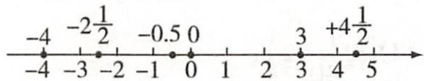

<details>
<summary>text_image</summary>

-4 -2\u00bd/2 -0.5 0
-4 -3 -2 -1 0 1 2 3 +4\u00bd/2
             4 5
</details>

图1-2-6

按从小到大的顺序排列为

$$
- 4 <   - 2 \frac {1}{2} <   - 0. 5 <   0 <   3 <   + 4 \frac {1}{2}.
$$

(2) 因为 $\left|-\frac{7}{8}\right|=\frac{7}{8},\left|-\frac{8}{7}\right|=\frac{8}{7},\left|-\frac{8}{9}\right|=\frac{8}{9}$

又 $\frac{7}{8} < \frac{8}{9} < \frac{8}{7}$ , 所以 $-\frac{7}{8} > -\frac{8}{9} > -\frac{8}{7}$ .


# 方法技巧

# 有理数大小比较的方法

(1) 先在数轴上找出表示这些数的点, 再根据数轴上右边的点表示的数比左边的点表示的数大, 得到几个有理数的大小关系.  
(2) 两个或多个负数比较大小时, 可先比较这几个数绝对值的大小, 再根据 “两个负数, 绝对值大的反而小” 得到这几个负数的大小关系.

扫码练基础   
我的错题号  


# 教材问题全解

# 教材第7页“思考”

答案: 用正数、负数、0 表示这些树、电线杆与汽车站牌的相对位置关系, 正、负号表示方向, 去掉符号的数表示到汽车站牌的距离, 0 表示汽车站牌的位置.

教材第8页“问题”

答案: -3 表示位于汽车站牌西侧 3 m 处的槐树; 0 表示汽车站牌;

3 表示位于汽车站牌东侧 3 m 处的柳树；

7.5 表示位于汽车站牌东侧 7.5 m 处的杨树.

教材第8页“思考”

答案: 共同点: 都规定了单位长度、原点位置; 不同点: 图 1.2-2 (教材图) 没有规定正方向.

教材第9页“归纳”

答案: 右 a 左 a

教材第 10 页 “思考”

答案: 不一定. 当 a 表示正数时, -a 是负数; 当 a 表示负数时, -a 是正数; 当 a 表示 0 时, -a 是 0. 教材第 10 页 “问题”

答案: 表示 -5 和 +5 的点在原点的两侧, 且到原点的距离相等, -(-5) 表示 -5 的相反数, 即 -(-5) = +5.

教材第 12 页 “思考”

答案: 最低气温是 $-4^{\circ}C$ ，最高气温是 $9^{\circ}C$ 。能，顺序如下： $-4^{\circ}C < -3^{\circ}C < -2^{\circ}C < -1^{\circ}C < 0^{\circ}C < 1^{\circ}C < 2^{\circ}C$ 。

教材第 12 页 “思考”

答案: 负数 <0, 0< 正数, 负数 <正数; 两个负数, 绝对值大的反而小; 一致.

# 典型例题剖析

# 题型一 有理数的分类

例① 将下面的有理数填在图 1-2-7 所示的集合圈内.


两个集合的公共部分是这两个

$$
- 0. 6, - 8, + 2. 1, - 8 0 9, 8 9. 9, 0, 4, - 2 \frac {1}{2}.
$$

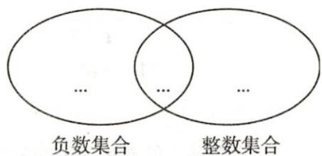

<details>
<summary>text_image</summary>

…
…
…
负数集合 整数集合
</details>

(1)

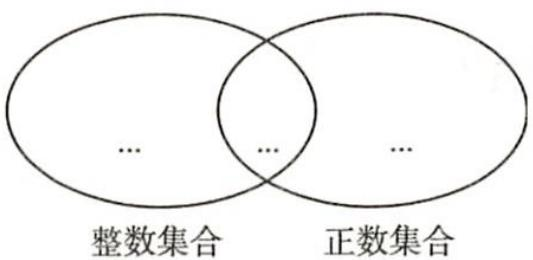

<details>
<summary>text_image</summary>

整数集合
正数集合
</details>

(2)   
图1-2-7

分析:(1)不同数集之间有时存在公共部分,因此要弄清集合之间的关系.(2)负数集合与整数集合的公共部分是负整数集合,整数集合与正数集合的公共部分是正整数集合.

解: 如图 1-2-8 所示

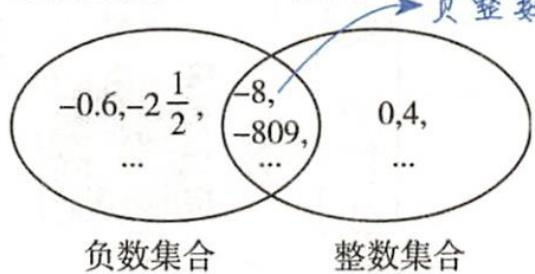

<details>
<summary>text_image</summary>

-0.6,-2\u00bd/2,
...
-8,
-809,
...
0,4,
...
负数集合
整数集合
</details>

(1)

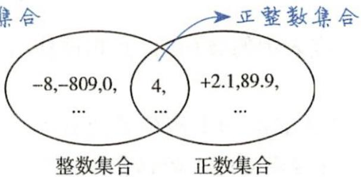

<details>
<summary>other</summary>

|集合类型       | Count |
| ---------------- | ----- |
| 整数集合         | -8, -809, 0, ... |
| 正数集合         | +2.1, 89.9, ... |
</details>

(2)   
图1-2-8

# 题型二 有关数轴的应用

# 1. 数轴上两点之间的距离问题

例② 在数轴上表示数 -1 和 2015 的两点分别为 A 和 B，则 A, B 两点之间的距离为（）

A.2 013

B.2 014

C.2 015

D.2 016

解析: 因为表示 -1 和 2015 的点到原点的距离分别为 1 个单位长度和 2015 个单位长度, 此两点位于原点的两侧, 所以它们之间的距离为 2016. 答案: D

例③ A, B 两点在数轴上, 点 A 对应的数为 2, 若点 A, B 之间的距离为 3, 求点 B 对应的数.

分析: 尽管线段 AB 的长已知, 但是点 B 的位置不确定, 所以应分点 B 在点 A 的左、右两侧解题.

解: 如图 1-2-10 所示.

$$
\begin{array}{c c c c c c c c} & B _ {2} & & A & & B _ {1} \\ \hline - 3 & - 2 & - 1 & 0 & 1 & 2 & 3 & 4 & 5 \end{array}
$$

图1-2-10

(1)当点B在点A的右侧时,因为点A对应的数为2,线段AB的长为3,所以点B对应的数为5;

(2)当点B在点A的左侧时,因为点A对应的数为2,线段AB的长为3,所以点B对应的数为-1.

综上所述, 点 B 对应的数为 5 或 -1.

# 2. 利用数轴比较大小

例④ 有理数 a, b 所对应的点在数轴上的位置如图 1-2-12 所示, 试比较 a, b, -a, -b 的大小, 并用 “>” 号把它们连接起来.

$$
- 3 - 2 - 1 0 1 2 3
$$

图1-2-12

解题关键:“a 与 -a, b 与 -b 分别互为相反数”, 它们对应的点分别在原点的两侧, 且与原点的距离相等, 由此可在数轴上把 -a, -b 对应的点集合中共同含有的数,弄清这一点是解决这类问题的关键.解题时要避免公共部分的数重复出现.

# 举一反三1（答案见第186页）

已知有 A, B, C 三类数的集合，每类数的集合中所包括的数都写在各自的大括号里。请把这些数填在图 1-2-9 中相应的位置。

$$
\begin{array}{c} A = \{- 2, - 3, - 8, 6, 7 \}, B = \\ \{- 3, - 5, 1, 2, 6 \}, C = \{- 1, - 3, - 8, 2, 5 \}. \end{array}
$$

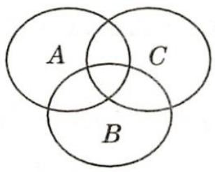  
图1-2-9

# 规律总结

在原点同侧的两点间的距离等于两点对应数的绝对值的差(大绝对值减小绝对值);

在原点两侧的两点间的距离等于两点对应数的绝对值的和.

# 举一反三2（答案见第186页）

数轴上乌龟距原点2个单位长度,小白兔距原点3个单位长度,则乌龟与小白兔之间的距离为\_\_\_\_.

# 举一反三3（答案见第186页）

已知 a, b 在数轴上的位置如图 1-2-11 所示, 下面结论正确的是()

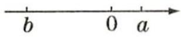  
图1-2-11

A. $b > a$

B. $|a|>|b|$

C.-a<b

D.-b>a

# 举一反三4（答案见第186页）

有理数 a, b 在数轴上的位置如图 1-2-14 所示.

(1) 写出 a, b 的相反数并在数轴上表示出来；

找出来,从而借助数轴比较它们的大小.

解: 由图 1-2-13 可知 b>-a>a>-b.

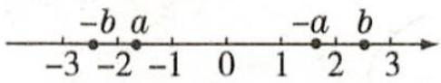  
图1-2-13

# 题型三 数轴上点的移动问题

例⑤ 如图 1-2-15 所示, 在数轴上有 A, B, C 三个点, 请回答:

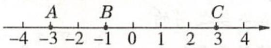  
图1-2-15

(1) 将 A 点向右移动 3 个单位长度, C 点向左移动 5 个单位长度, 它们各自表示的新数是什么?  
(2) 移动 $A, B, C$ 中的两个点, 使得三个点表示的数相同, 有几种移动方法?

分析: 如图 1-2-16 所示, (1) 首先根据各点在数轴上的位置读出各点表示的数, 再找出点移动后的位置, 最后根据移动后的点的位置确定点所表示的新数. (2) 可令一个点不动, 将其余两点进行移动.

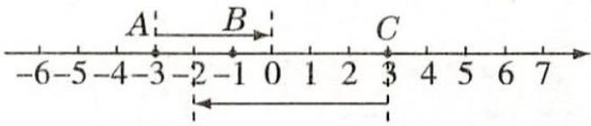

<details>
<summary>text_image</summary>

A
B
C
-6-5-4-3-2-1 0 1 2 3 4 5 6 7
</details>

图1-2-16

解:(1)A点在原点左侧3个单位长度处,表示-3,向右移动3个单位长度后,落在原点处,表示0;C点在原点右侧3个单位长度处,表示+3,向左移动5个单位长度后,落在原点左侧2个单位长度处,表示-2.

(2)有三种移动方法:①A点不动,B点向左移动2个单位长度,C点向左移动6个单位长度;  
② B 点不动, A 点向右移动 2 个单位长度, C 点向左移动 4 个单位长度;  
③ C 点不动, A 点向右移动 6 个单位长度, B 点向右移动 4 个单位长度.

# 题型四 利用数轴解决实际问题

例⑥ 某人从 A 地出发向东走 10 m, 然后折回向西走 3 m, 又折回向东走 6 m, 问: 此人此时在 A 地哪个方向? 距离 A 地多远?

解:如图1-2-18所示,设原点为A地,向东为正方向.观察数轴可得,此人此时在A地的正东方向,距离A地13m.

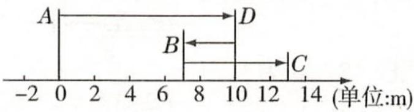

<details>
<summary>text_image</summary>

A
B
C
-2 0 2 4 6 8 10 12 14 (单位:m)
</details>

图1-2-18

# 题型五 利用数轴信息化简绝对值

例⑦ 数 a, b, c 在数轴上对应的点的位置如图 1-2-19 所示. 化简: $-|a|+|b+c|-|b|$ .

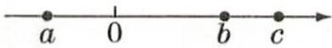  
图1-2-19

解: 由数轴可知 a<0, b>0, c>0,

所以 $b + c > 0$

(2) 将 a, b, $|a|$ , $|b|$ 按从小到大的顺序排列起来.

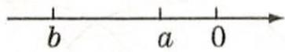  
图1-2-14

# 方法技巧

# 确定数轴上的点表示的数的方法

(1) 首先确定要表示的数所对应的点是在原点左边, 还是在原点右边, 从而确定该数是正的, 还是负的; (2) 再看该数对应的点距原点几个单位长度; (3) 数轴上点的移动与数的大小变化关系是左减右加.


<details>
<summary>text_image</summary>

题型微课
</details>


# 举一反三5（答案见第187页）

如图1-2-17所示,数轴上有A,
B,C三个点.

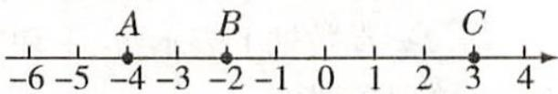  
图1-2-17

请回答下列问题：

(1) 将 B 点在数轴上移动 3 个单位长度后, 所表示的数是什么?  
(2) 怎样在数轴上移动点 C, 使移动后的 C 点 (不与 B 点重合) 与 A 点的距离等于 B 点与 A 点的距离? 此时 C 点表示的数是什么?

# 点拨

根据运动方向和距离画出数轴, 表示出每次运动结束时所在的位置, 进而利用数轴上的点与有理数的对应关系解决问题.

# 分析

先利用数轴信息确定 a, b, c 的取值范围, 再利用绝对值的意义化简绝对值.

所以 $|a| = -a, |b + c| = b + c, |b| = b,$

所以原式 $= -(-a) + (b + c) - b = a + b + c - b = a + c.$

# 题型六 绝对值在实际生活中的应用

例8 某配件厂生产一批圆形的橡胶垫,从中抽取6件进行检验,比标准直径(单位:mm)长的记作正数,比标准直径短的记作负数,检查记录如下表:

<table><tr><td>1</td><td>2</td><td>3</td><td>4</td><td>5</td><td>6</td></tr><tr><td>+0.4</td><td>-0.2</td><td>+0.1</td><td>0.05</td><td>-0.3</td><td>+0.25</td></tr></table>

（1）哪件产品的质量相对来说比较好？用学过的绝对值知识说明理由。  
(2)若规定与标准直径相差不大于(小于或等于)0.2 mm 为合格产品, 则 6 件产品中有几件是不合格产品?

解:(1) $|+0.4|=0.4,|-0.2|=0.2,|+0.1|=0.1,|0.05|=0.05,|-0.3|=0.3,|+0.25|=0.25.$

因为 0.05<0.1<0.2<0.25<0.3<0.4，

所以 $|0.05| < | + 0.1| < |-0.2| < | + 0.25| < |-0.3| < | + 0.4|$ ,

所以第 4 件产品的质量相对来说比较好.

(2) 因为 $\left|+0.4\right|=0.4>0.2,\left|-0.3\right|=0.3>0.2,\left|+0.25\right|=0.25>0.2,$

所以这6件产品中有3件是不合格产品.

# 题型七 关于数轴的探究题

例⑨ 数轴上的一个点表示一个数, 当这个点表示的是整数时, 我们称它是整数点. 如果一条数轴的单位长度是 $1 \mathrm{~cm}$ , 将一条长为 $2 \mathrm{~m}$ 的线段放在该数轴上, 探究它可以盖住的整数点的个数问题.

(1) 如果长为 2 m 的线段的两端点恰好与两个整数点重合, 那么它可以盖住的整数点有 \_\_\_\_ 个;  
(2) 如果长为 $2 \, m$ 的线段的两端点不与两个整数点重合, 那么它可以盖住的整数点有 \_\_\_\_ 个. 注意统一单位.

解析:(1)当长为1cm的线段的两端点正好与距离为一个单位长度的两个整数点重合时,它能盖住两个整数点,依此类推,长为n cm的线段可以盖住(n+1)个整数点,2m=200cm,所以能盖住200+1=201(个)整数点;(2)当长为1cm的线段的两端点与距离为一个单位长度的两个整数点不重合时,就只能盖住一个整数点,依此类推,长为n cm的线段可以盖住n个整数点,所以长为2m的线段正好能盖住200个整数点.

答案:(1)201 (2)200

# 方法技巧

# 不完全归纳法

不完全归纳法是从一个或几个(但不是全部)特殊情况中得出一般性结论的归纳推理法. 如在第(1)题的情况中可得到长为 $n \mathrm{~cm}$ 的线段可以盖住 $(n + 1)$ 个整数点.

# 举一反三6（答案见第187页）

已知 $a > 2$ ，化简： $\vert 2a - 4\vert +\vert 2a + 1\vert$ $+| - a|$

# 点拨

我们可以利用绝对值的大小来表示产品的某项指标与标准接近的程度. 结合实际问题, 可知绝对值越小, 产品的该项指标与标准的偏差越小.


<details>
<summary>text_image</summary>

题型微课
</details>

# 举一反三7（答案见第187页）

如图 1-2-20 所示, 半径为 1 个单位的圆片上有一点 A 与数轴的原点重合, AB 是圆片的直径.

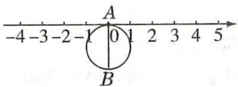  
图1-2-20

(1) 把圆片沿数轴向左滚动 1 周, 点 A 到达数轴上点 C 的位置, 点 C 表示的数是  
(2) 把圆片沿数轴滚动 2 周, 点 A 到达数轴上点 D 的位置, 点 D 表示的数是  
(3) 圆片在数轴上向右滚动的周数记为正数, 圆片在数轴上向左滚动的周数记为负数, 依次运动情况记录如下: +2, -1, -5, +4, +3, -2. 当圆片结束运动时, 点 A 运动的路程共有多少? 此时点 A 所表示的数是多少?

# 中考考点对接


# 中考考点解读

解读1: 考查数轴上表示互为相反数的两个数的点的位置关系, 题型以选择题为主, 是数形结合思想的典型范例.

解读 2: 考查对相反数的概念的理解, 题型常以选择题、填空题的形式出现.

解读 3: 考查多重符号的化简, 题型常以选择题、填空题的形式出现.

解读4：考查求一个数的绝对值的法则，常与相反数、数轴结合出题，在中考中多设置为选择题、填空题.

解读 5: 考查有理数大小的比较, 题型以选择题为主, 属于基础题.


# 中考典题剖析

# 一、数轴上表示互为相反数的两个数的点的位置关系

# 教材第9页探究

在数轴上,与原点的距离是2的点有几个?这些点各表示哪个数?

解: 在数轴上, 与原点的距离是 2 的点有两个, 它们表示的数是 -2 和 2.

# 中考真题1

中考真题1（2018·贵阳中考·3分）如图点A, B, C, 若点A, B表示的数互为相反数, 则图中点C对应的数是( ) (注: 数轴的单位长度为1)

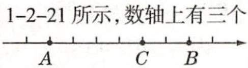  
图1-2-21

A.-2

B.0

C.1

D.4

解析: 因为 A, B 表示的数互为相反数, 且 A, B 两点间的距离为 6, 所以点 A, B 表示的数分别为 -3, 3, 所以点 C 对应的数为 1.

答案: C

考题点睛。

中考真题与教材探究都考查了数轴上表示互为相反数的两个数的点的位置关系. 解决这类问题要把“数”和“形”结合起来, 使二者互相补充, 相辅相成, 从而把复杂的问题转化为简单的问题.


# 二、相反数

# 教材第10页练习第2题

写出下列各数的相反数:6,-8,-3.9, $\frac{5}{2}$ , $-\frac{2}{11}$ ,100,0.

解: 各数的相反数分别为 -6, 8, 3.9, $-\frac{5}{2}$ , $\frac{2}{11}$ , -100, 0.

# 中考真题2

(2018·湖北随州中考·3分) $-\frac{1}{2}$ 的相反

数是( )

A. $-\frac{1}{2}$

B. $\frac{1}{2}$

C.-2

D.2

答案: B

。考题点睛。

中考真题与教材练习题都考查了相反数的意义,求一个数的相反数就是在这个数的前面加上“-”号.


# 三、多重符号的化简

# 教材第10页练习第4题

化简下列各数： $-(-68),-(+0.75),-\left(-\frac{3}{5}\right),-(+3.8)$ .

解： $-(-68)=68,-(+0.75)=-0.75,$

$$
- \left(- \frac {3}{5}\right) = \frac {3}{5}, - (+ 3. 8) = - 3. 8.
$$

# 中考真题3

(2018·江苏泰州中考·3分)-(-2)

等于( )

A.-2

B.2

C. $\frac{1}{2}$

D. ±2

解析：-(-2)表示-2的相反数，是2.

答案: B

考题点睛。


中考真题与教材练习题都考查了多重符号的化简, 即根据相反数的概念来化简, 也可根据 “-” 号的个数来确定: 当 “-” 号个数为奇数时, 化简结果为负; 当 “-” 号个数为偶数时, 化简结果为正.

# 四、绝对值

教材第11页练习第1题

写出下列各数的绝对值:

$$
6, - 8, - 3. 9, \frac {5}{2}, - \frac {2}{1 1}, 1 0 0, 0.
$$

解： $|6| = 6, |-8| = 8, |-3.9| = 3.9,$

$$
\left| \frac {5}{2} \right| = \frac {5}{2}, \left| - \frac {2}{1 1} \right| = \frac {2}{1 1},
$$

$$
\vert 1 0 0 \vert = 1 0 0, \vert 0 \vert = 0.
$$

中考真题4（2018·山东青岛中考·3分）如图1-2-22所示，点A所表示的数的绝对值是（ ）

$$
\begin{array}{c} A \\ \hline - 7 - 6 - 5 - 4 - 3 - 2 - 1 0 1 2 3 4 5 \end{array}
$$

图1-2-22

A.3

B.-3

C. $\frac{1}{3}$

D. $-\frac{1}{3}$

解析: 由数轴可知点 A 表示的数为 -3, -3 的绝对值是 3.

答案: A

考题点睛。

中考真题与教材练习题都考查了求一个数的绝对值的法则: 正数的绝对值等于它本身, 负数的绝对值等于它的相反数, 0 的绝对值是 0.


# 五、有理数大小的比较

教材第14页习题1.2第6题

将下列各数按从小到大的顺序排列,并用“<”号连接:

$$
- 0. 2 5, + 2. 3, - 0. 1 5, 0, - \frac {2}{3}, - \frac {3}{2}, - \frac {1}{2}, 0. 0 5.
$$

解： $-\frac{3}{2}<-\frac{2}{3}<-\frac{1}{2}<-0.25<-0.15<0<0.05<+2.3.$

中考真题5（2018·浙江金华中考·3分）在0，

$1, -\frac{1}{2}, -1$ 四个数中，最小的数是（

A.0

B.1

C. $-\frac{1}{2}$

D.-1

答案:D

考题点睛。

中考真题与教材习题都是考查有理数大小的比较,掌握比较有理数大小的法则是解决这类问题的关键.注意利用绝对值比较两个负数的大小时,绝对值大的反而小,绝对值小的反而大.

# 知识能力提升

# 重点内容总结

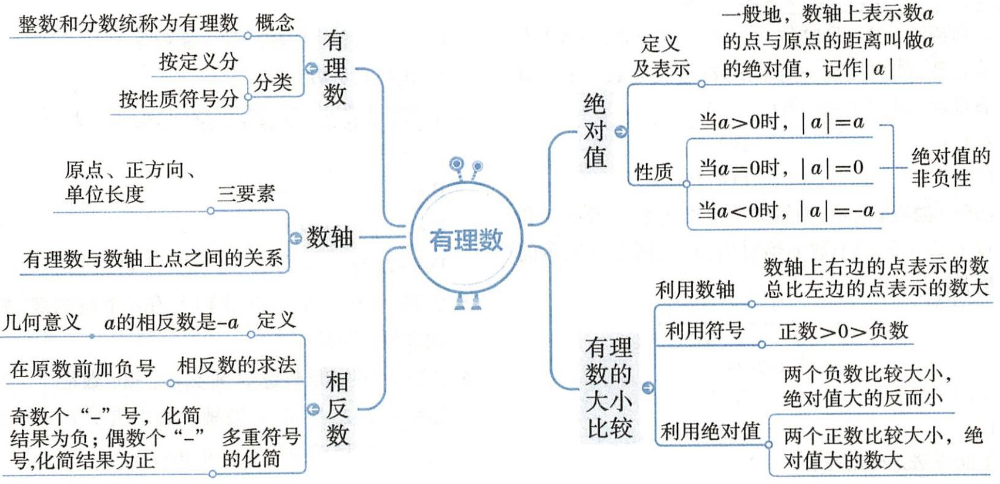

<details>
<summary>flowchart</summary>

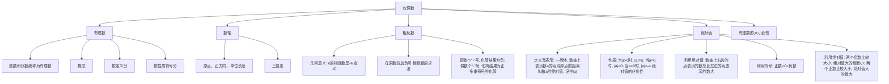
</details>

# 第一章

# 易误易混总结

# 易误点1

误认为凡带有正号的数就是正数, 凡带有负号的数就是负数

正数前面的“+”号有时可以省略，省略“+”号后仍是正数；但是带有“+”号或省略“+”号的数不一定是正数，带有“-”号的数不一定是负数.

# 易误点2

不能正确理解有理数的分类而出错

有理数的两种分类不能混淆,要特别注意避免因忽略0而引起的错误.不要把非负整数理解成正整数,非负整数包括正整数和0.

# 易误点3

分析问题时漏掉负数

例1 (1) 在数轴上到原点距离为 4 个单位长度的点表示的数是 \_\_\_\_.

(2) 点 A 为数轴上表示 -2 的点, 当点 A 沿数轴移动 4 个单位长度到 B 点时, 点 B 所表示的数是 \_\_\_\_.

(3) 绝对值小于 4 的整数为 \_\_\_\_.

答案:(1)±4 (2)-6或2 (3)-3,-2,-1,0,1,2,3

# 易误点4

忽略 $a = 0$ 的情形

例② 已知 $|a| = -a$ ，则 $a$ 是（ ）

A. 正数

B. 负数

C. 非正数

D. 非负数

解析: $|a| = -a$ , 根据绝对值的非负性可知 $-a \geqslant 0$ , 即 $a \leqslant 0$ , $a$ 是非正数. 答案: C


例题见“教材内容全解”例7.


例题见“教材内容全解”例2.


# 注意

(2) 小题没有说明点 A 移动的方向, 应分点 A 向左、右两个方向移动 (如图 1-2-23 所示) 分类求解. (1)(3) 小题容易漏掉负数造成漏解, 产生错解的原因是对数的认识还停留在正数和 0 的阶段.

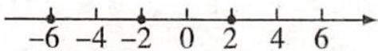  
图1-2-23


# 注意

在进行与有理数的绝对值相关的求解和化简时, 常因对问题分析不全面而出现错解或漏解.

# 综合提升训练»答案见187页

1. 下列说法: ① 0 是整数; ② -2 是负分数; ③ 4.2 不是正数; ④ 自然数一定是正数; ⑤ 负分数一定是负有理数. 其中正确的有( )

A.1 个

B.2 个

C.3 个

D.4 个

2. 如图 1-2-24 所示, 数轴的单位长度为 1, 若点 A 和点 C 表示的两个数的绝对值相等, 则点 B 表示的数是( )

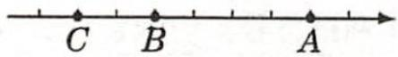  
图1-2-24

A.-3

B.-1

C.1

D.3

3. 下面说法正确的是( )

A. $\pi$ 的相反数是-3.14

B. 符号相反的数互为相反数

C. 一个数和它的相反数可能相等

D. 正数和负数互为相反数

4. 下列各组数中, 互为相反数的是()

A.+2 与 |-2|

B.+ (+2) 与 - (-2)

C.+(-2)与-|+2|

D.-|-2|与-(-2)

5. 已知 $-2 < x \leqslant m, x$ 在数轴上有 4 个整数解，则 m 的取值范围是 \_\_\_\_.

6. 已知 $a+2$ 的相反数是 -3, 那么 a 的相反数是 \_\_\_\_.

7. 如图 1-2-25 所示, 在数轴上画出表示下列各数以及它们的相反数的点: -4, 0.5, 3.

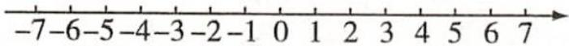  
图1-2-25

# 课后习题全解

# 练习(教材第6页)

1. 解：

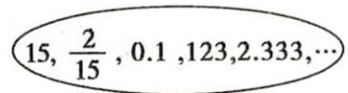  
正数集合

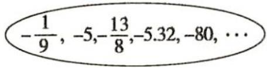  
负数集合

2. 解: +6, 1, $\frac{3}{5}$ , $3\frac{1}{4}$ , 0.63 是正数.

-15, -2, -0.9, -4.95 是负数.

-15,+6,-2,1,0是整数.

-0.9, $\frac{3}{5}$ , $3\frac{1}{4}$ , 0.63, -4.95 是分数.

# 练习(教材第9页)

1. 解: 点 A 表示 0, 点 B 表示 -2, 点 C 表示 1, 点 D 表示 2.5, 点 E 表示 -3.

2. 解: 如图 1-2-26 所示.

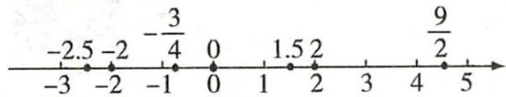

<details>
<summary>text_image</summary>

-2.5 -2 -3/4 0 1.5 2 9/2
-3 -2 -1 0 1 2 3 4 5
</details>

图1-2-26

3. 负正

# 练习(教材第10页)

1. 解: (1) 错误; (2) 错误; (3) 正确; (4) 正确.

2. 解: 6 的相反数为 -6, -8 的相反数为 8, -3.9 的相反数为 3.9, $\frac{5}{2}$ 的相反数为 $-\frac{5}{2}$ , $-\frac{2}{11}$ 的相反数为 $\frac{2}{11}$ , 100 的相反数为 -100, 0 的相反数为 0.

3. 解: 如果 a = -a, 那么 a = 0, 则表示 a 的点是数轴的原点.

4. 解: $-(-68)=68,\quad-(+0.75)=-0.75,$

$$
- \left(- \frac {3}{5}\right) = \frac {3}{5}, - (+ 3. 8) = - 3. 8.
$$

# 练习(教材第11页)

1. 解: $|6| = 6, |-8| = 8, |-3.9| = 3.9, \left|\frac{5}{2}\right| = \frac{5}{2}, \left|-\frac{2}{11}\right| = \frac{2}{11}$ ,

$$
\vert 1 0 0 \vert = 1 0 0, \vert 0 \vert = 0.
$$

2. 解: (1) 不正确; (2) 不正确; (3) 正确; (4) 正确.

3. 解: (1) 正确; (2) 不正确; (3) 不正确.

# 练习(教材第13页)

解:(1)因为正数大于负数,所以3>-5.

(2) 因为 $|-3|=3, |-5|=5, 3<5,$

所以 -3>-5.

(3) 因为 $-|-2.25| = -2.25$ ,

$$
\vert - 2. 5 \vert = 2. 5, \vert - 2. 2 5 \vert = 2. 2 5,
$$

2.5>2.25, 所以 -2.5<-|-2.25|.

(4) 因为 $\left|-\frac{3}{5}\right|=\frac{3}{5},\left|-\frac{3}{4}\right|=\frac{3}{4},\frac{3}{5}<\frac{3}{4}$ ,

所以 $-\frac{3}{5}>-\frac{3}{4}$ .

# 习题 1.2（教材第 14 页）

1. 解: 正数: $\left\{15,0.15,\frac{22}{5},+20,\cdots\right\}$

负数： $\left\{-\frac{3}{8},-30,-12.8,-60,\cdots\right\}$

2. 解: 如图 1-2-27 所示.

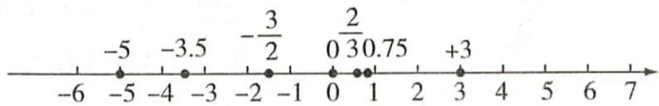

<details>
<summary>text_image</summary>

-5
-3.5
-\frac{3}{2}
0 2/3 0.75
+3
-6 -5 -4 -3 -2 -1 0 1 2 3 4 5 6 7
</details>

图1-2-27

3. 解: 当点 A 沿数轴正方向移动 4 个单位长度时, 点 B 表示的数是 1; 当点 A 沿数轴反方向移动 4 个单位长度时, 点 B 表示的数是 -7. 综上, 点 B 表示的数是 1 或 -7.

点拨: 移动的方向不确定, 因此要分类讨论.

4. 解: 各数的相反数分别为 4, -2, 1.5, 0, $-\frac{1}{3}$ , $\frac{9}{4}$ .

在数轴上表示如图 1-2-28 所示.

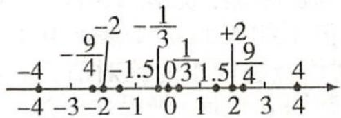

<details>
<summary>text_image</summary>

-4
-9/4
-2
-1.5
0 1
1.5
+2/4
4
-4 -3 -2 -1 0 1 2 3 4
</details>

图1-2-28

5. 解: $|-125| = 125, |+23| = 23, |-3.5| = 3.5$ ,

$$
| 0 | = 0, \left| \frac {2}{3} \right| = \frac {2}{3}, \left| - \frac {3}{2} \right| = \frac {3}{2}, | - 0. 0 5 | = 0. 0 5.
$$

-125 的绝对值最大,0 的绝对值最小.

6. 解: $-\frac{3}{2} < -\frac{2}{3} < -\frac{1}{2} < -0.25 < -0.15 < 0 < 0.05 < +2.3.$

7. 解: 按从高到低的顺序排列为 $13.1^{\circ}C > 3.8^{\circ}C > 2.4^{\circ}C > -4.6^{\circ}C > -19.4^{\circ}C$ .

8. 解: 因为 $\left|+5\right|=5,\left|-3.5\right|=3.5,\left|+0.7\right|=0.7,$

$$
\vert - 2. 5 \vert = 2. 5, \vert - 0. 6 \vert = 0. 6,
$$

所以从左向右数,第五个记为 -0.6 的排球最接近标准.
点拨: 标准数为 0, 克数的绝对值越小就越接近标准.

9. 解: 因为 $-9.6\%<-5.6\%<-4.0\%<13.0\%$ ,

所以 -9.6% 增幅最小

增幅是负数说明人均水资源占有量在下降.

10. 解: 表示数 1 的点与表示 -2 和 4 的点的距离相等, 都是 3.

11. 解: (1)-1 与 0 之间有负数, 如 -0.1, -0.12, -0.57, …; $-\frac{1}{2}$ 与 0 之间有负数, 如 -0.15, -0.42, -0.48, ….

(2)-3 与 -1 之间有负整数, 是 -2; -2 与 2 之间有 3 个整数, 是 -1, 0, 1.

(3) 没有比 -1 大的负整数.

(4) 答案不唯一. 如 -101, -102, -102.5.

12. 解: 如果 $|x| = 2$ , 那么 x 不一定是 2, x 还可能是 -2;

如果 $|x| = 0$ ，那么 $x = 0$

如果 x = -x，那么 x = 0。

# 1.3 有理数的加减法

# 1.3.1 有理数的加法

# 关键词

有理数的加法法则
加法交换律 加法
结合律

# 学习目标导航

1. 掌握有理数加法的运算法则, 能熟练进行有理数的加法运算, 体会分类和归纳的思想方法.

2. 理解并灵活运用有理数的加法运算律简化运算.

3. 在利用有理数的加法解决实际问题的过程中, 提高分析问题和解决问题的能力.

# 教材内容全解

# 知识点一 有理数的加法法则


🔥🔥🔥

# 1. 有理数加法法则

(1) 同号两数相加, 取相同的符号, 并把绝对值相加.  
(2) 绝对值不相等的异号两数相加, 取绝对值较大的加数的符号, 并用较大的绝对值减去较小的绝对值. 互为相反数的两个数相加得 0.  
(3)一个数同0相加,仍得这个数.


(1) 若 a 与 b 互为相反数，则 $a+b=0$ （或 a=-b）；  
(2) 若 $a + b = 0$ (或 $a = -b$ ), 则 $a$ 与 $b$ 互为相反数.

# 2. 有理数加法的结果

(1) 可正, 可负, 可为零, 如 $5+(-2)=3, -5+4=-1, -5+5=0$ ;  
(2) 可能比两个加数都大, 如 $3+5=8$ ;  
(3) 可能比两个加数都小, 如 $(-3)+(-5)=-8$ ;  
(4) 可能比一个加数大, 比另一个加数小, 如 $(-3)+5=2$ .

例① 计算:(1)5+90; (2)(-7)+(-3); (3)(+4)+(-6);

(4)-3+10; (5) $\left(-2\frac{1}{3}\right)+2\frac{1}{3}$ ; (6) $(-3.2)+0$ .

解:(1)5+90 = 95 ;

(2) $(-7)+(-3)=-(7+3)=-10$ ;→同号两数相加.   
(3) (+4) + (-6) = - (6-4) = -2; → 异号两数相加.   
(4)-3+10=+(10-3)=7;   
(5) $\left(-2\frac{1}{3}\right)+2\frac{1}{3}=0$ ;→五为相反数的两个数相加.   
(6) $(-3.2)+0=-3.2.$

# 知识点二 有理数加法的运算律


🔥🔥🔥

# 1. 有理数加法的运算律

<table><tr><td>运算律</td><td>文字叙述</td><td>式子表示</td></tr><tr><td>加法交换律</td><td>两个数相加,交换加数的位置,和不变</td><td>a+b=b+a</td></tr><tr><td>加法结合律</td><td>三个数相加,先把前两个数相加,或者先把后两个数相加,和不变</td><td>(a+b)+c=a+(b+c)</td></tr></table>


<details>
<summary>text_image</summary>

知识点微课
</details>


# 有理数加法口诀

同号相加一边倒，

异号相加“大”减“小”，

符号跟着“大”数跑，

与零相加得原数，

相反数相加“零”正好.

其中“大”“小”指两个数绝对值的大小.

可遵循“一定二求三加减”的步骤，即光确定符号，再算绝对值，最后求结果。

用交换律时, 一定要连同加数的符号一起交换, 即 “符号跟着数字走”.

# 2. 有理数加法运算的技巧

(1)互为相反数的两个数先相加——“相反数结合法”；  
(2)符号相同的数先相加——“同号结合法”；  
(3)分母相同(或分母成倍数关系易化成同分母)的数先相加——“同分母结合法”；  
(4) 几个数相加得到整数先相加——“凑整法”；  
(5)整数与整数、小数与小数先相加——“同形结合法”；  
(6)带分数相加时,可先拆成整数与分数的和,再分别相加——“拆分法”.

# 例② 计算：

(1) $26 + (-14) + (-16) + 18$   
(2) $18.56 + (-5.16) + (-1.44) + 5.16 + (-18.56)$ ;   
(3) $0.75 + 0.125 + \left(-2\frac{3}{4}\right) + \left(-4\frac{1}{8}\right) + \frac{1}{2};$   
(4) $\left(+12\frac{5}{6}\right)+\left(-23\frac{1}{3}\right);$   
(5) $\left(-1\frac{1}{3}\right)+1\frac{1}{2}+\left(+7\frac{1}{4}\right)+\left(-2\frac{1}{3}\right)+\left(-8\frac{1}{2}\right).$

解:(1)26+(-14)+(-16)+18= $(26+18)$ + $[(-14)+(-16)]$ = 44+ (-30) = 14.
同号结合法
同号结合法

(2) $18.56 + (-5.16) + (-1.44) + 5.16 + (-18.56)$

$$
= \left[ 1 8. 5 6 + (- 1 8. 5 6) \right] + \left[ (- 5. 1 6) + 5. 1 6 \right] + (- 1. 4 4) = - 1. 4 4.
$$

(3) $0.75 + 0.125 + \left(-2\frac{3}{4}\right) + \left(-4\frac{1}{8}\right) + \frac{1}{2}$

$$
= \frac {3}{4} + \frac {1}{8} + \left(- 2 \frac {3}{4}\right) + \left(- 4 \frac {1}{8}\right) + \frac {1}{2}
$$

$$
= \left[ \frac {3}{4} + \left(- 2 \frac {3}{4}\right) \right] + \left[ \frac {1}{8} + \left(- 4 \frac {1}{8}\right) \right] + \frac {1}{2}
$$

凑整法

凑整法

$$
= (- 2) + (- 4) + \frac {1}{2} = - 5 \frac {1}{2}.
$$

(4) $\left(+12\frac{5}{6}\right)+\left(-23\frac{1}{3}\right)=12+\frac{5}{6}+(-23)+\left(-\frac{1}{3}\right)$ 拆分法
拆分法

$= [12 + (-23)] + \left[\frac{5}{6} + \left(-\frac{1}{3}\right)\right] = (-11) + \frac{1}{2} = -10\frac{1}{2}$ . 同形结合法 同形结合法

(5) $\left(-1\frac{1}{3}\right)+1\frac{1}{2}+\left(+7\frac{1}{4}\right)+\left(-2\frac{1}{3}\right)+\left(-8\frac{1}{2}\right)$

$$
= \left[ \left(- 1 \frac {1}{3}\right) + \left(- 2 \frac {1}{3}\right) \right] + \left[ 1 \frac {1}{2} + \left(- 8 \frac {1}{2}\right) \right] + \left(+ 7 \frac {1}{4}\right)
$$

$$
= - 3 \frac {2}{3} + (- 7) + 7 \frac {1}{4}
$$


# 提示

多个加数相加时,往往有多种组合方法,不要硬套法则,要仔细观察,根据题目的特点,灵活运用运算律.


<details>
<summary>text_image</summary>

题型微课
</details>

# 分析

先根据题目特点选择合适的运算律, 把易计算的数结合先进行运算, 能使计算简便. 第(1)题中, 把符号相同的数分别相加, 利用加法交换律使运算简便. 第(2)题中, 18.56 和 -18.56 互为相反数, 5.16 和 -5.16 互为相反数, 把互为相反数的数分别相加使计算简便. 第(3)题中, 算式中既有分数, 又有小数, 通常将小数化为分数, $0.75 = \frac{3}{4}, \frac{3}{4}$ 与 $-2\frac{3}{4}$ 分母相同又可凑整, 0.125 $= \frac{1}{8}, \frac{1}{8}$ 与 $-4\frac{1}{8}$ 分母相同又可凑整, 利用加法交换律和加法结合律, 可以使计算简便. 第(4)题中, 先把带分数拆分成整数和分数的和, 再用简便方法计算. 第(5)题中, 将分母相同的分数结合, 可以使计算更加简便.


(1) 利用 “拆分法” 进行加法运算时, 要注意分开的整数部分和分数部分都要保留原带分数的符号, 如 $12\frac{5}{6}=12+\frac{5}{6}, -23\frac{1}{3}=(-23)+\left(-\frac{1}{3}\right)$ .

(2) 在进行加法运算时, 不是第一个加数的负数要加括号, 如 (+26) + (-14) 不能写成 +26+-14.

$$
\begin{array}{l} = - 3 + \left(- \frac {2}{3}\right) + (- 7) + 7 + \frac {1}{4} \text {拆分法} \\ = - 3 + \left(- \frac {2}{3}\right) + (- 7) + 7 + \frac {1}{4} \text {拆分法} \\ \end{array}
$$

$$
\begin{array}{l} = - 3 + \left(- \frac {2}{3}\right) + (- 7) + 7 + \frac {1}{4} \text {拆分法} \\ = - 3 + \left(- \frac {2}{3}\right) + [ (- 7) + 7 ] + \frac {1}{4} \text {相反数结合法} \\ = - 3 + \left(- \frac {2}{3}\right) + 0 + \frac {1}{4} \\ = - 3 \frac {5}{1 2}. \\ = - 3 + \left(- \frac {2}{3}\right) + (- 7) + 7 + \frac {1}{4} \text {拆分法} \\ = - 3 + \left(- \frac {2}{3}\right) + [ (- 7) + 7 ] + \frac {1}{4} \text {相反数结合法} \\ = - 3 + \left(- \frac {2}{3}\right) + 0 + \frac {1}{4} \\ = - 3 \frac {5}{1 2}. \\ \end{array}
$$

扫码练基础   
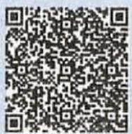

我的错题号  
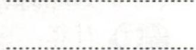

# 教材问题全解

# 教材第 17 页 “问题”

答案: 算式③用数轴表示如图 1-3-1 ①所示. 算式④用数轴表示如图 1-3-1 ②所示.

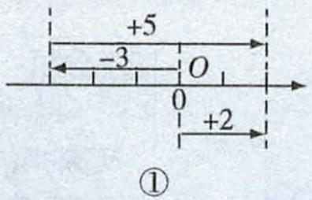

<details>
<summary>text_image</summary>

+5
-3 O
0 +2
①
</details>

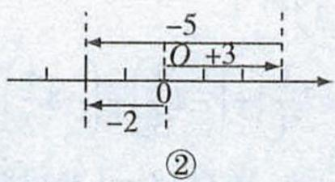

<details>
<summary>text_image</summary>

-5
O +3
0
-2
②
</details>

图1-3-1

教材第 18 页 “思考”

答案: 一个数同 0 相加, 仍得这个数.

教材第 19 页 “探究”

答案: $30+(-20)=10, (-20)+30=10$ , 两次所得的和相同, 换几个加数后所得的和仍相同. 结论略.

教材第 19 页 “探究”

答案: $[8+(-5)]+(-4)=-1,8+[(-5)+(-4)]=-1$ , 两次所得的和相同, 换几个加数后所得的和仍相同. 结论略.

教材第19页“问题”

答案: 例 2 的运算中, 把正数和负数分别相加, 从而使计算简化. 根据是加法的交换律和加法的结合律.

教材第20页“问题”

答案: 比较例 3 中的两种解法, 解法 2 把互为相反数的一对数结合起来相加, 可以使计算简化. 这种解法使用的是加法交换律和加法结合律.

教材第21页“填幻方”

<table><tr><td>1</td><td>2</td><td>-3</td></tr><tr><td>-4</td><td>0</td><td>4</td></tr><tr><td>3</td><td>-2</td><td>-1</td></tr></table>

,是将0填入中央的格中,交流略.(答案不唯一)

# 典型例题剖析


# 题型一 利用数轴信息进行有理数的加法运算

例① 若有理数 a, b, c 在数轴上的位置如图 1-3-2 所示, 则下列结论中, 错误的是()

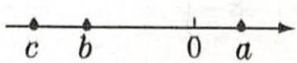  
图1-3-2

$$
\mathrm{A.} a + b <   0
$$

$$
\mathrm{B}. b + c <   0
$$

$$
C. a + b + c <   0
$$

$$
D. | a + b | = a + b
$$

解题关键: 先结合数轴提供的信息判断出有理数 a, b, c 的符号及绝对值的大小关系, 再运用有理数的加法运算法则分析判断.

解析: 根据有理数 a, b, c 在数轴上的位置可知, a > 0, b < 0, c < 0, 且 $|c| > |b| > |a|$ , 所以 $a + b < 0$ 是正确的, $b + c < 0$ 也是正确的, $a + b + c < 0$ 也是正

确的. 因为 $\left|a+b\right|>0$ , 而 $a+b<0$ , 所以选项 D 是错误的. 答案: D

# 规律总结

在数轴上,利用数形结合思想,一般可读出三个方面的信息:

(1) 对应点所表示的数是正数还是负数；  
(2) 对应点到原点的距离, 即绝对值的大小;  
(3)对应点表示的数的大小关系,即数轴上的数从左往右越来越大.

# 题型二 有理数与相反数、绝对值的综合考查

例② 若 $|x - 3|$ 与 $|y + 2|$ 互为相反数, 求 $x + y + 3$ 的值.

解题关键: 此题的题眼是“互为相反数”, 根据互为相反数的意义可知 $\left|x-3\right|+\left|y+2\right|=0$ , 然后根据绝对值的非负性可求出 x, y 的值.

解: 因为 $\left|x-3\right|$ 与 $\left|y+2\right|$ 互为相反数, 所以 $\left|x-3\right|+\left|y+2\right|=0$ .

因为 $|x - 3| \geqslant 0, |y + 2| \geqslant 0$ ，所以 $|x - 3| = 0, |y + 2| = 0$

即 $x - 3 = 0, y + 2 = 0$ .

所以 x = 3, y = -2.

所以 $x+y+3=3+(-2)+3=4.$

# 题型三 有理数的加法在实际生活中的应用

例③ 有一批食品罐头,标准质量为每听 454 g. 现抽取 10 听样品进行检测,结果如下表(单位:g):

<table><tr><td>听号</td><td>1</td><td>2</td><td>3</td><td>4</td><td>5</td><td>6</td><td>7</td><td>8</td><td>9</td><td>10</td></tr><tr><td>质量</td><td>444</td><td>459</td><td>454</td><td>459</td><td>454</td><td>454</td><td>449</td><td>454</td><td>459</td><td>464</td></tr></table>

这 10 听罐头的总质量是多少?

解法 1: 这 10 听罐头的总质量为

$$
4 4 4 + 4 5 9 + 4 5 4 + 4 5 9 + 4 5 4 + 4 5 4 + 4 4 9 + 4 5 4 + 4 5 9 + 4 6 4 = 4 5 5 0 (\mathrm{g}).
$$

解法 2: 把超过标准质量的克数用正数表示, 不足标准质量的克数用负数表示, 列出 10 听罐头与标准质量的差值表(单位: g):

<table><tr><td>听号</td><td>1</td><td>2</td><td>3</td><td>4</td><td>5</td></tr><tr><td>与标准质量的差值</td><td>-10</td><td>+5</td><td>0</td><td>+5</td><td>0</td></tr><tr><td colspan="6"></td></tr><tr><td>听号</td><td>6</td><td>7</td><td>8</td><td>9</td><td>10</td></tr><tr><td>与标准质量的差值</td><td>0</td><td>-5</td><td>0</td><td>+5</td><td>+10</td></tr></table>

这 10 听罐头与标准质量的差值的和为

$$
\begin{array}{r l} & (- 1 0) + 5 + 0 + 5 + 0 + 0 + (- 5) + 0 + 5 + 1 0 = [ (- 1 0) + 1 0 ] + [ (- 5) + 5 ] + 5 + 5 \\ & = 1 0 (\mathrm{g}). \end{array}
$$

因此,这10听罐头的总质量为 $454 \times 10 + 10 = 4540 + 10 = 4550$ (g).

例④ 小王上星期五买进某公司股票 1000 股, 每股 47 元, 下表为本周内每个交易日该股票的涨跌情况(单位: 元):

<table><tr><td>星期</td><td>一</td><td>二</td><td>三</td><td>四</td><td>五</td></tr><tr><td>每股涨跌</td><td>+4</td><td>+4.5</td><td>-1</td><td>-2.5</td><td>-4</td></tr></table>

(1) 星期三收盘时, 每股是多少元?

(2)本周内每股最高价是多少元？最低价是多少元？

解:(1) $47+(+4)+(+4.5)+(-1)=54.5$ （元）.

答: 星期三收盘时, 每股是 54.5 元.

(2)本周内每股最高价是 $47+(+4)+(+4.5)=55.5$ （元）.

最低价是 $47 + (+4) + (+4.5) + (-1) + (-2.5) + (-4) = 48$ （元）.

答:本周内每股最高价是55.5元,最低价是48元.

# 举一反三1（答案见第187页）

已知有理数 a, b, c 在数轴上的对应点如图 1-3-3 所示, 则

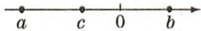  
图1-3-3

(1) $|a+b|=$ ;   
(2) $|a+c|=$

# 点拨

利用互为相反数的两数的和为零以及绝对值的非负性, 求出 x, y 的值, 再利用有理数的加法法则进行计算.

# 举一反三2（答案见第187页）

若 $|x + 1| + |y - 2| = 0$ ，则 $x + y =$

# 点拨

在求多个较大加数的和时, 可以先选取一个适当的数为标准, 然后求出每个加数与标准数的差值, 并灵活运用运算律, 可使运算过程简便且不容易出错.

# 举一反三3（答案见第187页）

7筐苹果, 以每筐 $25 \mathrm{~kg}$ 为标准, 超过的千克数记作正数, 不足的千克数记作负数, 称重的记录如下: $+2, -1, -2, +1, +3, -4, -3$ , 这7筐苹果实际质量各是多少千克? 这7筐苹果的实际总质量比标准总质量多还是少? 多或少多少千克?

# 分析

本周内每个交易日的股票价格都是在前一个交易日的基础上涨跌的.

例⑤ 出租汽车司机小王下午从停车场出发,一直沿着东西方向的大街行驶,到晚上6时,行驶记录如下(规定向东记为正,向西记为负,单位:km):

$$
+ 1 0, - 3, + 4, + 2, + 8, + 5, - 2, - 8, + 1 2, - 5, - 7.
$$

(1) 到晚上 6 时, 出租车在什么位置?

(2) 若出租车每千米耗油 0.06 L, 则从停车场出发到晚上 6 时, 出租车共耗油多少升? 若每升汽油 5.85 元, 则小王一共花了多少汽油费? (结果保留一位小数)

分析:(1)将这11个数相加,若和为正数,则说明出租车在停车场以东的位置;若和为负数,则说明出租车在停车场以西的位置;若和为零,则说明出租车在停车场.(2)要求出租车总的耗油量,需求出从下午出发到晚上6时,出租车行驶的总路程,即各数的绝对值的和.用总耗油量乘每升汽油的钱数即可得所花汽油费.

解:(1)(+10)+(-3)+(+4)+(+2)+(+8)+(+5)+(-2)+(-8)+(+12)+(-5)+(-7)=(10+4+2+8+5+12)+[(-3)+(-2)+(-8)+(-5)+(-7)]=41-25=16(km).

答: 到晚上 6 时, 出租车在停车场东 16 km 处.

(2) $|+10|+|-3|+|+4|+|+2|+|+8|+|+5|+|-2|+|-8|+|+12|+|-5|+|-7|=10+3+4+2+8+5+2+8+12+5+7=66(\text{km})$ .

$$
0. 0 6 \times 6 6 = 3. 9 6 (\mathrm{L}). 5. 8 5 \times 3. 9 6 \approx 2 3. 2 (\text {元}).
$$

答: 从停车场出发到晚上 6 时, 出租车共耗油 3.96 L. 小王一共花了 23.2 元汽油费.

# 题型四 程序计算题

例⑥ 按如图 1-3-4 所示的程序分别输入 -1, -2 进行计算, 请分别写出输出的结果.

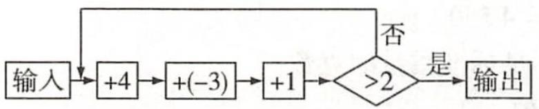

<details>
<summary>flowchart</summary>


</details>

图1-3-4

分析: 当输入 -1 时, 根据程序, 得 $-1+4+(-3)+1=1$ , 结果不大于 2, 需输入 1 再按程序计算, 得 $1+4+(-3)+1=3$ , 结果大于 2, 所以输出的结果为 3. 同样, 当输入 -2 时, 得 $-2+4+(-3)+1=0$ , 结果不大于 2, 需输入 0 按程序计算, 得 $0+4+(-3)+1=2$ , 结果不大于 2, 需再输入 2 按程序计算, 得 $2+4+(-3)+1=4$ , 结果大于 2, 所以输出的结果为 4.

解: 输出的结果分别为 3,4.

# 点拨

输入数据计算,所得的结果只有大于2时才能输出,否则要把结果重新输入计算程序,直至所得的数大于2时为止.本题的实质是考查能否熟练进行有理数的加法运算.

# 题型五 有理数加法运算的规律探究

# 1. 与运算律有关的规律探究题

例⑦ 计算: $1+(-2)+3+(-4)+5+(-6)+\cdots+2017+(-2018)+2019.$

解法 1:1+(-2)+3+(-4)+ $\cdots$ +2017+(-2018)+2019

$$
\begin{array}{l} = [ 1 + (- 2) ] + [ 3 + (- 4) ] + \dots + [ 2 0 1 7 + (- 2 0 1 8) ] + 2 0 1 9 \\ = [ \underbrace {(- 1) + (- 1) + \cdots + (- 1)} _ {1 0 0 9 \text {个}} ] + 2 0 1 9 \\ = - 1 0 0 9 + 2 0 1 9 = 2 0 1 9 - 1 0 0 9 = 1 0 1 0. \\ \end{array}
$$

解法 2:1+(-2)+3+(-4)+ $\cdots$ +2017+(-2018)+2019

# 点拨

解本题的关键是将实际问题转化为数学问题, 将求出租车所在的位置转化为求有理数的和; 将求出租车行驶的总路程转化为求各有理数的绝对值的和.

# 举一反三4（答案见第187页）

下表是小红一周的收支情况
(收入为正, 支出为负, 单位: 元):

<table><tr><td>星期一</td><td>星期二</td><td>星期三</td><td>星期四</td><td>星期五</td><td>星期六</td><td>星期日</td></tr><tr><td>+15</td><td>0</td><td>+15</td><td>0</td><td>+15</td><td>+20</td><td>+20</td></tr><tr><td>-8</td><td>-15</td><td>-19</td><td>-10</td><td>-9</td><td>-11</td><td>-6</td></tr></table>

(1) 在这一周内小红有多少结余?

(2) 照这样, 一个月(按 30 天计算) 小红有多少结余?

# 举一反三5（答案见第187页）

按图 1-3-5 所示程序进行计算, 并把各次结果填入表内:


图1-3-5

<table><tr><td>计算次数</td><td>计算结果</td></tr><tr><td>1</td><td></td></tr><tr><td>2</td><td></td></tr><tr><td>3</td><td></td></tr></table>

# 方法技巧

# 分组求和法

本题中“相邻两数符号相反，绝对值相差1”，所以将加数从左到右两个一组进行分组求和，可以使得计算更加简便。这种解决问题的方法称为分组求和法。

$$
\begin{array}{l} = 1 + [ (- 2) + 3 ] + [ (- 4) + 5 ] + \dots + [ (- 2 0 1 8) + 2 0 1 9 ] \\ = 1 + \underbrace {(1 + 1 + \cdots + 1)} _ {1 0 0 9 \text {个}} \\ = 1 + 1 0 0 9 = 1 0 1 0. \\ \end{array}
$$

# 2. 图表中的有理数加法规律探究题

例⑧ 从图1-3-6中找规律,并按规律在图1-3-7的空白格里填上合适的数.

分析: 由图 1-3-6 可以发现如下规律:

$$
(- 5) + (- 6) = - 1 1, (- 6) + (- 2) = - 8, (- 1 1) + (- 8) = - 1 9.
$$

由此可推出图 1-3-7 中空白格里的数是

$$
(- 4) + 1 2 = 8, 1 2 + (- 1 4) = - 2, 8 + (- 2) = 6.
$$

  
图1-3-6

  
图1-3-7

  
图1-3-8

解: 图 1-3-7 空白格里的数按如图 1-3-8 所示的结果填写.

# 点拨

本题是探究有理数加法运算规律的题目,解答的关键是分析题中“数”与“形”的特点,从中找出规律.

# 题型六 新定义运算

例⑨ 定义新运算: 对任意有理数 a, b, 都有 $a \oplus b = \frac{1}{a} + \frac{1}{b}$ . 例如, $2 \oplus 3 = \frac{1}{2} + \frac{1}{3} = \frac{5}{6}$ , 那么 $3 \oplus (-4)$ 的值是()

A.- $\frac{7}{12}$

B. $-\frac{1}{12}$

C. $\frac{1}{12}$

D. $\frac{7}{12}$

解析：∵ $a \oplus b = \frac{1}{a} + \frac{1}{b}$ ,

$$
\therefore 3 \oplus (- 4) = \frac {1}{3} + \frac {1}{- 4} = \frac {1}{3} + \left(- \frac {1}{4}\right) = \frac {1}{3} - \frac {1}{4} = \frac {1}{1 2}.
$$

答案: C

# 举一反三6（答案见第187页）

已知 $a_{1}+a_{2}=1, a_{2}+a_{3}=2, a_{3}+a_{4}=3,\cdots,a_{99}+a_{100}=99, a_{100}+a_{1}=100,$ 那么 $a_{1}+a_{2}+\cdots+a_{100}=$ \_\_\_\_.

# 举一反三7（答案见第187页）

如图 1-3-9 所示, 结合图形计算: $\frac{1}{2} + \frac{1}{4} + \frac{1}{8} + \frac{1}{16} + \frac{1}{32} + \frac{1}{64} + \frac{1}{128}$ .


<details>
<summary>geo</summary>

| Segment | Value |
|---|---|
| Top Left | 1/2 |
| Top Right | 1/4 |
| Bottom Left | 1/8 |
| Bottom Right | 1/16 |
| Bottom Right | 1/32 |
| Bottom Right | 1/64 |
| Bottom Right | 1/128 |
</details>

图1-3-9

# 举一反三8（答案见第187页）

符号“H”表示一种运算,它对正整数的运算结果如下: $H(1)=-2$ , $H(2)=3$ , $H(3)=-4$ , $H(4)=5,\cdots$ , 则 $H(7)+H(8)+H(9)+\cdots+H(99)$ 的结果为 \_\_\_\_.

# 中考考点对接

# 中考考点解读

解读 1: 有理数的加法运算, 主要考查对加法法则的理解, 中考中多以选择题、填空题的形式出现, 属基础题型, 难度较小.

解读 2: 有理数加法的运算律, 主要考查加法交换律和结合律, 在中考中多以选择题、填空题的形式出现,也有计算题.

# 中考典题剖析

# 一、有理数的加法

教材第18页例1节选

计算:(1)(-3)+(-9).

解： $(-3)+(-9)=-(3+9)=-12.$

中考真题1（2018·山东德州中考·4分）计算： $|-2+3|=$

解析： $|-2+3|=|+(3-2)|=|+1|=1.$

答案:1

。考题点睛。


中考真题与教材例题都是考查有理数的加法运算. 教材例题考查的是同号两数相加, 而中考真题考查的是异号两数相加的运算法则, 属基础题型, 较为简单.

# 二、有理数加法的运算律

教材第20页练习第1题节选 计算：(2) $(-2) + 3 + 1 + (-3) + 2 + (-4)$ .

解： $(-2) + 3 + 1 + (-3) + 2 + (-4) = [(-2) + 2] + [3 + (-3)] + 1 + (-4) = -3.$

中考真题2 (2018·贵州铜仁中考·4分)计算 $\frac{1}{2}+\frac{1}{6}+\frac{1}{12}+\frac{1}{20}+\frac{1}{30}+\cdots+\frac{1}{9900}$ 的值为()

A. $\frac{1}{100}$

B. $\frac{99}{100}$

C. $\frac{1}{99}$

D. $\frac{100}{99}$

解析： $\frac{1}{2}+\frac{1}{6}+\frac{1}{12}+\frac{1}{20}+\frac{1}{30}+\cdots+\frac{1}{9900}=\frac{1}{1\times2}+\frac{1}{2\times3}+\frac{1}{3\times4}+\frac{1}{4\times5}+\frac{1}{5\times6}+\cdots+\frac{1}{99\times100}$

$$
= 1 + \left(- \frac {1}{2}\right) + \frac {1}{2} + \left(- \frac {1}{3}\right) + \frac {1}{3} + \left(- \frac {1}{4}\right) + \dots + \frac {1}{9 9} + \left(- \frac {1}{1 0 0}\right) = 1 + \left(- \frac {1}{1 0 0}\right) = \frac {9 9}{1 0 0}.
$$

答案: B

考题点睛。


中考真题与教材练习题都考查了利用加法运算律求多个有理数的和, 将互为相反数的两个数结合相加是两个题的共同特征.

# 知识能力提升

# 重点内容总结


<details>
<summary>flowchart</summary>


</details>

# 易误易混总结

易误点1

异号两数相加易出现符号错误

绝对值不相等的异号两数相加, 先确定和的符号, 不要因将和的符号误认为是第一个加数的符号而出错.

易误点2

拆分带分数时出现符号错误

例 数学课上, 王老师要求同学们快速计算 $\left(+12\frac{5}{6}\right)+\left(-27\frac{1}{6}\right)$ 时, 嘉嘉和淇淇几乎同时举起了手, 他们的做法如下:

例题见“教材内容全解”例1.

<table><tr><td>嘉嘉的做法</td><td>淇淇的做法</td></tr><tr><td>解:原式 $= (+12) + \left( +\frac{5}{6} \right) + (-27)$  $+ \left( -\frac{1}{6} \right)$  $= [(+12) + (-27)] + \left[ \left( +\frac{5}{6} \right) + \left( -\frac{1}{6} \right) \right]$  $= -15 + \left( +\frac{2}{3} \right) = -14\frac{1}{3}$ </td><td>解:原式 $= (+12) + \left( +\frac{5}{6} \right) + (-27) + \frac{1}{6}$  $= [(+12) + (-27)] + \left( +\frac{5}{6} + \frac{1}{6} \right)$  $= -15 + 1$  $= -14$ </td></tr></table>

你认为谁的做法是正确的？

解: 嘉嘉的做法是正确的.

# 注意

一个带分数是由符号相同的整数部分与分数部分组成的,它们是同号相加的,当带分数为负数时,拆成的整数部分与分数部分均为负数.如 $-27\frac{1}{6}=$

$$
(- 2 7) + \left(- \frac {1}{6}\right) = - \left(2 7 + \frac {1}{6}\right) = - 2 7 - \frac {1}{6},
$$

$$
- 2 7 \frac {1}{6} \neq - 2 7 + \frac {1}{6}.
$$

# 综合提升训练»答案见187页

1. a, b, c 三个数在数轴上的位置如图 1-3-10 所示，下列结论不正确的是（）

$$
\begin{array}{c c c c c} & b & & a & c \\ \hline - 4 & - 3 & - 2 & - 1 & 0 & 1 & 2 \end{array}
$$

图1-3-10

A. $a+b<0$

B. $b+c<0$

C. $b+a>0$

D. $a+c>0$

2. 计算 $-(+1)+|-1|$ ，结果为（）

A.-2

B.2

C.1

D.0

3. 下列四个数中, 与 -2018 的和为 0 的数是( )

A.-2 018

B.2 018

C.0

$$
\mathrm{D.} - \frac {1}{2 0 1 8}
$$

4. 已知 $|x| = 3, |y| = 7, x < y$ , 则 $x + y =$ \_\_\_\_.

5. 已知 a 的相反数是 2b-4, b 的相反数是 $2a+1$ , 则 $a+b=$ \_\_\_\_.

6. x 是绝对值最小的有理数, y 是最小的正整数, z 是最大的负整数, 则 $x + y + z =$ \_\_\_\_.

7. 阅读下面的计算方法.

计算： $-5\frac{5}{6} +\left(-9\frac{2}{3}\right) + 17\frac{3}{4} +\left(-3\frac{1}{2}\right).$

解： $-5\frac{5}{6}+\left(-9\frac{2}{3}\right)+17\frac{3}{4}+\left(-3\frac{1}{2}\right)$

$$
\begin{array}{l} = \left[ (- 5) + \left(- \frac {5}{6}\right) \right] + \left[ (- 9) + \left(- \frac {2}{3}\right) \right] + \left(1 7 + \frac {3}{4}\right) + [ (- 3) \\ \left. + \left(- \frac {1}{2}\right) \right] \\ = [ (- 5) + (- 9) + 1 7 + (- 3) ] + \left[ \left(- \frac {5}{6}\right) + \left(- \frac {2}{3}\right) + \frac {3}{4} + \left(- \frac {1}{2}\right) \right] \\ = 0 + \left(- \frac {5}{4}\right) = - \frac {5}{4}. \\ \end{array}
$$

上面这种解题方法叫做拆项法,按此方法计算:

$$
\left(- 2 0 1 1 \frac {5}{6}\right) + \left(- 2 0 1 0 \frac {2}{3}\right) + 4 0 2 2 \frac {2}{3} + \left(- 1 \frac {1}{2}\right).
$$

# 课后习题全解

# 练习(教材第18页)

1. 解: (1) (-4) + (+7) = + (7-4) = 3 (℃);

(2) $(+7)+(-5)=2$ （元）.

点拨: 注意上升和收入用 “+” 号表示, 支出用 “-” 号表示.

2. 解: (1)-10; (2)-2; (3)2; (4)0;

(5)10; (6)-10; (7)0; (8)-6.

3. 解: (1) $15+(-22)=-(22-15)=-7$ ;

(2) $(-13) + (-8) = -(13 + 8) = -21$ ;   
(3) $(-0.9)+1.5=1.5-0.9=0.6$ ;   
(4) $\frac{1}{2} + \left(-\frac{2}{3}\right) = -\left(\frac{2}{3} - \frac{1}{2}\right) = -\left(\frac{4}{6} - \frac{3}{6}\right) = -\frac{1}{6}$ .

点拨:有理数的加法运算关键是确定结果的符号和结果的绝对值.

4. 解: 小明手中有 5 元钱, 花了 3 元钱买了一支笔, 他还有 2 元钱.

某地昨天气温是 $-5^{\circ}C$ ，今天的气温比昨天又下降了 $3^{\circ}C$ ，

今天的气温是 $-8^{\circ} \mathrm{C}$ . (答案不唯一)

# 练习(教材第20页)

1. 解: (1) $23 + (-17) + 6 + (-22) = (23 + 6) + [(-17) + (-22)]$

$$
= 2 9 + (- 3 9) = - 1 0;
$$

(2) $(-2) + 3 + 1 + (-3) + 2 + (-4) = [(-2) + 2] + [3 + (-3)]$

$$
+ 1 + (- 4) = - 3.
$$

2. 解: (1) $1 + \left(-\frac{1}{2}\right) + \frac{1}{3} + \left(-\frac{1}{6}\right)$

$$
= \frac {1}{2} + \frac {1}{3} + \left(- \frac {1}{6}\right) = \frac {3}{6} + \frac {2}{6} + \left(- \frac {1}{6}\right) = \frac {2}{3};
$$

(2) $3\frac{1}{4} + \left(-2\frac{3}{5}\right) + 5\frac{3}{4} + \left(-8\frac{2}{5}\right)$

$$
= \left(3 \frac {1}{4} + 5 \frac {3}{4}\right) + \left[ \left(- 2 \frac {3}{5}\right) + \left(- 8 \frac {2}{5}\right) \right]
$$

$$
= 9 + (- 1 1) = - 2.
$$

# 1.3.2 有理数的减法

# 关键词

# 学习目标导航

有理数的减法法则
有理数的加减混合
运算

1. 掌握有理数减法的运算法则,理解减法法则与加法法则的关系,体会转化的思想方法.   
2. 能熟练地进行有理数的减法运算,会进行有理数的加减混合运算,会解决简单的实际问题.  
3. 能将和式中的括号和加号省略, 并利用加法运算律进行相关计算.

# 教材内容全解

# 知识点一 有理数的减法法则


🔥🔥🔥

# 1. 有理数的减法法则

减去一个数,等于加这个数的相反数. 即 $a-b=a+(-b)$ .
被减数不变 减数变为相反数


<details>
<summary>flowchart</summary>


</details>


<details>
<summary>flowchart</summary>


</details>

# 提示

有理数的减法, 可以先将减法转化为加法, 再按有理数的加法法则和运算律计算.

# 2. 有理数减法的三种情况

(1) 减去一个正数等于加上一个负数; (2) 减去一个负数等于加上一个正数; (3) 任何数减去 0 仍得这个数, 0 减去一个数等于这个数的相反数.

例① 计算:(1)2-(-3);

(2) $0 - (-3.72) - (+2.72) - (-4)$ ;   
(3) $\left(+\frac{4}{7}\right)-3\frac{1}{3}$ .

分析: 利用有理数的减法法则将减法转化为加法进行计算.

解:(1)2-(-3)=2+3=5;

$$
\begin{array}{l} (2) 0 - (- 3. 7 2) - (+ 2. 7 2) - (- 4) \\ = 0 + 3. 7 2 + (- 2. 7 2) + 4 \\ = (0 + 4) + (3. 7 2 - 2. 7 2) = 4 + 1 = 5; \\ \end{array}
$$

$$
\begin{array}{l} (2) 0 - (- 3. 7 2) - (+ 2. 7 2) - (- 4) \\ = 0 + 3. 7 2 + (- 2. 7 2) + 4 \\ = (0 + 4) + (3. 7 2 - 2. 7 2) = 4 + 1 = 5; \\ \end{array}
$$

(3) $\left(+\frac{4}{7}\right) - 3\frac{1}{3} = \frac{4}{7} + \left(-3\frac{1}{3}\right)$

$$
= - \left(3 \frac {1}{3} - \frac {4}{7}\right) = - \left(\frac {7 0}{2 1} - \frac {1 2}{2 1}\right) = - 2 \frac {1 6}{2 1}.
$$

# 知识点二 有理数的加减混合运算


🔥🔥🔥

有理数加减混合运算的方法

有括号的, 先算括号内的; 没有括号的, 先将减法转化为加法, 再利

# →简称“两变一不变”


<details>
<summary>text_image</summary>

知识点微课
</details>

# 注意

减法没有交换律. 被减数与减数的位置不能改变.

# ▶ 拓展

(1) 在有理数的减法中, 当减数为正数时, 差一定小于被减数; 当减数为负数时, 差一定大于被减数.  
(2) 大数减小数的差为正, 小数减大数的差为负, 相等两数的差为 0. 用字母表示为: 若 a > b, 则 a - b > 0; 若 a < b, 则 a - b < 0; 若 a = b, 则 a - b = 0.

# 注意

在减法运算中应注意运算符号与性质符号的区别, 不要将运算符号“减号”与字母取值的“负号”混淆. 因此, 减号后面是负数时, 要注意给负数添上括号, 否则容易出现符号混乱, 从而导致计算结果错误.

用加法交换律和结合律进行简化计算.

例② 计算:(1)(+9)-(+10)+(-2)-(-8)+3;

(2) $-5.13 + 4.62 + (-8.47) - (-2.3)$ ;

(3) $\frac{3}{4}-\frac{7}{2}+\left(-\frac{1}{6}\right)-\left(-\frac{2}{3}\right)-1.$

解:(1)(+9)-(+10)+(-2)-(-8)+3=(+9)+(-10)+(-2)+8+3

$= (9 + 8 + 3) + [(-10) + (-2)] = 20 + (-12) = 8$ ; 减法转化为加法

(2) $-5.13 + 4.62 + (-8.47) - (-2.3) = -5.13 + 4.62 + (-8.47) + 2.3$

$= [-5.13 + (-8.47)] + (4.62 + 2.3)$ 加法交换律与结合律

$= -13.6 + 6.92 = -6.68$

(3) $\frac{3}{4} - \frac{7}{2} + \left(-\frac{1}{6}\right) - \left(-\frac{2}{3}\right) - 1 = \frac{3}{4} + \left(-\frac{7}{2}\right) + \left(-\frac{1}{6}\right) + \frac{2}{3} - 1$

$$
= \left[ \frac {3}{4} + \left(- \frac {7}{2}\right) \right] + \left[ \left(- \frac {1}{6}\right) + \frac {2}{3} \right] - 1
$$

$$
= \left[ \frac {3}{4} + \left(- \frac {1 4}{4}\right) \right] + \left[ \left(- \frac {1}{6}\right) + \frac {4}{6} \right] - 1
$$

$$
= \left(- \frac {1 1}{4}\right) + \frac {1}{2} - 1 = \left[ \left(- \frac {1 1}{4}\right) + \frac {2}{4} \right] - 1
$$

$$
= - \frac {9}{4} - 1 = - \frac {1 3}{4}.
$$

# 知识点三 省略加号的和式的写法及读法

🔥🔥🔥

# 1. 省略加号的和式的写法

在和式里可以把加号及加数的括号省略不写,以简化书写形式.如 $(-20)+(-3)+(+2)+(-5)$ 可以写成 $-20-3+2-5$ .

# 2. 省略加号的和式的读法

(1) 按结果读, 是性质符号和数字在一起的和, 正负不能省略;

(2) 按运算读, 是加减, 但第一个加数如果是负的, 这个 “-” 号要读 “负” 而不能读 “减”, 其余数字前面的符号按运算符号读.

如 $-20-3+2-5$ 的读法: (1) 按加法的结果来读: 负 20、负 3、正 2、负 5 的和; (2) 按运算来读: 负 20 减 3 加 2 减 5.

例③ 把 $\frac{1}{2}+\left(-\frac{2}{3}\right)-\left(-\frac{3}{4}\right)-\left(+\frac{2}{5}\right)+\frac{1}{4}$ 写成省略加号和括号的和式，并把它读出来.

分析: 先将加减混合运算统一成加法运算, 再写成省略加号和括号的和式.

解： $\frac{1}{2} +\left(-\frac{2}{3}\right) - \left(-\frac{3}{4}\right) - \left(+\frac{2}{5}\right) + \frac{1}{4}$

$$
= \frac {1}{2} + \left(- \frac {2}{3}\right) + \left(+ \frac {3}{4}\right) + \left(- \frac {2}{5}\right) + \frac {1}{4}
$$

$$
= \frac {1}{2} - \frac {2}{3} + \frac {3}{4} - \frac {2}{5} + \frac {1}{4}.
$$

读作: 正 $\frac{1}{2}$ 、负 $\frac{2}{3}$ 、正 $\frac{3}{4}$ 、负 $\frac{2}{5}$ 、正 $\frac{1}{4}$ 的和或 $\frac{1}{2}$ 减 $\frac{2}{3}$ 加 $\frac{3}{4}$ 减 $\frac{2}{5}$ 加 $\frac{1}{4}$ .

# 注意

进行有理数加减混合运算时，应有条理地按步骤进行，不要随意地跳步，否则容易出错。

# ▶ 拓展

由于根据有理数的减法法则能将减法转化为加法,所以加减混合运算能统一为省略加号、括号的几个正数或负数的和的形式.

# 注意

(1) 加号可以省略, 但必须保留性质符号;  
(2) 省略加号和括号的和式中的每一个数连同它的性质符号可以看成一“项”，都是和式中的一个加数。

扫码练基础   
  
我的错题号


教材第21页“问题” 答案:从温度计可以直观地看出,3℃比-3℃高6℃.

教材第 22 页 “探究” 答案: 从③式能看出减 -3 相当于加 +3.

$$
0 - (- 3) = 0 + 3 = 3, (- 1) - (- 3) = (- 1) + 3 = 2, (- 5) - (- 3) = (- 5) + 3 = - 2.
$$

这些数减 -3 的结果与它们加 +3 的结果相同. $9-8 = 1, 9+(-8) = 1, 15-7 = 8, 15+(-7) = 8$ .

新发现: 减 8 相当于加(-8), 减 7 相当于加(-7), 即减去一个数, 相当于加上这个数的相反数.

教材第 22 页 “思考” 答案: 会, 如 $1-2 = 1 + (-2) = -1$ , $(-1) - 1 = (-1) + (-1) = -2$ .

一般地,较小的数减去较大的数,所得的差的符号是负号.

教材第 23 页 “问题” 答案: 减法转化为加法后使用了加法交换律和加法结合律.

教材第 24 页“探究” 答案: a = 2, b = 6 时, 点 A, B 之间的距离是 $\left|2 - 6\right| = 4$ ; a = 0, b = 6 时,点 A, B 之间的距离是 $\left|0-6\right|=6$ ; a=2, b=-6 时, 点 A, B 之间的距离是 $\left|2-(-6)\right|=8$ ; a=-2, b=-6 时, 点 A, B 之间的距离是 $\left|-2-(-6)\right|=4$ . 由此可以得出点 A, B 之间的距离等于数 a, b 差的绝对值. (或两点之间的距离等于两点所表示的数中较大的数减去较小的数)

# 典型例题剖析

# 题型一 有理数的加减混合运算

例① 计算:(1)(-40)-(+27)+19-24-(-32);

(2) $-\frac{1}{3}+\frac{3}{4}-\frac{5}{6}-\frac{1}{2}$ .

解:(1)(-40)-(+27)+19-24-(-32)=(-40)+(-27)+19+(-24)+(+32)

$$
= - 4 0 - 2 7 + 1 9 - 2 4 + 3 2
$$

$$
= (- 4 0 - 2 7 - 2 4) + (1 9 + 3 2)
$$

$$
= - 9 1 + 5 1 = - 4 0;
$$

(2) $-\frac{1}{3}+\frac{3}{4}-\frac{5}{6}-\frac{1}{2}=\left(-\frac{1}{3}-\frac{5}{6}\right)+\left(\frac{3}{4}-\frac{1}{2}\right)$

$$
= - \frac {7}{6} + \frac {1}{4} = - \frac {1 1}{1 2}.
$$

例② 用简便方法计算：

1-2-3+4+5-6-7+8+9-10-11+12+ $\cdots$ +2 013-2 014-2 015+2 016+2 017.

解题关键: 观察式子的特点可发现, 此题隐含着 “从第一项开始, 每相邻四个数的和为 0” 这一规律, 根据这一规律即可求解.

$$
\begin{array}{l} = (1 - 2 - 3 + 4) + (5 - 6 - 7 + 8) + (9 - 1 0 - 1 1 + 1 2) + \dots + (2 0 1 3 - 2 0 1 4 - \\ 2 0 1 5 + 2 0 1 6) + 2 0 1 7 \\ = 0 + 0 + 0 + \dots + 0 + 2 0 1 7 = 2 0 1 7. \\ \end{array}
$$

解: $1-2-3+4+5-6-7+8+9-10-11+12+\cdots+2013-2014-2015+2016+2017$

# 题型二 绝对值与有理数的减法的综合问题

例③ 若 $|m| = 37, |n| = 31$ ，且 $|m + n| = -(m + n)$ ，求 $m - n$ 的值.

解: 由 $|m|=37, |n|=31$ , 得 $m=\pm37, n=\pm31$ .

又因为 $|m + n| = -(m + n)$

所以 $m+n \leqslant 0.$

所以 m = -37, n = 31 或 m = -37, n = -31.

当 m = -37, n = 31 时, m - n = -37 - 31 = -68;

当 m = -37, n = -31 时, $m - n = -37 - (-31) = -37 + 31 = -6$ .

综上，m-n 的值为 -68 或 -6.

举一反三1（答案见第188页）计算：

(1) $8.25 - \left(+\frac{1}{4}\right) + 3\frac{1}{8} - \left(-4\frac{3}{8}\right)$ ;

(2) $\left(-5\frac{1}{2}\right)+\left(+1\frac{1}{2}\right)-\left(-6\frac{3}{4}\right).$


进行有理数的加减混合运算时, 可通过分组求和法简化运算. 如此题中将相邻的四个数组合在一起, 简化了运算过程.

举一反三2（答案见第188页）

已知 $a, b, c$ 满足 $|a - 1| + 2|b - 3| + |c + 4| = 0$ ，求 $2a - 3b + 4c$ 的值.

# 题型三 利用有理数减法求数轴上两点间的距离

例4 求下列每对数在数轴上的对应点之间的距离.

(1)8 和 6; (2)8 和 0; (3)0 和 -6; (4)8 和 -6;  
(5)-8 和 6 ; (6)-8 和 -6.

解:(1)如图 1-3-11 (1)所示,距离为 $\left|8-6\right|=8-6=2$ .

(2)如图1-3-11(2)所示,距离为 $|8-0|=8-0=8$ .   
(3)如图1-3-11(3)所示,距离为 $|0-(-6)|=6$ .   
(4) 如图 1-3-11 (4) 所示, 距离为 $\left|8-(-6)\right|=8+6=14$ .  
(5)如图1-3-11(5)所示,距离为 $|6-(-8)|=6+8=14.$   
(6)如图1-3-11(6)所示,距离为 $|(-6)-(-8)|=|(-6)+8|=2.$


<details>
<summary>text_image</summary>

(1)
(2)
(3)
(4)
(5)
(6)
</details>

图1-3-11

# 题型四 利用数轴信息进行有理数的加减运算

例⑤ 已知有理数 a, b 在数轴上的对应位置如图 1-3-12 所示, 则下列结论正确的是()

  
图1-3-12

$$
\mathrm{A.} a + b <   0
$$

$$
\mathrm{B.} a - b > 0
$$

$$
\mathrm{C.} b - a = 0
$$

$$
\mathrm{D}. a - b <   0
$$

解析: 从数轴上可以看出 “a<0, b>0, 且 $|a|<|b|$ ”. 根据有理数的加法法则, 绝对值不相等的异号两数相加, 和的符号取绝对值较大的加数的符号, 所以 $a+b>0$ . 在有理数的减法中, 大减小, 差为正; 小减大, 差为负; 两数相等, 差为 0, 可知 a-b<0, b-a>0. 答案: D

例⑥ 已知 a, b, c, d 为有理数，并且 a, b, c, d 在数轴上的对应位置如图 1-3-14 所示，试求 $\left|a-b\right|-\left|b-c\right|+\left|c\right|-\left|b+d\right|$ 的值.

  
图1-3-14

分析: 化简含绝对值的式子的关键是判断绝对值符号内算式的正负. 由 a, b, c, d 在数轴上的对应位置, 可知 a > b, b < c, c > 0, b < 0, d < 0, 所以 a - b > 0, b - c < 0, b + d < 0.

解： $|a-b|-|b-c|+|c|-|b+d|=(a-b)-(-b+c)+c-(-b-d)$

$$
= a - b + b - c + c + b + d = a + b + d.
$$

# 方法技巧

# 解含绝对值的有理数加减法的方法

首先是判断绝对值符号内式子的正负, 然后根据 $|a| = \begin{cases} a (a > 0), \\ 0 (a = 0), \\ -a (a < 0) \end{cases}$ 去绝对值符号, 最后利用有理数的加减混合运算的方法进行计算.

# 题型五 新定义运算问题

例⑦ 如果 $\triangle\begin{array}{cc}a\\b&c\end{array}$ 表示运算 $a-b+c,\boxed{a\quad d}\boxed{b\quad c}$ 表示运算 $a-b+c-d$ ，那么

# 一规律总结一

如果数轴上 A, B 两点所表示的数分别为 a, b，则这两个点之间的距离为 $AB = |a - b|$ ，即在数轴上，任意两点间的距离等于这两点所表示的数的差的绝对值。


# 举一反三 3 (答案见第 188 页)

|4-1| 表示 4 与 1 差的绝对值，也可以理解为 4 与 1 两数在数轴上所对应的两点之间的距离；|4+1| 可以看作 |4-(-1)|，表示 4 与 -1 的差的绝对值，也可以理解为 4 与 -1 两数在数轴上所对应的两点间的距离。则使得 |x+3|=5 的 x 的值为 \_\_\_\_.


# 举一反三 4（答案见第 188 页）

有理数 a, b 在数轴上的位置如图 1-3-13 所示, 则 $|a-b|$ 可化简为()

  
图1-3-13

$$
\mathrm{A.} a - b
$$

$$
\mathrm{B}. b - a
$$

$$
\mathrm{C.} a + b
$$

$$
\mathrm{D.-} a - b
$$


# 举一反三5（答案见第188页）

有理数 a, b, c 在数轴上的位置如图 1-3-15 所示, 试化简式子 $\left|a-c\right|-\left|a-b\right|+\left|2a\right|$ .
c a 0 b

图1-3-15

$-1$ $-2-3$ - $\boxed{2016\ 2019}$ 的结果是什么？

分析: 利用新定义的运算方法将新定义运算转化为普通运算求解.

解： $\boxed{-1,-2,-3}$ - $\boxed{2016\ 2019\ 2017\ 2018}$

$$
\begin{array}{l} = [ (- 1) - (- 2) + (- 3) ] - (2 0 1 6 - 2 0 1 7 + 2 0 1 8 - 2 0 1 9) \\ = (- 1 + 2 - 3) - [ (2 0 1 6 - 2 0 1 7) + (2 0 1 8 - 2 0 1 9) ] \\ = (- 1 + 2 - 3) - (- 1 - 1) = - 2 - (- 2) = - 2 + 2 = 0. \\ \end{array}
$$

# 题型六 有理数的加减在实际生活中的应用

例⑧ 某市冬季的一天, 最高气温为 $6^{\circ}C$ , 最低气温为 $-11^{\circ}C$ . 这天晚上的天气预报显示, 将有一股冷空气来袭, 该市第二天气温将下降 $10^{\circ}C \sim 12^{\circ}C$ . 请你利用以上信息, 估计第二天该市的最高气温不会高于多少, 最低气温不会低于多少.

分析: 气温下降 $10^{\circ}C \sim 12^{\circ}C$ 的含义是最少下降 $10^{\circ}C$ ，最多下降 $12^{\circ}C$ 。估计第二天的最高气温应用当天的最高气温减 $10^{\circ}C$ ，估计最低气温则应用当天的最低气温减 $12^{\circ}C$ 。

解:6-10 = 6+ (-10) = - (10-6) = -4 (℃).

$$
- 1 1 - 1 2 = (- 1 1) + (- 1 2) = - (1 1 + 1 2) = - 2 3 \left(^ {\circ} \mathrm{C}\right).
$$

答:估计第二天该市最高气温不会高于 $-4^{\circ}C$ , 最低气温不会低于 $-23^{\circ}C$ .

例9 某校举办秋季运动会, 七年级(1)班和七年级(2)班进行拔河比赛, 比赛规定标志物红绸向某班方向移动 $2 \mathrm{~m}$ 或 $2 \mathrm{~m}$ 以上, 该班就获胜. 红绸先向(2)班移动 $0.2 \mathrm{~m}$ 后又向(1)班移动 $0.5 \mathrm{~m}$ , 相持几秒后, 红绸向(2)班移动 $0.8 \mathrm{~m}$ , 随后又向(1)班移动 $1.4 \mathrm{~m}$ , 在一片欢呼声中, 红绸再向(1)班移动 $1.3 \mathrm{~m}$ , 裁判员一声哨响, 比赛结束. 请你用计算的方法说明最终获胜的是几班?

分析: 此题要判断哪一班获胜即判断最后标志物红绸向哪个班方向移动 2 m 或 2 m 以上, 与方向有关, 因此, 应先明确正方向, 再由题意列出算式算出结果, 最后根据结果的符号说明哪个班获胜.

解: 记红绸向(1)班方向移动为正, 向(2)班方向移动为负,

根据题意， $-0.2 + 0.5 - 0.8 + 1.4 + 1.3 = (-0.2 - 0.8) + (0.5 + 1.4 + 1.3) = -1+$ $3.2 = 2.2(\mathrm{m})$

说明红绸向(1)班方向移动2.2m,(1)班胜.

# 点拨

解此类题目的关键是首先确定好正方向(本题也可规定向(2)班方向移动为正, 向(1)班方向移动为负), 然后利用正负数表示一组具有相反意义的量, 最后进行有理数加减混合运算即可.

# 题型七 规律探究创新题

例10（核心素养题）观察下列各式： $\frac{1}{1\times 2} = 1 - \frac{1}{2},\frac{1}{2\times 3} = \frac{1}{2} -\frac{1}{3},$ $\frac{1}{3\times 4} = \frac{1}{3} -\frac{1}{4},\dots .$

(1)请根据以上式子填空：

① $\frac{1}{8\times9}=$ \_\_\_\_ ; ② $\frac{1}{n(n+1)}=$ \_\_\_\_ (n 是正整数).

(2)由以上几个式子及你所找到的规律计算：

$$
\frac {1}{1 \times 2} + \frac {1}{2 \times 3} + \frac {1}{3 \times 4} + \dots + \frac {1}{2 0 1 5 \times 2 0 1 6}.
$$

举一反三6（答案见第188页）

若 $\begin{array}{cc}x & w \\ y & z\end{array}$ 表示运算 $x+z-(y+w)$ ,
则 $\boxed{3 -5}_{-2 -1}$ 的值为()

A.5

B.7

C.9

D.11


<details>
<summary>text_image</summary>

题型微课
</details>


# 举一反三 7（答案见第 188 页）

某集团公司对所属甲、乙两分厂上半年经营情况记录(其中“+”表示盈利,“-”表示亏损,单位:亿元)如下表:

<table><tr><td>月份</td><td>一</td><td>二</td><td>三</td><td>四</td><td>五</td><td>六</td></tr><tr><td>甲厂</td><td>-0.1</td><td>-0.4</td><td>+0.3</td><td>0</td><td>+1.2</td><td>+1.1</td></tr><tr><td>乙厂</td><td>+1.1</td><td>-0.7</td><td>-1.5</td><td>+0.8</td><td>-1.0</td><td>+0.7</td></tr></table>

(1)二月份乙厂比甲厂多亏损多少亿元?   
(2) 分别计算上半年甲、乙两个分厂盈利或亏损多少亿元.  
(3) 上半年甲厂比乙厂多盈利（或亏损）多少亿元？

# 方法技巧

# 裂项法

裂项法, 即把一项或一个数裂分开, 裂项后重组或裂项后错位相加, 使本来采用常规方法不易解决或不能解决的计算或比较大小问题变得易解决或能解决. 如此题中将 $\frac{1}{n(n + 1)}$ 裂分成 $\frac{1}{n} - \frac{1}{n + 1}$ .

分析: 通过分析得出 $\frac{1}{n(n+1)}=\frac{1}{n}-\frac{1}{n+1}$ .

解:(1)① $\frac{1}{8}-\frac{1}{9}$ ② $\frac{1}{n}-\frac{1}{n+1}$

$$
\begin{array}{l} = 1 - \frac {1}{2} + \frac {1}{2} - \frac {1}{3} + \frac {1}{3} - \frac {1}{4} + \dots + \frac {1}{2 0 1 5} - \frac {1}{2 0 1 6} \\ = 1 - \frac {1}{2 0 1 6} = \frac {2 0 1 5}{2 0 1 6}. \\ \end{array}
$$

(2) $\frac{1}{1 \times 2} + \frac{1}{2 \times 3} + \frac{1}{3 \times 4} + \cdots + \frac{1}{2015 \times 2016}$


举一反三 8 (答案见第 188 页)

计算： $\left|\frac{1}{2}-1\right|+\left|\frac{1}{3}-\frac{1}{2}\right|+\left|\frac{1}{4}-\frac{1}{3}\right|+\cdots+\left|\frac{1}{100}-\frac{1}{99}\right|$

# 中考考点对接


# 中考考点解读

解读: 有理数的减法运算, 主要考查运用有理数的减法法则进行计算, 题目较简单, 题型以选择题、填空题为主.


# 中考典题剖析

# 一、有理数的减法

教材第25页习题1.3第4题节选

计算:(4) $\left(-\frac{1}{2}\right)-\frac{1}{3}$ .

解： $\left(-\frac{1}{2}\right) - \frac{1}{3} = \left(-\frac{1}{2}\right) + \left(-\frac{1}{3}\right) = -\left(\frac{1}{2} +\frac{1}{3}\right) = -\frac{5}{6}.$

中考真题1

(2018·呼和浩特中考·3分)-3-(-2)

的值是( )

A.-1

B.1

C.5

D.-5

解析： $-3-(-2)=-3+2=-(3-2)=-1.$

答案: A


中考真题与教材习题均考查了有理数的减法法则,解题思路完全一致,这体现了“中考真题源于教材,又回归教材”的数学理念.

# 二、有理数减法的实际应用

教材第23页练习第2题

计算:(1)比2℃低8℃的温度;

(2) 比 $-3^{\circ}C$ 低 $6^{\circ}C$ 的温度.

解:(1)2-8 = -6 (℃);

(2) $(-3)-6=-9$ (℃).

中考真题2

(2018·湖北咸宁中考·3分)咸宁冬季

里某一天的气温为 $-3^{\circ} \mathrm{C} \sim 2^{\circ} \mathrm{C}$ , 则这一天的温差为( )

A. ${1}^{ \circ  }\mathrm{C}$

B.-1 ℃

C.5 ℃

D.-5 ℃

解析:2-(-3)=2+3=5(℃).

答案: C


中考真题与教材练习题都考查了有理数减法运算的简单实际应用,中考真题比教材练习题多了实际生活背景,考查了应用数学知识解决实际问题的能力.

# 知识能力提升

# 重点内容总结

$a - b = a + (-b)$

减去一个数，等于加这个数的相反数

法则

有理数的减法

加减混合运算

统一成加法运算

运用运算律简化计算

# 第一章

# 易误易混总结

# 易误点1

# 混淆有理数减法中的运算符号和性质符号

运用减法法则进行运算时,往往易忽略减数性质符号的改变而导致出错.有理数减法运算过程体现了转化的数学思想,在进行转化的过程中,切记“两变”,不可马虎.

# 易误点2

# 运用运算律时符号出错

在进行有理数加减混合运算时, 若要先交换加数的位置再进行计算, 应将加数前面的符号一起交换, 即数的符号要跟着数一起 “搬家”, 计算时不要因忽视这一点而出错.

例题见“教材内容全解”例3.

例题见“教材内容全解”例2.

# 综合提升训练»答案见188页

1. 从四个有理数 $\frac{1}{2}, 0, 1, -2$ 中任取两个相减, 差最小为( )

A.-2

B.-3

C.-1

D. $-\frac{1}{2}$

2. 下列各式中正确的是( )

A.+5-(-6)=11

B.-7-|-7|=0

C.-5+ (+3) = 2

D. $(-2)+(-5)=7$

3. 若 a 的相反数是 -3, b 的绝对值是 4, 且 $|b| = -b$ , 则 a - b = \_\_\_\_.

4. 计算: $-1+2-3+4-5+6-7+8-\cdots-95+96-97+98-99+$ 100 = \_\_\_\_.

5. 高速公路养护小组乘汽车沿东西向公路巡视维护，如果向东为正，向西为负，那么当天的行驶记录如下(单位:千米):

$$
+ 1 7, - 9, + 7, - 1 5, - 3, + 1 1, - 6, - 8, + 5, + 1 6
$$

(1)养护小组最后到达的地方在出发点的哪个方

向？距出发点多远？

(2)巡视维护过程中,最远处离出发点有多远?   
(3) 若汽车耗油量为 a 升 / 千米, 则这次巡视维护共耗油多少升?

6. 问题: 能否将 1,2,3,4,5,6,7,8,9,10 这 10 个数分成两组, 使它们的差为 5?

解：∵ $1+2+3+4+\cdots+10=55$ ,

∴ 要使两组数的差为 5, 需要将这 10 个数分成的两组数的和分别为 30, 25, 然后将它们相减.

下面给出一种分法：

(6+7+8+9)-(1+2+3+4+5+10)=5.

应用: 在 1,2,3,4,5,6,7,8,9,10 这 10 个数前面任意添上 “+” 号或 “-” 号.

(1)能否使它们的和等于-7？若能，请给出一种添法；若不能，请说明理由.  
(2)能否使它们的和等于-2？若能，请给出一种添法；若不能，请说明理由.

# 课后习题全解

# 练习(教材第23页)

1. 解: (1) 6-9 = 6+ (-9) = - (9-6) = -3.

(2) $(+4) - (-7) = (+4) + (+7) = + (4 + 7) = 11.$

(3) $(-5)-(-8)=(-5)+(+8)=+(8-5)=3.$

(4) $0 - (-5) = 0 + (+5) = 5.$

(5)-2.5-5.9=(-2.5)+(-5.9)=- (2.5+5.9)=-8.4.

(6)1.9-(-0.6)=1.9+(+0.6)=2.5.

2. 解: (1) 2-8 = -6 (℃);

(2) $(-3)-6=-9\ (°C)$ .

# 练习(教材第24页)

解:(1) $1-4+3-0.5=(1+3-4)-0.5=0-0.5=-0.5.$

(2) $-2.4 + 3.5 - 4.6 + 3.5 = -(2.4 + 4.6) + (3.5 + 3.5)$

$$
= - 7 + 7 = 0.
$$

(3) $(-7)-(+5)+(-4)-(-10)=(-7)+(-5)+(-4)+(+10)$

$$
= - (7 + 5 + 4) + 1 0
$$

$$
= - 1 6 + 1 0 = - 6.
$$

$$
\begin{array}{l} \frac {3}{4} - \frac {7}{2} + \left(- \frac {1}{6}\right) - \left(- \frac {2}{3}\right) - 1 = \frac {3}{4} - \frac {7}{2} + \left(- \frac {1}{6}\right) + \left(+ \frac {2}{3}\right) - 1 \tag {4} \\ = \frac {3}{4} - \frac {7}{2} - \frac {1}{6} + \frac {2}{3} - 1 \\ = \frac {9 - 4 2 - 2 + 8 - 1 2}{1 2} \\ = - \frac {3 9}{1 2} = - \frac {1 3}{4} = - 3 \frac {1}{4}. \\ \end{array}
$$

点拨: 将加、减法统一为加法后可写成省略加号和括号的形式, 再进行恰当的简便运算.

# 习题1.3（教材第24页）

1. 解: (1) (-10) + (+6) = - (10-6) = -4.

(2) $(+12) + (-4) = 12 - 4 = 8.$   
(3) $(-5) + (-7) = -(5 + 7) = -12.$   
(4) (+6) + (-9) = - (9-6) = -3.   
(5) $(-0.9) + (-2.7) = -(0.9 + 2.7) = -3.6.$

(6) $\frac{2}{5}+\left(-\frac{3}{5}\right)=-\left(\frac{3}{5}-\frac{2}{5}\right)=-\frac{1}{5}.$

(7) $\left(-\frac{1}{3}\right)+\frac{2}{5}=\frac{2}{5}-\frac{1}{3}=\frac{1}{15}$

(8) $\left(-3\frac{1}{4}\right) + \left(-1\frac{1}{12}\right)$

$$
= \left(- \frac {1 3}{4}\right) + \left(- \frac {1 3}{1 2}\right)
$$

$$
= - \left(\frac {1 3}{4} + \frac {1 3}{1 2}\right) = - 4 \frac {1}{3}.
$$

2. 解: (1) (-8) + 10 + 2 + (-1)

$$
\begin{array}{l} = (1 0 + 2) + [ (- 8) + (- 1) ] \\ = 1 2 - 9 = 3. \\ \end{array}
$$

$$
\begin{array}{l} 5 + (- 6) + 3 + 9 + (- 4) + (- 7) \\ = (5 + 3 + 9) + [ (- 6) + (- 4) + (- 7) ] \\ = 1 7 - 1 7 = 0. \\ \end{array}
$$

$$
\begin{array}{l} (3) (- 0. 8) + 1. 2 + (- 0. 7) + (- 2. 1) + 0. 8 + 3. 5 \\ = [ (- 0. 8) + 0. 8 ] + (1. 2 + 3. 5) + [ (- 0. 7) + (- 2. 1) ] \\ = 0 + 4. 7 + (- 2. 8) \\ = 1. 9. \\ \end{array}
$$

$$
\begin{array}{l} \frac {1}{2} + \left(- \frac {2}{3}\right) + \frac {4}{5} + \left(- \frac {1}{2}\right) + \left(- \frac {1}{3}\right) \tag {4} \\ = \left[ \frac {1}{2} + \left(- \frac {1}{2}\right) \right] + \left[ \left(- \frac {2}{3}\right) + \left(- \frac {1}{3}\right) \right] + \frac {4}{5} \\ = 0 + (- 1) + \frac {4}{5} = - \frac {1}{5}. \\ \end{array}
$$

点拨: 在计算过程中, 要注意合理地使用运算律来简化计算. 例如, ①把互为相反数的数相结合, 使其转化为 0; ②把可以凑成整数的数相结合; ③把同分母的或分母是倍数关系的数相结合. 总之, 要根据题目的具体特点灵活运用运算律.

3. 解: (1) (-8) - 8 = (-8) + (-8) = -16.

(2) $(-8)-(-8)=-8+8=0.$   
(3)8-(-8)=8+8=16.   
(4)8-8 = 0.

(5)0-6 = 0+ (-6) = -6.

(6)0-(-6)=0+6=6.

(7)16-47 = 16+ (-47) = -31.

(8)28-(-74)=28+74=102.

(9) $(-3.8) - (+7) = -3.8 + (-7) = -10.8.$

(10) $(-5.9)-(-6.1)=-5.9+6.1=0.2.$

4. 解: (1) $\left(+\frac{2}{5}\right)-\left(-\frac{3}{5}\right)=\frac{2}{5}+\frac{3}{5}=1.$

(2) $\left(-\frac{2}{5}\right)-\left(-\frac{3}{5}\right)=-\frac{2}{5}+\frac{3}{5}=\frac{1}{5}.$   
(3) $\frac{1}{2} - \frac{1}{3} = \frac{3}{6} - \frac{2}{6} = \frac{1}{6}$ .

(4) $\left(-\frac{1}{2}\right)-\frac{1}{3}=\left(-\frac{1}{2}\right)+\left(-\frac{1}{3}\right)$

$$
= - \left(\frac {1}{2} + \frac {1}{3}\right) = - \frac {5}{6}.
$$

(5) $-\frac{2}{3}-\left(-\frac{1}{6}\right)=-\frac{2}{3}+\frac{1}{6}$

$$
= - \left(\frac {2}{3} - \frac {1}{6}\right) = - \left(\frac {4}{6} - \frac {1}{6}\right) = - \frac {1}{2}.
$$

(6) $0 - \left(-\frac{3}{4}\right) = 0 + \frac{3}{4} = \frac{3}{4}$ .

(7) $(-2) - \left(+\frac{2}{3}\right) = (-2) + \left(-\frac{2}{3}\right)$ $= -\left(2 + \frac{2}{3}\right) = -\frac{8}{3}.$

(8) $\left(-16\frac{3}{4}\right)-\left(-10\frac{1}{4}\right)-\left(+1\frac{1}{2}\right)$

$$
= \left(- 1 6 \frac {3}{4}\right) + \left(+ 1 0 \frac {1}{4}\right) + \left(- 1 \frac {1}{2}\right)
$$

$$
= - 1 6 \frac {3}{4} + 1 0 \frac {1}{4} - 1 \frac {1}{2} = - 8.
$$

5. 解: (1) -4.2 + 5.7 - 8.4 + 10

$$
\begin{array}{l} = (- 4. 2 - 8. 4) + (5. 7 + 1 0) \\ = - 1 2. 6 + 1 5. 7 = 3. 1. \\ \end{array}
$$

$$
\begin{array}{l} (2) - \frac {1}{4} + \frac {5}{6} + \frac {2}{3} - \frac {1}{2} \\ = \left(- \frac {1}{4} - \frac {1}{2}\right) + \left(\frac {5}{6} + \frac {2}{3}\right) \\ = - \frac {3}{4} + \frac {3}{2} = \frac {3}{4}. \\ \end{array}
$$

$$
\begin{array}{l} (3) 1 2 - (- 1 8) + (- 7) - 1 5 \\ = (1 2 + 1 8) + (- 7 - 1 5) \\ = 3 0 - 2 2 = 8. \\ \end{array}
$$

$$
\begin{array}{l} (4) 4. 7 - (- 8. 9) - 7. 5 + (- 6) \\ = 4. 7 + 8. 9 - 7. 5 - 6 \\ = (4. 7 + 8. 9) + (- 7. 5 - 6) \\ = 1 3. 6 - 1 3. 5 = 0. 1. \\ \end{array}
$$

$$
\begin{array}{l} (5) \left(- 4 \frac {7}{8}\right) - \left(- 5 \frac {1}{2}\right) + \left(- 4 \frac {1}{4}\right) - \left(+ 3 \frac {1}{8}\right) \\ = - 4 \frac {7}{8} + 5 \frac {1}{2} - 4 \frac {1}{4} - 3 \frac {1}{8} \\ = - \left(4 \frac {7}{8} + 3 \frac {1}{8}\right) + \left(5 \frac {1}{2} - 4 \frac {1}{4}\right) \\ = - 8 + 1 \frac {1}{4} = - 6 \frac {3}{4}. \\ (6) \left(- \frac {2}{3}\right) + \left| 0 - 5 \frac {1}{6} \right| + \left| - 4 \frac {5}{6} \right| + \left(- 9 \frac {1}{3}\right) \\ = \left(- \frac {2}{3}\right) + \left(- 9 \frac {1}{3}\right) + \left(5 \frac {1}{6} + 4 \frac {5}{6}\right) \\ = - 1 0 + 1 0 = 0. \\ \end{array}
$$

6. 解: $8\ 844.43-(-415)=8\ 844.43+415=9\ 259.43(m)$ .

答: 两处高度相差 9259.43 m.

7. 解: $-7+11-9 = -5$ (℃).

答: 半夜的气温是 $-5^{\circ}C$ .

8. 解: 132-12.5-10.5+127-87+136.5+98 = 383.5 (元).

答:一周总的盈亏情况是盈利383.5元.

9. 解: $25 \times 8 + (1.5 - 3 + 2 - 0.5 + 1 - 2 - 2 - 2.5) = 200 - 5.5 = 194.5 \, (\text{kg})$ .

答: 这 8 筐白菜一共 194.5 kg.

10. 解: 各天的温差如下: 星期一: $10-2 = 8 \, (\text{℃})$ ;

星期二:12-1 = 11(℃);

星期三:11-0 = 11(℃);

星期四:9-(-1)=10(℃);

星期五:7-(-4)=11(℃);

星期六:5-(-5)=10(℃);

星期日:7-(-5)=12(℃).

答: 星期日的温差最大, 星期一的温差最小.

11. (1) 16 (2) (-3) (3) 18 (4) (-12) (5) (-7) (6) 7

12. 解: $(-2)+(-2)=-4$ ,

$$
\begin{array}{l} (- 2) + (- 2) + (- 2) = - 6, \\ (- 2) + (- 2) + (- 2) + (- 2) = - 8, \\ (- 2) + (- 2) + (- 2) + (- 2) + (- 2) = - 1 0, \\ (- 2) \times 2 = - 4, (- 2) \times 3 = - 6, \\ (- 2) \times 4 = - 8, (- 2) \times 5 = - 1 0. \\ \end{array}
$$

法则: 负数乘正数, 积为负, 积的绝对值等于两个数的绝对值的积.

13. 解: 第一天: 0.3-(-0.2)=0.5(元);

第二天:0.2-(-0.1)=0.3(元);

第三天:0-(-0.13)=0.13(元).

平均值: $(0.5+0.3+0.13)\div3=0.31$ （元）.

答: 第一天最高价与最低价的差为 0.5 元, 第二天最高价与最低价的差为 0.3 元, 第三天最高价与最低价的差为 0.13 元; 差的平均值为 0.31 元.

# 1.4 有理数的乘除法

# 1.4.1 有理数的乘法

# 关键词

有理数的乘法法则
倒数 乘法交换律
乘法结合律 乘法分配律

# 学习目标导航

1. 了解有理数乘法的意义, 掌握有理数的乘法法则及多个有理数相乘的符号法则, 会进行有理数的乘法运算.   
2. 理解有理数的乘法运算律, 并会运用运算律简化运算.   
3. 理解有理数的倒数的意义, 会求一个有理数的倒数.  
4. 能利用有理数的乘法解决实际问题.

# 教材内容全解

# 知识点一 有理数的乘法法则

有理数的乘法法则:(1)两数相乘,同号得正,异号得负,并把绝对值相乘;(2)任何数与0相乘,都得0.


🔥🔥🔥


有理数乘法的运算步骤:(1)确定积的符号;(2)确定积的绝对值.

# 提示

确定积的符号是乘法运算中至关重要的一步, 法则中的 “同号得正, 异号得负” 是指两数相乘, 不要与有理数的加法法则混淆.

例① 计算：

(1) $\left(-\frac{1}{2}\right)\times\left(-\frac{1}{3}\right);$

(2) $(-4)\times1\frac{1}{2};$

(3) $(-2016)\times0$ ;

(4) $1\frac{1}{3}\times0.75$ ;

(5)-3.5×1;

(6) $2 \times (-1)$ .


解:(1) $\left(-\frac{1}{2}\right)\times\left(-\frac{1}{3}\right)=+\left(\frac{1}{2}\times\frac{1}{3}\right)=\frac{1}{6};$


同号 得正

绝对值相乘


(2) $(-4) \times 1\frac{1}{2} = -\left(4 \times \frac{3}{2}\right) = -6$


(3) $(-2016)\times0=0$ ;   
(4) $1\frac{1}{3}\times0.75=\frac{4}{3}\times\frac{3}{4}=1$ ;   
(5) $-3.5 \times 1 = -3.5$ ;   
(6) $2 \times (-1) = -2.$

# 知识点二 倒数的概念


# 1. 倒数

乘积是1的两个数互为倒数.

当 $a \neq 0$ 时, $a$ 与 $\frac{1}{a}$ 互为倒数;

当 $m \neq 0, n \neq 0$ 时， $\frac{m}{n}$ 与 $\frac{n}{m}$ 互为倒数。

# 2. 倒数与相反数的区别

<table><tr><td></td><td>倒数</td><td>相反数</td></tr><tr><td>定义</td><td>乘积是1的两个数互为倒数</td><td>只有符号不同的两个数互为相反数</td></tr><tr><td>表示</td><td>a(a≠0)的倒数是 $\frac{1}{a}$ </td><td>a的相反数是-a</td></tr><tr><td>性质</td><td>若a,b互为倒数,则ab=1</td><td>若a,b互为相反数,则a+b=0</td></tr><tr><td>判定</td><td>若ab=1,则a,b互为倒数</td><td>若a+b=0,则a,b互为相反数</td></tr><tr><td>相同点</td><td colspan="2">都成对出现</td></tr><tr><td>不同点</td><td>正数的倒数是正数,负数的倒数是负数,0没有倒数</td><td>正数的相反数是负数,负数的相反数是正数,0的相反数是0</td></tr></table>

例② 求下列各数的倒数.

(1)-4;

(2) $-\frac{2}{3}$ ;

(3)0.125;

(4) $1\frac{2}{3}$ ;

(5).-1.

解:(1)-4 的倒数是 $-\frac{1}{4}$ ;

(2) $-\frac{2}{3}$ 的倒数是 $-\frac{3}{2}$ ;


<details>
<summary>text_image</summary>

知识点微课
</details>

# ▶ 拓展

任何数同1相乘仍得原数，任何数同-1相乘得原数的相反数.

# 链接

# 约分

利用分数的基本性质, 把分子、分母中的最大公约数约去, 叫约分.

# 注意

(1) 两负数相乘, 第一个负因数可以不带括号, 但后面的负因数必须带括号, 例如 $-\frac{1}{2} \times \left(-\frac{1}{3}\right)$ 不能写成 $-\frac{1}{2} \times -\frac{1}{3}$ .  
(2) 在进行乘法运算时, 带分数要化成假分数, 以便于约分. 分数与小数相乘时, 要根据两个数的特点, 统一成分数或小数.  
(3) 乘法运算的最后结果一定是最简分数或整数.


# 提示

倒数是它本身的数只有1和-1.

如 2 与 $\frac{1}{2}$ , $-\frac{3}{4}$ 与 $-\frac{4}{3}$ 互为倒数.


# 方法技巧

# 求倒数的方法

(1) 一个不为 0 的整数的倒数就是这个数分之一；(2) 求一个真分数的倒数就是把这个分数的分子和分母交换位置；(3) 求一个带分数的倒数要先把带分数化成假分数，然后交换分子、分母的位置；(4) 求一个小数的倒数要先把小数化成分数，再求其倒数。


# 点拨

检验一个数是不是另一个数的倒数, 只要看这个数与另一个数的

(3)0.125 的倒数是 8 ;  
(4) $1\frac{2}{3}$ 的倒数是 $\frac{3}{5}$ ;  
(5)-1 的倒数是 -1.

# 知识点三 多个有理数相乘


🔥🔥🔥

# 1. 几个不是 0 的数相乘的法则

积的符号由负因数的个数决定. 当负因数的个数是偶数时, 积是正数; 当负因数的个数是奇数时, 积是负数. 确定符号后, 再把这几个有理数的绝对值相乘.

# 2. 有因数 0 的几个数相乘的法则

几个数相乘, 如果其中有因数为 0, 那么积等于 0. 同样, 若积为零, 则至少有一个因数为零.

例③ 计算：

(1) $(-2)\times3\times4\times(-1)$ ;   
(2) $1\frac{2}{3}\times\left(-\frac{4}{9}\right)\times(-2.5)\times\left(-\frac{3}{25}\right);$   
(3) $(-3)\times(-1)\times2\times(-6)\times0\times(-2).$

解:(1)(-2)×3×4×(-1)

$$
\begin{array}{l} = + (2 \times 3 \times 4 \times 1) \\ = 2 4. \\ \end{array}
$$

(2) $1\frac{2}{3} \times \left(-\frac{4}{9}\right) \times (-2.5) \times \left(-\frac{3}{25}\right)$

$$
= - \left(\frac {5}{3} \times \frac {4}{9} \times \frac {5}{2} \times \frac {3}{2 5}\right)
$$

$$
= - \frac {2}{9}.
$$

(3) $(-3)\times(-1)\times2\times(-6)\times0\times(-2)=0.$

有2个负因数,积的符号为正,并把绝对值相乘.

有3个负因数，积的符号为负，并把绝对值相乘。

其中有因数为0，积为0.

# 知识点四 有理数的乘法运算律


🔥🔥🔥

<table><tr><td>运算律</td><td>文字表达</td><td>符号语言</td></tr><tr><td>乘法交换律</td><td>两个数相乘,交换因数的位置,积相等</td><td>ab=ba</td></tr><tr><td>乘法结合律</td><td>三个数相乘,先把前两个数相乘,或者先把后两个数相乘,积相等</td><td>(ab)c=a(bc)</td></tr><tr><td>分配律</td><td>一个数同两个数的和相乘,等于把这个数分别同这两个数相乘,再把积相加</td><td>a(b+c)=ab+ac</td></tr></table>

有理数的乘法交换律或乘法结合律一般不单独用,交换的目的是为了更好地结合.

# 注意

在运用乘法交换律交换因数的位置时,要连同性质符号一起交换.如 $-2\times\left(+\frac{2}{3}\right)\times(-5)\times1\frac{1}{2}=-2\times(-5)\times\left(+\frac{2}{3}\right)\times1\frac{1}{2}$ .

# 1. 乘法交换律与结合律的综合应用

例4 计算:(1)(-3)× $\left(-\frac{7}{5}\right)\times\left(-\frac{1}{3}\right)\times\frac{4}{7}$ ;

(2) $-1.25 \times (-0.3) \times 8 \times \left(-3\frac{1}{3}\right)$ .

乘积是不是等于1. 若结果为1, 则这两个数互为倒数, 否则不是.


简记为“偶正奇负，绝对值相乘”.

# 归纳

# 三步轻松搞定多个有理数相乘

第1步，看因数中有没有0；

第 2 步, 判断积的符号(根据负因数的个数);

第 3 步, 计算积的绝对值.

# 点拨

在乘法运算中,一般先把式子中所有的小数化为分数,带分数化为假分数,然后再确定符号,并把绝对值相乘.

# ▶ 拓展

乘法运算律可推广到三个或三个以上的有理数的乘法中，如 $abcd = adcb, (ab)cd = d(bc)d, d(b + c + d) = ab + ac + ad.$

# 提示

当多个不为0的有理数相乘时,先确定乘积的符号,再适当运用乘法交换律和乘法结合律,把能够凑整、便于约分的数结合在一起,进行简便计算.


<details>
<summary>text_image</summary>

题型微课
</details>

结合律，可化简

解:(1)方法 $1:(-3)\times\left(-\frac{7}{5}\right)\times\left(-\frac{1}{3}\right)\times\frac{4}{7}=\left[(-3)\times\left(-\frac{1}{3}\right)\right]\times\left[\left(-\frac{7}{5}\right)\times\frac{4}{7}\right]$

$$
= (+ 1) \times \left(- \frac {4}{5}\right) = - \frac {4}{5}.
$$

结合律，可凑整

方法 2: $(-3)\times\left(-\frac{7}{5}\right)\times\left(-\frac{1}{3}\right)\times\frac{4}{7}=-\left(3\times\frac{7}{5}\times\frac{1}{3}\times\frac{4}{7}\right)=-\frac{4}{5}$

(2) $-1.25 \times (-0.3) \times 8 \times \left(-3\frac{1}{3}\right)$

$$
= - (1. 2 5 \times 8) \times \left(0. 3 \times 3 \frac {1}{3}\right) = - \left(\frac {5}{4} \times 8\right) \times \left(\frac {3}{1 0} \times \frac {1 0}{3}\right)
$$

$$
= - 1 0 \times 1 = - 1 0.
$$

2. 乘法分配律的应用

例⑤ 计算:(1) $\left(\frac{1}{3}-\frac{1}{4}-\frac{1}{6}-1\right)\times(-48)$ ;

(2) $1\frac{1}{24} - \left(\frac{3}{8} + \frac{1}{6} - \frac{3}{4}\right) \times 24$

(3) $\left|-1\frac{1}{3}\right|\times\left(6-\frac{3}{4}-0.09\right)\times(-10).$

解:(1) $\left(\frac{1}{3}-\frac{1}{4}-\frac{1}{6}-1\right)\times(-48)$

$$
= \frac {1}{3} \times (- 4 8) - \frac {1}{4} \times (- 4 8) - \frac {1}{6} \times (- 4 8) - 1 \times (- 4 8)
$$

$$
= - 1 6 + 1 2 + 8 + 4 8 = 5 2;
$$

(2) $1\frac{1}{24}-\left(\frac{3}{8}+\frac{1}{6}-\frac{3}{4}\right)\times24$

$$
= 1 \frac {1}{2 4} - \left(\frac {3}{8} \times 2 4 + \frac {1}{6} \times 2 4 - \frac {3}{4} \times 2 4\right)
$$

$$
= 1 \frac {1}{2 4} - (9 + 4 - 1 8) = 1 \frac {1}{2 4} - (- 5)
$$

$$
= 1 \frac {1}{2 4} + 5 = 6 \frac {1}{2 4};
$$

(3) $\left|-1\frac{1}{3}\right|\times\left(6-\frac{3}{4}-0.09\right)\times(-10)$

$$
= \frac {4}{3} \times \left(6 - \frac {3}{4} - 0. 0 9\right) \times (- 1 0)
$$

$$
= \left(\frac {4}{3} \times 6 - \frac {4}{3} \times \frac {3}{4} - \frac {4}{3} \times 0. 0 9\right) \times (- 1 0)
$$

$$
= (8 - 1 - 0. 1 2) \times (- 1 0) = - 6 8. 8.
$$

例⑥ 计算：

(1) $-25\frac{1}{32}\times8$ ; (2) $99\frac{15}{16}\times(-8)$ .

解:(1)方法 $1: -25\frac{1}{32} \times 8 = \left(-25 - \frac{1}{32}\right) \times 8$

$= -25 \times 8 - \frac{1}{32} \times 8$ 注意不要拆成 $-25 + \frac{1}{32}$ 嗅.

先确定符号,然后将各因数的绝对值相乘.

# 分析

注意(1)题括号外的因数-48要带着性质符号与括号内的各项相乘,且不要忽略了括号内各加数的符号;(2)题为了防止出错,可先不去掉括号,将24与括号内的各项相乘,再计算出最终的结果;(3)题先去绝对值号,然后从左到右依次进行运算.

# 分析

(1) 题可将 $-25\frac{1}{32}$ 拆成 $-25-\frac{1}{32}$ ，或者把 $25\frac{1}{32}$ 拆成 $25+\frac{1}{32}$ ，利用分配律，可以简化运算。(2) 题中 $99\frac{15}{16}$ 方法 2: -25 $\frac{1}{32}$ ×8 = - $\left(25\frac{1}{32}\times8\right)$

$$
\begin{array}{l} = - 2 0 0 - \frac {1}{4} = - 2 0 0 \frac {1}{4}. \\ = - \left[ \left(2 5 + \frac {1}{3 2}\right) \times 8 \right] = - \left(2 5 \times 8 + \frac {1}{3 2} \times 8\right) \\ = - \left(2 0 0 + \frac {1}{4}\right) = - 2 0 0 \frac {1}{4}. \\ \end{array}
$$

(2) $99\frac{15}{16}\times(-8)=\left(100-\frac{1}{16}\right)\times(-8)$

$$
= 1 0 0 \times (- 8) - \frac {1}{1 6} \times (- 8) = - 8 0 0 + \frac {1}{2} = - 7 9 9 \frac {1}{2}.
$$

# 3. 乘法分配律的逆用

例⑦ 计算：

(1) $(-4) \times 57 + (-4) \times 43$ ; (2) $3 \times 7\frac{1}{6} - \frac{1}{4} \times 7\frac{1}{6} + \frac{3}{4} \times \left(-7\frac{1}{6}\right)$ .

解:(1)(-4)×57+(-4)×43

$$
\begin{array}{l} = (- 4) \times (5 7 + 4 3) \\ = (- 4) \times 1 0 0 = - 4 0 0. \\ \end{array}
$$

(2) $3 \times 7\frac{1}{6} - \frac{1}{4} \times 7\frac{1}{6} + \frac{3}{4} \times \left(-7\frac{1}{6}\right)$

$$
= 3 \times 7 \frac {1}{6} - \frac {1}{4} \times 7 \frac {1}{6} - \frac {3}{4} \times 7 \frac {1}{6}
$$

$$
= 7 \frac {1}{6} \times \left(3 - \frac {1}{4} - \frac {3}{4}\right) = 7 \frac {1}{6} \times 2 = \left(7 + \frac {1}{6}\right) \times 2
$$

适用分配律

$$
= 7 \times 2 + \frac {1}{6} \times 2 = 1 4 + \frac {1}{3} = 1 4 \frac {1}{3}.
$$

正用分配律

$= 100 - \frac{1}{16}$ , 因此, 先用 $100 - \frac{1}{16}$ 替换 $99\frac{15}{16}$ , 然后运用分配律计算, 可起到化繁为简的效果.


乘法分配律可以正向运用,也可以逆向运用.在同一个题目中也可以正逆向结合运用.

扫码练基础   


我的错题号


教材第 28 页 “思考”

答案: $3 \times (-2) = -6$ ; $3 \times (-3) = -9$ .

教材第28页“思考”

答案: $(-1)\times3=-3$ ; $(-2)\times3=-6$ ; $(-3)\times3=-9$ .

教材第29页“思考”

$$
\begin{array}{r l} & \text { 答案: } (- 3) \times 3 = - 9, (- 3) \times 2 = - 6, (- 3) \times 1 = - 3, (- 3) \times 0 = 0; (- 3) \times (- 1) = 3, (- 3) \times (- 2) \\ & = 6, (- 3) \times (- 3) = 9. \end{array}
$$

教材第31页“思考”

答案: $2 \times 3 \times 4 \times (-5)$ 的积是负的; $2 \times 3 \times (-4) \times (-5)$ 的积是正的; $2 \times (-3) \times (-4) \times (-5)$ 的积是负的; $(-2) \times (-3) \times (-4) \times (-5)$ 的积是正的. 几个不是 0 的数相乘, 积的符号由负因数的个数决定, 当负因数的个数是偶数时, 积的符号为正, 当负因数的个数是奇数时, 积的符号为负.

教材第 31 页 “问题”

答案: 先确定积的符号, 再把各个因数的绝对值相乘, 作为积的绝对值.

教材第 31 页 “思考”

答案: 能. 由一个因数为 0 可知结果为 0. 几个数相乘, 如果其中有因数为 0, 那么积等于 0.

教材第 33 页 “思考” 答案: 解法 1 是先算括号里面的, 然后再相乘; 解法 2 是先去括号, 然后再相加减. 解法 2 运用了分配律, 解法 2 的运算量小.

# 典型例题剖析

# 题型一 相反数、倒数、绝对值的综合应用

例① 已知 $a, b$ 互为相反数， $c, d$ 互为倒数， $|x| = 2$ ，求 $10a + 10b + cdx$ 的值.

解: 因为 a, b 互为相反数,

所以 $a+b=0$ .

因为 $c, d$ 互为倒数，

所以 cd = 1.

因为 $|x| = 2$

所以 $x = \pm 2$ .

当 x=2 时, $10a+10b+cdx=10(a+b)+cdx$

$$
= 1 0 \times 0 + 1 \times 2 = 2;
$$

当 x = -2 时, $10a + 10b + cdx = 10(a + b) + cdx$

$$
= 1 0 \times 0 + 1 \times (- 2) = - 2.
$$

所以原式的值是 2 或 -2.

# 题型二 运用有理数的乘法运算解决实际问题

例② 抽查 10 袋盐的质量, 每袋盐的标准质量是 $100 \mathrm{~g}$ , 超出部分记为正, 不足部分记为负, 统计结果见下表.

<table><tr><td>盐的袋数</td><td>2</td><td>3</td><td>3</td><td>1</td><td>1</td></tr><tr><td>每袋超出标准质量的克数</td><td>+1</td><td>-0.5</td><td>0</td><td>+1.5</td><td>-1</td></tr></table>

问: 这 10 袋盐的总质量是多少?

分析: 先计算出 10 袋盐超出或不足标准质量的克数的和, 再计算总质量.

解: $2 \times 1 + 3 \times (-0.5) + 3 \times 0 + 1 \times 1.5 + 1 \times (-1) = 2 - 1.5 + 0 + 1.5 - 1$

$$
= 1 (\mathrm{g}), 1 0 0 \times 1 0 + 1 = 1 0 0 1 (\mathrm{g}).
$$

答: 这 10 袋盐的总质量是 1 001 g.

# 点拨

先算出总共超出标准质量的克数(低于标准质量为负),再加上按标准计算的质量,就是这10袋盐的总质量.

# 题型三 有理数乘法的规律探究

例③（核心素养题）“！”是一种运算符号，并且 $1!=1,2!=1\times2,3!=1\times2\times3,4!=1\times2\times3\times4,\cdots$ ，则 $\frac{2017!}{2016!}$ 的值为()

A.2 016

B.2 015

C.2 017

D. $\frac{2017}{2016}$

解析: 根据规定 2017! = 1 × 2 × … × 2017, 2016! = 1 × 2 × … × 2016, 所以 $\frac{2017!}{2016!} = \frac{1 \times 2 \times \cdots \times 2016 \times 2017}{1 \times 2 \times \cdots \times 2016} = 2017.$ 答案: C

# 点拨

解决本题的关键是通过题干中的举例找出运算规律,理解并会应用“!”这种运算符号,即 $n!=1\times2\times3\times\cdots\times n$ (n为正整数).

# 解题关键

此题的题眼是题中的3个条件：“a, b 互为相反数”“c, d 互为倒数”“ $|x| = 2$ ”，由这3个条件可得到 $a + b = 0, cd = 1, x = \pm 2$ 。另外，题中还用到乘法分配律的逆用。

# 举一反三1（答案见第189页）

已知 a 与 b 互为相反数, c 与 d 互为倒数, e 为绝对值最小的数, 求式子 $2016(a+b)+cd+e$ 的值.

# 举一反三2（答案见第189页）

某服装店以每件32元的价格购进30件T恤衫,针对不同的顾客,30件T恤衫的售价不完全相同.若以每件48元为标准,将售价超过的钱数记为正,不足的钱数记为负,记录结果如下表:

<table><tr><td>售出件数(件)</td><td>7</td><td>6</td><td>3</td></tr><tr><td>钱数(元)</td><td>+3</td><td>+2</td><td>+1</td></tr><tr><td colspan="4"></td></tr><tr><td>售出件数(件)</td><td>5</td><td>4</td><td>5</td></tr><tr><td>钱数(元)</td><td>0</td><td>-1</td><td>-2</td></tr></table>

该服装店售完这30件T恤衫后,赚了多少钱?

# 举一反三3（答案见第189页）

已知 $A_{3}^{2}=3\times2=6,\ A_{5}^{3}=5\times4\times3=60,\ A_{5}^{4}=5\times4\times3\times2=120,\ A_{6}^{4}=6\times5\times4\times3=360$ ，依此规律得 $A_{7}^{4}=$ \_\_\_\_.

例④ 阅读下面材料：

$$
\begin{array}{l} \left(1 + \frac {1}{2}\right) \times \left(1 - \frac {1}{3}\right) = \frac {3}{2} \times \frac {2}{3} = 1, \\ \left(1 + \frac {1}{2}\right) \times \left(1 + \frac {1}{4}\right) \times \left(1 - \frac {1}{3}\right) \times \left(1 - \frac {1}{5}\right) \\ = \frac {3}{2} \times \frac {5}{4} \times \frac {2}{3} \times \frac {4}{5} = \left(\frac {3}{2} \times \frac {2}{3}\right) \times \left(\frac {5}{4} \times \frac {4}{5}\right) = 1 \times 1 = 1. \\ \end{array}
$$

根据以上信息,求出下式的结果:

$$
\left(1 + \frac {1}{2}\right) \times \left(1 + \frac {1}{4}\right) \times \left(1 + \frac {1}{6}\right) \times \dots \times \left(1 + \frac {1}{2 0}\right) \times \left(1 - \frac {1}{3}\right) \times \left(1 - \frac {1}{5}\right) \times \left(1 - \frac {1}{7}\right)
$$

$$
\times \dots \times \left(1 - \frac {1}{2 1}\right).
$$

解: 原式= $\frac{3}{2}\times\frac{5}{4}\times\frac{7}{6}\times\cdots\times\frac{21}{20}\times\frac{2}{3}\times\frac{4}{5}\times\frac{6}{7}\times\cdots\times\frac{20}{21}$

$$
\begin{array}{l} = \left(\frac {3}{2} \times \frac {2}{3}\right) \times \left(\frac {5}{4} \times \frac {4}{5}\right) \times \left(\frac {7}{6} \times \frac {6}{7}\right) \times \dots \times \left(\frac {2 1}{2 0} \times \frac {2 0}{2 1}\right) \\ = 1 \times 1 \times 1 \times \dots \times 1 = 1. \\ \end{array}
$$

# 中考考点对接

# 解题关键

此题隐含着“互为倒数”的两个因数, 观察此题可看出: 每个算式中均有偶数个因数, 并且两两互为倒数, 把互为倒数的两个因数结合在一起, 可得结果为 1.

# 中考考点解读

解读 1: 有理数的乘法运算, 主要考查运用有理数的乘法法则进行计算, 题目比较简单, 题型多以选择题、填空题的形式出现.

解读 2: 互为倒数的意义, 主要考查求一个数的倒数, 题型以选择题、填空题为主, 也常综合相反数、绝对值进行考查.

# 中考典题剖析

# 一、有理数的乘法

教材第 30 页例 1 节选

计算:(1)(-3)×9.

解： $(-3)\times9=-27.$

中考真题1 (2018·四川遂宁中考·4分)-2×(-5)

的值是( )

A.-7

B.7

C.-10

D.10

解析: $-2 \times (-5) = + (2 \times 5) = 10.$ 答案: D

考题点睛。

中考真题与教材例题都考查了有理数的乘法运算, 可直接利用有理数的乘法法则: 先判断符号, 再确定绝对值的积.

# 二、倒数

教材第30页练习第3题

写出下列各数的倒数：

$$
1, - 1, \frac {1}{3}, - \frac {1}{3}, 5, - 5, \frac {2}{3}, - \frac {2}{3}.
$$

解: 各数的倒数分别为 1, -1, 3, -3, $\frac{1}{5}$ , $-\frac{1}{5}$ , $\frac{3}{2}$ , $-\frac{3}{2}$ .

中考真题2（2018·陕西中考·3分）- $\frac{7}{11}$ 的倒数是( )

A. $\frac{7}{11}$

B. $-\frac{7}{11}$

C. $\frac{11}{7}$

D. $-\frac{11}{7}$

解析: 因为 $-\frac{7}{11} \times \left(-\frac{11}{7}\right) = 1$ ,

所以 $-\frac{7}{11}$ 的倒数是 $-\frac{11}{7}$ .

答案:D

考题点睛。

中考真题与教材练习题都考查了倒数的定义. 一个整数的倒数就是这个数分之一, 一个真分数的倒数就是把分子和分母的位置互换. 注意互为倒数的两个数的符号相同.

# 知识能力提升

# 重点内容总结

两数相乘，同号得正，异号得负，并把绝对值相乘

任何数与0相乘，都得0法则

负因数的个数是奇数时，积是负数

负因数的个数是偶数时，积是正数

几个不是0的数相乘

多个有理数相乘

有理数的乘法

倒数

乘积是1的两个数互为倒数

正数的倒数是正数，负数的倒数是负数，0没有倒数

乘法
运算律

交换律 ${ab} = {ba}$

结合律 $(ab)c=a(bc)$

分配律 $a(b+c)=ab+ac$ 注意逆用

# 易误易混总结

易误点

利用分配律时出错

利用分配律解决问题时, 不要漏乘括号中的任何一项, 同时不要弄错符号.

例题见“教材内容全解”例7.

# 综合提升训练»答案见189页

1. 在 -2, 3, -4, -5 这四个数中任取两个数相乘, 得到的积最大的是( )

A.20

B.-20

C.10

D.8

2. 已知 $|a| = 3, b = -8, ab > 0$ ，则 $a - b$ 的值为（）

A.11

B.-11

C.5

D.-5

3. 如图 1-4-1 所示, 下列结论正确的是()

  
图1-4-1

A. $c > a > b$

B. $\frac{1}{b} >\frac{1}{c}$

C. $|a|<|b|$

D. ${abc} > 0$

4. 两个正整数的积是 24, 这两个数中有一个是质数, 另一个是偶数, 那么这两个数是 \_\_\_\_.

5. 计算 $\left(\frac{1}{4}-\frac{1}{2}+\frac{2}{3}\right)\times(-12)=$ \_\_\_\_.

6. 如图 1-4-2 所示, 现有 7 个数: -1, -2, -2, -4, -4, -8, -8, 将它们填入图(1)(3 个圆两两相交分成 7 个部分) 中, 使得每个圆内部的 4 个数之

积相等, 设这个积为 m, 如图 1-4-2(2) 给出了一种填法, 此时 m = 64, 在所有的填法中, m 的最大值为 \_\_\_\_.

  
(1)

  
(2)   
图1-4-2

7. 计算：

(1) $\left(\frac{1}{2}+\frac{5}{6}-\frac{7}{12}\right)\times(-36)$ ;

(2) $-9\frac{20}{21}\times42$ ;

(3) $2898 \times 30003000 - 3000 \times 28982898$ ;

(4) $\frac{7}{10}\times\left(-\frac{13}{14}\right)\times\left(-\frac{5}{9}\right)\times\left(-\frac{6}{13}\right);$

(5) $-13 \times \frac{2}{3} - 0.34 \times \frac{2}{7} + \frac{1}{3} \times (-13) - \frac{5}{7} \times 0.34$ ;

(6) $1\frac{1}{4}-\left(\frac{1}{2}-\frac{1}{3}-\frac{1}{4}\right)\times(-12).$

8. 已知 $|a| = 2, |b| = 5$ ，且 $ab < 0$ ，求 $3a - 2b$ 的值。

# 课后习题全解

# 练习(教材第30页)

1. (1)-54; (2)-24; (3)6; (4)0; (5)- $\frac{3}{2}$ ; (6)- $\frac{1}{12}$ .

点拨:有理数相乘时,应先确定积的符号.

2. 解: $-5 \times 60 = -300$ (元).

答: 销售额降低了 300 元.

3. 解: 各数的倒数分别为 1, -1, 3, -3, $\frac{1}{5}$ , $-\frac{1}{5}$ , $\frac{3}{2}$ , $-\frac{3}{2}$ .

# 练习(教材第32页)

1. 解: (1) 24 (2) - 120 (3) 16 (4) 81

2. 解: (1) (-5) × 8 × (-7) × (-0.25)

$$
\begin{array}{l} = - (5 \times 7) \times (8 \times 0. 2 5) \\ = - 3 5 \times 2 = - 7 0. \\ \end{array}
$$

(2) $\left(-\frac{5}{12}\right)\times\frac{8}{15}\times\frac{1}{2}\times\left(-\frac{2}{3}\right)$

$$
= \frac {5}{1 2} \times \frac {8}{1 5} \times \frac {1}{2} \times \frac {2}{3} = \frac {2}{2 7}.
$$

(3) $(-1) \times \left(-\frac{5}{4}\right) \times \frac{8}{15} \times \frac{3}{2} \times \left(-\frac{2}{3}\right) \times 0 \times (-1) = 0.$

点拨: 多个有理数相乘时, 先确定积的符号, 再把绝对值

相乘, 如果其中有因数为 0, 那么积就等于 0.

# 练习(教材第33页)

解:(1)(-85)×(-25)×(-4)

$$
\begin{array}{l} = - 8 5 \times (2 5 \times 4) \\ = - 8 5 \times 1 0 0 \\ = - 8 5 0 0. \\ \end{array}
$$

(2) $\left(\frac{9}{10} -\frac{1}{15}\right)\times 30$

(3) $\left(-\frac{7}{8}\right) \times 15 \times \left(-1\frac{1}{7}\right)$

(4) $\left(-\frac{6}{5}\right)\times\left(-\frac{2}{3}\right)+\left(-\frac{6}{5}\right)\times\left(+\frac{17}{3}\right)=\left(-\frac{6}{5}\right)\times\left(-\frac{2}{3}+\frac{17}{3}\right)$

$$
\begin{array}{l} = \frac {9}{1 0} \times 3 0 - \frac {1}{1 5} \times 3 0 \\ = 2 7 - 2 = 2 5. \\ = \frac {7}{8} \times \frac {8}{7} \times 1 5 = 1 5. \\ = - \frac {6}{5} \times 5 = - 6. \\ \end{array}
$$

点拨: 利用题目特征恰当地选用运算律, 会使计算简便.

# 1.4.2 有理数的除法

# 关键词

有理数的除法法则
乘除混合运算 有理
数四则运算

# 学习目标导航

1. 了解有理数除法的意义, 理解有理数除法与乘法的互逆关系.   
2. 掌握有理数的除法法则, 能运用法则熟练地进行有理数除法运算以及四则混合运算.  
3. 通过利用有理数除法法则进行运算的过程,体会转化的数学思想.

# 教材内容全解

# 知识点一 有理数除法法则


🔥🔥🔥

1. 除以一个不等于0的数, 等于乘这个数的倒数. 用公式表示为 $a \div b = a \cdot \frac{1}{b} (b \neq 0)$ . 除数一定不能为0哦!  
2. 两数相除, 同号得正, 异号得负, 并把绝对值相除 .0 除以任何一个不等于 0 的数, 都得 0.

# 提示

(1)有理数除法没有交换律、结合律,更没有分配律.(2)两个数相除,若商是1,则这两个数相等;若商是-1,则这两个数互为相反数.(3)任何数除以1都得原数;任何数除以-1都得原数的相反数;1除以一个非0数等于这个数的倒数.


<details>
<summary>text_image</summary>

知识点微课
</details>

有理数除法的两个法则的灵活选用：

如果被除数和除数都是整数，且能整除，一般选用法则(2)进行计算，先确定商的符号，再将两数的绝对值相除.

否则,一般选用法则(1)进行计算,法则(1)是把除法转化为乘法.

例① 计算: (1) (-15) ÷ (-3); (2) $2\frac{1}{3} \div \left(-1\frac{1}{6}\right)$ ;

(3) $0 \div \left(-18\frac{7}{25}\right)$ ; (4) $(-12) \div \left(-\frac{1}{12}\right) \div (-100)$ .

绝对值相除
解:(1) $(-15)\div(-3)=15\div3=5.$ 同号 得正

变乘法
(2) $2\frac{1}{3} \div \left(-1\frac{1}{6}\right) = -\frac{7}{3} \times \frac{6}{7} = -2.$ 异号 得负

(3) $0 \div \left(-18\frac{7}{25}\right) = 0.$

(4) $(-12) \div \left(-\frac{1}{12}\right) \div (-100)$ $= -\left(12 \div \frac{1}{12} \div 100\right) = -\left(12 \times 12 \times \frac{1}{100}\right) = -1.44.$

例② 化简下列分数: (1) $\frac{-42}{-7}$ ; (2) $\frac{-2}{-12}$ ; (3) $-\frac{26}{-4}$ ; (4) $\frac{-\frac{1}{3}}{5}$ .

分析: 化简分数时, 可以把分数理解为分子除以分母, 充分利用好分数的基本性质和除法法则.

解:(1) $\frac{-42}{-7}=(-42)\div(-7)=6.$

(2) $\frac{-2}{-12} = (-2) \div (-12) = 2 \times \frac{1}{12} = \frac{1}{6}$ .   
(3) $-\frac{26}{-4}=26\div4=\frac{13}{2}$ .   
(4) $\frac{-\frac{1}{3}}{5} = -\frac{1}{3} \div 5 = -\frac{1}{3} \times \frac{1}{5} = -\frac{1}{15}$ .

# 知识点二 有理数的乘除混合运算


🔥🔥🔥

有理数乘除混合运算通常是先将除法转化成乘法, 然后按照乘法法则, 确定积的符号, 最后求出结果.

# 提示

除法没有运算律, 只有将除法转化为乘法后, 才可以利用乘法的运算律简化运算.

例③ 计算：

(1) $\left(-36\frac{9}{10}\right)\div9\div(-2)$ ; (2) $(-0.6)\times\left(-3\frac{1}{2}\right)\div\left(-1\frac{1}{4}\right)\div3.$

变乘法
解:(1) $\left(-36\frac{9}{10}\right)\div9\div(-2)=\left(-36\frac{9}{10}\right)\times\frac{1}{9}\times\left(-\frac{1}{2}\right)$ 变倒数

# 分析

在进行有理数除法运算时,首先确定商的符号,然后将其绝对值相除或者将除法转化为乘法进行计算.


# 方法技巧

# 分数中“-”号的移号方法

化简分数仍遵循“同号得正，异号得负”的符号法则，因此对于一个分数可得移号法则：分子、分母、分数线前，若有一个或两个负号，则负号可以移到三个位置的任何一个，而分数的值不变。如第(3)小题分数前的“-”号可看作分子的符号，即 $-\frac{26}{-4} = (-26) \div (-4)$ 。


有理数的乘除运算是同级运算,要按照从左到右的顺序进行.

# 分析

在确定符号的同时,将带分数化为假分数,再把除法转化为乘法,最后按乘法法则进行计算.

$$
\begin{array}{l} = 3 6 \frac {9}{1 0} \times \left(\frac {1}{9} \times \frac {1}{2}\right) \quad \text { 结   合   律 } \\ = 3 6 \frac {9}{1 0} \times \frac {1}{1 8} \\ = \left(3 6 + \frac {9}{1 0}\right) \times \frac {1}{1 8} \rightarrow \text {   拆项   } \\ = 3 6 \times \frac {1}{1 8} + \frac {9}{1 0} \times \frac {1}{1 8} \rightarrow \text { 分配律 } \\ = 2 + \frac {1}{2 0} = 2 \frac {1}{2 0}. \\ \end{array}
$$

$$
\begin{array}{l} = \left(- \frac {3}{5}\right) \times \left(- 3 \frac {1}{2}\right) \times \left(- \frac {4}{5}\right) \times \frac {1}{3} \xleftarrow {\text {除法转化为乘法}} \\ = - \frac {3}{5} \times \frac {7}{2} \times \frac {4}{5} \times \frac {1}{3} \\ = - \frac {1 4}{2 5}. \\ \end{array}
$$

(2) $(-0.6) \times \left(-3\frac{1}{2}\right) \div \left(-1\frac{1}{4}\right) \div 3$

$$
\begin{array}{l} = \left(- \frac {3}{5}\right) \times \left(- 3 \frac {1}{2}\right) \times \left(- \frac {4}{5}\right) \times \frac {1}{3} \xleftarrow {\text {除法转化为乘法}} \\ = - \frac {3}{5} \times \frac {7}{2} \times \frac {4}{5} \times \frac {1}{3} \\ = - \frac {1 4}{2 5}. \\ \end{array}
$$

知识点三 有理数的加减乘除混合运算


🔥🔥🔥

# 1. 有理数的加减乘除混合运算

在运算时要注意按照“先乘除,后加减”的顺序进行,如有括号,应先算括号里面的.在同级运算中,要按从左到右的顺序来计算,并能合理运用运算律,简化运算.

# 2. 计算器的使用

不同品牌的计算器操作方法可能有所不同,具体操作方法应参考计算器的使用说明,熟悉各功能键.另外,还要注意以下几点:

(1)计算器要平稳放置,以免按键时发生晃动和滑动.   
(2) 计算开始时, 要先按开启键; 停止使用时, 要注意按关闭键.  
(3) 确定按键顺序后, 按照算式从左到右的顺序直接输入.  
(4) 在输入数据和算式时, 每次按键都要注意显示器上是否显示出了相应的数字或运算符号, 以免因漏按或按不实而出现错误.  
(5)每次运算时,要按一下清零键.   
(6) 注意负数的输入方式.

例④ 计算：

(1) $\frac{11}{5}\times\left(\frac{1}{3}-\frac{1}{2}\right)\times\frac{3}{11}\div\frac{5}{4};$   
(2) $-3 - \left[-5 + \left(1 - 0.2 \times \frac{3}{5}\right) \div (-2)\right]$ ;   
(3) $\left(\frac{7}{9}-\frac{5}{6}+\frac{3}{18}\right)\times18-1.45\times6+3.95\times6;$   
(4) $-1\frac{1}{2}\div(-0.75)+\left(1\frac{2}{5}-\frac{2}{3}\right)\div\frac{1}{15}-\left|\frac{1}{3}\times(-1.5)\right|$

分析: 观察有几级运算, 确定运算顺序.

解:(1) $\frac{11}{5}\times\left(\frac{1}{3}-\frac{1}{2}\right)\times\frac{3}{11}\div\frac{5}{4}=\frac{11}{5}\times\left(-\frac{1}{6}\right)\times\frac{3}{11}\times\frac{4}{5}=-\frac{2}{25}$

# —规律总结 —

(1) 如果一个带分数的整数部分和分数部分都能在与某数相乘时进行约分, 则将这个带分数写成整数部分与分数部分的和, 再利用分配律, 这样运算较简便, 如第(1)小题.  
(2) 乘除混合运算时, 将除法转化成乘法, 算式化成连乘的形式. 先由负因数的个数确定积的符号, 同时将小数化成分数, 带分数化成假分数, 再进行计算, 也可按从左到右的顺序计算.

# 归纳

# 有理数的加减乘除混合运算的方法

(1) 要把加减运算统一成加法运算, 乘除运算统一成乘法运算.   
(2) 能用运算律的一定要运用运算律.

# 注意

在混合运算中,分配律可正用也可逆用,根据题目特点灵活运用.

(2) $-3 - \left[-5 + \left(1 - 0.2 \times \frac{3}{5}\right) \div (-2)\right] = -3 - \left[-5 + \left(1 - \frac{3}{25}\right) \div (-2)\right]$

(3) $\left(\frac{7}{9} - \frac{5}{6} + \frac{3}{18}\right) \times 18 - 1.45 \times 6 + 3.95 \times 6$

(4) $-1\frac{1}{2} \div (-0.75) + \left(1\frac{2}{5} - \frac{2}{3}\right) \div \frac{1}{15} - \left|\frac{1}{3} \times (-1.5)\right|$

$$
\begin{array}{l} = - 3 - \left[ - 5 + \frac {2 2}{2 5} \times \left(- \frac {1}{2}\right) \right] = - 3 - \left(- 5 - \frac {1 1}{2 5}\right) = - 3 + 5 \frac {1 1}{2 5} = 2 \frac {1 1}{2 5}. \\ = \left(\frac {7}{9} \times 1 8 - \frac {5}{6} \times 1 8 + \frac {3}{1 8} \times 1 8\right) + 6 \times (- 1. 4 5 + 3. 9 5) \\ = (1 4 - 1 5 + 3) + 6 \times 2. 5 = 2 + 1 5 = 1 7. \\ = \frac {3}{2} \div \frac {3}{4} + \left(\frac {7}{5} - \frac {2}{3}\right) \times 1 5 - \left| - \frac {1}{3} \times \frac {3}{2} \right| \\ = \frac {3}{2} \times \frac {4}{3} + \frac {7}{5} \times 1 5 - \frac {2}{3} \times 1 5 - \left| - \frac {1}{2} \right| \\ = 2 + 2 1 - 1 0 - \frac {1}{2} \\ = 1 3 - \frac {1}{2} = 1 2 \frac {1}{2}. \\ \end{array}
$$

教材问题全解

教材第34页“问题” 答案:换其他数的除法,仍有除以 $a(a \neq 0)$ 可以转化为乘 $\frac{1}{a}$ .

例如：① $3 \div (-2) = \frac{3}{-2} = -\frac{3}{2}, 3 \times \left(-\frac{1}{2}\right) = -\frac{3}{2}$ ，得 $3 \div (-2) = 3 \times \left(-\frac{1}{2}\right)$ ;

② $\left(-\frac{1}{2}\right)\div(-7)=\frac{-\frac{1}{2}}{-7}=\frac{1}{14},\left(-\frac{1}{2}\right)\times\left(-\frac{1}{7}\right)=\frac{1}{2}\times\frac{1}{7}=\frac{1}{14},$

得 $\left(-\frac{1}{2}\right)\div(-7)=\left(-\frac{1}{2}\right)\times\left(-\frac{1}{7}\right)$ .

扫码练基础   


我的错题号

# 典型例题剖析

# 题型一 有理数的加减乘除混合运算的实际应用

例① 根据实验测定: 高度每增加 1 km, 气温大约降低 6 ℃. 某登山运动员在攀登某山峰的途中发回信息, 报告他所在高度的气温为 -15 ℃, 如果当时地面温度为 3 ℃, 那么登山运动员所在位置的高度是多少?

分析: 地面温度是 $3^{\circ}C$ , 登山运动员所在高度的气温是 $-15^{\circ}C$ , 温度下降 $3-(-15)=18(^{\circ}C)$ . 根据高度与气温变化的关系, 可求得登山运动员所在位置的高度.

解： $[3 - (-15)]\div 6\times 1 = (3 + 15)\div 6\times 1 = 3(\mathrm{km})$

答: 登山运动员所在位置的高度是 3 km.

# 举一反三1（答案见第189页）

随着计算机技术的迅猛发展，电脑的价格不断降低。某电脑在原售价基础上每台降低800元后，又降低20%，现售价为5600元/台，那么该电脑的原售价为\_\_\_\_元/台。

# 题型二 与有理数相关的新定义运算

例② 对有理数 a, b 定义新运算 “※” 如下: $a \times b = \frac{ab}{a + b}$ , 那么 12※ (-4)※ (-3) = \_\_\_\_.

解析: 依据运算: 12※ (-4) = $\frac{12 \times (-4)}{12 + (-4)} = \frac{-48}{8} = -6$ , 所以 12※ (-4)
※ (-3) = (-6) ※ (-3) = $\frac{-6 \times (-3)}{-6 + (-3)} = \frac{18}{-9} = -2.$

答案: -2

# 点拨

观察新运算法则,找出新运算的规律,把新运算转换成几种已学习过的基本运算,同时要注意运算顺序.

# 题型三 有理数混合运算的材料阅读题

例③ 请你认真阅读下列材料：

计算： $\left(-\frac{1}{30}\right)\div\left(\frac{2}{3}-\frac{1}{10}+\frac{1}{6}-\frac{2}{5}\right)$ .

解: 因为原式的倒数为

$$
\begin{array}{l} \left(\frac {2}{3} - \frac {1}{1 0} + \frac {1}{6} - \frac {2}{5}\right) \div \left(- \frac {1}{3 0}\right) = \left(\frac {2}{3} - \frac {1}{1 0} + \frac {1}{6} - \frac {2}{5}\right) \times (- 3 0) \\ = \frac {2}{3} \times (- 3 0) - \frac {1}{1 0} \times (- 3 0) + \frac {1}{6} \times (- 3 0) - \frac {2}{5} \times (- 3 0) \\ = - 2 0 + 3 - 5 + 1 2 \\ = - 1 0, \\ \end{array}
$$

所以原式 $= -\frac{1}{10}$

根据你对所提供材料的理解,计算下面的题目:

$$
\left(- \frac {1}{4 2}\right) \div \left(\frac {1}{6} - \frac {3}{1 4} + \frac {2}{3} - \frac {2}{7}\right).
$$

解: 因为原式的倒数为

$$
\begin{array}{l} \left(\frac {1}{6} - \frac {3}{1 4} + \frac {2}{3} - \frac {2}{7}\right) \div \left(- \frac {1}{4 2}\right) \\ = \left(\frac {1}{6} - \frac {3}{1 4} + \frac {2}{3} - \frac {2}{7}\right) \times (- 4 2) \\ = \frac {1}{6} \times (- 4 2) - \frac {3}{1 4} \times (- 4 2) + \frac {2}{3} \times (- 4 2) - \frac {2}{7} \times (- 4 2) \\ = - 7 + 9 - 2 8 + 1 2 \\ = - 1 4, \\ \end{array}
$$

所以原式 $= -\frac{1}{14}$

# 题型四 有理数乘除法的创新应用

例4 设 a 是不为 1 的有理数, 我们把 $\frac{1}{1-a}$ 称为 a 的差倒数, 如: 2 的差倒数是 $\frac{1}{1-2} = -1, -1$ 的差倒数是 $\frac{1}{1-(-1)} = \frac{1}{2}$ . 已知 $a_{1} = -\frac{1}{3}, a_{2}$ 是

# 举一反三2（答案见第189页）

若规定 $a \oplus b = \left(-\frac{1}{a}\right) \div \frac{b}{2}$ , 例如 $2 \oplus 3 = \left(-\frac{1}{2}\right) \div \frac{3}{2} = -\frac{1}{3}$ , 求 $(2 \oplus 7) \oplus 4$ 的值.

# 举一反三3（答案见第189页）

有一种“二十四点”游戏, 其游戏规则是这样的: 任取四个 1 至 13 之间的自然数, 将这四个数(每个数用且只用一次)进行加减乘除四则运算, 使其结果等于 24.

例如对1,2,3,4可作运算： $(1 + 2 + 3) \times 4 = 24$ （注意上述运算与 $4 \times (1 + 2 + 3)$ 应视为相同方法的运算）。现有四个有理数3,4,-6,10，运用上述规则写出三种不同方法的运算式，使其结果等于24，运算式如下：①\_\_\_\_；②\_\_\_\_；③\_\_\_\_。另有四个数3,-5,7,-13，可通过运算式④\_\_\_\_，使其结果等于24。

# 点拨

解决此题的关键在于读懂“差倒数”的定义，并灵活运用其进行计算。

$a_{1}$ 的差倒数, $a_{3}$ 是 $a_{2}$ 的差倒数, $a_{4}$ 是 $a_{3}$ 的差倒数, $\cdots$ , 以此类推, 则

(1) $a_{2}=$ \_\_\_\_,(2) $a_{3}=$ \_\_\_\_,   
(3) $a_{4}=$ \_\_\_\_,(4) $a_{2016}=$ \_\_\_\_.

解析: 因为 $a_{2}=\frac{1}{1-\left(-\frac{1}{3}\right)}=\frac{3}{4}, a_{3}=\frac{1}{1-\frac{3}{4}}=4,$

$$
a _ {4} = \frac {1}{1 - 4} = - \frac {1}{3}, a _ {5} = \frac {3}{4}, a _ {6} = 4,
$$

所以从 $a_{1}$ 开始, 每三个数循环一次.

因为 $2016 \div 3 = 672$ ，所以 $a_{2016} = 4$ .

答案:(1) $\frac{3}{4}$ (2)4 (3) $-\frac{1}{3}$ (4)4

# 题型五 综合利用绝对值、相反数和有理数除法进行化简求值

例⑤ 已知: $\frac{abc}{|abc|} = 1$ , 求 $\frac{|a|}{a} + \frac{|b|}{b} + \frac{|c|}{c}$ 的值.

分析: 首先利用绝对值的意义确定 a, b, c 的符号, 进而化简绝对值, 再求和.

解: 因为 $\frac{abc}{|abc|}=1$ ,

所以 $|abc| = abc$ ，所以 $abc > 0$ 。

分以下两种情况：

①当 $a, b, c$ 均为正数时， $\frac{|a|}{a} + \frac{|b|}{b} + \frac{|c|}{c} = \frac{a}{a} + \frac{b}{b} + \frac{c}{c} = 1 + 1 + 1 = 3$ ；

②当 $a, b, c$ 中有两个为负数时， $\frac{|a|}{a} + \frac{|b|}{b} + \frac{|c|}{c} = -1 - 1 + 1 = -1.$

综上所述， $\frac{|a|}{a}+\frac{|b|}{b}+\frac{|c|}{c}=3$ 或 -1.

# 举一反三4（答案见第189页）

已知：a, b, c, d 是非零有理数。

(1) 若 $\frac{a}{b} = \frac{1}{2}$ , $\frac{b}{c} = \frac{1}{3}$ , 则 $\frac{a}{c}$ = \_\_\_\_.   
(2) 若 $\frac{a}{b} = \frac{1}{2}$ , $\frac{b}{c} = -\frac{1}{3}$ , $\frac{c}{d} = -\frac{1}{4}$ ,
求 $\frac{d}{a}$ 的值.

# 举一反三5（答案见第190页）

已知 a, b 为有理数, 且 ab > 0,
则 $\frac{a}{|a|}+\frac{b}{|b|}+\frac{ab}{|ab|}$ 的值是()

A.3

B.-1

C.-3

D.3 或 -1

# 中考考点对接

# 中考考点解读

解读:有理数的除法,主要考查运用有理数的除法法则进行计算,在中考中一般不单独命题,多与算术平方根、特殊角的三角函数值(以后学习)等知识综合命题,题型以选择题、填空题为主.

# 中考典题剖析

# 一、有理数的除法

教材第35页例7节选

计算:(1) $\left(-125\frac{5}{7}\right)\div(-5)$ .

解: $\left(-125\frac{5}{7}\right)\div(-5)=\left(125+\frac{5}{7}\right)\times\frac{1}{5}$

$$
= 1 2 5 \times \frac {1}{5} + \frac {5}{7} \times \frac {1}{5} = 2 5 + \frac {1}{7} = 2 5 \frac {1}{7}.
$$

中考真题1

(2017·江苏苏州中考·3分)(-21)÷7 的结果是( )

A.3

B.-3

C. $\frac{1}{3}$

D. $-\frac{1}{3}$

解析: $(-21)\div7=(-21)\times\frac{1}{7}=-\left(21\times\frac{1}{7}\right)=-3.$

故选B. 答案：B

考题点睛。

中考真题和教材例题都是考查有理数的除法运算,根据法则将除法运算转化为乘法运算.中考真题比教材例题难度小,属基础题.

# 二、有理数的混合运算

教材第 36 页例 8 节选

计算:(2)(-7)×(-5)-90÷(-15).

解： $(-7)\times (-5) - 90\div (-15)$

$$
\begin{array}{l} = 3 5 - (- 6) = 3 5 + 6 \\ = 4 1. \\ \end{array}
$$

题点睛。


中考真题2 (2017·南京中考·2分)计算:12+(-18)

$\div (-6) - (-3)\times 2$ 的结果是（

A.7

B.8

C.21

D.36

解析: $12+(-18)\div(-6)-(-3)\times2$

$$
= 1 2 + 3 - (- 6) = 1 2 + 3 + 6 = 2 1. \quad \text { 答案:   C }
$$

考题点睛。

中考真题和教材例题都考查了有理数的加、减、乘、除混合运算, 按照先乘除、后加减的顺序计算, 注意每次运算都要先判断符号, 再计算绝对值.

# 知识能力提升

# 重点内容总结

# 有理数的除法

抽象
概括

有理数除法法则（1）

有理数除法法则（2）

运用

分数化简

有理数的加减乘除混合运算

分数本身、分子、分母的符号任意改变两个，分数的值不变

商的符号的确定方法与乘法中积的符号的确定方法一样

# 易误易混总结

易误点1

忽略有理数乘除混合运算的顺序

例① 计算: $(-45)\div5\times\frac{1}{5}$ .

解： $(-45)\div 5\times \frac{1}{5} = (-45)\times \frac{1}{5}\times \frac{1}{5}$

$$
\begin{array}{l} = (- 9) \times \frac {1}{5} \\ = - \frac {9}{5}. \\ \end{array}
$$

易误点2

有理数除法运算中误用分配律

例② 计算: $6 \div \left(-\frac{1}{2} + \frac{1}{3}\right)$ .

方方同学的计算过程如下：

$$
\begin{array}{l} 6 \div \left(- \frac {1}{2} + \frac {1}{3}\right) = 6 \div \left(- \frac {1}{2}\right) + 6 \div \frac {1}{3} \quad ① \\ = - 1 2 + 1 8 \quad ② \\ = 6. \quad ③ \\ \end{array}
$$

请你判断方方的计算过程是否正确,若不正确,请你写出正确的计算过程.

解: 不正确, 正确过程如下:

$$
6 \div \left(- \frac {1}{2} + \frac {1}{3}\right) = 6 \div \left(- \frac {1}{6}\right) = 6 \times (- 6) = - 3 6.
$$


# 注意

有理数乘除混合运算是同级运算,应从左向右逐一进行,不能错误地认为哪两个数比较容易计算就先算哪两个数,或错误地进行约分导致运算结果错误.如本题,不要出现以下错误: $(-45)\div5\times\frac{1}{5}=(-45)\div1=-45.$


# 注意

分配律对于除法运算并不完全适用. 只有当被除数是和的形式时, 才能利用分配律分配给和中的每一个数. 当除数是和的形式时, 不能用分配律.

# 综合提升训练»答案见190页

1. 若 $a + b < 0$ ，且 $\frac{a}{b} < 0$ ，则（

A.a, b 异号且负数的绝对值较大  
B.a, b 异号且正数的绝对值较大  
C.a>0, b>0  
D.a<0, b<0

2. 两个不为零的有理数相除, 如果交换它们的位置, 商不变, 那么( )

A. 两数相等   
B. 两数互为相反数  
C. 两数互为倒数  
D. 两数相等或互为相反数

3. 计算 $\left(-\frac{4}{7}\right) \div \left(-\frac{3}{14}\right) \div \left(-\frac{2}{3}\right)$ 的结果是（ ）

A.- $\frac{16}{9}$

B.-4

C.4

D.- $\frac{4}{49}$

4. 计算: $3 \div \left(-\frac{1}{2}\right) \times (-2) =$ \_\_\_\_ .

5. 小明对小丽说：“请你任意想一个数，把这个数乘2后加12，然后除以6，再减去你原来所想的那个数与6的差的三分之一，我可以知道你计算的结果。”请你根据小明的说法探索：

(1) 如果小丽一开始想的那个数是 -5, 请列式并计算结果;  
(2) 如果小丽一开始想的那个数是 2m-3n, 请列式并计算结果;  
(3) 根据(1)(2), 尝试写出一个结论.

# 课后习题全解

# 练习(教材第35页)

解:(1)-3;(2)9;(3)- $\frac{1}{9}$ ;(4)0;(5)-50;(6)3.

# 练习(教材第36页)

1. 解: (1) $\frac{-72}{9}=(-72)\div9=-(72\div9)=-8.$

(2) $\frac{-30}{-45} = (-30) \div (-45) = 30 \div 45 = \frac{2}{3}$ .   
(3) $\frac{0}{-75}=0\div(-75)=0.$

2. 解: (1) $\left(-36\frac{9}{11}\right) \div 9 = \left[(-36) + \left(-\frac{9}{11}\right)\right] \times \frac{1}{9}$

$$
= (- 3 6) \times \frac {1}{9} + \left(- \frac {9}{1 1}\right) \times \frac {1}{9} = - 4 + \left(- \frac {1}{1 1}\right) = - 4 \frac {1}{1 1};
$$

$$
\begin{array}{l} (2) (- 1 2) \div (- 4) \div \left(- 1 \frac {1}{5}\right) \\ = (- 1 2) \times \left(- \frac {1}{4}\right) \times \left(- \frac {5}{6}\right) = - \frac {5}{2}; \\ \end{array}
$$

$$
\begin{array}{l} (3) \left(- \frac {2}{3}\right) \times \left(- \frac {8}{5}\right) \div (- 0. 2 5) \\ = \left(- \frac {2}{3}\right) \times \left(- \frac {8}{5}\right) \times (- 4) = - \frac {6 4}{1 5}. \\ \end{array}
$$

# 练习(教材第36页)

解:(1) $6-(-12)\div(-3)=6-12\div3=6-4=2$ ;

(2) $3 \times (-4) + (-28) \div 7 = -(3 \times 4) + [-(28 \div 7)]$

$$
= - 1 2 + (- 4) = - 1 6;
$$

(3) $(-48) \div 8 - (-25) \times (-6) = -(48 \div 8) - (25 \times 6)$

$$
= - 6 - 1 5 0 = - 1 5 6;
$$

(4) $42 \times \left(-\frac{2}{3}\right) + \left(-\frac{3}{4}\right) \div (-0.25)$

$$
= - \left(4 2 \times \frac {2}{3}\right) + \left(\frac {3}{4} \times 4\right) = - 2 8 + 3 = - 2 5.
$$

# 练习(教材第37页)

解：(1)17；(2)-6.68；(3)-471；(4)-1816.354985.

提示: 用计算器计算, 要注意数的符号.

# 习题1.4（教材第37页）

1. 解: (1) $(-8) \times (-7) = 8 \times 7 = 56$ ;

(2) $12 \times (-5) = -(12 \times 5) = -60$ ;

(3) $2.9 \times (-0.4) = -2.9 \times 0.4 = -1.16$ ;

(4) $-30.5 \times 0.2 = -(30.5 \times 0.2) = -6.1$ ;

(5) $100 \times (-0.001) = -100 \times 0.001 = -0.1$ ;

(6) $-4.8 \times (-1.25) = 4.8 \times 1.25 = 6.$

2. 解: (1) $\frac{1}{4} \times \left(-\frac{8}{9}\right) = -\left(\frac{1}{4} \times \frac{8}{9}\right) = -\frac{2}{9}$ ;

(2) $\left(-\frac{5}{6}\right)\times\left(-\frac{3}{10}\right)=\frac{5}{6}\times\frac{3}{10}=\frac{1}{4};$

(3) $-\frac{34}{15}\times25=-\left(\frac{34}{15}\times25\right)=-\frac{170}{3};$

(4) $(-0.3) \times \left(-\frac{10}{7}\right) = 0.3 \times \frac{10}{7} = \frac{3}{7}$ .

3. 解: $(1)-\frac{1}{15}$ ; $(2)-\frac{9}{5}$ ; $(3)-4$ ;

(4) $\frac{100}{17}$ ;(5) $\frac{4}{17}$ ;(6) $-\frac{5}{27}$ .

4. 解: (1) $-91 \div 13 = -(91 \div 13) = -7$ ;

(2) $-56\div(-14)=56\div14=4$ ;

(3) $16 \div (-3) = -(16 \div 3) = -\frac{16}{3}$ ;

(4) $(-48)\div(-16)=48\div16=3$ ;

(5) $\frac{4}{5}\div(-1)=-\left(\frac{4}{5}\div1\right)=-\frac{4}{5};$

(6) $-0.25\div\frac{3}{8}=-\left(0.25\times\frac{8}{3}\right)$

$$
= - \left(\frac {1}{4} \times \frac {8}{3}\right) = - \frac {2}{3}.
$$

5. 解: $-5, -\frac{1}{5}, -4, 6, 5, \frac{1}{5}, -6, 4.$

6. 解: (1) $\frac{-21}{7} = -3$ ; (2) $\frac{3}{-36} = -\frac{1}{12}$ ;

(3) $\frac{-54}{-8}=\frac{27}{4}$ ;(4) $\frac{-6}{-0.3}=20.$

点拨: 分数化简的本质是有理数的除法, 把分数的分子和分母分别看成被除数和除数, 根据除法法则计算即可.

7. 解: (1) $-2 \times 3 \times (-4) = 2 \times 3 \times 4 = 24$ ;

(2) $-6\times(-5)\times(-7)=-6\times5\times7=-210$ ;

(3) $\left(-\frac{8}{25}\right)\times1.25\times(-8)=\frac{8}{25}\times8\times\frac{5}{4}=\frac{16}{5};$

(4) $0.1 \div (-0.001) \div (-1) = \frac{1}{10} \times 1000 \times 1 = 100$ ;

(5) $\left(-\frac{3}{4}\right)\times\left(-1\frac{1}{2}\right)\div\left(-2\frac{1}{4}\right)$

$$
= - \frac {3}{4} \times \frac {3}{2} \times \frac {4}{9} = - \frac {1}{2};
$$

(6) $-6\times(-0.25)\times\frac{11}{14}=6\times\frac{1}{4}\times\frac{11}{14}=\frac{33}{28};$

(7) $(-7)\times(-56)\times0\div(-13)=0$ ;

(8) $-9\times(-11)\div3\div(-3)=-9\times11\times\frac{1}{3}\times\frac{1}{3}=-11.$

8. 解: (1) $23 \times (-5) - (-3) \div \frac{3}{128}$

$$
= - 1 1 5 + 3 \times \frac {1 2 8}{3}
$$

$$
= - 1 1 5 + 1 2 8 = 1 3;
$$

(2) $-7 \times (-3) \times (-0.5) + (-12) \times (-2.6)$

$$
= - 7 \times 3 \times 0. 5 + 1 2 \times 2. 6
$$

$$
= - 1 0. 5 + 3 1. 2 = 2 0. 7;
$$

(3) $\left(1\frac{3}{4} - \frac{7}{8} - \frac{7}{12}\right) \div \left(-\frac{7}{8}\right) + \left(-\frac{7}{8}\right) \div \left(1\frac{3}{4} - \frac{7}{8} - \frac{7}{12}\right)$

$$
= \frac {7}{2 4} \times \left(- \frac {8}{7}\right) + \left(- \frac {7}{8}\right) \div \frac {7}{2 4}
$$

$$
= - \frac {1}{3} - 3
$$

$$
= - 3 \frac {1}{3};
$$

(4) $-\left|-\frac{2}{3}\right|-\left|-\frac{1}{2}\times\frac{2}{3}\right|-\left|\frac{1}{3}-\frac{1}{4}\right|-|-3|$

$$
\begin{array}{l} = - \frac {2}{3} - \frac {1}{3} - \frac {1}{1 2} - 3 \\ = - \frac {4 9}{1 2}. \\ \end{array}
$$

9. 解: (1) $(-36) \times 128 \div (-74) \approx 62.27$ ;

(2) $-6.23 \div (-0.25) \times 940 = 23424.80$ ;   
(3) $-4.325 \times (-0.012) - 2.31 \div (-5.315) \approx 0.49$ ;   
(4) $180.65 - (-32) \times 47.8 \div (-15.5) \approx 81.97$ .

10.(1)7500 解析:250×30=7500(元);

(2)-140 解析: $-20 \times 7 = -140$ (元);   
(3)200 解析: $1400 \div 7 = 200$ (元);   
(4)-120 解析: $-840 \div 7 = -120$ (元).

11. 解: $450 + 20 \times 60 - 12 \times 120 = 210 \, (\text{m})$ .

答: 这时直升机所在高度是 210 m.

12. (1) < < 解析: a<0, b>0, 说明 a, b 异号, 所以 $a \cdot b<0$ ,

$$
\frac {a}{b} <   0.
$$

(2) < < 解析: a > 0, b < 0, 说明 a, b 异号, 所以 $a \cdot b < 0$ ,

$$
\frac {a}{b} <   0.
$$

(3) > > 解析: a<0, b<0, 说明 a, b 同号, 所以 $a \cdot b > 0$ ,

$$
\frac {a}{b} > 0.
$$

(4) = = 解析: 因为 $a = 0, b \neq 0$ , 所以 $a \cdot b = 0$ ,

$$
\frac {a}{b} = 0.
$$

13. 解: $2 \times 1 = 2 > 1, 2 \times \frac{1}{2} = 1 > \frac{1}{2}, 2 \times (-1) = -2 < -1,$

$$
2 \times \left(- \frac {1}{2}\right) = - 1 <   - \frac {1}{2}.
$$

一个非 0 有理数不一定小于它的 2 倍, 因为一个负数比它的 2 倍大.

14. 解: $-2a+3a=(-2+3)a=a.$   
15. 解: $(-4) \div 2 = -2, 4 \div (-2) = -2, (-4) \div (-2) = 2.$

(1)(2)均成立,从它们可以总结出:两数相除,同号得正,异号得负;分子、分母以及分数这三者的符号,改变其中两个,分数的值不变.

# 1.5 有理数的乘方

# 关键词

乘方 幂 底数 指数 有理数的混合运算 科学记数法 近似数

# 学习目标导航

1. 理解有理数的乘方的意义, 并能进行乘方运算.   
2. 掌握有理数的混合运算顺序, 并能熟练、正确地进行计算.   
3. 借助生活进一步感受较大的数, 并能用科学记数法表示绝对值大于 10 的数.  
4. 了解近似数的意义, 能按要求取近似数.

# 教材内容全解

# 知识点一 有理数乘方的意义


🔥🔥🔥

# 1. 乘方的定义

求 n 个相同因数的积的运算, 叫做乘方. 一般地, $\underbrace{a \cdot a \cdot a \cdots \cdot a}_{n \uparrow a}$ , 记作 $a^{n}$ , 读作 “a 的 n 次方”, 当 $a^{n}$ 看作 a 的 n 次方的结果时, 也可读作 “a 的 n 次幂”.

# 2. 乘方的意义

乘方的结果叫做幂, 在 $a^n$ 中, $a$ 叫做底数, $n$ 叫做指数, 是指因数的个数, 如图1-5-1所示.

  
图1-5-1

(1)一个数可以看作这个数本身的一次方.例如5就是 $5^{1}$ ，a就是 $a^{1}$ ，指数1通常省略不写.指数是2时读作平方，指数是3时读作立方.例如 $a^{2}$ 读作“a的平方”， $a^{3}$ 读作“a的立方”.

(2)乘方与幂不同,乘方是一种运算,幂是乘方的结果,乘方与幂的关系就如同乘法与积的关系.

例① 关于 $(-3)^{4}$ 的说法正确的是()

A.-3 是底数,4 是幂

B.-3 是指数,4 是底数

C.3 是底数,4 是指数,81 是幂

D.-3是底数,4是指数, $(-3)^{4}$ 是幂

解析: $(-3)^{4}$ 表示4个-3相乘,所以底数是-3,指数是4,而 $(-3)^{4}$ 是幂. 答案:D

例② 把下列各式写成乘方的形式,并指出底数、指数各是什么.

(1) $(-3.14) \times (-3.14) \times (-3.14) \times (-3.14) \times (-3.14)$ ;

(2) $\frac{2}{5}\times\frac{2}{5}\times\frac{2}{5}\times\frac{2}{5}\times\frac{2}{5}\times\frac{2}{5};$

(3) $\underbrace{m\bullet m\bullet m\bullet\cdots\bullet m}_{2n个m}$ .

解:(1) $(-3.14)\times(-3.14)\times(-3.14)\times(-3.14)\times(-3.14)=(-3.14)^{5}$ ,
其中底数是 -3.14, 指数是 5.

(2) $\frac{2}{5}\times\frac{2}{5}\times\frac{2}{5}\times\frac{2}{5}\times\frac{2}{5}\times\frac{2}{5}=\left(\frac{2}{5}\right)^{6}$ ，其中底数是 $\frac{2}{5}$ ，指数是6.

(3) $\underbrace{m\cdot m\cdot m\cdot\cdots\cdot m}_{2n个m}=m^{2n}$ ，其中底数是m，指数是2n.

# 知识点二 有理数乘方运算的符号规律


🔥🔥🔥


<details>
<summary>flowchart</summary>


</details>

在进行乘方运算时,应将乘方运算转化为乘法运算来完成,先确定幂的符号,再计算幂的绝对值.


<details>
<summary>text_image</summary>

知识点微课
</details>

# 注意

指数 n 是正整数, 底数 a 可以是任意有理数.

# 注意

底数是负数或分数时要加括号.

# 归纳

(1) 任何数的偶次幂都是非负数, 即 $a^{2n} \geqslant 0$ ( $n$ 为正整数). (2) 1 的任何次幂都是 1. (3) -1 的偶次幂是 1, 即 $(-1)^{2n} = 1$ ; -1 的奇次幂是 -1, 即 $(-1)^{2n+1} = -1$ .

# 拓展

(1) 互为相反数的两个数的奇次幂仍然互为相反数, 即若 $a+b=0$ , 则 $a^{2n+1}+b^{2n+1}=0$ (n 为自然数);   
(2) 互为相反数的两个数的偶次幂相等, 即若 $a + b = 0$ , 则 $a^{2n} = b^{2n}$ ( $n$ 为自然数).


例③ 计算：

(1) $(-5)^{4}$ ;

(2) $-5^{4}$ ;

(3) $\left(-\frac{2}{3}\right)^{3}$ ;

(4) $-\frac{2^{3}}{3}$ ;

(5) $(-1)^{2019}$ ;

(6) $\left(-1\frac{1}{2}\right)^{4}$ .

解:(1) $(-5)^{4}=(-5)\times(-5)\times(-5)\times(-5)=625.$

(2) $-5^{4}=-(5\times5\times5\times5)=-625.$

(3) 方法 1: $\left(-\frac{2}{3}\right)^{3}=\left(-\frac{2}{3}\right)\times\left(-\frac{2}{3}\right)\times\left(-\frac{2}{3}\right)$

$$
= - \left(\frac {2}{3} \times \frac {2}{3} \times \frac {2}{3}\right) = - \frac {8}{2 7}.
$$

方法 2: $\left(-\frac{2}{3}\right)^{3}=-\frac{2^{3}}{3^{3}}=-\frac{2\times2\times2}{3\times3\times3}=-\frac{8}{27}$ .

(4) $-\frac{2^{3}}{3}=-\frac{2\times2\times2}{3}=-\frac{8}{3}.$   
(5) $(-1)^{2019}=\underbrace{(-1)\times(-1)\times(-1)\times\cdots\times(-1)}_{2019个(-1)}=-1.$   
(6) 方法 1: $\left(-1\frac{1}{2}\right)^{4}=\left(-\frac{3}{2}\right)^{4}=+\left(\frac{3}{2}\times\frac{3}{2}\times\frac{3}{2}\times\frac{3}{2}\right)=\frac{81}{16}$ .

方法 2: $\left(-1\frac{1}{2}\right)^{4}=\left(\frac{3}{2}\right)^{4}=\frac{3^{4}}{2^{4}}=\frac{3\times3\times3\times3}{2\times2\times2\times2}=\frac{81}{16}$ .

# 知识点三 有理数的混合运算


🔥🔥🔥

# 有理数混合运算的顺序

(1) 先乘方, 再乘除, 最后加减;  
(2) 同级运算, 从左到右进行;  
(3) 如有括号, 先做括号内的运算, 按小括号、中括号、大括号依次进行.

例④ 计算：

(1) $5 - 3 \div 2 \times \frac{1}{2} - |-2|^3 \div \left(-\frac{1}{2}\right)$ ;   
(2) $(-3)^{3} - \frac{3}{4} \times \left[\left(-\frac{2}{3}\right)^{2} - 2^{3}\right] - \left(-\frac{1}{2}\right)^{3}$ .

解:(1) $5-3\div2\times\frac{1}{2}-|-2|^{3}\div\left(-\frac{1}{2}\right)$

$$
\begin{array}{l} = 5 - 3 \times \frac {1}{2} \times \frac {1}{2} - 2 ^ {3} \times (- 2) \longrightarrow \text {除法转化为乘法.} \\ = 5 - \frac {3}{4} + 1 6 \\ = 2 1 - \frac {3}{4} = 2 0 \frac {1}{4}. \\ \end{array}
$$

# 注意

(1) $(-5)^{4}$ 表示4个-5相乘，而 $-5^{4}$ 表示 $5^{4}$ 的相反数，两者意义不同.  
(2) $\left(-\frac{2}{3}\right)^{3}$ 表示3个 $-\frac{2}{3}$ 相乘，
而 $-\frac{2^{3}}{3}$ 表示 $2^{3}$ 除以3的商的相反数，
两者意义不同.  
(3) $(-1)^{2019}$ 表示2019个-1相乘,结果是-1.  
(4) 有理数的乘方运算可转化为有理数的乘法运算, 按照有理数的乘法法则求得结果即可.  
(5) 分数的乘方, 相当于分子、分母分别乘方. 当求带分数的乘方时, 必须先把带分数化成假分数.

# 提示

有理数的混合运算中, 第一级运算是加和减, 第二级运算是乘和除, 第三级运算是乘方和开方(以后将学到). 运算顺序: 先算高级运算, 再算低级运算, 同级运算在一起, 按从左到右的顺序计算, 有括号的先算括号里面的.

▶ 绝时值与括号类似，要先算绝时值。

$$
\begin{array}{l} (2) (- 3) ^ {3} - \frac {3}{4} \times \left[ \left(- \frac {2}{3}\right) ^ {2} - 2 ^ {3} \right] - \left(- \frac {1}{2}\right) ^ {3} \\ = - 2 7 - \frac {3}{4} \times \left(\frac {4}{9} - 8\right) - \left(- \frac {1}{8}\right) \longrightarrow \text { 光算乘方 } \\ = - 2 7 - \frac {3}{4} \times \frac {4}{9} + \frac {3}{4} \times 8 + \frac {1}{8} \longrightarrow \text {使用分配律} \\ = - 2 7 - \frac {1}{3} + 6 + \frac {1}{8} \\ = - 2 1 \frac {5}{2 4}. \\ \end{array}
$$

# 知识点四 科学记数法


🔥🔥🔥

把一个大于10的数表示成 $a \times 10^{n}$ 的形式(其中a大于或等于1且小于10,n是正整数),使用的是科学记数法.对于小于-10的数也可以类似表示.例如 $-370\ 000 = -3.7 \times 10^{5}$ .

例⑤ 用科学记数法表示下列各数.

201 400 000, -2 015 000 000, 2.4 万.

分析: 用科学记数法表示数时, 主要是准确确定出标准形式 $a \times 10^{n}$ 中的 a 和 n.

解:201 400 000 = 2.014 × 10 $^{8}$ ,

$$
- 2 0 1 5 0 0 0 0 0 0 = - 2. 0 1 5 \times 1 0 ^ {9},
$$

$$
2. 4 \text {   万   } = 2 4 0 0 0 = 2. 4 \times 1 0 ^ {4}.
$$

# 方法技巧

# 用科学记数法表示一个绝对值较大的数的步骤

(1) 把小数点向左移动得到整数位数只有一位的数(非零数), 就是 a. (2) 小数点向左移动的位数就是 n. 也可以用原数的整数位数减 1 确定 n. 如 2356.25, 将小数点向左移动 3 位可得 a = 2.35625, 10 的指数为 3; 也可以利用原数的整数位数 4 减去 1 得到 10 的指数为 3. (3) 写成 $a \times 10^{n}$ 的形式.

例⑥ 下列用科学记数法表示的数, 原数各是什么?

(1) $1 \times 10^{6}$ ; (2) $3.14 \times 10^{3}$ ;

(3) $1.414 \times 10^{5}$ ; (4) $-1.732 \times 10^{7}$ .

解:(1) $1 \times 10^{6} = 1\ 000\ 000$ ;

(2) $3.14 \times 10^{3} = 3140$ ;

(3) $1.414 \times 10^{5} = 141\ 400$ ;

(4) $-1.732 \times 10^{7} = -17320000.$

# 知识点五 近似数


🔥🔥🔥

近似数, 就是与实际接近的数, 使用近似数就有一个近似程度的问题, 也就是精确度.

一般地, 一个近似数, 四舍五入到哪一位, 就说这个近似数精确到哪一位. 一个近似数的精确度有三种表达方法: (1) 用数位表示, 如精确到千位或千分位等; (2) 用小数点表示, 如精确到 0.1 或 0.01 等; (3) 对带有单位的数用单位表示, 如精确到 kg, m 等.

例⑦ 下列各选项中的数不是近似数的为( )

A. 某校七年级有 800 名同学

B. 月球与地球的距离约为 38 万千米

# 点拨

在进行混合运算时,若能利用运算律,就利用运算律.同时要注意分清运算符号及幂的符号.

# 注意

(1) 用科学记数法表示绝对值较大的负数时, 不要漏掉 “-” 号.  
(2)用科学记数法表示的数只改变数的形式,而没有改变数的大小.  
(3) 带单位的数要先转化为原数, 再用科学记数法来表示.

# 一规律总结一

求用科学记数法表示的数对应的原数时,10 的指数是多少,就将小数点向右移动多少位.如 $3.14 \times 10^{3}$ , 10 的指数是 3, 就将 3.14 的小数点向右移动 3 位, 即为 3140 (a 中的数的整数位数不够时, 用 0 补位).

# ▶ 拓展

# 近似数产生的原因

(1) 计算结果产生近似数, 如结果除不尽、圆周率 $\pi$ 参与的运算等;  
(2) 用测量工具测出的数据大都是近似数.

C. 小明同学的身高大约是 148 cm

D. 某天的最高温度约为 $18^{\circ}$ C

解析: 选项 B, C, D 中都是测量出来的数, 它们都是近似数, 只有选项 A 中的数不是测量出来的, 而是数出来的, 是准确数. 答案: A

例⑧ 下列由四舍五入法得到的近似数,各精确到哪一位?

(1)132.4；(2)0.0570；(3)1.21万；(4) $8.03 \times 10^{4}$

分析:(1)4是末位,它在哪一位,这个数就精确到哪一位;(2)这个数是四舍五入到7后面的0,应看0在哪一位;(3)(4)先分别将给出的数化为原数,再分别看1和3在哪一位.

解:(1)132.4精确到十分位(或精确到0.1).

(2)0.0570 精确到万分位(或精确到 0.0001).

(3)1.21万=12100精确到百位.

(4) $8.03 \times 10^{4} = 80\ 300$ 精确到百位.

例⑨ 用四舍五入法对下列各数取近似数.

(1)2.605（精确到0.1）;

(2)0.599 99（精确到千分位）；

(3)9840080（精确到十万位）.

解:(1) $2.605 \approx 2.6$ . (2) $0.59999 \approx 0.600$ .

(3) 方法 1:9840080 ≈ 9.8 × 10⁶. 方法 2:9840080 ≈ 0.098 亿.


判断一个数是近似数还是准确数,要根据问题的实际意义,并抓住一些关键字词,如“约”“估计”“大概”等来判断.


# 四舍五入法求近似数的方法

(1) 精确到哪一位, 只看下一位, 够五则进, 不够则舍;  
(2) 当近似数所要保留的数位较大时, 一般先写成带单位的数或用科学记数法来记数, 然后按要求取近似数.

扫码练基础   
  
我的错题号


# 教材第 41 页 “问题”

答案: $(-2)^{4}$ 与 $-2^{4}$ 不一样. $(-2)^{4}$ 表示4个-2的乘积,其值为16; $-2^{4}$ 表示4个2的乘积的相反数,其值为-16.

# 教材第 42 页 “思考”

答案: 当指数是偶数时, 负数的幂是正数; 当指数是奇数时, 负数的幂是负数.

# 教材第 45 页 “思考”

答案: 例 5 的式子中, 等号左边整数的位数减 1 等于右边 10 的指数. 用科学记数法表示一个 n 位整数, 其中 10 的指数是 n-1.

# 教材第 46 页 “问题”

答案: 这里的 1.8 和 1.80 的精确度不相同, 近似数 1.8 表示精确到 0.1, 近似数 1.80 表示精确到 0.01. 表示近似数时, 不能简单地把 1.80 后面的 0 去掉. 近似数 1.8 表示的范围是 $1.75 \leqslant a < 1.85$ ; 近似数 1.80 表示的范围是 $1.795 \leqslant a < 1.805$ .

# 典型例题剖析

# 题型一 有理数的混合运算

例① 计算：

(1) $-7^{2}+2\times(-3)^{2}+|-6|\div\left(-\frac{1}{3}\right)^{2};$   
(2) $-1 - \left\{(-3)^{3} - \left[3 + 0.4 \times \left(-1\frac{1}{2}\right)\right] \div (-2)\right\}$ .

解：(1) $-7^{2}+2\times(-3)^{2}+|-6|\div\left(-\frac{1}{3}\right)^{2}$

$$
= - 4 9 + 2 \times 9 + 6 \div \frac {1}{9}
$$


# 有理数混合运算的常用技巧

(1) 巧转化: 将小数与分数或乘法与除法相互转化.   
(2) 巧分解: 将一个数分解成几个数的和(或差)或分解为它的因数


<details>
<summary>text_image</summary>

题型微课
</details>

$$
\begin{array}{l} = - 4 9 + 1 8 + 6 \times 9 \\ = - 3 1 + 5 4 \\ = 2 3. \\ \end{array}
$$

$$
\begin{array}{l} (- 3) ^ {3} - \left[ 3 + 0. 4 \times \left(- 1 \frac {1}{2}\right) \right] \div (- 2) \Bigg \} \tag {2} \\ = - 1 - \left\{- 2 7 - \left[ 3 + \frac {2}{5} \times \left(- \frac {3}{2}\right) \right] \times \left(- \frac {1}{2}\right) \right\} \\ = - 1 - \left[ - 2 7 - \left(3 - \frac {3}{5}\right) \times \left(- \frac {1}{2}\right) \right] \\ = - 1 - \left[ - 2 7 - \frac {1 2}{5} \times \left(- \frac {1}{2}\right) \right] \\ = - 1 - \left(- 2 7 + \frac {6}{5}\right) \\ = - 1 - \left(- 2 5 \frac {4}{5}\right) \\ = - 1 + 2 5 \frac {4}{5} = 2 4 \frac {4}{5}. \\ \end{array}
$$

# 题型二 用科学记数法表示数

例② 将 12 630 000 用科学记数法表示为( )

$$
\mathrm{A.0.1263} \times 1 0 ^ {8}
$$

$$
\mathrm{B}. 1. 2 6 3 \times 1 0 ^ {8}
$$

$$
\mathrm{C}. 1 2. 6 3 \times 1 0 ^ {7}
$$

$$
\mathrm{D}. 1. 2 6 3 \times 1 0 ^ {7}
$$

解析:12 630 000 = 1.263 × 10 $^{7}$ . 答案:D

# 题型三 按要求取近似值

例③ 按要求用四舍五入法求下列各数的近似数.

(1)0.1695（精确到百分位）;

(2)0.832 84（精确到0.001）;

(3)2.715万(精确到百位).

分析: 求近似数时, 须从要精确到的数位的下一位进行四舍五入, 较大的数可用科学记数法表示.

解:(1)0.1695≈0.17;

(2)0.832 84 ≈ 0.833 ;

(3)2.715万≈2.72×10 $^{4}$ (或2.72万).

# 点拨

用四舍五入法取近似数时,一定要按照题目要求精确到哪一位,就四舍五入到哪一位,对后面的数一概不考虑.

# 题型四 有理数乘方与其他知识的综合应用

例4 若 $|a + 1| + (b - 2)^{2} = 0$ ，求 $(a + b)^{2019} + a^{2018}$ 的值.

解题关键: 此题隐含了 “ $|a+1| \geqslant 0, (b-2)^{2} \geqslant 0$ ”, 再结合 $|a+1| + (b-2)^{2} = 0$ 这一条件即可求出 a, b 的值.

解: 因为 $\left|a+1\right|\geqslant0,\left(b-2\right)^{2}\geqslant0$ , 且 $\left|a+1\right|+\left(b-2\right)^{2}=0$

所以 $|a + 1| = 0, (b - 2)^{2} = 0$ ，故 $a + 1 = 0, b - 2 = 0$ ，解得 $a = -1, b = 2$ .

所以 $(a + b)^{2019} = (-1 + 2)^{2019} = 1, a^{2018} = (-1)^{2018} = 1.$

故 $(a+b)^{2019}+a^{2018}=1+1=2.$

的积.

(3) 巧逆用: 逆用分配律.

(4) 巧分段: 借助混合运算中的加减号或括号分段计算.

# 举一反三1（答案见第190页）

计算：

(1) $\left[-5^{3}-(-3)^{3}\right]\times\left|-\frac{1}{3}\right|;$

(2) $(-3)^{3}\div2\frac{1}{4}\times\left(-\frac{2}{3}\right)^{2}+2^{3}+$

$$
(- 2) ^ {2} \times \left(- \frac {2}{3}\right).
$$

# 举一反三2（答案见第190页）

已知光的速度约为 300 000 000 m/s，太阳光到地球的时间大约是 500 s，试计算太阳与地球的距离大约是多少千米。（结果用科学记数法表示）

# 举一反三3（答案见第190页）

近似数 6.0 的准确值 a 的取值范围是( )

$$
\begin{array}{l} A. 5. 5 <   a <   6. 4 \\ \mathrm{B}. 5. 9 5 \leqslant a \leqslant 6. 0 5 \\ \mathrm{C}. 5. 9 5 \leqslant a <   6. 0 5 \\ D. 5. 9 5 <   a <   6. 0 5 \\ \end{array}
$$

# 举一反三4（答案见第190页）

若 a 和 b 互为相反数, x 和 y 互为倒数, m 的绝对值和倒数均是它本身, n 的相反数是它本身, 求 $\frac{1}{5}(a^{2019} +$

$$
b ^ {2 0 1 9}) - 9 \left(\frac {1}{x y}\right) ^ {2 0 1 8} + (- m) ^ {2 0 1 8} - n ^ {2 0 1 9}
$$

的值.

# 题型五 有关乘方的规律探究问题

例5 探索规律: $3^{1} = 3$ , 个位数字是 $3; 3^{2} = 9$ , 个位数字是 $9; 3^{3} = 27$ , 个位数字是 $7; 3^{4} = 81$ , 个位数字是 $1; 3^{5} = 243$ , 个位数字是 $3; 3^{6} = 729$ , 个位数字是 $9 \cdots \cdots$ 那么 $3^{7}$ 的个位数字是 $\underline{\quad}$ , $3^{2017}$ 的个位数字是 $\underline{\quad}$ .

解析:由题意可知,对于3的幂,个位数字只出现3,9,7,1这四个数,且按这一顺序每4个一循环,因此,欲求 $3^{7},3^{2017}$ 的个位数字是多少,关键看共有几个循环,余数是几.因为 $7\div4=1\cdots3$ ,所以 $3^{7}$ 的个位数字是7,而 $2017\div4=504\cdots1$ ,故 $3^{2017}$ 的个位数字是3.

答案:7 3

# 题型六 利用有理数乘方解决实际问题

例⑥ 数学家斐波那契曾提出这样一个问题：“在罗马有7位老妇人，每人赶着7头毛驴，每头驴驮着7只口袋，每只口袋里装着7个面包，每个面包附有7把餐刀，每把餐刀有7只刀鞘”，求刀鞘数。

解: 刀鞘数为 $7 \times 7 \times 7 \times 7 \times 7 \times 7 = 7^{6}$ (个).

答: 刀鞘数为 $7^{6}$ 个.

# 题型七 有关乘方的拓展创新题

例⑦（竞赛题）阅读下面材料,然后按照材料中提供的方法计算后面的题.

计算: $1+2^{1}+2^{2}+\cdots+2^{2017}$ .

解: 设 $S = 1 + 2^{1} + 2^{2} + \cdots + 2^{2017}$ ，则 $2S = 2^{1} + 2^{2} + 2^{3} + \cdots + 2^{2018}$ ，

所以 $2S-S=(2^{1}+2^{2}+2^{3}+\cdots+2^{2018})-(1+2^{1}+2^{2}+\cdots+2^{2017})$

$$
= 2 ^ {1} + 2 ^ {2} + 2 ^ {3} + \dots + 2 ^ {2 0 1 8} - 1 - 2 ^ {1} - 2 ^ {2} - \dots - 2 ^ {2 0 1 7} = 2 ^ {2 0 1 8} - 1.
$$

即 $1+2^{1}+2^{2}+\cdots+2^{2017}=2^{2018}-1$ .

按照上题的方法, 计算: $1+3+3^{2}+\cdots+3^{2017}$ .

分析: 材料中各个幂的底数都是 2, 因此乘 2, 故当各个幂的底数为 3 时, 应该乘 3.

解: 设 $S = 1 + 3 + 3^{2} + \cdots + 3^{2017}$ ，则 $3S = 3 + 3^{2} + 3^{3} + \cdots + 3^{2018}$ ，

所以 $3S-S=(3+3^{2}+3^{3}+\cdots+3^{2018})-(1+3+3^{2}+\cdots+3^{2017})=3^{2018}-1$

即 $2S = 3^{2018}-1$ .

所以 $S=\frac{3^{2018}}{2}-\frac{1}{2}$ .

# 方法技巧

# 错位相减法

将第1个式子乘一个数后得到第2个式子,用第2个式子的倒数第二项与第1个式子的最后一项相减,倒数第三项与第1个式子的倒数第二项相减……这种方法称为错位相减法.


<details>
<summary>text_image</summary>

题型微课
</details>

# 举一反三5（答案见第190页）

计算: $3^{1}+1=4,3^{2}+1=10,3^{3}+1=28,3^{4}+1=82,3^{5}+1=244,3^{6}+1=730,\cdots$ ,归纳计算结果中的个位数字的规律,猜想 $3^{2019}$ 的个位数字是\_\_\_\_.

# 举一反三6（答案见第190页）

原子弹爆炸是由铀原子核裂变产生的,首先由一个中子击中一个铀原子核使它裂变为两个原子核,同时释放出两个中子,两个中子各自又击中一个铀原子核,使每个铀原子核裂变产生两个原子核与两个中子,产生的四个中子再分别击中一个原子核,如此产生链式反应……在短时间内迅速扩张,释放出巨大的能量,这就是原子弹爆炸的基本过程.那么经过6次裂变会产生\_\_\_\_个原子核,经过2017次裂变会产生\_\_\_\_个原子核.

# 举一反三7（答案见第190页）

(1) 通过计算, 比较下列各组中两个数的大小:

① $1^{2}$ $2^{1}$ ; ② $2^{3}$ $3^{2}$ ;

③ $3^{4}$ $4^{3}$ ; ④ $4^{5}$ $5^{4}$ ;

⑤ $5^{6}$ $6^{5}$ ; $\cdots$ .

(2) 将上题的结果进行归纳, $n^{n+1}$ 和 $(n+1)^{n}$ (n 为正整数) 的大小关系是 \_\_\_\_.

(3) 根据归纳的结论, 比较下列两数的大小:

$2018^{2019}$ $2019^{2018}.$

# 中考考点对接

# 中考考点解读

解读 1: 考查乘方的意义, 常与相反数、绝对值等知识综合考查, 多以选择题、填空题的形式出现, 题目一般比较简单.

解读2:有理数的混合运算,多与实数运算、特殊角的三角函数值(以后学)等知识综合考查计算能力,多以填空题或解答题的形式出现.

解读3：有理数乘方的规律探究，主要考查探究类比能力，多以填空题的形式出现.

解读 4: 用科学记数法表示绝对值较大的数, 多以具有时代特色和地方特色的材料为背景命题, 题型以选择题为主.


# 中考典题剖析

# 一、乘方

教材第42页例1

计算：(1) $(-4)^{3}$ ;(2) $(-2)^{4}$ ;(3) $\left(-\frac{2}{3}\right)^{3}$ .

解:(1) $(-4)^{3}=(-4)\times(-4)\times(-4)=-64$ ;

(2) $(-2)^{4} = (-2)\times (-2)\times (-2)\times (-2) = 16$

(3) $\left(-\frac{2}{3}\right)^3 = \left(-\frac{2}{3}\right) \times \left(-\frac{2}{3}\right) \times \left(-\frac{2}{3}\right) = -\frac{8}{27}$ .

中考真题1

(2017·杭州中考·3分) $-2^{2}=(\quad)$

A.-2

B.-4

C.2

D.4

解析： $-2^{2}=-2\times2=-4.$

答案: B


中考真题和教材例题都是考查有理数的乘方,难度相当.解题的关键是先确定幂的符号.

# 二、含乘方的有理数混合运算

教材第 43 页例 3 节选

计算:(1) $2 \times (-3)^{3}-4 \times (-3)+15.$

解: 原式=2×(-27)-(-12)+15

$$
\begin{array}{l} = - 5 4 + 1 2 + 1 5 \\ = - 2 7. \\ \end{array}
$$

考题点睛。

中考真题和教材例题都是考查含乘方的有理数的混合运算,中考真题比教材例题更简单,题型都为解答题.

中考真题2

(2018·湖北宜昌中考·3分)计算:4+

$(-2)^{2}\times5=(\quad)$

A.-16

B.16

C.20

D.24

解析: $4+(-2)^{2}\times5=4+4\times5=4+20=24.$

答案:D


# 三、有关乘方的规律探究

教材第 43 页例 4 节选 观察下面一行数:

-2,4,-8,16,-32,64,….

这行数按什么规律排列？

解: 这行数是按 $-2, (-2)^{2}, (-2)^{3}, (-2)^{4}, \cdots$ 排列的.

中考真题3（南宁中考·3分）

观察下列等式：

第1层

$$
1 + 2 = 3
$$

第2层

$$
4 + 5 + 6 = 7 + 8
$$

第3层

$$
9 + 1 0 + 1 1 + 1 2 = 1 3 + 1 4 + 1 5
$$

第4层

$$
1 6 + 1 7 + 1 8 + 1 9 + 2 0 = 2 1 + 2 2 + 2 3 + 2 4
$$

...

在上述数字宝塔中,从上往下数,2016在第层.

解析: 观察给出的等式发现, 第 1 层的第 1 个数是 $1^{2}$ , 第 2 层的第 1 个数是 $2^{2}$ , 第 3 层的第 1 个数是 $3^{2}$ , 第 4 层的第 1 个数是 $4^{2}$ ……依此类推, 第 $n$ 层的第 1 个数是 $n^{2}$ . 因为 $44^{2} < 2016 < 45^{2}$ , 所以 2016 在第 44 层.

答案:44

考题点睛。

中考真题和教材例题都是考查利用乘方的意义进行探究规律的能力,中考真题比教材例题更复杂,解答时,不仅要用到乘方的知识,还要求具有一定的观察和判断能力.


# 四、科学记数法

教材第 45 页练习第 3 题 中国的陆地面积约为 9 600 000 km², 领水面积约为 370 000 km², 用科学记数法表示上述两个数字.

解: $9600000 = 9.6 \times 10^{6}$ ; $370000 = 3.7 \times 10^{5}$ .

中考真题4 (2018·山西中考改编·3分)黄河是中华民族的象征,被誉为母亲河,黄河壶口瀑布位于我省吉县城西45千米处.其落差约30米,年平均流量为1010立方米/秒.若以小时作时间单位,则其年平均流量可用科学记数法表示为()

A. $6.06 \times 10^{4}$ 立方米 / 时

B.3.136×10 $^{6}$ 立方米/时

C.3.636×10 $^{6}$ 立方米/时

D. $36.36 \times 10^{5}$ 立方米/时

解析: 黄河壶口瀑布的年平均流量为 1010 立方米/秒, 所以, 以小时作时间单位的年平均流量为 $1010 \times 60 \times 60 = 3636000 = 3.636 \times 10^{6}$ (立方米/时). 答案: C

考题点睛。

中考真题和教材练习题都是借助实际问题考查科学记数法,以生活实际问题为背景考查科学记数法是中考的热点.

# 知识能力提升

# 重点内容总结


<details>
<summary>flowchart</summary>


</details>

# 易误易混总结

# 易误点1

不能正确理解乘方的意义而导致计算错误

在进行乘方运算时,要正确理解乘方的意义,不要误认为 $a^{n}=a\cdot n$ .

# 易误点2

混淆运算顺序而导致错误

在进行有理数的混合运算时,应注意运算顺序,适当运用运算律.

# 易误点3

错误确定科学记数法 $a \times 10^{n}$ 中的 $a, n$

例题见“教材内容全解”例3.

例题见“教材内容全解”例4.

把一个大于 10 的数用科学记数法表示成 $a \times 10^{n}$ 的形式, 其中要求 a 大于或等于 1 且小于 10, n 是比该数的整数位数小 1 的正整数.


例题见“典型例题剖析”例2.

# 综合提升训练»答案见190页

$1.3^{12}\div 9^6 = ()$

A.1 B. $\left(\frac{1}{3}\right)^{2}$ C. $\left(\frac{1}{3}\right)^{6}$ D.36

2. 下列各式运算结果为正数的是()

A. $-2^{2}\times5$ B. $(1-4)^{2}\times5$

C. $(1 - 2^{2})\times 5$ D. $1 - (3\times 5)^{2}$

3. 数据 1200 亿用科学记数法表示为( )

A. $120 \times 10^{8}$ B. $12 \times 10^{9}$ C. $1.2 \times 10^{11}$ D. $0.12 \times 10^{12}$

4. 四舍五入得到的近似数 6.49 万, 精确到( )

A.万位 B.百分位 C.百位 D.千位

5. 已知 $a, b$ 互为相反数， $c, d$ 互为倒数，则 $(a + b)^{2012} + (cd)^{2012} =$

6. 下列各数: $-(-2), (-2)^{2}, -2^{2}, (-2)^{3}$ ，负数的个数为 \_\_\_\_.

7. 计算: (1) $-|-3^{2}|-(-3)^{3}-\left(\frac{2}{3}-\frac{1}{4}-\frac{3}{8}\right)\times24.$

(2) $-1^{4}+(1-0.5)\times\frac{1}{3}\times[2-(-3)^{2}]$ .

# 课后习题全解

# 练习(教材第42页)

1. 解:(1)底数是-7,指数是8;

(2)-10叫做底数,8叫做指数, $(-10)^{8}$ 是正数.

2. 解: (1) 1; (2) - 1; (3) 512; (4) - 125;

(5)0.001 ; (6) $\frac{1}{16}$ ; (7)10 000 ; (8)-100 000.

点拨: 计算时应先确定幂的符号, 特别注意 $(-1)^{10}$ 与 $-1^{10}$ 的区别.

3. 解:(1)1771561;(2)268435456;

(3)592.704;(4)-175.616.

# 练习(教材第44页)

解:(1) $(-1)^{10}\times2+(-2)^{3}\div4=2+(-8)\div4=2-2=0.$

(2) $(-5)^{3} - 3 \times \left(-\frac{1}{2}\right)^{4} = -125 - 3 \times \frac{1}{16} = -125\frac{3}{16}$ .

(3) $\frac{11}{5} \times \left(\frac{1}{3} - \frac{1}{2}\right) \times \frac{3}{11} \div \frac{5}{4} = \frac{11}{5} \times \left(-\frac{1}{6}\right) \times \frac{3}{11} \times \frac{4}{5} = -\frac{2}{25}$ .

(4) $(-10)^{4}+[(-4)^{2}-(3+3^{2})\times2]$ $=10^{4}+[16-(3+9)\times2]=10^{4}+(16-24)$ $=10^{4}-8=9992.$

# 练习(教材第45页)

1. 解: $10\ 000 = 10^{4}$ ; $800\ 000 = 8 \times 10^{5}$ ; $56\ 000\ 000 = 5.6 \times 10^{7}$ ; $-7\ 400\ 000 = -7.4 \times 10^{6}.$

2. 解: $1 \times 10^{7} = 10\ 000\ 000; 4 \times 10^{3} = 4\ 000;$ $8.5 \times 10^{6} = 8\ 500\ 000; 7.04 \times 10^{5} = 704\ 000;$ $-3.96 \times 10^{4} = -39\ 600.$

3. 解: $9600000 = 9.6 \times 10^{6}$ ; $370000 = 3.7 \times 10^{5}$ .

# 练习(教材第46页)

解:(1)0.003 56 ≈ 0.003 6 ;(2)61.235 ≈ 61 ;
(3)1.893 5 ≈ 1.894 ;(4)0.057 1 ≈ 0.1.

# 习题 1.5（教材第 47 页）

1. 解: (1)-27; (2)16; (3)2.89; (4)- $\frac{64}{27}$ ; (5)8; (6)36.

点拨:本题应注意乘方的符号法则,乘方的计算可转化为乘法的计算,计算时应先确定幂的符号.

2. 解: (1) 429 981 696; (2) 112 550 881;
(3) 360.944 128; (4) -95 443.993.

3. 解: (1) $(-1)^{100} \times 5 + (-2)^{4} \div 4 = 1 \times 5 + 16 \div 4 = 5 + 4 = 9.$

(2) $(-3)^{3}-3\times\left(-\frac{1}{3}\right)^{4}=-27-3\times\frac{1}{81}=-27-\frac{1}{27}=-27\frac{1}{27}.$ (3) $\frac{7}{6}\times\left(\frac{1}{6}-\frac{1}{3}\right)\times\frac{3}{14}\div\frac{3}{5}=\frac{7}{6}\times\left(-\frac{1}{6}\right)\times\frac{3}{14}\times\frac{5}{3}=-\frac{5}{72}.$

(4) $(-10)^{3} + [(-4)^{2} - (1 - 3^{2}) \times 2]$ $= -1000 + (16 + 8 \times 2) = -1000 + 32 = -968.$

(5) $-2^{3}\div\frac{4}{9}\times\left(-\frac{2}{3}\right)^{2}=-8\times\frac{9}{4}\times\frac{4}{9}=-8.$

(6) $4 + (-2)^{3} \times 5 - (-0.28) \div 4 = 4 - 8 \times 5 - (-0.07)$ $= 4 - 40 + 0.07 = -35.93.$

4. 解:(1)235 000 000 = 2.35×10^{8};

(2) 188 520 000 = 1.885 $2 \times 10^{8}$ ;
(3)701 000 000 000 = 7.01 × 10 $^{11}$ ;
(4)-38 000 000 = -3.8 × 10 $^{7}$ .

5. 解: $3 \times 10^{7} = 30\ 000\ 000$ ; $1.3 \times 10^{3} = 1\ 300$ ; $8.05 \times 10^{6} = 8\ 050\ 000$ ; $2.004 \times 10^{5} = 200\ 400$ ; $-1.96 \times 10^{4} = -19\ 600.$

6. 解: (1) 0.00356 ≈ 0.0036; (2) 566.1235 ≈ 566;
(3) 3.8963 ≈ 3.90; (4) 0.0571 ≈ 0.057.

7. 解: 平方等于 9 的数是 3 和 -3, 立方等于 27 的数是 3.

8. 解: 体积为 $a \cdot a \cdot b = a^{2}b$ ,
表面积为 $2 \cdot a \cdot a + 4 \cdot a \cdot b = 2a^{2} + 4ab$ .
当 $a = 2 \, cm, b = 5 \, cm$ 时，体积为 $a^{2}b = 2^{2} \times 5 = 20(\text{cm}^{3})$ ;
表面积为 $2a^{2}+4ab=2\times2^{2}+4\times2\times5=48\left(\text{cm}^{2}\right)$ .

9. 解: $340 \, m/s = 1224 \, km/h = 1.224 \times 10^{3} \, km/h$ .

因为 $1.1 \times 10^{5} \, km/h > 1.224 \times 10^{3} \, km/h$ ,

所以地球绕太阳公转的速度比声音在空气中的传播速度大.

点拨: 比较用科学记数法表示的两个正数, 先看 10 的指数的大小, 10 的指数大的那个数较大; 若 10 的指数相同, 则比较前面的数 a, a 大的那个数较大.

10. 解: $8.64 \times 10^{4} \times 365 = 31536000 = 3.1536 \times 10^{7}$ (s).
答:一年有 $3.1536 \times 10^{7}$ s.

11. 解: (1) $0.1^{2} = 0.01$ ; $1^{2} = 1$ ; $10^{2} = 100$ ; $100^{2} = 10000$ .
观察发现: 底数的小数点向左(右)移动一位时, 平方数小数点对应向左(右)移动两位.

(2) $0.1^{3}=0.001;1^{3}=1;10^{3}=1000;100^{3}=1000000$ .
观察发现: 底数的小数点向左(右)移动一位时, 立方数小数点对应向左(右)移动三位.
(3) $0.1^{4}=0.0001;1^{4}=1;10^{4}=10000;100^{4}=10000000$ .
观察发现: 底数的小数点向左(右)移动一位时, 四次方数小数点对应向左(右)移动四位.

12. 解: $(-2)^{2}=4$ ; $2^{2}=4$ ; $(-2)^{3}=-8$ , $2^{3}=8$ .
当 a<0 时, $a^{2}>0$ , $-a^{2}<0$ , 故 $a^{2}\neq-a^{2}$ ; $a^{3}<0,-a^{3}>0$ , 故 $a^{3}\neq-a^{3}$ .
所以当 a<0 时, (1)(2) 成立, (3)(4) 不成立.


<details>
<summary>flowchart</summary>


</details>

# 核心素养提升

# 1. 直观想象——利用数形结合的思想方法比较大小或化简求值

直观想象是指借助几何直观和空间想象感知事物的形态与变化,利用图形理解和解决数学问题的素养.

在本章中,直观想象表现为建立有理数与数轴上点的关系,即充分利用数形结合的思想方法分析问题,使抽象问题直观化,复杂问题简单化,进而解决问题.

例① 已知 $|a| > |b|$ , $a > 0$ , $b < 0$ , 把 $a, b, -a, -b$ 按由小到大的顺序排列. 图1-6-1

分析: 将 a, b, -a, -b 在数轴上对应点的位置找出来, 即可比较它们的大小.

解: 由 a>0, b<0 可知 a 为正数, b 为负数, a, b 所对应的点分别在数轴上原点的右边和左边.

又 $|a| > |b|$ ，由绝对值的意义可知表示数 $a$ 的点离原点的距离比表示数 $b$

五为相反数的两个数分别在原点的两侧，且到原点的距离相等。

# 素养点拨

利用 $a, b$ 的取值范围可以将 $a, b, -a, -b$ 对应的点描在数轴上，进而利用数轴上点的排列位置直观确定它们的大小

的点离原点的距离远, 而互为相反数的两个数绝对值相等, 即 $|a| = |-a|$ , $|b| = |-b|$ , 于是 a, b, -a, -b 在数轴上的位置如图 1-6-1 所示.

故按由小到大的顺序排列为 -a<b<-b<a.

例② 已知有理数 a, b 在数轴上对应点的位置如图 1-6-2 所示, 则 $|a| - |a + b| - |b - a|$ 化简后得( ) 在原点左边小于 0

A.2b+a

B.2b-a

C.a

D.b

解析: 从数轴上可以看出 a<0, b>0, 且 $|a|>|b|$ , 所以 $a+b<0$ , b-a>0, 由此可根据绝对值的意义去掉待化简式子中的绝对值符号, 从而达到化简的目的. $|a|-|a+b|-|b-a|=-a-[-(a+b)]-(b-a)=-a+a+b-b+a=a$ .

答案: C

# 2. 数学运算

数学运算是指在明晰运算对象的基础上,依据运算法则解决数学问题的素养.主要包括:理解运算对象,掌握运算法则,探究运算思路,选择运算方法,设计运算程序,求得运算结果等.

分类讨论可以把一个复杂的问题分成若干个较简单的问题来处理,这是数学中处理问题的一种重要思想方法.

在本章中,有理数的分类,与数轴、绝对值、偶次幂、有理数的加法法则等有关的题目大都运用了分类讨论的思想,不重复、不遗漏是分类讨论应遵循的基本原则.

例③ 若 $\left|a\right|=a+2$ ，求 $2015a^{2015}+2a^{2016}-3$ 的值.

解:(1)当a>0时, $|a|=a+2$ 可化为 $a=a+2$ ,此时a的值不存在.

(2) 当 a = 0 时, $|a| = a + 2$ 可化为 0 = 2, 出现矛盾, 所以 $a \neq 0$ .

(3) 当 $a < 0$ 时, $|a| = a + 2$ 可化为 $-a = a + 2$ , 所以 $a = -1$ .

所以 $2015a^{2015} + 2a^{2016} - 3$

$$
\begin{array}{l} = 2 0 1 5 \times (- 1) ^ {2 0 1 5} + 2 \times (- 1) ^ {2 0 1 6} - 3 \\ = - 2 0 1 5 + 2 - 3 \\ = - 2 0 1 6. \\ \end{array}
$$

# 3. 利用转化的思想方法求值

在解题过程中,我们往往不对问题进行正面的直接突破,而把问题进行变形、转化,直到把它转化为某个熟悉的或已经解决了的问题,这种解题方法就是转化的思想方法.

例④ 计算： $196\frac{1}{7} \div 5 - 76\frac{1}{7} \div 5.$

解： $196\frac{1}{7} \div 5 - 76\frac{1}{7} \div 5 = 196\frac{1}{7} \times \frac{1}{5} - 76\frac{1}{7} \times \frac{1}{5}$

$$
= \left(1 9 6 \frac {1}{7} - 7 6 \frac {1}{7}\right) \times \frac {1}{5} = 1 2 0 \times \frac {1}{5} = 2 4.
$$

例5 计算: $1^{3}+2^{3}+3^{3}+4^{3}+\cdots+99^{3}+100^{3}$ .

分析: 直接求解有难度, 可探索规律, 将运算进行转化.

解: $1^{3} = 1^{2}, 1^{3} + 2^{3} = 9 = 3^{2} = (1 + 2)^{2}$ , 把“立方”运算转化为“平方”运算. $1^{3} + 2^{3} + 3^{3} = 36 = 6^{2} = (1 + 2 + 3)^{2}$ , 把“求和”运算转化为“乘方”运算. $1^{3} + 2^{3} + 3^{3} + 4^{3} = 100 = (1 + 2 + 3 + 4)^{2}, \cdots,$

由此可知 $1^{3}+2^{3}+3^{3}+4^{3}+\cdots+99^{3}+100^{3}$

$$
= (1 + 2 + 3 + 4 + \dots + 9 9 + 1 0 0) ^ {2}
$$

$$
= \left[ \frac {(1 + 1 0 0) \times 1 0 0}{2} \right] ^ {2} = 5 0 5 0 ^ {2}
$$

$$
= 2 5 5 0 2 5 0 0.
$$

关系,体现了直观想象的素养.

在原点右边大于0


# 素养点拨

本题主要体现了直观想象素养,借助数轴上点的位置关系确定对应数的大小关系和绝对值的大小关系,判定每个绝对值的化简方法,进而去掉绝对值符号化简.

在解答题中，三种情况必须全部分析，即使不存在的也要分析。


# 素养点拨

利用绝对值的化简方法，将 $a$ 的取值分为正，0，负三种情况进行计算求值.

在本章中,学习有理数减法运算时,把减法转化为加法;学习有理数除法运算时,把除法转化为乘法,这些过程都体现了转化的思想方法.


# 素养点拨

解答本题时,先利用除法法则将除法转化为乘法,然后逆用乘法分配律进行计算.体现了应用转化的思想方法进行数学运算的素养.


# 素养点拨

求解此类题时要通过特殊结论的计算寻找统一的变化规律,进而利用转化思想将“陌生”问题转化为熟悉的问题求解,体现了用转化思想进行数学运算的素养.

# 中考热点聚焦

# 热点1 用正数和负数表示具有相反意义的量

该类题目都是基础性题目,解决此类题目的关键是掌握具有相反意义的量的含义.

# 热点 2 相反数、倒数、绝对值的概念

该类题目以基础题为主,主要考查求一个数的相反数或倒数或绝对值,题型以选择题为主,这些概念比较抽象,概念与概念之间容易混淆,解决此类问题的关键是掌握相反数、倒数、绝对值的概念.

# 热点3 数轴

对数轴的考查常与有理数的大小比较及运算结合在一起, 是近几年中考题中的热点. 解决与数轴有关的问题时要注意数形结合思想的运用.

# 热点4 有理数的大小比较及运算

有理数大小比较的题型主要是选择题、填空题，解决该类题目的关键是掌握比较有理数大小的法则.

有理数的运算是历年中考的必

例①（2017·湖北天门中考·3分）如果向北走6步记作+6步，那么向南走8步记作（ ）

A.+8步

B.-8步

C.+14步

D.-2步

解析: 根据用正、负数表示具有相反意义的量的方法, 可知: 若向北走 6 步记为 +6, 那么向南走 8 步, 记作 -8 步.

答案: B

例②（2018·长沙中考·3分）-2的相反数是（

A.-2

B. $-\frac{1}{2}$

C.2

D. $\frac{1}{2}$

解析: 根据只有符号不同的两个数互为相反数, 知 -2 的相反数是 2.

答案: C

例③（2017·湖北宜昌中考·3分）有理数- $\frac{1}{5}$ 的倒数为()

A.5

B. $\frac{1}{5}$

C. $-\frac{1}{5}$

D.-5

解析: 由互为倒数的两个数乘积为 1 可知 $-\frac{1}{5}$ 的倒数是 -5.

答案:D

例④（2018·安徽中考·4分）-8的绝对值是（

A.-8

B.8

C. ± 8

D. $-\frac{1}{8}$

解析: 根据绝对值的意义, 一个负数的绝对值是它的相反数, 得 $|-8| = -(-8) = 8$ .

答案: B

例⑤（2017·北京中考改编·3分）有理数a, b, c, d在数轴上的对应点的位置如图1-6-3所示，则正确的结论是()

  
图1-6-3

A. $a >  - 4$

B.bd>0

C. $|a|>|d|$

D. $b+c>0$

解析：由图可以看出 $a < -4, b < -1, 0 < c < 1, d = 4, |b| > |c|$ ，所以 $bd < 0, |a| > |d|, b + c < 0$ ，所以选项C正确。

答案: C

例6（2018·山东临沂中考改编·3分）在有理数-3,-1,0,1中，最小的有理数是（ ）

A.-3

B.-1

C.0

D.1

解析: 方法 1: 因为负数 <0< 正数, 所以 -3, -1 较小. 又因为两个负数中, 绝对值大的反而小, 所以 -3 最小.

考内容. 往往融合在以后所学的实数运算、整式运算之中考查, 单独出现的题型不多, 属中、低档难度.

# 热点 5 科学记数法

科学记数法属中考必考内容. 往往以新闻热点为命题背景设置一个数, 要求用科学记数法表示.

# 热点6 有关有理数的规律探究

探究数字间的变化规律要结合数字与相应数字序数之间的关系, 观察数式的变化趋势, 从第一个式子进行分析, 运用从特殊到一般的探索方式, 逐步猜想、验证, 从而确定两者之间的变化规律并利用这一规律解决问题.

# 热点7 有关有理数的新定义运算

有关有理数的新定义问题在最近几年的中考中时有出现,一般规定一种运算顺序,然后求值,难度不大,常见题型为选择题、填空题,有时出现在化简求值题的某一个问题中.

方法2: 将-3,-1,0,1描在数轴上(如图1-6-4所示), 所以-3最小.

$$
\begin{array}{c c c c c c} - 3 & - 1 & 0 & 1 \\ \hline - 3 & - 2 & - 1 & 0 & 1 & 2 \end{array}
$$

图1-6-4

答案: A

例⑦ (2018·浙江湖州中考·6分)计算: $(-6)^{2}\times\left(\frac{1}{2}-\frac{1}{3}\right)$ .

$$
\begin{array}{l} = 3 6 \times \left(\frac {1}{2} - \frac {1}{3}\right) (2 \text {分}) \\ = 3 6 \times \frac {1}{2} - 3 6 \times \frac {1}{3} (4 \text {分}) \\ = 1 8 - 1 2 \\ = 6. (6 \text { 分 }) \\ \end{array}
$$

解： $(-6)^{2}\times \left(\frac{1}{2} -\frac{1}{3}\right)$

例⑧（2018·浙江宁波中考·4分）2018中国(宁波)特色文化产业博览会于4月16日在宁波国际会展中心闭幕.本次博览会为期四天,参观总人数超55万人次.其中55万用科学记数法表示为()

$$
\mathrm{A.} 0. 5 5 \times 1 0 ^ {6}
$$

$$
\mathrm{B.} 5. 5 \times 1 0 ^ {5}
$$

$$
\mathrm{C.} 5. 5 \times 1 0 ^ {4}
$$

$$
\mathrm{D.} 5 5 \times 1 0 ^ {4}
$$

解析:55 万 = 550 000 = 5.5 × 10^{5}.

答案: B

例⑨（山东滨州中考·4分）观察下列式子：

$$
\begin{array}{l} 1 \times 3 + 1 = 2 ^ {2}; \\ 7 \times 9 + 1 = 8 ^ {2}; \\ 2 5 \times 2 7 + 1 = 2 6 ^ {2}; \\ 7 9 \times 8 1 + 1 = 8 0 ^ {2}; \\ \end{array}
$$

...

可猜想第 2016 个式子为 \_\_\_\_.

解析: 观察发现, 第 n 个式子可以表示为 $(3^{n}-2) \times 3^{n} + 1 = (3^{n}-1)^{2}$ ,
所以第 2016 个式子为 $(3^{2016}-2)\times3^{2016}+1=(3^{2016}-1)^{2}$ .

答案: $(3^{2016}-2)\times3^{2016}+1=(3^{2016}-1)^{2}$

# 点拨

解这种数字规律题的关键是找出每一个数字与相应数字序数之间的关系,得出规律解决问题.

例10 (2017·甘肃天水中考·4分)定义一种新的运算: $x * y = \frac{x + 2y}{x}$ , 如: $3 * 1 = \frac{3 + 2 \times 1}{3} = \frac{5}{3}$ , 则 $(2 * 3) * 2 =$ \_\_\_\_.

解析: 根据新定义可知 $(2 * 3) * 2 = \frac{2 + 2 \times 3}{2} * 2 = 4 * 2 = \frac{4 + 2 \times 2}{4} = 2.$

答案:2

# 中考能力提升

答案见191页

# 一、选择题

1. (2018·辽宁葫芦岛中考) 如果温度上升 $10^{\circ}$ C 记作 +10℃, 那么温度下降 $5^{\circ}$ C 记作()

A.+10 ℃

B.-10 ℃

C.+5 ℃

D.-5 ℃

2. 在 $-(-5), -(-5)^{2}, -|-5|, (-5)^{3}$ 中负数有()

A.3 个

B.2 个

C.1 个

D.0 个

3. 下列说法正确的是()

A.-a一定是负数

B. $|a|$ 一定是正数

C. $|a|$ 一定不是负数

D.-|a|一定是负数

4. 如图 1-6-5 所示, $\frac{2}{5}$ 的倒数在数轴表示的点位于下列两个点之间( )

A. 点 E 和点 F

B. 点 F 和点 G

C. 点 G 和点 H

D. 点 H 和点 I

5. 在数轴上到表示 -2 的点的距离为 3 的点所表示的数为( )

A.1

B.-5

C.+5

D.1或-5

6. 当 a<3 时， $|a-3|-(3-a)$ 的值为()

A.6-2a

B.0

C.2a-6

D.-2a

7. 下列各组数中, 互为相反数的是()

A.3 与 $\frac{1}{3}$

B. $(-2)^{2}$ 与4

C.-25 与 $(-5)^{2}$

D.7 与 |-7|

8. 一些人由于粗心, 经常造成水龙头 “滴水” 或 “流水” 不断. 若某种情况下一个水龙头 “滴水” 1 小时可以流掉 3.5 千克水, 若 1 年按 365 天计算, 这个水龙头 1 年可以流掉( )千克水. (用科学记数法表示, 保留三位有效数字)

A. $3.1 \times 10^{4}$

B. $0.31 \times 10^{5}$

C. $3.06 \times 10^{4}$

D. $3.07 \times 10^{4}$

9. 在讨论有理数的运算时,同学们得出了下面四个结论:①较大的有理数与较小的有理数的差一定是正数;②有理数的平方一定是正数;③有理数的绝对值一定是正数;④负数的立方一定是负数.
其中正确的结论有( )

A. ①④

B.①②③

C. ②③④

D. 只有④

10. 若 0 < x < 1，则 $x^{2}$ ，x 和 $\frac{1}{x}$ 的大小关系正确的是()

A. $x < \frac{1}{x} < x^2$

B. $x^{2} < \frac{1}{x} < x$

C. $x^{2}<x<\frac{1}{x}$

D. $x <   x^{2} <   \frac{1}{x}$

# 二、填空题

11.n-3 的相反数是

12. 绝对值小于 2018 的所有整数的和是 \_\_\_\_，积是 \_\_\_\_。

13. 根据如图 1-6-6 所示的程序计算, 若输入的 x 值为 1, 则输出的 y 值为 \_\_\_\_.


<details>
<summary>flowchart</summary>


</details>

图1-6-6

14. 若 a, b 互为倒数, c, d 互为相反数, 则 $(ab)^{4}-3(c+d)^{3}=$ \_\_\_\_.

15. 一根长 $1 \mathrm{~m}$ 的绳子, 第一次剪去一半, 第二次剪去剩下的一半, 如此剪下去, 第六次剪后剩下的绳子长度为 \_\_\_\_ m.

# 三、解答题

16. 计算: $-1^{101}-\left[-3\times(2\div3)^{2}-\frac{4}{3}\div2^{2}\right]$ .

17. 已知 $|a| = 14, |b| = 2019, |a + b| \neq a + b$ ，试计算 $a + b$ 的值。

18. 规定“\*”表示一种运算, 且 $a * b = \frac{a - 2b}{ab}$ , 试求 $3 * \left(4 * \frac{1}{2}\right)$ 的值.

19. 我们常用的数是十进制, 如 $4567 = 4 \times 10^{3} + 5 \times 10^{2} + 6 \times 10 + 7 \times 1$ , 数要用 10 个数码 (又叫数字): 0, 1, 2, 3, 4, 5, 6, 7, 8, 9, 在电子计算机中用的二进制, 只要两个数码: 0 和 1, 如二进制中 $110 = 1 \times 2^{2} + 1 \times 2^{1} + 0 \times 1$ 等于十进制中的数 6, 110101 $= 1 \times 2^{5} + 1 \times 2^{4} + 0 \times 2^{3} + 1 \times 2^{2} + 0 \times 2^{1} + 1 \times 1$ 等于十进制中的数 53, 那么二进制中的数 101011 等于十进制中的哪个数?

20. 在一条不完整的数轴上从左到右有点 A, B, C, 其中 AB = 2, BC = 1, 如图 1-6-7 所示, 设点 A, B, C 所对应数的和是 p. 图 1-6-7

(1) 若以 B 为原点, 写出点 A, C 所对应的数, 并计算 p 的值; 若以 C 为原点, p 又是多少?

(2) 若原点 O 在图中数轴上点 C 的右边, 且 CO = 28, 求 p.

21. 商人小周于上周日买进某农产品 10 000 kg, 每千克 2.4 元, 进入批发市场后共占 5 个摊位, 每个摊位最多能容纳 2 000 kg 该品种的农产品, 每个摊位的市场管理价为每天 20 元. 下表为本周内该农产品每天的批发价格与前一天相比价格的涨跌情况.

<table><tr><td>星期</td><td>一</td><td>二</td><td>三</td><td>四</td><td>五</td></tr><tr><td>与前一天相比价格的涨跌情况(元)</td><td>+0.3</td><td>-0.1</td><td>+0.25</td><td>+0.2</td><td>-0.5</td></tr><tr><td>当天的交易量(kg)</td><td>2 500</td><td>2 000</td><td>3 000</td><td>1 500</td><td>1 000</td></tr></table>

(1) 星期四该农产品价格为每千克多少元?

(2)本周内该农产品的最高价格为每千克多少元?最低价格为每千克多少元?

(3) 小周在销售过程中采用逐步减少摊位个数的方法来降低成本, 增加收益, 这样他在本周的买卖中共赚了多少钱?

# 本章复习题全解

# 复习题1（教材第51页）

1. 解: 如图 1-6-8 所示.

$$
\begin{array}{r r r r r r r r r r r r r r r r r} & & & & - 3. 5 & - 2 - 1. 6 ^ {- \frac {1}{3}} 0 0. 5 & 2 & 3. 5 \\ \hline - 6 & - 5 - 4 & - 3 - 2 & - 1 & 0 & 1 & 2 & 3 & 4 & 5 & 6 & 7 \end{array}
$$

图1-6-8

$$
- 3. 5 <   - 2 <   - 1. 6 <   - \frac {1}{3} <   0 <   0. 5 <   2 <   3. 5.
$$

2. 解: 将整数 x 的值在数轴上表示如图 1-6-9 所示.

$$
- 2 - 1 \quad 0 \quad 1 \quad 2 \quad 3
$$

图1-6-9

点拨: 先画出数轴, 从数轴上可以直观地看出有 -2, -1, 0, 1, 2, 3, 六个整数满足条件.

3. 解: a = -2 的绝对值、相反数和倒数分别为 2, 2, $-\frac{1}{2}$ ;

$b = -\frac{2}{3}$ 的绝对值、相反数和倒数分别为 $\frac{2}{3}, \frac{2}{3}, -\frac{3}{2}$ ;

c = 5.5 的绝对值、相反数和倒数分别为 5.5, -5.5, $\frac{2}{11}$ .

4. 解: 互为相反数的两数的和是 0; 互为倒数的两数的积是 1.

5. 解: (1) -150 + 250 = + (250 - 150) = 100.

(2)-15+(-23)=- (15+23)=-38.

(3)-5-65=- $(5+65)=-70.$

(4)-26-(-15)=-26+15=-11.

(5) $-6\times(-16)=6\times16=96.$

(6) $-\frac{1}{3}\times27=-\left(\frac{1}{3}\times27\right)=-9.$

(7) $8 \div (-16) = -(8 \div 16) = -\frac{1}{2}$ .

(8) $-25 \div \left(-\frac{2}{3}\right) = 25 \times \frac{3}{2} = \frac{75}{2}$ .

(9) $(-0.02)\times(-20)\times(-5)\times4.5$ $=-(0.02\times4.5)\times(20\times5)=-0.09\times100=-9.$

(10) $(-6.5) \times (-2) \div \left(-\frac{1}{3}\right) \div (-5) = 6.5 \times 2 \times 3 \times \frac{1}{5} = 7.8.$

(11) $6+\left(-\frac{1}{5}\right)-2-(-1.5)=6-0.2-2+1.5=5.3.$

(12) $-66 \times 4 - (-2.5) \div (-0.1) = -264 - 25 = -289.$

(13) $(-2)^{2}\times5-(-2)^{3}\div4=4\times5-(-8)\div4$ $=20-(-2)=22.$

(14) $-(3-5)+3^{2}\times(1-3)=-(-2)+9\times(-2)$ $=2+(-18)=-16.$

6. 解: (1) 245.635 ≈ 245.6; (2) 175.65 ≈ 176;

(3) $12.004 \approx 12.00$ ; (4) 6.5378 $\approx 6.54$ .

7. 解: (1) 100 000 000 = $1 \times 10^{8}$ ; (2) -4 500 000 = $-4.5 \times 10^{6}$ ;

(3)692 400 000 000 = 6.924 × 10 $^{11}$ .

8. 解: (1) -2-|-3| = -2-3 = -5;

(2) $|-2-(-3)|=|-2+3|=1.$

点拨: 解答此类题目要注意绝对值和括号的区别.

9. 解: 估算他们的平均成绩为 78 分, 不妨规定以 78 分为标准, 超出 78 分的为正, 不足 78 分的为负, 则 10 名学生的成绩分别为 +4, +5, 0, -12, +17, -3, -22, +15, +4, +3. 平均成绩为 $78 + (+4 + 5 + 0 - 12 + 17 - 3 - 22 + 15 + 4 + 3) \div 10 = 78 + 1.1 = 79.1$ (分).

答: 这 10 名学生的平均成绩为 79.1 分.

10.C 点拨: 在数轴上将 -a, -b 表示出来.

11. 解: 星期六的收入情况表示为

$458-[-27.8+(-70.3)+200+138.1+(-8)+188]=458-$ $420=38>0$ ,所以星期六是盈余的,盈余了38元.

12. 解: $(60-15)\times0.002=0.09\ (\text{mm})$ ,

(5-60)×0.002=-0.11(mm),0.09-0.11=-0.02(mm).答:金属丝的长度先伸长了0.09mm,又缩短了0.11mm,最后的长度比原长度伸长了-0.02mm.

13. 解: 1.4960 亿 km = 1.4960 × 10 $^{8}$ km.

答:1个天文单位是 $1.4960 \times 10^{8}$ km.

点拨: 结果要求用科学记数法的形式表示, 注意 $1.4960 \times 10^{8}$ 与 $1.496 \times 10^{8}$ 的精确度不一样.

14. 解: (1) 当 $a = \frac{1}{2}$ 时, a 的平方为 $\frac{1}{4}$ , a 的立方为 $\frac{1}{8}$ ,

所以 a > a 的平方 > a 的立方，即 $a > a^{2} > a^{3}$ (0 < a < 1).

(2) 当 $b = -\frac{1}{2}$ 时, b 的平方为 $\frac{1}{4}$ , b 的立方为 $-\frac{1}{8}$ ,

所以 b 的平方 >b 的立方 >b，即 $b^{2} > b^{3} > b (-1 < b < 0)$ .

点拨: 本题主要是运用特殊值法及有理数大小比较的法则来解决问题, 进一步加深了对法则的巩固与理解.

15. 解: 特例归纳略.

(1) 错. 如: 0 的相反数是 0.

(2) 对. 因为任何互为相反数的两个数的同一偶数次方符号相同, 绝对值相等.

(3) 错. 对于一个正数和一个负数来说, 正数大于负数, 正数的倒数仍大于负数的倒数, 如 2 和 -3, 2 > -3, $\frac{1}{2} > -\frac{1}{3}$ .

16. 解: 1; 121; 12321; 1234321.

(1) 它们有一个共同特点: 积的结果各数位上的数字从左到右由 1 开始依次增大 1, 当增大到乘式中一个乘数中 1 的个数后, 再依次减小 1, 直到减小到 1.

(2) 12 345 678 987 654 321.

# 第二章

# 整式的加减


# 本章内容要点

10个概念: 单项式, 多项式, 整式, 同类项, 合并同类项, 单项式的系数, 单项式的次数, 多项式的项, 多项式的次数, 常数项

1种运算：整式的加减   
2个法则: 合并同类项法则, 去括号法则  
1个分类: 整式的分类  
3种思想方法:整体思想,方程思想,数形结合思想

我要去掉括号.


我的符号全变了！


# 2.1 整式

# 关键词

用含字母的式子表示数或数量关系 单项式 多项式 常数项整式

# 学习目标导航

1. 会用含字母的式子表示数或数量关系.  
2. 理解并掌握单项式、多项式和整式的概念以及它们之间的关系.  
3. 会确定单项式的系数和次数、多项式的项和次数及常数项, 掌握它们之间的区别与联系.   
4. 通过单项式、多项式的应用过程, 培养符号意识及观察、归纳、概括和语言表达的能力.

# 教材内容全解

# 知识点一 用含字母的式子表示数或数量关系


\#

# 1. 用含字母的式子表示数或数量关系

用字母或含有字母的式子表示数或数量关系,为我们今后的学习和研究带来了极大的方便.从具体的数字抽象到用字母表示数,在认识上是一个重大飞跃.

# 2. 书写规范

(1) 数与字母相乘、字母与字母相乘、数字与括号相乘、字母与括号相乘、括号与括号相乘，通常将乘号写作“·”或省略不写。如 $m \times n$ 可以写成 $m \cdot n$ 或 mn。  
(2) 数与字母相乘, 数写在字母前面. 如 $3 \times a$ 可以写成 $3 \cdot a$ 或 $3a$ .


<details>
<summary>text_image</summary>

知识点微课
</details>

买一本笔记本需6元，买一支钢笔需8元，买m本笔记本需6m元，买n支钢笔需8n元，一共需要 $(6m+8n)$ 元。

(3) 数字因数为 “1” 或 “-1” 时, 常省略 “1”. 如 $1 \times ab$ 写成 $ab, -1 \times ab$ 写成 -ab.

(4) 当数字因数为带分数时, 要写成假分数. 如 $2\frac{1}{3} ab$ 要写成 $\frac{7}{3} ab$ .

(5)除法运算要用分数线. 如 $1 \div a$ 写成 $\frac{1}{a}$ .

(6)式子后面有单位且式子是和或差的形式时,应把式子用括号括起来.如 $(5m+3n)$ 元, $(x+7)m$ 等.

例① 用含字母的式子表示下列数量关系.

(1)某地为了改造环境,计划用五年的时间植树绿化荒山,如果每年植树绿化x公顷荒山,那么这五年内植树绿化荒山 公顷;

(2) 如果王红用 5 h 走完的路程为 s km, 那么她的平均速度为 km/h;

(3)苹果原价为每千克P元,按9折优惠出售,用式子表示现价;

(4)一个长方体包装盒的长、宽、高分别是 $a \mathrm{~cm}, b \mathrm{~cm}, c \mathrm{~cm}$ , 用式子表示它的体积;

(5)用式子表示数 m 的相反数；

(6)用含 n (n 为整数) 的式子表示偶数.

解:(1)5x;(2) $\frac{s}{5}$ ;(3)0.9P元;(4) $abc\ cm^{3}$ ;(5)-m;(6)2n.

# 知识点二 单项式


# 1. 单项式的定义

由数或字母的积组成的式子叫做单项式. 如 $\frac{1}{2}ab, m^{2}, -x^{2}y$ . 特别地, 单独的一个数或一个字母也是单项式.

# 2. 单项式的系数及次数

单项式的系数是指单项式中的数字因数.

单项式的次数是指一个单项式中,所有字母的指数的和.

如: $-\frac{1}{3} \pi a^{2} b$ 的系数是 $-\frac{1}{3} \pi$ , 次数是 $3(a$ 的指数是 $2, b$ 的指数是 $1), -\frac{1}{3} \pi a^{2} b$ 是三次单项式.

# 提示

(1) 圆周率 $\pi$ 是常数, 单项式中出现 $\pi$ 时, 要将其看成系数.

(2) 当一个单项式的系数是 “1” 或 “-1” 时, “1” 通常省略不写, 如 $a^2, -m^2$ ; 次数为 “1” 时, 通常也省略不写, 如 $x$ .

(3) 数字与字母的商不是单项式, 如 $\frac{2}{3a}$ 不是单项式.

(4) 单独一个字母的次数是 1, 而不是 0. 如单项式 $b$ 的次数是 1, 而不是 0.

(5)非0常数的次数为0,如常数-5的次数是0.

例② 找出下列各式中哪些是单项式,并写出单项式的系数和次数.

(1) $-\frac{2xy}{3}$ ;(2)-m;(3) $\frac{1}{x}$ ;(4) $\frac{1}{2}(a+b)h$ ;

(5) $2^{3}xyz^{2}$ ; (6) $\frac{1}{a}+\frac{1}{b}$ ; (7) $\frac{b}{2\pi}$ .

解: 单项式有(1)(2)(5)(7).

这些单项式的系数分别为 $-\frac{2}{3}, -1, 2^{3}$ （或 8）， $\frac{1}{2\pi}$ .

# 注意

(1) 同一问题中不同的数量要用不同的字母表示；  
(2) 不同的问题中不同的数量可以用相同的字母表示, 但字母的含义不同;  
(3) 一个字母可以表示一个量，也可以表示一个复杂的式子；  
(4) 用字母表示数时, 字母的取值受数学式子本身和实际问题的限制.

必须具备两个条件：（1）式子中不含运算符号“+”或“-”；（2）分母中不含有字母.


单项式的系数包括它前面的符号.
只与字母的指数有关,与单项式的系数无关.如 $9\times10^{3}a^{2}b^{3}c$ 的次数是6,与 $9\times10^{3}$ 元关.


# 注意

(1) 计算单项式的次数时没有标指数的字母, 实际上其指数为 1, 计算时不能将其遗漏; (2) 不能将系数的指数计算在内.

这些单项式的次数分别为 2,1,4,1.

# 知识点三 多项式


🔥🔥

# 1. 多项式

几个单项式的和叫做多项式. 如 $x^{2}+2xy+y^{2}, a^{2}-b^{2}$ .

# 2. 多项式的项

在多项式中,每个单项式叫做多项式的项,不含字母的项叫做常数项.

# 3. 多项式的次数

多项式里, 次数最高项的次数, 叫做这个多项式的次数, 如 $2a + 3b^{2} + a^{2}b$ 的次数是 3.

# 提示

(1) 多项式的每一项都包括它前面的符号, 且每一项都是单项式.  
(2)一个多项式有几项,就叫它几项式.如 $2x^{2}+3x-3$ 有三项,最高次项的次数为2,所以 $2x^{2}+3x-3$ 叫做二次三项式.  
(3) 当一个多项式中的各项的次数都相同, 即不存在哪一项的次数最高时, 任取某一项的次数作为这个多项式的次数. 如多项式 $a^2 + 2ab + b^2$ 的次数是 2.

例③ 多项式 $-\frac{4}{5}x^{2}y-\frac{2}{3}x^{4}y^{2}-x+1$ 的最高次项是什么？一次项系数是什么？常数项是什么？它是几次几项式？

解: 这个多项式的最高次项是 $-\frac{2}{3}x^{4}y^{2}$ ，一次项系数是 -1，常数项是 1，它是六次四项式.

# 知识点四 整式

单项式与多项式统称整式. 它们的关系可以用图 2-1-1 表示.

# 提示

如果一个式子既不是单项式, 也不是多项式, 那么它一定不是整式. 如: $\frac{x}{3}, 2a^{2} - b$ 都是整式, 而 $\frac{2}{x}, 2a^{2} - \frac{1}{b}$ 都不是整式.

例④ 判断下列各式是不是整式：

(1) 1 ; (2) $\frac{3x^{4}}{\pi}$ ; (3) $\frac{x}{x-1}$ ; (4) $x^{2}-y^{2}$ ; (5) $\frac{5mn}{7}$ .

解:(1)(2)(4)(5)是整式,(3)不是整式.


<details>
<summary>text_image</summary>

知识点微课
</details>

必须同时具备两个条件：(1) 式子中含有运算符号 “+” 或 “-”；(2) 分母中不含有字母。

# 归纳

# 单项式的次数与多项式的次数的区别

单项式的次数是所有字母指数的和,而多项式的次数是多项式中次数最高项的次数,二者不要混淆.

说多项式的每一项时, 不要漏掉它前面的符号.

  
图2-1-1

扫码练基础   
  
我的错题号

# 教材问题全解

# 教材第 58 页 “问题”

答案: $v+2.5$ 的项是 v, 2.5, 次数是 1.

$3x+5y+2z$ 的项是 $3x,5y,2z$ ，次数是1.

$\frac{1}{2}ab-\pi r^{2}$ 的项是 $\frac{1}{2}ab,-\pi r^{2}$ ，次数是2.

# 典型例题剖析

# 题型一 整式相关概念的应用

例① 如果 $(k-5)x^{|k-2|}y^{3}$ 是关于x,y的六次单项式,求 $k^{2}-2k+1$ 的值.

解题关键: 本题的题眼是“六次单项式”, 根据单项式的次数的定义

指除了将x,y看成字母外,其余的字母都看成常数.

可知单项式中所有字母的指数和为 6, 且单项式的系数不能为 0, 即可求出 k 的值, 然后代入求值即可.

解: 根据题意, 得 $|k-2|+3=6$ ,

即 $\left|k-2\right|=3$ , 解得 k=5 或 k=-1 .

因为 $k-5 \neq 0$ ，所以 $k \neq 5$ 。

所以 k = -1.

所以 $k^{2}-2k+1=(-1)^{2}-2\times(-1)+1=4.$

例② 已知关于 x 的四次三项式 $(a-b)x^{4}+(b-1)x^{3}-(a-2)x^{2}+ax-4$ 中不含二次项与三次项，试写出这个多项式，并求出当 x=-2 时这个多项式的值.

解题关键: 此多项式中“不含二次项与三次项”说明对应项的系数为0, 据此能求出此多项式中字母a与b的值, 从而求出此多项式, 并把x=-2代入求值.

解: 因为关于 x 的四次三项式 $(a-b)x^{4}+(b-1)x^{3}-(a-2)x^{2}+ax-4$ 中不含二次项与三次项，

所以 $b-1=0,-(a-2)=0$ ，即 b=1, a=2.

此时该多项式为 $x^{4}+2x-4$ .

当x=-2时，该多项式的值为 $(-2)^{4}+2\times(-2)-4=8$


# 题型二 运用整体思想求整式的值

例③ 当 $x = 1$ 时, 式子 $2ax^{3} + 3bx + 4$ 的值是5, 当 $x = -1$ 时, 求式子 $2ax^{3} + 3bx + 4$ 的值.

分析: 把 x = 1 与 x = -1 分别代入式子 $2ax^{3} + 3bx + 4$ ，进行变形，然后利用整体代入法求值.

解: 因为当 x=1 时, 式子 $2ax^{3}+3bx+4$ 的值是 5, 所以 $2a+3b+4=5$ , 即 $2a+3b=1$ . 当 x=-1 时, $2ax^{3}+3bx+4=-2a-3b+4$ .

因为 $2a+3b$ 与 -2a-3b 互为相反数, 所以 -2a-3b = -1.

所以当 x = -1 时, $2ax^{3} + 3bx + 4 = -2a - 3b + 4 = -1 + 4 = 3$ .


# 点拨

求含有多个字母的多项式的值,若多项式中每个字母的取值不易求出,采用整体代入法可求出多项式的值.


# 题型三 用整式表示数量关系

例④ 列式表示：

(1)一个三位数,它的百位上的数、十位上的数和个位上的数分别为a,b,c,则这个三位数表示为\_\_\_\_;

(2) 某班有 x 名学生, 把一批图书分给该班学生阅读, 如果每人分 3 本, 还缺 18 本, 则这批书共有 \_\_\_\_ 本.

答案:(1) $100a+10b+c$ ;(2)(3x-18)

例⑤ 图2-1-2是由两个边长分别为 $a, b$ 的正方形拼成的图形，用含字母的式子表示图中阴影部分的面积.

分析: 阴影部分的面积 = 小正方形面积 + 大正方形面积 - 非阴影部分三角形面积.


<details>
<summary>text_image</summary>

a
a
b
b
</details>

图2-1-2

解: 阴影部分的面积为 $a^{2}+b^{2}-\frac{1}{2}(a+b)b$ .


# 举一反三 1 (答案见第 192 页)

已知： $-\frac{1}{2} a^{2n}b^{2 - m}$ 是关于 $a,b$ 的六次单项式， $\frac{2}{3} a^2 b^{n + 1} + ab - 2a^2 +b - 5$ 是关于 $a,b$ 的四次多项式，求 $|m^2 -$ $2m + n^2|$ 的值.


# 举一反三2（答案见第192页）

已知关于 x 的多项式 $3x^{6}+(m+1)x^{3}-5x-(n-2)x^{2}+1$ 不含二次项和三次项，求 $(mn)^{m+n}$ 的值.


<details>
<summary>text_image</summary>

题型微课
</details>


# 举一反三3（答案见第192页）

已知 $a^2 - a - 4 = 0$ ，求式子 $4a^2 - 2(a^2 - a + 3) - \frac{1}{2}(a^2 - a - 4) - 4a$ 的值.


# 举一反三4（答案见第192页）

用式子表示:(1)一个数比a的5倍大3,则这个数为

(2) 全班学生总数是 x, 其中女生占总数的 44%, 则女生人数是 \_\_\_\_ , 男生人数是 \_\_\_\_.


# 举一反三 5 (答案见第 192 页)

(2018·贵阳中考改编)如图2-1-3所示,将边长为m的正方形纸板沿虚线剪成两个小正方形和两个长方形,拿掉边长为n的小正方形纸板后,再将剩下的三块拼成一个新的长方形.

# 题型四 用整式解决生活中的实际问题

例⑥ 小王购买了一套房子, 他准备将地面铺上地砖, 地面结构如图 2-1-4 所示. 根据图中的数据(单位: m), 用含 x, y 的式子表示地面总面积.

解: 由题意得该房子的地面共由四部分组成, 其总面积是

$$
6 x + 3 \times 2 + 4 \times 3 + 2 y = (6 x + 2 y + 1 8) (\mathrm{m} ^ {2}).
$$


<details>
<summary>text_image</summary>

3
y
卧室
卫生间
2
厨房
客厅
6
x
2
</details>

图2-1-4

# 点拨

本题可分两步来考虑:该房子的地面由几个图形组成?它们的面积分别是多少?

例⑦ 某公园的门票价格如下: 成人 20 元, 学生 10 元, 满 40 人可以购买团体票(打 8 折). 设一个旅游团共有 x 人 (x > 40), 其中学生有 y 人.

(1) 用含 x, y 的整式表示该旅游团购买团体票应付的总的门票费；

(2) 如果旅游团有 47 个成人, 12 个学生, 那么他们购买团体票共需付的门票费是多少?

分析:(1)由于超过40人可购买团体票(打8折),所以总的门票费=(成人人数×20+学生人数×10)×0.8;(2)把x-y=47,y=12代入(1)中的整式求解即可.

解:(1)因为成人门票费共20(x-y)元,学生门票费共10y元,

所以总门票费为 $\left[20(x-y)+10y\right]\times0.8$ 元.

(2) 当该旅游团有 47 个成人, 12 个学生时, x-y = 47, 且 y = 12,

即 $[20(x - y) + 10y]\times 0.8 = (20\times 47 + 10\times 12)\times 0.8 = 848$ （元）

所以如果旅游团有 47 个成人,12 个学生,那么他们购买团体票共需付的门票费为 848 元.

# 题型五 与整式有关的规律探究题

例⑧ 观察下列单项式： $-a,2a^{2},-3a^{3},4a^{4},\cdots,-19a^{19},20a^{20},\cdots$

(1)你能说出它们的规律是什么吗?

(2) 写出第 100 个、第 2018 个单项式.

(3) 写出第 2n 个、第 $(2n+1)$ 个单项式.

分析: 根据 $-a, 2a^{2}, -3a^{3}, 4a^{4}, \cdots, -19a^{19}, 20a^{20}$ ，发现它们的系数的绝对值是从 1 开始的连续自然数，而且正负相间（第奇数个单项式的系数是负的，第偶数个单项式的系数是正的）；字母 a 的指数是从 1 开始的连续自然数。

解:(1)第n个单项式的系数是 $(-1)^{n}\cdot n$ ,次数是n(n为正整数).

(2) 第 100 个单项式是 $(-1)^{100} \times 100a^{100}$ ，即 $100a^{100}$ ;

第 2018 个单项式是 $(-1)^{2018} \times 2018a^{2018}$ ，即 $2018a^{2018}$ .

(3) 第 2n 个单项式是 $(-1)^{2n} \cdot 2n \cdot a^{2n}$ ，即 $2na^{2n}$ ;

第 $(2n+1)$ 个单项式是 $(-1)^{2n+1}\cdot(2n+1)\cdot a^{2n+1}$ ，即 $-(2n+1)a^{2n+1}$

# 点拨

本题要从三个方面探究:(1)系数的规律,(2)符号的规律,(3)指数的规律.

例⑨（核心素养题）研究下列算式：

$$
1 \times 3 + 1 = 2 ^ {2},
$$

$$
2 \times 4 + 1 = 3 ^ {2},
$$

$$
3 \times 5 + 1 = 4 ^ {2},
$$

$$
4 \times 6 + 1 = 5 ^ {2},
$$

$$
\dots .
$$

请将你找出的一般规律用字母表示出来.

(1) 用含 m 或 n 的式子表示拼成的长方形的周长；

(2) 当 m = 7, n = 4 时, 求拼成长方形的面积.


<details>
<summary>text_image</summary>

m
m
n
n
</details>

图2-1-3


# 举一反三6（答案见第192页）

某市出租车的收费标准: 起步价为 12.5 元, 3 km 后每千米 2.4 元. 某人乘坐出租车行驶 x km (x > 3, 不足 1 千米的按 1 千米计). 试用含 x 的式子表示他应付的费用, 并求当 x = 8 时, 他应付的费用.


# 举一反三7（答案见第192页）

某百货商场经销一种儿童服装,每件售价为50元,每天可以销售80件,每件可盈利10元.为了迎接六一国际儿童节,商场决定采取适当降价措施,让利于消费者,经市场调查发现:每件童装每降价1元,平均每天就可多销售10件.

求:(1)当每件降价x元(x<10)时,每天该种童装的营业额;

(2) 当 x = 5 时, 每天该种童装的营业额.


# 方法技巧

# 编号法

将已知等式编上序号，并寻找等式的每个组成部分与序号的统一关系，进而得到第 $n$ 个算式的表达式.这种探究等式规律的方法称为编号法.


# 举一反三8（答案见第192页）

(2018·浙江临安中考)已知：

分析: 将这样的等式分解成四个部分分别寻找规律. ① “×” 前面部分: 这是一列连续的正整数 $1,2,\cdots$ , 第 $n$ 个等式 “×” 前面的部分是 $n$ ; ② “×” 后面部分: 这也是一列连续的正整数, 且每个数比 “×” 前的数大 2 , 因此第 $n$ 个等式 “×” 后面的部分是 $n+2$ ; ③ “+” 后面是常数 1 , 所以第 $n$ 个等式 “+” 后面也是 1; ④ “=” 右边部分: 这是一列连续正整数的平方, 且每个底数比 “×” 前面的数大 1 , 因此第 $n$ 个等式 “=” 右边的部分为 $(n+1)^{2}$ .

解: $n(n+2)+1=(n+1)^{2}$ ( $n \geqslant 1$ , 且 n 为整数).

# 题型六 图形摆放的规律探究题

例10 用大小相同的小三角形摆成如图2-1-5所示的图案,若按照这样的规律摆放,则第n个图案中所有小三角形的个数是


<details>
<summary>text_image</summary>

n=1
n=2
n=3
n=4
...
</details>

图2-1-5

解析: 观察本题各图案, 可知它们都可以看作由两部分组成: 第一部分是中间一个各边由小三角形构成的三角形, 并且每条边上小三角形的个数比 $n$ 多 1 , 即每条边上小三角形有 $(n+1)$ 个, 求总数时, 要去掉各顶点重复计算的 3 个, 所以这一部分共有 $[3(n+1)-3]$ 个小三角形; 第二部分就是剩下的 4 个小三角形. 两部分相加共有 $3(n+1)-3+4=(3n+4)$ 个小三角形. 答案: $3n+4$

# 点拨

对于这种探寻图形摆放规律的问题,一般需要从简单图形入手,抓住随着“编号”或“序号”增加时,后一个图形与前一个图形相比,在排列规律、数量增加方面的变化情况,找出变化规律,从而推出一般性的结论.

$$
2 + \frac {2}{3} = 2 ^ {2} \times \frac {2}{3}, 3 + \frac {3}{8} = 3 ^ {2} \times \frac {3}{8},
$$

$$
4 + \frac {4}{1 5} = 4 ^ {2} \times \frac {4}{1 5}, 5 + \frac {5}{2 4} = 5 ^ {2} \times \frac {5}{2 4}, \dots ,
$$

若 $10+\frac{b}{a}=10^{2}\times\frac{b}{a}$ 符合前面式子的规律，则 $a+b=$ \_\_\_\_.


<details>
<summary>text_image</summary>

题型微课
</details>

# 举一反三9（答案见第192页）

观察如图2-1-6所示的“蜂窝图”.


<details>
<summary>text_image</summary>

第1个
第2个
第3个...
</details>

图2-1-6

则第 n 个图案中的“◇”的个数是 \_\_\_\_.（用含有 n 的式子表示）

# 中考考点对接

# 中考考点解读

解读 1: 用整式表示数或数量关系, 多取与生活相关的背景资料, 以填空题的形式出现, 属基础题型, 难度不大.

解读2：单项式和多项式的有关概念，主要考查对单项式的系数和次数、多项式的项和次数的识别，多以选择题、填空题的形式出现，难度较小.

解读 3: 整式的求值, 主要是将字母取值代入整式进行计算求值, 多以填空题、选择题的形式出现, 解答题也有涉及, 难度中等.

解读 4:有关整式的规律探究,主要考查运用整式的有关知识解决规律问题,题型以填空题为主,难度中等.

# 中考典题剖析

# 一、用整式表示数量关系

# 教材第59页习题21第1题节选

列式表示:(2)每件a元的上衣,降价20%后的售价是多少元?

解: 每件上衣降价 20%a 元, 所以降价后上衣的售价是 a-20%a = 80%a (元).

# 中考真题1（2018·河北中考·2分）用一根长为a（单位：cm）的铁丝，首尾

相接围成一个正方形. 要将它按如图 2-1-7 所示的方式向外等距扩 1 (单位: cm), 得到新的正方形, 则这根铁丝需增加()

A. $4\mathrm{\;{cm}}$

B. $8\mathrm{\;{cm}}$

C. $(a + 4)\mathrm{cm}$

D. (a+8)cm

解析: 观察图形可知, 新正方形比原正方形的边长大 $2 \, cm$ , 而正方形的周长等于边长 $\times 4$ , 故新正方形比原正方形的周长大 $4(a+2)-4a = 8 \, (\text{cm})$ . 答案: B

  
图2-1-7

# 考题点睛。


中考真题和教材习题都是考查用字母和含有字母的式子表示数量的方法,中考真题以正方形的周长为背景设置问题,而教材习题以商品降价为背景设置问题,难度相同.

# 二、单项式的次数和系数

教材第59页习题2.1第3题节选

填表: $\frac{3x^{2}y}{5}$ 的系数是\_\_\_\_, 次数是\_\_\_\_.

解析: 因为单项式 $\frac{3x^{2}y}{5}$ 的数字因数是 $\frac{3}{5}$ ，字母因数是 $x^{2}y$ ，所以系数是 $\frac{3}{5}$ ，次数是 3。答案: $\frac{3}{5}$ 3

中考真题2（2018·湖南株洲中考·3分）单项式 $5mn^{2}$ 的次数是\_\_\_\_。

解析: 因为 m, n 的指数分别为 1,2, 所以单项式 $5mn^{2}$ 的次数是 $1+2=3$ .

答案:3

考题点睛。


中考真题和教材习题都是考查单项式的系数或次数的问题. 教材习题给定单项式, 要求写出系数和次数, 而中考真题考查的只是单项式的次数, 均属基础题型, 较为简单.

# 三、整式的求值

教材第60页习题2.1第6题

一块三角尺的形状和尺寸如图

2-1-8 所示. 如果圆孔的半径是 r, 三角尺的厚度是 h, 用式子表示这块三角尺的体积 V. 若 $a = 6 \, cm, r = 0.5 \, cm, h = 0.2 \, cm$ , 求 V 的值 ( $\pi$ 取 3).

  
图2-1-8

解： $V=\left(\frac{1}{2}a^{2}-\pi r^{2}\right)h\ cm^{3}.$

当 $a = 6 \, cm, r = 0.5 \, cm,$

$$
\begin{array}{r l} & {h = 0. 2 \mathrm{cm} \text {时}, V \approx \left(\frac {1}{2} \times 6 ^ {2} - 3 \times 0. 5 ^ {2}\right)} \\ & {\times 0. 2 = 3. 4 5 (\mathrm{cm} ^ {3}).} \end{array}
$$

中考真题3（2018·重庆中考A卷·4分）按如图2-1-9所示的运算程序,能使输出的结果为12的是()


<details>
<summary>flowchart</summary>


</details>

图2-1-9

$$
\mathrm{A}. x = 3, y = 3
$$

$$
\mathrm{B}. x = - 4, y = - 2
$$

$$
\mathrm{C}. x = 2, y = 4
$$

$$
\mathrm{D}. x = 4, y = 2
$$

解析: 由题可知, 代入 x, y 的值前需先判断 y 的正负, 然后通过运算判断. A 选项 $y \geqslant 0$ , 故将 x, y 的值代入 $x^{2} + 2y$ , 输出结果为 15; B 选项 $y \leqslant 0$ , 故将 x, y 的值代入 $x^{2} - 2y$ , 输出结果为 20; C 选项 $y \geqslant 0$ , 故将 x, y 的值代入 $x^{2} + 2y$ , 输出结果为 12; D 选项 $y \geqslant 0$ , 故将 x, y 的值代入 $x^{2} + 2y$ , 输出结果为 20. 综上所述, 选项 A, B, D 不符合题意, 选项 C 符合题意. 答案: C

考题点睛。

中考真题和教材习题都是考查整式的求值,但中考真题是根据未知数的取值选择相应的整式进行计算,而教材习题是列出符合要求的整式后再代入求值,列式时要利用几何图形的体积公式.

# 四、整式的规律探究

教材第60页习题2.1第5题

礼堂第1排有 $a$ 个座位，后面每排都比前一排多一个座位.第2排有多少个座位？第3排呢？用式子表示第 $n$ 排的座位数.如果第1排有20个座位，计算第19排的座位数.

解: 第 2 排有 $(a+1)$ 个座位;

第3排有 $(a + 2)$ 个座位；

第 n 排的座位数为 $(a+n-1)$ .

当第1排有20个座位时，

第19排的座位数为

$$
2 0 + 1 9 - 1 = 3 8 (\text {个}).
$$

中考真题4（2017·山东潍坊中考·3分）如图2-1-10所示，自左至右，第1个图由1个正六边形、6个正方形和6个等边三角形组成；第2个图由2个正六边形、11个正方形和10个等边三角形组成；第3个图由3个正六边形、16个正方形和14个等边三角形组成；…按照此规律，第n个图中正方形和等边三角形的个数之和为一个.


...

图2-1-10

解析: 第 1 个图有 6 个正方形, 第 2 个图有 $6+5=11$ (个) 正方形, 第 3 个图有 $6+5+5=16$ (个) 正方形, …, 第 n 个图有 $[6+(n-1)\times5]$ 个正方形; 第 1 个图有 6 个等边三角形, 第 2 个图有 $6+4=10$ (个) 等边三角形, 第 3 个图有 $6+4+4=14$ (个) 等边三角形, …, 第 n 个图有 $[6+(n-1)\times4]$ 个等边三角形, 所以第 n 个图中正方形和等边三角形的个数之和为 $6+(n-1)\times5+6+(n-1)\times4=9n+3$ . 答案: $(9n+3)$

考题点睛。


中考真题和教材习题都是考查规律探究性问题. 从思维方法到解题思路基本相同, 都需要运用从特殊到一般的探究方法. 在解图形的规律问题时, 不仅要关注图形个数与序数之间的关系, 还要关注图形之间的变化规律.

# 知识能力提升

# 重点内容总结


<details>
<summary>flowchart</summary>


</details>

# 易误易混总结

# 易误点1

书写不规范

例① 练习本每本 0.6 元, 铅笔每支 0.8 元, 买 a 本练习本和 b 支铅笔共用元.

答案:(0.6a+0.8b)

# 易误点2

确定单项式的系数及次数时易出现错误

例② 对 $-2 \times 10^{5}\pi xy^{3}$ 的说法正确的是()

A. 系数是 2, 次数是 10  
B. 系数是 $-2 \times 10^{5}$ ，次数是 5  
C. 系数是 $-2 \times 10^{5}\pi$ ，次数是 4  
D. 系数是 $2 \times 10^{5}\pi$ ，次数是 4

答案: C

# 注意

用字母表示数时,不要出现漏掉括号、数与字母的积不省略乘号、数与字母相乘且省略乘号或“。”时数放在字母后面、带分数系数没有化成假分数等错误.本题易漏掉括号,错写成0.6a+0.8b或 $a\times0.6+b\times0.8$ .

# 注意

单项式的系数是指数字因数(包括 $\pi$ ),一定要包括前面的符号;次数是指一个单项式中所有字母指数的和.

# 综合提升训练»答案见192页

1. 在式子 $a^{2}+2,\frac{1}{x},ab^{2},\frac{xy}{\pi}-1,-8x,0$ 中，整式有（）

A.6 个

B.5 个

C.4 个

D.3 个

2. 单项式 $-3\pi a^{2}b$ 的系数与次数分别是()

A.3,4

B.-3,4

C. $3\pi,4$

D.-3π,3

3. 下列判断错误的是()

A. 式子 $m + 5, mb, x = 1, -2, \frac{s}{\nu}$ 都是整式  
B. 单项式 $-a^{2}b^{3}c^{4}$ 的系数是 -1, 次数是 9  
C. 多项式 $5x^{2} - 2x + 4$ 是二次三项式  
D. 当 k = 3 时, 关于 x, y 的多项式 $(-3kxy + 3y) +$

$(9xy - 8x + 1)$ 中不含二次项

4. 写出一个只含有字母 a, b, 且系数为 1 的五次单项式 \_\_\_\_.  
5. 对于多项式 $(n-1)x^{m+2}-3x^{2}+2x$ （其中 m 是大于 -2 的整数）。若 n=2，且该多项式是关于 x 的三次三项式，则 m 的值为 \_\_\_\_。  
6. 已知关于 x 的多项式 $3x^{3}+2x^{2}-mx^{2}+5x-1$ 与多项式 $3x^{3}+nx+3x-1$ 相等, 求 $m^{n}$ 的值.  
7. 已知多项式 $\frac{1}{5}x^{m+1}y^{2}+xy-4x^{3}+1$ 是六次多项式, 单项式 $\frac{1}{8}x^{2n}y^{5-m}$ 与该多项式的次数相同, 求 $(-m)^{3}+2n$ 的值.

# 课后习题全解

# 练习(教材第56页)

1.4.8m元  
2. $\pi r^{2}h$   
3. (ma+nb)kg   
4. $(a^{2}-b^{2})mm^{2}$   
练习(教材第57页)

1.

<table><tr><td>单项式</td><td> $2a^{2}$ </td><td>-1.2h</td><td> $xy^{2}$ </td><td> $-t^{2}$ </td><td> $-\frac{2vt}{3}$ </td></tr><tr><td>系数</td><td>2</td><td>-1.2</td><td>1</td><td>-1</td><td> $-\frac{2}{3}$ </td></tr><tr><td>次数</td><td>2</td><td>1</td><td>3</td><td>2</td><td>2</td></tr></table>

2. (1) 48%x 52%x (2) $\frac{s}{3}$ (3) 1.1m

# 练习(教材第58页)

1. (1) 2 (a+b) ab 10 6 (2) $\frac{1}{2}(a+b)h$ 15   
2. (1) 5x, 次数是 1;  
(2) $x^{2}+3x+6$ , 次数是2, 项为 $x^{2},3x,6$ ;  
(3) $x+2$ , 次数是1, 项为x,2.

# 习题 2.1（教材第 59 页）

1. 解:(1) $6a^{2}cm^{2}$ ;(2)80%a元;(3)vtkm;  
(4) $\left[(a+x)b-ab\right]m^{2}$ 或 $bx\ m^{2}$ .   
2. 解: (1) $(t+5)$ ℃;   
(2)3(x-y)km或(3x-3y)km;   
(3) $(50-5x)$ 元;  
(4) $\left(\pi R^{2}a-\pi r^{2}a\right)\mathrm{cm}^{3}.$

3.

<table><tr><td>整式</td><td>-15ab</td><td> $4a^{2}b^{2}$ </td><td> $\frac{3x^{2}y}{5}$ </td><td> $4x^{2}-3$ </td><td> $a^{4}-2a^{2}b^{2}+b^{4}$ </td></tr><tr><td>系数</td><td>-15</td><td>4</td><td> $\frac{3}{5}$ </td><td>——</td><td>——</td></tr><tr><td>次数</td><td>2</td><td>4</td><td>3</td><td>2</td><td>4</td></tr><tr><td>项</td><td>——</td><td>——</td><td>——</td><td> $4x^{2}, -3$ </td><td> $a^{4}, -2a^{2}b^{2}, b^{4}$ </td></tr></table>

4. 解: 年数每增加一年, 树苗高度增加 5 cm;

生长了 n 年的树苗高为 $(100+5n)$ cm.

5. 解: 第 2 排有 $(a+1)$ 个座位;

第3排有 $(a + 2)$ 个座位；第 $n$ 排的座位数为 $(a + n - 1)$

当第 1 排有 20 个座位时, 第 19 排的座位数为 $20+19-1=38$ .

6. 解: $V=\left(\frac{1}{2}a^{2}-\pi r^{2}\right)h\ cm^{3}.$

当 $a = 6 \, cm, r = 0.5 \, cm, h = 0.2 \, cm$ 时，

$$
V \approx \left(\frac {1}{2} \times 6 ^ {2} - 3 \times 0. 5 ^ {2}\right) \times 0. 2 = 3. 4 5 (\mathrm{cm} ^ {3}).
$$

7. 解: (1) 2n (2) $2n+1$ (或 2n-1)   
8. 解: 3 个球队比赛, 总的比赛场数是 $\frac{3 \times (3 - 1)}{2} = 3$ ;

4个球队比赛, 总的比赛场数是 $\frac{4\times(4-1)}{2}=6$ ;

5个球队比赛, 总的比赛场数是 $\frac{5\times(5-1)}{2}=10$ ;

n 个球队比赛, 总的比赛场数是 $\frac{n(n-1)}{2}$ .

9. 解: 密码 L dp d jluo, 破译它的 “钥匙” x-3.

密码的意思是“I am a girl”.（答案不唯一，合理即可）

# 2.2 整式的加减

# 关键词

同类项 合并同类项
去括号法则 整式加
减的运算法则 升幂
排列 降幂排列

# 学习目标导航

1. 理解同类项的概念, 能辨别同类项.   
2. 理解合并同类项的概念, 掌握合并同类项法则, 并会熟练地合并同类项.   
3. 借助乘法分配律理解去括号法则, 能准确进行去括号.  
4. 掌握整式加减的运算法则, 能熟练进行整式的加减运算、化简求值.

# 教材内容全解

# 知识点一 同类项


🔥🔥🔥

所含字母相同,并且相同字母的指数也相同的项叫做同类项.如:

$-m^{2}n$ 与 $3m^{2}n$ 是同类项， $x^{2}y^{3}$ 与 $2x^{2}y^{3}$ 是同类项，2ab 与 -ba 是同类项。两个或两个以上的常数项也叫同类项。如 -5 与 10 是同类项。

# 提示

(1)两个单项式是不是同类项有两个“无关”,第一与单项式的系数无关(在系数不为零的前提下),第二与单项式中字母的排列顺序无关.  
(2)同类项是针对单项式而言的.


<details>
<summary>text_image</summary>

知识点微课
</details>

例① 判断下列各题中的两项是不是同类项：

(1) $-a^{2}b^{3}$ 与 $2b^{3}a^{2}$ ;

(2) $-\frac{1}{2}x^{2}yz$ 与 $-\frac{1}{2}xy^{2}z$ ;

(3) $x^{2}$ 与 $3^{2}$ ;

(4)-2017与0.

分析：

<table><tr><td>题号\步骤</td><td>观察所含字母</td><td>观察相同字母的指数</td><td>判断</td></tr><tr><td>(1)</td><td>所含字母相同</td><td>相同字母的指数相同</td><td>是同类项</td></tr><tr><td>(2)</td><td>所含字母相同</td><td>x的指数不相同、y的指数不相同</td><td>不是同类项</td></tr><tr><td>(3)</td><td>所含字母不相同</td><td>——</td><td>不是同类项</td></tr><tr><td>(4)</td><td>均为常数</td><td>——</td><td>是同类项</td></tr></table>

解:(1)是;(2)不是;(3)不是;(4)是.

# 知识点二 合并同类项


🔥🔥🔥

# 1. 合并同类项的概念

把多项式中的同类项合并成一项, 叫做合并同类项.

# 2. 合并同类项法则

合并同类项后,所得项的系数是合并前各同类项的系数的和,且字母连同它的指数不变.

# 提示

合并同类项法则的实质为“一相加,两不变”. “一相加”指各同类项的系数相加;“两不变”指字母不变且字母的指数也不变.

# 3. 合并同类项的一般步骤

当项数较多时,通常在同类项的下面作出相同的标记.

(1) 找: 找出同类项   
(2) 换: 利用加法交换律把同类项放在一起.  
(3) 合: 利用合并同类项的法则合并同类项.  
(4) 写: 写出合并后的结果.

系数相加,字母及其指数不变.

# 拓展

(1) 把一个多项式的各项按某一个字母的指数从大到小的顺序排列起来, 叫做把这个多项式按这个字母的降幂排列.  
(2) 把一个多项式的各项按某一个字母的指数从小到大的顺序排列起来, 叫做把这个多项式按这个字母的升幂排列.

如把多项式 $xy^{3}-5x^{2}y^{2}+4x-3x^{2}y-y^{4}$ 按 y 的升幂排列为 $4x-3x^{2}y-5x^{2}y^{2}+xy^{3}-y^{4}$ ，按 y 的降幂排列为 $-y^{4}+xy^{3}-5x^{2}y^{2}-3x^{2}y+4x$ .

○○○○○○○○○

例② 合并同类项: (1) $3a - b - \frac{1}{2}a + \frac{1}{3}b$ ;

(2) $2x^{2}y-3xy^{2}-5x^{2}y+xy+4y^{2}x+7.$

解:(1) $\frac{3a}{\overline{b}}=\frac{-\frac{1}{2}a+\frac{1}{3}b}{\overline{b}}=\left(3-\frac{1}{2}\right)a+\left(-1+\frac{1}{3}\right)b$

$$
= \frac {5}{2} a - \frac {2}{3} b.
$$

$$
\begin{array}{l} (2) \frac {2 x ^ {2} y}{\text {   }} \underline {{- 3 x y ^ {2}}} \underline {{- 5 x ^ {2} y + x y}} \underline {{+ 4 y ^ {2} x}} + 7 = (2 - 5) x ^ {2} y + (- 3 + 4) x y ^ {2} + x y + 7 \\ = - 3 x ^ {2} y + x y ^ {2} + x y + 7. \\ \end{array}
$$


# 判断同类项

作为同类项,两个条件不能忘,
字母要相同,指数要一样.
常数项也是同类项.

# 提示

如果两个同类项的系数互为相反数,那么合并同类项的结果为0.

简记为只求系数和, 字母及其指数不变样.

注意没有同类项的项仍作为结果的项,在交换位置时,连同项的符号一起交换.

(1) 含有两个或两个以上字母的多项式, 按某一个字母的降幂或升幂重新排列时, 可以将其他字母视为 “常数”. (2) 重新排列多项式, 各项都要带着对应的符号移动位置.

# 提示

合并同类项后的结果一般按同一字母降幂(或升幂)排列.

# 注意

(1) 合并同类项后的结果, 若系数是带分数, 一定要化成假分数.  
(2) 若合并同类项后系数是 1 或 -1, 则应省去 1.  
(3) 合并同类项的类型比较多, 要根据题目的特点灵活合并, 有时可以把一个多项式看成一个整体, 当作同类项合并. 如 $2(a + b)^{2}-$

$$
3 (a + b) ^ {2} - \frac {1}{2} (a + b) ^ {2} = - \frac {3}{2} (a + b) ^ {2}.
$$

例③ 若多项式 $2x^{2} + \frac{1}{2} mxy - \frac{1}{3} xy + 11$ 合并同类项后，不含 $xy$ 项，求 $m$ 的值.

解: 多项式 $2x^{2}+\frac{1}{2}mxy-\frac{1}{3}xy+11$ 合并同类项后为 $2x^{2}+\left(\frac{1}{2}m-\frac{1}{3}\right)xy+11$ ,

因为不含 $xy$ 项，所以 $\frac{1}{2} m - \frac{1}{3} = 0$ ，解得 $m = \frac{2}{3}$

# 知识点三 去括号


🔥🔥🔥

# 1. 去括号法则

如果括号外的因数是正数,去括号后原括号内各项的符号与原来的符号相同;如果括号外的因数是负数,去括号后原括号内各项的符号与原来的符号相反.

# 提示

(1) 去括号时, 要将括号连同它前面的符号一起去掉. (2) “相同”或“相反”是指括号内的每一项的符号. (3) 需要变号时, 括号里的各项都变号; 不需要变号时, 括号里的各项都不变号. (4) 去括号的依据是分配律, 当括号前面有非“±1”的数字因数时, 应利用分配律把括号前面的数字因数与括号内的每一项相乘去掉括号, 切勿漏乘.

# 2. 去多层括号的方法

先观察式子的特点,再考虑去括号的顺序.一般由内向外,先去小括号,再去中括号,最后去大括号,但有时也可以由外向内,先去大括号,再去中括号,最后去小括号.

例④ 先去括号,再合并同类项:

(1) $6a+2b+(4a-2b)$ ; (2) $(2m+3n)-(-2m+3n)$ ;   
(3) 2 (4x-6y)-3 (2x+3y-1); (4)-[-a-(b-c)].

解:(1) $6a+2b+(4a-2b)=6a+2b+4a-2b$

$$
= 6 a + 4 a + 2 b - 2 b = 1 0 a.
$$

(2) $(2m + 3n) - (-2m + 3n) = 2m + 3n + 2m - 3n$

$$
= 2 m + 2 m + 3 n - 3 n = 4 m.
$$

(3) 方法 1:2(4x-6y)-3(2x+3y-1)=8x-12y-6x-9y+3=2x-21y+3.

方法 2:2(4x-6y)-3(2x+3y-1)=(8x-12y)-(6x+9y-3)  
$=8x-12y-6x-9y+3=2x-21y+3.$ 先去小括号，再去中括号。

(4) 方法 $1: -\left[-a-(b-c)\right] = -(-a-b+c) = a+b-c.$

方法 2: -[-a-(b-c)] = a + (b - c) = a + b - c.

先去中括号，
再去小括号。

# 知识点四 整式的加减


\#

# 1. 整式加减的运算法则

一般地, 几个整式相加减, 如果有括号就先去括号, 然后再合并同类项.

# 2. 整式的化简求值

应用整式的加减运算法则进行化简求值时,一般先去括号、合并同类项,再代入字母的值进行计算.在具体运算中,也可以先将同类项合并,再去括号,如 $2(a+b)-3(a+b)=(2-3)(a+b)=-(a+b)=-a-b$ .

# 注意

整式加减的结果要最简:(1)不能有同类项;(2)含字母的项的系数不能出现带分数,如果有带分数,必须将其化成假分数.

# 点拨

多项式合并同类项后不含某一项是指将多项式中所有与该项是同类项的项进行合并后,该项的系数为0.

# 助记

# 去括号法则

正括号,要去掉,括号里面原样抄;
负括号,要去掉,括号里面变号抄.

# 点拨

括号外有数与之相乘，去括号时有两种方法：一是将括号前的数连同符号乘括号内各项，一次性去括号完成；二是先用分配律只将括号外的数分别乘括号内的每一项，然后再按去括号法则去括号。

整式加减的实质是去括号、合并同类项.

整式的化简求值步骤可简记为“一化、二代、三计算”.

例⑤ 求多项式 $x^{3}-2x^{2}+x-4$ 与 $2x^{3}-5x+6$ 的和及差.

解： $(x^{3} - 2x^{2} + x - 4) + (2x^{3} - 5x + 6) = x^{3} - 2x^{2} + x - 4 + 2x^{3} - 5x + 6$

$$
\begin{array}{l} = x ^ {3} + 2 x ^ {3} - 2 x ^ {2} + x - 5 x - 4 + 6 \\ = 3 x ^ {3} - 2 x ^ {2} - 4 x + 2; \\ (x ^ {3} - 2 x ^ {2} + x - 4) - (2 x ^ {3} - 5 x + 6) \\ = x ^ {3} - 2 x ^ {2} + x - 4 - 2 x ^ {3} + 5 x - 6 \\ = x ^ {3} - 2 x ^ {3} - 2 x ^ {2} + x + 5 x - 4 - 6 \\ = - x ^ {3} - 2 x ^ {2} + 6 x - 1 0. \\ \end{array}
$$

例⑥ 计算:(1)3x-2 [5x-(2x-1)];

(2) $2(x-2y)^{3}-7(x-2y)^{5}+3(x-2y)^{3}+(x-2y)^{5}.$

解:(1)方法1:原式=3x-2(5x-2x+1)

$$
\begin{array}{l} = 3 x - 2 (3 x + 1) = 3 x - 6 x - 2 \\ = - 3 x - 2. \\ \end{array}
$$

方法 2: 原式 = 3x - 10x + 2 (2x - 1)

$$
\begin{array}{l} = 3 x - 1 0 x + 4 x - 2 = (3 - 1 0 + 4) x - 2 \\ = - 3 x - 2. \\ \end{array}
$$

(2) 原式 $= [2(x - 2y)^{3} + 3(x - 2y)^{3}] + [(x - 2y)^{5} - 7(x - 2y)^{5}]$

$$
= 5 (x - 2 y) ^ {3} - 6 (x - 2 y) ^ {5}.
$$

例⑦ 先化简,再代入求值:

$3(2x+1)+2(3-x)$ ，其中 x=-1.

解: $3(2x+1)+2(3-x)=6x+3+6-2x=4x+9.$

当x=-1时，

原式=4×(-1)+9=-4+9=5.


题目是以文字语言形式表达的数量关系,要先列出算式(每个多项式要加括号),再计算.一个多项式参与和差运算时,要放到括号里作为一个整体参与运算,这样可防止出现符号错误.


# 整体加减法

进行整式的加减时,若遇到相同的多项式,可将相同的多项式分别作为一个整体进行合并.如(2)中把 $(x-2y)$ 看作一个整体进行化简.

扫码练基础   
  
我的错题号

# 教材问题全解

# 教材第 64 页 “问题”

答案:(1) $2x^{2}-5x+x^{2}+4x-3x^{2}-2=2\times\left(\frac{1}{2}\right)^{2}-5\times\frac{1}{2}+\left(\frac{1}{2}\right)^{2}+4\times\frac{1}{2}-3\times\left(\frac{1}{2}\right)^{2}-2=2\times\frac{1}{4}-\frac{5}{2}+\frac{1}{4}$

$$
+ 2 - 3 \times \frac {1}{4} - 2 = \frac {1}{2} - \frac {5}{2} + \frac {1}{4} + 2 - \frac {3}{4} - 2 = - \frac {5}{2}.
$$

(2) $3a + abc - \frac{1}{3} c^2 - 3a + \frac{1}{3} c^2 = 3 \times \left(-\frac{1}{6}\right) + \left(-\frac{1}{6}\right) \times 2 \times (-3) - \frac{1}{3} \times (-3)^2 - 3 \times \left(-\frac{1}{6}\right) + \frac{1}{3} \times (-3)^2$

$$
= - \frac {1}{2} + 1 - 3 + \frac {1}{2} + 3 = 1.
$$

通过比较可以看出,先化简,再代入求值的方法更简便.

# 典型例题剖析

# 题型一 同类项概念的应用

例① 已知 $4a^{4}b^{m}c$ 与 $-\frac{7}{2}b^{2}a^{n+3}c^{p-2}$ 的和是单项式, 求 $5m+3n-p$ 的值.

解题关键: “ $4a^{4}b^{m}c$ 与 $-\frac{7}{2} b^{2}a^{n+3}c^{p-2}$ 的和是单项式” 隐含着 $4a^{4}b^{m}c$ 与 $-\frac{7}{2} b^{2}a^{n+3}c^{p-2}$ 是同类项, 根据同类项的定义可知相同字母 $a, b, c$ 的指数分别相等, 即 $4 = n+3$ , $m = 2, 1 = p-2$ , 进而求出 $m, n, p$ 的值, 代入式子求值即可.

解: 由 $4a^{4}b^{m}c$ 与 $-\frac{7}{2}b^{2}a^{n+3}c^{p-2}$ 的和是单项式,


<details>
<summary>text_image</summary>

题型微课
</details>

可知 $4a^4 b^mc$ 与 $-\frac{7}{2} b^2 a^{n + 3}c^{p - 2}$ 是同类项，

所以 $4 = n + 3, m = 2, 1 = p - 2,$

解得 m=2, n=1, p=3.

所以 $5m+3n-p = 5 \times 2 + 3 \times 1 - 3 = 10.$

# 点拨

若两个或两个以上单项式的和仍是单项式,则说明这些单项式一定是同类项,因为只有同类项才能合并.

# 题型二 整式的化简求值

# 1. 先化简, 再代入求值

例② 先化简,再求值:

$4x^{2}-\left\{-3x^{2}-\left[5x-x^{2}-\left(2x^{2}-x\right)\right]+4x\right\}$ ，其中 $x=-\frac{1}{2}$ .

解： $4x^{2}-\left\{-3x^{2}-\left[5x-x^{2}-\left(2x^{2}-x\right)\right]+4x\right\}$

$$
\begin{array}{l} = 4 x ^ {2} + 3 x ^ {2} + [ 5 x - x ^ {2} - (2 x ^ {2} - x) ] - 4 x \\ = 7 x ^ {2} + 5 x - x ^ {2} - (2 x ^ {2} - x) - 4 x \\ = 6 x ^ {2} + x - (2 x ^ {2} - x) \\ = 6 x ^ {2} + x - 2 x ^ {2} + x \\ = 4 x ^ {2} + 2 x. \\ \end{array}
$$

先去大括号,把中括号中的式子看作一个整体,当作一项.

当 $x = -\frac{1}{2}$ 时， $4x^{2} + 2x = 4 \times \left(-\frac{1}{2}\right)^{2} + 2 \times \left(-\frac{1}{2}\right) = 0.$

# 2. 利用整体代入法求值

例③ 若 $x+y=2019,xy=2018$ , 求整式 $(x+2y-3xy)-(-2x-y+xy)+2xy-1$ 的值.

解： $(x + 2y - 3xy) - (-2x - y + xy) + 2xy - 1$

$$
\begin{array}{l} = x + 2 y - 3 x y + 2 x + y - x y + 2 x y - 1 \\ = 3 x + 3 y - 2 x y - 1 \\ = 3 (x + y) - 2 x y - 1. \\ \end{array}
$$

将 $x + y = 2019, xy = 2018$ 代入，

得 $3(x+y)-2xy-1=3\times2019-2\times2018-1=2020.$

# 方法技巧

# 整式化简求值的方法

(1) 直接代入法: 当已知整式中字母的值时, 可以直接把字母的值代入化简后的整式中求值, 注意化简整式时去括号的顺序.  
(2) 整体代入法: 当题目中的几个字母存在某种关系, 且不易求出各个字母的值时, 可考虑把字母之间的关系等式整体代入化简后的整式中求值.

# 题型三 整式加减中的无关问题

例4 有这样一道题：“当 $a = 2017, b = -2018$ 时，求多项式 $7a^3 - 6a^3b + 3a^2b + 3a^3 + 6a^3b - 3a^2b - 10a^3 + 2019$ 的值”.

小明说, 本题中 $a = 2017$ , $b = -2018$ 是多余的条件. 小强马上反对说, 这不可能, 多项式中含有 $a$ 和 $b$ , 不给出 $a, b$ 的值怎么能求出多项式的值呢? 你同意谁的观点? 请说明理由.

解: 同意小明的观点. $7a^{3}-6a^{3}b+3a^{2}b+3a^{3}+6a^{3}b-3a^{2}b-10a^{3}+2019$

$$
= (7 + 3 - 1 0) a ^ {3} + (- 6 + 6) a ^ {3} b + (3 - 3) a ^ {2} b + 2 0 1 9 = 2 0 1 9.
$$


# 举一反三 1 （答案见第 192 页）

若多项式 $xy^{2} - 3x^{m - 1}y^{2n}$ 合并同类项的结果是 $-2xy^{2}$ ，求 $2m + n$ 的值.

→另解: $4x^{2}-\{-3x^{2}-[5x-x^{2}-(2x^{2}-$

$$
x) ] + 4 x \}
$$

$$
= 4 x ^ {2} - \left[ - 3 x ^ {2} - (5 x - x ^ {2} - 2 x ^ {2} + x) \right.
$$

$$
+ 4 x ]
$$

$$
\begin{array}{l} = 4 x ^ {2} - \left[ - 3 x ^ {2} - (6 x - 3 x ^ {2}) + 4 x \right] \\ = 4 x ^ {2} - (- 3 x ^ {2} - 6 x + 3 x ^ {2} + 4 x) \\ = 4 x ^ {2} - (- 2 x) = 4 x ^ {2} + 2 x. \\ \end{array}
$$

以下同左.


# 解题关键

先将整式化简整理成含有 $x + y$ ， $xy$ 两个整体的式子，再利用整体代入法求值。


# 举一反三2（答案见第192页）

已知 $x, y$ 互为相反数，且 $|y - 3| = 0$ ，求 $2(x^2 y - 3x) - (x + 2x^2 y) - (x^2 - 3y^2)$ 的值.


# 举一反三3（答案见第192页）

(1) 已知 $x^{2}-3x+1=0$ ，求整式 $2x-2\left[x-\left(2x^{2}-3x+2\right)\right]-2x^{2}$ 的值.  
(2)已知 $a - 2b = 3,2b - c = -5,$ $c - d = 10$ ，求 $(a - c) + (2b - d) - (2b-$ $c)$ 的值.


# 题型三 整式加减中的无关问题

例④ 有这样一道题：“当 $a = 2017, b = -2018$ 时，求多项式 $7a^3 - 6a^3b + 3a^2b + 3a^3 + 6a^3b - 3a^2b - 10a^3 + 2019$ 的值”.

小明说, 本题中 $a = 2017$ , $b = -2018$ 是多余的条件. 小强马上反对说, 这不可能, 多项式中含有 $a$ 和 $b$ , 不给出 $a, b$ 的值怎么能求出多项式的值呢? 你同意谁的观点? 请说明理由.

$$
= (7 + 3 - 1 0) a ^ {3} + (- 6 + 6) a ^ {3} b + (3 - 3) a ^ {2} b + 2 0 1 9 = 2 0 1 9.
$$

解: 同意小明的观点. $7a^{3}-6a^{3}b+3a^{2}b+3a^{3}+6a^{3}b-3a^{2}b-10a^{3}+2019$

因为化简后式子的值是一个常数, 所以 a = 2017, b = -2018 是多余的条件, 故小明的观点正确.

# 点拨

判定所给的多项式的值与 $a, b$ 的取值是否无关，必须将这个多项式进行化简，若结果中不再含有这两个字母，则多项式的值与这两个字母的取值无关；反之，则有关。

# 题型四 解整式加减中的看错符号问题

例⑤ 小刚在解数学题时,由于粗心,把原题“已知两个多项式 $A$ 和 $B$ , 其中 $B = 4x^{2} - 5x - 6$ , 试求 $A + B$ ”中的“A+B”看成“A-B”, 结果求出的答案是 $-7x^{2} + 10x + 12$ , 请你帮他纠错, 正确算出 $A + B$ .

分析: 由于 B 是已知的, 所以要想求出 $A+B$ , 就需要把 A 求出来. 这可由 A-B 的结果与 B 得出.

解: 根据题意, 得 $A-B = -7x^{2} + 10x + 12$ ,

所以 $A = -7x^{2} + 10x + 12 + B = (-7x^{2} + 10x + 12) + (4x^{2} - 5x - 6)$

$$
= - 7 x ^ {2} + 1 0 x + 1 2 + 4 x ^ {2} - 5 x - 6 = - 3 x ^ {2} + 5 x + 6,
$$

所以 $A + B = (-3x^{2} + 5x + 6) + (4x^{2} - 5x - 6) = -3x^{2} + 5x + 6 + 4x^{2} - 5x - 6 = x^{2}$ . 因此 $A + B = x^{2}$ .

# 题型五 运用整式加减解决实际问题

例⑥ 为了绿化校园, 学校决定修建一块长方形草坪, 长 30 m, 宽 20 m, 并在草坪上修建如图 2-2-1 所示的十字路, 设小路宽为 x m, 用整式表示:

  
图2-2-1

(1)修建的小路面积为多少?

(2) 若修建草坪的费用为每平方米 100 元, 修建小路的费用为每平方米 200 元, 则绿化这块草坪共需多少元?

解:(1) $20x+30x-x^{2}=50x-x^{2}=-x^{2}+50x.$

修建的小路面积为 $(-x^{2}+50x)\mathrm{m}^{2}$ .

(2) $200(-x^{2}+50x)+100[30\times20-(-x^{2}+50x)]$

$$
= - 2 0 0 x ^ {2} + 1 0 0 0 0 x + 6 0 0 0 0 + 1 0 0 x ^ {2} - 5 0 0 0 x = - 1 0 0 x ^ {2} + 5 0 0 0 x + 6 0 0 0 0.
$$

绿化这块草坪共需 $(-100x^{2}+5\ 000x+60\ 000)$ 元.

# 注意

在求修建小路的面积时,应把计算了两次的中间小正方形的面积减去一次.

# 题型六 运用整式的加减探究图形的排列规律问题

例⑦ 花卉市场为了扩大花卉销售量,举行花卉展销活动,将每种花摆成下表中的图案,以吸引顾客,并把每盆花的价格标在相应图案下(最后一个图案的花每盆价格为2.2元).

<table><tr><td>图案</td><td>○</td><td>○○○○</td><td>○○○○○○○</td></tr><tr><td>每盆价格(单位:元)</td><td>5</td><td>4.8</td><td>4.6</td></tr><tr><td colspan="4"></td></tr><tr><td>图案</td><td></td><td></td><td>...</td></tr><tr><td>每盆价格(单位:元)</td><td>4.4</td><td>4.2</td><td>...</td></tr></table>

# 举一反三4（答案见第192页）

当 $x = -2, y = \frac{2}{3}$ 时，求 $kx - 2\left(x - \frac{1}{3}y^2\right) + \left(-\frac{3}{2}x + \frac{1}{3}y^2\right)$ 的值。一名同学在做题时，错把 $x = -2$ 看成 $x = 3$ ，但结果正确，且计算过程无误，求 $k$ 的值。


<details>
<summary>text_image</summary>

题型微课
</details>

# 举一反三5（答案见第193页）

小强在计算一个多项式减去 $3a^{2}-2ab+7$ 的差时，因一时疏忽将 $3a^{2}-2ab+7$ 错看成了 $3a^{2}+2ab+7$ ，得到的结果是 $2a^{2}-3ab-4$ 。请你求出这个多项式，并计算出正确的结果。

# 举一反三6（答案见第193页）

某年 A 和 B 两家公司准备向社会招聘人才, 两家公司的招聘条件基本相同, 只有工资待遇有如下差异: A 公司年薪 20 000 元, 从第二年开始每年加工资 200 元; B 公司半年年薪 10 000 元, 每半年加工资 50 元. 从经济收入的角度看, 选择哪家公司比较有利?

# 规律总结

# 解规律探究题的一般思路

(1) 观察: 探索、发现规律往往从观察开始, 要善于观察, 通过观察找到各数量的特点及相同之处.  
(2) 归纳: 从已知量的有限个数据或图形中, 寻找数量或图形之间的关系, 进行归纳.  
(3)猜想:根据归纳的数量关系进行猜想,得出规律.

按上表规律,第八个图案的花总共多少盆?其总价为多少元?

分析: 先根据图案探究花盆的数量规律, 再找出每盆花的价格规律, 利用总价 = 单价 × 数量即可求解.

解: 观察图案, 可知前五个图案中花的盆数依次为 1,4,7,10,13,1=1+0=1+3×0,4=1+3=1+3×1,7=1+3+3=1+3×2,10=1+3×3,13=1+3×4, 依次类推, 第 n 个图案中花的盆数为 $1+3 \times (n-1)$ ,

因此,第八个图案中有花 $1+3 \times 7 = 1+21 = 22$ (盆).

第一个图案中每盆花为 5 元，

第二个图案中每盆花为4.8元，即(5-0.2)元，

第三个图案中每盆花为4.6元，即 $(5-0.2\times2)$ 元，

第四个图案中每盆花为4.4元，即 $(5-0.2\times3)$ 元，

第五个图案中每盆花为 4.2 元, 即 $(5-0.2 \times 4)$ 元,

第 $n$ 个图案中每盆花为[5-0.2（ $n - 1$ )元，

因此,第八个图案中每盆花的价格为 $5-0.2 \times (8-1) = 5-0.2 \times 7 = 3.6$ (元), 故总价为 $3.6 \times 22 = 79.2$ (元).

答: 第八个图案的花总共 22 盆, 其总价为 79.2 元.

# 题型七 运用整式的加减进行新定义运算

例⑧（核心素养题）规定新运算： $\begin{vmatrix}a & b \\ c & d\end{vmatrix} = ad - bc$ ，试计算 $\left|\begin{matrix}-5 & 3x^{2}+5 \\ 2 & x^{2}-3\end{matrix}\right|+(11x^{2}-5)$ 的值.

分析: 先根据新运算规则得出整式, 然后化简求值.

解: 因为 $\begin{vmatrix} a & b \\ c & d \end{vmatrix} = ad - bc$ ，所以 $\begin{vmatrix} -5 & 3x^{2} + 5 \\ 2 & x^{2} - 3 \end{vmatrix} + (11x^{2} - 5) = -5(x^{2} - 3) - 2(3x^{2} + 5) + (11x^{2} - 5) = -5x^{2} + 15 - 6x^{2} - 10 + 11x^{2} - 5 = 0.$

(4) 验证: 列举符合条件的数据, 检验猜想的规律的正确性, 然后得出结论.

# 举一反三7（答案见第193页）

(2018·湖北随州中考)我们将如图2-2-2所示的两种排列形式的点的个数分别称作“三角形数”（如1,3,6,10，…）和“正方形数”（如1,4,9,16，…），在小于200的数中，设最大的“三角形数”为m，最大的“正方形数”为n，则 $m+n$ 的值为()

  
图2-2-2

A.33 B.301 C.386 D.571

# 举一反三8（答案见第193页）

规定两种运算 $m \otimes n = m + n$ , $m \# n = m - n$ , 其中 $m, n$ 为有理数, 化简 $(a^2 b) \otimes (3ab) + (5a^2 b) \# (4ab)$ , 并求出当 $a = 2, b = 3$ 时的值.

# 中考考点对接

# 中考考点解读

解读1：主要考查对同类项概念的理解，题型以选择题为主，难度较小.

解读 2: 整式的加减, 主要考查利用去括号法则与合并同类项法则进行运算的能力, 常以选择题、填空题的形式出现, 有时也以计算或化简求值题的形式考查, 均属基础题型, 难度不大.

解读 3: 考查利用整式表示图形规律. 通过观察所给特殊图形中的结论与图形编号的关系得到图形的规律, 常以选择题、填空题的形式出现.

# 中考典题剖析

# 一、同类项的概念

教材第 63 页内容节选 所含字母相同, 并且相同字母的指数也相同的项叫做同类项. 几个常数项也是同类项.

中考真题1（2018·内蒙古包头中考·3分）如果 $2x^{a+1}y$ 与 $x^{2}y^{b-1}$ 是同类项，那么 $\frac{a}{b}$ 的值是()

A. $\frac{1}{2}$

B. $\frac{3}{2}$

C.1

D.3

解析: 因为 $2x^{a+1}y$ 与 $x^{2}y^{b-1}$ 是同类项, 所以 a+1=2, b-1=1, 所以 a=1, b=2, 所以 $\frac{a}{b}=\frac{1}{2}$ .

答案: A

考题点睛。中考真题是根据教材中同类项的概念得到两个单项式中相同字母的指数的取值, 掌握同类项概念中的两个“相同”的含义是解决此类问题的关键.

# 二、整式的加减

# 教材第66页例4节选

化简下列各式：

(2) $(5a - 3b) - 3(a^2 - 2b)$ .

解:(5a-3b)-3(a²-2b)

$$
\begin{array}{l} = 5 a - 3 b - (3 a ^ {2} - 6 b) \\ = 5 a - 3 b - 3 a ^ {2} + 6 b \\ = - 3 a ^ {2} + 5 a + 3 b. \\ \end{array}
$$

# 中考真题2（2017·广西来宾中考·3分）化简：(7a-5b)-(4a-3b)

= \_\_\_\_.

解析:(7a-5b)-(4a-3b)

$$
= 7 a - 5 b - 4 a + 3 b
$$

$$
= (7 - 4) a + (- 5 + 3) b
$$

$$
= 3 a - 2 b.
$$

答案:3a-2b

# 考题点睛。

中考真题与教材例题都是利用去括号法则与合并同类项法则进行整式的加减,这说明中考真题源于教材,又回归教材,属基础题型,难度不大.

# 三、图形规律探究

# 教材第70页习题2.2第9题

观察图 2-2-3 并填表(单位: cm):

<table><tr><td>梯形个数</td><td>1</td><td>2</td><td>3</td><td>4</td><td>5</td><td>6</td><td>...</td><td>n</td></tr><tr><td>图形周长</td><td>5a</td><td>8a</td><td>11a</td><td>14a</td><td></td><td></td><td></td><td></td></tr></table>

  
图2-2-3

解:1个梯形的周长为 $5a = 2a + 1 \times 3a$ ,

2个梯形的周长为 $8a = 2a + 2 \times 3a$

3个梯形的周长为 $11a = 2a + 3 \times 3a$ ,

4 个梯形的周长为 $14a = 2a + 4 \times 3a$ ,

5 个梯形的周长为 $17a = 2a + 5 \times 3a$ ,

6个梯形的周长为 $20a = 2a + 6 \times 3a$ ,
…,

n 个梯形的周长为 $2a+n \cdot 3a = (3n+2)a$ .

所以表中应填 17a,20a, $\cdots,(3n+2)a.$

中考真题3（2018·重庆中考A卷·4分）把三角形按如图2-2-4所示的规律拼图案，其中第①个图案中有4个三角形，第②个图案中有6个三角形，第③个图案中有8个三角形，…，按此规律排列下去，则第⑦个图案中三角形的个数为（ ）

  
①

  
②

  
③   
图2-2-4

A.12

B.14

C.16

D.18

解析：∵ 第①个图案中的三角形个数为 $2 \times 2 = 4$ ;

第②个图案中的三角形个数为 $2 \times 3 = 6$ ；

第③个图案中的三角形个数为 $2 \times 4 = 8$ ；

$$
\dots ;
$$

∴ 第⑦个图案中的三角形个数为 $2 \times 8 = 16$ .

答案: C

# 。考题点睛。

中考真题与教材习题都考查了图形类规律探究问题. 解题关键是利用特殊的图形变化中的统一规律, 解决实际计算问题.

# 知识能力提升

# 重点内容总结


<details>
<summary>flowchart</summary>


</details>

# 易误易混总结

# 易误点1

# 判断同类项时出错

由于对同类项的概念理解不透彻,往往错误地认为只要次数相同的项就是同类项,或错误地认为同类项与字母的排列顺序有关.注意含有字母的项与常数项一定不是同类项.

# 易误点2

# 合并同类项时出错

合并同类项时需注意:(1)明确只有同类项才可以合并,不是同类项的不能合并;(2)明确合并同类项中的“合并”是指同类项的系数相加,把所得的结果作为新的系数,字母和字母的指数不变.

# 易误点3

# 去括号时出错

去括号时, 括号前面是“-”, 常忘记改变括号内每一项的符号, 出现错误; 或括号前有数字因数, 去括号时没把数字因数与括号内的每一项相乘, 出现漏乘的现象. 只有严格按照去括号法则去括号, 才可避免出现上述错误.

# 易误点4

# 进行整式加减时忽略括号的作用

例 在学习整式的加减时,老师布置了这样一道题:求比多项式 $5a^{2}-2ab+4$ 少 $5a^{2}-4ab$ 的多项式.小亮和小颖的做法如下:

<table><tr><td>小亮的做法</td><td>小颖的做法</td></tr><tr><td>解: $5a^{2}-2ab+4-5a^{2}-4ab$  $= (5-5)a^{2}+(-2-4)ab+4$  $= -6ab+4$ </td><td>解: $5a^{2}-2ab+4-(5a^{2}-4ab)$  $= 5a^{2}-2ab+4-5a^{2}+4ab$  $= (5-5)a^{2}+(-2+4)ab+4$  $= 2ab+4$ </td></tr></table>

你认为谁的做法是正确的？

解: 小颖的做法是正确的.


例题见“教材内容全解”例1.


例题见“教材内容全解”例2.


例题见“教材内容全解”例4.


# 注意

在多项式加法运算中, 整式可以不加括号, 在多项式减法运算中, 被减式可以不加括号, 但减式必须加上括号.

# 综合提升训练»答案见193页

1. 若 $3a^{2 + m}b^3$ 和 $(n - 2)a^4 b^3 (ab\neq 0)$ 是同类项，且它们的和为0，则mn的值是（

A.-2

B.-1

C.2

D.1

2. 下列运算中, 结果正确的是()

A. $3a^{2} + 4a^{2} = 7a^{4}$

B. $4m^{2}n+2mn^{2}=6m^{2}n$

C. $2x - \frac{1}{2} x = \frac{3}{2} x$

D. $2a^{2} - a^{2} = 2$

3. 若式子 $2mx^{2} - 2x + 8 - (3x^{2} - nx)$ 的值与 $x$ 的值无关，则 $m^{n} = (\quad)$

A. $\frac{4}{9}$

B. $\frac{3}{2}$

C. $\frac{5}{4}$

D. $\frac{9}{4}$

4. 如果 A 是 $3m^{2}-m+1$ , B 是 $2m^{2}-m-7$ , 且 $A-B+C=0$ ,
那么 C 是( )

A. $- {m}^{2} - 8$

B. $-m^{2}-2m-6$

C. $m^{2}+8$

D. $5m^{2}-2m-6$

5. 某同学在计算 $2A+B$ 时, 误将 “ $2A+B$ ” 看成了 “ $2A-B$ ”, 求得的结果是 $9x^{2}-2x+7$ , 已知 $B = x^{2} + 3x + 2$ , 则 $2A+B$ 的正确答案为 \_\_\_\_.

6. 已知 $s+t=22,3m-2n=8$ ，则多项式 $2s+4.5m-(3n-2t)$ 的值为 \_\_\_\_.

7. 先化简, 再求值: $5x^{2}y - \left[x^{2}-3(xy^{2}-2x^{2}y)+3xy^{2}\right]$ , 其中 x = 6, $|y| = \frac{1}{2}$ , 且 xy < 0.

# 课后习题全解

# 练习(教材第65页)

1. 解: (1) 12x - 20x = (12 - 20)x = -8x.

(2) $x+7x-5x=(1+7-5)x=3x.$

(3) $-5a + 0.3a - 2.7a = (-5 + 0.3 - 2.7)a = -7.4a.$

(4) $\frac{1}{3}y-\frac{2}{3}y+2y=\left(\frac{1}{3}-\frac{2}{3}+2\right)y=\frac{5}{3}y.$   
(5) $-6ab+ba+8ab=(-6+1+8)ab=3ab.$   
(6) $10y^{2}-0.5y^{2}=(10-0.5)y^{2}=9.5y^{2}.$

2. 解: (1) $3a + 2b - 5a - b = (3 - 5)a + (2 - 1)b = -2a + b.$

当 $a = -2, b = 1$ 时，原式 $= -2 \times (-2) + 1 = 5$ .

(2) $3x - 4x^{2} + 7 - 3x + 2x^{2} + 1$

$$
= (3 - 3) x + (2 - 4) x ^ {2} + 7 + 1 = - 2 x ^ {2} + 8.
$$

当 x = -3 时, 原式 $= -2 \times (-3)^{2} + 8 = -18 + 8 = -10.$

3. 解: (1) $4x + 5x = (4 + 5)x = 9x$ .

(2) $3x-\frac{1}{2}x=\left(3-\frac{1}{2}\right)x=\frac{5}{2}x.$

4. 解: 由题意得大圆面积为 $\pi R^{2}$ ，小圆面积为 $\frac{4}{9}\pi R^{2}$ ，阴影部分的面积 $=\pi R^{2}-\frac{4}{9}\pi R^{2}=\frac{5}{9}\pi R^{2}$ .

# 练习(教材第67页)

1. 解: (1) 12 (x-0.5) = 12x-6.

(2) $-5\left(1-\frac{1}{5}x\right)=-5+x=x-5.$   
(3) $-5a + (3a - 2) - (3a - 7) = -5a + 3a - 2 - 3a + 7 = -5a + 5.$   
(4) $\frac{1}{3}(9y-3)+2(y+1)=3y-1+2y+2=5y+1.$

2. 解: 飞机顺风飞行 4 h 的行程为 $4(a+20)$ km; 飞机逆风飞行 3 h 的行程为 $3(a-20)$ km; 两个行程相差 $4(a+20)-3(a-20)=4a+80-3a+60=(a+140)$ km.

# 练习(教材第69页)

1. 解: (1) 3xy-4xy-(-2xy) = 3xy-4xy+2xy

$$
= (3 - 4 + 2) x y = x y.
$$

(2) $-\frac{1}{3}ab-\frac{1}{4}a^{2}+\frac{1}{3}a^{2}-\left(-\frac{2}{3}ab\right)$

$$
= \left(- \frac {1}{3} + \frac {2}{3}\right) a b + \left(- \frac {1}{4} + \frac {1}{3}\right) a ^ {2} = \frac {1}{3} a b + \frac {1}{1 2} a ^ {2}.
$$

2. 解: (1) $(-x+2x^{2}+5)+(4x^{2}-3-6x)$

$$
= - x + 2 x ^ {2} + 5 + 4 x ^ {2} - 3 - 6 x
$$

$$
= (2 + 4) x ^ {2} + (- 1 - 6) x + (5 - 3) = 6 x ^ {2} - 7 x + 2.
$$

(2) $(3a^{2} - ab + 7) - (-4a^{2} + 2ab + 7)$

$$
\begin{array}{l} = 3 a ^ {2} - a b + 7 + 4 a ^ {2} - 2 a b - 7 \\ = (3 + 4) a ^ {2} + (- 1 - 2) a b + (7 - 7) = 7 a ^ {2} - 3 a b. \\ \end{array}
$$

3. 解: $5(3a^{2}b-ab^{2})-(ab^{2}+3a^{2}b)$

$$
= 1 5 a ^ {2} b - 5 a b ^ {2} - a b ^ {2} - 3 a ^ {2} b = 1 2 a ^ {2} b - 6 a b ^ {2}.
$$

当 $a = \frac{1}{2}, b = \frac{1}{3}$ 时，

原式 $= 12 \times \left(\frac{1}{2}\right)^{2} \times \frac{1}{3} - 6 \times \frac{1}{2} \times \left(\frac{1}{3}\right)^{2}$

$$
= 1 - \frac {1}{3} = \frac {2}{3}.
$$

# 习题2.2（教材第69页）

1. 解: (1) 2x - 10.3x = (2 - 10.3)x = -8.3x.

(2) $3x - x - 5x = (3 - 1 - 5)x = -3x.$   
(3) $-b + 0.6b - 2.6b = (-1 + 0.6 - 2.6)b = -3b.$

(4) $m-n^{2}+m-n^{2}=(1+1)m+(-1-1)n^{2}=2m-2n^{2}.$

2. 解: (1) 2 (4x-0.5) = 8x-1.

(2) $-3\left(1-\frac{1}{6}x\right)=-3+\frac{1}{2}x.$   
(3) $-x + (2x - 2) - (3x + 5)$

$$
= - x + 2 x - 2 - 3 x - 5 = - 2 x - 7.
$$

(4) $3a^{2}+a^{2}-(2a^{2}-2a)+(3a-a^{2})$

$$
= 3 a ^ {2} + a ^ {2} - 2 a ^ {2} + 2 a + 3 a - a ^ {2} = a ^ {2} + 5 a.
$$

3. 解: (1) $(5a+4c+7b)+(5c-3b-6a)=5a+4c+7b+5c-3b-6a$

$$
= - a + 4 b + 9 c.
$$

(2) $(8xy - x^{2} + y^{2}) - (x^{2} - y^{2} + 8xy) = 8xy - x^{2} + y^{2} - x^{2} + y^{2} - 8xy$

$$
= - 2 x ^ {2} + 2 y ^ {2}.
$$

(3) $\left(2x^{2} - \frac{1}{2} + 3x\right) - 4\left(x - x^{2} + \frac{1}{2}\right) = 2x^{2} - \frac{1}{2} + 3x - 4x + 4x^{2} - 2$

$$
= 6 x ^ {2} - x - \frac {5}{2}.
$$

(4) $3x^{2}-[7x-(4x-3)-2x^{2}]=3x^{2}-(7x-4x+3-2x^{2})$

$$
= 3 x ^ {2} - 7 x + 4 x - 3 + 2 x ^ {2} = 5 x ^ {2} - 3 x - 3.
$$

4. 解: $(-x^{2}+5+4x)+(5x-4+2x^{2})$

$$
= - x ^ {2} + 5 + 4 x + 5 x - 4 + 2 x ^ {2} = x ^ {2} + 9 x + 1.
$$

当 x = -2 时, 原式 $= (-2)^{2} + 9 \times (-2) + 1 = 4 - 18 + 1 = -13$ .

5. 解: (1) 比 a 的 5 倍大 4 的数为 $5a+4$ , 比 a 的 2 倍小 3 的数为 2a-3.

$$
(5 a + 4) + (2 a - 3) = 5 a + 4 + 2 a - 3 = 7 a + 1.
$$

(2) 比 x 的 7 倍大 3 的数为 $7x+3$ ，比 x 的 6 倍小 5 的数为 6x-5.

$$
(7 x + 3) - (6 x - 5) = 7 x + 3 - 6 x + 5 = x + 8.
$$

6. 解: 水稻种植面积为 $3a \, hm^{2}$ ，玉米种植面积为 $(a-5) \, hm^{2}$ ，水稻种植面积比玉米种植面积大 $3a-(a-5)=3a-a+5=(2a+5) \, (\text{hm}^{2})$ .

7. 解: (1) 窗户的面积为 $\frac{\pi a^{2}}{2} + 4a^{2} = \frac{\pi + 8}{2} a^{2} \, (\text{cm}^{2})$ .

(2) 窗户的外框的总长是 $\pi a + 2a \times 3 = \pi a + 6a = (\pi + 6)a \, (\text{cm})$ .

8. 解: $3(a+y)+1.5(a-y)=3a+3y+1.5a-1.5y$

$$
= (4. 5 a + 1. 5 y) (\mathrm{km}).
$$

9. 解: $17a, 20a, \cdots, 5a + 3a (n - 1)$ 或 $(3n + 2)a$ .

10. 解: $S = 3 + 3 (n - 2) = 3n - 3$ .

当 n=5 时, $S=3\times5-3=12$ ;

当 n=7 时, $S=3\times7-3=18$ ;

当 n=11 时, $S=3\times11-3=30$ .

11. 解: (1) $10b + a$ ; (2) $10(10b + a)$ ;

(3) $10b+a+10(10b+a)=11(10b+a)$ .

因为 $10b+a$ 是整数, 所以这个和是 11 的倍数, 因为它含有 11 这个因数.

12. 解: $(1+2+3)a^{2}+(1+2+3)a^{2}+(1+2+3)a^{2}+(1+2+3)a^{2}+(1+2+3)a^{2}$

3) $a^{2}+(1+2+3)a^{2}=6\times(1+2+3)a^{2}=6\times6a^{2}=36a^{2}(cm^{2})$

所以这个图形的表面积是 $36a^{2}$ cm $^{2}$ .


<details>
<summary>flowchart</summary>


</details>

# 核心素养提升

# 1. 数学运算——用整体代入法求值

在进行整式运算时,经常会遇到用多个字母表示数的条件,若逐一把它们求出来,则比较复杂,有时甚至无法求解,可将其中满足某一共同特征的式子看作一个整体,在运算及求解中进行整体代换,既能求出结果,又简便合理.

例① 若 $a^{2}+ab=20, ab-b^{2}=-13$ ，求 $a^{2}+b^{2}$ 及 $a^{2}+2ab-b^{2}$ 的值.

解：∵ $a^{2}+ab-(ab-b^{2})=a^{2}+b^{2}$ ,

$$
\therefore a ^ {2} + b ^ {2} = 2 0 - (- 1 3) = 3 3.
$$

又∵ $(a^{2}+ab)+(ab-b^{2})=a^{2}+2ab-b^{2}$ ,

$$
\therefore a ^ {2} + 2 a b - b ^ {2} = 2 0 - 1 3 = 7.
$$

# 素养点拨

通过已知整式和所求整式的关系, 将所求整式转化为含有已知整式的形式, 再将已知整式整体代入求值, 体现了数学运算的素养.

# 2. 数学建模——利用同类项的概念构建方程模型求值

构建方程模型就是指把所研究数学问题中的已知量与未知量之间的等量关系转化为方程, 从而解决问题. 体现方程思想的有关数学题主要有两类: 一是列方程解决生活或生产中的实际问题; 二是列方程解其他的代数问题或几何问题. 特别注意的是, 与几何有关的计算题所涉及的数量关系往往与一些几何定理和公式等密切相关.

例② 若 $3x^{a+1}y^{4}$ 与 $-\frac{1}{2}x^{5}y^{b+5}$ 是同类项，则 $b^{a}=$ \_\_\_\_.

解析:根据同类项的定义中“相同字母的指数相同”这一条件列方程 $a+1=5, b+5=4$ , 解得 a=4, b=-1, 所以 $b^{a}=(-1)^{4}=1$ .

答案:1

在本章中,已知某些整式的值,求另外整式的值时,可以将所求整式转化为含有已知整式的形式,再利用整体代入法求值.

# 分析

把 $a^{2}+ab, ab-b^{2}$ 分别看作一个整体.

本章在有关单项式、多项式的次数及同类项的概念的问题中, 常需列出相关字母满足的方程, 进而求得字母的值.

# 素养点拨

利用同类项的概念,根据同一字母的指数相同构建含有未知字母的方程求解,体现了构建方程模型解决问题的素养.

# 中考热点聚焦

# 热点1 用含字母的式子表示数量关系

用含字母的式子表示问题中的数量关系是近几年中考的热点之一，明确问题中的已知量与未知量并会用含字母的式子表示是解决这类问题的关键.


# 方法技巧

# 归纳法

探究规律通常用归纳法, 即从简单到复杂, 从特殊到一般, 此题考查了观察与归纳的能力, 注意由特殊到一般的归纳方法.

# 热点2 整式的加减

整式的加减是中考命题的重点内容,其中对去括号法则的考查更是中考的热点,灵活运用去括号法则与合并同类项法则是解决这类问题的关键.

# 热点 3 用整体思想代入求值

一些代数式的求值问题,根据已知条件不能求出相关字母的具体值,这时观察待求值式子与已知条件的关系,通过变形,可采用整体代入的方法求值.

例①（2018·山东枣庄中考改编·3分）如图2-3-1所示，将边长为 $3a$ 的正方形沿虚线剪成两块正方形和两块长方形，若拿掉边长为 $2b$ 的小正方形后，再将剩下的三块拼成一块长方形，则这块长方形较长的边长为（ ）

A.3a+2b

B.3a+4b

C.6a+2b

D.6a+4b

  
图2-3-1


<details>
<summary>text_image</summary>

2b
3a
</details>

图2-3-2

解析: 如图 2-3-2 所示, 将左下角的长方形拼在大正方形的左侧可得长方形较长的边长为 $3a+2b$ . 答案: A

例②（2018·青海中考·4分）如图2-3-3所示，下列图案是由火柴棒按某种规律搭成的，第(1)个图案中有2个正方形，第(2)个图案中有5个正方形，第(3)个图案中有8个正方形，…，则第(5)个图案中有\_\_\_\_个正方形，第(n)个图案中有\_\_\_\_个正方形.

  
(1)

  
(2)

  
(3)

  
(4)   
图2-3-3

解析: 因为第(1)个图案中正方形的个数为 $2 = 3 \times 1 - 1$ ,

第(2)个图案中正方形的个数为 $5 = 3 \times 2 - 1$ ,  
第(3)个图案中正方形的个数为 $8 = 3 \times 3 - 1$ ,

…，

所以第(5)个图案中正方形的个数为 $3 \times 5 - 1 = 14$ ,

第(n)个图案中正方形的个数为3n-1. 答案:14 (3n-1)

例③ (2017·江苏无锡中考·3分)若 a-b=2, b-c=-3, 则 a-c 等于( )

A.1

B.-1

C.5

D.-5

解析: 因为 a-b = 2, b-c = -3,

所以 $(a - b) + (b - c) = 2 + (-3)$ , 即 $a - c = -1$ .

答案: B

例④（2017·湖北天门中考·3分）已知 $2a - 3b = 7$ ，则 $8 + 6b - 4a =$

解析: 因为 2a-3b = 7, 所以 $8+6b-4a = 8-2(2a-3b) = 8-2 \times 7 = 8-14 = -6.$

答案: -6

# 中考能力提升

答案见193页

# 一、选择题

1. 下列语句正确的是( )

A.x 的次数是 0

B.x 的系数是 0

C.-1 是一次单项式

D.-1是单项式

2. 下列去括号正确的是()

A. $a^2 - (2a - b^2 + b) = a^2 - 2a - b^2 + b$   
B. $-\left(2x+y\right)-\left(-x^{2}+y^{2}\right)=-2x+y+x^{2}-y^{2}$   
C. $2x^{2}-3(x-5)=2x^{2}-3x+5$   
D. $-a^{3}-\left[-4a^{2}+\left(1-3a\right)\right]=-a^{3}+4a^{2}-1+3a$

3. 买一个足球需要 $m$ 元, 买一个篮球需要 $n$ 元, 则买

4个足球,7个篮球共需要()

A. $(4m + 7n)$ 元

B.28mn 元

C. $(7m + 4n)$ 元

D.11mn元

4. 如果单项式 $-x^{a+1}y^{3}$ 与 $\frac{1}{2}y^{b}x^{2}$ 是同类项, 那么 a, b 的值分别为( )

A.a = 2, b = 3

B. $a = 1, b = 2$

C. $a = 1, b = 3$

D. $a = 2, b = 2$

5. 如果 $2-(m+1)a+a^{n-3}$ 是关于 a 的二次三项式, 那么 m, n 应满足的条件是()

A.m = 1, n = 5

B. $m \neq 1, n > 3$

C. $m \neq -1, n$ 为大于 3 的整数

D. $m \neq -1, n = 5$

6. 若一个多项式减去 -3a 的结果是 $2a^{2}-3a-4$ ，则这个多项式是（）

A. $- 2{a}^{2} + 4$

B. $-2a^{2}+6a+4$

C. $2a^{2}-4$

D. $2{a}^{2} - {6a} - 4$

7. 已知 $x^{2}-2x-3=0$ ，则 $2x^{2}-4x$ 的值为（）

A.-6

B.6

C.-2或6

D.-2或30

8. 图 2-3-4 是一个运算程序的示意图, 若开始输入 x 的值为 81, 则第 2019 次输出的结果为( )

A.3

B.27

C.9

D.1


<details>
<summary>flowchart</summary>


</details>

图2-3-4

  
图2-3-5

9. 如图 2-3-5 所示, 一个由 5 张纸片拼成的平行四边形, 相邻纸片之间互不重叠也无缝隙, 其中两张等腰直角三角形纸片的面积都为 $S_{1}$ , 另两张直角三角形纸片的面积都为 $S_{2}$ , 中间一张正方形纸片的面积为 $S_{3}$ , 则这个平行四边形的面积一定可以表示为 ( ) (提示: $(a + b)(a - b) = a^{2} - b^{2}$ )

A. $4S_{1}$

B. $4S_{2}$

C. $4S_{2}+S_{3}$

D. $3S_{1} + 4S_{3}$

$10.x^{2}+ax-2y+7-(bx^{2}-2x+9y-1)$ 的值与 x 的取值无关，则 $-a+b$ 的值为（）

A.3

B.1

C.-2

D.2

# 二、填空题

11. 一件商品的进价为 a 元, 将进价提高 100% 后标价, 再按标价打七折销售, 则这件商品销售后的利润为元.

12.x 是两位数, y 是一位数, 如果把 y 放在 x 的左边, 那么所组成的三位数是

13. 已知数 a, b, c 在数轴上所对应的点如图 2-3-6 所示, 化简 $\left|a+b\right|-\left|b+c\right|-\left|c-a\right|$ 图 2-3-6

$$
= \underline {{\quad}}.
$$

14. 已知多项式 $5x^{2}y^{m+1} + xy^{2} - 3$ 是六次多项式, 单项式 $-7x^{2n}y^{5-m}$ 的次数也是 6, 则 $n^{m} =$ \_\_\_\_.

15. (2018·江苏徐州中考) 如图 2-3-7 所示, 每个图案均由边长相等的黑、白两色正方形按规律拼接而成, 照此规律, 第 n 个图案中白色正方形比黑色正方形多个(用含 n 的代数式表示).

  
第1个

  
第2个

  
第3个  
图2-3-7

# 三、解答题

16. 计算: $2(5x-y)-3(2x-3y-1)$ .

17. 先化简, 再求值:

$$
2 \left(m ^ {2} n + \frac {1}{2} m n ^ {2}\right) - (5 m ^ {2} n - 2 m n ^ {2}) - 3 (m n ^ {2} - 2 m ^ {2} n),
$$

其中 $m = -1, n = \frac{1}{3}$ .

18. 已知 $A = 4x^{2} - 4xy + y^{2}$ , $B = x^{2} + xy - 5y^{2}$ , 求: (1) A - 3B;
(2) $3A + B$ .

19. 如图 2-3-8 所示的是某居民小区的一块长为 $b \mathrm{~m}$ , 宽为 $2a \mathrm{~m}$ 的长方形空地, 为了美化环境, 准备在这块长方形空地的四个顶点处各修建一个半径为 $a \mathrm{~m}$ 的扇形花台, 然后在花台内种花, 其余空地种草. 如果建造花台及种花每平方米需要 100 元, 种草每平方米需要 50 元, 那么美化这块空地共需多少元?

  
图2-3-8


<details>
<summary>text_image</summary>

-5
-2
1
9
x
...
</details>

图2-3-9

20. 如图 2-3-9 所示, 阶梯图的每个台阶上都标着一个数, 从下到上的第 1 个至第 4 个台阶上依次标着 -5, -2, 1, 9, 且任意相邻四个台阶上数的和都相等. 尝试: (1) 求前 4 个台阶上数的和是多少?

(2) 求第 5 个台阶上的数 x 是多少?

应用: 求从下到上前 31 个台阶上数的和.

发现:试用含 k (k 为正整数) 的式子表示出数 “1” 所在的台阶数.

21.（2018·河北中考）嘉淇准备完成题目：
化简： $(x^{2}+6x+8)-(6x+5x^{2}+2)$ .
发现系数“”印刷不清楚.

(1) 他把“☐”猜成3, 请你化简 $(3x^{2}+6x+8)-(6x+5x^{2}+2)$ ;

(2)他妈妈说:“你猜错了,我看到该题标准答案的结果是常数.”通过计算说明原题中“☐”是几?

22. 已知含字母 $a, b$ 的整式是 $4[a^2 + 2(b^2 + ab - 2)] - 4(a^2 + 2b^2) - 2(ab - a - 1)$ .

(1)化简整式;

(2) 小刚取一对互为倒数的 a, b 的值代入化简后的整式中, 恰好计算得到整式的值等于 0, 那么小刚所取的字母 b 的值等于多少?

(3) 聪明的小敏由(1)中化简的结果发现, 只要字母 b 取一个固定的数, 无论字母 a 取何数, 整式的值恒为一个不变的数, 你知道小敏所取的字母 b 的值是多少吗?

# 本章复习题全解

# 复习题 2（教材第 74 页）

1. 解: (1) 最高气温是 $(15+t)^{\circ}\mathrm{C}$ .

(2) 花 nc 元, 应找回 $(100 - nc)$ 元.

(3)第一次降价后的售价是0.8b元,第二次降价后的售价是(0.8b-10)元.

(4) 小李平均每天跑 $\frac{a}{30}$ m, 小张平均每天跑 1500 m, 平均每天小李比小张多跑 $\frac{a - 45000}{30}$ m.

2. 解：

<table><tr><td>单项式</td><td> $-\frac{1}{2}a^{2}b$ </td><td> $\frac{m^{4}n^{2}}{7}$ </td><td>x</td><td> $32t^{3}$ </td></tr><tr><td>系数</td><td> $-\frac{1}{2}$ </td><td> $\frac{1}{7}$ </td><td>1</td><td>32</td></tr><tr><td>次数</td><td>3</td><td>6</td><td>1</td><td>3</td></tr><tr><td colspan="5"></td></tr><tr><td>多项式</td><td> $x^{2}+y^{2}-1$ </td><td colspan="2"> $3x^{2}-y+3xy^{3}+x^{4}-1$ </td><td> $2x-y$ </td></tr><tr><td>项</td><td> $x^{2},y^{2},-1$ </td><td colspan="2"> $3x^{2},-y,3xy^{3},x^{4},-1$ </td><td> $2x,-y$ </td></tr><tr><td>次数</td><td>2</td><td colspan="2">4</td><td>1</td></tr></table>

3. 解: (1) $-2x^{2}y$ ; (2) $10.5y^{2}$ ; (3) 0;

(4) $-\frac{1}{12}mn+7$ ; (5) $8ab^{2}+4$ ; (6) $3x^{3}-2x^{2}$ .

4. 解: (1) $(4a^{3}b-10b^{3})+(-3a^{2}b^{2}+10b^{3})$

$$
= 4 a ^ {3} b - 1 0 b ^ {3} - 3 a ^ {2} b ^ {2} + 1 0 b ^ {3} = 4 a ^ {3} b - 3 a ^ {2} b ^ {2}.
$$

$$
(2) (4 x ^ {2} y - 5 x y ^ {2}) - (3 x ^ {2} y - 4 x y ^ {2}) = 4 x ^ {2} y - 5 x y ^ {2} - 3 x ^ {2} y + 4 x y ^ {2}
$$

$$
= x ^ {2} y - x y ^ {2}.
$$

$$
5 a ^ {2} - \left[ a ^ {2} + (5 a ^ {2} - 2 a) - 2 (a ^ {2} - 3 a) \right] \tag {3}
$$

$$
= 5 a ^ {2} - \left(a ^ {2} + 5 a ^ {2} - 2 a - 2 a ^ {2} + 6 a\right)
$$

$$
= 5 a ^ {2} - a ^ {2} - 5 a ^ {2} + 2 a + 2 a ^ {2} - 6 a = a ^ {2} - 4 a.
$$

$$
1 5 + 3 (1 - a) - (1 - a - a ^ {2}) + (1 - a + a ^ {2} - a ^ {3}) \tag {4}
$$

$$
= 1 5 + 3 - 3 a - 1 + a + a ^ {2} + 1 - a + a ^ {2} - a ^ {3}
$$

$$
= 1 8 - 3 a + 2 a ^ {2} - a ^ {3}.
$$

(5) $(4a^{2}b - 3ab) + (-5a^{2}b + 2ab)$

$$
= 4 a ^ {2} b - 3 a b - 5 a ^ {2} b + 2 a b = - a ^ {2} b - a b.
$$

(6) $(6m^{2}-4m-3)+(2m^{2}-4m+1)$

$$
= 6 m ^ {2} - 4 m - 3 + 2 m ^ {2} - 4 m + 1 = 8 m ^ {2} - 8 m - 2.
$$

(7) $(5a^{2} + 2a - 1) - 4(3 - 8a + 2a^{2})$

$$
= 5 a ^ {2} + 2 a - 1 - 1 2 + 3 2 a - 8 a ^ {2} = - 3 a ^ {2} + 3 4 a - 1 3.
$$

(8) $3x^{2}-\left[5x-\left(\frac{1}{2}x-3\right)+2x^{2}\right]$

$$
= 3 x ^ {2} - \left(5 x - \frac {1}{2} x + 3 + 2 x ^ {2}\right)
$$

$$
= 3 x ^ {2} - 5 x + \frac {1}{2} x - 3 - 2 x ^ {2}
$$

$$
= x ^ {2} - \frac {9}{2} x - 3.
$$

5. 解: $5x^{2}+4-3x^{2}-5x-2x^{2}-5+6x=(5-3-2)x^{2}+(-5+6)x-1$

$$
= x - 1.
$$

当 $x = -3$ 时，原式 $= -3 - 1 = -4.$

6. 解: (1) 学生总数是 $\frac{5}{2} a$ ;

(2)教练人数是 $\frac{x+y}{10}$ .

7. 解: 乙地海拔为 $(h+20)$ m;

丙地海拔为 $(h-30)$ m；

两地的高度差为 $(h+20)-(h-30)=h+20-h+30=50(\mathrm{~m})$ ，
即两地的高度差是 $50 \, m$ .

8. 解: $S_{长方形} = 2x \times 4 = 8x \, (\text{cm}^2)$ ,

$$
S _ {\text { 梯形 }} = \frac {1}{2} (x + 3 x) \times 5 = 1 0 x (\mathrm{cm} ^ {2}), S _ {\text { 梯形 }} > S _ {\text { 长方形 }}.
$$

$$
S _ {\mathrm{梯形}} - S _ {\mathrm{长方形}} = 1 0 x - 8 x = 2 x (\mathrm{cm} ^ {2}),
$$

即梯形面积比长方形面积大 $2x \, cm^{2}$ .

点拨: 用含 x 的式子分别表示出长方形和梯形的面积, 然后进行比较即可得哪个图形的面积大.

9. 解: 第一种方案各圆形水池周长的和为 $2\pi r \times 2 = 4\pi r$ (m).
第二种方案各圆形水池周长的和为

$$
2 \pi r + 2 \pi \times \frac {r}{2} + 2 \pi \times \frac {r}{3} + 2 \pi \times \frac {r}{6} = 4 \pi r (\mathrm{m}).
$$

所以两种方案砌各圆形水池的周边需要的材料一样多.

10. 解: 原售价为 $a \times (1 + 22\%) = 1.22a$ (元);

现售价为 $1.22a \times 85\% = 1.037a$ （元）；

每件还能盈利 1.037a-a = 0.037a（元）.

答: 按成本增加 22% 定出价格, 每件售价 1.22a 元; 按原价的 85% 出售, 现售价 1.037a 元; 每件还能盈利 0.037a 元.

11. 解: 原数是 $10a+b$ , 交换位置后所得两位数是 $10b+a$ , 所以所得数与原数的和为 $(10b+a)+(10a+b)=11(a+b)$ . 所以这个数能被 11 整除.

12. 解: (1) $4(a+b)+2(a+b)-(a+b)=(4+2-1)(a+b)$

$$
= 5 (a + b).
$$

$$
3 (x + y) ^ {2} - 7 (x + y) + 8 (x + y) ^ {2} + 6 (x + y)
$$

$$
= (3 + 8) (x + y) ^ {2} + (- 7 + 6) (x + y)
$$

$$
= 1 1 (x + y) ^ {2} - (x + y).
$$

# 一元一次方程


# 本章内容要点

4个概念:方程,一元一次方程,方程的解,解方程

1 个性质: 等式的性质

1 个解法: 一元一次方程的解法

1 个应用: 一元一次方程的实际应用

1个关系: 方程和等式的关系

3种思想方法: 方程思想, 转化思想, 数形结合思想


<details>
<summary>natural_image</summary>

Classic black-and-white soccer ball with pentagon-hexagon pattern (no text or symbols)
</details>

# 3.1 从算式到方程

# 关键词

方程 一元一次方程
方程的解 解方程
等式的性质

# 学习目标导航

1. 了解方程和等式的概念; 理解方程的解和解方程的意义, 并会检验方程的解.   
2. 了解一元一次方程的概念; 掌握等式的性质, 并能利用性质探究一元一次方程的解法.  
3. 通过对实际问题中数量关系的分析,体会方程是刻画现实世界数量关系的有效模型,逐步形成数学的应用意识.

# 教材内容全解

# 知识点一 方程的概念


含有未知数的等式叫做方程.

# 提示

(1) 方程中的未知数可以是 $x$ , 也可以是其他字母, 还可以含有多个未知数. 例如: $4m - \frac{1}{3} = 0, 7(2n + 1) = 3(n - 1), x^2 - y^2 = 0$ 都是方程.  
(2)如果等式 $(a - 1)x - 2 = 4a$ 中， $x$ 是未知数， $a$ 是已知数，那么我们把这个方程叫做关于 $x$ 的方程.例如：若 $y$ 是未知数， $m$ 是已知数，则 $\frac{y + m}{3} -1 = \frac{m}{2} +1$ 就是关于 $y$ 的方程.

必须同时具备两个条件：

(1) 是等式；(2) 含有未知数。

例① 下列各式哪些是方程？

① 3x-2 = 7 ; ② 4+8 = 12 ; ③ 3x-6 ; ④ 2m-3n = 0 ; ⑤ $3x^{2}-2x-1=0$ ;

⑥ $x+2 \neq 3$ ; ⑦ $\frac{2}{x+1}=5$ ; ⑧ $\frac{285-x}{5}=\frac{x}{3}$ ; ⑨ $x+1>2$ .

分析: 方程是含有未知数的等式. ②虽然是等式, 但是其中不含未知数; ③虽然含未知数, 但不是等式; ⑥⑨表示不等关系, 不是等式, 故这四个均不符合方程概念的条件.

解: ①④⑤⑦⑧是方程.

# 知识点二 一元一次方程的概念


🔥🔥🔥

# 1. 一元一次方程的概念

方程中只含有一个未知数(元), 未知数的次数都是1, 等号两边都是整式, 这样的方程叫做一元一次方程. 如 $3x + 1 = 2, 6x + 5 = 8$ 等.

一元一次方程具有如下特点：

(1) 只含有一个未知数.  
(2) 所含未知数的项的最高次数为 1.  
(3) 含未知数的项的系数不为 0.  
(4)一元一次方程是由整式组成的,即一元一次方程中分母不含未知数.

# 2. 一元一次方程的标准形式

任何一个一元一次方程变形后总可以化为 $ax + b = 0$ 的形式. 其中 $x$ 是未知数, $a, b$ 是已知数, 且 $a \neq 0$ . 我们把 $ax + b = 0$ 叫做一元一次方程的标准形式.

例② 下列各式哪些是一元一次方程？

① 3x-5 = 10 ; ② x = 0 ; ③ $x + 2y = 3$ ; ④ $x^{2} - 2x + 1 = 0$ ;   
⑤ 2 $(x-y)+2y=1$ ; ⑥ $\frac{1}{x+1}-\frac{1}{x-1}=2.$

分析: ③中含有两个未知数; ④中所含未知数的项的最高次数是2; ⑤中虽然含有两个未知数, 但是原方程去括号、合并同类项后可变为 $2x = 1$ , 故⑤是一元一次方程; ⑥中的分母含有未知数.

解: ①②⑤是一元一次方程.

例③ 已知 $2x^{m-1}+4=0$ 是一元一次方程,则m=\_\_\_\_.

解析: 利用一元一次方程概念中“未知数的次数都是1”建立方程可求出字母的值, 即 m-1 = 1, 解得 m = 2.

答案:2

# 知识点三 解方程与方程的解


🔥🔥🔥

# 1. 解方程

解方程就是求出使方程中等号左右两边相等的未知数的值的过程.

# 2. 方程的解

方程的解就是使方程中等号左右两边相等的未知数的值.

# 3. 判断一个数是不是方程解的方法

把这个数分别代入方程中等号的两边,若等号两边的值相等,则该数是方程的解;反之,则不是方程的解.

# 4. 方程的解和解方程的区别与联系

区别: 方程的解是解方程的结果, 是具体的数值, 而解方程是一个变形的过程.

联系: 解方程的目的是求出方程的解.

方程是特殊的等式,但等式不一定是方程.


<details>
<summary>text_image</summary>

知识点微课
</details>

方程 $x+\frac{1}{3}y=0$ ，因为含有x,y两个未知数，所以不是一元一次方程.

方程 $x^{2} + 5 = 0$ ，因为含未知数的项的最高次数为2，所以不是一元一次方程.

如 $\frac{1}{x} + 1 = 3$ ，因为 $\frac{1}{x}$ 不是整式，所以不是一元一次方程。

# 注意

判断一个方程是否为一元一次方程要先将整式方程化简整理,再按一元一次方程的概念去判断.如 $2x^{2}+9-2(x^{2}+x+1)=0$ ,虽然x的次数出现了2,但化简之后为 $-2x+7=0$ 或2x-7=0,可知它是一元一次方程.

只含一个未知数的方程的解也可以叫做方程的根.

关键看代入数值后等号左右两边是否相等.

例④ 检验下列各数是不是方程 $4x-3 = 2x+3$ 的解：

(1)x=3;(2)x=-3.

解:(1)把x=3分别代入方程的左边和右边,得左边 $=4\times3-3=9$ ,右边 $=2\times3+3=9$ .

因为左边 $=$ 右边，所以 $x = 3$ 是方程 $4x - 3 = 2x + 3$ 的解.

(2) 把 $x = -3$ 分别代入方程的左边和右边, 得

左边=4×(-3)-3=-12-3=-15,

右边 $= 2 \times (-3) + 3 = -6 + 3 = -3.$

因为左边 $\neq$ 右边，所以 $x = -3$ 不是方程 $4x - 3 = 2x + 3$ 的解.

# 知识点四 根据实际问题列一元一次方程


🔥🔥🔥

实际问题 $\xrightarrow{\text{设未知数,列方程}}$ 一元一次方程

分析实际问题中的数量关系,利用其中的相等关系列出方程,是用数学的知识解决实际问题的一种方法.

列方程一般有三个环节：

(1)审题:提取问题中的数量信息,正确理解问题中表示数量关系的关键性词语,如多、少、倍、分、增加、减少等,这些词语体现了其中的数量关系.

(2) 分析: 理清问题中的关系, 分析时可借用表格、图形等.

(3) 建模: 设出未知数, 并用含有未知数的代数式表示出其他未知量, 将问题转化为方程, 可直接或间接设未知数.

例⑤ 小明买 4 本笔记本和 3 支圆珠笔一共用了 4.7 元, 已知笔记本每本 0.8 元, 则圆珠笔每支多少元? (只列方程)

分析: 设圆珠笔每支 x 元, 则买圆珠笔用了 3x 元, 买笔记本用了 $0.8 \times 4$ 元, 由 “买笔记本的钱数 + 买圆珠笔的钱数 = 总钱数” 可列出方程为 $0.8 \times 4 + 3x = 4.7$ .

解: 设圆珠笔每支 x 元. 根据题意, 得 $0.8 \times 4 + 3x = 4.7$ .

例6 父亲今年38岁,女儿今年14岁,从今年起,几年后父亲的年龄是女儿年龄的2倍?（只列方程）

解: 设 x 年后父亲的年龄是女儿年龄的 2 倍.

根据题意, 得 $38+x=2(14+x)$ .

# 知识点五 等式的性质


🔥🔥🔥

# 1. 等式的性质 1

等式两边加(或减)同一个数(或式子),结果仍相等.

用式子表示为如果 $a = b$ ，那么 $a \pm c = b \pm c$ .

# 2. 等式的性质 2

等式两边乘同一个数,或除以同一个不为0的数,结果仍相等.

如果 $a = b$ ，那么 $ac = bc$ ；如果 $a = b (c \neq 0)$ ，那么 $\frac{a}{c} = \frac{b}{c}$ .

# 提示

等式的两条基本性质是解一元一次方程的依据.

# 3. 等式的另外两种常用性质

除了以上两个性质外, 等式还有以下性质: (1) 对称性: 若 a = b, 则 b = a; (2) 传递性: 若 a = b, b = c, 则 a = c.

例7 用适当的数或式子填空,使所得结果仍是等式,并说明变形是根据等式的哪一条性质以及怎样变形的?

(1) 若 $3x+5=8$ ，则 $3x=8-$ \_\_\_\_；


# 方法技巧

# 代入检验法

代入检验法是指将未知数的值代入方程中等号的左边和右边,证明等式是否成立的方法,也是验证一个数是否为方程的解的直接方法.


# 注意

(1) 列方程的关键是根据题意找出题中所给的隐含的相等关系, 根据相等关系列出方程; (2) 如题中的量有单位, 设未知数时不要漏掉.


# 注意

每个人年龄的增长都是同步的,不能只想到x年后父亲的年龄增加了x岁,而忽略了女儿的年龄也增加了x岁.


<details>
<summary>text_image</summary>

知识点微课
</details>


# 注意

“两同”一是等式两边要参与同一种运算，二是加、减、乘或除以（除以的数不为0）的一定是同一个数或式子.

(2) 若 $-4x = \frac{1}{4}$ ，则 x = \_\_\_\_；  
(3) 若 2m-3n = 7，则 $2m = 7+$ \_\_\_\_；  
(4) 若 $\frac{1}{3}x+4=6$ ，则 $x+12=$ \_\_\_\_.

解:(1)5;根据等式的性质1,等式两边减5.

(2) $-\frac{1}{16}$ ;根据等式的性质2,等式两边除以-4或乘 $-\frac{1}{4}$ .   
(3)3n;根据等式的性质1,等式两边加3n.   
(4)18;根据等式的性质2,等式两边乘3.

例⑧ 下列变形不正确的是()

A. 若 a = b，则 $2a = a + b$   
B. 若 a = b，则 a - b = 0   
C. 若 $\frac{a}{c} = \frac{b}{c}$ , 则 $a = b$   
D. 若 $ac = bc$ , 则 $a = b$

答案:D

例⑨ 利用等式的性质解一元一次方程：

(1) $x+1=2$ ;

(2) $-\frac{x}{3}=3$ ;

(3)5 = x - 4;

(4) $5(y - 1) = 10$

(5) $-\frac{a}{2}-3=5.$

解:(1)方程两边减1,得 $x+1-1=2-1$ .所以x=1.

(2) 方程两边乘 -3, 得 $-\frac{x}{3} \times (-3) = 3 \times (-3)$ .

所以 x = -9.

(3) 方程两边加 4, 得 $5+4 = x-4+4$ .

化简, 得 9 = x, 即 x = 9.

(4) 方程两边除以 5, 得 $\frac{5(y-1)}{5} = \frac{10}{5}$ .

化简, 得 y-1 = 2.

两边加 1, 得 $y-1+1=2+1$ , 即 y=3.

(5) 方程两边加 3, 得 $-\frac{a}{2}-3+3=5+3$ .

化简, 得 $-\frac{a}{2}=8$ .

方程两边乘 -2, 得 $-\frac{a}{2} \times (-2) = 8 \times (-2)$ , 即 a = -16.


加减互为逆运算,乘除互为逆运算,因此方程两边同时加上一个数即为同时减去这个数的相反数;方程两边同时乘一个不为0的数,即为同时除以这个数的倒数.求解时要比较变形后等号同一侧的变化特征,从而确定出应用了等式的哪条性质.


当对等式两边加、减或乘同一个数(或式子)时, 变形均正确; 当对等式两边除以同一个数(或式子)时, 要先判断这个数(或式子)是否为 0 , 若确定该数(或式子)不为 0 , 则该变形正确, 否则错误.

# 解题关键

解以 x 为未知数的方程, 就是把方程逐步转化为 x = a (常数) 的形式, 等式的性质是转化的依据.


在利用等式的性质解方程的过程中,每一步变形所得的方程的解与原方程的解相同.

扫码练基础   


我的错题号


教材第 79 页 “思考” 答案: 对于上面的问题, 还能列出其他方程.

根据题意,设卡车从 A 地出发经过 B 地用了 x h, 则客车从 A 地出发经过 B 地用了 $(x-1)$ h.

卡车从 A 地到 B 地行驶的路程为 60x km, 客车从 A 地到 B 地行驶的路程为 70 (x-1) km.

根据 A, B 两地间的路程不变, 可列方程: $60x = 70(x - 1)$ .

教材第 79 页 “问题”

答案:(1)4x=24,等号左边表示正方形四条边长的和,等号右边表示正方形的周长.

(2) $1700 + 150x = 2450$ , 等号左边表示这台计算机已使用的时间与在 $x$ 月里使用的时间和, 等号右边表示 $x$ 月后计算机的总使用时间.  
(3) $0.52x - (1 - 0.52)x = 80$ ，等号左边表示女生人数与男生人数的差，等号右边表示女生比男生多的人数.

列方程时等号左右两边所表示的量相等.

教材第80页“思考”

答案: 当 x = 1000 时, 方程左边 = $0.52 \times 1000 - (1 - 0.52) \times 1000 = 520 - 480 = 40$ , 右边 = 80.

因为左边≠右边,所以x=1000不是此方程的解.

当 x = 2000 时, 方程左边 = $0.52 \times 2000 - (1 - 0.52) \times 2000 = 1040 - 960 = 80$ , 右边 = 80,

因为左边 $=$ 右边，所以 $x = 2000$ 是此方程的解.

# 典型例题剖析

# 题型一 确定一元一次方程中字母的值

例① 已知 $(2 - k)x^{|k - 1|} - 21 = 3$ 是关于 $x$ 的一元一次方程，求 $k$ 的值及方程的解.

解题关键: 此题的题眼是“关于 x 的一元一次方程”, 根据一元一次方程的定义可知, x 的最高次数是 1 且一次项系数不能为 0. 由此可确定 k 的值, 将 k 的值代入原方程再解方程.

解: 由题意, 得 $|k-1|=1$ , 所以 $k-1=\pm1$ ,

解得 k=2 或 k=0. 字母的取值必须确保系数不为 0.

又 $2 - k \neq 0$ ，所以 $k \neq 2$ ，故 $k = 0$ .

当 k=0 时, 原方程为 2x-21=3,

方程两边加21,得2x=24.解得x=12.

所以 k 的值为 0, 方程的解 x 为 12.

# 题型二 方程的解的应用

例② 已知关于 x 的方程 $3a - x = \frac{x}{2} + 3$ 的解是 x = 4，求 $a^{2} - 2a$ 的值.

解题关键: 此题的题眼是“x=4 是关于 x 的方程 $3a-x=\frac{x}{2}+3$ 的解”，根据方程解的定义把 x=4 代入原方程即可确定字母 a 的值，然后代入求值即可.

解: 把 x = 4 代入方程 $3a - x = \frac{x}{2} + 3$ 中, 得 $3a - 4 = \frac{4}{2} + 3$ ,

解得 a = 3.

当 $a = 3$ 时， $a^2 - 2a = 3^2 - 2 \times 3 = 3$ .

# 方法技巧

# 转化法

若一个字母的值是方程的解, 则这个字母所给定的值代入方程后能使等号左右成立. 根据方程解的定义, 将方程转化成关于所求字母的方程, 进而求出所求字母或代数式的值.

# 题型三 列一元一次方程解决实际问题

例③ 一份试卷,一共30道选择题,答对一题得3分,答错一题扣1分,小红每题都答了,共得78分,那么小红答对了几道题?请根据题意,列出方程.

分析: 小红每题都答了, 说明 30 道题分两部分, 一部分是答对的, 另一部分是答错的. 根据相等关系 “答对的得分 - 答错的扣分 = 78 分” 列方程求解.

解: 设小红答对了 x 道题, 则答错的有 $(30-x)$ 道.

根据题意, 得 $3x-(30-x)\times1=78$ .

# 题型四 利用方程的思想方法探究数表的规律

例4 下表是某年某月的月历表,任意圈出一竖列上相邻的三个数,请用方程思想来研究,发现这三个数的和不可能是()


举一反三 1 (答案见第 194 页)

若 $(m - 2)x^{|m| - 1} = 5$ 是关于 $x$ 的一元一次方程，则 $m$ 的值是（

A.2 B.-2 C. $\pm 2$ D.4


<details>
<summary>text_image</summary>

题型微课
</details>


举一反三2（答案见第194页）

已知 $x = \frac{1}{3}$ 是关于 $x$ 的方程 $5m - 12x = \frac{2}{3} +x$ 的解，求关于 $y$ 的方程 $my - 2 = 3m - 6$ 的解.


举一反三3（答案见第194页）

某足球比赛的得分规则为胜一场得3分，平一场得1分，负一场得0分。一支青年足球队参加了14场比赛，其中负5场，共得19分。那么这支队胜了几场？请根据题意，列出方程。

<table><tr><td>日</td><td>一</td><td>二</td><td>三</td><td>四</td><td>五</td><td>六</td></tr><tr><td>1</td><td>2</td><td>3</td><td>4</td><td>5</td><td>6</td><td>7</td></tr><tr><td>8</td><td>9</td><td>10</td><td>11</td><td>12</td><td>13</td><td>14</td></tr><tr><td>15</td><td>16</td><td>17</td><td>18</td><td>19</td><td>20</td><td>21</td></tr><tr><td>22</td><td>23</td><td>24</td><td>25</td><td>26</td><td>27</td><td>28</td></tr><tr><td>29</td><td>30</td><td></td><td></td><td></td><td></td><td></td></tr></table>

A.51

B.66

C.53

D.57

解析: 月历表上一竖列相邻两个数相差 7, 由此可设任意一竖列上相邻三个数中间的一个是 x, 则上面一个是 x-7, 下面一个是 $x+7$ , 三个数的和为 $(x-7)+x+(x+7)=3x$ , 可知此和必能被 3 整除. 四个选项中只有 C 选项不能被 3 整除. 答案: C

# 点拨

解决这一类型的题时要认真读表,找到表中的数量关系,根据问题所提供的情境得出所需要的数学表达式.掌握横行、竖列相邻两数的特征:横行相邻两个数相差1,竖列相邻两个数相差7.

# 题型五 等式性质的应用

# 1. 利用等式性质判断变形是否正确

例⑤ 若等式 ac = bc 成立, 则下列式子不一定成立的是()

A.a = b

B. $abc = b^{2}c$

C. $ac + a = bc + a$

D. $ac+b=bc+b$

解析:A. 等式 ac = bc 两边同时除以 c, 不能保证 $c \neq 0$ , 不一定成立;

B. 等式 ac = bc 两边同时乘 b，根据等式的性质 2，成立；

C. 等式 ac = bc 两边同时加 a，根据等式的性质 1，成立；

D. 等式 ac = bc 两边同时加 b，根据等式的性质 1，成立。

答案: A

# 2. 利用等式的性质比较大小

例⑥ 已知 $\frac{3}{4} m - 1 = \frac{3}{4} n$ , 试用等式的性质比较 $m$ 与 $n$ 的大小.

解: 两边同时乘 4, 得 3m-4 = 3n;

两边同时加上4,得 $3m=3n+4$ ;

两边同时减去 3n, 得 3m-3n = 4;

两边同时除以 3, 得 $m-n=\frac{4}{3}$ .

因为 $\frac{4}{3}>0$ ,所以m-n>0,所以m>n.

# 方法技巧

# 作差法比较两数大小

要比较 $m, n$ 的大小，可以先计算 $m - n$ 的值，再通过比较 $m - n$ 与0的大小得出结论。若 $m - n > 0$ ，则 $m > n$ ；若 $m - n = 0$ ，则 $m = n$ ；若 $m - n < 0$ ，则 $m < n$ 。


# 举一反三 4 (答案见第 194 页)

图 3-1-1 是一个数表, 现用一个长方形在数表中任意框出 4 个数.

<table><tr><td>4</td><td>5</td><td>6</td><td>7</td><td>8</td></tr><tr><td>9</td><td>10</td><td>11</td><td>12</td><td>13</td></tr><tr><td>14</td><td>15</td><td>16</td><td>17</td><td>18</td></tr><tr><td>19</td><td>20</td><td>21</td><td>22</td><td>23</td></tr><tr><td>24</td><td>25</td><td>26</td><td>27</td><td>28</td></tr></table>

图3-1-1

(1) $a, c$ 的关系是：\_\_\_\_；

(2) 当 $a+b+c+d=32$ 时, a= \_\_\_\_.


# 点拨

本题考查了等式性质的应用. 解题的关键是看每一个变形是否满足对应的性质.


# 举一反三5（答案见第194页）

下列等式变形中,正确的是()

A. 若 $x = y$ ，则 $\frac{x}{a - 2} = \frac{y}{a - 2}$

B. 若 $a = b$ , 则 $a - 3 = 3 + b$

C. 若 $2\pi r_{1}=2\pi r_{2}$ ，则 $r_{1}=r_{2}$

D. 若 $\frac{a}{b} = \frac{c}{d}$ , 则 $a = c$


# 举一反三6（答案见第194页）

已知 $3a + 2b + 1 = 2a + 3b$ ，试用等式的性质比较 $a$ 与 $b$ 的大小.

# 中考考点对接


# 中考考点解读

解读1:考查方程解的定义,主要以选择题、填空题的形式出现,难度较小.

解读 2: 列简单的一元一次方程, 主要考查构建一元一次方程模型的能力, 常以选择题、填空题的形式出现, 属基础题.


# 中考典题剖析

# 一、方程的解

教材第80页内容节选

解方程就是求出使方程中等号左右两边相等的未知数的值, 这个值就是方程的解.

中考真题1（2017·云南中考·3分）已知关于x的方程 $2x+a+5=0$ 的解是x=1，则a的值为

解析: 因为 x=1 是方程 $2x+a+5=0$ 的解, 所以 $2\times1+a+5=0$ , 所以 a=-7. 答案: -7

考题点睛。

中考真题是对教材内容的直接应用,理解方程的解的定义是解决这类问题的关键.把方程的解代入方程进行检验是解决这类问题的基本方法,题目较简单,属于基础题.另外,中考真题也可通过解方程求得.

# 二、列一元一次方程

教材第83页习题3.1第5题

列方程

某校七年级 1 班共有学生 48 人, 其中女生人数比男生人数的 $\frac{4}{5}$ 多 3 人, 这个班有男生多少人?

解: 设这个班男生有 x 人,

则女生有 $\left(\frac{4}{5} x + 3\right)$ 人，

根据 “男生人数 + 女生人数 = 总人数” 列方程，

得 $x + \left(\frac{4}{5} x + 3\right) = 48.$

中考真题2 （杭州中考·3分）已知甲煤场有煤518吨，乙煤场有煤106吨.为了使甲煤场存煤数是乙煤场的2倍，需要从甲煤场运煤到乙煤场.设从甲煤场运 $x$ 吨煤到乙煤场，则可列方程为（ ）

$$
\mathrm{A}. 5 1 8 = 2 (1 0 6 + x)
$$

$$
\mathrm{B}. 5 1 8 - x = 2 \times 1 0 6
$$

$$
C. 5 1 8 - x = 2 (1 0 6 + x)
$$

$$
\mathrm{D}. 5 1 8 + x = 2 (1 0 6 - x)
$$

解析: 设从甲煤场运 x 吨煤到乙煤场, 则甲煤场现在的存煤数是 $(518-x)$ 吨, 乙煤场现在的存煤数是 $(106+x)$ 吨, 因为此时甲煤场存煤数是乙煤场的 2 倍, 所以 $518-x = 2(106+x)$ , 故选 C.

答案: C

考题点睛。

中考真题与教材习题都考查了由实际问题列出一元一次方程,解答这类问题的关键是正确理解题意,找出相等关系.中考真题与教材习题解题思路完全相同.

# 知识能力提升

# 重点内容总结


<details>
<summary>flowchart</summary>


</details>

# 易误易混总结

易误点1

对关键词语理解错误导致列错方程

例① 根据题意列方程:甲数是20,甲数比乙数多10%,乙数是多少?

解: 设乙数为 x, 根据题意, 得 $x(1+10\%) = 20$ .


注意

列方程时,要审清题意,明确各

# 易误点 2

# 对一元一次方程的概念理解不透彻

判断一个方程是不是一元一次方程, 先看这个方程是不是整式方程, 并且如果方程不是最简形式, 应先化简成最简形式后再判断.

# 易误点3

# 用等式的性质变形时忘记等式两边同除以某数时忽略该数不为 0

运用等式的基本性质时, 当等式两边同除以同一个数时, 易忽略该数不等于 0 这个条件.

# 易误点4

# 解方程时因两边未同时变形而出错

例② 解方程: $\frac{1}{3}x-4=5.$

解: 方程两边加 4, 得 $\frac{1}{3}x-4+4=5.\cdots\cdots$ 第一步

整理, 得 $\frac{1}{3}x = 5.\cdots\cdots$ 第二步

两边乘3,得 $x=15$ ……第三步

上面的解法从第 步开始出现错误,请你加以改正.

解：一

改正: 方程两边加 4, 得 $\frac{1}{3}x - 4 + 4 = 5 + 4$ .

整理, 得 $\frac{1}{3}x = 9$ . 两边乘 3, 得 x = 27.

个量之间的关系,特别要注意单位统一,不要生搬硬套.本题中应正确理解百分数的意义.

例题见“教材内容全解”例2.

例题见“教材内容全解”例8.

# 注意

在利用等式的性质时,应在等式的两边同时加(或减)、乘(或除以)(0除外)同一个数(或式子),在解题时常出现一边变形而忽略另一边变形的错误,此题中忽略了方程的右边也应该“加4”.

# 综合提升训练»答案见194页

1. 下列代数式与文字的表述, 不正确的是()

A. 设字母 a 表示甲数, 字母 b 表示乙数, 则甲、乙两数的平方和表示为 $a^{2}+b^{2}$   
B. 设字母 a 表示甲数, 字母 b 表示乙数, 则甲、乙两数的差的立方表示为 $(a-b)^{3}$   
C. $(x+y)^{2}$ 可叙述为“x 与 y 两数和的平方”   
D. 若甲数 x 比乙数 y 的 3 倍少 2, 则乙数可用代数式表示为 $\frac{x-2}{3}$

2. 下列说法正确的是( )

A. 在等式 na = nb 的两边同时除以 n, 得 a = b  
B. 在等式 $\frac{b}{a} = \frac{c}{a} + 1$ 的两边同时乘 a, 得 b = c  
C. 在等式 a = b 两边都除以 $c^{2} + 2$ ，得 $\frac{a}{c^{2} + 2} = \frac{b}{c^{2} + 2}$   
D. 在等式 $2x = 2a - b$ 两边同时除以 2, 得 $x = a - b$

3. 已知关于 x 的一元一次方程 $(a+3)x^{|a|-2}+6=0$ ，则 a 的值为（）

A.3

B.-3

C. ± 3

D. ± 2

4. 若关于 x 的方程 $2x - kx + 1 = 5x - 2$ 的解 x 为 -1，则 k 的值为（）

A.10

B.-4

C.-6

D.-8

5. 某校在举办“读书月”的活动中, 将一些图书分给了七年一班的学生阅读, 如果每人分 3 本, 则剩余 20 本; 如果每人分 4 本, 则还缺 25 本. 若设该校七年一班有学生 x 人, 则下列方程正确的是()

A.3x-20 = 24x+25

B.3x+20 = 4x-25

C.3x-20 = 4x-25

D.3x+20 = 4x+25

6. 对于有理数 a, b, 规定一种新运算: $a*b = ab + b$ . 例如, $2*3 = 2 \times 3 + 3 = 9$ . 有下列结论: ① $(-3)*4 = -8$ ; ② $a*b = b*a$ ; ③ 方程 $(x-4)*3 = 6$ 的解为 x = 5; ④ $(4*3)*2 = 32$ . 其中, 正确的是 \_\_\_\_ (填序号)

7. 在做解方程练习时, 学习卷中有一个方程“ $2y-\frac{1}{2}=\frac{1}{2}y+$ ”中的■没印清晰, 小聪问老师, 老师只是说: “■是一个有理数, 该方程的解与当 x=2 时代数式 $5(x-1)-2(x-2)-4$ 的值相同.” 小聪很快补上了这个常数. 同学们, 你们能补上这个常数吗?

# 课后习题全解

# 练习(教材第80页)

1. 解: 设沿跑道跑 x 周. 由题意, 得 400x = 3000.

2. 解: 设购买甲种铅笔 x 支, 则购买乙种铅笔 $(20-x)$ 支.
根据题意, 得 $0.3x + 0.6(20 - x) = 9$ .

3. 解: 设梯形的上底为 $x \, cm$ ，则下底为 $(x+2) \, \text{cm}$ .

根据题意, 得 $\frac{1}{2}(x+2+x)\times5=40.$

4. 解法 1: 设小水杯的单价是 x 元, 则大水杯的单价是 $(x+5)$ 元.
根据题意, 得 $10(x+5)=15x$ .

解法2:设大水杯的单价是y元,则小水杯的单价是 $(y-5)$ 元.
由题意,得 $10y = 15(y - 5)$ .

练习(教材第83页)

解:(1)方程两边加5,得x=11.

检验: 将 x = 11 代入方程 x - 5 = 6 的左边, 得 11 - 5 = 6.
方程的左右两边相等, 所以 x = 11 是方程的解.

(2) 方程两边除以 0.3, 得 x = 150.

检验: 将 x = 150 代入方程 0.3x = 45 的左边, 得 $0.3 \times 150 = 45$ . 方程的左右两边相等, 所以 x = 150 是方程的解.

(3) 方程两边减 4, 得 $5x = -4$ .

两边除以 5, 得 $x = -\frac{4}{5}$ .

检验: 将 $x = -\frac{4}{5}$ 代入方程 $5x + 4 = 0$ 的左边,

得 $5 \times \left(-\frac{4}{5}\right) + 4 = 0.$

方程的左右两边相等,所以 $x = -\frac{4}{5}$ 是方程的解.

(4) 方程两边减 2, 得 $-\frac{1}{4}x = 1$ .

两边除以 $-\frac{1}{4}$ , 得 $x = -4$ .

检验: 将 x = -4 代入方程 $2 - \frac{1}{4}x = 3$ 的左边, 得 $2 - \frac{1}{4} \times (-4)$

= 3. 方程的左右两边相等, 所以 x = -4 是方程的解.

习题3.1（教材第83页）

1. 解: (1) $a+5 = 8$ ; (2) $\frac{1}{3}b = 9$ ;

(3) $2x+10=18$ ; (4) $\frac{1}{3}x-y=6$ ;

(5) $3a+5=4a$ ; (6) $\frac{1}{2}b-7=a+b.$

点拨: 解决这类把文字语言 “翻译” 成等式的题目, 关键是抓住文字叙述中的关键词语.

2. 解: (1) $a + b = b + a$ ; (2) $a \cdot b = b \cdot a$ ;

(3) $a \cdot (b+c) = a \cdot b + a \cdot c$ ;

(4) $(a+b)+c=a+(b+c)$ .

3. 解: x = 3 是方程(3) $3x - 2 = 4 + x$ 的解.

x=0 是方程(1) $5x+7=7-2x$ 的解.

x = -2 是方程(2)6x - 8 = 8x - 4 的解.

4. 解: (1) 两边加 4, 得 $x-4+4=29+4$ . 化简, 得 x=33.

(2)两边减2,得 $\frac{1}{2}x+2-2=6-2$ .化简,得 $\frac{1}{2}x=4$ .

两边乘2,得x=8.

(3)两边减1,得 $3x+1-1=4-1$ .化简,得3x=3.

两边除以 3, 得 x = 1.

(4)两边加2,得 $4x-2+2=2+2$ .化简,得4x=4.

两边除以 4, 得 x = 1.

5. 解: 设这个班男生有 x 人.

根据题意, 得 $x + \left(\frac{4}{5}x + 3\right) = 48$ .

6. 解: 设获得一等奖的学生有 x 人,

则获得二等奖的学生有 $(22-x)$ 人.

根据题意, 得 $200x+50(22-x)=1400$ .

7. 解: 设去年同期这项收入为 x 元, 则 $x \cdot (1 + 8.3\%) = 5109$ .

8. 解: 设 x 个月后这辆汽车将行驶 20 800 km, 则 $12\ 000 + 800x = 20\ 800$ .

9. 解: 设内沿小圆的半径为 x cm, 则 $10^{2}\pi - \pi x^{2} = 200$ .

10. 解: 设每班有 x 人, 则 $10x = 428 + 22$ .

11. 解: 根据题意, 得 $10x + 1 - 18 = 10 + x$ , 即 $10x - 17 = 10 + x$ ,
故 x 是 $10x-17 = 10+x$ 的解.

两边加(17-x)，得9x=27.两边除以9，得x=3.

点拨: 两位数的表示方法: 十位上的数字乘 10 加上个位上的数字.

# 3.2 解一元一次方程(一)

# ——合并同类项与移项

# 关键词

合并同类项 移项
列一元一次方程

# 学习目标导航

1. 能用合并同类项与移项解一元一次方程.

2. 体会用一元一次方程解决具体问题的过程,逐步认识数学是解决实际问题的重要工具.

# 教材内容全解

# 知识点一 解一元一次方程——合并同类项


🔥🔥🔥

# 合并同类项解方程的方法与步骤

(1)合并同类项,即把含有未知数的同类项和常数项分别合并.

(2) 系数化为 1, 即在方程的两边同时除以未知数的系数.

把方程化为 $ax = b (a \neq 0)$ 的形式.

把方程化为 $x=\frac{b}{a}$ 的形式.

# 提示

(1) 解方程中的合并同类项和整式加减中的合并同类项一样, 它们的依据都是乘法分配律, 实质都是系数的合并, 目的是运用合并同类项, 使方程变得更简单, 为运用等式性质 2 求出方程的解创造条件;

(2) 系数为 1 或 -1 的项, 合并时不能漏掉.

例① 解方程: $-\frac{1}{3}x-x=5-1$ .

分析: 方程两边分别合并同类项, 再把系数化为 1.

解: 合并同类项, 得 $-\frac{4}{3}x = 4$ .

系数化为1, 得 x = -3.

# 知识点二 解一元一次方程——移项


🔥🔥🔥

# 1. 移项

把等式的某项变号后移到另一边,叫做移项.移项必须变号.

# 2. 移项的依据

移项的依据是等式的性质 1, 在方程的两边加(或减)同一个适当的整式, 使含未知数的项集中在方程的一边, 常数项集中在另一边.

# 3. 解简单的一元一次方程的步骤

(1) 移项;

(2) 合并同类项；

(3) 系数化为 1.

# 提示

(1)移项通常把含有未知数的项移到“=”的左边,常数项移到“=”的右边.(2)若将2=x变形为x=2,直接利用的是等式性质的对称性,不能改变符号.(3)注意:方程中的每项都包括前面的符号.

例② 判断下列移项是否正确.

(1) 12-x = -5, 移项, 得 12-5 = x; $\rightarrow$ 12+5 = x.

(2) $-7x+3=-13x-2$ , 移项, 得 13x-7x=-3-2;

(3) $2x+3=3x+4$ , 移项, 得 2x-4=3x-3;

(4) $-5x-7=2x-11$ , 移项, 得 11-7=2x-5x. $\rightarrow$ 11-7=2x+5x.

解:(1)错误;(2)正确;(3)正确;(4)错误.

例③ 解方程: $4x+5-3x=3-2x$ .

解: 移项, 得 $4x - 3x + 2x = 3 - 5$ .

合并同类项, 得 3x = -2.

系数化为 1, 得 $x = -\frac{2}{3}$ .

# 知识点三 列方程解应用题


🔥🔥🔥

# 1. 总量和分量关系问题

相等关系: 总量 = 各部分量的和.

# 2.盈与不足问题

相等关系: 表示同一个量的两个不同的式子相等.

# 3. 列一元一次方程解决实际问题的基本步骤

(1) 分析题意: 认真读题, 反复审题, 弄清问题中的已知量是什么, 未知量是什么;

(2) 找出各数量之间的等量关系；


<details>
<summary>text_image</summary>

知识点微课
</details>

# 点拨

(1) 合并同类项以后的未知数系数是负数时, 不要漏掉 “-”; (2) 系数是带分数时, 要化成假分数.

→ 选项的两个变化: 位置变化和符号变化.

# 归纳

# 移项与加法交换律的区别

移项是把某些项从等号的一边移到另一边，移项要变号，如 $a - b + c = d$ ，移项 $a + c = d + b$ ；而加法交换律中加数变换位置只是改变排列的顺序，符号随着移动而不改变，如 $a - b + c = d\xrightarrow{\text{加法交换律}}a + c - b = d.$

# 注意

移项一定要过“=”，即由“=”的一侧移到另一侧.

# 归纳

解决总量和分量关系的问题时,一般是先设其中一部分量为x,再用含x的式子表示出其他各部分量,然后根据相等关系列出方程.常见的题型有数字问题、比例问题、长方形周长问题等.

解决盈与不足问题时, 同一个量可以用不同的形式表示, 因而可

(3) 设出未知数: 一般设题目里所求的未知数是 x, 特殊情况下也可设与所求量相关的另一个未知数为 x;  
(4) 列方程: 根据所设的未知数 x 和题目中的已知条件, 利用等量关系列出方程;  
(5) 解方程: 求未知数 x 的值;  
(6) 检验所得的解是否正确, 是否符合题意;  
(7) 写出答案.


(1) 设未知数列方程时, 要注意单位的统一.  
(2) 对于实际问题中的方程的解, 必须检验是否符合实际意义, 对与现实生活不符的结果, 要进行必要的取舍.

例④ 某大型商场去年三个季度共销售 DV 2800 台, 第一个季度的销售量是第二个季度的 2 倍, 第三个季度的销售量是第一个季度的 2 倍, 这家商场第二个季度销售 DV 多少台?

解: 设这家商场第二个季度销售 DV x 台, 则第一个季度销售 DV 2x 台, 第三个季度销售 DV 4x 台.

根据题意, 得 $x+2x+4x=2800$ .

合并同类项, 得 7x = 2800. 总量等于各部分量的和.

系数化为 1, 得 x = 400.

答: 这家商场第二个季度销售 DV 400 台.

例⑤ 七年级(1)班第一小组的同学去果园参加劳动,休息时果农师傅分苹果给同学们吃,若每人3个,还剩8个;若每人5个,还缺2个.那么第一小组有多少名同学?果农师傅共分了多少个苹果给同学们?

解: 设第一小组有 x 名同学, 列方程,

得 $3x + 8 = 5x - 2.$

移项, 得 3x-5x = -2-8.

合并同类项, 得 -2x = -10.

系数化为 1, 得 x = 5.

所以 $3x+8=3\times5+8=23.$

答: 第一小组有 5 名同学, 果农师傅共分了 23 个苹果给同学们.

以用两个不同的式子来表示同一个量(至多有一个未知数x)，由这两个式子相等可列出方程.

# 注意

检验方程的解时一般不要求写出检验过程,但要有检验的习惯,既要检验求的值是否为方程的解,也要检验是否符合实际问题.

# 分析

设第一小组有 $x$ 名同学. 由“每人3个, 还剩8个”可知苹果个数为 $3x + 8$ , 再由“每人5个, 还缺2个”可知苹果个数为 $5x - 2$ . 根据“表示同一个量的两个不同的式子相等”建立方程即可求解.

扫码练基础   
  
我的错题号


# 教材第87页“思考”

答案: 通过合并同类项可以使方程变得简单, 把方程化为 “ax = b” 的形式, 从而求出方程的解.
教材第 87 页 “问题”

答案: 知道三个数中的某个, 就能知道另两个, 如知道第一个数为 $x$ , 则第二个数为 $-3x$ , 第三个数为 $9x$ ; 若知道第二个数为 $x$ , 则第一个数为 $-\frac{1}{3} x$ , 第三个数为 $-3x$ ; 若知道第三个数为 $x$ , 则第一个数为 $\frac{1}{9} x$ , 第二个数为 $-\frac{1}{3} x$ .

# 教材第 88 页 “思考”

答案: 利用等式的性质 1, 方程两边先同时减去 $4x$ , 使方程转化为 $3x - 4x + 20 = -25$ , 然后两边同时减去 20, 使方程转化为 $3x - 4x = -25 - 20$ , 即 $-x = -45$ , 最后利用等式的性质 2, 两边同时乘 -1, 使方程转化为 $x = 45$ .

# 教材第 89 页 “思考”

答案: 通过移项, 可以把含有未知数的项与常数项分别位于方程的左右两边, 通过合并同类项, 使方程变为 “ax = b” 的形式, 再化系数为 1, 即可求出方程的解.

# 教材第 90 页 “问题”

答案: 等号左边 5x-200 表示用旧工艺制造药品时, 环保限制的废水排量;

等号右边 $2x+100$ 表示用新工艺制造药品时,环保限制的废水排量.

# 典型例题剖析

# 题型一 绝对值方程的求解

例① 解方程 $|2x - 3| = 1$ .

分析: 解绝对值方程的关键是把绝对值符号去掉, 将方程转化为普通方程求解.

解: 因为 $\left|2x-3\right|=1$ , 所以 2x-3=1 或 2x-3=-1,

解得 x = 2 或 x = 1.

# 题型二 列一元一次方程求值

例② (1) 若 25 与 $x$ 的差是 -8, 求 $x$ 的值.

(2) 若 2x-1 与 $-\frac{1}{2}$ 互为倒数, 求 x 的值.

分析:(1)根据“被减数-减数=差”列方程求解;(2)利用倒数的定义列方程求解.

解:(1)由题意,得25-x=-8.

移项, 得 $25+8 = x$ ,

即 $x = 25 + 8$ .

合并同类项, 得 x = 33.

(2) 因为 2x-1 与 $-\frac{1}{2}$ 互为倒数, 所以 $-\frac{1}{2}(2x-1)=1$ ,

两边乘 -2, 得 2x-1 = -2.

移项, 得 $2x = -2 + 1$ .

合并同类项, 得 2x = -1,

系数化为 1, 得 $x = -\frac{1}{2}$ .

# 题型三 用方程的相关定义确定字母的值

例③ 已知 $(|a|-1)x^{2}-(a+1)x+8=0$ 是关于x的一元一次方程.

(1) 求 a 的值, 并解出上述一元一次方程;

(2)若上述方程的解比方程 5x-2k=2x 的解大 2, 求 k 的值.

解:(1)因为 $(|a|-1)x^{2}-(a+1)x+8=0$ 是关于x的一元一次方程,所以 $|a|-1=0$ 且 $-(a+1)\neq0$ .

由 $|a|-1=0$ , 得 $|a|=1$ , 所以 $a=\pm1$ .

由 $-(a+1) \neq 0$ ，得 $a+1 \neq 0$ ，所以 $a \neq -1$ 。所以 a = 1。

所以上述方程可转化为 $-2x+8=0$ .

移项, 得 -2x = -8.

系数化为 1, 得 x = 4.

(2) 因为方程 $-2x+8=0$ 的解 x=4 比方程 5x-2k=2x 的解大 2，所以方程 5x-2k=2x 的解为 x=2，所以 $5 \times 2-2k = 2 \times 2$ .

移项, 得 -2k = 4-10.

合并同类项, 得 -2k = -6.

系数化为 1, 得 k = 3.


解决关于字母系数的方程时,要根据方程的定义对字母的取值进行分类讨论,注意取舍.


绝对值等于一个正数的数有两个,且这两个数互为相反数.

举一反三1（答案见第195页）

解方程 $|x + 2| + |x + 3| = 5$ .


在移项时,一般把含有未知数的项移到方程的左边,有时也可以把未知数移到右边,如(1)中的未知数x.

举一反三2（答案见第195页）

若 3x-1 与 2x 互为相反数, 求 x 的值.

# 解题关键

此题的题眼是“关于 $x$ 的一元一次方程”，根据一元一次方程的定义可知， $x$ 的最高次数是1，且一次项系数不能为0，即可确定字母 $a$ 的值，然后代入原方程求解，根据题意确定字母 $k$ 的值.

举一反三3（答案见第195页）

(1) 已知 $(a-2)x^{2}+ax+1=0$ 是关于 x 的一元一次方程, 求这个方程的解.

(2) 若 $(m-4)x^{2|m|-7}-4m=0$ 是关于 x 的一元一次方程，求 $m^{2}-2m+2019$ 的值.

# 题型四 利用方程解决实际问题

# 1. 分配问题

例④ 我国民间流传着许多趣味算题, 它们多以顺口溜的形式表述. 请看这样一个问题: 一群老头去赶集, 半路买了一堆梨, 一人一个多一个, 一人两个少俩梨. 请问君子知道否, 几个老头, 几个梨? 请你用所学的知识求出几个老头, 几个梨.

分析: 设有 x 个老头, 根据两种不同的分配方法, 表示出梨的个数为 $(x+1)$ 或 $(2x-2)$ , 从而列出方程.

解: 设有 x 个老头.

根据题意, 得 $x+1=2x-2$ , 解得 x=3.

所以 $x+1=3+1=4.$

答: 共有 3 个老头, 4 个梨.

# 点拨

在分配问题中(盈、不足问题), 因分配的总量不变, 可由不同的分配方法表示出同一种量, 进而列出方程求解.

# 2. 比例问题

例⑤ 为鼓励学生参加体育锻炼,学校计划购买一批篮球和排球.已知篮球和排球的单价比为3:2,单价之和为80元,则篮球和排球的单价分别是多少元?

解: 设篮球和排球的单价分别为 3x 元和 2x 元.

根据题意, 得 $3x+2x=80$ .

合并同类项, 得 5x = 80.

系数化为 1, 得 x = 16.

所以 $3x = 3 \times 16 = 48, 2x = 2 \times 16 = 32.$

答: 篮球和排球的单价分别为 48 元和 32 元.

# 方法技巧

# 参数法

参数法在连比问题中常用到: 当遇到形如 “a:b=3:2” 的连比问题时, 一般设其中的一份为 x (x>0), 则 a=3x, b=2x, 这样便于解决问题.

# 3. 数字问题

例⑥ 一个两位数,个位上的数字是十位上的数字的2倍,如果把十位上的数字与个位上的数字对调,那么所得的两位数比原两位数大27,求原两位数.

分析: 若设原两位数十位上的数字为 x, 则个位上的数字为 2x, 那么原两位数应表示为 $10x + 2x$ .

解: 设原两位数十位上的数字为 x.

根据题意, 得 $10 \times 2x + x - 27 = 10x + 2x, 20x + x - 10x - 2x = 27, 9x = 27, x = 3.$

答: 原两位数是 36.

# 题型五 利用一元一次方程解数字规律问题

例⑦ 现有一些分别标有数字的卡片, 按如下规律 7,14,21,28,35, …排列, 小明拿了相邻的三张卡片, 他计算出这三张卡片上的数字之和为 357.

(1) 小明所拿的三张卡片上的数字分别是多少?

(2) 小明能否拿到相邻的三张卡片, 使得三张卡片上的数字之和为

# 举一反三4（答案见第195页）

为庆祝六一国际儿童节,某幼儿园大(1)班将一盒糖果分给班里的小朋友,如果每人2颗,那么就多10颗;如果每人3颗,那么就少18颗,求这盒糖果有多少颗?

# 分析

因为篮球和排球的单价比为3:2,所以可设它们的单价分别为3x元和2x元,再根据它们的单价之和为80元列方程.

# 举一反三5（答案见第195页）

某市准备用灯笼美化道路, 计划用 A, B 两种不同类型的灯笼共 200 个, 如果 B 种灯笼的个数是 A 种灯笼个数的 $\frac{2}{3}$ . A, B 两种灯笼各需多少个?

# 点拨

在利用方程解决数字问题时,采用间接设未知数的方法,一般设某数位上的数字为x,而不是设整个数为x.

# 举一反三6（答案见第195页）

一个两位数, 十位数字是个位数字的两倍, 将这个两位数的十位数字与个位数字对调后得到的两位数比原来的两位数小 27, 求这个两位数.


<details>
<summary>text_image</summary>

题型微课
</details>

85？若能拿到，请求出是哪三张；若不能，请说明理由。

分析: 数字的排列规律是: 后一个数字比前一个数字大 7 或每个数字是 7 的 n 倍 (n 为正整数).

解:(1)设小明拿的三张卡片的中间一张上的数字为x,则另外两张上的数字分别为 $(x-7)$ 和 $(x+7)$ .

根据题意, 得 $(x-7)+x+(x+7)=357$ .

解得 x = 119.

所以 x-7 = 112, $x+7 = 126$ .

答: 小明拿到的三张卡片上的数字分别是 112, 119, 126.

(2) 不能. 因为 $(x - 7) + x + (x + 7) = 3x$ , 就是说这三个连续数字之和能被 3 整除. 而 85 不能被 3 整除, 所以这三张卡片上的数字之和不会是 85.


# 举一反三 7 (答案见第 195 页)

图 3-2-1 是某年某月的月历.

<table><tr><td>日</td><td>一</td><td>二</td><td>三</td><td>四</td><td>五</td><td>六</td></tr><tr><td></td><td>1</td><td>2</td><td>3</td><td>4</td><td>5</td><td>6</td></tr><tr><td>7</td><td>8</td><td>9</td><td>10</td><td>11</td><td>12</td><td>13</td></tr><tr><td>14</td><td>15</td><td>16</td><td>17</td><td>18</td><td>19</td><td>20</td></tr><tr><td>21</td><td>22</td><td>23</td><td>24</td><td>25</td><td>26</td><td>27</td></tr><tr><td>28</td><td>29</td><td>30</td><td>31</td><td></td><td></td><td></td></tr></table>

# 图 3-2-1

(1) 它的横行、竖列上相邻的两数之间有什么关系？

(2) 如果一竖列连续三个数的和为 72, 你知道这三天分别是几号吗?

(3) 如果用一个正方形圈出 $2 \times 2$ 个数的和为 56, 你知道这里圈出的四天分别是几号吗?

# 中考考点对接


# 中考考点解读

解读 1: 考查用移项法解一元一次方程. 题型以选择题为主, 属基础题型, 较为简单.

解读 2: 考查列一元一次方程解应用题, 中考命题的形式多为解答题, 有时也以选择题、填空题的形式出现, 难度不大.


# 中考典题剖析

# 一、用移项法解一元一次方程

教材第89页例3节选

解下列方程:(1) $3x+7=32-2x$ .

解: 移项, 得 $3x + 2x = 32 - 7$ .

合并同类项, 得 5x = 25.

系数化为 1, 得 x = 5.

中考真题1（江苏常州中考·2分）若代数式x-5与2x-1的值相等，则x的值是

解析：由题意，得 $x - 5 = 2x - 1$

移项, 得 $x-2x = -1+5$ .

合并同类项, 得 -x = 4.

系数化为 1, 得 x = -4. 答案: -4


中考真题和教材例题都是考查运用移项法解一元一次方程,中考真题和例题基本相同,只是数字上有变化,在移项时一定要变号!

# 二、列一元一次方程解应用题

教材第88页问题2

把一些图书分给某班学生阅读, 如果每人分 3 本, 则剩余 20 本; 如果每人分 4 本, 则还缺 25 本. 这个班有多少学生?

解: 设这个班有 x 名学生.

根据题意, 得 $3x+20 = 4x-25$ .

移项, 得 3x-4x = -25-20.

合并同类项, 得 -x = -45.

系数化为 1, 得 x = 45.

答: 这个班有 45 名学生.

中考真题2（2017·安徽中考·8分）《九章算术》中有一道阐述“盈不足术”的问题,原文如下:

今有人共买物,人出八,盈三;人出七,不足四.求人数,物价各几何?

译文为: 现有一些人共同买一个物品, 每人出 8 元, 还盈余 3 元; 每人出 7 元, 则还差 4 元. 问共有多少人? 这个物品的价格是多少?

请解答上述问题.

解: 设共有 x 人, 根据题意, 得 $8x - 3 = 7x + 4$ . (3 分)

解得 $x = 7, 8x - 3 = 8 \times 7 - 3 = 53.$ (7 分)

答: 共有 7 人, 这个物品的价格是 53 元. (8 分)


中考真题和教材问题类似,都是考查列一元一次方程解决有关和差关系的实际应用题的能力.

# 知识能力提升

# 重点内容总结

把方程化成ax=b的形式。合并同类项

把等式一边的某项变号

后移到另一边叫做移项

定义

等式的性质1

移项

方法

解一元一次方程

应用

设 设未知数

列 寻找相等关系列方程

解 解所列方程

答 通过检验确定答案

# 易误易混总结

易误点

移项不变号

用移项法解一元一次方程时, 移项时一定要变号.

例题见“教材内容全解”例2.

# 综合提升训练»答案见195页

1. 已知代数式 5x-10 与 $3+2x$ 的值互为相反数, 那么 x 的值等于( )

A.-2

B.-1

C.1

D.2

2. 对于非零的两个数 $a, b$ , 规定 $a \otimes b = 3a - b$ , 若 $(x - 1) \otimes 2 = 4$ , 则 $x$ 的值为 ( )

A.5

B.4

C.3

D.2

3. 王林同学在解关于 x 的方程 $3m + 2x = 4$ 时, 不小心将 +2x 看作了 -2x, 得到方程的解是 x = 1, 那么原方程正确的解是()

A.x = 2

B.x = -1

C.x= $\frac{2}{3}$

D.x = 5

4. 已知 $A = 5x + 2, B = 11$ ，当 x = \_\_\_\_ 时，A 比 B 大 3.

5. 当 $x =$ \_\_\_\_ 时, 代数式 $2x - \frac{1}{2}$ 与代数式 $x - 3$ 的值相等.

6. 我们知道, 无限循环小数都可以转化为分数, 例如: 将 $0.3$ 转化为分数时, 可设 $0.3 = x$ ①, 则 $3.3 = 10x$ ②, ②-①得 $3 = 9x$ , 解得 $x = \frac{1}{3}$ , 即 $0.3 = \frac{1}{3}$ , 仿此方法, 将 $0.45$ 化成分数是

7. 用方程解答下列问题：

(1)x 的相反数与 3 的和比 x 的 2 倍与 3 的差小 1, 求 x;
(2)y 与 -6 的和等于 y 与 5 的积, 求 y.

8. 列方程, 解下列各题:

(1)一种小麦磨成面粉,出粉率为80%(即20%成为麸子).为了得到4500kg面粉,至少需要多少小麦?

(2)甲、乙两地相距180 km,一人骑自行车从甲地出发每小时行15 km;另一人骑摩托车从乙地同时出发,两人相向而行,已知摩托车车速是自行车车速的3倍,问多长时间后两人相遇?

# 课后习题全解

# 练习(教材第88页)

1. 解:(1)合并同类项, 得 3x = 9.

系数化为 1, 得 x = 3.

(2) 合并同类项, 得 2x = 7.

系数化为 1, 得 $x=\frac{7}{2}$ .

(3) 合并同类项, 得 -2.5x = 10.

系数化为 1, 得 x = -4.

(4) 合并同类项, 得 2.5x = 2.5.

系数化为 1, 得 x = 1.

2. 解: 设前年的产值是 x 万元,

则去年的产值是 1.5x 万元，

今年的产值是 $2 \times 1.5x = 3x$ （万元）.

根据题意, 得 $x+1.5x+3x=550$ .

合并同类项, 得 5.5x = 550.

系数化为 1, 得 x = 100.

答: 前年的产值是 100 万元.

点拨: 先设出未知数, 表示出去年和今年的产值, 再根据这三年的总产值为 550 万元列方程.

# 练习(教材第90页)

1. 解:(1)移项, 得 $6x-4x = -5+7$ .

合并同类项, 得 2x = 2.

系数化为 1, 得 x = 1.

(2) 移项, 得 $\frac{1}{2}x - \frac{3}{4}x = 6.$

合并同类项, 得 $-\frac{1}{4}x = 6$ .

系数化为 1, 得 x = -24.

点拨:通常移项时把含有未知数的项移到等号的一边,把不含未知数的项移到等号的另一边,移项时要改变符号.

2. 解: 设王芳和李丽采摘樱桃用了 x h.

根据题意, 得 $8x-0.25 = 7x+0.25$ .

移项, 得 8x-7x = 0.25+0.25.

合并同类项, 得 x = 0.5.

答: 王芳和李丽采摘樱桃用了 0.5 h.

# 习题 3.2（教材第 91 页）

1. 解: (1) 合并同类项, 得 $(2+3+4)x = 18$ , 即 9x = 18,
系数化为 1, 得 x = 2.

(2) 合并同类项, 得 $(13-15+1)x = -3$ , 即 -x = -3, 系数化为 1, 得 x = 3.

(3) 合并同类项, 得 $(2.5+10-6)y = -6.5$ , 即 6.5y = -6.5, 系数化为 1, 得 y = -1.

(4) 合并同类项, 得 $\left(\frac{1}{2}-\frac{2}{3}+1\right)b=3$ , 即 $\frac{5}{6}b=3$ .

系数化为 1, 得 $b = \frac{18}{5}$ .

2. 解: 移项是解方程的一个步骤, 一般是把含有未知数的项都移到等号的左边, 把不含未知数的项(常数项)都移到等号的右边, 即把等式一边的某项变号后移到另一边. 例如, 解方程 $5x + 3 = 2x$ , 把 2x 改变符号后移到方程左边, 同时把 3 改变符号后移到方程右边, 即 $5x - 2x = -3$ , 移项的根据是等式的性质 1.

3. 解:(1)合并同类项,得4x=-16.

系数化为 1, 得 x = -4.

(2) 合并同类项, 得 6y = 5.

系数化为 1, 得 $y = \frac{5}{6}$ .

(3) 移项, 得 3x-4x = 1-5.

合并同类项, 得 -x = -4.

系数化为 1, 得 x = 4.

(4) 移项, 得 -3y-5y = 5-9.

合并同类项, 得 -8y = -4.

系数化为 1, 得 $y = \frac{1}{2}$ .

4. 解: (1) 根据题意, 可列方程 $5x+2 = 3x-4$ .

移项, 得 5x-3x = -4-2.

合并同类项, 得 2x = -6.

系数化为 1, 得 x = -3.

(2)根据题意,可列方程 $-5y = y + 5$ .

移项, 得 -5y-y = 5.

合并同类项, 得 -6y = 5.

系数化为 1, 得 $y = -\frac{5}{6}$ .

5. 解: 设现在小新的年龄为 x 岁.

根据题意, 得 $3x = 28 + x$ .

移项, 得 2x = 28.

系数化为 1, 得 x = 14.

答: 现在小新的年龄是 14 岁.

6. 解: 设计划生产Ⅰ型洗衣机 x 台, 则计划生产Ⅱ型洗衣机 2x 台, 计划生产Ⅲ型洗衣机 14x 台.

根据题意, 得 $x+2x+14x=25\ 500$ .

合并同类项, 得 17x = 25 500.

系数化为 1, 得 x = 1500.

因此 2x = 3000, 14x = 21000.

答: 这三种型号洗衣机计划分别生产 1 500 台、3 000 台、21 000 台.

点拨: 此题属比例分配问题, 解比例分配问题时, 一般设未知数的方法为: 若三个数的比为 l:m:n, 则设这三个数分别为 lx, mx, nx ( $x \neq 0$ ). 比例分配问题的相等关系是总量等于各分量之和.

7. 解: 设宽为 $x \, m$ , 则长为 $1.5x \, m$ .

根据题意, 得 $2x+2 \times 1.5x = 60$ .

合并同类项, 得 5x = 60.

系数化为 1, 得 x = 12. 所以 1.5x = 18.

答: 长是 18 m, 宽是 12 m.

8. 解:(1) 因为设第一块实验田用水 x t, 所以第二块实验田用水 25% x t, 第三块实验田用水 15% x t.

(2)根据(1),并由题意,得 $x+25\%x+15\%x=420$ .

合并同类项, 得 1.4x = 420.

系数化为 1, 得 x = 300.

所以 $25\%x = 75, 15\%x = 45.$

答: 第一块实验田用水 300 t, 第二块实验田用水 75 t, 第三块实验田用水 45 t.

9. 解: 设它前年 10 月生产再生纸 x t, 则去年 10 月生产再生纸 $(2x+150)$ t.

根据题意, 得 $2x+150 = 2050$ .

移项、合并同类项, 得 2x = 1900.

系数化为 1, 得 x = 950.

答: 它前年 10 月生产再生纸 950 t.

10. 解: 设其中另一段长为 $x \, cm$ , 则其中一段长为 $(2x-5) \, \text{cm}$ .
根据题意, 得 $x+2x-5 = 100$ .

移项、合并同类项, 得 3x = 105.

系数化为 1, 得 x = 35.

答: 在距木棍一端 35 cm 处锯开.

11. 解: 设参与种树的人数是 x.

根据题意, 得 $10x+6 = 12x-6$ ,

移项, 得 10x-12x = -6-6.

合并同类项, 得 -2x = -12.

系数化为 1, 得 x = 6.

答: 参与种树的人数是 6.

12. 解: 设相邻三行里同一列的三个日期数分别为 x-7, x, x+7.

根据题意,假设三个日期数之和能为30,

则 $(x-7)+x+(x+7)=30.$

去括号、合并同类项, 得 3x = 30.

系数化为 1, 得 x = 10.

x = 10 符合题意, 假设成立.

x-7=10-7=3,x+7=10+7=17.

所以相邻三行里同一列的三个日期数之和能为 30.

这三个数分别是3,10,17.

点拨: 解此题需明确同一列的上、中、下三个日期数字中, 后一个比前一个大 7.

13. 解: 方法 1: 设这个两位数的个位上的数为 x, 则十位上的数为 $(3x+1)$ , 这个两位数为 $10(3x+1)+x$ .

根据题意, 得 $x + (3x + 1) = 9$ .

解这个方程, 得 x = 2.

$$
3 x + 1 = 3 \times 2 + 1 = 7.
$$

这个两位数为 $10(3x+1)+x=10\times7+2=72$ .

答: 这个两位数是 72.

方法 2: 设这个两位数的个位上的数为 x, 则十位上的数为 $(9-x)$ , 这个两位数为 $10(9-x)+x$ .

根据题意, 得 $3x+1=9-x$ . 解这个方程, 得 x=2.

这个两位数为 $10(9-x)+x=10\times(9-2)+2=72.$

答: 这个两位数是 72.

# 3.3 解一元一次方程(二) ——去括号与去分母

# 关键词

去括号 去分母 解一元一次方程的一般步骤 列一元一次方程解应用题

# 学习目标导航

1. 掌握解一元一次方程的基本步骤,会用去括号与去分母的方法解一元一次方程,体会解一元一次方程中的转化思想.

2. 能够根据具体问题中的数量关系准确列出方程, 进一步体会建模思想, 并能够检验结果是否合理.

# 教材内容全解

# 知识点一 解一元一次方程——去括号


🔥🔥🔥

# 1. 去括号的方法

把括号外的数或式子(带着符号)与括号内的每一项(带着符号)相乘,再把所得的积相加.

# 2. 去括号的一般顺序

先去小括号, 再去中括号, 最后去大括号, 一般是由内向外去括号; 也可以由外向内去括号, 先去大括号, 再去中括号, 最后去小括号, 此时, 要注意把里面的括号看作一个整体.

# 3. 去括号的依据

乘法分配律: $a(b+c)=ab+ac$ (其中, a, b, c 可以是一个数, 也可以是单项式或多项式).

# 4. 去括号的目的

与移项、合并同类项、系数化为1等变形相结合，最终将一元一次方程转化为 $x = a$ （常数）的形式.

例① 解方程: $2x+4(2x-3)=6-2(x+1)$ .

解: 去括号, 得 $2x+8x-12=6-2x-2$ .

移项, 得 $2x+8x+2x=6-2+12$ .

合并同类项, 得 12x = 16.

系数化为1,得 $x=\frac{4}{3}$ .

例② 解方程: $\frac{3}{4}\left[\frac{4}{3}\left(\frac{1}{2}x - \frac{1}{4}\right) - 8\right] = \frac{3}{2} x.$

解: 去括号, 得 $\left(\frac{1}{2}x - \frac{1}{4}\right) - 6 = \frac{3}{2}x$ ,

即 $\frac{1}{2}x-\frac{1}{4}-6=\frac{3}{2}x.$

移项, 得 $\frac{1}{2}x - \frac{3}{2}x = \frac{1}{4} + 6.$


<details>
<summary>text_image</summary>

知识点微课
</details>


# 提示

解方程中的去括号法则与整式运算中的去括号法则相同，括号外的因数是正数时，去括号后原括号内各项的符号与原来的符号相同；括号外的因数是负数时，去括号后原括号内各项的符号与原来的符号相反.


# 注意

括号前是数字时,应利用分配律先将数与括号内的各项分别相乘,以免发生错误.


# 点拨

本题中,并没有按照通常的顺序去括号,而是选择先去中括号,因合并同类项, 得 $-x=\frac{25}{4}$ .

系数化为 1, 得 $x = -\frac{25}{4}$ .

# 知识点二 解一元一次方程——去分母


🔥🔥🔥

# 1. 去分母的依据

根据等式的性质 2, 方程各项都乘所有分母的最小公倍数, 从而约去分母, 把方程中各项的系数化成整数.

# 2. 去分母的一般步骤

(1) 确定各分母的最小公倍数；  
(2) 方程两边同乘这个最小公倍数, 约去分母.

# 3. 去分母时的注意事项

(1) 各项都要乘所有分母的最小公倍数, 不要漏乘没有分母的项;  
(2) 如果分子是一个多项式, 去分母时要将分子作为一个整体加上括号;  
(3) 分母含有小数的应先化小数分母为整数分母, 再去分母;  
(4) 化分母中的小数为整数不同于去分母, 不是将方程两边乘同一个数, 而是将分子、分母乘同一个数.

# 4. 解一元一次方程的一般步骤

<table><tr><td>步骤</td><td>具体做法</td><td>根据</td><td>注意事项</td></tr><tr><td>去分母</td><td>在方程两边乘各分母的最小公倍数,当分母是小数时,要先利用分数的基本性质把小数转化为整数,然后再去分母</td><td>等式的性质2</td><td>(1)不要漏乘不含分母的项;(2)如果分子是一个多项式,去分母时应将分子作为一个整体加上括号</td></tr><tr><td>去括号</td><td>先去小括号,再去中括号,最后去大括号(也可以先去大括号,再去中括号,最后去小括号)</td><td>乘法分配律、去括号法则</td><td>(1)不要漏乘括号里的任何一项;(2)不要弄错符号</td></tr><tr><td>移项</td><td>把含有未知数的项都移到方程的一边,常数项都移到方程的另一边</td><td>等式的性质1</td><td>(1)移项要变号;(2)不要丢项</td></tr><tr><td>合并同类项</td><td>把方程化为ax=b(a≠0)的形式</td><td>合并同类项法则</td><td>(1)未知数及其指数不变,系数相加;(2)不要丢项</td></tr><tr><td>系数化为1</td><td>在方程的两边都除以未知数的系数a,得到方程的解x=b/a(a≠0)</td><td>等式的性质2</td><td>不要将分子与分母颠倒</td></tr></table>

# 例③ 解方程：

(1) $\frac{2x-1}{3}-\frac{10x+1}{6}=\frac{2x+1}{4}-1$ ;

(2) $\frac{x}{0.7} - \frac{0.17 - 0.2x}{0.03} = 1.$

解:(1)去分母,得4(2x-1)-2(10x+1)=3(2x+1)-12.

去括号, 得 8x-4-20x-2 = 6x+3-12.

移项, 得 8x-20x-6x = 3-12+4+2.

合并同类项, 得 -18x = -3.

系数化为 1, 得 $x = \frac{1}{6}$ .

(2) 原方程可化为 $\frac{10x}{7}-\frac{17-20x}{3}=1$ .

为这样去括号后可使运算简便,做题时应灵活处理.


# 归纳

# 去分母与应用分数的基本性质变形的区别

去分母是把方程中的每一项都乘各分母的最小公倍数,与方程中的每一项都有关;而应用分数的基本性质变形只是对方程中的某一个分数进行变形,与其他项无关.

根据分数的基本性质.


# 提示

这些步骤不是固定不变的,有时可以省略某个步骤,要根据方程的特点灵活选用.


# 注意

将系数化为 1 时, 如果未知数的系数是含有字母的式子, 要保证式子的值不为 0.

去分母根据的是等式的性质,两边的值改变,但是左右两边仍相等.

根据的是分数的基本性质,化小数为整数是局部变化,值不变.

去分母, 得 30x-7 (17-20x) = 21.

去括号, 得 $30x-119+140x=21$ .

移项、合并同类项, 得 170x = 140.

系数化为 1, 得 $x = \frac{14}{17}$ .

# 知识点三 列一元一次方程解应用题


🔥🔥🔥

# 1. 列一元一次方程的关键——分析数量关系

利用一元一次方程解决实际问题时,要找出问题中的已知量与未知量的关系,并能够找出题目中的等量关系.

# 2. 列一元一次方程解应用题的步骤

(1) 审: 理解题意, 分清已知量和未知量, 明确各数量之间的关系.  
(2) 设: 设出未知数(直接设未知数或间接设未知数).   
(3) 列: 根据题目中的相等关系列出方程.  
(4) 解: 解所列出的方程, 求出未知数的值.  
(5) 检: 检验所求解是否符合所列方程, 是否符合题意.  
(6)答:写出答案.

# 提示

(1) 通常情况下, 在列方程时题目所给的条件不能重复使用, 也不能漏掉某一个.  
(2) 方程思想、转化思想是解决应用问题的基本思想方法, 正确审题、理解题意是其中的关键.

例④ 小强班上有 40 位同学,他想在生日时请客,用 150 元买果冻和巧克力共 40 个,若果冻每 20 个 60 元,巧克力每 30 个 120 元,则他买了多少个果冻、多少个巧克力?

分析: 设他买了 x 个果冻, 则买巧克力 $(40-x)$ 个. 根据果冻每 20 个 60 元, 巧克力每 30 个 120 元, 可知每个果冻 $\frac{60}{20}$ 元, 每个巧克力 $\frac{120}{30}$ 元. 由购买果冻花去的钱数 + 购买巧克力花去的钱数 = 150 元, 可列方程.

解: 设他买了 x 个果冻, 则买巧克力 $(40-x)$ 个.

根据题意, 得 $\frac{60}{20}x + \frac{120}{30}(40 - x) = 150.$

$$
\begin{array}{l} 3 x + 4 (4 0 - x) = 1 5 0, \\ 3 x + 1 6 0 - 4 x = 1 5 0, \\ - x = - 1 0, \\ x = 1 0. \\ \end{array}
$$

答:他买了10个果冻、30个巧克力.

例⑤ 如图 3-3-1 所示是一根可伸缩的鱼竿, 鱼竿是用 10 节大小不同的空心套管连接而成, 闲置时鱼竿可收缩, 完全收缩后, 鱼竿长度即为第 1 节套管的长度 (如图 3-3-1 ①所示), 使用时, 可将鱼竿的每一节套管都完全拉伸 (如图 3-3-1 ②所示). 如图 3-3-1 ③所示是这根鱼竿所有套管都处于完全拉伸状态下的平面示意图, 已知第 1 节套管长 $50 \mathrm{~cm}$ , 第 2 节套管长 $46 \mathrm{~cm}$ , 以此类推, 每一节套管均比前一节套管少 $4 \mathrm{~cm}$ . 完全拉伸时, 为了使相邻两节套管连接并固定, 每相邻两节套管间均有相同长度的重叠部分, 设其长度为 $x \mathrm{~cm}$ .

(1)请直接写出第5节套管的长度;


一般的书写格式为“设、列、解、答”四个步骤，检验过程必不可少，但可以不写出来.

# 点拨

(1) 一个问题中往往含有几个未知量, 应该恰当地选择其中的一个未知量作为题目中需要设定的未知数 x.  
(2) 设和答都必须写上单位.   
(3) 列方程时, 要注意方程两边是关于同一个未知数的式子, 并且单位要统一.

(2) 当这根鱼竿完全拉伸时, 其长度为 $311 \mathrm{~cm}$ , 求 $x$ 的值.


<details>
<summary>text_image</summary>

①
②
第1节
x
x
第2节
...
x x
③
</details>

图3-3-1

解:(1)第5节套管的长度为34cm.

(2) 方法 $1:50 \times 10 - 4 \times (1 + 2 + \cdots + 9) - 9x = 311$ ,

解得 x = 1. → 先按每一节 50 cm 计算.

答: x 的值是 1.

方法 2:50+(46-x)+(42-x)+(38-x)+(34-x)+(30-x)+(26-x)
+ (22-x) + (18-x) + (14-x) = 311, →用式子表示出每一节(不含重叠
解得 x = 1.
部分)的长度.

答: x 的值是 1.

方法 3: $x=\frac{(50+46+\cdots+18+14)-311}{9}=\frac{320-311}{9}=1.$

答: x 的值是 1. 根据重叠部分的长度相同列式计算.

# 分析

(1) 第 1 节鱼竿的长度是 50 cm, 第 2 节鱼竿的长度是 46 cm, …, 第 5 节鱼竿的长度为 $50 - 4 \times 4 = 34 \, (\text{cm})$ ; (2) 根据 (1) 的规律, 用含 x 的代数式表示 10 节鱼竿的长度, 然后建立方程求解.


三种方法是从不同的角度分析问题,寻找数量之间的关系,进而根据找出的等量关系列方程求解.

扫码练基础   
  
我的错题号


教材第 93 页 “思考”

答案: 有. 例如设去年下半年每月平均用电 $x \, kW \cdot h$ , 列出方程 $6x + 6(x + 2000) = 150000$ .

去括号, 得 $6x+6x+12\ 000=150\ 000$ .

移项, 得 $6x+6x = 150\ 000-12\ 000$ .

合并同类项, 得 12x = 138000.

系数化为 1, 得 x = 11500.

$$
x + 2 0 0 0 = 1 3 5 0 0.
$$

答: 这个工厂去年上半年每月平均用电 $13500 \, kW \cdot h$ .

教材第 94 页例 2 “分析”

答案: 顺流速度 × 顺流时间 = 逆流速度 × 逆流时间.

# 典型例题剖析

# 题型一 用适当的方法巧解一元一次方程

1. 巧去括号解一元一次方程

例① 解方程: $\frac{1}{2}\left\{\frac{1}{2}\left[\frac{1}{2}\left(\frac{1}{2}x-1\right)-1\right]-1\right\}-1=-1.$

解法 1: 从里往外逐步去括号.

$$
\frac {1}{2} \left[ \frac {1}{2} \left(\frac {1}{4} x - \frac {1}{2} - 1\right) - 1 \right] - 1 = - 1,
$$

$$
\frac {1}{2} \left(\frac {1}{8} x - \frac {1}{4} - \frac {1}{2} - 1\right) - 1 = - 1,
$$

$$
\frac {1}{1 6} x - \frac {1}{8} - \frac {1}{4} - \frac {1}{2} - 1 = - 1,
$$

x-2-4-8-16 = -16, 解得 x = 14.


<details>
<summary>text_image</summary>

题型微课
</details>

# 分析

本题括号比较多,如何去掉括号求解方程是解决本题的关键,去括号方法不同,就会有不同的解法.

解法 2: 从外往里逐步去括号.

$$
\frac {1}{4} \left[ \frac {1}{2} \left(\frac {1}{2} x - 1\right) - 1 \right] - \frac {1}{2} - 1 = - 1, \frac {1}{8} \left(\frac {1}{2} x - 1\right) - \frac {1}{4} - \frac {1}{2} - 1 = - 1,
$$

$\frac{1}{16}x-\frac{1}{8}-\frac{1}{4}-\frac{1}{2}-1=-1$ , 解得 x=14.

解法 3: 利用等式的性质去括号.

$$
\begin{array}{l} \frac {1}{2} \left\{\frac {1}{2} \left[ \frac {1}{2} \left(\frac {1}{2} x - 1\right) - 1 \right] - 1 \right\} - 1 = - 1. \\ \frac {1}{2} \left\{\frac {1}{2} \left[ \frac {1}{2} \left(\frac {1}{2} x - 1\right) - 1 \right] - 1 \right\} = 0, \\ \frac {1}{2} \left[ \frac {1}{2} \left(\frac {1}{2} x - 1\right) - 1 \right] - 1 = 0, \frac {1}{2} \left[ \frac {1}{2} \left(\frac {1}{2} x - 1\right) - 1 \right] = 1, \\ \frac {1}{2} \left(\frac {1}{2} x - 1\right) - 1 = 2, \\ \frac {1}{2} \left(\frac {1}{2} x - 1\right) = 3, \frac {1}{2} x - 1 = 6, \frac {1}{2} x = 7, x = 1 4. \\ \end{array}
$$

2. 利用“换元法”巧解一元一次方程

例② $(3x-2)-\frac{(3x-2)-1}{2}=2-\frac{(3x-2)+2}{3}$ .

分析1：观察此方程的特点，可把 $(3x - 2)$ 看作一个整体，运用换元法设 $3x - 2 = y$ 解此方程较为简便.

解法1: 设 3x-2=y, 则原方程可化为 $y-\frac{y-1}{2}=2-\frac{y+2}{3}$ .

去分母, 得 $6y-3(y-1)=12-2(y+2)$ .

去括号, 得 $6y-3y+3=12-2y-4$ .

移项, 得 $6y-3y+2y=12-4-3$ .

合并同类项, 得 5y = 5.

系数化为 1, 得 y = 1.

所以 3x-2=1, 解得 x=1.

解法 2: 去分母, 得 $6(3x-2)-3(3x-2)+3=12-2(3x-2)-4.$

移项, 得 $6(3x-2)-3(3x-2)+2(3x-2)=12-4-3$ .

合并同类项, 得 $5(3x-2)=5$ .

两边除以 5, 得 3x-2 = 1.

移项, 得 $3x = 1 + 2$ .

合并同类项, 得 3x = 3.

系数化为 1, 得 x = 1.

把 $(3x-2)$ 光看作一个整体、然后按一般方法求解.

3. 巧用“拆项法”解一元一次方程

例③ 解下列方程：

(1) $\frac{2x+1}{3}-\frac{10x+1}{6}=1$ ;

(2) $\frac{4x - 1.5}{0.5} - \frac{5x - 0.8}{0.2} = \frac{1.2 - x}{0.1}$ .

解:(1)原方程可化为 $\frac{2}{3}x+\frac{1}{3}-\frac{10}{6}x-\frac{1}{6}=1.$

移项, 得 $\frac{2}{3}x - \frac{10}{6}x = 1 - \frac{1}{3} + \frac{1}{6}$ .

合并同类项, 得 $-x=\frac{5}{6}$ .

系数化为1, 得 $x = -\frac{5}{6}$ .

(2) 原方程可化为 $\frac{4x}{0.5}-\frac{1.5}{0.5}-\frac{5x}{0.2}+\frac{0.8}{0.2}=\frac{1.2}{0.1}-\frac{x}{0.1}$ ,

方程的左边可以从整体上看成两项，
即 $\frac{1}{2}\left\{\frac{1}{2}\left[\frac{1}{2}\left(\frac{1}{2}x-1\right)-1\right]-1\right\}$ 与-1，

而方程的右边是-1. 将方程左边的-1移到右边，右边就变为0，依次类推，可以很简单地解出方程。


举一反三1（答案见第196页）

解方程：

$$
\frac {1}{9} \left\{\frac {1}{7} \left[ \frac {1}{5} \left(\frac {x + 2}{3} + 4\right) + 6 \right] + 8 \right\} = 1.
$$


方法技巧

# 换元法

把某个式子看成一个整体,用一个未知数去代替它,从而使问题得到简化,这叫换元法.本题解法1中用y代替3x-2,将原来复杂的方程从形式上变简单了.


举一反三2（答案见第196页）

解方程： $6\left(\frac{12}{13}x-\frac{5}{17}\right)+27=$ 10-11 $\left(\frac{12}{13}x-\frac{5}{17}\right)$ .

# 分析

（1）把 $\frac{2x + 1}{3}$ 拆成 $\frac{2x}{3} +\frac{1}{3}$ 把 $-\frac{10x + 1}{6}$ 拆成 $-\frac{10}{6} x - \frac{1}{6}$ 来解比较简便.（2）注意到各项中分子所含各数均能被分母整除这一特点，可用拆项的方法化小数为整数.

整理, 得 $8x-3-25x+4=12-10x$ .

移项, 得 $8x-25x+10x=12+3-4$ .

合并同类项, 得 -7x = 11.

系数化为1,得 $x=-\frac{11}{7}$ .

# 题型二 利用方程的解确定方程中的字母的值

例④ 已知方程 $2(x - 1) + 1 = x$ 的解与关于 $x$ 的方程 $3(x + m) = m - 1$ 的解相同，求 $m$ 的值.

解: $2(x-1)+1=x.\rightarrow$ 由此方程先求出 x 的值.

去括号, 得 $2x-2+1 = x$ .

移项, 得 2x-x = 2-1.

合并同类项, 得 x = 1.

把 x = 1 代入方程 $3(x + m) = m - 1$ 中，得 $3(1 + m) = m - 1$ .

解关于 m 的方程, 得 m = -2.

所以 m 的值为 -2.

例⑤ 小明同学在去分母解方程 $\frac{2x - 1}{3} = \frac{x + a}{3} - 1$ 时, 方程右边的 -1 没有乘 3 , 因而求得方程的解为 $x = 3$ , 试求 $a$ 的值, 并正确地解方程.

解:由题意知,把 x=3 代入方程 $2x-1=x+a-1$ ,

得 6-1 = 3+a-1,

解得 a = 3.

故原方程为 $\frac{2x-1}{3}=\frac{x+3}{3}-1.$

去分母, 得 2x-1 = x+3-3.

移项, 得 2x-x = 3-3+1.

合并同类项, 得 x = 1.

例⑥（奥赛题）若不论 k 为何值, x = -1 总是关于 x 的方程 $\frac{kx + a}{2} - \frac{2x - bk}{3} = 1$ 的解, 则 a = \_\_\_\_, b = \_\_\_\_.

解析: 将 x = -1 代入原方程, 得 $\frac{-k + a}{2} - \frac{-2 - bk}{3} = 1$ . ①

将 $k = 0$ 代入①式，得 $\frac{a}{2} -\frac{-2}{3} = 1$ ，解得 $a = \frac{2}{3}$

将 $k = 1, a = \frac{2}{3}$ 代入①式，得 $\frac{-1 + \frac{2}{3}}{2} - \frac{-2 - b}{3} = 1$ ，解得 $b = \frac{3}{2}$ .

答案: $\frac{2}{3} \quad \frac{3}{2}$

# 题型三 列一元一次方程解决行程问题

# 1. 航行问题

例⑦ 一艘轮船在两个码头间航行,顺流需航行4 h,逆流需航行5 h,如果水流速度为3 km/h,求两码头间的距离.

分析: 根据水流速度= $\frac{1}{2}$ (顺水速度-逆水速度)或根据路程的表示方法列方程是关键.

解: 方法 1: 设两码头间的距离为 x km,

则顺水速度为 $\frac{x}{4}$ km/h,逆水速度为 $\frac{x}{5}$ km/h,

# 举一反三3（答案见第196页）

解方程：

(1) $\frac{2x-36}{6}-\frac{33-2x}{3}=-1-x;$   
(2) $\frac{x-1}{0.2}-\frac{x+1}{0.05}=3.$

# 点拨

两个一元一次方程的解相同，则其中一个方程的解一定是另一个方程的解.

# 解题关键

理解“不论 k 为何值, x = -1 总是关于 x 的方程 $\frac{kx + a}{2} - \frac{2x - bk}{3} = 1$ 的解”是求解的关键, 即对 k 取任意值时方程 $\frac{-k + a}{2} - \frac{-2 - bk}{3} = 1$ 都成立, 则可对 k 取值并代入求 a, b 的值即可.

# 举一反三4（答案见第196页）

当 m 取什么整数时, 关于 x 的方程 $\frac{1}{2}mx - \frac{5}{3} = \frac{1}{2}\left(x - \frac{4}{3}\right)$ 的解是正整数?

基本的数量关系: 路程=速度×时间.


<details>
<summary>text_image</summary>

题型微课
</details>

根据题意可列方程 $\frac{1}{2}\left(\frac{x}{4}-\frac{x}{5}\right)=3,$

解得 $x = 120$

答: 两码头间的距离是 120 km.

方法 2: 设船在静水中的速度为 x km/h, 那么顺水速度为 $(x+3)$ km/h, 逆水速度为 $(x-3)$ km/h,

根据题意可列方程 $4(x+3)=5(x-3)$ .

解得 x = 27.

$$
4 (x + 3) = 4 \times (2 7 + 3) = 1 2 0.
$$

答: 两码头间的距离是 120 km.

# 2. 相遇问题

例⑧ 甲、乙两车站相距 450 km, 一列慢车从甲站出发每小时行驶 65 km, 一列快车从乙站出发, 每小时行驶 85 km, 两车同时开出, 相向而行, 多长时间后相遇?

解: 如图 3-3-2 所示, 设两车行驶 x h 相遇.


<details>
<summary>text_image</summary>

65x
85x
甲站
乙站
450
慢车方向 → 相遇点 ← 快车方向
</details>

图3-3-2

根据题意, 得 $65x+85x=450$ .

解得 x = 3.

答: 两车同时开出, 相向而行, 3 h 后相遇.

# 3. 追及问题

例⑨ 小明、小亮两人相距 5 km, 小明先出发 0.5 h, 小亮再出发, 小明在后小亮在前, 两人同向而行, 小明的速度是 8 km/h, 小亮的速度是 6 km/h, 小明出发后几小时追上小亮?

分析: 如图 3-3-3 所示, 小明和小亮相距 5 km, 两人同向而行, 小明先出发 0.5 h (注意此时小亮没有出发), 经过 0.5 h 后小亮才出发, 最终小明追上了小亮. 这样, 寻求到的相等关系为小明走的路程 - 小亮走的路程 = 两人原来的距离.


<details>
<summary>text_image</summary>

小明
5 km
小亮
6(x-0.5)km
8x km
</details>

图3-3-3

解: 设小明出发 x h 后追上小亮,

根据题意, 得 $8x-6(x-0.5)=5$ ,

解得 x = 1.

答: 小明出发 1 h 后追上小亮.

# 规律总结

# 航行问题中常用的公式

(1) 顺水速度 = 静水速度 + 水流速度; (2) 逆水速度 = 静水速度 - 水流速度; (3) 水流速度 = $\frac{1}{2}$ (顺水速度 - 逆水速度).


# 举一反三5（答案见第196页）

一架飞机从 A 城市飞往 B 城市，顺风需要 5.5 h，逆风需要 6 h，风速为 24 km/h，则 A, B 两城市间的距离为多少？

# 分析

本题的相等关系为: 慢车行驶的路程 + 快车行驶的路程 = 两站之间的距离.


# 方法技巧

# 线段示意图法

利用线段图能直观地将问题中的总量与分量呈现在一条线段上，比如分析行程问题时往往用线段示意图法将路程呈现出来，便于找到量间的关系.


# 举一反三6（答案见第196页）

小明和哥哥早晨起来沿长为400 m的环形跑道练习跑步, 小明跑2圈用的时间和他的哥哥跑3圈用的时间相等, 两人同时同地同向出发, 结果经过2 min 40 s他们第一次相遇, 若两人同时同地反向出发, 则经过几秒他们第一次相遇?

# 中考考点对接


# 中考考点解读

解读 1: 一元一次方程的解法, 熟练掌握解一元一次方程的步骤是关键. 题型以解答题为主, 有时也以选择题的形式出现, 难度中等.

解读 2: 考查列一元一次方程解决实际问题, 解此类题目的关键是找出恰当的相等关系, 题型主要为解答题.


# 中考典题剖析

# 一、一元一次方程的解法

教材第97页例3节选

解下列方程:(1) $\frac{x+1}{2}-1=2+\frac{2-x}{4}$ .

解: 去分母(方程两边乘4), 得 $2(x+1)-4=8+(2-x)$ .

去括号, 得 $2x+2-4=8+2-x$ .

移项, 得 $2x + x = 8 + 2 - 2 + 4$ .

合并同类项, 得 3x = 12.

系数化为 1, 得 x = 4.

中考真题1（2018·四川攀枝花中考·6分）

解方程: $\frac{x-3}{2}-\frac{2x+1}{3}=1.$

解:去分母,得3(x-3)-2(2x+1)=6,(2分)

去括号, 得 3x-9-4x-2 = 6, (3 分)

移项, 得 3x-4x = 6+9+2, (4 分)

合并同类项, 得 -x = 17, (5 分)

系数化为 1, 得 x = -17. (6 分)

考题点睛。

中考真题与教材例题都是考查一元一次方程的解法,题目较简单.注意去分母时,不要漏乘不含分母的项;


分子为多项式时,去掉分母后应把分子整体加括号;去括号时不要漏乘括号内的任何一项,这是易错点.

# 二、一元一次方程的实际应用

教材第99页习题3.3第8题

买两种布料共 138 m, 花了 540 元. 其中蓝布料每米 3 元, 黑布料每米 5 元, 两种布料各买了多少米?

解: 设蓝布料买了 $x \, m$ , 则黑布料买了 $(138 - x) \, \text{m}$ .

根据题意, 得 $3x+5(138-x)=540$ .

去括号, 得 $3x+690-5x=540$ .

移项, 得 3x-5x = 540-690.

合并同类项, 得 -2x = -150.

系数化为 1, 得 x = 75.

138-x = 138-75 = 63 (m).

答:蓝布料买了75 m,黑布料买了63 m.

中考真题2（2018·长春中考·7分）学校准备添置一批课桌椅，

原计划订购 60 套, 每套 100 元. 店方表示: 如果多购, 可以优惠, 结果校长实际订购了 72 套, 每套减价 3 元, 但商店获得了同样多的利润.

(1) 求每套课桌椅的成本；

(2) 求商店的利润.

解:(1)设每套课桌椅的成本为x元,(1分)

根据题意, 得 $60(100-x)=72(100-3-x)$ , (3 分)

解得 x = 82. (4 分)

答: 每套课桌椅的成本为 82 元. (5 分)

(2) 因为每套课桌椅的成本为 82 元,

所以商店的利润为 $60(100-x)=60\times(100-82)=60\times18=$ 1080（元）.（6分）

答: 商店的利润为 1080 元. (7 分)

考题点睛。

中考真题与教材习题都是考查列一元一次方程解决实际问题,解题的关键是准确找出题目中的相等关系,考查了根据实际问题建立方程模型的能力.

# 知识能力提升

# 重点内容总结

分子为多项式时，去分母后必须整体加括号

去分母时，若分母为小数，则可先利用分数的基本性质把小数化为整数

不要漏乘
去括号

去括号法则

等式的性质1
注意符号变化 移项

系数相加 合并同
类项

化为ax=b（ $a\neq0$ ）的形式

等式的性质2
注意系数为负数的情况 系数化为1

解一元一次方程的步骤

一元一次方程

列一元
一次方
程解应
用题

一般 审、设、列、步骤 解、检、答

常用 线段示意图
分析 分析法

方法 表格分析法

# 易误易混总结

# 易误点1

# 去括号时漏乘括号内的项或弄错符号

当括号外的数与括号内的各项相乘时, 易漏乘括号内的某个或某些项; 括号前面是负号时, 去掉括号和负号后易忘记把括号内的每一项都变号. 为了避免去括号时弄错符号, 可以把括号前的 “+” 看成 “(+1)•”, “-” 看成 “(-1)•”. 例如, + (-2x-4) 可以看成 (+1)• (-2x-4), - (-2x-4) 可以看成 (-1)• (-2x-4).

# 易误点2

# 去分母时漏乘不含分母的项或忽略分数线的括号作用

例 解方程: $\frac{2x-1}{3}=\frac{2x+1}{6}-1.$

解: 去分母, 得 $2(2x-1)=2x+1-6$ .

去括号, 得 $4x-2 = 2x+1-6$ .

移项, 得 $4x-2x = 1-6+2$ .

合并同类项, 得 2x = -3.

系数化为 1, 得 $x = -\frac{3}{2}$ .

# 易混点

# 分母是小数的, 化为整数时与去分母相混淆

将小数分母化为整数分母的根据是分数的基本性质, 只与变形的一项的分子、分母有关, 其他项不变, 易把这个过程与去分母相混淆.


例题见“教材内容全解”例1.


# 注意

本题易误认为“去分母就是去掉含有分母的式子的分母”，而忽视了不含分母的项，特别是漏乘常数项。另外，分子为多项式时，去掉分母后容易丢掉括号。


例题见“教材内容全解”例3（2）.

# 综合提升训练

# 答案见196页

1. 下列解方程的过程中, 变形正确的是()

A. 由 5x-1 = 3, 得 5x = 3-1

B. 由 $\frac{x}{4} + 1 = \frac{3x + 1}{0.1} + 12$ , 得 $\frac{x}{4} + 1 = \frac{3x + 10}{1} + 12$

C. 由 $3 - \frac{x - 1}{2} = 0$ ，得 $6 - x + 1 = 0$

D. 由 $\frac{x}{3} - \frac{x}{2} = 1$ ，得 $2x - 3x = 1$

2. 解方程 $\frac{0.2x - 0.1}{0.3} = \frac{0.1x + 0.4}{0.05} - 1$ 的步骤如下：

解: 第一步: $\frac{2x-1}{3}=\frac{2x+8}{1}-1$ (分数的基本性质);

第二步:2x-1 = 3 (2x+8)-3 ;

第三步:2x-1 = 6x+24-3;

第四步:2x-6x=24-3+1;

第五步：-4x = 22；

第六步: $x = -\frac{11}{2}$ .

以上解方程第二步到第六步的计算依据有: ①去括号法则; ②等式的性质 1; ③等式的性质 2; ④合并同类项法则. 请选择排序完全正确的一个选项()

A. ②①③④②

B.②①③④③

C. ③①②④③

D. ③①④②③

3. 我们称使 $\frac{a}{2} + \frac{b}{3} = \frac{a + b}{2 + 3}$ 成立的一对数 $a, b$ 为“相伴数对”，记为 $(a, b)$ ，如：当 $a = b = 0$ 时，等式成立，记为 $(0, 0)$ . 若 $(a, 3)$ 是“相伴数对”，则 $a$ 的值为

4. 下面一列方程排列如下：

$\frac{x}{4}+\frac{x-1}{2}=1$ 的解是 x=2,

$\frac{x}{6}+\frac{x-2}{2}=1$ 的解是 x=3,

$\frac{x}{8}+\frac{x-3}{2}=1$ 的解是x=4,

...

根据观察得到的规律,写出其中解是 x = 2019 的方程: \_\_\_\_.

5. 解方程：

(1) $\frac{2x-1}{3}-\frac{x+2}{4}=-1$ ;

(2) $\frac{0.1x}{0.2}-\frac{0.01x-0.01}{0.06}=x-\frac{1}{3}$

6. 小涵家计划买一台热水器, 市场上有燃气热水器和太阳能热水器两种, 燃气热水器每台 580 元, 太阳能热水器每台 3730 元.

(1) 若燃气热水器所用的煤气每瓶 70 元, 每年共需 3 瓶, 则太阳能热水器使用寿命达到多少年时, 才能和使用燃气热水器一样合算?

(2) 若太阳能热水器的使用寿命是 20 年, 燃气热水器的使用寿命为 30 年, 小涵家计划使用 30 年, 请你设计一个最合理的购买方案.

7. 某中学组织部分学生由一名老师领队去某地旅

游. 甲旅行社说: “如果领队老师买一张全票, 那么学生可享受半价优惠.” 乙旅行社说: “包括领队老师在内, 全部按全票价的 6 折优惠(即按全票价的 60% 收费).”两家旅行社的全票价均为 240 元.

(1) 设学生数为 x, 甲旅行社收费为 m 元, 乙旅行社收费为 n 元, 列等式表示两家旅行社的收费情况.

(2)多少学生去旅游时,两家旅行社的收费一样?

# 课后习题全解

# 练习(教材第95页)

解:(1)去括号,得 $2x+6=5x$ .

移项, 得 2x-5x = -6.

合并同类项, 得 -3x = -6.

系数化为 1, 得 x = 2.

(2) 去括号, 得 $4x + 6x - 9 = 12 - x - 4$ .

移项, 得 $4x+6x+x=12-4+9$ .

合并同类项, 得 11x = 17.

系数化为 1, 得 $x = \frac{17}{11}$ .

(3) 去括号, 得 $3x - 24 + 2x = 7 - \frac{1}{3}x + 1$ .

移项, 得 $3x+2x+\frac{1}{3}x=7+1+24$ .

合并同类项, 得 $\frac{16}{3}x = 32$ .

系数化为 1, 得 x = 6.

(4)去括号,得2-3x-3=1-2-x.

移项, 得 $-3x + x = 1 - 2 - 2 + 3$ .

合并同类项, 得 -2x = 0.

系数化为 1, 得 x = 0.

# 练习(教材第98页)

解:(1)去分母(方程两边乘100),得19x=21(x-2).

去括号, 得 19x = 21x - 42.

移项, 得 19x-21x = -42.

合并同类项, 得 -2x = -42.

系数化为1,得x=21.

(2)去分母(方程两边乘4),得 $2(x+1)-8=x$ .

去括号，得 $2x+2-8=x$ .

移项, 得 2x-x = 8-2.

合并同类项, 得 x = 6.

(3) 去分母, 得 $3(5x-1)=6(3x+1)-4(2-x)$ .

去括号，得 $15x-3=18x+6-8+4x$

移项，得 $15x-18x-4x = 6-8+3$ .

合并同类项，得 -7x = 1.

系数化为 1, 得 $x = -\frac{1}{7}$ .

(4)去分母,得10(3x+2)-20=5(2x-1)-4(2x+1).

去括号，得 $30x+20-20=10x-5-8x-4$

移项. 得 $30x-10x+8x=-5-4-20+20$ .

合并同类项, 得 28x = -9.
系数化为 1, 得 $x = -\frac{9}{28}$ .

# 习题 3.3（教材第 98 页）

1. 解: (1) $5a + (2 - 4a) = 0$ ,

去括号, 得 $5a+2-4a=0$ .

移项，得 5a-4a = -2.

合并同类项, 得 a = -2.

(2) $25b-(b-5)=29$

去括号，得 $25b-b+5=29$

移项. 得 25b-b = 29-5.

合并同类项, 得 24b = 24.

系数化为 1, 得 b = 1.

(3) $7x + 2(3x - 3) = 20$

去括号，得 $7x+6x-6=20$ .

移项, 得 $7x+6x=20+6$ .

合并同类项, 得 13x = 26.

系数化为1,得x=2.

(4) $8y - 3(3y + 2) = 6$

去括号，得 $8v-9v-6=6$

移项及合并同类项, 得 -y = 12.

系数化为1.得v=-12.

2. 解:(1)去括号, 得 $2x+16=3x-3$ .

移项、合并同类项，得 -x = -19.

系数化为 1, 得 x = 19.

(2)去括号,得8x=-2x-8.

移项、合并同类项，得 10x = -8.

系数化为 1, 得 $x = -\frac{4}{5}$ .

(3) 去括号, 得 $2x - \frac{2}{3}x - 2 = -x + 3$ .

移项、合并同类项，得 $\frac{7}{3}x=5.$

系数化为 1, 得 $x = \frac{15}{7}$ .

(4)去括号,得20-v=-1.5v-2.

移项、合并同类项，得 0.5v = -22.

系数化为1.得v=-44.

3. 解:(1)去分母,得 $3(3x+5)=2(2x-1)$ .

去括号，得 $9x+15=4x-2$

移项, 得 9x-4x = -2-15.

合并同类项, 得 5x = -17.

系数化为 1, 得 $x = -\frac{17}{5}$ .

(2) 去分母, 得 $-3(x-3)=3x+4$ .

去括号, 得 $-3x+9 = 3x+4$ .

移项、合并同类项，得 -6x = -5.

系数化为 1, 得 $x = \frac{5}{6}$ .

(3) 去分母, 得 $3(3y-1)-12=2(5y-7)$ .

去括号, 得 9y-3-12 = 10y-14.

移项、合并同类项, 得 -y = 1.

系数化为 1, 得 y = -1.

(4) 去分母, 得 $4(5y+4)+3(y-1)=24-(5y-5)$ .

去括号, 得 $20y+16+3y-3=24-5y+5$ .

移项、合并同类项，得 28y = 16.

系数化为 1, 得 $y = \frac{4}{7}$ .

4. 解: (1) 根据题意, 得 $1.2(x+4)=3.6(x-14)$ .

去括号, 得 $1.2x+4.8=3.6x-50.4$ .

移项, 得 1.2x-3.6x = -50.4-4.8.

合并同类项, 得 -2.4x = -55.2.

系数化为 1, 得 x = 23.

(2)根据题意,得 $\frac{1}{2}(3y+1.5)=\frac{1}{4}(y-1)$ .

去分母, 得 $2(3y+1.5)=y-1$ .

去括号, 得 $6y+3 = y-1$ .

移项, 得 6y-y = -1-3.

合并同类项, 得 5y = -4.

系数化为 1, 得 $y = -\frac{4}{5}$ .

5. 解: 已知设张华登山用了 $x \min$ ,

则李明登山所用时间为 $(x-30)\min$ .

根据题意, 得 $10x = 15(x - 30)$ . 解得 x = 90.

山高 $10x = 10 \times 90 = 900 \, (\text{m})$ .

答: 这座山高为 900 m.

点拨: 本题的相等关系是张华、李明两人所登高的路程都是山的高度, 而张华用的时间比李明用的时间多 30 min, 由此可列出方程.

6. 解: 设乙车的速度为 x km/h, 则甲车的速度为 $(x+20)$ km/h.

根据题意, 得 $\frac{1}{2}x + \frac{1}{2}(x + 20) = 84.$

解这个方程, 得 x = 74.

$$
x + 2 0 = 7 4 + 2 0 = 9 4.
$$

答: 甲车的速度是 94 km/h, 乙车的速度是 74 km/h.

点拨: 相遇问题中, 两者路程之和等于它们原先的距离.

7. 解: (1) 设无风时这架飞机在这一航线的平均航速为 $x \, km/h$ ，则这架飞机顺风时的航速为 $(x + 24) \, \text{km/h}$ ，逆风时的航速为 $(x - 24) \, \text{km/h}$ .

根据题意, 得 2.8 (x+24) = 3 (x-24).

解这个方程, 得 x = 696.

答: 无风时这架飞机在这一航线的平均航速为 696 km/h.

(2)两机场之间的航程为 $[2.8(x+24)]$ km或 $[3(x-24)]$ km.

所以 $3(x-24)=3\times(696-24)=2016(\text{km})$ .

答: 两机场之间的航程是 2016 km.

8. 解: 设蓝布料买了 x m, 则黑布料买了 $(138-x)$ m.

根据题意, 得 $3x+5(138-x)=540$ .

去括号, 得 $3x+690-5x=540$ .

移项, 得 3x-5x = 540-690.

合并同类项, 得 -2x = -150.

系数化为 1, 得 x = 75.

$$
1 3 8 - x = 1 3 8 - 7 5 = 6 3 (\mathrm{m}).
$$

答: 蓝布料买了 75 m, 黑布料买了 63 m.

9. 解: 设每个房间需要粉刷的墙面面积为 $x \, m^{2}$ ,

则 $\frac{8x-50}{3}-\frac{10x+40}{5}=10,$

去分母, 得 5(8x-50)-3(10x+40)=150.

去括号, 得 40x-250-30x-120 = 150.

移项, 得 $40x-30x = 150+250+120$ .

合并同类项, 得 10x = 520.

系数化为 1, 得 x = 52.

答: 每个房间需要粉刷的墙面面积为 $52 \, m^{2}$ .

点拨:本题中的相等关系为:每名一级技工一天粉刷墙面的面积-每名二级技工一天粉刷墙面的面积=粉刷 $10\ m^{2}$ 墙面,故可以设每个房间需要粉刷的墙面面积为 $x\ m^{2}$ ,把每名一级技工和每名二级技工一天可粉刷的墙面面积用含x的式子来表示,列出方程求解即可.

10. 解: 从 10 时到 12 时, 王力、陈平两人共行驶 $36+36=72$ (km), 用时 2 h, 所以从 8 时到 10 时王力、陈平用时 2 h, 共行驶 72 km. 设 A, B 两地间的路程为 x km, 则 x-72=36, 解得 x=108.

答: A, B 两地间的路程为 108 km.

此题还可以这样思考: 设 A, B 两地间的路程为 x km, 到上午 10 时, 两人行驶的路程为 $(x-36)$ km,

速度和为 $\frac{x-36}{2}$ km/h, 到中午12时, 两人走的路程为 $(x+36)$ km, 速度和为 $\frac{x+36}{4}$ km/h,

根据速度和相等列方程, 得 $\frac{x-36}{2}=\frac{x+36}{4}$ ,

解得 x = 108.

答: A, B 两地间的路程为 108 km.

11. 解: (1) 设火车的长度为 $x \, m$ , 从车头经过灯下到车尾经过灯下火车所走的路程为 $x \, m$ , 这段时间内火车的平均速度为 $\frac{x}{10} \, m/s$ .

(2)设火车的长度为 $x \mathrm{~m}$ , 从车头进入隧道到车尾离开隧道火车所走的路程为 $(300 + x) \mathrm{~m}$ , 这段时间内火车的平均速度为 $\left(\frac{300 + x}{20}\right) \mathrm{~m} / \mathrm{s}$ .

(3) 在上述问题中火车的平均速度没有发生变化.

(4)根据题意,可列方程为 $\frac{x}{10}=\frac{300+x}{20}$ .

解这个方程, 得 x = 300. 所以这列火车的长度为 300 m.
点拨: 火车经过隧道的时间是指从车头驶入隧道到车尾驶出隧道的时间, 此段时间内火车的行程等于隧道长加火车长.

# 3.4 实际问题与一元一次方程

# 关键词

相等关系 列一元一次方程解决实际问题的基本类型

# 学习目标导航

1. 通过分析实际问题, 能找出问题中的已知量和未知量, 分析它们之间的数量关系, 能列出一元一次方程解决问题, 并总结出运用方程解决实际问题的基本过程.

2. 通过列一元一次方程解决实际问题, 经历思考、探究、交流、反思等活动, 积累数学活动的经验, 并提高分析问题与解决问题的能力.

3. 进一步加深一元一次方程与实际生活的密切联系, 继续体验数学建模思想.

# 教材内容全解

# 知识点一 配套问题


🔥🔥🔥

在现实生活和生产中常见“产品配套”问题,解决这类题的基本相等关系是加工(或生产)的各种零配件的总数量比等于一套组合件中各种零配件的数量比.

例① 某种仪器由 1 个 A 部件和 1 个 B 部件配套构成, 每个工人每天可以加工 A 部件 1000 个或者加工 B 部件 600 个. 现有工人 16 人, 应怎样安排人力, 才能使每天生产的 A 部件和 B 部件配套?

解题关键: 找准配套物品之间的数量关系是关键. 本题中的相等关系是“每天生产 A 部件的数量 = 每天生产 B 部件的数量”. 设安排 x 人生产 A 部件, 题中的数量列表如下:

<table><tr><td></td><td>A部件</td><td>B部件</td></tr><tr><td>每人每天加工的数量(个)</td><td>1000</td><td>600</td></tr><tr><td>安排的工人数(人)</td><td>x</td><td>16-x</td></tr><tr><td>每天生产部件的数量(个)</td><td>1000x</td><td>600(16-x)</td></tr></table>

解: 设安排 x 人生产 A 部件, 则安排 $(16-x)$ 人生产 B 部件,

根据题意, 得 1000x = 600 (16-x),

解方程, 得 x = 6, 所以 16 - x = 16 - 6 = 10.

答: 应安排 6 人生产 A 部件, 10 人生产 B 部件, 才能使每天生产的 A 部件和 B 部件配套.

# 知识点二 工程问题


🔥🔥🔥

# 工程问题中常用的相等关系

(1) 工作量 = 工作效率 × 工作时间；  
(2) 合作效率=甲工作效率+乙工作效率;  
(3) 总工作量 = 甲工作量 + 乙工作量.

# 提示

(1) 当工作总量未知时, 常用单位 “1” 表示工作总量, 并用 “ $\frac{1}{\text{工作时间}}$ ” 表示工作效率; (2) 多个人 (或单位) 合作时, 合作效率 = 多个人 (或单位) 效率之和; (3) 有时还会利用 “工作量 = 工作效率 × 工作时间 × 工作人数” 列方程.


# 方法技巧

# 表格分析法

借助表格,列出实际问题所涉及的各个基本量.已知量直接填入表格,未知量通过设未知数表示出来,再填入表格.借助表格,比较容易分清所涉及的各个量,这样便于寻找相等关系.

例② 有一批零件加工任务,甲单独做 $40 \mathrm{~h}$ 完成,乙单独做 $30 \mathrm{~h}$ 完成.甲做了若干个小时后另有任务,剩下的任务由乙单独完成,乙比甲多做了 $2 \mathrm{~h}$ ,求甲做了多少小时.

解: 设甲做了 x h. 根据题意, 得 $\frac{x}{40} + \frac{x + 2}{30} = 1$ .

去分母, 得 $3x+4(x+2)=120$ .

去括号, 得 $3x+4x+8=120$ .

移项、合并同类项, 得 7x = 112.

系数化为 1, 得 x = 16.

答: 甲做了 16 h.

# 知识点三 商品销售问题


# 商品销售问题中的几个相等关系

(1) 售价 = 标价 × 打折率； (2) 利润 = 售价 - 进价；

(3) 利润 = 进价 × 利润率; (4) 利润率 = $\frac{利润}{进价} \times 100\%$ .

例③ 某商品的售价为 900 元,为了参与市场竞争,商店按售价的 9 折再让利 40 元销售,此时仍可获利 10%. 此商品的进价是多少元?

解: 设此商品的进价为 x 元.

根据题意, 得 $900 \times 90\% - 40 - x = 10\% x$ ,

即 770-x = 0.1x，即 1.1x = 770，

解得 x = 700.

答: 此商品的进价为 700 元.

例4 某商场为减少库存积压,以每件120元的价格出售两件夹克上衣,其中一件盈利20%,另一件亏损20%,在这次买卖中商场是盈利还是亏损?请求出盈利或者亏损的钱数.

分析: 两件衣服共卖了 240 元, 是盈利还是亏损要看两件衣服的总进价. 假设第一件衣服进价为 x 元, 盈利 20%, 则 x<120; 第二件衣服进价为 y 元, 亏损 20%, 则 y>120. 所以 x<y, 20%x<20%y, 总体上看是亏损.

解: 设盈利 20% 的那件衣服的进价是 x 元, 则利润是 20%x 元,

根据题意, 得 $x+20\%x=120$ ,

解得 x = 100.

设亏损 20% 的那件衣服的进价是 y 元，

根据题意, 得 $y-20\%y=120$ ,

解得 y = 150.

两件衣服的进价是 $x+y=100+150=250$ （元），

两件衣服的售价是 $120+120 = 240$ （元）， $240-250 = -10$ （元）.

答: 在这次买卖中商场亏损 10 元.

# 知识点四 积分问题


积分问题经常出现在球赛及竞赛等问题中,不同的赛事规定胜、负场及对、错题的得分不一致,但计算方法相类似.

(1) 积分问题中常用比赛总场数及比赛总得分来找相等关系.

(2)有些比赛结果只有胜、负之分,如篮球比赛;有些比赛结果有胜、负、平之分,如足球比赛中的小组循环赛.

例⑤ 在一次有 12 个队参加的足球循环赛(每两个队之间必赛且只

分析

<table><tr><td></td><td>工作效率</td><td>工作时间</td><td>工作总量</td></tr><tr><td>甲</td><td> $\frac{1}{40}$ </td><td>x</td><td> $\frac{1}{40}x$ </td></tr><tr><td>乙</td><td> $\frac{1}{30}$ </td><td>x+2</td><td> $\frac{1}{30}(x+2)$ </td></tr><tr><td>合计</td><td>——</td><td>——</td><td>1</td></tr></table>

# 分析

商品现售价 $= 900 \times 90\% - 40 = 810 - 40 = 770$ （元）. 由“商品利润 $=$ 现售价-进价 $=$ 利润率 $\times$ 进价”列出方程.

进价与利润的和等于售价.

# 点拨

销售两件商品, 一件盈利, 一件亏损, 当售价相同, 盈利率与亏损率也相同时, 其结果一定是亏损. 原因是盈利商品的进价一定小于售价, 亏损商品的进价一定大于售价, 而盈利的钱数 = 盈利商品的进价 × 盈利率, 亏损的钱数 = 亏损商品的进价 × 亏损率, 故亏损的钱数大于盈利的钱数.

赛一场)中,规定胜一场记3分,平一场记1分,负一场记0分.某队在这次循环赛中胜的场数比负的场数多2,结果共积18分,则该队战平几场?

分析: 设该队负 x 场, 列表分析如下:

<table><tr><td>类型</td><td>每场积分</td><td>场数</td><td>总积分</td></tr><tr><td>胜</td><td>3</td><td>x+2</td><td>3(x+2)</td></tr><tr><td>平</td><td>1</td><td>11-x-(x+2)</td><td>11-x-(x+2)</td></tr><tr><td>负</td><td>0</td><td>x</td><td>0</td></tr><tr><td>合计</td><td></td><td></td><td>18</td></tr></table>

解: 设该队负 x 场, 则胜 $(x+2)$ 场, 平 $11-x-(x+2)=(-2x+9)$ 场,
根据题意, 得 $3(x+2)+1 \times (-2x+9)+0 \times x = 18$ ,

解得 x = 3，所以 $-2x + 9 = -2 \times 3 + 9 = 3$ .

答:该队战平3场.

# 知识点五 分段计费问题


面对分段计费方式的实际问题,选择合适的计费方式是现实生活中经常要处理的问题,常用分类讨论的方法分析这类问题.

例⑥ 下表是某市青少年业余体育健身运动中心的三种消费方式.

<table><tr><td>方式</td><td>年费/元</td><td>消费限定次数(次)</td><td>消费超时费(元/次)</td></tr><tr><td>方式A</td><td>580</td><td>75</td><td>25</td></tr><tr><td>方式B</td><td>880</td><td>180</td><td>20</td></tr><tr><td>方式C</td><td>0</td><td colspan="2">不限次数,29元/次</td></tr></table>

(1) 设一年内参加健身运动的次数为 t (t 为正整数), 试用 t 表示大于 180 次时, 三种方式分别如何计费?

(2)试计算 t 分别为何值时, 方式 A 与方式 B 的计费相等, 方式 A 与方式 C 的计费相等?

(3)请你根据参加运动的次数,设计最省钱的消费方式.

解:(1)消费方式A所需费用为580+25(t-75)=(25t-1295)元;

消费方式 B 所需费用为 $880+20(t-180)=(20t-2720)$ 元；

消费方式 C 所需费用为 29t 元.

(2) 当 $0 < t \leqslant 75$ 时, 消费方式 A 所需费用为 580 元; 当 t > 75 时, 消费方式 A 所需费用为 $(25t - 1295)$ 元,

当 $0 < t \leqslant 180$ 时, 消费方式 B 所需费用为 880 元; 当 t > 180 时, 消费方式 B 所需费用为 $(20t - 2720)$ 元,

当 t>0 时, 消费方式 C 所需费用为 29t 元.

①若方式 A 与方式 B 的计费相等，则 25t-1295=880，解得 t=87.

或 25t-1 295 = 20t-2 720, 经检验此种情况不符合题意, 舍去.

所以当 t = 87 时, 方式 A 与方式 B 的计费相等;

②若方式 A 与方式 C 的计费相等, 则 580 = 29t, 解得 t = 20.

或 25t-1 295 = 29t，经检验此种情况不符合题意，舍去。

所以当 t=20 时, 方式 A 与方式 C 的计费相等.

(3)根据(2)的结论, 可知:

当 0<t<20 时,选择方式 C 消费最省钱;

当 t=20 时,选择方式 A 与方式 C 的消费相等;

当 20<t<87 时,选择方式 A 消费最省钱;

当 t=87 时，选择方式 A 与方式 B 的消费相等；

当 t>87 时,选择方式 B 消费最省钱.


一般地, 球赛总积分 = 胜场得分 + 平场得分 + 负场得分.

# 分析

(1) 根据 “总费用 = 年费 + 消费超时费 × 超出次数” 即可得出选择消费方式 A、消费方式 B 所需的费用；

(2) 找出当 $0 < t \leqslant 75$ 及 t > 75 时消费方式 A 所需费用；当 $0 < t \leqslant 180$ 及 t > 180 时消费方式 B 所需费用；当 t > 0 时消费方式 C 所需费用。①由方式 A 与方式 B 的计费相等，列出关于 t 的一元一次方程，求解即可得出结论；②由方式 A 与方式 C 的计费相等，列出关于 t 的一元一次方程，求解即可得出结论；

(3) 根据(2)的结论找出最省钱的消费方式.

知识点六 常见一元一次方程应用题类型归纳  


🔥🔥🔥

<table><tr><td colspan="2">类型</td><td>基本数量关系</td><td>备注</td></tr><tr><td rowspan="3">行程问题</td><td>相遇问题</td><td rowspan="2">路程=速度×时间</td><td>甲走的路程+乙走的路程=两地距离</td></tr><tr><td>追及问题</td><td>同地不同时出发:前者走的路程=追者走的路程;同时不同地出发:前者走的路程+两地距离=追者走的路程</td></tr><tr><td>水流问题</td><td>水流速度= $\frac{1}{2}$ (顺水速度-逆水速度);顺水速度=静水速度+水流速度;逆水速度=静水速度-水流速度</td><td></td></tr><tr><td colspan="2">工程问题</td><td>总工作量=工作效率×工作时间</td><td>各部分工作量之和=1</td></tr><tr><td colspan="2">商品销售问题</td><td>利润=售价-进价=进价×利润率;利润率= $\frac{利润}{进价}$ ×100%;售价=进价×(1+利润率)</td><td>从价格升降对利润率的影响方面来考虑</td></tr><tr><td colspan="2">数字问题</td><td>设一个两位数的十位上的数字和个位上的数字分别为a,b,则这个两位数可表示为10a+b</td><td>抓住新数、原数之间的关系列方程</td></tr><tr><td colspan="2">按比例分配问题</td><td>甲:乙:丙=a:b:c</td><td>全部数量=各种成分的数量之和(设一份为x)</td></tr><tr><td colspan="2">月历中的问题</td><td>月历中每一行上相邻的两数,右边的数比左边的数大1;月历中每一列上相邻的两数,下边的数比上边的数大7</td><td>对于1个月有31天的月份,月历中的数a的取值范围是 $1 \leqslant a \leqslant 31$ ,且都是正整数</td></tr><tr><td colspan="2">积分问题</td><td>比赛总场数=胜场总数+平场总数+负场总数;比赛总积分=胜场总积分+平场总积分+负场总积分</td><td>与胜负的场数相关,也与比赛积分规定有关</td></tr><tr><td colspan="2">调配问题</td><td>调配前后总量不变</td><td>分清调配的方向、调配前后的量</td></tr><tr><td colspan="2">分段计费问题</td><td>费用=不超过部分的费用+超过部分的费用</td><td>搞清“超过部分”的意义,确定所给数据所处的段</td></tr></table>

常通过画线段示意图来分析数量关系.

在“工程问题”中,通常把全部工作量简单表示为1.如果一件工作需要n个小时完成,那么平均每小时完成的工作量就是 $\frac{1}{n}$ .

# 注意

当直接设未知数列方程比较困难时, 可间接设未知数列方程.


我的错题号

# 教材问题 全解

# 教材第 100 页 “问题”

答案: 设安排 x 名工人生产螺母, 其余 $(22-x)$ 名工人生产螺钉.

根据螺母数量应是螺钉数量的2倍,列出方程 $2000x=2\times1200(22-x)$ .

去括号, 得 2000x = 52800 - 2400x.

移项、合并同类项，得 4400x = 52800.

系数化为 1, 得 x = 12. 生产螺钉的人数为 22 - 12 = 10.

答: 应安排 10 名工人生产螺钉, 12 名工人生产螺母.

# 教材第 105 页 “填空”

答案: 当主叫时间小于 270 min 时, 选择方案一省钱; 当主叫时间大于 270 min 时, 选择方案二省钱.

# 典型例题剖析

# 题型一 用一元一次方程解决劳动力调配问题

例① 在甲地劳动的有 27 人, 在乙地劳动的有 19 人, 现在另调 20 人去支援, 使甲地人数为乙地人数的 2 倍, 应调往甲、乙两地各多少人?

分析: 设应调往甲地 x 人, 则调配前后甲、乙两地人数见下表:

<table><tr><td></td><td>调配前</td><td>调配后</td></tr><tr><td>甲</td><td>27</td><td>27+x</td></tr><tr><td>乙</td><td>19</td><td>19+(20-x)</td></tr></table>

解: 设应调往甲地 x 人, 则调往乙地 $(20-x)$ 人.

根据题意, 得 $27+x=2\left[19+(20-x)\right]$ .

解得 x = 17. 所以 20 - x = 20 - 17 = 3.

答: 应调往甲地 17 人, 调往乙地 3 人.

# 点拨

涉及调配问题时, 可将调配前后的相关数量用表格清晰呈现出来, 也可以画调配示意图分析数量关系.

# 题型二 用一元一次方程解决利润率问题

例② 某商品月末的进价比月初的进价降了 8%, 而售价不变, 这样, 利润率月末比月初高 10%, 问月初的利润率是多少?

分析: 利用相等关系: “售价=进价 × (1+利润率)” “月初售价=月末售价” 列方程.

解: 设月初进价为 a 元, 月初利润率为 x,

则月初的售价为 $a(1+x)$ 元, 月末的进价为 $a(1-8\%)$ 元,

月末的售价为 $a(1-8\%)[1+(x+10\%)]$ 元.

根据月初售价与月末售价相等列方程, 得

$$
a (1 + x) = a (1 - 8 \%) [ 1 + (x + 10 \%) ].
$$

因为 a>0，所以两边同除以 a，得 $1+x=(1-8\%)[1+(x+10\%)]$ ，

即 $1+x=0.92(1+x+0.1)$ ，解得 x=0.15。

答: 月初的利润率为 15%.

# 方法技巧

# 辅助设元法

有时列方程时需设一些特殊的未知数, 把这些未知数当作已知量参与运算, 这就是辅助设元法. 这些辅助元在运算过程中会抵消, 但它在方程中起到桥梁的作用.

# 题型三 用一元一次方程解决生产问题

例③ 某制衣厂接受一批服装订货任务, 按计划天数进行生产. 如果每天平均生产 20 套服装, 就比订货任务少生产 100 套; 如果每天平均生产 23 套服装, 就可超过订货任务 20 套. 问这批服装的订货任务是多少套? 原计划多少天完成?

分析: 设这批服装的订货任务为 x 套, 由第一个条件可得计划的天数为 $\frac{x-100}{20}$ , 由第二个条件可得计划的天数为 $\frac{x+20}{23}$ , 于是有 $\frac{x-100}{20} = \frac{x+20}{23}$ .

解: 设这批服装的订货任务为 x 套,

根据题意, 得 $\frac{x-100}{20}=\frac{x+20}{23}$ .

去分母, 得 23 (x-100) = 20 (x+20).

去括号, 得 23x-2 300 = 20x+400.

移项, 得 23x-20x = 400+2300.

合并同类项, 得 3x = 2700. 系数化为 1, 得 x = 900.

所以 $\frac{x-100}{20}=\frac{900-100}{20}=40.$

本题也可画调配示意图分析数量关系,如图3-4-1所示.


<details>
<summary>flowchart</summary>

```mermaid
graph TD
    A["20人"] -->|x人| B["甲地(27+x)人"]
    A -->|(20-x)人| C["乙地[19+(20-x)"]人]
    C -->|2倍| D["End"]
```
</details>

图3-4-1

# 举一反三1（答案见第197页）

某厂甲车间有工人32人,乙车间有工人62人.现从厂外招聘98名工人分配到两个车间,问如何分配才能使乙车间人数是甲车间人数的3倍?


<details>
<summary>text_image</summary>

题型微课
</details>

# 举一反三2（答案见第197页）

一天小丽、小红、小明相约到某超市调查某矿泉水的日销售情况. 如图 3-4-2 所示是调查后三位同学进行交流的情景.


小丽

今天超市销售的该矿泉水全部八折优惠.


<details>
<summary>text_image</summary>

今天超市销售的该矿泉水每瓶进价为1元，利润率为20%。
小明
</details>

图3-4-2

请你根据上述对话,解答下列问题:

(1)该矿泉水每瓶的标价为多少元?   
(2)该超市在这天销售该矿泉水多少瓶?

# 注意

此题还可设原计划 $x$ 天完成，根据订货任务相同，可列方程 $20x + 100 = 23x - 20.$

# 举一反三3（答案见第197页）

某制衣厂计划若干天完成一批服装的订货任务. 如果每天生产服装50套, 则差30套而不能完成任务; 如果每天生产服装60套, 则可提前1天完成任务, 且超额20套, 问这批服装的订货任务有多少套? 计划答: 这批服装的订货任务是 900 套, 原计划 40 天完成.

# 题型四 用一元一次方程解决行程问题

例④ 一队学生从学校出发去部队军训, 以 $5 \mathrm{~km} / \mathrm{h}$ 的速度行进 $4.5 \mathrm{~km}$ 时, 一名通信员以 $14 \mathrm{~km} / \mathrm{h}$ 的速度骑自行车从学校出发追赶队伍, 他在离部队 $6 \mathrm{~km}$ 处追上了队伍, 求学校到部队的路程.

解: 方法 1（直接设元法）: 设学校到部队的路程是 x km,

则通信员从开始追赶队伍到追上队伍所走路程是 $(x-6)$ km,

此段时间内队伍所走路程是 $(x-6-4.5)$ km.

可列方程 $\frac{x-6-4.5}{5}=\frac{x-6}{14}$ ,

根据“队伍行进(x-4.5-6)km所用时间=通信员追上队伍所用时间”列方程.

即 $14(x-10.5)=5(x-6)$ ,

解得 x = 13.

答: 学校到部队的路程是 13 km.

根据“通信员行进的路程＝队伍行进的路程”列方程.

方法 2（间接设元法）：设通信员从学校出发 t h 追上队伍，

可列方程 $14t = 4.5 + 5t$ ，解得 t = 0.5。

因此学校到部队的路程是 $6+14t = 6+14 \times 0.5 = 13$ (km).

答: 学校到部队的路程是 13 km.

方法 3（间接设元法）：设通信员从学校出发走 s km 追上队伍，

则 $s=\frac{14}{5}(s-4.5)$ ，解得 s=7。

根据“在通信员追赶队伍的过程中,通信员走的路程是队伍这个时间段所走路程的 $\frac{14}{5}$ 倍”列

所以学校到部队的路程是 $7+6 = 13$ (km).

答: 学校到部队的路程是 13 km.

方程。

# 点拨

在直路上,相遇问题中“两者路程之和等于总路程”,追及问题中“快者行程减慢者行程等于两者之间的距离”.

# 题型五 用一元一次方程解决图表信息问题

例⑤ 如图 3-4-3 所示, 根据图中给出的信息, 解答下列问题:

(1) 放入一个小球水面升高 cm, 放入一个大球水面升高 cm.

(2) 如果在只有水的瓶(如图 3-4-3 ②所示)中放入 10 个球, 要使水面上升到 $50 \mathrm{~cm}$ , 应放入大球、小球各多少个?

  
图3-4-3

分析:(1)放入3个小球水面升高6cm,故放入1个小球水面升高2cm;放入2个大球水面升高6cm,故放入1个大球水面升高3cm.(2)根据放入10个球水面上升高度为24cm列方程.

解:(1)2 3

(2)设放入大球x个,则放入小球 $(10-x)$ 个,

根据题意, 得 $3x+2(10-x)=50-26$ , 解得 x=4. 所以 10-x=6.

答: 应放入大球 4 个, 小球 6 个.

# 题型六 用一元一次方程解决方案决策问题

例6 某市生产一种绿色蔬菜,若在市场上直接销售,每吨利润为1000元,经粗加工后销售,每吨利润为4500元,经精加工后销售,每

多少天完成？

# 举一反三4（答案见第197页）

某校全校学生从学校步行去烈士陵园扫墓，他们排成长为250 m的队伍，以50 m/min的平均速度行进，当排头出发20 min后，学校有一份文件要送给带队领导，一名老师骑自行车以150 m/min的平均速度按原路追赶学生队伍。已知学校离烈士陵园2 km。

(1) 这名老师能否在排头到达烈士陵园前将文件送到排头带队领导手里?

(2)该老师和带队领导停下来交谈了1 min,交谈过程中队伍继续前进,然后带队领导要求该老师马上赶到队尾,防止有意外情况发生,他按追赶时的平均速度需要多少时间就可以赶到队尾?

(3)该老师赶到队尾后,和最后的同学一起走,则还需要多少时间可到达烈士陵园?

# 点拨

本题中“放入3个小球水面升高6cm，放入2个大球水面升高6cm”是建立方程模型的突破口。

# 举一反三5（答案见第197页）

某市为了鼓励市民节约用水，制定了“阶梯式”收费标准如下：

<table><tr><td>用水量</td><td>收费</td></tr><tr><td>不超过10m3</td><td>2.0元/m3</td></tr><tr><td>超过10m3部分</td><td>3.0元/m3</td></tr></table>

如果小刚家9月份缴水费35元，那么他家9月份的实际用水量为 \_\_\_\_ m³.

吨利润为 7500 元.

当地一家农产品公司收购这种蔬菜 140 吨, 该公司的生产能力是: 如果对蔬菜进行粗加工, 每天可加工 16 吨; 如果进行精加工, 每天可加工 6 吨. 但这两种加工方式不能同时进行, 受季节等条件限制, 公司必须在 15 天内将这批蔬菜全部销售或加工完毕, 为此公司研制了三种可行方案.

方案一: 将蔬菜全部进行粗加工.

方案二: 尽可能地对蔬菜进行精加工, 没有来得及进行加工的蔬菜在市场上直接销售.

方案三: 将部分蔬菜进行精加工, 其余蔬菜进行粗加工, 并恰好 15 天完成.

你认为选择哪种方案获利最多？为什么？

分析:(1)将蔬菜全部进行粗加工,获得的利润可直接计算出来.(2)“尽可能地对蔬菜进行精加工”,即15天进行精加工,余下的直接销售.(3)精加工天数+粗加工天数=15.

解: 方案一: 获利 $4500 \times 140 = 630000$ (元).

方案二:15天可精加工 $6 \times 15 = 90$ （吨）,

说明还有 50 吨需要在市场上直接销售，

故方案二可获利 $7500 \times 90 + 1000 \times 50 = 725000$ （元）.

方案三:设将 x 吨蔬菜进行精加工,则将(140-x)吨蔬菜进行粗加工,

根据题意, 得 $\frac{x}{6} + \frac{140 - x}{16} = 15.$

解这个方程, 得 x = 60. 经检验, x = 60 符合题意.

故方案三可获利 $7500 \times 60 + 4500 \times 80 = 810000$ （元）.

综合以上三种情况,选择方案三获利最多.

# 题型七 用一元一次方程解决分段计费问题

例⑦ 某居民区生活用水实行阶梯式计量水价,实行的阶梯式计量水价分为三级,如下表所示:

<table><tr><td></td><td>月用水量</td><td>水价(元/吨)</td></tr><tr><td>第1级</td><td>20吨以下(含20吨)</td><td>3.2</td></tr><tr><td>第2级</td><td>20吨~30吨(含30吨)</td><td>4.1</td></tr><tr><td>第3级</td><td>30吨以上</td><td>5.2</td></tr></table>

例: 若某用户 2018 年 6 月份的用水量为 35 吨, 按三级计算则应交水费为 $20 \times 3.2 + (30 - 20) \times 4.1 + (35 - 30) \times 5.2 = 131$ (元).

(1)如果小东家2018年7月份的用水量为20吨,则需交水费多少元?

(2)如果小明家2018年7月份的用水量为n吨,水价要按前2级计算,则小明家该月应交水费多少元?（用含n的代数式表示,并化简）

(3) 若林安家 2018 年 7 月份缴水费 151.8 元, 则林安家 7 月份用水多少吨?

分析:(1)根据需交水费=水价×用水量,结合“小东家2018年7月份的用水量为20吨”列式计算;(2)根据表格所示的阶梯式计量水价,结合“小明家2018年7月份的用水量为n吨,水价要按前2级计算”得到 $20<n\leqslant30$ ,进而列式计算;(3)设林安家7月份用水m吨,根据表格所示的阶梯式计量水价,结合“林安家2018年7月份应缴水费151.8元”列出关于m的一元一次方程求解.

解:(1)小东家2018年7月份的用水量为20吨,按第1级计算,则应交水费为 $3.2 \times 20 = 64$ （元）.

答: 如果小东家 2018 年 7 月份的用水量为 20 吨, 则需交水费 64 元.

(2) 根据题意, 得若 $20 < n \leqslant 30$ , 则小明家按前 2 级计算, 则应交水费为 $3.2 \times 20 + 4.1 (n - 20) = (4.1n - 18)$ 元.

# 举一反三6（答案见第198页）

小明、小亮等同学随家人一起到某旅游区游玩，如图3-4-4所示的是购买门票时，小明与他爸爸的对话，根据他们的对话，回答下列问题：

(1) 去游玩的人中, 成人有多少人? 学生有多少人?  
(2) 请你帮小明算一算, 用哪种方式买票更省钱? 并说明理由.


成人票每张35元，
学生票5折优惠，
我们共有12人，
共需350元.

小明的爸爸

爸爸，等一下，
让我算一算，换
一种方式买票是
否更省钱？


票价
成人票：35元/张
学生票：按成人票5折优惠
团体票（16人以上，含16人）：
按成人票6折优惠

图3-4-4

# 举一反三7（答案见第198页）

甲、乙两班学生到集市上购买苹果，苹果的价格如下：

(3)设林安家2018年7月份用水m吨,根据题意,得

若 $m \leqslant 20$ ，则林安家按第1级计算，则应交水费为3.2m元。

若 $20<m \leqslant 30$ ，则林安家按前 2 级计算，则应交水费为

$3.2 \times 20 + 4.1 (m - 20) = (4.1m - 18)$ 元.

若 m>30，则林安家按前 3 级计算，则应交水费为

$3.2 \times 20 + (30 - 20) \times 4.1 + (m - 30) \times 5.2 = (5.2m - 51)$ 元.

当 $m \leqslant 20$ 时, 水费最多为 $3.2 \times 20 = 64$ (元) (不合题意, 舍去).

当 $20<m \leqslant 30$ 时, 水费最多为 $4.1 \times 30 - 18 = 105$ (元) (不合题意, 舍去).

∴ 当缴水费为 151.8 元时, m > 30, 则 5.2m - 51 = 151.8.

解得 m = 39.

答: 林安家 7 月份用水 39 吨.

<table><tr><td>购买苹果数</td><td>每千克价格</td></tr><tr><td>不超过30kg</td><td>3元</td></tr><tr><td>30kg以上但不超过50kg</td><td>2.5元</td></tr><tr><td>50kg以上</td><td>2元</td></tr></table>

甲班分两次共购买苹果 70 kg (第二次多于第一次), 共花费 189 元, 乙班则一次购买苹果 70 kg.

(1) 乙班比甲班少花费多少元?

(2) 甲班第一次、第二次分别购买苹果多少千克？

# 中考考点对接

# 中考考点解读

解读: 本节考查列一元一次方程解决实际问题. 列一元一次方程的关键是找出适当的相等关系, 运用方程思想解决生产、生活中的热点问题, 如商品销售、年龄增长、方案设计等问题, 命题形式以解答题为主, 难度适中.

# 中考典题剖析

# 一、销售问题

# 教材第106页练习第1题

某商店有两种书包, 每个小书包比大书包的进价少 10 元, 而它们的售后利润额相同. 其中, 每个小书包的盈利率为 30%, 每个大书包的盈利率为 20%, 试求两种书包的进价.

解: 设每个大书包的进价为 x 元, 则每个小书包的进价为 $(x-10)$ 元.

根据题意, 得 $30\% (x-10) = 20\% x$ .

解得 x = 30. 所以 x - 10 = 30 - 10 = 20.

答: 每个大书包的进价为 30 元, 每个小书包的进价为 20 元.

中考真题1（2018·云南曲靖中考·3分）一个书包的标价为115元，按8折出售仍可获利15%，则该书包的进价为元.

解析: 设该书包的进价是 x 元.

由题意得 $115 \times 0.8 - x = 15\% x$ .

解得x=80,即该书包的进价为80元.

答案:80


中考真题与教材练习题都是商品销售问题。中考真题是在教材练习题的基础上改编而成的，题型也由解答题变为填空题，但都考查了运用一元一次方程解决商品销售问题。

# 二、年龄增长问题

# 教材第112页复习题3第8题

父亲和女儿的年龄之和是91, 当父亲的年龄是女儿现在年龄的2倍的时候, 女儿的年龄是父亲现在年龄的 $\frac{1}{3}$ , 求女儿现在的年龄.

分析: 解题的关键是明确父亲和女儿的年龄差是不变的.

解: 设女儿现在的年龄是 x 岁, 则父亲现在的年龄为 $(91-x)$ 岁.

根据题意, 得 $2x - \frac{1}{3}(91 - x) = (91 - x) - x.$

$$
6 x - (9 1 - x) = 3 (9 1 - x) - 3 x,
$$

$$
6 x - 9 1 + x = 2 7 3 - 3 x - 3 x,
$$

$$
6 x + x + 3 x + 3 x = 2 7 3 + 9 1,
$$

$$
1 3 x = 3 6 4, x = 2 8.
$$

答:女儿现在的年龄为28岁.

中考真题2 (2017·江苏徐州中考·8分)4月9日上午8时, 2017徐州国际马拉松赛鸣枪开跑,一名34岁的男子带着他的两个孩子一同参加了比赛,如图3-4-5所示是两个孩子与记者的对话:


<details>
<summary>text_image</summary>

我和哥哥的年龄和是16岁.
两年后，妹妹年龄的3倍与我的年龄相加恰好等于爸爸的年龄.
</details>

图3-4-5

根据对话内容,请你用方程的知识帮记者求出哥哥和妹妹的年龄.

分析: 设今年妹妹的年龄为 x 岁, 则哥哥的年龄为 $(16-x)$ 岁, 根据两个孩子的对话列出方程, 解之即可得出结论.

解: 设今年妹妹的年龄为 x 岁, 则哥哥的年龄为 $(16-x)$ 岁,

根据题意, 得 $3(x+2)+(16-x+2)=34+2$ , (4分)

解得 x = 6, 16 - 6 = 10.

答:今年妹妹6岁,哥哥10岁.(8分)


中考真题与教材复习题都考查了一元一次方程的实际应用,都是以年龄增长为背景的题,两题的解题思路和解题方法基本相同,中考真题要比教材复习题简单.

# 三、方案设计问题

# 教材第112页复习题3第10题

一家游泳馆每年6\~8月出售夏季会员证，每张会员证80元，只限本人使用，凭证购入场券每张1元，不凭证购入场券每张3元.试讨论并回答：

(1)什么情况下,购会员证与不购证付一样的钱?  
(2)什么情况下,购会员证比不购证更合算?  
(3)什么情况下,不购会员证比购证更合算?

解: 设去游泳馆 x 次, 凭会员证购券共付 $y_{1}$ 元, 不凭会员证购券共付 $y_{2}$ 元,

所以 $y_{1}=80+x, y_{2}=3x.$

(1) 购会员证与不购会员证付一样的钱，

即 $y_{1} = y_{2}$ ，即 $80 + x = 3x$

解得 x = 40.

即去 40 次的情况下, 购会员证与不购会员证付一样的钱.

(2) 当去游泳馆次数大于 40 时, 购会员证合算.

(3) 当去游泳馆次数小于 40 时, 不购会员证合算.

中考真题3（2018·广西贵港中考·8分）某中学组织一批学生开展社会实践活动，原计划租用45座客车若干辆，但有15人没有座位；若租用同样数量的60座客车，则多出一辆车，且其余客车恰好坐满。已知45座客车租金为每辆220元，60座客车租金为每辆300元。

(1) 这批学生的人数是多少？原计划租用 45 座客车多少辆？  
(2) 若租用同一种客车, 要使每位学生都有座, 应该怎样租用才合算?

解:(1)设原计划租用45座客车x辆,则这批学生的人数为 $45x+15$ .

根据题意, 得 $45x+15=60(x-1)$ , (2 分)

解得 x = 5.

所以 $45x+15=45\times5+15=240.$

答:这批学生有240人,原计划租用45座客车5辆.(4分)

(2) 若单独租用 45 座客车, 需要 $5+1 = 6$ (辆), 总租金为 $6 \times 220 = 1320$ (元).

若单独租用60座客车,需要5-1=4(辆),总租金为 $4\times300=1200$ (元).

所以租用 4 辆 60 座客车更合算. (8 分)

考题点睛。

中考真题与教材复习题都考查了一元一次方程在方案设计问题中的应用. 教材复习题需要验证后确定方案, 而中考真题是通过计算来确定方案的.

# 知识能力提升

# 重点内容总结


<details>
<summary>flowchart</summary>


</details>

# 易误易混总结

# 易误点1

# 单位不统一,导致错误

例① 甲、乙两人分别从相距1500m的A,B两地出发,相向而行,3min后相遇,已知乙的速度是5m/s,求甲的速度.


在列方程解应用题时,常忽略单

解: 设甲的速度是 $x \, m/s, 3 \, min = 180 \, s$ ,

根据题意, 得 $180x + 180 \times 5 = 1500$ .

解得 $x=\frac{10}{3}$ .

答: 甲的速度是 $\frac{10}{3}$ m/s.

# 易误点2

# 解方程后未进行检验,导致错误

例② 某飞机所载油料最多只够在空中连续飞行 4 h, 飞机飞出的速度为 900 km/h, 飞回的速度为 850 km/h 时, 问该飞机最远飞出多少千米就应返回? (结果精确到 1 km)

解: 设该飞机飞出 x km 就应返回,

根据题意, 得 $\frac{x}{900} + \frac{x}{850} = 4$ .

解得 $x = 1748\frac{4}{7} \approx 1748.$

答: 飞机最远飞出 1 748 km 就应返回.

位, 造成单位不统一, 致使所列方程错误. 本题易出现没统一单位就进行列式计算的错误, 应先把 3 min 化成 180 s 后再列方程运算.

# 注意

解方程后必须要代回检验, 检验所得方程的解是否满足方程, 或方程的解是否满足实际问题的意义. 本题中因为要求结果精确到 1 km, 按照四舍五入的法则 x 应取 1749, 而当 x 取 1749 时, 已经超出了油料对飞机飞行距离的限制, 因此从问题的实际意义出发 x 应取 1748.

# 综合提升训练»答案见198页

1. 某小组有 $m$ 人, 计划做 $n$ 个 “中国结”, 若每人做 5 个, 则可比计划多做 9 个; 若每人做 4 个, 则将比计划少做 15 个. 下列四个方程: ① $5m + 9 = 4m - 15$ ; ② $\frac{n + 9}{5} = \frac{n + 15}{4}$ ; ③ $\frac{n + 9}{5} = \frac{n - 15}{4}$ ; ④ $5m - 9 = 4m + 15$ . 其中正确的是 ( )

A.①②

B.①④

C. ②③

D.③④

2. 某商场将 A 商品按进货价提高 50% 后标价, 若按标价的八折销售可获利 40 元. 设该商品的进货价为 x 元, 根据题意列方程为( )

A.0.8×(1+50%)x=40

B.8×(1+50%)x=40

C.0.8×(1+50%)x-x=40

D.8×(1+50%)x-x=40

3. 小玲和小明值日打扫教室卫生, 小玲单独打扫需 20 min 完成, 小明单独打扫需 16 min 完成, 因小明要将数学作业本交到老师办公室, 故先由小玲单独打扫 4 min, 余下的再由两人一起完成, 则两人一起打扫完教室卫生需要多长时间? 设两人一起打扫完教室卫生需要 x min, 则根据题意可列方程()

A. $\frac{1}{20} (x + 4) + \frac{1}{16} x = 1$

B. $\frac{1}{20}x+\frac{1}{16}(x+4)=1$

C. $\frac{1}{20} (x - 4) + \frac{1}{16} x = 1$

D. $\frac{1}{20} x + \frac{1}{16} (x - 4) = 1$

4. 轮船沿江从 P 港顺流行驶到 Q 港, 比从 Q 港返回 P 港少用 3 小时, 若船速为 26 千米/时, 水速为 2 千米/时, 求 P 港和 Q 港相距多少千米? 设 P 港和 Q 港相距 x 千米. 根据题意, 可列出的方程是 \_\_\_\_.

5. 为了倡导居民节约用水, 自来水公司规定: 居民每户用水量在 8 立方米以内, 每立方米收费 1.5 元; 超过规定用量的部分, 每立方米收费 2 元. 小明家 12 月份消费为 28 元, 求小明家 12 月份的用水量. 设小明家 12 月份用水量为 x 立方米, 根据题意, 可列方程为 \_\_\_\_.

6. 某校要复印一部分宣传资料(不少于20页), 校门口有两家复印店.

甲店收费标准: 复印页数不超过 20 时, 每页收费 0.2 元, 超过 20 时, 超过部分每页收费为 0.09 元.
乙店收费标准: 不论复印多少页, 每页收费 0.1 元.

(1)复印页数为多少时,两家店收费一样;

(2)请你帮他们分析去哪家店比较合算.

7. 在某一城市美化工程招标时, 有甲、乙两个工程队投标. 经测算: 甲队单独完成这项工程需要 60 天, 乙队单独完成这项工程需要 90 天. 现由甲队先做 20 天, 剩下的工程由甲、乙两队合作完成.

(1)甲、乙两队合作多少天完成?

(2) 甲队施工一天需付工程款 3.5 万元, 乙队施工一天需付工程款 2 万元. 若该工程计划在 70 天内完成, 在不超过计划天数的前提下, 是由甲队或乙队单独完成该工程省钱还是由甲、乙两队全程合作完成该工程省钱?

# 课后习题全解

# 练习(教材第101页)

1. 解: 设应用 $x \, m^{3}$ 钢材做 A 部件, $(6-x) \, \mathrm{m}^{3}$ 钢材做 B 部件, 恰好配成这种仪器 40x 套.

根据题意, 得 $40x \times 3 = 240(6 - x)$ .

解得 x = 4. 所以 6 - x = 6 - 4 = 2.

所以 $40x = 40 \times 4 = 160$ (套).

答: 应用 $4 \, m^{3}$ 钢材做 A 部件, $2 \, m^{3}$ 钢材做 B 部件, 恰好配成这种仪器 160 套.

2. 解: 设由这两个工程队从两端同时施工, 要 x 天可以铺好这条管线.

根据题意, 得 $\frac{x}{12} + \frac{x}{24} = 1$ .

解得 x = 8.

答: 由这两个工程队从两端同时施工, 要 8 天可以铺好这条管线.

# 练习(教材第106页)

1. 解: 设每个大书包的进价为 x 元, 则每个小书包的进价为 $(x-10)$ 元.

根据题意, 得 $30\% (x-10) = 20\% x$ .

解得 $x = 30$

所以 x-10 = 30-10 = 20.

答:每个大书包的进价为30元,每个小书包的进价为20元.

2. 解: 设复印张数为 $x (x > 20)$ 时, 两处的收费相同.

根据题意, 得 $0.12 \times 20 + 0.09 (x - 20) = 0.1x$ .

解得 x = 60.

答: 复印张数为 60 时, 两处的收费相同.

点拨: 若复印张数 x 不超过 20, 则两处的收费分别为 0.12x 元, 0.1x 元, 不可能相等, 故复印张数应超过 20.

3.2 2 解析: 设文艺小组每次活动时间为 x h,

则科技小组每次活动时间为 $\frac{12.5-4x}{3}$ h.

根据题意, 得 $3x+3 \times \frac{12.5-4x}{3}=10.5$ .

解得 x = 2.

所以 $\frac{12.5-4x}{3}=\frac{12.5-4\times2}{3}=1.5.$

所以各年级文艺小组每次活动时间为 2 h, 科技小组每次活动时间为 1.5 h.

设九年级文艺小组活动的次数为 a, 科技小组活动的次数为 b (a, b 为正整数), 则 $2a + 1.5b = 7$ .

只有当 a=2, b=2 时, $2a+1.5b=7$ 成立.

所以九年级文艺小组活动的次数为 2, 科技小组活动的次数为 2.

# 习题3.4（教材第106页）

1.略.

2. 解: 设计划用 $x \, m^{3}$ 的木材制作桌面, $(12-x) \, \mathrm{m}^{3}$ 的木材制作桌腿才能制作尽可能多的桌子.

根据题意, 得 $4 \times 20x = 400(12 - x)$ .

解得 x = 10.

所以 12-x = 12-10 = 2.

答: 计划用 $10 \, m^{3}$ 的木材制作桌面, $2 \, m^{3}$ 的木材制作桌腿才能制作尽可能多的桌子.

点拨: 本题属于配套问题, 由题意可知, 桌面的数量 ×4 = 桌腿的数量. 易因忽略桌面数量与桌腿数量之间的关系而出错.

3. 解: 设甲种零件应制作 x 天, 乙种零件应制作 $(30-x)$ 天.
根据题意, 得 $500x = 250(30 - x)$ .

解得 x = 10.

所以 30-x = 30-10 = 20.

答: 甲种零件应制作 10 天, 乙种零件应制作 20 天.

4. 解: 设共需 x h 完成, 根据题意, 得 $\left(\frac{1}{7.5} + \frac{1}{5}\right) + \frac{1}{5}(x - 1) = 1$ ,
解得 $x=\frac{13}{3}.\frac{13}{3}h=4h20min.$

答: 如果让七、八年级学生一起工作 1 h, 再由八年级学生单独完成剩余部分, 共需 4 h 20 min 完成.

点拨: 此题属于工程问题. 工程问题存在的三个基本量间的关系为 “工作量=工作效率 × 工作时间”.

5. 解: 设先由 x 人做 2h, 根据题意, 得 $\frac{x}{80} \times 2 + \frac{x + 5}{80} \times 8 = \frac{3}{4}$ ,
解得 x = 2. 所以 $x + 5 = 7$ .

答: 先安排 2 人做 2 h, 再由 7 人做 8 h, 就可以完成这项工作的 $\frac{3}{4}$ .

6. 解: 设这件衣服值 x 枚银币, 根据题意, 得 $\frac{x+10}{12} = \frac{x+2}{7}$ ,
解得 x = 9.2.

答: 这件衣服值 9.2 枚银币.

7. 解法 1: 设每台 B 型机器一天生产 x 个产品, 则每台 A 型机器一天生产 $(x+1)$ 个产品.

根据题意, 得 $\frac{5(x+1)-4}{8}=\frac{7x-1}{11}$ ,

解得 x = 19.

因此 $\frac{7\times19-1}{11}=12$ （个）.

答: 每箱装 12 个产品.

解法 2: 设每箱装 x 个产品, 根据 “每台 A 型机器一天生产的产品 = 每台 B 型机器一天生产的产品 +1” 列方程, 得 $\frac{8x+4}{5}=\frac{11x+1}{7}+1$ .

解得 x = 12.

答: 每箱装 12 个产品.

8. 解: (1) 由题意知时间每增加 5 min, 温度升高 15 ℃,

所以每增加 1 min, 温度升高 3 ℃.

则 21 min 时的温度为 $10+21 \times 3 = 73$ (℃).

答:21 min 时的温度是 $73^{\circ}$ C.

(2) 设时间为 $x \min$ 的温度是 $34^{\circ}C$ ,

根据题意, 得 $3x+10=34$ ,

解得 x = 8.

答:8 min 时的温度是 $34^{\circ}$ C.

9. 解: 设制作大月饼用 x kg 面粉, 制作小月饼用 $(4500-x)$ kg 面粉, 才能生产最多的盒装月饼.

根据题意, 得 $\frac{\frac{x}{0.05}}{2} = \frac{\frac{4500 - x}{0.02}}{4}$ .

化简, 得 8x = 10 (4500-x).

解得 x = 2500.

所以 4500-x = 4500-2500 = 2000.

答: 制作大月饼应用 2 500 kg 面粉, 制作小月饼应用 2 000 kg 面粉, 才能生产最多的盒装月饼.

10. 解: 设相遇时小强行进的路程为 x km, 则

小刚行进的路程为 $(x+24)$ km,

小强行进的速度为 $\frac{x}{2}$ km/h,

小刚行进的速度为 $\frac{x+24}{2}$ km/h.

根据题意, 得 $\frac{x+24}{2} \times 0.5 = x.$

解得 x = 8.

所以 $\frac{x}{2}=\frac{8}{2}=4,\frac{x+24}{2}=\frac{8+24}{2}=16.$

相遇后小强到达 A 地所用的时间为

$$
\frac {x + 2 4}{4} = \frac {8 + 2 4}{4} = 8 (\mathrm{h}).
$$

答: 小强行进的速度为 4 km/h, 小刚行进的速度为 16 km/h.
相遇后经过 8 h 小强到达 A 地.

11. 解: 设销售量要比按原价销售时增加 x%.

根据题意, 得(1-20%) (1+x%) = 1.

解得 x = 25.

答: 销售量要比按原价销售时增加 25%.

12. 解: (1) 设此月人均定额是 x 件,

根据题意, 得 $\frac{4x+20}{4}=\frac{6x-20}{5}$ ,

解得 x = 45.

答: 此月人均定额是 45 件.

(2) 设此月人均定额为 y 件，

根据题意, 得 $\frac{4y+20}{4}=\frac{6y-20}{5}+2$ ,

解得 y = 35.

答: 此月人均定额是 35 件.

(3)设此月人均定额为z件，

根据题意, 得 $\frac{4z+20}{4}=\frac{6z-20}{5}-2$ ,

解得 $z = 55$

答: 此月人均定额是 55 件.

13. 解: (1) 设丢番图的寿命为 x 岁,

根据题意, 得 $\frac{1}{6}x + \frac{1}{12}x + \frac{1}{7}x + 5 + \frac{1}{2}x + 4 = x$ ,

解得 $x = 84$

所以丢番图的寿命为84岁.

(2) $\frac{1}{6}x+\frac{1}{12}x+\frac{1}{7}x+5=38$ （岁）.

所以丢番图开始当爸爸时的年龄为38岁.

(3)x-4=80(岁).

所以儿子死时丢番图的年龄为 80 岁.


<details>
<summary>flowchart</summary>

```mermaid
graph TD
    A["一元一次方程"] --> B["概念"]
    A --> C["方程的解"]
    A --> D["等式的基本性质"]
    A --> E["解方程"]
    A --> F["解一元一次方程的一般步骤"]
    A --> G["列一元一次方程解应用题"]
    
    B --> B1["只含有一个未知数"]
    B --> B2["未知数的次数是1"]
    B --> B3["等号两边都是整式"]
    
    C --> C1["使方程中等号左右两边相等的未知数的值"]
    
    D --> D1["语言叙述"]
    D --> D2["字母表示"]
    
    D1 --> D1a["等式两边加（或减）同一个数（或式子），结果仍相等"]
    
    D2 --> D2a["如果a=b，那么a±c=b±c"]
    
    D2b["性质1"] --> D2b1["等式两边乘同一个数，或除以同一个不为0的数，结果仍相等"]
    
    D2c["性质2"] --> D2c1["如果a=b，那么ac=bc；如果a=b（c≠0），那么a/c=b/c"]
    
    E --> E1["求出使方程中等号左右两边相等的未知数的值"]
    
    F --> F1["去分母"]
    F --> F2["去括号"]
    F --> F3["移项"]
    F --> F4["合并同类项"]
    F --> F5["系数化为1"]
    
    G --> G1["审清题意，找出已知量和未知量以及等量关系"]
    G --> G2["设出未知数，可以直接设也可以间接设"]
    G --> G3["列：列出方程"]
    G --> G4["解：解方程"]
    G --> G5["验：检验方程的解是否正确及是否符合实际意义"]
    G --> G6["答：写出答案"]
```
</details>

# 核心素养提升

# 1. 数学运算——用转化思想解一元一次方程

在解一元一次方程时, 如果分母为小数, 要先利用分数的基本性质将分母转化为整数, 然后再解方程.

例① 解方程: $\frac{0.4x + 0.9}{0.5} = \frac{0.2x + 0.3}{0.3} + 1$ .

解: 原方程可化为 $\frac{4x+9}{5}=\frac{2x+3}{3}+1.$

去分母, 得 $3(4x+9)=5(2x+3)+15$ .

去括号, 得 $12x+27 = 10x+15+15$ .

移项, 得 12x-10x = 15+15-27.

合并同类项, 得 2x = 3.

系数化为 1, 得 $x = \frac{3}{2}$ .

# 素养点拨

本题主要体现了选择运算方法,即把分母中的小数转化为整数解方程的素养.通过数学运算发展数学运算能力,有效借助运算方法解决问题,促进数学思维发展.

# 2. 数学建模——构建一元一次方程模型解决实际问题

在解决实际问题时,通过分析已知量、未知量间的相等关系,建立关于所求未知量的一元一次方程模型,再解这个一元一次方程得到实际问题的答

# 分析

利用分数的基本性质, 将分子、分母都乘 10, 将方程中的小数化为整数.

案. 解决问题的思路是分析题意, 找出题目中的相等关系, 列出一元一次方程, 解方程, 得出答案.

例② 某中学甲、乙两班学生在开学时共有90人,如果从甲班转入乙班4人,那么甲班的学生人数是乙班的80%,问开学时两班各有学生多少人?

解: 设开学时甲班有 x 人, 则乙班有 $(90-x)$ 人. 根据题意, 得

$$
x - 4 = (90 - x + 4) \times 80 \%, 5x - 20 = 360 - 4x + 16,
$$

解得 x = 44, 90 - x = 46.

答: 开学时甲班有 44 人, 乙班有 46 人.

# 3. 直观想象——运用数形结合的思想方法解决问题

在解决行程问题时常借助线段示意图来分析问题,建立数与形的联系,这样可以直观方便地解答此类实际问题.

例③ 某铁路桥长 1200 m, 现有一列火车从桥上匀速通过, 测得火车从上桥到完全过桥共用 50 s, 整列火车完全在桥上的时间是 30 s, 求火车的长度和速度.

分析:(1)火车从上桥到完全过桥的示意图如图3-5-1(1)所示,火车从上桥到完全过桥所走的路程是桥长加上车长;(2)火车完全在桥上的示意图如图3-5-1(2)所示,火车完全在桥上所走的路程是桥长减去车长.因为火车在行驶过程中的速度不变,所以本题中的相等关系为“火车完全过桥的速度=火车完全在桥上的速度”.


<details>
<summary>text_image</summary>

车长
桥长1 200 m
车长
桥长+车长
</details>

(1)

  
(2)   
图3-5-1

解: 设火车长 x m. 根据题意, 得

$\frac{1200+x}{50}=\frac{1200-x}{30}$ . 解得 x=300.

所以 $\frac{1200 + x}{50} = \frac{1200 + 300}{50} = 30(\mathrm{m / s})$

答: 火车的长度是 300 m, 速度为 30 m/s.

# 素养点拨

借助实际问题中的数量关系,建立一元一次方程模型来解决问题,体现了数学建模素养.调配问题中的一方增多,另一方就减少,寻找变化前后的相等关系是列方程的关键.

# 素养点拨

画线段示意图是解决行程问题和相对运动问题的常用方法,通过建立数与形的联系,对分析题意、找相等关系具有直观性,可培养理解和解决问题的素养.

# 中考热点聚焦

# 热点1 解一元一次方程

一元一次方程是初中所学方程与方程组的基础, 是中考命题的重点, 主要考查解一元一次方程, 这类问题一般难度不大, 只要牢记解一元一次方程的步骤, 就能正确求出方程的解.

# 热点 2 一元一次方程的应用

一元一次方程在生活中应用广泛,一元一次方程的应用在中考中时常出现,列一元一次方程解应用题,要明确已知量与未知量,找出题目中

例①（2018·四川攀枝花中考·6分）解方程： $\frac{x-3}{2}-\frac{2x+1}{3}=1.$

解: 去分母, 得 $3(x-3)-2(2x+1)=6$ . (2 分)

去括号, 得 3x-9-4x-2 = 6. (3 分)

移项, 得 3x-4x = 6+9+2. (4 分)

合并同类项, 得 -x = 17. (5 分)

系数化为1,得x=-17.(6分)

例②（2018·湖北宜昌中考·7分）我国古代数学著作《九章算术》中有这样一题，原文是：“今有大器五小器一容三斛，大器一小器五容二斛，问大小器各容几何。”意思是：有大小两种盛酒的桶，已知5个大桶加上1个小桶可以盛酒3斛(斛，是古代的一种容量单位)，1个大桶加上5个小桶可以盛酒2斛.1个大桶、1个小桶分别可以盛酒多的相等关系,列出一元一次方程,进而求解.

少斛？请解答.

解: 设 1 个大桶可以盛酒 x 斛, 则 1 个小桶可以盛酒 $(3-5x)$ 斛.
由题意, 得 $x+5(3-5x)=2$ . (4 分)

解得 $x = \frac{13}{24}$ . (5分)

所以 $3-5x = 3-5 \times \frac{13}{24} = \frac{7}{24}$ . (6 分)

答:1个大桶可以盛酒 $\frac{13}{24}$ 斛,1个小桶可以盛酒 $\frac{7}{24}$ 斛.(7分)

例③（2018·湖北黄冈中考·6分）在端午节来临之际，某商店订购了A型和B型两种粽子，A型粽子28元/千克，B型粽子24元/千克，若B型粽子的数量比A型粽子的2倍少20千克，购进两种粽子共用了2560元，求两种型号粽子各多少千克。

解: 设购进 A 型粽子 x 千克, 则购进 B 型粽子 $(2x-20)$ 千克.

根据题意, 得 $28x+24(2x-20)=2560$ . (3 分)

解得 x = 40,

$$
\therefore 2 x - 2 0 = 6 0.
$$

∴ 购进 A 型粽子 40 千克, B 型粽子 60 千克. (6 分)

# 中考能力提升

答案见198页

# 一、选择题

1. 若 $x = 0$ 是关于 $x$ 的方程 $3x - 2m = 4$ 的解, 则 $m$ 的值是( )

A.2

B.-2

C.1

D.-1

2. 设 $x, y, c$ 是实数，（）

A. 若 x = y，则 $x + c = y - c$   
B. 若 x = y，则 xc = yc   
C. 若 x = y，则 $\frac{x}{c} = \frac{y}{c}$   
D. 若 $\frac{x}{2c} = \frac{y}{3c}$ ，则 2x = 3y

3. 某同学在解关于 $x$ 的方程 $3a - x = 13$ 时, 误将“-x”看成“+x”, 从而得到方程的解为 $x = -2$ , 则原方程正确的解为( )

A. $x = -2$

B. $x = -\frac{1}{2}$

C. $x = \frac{1}{2}$

D. x = 2

4. 若代数式 4m-5 的值与代数式 $m-\frac{1}{7}$ 的值互为相反数, 则 m 的值为( )

A. $\frac{1}{7}$

B. $\frac{34}{21}$

C. $\frac{36}{35}$

D.3

5. 解方程 $\frac{x+1}{2}-\frac{x-1}{4}=2$ 的过程有以下四步, 其中发生错误的一步是()

A. 去分母, 得 $2(x+1)-(x-1)=8$   
B. 去括号, 得 $2x+2-x+1=8$   
C. 移项, 得 2x-x = 8-2-1   
D. 合并同类项, 得 x = 6

6. 小明在做解方程作业时, 不小心将方程中一个常数污染得看不清楚了, 被污染的方程是 $2y + \frac{1}{2} = \frac{1}{2}y - \blacksquare$ , 怎么办呢? 小明想了想便翻看了书后的答案, 知此方程的解是 $y = -\frac{5}{3}$ , 很快小明就补好了这个常数, 并迅速完成了作业. 这个常数是( )

A.1

B.2

C.3

D.4

7. 把方程 $\frac{x}{0.7} - \frac{1.7 - 2x}{0.3} = 1$ 中的分母化成整数后的方程是（）

A. $\frac{10x}{7}-\frac{17-2x}{3}=1$

B. $\frac{10x}{7}-\frac{17-2x}{3}=10$

C. $\frac{10x}{7} - \frac{17 - 20x}{3} = 1$

D. $\frac{10x}{7}-\frac{17-20x}{3}=10$

8. 如图 3-5-2 所示是 2019 年 3 月的月历表, 任意圈出一竖列上相邻的三个数, 请你运用方程思想来研究, 发现这三个数的和不可能是( )

<table><tr><td>日</td><td>一</td><td>二</td><td>三</td><td>四</td><td>五</td><td>六</td></tr><tr><td></td><td></td><td></td><td></td><td></td><td>1</td><td>2</td></tr><tr><td>3</td><td>4</td><td>5</td><td>6</td><td>7</td><td>8</td><td>9</td></tr><tr><td>10</td><td>11</td><td>12</td><td>13</td><td>14</td><td>15</td><td>16</td></tr><tr><td>17</td><td>18</td><td>19</td><td>20</td><td>21</td><td>22</td><td>23</td></tr><tr><td>24</td><td>25</td><td>26</td><td>27</td><td>28</td><td>29</td><td>30</td></tr><tr><td>31</td><td></td><td></td><td></td><td></td><td></td><td></td></tr></table>

图3-5-2

A.27

B.36

C.40

D.54

9. 某工地调来 72 人挖土和运土, 已知 3 人挖的土 1 人恰好能全部运走, 怎样调配劳动力才能使挖出来的土被及时运走且不窝工. 解决此问题可设派 x 人挖土, 其他人运土, 则下列 4 个方程: ① $\frac{72 - x}{x} = \frac{1}{3}$ ; ② $72 - x = \frac{x}{3}$ ; ③ $x + 3x = 72$ ; ④ $\frac{x}{72 - x} = 3$ . 正确的有()

A.1 个

B.2 个

C.3 个

D.4 个

10. 甲、乙两超市为了促销定价相同的某种商品, 甲超市连续两次降价 10%, 乙超市一次性降价 20%, 则在哪家超市购买这种商品合算( )

A. 甲

B. 乙

C.甲、乙均可

D.与商品价格有关

# 二、填空题

11. 若 $x = -1$ 是方程 $2x - 3a = 7$ 的解, 则关于 $y$ 的方程 $-a^2 y - y - 3 = 0$ 的解是

12. 小明今年 8 岁, 他祖父今年 62 岁, \_\_\_\_ 年后, 他祖父的年龄是他的年龄的 4 倍.

13. 有一系列方程, 第 1 个方程是 $x + \frac{x}{2} = 3$ , 解为 $x = 2$ ; 第 2 个方程是 $\frac{x}{2} + \frac{x}{3} = 5$ , 解为 $x = 6$ ; 第 3 个方程是 $\frac{x}{3} + \frac{x}{4} = 7$ , 解为 $x = 12$ ; …. 根据规律得第 10 个方程是 $\frac{x}{10} + \frac{x}{11} = 21$ , 解为 \_\_\_\_.

14. 有一列按一定规律排成的数: 1, -2, 4, -8, 16, -32, …, 其中某三个相邻数的和是 -384, 则这三个相邻数中最小的数为

15. (2018·山东菏泽中考)一组“数值转换机”按如图3-5-3所示的程序计算,如果输入的数是36,则输出的结果为106,要使输出的结果为127,则输入的最小正整数是


<details>
<summary>flowchart</summary>

```mermaid
graph TD
    A["输入x"] --> B["计算3x-2的值"]
    B --> C[">100"]
    C -->|是| D["输出结果"]
    C -->|否| B
```
</details>

图3-5-3

# 三、解答题

16. 解方程:

(1) $x-\frac{2-18x}{3}=\frac{x}{9}+2$ ;

(2) $x - [- (x - 1) - 2] = 5.$

17. 已知方程 $3(x-1)-4(x+3)=4x$ 的解比关于 x 的方程 ax-4a-18=0 的解大 1，求 a 的值.

18. 某同学在解方程 $\frac{2x-1}{3}=\frac{x+a}{3}-1$ ，去分母时，方程右边的 -1 没有乘 3，求得方程的解为 x=2。试求 a 的值，并解正确的方程。

19.（2018·安徽中考）《孙子算经》中有这样一道题，原文如下：

今有百鹿入城，家取一鹿，不尽，又三家共一鹿，适尽。问：城中家几何？

大意为：

今有 100 头鹿进城, 每家取一头鹿, 没有取完, 剩下的鹿每 3 家共取一头, 恰好取完. 问: 城中有多少户人家?

请解答上述问题.

20. 一个长方形的养鸡场的长边靠墙, 墙长 $14 \mathrm{~m}$ , 其他三边用竹篱笆围成. 现有长为 $35 \mathrm{~m}$ 的竹篱笆, 小王打算用它围成一个养鸡场, 其中长比宽多 $5 \mathrm{~m}$ ; 小赵也打算用它围成一个养鸡场, 其中长比宽多 $2 \mathrm{~m}$ . 你认为谁的设计符合实际? 按照符合实际的设计, 养鸡场的面积是多少?

21. 某公司员工小孟为公司购买了 A 种产品 30 件, B 种产品 45 件, 共用了 1755 元, 其中一件 B 种产品比一件 A 种产品贵 4 元.

(1) 求 A 种产品和 B 种产品的单价各为多少元.

(2) 小孟因公司需要, 又购买上面的两种产品共 105 件 (每种产品的单价不变), 共支出 2447 元, 财会小安算了一下, 说: “如果你用这些钱只买这两种产品, 那么账肯定算错了.” 请你用学过的方程知识解释小安为什么会这样说.

22. (2018·山东烟台中考)为提高市民的环保意识,倡导“节能减排,绿色出行”,某市计划在城区投放一批“共享单车”.这批单车分为A,B两种不同款型,其中A型车单价400元,B型车单价320元.

(1)今年年初,“共享单车”试点投放在某市中心城区正式启动.投放A,B两种款型的单车共100辆,总价值36800元.试问本次试点投放的A型车与B型车各多少辆?

(2)试点投放活动得到了广大市民的认可.该市决定将此项公益活动在整个城区全面铺开.按照试点投放中 $A, B$ 两车型的数量比进行投放,且投资总价值不低于184万元.请问城区10万人口平均每100人至少享有 $A$ 型车与 $B$ 型车各多少辆?

# 本章复习题全解

# 复习题3（教材第111页）

1. 解: (1) $t - \frac{2}{3} t = 10$ .

(2) $\frac{n - 110}{n} \times 100\% = 45\%$ 或 $(1 - 45\%) n = 110.$   
(3)1.1a-10 = 210.   
(4) $\frac{60}{5}-\frac{x}{5}=2.$

2. 解: (1) 去分母, 得 8-48x = 18-33x.

移项, 得 $-48x+33x=18-8$ .

合并同类项, 得 -15x = 10.

系数化为 1, 得 $x = -\frac{2}{3}$ .

(2) 移项, 得 $0.5x + 1.3x = 6.5 + 0.7$ .

合并同类项, 得 1.8x = 7.2.

系数化为 1, 得 x = 4.

(3)去括号,得 $\frac{1}{2}x-1=\frac{2}{5}x-3.$

移项, 得 $\frac{1}{2}x - \frac{2}{5}x = -3 + 1$ .

合并同类项, 得 $\frac{1}{10}x = -2$ .

系数化为 1, 得 x = -20.

(4) 去分母, 得 $7(1-2x)=3(3x+1)-63$ .

去括号, 得 7-14x = 9x+3-63.

移项、合并同类项, 得 -23x = -67.

系数化为 1, 得 $x = \frac{67}{23}$ .

点拨: 解一元一次方程的一般步骤: 去分母, 去括号, 移项, 合并同类项, 系数化为 1. 熟练之后, 步骤可合并, 汉字可省略.

3. 解: (1) 根据题意, 得 $x - \frac{x - 1}{3} = 7 - \frac{x + 3}{5}$ .

去分母, 得 $15x-5(x-1)=105-3(x+3)$ .

去括号, 得 $15x-5x+5=105-3x-9$ .

移项、合并同类项, 得 13x = 91.

系数化为 1, 得 x = 7.

所以当 x = 7 时， $x - \frac{x - 1}{3}$ 和 $7 - \frac{x + 3}{5}$ 的值相等.

(2)根据题意,得 $\frac{2}{5}x+\frac{x-1}{2}=\frac{3(x-1)}{2}-\frac{8}{5}x.$

去分母(方程两边同乘10), 得

$$
4 x + 5 (x - 1) = 1 5 (x - 1) - 1 6 x.
$$

去括号, 得 $4x+5x-5=15x-15-16x$ .

移项, 得 $4x+5x-15x+16x=-15+5$ .

合并同类项, 得 10x = -10.

系数化为 1, 得 x = -1.

所以当 x = -1 时， $\frac{2}{5}x + \frac{x - 1}{2}$ 和 $\frac{3(x - 1)}{2} - \frac{8}{5}x$ 的值相等.

4. 解: 梯形面积公式 $S = \frac{1}{2}(a + b)h$ .

(1) 当 S = 30, a = 6, h = 4 时, $30 = \frac{1}{2}(6 + b) \times 4$ .

去括号, 得 $12+2b = 30$ .

移项、合并同类项, 得 2b = 18.

系数化为 1, 得 b = 9.

(2) 当 S = 60, b = 4, h = 12 时, $60 = \frac{1}{2}(a + 4) \times 12$ .

去括号, 得 $6a+24 = 60$ .

移项、合并同类项, 得 6a = 36.

系数化为 1, 得 a = 6.

(3) 当 S = 50, a = 6, $b = \frac{5}{3}$ a 时, $b = \frac{5}{3}$ $a = \frac{5}{3} \times 6 = 10$ .

$$
5 0 = \frac {1}{2} (6 + 1 0) \times h.
$$

去括号, 得 8h = 50,

系数化为 1, 得 $h = \frac{25}{4}$ .

5. 解: 设快马 x 天可以追上慢马.

根据题意, 得 240x = 150 (12+x),

解得 x = 20.

答: 快马 20 天可以追上慢马.

点拨: 此题为追及问题, 本题中的相等关系为慢马行的路程 = 快马行的路程, 由此相等关系即可列出方程.

6. 解: 设经过 $x \min$ 首次相遇.

根据题意, 得 $350x+250x=400$ ,

解得 $x=\frac{2}{3}$ .

答: 经过 $\frac{2}{3}$ min 首次相遇, 又经过 $\frac{2}{3}$ min 再次相遇.

点拨:从同一处同时反向出发,首次相遇,两人路程和是400 m,再次相遇两人路程和是800 m.

7. 解: 设原有 x 个鸽笼, 则有 $(6x+3)$ 只鸽子.

根据题意, 得 $6x+3+5=8x$ .

解得 x = 4.

$$
6 x + 3 = 6 \times 4 + 3 = 2 7.
$$

答: 原有 27 只鸽子和 4 个鸽笼.

8. 解: 设女儿现在的年龄是 x 岁, 则父亲现在的年龄为 (91-x) 岁. 根据题意, 得

$$
2 x - \frac {1}{3} (9 1 - x) = (9 1 - x) - x.
$$

解方程, 得 $6x-(91-x)=3(91-x)-3x$ ,

$$
6 x - 9 1 + x = 2 7 3 - 3 x - 3 x,
$$

$$
6 x + x + 3 x + 3 x = 2 7 3 + 9 1,
$$

$$
1 3 x = 3 6 4,
$$

$$
x = 2 8.
$$

答: 女儿现在的年龄为 28 岁.

9. 解: (1) 参赛者 F 得 76 分, 设他答对了 x 道题.

根据题中数据可知,参赛者答错一道题扣6分.

根据题意, 得 100-6 (20-x) = 76.

去括号, 得 100-120+6x = 76.

移项、合并同类项, 得 6x = 96.

系数化为1, 得 x = 16.

答: 参赛者 F 得 76 分, 他答对了 16 道题.

(2) 参赛者 G 说他得 80 分, 我认为不可能. 理由如下:

设参赛者 G 得 80 分时, 他答对了 y 道题.

根据题意, 得 100-6 (20-y) = 80.

去括号, 得 100-120+6y = 80.

移项、合并同类项, 得 6y = 100.

系数化为 1, 得 $y = \frac{50}{3}$ .

因为 $y$ 为正整数, 所以 $y = \frac{50}{3}$ 不合题意, 所以参赛者 G 说他得 80 分, 我认为不可能.

点拨: 此题第(2)问也可以运用算术法进行推算, 因为答错 1 道题扣 6 分, 得分为 94 分; 答错 2 道题扣 12 分, 得分为 88 分; 答错 3 道题扣 18 分, 得分为 82 分; 答错 4 道

题扣 24 分, 得分为 76 分. 所以参赛者 G 说他得 80 分, 是不可能的.

10. 解: 设去游泳馆 x 次, 凭会员证去共付 $y_{1}$ 元, 不凭会员证去共付 $y_{2}$ 元,

所以 $y_{1}=80+x, y_{2}=3x.$

(1) 购会员证与不购证付一样的钱，

即 $y_{1} = y_{2}$ ，即 $80 + x = 3x$

解得 x = 40.

答: 恰好去游泳馆 40 次的情况下, 购会员证与不购证付一样的钱.

(2) 当去游泳馆次数大于 40 时, 购会员证合算.

(3) 当去游泳馆次数小于 40 时, 不购会员证合算.

11. 解: 设这个村今年种植油菜的面积是 $x \, hm^{2}$ ，则去年种植油菜的面积是 $(x+3) \, hm^{2}$ ，去年种植“丰收1号”油菜的产油量为 $2400 \times 40\% \times (x+3)$ ，今年种植“丰收2号”油菜的产油量为 $(2400 + 300) \times (40\% + 10\%) x$ 。根据题意，得 $2400 \times 40\% \times (x+3) = (2400 + 300) \times (40\% + 10\%) x - 3750$ 。化简得 $960(x+3) = 2700 \times 0.5x - 3750$ 。

去括号, 得 $960x + 2880 = 1350x - 3750$ .

移项、合并同类项, 得 -390x = -6630.

系数化为 1, 得 x = 17.

$$
x + 3 = 1 7 + 3 = 2 0.
$$

答: 这个村去年种植油菜的面积是 $20 \, hm^{2}$ ，今年种植油菜的面积是 $17 \, hm^{2}$ .

# 几何图形初步


# 本章内容要点

18个概念: 几何图形, 立体图形, 平面图形, 立体图形的展开图, 点, 线, 面, 体, 直线, 射线, 线段, 角, 线段的中点, 角的平分线, 两点间的距离, 余角, 补角, 相交线

2种运算: 线段的和、差、倍、分, 角的和、差、倍、分

3 个性质: 直线的性质, 线段的性质, 余角和补角的性质

5个关系: 点、线、面、体之间的关系, 直线、射线、线段之间的关系, 余角与直角的关系, 补角与平角的关系, 度、分、秒之间的关系

2种大小比较: 线段的大小比较, 角的大小比较

2种能力:用数学语言“简单说理”能力,空间想象能力

5 种思想方法: 分类讨论思想, 数形结合思想, 转化思想, 整体思想, 方程思想


<details>
<summary>natural_image</summary>

Line drawing of a modern multi-story building with geometric facades and windows (no text or symbols)
</details>

# 4.1 几何图形

# 关键词

几何图形 立体图形
平面图形 立体图形
的展开图 点线
面体

# 学习目标导航

1. 通过实物和具体模型,了解从物体抽象出来的几何体、平面、直线和点等.能用自己的语言描述它们的某些特征.

2. 了解多面体可由平面图形围成, 进一步认识立体图形与平面图形之间的关系.

3. 通过丰富的实例,认识点、线、面、体,初步感受它们之间的关系. 逐步由感性认识上升到对抽象的数学图形的认识,从而提高空间想象能力和几何直观能力.

# 教材内容全解

# 知识点一 立体图形的认识

🔥🔥🔥

1. 几何图形

几何图形是从实物中抽象出的各种图形,分为立体图形和平面图形.

2. 立体图形

有些几何图形的各部分不都在同一平面内, 它们是立体图形.


<details>
<summary>text_image</summary>

知识点微课
</details>

几种常见的立体图形如下表:

<table><tr><td colspan="2">名称</td><td>图例</td><td colspan="2">特征</td></tr><tr><td rowspan="2">柱体</td><td>圆柱</td><td></td><td>底面是大小相同的圆,侧面是曲面</td><td rowspan="2">有两个面(底面)互相平行</td></tr><tr><td>棱柱</td><td></td><td>底面是多边形,侧面是长方形或正方形</td></tr><tr><td rowspan="2">锥体</td><td>圆锥</td><td></td><td>只有一个圆形底面,侧面是曲面</td><td>有一个顶点</td></tr><tr><td>棱锥</td><td></td><td>底面是多边形,侧面是三角形</td><td>各侧面有一个公共顶点</td></tr><tr><td rowspan="2">台体</td><td>圆台</td><td></td><td>底面是大小不相同的圆,侧面是曲面</td><td rowspan="2">有两个面(底面)互相平行</td></tr><tr><td>棱台</td><td></td><td>底面是多边形,侧面是梯形</td></tr><tr><td colspan="2">球</td><td></td><td colspan="2">表面是曲面</td></tr></table>

例① 如图 4-1-1 所示, 将下列实物与对应的几何体用线连接起来.


<details>
<summary>text_image</summary>

圆柱 圆锥 正方体 棱柱 球
</details>

图4-1-1

解: 如图 4-1-2 所示.


<details>
<summary>text_image</summary>

圆柱
圆锥
正方体
棱柱
球
</details>

图4-1-2

# 提示----

对于从各种物体抽象出的几何图形,我们不考虑它们的颜色、材料和质量等,只关注它们的形状(如方的、圆的等)、大小(如长度、面积、体积等)和它们之间的位置关系(如垂直、平行、相交等).

圆柱和棱柱的区别: 圆柱的底面是圆, 棱柱的底面是多边形; 圆柱的侧面是曲面, 棱柱的侧面是四边形.

圆锥和棱锥的区别: 圆锥的底面是圆, 侧面是曲面; 棱锥的底面是多边形, 侧面是三角形.

# 注意

(1) 在棱柱中, 底面是几边形就是几棱柱, 正方体和长方体是特殊的四棱柱.

(2) 在棱锥中, 底面是几边形就是几棱锥.

球与圆的区别: 球是立体图形, 而圆是平面图形, 不要混淆.

# 点拨

理解各立体图形的相关概念，通过观察找到实物与立体图形的相似之处.

# 知识点二 平面图形


# 1. 平面图形

有些几何图形的各部分都在同一平面内, 它们是平面图形.

# 2. 几种常见的平面图形

<table><tr><td>名称</td><td>图形</td><td>名称</td><td>图形</td></tr><tr><td>直线</td><td></td><td>射线</td><td></td></tr><tr><td>线段</td><td></td><td>三角形</td><td></td></tr><tr><td>长方形</td><td></td><td>正方形</td><td></td></tr><tr><td>梯形</td><td></td><td>平行四边形</td><td></td></tr><tr><td>圆</td><td></td><td>扇形</td><td></td></tr></table>

一些简单的平面图形可以组合成许多优美的图案,如某些国家的国旗、各种银行标志、由各种形状的地砖铺成的漂亮的地面等.

例② 如图4-1-3所示,下列各图形主要由哪些简单的平面图形组成?


  
图4-1-3

解: ①由圆组成; ②由长方形和正方形组成; ③由四边形(或菱形)组成; ④由三角形、长方形、正方形组成.

# 知识点三 从不同方向看物体


# 1. 从不同方向看物体

一般地,从立体图形的正面、左面、上面三个角度观察立体图形,往往会得到不同形状的平面图形.

# 提示

看得见的轮廓线画实线,看不见的轮廓线画虚线.从不同方向看同一物体,所看到的平面图形可能不同,也可能相同.

# 2. 分别从正面、左面和上面看几种常见几何体得到的平面图形

<table><tr><td>几何体从不同方向看</td><td>正方体</td><td></td><td>圆柱</td><td>圆台</td><td>球</td><td></td></tr><tr><td>从正面看</td><td></td><td></td><td></td><td></td><td></td><td></td></tr><tr><td>从左面看</td><td></td><td></td><td></td><td></td><td></td><td></td></tr><tr><td>从上面看</td><td></td><td></td><td></td><td></td><td></td><td></td></tr></table>


# 提示

(1) 平面图形是由在同一平面内的点和线(直线与曲线)组成的图形. 如直线、射线、线段、角、三角形、长方形、平行四边形、梯形、圆等.  
(2) 平面图形没有厚薄之分, 更没有体积的存在. 这类图形与立体图形不同, 立体图形主要体现在体上, 由面组成体.  
(1) 平面图形是由在同一平面内的点和线(直线与曲线)组成的图形. 如直线、射线、线段、角、三角形、长方形、平行四边形、梯形、圆等.  
(2) 平面图形没有厚薄之分, 更没有体积的存在. 这类图形与立体图形不同, 立体图形主要体现在体上, 由面组成体.


# 归纳

从不同方向看立体图形得到的平面图形有如下关系：


<details>
<summary>text_image</summary>

从正面看
高平齐
长
对
正
宽相等
</details>

从上面看

从正面看反映物体的长和高，从上面看反映物体的长和宽，从左面看反映物体的高和宽.

例③ 如图 4-1-4 所示, 分别画出从正面、左面、上面看两个几何体所得到的平面图形.

  
(1)

  
(2)   
图4-1-4

解: 如图 4-1-5 所示.

  
从正面看

  
从左面看

  
从正面看

  
从左面看

  
从上面看

  
(1)

  
从上面看  
(2)   
图4-1-5

# 知识点四 立体图形的展开图


🔥🔥🔥

# 1. 立体图形的展开图

有些立体图形是由一些平面图形围成的, 将它们的表面适当剪开, 可以展开成平面图形. 这样的平面图形称为相应立体图形的展开图.

# 2. 几种常见立体图形的展开图

<table><tr><td>名称</td><td>正方体</td><td>长方体</td><td>五棱柱</td><td>圆柱</td><td>圆锥</td><td>三棱锥</td></tr><tr><td>立体图形</td><td></td><td></td><td></td><td></td><td></td><td></td></tr><tr><td>展开图(举例)</td><td></td><td></td><td></td><td></td><td></td><td></td></tr></table>

# 3. 正方体的展开图

对于同一个立体图形,展开图不是唯一的,按不同的方式展开,可以得到不同的平面图形,如正方体的展开图就有以下11种情况(如图4-1-6所示),可分为四类:

(1) “二二二”型


(2) “三三”型


(3)“一三二”型


(4)“一四一”型


  
图4-1-6

# 点拨

这里画出的平面图形只是示意图,不要求准确的几何画法和准确的尺寸,但所画的平面图形必须保证形状正确、大小基本相同.

# 注意

不是所有的立体图形都可以展开,如球就不能展开.

# 不要将圆画在半径上。

# 归纳

由立体图形的展开图可以识别出立体图形的形状: 展开图中有圆, 一般考虑圆柱或圆锥; 展开图中有三角形, 一般考虑棱柱或棱锥; 展开图中只有长方形或正方形, 一般考虑长方体或正方体; 展开图中有扇形时, 应考虑圆锥.

# 助记

# 口诀巧记正方体的表面展开图

“一四一”“一三二”“三个二”成阶梯，“二个三”“日”相连，异层必有“日”，整体没有“田”，总共十一种，定要看仔细。

# 注意

不能作为正方体展开图的有以下几种常见情况：

(1)“五子连”型,四个以上的正方形排成一排,如
或等.

(2) “7”字型, 四个正方形排成一排, 另两个在这一排同侧, 如
等.

(3)“田”字型,如等.

(4)“凹”字型,如等.

例④ 如图 4-1-7 所示是某些立体图形的展开图, 写出这些立体图形的名称.

  
①

  
②

  
③   
图4-1-7

分析: 本题利用实物还原法, 按下列步骤完成: (1) 将展开图复制在一张空白纸上; (2) 用剪刀把复制后的图形剪下来; (3) 动手将剪下来的平面图形 “复原” 成立体图形.

解:①四棱锥;②四棱柱(或正方体);③圆锥.

# 知识点五 点、线、面、体


# 1. 点、线、面、体的概念

(1)体:几何体也简称体.我们学过的长方体、正方体、圆柱、圆锥、球、棱柱、棱锥等都是几何体.

(2) 面: 包围着体的是面. 面有平的面和曲的面两种.

(3) 线: 面和面相交的地方形成线. 线分为直线和曲线两种. 例如, 长方体的 6 个面相交成的 12 条棱 (线) 是直的, 圆柱的侧面与底面相交得到的圆是曲的.

(4) 点: 线和线相交的地方是点.

# 2. 点、线、面、体之间的关系

点、线、面、体关系概览：


<details>
<summary>flowchart</summary>

```mermaid
graph TD
    A["点"] -->|点动成线\n线线相交的地方是点| B["线"]
    B -->|线动成面\n面面相交的地方形成线| C["面"]
    C -->|面动成体\n包围着体的是面| D["体"]
    D --> E["立体图形"]
    A --> F["构成图形的基本元素"]
    B --> G["分直线和曲线"]
    C --> H["分平面和曲面"]
```
</details>

例⑤ 将三角形绕直线 l 旋转一周后, 能得到如图 4-1-8 所示的立体图形的是()

  
图4-1-8

  
A

  
B

  
C

  
D

# 提示

展开与折叠是互逆的过程, 将一个立体图形按一定方式展开, 符合我们的思维习惯, 而折叠是把一个平面图形转化为立体图形. 判断一个平面图形是不是一个几何体的展开图, 可以通过将这个平面图形折叠来判断.

# 点

本题实质是由展开图复原立体图形, 可以根据几何体的展开图的特征来判断. 特别注意的一点, 立体图形相对两面之间展开后不存在公共顶点.


<details>
<summary>text_image</summary>

知识点微课
</details>

# 提示

几何图形都是由点、线、面、体组成的.

# 注意

(1) 线没有粗细；  
(2) 点没有大小；  
(3) 面没有厚薄.

# -

# 点拨

可以利用三角形纸片按各个选项中的图形进行旋转,然后想象旋转后的图形,进而作出判断.

解析: A 与 C 旋转所得到的几何体应是圆锥, D 旋转得到的几何体是挖去了一个圆锥的圆柱, 只有 B 旋转才能得到符合要求的几何体.

答案: B

扫码练基础   
  
我的错题号


# 教材第 115 页 “问题”

答案:例如,魔方给我们以正方体的形象;钢管给我们以圆柱的形象;烟囱帽给我们以圆锥的形象等.

教材第 115 页 “思考”

答案: 与第一行实物对应的立体图形依次是: 球、正方体、长方体、圆锥、六棱柱、四棱锥.

教材第 116 页 “思考”

答案: 第一幅图中包括: 长方形和五角星; 第二幅图中包括: 长方形和圆; 第三幅图中包括: 长方形、正方形、三角形和圆; 第四幅图中包括: 正方形和三角形; 第五幅图中包括: 三角形、正方形、长方形等; 第六幅图中包括: 圆、半圆、梯形和长方形.

教材第 117 页 “探究”

答案: 如图 4-1-9 所示.

教材第 118 页 “探究”

答案: 第一个图形能围成正方体; 第二个图形能围成圆柱(含上、下底面); 第三个图形能围成三棱柱(含上、下底面); 第四个图形能围成圆锥(含底面); 第五个图形能围成四棱柱(或长方体).


教材第 119 页 “思考”

答案:6个面,12条棱,8个顶点.

  
图4-1-9

# 典型例题剖析

# 题型一 从不同方向看立体图形

例① 如图 4-1-10 所示的几何体从左面看得到的图形是( )

  
图4-1-10

  
A

  
B

  
C

  
D

解析:从几何体的左面来看,符合特征的是D选项的图.

答案:D

看不见的线画成虚线。

# 点拨

考查从不同角度观察物体的能力,体会立体图形与平面图形相互转化的过程,培养空间想象能力.

例② 由一些大小相同的小正方体搭成的几何体从上面看得到的平面图形如图4-1-12所示,其中正方形中的数字表示该位置上小正方体的个数,那么从左面看该几何体得到的平面图形是()

  
图4-1-12

  
A

  
B

  
C

  
D

# 举一反三1（答案见第199页）

如图 4-1-11 所示是一个带有正方形空洞和圆形空洞的儿童玩具. 如果用下列几何体作为塞子, 那么既可以堵住正方形空洞, 又可以堵住圆形空洞的几何体是( )

  
图4-1-11

  
A

  
B

  
C

  
D

# 举一反三2（答案见第199页）

用大小相同的小正方体搭一个几何体,使得从该几何体的正面、上面看,所得到的图形如图4-1-13所

解析:根据从上面看得到的平面图形及该位置上小正方体的个数,推测几何体从左面看得到图形的情况.从左面看该几何体,所得平面图形分为3列,左面是2个正方形,中间是3个正方形,右面是1个正方形. 答案:B

# 点拨

相同单元构造的组合图形, 已知每一个部分中单元的个数, 确定其从一个方向看得到的平面图形, 注意先确定从这个方向看分为几列, 再确定每一列中单元个数.

# 题型二 求从不同方向看物体得到的图形面积

例③ 一个画家有14个棱长为 $1 \mathrm{dm}$ 的正方体, 他在地面上把它们摆成如图4-1-14所示的模型, 然后把露出的表面都涂上颜色, 则被涂上颜色的表面的总面积为

  
图4-1-14

  
(1)

  
(2)   
图4-1-15

解析:从前、后、左、右看这个模型得到的图形都如图4-1-15(1)所示,它的面积是 $6\ dm^{2}$ ,故该模型侧面积是 $6\times4=24\ (dm^{2})$ .从上面看这个模型得到的图形如图4-1-15(2)所示,它的面积是 $3\times3=9\ (dm^{2})$ .所以涂颜色的表面的总面积为 $24+9=33\ (dm^{2})$ .答案: $33\ dm^{2}$

# 题型三 正方体的表面展开图

例④ 小林同学在一个正方体盒子的每个面上都写上一个字,分别是:我、喜、欢、数、学、课.其展开图如图4-1-17所示,那么在该正方体盒子中,和“我”相对的面所写的字是\_\_\_\_.
“Z”字型←


<details>
<summary>text_image</summary>

我
喜 欢 数
学 课
</details>

图4-1-17

答案: 学

# 方法技巧

# 正方体表面展开图中相对面的识别方法

同一行或同一列中,间隔一个面的两个面是相对面;“Z”字型图案中,两端点处的两个面是相对面.

例⑤ 如图 4-1-18 所示, 正方体三个侧面分别画有不同的图案, 它的展开图可以是( )

  
图4-1-18

  
A

  
B

  
C

  
D

解析:选项 A 中,“+”“○”“□”在“Z”字型上,则“+”与“□”是相对面,而已知正方体中是“+”与“□”相邻,故 A 项不正确.选项 B 中,“+”“○”“□”在同一行上,则“+”与“□”是相对面,而已知正方体中是“+”“□”相邻,故 B 项不正确.选项 D 中,画“○”的面应在画“□”的面的下方,故此选项错误. 答案:C

# 题型四 有关立体图形的探究题

例6（核心素养题）18世纪瑞士数学家欧拉证明了简单多面体中顶点数(V)、面数(F)、棱数(E)之间存在的一个有趣的关系式,被称为欧拉公式.请你观察如图4-1-20所示的几种简单多面体模型,解答下列问题:

示, 搭成这样一个几何体, 最少需要多少个小正方体? 最多需要多少个小正方体? 请分别画出从左面看对应情况的几何体所得的图形.

  
图4-1-13


# 方法技巧

# 整体法求几何体的表面积

此法是求几何体表面积常用的方法. 本题求几何体中所有朝上部分的表面积时, 由于各部分的表面积求起来较麻烦, 所以把它看做整体(如图 4-1-15 (2) 所示), 然后整体求出面积.


# 举一反三3（答案见第200页）

10个棱长为1的正方体木块堆成如图4-1-16所示的形状,则它的表面积是( )


<details>
<summary>natural_image</summary>

Isometric view of a 3D arrangement of cubes forming a stepped structure (no text or symbols)
</details>

图4-1-16

A.30 B.34 C.36 D.48


<details>
<summary>text_image</summary>

题型微课
</details>


# 举一反三4（答案见第200页）

如图 4-1-19 所示是一个正方体的表面展开图, 则原正方体中与 “你” 字所在面相对面上标的字是( )


<details>
<summary>text_image</summary>

遇 见
你 的
未来
“Z”字型
</details>

图4-1-19

A. 遇 B. 见 C. 未 D. 来

  
四面体

  
正方体

  
正八面体  
图4-1-20

(1)根据上面多面体模型,你发现顶点数(V)、面数(F)、棱数(E)之间存在的关系式是  
(2)某个玻璃饰品的外形是简单多面体,它的外表面是由五边形和六边形两种多边形拼接而成,且有60个顶点,每个顶点处都有3条棱,分别求该简单多面体的外表面五边形和六边形的个数.

分析:(1)把各多面体的顶点数、面数和棱数列出,观察数据之间的关系.(2)由(1)得到的关系式可求出多面体的面数,再由每条棱是两个面的公共边列方程即可.

解:(1)四面体的顶点数为4、面数为4、棱数为6,则 $4+4-6=2$ .

正方体的顶点数为8、面数为6、棱数为12，则 $8+6-12=2$ .

正八面体的顶点数为6、面数为8、棱数为12，则 $6+8-12=2$ .

关系式是顶点数 $(V)$ +面数 $(F)$ -棱数 $(E)=2.$

(2)因为有60个顶点,每个顶点处都有3条棱,每条棱被重复计算一次,

所以共有棱数 $60 \times 3 \div 2 = 90$ .

由欧拉公式, 得 $60+$ 面数 $(F)-90=2$ , 故面数 $(F)=32$ .

设五边形有 x 个, 则六边形有 $(32-x)$ 个.

因为面与面之间的棱是公共的,所以 $5x+6(32-x)=90\times2$ .

解得 x = 12. 故 32 - x = 20.

答: 五边形和六边形的个数分别为 12 和 20.


举一反三5（答案见第200页）

观察、探究：如图4-1-21所示.


<details>
<summary>natural_image</summary>

Four geometric 3D prism diagrams with dashed hidden edges, no text or labels present
</details>

图4-1-21

(1)①三棱柱有\_\_\_\_个面，
\_\_\_\_个顶点，\_\_\_\_条棱；  
②四棱柱有\_\_\_\_个面，\_\_\_\_个顶点，\_\_\_\_条棱；  
③五棱柱有\_\_\_\_个面，
\_\_\_\_个顶点，\_\_\_\_条棱；

...

(2)①由此可以推出,n棱柱有\_\_\_\_个面,\_\_\_\_个顶点,\_\_\_\_条棱;  
②若棱柱的面数、顶点数和棱数分别用字母 V, F, E 表示, 则三者之间的关系是 \_\_\_\_.

# 中考考点对接


# 中考考点解读

解读 1: 考查立体图形的特征. 能识别立体图形从不同方向观察所得的视图. 题型以选择题和填空题为主, 属基础题型.

解读 2: 考查立体图形的表面展开图. 主要考查借助几何直观的特点解决问题的能力, 能判断正方体表面展开图中的相对面, 会把立体图形的表面展开成平面图形, 也会由立体图形的展开图得到相对应几何体. 题型以选择题为主, 难度较小.


# 中考典题剖析

# 一、从不同的方向看几何体

# 教材第118页练习第1题

如图 4-1-22 所示, 右面三幅图分别是从哪个方向看这个棱柱得到的?


  
(1)

  
(2)

  
(3)   
图4-1-22

解:(1)是从上面看棱柱得到的.(2)是从正面看棱柱得到的.(3)是从左面看棱柱得到的.

中考真题1（2018·广东中考改编·3分）如图4-1-23所示，由5个相同正方体组合而成的几何体，从正面看到的图形是（ ）

  
图4-1-23

  
A

  
B

  
C

  
D

解析:从正面看立体图形得到的平面图形是:上层有一个正方形,底层有3个正方形.

答案: B

考题点睛。

中考真题与教材练习题都考查从不同方向看几何体得到的平面图形. 从几何体的结构特点确定看到的平面图形的形状是解决问题的关键.

# 二、正方体表面展开图中的相对面

# 教材第123页习题4.1第10题

如图 4-1-24 所示是一个小正方体的展开图, 把展开图折叠成小正方体后, 有 “建” 字一面的相对面上的字是( )

A. 和

B. 谐

C. 社

D. 会

<table><tr><td>建</td><td colspan="3"></td></tr><tr><td>设</td><td>和</td><td>谐</td><td>社会</td></tr></table>

解析: 把展开图折叠成正方体, 其 图 4-1-24 中 “设” “和” “谐” “社” 四字所在的小正方形可以围成正方体的侧面, “建” 和 “会” 所在的小正方形可以是正方体的上底和下底. 答案: D

中考真题2（2017·湖北宜昌中考·3分）如图4-1-25所示是一个小正方体的展开图，把展开图折叠成小正方体后，有“爱”字一面的相对面上的字是（

<table><tr><td>我</td><td colspan="3"></td></tr><tr><td>爱</td><td>丽</td><td>宜</td><td>昌</td></tr><tr><td>美</td><td colspan="3"></td></tr></table>

A. 美

B. 丽

C. 宜

D. 昌

图4-1-25

解析: 解答此类问题时, 可想象着将正方体的展开图折叠成正方体, 从而判断出相对的面, 也可以根据 “隔一相对” 的方法来判断相对的面. 如本题中的 “我” 与 “美”、“爱” 与 “宜”、“丽” 与 “昌” 的中间隔了一个面, 它们分别是相对面. 答案: C


中考真题与教材习题都是考查正方体的相对面的特征,而找出某种展开图其中一个面相邻的面,是推测相对的面的关键.此类题型也可通过折叠成立体图形求解.

# 三、立体图形的表面展开图

# 教材第122页习题4.1第6题

如图 4-1-26 所示, 上面的图形分别是下面哪个立体图形展开的形状? 把它们用线连起来.


  
图4-1-26

解: 如图 4-1-27 所示(第一行图形分别用①②③④表示, 第二行图形分别用 a, b, c, d 表示).

  
图4-1-27

中考真题3（2018·陕西中考·3分）如图4-1-28所示是一个几何体的表面展开图，则该几何体是（ ）

  
图4-1-28

A. 正方体

B. 长方体

C. 三棱柱

D. 四棱锥

解析: 侧面为三个长方形, 底边为三角形, 故原几何体为三棱柱. 答案: C


中考真题和教材习题都是考查立体图形的展开图, 都是已知立体图形的表面展开图, 去寻找相对应的几何体. 中考真题是教材习题的变式, 比教材习题更简单, 熟知常见立体图形的展开图, 有助于快速解决问题.

# 知识能力提升

# 重点内容总结


<details>
<summary>flowchart</summary>

```mermaid
graph TD
    A["几何图形"] --> B["平面图形"]
    A --> C["点、线、面、体"]
    A --> D["组成"]
    A --> E["立体图形"]
    E --> F["图形的各部分不在同一平面内"]
    E --> G["从不同方向看"]
    E --> H["展开"]
```
</details>

# 易误易混总结

# 易误点

由展开图确定原立体图形时易出错


如图 4-1-29 所示, 将平面图形折成一个正方体, 得到的是如

下四个图形中的( )

  
A

  
B

  
C

  
D

解析:“○”与“◇”是在相对的两个面上,故选项C与选项D错误;由题图知“◇”和“♥”是“◇♥”排列的,所以选项A错误,只有选项B正确.

答案: B


<details>
<summary>natural_image</summary>

Pure geometric cross shape with four internal shapes: diamond, heart, circle, and rectangle (no text or symbols)
</details>

图4-1-29

# 注意

此题易因没有弄清展开图折叠后的相对面及相邻面的图形位置而出错, 易错选 A.

# 综合提升训练»答案见200页

1. 下列选项中的四种物体, 最接近于圆柱的是()

  
蛋糕胚   
A

  
弯管  
B

  
烟囱   
C

  
酒瓶   
D

2. 如图 4-1-30 所示的长方体是由 A, B, C, D 四个选项中所示的四个几何体拼接而成的, 而且这四个几何体都是由 4 个同样大小的小正方体组成的, 那么长方体中, 第四部分所对应的几何体是( )


<details>
<summary>text_image</summary>

第一部分
第二部分
第四部分 第三部分
</details>

图4-1-30

  
A

  
B

  
C

  
D

3. 如图 4-1-31 所示的是一座房子的平面图, 组成这幅图的几何图形有( )

A. 三角形、长方形  
B. 三角形、正方形、长方形  
C. 三角形、正方形、长方形、梯形  
D. 正方形、长方形、梯形

4. 将如图 4-1-32 所示的长方形绕直线 l 旋转一周后

  
图4-1-31  
图4-1-31

得到的几何体是( )

  
图4-1-32

  
A

  
B

  
C

  
D

5. (2018·黑龙江大庆中考) 将正方体的表面沿某些棱剪开, 展成如图 4-1-33 所示的平面图形, 则原正方体中与 “创” 字所在的面相对的面上标的字是( )

A. 庆

B. 力

C. 大

D. 魅

  
图4-1-33

  
从正面看  
图4-1-34

6. 如图 4-1-34 所示是由 8 个相同的小正方体搭成的几何体, 从它的正面、左面、上面看到的都是 $2 \times 2$ 的正方形. 若拿掉若干个小正方体后 (几何体不倒掉), 其从正面、左面、上面观察到的图形仍都为 $2 \times 2$ 的正方形, 则最多能拿掉小正方体的个数为 \_\_\_\_.

7. 图 4-1-35 是由若干个大小相同的小正方体摆成的几何体, 从正面、左面、上面看, 面积最小时是从哪个方向看的?

  
图4-1-35

# 课后习题全解

# 练习(教材第116页)

1. 提示: 图中所包含的立体图形有长方体、圆柱、球.  
2. 解: 从左往右第一个图上、下底面是圆; 第二个图底面是圆;

第三个图上、下底面是五边形，侧面是五个长方形；

第四个图底面是六边形,侧面是六个三角形;

第五个图底面和与其相邻的侧面是五个长方形, 上面是四

个三角形.

点拨: 立体图形与平面图形是相互联系的, 立体图形中某些部分可能是平面图形.

# 练习(教材第118页)

1.(1)从上面看;(2)从正面看;(3)从左面看.   
2. 圆柱体——(4), 圆锥——(6), 三棱柱——(3).

3.C 解析: 通过空间想象或操作, 可以发现只有选项 C 能作为正方体的展开图, 故选 C.

# 练习(教材第120页)

1. 提示:(1)(2)由平面围成,(3)(5)由平面、曲面共同围成,(4)由曲面围成.

2. 解: 如图 4-1-36 所示.


<details>
<summary>text_image</summary>

Diagram illustrating geometric shapes and their transformations with directional arrows, including spheres, cylinders, and planes.
</details>

图4-1-36

# 习题 4.1（教材第 121 页）

1. 解: 如图 4-1-37 所示.


<details>
<summary>text_image</summary>

圆锥
圆柱
棱柱
棱锥
球
</details>

图4-1-37

2. 解: 球、长方体、圆柱等.

3. 解: 三角形、六边形、五边形、长方形、椭圆等.

4. 解: 如下表所示:

<table><tr><td>立体图形</td><td>正面</td><td>左面</td><td>上面</td></tr><tr><td></td><td></td><td></td><td></td></tr><tr><td></td><td></td><td></td><td></td></tr><tr><td></td><td></td><td></td><td></td></tr></table>

点拨: 分别从物体的正面、左面、上面观察物体, 使观察到的部分落在一个平面上.

5.A

6. 解: 如图 4-1-38 所示(第一行图形分别用①②③④表示, 第二行图形分别用 a, b, c, d 表示).

  
图4-1-38

点拨: 圆柱、棱柱的展开图中, 两底面不在侧面展开图的同一侧.

7. 解: 这六个图形中只有第一行从左数第三个不是正方体的展开图, 其他五个都是正方体的展开图. 还能再画出一些正方体的展开图(图略).

8. 解: 第 1 个物体中主要含有长方体; 第 2 个物体中主要含有长方体; 第 3 个物体中主要含有长方体、棱锥、三棱柱; 第 4 个物体中主要含有圆柱.

点拨: 根据我们学过的立体图形的特征对照实物解题.

9. 解: 从不同的方向看立体图形得到的图形是不同的.

10.D 解析:把展开图折叠成正方体,其中“设”“和”“谐”“社”四字所在的小正方形可以围成正方体的侧面,“建”和“会”所在的小正方形可以是正方体的上底和下底.

11. 解: 依次为圆柱、五棱柱、圆锥、三棱柱.
点拨: 由立体图形的展开图说出立体图形的名称, 只要把展开图折叠成一个封闭的图形即可辨认.

12. 解: 如图 4-1-39 所示, 取相邻两边 BC, CD 的中点 E, F, 沿虚线向同侧折叠, 即可折叠出三棱锥.


<details>
<summary>text_image</summary>

A
D
F
B
E
C
</details>

图4-1-39

13. (1) B (2) B、C (3) A

14. 提示: 可以去图书馆或上网查找.

# 4.2 直线、射线、线段

# 关键词

直线 射线 线段
相交 点与直线的位置 尺规作图 线段的长短比较 中点
两点间的距离

# 学习目标导航

1. 进一步认识直线、射线、线段的概念和它们之间的联系与区别,掌握它们的表示方法.  
2. 掌握基本事实: “两点确定一条直线” “两点之间线段最短”, 了解它们在生活和生产实际中的应用.  
3. 理解两点的距离的意义,能度量两点间的距离;直观地了解平面上两条直线具有相交与不相交两种位置关系.  
4. 会比较线段的长短, 理解线段的和、差及线段中点的意义, 会画一条线段等于已知线段.  
5. 能用几何语言描述简单的几何图形, 能根据几何语言准确地画出图形.

# 教材内容全解

# 知识点一 直线


🔥🔥🔥

# 1. 直线的概念

直线是最简单、最基本的几何图形之一, 是一个不作定义的原始概念, 直线常用“一根拉得很紧的细线”“一张纸的折痕”等实际事物进行形象描述.

<table><tr><td>表示方法</td><td>(1)用直线上任意表示两个点的大写字母表示,写作直线AB;(2)用一个小写字母表示,写作直线l</td></tr><tr><td>特征</td><td>(1)无端点;(2)向两边无限延伸;(3)无长短;(4)无粗细</td></tr><tr><td>基本事实</td><td>经过两点有一条直线,并且只有一条直线.简述为:两点确定一条直线</td></tr></table>

# 2. 点与直线的位置关系

(1)点在直线上,如图4-2-1所示,点A在直线m上或直线m经过点A;   
(2)点在直线外,如图4-2-2所示,点B在直线n外或直线n不经过点B.

  
图4-2-1

  
图4-2-2

# 3. 相交直线

(1) 两条直线相交: 当两条不同的直线有一个公共点时, 就称这两条直线相交, 这个公共点叫做它们的交点. 如图 4-2-3 所示, 可以说成直线 $a$ 与直线 $b$ 相交于点 $O$ .

  
图4-2-3

  
图4-2-4

  
图4-2-5

(2)两两相交:平面内的直线如果任意两条都相交,则称为两两相交,如图4-2-4所示.

如图 4-2-5 所示的情形也称两两相交, 由此可知, 两两相交的直线的交点最少有 1 个.

例① 如图 4-2-6 所示, A, B, C, D, E 为平面内的五个点, 并且这五个点中的任意三个点都不在同一条直线上, 过其中的两点画直线, 一共可画出几条直线?

解: 由两点确定一条直线可知点 A 与其他四点各确定一条直线, 同理点 B, C, D, E 也各确定四条直线, 这样共有 $4 \times 5 = 20$ (条) 直线. 由于过点 A 和点 B 的直线与过点 B 和点 A 的直线是同一条直线, 上面的计算过程中每条直线都重复了一次,所以一共可画出 $\frac{4\times5}{2}=10$ （条）直线.


<details>
<summary>text_image</summary>

A
E
B
D
C
</details>

图4-2-6

# 知识点二 射线

🔥🔥🔥

# 1. 射线的概念

<table><tr><td>定义</td><td>直线上一点和它一旁的部分叫做射线,这一点叫做射线的端点</td></tr><tr><td>表示方法</td><td>(1)用表示射线的端点和射线上另一点的大写字母表示(表示端点的字母必须写在前面),写作射线OA;(2)用一个小写字母表示,写作射线l</td></tr><tr><td>特征</td><td>(1)一个端点;(2)有方向;(3)无长短;(4)无粗细</td></tr></table>


<details>
<summary>text_image</summary>

知识点微课
</details>

# 注意

(1) 用字母表示直线时, 必须在字母前加上 “直线” 二字.  
(2) 用两个大写字母表示直线时, 字母无顺序.  
(3)用一个小写字母表示直线时,该字母不是表示直线上的点的字母.

# 提示

# 提示----

直线上有无数个点, 经过一点的直线有无数条.

# —规律总结 —

n 条直线两两相交, 最少有一个交点, 最多有 $\frac{n(n-1)}{2}$ 个交点.

# 提示

两条不重合的直线相交只有一个交点.

# —规律总结 —

(1) 经过三点作直线: 如果三点在同一条直线上, 只能作出一条直线; 如果三点不在同一条直线上, 可以作出三条直线.  
(2) 过任意三点都不在同一条直线上的 n 个点中的任意两点画直线, 可以画 $\frac{n(n-1)}{2}$ (n 为大于或等于 2 的整数) 条直线.

# 注意

(1) 用字母表示射线时, 必须在字母前加上 “射线” 二字.  
(2) 用两个大写字母表示射线

# 2. 射线的识别

<table><tr><td>端点情况</td><td>描述</td><td>图形</td></tr><tr><td rowspan="2">端点相同</td><td>端点相同,延伸方向也相同的射线是同一条射线,如射线MB、射线MC、射线MN表示同一条射线</td><td rowspan="3"></td></tr><tr><td>端点相同,但延伸方向不同的射线不是同一条射线,如射线AB与射线AC不是同一条射线</td></tr><tr><td>端点不同</td><td>端点不同的射线一定不是同一条射线,如射线BN与射线CN不是同一条射线</td></tr></table>

例② 如图 4-2-7 所示, 图中有几条射线? 其中可以用两个大写字母表示的是哪几条?

分析: 按端点和方向分类, 以 A

图4-2-7

为端点的射线左右各一条, 可用两个大写字母表示的是射线 $AB$ (AC 或 AD); 以 $B$ 为端点的射线左右各一条, 可用两个大写字母表示的是射线 $BA$ (BD 或 BC); 以 $C$ 为端点的射线左右各一条, 可用两个大写字母表示的是射线 $CA$ , 射线 $CB$ (CD); 以 $D$ 为端点的射线左右各一条, 可用两个大写字母表示的是射线 $DA$ (DC), 射线 $DB$ .

解: 图中有 8 条射线, 其中可以用大写字母表示的有 6 条, 射线 AB (AC 或 AD), 射线 BA (BD 或 BC), 射线 CA, 射线 CB (CD), 射线 DA (DC), 射线 DB.

# 知识点三 线段


# 1. 线段的概念

<table><tr><td>定义</td><td>直线上两点及两点间的部分叫做线段,这两个点叫做线段的端点</td></tr><tr><td>表示方法</td><td>(1)用表示线段的两个端点的大写字母表示(与字母排列顺序无关),写作线段AB或线段BA;(2)用一个小写字母表示,写作线段a</td></tr><tr><td>特征</td><td>(1)两个端点;(2)无方向;(3)有长短;(4)无粗细</td></tr></table>

# 2. 常用几何语句

(1) 连接 AB, 就是指画出以 A, B 为端点的线段.

(2) 延长线段 $AB$ , 是指沿着从 $A$ 到 $B$ 的方向画出的线段 $AB$ 以外的部分, 这部分是以 $B$ 为端点的射线, 如图 4-2-8 所示, 线段的延长线一般用虚线表示. 延长线段 $AB$ 可以看做反向延长线段 $BA$ .

# 3. 线段、射线、直线的区别与联系

<table><tr><td rowspan="2">名称</td><td colspan="4">区别</td><td rowspan="2">联系</td></tr><tr><td>图形及表示方法</td><td>延伸情况</td><td>端点个数</td><td>度量情况</td></tr><tr><td>线段</td><td>线段AB或线段BA(字母无序)或线段l</td><td>不能延伸</td><td>2</td><td>能度量</td><td rowspan="3">线段和射线都是直线的一部分;线段向一方延伸就成为射线,向两方延伸就成为直线;射线向反方向延伸就成为直线</td></tr><tr><td>射线</td><td>射线OA(字母有序)或射线l</td><td>只向一方无限延伸</td><td>1</td><td>不能度量</td></tr><tr><td>直线</td><td>直线AB或直线BA(字母无序)或直线l</td><td>向两方无限延伸</td><td>0</td><td>不能度量</td></tr></table>

时, 字母有顺序, 一定要把表示端点的字母写在前面.

(3) 画射线时必须画出射线的端点和延伸方向.  
(4) 将一条射线反向延长可以得到直线.

# 点拨

(1) 数射线条数时, 要先确定射线的端点, 再确定延伸方向, 端点相同、延伸方向相同的射线是同一条射线, 如图 4-2-7 中的射线 $AC$ , 射线 $AD$ , 射线 $AB$ 表示同一条射线; (2) 若一条直线上有 $n$ 个点, 则有 $2n$ 条射线, 若用 $n$ 个大写字母表示这 $n$ 个点, 则可用大写字母表示 2 ( $n-1$ ) 条射线.

  
图4-2-8

# 注意

(1) 线段、射线和直线都是“直的线”，其中线段是有头有尾的“直的线”，它的两个端点就是“头”和“尾”；射线是有头无尾的“直的线”，它的“头”就是端点；直线是一条无头无尾的“直的线”。  
(2) 当用两个大写字母表示直线和线段时, 两个字母可以交换位置, 而表示射线时, 因为第一个字母表示的是射线的端点, 所以必须放在另一个字母的前面.

例③ 已知: 如图 4-2-9 所示, A, B, C 三点不在同一直线上, 按下列要求画出图形.

(1) 连接 AB；(2) 连接 BC 并延长；(3) 画直线 AC.

  
图4-2-9

  
图4-2-10

分析: 理解语句的本质含义, 按要求画图.

解: 如图 4-2-10 所示.

# 知识点四 尺规作图、线段的画法及线段的比较


🔥🔥🔥

# 1.尺规作图

在数学上,我们常限定用无刻度的直尺和圆规作图,这就是尺规作图.

# 2. 线段的画法

画一条线段等于已知线段的方法有两种:(1)如图4-2-11所示,圆规在射线AC上截取AB=a,这就是“作一条线段等于已知线段”的尺规作


<details>
<summary>text_image</summary>

A a B C
</details>

图4-2-11

图. (2) 用测量长度的方法, 再画一条等于这个长度的线段.

# 3. 线段长短的比较方法

(1) 观察法: 观察法是指通过直观的视觉观察, 判断两条线段的长短. 两条线段的长短相差很明显的, 一般采用这种方法.  
(2)叠合法(图形的比较), 把要比较的两条线段的一个端点重合, 然后将两条线段在重合点的同侧叠合在一起, 由另一个端点的位置关系可以得出两条线段的长短关系. 如图4-2-12所示, 有四条线段 $AB, CD, EF, GH$ , 将 $AB$ 与其余三条线段分别叠合, 得到对应线段的长短关系, 如图4-2-13所示.


<details>
<summary>text_image</summary>

A B C D
E F G H
</details>

图4-2-12


  
图4-2-13

(3)度量法(数量的比较),用刻度尺测量出线段的长度(单位相同),再根据长度的大小判断线段的长短关系.如图4-2-14所示,已知线段AB,CD,通过测量AB=1.5cm,CD=2cm,可判定AB<CD或CD>AB.

  
图4-2-14

# 4. 线段的和、差、倍、分

如图 4-2-15 所示, 已知线段 a, b (设 a > b).

  
图4-2-15

  
图4-2-16

# (1) 线段和的意义及画法

如图 4-2-16 所示, 在直线 l 上顺次画线段 AB = a, BC = b, 则线段 AC 就是线段 AB 和 BC 的和, 记作 $AC = AB + BC = a + b$ .

# (2) 线段差的意义及画法

如图4-2-17所示，在直线 $l$ 上画线段 $AB = a$ ，在线段 $AB$ 上画线段


过两点画线段就是用直尺连接两点，画线段的延长线的方向就是线段字母书写顺序的方向，画线段的反向延长线的方向就是线段字母书写顺序的反方向.

# 提示

在数学上, 点无大小, 线无粗细, 即画出的点、线, 虽有大有小, 有粗有细, 但数学上它们是相同的, 小到没有 “面积”, 不占空间, 但它们存在.


<details>
<summary>text_image</summary>

知识点微课
</details>

简记为“共端点，同方向，叠一起，比长短”.

# 归纳

(1) 比较线段的长短实质就是比较线段长度的大小。“线段”是一个几何图形，而“线段的长度”是一个数量，注意区别。

(2) 当两条线段的长短差别不大, 而又不便放在一起比较时, 运用度量法; 当两条线段能够放在一起而又不需要知道相差的具体数值时, 可用叠合法. 所以说度量法和叠合法是从 “数” 和 “形” 两个方面进行的, 从 “数” 的方面比较, 一般用度量法; 从 “形” 的方面比较, 一般用叠合法.

BD=b,则线段AD就是线段AB与BD的差,记作AD=AB-BD=a-b.

  
图4-2-17

  
图4-2-18

(3) 线段倍、分的意义

如图 4-2-18 所示, 射线 AE 上有 B, C, D 三点, 它们的长度关系是 AB = BC = CD, 则有 AC = 2BC, AD = 3AB, $AB = \frac{1}{2}AC$ , $AB = \frac{1}{3}AD$ ,

$$
A C = \frac {2}{3} A D.
$$

线段的倍数可以转化为线段的和进行作图。

(4) 线段的和、差、倍、分也可以通过测量和计算来画出.

例④ 已知线段 a, b (如图 4-2-19 所示), 作一条线段, 使其长为 $2a + b$ .

  
图4-2-19

  
图4-2-20

分析: 根据线段的和、差、倍、分的画法来画.

解: ①如图 4-2-20 所示, 画射线 AM;

②在射线 AM 上顺次画线段 AC = a, CD = a, DB = b;

③则线段 $AB = AC + CD + DB = 2a + b.$

线段 AB 即为所要画的线段.

例⑤ 如图 4-2-21 所示, 若 BC = CD, 则 BD = \_\_\_\_ CD, BC = \_\_\_\_ BD, BC \_\_\_\_ CE, AC \_\_\_\_ CD (后两空填“>”“<”或“=”).

图4-2-21

解析: 因为 BC = CD, 所以 $BD = BC + CD = CD + CD = 2CD$ , BC = $\frac{1}{2} BD$ , BC = CD = CE - DE < CE, AC = AB + BC = AB + CD > CD.

答案:2 $\frac{1}{2}$ < >

# 知识点五 线段的中点及等分点的概念


🔥🔥🔥

# 1. 线段的中点

  
图4-2-22

把一条线段分成两条相等线段的点, 叫做线段的
图 4-2-22
中点. 如图 4-2-22 所示, 如果 M 是线段 AB 的中点, 则有 $AM = BM = \frac{1}{2} AB$ .

# 2. 等分点

(1) 把一条线段分成三条相等的线段的点叫做线段的三等分点. 如图 4-2-23 所示, M, N 是线段 AB 的三等分点, 则有 $AM = MN = NB = \frac{1}{3} AB$ .

  
图4-2-23

  
图4-2-24

(2) 把一条线段分成四条相等的线段的点叫做线段的四等分点. 如图 4-2-24 所示, M, N, P 是线段 AB 的四等分点, 则有 AM = MN = NP = PB = $\frac{1}{4}$ AB.

例⑥ 如图 4-2-25 所示, AC = 8cm, CB = 6cm, 如果 O 是线段 AB 的中点, 求线段 OC 的长度. 图 4-2-25

解: 因为 $AB = AC + CB = 8 + 6 = 14 \, (\text{cm})$ , O 是线段 AB 的中点,


# 提示

几何中线段的和差与代数中的数的和差有联系也有区别，在数量上是线段长度的和差，在图形上作线段的和差得到的图形是一条线段。画线段的和差时，按“右加左减”的方法画图。

如已知线段 a, b, 画线段 CD, 使 CD = 2a - b. 首先测量出 a, b, 再计算 2a - b, 然后用刻度尺画出 CD.


# 点拨

先作一条射线,然后在射线上截取线段的长度,“加”:往同一个方向依次截取;“减”:往相反方向截取.


# 注意

在将两条线段用“<”“>”或“=”连接起来的时候, 字母前的“线段”两字就省略不写了, 只有线段才能比较大小, 而直线、射线不能比较大小.


# 注意

线段的中点一定在线段上. 点 M 为线段 AB 的中点有三种表达方式: ① 点 M 在线段 AB 上, 且 AM = BM; ② AB = 2AM = 2BM; ③ AM = BM = $\frac{1}{2}$ AB.


# 分析

由题意, 可先求出线段 AB 的 所以 AO = OB = $\frac{AB}{2}$ = $\frac{14}{2}$ = 7 (cm),

所以 OC = OB - CB = 7 - 6 = 1 (cm).

# 知识点六 线段的基本事实及两点的距离


🔥🔥🔥

<table><tr><td>线段的基本事实</td><td colspan="2">两点的距离</td><td>举例</td></tr><tr><td rowspan="2">两点的所有连线中,线段最短.简单说成:两点之间,线段最短</td><td>定义</td><td>性质</td><td rowspan="2">在所有连接A,B两点的线中,线段AB是最短的,线段AB的长度就是点A与点B之间的距离</td></tr><tr><td>连接两点间的线段的长度,叫做这两点的距离</td><td>(1)存在性;(2)最短性;(3)唯一性</td></tr></table>

也称为线段的性质.

例⑦ 如图 4-2-26 所示, 在一条笔直的公路 a 两侧分别有 A, B 两个村庄, 现在要在公路 a 上建一个汽车站 C, 使汽车站 C 到 A, B 两村距离之和最小. 问: 汽车站 C 的位置应该如何确定?

分析: 运用 “两点之间, 线段最短” 即可确定所求点的位置.


<details>
<summary>text_image</summary>

A
C
a
B
</details>

图4-2-26

解: 连接 AB 与公路 a 交于点 C, 则点 C 就是应建汽车站的位置.

# 点拨

线段的基本事实“两点之间，线段最短”和直线的基本事实“两点确定一条直线”在生活中应用广泛，注意在具体情境中区分应用，直线的基本事实侧重于“形”，为了说明“直”；线段的基本事实侧重于“数”，为了说明“近”.

长, 然后利用线段的中点及线段的差求出 OC 的长度即可.

两点的距离是一个具体的数,是指连接这两点间的线段的长度,而线段本身是图形,不能将A,B两点的距离说成线段AB.另外,连接两点是指画出以这两点为端点的线段.

扫码练基础   
  
我的错题号

# 教材问题全解

# 教材第 125 页 “思考”

答案: 经过一个点能画无数条直线, 经过两个点能画一条直线.

教材第 126 页 “问题”

答案: 把这条线段向一方无限延伸, 就得到一条射线; 把这条线段同时向两方无限延伸, 就得到一条直线.

教材第 127 页 “思考”

答案: 比较线段的长短有两种方法: 度量法和叠合法. 用度量法比较两条线段的长短, 可以先分别量出每条线段的长度, 然后按长度的大小比较出线段的长短; 用叠合法比较两条线段的长短, 先把两条线段的一个端点重合, 另一个端点位于重合端点同侧, 再看另一个端点的位置, 从而比较出两条线段的长短. 例如: 比较两支不同款式的钢笔的长短、比较两条绳子的长短等.

教材第 128 页 “思考”

答案: 能再修一条从 A 地到 B 地的最短道路, 应是连接 A, B 两点间的线段, 画图略.

# 典型例题剖析

# 题型一 线段、射线条数的规律探究

例① 如图 4-2-27 所示, 试确定各图中有几条线段? 几条射线?

(1)如图4-2-27①所示,直线l上有1个点 $P_{1}$ ;   
(2)如图4-2-27②所示,直线l上有2个点 $P_{1},P_{2}$ ;   
(3)如图4-2-27③所示,直线l上有3个点 $P_{1},P_{2},P_{3}$ ;

(4) 如图 4-2-27 ④所示, 直线 l 上有 4 个点 $P_{1}, P_{2}, P_{3}, P_{4}$ ;

(5)如图4-2-27 $^{①}$ 所示,直线l上有n个点 $P_{1},P_{2},P_{3},\cdots,P_{n}$


<details>
<summary>text_image</summary>

P₁
l
P₁ P₂
l
P₁ P₂ P₃ P₄
①
②
l
P₁ P₂ P₃ P₄
③
④
……
P₁ P₂ P₃ ... Pₙ l
⑨
</details>

图4-2-27

解:(1)图 4-2-27 ①中有 0 条线段,2 条射线;

(2) 图 4-2-27 ②中有 1 条线段, 4 条射线;

(3) 图 4-2-27 ③中有 $1+2=3$ (条) 线段, 6 条射线;

(4) 图 4-2-27 ④中有 $1+2+3=6$ (条) 线段, 8 条射线;

(5) 图 4-2-27 ⓝ 中有 $1+2+3+\cdots+(n-1)=\frac{n(n-1)}{2}$ (条) 线段, 2n 条射线.

例② 火车从 A 站出发, 沿途经过三个站点到达 B 站, 那么在 A, B 两个站之间需要安排多少种不同的车票?

分析: 可建立线段的数学模型, 将车票问题转化为线段问题来解决.

解: 如图 4-2-28 所示, C, D, E 表示 A, B 两个站之间的三个站点.

  
图4-2-28

因为同一条线段对应两种不同的车票(起点站与终点站不同), 图中共有 10 条线段, 所以共需要安排 20 种不同的车票.

# 点拨

本题中借助图形把实际中不同车票的数量转化为直线上线段的数量,这样更直观形象,从而有利于问题的解决.

# 题型二 根据题目要求画图

例③ 根据下列语句作图：

(1)作一条直线经过A,B两点;

(2)作射线 $OA$ ；

(3) 反向延长线段 EF；

(4) 找一点 E, 使点 E 既在直线 AB 上, 又在直线 CD 上.

解:(1) 如图 4-2-29 ① 所示.

(2)如图 4-2-29 ②所示.

(3) 如图 4-2-29 ③所示.

(4)如图 4-2-29 ④所示.

# 题型三 线段中点的应用

例④ 已知 A, B 是线段 EF 上两点, EA:AB:BF = 1:2:3, M, N 分别为 EA, BF 的中点, 且 MN = 8 cm, 求 EF 的长.

分析: 根据题意自己作出图形, 通过已知条件中的数量关系, 利用方程思想求解.

# —规律总结 —

一条直线上有 $n (n \geqslant 1$ 且 n 为整数)个点能确定 $\frac{n(n-1)}{2}$ 条线段，2n 条射线.


# 举一反三 1 (答案见第 200 页)

有 5 条直线相交, 其交点恰好有 5 个, 那么它们相交后, 可以从图中得到多少条不同的线段?


# 举一反三2（答案见第200页）

小明在阅读时发现这样一个问题：“在某次聚会中，共有6人参加，如果每两人握一次手，共握几次手？”

为了解决更一般的问题, 小明设计了下表中的图形进行探索, 请在表格右下角的横线上填上你归纳的一般结论.

<table><tr><td>参加人数</td><td>2</td><td>3</td><td>4</td><td>5</td><td>...</td><td>n</td></tr><tr><td>示意图</td><td colspan="3"></td><td colspan="3"></td></tr><tr><td>握手次数</td><td>1</td><td>2+1=3</td><td>3+2+1=6</td><td>4+3+2+1=10</td><td>...</td><td>—</td></tr></table>


# 分析

理解线段、射线与直线的定义，掌握它们的特征是正确画图的关键.


# 举一反三 3（答案见第 200 页）

如图 4-2-30 所示，按下列要求画出图形. A. D

(1) 连接 BC, AD;

A. D

(2) 画直线 AB, CD 图 4-2-30 相交于点 E;

(3) 延长线段 BC, 反向延长线段 DA 相交于点 F;

(4) 连接 AC, BD 相交于点 O.


<details>
<summary>text_image</summary>

题型微课
</details>

解: 先根据题意画出图形(如图 4-2-31 所示).

  
图4-2-31

设 EA = a cm，则 AB = 2a cm，BF = 3a cm，EF = 6a cm。

因为 M, N 分别为 EA, BF 的中点(已知),

所以 $EM=\frac{1}{2}EA=\frac{1}{2}a\ cm,$

$NF=\frac{1}{2}BF=\frac{3}{2}a\ cm$ （中点定义）.

因为 MN = EF - EM - NF = 4a cm,

所以 4a = 8, 所以 a = 2.

所以 EF = 12 cm.

例⑤ (1)如图4-2-32所示,线段AB=4, A C O D B
点O是线段AB上一点,C,D分别是线段OA, 图4-2-32
OB的中点,小明据此很轻松地求得CD=2.请问小明是怎样求出来的?

(2) 小明在反思过程中突发奇想: 若点 O 运动到线段 AB 的延长线上, 其他条件不变, 原有的结论 “CD = 2” 是否仍然成立? 请帮助小明画出图形并说明理由.

解:(1)因为点 O 是线段 AB 上一点,C,D 分别是线段 OA,OB 的中点,

所以 $OC=\frac{1}{2}OA,OD=\frac{1}{2}OB,$

所以 $CD = OC + OD$

$$
= \frac {1}{2} O A + \frac {1}{2} O B = \frac {1}{2} (O A + O B).
$$

因为 $OA+OB = AB = 4$ ,

所以 $CD=\frac{1}{2}AB=\frac{1}{2}\times4=2.$

(2) 当点 O 运动到线段 AB 的延长线上时, 原有的结论 “CD = 2” 仍然成立, 如图 4-2-33 所示.

  
图4-2-33

因为 C, D 分别是线段 OA, OB 的中点,

所以 $OC=\frac{1}{2}OA,OD=\frac{1}{2}OB.$

所以 $CD = OC - OD$

$$
= \frac {1}{2} O A - \frac {1}{2} O B = \frac {1}{2} (O A - O B).
$$

因为 OA-OB = AB = 4,

所以 $CD=\frac{1}{2}AB=\frac{1}{2}\times4=2.$

# 方法技巧

# 整体求值法

第一种情形 $CD = OC + OD$ ，第二种情形 $CD = OC - OD$ ，两种情形都是利用整体思想求出 $OC + OD$ 和 $OC - OD$ ，并不是分别求出 $OC$ ， $OD$ 后再求两者的和或差。此题的求解有一定的技巧性，也有一定的难度。

# 方法技巧

# 利用方程思想求线段的长

在线段长度的计算问题中,已知线段的和、差关系或比例关系时,可以将关键线段设成未知数,并用所设未知数表示其余线段,最后利用方程求出所设未知数的值,进而解决问题.

# 举一反三4（答案见第200页）

(1) 如图 4-2-34 所示, 点 C 在线段 AB 上, 线段 AC = 6 cm, BC = 4 cm, M, N 分别是 AC, BC 的中点, 求线段 MN 的长度.  
(2) 根据(1)的计算过程与结果, 设 $AC + BC = a$ , 其他条件不变, 你能猜测出 MN 的长度吗? 请用一句简洁的话表述你发现的规律.

  
图4-2-34

# 题型四 线段基本事实的应用

# 1. 利用线段的基本事实确定最小距离

例⑥ 平原上有 A, B, C, D 四个村庄, 如图 4-2-35 所示, 为解决当地缺水问题, 政府准备投资修建一个蓄水池. 不考虑其他因素, 请画图确定蓄水池 H 的位置, 使它与四个村庄的距离之和最小.

分析: 利用 “两点之间, 线段最短” 可以求得一点使该点到已知几点的路程和最小.

解: 如图 4-2-36 所示, 连接 AC 与 BD, 它们的交点为点 H, 点 H 就是修建蓄水池的位置, 这一点到 A, B, C, D 四点的距离之和最小.

# 2. 利用线段的基本事实解决曲面上的最短路线问题

例7 如图4-2-37所示, 蚂蚁在圆锥底面的点 $A$ 处, 它想绕圆锥侧面爬行一周后回到点 $A$ 处, 画出它爬行的最短路线.

  
图4-2-37


<details>
<summary>text_image</summary>

D
A
A'
</details>

图4-2-38

分析: 可利用平面内 “两点之间, 线段最短” 找最短路线, 而路线又过圆锥侧面, 所以应在圆锥的侧面展开图中找最短路线.

解: 如图 4-2-38 所示, 沿着圆锥顶点 D 和点 A 的连线将圆锥侧面剪开并展开得到一个扇形, 点 $A'$ 与点 A 在圆锥上是同一点, 连接 $AA'$ , 线段 $AA'$ 即为最短路线.

# 3. 利用线段的基本事实解决汽车停靠点问题

例⑧ 在同一个学校上学的小明、小伟、小红三位同学分别住在 A, B, C 三个住宅区, 如图 4-2-40 所示, A, B, C 三点共线, 且 AB = 60 m, BC = 100 m, 他们打算合租一辆车去上学. 由于车位紧张, 他们准备在三个住宅区之间只设一个停靠点, 为使三位同学步行到停靠点的路程之和最小, 你认为停靠点应该设在何处?

  
图4-2-40

分析: 车的停靠点有 5 种可能情况: ① 停靠点设在 A 住宅区; ② 停靠点设在 A 住宅区与 B 住宅区之间; ③ 停靠点设在 B 住宅区; ④ 停靠点设在 B 住宅区与 C 住宅区之间; ⑤ 停靠点设在 C 住宅区. 要求出符合要求的停靠点的位置, 我们需要分情况讨论.

解:(1)若停靠点设在 A 住宅区,则他们的路程总和为 220 m;

(2) 若停靠点设在 A 住宅区与 B 住宅区之间, 则他们的路程总和大于 160 m 而小于 220 m;

(3) 若停靠点设在 B 住宅区, 则他们的路程总和为 160 m;

(4) 若停靠点设在 B 住宅区与 C 住宅区之间, 则他们的路程总和大于 160 m 而小于 260 m;

(5) 若停靠点设在 C 住宅区, 则他们的路程总和为 260 m.

综上所述,停靠点应设在 B 住宅区.

A B

图4-2-35

C

  
图4-2-36

# 点拨

由“两点之间，线段最短”可知，到 $A, C$ 两点的距离之和最小的点在线段 $AC$ 上，到 $B, D$ 两点的距离之和最小的点在线段 $BD$ 上，所以 $AC, BD$ 的公共点就是到四点的距离之和最小的点.

# 点拨

在立体图形中研究两点之间线段最短问题,一般把立体图形展成平面图形,转化为平面图形中的两点距离问题.

# 举一反三5（答案见第200页）

如图4-2-39所示，桌面上放着一个正方体的盒子，一只蚂蚁在顶点 $A$ 处，它要爬到顶点 $B$ 处寻找食物，请

  
图4-2-39

你帮助蚂蚁设计一条最短的爬行路线. 若食物在顶点 C 处, 应该怎样设计路线呢?

# →本题中需分情况讨论车的停靠点.

# 举一反三6（答案见第200页）

如图 4-2-41 所示, 某大街 AB 段上有四处居民小区 A, C, D, B, 且有 AC = CD = DB. 为改善居民的购物环境, 想在 AB 段上建一家超市, 各小区的居民各执一词, 一时难以定下具体的建设位置.

如果你是超市负责人,从便民的角度考虑,你将把超市建在哪儿? (不包括居民区处)

  
图4-2-41

# 题型五 直线基本事实的综合应用

例⑨ 平面上有 4 个点, 过其中每两个点画直线, 可以画几条?

解: 设平面内 4 个点为 A, B, C, D.

(1) 当 A, B, C, D 4 个点在同一条直线上时, 只可画出 1 条直线, 如图 4-2-42 所示;

  
图4-2-42


<details>
<summary>text_image</summary>

A
B C D
</details>

图4-2-43


<details>
<summary>text_image</summary>

A
D
B
C
</details>

图4-2-44

(2) 当 A, B, C, D 4 个点中有 3 个点在同一条直线上时, 可画出 4 条直线, 如图 4-2-43 所示;  
(3) 当 A, B, C, D 4 个点中任意 3 点都不在同一条直线上时, 可画出 6 条直线, 如图 4-2-44 所示.

综上所述,可以画1条直线或4条直线或6条直线.

# 题型六 利用线段的和与差解决实际问题

例10 如图4-2-45所示,由于保管不善, A C D B 长为40m的拔河比赛专用麻绳AB左右两端各 图4-2-45

有一段(AC 和 BD)磨损了,磨损后的麻绳不再符合比赛要求.

已知磨损的麻绳长度不足 20 m, 只利用麻绳 AB 和一把剪刀(剪刀只用于剪断麻绳)就可以得到一条长 20 m 的拔河比赛专用麻绳 EF.

请你按照要求完成下列任务：

(1) 在图中标出点 E、点 F 的位置, 并简述画图方法;

(2)说明(1)中所标 EF 符合要求.

  
图4-2-46

解:(1)如图4-2-46所示,在CD上取一点M,使CM=CA,F为BM的中点,点E与点C重合.(方法不唯一)

(2) $\because F$ 为BM的中点, $\therefore MF=BF.$

$$
\because A B = A C + C M + M F + B F, C M = C A,
$$

$$
\therefore A B = 2 C M + 2 M F = 2 (C M + M F) = 2 E F.
$$

$$
\because A B = 4 0 \mathrm{m}, \therefore E F = 2 0 \mathrm{m}.
$$

$$
\because A C + B D <   2 0 \mathrm{m}, A B = A C + B D + C D = 4 0 \mathrm{m}, \therefore C D > 2 0 \mathrm{m}.
$$

∵ 点 E 与点 C 重合, EF = 20 m, ∴ CF = 20 m.

∴ 点 F 落在线段 CD 上.

∴ EF 符合要求.

# 分析

要分类讨论这四点的位置：


<details>
<summary>flowchart</summary>

```mermaid
graph TD
    A["平面上有4个点"] --> B["在同一条直线上"]
    A --> C["不同在一条直线上"]
    C --> D["有3个点在同一条直线上"]
    C --> E["任意3点都不在同一条直线上"]
```
</details>

# 举一反三7（答案见第200页）

在同一平面内,互不重合的三条直线的交点的个数()

A. 可能是 0,1,2

B. 可能是 0,2,3

C. 可能是 0,1,2,3

D. 可能是 1,3

# 解题关键

此题的题眼是“长为 $40 \, m$ ”“得到一条长 $20 \, m$ ”. 这两个条件说明得到的绳长为原绳长的一半，因此联想线段的中点和线段的和差问题进行求解.

# 举一反三8（答案见第201页）

某酒店在装修时准备在大厅的主楼梯上铺设一种红色地毯, 楼梯侧面如图 4-2-47 所示, 已知这种地毯每平方米售价 60 元, 主楼梯道宽为 2 m, 则买地毯至少需要多少钱?

  
图4-2-47

# 中考考点对接

# 中考考点解读

解读 1: 考查 “两点之间, 线段最短” 或 “经过两点有一条直线, 并且只有一条直线” 等性质的实际应用. 题型以选择题为主, 难度较小.

解读2：考查利用线段的中点、等分点等概念求线段的长或比较线段的长短. 题型以选择题、填空题为主，难度适中.


# 中考典题剖析

# 一、线段的基本事实

教材第130页习题4.2第8题节选

(1) 如图 4-2-48 所示, 把原来弯曲的河道改直, A, B 两地间的河道长度有什么变化?

解: A, B 两地间的河道长度变短了.


<details>
<summary>natural_image</summary>

Illustration of a mountain landscape with trees and a winding path, labeled A and B (no text or symbols beyond labels)
</details>

图4-2-48

中考真题1（2017·湖北随州中考·3分）某同学用剪

刀沿直线将一片平整的银杏叶剪掉一部分(如图4-2-49所示), 发现剩下的银杏叶的周长比原银杏叶的周长要小, 能正确解释这一现象的数学知识是()


<details>
<summary>text_image</summary>

B
C
D
A
E
</details>

图4-2-49

A. 两点之间线段最短   
B. 两点确定一条直线  
C. 垂线段最短   
D. 经过直线外一点, 有且只有一条与这条直线平行

答案: A

考题点睛。

中考真题和教材习题都考查了线段的基本事实“两点之间，线段最短”，解决这类问题要借助生活经验并利用线段的性质，中考真题和教材习题都反映出数学在实际生产生活中具有广泛的应用。

# 二、线段的有关计算

教材第128页练习第3题

如图 4-2-50 所示, 点 D 是线段 AB 的中点, C 是线段 AD 的中点, 若 $AB = \overline{A} \quad C \quad D \quad B$ 4 cm, 求线段 CD 的长度. 图 4-2-50

解: 因为点 D 是线段 AB 的中点,

所以 $AD = DB = \frac{1}{2} AB = 2 \, cm.$

因为点 C 是线段 AD 的中点，

所以 $CD = AC = \frac{1}{2} AD = 1 \, cm.$

中考真题2（2017·广西桂林中考·3分）如图4-2-51所示，D是线段AB的中点，C是线段AD的中点，若CD=1，则AB=\_\_\_\_。
A C D B

图4-2-51

解析: 因为 C 是线段 AD 的中点, CD = 1,

所以 AD = 2CD = 2.

因为 $D$ 是线段 $AB$ 的中点，

所以 $AB = 2AD = 4.$

答案:4

考题点睛。

中考真题是教材练习的变式, 只是把已知和要求的问题交换, 都是考查线段中点的性质, 解题思路和解题方法基本相同, 题目较简单, 属于基础题.

# 知识能力提升

# 重点内容总结


<details>
<summary>flowchart</summary>

```mermaid
graph TD
    A["直线、射线、线段"] --> B["直线"]
    A --> C["射线"]
    A --> D["线段"]
    B --> E["表示方法"]
    B --> F["两点确定一条直线"]
    B --> G["基本事实"]
    B --> H["点在直线上, 点和直线的位置关系"]
    C --> I["表示方法"]
    C --> J["射线"]
    C --> K["连接两点的线段的长度"]
    C --> L["两点之间的距离"]
    D --> M["表示方法"]
    D --> N["长短比较方法"]
    D --> O["中点 平分线段"]
    D --> P["作一条线段等于已知线段"]
    D --> Q["和、差、倍、分"]
    M --> R["观察法"]
    M --> S["度量法"]
    M --> T["叠合法"]
    N --> U["长短比较方法"]
    N --> V["中点 平分线段"]
    N --> W["基本事实 两点之间，线段最短"]
    N --> X["刻度尺"]
    N --> Y["直尺和圆规"]
```
</details>

# 易误易混总结

# 易误点1

对直线、射线、线段的概念和表示方法理解不清

例① 如图 4-2-52 所示, 射线 OA 与射线 OB 表示同一条射线吗? 射线 AB 与射线 BA 表示同一条射线吗?

  
图4-2-52

解: 射线 OA 和射线 OB 表示同一条射线, 射线 AB 和射线 BA 表示不同的射线.

# 易误点2

计算直线、射线、线段的条数时产生漏解

例② 已知 A, B, C 三点, 过其中每两点画直线, 一共可以画条直线.

解析: A, B, C 三点的位置不确定, 三点可能在同一条直线上, 也可能不在同一条直线上, 因此应分两种情况进行讨论.

答案:3 或 1

# 易混点

对线段的延长方向理解不透

例③ 已知线段 AB = 3 cm, 延长线段 BA 到点 C, 使 BC = 2AB, 求 AC 的长.

  
图4-2-53

解: 如图 4-2-53 所示,

因为 BC = 2AB, AB = 3 cm,

所以 BC = 6 cm.

所以 AC = BC - AB = 6 - 3 = 3 (cm).

# 综合提升训练»答案见201页

1. 一个长方体的表面展开图如图 4-2-54 所示, CD = 3, AE = 4, AB = 18, 则长方体的体积为( )

  
图4-2-54

A.48

B.60

C.72

D.216

2. 如图 4-2-55 所示, C, D 是线段 AB 上的两点, 点 E 是 AC 的中点, 点 F 是 BD 的中点, EF = m, CD = n, 则 AB 的长是( )

A.m-n

B. $m+n$

C.2m-n

D. $2m + n$

3. 下列说法中正确的是()

A. 若 $AP = \frac{1}{2} AB$ ，则 P 是 AB 的中点

B. 若 $AB = 2PB$ , 则 $P$ 是 $AB$ 的中点

C. 若 $AP = PB$ , 则 $P$ 为 $AB$ 的中点

D. 若 $AP = PB = \frac{1}{2} AB$ , 则 $P$ 是 $AB$ 的中点

4. 如图 4-2-56 所示, C 和 D 是线段 AB 的三等分点, M 是 AC 的中点, 那么 CD =

# 注意

线段和射线是直线的一部分, 三者都可用两个大写字母或一个小写字母表示, 但在具体表示时又有所不同, 要避免出现书写或判断上的错误. 本例中射线 AB 和射线 BA 由于起始点和方向不同, 表示的就不是同一条射线.

# 注意

要根据点的位置关系进行分类讨论,本题容易漏掉当三点在同一条直线上时只能画1条直线这种情况.

# 注意

延长线段时,因不注意其延长的方向,常出现混淆的现象,延长线段BA(也可以说反向延长线段AB)与延长线段AB(也可以说反向延长线段BA)的方向相反.


<details>
<summary>text_image</summary>

BC, AB = _MC.
A M C D B
A B
</details>

图4-2-56  
图4-2-57

5. 如图 4-2-57 所示, 线段 AB = 6, 如果在直线 AB 上取一点 C, 使 AB : BC = 3 : 2, 再分别取线段 AB, BC 的中点 M, N, 那么 MN = \_\_\_\_.

6.(1)已知:如图4-2-58所示,点C在线段AB上,线段AC=15,BC=5,点M, A M C N B N分别是AC,BC的中点,求MN的长度. 图4-2-58

(2) 根据(1)的计算过程与结果, 设 $AC + BC = a$ , 其他条件不变, 你能猜出 MN 的长度吗? 请用一句简洁的语言表达你发现的规律.

(3)若把(1)中的“点 C 在线段 AB 上”改为“点 C 在直线 AB 上”，其他条件不变，结论又如何？请说明你的理由。

7. 我们知道, 比较两条线段的长短的两种方法: 一种是度量法, 是用刻度尺量出它们的长度, 再进行比较; 另一种方法是叠合法, 就是把其中的一条线段移到另一条线段上去, 将其中的一个端点重合在一起加以比较.


  
图4-2-59

(1) 已知线段 AB, C 是线段 AB 上一点 (如图 4-2-

59 ①所示), 请你应用叠合法, 用尺规作图的方法, 比较线段 AC 与 BC 的长短, 并简单说明理由(要求保留作图痕迹);

(2) 如图 4-2-59 ②所示, 小明用刻度尺量得 AC = 4 cm, BC = 3 cm, 若 D 是 AC 的中点, E 是 BC 的中点, 求 DE 的长.

# 课后习题全解

# 练习(教材第126页)

1.(1)正确;(2)正确;(3)不正确;(4)正确.

2. 解: (1) 如图 4-2-60 所示.

(2)如图4-2-61所示.

  
图4-2-60

  
图4-2-61

(3) 如图 4-2-62 所示.

(4) 如图 4-2-63 所示.

  
图4-2-62

  
图4-2-63

点拨: 要掌握文字语言、图形语言和符号语言之间的“互译”技能.

3. 解: (1) 点 A, B 在直线 l 上, 点 P 在直线 l 外.

(2) 点 A, B 在直线 b 上, 点 C 在直线 b 外; 点 B, C 在直线 a 上, 点 A 在直线 a 外; 点 A, C 在直线 c 上, 点 B 在直线 c 外.

# 练习(教材第128页)

1. 解: (1) AB > AC; (2) AC > AB; (3) AB = AC. 检验略.
点拨: 要会用叠合法与度量法来比较两条线段的长短.

2. 解: 如图 4-2-64 所示, 先作射线 AM, 以点 A 为端点, 顺次截取 AB = BC = a, 再以点 C 为端点, 在线段 AC 上截取 CD = b, 则线段 AD 即为所求.

  
图4-2-64

3. 解: 因为 D 是线段 AB 的中点, 所以 $AD = \frac{1}{2} AB$ .

因为 AB = 4 cm, 所以 $AD = \frac{1}{2} \times 4 = 2 \, (\text{cm})$ .

又因为 C 是线段 AD 的中点, 所以 $CD = \frac{1}{2} AD = \frac{1}{2} \times 2 = 1 \, (\text{cm})$ .

# 习题 4.2（教材第 129 页）

1. 解: 如笔直的公路可以看成一条直线; 手电筒发出的光可以看成一条射线; 连接两车站之间笔直的公路可以看成一条线段.

2. 解: 如图 4-2-65 所示.

  
图4-2-65


<details>
<summary>text_image</summary>

A B
①
A B
②
</details>

图4-2-66

3. 解: 如图 4-2-66 所示, ① 是线段 AB 的延长线, ② 是线段 AB 的反向延长线.

4. 解: (1) 如图 4-2-67 所示.


  
图4-2-67

(2) 如图 4-2-68 所示.

  
图4-2-68


<details>
<summary>text_image</summary>

P
Q
a
b
</details>

图4-2-69

(3) 如图 4-2-69 所示.

(4) 如图 4-2-70 所示.

5. 提示: 画一个边长为已知正方形边长的 2 倍的正方形即可. 图略.

  
图4-2-70

6. 解: AB < AC, 折纸略.

7. 提示: 要掌握用度量法和叠合法比较线段的长短, 估计和验证略.

8. 解: (1) 把原来弯曲的河道改直, A, B 两地间的河道长度变短了;

(2)能更多地观赏湖面风光,增加了游人在桥上行走的路程.数学原理:两点之间,线段最短.

9. 提示: 作射线 AB, 在射线 AB 上截取线段 $AC = a + 2b$ , 在线段 CA 上截取线段 CE = c, 则线段 AE 即为求作的线段. 图略.

10. 解: 当点 C 在线段 AB 上时, AC = AB - BC = 3 - 1 = 2 (cm); 当点 C 在线段 AB 的延长线上时, $AC = AB + BC = 3 + 1 = 4$ (cm).

11. 解: 如图 4-2-71 所示, 由于 “两点之间, 线段最短”, 因此, 蚂蚁要从顶点 A 爬行到顶点 B, 只需沿线段 AB 爬行即可. 如果要爬行到顶点 C, 有三种情况: 若蚂蚁爬行时经过面 AD, 可将这个正方体展开, 在展开图上连接 AC, 与棱 a (或 b) 交于点 $D_{1}$ (或


<details>
<summary>text_image</summary>

A
B
E
a
C
D₁
b
D₂
D
</details>

图4-2-71

$D_{2}$ ), 蚂蚁沿 $AD_{1} \rightarrow D_{1}C$ (或 $AD_{2} \rightarrow D_{2}C$ ) 爬行, 路线最短. 类似地, 蚂蚁经过面 AB 和面 AE 爬行到顶点 C, 也分别有两条最短路线. 因此, 蚂蚁爬行的最短路线有 6 条.

12. 解: 两条直线相交, 有 1 个交点;

三条直线相交,最多有3个交点;

四条直线相交,最多有6个交点.

规律: n 条直线相交, 最多有 $\frac{n(n-1)}{2}$ 个交点.

# 4.3 角

# 关键词

# 学习目标导航

角 角平分线 角的度量单位 角的和、差 余角 补角

1. 理解角的概念, 掌握角的表示方法.   
2. 会比较角的大小, 认识角的常用度量单位, 并能进行简单的换算, 会计算角的和与差.  
3. 理解角的平分线的概念,会用符号语言表示.  
4. 了解余角和补角的概念,掌握余角和补角的性质,并能应用这些性质解决相关问题.

# 教材内容全解

# 知识点一 角的概念及表示方法

🔥🔥🔥

# 1. 角的概念

(1)(静态)有公共端点的两条射线组成的图形叫做角,这个公共端点是角的顶点,这两条射线是角的两条边.  
(2)(动态)角也可以看作由一条射线绕着它的端点旋转而形成的图形,旋转开始时的射线叫做角的始边,终止时的射线叫做角的终边.


<details>
<summary>text_image</summary>

平角
B O A
</details>

图4-3-1


<details>
<summary>text_image</summary>

周角
O
A(B)
</details>

图4-3-2

射线 OA 绕点 O 旋转, 当终止位置 OB 和起始位置 OA 成一条直线时, 所形成的角叫做平角, 如图 4-3-1 所示, O 是顶点, 射线 OA, OB 分别是角的两边; 继续旋转, OB 和 OA 重合时, 所形成的角叫做周角, 如图 4-3-2 所示, O 是顶点, 两条射线 OA, OB 分别是角的两边.


平角和周角都是角，而不是“线”，不能说“平角是直线”或“直线是平角”，也不能说“周角是射线，射线是周角”。

例① 下列说法: ①两条射线所组成的图形叫做角; ②一条射线旋转而成的图形叫做角; ③两边成一直线的角是平角; ④平角是一条直线. 其中正确的个数是( )

A.1

B.2

C.3

D.4

解析: 由于①和②没有说明两条射线是否有公共端点, 缺少组成角的要素, 因而都是错的; ③正确; ④错, 因为平角是角, 它具有角的顶点、角的两边, 直线很显然不具备这些. 答案: A

# 2. 角的表示方法

<table><tr><td>图形</td><td>记法</td><td>说明</td></tr><tr><td rowspan="2"></td><td>用三个大写字母表示,左图的角记作∠AOC</td><td>字母O表示顶点,要写在中间,A,C表示角的两边上的点,用该表示法可以表示任何一个角</td></tr><tr><td>用一个大写字母表示,左图的角记作∠O</td><td>当以某一个字母表示的顶点的角只有一个时,可用这个顶点的字母来表示角</td></tr><tr><td></td><td>用数字1,2,3,...表示,或用小写希腊字母α,β,...表示,∠AOB可记作∠1,∠BOC可记作∠2,∠DOC可记作∠α</td><td>要在靠近角的顶点处加上弧线,该表示法形象直观,只方便表示单独的角,不方便表示含有角的角</td></tr></table>


<details>
<summary>text_image</summary>

知识点微课
</details>

“公共端点(顶点)”和“两条射线(边)”这两个条件缺一不可。

射线旋转时经过的平面部分是角的内部, 如图 4-3-3 所示.


<details>
<summary>text_image</summary>

终边
角的内部
O
始边 A
B
</details>

图4-3-3

这一点很重要噢！

# 归纳

(1) 用三个大写字母可表示任一角(顶点字母写中间);  
(2) 用一个大写字母表示独立角(必须用顶点字母);  
(3) 用数字或希腊字母表示单独角(顶点处必须画弧线, 并标上数字或希腊字母).

# 提示

在表示角时,同一个角可能有多种表示方法,一般选取较简单的表示方法.

例② 如图 4-3-4 所示, 将下列各题中的角用其他方式表示出来.


<details>
<summary>text_image</summary>

F
G
α
β
γ
C
D
B
1
2
E
</details>

图4-3-4

(1) $\angle\alpha$ 表示 \_\_\_\_ ;  
(2) $\angle FCG$ 表示 \_\_\_\_ ;  
(3) $\angle\gamma$ 表示 \_\_\_\_ ;  
(4)∠1 表示 ;  
(5) $\angle BDE$ 表示

答案:(1) $\angle ACF$ (2) $\angle\beta$ (3) $\angle GCB$ (4) $\angle ADE$ (5) $\angle2$

# 知识点二 角度制及换算


# 1. 角的度量单位

把一个周角 360 等分, 每一份就是 1 度的角, 记作 $1^{\circ}$ ; 把 1 度的角 60 等分, 每一份叫做 1 分的角, 记作 $1'$ ; 把 1 分的角 60 等分, 每一份叫做 1 秒的角, 记作 $1''$ .

# 2. 角度制的概念

以度、分、秒为单位的角的度量制，叫做角度制。

# 3. 角度制的换算

1 周角 = 360°, 1 平角 = 180°, 1° = 60', 1' = 60''.

例③ 填空：

(1) $7^{\circ}24' = \quad ^{\circ}$ ; (2) $38.17^{\circ} = \quad ^{\circ}$

解析:(1) 因为 $24' = 24 \times \left( \frac{1}{60} \right)^{\circ} = 0.4^{\circ}$ ，所以 $7^{\circ}24' = 7.4^{\circ}$ .

(2) 因为 $0.17^{\circ}=0.17\times60^{\prime}=10.2^{\prime},0.2^{\prime}=0.2\times60^{\prime\prime}=12^{\prime\prime}$ ,

所以 $38.17^{\circ}=38^{\circ}10'12''$ . 答案: (1) 7.4 (2) 38 10 12

# 知识点三 角的比较


# 1. 方法 1 (度量法)

用量角器量出角的度数, 然后比较它们的大小.

如图 4-3-5 所示中的 $\angle\alpha$ 和 $\angle\beta$ ，用量角器量得 $\angle\alpha = 30^{\circ}, \angle\beta = 45^{\circ}$ ，那么 $\angle\alpha < \angle\beta$ .


<details>
<summary>text_image</summary>

α
β
</details>

图4-3-5

# 2. 方法 2 (叠合法)

把两个角的顶点和一边分别重合, 另一边放在重合边的同侧, 通过另一边的位置关系比较大小.

如图 4-3-6 ① 所示, EF 落在 $\angle ABC$ 的内部, 那么 $\angle DEF$ 小于 $\angle ABC$ , 记作 $\angle DEF < \angle ABC$ .

如图 4-3-6 ② 所示, EF 落在 $\angle ABC$ 的外部, 那么 $\angle ABC$ 小于 $\angle DEF$ , 记作 $\angle ABC < \angle DEF$ .

如图 4-3-6 ③所示, EF 和 BC 重合, 那么 $\angle ABC$ 等于 $\angle DEF$ , 记作 $\angle ABC = \angle DEF$ .

# 提示

根据叠合法,我们可以用一副三角板画出多个角,如 $15^{\circ}$ 的角, $75^{\circ}$ 的角, $105^{\circ}$ 的角等.


根据图形特点将每个角用合适的方法表示.

# 注意

角的大小与边的长短无关, 因为角的两边是射线, 不可以度量. 角的大小只与构成角的两边张开的大小有关. 角既可以度量, 也可以比较大小, 还可以参与运算.

角的度量单位之间的关系: $1^{\circ}=60',1'=60'',1^{\circ}=3600''$ .

$$
\begin{array}{l} 1 ^ {\prime \prime} = \left(\frac {1}{6 0}\right) ^ {\prime}, 1 ^ {\prime} = \left(\frac {1}{6 0}\right) ^ {\circ}, 1 ^ {\prime \prime} = \\ \left(\frac {1}{3 6 0 0}\right) ^ {\circ}. \\ \end{array}
$$


<details>
<summary>text_image</summary>

知识点微课
</details>

# 提示

角的度数大, 角就大; 角的度数小, 角就小. 反之, 角大, 角的度数就大; 角小, 角的度数就小.

# 注意

顶点重合,一边重合(两重合),另一边落在重合边的同侧,然后进行观察比较.


<details>
<summary>text_image</summary>

C F
B(E) A(D)
①
F C
B(E) A(D)
②
C(F)
B(E) A(D)
③
</details>

图4-3-6

例4 如图 4-3-7 所示, $\angle AOF$ 是平角, 请你比较 $\angle AOB$ , $\angle AOC$ , $\angle AOD$ , $\angle AOE$ 四个角的大小.

分析: 用叠合法和度量法两种比较方法都可以, 叠合法更直观明了.

解: 根据叠合法可以判断四个角的大小, 即 $\angle AOB < \angle AOC < \angle AOD < \angle AOE$ .


<details>
<summary>text_image</summary>

D
C
E
B
A
O
F
</details>

图4-3-7

# 知识点四 角的和、差、倍、分运算


🔥🔥🔥

# 1. 角的和、差

如图 4-3-8 所示, $\angle AOC$ 是 $\angle AOB$ 与 $\angle BOC$ 的和, 记作 $\angle AOC = \angle AOB + \angle BOC. \angle AOB$ 是 $\angle AOC$ 与 $\angle BOC$ 的差, 记作 $\angle AOB = \angle AOC - \angle BOC.$ 类似地, $\angle BOC = \angle AOC - \angle AOB.$

  
图4-3-8

# 2. 一个角的几倍及几分之一(拓展)

如果两个 $\angle 1$ 的和是 $\angle 2$ , 那么 $\angle 2$ 是 $\angle 1$ 的 2 倍, 记作 $\angle 2 = 2\angle 1$ , $\angle 1$ 是 $\angle 2$ 的 $\frac{1}{2}$ , 记作 $\angle 1 = \frac{1}{2}\angle 2$ ; 如果三个 $\angle 1$ 的和是 $\angle 3$ , 那么 $\angle 3$ 是 $\angle 1$ 的 3 倍, 记作 $\angle 3 = 3\angle 1$ , $\angle 1$ 是 $\angle 3$ 的 $\frac{1}{3}$ , 记作 $\angle 1 = \frac{1}{3}\angle 3$ 等.

# 例⑤ 根据图 4-3-9 回答下列问题：

(1) $\angle AOC$ 是哪两个角的和？ $\angle DOB$ 是哪两个角的和？

(2) $\angle AOB$ 是哪两个角的差?

(3) 如果 $\angle AOB = \angle COD$ ，那么 $\angle AOC$ 与 $\angle DOB$ 的大小关系如何？并说明你的理由。


<details>
<summary>text_image</summary>

O
D
C
B
A
</details>

图4-3-9

解:(1) $\angle AOC$ 是 $\angle AOB$ 与 $\angle BOC$ 的和, $\angle DOB$ 是 $\angle COD$ 与 $\angle BOC$ 的和,即 $\angle AOC = \angle AOB + \angle BOC, \angle DOB = \angle COD + \angle BOC.$

(2) $\angle AOB$ 是 $\angle AOC$ 与 $\angle BOC$ 的差, 或 $\angle AOB$ 是 $\angle AOD$ 与 $\angle DOB$ 的差, 即 $\angle AOB = \angle AOC - \angle BOC = \angle AOD - \angle DOB$ .

(3) $\angle AOC = \angle DOB.$

理由: 因为 $\angle AOB = \angle COD$ ,

所以 $\angle AOB + \angle BOC = \angle COD + \angle BOC,$

即 $\angle AOC = \angle DOB.$

例⑥ 计算:(1) $52^{\circ}20'+39^{\circ}58'21''$ ;

(2) $180^{\circ}-52^{\circ}18'36''$ ;   
(3) $30^{\circ}31'\times5$ ;   
(4) $41^{\circ}36'\div3.$

解法 1: (1) $52^{\circ}20' + 39^{\circ}58'21'' = (52^{\circ} + 39^{\circ}) + (20' + 58') + 21''$

$$
= 9 1 ^ {\circ} + 7 8 ^ {\prime} + 2 1 ^ {\prime \prime} = 9 1 ^ {\circ} + 1 ^ {\circ} + 1 8 ^ {\prime} + 2 1 ^ {\prime \prime} = 9 2 ^ {\circ} 1 8 ^ {\prime} 2 1 ^ {\prime \prime}.
$$

(2) $180^{\circ} - 52^{\circ}18'36'' = 179^{\circ}59'60'' - 52^{\circ}18'36''$

$$
= (1 7 9 ^ {\circ} - 5 2 ^ {\circ}) + (5 9 ^ {\prime} - 1 8 ^ {\prime}) + (6 0 ^ {\prime \prime} - 3 6 ^ {\prime \prime}) = 1 2 7 ^ {\circ} 4 1 ^ {\prime} 2 4 ^ {\prime \prime}.
$$

(3) $30^{\circ}31'\times5=30^{\circ}\times5+31'\times5=150^{\circ}+155'$

$$
= 1 5 0 ^ {\circ} + 2 ^ {\circ} 3 5 ^ {\prime} = 1 5 2 ^ {\circ} 3 5 ^ {\prime}.
$$

(4) $41^{\circ}36'\div3=41^{\circ}\div3+36'\div3=13^{\circ}+2^{\circ}\div3+12'$

$$
\begin{array}{l} = 1 3 ^ {\circ} + 1 2 0 ^ {\prime} \div 3 + 1 2 ^ {\prime} \\ = 1 3 ^ {\circ} + 4 0 ^ {\prime} + 1 2 ^ {\prime} = 1 3 ^ {\circ} 5 2 ^ {\prime}. \\ \end{array}
$$

解法 2 : (1) $52^{\circ}20'0''$

$$
\frac {+ 3 9 ^ {\circ} 5 8 ^ {\prime} 2 1 ^ {\prime \prime}}{9 1 ^ {\circ} 7 8 ^ {\prime} 2 1 ^ {\prime \prime} = 9 2 ^ {\circ} 1 8 ^ {\prime} 2 1 ^ {\prime \prime}}.
$$


比较角的大小,度量法具体准确,而叠合法更直观.

角的和与差仍是一个角，只不过是这个角的度数等于另外两个角度数的和或差。


一个角可能有多种和、差的表示方法,应根据条件适当选取.如本题中的 $\angle BOC$ , 可表示为 $\angle BOC = \angle BOD - \angle COD$ , 也可表示为 $\angle BOC = \angle AOC - \angle AOB$ .


# 角度的加减乘除运算技巧

(1) 在角度的加法运算中, 我们可以把度与度、分与分、秒与秒单位上的数分别相加, 然后把满 60 秒的进 1 分, 再把满 60 分的进 1 度, 如 (1) 小题. (2) 在角度的减法运算中, 同单位的数相减, 不够减时, 应向上一级单位 “借 1”, $1^{\circ} = 60', 1' = 60''$ , 然后再减, 如 (2) 小题. (3) 把一个角度扩大几倍 (一个角度乘一个正整数), 可借助乘法分配律的思想, 把这个数分别与角度的度、分、秒单位上的数相乘, 再把分、秒单位上满 60 的数向上一位 “进 1”. (4) 依照多位数除法, 把一个角度除以一个数时先用度除以这个数, 把余数部分乘 60 转化为分单位上的数后再除以这个数, 依次类推.

(2) $179^{\circ}59'60''$ $180^{\circ}0'0''$ $-52^{\circ}18'36''$ $\frac{127^{\circ}41'24''.}{}$   
(3) $30^{\circ}31'$ $\frac{\times\quad5}{150^{\circ}155'=152^{\circ}35'.}$   
(4) $\frac{13^{\circ}52'}{3}\overline{41^{\circ}36'0''}$ $\frac{\frac{3}{11}}{9\quad120'}$ $\frac{2^{\circ}}{156'}$ $\frac{15}{6}$ $\frac{6}{0}$ .

# 知识点五 角的平分线


🔥🔥🔥

# 1. 角的平分线的定义

一般地,从一个角的顶点出发,把这个角分成两个相等的角的射线叫做这个角的平分线.

# 2. 角的平分线的性质

如图 4-3-10 所示, OB 是 $\angle AOC$ 的平分线, 那么 $\angle AOB = \angle BOC = \frac{1}{2} \angle AOC$ 或 $\angle AOC = 2\angle AOB = 2\angle BOC$ .

例7 如图 4-3-12 所示, $\angle AOB$ 是一个平角, 射线 $OE$ 平分 $\angle AOC$ , 射线 $OF$ 平分 $\angle BOC$ , 求 $\angle EOF$ 的度数.


<details>
<summary>text_image</summary>

C
B
O
A
</details>

图4-3-10


<details>
<summary>text_image</summary>

E
C
F
A
O
B
</details>

图4-3-12

解: 因为 OE 平分 $\angle AOC, OF$ 平分 $\angle BOC,$

所以 $\angle EOC = \frac{1}{2}\angle AOC,\angle COF = \frac{1}{2}\angle BOC.$

所以 $\angle EOF = \angle EOC + \angle COF = \frac{1}{2}\angle AOC + \frac{1}{2}\angle BOC$

$$
= \frac {1}{2} \angle A O B = \frac {1}{2} \times 1 8 0 ^ {\circ} = 9 0 ^ {\circ}.
$$

例⑧ 如图 4-3-13 所示, 直线 $AB, CD$

相交于点 O, 且 $\angle BOC = 80^{\circ}$ , OE 平分 $\angle BOC$ , OF 为 OE 的反向延长线. 求 $\angle 2$ 和 $\angle 3$ 的度数, 并判断 OF 是否为 $\angle AOD$ 的平分线.

解: 因为 $\angle BOC = 80^{\circ}$ , OE 平分 $\angle BOC$ ,

所以 $\angle1=\frac{1}{2}\angle BOC=\frac{1}{2}\times80^{\circ}=40^{\circ}.$

又因为点 C, O, D 在一条直线上，

所以 $\angle2+\angle BOC=180^{\circ}$ ,

所以 $\angle2=180^{\circ}-\angle BOC=180^{\circ}-80^{\circ}=100^{\circ}$

同理 $\angle 2 + \angle AOD = 180^{\circ}$ ，所以 $\angle AOD = 80^{\circ}$ 又 $\angle 1 + \angle 2 + \angle 3 = 180^{\circ}$

所以 $\angle 3 = 40^{\circ}$ ，所以 $\angle 3 = \frac{1}{2}\angle AOD,\angle AOF = \frac{1}{2}\angle AOD,$

所以 OF 为 $\angle AOD$ 的平分线.


<details>
<summary>text_image</summary>

C
E
O
1
A
B
2
3
F
D
</details>

图4-3-13

# 竖式法

类比整数的加减乘除法列竖式进行有的和、差、倍、分运算时,要求同一单位对齐,加法和乘法运算的结果要考虑进位;减法要考虑不够减时的借位,而且从上一单位借“1”到下一单位要变成“60”; 进行除法运算时,上一单位的余数要乘以60加到下一单位上再进行运算.

角平分线必须同时满足三个条件: ①从角的顶点引出的射线; ②在角的内部; ③将已知角平分.

# D 拓展

角的 n 等分线, 如三等分线,
如图 4-3-11 所示, $\angle1 = \angle2 = \angle3$

$$
= \frac {1}{3} \angle A O D
$$

或 $\angle AOD =$

$$
3 \angle 1 = 3 \angle 2
$$

$$
= 3 \angle 3.
$$


<details>
<summary>text_image</summary>

A
B
1
2
C
3
O
D
</details>

图4-3-11


# 点拨

角的平分线把角分成了两个相等的角,因此,它是探求角的相等关系或倍分关系的重要依据之一.

# —规律总结 —

当 $OD$ 在 $\angle AOB$ 的内部且满足下列情况之一时，就可以判断出 $OD$ 是 $\angle AOB$ 的平分线：(1) $\angle AOD$

$$
= \angle B O D; (2) \angle A O D = \frac {1}{2} \angle A O B;
$$

(3) $\angle BOD = \frac{1}{2} \angle AOB$ ; (4) $\angle AOB$

$$
= 2 \angle A O D; (5) \angle A O B = 2 \angle B O D.
$$

# 知识点六 余角和补角


🔥🔥🔥

<table><tr><td>名称</td><td>定义</td><td>图形</td><td>数学语言</td><td>性质</td></tr><tr><td>互余</td><td>如果两个角的和等于90°(直角),就说这两个角互为余角,即其中一个角是另一个角的余角</td><td></td><td>如果∠1+∠2=90°,就说∠1是∠2的余角,或∠1与∠2互为余角</td><td>同角(等角)的余角相等</td></tr><tr><td>互补</td><td>如果两个角的和等于180°(平角),就说这两个角互为补角,即其中一个角是另一个角的补角</td><td></td><td>如果∠3+∠4=180°,就说∠3是∠4的补角,或∠3与∠4互为补角</td><td>同角(等角)的补角相等</td></tr></table>

# 拓展

当互为补角的两个角的位置如图所示时，∠1和∠2互为邻补角。互补的角不一定互为邻补角，但互为邻补角的角一定互为补角。


例⑨ 已知一个锐角的补角是它的余角的 4 倍, 求这个角的度数.

分析: 设这个角的度数为 x, 根据余角与补角的定义表示出它的余角为 $90^{\circ}-x$ , 它的补角为 $180^{\circ}-x$ , 再由相等关系列方程求解.

解: 设这个角的度数为 x, 则由题意, 得

$$
1 8 0 ^ {\circ} - x = 4 (9 0 ^ {\circ} - x),
$$

解得 $x = 60^{\circ}$ .

答: 这个角的度数为 $60^{\circ}$ .

例10 如图4-3-14所示, 直线 $AB$ 与 $\angle COD$ 的两边 $OC$ , $OD$ 分别相交于点 $E$ , $F$ , $\angle 1 + \angle 2 = 180^{\circ}$ , 找出图中与 $\angle 2$ 相等的角, 并说明理由.

解: $\angle2 = \angle7, \angle2 = \angle3, \angle2 = \angle4.$

理由: 因为 $\angle2+\angle8=180^{\circ},\angle7+\angle8=180^{\circ}$ (平角的定义),

所以 $\angle2 = \angle7$ （同角的补角相等）.

因为 $\angle1+\angle3=180^{\circ}$ （平角的定义）， $\angle1+\angle2=180^{\circ}$ （已知），

所以 $\angle2 = \angle3$ （同角的补角相等）.

因为 $\angle1+\angle4=180^{\circ}$ （平角的定义）， $\angle1+\angle2=180^{\circ}$ （已知），

所以 $\angle2 = \angle4$ （同角的补角相等）.


<details>
<summary>text_image</summary>

A
3
C
1
5
E
4
2
8
F
6
7
O
D
B
</details>

图4-3-14

# 知识点七 方位角

🔥🔥🔥

# 1. 定义

方位角就是用角度和方向表示方位的角.

在平面图上,方向规定为“上北,下南,左西,右东”.

# 2. 方位角的形成

一般地, 方位角是以第一个方向(正南或正北)为角的始边向第二个方向转动所形成的角.

# 3. 方位角的表示

方位角一般是指以正南或正北的方向为基准,再加上偏东或偏西的角度.

方位角习惯上把南或北写在前, 把东或西写在后, 用两个方向表示 (如北偏东 $60^{\circ}$ ). 方位角的度数为两条射线的夹角的度数.

# 注意

(1) 余角(补角)是指两个角的数量关系, 是成对出现的, 单独的一个角或两个以上的角不能称为余角(补角).

(2) 一个角的余角(补角)可以有多个,但它们的度数是相等的.

(3) 若两个角互余, 则这两个角一定都是锐角; 若两个角互补, 则这两个角可能都是直角, 也可能是一个锐角、一个钝角.

(4) 互余或互补的角只与数量有关, 与位置无关.

# 分析

由于 $\angle 2$ 是锐角， $\angle 1, \angle 5, \angle 6, \angle 8$ 是钝角，这四个角显然不可能与 $\angle 2$ 相等，再逐一判断 $\angle 3, \angle 4, \angle 7, \angle O$ 是否与 $\angle 2$ 相等即可.

# 点拨

“同角(等角)的余角相等”“同角(等角)的补角相等”的实质是等量代换,只不过在特定的情况下使用起来更便捷.

# 提示

如图 4-3-15 所示, 与地面上的方向顺序相同. 东北方向表示以正北为角的始边, 向东转 $45^{\circ}$ 时的射线的方向, 又叫北偏东 $45^{\circ}$ ; 东南方向为南偏东 $45^{\circ}$ ; 西南方向为南偏西 $45^{\circ}$ ; 西北方向为北偏西 $45^{\circ}$ .

  
图4-3-15

例⑪ 如图 4-3-16 所示, 已知小明家在商场 (O 点) 南偏东 $60^{\circ}$ 方向, 小华家在商场东北方向.

(1) 若王亮家在商场的北偏西 $19^{\circ}20'$ 的方向，则 $\angle AOB$ 和 $\angle AOC$ 的度数分别是多少？

(2) 若 $\angle BOC = 67^{\circ}20'$ ，试求 $\angle AOC$ 的度数，并说明王亮家在商场的什么方向。

解:(1)如图4-3-16所示,设出N点、E点.

由题意, 可知 $\angle AOE = 30^{\circ}, \angle BOE = 45^{\circ}, \angle NOC = 19^{\circ}20'$ ,

则 $\angle AOB = 45^{\circ} + 30^{\circ} = 75^{\circ},\angle AOC = 90^{\circ} + 30^{\circ} + 19^{\circ}20^{\prime} = 139^{\circ}20^{\prime}.$

(2) 因为 $\angle BOC = 67^{\circ}20'$ ,

所以 $\angle AOC = \angle AOB + \angle BOC = 75^{\circ} + 67^{\circ}20' = 142^{\circ}20'$ .

$$
\angle N O C = \angle B O C - \angle B O N = 6 7 ^ {\circ} 2 0 ^ {\prime} - 4 5 ^ {\circ} = 2 2 ^ {\circ} 2 0 ^ {\prime},
$$

即王亮家在商场的北偏西 $22^{\circ}20'$ 方向.


<details>
<summary>text_image</summary>

王亮家
N
北
小华家
C
B
东
O
E
商场
A
小明家
</details>

图4-3-16


<details>
<summary>text_image</summary>

扫码练基础
我的错题号
_______________________________
</details>

# 教材问题 全解

# 教材第 132 页 “问题”

答案: 不能把 $\angle \alpha$ 记作 $\angle O$ . 理由是: 当在顶点处只有一个角时, 才能只用表示顶点的一个字母来表示这个角, 否则分不清这个字母究竟表示的是哪个角. $\angle \alpha$ 还可以记作 $\angle AOB$ .

# 教材第 132 页 “思考”

答案: 当终止位置 OB 和起始位置 OA 成一条直线时, 形成平角; 继续旋转, OB 和 OA 重合时, 形成周角.

# 教材第 133 页 “填空”

答案:1 周角= $360^{\circ}$ ,1 平角= $180^{\circ}$ , $1^{\circ}=60^{\prime}$ , $1^{\prime}=60^{\prime\prime}$ .

# 教材第 134 页 “思考”

答案: 图中共有 3 个角: $\angle AOB$ , $\angle AOC$ , $\angle BOC$ , 它们之间的关系是 $\angle AOC = \angle AOB + \angle BOC$ , $\angle AOB = \angle AOC - \angle BOC$ , $\angle BOC = \angle AOC - \angle AOB$ .

# 教材第 135 页 “探究”

答案: 用一副三角尺还可以画出 $30^{\circ}, 45^{\circ}, 60^{\circ}, 90^{\circ}, 105^{\circ}, 120^{\circ}, 135^{\circ}, 150^{\circ}, 165^{\circ}, 180^{\circ}$ 的角.


<details>
<summary>text_image</summary>

C
B
O
A
</details>

OB 是 $\angle AOC$ 的平分线

# 教材第 135 页 “填空”

答案: 图 4-3-17 中, $\angle AOC = 2\angle AOB = 2\angle BOC$ , $\angle AOB = \angle BOC = \frac{1}{2}\angle AOC$ .

图4-3-17

# 典型例题剖析

# 题型一 角的个数的探究

例① 如图 4-3-18 所示, 在 $\angle AOB$ 的内部, 以 $O$ 为顶点引 1 条射线 (如图 4-3-18 ① 所示), 此时图中共有 3 个角, 如果从点 $O$ 引出 $2,3,4,\cdots$ , $n$ 条射线, 则能构成角的总个数又为多少? 填表回答角的总个数.


<details>
<summary>text_image</summary>

A
C
O
B
</details>

①


<details>
<summary>text_image</summary>

A
C
D
O
B
</details>

②


<details>
<summary>text_image</summary>

A
C
D
E
O
B
......
</details>

③   
图4-3-18

# —规律总结 —

在角的内部有 $n (n \geqslant 1, n$ 为整数)条射线，共有 $\frac{1}{2} (n + 1)(n + 2)$ 个角；从一点出发的 $n (n \geqslant 2, n$ 为整数)条射线共有 $\frac{1}{2} (n - 1)n$ 个角.

<table><tr><td>∠AOB 内部射线条数</td><td>1</td><td>2</td><td>3</td><td>...</td><td>n</td></tr><tr><td>角的总个数</td><td>3</td><td></td><td></td><td>...</td><td></td></tr></table>

解析: 图 4-3-18 ② 中有 $\angle AOC, \angle AOD, \angle AOB, \angle COD, \angle COB, \angle DOB$ , 共 6 个角. 图 4-3-18 ③ 中有 $\angle AOC, \angle AOD, \angle AOE, \angle AOB, \angle COD, \angle COE, \angle COB, \angle DOE, \angle DOB, \angle EOB$ , 共 10 个角. 以此类推, 当 $\angle AOB$ 内部有 $n$ 条射线时共有 $\frac{(n+1)(n+2)}{2}$ 个角.

答案:6 10 $\frac{(n+1)(n+2)}{2}$

# 题型二 运用角的知识解决钟表的夹角问题

例② 从6时到7时, 这1个小时内钟表表面的时针与分针何时的夹角为 $60^{\circ}$ ?

解:时针每分钟转 $0.5^{\circ}$ 的角,分针每分钟转 $6^{\circ}$ 的角,分两种情况求解.

设分针从 6 时出发在追上时针前的夹角是 $60^{\circ}$ 时的时刻为 6 时 x 分, 如图 4-3-19 所示.


<details>
<summary>text_image</summary>

6x
0.5x
</details>

图4-3-19

根据题意, 得 $6x+60=0.5x+180$ , 解得 $x=21\frac{9}{11}$ ,

即 6 时 $21\frac{9}{11}$ 分时, 时针与分针的夹角为 $60^{\circ}$ .

设分针从 6 时出发, 追上并超过时针的夹角为 $60^{\circ}$ 时的时刻为 6 时 $y$ 分, 如图 4-3-20 所示.

根据题意, 得 $6y-60 = 0.5y + 180$ , 解得 $y = 43\frac{7}{11}$ ,

即 6 时 $43\frac{7}{11}$ 分时, 时针与分针成 $60^{\circ}$ 夹角.

综上所述,从6时到7时,时针与分针的夹角为 $60^{\circ}$ 时有两个时刻,即6时 $21\frac{9}{11}$ 分和6时 $43\frac{7}{11}$ 分.


<details>
<summary>text_image</summary>

6y
0.5y
</details>

图4-3-20

# 题型三 角平分线的应用

# 1. 求折叠问题中的角度

例③ 如图 4-3-21 所示, 将一张长方形纸折叠, 使直角顶点 A 落在 $A'$ 处, BC 为折痕, BD 为 $\angle A'BE$ 的平分线, 求 $\angle CBD$ 的度数.

解:由折叠可知, $\angle ABC=\angle A^{\prime}BC=\frac{1}{2}\angle ABA^{\prime}$ .

因为 $BD$ 为 $\angle A'BE$ 的平分线, 所以 $\angle A'BD = \frac{1}{2} \angle A'BE$ .


<details>
<summary>text_image</summary>

C
A'
D
A
B
E
</details>

图4-3-21

所以 $\angle CBD = \angle CBA' + \angle A'BD = \frac{1}{2}\angle ABA' + \frac{1}{2}\angle A'BE$

$$
= \frac {1}{2} (\angle A B A ^ {\prime} + \angle A ^ {\prime} B E) = \frac {1}{2} \angle A B E.
$$

因为 $\angle ABE = 180^{\circ}$ ，所以 $\angle CBD = \frac{1}{2} \times 180^{\circ} = 90^{\circ}$

# 2. 与角平分线相关的规律探究题

例④（1）如图4-3-22所示，已知∠AOB是直角，∠BOC=30°，OM

举一反三1（答案见第201页）

平面上有 $n$ 个点 $(n \geqslant 3)$ , 若从中任取3个点都能构成一个小于平角的角, 试求这 $n$ 个点最多能构成多少个有公共端点的角.

# 解题关键

本题有两种情况: 一是分针从 6 时出发在追上时针前的夹角是 $60^{\circ}$ , 二是分针从 6 时出发, 追上并超过时针的夹角为 $60^{\circ}$ .

# —规律总结 —

时针每小时转动 $\frac{360^{\circ}}{12} = 30^{\circ}$ 每分钟转动 $\frac{360^{\circ}}{12\times 60} = 0.5^{\circ}$ ；分针每小时转动 $360^{\circ}$ ，每分钟转动 $\frac{360^{\circ}}{60}$ $= 6^{\circ}$

举一反三2（答案见第202页）

15:25 时钟面上时针和分针所构成的角是 \_\_\_\_ 度.

# 解题关键

此题图中隐含着 $\angle ABC = \angle A'BC$ ，再结合 $BD$ 为 $\angle A'BE$ 的平分线，便可求得 $\angle CBD$ 的度数.

# 点拨

图形折叠时, 折叠前后同顶点的对应角相等, 折痕是两个角所拼成的大角的平分线. 如此题中的 $\angle ABC = \angle A'BC, BC$ 是 $\angle ABA'$ 的平分线.

平分 $\angle AOC, ON$ 平分 $\angle BOC,$ 求 $\angle MON$ 的度数.

(2) 如果(1)中 $\angle AOB = \alpha$ , 其他条件不变, 求 $\angle MON$ 的度数.

(3)如果(1)中 $\angle BOC = \beta$ ( $\beta$ 为锐角),其他条件不变,求 $\angle MON$ 的度数.

(4)你从(1)(2)(3)的结果中能发现什么规律?

分析: 利用角平分线的定义及角的和、差来解答.

解: 因为 OM, ON 分别平分 $\angle AOC$ 和 $\angle BOC$ ,

所以 $\angle COM = \frac{1}{2} \angle AOC, \angle CON = \frac{1}{2} \angle BOC.$

(1) $\angle MON = \angle COM - \angle CON = \frac{1}{2}\angle AOC - \frac{1}{2}\angle BOC$

$$
= \frac {1}{2} \times 1 2 0 ^ {\circ} - \frac {1}{2} \times 3 0 ^ {\circ} = 4 5 ^ {\circ}.
$$

(2) $\angle MON = \angle COM - \angle CON = \frac{1}{2}\angle AOC - \frac{1}{2}\angle BOC$

$$
= \frac {1}{2} (\alpha + 3 0 ^ {\circ}) - \frac {1}{2} \times 3 0 ^ {\circ} = \frac {1}{2} \alpha .
$$

(3) $\angle MON = \angle COM - \angle CON = \frac{1}{2}\angle AOC - \frac{1}{2}\angle BOC$

$$
= \frac {1}{2} (9 0 ^ {\circ} + \beta) - \frac {1}{2} \beta = 4 5 ^ {\circ}.
$$

(4) $\angle MON$ 的大小等于 $\angle AOB$ 大小的一半,与 $\angle BOC$ 的大小无关.

# 点拨

角度计算首先观察图形, 确定几个角之间的和、差关系, 有角平分线时注意角平分线定义的综合应用.

# 题型四 互余以及互补的角的计算

例⑤ 如果一个锐角的余角是这个角的补角的 $\frac{1}{3}$ 与 $12^{\circ}$ 的和, 那么这个锐角的余角与补角的度数分别是多少?

解法 1: 设这个锐角是 $x^{\circ}$ ,

所以它的余角是 $(90-x)^{\circ}$ ，补角是 $(180-x)^{\circ}$ .

根据题意,列方程为 $90-x=\frac{1}{3}(180-x)+12.$

即 $\frac{1}{3}(180-x)+x=78.$ 解得x=27.

所以这个锐角的余角为 $90^{\circ}-27^{\circ}=63^{\circ}$ ，补角为 $180^{\circ}-27^{\circ}=153^{\circ}$ .

解法 2: 由于一个锐角的补角比这个锐角的余角多 $90^{\circ}$ ,

因此设这个锐角的余角是 $y^{\circ}$ ，所以这个锐角的补角是 $(90+y)^{\circ}$ .

列方程得 $y=\frac{1}{3}(90+y)+12$ ，解得 y=63.

所以 $90+y=153$ . 所以这个锐角的余角为 $63^{\circ}$ , 补角为 $153^{\circ}$ .

解法 3: 设这个锐角的补角是 $z^{\circ}$ ,

所以这个锐角的余角是 $\left(\frac{1}{3}z+12\right)^{\circ}$ .

所以 $z-\left(\frac{1}{3}z+12\right)=90.$ 解得 z=153.


<details>
<summary>text_image</summary>

A
M
O
B
N
C
</details>

图4-3-22


<details>
<summary>text_image</summary>

题型微课
</details>

# 举一反三3（答案见第202页）

如图 4-3-23 所示, 已知点 O 是 AB 上的一点, $\angle COD = 90^{\circ}$ , OE 平分 $\angle BOC$ .

(1) 如图①, 若 $\angle AOC = 30^{\circ}$ , 求 $\angle DOE$ 的度数.  
(2) 将图①中的 $\angle COD$ 绕顶点 O 顺时针旋转至图②的位置, 猜想 $\angle AOC$ 与 $\angle DOE$ 之间存在什么样的数量关系? 写出你的结论, 并说明理由.


<details>
<summary>text_image</summary>

C
E
D
A
O
B
①
C
E
A
O
B
D
②
</details>

图4-3-23

# 分析

此题可以构造方程求解, 设这个角或设这个角的余角度数、补角度数均可.

# 点拨

灵活运用一个锐角的余角与补角的关系,可以发现不同解法,注意结合题目中两个角的数量关系构造一元一次方程求解.

# 举一反三4（答案见第202页）

已知 $\angle A$ 与 $\angle B$ 互余， $\angle A$ 与 $\angle C$ 互补， $\angle B$ 与 $\angle C$ 的和等于周角的 $\frac{1}{3}$ ，求 $\angle A + \angle B + \angle C$ 的度数。

所以 $\frac{1}{3} z + 12 = 63$ . 所以这个锐角的余角是 $63^{\circ}$ , 补角是 $153^{\circ}$ .

# 题型五 角的相关运算

例⑥ 如图 4-3-24 所示, OC 是 $\angle AOD$ 的平分线, OE 是 $\angle BOD$ 的平分线. 求:

(1) 如果 $\angle AOB = 130^{\circ}$ ，那么 $\angle COE$ 是多少度？
(2) 在(1)的条件下, 如果 $\angle DOC = 20^{\circ}$ , 那么 $\angle BOE$ 是多少度?

解:(1)因为 OC 是 $\angle AOD$ 的平分线,

所以 $\angle DOC = \frac{1}{2} \angle AOD.$

因为 OE 是 $\angle BOD$ 的平分线，

所以 $\angle DOE = \frac{1}{2} \angle BOD.$

所以 $\angle DOC + \angle DOE = \frac{1}{2}\angle AOD + \frac{1}{2}\angle BOD = \frac{1}{2} (\angle AOD + \angle BOD)$

因为 $\angle DOC + \angle DOE = \angle COE, \angle AOD + \angle BOD = \angle AOB,$

所以 $\angle COE = \frac{1}{2} \angle AOB.$

因为 $\angle AOB = 130^{\circ}$ ，所以 $\angle COE = 65^{\circ}$ .

(2) 因为 $\angle COE = 65^{\circ}, \angle DOC = 20^{\circ}$ ,

所以 $\angle DOE = \angle COE - \angle DOC = 45^{\circ}$ .

又因为 OE 平分 $\angle BOD$ ,

所以 $\angle BOE = \angle DOE = 45^{\circ}$ .

例⑦ 已知: 如图 4-3-26 所示, O 是直线 AB 上一点, $\angle COD = 90^{\circ}$ , OE, OF 分别是 $\angle COB$ , $\angle AOD$ 的平分线, 且 $\angle COB : \angle AOD = 4 : 9$ . 求 $\angle AOC$ 的度数.

分析: 设 $\angle COB = 4x$ , 则 $\angle AOD = 9x$ . 利用互余、互补的定义表示出 $\angle BOD$ , 进而列方程求出 x, 最后求 $\angle AOC$ 的度数.

解: 因为 $\angle COB : \angle AOD = 4 : 9$ ,

所以设 $\angle COB = 4x$ ，则 $\angle AOD = 9x.$

因为 O 是直线 AB 上一点, 所以 $\angle AOC = 180^{\circ} - \angle COB = 180^{\circ} - 4x$ , $\angle BOD = 180^{\circ} - \angle AOD = 180^{\circ} - 9x$ .

因为 $\angle COD = 90^{\circ}$ ，所以 $\angle BOD = 90^{\circ} - \angle COB = 90^{\circ} - 4x,$

所以 $180^{\circ}-9x=90^{\circ}-4x$ ,

解得 $x = 18^{\circ}$

所以 $\angle AOC = 180^{\circ} - 4x = 180^{\circ} - 4\times 18^{\circ} = 108^{\circ}.$


<details>
<summary>text_image</summary>

B
E
D
O
C
A
</details>

图4-3-24


<details>
<summary>text_image</summary>

A
O
C
E
B
D
F
</details>

图4-3-26

# 点拨

遇到与角的和、差相关的问题时,一定要认真读图,弄清角之间的关系,便可求解.

例⑧ 在平面上, $\angle AOB = 100^{\circ}$ , $\angle BOC = 60^{\circ}$ , 若 $OM$ 平分 $\angle AOB$ , $ON$ 平分 $\angle BOC$ , 求 $\angle MON$ 的度数.

分析: 要分 $\angle BOC$ 在 $\angle AOB$ 外部和在 $\angle AOB$ 内部两种情况讨论.


<details>
<summary>text_image</summary>

B
N
M
C
O
A
</details>

图4-3-28

解:(1)当 $\angle BOC$ 在 $\angle AOB$ 外部时,如图4-3-28所示,

# 分析

(1) 因为 $\angle DOE = \frac{1}{2} \angle BOD,$ $\angle DOC = \frac{1}{2} \angle AOD,$ 所以 $\angle COE = \frac{1}{2} \angle AOB.$ (2) 根据(1)中所求 $\angle COE$ 的度数求出 $\angle DOE$ 的度数，从而求出 $\angle BOE$ 的度数.


# 举一反三5（答案见第202页）

如图 4-3-25 所示, 已知点 O 在直线 AB 上, $\angle AOE: \angle EOD = 1:3$ , OC 是 $\angle BOD$ 的平分线, $\angle EOC = 115^{\circ}$ , 求 $\angle AOE$ 和 $\angle BOC$ .

  
图4-3-25


# 举一反三6（答案见第202页）

(1) 如图 4-3-27 甲所示, 将一副三角尺的直角顶点重合在点 O 处.
① $\angle AOD$ 和 $\angle BOC$ 相等吗?
说明理由.
② $\angle AOC$ 和 $\angle BOD$ 在数量上有何关系？说明理由.


<details>
<summary>text_image</summary>

A
O
B
C
D
甲
A
D
O
B
C
乙
</details>

图4-3-27

(2) 若将这副三角尺按图 4-3-27 乙所示摆放, 三角尺的直角顶点重合在点 O 处.
① $\angle AOD$ 和 $\angle BOC$ 相等吗?
说明理由.
② $\angle AOC$ 和 $\angle BOD$ 在(1)中的数量关系还成立吗？说明理由.


# 方法技巧

# 分类讨论法

在解没有图形的几何问题时，要根据已知条件画出所有符合条件因为 OM 平分 $\angle AOB, ON$ 平分 $\angle BOC,$

所以 $\angle BOM = \frac{1}{2}\angle AOB = 50^{\circ},\angle BON = \frac{1}{2}\angle BOC = 30^{\circ}.$

所以 $\angle MON = \angle BOM + \angle BON = 50^{\circ} + 30^{\circ} = 80^{\circ}.$

(2) 当 $\angle BOC$ 在 $\angle AOB$ 内部时, 如图 4-3-29 所示,

因为 OM 平分 $\angle AOB, ON$ 平分 $\angle BOC,$

所以 $\angle BOM = \frac{1}{2}\angle AOB = 50^{\circ},\angle BON = \frac{1}{2}\angle BOC$ $= 30^{\circ}.$

所以 $\angle MON = \angle BOM - \angle BON = 50^{\circ} - 30^{\circ} = 20^{\circ}.$

所以 $\angle MON$ 的度数为 $80^{\circ}$ 或 $20^{\circ}$ .


<details>
<summary>text_image</summary>

B
N
M
C
O
A
</details>

图4-3-29

# 题型六 利用方位角确定物体的位置

例⑨ 某中学校园平面示意图如图4-3-30所示,仔细观察,借助量角器解决下面的问题.

(1) 实验楼在办公楼的什么方向？如果实验楼到办公楼的图上距离为 1.73 cm，实际距离是多少？  
(2)体育馆在办公楼的什么方向？如果体育馆到办公楼的图上距离为2.48 cm，实际距离是多少？

分析: 通过平面图或实物方位图, 利用

量角器确定方位;已知办公楼到实验楼和体育馆的图上距离,根据图上距离:实际距离=1:10 000 解决距离问题.


<details>
<summary>text_image</summary>

操场
北
图书馆
实验楼
北
体育馆
教学楼
宿舍
办公楼
正门
比例尺
1:10 000
</details>

图4-3-30

解:(1)实验楼在办公楼的北偏西 $30^{\circ}$ 方向上;

图上相距 1.73 cm, 实际距离为 $1.73 \times 10\ 000 = 17\ 300$ (cm).

(2)体育馆在办公楼的北偏东30°方向上；

图上相距 2.48 cm, 实际距离为 $2.48 \times 10\ 000 = 24\ 800$ (cm).

# 点拨

用方位角表示方向时,通常以正北、正南方向为基准,配以偏东或偏西的角度来描述物体的方向.

# 题型七 竞赛题中的“角的有关计算”

例⑩（“创新杯”全国数学邀请赛）已知锐角 $\alpha$ ，钝角 $\beta$ ，赵、钱、孙、李四位同学分别计算 $\frac{1}{4} (\alpha + \beta)$ 的结果，分别为 $68.5^{\circ}, 22^{\circ}, 51.5^{\circ}, 72^{\circ}$ ，其中只有一个答案是正确的，那么这个正确的答案是（ ）

A. ${68.5}^{ \circ  }$

B. ${22}^{ \circ  }$

C.51.5°

D. ${72}^{ \circ  }$

解析: 因为锐角是大于 $0^{\circ}$ 小于 $90^{\circ}$ 的角, 钝角是大于直角 ( $90^{\circ}$ ) 小于平角 ( $180^{\circ}$ ) 的角, 所以 $0^{\circ}<\alpha<90^{\circ}, 90^{\circ}<\beta<180^{\circ}$ ,

所以 $22.5^{\circ}<\frac{1}{4}(\alpha+\beta)<67.5^{\circ}$ ,

即满足题意的只有 $51.5^{\circ}$ .

答案: C

的图形, 然后分类求解. 在本题中, 有公共边的两个角有两种位置关系: 一是两个角在公共边的同一侧; 二是两个角在公共边的两侧.


# 方法技巧

# 作图法表示位置

在生活中要确定某一地点的位置, 可以使用“方位角 + 距离”来表示. 其中方位角是选择某个点作为观测点, 以正南或正北方向为基准, 确定偏东或偏西的角度来描述物体所在的方向; 根据该方向上这一地点与观测点的距离来确定具体位置.


# 举一反三 7 (答案见第 202 页)

轮船航行到 C 处观测小岛 A 的方向是北偏西 $46^{\circ}$ ，那么从 A 同时观测轮船在 C 处的方向是（）

A. 南偏东 $46^{\circ}$

B. 东偏北 ${46}^{ \circ  }$

C. 东偏南 $46^{\circ}$

D. 南偏东 $44^{\circ}$


# 举一反三 8 (答案见第 202 页)

如图 4-3-31 所示, 在一幅某地区的地图上, 原标有学校、公园和广场三个位置, 由于被墨水污染, 广场的具体位置不清楚了. 根据记忆, 广场位于学校北偏东 $60^{\circ}$ 、公园北偏西 $45^{\circ}$ 的方向上. 根据上述信息, 请找出广场的具体位置.

学校

公园

图4-3-31  


# 举一反三9（答案见第202页）

已知 $\angle \alpha, \angle \beta$ 都是钝角，甲、乙、丙、丁四人计算 $\frac{1}{2} (\angle \alpha - \angle \beta)$ 的结果分别为 $28^{\circ}, 48^{\circ}, 88^{\circ}, 60^{\circ}$ . 其中只有一个结果正确，那么计算结果正确的是（）

A. 甲

B. 乙

C. 丙

D. 丁

# 中考考点对接

# 中考考点解读

解读1：考查角度计算.题型以选择题、填空题为主，难度较小.

解读2：考查余角、补角的概念。主要考查根据余角和补角的性质求角的度数，题型多以选择题、填空题的形式出现，难度较小。

解读 3: 角平分线的概念, 在中考中常渗透在其他知识中考查, 若单独命题, 则题目较简单, 常以选择题、填空题的形式出现, 有时也以解答题的形式出现, 难度适中.

# 中考典题剖析

# 一、角度计算

教材第 139 页习题 4.3 第 3 题节选 计算: (1) $48^{\circ}39' + 67^{\circ}31'$ .

解: $48^{\circ}39'+67^{\circ}31'=115^{\circ}70'=116^{\circ}10'$ .

中考真题1（2016·广西百色中考·3分）下列关系式正确的是（

A. $35.5^{\circ} = 35^{\circ}5'$

B. $35.5^{\circ} = 35^{\circ}50^{\prime}$

C. $35.5^{\circ} < 35^{\circ} 5'$

D.35.5°>35°5'

解析: 因为 $35.5^{\circ}=35^{\circ}30'$ , $35^{\circ}30'>35^{\circ}5'$ , 所以 D 项正确.

答案:D

.考题点睛。中考真题与教材习题都考查度、分、秒之间的运算,区别之处是教材习题是加法,而中考真题是比较大小,题目比较简单.

# 二、余角和补角

# 教材第136页练习第3题

如图 4-3-32 所示, O 是直线 AB 上一点, OC 是 $\angle AOB$ 的平分线, $\angle COD = 31^{\circ}28'$ , 求 $\angle AOD$ 的度数.

  
图4-3-32

解: 因为 $\angle AOB = 180^{\circ}$ , OC 是 $\angle AOB$ 的平分线,

所以 $\angle AOC = \angle BOC = \frac{1}{2} \angle AOB = 90^{\circ}.$

所以 $\angle AOD = \angle AOC - \angle COD = 90^{\circ} - 31^{\circ}28' = 58^{\circ}32'$ .

中考真题2（2018·河南中考·3分）如图4-3-33所示，直线AB, CD相交于点O, EO⊥AB于点O, ∠EOD=50°, 则∠BOC的度数为\_\_\_\_.

  
图4-3-33

解析: 由 $EO \perp AB$ , 得 $\angle EOB = 90^{\circ}$ .

因为 $\angle EOD = 50^{\circ}$ ，所以 $\angle BOD = \angle EOB - \angle EOD = 40^{\circ}$

所以 $\angle BOC = 180^{\circ} - \angle BOD = 140^{\circ}$

答案: $140^{\circ}$

考题点睛。中考真题是教材练习题的变式,都考查了平角,互余或互补的有关概念以及求角的度数.此外,教材练习题还考查了角平分线的概念,中考真题还考查了垂直的概念.

# 三、角的平分线

教材第 140 页习题 4.3 第 9 题节选 如图 4-3-34 所示, OB 是 $\angle AOC$ 的平分线, OD 是 $\angle COE$ 的平分线.

(1) 如果 $\angle AOB = 40^{\circ}, \angle DOE = 30^{\circ}$ ，那么 $\angle BOD$ 是多少度？

解: 因为 OB 是 $\angle AOC$ 的平分线, 且 $\angle AOB = 40^{\circ}$ ,

所以 $\angle BOC = \angle AOB = 40^{\circ}$ .

又因为 OD 是 $\angle COE$ 的平分线, 且 $\angle DOE = 30^{\circ}$ ,

所以 $\angle DOC = \angle DOE = 30^{\circ}$ .

所以 $\angle BOD = \angle BOC + \angle COD = 40^{\circ} + 30^{\circ} = 70^{\circ}$


<details>
<summary>text_image</summary>

E
D
C
B
O
A
</details>

图4-3-34

中考真题3 (2017·广西百色中考·3分)如图4-3-35所示,AM为∠BAC的平分线,下列等式错误的是()

A. $\frac{1}{2}\angle BAC=\angle BAM$

B. $\angle BAM = \angle CAM$

C.∠BAM=2∠CAM

D.2∠CAM=∠BAC

解析: 因为 AM 平分 $\angle BAC$ ,

所以 $\angle BAC = 2\angle CAM = 2\angle BAM$ 或 $\angle CAM = \angle BAM = \frac{1}{2}\angle BAC.$

故选项 C 不正确. 答案: C


<details>
<summary>text_image</summary>

A
B
M
C
</details>

图4-3-35

考题点睛。


中考真题是教材习题的变式,主要考查角平分线的定义,题目较简单,属于基础题.

# 知识能力提升

# 重点内容总结


<details>
<summary>flowchart</summary>

```mermaid
graph TD
    A["角"] --> B["定义"]
    A --> C["表示方法"]
    A --> D["角的度量"]
    A --> E["角的大小比较"]
    A --> F["角的和差"]
    A --> G["余角和补角"]
    A --> H["方位角"]
    
    B --> B1["有公共端点的两条射线组成的图形"]
    B --> B2["一条射线绕着它的端点旋转形成的图形"]
    
    C --> C1["用一个大写英文字母表示一个角"]
    C --> C2["用三个大写英文字母表示任意一个角"]
    C --> C3["用小写的希腊字母表示一个角"]
    C --> C4["用数字表示一个角"]
    
    D --> D1["度量法"]
    D --> D2["叠合法"]
    
    E --> E1["角的和：如∠α+∠β"]
    E --> E2["角的差：如∠α-∠β"]
    E --> E3["角的倍数：如2∠α"]
    E --> E4["角的平分线"]
    
    F --> F1["互余：和为90°"]
    F --> F2["互补：和为180°"]
    F2 --> F2a["同角或等角的余(补)角相等"]
    F2 --> F2b["以正北、正南为基准"]
    
    G --> G1["1°=60', 1'=60''"]
    G --> G2["1''=(1/60)', 1'=(1/60)°"]
```
</details>

# 易误易混总结

# 易误点1

错误使用角的表示方法

例① 下列图形中, 能用 $\angle AOB, \angle O, \angle 1$ 三种方法表示同一个角的图形是( )

  
A

  
B

  
C

  
D

答案:D

# 易误点2

对角的平分线的概念理解有误

角的平分线是从角的顶点引出的一条射线，在角的内部，它将已知

# 注意

角有多种表示方法, 不要混淆用三个大写英文字母表示角与用一个大写英文字母表示角. 当一个顶点处有多个角时, 必须用三个大写英文字母表示, 而不能用一个大写英文字母表示. 用数字或小写希腊字母表示单个角时, 必须在原图形上画弧线, 并标注数字或小写希腊字母.

角分成相等的两个角.

例② 下列说法中, 能说明 OP 为 $\angle AOB$ 的平分线的有 \_\_\_\_ (只填序号).

① $\angle AOP = \angle BOP$ ; ② $\angle AOP = \frac{1}{2} \angle AOB$ ; ③ $\angle AOB = 2\angle AOP$ ;

④ $\angle AOB = \angle AOP + \angle BOP$ ; ⑤ $\angle AOP = \angle BOP = \frac{1}{2} \angle AOB.$

解析: 角的平分线是角的内部的一条射线, ①②③中 OP 可能在 $\angle AOB$ 外, ④中 $\angle AOP$ 与 $\angle BOP$ 可能不相等, 只有⑤正确.

答案: ⑤

易误点3

因考虑图形位置不全面,而导致漏解

例③ 已知 $\angle AOB = 60^{\circ}, \angle BOC = 30^{\circ}$ ，求 $\angle AOC$ 的度数.

解: 当 $\angle BOC$ 在 $\angle AOB$ 的外部时, 如图 4-3-36 ①所示, $\angle AOC = \angle AOB + \angle BOC = 60^{\circ} + 30^{\circ} = 90^{\circ}$ ;


<details>
<summary>text_image</summary>

A
O
B
C
</details>

①

  
②   
图4-3-36

当 $\angle BOC$ 在 $\angle AOB$ 的内部时, 如图 4-3-36 ②所示, $\angle AOC = \angle AOB - \angle BOC = 60^{\circ} - 30^{\circ} = 30^{\circ}$ .

易误点4

易弄错度、分、秒间的进制

角的进制是 60 进制, 在换算中, 将大的单位化为小的单位后, 大的单位下的数不能有小数.

例④ 下列各式中, 正确的是( )

A. $26^{\circ}12'42'' = 26.1242^{\circ}$

B. $26^{\circ}50' = 26.5^{\circ}$

C. $78^{\circ}30' \div 4 = 19^{\circ}37'30''$

D. $15^{\circ} 14' 38'' \times 4.5 = 68.5^{\circ} 5' 51''$

解析: $26^{\circ}12'42'' \approx 26.2117^{\circ}$ , 选项 A 错误; $26^{\circ}50' \approx 26.833^{\circ}$ , 选项 B 错误; $78^{\circ}30' \div 4 = 19^{\circ}37'30''$ , 选项 C 正确; $15^{\circ}14'38'' \times 4.5 = 68^{\circ}35'51''$ , 选项 D 错误. 答案: C

# 综合提升训练»答案见202页

1. 下列图形中, 能用 $\angle AOB, \angle O, \angle 1$ 三种方法表示同一个角的图形是()

  
A

  
B

  
C

  
D

2. 如图 4-3-37 所示, 甲从点 O 出发向北偏东 $28^{\circ}$ 方向走到点 A, 乙从点 O 出发向南偏东 $45^{\circ}$ 方向走到点 B, 则 $\angle BOA$ 的度数是()

# 注意

角的平分线必须满足三个条件：一是从角的顶点引出的射线；二是在角的内部；三是把已知角分成两个相等的角。本题易误认为只要有倍数关系就能判定角平分线而导致错误。

# 注意

当已知两角有一条公共边，并已知这两角的度数，求另两边的夹角时，有两种可能的情况，不要漏解。

# 注意

度、分、秒之间是60进制，切不可与十进制的数之间的运算相混淆.


<details>
<summary>text_image</summary>

北
28°A
西 O 东
45°B
南
</details>

图4-3-37

A. ${107}^{ \circ  }$

C. ${73}^{ \circ  }$

B. ${117}^{ \circ  }$

D. ${105}^{ \circ  }$

3. 若 $\angle A = 25^{\circ}12'$ , $\angle B = 25.12^{\circ}$ , $\angle C = 25.2^{\circ}$ , 则下

列结论正确的是( )

$$
\mathrm{A.} \angle A = \angle B
$$

$$
\angle A = \angle C
$$

$$
\angle B = \angle C
$$

$$
\angle A = \angle B = \angle C
$$

4. 把一副三角尺 ABC 与 BDE 按如图 4-3-38 所示拼在一起, 其中 A, B, D 三点在同一直线上, BM 为 $\angle CBE$ 的平分线, BN 为 $\angle DBE$ 的平分线, 则 $\angle MBN$ 的度数是


<details>
<summary>text_image</summary>

C
M
E
A
B
D
N
</details>

图4-3-38

A. ${60}^{ \circ  }$

B. ${67.5}^{ \circ  }$

C. ${75}^{ \circ  }$

D. ${85}^{ \circ  }$

5. 若 $\angle \alpha$ 和 $\angle \beta$ 互补, 且 $\angle \alpha < \angle \beta$ , 则下列式子① $90^{\circ} - \angle \alpha$ ; ② $\angle \beta - 90^{\circ}$ ; ③ $\frac{1}{2} (\angle \beta + \angle \alpha)$ ; ④ $\frac{1}{2} (\angle \beta - \angle \alpha)$ 中, 等于 $\angle \alpha$ 的余角的式子有( )

A.1 个

B.2 个

C.3 个

D.4 个

6. 一个角的补角为 $158^{\circ}12'$ , 那么这个角的余角等于 \_\_\_\_.

7. 小红是某中学的七年级学生, 放学后从学校骑自行车回家, 学校在她现在位置的北偏东 $30^{\circ}$ 方向, 距离此处 1.5 km, 她家在她现在的位置的南偏西 $45^{\circ}$ 的方向, 距离此处 2 km, 邮局在她现在的位置的北偏西 $60^{\circ}$ 的方向, 距离此处 3 km, 根据这些信息画一张表示各处位置的简图.

8. 如图 4-3-39 所示, 点 O 是直线 AB 上的一点, $\angle COD = 45^{\circ}$ , OE, OF 分别平分 $\angle AOC$ 和 $\angle DOB$ , 求 $\angle EOF$ 的度数.


<details>
<summary>text_image</summary>

C
D
E
F
A
O
B
</details>

图4-3-39

9. 如图 4-3-40 所示, $O$ 为直线 $AB$ 上一点, $OD$ 平分 $\angle AOC$ , $\angle DOE = 90^{\circ}$ .

(1)请你数一数,图中有个小于平角的角.

(2) 若 $\angle AOC = 50^{\circ}$ ，则 $\angle COE$ 的度数为 \_\_\_\_， $\angle BOE$ 的度数为 \_\_\_\_。


<details>
<summary>text_image</summary>

C
D
E
A
O
B
</details>

图4-3-40

(3) 猜想: OE 是否平分 $\angle BOC$ ? 请通过计算证明你的猜想.

10. 如图 4-3-41 ①所示, $OC$ 是 $\angle AOB$ 内一条射线, $OD$ , $OE$ 分别是 $\angle AOC$ 和 $\angle BOC$ 的平分线.

  
①

  
②


<details>
<summary>text_image</summary>

C
E
B
D
O
A
</details>

③


<details>
<summary>text_image</summary>

B
E
O
A
C
D
</details>

④   
图4-3-41

(1) 如图 4-3-41 ①所示, 当 $\angle AOB = 80^{\circ}$ 时, $\angle DOE$ 的度数为

(2) 如图 4-3-41 ②所示, 当射线 OC 在 $\angle AOB$ 内绕 O 点旋转时, 其他条件不变, $\angle BOE$ , $\angle EOD$ , $\angle DOA$ 三角之间有怎样的数量关系? 请说明理由.

(3) 当射线 OC 在 $\angle AOB$ 外如图 4-3-41 ③所示位置时, 其他条件不变, $\angle BOE$ , $\angle EOD$ , $\angle DOA$ 之间数量关系的结论是否还成立? 给出结论并说明理由.

(4)当射线 OC 在 $\angle AOB$ 外如图 4-3-41 ④所示位置时， $\angle BOE, \angle EOD, \angle DOA$ 之间的数量关系是 \_\_\_\_.

# 课后习题全解

# 练习(教材第134页)

1. 解: 6 时整, 钟表的时针和分针构成 180 度的角;

8 时整, 钟表的时针和分针构成 120 度的角;

8时30分,钟表的时针和分针构成75度的角.

2. 解: (1) $35^{\circ} = 35 \times 60' = 2100'$ ,

$$
3 5 ^ {\circ} = 3 5 \times 3 6 0 0 ^ {\prime \prime} = 1 2 6 0 0 0 ^ {\prime \prime}.
$$

(2) 不相等, $38^{\circ}15' = 38.25^{\circ} > 38.15^{\circ}$ .

3. 画法: ①任意画一个圆;

②在圆上任意取点 $A_{1}$ ，以点 $A_{1}$ 为圆心，以圆的半径为半径画弧与圆交于点 $A_{2}$ ；

③再以点 $A_{2}$ 为圆心, 重复②的画法, 如此进行下去, 分别得到点 $A_{3}, A_{4}, A_{5}, A_{6}$ ;

④顺次连接点 $A_{1}, A_{2}, A_{3}, A_{4}, A_{5}, A_{6}$ ，得到的六边形即为正六边形。

# 练习(教材第136页)

1. 提示: 可先估计 $\angle1$ 与 $\angle2$ 的大小关系, 再用度量法进行

检验.

2. 解: $360^{\circ} \div 8 = 45^{\circ}$ ; $360^{\circ} \div 15^{\circ} = 24$ .

答: 把一个蛋糕等分成 8 份, 每份中的角是 $45^{\circ}$ ; 要使每份中的角是 $15^{\circ}$ , 这个蛋糕应等分成 24 份.

3. 解: 因为 $\angle AOB = 180^{\circ}$ , OC 是 $\angle AOB$ 的平分线,

所以 $\angle AOC = \angle BOC = \frac{1}{2} \angle AOB = 90^{\circ}.$

所以 $\angle AOD = \angle AOC - \angle COD = 90^{\circ} - 31^{\circ}28' = 58^{\circ}32'$ .

# 练习(教材第138页)

1. 解: $10^{\circ}$ 与 $80^{\circ}$ 的角互为余角; $30^{\circ}$ 与 $60^{\circ}$ 的角互为余角; $10^{\circ}$ 与 $170^{\circ}$ 的角互为补角; $30^{\circ}$ 与 $150^{\circ}$ 的角互为补角; $60^{\circ}$ 与 $120^{\circ}$ 的角互为补角; $80^{\circ}$ 与 $100^{\circ}$ 的角互为补角.

2. 解: 余角为 $90^{\circ}-70^{\circ}39' = 19^{\circ}21'$ ，补角为 $180^{\circ}-70^{\circ}39' = 109^{\circ}21'$ .

3. 解: $\angle\alpha$ 的补角是 $180^{\circ}-\angle\alpha$ , 根据题意, 得 $3\angle\alpha = 180^{\circ}-\angle\alpha$ , 解得 $\angle\alpha = 45^{\circ}$ .

4. 提示: 钝角是大于 $90^{\circ}$ 而小于 $180^{\circ}$ 的角, 它的一半大于 $45^{\circ}$ 而小于 $90^{\circ}$ . 我们知道小于 $90^{\circ}$ 的角是锐角, 所以一个钝角的一半是一个锐角, 且这个角大于 $45^{\circ}$ .

解: 一个角是钝角, 它的一半是锐角, 且这个角大于 $45^{\circ}$ .

# 习题4.3（教材第139页）

1. 解: 时针旋转出一个平角至少需要 6 h, 旋转出一个周角至少需要 12 h.

点拨: 时针每小时转动一个大格, 即旋转出一个 $30^{\circ}$ 的角, $180^{\circ} \div 30^{\circ} = 6, 360^{\circ} \div 30^{\circ} = 12.$

2. 略.

3. 解: (1) $48^{\circ}39' + 67^{\circ}31' = 115^{\circ}70' = 116^{\circ}10'$ ;

(2) $21^{\circ}17'\times5=106^{\circ}25'$ .

4. = >

5. 解: 因为 BD 和 CE 分别是 $\angle ABC$ 和 $\angle ACB$ 的平分线,

所以 $\angle ABC = 2\angle DBC = 2 \times 31^{\circ} = 62^{\circ}$ ,

$\angle ACB = 2\angle ECB = 2 \times 31^{\circ} = 62^{\circ}$ ，所以 $\angle ABC = \angle ACB$ .

6. (1) $\angle AOC$ (2) $\angle AOD$ (3) $\angle BOC$ (4) $\angle BOD$

7. 解: 反向延长射线 OA, 并在延长线上取一点 C, 测量出 $\angle BOC$ 的度数后, 求它的补角的度数, 即为 $\angle AOB$ 的度数.

点拨: 根据平角的定义, 知 $\angle AOC = 180^{\circ}$ , 所以 $\angle AOB + \angle BOC = 180^{\circ}$ , 量得 $\angle BOC$ 的度数后就可以计算出 $\angle AOB$ 的度数.

8. 解: (1) 如图 4-3-42 所示, 射线 OA 表示北偏西 $30^{\circ}$ ;

  
图4-3-42  
图4-3-43

(2) 如图 4-3-43 所示, 射线 OB 表示南偏东 $60^{\circ}$ ;  
(3) 如图 4-3-44 所示, 射线 OC 表示北偏东 $15^{\circ}$ ;


<details>
<summary>text_image</summary>

北 C
15°
西 O 东
南
</details>

图4-3-44


<details>
<summary>text_image</summary>

北
西
O
东
45°
南
D
</details>

图4-3-45

(4) 如图 4-3-45 所示, 射线 OD 表示西南方向.

9. 解: (1) 因为 OB 是 $\angle AOC$ 的平分线, 且 $\angle AOB = 40^{\circ}$ ,
所以 $\angle BOC = \angle AOB = 40^{\circ}$ .

又因为 OD 是 $\angle COE$ 的平分线, 且 $\angle DOE = 30^{\circ}$ ,
所以 $\angle DOC = \angle DOE = 30^{\circ}$ .

所以 $\angle BOD = \angle BOC + \angle COD = 40^{\circ} + 30^{\circ} = 70^{\circ}.$

(2) 因为 $\angle COD = 30^{\circ}$ , OD 平分 $\angle COE$ ,

所以 $\angle COE = 2\angle COD = 60^{\circ}$ .

又因为 $\angle AOE = 140^{\circ}$ ,

所以 $\angle AOC = \angle AOE - \angle COE = 140^{\circ} - 60^{\circ} = 80^{\circ}.$

又因为 OB 平分 $\angle AOC$ ,

所以 $\angle AOB = \frac{1}{2} \angle AOC = \frac{1}{2} \times 80^{\circ} = 40^{\circ}.$

点拨:解答本题时,一定要先分清题图中哪些角是相等的,哪些角是已知的,哪些角是未知的,再利用角平分线的定义,找出角之间的关系.

10. 解: $360^{\circ} \div 15 = 24^{\circ}$ ; $360^{\circ} \div 22 \approx 16^{\circ} 22'$ .

答: 齿轮有 15 个齿时, 每相邻两齿中心线间的夹角为 $24^{\circ}$ ; 齿轮有 22 个齿时, 其夹角约为 $16^{\circ}22'$ .

11. 解: 第(1)种摆放方式中 $\angle\alpha$ 与 $\angle\beta$ 互余, 因为 $\angle\alpha+\angle\beta+90^{\circ}=180^{\circ}$ , 所以 $\angle\alpha+\angle\beta=90^{\circ}$ .

第(4)种摆放方式中 $\angle\alpha$ 与 $\angle\beta$ 互补，

因为 $\angle \alpha +\angle \beta = 180^{\circ}$

第(2)种摆放方式和第(3)种摆放方式中 $\angle\alpha$ 与 $\angle\beta$ 相等，因为第(2)种摆放方式中 $\angle\alpha$ 和 $\angle\beta$ 与同一个角的和为 $90^{\circ}$ ，所以 $\angle\alpha = \angle\beta$ 。第(3)种摆放方式中 $\angle\alpha = 180^{\circ} - 45^{\circ} = 135^{\circ}$ ， $\angle\beta = 180^{\circ} - 45^{\circ} = 135^{\circ}$ ，所以 $\angle\alpha = \angle\beta$ 。

12. 解: 如图 4-3-46 所示, 图中点 O 即为这艘船的位置.


<details>
<summary>text_image</summary>

北
60°
A
北
30°
B
O
北
东
</details>

图4-3-46

13. 解: (1) $90^{\circ} \div 2 = 45^{\circ}$ , 互余且相等的两个角都是 $45^{\circ}$ .

(2)一个锐角的补角比这个角的余角大 $90^{\circ}$ .

我们不妨设这个锐角的度数为 $\alpha$ ,

则它的余角为 $90^{\circ}-\alpha$ ，补角为 $180^{\circ}-\alpha$ ，

则 $(180^{\circ}-\alpha)-(90^{\circ}-\alpha)=90^{\circ}$ .

14. 解: 图略. 画出不同的四边形且每个四边形中都有 $30^{\circ}$ , $90^{\circ}$ , $105^{\circ}$ 的角, 经过测量, 这些四边形中另一个角都是 $135^{\circ}$ . 可以发现, 四边形的四个内角的和为 $360^{\circ}$ .

点拨: 通过本题可以发现四边形内角和为 $360^{\circ}$ ，在四边形中，当其中三个角确定时，第四个角也随之确定。

15. 解: (1) $\angle1+\angle2+\angle3=360^{\circ}$

发现: 无论是怎样的三角形, 与每个内角相邻的三个外角的和都为 $360^{\circ}$ .

(2) $\angle1+\angle2+\angle3+\angle4=360^{\circ}$

发现: 无论是怎样的四边形, 与每个内角相邻的四个外角的和都为 $360^{\circ}$ .

综合(1)(2)发现,任意多边形的外角和都为 $360^{\circ}$ .

# 4.4 课题学习 设计制作长方体形状的包装纸盒(略)


<details>
<summary>flowchart</summary>

```mermaid
graph TD
    A["几何图形"] --> B["平面图形"]
    A --> C["立体图形"]
    A --> D["构成"]
    
    B --> B1["直线"]
    B --> B2["射线"]
    B1 --> B1a["两点确定一条直线"]
    B1 --> B1b["表示方法"]
    B1 --> B1c["基本事实"]
    
    B --> B2["线段"]
    B2 --> B2a["表示方法"]
    B2 --> B2b["表示方法"]
    B2 --> B2c["两点之间，线段最短"]
    B2 --> B2d["基本事实"]
    
    B --> B3["角"]
    B3 --> B3a["叠合法度量法"]
    B3 --> B3b["等分线段"]
    B3 --> B3c["中点"]
    
    B3 --> B3d["长短比较的方法"]
    
    B3 --> B3e["两点之间的距离线段的和差与画法"]
    
    C --> C1["立体图形"]
    C1 --> C1a["柱体"]
    C1 --> C1b["圆柱"]
    C1 --> C1c["棱柱"]
    
    C --> C2["从不同方向看立体图形"]
    C2 --> C2a["从正面看"]
    C2 --> C2b["从左面看"]
    C2 --> C2c["从上面看"]
    
    C --> C3["立体图形的展开图"]
    
    D --> D1["概念"]
    D1 --> D1a["静态动态"]
    
    D --> D2["角的表示"]
    D2 --> D2a["用一个大写英文字母表示"]
    D2 --> D2b["用三个大写英文字母表示"]
    D2 --> D2c["用一个小写希腊字母表示"]
    D2 --> D2d["用一个数字表示"]
    
    D --> D3["角的大小比较的方法"]
    D3 --> D3a["度量法叠合法"]
    
    D3 --> D3b["角的平分线"]
    D3b --> D3b1["把一个角分成两相等的角"]
    D3b --> D3b2["同角（等角）的余角相等"]
    D3b --> D3b3["同角（等角）的补角相等"]
    
    D --> D4["构成"]
    
    D4 --> D4a["点: 线和线相交的地方是点"]
    D4 --> D4b["线: 面和面相交的地方是线"]
    D4 --> D4c["面: 包围着体的是面"]
    D4 --> D4d["体: 点动成线"]
    
    D4 --> D5["构成"]
    
    D5 --> D5a["点: 线和线相交的地方是点"]
    D5 --> D5b["线: 面和面相交的地方是线"]
    D5 --> D5c["面: 包围着体的是面"]
    D5 --> D5d["体: 点动成线"]
    
    D5 --> D6["构成"]
```
</details>

# 核心素养提升

# 1. 分类讨论思想

本章的分类讨论思想主要体现在:(1)线段计算问题中,注意点的位置,位于已知线段上或延长线上;(2)角度计算时注意两个角有无公共部分,即有一组边为公共边时,两个角的另外两边位于公共边的同侧或两侧.如果题目中没有给出具体的图形,而根据题意又可能出现多种情况,就应不重不漏地分情况加以讨论.

例① 两根木条一根长 $80 \mathrm{~cm}$ , 另一根长 $60 \mathrm{~cm}$ , 把它们的一端重合放在同一直线上, 此时两根木条中点的距离是( )

A. ${10}\mathrm{\;{cm}}$

B.70 cm 或 10 cm

C.20 cm

D.20cm或70cm

解析: 设较长的木条为 AB, 较短的木条为 BC, 点 M, N 分别为 AB, BC 的中点, 根据中点定义求出 BM, BN 的长度, 然后分 BC 不在线段 AB 上和 BC 在线段 AB 上两种情况进行讨论.

因为 M, N 分别为 AB, BC 的中点，

# 素养点拨

此题主要是利用线段中点的定义来求两点间的距离，要注意分类讨论，充分利用图形的直观性求解.

所以 $BM=\frac{1}{2}AB=40\ cm, BN=\frac{1}{2}BC=30\ cm.$

当 BC 不在线段 AB 上时, 如图 4-4-1 ① 所示,

$$
M N = B M + B N = 4 0 + 3 0 = 7 0 (\mathrm{cm});
$$

当 BC 在线段 AB 上时, 如图 4-4-1 ② 所示,

$$
M N = B M - B N = 4 0 - 3 0 = 1 0 (\mathrm{cm}).
$$

综上所述,两根木条中点的距离是70cm或10cm.


<details>
<summary>text_image</summary>

A M B N C
①
A C M N B
②
</details>

图4-4-1

答案: B

# 2. 直观想象——运用数形结合的思想方法解决问题

本章的数形结合思想主要体现在:(1)在探究线段、直线的条数和性质时,结合图形能更直观地得出结论;(2)在研究角的性质和进行角的有关计算时要数形结合,便于问题的解决.

例② 如图 4-4-2 所示放置的三角板, 把三角板较长的直角边从水平状态开始, 在平面上沿着直线 BC 转动一周, 求 B 点转动的角度.

解: 三角板转动的路线如图 4-4-3 所示. 由图可知第一次转动 $90^{\circ}$ , 第二次转动 $120^{\circ}$ , 第三次没动, 所以 B 点转动了 $210^{\circ}$ .

  
图4-4-2


<details>
<summary>text_image</summary>

B₁
A
①
②
③
B₂
④
B
C
</details>

图4-4-3

# 3. 数学建模

(1) 利用 “两点之间, 线段最短” 解立体图形表面的最短路线问题

本章中的数学建模主要体现在将复杂的立体图形转化为平面图形,构建“两点之间,线段最短”模型解决问题.

例③ 如图 4-4-4 ①所示, 一只壁虎要从圆柱体 A 点沿着表面爬到与点 A 相对的 B 点, 因为 B 点处有一只它想吃的蚊子, 怎样爬行路线最短?

解: 将圆柱体的侧面展开如图 4-4-4②所示, 连接 AB, 则 AB 就是壁虎爬行的最短路线.

  
①

  
②   
图4-4-4

# (2) 构建方程模型解决问题

在求线段的长度或角的度数问题时,通常把线段的长度或角的度数设为未知数,并根据所求的线段或角与其他线段或角之间的关系列方程求解.用方程来表示出几何图形中的数量关系,是解决几何计算题的一种重要方法.

例④ 如图 4-4-5 所示, 线段 AB 上有两点 M, N, AM: MB = 5:11, AN: NB = 5:7, MN = 1.5, 求 AB 的长度.

解: 设 AM = 5x,

则 MB = 11x, AB = 16x.

因为 AN:NB = 5:7,

所以 $AN=\frac{5}{12}AB=\frac{5}{12}\times16x=\frac{20}{3}x,$

所以 $\frac{20}{3}x-5x=1.5,$

  
图4-4-5


# 素养点拨

解答本题时,结合图形观察点 B 的运动情况,明确每转动一次,点 B 转动的角度,体现了运用直观想象理解和解决问题的素养.


# 素养点拨

本题体现了数学建模素养. 在平面内两点之间的最短路线是连接两点的线段, 而立体图形表面的两点不在同一平面内, 要确定最短路线, 必须转化为同一平面内两点之间的距离.


# 素养点拨

解答本题的基本思想是根据题目中的数量关系列方程解答,体现了数学中构建方程模型解决问题的素养.

解得 x = 0.9, 所以 AB = 16x = 14.4.

# 4. 数学运算——运用整体思想求角度或线段的长

本章的整体思想主要体现在求几条线段或几个角的和时, 单条线段或单个角不易求出, 往往把要求解的几条线段或几个角当作一个整体, 运用整体思想, 这样能使问题的解决简单化.

例⑤ 如图 4-4-6 所示, OC, OE 分别是 $\angle AOD$ , $\angle BOD$ 的平分线, 且 $\angle AOB = 150^{\circ}$ , 求 $\angle COE$ 的度数.

解: 因为 OC, OE 分别是 $\angle AOD$ , $\angle BOD$ 的平分线,


<details>
<summary>text_image</summary>

B
E
D
C
O
A
</details>

图4-4-6

所以 $\angle DOC = \frac{1}{2}\angle AOD,\angle DOE = \frac{1}{2}\angle BOD.$

所以 $\angle COE = \angle DOC + \angle DOE = \frac{1}{2}\angle AOD + \frac{1}{2}\angle BOD = \frac{1}{2}\angle AOB = \frac{1}{2}\times$ $150^{\circ} = 75^{\circ}.$

# 素养点拨

由图4-4-6可知 $\angle COE = \angle DOC + \angle DOE$ ，而 $\angle AOD$ 与 $\angle BOD$ 的具体度数无法确定，所以把 $\angle AOD + \angle BOD$ 作为一个整体去考虑，体现了灵活解决问题的素养.

# 中考热点聚焦

# 热点 1 角的平分线

有关角的平分线的题目在中考题中一般难度不大,解题时要结合图形,认真分析角之间的关系,如用角的和(或差)表示另一角,两角互余,两角互补等.

# 热点 2 余角和补角

此类问题在中考中以基础题为主, 题型一般为选择题或填空题, 解决这类问题的关键是掌握余角和补角的定义以及角度的运算.

# 热点 3 立体图形的展开图

立体图形的展开图是中考的热点内容,题型多为选择题、填空题,解决这类问题时应充分发挥空间想象能力,并尝试操作探究结果.

例①(云南曲靖中考·3分)如图4-4-7所示, 直线AB, CD相交于点O, 若 $\angle BOD=40^{\circ}$ , OA平分 $\angle COE$ , 则 $\angle AOE=$

解析: 因为 $\angle BOD = 40^{\circ}$ ，所以 $\angle COA = 40^{\circ}$ 。又 OA 平分 $\angle COE$ ，所以 $\angle AOE = \angle AOC = 40^{\circ}$ 。

答案: $40^{\circ}$


<details>
<summary>text_image</summary>

A
E
C O D
B
</details>

图4-4-7

例②（2018·山东日照中考·4分）一个角是70°39′，则它的余角的度数是\_\_\_\_。

解析: $90^{\circ}-70^{\circ}39' = 19^{\circ}21'$ . 答案: $19^{\circ}21'$

例③(2018·昆明中考·3分)如图4-4-8所示, 过直线AB上一点O作射线OC, $\angle BOC = 29^{\circ}18'$ , 则 $\angle AOC$ 的度数为

  
图4-4-8

解析：因为 $\angle AOC + \angle BOC = 180^{\circ}, \angle BOC =$ 图4-29°18′，所以 $\angle AOC = 180^{\circ} - \angle BOC = 180^{\circ} - 29^{\circ}18' = 150^{\circ}42'$ .

答案: $150^{\circ}42'$

例④（四川资阳中考·3分）图4-4-9是一个正方体纸盒的外表面展开图，则这个正方体是（ ）


<details>
<summary>natural_image</summary>

Simple geometric diagram with four squares and two circles, no text or symbols present
</details>

图4-4-9

  
A

  
B

  
C

  
D

解析: 由图可知, 实心圆与空心圆一定在相邻的面上, 且两个空心圆所在的面为正方体中的相对面, 所以只有 C 项符合题意.

答案: C

例⑤（2018·四川内江中考·3分）如图4-4-10所示是正方体的表面展开图,则与“前”字相对的字是()


A. 认

B. 真

C. 复

D. 习

图4-4-10

解析: 在正方体的表面展开图中, 一行或一列中, 图4-4-10 如果两个面之间间隔一个面, 那么这两个面是相对面, 所以与“前”字面相对的是“真”字面. 答案: B

# 中考能力提升

答案见203页

# 一、选择题

1.(2018·北京中考)下列几何体中,是圆柱的为()

  
A

  
B

  
C

  
D

2. 图 4-4-11 是两个长方体堆成的物体, 则这一物体从正面看到的形状图是( )

  
图4-4-11

  
A

  
B

  
C

  
D

3. 下列说法中, 正确的个数是()

①过两点有且只有一条线段；②连接两点的线段叫做两点的距离；③两点之间，线段最短；④AB=BC，则点B是线段AC的中点；⑤射线比直线短.

A.1

B.2

C.3

D.4

4. 下列说法不正确的是()

A. 若点 C 在线段 BA 的延长线上, 则 BA = AC - BC  
B. 若点 C 在线段 AB 上, 则 $AB = AC + BC$   
C. 若 $AC + BC > AB$ , 则点 $C$ 一定在线段 $AB$ 外  
D. 若 $A, B, C$ 三点不在同一条直线上，则 $AB < AC + BC$

5. 点 M, O, N 顺次在同一直线上, 射线 OC, OD 在直线 MN 同侧, 且 $\angle MOC = 64^{\circ}$ , $\angle DON = 46^{\circ}$ , 则 $\angle MOC$ 的平分线与 $\angle DON$ 的平分线夹角的度数是()

A. ${85}^{ \circ  }$

B. ${105}^{ \circ  }$

C. ${125}^{ \circ  }$

D. ${145}^{ \circ  }$

6. 线段 AB = 12 cm, 点 C 在 AB 上, 且 $AC = \frac{1}{3} BC$ , M 为 BC 的中点, 则 AM 的长为()

A.4.5 cm

B. $6.5 \mathrm{~cm}$

C.7.5 cm

D.8 cm

7. 如图 4-4-12 所示, 在 $6 \times 6$ 正方形网格中, 点 $O$ 在中心格点 (小正方形的顶点叫格点) 上, 已知格点 $P$ 在点 $O$ 的东北方向 (即北偏东 $45^{\circ}$ ), 这样的格点 $P$ 的个数是 ( )


<details>
<summary>text_image</summary>

北
东
O
</details>

图4-4-12

A.1

B.2

C.3

D.4

8. 将两个三角尺按不同位置摆放成下面四种方式, 其中 $\angle\alpha$ 与 $\angle\beta$ 互余的是()

  
A

  
B

  
C

  
D

9. 将一张纸按如图 4-4-13 所示的方式折叠, BC, BD 为折痕, 则 $\angle CBD$ 的度数为()

A. ${80}^{ \circ  }$

B. ${90}^{ \circ  }$

C. ${100}^{ \circ  }$

D. ${110}^{ \circ  }$

  
图4-4-13

10. 小芳给你一个如图 4-4-14 所示的量角器, 利用它能精确地读出的最小度数是( )


<details>
<summary>radar</summary>

| Value |
|---|
| 180 |
| 170 |
| 160 |
| 150 |
| 140 |
| 130 |
| 120 |
| 110 |
| 100 |
| 90 |
| 80 |
| 70 |
| 60 |
| 50 |
| 40 |
| 30 |
| 20 |
| 10 |
| 0 |
</details>

图4-4-14

A. ${1}^{ \circ  }$

B. ${5}^{ \circ  }$

C. ${10}^{ \circ  }$

D. ${180}^{ \circ  }$

# 二、填空题

11. 如图 4-4-15 所示, 当这个图案被折起来组成一个正方体时, 数字 \_\_\_\_ 会在数字 2 所在面的相对的面上.

  
图4-4-15

12.29° 30′=\_\_\_\_°, 18.25°=\_\_\_\_°'\_\_\_\_".

13. 如图 4-4-16 所示是一个时钟的钟面, 8:00 时时针及分针的位置如图 4-4-16 所示, 则此时分针与时针所成的 $\angle \alpha$ 是 \_\_\_\_ 度.

14. 在正常情况下, 射击时要保证目标在准星和缺口确定的直线上才能使子弹击中目标. 其中的道理是:


<details>
<summary>text_image</summary>

12
11
1
10
2
9
3
8
4
7
6
5
</details>

图4-4-16

15. 如图 4-4-17 所示, 由点 B 观测点 A 的方向是 \_\_\_\_.


<details>
<summary>text_image</summary>

北
65°
北
A
南
B
南
M B PC N
</details>

图4-4-17

  
图4-4-18

16. 如图 4-4-18 所示, B, C 两点把线段 MN 分成三部分, 其比为 MB:BC:CN = 2:3:4, 点 P 是 MN 的中点, PC = 2 cm, 则 MN 的长为 \_\_\_\_.

# 三、解答题

17. 如图 4-4-19 所示, $OM$ 是 $\angle AOB$ 的平分线, $OP$ 是 $\angle MOB$ 内的一条射线, 已知 $\angle AOP$ 比 $\angle BOP$ 大 $30^{\circ}$ , 试求 $\angle MOP$ 的度数.

  
图4-4-19

18. 已知线段 AB 的长为 24 cm, 在 AB 的延长线上取一点 C 使 $BC = \frac{3}{8} AB$ , E 为 AC 的中点, D 为 AB 的中点, 求 DE 的长.

19. 如图 4-4-20 所示, 一只蚂蚁从 O 点出发, 沿北偏东 $30^{\circ}$ 方向爬行 1.5 cm, 碰到障碍物 B 后, 又沿西北方向爬行 2 cm 到达 C 处.


<details>
<summary>text_image</summary>

北
西——O——东
南
</details>

图4-4-20

(1)画出蚂蚁爬行的路线;

(2) 求 $\angle OBC$ 的度数.

20. 请仔细观察如图 4-4-21 所示的折纸过程, 然后回答下列问题:


<details>
<summary>text_image</summary>

沿AE
折叠
把EC折到EB
所在直线上
恢复原形
留下折痕
</details>

图4-4-21

(1) 求 $\angle2$ 的大小.

(2) $\angle1$ 与 $\angle3$ 有何关系?

(3) $\angle1$ 与 $\angle AEC,\angle3$ 与 $\angle BEF$ 分别有何关系?

21. 在一张城市地图上有学校、医院、图书馆三地，图书馆周围已被墨迹覆盖，辨别不清，但知道图书

馆在学校的南偏西 $15^{\circ}$ 方向，在医院的北偏东 $60^{\circ}$ 方向。根据学校、医院的位置在图 4-4-22 中确定出图书馆的位置。

学校

医院

图4-4-22

22. 阅读: 在用尺规作线段 AB 等于线段 a 时, 小明的解答过程如下:

已知: 线段 a, 如图 4-4-23 所示.

a

求作: 线段 AB, 使得线段 AB = a.

图4-4-23

作法: 如图 4-4-24 所示, ①作射 A 线 AM;

A B M

图4-4-24

②在射线 AM 上截取 AB = a.

所以线段 AB 为所求.

解决下列问题：

b

已知: 线段 b, 如图 4-4-25 所示.

图4-4-25

(1) 请你仿照小明的作法, 在图 4-4-24 中的射线 AM 上作线段 BD, 使得 BD = b. (不要求写作法和结论, 保留作图痕迹)

(2) 在(1)的条件下, 取 AD 的中点 E. 若 AB = 10, BD = 6, 求线段 BE 的长. (要求: 第(2)问重新画图解答)

23. 下列各小题中, 都有 OE 平分 $\angle AOC$ , OF 平分 $\angle BOC$ .

(1) 如图 4-4-26 ①所示, 若点 A, O, B 在一条直线上, 则 $\angle AOB$ 与 $\angle EOF$ 的数量关系是  
(2) 如图 4-4-26 ②所示, 若点 A, O, B 不在一条直线上, 则题(1)中的数量关系是否成立? 请说明理由.  
(3)如图4-4-26③所示,若OA在∠BOC的内部,则题(1)中的数量关系是否成立?请说明理由.


<details>
<summary>text_image</summary>

E
C
F
A O B
</details>

①


<details>
<summary>text_image</summary>

A
E
C
F
O
B
</details>

②


<details>
<summary>text_image</summary>

C
E A
F
O B
</details>

③   
图4-4-26

# 本章复习题全解

# 复习题4（教材第147页）

1. 解: 依次为长方体、六棱柱、三棱柱、圆柱、圆锥、四棱锥、五棱锥、球.

2. 提示: A → c, B → f, C → e, D → b, E → d, F → a.

3. 解：

<table><tr><td>物体</td><td>从正面看</td><td>从左面看</td><td>从上面看</td></tr><tr><td></td><td></td><td></td><td></td></tr><tr><td></td><td></td><td></td><td></td></tr><tr><td></td><td></td><td></td><td></td></tr></table>

4. (1) D (2) C

5. 解: 乙尺不是直的. 原因: 如果乙尺是直的, 那么过 A, B 两点有两条直线, 这与 “两点确定一条直线” 是矛盾的.

6. 解: AB = AD - BD = 76 - 70 = 6 (mm), BC = BD - CD = 70 - 19 = 51 (mm).

点拨: 注意对图形的观察, 根据图形把所求线段转化为已知线段的和与差, 再进行计算.

7. (1) 正确. 因为锐角小于 $90^{\circ}$ , 小于 $90^{\circ}$ 的角只有加大于 $90^{\circ}$ 的角才能等于 $180^{\circ}$ , 大于 $90^{\circ}$ 而小于 $180^{\circ}$ 的角是钝角, 所以正确. (2) 错误. 例如一个角是 $100^{\circ}$ , 它的补角是 $80^{\circ}$ , 显然说法错误. (3) 正确. 根据补角的性质 “等角(同角)的补角相等” 可知正确. (4) 错误. 如 $1^{\circ}$ 的角是锐角, $91^{\circ}$ 的角是钝角, 显然这两个角不互补.

8. 解: 因为 $\angle\alpha$ 和 $\angle\beta$ 互为补角,

所以 $\angle\beta=180^{\circ}-\angle\alpha.$

又因为 $\angle\beta$ 的一半比 $\angle\alpha$ 小 $30^{\circ}$ ,

所以 $\frac{1}{2} (180^{\circ} - \angle \alpha) = \angle \alpha -30^{\circ},$

解得 $\angle\alpha=80^{\circ}$ ,

所以 $\angle\beta=100^{\circ}$ .

9.A 解析: 因为两点之间, 线段最短, 所以排除 B, C. 因为点 C 在底面圆周上, 所以排除 D.

10. 解: 第 1 个图形可以折叠成棱柱; 第 2 个图形不能折叠成棱柱, 因为折叠后两个底面重合在一起, 另一端没有底面; 第 3 个图形可以折叠成棱柱; 第 4 个图形不能折叠成棱柱, 因为折叠后只有侧面, 没有底面.

11. 解: 图略 .AB 长约 10.5 cm, 实际距离约为 105 m.

点拨: 画图时, $CA = 5 \mathrm{~cm}, CB = 6 \mathrm{~cm}, \angle ACB = 145^{\circ}$ , 量出 $AB$ 的图上长度后, 再换算成实际距离.

12. 解: 因为 $\angle MEB' = \angle MEB = \frac{1}{2} \angle BEF, \angle NEF = \angle NEA = \frac{1}{2} \angle AEF,$

所以 $\angle MEN = \angle MEB' + \angle NEF$

$$
= \frac {1}{2} (\angle B E F + \angle A E F)
$$

$$
= \frac {1}{2} \times 1 8 0 ^ {\circ} = 9 0 ^ {\circ}.
$$

13. 解: 海洋世界在大门南偏东约 $82^{\circ}$ 的方向上, 狮虎园在大门的南偏东 $8^{\circ}$ 方向, 猴山在大门北偏东约 $2^{\circ}$ 的方向上, 大象馆在大门北偏东约 $41^{\circ}$ 的方向上.

14. 解：发现 $EH = FG, EF = HG; \angle 1 + \angle 2 = 180^{\circ},$ $\angle 2 + \angle 3 = 180^{\circ}, \angle 3 + \angle 4 = 180^{\circ}, \angle 4 + \angle 1 =$ $180^{\circ}$ , 也就是 $\angle 1$ 分别与 $\angle 2, \angle 4$ 互为补角， $\angle 3$ 分别与 $\angle 2, \angle 4$ 互为补角，所以 $\angle 1 = \angle 3, \angle 2 = \angle 4.$

猜想:一个四边形四边中点的连线组成的四边形中,对边相等,对角相等,邻角互补.

15. 解: 如图 4-4-27 所示, 连接 AC, BD, 相交于点 O, 则点 O 到 A, B, C, D 四个顶点的距离之和最小.


<details>
<summary>text_image</summary>

Geometric diagram of a quadrilateral ABCD with diagonals intersecting at O and point E on side BC, labeled with vertices and intersection points.
</details>

图4-4-27

理由：点 $O$ 和四边形内任一点（如点 $E$ ）比较，因为 $OA + OC = AC, OB + OD = BD, AC < EA + EC, BD < EB + ED$ ，所以 $OA + OC < EA + EC, OB + OD < EB + ED$ ，即点 $O$ 到四边形四个顶点的距离之和最小。

结论及应用略.

# 全书

# 大归纳 QUANSHU DA GUINA

# 核心知识归纳

有理数

<table><tr><td>知识点</td><td>内容</td></tr><tr><td>正数</td><td>大于0的数叫正数</td></tr><tr><td>负数</td><td>在正数前加上“-”号的数叫负数</td></tr><tr><td>有理数的分类</td><td>按定义分类: 按性质符号分类:有理数 $\begin{cases} 整数 & 正整数 \\ 0 & 负整数 \\ 分数 & 正分数 \\ 负分数 \end{cases}$ 有理数 $\begin{cases} 正有理数 & 正整数 \\ 正分数 & 0 \\ 负有理数 & 负整数 \\ 负分数 \end{cases}$ 说明:无限循环小数可以转化为分数,故无限循环小数是有理数,无限不循环小数不是有理数,如 $\pi$ </td></tr><tr><td>与有理数有关的几个定义</td><td>(1)数轴:规定了原点、正方向和单位长度的直线叫做数轴.(2)相反数:只有符号不同的两个数叫做互为相反数.一般地, $a$ 的相反数是 $-a$ .(3)绝对值:数轴上表示数 $a$ 的点与原点的距离叫做数 $a$ 的绝对值. $|a| = \begin{cases} a(a > 0), \\ 0(a=0), \\ -a(a < 0) \end{cases}$ </td></tr><tr><td>有理数的大小比较</td><td>(1)正数大于0,0大于负数,正数大于负数.(2)数轴上的点表示的数从左往右逐渐增大,并且右边的数总比左边的数大.(3)两个负数相比较,绝对值大的反而小</td></tr><tr><td>有理数的加法</td><td>(1)同号两数相加,取相同的符号,并把绝对值相加.(2)绝对值不相等的异号两数相加,取绝对值较大的加数的符号,并用较大的数的绝对值减去较小的数的绝对值.互为相反数的两个数相加得0.(3)一个数同0相加,仍得这个数</td></tr><tr><td>有理数的减法</td><td>减去一个数,等于加这个数的相反数</td></tr><tr><td>有理数的乘法</td><td>(1)两数相乘,同号得正,异号得负,并把绝对值相乘;(2)任何数与0相乘,都得0;(3)几个不是零的数相乘,负因数的个数是偶数时,积是正数;负因数的个数是奇数时,积是负数</td></tr><tr><td>倒数</td><td>乘积为1的两个数互为倒数.正数的倒数是正数,负数的倒数是负数,0没有倒数</td></tr><tr><td>有理数的除法</td><td>法则一:除以一个不等于0的数,等于乘这个数的倒数,注意除数的限制条件;法则二:两数相除,同号得正,异号得负,并把绝对值相除;0除以任何一个不等于0的数,都得0</td></tr><tr><td>有理数的乘方</td><td>求 $n$ 个相同因数积的运算,叫做乘方.在 $a^n$ 中, $a$ 叫做底数, $n$ 叫做指数, $a^n$ 叫做幂.(1)负数的奇次幂是负数,负数的偶次幂是正数;(2)正数的任何次幂都是正数,0的任何正整数次幂都是0</td></tr><tr><td>科学记数法</td><td>把一个绝对值大于10的数表示成 $a \times 10^n$ 的形式( $1 \leqslant |a| < 10$ , $n$ 为正整数)</td></tr><tr><td>有理数的运算律</td><td>(1)加法交换律: $a+b = b+a$ ;(2)加法结合律: $(a+b)+c = a+(b+c)$ ;(3)乘法交换律: $ab = ba$ ;(4)乘法结合律: $(ab)c = a(bc)$ ;(5)分配律: $a(b+c) = ab+ac$ </td></tr></table>

整式的加减 

<table><tr><td>知识点</td><td>内容</td></tr><tr><td>单项式</td><td>数字或字母的积</td></tr><tr><td>单项式的系数</td><td>单项式中的数字因数叫做这个单项式的系数</td></tr><tr><td>单项式的次数</td><td>在一个单项式中,所有字母的指数的和叫做这个单项式的次数</td></tr><tr><td>多项式</td><td>几个单项式的和</td></tr><tr><td>多项式的项</td><td>在多项式中,每个单项式叫做多项式的项,其中不含字母的项叫做常数项</td></tr><tr><td>多项式的次数</td><td>多项式里次数最高项的次数就是多项式的次数</td></tr><tr><td>整式</td><td>单项式与多项式统称整式</td></tr><tr><td>同类项</td><td>所含字母相同,并且相同字母的指数也相同的项叫做同类项</td></tr><tr><td>合并同类项</td><td>把多项式中的同类项合并成一项,叫做合并同类项.合并同类项后,所得项的系数是合并前各同类项的系数的和,且字母连同它的指数不变</td></tr><tr><td>去括号法则</td><td>(1)如果括号外的因数是正数,去括号后原括号内各项的符号与原来的符号相同;(2)如果括号外的因数是负数,去括号后原括号内各项的符号与原来的符号相反.在解题时为减少错误,可分两步去括号:第一步用分配律把括号前的数字与括号内的每一项相乘;第二步把括号去掉</td></tr><tr><td>整式加减法运算法则</td><td>一般地,几个整式相加减,如果有括号就先去括号,然后再合并同类项</td></tr></table>

一元一次方程

<table><tr><td>知识点</td><td>内容</td></tr><tr><td>一元一次方程</td><td>(1)一元一次方程:方程两边都是整式,只含有一个未知数,并且未知数的次数是1的方程;(2)使一元一次方程左右两边相等的未知数的值叫做一元一次方程的解</td></tr><tr><td>等式的性质</td><td>(1)等式两边加(或减)同一个数(或式子),结果仍相等;(2)等式两边乘同一个数,或除以同一个不为0的数,结果仍相等.注意:用等式的性质2,两边除以同一个含字母的代数式时要先判断该代数式是否为0</td></tr><tr><td>解一元一次方程的步骤</td><td>(1)去分母:方程两边同乘各分母的最小公倍数;(2)去括号:先去小括号,再去中括号,最后去大括号;(3)移项:移项要变号(易错点);(4)合并同类项:把方程化成 $ax=b(a\neq0)$ 的形式;(5)系数化为1:方程两边同除以未知数的系数,得到方程的解 $x=\frac{b}{a}(a\neq0)$ .注意:去分母易出现漏乘不含分母的项,分子是多项式时要加括号;移项要变号,不移动的项不变号;系数化为1时易出现分子、分母颠倒位置的错误</td></tr><tr><td>列一元一次方程解应用题的步骤</td><td>(1)审:审题找出相等关系;(2)设:设未知数;(3)列:根据相等关系列一元一次方程;(4)解:解一元一次方程,求出未知数的值;(5)检:检验求得的值是否正确和符合实际情形;(6)答:写出答案(包括单位名称)</td></tr></table>

几何图形初步

<table><tr><td>知识点</td><td colspan="5">内容</td></tr><tr><td rowspan="6">从三个方向看常见几何体</td><td>名称</td><td>图形</td><td>从正面看</td><td>从左面看</td><td>从上面看</td></tr><tr><td>正方体</td><td></td><td></td><td></td><td></td></tr><tr><td>长方体</td><td></td><td></td><td></td><td></td></tr><tr><td>圆柱</td><td></td><td></td><td></td><td></td></tr><tr><td>圆锥</td><td></td><td></td><td></td><td></td></tr><tr><td>球</td><td></td><td></td><td></td><td></td></tr></table>

续表

<table><tr><td>知识点</td><td colspan="6">内容</td></tr><tr><td rowspan="6">正方体的展开图</td><td colspan="6">正方体的展开图是由6个大小完全相同的正方形组成的,展开图共有11种,如下:</td></tr><tr><td></td><td></td><td></td><td></td><td></td><td></td></tr><tr><td></td><td></td><td></td><td></td><td></td><td></td></tr><tr><td colspan="6">四种不能围成正方体的图形:</td></tr><tr><td colspan="2"></td><td colspan="2"></td><td colspan="2"></td></tr><tr><td>(3)“田”字型</td><td></td><td colspan="2">(4)“凹”字型</td><td colspan="2"></td></tr><tr><td>直线的性质</td><td colspan="6">两点确定一条直线</td></tr><tr><td>线段的性质</td><td colspan="6">两点之间,线段最短</td></tr><tr><td>补角的性质</td><td colspan="6">同角(等角)的补角相等</td></tr><tr><td>余角的性质</td><td colspan="6">同角(等角)的余角相等</td></tr><tr><td>线段的中点</td><td colspan="5">如果点C是AB的中点,那么AC=BC=1/2AB</td><td></td></tr><tr><td>角的度量单位</td><td colspan="6"></td></tr><tr><td>角的平分线</td><td colspan="5">如果OC平分∠AOB,那么∠AOC=∠BOC=1/2∠AOB</td><td></td></tr></table>

# 高频考点归纳

# 高频点 1 相反数、倒数与绝对值

相反数、倒数与绝对值是有理数的基本概念,各地的中考试卷一般会对此单独命题,以选择题、填空题的形式出现,难度较低,主要考查基础知识.

例①（2018·湖南岳阳中考·3分）2018的倒数是( )

A.2 018

B. $\frac{1}{2018}$

C.- $\frac{1}{2018}$

D.-2 018

解析: 因为乘积为 1 的两个数互为倒数, $2018 \times \frac{1}{2018} = 1$ , 所以 2018 的倒数为 $\frac{1}{2018}$ .

答案: B

例②（2018·江苏连云港中考·3分）-8的相反数是( )

A.-8

B. $\frac{1}{8}$

C.8

D. $-\frac{1}{8}$

解析: 在一个数前面添上“-”号, 就得到这个数的相反数, 所以 -8 的相反数是 $-(-8)=8$ .

答案: C

例③（2017·乌鲁木齐中考·3分）如图1所示，数轴上点A表示数a，则 $|a|$ 是()

  
图1

A.2

B.1

C.-1

D.-2

解析: 因为点 A 在 -2 处, 所以数轴上点 A 表示的数 a = -2, $|a| = |-2| = 2$ . 故选 A. 答案: A

# 高频点 2 有理数大小的比较

有理数大小的比较是中考的重点,题目难度较小,题型以选择题和填空题为主,出题形式一般是给定几个简单的数,从中找出满足某个条件的数.

例④（2018·山东临沂中考改编·3分）在有理数-3,-1,0,1中，最小的数是（ ）

A.-3

B.-1

C.0

D.1

解析: 因为正数 >0> 负数, 所以 -3, -1 较小.

因为 $|-3|=3,|-1|=1$ ，且 3>1，所以 -3<-1。

所以最小的数是 -3. 答案: A

# 高频点 3 科学记数法

科学记数法是各地中考题的热点问题, 是中考的必考内容, 此类问题一般结合实际问题给出数据, 要求将数据写成 $a \times 10^{n} (1 \leqslant |a| < 10)$ 的形式.

例⑤（2017·呼和浩特中考·3分）中国的陆地面积约为9600000km²，将这个数用科学记数法可表示为（ ）

A. $0.96 \times 10^{7} \mathrm{~km}^{2}$

B. $960 \times 10^{4} \mathrm{~km}^{2}$

C. $9.6 \times 10^{6}$ km $^{2}$

D. $9.6 \times 10^{5}$ km $^{2}$

解析:9 600 000 = 9.6 × 10 $^{6}$ . 答案:C

例⑥（2018·安徽中考·4分）2017年我省粮食总产量为695.2亿斤，其中695.2亿用科学记数法表示为（ ）

A. $6.952 \times 10^{6}$

B. $6.952 \times 10^{8}$

C. $6.952 \times 10^{10}$

D. $695.2 \times 10^{8}$

解析:695.2 亿=69 520 000 000 = 6.952 × 10 $^{10}$ .

答案: C

# 高频点 4 有理数的运算

近年来各地对有理数运算题目的考查有所提升，单独命题也多有出现，考查学生的基本运算能力。

例⑦（2018·山东淄博中考·4分）计算 $\left|-\frac{1}{2}\right|-\frac{1}{2}$ 的结果是()

A.0

B.1

C.-1

D. $\frac{1}{4}$

解析： $\left|-\frac{1}{2}\right|-\frac{1}{2}=\frac{1}{2}-\frac{1}{2}=0.$ 答案：A

# 高频点 5 探究规律问题

探究规律问题是近几年中考题中出现的创新性题目,考查从特殊到一般的认识水平、运算能力以及对知识的贯通能力,要求学生必须具备逻辑推理能力、观察归纳能力、猜想验证能力.在探究规律时往往先从特例入手,从中发现基本规律,然后推广到一般情况.

例⑧（2018·南宁中考·3分）观察下列等式： $3^{0}=1,3^{1}=3,3^{2}=9,3^{3}=27,3^{4}=81,3^{5}=243,\cdots$ ，根据其中规律可得 $3^{0}+3^{1}+3^{2}+\cdots+3^{2018}$ 的结果的个位数字是\_\_\_\_。

解析: 因为 $3^{0}=1,3^{1}=3,3^{2}=9,3^{3}=27,3^{4}=81,3^{5}=243,3^{6}=729,3^{7}=2187,\cdots$ 所以个位数按 1, 3, 9, 7 四个一循环, 且 4 个个位数的和的个位数为 0.

因为 $(2018+1)\div4=504\cdots3,1+3+9=13$ ，所以 $3^{0}+3^{1}+3^{2}+\cdots+3^{2018}$ 的个位数字为3.

答案:3

例⑨（2018·四川自贡中考·4分）观察如图2所示的一系列图形，它们是按一定规律排列的，依照此规律，第2018个图形共有\_\_\_\_个○。


<details>
<summary>text_image</summary>

第1个
第2个
第3个
第4个
</details>

图2

解析: 第 1 个图形中 ○ 有 4 个;

第 2 个图形中 ○ 有 $2 \times 3 + 1 = 7$ (个);

第 3 个图形中 ○ 有 $3 \times 3 + 1 = 10$ （个）；

第 4 个图形中 ○ 有 $4 \times 3 + 1 = 13$ （个）；

...

所以第 n 个图形中 $\bigcirc$ 有 $n \times 3 + 1 = (3n + 1)$ (个).

所以第 2018 个图形中○有 $2018 \times 3 + 1 = 6055$ (个).

答案:6 055

# 点拨

解决图形规律探索型问题,首先从简单的图形入手,观察图形、数字随着“序号”或“编号”增加时,后一个图形与前一个图形相比,在数量上的变化情况或图形的变化情况,找出变化规律,从而推出一般性结论.

# 高频点 6 整式的化简求值

求整式的值的问题, 在中考题中经常出现, 解决此类问题要把握条件和结论的关系, 将所求式子化成含已知式子的形式, 再把已知式子的值代入, 即可求出待求式的值.

例⑩（2018·甘肃白银中考·4分）如图3是一个运算程序的示意图,若开始输入的x的值为625,则第2018次输出的结果为\_\_\_\_.


<details>
<summary>flowchart</summary>

```mermaid
graph TD
    A["输入x"] -->|x≠1| B["1/5x"]
    A -->|x=1| C["x+4"]
    B --> D["输出"]
    C --> D
```
</details>

图3

解析: 第一次输入 $x = 625 \neq 1$ , 输出 $\frac{1}{5}x = \frac{1}{5} \times 625 = 125$ ;

第二次输入 $x = 125 \neq 1$ ，输出 $\frac{1}{5} x = \frac{1}{5} \times 125 =$

25 ;

第三次输入 $x = 25 \neq 1$ ，输出 $\frac{1}{5} x = \frac{1}{5} \times 25 = 5$ ；

第四次输入 $x = 5 \neq 1$ ，输出 $\frac{1}{5} x = \frac{1}{5} \times 5 = 1$ ；

第五次输入 $x = 1$ ，输出 $x + 4 = 1 + 4 = 5$

第六次输入 $x = 5 \neq 1$ ，输出 $\frac{1}{5} x = \frac{1}{5} \times 5 = 1$ ；

...

所以,从第四次开始,奇数次输出结果为5,偶数次输出结果为1.

所以第 2018 次输出的结果为 1.

答案: 1

例⑪（2018·江苏徐州中考·3分）若 $2m+n=4$ ，则代数式6-2m-n的值为\_\_\_\_。

解析: 因为 $2m+n=4$ ,

所以 $6 - 2m - n = 6 - (2m + n) = 6 - 4 = 2.$

答案:2

# 高频点 7 一元一次方程的应用

一元一次方程在实际生活中应用广泛,时常出现在各地中考题中,一般以选择题、填空题、解答题的形式进行考查.解题时要注意审题,找出相等关系,从而解决问题.

例⑫（2018·浙江绍兴中考改编·3分）我国古代某著作中有这样的一道题：一支竿子一条索，索比竿子长一托，对折索子来量竿，却比竿子短一托。如果一托为5尺，那么索长为\_\_\_\_尺，竿子长为\_\_\_\_尺。

解析:设索长为x尺,则竿子长为(x-5)尺.

由题意得 $x - 5 - \frac{1}{2} x = 5$

解得 x = 20，所以 x - 5 = 15。

即索长为20尺，竿子长为15尺.

答案:20 15

例⑬（2018·呼和浩特中考·3分）文具店销售某种笔袋，每个18元，小华去购买这种笔袋，结账时店员说：“如果你再多买一个就可以打九折，价钱比现在便宜36元。”小华说：“那就多买一个吧，谢谢。”根据两人的对话可知，小华结账时实际付款\_\_\_\_元。

解析: 设小华原来买 x 个笔袋, 由题意得

$$
(x + 1) \times 1 8 \times 0. 9 + 3 6 = 1 8 x.
$$

解得 $x = 29$ .

所以 $(29+1)\times18\times0.9=486.$

即小华结账时实际付款486元.

答案:486

例 14 （2017·湖北荆门中考·3分）已知派派的妈妈和派派今年共36岁，再过5年，派派的妈妈年龄是派派年龄的4倍还大1岁，当派派的妈妈40岁时，派派的年龄为\_\_\_\_岁。

解析: 设 2017 年派派的年龄为 x 岁, 则妈妈的年龄为 $(36-x)$ 岁. 根据再过 5 年派派的妈妈的年龄是派派年龄的 4 倍还大 1 岁, 得 $36-x+5=4(x+5)+1$ , 解得 x=4. 所以 36-x-x=28, 所以 40-28=12(岁).

答案:12

# 高频点8 余角与补角

余角与补角的意义是中考的热点, 在各地中考题中经常出现, 命题的形式多是求一个角的余角或补角.

例15 (2018·四川巴中中考·3分)若 $\angle\alpha=$ 35°,则 $\angle\alpha$ 的补角为\_\_\_\_度.

解析: 因为 $\angle\alpha=35^{\circ}$ ,

所以 $\angle \alpha$ 的补角为 $180^{\circ} - \angle \alpha = 180^{\circ} - 35^{\circ} = 145^{\circ}$

答案:145

例16（2018·山东德州中考·3分）如图4，将一副三角尺按不同的位置摆放，下列摆放方式中 $\angle \alpha$ 与 $\angle \beta$ 互余的是（

  
图4

A. 图①

B. 图②

C. 图③

D. 图④

解析: 图①中 $\angle\alpha+\angle\beta=90^{\circ}$ ，所以 $\angle\alpha$ 与 $\angle\beta$ 互余；

图②中 $\angle \alpha = \angle \beta$

图③中 $\angle \alpha = \angle \beta$

图④中 $\angle \alpha +\angle \beta = 180^{\circ},$

所以 $\angle \alpha$ 与 $\angle \beta$ 互补.

答案: A

# 参考答案

# 第一章 有理数

# 1.1 正数和负数

# 举一反三

1. 解: (1) 他会站在旗杆西边 9 步远的地方. (2) 她会站在旗杆东边 1 步远的地方.

2.-0.05 m 2.00 m 解析: 生活中通常用正数、负数表示具有相反意义的量, 在具体应用时, 一般规定其中的一个量为正, 则另一个量就为负.

3.A 解析: 因为大米包装袋上的质量标识为 $(10 \pm 0.1)$ kg, 所以此袋大米重 $(9.9 \sim 10.1)$ kg.

4.D 解析: 因为成绩不超过 18 秒为达标, 序号为 1,3,4,5,6,8 的同学不超过 18 秒, 所以达标率为 $\frac{6}{8} \times 100\% = 75\%$ .

5. (1)-24 27 -6054. (2)48 -63 4076360.

解析:(1)由前8个数的变化规律可知,对于第n个数,当n是奇数时,这个数是负数,当n是偶数时,这个数是正数;若不考虑符号,则第 $n(n>1)$ 个数可以写成3 $(n-1)$ .故第9个、第10个、第2019个数分别是-24,27,-6054.

(2) 观察题中所给的数可发现: ①对于第 $n$ ( $n > 1$ ) 个数, 当 $n$ 是偶数时, 这个数是负数, 当 $n$ 是奇数时, 这个数是正数; ②若不考虑符号, 则第 1 个数是 0 , 第 2 个数是 $3 = 2^2 - 1$ , 第 3 个数是 $8 = 3^2 - 1$ , 第 4 个数是 $15 = 4^2 - 1 \cdots \cdots$ 第 $n$ 个数是 $n^2 - 1$ , 所以第 7 个、第 8 个、第 2019 个数分别是 48, -63, 4076360.

# 综合提升训练

1.B 解析: 负数有 $-14, -\frac{2}{3}, -\frac{5}{16}$ ，共 3 个.

2.C 解析: $20^{\circ}C - 3^{\circ}C = 17^{\circ}C$ , $20^{\circ}C + 3^{\circ}C = 23^{\circ}C$ .
所以该药品在 $17^{\circ}C \sim 23^{\circ}C$ 范围内保存最合适.

3.C 解析: 前进 5 米和后退 5 米是具有相反意义的量, 故选项 A 不符合题意; 收入 30 元和支出 10 元是具有相反意义的量, 故选项 B 不符合题意; 向东和向北不具有相反意义, 因此, 向东走 10 米和向北走 10 米不是具有相反意义的量, 故选项 C 符合题意; 超过 5 克和不足 2 克是具有相反意义的量, 故选项 D 不符合题意.

4.-7

5.90 89 93 解析: 得 0 分, 说明实际得分与标准相同, 得 -1 分说明实际得分比标准低 1 分, 得 +10 分说明实际得分比标准高 10 分. 所以小明的实际得分为 $90+10 = 100$ (分), 小刚的实际得分为 90 分, 小敏的实际得分为 90-1 = 89 (分). 他们三人的平均得分为 $\frac{1}{3} \times (100 + 90 + 89) = 93$ (分).

6. 解: (1) 这五天中, 星期一、星期二的股票是上涨的; 星期三、星期四、星期五的股票是下跌的.

(2) 星期二股票上涨的最多.

$27+4+4.5=35.5$ （元），这天收盘时每股是35.5元。

(3) $27+4+4.5-1-2.5-6=26$ （元），

所以本周五收盘时每股是 26 元.

7. 解: (1) 由题意可得, 5-2-4+13-10 = 2,

所以这5天实际生产自行车的数量为 $5 \times 200 + 2 = 1002$ （辆）.
(2)由表格数据可得,产量最多的一天生产自行车 $200+13=213$ （辆），产量最少的一天生产自行车200-10=190（辆），所以产量最多的一天比产量最少的一天多生产自行车的数量为213-190=23（辆）.

# 1.2 有理数

# 举一反三

1. 分析: 根据集合交叉部分的意义, 先将重合部分的数填出, 然后根据每个集合的数填出单独部分的数.

解: 如图 D-1-1 所示.

点拨: 根据集合交叉部分的意义, 将三个集合中相同的数填在三个集合圈的公共部分中, 两个集合中相同的数填在这两个集合圈的公共部分中, 只在一个集合中出现的数填在这个集合圈的单独的部分中.

  
图D-1-1

2.1 或 5 个单位长度 解析: 如图 D-1-2 所示, 因为乌龟距原点 2 个单位长度, 所以乌龟可在点 A 或点 B 处. 因为小白兔距原点 3 个单位长度, 所以小白兔可在点 C 或点 D 处. 所以乌龟与小白兔的位置有 4 种情况.


<details>
<summary>text_image</summary>

-4 -3 -2 -1 0 1 2 3 4
C A B D
</details>

图D-1-2

(1) 当乌龟在 B 点, 小白兔在 D 点时, 它们之间的距离为 1 个单位长度;  
(2) 当乌龟在 A 点, 小白兔在 D 点时, 它们之间的距离为 5 个单位长度;  
(3) 当乌龟在 B 点, 小白兔在 C 点时, 它们之间的距离为 5 个单位长度;  
(4) 当乌龟在 A 点, 小白兔在 C 点时, 它们之间的距离为 1 个单位长度.

综上所述,乌龟与小白兔之间的距离为1或5个单位长度.
点拨: 数轴是体现数形结合思想方法应用的工具之一, 它能直观地反映点与点之间的位置关系. 本题中乌龟与小白兔的相对位置关系, 通过数轴能全面直观地展现出来.

3.D 解析: 因为 a>0, b<0, 所以 b<a, 所以选项 A 错误; 因为表示 b 的点比表示 a 的点到原点的距离远, 所以 $|b|>|a|$ , 所以选项 B 错误; 将 -a, -b 对应的点描在数轴上, 如图 D-1-3 所示, 由数轴可知

$b<-a<0<a<-b$ ，所以选项C错

  
图D-1-3

误,选项 D 正确.

4. 解: (1)a, b 的相反数分别为 -a, -b, 如图 D-1-4 所示.

  
图D-1-4

(2)由数轴可知, $a<0, b<0$ , 所以 $|a|=-a, |b|=-b$ .

因为 b<a<-a<-b，所以 b<a<|a|<|b|.

5. 解: (1)-5 或 1.

(2) 将 C 点向左移动 9 个单位长度, 此时 C 点表示的数是 -6. 点拨: (1) 题中 B 点可向左移动, 也可向右移动, 分两种情况解答.

6. 解: 由题意知, $2a - 4 > 0$ , $2a + 1 > 0$ , $-a < 0$ ,

所以 $|2a - 4| = 2a - 4, |2a + 1| = 2a + 1, |-a| = a,$

所以原式 $= 2a - 4 + 2a + 1 + a = 5a - 3.$

点拨:先由 a 的取值范围判断式子 2a-4, 2a+1, -a 的正负, 再利用 “正数的绝对值是它本身, 负数的绝对值是它的相反数” 去掉绝对值符号进行化简.

7. 解: (1) 把圆片沿数轴向左滚动 1 周, 点 A 到达数轴上点 C 的位置, 点 C 表示的数是 $-2\pi$ ; (2) 把圆片沿数轴滚动 2 周, 点 A 到达数轴上点 D 的位置, 此时点 A 可能是向左滚动, 也可能是向右滚动, 故点 D 表示的数是 $\pm4\pi$ ; (3) 圆片一共滚动 $2+1+5+4+3+2=17$ (圈), 故点 A 运动的路程共有 $34\pi$ . 圆片一共向右滚动了 $2+4+3=9$ (圈), 共向左滚动了 $1+5+2=8$ (圈), 故此时点 A 所表示的数是 $2\pi$ .

# 综合提升训练

1.B 解析: 说法①⑤正确.-2 是负整数;4.2 是正数;0 是自然数,但 0 不是正数. 所以说法②③④错误.

2.B 解析: 如图 D-1-5 所示, 因为点 A 和点 C 表示的两个数的绝对值相等, 所以点 A, C 表示的数互为相反数, A, C 的中点为原点, 所以点 B 表示的数是 -1.

  
图D-1-5

3.C 解析: $\pi$ 的相反数是 $-\pi$ , 只有符号不同的两个数互为相反数, 正数与负数不一定互为相反数, 例如 -2 和 3 就不互为相反数. 故选项 A, B, D 错误.0 和它的相反数相等, 故 C 正确.

4.D 解析: 因为 $|-2|=2,+(+2)=2,-(-2)=2,+(-2)=-2,-|+2|=-2$ , 所以选项 A, B, C 都不符合题意.

因为 $-|-2| = -2, -(-2) = 2$ ，所以 $-|-2|$ 与 $-(-2)$ 互为相反数。

5.2 ≤ m < 3 解析: 如图 D-1-6 所示, -2 < x ≤ m, x 在数轴上的 4 个整数解为 -1, 0, 1, 2, 所以 2 ≤ m < 3.

  
图D-1-6

6.-1 解析: 因为 $a+2$ 的相反数是 -3, 所以 $a+2=3$ , 解得 a=1. 所以 a 的相反数是 -1.

7. 解: -4 的相反数是 4,0.5 的相反数是 -0.5,3 的相反数是 -3, 在数轴上表示如图 D-1-7 所示.

$$
- 7 - 6 - 5 - 4 - 3 - 2 - 1 0 1 2 3 4 5 6 7
$$

图D-1-7

# 1.3 有理数的加减法

# 1.3.1 有理数的加法

# 举一反三

1. (1) $-a - b$ (2) $-a - c$ 解析: 根据有理数 $a, b, c$ 在数轴上对应点的位置可知, $a < 0$ , $b > 0$ , $c < 0$ , 且 $|a| > |b| > |c|$ , 所以 $a + b < 0$ , $a + c < 0$ , 所以 $|a + b| = -(a + b) = -a - b$ , $|a + c| = -(a + c) = -a - c$ .

2.1 解析: 因为 $|x+1| \geqslant 0, |y-2| \geqslant 0,$

又因为 $|x + 1| + |y - 2| = 0$ ，所以 $|x + 1| = 0, |y - 2| = 0$ 即 $x + 1 = 0, y - 2 = 0.$

所以 x = -1, y = 2. 所以 $x + y = -1 + 2 = 1$ .

3. 分析: 由记录数字可分别求得这 7 筐苹果的质量, 直接把记录的 7 个数相加, 即可知道实际总质量比标准总质量多还是少.

解: 由题意得, 这 7 筐苹果的质量分别是 27 kg, 24 kg, 23 kg, 26 kg, 28 kg, 21 kg, 22 kg.

因为 $2-1-2+1+3-4-3=-4$ ,

所以这 7 筐苹果的实际总质量比标准总质量少, 少 4 kg.

4. 解: (1) $15 + 0 + 15 + 0 + 15 + 20 + 20 + (-8) + (-15) + (-19) + (-10) + (-9) + (-11) + (-6) = 7$ (元).

答: 在这一周内小红有 7 元结余.

(2)一周共有7天,共结余7元,由此可知,小红平均每天结余 $\frac{7}{7}=1$ (元),所以小红一个月共结余 $1\times30=30$ (元).

答: 照这样, 一个月(按 30 天计算) 小红有 30 元结余.

5.-46 -82 -118 解析:第1次:-10+(-30)+(-6)=-46;
第2次:-46+(-30)+(-6)=-82;

第3次： $-82+(-30)+(-6)=-118.$

<table><tr><td>计算次数</td><td>计算结果</td></tr><tr><td>1</td><td>-46</td></tr><tr><td>2</td><td>-82</td></tr><tr><td>3</td><td>-118</td></tr></table>

6.2 525 解析: $\because a_{1}+a_{2}=1, a_{2}+a_{3}=2, a_{3}+a_{4}=3, \cdots, a_{99}+a_{100}=99, a_{100}+a_{1}=100, \therefore a_{1}+a_{2}+a_{2}+a_{3}+a_{3}+a_{4}+\cdots+a_{99}+a_{100}+a_{100}+a_{1}=1+2+3+\cdots+99+100=5050$ , 即 $a_{1}+a_{2}+a_{3}+\cdots+a_{100}=\frac{5050}{2}=2525$ .

7. 解: 由题图易知, $\frac{1}{2} + \frac{1}{4} + \frac{1}{8} + \frac{1}{16} + \frac{1}{32} + \frac{1}{64} + \frac{1}{128}$

$$
= 1 - \frac {1}{1 2 8} = \frac {1 2 7}{1 2 8}.
$$

8.-54 解析:由题意得,

当 a 为奇数时, $H(a) = -(a+1)$ ;

当 a 为偶数时, $H(a)=a+1$ .

当 a 是奇数时, $a+1$ 是偶数,

所以 $H(a) + H(a + 1) = -(a + 1) + [(a + 1) + 1] = 1.$

所以 $H(7)+H(8)+H(9)+H(10)+\cdots+H(97)+H(98)+H(99)$

$$
= \underbrace {1 + 1 + \cdots + 1} _ {4 6 \text {个}} + H (9 9) = 4 6 + [ - (9 9 + 1) ]
$$

$$
= 4 6 + (- 1 0 0) = - 5 4.
$$

# 综合提升训练

1.C 解析: 根据数轴上点的位置, 得 -4 < b < -3 < -1 < a < 0 < 1 < c < 2, 且 $|a| < |c| < |b|$ , 所以 $a + b < 0, b + c < 0, a + c > 0$ .

2.D 解析: $-(+1)+|-1|=-1+1=0.$

3.B 解析: 因为互为相反数的两个数和为 0, 所以与 -2018 的和为 0 的数是 2018.

4.10或4 解析：因为 $|x| = 3, |y| = 7$

所以 $x = \pm 3, y = \pm 7.$

因为 $x < y$ ，所以 $x = 3, y = 7$ 或 $x = -3, y = 7$

所以 $x + y = 3 + 7 = 10$ 或 $x + y = -3 + 7 = 4.$

5.1 解析: 因为 a 的相反数是 2b-4, b 的相反数是 $2a+1$ ,
所以 $a+2b-4=0, b+2a+1=0,$

即 $a+2b=4,2a+b=-1$ ,

所以 $3a+3b=3$ ,

所以 $a+b=1$ .

6.0 解析: 因为 x 是绝对值最小的有理数, y 是最小的正整数, z 是最大的负整数, 所以 x = 0, y = 1, z = -1, 则 $x + y + z = 0 + 1 - 1 = 0$ .

7. 解: $\left(-2011\frac{5}{6}\right)+\left(-2010\frac{2}{3}\right)+4022\frac{2}{3}+\left(-1\frac{1}{2}\right)$

$$
= \left[ (- 2 0 1 1) + \left(- \frac {5}{6}\right) \right] + \left[ (- 2 0 1 0) + \left(- \frac {2}{3}\right) \right] + \left(4 0 2 2 + \frac {2}{3}\right)
$$

$$
+ \left[ (- 1) + \left(- \frac {1}{2}\right) \right]
$$

$$
= [ (- 2 0 1 1) + (- 2 0 1 0) + 4 0 2 2 + (- 1) ] + \left[ \left(- \frac {5}{6}\right) + \left(- \frac {2}{3}\right) \right.
$$

$$
\left. + \frac {2}{3} + \left(- \frac {1}{2}\right) \right]
$$

$$
= 0 + \left(- \frac {4}{3}\right) = - \frac {4}{3}.
$$

# 1.3.2 有理数的减法

举一反三

1. 解: (1) 8.25- $\left(+\frac{1}{4}\right)+3\frac{1}{8}-\left(-4\frac{3}{8}\right)$

$$
\begin{array}{l} = 8 \frac {1}{4} - \frac {1}{4} + 3 \frac {1}{8} + 4 \frac {3}{8} = 8 + \frac {1}{4} - \frac {1}{4} + 3 + \frac {1}{8} + 4 + \frac {3}{8} \\ = (8 + 3 + 4) + \left(\frac {1}{4} - \frac {1}{4}\right) + \left(\frac {1}{8} + \frac {3}{8}\right) \\ = 1 5 + 0 + \frac {1}{2} = 1 5 \frac {1}{2}. \\ \end{array}
$$

(2) $\left(-5\frac{1}{2}\right)+\left(+1\frac{1}{2}\right)-\left(-6\frac{3}{4}\right)$

$$
= - 5 \frac {1}{2} + 1 \frac {1}{2} + 6 \frac {3}{4}
$$

$$
= - 5 - \frac {1}{2} + 1 + \frac {1}{2} + 6 + \frac {3}{4}
$$

$$
= (- 5 + 1 + 6) + \left(- \frac {1}{2} + \frac {1}{2}\right) + \frac {3}{4}
$$

$$
= 2 + 0 + \frac {3}{4} = 2 \frac {3}{4}.
$$

2. 解: 因为 $\left|a-1\right|\geqslant0,2\left|b-3\right|\geqslant0,\left|c+4\right|\geqslant0,$

且 $|a - 1| + 2|b - 3| + |c + 4| = 0$

所以 $|a - 1| = 0,2|b - 3| = 0,|c + 4| = 0,$

所以 a = 1, b = 3, c = -4,

所以 $2a-3b+4c=2\times1-3\times3+4\times(-4)=-23.$

3.2 或 -8 解析: 因为 $\left|x+3\right|=\left|x-(-3)\right|=5$ 表示 x 与 -3 在数轴上所对应的两点间的距离是 5, 所以 x 的值为 $-3+5=2$ 或 -3-5 = -8.

4.A 解析: 由有理数 a, b 在数轴上的位置可知 a > b，则 $\left|a - b\right| = a - b.$

5. 解: 由数轴可知 c < a < 0 < b,

所以 a-c>0, a-b<0.

所以 $|a - c| - |a - b| + |2a| = (a - c) - [-(a - b)] + (-2a)$

$$
= (a - c) + (a - b) + (- 2 a)
$$

$$
\begin{array}{l} = a - c + a - b - 2 a \\ = - b - c. \\ \end{array}
$$

3 -5 -2 -1

$$
\begin{array}{l} = [ 3 + (- 1) ] - [ (- 2) + (- 5) ] \\ = 2 - (- 7) \\ = 2 + 7 \\ = 9. \\ \end{array}
$$

7. 解: (1) (-0.7) - (-0.4) = -0.3 (亿元).

答:二月份乙厂比甲厂多亏损0.3亿元.

(2)甲厂: $(-0.1)+(-0.4)+(+0.3)+0+(+1.2)+(+1.1)$

$$
\begin{array}{l} = [ (- 0. 1) + (- 0. 4) ] + [ (+ 0. 3) + (+ 1. 2) ] + (+ 1. 1) \\ = (- 0. 5) + (+ 1. 5) + (+ 1. 1) \\ = 2. 1 (\text { 亿   元 }); \\ \text { 乙厂 }: (+ 1. 1) + (- 0. 7) + (- 1. 5) + (+ 0. 8) + (- 1. 0) + (+ 0. 7) \\ = [ (- 0. 7) + (+ 0. 7) ] + [ (+ 1. 1) + (+ 0. 8) ] + [ (- 1. 5) + (- 1. 0) ] \\ = (+ 1. 9) + (- 2. 5) \\ = - 0. 6 (\text { 亿   元 }). \\ \end{array}
$$

答: 上半年甲厂盈利 2.1 亿元, 乙厂亏损 0.6 亿元.

(3)2.1-(-0.6)=2.1+0.6=2.7(亿元).

答: 上半年甲厂比乙厂多盈利 2.7 亿元.

8. 解: 因为 $\left|\frac{1}{2}-1\right|=1-\frac{1}{2},\left|\frac{1}{3}-\frac{1}{2}\right|=\frac{1}{2}-\frac{1}{3},\left|\frac{1}{4}-\frac{1}{3}\right|=\frac{1}{3}-\frac{1}{4},\cdots,$

$$
\left| \frac {1}{1 0 0} - \frac {1}{9 9} \right| = \frac {1}{9 9} - \frac {1}{1 0 0},
$$

所以 $\left|\frac{1}{2}-1\right|+\left|\frac{1}{3}-\frac{1}{2}\right|+\left|\frac{1}{4}-\frac{1}{3}\right|+\cdots+\left|\frac{1}{100}-\frac{1}{99}\right|$

$$
\begin{array}{l} = 1 - \frac {1}{2} + \frac {1}{2} - \frac {1}{3} + \frac {1}{3} - \frac {1}{4} + \dots + \frac {1}{9 9} - \frac {1}{1 0 0} \\ = 1 - \frac {1}{1 0 0} = \frac {9 9}{1 0 0}. \\ \end{array}
$$

# 综合提升训练

1.B 解析: 根据题意, 得 -2-1 = -3.

2.A 解析: A.+5-(-6)=+5+6=11, 正确;

B.-7-|-7| = -7-7 = -14 ≠ 0, 错误;   
C.-5+ (+3) = -2 ≠ 2, 错误;   
D. $(-2)+(-5)=-7\neq7$ ,错误.

3.7 解析: 因为 a 的相反数是 -3,

所以 a = 3.

因为 b 的绝对值是 4, 且 $|b| = -b$ ,

所以 b = -4.

所以 $a-b=3-(-4)=3+4=7.$

4.50 解析： $-1+2-3+4-5+6-7+8-\cdots-95+96-97+98-99+100$

$$
\begin{array}{l} = (- 1 + 2) + (- 3 + 4) + (- 5 + 6) + (- 7 + 8) + \dots + (- 9 9 + 1 0 0) \\ = \underbrace {1 + 1 + 1 + 1 + \cdots + 1} _ {5 0 \text {个} 1} = 5 0. \\ \end{array}
$$

5. 解: (1) $17-9+7-15-3+11-6-8+5+16=+15$ (千米).

则养护小组最后到达的地方在出发点的东边, 在距出发点 15 千米的地方.

(2) 最远处离出发点有 17 千米.  
(3) $(17+9+7+15+3+11+6+8+5+16)a=97a$ （升）.

答: 这次巡视维护共耗油 97a 升.

6. 解: (1) 能使它们的和等于 -7.

添法如下:1-2+3-4+5-6+7-9+8-10=-7.

(2)不能. 理由如下:

因为 $1+2+3+\cdots+10=55$ 是一个奇数, 所以无论怎么添, 结果都不可能为偶数.

# 1.4 有理数的乘除法

# 1.4.1 有理数的乘法

# 举一反三

1. 解: 根据题意, 得 $a+b=0$ , cd=1, e=0,

所以 $2016(a+b)+cd+e=2016\times0+1+0=1.$

2. 解: 以每件 48 元为标准价, 则这 30 件 T 恤衫超出标准价的部分为 (+3) × 7 + (+2) × 6 + (+1) × 3 + 0 × 5 + (-1) × 4 + (-2)

$$
\times 5 = 2 1 + 1 2 + 3 + 0 - 4 - 1 0 = 2 2 (\text {元}),
$$

$$
(4 8 - 3 2) \times 3 0 + 2 2 = 5 0 2 (\text {元}).
$$

答:该服装店售完这30件T恤衫后,赚了502元.

3.840 解析: $A_{7}^{4}=7\times6\times5\times4=840$ .

# 综合提升训练

1.A 解析: $-4 \times (-5) = 20.$

2.C 解析: 因为 $|a|=3$ , 所以 a=3 或 a=-3.

因为 $b = -8, ab > 0$

所以 a = -3, b = -8,

所以 $a - b = -3 - (-8) = -3 + 8 = 5.$

3.B 解析: 由数轴得 a<b<c, 故选项 A 不正确;

因为 0 < b < 1 < c，所以 $\frac{1}{b} > \frac{1}{c}$ ，故选项 B 正确；

由数轴得 $|a| > |b|$ ，故选项C不正确；

因为 a<0, b>0, c>0, 所以 abc<0,

故选项D不正确.

4.2,12或3,8 解析: 因为两个正整数的积为24,且这两个数中有一个是质数,另一个是偶数,所以 $24=2\times12=3\times8$ ,所以这两个数是2,12或3,8.

5.-5 解析: $\left(\frac{1}{4}-\frac{1}{2}+\frac{2}{3}\right)\times(-12)$

$$
= - \frac {1}{4} \times 1 2 + \frac {1}{2} \times 1 2 - \frac {2}{3} \times 1 2
$$

$$
= - 3 + 6 - 8
$$

$$
= - 5.
$$

6.128 解析: 观察题图(2), 可得这7个数, 分别被乘了1次, 2次, 3次. 要使得每个圆内部的4个数之积相等且最大, 所以-8, -8必须放在被乘两次的位置, 与-8, -8同圆的只能为-1, -2, 其中-2放在中心位置, 如图D-1-8所示.

  
图D-1-8

所以 $m = (-8)\times (-8)\times (-1)\times (-2) = 128.$

7. 解: (1) $\left(\frac{1}{2}+\frac{5}{6}-\frac{7}{12}\right)\times(-36)$

$$
= - \frac {1}{2} \times 3 6 - \frac {5}{6} \times 3 6 + \frac {7}{1 2} \times 3 6
$$

$$
= - 1 8 - 3 0 + 2 1
$$

$$
= - 2 7.
$$

(2) 方法 $1: -9\frac{20}{21} \times 42$

$$
= - \left(1 0 - \frac {1}{2 1}\right) \times 4 2
$$

$$
= - \left(1 0 \times 4 2 - \frac {1}{2 1} \times 4 2\right)
$$

$$
= - (4 2 0 - 2) = - 4 1 8;
$$

方法 2: -9 $\frac{20}{21}$ × 42

$$
= - 4 2 \times 9 \frac {2 0}{2 1}
$$

$$
= - 4 2 \times \left(1 0 - \frac {1}{2 1}\right)
$$

$$
= - 4 2 \times 1 0 + 4 2 \times \frac {1}{2 1}
$$

$$
= - 4 2 0 + 2
$$

$$
= - 4 1 8.
$$

(3)2898×30003000-3000×28982898

$$
= 2 8 9 8 \times (3 0 0 0 \times 1 0 0 0 1) - 3 0 0 0 \times (2 8 9 8 \times 1 0 0 0 1)
$$

$$
= 2 8 9 8 \times 3 0 0 0 \times 1 0 0 0 1 - 2 8 9 8 \times 3 0 0 0 \times 1 0 0 0 1 = 0.
$$

(4) $\frac{7}{10} \times \left(-\frac{13}{14}\right) \times \left(-\frac{5}{9}\right) \times \left(-\frac{6}{13}\right) = -\left(\frac{7}{10} \times \frac{13}{14} \times \frac{6}{13} \times \frac{5}{9}\right) = -\frac{1}{6}$ .

(5) $-13 \times \frac{2}{3} - 0.34 \times \frac{2}{7} + \frac{1}{3} \times (-13) - \frac{5}{7} \times 0.34$

$$
\begin{array}{l} = \left[ - 1 3 \times \frac {2}{3} + \frac {1}{3} \times (- 1 3) \right] + \left(- 0. 3 4 \times \frac {2}{7} - \frac {5}{7} \times 0. 3 4\right) \\ = - 1 3 \times \left(\frac {2}{3} + \frac {1}{3}\right) + 0. 3 4 \times \left(- \frac {2}{7} - \frac {5}{7}\right) \\ = - 1 3 - 0. 3 4 = - 1 3. 3 4. \\ \end{array}
$$

(6) $1\frac{1}{4}-\left(\frac{1}{2}-\frac{1}{3}-\frac{1}{4}\right)\times(-12)$

$$
= 1 \frac {1}{4} - \left[ \frac {1}{2} \times (- 1 2) - \frac {1}{3} \times (- 1 2) - \frac {1}{4} \times (- 1 2) \right] = 1 \frac {1}{4} - (- 6 + 4 + 3)
$$

$$
= 1 \frac {1}{4} - 1 = \frac {1}{4}.
$$

解: 因为 $|a|=2, |b|=5$ , 且 ab<0, 所以 a=-2, b=5 或 a=2, b=-5, 所以 $3a-2b=3\times(-2)-2\times5=-6-10=-16$ , 或 $3a-2b=3\times2-2\times(-5)=6+10=16$ .

# 1.4.2 有理数的除法

# 举一反三

1.7 800 解析: $5600 \div (1 - 20\%) + 800 = 5600 \div 80\% + 800 = 7000 + 800 = 7800$ (元/台).

点拨: 本题就是利用有理数的混合运算计算电脑的价格. 解决此类问题的关键是明确物价升降的幅度.

2. 解: $(2 \oplus 7) \oplus 4 = \left[\left(-\frac{1}{2}\right) \div \frac{7}{2}\right] \oplus 4 = \left(-\frac{1}{2} \times \frac{2}{7}\right) \oplus 4 =$

$$
\left(- \frac {1}{7}\right) \oplus 4 = [ - (- 7) ] \div \frac {4}{2} = 7 \div 2 = \frac {7}{2}.
$$

3. $[10 + (-6) + 4] \times 3 (10 - 4) \times 3 - (-6) 4 - [10 \times (-6) \div 3] [(-5) \times (-13) + 7] \div 3$ （答案不唯一）

解析: 运用有理数的运算法则、运算顺序, 需多次尝试、探索.

4. (1) $\frac{1}{6}$ 解析: 因为 $\frac{a}{b} = \frac{1}{2}, \frac{b}{c} = \frac{1}{3}$ , 所以 $a = \frac{1}{2} b, c =$

3b. 所以 $\frac{a}{c} = \frac{\frac{1}{2} b}{3b} = \frac{1}{2} \div 3 = \frac{1}{2} \times \frac{1}{3} = \frac{1}{6}$ .

(2) 解: 因为 $\frac{a}{b} = \frac{1}{2}$ ，所以 b = 2a.

因为 $\frac{b}{c}=-\frac{1}{3}$ ，所以 $c=-3b=-3\times2a=-6a.$

因为 $\frac{c}{d}=-\frac{1}{4}$ ，所以 $d=-4c=-4\times(-6a)=24a.$

所以 $\frac{d}{a}=\frac{24a}{a}=24.$

5.D 解析: $\because ab > 0, \therefore a, b$ 同号.

当 $a > 0, b > 0$ 时， $\frac{a}{|a|} + \frac{b}{|b|} + \frac{ab}{|ab|} = \frac{a}{a} + \frac{b}{b} + \frac{ab}{ab} = 1 + 1 + 1 = 3$ ；

当 $a < 0, b < 0$ 时， $\frac{a}{|a|} + \frac{b}{|b|} + \frac{ab}{|ab|} = \frac{a}{-a} + \frac{b}{-b} + \frac{ab}{ab} = -1 - 1 + 1 = -1.$

综上所述， $\frac{a}{|a|}+\frac{b}{|b|}+\frac{ab}{|ab|}$ 的值是3或-1.

# 综合提升训练

1.A 解析: 因为 $\frac{a}{b} < 0$ , 所以 a, b 异号.

又因为 $a+b<0$ ，所以负数的绝对值较大。

2.D

3.B 解析: $\left(-\frac{4}{7}\right)\div\left(-\frac{3}{14}\right)\div\left(-\frac{2}{3}\right)=-\left(\frac{4}{7}\times\frac{14}{3}\times\frac{3}{2}\right)=-4.$

4.12 解析: $3 \div \left(-\frac{1}{2}\right) \times (-2) = 3 \times (-2) \times (-2) = 12.$

5. 解: (1) $(-5 \times 2 + 12) \div 6 - \frac{1}{3} \times (-5 - 6)$ $=\frac{1}{3}+\frac{11}{3}=4.$

$$
\begin{array}{l} [ 2 (2 m - 3 n) + 1 2 ] \div 6 - \frac {1}{3} [ (2 m - 3 n) - 6 ] \tag {2} \\ = \frac {1}{3} (2 m - 3 n) + 2 - \frac {1}{3} (2 m - 3 n) + 2 = 4. \\ \end{array}
$$

(3) 结论: 无论小丽一开始想的数是多少, 得出的结果都是 4.

# 1.5 有理数的乘方

# 举一反三

1. 解: (1) $\left[-5^{3}-(-3)^{3}\right]\times\left|-\frac{1}{3}\right|$

$$
= [ - 1 2 5 - (- 2 7) ] \times \frac {1}{3}
$$

$$
= (- 1 2 5 + 2 7) \times \frac {1}{3}
$$

$$
= - 9 8 \times \frac {1}{3}
$$

$$
= - \frac {9 8}{3}.
$$

$$
\begin{array}{l} (2) (- 3) ^ {3} \div 2 \frac {1}{4} \times \left(- \frac {2}{3}\right) ^ {2} + 2 ^ {3} + (- 2) ^ {2} \times \left(- \frac {2}{3}\right) \\ = (- 2 7) \div \frac {9}{4} \times \frac {4}{9} + 8 + 4 \times \left(- \frac {2}{3}\right) \\ \end{array}
$$

$$
\begin{array}{l} = (- 2 7) \times \frac {4}{9} \times \frac {4}{9} + 8 + \left(- \frac {8}{3}\right) \\ = \left(- \frac {1 6}{3}\right) + 8 + \left(- \frac {8}{3}\right) \\ = 0. \\ \end{array}
$$

点拨: 在本题中, 一定要注意运算顺序和运算符号, 防止出现错误.

2. 解: 光的速度可表示为 $3 \times 10^{8} \, m/s, 3 \times 10^{8} \times 500 = 15 \times 10^{10} \, (\text{m}) = 15 \times 10^{7} \, (\text{km}) = 1.5 \times 10^{8} \, (\text{km})$ .
故太阳与地球的距离大约是 $1.5 \times 10^{8} \, km$ .

3.C 解析: 近似数 6.0 精确到十分位, 应由百分位上的数字取舍得到.

4. 分析: 互为相反数的两个数的偶次幂相等, 奇次幂仍互为相反数, 所以当 $a$ 和 $b$ 互为相反数时, $a^{2019} + b^{2019} = 0$ . $x$ 和 $y$ 互为倒数, 则 $xy = 1$ . 绝对值和倒数均是它本身的数就是 1 , 所以 $m = 1$ . 相反数是它本身的数是 0 , 所以 $n = 0$ .

解: $\frac{1}{5}(a^{2019} + b^{2019}) - 9\left(\frac{1}{xy}\right)^{2018} + (-m)^{2018} - n^{2019} = \frac{1}{5} \times 0 - 9 \times 1^{2018} + (-1)^{2018} - 0^{2019} = 0 - 9 + 1 - 0 = -8.$

5.7 解析:(方法1)由题意知,对于 $3^{n}+1$ ,个位数字只出现4,0,8,2这四个数,且按这一顺序每4个一循环, $2019\div4=504\cdots3$ .故 $3^{2019}+1$ 的个位数字是8,所以 $3^{2019}$ 的个位数字是7.

(方法2)由题意知,对于3的幂,个位数字只出现3,9,7,1这四个数,且按这一顺序每4个一循环, $2019\div4=504\cdots3$ ,所以 $3^{2019}$ 的个位数字是7.

6.64 $2^{2017}$ 解析: 利用有理数的乘方计算裂变 $n$ 次产生原子核的个数.

7. (1) $< < > > >$ (2) 当 $n < 3$ 时, $n^{n+1} < (n+1)^n$ ; 当 $n \geqslant 3$ 时, $n^{n+1} > (n+1)^n$ (3) > 解析: 通过计算可知 $1^2 < 2^1$ ; $2^3 = 8 < 9 = 3^2$ ; $3^4 = 81 > 64 = 4^3$ ; $4^5 = 1024 > 625 = 5^4$ ; $5^6 = 15625 > 7776 = 6^5$ ; ... 当 $n < 3$ 时, $n^{n+1} < (n+1)^n$ ; 当 $n \geqslant 3$ 时, $n^{n+1} > (n+1)^n$ . 因为 $2018 > 3$ , 所以 $2018^{2019} > 2019^{2018}$ .

# 综合提升训练

1.A 解析: $3^{12} \div 9^6 = \frac{3 \times 3 \times 3 \times 3 \times 3 \times 3 \times 3 \times 3 \times 3 \times 3 \times 3}{9 \times 9 \times 9 \times 9 \times 9 \times 9} = 1.$

2.B 解析: 因为 $-2^{2} \times 5 = -4 \times 5 = -20$ , 故选项 A 不符合题意.

因为 $(1-4)^{2}\times5=(-3)^{2}\times5=9\times5=45$ ，故选项B符合题意.

因为 $(1-2^{2})\times5=(1-4)\times5=(-3)\times5=-15$ ，故选项C不符合题意.

因为 $1 - (3 \times 5)^2 = 1 - 15^2 = 1 - 225 = -224$ ，故选项D不符合题意.

3.C 解析: 将 1200 亿用科学记数法表示为 1200 亿 = 120000000000 = $1.2 \times 10^{11}$ .

4.C 解析: 因为 6.49 万 = 64 900, 所以近似数 6.49 万精确到百位.

5.1 解析: 因为 a, b 互为相反数, 所以 $a + b = 0$ .

因为 c, d 互为倒数, 所以 cd = 1.

所以 $(a + b)^{2012} + (cd)^{2012} = 0^{2012} + 1^{2012} = 1.$

6.2 解析: 因为 $-(-2)=2, (-2)^{2}=4, -2^{2}=-4, (-2)^{3}=-8$ ，所以负数的个数为 2.

7. 解: (1) $-|-3^{2}|-(-3)^{3}-\left(\frac{2}{3}-\frac{1}{4}-\frac{3}{8}\right)\times24$

$$
\begin{array}{l} = - 9 - (- 2 7) - \left(\frac {2}{3} \times 2 4 - \frac {1}{4} \times 2 4 - \frac {3}{8} \times 2 4\right) \\ = - 9 + 2 7 - \frac {2}{3} \times 2 4 + \frac {1}{4} \times 2 4 + \frac {3}{8} \times 2 4 \\ = - 9 + 2 7 - 1 6 + 6 + 9 \\ = 1 7. \\ \end{array}
$$

(2) $-1^{4}+(1-0.5)\times\frac{1}{3}\times[2-(-3)^{2}]$

$$
= - 1 + \frac {1}{2} \times \frac {1}{3} \times (2 - 9)
$$

$$
= - 1 + \frac {1}{6} \times (- 7)
$$

$$
= - 1 + \left(- \frac {7}{6}\right)
$$

$$
= - \frac {1 3}{6}.
$$

# 本章大归纳

1.D

2.A 解析: 因为 $-(-5)=5, -(-5)^{2}=-25, -|-5|=-5, (-5)^{3}=-125$ , 所以负数有 3 个, 故选 A.

3.C 解析: 因为无论 a 取何值, 都有 $|a| \geqslant 0$ , 所以 $|a|$ 一定不是负数.

4.C 解析: 因为 $\frac{2}{5}$ 的倒数是 $\frac{5}{2}$ ，所以 $\frac{5}{2}$ 在点 G 和点 H 之间.

5.D 解析: 数轴上到表示 -2 的点的距离为 3 的点有两个, 左边的点表示 -5, 右边的点表示 1, 故选 D.

6.B 解析: 当 a<3 时, a-3<0, 则 $\left|a-3\right|-(3-a)=3-a-3+a=0$ . 故选 B.

7.C 解析: A 中 3 与 $\frac{1}{3}$ 互为倒数, B 中 $(-2)^{2}=4$ 与 4 相等,
D 中 |-7| = 7 与 7 相等. 故选 C.

8.D 解析: 由题意可算出这个水龙头一年可以流掉的水为 $3.5 \times 24 \times 365 = 30\ 660$ (千克). 科学记数法表示数的标准形式为 $a \times 10^{n}$ ( $1 \leqslant |a| < 10$ 且 n 为整数). 有效数字是指从左边第一个不是 0 的数字起, 到末位数止, 中间所有的数字, 所以 30 660 用科学记数法表示并保留三位有效数字为 $3.07 \times 10^{4}$ . 故选 D.

9.A 解析: 大数减去小数大于 0, 故①正确; 0 的平方是 0, 故②错误; 0 的绝对值是 0, 故③错误; 负数的奇次幂是负数, 故④正确. 正确的结论是①④.

10.C 解析:用特殊值法,如取 x=0.5,则 $x^{2}=0.5^{2}=0.25$ , $\frac{1}{x}=\frac{1}{0.5}=2$ , 故 $x^{2}<x<\frac{1}{x}$ .

11.-(n-3)或3-n

12.0 0 解析: 绝对值小于 2018 的整数有 0, ±1, ±2, ±3, …, ±2017, 则它们的和为 0, 积也为 0.

13.4 解析:由图中程序可得 $y=2x^{2}-4$ ，当 x=1 时，y=-2；
再将 x = -2 代入 $y = 2x^{2} - 4$ ，得 y = 4.

14.1 解析: 由 a, b 互为倒数可得 ab = 1; 由 c, d 互为相反数可得 $c + d = 0$ , 整体代入, 得原式 $= 1 - 3 \times 0 = 1$ .

15. $\frac{1}{2^6}$ 解析: 第一次剪去一半, 剩下 $\frac{1}{2} \mathrm{~m}$ ; 第二次剪去剩下

的一半, 还剩下 $\frac{1}{2} \times \frac{1}{2} = \left(\frac{1}{2}\right)^{2}$ (m); 第三次剪去 $\left(\frac{1}{2}\right)^{2}$ m 的一半还剩下 $\left(\frac{1}{2}\right)^{2} \times \frac{1}{2} = \left(\frac{1}{2}\right)^{3}$ (m) ……第六次剪后还剩下 $\left(\frac{1}{2}\right)^{6}$ m.

16. 解: 原式 = -1 - $\left[-3 \times \left(\frac{2}{3}\right)^{2} - \frac{4}{3} \div 4\right]$

$$
= - 1 - \left(- 3 \times \frac {4}{9} - \frac {4}{3} \times \frac {1}{4}\right)
$$

$$
= - 1 - \left(- \frac {4}{3} - \frac {1}{3}\right) = - 1 + \frac {5}{3} = \frac {2}{3}.
$$

17. 解: 因为 $|a| = 14$ ,

所以 $a = \pm 14.$

因为 $|b|=2019,$

所以 $b = \pm 2019.$

因为 $|a+b|\neq a+b$ ,

所以 $|a + b| = -(a + b)$

所以 $a + b < 0$ .

当 $a = 14, b = -2019$ 时，

$$
a + b = 1 4 + (- 2 0 1 9) = - 2 0 0 5.
$$

当 $a = -14, b = -2019$ 时，

$$
a + b = (- 1 4) + (- 2 0 1 9) = - 2 0 3 3.
$$

当 b = 2019 时, 不合题意.

所以 $a+b$ 的值为 -2005 或 -2033.

18. 解: 因为 $4*\frac{1}{2}=\frac{4-2\times\frac{1}{2}}{4\times\frac{1}{2}}=\frac{4-1}{2}=\frac{3}{2}$ ,

所以原式 $= 3*\frac{3}{2} = \frac{3 - 2\times\frac{3}{2}}{3\times\frac{3}{2}} = 0.$

19. 解: $101011 = 1 \times 2^{5} + 0 \times 2^{4} + 1 \times 2^{3} + 0 \times 2^{2} + 1 \times 2^{1} + 1 \times 1 = 32 + 0 + 8 + 0 + 2 + 1 = 43.$

20. 解: (1) 以 B 为原点, 点 A, C 所对应的数分别为 -2, 1,

$$
p = - 2 + 0 + 1 = - 1;
$$

以 C 为原点, $p=(-1-2)+(-1)+0=-4.$

$$
(2) p = (- 2 8 - 1 - 2) + (- 2 8 - 1) + (- 2 8) = - 8 8.
$$

21. 解: (1) $2.4 + 0.3 - 0.1 + 0.25 + 0.2 = 3.05$ (元).

(2) 星期一的价格是 $2.4+0.3 = 2.7$ (元);

星期二的价格是 2.7-0.1 = 2.6（元）；

星期三的价格是 $2.6+0.25 = 2.85$ （元）；

星期四的价格是 $2.85+0.2=3.05$ （元）；

星期五的价格是 3.05-0.5 = 2.55（元）.

因而最高价格为每千克3.05元,最低价格为每千克2.55元.

(3)列式: $(2500\times2.7-5\times20)+(2000\times2.6-4\times20)$

$$
+ (3 0 0 0 \times 2. 8 5 - 3 \times 2 0) + (1 5 0 0 \times 3. 0 5 - 2 \times 2 0) + (1 0 0 0 \times 2. 5 5
$$

$$
- 2 0) - 1 0 0 0 0 \times 2. 4 = 6 6 5 0 + 5 1 2 0 + 8 4 9 0 + 4 5 3 5 + 2 5 3 0 -
$$

$$
2 4   0 0 0 = 2 7   3 2 5 - 2 4   0 0 0 = 3   3 2 5 (\text { 元 }).
$$

答: 小周在本周的买卖中共赚了 3325 元钱.

# 第二章 整式的加减

# 2.1 整式

# 举一反三

1. 解: 因为 $-\frac{1}{2}a^{2n}b^{2-m}$ 是关于 a, b 的六次单项式,

所以 $2n+2-m=6.$

因为 $\frac{2}{3}a^{2}b^{n+1}+ab-2a^{2}+b-5$ 是关于a,b的四次多项式，

所以 $2+n+1=4$ ，解得 n=1。

所以 $2 \times 1 + 2 - m = 6$ ，解得 m = -2。

所以 $\left|m^{2}-2m+n^{2}\right|=\left|(-2)^{2}-2\times(-2)+1^{2}\right|=\left|9\right|=9.$

2. 解: 由题意, 得 $m+1=0$ , n-2=0, 即 m=-1, n=2.

所以 $(mn)^{m+n}=(-1\times2)^{-1+2}=(-2)^{1}=-2.$

3. 解: 因为 $a^{2}-a-4=0$ , 所以 $a^{2}-a=4$ , 所以 $4a^{2}-2(a^{2}-$

$$
a + 3) - \frac {1}{2} (a ^ {2} - a - 4) - 4 a = (4 a ^ {2} - 4 a) - 2 (a ^ {2} - a + 3) - \frac {1}{2} (a ^ {2} - a - 4)
$$

$$
= 4 (a ^ {2} - a) - 2 (a ^ {2} - a + 3) - \frac {1}{2} (a ^ {2} - a - 4) = 4 \times 4 - 2 \times (4 + 3) - \frac {1}{2} \times
$$

$$
(4 - 4) = 2.
$$

4. (1) 5a+3 (2) 44%x x (1-44%) 或 x-44%x

5. 解: (1) 拼接方式如图 D-2-1 所示, 所以新长方形的两边长分别为 $m+n$ 和 m-n,

所以新长方形的周长为 $2[(m+n)+(m-n)]=4m.$


<details>
<summary>text_image</summary>

m
n
n
</details>

图D-2-1

(2) 新长方形的面积为 $(m+n)(m-n)$ .

当 m=7, n=4 时，

原式 $=(7+4)(7-4)=11\times3=33.$

6. 解: 由题意, 得此人应付的费用为 $12.5 + 2.4(x - 3) = (2.4x + 5.3)$ (元) (x > 3).

当 x=8 时, $2.4\times8+5.3=24.5$ （元）.

故当 x = 8 时, 他应付的费用为 24.5 元.

7. 解: (1) 降价 x 元时, 每件的售价为 $(50-x)$ 元, 每天销售件数为 $(80+10x)$ ,

因此每天该种童装的营业额是 $(50-x)(80+10x)$ 元.

(2) 当 x = 5 时, $(50 - x)(80 + 10x) = (50 - 5) \times (80 + 10 \times 5)$ $= 45 \times 130 = 5850$ (元).

8.109 解析: 由已知等式可知 $a = b^{2} - 1, b = 10$ ，所以 $a = 10^{2} - 1 = 99$ ，所以 $a + b = 99 + 10 = 109$ .

9.3n+1 解析: 方法 1: 第 1 个图案中, 正六边形的个数为 $3+1$ , 可以看成 $3 \times 1+1$ ;

第 2 个图案中, 正六边形的个数为 $3 \times 2 + 1$ ;

第 3 个图案中, 正六边形的个数为 $3 \times 3 + 1$ ;

第 4 个图案中, 正六边形的个数为 $3 \times 4 + 1$ ;

所以, 第 n 个图案中, 正六边形的个数为 $3n+1$ .

方法2：由题意可知后面的图案都比与其相邻的前一个图案多3个“ $\bigcirc$ ”，所以第 $n$ 个图案中“ $\bigcirc$ ”的个数为 $4 + 3(n - 1) = 3n + 1$

# 综合提升训练

1.B 解析: 整式有 $a^{2}+2, ab^{2}, \frac{xy}{\pi}-1, -8x, 0$ , 共 5 个.

注意: $\pi$ 表示一个具体的数.

2.D 解析: 单项式 $-3\pi a^{2}b$ 的系数为 $-3\pi$ , 次数为 $2+1=3$ .

3.A 解析: A.x = 1, $\frac{s}{v}$ 不是整式, 本选项错误, 符合题意;

B. 单项式 $-a^{2}b^{3}c^{4}$ 的系数是 -1，次数是 9，本选项正确，不合题意；

C. 多项式 $5x^{2}-2x+4$ 是二次三项式, 本选项正确, 不合题意;

D. 当 k=3 时, 关于 x,y 的多项式 $(-3kxy+3y)+(9xy-8x+1)$ 中不含二次项, 本选项正确, 不合题意.

4. $ab^{4}$ （答案不唯一）解析：同时含有字母a, b且系数为1的五次单项式有 $a^{4}b, a^{3}b^{2}, a^{2}b^{3}, ab^{4}$ .

5.1 解析: 因为 n = 2, 该多项式是关于 x 的三次三项式, 所以 $m + 2 = 3$ , 解得 m = 1.

6. 解: 因为多项式 $3x^{3}+2x^{2}-mx^{2}+5x-1=3x^{3}+(2-m)x^{2}+5x-1$ 与多项式 $3x^{3}+nx+3x-1=3x^{3}+(n+3)x-1$ 相等, 所以 2-m=0, $n+3=5$ , 解得 m=2, n=2. 所以 $m^{n}=4$ .

7. 解: 因为多项式 $\frac{1}{5}x^{m+1}y^{2}+xy-4x^{3}+1$ 是六次多项式, 单项式 $\frac{1}{8}x^{2n}y^{5-m}$ 与该多项式的次数相同, 所以 $m+1+2=6$ , $2n+5-m=6$ , 解得 m=3, n=2 所以 $(-m)^{3}+2n=(-3)^{3}+2\times2=-27+4=-23$ .

# 2.2 整式的加减

# 举一反三

1. 解: 因为 $xy^{2}-3x^{m-1}y^{2n}$ 能合并,

所以 $xy^{2}$ 与 $-3x^{m-1}y^{2n}$ 是同类项.

所以 1 = m - 1, 2 = 2n,

解得 m = 2, n = 1.

把 m=2, n=1 代入,

得 $2m+n=2\times2+1=5.$

所以 $2m+n$ 的值为 5.

2. 解: 因为 $\left|y-3\right|=0$ , 所以 y-3=0, 所以 y=3.

因为 x, y 互为相反数, 所以 x = -3.

所以 $2(x^{2}y-3x)-(x+2x^{2}y)-(x^{2}-3y^{2})$

$$
\begin{array}{l} = 2 x ^ {2} y - 6 x - x - 2 x ^ {2} y - x ^ {2} + 3 y ^ {2} = - 7 x - x ^ {2} + 3 y ^ {2} \\ = - 7 \times (- 3) - (- 3) ^ {2} + 3 \times 3 ^ {2} \\ = 2 1 - 9 + 2 7 = 3 9. \\ \end{array}
$$

3. 解: (1) 因为 $x^{2}-3x+1=0$ , 所以 $x^{2}-3x=-1$ .

所以 $2x-2\left[x-\left(2x^{2}-3x+2\right)\right]-2x^{2}=2x-2x+4x^{2}-6x+4-2x^{2}$

$$
= 2 x ^ {2} - 6 x + 4 = 2 (x ^ {2} - 3 x) + 4 = 2 \times (- 1) + 4 = 2.
$$

(2) 因为 a-2b = 3, 2b-c = -5,

所以 $(a-2b)+(2b-c)=3+(-5)$ ，即a-c=-2.

因为 2b-c = -5, c-d = 10,

所以 $(2b-c)+(c-d)=-5+10$ ，即2b-d=5。

所以 $(a-c)+(2b-d)-(2b-c)=-2+5-(-5)$

$$
= - 2 + 5 + 5 = - 2 + 1 0 = 8.
$$

4. 分析: 由题意可知计算结果与 x 的值无关, 所以化简后的多项式中不含 x 项, 即 x 项的系数应为 0.

解： $kx-2\left(x-\frac{1}{3}y^{2}\right)+\left(-\frac{3}{2}x+\frac{1}{3}y^{2}\right)$

$$
= k x - 2 x + \frac {2}{3} y ^ {2} - \frac {3}{2} x + \frac {1}{3} y ^ {2} = \left(k - \frac {7}{2}\right) x + y ^ {2}.
$$

由题意可知计算结果与 x 的值无关，

所以 $k-\frac{7}{2}=0$ ，得 $k=\frac{7}{2}$ .

5. 解: 设这个多项式为 A.

根据题意, 得 $A=(2a^{2}-3ab-4)+(3a^{2}+2ab+7)=2a^{2}-3ab-4+3a^{2}+2ab+7=5a^{2}-ab+3.$

所以 $(5a^{2} - ab + 3) - (3a^{2} - 2ab + 7) = 5a^{2} - ab + 3 - 3a^{2} + 2ab - 7$ $= 2a^{2} + ab - 4.$

6. 解: 第 n (n 为正整数) 年在 A 公司的收入为 $20\ 000 + (n - 1) \times 200$ , 第 n 年在 B 公司的收入为 $[10\ 000 + (n - 1) \times 100] + [10\ 000 + (n - 1) \times 100 + 50] = 20\ 050 + (n - 1) \times 200$ , A 公司收入 -B 公司收入 = $20\ 000 + (n - 1) \times 200 - [20\ 050 + (n - 1) \times 200] = -50 < 0$ ,

说明在 B 公司收入多, 所以从经济收入的角度看, 选择 B 公司比较有利.

7.C 解析: 在 “三角形数” 图形中, 第 1 个图形有 1 个点, 第 2 个图形有 $1+2 = 3$ (个) 点, 第 3 个图形有 $1+2+3 = 6$ (个) 点, 第 4 个图形有 $1+2+3+4 = 10$ (个) 点, …, 第 a 个图形有 $1+2+3+\cdots+a = \frac{a(a+1)}{2}$ (个) 点. 因为 $\frac{a(a+1)}{2} < 200$ ,

尝试代入 a=20，得 $\frac{20\times(20+1)}{2}=210>200$ ，不符合题意，
所以小于200的最大“三角形数” $m=\frac{19\times(19+1)}{2}=190.$

在“正方形数”图形中,第1个图形有1个点,第2个图形有 $2^{2}=4$ （个）点,第3个图形有 $3^{2}=9$ （个）点,第4个图形有 $4^{2}=16$ （个）点,…,第b个图形有 $b^{2}$ 个点.因为 $b^{2}<200$ ,所以b的最大值为14,所以小于200的最大“正方形数” $n=14^{2}=196$ .所以 $m+n=190+196=386$ .

8. 解: $(a^{2}b)$ ※ $(3ab)+(5a^{2}b)\#4ab = a^{2}b+3ab+5a^{2}b-4ab = 6a^{2}b-ab.$

当 a=2, b=3 时, $6a^{2}b-ab=6\times2^{2}\times3-2\times3=66.$

# 综合提升训练

1.A 解析: 因为 $3a^{2+m}b^{3}$ 和 $(n-2)a^{4}b^{3}$ 是同类项, 所以 $2+m=4$ , 解得 m=2. 因为 $3a^{2+m}b^{3}$ 和 $(n-2)a^{4}b^{3}$ 的和为 0, 所以 $3a^{4}b^{3}+(n-2)a^{4}b^{3}=(n-2+3)a^{4}b^{3}=0$ , 所以 $n+1=0$ , 解得 n=-1. 所以 mn=-2.

2.C 解析: $3a^{2}+4a^{2}=7a^{2}\neq7a^{4}$ , 故选项 A 不符合题意; $4m^{2}n$ 与 $2mn^{2}$ 不是同类项, 不能合并, 故选项 B 不符合题意; $2x-\frac{1}{2}x=\frac{3}{2}x$ , 故选项 C 符合题意;

$2a^{2}-a^{2}=a^{2}\neq2$ , 故选项 D 不符合题意.

3.D 解析: 因为式子 $2mx^{2}-2x+8-(3x^{2}-nx)=2mx^{2}-2x+8-3x^{2}+nx=(2m-3)x^{2}+(n-2)x+8$ 的值与 x 的值无关, 所以 2m-3=0, n-2=0, 解得 $m=\frac{3}{2}, n=2$ . 所以 $m^{n}=\left(\frac{3}{2}\right)^{2}=\frac{9}{4}$ .

4.A 解析: 因为 $A = 3m^{2} - m + 1$ , $B = 2m^{2} - m - 7$ , 且 $A - B + C = 0$ , 所以 $C = B - A = (2m^{2} - m - 7) - (3m^{2} - m + 1) = 2m^{2} - m - 7 - 3m^{2} + m - 1 = -m^{2} - 8$ .

5. $11x^{2} + 4x + 11$ 解析：因为 $2A - B = 9x^{2} - 2x + 7, B = x^{2} + 3x + 2,$ 所以 $2A = 9x^{2} - 2x + 7 + x^{2} + 3x + 2 = 10x^{2} + x + 9,$ 所以 $2A + B =$ $10x^{2} + x + 9 + x^{2} + 3x + 2 = 11x^{2} + 4x + 11.$

6.56 解析: 因为 $3m-2n=8, s+t=22$ , 所以 $2s+4.5m-(3n-2t)=2s+4.5m-3n+2t=2(s+t)+(4.5m-3n)=2(s+t)+3(1.5m-n)=2(s+t)+\frac{3}{2}(3m-2n)=2\times22+\frac{3}{2}\times8=44+12=56.$

7. 解: 因为 x = 6 > 0, xy < 0, 所以 y < 0. 又因为 $\left|y\right| = \frac{1}{2}$ , 所以 $y = -\frac{1}{2}$ . 所以当 x = 6, $y = -\frac{1}{2}$ 时, $5x^{2}y - \left[x^{2} - 3(xy^{2} - 2x^{2}y)\right]$

$$
\left. + 3 x y ^ {2} \right] = 5 x ^ {2} y - x ^ {2} + 3 x y ^ {2} - 6 x ^ {2} y - 3 x y ^ {2} = - x ^ {2} y - x ^ {2} = - 6 ^ {2} \times \left(- \frac {1}{2}\right)
$$

$$
- 6 ^ {2} = - 3 6 \times \left(- \frac {1}{2}\right) - 3 6 = 1 8 - 3 6 = - 1 8.
$$

# 本章大归纳

1.D 解析: x 的次数是 1, 系数是 1; -1 是零次单项式.

2.D 解析: $a^{2}-(2a-b^{2}+b)=a^{2}-2a+b^{2}-b,-(2x+y)-(-x^{2}+y^{2})=-2x-y+x^{2}-y^{2},2x^{2}-3(x-5)=2x^{2}-3x+15.$ 故 A, B, C 均不正确, D 正确.

3.A 解析: 买 4 个足球需 4m 元, 买 7 个篮球需 7n 元, 所以共需 $(4m+7n)$ 元.

4.C 解析: 根据同类项中相同字母的指数相同列方程求解即可. 因为 $-x^{a+1}y^{3}$ 与 $\frac{1}{2}y^{b}x^{2}$ 是同类项, 所以 a+1=2, 3=b, 所以 a=1, b=3. 故选 C.

5.D 解析: 由题意得 n-3 = 2, 且 $m+1 \neq 0$ , 所以 n = 5 且 $m \neq -1$ .

6.D 解析: 根据被减数等于差加减数, 可得这个多项式是 $2a^{2}-3a-4+(-3a)=2a^{2}-6a-4$ .

7.B 解析: 本题采用整体代入法. 由 $x^{2}-2x-3=0$ , 得 $x^{2}-2x=3$ , 所以 $2x^{2}-4x=2(x^{2}-2x)=6$ .

8.A 解析: 第 1 次输出: $\frac{1}{3} \times 81 = 27$ ;

第 2 次输出: $\frac{1}{3} \times 27 = 9$ ;

第 3 次输出: $\frac{1}{3} \times 9 = 3$ ;

第 4 次输出: $\frac{1}{3} \times 3 = 1$ ;

第 5 次输出: $1+2 = 3$ ;

第6次输出: $\frac{1}{3}\times3=1;\cdots;$

依次类推:从第3次开始,偶数次运算输出的结果是1,奇数次运算输出的结果是3.

因为2019是奇数，

所以第 2019 次输出的结果为 3.

9.A 解析: 设等腰直角三角形的直角边长为 a, 正方形的边长为 b, 则根据直角三角形的面积公式, 得 $S_{1}=\frac{1}{2}a^{2}$ , $S_{2}=\frac{1}{2}(a+b)(a-b)$ . 根据正方形的面积公式, 得 $S_{3}=b^{2}$ . 所以平行四边形的面积为 $2S_{1}+2S_{2}+S_{3}=2\times\frac{1}{2}a^{2}+2\times\frac{1}{2}(a+b)(a-$

$b)+b^{2}=a^{2}+(a+b)(a-b)+b^{2}=a^{2}+a^{2}-b^{2}+b^{2}=2a^{2}=4\times\frac{1}{2}a^{2}=4S_{1}.$ 故本题正确答案为 A.

10.A 解析: $x^{2}+ax-2y+7-(bx^{2}-2x+9y-1)$

$$
\begin{array}{l} = x ^ {2} + a x - 2 y + 7 - b x ^ {2} + 2 x - 9 y + 1 \\ = (1 - b) x ^ {2} + (a + 2) x - 1 1 y + 8. \tag {①} \\ \end{array}
$$

因为①式与 x 的值无关, 所以 1-b = 0 且 $a+2 = 0$ ,

所以 b = 1 且 a = -2,

所以 $-a+b=-(-2)+1=2+1=3.$

11.0.4a 解析: 将进价提高 100% 后标价, 则标价为 $a \times (1 + 100\%)$ 元; 再打七折后的售价为 $a \times (1 + 100\%) \times 0.7$ 元; 根据 “利润 = 售价 - 进价” 可知利润为 $a \times (1 + 100\%) \times 0.7 - a = 1.4a - a = 0.4a$ (元).

12.100y+x 解析: x 是两位数, y 是一位数, 把 y 放在 x 的左边, 那么 y 所在的数位是百位, 所以这个三位数是 $100y + x$ .

13.0 解析: 因为 a<0, b<0, c>0, $|b|>|c|$ ,

所以 $a+b<0, b+c<0, c-a>0.$

所以 $\left|a+b\right|-\left|b+c\right|-\left|c-a\right|=-\left(a+b\right)-\left[-\left(b+c\right)\right]-\left(c-a\right)$ $=-a-b+b+c-c+a=0.$

14.8 解析:由题意知 $2+m+1=6,2n+5-m=6$ , 解得 m=3, n=2, 故 $n^{m}=2^{3}=8$ .

15.（4n+3）解析：因为第1个图案中白色正方形比黑色正方形多7个，即 $7=4\times1+3$ ；

第 2 图案中白色正方形比黑色正方形多 11 个, 即 11 = 4 × 2 + 3 ;

第 3 个图案中白色正方形比黑色正方形多 15 个, 即 15 = 4 × 3 + 3 ;

$$
\dots ;
$$

所以第 n 个图案中白色正方形比黑色正方形多 $(4n+3)$ 个.

16. 解: $2(5x-y)-3(2x-3y-1)=10x-2y-(6x-9y-3)$

$$
= 1 0 x - 2 y - 6 x + 9 y + 3 = 4 x + 7 y + 3.
$$

17. 解： $2\left(m^{2}n+\frac{1}{2}mn^{2}\right)-\left(5m^{2}n-2mn^{2}\right)-3(mn^{2}-2m^{2}n)$

$$
= 2 m ^ {2} n + m n ^ {2} - 5 m ^ {2} n + 2 m n ^ {2} - 3 m n ^ {2} + 6 m ^ {2} n = 3 m ^ {2} n.
$$

当 $m = -1, n = \frac{1}{3}$ 时，原式 $= 3 \times (-1)^2 \times \frac{1}{3} = 1.$

18. 解: (1) $A-3B=(4x^{2}-4xy+y^{2})-3(x^{2}+xy-5y^{2})$

$$
\begin{array}{l} = 4 x ^ {2} - 4 x y + y ^ {2} - 3 x ^ {2} - 3 x y + 1 5 y ^ {2} \\ = x ^ {2} - 7 x y + 1 6 y ^ {2}. \\ \end{array}
$$

$$
\begin{array}{l} 3 A + B = 3 (4 x ^ {2} - 4 x y + y ^ {2}) + (x ^ {2} + x y - 5 y ^ {2}) \tag {2} \\ = 1 2 x ^ {2} - 1 2 x y + 3 y ^ {2} + x ^ {2} + x y - 5 y ^ {2} \\ = 1 3 x ^ {2} - 1 1 x y - 2 y ^ {2}. \\ \end{array}
$$

19. 解: 根据题意, 得 $4 \times \frac{1}{4} \pi a^{2} \times 100 + \left(2ab - 4 \times \frac{1}{4} \pi a^{2}\right) \times 50 =$

$$
1 0 0 \pi a ^ {2} + 1 0 0 a b - 5 0 \pi a ^ {2} = (5 0 \pi a ^ {2} + 1 0 0 a b) (\text {元}).
$$

答: 美化这块空地共需 $(50\pi a^{2}+100ab)$ 元.

20. 解: 尝试: (1) 前 4 个台阶上数的和是 $-5-2+1+9=3$ .

(2) 因为相邻四个台阶上数的和都相等，

所以 $-2+1+9+x=3$ ，解得 x=-5。

应用: 因为台阶上的数字是每 4 个一循环, 且 $31 \div 4 = 7 \cdots 3$ , 所以从下到上前 31 个台阶上数的和为 $7 \times 3 + (-5) + (-2) + 1 = 15$ .

发现: 数 “1” 所在的台阶数为 4k-1.

21. 解: (1) $(3x^{2}+6x+8)-(6x+5x^{2}+2)=3x^{2}+6x+8-6x-5x^{2}-2=-2x^{2}+6.$

(2)设原题中“☐”为a,

则 $(ax^{2}+6x+8)-(6x+5x^{2}+2)=ax^{2}+6x+8-6x-5x^{2}-2=(a-5)x^{2}+6.$

∵该题标准答案的结果是常数，

∴ a-5 = 0, 解得 a = 5. 即原题中“☐”是 5.

22. 解: (1) $4\left[a^{2}+2\left(b^{2}+ab-2\right)\right]-4\left(a^{2}+2b^{2}\right)-2(ab-a-1)=4\left(a^{2}+2b^{2}+2ab-4\right)-4a^{2}-8b^{2}-2ab+2a+2=4a^{2}+8b^{2}+8ab-16-4a^{2}-8b^{2}-2ab+2a+2=6ab+2a-14.$

(2)由题意可知 $ab = 1, \therefore 6ab + 2a - 14 = 6 + 2a - 14 = 0,$

$$
\therefore a = 4, b = \frac {1}{4}.
$$

(3) $\because 6ab + 2a - 14 = (6b + 2)a - 14$ 恒为一个常数，

$$
\therefore 6 b + 2 = 0, \therefore b = - \frac {1}{3}.
$$

# 第三章 一元一次方程

# 3.1 从算式到方程

# 举一反三

1.B 解析: 根据一元一次方程的定义, 必须同时满足两个条件: 一是未知数的次数为 1; 二是未知数的系数不为 0, 即 $|m|-1=1$ , 且 $m-2 \neq 0$ . 所以 m=-2.

2. 解: 把 $x = \frac{1}{3}$ 代入方程 5m - 12x = $\frac{2}{3} + x$ ,

得 $5m-12 \times \frac{1}{3} = \frac{2}{3} + \frac{1}{3}$ ，整理，得 5m-4 = 1.

两边加4,得5m=5.

两边除以 5, 得 m = 1.

把 m=1 代入方程 my-2=3m-6, 得 y-2=3-6.

两边加2,得y=-1.

3. 解: 设这支队胜了 x 场, 根据题意, 列方程得 $3x + (14 - 5 - x) \times 1 = 19$ .

4. (1) $a + 5 = c$ (2)5 解析: 通过观察、比较数表中的数可以发现, 同一行的相邻两个数相差 1; 同一列的相邻两个数相差 5. 用长方形在数表中任意框出 4 个数, 我们可以得到关系, 如 $c = a + 5$ , $b = a + 1$ , $d = b + 5 = a + 6$ . 当 $a + b + c + d = 32$ 时, 可以得到 $a + a + 1 + a + 5 + a + 6 = 32$ , 解得 $a = 5$ .

5.C 解析: A 项中等式两边同时除以 $(a-2)$ ，不能保证 $a-2 \neq 0$ ，所以 A 项不成立；B 项中等式两边没有同时加相同的数，所以 B 项不成立；C 项中等式两边同时除以 $2\pi$ ，因为 $2\pi \neq 0$ ，所以 C 项成立；D 项中等式两边没有同时乘相同的数，所以 D 项不成立。

6. 解: 两边同时减去 $(2a+3b+1)$ ，得

$$
3 a + 2 b + 1 - (2 a + 3 b + 1) = 2 a + 3 b - (2 a + 3 b + 1),
$$

即 $a - b = -1 < 0, \therefore a < b.$

# 综合提升训练

1.D

2.C 解析: A, 在等式 na = nb 的两边同时除以 n, 得 a = b, n 不能等于 0, 所以 A 项错误;

B, 在等式 $\frac{b}{a} = \frac{c}{a} + 1$ 的两边同时乘 a, 得 $b = c + a$ , 所以 B 项错误;

C, 在等式 a = b 两边都除以 $c^{2} + 2$ ，得 $\frac{a}{c^{2} + 2} = \frac{b}{c^{2} + 2}$ ，所以 C 项正确；

D, 在等式 $2x = 2a - b$ 两边同时除以 2, 得 $x = a - \frac{1}{2} b$ , 所以 D 项错误.

3.A 解析: 因为方程 $(a+3)x^{|a|-2}+6=0$ 是关于x的一元一次方程, 所以 $a+3\neq0$ 且 $|a|-2=1$ , 解得a=3.

4.C 解析: 因为关于 x 的方程 $2x - kx + 1 = 5x - 2$ 的解 x 为 -1，所以 $2 \times (-1) - (-1)k + 1 = 5 \times (-1) - 2$ ，即 $-1 + k = -7$ ，解得 k = -6.

5.B 解析: 设该校七年一班有学生 x 人, 根据题意, 得 $3x + 20 = 4x - 25$ .

6. ①③④ 解析: ①根据题中新定义, 得 $(-3)*4=(-3)$ $\times4+4=-12+4=-8$ , 正确;

② $a^{*}b = ab + b$ , $b^{*}a = ab + a$ , $ab + b$ 与 $ab + a$ 不一定相等, 错误;

③将方程整理, 得 $3(x-4)+3=6,3x-12+3=6,3x=6+12-3$ , 解得 x=5, 正确;

④ $(4*3)*2=(12+3)*2=15*2=30+2=32$ ，正确.

7. 解: 能. 当 x = 2 时, 代数式 $5(x - 1) - 2(x - 2) - 4$

$$
\begin{array}{l} = 5 x - 5 - 2 x + 4 - 4 \\ = 3 x - 5 = 3 \times 2 - 5 = 1. \\ \end{array}
$$

所以 y = 1.

将 y = 1 代入方程, 得 $2 \times 1 - \frac{1}{2} = \frac{1}{2} \times 1 + \blacksquare$ ,

解得■=1.

所以这个常数是 1.

# 3.2 解一元一次方程(一)

# ——合并同类项与移项

# 举一反三

1. 解: 当 x<-3 时, 原方程化为 -x-2-x-3 = 5,

解得 x = -5 ;

当 $-3 \leqslant x < -2$ 时，原方程化为 $-x - 2 + x + 3 = 5$ ，无解；

当 $x \geqslant -2$ 时, 原方程化为 $x + 2 + x + 3 = 5$ , 解得 $x = 0$ .

2. 解: 由题意, 得 $3x - 1 + 2x = 0$ .

移项, 得 $3x+2x=1$ .

合并同类项, 得 5x = 1.

系数化为 1, 得 $x = \frac{1}{5}$ .

3. 解: (1) 由一元一次方程的特点, 得 a-2 = 0.

移项, 得 a = 2.

故原方程可化为 $2x+1=0$ .

移项, 得 2x = -1.

系数化为1,得 $x=-\frac{1}{2}$ .

(2) 因为 $(m-4)x^{2|m|-7}-4m=0$ 是关于 x 的一元一次方程，

所以 $m-4 \neq 0$ 且 $2|m|-7 = 1$ ,

即 $m \neq 4$ 且 $|m| = 4$ ,

所以 m = -4.

所以 $m^{2}-2m+2\ 019=(-4)^{2}-2\times(-4)+2\ 019=16+8+$ 2019 = 2043.

4. 解: 设共有 x 位小朋友,

根据题意, 得 $2x+10 = 3x-18$ ,

解得 x = 28,

$$
2 \times 2 8 + 1 0 = 6 6.
$$

答: 这盒糖果有 66 颗.

5. 解: 设 A 种灯笼需 x 个, 则 B 种灯笼需 $\frac{2}{3}x$ 个.

根据题意, 得 $x + \frac{2}{3}x = 200$ .

解方程, 得 x = 120.

则 B 种灯笼需 $120 \times \frac{2}{3} = 80$ (个).

答: A, B 两种灯笼分别需 120 个, 80 个.

6. 解: 设原来两位数的个位数字为 x, 可得十位数字为 2x, 这个两位数是 $20x + x$ ,

根据题意, 得 $20x + x = 10x + 2x + 27$ ,

解得 x = 3，

所以这个两位数是63.

7. 解:(1)月历中,横行相邻两数相差1,竖列相邻两数相差7.

(2) 设一竖列连续三个数中间的一个数是 x，则上面的一个数为 x-7，下面的一个数为 $x+7$ .

根据题意, 得 $(x-7)+x+(x+7)=72$ .

解得, x = 24.

所以 x-7 = 24-7 = 17, $x+7 = 24+7 = 31$ .

答: 这三天分别是 17 号, 24 号, 31 号.

(3) 设圈出的四个数中, 最小数为 y, 则另三个数分别为 $y+1, y+7, y+8$ .

根据题意, 得 $y+(y+1)+(y+7)+(y+8)=56$ .

解得,y=10.

所以 $y+1 = 10+1 = 11$ , $y+7 = 10+7 = 17$ , $y+8 = 10+8 = 18$ .

答:这里圈出的四天分别是10号,11号,17号,18号.

# 综合提升训练

1.C 解析: 因为代数式 5x-10 与 $3+2x$ 的值互为相反数, 所以 $5x-10+3+2x=0$ ,

移项, 得 $5x+2x = 10-3$ ,

合并同类项, 得 7x = 7,

系数化为 1, 得 x = 1.

2.C 解析: 因为 $a \otimes b = 3a - b$ ,

所以 $(x - 1)\otimes 2 = 3(x - 1) - 2 = 4,$

整理, 得 3x-3-2 = 4,

移项, 得 $3x = 4 + 3 + 2$ ,

合并同类项, 得 3x = 9,

系数化为 1, 得 x = 3.

3.B 解析: 因为方程 3m-2x = 4 的解是 x = 1, 所以 3m-2 × 1 = 4, 即 3m-2 = 4, 解得 m = 2. 所以正确的方程为 6+2x = 4, 解得 x = -1.

4. $\frac{12}{5}$ 解析: 因为 $A = 5x + 2, B = 11$ , 且 $A$ 比 $B$ 大 3, 所以 $5x + 2 - 11 = 3$ , 移项, 得 $5x = 3 - 2 + 11$ , 合并同类项, 得 $5x = 12$ , 系数化为 1, 得 $x = \frac{12}{5}$ .

5. $-\frac{5}{2}$ 解析: 因为代数式 $2x-\frac{1}{2}$ 与代数式 x-3 的值相等, 所以 $2x-\frac{1}{2}=x-3$ . 移项, 得 $2x-x=-3+\frac{1}{2}$ . 合并同类项, 得 $x=-\frac{5}{2}$ .

6. $\frac{5}{11}$ 解析: 设 $0.45 = x$ ①, 则 $45.45 = 100x$ ②,

② - ①得 $45 = 99x$ , 解得 $x = \frac{5}{11}$ .

即 $0.45 = \frac{5}{11}$ .

7. 解: (1) $-x+3 = 2x-3-1$ ,

$$
- x - 2 x = - 3 - 1 - 3,
$$

$$
- 3 x = - 7,
$$

$$
x = \frac {7}{3}.
$$

(2) $y - 6 = 5y,$

$$
y - 5 y = 6,
$$

$$
- 4 y = 6,
$$

$$
y = - \frac {3}{2}.
$$

8. 解: (1) 设需要 x kg 小麦.

根据题意, 得 $x \times 80\% = 4500$ .

解方程, 得 x = 5625.

答:为了得到 4 500 kg 面粉,至少需要 5 625 kg 小麦.

(2) 设两人 x h 后相遇.

根据题意, 得 $15x+15 \times 3x = 180$ .

解方程, 得 x = 3.

答:3 h 后两人相遇.

# 3.3 解一元一次方程(二)

# ——去括号与去分母

# 举一反三

1. 解: 方程两边乘 9, 得 $\frac{1}{7}\left[\frac{1}{5}\left(\frac{x+2}{3}+4\right)+6\right]+8=9.$

整理, 得 $\frac{1}{7}\left[\frac{1}{5}\left(\frac{x+2}{3}+4\right)+6\right]=1.$

方程两边乘7, 得 $\frac{1}{5}\left(\frac{x+2}{3}+4\right)+6=7.$

整理, 得 $\frac{1}{5}\left(\frac{x+2}{3}+4\right)=1.$

方程两边乘 5, 得 $\frac{x+2}{3} + 4 = 5$ .

方程两边乘3, 得 $x+2+12=15$ .

解得 x = 1.

2. 解: 设 $\frac{12}{13}x - \frac{5}{17} = y$ ,

则原方程化为 $6y+27=10-11y$ .

解这个方程, 得 y = -1.

所以 $\frac{12}{13}x-\frac{5}{17}=-1.$

移项, 得 $\frac{12}{13}x = -1 + \frac{5}{17}, \frac{12}{13}x = -\frac{12}{17}$ .

系数化为 1, 得 $x = -\frac{13}{17}$ .

3. 解: (1) $\frac{2x-36}{6}-\frac{33-2x}{3}=-1-x$ ,

原方程可化为 $\frac{2x}{6}-\frac{36}{6}-\left(\frac{33}{3}-\frac{2x}{3}\right)=-1-x,$

整理, 得 $\frac{1}{3}x-6-11+\frac{2}{3}x=-1-x$ ,

移项, 得 $\frac{x}{3} + \frac{2}{3}x + x = -1 + 6 + 11$ ,

合并同类项, 得 2x = 16,

系数化为 1, 得 x = 8.

(2) $\frac{x-1}{0.2}-\frac{x+1}{0.05}=3,$

$$
\frac {x}{0 . 2} - \frac {1}{0 . 2} - \frac {x}{0 . 0 5} - \frac {1}{0 . 0 5} = 3,
$$

整理, 得 5x-5-20x-20 = 3.

移项, 得 5x-20x = 3+5+20.

合并同类项, 得 -15x = 28.

系数化为 1, 得 $x = -\frac{28}{15}$ .

4. 解: $\frac{1}{2}mx - \frac{5}{3} = \frac{1}{2}\left(x - \frac{4}{3}\right)$ .

去括号, 得 $\frac{1}{2}mx - \frac{5}{3} = \frac{1}{2}x - \frac{2}{3}$ .

移项、合并同类项, 得 $\frac{1}{2}(m-1)x=1$ .

整理, 得 $(m-1)x=2$ .

因为 x 为正整数, 且 m 为整数,

所以 x 的值为 1 或 2.

当x=1时, $(m-1)\times1=2$ ,

解得 m = 3 ;

当x=2时, $(m-1)\times2=2$ ,

解得 m = 2.

所以当 m = 2 或 3 时, 原方程的解是正整数.

5. 解: 设飞机在无风时飞行的速度为 x km/h.

根据题意列方程, 得 $5.5(x+24)=6(x-24)$ .

解这个方程, 得 x = 552.

$$
\begin{array}{r l} & {\therefore A, B \text {两城市间的距离为} 6 (x - 2 4) = 6 \times (5 5 2 - 2 4)} \\ & {= 3   1 6 8 (\mathrm{km}).} \end{array}
$$

答: A, B 两城市间的距离为 3168 km.

6. 解: 设小明的速度为 $x \, m/s$ , 则哥哥的速度为 $\frac{3}{2} \, x \, m/s$ .

根据题意, 得 $160x = 160 \times \frac{3}{2}x - 400$ .

解得 x = 5.

则小明的哥哥的速度为 $5 \times \frac{3}{2} = 7.5 \, (\text{m/s})$ .

设他们同时同地反向出发,经过 y s 他们第一次相遇.

根据题意, 得 $(5+7.5)y=400$ .

解得 y = 32.

答: 他们同时同地反向出发, 经过 32 s 他们第一次相遇.

# 综合提升训练

1.C 解析: 由 5x-1=3, 得到 5x=3+1, 所以 A 项不符合题意;

由 $\frac{x}{4} + 1 = \frac{3x + 1}{0.1} + 12$ ，得 $\frac{x}{4} + 1 = \frac{30x + 10}{1} + 12$ ，所以 B 项不符合题意；

由 $3-\frac{x-1}{2}=0$ ，得 $6-x+1=0$ ，所以 C 项符合题意；

由 $\frac{x}{3}-\frac{x}{2}=1$ ，得2x-3x=6，所以D项不符合题意。

故选C.

2.C 解析: 第一步: $\frac{2x-1}{3}=\frac{2x+8}{1}-1$ (分数的基本性质);

第二步:2x-1=3(2x+8)-3(等式的性质2);

第三步:2x-1 = 6x+24-3（去括号法则）;

第四步:2x-6x=24-3+1（等式的性质1）;

第五步：-4x = 22（合并同类项法则）；

第六步: $x = -\frac{11}{2}$ (等式的性质 2).

故选C.

3.- $\frac{4}{3}$ 解析:因为(a,3)是“相伴数对”,

所以 $\frac{a}{2}+\frac{3}{3}=\frac{a+3}{2+3}$ ,

即 $\frac{a}{2}+1=\frac{a+3}{5}$ ,

去分母, 得 $5a+10 = 2(a+3)$ ,

去括号, 得 $5a+10 = 2a+6$ ,

移项, 得 5a-2a = 6-10,

合并同类项, 得 3a = -4,

系数化为 1, 得 $a = -\frac{4}{3}$ .

4. $\frac{x}{4038} + \frac{x - 2018}{2} = 1$ 解析: 由已知方程及其排列可知, 方程等号的左边是两个式子的和, 右边是 1. 左边的第一个式子的分子是 $x$ , 分母是方程的解的 2 倍, 左边的第二个式子的分子是 $x$ 减比方程的解小 1 的数, 分母是 2, 所以方程的解是 $x = 2019$ 的方程为 $\frac{x}{4038} + \frac{x - 2018}{2} = 1$ .

5. 解: (1) 去分母, 得 $4(2x-1)-3(x+2)=-12$ ,

去括号, 得 8x-4-3x-6 = -12,

移项, 得 8x-3x = -12+4+6,

合并同类项, 得 5x = -2,

系数化为 1, 得 $x = -\frac{2}{5}$ .

(2) 将方程整理, 得 $\frac{x}{2}-\frac{x-1}{6}=x-\frac{1}{3}$ ,

去分母, 得 $3x-(x-1)=6x-2$ ,

去括号, 得 $3x - x + 1 = 6x - 2$ ,

移项, 得 3x-x-6x = -2-1,

合并同类项, 得 -4x = -3,

系数化为 1, 得 $x = \frac{3}{4}$ .

6. 解: (1) 设太阳能热水器使用寿命达到 x 年时, 才能和使用燃气热水器一样合算.

根据题意, 得 $70 \times 3x + 580 = 3730$ .

解得 x = 15.

答: 太阳能热水器使用寿命达到 15 年时, 才能和使用燃气热水器一样合算.

(2) 若只购买一台燃气热水器, 则共需费用为 $580 + 70 \times 3 \times 30 = 6880$ (元);

若购买两台太阳能热水器,则共需费用为 $3730 \times 2 = 7460$ (元);

若先购买一台太阳能热水器,再购买一台燃气热水器,共需费用为 $3730+580+70 \times 3 \times 10 = 6410$ (元).

因为 6410<6880<7460，

所以先购买一台太阳能热水器,再购买一台燃气热水器合算.

7. 解: (1) 根据题意, 得 $m = 240 + 120x$ ;

$$
n = (x + 1) \times 240 \times 60 \%
$$

即 $n = 144x + 144.$

(2) 令 m = n，即 $240 + 120x = 144x + 144$ .

解方程, 得 x = 4.

答: 学生数为 4 时, 两家旅行社的收费一样.

# 3.4 实际问题与一元一次方程

# 举一反三

1. 解: 设往甲车间分配 x 人, 则往乙车间分配 $(98-x)$ 人.

根据题意, 得 $62+(98-x)=3(32+x)$ ,

解得 x = 16.

所以 98-x = 82.

答: 分配给甲车间 16 人, 乙车间 82 人, 才能使乙车间人

数是甲车间人数的3倍.

2. 解: (1) 设该矿泉水每瓶的标价为 x 元.

根据题意, 得 80%x-1 = 1 × 20%.

解得 x = 1.5.

答:该矿泉水每瓶的标价为1.5元.

(2)由(1)知,售价为 $1.5 \times 80\% = 1.2$ (元).

所以销售量= $\frac{360}{1.2}=300$ （瓶）.

答:该超市在这天销售该矿泉水300瓶.

3. 解: 设这批服装的订货任务有 x 套.

根据题意, 得 $\frac{x-30}{50}-1=\frac{x+20}{60}$ ,

解得 x = 580,

所以 $\frac{x-30}{50}=\frac{580-30}{50}=11.$

答: 这批服装的订货任务有 580 套, 计划 11 天完成.

4. 解: (1) $2000 \div 50 = 40$ (min),

$$
4 0 - 2 0 = 2 0 (\min),
$$

$$
2 0 0 0 \div 1 5 0 = \frac {4 0}{3} (\mathrm{min}).
$$

因为 $20 > \frac{40}{3}$ ,

所以这名老师能在排头到达烈士陵园前将文件送到排头带队领导手里.

(2) 设该老师按追赶时的平均速度需要 $x \min$ 就可以赶到队尾，

根据题意, 得 $(150+50)x=250-50\times1$ ,

解得 x = 1.

答: 他按追赶时的平均速度需要 1 min 就可以赶到队尾.

(3) 设该老师从学校出发后需要 y min 可追上带队领导，

根据题意, 得 $150y = 50 \times (20 + y)$ ,

解得 y = 10.

所以 $(2\ 000+250)\div50-20-y-1-1=13.$

答:该老师还需要 13 min 可到达烈士陵园.

5.15 解析: 因为 $10 \times 2 = 20 < 35$ , 所以小刚家 9 月份的用水量超过 $10 \, m^{3}$ . 设小刚家 9 月份用水量为 $x \, m^{3}$ ，则 x > 10.
根据题意, 得 $10 \times 2 + 3 (x - 10) = 35$ , 解得 x = 15.

6. 解: (1) 设学生有 x 人, 则成人有 $(12-x)$ 人, 根据题意, 得

$$
35 \times 50 \% \times x + 35 \times (12 - x) = 350,
$$

解得 x = 4, 12 - x = 8.

答: 去游玩的人中, 成人有 8 人, 学生有 4 人.

(2)买16人的团体票更省钱.理由如下:

若购买 16 人的团体票，

则需要的钱数为 $16 \times 35 \times 60\% = 336$ （元）.

因为 336<350, 所以买 16 人的团体票更省钱.

7. 解: (1) 因为乙班一次购买苹果 70 kg,

所以其价格是 2 元/kg, 共付金额为 $70 \times 2 = 140$ (元), 而 189-140 = 49 (元), 所以乙班比甲班少花费 49 元.

(2)设甲班第一次购买x kg,下面分三种情况讨论:

①若两次购买苹果都是 30 kg 以上但不超过 50 kg, 根据题意, 得 $2.5x + 2.5(70 - x) = 189$ , 显然方程无解.

②若第一次购买苹果不超过 30 kg,

第二次购买苹果 30 kg 以上但不超过 50 kg,

根据题意, 得 $3x+2.5(70-x)=189$ ,

解得 x = 28，则 70 - x = 42（kg）.

③若第一次购买苹果不超过30kg，

第二次购买苹果 50 kg 以上, 根据题意, 得 $3x+2(70-x)=189$ , 解得 x=49>30, 不符合实际.

所以第一次购买苹果 28 kg, 第二次购买苹果 42 kg.

# 综合提升训练

1.D 解析: 已知某小组有 m 人, 根据题意, 得 $5m-9 = 4m+15$ ;
计划做 n 个 “中国结”, 根据题意, 得 $\frac{n+9}{5} = \frac{n-15}{4}$ .
所以③④正确.

2.C 解析: 商品的进货价为 x 元, 则商品的标价为 $(1+50\%)x$ 元, 打 8 折后售价为 $0.8 \times (1+50\%)x$ 元, 由题意得 $0.8 \times (1+50\%)x - x = 40$ . 故选 C.

3.A 解析: 因为小玲单独打扫需 20 min 完成, 小明单独打扫需 16 min 完成, 所以小玲打扫的效率为 $\frac{1}{20}$ , 小明打扫的效率为 $\frac{1}{16}$ . 根据题意, 得 $\frac{1}{20}(x+4)+\frac{1}{16}x=1$ . 故选 A.

4. $\frac{x}{26 + 2} = \frac{x}{26 - 2} -3$

5.1.5×8+2(x-8)=28 解析: 因为 $1.5 \times 8 = 12 < 28$ , 所以 x > 8. 根据题意, 可列方程为 $1.5 \times 8 + 2(x - 8) = 28$ .

6. 解: (1) 设复印页数为 x 时, 两家店收费一样.
根据题意, 得 $0.2 \times 20 + 0.09(x - 20) = 0.1x$ ,
解得 x = 220.

答: 当复印页数为 220 时, 两家店收费一样.

(2) 当复印页数小于 220 时, 去乙店合算; 当复印页数等于 220 时, 两店收费相同; 当复印页数大于 220 时, 去甲店合算.

7. 解: (1) 设甲、乙两队合作 t 天完成.

根据题意, 得 $\frac{1}{60} \times 20 + t\left(\frac{1}{60} + \frac{1}{90}\right) = 1$ ,

解这个方程, 得 t = 24.

答: 甲、乙两队合作 24 天完成.

(2)设甲、乙合作完成需y天，

根据题意, 得 $\left(\frac{1}{60}+\frac{1}{90}\right)\times y=1$ .

解这个方程, 得 y = 36.

①甲单独完成需付工程款为 $60 \times 3.5 = 210$ （万元）.

②乙单独完成超过计划天数,不符合题意.

③甲、乙合作完成需付工程款为 $36 \times (3.5 + 2) = 198$ (万元).

答: 在不超过计划天数的前提下, 由甲、乙合作完成最省钱.

# 本章大归纳

1.B 解析: 把 x = 0 代入方程 3x - 2m = 4, 得 -2m = 4, 解得 m = -2.

2.B 解析: 选项 A, x = y 的两边所加的数不同, 故错误; 选项 B, x = y 的两边同时乘同一个数, 符合等式的基本性质, 故正确; 当 c = 0 时, x = y 的两边同时除以 c 无意义, 故选项 C 错误; 选项 D 的两边所乘的数不同, 故错误.

3.D 解析: 根据题意, 得 x = -2 为方程 $3a + x = 13$ 的解,
把 x = -2 代入, 得 3a - 2 = 13, 解得 a = 5, 即原方程为 15 - x = 13, 解得 x = 2, 故选 D.

4.C 解析: 由题意, 得 $(4m-5)+\left(m-\frac{1}{7}\right)=0.$

去括号, 得 $4m-5+m-\frac{1}{7}=0$ .

移项, 得 $4m+m = 5 + \frac{1}{7}$ .

合并同类项, 得 $5m = \frac{36}{7}$ .

系数化为 1, 得 $m=\frac{36}{35}$ .

5.D 解析: 合并同类项, 得 x = 5.

6.B 解析: 把 $y = -\frac{5}{3}$ 代入方程后, 得

$$
2 \times \left(- \frac {5}{3}\right) + \frac {1}{2} = \frac {1}{2} \times \left(- \frac {5}{3}\right) - \text {   ■   },
$$

即 $-\frac{17}{6}=-\frac{5}{6}-■$ ，故被污染的常数为2.

7.C 解析: 利用分数的基本性质, 把 $\frac{x}{0.7}$ 和 $\frac{1.7-2x}{0.3}$ 的分子、分母分别乘 10, 得到 $\frac{10x}{7}$ 和 $\frac{17-20x}{3}$ .

8.C 解析: 设中间一个数为 x, 则上面的数为 x-7, 下面的数为 $x+7$ , 三数之和为 $(x-7)+x+(x+7)=3x$ , 即三数之和能被 3 整除. 40 不能被 3 整除, 故选 C.

9.C 解析:题中的相等关系是挖土人数是运土人数的3倍,故①②④正确;相等关系也可以是挖土人数+运土人数=72.设挖土人数为x,则运土人数为 $\frac{1}{3}x$ ,所以可列方程

$x+\frac{1}{3}x=72$ , 故③错误.

10.B 解析: 设这种商品的定价为 a 元, 甲连续两次降价 10% 后的价格为 $a(1-10\%)$ (1-10%) = 0.81a (元), 而乙一次性降价 20% 后的价格为 $a(1-20\%) = 0.8a$ (元). 故在乙超市购买这种商品合算.

11. $y=-\frac{3}{10}$ 解析: 将 x=-1 代入方程 2x-3a=7, 得 a=-3.
将 a = -3 代入方程 $-a^{2}y - y - 3 = 0$ ，得 $y = -\frac{3}{10}$ .

12.10 解析: 设 x 年后, 他祖父的年龄是他的年龄的 4 倍.
由题意, 得 $4(8+x)=62+x$ , 解得 x=10.

13.x = 110

14.-512 解析: 设三个相邻的数分别是 x, -2x, 4x.

根据题意, 得 $x-2x+4x = -384$ .

解得 x = -128.

所以 $-2x = -2 \times (-128) = 256,$

$4x = 4 \times (-128) = -512.$

所以这三个数是-128,256,-512,其中最小的数是-512.

15.15 解析: 由题意得 3x-2 = 127, 解得 x = 43. 若 43 不是第一次输入的数, 则 3x-2 = 43, 解得 x = 15. 若 15 不是第一次输入的数, 则 3x-2 = 15, 解得 $x = \frac{17}{3}$ . 因为 $\frac{17}{3}$ 不是正整数, 不符合题意, 所以输入的最小正整数是 15.

16. 解: (1) 去分母, 得 9x-3 (2-18x) = x+18.

去括号, 得 $9x-6+54x = x+18$ .

移项, 得 $9x+54x-x=18+6$ .

合并同类项, 得 62x = 24.

系数化为 1, 得 $x = \frac{12}{31}$ .

(2) 去括号, 得 $x + x - 1 + 2 = 5$ .

移项, 得 $x + x = 5 + 1 - 2$ .

合并同类项, 得 2x = 4.

系数化为 1, 得 x = 2.

17. 解: 由 $3(x-1)-4(x+3)=4x$ , 得 x=-3.

把 $x = -4$ 代入方程 $ax - 4a - 18 = 0$ ，得 $a = -\frac{9}{4}$

18. 解: 由题意得 x = 2 是方程 $2x - 1 = x + a - 1$ 的解,

于是 $2 \times 2 - 1 = 2 + a - 1$ ,

解得 a = 2.

所以原方程为 $\frac{2x-1}{3}=\frac{x+2}{3}-1.$

去分母, 得 2x-1 = x+2-3.

移项、合并同类项, 得 x = 0.

19. 解: 设城中有 x 户人家. 根据题意, 得

$x+\frac{x}{3}=100,$

解得 x = 75.

答: 城中有 75 户人家.

20. 解: 设小王围成养鸡场的长为 $x \, m$ ,

则 $x+2(x-5)=35$ , 解得 x=15.

因为 15>14, 所以小王的设计不符合实际.

设小赵围成养鸡场的长为 y m,

则 $y+2(y-2)=35$ , 解得 y=13.

因为 13<14, 所以小赵的设计符合实际.

养鸡场的面积为 $13 \times (13 - 2) = 143 \, (\text{m}^2)$ .

21. 解: (1) 设 A 种产品的单价为 x 元, 则 B 种产品的单价为 $(x+4)$ 元.

根据题意, 得 $30x+45(x+4)=1755$ ,

解得 x = 21，则 $21 + 4 = 25$ .

答: A 种产品的单价为 21 元, B 种产品的单价为 25 元.

(2) 设购买单价为 21 元的 A 种产品 y 件, 则购买单价为 25 元的 B 种产品 (105-y) 件.

根据题意, 得 $21y+25(105-y)=2447$ .

解得 y = 44.5（不符合题意）.

所以如果小孟用这些钱只买这两种产品,那么账肯定算错了.

22. 解: (1) 设 A 型车 x 辆, 则 B 型车 $(100 - x)$ 辆. 由题意, 得 $400x + 320(100 - x) = 36800$ ,

解得 x = 60,

所以 100-x = 100-60 = 40.

答:本次试点投放的 A 型车 60 辆, B 型车 40 辆.

(2) 投放 A 型车和 B 型车的数量比为 60:40 = 3:2,

所以设投放的 A 型车为 3m 辆, B 型车为 2m 辆, 由题意, 得 $400 \times 3m + 320 \times 2m = 1840000$ ,

解得 m = 1000.

所以投放的 A 型车的辆数为 $3m = 3 \times 1000 = 3000$ ,

B型车的辆数为 $2m = 2 \times 1000 = 2000$ ,

所以 10 万人口平均每 100 人享有 A 型车的辆数为 $3000 \div (100000 \div 100) = 3$ ,

B型车的辆数为 $2000 \div (100000 \div 100) = 2.$

答: 城区 10 万人口平均每 100 人至少享有 A 型车 3 辆, B 型车 2 辆.

# 第四章 几何图形初步

# 4.1 几何图形

# 举一反三

1.B 解析: 选项 A, C, D 中, 三种几何体从不同方向看, 得到的平面图形不同时具有正方形和圆, 所以这三种几何体无论哪一种都不能堵住两种空洞. 选项 B 中的几何体从正面看, 得到的是正方形, 从上面看, 得到的是圆, 所以它既可以堵住正方形空洞, 又可以堵住圆形空洞.

2. 分析: 满足小正方体个数最少的有 4 种, 如图 D-4-1 ①②③④所示(从上面看, 数字代表该位置上小正方体的个数, 下同); 满足小正方体个数最多的只有 1 种, 如图 D-4-1 ⑤所示.

  
图D-4-1

解: 所需最少小正方体的个数为 $1+2+3+1+1=8$ .

所需最多小正方体的个数为 $1+2+3+2+3=11$ .

当所需小正方体个数最少时,从左面看对应的几何体所得的图形如图 D-4-1 ⑥⑦⑧⑨所示.

当所需小正方体个数最多时,从左面看对应的几何体所得的图形如图 D-4-1 ⑩所示.

3.C 解析: 正方体每个面的面积为 1, 从每个方向观察该立体图形都能看到 6 个小正方形, 故它的表面积为 36.  
4.D 解析: 观察题图可以发现, “你” “的” “未” “来” 四个字在 “Z” 字型上, 所以 “你” 与 “来” 相对.

5. 解题流程：观察棱柱 → 正确数出面数、顶点数与棱数 → 找出规律 → 猜想、验证

(1)①5 6 9 ②6 8 12 ③7 10 15   
(2)①(n+2) 2n 3n ②V+F-E=2

综合提升训练

1.A   
2.A   
3.C   
4.D 解析: 题图中的长方形绕 l 旋转一周得到的几何体为空心圆柱. 故选 D.  
5.A 点拨: “一四一”型上下两个面为相对面, 而其余的相对的面之间一定相隔一个正方形.  
6.2   
7. 解: 从正面、左面、上面看几何体得到的图形如图 D-4-2 所示.

  
从正面看

  
从左面看

  
从上面看  
图D-4-2

从正面看到6个小正方形；

从左面看到 4 个小正方形；

从上面看到6个小正方形.

所以从三个方向看,面积最小时是从左面看的.

# 4.2 直线、射线、线段

# 举一反三

1. 分析: 本题由于没有给定图形, 所以应该画出符合题意的图形, 依据图形分类解答.

解: 如图 D-4-3 ①所示, 当三条直线没有交点时, 此时的线段分别是 AB, AC, BC, AD, AE, DE, BD, CE, 共 8 条; 如图 D-4-3 ②所示, 当其中四条直线相交于同一点时, 此时的线段分别是 AB, AC, AD, AE, BC, BD, BE, CD, CE, DE, 共 10 条; 如图 D-4-3 ③所示, 当其中两条直线平行时, 此时的线段分别是 AB, AC, AE, CE, AD, BC, BD, CD, BE, 共 9 条.

  
①

  
②


<details>
<summary>text_image</summary>

l₁
l₂
A
B
C
E
D
l₃
l₄
l₅
</details>

③   
图D-4-3

2. $(n-1)+(n-2)+\cdots+2+1=\frac{n(n-1)}{2}$ (n为正整数)

3. 解: 如图 D-4-4 所示.

4. 解: (1) 因为 $AC = 6 \, cm, BC = 4 \, cm$ ,
所以 $AB = BC + AC = 10 \, cm.$

又因为 M 是 AC 的中点, N 是 BC 的中点,

所以 $MC = AM = \frac{1}{2} AC,$

$$
C N = B N = \frac {1}{2} B C,
$$

所以 $MN = MC + CN = \frac{1}{2} AC + \frac{1}{2} BC$

$$
= \frac {1}{2} (A C + B C) = \frac {1}{2} A B = 5 \mathrm{cm}.
$$


<details>
<summary>text_image</summary>

Geometric diagram with labeled points A, B, C, D, E, F, and O, showing intersecting lines and triangles
</details>

图D-4-4

(2)能,分析(1)的推算过程可知 $MN=\frac{1}{2}AB$ ,

故当 $AB = AC + BC = a$ 时, $MN = \frac{1}{2} a$ .

规律: 线段上任一点把线段分成的两部分的中点间的距离等于原线段长度的一半.

5. 分析: 当食物在顶点 B 处时, 因为两点之间线段最短, 所以只要连接 AB 就可以得到蚂蚁爬行的最短路线. 当食物在顶点 C 处时, 应该利用正方体的展开图和线段的性质设计蚂蚁爬行的最短路线.

解: 如图 D-4-5 所示, 若食物在顶点 B 处, 则线段 AB 为蚂蚁爬行的最短路线; 若食物在顶点 C 处, 将正方体展开后, 以经过面 AB 为例, 再经过两个不同的面, 连接线段 $AC_{1}, AC_{2}$ , 则线段 $AC_{1}, AC_{2}$ 都是符合条件的蚂蚁爬行的最短路线.


<details>
<summary>text_image</summary>

E
C₁
F
B
C₂
A
D
</details>

图D-4-5

6. 解: 设超市位置为点 M, $S_{1}$ , $S_{2}$ , $S_{3}$ 分别为超市建在 AC, CD, DB 段上时的居民购物所走路程之和, 则有

$=AB+CD+2MC$ （如图 D-4-6 所示）；

$$
\begin{array}{l} S _ {1} = M A + M C + M D + M B \\ = A C + M C + C D + M C + C B \\ \end{array}
$$

  
图D-4-6


图D-4-7  
  
图D-4-8

$=AB+CD$ （如图 D-4-7 所示）；

$$
\begin{array}{l} S _ {2} = M A + M C + M D + M B \\ = A C + M C + M C + M D + M D + D B \\ \end{array}
$$

$$
S _ {3} = M A + M C + M D + M B
$$

$$
= A B + C D + M D + M D
$$

$=AB+CD+2MD$ （如图 D-4-8 所示）.

所以 $S_{2}$ 最小, 即超市应建在 CD 段上.

7.C 解析:(1)当三条直线互相平行时,交点的个数为0,如图D-4-9①所示.

(2) 当三条直线都经过同一点时, 交点的个数为 1 , 如图 D-4-9 ② 所示.  
(3) 当两条直线互相平行, 另一条直线与这两条直线分别

相交时, 交点的个数为 2, 如图 D-4-9 ③所示.

(4) 当三条直线两两相交于不同的点时, 交点的个数为 3, 如图 D-4-9 ④所示. 故选 C.

  
图D-4-9

8. 分析: 楼梯竖直向下的各小段与水平的各小段之和为地毯的长, 宽为 2 m, 求出面积后乘单价即可.

解:由题意,得共需地毯的面积为 $(3.2+5.8)\times2=18(\mathrm{~m}^{2})$ ,因此至少需要花费 $60\times18=1080$ （元）.

答: 买地毯至少需要 1080 元.

# 综合提升训练

1.C 解析: 由展开图, 可令 AE = 4 为长方体的宽, CD = 3 为长方体的高, 因为 AB = 18, 所以长方体的长为 $\frac{1}{2}(AB - 2AC) = \frac{1}{2}(AB - 2CD) = \frac{1}{2}(18 - 2 \times 3) = 6$ . 所以长方体的体积为 $3 \times 4 \times 6 = 72$ .

2.C 解析: 因为 EF = m, CD = n,

所以 $EC + FD = m - n.$

因为 E 是 AC 的中点, F 是 BD 的中点,

所以 $AE+FB = EC+FD = m-n.$

因为 $AB = AE + FB + EF$ ,

所以 $AB = m - n + m = 2m - n.$

3.D 解析: 若 $AP = \frac{1}{2} AB$ ，当 P 点在 BA 的延长线上时，点 P 不是 AB 的中点，所以 A 错误；

若 AB = 2PB，当 P 点在 AB 的延长线上时，点 P 不是 AB 的中点，所以 B 错误；

若 $AP = PB$ ，当 $A, B, P$ 三点不在同一直线上时，点 $P$ 不是 $AB$ 的中点，所以C错误；

由中点的定义知,若 $AP = PB = \frac{1}{2} AB$ , 则 P 是 AB 的中点, 所以 D 正确.

4. $\frac{1}{2}$ 6 解析: 由已知条件可知 $CD = \frac{1}{3} AB, BC = \frac{2}{3} AB$ , 所以 $CD = \frac{1}{2} BC$ .

又因为 AB = 3AC, MC = $\frac{1}{2}$ AC, 所以 AB = 6MC.

5.5 或 1 解析: 如图 D-4-10 ①, 当点 C 在线段 AB 上时, 因为线段 AB, BC 的中点分别是 M, N,

所以 $BM=\frac{1}{2}AB, BN=\frac{1}{2}BC.$

又因为 AB = 6, AB : BC = 3 : 2,

所以 BC = 4,

所以 MN = BM - BN = 3 - 2 = 1 ;


  
图D-4-10

如图 D-4-10 ②, 当点 C 在线段 AB 的延长线上时, 因为线段 AB, BC 的中点分别是 M, N,

所以 $BM=\frac{1}{2}AB, BN=\frac{1}{2}BC.$

又因为 AB = 6, AB : BC = 3 : 2,

所以 BC = 4,

所以 $MN = BM + BN = 3 + 2 = 5.$

故答案为5或1.

6. 解: (1) 因为点 M, N 分别是 AC, BC 的中点,

所以 $MC=\frac{1}{2}AC=\frac{1}{2}\times15=\frac{15}{2}, NC=\frac{1}{2}BC=\frac{5}{2},$

所以 $MN = MC + NC = 10.$

(2)MN的长度是 $\frac{a}{2}$ .

已知线段分成两部分, 它们的中点之间的距离等于原来线段长度的一半.

(3) 分情况讨论: 当点 C 在线段 AB 上时, 由(1)得 MN = $\frac{1}{2} AB = 10$ ;

当点 C 在线段 AB 的延长线上时(如图 D-4-11 所示), $MN = MC - NC = \frac{1}{2} AC - \frac{1}{2} BC = \frac{1}{2} AB = 5.$

当点 C 在线段 BA 的延长线上时不符合题意.

  
图D-4-11

  
图D-4-12

7. 解: (1) 如图 D-4-12 所示:

理由: $B^{\prime}C=BC, B^{\prime}$ 落在线段AC上且不与A重合,所以 $AC>B^{\prime}C$ ,即AC>BC.

(2) 因为 $AC = 4 \, cm$ , $BC = 3 \, cm$ , D 是 AC 的中点, E 是 BC 的中点, 所以 $CD = \frac{1}{2} AC = \frac{1}{2} \times 4 = 2 \, (\text{cm})$ , $CE = \frac{1}{2} BC = \frac{1}{2} \times 3 = 1.5 \, (\text{cm})$ , 所以 $DE = CD + CE = 2 + 1.5 = 3.5 \, (\text{cm})$ .

# 4.3 角

# 举一反三

1. 解: 如图 D-4-13, 当 n = 3 时, 过一点可引出射线的条数为 n - 1 = 2, 这些射线构成角的个数为 $S_{3} = 1$ ; 当 n = 4 时, 过一点可引出射线的条数为 n - 1 = 3, 这些射线构成角的个数为 $S_{4} = 1 + 2$ ; 当 n = 5 时, 过一点可引出射线的条数为 n - 1 = 4, 这些射线构成角的个数为 $S_{5} = 1 + 2 + 3$ .

以此类推, $S_{n}=1+2+3+4+\cdots+(n-2)$ ,即 $S_{n}=\frac{1}{2}(n-1)(n-2)$ .

故以这 n 个点中的任一个点为顶点的角最多有 $\frac{1}{2}(n-1)(n-2)$ 个, 这 n 个点最多能构成 $\frac{1}{2}(n-1)(n-2)$ 个有公共端点的角.


<details>
<summary>natural_image</summary>

Pure geometric line diagrams showing three configurations with dots and lines, no text or symbols present
</details>

图D-4-13

2.47.5 解析: 起始时刻定为 15:00 (下午 3 点整时, 时针和分针构成的角是 $90^{\circ}$ ), 终止时刻为 15:25, 从图 D-4-14 中可以看出分针从 12 转到 5 用了 25 分钟, 转了 $6^{\circ} \times 25 = 150^{\circ}$ , 时针转了 $0.5^{\circ} \times 25 = 12.5^{\circ}$ , 所以 15:25 时钟面上时针和分针所构成的角为 $150^{\circ}-90^{\circ}-12.5^{\circ} = 47.5^{\circ}$ .

  
图D-4-14

点拨: 解决此类问题时要选择恰当的起始时刻, 注意时针和分针同时在运动, 并牢记时针每分钟转 $0.5^{\circ}$ , 分针每分钟转 $6^{\circ}$ .

3. 解: (1) 因为 $\angle AOC = 30^{\circ}$ ,

所以 $\angle BOC = 180^{\circ} - \angle AOC = 180^{\circ} - 30^{\circ} = 150^{\circ}$

因为 OE 平分 $\angle BOC$ ,

所以 $\angle COE = \angle BOE = \frac{1}{2} \angle BOC = \frac{1}{2} \times 150^{\circ} = 75^{\circ}.$

因为 $\angle COD = 90^{\circ}$ ,

所以 $\angle DOE = 90^{\circ} - 75^{\circ} = 15^{\circ}$ .

(2) $\angle AOC=2\angle DOE.$ 理由如下：

因为 OE 平分 $\angle BOC$ ，所以 $\angle BOC = 2\angle COE$ .

因为 $\angle COD = 90^{\circ}$ ,

所以 $\angle DOE = 90^{\circ} - \angle COE,$

所以 $2\angle DOE = 180^{\circ} - 2\angle COE = 180^{\circ} - \angle BOC.$

因为 $\angle AOC = 180^{\circ} - \angle BOC,$

所以 $\angle AOC = 2\angle DOE.$

4. 解: 设 $\angle A$ 的度数为 $\alpha$ , 那么 $\angle B = 90^{\circ} - \alpha, \angle C = 180^{\circ} - \alpha.$

根据题意, 得 $(90^{\circ}-\alpha)+(180^{\circ}-\alpha)=\frac{1}{3}\times360^{\circ}$ ,

解得 $\alpha = 75^{\circ}$ .

所以 $\angle B$ 的度数是 $90^{\circ}-75^{\circ}=15^{\circ}$ ， $\angle C$ 的度数是 $180^{\circ}-75^{\circ}=105^{\circ}$ .

所以 $\angle A + \angle B + \angle C = 75^{\circ} + 15^{\circ} + 105^{\circ} = 195^{\circ}$

5. 解: 因为 $\angle AOE: \angle EOD = 1:3$ , 所以设 $\angle AOE = x^{\circ}$ , 则 $\angle EOD = 3x^{\circ}$ .

因为 $\angle EOC = 115^{\circ}$ ，所以 $\angle COD = \angle EOC - \angle EOD = 115^{\circ} - 3x^{\circ}$ .

因为 OC 是 $\angle BOD$ 的平分线, 所以 $\angle COB = \angle COD = 115^{\circ} - 3x^{\circ}$ .

因为点 O 在直线 AB 上, 所以 $\angle AOE + \angle EOD + \angle COD + \angle COB = 180^{\circ}$ , 即 $x^{\circ} + 3x^{\circ} + 2(115^{\circ} - 3x^{\circ}) = 180^{\circ}$ ,

解得 x = 25.

所以 $\angle AOE = x^{\circ} = 25^{\circ}, \angle BOC = 115^{\circ} - 3x^{\circ} = 115^{\circ} - 3 \times 25^{\circ} = 40^{\circ}.$

6. 解: (1) ① $\angle AOD = \angle BOC$ . 理由如下:

因为 $\angle AOB = \angle COD = 90^{\circ}$ ,

所以 $\angle AOB + \angle BOD = \angle COD + \angle BOD$ ，即 $\angle AOD = \angle BOC$ .

② $\angle AOC + \angle BOD = 180^{\circ}$ . 理由如下:

因为 $\angle AOB + \angle AOC + \angle COD + \angle BOD = 360^{\circ},\angle AOB =$ $\angle COD = 90^{\circ}$ ，所以 $90^{\circ} + \angle AOC + 90^{\circ} + \angle BOD = 360^{\circ}$ ，即 $\angle AOC + \angle BOD = 180^{\circ}.$

(2)① $\angle AOD = \angle BOC.$ 理由如下：

因为 $\angle AOB = \angle COD = 90^{\circ}$ ,

所以 $\angle AOB - \angle BOD = \angle COD - \angle BOD$ ，即 $\angle AOD = \angle BOC$ .

②成立. 理由如下:

$$
\begin{array}{l} \angle A O C + \angle B O D = \angle A O B + \angle B O C + \angle B O D = \angle A O B + \angle C O D \\ = 9 0 ^ {\circ} + 9 0 ^ {\circ} = 1 8 0 ^ {\circ}. \end{array}
$$

点拨: 在探究三角尺中的有关角的关系时, 要充分利用三

角尺中隐含的 $90^{\circ}, 60^{\circ}$ , $45^{\circ}, 30^{\circ}$ 的特殊角.

7.A 解析: 我们可根据题意先画出示意图(如图 D-4-15 所示), 当从 C 处观测小岛 A 的方向是北偏西 $46^{\circ}$ 时, 从 A 同时观测轮船在 C 处的方向是南偏东 $46^{\circ}$ .

点拨: 通过本题, 我们不难总结出这样一条规律,


<details>
<summary>text_image</summary>

北
西
A
46°
东北
南
西
C
46°
东
南
</details>

图D-4-15

从 A 看 B 是北偏西 $46^{\circ}$ ，那么从 B 看 A 就是南偏东 $46^{\circ}$ ，这里只是将北换成南，西换成东，度数没有变化。

8. 分析: 根据题意, 可知广场在学校北偏东 $60^{\circ}$ 的方向上. 画图时, 应以学校所在地为观测点, 在此处画出 “上北下南, 左西右东” 的方向, 以正北方向的射线为始边, 顺时针旋转 $60^{\circ}$ , 则广场的位置就在这条射线上. 用同样的方法, 在公园的位置作一条北偏西 $45^{\circ}$ 的射线, 这两条射线的交点即为广场的位置.

解: 广场的具体位置如图 D-4-16 所示.


<details>
<summary>text_image</summary>

北
60°
学校
东
广场
北
45°
公园
东
</details>

图D-4-16

9.A 解析: 因为 $\angle\alpha,\angle\beta$ 都是钝角, 所以 $\angle\alpha-\angle\beta<90^{\circ}$ , 即 $\frac{1}{2}(\angle\alpha-\angle\beta)<45^{\circ}$ . 故选 A.

# 综合提升训练

1.D 解析: 以 O 为顶角的角不止一个, 不能用 $\angle O$ 表示, 故选项 A, B, C 错误; 选项 D 中, 以 O 为顶点的角只有一个, 所以能用 $\angle 1, \angle AOB, \angle O$ 三种方法表示同一个角.

2.A 解析:由题图可得 $\angle BOA = 180^{\circ} - 28^{\circ} - 45^{\circ} = 107^{\circ}$ .

3.B 解析: 因为 $\angle A = 25^{\circ}12' = 25.2^{\circ}, \angle B = 25.12^{\circ}, \angle C = 25.2^{\circ}$ ，所以 $\angle A = \angle C > \angle B$ .

4.C 解析: 因为 $\angle CBE = 180^{\circ} - \angle ABC - \angle DBE = 180^{\circ} - 30^{\circ} - 45^{\circ} = 105^{\circ}$ , BM 为 $\angle CBE$ 的平分线, BN 为 $\angle DBE$ 的平分线, 所以 $\angle EBN = \frac{1}{2} \angle EBD = \frac{1}{2} \times 45^{\circ} = 22.5^{\circ}$ , $\angle EBM = \frac{1}{2} \angle CBE = \frac{1}{2} \times 105^{\circ} = 52.5^{\circ}$ , 所以 $\angle MBN = \angle EBM + \angle EBN = 52.5^{\circ} + 22.5^{\circ} = 75^{\circ}$ .

5.C 解析: 因为 $\angle\alpha$ 和 $\angle\beta$ 互补,

所以 $\angle\beta=180^{\circ}-\angle\alpha.$ 因为 $\angle\alpha$ 的余角是 $90^{\circ}-\angle\alpha,$

$$
\angle \beta - 9 0 ^ {\circ} = 1 8 0 ^ {\circ} - \angle \alpha - 9 0 ^ {\circ} = 9 0 ^ {\circ} - \angle \alpha ,
$$

$$
\frac {1}{2} (\angle \beta + \angle \alpha) = \frac {1}{2} \times (1 8 0 ^ {\circ} - \angle \alpha + \angle \alpha) = 9 0 ^ {\circ},
$$

$$
\frac {1}{2} (\angle \beta - \angle \alpha) = \frac {1}{2} \times (1 8 0 ^ {\circ} - \angle \alpha - \angle \alpha) = 9 0 ^ {\circ} - \angle \alpha ,
$$

所以等于 $\angle\alpha$ 的余角的式子有①②④, 共 3 个.

6.68°12' 解析: 设原角为 $\angle\alpha$ , 所求角为 $\angle\beta$ ,

则 $\angle \alpha = 180^{\circ} - 158^{\circ}12' = 21^{\circ}48'$ , $\angle \beta = 90^{\circ} - \angle \alpha = 68^{\circ}12'$ .

7. 解: 如图 D-4-17 所示.


<details>
<summary>text_image</summary>

邮局
3 km
60°
2 km
45°
小红家
30°
1.5 km
北
东
学校
</details>

图D-4-17

8. 解: 因为 $\angle AOC + \angle COD + \angle DOB = 180^{\circ}$ ，且 $\angle COD = 45^{\circ}$ ，

所以 $\angle AOC + \angle DOB = 180^{\circ} - \angle COD = 135^{\circ}$

又因为 OE, OF 分别平分 $\angle AOC$ 和 $\angle DOB$ ,

所以 $\angle COE = \frac{1}{2} \angle AOC, \angle DOF = \frac{1}{2} \angle DOB,$

所以 $\angle EOF = \angle COE + \angle DOF + \angle COD = \frac{1}{2} \angle AOC + \frac{1}{2} \angle DOB$

$$
\begin{array}{l} + \angle C O D = \frac {1}{2} (\angle A O C + \angle D O B) + \angle C O D = \frac {1}{2} \times 1 3 5 ^ {\circ} + 4 5 ^ {\circ} \\ = 1 1 2. 5 ^ {\circ}. \\ \end{array}
$$

9. 解: (1) 9 (2) $65^{\circ}$ $65^{\circ}$

(3) $OE$ 平分 $\angle BOC$ .

理由: 设 $\angle AOC = 2\alpha$ ,

因为 OD 平分 $\angle AOC$ ，所以 $\angle AOD = \angle COD = \frac{1}{2} \angle AOC = \alpha.$

因为 $\angle DOE = 90^{\circ}$ ,

所以 $\angle COE = \angle DOE - \angle COD = 90^{\circ} - \alpha.$

又因为 $\angle BOE = 180^{\circ} - \angle DOE - \angle AOD = 180^{\circ} - 90^{\circ} - a = 90^{\circ} - a,$

所以 $\angle COE = \angle BOE$ ，即 OE 平分 $\angle BOC$ .

10. 解: (1) 当射线 OC 在 $\angle AOB$ 的内部时,

因为 OD, OE 分别为 $\angle AOC, \angle BOC$ 的平分线,

所以 $\angle DOC = \frac{1}{2} \angle AOC, \angle EOC = \frac{1}{2} \angle BOC.$

所以 $\angle DOE = \angle DOC + \angle EOC = \frac{1}{2} (\angle AOC + \angle BOC)$

$$
= \frac {1}{2} \angle A O B.
$$

当 $\angle AOB = 80^{\circ}$ 时, $\angle DOE$ 的度数为 $40^{\circ}$ .

故答案为 40.

(2) $\angle EOD = \angle BOE + \angle DOA.$

理由: $\angle EOD = \angle EOC + \angle DOC = \frac{1}{2} \angle BOC + \frac{1}{2} \angle AOC = \angle BOE + \angle DOA.$

(3)(2)中的结论不成立.

理由: 因为 OD, OE 分别是 $\angle AOC, \angle BOC$ 的平分线,

所以 $\angle COD = \frac{1}{2} \angle AOC, \angle EOC = \frac{1}{2} \angle BOC,$

所以 $\angle DOE = \angle COD - \angle EOC$

$$
= \frac {1}{2} \angle A O C - \frac {1}{2} \angle B O C
$$

$$
= \angle A O D - \angle B O E.
$$

(4) 因为 $OD, OE$ 分别为 $\angle AOC, \angle BOC$ 的平分线，

所以 $\angle DOC = \angle AOD, \angle EOC = \angle BOE,$

所以 $\angle EOD = \angle EOC + \angle DOC = \angle BOE + \angle DOA.$

故答案为 $\angle EOD = \angle BOE + \angle DOA.$

# 本章大归纳

1.A

2.A 解析:从正面看到的图形由两个长方形组成,上面的长方形在下面长方形的右上方,所以选择 A.

3.B 解析: ①过两点有且只有一条直线, 正确; ②应为连接两点的线段的长度叫做两点的距离, 故错误; ③两点之间, 线段最短, 正确; ④ AB = BC, 则点 B 是线段 AC 的中点, 错误, 因为 A, B, C 三点不一定在同一直线上; ⑤射线比直线短, 错误, 射线与直线不能比较长短. 综上所述, 正确的是①③, 共 2 个. 故选 B.

4.A 解析: 若点 C 在线段 BA 的延长线上, 则 BA = BC - AC.

5.C 解析: $\angle MOC$ 的平分线与 $\angle DON$ 的平分线夹角的度数 $=\angle COD+\frac{1}{2}(\angle MOC+\angle DON)=180^{\circ}-\frac{1}{2}(\angle MOC+\angle DON)=180^{\circ}-55^{\circ}=125^{\circ}$ .

6.C 解析: 设 BC = x cm, 则 $AC = \frac{1}{3}x$ cm, $AB = \frac{4}{3}x = 12$ (cm), 解得 $x = 9. AM = AB - BM = 12 - \frac{1}{2}BC = 12 - 4.5 = 7.5$ (cm).

7.C 解析: 如图 D-4-18 所示. 在东北方向上满足条件的有三个点 A, B, C.


<details>
<summary>text_image</summary>

北
东
C
B
A
O
</details>

图D-4-18

8.C 解析: 在 C 选项中, 因为 $\angle\alpha+90^{\circ}+\angle\beta=180^{\circ}$ , 所以 $\angle\alpha+\angle\beta=90^{\circ}$ .

9.B 解析: 如图 D-4-19 所示.

因为 BC, BD 为折痕, 所以 $\angle CBF = \angle ABC, \angle DBF = \angle DBE.$

因为 $\angle ABC + \angle CBF + \angle DBF + \angle DBE = 180^{\circ}$ ，所以 $2\angle CBF + 2\angle DBF = 180^{\circ}$ ，所以 $\angle CBF + \angle DBF = 90^{\circ}$ ，

即 $\angle CBD = 90^{\circ}$

  
图D-4-19

10.B 解析:量角器上最小刻度为 $5^{\circ}$ , 故能精确地读出的最小度数是 $5^{\circ}$ .

11.5 解析:依据正方体的展开图的规律,可知4与6,1与3,5与2所在的面是相对的.

12.29.5 18 15 0

13.120 解析:8:00 时时针指向 8, 分针指向 12, 故其夹角

为 $\frac{360^{\circ}}{12}\times4=120^{\circ}.$

14. 两点确定一条直线

15. 南偏西 $65^{\circ}$

16.36 cm 解析: 由题意, 设 MB 为 2x, 则 BC 为 3x, CN 为 4x, $MN = MB + BC + CN = 9x$ . 因为 P 是 MN 的中点, 所以 PC = PN - CN = $\frac{1}{2}MN - CN$ , 即 $\frac{1}{2} \times 9x - 4x = 2$ , 解得 x = 4, 所以 MN = 9x = 36 (cm).

17. 解: 因为 OM 是 $\angle AOB$ 的平分线, 所以 $\angle AOM = \angle BOM$ .
因为 $\angle AOP$ 比 $\angle BOP$ 大 $30^{\circ}$ ,

即 $\angle AOM + \angle MOP - \angle BOP = 30^{\circ}$

所以 $\angle AOM + \angle MOP - (\angle BOM - \angle MOP) = 30^{\circ}$ ,

所以 $2\angle MOP = 30^{\circ}$ ,

所以 $\angle MOP = 15^{\circ}$ .

18. 解: 因为 $BC = \frac{3}{8} AB = \frac{3}{8} \times 24 = 9 \, (\text{cm})$ ,

所以 $AC = AB + BC = 24 + 9 = 33 \, (\text{cm})$ .

因为 E 为 AC 的中点，

所以 $AE=\frac{1}{2}AC=\frac{33}{2}=16.5\left(\mathrm{cm}\right)$ .

又因为 D 为 AB 的中点，

所以 $AD=\frac{1}{2}AB=\frac{1}{2}\times24=12\left(\mathrm{cm}\right)$ ,

所以 DE = AE - AD = 16.5 - 12 = 4.5 (cm).

19. 解: (1) 如图 D-4-20 所示, $OB \rightarrow BC$ 即为所求.

(2) $\angle OBC = 105^{\circ}$ .

20. 解: (1) 因为从题图中可知 $\angle1 + \angle3 = \angle2$ , 且 $\angle1 + \angle3 + \angle2 = 180^{\circ}$ ,

所以 $\angle 2 = \frac{1}{2} \times 180^{\circ} = 90^{\circ}$ .

(2) 因为 $\angle1 + \angle3 = \angle2 = 90^{\circ}$ ,
所以 $\angle1$ 与 $\angle3$ 互余.

(3) 因为 $\angle1+\angle AEC=180^{\circ}$ ,

所以 $\angle1$ 与 $\angle AEC$ 互补，
同理 $\angle3$ 与 $\angle BEF$ 互补.


<details>
<summary>text_image</summary>

北
C
B
西 O 南 东
</details>

图D-4-20

21. 解: 如图 D-4-21 所示, 点 A 即为图书馆的位置.


<details>
<summary>text_image</summary>

北
学校
西
东
15°
A
南
北
60°
西
医院
东
南
</details>

图D-4-21

22. 解: (1) 如图 D-4-22 所示, $BD = BD' = b$ .

  
图D-4-22

(2) 因为 E 为线段 AD 的中点，

所以 $AE=\frac{1}{2}AD.$

如图 D-4-23 ①所示, 点 D 在线段 AB 的延长线上.

因为 AB = 10, BD = 6,

所以 $AD = AB + BD = 16.$

所以 AE = 8.

所以 BE = AB - AE = 2.


<details>
<summary>text_image</summary>

A EB D M
①
E
A D B M
②
</details>

图D-4-23

如图 D-4-23 ②所示, 点 D 在线段 AB 上.

因为 AB = 10, BD = 6, 所以 AD = AB - BD = 4.

所以 AE = 2.

所以 BE = AB - AE = 8.

综上所述, BE 的长为 2 或 8.

23. 解:(1) $\angle AOB = 2\angle EOF$

(2) 成立. 理由:

因为 OE 平分 $\angle AOC$ ,

所以 $\angle EOC = \frac{1}{2} \angle AOC.$

因为 OF 平分 $\angle BOC$ ,

所以 $\angle COF = \frac{1}{2} \angle BOC,$

所以 $\angle EOF = \angle EOC + \angle COF$

$$
= \frac {1}{2} \angle A O C + \frac {1}{2} \angle B O C
$$

$$
= \frac {1}{2} (\angle A O C + \angle B O C)
$$

$$
= \frac {1}{2} \angle A O B.
$$

所以 $\angle AOB = 2\angle EOF.$

(3) 成立. 理由:

因为 OE 平分 $\angle AOC$ ,

所以 $\angle EOC = \frac{1}{2} \angle AOC.$

因为 OF 平分 $\angle BOC$ ,

所以 $\angle COF = \frac{1}{2} \angle BOC.$

所以 $\angle EOF = \angle COF - \angle EOC$

$$
= \frac {1}{2} \angle B O C - \frac {1}{2} \angle A O C
$$

$$
= \frac {1}{2} (\angle B O C - \angle A O C)
$$

$$
= \frac {1}{2} \angle A O B.
$$

所以 $\angle AOB = 2\angle EOF.$

# 图书在版编目（CIP）数据

中学教材全解．七年级数学．上：RJ / 薛金星主编
-- 西安：陕西人民教育出版社，2016.5(2019.5重印)
ISBN 978-7-5450-4431-7

I. ①中… II. ①薛… III. ①中学数学课—初中—教学参考资料 IV. ①G634

中国版本图书馆CIP数据核字(2016)第104227号

中学教材全解·七年级数学(上)(RJ)

ZHONGXUE JIAOCAI QUANJIE · QI NIANJI SHUXUE (SHANG) (RJ)

主 编 薛金星

责任编辑 任玉娟

责任校对 姚青

本册主编 李呈锋

封面设计 魏 晋

陕西新华出版传媒集团

陕西人民教育出版社

出版发行

(陕西省西安市丈八五路58号)

各地书店经销 三河市天功达印刷有限公司

787mm×1092mm 16开本 13印张 360千字

2016年5月第1版 2019年5月第4次印刷

ISBN 978-7-5450-4431-7

定价：37.80元

# 全解 +全练

QUANJIE QUANLIAN

XUEKAO XIAOGUO GENG JIA

# 学考效果更


《中学教材全解》还有一套配套练习用书——《中学教材全练》。它编写时遵循“中考考什么，《中学教材全练》就练什么；中考怎么考，《中学教材全练》就怎么练”的原则，针对中考考试说明进行科学化设题，达到练全考点知识和题型的目的。

# 全解 同步学与考的工具书

QUANJIE TONGBU XUE YU KAO DE GONGJUSHU

具有“工具性、备查性、资料性、备考性”四大特点，是学生的自学教程，是教师的备课参考，也是家长辅导学生的帮手。它具有知识点覆盖全、规律方法总结全、题型分类概括全、单元复习归纳全等特色，是夯实基础、提升能力的同步学习必备用书。

教材内容

典型例题

方法技巧


常见误区

复习重点

中考考点

# 全解对应训练方案

QUANJE DUYING XUNLIAN FANG'AN

# 全练

QUANLIAN

具有“训练点覆盖全、题型新、方法多、解析详”四大特点，是《中学教材全解》的配套练习，是教材重难点的针对训练，具备随堂练习、阶段测试、家庭作业的功能，是巩固基础、应对中考的多角度立体化训练方案。

教材内容

基本题型

解题技巧


易误易混

阶段要点

中考考点

# 全解®

全解为注册商标，受国家法律保护

Copyright © 2000 Jinxing Int'l Education Group. All rights reserved.

# 薛金星®

薛金星为注册商标，受国家法律保护

Copyright © 2000 Jinxing Int'l Education Group. All rights reserved.


<details>
<summary>text_image</summary>

中国环境科学
CHINA ENVIRONMENTAL LABELING
</details>

绿色印刷产品

责任编辑/任玉娟

责任校对/姚青

封面设计/魏 晋


<details>
<summary>text_image</summary>

ISBN 978-7-5450-4431-7
0 3 >
9 7 8 7 5 4 5 0 4 4 3 1 7
</details>

定价:37.80元