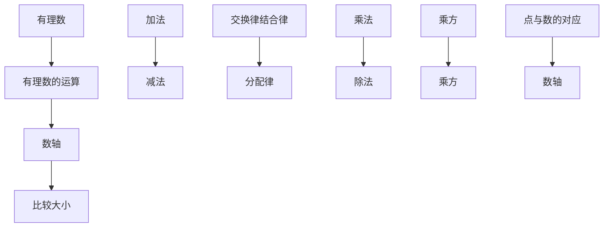

# 第一章 有理数

在生活、生产和科研中，经常遇到数的表示和运算等问题。例如：
(1) 北京冬季里某一天的气温为 $-3^{\circ} \mathrm{C} \sim 3^{\circ} \mathrm{C}$ . “-3”的含义是什么？这一天北京的温差是多少？  
(2) 某年, 我国花生产量比上一年增长 $1.8\%$ , 油菜籽产量比上一年增长 $-2.7\%$ . “增长 $-2.7\%$ ” 表示什么意思?  
(3) 夏新同学通过捡、卖废品, 既保护了环境, 又积攒了零花钱. 下表是他某个月的部分收支情况 (单位: 元).

收支情况表 \_\_\_\_ 年 \_\_\_\_ 月

<table><tr><td>日期</td><td>收入(+)或支出(-)</td><td>结余</td><td>注释</td></tr><tr><td>2日</td><td>3.5</td><td>8.5</td><td>卖废品</td></tr><tr><td>8日</td><td>-4.5</td><td>4.0</td><td>买圆珠笔、铅笔芯</td></tr><tr><td>12日</td><td>-5.2</td><td>-1.2</td><td>买科普书,同学代付</td></tr></table>

这里，“结余—1.2”是什么意思？怎么得到的？

上面的例子涉及 “3-(-3)=?” 等新问题。本章我们将在小学认识负数的基础上，把数的范围扩充到有理数，并在这个范围内研究数的表示、大小比较和运算等。有了这些知识，上述问题就能顺利解决了。

text_image

能顺利解决了。
中华人民共和国万岁
世界人民大团结万岁
人民教育出版社

## 1.1 正数和负数

数的产生和发展离不开生活和生产的需要.

natural_image

Illustration of a person sitting on grass next to hanging hanging ropes (no text or symbols)

由记数、排序，产生数 1, 2, 3, …

natural_image

Illustration of a bearded man kneeling beside a large ceramic vessel (no text or symbols present)

由表示“没有”“空位”，产生数0

natural_image

Illustration of two ancient figures seated on stones, one holding a bowl and the other eating (no text or symbols present)

由分物、测量，产生分数 $\frac{1}{2}$ ， $\frac{1}{3}$ ，…  
图1.1-1

本章引言中，表示温度、产量增长率、收支情况时，既要用到数3，1.8%，3.5等，还要用到数-3，-2.7%，-4.5，-1.2等，它们的实际意义分别是：零下3摄氏度，减少2.7%，支出4.5元，亏空1.2元.

我们知道，像 3，1.8%，3.5 这样大于 0 的数叫做正数。像 -3，-2.7%，-4.5，-1.2 这样在正数前加上符号 “-”（负）的数叫做负数。有时，为了明确表达意义，在正数前面也加上 “+”（正）号。例如，+3，+2，+0.5，+ $\frac{1}{3}$ ，… 就是 3，2，0.5， $\frac{1}{3}$ ，…。一个数前面的 “+” “-” 号叫做它的符号。

0 既不是正数，也不是负数.

你能说说 3，
1.8%，3.5 等的
实际意义吗？

中国古代用算筹（表示数的工具）进行计算，红色算筹表示正数，黑色算筹表示负数.

  
+3

  
-2

例 （1）一个月内，小明体重增加 2 kg，小华体重减少 1 kg，小强体重无变化，写出他们这个月的体重增长值；
（2）某年，下列国家的商品进出口总额比上年的变化情况是：

美国减少 6.4%，德国增长 1.3%，

法国减少 2.4%，英国减少 3.5%，

意大利增长 0.2%，中国增长 7.5%.

写出这些国家这一年商品进出口总额的增长率.
解：（1）这个月小明体重增长 2 kg，小华体重增长 -1 kg，小强体重增长 0 kg.
(2) 六个国家这一年商品进出口总额的增长率是:

美国 -6.4%， 德国 1.3%，

法国 -2.4%，英国 -3.5%，

意大利 0.2%，中国 7.5%.

natural_image

Illustration of three men in school uniforms, one standing on a scale and another kneeling with hands, no text or symbols present.

“负”与“正”相对. 增长-1，就是减少1；增长-6.4%，是什么意思？

什么情况下增长率是0？

> [!tip] 归纳
如果一个问题中出现相反意义的量，我们可以用正数和负数分别表示它们.

#### 练习

1. 2021年北京市全年平均降水量比上年增加158.5 mm，2020年比上年增加124.7 mm，2019年比上年减少143.3 mm。用正数和负数表示这三年北京市全年平均降水量比上年的增长量。

2. 如果把一个物体向右移动 $1 \mathrm{~m}$ 记作移动 $+1 \mathrm{~m}$ , 那么这个物体又移动了 $-1 \mathrm{~m}$ 是什么意思? 如何描述这时物体的位置?

natural_image

Aerial view of a winding road through lush green mountainous terrain with a small boat on the river (no visible text or symbols)

把 0 以外的数分为正数和负数，它们表示具有相反意义的量。随着对正数、负数意义认识的加深，正数和负数在实践中得到了广泛应用。在地形图上表示某地的高度时，需要以海平面为基准（规定海平面的海拔为 0 m），通常用正数表示高于海平面的某地的海拔，用负数表示低于海平面的某地的海拔。例如，珠穆朗玛峰的海拔为 8 848.86 m，吐鲁番盆地的海拔为 -155 m。记账时，通常用正数表示收入款额，用负数表示支出款额。

0 是正数与负数的分界。 $0^{\circ}$ C 是一个确定的温度，海拔 0 m 表示海平面的平均高度。0 的意义已不仅是表示 “没有”。

> [!think] 思考

text_image

A: 4600
B: -100
海拔(米)
5000
3000
2000
1000
500
200
0

图1.1-2

<table><tr><td>日期
DATE</td><td>注释
NOTES</td><td>支出(-)或存入(+) 
WITHDRAWN OR DEPOSIT</td><td>结 金
BALANCE</td><td>网点号
S. N.</td><td>操作
OPER</td></tr><tr><td>20021204
20030103</td><td></td><td>¥ 2 300.00
¥ -1 800.00</td><td>2</td><td></td><td></td></tr></table>

图1.1-3

上面图中的正数和负数的含义是什么？你能再举一些用正数、负数表示数量的实际例子吗？

#### 练习

1. 读下列各数，并指出其中哪些是正数，哪些是负数.
$- 1, 2. 5, + \frac {4}{3}, 0, - 3. 1 4, 1 2 0, - 1. 7 3 2, - \frac {2}{7}.$

2. 如果 80 m 表示向东走 80 m，那么 -60 m 表示 \_\_\_\_.  
3. 如果水位升高 $3 \, m$ 时水位变化记作 + $3 \, m$ ，那么水位下降 $3 \, m$ 时水位变化记作 \_\_\_\_ m，水位不升不降时水位变化记作 \_\_\_\_ m.  
4. 月球表面的白天平均温度零上 $126^{\circ}\mathrm{C}$ ，记作 $\quad$ ℃，夜间平均温度零下 $150^{\circ}\mathrm{C}$ ，记作 $\quad$ ℃。

## 习题1.1

### 复习巩固

1. 下面各数哪些是正数，哪些是负数？
$5, - \frac {5}{7}, 0, 0. 5 6, - 3, - 2 5. 8, \frac {1 2}{5}, - 0. 0 0 0 1, + 2, - 6 0 0.$

2. 某蓄水池的标准水位记为 $0 \mathrm{~m}$ , 如果用正数表示水面高于标准水位的高度, 那么
(1) 0.08 m 和 -0.2 m 各表示什么?  
(2) 水面低于标准水位 $0.1 \mathrm{~m}$ 和高于标准水位 $0.23 \mathrm{~m}$ 各怎样表示?

3. “不是正数的数一定是负数，不是负数的数一定是正数”的说法对吗？为什么？

### 综合运用

4. 如果把一个物体向后移动 $5 \mathrm{~m}$ 记作移动 $-5 \mathrm{~m}$ ，那么这个物体又移动 $+5 \mathrm{~m}$ 是什么意思？这时物体离它两次移动前的位置多远？  
5. 测量一幢楼的高度，七次测得的数据分别是：79.4 m，80.6 m，80.8 m，79.1 m，80 m，79.6 m，80.5 m。这七次测量的平均值是多少？以平均值为标准，用正数表示超出部分，用负数表示不足部分，它们对应的数分别是什么？  
6. 科学实验表明，原子中的原子核与电子所带电荷是两种相反的电荷。物理学规定，原子核所带电荷为正电荷。氢原子中的原子核与电子各带1个电荷，把它们所带电荷用正数和负数表示出来。

### 拓广探索

7. 某地一天中午 12 时的气温是 $7^{\circ} \mathrm{C}$ , 过 $5 \mathrm{~h}$ 气温下降了 $4^{\circ} \mathrm{C}$ , 又过 $7 \mathrm{~h}$ 气温又下降了 $4^{\circ} \mathrm{C}$ , 第二天 0 时的气温是多少?  
8. 某年，一些国家的服务出口额比上年的增长率如下：

<table><tr><td>美国</td><td>德国</td><td>英国</td><td>中国</td><td>日本</td><td>意大利</td></tr><tr><td>-3.4%</td><td>-0.9%</td><td>-5.3%</td><td>2.8%</td><td>-7.3%</td><td>7.0%</td></tr></table>

这一年，上述六国中哪些国家的服务出口额增长了？哪些国家的服务出口额减少了？哪国增长率最高？哪国增长率最低？

## 1.2 有理数

### 1.2.1 有理数

> [!think] 思考
回想一下，我们认识了哪些数？

我们学过的数有：

正整数，如 1，2，3，…；
零，0；
负整数，如-1，-2，-3，…；
正分数，如 $\frac{1}{2}$ ， $\frac{2}{3}$ ， $\frac{15}{7}$ ，0.1，5.32，…；
负分数，如 $-0.5, -\frac{5}{2}, -\frac{2}{3}, -\frac{1}{7}, -150.25, \cdots.$

正整数、0、负整数统称为整数；正分数、负分数统称为分数.

整数和分数统称为有理数（rational number）.

从小学开始，我们首先认识了正整数，后来又增加了0和正分数，在认识了负整数和负分数后，对数的认识就扩充到了有理数范围.

所有正整数组成正整数集合，所有负整数组成负整数集合.

因为这里的小数可以化为分数，所以我们也把它们看成分数.

#### 练习

1. 所有正数组成正数集合，所有负数组成负数集合。把下面的有理数填入它属于的集合的圈内：
$1 5, - \frac {1}{9}, - 5, \frac {2}{1 5}, - \frac {1 3}{8}, 0. 1, - 5. 3 2, - 8 0, 1 2 3, 2. 3 3 3.$

  
正数集合

  
负数集合

2. 指出下列各数中的正数、负数、整数、分数：
$- 1 5, + 6, - 2, - 0. 9, 1, \frac {3}{5}, 0, 3 \frac {1}{4}, 0. 6 3, - 4. 9 5.$

### 1.2.2 数轴

问题 在一条东西向的马路上，有一个汽车站牌，汽车站牌东 3 m 和 7.5 m 处分别有一棵柳树和一棵杨树，汽车站牌西 3 m 和 4.8 m 处分别有一棵槐树和一根电线杆，试画图表示这一情境。

如图 1.2-1，画一条直线表示马路，从左到右表示从西到东的方向，在直线上任取一个点 O 表示汽车站牌的位置，规定 1 个单位长度（线段 OA 的长）代表 1 m 长。于是，在点 O 右边，与点 O 距离 3 个和 7.5 个单位长度的点 B 和点 C，分别表示柳树和杨树的位置；点 O 左边，与点 O 距离 3 个和 4.8 个单位长度的点 D 和点 E，分别表示槐树和电线杆的位置。

text_image

E
D
O
A
B
C
3
3
4.8
7.5

图1.2-1

> [!think] 思考
怎样用数简明地表示这些树、电线杆与汽车站牌的相对位置关系（方向、距离）?

上面的问题中，“东”与“西”、“左”与“右”都具有相反意义．如图1.2-2，在一条直线上取一个点 $O$ 为基准点，用0表示它，再用负数表示点 $O$ 左边的点，用正数表示点 $O$ 右边的点．这样，我们就用负数、0、正数表示出了这条直线上的点.

text_image

E D O A B C
-4.8 -3 0 1 3 7.5

图1.2-2

用上述方法，我们就可以把这些树、电线杆与汽车站牌的相对位置关系表示出来了．例如，-4.8 表示位于汽车站牌西侧 4.8 m 处的电线杆，等等.

你能说说图中其他数的实际意义吗？

> [!think] 思考
图1.2-3中的温度计可以看作表示正数、0和负数的直线．它和图1.2-2有什么共同点，有什么不同点？

text_image

20
15
10
5
0
-5
-10
5

图1.2-3

在数学中，可以用一条直线上的点表示数，这条直线叫做数轴（number axis），它满足以下要求：
（1）在直线上任取一个点表示数0，这个点叫做原点(origin);  
（2）通常规定直线上从原点向右（或上）为正方向，从原点向左（或下）为负方向；  
（3）选取适当的长度为单位长度，直线上从原点向右，每隔一个单位长度取一个点，依次表示1，2，3，…；从原点向左，用类似方法依次表示-1，-2，-3，…（图1.2-4）.

0 是正数和负数的分界点；原点是数轴的“基准点”.

line

| Point | Value |
|---|---|
| -3/2 | -3/2 |
| 6.5 | 6.5 |

图1.2-4

分数或小数也可以用数轴上的点表示，例如从原点向右6.5个单位长度的点表示小数6.5，从原点向左 $\frac{3}{2}$ 个单位长度的点表示分数 $-\frac{3}{2}$ （图1.2-4）.

> [!tip] 归纳

一般地，设 $a$ 是一个正数，则数轴上表示数 $a$ 的点在原点的\_\_\_\_边，与原点的距离是\_\_\_\_个单位长度；表示数 $-a$ 的点在原点的\_\_\_\_边，与原点的距离是\_\_\_\_个单位长度.

用数轴上的点表示数对数学的发展起了重要作用，以它作基础，可以借助图直观地表示很多与数相关的问题.

#### 练习

1. 如图，写出数轴上点 A, B, C, D, E 表示的数.

text_image

E B A C D
-3 -2 -1 0 1 2 3

(第1题)

2. 画出数轴并表示下列有理数：
$1. 5, - 2, 2, - 2. 5, \frac {9}{2}, - \frac {3}{4}, 0.$

3. 数轴上，如果表示数 $a$ 的点在原点的左边，那么 $a$ 是一个 $\_\_\_$ 数；如果表示数 $b$ 的点在原点的右边，那么 $b$ 是一个 $\_\_\_$ 数.

### 1.2.3 相反数

> [!explore] 探究
在数轴上，与原点的距离是2的点有几个？这些点各表示哪个数？
设 $a$ 是一个正数．数轴上与原点的距离等于 $a$ 的点有几个？这些点表示的数有什么关系？

可以发现，数轴上与原点距离是2的点有两个，它们表示的数是-2和2.

> [!tip] 归纳

一般地，设 $a$ 是一个正数，数轴上与原点的距离是 $a$ 的点有两个，它们分别在原点左右，表示 $-a$ 和 $a$ （图1.2-5），我们说这两点关于原点对称.

text_image

-a
-5
-2
0
2
5
a

图1.2-5

像 2 和 -2, 5 和 -5 这样，只有符号不同的两个数叫做互为相反数（opposite number）。这就是说，2 的相反数是 -2, -2 的相反数是 2; 5 的相反数是 -5, -5 的相反数是 5.

一般地，a 和 -a 互为相反数．特别地，0 的相反数是 0．这里，a 表示任意一个数，可以是正数、负数，也可以是 0．例如：
当 $a = 1$ 时， $-a = -1$ ，1的相反数是-1；同时，-1的相反数是1.

> [!think] 思考
设 $a$ 表示一个数， $-a$ 一定是负数吗？

容易看出，在正数前面添上“一”号，就得到这个正数的相反数．在任意一个数前面添上“一”号，新的数就表示原数的相反数．例如，
$- (+ 5) = - 5, - (- 5) = + 5, - 0 = 0.$

你能借助数轴说明 $-(-5)=+5$ 吗?

#### 练习

1. 判断下列说法是否正确：
(1) -3 是相反数；
(2) +3 是相反数；
(3) 3 是 -3 的相反数；
(4) -3 与 +3 互为相反数.

2. 写出下列各数的相反数：
$6, - 8, - 3. 9, \frac {5}{2}, - \frac {2}{1 1}, 1 0 0, 0.$

3. 如果 $a = -a$ ，那么表示 $a$ 的点在数轴上的什么位置？

4. 化简下列各数：
$- (- 6 8), - (+ 0. 7 5), - \left(- \frac {3}{5}\right), - (+ 3. 8).$

### 1.2.4 绝对值

两辆汽车从同一处 O 出发，分别向东、西方向行驶 10 km，到达 A，B 两处（图 1.2-6）。它们的行驶路线相同吗？它们的行驶路程相等吗？

text_image

B
10
O
10
A
-10
0
10

图1.2-6

一般地，数轴上表示数 a 的点与原点的距离叫做数 a 的绝对值（absolute value），记作 $\left|a\right|$ . 例如，图 1.2-6 中 A, B 两点分别表示 10 和 -10，它们与原点的距离都是 10 个单位长度，所以 10 和 -10 的绝对值都是 10，即
$\vert 1 0 \vert = 1 0, \vert - 1 0 \vert = 1 0.$
显然 $|0| = 0$
由绝对值的定义可知：

这里的数 $a$ 可以是正数、负数和0.

一个正数的绝对值是它本身；一个负数的绝对值是它的相反数；0 的绝对值是 0. 即
(1) 如果 a > 0，那么 $\left|a\right| = a$ ;  
(2) 如果 a=0，那么 $\left|a\right|=0$ ;  
(3) 如果 a<0，那么 $\left|a\right|=-a.$

#### 练习

1. 写出下列各数的绝对值：
$6, - 8, - 3. 9, \frac {5}{2}, - \frac {2}{1 1}, 1 0 0, 0.$

2. 判断下列说法是否正确：
(1) 符号相反的数互为相反数;   
(2) 一个数的绝对值越大, 表示它的点在数轴上越靠右;  
(3) 一个数的绝对值越大，表示它的点在数轴上离原点越远；  
(4) 当 $a \neq 0$ 时， $|a|$ 总是大于 0.

3. 判断下列各式是否正确：
(1) $|5| = |-5|$ ;
(2) $-|5|=|-5|$ ;
(3) $-5 = |-5|$ .

我们已知两个正数（或0）之间怎样比较大小，例如
$0 <   1, \quad 1 <   2, \quad 2 <   3, \dots .$

任意两个有理数（例如-4和-3，-2和0，-1和1）怎样比较大小呢？

> [!think] 思考
图 1.2-7 给出了未来一周中每天的最高气温和最低气温，其中最低气温是多少？最高气温呢？你能将这七天中每天的最低气温按从低到高的顺序排列吗？

text_image

未来一周
天气预报
周一
0~8℃
周二
1~7℃
周三
-1~6℃
周四
-2~5℃
周五
-4~3℃
周六
-3~4℃
周日
2~9℃

图1.2-7

这七天中每天的最低气温按从低到高排列为
$- 4, - 3, - 2, - 1, 0, 1, 2.$

按照这个顺序排列的温度，在温度计上所对应的点是从下到上的。按照这个顺序把这些数表示在数轴上，表示它们的各点的顺序是从左到右的（图1.2-8）。

图1.2-8

数学中规定：在数轴上表示有理数，它们从左到右的顺序，就是从小到大的顺序，即左边的数小于右边的数.
由这个规定可知
$- 6 <   - 5, - 5 <   - 4, - 4 <   - 3, - 2 <   0, - 1 <   1, \dots .$

> [!think] 思考
对于正数、0和负数这三类数，它们之间有什么大小关系？两个负数之间如何比较大小？前面最低气温由低到高的排列与你的结论一致吗？

一般地，
(1) 正数大于 0, 0 大于负数, 正数大于负数;  
(2) 两个负数，绝对值大的反而小.

例如，1 \_\_\_\_ 0，0 \_\_\_\_ -1，1 \_\_\_\_ -1，-1 \_\_\_\_ -2.

例 比较下列各对数的大小:
(1) $-(-1)$ 和 $-(+2)$ ; (2) $-\frac{8}{21}$ 和 $-\frac{3}{7}$ ; (3) $-(-0.3)$ 和 $\left| -\frac{1}{3} \right|$ .
解：（1）先化简， $-(-1)=1$ ， $-(+2)=-2$ .
因为正数大于负数，所以 $1 > -2$ ，即
$- (- 1) > - (+ 2).$
(2) 这是两个负数比较大小，先求它们的绝对值.
$\left| - \frac {8}{2 1} \right| = \frac {8}{2 1}, \left| - \frac {3}{7} \right| = \frac {3}{7} = \frac {9}{2 1}.$
因为 $\frac{8}{21} < \frac{9}{21}$
即 $\left| -\frac{8}{21} \right| < \left| -\frac{3}{7} \right|$ ,
所以 $-\frac{8}{21} > -\frac{3}{7}$ .
(3) 先化简， $-(-0.3)=0.3,\left|-\frac{1}{3}\right|=\frac{1}{3}.$
因为 $0.3 < \frac{1}{3}$
所以 $-(-0.3) < \left| -\frac{1}{3} \right|$ .

异号两数比较大小，要考虑它们的正负；同号两数比较大小，要考虑它们的绝对值.

#### 练习

比较下列各对数的大小：
(1) 3 和 -5;
(2) -3 和 -5;
(3) -2.5 和 - | -2.25 | ;
(4) $-\frac{3}{5}$ 和 $-\frac{3}{4}$ .

## 习题1.2

### 复习巩固

1. 把下面的有理数填在相应的大括号里（将各数用逗号分开）：
$1 5, - \frac {3}{8}, 0, 0. 1 5, - 3 0, - 1 2. 8, \frac {2 2}{5}, + 2 0, - 6 0.$

正数：{

... }

负数：{

... }

2. 在数轴上表示下列各数：
$- 5, + 3, - 3. 5, 0, \frac {2}{3}, - \frac {3}{2}, 0. 7 5.$

3. 在数轴上，点 $A$ 表示-3，从点 $A$ 出发，沿数轴移动4个单位长度到达点 $B$ ，则点 $B$ 表示的数是多少？

4. 写出下列各数的相反数，并将这些数连同它们的相反数在数轴上表示出来：
$- 4, + 2, - 1. 5, 0, \frac {1}{3}, - \frac {9}{4}.$

5. 写出下列各数的绝对值：
$- 1 2 5, + 2 3, - 3. 5, 0, \frac {2}{3}, - \frac {3}{2}, - 0. 0 5.$

上面的数中哪个数的绝对值最大？哪个数的绝对值最小？

6. 将下列各数按从小到大的顺序排列，并用“<”号连接：
$- 0. 2 5, + 2. 3, - 0. 1 5, 0, - \frac {2}{3}, - \frac {3}{2}, - \frac {1}{2}, 0. 0 5.$

### 综合运用

7. 下面是我国几个城市某年一月份的平均气温，把它们按从高到低的顺序排列.

北京
-4.6 ℃

武汉
3.8 ℃

广州
13.1 ℃

哈尔滨
-19.4 ℃

南京
2.4 ℃

8. 如图，检测 5 个排球，其中质量超过标准的克数记为正数，不足的克数记为负数。从轻重的角度看，哪个球最接近标准？

natural_image

Illustration of a blue balance scale with a wooden ball on top, showing approximately 5 ohms (no text or symbols)

（第8题）

9. 某年我国人均水资源比上年的增幅是 $-5.6\%$ 。后续三年各年比上年的增幅分别是 $-4.0\%$ ， $13.0\%$ ， $-9.6\%$ 。这些增幅中哪个最小？增幅是负数说明什么？  
10. 在数轴上，表示哪个数的点与表示-2和4的点的距离相等？

### 拓广探索

11.（1）-1 与 0 之间还有负数吗？ $-\frac{1}{2}$ 与 0 之间呢？如有，请举例.
(2) -3 与 -1 之间有负整数吗？-2 与 2 之间有哪些整数？  
(3) 有比 -1 大的负整数吗?  
(4) 写出 3 个小于 -100 并且大于 -103 的数.

12. 如果 $|x| = 2$ ，那么 $x$ 一定是2吗？如果 $|x| = 0$ ，那么 $x$ 等于几？如果 $x = -x$ ，那么 $x$ 等于几？

## 1.3 有理数的加减法

### 1.3.1 有理数的加法

在小学，我们学过正数及0的加法运算．引入负数后，怎样进行加法运算呢？

实际问题中，有时也会遇到与负数有关的加法运算。例如，在本章引言中，把收入记作正数，支出记作负数，在求“结余”时，需要计算 $8.5 + (-4.5)$ ， $4 + (-5.2)$ 等。

> [!think] 思考
小学学过的加法是正数与正数相加、正数与0相加。引入负数后，加法有哪几种情况？

引入负数后，除已有的正数与正数相加、正数与0相加外，还有负数与负数相加、负数与正数相加、负数与0相加等．下面借助具体情境和数轴来讨论有理数的加法.

看下面的问题.

一个物体作左右方向的运动，我们规定向左为负，向右为正．向右运动5 m记作5 m，向左运动5 m记作-5 m.

> [!think] 思考
如果物体先向右运动 5 m，再向右运动 3 m，那么两次运动的最后结果是什么？可以用怎样的算式表示？

两次运动后物体从起点向右运动了 $8 \, m$ . 写成算式就是
$5 + 3 = 8. \tag {①}$

将物体的运动起点放在原点，则这个算式可用数轴表示为图 1.3-1.

text_image

O
5
3
0
8

图1.3-1

> [!think] 思考
如果物体先向左运动 5 m，再向左运动 3 m，那么两次运动的最后结果是什么？可以用怎样的算式表示？

两次运动后物体从起点向左运动了 $8 \, m$ 。写成算式就是
$(- 5) + (- 3) = - 8. \tag {②}$

这个运算也可以用数轴表示，其中假设原点 O 为运动起点（图 1.3-2）.

text_image

-3
-5
O
-8
0

图1.3-2

从算式①②可以看出：符号相同的两个数相加，结果的符号不变，绝对值相加.

> [!explore] 探究
(1) 如果物体先向左运动 $3 \mathrm{~m}$ , 再向右运动 $5 \mathrm{~m}$ , 那么两次运动的最后结果怎样? 如何用算式表示?  
(2) 如果物体先向右运动 $3 \mathrm{~m}$ , 再向左运动 $5 \mathrm{~m}$ , 那么两次运动的最后结果怎样? 如何用算式表示?
(1) 结果是物体从起点向右运动了 $2 \mathrm{~m}$ . 写成算式就是
$(- 3) + 5 = 2. \tag {③}$
(2) 结果是物体从起点向左运动了 $2 \mathrm{~m}$ . 写成算式就是
$3 + (- 5) = - 2. \tag {④}$

text_image

你能用数轴表示算式③④吗？

你能用数轴表示算式③④吗？

从算式③④可以看出：符号相反的两个数相加，结果的符号与绝对值较大的加数的符号相同，并用较大的绝对值减去较小的绝对值.

> [!explore] 探究
如果物体先向右运动 $5 \, m$ ，再向左运动 $5 \, m$ ，那么两次运动的最后结果如何？

结果是仍在起点处．写成算式就是
$5 + (- 5) = 0. \tag {⑤}$

算式⑤表明，互为相反数的两个数相加，结果为0.
如果物体第 1 s 向右（或左）运动 5 m，第 2 s 原地不动，那么 2 s 后物体从起点向右（或左）运动了 5 m。写成算式就是
$5 + 0 = 5 (\text {或} (- 5) + 0 = - 5). \tag {6}$

> [!think] 思考
从算式⑥可以得出什么结论？

从算式①～⑥可知，有理数加法运算中，既要考虑符号，又要考虑绝对值．你能从这些算式中归纳出有理数加法的运算法则吗？

有理数加法法则：

1. 同号两数相加，取相同的符号，并把绝对值相加.

2. 绝对值不相等的异号两数相加，取绝对值较大的加数的符号，并用较大的绝对值减去较小的绝对值．互为相反数的两个数相加得0.

3. 一个数同 0 相加，仍得这个数.

> [!example]- 例 1 计算:
(1) $(-3)+(-9)$ ;   
(2) $(-4.7)+3.9.$
解：(1) $(-3)+(-9)=-(3+9)=-12;$
(2) $(-4.7) + 3.9 = -(4.7 - 3.9) = -0.8.$

先定符号，再算绝对值.

#### 练习

1. 用算式表示下面的结果:
(1) 温度由 $-4^{\circ}C$ 上升 $7^{\circ}C$ ;  
(2) 收入 7 元，又支出 5 元.

2. 口算：
(1) $(-4)+(-6)$ ;
(2) $4+(-6)$ ;
(3) $(-4) + 6$ ;
(4) $(-4)+4;$
(5) $(-4) + 14$ ;
(6) $(-14) + 4$ ;
(7) $6+(-6)$ ;
(8) $0+(-6)$ .

#### 3. 计算：
(1) $15 + (-22)$ ;
(2) $(-13) + (-8)$ ;
(3) $(-0.9) + 1.5$ ;
(4) $\frac{1}{2} + \left(-\frac{2}{3}\right)$ .

4. 请你用生活实例解释 $5 + (-3) = 2, (-5) + (-3) = -8$ 的意义.

我们以前学过加法交换律、结合律，在有理数的加法中它们还适用吗？

> [!explore] 探究
计算
$3 0 + (- 2 0), \quad (- 2 0) + 3 0.$

两次所得的和相同吗？换几个加数再试一试.

从上述计算中，你能得出什么结论？

有理数的加法中，两个数相加，交换加数的位置，和不变.

加法交换律： $a+b=b+a$ .

> [!explore] 探究
计算
$[ 8 + (- 5) ] + (- 4), \quad 8 + [ (- 5) + (- 4) ].$

两次所得的和相同吗？换几个加数再试一试.

从上述计算中，你能得出什么结论？

有理数的加法中，三个数相加，先把前两个数相加，或者先把后两个数相加，和不变.

加法结合律： $(a + b) + c = a + (b + c)$

> [!example]- 例 2 计算 $16+(-25)+24+(-35)$ .
解： $16 + (-25) + 24 + (-35)$
$= 1 6 + 2 4 + [ (- 2 5) + (- 3 5) ]$
$= 4 0 + (- 6 0) = - 2 0.$

> [!example]- 例 2 中是怎样使计算简化的？根据是什么？
利用加法交换律、结合律，可以使运算简化．认识运算律对于理解运算有很重要的意义.

> [!example]- 例 3 10 袋小麦称后记录如图 1.3-3 所示（单位：kg）。10 袋小麦一共多少千克？如果每袋小麦以 90 kg 为标准，10 袋小麦总计超过多少千克或不足多少千克？

other

| Category | Value |
|---|---|
| Top Left Area | 91 |
| Top Right Area | 91 |
| Bottom Left Area | 91.3 |
| Bottom Right Area | 88.7 |
| Bottom Right Area | 88.8 |
| Bottom Right Area | 91.8 |
| Bottom Right Area | 91.1 |
The top row contains the number of values (91, 91, 91.5, 89, 91.2), while the bottom row contains the corresponding values (91.3, 88.7, 88.8, 91.8, 91.1).

图1.3-3
解法 1：先计算 10 袋小麦一共多少千克：
$9 1 + 9 1 + 9 1. 5 + 8 9 + 9 1. 2 + 9 1. 3 + 8 8. 7 + 8 8. 8 + 9 1. 8 + 9 1. 1 = 9 0 5. 4.$

再计算总计超过多少千克：
$9 0 5. 4 - 9 0 \times 1 0 = 5. 4.$
解法 2：每袋小麦超过 90 kg 的千克数记作正数，不足的千克数记作负数。10 袋小麦对应的数分别为 +1, +1, +1.5, -1, +1.2, +1.3, -1.3, -1.2, +1.8, +1.1。
$\begin{array}{l} 1 + 1 + 1. 5 + (- 1) + 1. 2 + 1. 3 + (- 1. 3) + (- 1. 2) + 1. 8 + 1. 1 \\ = [ 1 + (- 1) ] + [ 1. 2 + (- 1. 2) ] + \\ \end{array}$
$[ 1. 3 + (- 1. 3) ] + (1 + 1. 5 + 1. 8 + 1. 1)$
$= 5. 4.$
$9 0 \times 1 0 + 5. 4 = 9 0 5. 4.$

比较两种解法. 解法 2 中使用了哪些运算律?

答：10 袋小麦一共 905.4 kg，总计超过 5.4 kg.

#### 练习

1. 计算：
(1) $23 + (-17) + 6 + (-22)$ ;
(2) $(-2) + 3 + 1 + (-3) + 2 + (-4)$ .

2. 计算：
(1) $1+\left(-\frac{1}{2}\right)+\frac{1}{3}+\left(-\frac{1}{6}\right)$ ;
(2) $3\frac{1}{4} + \left(-2\frac{3}{5}\right) + 5\frac{3}{4} + \left(-8\frac{2}{5}\right)$ .

#### 实验与探究

#### 填 幻 方

有人建议向火星发射如图1的图案。它叫做幻方，其中9个格中的点数分别是1，2，3，4，5，6，7，8，9。每一横行、每一竖列以及两条斜对角线上的点数的和都是15。如果火星上有智能生物，那么他们可以从这种“数学语言”了解到地球上也有智能生物（人）。

text_image

Grid of nine cells with pink dots, possibly representing a pattern or dot matrix

图1

<table><tr><td></td><td></td><td></td></tr><tr><td></td><td></td><td></td></tr><tr><td></td><td></td><td></td></tr></table>

图2

你能将-4，-3，-2，-1，0，1，2，3，4这9个数分别填入图2的幻方的9个空格中，使得处于同一横行、同一竖列、同一斜对角线上的3个数相加都得0吗？

你是将0填入中央的格中吗？与同学交流一下，你们填这个幻方的方法相同吗？

### 1.3.2 有理数的减法

实际问题中有时还要涉及有理数的减法。例如，本章引言中，北京某天的气温是 $-3^{\circ}\mathrm{C} \sim 3^{\circ}\mathrm{C}$ ，这天的温差（最高气温减最低气温，单位： $^{\circ}\mathrm{C}$ ）就是 $3 - (-3)$ 。这里遇到正数与负数的减法。

减法是加法的逆运算，计算 3-(-3)，就是要求出一个数 $x$ ，使得 $x$ 与 $-3$ 相加得 3。因为 6 与 $-3$ 相加得 3，所以 $x$ 应该是 6，即
$3 - (- 3) = 6. \tag {①}$
另一方面，我们知道
$3 + (+ 3) = 6, \tag {②}$
由①②，有
$3 - (- 3) = 3 + (+ 3). \tag {③}$

如图 1.3-4，
你能看出 $3^{\circ}$ C 比 $-3^{\circ}$ C 高多少摄氏度吗？

text_image

3
0
-3
6

图1.3-4

> [!explore] 探究
从③式能看出减-3相当于加哪个数吗？把3换成0，-1，-5，用上面的方法考虑
$0 - (- 3), (- 1) - (- 3), (- 5) - (- 3).$

这些数减-3的结果与它们加+3的结果相同吗？

计算
$9 - 8, 9 + (- 8); 1 5 - 7, 1 5 + (- 7).$

从中又有什么新发现？

换几个数再试一试。

可以发现，有理数的减法可以转化为加法来进行.

有理数减法法则：

减去一个数，等于加这个数的相反数.

有理数减法法则也可以表示成
$a - b = a + (- b).$

> [!example]- 例4 计算：
(1) $(-3) - (-5)$ ;
(2) 0-7;
(3) 7.2-(-4.8);
(4) $\left(-3\frac{1}{2}\right)-5\frac{1}{4}.$
解：（1） $(-3)-(-5)=(-3)+5=2;$
(2) 0-7=0+(-7)=-7;
(3) $7.2-(-4.8)=7.2+4.8=12;$
(4) $\left(-3\frac{1}{2}\right) - 5\frac{1}{4} = \left(-3\frac{1}{2}\right) + \left(-5\frac{1}{4}\right) = -8\frac{3}{4}.$

> [!think] 思考
在小学，只有当 a 大于或等于 b 时，我们才会做 a-b（例如 2-1, 1-1）。现在，当 a 小于 b 时，你会做 a-b（例如 1-2， $(-1)-1$ ）吗？

一般地，较小的数减去较大的数，所得的差的符号是什么？

#### 练习

#### 1. 计算：
(1) 6—9;
(2) $(+4) - (-7)$ ;
(3) $(-5) - (-8)$ ;
(4) 0-(-5);
(5) $(-2.5)-5.9;$
(6) 1.9—(-0.6).

#### 2. 计算：
(1) 比 $2^{\circ}$ C 低 $8^{\circ}$ C 的温度;
(2) 比—3 ℃低 6 ℃ 的温度.

下面我们研究怎样进行有理数的加减混合运算.

> [!example]- 例 5 计算 $(-20)+(+3)-(-5)-(+7)$ .
分析：这个算式中有加法，也有减法．可以根据有理数减法法则，把它改写为
$(- 2 0) + (+ 3) + (+ 5) + (- 7),$

使问题转化为几个有理数的加法.
解： $(-20) + (+3) - (-5) - (+7)$
$= (- 2 0) + (+ 3) + (+ 5) + (- 7)$
$= [ (- 2 0) + (- 7) ] + [ (+ 5) + (+ 3) ]$
$= (- 2 7) + (+ 8)$
$= - 1 9.$

这里使用了哪些运算律？

> [!tip] 归纳

引入相反数后，加减混合运算可以统一为加法运算.
$a + b - c = a + b + (- c).$

算式
$(- 2 0) + (+ 3) + (+ 5) + (- 7)$

是-20，3，5，-7这四个数的和，为书写简单，可以省略算式中的括号和加号，把它写为
$- 2 0 + 3 + 5 - 7.$

这个算式可以读作“负20、正3、正5、负7的和”，或读作“负20加3

加 5 减 7”。例 5 的运算过程也可以简单地写为
$\begin{array}{l} (- 2 0) + (+ 3) - (- 5) - (+ 7) \\ = - 2 0 + 3 + 5 - 7 \\ = - 2 0 - 7 + 3 + 5 \\ = - 2 7 + 8 \\ = - 1 9. \\ \end{array}$

> [!explore] 探究
在数轴上，点 $A$ ， $B$ 分别表示数 $a$ ， $b$ 。利用有理数减法，分别计算下列情况下点 $A$ ， $B$ 之间的距离：
$a = 2, b = 6; a = 0, b = 6; a = 2, b = - 6; a = - 2, b = - 6.$

你能发现点 A, B 之间的距离与数 a, b 之间的关系吗?

#### 练习

计算：
(1) $1-4+3-0.5;$
(2) $-2.4 + 3.5 - 4.6 + 3.5$ ;
(3) $(-7) - (+5) + (-4) - (-10)$ ;
(4) $\frac{3}{4} - \frac{7}{2} + \left(-\frac{1}{6}\right) - \left(-\frac{2}{3}\right) - 1.$

## 习题1.3

### 复习巩固

1. 计算：
(1) $(-10)+(+6)$ ;
(2) $(+12) + (-4)$ ;
(3) $(-5) + (-7)$ ;
(4) $(+6) + (-9)$ ;
(5) $(-0.9) + (-2.7)$ ;
(6) $\frac{2}{5} + \left(-\frac{3}{5}\right)$ ;
(7) $\left(-\frac{1}{3}\right) + \frac{2}{5}$ ;
(8) $\left(-3\frac{1}{4}\right) + \left(-1\frac{1}{12}\right)$ .

2. 计算：
(1) $(-8) + 10 + 2 + (-1)$ ;
(2) $5 + (-6) + 3 + 9 + (-4) + (-7)$ ;
(3) $(-0.8) + 1.2 + (-0.7) + (-2.1) + 0.8 + 3.5$ ;
(4) $\frac{1}{2} + \left(-\frac{2}{3}\right) + \frac{4}{5} + \left(-\frac{1}{2}\right) + \left(-\frac{1}{3}\right)$ .

#### 3. 计算：
(1) $(-8) - 8$ ;
(2) $(-8)-(-8)$ ;
(3) 8—(-8);
(4) 8—8;
(5) 0—6;
(6) 0—(-6);
(7) 16—47;
(8) 28—(-74);
(9) $(-3.8)-(+7)$ ;
(10) $(-5.9)-(-6.1)$ .

#### 4. 计算：
(1) $\left(+\frac{2}{5}\right)-\left(-\frac{3}{5}\right);$
(2) $\left(-\frac{2}{5}\right) - \left(-\frac{3}{5}\right)$ ;
(3) $\frac{1}{2} - \frac{1}{3}$ ;
(4) $\left(-\frac{1}{2}\right)-\frac{1}{3};$
(5) $-\frac{2}{3} - \left(-\frac{1}{6}\right)$ ;
(6) $0 - \left(-\frac{3}{4}\right)$ ;
(7) $(-2) - \left(+\frac{2}{3}\right)$ ;
(8) $\left(-16\frac{3}{4}\right) - \left(-10\frac{1}{4}\right) - \left(+1\frac{1}{2}\right)$ .

#### 5. 计算：
(1) $-4.2 + 5.7 - 8.4 + 10$ ;
(2) $-\frac{1}{4} + \frac{5}{6} + \frac{2}{3} - \frac{1}{2}$ ;
(3) $12-(-18)+(-7)-15;$
(4) $4.7-(-8.9)-7.5+(-6)$ ;
(5) $\left(-4\frac{7}{8}\right) - \left(-5\frac{1}{2}\right) + \left(-4\frac{1}{4}\right) - \left(+3\frac{1}{8}\right)$ ;
(6) $\left(-\frac{2}{3}\right) + \left|0 - 5\frac{1}{6}\right| + \left| -4\frac{5}{6}\right| + \left(-9\frac{1}{3}\right)$ .

### 综合运用

6. 如图，陆上最高处是珠穆朗玛峰的峰顶，最低处位于亚洲西部名为死海的湖，两处高度相差多少？

text_image

8848.86 m
珠穆朗玛峰
海平面
415 m
死海
海平面

(第6题)

7. 一天早晨的气温是 $-7^{\circ} \mathrm{C}$ ，中午上升了 $11^{\circ} \mathrm{C}$ ，半夜又下降了 $9^{\circ} \mathrm{C}$ ，半夜的气温是多少摄氏度？  
8. 食品店一周中各天的盈亏情况如下（盈余为正）：

132元，-12.5元，-10.5元，127元，-87元，136.5元，98元.

一周总的盈亏情况如何？

9. 有 8 筐白菜，以每筐 25 kg 为准，超过的千克数记作正数，不足的千克数记作负数，称后的记录如下：
$1. 5, - 3, 2, - 0. 5, 1, - 2, - 2, - 2. 5.$

这8筐白菜一共多少千克？

10. 某地一周内每天的最高气温与最低气温记录如下表，哪天的温差最大？哪天的温差最小？

<table><tr><td>星期</td><td>一</td><td>二</td><td>三</td><td>四</td><td>五</td><td>六</td><td>日</td></tr><tr><td>最高气温</td><td>10°C</td><td>12°C</td><td>11°C</td><td>9°C</td><td>7°C</td><td>5°C</td><td>7°C</td></tr><tr><td>最低气温</td><td>2°C</td><td>1°C</td><td>0°C</td><td>-1°C</td><td>-4°C</td><td>-5°C</td><td>-5°C</td></tr></table>

### 拓广探索

11. 填空：
(1) \_\_\_\_+11=27;
(2) $7 + \_\_\_\_ = 4;$
(3) $(-9)+\_=9;$
(4) $12+$ =0;
(5) $(-8)+\_=-15;$
(6) \_\_\_\_ + (-13) = -6.

12. 计算下列各式的值:
$(-2)+(-2)$ ,
$(-2)+(-2)+(-2)$ ,
$(-2) + (-2) + (-2) + (-2)$ ,
$(-2) + (-2) + (-2) + (-2) + (-2)$ .

猜想下列各式的值：
$(- 2) \times 2, (- 2) \times 3, (- 2) \times 4, (- 2) \times 5.$

你能进一步猜出负数乘正数的法则吗？

13. 一种股票第一天的最高价比开盘价高0.3元，最低价比开盘价低0.2元；第二天的最高价比开盘价高0.2元，最低价比开盘价低0.1元；第三天的最高价等于开盘价，最低价比开盘价低0.13元．计算每天最高价与最低价的差，以及这些差的平均值.

text_image

Crowded stock exchange trading hall with electronic ticker boards displaying real-time prices and data

股票交易是市场经济中的一种金融活动，它可以促进投资和资金流通.

## 阅读与思考

### 中国人最先使用负数

中国人很早就开始使用负数。著名的中国古代数学著作《九章算术》的“方程”一章，在世界数学史上首次正式引入负数及其加减法运算法则，并给出名为“正负术”的算法。魏晋时期的数学家刘徽在其著作《九章算术注》中用不同颜色的算筹（小棍形状的记数工具）分别表示正数和负数（红色为正，黑色为负）。

text_image

+23
-54
+23
-54
-31

“正负术”是正负数加减法则。其中有一段话是“同名相除，异名相益，正无入负之，负无入正之。”你知道它的意思吗？其实它就是减法法则，以现代算式为例，可以将这段话解释如下：

“同名相除”，即同号两数相减时，括号前为被减数的符号，括号内为被减数的绝对值减去减数的绝对值。例如
$(+ 5) - (+ 3) = + (5 - 3),$
$(- 5) - (- 3) = - (5 - 3).$

“异名相益”，即异号两数相减时，括号前为被减数的符号，括号内为被减数的绝对值加减数的绝对值．例如
$(+ 5) - (- 3) = + (5 + 3),$
$(- 5) - (+ 3) = - (5 + 3).$

“正无入负之，负无入正之”，即0减正得负，0减负得正．例如
$0 - (+ 3) = - 3,$
$0 - (- 3) = + 3.$

史料证明：追溯到两千多年前，中国人已经开始使用负数，并应用到生产和生活中。例如，在古代商业活动中，以收入为正，支出为负；以盈余为正，亏欠为负。在古代农业活动中，以增产为正，减产为负。中国人使用负数在世界上是首创。

## 1.4 有理数的乘除法

### 1.4.1 有理数的乘法

我们已经熟悉正数及0的乘法运算．与加法类似，引入负数后，将出现 $3\times(-3)$ ， $(-3)\times3$ ， $(-3)\times(-3)$ 这样的乘法．该怎样进行这一类的运算呢？

> [!think] 思考
观察下面的乘法算式，你能发现什么规律吗？
$\begin{array}{l} 3 \times 3 = 9, \\ 3 \times 2 = 6, \\ 3 \times 1 = 3, \\ 3 \times 0 = 0. \\ \end{array}$

可以发现，上述算式有如下规律：随着后一乘数逐次递减 1，积逐次递减 3.

要使这个规律在引入负数后仍然成立，那么应有：
$\begin{array}{l} 3 \times (- 1) = - 3, \\ 3 \times (- 2) = \_, \\ 3 \times (- 3) = \underline {{\quad}}. \\ \end{array}$

> [!think] 思考
观察下面的算式，你又能发现什么规律？
$\begin{array}{l} 3 \times 3 = 9, \\ 2 \times 3 = 6, \\ 1 \times 3 = 3, \\ 0 \times 3 = 0. \\ \end{array}$

可以发现，上述算式有如下规律：随着前一乘数逐次递减1，积逐次递减3.

要使上述规律在引入负数后仍然成立，那么你认为下面的空格应填写什么数？
$(-1)\times3=$ \_\_\_\_,   
$(-2)\times 3 = \_$   
$(-3)\times3=$ \_\_\_\_.

从符号和绝对值两个角度观察上述所有算式，可以归纳如下：

正数乘正数，积为正数；正数乘负数，积是负数；负数乘正数，积也是负数．积的绝对值等于各乘数绝对值的积.

> [!think] 思考
利用上面归纳的结论计算下面的算式，你发现有什么规律？
$(-3)\times3=$ \_\_\_\_,   
$(-3)\times2=$ \_\_\_\_,   
$(-3)\times1=$ \_\_\_\_,   
$(-3)\times0=$ \_\_\_\_.

可以发现，上述算式有如下规律：随着后一乘数逐次递减1，积逐次增加3.

按照上述规律，下面的空格可以各填什么数？从中可以归纳出什么结论？
$(-3)\times (-1) = \_$   
$(-3)\times (-2) = \_$   
$(-3)\times (-3) = \_$ .

可归纳出如下结论：

负数乘负数，积为正数，乘积的绝对值等于各乘数绝对值的积.

一般地，我们有有理数乘法法则：

两数相乘，同号得正，异号得负，并把绝对值相乘.

任何数与 0 相乘，都得 0.

例如， $(-5)\times (-3),$ 同号两数相乘 $(-5)\times (-3) = +()$ ，得正 $5\times 3 = 15$ ，把绝对值相乘所以 $(-5)\times (-3) = 15.$
又如， $(-7)\times 4$ ，
$(-7)\times 4 = - (\quad), \dots$
$7 \times 4 = 28,$
所以 $(-7)\times4=$ \_\_\_\_.

也就是：有理数相乘，可以先确定积的符号，再确定积的绝对值.

> [!example]- 例 1 计算:
(1) $(-3)\times 9;$
(2) $8 \times (-1)$ ;
(3) $\left(-\frac{1}{2}\right)\times(-2).$
解：（1） $(-3)\times 9 = -27$
(2) $8 \times (-1) = -8$ ;
(3) $\left(-\frac{1}{2}\right) \times (-2) = 1.$

要得到一个数的相反数，只要将它乘-1.

> [!example]- 例 1（3）中， $\left(-\frac{1}{2}\right)\times(-2)=1$ ，我们说 $-\frac{1}{2}$ 和 -2 互为倒数。一般地，在有理数中仍然有：
乘积是 1 的两个数互为倒数.

> [!example]- 例 2 用正负数表示气温的变化量，上升为正，下降为负．登山队攀登一座山峰，每登高 1 km 气温的变化量为 $-6^{\circ}C$ ，攀登 3 km 后，气温有什么变化？
解： $(-6)\times3=-18.$

答：气温下降 $18^{\circ}$ C.

#### 练习

1. 计算：
(1) $6 \times (-9)$ ;
(2) $(-4)\times 6;$
(3) $(-6)\times (-1)$ ;
(4) $(-6)\times 0;$
(5) $\frac{2}{3} \times \left(-\frac{9}{4}\right)$ ;
(6) $\left(-\frac{1}{3}\right)\times\frac{1}{4}.$

2. 商店降价销售某种商品，每件降5元，售出60件后，与按原价销售同样数量的商品相比，销售额有什么变化？

3. 写出下列各数的倒数：
$1, - 1, \frac {1}{3}, - \frac {1}{3}, 5, - 5, \frac {2}{3}, - \frac {2}{3}.$

多个有理数相乘，可以把它们按顺序依次相乘.

> [!think] 思考
观察下列各式，它们的积是正的还是负的？
$2 \times 3 \times 4 \times (- 5),$
$2 \times 3 \times (- 4) \times (- 5),$
$2 \times (- 3) \times (- 4) \times (- 5),$
$(- 2) \times (- 3) \times (- 4) \times (- 5).$

几个不是0的数相乘，积的符号与负因数的个数之间有什么关系？

> [!tip] 归纳

几个不是0的数相乘，负因数的个数是偶数时，积是正数；负因数的个数是奇数时，积是负数.

> [!example]- 例 3 计算:
(1) $(-3)\times \frac{5}{6}\times \left(-\frac{9}{5}\right)\times \left(-\frac{1}{4}\right);$   
(2) $(-5)\times 6\times \left(-\frac{4}{5}\right)\times \frac{1}{4}.$
解：(1) $(-3)\times \frac{5}{6}\times \left(-\frac{9}{5}\right)\times \left(-\frac{1}{4}\right)$
$= - 3 \times \frac {5}{6} \times \frac {9}{5} \times \frac {1}{4} = - \frac {9}{8};$
(2) $(-5)\times 6\times \left(-\frac{4}{5}\right)\times \frac{1}{4}$
$= 5 \times 6 \times \frac {4}{5} \times \frac {1}{4} = 6.$

> [!think] 思考
你能看出下式的结果吗？如果能，请说明理由。
$7. 8 \times (- 8. 1) \times 0 \times (- 1 9. 6).$

几个数相乘，如果其中有因数为0，那么积等于0.

多个不是0的数相乘，先做哪一步，再做哪一步？

#### 练习

#### 1. 口算：
(1) $(-2)\times 3\times 4\times (-1)$ ;
(2) $(-5)\times (-3)\times 4\times (-2);$
(3) $(-2)\times (-2)\times (-2)\times (-2);$
(4) $(-3)\times (-3)\times (-3)\times (-3).$

#### 2. 计算：
(1) $(-5)\times 8\times (-7)\times (-0.25)$ ;
(2) $\left(-\frac{5}{12}\right) \times \frac{8}{15} \times \frac{1}{2} \times \left(-\frac{2}{3}\right)$ ;
(3) $(-1) \times \left(-\frac{5}{4}\right) \times \frac{8}{15} \times \frac{3}{2} \times \left(-\frac{2}{3}\right) \times 0 \times (-1)$ .

像前面那样规定有理数乘法法则后，就可以使交换律、结合律与分配律在有理数乘法中仍然成立.

例如，
$5 \times (- 6) = - 3 0,$
$(- 6) \times 5 = - 3 0,$
即
$5 \times (- 6) = (- 6) \times 5.$

一般地，有理数乘法中，两个数相乘，交换因数的位置，积相等.

乘法交换律： $ab = ba$

$a \times b$ 也可以写为 $a \cdot b$ 或 ab. 当用字母表示乘数时，“×”号可以写为 “·” 或省略.
又如， $[3\times (-4)]\times (-5) = (-12)\times (-5) = 60,$
$3 \times [ (- 4) \times (- 5) ] = 3 \times 2 0 = 6 0,$
即
$[ 3 \times (- 4) ] \times (- 5) = 3 \times [ (- 4) \times (- 5) ].$

一般地，有理数乘法中，三个数相乘，先把前两个数相乘，或者先把后两个数相乘，积相等.

乘法结合律： $(ab)c = a(bc)$

再如，
$5 \times [ 3 + (- 7) ] = 5 \times (- 4) = - 2 0,$
$5 \times 3 + 5 \times (- 7) = 1 5 - 3 5 = - 2 0,$
即
$5 \times [ 3 + (- 7) ] = 5 \times 3 + 5 \times (- 7).$

一般地，有理数乘法中，一个数同两个数的和相乘，等于把这个数分别同这两个数相乘，再把积相加.

分配律： $a(b+c)=ab+ac.$

> [!example]- 例 4 用两种方法计算 $\left(\frac{1}{4}+\frac{1}{6}-\frac{1}{2}\right)\times12.$
解法1： $\left(\frac{1}{4} +\frac{1}{6} -\frac{1}{2}\right)\times 12$
$\begin{array}{l} = \left(\frac {3}{1 2} + \frac {2}{1 2} - \frac {6}{1 2}\right) \times 1 2 \\ = - \frac {1}{1 2} \times 1 2 = - 1. \\ \end{array}$
解法2： $\left(\frac{1}{4} +\frac{1}{6} -\frac{1}{2}\right)\times 12$
$= \frac {1}{4} \times 1 2 + \frac {1}{6} \times 1 2 - \frac {1}{2} \times 1 2$
$= 3 + 2 - 6 = - 1.$

> [!think] 思考
比较上面两种解法，它们在运算顺序上有什么区别？解法2用了什么运算律？哪种解法运算量小？

#### 练习

计算：
(1) $(-85)\times (-25)\times (-4);$
(2) $\left(\frac{9}{10} - \frac{1}{15}\right) \times 30$ ;
(3) $\left(-\frac{7}{8}\right) \times 15 \times \left(-1\frac{1}{7}\right)$ ;
(4) $\left(-\frac{6}{5}\right) \times \left(-\frac{2}{3}\right) + \left(-\frac{6}{5}\right) \times \left(+\frac{17}{3}\right)$ .

运算律在运算中有重要作用，它是解决许多数学问题的基础.

### 1.4.2 有理数的除法

怎样计算 $8 \div (-4)$ 呢?

根据除法是乘法的逆运算，就是要求一个数，使它与-4相乘得8.
因为 $(-2)\times(-4)=8,$
所以 $8 \div (-4) = -2.$ ①
另一方面，我们有
$8 \times \left(- \frac {1}{4}\right) = - 2. \tag {②}$
于是有
$8 \div (- 4) = 8 \times \left(- \frac {1}{4}\right). \tag {③}$

③式表明，一个数除以-4可以转化为乘 $-\frac{1}{4}$ 来进行，即一个数除以-4，等于乘-4的倒数 $-\frac{1}{4}$ .

换其他数的除法进行类似讨论, 是否仍有除以 a (a≠0) 可以转化为乘 $\frac{1}{a}$ ?

与小学学过的除法一样，对于有理数除法，我们有如下法则：

除以一个不等于 0 的数，等于乘这个数的倒数.

这个法则也可以表示成
$a \div b = a \cdot \frac {1}{b} (b \neq 0).$

从有理数除法法则，容易得出：

两数相除，同号得正，异号得负，并把绝对值相除．0除以任何一个不等于0的数，都得0.

这是有理数除法法则的另一种说法.

> [!example]- 例 5 计算:
(1) $(-36) \div 9$ ;
(2) $\left(-\frac{12}{25}\right)\div\left(-\frac{3}{5}\right).$
解：（1） $(-36)\div9=-(36\div9)=-4;$
(2) $\left(-\frac{12}{25}\right) \div \left(-\frac{3}{5}\right) = \left(-\frac{12}{25}\right) \times \left(-\frac{5}{3}\right) = \frac{4}{5}$ .

#### 练习

计算：
(1) $(-18) \div 6$ ;
(2) $(-63) \div (-7)$ ;
(3) $1 \div (-9)$ ;
(4) $0 \div (-8)$ ;
(5) $(-6.5)\div0.13;$
(6) $\left(-\frac{6}{5}\right)\div\left(-\frac{2}{5}\right).$

> [!example]- 例6 化简下列分数：
(1) $\frac{-12}{3}$ ;
(2) $\frac{-45}{-12}.$
解：（1） $\frac{-12}{3}=(-12)\div3=-4;$
(2) $\frac{-45}{-12} = (-45) \div (-12) = 45 \div 12 = \frac{15}{4}$ .

分数可以理解为分子除以分母.
因为有理数的除法可以化为乘法，所以可以利用乘法的运算性质简化运算. 乘除混合运算往往先将除法化成乘法，然后确定积的符号，最后求出结果.

> [!example]- 例 7 计算:
(1) $\left(-125\frac{5}{7}\right)\div (-5);$
(2) $-2.5 \div \frac{5}{8} \times \left(-\frac{1}{4}\right)$ .
解：(1) $\left(-125\frac{5}{7}\right)\div (-5)$
$= \left(1 2 5 + \frac {5}{7}\right) \times \frac {1}{5}$
$= 1 2 5 \times \frac {1}{5} + \frac {5}{7} \times \frac {1}{5}$
$= 2 5 + \frac {1}{7}$
$= 2 5 \frac {1}{7};$
(2) $-2.5 \div \frac{5}{8} \times \left(-\frac{1}{4}\right)$
$= \frac {5}{2} \times \frac {8}{5} \times \frac {1}{4}$
$= 1.$

#### 练习

1. 化简：
(1) $\frac{-72}{9}$ ;
(2) $\frac{-30}{-45}$ ;
(3) $\frac{0}{-75}$ .

2. 计算：
(1) $\left(-36\frac{9}{11}\right)\div 9;$
(2) $(-12) \div (-4) \div \left(-1\frac{1}{5}\right)$ ;
(3) $\left(-\frac{2}{3}\right) \times \left(-\frac{8}{5}\right) \div (-0.25)$ .

有理数的加减乘除混合运算，如无括号指出先做什么运算，则与小学所学的混合运算一样，按照“先乘除，后加减”的顺序进行.

> [!example]- 例8 计算：
(1) $-8 + 4 \div (-2)$ ;
(2) $(-7)\times (-5) - 90\div (-15).$
解：(1) $-8 + 4 \div (-2)$
$= - 8 + (- 2)$
$= - 1 0;$
(2) $(-7)\times (-5) - 90\div (-15)$
$= 3 5 - (- 6)$
$= 3 5 + 6$
$= 4 1.$

#### 练习

计算：
(1) $6-(-12)\div(-3)$ ;
(2) $3 \times (-4) + (-28) \div 7;$
(3) $(-48) \div 8 - (-25) \times (-6)$ ;
(4) $42 \times \left(-\frac{2}{3}\right) + \left(-\frac{3}{4}\right) \div (-0.25)$ .

> [!example]- 例 9 某公司去年 1～3 月平均每月亏损 1.5 万元，4～6 月平均每月盈利 2 万元，7～10 月平均每月盈利 1.7 万元，11～12 月平均每月亏损 2.3 万元。这个公司去年总的盈亏情况如何？
解：记盈利额为正数，亏损额为负数．公司去年全年盈亏额（单位：万元）为
$(- 1. 5) \times 3 + 2 \times 3 + 1. 7 \times 4 + (- 2. 3) \times 2$
$= - 4. 5 + 6 + 6. 8 - 4. 6 = 3. 7.$

答：这个公司去年全年盈利 3.7 万元.

计算器是一种方便实用的计算工具，用计算器进行比较复杂的数的计算，比笔算要快捷得多.

例如，可以用计算器计算例 9 中的
$(- 1. 5) \times 3 + 2 \times 3 + 1. 7 \times 4 + (- 2. 3) \times 2.$
如果计算器带符号键（一），只需按键

(一) 1 • 5 × 3 + 2 × 3 + 1 • 7 × 4 + (一) 2 • 3 × 2,

就可以得到答案 3.7.

不同品牌的计算器的操作方法可能有所不同，具体参见计算器的使用说明.

#### 练习

用计算器计算：
(1) $357 + (-154) + 26 + (-212)$ ;
(2) $-5.13 + 4.62 + (-8.47) - (-2.3)$ ;
(3) $26 \times (-41) + (-35) \times (-17)$ ;
(4) $1.252 \div (-44) - (-356) \div (-0.196)$ .

## 习题1.4

### 复习巩固

1. 计算：
(1) $(-8)\times(-7)$ ;
(2) $12 \times (-5)$ ;
(3) $2.9 \times (-0.4)$ ;
(4) $-30.5 \times 0.2$ ;
(5) $100 \times (-0.001)$ ;
(6) $-4.8 \times (-1.25)$ .

2. 计算：
(1) $\frac{1}{4} \times \left(-\frac{8}{9}\right)$ ;
(2) $\left(-\frac{5}{6}\right) \times \left(-\frac{3}{10}\right)$ ;
(3) $-\frac{34}{15}\times25;$
(4) $(-0.3) \times \left(-\frac{10}{7}\right)$ .

#### 3. 写出下列各数的倒数：
(1) -15;
(2) $-\frac{5}{9};$
(3) -0.25;
(4) 0.17;
(5) $4 \frac{1}{4}$ ;
(6) $-5\frac{2}{5}$ .

#### 4. 计算：
(1) $-91 \div 13$ ;
(2) $-56 \div (-14)$ ;
(3) $16 \div (-3)$ ;
(4) $(-48) \div (-16)$ ;
(5) $\frac{4}{5} \div (-1)$ ;
(6) $-0.25 \div \frac{3}{8}$ .

#### 5. 填空：
$1 \times (- 5) = \underline {{{\quad}}};$
$1 \div (- 5) = \underline {{{\quad}}};$
$1 + (- 5) = \underline {{{\quad}}};$
$1 - (- 5) = \underline {{{\quad}}};$
$- 1 \times (- 5) = \underline {{{}}};$
$- 1 \div (- 5) = \underline {{{}}};$
$- 1 + (- 5) = \underline {{\quad}};$
$- 1 - (- 5) = \underline {{\quad}}.$

#### 6. 化简下列分数：
(1) $\frac{-21}{7}$ ;
(2) $\frac{3}{-36};$
(3) $\frac{-54}{-8}$ ;
(4) $\frac{-6}{-0.3}.$

#### 7. 计算：
(1) $-2\times3\times(-4)$ ;
(2) $-6 \times (-5) \times (-7)$ ;
(3) $\left(-\frac{8}{25}\right) \times 1.25 \times (-8)$ ;
(4) $0.1 \div (-0.001) \div (-1)$ ;
(5) $\left(-\frac{3}{4}\right) \times \left(-1\frac{1}{2}\right) \div \left(-2\frac{1}{4}\right)$ ;
(6) $-6\times(-0.25)\times\frac{11}{14};$
(7) $(-7)\times (-56)\times 0\div (-13);$
(8) $-9 \times (-11) \div 3 \div (-3)$ .

### 综合运用

#### 8. 计算：
(1) $23 \times (-5) - (-3) \div \frac{3}{128}$ ;
(2) $-7 \times (-3) \times (-0.5) + (-12) \times (-2.6)$ ;
(3) $\left(1\frac{3}{4} -\frac{7}{8} -\frac{7}{12}\right)\div \left(-\frac{7}{8}\right) + \left(-\frac{7}{8}\right)\div \left(1\frac{3}{4} -\frac{7}{8} -\frac{7}{12}\right);$
(4) $-\left| -\frac{2}{3} \right| - \left| -\frac{1}{2} \times \frac{2}{3} \right| - \left| \frac{1}{3} - \frac{1}{4} \right| - | - 3|$ .

9. 用计算器计算（结果保留两位小数）：
(1) $(-36)\times128\div(-74)$ ;   
(2) $-6.23 \div (-0.25) \times 940$ ;   
(3) $-4.325 \times (-0.012) - 2.31 \div (-5.315)$ ;   
(4) 180.65-(-32)×47.8÷(-15.5).

10. 用正数或负数填空：
(1) 小商店平均每天可盈利 250 元，一个月（按 30 天计算）的利润是 \_\_\_\_ 元；  
(2) 小商店每天亏损 20 元，一周的利润是 \_\_\_\_ 元；  
（3）小商店一周的利润是1400元，平均每天的利润是\_\_\_\_元；  
（4）小商店一周共亏损840元，平均每天的利润是\_\_\_\_元.

11. 一架直升机从高度为 $450 \mathrm{~m}$ 的位置开始, 先以 $20 \mathrm{~m} / \mathrm{s}$ 的速度上升 $60 \mathrm{~s}$ , 后以 $12 \mathrm{~m} / \mathrm{s}$ 的速度下降 $120 \mathrm{~s}$ , 这时直升机所在高度是多少?

### 拓广探索

12. 用“＞”“＜”或“＝”号填空：
（1）如果 $a < 0, b > 0$ ，那么 $a \cdot b$ \_\_\_\_ 0， $\frac{a}{b}$ \_\_\_\_ 0；  
(2) 如果 a > 0, b < 0，那么 $a \cdot b$ \_\_\_\_ 0, $\frac{a}{b}$ \_\_\_\_ 0;  
（3）如果 $a < 0, b < 0$ ，那么 $a \cdot b$ \_\_\_\_ 0， $\frac{a}{b}$ \_\_\_\_ 0；  
（4）如果 $a = 0$ ， $b\neq 0$ ，那么 $a\cdot b$ \_\_\_\_0，那么 $\frac{a}{b}$ \_\_\_\_0.

13. 计算 $2 \times 1, 2 \times \frac{1}{2}, 2 \times (-1), 2 \times \left(-\frac{1}{2}\right)$ .

联系这类具体的数的乘法，你认为一个非0有理数一定小于它的2倍吗？为什么？

14. 利用分配律可以得到 $-2 \times 6 + 3 \times 6 = (-2 + 3) \times 6$ 。如果用 $a$ 表示任意一个数，那么利用分配律可以得到 $-2a + 3a$ 等于什么？

15. 计算 $(-4)\div2$ ， $4\div(-2)$ ， $(-4)\div(-2)$ .

联系这类具体的数的除法，你认为下列式子是否成立（a，b 是有理数， $b \neq 0$ ）？从它们可以总结什么规律？
(1) $\frac{-a}{b} = \frac{a}{-b} = -\frac{a}{b}$ ;
(2) $\frac{-a}{-b} = \frac{a}{b}$ .

#### 观察与猜想

#### 翻牌游戏中的数学道理

桌上有9张正面向上的扑克牌，每次翻动其中任意2张（包括已翻过的牌），使它们从一面向上变为另一面向上，这样一直做下去，观察能否使所有的牌都反面向上？

text_image

6♦
9♠
A♣
A♥
A♥
10♣
10
2♥
2♠
3♣
3♠
5♥
5♠
5♠

你不妨动手试一试，看看会不会出现所有牌都反面向上。
事实上，不论你翻多少次，都不能使9张牌都反面向上．从这个结果，你能想到其中的数学道理吗？
如果在每张牌的正面都写 1，反面都写 -1，考虑所有牌朝上一面的数的积。开始 9 张牌都正面向上，上面的数的积是 1。每次翻动 2 张，就是说有 2 张牌同时改变符号，这能改变朝上一面的数的积是 1 这一结果吗？9 张牌都反面向上时，上面的数的积是什么数？这种现象为什么不能出现？

你能解释为什么不会使9张牌都反面向上了吗？
如果桌上有任意奇数张牌，猜想结果会是怎样？

## 1.5 有理数的乘方

### 1.5.1 乘方

前面学了有理数的乘法，下面研究各个乘数都相同时的乘法运算.

我们知道，边长为 $2 \, cm$ 的正方形的面积是 $2 \times 2 = 4 \, (\text{cm}^2)$ ；棱长为 $2 \, cm$ 的正方体的体积是 $2 \times 2 \times 2 = 8 \, (\text{cm}^3)$ .
$2 \times 2$ ， $2 \times 2 \times 2$ 都是相同因数的乘法.

为了简便，我们将它们分别记作 $2^{2}$ ， $2^{3}$ 。 $2^{2}$ 读作 “2 的平方”（或 “2 的二次方”）， $2^{3}$ 读作 “2 的立方”（或 “2 的三次方”）。
同样：
$(-2)\times(-2)\times(-2)\times(-2)$ 记作 $(-2)^{4}$ ，读作“-2的四次方”；
$\left(-\frac{2}{5}\right)\times\left(-\frac{2}{5}\right)\times\left(-\frac{2}{5}\right)\times\left(-\frac{2}{5}\right)\times\left(-\frac{2}{5}\right)$ 记作 $\left(-\frac{2}{5}\right)^{5}$ ，读作“ $-\frac{2}{5}$ 的五次方”.

一般地，n 个相同的因数 a 相乘，即 $\underbrace{a \cdot a \cdot \cdots \cdot a}_{n个}$ ，记作 $a^{n}$ ，读作 “a 的 n 次方”.

求 n 个相同因数的积的运算，叫做乘方，乘方的结果叫做幂（power）。在 $a^{n}$ 中，a 叫做底数（base number），n 叫做指数（exponent），当 $a^{n}$ 看作 a 的 n 次方的结果时，也可读作 “a 的 n 次幂”。

例如，在 $9^{4}$ 中，底数是 9，指数是 4， $9^{4}$ 读作 “9 的 4 次方”，或 “9 的 4 次幂”.

一个数可以看作这个数本身的一次方．例如，5 就是 $5^{1}$ ．指数 1 通常省略不写.
因为 $a^{n}$ 就是 n 个 a 相乘，所以可以利用有理数的乘法运算来进行有理数的乘方运算.

text_image

(-2)⁴ 与
-2⁴ 一样吗？为
什么？

text_image

指数
a^n
幂
底数

#### 例 1 计算:
(1) $(-4)^{3}$ ;
(2) $(-2)^{4}$ ;
(3) $\left(-\frac{2}{3}\right)^3.$
解：(1) $(-4)^{3}=(-4)\times(-4)\times(-4)=-64;$
(2) $(-2)^{4} = (-2)\times (-2)\times (-2)\times (-2) = 16;$
(3) $\left(-\frac{2}{3}\right)^3 = \left(-\frac{2}{3}\right) \times \left(-\frac{2}{3}\right) \times \left(-\frac{2}{3}\right) = -\frac{8}{27}$ .

> [!think] 思考
从例1，你发现负数的幂的正负有什么规律？
当指数是\_\_\_\_数时，负数的幂是\_\_\_\_数；
当指数是\_\_\_\_数时，负数的幂是\_\_\_\_数.

根据有理数的乘法法则可以得出：

负数的奇次幂是负数，负数的偶次幂是正数.
显然，正数的任何次幂都是正数，0 的任何正整数次幂都是 0.

> [!example]- 例 2 用计算器计算 $(-8)^{5}$ 和 $(-3)^{6}$ .
解：用带符号键（一）的计算器.
$\boxed {(\quad \boxed {(-)} 8 \quad) \quad \boxed {\wedge} 5 =}$

显示： $(-8)^{5}$
$- 3 2 7 6 8.$
$\boxed {(\quad \boxed {(-)} 3 \quad) \quad \bigwedge 6 =}$

显示： $(-3)^{6}$
$7 2 9.$
所以 $(-8)^{5} = -32768, (-3)^{6} = 729.$

#### 练习

1. (1) $(-7)^{8}$ 中，底数、指数各是什么？
(2) $(-10)^{8}$ 中 $-10$ 叫做什么数？8叫做什么数？ $(-10)^{8}$ 是正数还是负数？

2. 计算：
(1) $(-1)^{10}$ ;
(2) $(-1)^{7}$ ;
(3) $8^{3}$ ;
(4) $(-5)^{3}$ ;
(5) $0.1^{3}$ ;
(6) $\left(-\frac{1}{2}\right)^{4}$ ;
(7) $(-10)^{4}$ ;
(8) $(-10)^{5}$ .

3. 用计算器计算：
(1) $(-11)^{6}$ ;
(2) $16^{7}$ ;
(3) $8.4^{3}$ ;
(4) $(-5.6)^{3}$ .

做有理数的混合运算时，应注意以下运算顺序：

1. 先乘方，再乘除，最后加减；  
2. 同级运算，从左到右进行；  
3. 如有括号，先做括号内的运算，按小括号、中括号、大括号依次进行.

> [!example]- 例 3 计算:
(1) $2 \times (-3)^{3} - 4 \times (-3) + 15;$   
(2) $(-2)^{3} + (-3)\times [(-4)^{2} + 2] - (-3)^{2}\div (-2).$
解：（1）原式 $= 2 \times (-27) - (-12) + 15$
$= - 5 4 + 1 2 + 1 5$
$= - 2 7;$
(2) 原式 $= -8 + (-3) \times (16 + 2) - 9 \div (-2)$
$= - 8 + (- 3) \times 1 8 - (- 4. 5)$
$= - 8 - 5 4 + 4. 5$
$= - 5 7. 5.$

> [!example]- 例 4 观察下面三行数:
-2, 4, -8, 16, -32, 64, …; ①

0, 6, -6, 18, -30, 66, …; ②

-1, 2, -4, 8, -16, 32, …. ③
(1) 第①行数按什么规律排列?  
(2) 第②③行数与第①行数分别有什么关系?  
(3) 取每行数的第 10 个数，计算这三个数的和.
分析：观察①，发现各数均为2的倍数．联系数的乘方，从符号和绝对值两方面考虑，可发现排列的规律.
解：（1）第①行数是
$- 2, (- 2) ^ {2}, (- 2) ^ {3}, (- 2) ^ {4}, \dots .$
(2) 对比①②两行中位置对应的数，可以发现：

第②行数是第①行相应的数加2，即
$- 2 + 2, (- 2) ^ {2} + 2, (- 2) ^ {3} + 2, (- 2) ^ {4} + 2, \dots ;$

对比①③两行中位置对应的数，可以发现：

第③行数是第①行相应的数的0.5倍，即
$- 2 \times 0. 5, (- 2) ^ {2} \times 0. 5, (- 2) ^ {3} \times 0. 5, (- 2) ^ {4} \times 0. 5, \dots .$
（3）每行数中的第10个数的和是
$\begin{array}{l} (- 2) ^ {1 0} + [ (- 2) ^ {1 0} + 2 ] + (- 2) ^ {1 0} \times 0. 5 \\ = 1 0 2 4 + (1 0 2 4 + 2) + 1 0 2 4 \times 0. 5 \\ = 1 0 2 4 + 1 0 2 6 + 5 1 2 \\ = 2 5 6 2. \\ \end{array}$

#### 练习

计算：
(1) $(-1)^{10} \times 2 + (-2)^{3} \div 4$ ;
(2) $(-5)^{3} - 3 \times \left(-\frac{1}{2}\right)^{4}$ ;
(3) $\frac{11}{5} \times \left(\frac{1}{3} - \frac{1}{2}\right) \times \frac{3}{11} \div \frac{5}{4}$ ;
(4) $(-10)^{4} + [(-4)^{2} - (3 + 3^{2})\times 2]$ .

### 1.5.2 科学记数法

现实中，我们会遇到一些比较大的数．例如，太阳的半径、光的速度、目前世界人口（图 1.5-1）等．读、写这样大的数有一定困难.

text_image

光速约 300 000 000 m/s
太阳半径约 696 000 km

图1.5-1

text_image

世界人口约8 000 000 000人

观察 10 的乘方有如下的特点:
$1 0 ^ {2} = 1 0 0, \quad 1 0 ^ {3} = 1 0 0 0, \quad 1 0 ^ {4} = 1 0 0 0 0, \dots .$

一般地，10 的 n 次幂等于 $10 \cdots 0$ （在 1 的后面有 n 个 0），所以可以利用 10 的乘方表示一些大数，例如
$5 6 7 0 0 0 0 0 0 = 5. 6 7 \times 1 0 0 0 0 0 0 0 0 = 5. 6 7 \times 1 0 ^ {8},$

读作 “5.67 乘 10 的 8 次方（幂）”.

这样不仅可以使书写简短，同时还便于读数.

像上面这样，把一个大于10的数表示成 $a \times 10^{n}$ 的形式（其中a大于或等于1且小于10，n是正整数），使用的是科学记数法.

对于小于-10的数也可以类似表示．例如
$- 5 6 7 0 0 0 0 0 0 = - 5. 6 7 \times 1 0 ^ {8}.$

> [!example]- 例 5 用科学记数法表示下列各数：
$1 0 0 0 0 0 0, 5 7 0 0 0 0 0 0, - 1 2 3 0 0 0 0 0 0 0 0.$
解： $1\ 000\ 000=1\times10^{6}$
$5 7 0 0 0 0 0 0 = 5. 7 \times 1 0 ^ {7},$
$- 1 2 3 0 0 0 0 0 0 0 0 0 = - 1. 2 3 \times 1 0 ^ {1 1}.$

> [!think] 思考
上面的式子中，等号左边整数的位数与右边10的指数有什么关系？用科学记数法表示一个 $n$ 位整数，其中10的指数是\_\_\_\_。

#### 练习

1. 用科学记数法写出下列各数：
$1 0 0 0 0, 8 0 0 0 0 0, 5 6 0 0 0 0 0 0, - 7 4 0 0 0 0 0.$

2. 下列用科学记数法写出的数，原来分别是什么数？
$1 \times 1 0 ^ {7}, 4 \times 1 0 ^ {3}, 8. 5 \times 1 0 ^ {6}, 7. 0 4 \times 1 0 ^ {5}, - 3. 9 6 \times 1 0 ^ {4}.$

3. 中国的陆地面积约为 $9600000\mathrm{km}^2$ ，用科学记数法表示这个数字。

### 1.5.3 近似数

先看一个例子．对于参加同一个会议的人数，有两个报道．一个报道说：“会议秘书处宣布，参加今天会议的有513人.”这里数字513确切地反映了实际人数，它是一个准确数．另一报道说：

natural_image

Large conference hall filled with attendees seated at tables facing a stage with floral decorations (no visible text or signage)

“约有五百人参加了今天的会议。”五百这个数只是接近实际人数，但与实际人数还有差别，它是一个近似数（approximate number）.

在许多情况下，很难取得准确数，或者不必使用准确数，而可以使用近似数。例如，宇宙现在的年龄约为200亿年，长江长约 $6300\mathrm{km}$ ，圆周率 $\pi$ 约为3.14，这里的数都是近似数。

近似数与准确数的接近程度，可以用精确度表示。例如，前面的五百是精确到百位的近似数，它与准确数513的误差为13。

按四舍五入法对圆周率 $\pi$ 取近似数时，有
$\pi\approx3$ （精确到个位），
$\pi\approx3.1$ （精确到0.1，或叫做精确到十分位），
$\pi\approx3.14$ （精确到0.01，或叫做精确到百分位），
$\pi \approx 3.142$ （精确到\_\_\_\_，或叫做精确到\_\_\_\_），
$\pi \approx 3.1416$ （精确到\_\_\_\_，或叫做精确到\_\_\_\_），

• • • • • •

> [!example]- 例6 按括号内的要求，用四舍五入法对下列各数取近似数：
(1) 0.0158 (精确到 0.001);   
(2) 304.35 (精确到个位);   
(3) 1.804 (精确到 0.1);   
(4) 1.804 (精确到 0.01).
解：（1）0.015 8≈0.016；
(2) 304.35≈304;
(3) $1.804 \approx 1.8;$
(4) $1.804 \approx 1.80.$

这里的 1.8 和 1.80 的精确度相同吗？表示近似数时，能简单地把 1.80 后面的 0 去掉吗？

#### 练习

用四舍五入法对下列各数取近似数：
(1) 0.00356 (精确到万分位);
(2) 61.235 (精确到个位);
(3) 1.8935 (精确到 0.001);
(4) 0.0571 (精确到 0.1).

## 习题1.5

### 复习巩固

#### 1. 计算：
(1) $(-3)^{3}$ ;
(2) $(-2)^{4}$ ;
(3) $(-1.7)^{2}$ ;
(4) $\left(-\frac{4}{3}\right)^{3}$ ;
(5) $-(-2)^{3}$ ;
(6) $(-2)^{2} \times (-3)^{2}$ .

#### 2. 用计算器计算：
(1) $(-12)^{8}$ ;
(2) $103^{4}$ ;
(3) $7.12^{3}$ ;
(4) $(-45.7)^{3}$ .

#### 3. 计算：
(1) $(-1)^{100} \times 5 + (-2)^{4} \div 4$ ;
(2) $(-3)^{3} - 3 \times \left(-\frac{1}{3}\right)^{4}$ ;
(3) $\frac{7}{6} \times \left(\frac{1}{6} - \frac{1}{3}\right) \times \frac{3}{14} \div \frac{3}{5}$ ;
(4) $(-10)^{3} + [(-4)^{2} - (1 - 3^{2})\times 2]$ ;
(5) $-2^{3} \div \frac{4}{9} \times \left(-\frac{2}{3}\right)^{2}$ ;
(6) $4 + (-2)^{3} \times 5 - (-0.28) \div 4.$

#### 4. 用科学记数法表示下列各数：
(1) 235 000 000;
(2) 188 520 000;
(3) 701 000 000 000;
(4) -38 000 000.

#### 5. 下列用科学记数法表示的数，原来各是什么数？
$3 \times 1 0 ^ {7}, 1. 3 \times 1 0 ^ {3}, 8. 0 5 \times 1 0 ^ {6}, 2. 0 0 4 \times 1 0 ^ {5}, - 1. 9 6 \times 1 0 ^ {4}.$

#### 6. 用四舍五入法对下列各数取近似数：
(1) 0.00356 (精确到 0.0001);
(2) 566.1235 (精确到个位);
(3) 3.8963 (精确到 0.01);
(4) 0.0571 (精确到千分位).

### 综合运用

7. 平方等于9的数是几？立方等于27的数是几？

8. 一个长方体的长、宽都是 a，高是 b，它的体积和表面积怎样计算？当 $a=2\ cm$ ， $b=5\ cm$ 时，它的体积和表面积是多少？

9. 地球绕太阳公转的速度约是 $1.1 \times 10^{5} \mathrm{~km} / \mathrm{h}$ ，声音在空气中的传播速度约是 $340 \mathrm{~m} / \mathrm{s}$ ，试比较两个速度的大小。  
10. 一天有 $8.64 \times 10^{4} \mathrm{~s}$ ，一年按365天计算，一年有多少秒（用科学记数法表示）？

### 拓广探索

11.（1）计算 $0.1^{2}$ ， $1^{2}$ ， $10^{2}$ ， $100^{2}$ 。观察这些结果，底数的小数点向左（右）移动一位时，平方数小数点有什么移动规律？
（2）计算 $0.1^{3}$ ， $1^{3}$ ， $10^{3}$ ， $100^{3}$ 。观察这些结果，底数的小数点向左（右）移动一位时，立方数小数点有什么移动规律？  
（3）计算 $0.1^{4}, 1^{4}, 10^{4}, 100^{4}$ 。观察这些结果，底数的小数点向左（右）移动一位时，四次方数小数点有什么移动规律？

12. 计算 $(-2)^{2}, 2^{2}, (-2)^{3}, 2^{3}$ . 联系这类具体的数的乘方，你认为当 $a < 0$ 时下列各式是否成立？
(1) $a^2 > 0$ ;
(2) $a^2 = (-a)^2$ ;
(3) $a^2 = -a^2$ ;
(4) $a^3 = -a^3$ .

#### 数学活动

#### 活动1

帮助家庭记录一个月（或一周）的生活收支账目，收入记为正数，支出记为负数，计算当月（周）的总收入、总支出、总结余以及每日平均支出等数据.

妥善保存账目，作为日后家庭理财的参考资料。

#### 活动2

熟悉你所用的计算器有关有理数运算的功能和操作方法，对于包含乘方、乘除与加减运算的算式，考虑怎样操作计算器最简便，实习这样的操作，并与同学进行交流.

#### 活动3

收集现实生活中你认为非常大的数据的实例，体会科学记数法和近似数等在实际中的应用.

## 小结

### 一、本章知识结构图

flowchart

### 二、回顾与思考

本章我们在小学学习的基础上，进一步认识了负数，使数的范围扩充到有理数。引入负数不仅可以表示具有相反意义的量，而且还拓展了减法运算的范围。由此，类似于 $x + 2 = 1$ 的方程就可以解了。

我们知道，有理数是整数与分数的统称．由于整数可以看成是分母为1的分数，因此有理数可以写成 $\frac{p}{q}$ （p，q是整数， $q\neq0$ ）的形式；另一方面，形如 $\frac{p}{q}$ （p，q是整数， $q\neq0$ ）的数都是有理数．所以，有理数可用 $\frac{p}{q}$ （p，q是整数， $q\neq0$ ）表示.

本章我们研究了有理数的加、减、乘、除和乘方运算。实际上，与负数有关的运算，我们都借助绝对值，将它们转化为正数之间的运算。数轴不仅能直观表示数，而且还能帮助我们理解数的运算。在运算的过程中，数形结合、转化是很重要的思想方法。

我们从具体数的加法和乘法中，归纳出了交换律、结合律和分配律等运算律。运算律不仅能给数的运算带来方便，而且还是今后研究代数问题（如解方程、不等式等）的基础。

请你带着下面的问题，复习一下全章的内容吧.

1. 你能举出一些实例，说明正数、负数在表示相反意义的量时的作用吗？  
2. 你能用一个图表示有理数的分类吗？引入负数后，减法中哪些原来不能进行的运算可以进行了？  
3. 怎样用数轴表示有理数？数轴与普通直线有什么不同？怎样利用数轴
解释一个数的绝对值和相反数？

4. 有理数的加法与减法、乘法与除法各有什么关系？有理数的混合运算都能转化为加法与乘法运算吗？  
5. 有理数有哪些运算律？结合例子说明运算律在有理数运算中的作用。

#### 复习题1

### 复习巩固

1. 在数轴上表示下列各数，并按从小到大的顺序用“<”号把这些数连接起来：
$3. 5, - 3. 5, 0, 2, - 2, - 1. 6, - \frac {1}{3}, 0. 5.$

2. 已知 $x$ 是整数，并且 $-3 < x < 4$ ，在数轴上表示 $x$ 可能取的所有数值.  
3. 设 $a = -2, b = -\frac{2}{3}, c = 5.5$ ，分别写出 $a, b, c$ 的绝对值、相反数和倒数。  
4. 互为相反数的两数的和是多少？互为倒数的两数的积是多少？

5. 计算：
(1) $-150 + 250$ ;
(2) $-15 + (-23)$ ;
(3) -5-65;
(4) -26-(-15);
(5) $-6 \times (-16)$ ;
(6) $-\frac{1}{3} \times 27$ ;
(7) $8 \div (-16)$ ;
(8) $-25 \div \left(-\frac{2}{3}\right)$ ;
(9) $(-0.02) \times (-20) \times (-5) \times 4.5$ ;
(10) $(-6.5)\times (-2)\div \left(-\frac{1}{3}\right)\div (-5);$
(11) $6 + \left(-\frac{1}{5}\right) - 2 - (-1.5)$ ;
(12) $-66 \times 4 - (-2.5) \div (-0.1)$ ;
(13) $(-2)^{2} \times 5 - (-2)^{3} \div 4$ ;
(14) $-(3 - 5) + 3^{2} \times (1 - 3)$ .

6. 用四舍五入法，按括号内的要求，对下列各数取近似值：
(1) 245.635 (精确到 0.1);
(2) 175.65 (精确到个位);
(3) 12.004 (精确到百分位);
(4) 6.5378 (精确到0.01).

7. 把下列各数用科学记数法表示：
(1) 100 000 000;
(2) -4 500 000;
(3) 692 400 000 000.

8. 计算：
(1) $-2 - |-3|$ ;
(2) $|-2-(-3)|$ .

### 综合运用

9. 下列各数是 10 名学生的数学考试成绩:

82, 83, 78, 66, 95, 75, 56, 93, 82, 81.

先估算他们的平均成绩，然后在此基础上计算平均成绩，由此检验你的估值能力.

10. $a, b$ 是有理数，它们在数轴上的对应点的位置如图所示。把 $a, -a, b, -b$ 按照从小到大的顺序排列，正确的是（ ）.

(A) $-b < -a < a < b$

(B) $-a < -b < a < b$

(C) -b<a<-a<b

(D) $-b < b < -a < a$

(第 10 题)

11. 某文具店在一周的销售中，盈亏情况如下表（盈余为

正，单位：元）：

<table><tr><td>星期一</td><td>星期二</td><td>星期三</td><td>星期四</td><td>星期五</td><td>星期六</td><td>星期日</td><td>合计</td></tr><tr><td>-27.8</td><td>-70.3</td><td>200</td><td>138.1</td><td>-8</td><td></td><td>188</td><td>458</td></tr></table>

表中星期六的盈亏数被墨水涂污了，请你算出星期六的盈亏数，并说明星期六是盈还是亏？盈亏是多少？

12. 当温度每上升 $1^{\circ}$ C 时，某种金属丝伸长 0.002 mm. 反之，当温度每下降 $1^{\circ}$ C 时，金属丝缩短 0.002 mm. 把 $15^{\circ}$ C 的这种金属丝加热到 $60^{\circ}$ C，再使它冷却降温到 $5^{\circ}$ C，金属丝的长度经历了怎样的变化？最后的长度比原长度伸长多少？

13. 一年之中地球与太阳之间的距离随时间而变化，1个天文单位是地球与太阳之间的平均距离，即1.4960亿km。试用科学记数法表示1个天文单位是多少千米。

### 拓广探索

14. 结合具体的数的运算，归纳有关特例，然后比较下列数的大小：
(1) 小于 1 的正数 a, a 的平方，a 的立方；
(2) 大于 -1 的负数 b, b 的平方, b 的立方.

15. 结合具体的数，通过特例进行归纳，然后判断下列说法的对错。认为对，说明理由；认为错，举出反例。
(1) 任何数都不等于它的相反数；
(2) 互为相反数的两个数的同一偶数次方相等;
(3) 如果 a 大于 b，那么 a 的倒数小于 b 的倒数.

16. 用计算器计算下列各式，将结果写在横线上：
$1 \times 1 =$ \_\_\_\_； $11 \times 11 =$ \_\_\_\_；
$111 \times 111 =$ \_\_\_\_; $1111 \times 1111 =$ \_\_\_\_.
(1) 你发现了什么?
(2) 不用计算器，你能直接写出 $111\ 111\ 111 \times 111\ 111\ 111$ 的结果吗？
