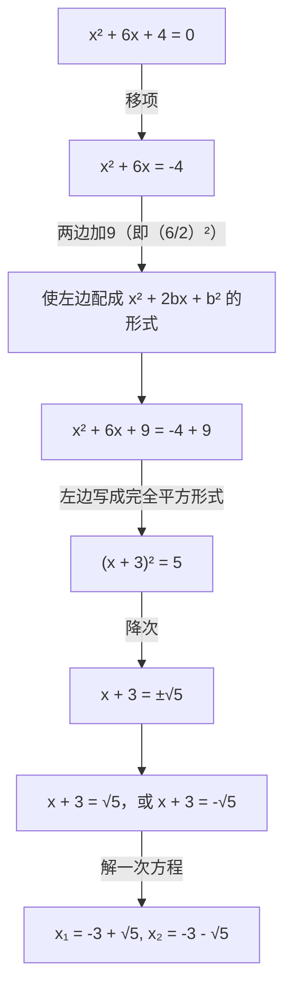
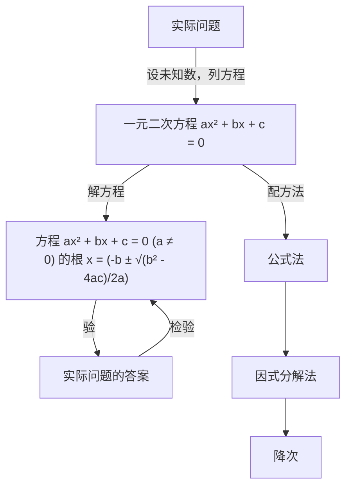

# 第二十一章 一元二次方程

在设计人体雕像时，使雕像的上部（腰以上）与下部（腰以下）的高度比，等于下部与全部（全身）的高度比，可以增加视觉美感。按此比例，如果雕像的高为 2 m，那么它的下部应设计为多高？

如图，雕像的上部高度 AC 与下部高度 BC 应有如下关系：
$A C: B C = B C: 2, \text {即} B C ^ {2} = 2 A C.$
设雕像下部高 x m，可得方程 $x^{2}=2(2-x)$ ，整理得
$x ^ {2} + 2 x - 4 = 0.$

这个方程与我们学过的一元一次方程不同，其中未知数 $x$ 的最高次数是2. 如何解这类方程？如何用这类方程解决一些实际问题？这就是本章要学习的主要内容.
$\begin{array}{l} A \left[ \begin{array}{c c} & \\ 2 - x & \\ C & x ^ {2} + 2 x - 4 = 0 \\ x & \\ B & \end{array} \right] \end{array}$

text_image

们学过的一元一次方程不同，
高次数是2.如何解这类方程？
决一些实际问题？这就是本章
人民教育出版社

## 21.1 一元二次方程

方程
$x ^ {2} + 2 x - 4 = 0 \tag {①}$

中有一个未知数 $x$ ， $x$ 的最高次数是 2. 像这样的方程有广泛的应用，请看下面的问题.

问题 1 如图 21.1-1，有一块矩形铁皮，长 100 cm，宽 50 cm，在它的四角各切去一个同样的正方形，然后将四周突出部分折起，就能制作一个无盖方盒。如果要制作的无盖方盒的底面积为 $3600 \, cm^{2}$ ，那么铁皮各角应切去多大的正方形？

natural_image

Simple geometric diagram of a rectangle with dashed lines and corner markers (no text or symbols)

图21.1-1
设切去的正方形的边长为 $x \mathrm{~cm}$ ，则盒底的长为 $(100 - 2x) \mathrm{cm}$ ，宽为 $(50 - 2x) \mathrm{cm}$ 。根据方盒的底面积为 $3600 \mathrm{~cm}^2$ ，得
$(1 0 0 - 2 x) (5 0 - 2 x) = 3 6 0 0.$

整理，得
$4 x ^ {2} - 3 0 0 x + 1 4 0 0 = 0.$

化简，得
$x ^ {2} - 7 5 x + 3 5 0 = 0. \tag {②}$

方程②中未知数的个数和最高次数各是多少？
由方程②可以得出所切正方形的具体尺寸.

问题 2 要组织一次排球邀请赛，参赛的每两个队之间都要比赛一场。根据场地和时间等条件，赛程计划安排 7 天，每天安排 4 场比赛，比赛组织者应邀请多少个队参赛？

全部比赛的场数为 $4 \times 7 = 28$ .
设应邀请 x 个队参赛，每个队要与其他 $(x-1)$ 个队各赛一场，因为甲队对乙队的比赛和乙队对甲队的比赛是同一场比赛，所以全部比赛共 $\frac{1}{2}x(x-1)$ 场.

列方程
$\frac {1}{2} x (x - 1) = 2 8.$

整理，得
$\frac {1}{2} x ^ {2} - \frac {1}{2} x = 2 8.$

化简，得
$x ^ {2} - x = 5 6. \tag {③}$
由方程③可以得出参赛队数.

方程③中未知数的个数和最高次数各是多少？

> [!think] 思考
方程①②③有什么共同点？

可以发现，这些方程的两边都是整式，方程中只含有一个未知数，未知数的最高次数是2．同样地，方程 $4x^{2}=9,\quad x^{2}+3x=0,\quad 3y^{2}-5y=7-y$ 等也是这样的方程．像这样，等号两边都是整式，只含有一个未知数（一元），并且未知数的最高次数是2（二次）的方程，叫做一元二次方程（quadratic equation with one unknown）.

一元二次方程的一般形式是
$a x ^ {2} + b x + c = 0 (a \neq 0).$

其中 $ax^{2}$ 是二次项，a 是二次项系数；bx 是一次项，b 是一次项系数；c 是常数项.

使方程左右两边相等的未知数的值就是这个一元二次方程的解，一元二次方程的解也叫做一元二次方程的根（root）.

为什么规定 $a \neq 0$ ?

例 将方程 $3x(x - 1) = 5(x + 2)$ 化成一元二次方程的一般形式，并写出其中的二次项系数、一次项系数和常数项.
解：去括号，得
$3 x ^ {2} - 3 x = 5 x + 1 0.$

移项，合并同类项，得一元二次方程的一般形式
$3 x ^ {2} - 8 x - 1 0 = 0.$

其中二次项系数为 3，一次项系数为 -8，常数项为 -10.

#### 练习

1. 将下列方程化成一元二次方程的一般形式，并写出其中的二次项系数、一次项系数和常数项：
(1) $5x^{2} - 1 = 4x$
(2) $4x^{2} = 81$
(3) $4x(x+2)=25;$
(4) $(3x - 2)(x + 1) = 8x - 3.$

2. 根据下列问题，列出关于 $x$ 的方程，并将所列方程化成一元二次方程的一般形式：
(1) 4个完全相同的正方形的面积之和是25，求正方形的边长x；
(2) 一个矩形的长比宽多 2，面积是 100，求矩形的长 x；
(3) 把长为 1 的木条分成两段，使较短一段的长与全长的积，等于较长一段的长的平方，求较短一段的长 x.

## 习题21.1

### 复习巩固

1. 将下列方程化成一元二次方程的一般形式，并写出其中的二次项系数、一次项系数和常数项：
(1) $3x^{2}+1=6x$ ;
(2) $4x^{2}+5x=81;$
(3) $x(x+5)=0;$
(4) $(2x-2)(x-1)=0;$
(5) $x(x+5)=5x-10;$
(6) $(3x - 2)(x + 1) = x(2x - 1)$ .

2. 根据下列问题列方程，并将所列方程化成一元二次方程的一般形式：
(1) 一个圆的面积是 $2 \pi \mathrm{~m}^{2}$ , 求半径;
(2) 一个直角三角形的两条直角边相差 $3 \mathrm{~cm}$ , 面积是 $9 \mathrm{~cm}^{2}$ , 求较长的直角边的长.

3. 下列哪些数是方程 $x^{2}+x-12=0$ 的根?
$- 4, - 3, - 2, - 1, 0, 1, 2, 3, 4.$

### 综合运用

根据下列问题列方程，并将所列方程化成一元二次方程的一般形式（第4～6题）：

4. 一个矩形的长比宽多 $1 \mathrm{~cm}$ , 面积是 $132 \mathrm{~cm}^{2}$ , 矩形的长和宽各是多少?

5. 有一根 $1 \mathrm{~m}$ 长的铁丝，怎样用它围成一个面积为 $0.06 \mathrm{~m}^{2}$ 的矩形？

6. 参加一次聚会的每两人都握了一次手，所有人共握手 10 次，有多少人参加聚会？

### 拓广探索

7. 如果 2 是方程 $x^{2} - c = 0$ 的一个根，那么常数 $c$ 是多少？求出这个方程的其他根.

## 21.2 解一元二次方程

### 21.2.1 配方法

问题 1 一桶油漆可刷的面积为 $1500 \, dm^{2}$ ，李林用这桶油漆恰好刷完 10 个同样的正方体形状的盒子的全部外表面，你能算出盒子的棱长吗？
设其中一个盒子的棱长为 $x \mathrm{dm}$ ，则这个盒子的表面积为 $6x^{2} \mathrm{dm}^{2}$ 。根据一桶油漆可刷的面积，列出方程
$1 0 \times 6 x ^ {2} = 1 5 0 0. \tag {①}$

整理，得
$x ^ {2} = 2 5.$

根据平方根的意义，得
$x = \pm 5,$
即
$x _ {1} = 5, x _ {2} = - 5.$

可以验证，5 和 -5 是方程①的两个根，因为棱长不能是负值，所以盒子的棱长为 5 dm.

natural_image

Illustration of a person painting stacked blocks with a paint can (no text or symbols)

用方程解决实际问题时，要考虑所得结果是否符合实际意义.

一般地，对于方程
$x ^ {2} = p, \tag {I}$
（1）当 $p > 0$ 时，根据平方根的意义，方程（I）有两个不等的实数根
$x _ {1} = - \sqrt {p}, x _ {2} = \sqrt {p};$
(2) 当 p=0 时，方程（Ⅰ）有两个相等的实数根 $x_{1}=x_{2}=0$ ;  
（3）当 p<0 时，因为对任意实数 x，都有 $x^{2}\geqslant0$ ，所以方程（I）无实数根.

> [!explore] 探究
对照上面解方程（Ⅰ）的过程，你认为应怎样解方程 $(x+3)^{2}=5$ ?

在解方程（I）时，由方程 $x^{2} = 25$ 得 $x = \pm 5$ ，由此想到：由方程
$(x + 3) ^ {2} = 5, \tag {②}$

得
$x + 3 = \pm \sqrt {5},$
即
$x + 3 = \sqrt {5}  ,   \text {或}   x + 3 = - \sqrt {5}  . \tag {③}$
于是，方程 $(x + 3)^2 = 5$ 的两个根为
$x _ {1} = - 3 + \sqrt {5}, x _ {2} = - 3 - \sqrt {5}.$

上面的解法中，由方程②得到③，实质上是把一个一元二次方程“降次”，转化为两个一元一次方程，这样就把方程②转化为我们会解的方程了.

#### 练习
解下列方程：
(1) $2x^{2} - 8 = 0$
(2) $9x^{2} - 5 = 3$
(3) $(x + 6)^{2} - 9 = 0$ ;
(4) $3(x - 1)^{2} - 6 = 0$ ;
(5) $x^{2} - 4x + 4 = 5$
(6) $9x^{2}+5=1.$

> [!explore] 探究
怎样解方程 $x^{2}+6x+4=0?$

我们已经会解方程 $(x + 3)^2 = 5$ 。因为它的左边是含有 $x$ 的完全平方式，右边是非负数，所以可以直接降次解方程。那么，能否将方程 $x^2 + 6x + 4 = 0$ 转化为可以直接降次的形式再求解呢？
解方程 $x^{2}+6x+4=0$ 的过程可以用下面的框图表示：

flowchart

为什么在方程 $x^{2} + 6x = -4$ 的两边加9？加其他数行吗？

可以验证， $-3\pm\sqrt{5}$ 是方程 $x^{2}+6x+4=0$ 的两个根.

像上面那样，通过配成完全平方形式来解一元二次方程的方法，叫做配方法。可以看出，配方是为了降次，把一个一元二次方程转化成两个一元一次方程来解。

> [!example]- 例 1 解下列方程:
(1) $x^{2} - 8x + 1 = 0$
(2) $2x^{2}+1=3x$ ;
(3) $3x^{2} - 6x + 4 = 0.$
分析：（1）方程的二次项系数为 1，直接运用配方法.
（2）先把方程化成 $2x^{2} - 3x + 1 = 0$ 。它的二次项系数为2，为了便于配方，需将二次项系数化为1，为此方程的两边都除以2.  
(3) 与(2)类似，方程的两边都除以3后再配方.
解：（1）移项，得
$x ^ {2} - 8 x = - 1.$

配方，得
$x ^ {2} - 8 x + 4 ^ {2} = - 1 + 4 ^ {2},$
$(x - 4) ^ {2} = 1 5.$
由此可得
$x - 4 = \pm \sqrt {1 5},$
$x _ {1} = 4 + \sqrt {1 5}, x _ {2} = 4 - \sqrt {1 5}.$
(2) 移项，得
$2 x ^ {2} - 3 x = - 1.$

二次项系数化为1，得
$x ^ {2} - \frac {3}{2} x = - \frac {1}{2}.$

配方，得
$x ^ {2} - \frac {3}{2} x + \left(\frac {3}{4}\right) ^ {2} = - \frac {1}{2} + \left(\frac {3}{4}\right) ^ {2},$
$\left(x - \frac {3}{4}\right) ^ {2} = \frac {1}{1 6}.$
由此可得
$x - \frac {3}{4} = \pm \frac {1}{4},$
$x _ {1} = 1, x _ {2} = \frac {1}{2}.$
(3) 移项，得
$3 x ^ {2} - 6 x = - 4.$

二次项系数化为 1，得
$x ^ {2} - 2 x = - \frac {4}{3}.$

配方，得
$x ^ {2} - 2 x + 1 ^ {2} = - \frac {4}{3} + 1 ^ {2},$
$(x - 1) ^ {2} = - \frac {1}{3}.$
因为实数的平方不会是负数，所以 $x$ 取任何实数时， $(x - 1)^2$ 都是非负数，上式都不成立，即原方程无实数根.

一般地，如果一个一元二次方程通过配方转化成
$(x + n) ^ {2} = p \tag {Ⅱ}$

的形式，那么就有：
（1）当 $p > 0$ 时，方程（Ⅱ）有两个不等的实数根
$x _ {1} = - n - \sqrt {p}, x _ {2} = - n + \sqrt {p};$
(2) 当 p=0 时，方程（Ⅱ）有两个相等的实数根
$x _ {1} = x _ {2} = - n;$
（3）当 p<0 时，因为对任意实数 x，都有 $(x+n)^{2}\geqslant0$ ，所以方程（Ⅱ）无实数根.

#### 练习

1. 填空：
(1) $x^{2} + 10x + \_) = (x + \_)^{2}$ ;
(2) $x^{2} - 12x + \underline{\quad} = (x - \underline{\quad})^{2}$ ;
(3) $x^{2} + 5x + \_ = (x + \_)^{2}$ ;
(4) $x^{2} - \frac{2}{3} x + \underline{\quad} = (x - \underline{\quad})^{2}$ .

2. 解下列方程：
(1) $x^{2} + 10x + 9 = 0$
(2) $x^{2} - x - \frac{7}{4} = 0;$
(3) $3x^{2}+6x-4=0;$
(4) $4x^{2}-6x-3=0;$
(5) $x^{2} + 4x - 9 = 2x - 11;$
(6) $x(x + 4) = 8x + 12.$

### 21.2.2 公式法

> [!explore] 探究
任何一个一元二次方程都可以写成一般形式
$a x ^ {2} + b x + c = 0 (a \neq 0). \tag {Ⅲ}$

能否也用配方法得出（Ⅲ）的解呢？

我们可以根据用配方法解一元二次方程的经验来解决这个问题.

移项，得
$a x ^ {2} + b x = - c.$

二次项系数化为1，得
$x ^ {2} + \frac {b}{a} x = - \frac {c}{a}.$

配方，得
$x ^ {2} + \frac {b}{a} x + \left(\frac {b}{2 a}\right) ^ {2} = - \frac {c}{a} + \left(\frac {b}{2 a}\right) ^ {2},$
即
$\left(x + \frac {b}{2 a}\right) ^ {2} = \frac {b ^ {2} - 4 a c}{4 a ^ {2}}. \tag {①}$
因为 $a \neq 0$ ，所以 $4a^2 > 0$ 。式子 $b^2 - 4ac$ 的值有以下三种情况：
(1) $b^{2}-4ac>0$

这时 $\frac{b^2 - 4ac}{4a^2} > 0$ ，由①得
$x + \frac {b}{2 a} = \pm \frac {\sqrt {b ^ {2} - 4 a c}}{2 a}.$

方程有两个不等的实数根
$x _ {1} = \frac {- b + \sqrt {b ^ {2} - 4 a c}}{2 a}, x _ {2} = \frac {- b - \sqrt {b ^ {2} - 4 a c}}{2 a}.$
(2) $b^{2}-4ac=0$

这时 $\frac{b^2 - 4ac}{4a^2} = 0$ ，由①可知，方程有两个相等的实数根
$x _ {1} = x _ {2} = - \frac {b}{2 a}.$
(3) $b^{2}-4ac<0$

这时 $\frac{b^2 - 4ac}{4a^2} < 0$ ，由①可知 $\left(x + \frac{b}{2a}\right)^2 < 0$ ，而 $x$ 取任何实数都不能使 $\left(x + \frac{b}{2a}\right)^2 < 0$ ，因此方程无实数根.

一般地，式子 $b^{2}-4ac$ 叫做一元二次方程 $ax^{2}+bx+c=0$ 根的判别式，通常用希腊字母 “ $\Delta$ ” 表示它，即 $\Delta=b^{2}-4ac$ .

> [!tip] 归纳
由上可知，当 $\Delta >0$ 时，方程 $ax^{2} + bx + c = 0 (a \neq 0)$ 有两个不等的实数根；当 $\Delta = 0$ 时，方程 $ax^{2} + bx + c = 0 (a \neq 0)$ 有两个相等的实数根；当 $\Delta < 0$ 时，方程 $ax^{2} + bx + c = 0 (a \neq 0)$ 无实数根.
当 $\Delta \geqslant 0$ 时，方程 $ax^2 + bx + c = 0 (a \neq 0)$ 的实数根可写为
$x = \frac {- b \pm \sqrt {b ^ {2} - 4 a c}}{2 a}$

的形式，这个式子叫做一元二次方程 $ax^2 + bx + c = 0$ 的求根公式。求根公式表达了用配方法解一般的一元二次方程 $ax^2 + bx + c = 0$ 的结果。解一个具体的一元二次方程时，把各系数直接代入求根公式，可以避免配方过程而直接得出根，这种解一元二次方程的方法叫做公式法。

> [!example]- 例 2 用公式法解下列方程:
(1) $x^{2} - 4x - 7 = 0$   
(2) $2x^{2}-2\sqrt{2}x+1=0;$   
(3) $5x^{2} - 3x = x + 1;$   
(4) $x^{2} + 17 = 8x$
解：（1）a=1，b=-4，c=-7.
$\Delta = b ^ {2} - 4 a c = (- 4) ^ {2} - 4 \times 1 \times (- 7) = 4 4 > 0.$

方程有两个不等的实数根
$\begin{array}{l} x = \frac {- b \pm \sqrt {b ^ {2} - 4 a c}}{2 a} \\ = \frac {- (- 4) \pm \sqrt {4 4}}{2 \times 1} = 2 \pm \sqrt {1 1}, \\ \end{array}$
即
$x _ {1} = 2 + \sqrt {1 1}, x _ {2} = 2 - \sqrt {1 1}.$
(2) a=2, $b=-2\sqrt{2}$ , c=1.
$\Delta = b ^ {2} - 4 a c = (- 2 \sqrt {2}) ^ {2} - 4 \times 2 \times 1 = 0.$

方程有两个相等的实数根
$x _ {1} = x _ {2} = - \frac {b}{2 a} = - \frac {- 2 \sqrt {2}}{2 \times 2} = \frac {\sqrt {2}}{2}.$
(3) 方程化为 $5x^{2}-4x-1=0$ .
$a = 5, b = - 4, c = - 1.$
$\Delta = b ^ {2} - 4 a c = (- 4) ^ {2} - 4 \times 5 \times (- 1) = 3 6 > 0.$

方程有两个不等的实数根
$x = \frac {- b \pm \sqrt {b ^ {2} - 4 a c}}{2 a} = \frac {- (- 4) \pm \sqrt {3 6}}{2 \times 5} = \frac {4 \pm 6}{1 0},$
即

确定 $a, b, c$ 的值时，要注意它们的符号.
$x _ {1} = 1, x _ {2} = - \frac {1}{5}.$
(4) 方程化为 $x^{2}-8x+17=0$ .
$a = 1, b = - 8, c = 1 7.$
$\Delta = b ^ {2} - 4 a c = (- 8) ^ {2} - 4 \times 1 \times 1 7 = - 4 <   0.$

方程无实数根.

回到本章引言中的问题，雕像下部高度 x（单位：m）满足方程
$x ^ {2} + 2 x - 4 = 0.$

用公式法解这个方程，得
$x = \frac {- 2 \pm \sqrt {2 ^ {2} - 4 \times 1 \times (- 4)}}{2 \times 1} = \frac {- 2 \pm \sqrt {2 0}}{2} = - 1 \pm \sqrt {5},$
即
$x _ {1} = - 1 + \sqrt {5}, x _ {2} = - 1 - \sqrt {5}.$
如果结果保留小数点后两位，那么， $x_{1}\approx1.24,\quad x_{2}\approx-3.24.$

这两个根中，只有 $x_{1} \approx 1.24$ 符合问题的实际意义，因此雕像下部高度应设计为约 1.24 m.

#### 练习

1. 解下列方程:
(1) $x^{2} + x - 6 = 0$
(2) $x^{2} - \sqrt{3} x - \frac{1}{4} = 0;$
(3) $3x^{2}-6x-2=0;$
(4) $4x^{2}-6x=0;$
(5) $x^{2} + 4x + 8 = 4x + 11;$
(6) $x(2x - 4) = 5 - 8x.$

2. 求第 21.1 节中问题 1 的答案.

### 21.2.3 因式分解法

问题 2 根据物理学规律，如果把一个物体从地面以 $10 \, m/s$ 的速度竖直上抛，那么物体经过 x s 离地面的高度(单位：m)为
$1 0 x - 4. 9 x ^ {2}.$

natural_image

Illustration of a hand with fingers spread, wearing a blue shirt (no text or symbols)

根据上述规律，物体经过多少秒落回地面（结果保留小数点后两位）?
设物体经过 x s 落回地面，这时它离地面的高度为 0 m，即
$1 0 x - 4. 9 x ^ {2} = 0. \tag {①}$

> [!think] 思考
除配方法或公式法以外，能否找到更简单的方法解方程①?

方程①的右边为0，左边可以因式分解，得
$x (1 0 - 4. 9 x) = 0.$

这个方程的左边是两个一次因式的乘积，右边是0. 我们知道，如果两个因式的积为0，那么这两个因式中至少有一个等于0；反之，如果两个因式中任何一个为0，那么它们的积也等于0. 所以
$x = 0, \text {或} 1 0 - 4. 9 x = 0. \tag {②}$
所以，方程①的两个根是
$x _ {1} = 0, x _ {2} = \frac {1 0 0}{4 9} \approx 2. 0 4.$

这两个根中， $x_{2} \approx 2.04$ 表示物体约在 2.04 s 时落回地面，而 $x_{1} = 0$ 表示物体被上抛离开地面的时刻，即在 0 s 时物体被抛出，此刻物体的高度是 0 m.

如果 $a \cdot b = 0$ ，那么 $a = 0$ ，或 $b = 0$ .

> [!think] 思考
解方程①时，二次方程是如何降为一次的？

可以发现，上述解法中，由①到②的过程，不是用开平方降次，而是先因式分解，使方程化为两个一次式的乘积等于0的形式，再使这两个一次式分别等于0，从而实现降次。这种解一元二次方程的方法叫做因式分解法。

> [!example]- 例 3 解下列方程:
(1) $x(x - 2) + x - 2 = 0$
(2) $5x^{2} - 2x - \frac{1}{4} = x^{2} - 2x + \frac{3}{4}.$
解：（1）因式分解，得
$(x - 2) (x + 1) = 0.$
于是得
$x - 2 = 0, \text {或} x + 1 = 0,$
$x _ {1} = 2, x _ {2} = - 1.$
(2) 移项、合并同类项，得
$4 x ^ {2} - 1 = 0.$

因式分解，得
$(2 x + 1) (2 x - 1) = 0.$
于是得
$2 x + 1 = 0, \text {或} 2 x - 1 = 0,$
$x _ {1} = - \frac {1}{2}, x _ {2} = \frac {1}{2}.$

可以试用多种方法解本例中的两个方程.

> [!tip] 归纳

配方法要先配方，再降次；通过配方法可以推出求根公式，公式法直接利用求根公式解方程；因式分解法要先将方程一边化为两个一次因式相乘，另一边为0，再分别使各一次因式等于0。配方法、公式法适用于所有一元二次方程，因式分解法在解某些一元二次方程时比较简便。总之，解一元二次方程的基本思路是：将二次方程化为一次方程，即降次。

#### 练习

1. 解下列方程:
(1) $x^{2} + x = 0$
(2) $x^{2} - 2\sqrt{3} x = 0;$
(3) $3x^{2}-6x=-3;$
(4) $4x^{2}-121=0;$
(5) $3x(2x + 1) = 4x + 2;$
(6) $(x - 4)^{2} = (5 - 2x)^{2}$ .

2. 如图，把小圆形场地的半径增加 5 m 得到大圆形场地，场地面积扩大了一倍。求小圆形场地的半径。

natural_image

Simple diagram of two concentric circles with no text or symbols

(第2题)

#### \*21.2.4 一元二次方程的根与系数的关系

方程 $ax^2 + bx + c = 0 (a \neq 0)$ 的求根公式 $x = \frac{-b \pm \sqrt{b^2 - 4ac}}{2a}$ ，不仅表示可以由方程的系数 $a, b, c$ 决定根的值，而且反映了根与系数之间的联系。一元二次方程根与系数之间的联系还有其他表现方式吗？

> [!think] 思考
从因式分解法可知，方程 $(x - x_{1})(x - x_{2}) = 0$ （ $x_{1}$ ， $x_{2}$ 为已知数）的两根为 $x_{1}$ 和 $x_{2}$ ，将方程化为 $x^{2} + px + q = 0$ 的形式，你能看出 $x_{1}$ ， $x_{2}$ 与 $p,q$ 之间的关系吗？

把方程 $(x - x_{1})(x - x_{2}) = 0$ 的左边展开，化成一般形式，得方程
$x ^ {2} - (x _ {1} + x _ {2}) x + x _ {1} x _ {2} = 0.$

这个方程的二次项系数为1，一次项系数 $p = -(x_{1} + x_{2})$ ，常数项 $q = x_{1}x_{2}$
于是，上述方程两个根的和、积与系数分别有如下关系：
$x _ {1} + x _ {2} = - p, x _ {1} x _ {2} = q.$

> [!think] 思考
一般的一元二次方程 $ax^2 + bx + c = 0$ 中，二次项系数 $a$ 未必是1，它的两个根的和、积与系数又有怎样的关系呢？

根据求根公式可知，
$x _ {1} = \frac {- b + \sqrt {b ^ {2} - 4 a c}}{2 a}, \quad x _ {2} = \frac {- b - \sqrt {b ^ {2} - 4 a c}}{2 a}.$
由此可得
$x _ {1} + x _ {2} = \frac {- b + \sqrt {b ^ {2} - 4 a c}}{2 a} + \frac {- b - \sqrt {b ^ {2} - 4 a c}}{2 a}$
$= \frac {- 2 b}{2 a} = - \frac {b}{a},$
$x _ {1} x _ {2} = \frac {- b + \sqrt {b ^ {2} - 4 a c}}{2 a} \cdot \frac {- b - \sqrt {b ^ {2} - 4 a c}}{2 a}$
$= \frac {(- b) ^ {2} - (b ^ {2} - 4 a c)}{4 a ^ {2}} = \frac {c}{a}.$
因此，方程的两个根 $x_{1}$ ， $x_{2}$ 和系数 $a$ ， $b$ ， $c$ 有如下关系：
$x _ {1} + x _ {2} = - \frac {b}{a}, x _ {1} x _ {2} = \frac {c}{a}.$

这表明任何一个一元二次方程的根与系数的关系为：两个根的和等于一次项系数与二次项系数的比的相反数，两个根的积等于常数项与二次项系数的比.

把方程 $ax^{2} + bx + c = 0$ ( $a \neq 0$ ) 的两边同除以 a，能否得出该结论？

> [!example]- 例4 根据一元二次方程的根与系数的关系，求下列方程两个根 $x_{1}, x_{2}$ 的和与积：
(1) $x^{2} - 6x - 15 = 0$   
(2) $3x^{2} + 7x - 9 = 0$   
(3) $5x - 1 = 4x^{2}$ .
解：（1） $x_{1}+x_{2}=-(-6)=6,\quad x_{1}x_{2}=-15.$
(2) $x_{1} + x_{2} = -\frac{7}{3}, x_{1}x_{2} = \frac{-9}{3} = -3.$   
（3）方程化为 $4x^{2} - 5x + 1 = 0$ ， $x_{1} + x_{2} = -\frac{-5}{4} = \frac{5}{4}$ ， $x_{1}x_{2} = \frac{1}{4}$

#### 练习

不解方程，求下列方程两个根的和与积：
(1) $x^{2} - 3x = 15$ ;
(2) $3x^{2} + 2 = 1 - 4x$
(3) $5x^{2} - 1 = 4x^{2} + x;$
(4) $2x^{2} - x + 2 = 3x + 1.$

## 习题21.2

### 复习巩固

1. 解下列方程：
(1) $36x^{2} - 1 = 0$ ;
(2) $4x^{2}=81;$
(3) $(x+5)^{2}=25;$
(4) $x^{2} + 2x + 1 = 4.$

2. 填空：
(1) $x^{2} + 6x + \_\_\_\_ = (x + \_\_\_)^{2}$ ;
(2) $x^{2} - x + \underline{\quad} = (x - \underline{\quad})^{2}$ ;
(3) $4x^{2} + 4x + \_\_\_\_ = (2x + \_\_\_\_)^{2}$ ;
(4) $x^{2} - \frac{2}{5} x + \underline{\quad} = (x - \underline{\quad})^{2}$ .

3. 用配方法解下列方程：
(1) $x^{2} + 10x + 16 = 0$
(2) $x^{2} - x - \frac{3}{4} = 0;$
(3) $3x^{2}+6x-5=0;$
(4) $4x^{2}-x-9=0.$

4. 利用判别式判断下列方程的根的情况：
(1) $2x^{2}-3x-\frac{3}{2}=0;$
(2) $16x^{2} - 24x + 9 = 0$
(3) $x^{2}-4\sqrt{2}x+9=0;$
(4) $3x^{2} + 10 = 2x^{2} + 8x.$

5. 用公式法解下列方程：
(1) $x^{2}+x-12=0;$
(2) $x^{2} - \sqrt{2} x - \frac{1}{4} = 0;$
(3) $x^{2}+4x+8=2x+11;$
(4) $x(x - 4) = 2 - 8x$
(5) $x^{2}+2x=0;$
(6) $x^{2} + 2\sqrt{5} x + 10 = 0.$

6. 用因式分解法解下列方程：
(1) $3x^{2} - 12x = -12$ ;
(2) $4x^{2}-144=0;$
(3) $3x(x-1)=2(x-1)$ ;
(4) $(2x - 1)^{2} = (3 - x)^{2}$ .

\* 7. 求下列方程两个根的和与积:
(1) $x^{2} - 3x + 2 = 10$ ;
(2) $5x^{2}+x-5=0;$
(3) $x^{2}+x=5x+6;$
(4) $7x^{2}-5=x+8.$

### 综合运用

8. 一个直角三角形的两条直角边相差 $5 \mathrm{~cm}$ , 面积是 $7 \mathrm{~cm}^{2}$ . 求斜边的长.  
9. 参加一次商品交易会的每两家公司之间都签订了一份合同，所有公司共签订了45份合同，共有多少家公司参加商品交易会？  
10. 分别用公式法和因式分解法解方程 $x^{2}-6x+9=(5-2x)^{2}$ .  
11. 有一根 $20 \mathrm{~m}$ 长的绳，怎样用它围成一个面积为 $24 \mathrm{~m}^{2}$ 的矩形？

### 拓广探索

12. 一个凸多边形共有 20 条对角线，它是几边形？是否存在有 18 条对角线的多边形？如果存在，它是几边形？如果不存在，说明得出结论的道理。  
13. 无论 $p$ 取何值，方程 $(x - 3)(x - 2) - p^2 = 0$ 总有两个不等的实数根吗？给出答案并说明理由.

## 阅读与思考

### 黄金分割数

本章引言中有一个关于人体雕像的问题。要使雕像的上部（腰以上）与下部（腰以下）的高度比，等于下部与全部（全身）的高度比，这个高度比应是多少？

把上面的问题一般化，如图1，在线段 $AB$ 上找一个点 $C$ ， $C$ 把 $AB$ 分为 $AC$ 和 $CB$ 两段，其中 $AC$ 是较小的一段，现要使 $AC:CB = CB:AB$ 。为简单起见，设 $AB = 1$ ， $CB = x$ ，则 $AC = 1 - x$ 。代入 $AC:CB = CB:AB$ ，即 $(1 - x):x = x:1$ ，也即 $x^{2} + x - 1 = 0.$ 解方程，得 $x = \frac{-1\pm\sqrt{5}}{2}$

根据问题的实际意义，取 $x = \frac{\sqrt{5} - 1}{2} \approx 0.618$ ，这个值就是上面问题中所求的高度比.

人们把 $\frac{\sqrt{5} - 1}{2}$ 这个数叫做黄金分割数。如果把一条线段分为两部分，使其中较长一段与整个线段的比是黄金分割数，那么较短一段与较长一段的比也是黄金分割数。

图1

text_image

A
B N M E
C D

图2

五角星是常见的图案．如图2，在正五角星中存在黄金分割数，可以证明其中 $\frac{MN}{NB} = \frac{BN}{BM} = \frac{BM}{BE} = \frac{\sqrt{5} - 1}{2}$

长期以来，很多人认为黄金分割数是一个很特别的数。一些美术家认为：如果人的上、下身长之比接近黄金分割数，那么可以增加美感。据说，一些名画和雕塑中的人体大都符合这个比。一位科学家曾提出：在一棵树的生长过程中， $\frac{n\text{年后的树枝数目}}{n + 1\text{年后的树枝数目}}$ 约是黄金分割数。

优选法是一种具有广泛应用价值的数学方法，著名数学家华罗庚曾为普及它作出重要贡献。优选法中有一种0.618法应用了黄金分割数。同学们可以查阅资料，了解0.618法的应用。

natural_image

Man in white shirt and glasses standing under a lamp, holding an object (no visible text or symbols)

这是著名数学家华罗庚在日本去世前几小时做学术报告，讲解优选法的照片。华先生说过，他要工作到人生的最后一刻。他实践了自己的诺言。

## 21.3 实际问题与一元二次方程

同一元一次方程、二元一次方程（组）等一样，一元二次方程也可以作为反映某些实际问题中数量关系的数学模型。本节继续讨论如何利用一元二次方程解决实际问题。

#### 探究1

有一个人患了流感，经过两轮传染后共有121个人患了流感，每轮传染中平均一个人传染了几个人？
分析：设每轮传染中平均一个人传染了 x 个人.

开始有一个人患了流感，第一轮的传染源就是这个人，他传染了 $x$ 个人，用代数式表示，第一轮后共有\_\_\_\_个人患了流感；第二轮传染中，这些人中的每个人又传染了 $x$ 个人，用代数式表示，第二轮后共有\_\_\_\_个人患了流感.

列方程
$1 + x + x (1 + x) = 1 2 1.$
解方程，得
$x _ {1} = 1 0, x _ {2} = - 1 2 (\text { 不   合   题   意 }, \text { 舍   去 }).$

平均一个人传染了 10 个人.

通过对这个问题的探究，你对类似的传播问题中的数量关系有新的认识吗？

> [!think] 思考
如果按照这样的传染速度，经过三轮传染后共有多少个人患流感？

#### 探究2

两年前生产 1 t 甲种药品的成本是 5000 元，生产 1 t 乙种药品的成本是 6000 元。随着生产技术的进步，现在生产 1 t 甲种药品的成本是 3000 元，生产 1 t 乙种药品的成本是 3600 元。哪种药品成本的年平均下降率较大？
分析：容易求出，甲种药品成本的年平均下降额为 $(5\ 000-3\ 000)\div2=1\ 000$ （元），乙种药品成本的年平均下降额为 $(6\ 000-3\ 600)\div2=1\ 200$ （元）。显然，乙种药品成本的年平均下降额较大。但是，年平均下降额（元）不等同于年平均下降率（百分数）。
设甲种药品成本的年平均下降率为 $x$ ，则一年后甲种药品成本为 $5000(1 - x)$ 元，两年后甲种药品成本为 $5000(1 - x)^2$ 元，于是有
$5 0 0 0 (1 - x) ^ {2} = 3 0 0 0.$
解方程，得
$x _ {1} \approx 0. 2 2 5, x _ {2} \approx 1. 7 7 5.$

根据问题的实际意义，甲种药品成本的年平均下降率约为 22.5%.

乙种药品成本的年平均下降率是多少？请比较两种药品成本的年平均下降率.

为什么选择 $22.5\%$ 作为答案？

> [!think] 思考
经过计算，你能得出什么结论？成本下降额大的药品，它的成本下降率一定也大吗？应怎样全面地比较几个对象的变化状况？

#### 探究3

如图 21.3-1，要设计一本书的封面，封面长27 cm，宽21 cm，正中央是一个与整个封面长宽比例相同的矩形。如果要使四周的彩色边衬所占面积是封面面积的四分之一，上、下边衬等宽，左、右边衬等宽，应如何设计四周边衬的宽度（结果保留小数点后一位）？

text_image

中国现代花鸟洲大金

图21.3-1
分析：封面的长宽之比是 $27:21=9:7$ ，中央的矩形的长宽之比也应是 9:7。设中央的矩形的长和宽分别是 9a cm 和 7a cm，由此得上、下边衬与左、右边衬的宽度之比是
$\begin{array}{l} \frac {1}{2} (2 7 - 9 a): \frac {1}{2} (2 1 - 7 a) \\ = 9 (3 - a): 7 (3 - a) \\ \end{array}$
$= 9: 7.$
设上、下边衬的宽均为 $9x \, cm$ ，左、右边衬的宽均为 $7x \, cm$ ，则中央的矩形的长为 $(27-18x) \, \text{cm}$ ，宽为 $(21-14x) \, \text{cm}$ .

要使四周的彩色边衬所占面积是封面面积的四分之一，则中央的矩形的面积是封面面积的四分之三．于是可列出方程
$(2 7 - 1 8 x) (2 1 - 1 4 x) = \frac {3}{4} \times 2 7 \times 2 1.$

整理，得
$1 6 x ^ {2} - 4 8 x + 9 = 0.$
解方程，得
$x = \frac {6 \pm 3 \sqrt {3}}{4}.$

方程的哪个根符合实际意义？为什么？

上、下边衬的宽均为 \_\_\_\_ cm，左、右边衬的宽均为 \_\_\_\_ cm.

> [!think] 思考
如果换一种设未知数的方法，是否可以更简单地解决上面的问题？请你试一试.

## 习题21.3

### 复习巩固

1. 解下列方程:
(1) $x^{2}+10x+21=0;$   
(2) $x^{2} - x - 1 = 0$   
(3) $3x^{2}+6x-4=0;$   
(4) $3x(x+1)=3x+3;$   
(5) $4x^{2}-4x+1=x^{2}+6x+9;$   
(6) $7x^{2} - \sqrt{6} x - 5 = 0.$

2. 两个相邻偶数的积是 168. 求这两个偶数.  
3. 一个直角三角形的两条直角边的和是 $14 \mathrm{~cm}$ , 面积是 $24 \mathrm{~cm}^{2}$ . 求两条直角边的长.

### 综合运用

4. 某种植物的主干长出若干数目的支干，每个支干又长出同样数目的小分支，主干、支干和小分支的总数是91，每个支干长出多少小分支？  
5. 一个菱形两条对角线长的和是 $10 \mathrm{~cm}$ ，面积是 $12 \mathrm{~cm}^{2}$ 。求菱形的周长。  
6. 参加足球联赛的每两队之间都进行两场比赛，共要比赛90场，共有多少个队参加比赛？  
7. 青山村种的水稻 2010 年平均每公顷产 7200 kg，2012 年平均每公顷产 8450 kg.
求水稻每公顷产量的年平均增长率.  
8. 要为一幅长 29 cm，宽 22 cm 的照片配一个相框，要求相框的四条边宽度相等，且相框所占面积为照片面积的四分之一，相框边的宽度应是多少厘米（结果保留小数点后一位）?

### 拓广探索

9. 如图，要设计一幅宽 20 cm，长 30 cm 的图案，其中有两横两竖的彩条，横、竖彩条的宽度比为 3:2。如果要使彩条所占面积是图案面积的四分之一，应如何设计彩条的宽度（结果保留小数点后一位）?

natural_image

Simple grid pattern with purple lines on a light pink background (no text or symbols)

(第9题)

10. 如图，线段 $AB$ 的长为 1.

（第10题）

(1) 线段 AB 上的点 C 满足关系式 $AC^{2}=BC \cdot AB$ ，求线段 AC 的长度；  
(2) 线段 AC 上的点 D 满足关系式 $AD^{2}=CD \cdot AC$ ，求线段 AD 的长度；  
（3）线段 $AD$ 上的点 $E$ 满足关系式 $AE^2 = DE \cdot AD$ ，求线段 $AE$ 的长度.上面各小题的结果反映了什么规律？

#### 数学活动

#### 活动 三角点阵中前 $n$ 行的点数计算

图 1 是一个三角点阵，从上向下数有无数多行，其中第一行有 1 个点，第二行有 2 个点……第 n 行有 n 个点……

natural_image

Simple triangular arrangement of black dots on a pink background (no text or symbols)

图1

容易发现，10 是三角点阵中前 4 行的点数和。你能发现 300 是前多少行的点数的和吗？

用试验的方法，由上而下地逐行相加其点数，可以得到答案。但是这样寻找答案需要花费较多时间。你能用一元二次方程解决这个问题吗？

(提示: $1+2+3+\cdots+(n-2)+(n-1)+n=\frac{1}{2}n(n+1)$ .)

三角点阵中前 n 行的点数和能是 600 吗？如果能，求出 n；如果不能，试用一元二次方程说明道理.
如果把图1的三角点阵中各行的点数依次换为2，4，6，…，2n，…，你能探究出前n行的点数和满足什么规律吗？这个三角点阵中前n行的点数和能是600吗？如果能，求出n；如果不能，试用一元二次方程说明道理.

## 小结

### 一、本章知识结构图

flowchart

### 二、回顾与思考

本章主要内容是一元二次方程的解法及其应用。一元二次方程是含有一个未知数的整式方程，未知数的最高次数是2。
解一元二次方程的基本思想是“降次”，即通过配方、因式分解等，把一个一元二次方程转化为两个一元一次方程来解。具体地，根据平方根的意义，可得出方程 $x^{2} = p$ 和 $(x + n)^{2} = p$ 的解；通过配方，可将一元二次方程转化为 $(x + n)^{2} = p$ 的形式再解；一元二次方程的求根公式，就是对方程 $ax^{2} + bx + c = 0$ ( $a \neq 0$ ) 配方后得出的。若能将 $ax^{2} + bx + c$ 分解为两个一次因式的乘积，则可令每个因式为 0 来解。

本章学习了一元二次方程的三种解法——配方法、公式法和因式分解法。一般地，配方法是推导一元二次方程求根公式的工具。掌握了公式法，就可以直接用公式求一元二次方程的根。当然，也要根据方程的具体特点选择适当的解法。配方法是一种重要的、应用广泛的数学方法，如后面研究二次函数时也要用到它。

一元二次方程是刻画现实世界中某些数量关系的有效数学模型。在运用一元二次方程分析、表达和解决实际问题的过程中，要注意体会建立数学模型解决实际问题的思想和方法。

请你带着下面的问题，复习一下全章的内容吧.

1. 比较你所学过的各种整式方程，说明它们的未知数的个数与次数。你能写出这些方程的一般形式吗？  
2. 一元二次方程有哪些解法？各种解法在什么情况下比较适用？你能说说“降次”在解一元二次方程中的作用吗？  
3. 求根公式与配方法有什么关系？如何判别一元二次方程根的情况？  
4. 方程 $ax^2 + bx + c = 0 (a \neq 0)$ 的两个根 $x_1, x_2$ 与系数 $a, b, c$ 有什么关系？我们是如何得到这种关系的？  
5. 你能举例说明用一元二次方程解决实际问题的过程吗?

#### 复习题21

### 复习巩固

1. 解下列方程：
(1) $196x^{2}-1=0;$   
(2) $4x^{2}+12x+9=81$ ;   
(3) $x^{2}-7x-1=0;$   
(4) $2x^{2}+3x=3;$   
(5) $x^{2} - 2x + 1 = 25$ ;   
(6) $x(2x-5)=4x-10;$   
(7) $x^{2} + 5x + 7 = 3x + 11$ ;   
(8) $1 - 8x + 16x^{2} = 2 - 8x.$

2. 两个数的和为 8，积为 9.75. 求这两个数.

3. 一个矩形的长和宽相差 $3 \mathrm{~cm}$ , 面积是 $4 \mathrm{~cm}^{2}$ . 求这个矩形的长和宽.

\* 4. 求下列方程两个根的和与积:
(1) $x^{2} - 5x - 10 = 0$
(2) $2x^{2}+7x+1=0;$
(3) $3x^{2}-1=2x+5;$
(4) $x(x-1)=3x+7.$

### 综合运用

5. 一个直角梯形的下底比上底长 $2 \mathrm{~cm}$ , 高比上底短 $1 \mathrm{~cm}$ , 面积是 $8 \mathrm{~cm}^{2}$ . 画出这个梯形.  
6. 一个长方体的长与宽的比为 $5:2$ ，高为 $5 \mathrm{~cm}$ ，表面积为 $40 \mathrm{~cm}^2$ 。画出这个长方体的展开图。  
7. 要组织一次篮球联赛，赛制为单循环形式（每两队之间都赛一场），计划安排15场比赛，应邀请多少个球队参加比赛？  
8. 如下页图, 利用一面墙 (墙的长度不限), 用 $20 \mathrm{~m}$ 长的篱笆, 怎样围成一个面积为 $50 \mathrm{~m}^{2}$ 的矩形场地?

natural_image

Illustration of a rural landscape with a wooden fence, green plants, and a tiled wall (no text or symbols)

(第8题)

9. 某银行经过最近的两次降息，使一年期存款的年利率由 $2.25\%$ 降至 $1.98\%$ ，平均每次降息的百分率是多少（结果写成 $a\%$ 的形式，其中 $a$ 保留小数点后两位）？  
10. 向阳村 2010 年的人均收入为 12 000 元，2012 年的人均收入为 14 520 元。求人均收入的年平均增长率。  
11. 用一条长 $40 \mathrm{~cm}$ 的绳子怎样围成一个面积为 $75 \mathrm{~cm}^{2}$ 的矩形？能围成一个面积为 $101 \mathrm{~cm}^{2}$ 的矩形吗？如能，说明围法；如不能，说明理由.

### 拓广探索

12. 如图, 要设计一个等腰梯形的花坛, 花坛上底长 $100 \mathrm{~m}$ , 下底长 $180 \mathrm{~m}$ , 上下底相距 $80 \mathrm{~m}$ . 在两腰中点连线处有一条横向甬道, 上下底之间有两条纵向甬道, 各甬道的宽度相等. 甬道的面积是梯形面积的六分之一. 甬道的宽应是多少米 (结果保留小数点后两位)?

natural_image

Geometric diagram of a trapezoid divided into four equal sections with diagonal and horizontal lines (no text or symbols)

(第12题)

可利用梯形的中位线求解. 梯形的中位线是连接梯形两腰中点的线段, 其长度等于两底和的一半.

13. 一个小球以 $5\mathrm{m / s}$ 的速度开始向前滚动，并且均匀减速， $4\mathrm{s}$ 后小球停止滚动。
(1) 小球的滚动速度平均每秒减少多少?  
(2) 小球滚动 $5 \mathrm{~m}$ 约用了多少秒（结果保留小数点后一位）?  
（提示：匀变速直线运动中，每个时间段内的平均速度 $\overline{v}$ （初速度与末速度的算术平均数）与路程 $s$ ，时间 $t$ 的关系为 $s = \overline{v} t.$
