# 综合与实践

# 制作一个尽可能大的无盖长方体形盒子

用一张正方形的纸怎样才能制成一个无盖的长方体形盒子？

怎样才能使制成的无盖长方体形盒子的容积尽可能大?

# 议一议
(1) 你觉得应当怎样剪？怎样折？与同伴进行交流。  
(2) 剪去的小正方形的边长与折成的无盖长方体形盒子的高有什么关系?  
（3）如果设这张正方形纸的边长为 $a \mathrm{~cm}$ ，所折无盖长方体形盒子的高为 $h \mathrm{~cm}$ ，你能用 $a$ 与 $h$ 来表示这个无盖长方体形盒子的容积吗？

# 想一想

随着剪去的小正方形的边长的增大，所折无盖长方体形盒子的容积如何变化？

# 做一做

用边长为 $20 \, cm$ 的正方形纸按以上方式制作无盖长方体形盒子.
(1) 如果剪去的小正方形边长按整数值依次变化, 即分别取 $1 \mathrm{~cm}, 2 \mathrm{~cm}, 3 \mathrm{~cm}, 4 \mathrm{~cm}, 5 \mathrm{~cm}, 6 \mathrm{~cm}, 7 \mathrm{~cm}, 8 \mathrm{~cm}, 9 \mathrm{~cm}, 10 \mathrm{~cm}$ 时, 折成的无盖长方体形盒子的容积分别是多少? 请你将计算的结果填入下表, 并制作折线统计图.

<table><tr><td>剪去小正方形的边长/cm</td><td>1</td><td>2</td><td>3</td><td>4</td><td>5</td><td>6</td><td>7</td><td>8</td><td>9</td><td>10</td></tr><tr><td>容积/ $cm^{3}$ </td><td></td><td></td><td></td><td></td><td></td><td></td><td></td><td></td><td></td><td></td></tr></table>
(2) 观察统计图, 当小正方形边长变化时, 所得到的无盖长方体形盒子的容积是如何变化的?  
（3）观察统计图，当小正方形边长取什么值时，所得到的无盖长方体形盒子的容积最大？此时，无盖长方体形盒子的容积是多少？

# 议一议

改变剪去的小正方形的边长，你能制作出容积更大的无盖长方体形盒子吗？

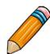

# 做一做
(1) 如果剪去的小正方形边长按 $0.5 \mathrm{~cm}$ 的间隔取值, 即分别取 $0.5 \mathrm{~cm}, 1.0 \mathrm{~cm}, 1.5 \mathrm{~cm}, 2.0 \mathrm{~cm}, 2.5 \mathrm{~cm}, 3.0 \mathrm{~cm}, 3.5 \mathrm{~cm}, 4.0 \mathrm{~cm}, \dots$ 时, 折成的无盖长方体形盒子的容积将如何变化? 请在相应的统计图中表示这个变化情况. (可以使用计算器)  
(2) 观察这些数据的变化, 你发现了什么? 与同伴进行交流.  
（3）从统计表中可以看出，当小正方形的边长取什么值时，所得到的无盖长方体形盒子的容积最大？此时，无盖长方体形盒子的容积是多少？

# 想一想

你能按照上述方法制作出容积更大的无盖长方体形盒子吗？借助计算器验证你的猜想.

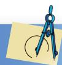

# 习题

1. 以小组为单位，撰写一份关于本课题的数学小论文.

※2. 用一张正方形的纸，你还有其他方法把它制成一个无盖的长方体形盒子吗？哪种方法制成的无盖长方体形盒子的容积更大？

# 总复习

● 整理本学期学过的知识与方法，用一张图把它们表示出来，并与同伴进行交流.  
- 在自己经历过的解决问题活动中，选择一个最具有挑战性的问题，写下解决它的过程：包括遇到的困难、克服困难的方法与过程及所获得的体会，并解释选择这个问题的原因。  
● 通过本学期的数学学习，你有哪些收获？有哪些需要改进的地方？

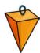

# 知识技能

1. 下面哪个几何体的截面形状可能是圆？
(1) 圆柱;
(2) 圆锥;
(3) 棱柱.

2. 过一点画 2 条直线，如果只考虑小于 $180^{\circ}$ 的角，那么可以形成多少个角？

3. 在数轴上将下列各数表示出来:
(1) $-3\frac{1}{4}$ , 2.5, 0, $-\frac{4}{3}$ ;
(2)(1) 中数的相反数;
(3) 所有绝对值小于 5 的整数.

4. 比较下列各组数的大小:
(1) -9 与 -8;
(2) -0.25 与 -1;
(3) $|7.6|$ 与 $|-7.6|$ ;
(4) 0 与 -|-7|;
(5) $-\frac{1}{2}$ 与 $-\frac{2}{5};$
(6) $|-13.5|$ 与 $|-2.7|$ .

5. 计算:
(1) $1+\frac{5}{6}-\frac{19}{12};$
(2) $3 \times (-9) + 7 \times (-9)$ ;
(3) $\left(\frac{5}{4} -\frac{7}{6}\right)\times \left(-\frac{8}{7}\right);$
(4) $(-54) \div 6 \div (-3)$ ;
(5) $2 \times [5 + (-2)^{3}]$ ;
(6) $-\left(\frac{2}{13} - \frac{1}{3} - \frac{1}{6}\right) \times 78$ ;
(7) $\left(-\frac{2}{3}\right)\times\frac{27}{8}\div\left(\frac{3}{2}\right)^{3};$

8) $\frac{1}{30} -\left(-\frac{2}{3} +\frac{3}{5}\right)\div (-2).$

6. 化简下列各式:
(1) $3b^{2} - (a^{2} + b^{2}) - b^{2};$
(2) $x+(2x-1)-\left(\frac{x}{3}+3\right);$
(3) $-2(ab - 3a^{2}) + (5ab - a^{2});$
(4) $2a^{2} - \frac{1}{2} (ab + a^{2}) - 8ab;$
(5) $-(b - 4) + 4(-b - 3)$ ;
(6) $\frac{1}{2} (x^2 - y) + \frac{1}{3} (x - y^2) + \frac{1}{6} (x^2 + y^2)$ .

7. 下列整式哪些是单项式，哪些是多项式？它们的次数分别是多少？
(1) $2x^{2}-4x-1;$
(2) $-7a^{2}bc$ ;
(3) $-\frac{1}{3} a^2 b + \frac{2}{3} ab^2 - \frac{1}{4} a^3 + \frac{1}{4} b^3;$
(4) $-\frac{1}{6} xy;$
(5) $-\frac{1}{6} x - \frac{1}{6} y + \frac{1}{3}$ ;
(6) $pqr - p^2 r + q^2 r.$

8. 计算:
(1) $-\left(-\frac{1}{3} x + y\right) + \left(\frac{1}{6} x - y\right)$ ;
(2) $(2s + 1) - 3(s^2 - s + 2)$ ;
(3) $-2\left(a^{2}b - \frac{1}{4} ab^{2} + \frac{1}{2} a^{3}\right) - (-2a^{2}b + 3ab^{2});$
(4) $-\frac{1}{2} (5mn - 2m^2 + 3n^2) + \left(-\frac{3}{2} mn + 2m^2 + \frac{n^2}{2}\right)$ ;
(5) $\left(a^{3} + \frac{1}{5} a^{2}b + 3\right) - \frac{1}{2}\left(a^{2}b - 6\right);$
(6) $-3\left(\frac{1}{2} x^3 - \frac{1}{3} y^3 + \frac{1}{6}\right) + 2\left(\frac{1}{3} x^3 - \frac{1}{2} y^3 + \frac{1}{4}\right)$ .

9. 如图，用不同方法表示图中同一个角，并填入表格.

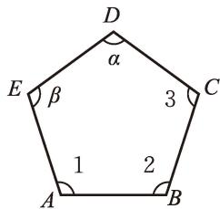

text_image

D
α
E β 3 C
1 2
A B

<table><tr><td>∠1</td><td></td><td>∠α</td><td></td><td>∠3</td></tr><tr><td></td><td>∠ABC</td><td></td><td></td><td></td></tr><tr><td></td><td></td><td></td><td>∠E</td><td></td></tr></table>

(第9题)

10. 如图， $\angle AOB = \angle COD = 90^{\circ}$ 。
(1) $\angle AOC$ 等于 $\angle BOD$ 吗?   
(2) 若 $\angle BOD = 150^{\circ}$ ，则 $\angle BOC$ 等于多少度？

11. 解下列方程:
(1) 16x - 40 = 9x + 16;
(2) $4x = \frac{20}{3} x + 16;$
(3) $2(3-x)=-4(x+5)$ ;
(4) $3(-2x - 5) + 2x = 9$ ;
(5) $\frac{1}{2} (x - 4) - (3x + 4) = -\frac{15}{2}$ ;
(6) $\frac{x - 7}{4} - \frac{5x + 8}{3} = 1.$

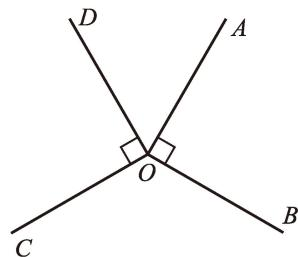

text_image

D
A
O
C
B

(第10题)

12. 为了完成下列任务，你认为采用什么调查方式更合适？
(1) 了解班级同学中哪个月份出生的人数最多;  
(2) 了解一批冷饮的质量是否合格;  
(3) 了解京剧在全校同学中的受欢迎程度;  
(4) 了解全国人口的平均寿命.

13. 判断下列抽样调查选取样本的方式是否合适，并说明理由.
(1) 为了了解某厂家生产的零件质量, 在其生产线上每隔 300 个零件抽取 1 个检查;  
（2）为了了解某城市全年的降水情况，随机调查该城市某月的降水量.

14. 每天早晨你是如何醒来的？下面是一所学校 400 名学生早晨起床方式的统计表：

<table><tr><td>起床方式</td><td>别人叫醒</td><td>闹钟叫醒</td><td>自己醒来</td><td>其他</td></tr><tr><td>人数</td><td>172</td><td>88</td><td>64</td><td>76</td></tr></table>

根据上面的数据制作适当的统计图，表示用各种方式起床的学生数占400人的百分比.

# 数学理解

15. 下列说法是否正确？为什么？
(1) 经过一点可以画两条直线;
(2) 棱柱侧面的形状可能是一个三角形;
(3) 长方体的截面形状一定是长方形;
(4) 棱柱的每条棱长都相等.

16. 下面的哪些图形可以折成一个正方体？先想一想，再折一折。

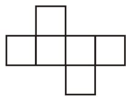

natural_image

Pure geometric shape composed of six connected squares forming an X-like pattern (no text or symbols)

(1)

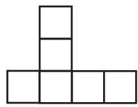

natural_image

Simple geometric arrangement of five connected rectangles forming an L-shape (no text or symbols)

(2)

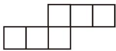  
(3)

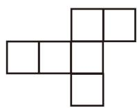

natural_image

Abstract geometric pattern of connected squares forming a T-shape (no text or symbols)

(4)   
(第16题)

17. 如果从正面、左面、上面看到一个几何体的形状图都是正方形，那么这个几何体可能是什么形状？

18. 一个几何体由若干大小相同的小立方块搭成，从上面看到的这个几何体的形状图如图所示，其中小正方形中的数字表示在该位置小立方块的个数。请你画出从正面和从左面看到的这个几何体的形状图。

<table><tr><td>3</td><td></td><td>3</td></tr><tr><td>1</td><td>2</td><td>3</td></tr></table>

(第18题)

19. 小强让小彬随便想一个数，并将此数乘5，加7，然后乘2，再减4，最后将结果告诉他。他只要将这个结果减10，再除以10，就能知道小彬所想的数。你知道这是为什么吗？

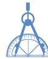

※20. 三名同学想了解所在城市的小学生是否感觉学习压力大，他们各自提出了自己的调查设想.

甲：周末去公园，随机询问10个小学生，就可以知道大致情况了.

乙：我有个弟弟，正在上小学，成绩中等，问问他就可以了解绝大部分学生的感受了.
丙：我妈妈是小学老师，向她询问就可以了.

你觉得这三位同学提出的调查方式，能比较客观地反映“他们所在城市的小学生是否感觉学习压力大”吗？为什么？

21. 甲、乙两公司近年的赢利情况如图所示.
(1) 哪家公司近年利润的增长速度较快?  
(2) 统计图所表现出来的直观情况与上述结果一样吗？如果不一样，你知道其中的原因吗？

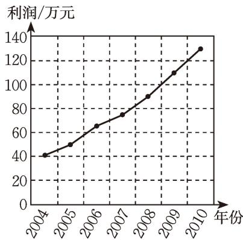

line

| 年份 | 利润/万元 |
| ---- | --------- |
| 2004 | 40        |
| 2005 | 50        |
| 2006 | 65        |
| 2007 | 75        |
| 2008 | 90        |
| 2009 | 110       |
| 2010 | 130       |

(甲)

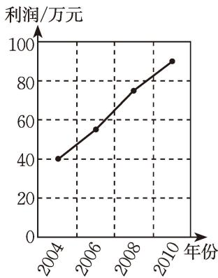

line

| 年份 | 利润/万元 |
| ---- | --------- |
| 2004 | 40        |
| 2006 | 55        |
| 2008 | 75        |
| 2010 | 90        |

(乙)   
(第21题)

# 问题解决

22. 某大楼地上共有 12 层，地下共有 4 层，请用正负数表示这栋楼每层的楼层号。某人乘电梯从地下 3 层升至地上 7 层，电梯一共升了多少层？  
23. 体育课上全班女生进行了百米测验，达标成绩为 $18 \mathrm{~s}$ 。下面是第一小组8名女生的成绩记录，其中“+”号表示成绩大于 $18 \mathrm{~s}$ ，“-”号表示成绩小于 $18 \mathrm{~s}$ 。
$- 1, + 0. 8, 0, - 1. 2, - 0. 1, 0, + 0. 5, - 0. 6.$

这个小组女生的达标率为多少？平均成绩为多少秒？

24. 冰箱开始启动时内部温度为 $10^{\circ}C$ ，如果每时冰箱内部的温度降低 $5^{\circ}C$ ，那么 3 h 后冰箱内部的温度是多少？  
25. 在右图的9个方格内填入5个2和4个-2，使每行、每列、每条对角线上的三个数的乘积都是8.
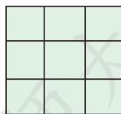

（第25题）

26. 随便写出一个十位数字与个位数字不相等的两位数，把它的十位数字与个位数字对调后得到另一个两位数，并用较大的两位数减去较小的两位数，所得差一定能被9整除吗？为什么？

27. 图 ① 是一个三角形，分别连接这个三角形三边的中点得到图 ②；再分别连接图 ② 中间小三角形三边的中点，得到图 ③.
(1) 图①、图②、图③中分别有多少个三角形？
（2）按上面的方法继续下去，第 $n$ 个图形中有多少个三角形？

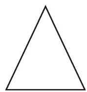

natural_image

Simple black outline of an equilateral triangle on white background (no text or symbols)

①

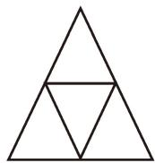

natural_image

Geometric diagram of a large triangle subdivided into smaller triangles (no text or symbols)

②

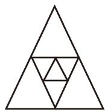

natural_image

Geometric diagram of nested triangles forming a larger triangle (no text or symbols)

③   
(第27题)

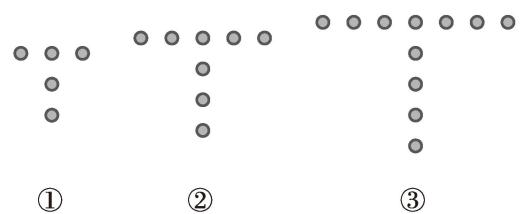

text_image

①
②
③

(第28题)

28. 用棋子摆成的 “T” 形图如图所示.
(1) 摆成第 1 个 “T” 字需要多少枚棋子？第 2 个呢？  
(2) 按这样的规律摆下去, 摆成第 10 个 “T” 字需要多少枚棋子? 第 $n$ 个呢?

29. 利用一副三角尺能画出下列度数的角吗？如何画？试试看。
$1 5 0 ^ {\circ}, 1 5 ^ {\circ}, 1 0 5 ^ {\circ}, 1 3 5 ^ {\circ}.$

30. 华氏温度 $f(\mathrm{^{\circ}F})$ 与摄氏温度 $c(\mathrm{^{\circ}C})$ 之间存在着如下的关系： $f=\frac{9}{5}c+32$ .
(1) 一个人的体温有可能达到 $100^{\circ} \mathrm{F}$ 吗?  
(2) 如果某地早晨的温度为 $5^{\circ} \mathrm{C}$ , 那么此地早晨的华氏温度是多少?

31. 王强参加了一场 $3000 \mathrm{~m}$ 的赛跑, 他以 $6 \mathrm{~m} / \mathrm{s}$ 的速度跑了一段路程后, 又以 $4 \mathrm{~m} / \mathrm{s}$ 的速度跑完了其余的路程, 一共花了 $10 \mathrm{~min}$ . 王强以 $6 \mathrm{~m} / \mathrm{s}$ 的速度跑了多少米?  
32. 有一块棱长为 $0.6\mathrm{m}$ 的正方体钢坯，想将它锻成横截面是 $0.008\mathrm{m}^2$ 的长方体钢材，锻成的钢材有多高？  
33. 某公司销售甲、乙两种球鞋，去年共卖出 12200 双。今年甲种鞋卖出的量比去年增加 6%，乙种鞋卖出的量比去年减少 5%，两种鞋的总销量增加了 50 双。去年甲、乙两种球鞋各卖了多少双？  
34. 有一根竹竿和一条绳子, 绳子比竹竿长 $0.5 \mathrm{~m}$ . 将绳子对折后, 它比竹竿短了 $0.5 \mathrm{~m}$ . 这根竹竿和这条绳子的长各是多少米?  
35. 新春佳节, 小明与小颖去看望李老师, 李老师用一种特殊的方式给他们分糖. 李老师先拿给小明 1 块, 然后把糖盒里所剩糖的 $\frac{1}{7}$ 给他, 再拿给小颖 2 块, 又把糖盒里

所剩糖的 $\frac{1}{7}$ 给她. 这样两人得到的糖块数相同. 李老师的糖盒中原来有多少块糖?

36. 一列火车正在匀速行驶, 它先用 $26 \mathrm{~s}$ 的时间通过了一条长 $256 \mathrm{~m}$ 的隧道 (即从车头进入入口到车尾离开出口), 又用 $16 \mathrm{~s}$ 的时间通过了一条长 $96 \mathrm{~m}$ 的隧道. 求这列火车的长度.

37. 有资料表明，一粒废旧的纽扣电池大约会污染60万升的水。如果你们学校的每个同学都丢弃一粒纽扣电池，大约会污染多少升水？用科学记数法表示这个结果，并用你熟悉的事物描述它有多少。

38. 制作适当的统计图表示下列数据.
(1) 全世界受到威胁的动物种类数:

<table><tr><td>动物分类</td><td>哺乳类</td><td>鸟类</td><td>爬行类</td><td>两栖类</td><td>鱼类</td><td>无脊椎动物类</td></tr><tr><td>受到威胁的种类数</td><td>约1100</td><td>约1100</td><td>约300</td><td>约100</td><td>约700</td><td>约1900</td></tr></table>
(2) 对某城市家庭人口数的一次统计结果表明: 2 口人家占 $23\%$ , 3 口人家占 $42\%$ , 4 口人家占 $21\%$ , 5 口人家占 $9\%$ , 6 口人家占 $3\%$ , 其他占 $2\%$ .
(3) 1949年以后我国历次人口普查情况:

<table><tr><td>年份</td><td>1953</td><td>1964</td><td>1982</td><td>1990</td><td>2000</td><td>2010</td></tr><tr><td>人口/亿</td><td>5.94</td><td>6.95</td><td>10.08</td><td>11.34</td><td>12.95</td><td>13.71</td></tr></table>

39. 为了调查居民的消费水平，有关机构对某个地区5个街道的50户居民的某项消费年支出情况进行了调查，数据（单位：万元）如下：

<table><tr><td>1.6</td><td>3.5</td><td>2.3</td><td>6.5</td><td>2.2</td><td>1.9</td><td>6.8</td><td>4.8</td><td>5.0</td><td>4.7</td><td>2.3</td></tr><tr><td>1.5</td><td>3.1</td><td>5.6</td><td>3.7</td><td>2.2</td><td>3.3</td><td>5.8</td><td>4.3</td><td>3.6</td><td>3.8</td><td>3.0</td></tr><tr><td>5.1</td><td>7.0</td><td>3.1</td><td>2.9</td><td>4.4</td><td>5.8</td><td>3.8</td><td>3.7</td><td>3.3</td><td>5.2</td><td>4.1</td></tr><tr><td>4.2</td><td>4.8</td><td>3.0</td><td>4.0</td><td>4.6</td><td>6.0</td><td>2.4</td><td>3.3</td><td>6.1</td><td>5.0</td><td>4.9</td></tr><tr><td>3.0</td><td>3.1</td><td>7.2</td><td>1.8</td><td>5.0</td><td>1.9</td><td></td><td></td><td></td><td></td><td></td></tr></table>

将数据适当分组，并绘制相应的频数直方图.

# 联系拓广

※40. 分别计算下列三组数和的绝对值与绝对值的和，比较所得结果，你发现了什么？你有什么样的猜想？

(1) 2, 3;
(2) $\frac{1}{4}, -5$ ;
(3) -7, $-\frac{2}{3}$ .

※41.（1）计算并填表：

<table><tr><td>x</td><td>1</td><td>10</td><td>100</td><td>1 000</td><td>10 000</td></tr><tr><td> $\frac{2x - 10}{x}$ </td><td></td><td></td><td></td><td></td><td></td></tr></table>
(2) 你有什么发现?

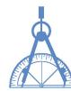

# 后记

《北师大版义务教育教科书》由众多国家基础教育课程标准研制组负责人和核心成员、学科专家、教育专家、心理学专家和特级教师参加编写，研究基础深厚、教育理念先进、编写质量上乘、服务水平专业。教材力求反映国家基础教育课程标准精神，重视多种信息资源手段的利用，适当体现最新的学科进展，强调知识、技能与思想方法在实际生活中的应用，贴近学生生活，关注学生的学习过程，满足学生多样化的学习需求，促进每一位学生的全面发展。

《北师大版义务教育教科书·数学》(7～9年级)充分体现数学课程标准的基本理念，以实现课程目标为宗旨，使学生：获得适应社会生活和进一步发展所必需的数学的基础知识、基本技能、基本思想、基本活动经验；用数学的眼光观察世界，体会数学知识之间、数学与其他学科之间、数学与生活之间的联系，运用数学的思维方式进行思考，增强发现和提出问题的能力、分析和解决问题的能力；了解数学的价值，提高学习数学的兴趣，增强学好数学的信心，养成良好的学习习惯，具有初步的创新意识和科学态度。

教材力图向学生提供现实、有趣、富有挑战性的学习素材，为学生提供探索、交流的时间与空间，展现数学知识的形成与应用过程，满足不同学生发展的需求，逐步渗透重要的数学思想方法。

《北师大版义务教育教科书·数学》(7～9年级)编写组成员有(按姓氏笔画排序): 马复、王永会、王建波、史炳星、刘晓玫、江守福、张惠英、胡赵云、顾继玲、章飞、程燕云、綦春霞.

本册教材作者是(按姓氏笔画排序): 叶明亮、杨冬慧、陈怡、凌晓牧、顾继玲、喻汉林、程燕云.

参与本册教材编写修改的人员还有(按姓氏笔画排序): 孔凡哲、王志亮、吕建生、吴勤文、张丹、张安庆、赵永宁、项昭、郭玉峰、高峻. 很多实验区的教研员和一线教师也为教材的修改提供了宝贵的意见, 在此一并表示感谢!

希望广大师生在使用过程中提出宝贵意见，以便我们进一步修改和完善。欢迎来电来函与我们联系：北京师范大学出版社初中数学编辑室(100088)，(010)58802832，czsx@bnupg.com.

北师大版

北师大版