# 义务教育教科书

# 数学

# SHUXUE

# 七年级 下册

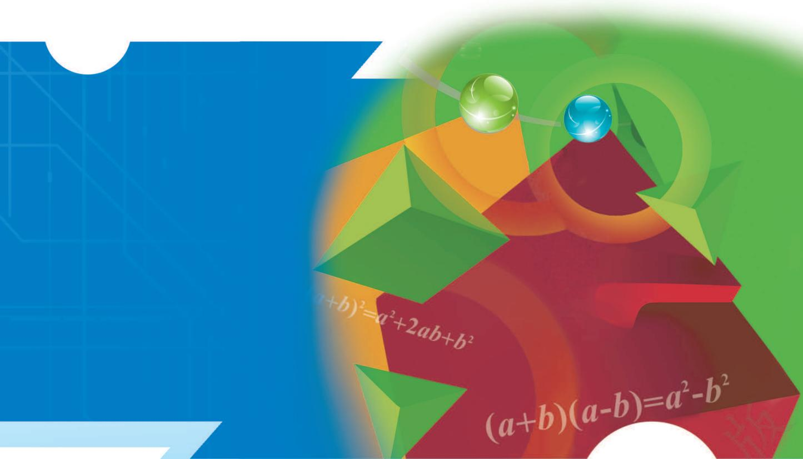

<details>
<summary>text_image</summary>

(a+b)²=a²+2ab+b²
(a+b)(a-b)=a²-b²
</details>

# 义务教育教科书

# SHU XUE 数学

# 七年级 下册

主 编 马 复

副主编 史炳星 章飞

本册主编 史炳星

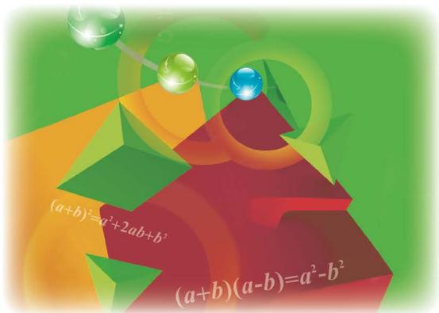

<details>
<summary>text_image</summary>

(a+b)²=a²+2ab+b²
(a+b)(a-b)=a²-b²
</details>

北京师范大学出版社

· 北京 ·

# 走进数学新天地

亲爱的同学，很高兴又与你相会在数学的世界。

打开这本教科书，你会结识许许多多新的数学知识——

三角形在生活中随处可见，它们不仅简洁、实用，还蕴涵着不少秘密。你知道火箭发射架的形状为什么是三角形吗？你想过利用三角形去测量池塘的宽度吗？

生活中有许多事物的形状呈现出轴对称特征：建筑物、车轮、街道、生活用品、传统剪纸……想知道这样的形状有什么特征，为什么被人们所偏爱吗？

我们所经历的事物常常不断地变化着，如人的身高和体重、环境的温度、车辆行驶的路程……这些变化过程中的变量存在什么规律？我们能够预测这些变化吗？

生活中有许多这样的事件，它们是否一定发生事先是无法确定的，但发生的可能性的大小，即概率却是可以事先知道的，比如一些游戏。相信你一定喜欢做游戏，想过什么样的游戏规则是公平的吗？

尝试一下“设计自己的运算程序”和“用七巧板设计不同的图案”等活动，你会发现，学数学有时也像做游戏一样好玩，一样让人着迷！

在本学期的学习过程中，你们不仅可以揭开上述谜底，还将探索它们背后更多的数学知识，并在探索的过程中尝试“说明自己的理由”，这是学习数学给你带来的最有价值的礼物之一。

你在先前的数学学习过程可能已经体会到有效的学习方法对于学好数学有很大的作用，继续尝试下面的方法吧：先自己想一想、做一做，再与同伴议一议，然后读一读教科书，听一听老师的讲解，再试一试解几个问题。

相信你在未来的数学学习过程中一定会经历更多的成功!

# 第一章 整式的乘除

1 同底数幂的乘法 …… 2  
2 幂的乘方与积的乘方 …… 5   
3 同底数幂的除法 ……9  
4 整式的乘法 …… 14  
5 平方差公式 …… 20  
6 完全平方公式 …… 23  
7 整式的除法 …… 28  
回顾与思考 33  
复习题 33

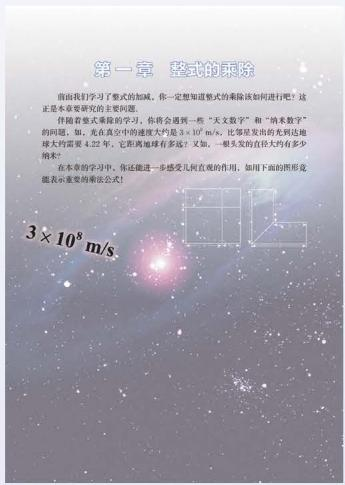

<details>
<summary>text_image</summary>

第一章 整式的乘除
前面我们学习了整式的加减，你一定想知道整式的乘除该如何进行吧？这正是本章要研究的主要问题。
伴随着整式乘除的学习，你将会遇到一些“天文数学”和“纳米数学”的问题。如，光在真空中的速度大约是3×10^4 m/s，比等星发出的光到达地球大约需要4.22年，它距离地球有多级？又缺，一根又变的直径大约有多少纳米？
在本章的学习中，你还能进一步感受几何直观的作用，如用于下面的图形是能表示重要的乘除公式！
3×10^8 m/s
</details>

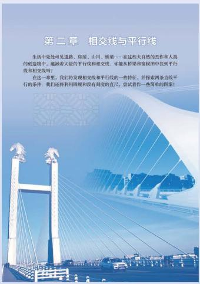

<details>
<summary>text_image</summary>

第二章 相交线与平行线
生活中处处可见道路、房屋、由间、桥梁……在这些大自然的杰作和人类的创造物中，遍涵着大量的平行线和相交线。你能从桥梁和腹视图中找到平行线和相交线吗？
在这一章里，我们将发现相交线和平行线的一些特征，并探索两条在线平行的条件。我们还将利用围堰和没有划痕的直尺，尝试看作一些简单的答案！
</details>

# 第二章 相交线与平行线

1 两条直线的位置关系 …… 38  
2 探索直线平行的条件 …… 44  
3 平行线的性质 …… 50  
4 用尺规作角 …… 55  
回顾与思考 58  
复习题 58

# 第三章 变量之间的关系

观察下图，你就大致地描述青春期男女生平均身高的变化情况吗？你的身高在平均身高之上还是之下？你能估计自己18岁时的身高吗？

我们生活在一个变化的世界中，时间、温度，还有你的身高、体重等都在悄悄地发生变化。从数学的角度研究变化的是，讨论它们之间的关系，将有助于我们更好地了解自己。认识世界和预测未来。

在本章，你还要学习到很多有用或有意思的变化，如襁褓体温的变化、潮汐的变化、记忆遗忘规律、人口变化的规律等。

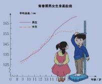

# 第三章 变量之间的关系

1 用表格表示的变量间关系 ……62  
2 用关系式表示的变量间关系 ……66  
3 用图象表示的变量间关系 ……69

回顾与思考 76

复习题 76

# 第四章 三角形

1 认识三角形 81  
2 图形的全等 92  
3 探索三角形全等的条件 ……97  
4 用尺规作三角形 …… 105  
5 利用三角形全等测距离 …… 108

回顾与思考 …… 110

复习题 …… 110

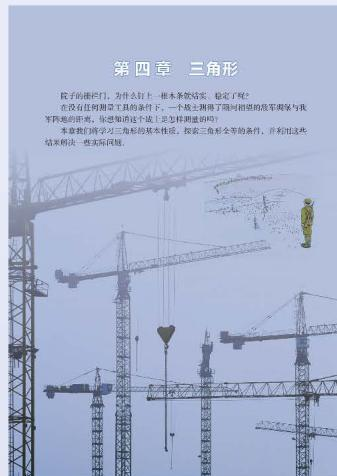

<details>
<summary>text_image</summary>

第四章 三角形

院子的清扫门，为元件上加上根本条款结实、稳定了呢？
在没有任何测量工具的条件下，一个战士拥有了银河相望的范军调整与我军阵地的距离，你想知道这个战士怎样调整的吗？
本章我们将学习三角形的基本性质，探索三角形全等的条件，并列出这些
结果相关一些实际问题。
</details>

# 第五章 生活中的轴对称

1 轴对称现象 …… 115  
2 探索轴对称的性质 …… 118   
3 简单的轴对称图形 …… 121  
4 利用轴对称进行设计 …… 128

回顾与思考 …… 131

复习题 …… 131

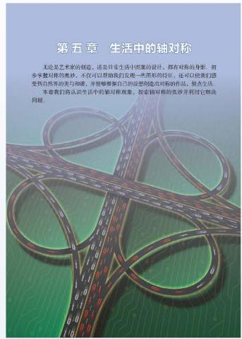

<details>
<summary>text_image</summary>

第五章 生活中的轴对称
无论是艺术家的创造，还是日常生活中图案的设计，都在对称的身影、初步平整时称的美妙。不仅可以帮助我们发现一些黑彩的特征，还可以使我们感受到自然界的美与和睦，并能够根据自己的设想构造对标称作品。缺点生活本章我们将认识生活的轴对称现象，探索轴对称的美莎并利用它解决问题。
</details>

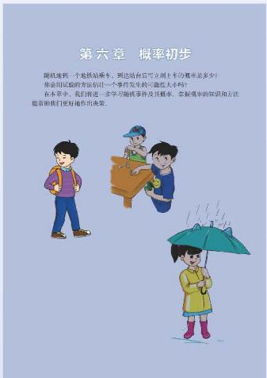

<details>
<summary>text_image</summary>

第六章 概率初步
随机地到一个地铁站停车，到达随后可立刻上有概率是多少？
你会用实验的方法估计一个事件发生的可能性大小吗？
在本草中，我们将进一步学习随机事件及其概率，掌握概率的知识和方法
能带我们更好地作用决策。
</details>

# 第六章 概率初步

1 感受可能性 …… 136  
2 频率的稳定性 …… 140  
3 等可能事件的概率 …… 147

回顾与思考 …… 156

复习题 …… 156

# 综合与实践
设计自己的运算程序 …… 160

# 综合与实践

\- 七巧板 …… 162

# 总复习

165

# 第一章 整式的乘除

前面我们学习了整式的加减，你一定想知道整式的乘除该如何进行吧？这正是本章要研究的主要问题。

伴随着整式乘除的学习，你将会遇到一些“天文数字”和“纳米数字”的问题，如，光在真空中的速度大约是 $3 \times 10^{8} \mathrm{~m} / \mathrm{s}$ ，比邻星发出的光到达地球大约需要4.22年，它距离地球有多远？又如，一根头发的直径大约有多少纳米？

在本章的学习中，你还能进一步感受几何直观的作用，如用下面的图形竟能表示重要的乘法公式！
$3 \times 1 0 ^ {8} \mathrm{m/s}$

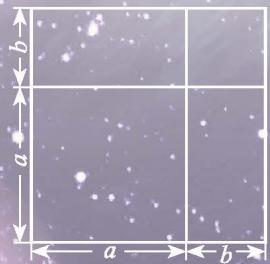

<details>
<summary>natural_image</summary>

Grid pattern with labeled dimensions (a, b) and scattered bright spots, no readable text or symbols
</details>

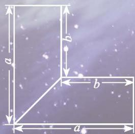

<details>
<summary>text_image</summary>

a
b
c
</details>

# 学习目标

能够进行幂的运算及简单的整式乘除运算  
能推导乘法公式，了解公式的几何背景，并能利用公式进行简单运算  
进一步体会类比、归纳、转化等方法

# 1

# 同底数幂的乘法

光在真空中的速度大约是 $3 \times 10^{8} \mathrm{~m} / \mathrm{s}$ 。太阳系以外距离地球最近的恒星是比邻星, 它发出的光到达地球大约需要 4.22 年.

一年以 $3 \times 10^{7} \mathrm{~s}$ 计算, 比邻星与地球的距离约为多少?


<details>
<summary>natural_image</summary>

Deep space image of a spiral galaxy with a bright core and star field, no text or symbols visible
</details>
$\begin{array}{l} 3 \times 1 0 ^ {8} \times 3 \times 1 0 ^ {7} \times 4. 2 2 \\ = 3 7. 9 8 \times \left(1 0 ^ {8} \times 1 0 ^ {7}\right). \\ 1 0 ^ {8} \times 1 0 ^ {7} \text { 等于多少呢? } \\ \end{array}$

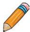

# 做一做

1. 计算下列各式:
(1) $10^{2}\times10^{3}$ ; (2) $10^{5}\times10^{8}$ ;   
(3) $10^{m} \times 10^{n}$ (m, n 都是正整数).

你发现了什么？

2. $2^{m} \times 2^{n}$ 等于什么? $\left(\frac{1}{7}\right)^{m} \times \left(\frac{1}{7}\right)^{n}$ 和 $(-3)^{m} \times (-3)^{n}$ 呢? (m, n 都是正整数)


# 议一议
如果 $m, n$ 都是正整数，那么 $a^m \cdot a^n$ 等于什么？为什么？
$\begin{array}{l} a ^ {m} \cdot a ^ {n} = (\underbrace {a \cdot a \cdot \cdots \cdot a} _ {m \text {个} a}) \cdot (\underbrace {a \cdot a \cdot \cdots \cdot a} _ {n \text {个} a}) \\ = \underbrace {a \cdot a \cdot \cdots \cdot a} _ {(m + n) \text {个} a} \\ = a ^ {m + n}, \\ \end{array}$
即

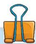
$a^{m} \cdot a^{n} = a^{m+n}$ (m, n都是正整数 $^{①}$ ).

同底数幂相乘，底数\_\_\_\_，指数\_\_\_\_。

# 例1 计算：
(1) $(-3)^{7} \times (-3)^{6}$ ;
(2) $\left(\frac{1}{111}\right)^{3}\times\frac{1}{111};$
(3) $-x^{3}\cdot x^{5};$
(4) $b^{2m}\cdot b^{2m+1}.$
解：(1) $(-3)^{7}\times(-3)^{6}=(-3)^{7+6}=(-3)^{13}$ ;
(2) $\left(\frac{1}{111}\right)^3 \times \frac{1}{111} = \left(\frac{1}{111}\right)^{3 + 1} = \left(\frac{1}{111}\right)^4$ ;
(3) $-x^{3} \cdot x^{5} = -x^{3+5} = -x^{8}$ ;
(4) $b^{2m} \cdot b^{2m+1} = b^{2m+2m+1} = b^{4m+1}.$


# 想一想
$a^m\cdot a^n\cdot a^p$ 等于什么？

> [!example]- 例2 光在真空中的速度约为 $3 \times 10^{8} \mathrm{~m} / \mathrm{s}$ , 太阳光照射到地球上大约需要 $5 \times 10^{2} \mathrm{~s}$ . 地球距离太阳大约有多远?
解： $3 \times 10^{8} \times 5 \times 10^{2}$
$= 1 5 \times 1 0 ^ {1 0}$
$= 1. 5 \times 1 0 ^ {1 1} (\mathrm{m}).$

地球距离太阳大约有 $1.5 \times 10^{11} \mathrm{~m}$ .

# 随堂练习

1. 计算：
(1) $5^{2} \times 5^{7}$ ;
(2) $7 \times 7^{3} \times 7^{2}$ ;
(3) $-x^{2}\cdot x^{3};$
(4) $(-c)^{3} \cdot (-c)^{m}$ .

2. 2017年6月，我国自主研发的“神威·太湖之光”超级计算机以 $1.25 \times 10^{17}$ 次/s 的峰值计算能力和 $9.3 \times 10^{16}$ 次/s 的持续计算能力，第三次名列世界超级计算机排名榜单 TOP500 第一名。该超级计算机按持续计算能力运算 $2 \times 10^{2} \mathrm{~s}$ 可做多少次运算？


3. 解决本节课一开始比邻星到地球的距离问题.

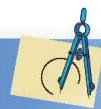

# 习题 1.1

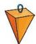

# 知识技能

1. 计算：
(1) $c \cdot c^{11}$ ;
(2) $10^{4}\times10^{2}\times10;$
(3) $(-b)^{3} \cdot (-b)^{2}$ ;
(4) $-b^{3}\cdot b^{2};$
(5) $x^{m-1} \cdot x^{m+1} (m > 1);$
(6) $a \cdot a^{3} \cdot a^{n}.$

2. 已知 $a^m = 2, a^n = 8$ ，求 $a^{m+n}$ .


# 数学理解

3. 下面的计算是否正确？如有错误请改正。
(1) $a^{3}\cdot a^{2}=a^{6};$
(2) $b^{4}\cdot b^{4}=2b^{4};$
(3) $x^{5}+x^{5}=x^{10};$
(4) $y^{7} \cdot y = y^{8}.$

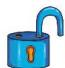

# 问题解决

4. 在我国，平均每平方千米的土地一年从太阳得到的能量，相当于燃烧 $1.3 \times 10^{8} \mathrm{~kg}$ 的煤所产生的能量。我国 $960 \mathrm{万} \mathrm{km}^{2}$ 的土地上，一年从太阳得到的能量相当于燃烧多少千克的煤所产生的能量？（结果用科学记数法表示）

5. 某种细菌每分由 1 个分裂成 2 个.
(1) 经过 5 min, 1 个细菌分裂成多少个?   
(2) 这些细菌再继续分裂 t min 后共分裂成多少个?


# 2

# 幂的乘方与积的乘方

地球、木星、太阳可以近似地看做是球体。木星、太阳的半径分别约是地球的 10 倍和 $10^{2}$ 倍, 它们的体积分别约是地球的多少倍?

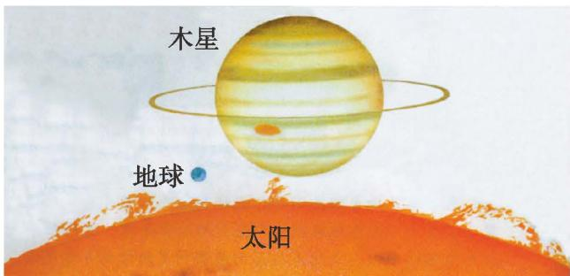

<details>
<summary>text_image</summary>

木星
地球
太阳
</details>

球的体积公式是 $V=\frac{4}{3}\pi r^{3}$ ，其中V是球的体积、r是球的半径.

木星的半径约是地球的10倍, 它的体积约是地球的 $10^{3}$ 倍! 太阳的半径约是地球的 $10^{2}$ 倍, 它的体积约是地球的 $(10^{2})^{3}$ 倍! 那么, 你知道 $(10^{2})^{3}$ 等于多少吗?


<details>
<summary>natural_image</summary>

Cartoon illustration of a smiling boy in overalls and pointing upward (no text or symbols)
</details>


# 做一做

计算下列各式，并说明理由.
(1) $(6^{2})^{4}$ ;
(2) $(a^2)^3$ ;
(3) $(a^{m})^{2}$ ;
(4) $(a^{m})^{n}$ .
$\begin{array}{l} (a ^ {m}) ^ {n} = \overbrace {a ^ {m} \cdot a ^ {m} \cdot \cdots \cdot a ^ {m}} ^ {n \text {个} a ^ {m}} \\ = a ^ {\overbrace {m + m + \cdots + m} ^ {n \text {个} m}} \\ = a ^ {m n}, \\ \end{array}$
即


$(a^{m})^{n}=a^{mn}$ (m, n 都是正整数). 幂的乘方，底数 \_\_\_\_，指数 \_\_\_\_.

# 例1 计算:
(1) $(10^{2})^{3}$ ;
(2) $(b^{5})^{5}$ ;
(3) $(a^n)^3$ ;
(4) $-(x^{2})^{m}$ ;
(5) $(y^{2})^{3} \cdot y$ ;
(6) $2(a^{2})^{6} - (a^{3})^{4}$ .
解：(1) $(10^{2})^{3}=10^{2\times3}=10^{6}$ ;
(2) $(b^{5})^{5} = b^{5\times 5} = b^{25}$ ;
(3) $(a^n)^3 = a^{n\times 3} = a^{3n}$ ;
(4) $-(x^{2})^{m} = -x^{2\times m} = -x^{2m}$ ;
(5) $(y^{2})^{3} \cdot y = y^{2 \times 3} \cdot y = y^{6} \cdot y = y^{7}$ ;
(6) $2(a^{2})^{6} - (a^{3})^{4} = 2a^{2 \times 6} - a^{3 \times 4} = 2a^{12} - a^{12} = a^{12}$ .

# 随堂练习

计算：
(1) $(10^{3})^{3}$ ;
(2) $-(a^2)^5$ ;
(3) $(x^{3})^{4} \cdot x^{2}$ .

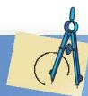

# 习题 1.2

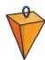

# 知识技能

1. 计算：
(1) $\left[\left(\frac{1}{3}\right)^3\right]^2;$
(2) $(a^4)^2$ ;
(3) $-\left(b^{5}\right)^{2};$
(4) $(y^{2})^{2n}$ ;
(5) $(b^n)^3$ ;
(6) $(x^{3})^{3n}$ .

2. 计算：
(1) $-p\cdot(-p)^{4};$
(2) $(a^2)^3 \cdot (a^3)^2$ ;
(3) $(t^{m})^{2} \cdot t$ ;
(4) $(x^4)^6 - (x^3)^8$ .


# 数学理解

3. 下面的计算是否正确？如有错误请改正。
(1) $(x^{3})^{3} = x^{6}$ ;
(2) $a^{6}\cdot a^{4}=a^{24}.$


地球可以近似地看做是球体，地球的半径约为 $6 \times 10^{3} \mathrm{~km}$ ，它的体积大约是多少立方千米？
$V = \frac {4}{3} \pi r ^ {3} = \frac {4}{3} \pi \times (6 \times 1 0 ^ {3}) ^ {3}.$

那么， $(6\times 10^{3})^{3} = ?$

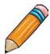

# 做一做
(1) $(3 \times 5)^{4} = 3^{()} \cdot 5^{()}$ ;   
(2) $(3\times 5)^{m} = 3^{()}\cdot 5^{()}$ ;   
(3) $(ab)^n = a^{()}\cdot b^{()}$ .
$(a b) ^ {n} = (\underbrace {a b) \cdot (a b) \cdot \cdots \cdot (a b)} _ {n \text {个} a b})$
$= (\underbrace {a \cdot a \cdot \cdots \cdot a} _ {n \text {个} a}) \cdot (\underbrace {b \cdot b \cdot \cdots \cdot b} _ {n \text {个} b})$
$= a ^ {n} b ^ {n},$
即


你能说明理由吗？
$(ab)^{n}=a^{n}b^{n}(n$ 是正整数). 积的乘方等于 \_\_\_\_.

# 例2 计算：
(1) $(3x)^{2}$ ;   
(2) $(-2b)^{5}$ ;   
(3) $(-2xy)^{4}$ ;   
(4) $(3a^{2})^{n}$ .
解：(1) $(3x)^{2} = 3^{2}x^{2} = 9x^{2}$
(2) $(-2b)^{5} = (-2)^{5}b^{5} = -32b^{5}$ ;   
(3) $(-2xy)^{4} = (-2)^{4}x^{4}y^{4} = 16x^{4}y^{4};$   
(4) $(3a^{2})^{n} = 3^{n}(a^{2})^{n} = 3^{n}a^{2n}$ .

# 随堂练习

1. 计算：
(1) $(-3n)^{3}$ ;
(2) $(5xy)^{3}$ ;
(3) $-a^3 + (-4a)^2 a$ .

2. 解决本节课一开始地球的体积问题 ( $\pi$ 取 3.14).

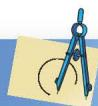

# 习题 1.3

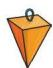

# 知识技能

1. 计算：
(1) $(3b)^{2}$ ;
(2) $-(ab)^{2}$ ;
(3) $(-4a^{2})^{3}$ ;
(4) $(y^{2}z^{3})^{3}$ .

2. 计算:
(1) $(xy^4)^m$ ;
(2) $-(p^2 q)^n$ ;
(3) $(xy^{3n})^2 + (xy^6)^n$ ;
(4) $(-3x^{3})^{2} - [(2x)^{2}]^{3}$ .


# 数学理解

3. 下面的计算是否正确？如有错误请改正。
(1) $(ab^{4})^{4} = ab^{8}$ ;
(2) $(-3pq)^{2} = -6p^{2}q^{2}$ .

4. 请你用几何图形直观地解释 $(3b)^2 = 9b^2$ .

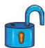

# 问题解决

5. 你能根据本节的数据计算出太阳的体积大约是多少吗（π取3.14）？


# 联系拓广

6. 不使用计算器，你能很快求出下列各式的结果吗？
$2 ^ {2} \times 3 \times 5 ^ {2}, 2 ^ {4} \times 3 ^ {2} \times 5 ^ {3}.$

7. $(abc)^{n}$ 等于什么？


# 同底数幂的除法

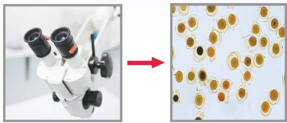

<details>
<summary>natural_image</summary>

Microscopic view of a microscope and its corresponding view of circular cells (no text or symbols)
</details>

一种液体每升含有 $10^{12}$ 个有害细菌。为了试验某种杀菌剂的效果，科学家们进行了实验，发现 1 滴杀菌剂可以杀死 $10^{9}$ 个此种细菌。要将 1 L 这种液体中的有害细菌全部杀死，需要这种杀菌剂多少滴？你是怎样计算的？


# 做一做

计算下列各式，并说明理由 $(m > n)$
(1) $10^{12} \div 10^{9}$ ;
(2) $10^{m} \div 10^{n}$ ;
(3) $(-3)^{m} \div (-3)^{n}$ .
由幂的定义，得
$\begin{array}{l} a ^ {m} \div a ^ {n} = \frac {\overbrace { \begin{array}{c c c c c c} {a} & {\cdot} & {a} & {\cdot} & {\cdots} & {\cdot} & {a} \\ {a} & {\cdot} & {a} & {\cdot} & {\cdots} & {\cdot} & {a} \end{array} } ^ {m \text {个} a}} ^ {n \text {个} a} \\ \begin{array}{r l} & {\quad (m - n) \text {个} a} \\ & {= \overbrace {a \cdot a \cdot \cdots \cdot a}} \\ & {= a ^ {m - n},} \end{array} \\ \end{array}$
即


$a^{m} \div a^{n} = a^{m-n} (a \neq 0)$ ，m，n都是正整数，且m > n。
同底数幂相除，底数 \_\_\_\_，指数 \_\_\_\_。

# 例1 计算：
(1) $a^{7} \div a^{4};$
(2) $(-x)^{6}\div(-x)^{3};$
(3) $(xy)^{4} \div (xy)$ ;
(4) $b^{2m+2} \div b^{2}$ .
解：（1） $a^7\div a^4 = a^{7 - 4} = a^3;$
(2) $(-x)^{6} \div (-x)^{3} = (-x)^{6 - 3} = (-x)^{3} = -x^{3}$ ;
(3) $(xy)^{4} \div (xy) = (xy)^{4 - 1} = (xy)^{3} = x^{3}y^{3}$ ;
(4) $b^{2m+2} \div b^{2} = b^{2m+2-2} = b^{2m}.$


# 做一做
$1 0 ^ {4} = 1 0 0 0 0,$
$1 0 ^ {()} = 1 0 0 0,$
$1 0 ^ {()} = 1 0 0,$
$1 0 ^ {()} = 1 0.$
$2 ^ {4} = 1 6,$
$2 ^ {()} = 8,$
$2 ^ {()} = 4,$
$2 ^ {()} = 2.$

猜一猜，下面的括号内该填入什么数？你是怎样想的？与同伴进行交流。
$1 0 ^ {()} = 1,$
$1 0 ^ {()} = \frac {1}{1 0},$
$1 0 ^ {()} = \frac {1}{1 0 0},$
$1 0 ^ {()} = \frac {1}{1 0 0 0}.$
$2 ^ {()} = 1,$
$2 ^ {()} = \frac {1}{2},$
$2 ^ {()} = \frac {1}{4},$
$2 ^ {()} = \frac {1}{8}.$

我们规定：


$a ^ {0} = 1 (a \neq 0);$
$a^{-p}=\frac{1}{a^{p}}\left(a\neq0,\ p\text{是正整数}\right).$

# 例2 用小数或分数表示下列各数:
(1) $10^{-3}$ ;
(2) $7^{0} \times 8^{-2}$ ;
(3) $1.6 \times 10^{-4}$ .
解：（1） $10^{-3}=\frac{1}{10^{3}}=\frac{1}{1000}=0.001$ ;

(2) $7^{0} \times 8^{-2} = 1 \times \frac{1}{8^{2}} = \frac{1}{64}$ ;   
(3) $1.6 \times 10^{-4} = 1.6 \times \frac{1}{10^4} = 1.6 \times 0.0001 = 0.00016.$


# 议一议

计算下列各式，你有什么发现？与同伴进行交流。
(1) $7^{-3}\div7^{-5}$ ;   
(2) $3^{-1} \div 3^{6}$ ;   
(3) $\left(\frac{1}{2}\right)^{-5}\div\left(\frac{1}{2}\right)^{2};$   
(4) $(-8)^{0}\div(-8)^{-2}.$

只要 m, n 都是整数，
就有 $a^{m} \div a^{n} = a^{m-n}$ 成立！


<details>
<summary>natural_image</summary>

Cartoon illustration of a smiling boy in blue overalls and yellow shirt pointing upward (no text or symbols)
</details>

# 随堂练习

计算：
(1) $x^{12}\div x^{4};$
(2) $(-y)^{3}\div(-y)^{2};$
(3) $-(k^6 \div k^6)$ ;
(4) $(-r)^{5} \div r^{4}$ ;
(5) $m \div m^{0}$ ;
(6) $(mn)^{5} \div (mn)$ .

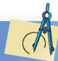

## 习题1.4


# 知识技能

1. 计算：
(1) $2^{13} \div 2^{7}$ ;
(2) $\left(-\frac{3}{2}\right)^{6}\div\left(-\frac{3}{2}\right)^{2};$
(3) $a^{11}\div a^{5};$
(4) $(-x)^{7}\div(-x);$
(5) $a^{-4} \div a^{-6};$
(6) $6^{2m+1}\div6^{m};$
(7) $5^{n+1} \div 5^{3n+1}$ ;
(8) $9^{n}\div9^{n+2}.$

2. 计算：
(1) $\left(\frac{1}{2}\right)^{0}$ ;
(2) $3^{-3}$ ;
(3) $1.3 \times 10^{-5}$ ;
(4) $5^{-2}$ .


# 数学理解

3. 下面的计算是否正确？如有错误请改正。
(1) $a^{6}\div a=a^{6};$
(2) $b^{6}\div b^{3}=b^{2};$
(3) $a^{10}\div a^{9}=a;$
(4) $(-bc)^{4} \div (-bc)^{2} = -b^{2}c^{2}$ .

4. 某种细胞分裂时，1个细胞分裂1次变为2个，分裂2次变为4个，分裂3次变为8个，……你能由此说明 $2^{0}=1$ 的合理性吗？

你知道一粒花粉的直径是多少吗？一根头发的直径又是多少？

无论是在生活中或学习中，我们都会遇到一些较小的数，例如，

细胞的直径只有 1 微米（μm），即 0.000 001 m；
某种计算机完成一次基本运算的时间约为1纳秒（ns），即0.000 000 001 s；
一个氧原子的质量为 0.000 000 000 000 000 000 000 000 026 57 kg.

用科学记数法可以很方便地表示一些绝对值较大的数，同样，用科学记数法也可以很方便地表示一些绝对值较小的数。例如，
$0. 0 0 0 0 0 1 = \frac {1}{1 0 ^ {6}} = 1 \times 1 0 ^ {- 6},$
$0. 0 0 0 0 0 0 0 0 1 = \frac {1}{1 0 ^ {9}} = 1 \times 1 0 ^ {- 9},$
$0. 0 0 0 0 0 0 0 0 0 0 0 0 0 0 0 0 0 0 0 0 0 0 0 0 0 2 6 5 7 = 2. 6 5 7 \times \frac {1}{1 0 ^ {2 6}} = 2. 6 5 7 \times 1 0 ^ {- 2 6}.$

一般地，一个小于1的正数可以表示为 $a \times 10^{n}$ ，其中 $1 \leqslant a < 10$ ， $n$ 是负整数。


# 做一做

用科学记数法表示下列各数：

0.000 000 000 1, 0.000 000 000 002 9,

0.000 000 001 295.

再看看这些数在计算器上是怎样表示的，它们相同吗？


# 议一议
(1) PM2.5是指大气中直径小于或等于 $2.5 \mu \mathrm{m}$ 的细颗粒物, 也称为可入肺细颗粒物。虽然它们的直径还不到人的头发粗细的 $\frac{1}{20}$ , 但它们含有大量的有毒、有害物质, 并且在大气中的停留时间长、输送距离远, 因而对人体健康和大气环境质量有很大的危害。假设一种可入肺细颗粒物的直径约为 $2.5 \mu \mathrm{m}$ , 相当于多少米? 多少个这样的细颗粒物首尾连接起来能达到 $1 \mathrm{~m}$ ? 与同伴进行交流。
(2) 估计1张纸的厚度大约是多少厘米。你是怎样做的？与同伴进行交流。


# 随堂练习

1. 用科学记数法表示下列各数，并在计算器上表示出来：
(1) 0.000 000 72;
(2) 0.000861;
(3) 0.000 000 000 342 5.

2. 1个电子的质量为0.000 000 000 000 000 000 000 000 000 911 g，请用科学记数法表示这个数.


# 读一读

# 纳米

纳米（nm）是一种长度单位。1 nm 为十亿分之一米，即 $10^{-9}$ m，它相当于 1 根头发直径的六万分之一。直径为 1 nm 的球与乒乓球相比，相当于乒乓球与地球相比。

纳米技术是指在 $0.1 \sim 100 \mathrm{~nm}$ 范围内, 通过直接操纵和安排原子、分子来创造新物质, 它将对人类的未来产生深远影响。例如, 采用纳米技术,可以在一块方糖大小的磁盘上存放一个国家图书馆的所有信息; 应用纳米技术还可以制造出 “纳米医生”, 它微小到可以注入人体的血管中。

你想了解更多的有关纳米技术或微小世界中的有趣问题吗？去查查资料或请教一些专家吧！


# 习题 1.5

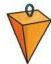

# 知识技能

1. 用科学记数法表示，并在计算器上表示出来：
(1) 0.007398;
(2) 0.000 022 6;
(3) 0.000 000 000 054 2;
(4) 0.000 000 000 000 000 000 000 199 4.

2. 空气的密度是 $1.293 \times 10^{-3} \mathrm{~g} / \mathrm{cm}^{3}$ , 用小数把它表示出来.


# 问题解决

3. 一个铁原子的质量为 $0.00000000000000000000000009288\mathrm{kg}$ , 请你用科学记数法把它表示出来.

4. 人体内一种细胞的直径约为 $1.56 \mu \mathrm{m}$ , 相当于多少米? 多少个这样的细胞首尾连接起来能达到 $1 \mathrm{~m}$ ? 与同伴进行交流.

# 4

# 整式的乘法

京京用两张同样大小的纸, 精心制作了两幅画. 如图 1-1 所示, 第一幅画的画面大小与纸的大小相同, 第二幅画的画面在纸的上、下方各留有 $\frac{1}{8} x \mathrm{~m}$ 的空白.

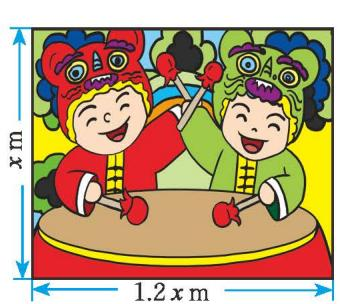

<details>
<summary>natural_image</summary>

Illustration of two cartoon children in traditional costumes playing lion dance, with dimensions labeled (no text or symbols beyond measurements)
</details>

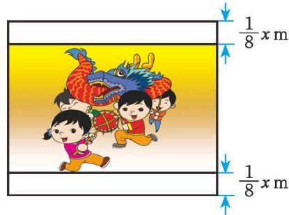

<details>
<summary>text_image</summary>

1/8 x m
1/8 x m
</details>

图 1- 1
(1) 第一幅画的画面面积是多少平方米? 第二幅呢? 你是怎样做的?  
（2）若把图中的 $1.2x$ 改为 $nx$ ，其他不变，则两幅画的面积又该怎样表示呢？


# 想一想
(1) $3a^{2}b \cdot 2ab^{3}$ 及 $xyz \cdot y^{2}z$ 等于什么？你是怎样计算的？  
(2) 如何进行单项式乘单项式的运算?

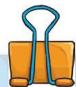

单项式与单项式相乘，把它们的系数、相同字母的幂分别相乘，其余字母连同它的指数不变，作为积的因式.

# 例1 计算:
(1) $2xy^{2}\cdot\frac{1}{3}xy;$   
(2) $-2a^{2}b^{3}\cdot (-3a);$   
(3) $7xy^{2}z \cdot (2xyz)^{2}$ .
解：(1) $2xy^{2}\cdot\frac{1}{3}xy=\left(2\times\frac{1}{3}\right)\cdot(xx)\cdot(y^{2}y)=\frac{2}{3}x^{2}y^{3};$
(2) $-2a^{2}b^{3}\cdot (-3a) = [(-2)\times (-3)]\cdot (a^{2}a)\cdot b^{3} = 6a^{3}b^{3};$
(3) $7xy^{2}z\cdot (2xyz)^{2} = 7xy^{2}z\cdot 4x^{2}y^{2}z^{2}$
$= (7 \times 4) \cdot \left(x x ^ {2}\right) \cdot \left(y ^ {2} y ^ {2}\right) \cdot \left(z z ^ {2}\right) = 2 8 x ^ {3} y ^ {4} z ^ {3}.$

# 随堂练习

计算：
(1) $5x^{3} \cdot 2x^{2}y$ ;
(3) $3ab \cdot 2a;$
(5) $(2x^{2}y)^{3}\cdot(-4xy^{2});$
(2) $-3ab \cdot (-4b^{2})$ ;
(4) $yz \cdot 2y^{2}z^{2}$ ;
(6) $\frac{1}{3} a^3 b \cdot 6a^5 b^2 c \cdot (-ac^2)^2$ .

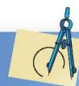

# 习题 1.6

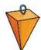

# 知识技能

1. 计算:
(1) $4xy \cdot (-2xy^{3})$ ;
(3) $2x^{2}y \cdot (-xy)^{2}$ ;
(5) $-xy^{2}z^{3}\cdot(-x^{2}y)^{3};$
(2) $a^{3}b \cdot ab^{5}c;$
(4) $\frac{2}{5}x^{2}y^{3}\cdot\frac{5}{8}xyz;$
(6) $-ab^{3} \cdot 2abc^{2} \cdot (a^{2}c)^{3}$ .

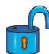

# 问题解决

2. (1)一家住房的结构如图所示, 这家房子的主人打算把卧室以外的部分都铺上地砖, 至少需要多少平方米的地砖? 如果某种地砖的价格是 $a$ 元/m², 那么购买所需地砖至少需要多少元?
(2) 已知房屋的高度为 $h \mathrm{~m}$ , 现需要在客厅和卧室的墙壁上贴壁纸, 那么至少需要多少平方米的壁纸? 如果某种壁纸的价格是 $b$ 元 $/\mathrm{m}^{2}$ , 那么购买所需壁纸至少需要多少元? (计算时不扣除门、窗所占的面积)

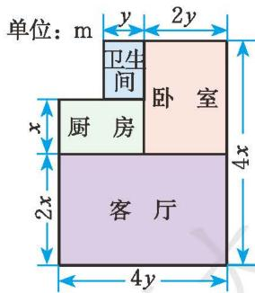

<details>
<summary>text_image</summary>

单位：m
y
2y
卫生间
卧室
厨房
客厅
4x
2x
4y
</details>

(第2(1)题)

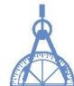

宁宁也作了一幅画，所用纸的大小如图1-2所示，她在纸的左、右两边各留了 $\frac{1}{8} x\mathrm{m}$ 的空白，这幅画的画面面积是多少？

一方面，可以先表示出画面的长与宽，由此得到画面的面积为 \_\_\_\_；
另一方面，也可以用纸的面积减去空白处的面积，由此得到画面的面积为 \_\_\_\_.

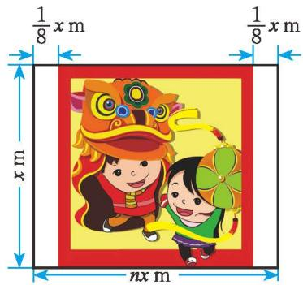

<details>
<summary>text_image</summary>

1/8 x m
1/8 x m
nx m
</details>

图1-2


# 想一想
(1) $ab \cdot (abc + 2x)$ 及 $c^2 \cdot (m + n - p)$ 等于什么？你是怎样计算的？
(2) 如何进行单项式与多项式相乘的运算?

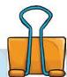

单项式与多项式相乘，就是根据分配律用单项式去乘多项式的每一项，再把所得的积相加.

# 例2 计算:
(1) $2ab(5ab^{2} + 3a^{2}b)$ ;
(2) $\left(\frac{2}{3}ab^{2}-2ab\right)\cdot\frac{1}{2}ab;$
(3) $5m^{2}n(2n + 3m - n^{2})$ ;
(4) $2(x + y^{2}z + xy^{2}z^{3})\cdot xyz.$
解：（1） $2ab(5ab^{2}+3a^{2}b)$
$= 2 a b \cdot 5 a b ^ {2} + 2 a b \cdot 3 a ^ {2} b$
$= 1 0 a ^ {2} b ^ {3} + 6 a ^ {3} b ^ {2};$
(2) $\left(\frac{2}{3} ab^2 - 2ab\right) \cdot \frac{1}{2} ab$
$= \frac {2}{3} a b ^ {2} \cdot \frac {1}{2} a b + (- 2 a b) \cdot \frac {1}{2} a b$
$= \frac {1}{3} a ^ {2} b ^ {3} - a ^ {2} b ^ {2};$
(3) $5m^{2}n(2n + 3m - n^{2})$
$= 5 m ^ {2} n \cdot 2 n + 5 m ^ {2} n \cdot 3 m + 5 m ^ {2} n \cdot (- n ^ {2})$
$= 1 0 m ^ {2} n ^ {2} + 1 5 m ^ {3} n - 5 m ^ {2} n ^ {3};$


$\begin{array}{l} 2 \left(x + y ^ {2} z + x y ^ {2} z ^ {3}\right) \cdot x y z \tag {4} \\ = (2 x + 2 y ^ {2} z + 2 x y ^ {2} z ^ {3}) \cdot x y z \\ = 2 x \cdot x y z + 2 y ^ {2} z \cdot x y z + 2 x y ^ {2} z ^ {3} \cdot x y z \\ = 2 x ^ {2} y z + 2 x y ^ {3} z ^ {2} + 2 x ^ {2} y ^ {3} z ^ {4}. \\ \end{array}$

# 随堂练习

计算：
(1) $a(a^{2}m + n)$ ;
(2) $b^{2}(b+3a-a^{2})$ ;
(3) $x^{3}y\left(\frac{1}{2}xy^{3}-1\right);$
(4) $4(e+f^{2}d)\cdot ef^{2}d$ .

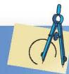

# 习题 1.7

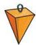

# 知识技能

1. 计算:
(1) $5x(2x^{2}-3x+4)$ ;
(2) $-6x(x - 3y)$ ;
(3) $-2a^{2}\left(\frac{1}{2}ab+b^{2}\right);$
(4) $\left(\frac{2}{3}x^{2}y-6xy\right)\cdot\frac{1}{2}xy^{2}.$

2. 分别计算下面图中阴影部分的面积.

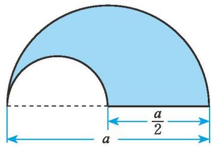

<details>
<summary>text_image</summary>

a
a/2
</details>
(1)

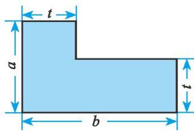

<details>
<summary>text_image</summary>

t
a
b
t
</details>
(2)

(第2题)


# 问题解决

3. 右图是用棋子摆成的，按照这种摆法，第n个图形中共有多少枚棋子？

(第3题)


图 1-3 是一个长和宽分别为 $m, n$ 的长方形纸片，如果它的长和宽分别增加 $a, b$ ，所得长方形（图 1-4）的面积可以怎样表示？

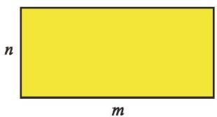

<details>
<summary>text_image</summary>

n
m
</details>

图1-3

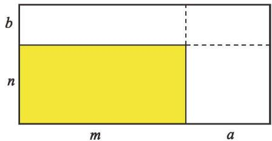

<details>
<summary>text_image</summary>

b
n
m	a
</details>

图1-4


长方形的面积可以有 4 种表示方式： $(m + a)(n + b)$ ， $n(m + a) + b(m + a)$ ， $m(n + b) + a(n + b)$ 和 $mn + mb + na + ba$ ，从而， $(m + a)(n + b) = n(m + a) + b(m + a) = m(n + b) + a(n + b) = mn + mb + na + ba$ .

你认为小明的想法对吗？从中你受到了什么启发？


把 $(m + a)$ 或 $(n + b)$ 看成一个整体，利用乘法分配律，可以得到 $(m + a)(n + b) = (m + a)n + (m + a)b = mn + an + mb + ab$ ，或 $(m + a)(n + b) = m(n + b) + a(n + b) = mn + mb + an + ab.$


# 议一议

你是用什么方法计算上面的问题的？

如何进行多项式与多项式相乘的运算？


多项式与多项式相乘，先用一个多项式的每一项乘另一个多项式的每一项，再把所得的积相加.

# 例3 计算：
(1) $(1 - x)(0.6 - x)$ ;
(2) $(2x+y)(x-y)$ .

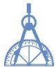
解：(1) $(1-x)(0.6-x)$
$= 1 \times 0. 6 - 1 \times x - x \times 0. 6 + x \cdot x$
$= 0. 6 - x - 0. 6 x + x ^ {2}$
$= 0. 6 - 1. 6 x + x ^ {2};$
(2) $(2x + y)(x - y)$
$= 2 x \cdot x - 2 x \cdot y + y \cdot x - y \cdot y$
$= 2 x ^ {2} - 2 x y + x y - y ^ {2}$
$= 2 x ^ {2} - x y - y ^ {2}.$

# 随堂练习

计算：
(1) $(m + 2n)(m - 2n)$ ;
(2) $(2n + 5)(n - 3)$ ;
(3) $(x + 2y)^{2}$ ;
(4) $(ax + b)(cx + d)$ .

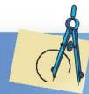

# 习题 1.8

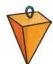

# 知识技能

1. 计算：
(1) $(x + y)(a + 2b)$ ;
(2) $(2a+3)(\frac{3}{2}b+5);$
(3) $(2x + 3)(-x - 1)$ ;
(4) $(-2m-1)(3m-2)$ ;
(5) $(x - y)^2$ ;
(6) $(-2x+3)^{2}$ .


# 问题解决

2. (1) 观察: $4 \times 6 = 24$ , $14 \times 16 = 224$ , $24 \times 26 = 624$ , $34 \times 36 = 1224$ , …

你发现其中的规律了吗？你能借助代数式表示这一规律吗？
(2) 利用 (1) 中的规律计算 $124 \times 126$ .
(3) 你还能找到类似的规律吗?


# 联系拓广

※3. 计算： $(a+b+c)(c+d+e)$ .

# 5

# 平方差公式

计算下列各题:
(1) $(x + 2)(x - 2)$ ;
(2) $(1 + 3a)(1 - 3a)$ ;
(3) $(x + 5y)(x - 5y)$ ;
(4) $(2y + z)(2y - z)$ .

观察以上算式及其运算结果，你有什么发现？再举两例验证你的发现。

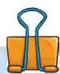

# 平方差公式
$(a + b) (a - b) = a ^ {2} - b ^ {2}.$

两数和与这两数差的积，等于它们的平方差.

这是两个特殊的多项式相乘!

> [!example]- 例1 利用平方差公式计算：
(1) $(5+6x)(5-6x)$ ;
(2) $(x - 2y)(x + 2y)$ ;
(3) $(-m+n)(-m-n)$ .
解：(1) $(5+6x)(5-6x)=5^{2}-(6x)^{2}=25-36x^{2}$ ;
(2) $(x - 2y)(x + 2y) = x^{2} - (2y)^{2} = x^{2} - 4y^{2}$ ;
(3) $(-m + n)(-m - n) = (-m)^2 - n^2 = m^2 - n^2$ .

> [!example]- 例2 利用平方差公式计算：
(1) $\left(-\frac{1}{4}x-y\right)\left(-\frac{1}{4}x+y\right);$
(2) $(ab + 8)(ab - 8)$ .
解：(1) $\left(-\frac{1}{4}x-y\right)\left(-\frac{1}{4}x+y\right)=\left(-\frac{1}{4}x\right)^{2}-y^{2}=\frac{1}{16}x^{2}-y^{2};$
(2) $(ab + 8)(ab - 8) = (ab)^{2} - 8^{2} = a^{2}b^{2} - 64.$


# 想一想
$(a - b)(-a - b) = ?$ 你是怎样做的？

# 随堂练习

# 计算:
(1) $(a + 2)(a - 2)$ ;
(2) $(3a + 2b)(3a - 2b)$ ;
(3) $(-x - 1)(1 - x)$ ;
(4) $(-4k+3)(-4k-3)$ .

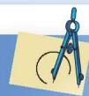

# 习题 1.9

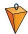

# 知识技能

#### 1. 计算：
(1) $(3x+7y)(3x-7y)$ ;
(2) $(0.2x-0.3)(0.2x+0.3)$ ;
(3) $(mn-3n)(mn+3n)$ ;
(4) $(-2x + 3y)(-2x - 3y)$ ;
(5) $\left(-\frac{1}{4}x-2y\right)\left(-\frac{1}{4}x+2y\right);$
(6) $(5m - n)(-5m - n)$ .

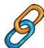

# 联系拓广

#### 2. 计算：
(1) $(a^n + b)(a^n - b)$ ;
(2) $(a+1)(a-1)(a^{2}+1)$ .

如图 1-5，边长为 $a$ 的大正方形中有一个边长为 $b$ 的小正方形.
(1) 请表示图 1-5 中阴影部分的面积.
(2) 小颖将阴影部分拼成了一个长方形（如图 1-6），这个长方形的长和宽分别是多少？你能表示出它的面积吗？

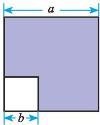

<details>
<summary>text_image</summary>

a
b
</details>

图1-5

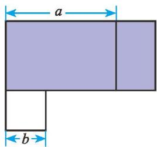

<details>
<summary>text_image</summary>

a
b
</details>

图1-6
(3) 比较 (1)(2) 的结果, 你能验证平方差公式吗?


# 想一想
(1) 计算下列各组算式, 并观察它们的共同特点:
$7 \times 9 =$
$1 1 \times 1 3 =$
$7 9 \times 8 1 =$
$8 \times 8 =$
$1 2 \times 1 2 =$
$8 0 \times 8 0 =$
(2) 从以上的过程中, 你发现了什么规律?  
(3) 请用字母表示这一规律, 你能说明它的正确性吗?

# 例3 用平方差公式进行计算:
(1) $103 \times 97$ ;
(2) $118 \times 122$ .
解: (1) $103 \times 97$
$= (1 0 0 + 3) (1 0 0 - 3)$
$= 1 0 0 ^ {2} - 3 ^ {2}$
$= 9 9 9 1;$
(2) $118 \times 122$
$= (1 2 0 - 2) (1 2 0 + 2)$
$= 1 2 0 ^ {2} - 2 ^ {2}$
$= 1 4 3 9 6.$

# 例4 计算:
(1) $a^2 (a + b)(a - b) + a^2 b^2;$
(2) $(2x - 5)(2x + 5) - 2x(2x - 3)$ .
解：（1） $a^2 (a + b)(a - b) + a^2 b^2$
(2) $(2x - 5)(2x + 5) - 2x(2x - 3)$
$= a ^ {2} \left(a ^ {2} - b ^ {2}\right) + a ^ {2} b ^ {2}$
$= (2 x) ^ {2} - 2 5 - \left(4 x ^ {2} - 6 x\right)$
$= a ^ {4} - a ^ {2} b ^ {2} + a ^ {2} b ^ {2}$
$= 4 x ^ {2} - 2 5 - 4 x ^ {2} + 6 x$
$= a ^ {4};$
$= 6 x - 2 5.$

# 随堂练习

计算：
(1) $704 \times 696$ ;
(2) $(x + 2y)(x - 2y) + (x + 1)(x - 1)$ ;
(3) $x(x - 1) - \left(x - \frac{1}{3}\right)\left(x + \frac{1}{3}\right).$


# 习题 1.10


# 知识技能

1. 计算：
(1) $(2m+3)(2m-3)$ ;
(2) $x(x + 1) + (2 - x)(2 + x)$ ;
(3) $(3x - y)(3x + y) + y(x + y)$ ;
(4) $\left(a+\frac{1}{2}b\right)\left(a-\frac{1}{2}b\right)-(3a-2b)(3a+2b).$


# 问题解决

2. 用平方差公式进行计算:
(1) $1007 \times 993$ ;
(2) $108 \times 112$ .


# 完全平方公式

观察下列算式及其运算结果，你有什么发现？
$(m + 3) ^ {2} = (m + 3) (m + 3)$
$= m ^ {2} + 3 m + 3 m + 9$
$= m ^ {2} + 2 \times 3 m + 9$
$= m ^ {2} + 6 m + 9,$

再举两例验证你的发现.
$(2 + 3 x) ^ {2} = (2 + 3 x) (2 + 3 x)$
$= 2 ^ {2} + 2 \times 3 x + 2 \times 3 x + 9 x ^ {2}$
$= 4 + 2 \times 2 \times 3 x + 9 x ^ {2}$
$= 4 + 1 2 x + 9 x ^ {2}.$


用自己的语言叙述这一公式!
$(a + b) ^ {2} = a ^ {2} + 2 a b + b ^ {2}.$


# 想一想

你能用图1-7解释这一公式吗？


# 议一议
$(a-b)^{2}=?$ 你是怎样做的?


<details>
<summary>text_image</summary>

b
a
a
b
</details>

图1-7


<details>
<summary>natural_image</summary>

Cartoon illustration of a boy holding a blank sign (no text or symbols present)
</details>


$(a - b) ^ {2}$
$= (a - b) (a - b)$
$= a ^ {2} - 2 a b + b ^ {2}.$
$(a - b) ^ {2}$
$= [ a + (- b) ] ^ {2}$
$= a ^ {2} + 2 a (- b) + (- b) ^ {2}$
$= a ^ {2} - 2 a b + b ^ {2}.$


$(a - b) ^ {2} = a ^ {2} - 2 a b + b ^ {2}.$

用自己的语言叙述这一公式!


# 做一做

请你设计一个图形解释这一公式.

上面两个公式称为完全平方公式.

平方差公式和完全平方公式都是重要的整式乘法公式.

> [!example]- 例1 利用完全平方公式计算：
(1) $(2x - 3)^{2}$ ;
(2) $(4x + 5y)^{2}$ ;
(3) $(mn - a)^2$ .
解：(1) $(2x-3)^{2}=(2x)^{2}-2\cdot2x\cdot3+3^{2}$
$= 4 x ^ {2} - 1 2 x + 9;$
(2) $(4x + 5y)^{2} = (4x)^{2} + 2\cdot 4x\cdot 5y + (5y)^{2}$
$= 1 6 x ^ {2} + 4 0 x y + 2 5 y ^ {2};$
(3) $(mn - a)^2 = (mn)^2 - 2 \cdot mn \cdot a + a^2$
$= m ^ {2} n ^ {2} - 2 a m n + a ^ {2}.$

# 随堂练习

计算：
(1) $\left(\frac{1}{2} x - 2y\right)^2$ ;
(2) $\left(2xy + \frac{1}{5} x\right)^2;$
(3) $(n + 1)^2 - n^2$ .


# 读一读

# 杨辉三角

我们已经知道 $(a + b)^2$ 展开后等于 $a^2 + 2ab + b^2$ ，请你利用多项式乘法法则将 $(a + b)^3$ 展开。进一步，你能展开 $(a + b)^4, (a + b)^5$ 吗？你一定发现解决上述问题需要大量的计算，是否有简单的方法呢？我们不妨找找规律！
如果将 $(a + b)^n$ ( $n$ 为非负整数) 的每一项按字母 $a$ 的次数由大到小排列, 就可以得到下面的等式:
$(a+b)^{0}=1$ ，它只有一项，系数为1；
$(a+b)^{1}=a+b$ ，它有两项，系数分别是1,1;
$(a+b)^{2}=a^{2}+2ab+b^{2}$ ，它有三项，系数分别是1，2，1；
$(a + b)^{3} = a^{3} + 3a^{2}b + 3ab^{2} + b^{3}$ ，它有四项，系数分别是1，3，3，1.
如果将上述每个式子的各项系数排成右表，那么你能发现什么规律？

观察右表, 我们发现每一行的首末都是 1 , 并且下一行的数比上一行多 1 个, 中间各数都写在上一行两数的中间, 且等于它们的和. 按照这个规律可以继续将这个表写下去:


<details>
<summary>text_image</summary>

1
1 1
1 2 1
1 3 3 1
</details>


<details>
<summary>text_image</summary>

1
1 1
1 2 1
1 3 3 1
1 4 6 4 1
1 5 10 10 5 1
1 6 15 20 15 6 1
...
</details>

你能根据这个表得到 $(a+b)^{4}$ ， $(a+b)^{5}$ 的结果吗？利用多项式乘法法则验证你的结果是否正确。

上表在我国宋朝数学家杨辉1261年的著作《详解九章算法》中提到过，而他是摘录自北宋时期数学家贾宪著的《开方作法本源》中的“开方作法本源图”(见右图)，因而人们把这个表叫做杨辉三角或贾宪三角。在欧洲这个表叫做帕斯卡三角形。帕斯卡(B. Pascal, 1623—1662)是1654年发现这一规律的，比杨辉要迟393年，比贾宪迟600年。


<details>
<summary>text_image</summary>

左未乃積數
右束乃隅算
中藏者皆廉
以廉來商方
介實而除之。
</details>


# 习题 1.11


# 知识技能

1. 计算:
(1) $(2x + 5y)^{2}$ ;
(2) $(\frac{1}{3} m - \frac{1}{2})^2;$
(3) $(-2t - 1)^{2}$ ;
(4) $\left(\frac{1}{5}x+\frac{1}{10}y\right)^{2};$
(5) $(7ab + 2)^{2}$ ;
(6) $\left(-cd+\frac{1}{2}\right)^{2}.$

2. 一个圆的半径长为 $r(r > 2) \mathrm{~cm}$ , 减少 $2 \mathrm{~cm}$ 后, 这个圆的面积减少了多少?


# 联系拓广

3. 观察下列各式： $15^{2}=225$ ， $25^{2}=625$ ， $35^{2}=1225$ ，…

个位数字是5的两位数平方后，末尾的两个数有什么规律？为什么？

※4. 计算： $(a+b+c)^{2}$ .

怎样计算 $102^{2}$ , $197^{2}$ 更简单呢?


(1) $102^{2} = (100 + 2)^{2}$
$= 1 0 0 ^ {2} + 2 \times 1 0 0 \times 2 + 2 ^ {2}$
$= 1 0 0 0 0 + 4 0 0 + 4$
$= 1 0 4 0 4;$
(2) $197^{2} = (200 - 3)^{2}$
$= 2 0 0 ^ {2} - 2 \times 2 0 0 \times 3 + 3 ^ {2}$
$= 4 0 0 0 0 - 1 2 0 0 + 9$
$= 3 8 8 0 9.$

你是怎样做的？与同伴进行交流。

# 例2 计算：
(1) $(x + 3)^{2} - x^{2}$ ;
(2) $(a + b + 3)(a + b - 3)$ ;
(3) $(x+5)^{2}-(x-2)(x-3).$
解:(1) $(x+3)^{2}-x^{2}$
$= x ^ {2} + 6 x + 9 - x ^ {2}$
$= 6 x + 9;$
(2) $(a + b + 3)(a + b - 3)$
$= [ (a + b) + 3 ] [ (a + b) - 3 ]$
$= (a + b) ^ {2} - 3 ^ {2}$
$= a ^ {2} + 2 a b + b ^ {2} - 9;$
(3) $(x + 5)^{2} - (x - 2)(x - 3)$
$= x ^ {2} + 1 0 x + 2 5 - \left(x ^ {2} - 5 x + 6\right)$


$\begin{array}{l} = x ^ {2} + 1 0 x + 2 5 - x ^ {2} + 5 x - 6 \\ = 1 5 x + 1 9. \\ \end{array}$


# 做一做

一位老人非常喜欢孩子，每当有孩子到他家做客时，老人都要拿出糖果招待他们。如果来1个孩子，老人就给这个孩子1块糖果；如果来2个孩子，老人就给每个孩子2块糖果；如果来3个孩子，老人就给每个孩子3块糖果……

假如第一天有 $a$ 个孩子一起去看老人, 第二天有 $b$ 个孩子一起去看老人,第三天有 $(a + b)$ 个孩子一起去看老人, 那么第三天老人给出去的糖果和前两天给出去的糖果总数一样多吗?

请你用所学的公式解释自己的结论.

# 随堂练习

利用整式乘法公式计算：
(1) $96^{2}$ ;
(2) $(a - b - 3)(a - b + 3)$ .


# 习题 1.12


# 知识技能

1. 计算：
(1) $(2x+y+1)(2x+y-1)$ ;
(2) $(x - 2)(x + 2) - (x + 1)(x - 3)$ ;
(3) $(ab + 1)^2 - (ab - 1)^2$ ;
(4) $(2x - y)^{2} - 4(x - y)(x + 2y)$ .


# 问题解决

2. 一个底面是正方形的长方体, 高为 $6 \mathrm{~cm}$ , 底面正方形边长为 $5 \mathrm{~cm}$ . 如果它的高不变, 底面正方形边长增加了 $a \mathrm{~cm}$ , 那么它的体积增加了多少?

3. 利用完全平方公式计算：
(1) $63^{2}$ ;
(2) $998^{2}$ .


# 联系拓广

4. 计算: $(a + b)^{3}$ .


# 7

# 整式的除法

计算下列各题，并说说你的理由.
(1) $x^{5}y \div x^{2};$   
(2) $8m^{2}n^{2}\div2m^{2}n^{\text{①}}$ ;   
(3) $a^{4}b^{2}c\div3a^{2}b.$

可以用类似于分数约分的方法来计算.


# 议一议

如何进行单项式除以单项式的运算？


<details>
<summary>natural_image</summary>

Cartoon illustration of a smiling boy in blue overalls and boots, pointing upward with both hands (no text or symbols)
</details>


单项式相除，把系数、同底数幂分别相除后，作为商的因式；对于只在被除式里含有的字母，则连同它的指数一起作为商的一个因式.

# 例1 计算:
(1) $-\frac{3}{5}x^{2}y^{3}\div3x^{2}y;$
(2) $10a^{4}b^{3}c^{2}\div 5a^{3}bc;$
(3) $(2x^{2}y)^{3} \cdot (-7xy^{2}) \div 14x^{4}y^{3}$ ;
(4) $(2a + b)^{4} \div (2a + b)^{2}$ .
解：(1) $-\frac{3}{5}x^{2}y^{3}\div3x^{2}y=\left(-\frac{3}{5}\div3\right)x^{2-2}y^{3-1}=-\frac{1}{5}y^{2};$
(2) $10a^{4}b^{3}c^{2}\div 5a^{3}bc = (10\div 5)a^{4 - 3}b^{3 - 1}c^{2 - 1} = 2ab^{2}c;$
(3) $(2x^{2}y)^{3} \cdot (-7xy^{2}) \div 14x^{4}y^{3} = 8x^{6}y^{3} \cdot (-7xy^{2}) \div 14x^{4}y^{3}$
$= - 5 6 x ^ {7} y ^ {5} \div 1 4 x ^ {4} y ^ {3}$
$= - 4 x ^ {3} y ^ {2};$
(4) $(2a + b)^{4} \div (2a + b)^{2} = (2a + b)^{4 - 2}$
$= (2 a + b) ^ {2}$
$= 4 a ^ {2} + 4 a b + b ^ {2}.$


# 做一做

如图所示，三个大小相同的球恰好放在一个圆柱形盒子里，三个球的体积之和占整个盒子容积的几分之几？


# 随堂练习

计算：
(1) $2a^{6}b^{3}\div a^{3}b^{2};$
(2) $\frac{1}{48} x^3 y^2 \div \frac{1}{16} x^2 y;$
(3) $3m^{2}n^{3}\div(mn)^{2};$
(4) $(2x^{2}y)^{3} \div 6x^{3}y^{2}$ .


## 习题1.13


# 知识技能

1. 计算：
(1) $(-2r^{2}s)^{2} \div 4rs^{2}$ ;
(2) $(5x^{2}y^{3})^{2}\div 25x^{4}y^{5};$
(3) $(x+y)^{3}\div(x+y);$
(4) $7a^{5}b^{3}c^{5}\div 14a^{2}b^{3}c.$

2. 计算：
(1) $8a^{4}b^{3}c \div 2a^{2}b^{3} \cdot \left(-\frac{2}{3} a^{3}bc^{2}\right)$ ;
(2) $(3x^{2}y)^{2} \cdot (-15xy^{3}) \div (-9x^{4}y^{2})$ .

3. 把下图左圈里的每一个整式分别除以 $\frac{1}{2}xy^{2}$ ，并将商写在右圈的相应位置上.


<details>
<summary>text_image</summary>

x⁴y³
-6x²y²z
½xy⁴z²
¾(xy)²
÷½xy²
</details>

(第3题)


# 问题解决

4. 我们都知道“先看见闪电,后听见雷声”,那是因为在空气中光的传播速度比声音快. 科学家们发现,光在空气中的传播速度约为 $3 \times 10^{8} \mathrm{~m} / \mathrm{s}$ ,而声音在空气中的传播速度约为 $300 \mathrm{~m} / \mathrm{s}$ . 你能进一步算出光的传播速度是声音的多少倍吗?

5. 一圆柱形桶内装满了水，已知桶的底面直径为 a，高为 b。又知另一长方体形容器的长为 b，宽为 a。若把圆柱形桶中的水倒入长方体形容器中（水不溢出），水面的高度是多少？

计算下列各题，说说你的理由.
(1) $(ad+bd)\div d=$ \_\_\_\_;
(2) $(a^{2}b+3ab)\div a=$ \_\_\_\_;
(3) $(xy^{3}-2xy)\div xy=$ \_\_\_\_.


# 议一议

如何进行多项式除以单项式的运算？


多项式除以单项式，先把这个多项式的每一项分别除以单项式，再把所得的商相加.

# 例2 计算:
(1) $(6ab+8b)\div2b;$
(2) $(27a^{3} - 15a^{2} + 6a)\div 3a;$
(3) $(9x^{2}y - 6xy^{2})\div 3xy;$
(4) $\left(3x^{2}y - xy^{2} + \frac{1}{2} xy\right) \div \left(-\frac{1}{2} xy\right)$ .
解：(1) $(6ab+8b)\div2b$
$= 6 a b \div 2 b + 8 b \div 2 b = 3 a + 4;$
(2) $(27a^{3} - 15a^{2} + 6a)\div 3a$
$= 2 7 a ^ {3} \div 3 a - 1 5 a ^ {2} \div 3 a + 6 a \div 3 a = 9 a ^ {2} - 5 a + 2;$


(3) $(9x^{2}y - 6xy^{2})\div 3xy$
$= 9 x ^ {2} y \div 3 x y - 6 x y ^ {2} \div 3 x y = 3 x - 2 y;$
(4) $\left(3x^{2}y - xy^{2} + \frac{1}{2} xy\right) \div \left(-\frac{1}{2} xy\right)$
$= - 3 x ^ {2} y \div \frac {1}{2} x y + x y ^ {2} \div \frac {1}{2} x y - \frac {1}{2} x y \div \frac {1}{2} x y = - 6 x + 2 y - 1.$


# 做一做

小明在爬一小山时, 第一阶段的平均速度为 $v$ , 所用时间为 $t_1$ ; 第二阶段的平均速度为 $\frac{1}{2} v$ , 所用时间为 $t_2$ .

下山时，小明的平均速度保持为 $4v$ 。已知小明上山的路程和下山的路程是相同的，那么小明下山用了多长时间？

# 随堂练习

计算：
(1) $(3xy + y) \div y$ ;
(2) $(ma + mb + mc) \div m$ ;
(3) $(6c^{2}d - c^{3}d^{3})\div (-2c^{2}d);$
(4) $(4x^{2}y + 3xy^{2})\div 7xy.$


# 习题 1.14


# 知识技能

1. 计算:
(1) $(5m^{3}n^{2} - 6m^{2})\div 3m;$
(2) $(6a^{2}b - 5a^{2}c^{2})\div (-3a^{2});$
(3) $(16x^{4}+4x^{2}+x)\div x;$
(4) $(3a^{2}b - 2ab + 2ab^{2})\div ab;$
(5) $(-4a^{3} + 6a^{2}b^{3} + 3a^{3}b^{3})\div (-4a^{2});$
(6) $\left(\frac{2}{5} mn^3 - m^2 n^2 + \frac{1}{6} n^4\right) \div \frac{2}{3} n^2;$
(7) $\left(\frac{1}{10}xy^{2}+\frac{1}{4}y^{2}-\frac{1}{2}y\right)\div\frac{1}{5}y;$
(8) $[(x + 1)(x + 2) - 2] \div x$ .


# 问题解决

2. 图（1）的瓶子中盛满了水，如果将这个瓶子中的水全部倒入图（2）的杯子中，那么一共需要多少个这样的杯子？（单位：cm）


<details>
<summary>text_image</summary>

a
h
H
2a
</details>
(1) 瓶子

  
(2) 杯子


# 联系拓广

(第2题)

3. 任意给一个非零数，按下列程序进行计算，写出输出结果.


<details>
<summary>flowchart</summary>


</details>

(第3题)


# 回顾与思考

1. 举例说明如何进行幂的相关运算，你是怎样得到这些运算法则的？  
2. 举例说明如何进行整式的乘法运算.   
3. 整式乘法公式有哪些？它们的特点是什么？  
4. 举例说明如何进行单项式除以单项式、多项式除以单项式的运算.   
5. 用自己的方式梳理本章的知识结构，你是怎样想的？与同伴进行交流。


# 复习题


# 知识技能

1. 计算：
(1) $\left(-\frac{3}{5}\right)^{2}\cdot\left(-\frac{3}{5}\right)^{3};$   
(3) $(-a^{5})^{5};$   
(5) $(a + b)^{3} \div (a + b)$ ;   
(7) $(-a)^{2}(a^{2})^{2};$   
(9) $(-y)^{2}\cdot y^{n-1}(n>1);$   
(11) $a^{m+2} \div a^{m+1};$
(2) $(a - b)^{3} \cdot (a - b)^{4}$ ;   
(4) $\left(-\frac{1}{2}x\right)^{7}\div\left(-\frac{1}{2}x\right);$   
(6) $(-a^{2}\cdot b)^{3};$   
(8) $(y^{2})^{3}\div y^{6};$   
(10) $a^{n + 1}\cdot a^{n - 1}(n > 1)$ ;   
(12) $(-c^2)^{2n}$ .

2. 计算：
(1) $10^{5}\div10^{-1}\times10^{0}$ ;
(2) $16 \times 2^{-4}$ ;
(3) $\left(\frac{1}{3}\right)^{0}\div\left(-\frac{1}{3}\right)^{-2}.$

3. 一个正方体的棱长为 $2 \times 10^{2} \mathrm{~mm}$ .
(1) 它的表面积是多少平方米?
(2) 它的体积是多少立方米?

4. 计算：
(1) $(x+a)(x+b)$ ;
(2) $(3x + 7y)(3x - 7y)$ ;
(3) $(3x+9)(6x+8)$ ;
(4) $\left(\frac{1}{2}x^{2}y-2xy+y^{2}\right)\cdot3xy;$


(5) $\frac{1}{3} a^2 b^3 \cdot (-15a^2 b^2)$ ;
(6) $(4a^{3}b-6a^{2}b^{2}+12ab^{3})\div2ab;$
(7) $(a^{2}bc)^{2} \div ab^{2}c$ ;
(8) $(3mn + 1)(3mn - 1) - 8m^{2}n^{2}$ ;
(9) $\left[(3a + b)^2 - b^2\right] \div a$ ;
(10) $(x + 2)^{2} - (x + 1)(x - 1)$ .

5. 计算：
(1) $10^{7} \div (10^{3} \div 10^{2})$ ;
(2) $(x - y)^{3} \cdot (x - y)^{2} \cdot (y - x)$ ;
(3) $4 \times 2^{n} \times 2^{n-1} (n > 1)$ ;
(4) $(-x)^{3} \cdot x^{2n - 1} + x^{2n} \cdot (-x)^{2}$ ;
(5) $(y^{2}\cdot y^{3})\div(y\cdot y^{4});$
(6) $x^{2}\cdot x^{3}+x^{7}\div x^{2};$
(7) $m^{5} \div m^{2} \times m;$
(8) $a^{4}+(a^{2})^{4}-(a^{2})^{2}.$

6. 计算：
(1) $(2x^{2})^{3} - 6x^{3}(x^{3} + 2x^{2} + x)$ ;
(2) $(x+y+z)(x+y-z);$
(3) $\left[(x + y)^2 - (x - y)^2\right] \div 2xy;$
(4) $a^{2}(a+1)^{2}-2(a^{2}-2a+4)$ .

7. 求下列各式的值:
(1) $3x^{2}+\left(-\frac{3}{2}x+\frac{1}{3}y^{2}\right)\left(2x-\frac{2}{3}y\right)$ ，其中 $x=-\frac{1}{3}$ ， $y=\frac{2}{3}$ ;
(2) $[(xy + 2)(xy - 2) - 2x^{2}y^{2} + 4] \div xy$ , 其中 $x = 10$ , $y = -\frac{1}{25}$ ;
(3) $x(x + 2y) - (x + 1)^{2} + 2x$ ，其中 $x = \frac{1}{25}, y = -25.$

8. 利用整式乘法公式计算下列各题：
(1) $2001^{2}$ ;
(2) $2001 \times 1999;$
(3) $99^{2}-1$ .

9. 运用整式乘法公式进行计算:
(1) $899 \times 901 + 1;$
(2) $123^{2} - 124 \times 122$ .


# 数学理解

10. 试用直观的方法说明 $(a + 3)^2 \neq a^2 + 3^2 (a \neq 0)$ .


# 问题解决

11. 某种原子质量为 0.000 000 000 000 000 000 000 000 019 93 g，你能用科学记数法把它表示出来吗？

科学上把这个数量的 $\frac{1}{12}$ 定为 1 个原子质量单位，并用符号 u 来表示。请你用科学记数法把 u 表示出来。


12. 分别计算下图中阴影部分的面积.


<details>
<summary>text_image</summary>

2b + a
3a + 2b
b + a
2a + b
a
3b
a
2a
b
</details>

(第12题)

13. 请分别准备几张如图所示的长方形或正方形卡片.


<details>
<summary>text_image</summary>

b
a
b
b
a
a
</details>

(第13题)

用它们拼一些新的长方形，并计算它们的面积.

14. 请在图中指出面积为 $(a + 3b)^{2}$ 的图形，并指出图中有多少个边长为 $a$ 的正方形，有多少个边长为 $b$ 的正方形，有多少个两边分别为 $a$ 和 $b$ 的长方形，然后用相应的公式进行验证.

15. 我国自主研发的 500 m 口径球面射电望远镜（FAST）有“中国天眼”之称，它的反射面面积约为 $2.5 \times 10^{5} \, m^{2}$ ; 一个 11 人制正规足球场的面积约为 $7.14 \times 10^{3} \, m^{2}$ . “中国天眼”的反射面面积大约相当于多少个 11 人制正规足球场的面积?（结果精确到 1 个）


<details>
<summary>text_image</summary>

b
b
b
a
a b b b
</details>

(第14题)


<details>
<summary>natural_image</summary>

Aerial view of a large radio telescope dish nestled in a mountainous green valley under a blue sky with scattered clouds.
</details>


# 联系拓广

16. 把下图左框里的整式分别乘 $(a+2b)$ ，将所得的积写在右框相应的位置上.


<details>
<summary>flowchart</summary>

```mermaid
graph LR
    A["(a + 2b)"] -->|·(a + 2b)| B["Empty"]
    C["(a - 2b)"] --> D["Empty"]
    E["(-a + 2b)"] --> F["Empty"]
    G["(-a - 2b)"] --> H["Empty"]
```
</details>

(第16题)

17. “两个相邻整数的平均数的平方”与“它们平方数的平均数”相等吗？若不相等，相差多少？

18. “黑洞”是恒星演化的最后阶段。根据有关理论，当一颗恒星衰老时，其中心的燃料（氢）已经被耗尽，在外壳的重压之下，核心开始坍缩，直到最后形成体积小、密度大的星体。如果这一星体的质量超过太阳质量的三倍，那么就会引发另一次大坍缩。当这种收缩使得它的半径达到施瓦西（Schwarzschild）半径后，其引力就会变得相当强大，以至于光也不能逃脱出来，从而成为一个看不见的星体——黑洞。施瓦西半径（单位：m）的计算公式是
$R = \frac {2 G M}{c ^ {2}},$

其中 $G = 6.67 \times 10^{-11} ~N \cdot m^{2}/kg^{2}$ ，为万有引力常数；M 表示星球的质量（单位：kg）； $c=3\times10^{8}\ m/s$ ，为光在真空中的速度.

已知太阳的质量为 $2 \times 10^{30} \mathrm{~kg}$ , 计算太阳的施瓦西半径.

※19. 求 $(2-1)(2+1)(2^{2}+1)(2^{4}+1)\cdots(2^{32}+1)+1$ 的个位数字.


# 第二章 相交线与平行线

生活中处处可见道路、房屋、山川、桥梁……在这些大自然的杰作和人类的创造物中，蕴涵着大量的平行线和相交线。你能从桥梁和窗棂图中找到平行线和相交线吗？

在这一章里，我们将发现相交线和平行线的一些特征，并探索两条直线平行的条件。我们还将利用圆规和没有刻度的直尺，尝试着作一些简单的图案！

# 学习目标

探索对顶角相等这一性质   
探索平行线的特征以及判别直线平行的条件  
能用尺规作一个角等于已知角  
积累探究图形性质的活动经验，感受推理的作用

# 1

# 两条直线的位置关系

观察下面几幅生活中的图片：


<details>
<summary>natural_image</summary>

Aerial view of a multi-lane highway with a single green car driving on the lane (no visible text or symbols)
</details>


<details>
<summary>natural_image</summary>

Aerial view of railway tracks with green vegetation and a dirt path visible in the background (no text or symbols)
</details>


<details>
<summary>natural_image</summary>

Exterior view of a modern multi-story building with glass windows and curved windows (no signage or text visible)
</details>

我们知道，在同一平面内，两条直线的位置关系有相交和平行两种.

若两条直线只有一个公共点，我们称这两条直线为相交线（intersection lines）。

在同一平面内，不相交的两条直线叫做平行线（parallel lines）.


# 议一议

如图 2-1, 直线 $AB$ 与 $CD$ 相交于点 $O$ , 那么 $\angle 1$ 与 $\angle 2$ 的位置有什么关系? 它们的大小有什么关系? 为什么? 与同伴进行交流.

在图 2-1 中，直线 $AB$ 与 $CD$ 相交于点 $O$ ， $\angle 1$ 与 $\angle 2$ 有公共顶点 $O$ ，它们的两边互为反向延长线，具有这种位置关系的两个角叫做对顶角（vertical angles）.


<details>
<summary>text_image</summary>

A
2
3
4
O
1
D
B
C
</details>

图2-1

对顶角有如下性质：


对顶角相等.

图 2-1中，还有其他的角也构成对顶角吗？


# 想一想

在图 2-1 中, $\angle 1$ 与 $\angle 3$ 有什么数量关系?
如果两个角的和是 $180^{\circ}$ ，那么称这两个角互为补角（supplementary angle）.

类似地，如果两个角的和是 $90^{\circ}$ ，那么称这两个角互为余角（complementary angle）.

图2-1中，还有其他的角也构成互为补角的关系吗？


# 做一做

如图 2-2，打台球时，选择适当的方向用白球击打红球，反弹后的红球会直接入袋，此时 $\angle 1 = \angle 2$ 。


<details>
<summary>text_image</summary>

1
2
3
</details>

图2-2


<details>
<summary>text_image</summary>

D
O
C
1
2
3
4
A
B
N
</details>

图2-3

将图2-2简化为图2-3，ON与DC相交所成的∠DON和∠CON都等于 $90^{\circ}$ ，且 $\angle1=\angle2$ 。在图2-3中：
(1) 有哪些角互为补角？有哪些角互为余角？
(2) $\angle 3$ 与 $\angle 4$ 有什么关系？为什么？
(3) $\angle AOC$ 与 $\angle BOD$ 有什么关系？为什么？


同角或等角的补角相等，同角或等角的余角相等.

# 随堂练习

如图所示，有一个破损的扇形零件，利用图中的量角器可以量出这个扇形零件的圆心角的度数。你能说出所量角是多少度吗？你的根据是什么？


<details>
<summary>radar</summary>

| Position | Value |
|---|---|
| 1 | 100 |
| 2 | 150 |
| 3 | 170 |
| 4 | 160 |
| 5 | 150 |
| 6 | 140 |
| 7 | 130 |
| 8 | 120 |
| 9 | 110 |
| 10 | 100 |
| 11 | 90 |
| 12 | 80 |
| 13 | 70 |
| 14 | 60 |
| 15 | 50 |
| 16 | 40 |
| 17 | 30 |
| 18 | 20 |
| 19 | 10 |
| 20 | 5 |
| 21 | 2 |
| 22 | 1 |
| 23 | 0.5 |
| 24 | 0.2 |
| 25 | 0.1 |
| 26 | 0.05 |
| 27 | 0.02 |
| 28 | 0.01 |
| 29 | 0.005 |
| 30 | 0.002 |
| 31 | 0.001 |
| 32 | 0.0005 |
| 33 | 0.0002 |
| 34 | 0.0001 |
| 35 | 0.00005 |
| 36 | 0.00002 |
| 37 | 0.00001 |
| 38 | 0.000005 |
| 39 | 0.000002 |
| 40 | 0.000001 |
| 41 | 0.0000005 |
| 42 | 0.0000002 |
| 43 | 0.0000001 |
| 44 | 0.00000005 |
| 45 | 0.00000002 |
| 46 | 0.00000001 |
| 47 | 0.000000005 |
| 48 | 0.000000002 |
| 49 | 0.000000001 |
| 50 | 0.0000000005 |
| 51 | 5 |
| 52 | 2 |
| 53 | 1 |
| 54 | 0.5 |
| 55 | 0.2 |
| 56 | 0.1 |
| 57 | 0.05 |
| 58 | 0.02 |
| 59 | 0.01 |
| 60 | 5 |
| 61 | 2 |
| 62 | 1 |
| 63 | 0.5 |
| 64 | 0.2 |
| 65 | 5 |
| 66 | 2 |
| 67 | 1 |
| 68 | 0.5 |
| 69 | 5 |
| 70 | 2 |
| 71 | 1 |
| 72 | 5 |
| 73 | 2 |
| 74 | 1 |
| 75 | 5 |
| 76 | 2 |
| 77 | 1 |
| 78 | 5 |
| 79 | 2 |
| 80 | 1 |
| Note: The 'Value' in the image is a duplicate of the text below it, so the actual values are not explicitly labeled on the chart.
</details>


## 习题2.1


# 知识技能

1. 如图，直线 $a, b$ 相交， $\angle 1 = 38^{\circ}$ ，求 $\angle 2, \angle 3, \angle 4$ 的度数.


# 数学理解

2. 互为补角的两个角可以都是锐角吗？可以都是直角吗？可以都是钝角吗？


<details>
<summary>text_image</summary>

b
1
2
a
3
4
</details>

(第1题)


# 问题解决

3. 如图, 在长方形的台球桌面上, $\angle 1 + \angle 3 = 90^{\circ}$ , $\angle 2 = \angle 3$ , 如果 $\angle 2 = 58^{\circ}$ , 那么 $\angle 1$ 等于多少度?


<details>
<summary>text_image</summary>

2
3
1
</details>

(第3题)


<details>
<summary>text_image</summary>

30°
30°
</details>

(第4题)

4. 如图, 一棵树生长在 ${30}^{ \circ  }$ 的山坡上, 树干与山坡所成的角是多少度？


# 联系拓广

5. 当光线从空气射入水中时, 光线的传播方向发生了改变, 这就是折射现象 (如图所示). 图中 $\angle 1$ 与 $\angle 2$ 是对顶角吗?


<details>
<summary>text_image</summary>

1
2
</details>

(第5题)


观察下面图片，你能找出其中相交的线吗？它们有什么特殊的位置关系？


<details>
<summary>natural_image</summary>

Three-panel image showing a green chalkboard on the left, an empty window with windows, and a close-up of a room corner with black walls (no text or symbols visible)
</details>

两条直线相交成四个角，如果有一个角是直角，那么称这两条直线互相垂直（perpendicular），其中的一条直线叫做另一条直线的垂线，它们的交点叫做垂足.

通常用符号 “⊥” 表示两条直线互相垂直。如图 2-4，直线 $AB$ 与直线 $CD$ 垂直，记作 $AB \perp CD$ ；如图 2-5，直线 $l$ 与直线 $m$ 垂直，记作 $l \perp m$ 。其中，点 $O$ 是垂足。


<details>
<summary>text_image</summary>

A
C
O
B
D
</details>

图2-4


<details>
<summary>text_image</summary>

l
O
m
</details>

图2-5


# 做一做
（1）你能借助三角尺在一张白纸上画出两条互相垂直的直线吗？  
(2) 如果只有直尺, 你能在图 2-6 方格纸上画出两条互相垂直的直线吗?  
(3) 你能用折纸的方法折出互相垂直的直线吗?试试看!


<details>
<summary>natural_image</summary>

Blank grid pattern with blue lines forming squares (no text or symbols)
</details>

图2-6


# 想一想
(1) 如图 2-7, 点 $A$ 在直线 $l$ 上, 过点 $A$ 画直线 $l$ 的垂线, 你能画出多少条? 如果点 $A$ 在直线 $l$ 外呢?


<details>
<summary>text_image</summary>

A
l
A
l
</details>

图2-7


<details>
<summary>text_image</summary>

P
A B O C l
</details>

图2-8
(2)如图2-8,点 $P$ 是直线 $l$ 外一点, $PO \perp l$ , 点 $O$ 是垂足. 点 $A, B, C$ 在直线 $l$ 上, 比较线段 $PO, PA, PB, PC$ 的长短, 你发现了什么?


平面内，过一点有且只有一条直线与已知直线垂直.

直线外一点与直线上各点连接的所有线段中，垂线段最短.

如图2-9，过点 $A$ 作 $l$ 的垂线，垂足为 $B$ ，线段 $AB$ 的长度叫做点 $A$ 到直线 $l$ 的距离.


<details>
<summary>text_image</summary>

A
B
l
</details>

图2-9


# 议一议

你知道体育课上老师是怎样测量跳远成绩的吗？你能说说其中的道理吗？


<details>
<summary>natural_image</summary>

Illustration of children playing with a board game, one child reaching for the ball (no text or symbols)
</details>

# 随堂练习

1. 画一条直线 $l$ , 在直线 $l$ 上取一点 $A$ , 在直线 $l$ 外取一点 $B$ , 分别经过点 $A, B$ 用三角尺或量角器画直线 $l$ 的垂线.

2. 分别找出下列图中互相垂直的线段.


<details>
<summary>text_image</summary>

A
D
C
O
B
</details>
(1)


<details>
<summary>text_image</summary>

D
A
B
C
E
</details>
(2)

(第2题)  


## 习题2.2


# 知识技能

1. 你能在生活中找到互相垂直的线段吗？  
2. 观察右图，如果把街道近似地看做直线，那么哪些街道互相平行？哪些互相垂直？


<details>
<summary>text_image</summary>

东直门外大街
东 东
二 环 三 环
建国门外大街
东 四 环
</details>

(第2题)


# 问题解决

3. 如图, 要把水渠中的水引到 $C$ 点, 在渠岸 $AB$ 的什么地方开沟, 才能使沟最短? 画出图形, 并说明理由.

.C

A B

(第3题)


# 2

# 探索直线平行的条件

在日常生活中，人们经常用到平行线．如图，装修工人正在向墙上钉木条．如果木条 b 与墙壁边缘垂直，那么木条 a 与墙壁边缘所成的角为多少度时，才能使木条 a 与木条 b 平行？

你知道其中的理由吗？
如果木条 $b$ 不与墙壁边缘垂直呢？


<details>
<summary>text_image</summary>

Illustration of a worker installing wooden beams on a brick wall, labeled with parts 'a' and 'b'
</details>


# 做一做

如图2-10,三根木条相交成 $\angle 1, \angle 2$ , 固定木条 $b, c$ , 转动木条 $a$ .


<details>
<summary>text_image</summary>

b
a
1
2
c
</details>

图2-10


<details>
<summary>text_image</summary>

b
a
1
2
c
</details>

①


<details>
<summary>text_image</summary>

b
a
1
2
c
</details>

②


<details>
<summary>text_image</summary>

b
a
1
2
c
</details>

③   
图2-11

如图2-11, 在木条 $a$ 的转动过程中, 观察 $\angle 2$ 的变化以及它与 $\angle 1$ 的大小关系, 你发现木条 $a$ 与木条 $b$ 的位置关系发生了什么变化? 木条 $a$ 何时与木条 $b$ 平行?

改变图 2-10 中 $\angle 1$ 的大小, 按照上面的方式再做一做. $\angle 1$ 与 $\angle 2$ 的大小满足什么关系时, 木条 $a$ 与木条 $b$ 平行? 与同伴进行交流.

如图 2-12, 具有 $\angle 1$ 与 $\angle 2$ 这样位置关系的角称为同位角 (corresponding angles). $\angle 3$ 与 $\angle 4$ 也是同位角.

在图 2-12 中，找出其他的同位角.


<details>
<summary>text_image</summary>

C
l
3
1
7
5
D
A
4
2
8
6
B
</details>

图2-12


两条直线被第三条直线所截，如果同位角相等，那么这两条直线平行。简称为：同位角相等，两直线平行。

两直线平行，用符号“//”表示。例如，直线 $a$ 与直线 $b$ 平行，记作 $a // b$ .


# 想一想

你能借助三角尺画平行线吗？小明按如下方法画出了两条平行线，请说明其中的道理。


<details>
<summary>text_image</summary>

Two rulers placed on a white surface: one with a triangular ruler and the other with a circular protractor.
</details>


<details>
<summary>natural_image</summary>

Person drawing a triangular ruler and pencil on paper (no visible text or symbols)
</details>


<details>
<summary>text_image</summary>

Person drawing a protractor on paper with visible measurement markings and a pencil
</details>


# 做一做
（1）你能过直线 $AB$ 外一点 $P$ 画直线 $AB$ 的平行线吗？能画出几条？  
(2) 在图 2-13 中, 分别过点 $C$ , $D$ 画直线 $AB$ 的平行线 $EF$ , $GH$ , 那么 $EF$ 与 $GH$ 有怎样的位置关系?


过直线外一点有且只有一条直线与这条直线平行. 平行于同一条直线的两条直线平行.

图2-13

也就是说：如果 $b \parallel a, c \parallel a$ ，那么 $b \parallel c$ （图2-14）.


<details>
<summary>text_image</summary>

a
b
c
</details>

图2-14

# 随堂练习

1. 找出下面点阵（点阵中相邻的四个点构成正方形）中互相平行的线段.


<details>
<summary>text_image</summary>

A
E
G
B
C
D
F
H
</details>

(第1题)


<details>
<summary>text_image</summary>

A
B
C
D
1
2
</details>

(第2题)

2. 如图, $\angle 1 = \angle 2 = 55^{\circ}$ , 直线 $AB$ 与 $CD$ 平行吗?

3. 对于同一平面内的直线 $a, b, c$ , 如果 $a$ 与 $b$ 平行, $c$ 与 $a$ 相交, 那么 $c$ 与 $b$ 的位置关系是相交还是平行?


## 习题2.3


# 知识技能

1. 找出下图中互相平行的直线.


<details>
<summary>text_image</summary>

130°
m
50°
n
50°
a
b
</details>

(第1题)


<details>
<summary>natural_image</summary>

A green grid pattern with no text, numbers, or symbols
</details>

(第2题)

2. 如果只有直尺，你能在上面的方格纸上画出平行线吗？


# 数学理解

3. 你能用一张不规则的纸（比如，如图所示的四边形的纸）折出两条平行的直线吗？与同伴说说你的折法。

4. 图（1）是一种画平行线的工具。在画平行线之前，工人师傅往往要先调整一下工具（图（2）），然后再画平行线(图（3）). 你能说明这种工具的用法和其中的道理吗?


<details>
<summary>natural_image</summary>

Plain white paper sheet on a beige background (no text or symbols)
</details>

(第3题)


<details>
<summary>natural_image</summary>

Wooden cross-shaped metal bracket mounted on a wooden surface (no text or symbols visible)
</details>
(1)


<details>
<summary>natural_image</summary>

Hand holding a wooden cross-shaped object with a saw, surrounded by scattered wooden pieces (no visible text or symbols)
</details>
(2)


<details>
<summary>natural_image</summary>

Close-up of hands using a chisel to work on wooden planks (no visible text or symbols)
</details>
(3)   
(第4题)

5. 直线 $l$ 的同侧有 $A, B, C$ 三点, 如果 $A, B$ 两点确定的直线 $l_{1}$ 与 $B, C$ 两点确定的直线 $l_{2}$ 都与 $l$ 平行, 那么 $A, B, C$ 三点的位置关系如何?

小明有一块小画板（图 2-15），他想知道它的上、下边缘是否平行，于是他在两个边缘之间画了一条线段 $AB$ 。


<details>
<summary>text_image</summary>

A
2
3
1
4
B
</details>

图2-15

小明身边只有一个量角器，他通过测量某些角的大小就能知道这个画板的上、下边缘是否平行，你知道他是怎样做的吗？

如图2-16，具有 $\angle 1$ 与 $\angle 2$ 这样位置关系的角称为内错角（alternate interior angles）；具有 $\angle 1$ 与 $\angle 3$ 这样位置关系的角称为同旁内角（interior angles on the same side）.

在图 2-16 中，找出其他的内错角和同旁内角.


<details>
<summary>text_image</summary>

A
l
1
B
C
3
2
D
</details>

图2-16


# 议一议
(1) 内错角满足什么关系时, 两直线平行? 为什么?  
(2) 同旁内角满足什么关系时, 两直线平行? 为什么?


两条直线被第三条直线所截，如果内错角相等，那么这两条直线平行.

简称为：内错角相等，两直线平行.

两条直线被第三条直线所截，如果同旁内角互补，那么这两条直线平行.

简称为：同旁内角互补，两直线平行.


# 做一做

如图 2-17，三个相同的三角尺拼接成一个图形，请找出图中的一组平行线，并说明你的理由.


<details>
<summary>text_image</summary>

B
01 1 2 3 4 5 6 7 8 9 0
C
01 1 2 3 4 5 6 7 8 9 0
D
A
E
</details>

图2-17


BC 与 AE 是平行的. 因为 $\angle BCA$ 与 $\angle EAC$ 是内错角, 而且又相等.

你能看懂她的意思吗？

再找一组平行线，说说你的理由。

# 随堂练习

1. 观察右图并填空：
(1) $\angle1$ 与 \_\_\_\_ 是同位角；  
(2) $\angle5$ 与 \_\_\_\_ 是同旁内角；  
(3) $\angle2$ 与 \_\_\_\_ 是内错角.

2. 当图中各角分别满足下列条件时, 你能指出哪两条直线平行吗?
(1) $\angle1 = \angle4;$   
(2) $\angle 2 = \angle 4;$   
(3) $\angle 1 + \angle 3 = 180^{\circ}$ .


<details>
<summary>text_image</summary>

m
n
2
a
1
3
5
b
4
</details>

(第1题)  


<details>
<summary>text_image</summary>

l
m
n
a
b
4
2
1
3
</details>

(第2题)


## 习题2.4


# 知识技能

1. 如图, 一条街道的两个拐角 $\angle {ABC}$ 与 $\angle {BCD}$ 均为 ${150}^{ \circ  }$ , 街道 ${AB}$ 与 ${CD}$ 平行吗？为什么？


<details>
<summary>text_image</summary>

A
B
C
D
</details>

(第1题)


<details>
<summary>text_image</summary>

D
C
1
A
B
</details>

(第2题)

2. 如图, $\angle DAB + \angle CDA = 180^{\circ}$ , $\angle ABC = \angle 1$ , 直线 $AB$ 与 $CD$ 平行吗? 直线 $AD$ 与 $BC$ 呢? 为什么?


# 数学理解

3. 观察下面每幅图中的直线 $a, b$ , 它们分别平行吗? 你能用推三角尺的方法验证它们是否平行吗?

  
(1)


<details>
<summary>natural_image</summary>

Symmetrical geometric pattern with concentric diamond shapes and labeled axes a and b (no text or symbols beyond labels)
</details>
(2)


<details>
<summary>text_image</summary>

a
b
</details>
(3)   
(第3题)

4. 利用如图所示的方法，可以折出“过已知直线外一点和已知直线平行”的直线。你能说明其中的道理吗？


<details>
<summary>natural_image</summary>

Simple geometric diagram with a square, diagonal line, and a small circle (no text or symbols)
</details>
(1)


<details>
<summary>natural_image</summary>

Geometric diagram of a right triangle with an inscribed square and diagonal lines (no text or symbols)
</details>
(2)


<details>
<summary>natural_image</summary>

Geometric diagram showing a shaded polygonal region with dashed lines indicating hidden edges (no text or symbols)
</details>
(3)


<details>
<summary>natural_image</summary>

Geometric diagram with intersecting lines and a circle, no text or symbols present
</details>
(4)   
(第4题)


# 平行线的性质

如图2-18，直线 $a$ 与直线 $b$ 平行.


<details>
<summary>text_image</summary>

c
1 2
a 3 4
b 5 6
7 8
</details>

图2-18
(1) 测量同位角 $\angle 1$ 和 $\angle 5$ 的大小, 它们有什么关系? 图中还有其他同位角吗? 它们的大小有什么关系?
(2) 图中有几对内错角? 它们的大小有什么关系? 为什么?
(3) 图中有几对同旁内角? 它们的大小有什么关系? 为什么?
(4) 换另一组平行线试试, 你能得到相同的结论吗?


两条平行直线被第三条直线所截，同位角相等.

简称为：两直线平行，同位角相等.

两条平行直线被第三条直线所截，内错角相等.

简称为：两直线平行，内错角相等.

两条平行直线被第三条直线所截，同旁内角互补.

简称为：两直线平行，同旁内角互补.


# 做一做

如图2-19，一束平行光线 $AB$ 与 $DE$ 射向一个水平镜面后被反射，此时 $\angle 1 = \angle 2$ ， $\angle 3 = \angle 4.$
（1） $\angle 1$ 与 $\angle 3$ 的大小有什么关系？ $\angle 2$ 与 $\angle 4$ 呢？
(2) 反射光线 BC 与 EF 也平行吗?


<details>
<summary>text_image</summary>

A
C
D
F
1
2
3
4
B
E
</details>

图2-19


我是这样思考的：
(1) 由 $AB \parallel DE$ ，可以得到 $\angle 1 = \angle 3$ ;  
由 $\angle 1 = \angle 2, \angle 3 = \angle 4$ ，可以得到 $\angle 2 = \angle 4$ .
(2) 由 $\angle 2 = \angle 4$ ，可以得到 $BC \parallel EF$ .

你能说明每一步的理由吗？

你是如何思考的？与同伴进行交流。

# 随堂练习

如图所示， $AB \parallel CD$ ， $AC \parallel BD$ ．分别找出与 $\angle 1$ 相等或互补的角．


<details>
<summary>text_image</summary>

A
B
1
C
D
</details>


## 习题2.5


# 知识技能

1. 如图, $AB \parallel CD$ , $\angle \alpha = 45^{\circ}$ , $\angle D = \angle C$ , 依次求出 $\angle D$ , $\angle C$ , $\angle B$ 的度数.


<details>
<summary>text_image</summary>

D
A
α
B
C
</details>

(第1题)


<details>
<summary>text_image</summary>

A
B
C
1
2
D
E
F
</details>

(第2题)

2. 如图， $AB \parallel CD$ ， $CD \parallel EF$ ， $\angle 1 = \angle 2 = 60^{\circ}$
$\angle A$ 和 $\angle E$ 各是多少度？它们相等吗？


# 问题解决

3. 如图，从一艘船上测得一个灯塔的方向是北偏西 $48^{\circ}$ ，那么这艘船在这个灯塔的什么方向？


<details>
<summary>text_image</summary>

灯塔
48°
船
北
东
</details>

(第3题)


> [!example]- 例1 根据图2-20回答下列问题:
(1) 若 $\angle 1 = \angle 2$ ，则可以判定哪两条直线平行？根据是什么？  
(2) 若 $\angle 2 = \angle M$ ，则可以判定哪两条直线平行？根据是什么？  
(3) 若 $\angle 2 + \angle 3 = 180^{\circ}$ , 则可以判定哪两条直线平行? 根据是什么?
解: (1) $\angle 1$ 与 $\angle 2$ 是内错角, 若 $\angle 1 = \angle 2$ ,

则根据 “内错角相等，两直线平行”，

可得 $BF \parallel CE;$
(2) $\angle 2$ 与 $\angle M$ 是同位角，若 $\angle 2 = \angle M$ ,  
则根据 “同位角相等，两直线平行”，  
可得 $AM \parallel BF$ ;
(3) $\angle 2$ 与 $\angle 3$ 是同旁内角, 若 $\angle 2 + \angle 3 = 180^{\circ}$ ,

则根据 “同旁内角互补，两直线平行”，

可得 $AC \parallel MD$ .


<details>
<summary>text_image</summary>

A
M
B
3
2
F
C
1
D
E
</details>

图2-20

> [!example]- 例2 如图 2-21, $AB \parallel CD$ , 如果 $\angle 1 = \angle 2$ , 那么 $EF$ 与 $AB$ 平行吗? 说说你的理由.
解：因为 $\angle 1 = \angle 2$

根据 “内错角相等，两直线平行”，
所以 $EF \parallel CD$ .
又因为 $AB \parallel CD$ ,

根据 “平行于同一条直线的两条直线平行”,
所以 $EF \parallel AB$ .


<details>
<summary>text_image</summary>

D
C
1
E
2
F
A
B
</details>

图2-21

> [!example]- 例3 如图 2-22, 已知直线 $a \parallel b$ , 直线 $c \parallel d$ , $\angle 1 = 107^{\circ}$ , 求 $\angle 2$ , $\angle 3$ 的度数.
解：因为 $a \parallel b$

根据 “两直线平行，内错角相等”，
所以 $\angle2=\angle1=107^{\circ}$ .
因为 $c \parallel d$ ,

根据 “两直线平行，同旁内角互补”，
所以 $\angle1+\angle3=180^{\circ}$ ,
所以 $\angle 3 = 180^{\circ} - \angle 1 = 180^{\circ} - 107^{\circ} = 73^{\circ}$


<details>
<summary>text_image</summary>

a
1
2
3
b
c
d
</details>

图2-22


# 想一想

两条直线被第三条直线所截，如果同位角相等，那么内错角相等吗？同旁内角互补吗？

# 随堂练习

1. 如图，已知 $\angle 1 = 105^{\circ}$ ， $\angle 2 = 75^{\circ}$ ，你能判断 $a / / b$ 吗？


<details>
<summary>text_image</summary>

1
a
2
b
</details>

(第1题)


<details>
<summary>text_image</summary>

A
2
1
B
E
C
D
</details>

(第2题)

2. 如图, $AE \parallel CD$ , $\angle 1 = 37^{\circ}$ , $\angle D = 54^{\circ}$ , 求 $\angle 2$ 和 $\angle BAE$ 的度数.


# 读一读

# 测量地球的周长

你听说过“坐地日行八万里①”吗？这句话告诉我们地球的周长大约是8万里。可人们是怎么知道这个数据的呢？

大约在公元前 200 年，聪明的古希腊人埃拉托色尼（Eratosthenes，前275—前193）仅仅用一些数学知识，就测得了地球一周的总长。他用的数学知识你们也知道，其中包括：两条平行直线被第三条直线所截，内错角相等。


<details>
<summary>text_image</summary>

A
B
θ
θ
O
</details>

图2-23

埃拉托色尼发现，在当时的城市塞恩（图2-23中的 $A$ 点), 直立的杆子在某个时刻没有影子, 而此时在 500 英里以外的亚历山大 (图中的 $B$ 点), 直立的杆子的影子却偏离垂直方向 $7^{\circ} 12'$ (图中 $\theta$ 角等于 $7^{\circ} 12'$ ). 根据这个数据, 可以算出地球一周的总长约等于 25000 mile, 这是因为弧 $AB$ 的长 $\div 7^{\circ} 12' =$ 地球周长 $\div 360^{\circ}$ 的缘故, 其中弧 $AB$ 的长大约为 500 mile.
由于1 mile约为1.6 km，所以，地球的周长约为40 000 km=80 000里。


## 习题2.6


# 知识技能

1. 如图, $\angle 1 = \angle 3 = 60^{\circ}$ , $\angle 2 = 120^{\circ}$ , 可以判断哪些直线平行? 说明理由.


<details>
<summary>text_image</summary>

E
F
A 1 O 2 B
C 3 D
</details>

(第1题)


<details>
<summary>text_image</summary>

D
2
C
1
A
B
</details>

(第2题)

2. 如图, $AC$ 平分 $\angle BAD$ , $\angle 1 = \angle 2$ , 哪两条线段平行①? 说明理由.  
3. 如图, $AB \parallel CD$ , $AD$ 与 $BC$ 相交于点 $E$ , $\angle B = 50^{\circ}$ , 求 $\angle C$ 的度数.


<details>
<summary>text_image</summary>

A
B
E
C
D
</details>

(第3题)


<details>
<summary>text_image</summary>

Geometric diagram of triangle ABC with internal points D, E, F and connecting segments
</details>

(第4题)

4. 如图, $AC \parallel ED$ , $AB \parallel FD$ , $\angle A = 64^{\circ}$ , 求 $\angle EDF$ 的度数.


# 数学理解

5. 如图, 一个弯形管道 $ABCD$ 的拐角 $\angle ABC = 115^{\circ}$ , $\angle BCD = 65^{\circ}$ , 这时管道所在的直线 $AB$ 和 $CD$ 平行吗? 为什么?


<details>
<summary>natural_image</summary>

Pure geometric diagram of a bent pipe with labeled points A, B, C, D (no text or symbols beyond labels)
</details>

(第5题)


# 问题解决

6. 林湾乡要修建一条灌溉水渠，如图，水渠从 A 村沿北偏东 $65^{\circ}$ 方向到 B 村，从 B 村沿北偏西 $25^{\circ}$ 方向到 C 村，水渠从 C 村沿什么方向修建，可以保持与 AB 的方向一致？


<details>
<summary>text_image</summary>

北
65°
25°
1
B
A
C
E
D
2
</details>

(第6题)


# 4

# 用尺规作角

如图 2-24, 要在长方形木板上截一个平行四边形, 使它的一组对边在长方形木板的边缘上, 另一组对边中的一条边为 $A B$ .
(1) 请过点 C 画出与 AB 平行的另一边.  
(2) 如果只有一个圆规和一把没有刻度的直尺, 你能解决这个问题吗?


<details>
<summary>text_image</summary>

A
B
C
</details>

图2-24


# 做一做

利用尺规，作一个角等于已知角。

已知： $\angle AOB$ （图 2-25）.

求作： $\angle A'O'B'$ ，使 $\angle A'O'B' = \angle AOB$ 。
作法与示范：


<details>
<summary>text_image</summary>

B
O
A
</details>

图2-25

<table><tr><td>作法</td><td>示范</td></tr><tr><td>(1)作射线  $O'A'$ ;</td><td></td></tr><tr><td>(2)以点O为圆心,以任意长为半径作弧,交OA于点C,交OB于点D;</td><td> </td></tr><tr><td>(3)以点O'为圆心,以OC长为半径作弧,交O'A'于点C';</td><td> </td></tr><tr><td>(4)以点C'为圆心,以CD长为半径作弧,交前面的弧于点D';</td><td> </td></tr><tr><td>(5)过点D'作射线O'B'. ∠A'O'B'就是所求作的角.</td><td> </td></tr></table>


# 议一议

如图2-26，已知 $\angle AOB$ ， $\angle EOF$ ，利用尺规作图，比较它们的大小.


<details>
<summary>text_image</summary>

A
O
B
</details>


<details>
<summary>text_image</summary>

E
O'
F
</details>

图2-26

# 随堂练习

1. 已知 $\angle AOB$ ，利用尺规作 $\angle A'O'B'$ ，使 $\angle A'O'B' = 2\angle AOB$ .


<details>
<summary>text_image</summary>

O
A
B
</details>

(第1题)

2. 利用尺规完成本节课开始时提出的问题.


## 习题2.7


# 知识技能

1. 用尺规完成下列作图：
(1) 如图, 以点 $B$ 为顶点, 射线 ${BA}$ 为一边, 在 $\angle {ABC}$ 外作一个角, 使它等于 $\angle {ABC}$ ； (2)已知 $\angle \alpha ,\angle \beta$ ,求作一个角,使它等于 $\angle \alpha$ 与 $\angle \beta$ 的和.


<details>
<summary>text_image</summary>

α
</details>


<details>
<summary>text_image</summary>

β
</details>

(第1题)


# 问题解决

2. 用尺规作出下面的图形：


<details>
<summary>natural_image</summary>

Simple line drawing of a sailboat with a blue triangular sail (no text or symbols)
</details>

(第2题)

# 回顾与思考

1. 找出生活中的对顶角、互补的角与互余的角。  
2. 判断两条直线是否平行，通常有哪些途径？  
3. 平行线有哪些特征?  
4. 怎样用尺规作一个角等于已知角？  
5. 用自己的方式梳理本章的知识结构，你是怎样想的？并与同伴进行交流。


# 复习题


# 知识技能

1. 指出下图中的同位角、内错角、同旁内角，以及互为余角的角、互为补角的角。


<details>
<summary>text_image</summary>

30°
</details>

(第1题)


<details>
<summary>text_image</summary>

北
42°
甲
乙
</details>

(第2题)

2. 如图,在甲、乙两地之间要修一条笔直的公路,从甲地测得公路的走向是北偏东 ${42}^{ \circ  }$ . 甲、乙两地同时开工,若干天后公路准确接通. 乙地所修公路的走向是南偏西多少度？为什么？

3. 如图, 以点 $B$ 为顶点, 射线 ${BC}$ 为一边, 利用尺规作 $\angle {EBC}$ ,使得 $\angle {EBC} = \angle A$ , ${EB}$ 与 ${AD}$ 一定平行吗？


<details>
<summary>text_image</summary>

D
A B C
</details>

(第3题)


<details>
<summary>text_image</summary>

135°
45°
a
b
c
</details>
(1)


<details>
<summary>text_image</summary>

110°
70°
a b c
</details>
(2)   
(第4题)

4. 如图，直线 a 与直线 b 平行吗？试着说明你的理由。


5. 在下列各图中， $a \parallel b$ ，分别计算 $\angle 1$ 的度数.


<details>
<summary>text_image</summary>

a
b
c
1
</details>
(1)


<details>
<summary>text_image</summary>

a
36°
c
1
b
</details>
(2)


<details>
<summary>text_image</summary>

c
a
1
b
120°
</details>
(3)   
(第5题)


<details>
<summary>natural_image</summary>

Exterior view of the Leaning Tower of Pisa in Rome, featuring its iconic spiral architecture and surrounding green lawn (no signage or text visible)
</details>

(第6题)


6. 著名的比萨斜塔始建于 1174 年, 1350 年完成。因奠基不慎, 致塔身倾斜。目前, 它与地面所成的较小的角为 ${85}^{ \circ  }$ (如图所示), 它与地面所成的较大的角是多少度? 为什么?


# 数学理解

7. 如图, 如果 $\angle B$ 与 $\angle C$ 互补, 那么哪两条线段平行? $\angle A$ 与哪个角互补, 可以保证 $A D / / B C$ ?


<details>
<summary>natural_image</summary>

Simple geometric diagram of a parallelogram labeled with vertices A, B, C, D (no additional text or symbols)
</details>

(第7题)


<details>
<summary>text_image</summary>

a
1
3
5
b
2
4
c
6
d
</details>

(第8题)

8. 如图:
(1) 如果 $a \parallel b$ , 找出图中各角之间的相等关系.  
(2) 如果希望 c // d，那么需要哪两个角相等？


# 问题解决

9. 如图, 一条公路两次拐弯后, 和原来的方向相同, 第一次拐的角 $\angle B = 140^{\circ}$ , 第二次拐的角 $\angle C$ 是多少度?

10. 一个人从 A 地出发沿北偏东 $60^{\circ}$ 方向走到 B 地，再从 B 地出发沿南偏西 $20^{\circ}$ 方向走到 C 地，那么 $\angle ABC$ 是多少度？


<details>
<summary>natural_image</summary>

Pure geometric line diagram with labeled points A, B, C and dashed/solid lines (no text or symbols)
</details>

(第9题)

11. 如图所示, 选择适当的方向击打白球, 可以使白球反弹后将红球撞入袋中, 此时 $\angle 1 = \angle 2$ , 并且 $\angle 2 + \angle 3 = 90^{\circ}$ . 如果 $\angle 3 = 30^{\circ}$ , 那么 $\angle 1$ 应等于多少度, 才能保证红球直接入袋?


<details>
<summary>text_image</summary>

1
2
3
</details>

(第11题)


<details>
<summary>natural_image</summary>

Geometric pattern composed of interlocking light blue and white geometric shapes (no text or symbols)
</details>

(第12题)

12. 如图是清代河南社旗县山陕会馆中的窗棂图案的一部分。观察其中有哪些平行的线，你能再设计一种类似的窗棂图案吗？

※13. 从下面的第一个图出发，通过不断地作平行线，你就能得到一个美丽的图案。


<details>
<summary>natural_image</summary>

Four geometric star-like patterns arranged in a grid, no text or symbols present
</details>

(第13题)

你不妨自己试一试.


# 联系拓广

※14. 适当地剪几刀，可以把图中的十字变成一个正方形，有人说剪两刀就可以，你相信吗？不妨试试看。


<details>
<summary>natural_image</summary>

Simple geometric cross shape composed of four light blue rectangles arranged in a square (no text or symbols)
</details>

(第14题)


# 第三章 变量之间的关系

观察下图，你能大致地描述青春期男女生平均身高的变化情况吗？你的身高在平均身高之上还是之下？你能估计自己18岁时的身高吗？

我们生活在一个变化的世界中，时间、温度，还有你的身高、体重等都在悄悄地发生变化。从数学的角度研究变化的量，讨论它们之间的关系，将有助于我们更好地了解自己、认识世界和预测未来。

在本章，你还要学习到很多有用或有意思的变化，如骆驼体温的变化、潮汐的变化、记忆遗忘的规律、人口变化的规律等。

青春期男女生身高曲线  


<details>
<summary>line</summary>

| 年龄 (岁) | 男生 (平均身高 / cm) | 女生 (平均身高 / cm) |
| --------- | ------------------- | ------------------- |
| 8         | 125                 | 125                 |
| 9         | 130                 | 127                 |
| 10        | 135                 | 132                 |
| 11        | 140                 | 138                 |
| 12        | 145                 | 142                 |
| 13        | 150                 | 148                 |
| 14        | 155                 | 152                 |
| 15        | 160                 | 155                 |
| 16        | 165                 | 158                 |
| 17        | 170                 | 160                 |
| 18        | 175                 | 162                 |
| 19        | 180                 | 165                 |
</details>

# 学习目标

感受生活中存在的变量之间的依赖关系  
能读懂以不同方式呈现的变量之间的关系  
能用适当的方式表示实际情境中变量之间的关系，并进行简单的预测

# 1

# 用表格表示的变量间关系

王波学习小组利用同一块木板，测量了小车从不同高度下滑的时间（图3-1）。他们得到如下数据：

表1

<table><tr><td>支撑物高度/cm</td><td>10</td><td>20</td><td>30</td><td>40</td><td>50</td><td>60</td><td>70</td><td>80</td><td>90</td><td>100</td></tr><tr><td>小车下滑时间/s</td><td>4.23</td><td>3.00</td><td>2.45</td><td>2.13</td><td>1.89</td><td>1.71</td><td>1.59</td><td>1.50</td><td>1.41</td><td>1.35</td></tr></table>
(1) 支撑物高度为 $70 \mathrm{~cm}$ 时, 小车下滑时间是多少?
（2）如果用 h 表示支撑物高度，t 表示小车下滑时间，随着 h 逐渐变大，t 的变化趋势是什么？
(3) h 每增加 10 cm, t 的变化情况相同吗?
(4) 估计当 $h = 110 \mathrm{~cm}$ 时, $t$ 的值是多少. 你是怎样估计的?
(5) 随着支撑物高度 $h$ 的变化, 还有哪些量发生变化? 哪些量始终不发生变化?


<details>
<summary>natural_image</summary>

Illustration of four children observing a wooden table with a toy car, no text or symbols present
</details>

图3-1


# 议一议

我国从 1949 年到 2009 年的人口统计数据如下（精确到 0.01 亿）：

表2

<table><tr><td>时间/年</td><td>1949</td><td>1959</td><td>1969</td><td>1979</td><td>1989</td><td>1999</td><td>2009</td></tr><tr><td>人口/亿</td><td>5.42</td><td>6.72</td><td>8.07</td><td>9.75</td><td>11.07</td><td>12.59</td><td>13.35</td></tr></table>
(1) 如果用 $x$ 表示时间, $y$ 表示我国人口总数, 那么随着 $x$ 的变化, $y$ 的变化趋势是什么?
(2) 从 1949 年起, 时间每向后推移 10 年, 我国人口是怎样变化的?

在表1中，支撑物高度 $h$ 和小车下滑时间 $t$ 都在变化，它们都是变量（variable）。其中 $t$ 随 $h$ 的变化而变化， $h$ 是自变量（independent variable）， $t$ 是因变量（dependent variable）。

在这一变化过程中，小车下滑的距离（木板长度）一直没有变化。像这种在变化过程中数值始终不变的量叫做常量（constant）。

在表 2 中, 我国人口总数 $y$ 随时间 $x$ 的变化而变化, $x$ 是自变量, $y$ 是因变量.

借助表格，我们可以表示因变量随自变量的变化而变化的情况.

# 随堂练习

1. 生活中有哪些例子反映了变量之间的关系？与同伴进行交流。

2. 研究表明, 当每公顷钾肥和磷肥的施用量一定时, 土豆的产量与氮肥的施用量有如下关系:

<table><tr><td>氮肥施用量/kg</td><td>0</td><td>34</td><td>67</td><td>101</td><td>135</td><td>202</td><td>259</td><td>336</td><td>404</td><td>471</td></tr><tr><td>土豆产量/t</td><td>15.18</td><td>21.36</td><td>25.72</td><td>32.29</td><td>34.03</td><td>39.45</td><td>43.15</td><td>43.46</td><td>40.83</td><td>30.75</td></tr></table>
(1) 上表反映了哪两个变量之间的关系？哪个是自变量？哪个是因变量？
(2) 当氮肥的施用量是 $101 \mathrm{~kg} / \mathrm{hm}^{2}$ ( $\mathrm{hm}^{2}$ 是单位“公顷”的符号)时, 土豆的产量是多少? 如果不施氮肥呢?
（3）根据表格中的数据，你认为氮肥的施用量是多少时比较适宜？说说你的理由.
(4) 粗略说一说氮肥的施用量对土豆产量的影响.


<details>
<summary>natural_image</summary>

Close-up of several brown potatoes with visible skin texture and speckles (no text or symbols)
</details>


## 习题3.1


# 知识技能

1. 我国私人轿车保有量（数据均未包括香港特别行政区、澳门特别行政区和台湾省），


2012 年为 5308 万辆，2013 年为 6410 万辆，2014 年为 7590 万辆，2015 年为 8793 万辆，2016 年为 10152 万辆，2017 年为 11416 万辆，2018 年为 12589 万辆，2019 年为 13701 万辆，2020 年为 14674 万辆，2021 年为 15732 万辆。用表格表示上面的数据，并说一说我国私人轿车保有量是怎样随时间推移而变化的。

2. 婴儿在 6 个月、1 周岁、2 周岁时体重分别大约是出生时的 2 倍、3 倍、4 倍，6 周岁、10 周岁时体重分别约是 1 周岁时的 2 倍、3 倍。
(1) 上述的哪些量在发生变化？自变量和因变量各是什么？
(2) 某婴儿在出生时的体重是 $3.5 \mathrm{~kg}$ , 请把他在发育过程中的体重情况填入下表:


<details>
<summary>natural_image</summary>

Baby wearing a colorful knitted hat and peacock, sitting in a woven basket with white foam (no text or symbols visible)
</details>

<table><tr><td>年龄</td><td>刚出生</td><td>6个月</td><td>1周岁</td><td>2周岁</td><td>6周岁</td><td>10周岁</td></tr><tr><td>体重/kg</td><td></td><td></td><td></td><td></td><td></td><td></td></tr></table>
(3) 根据表格中的数据, 说一说儿童从出生到 10 周岁之间体重是怎样随年龄增长而变化的.


# 数学理解

3. 举出生活中包含变量的例子, 分析变量之间的关系, 并与同伴进行交流。如分析烧水过程中, 温度随时间变化的情况。


# 问题解决

4. 小明在课余时间找了几副度数不同的老花镜, 让镜片正对着太阳光, 并上下移动镜片, 直到地上的光斑最小。此时他测量了镜片与光斑的距离, 得到如下数据:

<table><tr><td>老花镜的度数D/度</td><td>100</td><td>120</td><td>200</td><td>250</td><td>300</td></tr><tr><td>镜片与光斑的距离f/m</td><td>1</td><td>0.8</td><td>0.5</td><td>0.4</td><td>0.3</td></tr></table>
(1) 观察表中的数据，你发现了什么？
(2) 如果按上述方法测得一副老花镜的镜片与光斑的距离为 $0.7 \mathrm{~m}$ , 那么你估计这副老花镜的度数是多少?

5. 在高海拔（1 500～3 500 m 为高海拔，3 500～5 500 m 为超高海拔，5 500 m 以上为极高海拔）地区的人有缺氧的感觉，下面是有关海拔高度与空气含氧量之间的一组数据：


<table><tr><td>海拔高度/m</td><td>0</td><td>1 000</td><td>2 000</td><td>3 000</td><td>4 000</td><td>5 000</td><td>6 000</td><td>7 000</td><td>8 000</td></tr><tr><td>空气含氧量/(g/m3)</td><td>299.3</td><td>265.5</td><td>234.8</td><td>209.63</td><td>182.08</td><td>159.71</td><td>141.69</td><td>123.16</td><td>105.97</td></tr></table>
(1)上表反映了哪两个变量之间的关系？哪个是自变量？哪个是因变量？
(2) 在海拔高度 $0 \mathrm{~m}$ 的地方空气含氧量是多少? 海拔高度 $4000 \mathrm{~m}$ 的地方空气含氧量是多少?
(3) 你估计在 $5500 \mathrm{~m}$ 海拔高度空气含氧量是多少?


# 2

# 用关系式表示的变量间关系

如图 3-2, 三角形 $ABC$ 底边 $BC$ 上的高是 $6 \mathrm{~cm}$ . 当三角形的顶点 $C$ 沿底边所在直线向点 $B$ 运动时, 三角形的面积发生了变化.
（1）在这个变化过程中，自变量、因变量各是什么？  
(2) 如果三角形的底边长为 $x(\mathrm{cm})$ ，那么三角形的面积 $y(\mathrm{cm}^2)$ 可以表示为 \_\_\_\_.  
(3) 当底边长从 $12 \mathrm{~cm}$ 变化到 $3 \mathrm{~cm}$ 时, 三角形的面积从 $\mathrm{cm}^{2}$ 变化到 $\mathrm{cm}^{2}$ .

y = 3x 表示了图 3-2 中三角形底边长 x 和面积 y 之间的关系，它是变量 y 随 x 变化的关系式.

关系式是我们表示变量之间关系的另一种方法。利用关系式（如 $y = 3x$ ），我们可以根据任何一个自变量的值求出相应的因变量的值。


<details>
<summary>text_image</summary>

A
B C C C C
</details>

图3-2


<details>
<summary>flowchart</summary>


</details>


# 做一做

如图 3-3, 圆锥的高是 $4 \mathrm{~cm}$ , 当圆锥的底面半径由小到大变化时, 圆锥的体积也随之发生了变化.
(1) 在这个变化过程中, 自变量、因变量各是什么?  
(2) 如果圆锥底面半径为 $r(\mathrm{cm})$ ，那么圆锥的体积 $V(\mathrm{cm}^{3})$ 与 $r$ 的关系式为 \_\_\_\_.  
(3) 当底面半径由 $1 \mathrm{~cm}$ 变化到 $10 \mathrm{~cm}$ 时, 圆锥的体积由 $\mathrm{cm}^{3}$ 变化到 $\mathrm{cm}^{3}$ .


<details>
<summary>text_image</summary>

4 cm
</details>

图3-3


# 议一议

你知道什么是“低碳生活”吗?“低碳生活”是指人们生活中尽量减少所耗能量,从而降低碳(特别是二氧化碳)的排放量的一种生活方式.

# 排碳计算公式

家居用电的二氧化碳排放量（kg）

=耗电量(kW·h)×0.785

开私家车的二氧化碳排放量（kg）

=耗油量(L)×2.7

家用天然气二氧化碳排放量（kg）

=天然气使用量（ $m^{3}$ ）×0.19

家用自来水二氧化碳排放量（kg）

=自来水使用量(t)×0.91
(1) 用字母表示家居用电的二氧化碳排放量的公式为 $\underline{\quad}$ , 其中的字母表示 $\underline{\quad}$ .
(2) 在上述关系式中, 耗电量每增加 $1 \mathrm{kW} \cdot \mathrm{h}$ (kW·h是单位 “千瓦时” 的符号), 二氧化碳排放量增加 \_\_\_\_. 当耗电量从 $1 \mathrm{kW} \cdot \mathrm{h}$ 增加到 $100 \mathrm{kW} \cdot \mathrm{h}$ 时, 二氧化碳排放量从 \_\_\_\_ 增加到 \_\_\_\_.
(3) 小明家本月用电大约 $110 \mathrm{~kW} \cdot \mathrm{h}$ 、天然气 $20 \mathrm{~m}^{3}$ 、自来水 $5 \mathrm{t}$ 、耗油 $75 \mathrm{~L}$ , 请你计算一下小明家这几项的二氧化碳排放量.

# 随堂练习

1. 在地球某地，温度 $T(\mathrm{°C})$ 与海拔高度 $d(\mathrm{m})$ 的关系可以近似地用 $T = 10 - \frac{d}{150}$ 来表示。根据这个关系式，当 $d$ 的值分别是0, 200, 400, 600, 800, 1000时，计算相应的 $T$ 值，并用表格表示所得结果。

2. 仿照 “议一议” 中的 (2), 你能说一说家用自来水二氧化碳排放量随自来水使用吨数的变化而变化的情况吗?


<details>
<summary>text_image</summary>

自变量 d
T=10-d/150
因变量 T
</details>

(第1题)


# 习题 3.2


# 知识技能

1. 地表以下岩层的温度 $y\left( {{}^{ \circ  }\mathrm{C}}\right)$ 随着所处深度 $x\left( \mathrm{\;{km}}\right)$ 的变化而变化,在某个地点 $y$ 与 $x$ 之间的关系可以近似地用关系式 $y = {35x} + {20}$ 来表示. 当 $x$ 的值分别是2,3,5,7,10,13时, 计算相应的 $y$ 值.


<details>
<summary>text_image</summary>

x
y = 35x + 20
y
</details>

(第1题)


<details>
<summary>text_image</summary>

2 cm
</details>

(第2题)

2. 如图, 圆锥的底面半径是 $2 \mathrm{~cm}$ , 当圆锥的高由小到大变化时, 圆锥的体积也随之发生了变化.
(1) 在这个变化过程中, 自变量、因变量各是什么?  
(2) 如果圆锥的高为 $h(\mathrm{cm})$ ，那么圆锥的体积 $V(\mathrm{cm}^{3})$ 与 $h$ 的关系式为 \_\_\_\_.  
(3) 当高由 $1 \mathrm{~cm}$ 变化到 $10 \mathrm{~cm}$ 时, 圆锥的体积由 \_\_\_\_ $\mathrm{cm}^{3}$ 变化到 \_\_\_\_ $\mathrm{cm}^{3}$ .


# 数学理解

3. 如图所示,梯形上底的长是 $x$ ,下底的长是 15 ,高是 8 .
(1) 梯形面积 $y$ 与上底长 $x$ 之间的关系式是什么?  
(2) 用表格表示当 x 从 4 变到 14 时（每次增加 1），y 的相应值；  
(3) 当 x 每增加 1 时，y 如何变化？说说你的理由.  
(4) 当 x=0 时，y 等于什么？此时它表示的是什么？


<details>
<summary>text_image</summary>

x
8
15
</details>

(第3题)


# 问题解决

4. 具体计算一下你家本月的二氧化碳排放量，并与小明家相应的项目进行比较，谁家的生活更“低碳”些？


# 用图象表示的变量间关系

温度的变化，是人们经常谈论的话题。请你根据图3-4，与同伴讨论某地某天温度变化的情况。
（1）上午9时的温度是多少？12时呢？
（2）这一天的最高温度是多少？是在几时达到的？最低温度呢？
(3) 这一天的温差是多少? 从最低温度到最高温度经过了多长时间?


<details>
<summary>line</summary>

| 时间/时 | 温度/℃ |
| ------- | ------ |
| 0       | 26     |
| 3       | 23     |
| 15      | 37     |
| 21      | 31     |
| 24      | 26     |
</details>

图3-4
(4) 在什么时间范围内温度在上升? 在什么时间范围内温度在下降?
(5) 图中的 A 点表示的是什么? B 点呢?
(6) 你能预测次日凌晨 1 时的温度吗? 说说你的理由.

图3-4表示了温度随时间的变化而变化的情况，它是温度与时间之间关系的图象。图象是我们表示变量之间关系的又一种方法，它的特点是非常直观。

在用图象表示变量之间的关系时, 通常用水平方向的数轴 (称为横轴) 上的点表示自变量, 用竖直方向的数轴 (称为纵轴) 上的点表示因变量.


# 议一议

骆驼被称为“沙漠之舟”，它的体温随时间的变化而发生较大的变化（图3-5）.
(1) 一天中, 骆驼体温的变化范围是什么? 它的体温从最低上升到最高需要多少时间?
(2) 从 16 时到 24 时, 骆驼的体温下降了多少?


<details>
<summary>line</summary>

| 时间/时 | 温度/℃ |
| ------- | ------- |
| 0       | 37      |
| 4       | 35      |
| 8       | 37      |
| 12      | 39      |
| 16      | 41      |
| 20      | 39      |
| 24      | 37      |
| 28      | 35      |
| 32      | 37      |
| 36      | 39      |
| 40      | 41      |
| 44      | 39      |
| 48      | 37      |
</details>

图3-5
(3) 在什么时间范围内骆驼的体温在上升? 在什么时间范围内骆驼的体温在下降?  
（4）你能看出第二天8时骆驼的体温与第一天8时有什么关系吗？其他时刻呢？  
(5) A 点表示的是什么？还有几时的温度与 A 点所表示的温度相同？  
(6) 你还知道哪些关于骆驼的趣事？与同伴进行交流。

# 随堂练习


<details>
<summary>natural_image</summary>

Repeating pattern of metallic spiral rings with blue circular motifs at the bottom (no text or symbols)
</details>

海水受日月的引力而产生潮汐现象，早晨海水上涨叫做潮，黄昏海水上涨叫做汐，合称潮汐。潮汐与人类的生活有着密切的联系。下面是某港口从0时到12时的水深情况。


<details>
<summary>line</summary>

| 时间/时 | 水深/m |
| ------- | ------ |
| 0       | 5      |
| 3       | 7.5    |
| 6       | 5      |
| 9       | 2.5    |
| 12      | 4.5    |
</details>
(1) 大约什么时刻港口的水最深？深度约是多少？
(2) 大约什么时刻港口的水最浅? 深度约是多少?  
(3) 在什么时间范围内, 港口水深在增加?  
(4) 在什么时间范围内，港口水深在减少？  
(5) A, B 两点分别表示什么？还有几时水的深度与 A 点所表示的深度相同？  
(6) 说一说这个港口从 0 时到 12 时的水深是怎样变化的.


# 读一读

# 人的体温的变化

我们都知道，人的正常体温是 $36.5^{\circ} \mathrm{C}$ 左右，这是一个很粗略的说法。

你知道人的体温是随时间变化的吗？一天之中，在凌晨2时到6时之间，人的体温最低；在下午5时到8时之间，人的体温最高。在正常情况下，人体温度变化的幅度大约是0.6℃。如果变化幅度超过1℃，那可就要被怀疑生病了。

另外，人的体温还随性别的不同而存在一些差异，女性比男性的体温要稍微高一些。

读一读下面的图，它可以帮助你更好地了解人体正常体温的变化情况。


<details>
<summary>line</summary>

| 时间/时 | 女性  | 男性  |
| ------- | ----- | ----- |
| 0       | 36.3  | 36.0  |
| 1       | 36.3  | 36.0  |
| 2       | 36.3  | 36.0  |
| 3       | 36.3  | 36.0  |
| 4       | 36.4  | 35.9  |
| 5       | 36.5  | 36.1  |
| 6       | 36.7  | 36.2  |
| 7       | 36.9  | 36.5  |
| 8       | 36.8  | 36.4  |
| 9       | 36.7  | 36.5  |
| 10      | 36.7  | 36.5  |
| 11      | 36.7  | 36.5  |
| 12      | 36.7  | 36.5  |
| 13      | 36.8  | 36.6  |
| 14      | 36.8  | 36.7  |
| 15      | 36.8  | 36.7  |
| 16      | 36.8  | 36.7  |
| 17      | 36.8  | 36.5  |
| 18      | 36.9  | 36.7  |
| 19      | 36.8  | 36.7  |
| 20      | 36.7  | 36.6  |
| 21      | 36.7  | 36.5  |
| 22      | 36.7  | 36.4  |
| 23      | 36.5  | 36.2  |
| 24      | 36.4  | 36.0  |
</details>

图3-6


# 习题 3.3


# 知识技能

1. 下图表示了某港口某日从 13 时到 19 时水深变化的情况:


<details>
<summary>line</summary>

| 时间/时 | 水深/m |
| ------- | ------ |
| 13      | 5.2    |
| 14      | 6.2    |
| 15      | 6.7    |
| 16      | 7.0    |
| 17      | 6.6    |
| 18      | 5.6    |
| 19      | 4.5    |
</details>

(第1题)
(1) 给图中的各点标注字母, 并与同伴讨论每个点分别表示什么.  
(2) 说一说这个港口从 13 时到 19 时水深是怎样变化的.  
(3) 为保证安全, 港口规定只有当船底与港口水底间距离不少于 $2 \mathrm{~m}$ 时货轮才能进出港口。一艘货轮载货后吃水深 $4 \mathrm{~m}$ (即船底与水面距离), 请你确定货轮可以进港的大致时间范围。


# 问题解决

2. 人的大脑所能记忆的内容是有限的，随着时间的推移，记忆的东西会逐渐被遗忘。德国心理学家艾宾浩斯（Hermann Ebbinghaus，1850—1909）第一个发现了记忆遗忘规律。他根据自己得到的测试数据描绘了一条曲线（如图所示），这就是非常有名的艾宾浩斯遗忘曲线，其中纵轴表示学习中的记忆保持量，横轴表示时间。观察图象并回答下列问题：


<details>
<summary>line</summary>

| 时间/h | 记忆保持量/% |
| ------ | ------------ |
| 0      | 100          |
| 2      | 60           |
| 4      | 40           |
| 8      | 38           |
| 16     | 35           |
| 32     | 35           |
</details>

(第2题)
(1) 2h 后，记忆保持了多少？
(2) 图中 $A$ 点表示的意义是什么？在哪个时间段内遗忘的速度最快？
(3) 有研究表明, 如及时复习, 一天后能保持 $98 \%$ . 根据遗忘曲线, 如不复习, 结果又怎样? 由此, 你有什么感受?

每一辆汽车上都有一个时速表用来指示汽车当时的速度。你知道现在汽车的速度是多少吗？


<details>
<summary>text_image</summary>

60
40
20
10
100
120
140
160
180
200
220
ODO
65953
</details>

速度/(km/h)  


<details>
<summary>line</summary>

| 时间/min | 数值 |
| -------- | ---- |
| 0        | 0    |
| 4        | 30   |
| 8        | 0    |
| 12       | 0    |
| 16       | 60   |
| 20       | 90   |
| 24       | 0    |
</details>

图3-7


汽车在行驶的过程中，速度往往是变化的。图 3-7 表示一辆汽车的速度随时间变化而变化的情况。
(1) 汽车从出发到最后停止共经过了多少时间？它的最高时速是多少？  
(2) 汽车在哪些时间段保持匀速行驶? 时速分别是多少?  
(3) 出发后 8 分到 10 分之间可能发生了什么情况?  
(4) 用自己的语言大致描述这辆汽车的行驶情况.

# 随堂练习

1. 柿子熟了, 从树上落下来. 下面的哪一幅图可以大致刻画出柿子下落过程中 (即落地前) 的速度变化情况?


<details>
<summary>natural_image</summary>

Illustration of an orange tree with green leaves and a single orange fruit on the ground (no text or symbols)
</details>


<details>
<summary>line</summary>

| 时间 | 速度 |
| ---- | ---- |
| 0    | 速度 |
| 1    | 速度 |
</details>


<details>
<summary>text_image</summary>

度
速
0
时间
(2)
</details>


<details>
<summary>text_image</summary>

速度
0
时间
速
(3)
</details>


<details>
<summary>line</summary>

| 时间 | 速度 |
| ---- | ---- |
| 0    | 0    |
| 4    | 0    |
</details>

(第1题)

2. 一辆公共汽车从车站开出, 加速行驶一段后开始匀速行驶。过了一段时间, 汽车到达下一个车站。乘客上、下车后汽车开始加速, 一段时间后又开始匀速行驶。下面的哪一幅图可以近似地刻画出汽车在这段时间内的速度变化情况?


<details>
<summary>line</summary>

| 时间 | 速度 |
| ---- | ---- |
| 0    | 2.5  |
| 1    | 0    |
| 2    | 2.5  |
</details>


<details>
<summary>line</summary>

| 时间 | 速度 |
| ---- | ---- |
| 0    | 0    |
| 1    | 3    |
| 2    | 0    |
| 3    | 3    |
</details>


<details>
<summary>line</summary>

| 时间 | 速度 |
| ---- | ---- |
| 0    | 0    |
| 1    | 3.5  |
| 2    | 0    |
| 3    | -0.5 |
| 4    | 0    |
| 5    | 3.5  |
| 6    | 0    |
| 7    | -0.5 |
| 8    | 0    |
| 9    | 3.5  |
| 10   | 0    |
| 11   | -0.5 |
| 12   | 0    |
| 13   | 3.5  |
| 14   | 0    |
| 15   | -0.5 |
| 16   | 0    |
| 17   | 3.5  |
| 18   | 0    |
| 19   | -0.5 |
| 20   | 0    |
| 21   | 3.5  |
| 22   | 0    |
| 23   | -0.5 |
| 24   | 0    |
| 25   | 3.5  |
| 26   | 0    |
| 27   | -0.5 |
| 28   | 0    |
| 29   | 3.5  |
| 30   | 0    |
| 31   | -0.5 |
| 32   | 0    |
| 33   | 3.5  |
| 34   | 0    |
| 35   | -0.5 |
| 36   | 0    |
| 37   | 3.5  |
| 38   | 0    |
| 39   | -0.5 |
| 40   | 0    |
| 41   | 3.5  |
| 42   | 0    |
| 43   | -0.5 |
| 44   | 0    |
| 45   | 3.5  |
| 46   | 0    |
| 47   | -0.5 |
| 48   | 0    |
| 49   | 3.5  |
| 50   | 0    |
| 51   | -0.5 |
| 52   | 0    |
| 53   | 3.5  |
| 54   | 0    |
| 55   | -0.5 |
| 56   | 0    |
| 57   | 3.5  |
| 58   | 0    |
| 59   | -0.5 |
| 60   | 0    |
| 61   | 3.5  |
| 62   | 0    |
| 63   | -0.5 |
| 64   | 0    |
| 65   | 3.5  |
| 66   | 0    |
| 67   | -0.5 |
| 68   | 0    |
| 69   | 3.5  |
| 70   | 0    |
| 71   | -0.5 |
| 72   | 0    |
| 73   | 3.5  |
| 74   | 0    |
| 75   | -0.5 |
| 76   | 0    |
| 77   | 3.5  |
| 78   | 0    |
| 79   | -0.5 |
| 80   | 0    |
| 81   | 3.5  |
| 82   | 0    |
| 83   | -0.5 |
| 84   | 0    |
| 85   | 3.5  |
| 86   | 0    |
| 87   | -0.5 |
| 88   | 0    |
| 89   | 3.5  |
| 90   | 0    |
| 91   | -0.5 |
| 92   | 0    |
| 93   | 3.5  |
| 94   | 0    |
| 95   | -0.5 |
| 96   | 0    |
| 97   | 3.5  |
| 98   | 0    |
| 99   | -0.5 |
|100<fcel>(3)      |
</details>


<details>
<summary>line</summary>

| 时间 | 速度 |
| ---- | ---- |
| 0    | 0    |
| (4)  | 0    |
</details>

(第2题)  


## 习题3.4


# 知识技能

1. 根据图 3-7 填写下面的表格:

<table><tr><td>时间/分</td><td>0</td><td>2</td><td>4</td><td>6</td><td>8</td><td>10</td><td>12</td><td>14</td><td>16</td><td>18</td><td>20</td><td>22</td><td>24</td></tr><tr><td>速度/(km/h)</td><td></td><td></td><td></td><td></td><td></td><td></td><td></td><td></td><td></td><td></td><td></td><td></td><td></td></tr></table>


2. 亮亮今天发烧了。早晨他烧得很厉害，吃过药后感觉好多了，中午时亮亮的体温基本正常。但是下午他的体温又开始上升，直到夜里亮亮才感觉身上不那么发烫了。下面哪一幅图能较好地刻画出亮亮今天体温的变化情况？


<details>
<summary>line</summary>

| 时间/时 | 体温/℃ |
| :--- | :--- |
| 0 | 37 |
| 6 | 37 |
| 12 | 37 |
| 18 | 37 |
| 24 | 37 |
</details>
(1)


<details>
<summary>line</summary>

| 时间/时 | 体温/℃ |
| ------- | ------- |
| 0       | 37      |
| 6       | 37      |
| 12      | 37      |
| 18      | 34      |
| 24      | 37      |
</details>
(2)


<details>
<summary>line</summary>

| 时间/时 | 体温/℃ |
| ------- | ------- |
| 0       | 37      |
| 6       | 37      |
| 12      | 37      |
| 18      | 37      |
| 24      | 37      |
</details>
(3)


<details>
<summary>line</summary>

| 时间/时 | 体温/℃ |
| ------- | ------- |
| 0       | 37      |
| 6       | 37      |
| 12      | 37      |
| 18      | 37      |
| 24      | 37      |
</details>
(4)   
(第2题)


# 数学理解

3. 右图表示小明放学回家途中骑车速度与时间的关系，你能想象出他回家路上的情境吗？  
4. 小明站在离家不远的公共汽车站等车。图中哪一个图能最好地刻画等车这段时间离家距离与时间的关系？


<details>
<summary>line</summary>

| 时间 | 离家距离 |
|---|---|
| 0 | 0 |
| >0 | >0 |
</details>
(1)


<details>
<summary>line</summary>

| 时间 | 离家距离 |
|---|---|
| 0 | 1.0 |
| >0 | 0.5 |
</details>
(2)


<details>
<summary>text_image</summary>

离家距离
0
时间
</details>
(3)


<details>
<summary>text_image</summary>

离家距离
0
时间
</details>
(4)   
(第4题)


<details>
<summary>text_image</summary>

速度
0
时间
</details>

(第3题)

# 回顾与思考

1. 举出生活中一个变量随另一个变量变化而变化的例子.  
2. 我们可以用什么方法表示变量之间的关系？举例说明。  
3. 你能根据各种表示变量之间关系的方法，对变量之间的关系进行分析，从而作出预测吗？举例说明。  
4. 用自己的方式梳理本章的知识结构，你是怎样想的？与同伴进行交流。


# 复习题


# 知识技能

1. 某地电视台用下面的图象向观众描绘了一周之内日平均温度的变化情况：


<details>
<summary>scatter</summary>

| 日期/日 | 平均温度/℃ |
| :--- | :--- |
| 11 | 28 |
| 12 | 36 |
| 13 | 33 |
| 14 | 35 |
| 15 | 35 |
| 16 | 35 |
| 17 | 30 |
</details>

(第1题)
(1) 图象表示的是哪两个变量之间的关系？哪个是自变量，哪个是因变量？  
(2) 这一周哪一天的日平均温度最低? 大约是多少? 哪一天的日平均温度最高? 大约是多少?  
(3) 14日, 15日, 16日的日平均温度有什么关系?  
(4) 点 $A$ 表示哪一天的日平均温度？大约是多少？  
(5) 说一说这一周日平均温度是怎样变化的.


2. 1\~6个月的婴儿生长发育得非常快,他们的体重 $y(g)$ 和月龄 $x(月)$ 间的关系可以用 $y = a + {700x}$ 来表示,其中 $a$ 是婴儿出生时的体重.

一个婴儿出生时的体重是 $3500 \, g$ ，请用表格表示，在 1\~6 个月之间，这个婴儿的体重 y 和月龄 x 之间的关系.

<table><tr><td>月龄/月</td><td>1</td><td>2</td><td>3</td><td>4</td><td>5</td><td>6</td></tr><tr><td>体重/g</td><td></td><td></td><td></td><td></td><td></td><td></td></tr></table>

3. 科学家认为二氧化碳 $\left(\mathrm{CO}_{2}\right)$ 的释放量越来越多是全球变暖的原因之一。下表是 $1950 \sim 1990$ 年全世界所释放的二氧化碳量:

<table><tr><td>年份</td><td>1950</td><td>1960</td><td>1970</td><td>1980</td><td>1990</td></tr><tr><td>CO2释放量/百万吨</td><td>6 002</td><td>9 475</td><td>14 989</td><td>19 287</td><td>22 588</td></tr></table>
(1) 上表反映的是哪两个变量之间的关系?
(2) 说一说这两个变量之间的关系.


# 数学理解

4. 下列各情境分别可以用哪幅图来近似地刻画？
(1) 一杯越晾越凉的水(水温与时间的关系);  
(2) 一面冉冉上升的旗子(高度与时间的关系);  
(3) 足球守门员大脚开出去的球(高度与时间的关系);  
(4) 匀速行驶的汽车 (速度与时间的关系).


<details>
<summary>line</summary>

| X | Y |
|---|---|
| 0 | 0 |
| A | Peak |
</details>


<details>
<summary>text_image</summary>

0
B
</details>


<details>
<summary>text_image</summary>

O
C
</details>


<details>
<summary>line</summary>

| X | Y |
|---|---|
| 0 | 0 |
| D | > D |
</details>

(第4题)


<details>
<summary>line</summary>

| 年龄/岁 | 男生   | 女生   |
| ------- | ------ | ------ |
| 0       | 125    | 125    |
| 8       | 130    | 128    |
| 9       | 132    | 130    |
| 10      | 135    | 133    |
| 11      | 138    | 136    |
| 12      | 140    | 138    |
| 13      | 145    | 142    |
| 14      | 150    | 145    |
| 15      | 155    | 148    |
| 16      | 160    | 150    |
| 17      | 162    | 152    |
| 18      | 165    | 153    |
| 19      | 168    | 155    |
</details>

(第5题)

5. 观察上图,你能大致地描述青春期男女生平均身高的变化情况吗？与同伴进行交流.


6. 根据图象回答下列问题.
(1) 右图反映了哪两个变量之间的关系?  
(2) 点 A, B 分别表示什么?  
(3) 说一说速度是怎样随时间变化而变化的;  
(4) 你能找到一个实际情境, 大致符合右图所刻画的关系吗?

7. 一个温度计从一杯热茶中取出之后, 立即被放入一杯凉水中. $5 \mathrm{~s}$ 后温度计的读数是 $49.0 ^ {\circ} \mathrm{C}$ , $10 \mathrm{~s}$ 后是 $31.4 ^ {\circ} \mathrm{C}, 15 \mathrm{~s}$ 后是 $22.0 ^ {\circ} \mathrm{C}, 20 \mathrm{~s}$ 后是 $16.5 ^ {\circ} \mathrm{C}, 25 \mathrm{~s}$ 后是 $14.2 ^ {\circ} \mathrm{C}, 30 \mathrm{~s}$ 后是 $12.0 ^ {\circ} \mathrm{C}$ .
(1) 用表格表示温度计的读数与时间的关系;  
(2) 根据表格, 大致估计 $35 \mathrm{~s}$ 后温度计的读数.

※8. 分析右面反映变量之间关系的图, 想象一个适合它的实际情境.

9. 你能找出一些生活中用表格、关系式或图象表示的变量之间的关系吗？


<details>
<summary>line</summary>

| 时间/分 | 速度/(km/h) |
| ------- | ----------- |
| 0       | 0           |
| 3       | 40          |
| 6       | 40          |
| 9       | 60          |
| 12      | 40          |
| 15      | 0           |
</details>

(第6题)


<details>
<summary>line</summary>

| 时间 | 温度 |
| ---- | ---- |
| 0    | 0    |
| >120 | 1800 |
</details>

(第8题)


# 问题解决

10. 为了检测甲、乙两种容器的保温性能, 检测员从每种容器中各取一个进行实验: 在两个容器中装满相同温度的水, 每隔 $5 \mathrm{~min}$ 测量一次两个容器的水温 (实验过程中室温保持不变), 最后他把记录的温度画成了如图所示的图象. 观察图象, 并回答下列问题:


<details>
<summary>line</summary>

| 时间/min | 甲   | 乙   |
| -------- | ---- | ---- |
| 0        | 80   | 80   |
| 10       | 70   | 65   |
| 20       | 60   | 55   |
| 30       | 50   | 45   |
| 40       | 45   | 35   |
| 50       | 40   | 30   |
| 60       | 35   | 28   |
| 70       | 32   | 26   |
| 80       | 30   | 25   |
| 90       | 28   | 24   |
| 100      | 26   | 23   |
| 110      | 25   | 22   |
| 120      | 24   | 21.5 |
| 130      | 23.5 | 21.2 |
| 140      | 23   | 21   |
| 150      | 22.5 | 20.5 |
</details>

(第10题)
(1) 经过 1h，哪个容器中的水温较高？  
(2) 你估计检测员实验时的室温可能是多少?
(3) 你认为哪种容器的保温性能更好些？说说你的理由。


# 联系拓广

※11. 下图是某自行车行驶路程与时间的关系图，分别计算 2h 内、3h 内、6h 内该自行车的平均速度.


<details>
<summary>line</summary>

| 时间 (h) | 路程 (km) |
| :--- | :--- |
| 0 | 0 |
| 2 | 30 |
| 3 | 30 |
| 6 | 80 |
</details>

(第11题)

12. 如图:
(1) 根据图中的数据填写下表:

<table><tr><td>海拔高度/m</td><td>0</td><td>1 000</td><td>2 000</td><td>3 000</td><td>4 000</td><td>5 000</td><td>6 000</td><td>7 000</td><td>8 000</td></tr><tr><td>大气压强/kPa</td><td></td><td></td><td></td><td></td><td></td><td></td><td></td><td></td><td></td></tr></table>
(2)随着海拔高度的变化,大气压强的变化趋势是什么?


<details>
<summary>line</summary>

| 水压强度 (kPa) | 海拔高度 (m) |
| :--- | :--- |
| 30.7 | 9000 |
| 36.0 | 8000 |
| 41.3 | 7000 |
| 47.2 | 6000 |
| 53.9 | 5000 |
| 61.3 | 4000 |
| 70.7 | 3000 |
| 80.0 | 2000 |
| 90.7 | 1000 |
| 101.2 | 0 |
</details>

(第12题)


# 第四章 三角形

院子的栅栏门，为什么钉上一根木条就结实、稳定了呢？

在没有任何测量工具的条件下，一个战士测得了隔河相望的敌军碉堡与我军阵地的距离，你想知道这个战士是怎样测量的吗？

本章我们将学习三角形的基本性质，探索三角形全等的条件，并利用这些结果解决一些实际问题.

# 学习目标

认识三角形  
探索三角形全等的条件，并体会分类思想  
- 利用尺规作全等三角形  
运用三角形全等解决一些实际问题，感受数学与生活实际的密切联系  
进一步积累活动经验，发展推理能力

# 1 认识三角形

观察下面的屋顶框架图：


<details>
<summary>text_image</summary>

斜梁
斜梁
横梁
</details>


<details>
<summary>natural_image</summary>

Illustration of a wooden cabin with a window and roof (no text or symbols)
</details>

图4-1
(1) 你能从图 4-1 中找出 4 个不同的三角形吗?
(2) 这些三角形有什么共同的特点?


<details>
<summary>text_image</summary>

A
F
G
B
D
E
C
</details>

图4-2


<details>
<summary>text_image</summary>

A
c
b
B
a
C
</details>

图4-3
由不在同一直线上的三条线段首尾顺次相接所组成的图形叫做三角形（triangle）。三角形有三条边、三个内角和三个顶点。“三角形”可以用符号“△”表示，如图4-2中顶点是A，B，C的三角形，记作△ABC。△ABC的三边，有时也用a，b，c来表示。如图4-3中，顶点A所对的边BC用a表示，边AC、边AB分别用b，c来表示。


# 做一做

我们知道，将一个三角形的三个角撕下来，拼在一起，可以得到三角形的内角和等于 $180^{\circ}$ 。

小明只撕下三角形的一个角，也得到了上面的结论，他是这样做的：
(1) 如图 4-4 所示, 剪一个三角形纸片, 它的三个内角分别为 $\angle 1$ , $\angle 2$ 和 $\angle 3$ .


<details>
<summary>text_image</summary>

1
2
3
</details>

图4-4


<details>
<summary>text_image</summary>

a
3
2
1
b
</details>

图4-5
(2) 将 $\angle 1$ 撕下, 按图4-5所示进行摆放, 其中 $\angle 1$ 的顶点与 $\angle 2$ 的顶点重合, 它的一条边与 $\angle 2$ 的一条边重合.

此时 $\angle 1$ 的另一条边 $b$ 与 $\angle 3$ 的一条边 $a$ 平行吗？为什么？
(3) 如图 4-6 所示, 将 $\angle 3$ 与 $\angle 2$ 的公共边延长, 它与 $b$ 所夹的角为 $\angle 4$ . $\angle 3$ 与 $\angle 4$ 的大小有什么关系? 为什么?

现在，你能够确定这个三角形的内角的和了吗？

自己剪一个三角形纸片，重复上面的过程，你得到同样的结论了吗？与同伴进行交流。


<details>
<summary>text_image</summary>

a
3
2
1
b
4
</details>

图4-6


三角形三个内角的和等于 $180^{\circ}$ .


# 议一议
（1）图4-7中小明所拿三角形被遮住的两个内角是什么角？小颖的呢？试着说明理由.


<details>
<summary>natural_image</summary>

Illustration of two children sitting at a table, one holding papers (no text or symbols present)
</details>

图4-7


<details>
<summary>natural_image</summary>

Illustration of a boy pointing at a podium (no text or symbols present)
</details>

图4-8
(2) 图4-8中三角形被遮住的两个内角可能是什么角? 将所得结果与(1)的结果进行比较.


我们可以按三角形内角的大小把三角形分为三类:

<table><tr><td></td><td></td><td></td></tr><tr><td>锐角三角形(acute triangle)三个内角都是锐角</td><td>直角三角形(right triangle)有一个内角是直角</td><td>钝角三角形(obtuse triangle)有一个内角是钝角</td></tr></table>

通常, 我们用符号 “Rt△ABC” 表示 “直角三角形 $ABC$ ”。把直角所对的边称为直角三角形的斜边 (hypotenuse), 夹直角的两条边称为直角边 (leg) (图 4-9).

那么，直角三角形的两个锐角之间有什么关系呢？


<details>
<summary>text_image</summary>

直角边
C
直角边
A
斜边
B
</details>

图4-9


直角三角形的两个锐角互余.


# 想一想

观察图 4-10 中的三角形，你能够按角将它们的形状分类吗？
> <center>
> 
> |  |  |  |  |  |
> | --- | --- | --- | --- | --- |
> | （1） | （2） | （3） | （4） | （5） |
> </center>
> <center>图4-10</center>
> 

# 随堂练习

1. 观察下面的三角形，并把它们的标号填入相应的圈内。


<details>
<summary>natural_image</summary>

Two right triangles side by side, one upright and one tilted (no text or symbols)
</details>

①

  
②

  
④

  
⑤

  
⑥

  
⑦

  
锐角三角形

  
直角三角形

  
钝角三角形

2. 一个三角形两个内角的度数分别如下，这个三角形是什么三角形？
(1) $30^{\circ}$ 和 $60^{\circ}$ ;
(2) $40^{\circ}$ 和 $70^{\circ}$ ;
(3) $50^{\circ}$ 和 $20^{\circ}$ .


## 习题4.1


# 知识技能

1. 如图，求△ABC各内角的度数.  
2. 在下面的空白处, 分别填入 “锐角” “钝角” 或 “直角”:
(1) 如果三角形的三个内角都相等, 那么这个三角形是 \_\_\_\_ 三角形;  
(2) 如果三角形的一个内角等于另外两个内角之和,那么这个三角形是 \_\_\_\_ 三角形;  
(3) 如果三角形的两个内角都小于 $40^{\circ}$ , 那么这个三角形是 $\underline{\quad}$ 三角形.

3. 在直角三角形中, 有一个锐角是另一个锐角的 2 倍, 求这个锐角的度数.  
4. 如图，已知 $\angle ACB = 90^{\circ}$ ， $CD \perp AB$ ，垂足是 D.
(1) 图中有几个直角三角形？是哪几个？分别说出它们的直角边和斜边.  
(2) $\angle 1$ 和 $\angle A$ 有什么关系? $\angle 2$ 和 $\angle A$ 呢?


# 问题解决

5. 如图, 一艘轮船按箭头所示方向行驶, $C$ 处有一灯塔, 轮船行驶到哪一点时距离灯塔最近? 当轮船从 $A$ 点行驶到 $B$ 点时, $\angle ACB$ 的度数是多少? 当轮船行驶到距离灯塔的最近点时呢?


<details>
<summary>text_image</summary>

A
3x
2x
B
x
C
</details>

(第1题)


<details>
<summary>text_image</summary>

C
1
2
A
D
B
</details>

(第4题)


<details>
<summary>text_image</summary>

30°
70°
A
B
C
</details>

(第5题)


观察图 4-11 中的三角形，你能发现它们各自的边长之间有什么关系吗？

三角形的三边有的各不相等，有的两边相等，有的三边都相等.


<details>
<summary>natural_image</summary>

Five simple geometric triangles arranged in a scattered pattern (no text or symbols)
</details>

图4-11


<details>
<summary>natural_image</summary>

Cartoon illustration of a smiling boy in overalls and boots, pointing upward with both hands (no text or symbols)
</details>


<details>
<summary>text_image</summary>

顶角
腰 腰
底角 底边 底角
</details>

图4-12  
有两边相等的三角形叫做等腰三角形，如图4-12. 三边都相等的三角形是等边三角形.


# 议一议
(1) 元宵节的晚上, 房梁上亮起了彩灯 (图 4-13), 装有黄色彩灯的电线与装有红色彩灯的电线哪根长呢? 说明你的理由.  
（2）在一个三角形中，任意两边之和与第三边的长度有怎样的关系？为什么？


<details>
<summary>natural_image</summary>

Structural truss diagram of a triangular frame with embedded nodes (no text or labels)
</details>

图4-13


三角形任意两边之和大于第三边.


# 做一做

分别量出（图4-14）三个三角形的三边长度，并填入空格内.
> <center>
> 
> |  |  |  |
> | --- | --- | --- |
> | （1） | （2） | （3） |
> </center>
> <center>图4-14</center>
> 

(1) $a = \_$ ，
$b = \underline {{\quad}},$
$c = \underline {{\quad}};$
(2) $a = \_$ ，
$b = \underline {{\quad}},$
$c = \underline {{\quad}};$
(3) $a = \_$ ，
$b = \underline {{\quad}},$
$c = \underline {{\quad}}.$

计算每个三角形的任意两边之差，并与第三边比较，你能得到什么结论？再画一些三角形试一试。


# 三角形任意两边之差小于第三边.

例 有两根长度分别为 $5 \mathrm{~cm}$ 和 $8 \mathrm{~cm}$ 的木棒, 用长度为 $2 \mathrm{~cm}$ 的木棒与它们能摆成三角形吗? 为什么? 长度为 $13 \mathrm{~cm}$ 的木棒呢?
解: 取长度为 $2 \mathrm{~cm}$ 的木棒时, 由于 $2 + 5 = 7 < 8$ , 出现了两边之和小于第三边的情况, 所以它们不能摆成三角形.

取长度为 $13 \mathrm{~cm}$ 的木棒时, 由于 $5 + 8 = 13$ , 出现了两边之和等于第三边的情况, 所以它们也不能摆成三角形.
如果一根木棒能与原来的两根木棒摆成三角形，那么它的长度取值范围是什么？


<details>
<summary>natural_image</summary>

Cartoon illustration of a smiling boy in blue overalls and boots, pointing upward with both hands (no text or symbols)
</details>

# 随堂练习

1. 三角形两边长分别为3和5，第三边的长可以是8吗？可以是2吗？说说你的理由。  
2. 在 $\triangle ABC$ 中， $a=4, b=2$ ，若第三边 $c$ 的长是偶数，求 $c$ 的长.


## 习题4.2


# 知识技能

1. 下列每组数分别是三根小木棒的长度，用它们能摆成三角形吗？实际摆一摆，验证你的结论。
(1) 3 cm, 4 cm, 5 cm;
(2) 8 cm, 7 cm, 15 cm;


(3) 13 cm, 12 cm, 20 cm;
(4) 5 cm, 5 cm, 11 cm.


# 问题解决

2. 等腰三角形一边长 9 cm，另一边长 4 cm，它的第三边是多少？为什么？  
3. 小亮想用长度均为奇数的三根木棒搭一个三角形，其中两根木棒的长度分别为 $9 \, cm$ 和 $3 \, cm$ ，第三根木棒的长度可以为多少？

如图 4-15，用铅笔可以支起一张均匀的三角形卡片。你知道怎样确定这个点的位置吗？

在三角形中，连接一个顶点与它对边中点的线段，叫做这个三角形的中线（median）。如图4-16，AE是 $\triangle ABC$ 的BC边上的中线。<center></center><center>图4-15</center>


<details>
<summary>text_image</summary>

A
B E C
</details>
$B E = E C$

图4-16

让我们先看看三角形的中线有什么特点.


# 议一议
(1) 在纸上画出一个锐角三角形, 并画出它的三条中线, 它们有怎样的位置关系? 与同伴进行交流.  
(2) 钝角三角形和直角三角形的三条中线也有同样的位置关系吗? 折一折, 画一画, 并与同伴进行交流.


三角形的三条中线交于一点. 这点称为三角形的重心.

铅笔支起三角形卡片的点就是三角形的重心!


<details>
<summary>natural_image</summary>

Cartoon illustration of a smiling boy in overalls giving a thumbs-up gesture (no text or symbols)
</details>

在三角形中，一个内角的角平分线与它的对边相交，这个角的顶点与交点之间的线段叫做三角形的角平分线．如图4-17， $AD$ 是 $\triangle ABC$ 的一条角平分线.


<details>
<summary>text_image</summary>

A
1 2
B D C
∠1=∠2
</details>

图4-17


# 做一做

每人准备锐角三角形、钝角三角形和直角三角形纸片各一个.
(1) 你能分别画出这三个三角形的三条角平分线吗?  
(2) 你能用折纸的办法得到它们吗?  
(3) 在每个三角形中, 这三条角平分线之间有怎样的位置关系?  
将你的结果与同伴进行交流.


# 三角形的三条角平分线交于一点.

# 随堂练习

1. 填空:
(1) 线段 AD 是 $\triangle ABC$ 的角平分线，那么 $\angle BAD = \frac{1}{2}$ ;  
(2) 线段 $AE$ 是 $\triangle ABC$ 的中线, 那么 $BE =$ \_\_\_\_ $= \_\_\_\_BC$ .

2. 如图, 在 $\triangle ABC$ 中, $\angle A = 50^{\circ}$ , $\angle C = 72^{\circ}$ , $BD$ 是 $\triangle ABC$ 的一条角平分线, 求 $\angle ABD$ 的度数.


<details>
<summary>text_image</summary>

B
C.
D
A
B
</details>

(第2题)


## 习题4.3


# 知识技能

1. 在 $\triangle ABC$ 中， $\angle BAC=60^{\circ}$ ， $\angle B=45^{\circ}$ ， $AD$ 是 $\triangle ABC$ 的一条角平分线，求 $\angle ADB$ 的度数.

2. 三角形的一条中线将这个三角形分成两个三角形，这两个三角形的面积有什么关系？


# 问题解决

3. 如图, 在 $\triangle ABC$ 中, $\angle A = 62^{\circ}$ , $\angle B = 74^{\circ}$ , $CD$ 是 $\angle ACB$ 的角平分线, 点 $E$ 在 $AC$ 上, 且 $DE \parallel BC$ , 求 $\angle EDC$ 的度数.


<details>
<summary>text_image</summary>

A
D
E
B
C
</details>

(第3题)


如图4-18所示，下面三角形房梁中，立柱与横梁有什么特殊的位置关系？


<details>
<summary>text_image</summary>

斜梁
立柱
斜梁
横梁
</details>

图4-18


<details>
<summary>text_image</summary>

A
B F C
AF⊥BC
</details>

图4-19

从三角形的一个顶点向它的对边所在直线作垂线，顶点和垂足之间的线段叫做三角形的高线，简称三角形的高（height）。如图4-19，线段 $AF$ 是 $\triangle ABC$ 的 $BC$ 边上的高。


# 做一做

每人准备一个锐角三角形纸片.
(1) 你能画出这个三角形的三条高吗？你能用折纸的方法得到它们吗？  
(2) 这三条高之间有怎样的位置关系?

将你的结果与同伴进行交流.


# 议一议

在纸上画出一个直角三角形和一个钝角三角形.
(1) 画出直角三角形的三条高, 它们有怎样的位置关系?  
(2) 你能折出钝角三角形的三条高吗? 你能画出它们吗?
(3) 钝角三角形的三条高交于一点吗? 它们所在的直线交于一点吗?

将你的结果与同伴进行交流.


三角形的三条高所在的直线交于一点.


# 想一想

分别指出图 4-20 中 $\triangle ABC$ 的三条高.


<details>
<summary>text_image</summary>

A
D
B
C
</details>


<details>
<summary>text_image</summary>

Geometric diagram with labeled points A, B, C, D, E, F and right-angle markers, likely from a math problem or proof.
</details>

图4-20

# 随堂练习

1. 下图中，△ABC的BC边上的高画得对吗？若不对，请改正。


<details>
<summary>text_image</summary>

A
G
B
C
BC 边上的高 AG
</details>
(1)


<details>
<summary>text_image</summary>

A
G
B
C
BC 边上的高 BG
</details>
(2)   
(第1题)

2. 两人一组，画出对方所给出的三角形的三条高.


## 习题4.4


# 知识技能

1. 如图, 在 $\triangle ABC$ 中, $BC$ 边上的高是 $\_\_\_ , AB$ 边上的高是 $\_\_\_ ;$ 在 $\triangle BCE$ 中, $BE$ 边上的高是 $\_\_\_ , EC$ 边上的高是 $\_\_\_ ;$ 在 $\triangle ACD$ 中, $AC$ 边上的高是 $\_\_\_ , CD$ 边上的高是 $\_\_\_ .$


<details>
<summary>text_image</summary>

Geometric diagram of triangle ABC with perpendiculars and labeled points D, E, F
</details>

(第1题)<center></center><center>（第2题）</center>

2. 画出如图所示的三角形的三条高.


# 问题解决

3. 一个缺角的三角形残片如图所示, 不恢复这个缺角, 请你画出 ${AB}$ 边上的高所在的直线. 你是怎样画的? 为什么?


<details>
<summary>natural_image</summary>

Simple geometric diagram of a trapezoid with labeled vertices A and B, and a wavy line inside (no text or symbols)
</details>

(第3题)

# 2

# 图形的全等

观察图 4-21 的两组图形:


<details>
<summary>natural_image</summary>

National flag of China with red background and five yellow stars (no text or symbols)
</details>


<details>
<summary>natural_image</summary>

National flag of China with red background and five yellow stars (no text or symbols)
</details>


<details>
<summary>natural_image</summary>

Repeating golden swirl patterns on a light blue background, no text or symbols present
</details>
(1)   


<details>
<summary>natural_image</summary>

Collection of basic geometric shapes including pentagons, squares, circles, triangles, and right-angle polygons (no text or symbols)
</details>
(2)   
图4-21

这些图形中，有些是完全一样的，如果把它们叠在一起，它们就能够完全重合。你能分别从图中找出这样的图形吗？

能够完全重合的两个图形称为全等图形（congruent figures）.


# 议一议
(1) 你能说出生活中全等图形的例子吗?  
(2) 观察下面三组图形, 它们是不是全等图形? 为什么? 与同伴进行交流.


<details>
<summary>natural_image</summary>

Two simple geometric shapes: a smaller octagon and a larger octagon, both outlined in black (no text or symbols)
</details>
(1)


<details>
<summary>natural_image</summary>

Two geometric shapes composed of rectangles, no text or symbols present
</details>
(2)


<details>
<summary>natural_image</summary>

Two identical pentagons side by side, no text or symbols present
</details>
(3)   
图4-22
(3) 如果两个图形全等, 它们的形状和大小一定都相同吗?


# 全等图形的形状和大小都相同.

能够完全重合的两个三角形叫做全等三角形。例如，在图4-23中， $\triangle ABC$ 与 $\triangle DEF$ 能够完全重合，它们是全等三角形。其中，顶点 $A, D$ 重合，它们是对应顶点； $AB$ 边与 $DE$ 边重合，它们是对应边； $\angle A$ 与 $\angle D$ 重合，它们是对应角。


<details>
<summary>text_image</summary>

A
B C D
E F
A (D)
B (E) C (F)
</details>

图4-23

你能找出其他的对应顶点、对应边和对应角吗？


# 全等三角形的对应边相等，对应角相等.

△ABC 与 △DEF 全等，记作 △ABC ≅ △DEF。记两个三角形全等时，通常把表示对应顶点的字母写在对应的位置上。


# 议一议
(1) 全等三角形对应边的高相等吗? 对应边的中线呢? 还有哪些相等的线段? 举例说明.  
(2) 如图 4-24, 已知 $\triangle ABC \cong \triangle A'B'C'$ , 你如何在 $\triangle A'B'C'$ 中画出与线段 $DE$ 相对应的线段?


<details>
<summary>text_image</summary>

A
E
B
D
C
</details>


<details>
<summary>text_image</summary>

A'
B' C'
</details>

图4-24


# 做一做

图4-25是一个等边三角形，你能把它分成两个全等的三角形吗？三个呢？四个呢？


<details>
<summary>natural_image</summary>

Simple black outline of an equilateral triangle on white background (no text or symbols)
</details>

图4-25

# 随堂练习

1. 在图中找出两对全等的三角形，并指出其中的对应角和对应边.


<details>
<summary>natural_image</summary>

Geometric star-like pattern composed of six triangles radiating from a central point (no text or symbols)
</details>

(第1题)


<details>
<summary>text_image</summary>

A
E
B
C
</details>

(第2题)

2. 如图, $\triangle ABC \cong \triangle AEC$ , $\angle B = 30^{\circ}$ , $\angle ACB = 85^{\circ}$ , 求出 $\triangle AEC$ 各内角的度数.


## 习题4.5


# 知识技能

1. 下面图形中有哪些是全等图形？
> <center>
> 
> |  |  |  |  |  |  |  |  |  |  |  |  |
> | --- | --- | --- | --- | --- | --- | --- | --- | --- | --- | --- | --- |
> | （1） | （2） | （3） | （4） | （5） | （6） | （7） | （8） | （9） | （10） | （11） | （12） |
> </center>
> <center>(第1题)</center>
> 

2. 如图, $\triangle AOD \cong \triangle BOC$ , 写出其中相等的角.


<details>
<summary>text_image</summary>

D
C
O
A
B
</details>

(第2题)


<details>
<summary>text_image</summary>

A
C
B
C'
B'
A'
</details>

(第3题)

3. 如图, $\triangle ABC \cong \triangle A'B'C'$ , $\angle C = 25^{\circ}$ , $BC = 6 \mathrm{~cm}$ , $AC = 4 \mathrm{~cm}$ , 你能得出 $\triangle A'B'C'$ 中哪些角的大小、哪些边的长度?


# 问题解决

4. 如图, 一栅栏顶部由全等三角形组成, 其中 ${AC} = {0.2}\mathrm{\;m},{BC} = {2AC}$ ,求 ${BD}$ 的长.


<details>
<summary>text_image</summary>

A
B C D
</details>

(第4题)


# 数学 七年级 下册

5. 一个风筝如图所示，请在风筝图中找出3对全等三角形，并指出它们的对应边和对应角（可以在图中标注字母）.


<details>
<summary>natural_image</summary>

Colorful geometric kite flying against a blue sky with white clouds (no text or symbols)
</details>

(第5题)

6. 沿着图中的虚线，用两种方法将下面的图形划分为两个全等的图形.


<details>
<summary>natural_image</summary>

Empty grid with dashed lines forming a 4x4 pattern (no text or symbols)
</details>

(第6题)


# 探索三角形全等的条件


<details>
<summary>natural_image</summary>

Illustration of a boy wearing a blue hoodie and holding a backpack, gesturing with his hand (no text or symbols present)
</details>

要画一个三角形与小明画的三角形全等，需要几个与边或角的大小有关的条件呢？一个条件？两个条件？三个条件？……


# 做一做

1. 只给一个条件（一条边或一个角）画三角形时，大家画出的三角形一定全等吗？  
2. 给出两个条件画三角形时, 有几种可能的情况? 每种情况下画出的三角形一定全等吗? 分别按照下面的条件做一做.
(1) 三角形的一个内角为 $30^{\circ}$ , 一条边为 $3 \mathrm{~cm}$ ;  
(2) 三角形的两个内角分别为 $30^{\circ}$ 和 $50^{\circ}$ ;  
(3) 三角形的两条边分别为 $4 \mathrm{~cm}, 6 \mathrm{~cm}$ .

只给出一个条件或两个条件时, 都不能保证所画出的三角形一定全等.


# 议一议
如果给出三个条件画三角形，你能说出有哪几种可能的情况？

有四种可能: 三条边、三个角、两边一角和两角一边.


<details>
<summary>natural_image</summary>

Cartoon illustration of a smiling boy in blue overalls and boots, pointing upward with both hands (no text or symbols)
</details>


# 做一做
(1)已知一个三角形的三个内角分别为 $40^{\circ}$ , $60^{\circ}$ 和 $80^{\circ}$ , 你能画出这个

三角形吗？把你画的三角形与同伴画的进行比较，它们一定全等吗？
(2) 已知一个三角形的三条边分别为 $4 \mathrm{~cm}, 5 \mathrm{~cm}$ 和 $7 \mathrm{~cm}$ , 你能画出这个三角形吗? 把你画的三角形与同伴画的进行比较, 它们一定全等吗?

三个内角分别相等的两个三角形不一定全等.


<details>
<summary>natural_image</summary>

Cartoon illustration of a smiling boy in overalls pointing upward (no text or symbols)
</details>


三边分别相等的两个三角形全等，简写为“边边边”或“SSS”.
由上面的结论可知, 只要三角形三边的长度确定了, 这个三角形的形状和大小就完全确定了. 图 4-26 是用三根木条钉成的一个三角形框架, 它的大小和形状是固定不变的, 三角形的这个性质叫做三角形的稳定性. 图 4-27 是用四根木条钉成的框架, 它的形状是可以改变的, 因此, 四边形具有不稳定性.


<details>
<summary>natural_image</summary>

Simple geometric diagram of an orange triangle formed by two parallel lines (no text or symbols)
</details>

图4-26


<details>
<summary>natural_image</summary>

Pure geometric diagram of intersecting wooden beams and dashed lines without any text or symbols
</details>

图4-27

在生活中，我们经常会看到应用三角形稳定性的例子。


<details>
<summary>natural_image</summary>

Two construction site photos: one showing a crane frame and another with multiple cranes against a sky background (no text or symbols visible)
</details>

你还能举出一些其他的例子吗？


# 跪姿射击的稳定性

下图是跪姿射击的情形.


<details>
<summary>natural_image</summary>

Four sequential line drawings of a person in various positions, demonstrating how to use a rifle or scope (no text or symbols present)
</details>

我们可以看到，跪姿射击的动作构成了三个三角形：

1. 由右脚尖、右膝、左脚构成的三角形支撑面, 它可以使射击者在射击过程中保持稳定. 当然, 射击者的体型不同, 他所选择的支撑面形状也可能不同.  
2. 由左手、左肘、左肩构成的托枪三角形, 以及由左手、左肩、右肩所构成的近乎水平的三角形. 这两个三角形可以使射击者在射击过程中保持枪的稳定性.

正是这样三个三角形，使射击者保持了姿势的稳定和枪的稳定。当然，要想射击准确，好的射姿只是一个方面，除此之外，射击者的技术水平、心理素质等也都是极为重要的因素。


## 习题4.6


# 数学理解

1. 准备几根硬纸条.
(1) 取出三根硬纸条钉成一个三角形, 你能拉动其中两边, 使这个三角形的形状发生变化吗?  
(2) 取出四根硬纸条钉成一个四边形, 拉动其中两边, 这个四边形的形状改变了吗? 钉成一个五边形, 又会怎么样?


(3) 上面的现象说明了什么?

2. 两个锐角分别相等的两个直角三角形全等吗？为什么？


# 问题解决

3. 如图, 仪器 $ABCD$ 可以用来平分一个角, 其中 $AB = AD$ , $BC = DC$ , 将仪器上的点 $A$ 与 $\angle PRQ$ 的顶点 $R$ 重合, 调整 $AB$ 和 $AD$ , 使它们落在角的两边上, 沿 $AC$ 画一条射线 $AE$ , $AE$ 就是 $\angle PRQ$ 的平分线. 你能说明其中的道理吗?

小明的思考过程如下：


<details>
<summary>text_image</summary>

A(R)
B
D
Q
C
E
P
</details>

(第3题)


在 $\triangle ABC$ 和 $\triangle ADC$ 中，
因为 $AB = AD$ ， $BC = DC$ ， $AC = AC$
所以 $\triangle ABC \cong \triangle ADC,$
所以 $\angle BAC = \angle DAC$ ，即 $\angle QRE = \angle PRE.$
所以 AE 就是 $\angle PRQ$ 的平分线.

你能说出每一步的理由吗？
由前面的讨论我们知道，如果给出一个三角形三条边的长度，那么由此得到的三角形都是全等的。如果已知一个三角形的两角及一边，那么有几种可能的情况呢？每种情况下得到的三角形都全等吗？


# 做一做
如果 “两角及一边” 条件中的边是两角所夹的边，比如三角形的两个内角分别是 $60^{\circ}$ 和 $80^{\circ}$ ，它们所夹的边为 2 cm，你能画出这个三角形吗？你画的三角形与同伴画的一定全等吗？


<details>
<summary>text_image</summary>

60°
80°
2 cm
</details>

图4-28


改变角度和边长，你能得到同样的结论吗？


两角及其夹边分别相等的两个三角形全等，简写成“角边角”或“ASA”.


# 议一议
如果 “两角及一边” 条件中的边是其中一角的对边，情况会怎样呢？你能将它转化为 “做一做” 中的条件吗？


两角分别相等且其中一组等角的对边相等的两个三角形全等，简写成“角角边”或“AAS”.


# 想一想

如图 4-29 所示, $AB$ 与 $CD$ 相交于点 $O$ , $O$ 是 $AB$ 的中点, $\angle A = \angle B$ , $\triangle AOC$ 与 $\triangle BOD$ 全等吗? 为什么?


我的思考过程如下：
因为点 O 是 AB 的中点，所以 OA = OB.
又已知 $\angle A = \angle B$ ，且 $\angle AOC = \angle BOD,$
所以 $\triangle AOC \cong \triangle BOD.$


<details>
<summary>text_image</summary>

C
A	O	B
D
</details>

图4-29

你能理解他的意思吗？


## 习题4.7


# 知识技能

1. 图中的两个三角形全等吗？请说明理由。


<details>
<summary>text_image</summary>

110°
35°
35°
110°
</details>

(第1题)


<details>
<summary>text_image</summary>

6
66°
25°
6
66°
89°
</details>

(第2题)

2. 图中的两个三角形有几对相等的角？这两个三角形全等吗？请说明理由。

3. 如图, $D$ 是线段 $BE$ 的中点, $\angle C = \angle F$ , $\angle B = \angle E$ . 请你在图中找出一对全等三角形, 并说明理由.


<details>
<summary>text_image</summary>

E
C
D
B
F
</details>

(第3题)


# 问题解决

4. 如图, 小明不慎将一块三角形模具打碎为两块, 他是否可以只带其中的一块碎片到商店去, 就能配一块与原来一样的三角形模具呢? 如果可以, 带哪块去合适? 为什么?


<details>
<summary>natural_image</summary>

Cartoon illustration of a boy looking puzzled at papers (no text or symbols present)
</details>

(第4题)
如果已知一个三角形的两边及一角，那么有几种可能的情况呢？每种情况下得到的三角形都全等吗？


# 做一做
如果 “两边及一角” 条件中的角是两边的夹角，比如三角形两条边分别为 2.5 cm，3.5 cm，它们所夹的角为 $40^{\circ}$ ，你能画出这个三角形吗？你画的三角形与同伴画的一定全等吗？


<details>
<summary>text_image</summary>

2.5 cm
40°
3.5 cm
</details>

图4-30

改变上述条件中的角度和边长，再试一试.


两边及其夹角分别相等的两个三角形全等，简写成“边角边”或“SAS”.


# 议一议
如果 “两边及一角” 条件中的角是其中一边的对角，比如两条边分别为 2.5 cm，3.5 cm，长度为 2.5 cm 的边所对的角为 $40^{\circ}$ ，情况会怎样呢？

小明和小颖按照所给条件分别画出了图4-31中的三角形，由此你发现了什么？与同伴进行交流.

两边分别相等且其中一组等边的对角相等的两个三角形不一定全等.


<details>
<summary>text_image</summary>

3.5 cm
40°
2.5 cm
</details>


<details>
<summary>text_image</summary>

3.5 cm
2.5 cm
40°
</details>

图4-31


<details>
<summary>natural_image</summary>

Cartoon illustration of a smiling boy in overalls pointing upward (no text or symbols)
</details>

# 随堂练习

1. 分别找出各题中的全等三角形，并说明理由。


<details>
<summary>text_image</summary>

A
40°
B
D
C
E
40°
F
</details>
(1)


<details>
<summary>text_image</summary>

A
B
D
C
</details>
(2)   
(第1题)

2. 小明做了一个如图所示的风筝, 其中 $\angle E D H = \angle F D H$ , $E D = F D$ . 将上述条件标注在图中, 小明不用测量就能知道 $E H = F H$ 吗? 与同伴进行交流.


<details>
<summary>text_image</summary>

D
E
F
H
</details>

(第2题)


## 习题4.8


# 知识技能

1. 如图，点 E 在 AB 上，AC = AD， $\angle CAB = \angle DAB$ ， $\triangle ACE$ 与 $\triangle ADE$ 全等吗？ $\triangle ACB$ 与 $\triangle ADB$ 呢？请说明理由。


<details>
<summary>text_image</summary>

C
A	E	B
D
</details>

(第1题)


# 数学理解

2. 如图, $AB = AD$ , $AC = AE$ , $\angle BAC = \angle DAE$ , $\angle B$ 与 $\angle D$ 相等吗? 小明的思考过程如下:


<details>
<summary>text_image</summary>

Geometric diagram with labeled points A, B, C, D, E forming triangles and quadrilaterals
</details>

(第2题)


在 $\triangle ABC$ 和 $\triangle ADE$ 中，
因为AB=AD， $\angle BAC=\angle DAE$ ，AC=AE，
所以 $\triangle ABC \cong \triangle ADE$
所以 $\angle B = \angle D$ .<center></center><center>（第3题）</center>

你能说明每一步的理由吗？


# 问题解决

3. 如图, 小颖作业本上画的三角形被墨迹污染, 她想画出一个与原来完全一样的三角形, 她该怎么办呢? 请帮助小颖想出一个办法来, 并说明你的理由.

4. 如图, $\triangle EFG$ 的三条边相等, 三个内角也相等, 且 $EH = FI = GJ$ , $\triangle EHJ$ , $\triangle FIH$ , $\triangle GJI$ 全等吗? $\triangle HIJ$ 的三边相等吗?


<details>
<summary>text_image</summary>

E
J
H
F
I
G
</details>

(第4题)


# 用尺规作三角形

我们已经会用尺规作一条线段等于已知线段、作一个角等于已知角，而边和角是三角形的基本元素，那么你能利用尺规作一个三角形与已知三角形全等吗？


# 做一做

1. 已知三角形的两边及其夹角，求作这个三角形.

已知：线段 $a, c, \angle \alpha$ （图4-32）.


<details>
<summary>text_image</summary>

a
c
α
</details>

图4-32

求作： $\triangle ABC$ ，使 $BC = a$ ， $AB = c$ ， $\angle ABC = \angle \alpha$ .
作法与示范：

<table><tr><td>作法</td><td>示范</td></tr><tr><td>(1)作一条线段 $BC = a$ ;</td><td></td></tr><tr><td>(2)以B为顶点,以BC为一边,作角 $\angle DBC = \angle \alpha$ ;</td><td></td></tr><tr><td>(3)在射线BD上截取线段BA=c;</td><td></td></tr><tr><td>(4)连接AC.  $\triangle ABC$  就是所求作的三角形.</td><td></td></tr></table>

将你所作的三角形与同伴作出的三角形进行比较，它们全等吗？为什么？


<details>
<summary>text_image</summary>

还有没有其他的作法？
</details>


<details>
<summary>natural_image</summary>

Cartoon illustration of a smiling boy in overalls and boots, pointing upward with both hands (no text or symbols)
</details>

2. 已知三角形的两角及其夹边，求作这个三角形.

已知： $\angle \alpha, \angle \beta$ ，线段 $c$ （图4-33）.


<details>
<summary>text_image</summary>

α
β
c
</details>

图4-33

求作： $\triangle ABC$ ，使 $\angle A = \angle \alpha$ ， $\angle B = \angle \beta$ ，AB = c.

请按照给出的作法作出相应的图形.

<table><tr><td>作法</td><td>图形</td></tr><tr><td>(1)作 $\angle {DAF} = \angle \alpha$ ;</td><td></td></tr><tr><td>(2)在射线AF上截取线段AB=c;</td><td></td></tr><tr><td>(3)以B为顶点,以BA为一边,作 $\angle {ABE} = \angle \beta ,{BE}$ 交AD于点C.  $\bigtriangleup {ABC}$ 就是所求作的三角形.</td><td></td></tr></table>

将你所作的三角形与同伴作出的三角形进行比较，它们全等吗？为什么？


3. 已知三角形的三条边，求作这个三角形.

已知：线段 a, b, c (图 4-34).


<details>
<summary>text_image</summary>

a
b
c
</details>

图4-34

求作： $\triangle ABC$ ，使 $AB = c, AC = b, BC = a$ .
(1) 请写出作法并作出相应的图形. (2) 将你所作的三角形与同伴作出的三角形进行比较, 它们全等吗? 为什么?


# 习题 4.9


# 知识技能

1. 你能用尺规作一个直角三角形，使其两条直角边分别等于已知线段 $a, b$ 吗？


<details>
<summary>text_image</summary>

a
b
</details>

(第1题)

2. 已知 $\angle \alpha$ 和线段 $a$ , 用尺规作一个三角形, 使其一个内角等于 $\angle \alpha$ , 另一个内角等于 $2 \angle \alpha$ , 且这两内角的夹边等于 $a$ .


<details>
<summary>text_image</summary>

a
a
a
</details>

(第2题)  
(第3题)

3. 已知线段 $a$ ，用尺规作 $\triangle ABC$ ，使 $AB = a$ ， $BC = AC = 2a$ .


# 问题解决

4. 先画一个 $\triangle ABC$ ，然后选择 $\triangle ABC$ 中适当的边和角，用尺规作出与 $\triangle ABC$ 全等的三角形（不写作法，但要在所作的三角形中标出用到的条件）.


# 5

# 利用三角形全等测距离

一位经历过战争的老人讲述了这样一个故事：

在一次战役中，我军阵地与敌军碉堡隔河相望。为了炸掉这个碉堡，需要知道碉堡与我军阵地的距离。在不能过河测量又没有任何测量工具的情况下，一个战士想出来这样一个办法：他面向碉堡的方向站好，然后调整帽子，使视线通过帽檐正好落在碉堡的底部；然后，他转


<details>
<summary>natural_image</summary>

Illustration of a soldier standing on a grassy hill overlooking a wooden fence and distant bridge (no text or symbols)
</details>

过一个角度，保持刚才的姿态，这时视线落在了自己所在岸的某一点上；接着，他用步测的办法量出自己与那个点的距离，这个距离就是他与碉堡间的距离。


<details>
<summary>natural_image</summary>

Line drawing of two figures standing at a vertex with a tree nearby, no text or symbols present
</details>

图4-35
(1) 按这个战士的方法, 找出教室或操场上与你距离相等的两个点, 并通过测量加以验证.
(2) 你能解释其中的道理吗?


# 想一想

如图 4-36 所示，A, B 两点分别位于一个池塘的两端，小明想用绳子测量 A, B 间的距离，但绳子不够长，一个叔叔帮他出了这样一个主意：先在地上取一个可以直接到达 A 点和 B 点的点 C，连接 AC 并延长到 D，使 CD = CA；连接 BC 并延长到 E，使 CE = CB，连接 DE 并测量出它的长度，DE 的长度就是 A, B 间的距离。


<details>
<summary>text_image</summary>

A
C
B
D
E
</details>

图4-36

你能说明其中的道理吗？

小明是这样想的：


在 $\triangle ABC$ 和 $\triangle DEC$ 中，
因为AC=DC， $\angle ACB=\angle DCE,\ BC=EC,$
所以 $\triangle ABC \cong \triangle DEC$
所以 $AB = DE$ .

你能说出每步的道理吗？


习题4.10


# 知识技能

1. 如图, 一条输电线路需跨越一个池塘, 池塘两侧 $A, B$ 处各立有一根电线杆, 但利用现有皮尺无法直接量出 $A, B$ 间的距离. 请你设计一个方案, 测出 $A, B$ 间的距离, 并说明理由.


<details>
<summary>natural_image</summary>

Simple diagram of a shaded irregular shape with a dashed diagonal line passing through point A and point B (no text or symbols)
</details>

(第1题)


# 数学理解

2. 如图, 把两根钢条 $AB$ , $CD$ 的中点连在一起, 可以做成一个测量工件内槽宽的工具 (卡钳). 只要量得 $AC$ 的长度, 就可知工件的内径 $BD$ 是否符合标准. 你明白其中的道理吗? 与同伴进行交流.


<details>
<summary>text_image</summary>

Geometric diagram showing two parallel lines intersecting at point B, with points A and D labeled.
</details>

(第2题)

3. 利用全等三角形测距离的道理是什么？你想到了什么地方可以利用这个方法吗？

# 回顾与思考

1. 请举出生活中包含三角形的例子.  
2. 三角形各边之间及各角之间分别有怎样的关系？  
3. 举出生活中包含全等图形的例子.  
4. 举例说明怎样判断两个三角形全等？  
5. 举例说明三角形全等在生活中的应用.  
6. 利用尺规，你能用几种方法作一个三角形与已知三角形全等？  
7. 用自己的方式梳理本章的知识结构，你是怎样想的？与同伴进行交流。


# 复习题


# 知识技能

1. 一个三角形可以有两个直角吗？一个三角形的三个角能都大于 $70^{\circ}$ 吗？能都小于 $50^{\circ}$ 吗？  
2. 在一个直角三角形中,两个锐角相等,求这两个锐角的度数.  
3. 如图， $\triangle ADB \cong \triangle EDB$ ， $\triangle BDE \cong \triangle CDE$ ，B，E，C在一条直线上.
(1) $BD$ 是 $\angle ABE$ 的平分线吗? 为什么?  
(2) $DE \perp BC$ 吗? 为什么?  
(3) 点 E 平分线段 BC 吗? 为什么?


<details>
<summary>text_image</summary>

A
D
B
E
C
</details>

(第3题)


<details>
<summary>text_image</summary>

Geometric diagram of triangle ABC with perpendiculars from A and B to sides, labeled points C, D, E, F
</details>

(第4题)

4. 如图， $BE \perp AE$ ， $CF \perp AE$ ，垂足分别是 E，F，又知 D 是 EF 的中点， $\triangle BED$ 与 $\triangle CFD$ 全等吗？为什么？


5. 已知线段 $a$ 和 $\angle \alpha$ ，尺规作图：
(1) 作一个 $\triangle ABC$ ，使 AB = 3a，BC = 4a，AC = 5a；
(2) 作一个 $\triangle ABC$ ，使 $BC = a, AC = 2a, \angle BCA = \angle a$ .


<details>
<summary>text_image</summary>

a
a
</details>

(第5题)


<details>
<summary>text_image</summary>

A
D
B
E
C
F
</details>

(第6题)

6. 如图, $AB = DF$ , $AC = DE$ , $BE = FC$ , $BC$ 与 $FE$ 相等吗? 你能找到一对全等三角形吗? 说明你的理由.

※7. 如图，AB = AD，AC = AE， $\angle BAE = \angle DAC$ ， $\triangle ABC$ 与 $\triangle ADE$ 全等吗？


<details>
<summary>text_image</summary>

E
B
C
A
D
</details>

(第7题)


# 数学理解

8. 面积相等的三角形一定全等吗？举例说明。

9. 如图, 已知 $\angle ABC = \angle DCB$ , 要使 $\triangle ABC \cong \triangle DCB$ , 只需添加一个条件是 (只需添加一个你认为适合的条件).


<details>
<summary>text_image</summary>

A
D
B
C
</details>

(第9题)

10. 有四根细木棒, 长度分别为 $3 \mathrm{~cm}, 5 \mathrm{~cm}, 7 \mathrm{~cm}, 9 \mathrm{~cm}$ , 哪三根木棒可以组成一个三角形? 有几种可能的情况? 实际摆一摆, 验证你的结论.

11. 工人师傅经常利用角尺平分一个任意角. 如图所示, $\angle AOB$ 是一个任意角, 在边 $OA$ 、边 $OB$ 上分别取 $OD = OE$ , 移动角尺, 使角尺两边相同的刻度分别与 $D$ , $E$ 重合, 这时过角尺顶点 $P$ 的射线 $OP$ 就是 $\angle AOB$ 的平分线. 你能先说明 $\triangle OPE$ 与 $\triangle OPD$ 全等, 再说明 $OP$ 平分 $\angle AOB$ 吗?


<details>
<summary>text_image</summary>

B
E
O
D
P
A
</details>

(第11题)


<details>
<summary>text_image</summary>

A
B
C
D
F
E
</details>

(第12题)

12. 如图， $\triangle ABC \cong \triangle EFD$ ，你能从图中找出几组平行线？


小颖的思考过程如下：


因为 $\triangle ABC \cong \triangle EFD$ ,
所以 $\angle ACB = \angle EDF,$
所以 $AC \parallel DE$ .

你能明白她的意思吗？

13. 你还记得怎样用尺规作一个角等于已知角吗？你能说明其中的道理吗？

小明回顾了作图的过程，并进行了如下的思考：


<details>
<summary>natural_image</summary>

Cartoon illustration of a boy wearing a backpack and holding a fist, giving a thumbs-up (no text or symbols)
</details>


由尺规作图知， $OC = O'C'$ ， $OD = O'D'$ ， $CD = C'D'$ ，
所以 $\triangle OCD \cong \triangle O'C'D'$ ，
所以 $\angle DOC = \angle D'O'C'$ .

你能说明每一步的理由吗？


# 问题解决

14. 如图, 在一个等边三角形纸片中取三边的中点, 以虚线为折痕折叠纸片, 你认为图中阴影部分的面积是整个图形面积的几分之几? 你是怎样知道的?

15. 沿着图中的虚线，用两种方法将下面的图形划分为两个全等的图形.


<details>
<summary>natural_image</summary>

Abstract geometric pattern composed of connected rectangles and dashed lines (no text or symbols)
</details>

(第15题)

  
(1)


<details>
<summary>natural_image</summary>

Simple geometric shape resembling a stylized letter 'H' in yellow with black outline (no text or symbols)
</details>
(2)   
(第16题)

16. 按下列步骤设计图案:
(1) 画一个正方形，并在它的下方剪掉一个小正方形，如图 (1);  
(2) 将剪下的小正方形补在大正方形的上方, 如图 (2);


(3) 在新得到的图形上绘制出你所喜欢的图案:  
(4) 再制作若干个这样的图案，并利用它们拼出一个美丽的图案。

将你的作品与同伴进行交流，你喜欢它们吗？

※17. 一个零件的形状如图所示，按规定∠A应等于90°，∠B，∠D应分别是20°和30°。李叔叔量得 $\angle BCD=142^{\circ}$ ，就断定这个零件不合格，你能说出其中的道理吗？


<details>
<summary>text_image</summary>

D
C
A
B
</details>

(第17题)


※18. 如图, 太阳光线 $AC$ 与 $A'C'$ 是平行的, 同一时刻两根高度相同的木杆在太阳光照射下的影子一样长吗? 说说你的理由.


<details>
<summary>text_image</summary>

A
B
C
A'
B'
C'
</details>

(第18题)

# 第五章 生活中的轴对称

无论是艺术家的创造，还是日常生活中图案的设计，都有对称的身影。初步掌握对称的奥妙，不仅可以帮助我们发现一些图形的特征，还可以使我们感受到自然界的美与和谐，并能够根据自己的设想创造出对称的作品，装点生活。

本章我们将认识生活中的轴对称现象，探索轴对称的奥妙并利用它解决问题.

# 学习目标

认识和欣赏身边的轴对称图形，增进学习数学的兴趣   
○ 了解轴对称的概念，探索轴对称的基本性质  
能按照要求，画出一些轴对称图形  
探索线段垂直平分线、角平分线和等腰三角形的性质   
积累探究图形性质的活动经验，发展空间观念

# 1

# 轴对称现象

观察图 5-1 中的几组图片和图形，它们有什么共同特点？


<details>
<summary>natural_image</summary>

Three red decorative elements on a blue gradient background: a red maple leaf, a butterfly, and a stylized red figure (no text or symbols)
</details>


<details>
<summary>natural_image</summary>

Exterior view of a traditional Chinese palace with golden roof and red walls under blue sky (no signage)
</details>


<details>
<summary>natural_image</summary>

Six geometric and symbolic icons including hexagon, bidirectional arrow, prohibition symbol, eye, plus sign, and triangle (no text or labels)
</details>

图5-1
如果一个平面图形沿一条直线折叠后，直线两旁的部分能够互相重合，那么这个图形叫做轴对称图形（a figure has reflectional symmetry），这条直线叫做对称轴（axis of symmetry）.


# 议一议

观察图 5-2 中的图形，哪些图形是轴对称图形？如果是轴对称图形，请找出它的对称轴。


<details>
<summary>natural_image</summary>

Five distinct icons representing different cultural or medical concepts: anchor, ladder, open book, crossed-out circle, starburst, and cross (no text or symbols)
</details>

图5-2


# 做一做

将一张纸对折后，用笔尖在纸上扎出如图 5-3 所示的图形，将纸打开后铺平, 观察所得到的图形, 是轴对称图形吗? 你还能用这种方法得到其他的轴对称图形吗? 与同伴进行交流.


<details>
<summary>natural_image</summary>

Three abstract geometric shapes with dotted outlines on a blue background (no text or symbols)
</details>

图5-3


# 议一议

观察图 5-4 中的每组图案，你发现了什么？


<details>
<summary>text_image</summary>

囍
囍
</details>


<details>
<summary>natural_image</summary>

Two abstract dotted shapes resembling heart-like forms, enclosed in a beige border (no text or symbols)
</details>


<details>
<summary>natural_image</summary>

Two black starburst shapes on white background, no text or symbols present
</details>


<details>
<summary>natural_image</summary>

Two identical cartoon-style red flowers with green leaves and a dashed vertical line dividing them (no text or symbols)
</details>

图5-4
如果两个平面图形沿一条直线折叠后能够完全重合, 那么称这两个图形成轴对称, 这条直线叫做这两个图形的对称轴.

# 随堂练习

下面的图形都是轴对称图形或成轴对称的图形，请分别找出每个图形的对称轴.


<details>
<summary>natural_image</summary>

Collection of colorful and stylized icons including scissors, snowflake, globe, leaf, flower, clover, leaf drop, speech bubble, play button, and grid (no text or symbols)
</details>


# 读一读

# 艺术作品中的对称

许多著名画家在作品中运用简单的图形创造出了奇妙的韵意。法国著名画家 V. 瓦萨雷利于 1969 年创作了名画《委加·派尔》，画中仅仅用了“圆形”图案，就形成了一幅动态的轴对称图形！


在从古至今的艺术创作中，不仅画家大量运用了对称，许多别的艺术家也经常运用对称的手法。如雕刻家威廉斯·多佛 1971 年在加蓬《非洲人的设计》中创作的“木制卫兵雕像”就是典型的雕刻艺术中的对称。


<details>
<summary>natural_image</summary>

Abstract geometric pattern with red, yellow, and green concentric circles forming a spherical structure (no text or symbols)
</details>


## 习题5.1


# 知识技能

1. 观察下面的图形，哪些图形是轴对称图形？如果是轴对称图形，请画出对称轴。


<center></center><center>（第1题）</center>


# 数学理解

2. 请你举出几个生活中成轴对称图形的例子.

3. 下列汉字中, 哪些可以看成是轴对称图形? 你能再找出几个类似的汉字吗?

# 草木水中

4. 右面的图形是由一张纸对折后（两部分完全重合）得到的，展开折纸，你能得到什么样的图形？


<details>
<summary>natural_image</summary>

Simple geometric diagram of a right triangle with one corner radius (no text or labels)
</details>

(第4题)


# 2

# 探索轴对称的性质

如图 5- 5, 将一张矩形纸对折, 然后用笔尖扎出 “14” 这个数字, 将纸打开后铺平.


<details>
<summary>text_image</summary>

Geometric diagram showing two separate triangles with labeled points and dotted lines, likely illustrating a spatial or geometric concept.
</details>

图5-5
(1) 上图中, 两个 “14” 有什么关系?
(2) 在上面扎字的过程中, 点 $E$ 与点 $E'$ 重合, 点 $F$ 与点 $F'$ 重合. 设折痕所在直线为 $l$ , 连接点 $E$ 与点 $E'$ 的线段与 $l$ 有什么关系? 连接点 $F$ 与点 $F'$ 的线段呢?
(3) 线段 $AB$ 与线段 $A'B'$ 有什么关系? 线段 $CD$ 与线段 $C'D'$ 呢?
(4) /1与/2有什么关系? /3与/4呢? 说说你的理由.


# 做一做

观察图 5-6 的轴对称图形，回答下列问题：
(1) 找出它的对称轴及其成轴对称的两个部分.
(2) 连接点 A 与点 $A'$ 的线段与对称轴有什么关系？连接点 B 与点 $B'$ 的线段呢？
(3) 线段 $AD$ 与线段 $A^{\prime} D^{\prime}$ 有什么关系？线段 $BC$ 与线段 $B^{\prime} C^{\prime}$ 呢？为什么？
(4) $\angle1$ 与 $\angle2$ 有什么关系？ $\angle3$ 与 $\angle4$ 呢？说说你的理由.


<details>
<summary>text_image</summary>

D
D'
3
4
A
C
C'
B
B'
1
2
A'
</details>

图5-6

在图 5-6 中，沿对称轴对折后，点 $A$ 与点 $A'$ 重合，称点 $A$ 关于对称轴的对应点是点 $A'$ 。类似地，线段 $AD$ 关于对称轴的对应线段是线段 $A'D'$ ， $\angle 3$ 关于对称轴的对应角是 $\angle 4$ 。


# 议一议

在轴对称图形中，对应点所连的线段与对称轴有什么关系？对应线段有什么关系？对应角有什么关系？在两个成轴对称的图形中呢？


在轴对称图形或两个成轴对称的图形中，对应点所连的线段被对称轴垂直平分，对应线段相等，对应角相等.


# 做一做

图5-7是一个图案的一半，其中的虚线是这个图案的对称轴，画出这个图案的另一半.


<details>
<summary>natural_image</summary>

Geometric line drawing of a 3D polyhedron with triangular faces and dashed vertical line (no text or symbols)
</details>

图5-7

# 随堂练习

用笔尖扎重叠的纸可以得到下面成轴对称的两个图案.
(1) 找出它的两组对应点、两条对应线段和两个对应角；  
(2) 说明你找到的对应点所连线段分别被对称轴垂直平分.


## 习题5.2


# 知识技能

1. 在下列图形中，找出轴对称图形，并找出它的两组对应点.


<details>
<summary>natural_image</summary>

Five geometric shapes: star, pentagon, circle, upward arrow, and arrowhead (no text or symbols)
</details>

(第1题)

2. 请你画两个成轴对称的图形，并标明其对称轴。


# 问题解决

3. 如图,在方格纸上画出了一棵树的一半,请你以树干为对称轴画出树的另一半.


<details>
<summary>natural_image</summary>

Geometric diagram of two right triangles on a grid background (no text or symbols)
</details>

(第3题)


<details>
<summary>natural_image</summary>

Geometric diagram showing a square with two diagonal lines and an adjacent vertical line labeled 'l' (no text or symbols within the shapes)
</details>

(第4题)

4. 如图,直线 $l$ 是一个轴对称图形的对称轴,画出这个轴对称图形的另一半.


# 联系拓广

※5. 一次晚会上, 主持人出了一道题目: “如何把 $\square + \exists = \square$ 变成一个真正的等式”, 很长时间没人答出. 小兰仅仅拿了一面镜子, 就很快解决了这道题目, 你知道她是怎样做的吗?


# 简单的轴对称图形

等腰三角形是生活中常见的图形.
（1）等腰三角形是轴对称图形吗？如果是，请找出它的对称轴.
(2) 等腰三角形顶角平分线所在的直线是它的对称轴吗?
（3）等腰三角形底边上的中线所在的直线是它的对称轴吗？底边上的高所在的直线呢？
（4）沿对称轴对折，你能发现等腰三角形的哪些特征？说说你的理由。


<details>
<summary>text_image</summary>

顶角
腰
腰
底角 底角
底边
</details>

图5-8


等腰三角形是轴对称图形.

等腰三角形顶角的平分线、底边上的中线、底边上的高重合（也称“三线合一”），它们所在的直线是等腰三角形的对称轴.

等腰三角形的两个底角相等.


# 想一想
(1) 等边三角形有几条对称轴?   
(2) 你能发现它的哪些特征?


# 议一议

你有哪些办法可以得到一个等腰三角形？与同伴进行交流。

# 随堂练习

1. 下面是由大小不同的等边三角形组成的图案，请找出它的对称轴。<center></center><center>（第1题）</center>


<details>
<summary>text_image</summary>

B
D
C
A
</details>

(第2题)

2. 墙上钉了一根木条, 小明想检验这根木条是否水平。他拿来一个如图所示的测平仪, 在这个测平仪中, $AB = AC$ , $BC$ 边的中点 $D$ 处挂了一个重锤。小明将 $BC$ 边与木条重合, 观察此时重锤是否通过 $A$ 点。如果重锤过 $A$ 点, 那么这根木条就是水平的。你能说明其中的道理吗?

3. 如图, 在下面的等腰三角形中, $\angle A$ 是顶角, 分别求出它们的底角的度数.


<details>
<summary>text_image</summary>

A
60°
B C
</details>
(1)


<details>
<summary>text_image</summary>

A
B C
</details>
(2)


<details>
<summary>text_image</summary>

A
120°
B
C
</details>
(3)   
(第3题)


# 习题 5.3


# 知识技能

1. 分别找出下图中各个图形的对称轴：


（由底边相同的两个等腰三角形组成）（由三个相同的正三角形组成）

(第1题)

2. 一个等腰三角形的底角是顶角的 2 倍,求它的各个内角的度数.


# 数学理解

3. 长方形是轴对称图形吗？圆呢？如果是，它们分别有几条对称轴？

4. 扇形是轴对称图形吗？设计一个方案验证自己的猜测。


# 问题解决

※5. 如图所示, 要在街道旁修建一个奶站, 向居民区 $A, B$ 提供牛奶, 奶站应建在什么地方, 才能使 $A, B$ 到它的距离之和最短?

居民区 $A$

居民区 $B$

街道

(第5题)


线段 $AB$ (图5-9) 是轴对称图形吗?
> <center>
> 
> |  |  |
> | --- | --- |
> </center>
> <center>图5-9</center>
> 


<details>
<summary>text_image</summary>

A(B)
O
B
</details>

图5-10

如图 5-10, 画一条线段 $AB$ , 然后对折 $AB$ , 使 $A, B$ 两点重合, 设折痕与 $AB$ 的交点为 $O$ . 你发现了什么?


线段是轴对称图形，垂直并且平分线段的直线是它的一条对称轴.

垂直于一条线段，并且平分这条线段的直线，叫做这条线段的垂直平分线（简称中垂线，perpendicular bisector）。


# 议一议

如图 5-11，点 $C$ 是线段 $AB$ 垂直平分线上的一点， $AC$ 和 $BC$ 相等吗？改变点 $C$ 的位置，结论还成立吗？


<details>
<summary>text_image</summary>

C
A O B
</details>

图5-11


线段垂直平分线上的点到这条线段两个端点的距离相等.

> [!example]- 例1 利用尺规，作线段 $AB$ 的垂直平分线（图5-12）.


已知：线段 ${AB}$ .

图5-12

求作：AB 的垂直平分线.
作法：

1. 分别以点 $A$ 和 $B$ 为圆心, 以大于 $\frac{1}{2} AB$ 的长为半径作弧, 两弧相交于点 $C$ 和 $D$ .

2. 作直线 $CD$ .

直线 CD 就是线段 AB 的垂直平分线（图 5-13）.


<details>
<summary>text_image</summary>

C
A	B
D
</details>

图5-13

你能说明这样作的道理吗？


# 做一做

利用尺规作如图 5-14 所示的 $\triangle ABC$ 的重心.


<details>
<summary>text_image</summary>

C
A B
</details>

图5-14

# 随堂练习

利用尺规作图，找出线段 $AB$ 的中点.


## 习题5.4


# 知识技能

1. 画一条线段 $AB$ ，利用尺规求作它的四等分点。  
2. 利用尺规, 作三角形的三条边的垂直平分线, 观察这三条垂直平分线的位置关系, 你发现了什么? 再换一个三角形试一试.


# 问题解决

3. 如图, 一张纸上有 $A, B, C, D$ 四个点, 请找出一点 $M$ , 使得 $MA = MB$ , $MC = MD$ .


<details>
<summary>text_image</summary>

A
B
C
D
</details>

(第3题)

角是生活中常见的图形，角是轴对称图形吗？


<details>
<summary>natural_image</summary>

Close-up of a pair of scissors with metal handles and black handles, no text or symbols visible.
</details>

图5-15


<details>
<summary>text_image</summary>

O
A
B
</details>

图5-16

如图 5-16, 将 $\angle AOB$ 对折, 你发现了什么?


角是轴对称图形，角平分线所在的直线是它的对称轴.


# 做一做
(1) 在一张纸上任意画 $\angle AOB$ , 沿角的两边将角剪下, 将这个角对折, 使角的两边重合, 折痕就是 $\angle AOB$ 的平分线.  
(2) 在 $\angle AOB$ 的角平分线上任意取一点 $C$ , 分别折出过点 $C$ 且与 $\angle AOB$ 的两边垂直的直线, 垂足分别为 $D, E$ , 将 $\angle AOB$ 再次对折, 线段 $CD$ 与 $CE$ 能重合吗?

改变点 $C$ 的位置, 线段 $CD$ 和 $CE$ 还相等吗?


<details>
<summary>text_image</summary>

Geometric diagram showing two lines intersecting at points O and B, with perpendiculars from point C to line AB at D and E.
</details>

图5-17


角平分线上的点到这个角的两边的距离相等.

> [!example]- 例2 利用尺规，作 $\angle AOB$ 的平分线（图5-18）.
已知： $\angle AOB$ .

求作：射线 OC，使 $\angle AOC = \angle BOC$ .


<details>
<summary>text_image</summary>

B
O
A
</details>

图5-18


<details>
<summary>text_image</summary>

Geometric diagram showing angle ABC with points O, A, B, C, D, E and intersecting lines
</details>

图5-19
作法：

1. 在 $OA$ 和 $OB$ 上分别截取 $OD, OE$ , 使 $OD = OE$ .

2. 分别以 $D, E$ 为圆心、以大于 $\frac{1}{2} DE$ 的长为半径作弧，两弧在 $\angle AOB$ 内交于点 $C$ .

3. 作射线 OC.

OC 就是 $\angle AOB$ 的平分线（图 5-19）.

你能说明这样作的道理吗？


# 想一想

如图 5-20 所示，在 Rt△ABC 中，BD 是 ∠ABC 的平分线，DE⊥AB，垂足为 E. DE 与 DC 相等吗？为什么？


<details>
<summary>text_image</summary>

平分线，
A
E
D
B
C
</details>

图5-20

# 随堂练习

先任意画一个角，然后将它四等分.


# 习题 5.5


# 知识技能

1. 利用尺规，作三角形的三个内角的平分线。


# 数学理解

2. 把两个同样大小的含 ${30}^{ \circ  }$ 角的三角尺像如图所示那样放置,其中 $M$ 是 ${AD}$ 与 ${BC}$ 的交点,这时 ${MC}$ 的长度就等于点 $M$ 到 ${AB}$ 的距离. 你知道这是为什么吗？


<details>
<summary>text_image</summary>

C
D
M
A
B
</details>

(第2题)


<details>
<summary>natural_image</summary>

Green textured parallelogram shape labeled A, B, C, D (no text or symbols beyond labels)
</details>
(1)


<details>
<summary>text_image</summary>

A
B
P
C
D
</details>
(2)   
(第3题)

3. 校园一角的形状如图（1）所示，其中 $AB, BC, CD$ 表示围墙。小亮通过作角平分线在图示的区域中找到了一点 $P$ （如图（2）所示），使得点 $P$ 到三面墙的距离都相等。你能解释他这样做的道理吗？

# 4

# 利用轴对称进行设计

剪纸在生活中经常见到，你知道它是利用图形的轴对称性进行设计的吗？


<details>
<summary>natural_image</summary>

Red decorative pattern with geometric and floral motifs (no text or symbols)
</details>

图5-21


# 做一做

1. 取一张长 $30 \mathrm{~cm}$ 、宽 $6 \mathrm{~cm}$ 的纸条, 将它每 $3 \mathrm{~cm}$ 一段, 一反一正像 “手风琴”那样折叠起来。在折叠好的纸上画出字母 E, 并用小刀把画出的字母 E 挖去。拉开 “手风琴” 纸条, 你就可以得到一条以字母 E 为图案的花边。


<details>
<summary>text_image</summary>

E E3 E3 E3 E3 E3 E3
</details>

图5-22

在上面的活动中，如果先把纸条纵向对折，再折成“手风琴”，然后继续上面的步骤，此时会得到怎样的花边？它是轴对称图形吗？先猜一猜，再做一做。

2. 如图 5-23 所示, 取一张薄的正方形纸, 沿对角线对折后, 得到一个等腰直角三角形, 再沿底边上的高线对折。将得到的角形纸沿图中的黑色线剪开, 去掉含 $90^{\circ}$ 角的部分。打开折叠的纸, 并将其铺平。
> <center>
> 
> |  |  |  |  |  |
> | --- | --- | --- | --- | --- |
> </center>
> <center>图5-23</center>
> 

图5-24
(1) 你会得到怎样的图案? 先猜一猜, 再做一做.  
(2)你能说明为什么会得到这样的图案吗?应用学过的轴对称知识试一试.   
(3) 如果将正方形纸按上面方式对折 3 次 (如图 5-24 所示), 然后沿圆弧剪开, 去掉较小部分, 展开后结果又会怎样? 为什么?  
(4) 当纸对折 2 次后, 剪出的图案至少有几条对称轴? 3 次呢?


# 做一做

生活中有很多具有轴对称性质的图案，例如：
> <center>
> 
> |  |  |  |  |  |  |  |
> | --- | --- | --- | --- | --- | --- | --- |
> </center>
> <center>图5-25</center>
> 

你知道这些图案的含义吗？自己设计一个轴对称图案，并说明你的设计意图。

# 随堂练习

你知道下面的数字图案是怎样剪出的吗？你能剪出类似的图案吗？把你的作品与同伴进行交流。

H284


# 习题 5.6


# 问题解决

1. 利用一条线段、一个圆、一个正三角形设计一个轴对称图案，并说明你所要表达的含义。

2. 请你按如下方法动手试一试：
(1) 如图折纸;   
(2)用针尖扎出或用复写纸画出一个图案(动手前先预想一下图案的形状), 要尽量使图案有一部分延续到纸的边沿;  
(3) 将纸打开.

你得到了一个什么样的图案？它和你预想的一样吗？


<details>
<summary>natural_image</summary>

Simple geometric diagram with four quadrants and a dashed center line (no text or symbols)
</details>
(1)
> <center>
> 
> |  |  |
> | --- | --- |
> | （2） | （第2题） |
> </center>
> <center>(第2题)</center>
> 
(3)   


<details>
<summary>natural_image</summary>

Abstract geometric pattern composed of interlocking blue lines on a white background (no text or symbols)
</details>
(4) 利用上面的方法, 设计并制作一个镶边或剪纸图案.

3. 如图是一件小马甲的一半,请你画出它的另一半.


<details>
<summary>text_image</summary>

A
I
K
P
J
F
B
H
G
E
M
R
O
N
W
V
U
S
T
L
X
D
C
</details>

(第3题)


# 回顾与思考

1. 举出生活中轴对称的例子.  
2. 举例说明轴对称有哪些性质.  
3. 指出角、线段、等腰三角形的对称轴。每个图形的对称轴与这个图形有怎样的位置关系？  
4. 分别找出具有一条、两条、三条、四条对称轴的图形.  
5. 用自己的方式梳理本章的知识结构，你是怎样想的？与同伴进行交流。


# 复习题


# 知识技能

1. 找出下列图形中的轴对称图形，并指出它们的对称轴：

  
(1)


<details>
<summary>natural_image</summary>

Symmetrical black-and-white decorative star pattern with geometric and floral motifs (no text or symbols)
</details>
(2)


<details>
<summary>natural_image</summary>

Black and white compass rose symbol with eight triangular arms (no text or labels)
</details>
(3)


<details>
<summary>natural_image</summary>

Abstract floral design with six petal-like petals and star-shaped dots (no text or symbols)
</details>
(4)

  
(5)   
(第1题)

2. 将一张彩色正方形纸沿对角线对折, 再沿等腰三角形底边上的高对折。用剪刀在折好的纸上剪一个漂亮的图案,并将纸打开。你的图案中有几条对称轴？  
3. 取一张长 $30 \mathrm{~cm}$ 、宽 $6 \mathrm{~cm}$ 的纸条, 将它每 $3 \mathrm{~cm}$ 一段, 一反一正像 “手风琴” 那样折叠起来。在折叠好的纸的中央画出一朵 “小花”, 并用小刀把画出的 “小花” 挖去。拉开 “手风琴” 纸条, 你会得到一条什么样的花边? 在这条花边中, 相邻的 “小花” 之间有什么关系?  
4. 找出下面图形中的轴对称图形，并画出它们的对称轴。


<center></center><center>（第4题）</center>


5. 分别画出如图所示图形的对称轴.


<details>
<summary>natural_image</summary>

Four geometric shapes (inverted triangle, parallelogram, pentagon, rectangle) drawn on grid paper with blue lines (no text or symbols)
</details>

(第5题)


<details>
<summary>text_image</summary>

A
E
C
B
D
</details>

(第6题)

6. 如图, 已知 $AB$ 是线段 $CD$ 的垂直平分线, $E$ 是 $AB$ 上的一点, 如果 $EC = 7 \mathrm{~cm}$ , 那么 $ED$ 的长为多少?  
7. 按照下面的步骤，你会折出一个漂亮的纸花。动手做一做。


<details>
<summary>natural_image</summary>

Hands folding a white paper sheet on a blue cutting mat (no text or symbols visible)
</details>
(1) 将正方形对折;


<details>
<summary>natural_image</summary>

Hands folding a white paper triangular shape on a teal cutting mat (no text or symbols visible)
</details>
(2) 再对折;


<details>
<summary>natural_image</summary>

Close-up of hands folding a white paper envelope on a green cutting mat (no text or symbols visible)
</details>
(3) 把得到的两个等腰直角三角形分别折成正方形；


<details>
<summary>natural_image</summary>

Hands folding a white origami paper on a teal cutting mat (no text or symbols visible)
</details>
(4) 将正方形的边隆起, 折成一个等腰三角形;


<details>
<summary>natural_image</summary>

Hand folding a white envelope on a green cutting mat (no text or symbols visible)
</details>
(5) 其他三边也重复同样的步骤；


<details>
<summary>natural_image</summary>

Hands folding a white origami paper on a green cutting mat (no text or symbols visible)
</details>
(6) 将尖角向内折;


<details>
<summary>natural_image</summary>

Hand folding a white paper airplane on a green cutting mat (no text or symbols visible)
</details>
(7) 折成直角；


<details>
<summary>natural_image</summary>

Close-up of hands folding a white paper airplane into a green cutting mat (no text or symbols visible)
</details>
(8) 将尾部向内折;


<details>
<summary>natural_image</summary>

Close-up of hands folding a white paper sheet on a green cutting mat (no text or symbols visible)
</details>
(9) 打开;


<details>
<summary>natural_image</summary>

Hand folding a white origami star-shaped paper on a green cutting mat (no text or symbols visible)
</details>
(10) 纸花做成了.

将纸花铺平,观察折痕中是否有线段的垂直平分线和角的平分线. 分别有几条呢？


# 数学理解

8. 你能找出一些具有轴对称性的汉字图案吗?


9. 如图（1），将一张正六边形纸沿虚线对折3次，得到一个多层的 $60^{\circ}$ 角形纸。用剪刀在折叠好的纸上随意剪出一条线，如图（2）。
(1) 猜一猜, 将纸打开后, 你会得到怎样的图形?   
(2) 这个图形有几条对称轴?  
(3) 如果想得到一个含五条对称轴的图形，你应该取什么形状的纸？应该如何折叠？


<details>
<summary>natural_image</summary>

Hexagon diagram with dashed internal lines and a central cross mark, labeled (1) at bottom (no text or symbols within the shape)
</details><center></center><center>（第9题）</center>


<details>
<summary>natural_image</summary>

Simple geometric diagram of a triangle divided into two smaller triangles (no text or symbols)
</details>

(第10题)

10. 如图, 是由两个等边三角形组成的图形, 它是轴对称图形吗? 如果不是, 请移动其中一个三角形, 使它与另一个三角形一起组成轴对称图形。怎样移动, 才能使所构成的图形具有尽可能多的对称轴?


# 问题解决

11. 以虚线为对称轴画出图的另一半:


<details>
<summary>text_image</summary>
(1)
(2)
</details>

(第11题)

12. 如图, 是由以 $AB$ 为底边的等腰三角形 $ABC$ 和以 $AB$ 为直径的半圆组成, 借助尺规作出它的对称轴.  
13. 利用一个点、一条线段、一个正三角形、一个正方形设计一个轴对称图案，并说明你希望表达的含义。


<details>
<summary>text_image</summary>

C
A
B
</details>

(第12题)


# 联系拓广

14. 试找出如图所示的每个正多边形对称轴的条数，并填入表格中.


<details>
<summary>natural_image</summary>

Six geometric shapes in a row: triangle, square, pentagon, hexagon, octagon, and octagon (no text or symbols)
</details>

(第14题)

<table><tr><td>正多边形的边数</td><td>3</td><td>4</td><td>5</td><td>6</td><td>7</td><td>8</td></tr><tr><td>对称轴的条数</td><td></td><td></td><td></td><td></td><td></td><td></td></tr></table>

根据上表，请就一个正 $n$ 边形对称轴的条数作一个猜想.

15. 请你运用轴对称的知识设计一个你认为有意义的图案，并说明你的设计意图。

16. 组成学习小组，以“中国传统文化中的轴对称”为主题，分专题搜集一些我国传统建筑和艺术作品中的轴对称，并以适当形式进行展示交流。


# 第六章 概率初步

随机地到一个地铁站乘车，到达站台后可立刻上车的概率是多少？

你会用试验的方法估计一个事件发生的可能性大小吗？

在本章中，我们将进一步学习随机事件及其概率。掌握概率的知识和方法能帮助我们更好地作出决策。


<details>
<summary>natural_image</summary>

Illustration of a smiling boy wearing a purple shirt, blue pants, and orange backpack (no text or symbols)
</details>


<details>
<summary>natural_image</summary>

Illustration of two boys interacting at a wooden table, one wearing a blue cap with 'Boy' logo (no text or symbols)
</details>


<details>
<summary>natural_image</summary>

Illustration of a girl in a yellow raincoat holding a teal umbrella with cat ears, standing under rain (no text or symbols)
</details>

# 学习目标

感受生活中的随机现象，并体会随机事件发生的可能性大小  
通过试验感受随机事件发生的频率的稳定性，理解概率的意义  
能求一些简单随机事件发生的概率,并能设计符合要求的简单概率试验  
- 体会概率是描述随机现象的数学模型,发展数据分析观念

# 1

# 感受可能性
(1) 随意掷一枚质地均匀的骰子, 掷出的点数会是 10 吗?   
(2) 随意掷一枚质地均匀的骰子, 掷出的点数一定不超过 6 吗?   
（3）随意掷一枚质地均匀的骰子，掷出的点数一定是1吗？


<details>
<summary>natural_image</summary>

Illustration of a hand reaching toward a falling dice (no text or symbols present)
</details>

在一定条件下进行可重复试验时, 有些事件一定会发生, 这样的事件称为必然事件. 例如, 在掷骰子的试验中, “掷一枚质地均匀的骰子, 掷出的点数不超过 6” 就是一个必然事件.

在一定条件下进行可重复试验时, 有些事件一定不会发生, 这样的事件称为不可能事件。例如, 在掷骰子的试验中, “掷一枚质地均匀的骰子, 掷出的点数是 $10$ ” 就是一个不可能事件。

在一定条件下进行可重复试验时, 有些事件可能发生也可能不发生, 这样的事件称为随机事件。例如, 在掷骰子的试验中, “掷一枚质地均匀的骰子, 掷出的点数是 1” 就是一个随机事件。


# 议一议

举出生活中的几个必然事件、不可能事件和随机事件.


# 做一做

利用质地均匀的骰子和同桌做游戏，规则如下：
(1) 两人同时做游戏, 各自掷一枚骰子, 每人可以只掷一次骰子, 也可以连续地掷几次骰子.  
(2) 当掷出的点数和不超过 10 时, 如果决定停止掷, 那么你的得分就是所掷出的点数和; 当掷出

掷骰子要注意什么？

的点数和超过 10 时，必须停止掷，并且你的得分为 0.
(3) 比较两人的得分, 谁的得分多谁就获胜.

多做几次上面的游戏，并将最终结果填入下表：

<table><tr><td></td><td></td><td>第1次点数</td><td>第2次点数</td><td>第3次点数</td><td>...</td><td>得分</td></tr><tr><td rowspan="2">第一次游戏</td><td>甲</td><td></td><td></td><td></td><td>...</td><td></td></tr><tr><td>乙</td><td></td><td></td><td></td><td>...</td><td></td></tr><tr><td rowspan="2">第二次游戏</td><td>甲</td><td></td><td></td><td></td><td>...</td><td></td></tr><tr><td>乙</td><td></td><td></td><td></td><td>...</td><td></td></tr><tr><td rowspan="2">第三次游戏</td><td>甲</td><td></td><td></td><td></td><td>...</td><td></td></tr><tr><td>乙</td><td></td><td></td><td></td><td>...</td><td></td></tr><tr><td>...</td><td>...</td><td>...</td><td>...</td><td>...</td><td>...</td><td>...</td></tr></table>

在做游戏的过程中，你是如何决定是继续掷骰子还是停止掷骰子的？与同伴进行交流。


# 议一议

在做游戏的过程中，如果前面掷出的点数和已经是5，你是决定继续掷还是决定停止掷？如果掷出的点数和已经是9呢？


掷出的点数和已经是 5，根据游戏规则，再掷一次，如果掷出的点数不是 6，那么我的得分就会增加，而掷出的点数不是 6 的可能性要比是 6 的可能性大，所以我决定继续掷.


掷出的点数和已经是9，再掷一次，如果掷出的点数不是1，那么我的得分就会变成0，而掷出的点数是1的可能性要比不是1的可能性小，所以我决定停止掷.

你认为小明和小颖的说法有道理吗？

一般地，随机事件发生的可能性是有大有小的。


# 想一想

生活中有许多随机事件，它们发生的可能性有大有小，你能举出几个例子吗？

# 随堂练习

1. 下列事件中，哪些是必然事件？哪些是随机事件？
(1) 将油滴入水中, 油会浮在水面上;   
(2) 任意掷一枚质地均匀的骰子, 掷出的点数是奇数.

2. 小明任意买一张电影票，座位号是 2 的倍数与座位号是 5 的倍数的可能性哪个大？


## 习题6.1


# 知识技能

1. 下列事件中，哪些是必然事件？哪些是不可能事件？哪些是随机事件？
(1) 抛出的篮球会下落;   
(2) 一个射击运动员每次射击的命中环数;  
(3) 任意买一张电影票，座位号是2的倍数；  
(4) 早上的太阳从西方升起.

2. 一个袋中装有8个红球、2个白球，每个球除颜色外都相同。任意摸出一个球，摸到哪种颜色球的可能性大？说说你的理由。

3. 右图是一个可以自由转动的转盘, 转动转盘, 当转盘停止时, 指针落在哪个区域的可能性大? 说明你的理由.


<details>
<summary>pie</summary>

| Category | Value |
|---|---|
| 红 | 10 |
| 黄 | 25 |
| 白 | 5 |
</details>

(第3题)


# 数学理解

4. 下图表示各袋中球的情况, 每个球除颜色外都相同。任意摸出一个球, 请你按照摸到红球的可能性由大到小进行排列。<center></center><center>（第4题）</center>


# 问题解决

5. 如图是一个可以自由转动的转盘, 利用这个转盘与同伴做下面的游戏:


<details>
<summary>natural_image</summary>

Cartoon illustration of a boy holding a yellow circular prize wheel with numbers 0 to 9, next to books and a finish line (no text or symbols on the wheel or background)
</details>

(第5题)
(1) 自由转动转盘, 每人分别将转出的数填入四个方格中的任意一个 $\square \square \square \square$ ;  
(2) 继续转动转盘, 每人再将转出的数填入剩下的任意一个方格中;  
（3）转动四次转盘后，每人得到一个“四位数”；  
(4) 比较两人得到的 “四位数”，谁的大谁就获胜。

多做几次上面的游戏。在做游戏的过程中，你的策略是什么？你积累了什么样的获胜经验？


# 2

# 频率的稳定性

掷一枚图钉，落地后会出现两种情况：


钉尖朝上


钉尖朝下

你认为钉尖朝上和钉尖朝下的可能性一样大吗？


<details>
<summary>text_image</summary>

直觉告诉我，
任意掷一枚图钉，
钉尖朝上和钉尖朝
下的可能性是不相
同的。
我的直觉跟
你一样，但我不
知道对不对。
不妨让我们
用试验来验证
吧！
</details>
(1) 两人一组做 20 次掷图钉的游戏，并将数据记录在下表中：

<table><tr><td>试验总次数</td><td></td></tr><tr><td>钉尖朝上的次数</td><td></td></tr><tr><td>钉尖朝下的次数</td><td></td></tr><tr><td>钉尖朝上的频率( $\frac{\text{钉尖朝上的次数}}{\text{试验总次数}}$ )</td><td></td></tr><tr><td>钉尖朝下的频率( $\frac{\text{钉尖朝下的次数}}{\text{试验总次数}}$ )</td><td></td></tr></table>

在 $n$ 次重复试验中，事件 $A$ 发生了 $m$ 次，则比值 $\frac{m}{n}$ 称为事件 $A$ 发生的频率.
(2) 累计全班同学的试验结果, 并将试验数据汇总填入下表:

<table><tr><td>试验总次数n</td><td>20</td><td>40</td><td>80</td><td>120</td><td>160</td><td>200</td><td>240</td><td>280</td><td>320</td><td>360</td><td>400</td></tr><tr><td>钉尖朝上的次数m</td><td></td><td></td><td></td><td></td><td></td><td></td><td></td><td></td><td></td><td></td><td></td></tr><tr><td>钉尖朝上的频率 $\frac{m}{n}$ </td><td></td><td></td><td></td><td></td><td></td><td></td><td></td><td></td><td></td><td></td><td></td></tr></table>
(3) 根据上表, 完成图 6-1 的折线统计图:


<details>
<summary>line</summary>

| 钉尖朝上的频率 | 试验总次数 |
| -------------- | ---------- |
| 1.0            | 20         |
| 0.8            | 40         |
| 0.6            | 80         |
| 0.4            | 120        |
| 0.2            | 160        |
| 0.0            | 200        |
| -0.2           | 240        |
| -0.4           | 280        |
| -0.6           | 320        |
| -0.8           | 360        |
| -1.0           | 400        |
</details>

图6-1
(4) 观察图 6-1 的折线统计图, 钉尖朝上的频率的变化有什么规律?

在试验次数很大时, 钉尖朝上的频率, 都会在一个常数附近摆动, 即钉尖朝上的频率具有稳定性.


# 议一议
(1) 通过上面的试验, 你认为钉尖朝上和钉尖朝下的可能性一样大吗? 你是怎么想的?
(2) 小军与小凡一起做了 1000 次掷图钉的试验, 其中有 640 次钉尖朝上, 据此, 他们认为钉尖朝上的可能性比钉尖朝下的可能性大. 你同意他们的说法吗?


# 随堂练习

某射击运动员在同一条件下进行射击，结果如下表所示：

<table><tr><td>射击总次数n</td><td>10</td><td>20</td><td>50</td><td>100</td><td>200</td><td>500</td><td>1 000</td></tr><tr><td>击中靶心的次数m</td><td>9</td><td>16</td><td>41</td><td>88</td><td>168</td><td>429</td><td>861</td></tr><tr><td>击中靶心的频率 $\frac{m}{n}$ </td><td></td><td></td><td></td><td></td><td></td><td></td><td></td></tr></table>
(1) 完成上表;   
(2) 根据上表, 画出该运动员击中靶心的频率的折线统计图;  
(3) 观察画出的折线统计图, 击中靶心的频率的变化有什么规律?


## 习题6.2


# 知识技能

1. 对某批产品的质量进行随机抽查，结果如下表所示：

<table><tr><td>随机抽取的产品数n</td><td>10</td><td>20</td><td>50</td><td>100</td><td>200</td><td>500</td><td>1 000</td></tr><tr><td>合格的产品数m</td><td>9</td><td>19</td><td>47</td><td>93</td><td>187</td><td>467</td><td>935</td></tr><tr><td>合格率 $\frac{m}{n}$ </td><td></td><td></td><td></td><td></td><td></td><td></td><td></td></tr></table>
(1) 完成上表;   
(2) 根据上表, 画出产品合格率变化的折线统计图;  
(3) 观察画出的折线统计图, 产品合格率的变化有什么规律?


# 数学理解

2. 抛一个如图所示的瓶盖，盖口向上或盖口向下的可能性是否一样大？怎样才能验证自己结论的正确性？

  
盖口向上

  
盖口向下


掷一枚质地均匀的硬币，硬币落下后，会出现两种情况：

  
正面朝上

  
正面朝下

你认为正面朝上和正面朝下的可能性相同吗？


# 做一做
(1) 同桌两人做 20 次掷硬币的游戏, 并将数据记录在下表中:

<table><tr><td>试验总次数</td><td></td></tr><tr><td>正面朝上的次数</td><td></td></tr><tr><td>正面朝下的次数</td><td></td></tr><tr><td>正面朝上的频率</td><td></td></tr><tr><td>正面朝下的频率</td><td></td></tr></table>
(2) 累计全班同学的试验结果, 并将试验数据汇总填入下表:

<table><tr><td>试验总次数</td><td>20</td><td>40</td><td>60</td><td>80</td><td>100</td><td>120</td><td>140</td><td>160</td><td>180</td><td>200</td></tr><tr><td>正面朝上的次数</td><td></td><td></td><td></td><td></td><td></td><td></td><td></td><td></td><td></td><td></td></tr><tr><td>正面朝上的频率</td><td></td><td></td><td></td><td></td><td></td><td></td><td></td><td></td><td></td><td></td></tr><tr><td>正面朝下的次数</td><td></td><td></td><td></td><td></td><td></td><td></td><td></td><td></td><td></td><td></td></tr><tr><td>正面朝下的频率</td><td></td><td></td><td></td><td></td><td></td><td></td><td></td><td></td><td></td><td></td></tr></table>
(3) 根据上表, 完成图 6-2 的折线统计图:


<details>
<summary>line</summary>

| 试验总次数 | 频率 |
| --------- | ---- |
| 0         | 0.5  |
</details>

图6-2
(4) 观察上面的折线统计图，你发现了什么规律？
(5) 下表列出了一些历史上的数学家所做的掷硬币试验的数据:

<table><tr><td>试验者</td><td>试验总次数n</td><td>正面朝上的次数m</td><td>正面朝上的频率 $\frac{m}{n}$ </td></tr><tr><td>布丰</td><td>4040</td><td>2048</td><td>0.5069</td></tr><tr><td>德·摩根</td><td>4092</td><td>2048</td><td>0.5005</td></tr><tr><td>费勒</td><td>10000</td><td>4979</td><td>0.4979</td></tr><tr><td>皮尔逊</td><td>12000</td><td>6019</td><td>0.5016</td></tr><tr><td>皮尔逊</td><td>24000</td><td>12012</td><td>0.5005</td></tr><tr><td>维尼</td><td>30000</td><td>14994</td><td>0.4998</td></tr><tr><td>罗曼诺夫斯基</td><td>80640</td><td>39699</td><td>0.4923</td></tr></table>

表中的数据支持你发现的规律吗?

无论是掷质地均匀的硬币还是掷图钉，在试验次数很大时正面朝上（钉尖朝上）的频率都会在一个常数附近摆动，这就是频率的稳定性。
由于事件 $A$ 发生的频率, 表示该事件发生的频繁程度, 频率越大, 事件 $A$ 发生越频繁, 这就意味着事件 $A$ 发生的可能性也越大, 因而, 我们就用这个常数来表示事件 $A$ 发生的可能性的大小. 我们把刻画事件 $A$ 发生的可能性大小的数值, 称为事件 $A$ 发生的概率 (probability), 记为 $P(A)$ .

一般地, 大量重复的试验中, 我们常用随机事件 $A$ 发生的频率来估计事件 $A$ 发生的概率.


# 想一想

事件 A 发生的概率 $P(A)$ 的取值范围是什么？必然事件发生的概率是多少？不可能事件发生的概率又是多少？


必然事件发生的概率为 1；不可能事件发生的概率为 0；随机事件 A 发生的概率 $P(A)$ 是 0 与 1 之间的一个常数.


# 议一议
由上面的试验，请你估计掷一枚质地均匀的硬币，正面朝上和正面朝下的概率分别是多少？它们相等吗？

# 随堂练习

1. 小凡做了5次掷均匀硬币的试验，其中有3次正面朝上，2次正面朝下，因此他认为正面朝上的概率大约为 $\frac{3}{5}$ ，朝下的概率约为 $\frac{2}{5}$ 。你同意他的观点吗？你认为他再多做一些试验，结果还是这样吗？

2. 掷一枚质地均匀的硬币, 正面朝上的概率为 $\frac{1}{2}$ , 那么, 掷 100 次硬币, 你能保证恰好 50 次正面朝上吗? 与同伴进行交流.


# 读一读

# 概率小史

概率主要研究随机现象，它起源于博弈问题，15～16世纪，意大利数学家们曾讨论过“如果两人赌博提前结束，该如何分配赌金”等问题。比如，两个人做掷硬币游戏，掷出正面甲得1分，掷出反面乙得1分，先得到10分的人赢得一个大蛋糕。如果游戏因故中途结束，此时甲得了8分，乙得了7分，那么他们该如何分配这个蛋糕？

为了回答类似上述问题, 人们对随机现象进行了大量的研究。前面已经列举了历史上一些数学家所做的掷硬币试验的数据。

对随机现象的研究，最终导致了概率论这门学科的出现。它自产生之日起，就与人们的实际生活有着紧密的联系，并且解决了许多科技发展中的问题。正因为如此，这门学科有着很强的生命力和广阔的发展前景。


<details>
<summary>natural_image</summary>

Cartoon illustration of a man and a clown-like character with a party hat, standing beside a cake (no text or symbols present)
</details>


## 习题6.3


# 知识技能

1. 某种麦粒在相同条件下进行发芽试验，结果如下表所示：

<table><tr><td>试验的麦粒数n</td><td>100</td><td>200</td><td>500</td><td>1 000</td><td>2 000</td><td>5 000</td></tr><tr><td>发芽的粒数m</td><td>94</td><td>191</td><td>473</td><td>954</td><td>1 906</td><td>4 748</td></tr><tr><td>发芽的频率 $\frac{m}{n}$ </td><td></td><td></td><td></td><td></td><td></td><td></td></tr></table>
(1) 完成上表;
(2) 画出麦粒发芽频率的折线统计图;
(3) 任取一粒麦粒, 估计它能发芽的概率.

2. 对某批乒乓球的质量进行随机抽查, 结果如下表所示：

<table><tr><td>随机抽取的乒乓球数n</td><td>10</td><td>20</td><td>50</td><td>100</td><td>200</td><td>500</td><td>1 000</td></tr><tr><td>优等品数m</td><td>7</td><td>16</td><td>43</td><td>81</td><td>164</td><td>414</td><td>825</td></tr><tr><td>优等品率 $\frac{m}{n}$ </td><td></td><td></td><td></td><td></td><td></td><td></td><td></td></tr></table>
(1) 完成上表;
(2) 根据上表，在这批乒乓球中任取一个，它为优等品的概率大约是多少？
(3) 如果重新再抽取 1000 个乒乓球进行质量检查, 对比上表记录下数据, 两表的结果会一样吗? 为什么?


# 数学理解

3. 掷一枚质地均匀的骰子.
(1) 会出现哪些可能的结果?
(2) 掷出的点数为 1 与掷出的点数为 2 的可能性相同吗? 掷出的点数为 1 与掷出的点数为 3 的可能性相同吗?
(3) 每种结果出现的可能性相同吗？你是怎样做的？


# 等可能事件的概率

前面我们用事件发生的频率来估计该事件发生的概率，但得到的往往只是概率的估计值。那么，还有没有其他求概率的方法呢？


# 议一议

1. 一个袋中装有5个球，分别标有1, 2, 3, 4, 5这五个号码，这些球除号码外都相同，搅匀后任意摸出一个球。
(1) 会出现哪些可能的结果?
(2) 每种结果出现的可能性相同吗? 猜一猜它们的概率分别是多少?

2. 前面我们提到的掷硬币、掷骰子和摸球的游戏有什么共同的特点？
设一个试验的所有可能的结果有 $n$ 种, 每次试验有且只有其中的一种结果出现。如果每种结果出现的可能性相同, 那么我们就称这个试验的结果是等可能的。


# 想一想

你能找一些结果是等可能的试验吗？

一般地, 如果一个试验有 $n$ 种等可能的结果, 事件 $A$ 包含其中的 $m$ 种结果, 那么事件 $A$ 发生的概率为: $P(A) = \frac{m}{n}$ .

> [!example]- 例1 任意掷一枚质地均匀的骰子.
(1) 掷出的点数大于 4 的概率是多少?
(2) 掷出的点数是偶数的概率是多少?
解: 任意掷一枚质地均匀的骰子, 所有可能的结果有 6 种: 掷出的点数分别是 1, 2, 3, 4, 5, 6, 因为骰子是质地均匀的, 所以每种结果出现的可能性相同.
(1) 掷出的点数大于4的结果只有2种: 掷出的点数分别是5, 6, 所以
$P$ （掷出的点数大于4） $= \frac{2}{6} = \frac{1}{3}$
(2) 掷出的点数是偶数的结果有 3 种: 掷出的点数分别是 2, 4, 6, 所以
$P$ （掷出的点数是偶数） $= \frac{3}{6} = \frac{1}{2}$

你还能求哪些事件的概率？

# 随堂练习

1. 将 A, B, C, D, E 这五个字母分别写在 5 张同样的纸条上，并将这些纸条放在一个盒子中。搅匀后从中任意摸出一张，会出现哪些可能的结果？它们是等可能的吗？

2. 一副扑克牌, 任意抽取其中的一张, 抽到大王的概率是多少? 抽到3的概率是多少? 抽到方块的概率是多少?

请你解释一下，打牌的时候，你摸到大王的机会比摸到3的机会小.


## 习题6.4


# 知识技能

1. 任意掷一枚质地均匀的骰子.
(1) 掷出的点数小于4的概率是多少?
(2) 掷出的点数是奇数的概率是多少?
(3) 掷出的点数是 7 的概率是多少?
(4) 掷出的点数小于 7 的概率是多少?

2. 一道单项选择题有 A, B, C, D 四个备选答案，当你不会做的时候，从中随机地选一个答案，你答对的概率为多少？

3. 有7张纸签,分别标有数字1,1,2,2,3,4,5,从中随机地抽出一张,求：
(1) 抽出标有数字 3 的纸签的概率;
(2)抽出标有数字1的纸签的概率;
(3) 抽出标有数字为奇数的纸签的概率.


# 问题解决

4. 小明所在的班有 40 名同学，从中选出一名同学为家长会做准备工作。请你设计一种方案，使每一名同学被选中的概率都相同。


# 议一议
(1) 一个袋中装有 2 个红球和 3 个白球, 每个球除颜色外都相同, 任意摸出一个球, 摸到红球的概率是多少?


<details>
<summary>natural_image</summary>

Cartoon illustration of a smiling boy wearing a backpack and holding a megaphone (no text or symbols)
</details>

摸出的球不是红球就是白球，所以摸到红球和摸到白球的可能性相同，也就是， $P(\text{摸到红球})=\frac{1}{2}$ .


<details>
<summary>natural_image</summary>

Illustration of a smiling girl in a yellow shirt and blue pants, holding a smartphone (no text or symbols present)
</details>

红球有2个，而白球有3个，将每一个球都编上号码，1号球（红色）、2号球（红色）、3号球（白色）、4号球（白色）、5号球（白色），摸出每一个球的可能性相同，共有5种等可能的结果。摸到红球可能出现的结果有：摸出1号球或2号球，共有2种等可能的结果。所以， $P(\text{摸到红球})=\frac{2}{5}$ 。

你认为谁说的有道理？
(2) 小明和小凡一起做游戏。在一个装有 2 个红球和 3 个白球（每个球除颜色外都相同）的袋中任意摸出一个球，摸到红球小明获胜，摸到白球小凡获胜，这个游戏对双方公平吗？在一个双人游戏中，你是怎样理解游戏对双方公平的？


# 做一做

利用一个口袋和4个除颜色外完全相同的球设计一个摸球游戏.
(1) 使得摸到红球的概率是 $\frac{1}{2}$ , 摸到白球的概率也是 $\frac{1}{2}$ ;   
(2) 使得摸到红球的概率是 $\frac{1}{2}$ , 摸到白球和黄球的概率都是 $\frac{1}{4}$ .


# 想一想

你能选取 8 个除颜色外完全相同的球分别设计满足如上条件的游戏吗?
你能选取 7 个除颜色外完全相同的球分别设计满足如上条件的游戏吗?

# 随堂练习

1. 一个袋中装有 3 个红球、2 个白球和 4 个黄球，每个球除颜色外都相同。从中任意摸出一个球，则：
$P(\text{摸到红球})=$ \_\_\_\_；
$P$ （摸到白球） $=$ \_\_\_\_；
$P$ （摸到黄球） $=$

2. 一个袋中装有 3 个红球和 5 个白球, 每个球除颜色外都相同。从中任意摸出一个球, 摸到红球和摸到白球的概率相等吗? 如果不等, 能否通过改变袋中红球或白球的数量, 使摸到红球和摸到白球的概率相等?


## 习题6.5


# 知识技能

1. 一个袋中装有 5 个红球、4 个白球和 3 个黄球，每个球除颜色外都相同。从中任意摸出一个球，则：
$P$ （摸到红球） $=$ \_\_\_\_；
$P(\text{摸到白球})=$ \_\_\_\_；
$P(\text{摸到黄球})=$ \_\_\_\_.

2. 请你设计一个双人游戏，使游戏对双方是公平的。


# 数学理解

3. 请举出一些事件,它们发生的概率都是 $\frac{3}{4}$ .

4. 用 10 个除颜色外完全相同的球设计一个摸球游戏.
(1) 使得摸到红球的概率是 $\frac{1}{2}$ , 摸到白球的概率也是 $\frac{1}{2}$ ;
(2)使得摸到红球的概率是 $\frac{1}{5}$ , 摸到白球和黄球的概率都是 $\frac{2}{5}$ .

5. 小明和小颖用一副去掉大、小王的扑克牌做摸牌游戏：小明从中任意抽取一张牌（不放回），小颖从剩余的牌中任意抽取一张，谁摸到的牌面大谁就获胜（规定牌面从小到大的顺序为：2, 3, 4, 5, 6, 7, 8, 9, 10, J, Q, K, A，且牌面的大小与花色无关）。然后两人把摸到的牌都放回，重新开始游戏。
(1)现小明已经摸到的牌面为4，然后小颖摸牌，那么小明获胜的概率是多少？小颖获胜的概率又是多少？
(2)若小明已经摸到的牌面为2，情况又如何？小明已经摸到的牌面为A呢？

图 6-3 是卧室与书房地板的示意图，图中每一块方砖除颜色外完全相同。一个小球分别在卧室和书房中自由地滚动，并随机地停留在某块方砖上。
(1) 在哪个房间里, 小球停留在黑砖上的概率大? 为什么?
(2) 你觉得小球停留在黑砖上的概率大小与什么有关?


<details>
<summary>natural_image</summary>

Grid pattern with alternating dark and light squares (no text or symbols)
</details>

卧室


<details>
<summary>natural_image</summary>

Grid pattern with alternating dark and light squares (no text or symbols)
</details>

书房  
图6-3


# 议一议
如果小球在如图 6-4 所示的地板上自由地滚动，并随机地停留在某块方砖上，它最终停留在黑砖上的概率是多少？


<details>
<summary>natural_image</summary>

Grid pattern with alternating black and white squares (no text or symbols)
</details>

图6-4


图 6-4 的地板由 20 块方砖组成, 其中黑色方砖有 5 块, 每一块方砖除颜色外完全相同。因为小球随机地停留在某块方砖上, 它停留在任何一块方砖上的概率都相等, 所以
$P$ （小球最终停留在黑砖上） $= \frac{5}{20} = \frac{1}{4}$


# 想一想

在上述“议一议”中，
(1) 小球最终停留在白砖上的概率是多少?
(2) 小明认为 (1) 的概率与下面事件发生的概率相等:

一个袋中装有 20 个球, 其中有 5 个黑球和 15 个白球, 每个球除颜色外都相同, 从中任意摸出一个球是白球.

你同意他的想法吗？

> [!example]- 例2 某商场为了吸引顾客, 设立了一个可以自由转动的转盘 (图 6-5), 并规定: 顾客每购买 100 元的商品, 就能获得一次转动转盘的机会. 如果转盘停止后, 指针正好对准红、黄或绿色区域, 顾客就可以分别获得 100 元、50 元、20 元的购物券 (转盘被等分成 20 个扇形).


<details>
<summary>text_image</summary>

红
黄
绿
绿
绿
绿
黄
</details>

图6-5

甲顾客购物 120 元，他获得购物券的概率是多少？他得到 100 元、50 元、20 元购物券的概率分别是多少？
解: 甲顾客的消费额在 100 元到 200 元之间, 因此可以获得一次转动转盘的机会.

转盘被等分成 20 个扇形，其中 1 个是红色、2 个是黄色、4 个是绿色，因此，对于甲顾客来说，
$P$ （获得购物券） $= \frac{1 + 2 + 4}{20} = \frac{7}{20}$
$P$ （获得100元购物券） $= \frac{1}{20}$
$P$ （获得50元购物券） $= \frac{2}{20} = \frac{1}{10}$
$P(\text{获得20元购物券})=\frac{4}{20}=\frac{1}{5}.$


## 习题6.6


# 知识技能

1. 下图是一个寻宝游戏的藏宝图，图中每个方格除了图案外都相同，宝藏随机地藏在某一方格内，那么宝藏藏在各种图案下的概率分别是多少？


<details>
<summary>text_image</summary>

Grid of star and flower icons with corresponding red roses, smiling suns, and crescent moon symbols
</details>

(第1题)


<details>
<summary>text_image</summary>

扫雷
游戏 (G)  帮助 (H)
0:00
0:02
3
</details>

(第2题)

2. 如图, 此为计算机 “扫雷” 游戏的画面, 在 $9 \times 9$ 个小方格的雷区中, 随机地埋藏着 10 颗地雷, 每个小方格最多能埋藏 1 颗地雷. 小明游戏时先踩中一个小方格, 显示数字 3 , 它表示与这个方格相邻的 8 个小方格 (图中黑框所围区域, 设为 $A$ 区域) 中埋藏着 3 颗地雷. 为了尽可能不踩中地雷, 小明的第二步应踩在 $A$ 区域内的小方格上还是应踩在 $A$ 区域外的小方格上?


# 数学理解

3. (1)如果小球在如图(甲)所示的地板上自由地滚动,并随机地停留在某块方砖上,

那么它最终停留在黑色区域的概率是多少？如果小球在如图（乙）所示的地板上自由地滚动呢？
(2)请你设计几种地砖图案,使小球在上面自由滚动时停留在黑色区域的概率是 $\frac{1}{3}$ .


<details>
<summary>natural_image</summary>

Geometric pattern of gray triangles arranged in a star-like geometric design (no text or symbols)
</details>

(甲)


<details>
<summary>natural_image</summary>

Geometric star shape composed of triangles within a 3x3 grid (no text or symbols)
</details>

(乙)   
(第3题)


图6-6是一个可以自由转动的转盘，转动转盘，当转盘停止时，指针落在红色区域和白色区域的概率分别是多少？


指针不是落在红色区域就是落在白色区域，落在红色区域和白色区域的概率相等，所以 $P$ （落在红色区域） $= P$ （落在白色区域） $= \frac{1}{2}$


<details>
<summary>text_image</summary>

红
120°
白
</details>

图6-6


<details>
<summary>text_image</summary>

红
120°
白
</details>

图6-7


先把白色区域等分成2份（图6-7），这样转盘被等分成3个扇形区域，其中1个是红色，2个是白色，所以 $P$ （落在红色区域） $= \frac{1}{3}$ ， $P$ （落在白色区域） $= \frac{2}{3}$

你认为谁做得对？说说你的理由，你是怎样做的？


# 想一想

转动如图 6-8 所示的转盘，当转盘停止时，指针落在红色区域和白色区域的概率分别是多少？你有什么方法？与同伴进行交流。


<details>
<summary>pie</summary>

| Category | Value |
|---|---|
| 白 | 110° |
| 红 | 110° |
</details>

图6-8

> [!example]- 例3 某地铁站运营期间开往 D 站方向每 5 min 有一班地铁列车到站，列车到站后在车站停车 30 s 供乘客上下车。如果小明在该地铁站运营期间随机地到达该地铁站乘车去往 D 站方向，那么他到达站台后可立刻上车的概率是多少？
解: 小明随机地到达该地铁站乘车, 他每一时刻到达站台的可能性都相同. 因为该地铁站开往 D 站方向每 $5 \mathrm{~min}$ (即 $300 \mathrm{~s}$ ) 有一班地铁列车到站, 其中可供乘客上下车的时间为 $30 \mathrm{~s}$ , 所以小明若在列车停车的 $30 \mathrm{~s}$ 内到达就可立刻上车, 否则就不能立刻上车. 因此, 他到达站台后可立刻上车的概率为:
$\frac {3 0}{6 0 \times 5} = \frac {1}{1 0}.$


# 随堂练习

1. (1) 如图所示, 转盘被分成 16 个相同的扇形. 请在适当的地方涂上颜色, 使得自由转动这个转盘, 当它停止转动时, 指针落在红色区域的概率为 $\frac{3}{8}$ .
(2) 你还能举出一些随机事件, 它发生的概率也是 $\frac{3}{8}$ 吗?

2. 请设计一个转盘: 自由转动这个转盘, 当它停止转动时, 指针落在红色区域的概率为 $\frac{3}{8}$ , 落在白色区域的概率为 $\frac{3}{8}$ , 落在黄色区域的概率为 $\frac{1}{4}$ .


<details>
<summary>natural_image</summary>

Circular diagram with radial dashed lines and a central pink arrow, no text or symbols present
</details>

(第1题)


## 习题6.7


# 知识技能

1. 下面是两个可以自由转动的转盘, 转动转盘, 分别计算转盘停止后, 指针落在红色区域的概率.


<details>
<summary>text_image</summary>

红
白
</details>


<details>
<summary>pie</summary>

| Color | Value |
|---|---|
| 白 | 135° |
| 蓝 | 135° |
| 红 | 135° |
</details>

(第1题)


<details>
<summary>pie</summary>

| Category | Value (°) |
|---|---|
| 红 | 115 |
| 蓝 | 167 |
| 白 | 78 |
</details>

(第2题)

2. 如图, 一个可以自由转动的转盘, 转动转盘, 转盘停止后, 指针落在红色区域的概率是多少?  
3. 某电视频道播放正片与广告的时间之比为 $7: 1$ , 广告随机地穿插在正片之间。小明随机地打开电视机, 收看该频道, 他开机就能看到正片的概率是多少?


# 数学理解

4. (1) 你能设计一个转盘, 使得自由转动这个转盘, 当它停止转动时, 指针落在红色区域的概率为 $\frac{4}{9}$ , 落在白色区域的概率为 $\frac{1}{3}$ , 落在黄色区域的概率为 $\frac{2}{9}$ 吗?

※（2）你能设计一个转盘，使得自由转动这个转盘，当它停止转动时，指针落在红色区域的概率为 $\frac{3}{8}$ ，落在白色区域的概率为 $\frac{3}{8}$ ，落在黄色区域的概率为 $\frac{3}{8}$ 吗？


# 回顾与思考

1. 举例说明什么是随机事件.

2. 事件发生的概率与频率有什么区别和联系？

3. 游戏对双方公平是什么意思？你能设计一些对双方都公平的游戏吗？

4. 举例说明如何求随机事件的概率。在什么条件下适合用公式 $P(A) = \frac{m}{n}$ 来求随机事件的概率？

5. 用自己的方式梳理本章的知识结构，与同伴进行交流。


# 复习题


# 知识技能

1. 下列事件中, 哪些是必然事件? 哪些是不可能事件? 哪些是随机事件? 请说明理由.
(1) 车辆随机到达一个路口，遇到红灯；
(2) 两条线段可以组成一个三角形;
(3) 400人中有两人的生日在同一天;
(4) 掷一枚质地均匀的骰子, 掷出的点数是质数.

2. 下面是一些可以自由转动的转盘,请你按照转出黄色的可能性由大到小进行排列.

  
①

  
②

  
③

  
④

  
⑤   
(第2题)

3. 请将下列事件发生的概率标在图中:


<details>
<summary>text_image</summary>

0
½ (50%) 1 (100%)
不可能
发生
必然
发生
</details>


(1)当室外温度低于 $- {10}^{ \circ  }\mathrm{C}$ 时,将一碗清水放在室外水会结冰；
(2) 随意掷两枚质地均匀的骰子，朝上面的点数之和为 1;
(3) 自由转动右面的转盘 (转盘被等分成 6 个扇形), 指针停在红色的区域中.

4. 如图所示有 9 张卡片, 分别写有 $1 \sim 9$ 这九个数字。将它们背面朝上洗匀后, 任意抽出一张。


<details>
<summary>text_image</summary>

红
白 白
红
红
白
</details>

(第3(3)题)


<details>
<summary>text_image</summary>

1 2 3 4 5 6 7 8 9
</details>

(第4题)
(1) $P$ (抽到数字9)= ;
(2) $P$ (抽到两位数) = \_\_\_\_;
(3) $P$ (抽到的数大于6)=\_\_\_\_, $P$ (抽到的数小于6)=\_\_\_\_;
(4) $P$ (抽到奇数) = \_\_\_\_, $P$ (抽到偶数) = \_\_\_\_.

5. 如图, 有一枚质地均匀的正二十面体形状的骰子, 其中的 1 个面标有 “1”, 2 个面标有 “2”, 3 个面标有 “3”, 4 个面标有 “4”, 5 个面标有 “5”, 其余的面标有 “6”. 将这枚骰子掷出后,


<details>
<summary>text_image</summary>

5 3 4
4 1 6
2 2
3 3
</details>

(第5题)
(1) “6” 朝上的概率是多少?
(2) 数字几朝上的概率最大?


# 数学理解

6. 如图是一个转盘, 小颖认为转盘上共有三种不同的颜色, 所以自由转动这个转盘, 指针停在红色、黄色或蓝色区域的概率都是 $\frac{1}{3}$ , 你认为呢 (转盘被等分成 4 个扇形)?

7. 一只昆虫自由自在地在空中飞行, 然后随意落在图中所示某个方格中 (每个方格除颜色外完全一样), 分别计算昆虫停在白色方格中的概率.


<details>
<summary>text_image</summary>

红
黄
蓝
</details>

(第6题)

  
(1)


<details>
<summary>natural_image</summary>

Simple geometric composition of three vertical blue bars with a white central bar (no text or symbols)
</details>
(2)   
(第7题)

8. 如图, 假设可以随意在图中取点, 那么这个点取在阴影部分的概率是多少? 请你重新设计图案, 使得这个点取在阴影部分的概率为 $\frac{3}{7}$ .


<details>
<summary>natural_image</summary>

Geometric diagram of a diamond shape with internal shaded square (no text or symbols)
</details>

(第8题)


<details>
<summary>pie</summary>

| Segment | Value |
|---|---|
| Blue | 1 |
| Red | 2 |
| Blue | 3 |
| Red | 4 |
| Blue | 5 |
| Red | 6 |
| Blue | 7 |
| Red | 8 |
| Blue | 9 |
| Red | 10 |
</details>

(第9题)

9. 如图, 一个均匀的转盘被平均分成 10 等份, 分别标有 1, 2, 3, 4, 5, 6, 7, 8, 9, 10 这 10 个数字。转动转盘, 当转盘停止后, 指针指向的数字即为转出的数字。

两人参与游戏：一人转动转盘，另一人猜数，若所猜数字与转出的数字相符，则猜数的人获胜，否则转动转盘的人获胜。猜数的方法从下面三种中选一种：
(1) 猜 “是奇数” 或 “是偶数”;   
(2) 猜 “是3的倍数” 或 “不是3的倍数”;  
(3) 猜 “是大于6的数” 或 “不是大于6的数”.
如果轮到你猜数，那么为了尽可能获胜，你将选择哪一种猜数方法？怎样猜？

10. 小明做了 5 次掷质地均匀硬币的试验, 其中有 2 次正面朝上、3 次正面朝下。他认为再掷一次, 一定正面朝上。你同意他的观点吗？与同伴进行交流。


# 问题解决

11. 如果某地明天降水概率为 $30\%$ ，后天降水概率为 $70\%$ ，当地居民这两天中哪一天出门时更有可能会带伞？  
12. 自由转动转盘，按指针所指区域的指示行动。
(1) 转动若干次, 最后是在出发点前的可能性大还是在出发点后的可能性大? 试一试.  
(2) 连续转动 20 次, 看看情况如何.


<details>
<summary>text_image</summary>

前
进
一
步
后
退
两
步
</details>

(第12题)


13. 如图（甲），有一个宝藏被随意埋在长方形区域内（图中每个方格完全相同）.


<details>
<summary>text_image</summary>

1
2
3
</details>

(甲)


<details>
<summary>text_image</summary>

1
2
3
</details>

(乙)

(第13题)
(1) 假如你去寻找宝藏, 你会选择哪个区域? 为什么? 在这个区域一定能找到宝藏吗?  
(2)宝藏埋在哪两个区域的可能性相同?  
(3) 如果埋宝藏的区域如图 (乙) 所示 (图中每个三角形完全相同), 问题 (1) (2) 的结果又会怎样?

14. 请你为班会设计一个游戏，并说明在你的设计中游戏者获胜的概率是多少。


# 联系拓广

15. 现有足够多除颜色外均相同的球，请你从中选12个球设计摸球游戏。
(1) 使摸到红球的概率和摸到白球的概率相等;   
(2) 使摸到红球、白球、黑球的概率都相等;   
(3) 使摸到红球的概率和摸到白球的概率相等, 且都小于摸到黑球的概率.


# 综合与实践

# 设计自己的运算程序

也许你会认为数字运算是数学中常见而又枯燥的内容，但实际上，它里面也蕴藏着许多不为人知的奥妙。你相信吗？


# 做一做
(1) 任意写下一个四位数（四位数字相同的除外）。重新排列各位数字，使其组成一个最大的数和一个最小的数，然后用最大的数减去最小的数，得到差。重复这个过程……

你得到了什么结果？你有怎样的猜想？
(2) 采用同样的程序, 取一些三位数 (三位数字相同的除外) 来试试, 会得到什么结果呢?

综合（1）（2），你能提出进一步的猜想吗？


# 做一做
(1) 任意写下一个三位数, 百位数字乘个位数字的积作为下一个数的百位数字, 百位数字乘十位数字的积作为下一个数的十位数字, 十位数字乘个位数字的积作为下一个数的个位数字. 在上面每次相乘的过程中, 如果积大于 9 , 则将积的个位数字与十位数字相加, 若和仍大于 9 , 则继续相加直到得出一位数.

重复这个过程……

例如，以 832 开始，运用以上规则依次可得到：832,766,669,999,…
(2) 你选择的三位数是什么？你得到了什么结论？
(3) 换一个数试一试, 你有什么进一步的猜想?


# 做一做

每人设计自己的运算程序（运算结果不要超过三位数），以不同的三位数开始，按照自己制订的程序进行运算，你能得到什么结果？小组交流各自的思考结果，有什么惊人的发现？


# 议一议

对于不同的起始数字, 反复运用任何一个固定的 “运算程序”, 由此产生的结果总是会停留在某个或某几个数字上, 或者以某种重复的方式循环.

你认为会这样吗？试给出你的理由。


# 习题

1. 设计新的运算程序并对它的结果进行解释，看看有哪些新的发现？

2. 将 $2010 \times 2011 \times 2012 \times 2013 + 1$ 表示成一个自然数的平方，结果是多少？请你任意选取四个连续整数，将它们的积再加上1，并用一个自然数的平方表示所得的结果。你能从中发现什么规律？

3. 输入任意一个三位数，如 325，重复该数，得到 325325，将该数除以 7，然后除以 11，再除以 13，结果又回到原来输入的数。你能解释这个现象吗？假设我们从任意一个四位数开始，如 3245，我们要把它乘以多少，才能够得到 32453245？如果任意取一个五位数呢？


# 综合与实践

# 七巧板

请你准备一张正方形纸片，按照图1的方式折叠，然后打开，你会得到如图2所示的图形.


<details>
<summary>flowchart</summary>


</details>

图1


<details>
<summary>natural_image</summary>

Geometric diagram of a square divided into eight triangles with dashed lines, no text or symbols present.
</details>

图2

按照图3的方式画线，然后沿红线分割，你可以得到一副七巧板（图4）.


<details>
<summary>text_image</summary>

A
D
J
I
F
H
G
B
E
C
</details>

图3


<details>
<summary>text_image</summary>

A
①
J
③
②
I
④
F
⑤
H
G
⑥
⑦
B
E
C
D
</details>

图4
(1) 请你在图3的实线中, 分别找出三对具有平行关系和垂直关系的线段. (2) 请你在图3的实线中, 找出三对相等的线段. 你是怎么知道它们相等的?
(3) 标出图 4 七巧板每一块中各角的度数，你有什么发现？
(4) 在图 4 所示的 7 块板中, 你能找到几对面积相等的图形? 它们的面积有怎样的关系?


# 做一做
(1) 在 7 块板中任选 2 块, 你能拼出多少种大小不同的三角形? 你有几种不同的拼法? 如果选 3 块, 你是怎么选择的? 与同伴交流各自的拼图过程.
(2) 想拼一个梯形, 至少要用几块板? 你是怎么拼的? 多选几块板, 你还有哪些不同的拼法? 你是怎么选择的?
(3) 如果将 7 块板都用上, 你能拼成三角形吗? 你是怎么拼的? 能拼成长方形、平行四边形吗? 你有几种不同的拼法? 你还能拼出其他的多边形吗?


# 议一议

在上面的拼图活动中，你积累了什么经验？


# 做一做

利用全部的7块板，你能拼出下列图形吗？先想一想，再拼一拼。


<details>
<summary>natural_image</summary>

Abstract geometric composition of colorful paper tarrings and house shapes (no text or symbols)
</details>

图5


# 想一想
(1) 图 5 中的两个 “小人”, 是分别用一副同样的七巧板拼出的, 人形几乎一模一样, 但是一个有脚, 另一个却没有脚. 这是怎么回事?  
(2) 请你拼出一个不同于图 5 的轴对称图形。你是怎么拼的？  
(3) 拼出轴对称图形的策略是什么? 先想一想, 再快速拼出一个轴对称图形, 与同伴进行交流.  
(4) 你还能拼出什么有趣的图形？与同伴进行交流。


# 议一议

我们知道，沿图 3 的红线分割可以得到如图 4 所示的一副七巧板。其实，沿图 6 的红线分割，你可以得到另外一副七巧板。这副七巧板每块板的边、角、面积之间有什么关系？利用它，你能拼出什么有趣的图形？先动手做一做，再与同伴进行交流。


<details>
<summary>natural_image</summary>

Geometric diagram of a square divided into multiple triangles and diagonals, with solid and dashed lines indicating different orientations (no text or symbols)
</details>

图6

关于七巧板还有很多有趣的内容，请你和几位同学合作完成一篇关于七巧板的小论文.


# 习题

1. 在图 4 所示的七巧板中, 如果将 7 块板都用上, 你能拼成六边形吗? 你是怎么拼的? 你有几种不同的拼法?

2. 利用图 6 所示的七巧板，你能拼出下列图形吗？


<details>
<summary>natural_image</summary>

Simple blue cross shape on white background (no text or symbols)
</details>


<details>
<summary>natural_image</summary>

Simple blue outline of a geometric shape resembling a stylized letter or symbol (no text or symbols present)
</details>


<details>
<summary>natural_image</summary>

Simple blue outline of a five-pointed star shape (no text or symbols)
</details>


<details>
<summary>text_image</summary>

总复习
</details>

\- 整理本学期学过的知识与方法，用一张图把它们表示出来，并与同伴进行交流.

\- 在自己经历过的解决问题活动中，选择一个最具有挑战性的问题，写下解决它的过程：包括遇到的困难、克服困难的方法与过程及所获得的体会，并解释选择这个问题的原因。

● 通过本学期的数学学习，你有哪些收获？有哪些需要改进的地方？


# 知识技能

1. 土星可以近似地看做是球体，它的半径约为 $6 \times 10^{4} \mathrm{~km}$ ，试求土星的体积。你是怎样计算的（ $\pi$ 取3.14）？

2. 计算：
(1) $\left(-\frac{1}{2}\right)^{3}\cdot\left(-\frac{1}{2}\right);$
(2) $-(a + b)^{5} \cdot (a + b)^{2}$ ;
(3) $(-2a^{5})^{4}$ ;
(4) $\left(-\frac{1}{2}x\right)^{4}\div\left(-\frac{1}{2}x\right);$
(5) $(-a^{3}b)^{2};$
(6) $b\cdot(-b)^{2}\cdot(b^{2})^{3};$
(7) $(-y^{3})^{2} \div y^{6}$ ;
(8) $a^{2n+1}\cdot a^{2n-1};$
(9) $(x^{2})^{n + 1}\div x^{2n};$
(10) $10^{4}\times10^{0}\div10^{-2}$ ;
(11) $32 \times 2^{-4}$ ;
(12) $\left(\frac{1}{2}\right)^{0}\div\left(-\frac{1}{7}\right)^{-1}.$

3. 计算：
(1) $2a^{2}b\cdot\left(-\frac{1}{2}ab^{2}\right)^{3};$
(2) $-\frac{2}{5}xy^{2}z\cdot\left(-\frac{1}{2}y^{2}z^{2}\right);$
(3) $(2x)^{3} \cdot y^{3} \div 16xy^{2}$ ;
(4) $(-a^{2}b)^{4}\div\left(-\frac{1}{2}ab^{2}\right);$
(5) $-2x^{2}y(3xy^{2}z-2y^{2}z);$
(6) $-\frac{2}{3}a\left(\frac{1}{2}a^{2}+\frac{1}{6}a+\frac{1}{4}\right);$
(7) $(x-3y)\left(x-\frac{1}{2}y\right);$
(8) $(-a - 3b)(7a + 2b)$ ;
(9) $(9x - 2y)(x + y)$ ;
(10) $\left(-\frac{1}{3} p + \frac{1}{2} q\right)\left(-\frac{2}{3} p - \frac{1}{4} q\right)$ ;
(11) $\left(-\frac{1}{5} a^3 x^4 - \frac{9}{10} a^2 x^3\right) \div \left(-\frac{3}{5} ax^2\right)$ ;
(12) $(-2mr^2 h + 3mrh^2)\div \left(-\frac{1}{2} mrh\right).$

4. 利用整式乘法公式计算下列各题:
(1) $(-2x + 3)(-2x - 3)$ ;
(2) $\left(-\frac{1}{2}x+2y\right)^{2};$
(3) $-2\left(\frac{1}{3}x-\frac{3}{2}y\right)^{2};$
(4) $4\left(-\frac{3}{2}x-3y\right)\left(\frac{3}{2}x-3y\right);$
(5) $\left(3mn + \frac{1}{2}\right)\left(3mn - \frac{1}{2}\right) - m^2n^2;$
(6) $x^{2}-(x+2)(x-2);$
(7) $(x + 2y + 3z)(x + 2y - 3z)$ ;
(8) $\left(\frac{x}{2}+5\right)^{2}-\left(\frac{x}{2}-5\right)^{2}.$

5. 如图, 如果 $\angle 1 + \angle 2 = 284^{\circ}$ , 那么 $\angle 1, \angle 2, \angle 3$ 各是多少度?


<details>
<summary>text_image</summary>

a
1
3
2
b
</details>

(第5题)


<details>
<summary>text_image</summary>

a
b
c
5 2 1 6
3 4
</details>

(第6题)


<details>
<summary>text_image</summary>

A
E
D
B
C
</details>

(第7题)

6. 如图, $a \parallel b$ , $b \parallel c$ , 写出图中各角之间的等量关系.

7. 如图, $\angle A$ , $\angle D$ 为直角, $AC$ 与 $DB$ 相交于点 $E$ , $BE$ 与 $EC$ 相等, 在图中找出两对全等三角形.

8. 一年之中, 每天日照 (从日出到日落) 的时间是不同的。下图表示了某地区从 2011 年 1 月 1 日到 2011 年 12 月 26 日的日照时间。
(1) 下图描述的是哪两个变量之间的关系？指出其中的自变量和因变量。
(2) 哪天的日照时间最短？这一天的日照时间约是多少？
(3) 哪天的日照时间最长? 这一天的日照时间约是多少?
(4) 大约在什么时间段内, 日照时间在增加? 在什么时间段内, 日照时间在减少?
(5)说一说该地一年中日照时间是怎样随时间的变化而变化的.


<details>
<summary>line</summary>

| 一年之中的第几天 | 日照时间/h |
| :--- | :--- |
| 0 | 9.5 |
| 30 | 10.0 |
| 60 | 11.0 |
| 90 | 12.5 |
| 120 | 14.0 |
| 150 | 15.0 |
| 180 | 15.7 |
| 210 | 14.8 |
| 240 | 13.5 |
| 270 | 12.0 |
| 300 | 10.8 |
| 330 | 9.5 |
| 360 | 9.0 |
</details>

(第8题)

9. 假设圆柱的高是 $5 \mathrm{~cm}$ , 当圆柱的底面半径由小到大变化时,
(1) 圆柱的体积如何变化？在这个变化中，自变量、因变量各是什么？  
(2) 如果圆柱底面半径为 $r\left( \mathrm{\;{cm}}\right)$ ,那么圆柱的体积 $V\left( {\mathrm{\;{cm}}}^{3}\right)$ 可以表示为  
(3) 当 $r$ 由 $1 \mathrm{~cm}$ 变化到 $10 \mathrm{~cm}$ 时, $V$ 由 $\mathrm{cm}^{3}$ 变化到 $\mathrm{cm}^{3}$ .


<details>
<summary>natural_image</summary>

Simple line drawing of a cylinder with a 5 cm height dimension labeled (no text or symbols beyond the label)
</details>

(第9题)


<details>
<summary>natural_image</summary>

Symbolic emblem with a star-like center inside a symmetrical diamond shape (no text or numbers)
</details>

<center></center><center>（第10题）</center>

10. 如图，找出轴对称图形的对称轴，并指出两组对应点.


# 数学理解

11. 小明正在做一个直径为 $d \mathrm{~m}$ 的地球模型.
(1) 他想用一根铁丝围住赤道，大约需要多长的铁丝？  
(2) 如果要把这个模型的半径增加 $r \mathrm{~m}$ , 要围住赤道需要增加多长的铁丝?  
(3) 假设真为地球的赤道做一个铁丝箍, 大约需要多长的铁丝? 如图所示, 如果想将铁丝箍所围圆的半径增加 $r \mathrm{~m}$ , 那么需要增加多长的铁丝? (地球半径约为


<details>
<summary>natural_image</summary>

Blue globe with a metallic ring orbiting it, no text or symbols present
</details>

(第11题)

6 370 km)
(4) 比较 (2) 和 (3) 的结果, 你发现了什么? 为什么?

12. 如图, 直线 $a, b$ 被 $c, d$ 所截, $\angle 1$ 与 $\angle 3$ 互补, 直线 $a$ 与直线 $b$ 平行吗? 比较 $\angle 2, \angle 4$ 的大小关系, 并简要说明理由.


<details>
<summary>text_image</summary>

a
1
2
b
3
4
c
d
</details>

(第12题)


<details>
<summary>text_image</summary>

5 cm
12 cm
17 cm
10 cm
3 cm
</details>

(第13题)

13. 小明有两根长度为 $4 \mathrm{~cm}, 9 \mathrm{~cm}$ 的木棒, 他想钉一个三角形木框, 桌上有几根木棒供他选择, 他有几种选择呢? 摆摆看.

14. 如图, 小明站在堤岸的 $A$ 点处, 正对他的 $S$ 点停有一艘游艇。他想知道这艘游艇距离他有多远, 于是他沿堤岸走到电线杆 $B$ 旁, 接着再往前走相同的距离, 到达 $C$ 点。然后他向左直行, 当看到电线杆与游艇在一条直线上时停下来, 此时他位于 $D$ 点。那么 $C, D$ 两点间的距离就是在 $A$ 点处小明与游艇的距离。你知道这是为什么吗?


<details>
<summary>text_image</summary>

Geometric diagram showing points A, B, C, D, S and directional arrows with dashed lines, likely illustrating a perspective or vector relationship.
</details>

(第14题)

小明的思考过程如下：


<details>
<summary>natural_image</summary>

Cartoon illustration of a boy wearing a backpack and holding a fist, standing with one hand raised (no text or symbols)
</details>

有两角及其夹边分别相等，两个三角形就全等了，所以 CD = AS.


<details>
<summary>text_image</summary>

Geometric diagram showing a right triangle with labeled vertices A, B, C, D and right angles at B and C.
</details>

你理解他的意思吗？

15. 下列各情境可以用哪幅图来近似地刻画？
(1) 一个球被竖直向上抛起, 球升到最高点, 垂直下落, 直到地面. 在此过程中, 球的高度与时间的关系;
(2) 将常温中的温度计插入一杯 $60^{\circ} \mathrm{C}$ 的热水中, 温度计的读数与时间的关系;
(3) 在长方体澡盆排水的过程中, 水的高度与时间的关系.


<details>
<summary>natural_image</summary>

Simple right triangle diagram with no text or labels
</details>

A


<details>
<summary>line</summary>

| x | y |
|---|---|
| 0 | 0 |
| >0 | >0.5 |
</details>

B


<details>
<summary>line</summary>

| x    | y    |
| ---- | ---- |
| 0    | 0    |
| Peak | 1    |
| 1.5  | 0    |
</details>

C   
(第15题)

16. 请举一些生活中可以用关系式表示的变量之间关系的例子，并与同伴进行交流。  
17. 分别以直线 l 为对称轴，画出图形的另一半。先猜一猜，再做一做。


<details>
<summary>natural_image</summary>

Three abstract geometric line diagrams with no text or symbols
</details>

(第17题)

18. 取一段长 20 cm、宽 6 cm 的纸条，将它每 2 cm 一段，一反一正像“手风琴”那样折叠起来。在折叠好的纸上画出右面的图案，并用小刀把画出的图案挖去。拉开“手风琴”纸条，你就可以得到一条有趣的花边。在这条花边中，相邻两个图案有什么关系？先想一想，再做一做。  
19. 设计一个转盘，使得自由转动这个转盘，指针停在红色区域中的概率为 $\frac{2}{5}$ .  
20. 请你制作一个质地均匀的正方体骰子,使得任意掷一次骰子,掷出 “6” 的概率都是 $\frac{1}{3}$ .


<details>
<summary>natural_image</summary>

Silhouette of a person in a dress against an orange background (no text or symbols)
</details>

(第18题)


# 问题解决

21. 地球表面平均 $1 \mathrm{~cm}^{2}$ 上的空气质量约为 $1 \mathrm{~kg}$ , 地球的表面面积大约是 $5 \times 10^{8} \mathrm{~km}^{2}$ , 地球表面全部空气的质量约为多少千克? 已知地球的质量约为 $6 \times 10^{24} \mathrm{~kg}$ , 它的质量大约是地球表面全部空气质量的多少倍?

22. 不使用计算器，你能很快得到下面各题的结果吗？
(1) $0.125^{100} \times 8^{100}$ ;
(2) $201 \times 199$ ;
(3) $999^{2}$ .

23. $a, b, c$ 是三个连续的正整数，以 $b$ 为边长作正方形，分别以 $a, c$ 为长和宽作长方形，哪个图形的面积大？大多少？  
24. 在直角三角形中, 一个锐角比另一个锐角的 3 倍还多 ${10}^{ \circ  }$ ,求这两个锐角的度数.  
25. 如图, $AB \parallel CD$ , $AD$ 与 $BC$ 交于点 $O$ , 如果 $\angle B = 40^{\circ}$ , $\angle AOB = 60^{\circ}$ , 那么 $\angle C$ 的度

数是多少？ $\angle D$ 的度数呢？

26. 用3根相同的牙签搭三角形，能搭成几种不同的三角形，分别是什么三角形？分别用4根、5根、6根、7根呢？

27. 你能将一个等边三角形分成8个全等的直角三角形吗？

28. 一个三角形能否只有一条对称轴？能否有三条对称轴？四边形呢？

29. 请你把如图所示的△ABC分成两个等腰三角形，并说明分法的合理性。


<details>
<summary>text_image</summary>

A
B
O
C
D
</details>

(第25题)


<details>
<summary>text_image</summary>

A
2x
B
x
C
</details>

(第29题)


# 联系拓广

30. 如图, $AB = a$ , $P$ 是线段 $AB$ 上一点, 分别以 $AP$ , $BP$ 为边作正方形.


<details>
<summary>natural_image</summary>

Simple geometric diagram showing two adjacent rectangles labeled A, P, and B (no text or symbols beyond labels)
</details>

(第30题)
(1) 设 AP = x，求两个正方形的面积之和 S；  
(2) 当 AP 分别为 $\frac{1}{3}a$ 和 $\frac{1}{2}a$ 时，比较 S 的大小.

31. 如图所示, 一个窗户被装饰布挡住了一部分. 其中窗户的长 $a$ 与宽 $b$ 之比是 3:2, 装饰布由一个半圆和两个四分之一圆组成, 圆的直径都是 $\frac{b}{2}$ . 计算这个窗户未被遮挡部分的面积.


<details>
<summary>text_image</summary>

b
a
</details>

(第31题)


<details>
<summary>text_image</summary>

6a
2a
3.5a
a
2a
a
</details>
(1)


<details>
<summary>text_image</summary>

a
b
</details>
(2)   
(第32题)

32. 计算图中各阴影部分的面积.

33. 取一个三角尺, 在一张大纸上描出它的轮廓, 然后沿三角尺的各条边不断向外翻折, 并随时描出它的轮廓, 你会得到怎样的图案? 先猜一猜, 再实际做一做.

34. 某公交车每月的支出费用为 4000 元，票价为 2 元/人，设每月有 x 人乘坐该公交车，每月收入与支出的差额为 y 元.
(1) 请写出 $y$ 与 $x$ 之间的关系式, 并列表表示当 $x$ 的值分别是 500, 1000, 1500, 2000, 2500, 3000, 3500, 4000 时 $y$ 的值;  
(2) 当每月乘客量达到多少人以上时, 该公交车才不会亏损?


# 后记

《北师大版义务教育教科书》由众多国家基础教育课程标准研制组负责人和核心成员、学科专家、教育专家、心理学专家和特级教师参加编写，研究基础深厚、教育理念先进、编写质量上乘、服务水平专业。教材力求反映国家基础教育课程标准精神，重视多种信息资源手段的利用，适当体现最新的学科进展，强调知识、技能与思想方法在实际生活中的应用，贴近学生生活，关注学生的学习过程，满足学生多样化的学习需求，促进每一位学生的全面发展。

《北师大版义务教育教科书·数学》(7\~9年级)充分体现数学课程标准的基本理念，以实现课程目标为宗旨，使学生：获得适应社会生活和进一步发展所必需的数学的基础知识、基本技能、基本思想、基本活动经验；用数学的眼光观察世界，体会数学知识之间、数学与其他学科之间、数学与生活之间的联系，运用数学的思维方式进行思考，增强发现和提出问题的能力、分析和解决问题的能力；了解数学的价值，提高学习数学的兴趣，增强学好数学的信心，养成良好的学习习惯，具有初步的创新意识和科学态度。

教材力图向学生提供现实、有趣、富有挑战性的学习素材，为学生提供探索、交流的时间与空间，展现数学知识的形成与应用过程，满足不同学生发展的需求，逐步渗透重要的数学思想方法。

《北师大版义务教育教科书·数学》(7～9年级)编写组成员有(按姓氏笔画排序): 马复、王永会、王建波、史炳星、刘晓玫、江守福、张惠英、胡赵云、顾继玲、章飞、程燕云、綦春霞.

本册教材作者是(按姓氏笔画排序): 史炳星、叶明亮、刘德华、张新华、陈作民、贾燕军、凌晓牧.

参与本册教材编写修改的人员还有(按姓氏笔画排序): 孔凡哲、刘晓玫、张丹、张惠英、高峻、章飞. 很多实验区的教研员和一线教师也为教材的修改提供了宝贵的意见, 在此一并表示感谢!

希望广大师生在使用过程中提出宝贵意见，以便我们进一步修改和完善。欢迎来电来函与我们联系：北京师范大学出版社初中数学编辑室(100088)，(010)58802832, czsx@bnupg.com.

北京师范大学出版社

北师大版